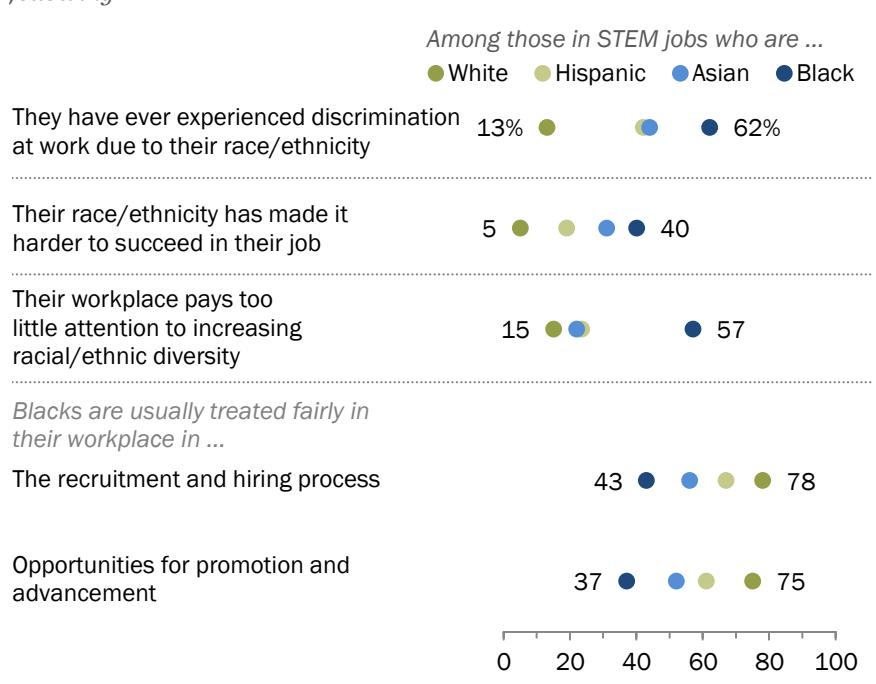

FOR RELEASE JANUARY 9, 2018

# Women and Men in STEM Often at Odds Over Workplace Equity

Perceived inequities are especially common among women in science, technology, engineering and math jobs who work mostly with men

BY Cary Funk and Kim Parker

FOR MEDIA OR OTHER INQUIRIES:

Cary Funk, Director, Science and Society Research Kim Parker, Director, Social Trends Research Tom Caiazza, Communications Manager

202.419.4372

www.pewresearch.org

RECOMMENDED CITATION

Pew Research Center, January 2018. “Women and Men in STEM Often at Odds Over Workplace Equity”

## About Pew Research Center

Pew Research Center is a nonpartisan fact tank that informs the public about the issues, attitudes and trends shaping America and the world. It does not take policy positions. The Center conducts public opinion polling, demographic research, content analysis and other data-driven social science research. It studies U.S. politics and policy; journalism and media; internet, science and technology; religion and public life; Hispanic trends; global attitudes and trends; and U.S. social and demographic trends. All of the Center’s reports are available at www.pewresearch.org. Pew Research Center is a subsidiary of The Pew Charitable Trusts, its primary funder.

© Pew Research Center 2018

# PEW RESEARCH CENTER

## Terminology

The data in this report come from two sources: 1) a Pew Research Center analysis of the U.S. Census Bureau’s 1990 and 2000 decennial censuses as well as aggregated 2014-2016 American Community Survey data and 2) a nationally representative survey of 4,914 U.S. adults, ages 18 and older, conducted July 11-Aug. 10, 2017. The survey, which was conducted online in English and Spanish through GfK’s Knowledge Panel, included an oversample of employed adults working in science, technology, engineering and math (STEM) jobs.

Analysis of the survey data compares those working in STEM jobs with those in non-STEM jobs based on self-identified occupation. STEM jobs include: computer and mathematical jobs, architecture and engineering, life sciences, physical sciences, healthcare practitioners and technicians, and teachers at the K-12 or postsecondary level with a specialty in teaching science, technology, engineering or math subjects.

A similar definition is used to identify the STEM workforce in the U.S. Census Bureau data based on the 2010 Standard Occupational Classification. However, no educators are included as having STEM jobs in that data because the dataset does not allow identification of educators with a subject matter expertise in STEM subjects.

References to the STEM workforce are based on those employed in a job classified as being in science, technology, engineering or math.

Some analysis of the U.S. Census Bureau data compares those with a college degree who majored in STEM and those who majored in other fields. A STEM major includes the following areas: computers, mathematics and statistics, biological, agricultural and environmental sciences, physical and earth sciences, engineering, architecture, health-related fields, such as nursing, and STEM education, like science or math teacher education. Some analysis of the survey data is based on those with a postgraduate degree in a STEM field, using the same definition as above.

References to whites, blacks and Asians include only those who are non-Hispanic and identify themselves as only one race. Hispanics are of any race.

Asians working in STEM jobs are based on those who self-identify as Asian or Asian American and work in occupations classified as STEM. There are too few Asians working in non-STEM jobs in the survey for separate analysis. Note that the survey was conducted in English and Spanish only; thus only Asians proficient in English/Spanish are likely to have completed the survey. For more on the characteristics of the Asian population in the U.S. see the Center’s fact sheets on Asian Americans.

References to college graduates or people with a college degree comprise those with a bachelor’s degree or more, unless otherwise noted. “Some college” includes those with an associate degree and those who attended college but did not obtain a degree. “High school or less” refers to those who have a high school diploma or its equivalent, such as a General Education Development (GED) certificate, or less education. References to those with advanced degrees and postgraduate degrees are used interchangeably; these terms refer to people who have a master’s degree or higher.

## PEW RESEARCH CENTER

## Table of Contents

About Pew Research Center 2   
Terminology 3   
Table of Contents 5   
Women and Men in STEM Often at Odds Over Workplace Equity 6   
1. Diversity in the STEM workforce varies widely across jobs 24   
2. Most Americans believe STEM jobs pay better, but few see them as offering more flexibility for   
family time 46   
3. Women in STEM see more gender disparities at work, especially those in computer jobs,   
majority-male workplaces 55   
4. Blacks in STEM jobs are especially concerned about diversity and discrimination in the   
workplace 71   
5. Most Americans evaluate STEM education as middling compared with other developed nations   
85   
6. Many Americans say they liked math and science in school, thought about a STEM career 91   
Acknowledgments 100   
Methodology 102   
Appendix: Detailed tables and charts 106   
Survey questionnaire and topline 124

### Full Page Description (Page 5)

**Source:** `assets/_page_5_Asset_0.jpg`

**Generated:** 2026-05-30 15:44:48

---

The image contains a bar chart with data visualizing the experiences of men and women in STEM fields regarding gender discrimination, the impact of gender on career success, and the prevalence of sexual harassment in their workplaces. The chart includes percentages for each category, such as "They have ever experienced gender discrimination at work" (19% for men in STEM, 50% for women in STEM), "Their gender has made it harder to succeed at work" (7% for men in STEM, 20% for women in STEM), and "Sexual harassment is a problem in their workplace" (28% for men in STEM, 36% for women in STEM). Additionally, the chart breaks down the experiences of women in STEM jobs by their educational background (postgraduate degree), job type (computer jobs), and workplace gender composition (mostly male workplaces).

## Women and Men in STEM Often at Odds Over Workplace Equity

Perceived inequities are especially common among women in science, technology, engineering and math jobs who work mostly with men

For women working in science, technology, engineering or math (STEM) jobs, the workplace is a different, sometimes more hostile environment than the one their male coworkers experience. Discrimination and sexual harassment are seen as more frequent, and gender is perceived as more of an impediment than an advantage to career success. Three groups of women in STEM jobs stand out as more likely to see workplace inequities: women employed in STEM settings where men outnumber women, women working in computer jobs (only some of whom work in the technology industry), and women in STEM who hold postgraduate degrees. Indeed, a majority of each of these groups of STEM women have experienced gender discrimination at work, according to a nationally representative Pew Research Center survey with an oversample of people working in STEM jobs.

These findings come amid heightened public debate about underrepresentation and treatment of women – as well as racial and ethnic minorities – in the fast-growing technology industry and decades of concern about how best to promote diversity and inclusion in the STEM workforce. Conducted in the summer of 2017, prior to the recent outcry about sexual harassment by men in

Most women in STEM jobs in majority-male workplaces, in computer jobs or with postgraduate degrees say they have experienced discrimination at work

% of those in science, technology, engineering and math jobs who say the following

## PEW RESEARCH CENTER

### Full Page Description (Page 6)

**Source:** `assets/_page_6_Asset_0.jpg`

**Generated:** 2026-05-30 15:40:20

---

The image contains a horizontal bar chart with a focus on job clusters within STEM fields. The chart compares the percentage of sales engineers, the average, and speech-language pathologists across various job clusters. The job clusters include "All STEM jobs," "Health-related jobs," "Life science jobs," "Math jobs," "Physical science jobs," "Computer jobs," and "Engineering jobs." The chart visually represents the percentage of sales engineers, the average percentage, and the percentage of speech-language pathologists for each job cluster. The percentages are annotated on the bars, and the chart provides a clear comparison of the distribution across different job categories.

positions of public prominence, the Center’s new survey findings also speak to the broader issues facing women in the workplace across occupations and industries.1

Compared with those in non-STEM jobs, women in STEM are more likely to say they have experienced discrimination in the workplace (50% vs. 41%). But in other respects, the challenges women in STEM face in the workplace echo those of all working women. Women in STEM and non-STEM jobs are equally likely to say they have experienced sexual harassment at work, and both groups of women are less inclined than men to think that women are “usually treated fairly” when it comes to promotions where they work.

Pew Research Center analysis of U.S. Census Bureau data since 1990 shows that while jobs in STEM have grown substantially, particularly in computer occupations, the share of women working in STEM jobs has remained at about half over time. But the share of women varies widely across the 74 standard occupations classified as STEM in this study – from under one-in-ten for sales engineers (7%) and mechanical engineers (8%) to 96% of speech language pathologists and 95% of dental hygienists. Women are a majority of those working in health-related occupations but just 14%, on average, of those

Share of women in each of the following job clusters

PEW RESEARCH CENTER

### Full Page Description (Page 7)

**Source:** `assets/_page_7_Asset_0.jpg`

**Generated:** 2026-05-30 15:32:03

---

The image is a horizontal bar chart with four categories: White, Black, Hispanic, and Asian. Each bar represents a percentage value: White at 13%, Black at 62%, Hispanic at 42%, and Asian at 44%. The chart visually compares the percentages across these demographic groups, highlighting the significant difference between the Black and White categories compared to Hispanic and Asian.

in engineering jobs. In computer occupations, a job cluster which includes computer scientists, systems analysts, software developers, information systems managers and programmers – the STEM job cluster that has seen the most growth in recent decades – women’s representation has actually decreased from 32% in 1990 to 25% today.

Blacks and Hispanics are underrepresented in STEM occupations relative to their share in the U.S. workforce. The share of blacks working in STEM jobs has gone from 7% in 1990 to 9% today (blacks make up 11% of the total U.S. workforce today). And that for Hispanics has gone up from 4% to 7%, while their share of the U.S. workforce has grown from 7% in 1990 to 16% today.

The survey finds a higher share of blacks in STEM jobs report experiencing any of eight types of racial/ethnic discrimination (62%) than do others in STEM positions (44% of Asians, 42% of

Hispanics and just 13% of whites in STEM jobs say this). They also tend to do so more than blacks in non-STEM jobs (50%), with many saying they have been treated as if they were not competent because of their race or ethnicity.2 Blacks in STEM jobs are particularly likely to say there is too little attention to racial and ethnic diversity where they work (57%). And, when it comes to the way opportunities for advancement and promotion are handled in their own workplace, 37% of blacks in STEM jobs believe that blacks are usually treated fairly, while a similar share (36%) says this sometimes occurs and 24% believe that blacks are usually treated unfairly where they work. Among Hispanics, those in STEM and non-STEM jobs are equally likely to say they have experienced racial/ethnic workplace discrimination.

Majority of blacks in STEM jobs have experienced discrimination at work

% of those in science, technology, engineering and math jobs who say they have experienced discrimination at work due to their race or ethnicity

PEW RESEARCH CENTER

These are some of the findings from a Pew Research Center survey with a nationally representative sample of 4,914 adults (including 2,344 STEM workers), ages 18 and older, conducted July 11-Aug.

### Full Page Description (Page 8)

**Source:** `assets/_page_8_Asset_0.jpg`

**Generated:** 2026-05-30 15:38:03

---

The image contains a bar chart with textual data. It compares the experiences of discrimination at work among men and women in STEM jobs and women in non-STEM jobs. The chart lists various types of discrimination, such as earning less, being treated as incompetent, and feeling isolated, along with the percentage of each group that experienced these issues. The percentages are represented by colored bars, with green for men in STEM jobs, blue for women in STEM jobs, and gray for women in non-STEM jobs. The chart highlights that women in STEM jobs experienced higher rates of discrimination compared to men in STEM jobs and women in non-STEM jobs.

10, 2017 and a Pew Research Center analysis of U.S. Census Bureau data. The survey, conducted online in English and in Spanish, included an oversample of employed adults working in science, technology, engineering and math fields. See Methodology for details.

Most women in STEM jobs who work in majority-male workplaces, in computer jobs or who have a postgraduate degree have experienced gender discrimination at work

On average, women working in STEM jobs are more likely than men to say they have experienced workplace discrimination due to their gender. Half (50%) of women in STEM jobs say they have experienced any of eight forms of discrimination in the workplace because of their gender – more than women in non-STEM jobs (41%) and far more than men in STEM occupations (19%). The most common forms of gender discrimination experienced by women in STEM jobs include earning less than a man doing the same job (29%), having someone treat them as if they were not competent (29%), experiencing repeated, small slights in their workplace (20%) and receiving less support from senior leaders than a man who was doing the same job (18%).

## Half of women in STEM jobs say they have been discriminated against at work

% of those in science, technology, engineering and math jobs who say they have ever experienced the following at work due to their gender

Note: Respondents who gave other responses or who did not give an answer are not shown. Source: Survey of U.S. adults conducted July 11-Aug. 10, 2017.   
“Women and Men in STEM Often at Odds Over Workplace Equity”

## PEW RESEARCH CENTER

### Full Page Description (Page 9)

**Source:** `assets/_page_9_Asset_0.jpg`

**Generated:** 2026-05-30 15:42:20

---

The image contains a bar chart comparing the experiences of women and men in STEM jobs across various workplace conditions and experiences. The chart includes data on gender-related discrimination, sexual harassment, gender impact on job success, the need to prove oneself, workplace attention to gender diversity, and perceptions of fairness in recruitment, hiring, and promotion. The percentages for women in STEM jobs with more women/even gender mix are shown in green, while those for men in STEM jobs are in blue. The chart highlights disparities in experiences and perceptions between women and men in STEM fields, with women reporting higher rates of gender-related discrimination and sexual harassment, and men feeling more pressure to prove themselves.

In workplaces where most employees are men, about half of women in STEM say their gender has been an impediment to success on the job

Pioneering work from business school professor Rosabeth Moss Kanter in the late 1970s drew attention to how the structure of organizations – particularly the balance of minority and majority groups – can influence experiences in the workplace.

The majority of women in STEM positions work in majority-female workplaces (55%) or work with an even mix of both genders (25%). But the 19% of women in STEM who work in settings with mostly men stand out from others. Fully 78% of these women say they have experienced gender discrimination in the workplace – compared with 44% of STEM women in other settings.3

About half (48%) of women in STEM jobs who work with mostly men say their gender has made it harder for them to succeed in their job,

Women in STEM working in majority-male workplaces perceive more gender inequities

% of those in science, technology, engineering and math jobs in each type of workplace who say the following

Note: Experience of gender-related discrimination based on combined responses to eight items. Respondents who gave other responses or who did not give an answer are not shown. Source: Survey of U.S. adults conducted July 11-Aug. 10, 2017.   
“Women and Men in STEM Often at Odds Over Workplace Equity”

PEW RESEARCH CENTER

compared with just 14% of other women in STEM.

One respondent explained it this way:

“People automatically assume I am the secretary, or in a less technical role because I am female. This makes it difficult for me to build a technical network to get my work done. People will call on my male co-workers, but not call on me.” - White woman, technical consultant, 36

Gender balance in the workplace also tends to matter for women in non-STEM positions but those in STEM stand out especially when it comes to experiences with workplace discrimination, the feeling that they need to prove themselves in order to be respected by coworkers, and their belief that, overall, their gender has made it harder for them to succeed at work. By contrast, for male STEM workers, the gender balance in their workplace is largely unrelated to views about gender equity.4

There are similar differences, though less pronounced, among women in STEM jobs by their level of education. Women with a postgraduate degree who work in STEM jobs are more likely than other women in STEM to have experienced gender discrimination at work (62%, compared with 41% of women with some college or less education). Roughly a third (35%) of women in STEM with a postgraduate degree believe their gender has made it harder to succeed on the job, compared with just 10% of women in STEM with some college or less education. And, women in STEM with more education are more skeptical that women where they work are usually treated fairly when it comes to opportunities for promotion (52% of those with a postgraduate degree say women are usually treated fairly vs. 76% of women with some college or less working in a STEM job).

Roughly three-quarters of women in computer jobs say they have experienced gender-related workplace discrimination

Some 74% of women in computer jobs, such as software development or data science, say they have experienced discrimination because of their gender, compared with 16% of men in these jobs.5 (This group includes some who work in the tech industry and some who work in other sectors.)6

Women in computer jobs are less likely than men in such jobs to believe that women are “usually” given a fair shake where they work when it comes to opportunities for promotion and advancement (43% of women in computer jobs say this usually occurs, compared with 77% of men).

Note: Experience of gender-related discrimination based on combined responses to eight items. Respondents who gave other responses or who did not give an answer are not shown. Source: Survey of U.S. adults conducted July 11-Aug. 10, 2017.   
“Women and Men in STEM Often at Odds Over Workplace Equity”

PEW RESEARCH CENTER

### Full Page Description (Page 12)

**Source:** `assets/_page_12_Asset_0.jpg`

**Generated:** 2026-05-30 15:46:24

---

The image contains a bar chart with two sets of data, comparing the experiences of men and women in STEM jobs and women in non-STEM jobs regarding sexual harassment. The chart is divided into two sections: one comparing the percentage of individuals who have experienced sexual harassment at work, and another comparing the percentage who believe sexual harassment is a problem in their workplace and industry. The data shows that women in STEM jobs experience sexual harassment at work more frequently than men in STEM jobs, and both groups report higher levels of belief that sexual harassment is a problem in their industry compared to their workplace. The percentages for women in non-STEM jobs are also provided for comparison.

About one-in-five women in STEM and non-STEM jobs say they have experienced sexual harassment at work

In the Pew Research Center survey – conducted before   
the string of prominent   
sexual harassment   
allegations and public   
discussion of these issues on social media outlets and   
elsewhere – some 22% of   
working women in the U.S. say they have experienced   
sexual harassment at work, compared with 7% of working men. The share of women   
who say they have   
experienced sexual   
harassment at work is the   
same among those in STEM and non-STEM jobs.7

More women than men say they have experienced sexual harassment at work

% of employed adults who say …

## Women working in STEM are

more likely than their male counterparts to regard sexual harassment as at least a small problem in their workplace (36% vs. 28%). As with experience with discrimination, women in STEM jobs who work in majority-male settings and women in computer jobs are particularly likely to say that sexual harassment is at least a small problem where they work. Nearly half (48%) of female STEM workers in majority-male workplaces say that sexual harassment is a problem where they work. About four-in-ten (42%) women in computer jobs consider workplace sexual harassment a problem where they work, compared with three-in-ten (30%) men in computer jobs.

Among those in non-STEM occupations, men and women are equally likely to consider sexual harassment a problem where they work.

About six-in-ten blacks working in STEM say they have experienced workplace discrimination because of their race

Concerns about the underrepresentation of blacks and other racial minorities – and particularly women of color – in the STEM workforce have been ongoing for at least four decades.8 The Pew Research Center survey finds that, today, black STEM workers are especially likely to say they have experienced discrimination at work because of their race or ethnicity; 62% of blacks in STEM say this, compared with 44% of Asians, 42% of Hispanics and just 13% of whites in STEM jobs.

Blacks in STEM jobs tend to report experiences of workplace discrimination due to race more than blacks in non-STEM jobs (62% vs. 50%).9 Hispanics in STEM and non-STEM jobs are equally likely to say they have 6 ethnicity (42% each).10 ethnicity (42% each).10

Most blacks in STEM have experienced discrimination; fewer blacks see fair treatment in hiring, promotions

% of those in science, technology, engineering and math jobs who say the following

> **AI Description:**
> **Source:** `assets/_page_13_Figure_0.jpg`
> 
> **Generated:** 2026-05-30 15:33:14
> 
> ---
> 
> The image contains a series of bar charts comparing the experiences of individuals in STEM jobs based on their race/ethnicity. The key information presented includes:
> 
> 1. The percentage of individuals who have experienced discrimination at work due to their race/ethnicity.
> 2. The percentage of individuals who believe their race/ethnicity has made it harder to succeed in their job.
> 3. The percentage of individuals who believe their workplace pays too little attention to increasing racial/ethnic diversity.
> 4. The percentage of individuals who believe Blacks are usually treated fairly in their workplace in the recruitment and hiring process.
> 5. The percentage of individuals who believe Blacks are usually treated fairly in their workplace in opportunities for promotion and advancement.
> 
> The main trends show that Black individuals are more likely to experience discrimination and believe their race/ethnicity makes it harder to succeed in their job compared to White, Hispanic, and Asian individuals. Additionally, there is a higher percentage of Black individuals who believe their workplace pays too little attention to increasing racial/ethnic diversity.

Note: Experience of racial/ethnic discrimination based on combined responses to eight items. Whites, blacks and Asians are non-Hispanic only; Hispanics are of any race. Respondents who gave other responses or who did not give an answer are not shown. Source: Survey of U.S. adults conducted July 11-Aug. 10, 2017. “Women and Men in STEM Often at Odds Over Workplace Equity” PEW RESEARCH CENTER

equally likely to say they have experienced workplace discrimination because of their race or

## PEW RESEARCH CENTER

And, blacks working in STEM jobs are less convinced than white STEM workers that black employees where they work are treated fairly when it comes to hiring and promotions. In all, 43% of blacks in STEM jobs believe that blacks where they work are usually treated fairly during recruitment; 37% say this is the case during promotion and advancement opportunities. By contrast most white STEM workers believe that blacks are usually treated fairly in these processes where they work (78% say this about hiring, 75% about advancement processes).

Other Pew Research Center analyses found that black Americans with at least some college experience are more likely to say they have experienced discrimination or been treated unfairly across a range of experiences because of their race or ethnicity, compared with those without any college experience. (There are not enough blacks in STEM jobs in this survey for analysis by levels of education.)

While the majority of STEM workers believe their race or ethnicity has made no difference in their ability to succeed in their job, blacks (40%) and Asians (31%) in STEM jobs, followed by Hispanics (19%), are more likely than white STEM workers (5%) to say it has been harder to find success in their job because of their race or ethnicity.

STEM workers who believe their race or ethnicity has made it harder to succeed provide a number of explanations, including concerns about the hiring process, promotions and pay equity, and stereotypical beliefs among their coworkers. Some respondents put it this way:

“People have preconceived ideas of what I am capable of doing.” - Black man, physical scientist, 39

“This ‘other-ness’ exists intentionally or unintentionally between those of a minority and those of a majority from lacking of common cultural background. Relationships at work appear polite on surface but reluctant tendency in willing to share limited opportunities the same way, which I felt in a previous job where whites and males were overwhelmingly a majority.” - Asian woman, engineer, 56

### Full Page Description (Page 15)

**Source:** `assets/_page_15_Asset_0.jpg`

**Generated:** 2026-05-30 15:30:59

---

The image contains a combination of pie charts and line graphs. The pie charts represent percentages for different categories: Health-Related (75%), Life Science (47%), Math (46%), Physical Science (39%), Computer (25%), and Engineering (14%). The line graphs show trends over time for the same categories: Health-Related (72% to 75%), Life Science (34% to 47%), Math (43% to 46%), Physical Science (22% to 39%), Computer (32% to 25%), and Engineering (12% to 14%). The data suggests that the percentage of interest in Health-Related fields has remained relatively stable, while there has been an increase in interest in Life Science and Math. Conversely, there has been a decline in interest in Computer and Engineering.

## The STEM workforce has grown, especially among computer occupations

Analysis of the U.S. Census Bureau’s American Community Survey shows that employment in STEM occupations has grown 79% since 1990 (from 9.7 million to 17.3 million) with the largest growth occurring in computer occupations (338% growth since 1990).

The share of women working in such jobs varies widely both within and across job types (or clusters). Women account for a majority of healthcare practitioners and technicians but are underrepresented in other jobs, particularly computer and engineering positions. While there has been significant progress for women in the life and physical sciences since 1990, the share of women has been roughly stable in other STEM occupational clusters and has gone down 7

The share of women in life and physical sciences has gone up but it has gone down for computer jobs since 1990

Share of women in each of the following science, technology, engineering and math occupations over time

## PEW RESEARCH CENTER

percentage points in computer occupations.11

Gains in women’s representation in STEM jobs have been concentrated among women holding advanced degrees, although women still tend to be underrepresented among such workers. Women are roughly four-in-ten (41%) of all STEM workers with a professional or doctoral degree such as an M.D., D.D.S., or Ph.D.

Black and Hispanic workers continue to be underrepresented in the STEM workforce. Blacks make up 11% of the U.S. workforce overall but represent 9% of STEM workers, while Hispanics comprise 16% of the U.S. workforce but only 7% of all STEM workers.

Asians are overrepresented in the STEM workforce, relative to their overall share of the workforce, especially among college-educated workers: 17% of college-educated STEM workers are Asian, while 10% of all workers with a college degree are Asian.

The representation of women, blacks and Hispanics in STEM has implications for the average earnings of workers in these groups. STEM workers earn more, on

## What’s a STEM job?

This analysis relies on a broad-based definition of the science, technology, engineering and math (STEM) workforce. STEM jobs are defined solely based on occupation and include: life sciences, physical and Earth sciences, engineering and architecture, computer and math occupations as well as health-related occupations including healthcare providers and technicians.

Educators specializing in STEM subjects could not be identified in the analysis of the American Community Survey, though they are included as holding STEM jobs in the analysis of the Pew Research Center survey.

While there is often considerable overlap across definitions, there is no commonly agreed definition of the STEM workforce. Thus, caution is warranted in any direct comparisons with other studies.

average, than workers in non-STEM jobs, even when controlling for educational attainment.

One potential barrier for those wishing to enter the STEM workforce is the generally higher level of educational attainment required for many such positions. Among college-educated workers, one-in-three (33%) majored in a STEM field. But only about half (52%) of those with college

training in a STEM field are currently employed in a STEM job.12 The rest are working in other fields, with many benefiting from the financial bump in earnings that comes with a STEM degree.

The reasons why half of college-educated workers with STEM-related training turn to jobs elsewhere are likely complicated. Among college-educated workers, those who majored in a health professions field are more likely than those who majored in other STEM fields to be working in a job directly related to their degree. About seven-in-ten (69%) women who majored in a health professions field (such as nursing or pharmacy) are working in a healthrelated occupation, as are 61% of men who majored in health professions.

But among those who majored in computers or computer science, women are less likely than men to be working in a computer occupation (38% vs 53%). Similarly, women who majored in engineering during their undergraduate studies are less likely than men to be working in engineering jobs (24% vs. 30%). Thus, in two occupational areas with particularly low shares of women, retention of those who meet a key bar

Fewer women than men who majored in computers work in computer jobs

Among college-educated workers, % employed in job related to bachelor’s degree field

Note: Based on employed adults ages 25 and older completing at least a bachelor’s degree. Life sciences degree includes those with a degree in an agricultural science major.   
Source: Pew Research Center analysis of 2014-2016 American Community Survey.   
“Women and Men in STEM Often at Odds Over Workplace Equity” PEW RESEARCH CENTER

of women, retention of those who meet a key barrier for job entry appears to be lower for women than for men.

### Full Page Description (Page 18)

**Source:** `assets/_page_18_Asset_0.jpg`

**Generated:** 2026-05-30 15:39:46

---

The image contains a horizontal bar chart with text labels and corresponding percentages. The chart compares various factors related to career satisfaction or job appeal, such as offering higher pay, attracting more qualified young people, and offering more advancement opportunities. The percentages indicate the proportion of respondents who associate each factor with a particular career. The chart highlights that offering higher pay is the most significant factor, with 71% of respondents associating it with a career. The least significant factor is having more flexibility to balance work and family needs, with only 18% of respondents associating it with a career.

Other notable findings include the following:

The public image of STEM jobs includes higher pay and an advantage in attracting young talent compared with other industry sectors

In some ways, the public has a very positive view of STEM jobs, as they compare with jobs in other sectors. About seven-in-ten Americans (71%) see jobs in STEM as offering better compensation than jobs in other industries. And, a majority of Americans (58%) consider STEM jobs to attract more of the brightest, most qualified young people.

The public is closely divided over whether jobs in STEM make a more meaningful contribution to society or do so to about the same extent as other jobs (45% to 48%). But only a minority think of STEM jobs as being more focused on helping others (28%) than jobs in other industries.

Most Americans see STEM jobs as offering higher pay, attracting top talent compared with other industries

% of U.S. adults who say that, compared with jobs in other industries, jobs in science, technology, engineering and math …

PEW RESEARCH CENTER

About one-in-five Americans (18%) say STEM jobs have more flexibility to balance work and family needs than other jobs in other sectors, while about half (52%) say the flexibility in this regard is about the same as it is in other sectors and 28% say there is less flexibility in STEM jobs than there is elsewhere.

### Full Page Description (Page 19)

**Source:** `assets/_page_19_Asset_0.jpg`

**Generated:** 2026-05-30 15:33:50

---

The image contains a bar chart comparing the values placed on certain characteristics by men and women in STEM jobs. The chart is divided into three sections: characteristics men and women value the same, characteristics men value more than women, and characteristics women value more than men. Each section includes bars representing the percentage of men and women who value each characteristic, with a "Men-women diff." column indicating the difference in percentages. The chart visually highlights the differences in priorities between men and women in STEM fields, with notable differences in valuing opportunities for promotion and having a high-paying job for men, and valuing respect and making a meaningful contribution for women.

Men and women working in STEM say flexibility to balance work and family needs is important to them

Men and women in STEM jobs – and indeed those in non-STEM jobs as well – say that having the flexibility to balance their work and family obligations is an important factor to them in choosing a job. But men and women in STEM tend to diverge when it comes to other job characteristics. A somewhat higher share of men than women say that having higher pay and opportunities for promotion is important to them in choosing a job. Women in STEM jobs are more inclined to consider a job that focuses on helping others (59%) as important to them compared with men in STEM jobs (31%).13

Men and women in STEM consider job flexibility important, women are more likely to want a job that helps others

% of those in science, technology, engineering and math jobs who say when choosing a job, each of the following is personally important to them

PEW RESEARCH CENTER

### Full Page Description (Page 20)

**Source:** `assets/_page_20_Asset_0.jpg`

**Generated:** 2026-05-30 15:45:52

---

The image contains a bar chart with two sets of data, each comparing the major reasons why more women and more blacks and Hispanics are not in STEM jobs. The chart is divided into two sections, with the left side addressing women and the right side addressing blacks and Hispanics. Each section lists reasons such as "Face discrimination in recruitment, hiring, promotion," "Not encouraged to pursue STEM from early age," and "Less likely to believe they can succeed in STEM," along with the percentage of people who cited each reason. The percentages range from 18% to 42%. The chart visually compares the reasons given by women and those given by blacks and Hispanics, highlighting the differences in perspectives on barriers to entering STEM fields.

## PEW RESEARCH CENTER

Americans see a range of explanations for the underrepresentation of women, blacks and Hispanics in STEM jobs

Many Americans attribute the limited diversity of the STEM workforce to a lack of encouragement for girls and blacks and Hispanics to pursue STEM from an early age; 39% of Americans consider this a major reason there are not more women in some STEM areas, and 41% say this is a major reason there are not more blacks and Hispanics in the STEM workforce.

In addition, 42% of Americans say limited access to quality education to prepare them for these fields is a major reason blacks and Hispanics are underrepresented in the STEM workforce; this view is held by a majority of those working in STEM who are black (73%) and about half of Hispanics (53%), Asians (52%) and whites (50%) in STEM jobs.

Perceived reasons more women, blacks and Hispanics are not working in STEM

% of U.S. adults who say each of the following is a major reason why there are not more women or blacks and Hispanics working in science, technology, engineering and math jobs in this country

## PEW RESEARCH CENTER

There are wide differences among STEM workers on the role of racial/ethnic discrimination in underrepresentation. Among blacks in STEM jobs, 72% say discrimination in recruitment, hiring and promotions is a major reason behind the underrepresentation of blacks and Hispanics in these jobs. By contrast, 27% of whites and 28% of Asians say this, while 43% of Hispanics think discrimination is a major reason behind the underrepresentation.

Similarly, there are wide differences between men and women working in STEM jobs on the role of gender discrimination. About half of women in STEM jobs (48%) say gender discrimination in recruitment, hiring and promotions is a major reason there are not more women in STEM jobs, compared with 29% of men in STEM jobs.

When women and those in racial and ethnic minority groups working in STEM were asked to say, in their own words, the best ways to attract more people like themselves to STEM, many emphasized the importance of quality schooling and an early start to encouraging people into the field with repeated support over time. A few examples:

“You must introduce those fields early in the elementary school years. Then continue to build on that by establishing STEM clubs and activities. Provide information to parents about local/community STEM events for continued interests. Most of all, make sure that any STEM student has the rigorous preparation that will be needed to get them accepted into college and able to handle the nature of the college level classes.” - Black woman, nurse, 49

“K-8 teaching needs to be designed to make these subjects more interesting and accessible to girls. Teachers need to be explicit about the need for more women in STEM jobs, and help girls feel that they have a reason to pursue these fields in spite of the somewhat intimidating gender breakdown of higher level classes.” - White woman, math teacher, 42

“Providing opportunities such as putting upgraded computers and/or science labs in inner-city schools, libraries and community centers. Black men currently in the STEM industries must be visible to the younger generation in order to show the value of those skills and the career implications.” - Black man, systems engineer, 30

### Full Page Description (Page 22)

**Source:** `assets/_page_22_Asset_0.jpg`

**Generated:** 2026-05-30 15:34:21

---

The image is a horizontal bar chart with three categories: "K-12 public schools," "Undergraduate," and "Graduate." Each category is divided into three segments representing different percentages: dark blue, light blue, and green. The percentages for each segment are as follows:

- K-12 public schools: 25%, 43%, 30%
- Undergraduate: 35%, 46%, 17%
- Graduate: 38%, 43%, 17%

The chart visually represents the distribution of percentages across these categories, with the dark blue segment being the smallest, the light blue segment being the largest, and the green segment being the smallest in the "Undergraduate" and "Graduate" categories.

### Full Page Description (Page 22)

**Source:** `assets/_page_22_Asset_1.jpg`

**Generated:** 2026-05-30 15:34:31

---

The image contains a horizontal bar chart with three categories: K-12 public schools, Undergraduate, and Graduate. Each category is divided into three segments represented by different colors: blue, light blue, and green. The percentages for each segment are as follows:

- K-12 public schools: 13% in blue, 36% in light blue, and 51% in green.
- Undergraduate: 52% in blue, 35% in light blue, and 13% in green.
- Graduate: 62% in blue, 28% in light blue, and 9% in green.

The chart visually represents the distribution of percentages across the three categories, with the blue segment consistently having the highest percentage in each category.

## PEW RESEARCH CENTER

Most Americans rate K-12 STEM education as average or worse compared with other developed nations, so, too, do those with an advanced degree in STEM

Americans are generally critical of the quality of STEM education in the nation’s K-12 schools. A quarter of Americans (25%) consider K-12 STEM education in the U.S. to be at least above average compared with other developed countries, while 30% say the U.S. is below average in this regard, and 43% say it is average. Parents with children in public schools give similar ratings of the nation’s K-12 STEM education.

Americans tend to see higher education in STEM more favorably, by comparison, but there too, fewer than half consider undergraduate education (35%) or graduate education (38%) in STEM as at least above average compared with other nations.

People who, themselves, have a postgraduate degree in a STEM field give positive ratings to the quality of postsecondary education in the U.S., but just 13% of this group considers K-12 STEM education to be at least above average.

Nonetheless, as Americans look back on their own K-12 experiences, three-quarters (75%) report that they generally liked science classes. Science labs and hands-on learning experiences stand out as a key appeal among those who liked science classes. Some 46% of those who disliked science classes in their youth say a reason for their view is that these classes were hard, while another 36% of this group found it hard to see how science classes would be useful to them in the future.

Most Americans see K-12 STEM education as average or below that of other developed nations

% of U.S. adults or science, technology, engineering and math postgraduate degree holders who rate the U.S. as when it comes to STEM education at each level

Best in the world/above avg. Average Below average U.S. adults

Note: Respondents who did not give an answer are not shown. Source: Survey of U.S. adults conducted July 11-Aug. 10, 2017. “Women and Men in STEM Often at Odds Over Workplace Equity” PEW RESEARCH CENTER

## 1. Diversity in the STEM workforce varies widely across jobs

As the U.S. has transformed rapidly to an information-based economy, employment in science, technology, engineering and math occupations has grown – outpacing overall job growth. Since 1990, STEM employment has grown 79% (9.7 million to 17.3 million) and computer jobs have seen a whopping 338% increase over the same period.

Using a broad definition of the STEM workforce, women make up half (50%) of all U.S. workers in STEM occupations, though their presence varies widely across occupational clusters and educational levels. Women account for the majority of healthcare practitioners and technicians but are underrepresented in several other STEM occupational clusters, particularly in computer jobs and engineering.

While there has been significant progress for women in the life and physical sciences since 1990, the share of women has been roughly stable in other STEM occupational clusters and has actually gone down 7 percentage points in the area with the largest job growth over this period: computer occupations, a job cluster that includes computer scientists, systems analysts, software developers, information systems managers and programmers.

Gains in women’s representation in STEM jobs have been concentrated among women holding advanced degrees, although women still tend to be underrepresented among such workers.

Black and Hispanic workers continue to be underrepresented in the STEM workforce. Blacks make up 11% of the U.S. workforce overall but represent 9% of STEM workers, while Hispanics comprise 16% of the U.S. workforce but only 7% of all STEM workers. And among employed adults with a bachelor’s degree or higher, blacks are just 7% and Hispanics are 6% of the STEM workforce.

Asians are overrepresented in the STEM workforce, relative to their overall share of the workforce, especially among college-educated workers: 17% of college-educated STEM workers are Asian, compared with 10% of all workers with a college degree.

The representation of women, blacks and Hispanics holds pocketbook implications for workers. STEM jobs have relatively high earnings compared with many non-STEM jobs, and the earnings gap persists even after controlling for educational attainment. Among workers with similar education, STEM workers earn significantly more, on average, than non-STEM workers.

In spite of the earnings advantage that STEM workers have over non-STEM workers, the gender wage gap is wider in STEM occupations than in non-STEM jobs. This is partially because women

## PEW RESEARCH CENTER

are clustered in lower-paying STEM jobs in the health care industry and underrepresented in the more lucrative fields of engineering and computer science. The pattern is similar for blacks and Hispanics, who also tend to be concentrated in less lucrative STEM jobs, widening the measured earnings disparity.

One potential barrier for those wishing to enter the STEM workforce is the generally higher level of educational attainment required for such positions. Among college-educated workers, one-inthree (33%) majored in a STEM field. But only about half (52%) of those with college training in a STEM field are currently employed in a STEM job.

The reasons about half of college-educated workers with STEM-related training turn to jobs elsewhere are likely complicated. Some may have found their skills and training to be applicable to and rewarded in a non-STEM occupation (such as banking or finance). But for others, there may be barriers to entry into STEM jobs in addition to obtaining a bachelor’s degree in a STEM field.

Even so, among college-educated workers, women who majored in computer science or related computer fields are less likely than men trained in those fields to be working in computer jobs. Similarly, women who majored in engineering are less likely than men to be working in engineering jobs. Thus, in two occupational clusters with particularly low shares of women, retention of those who appear to meet a key requirement for job entry appears to be lower for women than for men.

## Defining STEM workers with a wide-angle lens

This analysis uses a broad definition of the STEM workforce and is based solely on occupation, as classified in the U.S. Census Bureau’s American Community Survey. As defined, here, the STEM workforce includes 74 occupations including computer and mathematical occupations, engineers and architects, physical scientists, life scientists, and health-related jobs such as healthcare practitioners and technicians (but not health care support workers such as nursing aides and medical assistants). As such, it includes workers with associate degrees and other credentials as well as those with bachelor’s and advanced degrees.

There is no standard definition of STEM workers. Other analyses of STEM workers include somewhat different occupations (see, for example, the Economics and Statistics Administration of the U.S. Department of Commerce). The National Center for Science and Engineering Statistics focuses on those with a college degree or more education in their surveys; UNESCO studies on global diversity issues in STEM focus even more narrowly on researchers with advanced degrees working in STEM.

Including healthcare practitioners and technicians as STEM occupations has broad ramifications for the key findings. There are 9.0 million health-related jobs, comprising 52% of the STEM workforce. Healthcare practitioners and technicians are largely women, thus their inclusion boosts the overall representation of women in the STEM workforce. These health-related occupations also have somewhat larger shares of black workers and smaller shares of Asian workers compared with other STEM occupations, which affects the racial and ethnic composition of the overall STEM workforce. Among college-educated workers who majored in a STEM field during their undergraduate education, those who majored in health professions are significantly more likely to work in a STEM occupation, so their inclusion increases figures on the retention of STEM-trained workers.

Social scientists are not included as a STEM occupation in this study, although other studies sometimes classify social sciences as a STEM job. As a practical matter, doing so makes little difference in the overall portrait of the STEM workforce because less than 1% of the workforce (about 280,000 workers in 2016) are classified as social scientists based on the Standard Occupational Classification system. See the sidebar on page 33 for more on the characteristics of social scientists in the workforce.

The Census data used do not identify the subject matter expertise for postsecondary teachers, therefore, these workers are not included in the STEM workforce. As a practical matter, this omission does not appear to change the overall portrait of STEM workers, as others estimate that only 1% of those who majored in a STEM field are in academic jobs in colleges and universities. See the Appendix for characteristics of those in postsecondary teaching occupations.

### Full Page Description (Page 26)

**Source:** `assets/_page_26_Asset_0.jpg`

**Generated:** 2026-05-30 15:41:25

---

The image contains a bar chart with data related to occupations and their associated percentages. The chart is divided into two main sections: "All occupations" and "STEM occupations." The "All occupations" section shows a 34% value, while the "STEM occupations" section shows a 79% value. Below these, there are further breakdowns for specific types of STEM occupations, including "Computer" with 338%, "Health-related" with 92%, "Life science" with 70%, "Engineering" with 16%, "Math" with -24%, and "Physical science" with -46%. The chart uses blue bars to represent the percentages, with positive values in dark blue and negative values in light blue.

## The STEM workforce is growing, particularly for computerjobs

As of 2016, 17.3 million workers ages 25 and older were employed in STEM occupations, comprising 13% of the 131.3 million total U.S. workforce. About half of STEM workers (52%, 9.0 million) are employed as health care practitioners and technicians, a group that includes nurses, physicians and surgeons, as well as medical and health services managers. The next largest STEM occupational clusters are computer workers (25%, 4.4 million employed) and engineers and architects (16%, 2.7 million employed).

Growth of employment in STEM has markedly outpaced the growth of overall employment. Since 1990 STEM employment has grown 79% (from 9.7 million to 17.3 million), whereas overall employment grew only 34%. Some STEM occupations have grown more than others. Driven by the proliferation of information technology industries and the growth of the health care sector, computer workers have more than quadrupled since 1990 (a 338% increase) and healthcare practitioners and technicians have nearly doubled (a 92% increase). Employment of engineers and architects has grown only 16%, while employment of physical scientists has fallen by 46% from the 1990 level (from 1.1 million in 1990 to 0.6 million today) and math jobs have fallen by 24%.14

## Over 17 million workers are employed in STEM occupations

Note: Figures do not add to totals indicated due to rounding. STEM stands for science, technology, engineering and math. Source: Pew Research Center analysis of 2014-2016 American Community Survey (IPUMS). “Women and Men in STEM Often at Odds Over Workplace Equity” PEW RESEARCH CENTER

## Employment in computer jobs has more than quadrupled since 1990

% change in employment, 1990 to 2014-16

Note: Based on employed adults ages 25 and older. Engineering includes architects. STEM stands for science, technology,   
engineering and math.   
Source: Pew Research Center analysis of 1990 decennial census and 2014-2016 American Community Survey (IPUMS).   
“Women and Men in STEM Often at Odds Over Workplace Equity” PEW RESEARCH CENTER

### Full Page Description (Page 27)

**Source:** `assets/_page_27_Asset_0.jpg`

**Generated:** 2026-05-30 15:29:41

---

The image is a bar chart with a legend indicating different levels of education (high school or less, some college, bachelor's degree, and postgraduate degree) and employment status (STEM employed and non-STEM employed). The chart shows the percentage of individuals in each education level who are employed in STEM and non-STEM fields. Notable trends include a higher percentage of individuals with a bachelor's degree or postgraduate degree being employed in STEM fields compared to those with a high school education or some college. The percentages for non-STEM employment are higher for those with a high school education or some college.

STEM workers tend to have relatively high levels of education compared with other workers. Overall, they are about twice as likely as those in non-STEM occupations to have earned at least a bachelor’s degree (65% vs. 32%). Roughly three-in-ten STEM workers (29%) have earned a master’s, doctorate or professional degree, far exceeding the share of non-STEM workers with advanced degrees (12%). Some 36% of STEM workers have a bachelor’s degree (but no postgraduate degree) compared with 21% of non-STEM workers. Among STEM workers, life scientists are the most highly educated on average; 54% of these workers have an advanced degree.

About three-in-ten STEM workers report having completed an associate degree (15%) or some college with no degree (14%). These workers are more prevalent among healthcare practitioners and technicians, computer workers and engineers. See the sidebar on page 99 for survey findings on “middleskills” workers with an associate degree or some college education.15

Educational attainment of employed adults ages 25 and older (%)

Note: Figures may not add to 100% due to rounding. Some college includes those with an associate degree and those who attended college but did not obtain a degree. Postgrad degree includes those who have completed a master’s, professional or doctoral degree. STEM stands for science, technology, engineering and math.   
Source: Pew Research Center analysis of 2014-2016 American Community Survey (IPUMS). “Women and Men in STEM Often at Odds Over Workplace Equity”

PEW RESEARCH CENTER

### Full Page Description (Page 28)

**Source:** `assets/_page_28_Asset_0.jpg`

**Generated:** 2026-05-30 15:35:26

---

The image contains a bar chart with a legend indicating different employment sectors: Private, for-profit; Not-for-profit; Government; and Self-employed/other. The chart is divided into three main sections: "All employed," "STEM jobs," and "Non-STEM jobs," showing the percentage distribution of employment across these sectors. Below this, there is a secondary chart titled "Among those who work in ___ jobs," which further breaks down employment percentages for specific job categories such as Engineering, Computer, Physical science, Health-related, Math, and Life science. The percentages for each category are displayed in a bar format, with the legend colors corresponding to the employment sectors. The chart provides a clear visual representation of employment distribution across various sectors and job categories.

Most STEM workers work for a private, for-profit employer. The share – 66% – is substantively identical to the share of all employed adults.16 Engineers and architects (82%) and computer workers (77%) are among the most likely to work for a private employer. Fewer healthcare practitioners and technicians work in the private, for-profit sector (58%); almost a quarter of these workers (23%) work for a not-for-profit employer.

STEM workers are much less likely to be self-employed than other workers – 6% of STEM workers are self-employed compared with 11% of non-STEM workers. (Workers in social science occupations and postsecondary education jobs,

Like other workers, two-thirds of STEM workers are in a for-profit business

% of employed adults ages 25 and older by each type of workplace

PEW RESEARCH CENTER

by contrast, are more likely to work in government and non-profit organizations.)17 See Appendix for details.

### Full Page Description (Page 29)

**Source:** `assets/_page_29_Asset_2.jpg`

**Generated:** 2026-05-30 15:46:31

---

The image is a line graph with a shaded area below the line, representing data over time. The x-axis represents years, ranging from '90 to '16, while the y-axis represents a numerical value, with the highest value being 39. The graph shows a gradual increase in the value from 22 in '90 to 39 in '16. The title of the graph is "Physical science," indicating that the data likely represents trends in physical science education or research over the specified period.

### Full Page Description (Page 29)

**Source:** `assets/_page_29_Asset_3.jpg`

**Generated:** 2026-05-30 15:45:59

---

The image is a line graph with the title "Computer". The x-axis represents years, ranging from '90 to '16, and the y-axis represents a numerical value, with the highest point labeled as 32 and the lowest as 25. The line graph shows a general downward trend over the years, with a slight increase around the year '00. The graph is shaded in blue, and the word "Computer" is written below the graph.

### Full Page Description (Page 29)

**Source:** `assets/_page_29_Asset_0.jpg`

**Generated:** 2026-05-30 15:44:28

---

The image contains a line graph with two separate data series, one for "Health-related" and one for "Math". The x-axis represents years from '90 to '16, while the y-axis represents percentages. The "Health-related" series shows a steady increase from 72% in '90 to 75% in '16. The "Math" series shows a slight increase from 43% in '90 to 46% in '16. The graph uses a blue line with data points and shaded areas to represent the data.

### Full Page Description (Page 29)

**Source:** `assets/_page_29_Asset_4.jpg`

**Generated:** 2026-05-30 15:44:01

---

The image is a simple line graph with the title "Engineering" at the center. The x-axis represents years from '90 to '16, and the y-axis is not labeled, but the graph shows a horizontal line connecting the years 12 and 14. The graph indicates a steady value or performance level in the field of engineering over the years shown.

### Full Page Description (Page 29)

**Source:** `assets/_page_29_Asset_1.jpg`

**Generated:** 2026-05-30 15:45:14

---

The image is a line graph with the title "Life science" at the bottom. The x-axis represents years, ranging from '90 to '16, while the y-axis represents a numerical value. The graph shows a steady increase in the value from 34 in '90 to 47 in '16. The data points are marked with circles, and the line connecting them indicates a consistent upward trend over the years.

## Diversity of the STEM workforce ranges widely within and across job clusters

Although women have made gains in representation in the STEM workforce over the past roughly 25 years, particularly in life and physical science jobs, they remain strongly underrepresented in some STEM job clusters, notably computer jobs and engineering.

Racial and ethnic diversity in STEM is also varied. Black and Hispanic workers remain underrepresented overall; these groups are also underrepresented among those in STEM jobs with professional or doctoral degrees. 18

Asians are overrepresented across all STEM occupational clusters and have an especially large presence in the college-educated STEM workforce, particularly in computer occupations, relative to their share among employed college graduates overall.

## Women overrepresented in healthcare professions, underrepresented in engineering and computer science

Women comprise 47% of all employed adults today, up modestly from 45% in 1990, and they make up half (50%) of all employed adults in STEM jobs in the U.S. The share of women in STEM overall is driven in large part by women’s overrepresentation in healthrelated jobs, the largest STEM occupational cluster. Three-quarters (75%) of healthcare practitioners and technicians are women.

Women’s representation in computer jobs has declined since 1990

Share of employed in each occupational group who are women (%)

## PEW RESEARCH CENTER

### Full Page Description (Page 30)

**Source:** `assets/_page_30_Asset_0.jpg`

**Generated:** 2026-05-30 15:43:45

---

The image is a bar chart comparing the educational attainment levels of individuals employed in STEM jobs to the overall employment population. The chart categorizes educational levels into five groups: "High school or less," "Some college," "Bachelor's degree," "Master's degree," and "Professional/doctoral degree." It shows percentages for each category among those employed in STEM jobs and the overall employed population. The chart highlights that individuals with a "Some college" education are most represented in STEM jobs (59%) compared to the overall employed population (50%). The "High school or less" category has the highest percentage among STEM jobs (55%) but is lower than the overall employed population (41%).

## PEW RESEARCH CENTER

Women’s representation in STEM occupations varies substantially by occupational subgroup. Engineering occupations have the lowest share of women at 14%. Computer occupations follow, with women comprising a quarter of workers (25%) in these fields. Women are underrepresented among physical scientists (39%), but their representation among life scientists (47%) and math workers (46%) roughly equals women’s overall share in the workforce (47%).

Since 1990 women have made large gains in some STEM occupations, but in others growth has been far slower or has even reversed. In fact, the share of women has decreased in one of the highest-paying and fastest-growing STEM clusters – computer occupations. In 2016, 25% of workers in these occupations were women, down from 32% in 1990. At the same time, growth in women’s representation in engineering has been incremental at best, increasing only slightly from 12% in 1990 and 2000 to 14% today. Women’s shares among life and physical scientists, however, climbed markedly over this period (13 and 17 percentage points, respectively).

Women’s representation among the collegeeducated STEM workforce depends, in part, on women completing college training in STEM fields. Among college-educated workers, the share of women earning a STEM degree varies widely and generally corresponds with the share of women in these occupational clusters. Among all collegeeducated workers who majored in a health professions field, 81% are female. But just 16% of college-educated workers who majored in engineering are women.

Within occupational subgroups, there is often broad variation among occupations in their share of women. The report’s Appendix presents the share of women and total number of workers in specific STEM occupations. Mechanical engineering and electrical engineering have some of the lowest shares of women of any engineering occupation, or any STEM occupation (8% and 9%, respectively). By comparison,

Women’s representation in STEM jobs varies by education

% of employed adults ages 25 and older who are women by highest level of education

## PEW RESEARCH CENTER

### Full Page Description (Page 31)

**Source:** `assets/_page_31_Asset_4.jpg`

**Generated:** 2026-05-30 15:35:58

---

The image is a line graph with a time series from '90 to '16. The x-axis represents years, and the y-axis represents a value, with the highest point being 41. The graph shows a general upward trend, starting at 27 in '90 and increasing to 41 in '16. The data points are marked with circles, and the line connecting them indicates the progression over time.

### Full Page Description (Page 31)

**Source:** `assets/_page_31_Asset_0.jpg`

**Generated:** 2026-05-30 15:36:04

---

The image is a line chart with two data points. The x-axis represents years, marked at '90, '00, '10, and '16, while the y-axis shows percentages. The chart indicates a slight increase from 52% in 1990 to 55% in 2016. The data points are connected by a line, and the chart is labeled with percentages at the endpoints.

### Full Page Description (Page 31)

**Source:** `assets/_page_31_Asset_1.jpg`

**Generated:** 2026-05-30 15:37:07

---

The image contains a line graph with a horizontal axis labeled from '90 to '16 and a vertical axis with values 56 and 59. The graph shows a relatively flat line with a slight upward trend from the year '90 to '16, indicating a gradual increase in the measured quantity over the years. The graph is simple and lacks additional context or labels beyond the axis values and time periods.

### Full Page Description (Page 31)

**Source:** `assets/_page_31_Asset_2.jpg`

**Generated:** 2026-05-30 15:38:42

---

The image contains a line graph with two data points. The x-axis represents years, marked at '90, '00, '10, and '16. The y-axis is not labeled, but the data points are labeled as 43 and 47. The line connecting the points is relatively flat, indicating a slight increase from 43 to 47 over the years.

### Full Page Description (Page 31)

**Source:** `assets/_page_31_Asset_3.jpg`

**Generated:** 2026-05-30 15:37:30

---

The image is a line graph with a horizontal axis labeled from '90 to '16 and a vertical axis with values 37 and 47. The graph shows a steady increase in the data points from 37 to 47 over the time period from '90 to '16. The line connecting the points is smooth, indicating a consistent growth trend. The graph includes labeled data points at the beginning ('90) and end ('16) of the time series, with the values 37 and 47 respectively.

environmental engineering, architecture and industrial engineering have somewhat larger shares of women (29%, 26% and 21%, respectively).

Similarly, levels of women’s representation vary enormously among health-related occupations. About nine-in-ten nurses (89%) and virtually all dental hygienists (95%) are women.19 Women’s representation among the ranks of physicians and surgeons is up from 20% in 1990 and 26% in 2000, coinciding with women’s increases in medical school enrollment and graduation over this period. But, just 36% of physicians and surgeons today and 30% of dentists are women despite notable gains over time.

For their part, men who work in STEM occupations are concentrated in computer occupations followed by engineering and health-related occupations. Among male STEM workers, 38% work in computer jobs and 27% each work in engineering/architecture and health-related jobs. Women in STEM jobs are concentrated in health-related occupations; 77% of female STEM workers are employed as healthcare practitioners and technicians.

On average, women’s representation in STEM jobs is lower among those employed with advanced degrees. For example, among all STEM workers holding a professional or doctoral degree, about four-in-ten are women (41%), compared with about six-in-ten (59%) STEM workers holding an

## Biggest gains for women in STEM jobs among those with advanced degrees

% of those employed in science, technology, engineering and math jobs who are women by highest level of education

High school or less

## PEW RESEARCH CENTER

associate degree or with some college experience but no degree.

This pattern generally holds within occupational clusters as well. Among healthcare practitioners and technicians with a master's degree or less, roughly eight-in-ten are women. By contrast, among healthrelated workers with a professional or doctoral degree, 45% are women. See Appendix for details by occupation.

At the same time, the biggest growth in women’s representation since 1990 has been among STEM workers with advanced degrees, doctoral degrees in particular; this aligns with women’s broader gains in educational attainment during this period. The share of women among doctoral or professional degree holders in the overall STEM workforce has climbed from 27% in 1990 to 41% today. The share of women among STEM workers with a bachelor’s degree (but no advanced degree) has ticked up from 43% in 1990 to 47%, on par with the overall share of women in the workforce (47%).

## Social sciences are a popular college major but comprise a small occupational group

About 5.8 million (or 12%) of today’s college-educated workers majored in the social sciences. Psychology majors comprise the single largest group of those who majored in a social science field (35%). The next most popular social science majors are political science (19%) and economics (16%).

Very few workers (3%) who majored in the social sciences are employed as social scientists (based on the Standard Occupational Classification system). The majority work in the cluster of social services, legal and education (30%) or in management, business and finance occupations (26%). Another 12% of social science majors are employed in a STEM occupation.

Those in social science occupations are far more likely to be college-educated than workers in other occupational clusters: 97% of those in social science jobs have completed at least a bachelor’s degree, and 82% have finished an advanced degree (a third hold a doctoral degree). Of the roughly 280,000 workers employed as social scientists in 2016, 80% were white, 8% were Hispanic, 5% were black and 5% were Asian. Women currently make up 63% of social scientists, up from 54% in 2000 and 50% in 1990. Among collegeeducated workers who majored in the social sciences, 54% are women.

### Full Page Description (Page 33)

**Source:** `assets/_page_33_Asset_0.jpg`

**Generated:** 2026-05-30 15:40:52

---

The image contains a bar chart with a legend indicating the percentage of employed individuals in each occupational group who are White, Asian, Black, or Hispanic. The chart is divided into two main sections: "All employed" and "STEM jobs," with further breakdowns for specific STEM job categories such as Engineering, Health-related, Physical science, Math, Life science, and Computer. The percentages are visually represented by different colored bars, with White being the largest group in most categories. The chart highlights the diversity within STEM fields, showing that while White individuals dominate in most categories, there is a notable presence of other ethnic groups, especially in Computer-related jobs.

Hispanics and blacks are underrepresented, Asians and whites are overrepresented in most STEM occupations

The majority of STEM workers in the U.S. are white (69%), followed by Asians (13%), blacks (9%) and Hispanics (7%). Compared with their shares in the overall workforce whites and Asians are overrepresented; blacks and Hispanics are underrepresented in the STEM workforce as a whole.

Over the past 25 years the STEM workforce has become more racially and ethnically diverse, echoing increasing diversity in the workforce during that period. In 1990, 83% of STEM workers were white, 6% were Asian, 7% were black and 4% were Hispanic.

Within occupational clusters, the share of workers who are black or Hispanic varies widely (see Appendix).20 Health technician and nursing jobs have some of the largest shares of black or Hispanic workers. For example, 37% of licensed practical and licensed vocational nurses are either black or Hispanic, as are a quarter or more of health support technicians (27%), medical records and health information technicians (25%), and

Blacks and Hispanics underrepresented across most STEM job clusters

clinical laboratory technologists and technicians (25%). Among registered nurses, 17% are black or Hispanic. By comparison, other health-related jobs have smaller shares of workers who are black or Hispanic including physicians and surgeons (11%), pharmacists (10%), dentists (9%), and physical therapists (9%). Just 5% of optometrists, veterinarians and chiropractors are black or Hispanic.

In the physical sciences, blacks and Hispanics together comprise 22% of chemical technicians but only 14% of chemists and materials scientists, 10% of atmospheric and space scientists, 7% of

## PEW RESEARCH CENTER

environmental scientists and 6% of astronomers and physicists. Among mathematical workers, 19% of operations research analysts are black or Hispanic, compared with just 5% of actuaries.

Whites are overrepresented among STEM workers relative to their share in the total workforce. Asians (including both men and women) are also overrepresented among STEM workers compared with their share in the total workforce, particularly among STEM workers with a postgraduate degree. For details, see Appendix.

Asians are overrepresented across all STEM occupational groups with higher than average shares among computer workers and life scientists, accounting for 19% of workers in both of these fields, which is much higher than their share in the workforce overall (6%).

The share of Asians in STEM jobs varies substantially within occupational groups, however. For example, in engineering jobs the share of Asians ranges from 30% among computer hardware engineers to 2% among surveying and mapping technicians. Among healthcare practitioners and technicians, about one-in-five physicians and surgeons (21%) are Asian. But Asians comprise a far smaller share of veterinarians (3%) and emergency medical technicians and paramedics (2%).

About one-in-five (19%) STEM workers in the U.S. are foreign born, broadly similar to the share in the overall workforce (18%). The vast majority of the Asian STEM workforce is foreign born (82%) as is the Asian workforce overall in the U.S. (81%). Black STEM workers, however, are more likely to be foreign born than black workers overall (22% vs. 14%). Hispanics working in STEM jobs are far less likely than those in the workforce overall to be foreign born (32% of Hispanic STEM workers are foreign born, compared with 54% of all employed Hispanics ages 25 and older).

### Full Page Description (Page 35)

**Source:** `assets/_page_35_Asset_0.jpg`

**Generated:** 2026-05-30 15:45:26

---

The image contains a line graph comparing the average salaries of STEM and non-STEM jobs over time. The x-axis represents years from 1990 to 2016, while the y-axis represents the average salaries in dollars. The graph shows a steady increase in the average salary for STEM jobs from $63,126 in 1990 to $71,000 in 2016. In contrast, the average salary for non-STEM jobs remains relatively stable, starting at $44,870 in 1990 and ending at $43,000 in 2016. The graph highlights the growing disparity in average salaries between STEM and non-STEM jobs over the period.

## Earnings of STEM workers outpace those in other kinds of jobs

The typical STEM worker earns significantly more, on average, than the typical worker in a non-STEM occupation, and the earnings gap has

been widening since 1990. The wage gap between STEM and non-STEM workers persists even when controlling for educational attainment.

Among full-time, year-round workers ages 25 and older, median earnings for STEM occupations were \$71,000 in 2016.21 Comparable earnings for non-STEM workers were \$43,000. Thus, STEM workers typically earn about two-thirds more than those in non-STEM jobs.22

After adjusting for inflation, the typical earnings of STEM workers have increased since 1990, while earnings among non-STEM workers have been relatively flat.23

Earnings vary significantly among STEM workers. Computer workers, mathematical workers and engineers/architects have median earnings between \$81,100 and \$83,000. In

The typical STEM worker now earns twothirds more than non-STEM workers

Median annual earnings of full-time, year-round workers ages 25 and older, in 2016 dollars

Note: Based on adults ages 25 and older employed full-time yearround with positive earnings. STEM stands for science, technology, engineering and math.   
Source: Pew Research Center analysis of 1990 and 2000 decennial censuses and 2014-2016 American Community Survey (IPUMS). “Women and Men in STEM Often at Odds Over Workplace Equity” PEW RESEARCH CENTER

contrast, full-time, year-round healthcare practitioners and technicians have the lowest median earnings at \$61,000.

### Full Page Description (Page 36)

**Source:** `assets/_page_36_Asset_0.jpg`

**Generated:** 2026-05-30 15:39:11

---

The image is a bar chart comparing the average annual earnings among those who work in STEM jobs versus non-STEM jobs across different educational levels. The chart includes categories for high school or less, some college, bachelor's degree, master's degree, and professional or doctoral degree. The x-axis represents the educational level, and the y-axis represents the average annual earnings in dollars. The chart uses blue bars for STEM jobs and green bars for non-STEM jobs. Notable trends include higher earnings for STEM jobs across all educational levels, with the largest difference observed for those with a professional or doctoral degree.

Even among workers with similar levels of education, STEM workers earn significantly more than

non-STEM workers. For example, among those with some college education (including those with an associate but not a bachelor’s degree), the typical full-time, year-round STEM worker earns \$54,745. A similar non-STEM worker earns \$40,505, 26% less.

Women in STEM occupations tend to be paid less than men working in STEM. Median earnings for full-time, year-round women working in a STEM job were \$60,828 in 2016 – 72% as much as the median earnings of men working in STEM occupations (\$84,000). The earnings gap between women and men is larger in the STEM workforce than it is among non-STEM occupations. Among non-STEM workers, women’s median earnings are 79% of men’s earnings.

In spite of the larger gender pay disparity among STEM workers, women working in STEM tend to be paid significantly more than women working in non-STEM occupations overall. The median earnings for women working full-time, year-round in non-STEM occupations are only \$38,480.

## STEM workers tend to earn more than similarly educated non-STEM workers

Median annual earnings of full-time, year-round workers ages 25 and older with positive earnings

Note: Figures based on 2016 dollars. Some college includes those with an associate degree and those who attended college but did not obtain a degree. Professional degree includes those with an M.D., D.D.S., D.V.M., LL.B or J.D. Doctoral degree includes those with a Ph.D. or Ed.D. STEM stands for science, technology,   
engineering and math.   
Source: Pew Research Center analysis of 2014-2016 American Community Survey (IPUMS).   
“Women and Men in STEM Often at Odds Over Workplace Equity”

## PEW RESEARCH CENTER

### Full Page Description (Page 37)

**Source:** `assets/_page_37_Asset_0.jpg`

**Generated:** 2026-05-30 15:32:53

---

The image contains a bar chart with textual data. It presents employment statistics for different job categories. The chart includes two main sections: "All employed" and "Among those who work in ___ jobs." The "All employed" section shows that 80% of all employed individuals are in STEM jobs, while 79% are in non-STEM jobs. The second section lists various job categories under "STEM jobs," such as Life science, Computer, Math, Engineering, Physical science, and Health-related, with corresponding percentages indicating the proportion of employed individuals in each category. The Life science category has the highest percentage at 94%, followed by Computer at 87%, and Health-related at 74%.

### Full Page Description (Page 37)

**Source:** `assets/_page_37_Asset_1.jpg`

**Generated:** 2026-05-30 15:32:14

---

The image contains a horizontal bar chart with educational attainment levels on the y-axis and corresponding percentages on the x-axis. The categories include "High school or less," "Some college," "Bachelor's degree," "Master's degree," and "Professional/doctoral degree." The chart visually represents the percentage of individuals in each educational attainment category. The main trend is that the percentage increases with higher levels of education, with "Some college" having the highest percentage at 81, followed by "Master's degree" at 79, "Bachelor's degree" at 78, "Professional/doctoral degree" at 73, and "High school or less" at 66.

The 72% gender earnings gap overall partly reflects that men and women in the STEM workforce tend to work in different occupational subgroups. Compared with women, a higher share of men in STEM jobs are in higher-paying computer or engineering/architecture jobs. Women are more likely than men to be in lower-paying healthcare practitioner and technician positions.24

Among full-time, year-round workers, the gender earnings gap varies across specific STEM occupational subgroups. For example, among computer workers, the typical woman earns 87% as much as the typical man. Among engineers and architects the gender earnings gap is 83%. However, the gender earnings gap among healthcare practitioners and technicians is 74%.25

The overall gender earnings gap in the STEM workforce has not changed over the past 25 years. In 1990 the median earnings of women in STEM was 72% of the median earnings of men in STEM.

The gender pay gap is widest for STEM workers with professional or doctoral degrees (women’s median annual pay is 73% of men’s) and those with high school or less education (66%).

The gender earnings gap varies across STEM occupations and education

Median annual earnings of women as a percent of men’s earnings

Note: Based on adults ages 25 and older employed full-time, yearround with positive earnings. Some college includes those with an associate degree and those who attended college but did not obtain a degree. Professional degree includes those with an M.D., D.D.S., D.V.M., LL.B. or J.D. Doctoral degree includes those with a Ph.D. or Ed.D. Engineering includes architects. STEM stands for science, technology, engineering and math.   
Source: Pew Research Center analysis of 2014-2016 American Community Survey (IPUMS).   
“Women and Men in STEM Often at Odds Over Workplace Equity”

## PEW RESEARCH CENTER

### Full Page Description (Page 38)

**Source:** `assets/_page_38_Asset_0.jpg`

**Generated:** 2026-05-30 15:37:41

---

The image is a bar chart comparing the percentage of individuals in STEM jobs versus non-STEM jobs for three racial/ethnic groups: Asian, Black, and Hispanic. The chart uses two colors to represent the two job categories: blue for STEM jobs and green for non-STEM jobs. The percentages for each group are as follows: Asian (125% STEM, 90% non-STEM), Black (81% STEM, 73% non-STEM), and Hispanic (85% STEM, 67% non-STEM). The title of the chart indicates it is focused on the representation of these groups in STEM and non-STEM jobs.

Racial earnings gaps are substantial but narrow among similarly educated and trained STEM workers

The median earnings of blacks (\$58,000) and Hispanics (\$60,758) working in STEM occupations are less than those of whites (\$71,897) and Asians (\$90,000) in the STEM workforce. The black to white earnings gap among STEM workers, while substantial, is smaller than the racial earnings gap among the non-STEM workforce. The typical black STEM worker earns 81% as much as the typical white STEM worker; blacks in non-STEM occupations earn 73% as much as their white counterparts.26

Similarly, the earnings disparity between Hispanic and white STEM workers (85%) is narrower than among non-STEM workers (67%).

In the STEM workforce, the typical Asian is paid substantially more than their white counterparts (125%) although Asians working in non-STEM occupations tend be paid less

Racial earnings gaps narrower in the STEM workforce than non-STEM workforce

Median annual earnings of Asian, black and Hispanic workers as a percent of white’s

PEW RESEARCH CENTER

than whites (90%). As shown later in this chapter, this pay advantage narrows considerably once STEM-training is taken into account.

Across all of these racial and ethnic groups, women earn less than their male counterparts (see Appendix).

### Full Page Description (Page 39)

**Source:** `assets/_page_39_Asset_1.jpg`

**Generated:** 2026-05-30 15:42:35

---

The image contains a bar chart with three categories: Asian, Black, and Hispanic. Each bar represents a percentage value: Asian at 110%, Black at 87%, and Hispanic at 92%. The chart visually compares the percentages of these three groups, with the Asian category having the highest percentage and the Black category having the lowest.

### Full Page Description (Page 39)

**Source:** `assets/_page_39_Asset_0.jpg`

**Generated:** 2026-05-30 15:42:44

---

The image contains a horizontal bar chart with data related to STEM job preferences across different racial and ethnic groups. The chart includes the following categories and percentages:

- STEM jobs: 74%
- White: 72%
- Asian: 83%
- Black: 69%
- Hispanic: 72%

The chart visually represents the percentage of individuals from each group who prefer STEM jobs. The Asian group has the highest preference at 83%, while the Black group has the lowest at 69%. The White and Hispanic groups both have a preference of 72%.

Among college-educated workers in STEM occupations, Asians are the most likely to have a STEM bachelor’s degree (83% do).27 Smaller shares of college-educated Hispanics (72%), whites (72%) or blacks (69%) in STEM occupations majored in a STEM field.

STEM training narrows the earnings gap for blacks and Hispanics working in STEM occupations. Among college-educated workers who majored in and are in the STEM workforce, blacks earn 87% of whites and Hispanics earn 92% of whites. Collegeeducated Asians in STEM occupations who have been trained in STEM earn about 110% of similarly educated whites in STEM. These gaps are narrower than the simple earnings gaps presented earlier without regard to the education or training of the STEM workers.

Roughly three-in-four college-educated STEM workers have a STEM degree

% of those employed in science, technology, engineering and math jobs with a STEM college degree by race/ethnicity

Note: Based on adults ages 25 and older employed full-time yearround with positive earnings completing a bachelor’s degree in a STEM major field of study. Whites and blacks and Asians include only non-Hispanics. Hispanics are of any race. Source: Pew Research Center analysis of 2014-2016 American Community Survey (IPUMS).

PEW RESEARCH CENTER

### Full Page Description (Page 40)

**Source:** `assets/_page_40_Asset_0.jpg`

**Generated:** 2026-05-30 15:43:33

---

The image is a pie chart that visually represents the distribution of employment categories. The chart is divided into four segments, each labeled with a category and its corresponding percentage of the total. The largest segment, in blue, is labeled "STEM" and accounts for 52% of the total. The second largest segment, in light green, is labeled "Other non-STEM job" and represents 20%. The third segment, in darker green, is labeled "Management, business, finance" and makes up 17% of the total. The smallest segment, in light yellow, is labeled "Social services, legal, education" and represents 11% of the total. The chart effectively illustrates the proportion of employment in different sectors.

## Value of STEM training among college-educated workers

Among workers ages 25 and older with at least a bachelor’s degree, one-in-three (33%) has an undergraduate degree in a STEM major field of study.28 The largest STEM-educated group is those who majored in engineering at 4.7 million workers. Some 3.9 million collegeeducated workers have health professions degrees, while 3.1 million have degrees in life or biological sciences. Fewer majored in computer science or related fields (1.8 million) or physical or earth sciences (1.7 million).

Not all of these STEM-trained workers are employed in a STEM occupation, however. In fact, only about half of them are (52%). The rest are working in other fields with many still benefitting from the financial bump that comes with a STEM degree.29

52% of STEM-trained college graduates are employed in the STEM workforce

Among workers who majored in science, technology, engineering or math, % currently employed in each type of job

PEW RESEARCH CENTER

### Full Page Description (Page 41)

**Source:** `assets/_page_41_Asset_0.jpg`

**Generated:** 2026-05-30 15:36:16

---

The image is a bar chart with a title "Among those with a..." and two categories represented by different colors: dark blue for STEM college degree holders and light green for non-STEM college degree holders. The chart compares average earnings for three groups: "All employed," "STEM jobs," and "Non-STEM jobs." The data shows that STEM college degree holders earn more than non-STEM college degree holders in all three categories. For instance, the average earnings for all employed STEM college degree holders are $81,011, while for non-STEM college degree holders, it is $60,828.

Retention rates vary among the STEM college majors. Workers who majored in a health professions field (for example, nursing or pharmacy) are the most likely to work in STEM jobs (70% do). In contrast, workers with degrees in mathematics and statistics are the least likely (31%) to be employed in a STEM occupation.

## Across occupational

categories – STEM and non-STEM alike – STEM-trained workers earn more, on average, than those with a degree in a non-STEM field of study. Among college-

## STEM college majors tend to earn more than non-STEM college majors

Median annual earnings of full-time, year-round workers ages 25 and older with at least a bachelor’s degree

PEW RESEARCH CENTER

educated workers employed full-time and year-round, the median earnings for those who have a STEM college degree are \$81,011, compared with \$60,828 for other college degrees.

The earnings advantage for STEM training is apparent across all STEM job clusters, except for those in life science jobs.

The earnings advantage for those who majored in a STEM field extends to workers outside of STEM occupations. Among all non-STEM workers, those who have a STEM college degree earn, on average, about \$71,000; workers with a non-STEM degree working outside of STEM earn roughly \$11,000 less annually. The reasons behind this pay advantage are not wholly clear; in addition to the knowledge base and skills learned in a STEM degree, some have argued that the persistence and aptitudes needed to complete a STEM degree may be valued by employers outside the STEM workforce.

Among college graduates trained in STEM but employed in a non-STEM occupation, the most prevalent occupation is the management, business and finance cluster (17% of those with STEM training are employed in these fields). These jobs are particularly attractive to college graduates

## PEW RESEARCH CENTER

with engineering majors. Roughly a quarter (24%) of those who majored in engineering are in a management, business and finance occupation.

One factor that may be attracting STEM college majors to work outside of the STEM workforce is the high earnings potential of jobs in management, business and finance occupations. STEMtrained workers in computer occupations or working as engineers and architects are among the nation’s highest paid workers. The typical earnings are about \$96,000. But the median earnings of a STEM-educated college graduate working in management, business and finance occupations are on par with that, about \$97,000.30

On the flip side, roughly a quarter of college-educated workers in STEM jobs (26%) do not have a degree in a STEM field. Among college-educated engineers and architects, only 15% do not have a bachelor’s degree in STEM. Conversely, 52% of college-educated math workers do not have a college degree in a STEM field.31

### Full Page Description (Page 43)

**Source:** `assets/_page_43_Asset_0.jpg`

**Generated:** 2026-05-30 15:40:38

---

The image is a bar chart that displays the distribution of job placements for individuals with various degrees, categorized by gender and field of study. The chart includes six different degrees: Health professions, Computer, Engineering, Math, Life sciences, and Physical sciences. It shows the percentage of individuals who are employed in their field of degree, in other STEM fields, and in other non-STEM fields. The chart is color-coded to distinguish between job placements in management/business/finance, social services/legal/education, and other non-STEM fields. The data is presented for both men and women in each degree category.

## Gender differences in college-level STEM training and retention in STEM occupations

Overall, among adults who majored in STEM, women are more likely than men to work in a STEM occupation (56% vs. 49%).32 This difference is driven mainly by college graduates with a health professions degree, most of whom are women. About seven-in-ten (69%) women who majored in a health professions field are working in a health-related occupation, as are 61% of men who majored in a health professions field. (Of those who majored in a life sciences field, 30% of men and 33% of women work in a healthrelated occupation.)

Among college-educated workers with training in other STEM fields, however, men are often more likely than women to be working in jobs directly related to their major field of study. For example, 38% of women and

Women with college degrees in computers and engineering are less likely than men to be working in those jobs

Among those who received a college degree in each of the following science, technology, engineering or math fields, % who are currently employed in …

Note: Based on employed adults ages 25 and older completing a bachelor’s degree in a STEM major field of study. Life sciences degree includes those with a degree in an agricultural science major. Figures may not add to 100% due to rounding. Source: Pew Research Center analysis of 2014-2016 American Community Survey (IPUMS). “Women and Men in STEM Often at Odds Over Workplace Equity”

PEW RESEARCH CENTER

53% of men who majored in computers or computer science are employed in a computer occupation. Women with a college degree in engineering are less likely than men who majored in these fields to be working in an engineering job (24% vs. 30%). The differential retention rates of women in computer and engineering occupations is in keeping with other studies showing a “leaky pipeline” for women in STEM. See Appendix for details.

## 2. Most Americans believe STEM jobs pay better, but few see them as offering more flexibility for family time

Americans have mixed views of how careers in science, technology, engineering and math compare to jobs in other industries. About half or more of the general public – whether they are employed in STEM or non-STEM jobs – believe that STEM jobs pay better, attract more of the brightest young people and are more well-respected. But roughly half of Americans say these jobs are difficult to get into, while only 18% believe careers in STEM have more flexibility for balancing work and family than jobs in other industries.

That flexibility is an important factor in choosing a job for both men and women in STEM, as well as those working in other areas. For the most part, men and women in STEM look for similar job qualities; one notable exception is that 59% of women tend to value jobs that help others, compared with 31% of men.

Interviews with people working in STEM fields highlight the sometimes subtle ways that women feel they are treated differently at work.33 The Pew Research Center survey finds overall, men and women in STEM see behaviors that help or hurt them to get ahead in the workplace somewhat differently. Men in STEM jobs see more advantage in working harder than others, being assertive, and being vocal about their accomplishments at work. Among women, those who work in majority-male settings are more likely than other women in STEM occupations to think these behaviors help them get ahead in their job. And, women in majority-male work settings are particularly likely to say they need to prove themselves at least some of the time at work in order to be respected by their coworkers.

## Majorities of Americans see jobs in STEM as better compensated or better at attracting young talent compared with other industry sectors

About seven-in-ten Americans (71%) believe that jobs in STEM have higher salaries than those in other fields. More broadly, though, Americans have mixed views of how careers in STEM stand up against other sectors. Some 58% of U.S. adults say that jobs in STEM attract more of “the brightest and most qualified young people.” And half of Americans (50%) say that careers in STEM “offer more opportunities for advancement,” a similar share (49%) believe that STEM jobs are more difficult to get into.

### Full Page Description (Page 46)

**Source:** `assets/_page_46_Asset_0.jpg`

**Generated:** 2026-05-30 15:39:32

---

The image is a bar chart comparing perceptions of STEM jobs versus non-STEM jobs among U.S. adults. It presents data on various attributes of these jobs, such as offering higher pay, attracting the brightest and most qualified young people, being more well-respected, offering more advancement opportunities, being more difficult to get into, making a more meaningful contribution to society, being more focused on helping others, and having more flexibility for work/family balance. The chart shows that STEM jobs are generally perceived more positively across all attributes, with percentages ranging from 22% to 74% for STEM jobs and 17% to 71% for non-STEM jobs. The U.S. adult percentages are also provided for comparison.

While 45% of respondents say that STEM positions offer an opportunity to “make a more meaningful contribution to society,” 28% say that STEM jobs are “more focused on helping others” than jobs in other industries. And, 18% say that STEM jobs offer more flexibility than non-STEM jobs to balance work and family needs. Some 52% of U.S. adults consider jobs in STEM to have roughly the same amount of flexibility as other jobs and 28% say STEM jobs have less flexibility to balance work and family needs than those in other industries.

Perceptions of STEM jobs are generally similar among U.S. adults working in STEM positions and those in other kinds of jobs. And, men and women working in STEM jobs tend to hold similar

## Most Americans believe STEM employment offers better pay than other industries

% of U.S. adults who say that, compared with jobs in other industries, jobs in science, technology, engineering and math ...

PEW RESEARCH CENTER

perceptions of how such positions compare with other industries. Among the differences, men are more inclined than women to see jobs in STEM as having comparatively more flexibility to balance work and family needs (28% vs. 17%). See Appendix for details.

### Full Page Description (Page 47)

**Source:** `assets/_page_47_Asset_0.jpg`

**Generated:** 2026-05-30 15:32:40

---

The image is a horizontal bar chart comparing the percentages of men and women in STEM jobs who feel certain ways about their jobs, alongside the percentages of all employed individuals who feel the same way. The chart includes the following categories:

1. Having flexibility to balance work/family
2. Having opportunities for promotion/advancement
3. Having a high-paying job
4. Being in a workplace welcoming for people like them
5. Having a job that others respect and value
6. Making a meaningful contribution to society
7. Having a job focused on helping others

The chart shows that women in STEM jobs are more likely to feel they have flexibility to balance work and family (76%) compared to men (71%) and all employed individuals (68%). Women in STEM jobs also feel more supported in their work environment and more respected in their jobs compared to men in STEM jobs and all employed individuals.

Most men and women in STEM jobs say flexibility to balance work and family is important to them in choosing a job

About seven-in-ten (68%) employed U.S. adults say that having the flexibility to balance their work and family obligations is an important factor in choosing a job. Indeed, some 38% ranked it as the most important, more than any other characteristic considered in the survey.

In all, 53% of employed adults say “having opportunities for promotion or advancement” is important to them, followed by “having a high-paying job” and “being in a workplace that is welcoming for people like me” (46% each).

Men (71%) and women (76%) in STEM careers largely agree that being able to balance work and family is important to them in choosing a job. However, their views are somewhat different on other priorities. For instance, 57% of male STEM workers say

Men and women in STEM tend to look for similar job qualities, but more women value jobs that help others

% of those in science, technology, engineering and math jobs who say each of the following is important to them personally when choosing a job

PEW RESEARCH CENTER

that having opportunities for promotion is important compared with 46% of female STEM workers. And, while around six-in-ten men (59%) say that having a high-paying job is important, about half (48%) of women say the same.

### Full Page Description (Page 48)

**Source:** `assets/_page_48_Asset_0.jpg`

**Generated:** 2026-05-30 15:37:23

---

The image is a bar chart comparing the perceived impact of various workplace behaviors on career success for men and women in STEM jobs. The chart is divided into two sections, one for men and one for women, with each section showing the percentage of respondents who believe each behavior "Helps," "Makes little difference," or "Hurts" their career success. The behaviors include working harder than others, having a workplace mentor, being assertive, being vocal about their work/accomplishments, speaking out about workplace problems, participating in informal activities with coworkers, and talking about their personal life at work. The data shows that for most behaviors, men and women have similar perceptions of their impact on career success, with some slight differences in percentages.

## PEW RESEARCH CENTER

The largest gap between men and women in STEM jobs emerges when they are asked about choosing a career that focuses on helping others: some 59% of female STEM workers say this is important to them, compared with 31 % of men.34

Women in STEM jobs share a priority on job flexibility to meet work and family needs with women employed in other sectors. See Appendix for details.

## Women and men in STEM have somewhat different assessments of whether hard work and assertiveness at work help them get ahead

Most people working in STEM jobs say working harder than others (67%), having a workplace mentor (66%) and being assertive (61%) help them get ahead at work.

Men who work in STEM jobs are modestly more likely than women in such jobs to see working harder than others (71% vs. 63%), being assertive at work (66% vs. 57%) or being vocal about their accomplishments as something that helps them get ahead (43% vs. 37%).

Most STEM workers say participating in social activities outside of work or talking about their personal lives with coworkers makes little difference to their chances of getting ahead. But, men in such jobs are somewhat more inclined than women to think socializing with coworkers helps their

Women and men in STEM jobs see the behaviors that help them get ahead somewhat differently

% of those in science, technology, engineering and math jobs who say each of the following helps, hurts or makes little difference to their chances of getting ahead in their job

## PEW RESEARCH CENTER

prospects (33% vs. 25%). And, about a third (32%) of women in STEM jobs say talking about their personal life at work hurts their efforts to get ahead, compared with one-in-four (25%) men in STEM jobs who say the same.

Among those in non-STEM jobs, women and men tend to be in agreement about which behaviors are most likely to improve their chances of advancing in their positions – including the belief that they need to work harder than others (64% vs. 65%) and be assertive (both 59%). For details, see Appendix.

There are also differences by race and ethnicity on some of these measures. Notably, 47% of blacks employed in STEM say that talking about their personal life at work hurts   
their chances for   
advancement; smaller shares of white (27%) and Asian   
(24%) STEM workers say the same.

Asians in STEM jobs are particularly likely to see being vocal about their work and accomplishments as an advantage (57%), compared with white (35%) and Hispanic (42%) STEM workers.

## About half of blacks in STEM say talking about their personal lives hurts their chances for getting ahead

% of those in science, technology, engineering and math jobs who say each of the following helps, hurts or makes little difference to their chances of getting ahead in their job

Being vocal about their work and accomplishments

Talking about their personal life at work

Note: Whites, blacks and Asians are non-Hispanic only; Hispanics are of any race. Respondents who did not give an answer are not shown. Source: Survey of U.S. adults conducted July 11-Aug. 10, 2017. “Women and Men in STEM Often at Odds Over Workplace Equity” PEW RESEARCH CENTER

## A sizable share of all of these

racial and ethnic groups of STEM workers agree that working harder than others and having a workplace mentor generally helps their chances of getting ahead.

Men and women in STEM jobs are about equally likely to report feeling valued by their supervisor and coworkers

Some qualitative reports of women and racial/ethnic minorities working in STEM positions have suggested that implicit bias in the workplace can leave such workers feeling less appreciated at work.35 The Pew Research Center survey finds, however, few differences by gender or race/ethnicity in how much workers report feeling valued by their supervisor or their coworkers.

Overall, most workers – both STEM and non-STEM – say their contributions are valued by their co-workers and by their supervisor at least some. Men and women in STEM jobs are about equally likely to say this.

When asked, “How often, if ever, do you feel the need to prove yourself at work in order to be respected by your coworkers?,” 17% of employed U.S. adults say “all the time,” another one-third (33%) say some of the time and four-in-ten (40%) say either never or not too often.

How much do workers feel their contributions are valued at work …

## … or feel the need to prove themselves in order to be respected at work?

Women and men in STEM jobs are about equally likely to feel the need to prove themselves “all the time” (15% and 16%, respectively) in order to be respected by their coworkers. But, as will be discussed later in this chapter, the sense of having to prove oneself varies among women working in STEM jobs depending on the gender mix where they work.

### Full Page Description (Page 51)

**Source:** `assets/_page_51_Asset_0.jpg`

**Generated:** 2026-05-30 15:35:06

---

The image is a chart that presents data on various behaviors and attitudes among women in STEM jobs in workplaces with different gender compositions. The chart compares the percentages of women in STEM jobs who exhibit certain behaviors or attitudes in workplaces with more women, an even mix of genders, and more men. The behaviors and attitudes include working harder than others, having a workplace mentor, being assertive, being vocal about their work/accomplishments, speaking out about workplace problems, participating in informal activities with coworkers, and talking about their personal life at work. The data is presented as percentages for each behavior or attitude, with separate bars for each gender composition category. The chart also includes a comparison with the overall percentage of men in STEM jobs for each behavior or attitude.

## STEM women in majority-male workplaces see more value in being vocal about their accomplishments to get ahead in theirjob

Beliefs about the kinds of behaviors that help employees succeed at work tend to vary among female STEM workers, depending on the gender context where they work. There are some modest differences in beliefs about these issues among women in STEM jobs depending on their level of education as well.

The roughly one-in-five women (19%) in STEM jobs who work in majority-male workplaces stand out in how they assess the behaviors needed to get ahead. These women are particularly likely to say that being assertive (70%) helps their chances of getting ahead. Smaller shares of women working with mostly women or in evenly mixed gender settings think this helps their chances of advancement.

Similarly, 54% of women in STEM jobs with majoritymale workplaces say that being vocal about their work and accomplishments helps their chances of advancing, compared with 31% of women working in majorityfemale settings.

## Women in STEM jobs in majority-male workplaces see the behaviors needed to get ahead differently

% of those in science, technology, engineering and math jobs in each type of workplace who say each of the following helps their chances of getting ahead in their job

## PEW RESEARCH CENTER

Women in majority-male workplaces are especially likely to feel the need to prove themselves in order to earn coworkers’ respect

Although, overall, women in STEM jobs are just as likely as men in such jobs to say they feel highly valued by supervisors and coworkers, women working in majority-male environments also say they have to work harder to earn that appreciation compared with women in either majorityfemale or evenly-mixed gender settings.

When asked, “How often, if ever, do you feel the need to prove yourself at work in order to be respected by your coworkers?,” 79% of female STEM workers in majoritymale workplaces say “all the time” or “some of the time,” compared with 51% of women working in STEM jobs in mostly female workplaces and 54% among those in evenly mixed gender workplaces. There are only modest differences among men in STEM jobs by the gender makeup where they work; overall 56% of male STEM workers say they feel the need

Women in STEM in majority-male workplaces feel the need to prove themselves more often to earn respect

% of those in science, technology, engineering and math jobs in each type of workplace who say the following

Note: Respondents who gave other responses or who did not give an answer are not shown. Self-employed respondents were not asked these questions; their share is not shown. Source: Survey of U.S. adults conducted July 11-Aug. 10, 2017.   
“Women and Men in STEM Often at Odds Over Workplace Equity”   
PEW RESEARCH CENTER

to prove themselves at least some of the time to earn the respect of their coworkers. For details, see Appendix.

Women in STEM jobs see the behaviors that help them advance somewhat differently depending on their level of education. Those with advanced degrees are more likely than women in STEM with some college or less education to say that having a workplace mentor to advise them helps. And some 44% of women in STEM with a postgraduate degree say that being vocal about their accomplishments at work helps them get ahead; in contrast 28% of women in STEM jobs with some college or less education say the same.

While this survey finds that men and women in computer jobs have had different experiences with gender discrimination (as shown in Chapter 3), there are no statistically significant differences between men and women working in computer occupations in their

Women in STEM with advanced degrees are especially likely to say that having a mentor, being vocal about one’s accomplishments fosters success at work

% of those in STEM jobs in each group who say each of the following helps their chances of getting ahead in their job

Note: Respondents who gave other responses or who did not give an answer are not shown. Source: Survey of U.S. adults conducted July 11-Aug. 10, 2017. “Women and Men in STEM Often at Odds Over Workplace Equity” PEW RESEARCH CENTER

perceptions of behaviors that help or hurt their chances of success or in their sense that they need to prove themselves in order to be respected by their coworkers.

## 3. Women in STEM see more gender disparities at work, especially those in computer jobs, majority-male workplaces

There are wide gaps between men and women working in science, technology, engineering and math jobs when it comes to perceptions of fair treatment for women at work and experiences of workplace discrimination.

Women in STEM jobs are much more likely than men in such jobs to say they have experienced discrimination at work because of their gender and to consider discrimination a major reason that more women are not working in STEM. While the majority of STEM workers say their gender has made no particular difference in their success, women in STEM jobs are more inclined than men to say their gender has made it harder for them to succeed at work. Those that feel this way raise a number of concerns including pay gaps and unequal treatment from their coworkers stemming from gender stereotypes.

Experiences with workplace discrimination and concerns about gender inequities are more pronounced among women working in computer positions; among those working in workplaces where men outnumber women; and among women with advanced degrees, more of whom presumably work in higher level, professional positions compared with other women in STEM jobs.

Although a higher share of women in STEM jobs say they have experienced at least one form of discrimination at work because of their gender, similar shares of women in STEM jobs and non-STEM jobs say they have personally experienced sexual harassment. Women in STEM jobs also tend to share similar perspectives with working women in non-STEM jobs when it comes to the value of gender diversity and the amount of attention paid to gender diversity at work.

### Full Page Description (Page 55)

**Source:** `assets/_page_55_Asset_0.jpg`

**Generated:** 2026-05-30 15:42:29

---

The image contains a bar chart with a title "NET IMPORTANT: 78%". The chart is divided into three categories: "Extremely/very" (dark blue), "Somewhat" (light blue), and "Not too/not at all" (light green). The percentages for each category are as follows: "Extremely/very" is 52%, "Somewhat" is 26%, and "Not too/not at all" is 21%. The chart visually represents the distribution of responses to a question about the importance of a topic, with the majority of respondents indicating that the topic is "Extremely/very" important.

Most Americans value gender diversity at work; more than four-in-ten say diversity contributes to organizational success

Americans are largely supportive of gender diversity in the workplace, with about half of U.S. adults (52%) characterizing it is as “extremely” or “very” important and 26% saying it is “somewhat” important.

When asked to cite reasons for increasing gender diversity in the workplace, 46% of Americans say an important consideration is that gender diversity provides other perspectives that contribute to the overall success of companies and organizations. A similar share, 43%, cite giving people an equal opportunity to succeed as an important reason, while one-third (33%) say gender diversity makes good business sense because it increases the supply of potential workers.

Most Americans say gender diversity at work is important

% of U.S. adults who say it is important to have gender diversity in workplaces today

Note: Respondents who did not give an answer are not shown. In bottom chart, respondents who gave other responses and those who did not give an answer are now shown. Source: Survey of U.S. adults conducted July 11-Aug. 10, 2017. “Women and Men in STEM Often at Odds Over Workplace Equity”

## PEW RESEARCH CENTER

Americans’ level of support for gender diversity depends, in part, on their own gender. Whereas more than half of women in STEM jobs and non-STEM jobs alike believe that such diversity is highly important (61% and 56%, respectively), fewer men in STEM and non-STEM jobs say the same (49% and 43%, respectively).

Support for gender diversity also depends, in part, on levels of education. Those who hold advanced degrees, whether they work in STEM or non-STEM jobs, express more support for the importance of gender diversity, on average.

Around seven-in-ten (68%) employed adults believe their workplaces are giving sufficient attention to increasing gender diversity. Similar shares of women and men, in both STEM and non-STEM jobs, share that assessment.

But two-in-ten women in STEM jobs (20%) and 15% of men in such jobs say there is too little attention to diversity where they work.

Men in STEM jobs are about twice as likely to think there is too much attention given to gender diversity (13% vs. 5% of women in STEM jobs) in their workplace.

On this issue, workers in non-STEM positions look similar to those in STEM, with men more likely than women to say there is too much attention to gender diversity but majorities of both genders say attention is sufficient.

% of U.S. adults who say it is important to have gender diversity in workplaces today

Note: Respondents who did not give an answer are not shown. STEM stands for science, technology, engineering and math. Source: Survey of U.S. adults conducted July 11-Aug. 10, 2017. “Women and Men in STEM Often at Odds Over Workplace Equity” PEW RESEARCH CENTER

% of employed adults who say their workplace pays attention to increasing gender diversity

Note: Respondents who did not give an answer are not shown. STEM stands for science, technology, engineering and math. Source: Survey of U.S. adults conducted July 11-Aug. 10, 2017. “Women and Men in STEM Often at Odds Over Workplace Equity”

PEW RESEARCH CENTER

About half of women in STEM consider discrimination a major factor behind women’s limited representation in STEM occupations

When asked to explain why there are not more women working in STEM jobs, a major reason, cited by around four-in-ten (44%) people in STEM jobs, is lack of encouragement for girls in these subjects from an early age. On this, men and women in STEM jobs tend to agree (43% of men and 45% of women in STEM jobs say this).

However, women in STEM jobs are far more likely than their male counterparts to cite discrimination in hiring and promotions as a major reason why there are not more women working in STEM (48% vs. 29%).

In addition, somewhat higher shares of female than male STEM workers cite the difficulty of balancing work and family in STEM jobs

Women more likely to see discrimination in recruitment, hiring and promotions as a major reason behind lack of gender diversity in STEM

% those in science, technology, engineering and math jobs who say each of the following is a major reason why there are not more women working in STEM jobs

(40% vs. 28%), lack of belief among women that they can succeed (32% vs. 23%), the shortage of female role models in STEM (30% vs. 22%) and the slowness of the training “pipeline” (28% vs. 22%) as major reasons why there are not more women working in STEM fields.

The one reason listed by larger shares of men than women is interest: about a quarter of men in STEM jobs (24%) say that a major reason there are not more women working in these positions is

### Full Page Description (Page 58)

**Source:** `assets/_page_58_Asset_0.jpg`

**Generated:** 2026-05-30 15:35:43

---

The image is an infographic combining text with visual elements. It presents data comparing the experiences of men and women in STEM jobs regarding gender-related discrimination. The infographic includes a bar chart and a list of various forms of discrimination, with percentages indicating the proportion of men and women who experienced each type of discrimination. The key data points highlight that 19% of men and 50% of women in STEM jobs experienced gender-related discrimination. The infographic also lists specific types of discrimination such as earning less than a woman/man doing the same job, feeling isolated in the workplace, and being passed over for important assignments, among others.

## PEW RESEARCH CENTER

that women are less interested than men in STEM. Just 15% of women with STEM jobs say the same.

Half of women working in STEM say they have experienced gender discrimination at work; about a fifth have personally encountered sexual harassment

Half (50%) of women in STEM jobs say that they have experienced at least one of eight forms of gender-related discrimination in the workplace, more than women in non-STEM jobs (41%) and far more than men in STEM positions (19%).

The most common forms of gender discrimination reported by women in STEM jobs are earning less than a man doing the same job (29%), having someone treat them as if they are not competent because of their gender (29%), experiencing repeated, small slights in their workplace (20%), and receiving less support from senior leaders than a man who was doing the same job (18%).

## Women working in STEM are more likely to have experienced gender-related discrimination at work

% of those in science, technology, engineering and math jobs who say each of the following has ever happened to them at work because of their gender

Previous Pew Research Center surveys have found more women than men report experiencing gender discrimination. The share reporting these experiences tends to vary depending on whether or not the questions are focused on the workplace, per se, and whether they rely on a summary judgment of experienced discrimination or ask separately about specific types of discriminatory behaviors.

### Full Page Description (Page 59)

**Source:** `assets/_page_59_Asset_0.jpg`

**Generated:** 2026-05-30 15:44:19

---

The image contains a bar chart with two sets of data, one for "In their workplace" and another for "In their industry." The chart compares the percentage of men and women in STEM jobs who perceive gender discrimination as a "Big problem," "Small problem," or "NET" (neither a big nor a small problem). For "In their workplace," men in STEM jobs report 6% as a big problem, 22% as a small problem, and 28% as a net problem, totaling 36%. Women in STEM jobs report 8% as a big problem, 28% as a small problem, and 36% as a net problem. For "In their industry," men in STEM jobs report 10% as a big problem, 40% as a small problem, and 50% as a net problem, totaling 50%. Women in STEM jobs report 13% as a big problem, 43% as a small problem, and 55% as a net problem. The chart visually represents the percentage of men and women in STEM jobs who perceive gender discrimination in their workplace and industry.

When it comes to the issue of sexual harassment in the workplace, workers are more likely to judge harassment as a problem in their industry than in their own workplace.

Among all those working in a STEM job, 53% consider sexual harassment at least a small problem in their industry sector, compared with 32% who say the same about their own workplace.

Women in STEM jobs are more likely than their male counterparts to say sexual harassment is at least a small

## More women than men in STEM jobs see sexual harassment as a problem in their workplace

% of those in science, technology, engineering and math jobs who say sexual harassment is a big problem or a small problem …

problem in their workplace (36% vs. 28%) though similar shares say it is at least a small problem in their industry (55% vs. 50%). But, there are no gender differences among non-STEM workers about the degree to which sexual harassment is a problem. Some 36% each of men and women in non-STEM jobs consider sexual harassment to be at least a small problem where they work.

Overall, 53% of STEM workers say sexual harassment is at least a small problem in their industry sector, compared with 46% of non-STEM workers. About a third of STEM workers (32%) and 36% of non-STEM workers say sexual harassment is at least a small problem where they work.

### Full Page Description (Page 60)

**Source:** `assets/_page_60_Asset_0.jpg`

**Generated:** 2026-05-30 15:34:45

---

The image is a bar chart with textual annotations, presenting data on sexual harassment experiences at work. It categorizes respondents by employment status and gender, comparing those in STEM jobs versus non-STEM jobs. The chart shows that 14% of all employed individuals have experienced sexual harassment at work, with 85% having not experienced it. Among those in STEM jobs, 7% of men and 22% of women have experienced sexual harassment, while 92% of men and 77% of women have not. For non-STEM jobs, the percentages are similar: 7% of men and 22% of women have experienced sexual harassment, with 91% of men and 77% of women not having experienced it.

Women in STEM jobs are also about three times as likely as men in these jobs (22% vs. 7%) to say that they have experienced sexual harassment in the workplace. Similarly, working women in non-STEM occupations are more likely than their male counterparts to say they have experienced sexual harassment at work (22% and 7%, respectively).

Workers who have experienced sexual harassment at work – whether men or women – are more likely to say that sexual harassment is a big problem in their workplace (22% do vs. 8% of those who have not been sexually harassed at work) and in the industry where they work (28% vs. 9%).

These findings were gathered before the string of prominent sexual harassment allegations in Hollywood and beyond that sparked a public discussion of these issues, including the socialmedia-driven #MeToo movement.

% of employed adults who say they …

PEW RESEARCH CENTER

### Full Page Description (Page 61)

**Source:** `assets/_page_61_Asset_0.jpg`

**Generated:** 2026-05-30 15:39:00

---

The image contains a bar chart with data comparing perceptions of gender bias in the recruitment and hiring process and opportunities for promotion and advancement. The chart is divided into three sections: "All employed," "Among those in STEM jobs," and "Among those in non-STEM jobs." Within each section, there are two bars for men and women, representing their respective percentages in each category. The chart shows that in the recruitment and hiring process, 72% of all employed individuals perceive gender bias, while 64% perceive it in opportunities for promotion and advancement. In STEM jobs, 82% of men and 76% of women perceive gender bias in the hiring process, and 78% of men and 63% of women perceive it in promotion opportunities. In non-STEM jobs, 72% of men and 69% of women perceive gender bias in the hiring process, and 67% of men and 59% of women perceive it in promotion opportunities.

Perception of fair treatment for women in promotion opportunities differs by gender, and the gaps tend to be wider among those in STEM than non-STEM positions

Overall, most workers in the U.S. believe that women are “usually treated fairly” where they work when it comes to recruitment and hiring (72%) as well as in opportunities for promotions and advancement (64%). Smaller shares say women are sometimes treated fairly and sometimes treated unfairly when it comes to hiring (21%) or opportunities for advancement (27%), while fewer than one-in-ten say that women are usually treated unfairly where they work during either process.

Women in STEM positions are somewhat less likely than their male counterparts to   
consider women’s treatment when it comes to   
opportunities for   
advancement as usually fair. Some 63% of women in   
STEM jobs say women are   
usually treated fairly where they work when it comes to promotion and advancement opportunities, compared with 78% of men in STEM jobs.   
There is a similar, though less pronounced, gender gap in   
perceptions of fair treatment in opportunities for   
promotion and advancement among non-STEM workers.

Gender differences over perceived treatment of women in promotion opportunities at work

% of employed adults who say women are usually treated fairly in their workplace in each of the following situations

## PEW RESEARCH CENTER

### Full Page Description (Page 62)

**Source:** `assets/_page_62_Asset_0.jpg`

**Generated:** 2026-05-30 15:46:11

---

The image is a bar chart that presents data on the impact of a certain factor on employment, categorized by gender and job type. The chart is divided into three sections: "All employed," "Among those with STEM jobs," and "Among those with non-STEM jobs." Each section has three categories represented by different colors: "Harder" (dark blue), "Not made much difference" (light blue), and "Easier" (yellow). The percentages for each category are provided for men and women in both STEM and non-STEM jobs. The chart highlights that the majority of respondents, regardless of gender or job type, found the factor to have not made much of a difference.

One-in-five female STEM workers see their gender as a barrier to workplace success; this group raises a variety of concerns from inequalities in pay to evaluations of performance

The majority of American workers say their gender has either made little difference (68%) or has made it easier to succeed in their job (17%), while 13% of workers say their gender has made it harder to succeed at work.

More women (20%) than men (7%) in STEM positions believe their gender has made it hard for them to succeed at work. Majorities of both groups say gender has made no particular difference in their workplace success. On the flip side, a quarter (25%) of men and 8% of women in these jobs believe their gender has made it easier to succeed.

In this regard, women in STEM share common ground with those in other occupations. Some 19% of women in non-STEM jobs say their gender has made it harder to succeed in their job, compared with 7% of men in non-STEM occupations.

Most workers believe their gender has made little difference in success on the job

% of employed adults who say their gender has made it harder to succeed at work, made it easier to succeed, or not made much difference

## PEW RESEARCH CENTER

Note: Respondents who did not give an answer are not shown. Source: Survey of U.S. adults conducted July 11-Aug. 10, 2017. “Women and Men in STEM Often at Odds Over Workplace Equity”

STEM workers who said that their gender has made it harder to succeed in their job were asked to explain why they said this. The most commonly cited hardship due to gender involved barriers to hiring and promotions and lower pay, including being turned down for leadership positions and being passed over for the best opportunities in   
the workplace (22% of this group).

Some examples of these concerns in their own words include:

“I make 75% of the salary of my male counterparts” - Multiracial woman, professor in allied health profession, 58

“There is a perception that men are better with technology and have the edge when it comes to promotions.” - White woman, systems analyst, 55

Some 19% of people who said their gender made it harder to succeed on the job gave examples of unfair treatment from coworkers. Examples of these concerns include:

“People automatically assume I am the secretary, or in a less technical role because I am female. This makes it difficult for me to build a technical network to get my work done. People will call on my male

## Concerns about how gender influences success in STEM jobs include pay gaps, standards for evaluation

Among the 14% of those in STEM jobs who say their gender has made it harder for them to succeed in their job, % who say each of the following are reasons why

Note: Based on STEM workers who say their gender has made it harder to succeed in their job (n=298). Open-ended responses are coded into categories. Figures add to more than 100% because multiple responses were allowed. Source: Survey of U.S. adults conducted July 11-Aug. 10, 2017. “Women and Men in STEM Often at Odds Over Workplace Equity”

co-workers, but not call on me.” - White woman, technical consultant, 36

“I am more likely to be dismissed when I contribute. It took a lot longer for my efforts to be recognized than my male counterparts. More credence is given to male coworkers’ ideas who have not proven themselves yet.” - Black woman, software engineer, 36

Another 14% of those working in STEM who say their gender has made it harder to succeed at work describe needing to work harder than others to achieve the same success. Some examples:

“A woman has to be significantly better at her job to be judged just as good. The reality has not changed in 36 years even though there are more women in engineering now.” - White woman, engineer, 58

## PEW RESEARCH CENTER

“I have to work harder to advance [to] the same place as a man. I am also held to higher standards and feel like it is riskier when I make a mistake.” - White woman, GIS consultant, 28

Another reason for difficulty with job success due to gender – cited by 13% of those who responded – referenced the general workplace environment, especially when women are underrepresented. For example:

“The upper [management] can be a ‘boys club’ and it is hard to get into it. Additionally, there are occasions when male employees are given more lenience in their work than females, they are considered ‘big thinkers’ and not doers, females are the ‘doers.’” - White woman, programmer analyst, 46

“My workplace is run as a ‘boys club.’ It is harder for me to get my opinion heard over the males. The men can do no wrong.” - White woman, science teacher, 25

Among STEM workers who say that their gender has made it harder for them to succeed in their job, 13% say that they have been affected by reverse discrimination. Survey respondents in this group were exclusively men. Most in this group say that in they have been discriminated against in their workplaces in favor of hiring and promoting women:

“Today the white male is the enemy. I’ve seen too many qualified white males passed over for promotions or advancement in favor of a woman and/or minority. Qualifications don’t matter these days, rather your gender and race matter.” - White man, engineer, 47

“In the tech industry, with so many males in engineering roles, males are treated unfairly when applying to other roles. Women are treated unfairly because they are promoted and selected … with less experience and less qualifications so that management (and the company) can be seen as ‘diverse’ at the expense of someone who has objectively more experience and qualifications who happens to be male for middle management and higher.” - Asian man, software requirements engineering and management, 38

“Women have less competition for advancement and are given preference over equally qualified men in an attempt to get a politically correct gender diversity.” - Multiracial man, computer worker, 57

### Full Page Description (Page 65)

**Source:** `assets/_page_65_Asset_0.jpg`

**Generated:** 2026-05-30 15:30:24

---

The image contains a horizontal bar chart with data comparing experiences of gender-related discrimination and workplace issues between men and women in computer jobs. The chart includes six categories: gender-related discrimination, sexual harassment, gender making it harder to succeed, workplace attention to gender diversity, workplace sexual harassment, and perceptions of fair treatment in recruitment and hiring, as well as opportunities for promotion and advancement. The bars are color-coded for men (light green) and women (dark blue), with percentages and differences highlighted for each category. The chart visually represents the disparity between men and women in these areas, with women experiencing significantly higher rates of gender-related discrimination and lower perceptions of fair treatment in certain aspects of their work.

## Wide gender gaps among computer workers and those working in majority-male workplaces over fair treatment at work

On average, women working in STEM jobs are more likely to report experiences with and concerns about gender inequities in the workplace compared with men in these jobs. Among women in STEM, those working in computer positions, those in workplaces where men outnumber women, and those with advanced degrees are particularly likely to have concerns about gender equity and to have experienced gender discrimination.

Roughly three-quarters (74%) of women in computer occupations say they have experienced gender discrimination at work, compared with 16% of men working in computer jobs. (Computer jobs include positions such as software development or data science, and include some who work in the technology industry and some who work in other sectors.)

Women in computer jobs are more likely than women in STEM, overall, to say they   
have experienced   
discrimination (74% vs. 50%) and these women are   
particularly likely to report pay inequities (46% vs. 29% of all women in STEM) and 40% say have been treated as if they were not competent at work because of their gender (29% of all women in STEM jobs say this).

Women in computer jobs are much more likely than men to report experiences with discrimination at work

## PEW RESEARCH CENTER

Note: Experience of gender-related discrimination based on combined responses to eight items. Respondents who gave other responses or who did not give an answer are not shown. Source: Survey of U.S. adults conducted July 11-Aug. 10, 2017.   
“Women and Men in STEM Often at Odds Over Workplace Equity”

## PEW RESEARCH CENTER

Female computer workers are also more likely than male computer workers to say that their gender has made it harder to succeed in their job (31% vs. 6%), that they have personally experienced sexual harassment at work (30% vs. 7%), and that their workplace pays too little attention to increasing gender diversity (31% vs. 13%).

When it comes to judgments of workplace fairness for women, women working in computer occupations are less likely than men in computer jobs to say women are treated fairly in opportunities for promotion and advancement or in the recruitment and hiring process. While the majority of male computer workers (77%) say that women in their workplace are usually treated fairly in opportunities for promotion and advancement, fewer female computer workers (43%) say the same. Similarly, 83% of male computer workers say women in their workplace are usually treated fairly in recruitment and hiring, compared with 67% of female computer workers.

The same Pew Research Center survey asked about people’s perceptions of gender discrimination in the technology industry. There, too, women who work in computer jobs are more likely than men in these jobs to consider gender discrimination a major problem in the tech industry (43% to 31%); about twice as many men (32%) as women (15%) who work in these jobs say gender discrimination is not a problem in the industry.

### Full Page Description (Page 67)

**Source:** `assets/_page_67_Asset_0.jpg`

**Generated:** 2026-05-30 15:43:11

---

The image is an infographic combining text with visual elements, specifically bar charts. It presents data on the experiences of women with STEM jobs in workplaces with different gender compositions. The key information includes:

- The percentage of women experiencing gender-related discrimination, sexual harassment, and feeling their gender has made it harder to succeed in their job.
- The percentage of women who believe their workplace pays too little attention to increasing gender diversity and view sexual harassment as a problem.
- The percentage of women who feel they are treated fairly in the recruitment and hiring process and have opportunities for promotion and advancement.

The main trends show that women in workplaces with more men are more likely to experience gender-related discrimination and sexual harassment, while those in workplaces with an even mix of genders or more women are more likely to feel their gender has made it harder to succeed and view their workplace as paying too little attention to gender diversity.

About half of women in STEM workplaces with a majority of men think their gender has made it harder to succeed in their job

The 19% of women in STEM jobs working in majoritymale workplaces stand out in their views and experiences at work. These women are significantly more likely than women in majority-female workplaces or those in workplaces with an even mix of men and women to say they have experienced at least one of eight forms of genderrelated discrimination at work (78% compared with 43% of those in majorityfemale workplaces) and to think their gender has made it harder to succeed in their job (48% vs. 12% of women in STEM jobs who work in majority-female workplaces).

A far greater share of STEM women in majority-male workplaces think there is too little attention to gender diversity at work (43% compared with 16% of women in majority-female

## Women working in majority-male workplaces perceive more gender inequities

% of those in science, technology, engineering and math jobs in each type of workplace who say the following

workplaces). And, these women are more likely than those in majority-female organizations to consider sexual harassment a problem where they work (48% vs. 32%).

Further, women working in STEM jobs in mostly male workplaces are significantly less likely than women in majority-female workplaces or those with an even mix of men and women to say that woman are usually treated fairly in recruitment and hiring (55% say this, compared with 85% of women in workplaces with mostly women) or opportunities for promotion and advancement (38% vs. 70%).

By contrast, among men in STEM jobs, gender context is largely unrelated to views on gender equity in the workplace. One exception is that men working in STEM jobs with mostly women are more likely to say they have experienced any of eight types of gender-related discrimination at work (32% say this) than men in mostly male workplaces (15%) or workplaces with an even gender distribution (16%).

## Women with advanced degrees in the STEM workforce are more likely to see inequities at work

There are also differences among women in STEM jobs by their level of education. Women with advanced degrees working in STEM jobs are more likely than other women in STEM jobs to report that they have experienced discrimination in their workplace because of their gender and to say that their gender has made it harder to succeed at work. And, women in STEM jobs who hold a postgraduate degree are less inclined to think women are usually treated fairly when it comes to opportunities for advancement where they work.

Similarly, highly educated women working in non-

Women in STEM with a postgraduate degree are less likely to think women are treated fairly in promotions

% of those in science, technology, engineering and math jobs who say the following

Note: Experience of gender-related discrimination based on combined responses to eight items. Respondents who gave other responses or who did not give an answer are not shown. Source: Survey of U.S. adults conducted July 11-Aug. 10, 2017. “Women and Men in STEM Often at Odds Over Workplace Equity”

## PEW RESEARCH CENTER

STEM jobs are more likely than women in such jobs with less education to report that they have experienced gender-related discrimination in the workplace either at a current or previous job.

By contrast, there are small or no differences among men in STEM jobs by education level across these measures. See Appendix for details.

## 4. Blacks in STEM jobs are especially concerned about diversity and discrimination in the workplace

Blacks and Hispanics are underrepresented in science, technology, engineering and math jobs, relative to their presence in the overall U.S. workforce, particularly among workers with a bachelor’s degree or higher.

There is widespread support among Americans – including those in STEM and non-STEM jobs – for the ideals of racial and ethnic diversity in the workplace. Among STEM workers, blacks stand out for their concerns that there is too little attention paid to increasing racial and ethnic diversity at work, their high rates of experience with workplace discrimination and their beliefs that blacks are not usually met with fair treatment in hiring decisions or in opportunities for promotion and advancement where they work.

In this regard, blacks working in STEM jobs share common ground with Asians and, to a lesser degree, Hispanics who are all much less likely than whites in such jobs to believe that members of their own racial or ethnic group are usually treated fairly, particularly when it comes to opportunities for promotion and advancement.

Most blacks in STEM positions consider major underlying reasons for the underrepresentation of blacks and Hispanics in science, technology, engineering and math occupations to be limited access to quality education, discrimination in recruitment and promotions and a lack of encouragement to pursue these jobs from an early age.

### Full Page Description (Page 71)

**Source:** `assets/_page_71_Asset_0.jpg`

**Generated:** 2026-05-30 15:41:01

---

The image contains a bar chart with three categories of text, each accompanied by a percentage value. The categories are:

1. "Provides other perspectives that contribute to organizational success" with 45%
2. "Gives people an equal opportunity to succeed" with 45%
3. "Makes good business sense because it increases supply of potential workers" with 34%

The chart visually represents the percentage of people who agree with each statement, with the first two categories having the same percentage and the third being slightly lower.

## A majority of Americans view racial and ethnic diversity in the workplace as important

The American public not only places some level of importance on gender diversity in the workplace, but these views extend to racial and ethnic diversity, as well. Eight-in-ten Americans say it is at least somewhat important to have racial and ethnic diversity in today’s workplaces, including around half who categorize this as “extremely” (26%) or “very” important (27%).

By contrast, relatively few Americans view racial and ethnic diversity in today’s workplaces as “not too” (9%) or “not at all” (9%) important.

When asked which, if any, are important reasons for increasing racial and ethnic diversity in the workplace, 45% of U.S. adults say it provides other perspectives that contribute to the overall success of companies and organizations, while the same share say it gives people an equal opportunity to succeed. A smaller share (34%) say an important reason for creating more racially and ethnically diverse work environments is that it makes good business sense because it increases the supply of potential workers.

## Eight-in-ten Americans view racial and ethnic diversity in the workplace as at least somewhat important

## And many cite diverse perspectives and equal opportunity as important reasons to increase workplace diversity

% of U.S. adults who say the following are important reasons for increasing racial and ethnic diversity in the workplace

## Broad public support for racial and ethnic

diversity in the workplace is in keeping with prior surveys on values related to diversity, more generally. For example, a 2017 Pew Research Center report found that a majority of Americans believe an increasing number of people from different races, ethnic groups and nationalities in the U.S. make the country a better place to live.

### Full Page Description (Page 72)

**Source:** `assets/_page_72_Asset_1.jpg`

**Generated:** 2026-05-30 15:43:56

---

The image is a horizontal bar chart with three categories: White, Black, and Hispanic. It shows the distribution of individuals in non-STEM jobs among these groups. The chart is divided into three segments for each category, representing different percentages: a dark blue segment, a light blue segment, and a green segment. The dark blue segment represents the largest portion of each category, followed by the light blue segment, and the smallest portion is the green segment. The percentages for each segment are provided for White (44%, 34%, 21%), Black (78%, 16%, 6%), and Hispanic (62%, 22%, 13%). The chart visually compares the proportions of individuals in non-STEM jobs across different racial and ethnic groups.

### Full Page Description (Page 72)

**Source:** `assets/_page_72_Asset_0.jpg`

**Generated:** 2026-05-30 15:43:21

---

The image contains a bar chart with data visualizing the percentage of U.S. adults and those in STEM jobs who feel a certain level of pressure to succeed in their careers. The chart categorizes responses into three levels: "Extremely/very," "Somewhat," and "Not too/not at all." The data is broken down by race/ethnicity, showing percentages for White, Black, Hispanic, and Asian individuals. The chart highlights that a higher percentage of Black individuals in STEM jobs feel extremely/very pressured to succeed compared to other racial/ethnic groups.

## Blacks employed in STEM place a high level of importance on workplace diversity

Majorities of white, black, Hispanic and Asian STEM employees view racial and ethnic diversity in the workplace as at least somewhat important, but there are wide racial and ethnic differences in the degree to which they consider it important.

Blacks employed in STEM are far more likely than their white counterparts to say racial and ethnic diversity in the workplace is extremely or very important (84% vs. 49%, a difference of 35 percentage points). Sentiments on this issue among Hispanic and Asian STEM employees tend to fall in between these groups.

On this measure, STEM workers look similar to those in other kinds of jobs. Blacks and Hispanics in non-STEM jobs, similarly, are more likely than are whites in such jobs to believe that racial and ethnic diversity at work is at least very important.

## Among STEM workers, blacks especially likely to view workplace diversity as important

% of U.S. adults who say it is \_\_ important to have racial and ethnic diversity in workplaces today

Note: Whites, blacks and Asians are non-Hispanic only; Hispanics are of any race. There were not enough Asian respondents working in non-STEM jobs in the sample to be broken out into a separate analysis. Respondents who did not give an answer are not shown. Source: Survey of U.S. adults conducted July 11-Aug. 10, 2017. “Women and Men in STEM Often at Odds Over Workplace Equity”

## PEW RESEARCH CENTER

### Full Page Description (Page 73)

**Source:** `assets/_page_73_Asset_0.jpg`

**Generated:** 2026-05-30 15:37:01

---

The image is a bar chart that presents data on the perception of the amount of STEM (Science, Technology, Engineering, and Mathematics) education among different racial and ethnic groups in the United States. The chart categorizes responses into three groups: "Too little," "About the right amount," and "Too much." The data is broken down for "All employed" and specifically for those in STEM jobs, and further categorized by race/ethnicity: White, Black, Hispanic, and Asian.

Key observations from the chart:
- The majority of respondents across all groups feel that the amount of STEM education is "About the right amount."
- Among those in STEM jobs, the perception of the amount of STEM education varies by race/ethnicity, with a higher proportion of Black respondents feeling that there is "Too little" STEM education compared to other groups.
- The Hispanic and Asian groups have the highest percentage of respondents who feel that the amount of STEM education is "About the right amount."

The chart uses color coding to differentiate between the three categories: blue for "Too little," light blue for "About the right amount," and yellow for "Too much."

### Full Page Description (Page 73)

**Source:** `assets/_page_73_Asset_1.jpg`

**Generated:** 2026-05-30 15:36:29

---

The image is a bar chart titled "Among those in non-STEM jobs." It presents data on the distribution of individuals in non-STEM jobs by race, categorized into three groups: White, Black, and Hispanic. The chart uses a color-coded system where the blue portion represents the percentage of individuals in non-STEM jobs, the green portion represents those in STEM jobs, and the yellow portion represents those not in the workforce. The percentages for each group are as follows: White (14% in non-STEM, 71% in STEM, 13% not in the workforce), Black (43% in non-STEM, 51% in STEM, 4% not in the workforce), and Hispanic (37% in non-STEM, 53% in STEM, 8% not in the workforce). The chart visually highlights the proportion of individuals in each racial group who are in non-STEM jobs, STEM jobs, or not in the workforce.

Blacks in STEM are about four times as likely as whites in STEM to say their workplace doesn’t pay enough attention to increasing racial and ethnic diversity

When asked if they think their workplace pays too little, too much or just about the right amount of attention to increasing racial and ethnic diversity, about two-thirds (65%) of employed adults say their workplace is paying the right amount of attention, 22% believe there is too little focus, while 11% say too much attention is given to this issue.

Black and white STEM employees rate their employers’ commitment to this issue very differently. Roughly six-in-ten blacks (57%) working in a STEM job say their workplace pays too little attention to increasing racial and ethnic diversity. By comparison, just 15% of whites in this field say this.

Majorities of whites, Hispanics and Asians working in STEM think their workplace pays about the right amount of attention to increasing racial and ethnic diversity.

Whites working in STEM jobs hold similar views on this issue to whites in non-STEM jobs. But black STEM employees are more likely than blacks in non-STEM jobs to say their employer pays too little attention to increasing diversity

About six-in-ten black STEM employees say there is too little attention given to increasing racial and ethnic diversity

% of employed adults who say their workplace pays attention to increasing racial and ethnic diversity

Note: Whites, blacks and Asians are non-Hispanic only; Hispanics are of any race. There were not enough Asian respondents working in non-STEM jobs in the sample to be broken out into a separate analysis. Respondents who did not give an answer are not shown. STEM stands for science, technology, engineering and math. Source: Survey of U.S. adults conducted July 11-Aug. 10, 2017. “Women and Men in STEM Often at Odds Over Workplace Equity”

PEW RESEARCH CENTER

(57% vs. 43%). The reverse is true for Hispanics: Those in STEM jobs are less likely than those who do not work in STEM to say their workplace is not paying enough attention to these issues (23% vs. 37%).

### Full Page Description (Page 74)

**Source:** `assets/_page_74_Asset_0.jpg`

**Generated:** 2026-05-30 15:40:05

---

The image contains a bar chart with a horizontal layout. It presents data on reasons why individuals are less likely to pursue certain fields, categorized into three groups: Major, Minor, and Not a reason. The chart includes six reasons: "Less likely to have access to quality education to prepare them for these fields," "Not encouraged to pursue these subjects from an early age," "Less likely to think they would succeed in these fields," "Face discrimination in recruitment, hiring and promotions," "Lack of black and Hispanic role models in these fields," and "More are being trained in these fields, but the process is slow." Each reason has three corresponding bars representing the percentage of individuals who consider each reason as a major, minor, or not a reason. The percentages are displayed above each bar. The chart effectively visualizes the distribution of reasons across the three categories, highlighting the most significant factors for each reason.

About half of STEM workers believe limited access to quality education is a major reason why blacks and Hispanics are underrepresented in STEM jobs

Blacks and Hispanics made up   
around a quarter (27%) of the   
overall U.S. workforce as of   
2016, but together they   
accounted for only 16% of those   
employed in a STEM   
occupation. Past studies have   
raised a number of possible   
reasons for this   
underrepresentation, including   
the need for racially and   
ethnically diverse mentors to   
attract more blacks and   
Hispanics to these jobs, limited   
access to advanced science   
courses, or socioeconomic   
factors that may   
disproportionally affect these   
communities.36

Among STEM employees, poor education and less encouragement top list of major reasons why so few blacks and Hispanics work in the field

% of those in science, technology, engineering and math jobs who say each of the following is a major, a minor or not a reason why there are not more blacks and Hispanics working in STEM jobs in this country

When asked about the underlying reasons why blacks and Hispanics are underrepresented in this type

of work, those working in STEM point to factors rooted in educational opportunities. Some 52% of those with a STEM job say a major reason for this underrepresentation is because blacks and Hispanics are less likely to have access to quality education that prepares them for these fields, while 45% attribute these disparities to these groups not being encouraged at an early age to pursue STEM-related subjects.

At the same time, around a third of people working in STEM attribute the underrepresentation of blacks and Hispanics to these groups not believing in their ability to succeed in these fields (34%), the lack of black and Hispanic role models in these fields (32%), and racial/ethnic discrimination in recruitment, hiring and promotions (32%).

A slight majority of STEM employees dismiss the idea that blacks and Hispanics are uninterested in these subjects: 54% say blacks and Hispanics being less interested in STEM is not at all a reason for the racial/ethnic employment gaps present in the field.

There is wide disagreement across racial and ethnic groups on how much discrimination contributes to these racial/ethnic disparities. Among those in STEM, 72% of blacks say a major reason why blacks and Hispanics are underrepresented in these jobs is because they face discrimination in recruiting, hiring and promotions; by contrast only around a quarter of whites (27%) and Asians (28%) say this. Hispanic STEM employees

Wide racial and ethnic gaps among STEM employees on why so few blacks and Hispanics work in the field

% of those in science, technology, engineering and math jobs who say each of the following is a major reason why blacks and Hispanics are underrepresented in STEM jobs in this country

Note: Whites, blacks and Asians are non-Hispanic only; Hispanics are of any race. Respondents who gave other responses or who did not give an answer are not shown. Source: Survey of U.S. adults conducted July 11-Aug. 10, 2017. “Women and Men in STEM Often at Odds Over Workplace Equity” PEW RESEARCH CENTER

fall in between these groups, with 43% citing this as a major reason for these disparities.

Blacks in STEM are far more likely than other racial or ethnic groups to attribute this underrepresentation to lack of access to a quality education or lack of encouragement at an early age to pursue these subjects. Racial gaps on other items are far more modest.

### Full Page Description (Page 76)

**Source:** `assets/_page_76_Asset_0.jpg`

**Generated:** 2026-05-30 15:35:52

---

The image is a horizontal bar chart titled "Among those in STEM jobs." It presents data on the percentage of individuals from different racial and ethnic groups in STEM jobs. The chart includes four categories: White, Black, Hispanic, and Asian. The percentages for each group are as follows: White (13%), Black (62%), Hispanic (42%), and Asian (44%). The chart uses blue bars to represent each group's percentage, with the length of the bar corresponding to the percentage value. The chart visually highlights the significant disparity in representation between Black individuals and others in STEM jobs.

## PEW RESEARCH CENTER

People who are employed in a STEM job are more likely than those working in non-STEM jobs to cite lack of access to quality education (52% vs. 42%), lack of encouragement to pursue subjects at an early age (45% vs. 40%), and lack of black and Hispanic role models working in the field (32% vs. 27%) as major reasons why these groups are underrepresented in STEM jobs.

By about 20 percentage points, blacks in STEM are more likely than blacks in non-STEM jobs to think the lack of quality schooling and lack of encouragement to study these subjects are major reasons that blacks and Hispanics are not widely represented in STEM jobs. Blacks in STEM jobs are also more likely than those in non-STEM occupations to think discrimination is a major reason behind the underrepresentation of blacks and Hispanics (72% vs. 58%). Views among Hispanics on this tend to be similar across those working in STEM and non-STEM jobs.

Blacks in STEM jobs are particularly likely to say they have experienced workplace discrimination because of their race

Overall, one-quarter of workers say that they have ever experienced any of eight forms of discrimination in the workplace due to their race or ethnicity.

Black STEM employees are especially likely to say they have experienced   
discrimination at work – in a current or previous job; 62% of blacks in STEM say this   
compared with 44% of Asians and 42% of Hispanics in   
STEM jobs.

Blacks in STEM jobs tend to report experiencing workplace discrimination due

Black STEM workers are most likely to say they have experienced discrimination at work due to their race

% of employed adults who say they have experienced any of eight forms of discrimination in their workplace due to their race or ethnicity

Note: Whites, blacks and Asians are non-Hispanic only; Hispanics are of any race. There were not enough Asian respondents working in non-STEM jobs in the sample to be broken out into a separate analysis. Respondents who gave other responses or who did not give an answer are not shown. STEM stands for science, technology, engineering and math.   
Source: Survey of U.S. adults conducted July 11-Aug. 10, 2017.   
“Women and Men in STEM Often at Odds Over Workplace Equity”

## PEW RESEARCH CENTER

### Full Page Description (Page 77)

**Source:** `assets/_page_77_Asset_0.jpg`

**Generated:** 2026-05-30 15:45:07

---

The image is a bar chart comparing the experiences of racial/ethnic discrimination among Black and White individuals in STEM jobs. The chart includes various categories of discrimination, such as being treated as if not competent, feeling isolated, earning less than a coworker, receiving less support from senior leaders, experiencing repeated small slights, being passed over for important assignments, being turned down for a job, and being denied a promotion. The percentages for each category are shown for both Black and White individuals in STEM jobs. The chart highlights a significant disparity in the experiences of racial/ethnic discrimination between the two groups, with Black individuals reporting much higher rates of discrimination across all categories.

to race more than do blacks in non-STEM jobs (62% vs. 50%).37 Hispanics in STEM and non-STEM jobs are equally likely to say they have experienced workplace discrimination because of their race or ethnicity (42% each).

Among those experiences, some 45% of black STEM workers say that they have had someone treat them as not competent because of their race (this compares with 28% of black workers in other occupations who say the same) and 29% have felt isolated in their workplace because of their race (compared with 16% of black non-STEM workers). See Appendix for more details.

## A majority of blacks in STEM jobs have experienced race-based discrimination at work

% of those in science, technology, engineering and math jobs who say each of the following has ever happened to them at work because of their race or ethnicity

PEW RESEARCH CENTER

### Full Page Description (Page 78)

**Source:** `assets/_page_78_Asset_0.jpg`

**Generated:** 2026-05-30 15:41:38

---

The image contains a bar chart with data visualized in three categories: "Harder," "Not made much difference," and "Easier." It compares responses from all employed individuals and those in STEM and non-STEM jobs across different racial and ethnic groups (White, Black, Hispanic, and Asian). The chart shows the percentage of respondents in each category, with the "Not made much difference" category being the largest for all groups, except for the "Harder" category for Black individuals in STEM jobs. The "Easier" category is notably smaller for all groups, with the exception of Hispanic individuals in STEM jobs.

One-in-five STEM workers who say their race has hampered their success point to treatment from coworkers as the reason

The vast majority of white STEM workers say that their race or ethnicity has either made no difference to success (71%) or has made it easier to succeed in their job (22%), while 5% of white STEM workers say that their race or ethnicity has made success in their job harder.

Blacks and Asians in STEM jobs, followed by Hispanics, are more likely than white STEM workers to say that their race or ethnicity has made it harder to find success in their job.

In this, black and Hispanic STEM workers tend to hold similar views with blacks and Hispanics working in other kinds of occupations.

1-in-8 Americans say their race or ethnicity has made job success harder

% of employed adults who say their race or ethnicity has made it harder to succeed, made it easier to succeed, or not made much difference

Note: Whites, blacks and Asians are non-Hispanic only; Hispanics are of any race. Respondents who did not give an answer are not shown. There were not enough Asian respondents working in non-STEM jobs in the sample to be broken out into a separate analysis. Respondents who did not give an answer are not shown. STEM stands for science, technology, engineering and math. Source: Survey of U.S. adults conducted July 11-Aug. 10, 2017. “Women and Men in STEM Often at Odds Over Workplace Equity”

## PEW RESEARCH CENTER

STEM workers who say that their race or ethnicity has made it harder to succeed in their job were asked to elaborate on this judgment. Roughly one-in-five in this group (19%) say their race has made job success harder because of the resulting treatment from coworkers. Respondents gave examples of how their race leads to coworkers making assumptions about their competency or automatically associating them with negative stereotypes.

“I’m automatically thought of as I’m not going to be a hard worker because of the color of my skin.” - Black woman, nurse, 32

“People have preconceived ideas of what I am capable of doing.” - Black man, physical scientist, 39

“Hispanics are looked down upon as stupid.” - Hispanic woman, physician, 48

“People look at the color of my skin and automatically start doubting my ability

## One-in-five STEM workers who say their race has hampered their success cite treatment from coworkers as a reason

Among the 13% of those in science, technology, engineering and math jobs who say their race or ethnicity has made it harder for them to succeed in their job, % who say each of the following are reasons

Note: Based on STEM workers who say their race or ethnicity has made it harder for them to succeed in their job (n=216). Open-end responses are coded into categories. Figures add to more than 100% because multiple responses were allowed. Source: Survey of U.S. adults conducted July 11-Aug. 10, 2017. “Women and Men in STEM Often at Odds Over Workplace Equity”

and my knowledge of my job.” - Asian woman, surgeon, 45

Another 14% cite a general bias against racial and ethnic minorities in the workplace and the world:

“My skills are secondary to my race. My race is seen first.” - Black woman, database administrator, 60

“The workplace is still geared to the promotion of whites over minorities regardless of the laws in place to promote equality in the work force.” - Hispanic man, engineer, 65

About one-in-eight (12%) of this group say they have faced specific barriers in hiring, promotions and salary in the form of lower pay or fewer opportunities for promotion than their white coworkers.

“As a black woman I get looked over for promotions or advancement because of stereotypes. It is believed that black people as a whole are lazy and unqualified which is

## PEW RESEARCH CENTER

totally the opposite. Sometimes I feel that people are threatened by me because they know I am capable, qualified and competent to do the job.” - Black woman, nurse, 34

“Opportunities are usually offered to my white counterparts before they are offered to me.” - Hispanic man, physical scientist, 60

Roughly one-in-ten (9%) of this group describe the feeling of being unwelcome in their workplace.

“There are not many people of my race in [my] industry. It requires me to go the extra mile to fit in or be accepted because many of the employees don’t share my background or life experiences. I can do the job just fine, however, there are other factors of one’s life that are considered whenever they are in a critical and highly competitive environment.” - Black man, systems administrator, 30

“This ‘other-ness’ exists intentionally or unintentionally between those of a minority and those of a majority from lacking of common cultural background. Relationships at work appear polite on surface but reluctant tendency in willing to share limited opportunities the same way, which I felt in a previous job where whites and males were overwhelmingly a majority.” - Asian woman, engineer, 56

A similar share of this group (9%) say they are held to different standards than their coworkers, leading them to need to work harder than others to achieve the same results.

“As an African American woman, I found that I have always had to work harder than others in the workplace. I am one of the few women that has been in the computer field for 30 years, which has always been mostly men.” - Black woman, computer worker, 60

“Feel like I have to constantly prove myself and jump through loopholes.” - Asian woman, nurse, 38

About two-in-ten STEM workers (19%) who responded to this open-ended question said that their race has made success in their job harder because they feel that they face reverse discrimination.

“As a white male nothing is a given now, you have to fight harder to overcome institutional and government reverse discrimination.” - White man, industrial and medical engineer, 55

“White males are an undesirable classification currently in environments seeking the managed utopia of balance and ‘diversity.’” - White man, computer worker, 52

“Reverse discrimination is still present in the workforce today. People with the same skills and experience, but different ethnicities, have different opportunities. A person formally classed as a minority will get preference over a white Caucasian.” - White man, engineer, 58

### Full Page Description (Page 81)

**Source:** `assets/_page_81_Asset_0.jpg`

**Generated:** 2026-05-30 15:34:10

---

The image contains a bar chart with data visualizing perceptions of fairness in recruitment and hiring processes and opportunities for promotion and advancement for different racial groups: Whites, Asian Americans, Hispanics, and Blacks. The chart categorizes responses into three groups: "Usually treated fairly," "Sometimes treated fairly, sometimes unfairly," and "Usually treated unfairly." The percentages for each group are displayed for each racial group in both recruitment and hiring and promotion and advancement scenarios. The data shows that Whites generally report higher levels of fairness in both areas compared to Asian Americans, Hispanics, and Blacks.

“It is OK to tell me ‘you are a blue eyed white heterosexual Christian male, you don’t stand a chance and there is nothing you can do about it.’ I have heard this or [a] variation over and over with two different government employers. They are always looking over me to hire or promote minorities.” - White man, civil engineering inspector, 49

Most STEM workers see fair treatment in hiring and promotion processes across race and ethnic groups, but there are wide disparities between whites in STEM jobs and others

Overall, the majority of the public believes that different racial and ethnic groups are usually treated fairly in their own workplace in the recruitment and hiring process and in opportunities for promotion and advancement. On average, a larger share of STEM workers believe this is the case than do non-STEM workers.

Among STEM workers, more say that whites are usually treated fairly in both the hiring and promotion processes in their own workplace than say the same for Asian Americans, Hispanics and blacks in each of these situations.

There are sizable differences in perspective about this issue across racial and ethnic groups, however. About fourin-ten blacks in STEM jobs

The majority of STEM workers view hiring and promotion practices as usually fair to people from different racial and ethnic groups

% of those in science, technology, engineering and math jobs who say whites/Asian Americans/Hispanics/blacks are \_ in each of the following situations in their workplace

Note: Respondents who did not give an answer are not shown. Source: Survey of U.S. adults conducted July 11-Aug. 10, 2017. “Women and Men in STEM Often at Odds Over Workplace Equity”

PEW RESEARCH CENTER

## PEW RESEARCH CENTER

believe that blacks are generally treated fairly in recruitment (43%) or in advancement opportunities (37%). By contrast most white STEM workers believe that blacks are usually treated fairly in these processes (78% say this about hiring, 75% about advancement opportunities).

Similarly, there are wide differences in perceptions of fair treatment between Asians and whites working in STEM jobs, particularly in terms of advancement opportunities. About half of Asians in STEM jobs (53%) say that Asian Americans are usually treated fairly in opportunities for promotion and advancement. In contrast, 79% of white STEM workers believe this usually occurs.

Some 59% of Hispanics working in STEM jobs say that Hispanics are usually treated fairly when it comes to promotion and advancement opportunities; in contrast, most whites in STEM jobs (74%) believe Hispanics are usually treated fairly when it comes to promotions. On hiring processes, Hispanics and whites working in STEM jobs tend to agree that Hispanics are usually treated fairly (72% of Hispanics and 78% of whites in STEM jobs say this). For details, see Appendix.

In their own words: Advice from women and minority groups about how to attract more people like themselves to jobs in STEM

“It needs to be emphasized as early as in elementary school so that the opportunities are considered as much of a viable career path as other vocations such as social work, teaching and nursing. Black women need to be invited into the classroom to speak to students so that the students know that there are others out there that are blazing the trails for them and that can encourage them in their academic and career pursuits.” Black woman, engineer, 57

“You must introduce those fields early in the elementary school years. Then continue to build on that by establishing STEM clubs and activities. Provide information to parents about local/community STEM events for continued interests. Most of all, make sure that any STEM student has the rigorous preparation that will be needed to get them accepted into college and able to handle the nature of the college level classes.” Black woman, nurse, 49

“Providing opportunities such as putting upgraded computers and/or science labs in inner-city schools, libraries and community centers. Black men currently in the STEM industries must be visible to the younger generation in order to show the value of those skills and the career implications.” Black man, systems engineer, 30

“By encouraging these fields in early education and making available mentors, tutoring and opportunities to experience various fields early on in education. Also when people, especially children, see themselves reflected in the world around them they tend to pursue various opportunities in education and employment as they become adults. Having a government that believes in science and technology and budgets monies (sic) to encourage growth and development in these fields.” Hispanic woman, nurse, 68

“This can be done by highlighting successful examples in these fields. Schools can introduce students with Asian background to former successful students from the same ethnicity. In this way, they have the role models and will be encouraged to believe in themselves.” Asian woman, biological researcher, 24

“Need to better promote jobs – more emphasis on diverse opportunities, higher pay and flexible work-life balance.” Asian woman, physical scientist, 26

“Have hands on learning that is educational, fun and teaches students to learn through doing/building the work so they can see an end result instead. Not just numbers and theory on paper and lecture.” Hispanic man, respiratory therapist, 58

“K-8 teaching needs to be designed to make these subjects more interesting and accessible to girls. Teachers need to be explicit about the need for more women in STEM jobs, and help girls feel that they have a reason to pursue these fields in spite of the somewhat intimidating gender breakdown of higher level classes.” White woman, K-12 math teacher, 42

“Introduce them to role models and mentors. Teach them about women like [Grace] Hopper and [Marie] Pasteur and other women who have made contributions to STEM. Not just white women, but women of all backgrounds. Have companies demonstrate that they support work/life balance for young women who want to start families, onsite day-care, paid leave. Support continuing education.” White woman, software testing consultant, 55

### Full Page Description (Page 84)

**Source:** `assets/_page_84_Asset_1.jpg`

**Generated:** 2026-05-30 15:30:32

---

The image is a bar chart comparing the percentage of U.S. adults and public school parents who believe teaching critical-thinking and problem-solving skills is important. The chart uses two bars for each group, with the darker blue bar representing the percentage of those who believe it is "very important" and the lighter blue bar representing those who believe it is "somewhat important." For U.S. adults, both percentages are 49%. For public school parents, 58% believe it is "very important" and 42% believe it is "somewhat important."

### Full Page Description (Page 84)

**Source:** `assets/_page_84_Asset_0.jpg`

**Generated:** 2026-05-30 15:30:02

---

The image is a bar chart comparing the opinions of U.S. adults and public school parents on the teaching of reading, writing, and mathematics. The chart uses two shades of blue to represent two categories: "Excellent/good" and "Only fair/poor." For U.S. adults, 61% rated the teaching as "Excellent/good" and 36% as "Only fair/poor." For public school parents, 73% rated it as "Excellent/good" and 27% as "Only fair/poor." The chart visually highlights a higher satisfaction level among public school parents compared to U.S. adults.

## 5. Most Americans evaluate STEM education as middling compared with other developed nations

While most Americans give positive ratings for how well the K-12 public schools teach reading, writing and mathematics, public assessments of STEM education for U.S. students in grades K-12 are middling. A large majority of Americans say such education is no better than average compared with other developed nations. Views of higher education in science, technology, engineering and math are a bit more positive, but there, too, only a minority of the public considers U.S. STEM education to be at least above average compared with other industrialized nations.

A majority of Americans say problems for K-12 STEM education can be attributed to limited parental involvement as well as failings in student work ethic and diminished interest in learning. But, at the same time, many adults believe such problems are the result of teaching methods and curriculum emphasis on meeting state standards.

## Parents of students in public schools generally see local schools in a positive light

People with children in public schools generally give positive ratings of K-12 public education in their local community, as do Americans overall. Some seven-in-ten parents say local K-12 public schools do an excellent or

Most Americans say K-12 public schools do a good job teaching basics, preparing students for college

% of U.S. adults who rate K- 12 public schools in their local community as excellent, good, fair or poor in …

Note: Respondents who did not give an answer are not shown. Source: Survey of U.S. adults conducted July 11-Aug. 10, 2017. “Women and Men in STEM Often at Odds Over Workplace Equity”

PEW RESEARCH CENTER

### Full Page Description (Page 85)

**Source:** `assets/_page_85_Asset_0.jpg`

**Generated:** 2026-05-30 15:41:46

---

The image is a bar chart with three categories: "Best in the world/above average," "Average," and "Below average." It represents data for K-12 public schools. The chart shows that 26% of K-12 public schools are considered "Best in the world/above average," 42% are "Average," and 31% are "Below average." The chart uses blue for "Best in the world/above average," light blue for "Average," and green for "Below average."

### Full Page Description (Page 85)

**Source:** `assets/_page_85_Asset_1.jpg`

**Generated:** 2026-05-30 15:41:13

---

The image contains a bar chart with three categories: K-12 public schools, Undergraduate education, and Graduate education. Each category is further divided into three segments represented by different colors: dark blue, light blue, and yellow-green. The dark blue segment represents the lowest value, the light blue segment represents the middle value, and the yellow-green segment represents the highest value. The values for each segment are as follows: K-12 public schools (dark blue: 25, light blue: 43, yellow-green: 30); Undergraduate education (dark blue: 35, light blue: 46, yellow-green: 17); and Graduate education (dark blue: 38, light blue: 43, yellow-green: 17). The chart visually compares the distribution of values across the three education categories.

good job teaching reading, writing and math (73%) and preparing students for college (70%). Smaller majorities of parents say local schools do an excellent or good job preparing students for technical careers (63%) and teaching critical-thinking and problem-solving skills (58%).

Fewer than half of the public consider STEM education in the U.S. to be at least above average when compared with other developed nations

Americans are generally lackluster about the overall education provided by K-12 public schools in the U.S. compared with other developed nations – and they are similarly critical of education in STEM. Onequarter of Americans (25%) say K-12 STEM education in the U.S. is the best in the world or above average compared with other developed countries, 43% say it is average and three-in-ten (30%) consider it below average relative to other nations. Parents of students in public schools give similar

Most Americans give average or lower marks to K-12 education generally, K-12 STEM education specifically

% of adults who rate each type of education in the United States compared with other developed nations as …

ratings; some 26% say STEM education in the K-12 schools is at least above average compared with other countries.

These relatively low ratings of STEM education for primary and secondary students are broadly in keeping with a 2015 Pew Research Center survey, which used slightly different wording.

Americans give somewhat better reviews to U.S. STEM education at the undergraduate and graduate levels, though, here too, fewer than half say that undergraduate STEM education (35%) or graduate education (38%) outrank that available in other developed nations.

### Full Page Description (Page 86)

**Source:** `assets/_page_86_Asset_0.jpg`

**Generated:** 2026-05-30 15:41:56

---

The image contains a horizontal bar chart with three categories: K-12 public schools, Undergraduate education, and Graduate education. Each category has three bars representing different percentages: 13%, 32%, and 33% for K-12 public schools; 27%, 52%, and 62% for Undergraduate education; and 27%, 32%, and 33% for Graduate education. The bars are color-coded with blue, light blue, and green, indicating different data points within each category. The x-axis represents percentages from 0 to 100.

People holding a postgraduate degree, whether in a STEM or non-STEM field, are among the most likely to give high marks to the quality of postsecondary education in the U.S. About six-in-ten (62%) of those with a postgraduate degree in a STEM field say graduate education in STEM is at least above average, compared with one-third (33%) of those with some college or less education. Similarly, about half of those with a postgraduate degree in a STEM field (52%) see collegelevel STEM education as above average or better, compared with other nations.

## Postgraduates are most likely to see STEM graduatelevel training as at least above average

% of U.S. adults in each group who rate each level of science, technology, engineering and math education in the U.S. as the best in the world or above average

In contrast, just 13% of those with a STEM postgraduate degree rate K-12 STEM education as above average and about half (51%) say the U.S. is below average in this regard. By comparison, 27% of adults with some college or less education give K-12 STEM education in the U.S. the same rating.

### Full Page Description (Page 87)

**Source:** `assets/_page_87_Asset_0.jpg`

**Generated:** 2026-05-30 15:38:36

---

The image contains a bar chart with data from U.S. adults and public school parents regarding concerns about parents, students, and teaching style and curriculum. The chart compares percentages of concerns across different categories. For instance, 61% of U.S. adults and 56% of public school parents are concerned about parents not being involved in supporting schools. Similarly, 59% of U.S. adults and 61% of public school parents are concerned about students not being willing to work hard to excel. The chart also highlights concerns about teaching style and curriculum, such as the emphasis on meeting state standards (55% of U.S. adults and 62% of public school parents) and the lack of practical emphasis in everyday life (53% of U.S. adults and 54% of public school parents).

## The public sees a wide range of problems facing K-12 STEM education

Americans spread the blame widely when it comes to problems with STEM education in K-12 public schools, with many seeing problems that originate from parents and students as well as teachers and school curricula.

Most U.S. adults (61%) say it is a big problem for STEM education that parents are not involved in supporting schools. Similar shares say students’ lack of work ethic (59%) and lack of interest in learning (57%) is a big problem for K-12 STEM education. Similar shares of parents with children in public schools see each of these as big problems for STEM education.

In all, 55% of Americans see emphasis on prepping students for standardized state tests as a big

## Americans see range of problems in K-12 STEM education

% of U.S. adults who say each of the following is a big problem for science, technology, engineering and math education in the nation’s K-12 public schools these days

## PEW RESEARCH CENTER

### Full Page Description (Page 88)

**Source:** `assets/_page_88_Asset_0.jpg`

**Generated:** 2026-05-30 15:31:56

---

The image is a bar chart comparing the percentage of U.S. adults and public school parents who believe in the importance of various subjects. The subjects are categorized into "Any STEM subject," English/writing/reading, Math/statistics, History/social studies, Science/engineering, Economics/finance, Life skills/home economics, Manners/social skills, Computers/computer science, Art/music, All other responses, and Don't know/No answer. The chart shows that "Any STEM subject" is the most important for both groups, followed by English/writing/reading and Math/statistics. Notably, public school parents place more emphasis on STEM subjects compared to U.S. adults.

## PEW RESEARCH CENTER

problem, while some 53% fault teachers for not emphasizing the practical uses of these subjects.

Roughly half of the public says a big problem for STEM education comes from teachers rarely using methods that help students think critically and problem solve (49%), spending too little time on these subjects in elementary school (48%) or not having up-to-date curriculum materials (48%).38

Those who have a postgraduate degree in a STEM field tend to hold similar views about the problems facing K-12 STEM education. But, this group is especially likely to attribute flaws in such education to an underuse of teaching methods that promote critical thinking and problem solving (68% of those with a postgraduatelevel STEM degree say this).

When asked in an open-ended format which subject schools should emphasize more today, 28% of adults named a STEM subject. Specifically, 18% mentioned math or statistics, 9% mentioned science or engineering, and 3% mentioned computers or computer science.

Other subjects mentioned include English (19%) and

About three-in-ten Americans say STEM subjects should be emphasized more in school

% of U.S. adults who say K-12 public schools should emphasize more than they do now

Note: STEM subjects include math and statistics, science and engineering and computers and computer science. Open-end; up to three. Figures add to more than 100% because multiple responses were allowed. STEM stands for science, technology, engineering and math. Source: Survey of U.S. adults conducted July 11-Aug. 10, 2017. “Women and Men in STEM Often at Odds Over Workplace Equity”

PEW RESEARCH CENTER

history or social studies (12%).

Parents with children in public schools are modestly more likely than all U.S. adults to name a STEM subject as needing more emphasis (35% vs. 28%, respectively).

People with a postgraduate degree in a STEM field are particularly likely to volunteer that K-12 public schools should emphasize a STEM subject more than they do now – 42% say this, compared with 25% of those with some college or less education.

## 6. Many Americans say they liked math and science in school, thought about a STEM career

One of the first ways Americans encounter science, technology, engineering and math is through their early education. And many look back fondly at their science and math classes during this time in their lives. Three-quarters of Americans say they liked science classes in grades K-12, citing labs and activities as a key reason why. And, a smaller majority recalls liking math classes in grades K-12. STEM workers are more likely than those working in other fields to say they liked science or math classes in school, but still more than four-in-ten non-STEM workers say they liked both subjects in grades K-12.

Many of those who work in occupations outside of STEM also say they were once interested in pursuing a job or career in STEM. Most of these non-STEM workers considered working in STEM while in school or in their 20s rather than later in life. The most common reasons these workers give for not pursuing a STEM job or career were cost and time barriers, such as the amount of money and the number of years required for specialized training.

## Looking back,three-quarters of Americans say they liked K-12 science classes

Three-quarters of Americans say they liked science classes in grades K-12, while only one-quarter say they disliked science classes.

When forced to choose whether the subject matter or teaching was the main reason they liked science classes, most point to the subject matter. About twothirds (68%) say the subject matter was the main reason they liked science classes in grades K-12, while roughly three-in-ten (31%) say the main reason they liked science classes was the way they were taught.

Similarly, among those who disliked science classes in grades K-12, more say the reason they disliked science classes was the subject matter than the way the classes were taught (61% vs. 36%).

## About four-in-ten STEM workers say they had an older family member in STEM

Role models, often parents or other close family members, are considered by many to be important for career development. Overall, roughly four-in-ten STEM workers (41%) say at least one of their older, close family members works or worked in STEM. By comparison, 26% of those working in other occupations say they have or had an older family member working in a STEM job or career. Some 44% of women in STEM jobs and 37% of men say they have or had a close older family member working in STEM.

### Full Page Description (Page 91)

**Source:** `assets/_page_91_Asset_1.jpg`

**Generated:** 2026-05-30 15:31:10

---

The image is a bar chart titled "Reasons for disliking science classes." It presents data on the reasons students dislike science classes, with percentages indicating the frequency of each reason. The chart includes five categories: "Found them hard" at 46%, "Not easy to see how they would be useful in future" at 36%, "Felt they didn't belong in these classes" at 24%, "Disliked labs and hands-on learning experiences" at 18%, and "Didn't have enough outside support" at 17%. The bars are color-coded in green, and the percentages are clearly labeled above each bar.

### Full Page Description (Page 91)

**Source:** `assets/_page_91_Asset_0.jpg`

**Generated:** 2026-05-30 15:31:19

---

The image is a pie chart with two segments. The larger segment, colored blue, represents 75% of the chart and is labeled "Liked science classes." The smaller segment, colored green, represents 25% of the chart and is labeled "Disliked science classes." The chart visually represents the distribution of preferences for science classes, with a clear majority preferring them.

### Full Page Description (Page 91)

**Source:** `assets/_page_91_Asset_2.jpg`

**Generated:** 2026-05-30 15:29:53

---

The image contains a bar chart titled "Reasons for liking science classes." It presents data on various reasons why students liked science classes, with percentages indicating the proportion of students who mentioned each reason. The chart includes the following categories and their corresponding percentages: "Liked labs and hands-on learning experiences" (70%), "Easy to see how they would be useful in future" (40%), "Found them easy" (31%), "Felt they belonged in these classes" (25%), and "Had a lot of outside support to help them" (15%). The bars are horizontal, with the length of each bar representing the percentage of students who gave that reason for liking science classes.

The survey also asked respondents to select from a list of possible reasons for liking or disliking science classes. Among those who liked science classes, most enjoyed the labs and hands-on learning experiences (70%). Fewer say it was easy to see how science would be useful for the future (40%) or they found science classes easy (31%).

Among those who disliked science classes, the most commonly selected reason is that they found science classes to be too hard (46%). Many say they disliked science classes because they did not see how science would be useful for the future (36%).

Three-quarters of Americans say they liked K-12 science classes and that group especially favored the hands-on learning experiences

% of U.S. adults who say they generally \_\_\_ in grades K-12

## PEW RESEARCH CENTER

### Full Page Description (Page 92)

**Source:** `assets/_page_92_Asset_0.jpg`

**Generated:** 2026-05-30 15:36:36

---

The image is a pie chart with two segments. The chart visually represents the percentage of people who liked or disliked math classes. The segment labeled "Disliked math classes" occupies 42% of the pie, while the segment labeled "Liked math classes" occupies 58%. The chart uses contrasting colors to differentiate between the two categories, with a greenish-yellow for "Disliked math classes" and a blue for "Liked math classes."

### Full Page Description (Page 92)

**Source:** `assets/_page_92_Asset_1.jpg`

**Generated:** 2026-05-30 15:36:44

---

The image contains a simple bar chart with two horizontal bars. The chart compares two categories: "Liked the way they were taught" and "Liked the subject matter." The percentage values are 38% for "Liked the way they were taught" and 61% for "Liked the subject matter." The chart uses two colors, blue for each category, to represent the data. The percentages are clearly labeled above each bar, and the chart provides a visual representation of the survey results, showing that a higher percentage of respondents liked the subject matter compared to the way they were taught.

## As Americans reflect on K-12 experiences, more say they liked than disliked math classes

Americans are somewhat less enthusiastic about the math classes they took in school, by comparison. About six-in-ten (58%) say they liked K-12 math classes, while roughly four-inten (42%) say they disliked K-12 math classes.

Most Americans point to the subject matter as the main reason they liked or disliked math classes, rather than the way math classes were taught. About six-in-ten (61%) say they liked K-12 math classes because of the subject matter. A similar share (59%) says they disliked math classes because of the subject matter.

A majority of Americans say they liked K-12 math classes

% of U.S. adults who say they generally \_\_\_ in grades K-12

Note: Main reason for liking/disliking math classes is based on those who say they liked/disliked math classes in grades K-12. Respondents who did not give an answer are not shown. Source: Survey of U.S. adults conducted July 11-Aug. 10, 2017. “Women and Men in STEM Often at Odds Over Workplace Equity”

## PEW RESEARCH CENTER

Almost half (46%) of Americans say they liked both science and math classes in grades K-12. About one-in-ten (11%) say they liked math but not science, while a larger share (29%) disliked math but liked science. Some 14% say they disliked both math and science classes.

Men are more likely than women to say they liked both math and science classes (54% vs. 39%). Women are slightly more inclined than men to say they liked only science classes (31% vs. 26%) or they disliked both (16% vs. 11%).

Whites, blacks and Hispanics are about equally likely to say they liked both math and science classes in grades K-12. Similarly, there are no significant differences by age.

Men are more likely than women to say they liked both math and science in grades K-12

Note: Based on combined responses of like/dislike science and math classes in grades K-12. Whites and blacks are non-Hispanic only; Hispanics are of any race. Respondents who did not give an answer are not shown.   
Source: Survey of U.S. adults conducted July 11-Aug. 10, 2017.   
“Women and Men in STEM Often at Odds Over Workplace Equity”

## PEW RESEARCH CENTER

### Full Page Description (Page 94)

**Source:** `assets/_page_94_Asset_0.jpg`

**Generated:** 2026-05-30 15:33:31

---

The image is a bar chart that presents data on the percentage of U.S. adults who generally liked or disliked science and math classes in grades K-12, categorized by whether they are STEM workers or non-STEM workers. The chart uses different colors to represent four categories: Liked science and math (dark blue), Liked science, disliked math (light blue), Disliked science, liked math (light green), and Disliked science and math (dark green). The percentages for STEM workers are 66% for Liked science and math, 22% for Liked science, disliked math, 6% for Disliked science, liked math, and 5% for Disliked science and math. For non-STEM workers, the percentages are 45% for Liked science and math, 26% for Liked science, disliked math, 13% for Disliked science, liked math, and 16% for Disliked science and math. The chart highlights a higher percentage of STEM workers who liked science and math compared to non-STEM workers.

### Full Page Description (Page 94)

**Source:** `assets/_page_94_Asset_1.jpg`

**Generated:** 2026-05-30 15:31:36

---

The image is a bar chart with a title "Among those whose highest degree earned is...". It presents data on the percentage of individuals in different educational categories who are employed in STEM fields. The categories are:

1. STEM postgraduate
2. Non-STEM postgraduate
3. College graduate
4. Some college or less

The chart uses different colors to represent different employment statuses: blue for employed, light blue for unemployed, yellow for underemployed, and green for unemployed and underemployed. The percentages for each category are as follows:

- STEM postgraduate: 77% employed, 15% unemployed, 5% underemployed, 3% unemployed and underemployed
- Non-STEM postgraduate: 50% employed, 21% unemployed, 15% underemployed, 15% unemployed and underemployed
- College graduate: 54% employed, 24% unemployed, 11% underemployed, 10% unemployed and underemployed
- Some college or less: 42% employed, 32% unemployed, 11% underemployed, 15% unemployed and underemployed

The chart visually compares the employment statuses across different educational levels.

As one might expect, working in STEM or earning a postgraduate degree in a STEM field is closely related to liking science and math classes in grades K-12, but many of those who work in other occupations or have a degree in a different field liked one or both of these subjects too.

Two-thirds of STEM workers (66%) say they liked both math and science in grades K-12. Among non-STEM workers, 45% say they liked both, a much larger share than say they disliked both (16%).

## Two-thirds of STEM workers say they liked math, science in grades K-12

Note: Based on combined responses of like/dislike science and math classes in grades K-12. Respondents who did not give an answer are not shown. STEM stands for science, technology, engineering and math.   
Source: Survey of U.S. adults conducted July 11-Aug. 10, 2017.   
“Women and Men in STEM Often at Odds Over Workplace Equity”

PEW RESEARCH CENTER

There are wide differences among those working in STEM, however. Engineers are among the most likely to say they liked both math and science classes in grades K-12 (86%). Health-related workers (53%) are only slightly more likely than non-STEM workers to say they liked both. About three-in-ten health-related workers (31%) say they liked science but disliked math.

Similarly, about three-quarters of adults with a postgraduate degree in a STEM field (77%) say they liked both science and math classes in grades K-12. Among those holding a postgraduate degree in other fields, half say they liked both science and math classes.

Among those in other types of jobs, four-in-ten were once at least somewhat interested in a STEM job or career

Four-in-ten Americans who currently work in non-STEM occupations say that they were “very” (16%) or “somewhat” (24%) interested in pursuing a career in science, technology, engineering and math at some point. About half (48%) say they were not too interested (21%) or not interested at all (27%) in pursuing a job or career in STEM.

Men working in non-STEM occupations are more likely to say they were ever interested in a STEM career

% of those in non-STEM occupations who say they had ever been very/somewhat interested in pursuing a job or career that involves science, technology, engineering or math

Another roughly one-in-ten of this group (9%) say that their current job or career involves STEM. Many jobs

and careers outside of STEM involve science, technology, engineering and math skills and knowledge.39 Of those who say their current job involves STEM, about two-in-ten (18%) work in management, while about one-in-ten (12%) work in business and finance operations.

Men working in a non-STEM occupation are a bit more likely to say that they were ever interested in pursuing a career in STEM (43% vs. 35% of women in non-STEM jobs). There are no more than modest differences among whites (37%), blacks (41%) and Hispanics (45%) on this measure.

Those who have or had an older family member working in STEM are modestly more likely than those who didn’t have an older family member in STEM to say they were once interested in a STEM job or career (48% vs. 36%).40

When asked when in their life they were interested in pursuing a STEM job or career, most pointed to when they were in high school, college or during their 20s. About four-in-ten (41%) say that they had this interest in college or during their 20s and another 28% say they were interested in high school or their teenage years. Fewer say they were interested in pursuing a STEM career early in life, in elementary school or their childhood (10%) or later in life over the age of 30 (5%).

## Four-in-ten who were interested in but did not pursue a STEM career were interested during their 20s

Among those who were ever at least somewhat interested, % who say the age or time period of their life in which they were interested in pursuing a career in science, technology, engineering and math

MOST COMMON RESPONSES   
Childhood/elementary school 10%   
Teenage years/high school 28   
20s/college 41   
Age 30 and older 5   
Always interested 1   
Currently or previously in a STEM career 1   
Can’t classify/Other 7   
Don’t know/No answer 8

Note: Based on those in non-STEM jobs who were very/somewhat interested in pursuing a STEM job or career in the past. Open-end responses coded into categories. Figures add to more than 100% because multiple responses were allowed. Source: Survey of U.S. adults conducted July 11-Aug. 10, 2017 “Women and Men in STEM Often at Odds Over Workplace Equity”

## PEW RESEARCH CENTER

When asked why they did not end up pursuing a career or job in STEM, the most commonly cited reason was cost and time barriers (27%), such as the large amount of time and money required for education or a general lack of access to resources and opportunities.

But others pointed to different reasons for not pursuing a STEM career. One-in-five (20%) say that they chose to pursue a different career instead of STEM, because they developed a different interest.

Some 14% say that they did not end up in a STEM career because they struggled to do well in STEM classes or just lost interest in STEM. A similar share (11%) cites personal or family circumstances.

There are modest gender differences in reasons cited for not pursuing a career in STEM. Women are more likely than men to cite cost and time barriers (31% vs. 24%) and struggling in STEM classes or losing interest (19% vs. 11%); while men are somewhat more likely to say that they found another interest (23% vs. 17%).

Those interested in STEM who did not pursue it cite cost and time barriers, different interests as reasons

Among those who were ever at least somewhat interested, % who cite the following as reasons they didn’t pursue a career in science, technology, engineering and math

Note: Based on those in non-STEM jobs who were very/somewhat interested in pursuing a STEM job or career in the past. Open-end responses coded into categories. Figures add to more than 100% because multiple responses were allowed. Source: Survey of U.S. adults conducted July 11-Aug. 10, 2017. “Women and Men in STEM Often at Odds Over Workplace Equity”

## PEW RESEARCH CENTER

“Middle-skills” STEM workers are particularly likely to have had additional training “Middle-skills” jobs, which require additional training beyond a high school education but not a four-year college degree, make-up an important part of the STEM workforce. Middleskills jobs are particularly common in computer technology and health care.

About three-in-ten STEM workers (28%) have some college experience (including an associate degree) but no bachelor’s degree. This is a similar share to those employed in non-STEM occupations (31%). Among those with some college experience, STEM workers earn 35% more than their non-STEM counterparts (\$54,745 vs. \$40,505). See Chapter 1.

STEM middle-skills workers are distinct from middle-skills workers in other occupations because they are more likely to have additional educational training that is directly related to their job. STEM workers are more likely than non-STEM workers to have completed any vocational or technical training, a certificate, or apprenticeship. Among those with some college experience or an associate degree, about seven-in-ten STEM workers (69%) say they have completed this kind of training, compared with about half of non-STEM workers (49%).

In addition, among workers with an associate degree, STEM workers are more likely than workers in other occupations to say their job is closely related to their education. Some 77% of STEM workers with an associate degree say their job is very closely related to their degree. In contrast, about three-in-ten (28%) of those working in other occupations say their associate degree is closely related to their current job, while a larger share (42%) say their degree is not related or not very closely related to their job.

Similarly, STEM workers with an associate degree are about three times more likely than their non-STEM counterparts to say they use the skills and knowledge from their degree in their current job all the time (73% vs 24%).

## Acknowledgments

This report is made possible by The Pew Charitable Trusts. This report is a collaborative effort based on the input and analysis of the following individuals. Find related reports on science and STEM online at: www.pewresearch.org/science and reports on gender and the workplace at www.pewresearch.org/socialtrends.

## Primary research team

Cary Funk, Director, Science and Society Research

Kim Parker, Director, Social Trends Research

Brian Kennedy, Research Associate

Meg Hefferon, Research Assistant

Nikki Graf, Research Associate

Rick Fry, Senior Economist

Monica Anderson, Research Associate

Mark Strauss, Writer/Editor

## Collaborating research team

Claudia Deane, Vice President, Research

Lee Rainie, Director, Internet and Technology Research

Juliana Menasce Horowitz, Associate Director, Research

Courtney Kennedy, Director, Survey Research

Andrew Mercer, Survey Research Methodologist

## Editorial and graphic design

Mark Strauss, Writer/Editor

Shannon Greenwood, Copy editor

Meg Hefferon, Research Assistant

Margaret Porteus, Information Graphics Designer

## Communications and web publishing

Tom Caiazza, Communications Manager

Molly Rohal, Communications Manager

Shannon Greenwood, Associate Digital Producer

## PEW RESEARCH CENTER

## Outside advisers

We are grateful for advice from a number of outside experts. We received valuable guidance from Maria Charles, professor of sociology and director of the Broom Center for Demography at the University of California, Santa Barbara; Matthew Kloser, director of the Notre Dame Center for STEM education at the University of Notre Dame; Cheryl Leggon, associate professor in the school of public policy at the Georgia Institute of Technology; and Carol O’Donnell, director of the Smithsonian Science Education Center.

We also benefited from conversations about the project design and survey questionnaire with a group of staff at the American Association for the Advancement of Science (AAAS) including Shirley Malcom, director of education and human resources; Iris Wagstaff, STEM program director; Quincy Brown, program director STEM education research; Celeste Rohlfing, chief operating officer; and Tiffany Lohwater, director of the office of public programs.

While the design and analysis of the project was guided by our consultations with these advisers, Pew Research Center is solely responsible for the design, interpretation and reporting of the data.

## Methodology

The analysis in this report comes from two sources: 1) Pew Research Center analysis of the Census Bureau’s American Community Survey (IPUMS) and the 1990 and 2000 decennial censuses and 2) a nationally representative survey conducted from July 11 to Aug. 10, 2017, among a sample of 4,914 adults 18 years of age or older. The margin of error for the full sample is plus or minus 2.7 percentage points.

The survey was conducted by the GfK Group in English and Spanish using KnowledgePanel, its nationally representative online research panel. KnowledgePanel members are recruited through probability sampling methods and include those with internet access and those who did not have internet access at the time of their recruitment (KnowledgePanel provides internet access for those who do not have it and a device to access the internet when they join the panel, if needed). A combination of random-digit dialing (RDD) and address-based sampling (ABS) methodologies have been used to recruit panel members (in 2009 KnowledgePanel switched its sampling methodology for recruiting members from RDD to ABS).

KnowledgePanel continually recruits new panel members throughout the year to offset panel attrition as people leave the panel. All active members of the GfK panel were eligible for inclusion in this study.

Margins of error

Note: Whites, blacks and Asians are non-Hispanic only; Hispanics are of any race. The margins of error are reported at the 95% level of confidence and are calculated by taking into account the average design effect for each subgroup. Source: Survey of U.S. adults conducted July 11-Aug. 10, 2017. “Women and Men in STEM Often at Odds Over Workplace Equity”

## PEW RESEARCH CENTER

## Sample Design

The sample design for the survey was comprised of three groups: a group of about 2,500 panelists who said they were employed in a STEM occupation in a prior survey, a second group of about

1,900 panelists who were employed in a non-STEM occupation according to prior records, and a third group of about 500 eligible panelists to include other members of the general public including those who are not employed. Thus, the survey design oversamples employed adults and those employed in a science, technology, engineering or math occupation. In all, 8,995 panelists were invited to take part in the survey. The completion rate for this survey, that is the share of panelists invited to participate who completed the survey, was 62.9%. The cumulative response rate, calculated following Callegaro and DiSogra (2008), was 5%.41

All respondents were asked to verify their current employment status. Updated occupation information was collected for all employed adults who indicated that their main

Note: The margins of error are reported at the 95% level of   
confidence and are calculated by taking into account the average design effect for each subgroup.   
Source: Survey of U.S. adults conducted July 11-Aug. 10, 2017. “Women and Men in STEM Often at Odds Over Workplace Equity” PEW RESEARCH CENTER

job had changed since the time of completing their profile survey.42 Most respondents who said they worked in a STEM occupation were also asked an open-end question to describe their occupation in more detail. These responses were used for final classification as employed in a STEM or non-STEM job where they were available.43

STEM occupations included the following job categories: computer and mathematical; architecture and engineering; life and physical sciences; medical doctors; other health care practitioners; health care technologists and technicians; and teachers (both K-12 and

postsecondary) who specialize in a STEM subject.44 Healthcare support occupations and all other occupational categories were classified as non-STEM jobs.

Note that since the survey was conducted in only English and Spanish, the sample of Asians working in STEM jobs are those with proficiency in English. There are not enough Asians working in non-STEM jobs for separate analysis in this survey.

## Weighting

The data were weighted in a multistep process that begins with a base weight that accounts for differences in probability of selection into the study. Respondents were divided into four mutually exclusive subgroups 1) STEM workers, excluding STEM teachers 2) non-STEM workers, excluding non-STEM teachers 3) Teachers, both STEM and non-STEM 4) Non-workers. Each of these groups was separately weighted using an iterative technique to match population benchmarks. Next, the weighting combined all workers and aligned the combined group to population benchmarks for all workers.45 In a final step, workers (both STEM and non-STEM) were combined with non-workers, and the weights were further adjusted so that each group’s relative proportions and demographic profile matched estimates for all U.S. adults. At each stage, the resulting weights were trimmed and scaled to the number of completed surveys.

Population benchmarks included: gender by age, race/ethnicity, education, household income, region by metropolitan status, and primary language. Primary language parameters come from the Census Bureau’s 2015 American Community Survey; all other parameters come from the March 2016 Current Population Survey (CPS).

## Variance estimation

Sampling errors and tests of statistical significance take into account the effect of weighting at each of these stages.

The tables show the unweighted sample sizes and the error attributable to sampling that would be expected at the 95% confidence level.

Sample sizes and sampling errors for other subgroups are available upon request.

## PEW RESEARCH CENTER

In addition to sampling error, one should bear in mind that question wording and practical difficulties in conducting surveys can introduce error or bias into the findings of opinion polls.

Pew Research Center is a nonprofit, tax-exempt 501(c)(3) organization and a subsidiary of the Pew Charitable Trusts, its primary funder.

© Pew Research Center, 2018