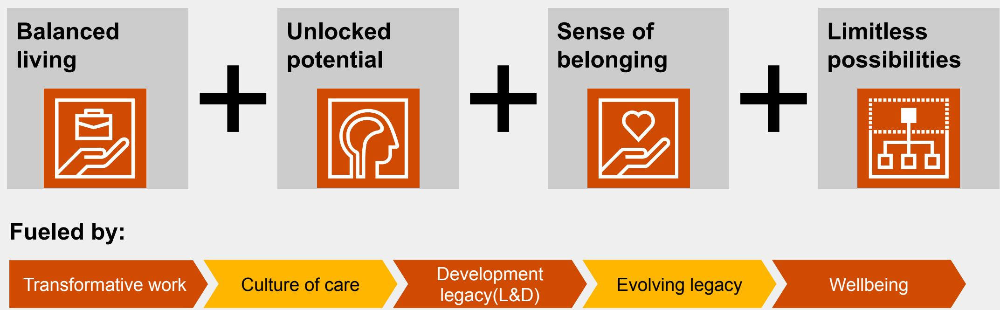
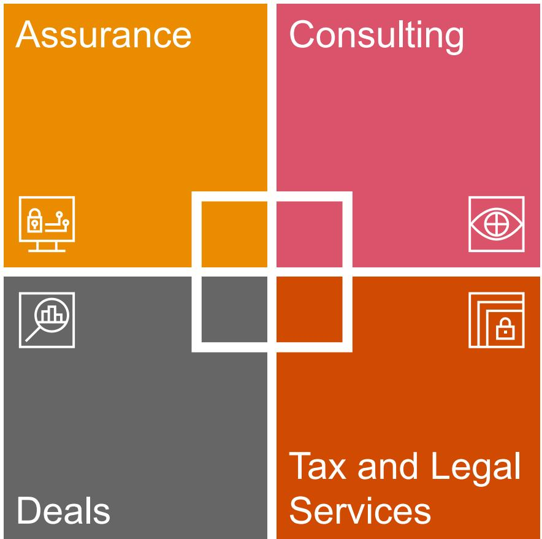
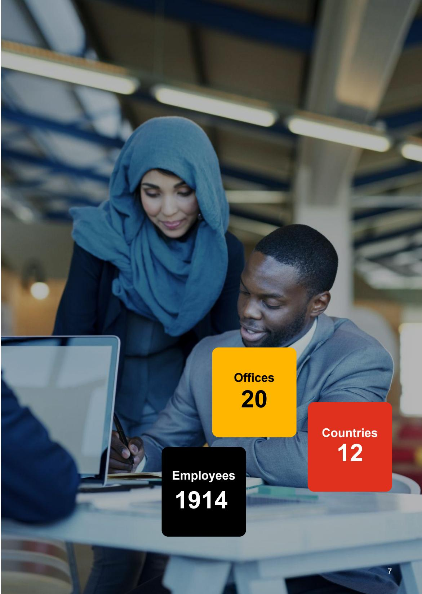
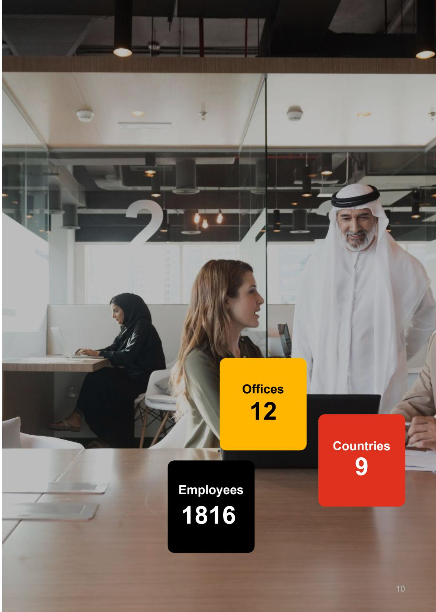
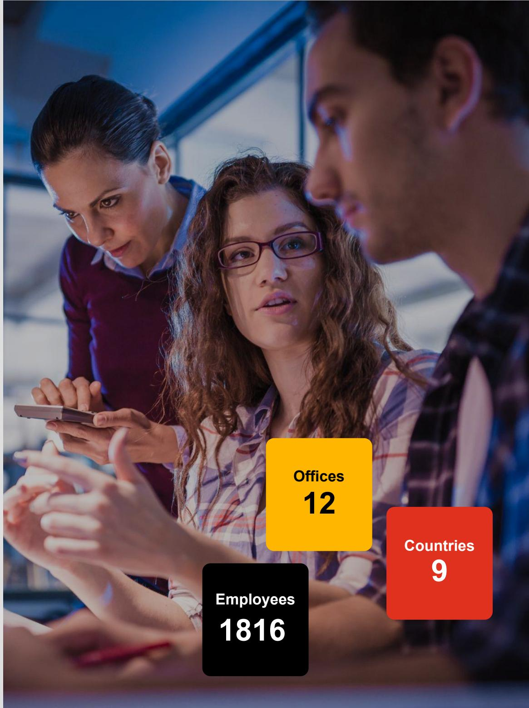
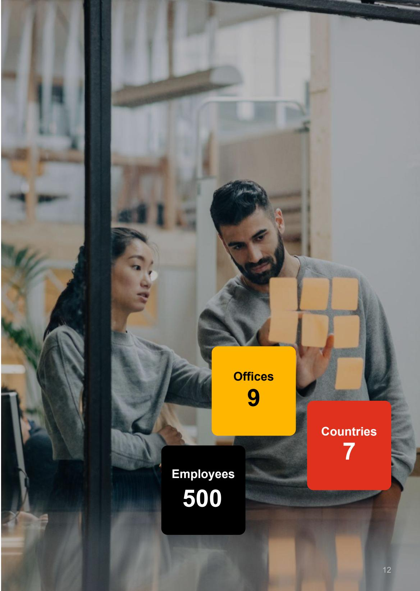
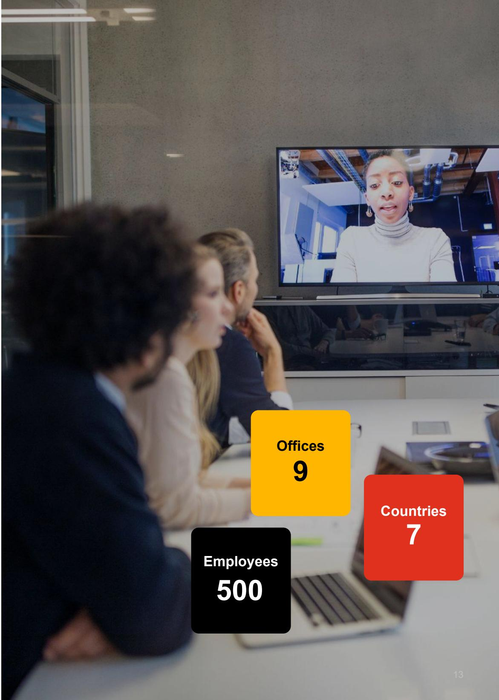
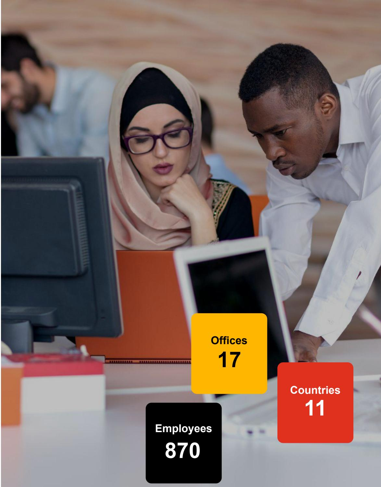
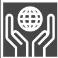
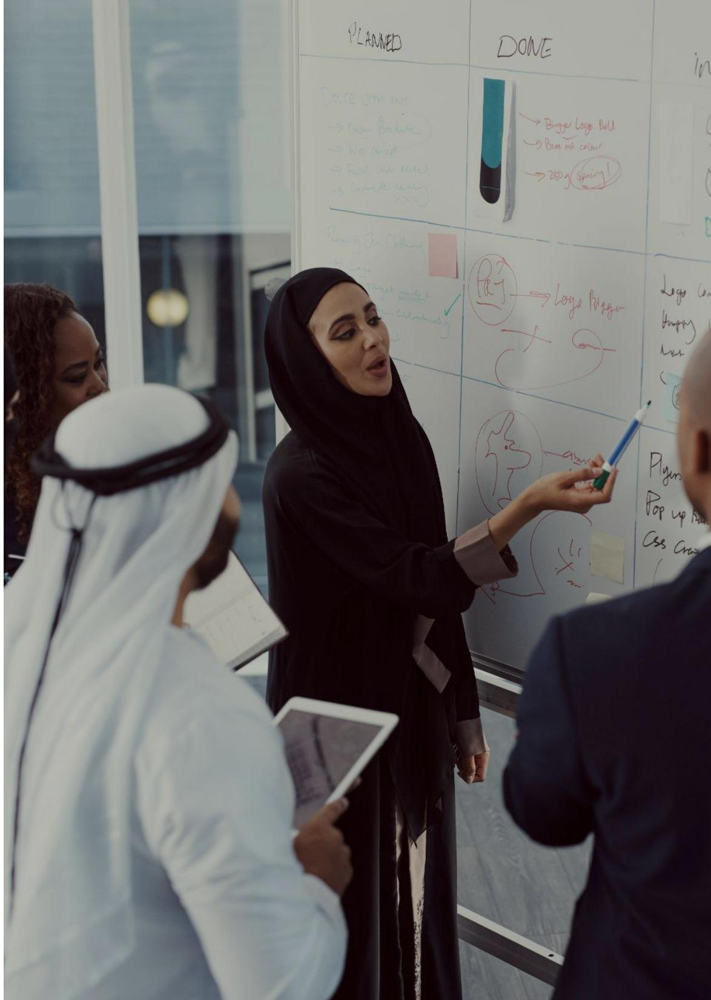

# The opportunity of a lifetime

Step inside our world

> **AI Description:**
> **Source:** `assets/_page_0_Figure_0.jpg`
> 
> **Generated:** 2026-05-30 15:55:26
> 
> ---
> 
> The image contains a photograph of three individuals in a professional setting, likely a modern office or business environment. They are dressed in business attire, with two men wearing suits and a woman in a blazer and pants. The individuals are gathered around a laptop and a tablet, appearing to discuss or review content on the devices. The setting includes large windows and a polished floor, suggesting a contemporary office space. The image conveys a sense of collaboration and professional activity.

## PwC ME: Home for the region's top talent

Weareadiversecommunityofsolvershocometogethertobuildtrustandandcreatesustainedutcoms.Wesolveimportantproblemsand supportoneaoedufeiteieie perspectives of our teams.We're innovative,resilientchange agents who are human-led and tech-powered.

A message from our Chief People Officer

If you’re looking for a place

that fuels your ambition to

make a difference,

that matches your curiosity with continuous learning opportunities and reimagines ways of working to enable you to lead a more balanced life then you're a future PwCer.

## A Career with PwC ME means...

YoulfindporuititokitareyfransfatiientsrangisightsfurteowerdetwkndlabiWe worktogethertoakeadifrenceinourcommunitiesolaboratingwitothesoanttoepartfsapingbigmeaningfulhangete world.

Throughitallweputyourwellengfirstingdandhalengingtimessoatuareempowedtoingyoubestyutookndtolife.

> **AI Description:**
> **Source:** `assets/_page_2_Figure_0.jpg`
> 
> **Generated:** 2026-05-30 16:00:08
> 
> ---
> 
> The image is an infographic combining text with visual elements. It presents a series of four key concepts: "Balanced living," "Unlocked potential," "Sense of belonging," and "Limitless possibilities." These concepts are visually represented by icons and are connected by plus signs, suggesting they are interconnected. Below these concepts, there is a section labeled "Fueled by:" which lists five elements: "Transformative work," "Culture of care," "Development legacy (L&D)," "Evolving legacy," and "Wellbeing." The infographic uses a color scheme with orange and gray backgrounds, and the text is clear and easy to read. The overall design is clean and structured, making it visually informative.

# A Career with PwC ME means...

## ... Work that matters

Fromdaoedaeuartfonityosisdiusadeoelenaroit allaboutcollborationanddiversityofthoughtandyouwillbcomeanintegralpartinlpingussoleimportantprobemstogether.

## ..Support, every step of the way

Welspprtilslidoeot ferdigitalupskilingandacceleratorprogramsandfinancial supportforyou tocontinue studyingand kick startyourcareer.

## .. Your degree doesn't define your career

Wehiregdgl management.Withourdiverserangeofbusinessesandtypes ofwork,youcanuseyourdegreeinmore ways thanyouthink with us.

> **AI Description:**
> **Source:** `assets/_page_3_Figure_0.jpg`
> 
> **Generated:** 2026-05-30 16:02:33
> 
> ---
> 
> The image contains a group of six people in what appears to be a collaborative workspace. They are gathered around a desk with a computer monitor displaying architectural plans or blueprints. The individuals are engaged in discussion, with some standing and others leaning over the desk. The workspace is modern and well-lit, featuring a whiteboard with notes and a corkboard with pinned items in the background. The setting suggests a creative or design-oriented environment, possibly an architectural firm or a similar professional space.

# Our culture Your benefits

Weareprudoftrthfrlltkgrodeeenesgeato peopletobrinttdecsiareeroiety experiecetcciedofso committed to helping you reach your full potential.

## A few of the perks we offer

Digital upskilling To prepare for our rapidly changing digitai world, we've placed upskilling at the forefront of our culture.

> **AI Description:**
> **Source:** `assets/_page_4_Figure_1.jpg`
> 
> **Generated:** 2026-05-30 16:02:40
> 
> ---
> 
> The image contains a simple diagram with two arrows. The top arrow points upwards, and the bottom arrow points downwards. This visual suggests a concept of movement or direction, possibly indicating a toggle or a switch between two states. The use of contrasting colors (black on yellow) is likely for high visibility and to draw attention to the critical nature of the information.

Flexible working We enable flexible working patterns to allow individuals and teams to decide how and where work gets done.

> **AI Description:**
> **Source:** `assets/_page_4_Figure_2.jpg`
> 
> **Generated:** 2026-05-30 16:01:26
> 
> ---
> 
> The image contains a simple icon of an airplane. It is a grayscale graphic with a square background and a stylized airplane symbol in the center. The icon is commonly used to represent air travel or aviation-related services.

International   
opportunities   
Our regionally diverse work allows you to   
explorework   
opportunities locally   
andabroad.

> **AI Description:**
> **Source:** `assets/_page_4_Figure_3.jpg`
> 
> **Generated:** 2026-05-30 16:01:23
> 
> ---
> 
> The image contains a simple icon. It features a hand with an upward-pointing finger, which is commonly associated with the concept of "add" or "increase." The icon is enclosed within a square border. There are no charts, graphs, or other visual elements present.

Be well, work well We embrace practices that energise us and prioritise well-being at home,work or in our communities.

PwC Academy For certain qualifications relevant to your line of service,we'll cover costsand provide time off to study.

> **AI Description:**
> **Source:** `assets/_page_4_Figure_5.jpg`
> 
> **Generated:** 2026-05-30 15:58:01
> 
> ---
> 
> The image contains a simple icon of a cash register with a dollar sign inside it. The icon is a flat, grayscale design and represents a financial or banking concept. There are no charts, graphs, or other visual elements present in the image.

Competitive salary Weofferacompetitive salary and discretionary annual bonus to reward hard work and   
commitment.

> **AI Description:**
> **Source:** `assets/_page_4_Figure_6.jpg`
> 
> **Generated:** 2026-05-30 15:59:20
> 
> ---
> 
> The image contains a simple icon of a suitcase. The icon is a red square with a white outline and a white handle on top, representing a travel or luggage-related concept. There are no charts, graphs, or other visual elements present in the image.

Corporate deals We offer a wide range of corporate offers at hotels, gyms, holidays, automobiles, etc.

> **AI Description:**
> **Source:** `assets/_page_4_Figure_7.jpg`
> 
> **Generated:** 2026-05-30 15:59:26
> 
> ---
> 
> The image contains a simple icon of a person wearing a chef's hat. The icon is pink with a white outline and appears to be a placeholder or symbol for a chef or culinary profession. There are no charts, graphs, or other visual elements present.

Dress for your Day We trust you to choose the clothes to wear to work that best represent yourself and our brand. Our flexible dress code is called #DressForYourDay,and it's about being yourself and being comfortable throughout the work week.

# Our graduate programme Your experience

Your career is just that; yours. You choose it. You live it. You make it happen. To get the best from it, you need the best opportunities.That's why opportunities are at the heart of a career with us.

Our Graduate Programmes provide you with an opportunity to grow as an individual, build lasting relationships and make an impact in a place where people, quality and value mean everything. Bring your commitment and we'll ensure that you're supported to develop and grow. Smart, courageous people who are able to forge strong relationships make us the best at what we do: measuring, protecting and enhancing what matters most to our clients.

It's an inspiring backdrop for your career, whether you're making a difference to a public or a private company, a government or charity. Be part of something special and find out how your drive and initiative could open up new opportunities for you and our clients.

We offer the following graduate programmes- Assurance, Consulting, Deals, Tax and Legal Services Let's see where you could join!

> **AI Description:**
> **Source:** `assets/_page_5_Figure_0.jpg`
> 
> **Generated:** 2026-05-30 16:00:26
> 
> ---
> 
> The image contains a grid with four sections, each representing a different service category: Assurance, Consulting, Deals, and Tax and Legal Services. Each section is color-coded and includes a simple icon related to the service. The Assurance section has an icon of a computer with a lock, the Consulting section has an eye icon, the Deals section has a magnifying glass icon, and the Tax and Legal Services section has a folder with a lock icon. The layout suggests a categorization of services, possibly for a business or consulting firm.

## Assurance

Can you assess potential risks in order to help others succeed? Are you continuously looking for innovative ways to deliver solutions? Joining our PwC Middle East Core Assurance team, you'll have the opportunity to deliver the very highest quality audits to the world's leading companies and leverage our global network. You'll be providing market leading services to an unprecedented range of clients, from leading multinational companies to family businesses and governments. Providing trust over financial reporting is a big responsibility,and it lies at the heart of everything we do.

We thrive in delivering audits using the latest digital tools and analytical capabilities. That's what drives us and it's how we're bringing the audit into the future. Led by people who have the passion and skils to make a diference,and enhanced by powerful technology; PwC audit is the perfect blend of people and technology.

You'll also study for your professional qualifications with a lot of support from your team, Career Coach and buddy to help you achieve this. It's the variety and opportunity we offer that allows you to develop a broad range of effective business skills and enables you to excel across the breadth of work Assurance offers, both during the training schemes and further on in your career.

> **AI Description:**
> **Source:** `assets/_page_6_Figure_0.jpg`
> 
> **Generated:** 2026-05-30 15:51:41
> 
> ---
> 
> The image contains a photograph of two individuals working together in an office setting. Overlaid on the image are three colored boxes with text. The yellow box on the left reads "Offices 20," the red box on the right reads "Countries 12," and the black box in the center reads "Employees 1914." The image combines a photograph with text to present statistical information about the number of offices, countries, and employees.

## Assurance

## Teams you could join:

## Internal Audit

A career within Internal Audit (IA) services will provide you with an opportunity to gain an understanding of an organisation's objectives, regulatory and risk management environment, and the diverse needs of their critical stakeholders. We focus on helping organisations look deeper and consider areas like culture and behaviours to help improve and embed controls. In short, we seek to address the right risks and ultimately add value to their organisation.

We perform IA support across 4 areas:

## IA Co-source

Working alongside an organisation's in-house function to deliver internal audit's remit tailored to the organisation's needs. Working with large government and public sector, private sector, family business organisations and multinationals

## IA outsource

Establish IA function and provide IA services aligned to the organisation's strategy and key risks it's facing. Often within government and public sector organisations/and emerging markets, family businesses.

## IA Tech Audit

Any Technology Risk, Data Analytics and/or Cyber Security work delivered against an Internal Audit contract,as part of an Internal Audit plan or directly for the Head of Audit or Head of IT Audit. Increasing trend for IT co-source contracts.

## IA Advisory

Providing advice and support to help organisations design, establish and enhance their Internal Audit function.

> **AI Description:**
> **Source:** `assets/_page_7_Figure_0.jpg`
> 
> **Generated:** 2026-05-30 15:54:04
> 
> ---
> 
> The image contains a photograph of two individuals working together in an office setting. Overlaid on the image are three distinct blocks of text in different colors and shapes:
> 
> 1. A yellow square with the text "Offices 20" indicating the number of offices.
> 2. A red square with the text "Countries 12" indicating the number of countries.
> 3. A black square with the text "Employees 1914" indicating the number of employees.
> 
> The image combines a photograph with text annotations to present statistical information about offices, countries, and employees.

## Assurance

## Governance, Risk and Compliance (GRC)

Being a member of the GRC team in Risk willsee you working on a variety of challenging and career-advancing engagements. We help build resilience in organisations through excellence in governance, risk management, compliance and internal controls over financial reporting (ICFR).

Some of the areas we provide risk management for include:

## Process intelligence

PwC can offer an end-to-end overview for any process across the organisation, giving our clients total transparency, as well as identification of current levels of standardisation and control efficiency. Closing the gap between how processes are intended to work, and how they work in reality is integral to business success.

## Supply chain

We focus on helping clients assess business processes by identifying loops, manual intervention, roadblocks and weaknesses using technology. We enable our clients to enhance their control environment, improve automation and reduce ineffciencies as a result of remediating the gaps.

## Policies and procedures

At PwC,we build tailored solutions to help our clients achieve their strategic ambitions. Robust policies and procedures can ensure an organisation is in compliance with laws and regulations,profitable and enables sound decision making.

> **AI Description:**
> **Source:** `assets/_page_8_Figure_0.jpg`
> 
> **Generated:** 2026-05-30 15:57:58
> 
> ---
> 
> The image contains a photograph of two individuals working together in an office setting. Overlaid on the image are three distinct blocks of text with numerical data:
> 
> 1. A yellow block labeled "Offices" with the number 20.
> 2. A black block labeled "Employees" with the number 1914.
> 3. A red block labeled "Countries" with the number 12.
> 
> The image appears to be part of a presentation slide, likely discussing the global presence and workforce of a company or organization. The visual elements combine text and a photograph to convey information in a visually engaging manner.

## Consulting

## Can you think big picture, and get into the details? Do you enjoy brainstorming to test different ideas?

In Consulting, you'll get to work on a variety of clients, bringing fresh insights to the problems facing the public and private sector, as we help them optimise, transform and improve their business models and deliver better products and services.

## Foundation for the Future

During your time in the FftF programme, you will have the opportunity to work closely with the best across industry and functional advisory services. In Consulting, you'll build core skills in a 20 month market-leading rotational programme. You'll have the opportunity to learn about what we do across our different consulting business areas and work with clients to drive innovation and growth. This will help you decide where you might specialise within Consulting once you complete the programme.We focus on helping solve client problems by offering deep industry and functional expertise on both the strategic and operational levels.

## Teams you could rotate in:

## Consumer and Industrial Products & Services (CIPS)

Our CIPS team works across a number of industries that are capital intensive and are currently undergoing large scale restructuring, transformation and privatization - These include power & utilities; industrial products; real estate & construction as well as transport & logistics. We deliver services such as supply chain management, spending efficiency, operational improvement and restructuring. We play a vital role in supporting these organisations on their growth and transformation agenda.

## Financial Services

Financial Services effectively works with clients as they shape their businesses and execute their strategies.They advise on key issues such as the impact of risk and regulation, financial crime, innovations in mobile and digital technologies, the disruptive impact of FinTech,as wellas the changing face of the customer.

> **AI Description:**
> **Source:** `assets/_page_9_Figure_0.jpg`
> 
> **Generated:** 2026-05-30 15:56:44
> 
> ---
> 
> The image contains a photograph of a modern office setting with individuals engaged in work. Overlaid on the image are three distinct blocks of text with numerical data:
> 
> 1. A yellow block labeled "Offices" with the number 12.
> 2. A red block labeled "Countries" with the number 9.
> 3. A black block labeled "Employees" with the number 1816.
> 
> The image combines a photograph with text to present a snapshot of organizational data, likely representing the company's global presence and workforce. The visual elements provide a clear and concise representation of the company's structure and scale.

## Consulting

## Government & Public Services

We combine a broad understanding of regulatory and economic conditions with the functional skills of our domestic and international experts, partnering with governments to deliver innovative solutions. To every assignment we bring independence,objectivity and a demonstrated ability to enhance public sector performance. We aim to contribute to advancing government priorities while delivering value for money.

## Health Industries

Health in our Middle East region is undergoing an unprecedented ‘once in a career transformation'.We are privileged to work in true partnership with our Clients to guide and support them on this transformation journey by bringing deep sector insights and expertise across all aspects of healthcare. Combined with the power of our global PwC network and partners. Underpinning all our work in health is our sense of purpose and appreciation for the privilege to help shape this vital sector that means something and impacts us all.

## Technology & Digital Consulting

Our Technology Consulting team is shaping the Digital and IT market in the GCC through working with public and private sector clients to help them improve overall value delivered to their customers and employees. By formulating digital strategies and help them in the implementation, we are helping clients unlock the potential of digital by increasing their customer engagement, providing their employees with powerful tools,and helping them optimize and digitize their operations.

> **AI Description:**
> **Source:** `assets/_page_10_Figure_0.jpg`
> 
> **Generated:** 2026-05-30 16:01:20
> 
> ---
> 
> The image contains a photograph of three individuals in what appears to be a professional setting, possibly a meeting or collaborative work environment. Overlaid on the image are three distinct blocks of text in different colors and shapes, providing key statistics about a company or organization. The blocks display the following information: "Offices 12," "Countries 9," and "Employees 1816." The text is presented in a clear and concise manner, with the numbers prominently displayed to emphasize the magnitude of the statistics. The image effectively combines a photograph with textual data to convey information about the organization's structure and scale.

## Deals

## Are you inquisitive and good at dealing with change? Do you enjoy working across a broad spectrum of work?

We help clients navigate any major financial event, from cross-border mergers and acquisitions, to economic crime investigations, insolvency and other business crises,which means you'll enjoy a breadth of experience and technology.

## Edge

An exciting graduate programme tailored by PwC Deals across EMEA to launch your career in an international Deals environment. Being part of Edge means that you'll attend international development events, complete rotations in a number of Deals business units and have access to world class online, professional and technical learning.Where relevant, you'll also receive the support to complete a professional qualification.

## Teams you could rotate in:

## Transaction Services

We support private equity firms, investment funds and corporate clients through mergers, acquisitions and disposals. Advising throughout the lifecycle of the deal, we work on both the buy and sell side of the work.

## Business Restructuring Services

Here we advise under-performing companies on restructuring, refinancing, wind-downs and insolvency - finding the best way forward for the business and its stakeholders.

## Valuations

Our team works alongside clients to support them in making key commercial and strategic valuation decisions on business deals or restructuring, disputes, tax regulation and financial reporting. Valuing a business involves a blend of technical and industry knowledge, commercial and market insight and an inquisitive mind.

> **AI Description:**
> **Source:** `assets/_page_11_Figure_0.jpg`
> 
> **Generated:** 2026-05-30 15:59:17
> 
> ---
> 
> The image contains a photograph of two individuals in an office setting, with overlaid text boxes providing statistical information. The key data points include:
> 
> - 9 offices
> - 7 countries
> - 500 employees
> 
> The text boxes are color-coded (yellow, red, and black) to highlight the different categories of information. The photograph itself shows a modern office environment with glass partitions and a collaborative atmosphere.

## Deals

## Corporate Finance

We provide lead financial advisory services, supporting on the origination through to execution of acquisitions and disposals for corporates, family businesses, sovereign investment funds and private equity clients. We operate across multiple industry sectors.

## Forensics Services

We help our clients to prepare for, respond to and emerge stronger from a wide range of business risks and issues. These include major public enquiries, rogue trader or bribery allegations,cybercrime and commercial and transactional disputes across all industry sectors.

## Deals Strategy & Operations (DSO)

We provide strategic and operational advice across the deal continuum from setting the deal strategy to post-deal execution. Examples of services we undertake include advising corporates,investment funds,and government entities on strategic investment decisions, conducting commercial/operational due diligence on potential target acquisitions, developing business plans, in addition to a range of post-deal operations services (including post-merger integration, synergy analysis,and carve-outs). Our team includes a diverse mix of profiles with people with relevant strategy, investment, and post-deal operations experience combined with deep sector expertise."

## Government & Infrastructure

PwC has built a team of infrastructure, real estate and capital projects experts, located in the Middle East, who are able to help clients resolve issues and deploy global best practice at all stages in the life cycle of major projects and programmes. Our team combines real estate industry expertise with deep subject matter knowledge, engineers with accountants,and global knowledge with local presence.

> **AI Description:**
> **Source:** `assets/_page_12_Figure_0.jpg`
> 
> **Generated:** 2026-05-30 15:50:22
> 
> ---
> 
> The image contains a photograph of a video conference meeting with three individuals in a conference room. Overlaid on the image are three colored blocks with text. The yellow block on the left states "Offices 9", the black block in the center states "Employees 500", and the red block on the right states "Countries 7". The image combines a photograph with text to present data in a visually appealing manner.

## Tax & Legal Services

## Do you have a knack for interpreting complex rules? Do you like to consider all approaches to a scenario?

We are the leading provider of tax and legal services (TLS) worldwide; leading the debate with tax authorities and governments around the world, changing the way we all think about tax and legal issues.

## Teams you could join:

## Business Tax Services

The tax landscape is constantly changing. We're helping businesses manage tax in a dynamic and digital world.

## Legal

We provide legal services integrated with PwC's other services. PwC Legal is the largest legal network in the world with over 40oo lawyers in over 100 countries.We are the only Big 4 firm in the Middle East with an established legal offering - the region's “one stop shop".

## Global Mobility

We help businesses with the tax implications of mobilising talent across borders.

## International Tax Services and Mergers & Acquisitions

Tax obligations must be carefully assessed and cash flows optimised when clients undergo transactions.

## Digital Solutions

Tax obligations must be carefully assessed and cash flows optimised when clients undergo transactions.

## Transfer Pricing

TP refers to the rules and methods for pricing transactions within and between enterprises under common ownership - we are experts at it!

## Indirect Taxes

Taxes levied on goods/services rather than on income or profit is our thing it's a pretty big deal in the ME right now.

> **AI Description:**
> **Source:** `assets/_page_13_Figure_0.jpg`
> 
> **Generated:** 2026-05-30 15:52:46
> 
> ---
> 
> The image contains a photograph of two individuals working together at a desk, with a computer monitor and a tablet visible. Overlaid on the image are three text boxes with statistical information: "Offices 17," "Countries 11," and "Employees 870." The text boxes are color-coded (yellow, red, and black) and provide a quick snapshot of the organization's global presence and workforce size. The photograph itself does not contain any additional visual content beyond the text boxes.

## Our Global Values

In joining PwC, you're joining a network of possibilities. With ofices in 155 countries and more than 284,0oo people, we're among the leading professional services networks in the world, tied by our commitment to quality, our values and purpose of building trust and solving important problems.

## Our Values:

Our values define the expectations we have for working with our clients and each other. Although we come from different backgrounds and cultures across the network, our values are what we have in common. They capture our shared aspirations and expectations, inform the type of work we do, and guide us on how we behave and work with each other and our clients.

Act with integrity

Work together

> **AI Description:**
> **Source:** `assets/_page_14_Figure_1.jpg`
> 
> **Generated:** 2026-05-30 15:51:44
> 
> ---
> 
> The image contains a simple icon of two hands holding a globe. The hands are stylized and appear to be cupping the globe, which is also stylized and does not have any additional markings or text. The icon is likely used to represent themes of global cooperation, international collaboration, or environmental stewardship.

> **AI Description:**
> **Source:** `assets/_page_14_Figure_2.jpg`
> 
> **Generated:** 2026-05-30 15:52:50
> 
> ---
> 
> The image contains a simple white heart icon on a black background. There are no charts, graphs, or other visual elements present. The heart icon is a common symbol used to represent love, affection, or care.

> **AI Description:**
> **Source:** `assets/_page_14_Figure_3.jpg`
> 
> **Generated:** 2026-05-30 15:55:29
> 
> ---
> 
> The image contains a simple diagram of four puzzle pieces arranged in a 2x2 grid. The puzzle pieces are interconnected, suggesting a concept of fitting together or completing a task. There are no labels or text annotations within the image.

Make a difference

> **AI Description:**
> **Source:** `assets/_page_14_Figure_4.jpg`
> 
> **Generated:** 2026-05-30 15:50:28
> 
> ---
> 
> The image contains a simple icon of a light bulb with rays emanating from it. This is a visual representation commonly used to symbolize ideas, innovation, or inspiration. The light bulb is central in the image, and the rays extend outward, emphasizing the concept of illumination or enlightenment.

Reimagine the possible

Whole leadership

Our PwC Professional Framework:   
The framework exists to support the development and career   
progression of our people, helping them to meet the expectations of our clients, colleagues and communities in today's changing global marketplace.

# Are you ready to create purposeful impact?

No matter which location you join, you'll be part of a cohort of a few hundred fresh graduates joining PwC Middle East's regional programme in September 2022.

In your first week, you’l get the opportunity to:   
refine your soft skills   
meet the leadership team   
network with your peers whilst becoming familiar with PwC as a business; its brand, values,work and people.

This is followed by weeks of technical training tailored to your business area.

Apply to our Grad Programme today

Be part of The New Equation.

> **AI Description:**
> **Source:** `assets/_page_15_Figure_0.jpg`
> 
> **Generated:** 2026-05-30 15:49:10
> 
> ---
> 
> The image contains a whiteboard with handwritten text and diagrams. The whiteboard is divided into sections labeled "PLANNED" and "DONE." Various notes and sketches are present, including a diagram of a pen with annotations such as "Bigger Logo Bold" and "Ben not colour." The scene appears to be a brainstorming or planning session, with participants engaged in discussion around the whiteboard. The visual elements include handwritten notes, a diagram, and a digital tablet, indicating a collaborative work environment.

## Meet our people

Living in the new normal and respecting social distancing doesn't mean you can't see us in person. Using our innovative technology, we have found a unique way to bring the human element of us, to you.

Ghada Consulting FftF □

Ibrahim Core Assurance

PwC Middle East

@pwcmiddleeast

PwC Middle East

pwc.com/mecareers

PwC Middle East

@PwC\_Middle\_East

> **AI Description:**
> **Source:** `assets/_page_16_Figure_5.jpg`
> 
> **Generated:** 2026-05-30 16:02:36
> 
> ---
> 
> The image contains a simple icon of a laptop. It is a flat, two-dimensional representation of a computer with a screen and keyboard, but no additional details or labels are present. The icon is black and white, with no color or shading.

Scan the QR code and focus your camera on the graphic

Pranav Tax & Legal Services

Haya Deals Edge

## Thank you

www.pwc.com/mecareers

rca professional advisors. Liability limited by a scheme approved under Professional Standards Legislation.   
127067034