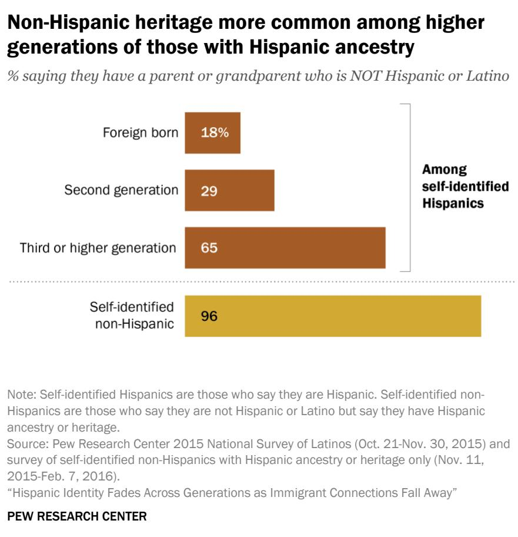
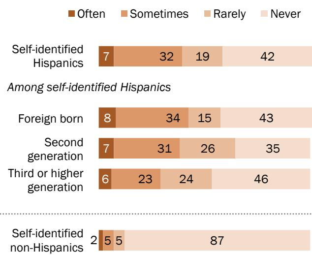

FOR RELEASE December 20, 2017

# Hispanic Identity Fades Across Generations as Immigrant Connections Fall Away

11% of American adults with Hispanic ancestry do not identify as Hispanic

BY Mark Hugo Lopez, Ana Gonzalez-Barrera and Gustavo López

FOR MEDIA OR OTHER INQUIRIES:

Mark Hugo Lopez, Director of Hispanic Research Ana Gonzalez-Barrera, Senior Researcher Molly Rohal, Communications Manager

202.419.4372

www.pewresearch.org

RECOMMENDED CITATION

Lopez, Mark Hugo, Ana Gonzalez-Barrera and Gustavo López, December 20, 2017, “Hispanic Identity Fades Across Generations as Immigrant Connections Fall Away”

## About Pew Research Center

Pew Research Center is a nonpartisan fact tank that informs the public about the issues, attitudes and trends shaping America and the world. It does not take policy positions. The Center conducts public opinion polling, demographic research, content analysis and other data-driven social science research. It studies U.S. politics and policy; journalism and media; internet, science and technology; religion and public life; Hispanic trends; global attitudes and trends; and U.S. social and demographic trends. All of the Center’s reports are available at www.pewresearch.org. Pew Research Center is a subsidiary of The Pew Charitable Trusts, its primary funder.

© Pew Research Center 2017

## Terminology

The terms Hispanic and Latino are used interchangeably in this report as well as the terms “selfidentified Hispanic” and “self-identified Latino.”

Self-identified Hispanics are U.S. residents who self-report that they are of Hispanic or Latino background. Self-identified non-Hispanics are U.S. residents who do not self-identify as Hispanic, but also say they have a parent or grandparent who are of Hispanic heritage.

Americans of Hispanic ancestry are those who either self-identify as Hispanic or Latino or say they have Hispanic ancestors but do not self-identify as Hispanic.

U.S. born refers to persons born in the United States and those born in other countries to parents at least one of whom was a U.S. citizen.

Foreign born refers to persons born outside of the United States to parents neither of whom was a U.S. citizen. For the purposes of this report, foreign born also refers to those born in Puerto Rico. Although individuals born in Puerto Rico are U.S. citizens by birth, they are included among the foreign born because they are born into a Spanish-dominant culture and because on many points their attitudes, views and beliefs are much closer to Hispanics born abroad than to Hispanics born in the 50 states or the District of Columbia, even those who identify themselves as being of Puerto Rican origin.

First generation refers to foreign-born people. The terms “foreign born,” “first generation” and “immigrant” are used interchangeably in this report.

Second generation refers to people born in the 50 states or the District of Columbia, with at least one first-generation, or immigrant, parent.

Third generation refers to people born in the 50 states or the District of Columbia, with both parents born in the 50 states or the District of Columbia and with at least one immigrant grandparent.

Third and higher generation refers to people born in the 50 states or the District of Columbia, with both parents born in the 50 states or the District of Columbia.

Fourth or higher generation refers to people born in the 50 states or the District of Columbia, with both parents and all four grandparents born in the 50 states or the District of Columbia.

About Pew Research Center 1   
Terminology 2   
Hispanic Identity Fades Across Generations as Immigrant Connections Fall Away 4   
Declining immigration, high intermarriage rates 6   
What is Hispanic identity? 8   
Latino cultural traditions, Spanish use and connections to family’s origin country 12   
The Hispanic experience today 17   
Acknowledgements 22   
Methodology 23   
Appendix A: References 30   
Appendix B: Additional Table 32

### Full Page Description (Page 4)

**Source:** `assets/_page_4_Asset_0.jpg`

**Generated:** 2026-05-30 16:08:06

---

The image is a horizontal bar chart comparing the percentage of Hispanic and Non-Hispanic individuals across different generational categories: Foreign born, Second generation, Third generation, and Fourth or higher generation. The chart shows a decline in the percentage of Hispanic individuals as the generation moves from foreign-born to fourth or higher generation, while the percentage of Non-Hispanic individuals increases. The foreign-born category shows 97% Hispanic and 3% Non-Hispanic, while the fourth or higher generation shows 50% Hispanic and 50% Non-Hispanic.

# Hispanic Identity Fades Across Generations as Immigrant Connections Fall Away

11% ofAmerican adults with Hispanic ancestry do notidentify as Hispanic

More than 18% of Americans identify as Hispanic or Latino, the nation’s second largest racial or ethnic group. But two trends – a long-standing high intermarriage rate and a decade of declining Latin American immigration – are distancing some Americans with Hispanic ancestry from the life experiences of earlier generations, reducing the likelihood they call themselves Hispanic or Latino.

Among the estimated 42.7 million U.S. adults with Hispanic ancestry in 2015, nine-in-ten (89%), or about 37.8 million, self-identify as Hispanic or Latino. But another 5 million (11%) do not

Among Americans with Hispanic ancestry, share that identifies as Hispanic or Latino falls across immigrant generations

% of U.S. adults with Hispanic ancestry who self-identify as

Note: Self-identified Hispanics are those who say they are Hispanic. Self-identified non-Hispanics are those who say they are not Hispanic or Latino but say they have Hispanic ancestry or heritage.   
Source: Pew Research Center 2015 National Survey of Latinos (Oct. 21-Nov. 30, 2015) and survey of self-identified non-Hispanics with Hispanic ancestry or heritage only (Nov. 11, 2015-Feb. 7, 2016).   
“Hispanic Identity Fades Across Generations as Immigrant Connections Fall Away”   
PEW RESEARCH CENTER

consider themselves Hispanic or Latino, according to Pew Research Center estimates. The closer they are to their immigrant roots, the more likely Americans with Hispanic ancestry are to identify as Hispanic. Nearly all immigrant adults from Latin America or Spain (97%) say they are Hispanic. Similarly, second-generation adults with Hispanic ancestry (the U.S.-born children of at least one immigrant parent) have nearly as high a Hispanic self-identification rate (92%), according to Pew Research Center estimates.

By the third generation – a group made up of the U.S.-born children of U.S.-born parents and immigrant grandparents – the share that self-identifies as Hispanic falls to 77%. And by the fourth or higher generation (U.S.-born children of U.S.-born parents and U.S.-born grandparents, or even more distant relatives), just half of U.S. adults with Hispanic ancestry say they are Hispanic.1

Among adults who say they have Hispanic ancestors (a parent ,grandparent, great grandparent or earlier ancestor) but do not self-identify as Hispanic, the vast majority – 81% – say they have never thought of themselves as Hispanic, according to a Pew Research Center survey of the group. When asked why this is the case in an open-ended follow-up question, the single most common response (27%) was that their Hispanic   
ancestry is too far back or their

These findings emerge from two Pew Research Center national surveys that explored attitudes and experiences about Hispanic identity among two populations. The first survey, conducted Oct. 21-Nov. 30, 2015, in English and Spanish, explored the attitudes and experiences of a nationally representative sample of 1,500 self-identified Hispanic adults. The second is a first-of-its-kind national survey of 401 U.S. adults who indicated they had Hispanic, Latino, Spanish or Latin American ancestry or heritage (in the form of parents, grandparents or other relatives) but did not consider themselves Hispanic. It was offered in English and Spanish from Nov. 11, 2015-Feb. 7, 2016, but all respondents took the survey in English. Both surveys were conducted by SSRS for Pew Research Center. Together, these two surveys provide a look at the

## Defining self-identified Hispanic and selfidentified non-Hispanic

This report explores the attitudes and experiences of two groups of adults. The first are those who are selfidentified Hispanics. This is the usual group of Hispanics that are profiled in Pew Research Center and Census Bureau reports and are reported on as a distinct racial/ethnic group. Throughout the report, this group is labelled as “Self-identified Hispanics.”

The second are those who have Hispanic ancestry but do not consider themselves Hispanic – i.e., selfidentified non-Hispanics with Hispanic ancestry. This is the first time this group’s opinions, attitudes and views have been studied in depth. Throughout the report, this second group is referred to as “self-identified non-Hispanics” or “self-identified non-Hispanics with Hispanic ancestry.”

Racial and ethnic identity on surveys and in the U.S. decennial census is measured by respondents’ selfreports. Any survey respondent who says they are Hispanic is counted as Hispanic, and those who say they are not Hispanic are not counted as such. This practice has been in place on the census since 1980 for Hispanic identity and since 1970 for racial identity.

identity experiences and views of U.S. adults who say they have Hispanic ancestry.

## Declining immigration, high intermarriage rates

Immigration from Latin America played a central role in the U.S. Hispanic population’s growth and its identity during the 1980s and 1990s. But by the 2000s, U.S. births overtook the arrival of new immigrants as the main driver of Hispanic population dynamics. And the Great Recession,2 coupled with many other factors, significantly slowed the flow of new immigrants into the country, especially from Mexico. As a result, the U.S. Hispanic population is still growing, but at a rate nearly half of what it was over a decade ago as fewer immigrants arrive in the U.S. and the fertility rate among Hispanic women has declined.

> **AI Description:**
> **Source:** `assets/_page_6_Figure_0.jpg`
> 
> **Generated:** 2026-05-30 16:07:11
> 
> ---
> 
> The image contains a bar chart with a title and annotations. The chart compares the percentage of self-identified Hispanics who have a parent or grandparent who is not Hispanic or Latino across different generations. The generations are categorized as Foreign born, Second generation, Third or higher generation, and Self-identified non-Hispanic. The percentages are as follows: Foreign born at 18%, Second generation at 29%, Third or higher generation at 65%, and Self-identified non-Hispanic at 96%. The chart highlights that the percentage of those with non-Hispanic heritage increases with each generation among self-identified Hispanics.

Over the same period, the Latino intermarriage rate remained relatively high and changed little. In 2015, 25.1% of Latino newlyweds married a non-Latino spouse and 18.3% of all married Latinos were intermarried;3 in 1980, 26.4% of Latino newlyweds intermarried and 18.1% of all married Latinos had a non-Latino spouse, according to a Pew Research Center analysis of government data. In both 1980 and 2015, Latino intermarried rates were higher than those for blacks or whites.4 Intermarriage rates also vary within the Latino population: 39% of married U.S.-born adults had a non-Latino spouse while just 15% of married immigrant Latinos did.

As a result of high intermarriage rates, some of today’s Latinos have parents or grandparents of mixed heritage, with that share higher among later generations. According to the surveys, 18% of immigrants say that they have a non-Latino parent or grandparent in their family, a share that rises to 29% among the second generation and 65% among the third or higher generation, according to the Pew Research Center survey of self-identified Latino adults. And for those who say they have Latino ancestry but do not identify as Latino, fully 96% say they have some non-Latino heritage in their background.

A similar pattern is present among those who are married, according to the two surveys. Some 78% of all married Hispanics have a spouse who is also Hispanic, according to the survey of selfidentified Hispanics. But that share declines across the generations. Nearly all married immigrant Hispanics (93%) have a Hispanic spouse, while 63% among second-generation married Hispanics and just 35% among married third-generation Hispanics have a Hispanic spouse. Meanwhile, only 15% of married U.S. adults who say they are not Hispanic but have Hispanic ancestry have a Hispanic spouse.

These trends may have implications for the shape of Hispanic identity today. With so many U.S.- born Hispanics of Hispanic and non-Hispanic heritages, their views and experiences with Hispanic culture and identity vary depending on how close they are to their family’s immigrant experiences.

These trends also have implications for the future of Hispanic identity in the U.S. Lower immigration levels than in the past and continued high intermarriage rates may combine to produce a growing number of U.S. adults with Hispanic ancestors who may not identify as Hispanic or Latino. And even among those who do self-identify as Hispanic or Latino, those in the second and third or higher generations may see their identity as more tied to the U.S. than to the origins of their parents, a pattern observed in many previous5 Pew Research Center Latino surveys.

As a result, even estimates of the number of Americans who self-identify as Hispanic could be lower than currently projected. The latest population projections emphasize the size and speed of Hispanic population growth – according to Pew Research Center projections, the nation’s Hispanic population will be 24% of all Americans by 2065, compared with 18% in 2015. But these projections assume that many current trends, including Hispanic self-identity trends, will continue. If they change, growth in the population of self-identified Hispanics could slow even further and the nation’s own sense of its diversity could change as fewer than expected Americans of Hispanic ancestry self-identify as Hispanic.

### Full Page Description (Page 8)

**Source:** `assets/_page_8_Asset_0.jpg`

**Generated:** 2026-05-30 16:08:32

---

The image is a bar chart that visually represents data on the percentage of individuals in different generational categories who are foreign-born, second-generation, or third or higher generation. The chart is divided into three main categories: "All," "Younger than 18," and "Adults 18+." Each category is further divided into three subcategories: "Foreign born," "Second generation," and "Third or higher generation." The percentages are displayed as numerical values above each bar. The chart highlights that the percentage of foreign-born individuals is highest among adults aged 18 and older (53%) and lowest among those younger than 18 (8%). The percentage of second-generation individuals is highest among those younger than 18 (52%) and lowest among adults aged 18 and older (25%). The percentage of third or higher generation individuals is highest among those younger than 18 (40%) and lowest among adults aged 18 and older (23%).

## What is Hispanic identity?

When it comes to describing themselves and what makes someone Hispanic, there is some consensus across self-identified Hispanics. However, not all Hispanics agree, with views often linked to immigrant generation.

The immigrant experience is an important part of the U.S. Hispanic experience. Roughly four-in-ten self-identified U.S. Hispanics (38%)6 are immigrants themselves, a share that rises to 53% among adult Hispanics, according to a Pew Research Center analysis of U.S. Census Bureau data. Meanwhile, 62% of Hispanics are U.S. born, a share that falls to 48% among adult Hispanics.

Immigrant generations and U.S. Latinos

% of \_\_\_ self-identified Hispanics that are …

Note: Self-identified Hispanics are those who say they are Hispanic. Foreign born refers to people born outside of the United States to parents neither of whom was a U.S. citizen. Although individuals born in Puerto Rico are U.S. citizens by birth, for the purposes of this report, they are included among the foreign born because they are born into a Spanishdominant culture.

PEW RESEARCH CENTER

Some U.S.-born Latinos have direct links to their family’s immigrant roots – 34% are the U.S.- born children of at least one immigrant parent, or part of the second generation. Others are more distant from those roots – 28% are the U.S.-born children of U.S.-born Latino parents, or of the third or higher generation.

## Terms used most often to describe identity

The terms that self-identified Hispanics use to describe themselves can provide a direct look at their views of identity and the link to their countries of birth or family origin. Among all Hispanic adults, for example, half say they most often describe themselves by their family’s country of origin or heritage, using terms such as Mexican, Cuban, Puerto Rican or Salvadoran. Another 23% say

they most often call themselves American. The other 23% most often describe themselves as “Hispanic” or “Latino,” the pan-ethnic terms used to describe this group in the U.S., according to the survey of self-identified Hispanics.7

However, the use of these terms varies widely across immigrant generations and reflects the different experiences of each group of Hispanics.

Two-thirds (65%) of immigrant Latinos most often uses the name of their origin country to describe themselves, the highest share among the generations. That share falls to 36% among

Nationality labels used most often among Latinos to describe their identity

% of self-identified Hispanics saying they describe themselves most often as …

Among self-identified Hispanics

Note: Self-identified Hispanics are those who say they are Hispanic. Self-identified non-Hispanics are those who say they are not Hispanic or Latino but say they have Hispanic ancestry or heritage. Voluntary responses of “Don’t know,” “Refused,” “Depends” and “Other/Refused to lean” not shown. Source: Pew Research Center 2015 National Survey of Latinos (Oct. 21-Nov. 30, 2015). “Hispanic Identity Fades Across Generations as Immigrant Connections Fall Away”

PEW RESEARCH CENTER

second-generation Latinos and to 26% among third or higher generation Latinos.

Meanwhile, the share that says they most often use the term “American” to describe themselves rises from 7% among immigrants to 56% among the third generation or higher, mirroring, in reverse, the use pattern for country of origin terms. Third or higher generation Latinos were born in the U.S. to U.S.-born parents, and these findings show that for this group, their ties to their U.S. national identity are strong.

Another measure of identity is how much Hispanics feel a common identity with other Americans. Overall, U.S. Hispanics are divided on this question: Half (50%) consider themselves to be a typical American while 44% say they are very different from a typical American. But this finding masks large differences across the generations. Some 36% of immigrant Hispanics consider themselves a typical American. That share rises to 63% among second-generation Hispanics and to 73% among third or higher generation Hispanics, reflecting their birth country (the U.S.) and their lifetime experiences.

## Does speaking Spanish or having a Spanish last name make one Hispanic?

Speaking Spanish is a characteristic often linked to Latino identity. For example, some say that

you cannot be Latino unless you happen to speak Spanish, or that someone is “more Latino” if they speak Spanish than someone who does not speak Spanish but is also of Latino heritage.

This came up during a debate in the 2016 presidential campaign, when Republican candidate U.S. Sen. Marco Rubio questioned whether Ted Cruz, another senator and GOP candidate, spoke Spanish.

Yet, when directly asked about the link between Latino identity and speaking Spanish, seven-in-ten (71%)

## Neither speaking Spanish nor having a Spanish last name makes one Hispanic

% of self-identified Hispanics saying that a person needs to \_\_\_ to be considered Hispanic/Latino

PEW RESEARCH CENTER

Latino adults say speaking Spanish is not required to be considered Latino. Even among immigrant Latinos, a majority (58%) holds this view about Spanish and Latino identity. And among U.S.-born Latinos, higher shares say the same: 84% of second-generation Latinos and 92% of third or higher generation Latinos (the group farthest from their family’s immigrant roots) say speaking Spanish does not make someone Latino.

Another characteristic that for some is seen as important to Hispanic identity is having a Spanish last name. However, here too, the vast majority (84%) of self-identified Hispanics say it is not

### Full Page Description (Page 11)

**Source:** `assets/_page_11_Asset_0.jpg`

**Generated:** 2026-05-30 16:08:39

---

The image contains a simple bar chart with two categories: "Yes" and "No". The "Yes" category has a brown bar with the number 17, and the "No" category has a gray bar with the number 81. Below the chart, there is a statement that reads, "Among those who say no, the main reasons include...". The chart visually represents a comparison between the two categories, with the "No" category having a significantly larger number of responses compared to the "Yes" category.

### Full Page Description (Page 11)

**Source:** `assets/_page_11_Asset_1.jpg`

**Generated:** 2026-05-30 16:08:50

---

The image contains a bar chart with textual information. It presents data on reasons why some individuals do not identify as Hispanic. The chart includes five categories with corresponding numerical values:

1. "Mixed background/Hispanic ancestry too far back" with a value of 27.
2. "Upbringing/No contact with Hispanic relatives" with a value of 16.
3. "Does not speak Spanish/Has no cultural link" with a value of 15.
4. "Identifies as other race/Does not look Hispanic" with a value of 12.
5. "Born in U.S./Identities as American" with a value of 9.

The bars are colored in a consistent shade of brown, and the values are aligned to the right of each corresponding label.

necessary to have a Spanish last name to be considered Hispanic, no matter their immigrant generation.

## Not all Americans with Hispanic ancestry self-identify as Hispanic

Racial and ethnic identity in the U.S. since the 1960s has been based on self-reports: You are what you say you are. This is how race and ethnicity is measured in government surveys, as well as in surveys by Pew Research Center and other research groups. As a result, there are some Americans who say they have Hispanic ancestry but do not consider themselves Hispanic.

Overall, this group represents 2% of the national adult population, amounting to 5 million adults, according to the Center’s estimates. Or, looked at another way, among the 42.7 million U.S. adults who say they have Hispanic ancestry, 11% do not identify as Hispanic.

This group also has distant immigrant roots. Some 38% are fourth or higher generation, i.e., the U.S.-born children of U.S.-born parents, U.S.-born grandparents and likely other U.S. born ancestors. Another 23% are third generation (the U.S.-born children of U.S.- born parents), 17% are second generation (the U.S.-born children of at least one immigrant parent), and just 12% are immigrants, according to the Pew Research Center survey of self-identified non-Hispanics with Hispanic ancestry.

Eight-in-ten non-Hispanics with Hispanic ancestry have never thought of themselves as Hispanic

% of self-identified non-Hispanics who ever considered themselves Hispanic or Latino

Note: Voluntary responses of “Don’t know” and “refused” not   
shown. “Other” (30%) not included as reason why self-identified non-Hispanics with Hispanic ancestry don’t identify as Hispanic. This open-ended question allowed for multiple mentions per response. Percentages were calculated using the total and thus add up to greater than 100%.   
Source: Survey of self-identified non-Hispanics with Hispanic   
ancestry or heritage only (Nov. 11, 2015-Feb. 7, 2016).   
“Hispanic Identity Fades Across Generations as Immigrant   
Connections Fall Away”

PEW RESEARCH CENTER

For adults with Hispanic ancestry who do not self-identify as Hispanic, 81% say they have never considered themselves Hispanic or Latino. The reasons for this are many and are often linked to mixed backgrounds, limited contact with Hispanic relatives and few Hispanic cultural links, according to a follow-up open-ended question. For example, some 27% said they do not consider themselves Hispanic because they have a mixed Hispanic and non-Hispanic background or that their Hispanic ancestry is too distant. Another 16% said they do not consider themselves Hispanic despite their Hispanic ancestry because of their upbringing or that they have little contact with their Hispanic relatives; 15% said the reason they say they are not Hispanic is because they do not speak Spanish or have no link to Hispanic culture; 12% said they do not look Hispanic or they identify as another race; and 9% said they were born in the U.S. and consider themselves American.

### Full Page Description (Page 12)

**Source:** `assets/_page_12_Asset_0.jpg`

**Generated:** 2026-05-30 16:09:48

---

The image contains a bar chart with data presented in a horizontal format. It categorizes responses from self-identified Hispanics and non-Hispanic individuals regarding their frequency of certain activities, with categories labeled as "Often," "Sometimes," "Rarely," and "Never." The chart breaks down responses among self-identified Hispanics into three generations: Foreign-born, Second generation, and Third or higher generation. The percentages for each category are visually represented in different shades of brown. Notably, the Foreign-born group shows the highest percentage for "Often" responses, while the Third or higher generation group shows the highest percentage for "Never" responses. The non-Hispanic group is also included for comparison, showing a significantly higher percentage for "Never" responses.

## Latino cultural traditions, Spanish use and connections to family's origin country

The conversations parents have with their children and the cultural cues they provide while their children are growing up can have a large impact on their children’s identity in adulthood. However, the number of Hispanic cultural activities experienced by Americans with Hispanic ancestry declines across the generations, mirroring the finding that Hispanic self-identity also fades across generations.

## Parents and their pride in their Latino origins

Immigrant and second-generation selfidentified Hispanics (57% and 50% respectively) are most likely to say their parents talked often about their pride in their country of origin roots. But by the third generation, only 33% say their parents talked often about their pride in their roots while growing up.

For self-identified non-Hispanics, the majority of whom are of the third or higher immigrant generation, just 15% say they often heard their

Across generations, fewer say parents talked about their pride in their roots

% of U.S. adults with Hispanic ancestry saying their parents talked about their pride in being [country of origin] when growing up

Note: Self-identified Hispanics are those who say they are Hispanic. Self-identified non-Hispanics are those who say they are not Hispanic or Latino but say they have Hispanic ancestry or heritage. Voluntary responses of “Don’t know” and “Refused” not shown. Source: Pew Research Center 2015 National Survey of Latinos (Oct. 21-Nov. 30, 2015) and survey of self-identified non-Hispanics with Hispanic ancestry or heritage only (Nov. 11, 2015-Feb. 7, 2016). “Hispanic Identity Fades Across Generations as Immigrant Connections Fall Away”

## PEW RESEARCH CENTER

### Full Page Description (Page 13)

**Source:** `assets/_page_13_Asset_0.jpg`

**Generated:** 2026-05-30 16:07:24

---

The image is a bar chart with a legend indicating frequency categories: Often (brown), Sometimes (orange), Rarely (light orange), and Never (very light orange). The chart is titled "Self-identified Hispanics" and shows the frequency distribution of a specific behavior or action among this group. The percentages for each category are as follows: Often (53%), Sometimes (25%), Rarely (11%), and Never (10%). The chart visually represents the proportion of self-identified Hispanics who report engaging in the behavior often, sometimes, rarely, or never.

parents talk often about their pride in their ancestor’s country of origin.

## Attending Hispanic cultural celebrations in childhood

Across immigrant generations, reports of childhood experiences with Hispanic cultural Across immigrant generations, reports of chi celebrations, such as posadas or quinceañeras, decline for Americans with Hispanic ancestry the farther they are from their immigrant roots.

Among immigrant self-identified Hispanics, 59% say that when they were growing up, their parents took them to Hispanic cultural celebrations often, reflecting that the majority of this group grew up outside the U.S.

Second-generation self-identified Hispanics were about as likely to say this happened during their childhood. Half (49%) report that when they were growing up, their immigrant parents took them often to Hispanic cultural celebrations. A smaller share (35%) of third or higher generation self-identified Hispanics report the same about their childhoods.

By comparison, among Americans who say they have a Latino ancestry, but do not selfidentify as Latino, just 9% report that when they were growing up, their parents took them to Latino cultural celebrations. Meanwhile, 60% say this never happened.

Childhood experiences at Latino cultural celebrations decline across generations

% of U.S. adults with Hispanic ancestry saying their parents took them to Hispanic/Latino cultural celebrations when growing up

Note: Self-identified Hispanics are those who say they are Hispanic. Self-identified non-Hispanics are those who say they are not Hispanic or Latino but say they have Hispanic ancestry or heritage. Voluntary responses of “Don’t know” and “Refused” not shown. Source: Pew Research Center 2015 National Survey of Latinos (Oct. 21-Nov. 30, 2015) and survey of self-identified non-Hispanics with Hispanic ancestry or heritage only (Nov. 11, 2015-Feb. 7, 2016). “Hispanic Identity Fades Across Generations as Immigrant Connections Fall Away”

## PEW RESEARCH CENTER

### Full Page Description (Page 14)

**Source:** `assets/_page_14_Asset_0.jpg`

**Generated:** 2026-05-30 16:09:08

---

The image contains a bar chart with a horizontal orientation. It presents data on the percentage of self-identified Hispanics and non-Hispanics in the United States. The chart breaks down the Hispanic population into three categories: foreign-born, second generation, and third or higher generation. The percentages for each category are as follows: 85% for foreign-born, 68% for second generation, and 26% for third or higher generation. Additionally, the chart shows that 70% of self-identified Hispanics and 9% of self-identified non-Hispanics fall into these categories. The chart uses a single color for the bars, and the percentages are clearly labeled above each bar.

## Parents encouraged Spanish

Another important way that parents can encourage their children’s Hispanic selfidentity is through their use of language. However, the two surveys reveal that the childhood experiences with Spanish fade quickly across the generations, even though there is wide support for the language among Hispanics.

Fully 85% of foreign-born self-identified Hispanics say that when they were growing up, their parents often encouraged them to speak Spanish. But that share falls to 68% among the U.S.-born second generation and to just 26% of the third or higher generation Hispanics.

By contrast, just 9% of self-identified non-Hispanics with Hispanic ancestry say their parents often encouraged them to speak Spanish, again reflecting the distance this group has from its immigrant roots.

Immigrant, second-generation Latinos most likely to say their parents encouraged them to speak Spanish

% of U.S. adults with Hispanic ancestry saying their parents ‘often’ encouraged them to speak Spanish when growing up

Note: Self-identified Hispanics are those who say they are Hispanic. Self-identified non-Hispanics are those who say they are not Hispanic or Latino but say they have Hispanic ancestry or heritage. Voluntary responses of “Don’t know” and “Refused” not shown. Source: Pew Research Center 2015 National Survey of Latinos (Oct. 21-Nov. 30, 2015) and survey of self-identified non-Hispanics with Hispanic ancestry or heritage only (Nov. 11, 2015-Feb. 7, 2016). “Hispanic Identity Fades Across Generations as Immigrant Connections Fall Away”

## PEW RESEARCH CENTER

### Full Page Description (Page 15)

**Source:** `assets/_page_15_Asset_1.jpg`

**Generated:** 2026-05-30 16:06:48

---

The image contains a bar chart with data presented in percentages. The chart categorizes individuals by their generation status and their self-identification as non-Hispanic. The categories are Foreign born, Second generation, Third or higher generation, and Self-identified non-Hispanics. The percentages for each category are as follows: Foreign born (7%, 32%, 61%), Second generation (43%, 51%, 6%), Third or higher generation (75%, 24%), and Self-identified non-Hispanics (90%, 10%). The percentages likely represent different demographic characteristics or survey responses for each generation and self-identification group.

## Spanish use declines across the generations even as Latinos say it is important to speak it

About 40 million people in the U.S. say they speak Spanish in their home today, making Spanish the second most spoken language in the U.S. But while the number of Spanish speakers nationally is rising, among self-identified Hispanics the share who speak it at home is in decline.

The two Pew Research Center surveys explored how respondents rated their own ability to speak and read Spanish and to speak and read English.

Among self-identified Hispanics, 61% of immigrants are Spanish dominant, meaning they are more proficient in speaking and reading in Spanish than they are in English. By comparison, only 6% of the second generation is Spanish dominant and essentially none of the third generation is Spanish dominant, according to the Center’s estimates.

While a small share of U.S.-born Latinos are Spanish dominant, a larger share is bilingual. Among second-generation self-identified Latinos – i.e., the U.S.-born children of immigrant parents – about half (51%) are bilingual. Among third or higher generation self-identified Latinos, that share is 24%.

Meanwhile, English dominance rises across the generations. Among foreign-born selfidentified Hispanics, only 7% say they mostly use English. This share rises to 43% in the

English becomes dominant language among later immigrant generations as Spanish declines

% of U.S. adults with Hispanic ancestry who are …

Note: Self-identified Hispanics are those who say they are Hispanic. Self-identified non-Hispanics are those who say they are not Hispanic or Latino but say they have Hispanic ancestry or heritage. Source: Pew Research Center 2015 National Survey of Latinos (Oct. 21-Nov. 30, 2015) and survey of self-identified non-Hispanics with Hispanic ancestry or heritage only (Nov. 11, 2015-Feb. 7, 2016). “Hispanic Identity Fades Across Generations as Immigrant Connections Fall Away”

## PEW RESEARCH CENTER

second generation, and 75% in the third or higher generation.

The language profile of self-identified non-Hispanics who have Hispanic ancestry is different.   
Fully 90% say they are English dominant and just 10% are bilingual.

### Full Page Description (Page 16)

**Source:** `assets/_page_16_Asset_0.jpg`

**Generated:** 2026-05-30 16:08:19

---

The image contains a bar chart with data comparing the level of connection among self-identified Hispanics and self-identified non-Hispanics. The chart is divided into two categories: "Very/somewhat connected" and "Not very/not connected at all." It further breaks down the Hispanic population into three subcategories: foreign-born, second generation, and third or higher generation. The chart shows that a higher percentage of foreign-born Hispanics (82%) and second-generation Hispanics (69%) feel very or somewhat connected, compared to third or higher generation Hispanics (44%) and self-identified non-Hispanics (34%). The non-Hispanic group has a higher percentage (65%) who feel not very or not connected at all.

Despite a decline in Spanish use across generations, there is widespread support for its use in the future. Overall, 88% of self-identified Hispanics and 64% of self-identified non-Hispanics with Hispanic ancestry say it is important that future generations of Hispanics living in the U.S. speak Spanish.

## Connections to family’s country of origin fade across generations

Among self-identified Hispanics, connections with ancestral national origins decline as immigrant roots become more distant. Eightin-ten immigrants (82%) who identify as Hispanics say they feel very or somewhat connected with their country of origin. About seven-in-ten (69%) second-generation Hispanics – the children of at least one immigrant parent – say the same. However, by the third generation, only 44% feel very or somewhat connected to their family’s country of origin.

Connections to the home country decline even further among non-Hispanic adults with Hispanic ancestry. Only about a third of them (34%) say they feel very or somewhat connected to their family’s country of origin, while two-thirds (65%) say they feel not very or not connected at all to these countries.

Foreign-born and second-generation Hispanics feel more connected to family’s country of origin

% of U.S. adults with Hispanic ancestry saying they feel very/somewhat connected to their country of origin

Note: Self-identified Hispanics are those who say they are Hispanic. Self-identified non-Hispanics are those who say they are not Hispanic or Latino but say they have Hispanic ancestry or heritage. Voluntary responses of “Don’t know” and “Refused” not shown. Source: Pew Research Center 2015 National Survey of Latinos (Oct. 21-Nov. 30, 2015) and survey of self-identified non-Hispanics with Hispanic ancestry or heritage only (Nov. 11, 2015-Feb. 7, 2016). “Hispanic Identity Fades Across Generations as Immigrant Connections Fall Away”

## PEW RESEARCH CENTER

### Full Page Description (Page 17)

**Source:** `assets/_page_17_Asset_0.jpg`

**Generated:** 2026-05-30 16:09:22

---

The image contains a bar chart with data related to the experiences of self-identified Hispanics. The chart is divided into three categories: "Been an advantage," "Not made a difference," and "Been a disadvantage." The percentages for each category are as follows: 34% for "Been an advantage," 56% for "Not made a difference," and 9% for "Been a disadvantage." The chart uses a color gradient to represent the percentages, with darker shades indicating higher percentages. The chart is simple and clear, providing a straightforward comparison of the three categories for the Hispanic population.

## The Hispanic experience today

The contemporary experiences linked to the Hispanic background of self-identified Hispanics and non-Hispanics with Hispanic ancestry vary across generations in much the way their childhood and cultural experiences do.

## Does having a Hispanic heritage create advantages or disadvantages in life?

The two Pew Research Center surveys asked respondents whether their Hispanic heritage has made a difference in their life. Overall, Hispanic heritage has had the greatest impact on the lives of second-generation Hispanics, half of whom (52%) say their Hispanic background has been an advantage in their lives. By contrast, just 28% of immigrant Hispanics and 24% of third or higher generation Hispanics say the same.

By contrast, just 11% of self-identified non-Hispanics say their Hispanic background has been mostly an advantage for them while 86% say it has not made a difference in their lives.

Majority says Hispanic heritage hasn’t made much of a difference in their lives

% of U.S. adults with Hispanic ancestry saying being Hispanic/Latino has \_ mostly in their life

Note: Self-identified Hispanics are those who say they are Hispanic. Self-identified non-Hispanics are those who say they are not Hispanic or Latino but say they have Hispanic ancestry or heritage. Voluntary responses of “Don’t know” and “Refused” not shown. Source: Pew Research Center 2015 National Survey of Latinos (Oct. 21-Nov. 30, 2015) and survey of self-identified non-Hispanics with Hispanic ancestry or heritage only (Nov. 11, 2015-Feb. 7, 2016). “Hispanic Identity Fades Across Generations as Immigrant Connections Fall Away”

## PEW RESEARCH CENTER

### Full Page Description (Page 18)

**Source:** `assets/_page_18_Asset_0.jpg`

**Generated:** 2026-05-30 16:08:57

---

The image is a bar chart with a legend indicating different racial and ethnic categories: Hispanic or Latino, White, Black, and Other. The chart is titled "Self-identified Hispanics" and shows the distribution of self-identified Hispanics across these categories. The data is represented as percentages: 69% Hispanic or Latino, 14% White, 3% Black, and 10% Other. The chart uses color coding for each category, with gold for Hispanic or Latino, light pink for White, light brown for Black, and dark brown for Other.

## Majority of non-Hispanics with Hispanic ancestry think others see them as white

How do adults with Hispanic ancestry think strangers walking past them on the street would describe their background?

Among self-identified   
Hispanics, 78% of   
immigrants say strangers on the street would think they   
were Hispanic or Latino. That share falls to two-thirds   
among second-generation   
Hispanics and 46% among   
third or higher generation   
Hispanics.

The share falls even further, to just 7%, among U.S. adults with Hispanic ancestry who do not self-identify as Hispanic. Meanwhile, 59% say passersby on the street would describe them as white, and not Hispanic or Latino.

Most Hispanics say passersby see them as Hispanic, though that share falls across generations; 59% of self-identified non-Hispanics say they’re seen as white

% of U.S. adults with Hispanic ancestry saying most people, if they walked past them on the street, would describe them as …

Note: Self-identified Hispanics are those who say they are Hispanic. Self-identified non-Hispanics are those who say they are not Hispanic or Latino but say they have Hispanic ancestry or heritage. Voluntary responses of “Don’t know” and “Refused” not shown. “Other” includes “American Indian or Indigenous,” “Asian or Asian-American,” “Native Hawaiian or Other Pacific Islander” and “Mixed race or multiracial” (volunteered). Source: Pew Research Center 2015 National Survey of Latinos (Oct. 21-Nov. 30, 2015) and survey of self-identified non-Hispanics with Hispanic ancestry or heritage only (Nov. 11, 2015-Feb. 7, 2016).

## PEW RESEARCH CENTER

“Hispanic Identity Fades Across Generations as Immigrant Connections Fall Away”

## Experience with discrimination

The two surveys explored experiences with discrimination related to being Hispanic. And just as with other measures, experiences with discrimination are less frequent among higher generations of adults with Hispanic ancestry. Even so, 39% of self-identified Hispanics say they have felt discriminated against because of their Hispanic or Latino background.

Some 42% of self-identified Latino immigrants say they have experienced discrimination often (8%) or sometimes (34%) because of their Latino background. A similar share (38%) of second-generation Latinos say the same. Meanwhile 29% of third or higher generation Latinos say they have experienced the same level of discrimination.

By contrast, few self-identified non-Hispanics with Hispanic ancestry (7%) say they have experienced discrimination while 87% say they have never been discriminated against because of their Hispanic background.

## Experience with discrimination more common among self-identified Latinos

% of U.S. adults with Hispanic ancestry saying they have felt discriminated against because of their Hispanic/ Latino/Latin American or Spanish background

> **AI Description:**
> **Source:** `assets/_page_19_Figure_0.jpg`
> 
> **Generated:** 2026-05-30 16:07:56
> 
> ---
> 
> The image is a bar chart that presents data on the frequency of certain activities among self-identified Hispanics and non-Hispanic individuals. The chart categorizes responses into four frequency levels: Often, Sometimes, Rarely, and Never. It breaks down the data by generation among self-identified Hispanics, distinguishing between foreign-born, second-generation, and third or higher generation. The non-Hispanic group is also included for comparison. The chart uses different shades of orange to represent the frequency levels, with darker shades indicating more frequent responses. The data shows that the foreign-born Hispanic group is more likely to report activities "Often" compared to the second and third or higher generation Hispanic groups. The non-Hispanic group reports the lowest frequency of the activity in question.

Note: Self-identified Hispanics are those who say they are Hispanic. Self-identified non-Hispanics are those who say they are not Hispanic or Latino but say they have Hispanic ancestry or heritage. Voluntary responses of “Don’t know” and “Refused” not shown. Source: Pew Research Center 2015 National Survey of Latinos (Oct. 21-Nov. 30, 2015) and survey of self-identified non-Hispanics with Hispanic ancestry or heritage only (Nov. 11, 2015-Feb. 7, 2016). “Hispanic Identity Fades Across Generations as Immigrant Connections Fall Away”

## PEW RESEARCH CENTER

### Full Page Description (Page 20)

**Source:** `assets/_page_20_Asset_0.jpg`

**Generated:** 2026-05-30 16:09:36

---

The image is a bar chart with a focus on the cultural identity and generational status of Hispanic and non-Hispanic individuals. It categorizes respondents into two groups: "All/Most" and "Some/Hardly any." The chart breaks down the data by self-identified Hispanics and non-Hispanics, further dividing the Hispanic group into foreign-born, second-generation, and third or higher generation. The percentages indicate the proportion of each group who identify with their cultural background. For example, 64% of all self-identified Hispanics identify with their culture, while 35% do not. Among self-identified Hispanics, the foreign-born group shows the highest percentage of cultural identification (77%), while the third or higher generation shows the lowest (37%). The non-Hispanic group shows a stark contrast, with 16% identifying with their culture and 82% not.

## How many Hispanic friends?

The composition of networks of friends varies widely across immigrant generations. Most (77%) immigrant Latinos say all or most of their friends are Latinos. But this share drops to 55% among second-generation selfidentified Latinos and only 37% among third or higher generation self-identified Latinos.

Among self-identified non-Hispanics with Hispanic ancestry, 16% say all or most of their friends are Hispanic.

## Living in Hispanic neighborhoods

The nation’s Hispanic population has become more dispersed in the past few decades and has grown to 58 million. As a result, in 500 of the nation’s more than 3,000 counties, Hispanics make up at least 15.0% of the local population. Yet, Hispanics are often living in neighborhoods that are largely Hispanic, especially in the South and in the West. The two surveys asked self-identified Hispanics and self-identified non-Hispanics with Hispanic ancestry about their neighborhoods.

## Foreign-born Hispanics most likely to say they have Hispanic friends

% of U.S. adults with Hispanic ancestry saying \_\_ of their close friends are Hispanic/Latino

Note: Self-identified Hispanics are those who say they are Hispanic. Self-identified non-Hispanics are those who say they are not   
Hispanic or Latino but say they have Hispanic ancestry or heritage. Voluntary responses of “None of them,” “Don’t know” and   
“Refused” not shown.   
Source: Pew Research Center 2015 National Survey of Latinos (Oct. 21-Nov. 30, 2015) and survey of self-identified non-Hispanics with Hispanic ancestry or heritage only (Nov. 11, 2015-Feb. 7, 2016). “Hispanic Identity Fades Across Generations as Immigrant   
Connections Fall Away”

## PEW RESEARCH CENTER

### Full Page Description (Page 21)

**Source:** `assets/_page_21_Asset_0.jpg`

**Generated:** 2026-05-30 16:07:42

---

The image is a bar chart that provides data on the percentage of self-identified Hispanics and non-Hispanics who feel that all or most of their Hispanic culture is still present in their lives, and those who feel that only a few or some of their Hispanic culture is still present.

Key information:
- Among self-identified Hispanics, 39% feel that all or most of their Hispanic culture is still present, while 57% feel that only a few or some of their Hispanic culture is still present.
- Among foreign-born Hispanics, 41% feel that all or most of their Hispanic culture is still present, and 57% feel that only a few or some of their Hispanic culture is still present.
- Among second-generation Hispanics, 41% feel that all or most of their Hispanic culture is still present, and 55% feel that only a few or some of their Hispanic culture is still present.
- Among third or higher generation Hispanics, 30% feel that all or most of their Hispanic culture is still present, and 64% feel that only a few or some of their Hispanic culture is still present.
- Among self-identified non-Hispanics, 17% feel that all or most of their Hispanic culture is still present, and 73% feel that only a few or some of their Hispanic culture is still present.

The chart uses two colors to differentiate between the two categories: brown for "All/Most" and orange for "Some/Only a few."

Four-in-ten (39%) self-identified Hispanics say that “all” (10%) or “most” (30%) of their neighbors are Hispanics. By comparison, just 17% of self-identified non-Hispanics say the same, showing that non-Hispanics with Hispanic ancestry are more dispersed across the country than their Hispanic counterparts.

Among self-identified Latinos, the foreign born and the second generation are most likely to say that all or most of their neighbors share their heritage. Some 41% of both groups say this. The share that lives in largely Latino neighborhoods falls to 30% among third or higher generation self-identified Latinos.

## Living in Latino neighborhoods

% of U.S. adults with Hispanic ancestry saying \_\_ of the people in their neighborhood are Hispanic/Latino

Note: Self-identified Hispanics are those who say they are Hispanic. Self-identified non-Hispanics are those who say they are not Hispanic or Latino but say they have Hispanic ancestry or heritage. Voluntary responses of “None of them,” “Don’t know” and “Refused” not shown.

Source: Pew Research Center 2015 National Survey of Latinos (Oct. 21-Nov. 30, 2015) and survey of self-identified non-Hispanics with Hispanic ancestry or heritage only (Nov. 11, 2015-Feb. 7, 2016). “Hispanic Identity Fades Across Generations as Immigrant Connections Fall Away”

## PEW RESEARCH CENTER

## Acknowledgements

This report was written by Mark Hugo Lopez, director of Hispanic and Global Migration and Demography research; Ana Gonzalez-Barrera, senior researcher; and Gustavo López, research analyst. Editorial guidance was provided by James Bell, vice president for global strategy; Claudia Deane, vice president for research; and D’Vera Cohn, senior writer/editor. Gonzalez-Barrera and López managed the development of the report’s two survey questionnaires, with assistance from Anna Brown, research analyst at Social and Demographic Trends, and Eileen Patten and Renee Stepler, former research analysts at Social and Demographic Trends.

Kyley McGeeney, former senior methodologist, provided guidance on the questionnaire’s development. Courtney Kennedy, director of survey research, reviewed sampling plans and survey details. Andrew Mercer, senior research methodologist, generated new sample weights for the combined survey. Jody Vallejo, professor at the University of Southern California and Stephen Trejo, professor at the University of Texas, Austin, provided comments on early drafts of the two surveys.

Charts for the report were produced by López; Brown; Antonio Flores, research assistant, Global Migration and Demography; Jynnah Radford, research assistant, Global Migration and Demography; and Michael Keegan, information graphics designer. López and Stepler produced the survey’s toplines. López and Radford number-checked the report. Ariana Rodriguez-Gitler was the digital producer. David Kent copy edited the report.

Find related reports on line at pewresearch.org/hispanic.

## Methodology

The analysis in this report is based on two Pew Research Center national surveys that explored attitudes and experiences about Hispanic identity among two, mutually exclusive populations. The first survey, the 2015 National Survey of Latinos, was conducted from Oct. 21 through Nov. 30, 2015, in English and Spanish, and explored the attitudes and experiences of a nationally representative sample of 1,500 adults who self-identify as Hispanic. The second is a first of its kind national survey of 401 U.S. adults who indicated they had Hispanic ancestry (in the form of parents, grandparents or other relatives) but did not consider themselves Hispanic. It was conducted in English and Spanish from Nov. 11, 2015 through Feb. 7, 2016, though all respondents chose to take the survey in English. Both surveys were conducted by SSRS, an independent research company, for Pew Research Center. Together, these two surveys provide a look at the identity experiences and views of U.S. adults who say they have Hispanic ancestry.

## Defining Hispanic ancestry

For the purposes of this report, Americans of Hispanic ancestry are made up of two groups. The first are those who self-identify as Hispanic when asked about their Hispanic identity. The second is Americans who self-identify as non-Hispanic but also say they have a Hispanic parent or Hispanic grandparent. Together, these two groups represent the U.S. adult population that selfreports Hispanic ancestry and is the universe used throughout this report.

U.S. adults with Hispanic ancestry are identified through a series of questions asked on both of the surveys used in this report.

The survey of self-identified Hispanics used the following screening questions:

 Are you Hispanic or Latino?

Just to confirm, are you, yourself of Hispanic or Latino origin or descent? (If necessary: such as Mexican, Puerto Rican, Cuban, Dominican, Central or South American, Caribbean or some other Latin American background.)

The survey of self-identified non-Hispanics with Hispanic ancestry used the following screening questions to determine Hispanic ancestry:

 Are you of Hispanic or Latino origin or descent?

 Now thinking about your parents … is your MOTHER of Hispanic or Latino origin or descent, or not?

 How about your FATHER, is your FATHER of Hispanic or Latino origin or descent, or not?

 How about your grandparents, as far as you know, are any of them of Hispanic or Latino origin or descent, or not?

Thinking about your family history, as far as you know were any of your GREAT GRANDPARENTS or EARLIER ANCESTORS from Latin American or Spanish ancestry, or not?

## Combining the two surveys

Some analyses in this report relied on combining data from both surveys. This was done by merging the two data files and adjusting the weights to that the two groups were proportional to their share of the total population. According to the 2015 American Community Survey, selfidentified Hispanics make up 16% of the nation’s non-institutionalized adult population, or account for 37.8 million adults. The share that do not identify as Hispanic, but say they have a Hispanic parent or grandparent was estimated to be just under 2% of all U.S. adults8, or 4.9 million. Consequently, the weights were scaled so that individuals who self-identify as Hispanic made up 89% of the combined sample and those who do not identify as Hispanics but say they have Hispanic ancestry made up 11%.

## The 2015 National Survey of Latinos

Results for this study are partially based on telephone interviews conducted by SSRS for Pew Research Center among a nationally representative sample of 1,500 Latino respondents ages 18 and older. It was conducted on cellular and landline telephones from Oct. 21 through Nov. 30, 2015.

For the full sample, a total of 705 respondents were U.S. born (including Puerto Rico), and 795 were foreign born (excluding Puerto Rico). For results based on the total sample, one can say with 95% confidence that the error attributable to sampling is plus or minus 3.3 percentage points.

For this survey, SSRS used a staff of bilingual English- and Spanish-speaking interviewers who, when contacting a household, were able to offer respondents the option of completing the survey in Spanish or English. A total of 679 respondents (45%) were surveyed in Spanish, and 821 respondents (55%) were interviewed in English. Any person ages 18 or older who said they were of Latino origin or descent was eligible to complete the survey.

To ensure the highest possible coverage of the eligible population, the study employed a dualframe landline/cellular telephone design. The sample consisted of a landline sampling frame (yielding 449 completed interviews) and a cellphone sampling frame (1,051 interviews).9 Both the landline and cellphone sampling frames used a stratified sampling design, oversampling areas with higher densities of Latino residents. Overall the study employed six strata. Landline and

## 2015 National Survey of Latinos details

cellphone samples were provided by Marketing Systems Group (MSG).

For the landline sampling frame, the sample was compared with InfoUSA and Experian landline household databases, and phone numbers associated with households that included persons with known Latino surnames were subdivided into a surname stratum. The remaining, unmatched and unlisted landline sample was used to generate a stratum with a high incidence of Latinos, based upon the share of Latinos in the sample telephone exchange.

It is important to note that the existence of a surname stratum does not mean the survey was exclusively a surname sample design. The sample is random digit dial (RDD), with the randomly selected telephone numbers divided by whether or not they were found to be associated with a Spanish surname. This was done to ease administration by allowing for more effective assignment of interviewers and labor hours, as well as increase the efficiency of the sample.

MSG’s GENESYS sample generation system was used to generate cell phone sample, which was divided into High and Medium strata, based upon the share of Latinos in the sample telephone area code.

Samples for the low-incidence landline and low-incidence cell strata were drawn from previously interviewed respondents in SSRS’s weekly dual-frame Excel omnibus survey. Respondents who indicated they were Latino on the omnibus survey were eligible to be re-contacted for the present survey. Altogether, a total of 293 previously interviewed respondents were included in this sample.

A multi-stage weighting procedure was used to ensure an accurate representation of the national Hispanic population.

 An adjustment was made for all persons found to possess both a landline and a cellphone, as they were more likely to be sampled than were respondents who possessed only one phone type. This adjustment also took into account the different sampling rate in the landline and cellphone samples.

 The sample was corrected for a potential bias associated with re-contacting previously interviewed respondents in low-incidence strata.

 The sample was corrected for within-household selection in landline interviews, which depended upon the number of Latino adults living in the household.

 The sample was corrected for the oversampling of telephone number exchanges known to have higher densities of Latinos and the corresponding undersampling of exchanges known to have lower densities of Latinos.

Note: “Total Interviews” include the prescreened omnibus interviews that were not subject to geographic stratification. The estimated population breakdown is based on counts from the 2013 American Community Survey. The over- or under-sampling of strata was corrected in weighting.

## PEW RESEARCH CENTER

Finally, the data were put through a post-stratification sample balancing routine. The poststratification weighting utilized estimates of the U.S. adult Hispanic population based on the 2013 U.S. Census Bureau’s American Community Survey, on gender, age, education, census region, heritage and years in the U.S. Phone status of the U.S. adult Hispanic population (i.e., cellphone only, dual/landline only) is based on estimates from the January-June 2015 Centers for Disease Control’s National Health Interview Survey and density of the Latino population is from the 2010 Census.

 Weights are then trimmed to avoid any particular case having too much influence on the overall estimates.

## Survey of self-identified non-Hispanics with self-reported Hispanic ancestry

Results for this study are also based on telephone interviews conducted by SSRS for Pew Research Center, among a nationally representative sample of 401 respondents ages 18 and older who do not identify as Latino or Hispanic, but report having Hispanic, Latino, Latin American or Spanish ancestry or heritage (“self-identified non-Hispanics”). The interviews were conducted in English on cellular and landline telephones from Nov. 11, 2015, through Feb. 7, 2016. (Respondents were offered the opportunity to complete the survey in Spanish, but all surveys were completed in English.)

For results based on the total sample, one can say with 95% confidence that the error attributable to sampling is plus or minus 5.9 percentage points.

This sample of “self-identified non-Hispanics” (i.e., they did not self-identify as Hispanic or Latino, but identified a parent, grandparent, great-grandparent as having Hispanic, Latino, Spanish or Latin American heritage or ancestry), is a very low incidence population. In order to collect an adequate number of interviews to allow for analysis of this group, SSRS used their Excel Omnibus Survey (OS) – a dual-frame survey offered in English and Spanish which they conduct on a weekly basis. Every week, the OS produces a nationally representative sample of adults ages 18 and older.

During the field period, whenever a respondent on the OS was determined to be 18 years or older, and a “self-identified non-Hispanic” that respondent was administered the module of questions which are analyzed in this report. The analytical sample is comprised of all of the “self-identified non-Hispanic” respondents who were compiled over multiple weeks of the OS.

For the OS, SSRS used a staff of bilingual interviewers who, when contacting a household, were able to offer respondents the option of completing the survey in Spanish or English. However, all 401 “self-identified non-Hispanic” respondents opted to complete the survey in English.

The OS employs a dual-frame landline/cellular telephone design. It includes a fully-replicated, single-stage, random digit dialing sample of landline telephone households, as well as randomly generated cell numbers. The landline sampling frame yielded 150 completed “self-identified non-Hispanic” interviews, and the cell phone sampling frame yielded 251 interviews.

There are no known reliable population estimates for the “self-identified non-Hispanic” population, as it is defined in this survey. As such, SSRS developed a self-weighted sample technique in which the full population of the OS was first weighted to be nationally representative, and then only those respondents who qualified as “self-identified non-Hispanics” were retained for analysis.

First, in order to create the nationally-representative sample of the full population, SSRS implemented the following procedures:

An adjustment was made for all persons found to possess both a landline and a cell phone, as they were more likely to be sampled than were respondents who possessed only one phone type. This adjustment also took into account the different sampling rate in the landline and cellphone samples.

 An additional adjustment was made to account for the number of phones within the household that are actually answered by the respondent or another member of the household.

 The sample was corrected for within-household selection in landline interviews, which depended upon the number of adults living in the household.

The data were put through a post-stratification sample balancing routine. The poststratification weighting utilized estimates of the U.S. adult population based on the U.S. Census Bureau’s Current Population Survey March 2015 Supplement, on gender by age, gender by Census region, education, race/ethnicity, Hispanic nativity and marital status. The data were also weighted by population density from the 2010 census and phone usage estimates (i.e., cellphone only, landline only, both) from the January to June 2015 Center for Disease Control’s National Health Interview Survey.

Finally, the weights were truncated so they do not exceed 4.0 or fall below 0.25. This is necessary to ensure the consistency of the estimates across time and to avoid any particular case having too much influence on the overall estimates.

Then, those 401 respondents from that nationally representative sample who did not identify as Hispanic or Latino, despite having a Hispanic ancestor were retained for analysis.

Pew Research Center undertakes all polling activity, including calls to mobile telephone numbers, in compliance with the Telephone Consumer Protection Act and other applicable laws.

Pew Research Center is a nonprofit, tax-exempt 501(c)(3) organization and a subsidiary of The Pew Charitable Trusts, its primary funder.

## Appendix A: References

Alba, Richard. 2016. "The Likely Persistence of a White Majority; How Census Bureau statistics have misled thinking about the American future." Washington, D.C.: The American Prospect. January.

Blumberg, Stephen J. and Julian V. Luke. 2016. “Wireless Substitution: Early Release of Estimates From the National Health Interview Survey, January-June 2016.” Washington, D.C.: National Center for Health Statistics. June.

Flores, Antonio. 2017. “How the U.S. Hispanic population is changing.” Washington, D.C.: Pew Research Center. September.

Fox News. 2016. “In Republican debate, Ted Cruz breaks into Spanish to try and one-up Rubio.” Washington, D.C.: February.

Gonzalez-Barrera, Ana. 2015. “More Mexicans Leaving Than Coming to the U.S.” Washington, D.C.: Pew Research Center. November.

Gonzalez-Barrera, Ana and Mark Hugo Lopez. 2013. “Spanish is the most spoken non-English language in U.S. homes, even among non-Hispanics.” Washington, D.C.: Pew Research Center. August.

Krogstad, Jens Manuel. 2017. “U.S. Hispanic population growth has leveled off.” Washington, D.C.: Pew Research Center. August.

Krogstad, Jens Manuel and Mark Hugo Lopez. 2017. “Use of Spanish declines among Latinos in major U.S. metros.” Washington, D.C.: Pew Research Center. October.

Krogstad, Jens Manuel and Mark Hugo Lopez. 2014. “Hispanic Nativity Shift; U.S. births drive population growth as immigration stalls.” Washington, D.C., Pew Research. April.

Livingston, Gretchen and Anna Brown. 2017. “Intermarriage in the U.S. 50 Years After Loving v.   
Virginia.” Washington, D.C.: Pew Research Center. May. Lopez, Mark Hugo. 2013. “Three-Fourths of Hispanics Say Their Community Needs a Leader;   
Most Latinos Cannot Name one.” Washington, D.C.: Pew Research Center. October.

National Bureau of Economic Research. 2017. “US Business Cycle Expansions and Contractions.” Cambridge, MA: December.

- Passel, Jeffrey and Paul Taylor. 2009. “Who’s Hispanic?” Washington, D.C.: Pew Research Center. May.

Pew Hispanic Center and Kaiser Family Foundation. 2002. “2002 National Survey of Latinos Summary of Findings.” Washington, D.C.: December.

Pew Research Center. 2015. “Multiracial in America: Proud, Diverse and Growing in Numbers.” Washington, D.C.: June.

Pew Research Center. 2015. “Modern Immigration Wave Brings 59 Million to U.S., Driving Population Growth and Change Through 2065; Views of Immigration’s Impact on U.S. Society Mixed.” Washington, D.C.: Pew Research Center. September.

Pew Research Center. 2016. “Hispanic Population Growth and Dispersion Across U.S. Counties, 1980-2014.” Washington, D.C.: September.

Stepler, Renee and Mark Hugo Lopez. 2016. “U.S. Latino Population Growth and Dispersion Has Slowed Since Onset of the Great Recession.” Washington, D.C.: Pew Research Center. September.

Taylor, Paul, Mark Hugo Lopez, Jessica Martínez and Gabriel Velasco. 2012. “When Labels Don’t Fit: Hispanics and Their Views of Identity.” Washington, D.C.: Pew Research Center. April.

U.S. Census Bureau. 2016. “Only County in Nation With Majority of Population Age 65 or Older.” Washington, D.C. June.