<span id="page-0-0"></span>
# WELCOME TO NANYANG TECHNOLOGICAL UNIVERSITY (NTU)


We take this opportunity to welcome you to NTU and wish you a successful and happy stay here.

This guide has been compiled to help you through most of the formalities and procedures before and after your arrival. You will find information ranging from the important immigration regulations to student life at NTU. We have included in this guidebook the contact details of many services which are available to support you throughout your stay.

If you have any questions after reading through this guidebook, please contact Student Support at Student Affairs Office via email at SAOstudentsupport@ntu.edu.sg or call on us at Student Services Centre, Level 4.

<span id="page-1-0"></span>
# MESSAGE FROM THE DIRECTOR OF STUDENT AFFAIRS


> **AI Description:**
> **Source:** `assets/_page_1_Figure_0.jpg`
> 
> **Generated:** 2026-05-30 17:07:58
> 
> ---
> 
> The image contains a photograph of a person wearing a black blazer over a blue and white striped shirt. The individual has shoulder-length dark hair and is wearing glasses. The background is plain white, which emphasizes the subject. There are no charts, graphs, or other visual elements present in the image.


Ms Tan Siok San Director, Student Affairs Office Student and Academic Services Department

Welcome to Nanyang Technological University (NTU).

Thank you for choosing us as your partner in this knowledge-driven journey. We believe that your student experience and campus life in NTU will be one of significant personal growth, discovery and learning.

NTU is a cosmopolitan residential campus. In this microcosm of the globe, you will experience meeting talented and dynamic students, professors and researchers representing over 100 nationalities around the world. You may even be engaging intellectual giants, from Nobel Laureates to National Geographic adventurers. Find time to explore the abundant wildlife in our beautiful campus. Immerse in new and exciting teaching, learning and leisure facilities. Take a stroll along our North Spine Plaza and discover the variety of food and services available to suit all tastes and pockets.

Helping you to complete this journey at NTU is the Student Affairs Office (SAO). Our welcome programmes will pave the way for you to adjust to the local environment, learn about local health issues, and forge friendships that open doors to new cultures, fresh ideas and perspectives. Our One-Stop Centre caters for most student support matters such as payment and submission of important documents. If you have a disability, come and talk to our officers at the Accessible Education Unit @SAO. There is always something that we can do to make your stay more enjoyable.

I wish you an enriching learning experience here with us at NTU!

<span id="page-2-0"></span>
## CONTENTS

INTRODUCTION .   
About Nanyang Technological University . 4   
Travelling within Campus . 5   
Student Services Section at Student Affairs Office ...6   
ARRIVAL .................... ...............................10   
How to Get to NTU .. 11   
Check-In to Your Housing . .12   
Register with SAO-Student Support .. .13   
Matriculation .. .13   
Bank Account . .13   
Network and Office 365 EDU Accounts . .14   
Update Your Particulars 14   
Mobile Phone . 14   
Orientations and Welcome Events .. 14   
A Vibrant Student Life . 14   
IMMIGRATION ................................................................15   
Student’s Pass . .16   
Medical Examination .   
Overstaying .   
Social Visit Pass   
(For Spouses and Children of   
Full-Time Graduate Students) .   
Useful Contacts of Ministries .   
HEALTH, WELLNESS AND INSURANCE . ................. 18   
General Medical Care . ..19   
Medical Emergencies .. .20   
Academic Counselling .. .21   
Pastoral Care . .21   
Counselling .. .21   
Stay Healthy .. .22   
Insurance . 22   
EMERGENCY HOTLINES ..............................................24   
Who to Call .. .25   
ACADEMIC CALENDAR AND UNIVERSITYHOLIDAYS......26   
2016-2017 Academic Calendar . .27   
University Holidays .. .28   
Academic Services .. .28   
YOUR LEARNING ENVIRONMENT. .29   
e-learning and Mobile Learning. .30   
IT Services . .30   
Computer Ownership Scheme . .30   
Computing Facilities and Learning Spaces . .30   
NTU Libraries . .31   
STUDENT LIFE @ NTU .......................   
Student Organisations .... ..33   
Sports and Games . ..33   
Meals on Campus .. .34   
Postal, Banking and Retail . .34   
MANAGING FINANCE .   
Estimated Living Costs ... ...36   
Financial Assistance .. .36   
Part-Time Employment . .36   
ABOUT SINGAPORE .   
Experience Singapore .. ..39   
Travelling within Singapore . .43

<span id="page-3-0"></span>
## About Nanyang Technological University

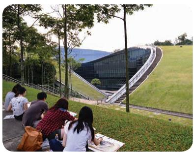

> **AI Description:**
> **Source:** `assets/_page_3_Figure_0.jpg`
> 
> **Generated:** 2026-05-30 17:17:45
> 
> ---
> 
> The image contains a photograph of a group of people sitting on a grassy hillside, enjoying a picnic. In the background, there is a modern architectural structure with a sloped roof and large glass windows. The setting appears to be a park or a campus area, with trees and open green space surrounding the area. The people are casually dressed and seem relaxed, suggesting a leisurely outdoor activity. The image captures a serene and pleasant atmosphere.


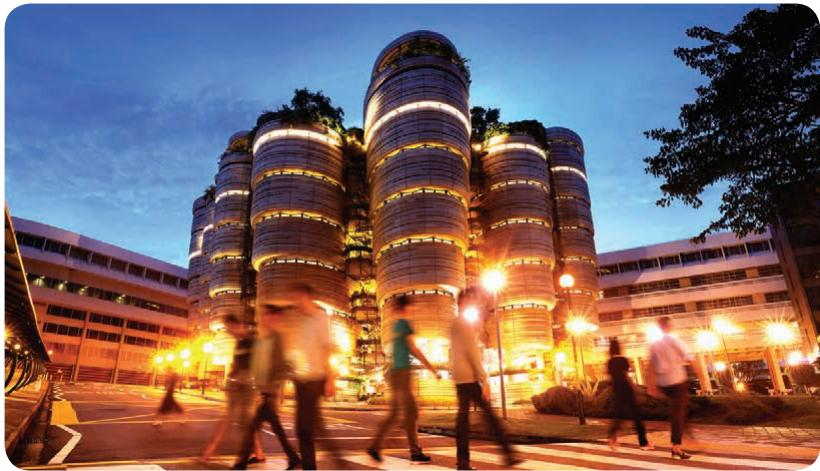

> **AI Description:**
> **Source:** `assets/_page_3_Figure_1.jpg`
> 
> **Generated:** 2026-05-30 17:17:55
> 
> ---
> 
> The image depicts a modern architectural structure with cylindrical towers, each adorned with vertical gardens and illuminated by warm lighting. The scene is set during dusk or early evening, as the sky is a deep blue. Several people are walking in the foreground, suggesting a public or commercial area. The design of the building appears to be eco-friendly, incorporating greenery and sustainable features. The overall atmosphere is vibrant and dynamic, reflecting a bustling urban environment.


> **AI Description:**
> **Source:** `assets/_page_3_Figure_2.jpg`
> 
> **Generated:** 2026-05-30 17:17:23
> 
> ---
> 
> The image is a photograph of three people in a grocery store. They are standing near a shopping cart filled with fresh produce, including bananas and leafy greens. The person in the center is juggling a tomato, while the other two are smiling and laughing. The background shows shelves stocked with various grocery items. The image conveys a light-hearted and fun shopping experience.


> **AI Description:**
> **Source:** `assets/_page_3_Figure_3.jpg`
> 
> **Generated:** 2026-05-30 17:17:17
> 
> ---
> 
> The image is a photograph of four individuals sitting around a table in what appears to be a café or restaurant setting. They are engaged in conversation, with one person wearing a hijab. The table has various items on it, including what looks like food and drinks, suggesting they are enjoying a meal or snack together. The background shows a modern interior with large windows and some architectural details, indicating a contemporary urban environment.


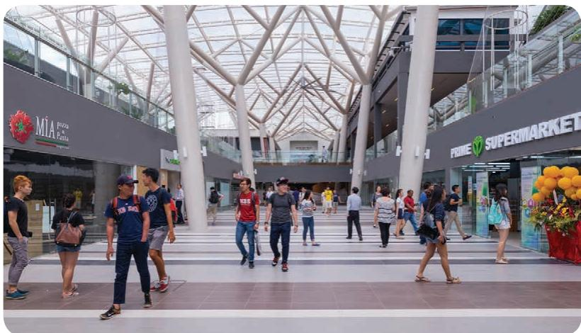

> **AI Description:**
> **Source:** `assets/_page_3_Figure_4.jpg`
> 
> **Generated:** 2026-05-30 17:16:02
> 
> ---
> 
> The image depicts the interior of a modern shopping mall with a high, open ceiling supported by large, white columns. The architecture features a glass and metal framework, allowing natural light to flood the space. Various storefronts are visible, including "Mía Pizza & Pasta" and "Prime Supermarket." People are walking around, some in groups and others individually, suggesting a bustling atmosphere. The floor is tiled with a pattern of light and dark squares, and there are decorative elements like balloons near the supermarket entrance.


Young and research-intensive, Nanyang Technological University (NTU Singapore) is ranked 13th globally. It is also placed First amongst the world’s best young universities.

The university has colleges of Engineering, Business, Science, Humanities, Arts, & Social Sciences, and an Interdisciplinary Graduate School. It also has a medical school, Lee Kong Chian School Of Medicine, set up jointly with Imperial College London.

NTU is also home to world-class autonomous entities such as the National Institute Of Education,

S Rajaratnam School Of International Studies, Earth Observatory of Singapore, and Singapore Centre on Environmental Life Sciences Engineering.

NTU provides a high-quality global education to about 33,000 undergraduate and postgraduate students. The student body includes top scholars and international olympiad medallists from the region and beyond.

Hailing from 80 countries, the university’s 4,300-strong faculty and research staff bring dynamic international perspectives and years of solid industry experience.

<span id="page-4-0"></span>
## Nanyang Business School

## College of Engineering

• School of Chemical and Biomedical Engineering

• School of Computer Engineering

• School of Civil and Environmental Engineering

• School of Electrical and Electronic Engineering

• School of Materials Science and Engineering

• School of Mechanical and Aerospace Engineering

## College of Humanities, Arts & Social Sciences

• School of Art, Design and Media

• School of Humanities and Social Sciences

Wee Kim Wee School of Communication & Information

## College of Science

• School of Biological Sciences

• School of Physical & Mathematical Sciences

College of Professional and Continuing Education (PaCE College)

## Interdisciplinary Graduate School

## Lee Kong Chian School of Medicine

## Autonomous Institutes

• Earth Observatory of Singapore

• National Institute of Education

• S. Rajaratnam School of International Studies

Singapore Centre on Environmental Life Sciences Engineering

## Travelling within Campus

## Internal Shuttle Bus

Get the internal shuttle bus arrival information at your fingertips at http://campusbus.ntu.edu.sg/ntubus. The movement of the buses on different routes can also be viewed real-time on the map. You may even view the number plate and speed of the individual bus. You can also download a free iPhone application Traversity that tracks internal shuttle bus services at NTU.

## Public Bus Service

Public bus services 179, 179A and 199 ply the Yunnan Garden campus in addition to the NTU shuttle bus service. Visit http://www.ntu.edu.sg/has/Transportation/ Pages/GettingToNTU.aspx for more details.

## Interactive Campus map

The new interactive Campus Map enables you to locate lecture theatres, tutorial rooms, buildings and landmarks on campus, and find directions between places easily. You may also print the map or send a friend an email with information on a location or direction. Google street view and internal shuttle bus routes are also integrated in the map. Best of all, it works on your mobile device too! Visit http://maps.ntu. edu.sg/maps to get interactive directions now!

<span id="page-5-0"></span>
# Student Services Section at Student Affairs Office

The Student Services Section in Student Affairs Office (SAO) comprises Student Support and the One Stop @ Student Activities Centre (an integrated student services centre).

## Services and Information about Student Support

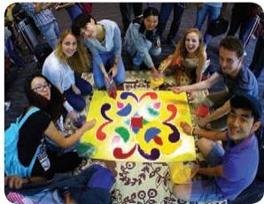

> **AI Description:**
> **Source:** `assets/_page_5_Figure_0.jpg`
> 
> **Generated:** 2026-05-30 17:16:57
> 
> ---
> 
> The image shows a group of people gathered around a colorful, patterned banner. The banner features a vibrant design with a central motif surrounded by decorative elements. The people appear to be engaged in a collaborative activity, possibly related to cultural or educational purposes, as suggested by the banner's design and the group's interaction. The setting seems to be indoors, with other individuals and objects visible in the background, indicating a communal or group environment.


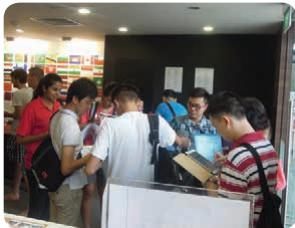

> **AI Description:**
> **Source:** `assets/_page_5_Figure_1.jpg`
> 
> **Generated:** 2026-05-30 17:16:33
> 
> ---
> 
> The image contains a photograph of a group of people gathered around a counter or booth. The setting appears to be indoors, possibly at an event or conference, as there are flags in the background and informational posters on the wall. The people are engaged in conversation, with some individuals holding what appear to be pamphlets or brochures. The counter has a sign, but the text on it is not clearly legible in the image. The overall scene suggests an interactive or informational booth where people are receiving information or assistance.


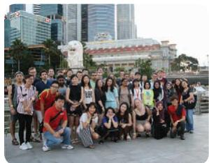

> **AI Description:**
> **Source:** `assets/_page_5_Figure_2.jpg`
> 
> **Generated:** 2026-05-30 17:15:30
> 
> ---
> 
> The image is a photograph of a group of people posing for a photo in front of a large statue, which appears to be the Merlion, a symbol of Singapore. The group is diverse, with individuals of varying ages and attire. The background features modern high-rise buildings and a waterfront, suggesting the photo was taken in an urban area near the city center. The lighting indicates it is either early morning or late afternoon.


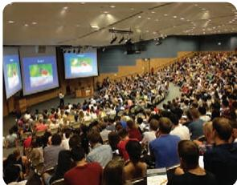

> **AI Description:**
> **Source:** `assets/_page_5_Figure_3.jpg`
> 
> **Generated:** 2026-05-30 17:16:27
> 
> ---
> 
> The image shows a large lecture hall filled with students. The hall has tiered seating, and there are two large screens at the front displaying colorful diagrams or presentations. The audience appears engaged, with many students looking towards the screens. The setting suggests an educational environment, possibly a university lecture or seminar.


## We assist international students with:

• Pre-arrival information

• Student’s Pass application

• Immigration matters

Insurance

• Advice on pastoral care

• Crisis support

• Part-time employment endorsement

We also organise programmes to promote crosscultural understanding and interaction. All NTU students are welcome to attend our events and activities, which include:

Orientation

• Campus Tours

• Coffee Sessions

• Community Service

• Cultural Tours and Outings

• Festive Open House

• Host Family Programmes

• Luncheons

• Pre-Graduation Seminars

• Grow, Embrace and Learn (G.E.L) Programme

## Contact Student Support

You can contact Student Support via our general phone line, email or come personally to our office should you require any assistance.

Telephone: (65) 6790 6823 (during office hours) (65) 6790 5200 (24-hour Campus Security Hotline) Email: SAOstudentsupport@ntu.edu.sg

## Mailing Address

Student Affairs Office (SAO)   
Student and Academic Services Department   
Nanyang Technological University   
42, Nanyang Avenue #04-02,   
Student Services Centre   
Singapore 639815

## Office Hours

Monday to Thursday

Friday

: 8.30am to 5.45pm

: 8.30am to 5.15pm

Saturday, Sunday and Public Holidays : Closed

## Locate Us

You can locate us at the 4th level of the Student Services Centre. Visit http://maps.ntu.edu.sg/ maps#q:student%20services%20centre

<span id="page-6-0"></span>
## Services and Information about One Stop @ Student Activities Centre (SAC)

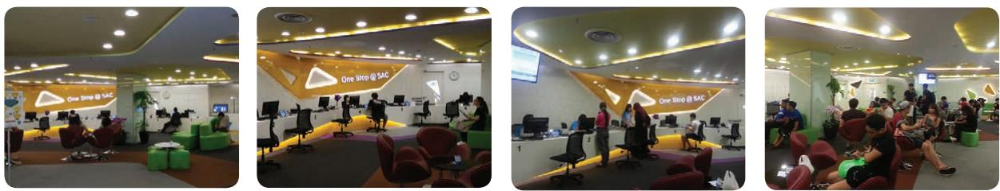

> **AI Description:**
> **Source:** `assets/_page_6_Figure_0.jpg`
> 
> **Generated:** 2026-05-30 17:08:08
> 
> ---
> 
> The image is a collage of four photographs showing the interior of a service center. The space is modern and well-lit, with a color scheme of white, yellow, and green. The photographs depict various areas within the center, including workstations with computers, seating areas with red and green chairs, and a counter where staff members are assisting customers. The text "One Stop @ SAC" is visible on the wall, indicating the name of the service center. The overall layout suggests a customer service environment designed for efficiency and comfort.


The One Stop @ SAC is the nerve centre and information counter for visitors with general enquiries about the university. One Stop is a strategic initiative to deliver high-quality, innovative and integrated student services which include general enquiries, application, submission and collection of documents and payment for NTU services. Additionally, two IT service desk counters are included to assist students. It is important to note that One Stop @ SAC is a cashless office. Students may choose to opt for other modes of payment such as credit card, E-nets, EZ card, Nets flash pay, cheque or telegraphic transfer.

## Contact One Stop @ SAC

You can contact One Stop @ SAC via our general hotline, email or come personally to our Centre should you require any assistance.

Telephone: Email:

(65) 6592 3626 (during office hours) ossac@ntu.edu.sg

## Mailing Address

One Stop @ SAC   
Nanyang Technological University   
50 Nanyang Avenue   
NS3-01-03, Academic Complex North   
Singapore 639798

## Counter Operating Hours

Monday to Thursday

: 8.30am – 5.00pm

Eve of Public Holidays

: 8.30am – 4.45pm

: 8.30am – 12noon

Saturday, Sunday and Public Holidays : Closed

## Locate Us

You can locate us beside the Student Activities Centre at the North Spine Plaza.   
Visit http://maps.ntu.edu.sg/maps#q:one%20stop%20%40%20sac.

<span id="page-7-0"></span>
## BEFORE LEAVING HOME

<span id="page-8-0"></span>
## BEFORE LEAVING HOME

Use this checklist to prepare for your stay in Singapore

Accept the Offer of Admission by stipulated deadline

Apply for an Entry Visa (if applicable) to enter Singapore (Please refer to www.ica.gov.sg)

Apply for a Student’s Pass (Please refer to Student’s Pass section)

Make housing arrangement

Make travel arrangement to Singapore

## Pack your belongings

 A print-out of eForm16 and duly signed by you

 Colour passport-sized photographs, including digital copies

 Original letter of admission from NTU

Original copies of educational certificates, examination results and other documents submitted in support of your application for admission (not applicable for exchange students)

 Cash of at least \$3,000 for initial expenses (excluding tuition fees and rental)

 Funds to place a deposit and pay housing rental upon arrival

Prescribed medication

Personal items such as toiletries, towel, bed linen, pillow cases, alarm clock, adapter, etc

Clothes and footwear, including a light jacket for air-conditioned venues such as the Library

 Formal wear for interviews or important functions

Notebook if you are not purchasing one in Singapore (Singapore is using 230V for electricity)

## □ Make sure these items are with you for clearance at the Singapore Checkpoint

 Your passport with at least six-month validity from the commencement of your course

 Your plane, train or bus ticket

 A print-out of your In-Principle Approval (IPA) letter

 A print-out of your Letter of Admission

<span id="page-9-0"></span>
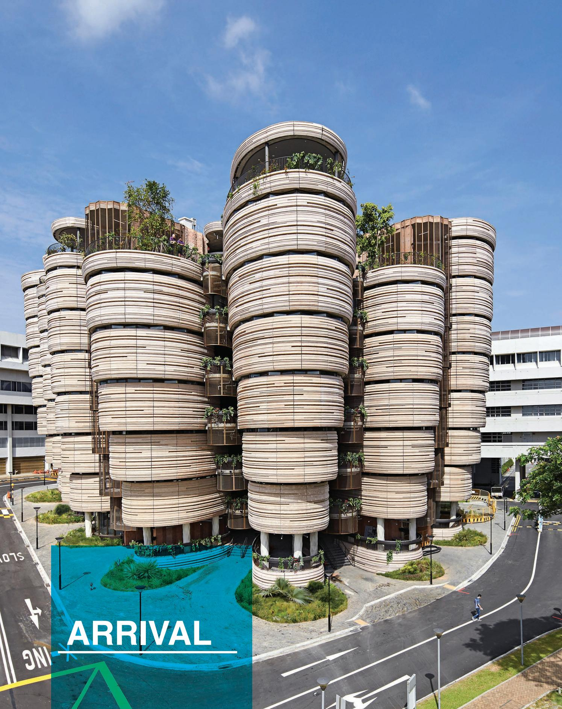

> **AI Description:**
> **Source:** `assets/_page_9_Figure_0.jpg`
> 
> **Generated:** 2026-05-30 17:15:02
> 
> ---
> 
> The image contains a photograph of a modern architectural building with a unique design. The structure features multiple circular sections stacked on top of each other, creating a layered effect. Each section appears to have balconies or terraces, some of which are adorned with greenery, suggesting an emphasis on sustainability and integration with nature. The building is situated in an urban environment, with roads and other buildings visible in the background. The image also includes a graphic overlay in the bottom left corner with the word "ARRIVAL" and some abstract shapes, possibly indicating a conceptual or promotional context for the building.


<span id="page-10-0"></span>
## ARRIVAL

You will be busy for the first few weeks at NTU! Use this checklist to settle down

Know how to get to NTU

Check-in to your housing

Register with SAO-Student Support Complete registration procedures Be briefed on the completion of the Student’s Pass formalities

Undergo a medical examination at the Fullerton Healthcare@NTU for students on more   
than 6 months study programme   
(Please refer to Medical Examination section)

Complete the Student’s Pass formalities and collect your Student’s Pass (Please refer to Student’s Pass section)

Complete all matriculation procedures

□ Open a bank account if your study duration is more than 6 months

Purchase a Singapore mobile line (optional)

Activate your network and Office 365 EDU accounts

Update your particulars and contact details via StudentLink (undergraduate students), GSLink (graduate students), or Exchange Portal (exchange students)

Attend orientation, welcome events and SAO-Student Support activities

Join a student club or society and plug into NTU’s vibrant student life (optional)

<span id="page-11-0"></span>
## How to Get to NTU

Singapore has an efficient, safe and affordable public transport system. You can take a taxi, Mass Rapid Transit (MRT) train or bus to campus. If you are travelling to Singapore for the first time and have luggage with you, we recommend you to take a taxi.

For more information on the public transportation in Singapore, please refer to the Travelling within Singapore section.

## Taxi

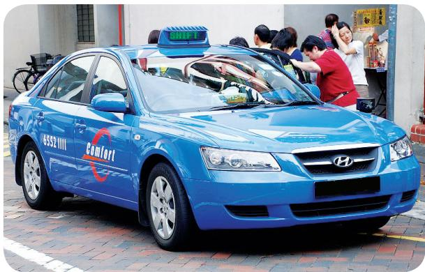

> **AI Description:**
> **Source:** `assets/_page_11_Figure_0.jpg`
> 
> **Generated:** 2026-05-30 17:16:23
> 
> ---
> 
> The image shows a blue taxi with the word "Comfort" and a logo on its side. The taxi is parked on a brick-paved street, and there are people standing around it, seemingly interacting with the driver or passengers. The taxi has a digital display on the roof showing "6552 1111". The car is a Hyundai model, as indicated by the logo on the front grille. The scene appears to be in an urban area, possibly a taxi stand or a busy street.


You can hail a taxi at the taxi bays outside the Arrival Hall at the airport, at taxi stand or anywhere safe along public roads in Singapore. Inform the driver the address of your destination. If you are travelling to NTU, request the driver to take the Pan Island Expressway (PIE). The journey will take about 45 minutes. Taxi fares in Singapore are charged by the taxi meter and are based on a flag down rate and distance travels. Please check with the driver or taxi company on the surcharge and ask for a receipt at the end of the trip. Comprehensive information on Singapore taxis is available at www. taxisingapore.com.

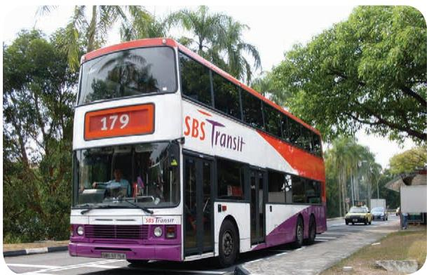

> **AI Description:**
> **Source:** `assets/_page_11_Figure_1.jpg`
> 
> **Generated:** 2026-05-30 17:15:37
> 
> ---
> 
> The image contains a photograph of a double-decker bus. The bus is white with purple and orange accents and displays the number "179" on the front. The text "SBS Transit" is prominently displayed on the side of the bus. The bus is on a road with trees and other vehicles in the background. The image provides visual information about the bus's route number and the company operating it.


The nearest train stations to NTU are Boon Lay (EW27) and Pioneer (EW28) on the East West Line operated by SMRT Corporation.

From Boon Lay station, make your way to the adjacent bus interchange. Services 179 &199 will take you into NTU.

From Pioneer station, you can hop on the Campus Rider that stops in front of Blk 649A, Jurong West Street 61.

If you are coming from Changi Airport and are travelling light, you can get on Changi Airport (CG2), transfer at Tanah Merah (EW4) and take the train all the way to Boon Lay or Pioneer station. The journey may take over an hour. Please note that trains and public buses do not operate between midnight and 5.30am daily.

For a map of MRT stations in Singapore, please visit www.ntu.edu.sg/AboutNTU/visitingntu/Pages/location. aspx.

<span id="page-12-0"></span>
## Check-In to Your Housing

If you have applied for and been offered a place in campus housing, please ensure that you have provided your arrival details online. Please refer to your offer email for information on the collection of your room key.

For further enquiries on housing matters, please contact the Office of Housing and Auxiliary Services (HAS), the office administrating on-campus and off-campus housing, via email. You can also visit www.ntu.edu.sg/has for more information on campus and off-campus housing.


## Register with SAO-Student Support

Please settle into your housing before registering with SAO-Student Support during office hours to complete the registration procedures and be briefed on the procedures to complete the Student’s Pass formalities. Do bring along your passport, embarkation card, Letter of Admission/Enrolment, receipts for any NTU’s Miscellaneous Fee payment.

## Bank Account

For students whose study period is 6 months or more, you may choose to open an account with the bank of your choice in Singapore. The banks offer a wide range of services and have different types of saving accounts.

## Matriculation

Matriculation refers to the process of registering as a student of the university. After you have completed all matriculation procedures, NTU will issue you with a matriculation card identifying you as its student.

The OCBC bank has a branch on campus at the North Spine at Block N3. Other banks are located near NTU at Jurong Point Shopping Centre. Please contact the banks or visit their website to determine their requirement for opening and maintaining an account.


To open a bank account, you will need:

• Your original passport

• Your Student’s Pass (IPA Letter subject to the bank’s acceptance)

Your Singapore address (must be reflected on original official letters, e.g. phone bills, bank statement, utilities bills.)

<span id="page-13-0"></span>
## Network and Office 365 EDU Accounts

Your network account enables you to access to the NTU computer network, Intranet portal iNTU (https:// intu.ntu.edu.sg), e-services (StudentLink, GSLink), e-learning (NTULearn), Library databases and other computer resources. You will receive the details upon registration.

Your Office 365 EDU account enables you to email access to your email and a suite of Office 365 services (such as online storage, office software, etc.) at http:// www.outlook.com/e.ntu.edu.sg. This account is a lifelong account to serve your needs as a NTU alumnus.

Please refer to http://www.ntu.edu.sg/cits/newusers/ newstudent/Pages/studentaccounts.aspx for more information on your computer accounts.

Prior to your use of the computer account, you must change your account password according to the instructions stated in the website.

## Update Your Particulars

Please access StudentLink (undergraduate students), GSLink (graduate students), or Exchange Portal (exchange students) to update your particulars and contact details.

## Mobile Phone

You can sign up for a mobile line at Jurong Point Shopping Centre near to NTU or convenience store. Singapore has 3 telecommunication companies. Please visit their website to know more about their plans and rates.


## Orientations and Welcome Events

The Freshmen Welcome Ceremonies, orientations, campus and laboratory tours, and welcome events organised by SAO-Student Support, schools and Halls of Residence provide new students with useful information on student services and campus life. They are also great occasions to interact with fellow students and widen your social network.

## A Vibrant Student Life

Immerse into NTU’s vibrant student life with more than 100 student organisations with diverse interests from astronomy to sports to music. Please visit www.ntu.edu.sg/campuslife/clubs for more details.

<span id="page-14-0"></span>
## IMMIGRATION

<span id="page-15-0"></span>
## Student’s Pass

Back of Student’s Pass

All international students who have been accepted by NTU as full-time matriculated or registered students are required to hold a valid Student’s Pass issued by the Immigration & Checkpoints Authority (ICA) of Singapore.

## Application for Student’s Pass

New application for Student’s Pass must be submitted at least 1 month and not more than 2 months before the commencement of the course. The application must be submitted through the Student’s Pass Online Application and Registration (SOLAR) system which is accessible through ICA website at www.ica.gov.sg.

International students who had pursued pre-university studies in Singapore need to produce their Student’s Pass if these have not been returned to ICA.

You may wish to email SAO-Student Support should you have further enquiry on Student’s Pass application.

Front of Student’s Pass

## Application Fees and Charges

You can pay the fees payable to ICA online via the SOLAR system by credit/debit card or internet banking.


## Note:

A replacement fee of \$100 will be imposed if the Student’s Pass is lost or stolen.

An additional \$30 processing fee will be imposed for amendments made to eForm16 after submission.

## Cancellation of Student’s Pass

You are required to surrender your Student’s Pass to ICA for cancellation within 7 days from the date of cessation or termination of your full-time studies, go on leave of absence or convert to part-time study. Please visit www.ica.gov.sg for more information.

<span id="page-16-0"></span>
## Medical Examination

The offer of admission to NTU is conditional upon the issuance of a valid Student’s Pass by ICA. You are required to undergo the medical examination should your period of study be more than 6 months. The examination will include the Human Immunodeficiency (HIV) and Tuberculosis (TB) medical tests. These tests must be done at the Fullerton Healthcare@NTU.

Upon satisfactory completion of the medical examination, the Fullerton Healthcare@NTU will issue you with a medical report which you need to submit with your Student’s Pass application. You will be denied admission and must return home at your own expense should you fail any of the medical examination.

## Appointment for Medical Examination

All international students will receive instruction on how to complete the medical examination when they report to SAO-Student Support upon their arrival at NTU.

## Overstaying

Overstaying is a punishable offence under the Immigration Act. You need to note the expiry date of your Social Visit Pass or Student’s Pass and apply for an extension at least a month before the expiry.

## Social Visit Pass (For Spouses and Children of Full-Time Graduate Students)

## Applying for an Entry Visa

If your spouse and children require an Entry Visa to visit Singapore, they may apply accordingly at a Singapore embassy in your home country.

## Extending the Social Visit Pass

You may approach SAO-Student Support for a letter of support to extend the Social Visit Pass of your spouse and children. Please visit www.ntu.edu.sg/SAO/ Studentsupport for more details.

## Useful Contacts of Ministries


<span id="page-17-0"></span>
HEALTH, WELLNESS AND   
INSURANCE

<span id="page-18-0"></span>
# HEALTH, WELLNESS AND INSURANCE

## General Medical Care

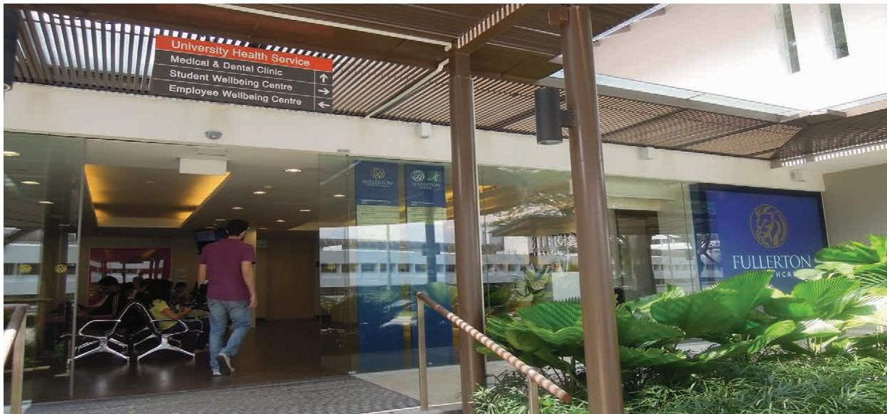

> **AI Description:**
> **Source:** `assets/_page_18_Figure_0.jpg`
> 
> **Generated:** 2026-05-30 17:13:40
> 
> ---
> 
> The image contains a photograph of the entrance to a building, specifically the Fullerton Health Care facility. The entrance features a glass door with a sign indicating directions to various health services, including the University Health Service, Medical & Dental Clinic, Student Wellbeing Centre, and Employee Wellbeing Centre. The sign also includes directional arrows pointing towards these services. The entrance is partially shaded by a roof structure, and there are some plants and seating areas visible inside the building.


## Fullerton Healthcare@NTU

The Medical Service on campus is operated by Fullerton Healthcare Group. Health services provided include general outpatient medical and dental treatment, laboratory and x-ray investigation, as well as minor surgery. They also provide immunisation and travel medical advice.

## Address

Fullerton Healthcare @ NTU University Health Service 36 Nanyang Avenue, #01-01 Singapore 639801

## Telephone Number

Medical: (65) 6793 6828 / (65) 6793 6794   
Dental: (65) 6790 8331

## Operating Hours


## Clinics Near Campus

There are several private clinics, that are near NTU. You may wish to visit http://www.singhealth. com.sg/PatientCare/GP/Pages/Home.aspx for a comprehensive list of clinics in Singapore.

Please note that visits to private clinics are at your own expenses.

## Pharmacies Near Campus

These are the pharmacies which are near NTU.

## Guardian Pharmacy

Location

Jurong Point Shopping Mall

1 Jurong West Central 2 #B1-27/28 (JP2)

Singapore 648886

## Watsons Your Personal Store

Location

Jurong Point Shopping Mall

1 Jurong West Central 2 #B1-12/13/14

Singapore 648886

<span id="page-19-0"></span>
## Medical Emergencies

In a medical emergency where immediate specialist treatment is required, please proceed to the hospital’s Emergency department. The nearest government hospital is Ng Teng Fong General Hospital and their contact details are as follows:

```
Telephone Number   
(65) 6716 2000   
Email Address   
enquiries@juronghealth.com.sg   
Website   
www.ntfgh.com.sg
```

## Seeking Reimbursement for Hospitalisation

Eligible students may seek a reimbursement under the Group Hospitalisation and Surgical Insurance (GHSI) scheme for the hospitalisation fee incurred in Singapore government/restructured hospitals. The insurance company will review and determine the reimbursed amount based on the scheme’s terms and conditions. For more information on GHSI, please refer to Insurance section.

## Seeking Reimbursement for Outpatient Specialist Care

Eligible students are covered up to \$1000 per policy year for treatment by a specialist (including diagnostic tests such as x-rays and scans) or A&E department (strictly for accidents and emergencies only) in Singapore government/restructured hospitals. The coverage is subject to the terms and conditions of the GHSI. For more information on GHSI, please refer to Insurance section.

Important: Outpatient specialist care will only be reimbursed if the specialist whom you are seeking treatment from is referred by the Fullerton Healthcare@ NTU or the A&E department of a government/ restructured hospital.

For a list of Singapore Government/Restructured Hospitals and Specialist Clinics, please refer to the table below.


<span id="page-20-0"></span>
# HEALTH, WELLNESS AND INSURANCE

## Support for Students with Special Needs

The Accessible Education Unit (AEU) offers professional guidance and advice to students with disabilities and special needs. Disabilities may include the following conditions:

• Physical or mobility disability

• Sensory impairment (hearing or vision loss)

• Learning disability (e.g. Dyslexia, Autism, ADHD)

• Neurological deficits (e.g. traumatic head injury)

If you have special needs and require support services, please email the Accessible Education Unit at aeu@ntu.edu.sg

Please note that medical evidences or specialist reports are required for verification of disability or special needs.

## Academic Counselling

If you are unable to cope with your studies, please seek help from faculty/staff, tutor or the Assistant Chair of Students in your school.

## Pastoral Care

Being away from home can be an especially lonely experience when you fall ill or are hospitalised. Do contact SAO-Student Support should you need any assistance.


Counselling
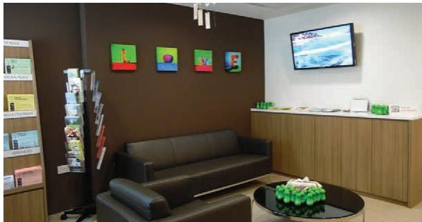

> **AI Description:**
> **Source:** `assets/_page_20_Figure_0.jpg`
> 
> **Generated:** 2026-05-30 17:16:41
> 
> ---
> 
> The image contains a photograph of a modern waiting area. It features a dark brown wall with four small, colorful abstract paintings. Below the paintings is a dark brown leather sofa. To the left, there is a tall, narrow stand holding pamphlets or brochures. On the right side, there is a wooden counter with a television screen mounted above it displaying a snowy landscape. In front of the sofa, there is a round glass coffee table with a decorative green item on it. The overall setting appears to be a professional or medical office waiting area.


## Professional Counselling

The Student Wellbeing Centre is available to all students for professional counselling. A team of registered counsellors are experienced in helping students from various backgrounds and with a wide range of issues.

If you are facing challenges which affect your health, relationships, daily activities, academic performance or eating and sleeping patterns, please seek professional counselling. You may also approach the Centre if you are interested in personal development or selfimprovement.

If you have troubled thoughts or behaviour such as self-harm or harming others, please seek professional counselling or medical help.

<span id="page-21-0"></span>
To speak to a professional Student Counsellor, please make an appointment at www.ntu.edu.sg/ studentwellbeing/appointment or call (65) 6790 4462 during office hours. The Centre is located at University Health Service, #02-01, 36 Nanyang Avenue. Consultation is free of charge for students and held in strict confidence.

After office hours, you may contact Campus Security at (65) 6790 5200 or approach your Hall Fellow if you live in a Hall of Residence if there is any emergency.

## Peer Helping Programme

The Student Wellbeing Centre administers a peer support network for students on campus called the ‘Peer Helping Programme’. Student volunteers in the programme are trained by the Centre’s professional Student Counsellors to befriend and support students with emotional and/or psychological issues. If you wish to find out more about this programme, please call or email the Student Wellbeing Centre at studentwellbeing@ntu.edu.sg.

## Workshops and Self-Help Resources

The Student Wellbeing Centre further promotes student well-being through workshops and talks on topics such as strategies for better learning, and stress and relaxation techniques. Resources are also available for students to support them through various periods in the academic journey. Visit www. ntu.edu.sg/studentwellbeing/selfhelp/students or drop by the Centre for these resources.

## Stay Healthy

Learn how you can adopt an active and healthy lifestyle. Check out www.ntu.edu.sg/has/SnR/Pages/index. aspx for the programmes of the Sports and Recreation Centre and the Healthy Lifestyle Unit.

## Insurance

NTU has two insurance schemes - Group Hospitalisation and Surgical Insurance and the Group Personal Accident Insurance - to help eligible students meet basic medical cost.

## Group Hospitalisation and Surgical Insurance (GHSI)

GHSI is compulsory for all full-time international students, including Singapore permanent residents.

Falling ill and being hospitalised in Singapore can be a financial drain on international students who are not entitled to medical subsidies. Further, hospitals require a deposit of the entire estimated cost upon admission. For example, if the estimated cost for a hospital stay is \$5,000, you must place a deposit of \$5,000 with the hospital upon admission.

For eligible students on the GHSI, the underwriter of GHSI will prepare a Letter of Guarantee (LOG), which you can present to the hospital in lieu of the cash deposit, subject to the terms and conditions of the insurance scheme. For more information, please refer to www.ntu-ghs.com.sg

## Group Personal Accident Insurance (GPAI)

The GPAI Scheme provides basic coverage for accidental death or permanent disablement as well as medical reimbursement for accidents for undergraduates and full-time graduate students (optional). Please see www.ntu.edu. sg/Students/Undergraduate/StudentServices/ HealthAndCounselling/MedicalInsuranceSchemes/ Pages/GPAI.aspx for details including conditions for eligibility.

<span id="page-22-0"></span>
# HEALTH, WELLNESS AND INSURANCE

## Additional Insurance Coverage for Overseas Travel

All students are strongly advised to have adequate insurance coverage when travelling overseas for internships, conferences, exchange, study programmes, etc. The GHSI scheme does not provide adequate coverage for overseas travels.

Please refer to the following table for a summary of the insurance scheme.


• Information on the GHSI and GPAI is subject to changes.

<span id="page-23-0"></span>
## EMERGENCYHOTLINE

<span id="page-24-0"></span>
## Emergency Hotlines

Please make sure that you save these numbers in your mobile or smart phone. They will come in handy in an emergency. For more crisis helplines, please visit www.ntu.edu.sg/studentwellbeing.


## Who to Call


## 24-Hour Campus Security

Our campus is patrolled round-the-clock on a daily basis by a team of security officers. Complementing these patrols are CCTV and security access control systems. A low crime rate, however, does not mean that there is no crime so please guard your safety and belongings.

Fire drills and emergency evacuation procedures are in place for students’ security and safety.

<span id="page-25-0"></span>
ACADEMIC CALENDAR AND UNIVERSITY HOLIDAY

<span id="page-26-0"></span>
# ACADEMIC CALENDAR AND UNIVERSITY HOLIDAY

## 2016-2017 Academic Calendar


# Research students in postgraduate programmes are expected to work on their research projects throughout the period of their candidature subject to the student terms, requirements and entitlements.


## For the full calendar and details, please visit

http://www.ntu.edu.sg/Students/Undergraduate/AcademicServices/AcademicCalendar/Pages/AY2016-17.aspx.

<span id="page-27-0"></span>
## University Holidays

The university is closed during public holidays in Singapore. Classes will proceed as usual on the following Monday should the public holiday fall on a Saturday.

## 2016 and 2017 Public Holidays

For a list of public holidays in 2016 and 2017, please refer to the following table or to www.mom.gov.sg/newsroom/press-releases/2015/0512-ph-2016.


\* The following Monday will be a public holiday.

## Academic Services

Please refer to the respective websites for information on:

• The Academic Unit System

Curriculum Structure

• Examinations

• Course Registration

• Other Academic Services

## Undergraduate students

www.ntu.edu.sg/Students/Undergraduate/AcademicServices/Pages/default.aspx

## Graduate students

http://www.ntu.edu.sg/sasd/oas/ge/Pages/default.aspx

<span id="page-28-0"></span>
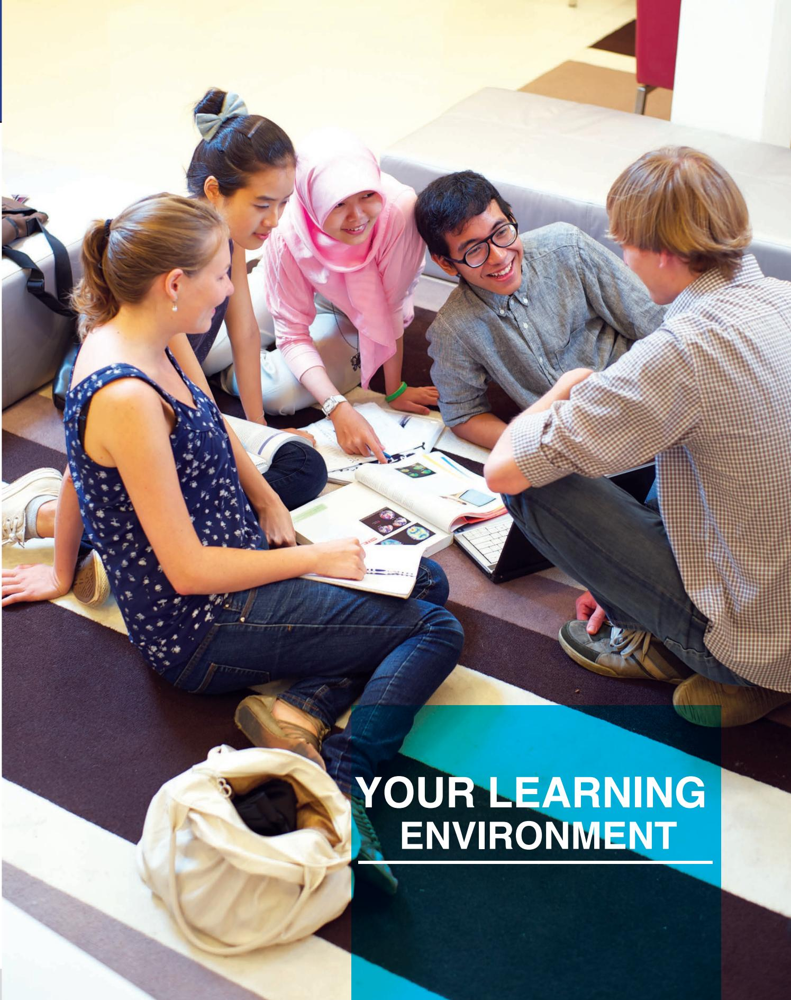

> **AI Description:**
> **Source:** `assets/_page_28_Figure_0.jpg`
> 
> **Generated:** 2026-05-30 17:13:21
> 
> ---
> 
> The image contains a photograph of a group of five students engaged in a collaborative learning activity. They are sitting on the floor in a casual setting, with books, notebooks, and a tablet spread out in front of them. The students appear to be discussing or working on a project together. The text "YOUR LEARNING ENVIRONMENT" is prominently displayed in the bottom right corner of the image. The setting suggests a relaxed and interactive learning environment, possibly in a university or college setting.


<span id="page-29-0"></span>
# YOUR LEARNING ENVIRONMENT

## e-learning and Mobile Learning

e-learning and mobile learning are all part of NTU’s online learning environment.

NTULearn is NTU online learning platform that allows students to learn anytime and anywhere. Students can view interactive course content, watch online lecture videos, submit assignments, participate in online discussions and forums, and assess themselves via online tutorial and much more.

BbLearn under the NTU mobile app is a learning mobile app that gives students on-the-go access to announcements, class roster, group discussions, grades and more on smart mobile devices. Students can also access i-Ngage tablet app to view ebooks, collaborate on online activities, share annotations and perform online quizzes.

The Learning Solutions and Applications Section in the Centre for IT Services (CITS) manages NTU’s e-learning environment. For more information on the different e-learning tools used in NTU, such as Clickers (Student Response System), LAMS (Learning Activity Management System), AcuStudio (Video Recording System), eUreka (Project Management System), Turnitin (Plagarism Detection System), BBConnect (SMS Notification System) and etc please visit http:// ntulearn.ntu.edu.sg.

## IT Services

NTU students enjoy state-of-the-art IT infrastructure and services. Each matriculated student is given a lifelong Office 365 EDU account and a network account for accessing to all these vast services:

a high-speed wired and wireless campus network, including remote access

e-services such as course registration, examination matters and e-billing

•	 e-learning and library resources

online storage and sharing of personal documents, blogs and web pages

live video webcasts of interesting seminars and events on campus

the interactive campus map, internal shuttle bus information and virtual tour, via web or mobile platform

•	 subscription to NTU mailing lists and e-newsletters

The department managing NTU’s IT and learning environment is the Centre for IT Services (CITS). Please visit www.ntu.edu.sg/cits to learn more.

## Computer Ownership Scheme

Each new student is encouraged to have a personal computer for more effective learning. Students will find that laptops are useful tools for formal lessons as well as coursework anytime and anywhere.

Before you purchase a computer hardware or software, please check out the attractive prices that are offered by the vendors. Please see http://www3.ntu.edu.sg/ CITS2/computerdeals/compcategory.htm.

To take up a computer loan for purchasing a PC/laptop, which is administered by the Office of Admissions and Financial Aid for full-time undergraduates, please visit the website to know more about the scheme: http:// admissions.ntu.edu.sg/UndergraduateAdmissions/ FinancialAssistance/Pages/PCLoan.aspx.

## Computing Facilities and Learning Spaces

Computing facilities and learning spaces are available on campus in schools, libraries and the Halls of Residence. One such state-of-the-art learning space is the Learning Pod @ South Spine. This creative learning space provides:

discussion rooms with LCD screens and glass writing boards

an open learning space with comfortable and configurable furniture

tables with a flexible power outlet and security bar for laptop users

•	 pay-per-use printing service

<span id="page-30-0"></span>
## NTU Libraries

NTU libraries provide students with access to rich information resources, collaborative learning spaces and research assistance. There are 7 libraries, open to every student in the campus.

Art, Design and Media Library (ART-01-03): Print and multimedia collections

Asian Communication Resource Centre (WKWSCI-01-18): Communication and Information Studies collections

Business Library (N2-B2b-07): Business collection and media services

• Chinese Library (S3.2-85-01): Chinese collection

Humanities and Social Sciences Library (S4-B3c): Humanities and Social/Sciences collections

• Lee Wee Nam Library (NS3-03-01): Engineering and Science collections

Wang Gungwu Library (CHC-02) : Overseas Chinese collection

For more information and access to resources, visit www.ntu.edu.sg/library.


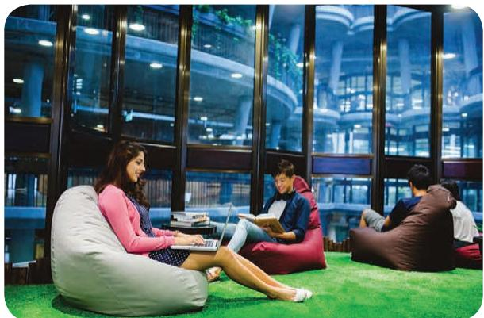

> **AI Description:**
> **Source:** `assets/_page_30_Figure_1.jpg`
> 
> **Generated:** 2026-05-30 17:10:51
> 
> ---
> 
> The image contains a photograph of a group of people in a modern indoor setting, likely a library or study area. The individuals are seated on bean bags on a green artificial turf surface. One person is using a laptop, while another is reading a book. The background features large glass windows that reveal an interior architectural structure with columns and a spiral staircase. The setting appears to be a relaxed and collaborative environment for studying or working.


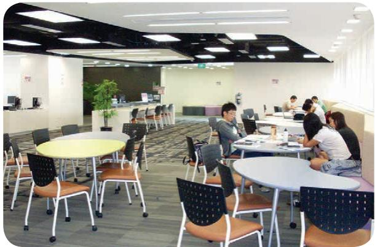

> **AI Description:**
> **Source:** `assets/_page_30_Figure_2.jpg`
> 
> **Generated:** 2026-05-30 17:10:36
> 
> ---
> 
> The image shows a modern office or study area with several round tables and chairs arranged for group work or meetings. The space is well-lit with overhead lighting and has a clean, organized layout. There are a few people seated at the tables, engaged in conversation or working on tasks. The background features a reception area with a desk and a potted plant, suggesting a professional or educational setting.


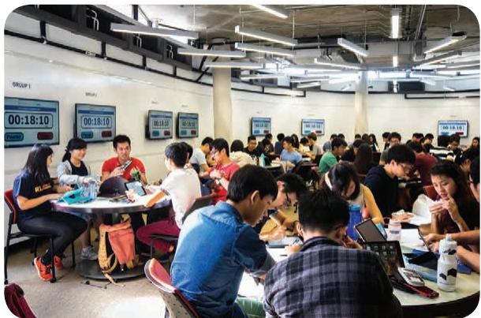

> **AI Description:**
> **Source:** `assets/_page_30_Figure_3.jpg`
> 
> **Generated:** 2026-05-30 17:10:44
> 
> ---
> 
> The image contains a photograph of a group of people in what appears to be a classroom or study area. The individuals are seated at tables, engaged in group activities or discussions. The tables have papers and laptops on them, suggesting a collaborative learning environment. The background shows a whiteboard with multiple clocks displaying the time "00:18:10," indicating a structured session or competition. The setting is well-lit with overhead lighting, and the overall atmosphere appears to be focused and collaborative.


<span id="page-31-0"></span>
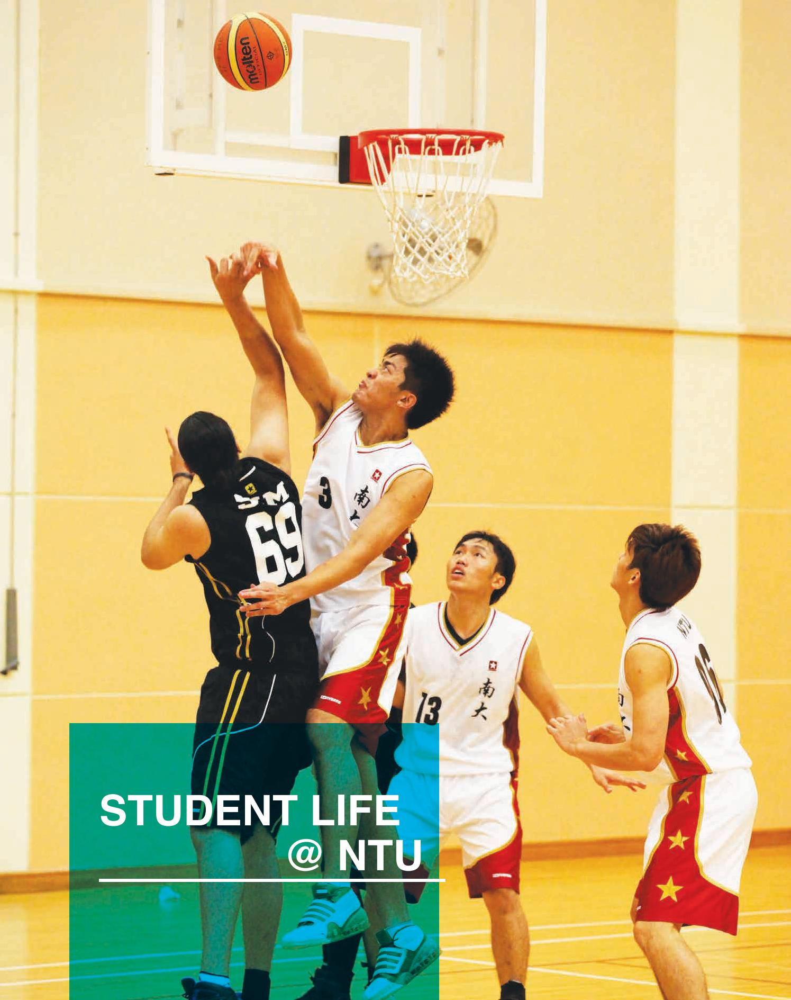

> **AI Description:**
> **Source:** `assets/_page_31_Figure_0.jpg`
> 
> **Generated:** 2026-05-30 17:10:23
> 
> ---
> 
> The image is a photograph of a basketball game in progress. It shows a player in a white jersey with red and gold accents attempting a shot while being defended by a player in a black jersey. The ball is in mid-air, heading towards the basket. Other players in similar white jerseys are positioned around the court, watching the play unfold. The background shows a basketball hoop and part of the court. The text "STUDENT LIFE @ NTU" is overlaid on the image in a green box at the bottom left corner.


<span id="page-32-0"></span>
# STUDENT LIFE @ NTU

## Student Organisations

Cultural performances, sporting events and many recreational pursuits enliven student life throughout the year. With more than 100 student organisations dedicated to diverse interests from astronomy to ballroom dancing to current affairs and community work, there is bound to be one that will take your fancy. Search www.ntu.edu.sg/campuslife/clubs/Pages/ Clubssocieties.aspx to know more.

## Sports and Games


> **AI Description:**
> **Source:** `assets/_page_32_Figure_0.jpg`
> 
> **Generated:** 2026-05-30 17:16:51
> 
> ---
> 
> The image is a photograph of a group of individuals participating in a beach activity. They are wearing swimwear and are positioned on surfboards, seemingly preparing to paddle or race. The setting appears to be a sunny beach with sand and trees in the background. The surfboards are brightly colored, and the individuals are wearing life jackets, indicating a safety-conscious environment. The image captures a dynamic and energetic scene typical of a beach sports event.


Keen on sports? Whether you are a recreational or a competitive athlete, there are programmes and activities that will suit you. You are welcome to make use of the sporting and recreational facilities at the Sports and Recreation Centre. Visit www.ntu.edu.sg/has/SnR/ Pages/index.aspx to learn more.

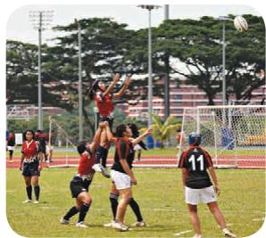

> **AI Description:**
> **Source:** `assets/_page_32_Figure_1.jpg`
> 
> **Generated:** 2026-05-30 17:16:46
> 
> ---
> 
> The image is a photograph of a rugby match. It shows players in action on a rugby field, with one player in the air, attempting to catch the ball. The players are wearing numbered jerseys, and the field is surrounded by a track and trees in the background. The image captures the dynamic movement and intensity of the sport.


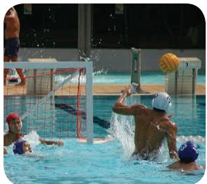

> **AI Description:**
> **Source:** `assets/_page_32_Figure_2.jpg`
> 
> **Generated:** 2026-05-30 17:15:43
> 
> ---
> 
> The image is a photograph of a water polo match in progress. It shows a player in the act of shooting the ball towards the goal, with the goalkeeper attempting to block the shot. The scene is dynamic, with water splashing around the players, indicating the intensity of the game. The players are wearing swim caps and swimsuits, and the background shows the pool and the goalpost. The image captures the action and energy of a competitive water polo match.


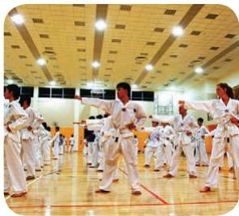

> **AI Description:**
> **Source:** `assets/_page_32_Figure_3.jpg`
> 
> **Generated:** 2026-05-30 17:16:15
> 
> ---
> 
> The image is a photograph of a group of people practicing martial arts in a gymnasium. The individuals are wearing white uniforms and are in various stages of a martial arts form or kata. The gymnasium has a high ceiling with recessed lighting and a polished wooden floor. The focus is on the individuals in the foreground, with the background slightly blurred, emphasizing the action and movement.


## Adventure/Water Sports

• Canoeing

•	 Canoe Polo

•	 Climbing

•	 Dragon Boat

•	 Lifeguard Corps

•	 Outdoor Adventure

•	 Scuba Diving

•	 Swimming

•	 Wakeboarding

•	 Windsurfing

•	 Water Polo

•	 Yachting

•	 Basketball

•	 Floorball

## Ball Games

•	 Handball

•	 Netball

•	 Volleyball

•	 Tchoukball

## Field Sports

• Cricket

• Football

• Rugby

• Touch Football

•	 Contact Bridge

## Mind Games

•	 International Chess

Weiqi

## Martial Arts

• Aikido

• Judo

• Shitoryu Karate

• Silat

• Taekwondo

## Racquet Games

•	 Badminton

• Squash

• Tennis

• Table Tennis

## Other Sports

•	 Aquathlon

• Archery

• Bowling

• Cheerleading

• Fencing

Golf

•	 Inline Skating

•	 Runners’ Club

•	 Snooker and Pool

• Sport Shooting

• Track and Field

•	 Ultimate Frisbee

<span id="page-33-0"></span>
## Meals on Campus

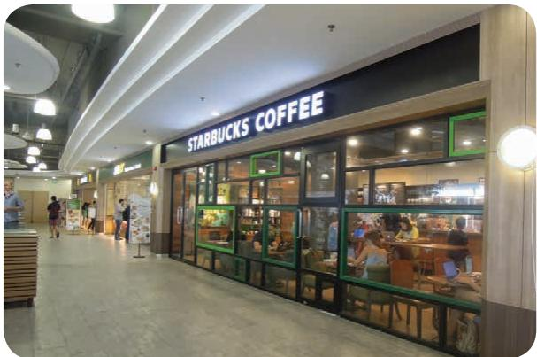

> **AI Description:**
> **Source:** `assets/_page_33_Figure_0.jpg`
> 
> **Generated:** 2026-05-30 17:17:39
> 
> ---
> 
> The image shows a photograph of a Starbucks Coffee shop located inside a shopping mall. The storefront has large glass windows and doors, allowing a view into the interior where customers are seated at tables. The exterior of the shop is marked with the Starbucks logo and the words "COFFEE" in white letters on a dark background. The surrounding area includes other shops and people walking by, indicating a busy shopping environment. The lighting is bright, and the overall ambiance appears clean and modern.


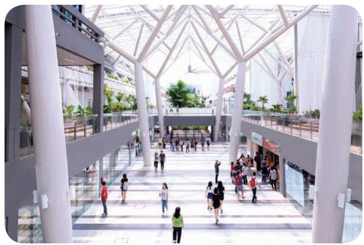

> **AI Description:**
> **Source:** `assets/_page_33_Figure_1.jpg`
> 
> **Generated:** 2026-05-30 17:18:02
> 
> ---
> 
> The image is a photograph of an indoor atrium with a modern architectural design. The space is spacious and well-lit, featuring large white columns and a glass roof that allows natural light to flood the area. There are several people walking through the atrium, and in the background, there are various shops and stalls. The overall atmosphere appears to be a public or commercial space, possibly a shopping mall or a transportation hub.

The NTU canteens, cafes and restaurants offer a wide variety of food. A meal in the canteen costs an average of \$4 but is subject to your food preference. Please visit http://www.ntu.edu.sg/has/FnB/Pages/index.aspx for a list of the canteens, cafes and restaurants.

## Postal, Banking and Retail

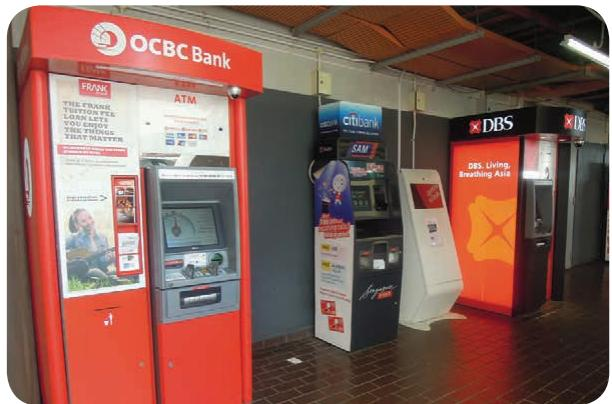

> **AI Description:**
> **Source:** `assets/_page_33_Figure_2.jpg`
> 
> **Generated:** 2026-05-30 17:17:31
> 
> ---
> 
> The image contains a photograph of an ATM area. It features ATMs from OCBC Bank and DBS Bank, with the OCBC ATM on the left and DBS ATMs on the right. The OCBC ATM is red and white, while the DBS ATMs are red with orange accents. There are also other ATMs visible in the background, including one with a blue and white design. The image includes text on the ATMs and surrounding signage, providing information about the banks and their services.


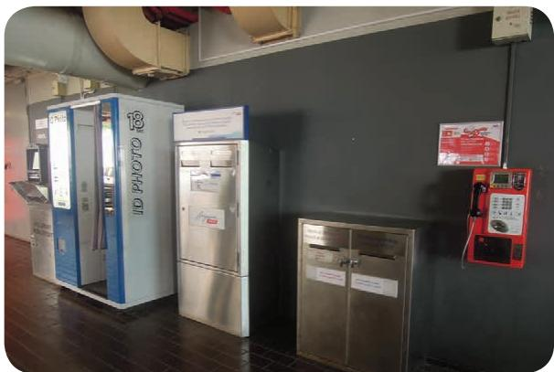

> **AI Description:**
> **Source:** `assets/_page_33_Figure_3.jpg`
> 
> **Generated:** 2026-05-30 17:17:05
> 
> ---
> 
> The image contains a photograph of a section of a building interior. It shows a row of machines, including a photo booth labeled "ID PHOTO" and a stainless steel cabinet with a sign on it. To the right, there is a red payphone mounted on the wall. The wall is dark gray, and the floor is wooden. The image includes some text on the machines and signs, but the primary visual elements are the machines and the payphone.

There are various amenities that can be found on-campus. For an updated list of facilities, please visit http://www.ntu.edu.sg/has/Pages/index.aspx.

<span id="page-34-0"></span>


<span id="page-35-0"></span>
Work out your budget prior to your arrival in Singapore for a financially well-prepared stay in Singapore. Read through this section to know how you can manage.

## Estimated Living Costs


Note:
\*Varies with room type and subject to revision

#Varies according to lifestyle

## Financial Assistance

Need financial help? Loans are available for students in need. Learn more about financial assistance schemes from the information provided in the admissions package or from http://www.ntu.edu.sg/ Freshmen/FreshmenGuide/FinancialMatters/Pages/ FinancialAssistanceSchemes.aspx.

## Part-Time Employment

The SAO-Student Support does not recommend that international students rely on part-time work as a source of funds. Doing so is very risky as part-time work may not be available when needed nor will it provide sufficient funds to sustain your stay.

International students on exchange or in non - graduating programmes may not engage in any part-time work in Singapore. For more information, please visit http://www.ntu.edu.sg/SAO/studentsupport/ ManagingFinances/Pages/ParttimeEmployment.aspx

Full-time undergraduate and graduate students who wish to take up part-time work for the experience should note the following:

## Part-Time Jobs outside Campus

Prior approval from the university is required for matriculated international students to work parttime. Students should contact the SAO-Student Support. A fresh application is required for each job. Scholarship holders require the additional approval of their sponsors.

Full-time matriculated international undergraduates and graduate students may work a maximum of 16 hours a week during term time and full-time during the vacation.

## Part-Time Jobs on Campus under Work Study Scheme (undergraduates only)

Undergraduates working part-time on campus may work a maximum of 14 hours a week during term time and nine hours a day or 44 hours a week during the vacation. Prior approval from the university is not required.

<span id="page-36-0"></span>
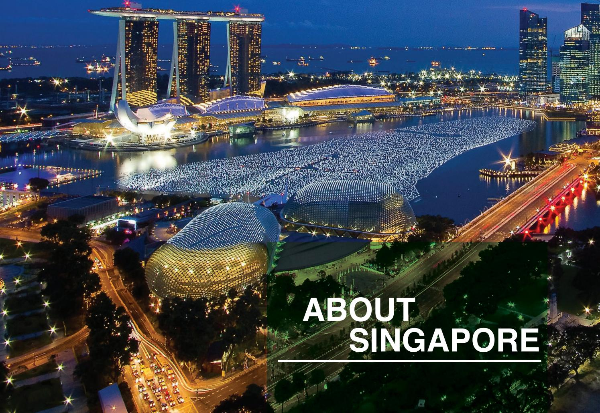

> **AI Description:**
> **Source:** `assets/_page_36_Figure_0.jpg`
> 
> **Generated:** 2026-05-30 17:08:57
> 
> ---
> 
> The image is a photograph of Singapore's skyline at night, showcasing iconic landmarks such as the Marina Bay Sands and the Esplanade Theatre. The image captures the illuminated buildings and the surrounding water, highlighting the city's modern architecture and vibrant nightlife. The text "ABOUT SINGAPORE" is overlaid on the image, indicating its purpose as an introductory or informative piece about the city.


<span id="page-37-0"></span>
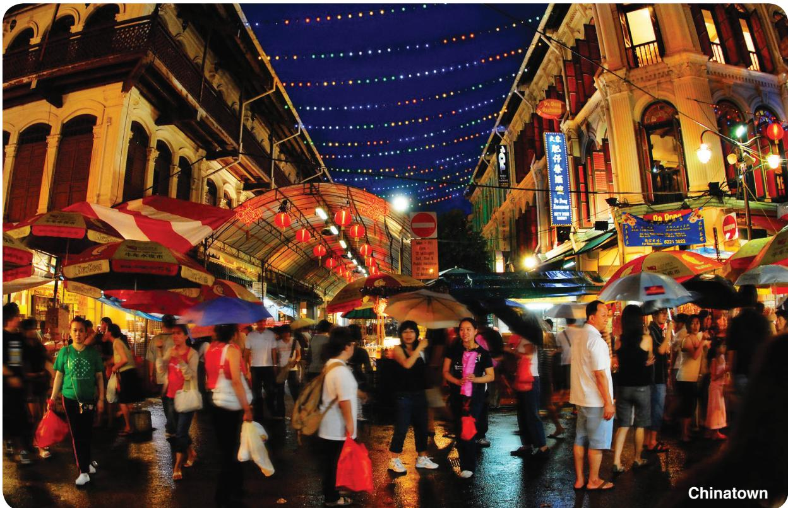

> **AI Description:**
> **Source:** `assets/_page_37_Figure_0.jpg`
> 
> **Generated:** 2026-05-30 17:12:00
> 
> ---
> 
> The image is a photograph of a bustling street scene in Chinatown, likely during a festive or market event. The street is lined with traditional-style buildings adorned with colorful lights and lanterns, creating a vibrant atmosphere. Numerous people are walking along the street, some carrying umbrellas, suggesting it might be raining. The scene is lively and filled with activity, showcasing a mix of cultural and commercial elements. The text "Chinatown" in the bottom right corner confirms the location.


Singapore, officially the Republic of Singapore, is a Southeast Asian city-state off the southern tip of the Malay Peninsula, 137 kilometres north of the equator. It is an island country made up of 63 islands, separated from Malaysia by the Straits of Johor to its north and from Indonesia’s Riau Islands by the Singapore Strait to its south.

She has a land area of about 710 square kilometres, making her one of the smallest countries in the world and the smallest in the region – hence the moniker “The Little Red Dot”. Although small in size, Singapore commands an enormous presence in the world today with its free trade economy and highly efficient workforce. With her strategic location in the region, it has enabled her to become a central sea port along major shipping routes.

English is the main language of instruction. The mother tongue is used widely for each major ethnicity. There are 4 major races - namely, Chinese, Malay, Indian and Eurasian. Each community offers a different perspective of life in Singapore in terms of culture, religion, food and language.

<span id="page-38-0"></span>
## Experience Singapore

Being a multi-racial, multi-ethnic and multi-religious society, Singapore is as diverse as it is cohesive. Beyond the history, culture, people, shopping and food, there are many more facets to Singapore’s thriving cityscape for you to discover. These can only be experienced as you immerse yourself in the exploration of this once fishing village turned cosmopolitan city. To read more about Singapore, visit www.yoursingapore.com.

## Old World Charm

If you are interested to discover the old world charm, you can explore and experience the island’s key historical landmarks or memorials. You can embark on a heritage trail to enjoy the sights and sounds at various cultural precincts, such as,

## Chinatown

A visit to Chinatown promises fascinating encounters with local customs and lifestyles.

## Kampong Glam

Explore the alleys of Kampong Glam for exotic treats and buys.

## Helix Bridge

Walk across this architectural and engineering marvel and admire the Singapore skyline.

## Little India

Little India fascinates with shops selling everything from spices to flower garlands.

## Modern City

If you prefer the bright city lights and being amidst the hustle and bustle, then you will be delighted to know that there are numerous shopping malls, museums, and dining and entertainment hotspots to choose from.

## Orchard Road & Marina Bay Sands

Spend a day in Orchard Road and Marina Bay Sands. You will understand why Singapore is dubbed a shopper’s paradise.


> **AI Description:**
> **Source:** `assets/_page_38_Figure_0.jpg`
> 
> **Generated:** 2026-05-30 17:15:12
> 
> ---
> 
> The image is a photograph of the Helix Bridge in Singapore. The bridge is a prominent feature in the image, with its distinctive double helix design illuminated by lights. The background includes modern buildings and a waterfront, suggesting an urban setting. The text "Helix Bridge" is overlaid on the image, identifying the structure.


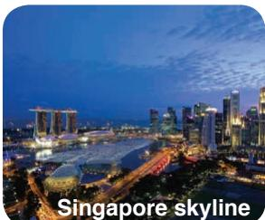

> **AI Description:**
> **Source:** `assets/_page_38_Figure_1.jpg`
> 
> **Generated:** 2026-05-30 17:15:17
> 
> ---
> 
> The image is a photograph of the Singapore skyline at dusk. It features the iconic Marina Bay Sands hotel and casino complex on the left, with its distinctive three-tower structure and the large, curved white building in the center. On the right, the modern high-rise buildings of the central business district are visible, illuminated against the darkening sky. The text "Singapore skyline" is overlaid at the bottom of the image, identifying the subject of the photograph.


Experience Singapore nightlife activities at the club in these locations. You can also find Avalon, one of Hollywood’s hottest clubs at Marina Bay.

## Clarke Quay/Boat Quay & Marina Bay


> **AI Description:**
> **Source:** `assets/_page_38_Figure_3.jpg`
> 
> **Generated:** 2026-05-30 17:15:23
> 
> ---
> 
> The image contains a photograph of an elephant in a naturalistic setting, likely a safari environment. The elephant is standing on a dirt path surrounded by greenery and trees, with a safari vehicle visible in the background. The text "Night Safari" is prominently displayed at the bottom of the image, suggesting the context of the image is related to a nighttime safari experience. The overall scene conveys a sense of adventure and wildlife observation.


> **AI Description:**
> **Source:** `assets/_page_38_Figure_4.jpg`
> 
> **Generated:** 2026-05-30 17:15:07
> 
> ---
> 
> The image is a photograph of a market stall in Little India, featuring a vendor surrounded by colorful flower garlands. The garlands are arranged in vertical rows, showcasing a variety of vibrant flowers in red, yellow, pink, and purple hues. The text "Little India" is overlaid at the bottom right corner of the image, indicating the location. The scene captures the lively and culturally rich atmosphere of a traditional market.


<span id="page-39-0"></span>
# ABOUT SINGAPORE

## Food

The other thing that will strike you most about Singapore is its multifarious offering of food regardless day or night. With a range of dining options from Peranakan to Chinese, Indian to Malay, fusion and more, you’ll be spoilt for choice.

## Chinatown Complex Market

Blk 335 Smith Street S050335 Located in the heartland of Chinatown. Have a meal with the locals and explore the shops of Chinatown.

## Chomp Chomp Food Centre

20 Kensington Park Road S557269 Located at Serangoon Garden, this hawker has a wide variety of food at a reasonable price.

## Golden Mile Food Centre

505 Beach Road S199583 Popular for its wide array of local fare

## Holland Village Market and Food Centre

1 Lorong Mambong S277700 Holland Village is popular for its al fresco café culture

## Maxwell Road Hawker Centre

1 Kadayanallur Street S069184   
This centrally-located food centre is packed to the brim during peak hours.

## Old Airport Road Food Centre

Blk 51 Old Airport Road S390051

## Tekka Centre

Blk 665 Buffalo Road S210665 Located in the heart of Little India

## Clementi Market and Food Centre

Blk 353 Clementi Avenue 2 #01-108 S120353 Surrounded by HDB shops that offer household items at a bargain price

## East Coast Lagoon Food Village

1220 East Coast Parkway S468960 Tuck into scrumptious local fare after cycling or rollerblading at East Coast Park

## Geylang Serai Market and Food Centre

1 Geylang Serai S402001   
Sample traditional Malay fare at this market and the   
eateries in Geylang Serai

## Lau Pat Sat Festival Market

18 Raffles Quay S048582   
Largest remaining Victorian filigree cast-iron structure in Southeast Asia built in 1894 and is now a food centre offering a wide variety of local food

## Newton Circus Food Centre

500 Clemenceau Avenue North S229495 Popular with tourists and locals

## People’s Park Cooked Food Centre

Blk 32 New Market Road S050032 A good destination for traditional local fare after shopping in Chinatown

## Tiong Bahru Market and Food Centre

30 Seng Poh Road S168898 Popular with locals for its wide array of dishes

<span id="page-40-0"></span>
## Arts and Culture

Singapore thrives in arts and cultural events. Visit these places to understand and experience more.

## Esplanade – Theatres on the Bay

1 Esplanade Drive S038981 Engage in the arts at this distinctive landmark.

## National Museum of Singapore

93 Stamford Road S178897

Visit its Singapore History and Living Galleries to learn about Singapore culture and also its 11 National Treasures.

## Maritime Experiential Museum and Aquarium

## ArtScience Museum at Marina Bay Sands

8 Sentosa Gateway, Resorts World Sentosa S098269 Step back in time and learn about the history of the ancient maritime trade.

6 Bayfront Avenue S018974

## Singapore Discovery Centre

510 Upper Jurong Road S638365   
Learn more about Singapore through the Centre’s fascinating exhibits.

## Asian Civilisations Museum

1 Empress Place S179555

## Chinatown Heritage Centre

48 Pagoda Street S059207

## Malay Heritage Centre

85 Sultan Gate S198501

## Peranakan Museum

39 Armenian Street S179941

## Community and Sporting Activities

The People’s Association promotes social cohesion in Singapore through its network of grassroots organisations and community clubs. Visit www.pa.gov.sg to learn about the activities of the community club near you. For Singapore’s sporting calendar, please visit www.ssc.gov.sg.

## Events

Besides major holidays, you can look forward to a vibrant calendar of events in Singapore. These are some of the events that are held in Singapore.


> **AI Description:**
> **Source:** `assets/_page_40_Figure_0.jpg`
> 
> **Generated:** 2026-05-30 17:07:37
> 
> ---
> 
> The image is a photograph of a group of people participating in a dragon boat race. The participants are wearing life jackets and are actively rowing their boat. A person at the front of the boat is playing a large drum, which is a common practice in dragon boat races to help synchronize the rowing. The boat is partially submerged in water, indicating that the race is taking place in a river or similar body of water. The image captures the energy and teamwork involved in this traditional water sport.


• Chingay Parade Singapore

• Dragon Boat Festival

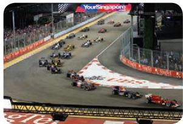

> **AI Description:**
> **Source:** `assets/_page_40_Figure_1.jpg`
> 
> **Generated:** 2026-05-30 17:07:42
> 
> ---
> 
> The image is a photograph of a Formula One race taking place on a street circuit. The cars are racing on a track bordered by red barriers and a large crowd of spectators. The track is surrounded by urban buildings, and the image captures the dynamic movement of the cars as they navigate the circuit. The text "YourSingapore" is visible in the top right corner, indicating the location of the event.


• Fashion Steps Out @ Orchard

• F1 Singapore Grand Prix

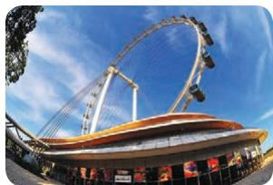

> **AI Description:**
> **Source:** `assets/_page_40_Figure_2.jpg`
> 
> **Generated:** 2026-05-30 17:10:28
> 
> ---
> 
> The image is a photograph of a Ferris wheel structure, likely located in an amusement park or similar setting. The Ferris wheel is large and prominently displayed against a clear blue sky. The structure has a modern design with a series of gondolas attached to a central hub. The base of the Ferris wheel features a building with various signs and advertisements, suggesting it is part of a larger entertainment complex. The image captures the structure from a low angle, emphasizing its height and scale.


> **AI Description:**
> **Source:** `assets/_page_40_Figure_3.jpg`
> 
> **Generated:** 2026-05-30 17:09:01
> 
> ---
> 
> The image contains a photograph of a concert or festival scene. The stage is brightly lit with colorful lights, and there is a large crowd in the foreground. The text "zoukOut" is prominently displayed at the top of the image, indicating the name of the event or venue. The overall atmosphere suggests a lively and energetic event.

• National Day Parade and celebrations

• Great Singapore Sale

Singapore International Arts Festival

Singapore Food Festival

• Mosaic Music Festival

• World Gourmet Summit

• ZoukOut

<span id="page-41-0"></span>
# ABOUT SINGAPORE

## Nature

National Parks (NParks) oversees the development of Singapore as a Garden City. Visit www.nparks.gov.sg for information on the parks and nature reserves in Singapore as well as information on free nature appreciation walks.

## Bukit Timah Nature Reserve

Discover the rich flora and fauna of this reserve as you climb Bukit Timah – Singapore’s highest hill.

## Gardens By The Bay

Spanning 101 hectare, it houses over a quarter of a million rare plants in huge domed conservatories.

## MacRitchie Reservoir Park

Explore its scenic and tranquil nature trails and go on a treetop walk.

## Labrador Nature Reserve

An oasis of tranquillity and natural wonder. A staircase built on the edge of the secondary forest offers a prime view of the cliff side vegetation coupled with a panoramic view of the sea.

## Jurong Central Park

It is the first in Singapore to have life-sized board-game features. It is situated across Boon Lay MRT Station.

## Mount Faber Park

From this park, you can take a cable car to Sentosa Island. A mural wall depicting scenes of local history can be seen at Upper Faber Point, the highest point in the park.

## Youth Olympic Park

The Youth Olympic Park is named after the inaugural Youth Olympic Games held in Singapore in August 2010. A broadwalk connects the Park to Marina Promenade.

## East Coast Park

A well-loved destination of Singaporeans for barbecues, cycling, rollerblading and water sports.

## Jurong Bird Park

The largest bird park and a haven for 8,000 birds representing species. Visit www.birdpark.com.sg for details.

## Night Safari

As dusk falls, observe over 1,000 nocturnal animals upclose.

## Istana

Fronting the main Istana Gate, Istana Park provides a vantage point for people keen to view the monthly changing of guards ceremony at the Istana.

## Marina Barrage

Catch the grandeur of the Singapore Flyer and the Central Business District skyline at this first reservoir in the heart of the city.

## Hortpark

It is a 9-hectare park which is the first one-stop gardening lifestyle hub in Asia. The main highlights are the Forest Walk and Canopy Walk.

## Sentosa

Fancy a day island hopping? Sentosa has a well-mixed of activities ranging from the thrilling rides at Universal Studio and surf at 10-foot FlowBarrel wave, to learn about Singapore’s past at several historical landmarks. Visit www.sentosa.com.sg to read more.

<span id="page-42-0"></span>
# Travelling within Singapore

Travelling within Singapore is a breeze with its advanced transportation system.

## Taxi


> **AI Description:**
> **Source:** `assets/_page_42_Figure_0.jpg`
> 
> **Generated:** 2026-05-30 17:17:12
> 
> ---
> 
> The image contains a photograph of a yellow taxi in motion, captured with a slight blur to convey speed. The taxi has a logo and some text on its side, but the details are not entirely clear due to the motion blur. The background is out of focus, suggesting a busy urban environment with other vehicles and possibly pedestrians. The image primarily conveys the idea of urban transportation and movement.


Taxis can be flagged down at any time of the day at a taxi stand and along any public road outside of the Central Business District (CBD). Alternatively you can book a taxi with any of the taxi company via phone call where a booking fee is applicable. To know the booking amount, please check with the individual taxi company.

All taxis in Singapore are metered. The fares must be charged according to the taxi meter based on the flag down rate, distance travelled and applicable surcharge (such as midnight surcharge, peak hour surcharge, location surcharge and Electronic Road Pricing charges). Please take note that each taxi company imposes different surcharge and flag down rate. You may need to check with the driver or taxi company on the surcharge before boarding the taxi. Should you wish to retain a receipt, you need to request for it at the end of the trip. Payment is usually by cash although some taxi companies do accept credit cards/NETs payment.


## Bus

Public buses operate from 5.30am to midnight daily and the frequencies range from 5 minutes to 20 minutes. The information panels at the bus stops provide useful route and fare information for the bus services available at that stop.

The buses pick up and drop off passengers only at designated bus-stops. You need to flag down the bus you wish to board at the bus-stop. For all bus trips, you can pay using exact cash or ez-link card, please refer to Contactless Smart (CEPAS-Compliant) Cards section in this guide. For more information, please visit www.sbstransit.com.sg or www.smrt.com.sg.

<span id="page-43-0"></span>
## Mass Rapid Transit (MRT) & Light Rapid Transit (LRT)

Commuters in Singapore enjoy a comprehensive public transport network similar to other developed cities. There are also LRT systems that link MRT stations within the HDB housing estates. Both MRT and LRT operate from 5.30am to midnight daily. The first and last train departure times vary between stations, as well as weekends and Public Holidays.

For fare information, you may wish to use the easyto-use maps at the MRT ticketing machines. Please visit www.transitlink.com.sg or www.publictransport.sg should you wish to know more information on public transport fares and MRT map.

## Queue System

It is an unspoken rule that commuters must queue at bus-stops, taxi stands and train stations to board and alight from buses, taxis and trains. This applies to service and retail outlets throughout Singapore as well.

## Contactless Smart (CEPAS-Compliant) Cards

To ease the need of carrying sufficient cash for travelling, you may wish to purchase an ez-link card or a NETS FlashPay card. These are contactless tap-andgo Smart cards for public transit use on the MRT, LRT and buses. You can get them from the network of sales points within most MRT stations and 7-Eleven stores. Please visit www.ezlink.com.sg or www.nets.com.sg for more information on the Smart cards.

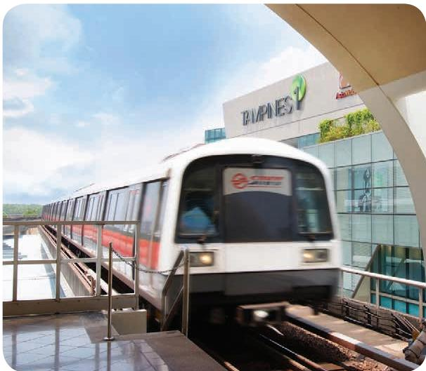

> **AI Description:**
> **Source:** `assets/_page_43_Figure_0.jpg`
> 
> **Generated:** 2026-05-30 17:16:10
> 
> ---
> 
> The image contains a photograph of a train station. The train, which appears to be part of a metro system, is in motion on elevated tracks. The station has a modern design with a glass facade and a sign that reads "TAMPINES" with a logo above it. The sky is partly cloudy, indicating a daytime scene. The image captures the dynamic movement of the train and the architectural features of the station.


## Changi Airport

Changi Airport is the main airport in Singapore and a major aviation hub in Southeast Asia. Please visit www. changiairport.com to view the Airport interactive map and access the guide for arriving passengers.

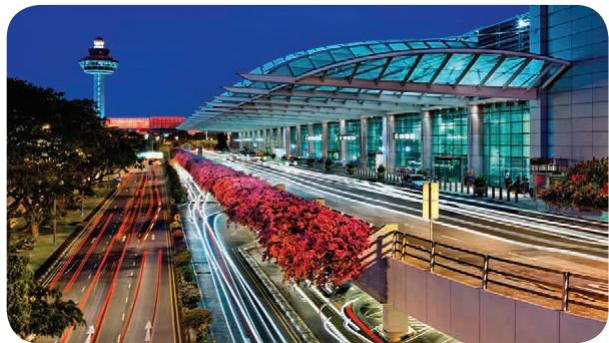

> **AI Description:**
> **Source:** `assets/_page_43_Figure_1.jpg`
> 
> **Generated:** 2026-05-30 17:15:51
> 
> ---
> 
> The image is a photograph of an urban scene at night. It features a modern glass and steel structure, likely a transportation hub or terminal, with a curved roof and large windows. The building is illuminated, showcasing its architectural design. In the foreground, there is a road with streaks of light from moving vehicles, indicating the photo was taken with a long exposure. The area around the building is landscaped with red flowering trees, adding a vibrant splash of color to the scene. In the background, a tall tower with a light at the top is visible, possibly a communications or observation tower. The overall atmosphere is dynamic and modern.
