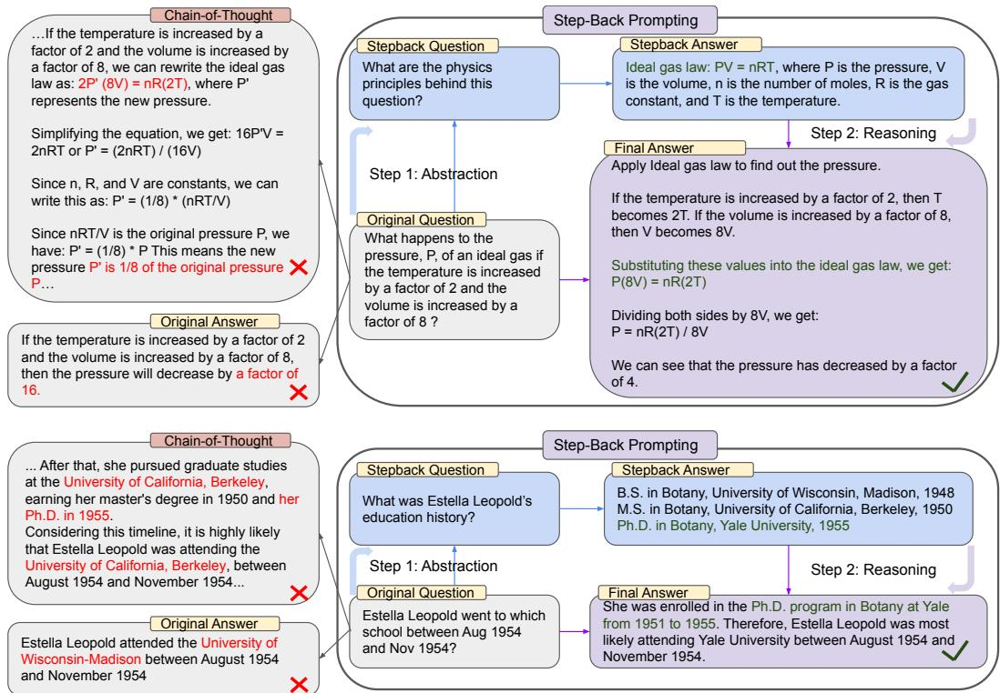

<span id="page-0-0"></span>

### Full Page Description (Page 0)

**Source:** `assets/_page_0_Asset_0.jpg`

**Generated:** 2026-05-30 18:24:12

---

The image is a bar chart comparing the performance of different models on various question-answering datasets. The x-axis represents different datasets: MMLU Physics, MMLU Chemistry, TimeQA, SituatedQA, MuSiQue, and StrategyQA. The y-axis represents the performance score, ranging from 0.2 to 1.0. The chart includes four models: GPT-4, PaLM-2L, PaLM-2L + CoT, and PaLM-2L + Step-Back Prompting. Each model's performance is represented by a different color and bar. The chart shows that PaLM-2L + Step-Back Prompting generally achieves the highest performance across most datasets, followed by PaLM-2L + CoT, GPT-4, and PaLM-2L.

# TAKE A STEP BACK: EVOKING REASONING VIA AB-STRACTION IN LARGE LANGUAGE MODELS

Huaixiu Steven Zheng∗ Swaroop Mishra∗ Xinyun Chen Heng-Tze Cheng   
Ed H. Chi Quoc V Le Denny Zhou   
Google DeepMind

## ABSTRACT

We present STEP-BACK PROMPTING, a simple prompting technique that enables LLMs to do abstractions to derive high-level concepts and first principles from instances containing specific details. Using the concepts and principles to guide the reasoning steps, LLMs significantly improve their abilities in following a correct reasoning path towards the solution. We conduct experiments of STEP-BACK PROMPTING with PaLM-2L models and observe substantial performance gains on a wide range of challenging reasoning-intensive tasks including STEM, Knowledge QA, and Multi-Hop Reasoning. For instance, STEP-BACK PROMPTING improves PaLM-2L performance on MMLU Physics and Chemistry by 7% and 11%, TimeQA by 27%, and MuSiQue by 7%.

The purpose of abstraction is not to be vague, but to create a new semantic level in which one can be absolutely precise. — Edsger W. Dijkstra

## 1 INTRODUCTION

The field of natural language processing (NLP) is witnessing a ground-breaking revolution because of the Transformer-based (Vaswani et al., 2017) large language models (LLMs) (Devlin et al., 2018; Raffel et al., 2020; Brown et al., 2020; Anil et al., 2023). Scaling up the model size and pre-training corpus (Hoffmann et al., 2022; Chowdhery et al., 2022) has brought remarkable improvement in model capabilities and sample efficiency with insights from the scaling law (Kaplan et al., 2020; Hoffmann et al., 2022), as well as emergent abilities (Wei et al., 2022a) such as multi-step reasoning (Wei et al., 2022b; Zhou et al., 2022) and instruction following (Mishra et al., 2022b; Wei et al., 2021).

<span id="page-1-0"></span>
Despite the great advancements, complex multi-step reasoning remains challenging for even the stateof-the-art LLMs. Lightman et al. (2023) show that process-supervision with step-by-step verification is a promising remedy to improve the correctness of intermediate reasoning steps. Techniques such as Chain-of-Thought prompting (Wei et al., 2022b) were introduced to produce a coherent series of intermediate reasoning steps to increase the success rate of following the right decoding path. Inspired by the fact that when faced with challenging tasks humans often step back and do abstractions to arrive at high-level concepts and principles to guide the process, we propose STEP-BACK PROMPTING to ground reasoning on abstractions to reduce the chance of making errors in the intermediate reasoning steps.

Figure 2: Illustration of STEP-BACK PROMPTING with two steps of Abstraction and Reasoning guided by concepts and principles. Top: an example of MMLU high-school physics (Hendrycks et al., 2020) where the first principle of Ideal Gas Law is retrieved via abstraction. Bottom: an example from TimeQA (Chen et al., 2021) where the high-level concept of education history is a result of the abstraction. Left: PaLM-2L (Anil et al., 2023) fails to answer the original question. Chain-of-Thought prompting (Wei et al., 2022b; Kojima et al., 2022) ran into errors during intermediate reasoning steps (highlighted as red). Right: PaLM-2L (Anil et al., 2023) successfully answers the question via STEP-BACK PROMPTING.


> **AI Description:**
> **Source:** `assets/_page_1_Figure_0.jpg`
> 
> **Generated:** 2026-05-30 18:23:01
> 
> ---
> 
> The image contains a flowchart with two main sections, each illustrating a problem-solving process for different scenarios. The first section, labeled "Chain-of-Thought," demonstrates a step-by-step reasoning process for a physics problem involving the ideal gas law. It includes a chain-of-thought explanation, step-back prompting, and an original answer that is incorrect. The second section, labeled "Step-Back Prompting," shows a similar problem-solving process for a historical question about Estella Leopold's education history. It includes a step-back question, step-back answer, and a final answer that is correct. The flowchart uses arrows to guide the reasoning steps and includes labels such as "Step 1: Abstraction," "Step 2: Reasoning," and "Original Question."


Among many of the cognitive skills, abstraction (Lachmy et al., 2022) is ubiquitous to humans’ ability to process vast amount of information and derive general rules, and principles. For example, Kepler compressed thousands of measurements into Kepler’s three laws of planetary motion which precisely describe the orbits of planets around the Sun (Russell, 1964). In critical decision making, humans find abstraction to be helpful since it provides a broader view of the environment. This work explores how LLMs can tackle complex tasks involving many low-level details through a two-step process of abstraction-and-reasoning. The first step is to teach LLMs to step back, and derive high-level abstractions such as concepts and first principles from the specific example. The second step is to leverage the reasoning ability to ground the solution on the high-level concepts and first principles. We use few-shot exemplar demonstrations to execute STEP-BACK PROMPTING on LLMs.

We experiment across a range of tasks involving domain specific reasoning such as Physics and Chemistry, knowledge-intensive question answering requiring factual knowledge, multi-hop commonsense reasoning. We observe significant performance improvements (up to 27%) in PaLM-2L (Anil et al.,

<span id="page-2-0"></span>
2023) demonstrating the efficacy of STEP-BACK PROMPTING in tackling complex tasks which are otherwise challenging due to the amount of details involved to reason through. Figure 1 shows a summary of all the key results presented in this paper. Some the tasks are very challenging: both PaLM-2L and GPT-4 achieve only ∼ 40% accuracy on TimeQA and MuSiQue. Chain-of-Thought prompting leads to a minor improvement on a few tasks, while STEP-BACK PROMPTING improves the performance of PaLM-2L across the board: 7% and 11% on MMLU Physics and Chemistry, 27% on TimeQA, and 7% on MuSiQue.

We conduct a variety of analysis and find that STEP-BACK PROMPTING has strong performance improvements (up to 36%) over chain of thought (CoT) prompting (Wei et al., 2022b) and take a deep breathe (TDB) prompting (Yang et al., 2023). We perform a qualitative evaluation where we find that Step-Back fixes a large portion of errors of the base model (up to ∼ 40%) while introducing a small portion of new errors (max ∼ 12%). We also conduct an error analysis and find that majority of the errors made by STEP-BACK PROMPTING is attributed to the intrinsic limitations of reasoning capabilities of LLMs while abstraction skills are relatively easy to teach LLMs, pointing out the direction for future improvements of methods alike STEP-BACK PROMPTING.

## 2 STEP-BACK PROMPTING

STEP-BACK PROMPTING is motivated by the observation that many tasks contain a lot of details, and are hard for LLMs to retrieve relevant facts to tackle the task. As shown in the first example (top) in Figure 2, for a Physics question of “What happens to the pressure, P, of an ideal gas if the temperature is increased by a factor of 2 and the volume is increased by a factor of 8 ?”, the LLM can deviate from the first principle of Ideal Gas Law when reasoning directly on the question. Similarly, a question of “Estella Leopold went to which school between Aug 1954 and Nov 1954?” is very hard to address directly given the detailed time range constraint. In both cases, taking a step back and asking a step-back question helps model to solve the problem effectively.

We define a step-back question as a derived question from the original question at a higher-level of abstraction. For instance, instead of directly asking “which school Estella Leopold went to during a specific period”, a step-back question (Figure 2 bottom) would ask about the “education history”, which is a high-level concept encompasses the original question. Answering the step-back question of “Estella Leopold’s education history” in this case will provide all the necessary information to reason about “which school Estella Leopold went to during a specific period”. The premise is that more often the step-back question is much easier to address than the original question. Grounding the reasoning on top of such abstractions helps to avoid reasoning errors in the intermediate steps such as the example shown in Figure 2 (left) from Chain-of-Thought. In short, STEP-BACK PROMPTING consists two simple steps:

Abstraction: Instead of addressing the question directly, we first prompt the LLM to ask a generic step-back question about a higher-level concept or principles, and retrieve relevant facts about the high-level concept or principles.

Reasoning: Grounded on the facts regarding high-level concept or principles, the LLM can reason about the solution to the original question. We term this Abstraction-grounded Reasoning.

In the following sections, we present an empirical study of STEP-BACK PROMPTING on a range of challenging tasks covering STEM, Knowledge QA and Multi-Hop Reasoning involving complex reasoning.

## 3 EXPERIMENTAL SETUP

Here we define the tasks and models we experiment with. We also describe our evaluation metric and the baselines we consider.

## 3.1 TASKS

We experiment with the following diverse tasks: (a) STEM, (b) Knowledge QA and (c) Multi-Hop Reasoning. We describe below the datasets we consider (see Appendix B for more details).

<span id="page-3-0"></span>
• STEM: MMLU (Hendrycks et al., 2020) contains a series of benchmarks across diverse domains to evaluate model’s language understanding. We consider the high school physics and chemistry portions of MMLU because of the deep reasoning involved.

• Knowledge QA: We consider TimeQA (Chen et al., 2021) since it contains complex queries that requires challenging time-sensitive knowledge. We also experiment with SituatedQA (Zhang & Choi, 2021), another challenging open-retrieval QA dataset requiring model to answer questions given temporal or geographical contexts.

• Multi-Hop Reasoning: We experiment with MuSiQue (Trivedi et al., 2022), a hard multihop reasoning dataset created via composable pairs of single-hop questions, and StrategyQA (Geva et al., 2021) with open-domain questions that demands some strategy to solve.

## 3.2 MODELS

We use the following state of the art LLMs: PaLM-2L (Anil et al., 2023) and GPT-4 (OpenAI, 2023).   
We experiment with a variety of baselines with an instruction-tuned PaLM-2L model.

## 3.3 EVALUATION

Conventional evaluation metric such as accuracy, F1 score has limitations specifically for evaluating the generations of state of the art LLMs since these models often generate long form answers which are hard to capture. We instead conduct evaluation using the PaLM2-L model where we few-shot prompt the model to identify equivalence between target answers and the model predictions. Few shot examples, prompts and other details we use for this evaluation are in Appendix C.

## 3.4 BASELINE METHODS

• PaLM-2L, PaLM-2L 1-shot: PaLM-2L is either queried directly with the question or has a single demonstration exemplar of question-answer included in the prompt.

• PaLM-2L + CoT, PaLM-2L + CoT 1-shot: PaLM-2L model is queried with zero-shot CoT prompting (Kojima et al., 2022): “Let’s think step by step” is appended to the question. For 1-shot, One demonstration example of a question and answer pair is provided in the prompt, where the answer is in the style of CoT (Wei et al., 2022b) with intermediate reasoning steps.

• PaLM-2L + TDB: Zero-shot prompting with “Take a deep breath and work on this problem step-by-step.” (Yang et al., 2023) prepended to the question.

• PaLM-2L + RAG: For Sections 5 and 6, we use retrieval-augmented generation (RAG) where the relevant passage retrieved is used as context by the LLM.

• GPT-4: GPT-4 API is directly queried.

We do not use RAG for MMLU, because of the inherent reasoning nature of this benchmark contrary to the other fact-seeking datasets. All inferences are done using greedy decoding.

## 4 STEM

We evaluate STEP-BACK PROMPTING on STEM tasks (Hendrycks et al., 2020) to gauge the efficacy of our method on reasoning in highly-specialized domains. We explain below our experimental setup, result and analysis of applying STEP-BACK PROMPTING on the MMLU high-school Physics and Chemistry benchmarks.

## 4.1 STEP-BACK PROMPTING

Questions in the MMLU benchmarks require deeper reasoning. Furthermore, they also require understanding and application of formulae which are often physics and chemistry principles and concepts. In this case, we first teach the model to do abstraction in the form of concepts and first principles such as Newton’s first law of motion, Doppler effect, and Gibbs free energy etc. The implicit step-back question here is “what are the physics or chemistry principles and concepts involved in solving this task?”. We provide demonstrations to teach the model to recite from its own knowledge relevant principles for solving the task (see Appendix D.1 for few-shot exemplars).

<span id="page-4-0"></span>

### Full Page Description (Page 4)

**Source:** `assets/_page_4_Asset_0.jpg`

**Generated:** 2026-05-30 18:23:09

---

The image is a line graph with the title "Accuracy" on the y-axis and "Number of Shots" on the x-axis. The graph shows the accuracy of a system or process as it varies with the number of shots. The accuracy values range from approximately 0.72 to 0.74. The graph has five data points, each corresponding to a different number of shots (1, 2, 3, 4, and 5). The accuracy initially decreases slightly with the second shot, then increases with the third shot, and continues to fluctuate slightly with the fourth and fifth shots.

Table 1: Strong performance of STEP-BACK PROMPTING on STEM tasks achieving state-of-the-art surpassing GPT-4. CoT: zero-shot Chain of Thought prompting (Kojima et al., 2022), TDB: Take a Deep Breathe prompting (Yang et al., 2023). The Table reports the average accuracy over 5 evaluation runs, with standard deviations in the parentheses.


## 4.2 RESULTS

Table 1 illustrates model performance across various setup. PaLM-2L baseline performance is 66.4% and 70.9% on Physics and Chemistry, respectively. We find that CoT and TDB zero-shot prompting do not significantly increase model performance which could be due to inherent hardness and deep reasoning associated with these tasks. In addition PaLM-2L 1-shot and PaLM-2L + CoT 1-shot do not improve against the baseline much, highlighting the challenge of demonstrating the reasoning steps to the model. In contrast, STEP-BACK PROMPTING significantly improves model performance: +7% and +11% compared to PaLM-2L, achieving stateof-the-art performance surpassing GPT-4.

## 4.3 ABLATION AND ANALYSIS

Few-shot Ablation: First, in Figure 3 we ob-

serve that STEP-BACK PROMPTING is robust against number of few-shot exemplars of (question, principles) pairs used as demonstrations. Adding more demonstration examples beyond a single example is not helpful any more. This indicates that the task of retrieving the relevant principles and concepts is relatively easy to learn and a single demonstration suffices.

Error Analysis: Figure 4 (left) shows the error analysis of the predictions of STEP-BACK PROMPT-ING compared to the baseline PaLM-2L model for MMLU high-school Physics: STEP-BACK PROMPTING corrects 20.5% errors from the baseline while introducing 11.9% errors.

To further understand where the errors come from in STEP-BACK PROMPTING, we annotate all the wrong predictions of STEP-BACK PROMPTING in the test set, and category them into 5 classes (see Appendix E.1 for examples in each class):

• Principle Error: The error happens at the step of Abstraction, where the first principles generated by models are wrong or incomplete.

• Factual Error: There is at least one factual error when the model recites its own factual knowledge.

• Math Error: There is at least one math error in the intermediate steps when math calculations are involved in deriving the final answer.

<span id="page-5-0"></span>

### Full Page Description (Page 5)

**Source:** `assets/_page_5_Asset_1.jpg`

**Generated:** 2026-05-30 18:24:29

---

The image is a bar chart with five categories: Factual Error, Math Error, Context Loss, Reasoning Error, and Principle Error. Each category has a corresponding bar indicating the magnitude of the error or loss. The heights of the bars represent the following values: Factual Error (0.04), Math Error (0.25), Context Loss (0.07), Reasoning Error (0.55), and Principle Error (0.09). The chart visually compares the relative sizes of these errors, with Reasoning Error being the largest and Factual Error being the smallest.


### Full Page Description (Page 5)

**Source:** `assets/_page_5_Asset_0.jpg`

**Generated:** 2026-05-30 18:24:21

---

The image is a pie chart with four segments, each representing a different category and its corresponding percentage. The categories are:

1. "Both Right" with 40.4%.
2. "Both Wrong" with 27.2%.
3. "Baseline Wrong" with 20.5%.
4. "Step-Back Wrong" with 11.9%.

The chart visually represents the distribution of these categories, with the "Both Right" segment being the largest. The percentages are clearly labeled next to each segment, providing a clear understanding of the proportions of each category within the whole.

Table 2: Strong performance of STEP-BACK PROMPTING on Knowledge QA tasks. CoT: Chain of Thought prompting, TDB: Take a Deep Breathe prompting, RAG: retrieval-augmented generation. STEP-BACK PROMPTING results in significant performance improvements.


• Context Loss: There is at least one error when the model response loses context from the question, and deviates from addressing the original question.

• Reasoning Error: We define Reasoning Error as when the model makes error in the intermediate Reasoning steps before arriving at the final answer.

All five types of errors are happening during the Reasoning step except Principle Error which points to the failure of the Abstraction step. As shown in Figure 4 (right), Principle Error in fact comprises only a small fraction of the errors the model makes: more than 90% of the errors happen at the Reasoning step. Among the four error types during Reasoning, Reasoning Error and Math Error are the major loss buckets. This corroborates with the finding in the ablation study above that very few exemplars are needed to teach LLMs the Abstraction skill. Reasoning step is still the bottleneck of how well STEP-BACK PROMPTING can perform tasks such as MMLU requiring complex reasoning. For MMLU Physics specifically, the Reasoning and Math skills are critical for solving the problems successfully: even if the first principles are retrieved correctly, deep reasoning and math are involved to derive a correct final answer through a typical multi-step reasoning process.

## 5 KNOWLEDGE QA

We evaluate STEP-BACK PROMPTING on question answering benchmarks requiring intensive factual knowledge. Knowledge QA has been challenging for LLMs. In this section, we first describe the experimental setup, followed by results and analysis on STEP-BACK PROMPTING.

<span id="page-6-0"></span>

### Full Page Description (Page 6)

**Source:** `assets/_page_6_Asset_0.jpg`

**Generated:** 2026-05-30 18:23:51

---

The image is a line graph with the title "Accuracy." It displays the accuracy of three categories: "All," "Easy," and "Hard," across five different numbers of shots (1, 2, 3, 4, and 5). The y-axis represents accuracy, ranging from 0.55 to 0.80, while the x-axis represents the number of shots. The graph shows that the accuracy for "Easy" and "All" categories remains relatively stable across the number of shots, with "Easy" consistently having a higher accuracy than "All." The "Hard" category shows a slight increase in accuracy as the number of shots increases.


### Full Page Description (Page 6)

**Source:** `assets/_page_6_Asset_1.jpg`

**Generated:** 2026-05-30 18:23:42

---

The image is a bar chart with four bars representing different categories: "Reasoning Error," "Scoring Error," "RAG," and "StepBack." The chart displays numerical values for each category, with "Reasoning Error" having the highest value at 0.52, followed by "RAG" at 0.45, "Scoring Error" at 0.02, and "StepBack" at 0.01. The y-axis represents the values, while the x-axis lists the categories. The chart visually compares the magnitudes of the errors and the RAG value across the different categories.

## 5.1 STEP-BACK PROMPTING

We evaluate STEP-BACK PROMPTING on TimeQA (Chen et al., 2021) and SituatedQA (Zhang & Choi, 2021) in the Knowledge QA category. We first teach the LLMs to do Abstraction. The step-back question “What was Estella Leopold’s education history” in Figure 2 is generated by the LLM through few-shot demonstrations (see Appendix D.2 for details). Given the knowledge-intensive nature of these queries, we use retrieval augmentation (RAG) in combination with STEP-BACK PROMPTING. The step-back question is used to retrieve relevant facts, which works as additional context (see Table 12 for the prompting template) to ground the final reasoning step.

## 5.2 RESULTS

We evaluate the models on the test-set of TimeQA. As shown in Table 2, the baseline models of GPT-4 and PaLM-2L achieved 45.6% and 41.5%, highlighting the difficulty of the task. Applying either CoT or TDB zero-shot (and one-shot) prompting to the baseline model shows no improvement. In contrast, augmenting the baseline model by regular retrieval augmentation (RAG) improves the accuracy to 57.4%, highlighting the factual intensive nature of the task. The result of Step-Back + RAG shows the effectiveness of going back to a high-level concept, which enables much more reliable retrieval augmentation: the accuracy on TimeQA achieves a remarkable 68.7%.

Next, we segment TimeQA into the Easy and Hard difficulty level provided in the original dataset. As expected, all methods perform worse on the Hard segment. While RAG can improve the Easy accuracy from 42.6% to 67.8%, the improvement is much smaller on the Hard accuracy: 40.4% to 46.8%. This is where STEP-BACK PROMPTING really shines by retrieving facts regarding high-level concepts to ground the final reasoning: Step-Back + RAG further improves the Hard accuracy to 62.3%, outperforming 42.6% from GPT-4. We hypothesis that facts regarding the high-level concepts (such as education history) is much more accessible than the low-level details.

On the SituatedQA benchmark, we observe a moderate quality gain from 54.3% to our best method of Step-Back + RAG 61% with a small gap to GPT-4’s 63.2%. Similar to TimeQA, prompting techniques such as CoT and TDB don’t help significantly for SituatedQA.

## 5.3 ABLATION AND ANALYSIS

Few-shot Ablation: We observe in Figure 5 (left) that the performance of STEP-BACK PROMPTING is robust against the number of exemplars used in demonstration, highlighting again the sample efficiency of learning Abstraction skills for models like PaLM-2L.

Error Analysis: Figure 5 (right) shows the breakdown of the all the remaining errors made by STEP-BACK PROMPTING predictions. Similar to Section 4.3, we categorize the errors:

• StepBack: The step-back question generated is not helpful in solving the task.

• RAG: RAG fails to retrieval relevant information despite that the step-back question is on target.

• Scoring Error: The evaluation by the judge model made a mistake.

<span id="page-7-0"></span>
Table 3: Results of STEP-BACK PROMPTING on Multi-Hop Reasoning. CoT: Chain of Thought prompting, TDB: Take a Deep Breathe prompting, RAG: retrieval augmentation generation. Average accuracy is over 5 evaluation runs with the standard deviations included in the parentheses.


• Reasoning Error: The retrieved context is relevant, but the model still fails to reason through the context to arrive at the right answer.

StepBack rarely fails. In contrast, we find more than half of the errors are due to reasoning errors. 45% of errors are due to failure in retrieving the right information despite that Abstraction provided by step-back makes it a much easier task. This reflects the difficulty level of the TimeQA task. Additional error analysis of TimeQA is in Appendix A.

## 6 MULTI-HOP REASONING

We evaluate STEP-BACK PROMPTING on challenging Multi-Hop reasoning benchmark MuSiQue (Trivedi et al., 2022) and StrategyQA (Geva et al., 2021). We follow the same protocol as Section 5 to implement STEP-BACK PROMPTING.

## 6.1 RESULTS

Table 3 shows performance of various baselines on the dev set of MuSiQue and StrategyQA. Baseline performance of PaLM-2L and GPT4 are low (35.5% and 38.5% for PaLM-2L and GPT-4 respectively) in MuSiQue since it is a hard multihop reasoning behchmark. In contrast, StartegyQA has stronger baselines (82.8% and 78.3% for PaLM-2L and GPT4 respectively) probably because of the binary classification task. CoT and TDB improve model performance a bit in case of MuSiQue (∼ 3% and 3.5% respectively) which can be attributed to the inherent reasoning nature of this task where these methods are shown to be helpful. In case of StrategyQA, there is no signficant performance gain with COT and TDB which could be due to the high baseline performance in this task, with limited scope for these prompting methods to improve performance. Often, 1-shot performance is significantly lower than their zero-shot methods which could be attributed to the potential example bias (Zhao et al., 2021; Parmar et al., 2023). RAG improves model performance (∼ 4% and 2% for MuSiQue and StrategyQA respectively.). STEP-BACK PROMPTING with the power of abstraction produces the best performance of all methods: 42.8% in MuSiQue and 86.4% in StrategyQA, significantly outperforming GPT-4 on both tasks.

## 6.2 ANALYSIS

Similar to our observation in previous sections, we find that STEP-BACK PROMPTING with RAG is able to turn 15.4% wrong predictions of base model into correct predictions, while leading to 6.1% errors the other way around. Furthermore, Step-Back + RAG fixes 12.7% errors coming from RAG. The errors introduced to RAG by Step-Back is just 4.4%. More detailed analysis is in Appendix A.2.

<span id="page-8-0"></span>
## 7 DISCUSSION

Abstraction helps humans to solve complex tasks by removing irrelevant details and distill the highlevel concepts and principles to guide the problem-solving process. STEP-BACK PROMPTING breaks complex tasks such as knowledge-intensive QA, multi-hop reasoning and science questions into two separate steps of Abstraction and Reasoning. We demonstrate through empirical experiments that Abstraction is an easy skill to teach the LLMs such as PaLM-2L via sample-efficient demonstrations. Grounding on the high-level concepts and principles, LLMs can leverage their intrinsic Reasoning capabilities to derive the solution. This reduces the chance of reasoning failures in the intermediate steps, and is shown to improve the performance on a wide range of complex reasoning tasks. Despite the success, through error analysis, we find that Reasoning is still one of the hardest skills for LLMs to acquire as it is still the dominating failure mode even after the large chunk of task complexity reduction by STEP-BACK PROMPTING.

Nevertheless, Abstraction is neither absolutely necessary nor possible in all scenarios. For instance, the task can be as simple as who was the president of the United States in 2000?, in which case there is not such a need to step back and ask a high-level question as the answer to such questions is readily available. Parallelly, questions such as what is the speed of light? point to the first principles themselves. Doing Abstraction in this case would not make a difference.

## 8 RELATED WORK

STEP-BACK PROMPTING is related to the literature of prompting and decomposition.

## 8.1 PROMPTING

Few-shot prompting (Brown et al., 2020; Liu et al., 2023; Mishra et al., 2022a; Wei et al., 2022b) has significantly improved model performance across a range of tasks without requiring to update any model parameters. Our work STEP-BACK PROMPTING is in the same category as chain of thought prompting (Wei et al., 2022b) and scratchpad (Nye et al., 2021) owing to its simplicity and generic nature, however, is focused on the key idea of abstraction which is inspired from the fact that often taking a step back and looking at broader level help humans in performing complex tasks. Our work is also related to the recitation-augmented language models (Sun et al., 2022), however in contrast to their work, we explicitly perform step-back and abstraction, with optional use of retrieval augmentation depending the nature of the task at hand.

## 8.2 DECOMPOSITION

Decomposing a task into simpler tasks and solving these tasks to solve the original task have been an effective way (Zhou et al., 2022; Patel et al., 2022; Khot et al., 2022; Press et al., 2022) to improve model performance on complex tasks. Several prompting methods have been successful in improving model performance. Our work STEP-BACK PROMPTING, in contrast, is on making the question more abstract and high level, which is different from decomposition that is often low level breakdowns of the original question. Furthermore, abstract questions such as what is the employment history of person X? are often generic in nature so have a many-to-one mapping since many questions (e.g. which employer did X work for in 1990? and which employer did X work for in 2000?) can have the same abstract questions. This is in contrast to decomposition where there is often a one-to-many mapping since there are multiple decomposed sub-problems necessary to solve a given question.

## 9 CONCLUSION

We introduce STEP-BACK PROMPTING as a simple and generic method to elicit deep reasoning via abstraction in large language models. Experimentation on LLMs across fact-seeking, commonsense reasoning and domain specific reasoning benchmark shows STEP-BACK PROMPTING significantly improve model performance. We hypothesize that abstraction helps models to hallucinate less and reason better, probably reflecting the true nature of the model which are often hidden while responding to the original question without abstraction. We hope our work will inspire more human-inspired approaches to elicit the hidden potential of large language models.

<span id="page-9-0"></span>
## REFERENCES

- Rohan Anil, Andrew M Dai, Orhan Firat, Melvin Johnson, Dmitry Lepikhin, Alexandre Passos, Siamak Shakeri, Emanuel Taropa, Paige Bailey, Zhifeng Chen, et al. Palm 2 technical report. arXiv preprint arXiv:2305.10403, 2023.
- Tom Brown, Benjamin Mann, Nick Ryder, Melanie Subbiah, Jared D Kaplan, Prafulla Dhariwal, Arvind Neelakantan, Pranav Shyam, Girish Sastry, Amanda Askell, et al. Language models are few-shot learners. Advances in neural information processing systems, 33:1877–1901, 2020.
- Wenhu Chen, Xinyi Wang, and William Yang Wang. A dataset for answering time-sensitive questions. arXiv preprint arXiv:2108.06314, 2021.
- Aakanksha Chowdhery, Sharan Narang, Jacob Devlin, Maarten Bosma, Gaurav Mishra, Adam Roberts, Paul Barham, Hyung Won Chung, Charles Sutton, Sebastian Gehrmann, et al. Palm: Scaling language modeling with pathways. arXiv preprint arXiv:2204.02311, 2022.
- Jacob Devlin, Ming-Wei Chang, Kenton Lee, and Kristina Toutanova. Bert: Pre-training of deep bidirectional transformers for language understanding. arXiv preprint arXiv:1810.04805, 2018.
- Mor Geva, Daniel Khashabi, Elad Segal, Tushar Khot, Dan Roth, and Jonathan Berant. Did aristotle use a laptop? a question answering benchmark with implicit reasoning strategies. Transactions of the Association for Computational Linguistics, 9:346–361, 2021.
- Dan Hendrycks, Collin Burns, Steven Basart, Andy Zou, Mantas Mazeika, Dawn Song, and Jacob Steinhardt. Measuring massive multitask language understanding. arXiv preprint arXiv:2009.03300, 2020.
- Jordan Hoffmann, Sebastian Borgeaud, Arthur Mensch, Elena Buchatskaya, Trevor Cai, Eliza Rutherford, Diego de Las Casas, Lisa Anne Hendricks, Johannes Welbl, Aidan Clark, et al. Training compute-optimal large language models. arXiv preprint arXiv:2203.15556, 2022.
- Jared Kaplan, Sam McCandlish, Tom Henighan, Tom B Brown, Benjamin Chess, Rewon Child, Scott Gray, Alec Radford, Jeffrey Wu, and Dario Amodei. Scaling laws for neural language models. arXiv preprint arXiv:2001.08361, 2020.
- Tushar Khot, Harsh Trivedi, Matthew Finlayson, Yao Fu, Kyle Richardson, Peter Clark, and Ashish Sabharwal. Decomposed prompting: A modular approach for solving complex tasks. arXiv preprint arXiv:2210.02406, 2022.
- Takeshi Kojima, Shixiang Shane Gu, Machel Reid, Yutaka Matsuo, and Yusuke Iwasawa. Large language models are zero-shot reasoners. Advances in neural information processing systems, 35: 22199–22213, 2022.
- Royi Lachmy, Valentina Pyatkin, Avshalom Manevich, and Reut Tsarfaty. Draw me a flower: Processing and grounding abstraction in natural language. Transactions of the Association for Computational Linguistics, 2022.
- Hunter Lightman, Vineet Kosaraju, Yura Burda, Harri Edwards, Bowen Baker, Teddy Lee, Jan Leike, John Schulman, Ilya Sutskever, and Karl Cobbe. Let’s verify step by step. arXiv preprint arXiv:2305.20050, 2023.
- Pengfei Liu, Weizhe Yuan, Jinlan Fu, Zhengbao Jiang, Hiroaki Hayashi, and Graham Neubig. Pre-train, prompt, and predict: A systematic survey of prompting methods in natural language processing. ACM Computing Surveys, 55(9):1–35, 2023.
- Swaroop Mishra, Daniel Khashabi, Chitta Baral, Yejin Choi, and Hannaneh Hajishirzi. Reframing instructional prompts to gptk’s language. In Findings of the Association for Computational Linguistics: ACL 2022, pp. 589–612, 2022a.
- Swaroop Mishra, Daniel Khashabi, Chitta Baral, and Hannaneh Hajishirzi. Cross-task generalization via natural language crowdsourcing instructions. In Proceedings of the 60th Annual Meeting of the Association for Computational Linguistics (Volume 1: Long Papers), pp. 3470–3487, 2022b.

<span id="page-10-0"></span>
- Maxwell Nye, Anders Johan Andreassen, Guy Gur-Ari, Henryk Michalewski, Jacob Austin, David Bieber, David Dohan, Aitor Lewkowycz, Maarten Bosma, David Luan, et al. Show your work: Scratchpads for intermediate computation with language models. arXiv preprint arXiv:2112.00114, 2021.
- OpenAI. Gpt-4 technical report. arXiv preprint arXiv:2303.08774, 2023.
- Mihir Parmar, Swaroop Mishra, Mor Geva, and Chitta Baral. Don’t blame the annotator: Bias already starts in the annotation instructions. In Proceedings of the 17th Conference of the European Chapter of the Association for Computational Linguistics, pp. 1771–1781, 2023.
- Pruthvi Patel, Swaroop Mishra, Mihir Parmar, and Chitta Baral. Is a question decomposition unit all we need? In Proceedings of the 2022 Conference on Empirical Methods in Natural Language Processing, pp. 4553–4569, 2022.
- Ofir Press, Muru Zhang, Sewon Min, Ludwig Schmidt, Noah A Smith, and Mike Lewis. Measuring and narrowing the compositionality gap in language models. arXiv preprint arXiv:2210.03350, 2022.
- Colin Raffel, Noam Shazeer, Adam Roberts, Katherine Lee, Sharan Narang, Michael Matena, Yanqi Zhou, Wei Li, and Peter J Liu. Exploring the limits of transfer learning with a unified text-to-text transformer. The Journal of Machine Learning Research, 21(1):5485–5551, 2020.
- John L Russell. Kepler’s laws of planetary motion: 1609–1666. The British journal for the history of science, 2(1):1–24, 1964.
- Zhiqing Sun, Xuezhi Wang, Yi Tay, Yiming Yang, and Denny Zhou. Recitation-augmented language models. arXiv preprint arXiv:2210.01296, 2022.
- Harsh Trivedi, Niranjan Balasubramanian, Tushar Khot, and Ashish Sabharwal. Musique: Multihop questions via single-hop question composition. Transactions of the Association for Computational Linguistics, 10:539–554, 2022.
- Ashish Vaswani, Noam Shazeer, Niki Parmar, Jakob Uszkoreit, Llion Jones, Aidan N Gomez, Łukasz Kaiser, and Illia Polosukhin. Attention is all you need. Advances in neural information processing systems, 30, 2017.
- Jason Wei, Maarten Bosma, Vincent Y Zhao, Kelvin Guu, Adams Wei Yu, Brian Lester, Nan Du, Andrew M Dai, and Quoc V Le. Finetuned language models are zero-shot learners. arXiv preprint arXiv:2109.01652, 2021.
- Jason Wei, Yi Tay, Rishi Bommasani, Colin Raffel, Barret Zoph, Sebastian Borgeaud, Dani Yogatama, Maarten Bosma, Denny Zhou, Donald Metzler, et al. Emergent abilities of large language models. arXiv preprint arXiv:2206.07682, 2022a.
- Jason Wei, Xuezhi Wang, Dale Schuurmans, Maarten Bosma, Fei Xia, Ed Chi, Quoc V Le, Denny Zhou, et al. Chain-of-thought prompting elicits reasoning in large language models. Advances in Neural Information Processing Systems, 35:24824–24837, 2022b.
- Chengrun Yang, Xuezhi Wang, Yifeng Lu, Hanxiao Liu, Quoc V. Le, Denny Zhou, and Xinyun Chen. Large language models as optimizers. arXiv preprint arXiv:2309.03409, 2023.
- Michael Zhang and Eunsol Choi. Situatedqa: Incorporating extra-linguistic contexts into qa. In Proceedings of the 2021 Conference on Empirical Methods in Natural Language Processing, pp. 7371–7387, 2021.
- Zihao Zhao, Eric Wallace, Shi Feng, Dan Klein, and Sameer Singh. Calibrate before use: Improving few-shot performance of language models. In International Conference on Machine Learning, pp. 12697–12706. PMLR, 2021.
- Denny Zhou, Nathanael Scharli, Le Hou, Jason Wei, Nathan Scales, Xuezhi Wang, Dale Schuurmans, ¨ Claire Cui, Olivier Bousquet, Quoc Le, et al. Least-to-most prompting enables complex reasoning in large language models. arXiv preprint arXiv:2205.10625, 2022.

<span id="page-11-0"></span>

### Full Page Description (Page 11)

**Source:** `assets/_page_11_Asset_2.jpg`

**Generated:** 2026-05-30 18:23:58

---

The image is a pie chart with four segments, each representing a different category and its corresponding percentage. The categories are "Both Right" (74.6%), "Baseline Wrong" (15.4%), "Step-Back + RAG Wrong" (6.1%), and "Both Wrong" (3.9%). The chart visually represents the distribution of these categories, with the "Both Right" segment occupying the largest portion of the pie. The labels and percentages are clearly annotated, making it easy to understand the proportions of each category.


### Full Page Description (Page 11)

**Source:** `assets/_page_11_Asset_3.jpg`

**Generated:** 2026-05-30 18:23:34

---

The image is a pie chart that visually represents the distribution of responses in four categories: "Both Right," "Both Wrong," "RAG Wrong," and "Step-Back + RAG Wrong." The largest portion of the pie chart, 77.2%, is labeled "Both Right," indicating that this category has the highest frequency. The "Both Wrong" category accounts for 5.7%, "RAG Wrong" for 12.7%, and "Step-Back + RAG Wrong" for 4.4%. The chart effectively communicates the relative proportions of each response type in a clear and concise manner.


### Full Page Description (Page 11)

**Source:** `assets/_page_11_Asset_0.jpg`

**Generated:** 2026-05-30 18:23:19

---

The image is a pie chart that visually represents the distribution of responses to a question or task. The chart is divided into four segments, each representing a different category:

1. **Baseline Wrong**: This segment occupies the largest portion of the chart, representing 39.9% of the total responses.
2. **Both Right**: This segment represents 27.9% of the total responses.
3. **Both Wrong**: This segment represents 26.5% of the total responses.
4. **Step-Back + RAG Wrong**: This segment represents the smallest portion, with 5.6% of the total responses.

The chart provides a clear visual representation of the distribution of responses among the four categories, making it easy to compare the proportions of each category at a glance.


### Full Page Description (Page 11)

**Source:** `assets/_page_11_Asset_1.jpg`

**Generated:** 2026-05-30 18:23:26

---

The image is a pie chart with four segments, each representing a different category of responses. The categories are labeled as "Both Wrong," "RAG Wrong," "Step-Back + RAG Wrong," and "Both Right." The percentages for each category are as follows: "Both Wrong" at 25.8%, "RAG Wrong" at 21.6%, "Step-Back + RAG Wrong" at 6.3%, and "Both Right" at 46.2%. The chart visually represents the distribution of responses across these categories, with the largest portion being "Both Right."

## A ADDITIONAL ERROR ANALYSIS

## A.1 TIMEQA ERROR ANALYSIS

We conduct error analysis to understand where STEP-BACK PROMPTING fixes the errors the baseline models make. Figure 6 shows that compared to the predictions of baseline PaLM-2L, STEP-BACK PROMPTING is able to fix 39.9% of the predictions where the baseline prediction is wrong, while causing 5.6% errors. Furthermore, Step-Back + RAG fixes 21.6% errors coming from RAG. The % of errors introduced by STEP-BACK PROMPTING to RAG is still relatively low (6.3%). Together, this shows that the STEP-BACK PROMPTING is helpful most of the time, signifying the need and effectiveness of doing Abstraction before directly addressing the original question.

## A.2 STRATEGYQA ERROR ANALYSIS

Figure 7 shows the error analysis of StrategyQA on the predictions of Step-Back + RAG against the baseline model and the raw retrieval augmentation variant of PaLM-2L. Compared to the baseline, Step-Back + RAG is able to turn 15.4% wrong predictions into correct predictions, while leading to 6.1% errors the other way around. Furthermore, Step-Back + RAG fixes 12.7% errors coming from RAG. The errors introduced to RAG by Step-Back is just 4.4%.

<span id="page-12-0"></span>
Table 4: Stats of the evaluation datasets used in this paper.


Table 5: Illustration of few shot evaluation with the PaLM-2L model.
```
Are the following two answers to the given question equivalent? Do not   
consider whether the answers are right or wrong, but only whether they   
are equivalent. Directly state ”Yes” or ”No”.   
Question: Which title was conferred to Anna Muzychuk in 2007?   
Answer 1: Anna Muzychuk was conferred the title of International   
Master (IM) in 2007. She earned the title by scoring three norms in rapid   
chess tournaments.   
Answer 2: International Master   
Answer 1 (short): International Master   
Answer 2 (short): International Master   
Are the two answers equivalent? Yes   
Question: What state is Seattle located in?   
Answer 1: Seattle is in Washington State.   
Answer 2: The answer is George Washington.   
Answer 1 (short): Washington State   
Answer 2 (short): George Washington   
Are the two answers equivalent? No   
Question: <Question>   
Answer 1: <Model Output>   
Answer 2: <Target Label>
```

## B DATASET DETAILS

Table 4 shows the split and number of examples used for evaluations in TimeQA, StrategyQA and MMLU high-school Physics.

## C EVALUATION DETAILS

## C.1 FEW-SHOT EXAMPLES FOR EVALUATION WITH PALM2-L

Given the model free-form outputs and the target label, we use one positive and one negative outputs as few-shot examples to teach the scoring model how to score the output. Table 5 illustrates the prompt we used for the scoring model. We parse out the “Yes” or “No” answer from the scoring model output as TRUE or FALSE score of the model output.

## C.2 HYPER-PARAMETERS FOR EVALUATION WITH PALM2-L

We use PaLM-2L as the scoring model for evaluation. We experiment with different sampling temperatures, and find that T = 1 gives us a highly-accurate evaluating. For example, we sampled 100 test examples and the model predictions, and manually rated the correctness of the model scoring.

<span id="page-13-0"></span>
Table 6: Prompt of extracting the underlying principles involved in MMLU physics and chemistry questions.
```
MMLU Physics/Chemistry First-Principle Prompt   
You are an expert at Physics/Chemistry. You are given   
a Physics/Chemistry problem. Your task is to extract the   
Physics/Chemistry concepts and principles involved in solving   
the problem. Here are a few examples:   
Question: <Question Example1>   
Principles Involved: <Principles Example1>   
...   
Question: <Question Example5>   
Principles Involved: <Principles Example5>   
Question: <Question>   
Principles Involved:
```

Table 7: Prompt of querying the model for final answer with first principles behind the question in MMLU high-school Physics and Chemistry.
```
MMLU Physics/Chemistry Final Answer Prompt   
You are an expert at Physics/Chemistry. You are given a   
Physics/Chemistry problem and a set of principles involved in   
solving the problem. Solve the problem step by step by following the   
principles. Here are a few examples:   
Question: <Question Example1>   
Principles: <Principles Example1>   
Answer: <Answer Example1>   
...   
Question: <Question Example5>   
Principles: <Principles Example5>   
Answer: <Answer Example5>   
Question: <Question>   
Principles: <Principles>   
Answer:
```

We found that out of 4 trials, the model scoring agrees with human ratings 97%, 98%, 99% and 99% of the time.

## D PROMPTS AND FEW SHOT EXAMPLES

## D.1 STEM

For MMLU high-school Physics and Chemistry, we first prompt the model to generate the first principles behind the question. Using the generated first principles, we further prompt the model to generate the final answer through few-shot demonstrations The prompt generating first principles is shown in Table 6 for MMLU high-school Physics and Chemistry.

After extracting the first principles of solving a particular question, we formulate the prompt in Table 7 to query the model for the final answer.

Tables 8-9 show one demonstration exemplar of Question-Principles-Answer triplets for MMLU high-school Physics and Chemistry, respectively.

<span id="page-14-0"></span>
Table 8: Few-shot demonstration exemplar for MMLU high-school Physics.


<span id="page-15-0"></span>
Table 9: Few-shot demonstration exemplar for MMLU high-school Chemistry.


<span id="page-16-0"></span>
Table 10: Prompt of asking step-back question in Knowledge QA tasks.
```
Knowledge QA Step-Back Prompt   
You are an expert at world knowledge. Your task is to step back and   
paraphrase a question to a more generic step-back question, which is   
easier to answer. Here are a few examples:   
Original Question: <Original Question Example1>   
Stepback Question: <Stepback Question Example1>   
  
Original Question: <Original Question Example5>   
Stepback Question: <Stepback Question Example5>   
Original Question: <Original Question>   
Stepback Question:
```

Table 11: Few-shot demonstration exemplars for asking step-back questions in TimeQA and SituatedQA.


## D.2 KNOWLEDGE QA

We use the following prompting in Table 10 to teach the LLM to ask a step-back question for TimeQA and SituatedQA including up to 5 exemplar demonstrations of pairs of Original Question and Step-back Question.

Table 11 shows 5 exemplars from the Train split of TimeQA and SituatedQA as demonstrations of asking step-back questions.

The step-back question is extracted from the model output using the prompt. Using the step-back question, we do retrieval augmentation. Using both the retrieval augmentations from the original question and the step-back question, we formulate the final prompt to query the model for the final answer, as shown in Table 12.

<span id="page-17-0"></span>
Table 12: Prompt of querying the model for final answer with additional contexts from original and step-back retrieval augmentations in TimeQA and SituatedQA


Table 13: Few-shot demonstration exemplars for asking step-back questions in MuSiQue and StrategyQA.


## D.3 MULTI-HOP REASONING

For Multi-Hop Reasoning, we use the same prompting template as in Knowledge QA to ask the step-back question, and query for the final answer given the retrieval augmentations. Table 13 shows 5 demonstration exemplars for asking step-back questions from the Train split of MuSiQue and StrategyQA.

<span id="page-18-0"></span>
Table 14: Prompt of querying the baseline model for final answer with few-shot demonstration exemplars.
```
Baseline few-shot Prompt   
You are an expert of world knowledge and physics. Your task is to solve   
the following question. Here are a few examples:   
Question: <Question Example>   
Answer: <Answer Example>   
Question: <Question>   
Answer:
```

## D.4 BASELINE PROMPTS

For zero-shot baseline, we simply take the question itself and query the model for answers. For standard few-shot prompting of the baseline model, we formulate the prompt using the template in Table 14 with one exemplar. Table 15 shows the baseline few-shot exemplar exemplars used in this paper.

## D.5 CHAIN OF THOUGHT (COT)

For zero-shot CoT prompting, we simply append Let’s think step by step. to the question to query the model.

For few-shot CoT prompting, we use the same template as the Baseline prompting in Sec. D.4 by replacing the few-shot examples using CoT responses, as shown in Tables 16, 17, 18, and 19.

## D.6 TAKE A DEEP BREATHE (TDB)

We study the zero-shot Take a Deep Breathe prompting found in Yang et al. (2023): we take Take a deep breath and work on this problem step-by-step., and prepend it to the question.

## E EXAMPLES OF ERROR ANALYSIS AND WINS OF STEP-BACK PROMPTING

## E.1 MMLU ERROR ANALYSIS

In Tables 20-24, we show one example for each of the 5 error categories we identified through error analysis on STEP-BACK PROMPTING.

## E.2 EXAMPLE WINS FROM STEP-BACK PROMPTING

Tables 25- 27, 28 29, 30 and 31 illustrate the some successful examples of STEP-BACK PROMPTING on MMLU-Physics, MMLU-Chemistry, TimeQA, SituatedQA, and StrategyQA respectively.

<span id="page-19-0"></span>
Table 15: Demonstration exemplar for standard prompting.


<span id="page-20-0"></span>
Table 16: Demonstration exemplar for CoT prompting for MMLU Physics.


<span id="page-21-0"></span>
Table 17: Demonstration exemplar for CoT prompting for MMLU Chemistry.


<span id="page-22-0"></span>
Table 18: Demonstration exemplar for CoT prompting for TimeQA and SituatedQA.


<span id="page-23-0"></span>
Table 19: Demonstration exemplar for CoT prompting for MuSiQue and StrategyQA.


<span id="page-24-0"></span>
Table 20: Error example of STEP-BACK PROMPTING on MMLU high-school Physics in the class of Factual Error. In this case, the Factual error leads to the wrong answer despite that the Principle and Reasoning are all sound.


<span id="page-25-0"></span>
Table 21: Error example of STEP-BACK PROMPTING on MMLU high-school Physics in the class of Math Error. As highlighted, the math error leads to directly a wrong answer with a factor of 2 off.


<span id="page-26-0"></span>
Table 22: Error example of STEP-BACK PROMPTING on MMLU high-school Physics in the class of Principle Error. In this case, Coulomb’s Law is not needed for solving this problem. Instead, the Charge Quantization Principle is missing from the retrieved principles, and is in fact needed to rule out option (2) of fractional charges.


<span id="page-27-0"></span>
Table 23: Error example of STEP-BACK PROMPTING on MMLU high-school Physics in the class of Context Loss. In this case, at the end of the Reasoning chain, the model forgot the original question, and lose the context to apply the reasoning to the question.


<span id="page-28-0"></span>
Table 24: Error example of STEP-BACK PROMPTING on MMLU high-school Physics in the class of Reasoning Error. In this case, the model was able to correctly identify air resistance is the cause of the velocity difference, but made the error at the final reasoning step of deriving the right answer.


<span id="page-29-0"></span>
Table 25: Illustration of wins of STEP-BACK PROMPTING on the MMLU-Physics dataset.


<span id="page-30-0"></span>
Table 26: Illustration of wins of STEP-BACK PROMPTING on the MMLU-Physics dataset.


<span id="page-31-0"></span>
Table 27: Illustration of wins of STEP-BACK PROMPTING on the MMLU-Physics dataset.
```
dataset example   
MMLU-Physics Original Question: $\mathbf { A } 2 \mu \mathbf { F }$ capacitor is connected directly to a battery. When   
the capacitor is fully charged, it stores 600 $\mu \mathrm { C }$ of charge. An experimenter   
replaces the $2 \mu \mathrm { F }$ capacitor with three 18 $\mu \mathrm { F }$ capacitors in series connected to   
the same battery. Once the capacitors are fully charged, what charge is stored   
on each capacitor?   
0) 100 $\mu \mathrm { C }$   
1) 200 $\overset { \cdot } { \mu } \mathbf { C }$   
2) 600 $\mu \mathrm { C }$   
3) 1800 $\mu \mathrm { C }$   
Original Answer [Incorrect]: The answer is 100 $\mu { \mathrm { C } } .$ The total capacitance of   
the three 18 µF capacitors in series is $1 / \left( 1 / 1 8 + 1 / 1 8 + 1 / 1 8 \right) \stackrel { \textstyle - } { = } 6 \mu \mathrm { F } .$ The   
charge stored on the three capacitors in series is $6 \mu \mathrm { F } ^ { * } \mathrm { V } = 6 0 0 \mu \mathrm { C } .$ The charge   
stored on each capacitor is 600 $\qquad .$   
Stepback Question: What are the physics principles behind this question?   
Principles:   
Capacitors: $\mathrm { Q } = \mathrm { C } \ ^ { * } \mathrm { V } ,$ where Q is the charge, C is the capacitance and V is the   
voltage.   
Capacitors in series: $\mathrm { C } = \mathrm { 1 ~ / ~ ( 1 / C 1 ~ + ~ 1 / C 2 ~ + ~ . . . ~ + ~ 1 / C n ) }$ , where C is the   
equivalent capacitance and C1, C2, Cn are the capacitances of each capacitor.   
Capacitor in parallel: $\mathbf { C } = \mathbf { C } \mathbf { 1 } + \mathbf { C } \mathbf { 2 } + \ldots { } + \mathbf { C } \mathbf { \hat { n } }$ , where C is the equivalent   
capacitance and C1, C2, Cn are the capacitances of each capacitor.   
Final Answer: Using the Principles of Capacitance and Capacitors in series,   
we can solve the problem as following:   
Step 1: Apply Capacitance to find out the voltage of the battery.   
We know that the capacitance of the $2 \ \mu \mathrm { F }$ capacitor is $2 ~ \mu \mathrm { F }$ and the charge   
stored on the capacitor is 600 $\mu \mathrm { C }$ . Using the formula for capacitance, we can   
find the voltage of the battery:   
$\mathrm { C } = \mathrm { Q } / \mathrm { V }$   
$2 \mu \mathrm { F } = 6 0 0 \mu \mathrm { C } / \mathrm { V }$   
${ \mathrm { V } } = 3 0 0 { \mathrm { V } }$   
Step 2: Apply Capacitors in series to find out the equivalent capacitance of the   
three 18 $\mu \mathrm { F }$ capacitors in series.   
We know that the capacitance of each of the three capacitors is 18 $\mu \mathrm { F } .$ Using the   
formula for capacitors in series, we can find the equivalent capacitance of the   
three capacitors:   
$1 / C _ { e q } \stackrel { \cdot } { = } 1 / C _ { 1 } + 1 / C _ { 2 } + 1 / C _ { 3 }$   
$1 / C _ { e q } ^ { ' } = 1 / 1 8 \mu \mathrm { F } + 1 / 1 8 \mu \mathrm { F } + 1 / 1 8 \mu \mathrm { F }$   
$1 / C _ { e q } ^ { \phantom { - } } = 3 / 1 8 \mu \mathrm { F }$   
$C _ { e q } = 6 \mu \mathrm { F }$   
Step 3: Apply Capacitance to find out the charge stored on each capac  
itor.   
We know that the equivalent capacitance of the three capacitors is $6 \mu \mathrm { F }$ and the   
voltage of the battery is 300 V. Using the formula for capacitance, we can find   
the charge stored on each capacitor:   
$C = \mathsf { Q } / \mathsf { \bar { V } }$   
$6 \mu \mathrm { F } = \mathrm { Q } / 3 0 0 \mathrm { V }$   
$Q = 1 8 0 0 \mu \mathrm { C }$   
Therefore, the charge stored on each capacitor is 1800 $\mu { \mathbf { C } } .$ The correct   
answer is 3) 1800 $\mu \bar { \mathrm { C } } .$
```

<span id="page-32-0"></span>
Table 28: Illustration of wins of STEP-BACK PROMPTING on the MMLU-Chemistry dataset.


<span id="page-33-0"></span>
Table 29: Illustration of wins of STEP-BACK PROMPTING on the TimeQA dataset.


<span id="page-34-0"></span>
Table 30: Illustration of wins of STEP-BACK PROMPTING on the SituatedQA dataset.


<span id="page-35-0"></span>
Table 31: Illustration of wins of STEP-BACK PROMPTING on the StrategyQA dataset.

