
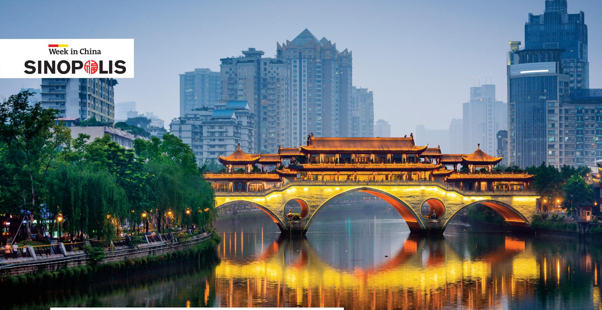

> **AI Description:**
> **Source:** `assets/_page_0_Figure_0.jpg`
> 
> **Generated:** 2026-05-30 18:36:14
> 
> ---
> 
> The image is a photograph of a scenic urban landscape featuring a traditional Chinese-style bridge with multiple arches, illuminated at dusk. The bridge spans a calm river, reflecting the warm lights and the surrounding architecture. In the background, modern high-rise buildings rise against a twilight sky, creating a contrast between traditional and contemporary urban development. The text "Week in China SINOPOLIS" is prominently displayed in the top left corner, indicating the image's association with a series or publication about China.

## CHENGDU

Our guide to Southwest China’s thriving megacity

## THE BELT AND ROAD WILL SUPERCHARGECONNECTIVITY, CREATING THEINFORMATION SILK ROAD. WE KNOW THE WAY.

From laying fibre optic cables to developing new satellite services, China's Belt and Road Initiative willimprove communications across three continents. That means better connections between 4.4 billion people.

With a powerful global network built over 150 years, we have the reach and experience to help you take advantage of this more connected world.

Find out how at business.hsbc.com/belt-and-road/infrastructure

## HSBC

# Our third Sinopolis guide

This is the third in our Sinopolis series of city guides. They are designed to give you insights into China’s larger cities, and are written with the business person in mind.

As we pointed out in our first Sinopolis (which looked at Hangzhou), we know that knowledge of Beijing and Shanghai is already quite strong, so our goal here is to create a series of useful overviews of China’s other, less well-known major cities. This guide focuses on the Southwestern metropolis of Chengdu, the provincial capital of Sichuan and one of China’s biggest cities by population (16 million). It is also one of the country’s most ancient cities: thanks to its silk trade it was a starting point for the Silk Road. That is a role it is now reprising as part of President Xi Jinping’s Belt and Road Initiative.

Chengdu’s geographical position makes it an ideal hub and in our chapter on infrastructure we look at the rapid expansion of its network of Europe-bound freight trains (DHL estimates there will be as many as 14,000 journeys from China per year by 2020). A second airport will also see cargo transported around China and to other Asian cities in the supply chain. Chengdu’s newly designated status as a free trade zone and its port access also enables shipping of goods along the Yangtze River.

Chengdu has likewise made major strides in moving up the industrial value chain. Its high-tech special zone plays host to the likes of Intel chip factories, as well as the Foxconn assembly lines that make many of the world’s iPads. The city has also become a hub for software engineers, partly because property prices are dramatically cheaper than those of Beijing and Shanghai (see our chapter on the property market), and likewise its high quality local universities. But the other reason why skilled engineers like the city is its liveability. Famed for its teahouse culture, Chengdu is also a gastronomic capital: Sichuanese cuisine is one of China’s four great culinary cultures. Your guide to sampling the best of this spicy cuisine is chef and author Fuschsia Dunlop – the first Westerner to train at Chengdu’s celebrated culinary school (she was there in the 1990s and later published a book about the experience). Her restaurant advice can be found in our ‘Visitor information’ chapter which also offers guidance on how to get around this vast city and what to do there (Chengdu has more than just pandas).

We hope you find this edition of Sinopolis of interest, and that perhaps it will inspire you to add Chengdu to your travel itinerary.

Chengdu was a   
starting point for   
the ancient Silk   
Road and is   
reprising that   
role thanks to   
President Xi   
Jinping’s   
ambitious Belt   
and Road   
Initiative

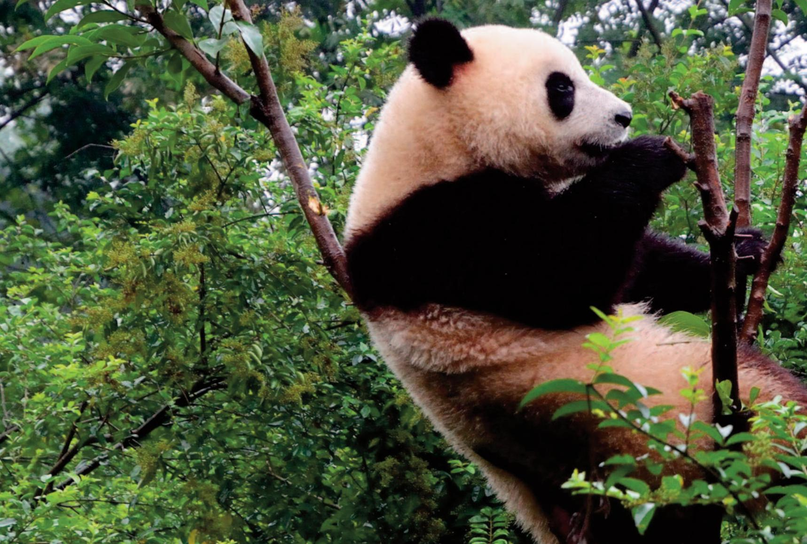

> **AI Description:**
> **Source:** `assets/_page_3_Figure_0.jpg`
> 
> **Generated:** 2026-05-30 18:54:34
> 
> ---
> 
> The image contains a photograph of a panda bear sitting in a tree. The panda has a distinctive black and white coat, with black patches around its eyes and ears. The background is filled with green foliage, indicating a natural forest environment. The panda appears to be holding onto a branch with its front paws, and its body is slightly angled to the side, giving a relaxed posture. The image captures the panda in a serene and natural setting.

The Chengdu Research Base of Giant Panda Breeding

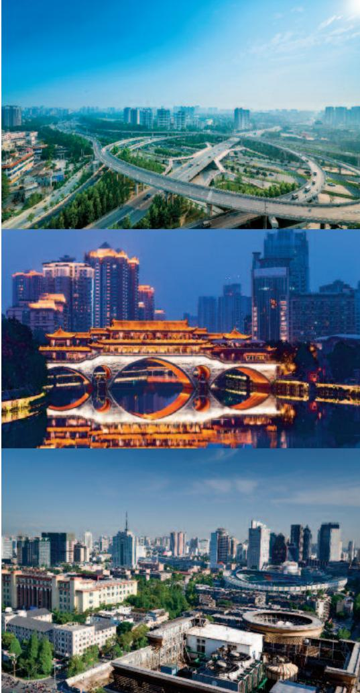

> **AI Description:**
> **Source:** `assets/_page_5_Figure_0.jpg`
> 
> **Generated:** 2026-05-30 18:50:15
> 
> ---
> 
> The image is a collage of three photographs. The top photo shows a complex highway interchange with multiple roads and bridges, indicating a modern urban infrastructure. The middle photo features a brightly lit, ornate bridge with a traditional architectural style, reflecting in a body of water, suggesting a blend of historical and contemporary elements. The bottom photo displays a cityscape with a mix of modern high-rise buildings and lower residential structures, with a sports stadium visible in the background, highlighting the urban development and recreational facilities in the area.

## Contents

A brief history 7   
Visitor information 19   
Infrastructure: Building up, shipping out 45   
Industry: Moving up the value chain 57   
Property: A very liveable city 69   
Retail: Sichuan’s shopaholics? 77   
Useful phrases 89

## Week in China SINOPLIS

## CHENGDU

From ‘land of abundance’ to city of innovation

www.weekinchina.com

Sinopolis is owned and maintained by ChinTell Limited, Hong Kong. Neither HSBC nor any member of the HSBC group of companies ("HSBC") endorses the contents and/or is involved in selecting, creating or editing the contents of Sinopolis, the Week in China website or the Week in China magazine. The views expressed in these publications are solely the views of ChinTell Limited and do not necessarily reflect the views or investment ideas of HSBC. No responsibility will therefore be assumed by HSBC for the contents of these publications or for the errors or omissions therein.

@2017 SINOPOLIS is published by ChinTell Limited, a company based in Hong Kong. All rights reserved. To contact us email: contactus@weekinchina.com

A city steeped

# Frontier economy

myth persists in Chengdu that it is the only major Chinese city that has never changed its name, bestowing a beguiling sense of integrity to the city’s culture. Unfortunately it’s not true:

the city was known as Yizhou during the Tang Dynasty (618- 907), then it was briefly renamed Nanjing (southern capital) when an emperor took refuge there, fleeing the An Lushan rebellion. The city was also known as Xijing (western capital) in 1644 after its conquest by Zhang Xianzhong – the leader of a peasant rebellion.

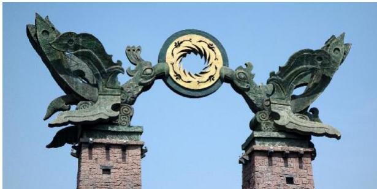

> **AI Description:**
> **Source:** `assets/_page_9_Figure_1.jpg`
> 
> **Generated:** 2026-05-30 18:41:13
> 
> ---
> 
> The image depicts a pair of ornate, ancient-style stone pillars with intricate carvings. At the top of each pillar, there are large, stylized bird-like figures that appear to be in a dynamic pose, as if they are interacting or facing each other. Between the two pillars, there is a circular emblem with a swirling design, possibly symbolizing a cosmic or spiritual element. The overall style suggests a historical or cultural artifact, possibly from East Asia, given the design and motifs.

The golden sunbird disc design dates back 3,200 years

But these name changes, far from depleting the city’s mystique, reflect its tremendous history, which began with great tribal societies living outside what was then considered as China.

In 2001, remnants of these peoples were accidentally discovered by a construction firm that was working on an apartment complex near Jinsha Road, in Chengdu’s Qingyang district. The building work was shut down and a full archaeological exploration proceeded, unearthing relics from as early as 1200BC.

Back then the area where modern Chengdu is was part of the ancient Shu Kingdom (not to be confused with the later Shu Kingdom, which appeared some thousand years after). The find revealed that between 1200 and 650BC Chengdu became the political and cultural centre of this kingdom, shifting the capital from Sanxingdui, about 40 kilometres north of Chengdu, in modern day Deyang.

The Shu occupied roughly the same area as modern Sichuan province and was a rich civilisation, advanced in techniques of production. The artefacts recovered at the Jinsha site showcase the work of skilled bronze, jade and gold smiths. Hundreds of ornamental and ritualistic pieces

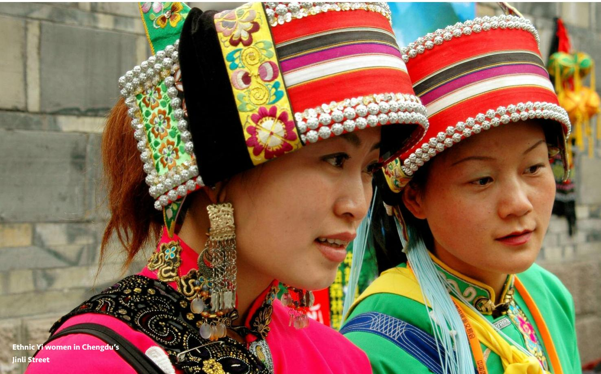

> **AI Description:**
> **Source:** `assets/_page_10_Figure_0.jpg`
> 
> **Generated:** 2026-05-30 18:51:03
> 
> ---
> 
> The image is a photograph featuring two women wearing traditional Yi ethnic attire. They are adorned with colorful, ornate headgear and intricate jewelry, including earrings and necklaces. The women are standing close to each other, and the background appears to be an outdoor setting with a stone wall and some blurred elements that suggest a cultural or historical site. The text at the bottom of the image identifies the women as "Ethnic Yi women in Chengdu's Jinli Street."

## Key stats (Data: 2016)

City Permanent population: 16 million Area: 14,300 square kilometres

Average disposable income Urban: Rmb35,902 (+8.1%) Rural: Rmb18,605 (+9.4%)

Trade: Total: Rmb271.34 billion (+11.0%) Export: Rmb145.05 billion (-2%) Import: Rmb129.26 billion (+30.9%)

Utilised FDI: Rmb51 billion

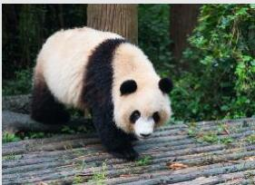

> **AI Description:**
> **Source:** `assets/_page_11_Figure_0.jpg`
> 
> **Generated:** 2026-05-30 18:47:09
> 
> ---
> 
> The image is a photograph of a panda bear walking on a wooden surface. The panda has a distinctive black and white fur pattern, with a round face and large black ears. The background shows a natural setting with greenery and trees, suggesting the panda is in a forest or a zoo environment. The panda appears to be in motion, with its front legs extended forward and its back legs trailing behind.

## Education

Undergraduates: 150,000 (Data: 2013) 63% of graduates then find work in the city

are now on display at the Jinsha Museum in Chengdu, including the Golden Sun Bird disc (see photo on page 8), which has since become the official logo of the city.

But the kingdom was perhaps most renowned for its silk production. The river that runs through Chengdu today is called Brocade River (Jinjiang) because the dyed silk weaves were washed in its water. Even the Chinese character for the word Shu is said to have derived from the depiction of a silkworm in a mulberry tree. The fame and finery of Shu kingdom silk emboldens Chengdu’s claim as the starting point of the ancient Silk Road – a boast echoed by other cities, particularly since Xi Jinping launched the modern Belt and Road Initiative.

The Shu eventually fell to the armies of Qin – the mighty kingdom that would unify China in 221BC, giving birth to the Qin dynasty. Shu was one of the first kingdoms to succumb to the Qin, largely because of the lure of its natural resources. The king of Qin had initially planned to ignore Shu and pursue an Eastern campaign, but one of his advisors observed that conquering “The Land of Abundance” (as Shu was also known) would allow the Qin armies to better equip themselves for the wars ahead.

The land of Shu was rich in iron ore, which could forge stronger steel weapons; besides the fine silk, a flax-like grass also grew in abundance, so troops could be clothed; it was a major producer of salt, which could preserve food and provide vital sodium; and its geographical position was fortified by high mountains and an advantageous point near the head of the Yangtze River. This abundance fell to the Qin in 316BC. The formal city of Chengdu was built, and named, in 313BC.

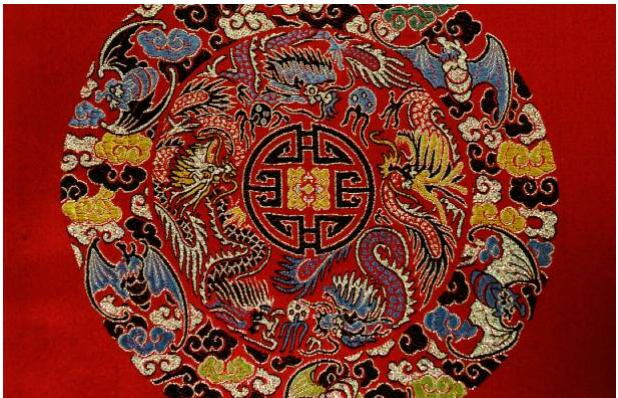

> **AI Description:**
> **Source:** `assets/_page_12_Figure_0.jpg`
> 
> **Generated:** 2026-05-30 18:30:34
> 
> ---
> 
> The image contains a circular design with intricate patterns and symbols. The central motif features a traditional Chinese character, likely representing good fortune or harmony, surrounded by stylized dragons and phoenixes. The dragons and phoenixes are depicted in vibrant colors, including red, blue, yellow, and black, against a deep red background. The overall design is symmetrical and rich in cultural symbolism, often associated with Chinese textile art or decorative patterns.

Shu brocade, a silk fabric interwoven with gold or silver threads.
The Shu kingdom ws perhaps most renowned for its silk production

Although the Qin unified China, it remained a fractious collection of states susceptible to intrigue and invasion, and it would remain that way for centuries to come. Chengdu’s position as a frontier city was particularly fraught (Tibet, which borders Sichuan province, didn’t become part of China until the Yuan Dynasty [1271-1368].

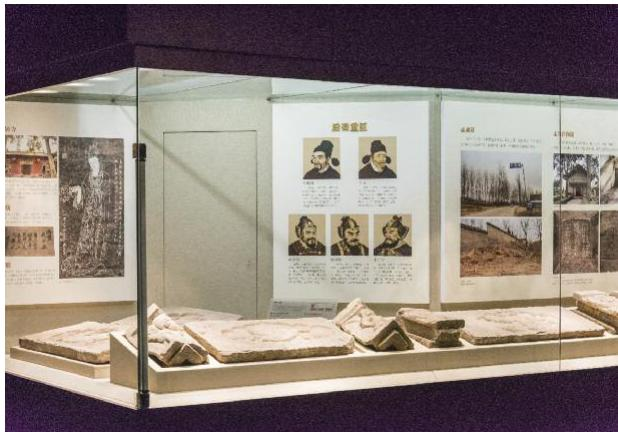

> **AI Description:**
> **Source:** `assets/_page_13_Figure_0.jpg`
> 
> **Generated:** 2026-05-30 18:34:44
> 
> ---
> 
> The image shows a museum display case containing several large, flat stone tablets or inscriptions. The case is surrounded by informational panels with text and images. The panels include photographs and illustrations, as well as text in Chinese characters. The display appears to be educational, likely providing historical or cultural context for the items in the case. The text and images on the panels seem to describe the significance of the items and possibly their historical background.

“When you’re young, don’t go to Sichuan...”
Shu history and culture displayed at the Yongling Museum
A popular saying implying that life in Sichuan is so leisurely that once you go, you’ll never want to leave

As such, Chengdu was one of ancient China’s most westerly cities). It grew prosperous from trade, which made it susceptible to siege by usurping powers, as well as to raids from foreign bandits.

It was during its tenure as China’s western trade hub that the merchants of Chengdu developed the world’s first recorded use of paper money, which they dubbed jiaozi. Today the main strip in Chengdu’s financial city is called Jiaozi Avenue (for more detail, see the Industry chapter). But after the Tang Dynasty, China’s political and financial power shifted eastward, and Chengdu fell into mild obscurity.

Chengdu’s importance was rekindled in the early 20th century as – to hear the city’s own take on the tale – the catalyst for the Wuchang Uprising, which in turn sparked wider rebellions that ultimately led to the overthrow of China’s last dynasty, the Qing. What happened was that the Qing court, impoverished from indemnities owed to foreign powers, made the unpopular decision to nationalise locally-managed railway projects and then sell them to foreign banks in order to clear its debts.

The railway in Chengdu had been primarily funded by the public in exchange for shares, so there was broad indignation at the government’s nationalisation scheme. Local leaders formed the Railway Protection Movement to protest against the emperor’s plan, resulting in bloody confrontations with Qing soldiers and police. As the violence mounted the emperor mobilised troops from neighbouring Hubei province to put down the protest.

With Hubei thus relatively unguarded, revolutionaries grabbed the opportunity to seize the provincial capital, Wuchang, on October 10, 1911. Other uprisings followed and the Qing Dynasty collapsed by the end of the year. Chengdu fell into 20 years of warlord control before being brought to heel in the mid-thirties by the army of the Republic of China.

Shortly after, Japan began its assault on Chinese territory, and many refugees fled to the far-flung city of Chengdu, seeking shelter. The Nationalist government even fled there too, making Chengdu the wartime capital

### Full Page Description (Page 14)

**Source:** `assets/_page_14_Asset_1.jpg`

**Generated:** 2026-05-30 18:46:26

---

The image is a bar chart titled "Chengdu GDP by industry." It displays the GDP in billion Rmb for the primary, secondary, and tertiary industries of Chengdu in the years 2015 and 2016. The chart shows an increase in GDP for all three industries between 2015 and 2016. The primary industry saw a 3.9% increase, the secondary industry a 7.2% increase, and the tertiary industry a 9.0% increase. The tertiary industry had the highest GDP in both years, with a significant jump from 570.45 billion Rmb in 2015 to 646.33 billion Rmb in 2016.

### Full Page Description (Page 14)

**Source:** `assets/_page_14_Asset_0.jpg`

**Generated:** 2026-05-30 18:45:40

---

The image is a bar chart showing the growth of a financial metric (likely GDP or a similar economic indicator) in billion RMB from 2014 to 2016. The x-axis represents the years, and the y-axis represents the value in billion RMB. The bars are color-coded for each year: 2014 is red, 2015 is orange, and 2016 is gold. Each bar is labeled with the value and the percentage increase from the previous year. The values for 2014, 2015, and 2016 are 1005.66, 1080.12, and 1217.02 billion RMB, respectively. The percentage increases are 8.9%, 7.9%, and 7.7% for the respective years.

Chengdu GDP

in 1938, before switching to nearby Chongqing. Chengdu maintained a notable role in the war though, becoming the launch base for Operation Matterhorn: an Americanled aerial bombing campaign against the Japanese using bombers that could fly far enough to hit Japanese islands some 2,400 kilometres away.

After World War Two, and the victory over the Japanese, China returned to civil war, ending with a communist victory on October 1, 1949, when the People’s Republic of China was founded. But although the Communist Party had declared victory, the fighting was not quite yet over. The opposing Nationalist Party still had a few strongholds on the mainland, and Chengdu was the last of them. The Nationalist leader Chiang Kai-shek was forced to flee from Chengdu to Taiwan in December 1949.

Despite the devastation of war, the influx of refugees as well as government and allied military personnel into Chengdu during these armed conflicts did help the city to prosper, becoming a hub for trade and a centre for education. After the Communist Party victory, Chengdu’s role as a hub lessened but it did become an important production site for chemicals, electronic machinery and precision tools.

Today Chengdu is building on its history in precision and electronic manufacturing and drawing from the talent pools of its universities to develop itself as a key centre for tech innovation and production.

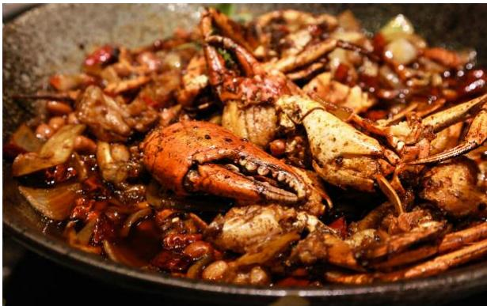

> **AI Description:**
> **Source:** `assets/_page_15_Figure_0.jpg`
> 
> **Generated:** 2026-05-30 18:30:26
> 
> ---
> 
> The image contains a photograph of a dish that appears to be a stir-fried or sautéed seafood dish, likely featuring crabs or similar crustaceans. The dish is garnished with various vegetables, including onions and possibly bell peppers, and is cooked in a dark sauce, giving it a rich, glossy appearance. The dish is presented in a black wok or frying pan, suggesting it is freshly prepared and ready to be served. The focus is on the vibrant colors and textures of the food, emphasizing its appetizing and savory nature.

Sichuan spicy crab

The city is developing an ecosystem that marries modern finance with modern manufacturing, tied together with its logistics capabilities, building on its role as a hub in China’s southwest. And as the city thrives, the locals are reviving Chengdu’s ancient identity as a city of leisure, combining rich shopping opportunities with its delicious Sichuanese cuisine. n

### Full Page Description (Page 16)

**Source:** `assets/_page_16_Asset_1.jpg`

**Generated:** 2026-05-30 18:39:31

---

The image is a bar chart with a line graph overlay, presenting the average temperature in Fahrenheit and Celsius for each month of the year. The bars represent the average temperature in Fahrenheit, while the line graph shows the average temperature in Celsius. The chart displays a clear seasonal trend, with temperatures peaking in the summer months (June to August) and dipping in the winter months (December to February). The line graph is a smooth curve, indicating a gradual increase in temperature from January to July and a gradual decrease from August to December.

### Full Page Description (Page 16)

**Source:** `assets/_page_16_Asset_0.jpg`

**Generated:** 2026-05-30 18:38:05

---

The image is a combined bar and line graph showing the average precipitation (in millimeters) and average rain days for each month of the year. The red bars represent the average precipitation, while the yellow line with orange squares represents the average rain days. The x-axis represents the months from January to December, and the y-axis on the left side represents the average precipitation in millimeters, ranging from 0 to 250. The y-axis on the right side represents the average rain days, ranging from 0 to 25. The graph shows a general increase in precipitation and rain days from January to July, peaking in July with 225 mm of precipitation and 18 rain days, and then a decrease towards December.

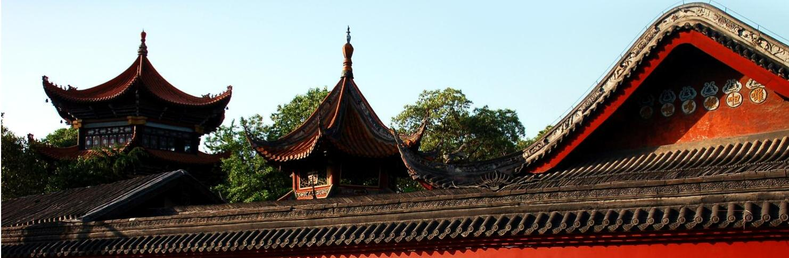

> **AI Description:**
> **Source:** `assets/_page_16_Figure_0.jpg`
> 
> **Generated:** 2026-05-30 18:46:56
> 
> ---
> 
> The image contains a photograph of traditional Chinese architecture, specifically focusing on the roof structures of several buildings. The roofs are characterized by their curved, upturned eaves, a hallmark of classical Chinese design. The roofs are painted in a deep red color, with intricate carvings and decorative elements visible along the edges and corners. The image captures the detailed craftsmanship and cultural significance of these architectural features, showcasing the artistry and historical importance of such structures.

## A view from Chengdu

Sinopolis speaks to Eric He, branch manager at HSBC’s main outlet in Chengdu, to get an overview of the city

I think the pace goes along with the national trend. It was much faster five years ago and it has slowed down in the past two years but like the rest of China it started picking up pace late last year and this year we can see a higher growth rate in terms of GDP. I think especially since the fourth quarter of last year, it is picking up.

But it has been above the national average for years. Compared with the coastal areas and South China, the base level here is much lower, both in terms of the lump sum and also the per capita figure. So with a lower base it is not so surprising to see a higher growth rate.

What industries are driving the economic growth here? Traditionally Sichuan province was known for agricultural products, and also to some extent tourism, textiles and garments, but I think now if you talk about GDP growth one of the largest drivers is infrastructure building. If you go around the city there are lots of construction sites for the subways. The city has now got four lines in operation and there are eight or 10 more lines under

construction, which I think is an appropriate number for a city this size. But unlike Shenzhen, for example, Chengdu isn’t tying subway development with property development. Chengdu Metro pointed out that Hong Kong and Shenzhen have this sort of dualdevelopment arrangement, but the Chengdu government (which owns Chengdu Metro) decided not to follow suit. Rather than extend the subway to help develop new areas, it is being expanded into areas that are already highly populated, so there is not much new land for property developers to buy.

Even so, is property development an economic driver too? Property is the topic you can talk about in every city in China. The property developers definitely are one of the main drivers here. But in addition the Chengdu government is also encouraging high tech industries and software development. There is an area in the high-tech district called the software development zone and that, of course, is the area where the government is trying to encourage companies to perform that function, especially outsourcing companies. Some software developers here get work from other cities and even other countries. We have seen large tech companies setting up hub centres in Chengdu, like Tencent and Alibaba. The government is encouraging that.

Why would companies outsource to, or open in, Chengdu? I think one of the reasons is the human resources: companies can get good people from the universities. There are at least three top universities in Chengdu-Sichuan University, Southwest Finance and Economic University, and the University of Electronic Science and Technology.

Another factor is cost – both labour and land are much cheaper than the coastal cities, and also the living standard and the lifestyle is pretty good here. That’s very useful for attracting people to work in Chengdu. If you see the property prices here, they have gone up in the last 12 or 18 months but comparatively it is still cheaper than other second-tier cities in eastern areas, like Nanjing, Hefei and Xiamen.

## Chengdu was recently designated a Free Trade Zone, what will be the specifics of that?

They won’t be very different from other FTZs, so we’re talking about more effective administration primarily. I haven’t seen many specific details in the FTZ plan yet, but so far as banking and finance are concerned, Shanghai will retain its advantage over all other FTZs, because business and individuals can set up FTZ accounts in the banks there – these can effectively be seen as offshore accounts. But that policy only goes to Shanghai.

HSB

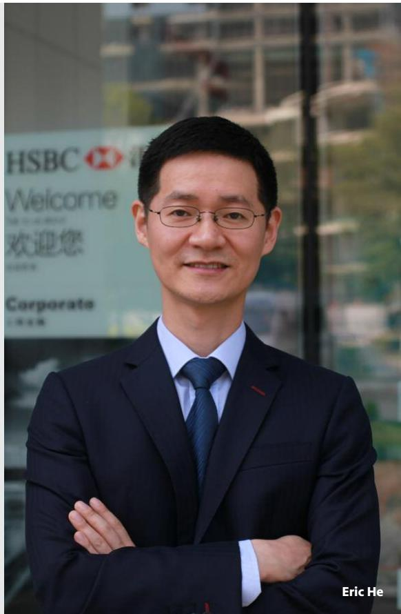

> **AI Description:**
> **Source:** `assets/_page_18_Figure_0.jpg`
> 
> **Generated:** 2026-05-30 18:39:43
> 
> ---
> 
> The image contains a photograph of a man in a professional setting. He is wearing a dark suit, white shirt, and a dark tie. The background shows a sign for HSBC with the words "Welcome" and "欢迎您" (Welcome in Chinese) and "Corporate" written on it. The man has his arms crossed and is standing in front of a glass window. The image also includes a watermark in the bottom right corner that reads "Eric He."

Both Chengdu’s labour and land are much cheaper than the coastal cities

There are over 15 foreign banks with branches in Chengdu

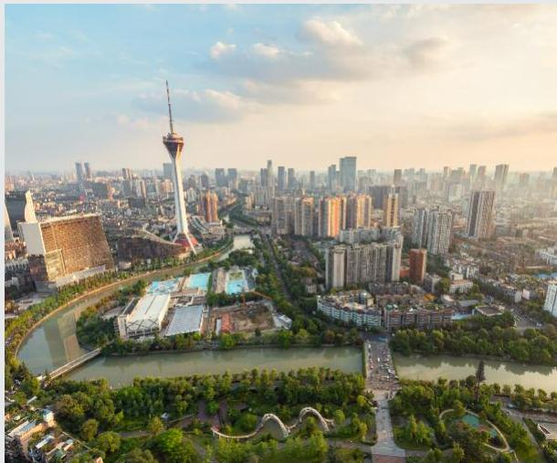

> **AI Description:**
> **Source:** `assets/_page_19_Figure_0.jpg`
> 
> **Generated:** 2026-05-30 18:37:23
> 
> ---
> 
> The image is a photograph of an urban landscape. It features a cityscape with a prominent tower in the center, surrounded by a mix of residential and commercial buildings. A river runs through the middle of the image, with greenery and parks along its banks. The sky is partly cloudy, suggesting it is either early morning or late afternoon. The image captures the urban environment with a focus on the balance between natural and built environments.

Chengdu wants to position itself as the financial capital of Southwest China. How does it measure against Chongqing in that respect?

I would say the economy in Chengdu is probably much more diversified than in Chongqing. Over the last 10 years, since Chongqing became a direct-controlled municipality, the Chengdu government has shown itself to be more hands-off. We don’t see so many large SOEs in Chengdu as in Chongqing and the

business area here is more active, more market-driven.

In terms of being a financial hub, I think if you talk about the total assets managed by banks then it’s not very comparable, because Chengdu is a city and Chongqing is a municipality. But if you’re talking about foreign financial institutions, we can see there are more foreign banks here than there are in Chongqing. There are over 15 foreign banks with branches in Chengdu.

## How does Chengdu stand to benefit from the Belt and Road Initiative (BRI)?

I think so far Chengdu still hasn’t shown its unique advantage in this respect over other cities, like Chongqing or even Xi’an, because all these other cities around Chengdu are targeting Europe and the BRI too. Chengdu is competing with Chongqing here especially.

But it’s still evolving and the government is putting up some policies to encourage businesses to develop along the China-Europe route. We have seen some local Chengdu companies doing acquisitions in Europe.

Another direction I think the local government is trying to encourage is for SOEs to invest in India. I have seen quite a few cases of SOEs approaching us to explore the Indian market. One of them is offering water management solutions – they’ve experience doing this in Chengdu and they think that there will probably be many infrastructure projects to do in India. Many construction companies are looking that way too.

## Visitor 凤祥楼information

Chunxilu in Chengdu

# Finding your way

Central Chengdu is surrounded by a ring road that follows the perimeter of the ancient city walls

here are 20 districts or sub-cities under the jurisdiction of Chengdu. This Sinopolis city guide will only focus on the central few since they host the majority of Chengdu’s economic drivers and the seat of government – and are thus of most interest to visitors and tourists.

The centre of Chengdu is neatly divided by a road running north to south, and is surrounded by a ring road that follows the perimeter of the ancient city walls. There are two more ring roads beyond that, framing the historical districts, modern residences, and thriving tech hubs.

The dividing central thoroughfare is Renmin Road (People’s Road). It splits to circumvent Tianfu Square, adorned with a statue of Mao Zedong, and converges again on the south side to become Renmin South Road. Tianfu Square is Chengdu’s geographical epicentre. The Chengdu Museum is on its western flank and the Sichuan Science and Technology Museum sits at the northern point.

Renmin South Road soon leads to luxury retailers, like those found in Yanlord Landmark and Maison Mode (see chapter on Retail), and the Jinjiang Hotel. To the east of

Tianfu Square, the shopping spots continue almost without interruption, amassing in the sprawling pedestrianised area of Chunxilu and Taikoo Li.

This area is always bustling with fashionable young people and white-collar workers. Luxury retailers and high street brands abound, abridged by fast food joints, snack stalls and restaurants. The western frontier of Chunxilu is perhaps a 20-minute walk from Tianfu Square, and taken together this zone is the city’s commercial hub.

South and west of Tianfu Square is Wuhou district, arguably the city’s cultural zone. The district has the main campus of Sichuan University, Southwest China’s Ethnic Minority University, and the Sichuan Sports University.

It is also home to the Wuhou Memorial Temple. This popular tourist attraction is a memorial to Zhuge Liang, an accomplished military strategist who ruled as the regent of Sichuan during the Three Kingdoms period. It is part public park, part museum, and part market. The bazaar is primarily on Jinli Street, and it’s a nice place for a stroll (if you’re used to China’s crowds) and a decent place to pick up gifts.

Further south, between the second and third ring roads,

1. Qingyang   
2. Jinniu   
3. Chenghua   
4. Jinjiang   
5. Wuhou   
6. Wenjiang   
7. Pidu   
8. Xindu   
9. Qingbaijiang   
10. Longquanyi   
11. Shuangliu   
12. Dujiangyan city   
13. Pengzhou city   
14. Jintang   
15. Xinjin county   
16. Pujiang county   
17. Qionglai city   
18. Dayi county   
19. Chongzhou city   
20. Jianyang city

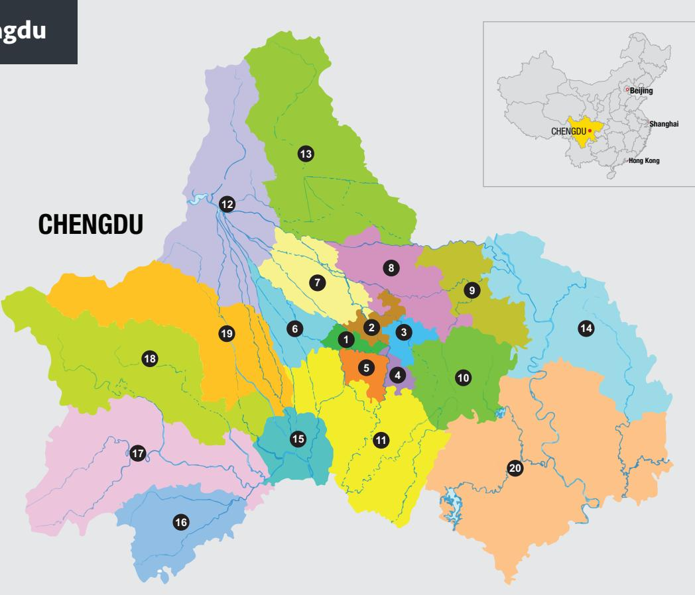

> **AI Description:**
> **Source:** `assets/_page_22_Figure_0.jpg`
> 
> **Generated:** 2026-05-30 18:35:29
> 
> ---
> 
> The image is a map of Chengdu, China, divided into various regions, each numbered and colored differently. The map includes a smaller inset showing the location of Chengdu within China, with major cities like Beijing and Shanghai marked for reference. The map is designed to visually represent the administrative divisions of Chengdu, with each region highlighted in distinct colors for easy identification.

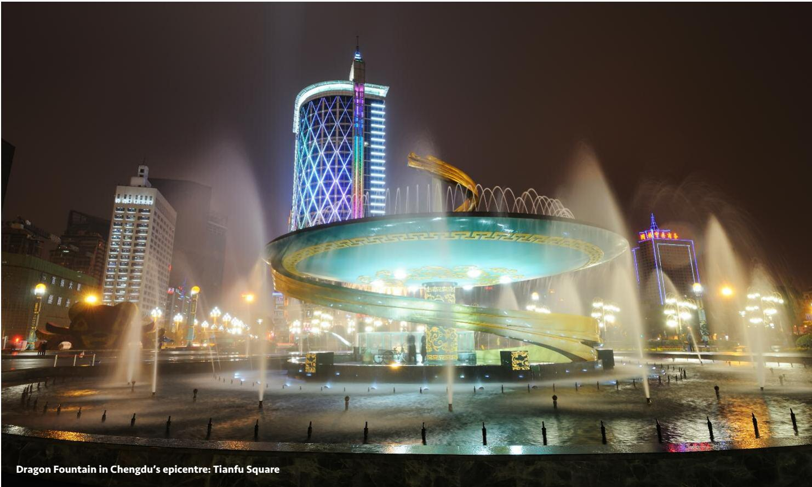

> **AI Description:**
> **Source:** `assets/_page_23_Figure_0.jpg`
> 
> **Generated:** 2026-05-30 18:33:28
> 
> ---
> 
> The image is a photograph of the Dragon Fountain located in Tianfu Square, the epicentre of Chengdu. The fountain is illuminated at night, with water jets spraying upwards and around the circular basin. The basin features intricate designs, and a large, illuminated structure resembling a dragon's head is situated at the center. Surrounding the fountain are modern buildings, some of which are lit up, creating a vibrant urban nightscape. The text at the bottom of the image identifies the location and subject of the photograph.

Renmin Road turns into Tianfu Avenue and enters the High Tech Industrial Development Zone (Gaoxin, for short). Still technically part of Wuhou district, this zone is fast becoming the city’s new CBD.

The government began building its glitzy new offices here in the mid-2000s, but was reprimanded by Premier Wen Jiabao when he visited in 2008. Sichuan had just suffered a devastating earthquake that killed close to 70,000 and damaged the national economy to the tune of \$75 billion. It was deemed to be no time for the provincial government to be building new premises for itself.

Instead the government has moved into other southern offices, while the city’s major financial institutions have migrated to Gaoxin’s new “Financial City”. The new buildings – originally intended for the government – were sold to the likes of Anbang and Minsheng Bank. Gaoxin is also the location of the Tianfu

Software Park – a colossal, multizone technology cluster (see Industry chapter).

Chengdu’s second airport, Chengdu Tianfu International Airport, is currently under construction roughly 30 minutes south of Gaoxin in Jianyang district, which was placed under Chengdu’s jurisdiction in May 2016 (the same month construction began on the airport). The current airport, Chengdu Shuangliu International Airport, is in the bordering Shuangliu district and is a 40-minute drive from the city centre – traffic permitting.

## Transport – getting there and getting around

## International flights

Chengdu’s Shuangliu International Airport is the fourth busiest in China and the busiest in Southwestern China by passenger numbers. With 96 international routes – including direct flights to London, Paris, Dubai, New York and LA – flying to Chengdu is the simplest way to get there. Terminal 1 serves overseas flights, including routes to Hong Kong, Macau and Taiwan.

There is a train line to the airport but the station is at Terminal 2 (which handles domestic flights). A shuttle bus provides transfers between the two terminals and,

650km   
The length of subway track intended to be operational by 2020

Chengdu Metro line 3 subway train
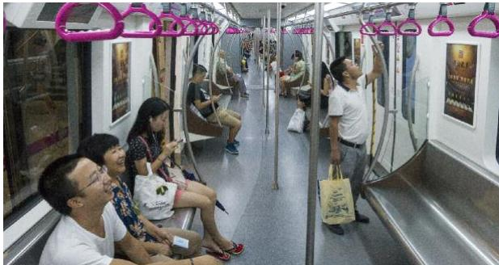

> **AI Description:**
> **Source:** `assets/_page_25_Figure_0.jpg`
> 
> **Generated:** 2026-05-30 18:35:35
> 
> ---
> 
> The image is a photograph of a subway car interior. It shows passengers sitting and standing, some holding shopping bags. The car has pink handrails and advertisements on the walls. The passengers appear to be engaged in various activities, such as reading or looking around. The lighting is bright, and the overall atmosphere suggests a typical subway ride.

sometime this year, an underground line is expected to open at both terminals. The station at Terminal 2 is also useful for visitors travelling on to Leshan or Mount Emei (because there is a train service connecting the three) but for those aiming to get to the city centre, taking a taxi is probably easiest.

There is a taxi rank outside Terminal 1 (follow the signs, ignore the hustlers); the fare is approximately Rmb55 (or \$8.26) and the journey will take around 40 minutes.

## Trains

In terms of passenger transport, Chengdu isn’t too well connected by train. China operates three classes of highspeed train: G type, D type and C type. G type are normally the fastest, travelling at speeds of around 300km per hour. Currently the only G-type connections are to neighbouring Chongqing and faraway Guangzhou.

The train to Chongqing takes roughly two hours. Thanks to the steep terrain en route, it is known as China’s slowest high-speed train. The bullet to Guangzhou takes around 13 hours (a flight is significantly quicker). That’s about the same time it takes the D-train to travel from Chengdu to Shanghai. There are plenty of other train connections, but the lengthy journey times mean some travellers will opt for domestic flights instead.

More high-speed lines are planned, including one to the Kunming, capital of Sichuan’s southern neighbour Yunnan province, and another north to Xi’an (due this year) which will reduce travel times to the Shaanxi capital to a threehour journey, helping open up the northern plains to Chengdu. Xi’an is only four hours away from Beijing.

## Underground

Chengdu was the first city in the west of China to open an underground line, doing so in 2010. Today it is expanding rapidly: so much so that this guidebook’s “current map” might already be outdated by the time you read this.

There are three subway extensions due to open this year: the second stage of Line 4, the first stage of Line 10, and the entirety of Line 7. Metro Line 4 runs east to west through the middle of the city and will be extended in both directions to reach Wenjiang district in the west and Longquanyi district in the east. Line 10 will connect Shuangliu International Airport to the lower part of Line 3, and Line 7 will form a ring around the city centre, running between the second and third ring roads.

The fares on the underground vary according to distance travelled, ranging from Rmb2-8 (\$0.30-\$1.20). Single journey tickets can be bought at stations, but Chengdu also operates a prepaid travel card called Tianfutong. These cards can be used on the underground as well as the public buses and are bought from, and recharged at, most convenience stores. However, for a short visit, keeping a pocket full of change is probably easier.

## Taxis

Taxis in Chengdu start the meter at Rmb8 and set the fare at Rmb1.90 per kilometre. These costs are marginally higher at night. During rush hour the traffic can be quite severe, with it perhaps taking an hour to get from the city centre to Tianfu New District. But generally taxis are a good way to travel, since the underground network is still fairly sparse and walking from station to your final destination can be hard going in the Sichuan heat.

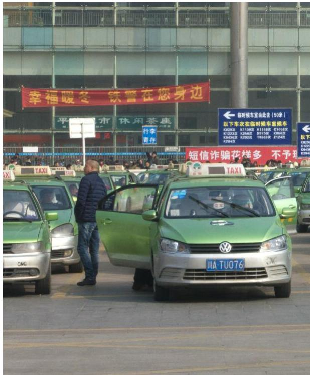

> **AI Description:**
> **Source:** `assets/_page_26_Figure_0.jpg`
> 
> **Generated:** 2026-05-30 18:55:35
> 
> ---
> 
> The image contains a photograph of a busy taxi stand in front of a building. The taxis are primarily green with "TAXI" displayed on the roof. There are several signs and banners with text in Chinese. One banner at the top reads "幸福暖冬 铁警在您身边" which translates to "Happy and Warm Winter, Police with You." Another sign indicates directions for taxi services, listing various routes and destinations. The scene appears to be in a Chinese city, likely a train station or similar transportation hub.

Taxi stand at Chengdu’s main train station
Chengdu operates a prepaid travel card system called Tianfutong

A Tianfutong card

The current network...
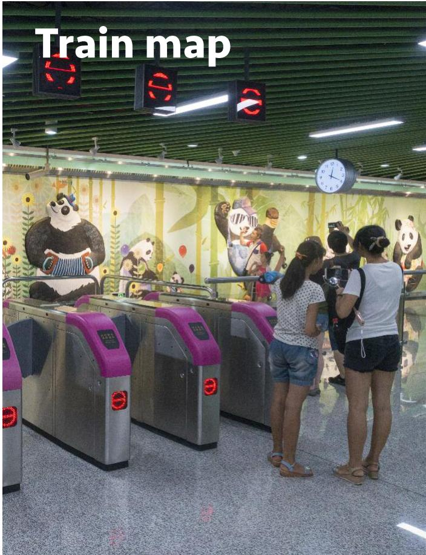

> **AI Description:**
> **Source:** `assets/_page_27_Figure_0.jpg`
> 
> **Generated:** 2026-05-30 18:47:35
> 
> ---
> 
> The image contains a photograph of a train station platform. The key visual elements include:
> 
> 1. A train map sign at the top of the image.
> 2. A colorful mural featuring pandas and bamboo, which appears to be part of the station's theme.
> 3. A group of people standing near the turnstiles, seemingly waiting or observing.
> 4. A clock on the wall above the mural.
> 5. The turnstiles have a modern design with purple accents.
> 
> The image combines textual information with a photograph of a real-world setting, providing a snapshot of a station environment.

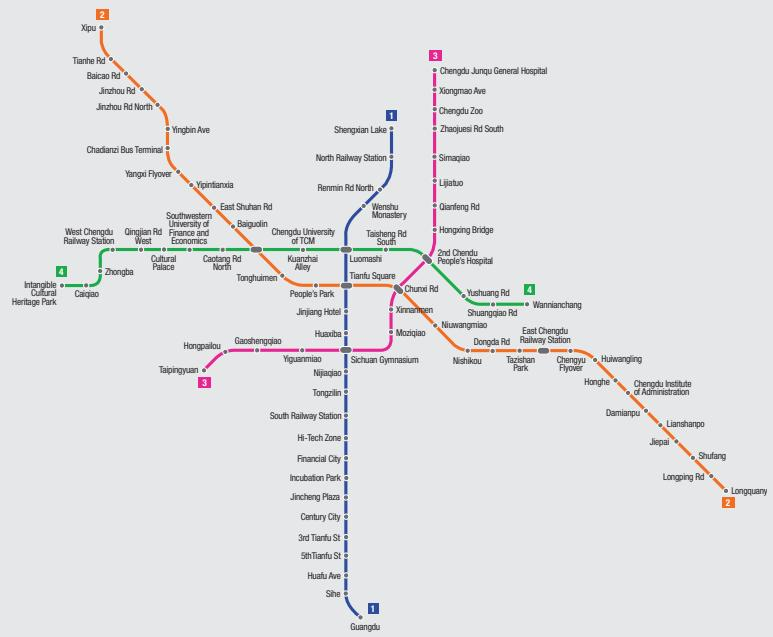

> **AI Description:**
> **Source:** `assets/_page_27_Figure_1.jpg`
> 
> **Generated:** 2026-05-30 18:50:01
> 
> ---
> 
> The image is a detailed map of a subway or metro system. It features four lines, each represented by a different color: orange, pink, blue, and green. The map includes station names and their locations, with some stations marked with additional information such as "University," "Hospital," or "Railway Station." The map is designed to show the connectivity and layout of the subway system, with lines intersecting at various points to indicate transfer stations. The stations are labeled with their names and sometimes with additional descriptors, such as "West Chengdu Railway Station" or "Chengdu Zoo." The map is comprehensive, providing a clear visual representation of the subway network and its major stops.

And the planned network...

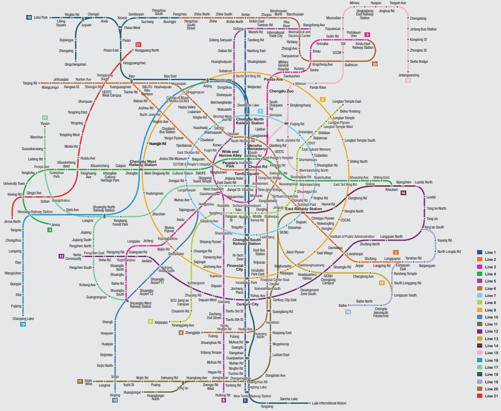

> **AI Description:**
> **Source:** `assets/_page_28_Figure_0.jpg`
> 
> **Generated:** 2026-05-30 18:37:15
> 
> ---
> 
> The image is a detailed map of the Chengdu Metro system. It includes multiple lines of the metro network, each represented by a different color, and numerous stations marked with their names. The map is designed to show the extensive network of the Chengdu Metro, highlighting its coverage across various parts of the city. The map is rich in visual elements, including lines, stations, and connections, making it a comprehensive guide for understanding the metro system's layout and connectivity.

## Important train stations

# Activate your FREE subscription

Want to stay more informed about China?

Week in China is a unique publication that offers an unbiased,

insightful and efficient digest of what’s happening in China.

Each Friday our subscribers receive an easy-to-read e-magazine

that gives them an inside track on developments in Chinese business.

You’ll also have access to our website, a valuable tool

with more than 5,500 articles spanning over 20 industries.

For a complimentary subscription, go to: www.weekinchina.com/sinopolis

Week in China

When compiling a guide to the delights of Chengdu, who better to introduce the city’s culinary legacy than Fuchsia Dunlop? Dunlop is the author of the award-winning and critically acclaimed Sichuan Cookery (published in the US as Land of Plenty), and Shark’s Fin and Sichuan Pepper: A Sweet-Sour Memoir of Eating in China, which recounts her experiences as the first Westerner to train as a chef at the Sichuan Institute of Higher Cuisine, as well as Every Grain of Rice: Simple Chinese Home Cooking, which features many Sichuanese recipes. Here Fuchsia shares her insights on the city and her recommendations on its finest food.

## How has the city changed – for both better and worse – since you lived there in the mid-1990s?

The Chengdu of today is almost unrecognisable compared with the city I knew in the mid-1990s. Cars have largely replaced bicycles, and the city has grown upwards and outwards with incredible speed. Virtually all the old neighbourhoods have been swept away, along with their grand old courtyard buildings, teahouses, markets and the traditional street life for which the city was famed. In their place have appeared skyscrapers, wide streets and shopping malls that are smart and modern but could be anywhere in the world. Clearly the city had to be modernised, and the new apartments are far more comfortable to live in than the old wooden houses, but I do regret that some of the ancient parts of the city were not preserved, like the charming area to the east of the Minshan hotel, with its narrow lanes and interesting architecture. However, despite the total reinvention of the fabric of the city, Chengdu still has something of its old magic, in the atmosphere, the dialect, the laid-back character of the people, and, of course, the food! People still put out a few tables and chairs and create an impromptu teahouse wherever they can, and talk about food all the time. I am glad that some green spaces have been preserved along the river, and that the Wenshu Monastery, River-Viewing Pavilion Park and the Qingyang Temple, where I used to learn qigong retain their old beauty and distinctiveness.

## How would you describe the character of native Chengdu people?

Chengdu people are famous for their relaxed, pleasure-loving attitude to life, and they tend to live up to this reputation. I’ve always found people here particularly warm, open and funny, and they certainly know how to have a good time.

## If you only had 24 hours in Chengdu with a friend new to the city where would you take them?

I would definitely take them to a teahouse in one of the parks, where we could spend some time drinking jasmine tea, eating sunflower seeds, chatting and perhaps having our ears cleaned by an itinerant ear-cleaner. For me, this is one of the greatest pleasures of Chengdu, and I’ve lost count of the hours and days I’ve spent in teahouses. We would wander around the streets near the Wenshu monastery and try to find some snack-sellers, dropping into a couple of places for a bowl of spicy tofu or some noodles. If they were interested in antiques, I’d take them to the antiques market near Du Fu’s thatched cottage. Foodwise, we’d have one amazing banquet at Yu Zhi Lan, and a riotous hotpot supper. If they still had some energy late at night, I’d take them to a street stall or a café for some spicy rabbit heads, which is what I used to eat after a night out dancing as a student at Sichuan University.

## Has the food culture in Chengdu become more cosmopolitan as the city's economy has grown?

The food culture has definitely become more cosmopolitan. In the 1990s, there was little else besides Sichuanese food and a few upmarket Cantonese restaurants. If you wanted ‘Western food’, you had to go to the Jinjiang or Minshan hotels, or to the Yaohua ‘Western food’ restaurant. These days, you can find many international restaurants, as well as Chinese and international

chains, and supermarkets stock plenty of international ingredients. The irony is that classic, old-fashioned Sichuanese food of the kind I enjoyed as a student has become harder to find.

## If a visitor is hosted as a guest of honour at a banquet in Chengdu, what tips do you have on etiquette? And is toasting with the local liquor Wuliangye still obligatory?

I think Chinese people are fairly relaxed about banquet etiquette, and tolerant of the fact that foreigners may not know the rules. It is useful to know that on formal occasions Chinese people don’t tend to drink alcohol on their own and at their own pace, but only as part of toasts with other guests: so it’s more polite to wait until someone invites you to have a sip, or to invite one or more other guests to drink with you. If you are helping yourself to food from common dishes with your own chopsticks, you don’t want to rummage around or touch pieces of food that you will not be eating yourself – but I think this is just basic good manners. People will, of course, be delighted if you appreciate the food! Toasting with hard liquor is one of the perils of formal Chinese dinners, especially for men, but I think the pressure to drink is less intense than it used to be. Some Chinese people I know who dine out regularly do not drink at all, toasting instead with soft drinks, and they seem to get away with it. It’s easier for a woman to decline alcoholic toasts than a man. But it’s worth knowing that if you do start toasting with baijiu, you will probably be forced to continue until the bitter end!

# Sichuan’s food flair, by Fuchsia Dunlop

Sichuanese is regarded as one of China’s ‘four great cuisines’, and there is no better place to try it than in the provincial capital, Chengdu. Although its reputation is based on fiery chilli heat and the numbing sensation of Sichuan pepper, the local food is far more complex than this stereotype would suggest. Sichuanese chefs are renowned for their mastery of multi-layered flavours (fu he wei) in which the drama of spice and tingle is always balanced by gentler tastes. Even where chillies are used, they are employed with such variety that their taste never palls. They may be fresh, dried, pickled or ground, and used in every combination from the notorious mala (‘numbing-and-hot’) pairing of dried chillies and Sichuan pepper to the sweet, seductive ‘fish-fragrant’ flavour (see below). A well-planned Sichuanese meal should be a thrilling rollercoaster of tastes, with a mixture of spicy dishes, simple stir-fried greens and refreshing, lightlyseasoned broths.

Sichuan is known in China as a ‘Land of Plenty’ because of its abundance of fresh produce all year round. The vegetables sold in the markets change with the seasons; local treats include ‘fish grass’ (ze’er gen), a sour-tasting green that is typically eaten in a spicy salad, the spring shoots of the Chinese toon tree (chun ya) and mallows (dong han cai), an ancient local favourite that is often made into soups. The key seasonings of Sichuanese cuisine include not only chillies and Sichuan pepper, but also Pixian chilli bean paste (dou ban jiang), a fermented sauce made from fava beans and chillies. The population of Sichuan has long been composed of immigrants from other parts of China, and the local food is an amalgam of culinary influences from China and abroad, including, most famously, the Mexican chilli.

Although Sichuanese banquet cookery can be highly sophisticated, the province is best known for the delicious ‘small eats’ (xiao chi) that were traditionally made and sold by street vendors, and for its hearty folk cooking.

In 2010 Chengdu was the first Asian city recognised by UNESCO as a “City of Gastronomy”

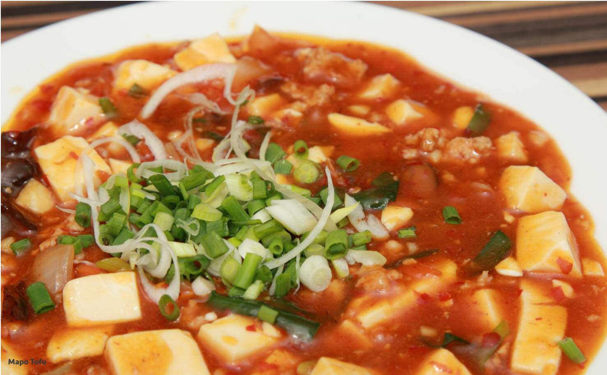

> **AI Description:**
> **Source:** `assets/_page_35_Figure_0.jpg`
> 
> **Generated:** 2026-05-30 18:48:40
> 
> ---
> 
> The image contains a photograph of a dish labeled "Mapo Tofu." The dish consists of cubes of tofu in a rich, red sauce, garnished with chopped green onions and possibly some sliced scallions. The sauce appears to be thick and flavorful, with visible chunks of meat and possibly other ingredients mixed in. The presentation is vibrant and appetizing, with the green onions adding a fresh contrast to the red sauce.

## DISHES

## Mapo tofu (mapo doufu) 麻婆豆腐

A gorgeous mix of tender tofu and minced beef braised in a lavish chilli bean sauce that sings and tingles with Sichuan pepper, it’s the perfect retort to anyone who considers tofu boring. ‘Pock-marked old woman’s tofu’ (mapo doufu) is justifiably regarded as one of the greatest of all Sichuan dishes. It’s affectionately named after ‘Pockmarked Mother Chen’(Chen mapo), the Qing Dynasty cook who is said to have invented it in her restaurant near the Bridge of Ten Thousand Blessings (Wanfuqiao) in the north of Chengdu. Many of her customers were porters carrying cooking oil to the markets of the city, so the legend goes, and they would stop off at Mother Chen’s, give her a little oil and ask her to whip them up a bowlful of tofu.

## Hotpot (huoguo) 毛肚火锅

No visit to Sichuan would be complete without the riotously spicy experience of hotpot, where you cook your own dinner in a simmering, oily cauldron of chillies and Sichuan pepper. The dish is said to have originated on the banks of the Yangtze River in Chongqing, where labourers cooked up water buffalo innards for their suppers. Dipping ingredients include, most famously, beef tripe and other slithery offal, but also lean beef, shrimp balls and a whole host of vegetables. After cooking, the food is traditionally dunked into a seasoning dip of sesame oil and chopped garlic. In its hometown, Chongqing (now a municipality separate from Sichuan), hotpot can be insanely spicy: locals there insist that eating plenty of chilli and Sichuan pepper is essential to combat the stifling heat and humidity of the climate.

## Fish-fragrant pork slivers (yuxiang rousi) 鱼香肉丝

There is no fish in so-called ‘fish-fragrant’ dishes, one of the most typical examples of the dazzling flavour combinations of Sichuanese cookery. Instead, they are made with scarlet pickled chillies, ginger, garlic and spring onion with a base of sweet-and-sour: these are the seasonings used in traditional local fish cookery, hence the name. (Some people aver that the combination of flavours actually evokes the taste of fish.) Many ingredients can be given the ‘fish-fragrant’ treatment, including aubergines, peas and chicken, but its most celebrated expression is in fish-fragrant pork slivers, a simple stir-fry of finelyshredded pork with lettuce stem and wood ear mushrooms.

## Twice-cooked pork (hui guo rou) 回锅肉

Many local Sichuanese assert that their favourite dish is this simple yet irresistible combination of sizzly sliced pork with chilli bean paste, fermented soybeans and fresh green vegetables. It’s a regular fixture on domestic dinner tables, and fabulous with nothing but a bowlful of plain white rice. The secondary ingredients can vary; some people use green peppers or throw some slices of deepfried flatbread into the mix, but green garlic shoots (suan miao) are most typical. The Chinese name of the dish is literally ‘back-in-the-pot’ pork because of the way the meat must be boiled or steamed before it is stir-fried. It’s traditionally made with broad, thin slices of pork rump that are half fat and half lean; as they cook, the slices are said to curl up into the shape of old-fashioned oil-lamps (deng zhan wo).

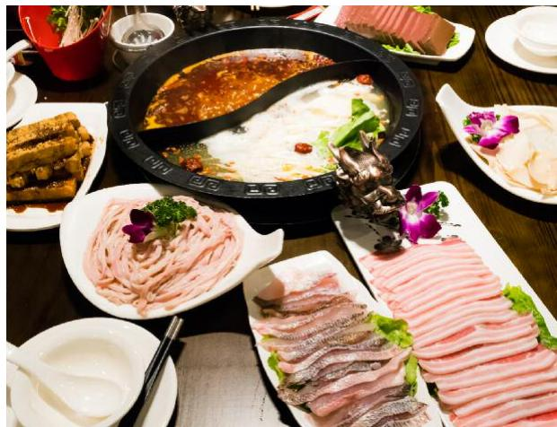

> **AI Description:**
> **Source:** `assets/_page_37_Figure_0.jpg`
> 
> **Generated:** 2026-05-30 18:36:33
> 
> ---
> 
> The image contains a photograph of a hot pot meal setup. It features a split hot pot with two different broths, surrounded by various plates of raw meat and other ingredients. The meat includes thinly sliced pork and other cuts, arranged neatly on white plates. The setting appears to be a dining table with additional dishes and utensils, suggesting a communal meal. The image is rich in visual elements that convey the context of a shared dining experience.

Shabu pot in Chinese style - pork soup and oily spicy soup

## Zhong dumplings in chilli-oil sauce 钟水饺

Chengdu has a long and glorious history of street food, and these dumplings, a typically open-minded combination of northern pastry-making with Sichuanese spice, are a local favourite. Stuffed with lean pork, the dainty boiled dumplings are bathed in sweet soy sauce, mashed garlic and ruby-red chilli oil. Like many notable Chengdu ‘small eats’ (xiao chi), they are named after their inventor, in this case a street vendor called Mr Zhong.

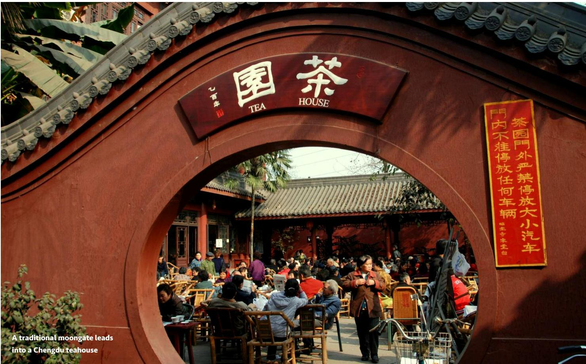

> **AI Description:**
> **Source:** `assets/_page_38_Figure_0.jpg`
> 
> **Generated:** 2026-05-30 18:43:58
> 
> ---
> 
> The image contains a photograph of a traditional moon gate leading into a Chengdu teahouse. The moon gate is a circular archway with a red wooden sign above it that reads "茶園 TEA HOUSE" in Chinese characters. Inside the teahouse, there are numerous people seated at tables, enjoying tea and conversation. The setting appears to be a lively and social environment, with people engaged in various activities. The red sign on the right side of the moon gate contains additional text in Chinese, which appears to be a notice or instruction. The overall scene captures the essence of a traditional Chinese teahouse, emphasizing community and relaxation.

## RESTAURANTS AND TEAHOUSES

## Chen Mapo Doufu

Named after its most famous dish (see above), this restaurant specialises in traditional Sichuan fare. In a city where commercial competition and the pace of culinary innovation are both relentless, it’s a haven of oldfashioned deliciousness, and a good place to seek out not only the legendary tofu dish, but Gong Bao Chicken, twicecooked pork, fish-fragrant pork slivers and other local classics. Officially designated a ‘time-honoured brand’ (laozi hao), the restaurant has several branches across Chengdu; local afficionadoes prefer the headquarters on Yulong Street to the north of the city centre.

Chen Mapo Doufu, 197 West Yulong Street, Luomashi,   
Qingyang District   
陈麻婆豆腐，青羊区西玉龙街197号   
Tel: 028 8675 4512

## Yu Zhi Lan

Chef-Patron Lan Guijun is one of the most talented chefs in Sichuan, well-versed in all the traditional culinary techniques from making stock to noodle-cutting, but with an inimitable personal style. Visit his tiny, reservationsonly restaurant for an incredible journey through the flavours of Sichuan, including banquet delicacies such as sea cucumber in a sour-and-hot broth, and exquisite renditions of folk favourites such as strange-flavour noodles. Yu Zhi Lan is the modern incarnation of a prerevolutionary tradition in which wealthy officials kept private chefs and entertained their friends at home to sumptuous dinner parties.

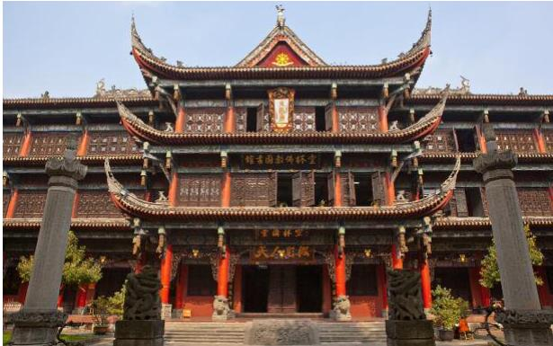

> **AI Description:**
> **Source:** `assets/_page_39_Figure_0.jpg`
> 
> **Generated:** 2026-05-30 18:42:27
> 
> ---
> 
> The image shows a traditional Chinese architectural structure, likely a temple or a significant historical building. The structure features ornate wooden carvings, red and gold colors, and multiple levels with intricate roof designs. The front of the building has large columns and a central entrance with a sign above it. The architecture is characterized by its cultural and historical significance, with detailed craftsmanship and symbolic elements typical of Chinese temples or palaces.

Wenshu Monastery: features a famed teahouse too

Yu Zhi Lan, 24 Changfa Street, Qingyang District   
玉芝兰，青羊区长发街24号   
Tel: 028 6249 1966

## Shunxing Old Teahouse

Many of Chengdu’s most famous ‘small eats’ have disappeared from the city’s streets, but they can still be found in specialist restaurants like this one. The Shunxing is a huge, modern teahouse decorated in traditional style, and offers set menus of traditional street snacks, including Zhong dumplings, Long wontons, Mr Lai’s glutinous riceballs and spicy dan dan noodles. In the evening, the touristy entertainments include skilled ‘face-changers’ who magically swap their way through a whole succession of Sichuan opera masks.

Shunxing Old Teahouse, 198 Shijicheng Road,   
Wuhou District   
顺兴老茶馆，武侯区世纪城路198号   
Tel: 028 8534 8888

## Wenshu Monastery Teahouse

The redevelopment of Chengdu has swept away many of the city’s old-fashioned street vendors, but a few of them congregate in the streets around the ancient Wenshu Monastery. If you’re lucky, you may find a man selling glutinous riceballs coated in toffee and flecked with sesame seeds (tang you guo zi), or little eggy pancakes (dan hong gao) stuffed with jam or salty pickles. A few doors down from the temple is Zhang’s famous noodle restaurant: a cheap, cheerful café serving slippery cold noodles and other snacks. And when you’ve had your fill, pop into the charming courtyard teahouse next to the monastery for a cup of jasmine tea.

Wenshu Monastery, 66 Wenshuyuan Street, Qingyang District

文殊院，青羊区文殊院街66号

## Lao Ma Tou

Hotpot is most authentically enjoyed in a clamorous restaurant packed with locals gossiping in Sichuan dialect, and Lao Ma Tou (‘Old Wharf’) offers the full experience. Take your places around the seething pot and spend the evening delirious with heat as you cook your own meatballs, mushrooms, noodles and, if the mood takes you, goose intestines and tripe. Keep your eyes peeled for the wandering noodle maker who will spin a length of dough into strips as thin as tagliatelle as he dances around your table. Do expect to queue at this endlessly popular place, and make sure you don’t wear your best clothes, because you will end up reeking of oil and spice.

Lao Ma Tou, 27 Yulin Middle Road, Wuhou District老码头，武侯区玉林中路27号

# Attractions

## Chengdu Research Base of Giant Panda Breeding

Rmb250 billion The revenue generated by tourism in 2016 from over 200 million tourists

Sichuan is synonymous with pandas, so much so that a recent promotional drive from Chengdu’s tourism board touted that the city had “more than just pandas” on offer. Nevertheless, for tourists, the Research Base of Giant Panda Breeding (colloquially, the Panda Park) is one of the city’s key attractions.

Sichuan province is home to some of the few remaining wild pandas. The bears used to be more abundant in the wild, but demand for bamboo and land decimated their natural habitat and the park was founded in 1987 to boost their numbers. To date it has bred over 120 pandas.

One of the park’s pandas gave birth to two sets of twins – one male pair, one female pair – in June this year. The breeding facilities at the park allow visitors to see pandas across their lifecycle, including as newborns from centimetres, watching them wiggling away at a post-natal incubation stage.

Besides the Giant Pandas the park also has a number of

Lesser Pandas (smaller redder animals) and is generally a pleasant place to spend a half day, strolling from enclosure to enclosure.

1375 Xiongmao Avenue, Chenghua District成都大熊猫繁育研究基地,成华区熊猫大道1375号

## Monasteries

There are a number of monasteries in Chengdu, which make for charming retreats from the bustle of the city. One is Daci Monastery, which was originally built during the Sui Dynasty, and is the holy ground where Xuanzang was ordained. Xuanzang would later travel to India in search of Buddhist sutras and become the inspiration for the iconic Chinese tale Journey to the West. The temple’s architecture has been emulated by the fashionable Taikoo Li shopping district, of which it is now a part.

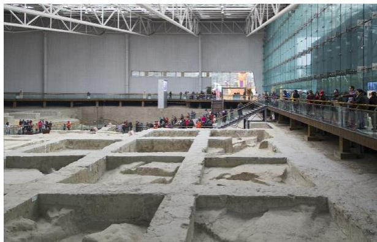

> **AI Description:**
> **Source:** `assets/_page_41_Figure_0.jpg`
> 
> **Generated:** 2026-05-30 18:34:52
> 
> ---
> 
> The image shows an archaeological excavation site displayed in a modern museum setting. The site features a series of rectangular trenches dug into the ground, revealing layers of earth and possibly remnants of historical structures or artifacts. The trenches are organized in a grid pattern, and the surrounding area is enclosed by a glass wall, allowing visitors to view the excavation from an elevated walkway. The museum interior includes a glass wall in the background, which appears to be part of the building's design, and there are people observing the excavation from the walkway.

Jinsha site museum

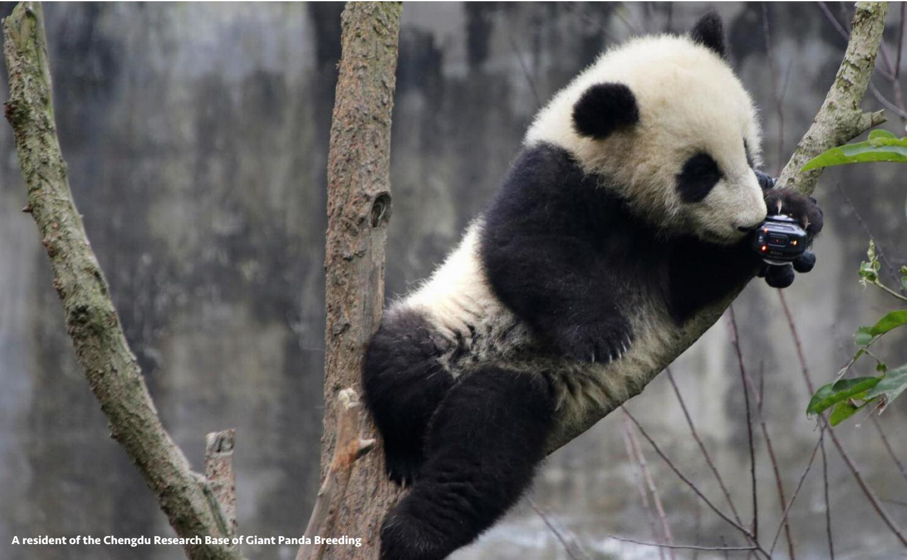

> **AI Description:**
> **Source:** `assets/_page_42_Figure_0.jpg`
> 
> **Generated:** 2026-05-30 18:51:46
> 
> ---
> 
> The image is a photograph of a panda bear perched on a tree branch. The panda is holding a small camera in its paw, seemingly examining it. The background is a blurred natural setting, likely a forest or a zoo environment. The text at the bottom of the image identifies the panda as a resident of the Chengdu Research Base of Giant Panda Breeding.

In the northern sector of the city centre is Wenshu Monastery, which was built during the Northern and Southern Dynasties period (420-589). Considerably larger than Daci, the grounds of Wenshu are a serene place to while away a few hours. 大慈寺 (Daci Temple)

## Jinsha Burial Site

This museum was opened in 2007 after relics from an ancient civilisation were accidentally found during construction of an apartment complex. The artefacts date back to 1200BC and reveal the existence of a highly skilled, tribal civilisation that inhabited the Sichuan plains.

The museum is one of the best curated museums in China, showcasing hundreds of jade, gold and bronze craftwork – some ceremonial, others ornamental or martial. The site of the archaeological find is on the museum grounds, revealing more artefacts still to be dug up, and the two buildings housing the museum and dig are in a lush park of ebony trees.

2 Jinsha Yizhi Road, Qingyang District金沙遗址博物馆，青羊区金沙遗址路2号

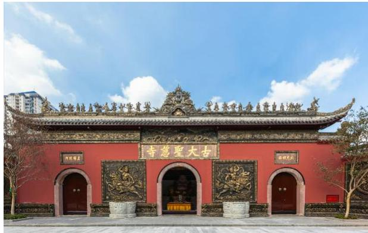

> **AI Description:**
> **Source:** `assets/_page_43_Figure_0.jpg`
> 
> **Generated:** 2026-05-30 18:47:04
> 
> ---
> 
> The image depicts the exterior of a temple with a red facade and ornate architectural details. The temple's name, "古大圣慈寺" (Gu Dashi Cisi Temple), is prominently displayed in gold characters above the central entrance. The temple features traditional Chinese architectural elements, including a tiled roof with decorative finials and intricate carvings on the walls. The entrance is flanked by two smaller archways, and the overall design suggests a historical and cultural significance.

Daci Temple

## Wide and Narrow Alley

These parallel alleys (plus the third parallel, Well Alley) form a large pedestrianised area, teeming with shops, restaurants, bars and, of course, Starbucks coffee stores. Dating from the Qing Dynasty, the renovated area has maintained the imperial style. Similar to Jinli Street next to the Wuhou memorial site, the wide and narrow alleys offer a variety of traditional and not so traditional snacks, trinkets, gifts, meals and performances.

Wide and Narrow Alley 宽窄巷子

## Hotels

## Jinjiang

The place where top diplomats reside on trips to Chengdu. Situated on the road that divides the city centre into east and west, this luxury hotel is proud of its illustrious guest list. Photos of the hotel manager shaking hands with global leaders are showcased in the lobby.

80 Renmin South Road 2nd Section, Jinjiang District 锦江宾馆，锦江区人民南路二段80号

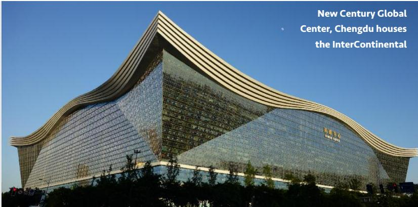

> **AI Description:**
> **Source:** `assets/_page_44_Figure_0.jpg`
> 
> **Generated:** 2026-05-30 18:47:17
> 
> ---
> 
> The image shows a photograph of the New Century Global Center in Chengdu, China. The building is characterized by its unique, wave-like architectural design with a reflective glass facade. The text overlay on the image identifies the building and mentions that it houses the InterContinental hotel. The sky is clear and blue, indicating a sunny day. The image provides a clear view of the building's distinctive structure and its location.

## Grand Hyatt

Positioned on the southern flank of Chunxilu shopping district, and perfectly located for retail therapy and downtown meetings alike.

8 South Chunxi Road, Jinjiang District成都群光君悦酒店，锦江区春熙路南段8号

## Temple House

The third creation from Swire’s “House” range of hotels, (the others are in Beijing and Hong Kong). This chic retreat is built around the remnants of a Qing Dynasty courtyard and sits just across the road from Chengdu’s trendy shopping district, Taikoo Li.

81 Bitieshi Street, Jinjiang District 博舍，锦江区笔帖式街81号

## InterContinental

Split into two hotels both housed inside the world’s largest building, the Global Centre, and in the middle of the Tianfu Software Park. Close to the new CBD and cohabiting with all the amenities of the Global Centre.

1736 Tianfu Avenue North, Wuhou District新世纪环球中心，洲际酒店，武侯区天府大道北段1736号

## Shangri-La

Towering above the iconic Anshun Bridge, the Shangri-La overlooks the Jin River winding towards the city centre. The Shangri-La also offers serviced apartments and is part of a larger complex including a 28-storey office block.

9 Binjiang Road East, Binjiang District成都香格里拉大酒店，锦江区滨江东路9号

## Mobile matters

This correspondent worries that as mobile tech becomes more ingrained in society, China becomes a less convenient place for outsiders to visit. All manner of businesses accept, if not prefer, payment from WePay or AliPay. Some taxi drivers even grumble at having to take or give change – and, of course, the more patrons use cashless methods, the less cash the drivers have on hand to give others.

Passengers increasingly settle fares using mobile payments, because it is now easier than before to summon taxis through mobile apps, which leaves fewer cars waiting to be flagged down on the streets.

The convenience of China’s latest‘sharing economy’ industry, rental bikes, is largely inaccessible to the visiting traveller too. Once again, users must have an account with a local mobile payment company, as well as be registered with the bike rental firm.

Also, many establishments that offer free Wi-Fi require the customer to first scan a QR code using WeChat in order to log on, which presupposes that the customer already has internet access and a WeChat account.

These annoyances are trifling, but to really enjoy the convenience of life in modern China, it is worth setting up a WeChat account, as well as getting a WePay or AliPay account. (ApplePay can also be used in China but, as Week in China has reported, very few shopkeepers accept it and it has a tiny 1% market share in the country).

## Infrastructure

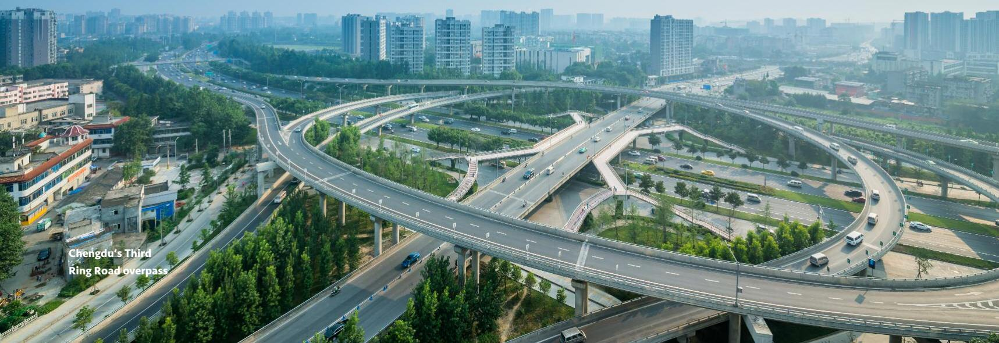

> **AI Description:**
> **Source:** `assets/_page_46_Figure_0.jpg`
> 
> **Generated:** 2026-05-30 18:34:36
> 
> ---
> 
> The image is a photograph of an overpass in Chengdu's Third Ring Road. It features multiple roadways with vehicles in motion, surrounded by greenery and urban buildings in the background. The overpass is a complex structure with multiple levels and ramps, designed to facilitate traffic flow. The text "Chengdu's Third Ring Road overpass" is overlaid on the image, indicating the location and subject of the photograph. The image provides a clear view of the infrastructure and its integration into the urban landscape.

# Building up, shipping out

“As the starting point of the   
Southern Silk   
Road, Chengdu has always been active in   
economic and   
cultural   
exchanges with neighbouring   
countries”

\- Lin Ling, former deputy director of the Sichuan Academy of Social Sciences

t’s harder to travel the roads in Sichuan than it is to reach the sky.” Such was the verdict of the Tang Dynasty poet Li Bai. Although he didn’t call it   
Sichuan, he called it Shu: the kingdom that used to rule   
the same territory, until it was conquered by the Qin in   
316BC.

In fact even the King of Qin found the roads of Shu initially impassable. A popular story tells that in order to topple the Shu, the Qin first had to trick them into building a better road. To do this the Qin king spread a rumour that he owned several stone oxen defecated gold.

Eager to obtain these weighty cash cows, the Shu king ordered that the road to Qin be widened and reinforced so that the cattle could be transported to his kingdom. Soon after the cows had been heaved to Shu, Qin led his armies along the new Stone Cattle Road and captured the state for himself.

It would be a few more centuries before Li Bai was traversing the same Sichuanese trails, yet still he considered them arduous. As the modern era rolled around, the same inaccessibility that once protected the province became a hindrance to its growth. This mighty obstacle is now being overcome as Chengdu pitches itself as the logistics hub of Southwestern China.

## The belt-buckle

Like many other cities in China, Chengdu is presenting itself as a vital node for the Belt and Road Initiative (BRI). More uniquely, Chengdu has referred to itself as the “buckle” that connects the BRI to another domestic “belt”: the Yangtze River Economic Belt (YREB). This refers to the economy that has grown from the shipping of goods along the Yangtze River. Although the closest river port to Chengdu is at Luzhou, some 250 kilometres away, it has been incorporated into the new Sichuan Free Trade Zone. All the remaining points of the Free Trade Zone are in Chengdu.

There’s also the occasional suggestion that the city could benefit from the Bangladesh-India-Myanmar-China Belt (although HSBC’s Eric He believes the Yunnan capital, Kunming, is likely to see greater benefits, as its province borders Myanmar).

Chengdu also has direct competition from a neighbour, Chongqing. The rivalry between these two cities can be traced back millennia, to when they were the neighbouring states of Shu and Ba, united during the Qin Dynasty and separated once more in 1997, in part to help manage the deluge of displaced citizens the construction of the Three Gorges Dam was due to create.

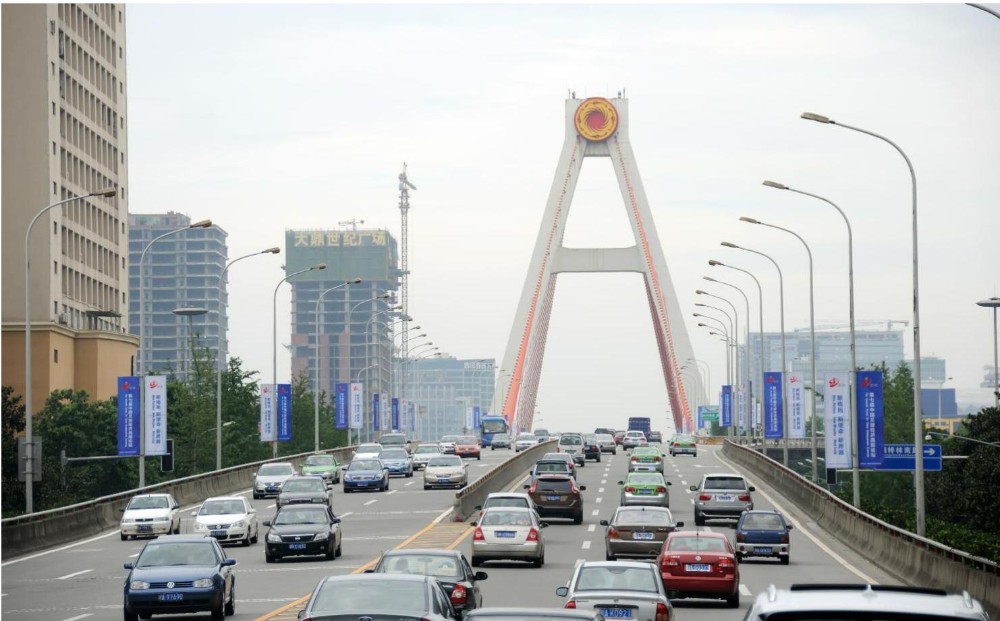

> **AI Description:**
> **Source:** `assets/_page_48_Figure_0.jpg`
> 
> **Generated:** 2026-05-30 18:43:12
> 
> ---
> 
> The image is a photograph of a busy urban scene. It shows a multi-lane road with numerous cars in motion, indicating heavy traffic. In the background, there is a prominent bridge structure with a distinctive logo at its top. Several tall buildings are visible, including one under construction with a green facade. The sky is overcast, and there are streetlights and banners along the road. The image captures the hustle and bustle of city life, with the bridge serving as a focal point.

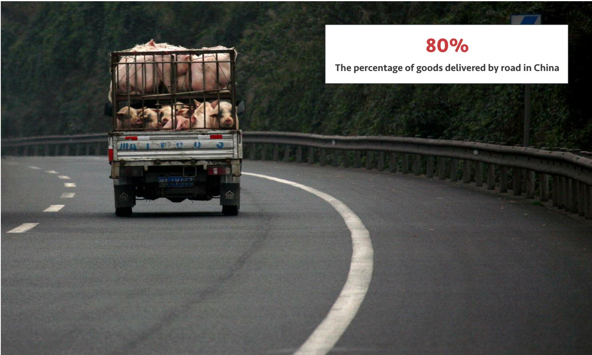

> **AI Description:**
> **Source:** `assets/_page_49_Figure_0.jpg`
> 
> **Generated:** 2026-05-30 18:46:13
> 
> ---
> 
> The image contains a photograph of a truck carrying pigs on a road. The truck is on a curved road with a guardrail on the right side. The background shows a dense forest. The image also includes a text overlay that states "80% The percentage of goods delivered by road in China." This text provides a statistic related to the transportation of goods in China. The photograph serves as a visual representation of the text, showing a real-world example of goods being transported by road.

However, over the last few years international media has periodically observed Chengdu’s rise as a logistics hub, rather than its neighbour’s. A report from real estate specialist CBRE in 2015 declared that “Tier 1 cities and Chengdu” (Tier 1 meaning Beijing, Shanghai, Guangzhou, and Shenzhen) were the top investment destinations for the logistics industry, noting Chengdu’s location at the intersection of the BRI and the YREB. So how accessible is the city today?

## Trucking

Chengdu is linked to major cities across China by a web of expressways, including a strand direct to Chongqing. In 1993 the central government designated Chengdu as Southwest China’s “Double Hub” – both a communication and a traffic hub. Years later, the Sichuan government proposed its “16, 5, 5” network plan, with Rmb600 billion in funding.

The blueprint, part of the larger Sichuan Expressway Network Plan (2008-2030), ordered the building of 16 highways into the province, dissected by five primary

North-South routes and five primary East-West routes.

The highways departing from Chengdu were designed to provide same-day delivery to the capitals of the surrounding provinces (with the exception of Lhasa in Tibet) and a travel time to Beijing, Shanghai, Guangzhou and Lhasa of under 22 hours. In 2014 the plan received an update, ordering construction of another four interprovincial highways.

Chengdu is also home to one of the Chuanhua Logistics Centres – a mammoth “road port” where truckers congregate to pick up cargo from shippers. In a market where owner-operator trucks constitute the majority of haulers, such nodes are vital.

Chuanhua goes by the English name Transfar and is proud of pioneering the highway port model in China, opening the first in 2003 in Hangzhou. There are now ports in 80 cities. But Chuanhua’s heavy investment in these holding-and- dispatching stations is coming under threat from modern technology.

Enter Truck Alliance (Huochebang) – a ‘unicorn’ company explained simply as “Uber for trucks”. One of Truck Alliance’s primary platforms, 56qq.cn, was developed in Tianfu Software Park, where its parent company recently opened a tech centre. Truck Alliance connects factories to truckers directly, helping the latter spend more time on Chengdu’s growing network of expressways.

## Freight trains

Chengdu is connected by rail directly to Lodz, Poland, transporting cargo over 7,000 kilometres to its terminus in around 11 days, from where goods can be shipped onwards to other points in Europe within three days.

The line was put into operation in 2013, so although it is nowadays being presented as a demonstration of Xi Jinping’s BRI, it was actually conceived before the policy was announced. But under the Initiative (by coincidence or design), the track’s usage has doubled each year. Last year 460 trains ran the route; this year the prediction is for over 1,000. Since its launch, Nuremburg and Tilburg have also been added as destinations.

Chengdu has opened other eastbound freight routes, including one to Moscow, and one to Istanbul. The Istanbul line was opened this year and offers a delivery time of 16 days. Once in Chengdu, cargo can reach ports on the east coast of China within two days, offering a faster alternative to shipping by sea for many Western, and even Middle Eastern, companies. For example, the Chengdu-Lodz route was extended to reach China’s eastern seaboard port of Xiamen, taking only a couple of days from Chengdu. (This does beg the question of why the Chengdu-Lodz line isn’t now called the Xiamen-Lodz line.)

Supporting Chengdu’s claim to the title of “gateway to Western China”, the city was designated a Free Trade Zone in April 2017, inspiring beneficial policies and practices. On April 6, the city issued its first “combined bill of lading” to a European exporter using the Chengdu-Europe Express Rail. This document allows the exporter to receive payment before the importer receives its goods. The city is also Southwest China’s only cross-border e-commerce zone, which combined with its bonded ports, streamlines customs clearance for overseas imports and exports.

## Planes

Chengdu’s airport is the fourth busiest in China and the busiest in Central and Western China by passenger numbers. As of March this year the Shuangliu International Airport operated 271 routes to 209 cities, 96 of which are international destinations.

The city is currently constructing a second airport – the Chengdu Tianfu International Airport– which will make it the third city in China to operate two airports when it is completed in 2020 (the other cities are Shanghai and Beijing, although Beijing’s second airport is also still under construction).

The first phase of the Tianfu airport will be finished in 2018, at which stage it will be equipped to handle 700,000 tonnes of cargo. That figure should rise to two million tonnes when the airport is completed. For perspective, in 2016 Shuangliu airport handled 611,500 tonnes, a 9.9% growth on the year before, ranking it fifth nationally for volume.

Under increasing pressure from surrounding cities expanding their air freight facilities, Chengdu launched an initiative in June to attract air freighters. According to Cargo Facts, the drive offers freight carriers subsidies of up to \$44,000 for each route they open into the city, and up to \$1.4 million for airlines willing to establish a freight “hub”. In addition, Chengdu will offer carriers subsidies for the actual tonnage of cargo they move through its airports, as well as subsidies for forwarders that bring cargo overland within a 1,000 kilometre radius. n

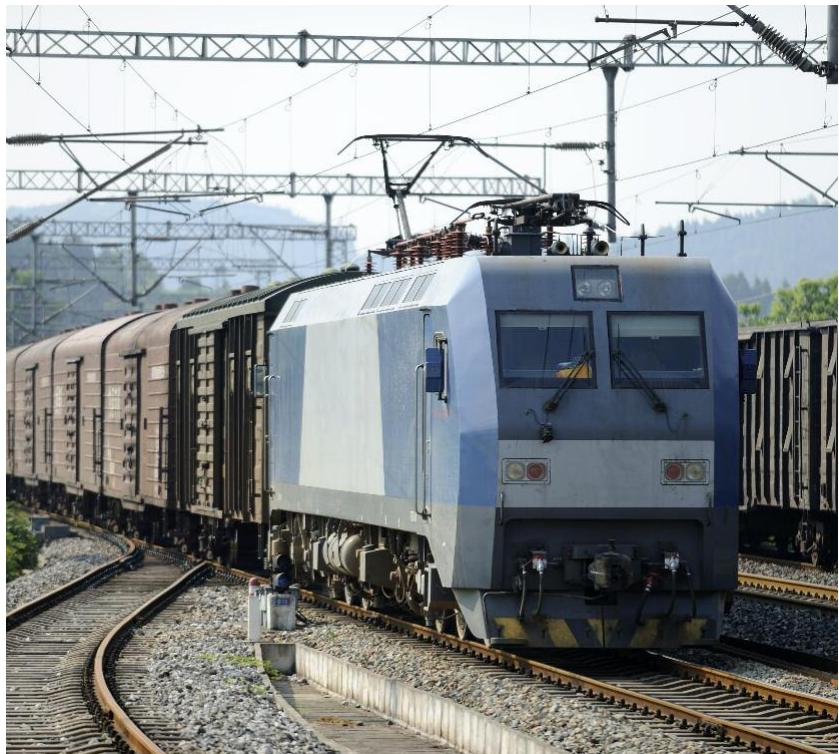

> **AI Description:**
> **Source:** `assets/_page_52_Figure_0.jpg`
> 
> **Generated:** 2026-05-30 18:30:50
> 
> ---
> 
> The image shows a freight train on a railway track. The train consists of a locomotive at the front and several freight cars behind it. The locomotive is a blue and white electric locomotive, and the freight cars appear to be cargo containers or freight wagons. Overhead, there are electrical lines and supports, indicating that the train is powered by electricity. The background shows a hilly landscape with some greenery, suggesting the train is traveling through a rural or semi-rural area.

A freight train set for Europe laden with Chinese goods

## The European connection

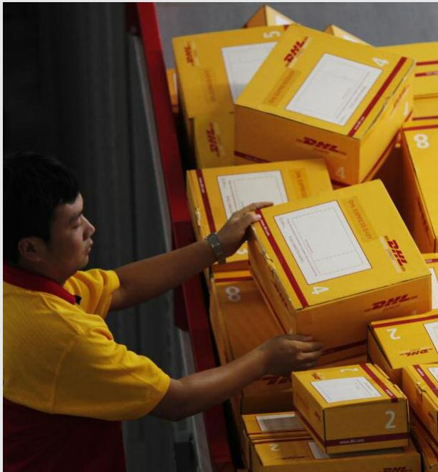

> **AI Description:**
> **Source:** `assets/_page_53_Figure_0.jpg`
> 
> **Generated:** 2026-05-30 18:34:08
> 
> ---
> 
> The image contains a photograph of a person handling DHL-branded packages. The packages are stacked in a warehouse setting, and the person is wearing a yellow shirt, possibly indicating employment with the company. The packages are labeled with numbers and the DHL logo, suggesting they are being organized or prepared for delivery. The image provides a visual representation of a logistics or shipping environment.

Mov ing the goods to and from China, faster via train: DHL

Sinopolis speaks to the head of Value Added Services (VAS) China at DHL Global Forwarding China, Zafer Engin, about the company’s expanding business in Chengdu.

How did DHL’s work with the Chengdu government begin? DHL has long been interested in the possibility of connecting China and Europe by railway and our group actually began researching this route way back in 2008. That’s around when we made our preliminary studies, where we were thinking about the goals, challenges, customer requirements, capacity, connections, and charges.

At the end of 2010, DHL Global Forwarding China decided to move forward with shipping containers from China to Europe. We had multiple customers interested in this service, but they wanted to use only one or two containers rather than ship a full trainload. So we tried to design the service to fit our customers’ expectations.

Between 2010 and 2012 we did more than 200 container shipments as a trial. And the trials were successful. Then Chongqing opened a train line in 2012 for HP, going to Duisburg. This spurred the Chengdu government to contact us. They saw that Chongqing was developing rail links and they wanted to do the same. And that’s how we started to cooperate with them, at the end of 2012. So, we already had two years of experience sending single containers, but managing a public train, on a regular schedule, going all the way from Chengdu to Europe was a different matter. We launched the service later in 2013, running from Chengdu to Lodz [in Poland].

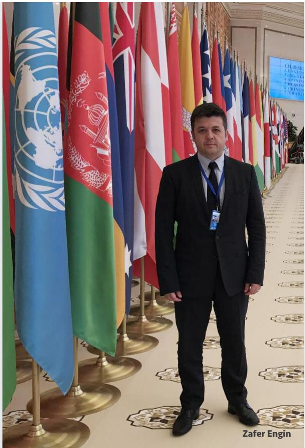

> **AI Description:**
> **Source:** `assets/_page_54_Figure_0.jpg`
> 
> **Generated:** 2026-05-30 18:33:58
> 
> ---
> 
> The image contains a photograph of a man standing in front of a row of flags representing various countries. The flags are arranged in a neat line, and the man is dressed in a formal black suit with a lanyard around his neck, suggesting he may be attending a formal event or conference. The floor beneath him has a patterned design, and there is a screen in the background displaying text, though the content of the screen is not fully visible. The name "Zafer Engin" is visible in the bottom right corner of the image.

ANNA BERGKVIST

As the service became more popular each year, the government wanted to expand the train’s services and destinations, and we are continuously working to accommodate them. At the beginning DHL signed an agreement to occupy half of the train’s capacity, but now quite a big portion of DHL cargo moves through the Chengdu hub and DHL deliveries take up entire trains.

## What work does DHL do with Chengdu?

Well we are not only a cargo provider, we are also helping them design a proper logistical system based on customer needs, and of course based on logistical facts. So we have a strategic partnership with the Chengdu government logistics team and we are helping them to refine the logistics structure of the city, preparing them for the future - 2020, 2025 - ensuring their logistics system is sufficient and advising what needs to be done in terms of developing international connections too.

So basically we are helping them to communicate with the likes of Kazakh railway, Russia railway, Belarusian railway and now Georgia and Turkey. We are helping design and maintain the transportation systems, and working as a mediator for any issues that might arise.

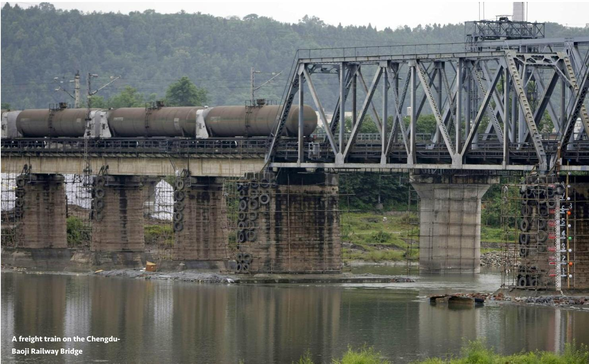

> **AI Description:**
> **Source:** `assets/_page_55_Figure_0.jpg`
> 
> **Generated:** 2026-05-30 18:31:33
> 
> ---
> 
> The image is a photograph of a freight train crossing a railway bridge. The bridge is supported by concrete pillars and has a metal framework. The train consists of several tank cars, likely used for transporting liquids or gases. The background shows a forested area, and the foreground includes a body of water reflecting the bridge and train. The text at the bottom of the image identifies the location as the Chengdu-Baoji Railway Bridge.

## What impact has the Belt and Road Initiative (BRI) had on DHL’s work?

Actually when we started to talk with them in 2012, there was no BRI. Then in 2013 when the Initiative was announced that provided some extra acceleration to us. The BRI sparked a lot of support from the central government as well, and that’s the reason why the local government is now very ambitious in terms of their targets for how many trains should be running between Chengdu and Europe each year.

But in terms of funding – the local government, and the government department that’s hiring DHL’s services, certainly receive funding earmarked for the BRI. But as for DHL, we are just a service provider and we are not funded by the BRI.

## How much cargo is carried by train between China and Europe annually?

In 2011 the total number of block trains between Chengdu and

Europe was only 17, then the next year there were 42, then 80, then 308, and last year there were 1,702. So we expect to see a similar growth trend over the next two years. If you take the trend as roughly doubling each year, that will mean around 14,000 trains for 2020.

## What are the plans for the development of Chengdu’s logistics industry?

What we are doing now is expanding Chengdu’s network of connections. For example, the first connection point was Lodz, then last year the service was expanded into Nuremburg and Tilburg. And this year we are sending more trains to Moscow and Almaty with plans for Turkey and Belarus trains; and we are also expanding into more cities internationally.

We’re also talking with the local government about expanding their domestic connections – lines such as Chengdu to Ningbo, Chengdu to Shanghai, Chengdu to Shenzhen, Chengdu to Kunming – to create a more connected system internally. Generally we are seeing, especially for logistics agreements, the government is pretty fast in terms of implementing decisions.

When this is done we will be able to transfer cargo between ocean freight and the railway easily. So if the shipment due to leave from an east coast port is really urgent then they can transfer the cargo to the railroad system instead and it can arrive in Europe within two weeks.

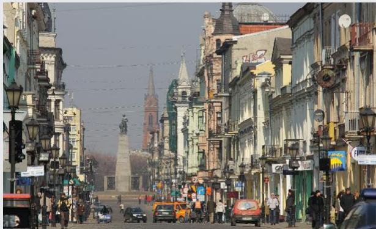

> **AI Description:**
> **Source:** `assets/_page_57_Figure_0.jpg`
> 
> **Generated:** 2026-05-30 18:52:20
> 
> ---
> 
> The image is a photograph of a city street scene. It features a wide, straight road lined with historic-style buildings on both sides. The architecture includes ornate facades, street lamps, and a few visible signs for businesses. In the background, there is a prominent monument or statue, and further back, a church spire is visible. The street appears to be relatively quiet with a few pedestrians and a few cars parked or moving. The overall atmosphere suggests a European city with a mix of historical and modern elements.

Another development point is that the city is building its second airport, and we’re discussing with the government about how to connect the rail and air systems, and to transfer goods between the two points. This way we can bring cargo into

Chengdu from Europe by rail and then charter delivery by air to Japan or South Korea, Malaysia or Australia, and vice versa.

## Is there a cargo connection scheme with Chengdu’s existing airport, or is DHL waiting for the second airport to be completed?

Currently we are waiting for the completion of some studies to determine the best course of action. We feel it would be more productive to wait for the second airport to open because that, of course, means there will be more capacity in place. So when the second airport is open, more private sector companies will enter the market and a more productive and more costeffective system will be in place in terms of connections between Chengdu and Japan, South Korea and Asian cities.

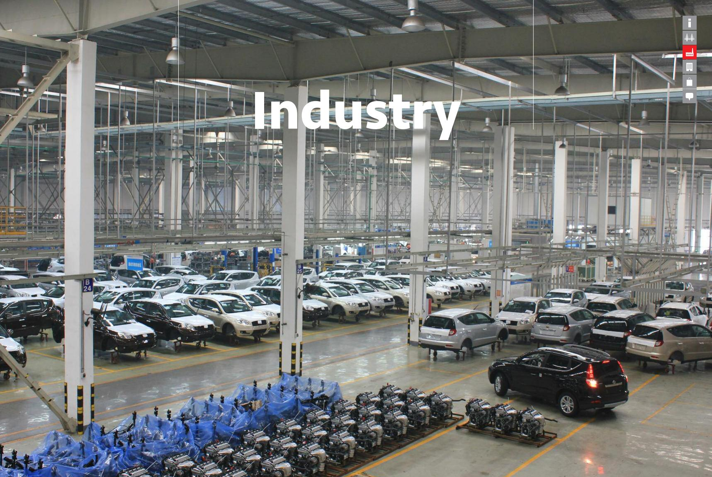

> **AI Description:**
> **Source:** `assets/_page_58_Figure_0.jpg`
> 
> **Generated:** 2026-05-30 18:39:23
> 
> ---
> 
> The image shows the interior of an industrial facility, likely a car manufacturing plant. It features rows of parked vehicles, possibly in the process of assembly or inspection, with various stages of completion visible. The floor is marked with yellow and black stripes, indicating designated areas or lanes for vehicle movement. In the foreground, there are stacks of what appear to be engine components or other mechanical parts, covered with blue protective sheets. The word "Industry" is prominently displayed in the center of the image, suggesting the theme or context of the photograph. The overall scene conveys a sense of organized industrial activity and production.

# Moving up the value chain

Today close to half the world’s iPads are made in Chengdu

he Chinese character for Shu – the name adopted by the ancient state that once inhabited modern-day Sichuan – is said to have derived from the image of a silkworm in a mulberry tree. The Shu state was abundant in both, thus its people were prodigious silk weavers, fashioning brocades famed along the Silk Road.

But besides silk, the people gained renown for another fabric, heavier than the former and akin to flax, which was worn into battle. Rich in iron deposits, the Shu were also master manufacturers of weapons, forging blades that were often twice the length of their enemies’ swords.

In the early years of the People’s Republic of China, the main driver of Chengdu’s economy was actually agriculture. But by 1978, manufacturing had taken the lead, spurred by a government industrial plan. Chengdu became a manufacturing heartland for electronics and aeroplanes. However, after the Reform and Opening Up period, Chengdu still languished behind China’s coastal cities, where manufacturers opted to build factories – closer to major shipping ports and emboldened by government support.

But as wages and land prices along the booming coastline began to edge too high, some manufacturers retreated inland, bringing a new generation of production to Sichuan and its capital Chengdu. Today close to half the world’s iPads are made in Chengdu, at the Foxconn factory, and Intel has four chip factories spread across 600,000 square feet.

## Made in China, innovated in China

In 2015 Beijing presented its ambition to modernise manufacturing through a plan called Made In China 2025 (MIC 2025). The general thrust of MIC 2025 is to spur innovation in manufacturing and encourage homegrown products. The central government has since selected a few cities to “pilot” this scheme. In 2017, Chengdu became the fourth city nationally and the only city in the western region to be designated a pilot zone for MIC 2025.

The designation is a vote of confidence from Beijing and a pledge of support to Chengdu. Meanwhile the local government has already outlined its ambitions for the project, taking the internet economy, carmaking, food and beverage, equipment manufacturing and bio-

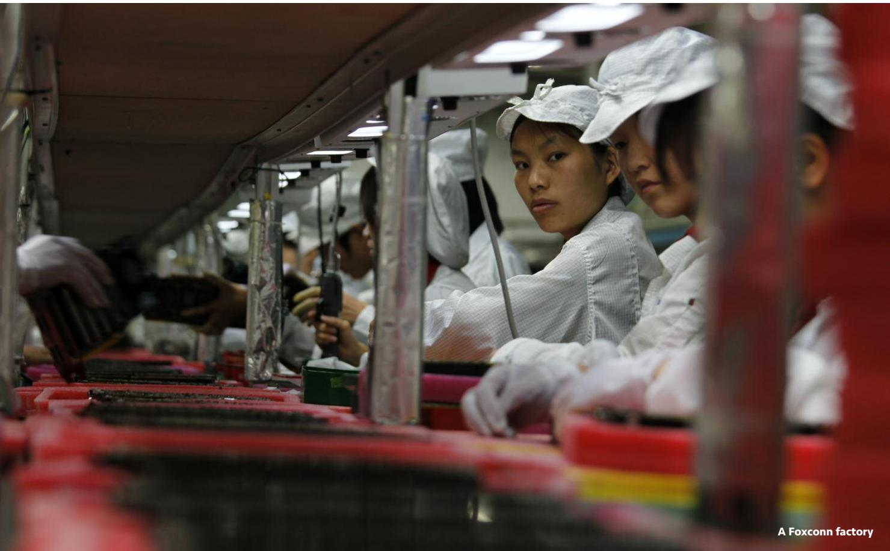

> **AI Description:**
> **Source:** `assets/_page_60_Figure_0.jpg`
> 
> **Generated:** 2026-05-30 18:49:24
> 
> ---
> 
> The image is a photograph showing workers in a factory setting, specifically a Foxconn factory as indicated by the text in the bottom right corner. The workers are wearing white uniforms and caps, and they appear to be assembling or working on electronic components, which are visible on the conveyor belt in the foreground. The environment suggests an industrial manufacturing process, with multiple workers focused on their tasks. The image captures a moment of production activity within a large-scale manufacturing facility.

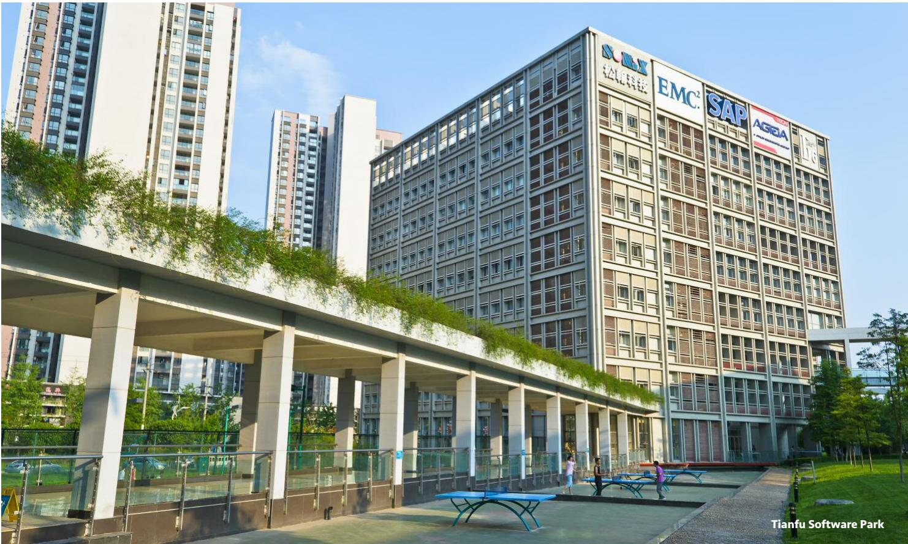

> **AI Description:**
> **Source:** `assets/_page_61_Figure_0.jpg`
> 
> **Generated:** 2026-05-30 18:53:13
> 
> ---
> 
> The image is a photograph of a modern urban setting featuring a multi-story building with large windows and several corporate logos, including "EMC," "SAP," and "AGILEA." The building is situated in a well-maintained area with greenery and a pedestrian walkway. In the foreground, there is a covered walkway with a green roof and a table tennis table where a few people are playing. The image also includes a text overlay at the bottom right corner that reads "Tianfu Software Park." The overall scene suggests a corporate or business environment with a focus on technology and innovation.

## High-Tech Zone

Chengdu’s High-Tech Zone is ranked third among China’s innovation centres in terms of capacity and innovation. Comprised of over 80,000 enterprises the zone contributed Rmb144 billion to the city’s GDP in 2016.

The High-Tech Zone is split into two sections – a smart manufacturing hub in the west, and a software innovation centre in the south. The western sector is home to the manufacturing arms of Microsoft, Dell and Foxconn, to name a few.

The southern hub is called the Tianfu Software Park and was ranked third among China’s “pillar software parks” in 2015. In 2016, the brand value of the Park was calculated as Rmb41.56 billion.

The Park, is at the centre of Chengdu’s newer CBD and combines office and campus space with residential property, greenery and commercial ventures – a complete economic ecosystem. The municipal government has also moved numerous offices to the Park.

Tianfu Software Park is owned by the Chengdu High-Tech Zone Investment Group: a government entity. As such the Park’s numerous favourable policies have the backing of the municipal government. New companies that enter the Park’s incubator are given rent-free office space for one year, and after graduation many are offered subsidised rent on more permanent offices. The Park also organises regular investment markets to help its residents find funding and new projects.

As for connectivity, the Park is situated on the city’s main thoroughfare, about an hour from the city centre (assuming rush hour traffic); the central subway line has a number of stops in the park; the city’s international airport is roughly 20 minutes away by car, with the forthcoming second airport a similar distance.

pharmaceuticals as its pillar industries. It plans too to “proactively develop” AI, VR and precision medical treatment as its “future industries”.

The scheme is wide-reaching, which is fairly typical for a Chinese city with an economy the size of a small country. To realise its dreams, the local government has raised a Rmb12 billion fund for supporting advanced manufacturing – particularly in the fields of electronic communications, rail, autos and bio-pharma.

Chengdu’s appointment as a pilot zone may not be entirely good news for foreign companies, however, as the MIC 2025 plan has faced criticisism as being protectionist. The European Union Chamber of Commerce in China issued a lengthy report on the plan accusing the government in Beijing of attempting to “severely curtail the position of foreign business” with its “large-scale import substitution plan aimed at nationalising key industries”. And the

Mercator Institute for China Studies also alleged: “In the long run, China wants to obtain control over the most profitable segments of the global supply chains and production networks.”

But many foreign manufacturers are already embedded in Chengdu – such as Intel, Microsoft, Dell, Phillips and Toyota – and others are still arriving. In February Global Foundries announced its plan to build a plant in the city, and in May it partnered with the municipal government to invest over \$100 million in developing the local semiconductor industry.

Intel says that it chose Chengdu – more than a decade ago – because of its “strategic location, the quality of its educational system and well-trained workforce”.

## Beyond production

Chengdu is not satisfied to be a manufacturing hub alone: it harbours other ambitions. In addition to adopting the MIC 2025 plan, Chengdu has its own Service Industry Development Plan 2025. This scheme wants the services sector to add Rmb1.7 trillion to the local economy in the year 2025, growing 7.8% annually until 2020 and then at 7.3% for a further five years.

Another municipal mission is to implement the “1+5” plan, which envisions Chengdu as “one hub” and “five centres” for West China. The “hub” is a logistics base (see

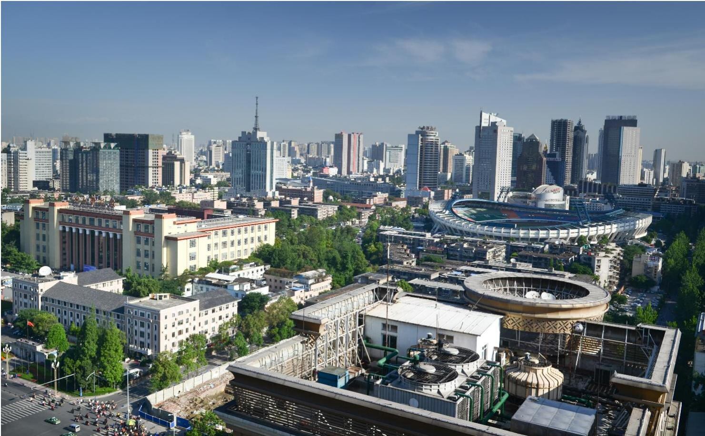

> **AI Description:**
> **Source:** `assets/_page_64_Figure_0.jpg`
> 
> **Generated:** 2026-05-30 18:32:54
> 
> ---
> 
> The image is a photograph of an urban landscape. It shows a mix of modern high-rise buildings and older, lower-rise structures. In the foreground, there is a large stadium with a distinctive roof structure. The cityscape includes a variety of architectural styles, from traditional to contemporary. The sky is clear and blue, suggesting a sunny day. The image captures the density and diversity of the urban environment, highlighting the contrast between different building types and the green spaces interspersed among the structures.

# Chengdu’s top tycoon

## Liu Yonghao New Hope Group

Liu Yonghao was born the youngest of four brothers in 1951. When he was 14 the Cultural Revolution began. Liu became a Red Guard and travelled to Beijing (no small feat in those days) to hear Mao speak. His mother told him that after hearing the Great Helmsman’s words he would be blessed and would soon be able to eat his favourite dishes of twice-cooked pork and spicy tofu. This turned out to be prophetic. By 2001 he was one of China’s richest people and could eat whatever he liked.

Liu won a place at university after the Cultural Revolution subsided, and entered government service after graduating. But in 1982 as China was transforming thanks to Deng Xiaoping’s reforms Liu and his brothers quit the security of their government jobs and started a business raising chickens and quails. As competition in the quail business grew, New Hope began to diversify and started to make a superior pig feed in the late 1980s. In 1995 the brothers split up the Hope Group, creating East Hope, West Hope, Continental Hope and leaving Liu Yonghao with New Hope.

Liu listed his company in Shenzhen in 1998 and continued to diversify into real estate, dairy and finance. Liu helped found Minsheng Bank, now one of the largest non-state owned banks, taking a 7% stake.

Liu’s wealth today is a stark contrast to the poverty he endured as a child. Famously his family was so poor that they could not afford to buy him shoes. Liu hasn’t forgotten these humble beginnings. He established the Guangcai Programme, which supports poverty alleviation in Western China.

Liu has said he is focusing his efforts on developing agricultural cooperatives to help peasant farmers expand the scale of their farms from family plots to large industrialised tracts, claiming his company had helped set up more than 100 such cooperatives, as well as 16 underwriting companies that assist small farmers to obtain loans to expand production.

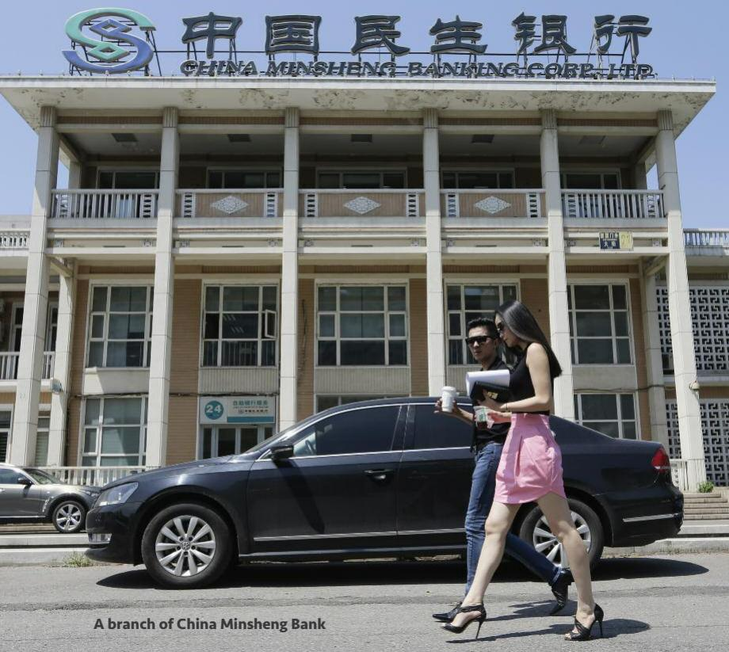

> **AI Description:**
> **Source:** `assets/_page_66_Figure_0.jpg`
> 
> **Generated:** 2026-05-30 18:52:39
> 
> ---
> 
> The image contains a photograph of a building with the signage "China Minsheng Banking Corp. Ltd." prominently displayed at the top. The building appears to be a branch of China Minsheng Bank, as indicated by the text at the bottom of the image. Two individuals are walking in front of the building, with one holding a cup and the other carrying some documents. A black car is parked in front of the building. The architecture of the building features a classical style with columns and a balcony.

## Chengdu’s rich list

HURUN RICH LIST, 2016

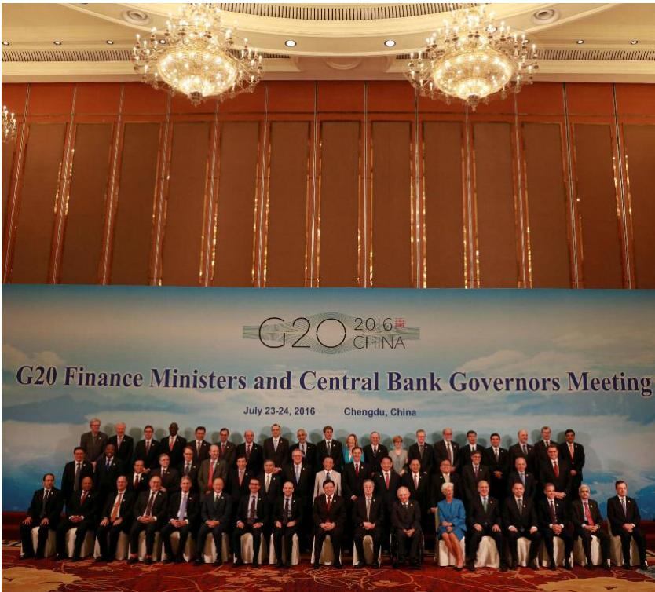

> **AI Description:**
> **Source:** `assets/_page_67_Figure_0.jpg`
> 
> **Generated:** 2026-05-30 18:49:40
> 
> ---
> 
> The image contains a group photo of individuals at the G20 Finance Ministers and Central Bank Governors Meeting held in Chengdu, China, from July 23-24, 2016. The photo is taken in a formal setting with a backdrop displaying the event's name and date. The individuals are dressed in formal attire, and the setting appears to be a large hall with chandeliers and a red carpet. The image is primarily a photograph with text overlay providing the event details.

G20 Finance Ministers and Central Bank Governors in a conference held in Chengdu

Infrastructure) while the five centres are: economy, cultural and creative industries, foreign cultural exchanges, science and technology, and finance.

Chengdu has a pedigree in finance as well as manufacturing. In ancient times the city’s merchants created jiaozi, or paper-based bills – a financial innovation born of necessity (when the ruler in Sichuan banned coins made of any metal but heavy iron).

More recently, the city played host to G20 finance ministers and central bank governors during their convention in July last year, and the city is currently developing a 5.1 square kilometre area that it dubs the “Financial City” (one of the main strips in Financial City is Jiaozi Avenue). Many financial institutions have already moved to there, following clients who have relocated to the surrounding CBD.

The Financial City is being developed in three stages, and in its third stage, it will build industry parks tailored to their occupants, such as China UnionPay. Fang Zhao, chairman of the government-owned Chengdu Financial City Investment and Development Group, claimed last year that roughly 90% of phase I and phase II properties had been purchased, with 329 institutions collectively investing Rmb42 billion in the area. n

## Fortune’s bounty

Out of the approximately 300 Global Fortune 500 firms that are in Sichuan, almost all of them have established offices in Chengdu.

Domestically Chengdu has a great appeal for well-established and early-stage companies alike. The combination of low rents for offices and apartments, the city’s location at the heart of Southwestern China, and government policies that support arriving businesses, all tempt firms to the city. But it does face a significant challenge in competing against China’s more internationally highprofile cities, such as Beijing, Shanghai and even Guangzhou.

Part of Chengdu’s solution to this is brand awareness. Last year, the government-run High-Tech Industrial Development Zone pledged Rmb5 billion in funding to establish “offshore overseas talent bases” to attract foreign professionals. These “bases” are essentially overseas recruitment zones. The latest was opened in San Diego, raising the total number of overseas talent zones to 13, globally.

The second part of the plan is to create incentives for the recruiters to offer foreign talent. In July this year the local government released a slew of new policies to do exactly this, promising “top” overseas talent low-rent flats, one-on-one foreignlanguage medical consultations, and more rapid immigration policies to make it easier for companies to hire key staff from overseas and to bring their families with them.

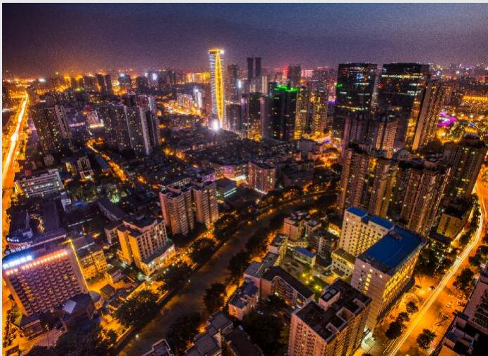

> **AI Description:**
> **Source:** `assets/_page_68_Figure_0.jpg`
> 
> **Generated:** 2026-05-30 18:36:41
> 
> ---
> 
> The image is a photograph of a cityscape at night. It features a variety of buildings, including high-rise structures and lower residential buildings, illuminated by artificial lights. The streets are lit with streetlights, and there are visible traffic trails indicating vehicle movement. The image captures the urban environment's density and the vibrant nightlife of the city.

280 Global Fortune 500 firms are established in Chengdu

# Gearing up

Chengdu aspires to be an important automobile manufacturing base by 2020, boosting its production capacity to 3 million cars – or more than double the 1.15 million vehicles the city produced in 2016.

Chengdu holds a strong position geographically, not only as a hub for Western China, but also as a node connecting China to Europe. Components roll off production lines and onto freight trains to be shipped (Geely sends parts to Minsk and SUVs to Central Asia). The city’s main auto manufacturing centre is in Chengdu’s eastern Longquanyi district, in the Chengdu Economic and Technological Development Zone (CEDZ). Toyota and Volkswagen both have factories for their joint venture’s with FAW in the CEDZ, and Volvo and Geely have production sites there too.

Geely opened its factory in 2007 and brought Volvo to Chengdu after purchasing the brand in 2010. Chengdu was Volvo’s first manufacturing plant on the Chinese mainland. The Chinese automaker is building another plant in the city in partnership with the local government, with an expected annual capacity of 200,000 units. The duo are also developing two further plants for New Energy Vehicles (NEVs): a hybrid manufacturing site with annual capacity of 300,000 vehicles and an electric car production line with a 100,000 capacity.

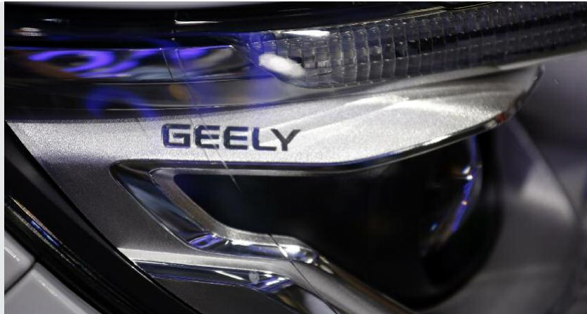

> **AI Description:**
> **Source:** `assets/_page_69_Figure_0.jpg`
> 
> **Generated:** 2026-05-30 18:37:56
> 
> ---
> 
> The image shows a close-up of a car's front grille with the word "GEELY" prominently displayed in the center. The grille has a sleek, modern design with a metallic finish and intricate patterns. The lighting in the image highlights the reflective surface of the grille, giving it a shiny appearance. The overall design suggests a focus on luxury and advanced styling.

Li Donghui, the executive vice-president of Geely, expects his company’s total annual output value in Chengdu to reach Rmb100 billion when all the projects are finished. But evidently Geely doesn’t expect all of the output to be sold domestically. “We will build the Chengdu base into one of our most important strategic centres for new energy vehicles to serve the markets along the Belt and Road,” Li said.

These markets could be in Europe or closer to home. Chengdu’s largest commercial vehicle manufacturer Sinotruk, for example, delivered 1,500 heavy-duty trucks to Myanmar in July this year. The Bangladesh-China-India-Myanmar economic corridor is expected to be another of China’s commercial thoroughfares bringing business to Chengdu.

The city’s main auto manufacturing centre is in Chengdu’s eastern Longquanyi disrict

## Property

# A very liveable city

Chengdu was   
named China’s “most liveable” city in 2014 by the Asian   
Development   
Bank

he Asian Development Bank ranked Chengdu as T China’s “most liveable” city in 2014, based on a freshly formulated Environmental Liveability Index, which compares metrics such as air pollution, water resources, waste management and even noise pollution. Beijing, by contrast, was the nation’s 18th most liveable metropolis, and Shanghai weighed in at number 22.

Another key strength in Chengdu’s liveability – and one that wasn’t measured by the index – is the property market. Chengdu has an economy about half the size of Beijing’s but its average property price is close to threequarters less, just Rmb7,983 per square metre. Even in the central areas, the average cost is still low, at roughly Rmb13,600 per square metre.

Prices in some districts surged significantly last year as investors, driven out of other cities by restrictive policies, swung in to snatch the low hanging fruit.

They were also lured by the announcement that Chengdu would be the centre of the new Sichuan Free Trade Zone. Property in the Tianfu New Area – part of the city’s high-tech industry hub – saw a particular spike in interest.

## The hot spots

The most expensive area for residential property, according to a 2017 1Q report by news portal Huanqiu, is Jinjiang district, where the average second-hand flat costs Rmb15,044 per square metre. Jinjiang comprises the very heart of Chengdu, encompassing its major office and retail buildings, as well as stretches of greenery. As it extends south along the Jin River, crossing the first and fourth ring roads, it has convenient access to the city’s new CBD, Tianfu, as well.

Not far behind Jinjiang, in terms of property price, is the southern Gaoxin area, in Wuhou district. It comprises Tianfu New Area as well as Financial City, and it straddles the main thoroughfare to the centre of Chengdu. It is close to both the current airport and the one under construction. Huanqiu reckoned the average second-hand price in Gaoxin was Rmb14,575 per square metre.

“Gaoxin” is a Chinese abbreviation for the “High-Tech Development Zone”, which has a southern sector and a western sector (for more on this, see our Industry chapter). The western sector is located in Qingyang district which, perhaps by no coincidence, is also Chengdu’s third most

### Full Page Description (Page 72)

**Source:** `assets/_page_72_Asset_0.jpg`

**Generated:** 2026-05-30 18:47:57

---

The image is a bar chart showing the average price per square meter in various Chinese cities. The x-axis lists the cities, and the y-axis represents the price in RMB per square meter. The cities are ordered from those with the highest average price to those with the lowest. The chart highlights Shenzhen as the most expensive with an average price of 53,774 RMB per square meter, followed by Shanghai at 38,283 RMB. Beijing and Nanjing are also prominently featured, with Nanjing slightly below Suzhou at 18,913 RMB. The cities with the lowest average prices are Chengdu and Kunming, both at 7,976 RMB per square meter. The chart visually represents the significant variation in real estate prices across these cities.

## City property rankings

## Average Price per square metre (as of June 2017)

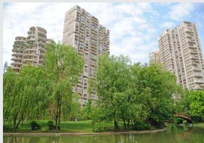

> **AI Description:**
> **Source:** `assets/_page_72_Figure_0.jpg`
> 
> **Generated:** 2026-05-30 18:47:39
> 
> ---
> 
> The image is a photograph of a park with a pond in the foreground. There are several tall residential buildings in the background, surrounded by lush green trees. The sky is partly cloudy, and the overall scene appears serene and well-maintained.

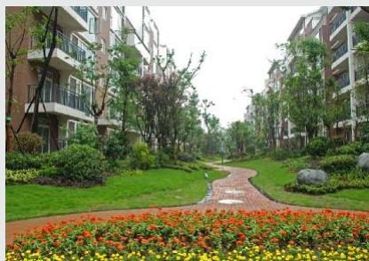

> **AI Description:**
> **Source:** `assets/_page_72_Figure_1.jpg`
> 
> **Generated:** 2026-05-30 18:49:46
> 
> ---
> 
> The image is a photograph of a residential area. It shows a well-maintained garden with a variety of plants and flowers, including red and yellow blooms in the foreground. A brick pathway meanders through the garden, leading towards a row of multi-story apartment buildings on both sides. The buildings have balconies and are surrounded by greenery, creating a serene and landscaped environment. The sky is overcast, suggesting a cloudy day.

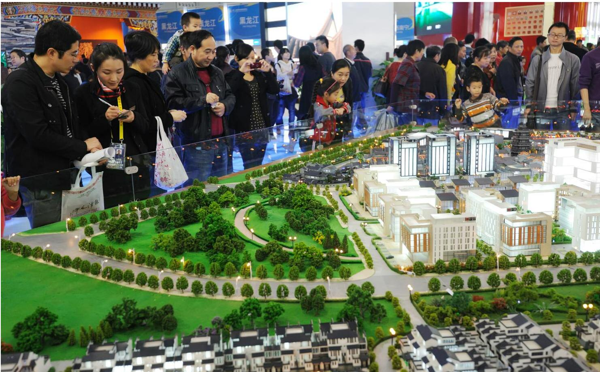

> **AI Description:**
> **Source:** `assets/_page_73_Figure_0.jpg`
> 
> **Generated:** 2026-05-30 18:55:22
> 
> ---
> 
> The image contains a detailed architectural model of a planned urban development. The model includes a mix of modern and traditional-style buildings, a central park with greenery and pathways, and a road network. The model is displayed in a public setting, likely at an exhibition or trade show, as evidenced by the people observing and taking photos. The model is well-lit, highlighting the intricate details of the planned urban layout.

## Priciest districts

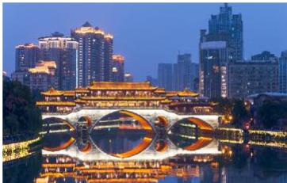

> **AI Description:**
> **Source:** `assets/_page_74_Figure_0.jpg`
> 
> **Generated:** 2026-05-30 18:54:39
> 
> ---
> 
> The image is a photograph of a modern urban landscape at dusk. It features a prominent architectural structure with a unique design, illuminated with warm lights, reflecting on a body of water. In the background, there are high-rise buildings with their lights on, indicating the time is evening. The scene captures a blend of contemporary architecture and city life, with the illuminated structure serving as a focal point.

Chengdu Anshun bridge and Jinjiang river

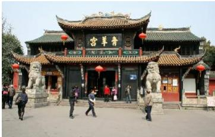

> **AI Description:**
> **Source:** `assets/_page_74_Figure_1.jpg`
> 
> **Generated:** 2026-05-30 18:53:19
> 
> ---
> 
> The image shows a traditional Chinese building with a red and black facade, featuring ornate architectural details and Chinese characters on the sign above the entrance. There are two large stone lions guarding the entrance, and several people are walking in front of the building. The setting appears to be a public space, possibly a historical or cultural site.

The Qingyang Palace

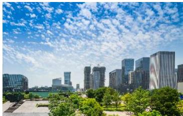

> **AI Description:**
> **Source:** `assets/_page_74_Figure_2.jpg`
> 
> **Generated:** 2026-05-30 18:51:51
> 
> ---
> 
> The image is a photograph of a cityscape under a bright blue sky with scattered clouds. The foreground features a green park area with trees and open spaces. In the background, there are modern high-rise buildings, some under construction, indicating a developing urban area. The architecture suggests a mix of commercial and possibly residential buildings. The overall scene conveys a sense of a vibrant, growing city with ample greenery.

Chengdu Hi-tech Zone

## Tailor-made suite

Georgio Armani is known best for his clothing lines, but his fashion firm has also expanded into interior design and residential property. Chengdu is home to the first Armani-designed residence in China, beating Beijing, where the second Armani tower is being built.

Built in Jinjiang district, about a 15-minute drive from the city centre, the twin towers of the Armani Art Residence rise 65 floors above the meandering river, offering views across the water onto Wang Jiang Park and the campus of Sichuan University. Entry to subway line 2 is about a five-minute walk from the front door, and line 6 is currently being built right at the foot of the tower.

Each suite in the Armani complex is a blend of comfort and convenience: the kitchens have automatic screens that can be raised to admit more light or lowered when cooking spicy Sichuan cuisine; an iPad mini utilises Siri to control the lights, temperature and curtains; the floor tiles are imported from Turkey and the windows from Germany, with glass thick enough to eliminate the noise from the streets below.

The apartments on offer measure from 82 square metres to 300 square metres with prices ranging in the tens of millions of yuan. The smallest, one-bedroom units cost between Rmb2.5 million and Rmb3.3 million (depending on the floor and the

direction it is facing) and come with white goods included. A three-bedroom apartment of 230 square metres is priced between Rmb6.5 million and Rmb9.9 million.

Although the buildings are marketed as “commercial-residential” properties the units are actually purely residential, meaning the owner’s rights are guaranteed for 70 years instead of 40. Some investors might still buy to rent, with a one-bedroom Armani flat predicted to let at Rmb10,000 a month.

The Armani Art Residence is likely the second most expensive property on the market. The first is the InTime residence in the Gaoxin area of Wuhou district. It is built as part of a larger complex incorporating offices, retail and restaurants as well as residential units by the property developer Yintai (the site is also known as the Yintai Centre).

Apartments in the residential tower take a number of different s t y l e s . O n e 3 8 7 s q u a r e m e t r e m o d e l w e l c o m e s g u e s t s i n t o a n o p e n p l a n l i v i n g r o o m , d i n i n g r o o m a n d k i t c h e n e n s e m b l e , b a t h e d in light streaming through the floor-to-ceiling bay windows, which e n c i r c l e a l m o s t t h e e n t i r e t y o f t h e u n i t .

Each of the four bedrooms has an en suite bathroom, while t h e m a s t e r b e d r o o m f e a t u r e s a w a l k - i n c l o s e t a n d a n a d j o i n i n g s t u d y , w h i c h i n t u r n c o n n e c t s t o t h e l i v i n g r o o m . T h e s e u n i t s c o s t a p p r o x i m a t e l y R m b 1 8 m i l l i o n ( \$ 2 . 6 6 m i l l i o n ) , a b o u t h a l f t h e p r i c e o f t h e l a r g e r 5 8 0 s q u a r e m e t r e a p a r t m e n t s , w h i c h c o s t R m b 3 3 m i l l i o n a t a b a s e v a l u e . T h e s e s u i t e s a r e s o l d a s l a r g e , o p e n s p a c e s , w h i c h c a n t h e n b e d i v i d e d i n t o r o o m s p e r t h e o w n e r ’ s r e q u e s t . A t t h e t i m e o f w r i t i n g a l l b u t t w o o f t h e s e u n i t s had been sold.

T h e s a l e s a g e n t a t t h e Y i n t a i a p a r t m e n t s s a i d t h a t t h e p r o p e r t y ’ s l o c a t i o n i s w h y i t i s p r i c e d s o h i g h . I t c e r t a i n l y i s c o n v e n i e n t : f r o m t h e m a s t e r s u i t e o f t h e s h o w r o o m y o u c a n s e e t h e t o w e r s o f t h e I n t e r n a t i o n a l F i n a n c e C e n t r e i n F i n a n c i a l C i t y , a c r o s s t h e c e n t r a l t h o r o u g h f a r e t h a t l e a d s t o t h e c i t y c e n t r e i n t h e n o r t h a n d t o T i a n f u S o f t w a r e P a r k i n t h e s o u t h . A p u b l i c p a r k i s b e i n g b u i l t a t t h e f o o t o f t h e t o w e r , a n d s h o p s a r e o p e n i n g i n t h e m a l l t h a t s h a r e s t h e p r o p e r t y ’ s c o m p l e x .

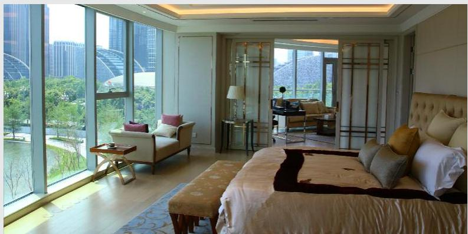

> **AI Description:**
> **Source:** `assets/_page_76_Figure_0.jpg`
> 
> **Generated:** 2026-05-30 18:33:35
> 
> ---
> 
> The image depicts a luxurious hotel room with large floor-to-ceiling windows offering a view of a landscaped outdoor area and buildings in the distance. The room features a large bed with plush bedding and multiple pillows, a small seating area with a sofa and armchair, and a glass partition leading to a separate sitting area with a sofa and a small table. The room is well-lit with natural light and has a modern and elegant design.

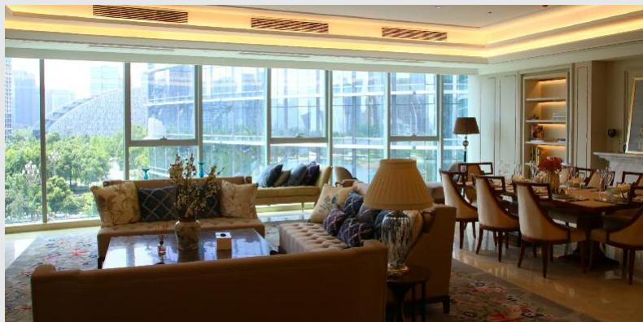

> **AI Description:**
> **Source:** `assets/_page_76_Figure_1.jpg`
> 
> **Generated:** 2026-05-30 18:31:42
> 
> ---
> 
> The image depicts a luxurious living room with a large window offering a view of a cityscape. The room is furnished with a sofa set, a coffee table, and a dining table with chairs. The decor includes patterned cushions, a floral rug, and decorative items such as vases and lamps. The lighting is bright, with natural light streaming in from the large window, and the ceiling features recessed lighting. The overall ambiance suggests a high-end residential or hotel setting.

expensive area to live. Huanqiu puts the average price at Rmb13,248 per square metre.

Besides containing Gaoxin’s primary manufacturing base, Qingyang is also somewhat of a cultural hub for Chengdu, containing the most greenery and a number of historical sites, such as the Wide and Narrow Alleys, a memorial to the poet Du Fu at the place where he lived, and the site of the Jinsha archaeological discovery.

## New boundaries

Following the sudden price hikes last year the local government introduced a series of purchase restrictions, which had already yielded notable results by the first quarter of this year.

The first significant restriction was enacted in October 2016. The ruling limited investors to buying only one property in any of Chengdu’s major residential districts – Gaoxin, Jinjiang, Tianfu, Jinniu – and raised the minimum downpayment required on second home purchases to 40%.

Shortly thereafter, in November, these measures were tightened, so that only people with a local household registration permit (known as a hukou) specific to those districts (or people with an outsider’s hukou who had been paying tax in those districts for at least a year) could buy property in the area. Even then, owning another property in the same district was forbidden.

Things got even more complicated in March 2017 when Chengdu joined a nationwide clampdown on speculative property purchasing, initiated when Beijing’s municipal government introduced its most stringent restrictions to the date.

In Chengdu’s case, outsiders looking to buy a second home had the length of time they were required to have made local tax contributions extended to two years, and all purchasers were required to wait five years after buying a property before they could sell it again.

These measures were still less strict than those in Beijing, because speculative purchasing has never been as popular in Chengdu where, anecdotally, people generally buy to live. Nevertheless, according to Savills, the rule changes have worked. In its report on Chengdu’s property market in the first quarter of 2017 the consultancy notes, “With restrictions expected to remain in place, if not tighten further, residential property speculation should abate, preventing housing prices from skyrocketing on a quarterly basis.”

## Retail

o.YiLionM依部

Night view of Chunxilu shopping plaza

# Sichuan’s shopaholics?

H istorically Sichuan province was known as the‘Land of Abundance’, although it took a creative eye to make best use of the resources that flourished there. The high density of lac trees encouraged local craftsmen to become experts in lacquer work, and the thriving population of silkworms fostered a rich brocade industry.

Silk work was so integral to the early days of Chengdu’s development that the river which runs through the city is still called Brocade River (Jinjiang). The city’s affinity with high fashion is present still today.

In 2015 the city was named China’s Most Fashionable City by Trends, a China-based fashion retail research and media firm. Retail revenues have grown more than 10% for the last 11 years, reaching Rmb562 billion (\$82.71 billion) in 2016. This year there are a further 22 shopping malls due to open in the city, raising the total gross floor area by 1.7 million square metres, suggesting tremendous confidence there will be increased consumer spending.

HKMB, a research and news portal run by the Hong Kong Trade Development Council, believes that Chengdu’s strong retail sales reflect the cultural heritage of the local population, writing that “the people of Chengdu are known for their leisurely and carefree lifestyle and this attitude directly affects their spending habits”. Others believe that the relatively low cost of housing gives Chengduers a bit more spare cash to spend on minor luxuries.

The average disposable income in Chengdu has been on the rise for the last few years, climbing from Rmb20,829 in 2010 to Rmb35,902 in 2016. But whilst HKMB thinks the strong consumer spending partly reflects a carefree mood, Maxxelli Consulting speculates it also indicates a desire to flaunt wealth and overcome the perception that Chengdu is a backwater city. HKMB almost acknowledges this, noting that while many Chinese buy luxury goods as gifts for others, Chengdu citizens are more likely to buy them for themselves.

The preference to shop for themselves rather than buy gifts for others feeds into HKMB’s assessment that the sales experience is particularly important to Chengdu shoppers.

Retailers have discovered a preference in the local demographic for outlet malls over department stores. Indicative of this, a number of struggling department stores closed last year only to be reopened as malls.

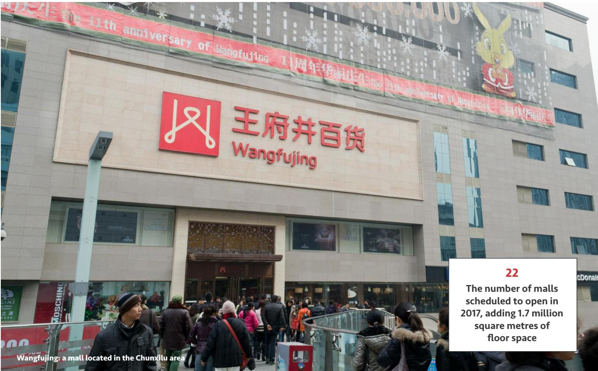

> **AI Description:**
> **Source:** `assets/_page_80_Figure_0.jpg`
> 
> **Generated:** 2026-05-30 18:44:43
> 
> ---
> 
> The image is a photograph of a shopping mall named Wangfujing, located in the Chunxilu area. The building features a large sign with the mall's name in both Chinese and English. The photo captures the exterior of the mall with people walking in front of it. There is a banner at the top of the building celebrating the 11th anniversary of Wangfujing. Additionally, there is a text box on the right side of the image providing information about the number of malls scheduled to open in 2017 and the additional floor space they will add.

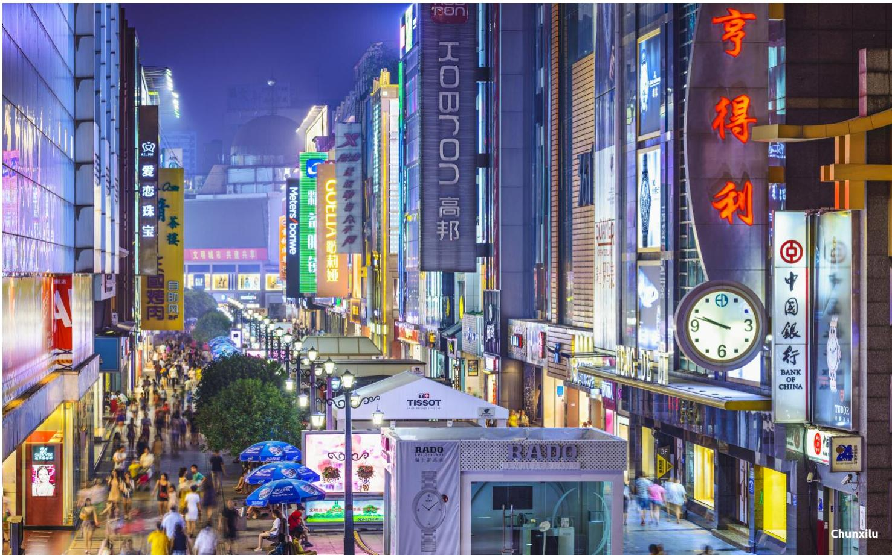

> **AI Description:**
> **Source:** `assets/_page_81_Figure_0.jpg`
> 
> **Generated:** 2026-05-30 18:41:06
> 
> ---
> 
> The image is a photograph of a bustling urban street at night, filled with brightly lit signs and advertisements from various shops and businesses. The scene is vibrant with a mix of modern and traditional signage, including illuminated clocks and large display screens. The street is crowded with people, suggesting a lively atmosphere. The image captures the essence of a busy commercial district, highlighting the density of urban life and the commercial activity in the area.

## Future growth

In 2015 Chengdu announced its plan to develop the city into an “international shopping paradise”. The scheme is short on specifics but is divided into three five-year stages.

Each stage has been set financial benchmarks: in the early stage, annual consumer spending should reach Rmb850 billion, while the food and drink industry should contribute Rmb78 billion and tourism will garner Rmb347 billion; by the end of the final stage these yearly earnings should have risen to a total of Rmb2.2 trillion, comprising Rmb150 billion from food and drink and Rmb657 billion derived from tourism.

How the city intends to achieve this growth is a little vague, but some of the specifics include opening the city’s second airport and having 15 operational subway lines by 2020.

## Where to shop in Chengdu

## Chunxilu

Chunxilu (Chunxi Road) has grown from single a street to a 200,000 square metre area, as the boundaries between different districts have been blurred by the addition of new malls.

The journey from the head of Chunxilu down to Yanshikou or across to Taikoo Li is a seamless progression of shops. The original Chunxilu street seems a little bit left behind, although it’s crowned by the Wangfujing mall, which offers brands like Armani and Calvin Klein, as well as a section dedicated to “Ethnic Clothing”. It also has a section dedicated to luxury watches. But perhaps the biggest giveaway of the original strip’s relative decline is the presence of two knock-off New Balance stores, just a few metres apart from each other.

As you walk further east to Taikoo Li, more legitimate and international retailers appear, such as Adidas and Zara, culminating in your arrival at the International Finance Square (IFS, although a more literal translation of the Chinese would call it the International Finance Centre, and so many use that as the English name instead).

Supposedly modelled on Harbour City in Hong Kong, this 206,000 square metre mall houses luxury retailers such as Prada, Louis Vuitton and Coach and is part of a larger complex consisting of office space and the Niccolo hotel, adorned with an iconic rooftop statue of a panda designed by Australian artist Lawrence Argent. The IFS opened in 2014 and was soon followed by Taikoo Li – an open-air shopping and dining district just across the street that continues the theme of modern chic, with brands like Gucci, Apple and Tesla [see box].

## Renmin South Road

More accurately translated as People’s Road South, this is the southern section of the main road that cleaves the centre of Chengdu. The primary shopping mall on this strip offers valet parking so visitors can access the mall quickly and more efficiently.

This savvy retailer is Yanlord Landmark, where high-end designers like Louis Vuitton and Prada gleam from the ground floor. Similar to IFS, where the same brands have opened their second shops, the Yanlord complex is mixeduse, comprising office space above the retail mall and adjoined to Fraser Suites serviced apartments.

On the opposite side of the road is the black veneer of Maison Mode, built by Chinese developer Lessin. This was the first Lessin mall to open in China. More than simply sounding exotic, the mall’s French name signposts the menagerie of Paris retailers within, such as Hermès, Chloe, and Celine as well as other European brands like Bottega Veneta and Salvatore Ferragamo.

## Financial City

Currently this area is more of a secondary shopping area, but as it is primed to be Chengdu’s new central business district it will rise in significance for shoppers. According to Savills, at least three of the 22 new malls this year will open in Financial City including the InTime mall, which has

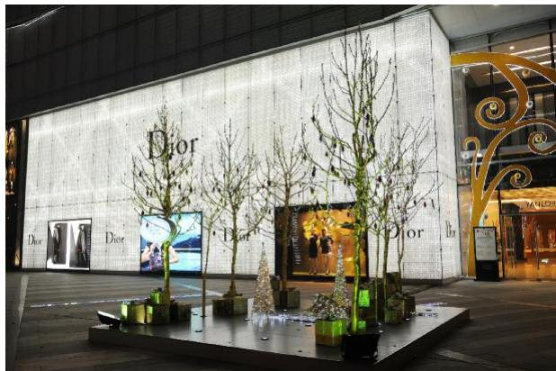

> **AI Description:**
> **Source:** `assets/_page_83_Figure_0.jpg`
> 
> **Generated:** 2026-05-30 18:37:31
> 
> ---
> 
> The image shows the exterior of a Dior store. The facade features a large, illuminated wall with the Dior logo prominently displayed. In front of the store, there is a landscaped area with several small, leafless trees and decorative Christmas trees. The ground is adorned with small, gift-like boxes and what appears to be decorative snow. The overall scene suggests a festive or holiday display, with the store's branding clearly visible.

Dior at Yanlord Landmark

190,000 square metres of gross floor area (GFA).

InTime alone will increase the current retail GFA of Financial City by more than a third; as of the first half of this year the total GFA covered 530,000 square metres. But Savills says many of the malls in the area are going through a “tenant mix and brand positioning” readjustment, suggesting malls are still testing the local market.

## Hehuachi

Lotus Pond Market, to give it its English name, sits at the opposite end of the spectrum from the luxury retailers listed above. Appropriately enough, it is also at the opposite end of the city, near the North Train Station. This market is not nearly as serene as its name suggests. Arguably Southwest China’s largest wholesale market, this bustling junction is a parade of stalls divided into sections based on product: menswear, womenswear, babywear, accessories, and so forth. Finding the section you want can be an adventure and then finding an item you desire at the right price is another.

There are a few different precincts within this market (such as the stationery section) and the boundaries between them are blurred by the throngs of porters on the streets. But a short stroll from this beehive is a Wanda Plaza, for your more conventional shopping needs. n

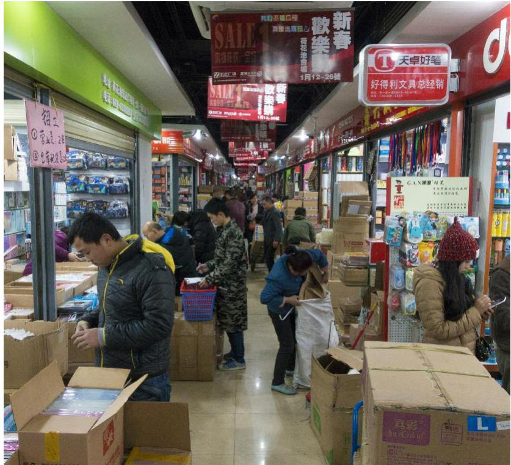

> **AI Description:**
> **Source:** `assets/_page_84_Figure_0.jpg`
> 
> **Generated:** 2026-05-30 18:37:47
> 
> ---
> 
> The image depicts a bustling indoor market or shopping area, likely a wholesale or retail space. The scene is filled with people engaged in various activities such as shopping, packing, and organizing goods. The area is well-lit, with numerous shelves and displays stocked with products. Prominent signage includes "SALE" and other Chinese characters, indicating ongoing promotions or sales. The environment appears busy and organized, with individuals focused on their tasks. The presence of boxes and bags suggests a focus on bulk or wholesale transactions.

Hehuachi Stationery market

## The world’s biggest building

The New Century Global Centre was built in the middle of Tianfu New City, on top of Subway Line 1. It was heralded as the largest single building in the world by gross floor area, measuring in at 1,700,000 square metres, and opened in 2013 after only three years of construction.The timing was unfortunate: Deng Hong, the founder of the company developing the project, was arrested that year on corruption charges. The Fortune 500 global summit – initially billed to convene in the Centre – chose to relocate to the Shangri-La hotel instead.

Deng wasn’t seen again for 20 months, but appears to have been in better shape since. As does his Global Centre, which last year welcomed 20 million visitors, a two million increase on the year before. Financially the Centre seems to be performing well too, its managers shrugging off reports in 2016 that the site was going to be sold for Rmb65 billion, claiming there was no reason for Deng to seek a buyer. In fact the project has proven successful enough that an agreement was reached to build another similar centre in Kunming, only this would be substantially smaller, with a floor area of 1,000,000 square metres.

As you might expect for the world’s largest building by GFA, it can’t rely on retail alone for its revenue: it also has an ice rink, a cinema, restaurants, office space, a water park and two hotels. The hotels both belong to InterContinental and many of their rooms offer views over the “fake beach” that adjoins the water park. The “beach” is just yellow floor, but it received a lot of press attention for its size, stretching over 5,000 square metres. And the surf is provided periodically by a wave machine (life jackets are compulsory, since many Chinese have never learned to swim). Certainly it’s a sight to behold, if not quite the “tropical paradise” the waterpark promises in its name.

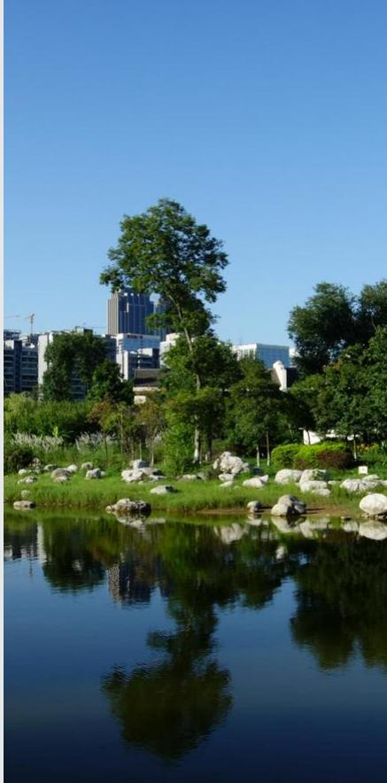

> **AI Description:**
> **Source:** `assets/_page_85_Figure_0.jpg`
> 
> **Generated:** 2026-05-30 18:36:50
> 
> ---
> 
> The image is a photograph of a serene park scene. It features a calm body of water in the foreground with rocks and greenery along the shoreline. In the background, there are trees and a mix of modern and traditional architecture, including a prominent tall building. The sky is clear and blue, suggesting a sunny day. The reflection of the trees and the buildings in the water adds to the tranquil atmosphere of the scene.

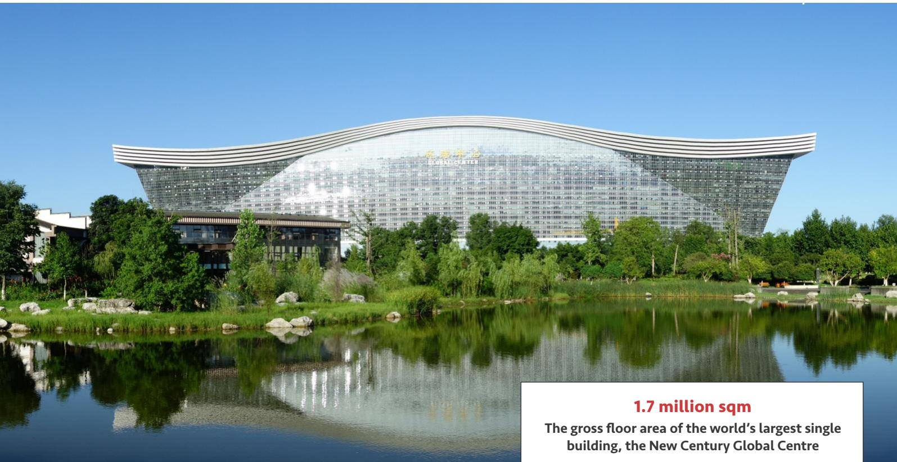

> **AI Description:**
> **Source:** `assets/_page_86_Figure_0.jpg`
> 
> **Generated:** 2026-05-30 18:40:23
> 
> ---
> 
> The image is a photograph of a large, modern building with a curved, wave-like roof and a glass facade. The building is situated near a body of water, with greenery and trees surrounding it. The text overlay on the image provides information about the building's size, stating that it has a gross floor area of 1.7 million square meters and is the world's largest single building, the New Century Global Centre.

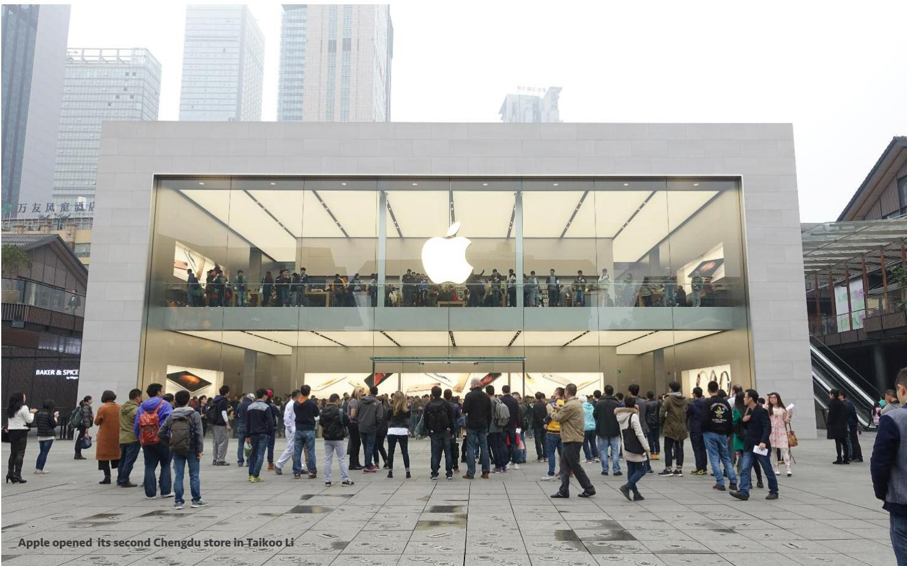

> **AI Description:**
> **Source:** `assets/_page_87_Figure_0.jpg`
> 
> **Generated:** 2026-05-30 18:45:27
> 
> ---
> 
> The image is a photograph of an Apple store in Chengdu, China, located at Taikoo Li. The store has a modern design with a large glass facade and a prominent Apple logo at the entrance. The interior is visible through the glass, showing customers inside. The exterior of the store is bustling with people, indicating a high level of interest or activity. The text at the bottom of the image provides context, stating that Apple opened its second Chengdu store in Taikoo Li.

## Malls

## IFS

• Opened: 2014

• Size: 206,000 square metres

• Location: Jinjiang

• Demographic: High-end

• International stores: Prada, Fendi, Coach, Louis Vuitton

## Taikoo Li

• Opened: 2015

• Size: 114,000 square metres

• Location: Jinjiang

• Demographic: Mid-high end

• International stores: Gucci, Hermès

## Yanlord Landmark

• Opened: 2010

• Size: 50,806 square metres

• Location: Jinjiang

• Demographic: High-end

• International stores: Louis Vuitton, Prada, Dior

## Maison Mode

• Opened: 2001 (as LCX, changed its name in 2003)

• Size: 12,000 square metres

• Location: Jinjiang

• Demographic: High-end

• International stores: Salvatore Ferragamo, Bottega Veneta, Chloe

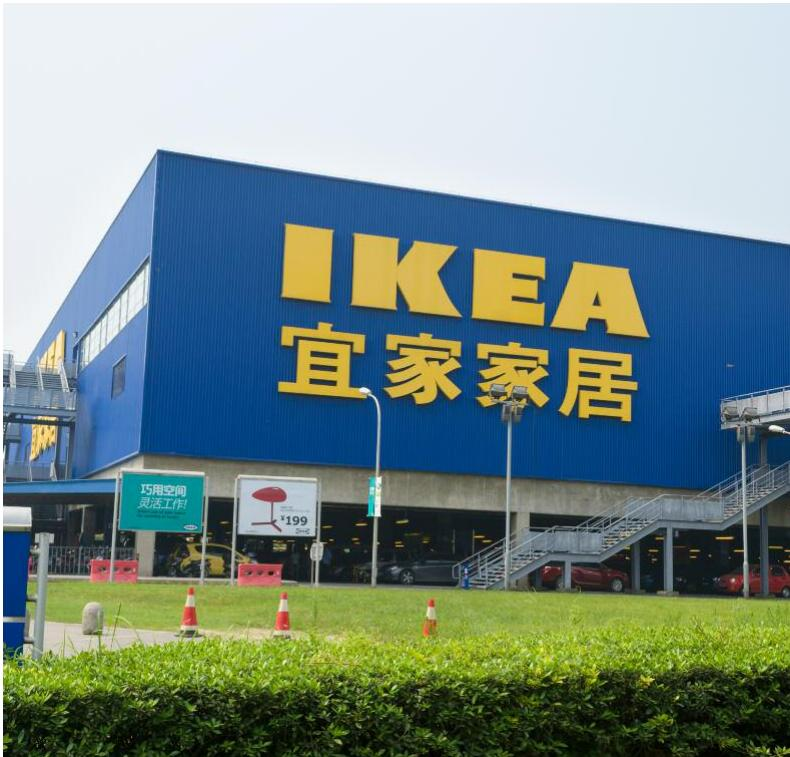

> **AI Description:**
> **Source:** `assets/_page_88_Figure_0.jpg`
> 
> **Generated:** 2026-05-30 18:35:09
> 
> ---
> 
> The image contains a photograph of an IKEA store. The building is prominently blue with the IKEA logo and Chinese characters "宜家家居" (IKEA Home Furnishings) displayed in large yellow letters. There are also smaller signs with text and images, such as one showing a lamp and the price "199". The foreground includes a grassy area with a hedge and traffic cones, and the background shows part of the parking area with some cars. The image is clear and provides a realistic view of the store's exterior.

Ikea: the Swedish furniture store has two outlets in Chengdu, the first opening in 2006

# A temple for shoppers

Completed in 2015, the open-plan retail quarter Taikoo Li was built by a joint venture formed by Sino-Ocean Land and Swire Properties. It incorporates the third in Swire’s “House” collection of hotels – Upper House (in Hong Kong), Opposite House (in Beijing) and, here in Chengdu, Temple House.

The House hotels are all named in a way that reflects their character. Temple House takes its style and title from the nearby Daci Temple, which has been incorporated into the Taikoo Li shopping district and inspired the fourth-century design of the shops. Xuanzang, the monk whose pilgrimage to India is said to have inspired the classic Journey to the West, is believed to have been ordained at this temple.

The temple still continues its daily operations, albeit on the fringes of Taikoo Li’s “Slow Lanes”. The retail quarter was designed on the premise of Slow and Fast Lanes – the Slow giving itself primarily to cafes and restaurants, while the Fast features fashion icons such as Gucci and Hermès, as well as an Apple store and a Tesla dealership.

Taikoo Li is a mixed-use development – incorporating the retail zone, the hotel and serviced apartments of Temple House, and Pinnacle One, a 47-storey grade-A office tower.

After less than a year of operation, Taikoo Li generated Rmb1.9 billion in sales, making it the fourth highest grossing mall in Chengdu.

Last year, Taikoo Li’s revenues grew 78.3%, earning it an estimated Rmb3.39 billion.

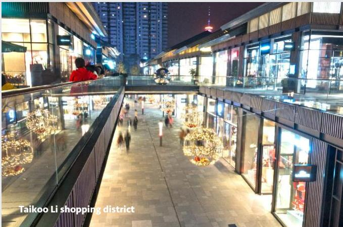

> **AI Description:**
> **Source:** `assets/_page_89_Figure_0.jpg`
> 
> **Generated:** 2026-05-30 18:33:43
> 
> ---
> 
> The image is a photograph of the Taikoo Li shopping district. It shows a well-lit pedestrian area with shops on either side, decorated with festive lights. The scene is bustling with people walking around, and the architecture features modern glass railings and illuminated storefronts. The text "Taikoo Li shopping district" is overlaid at the bottom left corner of the image.

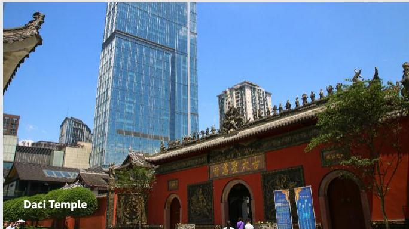

> **AI Description:**
> **Source:** `assets/_page_89_Figure_1.jpg`
> 
> **Generated:** 2026-05-30 18:31:49
> 
> ---
> 
> The image contains a photograph of the Daci Temple, a traditional Chinese temple with ornate architectural details and red walls. In the background, there is a modern glass skyscraper, indicating a contrast between ancient and contemporary architecture. The temple's entrance features intricate carvings and a sign with Chinese characters. The image also includes a label in the bottom left corner that reads "Daci Temple," identifying the location.

## Useful Phrases

# Point and go

Chinese has many dialects; Sichuanese is among the most distinct. That is well known thanks to China’s reformist leader Deng Xiaoping who spoke with a heavy Sichuan accent which many found difficult to understand.

But peculiarly enough it was also a Sichuan native who wrote the first book on Chinese dialects. Yang Xiong (53BC-18AD) was a scholar during the first century BC – nearly 200 years after China had been unified by the Qin. During his tenure at the imperial court, he took the opportunity to interview soldiers and statesman from across the country as they arrived in the capital and compiled an encyclopaedia of 9,000 words in various dialects.

The book was called fangyan, meaning dialect.

Numerous governments have attempted to unify China with a common language, which today is known as Putonghua. But dialects still abound alongside the lingua franca as well.

One defining characteristic of Sichuanese is the lack of a “shi” sound, which makes the difference between the number 10 (shi) and the number 4 (si) even less discernible, as both are pronounced ‘si’. Another is the use of sazi rather than shenme to mean “What?” which many Sichuanese speakers prefer even when shifting from dialect to speaking Putonghua.

As a visitor this might all be a bit too much to navigate, so Sinopolis has included some of the reader’s most likely destinations, to help you get around in taxis, or to make it easier to order common dishes in restaurants.

请带我去。。。 Please take me to…

成都大熊猫繁育研究基地 （成华区，熊猫大道1375号）Giant Panda Breeding Research Base (Panda park)

宽窄巷子（青羊区） Wide and Narrow Alleys

文殊院（青羊区文殊院街） Wenshu Monastery

IFS国际金融中心（红星路步行街3段1号）IFS

成都仁恒置地广场（人民南路2段红照壁十字路口）Yanlord Landmark

锦里街（武侯祠大街231号）Jinli Street

新世纪环球中心（高新南区天府大道北段1700号）New Century Global Centre

成都远洋太古里,锦江区中纱帽街8号 Taikoo Li

我要。。。   
I would like to eat...

麻婆豆腐 Mapo tofu

鱼香肉丝／鱼香茄子 Fish-fragrant pork slivers/aubergine

回锅肉 Twice-cooked pork

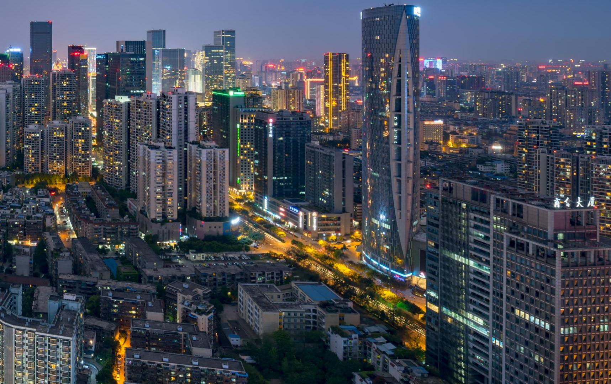

> **AI Description:**
> **Source:** `assets/_page_94_Figure_0.jpg`
> 
> **Generated:** 2026-05-30 18:42:20
> 
> ---
> 
> The image is a photograph of a cityscape at dusk. It features a mix of modern high-rise buildings and lower residential structures. The skyline is illuminated with various lights, showcasing the urban environment. The photo captures the transition from day to night, highlighting the city's vibrant atmosphere. Notable features include a distinctive, uniquely shaped skyscraper on the right side of the image, which stands out against the surrounding buildings.
