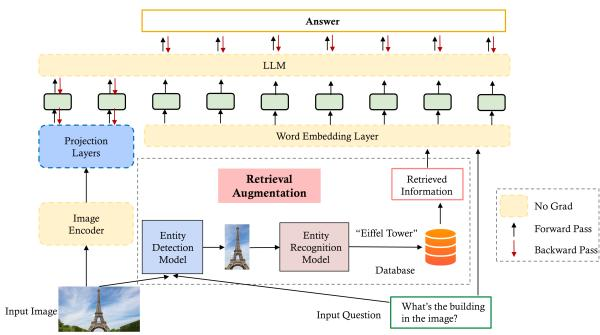
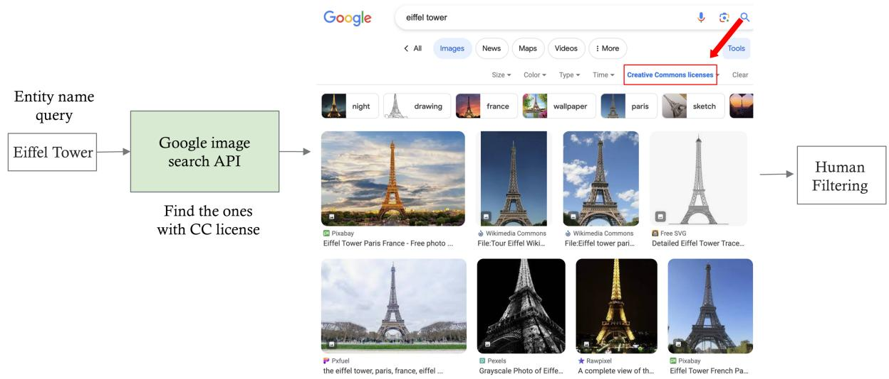
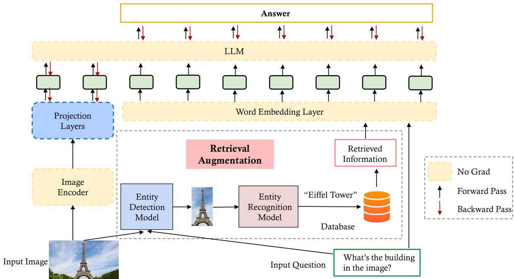

# SnapNTell: Enhancing Entity-Centric Visual Question Answering with Retrieval Augmented Multimodal LLM

Jielin Qiu1,2∗, Andrea Madotto1, Zhaojiang Lin1, Paul A. Crook1, Yifan Ethan Xu1, Xin Luna Dong1, Christos Faloutsos2, Lei Li2, Babak Damavandi1, Seungwhan Moon1 1 Meta Reality Labs & FAIR, Meta 2Carnegie Mellon University

{jielinq,leili,christos}@cs.cmu.edu, {andreamad8,zhaojiang,pacrook,ethanxu,lunadong,shanemoon}@meta.com

## Abstract

Vision-extended LLMs have made significant strides in Visual Question Answering (VQA). Despite these advancements, VLLMs still encounter substantial difficulties in handling queries involving long-tail entities, with a tendency to produce erroneous or hallucinated responses. In this work, we introduce a novel evaluative benchmark named SnapNTell, specifically tailored for entity-centric VQA. This task aims to test the models’ capabilities in identifying entities and providing detailed, entity-specific knowledge. We have developed the SnapNTell Dataset, distinct from traditional VQA datasets: (1) It encompasses a wide range of categorized entities, each represented by images and explicitly named in the answers; (2) It features QA pairs that require extensive knowledge for accurate responses. The dataset is organized into 22 major categories, containing 7,568 unique entities in total. For each entity, we curated 10 illustrative images and crafted 10 knowledge-intensive QA pairs. To address this novel task, we devised a scalable, efficient, and transparent retrieval-augmented multimodal LLM. Our approach markedly outperforms existing methods on the SnapNTell dataset, achieving a 66.5% improvement in the BELURT score. We will soon make the dataset and the source code publicly accessible.

## 1 Introduction

Vision-extended LLMs have shown significant advancements, excelling at capturing complex semantics and context-aware attributes needed for intricate tasks. However, their abilities in factual VQA tasks, which demand accurate, concrete answers about real-world entities and phenomena, expose certain limitations. Particularly, torso-to-tail or long-tail entities, which constitute a large proportion of real-world data but appear infrequently in training datasets, pose a challenge. This scarcity in representation often leads to VLLMs resorting to generating plausible but incorrect or imaginative content in their outputs, a problem that manifests as “hallucinations" within the context of model responses. To ensure the confident deployment of VLLMs in practical scenarios, there is an urgent need for dedicated research that not only recognizes but actively strives to tackle and reduce instances of hallucinations, especially in the context of factual queries involving these long-tail entities.

Figure 1: Comparing SnapNTell with existing methods reveals a distinctive focus. In the SnapNTell benchmark, the answers are predominantly entity-centric, characterized by a greater depth of knowledgeable information pertaining to the specific entity depicted in the image as the answer.

The lack of publicly available evaluation datasets specifically tailored to assess models’ ability in recognizing real-world long-tailed entities presents a notable gap in VQA. Existing datasets fall short in serving this purpose due to a narrow range of entity categories, the prevalence of overly simplistic yes/no QA pairs, and a general lack of entity specificity, often using broad terms like “Tiger" instead of more specific ones like “Siberian Tiger". To address this gap, we introduce a novel evaluation task called SnapNTell, which focuses on entity-centric knowledge-based VQA. The Snap-NTell benchmark has been designed to evaluate models’ abilities in accurately identifying entities and generating responses that showcase a deep understanding of these entities. To support this task, we have curated a new evaluation dataset that departs from existing datasets in two crucial ways: (1)

It includes a wide range of fine-grained and categorized entities, each accompanied by corresponding images and clear mention of the entity name within the answer sets. (2) It features QA pairs designed to prompt knowledge-intensive responses, moving beyond the binary yes/no format to challenge and assess the depth of the model’s comprehension.

Furthermore, the limitations identified in factual query generation underscore the need for new solutions to address the problem of hallucinations. Recent advancements suggest that retrieval-based approaches hold significant promise in this regard (Guu et al., 2020; Srinivasan et al., 2022; Yang et al., 2023a,b). These methods enhance LLMs by integrating external knowledge sources or incorporating retrieval mechanisms to access relevant information from extensive knowledge bases. The synergy between the advanced inference capabilities of LLMs and the wealth of external knowledge has the potential to significantly reduce issues related to long-tail entities and, consequently, decrease the occurrence of hallucinatory responses.

In this work, we aim to propose an evaluation task to investigate the model’s ability to recognize real-world long-tailed entities and provide knowledge-intensive answers. We also propose a retrieval-augmented method to reduce hallucinations and enhance the precision and trustworthiness of generated responses.

Our contribution is summarized as follows:

• SnapNTell task. We propose a novel task for entity-centric VQA, specifically designed to assess the proficiency of models in accurately identifying and generating responses that exhibit a deep comprehension of these identified entities.

• SnapNTell model. We proposed a retrievalaugmented multimodal LLM, devised as a baseline model capable of undertaking the SnapNTell task, which is scalable, effective, and explainable.

• SnapNTell dataset. We collected a new evaluation dataset with distinctive characteristics, which stands out for two key features: (1) It encompasses a diverse range of fine-grained entities, each accompanied by corresponding representative images. (2) The questionanswer pairs contain knowledge-intensive responses with entity names specifically mentioned in the answer sets.

• Our model demonstrates superior performance on the SnapNTell dataset, surpassing current methodologies with a 66.5% improvement in BELURT score.

## 2 Related Works

Knowledge-based VQA Research in visionlanguage tasks, which necessitate understanding image content to answer questions, has seen significant advancements over recent years. Beginning with datasets like FVQA (Wang et al., 2016), which extracted facts from pre-established knowledge bases, the field has progressed to more challenging ones like the OK-VQA dataset (Marino et al., 2019), encompassing diverse knowledge categories. MultiModalQA (Talmor et al., 2021) introduced complexity with questions demanding crossmodal reasoning over snippets, tables, and images. The successor of OK-VQA, AOK-VQA (Schwenk et al., 2022), raises the bar by providing questions that transcend simple knowledge base queries. ManyModalQA (Hannan et al., 2020) shifts the focus to answer modality selection, MIMOQA (Singh et al., 2021) emphasizes multimodal answer extraction, and WebQA (Chang et al., 2021) introduces real-world knowledge-seeking questions, albeit with some limitations regarding entity categorization and granularity. More comparison details can be found in Section 3.5.

Multimodal LLMs Integrating visual understanding into text-based LLM typically combines them with a visual encoder and uses image captioning datasets for alignment (Koh et al., 2023; Wu et al., 2023; Chowdhery et al., 2022). Techniques like adapter-based tuning (Alayrac et al., 2022) and prefix tuning (Tsimpoukelli et al., 2021) allow these models to process visual inputs while maintaining their linguistic capabilities, without requiring full model retraining (Yin et al., 2023).

Retrieval-augmented LLM Previous studies have explored retrieval augmentation in text-only settings or image captioning tasks. Guu et al. (2020) introduced a retriever for language models to access large corpus during various stages. Srinivasan et al. (2022) showed retrieval-augmented queries enhance LLMs’ context understanding. Yasunaga et al. (2023) and Yang et al. (2023a) developed methods for integrating multimodal documents and speeding up LLM inference, respectively. Yang et al. (2023b) created a visual language model, inspired by Flamingo (Alayrac et al.,

2022), for image captioning with external database retrieval. Similarly, Gui et al. (2021) combined implicit and explicit knowledge in an encoder-decoder setup to improve answer generation.

Open-domain visual entity recognition Hu et al. (2023) developed OVEN for associating images with Wikipedia entities via text queries, while Chen et al. (2023) introduced INFOSEEK, a dataset for Visual Question Answering focused on informational queries. While OVEN is proficient in entity recognition using a knowledge base, INFOSEEK mainly supplies factual responses. Our study seeks to merge these strengths, creating detailed paragraphs that provide context for a more comprehensive understanding beyond basic facts. More related work can be found in Appendix E.

## 3 SnapNTell Dataset

## 3.1 Entity Categorization

To tackle the challenge of the new SnapNTell task, the first step involves creating a comprehensive dataset that represents a wide array of real-world entities. Our dataset creation methodology entails selecting a diverse set of entity names from various categories that mirror the diversity of the real world. This selection encompasses both commonly encountered entities and less frequently encountered ones. We have identified 22 categories that adequately represent a cross-section of entities one might encounter in daily life. These categories include landmark, painting, sculpture, food, fruit, vegetable, mammal, amphibian, insect, fish, bird, reptile, celebrity, instrument, plant, electronics, tool, transportation, sport, book, household, and car. More details about the categories can be referred to Table 10 in the Appendix.

To populate each category with specific entities, we leveraged Wikipedia as a primary resource due to its extensive and detailed entries. (See Appendix A for more details.) Our selection criteria are heavily biased towards specificity; for instance, in the category of mammals, we deliberately opted for precise names such as “German Shepherd” or “Alaskan Malamute” instead of the generic “Dog”. This level of specificity is critical as it enables the model to demonstrate its capacity for fine-grained recognition and its ability to generate detailed, accurate information about each entity. This datasetbuilding approach is what distinguishes our dataset from existing VQA datasets, which often lack finegrained entities and specificity.

## 3.2 Image collection

The dataset comprises 22 primary categories, encapsulating a total of 7,568 unique entities. For each individual entity, a set of 10 images has been curated, where the statistic of the entity list is shown in Table 10 in the Appendix.

Filtering Initially, a comprehensive list of entities, encompassing 22 primary categories, was compiled, in a total of 14,910 diverse entities. Then the entity list underwent filtering by cross-referencing each entry with its corresponding Wikipedia page. Entities lacking valid Wikipedia pages were subsequently removed from the list. For each corresponding entity, images were sourced from Creative Commons (CC). Further filtering was conducted by removing entities that didn’t have a sufficient number of images obtained via Google Image Search engine. The collected metadata was stored in a CSV file containing essential information such as image URLs, source page URLs, renamed image names, and the corresponding Wikipedia page URLs. After filtering, the final number of entities in the SnapNTell dataset is 7,568. (More filtering details can be found in Appendix B.)

## 3.3 Knowledge-intensive Question-Answer Pairs

In our SnapNTell dataset, we considered five types of questions:

• Static facts (absolute facts, discrete facts). These are objective facts that are concrete and are not contingent on other conditions. They can usually be answered with a unique answer. i.e., “When was he (Barack Obama) born?"

• Narrative facts. These facts encompass comprehension of larger contexts (e.g., song lyrics, movie plot). They are factual in the sense that the content of the narrative should accurately reflect the source material or events, but a correct answer is usually not unique, as they can vary in their level of detail and focus. i.e., “What is the plot of that (‘The Godfather’)?"

• Dynamic facts. These are facts that are subject to change over time. i.e., “What is the Yelp customer rating of it (the Eleven Madison Park restaurant) in NYC?"

• Procedural facts. These are usually answers to “how” questions, outlining a sequence of steps to accomplish a task. While the steps may not be unique and could be subjective, the answer can still be classified as logical or nonsensical. Note that these facts may sometimes overlap with dynamic facts or narrative facts, i.e., “How do you check the battery level of my item (Ray-Ban Stories Glasses)?"

• Subjective facts. (opinion-based facts). These “facts” are not objective indisputable facts, but based on individual perspectives or experience. Recommendations fall in this category. While there’s generally no single correct answer to questions seeking subjective facts, it still requires the system to understand the topic and provide reasonable answers grounded by world facts. i.e., “Why do you like it (Niagara Falls)?"

To construct a comprehensive and knowledgeintensive QA dataset, we employ a three-step process. Firstly, we extracted and condensed pertinent information from Wikipedia for each entity, i.e., the summary of the introduction, the caption of the image, etc. (See Appendix A for more details). Following similar approaches proposed by LLaVA (Liu et al., 2023b), Dettmers et al. (2023) is utilized to generate QA pairs for each entity automatically based on five pre-defined question types, ensuring diversity and informativeness. Then, we enlisted three annotators (2 male and 1 female) from Amazon SageMaker to assess QA pair quality and make necessary revisions to meet specific criteria. The responsibilities of these annotators include: (1) ensuring that the images and QA pairs are semantically aligned, (2) validating the accuracy of the provided answers, (3) making sure the questions are free of particular entity names but demanding such specificity in the answers, (4) assessing if the modified QA pairs adhere to the criteria for knowledge-intensive content, and (5) removing specific entity-related details from the questions. This last step guarantees that the question queries cannot be answered without understanding the accompanying visual context.

Quality and consistency In order to verify the quality of the QA pairs, we conducted a quality evaluation by randomly choosing 1,000 QA pairs from our dataset. We assigned three independent human evaluators (1 male, 2 female) from Amazon SageMaker to review these pairs for accuracy [accurate, inaccurate] and agreement on whether to save the QA pair by Fleiss’ Kappa (Fleiss, 1971). The outcome of this assessment revealed 98% accuracy and κ = 0.95 agreement rate among the evaluators, demonstrating a significant degree of uniformity in the quality of the QA pairs.

## 3.4 Statistics and Analysis of Our Dataset

Entity statistics To provide a clear summary of this comprehensive dataset, we have condensed the details of the entity list into Table 10 and Figure 9 (in Appendix F). Our analysis indicates that the dataset displays a well-balanced distribution across different categories, enhancing its balanced and diverse characteristics. Such a balanced and diverse composition enhances the representativeness of our proposed evaluation dataset.

Popularity The importance of entity popularity in search engines is a key aspect to consider, similar to examining the head, torso, and tail sections of knowledge bases within search engine frameworks. As demonstrated in Figure 11 in Appendix F, we use the average Wikipedia pageviews per entity over the last 60 days as the metric. This average is calculated by summing up the pageviews and then dividing by the number of entities. The insights from Figure 11 reveal that entities in the celebrity category have the highest average popularity. For a broader comparison among different categories, we also present a comprehensive analysis of total pageviews for all categories in Figure 10 in Appendix F, which shows that the celebrity category remains at the forefront in terms of overall entity popularity. This is attributed to the combination of a higher number of entities in this category and the generally higher popularity of each entity within it.

## 3.5 Comparison with Existing VQA Datasets

In Table 2 and Figure 2, we present a comparison with existing VQA datasets. It is evident that some existing VQA datasets lack categorization, fine-grained entities, and knowledge-intensive answers, as observed in VQA 2.0 (Goyal et al., 2016) and GQA (Hudson and Manning, 2019). OK-VQA (Marino et al., 2019) contains images that may not be sufficient to answer the questions, encouraging reliance on external knowledge resources. However, the answers in OK-VQA are often simplistic binary (yes/no) responses or selections from the questions. A-OKVQA (Schwenk et al., 2022), the successor of OK-VQA, aims to provide questions that require commonsense reasoning about the depicted scene but use general object names in the answers. MultiModalQA (Talmor et al., 2021) focuses on cross-modal knowledge extraction but relies on question templates for question generation. ManyModalQA (Hannan et al., 2020) focuses on answer modality choice rather than knowledge aggregation or extraction. In MIMOQA (Singh et al., 2021), the task of extracting a multimodal answer is not necessarily knowledge-intensive. WebQA (Chang et al., 2021) does have categorization but lacks fine-grained entities in many QA pairs, resulting in more general questions and answers. Our proposed SnapNTell differs by including a wide range of fine-grained entities with representative images and explicit entity names in the answer sets. Additionally, it incorporates question-answer pairs that demand knowledge-intensive responses, going beyond simplistic binary answers. Examples of our dataset can be found in Figure 8 in Appendix F.

Table 1: More detailed comparison with existing knowledge-based VQA datasets. Anonymity means whether the question already contains a knowledge clue related to the entity in question. (\* Unclear)

Table 2: Comparison with existing VQA datasets Knowledge means the QA pairs are knowledgeable, not simple yes/no answers or selection questions. Entities means whether there are fine-grained entities specifically contained in answers. Categorization means the entities are categorized, not randomly crawled online.

ViQuAE (Lerner et al., 2022) and Encyclopedic VQA (Mensink et al., 2023) both incorporate entity-level knowledge-based information along with categorization. Therefore, we performed a more in-depth analysis comparing them in Table 1. Our dataset surpasses these in terms of the variety of categories, the number of distinct entities, and the overall number of QA pairs. Additionally, our dataset boasts a higher count of images and a longer average length for answers. Specifically, our dataset is structured to include 10 images for each entity, whereas the exact number of images per entity in ViQuAE and Encyclopedic VQA remains unspecified. Most notably, our dataset’s questions are highly anonymous, implying that they do not reveal any knowledge hints about the entity. This design ensures that the questions cannot be straightforwardly answered without interpreting the image data, setting our dataset apart from both ViQuAE and Encyclopedic VQA.

Figure 2: Comparison with existing datasets, where previous VQA datasets mostly focus on freeform answers (such as yes/no for verification questions and choice for selection questions).

## 4 Method

In this section, we will introduce the details of our proposed retrieval-augmented multimodal LLM model. The architecture of our model is shown in Figure 3 (larger figure in Appendix D due to space limit). Our model can be considered twofold: (1) Retrieval augmentation. Given the input image-question pair, we retrieve useful entitycentric information within knowledge sources. (2) Entity-centric knowledge-based answer generation. The retrieved information will be combined with the image and question together to generate a knowledgeable answer.

## 4.1 Retrieval Augmentation

The retrieval augmentation process can be subdivided into: (i) Semantic region extraction via language-guided object detection, (ii) Entity recognition via image retrieval, and (iii) Knowledge retrieval via multi-source aggregation.

Semantic Region Extraction via Language-Guided Object Detection To improve recognition performance, we focus on extracting specific image regions containing the entity, rather than general image-level recognition. We employ a language-guided object detection model, i.e., GLIP (Li et al., 2021), for language-guided object detection, extracting regions relevant to textual queries by understanding the query context. This targeted approach ensures precise region extraction, enhancing the system’s accuracy and contextual relevance.

Figure 3: Our SnapNTell model architecture takes an image-question pair as input. It begins with retrieval augmentation to source relevant information about the entity in the image. This information, along with the question, feeds into the word embedding layer. Text embeddings merge with image-projected embeddings before entering the LLM, culminating in a knowledgeable answer as the output.

> **AI Description:**
> **Source:** `assets/_page_5_Figure_0.jpg`
> 
> **Generated:** 2026-05-30 19:17:01
> 
> ---
> 
> The image is a flowchart illustrating a process for generating an answer to a question using a language model (LLM) with retrieval augmentation. It includes a diagram with labeled components such as "Image Encoder," "Entity Detection Model," "Entity Recognition Model," "Retrieved Information," and "Database." The flowchart shows the interaction between these components, including forward and backward passes, and the use of projection layers and word embedding layers. The image also includes an input image of the Eiffel Tower and a question asking about the building in the image.

Entity Recognition via Image Retrieval We construct a similarity index using CLIP embeddings (Radford et al., 2021) and Faiss (Johnson et al., 2017) for indexing. Our database, built on the WIT dataset (Srinivasan et al., 2021), maps CLIP image embeddings to their text descriptions, leveraging Faiss’s robust similarity search capabilities. After setting up the indexing database, given an input query image I, we perform a knearest neighbor retrieval based on cosine similarity. The retrieval outcomes are represented as $\mathcal { R } ( I ) = \{ ( i _ { 1 } , c _ { 1 } ) , \cdots , ( i _ { k } , c _ { k } ) \}$ , where for each j within the range of 1 to k, $i _ { j }$ and $c _ { j }$ correspond to the retrieved image and its associated caption, respectively. By comparing I with similar images from the database, we identify the entity in the image region, which enables precise image-level entity recognition.

Knowledge Retrieval via Multi-Source Aggregation Facing diverse user queries, we gather extra information to compile resources for accurate responses. Some queries require up-to-date information, not present in existing databases. We then turn to external sources to collect critical data like “year built," “description," and more. By using Knowledge Graph (KG) and web searches, we access relevant knowledge links, enriching our understanding of the specified image region, and improving our ability to comprehend and contextualize the extracted content. More details of the method can be found in Appendix D.

## 4.2 Entity-centric Knowledge-based Answer Generation

Following information collection, we enter the integration phase, blending the input image, question, and retrieved data to generate a knowledgeable response, which is illustrated in Figure 3. Our method enhances multimodal understanding by pre-training a LLM with image-text paired data. Taking cues from Moon et al. (2023), we employ lightweight adapters for each modality, converting inputs into the text token embedding space of the chosen LLM.

In our method, the LLM’s text token embedding space morphs into a unified space, representing both text and image content, with each modality assigned 64 to 256 token embeddings. We freeze the LLM’s parameters during alignment training to quicken convergence and retain the LLM’s reasoning skills for inference. To ensure feature alignment, we use an image encoder, g(·), previously synchronized with a text embedding space, like in CLIP (Radford et al., 2021; Schuhmann et al., 2022). For text-image pairs $\left( { \bf { X } } _ { t e x t } , { \bf { X } } _ { i m a g e } \right)$ , we align them using specific objectives and a projection module, like the Perceiver Resampler (Alayrac et al., 2022), applied to the vision encoder as:

$$
p ( \mathbf { X } _ { t e x t } \vert \mathbf { X } _ { i m a g e } ) = \prod _ { i = 1 } ^ { L } p _ { \theta } ( \mathbf { X } _ { t e x t } ^ { [ i ] } \vert \mathbf { Z } _ { i m a g e } , \mathbf { Z } _ { t e x t } ^ { [ 1 : i - 1 ] } )\tag{1}
$$

$$
{ \bf { Z } } _ { i m a g e } = P r o j _ { \theta } ( h _ { l a t e n t s } , g ( { \bf { X } } _ { i m a g e } ) )\tag{2}
$$

## 5 Experiments and Results

## 5.1 Experimental Setup

Evaluation Metrics (1) In our evaluation process, the quality of the answers is first assessed using established NLP metrics such as BLEU (Papineni et al., 2002), METEOR (Denkowski and Lavie, 2014), ROUGE (Lin, 2004), and BLEURT (Sellam et al., 2020; Pu et al., 2021). (2) Additionally, we incorporate accuracy and hallucination rate metrics from (Sun et al., 2023). These metrics used GPT4 to automatically measure the proportion of questions for which the model provides correct answers or incorrect/partially incorrect answers, respectively. (3) We conduct human evaluation following Ye et al. (2023); Moon et al. (2023).

Table 3: Performance comparison of different approaches on the SnapNTell dataset.

Model Setting We chose LLaMA2 (70B) (Touvron et al., 2023) as our LLM. For image encoding, the CLIP image encoder (ViT-B/32) is employed (Radford et al., 2021; Schuhmann et al., 2022). Additional configurations comprise a batch size of 2,048, the integration of two resampler layers, and the use of 64 modality tokens.

Model Training We used a cleaned subset of the LAION-2B dataset, filtered using the CAT method (Radenovic et al., 2023b) and with any detectable faces blurred (Radenovic et al., 2023a). Significant resources are essential to scale pre-training to 70 billion parameter models on a substantial dataset of over 200 million instances. Often, this necessitates the utilization of an FSDP wrapper, as outlined in Dettmers et al. (2023), to distribute the model across multiple GPUs efficiently. To optimize our training process, we employ quantization strategies, specifically 4-bit and 8-bit quantization techniques (Dettmers et al., 2023), within our multimodal framework. In this approach, we maintain the LLM component of our model in a frozen state, allowing only the image modality tokenizers to be trainable. This strategy drastically reduces the memory requirements by an order of magnitude. As a result of these optimizations, we can successfully train a 70 billion parameter model on a single GPU with 80GB VRAM, using a batch size of 4.

## 5.2 Results and Discussion

Table 3 displays the comparative results between the baseline models and our proposed method. Analysis of this table indicates that for every metric assessed, our retrieval-augmented multimodal LLM surpasses the performance of all existing baseline models. This strong performance emphasizes the efficiency of retrieval augmentation in producing responses enriched with entity-centric information, thereby illustrating its substantial impact on the task at hand.

Moreover, to gain deeper insights into which evaluation metric more accurately reflects the outcomes, we computed the Kendall correlation coefficient (Kendall, 1938; Knight, 1966; Kendall et al., 1995), comparing the results with those from the human evaluation in Section 5.4. Kendall’s τ is a measure of the correspondence between two rankings. Values close to 1 indicate strong agreement, values close to -1 indicate strong disagreement. Table 4 revealed that both the ROUGE and BLEURT scores were more indicative in distinguishing the differences among various models. This finding suggests that these two metrics are particularly significant in evaluating model performance in a way that aligns closely with human judgment.

Table 4: Effectiveness of evaluation metrics.

## 5.3 Ablation Study

For a more in-depth understanding, we conducted several ablation studies to delve into the finer details of our approach.

Effectiveness of Entity Detection To assess the impact of entity detection (ED) in our model, we performed an ablation study. This involved comparing the performance of our approach with and without the ED component. As indicated in Table 5, our approach incorporating entity detection markedly surpasses the variant lacking this feature. This highlights the significant contribution and necessity of the entity detection step in our model’s overall effectiveness.

Table 5: Ablation study on the effectiveness of entity detection (ED).

Head/Torso/Tail Entities Head knowledge pertains to well-established entities for which there is a wealth of available training data. Ideally, LLMs could be trained to possess this knowledge, facilitating efficient retrieval. On the other hand, torso-to-tail knowledge pertains to less-known or obscure entities, often characterized by scarce or non-existent training data. Providing access to such knowledge involves effectively determining when external information is necessary, retrieving the relevant knowledge efficiently, and seamlessly integrating it into responses.

To assess the performance improvement for head/torso/tail entities, we randomly selected 10% entities for each category, where head/torso/tail entities are defined based on pageview statistics (popularity) in Section 3.4. The results presented in Table 6 clearly demonstrate that retrieval augmentation can significantly enhance performance across various entity types. Notably, the performance improvement for torso-to-tail entities far exceeds that of head entities, effectively addressing the challenge of hallucinations in long-tailed entities through retrieval augmentation.

### Full Page Description (Page 7)

**Source:** `assets/_page_7_Asset_0.jpg`

**Generated:** 2026-05-30 19:15:12

---

The image is a bar chart with three categories of outcomes: "Lose," "Tie," and "Win," represented by blue, yellow, and red bars, respectively. The chart compares the performance of different models or systems, labeled on the x-axis as Mini-GPT4, Open-Flamingo, COGVL, mPLUG-Owl2, LLaVA 1.5, and SnapNTell. The y-axis represents the percentage of outcomes for each category. The chart shows that Mini-GPT4 and Open-Flamingo have the highest percentage of "Lose" outcomes, while SnapNTell has the highest percentage of "Win" outcomes.

Table 6: Ablation study on head/torso/tail entities, where RA is short for Retrieval Augmentation and ∆ is the performance difference of with and without RA.

Performance of Different VQA Datasets To demonstrate the uniqueness of our SnapNTell dataset compared to existing VQA datasets, we analyzed the performance of various baseline models on both traditional VQA datasets and our SnapN-Tell dataset. According to the findings presented in Table 7, the performance disparities among baseline models on existing datasets are not particularly marked. In contrast, on the SnapNTell dataset, we observed significantly larger differences and notably lower performance. This indicates that our SnapNTell dataset is particularly effective in evaluating the capabilities of different models to recognize entities and produce responses centered around these entities.

Table 7: Ablation on the accuracy performance of different VQA datasets.

## 5.4 Human Evaluation Results

In alignment with the methodology presented in Ye et al. (2023); Moon et al. (2023), we involved a human evaluation process conducted by a panel of five human judges (3 male, 2 female). These judges were given specific instructions for their assessment, which encompassed three key aspects:

(1) Recognition Accuracy, where they evaluated whether the model correctly identified the entity in the image relevant to the question; (2) Response Accuracy, in which they assessed the factual correctness of the model’s responses while checking for any signs of hallucination (Rawte et al., 2023); and (3) Pairwise Comparison, where judges selected the response that better addressed the given question in terms of contextual appropriateness and accuracy, categorizing responses as winning, tying, or losing.

In our study, we conducted pairwise comparisons for each baseline model against ground-truth data across 1,000 samples. As depicted in Figure 4, our model outperforms the baselines by displaying a significantly smaller difference when measured against manually annotated ground-truth samples, highlighting its robustness.

## 6 Conclusion

In this work, we tackle the significant challenge VLLMs face with long-tail entity queries, which often lead to inaccurate or hallucinated responses. To address these issues, we introduce an entity-centric VQA task named SnapNTell. This task is designed to test models on entity recognition and their ability to provide detailed, entity-specific knowledge in their responses. We collected a unique evaluation dataset for this task, which distinguishes itself from existing VQA datasets by including a wide array of fine-grained categorized entities, supported by images and explicit entity mentions in the answers. This dataset emphasizes knowledgeintensive responses over simple binary answers. In addition, we propose a retrieval-augmented multimodal LLM solution for the SnapNTell task as an effective baseline. Our experimental results show that our model outperforms existing approaches, providing more accurate and coherent answers.

## Limitations

In this study, we introduce a novel SnapNTell task and its accompanying dataset, which features five unique types of questions, each paired with meticulously formulated answers. It’s important to recognize that in cases involving human preferences, which are subjective by nature, the given answers might not represent the only correct options. Furthermore, the relevancy of some answers may diminish over time, highlighting the need for periodic updates to the dataset to ensure its ongoing relevance and accuracy. Our proposed method exhibited superior performance over existing baselines. However, human evaluation results suggest significant potential for further improvement. Although our approach often neared human-level performance, it did not consistently outperform human annotations, showing opportunities for future advancements.

## Ethics Statement

In this study, the dataset was sourced from publicly accessible databases, and all author details remain anonymous. We conscientiously excluded any content from our dataset that could be considered ethically sensitive or related to personal privacy, such as images depicting human faces. To our understanding, and with careful consideration, we do not anticipate any detrimental applications arising from the findings or methodologies presented in this research.

## Broader Impact

Current models have made commendable progress in grasping the nuanced semantics and contextsensitive aspects of Visual Question Answering (VQA). However, their efficacy in factual VQA tasks, which require precise and factual answers about tangible entities and events, reveals certain deficiencies. This is especially true for torso-to-tail or long-tail entities. Despite their prevalence in the real world, these entities are underrepresented in training datasets, leading to a common issue where models produce plausible yet inaccurate or invented responses, a phenomenon often termed “hallucinations" in the realm of model-generated content. Tackling and minimizing these hallucinations is vital for enhancing the trustworthiness and applicability of these models in practical scenarios.

The existing VQA datasets, however, are inadequate for evaluating a model’s ability to recognize entities, as they do not explicitly highlight these entities within the dataset. Our newly introduced dataset bridges this gap. It is designed to test models’ capabilities not just in identifying entities but also in generating informed and entity-aware responses. Furthermore, our proposed dataset might serve as resources for either pre-training or finetuning existing models, to improve their ability in recognizing entity-level real-world objects.

## References

- Jean-Baptiste Alayrac, Jeff Donahue, Pauline Luc, Antoine Miech, Iain Barr, Yana Hasson, Karel Lenc, Arthur Mensch, Katie Millican, Malcolm Reynolds, Roman Ring, Eliza Rutherford, Serkan Cabi, Tengda Han, Zhitao Gong, Sina Samangooei, Marianne Monteiro, Jacob Menick, Sebastian Borgeaud, Andy Brock, Aida Nematzadeh, Sahand Sharifzadeh, Mikolaj Binkowski, Ricardo Barreira, Oriol Vinyals, Andrew Zisserman, and Karen Simonyan. 2022. Flamingo: a visual language model for few-shot learning. ArXiv, abs/2204.14198.
- Anas Awadalla, Irena Gao, Josh Gardner, Jack Hessel, Yusuf Hanafy, Wanrong Zhu, Kalyani Marathe, Yonatan Bitton, Samir Yitzhak Gadre, Shiori Sagawa, Jenia Jitsev, Simon Kornblith, Pang Wei Koh, Gabriel Ilharco, Mitchell Wortsman, and Ludwig Schmidt. 2023. Openflamingo: An open-source framework for training large autoregressive vision-language models. ArXiv, abs/2308.01390.
- Yingshan Chang, Mridu Baldevraj Narang, Hisami Suzuki, Guihong Cao, Jianfeng Gao, and Yonatan Bisk. 2021. Webqa: Multihop and multimodal qa. 2022 IEEE/CVF Conference on Computer Vision and Pattern Recognition (CVPR), pages 16474–16483.
- Yang Chen, Hexiang Hu, Yi Luan, Haitian Sun, Soravit Changpinyo, Alan Ritter, and Ming-Wei Chang. 2023. Can pre-trained vision and language models answer visual information-seeking questions? In EMNLP.
- Aakanksha Chowdhery et al. 2022. Palm: Scaling language modeling with pathways. J. Mach. Learn. Res., 24:240:1–240:113.
- Wenliang Dai, Junnan Li, Dongxu Li, Anthony Meng Huat Tiong, Junqi Zhao, Weisheng Wang, Boyang Albert Li, Pascale Fung, and Steven C. H. Hoi. 2023. Instructblip: Towards general-purpose vision-language models with instruction tuning. ArXiv, abs/2305.06500.
- Michael J. Denkowski and Alon Lavie. 2014. Meteor universal: Language specific translation evaluation for any target language. In WMT@ACL.
- Tim Dettmers, Artidoro Pagnoni, Ari Holtzman, and Luke Zettlemoyer. 2023. Qlora: Efficient finetuning of quantized llms. ArXiv, abs/2305.14314.

- Joseph L. Fleiss. 1971. Measuring nominal scale agreement among many raters. Psychological Bulletin, 76:378–382.
- Yash Goyal, Tejas Khot, Douglas Summers-Stay, Dhruv Batra, and Devi Parikh. 2016. Making the v in vqa matter: Elevating the role of image understanding in visual question answering. International Journal of Computer Vision, 127:398 – 414.
- Liangke Gui, Borui Wang, Qiuyuan Huang, Alexander G. Hauptmann, Yonatan Bisk, and Jianfeng Gao. 2021. Kat: A knowledge augmented transformer for vision-and-language. In North American Chapter of the Association for Computational Linguistics.
- Kelvin Guu, Kenton Lee, Zora Tung, Panupong Pasupat, and Ming-Wei Chang. 2020. Realm: Retrievalaugmented language model pre-training. ArXiv, abs/2002.08909.
- Darryl Hannan, Akshay Jain, and Mohit Bansal. 2020. Manymodalqa: Modality disambiguation and qa over diverse inputs. In AAAI Conference on Artificial Intelligence.
- Hexiang Hu, Yi Luan, Yang Chen, Urvashi Khandelwal, Mandar Joshi, Kenton Lee, Kristina Toutanova, and Ming-Wei Chang. 2023. Open-domain visual entity recognition: Towards recognizing millions of wikipedia entities. ArXiv, abs/2302.11154.
- Drew A. Hudson and Christopher D. Manning. 2019. Gqa: A new dataset for real-world visual reasoning and compositional question answering. 2019 IEEE/CVF Conference on Computer Vision and Pattern Recognition (CVPR), pages 6693–6702.
- Jeff Johnson, Matthijs Douze, and Hervé Jégou. 2017. Billion-scale similarity search with gpus. IEEE Transactions on Big Data, 7:535–547.
- M. G. Kendall. 1938. A new measure of rank correlation. Biometrika, 30:81–93.
- M. G. Kendall, Alan L. Stuart, and J. Keith Ord. 1995. Kendall’s advanced theory of statistics. Journal of the American Statistical Association, 90:398.
- William Knight. 1966. A computer method for calculating kendall’s tau with ungrouped data. Journal of the American Statistical Association, 61:436–439.
- Jing Yu Koh, Ruslan Salakhutdinov, and Daniel Fried. 2023. Grounding language models to images for multimodal inputs and outputs.
- Paul Lerner, Olivier Ferret, Camille Guinaudeau, Hervé Le Borgne, Romaric Besançon, José G. Moreno, and Jesús Lovón-Melgarejo. 2022. Viquae, a dataset for knowledge-based visual question answering about named entities. Proceedings of the 45th International ACM SIGIR Conference on Research and Development in Information Retrieval.
- Junnan Li, Dongxu Li, Silvio Savarese, and Steven C. H. Hoi. 2023. Blip-2: Bootstrapping language-image pre-training with frozen image encoders and large language models. ArXiv, abs/2301.12597.
- Liunian Harold Li, Pengchuan Zhang, Haotian Zhang, Jianwei Yang, Chunyuan Li, Yiwu Zhong, Lijuan Wang, Lu Yuan, Lei Zhang, Jenq-Neng Hwang, Kai-Wei Chang, and Jianfeng Gao. 2021. Grounded language-image pre-training. 2022 IEEE/CVF Conference on Computer Vision and Pattern Recognition (CVPR), pages 10955–10965.
- Chin-Yew Lin. 2004. Rouge: A package for automatic evaluation of summaries. In ACL 2004.
- Haotian Liu, Chunyuan Li, Yuheng Li, and Yong Jae Lee. 2023a. Improved baselines with visual instruction tuning. ArXiv, abs/2310.03744.
- Haotian Liu, Chunyuan Li, Qingyang Wu, and Yong Jae Lee. 2023b. Visual instruction tuning. ArXiv, abs/2304.08485.
- Kenneth Marino, Mohammad Rastegari, Ali Farhadi, and Roozbeh Mottaghi. 2019. Ok-vqa: A visual question answering benchmark requiring external knowledge. 2019 IEEE/CVF Conference on Computer Vision and Pattern Recognition (CVPR), pages 3190–3199.
- Thomas Mensink, Jasper R. R. Uijlings, Lluís Castrejón, Arushi Goel, Felipe Cadar, Howard Zhou, Fei Sha, Andre F. de Araújo, and Vittorio Ferrari. 2023. Encyclopedic vqa: Visual questions about detailed properties of fine-grained categories. 2023 IEEE/CVF International Conference on Computer Vision (ICCV), pages 3090–3101.
- Seungwhan Moon, Andrea Madotto, Zhaojiang Lin, Tushar Nagarajan, Matt Smith, Shashank Jain, Chun-Fu Yeh, Prakash Murugesan, Peyman Heidari, Yue Liu, Kavya Srinet, Babak Damavandi, and Anuj Kumar. 2023. Anymal: An efficient and scalable any-modality augmented language model. ArXiv, abs/2309.16058.
- Kishore Papineni, Salim Roukos, Todd Ward, and Wei-Jing Zhu. 2002. Bleu: a method for automatic evaluation of machine translation. In ACL.
- Amy Pu, Hyung Won Chung, Ankur P. Parikh, Sebastian Gehrmann, and Thibault Sellam. 2021. Learning compact metrics for mt. In Conference on Empirical Methods in Natural Language Processing.
- Filip Radenovic, Abhimanyu Dubey, Abhishek Kadian, Todor Mihaylov, Simon Vandenhende, Yash Patel, Yi Wen, Vignesh Ramanathan, and Dhruv Mahajan. 2023a. Filtering, distillation, and hard negatives for vision-language pre-training. In Proceedings of the IEEE/CVF Conference on Computer Vision and Pattern Recognition, pages 6967–6977.

- Filip Radenovic, Abhimanyu Dubey, Abhishek Kadian, Todor Mihaylov, Simon Vandenhende, Yash J. Patel, Yi Wen, Vignesh Ramanathan, and Dhruv Kumar Mahajan. 2023b. Filtering, distillation, and hard negatives for vision-language pre-training. 2023 IEEE/CVF Conference on Computer Vision and Pattern Recognition (CVPR), pages 6967–6977.
- Alec Radford, Jong Wook Kim, Chris Hallacy, Aditya Ramesh, Gabriel Goh, Sandhini Agarwal, Girish Sastry, Amanda Askell, Pamela Mishkin, Jack Clark, Gretchen Krueger, and Ilya Sutskever. 2021. Learning transferable visual models from natural language supervision. In International Conference on Machine Learning.
- Vipula Rawte, A. Sheth, and Amitava Das. 2023. A survey of hallucination in large foundation models. ArXiv, abs/2309.05922.
- Christoph Schuhmann, Romain Beaumont, Richard Vencu, Cade Gordon, Ross Wightman, Mehdi Cherti, Theo Coombes, Aarush Katta, Clayton Mullis, Mitchell Wortsman, Patrick Schramowski, Srivatsa Kundurthy, Katherine Crowson, Ludwig Schmidt, Robert Kaczmarczyk, and Jenia Jitsev. 2022. Laion-5b: An open large-scale dataset for training next generation image-text models. ArXiv, abs/2210.08402.
- Dustin Schwenk, Apoorv Khandelwal, Christopher Clark, Kenneth Marino, and Roozbeh Mottaghi. 2022. A-okvqa: A benchmark for visual question answering using world knowledge. In European Conference on Computer Vision.
- Thibault Sellam, Dipanjan Das, and Ankur P. Parikh. 2020. Bleurt: Learning robust metrics for text generation. In Annual Meeting of the Association for Computational Linguistics.
- Hrituraj Singh, Anshul Nasery, Denil Mehta, Aishwarya Agarwal, Jatin Lamba, and Balaji Vasan Srinivasan. 2021. Mimoqa: Multimodal input multimodal output question answering. In North American Chapter of the Association for Computational Linguistics.
- Krishna Srinivasan, Karthik Raman, Jiecao Chen, Michael Bendersky, and Marc Najork. 2021. Wit: Wikipedia-based image text dataset for multimodal multilingual machine learning. Proceedings of the 44th International ACM SIGIR Conference on Research and Development in Information Retrieval.
- Krishna Srinivasan, Karthik Raman, Anupam Samanta, Ling-Yen Liao, Luca Bertelli, and Michael Bendersky. 2022. Quill: Query intent with large language models using retrieval augmentation and multi-stage distillation. In Conference on Empirical Methods in Natural Language Processing.
- Kai Sun, Y. Xu, Hanwen Zha, Yue Liu, and Xinhsuai Dong. 2023. Head-to-tail: How knowledgeable are large language models (llm)? a.k.a. will llms replace knowledge graphs? ArXiv, abs/2308.10168.
- Alon Talmor, Ori Yoran, Amnon Catav, Dan Lahav, Yizhong Wang, Akari Asai, Gabriel Ilharco, Hannaneh Hajishirzi, and Jonathan Berant. 2021. Multimodalqa: Complex question answering over text, tables and images. ArXiv, abs/2104.06039.
- Hugo Touvron et al. 2023. Llama 2: Open foundation and fine-tuned chat models. ArXiv, abs/2307.09288.
- Maria Tsimpoukelli, Jacob Menick, Serkan Cabi, S. M. Ali Eslami, Oriol Vinyals, and Felix Hill. 2021. Multimodal few-shot learning with frozen language models. In Neural Information Processing Systems.
- Peng Wang, Qi Wu, Chunhua Shen, Anthony R. Dick, and Anton van den Hengel. 2016. Fvqa: Fact-based visual question answering. IEEE Transactions on Pattern Analysis and Machine Intelligence, 40:2413– 2427.
- Weihan Wang, Qingsong Lv, Wenmeng Yu, Wenyi Hong, Ji Qi, Yan Wang, Junhui Ji, Zhuoyi Yang, Lei Zhao, Xixuan Song, Jiazheng Xu, Bin Xu, Juanzi Li, Yuxiao Dong, Ming Ding, and Jie Tang. 2023. Cogvlm: Visual expert for pretrained language models. ArXiv, abs/2311.03079.
- Shengqiong Wu, Hao Fei, Leigang Qu, Wei Ji, and Tat-Seng Chua. 2023. Next-gpt: Any-to-any multimodal llm. ArXiv, abs/2309.05519.
- Nan Yang, Tao Ge, Liang Wang, Binxing Jiao, Daxin Jiang, Linjun Yang, Rangan Majumder, and Furu Wei. 2023a. Inference with reference: Lossless acceleration of large language models. ArXiv, abs/2304.04487.
- Zhuolin Yang, Wei Ping, Zihan Liu, Vijay Anand Korthikanti, Weili Nie, De-An Huang, Linxi (Jim) Fan, Zhiding Yu, Shiyi Lan, Bo Li, Mingyan Liu, Yuke Zhu, Mohammad Shoeybi, Bryan Catanzaro, Chaowei Xiao, and Anima Anandkumar. 2023b. Revilm: Retrieval-augmented visual language model for zero and few-shot image captioning. ArXiv, abs/2302.04858.
- Michihiro Yasunaga, Armen Aghajanyan, Weijia Shi, Rich James, Jure Leskovec, Percy Liang, Mike Lewis, Luke Zettlemoyer, and Wen tau Yih. 2023. Retrievalaugmented multimodal language modeling. ArXiv, abs/2211.12561.
- Qinghao Ye, Haiyang Xu, Jiabo Ye, Ming Yan, Anwen Hu, Haowei Liu, Qi Qian, Ji Zhang, Fei Huang, and Jingren Zhou. 2023. mplug-owl2: Revolutionizing multi-modal large language model with modality collaboration.
- Shukang Yin, Chaoyou Fu, Sirui Zhao, Ke Li, Xing Sun, Tong Xu, and Enhong Chen. 2023. A survey on multimodal large language models. ArXiv, abs/2306.13549.
- Deyao Zhu, Jun Chen, Xiaoqian Shen, Xiang Li, and Mohamed Elhoseiny. 2023. Minigpt-4: Enhancing vision-language understanding with advanced large language models. ArXiv, abs/2304.10592.

## A More Details about the Dataset Building

More details about the dataset building process are shown in Figure 5.

Figure 5: The pertinent information collected during dataset building, i.e., from Wikipedia for each entity, which includes the summary of the general introduction, toponym, lococation information, and so on.

## B More Details about the Filtering Process

More details about the filtering process are shown in Table 8.

## C Types of Questions

More introduction of different types of question in the SnapNTell dataset are shown Table 9.

## D Method

In this section, we will introduce the details of our proposed retrieval-augmented multimodal LLM model. The architecture of our model is shown in Figure 7. Our model can be considered twofold: (1) Retrieval augmentation. Given the input image-question pair, we retrieve useful entity-centric information within knowledge sources. (2) Entity-centric knowledge-based answer generation. The retrieved information will be combined with the image and question together to generate the answer. More details are introduced in the following sections.

## D.1 Retrieval Augmentation

The retrieval augmentation process can be subdivided into three distinct steps: (i) Semantic region extraction via language-guided object detection, (ii) Entity recognition via image retrieval, and (iii)

Table 8: Filtering statistics of the entity dataset. [1st Wiki filtering]: removing ones without wiki page. [2nd Google filtering]: removing ones without enough images via google search API. [3rd Wiki filtering]: removing entity name with ambiguous wiki pages.

Figure 6: Collecting images for building the evaluation dataset. Licenses: CC Publicdomain, CC Attribute, AA Sharealike, CC Noncommercial, or CC Nonderived licenses. Metadata: image URLs, source page URLs, renamed image names, and the corresponding Wikipedia page URL.

> **AI Description:**
> **Source:** `assets/_page_12_Figure_0.jpg`
> 
> **Generated:** 2026-05-30 19:15:03
> 
> ---
> 
> The image contains a flowchart illustrating the process of using a Google image search API to find images of the Eiffel Tower with Creative Commons licenses. The flowchart includes labeled steps such as "Entity name query," "Google image search API," and "Find the ones with CC license." It also shows a Google search results page for "Eiffel Tower" with various images and their sources, such as Pixabay, Wikimedia Commons, and Free SVG. The image also includes a red arrow pointing to the "Creative Commons licenses" option in the Google search tools.

Knowledge retrieval via multi-source aggregation.

Semantic Region Extraction via Language-Guided Object Detection Due to the presence of entities within the image that occupy only a portion of the available space, employing a comprehensive image-level entity recognition approach may lead to a decrease in recognition performance. Instead, we opt to initially extract the image region containing the entity and utilize this specific region in subsequent recognition processes to enhance accuracy. During this phase, we leverage a language-guided object detection model, i.e., GLIP (Li et al., 2021), to extract meaningful regions from complex images. This approach helps precisely identify and extract image regions directly relevant to specific textual queries. It accomplishes this by understanding the context of the query and adjusting its object detection method to find the most important image areas. This step enables the system to better understand the query’s context, resulting in more accurate and contextually meaningful region extraction.

Table 9: Types of questions.

Entity Recognition via Image Retrieval To accomplish this goal, we begin by constructing a similarity index using CLIP embeddings, specifically employing Faiss (Johnson et al., 2017) as our indexing tool. Our indexing database is established based on the WIT dataset (Srinivasan et al., 2021). This database follows a key-value mapping structure, where the keys represent CLIP ViT-B/32 image embeddings, and the corresponding text descriptions serve as the values. Faiss, known for its efficiency in similarity search, is utilized for indexing (Johnson et al., 2017).

Once the indexing database is set up, we are ready to proceed with the query process. Given an input query image, denoted as I (which is the entity image region extracted in the preceding step), we perform a k-nearest neighbor retrieval based on cosine similarity between the embeddings of the query image and those of the database images. The retrieval outcomes are represented as $\mathcal { R } ( I ) = \{ ( i _ { 1 } , c _ { 1 } ) , \cdots , ( i _ { k } , c _ { k } ) \}$ ， where for each $j$ within the range of 1 to $k , i _ { j }$ and $c _ { j }$ correspond to the retrieved image and its associated caption, respectively. Subsequently, by using the extracted image region as input for a search in the indexing database, we identify the entity within the extracted image region. This identification is achieved by comparing it with the most similar images retrieved from the indexing database, ultimately resulting in image-level entity recognition.

Knowledge Retrieval via Multi-Source Aggregation Given the wide array of questions users may pose, we need to obtain additional information to compile the necessary resources for crafting accurate responses. Furthermore, certain queries may demand the latest information, which is not readily available within pre-existing databases or knowledge graphs. In such cases, we rely on external sources of knowledge, such as online references, to gather essential data, encompassing elements like “year built," “description," and other pertinent details. To accomplish this, we leverage Knowledge Graph (KG) and conduct web searches to access relevant knowledge connections. This approach enables us to acquire a wealth of information concerning the specified image region, thereby bolstering our capacity to grasp and contextualize the extracted content effectively.

Figure 7: The architecture of our SnapNTell model. The input to the model is an image-question pair, and our model first uses retrieval augmentation to retrieve useful information regarding the entity in the image. Then, the retrieved information is combined with the question as input to the word embedding layer, where the text embeddings will be combined with image-projected embeddings as the input to LLM, which finally generates a knowledgeable answer as the output.

> **AI Description:**
> **Source:** `assets/_page_14_Figure_0.jpg`
> 
> **Generated:** 2026-05-30 19:15:32
> 
> ---
> 
> The image is a flowchart illustrating the process of a retrieval augmentation framework for image-text retrieval. It shows the flow of information from an input image to an answer, involving multiple components such as an image encoder, entity detection model, entity recognition model, and a database. The flowchart includes arrows indicating the direction of data flow and labels describing the different stages and components involved in the process. Key elements include the "Input Image," "Entity Detection Model," "Entity Recognition Model," "Database," "Retrieved Information," and "LLM" (Language Model). The flowchart also highlights the use of "Retrieval Augmentation" and "Forward Pass" and "Backward Pass" directions.

## D.2 Entity-centric Knowledge-based Answer Generation

Following the preceding step, where we’ve gathered insightful information from diverse sources, we now proceed to the second phase: determining how to integrate the input image, the question, and the retrieved information in order to produce a knowledge-driven response.

Our approach is illustrated in Figure 7. Our strategy for improving the model’s multimodal comprehension entails pre-training a LLM using paired multimodal data, which comprises images alongside corresponding textual descriptions. To achieve this, we draw inspiration from Moon et al. (2023) and create lightweight adapters for each modality. These adapters facilitate the transformation of inputs into the text token embedding space of a designated LLM.

Our approach transforms the text token embedding space of the LLM into a unified token embedding space, where tokens can represent either textual or image content. The number of token embeddings allocated to each input modality is predetermined for each adapter, ranging from 64 to 256. Throughout the alignment training process, we keep the model parameters of the underlying LLM frozen. This approach not only accelerates convergence compared to training the model from scratch but also allows the model to inherit the reasoning capabilities of the LLM during inference. Additionally, to maximize feature compatibility, we employ an encoder denoted as $g ( \cdot )$ for the image modality. This encoder has previously been aligned with a text embedding space, for instance, in the case of CLIP (Radford et al., 2021; Schuhmann et al., 2022). For each pair of text and image, represented as $( \mathbf { X } _ { \mathrm { t e x t } } , \mathbf { X } _ { \mathrm { i m a g e } } )$ , we align them using specific objectives along with a projection module, such as the Perceiver Resampler (Alayrac et al., 2022) for the vision encoder.

$$
p ( \mathbf { X } _ { \mathrm { t e x t } } | \mathbf { X } _ { \mathrm { i m a g e } } ) = \prod _ { i = 1 } ^ { L } p _ { \theta } ( \mathbf { X } _ { \mathrm { t e x t } } ^ { [ i ] } | \mathbf { Z } _ { \mathrm { i m a g e } } , \mathbf { Z } _ { \mathrm { t e x t } } ^ { [ 1 : i - 1 ] } )\tag{3}
$$

$$
\mathbf { Z } _ { \mathrm { i m a g e } } = \operatorname { P r o j } _ { \theta } ( h _ { \mathrm { 1 a t e n t s } } , g ( \mathbf { X } _ { \mathrm { i m a g e } } ) )\tag{4}
$$

## E More Related Works

Knowledge-based VQA Various vision-language tasks often require knowledge to answer questions based on image content and have evolved in recent years. Beginning with datasets like FVQA (Wang et al., 2016), which extracted facts from pre-established knowledge bases, the field has progressed to more challenging ones like the OK-VQA dataset (Marino et al., 2019), encompassing diverse knowledge categories. MultiModalQA (Talmor et al., 2021) introduced complexity with questions demanding cross-modal reasoning over snippets, tables, and images. The successor of OK-VQA, AOK-VQA (Schwenk et al., 2022), raises the bar by providing questions that transcend simple knowledge base queries. ManyModalQA (Hannan et al., 2020) shifts the focus to answer modality selection, MIMOQA (Singh et al., 2021) emphasizes multimodal answer extraction, and WebQA (Chang et al., 2021) introduces real-world knowledge-seeking questions, albeit with some limitations regarding entity categorization and granularity. More comparison details are introduced in Section 3.5.

Multimodal LLMs Expanding text-only LLMs to interpret visual information typically involves integrating a visual encoder with a frozen LLM, using extensive image captioning datasets for alignment (Koh et al., 2023; Wu et al., 2023; Chowdhery et al., 2022). This integration can be accomplished through methods such as adapter-based tuning (Alayrac et al., 2022), which fine-tunes a small portion of the model to process visual inputs, or prefix tuning (Tsimpoukelli et al., 2021), where trained prefixed vectors are inputted to guide the frozen LLM towards contextually relevant text outputs based on the visual data. These techniques allow LLMs to maintain their linguistic prowess while gaining visual understanding without full model retraining (Yin et al., 2023).

Retrieval augmented LLM Several prior approaches have investigated retrieval-augmented in the text-only setting or image captioning tasks. Guu et al. (2020) augmented language model pretraining with a latent knowledge retriever, which allows the model to retrieve and attend over documents from a large corpus such as Wikipedia, used during pretraining, fine-tuning, and inference. Srinivasan et al. (2022) demonstrated that retrieval augmentation of queries provides LLMs with valuable additional context, enabling improved understanding. Yasunaga et al. (2023) proposed a retriever to retrieve relevant multimodal documents from external memory and use the generator to make predictions for the input. Yang et al. (2023a) proposed an accelerator to losslessly speed up LLM inference with references through retrieval. Yang et al. (2023b) introduced a retrieval-augmented visual language model, built upon the Flamingo (Alayrac et al., 2022), which supports retrieving the relevant knowledge from the external database for zero and in-context few-shot image captioning. Another related work by Gui et al. (2021) integrated implicit and explicit knowledge in an encoder-decoder architecture for jointly reasoning over both knowledge sources during answer generation.

Open-domain visual entity recognition Hu et al. (2023) introduced Open-domain Visual Entity Recognition (OVEN) for linking images to Wikipedia entities through text queries. Chen et al. (2023) presented INFOSEEK, a Visual Question Answering dataset designed for information-seeking queries. OVEN excels at entity recognition but relies on a knowledge base for entity names, while INFOSEEK primarily provides factual answers. Our research aims to bridge these gaps by generating informative paragraphs that offer context, enabling a deeper understanding beyond mere facts.

## F More Statistics of the SnapNTell Dataset

In Table 10 and Figure 9,10,11, we show more statistics of the SnapNTell dataset.

Figure 8: Examples from our SnapNTell dataset.

Table 10: Category statistics of the SnapNTell dataset.

## G Some Result Examples and Human Evaluation

In Table 11, we showed several example result by different models, and the corresponding human evaluation results.

Table 11: Examples of answers generated by different models, where Ground-truth, BLIP2, MiniGPT4, Open-Flamingo, InstructBLIP, LLaVA, SnapNTell are assigned as M0, M1, ..., M6 in rating.

