

> **AI Description:**
> **Source:** `assets/_page_0_Figure_0.jpg`
> 
> **Generated:** 2026-05-30 20:46:25
> 
> ---
> 
> The image contains a photograph of a person holding a cup, likely in a casual setting. The person appears to be smiling and is wearing a dark-colored top. The image is overexposed, making it difficult to discern finer details. There are no charts, graphs, or other visual elements present in the image.

User Manual

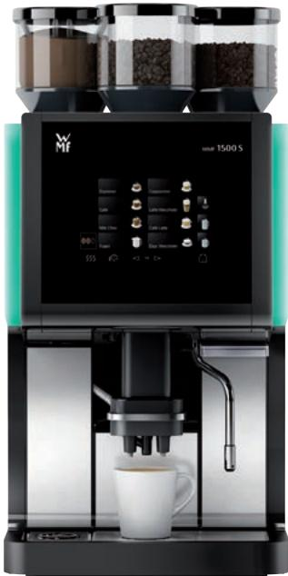

> **AI Description:**
> **Source:** `assets/_page_0_Figure_1.jpg`
> 
> **Generated:** 2026-05-30 20:45:26
> 
> ---
> 
> The image shows a modern coffee machine with a digital control panel. The panel displays various coffee brewing options, including espresso, cappuccino, and latte. The machine has two transparent hopper compartments on top, likely for coffee beans and milk. The model number "1500 S" is visible on the machine. The design is sleek, with a combination of black and metallic finishes, and it appears to be a fully automatic coffee maker.

Coffee machine

1500S

English

01.06.500

## Congratulations on the purchase of your WMF coffee machine.

The WMF 1500 S coffee machine is a fully automatic single cup machine for espresso, café crème, cappuccino, milk coffee, latte macchiato, milk foam and hot water.

With its optionally available powder hopper, the WMF 1500 S can also make hot chocolate with milk or milk foam.

> **AI Description:**
> **Source:** `assets/_page_1_Figure_0.jpg`
> 
> **Generated:** 2026-05-30 20:42:31
> 
> ---
> 
> The image contains a warning symbol with an exclamation mark inside a yellow triangle. This is a standard symbol used to indicate a warning or caution, typically associated with potential hazards or important safety information.

## Follow the User Manual

> Read the User Manual carefully prior to use.

> **AI Description:**
> **Source:** `assets/_page_1_Figure_1.jpg`
> 
> **Generated:** 2026-05-30 20:43:34
> 
> ---
> 
> The image contains a simple icon of an open book with a magnifying glass inside it, which is commonly used to represent information or help. The icon is blue with a white background and is a standard symbol for help or information resources.

> Please refer to the User Manual, paying special attention to the safety instructions and Safety chapter.

> Ensure that the staff and all users have access to the User Manual.

## Hazard to life due to electrical shock

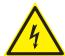

> **AI Description:**
> **Source:** `assets/_page_1_Figure_3.jpg`
> 
> **Generated:** 2026-05-30 20:41:28
> 
> ---
> 
> The image contains a warning symbol. It is a yellow triangle with a black lightning bolt inside, indicating a high voltage hazard. This symbol is commonly used to warn of electrical dangers and to alert individuals to the presence of electrical equipment or circuits that could cause injury or death.

•	 The voltage inside the coffee machine is a hazard to life.

> Never loosen the screws, and do not remove any housing parts.

## Conditions for usage and installation

> Never open the housing.

•	 In the event of failure to comply with maintenance information, no liability is accepted for any resultant damage.

> Follow the User Manual.

## Caution

symbols

Follow the User Manual signs and

page 16

wstarting on page 6

Follow the Safety chapter

## Warning

Follow the Safety chapter

wstarting on page 6

## Im portant

Technical data

wstarting on page 98

Maintenance

wstarting on page 84

Safety 6   
1.1 eneral safety instructions 6   
1.2 I ntended use 12   
1.3 Conditions for usage and installation 13   
2 ntroduction 14   
2.1 arts of the coffee machine 14   
Display. . . . . . . 14   
Glossary . . 17   
3 peration 18   
3.1 peration safety instructions 18   
3.2 Switch on coffee machine 19   
3.3 Milk or milk foam (optional) 19   
3.3.1 Connect up the milk. . . . . . 19   
3.3.2 Milk or milk foam dispensing . . 20   
3.4 Beverage dispensing 21   
Cancel beverage . . . 21   
3.5 P reselection pads (optional) 21   
3.6 Special buttons (optional) 21   
3.7 Hot water dispensing 22   
3.8 Basic Steam (optional) 22   
3.9 Height adjustment of the combi spout 24   
3.10 Bean hopper / powder hopper 24   
3.11 Manual insert (optional) / tablet insert 24   
3.12 G rounds container 25   
3.13 G rounds disposal through the counter (optional) 26   
3.14 Drip tray 26   
3.14.1 Drip tray sensor (optional). . . . 26   
3.15 Switch off the coffee machine 27   
4 Software 28   
4.1 verview 28   
Ready to operate . . 28   
“Ready to operate” display pads. . 28   
Main menu functions. . . . 29   
Menu control pads. . 29   
Messages on the display . . 29   
4.2 R eady to operate 30   
“Ready to operate” display. . . . . 30   
4.2.1 “Ready to operate” display pads. . 30   
Beverage buttons . . . 30   
“Warm rinse” pad . . . . . . 30   
Barista pad - coffee strength . . 30   
4.2.2 SteamJet cup warmer. . . . 31   
4.3 Care 32   
Cleaning programs. . 32   
CleanLock. . 32   
Instructions. . . 33   
Fill milk system (Dynamic Milk). . . . 33   
4.4 Beverages 35   
General information. . . 35   
Cup volume, multiple brewing, and dispensing option . . 36   
Change recipes . . . . 37   
Text and illustration . . . . 40   
4.5 O perating options 41   
Keyboard layout. . 41   
Level switching . . . . 41   
Button allocation . 41   
Rinsing signal. . 42   
Decaf factor. . 42   
Small . . . 43   
Large . . . . 43   
Self-service mode. . . . . . . . . . . . . . . . . . . . . . . . . . . . . . . . . . . . . . . . . . . . . . . . . . . . . . . . . 43   
Barista pad . . . . . . . . . . . . . . . . . . . . . . . . . . . . . . . . . . . . . 43   
“Warm rinse” pad . . 44   
SteamJet pad (optional). . 44   
Manual insert (depending on the model) . 44   
Beverage preselection . . 44   
PostSelection . . 45   
Cancel beverage . 45   
Menu pad . . . . . 45   
Error message. . 45   
4.6 I nformation 46   
Last brewing cycle. . 46   
Timer . . . . 46   
Service. . . 46   
Care. . 46   
Water filter and descaling . . . . . . . . . . . . . . . . . . . . . . . . . . . . . . . . . . . . . . . . . . . . . . . . . . . 46   
Journal . . 46   
User Manual . . . . 46   
4.7 A ccounting 47   
Counter . . . 47   
Vending machines . . 47   
4.8 PI rights 48   
Cleaning PIN . . . . 48   
Settings PIN. . 48   
Accounting PIN. . . 48   
4.9 T imer 49   
Detail view of current day . 49   
Set timer switching times. . 49   
Date / Time . . . . 49   
Timer status. . 49   
Timer overview and setting the timer . . . . 50   
Status of keyboard layout. . 50   
Keyboard layout overview. . 50   
Eco-mode state . . 51   
Eco-mode overview . . 51   
4.10 System 51   
Milk and foam . . 51   
Illumination . . 52   
Switch-off rinsing . . 52   
Display brightness. . 53   
Reduce brightness. . 53. 53   
Touch display calibration .   
Eco-mode. . 53   
Temperature. . 54   
Water filter . . . . . . . . . . 54   
Machine configuration. . . 54   
4.11 Language 55   
4.12 Eco-mode 55   
4.13 USB 56   
Load recipes. . 56   
Load cup symbols . . . 56   
Save recipes . . 56   
Export counters . . 56   
HACCP export. . 5657   
Data backup. .   
Load data. . 57   
Load language . . 57   
Firmware update . . 57   
5 O ther settings 58   
5.1 Set grinding degree 58   
6 Care 59   
6.1 Care safety instructions 59   
6.2 6.3 Cleaning intervals overview Cleaning programs 6162. . . . 62   
6.3.1 System cleaning . .   
6.3.2 Mixer rinsing . . 64   
6.3.3 Milk system rinsing . . 64   
6.3.4 Foamer rinsing. . 65   
6.3.5 Foamer rinsing Dynamic Milk. . 65   
6.3.6 Milk system cleaning overview. . 66   
6.4 Descaling 67   
6.4.1 Descaling coffee machine with water tank. . . . . . 69   
6.4.2 Descaling coffee machine with constant water supply. . 70   
6.5 Manual cleaning 72   
6.5.1 Clean the operating panel (CleanLock). . 72   
6.5.2 Clean the grounds container (grounds chute, optional) . . 73   
6.5.3 Clean the brewing unit . . 73   
6.5.4 Clean the water tank . . 76   
6.5.5 Clean the drip tray. . 76   
6.5.6 Clean the housing . . 77   
6.5.7 Clean milk system manually (Basic Milk / Easy Milk). . . 77   
6.5.8 Clean combi spout manually (Dynamic Milk) . . . 79   
6.5.9 Clean the mixer . . 79   
6.5.10 Clean the bean hopper. . . . 80   
6.5.11 Clean the powder hopper. . . . . . 81   
7 HACCP cleaning schedule 82   
8 Maintenance and descaling 84   
8.1 Maintenance 84   
8.2 WMF Service 85   
9 Messages and instructions 86   
9.1 Messages for operation 86   
9.2 Error messages and malfunctions 87   
9.3 Errors without error message 90   
10 Safety and warranty 93   
10.1 Hazards to the coffee machine 93   
10.2 Directives 95   
10.3 Duties of the owner / operator 96   
10.4 Warranty claims 97   
Appendix: Technical data 98   
Technical data for coffee machine 98   
Appendix: Accessories and spare parts 101   
Index 104

## 1 Safety

> **AI Description:**
> **Source:** `assets/_page_5_Figure_0.jpg`
> 
> **Generated:** 2026-05-30 20:52:55
> 
> ---
> 
> The image contains a warning symbol with an exclamation mark inside a yellow triangle. This is a standard safety symbol used to indicate a warning or caution. The symbol is designed to draw attention to the presence of a hazard or important information that requires the viewer's immediate attention.

## Misuse

•	 Failure to follow the safety instructions can result in death or serious injury.

> Follow all the safety instructions.

## 1.1 General safety instructions

## Hazards to the operator

At WMF, safety is one of the most essential product features. The effectiveness of the safety devices can only be ensured if the following points are observed:

> Read the User Manual carefully prior to use.

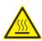

> **AI Description:**
> **Source:** `assets/_page_5_Figure_2.jpg`
> 
> **Generated:** 2026-05-30 20:50:27
> 
> ---
> 
> The image contains a warning symbol with a triangle and a hot water droplet inside, indicating a potential hazard related to hot water or steam. This symbol is commonly used in safety signage to alert individuals to the presence of heat or steam that could cause burns or other injuries.

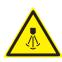

> **AI Description:**
> **Source:** `assets/_page_5_Figure_3.jpg`
> 
> **Generated:** 2026-05-30 20:51:33
> 
> ---
> 
> The image contains a warning symbol with a yellow triangle and a black exclamation mark inside. The symbol is commonly used to indicate a warning or caution. The symbol is accompanied by the word "CRITICAL," which suggests that the image is part of a warning or cautionary message, likely related to a critical situation or issue.

> Do not touch hot machine components.

> Do not use the coffee machine if it is not working properly or if it is damaged.

> Use the coffee machine only when it is completely assembled.

Warning

## Caution

> Built-in safety devices must never be altered.

> This device can be used by children of age 8 or greater while under continuous supervision, as well as by persons with reduced physical, sensory, or mental capabilities or lack of experience or knowledge, once they have been instructed in the safe use of the machine and the risks associated with it.

> Children may not play with the device.

> Cleaning and user maintenance must not be performed by children.

Despite the safety devices, every coffee machine poses potential hazard if incorrectly used. Please observe the following instructions when using the coffee machine so as to prevent injury and health hazards:

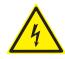

> **AI Description:**
> **Source:** `assets/_page_7_Figure_1.jpg`
> 
> **Generated:** 2026-05-30 20:45:35
> 
> ---
> 
> The image contains a warning symbol, specifically a yellow triangle with a black lightning bolt inside it. This symbol is commonly used to indicate electrical hazards or the presence of electricity. It is a standard safety symbol used in various industries and contexts to alert individuals to the potential danger of electrical shock or other electrical-related risks.

## Hazard to life due to electrical shock

•	 The voltage inside the coffee machine is a hazard to life.

> Never open the housing.

> Never loosen the screws, and do not remove any housing parts.

> Never use a damaged power cord.

> Avoid damage to the power cord. Do not kink or crush it.

## Warning

## A

## Burn hazard / scalding hazard

When dispensing beverages and steam, hot liquid comes out of the spouts. The adjacent surfaces and spouts become hot.

> When dispensing beverages and steam, do not reach beneath the spouts.

> Do not touch the spouts immediately after dispensing.

> Always place a suitable cup under the spout before dispensing beverages.

## Risk of injury

•	 Long hair could become caught in the grinder head and drawn into the coffee machine.

> Always protect hair with a hairnet before removing the bean hopper.

## Caution

## Caution

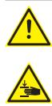

> **AI Description:**
> **Source:** `assets/_page_9_Figure_0.jpg`
> 
> **Generated:** 2026-05-30 20:48:45
> 
> ---
> 
> The image contains two warning symbols. The top symbol is a yellow triangle with an exclamation mark inside, indicating a general warning or caution. The bottom symbol is a yellow triangle with a hand and an exclamation mark, which is commonly used to warn against potential harm to the hand or to indicate a risk of injury. These symbols are typically used in safety instructions or warning signs to alert the viewer to potential hazards or precautions.

## Bruising or crushing hazard / risk of injury

•	 The coffee machine contains moving parts that can cause finger or hand injury.

•	 Closing the operating panel can cause a crushing hazard.

> Always switch off the coffee machine and unplug the mains plug before reaching into the coffee grinder or the opening of the brewing unit.

> Carefully and gently close the operating panel.

> **AI Description:**
> **Source:** `assets/_page_9_Figure_1.jpg`
> 
> **Generated:** 2026-05-30 20:48:32
> 
> ---
> 
> The image contains a warning symbol with an exclamation mark inside a triangle. This is a standard safety symbol used to indicate a potential hazard or critical situation. The symbol is designed to grab attention and convey the importance of taking precautions or being aware of a risk.

## Health hazard

> Only use products that are suitable for consumption and for use with the coffee machine.

> The powder hopper, the bean hopper, and the manual insert may only be filled with materials for the use intended.

## Caution

> **AI Description:**
> **Source:** `assets/_page_10_Figure_0.jpg`
> 
> **Generated:** 2026-05-30 20:53:09
> 
> ---
> 
> The image contains a warning symbol with an exclamation mark inside a triangle. This is a standard symbol used to indicate a warning or caution. The symbol is designed to grab attention and convey the importance of the message it precedes.

## Health hazard

•	 The milk system cleaner and the cleaning tablets are irritants.

> Follow the protective measures on the packaging of the cleaning agent.

> Only put in cleaning tablet after a display message.

## Health hazard /

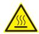

> **AI Description:**
> **Source:** `assets/_page_10_Figure_1.jpg`
> 
> **Generated:** 2026-05-30 20:54:40
> 
> ---
> 
> The image contains a warning symbol with a yellow triangle and a black exclamation mark inside, accompanied by a small icon of a steaming hot object. This symbol is commonly used to indicate a potential hazard, such as a hot surface or a risk of burns. The image serves as a visual warning to alert the viewer to the presence of a heat-related danger.

## irritation and scalding hazard

During cleaning, hot cleaning solution and hot water run out of the combi spout and out of the hot water spout.

•	 The hot liquids can irritate the skin, and the heat poses a burn hazard.

•	 The drip tray may contain hot liquids.

## Caution

> Never reach under the spouts while cleaning.

> Ensure that no one ever drinks the cleaning solution.

> Move the drip tray carefully.

## Caution

> **AI Description:**
> **Source:** `assets/_page_11_Figure_0.jpg`
> 
> **Generated:** 2026-05-30 20:51:08
> 
> ---
> 
> The image contains a yellow triangular warning symbol with an exclamation mark inside it. This is a standard safety symbol used to indicate a warning or caution. It does not contain any text or additional visual elements beyond the symbol itself.

## Slipping hazard

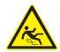

> **AI Description:**
> **Source:** `assets/_page_11_Figure_1.jpg`
> 
> **Generated:** 2026-05-30 20:50:41
> 
> ---
> 
> The image contains a warning symbol with a yellow triangle and a black silhouette of a person falling. This is a standard safety symbol used to indicate a potential hazard or danger. The symbol is designed to alert the viewer to be cautious and to take appropriate safety measures to avoid injury.

Fluids can be discharged from the coffee machine if used improperly or if errors occur. These fluids can cause a slipping hazard.

> Regularly check whether the coffee machine is leaking, and make sure no water is coming out.

Caution

## 1.2 Intended use

## Misuse

•	 If the machine is used other than as intended, this could lead to a risk of injury.

> The coffee machine may be used only as intended.

Warning

The WMF 1500 S is designed to dispense beverages made with coffee and/or milk and/or powder (such as choc or topping) into suitable containers. This device is intended for industrial and commercial use and should be operated by experts or trained users in stores, offices, restaurants, hotels, or similar points of use. It can also be used in a domestic environment. The device can be used as a self-service device if it is supervised by trained personnel.

The use of the device is subject to this User Manual. Any other use or use that goes beyond the aforementioned is considered incorrect use. The manufacturer shall not be liable for any damage resulting from this.

Under no circumstances may the WMF 1500 S be used to dispense and heat liquids other than coffee, hot water (beverages, cleaning) or milk (cooled, pasteurised, homogenised, UHT).

## 1.3 Conditions for usage and installation

> The safe distances indicated in the technical data must be maintained.

Risk of fire and accidents

## Warning

Technical data wpage 99

> The conditions for installation and use must be met.

Any necessary on-site preparatory work for electricity, water and drainage connections at the customer‘s premises is to be arranged by the machine owner / operator. The work must be carried out by authorized installation technicians in compliance with general, country-specific and local regulations. The WMF service engineers may only connect the coffee machine to existing prepared connection points. WMF Service is neither authorised nor responsible for carrying out any on-site installation work prior to connection. The potential equalization terminal is installed by WMF Service if needed.

## 2 Introduction

## 2.1 Parts of the coffee machine

DI\_01\_01\_0Display
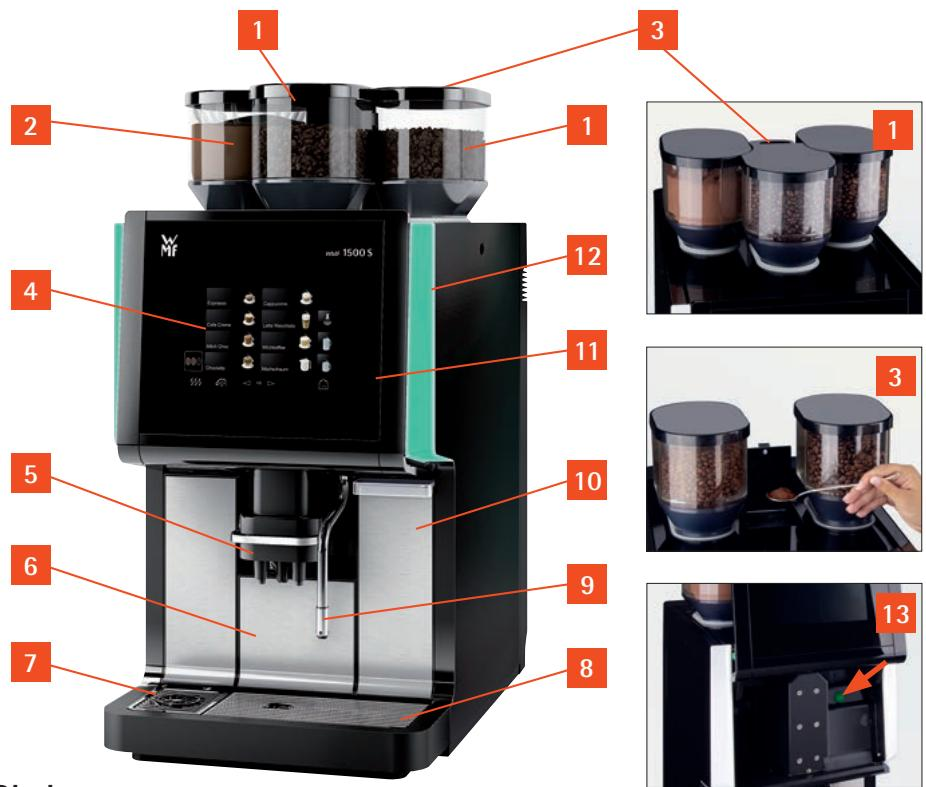

> **AI Description:**
> **Source:** `assets/_page_13_Figure_0.jpg`
> 
> **Generated:** 2026-05-30 20:44:59
> 
> ---
> 
> The image is a technical illustration of a coffee machine, specifically the WMF 1500 S model. It includes a detailed diagram of the machine with numbered labels pointing to various parts. The diagram highlights the coffee bean storage area (1), the coffee bean hopper (2), the control panel (4), the coffee extraction area (5), and the water reservoir (6). The image also includes close-up views of the coffee bean storage area and the water reservoir, providing a clearer view of the components. The labels and annotations are designed to help users understand the different parts and functions of the coffee machine.

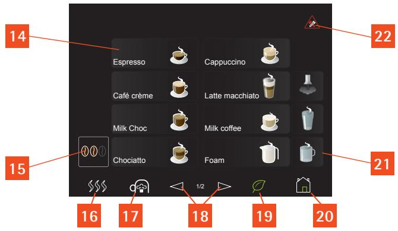

> **AI Description:**
> **Source:** `assets/_page_13_Figure_1.jpg`
> 
> **Generated:** 2026-05-30 20:44:05
> 
> ---
> 
> The image contains a menu interface for a coffee machine, displaying various coffee options such as Espresso, Café crème, Milk Choc, Chociatto, Cappuccino, Latte macchiato, Milk coffee, and Foam. Each option is accompanied by an icon representing the drink. The interface includes numbered buttons and icons at the bottom, likely for selecting different settings or functions, such as steam, milk frother, and a home button. The layout is designed to be user-friendly, with clear visual representations of the coffee types and settings.

1 Bean hopper (up to 2)

2 Powder hopper (Choc or Topping, for example) (optional)

3 Manual insert / tablet insert

Touch display for beverage buttons and settings

Combi spout with integrated milk foamer

Grounds container

SteamJet cup warmer

8 Removable drip tray with drip grid

Hot water spout / steam outlet (optional)

10 Water tank / descaling container (optional)

11 Operating panel

12 Side illumination

13 ON/OFF switch (operating panel open)

“Ready to operate” display

14 Beverage buttons

15 Barista pad

16 “Warm rinse” pad

SteamJet pad

18 Page up and down

19 Eco-mode display

20 Menu pad (opens the main menu)

Beverage pads for hot water and steam

Message pad

## User Manual Signs and Symbols

## Personal injury safety instructions

If the safety instructions are not followed, this could lead to mild to severe injury in case of improper use.

> **AI Description:**
> **Source:** `assets/_page_15_Figure_1.jpg`
> 
> **Generated:** 2026-05-30 20:42:03
> 
> ---
> 
> The image contains a yellow warning triangle with an exclamation mark inside it. This is a standard symbol used to indicate a warning or caution, typically associated with potential hazards or important safety information.

## Personal injury safety instructions

If the safety instructions are not followed, this could lead to mild injury in case of improper use.

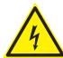

> **AI Description:**
> **Source:** `assets/_page_15_Figure_2.jpg`
> 
> **Generated:** 2026-05-30 20:43:22
> 
> ---
> 
> The image contains a warning symbol, specifically a yellow triangle with a black lightning bolt inside it. This symbol is commonly used to indicate electrical hazards or the presence of electrical equipment. The image does not contain any text or additional visual elements beyond the warning symbol itself.

Electrocution

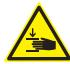

> **AI Description:**
> **Source:** `assets/_page_15_Figure_3.jpg`
> 
> **Generated:** 2026-05-30 20:42:52
> 
> ---
> 
> The image contains a warning symbol with a hand holding a knife, indicating a potential hazard. The symbol is triangular with a yellow background and a black border, which is commonly used to signify danger or caution. The image is a simple graphic with no additional text or data.

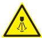

> **AI Description:**
> **Source:** `assets/_page_15_Figure_4.jpg`
> 
> **Generated:** 2026-05-30 20:46:06
> 
> ---
> 
> The image contains a warning symbol with a yellow triangle and a black exclamation mark inside it. Below the triangle, there is a black silhouette of a person lying down, which is typically associated with a critical or hazardous situation. The symbol is commonly used to indicate a critical alert or warning, suggesting that the user should take immediate action or be aware of a dangerous condition.

Hot steam

Bruising or crushing hazard

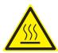

> **AI Description:**
> **Source:** `assets/_page_15_Figure_5.jpg`
> 
> **Generated:** 2026-05-30 20:45:31
> 
> ---
> 
> The image contains a warning symbol with a yellow triangular background and a black border. Inside the triangle, there is a black silhouette of a hand with steam rising from it, indicating a hot surface or heat hazard. The symbol is commonly used to warn of potential burns or heat-related dangers.

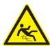

> **AI Description:**
> **Source:** `assets/_page_15_Figure_6.jpg`
> 
> **Generated:** 2026-05-30 20:44:13
> 
> ---
> 
> The image is a warning sign with a yellow triangular background and a black border. Inside the triangle, there is a black silhouette of a person running, with a black exclamation mark above the figure. The sign is designed to warn of a potential hazard related to running or a sudden movement.

Hot surfaces

Slipping hazard

## Notice of property damage

•	 to the coffee machine

•	 for the installation location

## Instructions / Tip

> Always follow the User Manual.

Instructions for safe use and tips for easier operation.

## Call up the main menu

™ Touch the “Main menu” pad

The main menu is displayed.

There are other display options wMain menu.

## Warning

Safety instructions

Follow the Safety chapter

wstarting on page 6

## Caution

Operation safety instructions wpage 18

Care safety instructions

Follow the Safety chapter

wstarting on page 6

## Im portant

Observe the Warranty chapter wstarting on page 97

Technical data

wstarting on page 98

Note

Tip

> **AI Description:**
> **Source:** `assets/_page_15_Figure_9.jpg`
> 
> **Generated:** 2026-05-30 20:50:54
> 
> ---
> 
> The image contains a simple line drawing of a house with a door. The house is represented by a black square with a white outline, and the door is depicted as a green rectangle within the square. There are no charts, graphs, or other visual elements present in the image.

## Glossary

## 3 Operation

## 3.1 Operation safety instructions

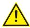

> **AI Description:**
> **Source:** `assets/_page_17_Figure_0.jpg`
> 
> **Generated:** 2026-05-30 20:53:17
> 
> ---
> 
> The image contains a yellow warning triangle with an exclamation mark inside it. This is a standard symbol used to indicate a warning or caution, typically associated with potential hazards or important safety information. The image does not contain any text or additional visual elements beyond the warning symbol.

## Burn hazard / scalding hazard

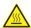

> **AI Description:**
> **Source:** `assets/_page_17_Figure_1.jpg`
> 
> **Generated:** 2026-05-30 20:54:30
> 
> ---
> 
> The image contains a warning symbol with a triangle and a steam icon inside it. The triangle is yellow with a black border, and the steam icon is also black. This symbol is commonly used to indicate a potential hazard related to heat or steam, suggesting that the area or situation depicted could be dangerous due to the presence of hot steam or other heat-related risks.

•	 When dispensing beverages and steam, hot liquid comes out of the spouts. The adjacent surfaces and spouts become hot.

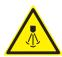

> **AI Description:**
> **Source:** `assets/_page_17_Figure_2.jpg`
> 
> **Generated:** 2026-05-30 20:55:32
> 
> ---
> 
> The image contains a warning symbol. It is a triangular warning sign with a black exclamation mark inside a yellow triangle. This symbol is commonly used to indicate a potential hazard or danger.

> When dispensing beverages and steam, do not reach beneath the spouts.

> Do not touch the spouts immediately after dispensing.

> Always place a suitable cup under the spout before dispensing beverages.

> **AI Description:**
> **Source:** `assets/_page_17_Figure_3.jpg`
> 
> **Generated:** 2026-05-30 20:54:49
> 
> ---
> 
> The image contains a yellow triangular warning symbol with an exclamation mark inside it. This is a standard safety symbol used to indicate a warning or caution. The symbol is designed to grab attention and convey the importance of the message it represents.

## Health hazard

> Only use products that are suitable for consumption and for use with the coffee machine.

> The powder hopper, the bean hopper, and the manual insert may only be filled with materials for the use intended.

## Caution

Follow the Safety chapter

wstarting on page 6

## Caution

Follow the Safety chapter

wstarting on page 6

## 3.2 Switch on coffee machine

™ Slide the operating panel upward

The ON/OFF switch is on the right side, behind the operating panel.

™ Press the ON/OFF switch

Coffee machine switches on and heats up.

An automatic warm rinsing starts.

When the coffee machine is ready to dispense beverages, the “Ready to operate” display appears.

The coffee machine can be switched on and switched off using the timer.

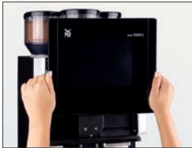

> **AI Description:**
> **Source:** `assets/_page_18_Figure_0.jpg`
> 
> **Generated:** 2026-05-30 20:48:20
> 
> ---
> 
> The image shows a person's hands holding a small object, possibly a coffee pod, over a coffee machine. The coffee machine has a black front panel with a screen and buttons, and a hopper on top. The person appears to be in the process of inserting the coffee pod into the machine. The image is a photograph and includes a visual representation of a coffee-making process.

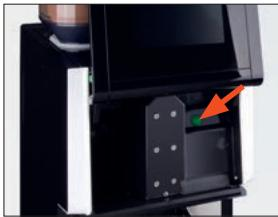

> **AI Description:**
> **Source:** `assets/_page_18_Figure_1.jpg`
> 
> **Generated:** 2026-05-30 20:48:06
> 
> ---
> 
> The image shows a close-up of a coffee machine's lower section, focusing on a compartment that appears to be the coffee pod or filter tray area. There is a red arrow pointing to a specific part of this compartment, likely indicating a feature or area of interest. The surrounding area includes mechanical components and a black frame, suggesting this is part of a larger machine.

PIN access control wPIN rights page 48

## 3.3 Milk or milk foam (optional)

## 3.3.1 Connect up the milk

## Basic Milk

Use a suitable milk nozzle on the combi spout.

•	 green very cold milk (up to $8 ~ ^ { \circ } \mathrm { C } )$

•	 white chilled milk (8 to $1 6 ~ ^ { \circ } \mathrm { C } )$

•	 caramel uncooled milk (above $1 6 ~ ^ { \circ } \mathrm { C } )$

™ Open the milk packaging and place on the left next to the coffee machine

™ Insert the milk hose with the beige milk nozzle into the milk pack

The hose must reach to the floor of the milk package. The hose must not be under tension or bent when adjusting the height of the combi spout.

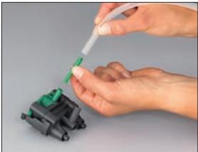

> **AI Description:**
> **Source:** `assets/_page_18_Figure_2.jpg`
> 
> **Generated:** 2026-05-30 20:47:37
> 
> ---
> 
> The image shows a close-up of a person's hands interacting with a small mechanical component, which appears to be a connector or plug. The hands are holding a green tool, possibly a screwdriver or a similar instrument, and are in the process of either inserting or removing a part from the connector. The connector itself is black with a green cap, and the background is plain and neutral, focusing attention on the hands and the connector. The image seems to be instructional, possibly demonstrating a step in a repair or assembly process.

Cooler version

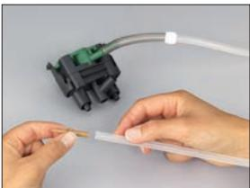

> **AI Description:**
> **Source:** `assets/_page_18_Figure_3.jpg`
> 
> **Generated:** 2026-05-30 20:47:51
> 
> ---
> 
> The image shows a close-up of a person's hands holding a small, thin, cylindrical object, possibly a test strip or a similar item, near a green electronic device with a white cable extending from it. The device appears to be a testing apparatus, possibly for a medical or scientific test, given the context of the object being held. The hands are positioned to suggest the person is about to insert or manipulate the object into the device.

## With WMF milk cooler, WMF Cup&Cool, Easy Milk, Dynamic Milk (optional)

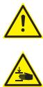

> **AI Description:**
> **Source:** `assets/_page_19_Figure_0.jpg`
> 
> **Generated:** 2026-05-30 20:47:12
> 
> ---
> 
> The image contains two warning symbols. The top symbol is a yellow triangle with an exclamation mark inside, indicating a general warning or caution. The bottom symbol is a yellow triangle with a black silhouette of a person lying on the ground, suggesting a risk of falling or injury. These symbols are commonly used in safety signage to alert viewers to potential hazards.

## Bruising or crushing hazard / risk of injury

•	 Risk of pinching due to rotating gears.

> Do not open the milk pump. The milk pump may be opened only by the Service department.

™ Basic Milk: insert the milk nozzle for cooled milk into the milk connection on the combi spout

™ Remove the milk container out of the cooler

™ Push the milk container lid back

™ Pour milk into the milk container

™ Place the lid back on the container

™ Insert the adapter on the milk hose into the connection in the milk container lid

™ Push the milk container back in carefully

## 3.3.2 Milk or milk foam dispensing

™ Place a cup of the appropriate size beneath the combi spout

™ Touch the beverage button assigned to milk or milk foam

The beverage is dispensed according to the recipe settings (dispensing option, milk foam quality, etc.)

## Caution

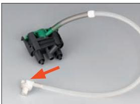

> **AI Description:**
> **Source:** `assets/_page_19_Figure_1.jpg`
> 
> **Generated:** 2026-05-30 20:47:17
> 
> ---
> 
> The image contains a technical illustration of a vehicle part, specifically a connector with a hose attached. The connector appears to be a sensor or actuator interface, likely for a fluid or air system in a vehicle. The hose is connected to the connector, and there is a red arrow pointing to the connector, possibly indicating a point of interest or highlighting a feature. The image is designed to provide a clear view of the part for identification or repair purposes.

Cooler adapter

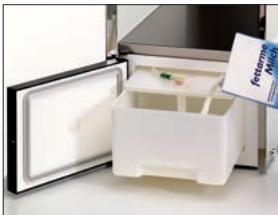

> **AI Description:**
> **Source:** `assets/_page_19_Figure_2.jpg`
> 
> **Generated:** 2026-05-30 20:46:54
> 
> ---
> 
> The image shows a photograph of an open refrigerator or freezer door. Inside, there is a white plastic container with a green object and some small items inside it. The container appears to be designed for storing or transporting items, possibly for medical or laboratory purposes. The text on the container reads "Fettentest-Methode," which translates to "Fat Test Method" in English, suggesting that the container is used for testing fat content in samples. The overall setting implies a controlled environment, likely a laboratory or medical facility.

Milk container

Dispensing option

wCup volume

page 36

Start-Stop or metered

## 3.4 Beverage dispensing

Pressing the beverage buttons triggers dispensing of the beverage selected.

•	 Lit up button = ready to dispense

•	 Unlit button = not ready to dispense / button disabled

™ Place a cup of the appropriate size beneath the combi spout

™ Touch the desired beverage button

## Cancel beverage

™ Touch the desired beverage button again

## 3.5 Preselection pads (optional)

Depending on the model, preselection pads such as the caffeine-free pad may be available on the display. These are preselection pads that define the desiredDI\_0 preselection prior to beverage selection via the beverage buttons.

## 3.6 Special buttons (optional)

Special buttons for beverage sizes S and L are optionally available on the display. These are preselection buttons which establish the desired amount of the beverage before selection of the beverage.

M = amount of the beverage set, no preselection

S = approx. 25 % less than M

L = approx. 25 % more than M

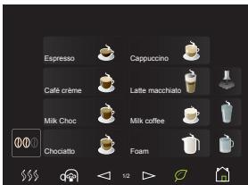

> **AI Description:**
> **Source:** `assets/_page_20_Figure_0.jpg`
> 
> **Generated:** 2026-05-30 20:51:51
> 
> ---
> 
> The image contains a grid of coffee-related icons and text labels. It includes various coffee types such as Espresso, Cappuccino, Café crème, Latte macchiato, Milk Choc, Milk coffee, Chocolato, and Foam. Each icon represents a different coffee preparation method or style, and the layout suggests a menu or selection interface for a coffee machine or similar device.

Button allocation wOperating options page 41

Example: Caffeine-free pad

## 3.7 Hot water dispensing

™ Place a cup of the appropriate size beneath the hot water spout

™ Touch the hot water button

Dispensing occurs according to the dispensing option.

## 3.8 Basic Steam (optional)

## Burn hazard / scalding hazard

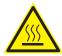

> **AI Description:**
> **Source:** `assets/_page_21_Figure_1.jpg`
> 
> **Generated:** 2026-05-30 20:55:10
> 
> ---
> 
> The image contains a warning symbol with a triangular shape and a steam icon inside it. The symbol is commonly used to indicate a potential hazard, specifically related to heat or steam. This type of symbol is often used in safety instructions or warnings to alert the viewer to take precautions when handling hot or steamy materials.

When dispensing beverages and steam, hot liquid comes out of the spouts. The adjacent surfaces and spouts become hot.

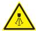

> **AI Description:**
> **Source:** `assets/_page_21_Figure_2.jpg`
> 
> **Generated:** 2026-05-30 20:53:46
> 
> ---
> 
> The image contains a warning symbol with a yellow triangular background and a black exclamation mark inside a circle. The symbol is commonly used to indicate a warning or caution. The symbol is accompanied by the word "CRITICAL," which suggests that the image is part of a warning or alert system, possibly related to a hazardous situation or a critical issue that requires immediate attention.

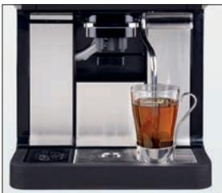

> **AI Description:**
> **Source:** `assets/_page_21_Figure_3.jpg`
> 
> **Generated:** 2026-05-30 20:54:03
> 
> ---
> 
> The image shows a modern coffee machine in action, dispensing a dark liquid, likely coffee or tea, into a clear glass cup. The machine has a sleek, black design with a digital display and control panel on the front. The liquid is being poured from a spout into the cup, which is positioned on the machine's drip tray. The overall scene suggests a moment of brewing or serving a hot beverage.

> When dispensing beverages and steam, do not reach beneath the spouts.

> Do not touch the spouts immediately after dispensing.

> Always place a suitable cup under the spout before dispensing beverages.

™ Press the steam button

Steam is dispensed for as long as the steam button is held.

•	 Steam warms beverages

•	 Steam manually foams milk

Caution

Follow the Safety chapter wstarting on page 6

## Warm beverages

™ Use as tall and slim a Cromargan® jug as possible, with handle

™ Fill jug to no more than half way

A Cromargan® jug, such as WMF order number 03 9090 0030 or 03 9090 0050

™ Immerse steam nozzle deeply into jug

™ Press and hold steam button until desired temperature is reached

™ Release steam button

™ Swing steam outlet over to the drip tray

™ Briefly press the steam button

Residue in the steam outlet tube is rinsed.

™ Wipe the steam outlet with a damp cloth

## Foam milk

> Do not overheat milk when foaming, otherwise milk foam volume decreases.

™ Use as tall and slim a Cromargan® jug as possible, with handle

™ Fill jug to no more than half way

™ Immerse steam nozzle into jug to just under the surface

™ Press and hold steam button whilst rotating jug in a clockwise direction

A thick creamy milk foam results.

™ Release steam button

™ Swing steam outlet over to the drip tray

™ Briefly press the steam button

Residue in the steam outlet tube is rinsed.

™ Wipe the steam outlet with a damp cloth

Tip

## 3.9 Height adjustment of the combi spout

The combi spout is height adjustable.

™ Take hold of the spout on the clip from the front and push to the desired height

Clearance height: 70–175 mm

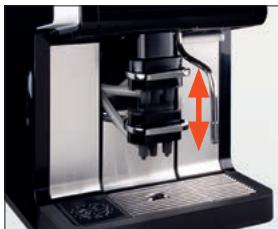

> **AI Description:**
> **Source:** `assets/_page_23_Figure_0.jpg`
> 
> **Generated:** 2026-05-30 20:43:39
> 
> ---
> 
> The image is a technical illustration of a coffee machine, specifically focusing on the area where the coffee extraction takes place. It shows a close-up view of the machine's components, including the portafilter and the group handle. The group handle is depicted with an orange arrow indicating its upward and downward movement, suggesting the mechanism for dispensing coffee. The illustration is designed to demonstrate the functionality of the coffee machine, highlighting the part responsible for the extraction process.

## 3.10 Bean hopper / powder hopper

If possible, refill product hoppers in advance. Fill the hoppers no more than the amount needed for one day, in order to maintain the freshness of the products.

•	 Foreign objects can damage the grinders. This damage is not covered under the warranty.

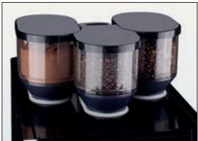

> **AI Description:**
> **Source:** `assets/_page_23_Figure_2.jpg`
> 
> **Generated:** 2026-05-30 20:41:25
> 
> ---
> 
> The image contains a photograph of three cylindrical containers placed on a black surface. The containers appear to be spice or condiment containers, each with a transparent body and a dark-colored lid. The container on the left contains a brown substance, possibly ground coffee or a similar powder. The middle container is filled with dark, round objects, likely coffee beans. The container on the right is filled with a light-colored substance, which could be sugar or another granular ingredient. The containers are arranged in a row, and the image focuses on these items, suggesting they are part of a kitchen or pantry setup.

> Ensure that no foreign objects land in the coffee bean hopper.

Im portant

Observe the Warranty chapter wstarting on page 97

## 3.11 Manual insert (optional) / tablet insert

The manual / tablet insert is located in the center of the coffee machine cover.

Tablet insert is used:

•	 For inserting cleaning tablets

Manual insert is used:

•	 For inserting cleaning tablets

•	 When using additional coffee types, such as decaffeinated coffee

•	 For a coffee trial

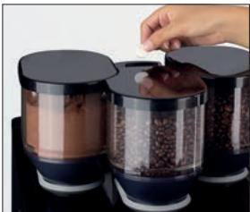

> **AI Description:**
> **Source:** `assets/_page_23_Figure_3.jpg`
> 
> **Generated:** 2026-05-30 20:42:24
> 
> ---
> 
> The image contains a photograph of a coffee bean grinder with three compartments, each filled with different types of coffee beans. A hand is shown in the process of adding coffee beans into the grinder. The grinder has a sleek, modern design with a black lid and transparent body, allowing the viewer to see the contents inside. The image is focused on the coffee grinder and the action of adding beans, which suggests a demonstration of the product's use.

Tablet insert

•	 Add ground coffee or cleaning tablet only after the display message.

•	 Use only ground coffee in the manual insert.

•	 Do not use water-soluble powdered coffee.

•	 Do not use coffee that is ground too finely.

## Preparation of ground coffee

using the manual insert

™ Open manual insert lid

™ Insert ground coffee (max. 16 g)

™ Close manual insert lid

™ Touch the desired beverage button

## 3.12 Grounds container

The grounds container receives the used coffee grounds. It has enough capacity to store coffee grounds from approx. 50 brewing cycles. The display shows a message as soon as the grounds container needs to be emptied. Beverage dispensing is blocked for as long as the grounds container is removed.

™ Push combi spout upward

™ Remove grounds container

™ Empty and replace grounds container

™ Confirm process on the display

•	 Replacing without emptying results in the coffee grounds container being overfilled. The coffee machine will be soiled. This may cause subsequent damage to the machine.

> Always empty the grounds container before replacing.

> If grounds container cannot be replaced, check chute for coffee residue and remove.

## Im portant

Observe the Warranty chapter wstarting on page 97

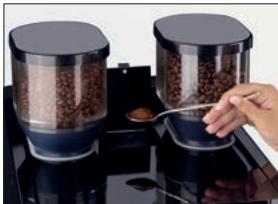

> **AI Description:**
> **Source:** `assets/_page_24_Figure_2.jpg`
> 
> **Generated:** 2026-05-30 20:41:39
> 
> ---
> 
> The image shows a close-up of a kitchen appliance, specifically a coffee grinder. The grinder has two transparent containers on either side, each filled with coffee beans. The top of each container is covered with a black lid. A person's hand is visible, holding a spoon that appears to be scooping or measuring coffee beans from one of the containers. The appliance is placed on a dark, reflective surface, likely a countertop. The image focuses on the coffee grinder and the action of handling the coffee beans.

Manual insert

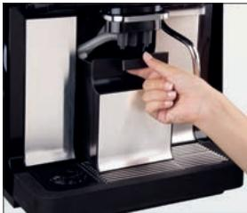

> **AI Description:**
> **Source:** `assets/_page_24_Figure_3.jpg`
> 
> **Generated:** 2026-05-30 20:42:10
> 
> ---
> 
> The image shows a close-up of a person's hand interacting with a coffee machine. The hand is pointing towards a specific part of the machine, which appears to be a portafilter or a similar component used for brewing coffee. The machine itself has a sleek, modern design with a metallic finish and a black base. The hand gesture suggests the person might be demonstrating or explaining a feature of the coffee machine.

Grounds container cleaning wManual cleaning page 73

## Im portant

Observe the Warranty chapter wstarting on page 97

## 3.13 Grounds disposal through the counter (optional)

The coffee machine can be fitted with grounds disposal through the counter. In this case, both the grounds container and the coffee machine base have an opening that passes through the on-site counter on which the machine is placed. The spent coffee grounds are collected in a separate container under the counter.

## 3.14 Drip tray

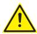

> **AI Description:**
> **Source:** `assets/_page_25_Figure_0.jpg`
> 
> **Generated:** 2026-05-30 20:45:44
> 
> ---
> 
> The image contains a warning symbol, which is a yellow triangle with an exclamation mark inside it. This symbol is commonly used to indicate a warning or caution in various contexts, such as safety instructions or hazard alerts. The symbol itself does not provide specific information about the nature of the warning or the potential danger it is associated with.

## Scalding hazard

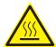

> **AI Description:**
> **Source:** `assets/_page_25_Figure_1.jpg`
> 
> **Generated:** 2026-05-30 20:45:49
> 
> ---
> 
> The image contains a warning symbol with a triangular shape and a steam icon inside it. This symbol is commonly used to indicate a potential hazard, specifically related to heat or steam. The symbol is designed to alert the viewer to be cautious of the heat or steam that may be present in the area or situation depicted.

•	 The drip tray may contain hot liquids.

> Move the drip tray carefully.

> Replace carefully so that no water accidentally drips down.

For coffee machines without a drain connection, the drip tray must be emptied regularly.

™ Remove the drip tray carefully, empty it, and then reinsert the drip tray

## 3.14.1 Drip tray sensor (optional)

On coffee machines with a drain connection the drip tray may also be removed (e.g. for cleaning).

If the machine is equipped with a drip tray sensor, then the coffee machine will indicate on the display when the maximum fill level is reached.

™ After the display message remove the drip tray carefully, empty it, and then reinsert the drip tray

## Important

Clean grounds chute daily wManual cleaning page 73

## Caution

Follow the Safety chapter wstarting on page 6 Clean drip tray daily Care wstarting on page 59

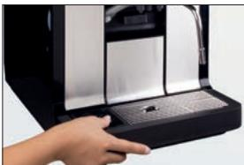

> **AI Description:**
> **Source:** `assets/_page_25_Figure_3.jpg`
> 
> **Generated:** 2026-05-30 20:44:20
> 
> ---
> 
> The image shows a close-up of a coffee machine, specifically focusing on the area where a cup would be placed to collect the coffee. The machine has a sleek, modern design with a metallic finish and a black base. The cup holder is open, and a hand is positioned to place a cup underneath. The image captures the functionality of the coffee machine, highlighting its design and the interaction with the user.

Note

## 3.15 Switch off the coffee machine

> **AI Description:**
> **Source:** `assets/_page_26_Figure_0.jpg`
> 
> **Generated:** 2026-05-30 20:55:24
> 
> ---
> 
> The image contains a yellow triangular warning sign with an exclamation mark inside it. This is a standard symbol used to indicate a warning or caution, typically used in safety-related contexts to alert the viewer to potential hazards or risks.

## Take care to work hygienically

Germs that are hazardous to health can grow in the coffee machine.

> Perform daily cleaning before switching off the coffee machine.

## Follow the manual

•	 If this is not observed, the liability is invalidated in the event of any resultant damage.

™ Slide the operating panel upward

The ON/OFF switch is on the right side, behind the operating panel.

™ Press the ON/OFF switch briefly (approx. 1 second)

Coffee machine switches off.

™ Disconnect mains plug

™ Turn off main water supply tap

## Caution

Follow the Safety chapter wstarting on page 6

Clean the coffee machine as shown in the manual.

Care

wstarting on page 59

## Im portant

Observe the Warranty chapter wstarting on page 97

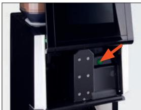

> **AI Description:**
> **Source:** `assets/_page_26_Figure_2.jpg`
> 
> **Generated:** 2026-05-30 20:53:34
> 
> ---
> 
> The image shows a close-up view of a mechanical or electronic device, possibly a printer or a similar piece of equipment. There is a red arrow pointing to a specific part of the device, which appears to be a small green component or label. The surrounding area includes various mechanical parts and a black casing. The image seems to be highlighting a particular feature or part of the device for reference or instructional purposes.

PIN access control wPIN rights page 48

## 4 Software

> **AI Description:**
> **Source:** `assets/_page_27_Figure_0.jpg`
> 
> **Generated:** 2026-05-30 20:51:38
> 
> ---
> 
> The image contains a yellow warning triangle with an exclamation mark inside it. This is a standard symbol used to indicate a warning or caution, typically associated with potential hazards or important safety information.

•	 When adjusting beverages, the same safety instructions apply as for operating the coffee machine.

> Follow all operation safety instructions.

Caution

Operation safety instructions wpage 18

## 4.1 Overview

## Ready to operate

Button layout wOperating options page 41
The pads and buttons on the display are available, depending on the settings and the machine model.

page 30

## “Ready to operate” display pads

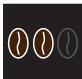

> **AI Description:**
> **Source:** `assets/_page_27_Figure_2.jpg`
> 
> **Generated:** 2026-05-30 20:51:29
> 
> ---
> 
> The image contains three coffee bean icons, each with a different color: dark brown, medium brown, and light brown. The dark brown bean is on the left, the medium brown is in the middle, and the light brown is on the right. This image likely represents different types or roasts of coffee beans, with the color gradient indicating varying levels of roast intensity.

Barista (coffee strength) page 30

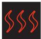

> **AI Description:**
> **Source:** `assets/_page_27_Figure_3.jpg`
> 
> **Generated:** 2026-05-30 20:50:31
> 
> ---
> 
> The image contains a series of four red, wavy lines arranged horizontally. The lines are evenly spaced and appear to be a simple visual representation, possibly indicating a pattern or trend in data. The lines are uniform in color and style, suggesting they are meant to convey a single type of information or measurement.

page 30

Warm rinsing page 30

Caffeine-free pad page 21

> **AI Description:**
> **Source:** `assets/_page_27_Figure_5.jpg`
> 
> **Generated:** 2026-05-30 20:53:12
> 
> ---
> 
> The image contains a simple icon that resembles a chef's hat with a spoon and fork inside it. This icon is commonly used to represent food or dining services.

SteamJet cup warmer page 31

Messages page 86

## Main menu functions

> **AI Description:**
> **Source:** `assets/_page_28_Figure_0.jpg`
> 
> **Generated:** 2026-05-30 20:47:03
> 
> ---
> 
> The image contains a simple diagram of a showerhead with water droplets falling from it. The droplets are depicted as small blue circles, and the showerhead is represented by a white semicircle on a black background. The image is a basic representation of a showerhead and water flow.

> **AI Description:**
> **Source:** `assets/_page_28_Figure_1.jpg`
> 
> **Generated:** 2026-05-30 20:46:41
> 
> ---
> 
> The image contains a simple graphic of a coffee cup with a saucer. The design is minimalistic, featuring a black coffee cup with a white interior and a dark brown saucer. The cup is outlined in white, and the saucer is outlined in black. The image is likely used to represent coffee or a coffee-related theme.

Care page 32
Beverages page 35

Accounting page 47

> **AI Description:**
> **Source:** `assets/_page_28_Figure_3.jpg`
> 
> **Generated:** 2026-05-30 20:47:26
> 
> ---
> 
> The image contains a simple icon of a key with a blue highlight on the top left. The key is a standard symbol used to represent security, access, or encryption. There are no charts, graphs, or other visual elements present in the image.

PIN rights page 48

> **AI Description:**
> **Source:** `assets/_page_28_Figure_4.jpg`
> 
> **Generated:** 2026-05-30 20:48:01
> 
> ---
> 
> The image contains a simple graphic of a speech bubble with four dots inside it. The dots are evenly spaced and appear to represent a loading or progress indicator. The speech bubble is black with a white interior, and the dots are yellow. This type of graphic is commonly used to indicate that a message is being typed or that a response is being generated.

Language page 55

starting on page 32
Eco-mode page 55

> **AI Description:**
> **Source:** `assets/_page_28_Figure_6.jpg`
> 
> **Generated:** 2026-05-30 20:47:55
> 
> ---
> 
> The image contains a simple icon of a hand with a finger pointing upwards. The icon is white with a pink outline, set against a dark background. There are no additional visual elements or text annotations present in the image.

Operating options page 41

Information page 46

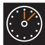

> **AI Description:**
> **Source:** `assets/_page_28_Figure_8.jpg`
> 
> **Generated:** 2026-05-30 20:48:24
> 
> ---
> 
> The image contains a simple icon of a clock with a red hand pointing to the 10 o'clock position. It is a minimalist representation of time, likely used to indicate a time-related concept or to represent a deadline or a specific time in a schedule.

Timer page 49

> **AI Description:**
> **Source:** `assets/_page_28_Figure_9.jpg`
> 
> **Generated:** 2026-05-30 20:48:52
> 
> ---
> 
> The image contains a simple icon of two interlocking gears, one gray and one red. The icon is likely used to represent settings, configuration, or mechanical processes. It is a minimalistic representation and does not contain any text or additional visual elements.

System page 51

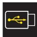

> **AI Description:**
> **Source:** `assets/_page_28_Figure_10.jpg`
> 
> **Generated:** 2026-05-30 20:42:57
> 
> ---
> 
> The image contains a simple icon of a battery with a USB symbol inside it. This icon is commonly used to represent a portable power source that can be charged or connected to a USB port. The icon does not provide specific numerical data or trends but serves as a visual cue for a power source that can be recharged via USB.

USB page 56

## Menu control pads

> **AI Description:**
> **Source:** `assets/_page_28_Figure_11.jpg`
> 
> **Generated:** 2026-05-30 20:43:17
> 
> ---
> 
> The image contains a simple line drawing of a house with a door. The drawing is minimalistic and does not include any additional details or labels. The house is depicted with a rectangular body and a triangular roof, with a small square representing the door. There are no charts, graphs, or other visual elements present in the image.

To the main menu

> **AI Description:**
> **Source:** `assets/_page_28_Figure_12.jpg`
> 
> **Generated:** 2026-05-30 20:42:00
> 
> ---
> 
> The image contains a simple icon with a red arrow pointing to the left inside a black square. The icon is a standard representation of a back or return button, commonly used in user interfaces to indicate a previous or return action. There are no charts, graphs, or other visual elements present in the image.

Confirm value / setting
To previous menu

> **AI Description:**
> **Source:** `assets/_page_28_Figure_14.jpg`
> 
> **Generated:** 2026-05-30 20:44:25
> 
> ---
> 
> The image contains a single icon of a stylized key. The key is white with a blue circle at the top, set against a black background. There are no additional visual elements or text annotations present in the image.

Delete value / setting

PIN entry

Preparation test

Next, Forward, Start

Back

Show help text

> **AI Description:**
> **Source:** `assets/_page_28_Figure_21.jpg`
> 
> **Generated:** 2026-05-30 20:54:08
> 
> ---
> 
> The image contains a simple icon of a keyboard. It is a flat, two-dimensional representation of a computer keyboard, likely used to symbolize input or typing. There are no charts, graphs, or other visual elements present in the image. The icon is monochromatic and does not include any text or additional annotations.

Show keyboard

Save settings

Load settings

## Messages on the display

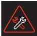

> **AI Description:**
> **Source:** `assets/_page_28_Figure_23.jpg`
> 
> **Generated:** 2026-05-30 20:55:06
> 
> ---
> 
> The image contains a warning symbol with a red triangle and a wrench crossed out by a red line, indicating a critical issue. The symbol is commonly used to signify a problem or error that needs immediate attention.

Error message

> **AI Description:**
> **Source:** `assets/_page_28_Figure_24.jpg`
> 
> **Generated:** 2026-05-30 20:52:30
> 
> ---
> 
> The image contains a simple icon of a hand with a blue outline. The icon is circular and the hand is positioned in the center. There are no additional visual elements or text annotations present in the image.

Care kit

> **AI Description:**
> **Source:** `assets/_page_28_Figure_25.jpg`
> 
> **Generated:** 2026-05-30 20:52:03
> 
> ---
> 
> The image contains a simple icon of a water droplet with a star symbol inside it. The icon is black and white, and the star is located near the bottom right of the droplet. There is no text or additional information provided in the image.

Milk temperature display (optional)

## 4.2 Ready to operate

## “Ready to operate” display

The display is shown when ready to operate depends on the individual settings and options of the coffee machine.

## 4.2.1 “Ready to operate” display padsDS\_0

## Beverage buttons

All beverage buttons that are ready to dispense are illuminated.

Use the arrows to browse to additional pages with beverages.

## “Warm rinse” pad

™ Touch the “warm rinse” pad

A rinse of the pipes with hot water starts. The water warms the brewing system and guarantees an optimum coffee temperature.

Recommended after a longer brewing pause, especially before dispensing a cup of espresso.

## Barista pad - coffee strength

\* Maximum quantity of ground coffee 16 g per brewing cycle

The coffee strength will be altered for the next brewing cycle only.

Button layout wOperating options page 41

> **AI Description:**
> **Source:** `assets/_page_29_Figure_0.jpg`
> 
> **Generated:** 2026-05-30 20:47:41
> 
> ---
> 
> The image contains a simple icon of a cappuccino with a saucer and the word "Cappuccino" written below it. The icon is a small graphic of a coffee cup with a swirl of foam on top, set against a black background. The text is white and clearly legible. There are no charts, graphs, or other visual elements beyond the icon and text.

Example: Cappuccino button

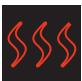

> **AI Description:**
> **Source:** `assets/_page_29_Figure_1.jpg`
> 
> **Generated:** 2026-05-30 20:47:46
> 
> ---
> 
> The image contains a simple line diagram with three red, wavy lines against a black background. The lines are evenly spaced and appear to be of equal length. There are no labels or text annotations present in the image. The diagram could represent a simple data visualization, such as a line graph, but without additional context, the exact meaning is unclear.

“Warm rinse” pad active / inactive   
wOperating options   
page 43

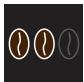

> **AI Description:**
> **Source:** `assets/_page_29_Figure_2.jpg`
> 
> **Generated:** 2026-05-30 20:48:14
> 
> ---
> 
> The image contains a simple line diagram with three circles of varying shades of brown. The circles are arranged horizontally, with the leftmost circle being the darkest, the middle circle a medium shade, and the rightmost circle the lightest. This could represent a visual representation of a gradient or a simple data visualization where the shades might correspond to different levels or categories of a variable.

Barista pad active / inactive wOperating options page 43

## 4.2.2 SteamJet cup warmer

> **AI Description:**
> **Source:** `assets/_page_30_Figure_0.jpg`
> 
> **Generated:** 2026-05-30 20:46:30
> 
> ---
> 
> The image contains a warning symbol with a yellow triangle and an exclamation mark inside it. This is a standard warning symbol used to indicate potential danger or caution. The symbol is designed to grab attention and convey a message of caution or warning to the viewer.

## Burn hazard / scalding hazard

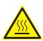

> **AI Description:**
> **Source:** `assets/_page_30_Figure_1.jpg`
> 
> **Generated:** 2026-05-30 20:45:17
> 
> ---
> 
> The image contains a warning symbol with a triangle and a hot water droplet inside, indicating a potential hazard related to heat or hot water. This symbol is commonly used to alert users to the presence of hot surfaces or liquids, suggesting the need for caution.

•	 Hot steam is produced by the SteamJet cup warmer. The cups and adjacent surfaces also get very hot.

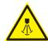

> **AI Description:**
> **Source:** `assets/_page_30_Figure_2.jpg`
> 
> **Generated:** 2026-05-30 20:43:56
> 
> ---
> 
> The image contains a warning symbol with a yellow triangular background and a black exclamation mark inside. Below the symbol, the word "CRITICAL" is displayed in bold, uppercase letters. The image is a standard warning sign used to indicate a critical situation that requires immediate attention.

> Use heat-resistant cups.

> Always place a cup upside-down over the cup warmer before dispensing steam.

> Do not touch the adjacent surfaces immediately after dispensing.

> Do not touch the spouts immediately after dispensing.

> Never use the SteamJet function without the drip grid in place or without the cup warmer insert.

> **AI Description:**
> **Source:** `assets/_page_30_Figure_3.jpg`
> 
> **Generated:** 2026-05-30 20:45:03
> 
> ---
> 
> The image contains a warning symbol with an exclamation mark inside a triangle. This is a standard safety symbol used to indicate a warning or caution. It is not a chart, graph, diagram, photograph, or infographic. The symbol is universally recognized to signify the need for caution or attention to a potentially hazardous situation.

## Health hazard / hygiene

•	 The SteamJet function is intended for warming the drinking vessel and is not intended to be used for cleaning.

> Always use freshly washed drinking vessels when warming cups.

The SteamJet cup warmer can use steam to warm up to 2 cups at the same time.

™ Place a cup on the cup warmer with the opening facing downward

## ™ Touch the pad

Hot steam slowly flows into the cup from below.

The jet of steam stays on for the time set in the settings.

™ Touch the SteamJet button again

The steam jet stops immediately.

## Caution

Follow the Safety chapter

wstarting on page 6

Clean drip tray daily

Care

wstarting on page 59

## Caution

Follow the Safety chapter

wstarting on page 6

> **AI Description:**
> **Source:** `assets/_page_30_Figure_4.jpg`
> 
> **Generated:** 2026-05-30 20:41:42
> 
> ---
> 
> The image contains a simple icon of a chef's hat with a flame or smoke effect. This icon is commonly used to represent cooking, food preparation, or culinary activities. The icon is black with a white outline, making it easily recognizable.

SteamJet pad active / inactive

wOperating options

page 44

## 4.3 Care

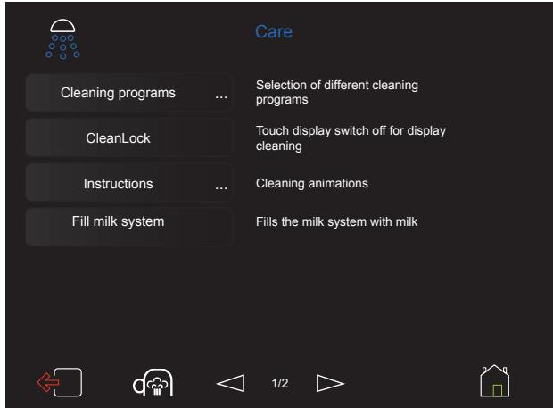

> **AI Description:**
> **Source:** `assets/_page_31_Figure_0.jpg`
> 
> **Generated:** 2026-05-30 20:43:06
> 
> ---
> 
> The image contains a user interface for a device, likely related to a milk dispenser or similar appliance. It displays a menu with options under the "Care" section. The menu includes:
> 
> 1. Cleaning programs: Selection of different cleaning programs.
> 2. CleanLock: Touch display switch off for display cleaning.
> 3. Instructions: Cleaning animations.
> 4. Fill milk system: Fills the milk system with milk.
> 
> The interface is designed with a dark background and white text, and there are icons at the bottom representing navigation and home functions. The layout is clean and functional, aimed at providing easy access to maintenance and operational functions for the user.

> **AI Description:**
> **Source:** `assets/_page_31_Figure_1.jpg`
> 
> **Generated:** 2026-05-30 20:43:14
> 
> ---
> 
> The image contains two distinct visual elements. On the left, there is a simple line drawing of a house with a door and a window. On the right, there is a representation of raindrops falling from the sky, depicted as blue circles against a dark background. The transition between the two images is marked by a red arrow, suggesting a change or transformation from the house to the rain.

Menu control pads   
wOverview   
page 29   
Care chapter   
wstarting on page 59   
HACCP cleaning schedule   
wstarting on page 82

## Cleaning programs

System cleaning With switch off or without switch off of the coffee machine after system cleaning.

•	 Mixer rinsing

•	 Milk system cleaning

•	 Foamer rinsing

## CleanLock

## ™ Touch CleanLock

A 15-second countdown starts.

The touch display can now be cleaned.

The touch display is activated again 15 seconds after the last time it was touched.

## Cleaning programs

Care chapter wstarting on page 59

## Instructions

Animated instructions about the available cleaning programs and for installing and removing the mixer and combi spout for cleaning.

## Fill milk system (Dynamic Milk)

This function fills the milk system and rinses the system for dispensing cold beverages.

## ™ Touch Fill milk system

The milk system is filled, or rinsed prior to dispensing a cold beverage.

## Filter change

If the filter capacity is exceeded, there will be a message once per day that a filter change is due. The filter must be changed within one week; otherwise, the message will be displayed after every brewing cycle.

™ Change filter

™ Confirm filter change

After filter change there is an automatic program sequence to rinse and bleed the anti-scale filter and water system. Hot water runs out of the hot water spout during this process.

Instructions

Fill milk system

Filter change

Observe water filter instructions. Displays lead step by step through the program. Follow the instructions.

## Brewer change

Available only if authorization has been issued to trained personnel by WMF Service.

## Care kit

After each 15,000 dispensed coffees, a message is sent once per day that installation of the care kit is overdue. This must be carried out within one week, otherwise the message is displayed after every brewing cycle. ™ Install the care kit according to its instructions

## Descaling

The water hardness, the water flow, and whether a water filter is used determine the schedule for descaling. This point in time is calculated by the WMF 1500 S and displayed.

## Brewer change

## Care kit

Instructions   
wCare kit instructions   
Observe the Warranty chapter   
wstarting on page 97   
Care kit   
Accessories and spare parts   
wstarting on page 101

## Descaling

Descaling chapter wstarting on page 67

## 4.4 Beverages

## General information

> **AI Description:**
> **Source:** `assets/_page_34_Figure_0.jpg`
> 
> **Generated:** 2026-05-30 20:54:55
> 
> ---
> 
> The image contains a simple diagram with two distinct sections. On the left, there is a white outline of a house with a green door. On the right, there is a white outline of a cup of coffee on a saucer. An orange arrow points from the house to the coffee, suggesting a connection or transition between the two elements. The image does not contain any text or additional labels.

## Dispensing test

For many beverage settings, it is possible to startDS\_03 a dispensing test with the new settings before the recipe is saved.

™ Modify the settings as desired

™ Touch the “Dispensing test” pad

The beverage is dispensed using the newly changed values.

Example: Cappuccino button

™ If the beverage is as desired, touch the Save symbol The recipe is saved.

## Save recipes

The modified recipe is saved here.

## Load recipes

wLoad recipes, page 42

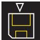

> **AI Description:**
> **Source:** `assets/_page_34_Figure_3.jpg`
> 
> **Generated:** 2026-05-30 20:53:21
> 
> ---
> 
> The image contains a simple diagram of a rectangular shape with a smaller triangle pointing upwards at the top. The triangle appears to be a representation of a flag or indicator, and the rectangle could symbolize a building or a container. There are no labels or text annotations within the image, and the diagram is minimalistic, focusing on the geometric shapes and their relative positions.

## Cup volume, multiple brewing, and dispensing option

## Cup volume

Set the desired cup volume. The recipe is adjusted accordingly.

100 % indicates the previously saved value.

## Cup volume S-M-L

The recipes for the sizes S and L are generated.

M is as set.

Default value:

S= 25 % less than the setting.

L = 25 % more than the setting.

The S-M-L function can be activated in the operating options. The cup volume can also be set to a different general level for all beverages using the operating options.

For individual beverages that deviate from the standard, the S-M-L amounts can be changed under Cup volume.

Each size can also be individually set to active or inactive. Inactive means that the size no longer appears as a selection for the individual beverage.

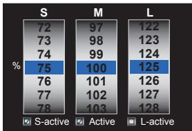

> **AI Description:**
> **Source:** `assets/_page_35_Figure_0.jpg`
> 
> **Generated:** 2026-05-30 20:52:18
> 
> ---
> 
> The image is a chart displaying percentage values across three categories: S-active, Active, and L-active. The chart is organized into three columns, each representing a different size (S, M, L). The percentages are listed vertically, with the largest percentage in the center column (Active) for each size. The percentages range from 72 to 128. The chart highlights the percentage values for each size category, with the largest value being 125 for the L-active category in the L column.

10Change S-M-L for individual beverages wCup volume

> **AI Description:**
> **Source:** `assets/_page_35_Figure_1.jpg`
> 
> **Generated:** 2026-05-30 20:52:12
> 
> ---
> 
> The image contains a simple line drawing of a coffee cup with a saucer. The cup is depicted with a handle on the right side and a small steam or smoke line extending from the top right corner of the cup, indicating that the coffee is hot. The drawing is minimalistic and uses only black and white lines on a dark background. There are no labels or text annotations within the image.

Activate S-M-L and make a change   
for all beverages   
wOperating options   
wS-M-L   
page 43

## Multiple brewing cycles

The beverage is brewed several times, as set. Up to 12 times the set amount can be dispensed with one push of a button. Available for beverages with coffee and with milk mixtures, as well as for hot water with the “metered” dispensing option.

## Dispensing option

## •	 Start-Stop

The dispensing runs until the set amount is reached. The dispensing can be stopped sooner by pressing the button again.

## •	 Metered

The set volume is dispensed. The dispensing option is available for milk, foam, and for hot water.

## •	 Freeflow

The beverage or steam is output for as long as the button is pressed and held.

## •	 Start-Stop-Freeflow

A brief press of a button starts start-stop dispensing.

A longer press of the button, for more than 1 second, starts freeflow dispensing.

## Change recipes

> **AI Description:**
> **Source:** `assets/_page_36_Figure_0.jpg`
> 
> **Generated:** 2026-05-30 20:42:46
> 
> ---
> 
> The image contains a user interface for beverage settings, specifically for a cappuccino. It displays the current recipe composition, which includes foam (165 ml) and espresso (9 g, 35 ml). The sequence of preparation is outlined, with options for storage and factory settings, including coffee, milk, chocolate, interval, espresso, foam, and hot water. The interface also includes icons for navigation and additional settings. The layout is designed for adjusting the recipe and preparing beverages.

> **AI Description:**
> **Source:** `assets/_page_36_Figure_1.jpg`
> 
> **Generated:** 2026-05-30 20:43:26
> 
> ---
> 
> The image contains a simple icon of a chef's hat, which is a common symbol used in culinary contexts to represent cooking, food, or a chef. The icon is a white outline against a black background, and there are no additional visual elements or text present.

Menu control pads wOverview page 29

## Current recipe composition

The additions in the recipe are displayed here. The sequence of preparation is from left to right. Additions that are above or below each other are processed at the same time.

The software indicates whether desired options are not technically possible.

## Storage factory additions

The additions that can be used for the recipe are shown here.

™ Touch the desired addition and slide it into the current recipe composition

## Delete addition

Delete a marked addition from the current recipe composition.

## Change addition

™ Mark the addition and touch the symbol “Change addition”

## The Change addition menu opens.

The various options for the selected addition are displayed.

The saved and current data are displayed.

The current values

The values saved by Service

The factory values

## Ground coffee quantity

Enter in grams (g)

Water volume / Milk volume

Enter in milliliters (ml)

> **AI Description:**
> **Source:** `assets/_page_37_Figure_4.jpg`
> 
> **Generated:** 2026-05-30 20:41:13
> 
> ---
> 
> The image contains a simple diagram of a door with five vertical bars and a blue horizontal bar at the bottom. The blue bar appears to be a handle or a pull mechanism for the door. There are no additional labels or text annotations present in the image.

> **AI Description:**
> **Source:** `assets/_page_37_Figure_5.jpg`
> 
> **Generated:** 2026-05-30 20:42:19
> 
> ---
> 
> The image contains a simple icon of a measuring spoon with a scoop of what appears to be a granular substance, possibly sugar or salt. The icon is likely used to represent a measurement or a quantity of a substance in a recipe or cooking context.

> **AI Description:**
> **Source:** `assets/_page_37_Figure_6.jpg`
> 
> **Generated:** 2026-05-30 20:43:44
> 
> ---
> 
> The image contains a simple icon of a coffee cup with steam rising from it. The icon is black with a white outline, and the coffee inside the cup is depicted in a light brown color. There are no charts, graphs, or other visual elements present. The icon is likely used to represent a coffee-related concept or to indicate a coffee break.

## Dynamic Milk foam quality levels

Coffee machines with Dynamic Milk can use different

milk foam quality levels for each beverages.

It is possible to combine several milk foam quality

levels in one beverage.

Firm Firm milk foam. Recommended for cappuccinos with a brown edge and for beverages where the appearance of the milk foam is important, along with balanced milk flavor.

Soft Very fine milk foam. Recommended for cappuccinos with balanced and very distinct milk flavor. Optimal blending of coffee and milk.

Creamy Milk foam with a shiny surface. Recommended for milk beverages with balanced milk flavor and a good blend of coffee and milk.

Fluffy Fluffy, light milk foam with a somewhat coarser bubble structure and balanced milk flavor.

## Coffee quality

The quality levels influence the coffee brewing. The higher the quality level, the more intensive the release of the flavour and aromatic substances in the coffee.

> **AI Description:**
> **Source:** `assets/_page_38_Figure_0.jpg`
> 
> **Generated:** 2026-05-30 20:49:10
> 
> ---
> 
> The image contains a simple line diagram. It features three curved lines that start from the bottom left and ascend to the top right, with an arrow at the top right corner. The lines appear to represent some form of progression or growth, possibly indicating a trend or process in a data visualization.

## Quality levels

1 After pressing, space is provided for the ground coffee to swell.

2 After pressing, the coffee is brewed immediately.

3 After pressing, a pre-infusion occurs.

4 After pressing and a pre-infusion, wet pressing occurs.

5 Same as for Quality 4, but with stronger wet pressing.

6 Same as for Quality 5, but with stronger and longer wet pressing.

If very finely ground coffee is used with a small amount of brewing water, a high quality level can cause a brewing water flow error.

7 Same as for Quality 6, but with stronger and longer wet pressing.

## Instructions:

## Text and illustration

Menu control pads wOverview page 29

## Text and illustration

The beverage name and photo of a beverage button are adjusted here.

Activate the keyboard by touching the keyboard pad.

## Comments

A note about the beverage can be saved here.

## 4.5 Operating options

For self-service mode, a few functions can be switched to be inactive.

> **AI Description:**
> **Source:** `assets/_page_40_Figure_0.jpg`
> 
> **Generated:** 2026-05-30 20:41:49
> 
> ---
> 
> The image contains two distinct visual elements. On the left, there is a simple line drawing of a house with a door highlighted in green. On the right, there is a hand icon with a finger pointing towards the door of the house. The image appears to be a conceptual or instructional illustration, possibly related to home security or access control systems. The transition from the house to the hand pointing suggests an interaction or action, such as opening or securing the door.

The functions and their pads are not displayed in the inactive state.

## Button layout

Various standard button layouts are saved here can be selected.

## Level switching

Options:

•	 active

•	 inactive

Default value:

active

active Beverage selection available at several different levels (browse pages).

## Button allocation

## Text and illustration

wpage 40

## Change buttons

The positions of two beverage buttons are

swapped here.

™ Touch a beverage button

™ Touch the “Change buttons” pad

™ Touch the beverage button that is to be swapped

™ Confirm the swap

Button layout

## Button allocation

> **AI Description:**
> **Source:** `assets/_page_40_Figure_4.jpg`
> 
> **Generated:** 2026-05-30 20:46:01
> 
> ---
> 
> The image contains a simple diagram with two rectangular boxes, each containing a coffee cup icon. There are two green arrows, one pointing from the left box to the right box and the other from the right box to the left box, indicating a circular or reciprocal process. The diagram suggests a cycle or interaction between two entities, possibly representing a service or system where the coffee cups could symbolize a product or service being exchanged or processed.

## Load recipes

A saved recipe is loaded to a beverage button here.

™ Touch a beverage button

™ Touch the “Load recipes” pad

A submenu opens.

™ Mark the desired recipe

™ Touch the “Save recipes” pad

The beverage button is assigned to the newly selected recipe.

## Rinsing signal

Options:

•	 active

•	 inactive

Default value:

active

active A signal sounds before automatic rinsing.

## Decaf factor

The value for the Decaf factor is entered here. Ground coffee quantity for Decaf (decaffeinated coffee) is set by percentage for the ground coffee quantity set in the recipe.

This setting applies to all coffee beverages with preselected “Decaf”.

Options:

•	 active

•	 inactive

Default value:

回 inactive

## Decaf factor

For a Decaf factor of 15 %, Café Crème is brewed with 15 % more ground coffee, for example, when prepared using the Decaf function.

## Small

Standard modification factor for beverage sizes for S-recipes that are newly activated.

## Large

Standard modification factor for beverage sizes for L-recipes that are newly activated. Default value: 125 %

## Self-service mode

Options:

•	 active

•	 inactive

Default value:

inactive

SB mode active means that the following settings are set at the same time.

•	 Level switching: inactive

•	 Barista pad: inactive

•	 “Warm rinse” pad: inactive

•	 SteamJet: inactive

•	 Manual insert: inactive

•	 Beverage preselection: inactive

•	 Cancel beverage: inactive

•	 Menu pad: delayed

•	 Error message: symbol

## Barista pad

Options:

•	 active

•	 inactive

Default value:

active

active The pad is displayed when ready for operation.

## “Warm rinse” pad

Options:

•	 active

•	 inactive

Default value:

active

active The pad is displayed when ready for operation.

## SteamJet pad (optional)

Options:

•	 active

•	 inactive

Default value:

active

active The pad is displayed when ready for operation.

## Manual insert (depending on the model)

Options:

•	 active

•	 inactive

Default value:

active

active The pad is displayed when ready for operation.

## Beverage preselection

•	 active

•	 inactive

Default value: inactive

active Previously selected beverages are dispensed without an additional button press.

## PostSelection

Options: •	 active •	 inactive

Default value: inactive

active The type of coffee and the amount of the beverage are requested after the beverage has been selected. The names of the types of coffee and the sizes can be modified. (Type of coffee and S-M-L).

## Cancel beverage

Options: •	 active •	 inactive

Default value: active

active Beverage dispensing can be interrupted by pressing the beverage button again.

## Menu pad

Options: •	 immediate •	 delayed

Default value: immediate

immediate The menu pad reacts immediately when the pad is touched.

## Error message

Options: •	 Text •	 Symbol

Default value: Text

Text The errors are shown on the display as a text message.

## 4.6 Information

The info menu has the following selection options, as described below.

## Last brewing cycle

Information about the last brewing cycle.

## Timer

The weekly overview of the timer opens. All switch-on and switch-off times are displayed in this overview.DS\_03\_07\_0

## Service

Contact data for WMF Service.   
Serial number of the coffee machine.

## Care

The last cleaning and care actions that run via coffee machine programs are displayed here.

## Water filter and descaling

Information on the remaining capacity of the water filter and the time of the next decalcificationD

## Journal

Records of events and faults during operation and cleaning of the coffee machine.

## User Manual

The User Manual can be displayed here, or exported via the USB connection.

> **AI Description:**
> **Source:** `assets/_page_45_Figure_0.jpg`
> 
> **Generated:** 2026-05-30 20:53:06
> 
> ---
> 
> The image is a flowchart with a series of text boxes connected by arrows. The flowchart starts with a house icon and proceeds through the following steps: "Last brewing cycle," "Timer," "Service," "Care," "Filter/descaling," "Journal," and finally "User Manual." Each step is represented by a black box with white text, and the arrows indicate the sequence of actions. The flowchart visually represents a process or sequence of steps related to a coffee machine or similar device.

## 4.7 Accounting

## Counter

The counters for the individual dispensed beverages and the totals of the beverages are displayed here. A record can be read out via the USB output.

Counter

## Standard setting

Counter 1 = day counter

Counter 2 = week counter

Counter 3 = month counter

Counter 4 = year counter

Each counter can be reset to zero.

Tip

## Vending machines

See Vending machines User Manual.

## 4.8 PIN rights

One PIN can be assigned for each of the areas listed below.

> **AI Description:**
> **Source:** `assets/_page_47_Figure_0.jpg`
> 
> **Generated:** 2026-05-30 20:41:55
> 
> ---
> 
> The image contains two distinct visual elements. On the left, there is a simple line drawing of a house with a door highlighted in green. On the right, there is a line drawing of a key. The transition between the two images is indicated by a rightward arrow, suggesting a progression or relationship between the house and the key. The image does not contain any text or additional annotations.

•	 Cleaning

•	 Settings

•	 Accounting

The PINs are hierarchical.

This means, for example: the settings PIN

simultaneously grants all rights for the cleaning PIN, but not the rights for the accounting PIN.

If no PIN is assigned, then the area is accessible without a PIN.

If a PIN has been assigned for a particular level, no access will be granted without a PIN.

## Cleaning PIN

On entering the valid PIN, access to:

Cleaning

•	 Care

## Settings PIN

On entering the valid PIN, access to:

Settings

•	 Care

•	 Timer

•	 Beverages

•	 System

•	 Operating options

•	 Language

•	 Accounting (without “delete”)

•	 USB

## Accounting PIN

On entering the valid PIN, access to:

Accounting

•	 Care

•	 PIN .

•	 Beverages

•	 Timer

•	 Operating options

•	 System

•	 Accounting (with “delete”)

•	 Language

•	 USB

## 4.9 Timer

> **AI Description:**
> **Source:** `assets/_page_48_Figure_0.jpg`
> 
> **Generated:** 2026-05-30 20:49:02
> 
> ---
> 
> The image contains two distinct visual elements. The first is a simple line drawing of a house with a door, represented in black and white. The second is a clock face with a red arrow pointing to a specific time. The clock is also in black and white, with the hands indicating a time. The transition between the two elements is marked by a red arrow, suggesting a progression or change from the house to the clock.

## Detail view of current day

Switching between daily and weekly overview.   
The daily overview shows data for the current day.

## Set timer switching times

•	 Select individual day or days.

> **AI Description:**
> **Source:** `assets/_page_48_Figure_2.jpg`
> 
> **Generated:** 2026-05-30 20:48:36
> 
> ---
> 
> The image contains a simple icon of a clock with a single hand pointing to the top right, indicating a time of approximately 10:10. The icon is black with a white background. There are no additional visual elements or text annotations present.

•	 Set switch-on time and switch-off time.

The times are set for all selected days.

After confirmation, a weekly overview is displayed with the switch time settings. The individual times can be modified in this weekly overview, as desired.

## Date / Time

The current time of day and the date are set here.DS\_04\_11

Time / date

## Timer state

Information about the timer state.

Timer state

Options:

•	 active

•	 inactive

Default value:

回 inactive

active The timer switching times are active.

inactive The timer switching times are not carried out.

## Timer overview and setting the timer

Overview of all switch-on and switch-off times Switching times are shown in different colors and are described in the legend.

> **AI Description:**
> **Source:** `assets/_page_49_Figure_0.jpg`
> 
> **Generated:** 2026-05-30 20:49:50
> 
> ---
> 
> The image is a visual representation of a weekly timer schedule, specifically an "Eco-mode overview." It uses a grid layout to display the time of day on the y-axis and the days of the week on the x-axis. The grid is divided into two types of blocks: green blocks representing the "Timer" and blue blocks representing the "Button layout." The "Eco-mode" is indicated by the green blocks. The schedule shows consistent usage of the timer from 07:00 to 15:00 across most days, with some variations on Thursday and Friday. The layout is designed to show the daily usage patterns and the eco-friendly aspect of the timer.

## Button layout state

Options:

•	 active

•	 inactive

Default value:

inactive

## Button layout state

active Button layouts can be assigned automatically via the timer.

For example, self-service from 21:00 to 06:00.

## Button layout overview

The weekly overview of all switching times for the button layout is displayed.   
wTimer overview illustration.   
The settings can be modified directly in the overview.

## Button layout overview

The minimum time for displaying a button layout is 30 minutes.

## Eco-mode state

Options:

•	 active

•	 inactive

Eco-mode state

Default value: inactive

active The Eco-mode state can be activated by means of the timer.

## Eco-mode overview

The weekly overview of all switching times for the Eco-mode is displayed.   
wTimer overview illustration.   
The settings can be modified directly in the overview.

## 4.10 System

## Milk and foam

The central generic values for milk and milk foam are set here. These values apply to all existing recipes. If special values for milk and milk foam are set in the recipes, they retain their validity and are not modified.

> **AI Description:**
> **Source:** `assets/_page_50_Figure_1.jpg`
> 
> **Generated:** 2026-05-30 20:53:29
> 
> ---
> 
> The image contains a simple diagram with two main components. The first part shows a house icon with a door, suggesting a home or building. An arrow points from the house to a second icon featuring two interlocking gears, indicating a process or transformation. Below the gears, the text "Milk and foam" is displayed, which likely represents the output or result of the process depicted by the gears. The overall image appears to illustrate a conceptual flow from a home to a process involving gears, possibly symbolizing a mechanical or industrial transformation, with the final product being milk and foam.

Options: very little, little, middle, much, very much. Default value: little

## Hot foam proportion

Eco-mode overview

## Illumination

The desired lighting color is set via the triangle in the color circle. The color can also be defined and set by means of RGB values. There are also the following options:

•	 Change color slowly

•	 Change color normally

•	 Change color quickly

. OFF

The current setting is displayed immediately.

## Illumination when ready to operate

•	 Standard color side

## Event display (message)

Illumination

Options:

•	 active

•	 inactive

> **AI Description:**
> **Source:** `assets/_page_51_Figure_0.jpg`
> 
> **Generated:** 2026-05-30 20:50:23
> 
> ---
> 
> The image shows a hand interacting with a touchscreen interface. The screen displays a color wheel with a highlighted color, suggesting a color selection process. Below the color wheel, there are several icons and text labels, indicating different settings or options. The interface appears to be part of a software application, possibly for adjusting color settings or configuring a device. The overall design is modern and user-friendly, with a focus on intuitive interaction.

Default value:

For example, Beans empty message.

回 inactive

active The illumination during a message can be adjusted.

## Illumination for messages (event)

•	 Event color side

## Switch-off rinsing

Options:

•	 active

•	 inactive

Default value:

active

active When the coffee machine is switched off, an automatic shutdown rinsing is started.

## Display brightness

The brightness of the display is adjusted here.

## Reduce brightness

Options:

•	 active

•	 inactive

Default value:

active

active If reduced brightness is set to “active”, then the display brightness is reduced automatically 5 minutes after the last beverage is dispensed. If the display brightness has been dimmed, the display returns to the selected brightness level when it is first touched. The second time a beverage button is touched, the corresponding beverage is dispensed.D

## Touch display calibration

Recalibrate the touch display.

## Eco-mode

For Eco-Mode description see Chapter 4.12

Eco-mode

Options:

•	 active

•	 inactive

Default value:

inactive

The Eco-mode can be activated here.

Display brightness

Reduce brightness

Touch calibration

Eco-mode

## Temperature

## Boiler

The boiler water temperature is set here. (coffee brewing water temperature)

## Water filter

Options:

•	 active

•	 inactive

Default value:

inactive

active Water filter is fitted. Capacity and water hardness are queried.

## Filter capacity (water filter)

If the water filter is active, the filter capacity in litres is entered here.

Measured carbonate hardness

Enter the measured water hardness in °dKH here.

Measured total hardness

## Machine configuration

For Service only.

Temperature

Water filter

## Note

If the water hardness is between 0 and 4 °dKH, no water filter is needed.

Water filter capacity wpage 46

Machine options

## 4.11 Language

The language used in the display is set here.   
The available languages are displayed in English.

> **AI Description:**
> **Source:** `assets/_page_54_Figure_0.jpg`
> 
> **Generated:** 2026-05-30 20:44:10
> 
> ---
> 
> The image contains two distinct visual elements. On the left, there is a simple line drawing of a house with a door, represented in black and white. On the right, there is a white speech bubble with four green dots inside it, indicating a thought or idea. The image appears to be a conceptual or symbolic representation, possibly illustrating the idea of a house generating or having an idea.

## 4.12 Eco-mode

If Eco-mode is set to “active,” the steam boiler temperature is reduced 10 minutes after the last beverage is dispensed.

> **AI Description:**
> **Source:** `assets/_page_54_Figure_1.jpg`
> 
> **Generated:** 2026-05-30 20:44:31
> 
> ---
> 
> The image contains two distinct visual elements. On the left, there is a simple line drawing of a house with a door. On the right, there is a green leaf. The arrow between the house and the leaf suggests a transition or transformation from the house to the leaf. This could symbolize a change from a built environment to nature or a shift from a home to a natural setting.

The optional side illumination is switched off.   
The beverage buttons remain lit.

If a beverage with milk content is to be dispensed when the temperature is reduced, the coffee machine needs approx. 15 seconds to heat up.

Beverage dispensing starts after the machine has heated up.

## Eco-mode

(On / Off / Timer)

Standard: OFF

Eco-Mode can be directly activated or deactivated here, or the timer control can be activated.

## Switch off

(never / after 30 min./60 min./90 min./120 min./ 150 min./180 min.)

Standard: never

The time after the last beverage is dispensed is adjusted here. If this time is exceeded, the coffee machine automatically shuts off.

It can be set in increments of 30 minutes.

Eco-mode can be activate for a limited time using the timer.

## 4.13 USB

Data exchange is possible via the USB connection. As long as the USB stick is inserted, the functions will be active.

The USB connection is at the top left on the back side of the operating panel, behind a cover.

The cover must always be closed and latched when the coffee machine is in operation.

## Load recipes

Saved recipes are loaded here.

Load cup symbols

Save recipes

Export recipes to USB.

## Export counters

Counters are exported to a CSV file here.

## HACCP export

The cleaning cycles performed are recorded and are exported here as evidence for HACCP.

> **AI Description:**
> **Source:** `assets/_page_55_Figure_0.jpg`
> 
> **Generated:** 2026-05-30 20:42:15
> 
> ---
> 
> The image contains two distinct visual elements. On the left, there is a simple line drawing of a house with a door and a window. On the right, there is a diagram of a USB port with a cable inserted into it. The transition between the two images is indicated by an arrow, suggesting a sequence or transformation from the house to the USB port. The image appears to be a conceptual or metaphorical representation, possibly illustrating a shift from a physical structure to a digital or technological connection.

> **AI Description:**
> **Source:** `assets/_page_55_Figure_1.jpg`
> 
> **Generated:** 2026-05-30 20:41:33
> 
> ---
> 
> The image is a technical illustration showing a close-up view of a mechanical component, likely part of an electronic device. The focus is on a small, cylindrical object with a label that appears to be a USB flash drive. An orange arrow points to the USB drive, indicating its position within the device. The surrounding area includes part of the device's casing and internal structure, suggesting this is a guide for installation or maintenance.

> **AI Description:**
> **Source:** `assets/_page_55_Figure_2.jpg`
> 
> **Generated:** 2026-05-30 20:42:34
> 
> ---
> 
> The image contains a button labeled "Load recipes" with a red downward arrow pointing to it. The button is black with white text, and the arrow is red with a white outline, indicating a direction to click or tap.

Load cup symbols

Save recipes

Export counters

HACCP export

## Data backup

Data settings, such as machine data, beverage data, etc. are saved here.

## Load data

Data settings, such as machine data, beverage data, etc. are loaded here.   
(Can be protected by a PIN.)

## Load language

If available, another display language can be loaded via the USB connection here.

## Firmware update

For Service only.

Data backup

Load data

Load language

Firmware update

## 5 Other settings

## 5.1 Set grinding degree

## Bruising or crushing hazard / risk of injury

> **AI Description:**
> **Source:** `assets/_page_57_Figure_1.jpg`
> 
> **Generated:** 2026-05-30 20:53:40
> 
> ---
> 
> The image contains a warning sign with a yellow triangle and a black silhouette of a car with a red exclamation mark inside it. The sign is designed to alert drivers to a critical situation, likely indicating a hazardous condition ahead, such as a potential accident or obstruction. The sign is a standard safety symbol used in many countries to warn of dangerous situations on the road.

•	 The coffee grinder contains moving parts that can cause finger injury.

> Never reach into the grinders with coffee machine running and product hoppers removed.

## Set the grinding degree to be finer

•	 The coffee grinder can become blocked if the grinding degree is changed to a much finer level all at once.

> Adjust the grinding degree to a finer level by only one full turn of the multitool.

> Then dispense one coffee beverage using the finder grinding level.

> Repeat these steps as often as needed to achieve the desired grinding degree.

Set the grinding degree to be more coarse The grinding degree can be set to a coarser level all at once, if desired.

## Adjust the center grinder

The operating panel must be opened in order to adjust the center grinder When setting the grinding degree to a finer level, the operating panel must be closed in order to dispense each coffee beverage.

™ Remove the bean hopper

Preset grinding degree is now visible.

™ Release coffee dispensing and wait until grinder starts up

™ With grinder running, alter grinding degree as desired using the multitool

Grinding degree 6 g coarse

## Caution

Follow the Safety chapter

wstarting on page 6

## Im portant

Observe the Warranty chapter wstarting on page 97

> **AI Description:**
> **Source:** `assets/_page_57_Figure_5.jpg`
> 
> **Generated:** 2026-05-30 20:52:26
> 
> ---
> 
> The image shows a close-up of a hand holding a small black object, which appears to be a filter or a similar component. The background includes part of a larger object with a vented surface, suggesting it could be a piece of equipment or appliance. The focus is on the hand and the object it is holding, with no additional text or labels present. The image is a photograph with a clear view of the object and the hand interacting with it.

Multitool

## 6 Care

## 6.1 Care safety instructions

Regular cleaning is essential in order to ensure problem-free operation of the coffee machine and to ensure optimum coffee quality.

> **AI Description:**
> **Source:** `assets/_page_58_Figure_0.jpg`
> 
> **Generated:** 2026-05-30 20:48:09
> 
> ---
> 
> The image contains a yellow warning triangle with an exclamation mark inside it. This is a standard safety symbol used to indicate a warning or caution. It does not contain any text or additional visual elements beyond the triangle and the exclamation mark.

## Health hazard / hygiene

•	 Milk is very sensitive. Germs that can pose a health hazard can build up in the milk system.

Caution

Follow the Safety chapter wstarting on page 6

> Clean the milk system daily.

> For coffee machines without Plug&Clean, also perform manual cleaning of the combi spout once per day after the end of operations.

> For coffee machines with Plug&Clean, also perform manual cleaning of the combi spout once per week after the end of operations.

> Change the milk hose at regular intervals.

> Change the mixer hose at regular intervals.

> Follow all hygiene instructions.

> Follow the HACCP cleaning schedule.

## Health hazard / hygiene

•	 Germs can multiply in a coffee machine that is not in use.

> Prior to and after every instance that the machine is shut off for several days, perform all cleanings.

## Caution

Follow the Safety chapter wstarting on page 6

> **AI Description:**
> **Source:** `assets/_page_59_Figure_0.jpg`
> 
> **Generated:** 2026-05-30 20:47:22
> 
> ---
> 
> The image contains a warning symbol with an exclamation mark inside a yellow triangle. This is a standard symbol used to indicate a warning or caution, typically used to alert the viewer to potential hazards or risks. The symbol is designed to grab attention and convey the importance of the message it represents.

## Health hazard / hygiene

•	 All cleaning agents are perfectly tuned to the cleaning programs.

> Use only WMF cleaning and descaling media.

> **AI Description:**
> **Source:** `assets/_page_59_Figure_1.jpg`
> 
> **Generated:** 2026-05-30 20:47:08
> 
> ---
> 
> The image contains a yellow triangular warning sign with an exclamation mark inside it. This is a standard symbol used to indicate a warning or caution, typically associated with potential hazards or important safety information. The sign is simple and does not contain any additional text or graphical elements.

## Health hazard /

> **AI Description:**
> **Source:** `assets/_page_59_Figure_2.jpg`
> 
> **Generated:** 2026-05-30 20:46:44
> 
> ---
> 
> The image contains a warning symbol with a triangular shape and a steam icon inside it. The symbol is commonly used to indicate a potential hazard, such as a hot surface or steam. The warning is accompanied by the word "CRITICAL," which suggests that the situation depicted is of utmost importance and requires immediate attention.

## irritation and scalding hazard

•	 Hot cleaning fluid runs out of the combi spout when cleaning.

•	 The hot liquids can irritate the skin, and the heat poses a burn hazard.

> Never reach under the spouts while cleaning.

> Always lock out the touch display with “CleanLock” before cleaning.

> Ensure that no one ever drinks the cleaning solution.

## Dynamic Milk

If no beverage with a milk component has been dispensed for 119 minutes, an automatic milk system rinse is started and the system is filled with fresh milk.

## Caution

Follow the Safety chapter

wstarting on page 6

## Caution

Follow the Safety chapter

wstarting on page 6

## Note

## 6.2 Cleaning intervals overview

## 6.3 Cleaning programs

## 6.3.1 System cleaning

The system cleaning is an automatic cleaning program and cleans the coffee system of the coffee machine with a WMF cleaning tablet.

A milk system rinsing and mixer rinsing are part of the system cleaning.

Total duration is approx. 10 minutes.

## Health hazard /

> **AI Description:**
> **Source:** `assets/_page_61_Figure_1.jpg`
> 
> **Generated:** 2026-05-30 20:55:29
> 
> ---
> 
> The image contains a warning symbol with a triangle and a steam icon inside it. The triangle is a standard warning symbol, and the steam icon indicates a potential hazard related to heat or steam. This symbol is commonly used to warn of hot surfaces or steam hazards in industrial or safety contexts.

## irritation and scalding hazard

During cleaning, hot cleaning solution and hot water run out of the combi spout and out of the hot water spout.

•	 The hot liquids can irritate the skin, and the heat poses a burn hazard.

> Never reach under the spouts while cleaning.

> Always place a collection container with approx. 3 litres capacity under the spout prior to cleaning.

> Ensure that no one ever drinks the cleaning solution.

## The cleaning program provides a step-by-step guide through the system cleaning on the display.

Follow the messages.

Instructions as animation

wCofffee machine

wInstructions

## Caution

Follow the Safety chapter wstarting on page 6

Im portant

## System cleaning; Basic Milk

## Start

™ Start the Care menu

™ Touch Cleaning programs

## ™ Touch System cleaning

This query appears: “switch off after cleaning?”

•	 If confi rmed with Yes , the coffee machine switches off after cleaning.

•	 If confi rmed with No , the coffee machine remains switched on after cleaning.

™ Select desired option

™ Information will be shown on the display

## System cleaning; Basic Milk with plug&Clean

For system cleaning for coffee machines with Plug&Clean, the Plug&Clean Adapter is used for cleaning.

## Start

™ Start the Care menu

™ Touch Cleaning programs

## ™ Touch System cleaning

™ Information will be shown on the display

## System cleaning; Easy Milk / Dynamic Milk

For system cleaning for coffee machines with Easy Milk / Dynamic Milk, the special blue cleaning container is required for cleaning.

## Start

™ Start the Care menu

™ Touch Cleaning programs

™ Touch System cleaning

™ Information will be shown on the display

> **AI Description:**
> **Source:** `assets/_page_62_Figure_0.jpg`
> 
> **Generated:** 2026-05-30 20:46:36
> 
> ---
> 
> The image shows a close-up of a coffee grinder with three separate compartments, each containing different types of coffee beans. A hand is in the process of adding coffee beans into one of the compartments. The design suggests a modern, possibly automatic coffee grinder with individual sections for different blends or types of coffee.

During cleaning, a small amount of rinse water may get into the coffee grounds container. This is not an error.

> **AI Description:**
> **Source:** `assets/_page_62_Figure_1.jpg`
> 
> **Generated:** 2026-05-30 20:45:12
> 
> ---
> 
> The image shows a close-up view of a coffee machine's water reservoir. The reservoir is transparent, allowing visibility of the water level inside. The surrounding area includes parts of the coffee machine, such as the drip tray and the coffee pod compartment. The image is a photograph, providing a clear view of the coffee machine's water storage component.

> **AI Description:**
> **Source:** `assets/_page_62_Figure_2.jpg`
> 
> **Generated:** 2026-05-30 20:43:51
> 
> ---
> 
> The image shows a close-up of a person's hands interacting with a blue plastic container. The container has multiple compartments, and one of the compartments appears to be filled with a white substance, possibly a cleaning wipe or a similar material. The hands are positioned as if they are either placing or removing the white substance from the container. The background suggests the setting is a laboratory or a similar environment, indicated by the presence of what looks like a microwave or oven in the background.

## 6.3.2 Mixer rinsing

> **AI Description:**
> **Source:** `assets/_page_63_Figure_0.jpg`
> 
> **Generated:** 2026-05-30 20:42:49
> 
> ---
> 
> The image contains a yellow warning triangle with an exclamation mark inside it. This is a standard safety symbol used to indicate a warning or caution. It is commonly used in various industries and contexts to alert individuals to potential hazards or risks.

## Health hazard / scalding hazard

•	 During rinsing, hot rinsing water flows out of the combi spout.

> Never reach under the spouts while rinsing.

Mixer rinsing can be started separately.

™ Start the Care menu

™ Touch Cleaning programs

™ Touch Mixer rinsing

™ Information will be shown on the display

## Caution

Follow the Safety chapter wstarting on page 6

Instructions as animation

wCofffee machine

wMain menu

wCare

wInstructions

## 6.3.3 Milk system rinsing

## Health hazard / scalding hazard

•	 During rinsing, hot rinsing water flows out of the combi spout.

> Never reach under the spouts while rinsing.

The milk system rinsing can be started separately. This makes sense if there are longer periods between dispensing milk beverages.

The milk system rinsing rinses the milk hose, the milk nozzles, and the combi spout.

™ Start the Care menu

™ Touch Cleaning programs

™ Touch Milk system rinsing

™ Information will be shown on the display

## Caution

Follow the Safety chapter wstarting on page 6

Instructions as animation

wCofffee machine

wMain menu

wCare

wInstructions

## 6.3.4 Foamer rinsing

> **AI Description:**
> **Source:** `assets/_page_64_Figure_0.jpg`
> 
> **Generated:** 2026-05-30 20:43:09
> 
> ---
> 
> The image contains a yellow warning triangle with an exclamation mark inside it. This is a standard symbol used to indicate a warning or caution. It is commonly used in safety signs to alert the viewer to potential hazards or important information that requires attention.

## Health hazard / scalding hazard

•	 During rinsing, hot rinsing water flows out of the combi spout.

Caution

> Never reach under the spouts while rinsing.

Follow the Safety chapter wstarting on page 6

For coffee machines with Plug&Clean or Easy Milk, there is a foamer rinsing that can be started when required. The foamer rinsing can also take place automatically. This is started automatically after the last milk beverage is dispensed. An acoustic warning signal sounds before the foamer rinsing starts automatically.

When the foamer rinsing is activated, there must be no previously dispensed beverages located beneath the combi spout.

Activate foamer rinsing signal wOperating options page 42

™ Start the Care menu

™ Touch Cleaning programs

Instructions as animation   
wCofffee machine   
wMain menu   
wCare   
wInstructions

™ Touch Foamer rinsing

™ Information will be shown on the display

## 6.3.5 Foamer rinsing Dynamic Milk

For coffee machines with Dynamic Milk, the foamer is rinsed automatically every 2 hours.

## 6.3.6 Milk system cleaning overview

If the foamer rinsing is set to “inactive”, then a manual cleaning of the milk system must be performed daily for machines with Plug&Clean or Easy Milk as well.

## 6.4 Descaling

> **AI Description:**
> **Source:** `assets/_page_66_Figure_0.jpg`
> 
> **Generated:** 2026-05-30 20:54:44
> 
> ---
> 
> The image contains two warning symbols. The top symbol is a yellow triangle with an exclamation mark inside, indicating a general warning. The bottom symbol is a yellow triangle with a hot surface inside, signifying a hot surface warning. These symbols are commonly used to alert users to potential hazards or caution.

## Health hazard /

## irritation and scalding hazard

•	 During cleaning and descaling, hot cleaning solution or descaling solution flows out of the combi spout.

•	 The hot liquids can irritate the skin, and the heat poses a burn hazard.

Cleaning and descaling agents can be hazardous to health in case of contact, including inadvertent contact.

> Never reach under the spouts while cleaning or descaling.

> Ensure that no one ever drinks the cleaning solution or descaling solution.

> Be familiar with the product information on the bottle of descaler.

> **AI Description:**
> **Source:** `assets/_page_66_Figure_1.jpg`
> 
> **Generated:** 2026-05-30 20:55:36
> 
> ---
> 
> The image contains a yellow triangular warning sign with an exclamation mark inside it. This is a standard symbol used to indicate a warning or caution, typically associated with potential hazards or risks. The sign is designed to grab attention and convey the importance of being cautious in the context where it is used.

## Burn hazard

> **AI Description:**
> **Source:** `assets/_page_66_Figure_2.jpg`
> 
> **Generated:** 2026-05-30 20:54:36
> 
> ---
> 
> The image contains a warning symbol with a triangular shape and a steam icon inside it. The symbol is commonly used to indicate a potential hazard related to heat or steam. The warning suggests that the area or situation depicted may involve a risk of burns or other heat-related injuries.

•	 When dispensing beverages and steam, hot liquid comes out of the spouts. The adjacent surfaces and spouts become hot.

> If the coffee machine is still hot a cooling routine initially starts. Duration cooling routine 5–10 minutes.

> Wait until the cooling routine has finished.

## Caution

Follow the Safety chapter wstarting on page 6

## Caution

Follow the Safety chapter wstarting on page 6

•	 WMF care products are designed and tested for use with the materials. Any other descaling agent may cause damage to the coffee machine.

> Use only WMF Descaling Agent.

No liability is accepted for damage caused by the use of any other descaling agent and guarantee / warranty claims are not entertained.

The water hardness, the water flow, and whether a water filter is used determine the schedule for descaling. This point in time is calculated by the WMF 1500 S and displayed.

Descaling is in four stages.

•	 Cooling routine (when machine is heated up)

•	 Preparation

•	 Descaling

•	 Rinsing

## The following is needed for descaling:

•	 2 bottles of WMF liquid descaling agent (0.75 l each)

•	 3 bottles of warm water (total 2.25 l)

•	 5-liter collection container

Total duration of descaling is approx. 80 minutes. The procedure may not be interrupted.

> **AI Description:**
> **Source:** `assets/_page_67_Figure_2.jpg`
> 
> **Generated:** 2026-05-30 20:50:45
> 
> ---
> 
> The image contains a single visual element: a circular sign with a white exclamation mark inside a blue circle. This is a standard warning symbol used to indicate a critical or important message. The sign is designed to grab attention and convey a sense of urgency or importance.

## Display messages lead you step by step through the program. Start begins a sequence that must be adhered to.

Follow the messages.

## Access descaling program

## Im portant

™ Start the Care menu

™ Touch Descaling

Observe the Warranty chapter wstarting on page 97

™ Continue with 6.4.1 or with 6.4.2

™ Follow the display messages

## Im portant

wMain menu

wCare

wDescaling

## 6.4.1 Descaling coffee machine with water tank

Cooling routine (when machine is heated up) If the coffee machine is still hot a cooling routine initially starts.

Duration cooling routine 5–10 minutes.

> **AI Description:**
> **Source:** `assets/_page_68_Figure_0.jpg`
> 
> **Generated:** 2026-05-30 20:46:48
> 
> ---
> 
> The image contains a warning symbol, specifically a yellow triangle with an exclamation mark inside it. This symbol is commonly used to indicate a warning or caution, suggesting that the viewer should be alert to potential hazards or risks. The image does not contain any text or additional visual elements beyond the warning symbol itself.

## Burn hazard

> **AI Description:**
> **Source:** `assets/_page_68_Figure_1.jpg`
> 
> **Generated:** 2026-05-30 20:46:57
> 
> ---
> 
> The image contains a warning symbol with a yellow triangle and a black exclamation mark inside it. Inside the triangle, there is a black image of a steam cloud with a small black dot above it, indicating a warning of heat or steam. This symbol is commonly used to alert of potential hazards related to heat or steam.

•	 Hot steam comes out during the cooling routine.

Follow the Safety chapter wstarting on page 6

•	 After the final rinsing the steam boiler is heated up. The hot water expands and finally exits briefly as steam.

> Do not reach beneath the spouts while descaling is in progress.

> Do not touch the hot spouts.

## Descaling

™ Remove water tank

™ Remove the water filter, if fitted

™ Stir liquid descaling agent in water tank with warm water

Crystals may form in the liquid descaling agent when stored.

™ If crystals have formed when stored below the freezing point, stir until all crystals present in the liquid descaling agent have dissolved

The crystals must not enter the coffee machine.

The ideal water temperature is approx. 37 °C.

™ Replace the water tank filled with descaling solution, and confirm on the display

™ Place a collection container with approx. 5 litres capacity under the coffee and hot water spout

™ Push combi spout downward

Descaling starts.

This part of the routine takes approx. 40 minutes.

™ Empty collection container

Accessories and spare parts page 101

™ Empty remaining descaling solution from water tank

™ Rinse the water tank and fill to the maximum level with cold water

™ Insert the water tank

™ Replace the collection container

## Rinsing

Rinsing starts.

This part of the routine takes approx. 30 minutes.

™ When requested refill with fresh cold water

™ Empty collection container

™ Empty water tank

™ Replace the water filter, if fitted

™ Insert the water tank

The descaling is complete.

Completion is indicated on the display.

## 6.4.2 Descaling coffee machine with constant water supply

## Cooling routine (when machine is heated up)

If the coffee machine is still hot a cooling routine initially starts.

Duration cooling routine 5–10 minutes.

## Burn hazard

> **AI Description:**
> **Source:** `assets/_page_69_Figure_1.jpg`
> 
> **Generated:** 2026-05-30 20:47:30
> 
> ---
> 
> The image contains a warning symbol with a triangular shape and a steam icon inside it. The symbol is commonly used to indicate a potential hazard, such as hot surfaces or steam. The warning is designed to alert the viewer to take precautions to avoid burns or other injuries.

•	 Hot steam comes out during the cooling routine.

•	 After the final rinsing the steam boiler is heated up. The hot water expands and finally exits briefly as steam.

> Do not reach beneath the spouts while descaling is in progress.

> Do not touch the hot spouts.

## Caution

Follow the Safety chapter wstarting on page 6

## Descaling

™ Turn off main water supply tap

™ Remove water tank

™ Turn and remove seal plug on water tank coupling counter-clockwise (flat screwdriver, see illustration 1 and 2)

™ Stir liquid descaling agent in water tank with warm water

™ If crystals have formed when stored below the freezing point, stir until all crystals present in the liquid descaling agent have dissolved

™ Replace the water tank filled with descaling solution, and confirm on the display

™ Place a collection container with approx. 5 litres capacity under the coffee and hot water spout

™ Push combi spout downward

Descaling starts.

This part of the routine takes approx. 40 minutes.

™ Empty collection container

™ Empty remaining descaling solution from water tank

™ Rinse the water tank and fill to the maximum level with cold water

™ Insert the water tank

™ Replace the collection container

The water tank coupling is located behind the water tank. wIllustration 1

> **AI Description:**
> **Source:** `assets/_page_70_Figure_0.jpg`
> 
> **Generated:** 2026-05-30 20:45:40
> 
> ---
> 
> The image shows a close-up of a red-handled tool inserted into a brass-colored cylindrical object, which appears to be a lock or a similar mechanism. The tool seems to be a key or a similar implement used for unlocking or manipulating the mechanism. The background is dark, possibly indicating that the image was taken in a low-light environment or against a dark surface. The focus is on the interaction between the tool and the mechanism, suggesting a context of security or access control.

Illustration 1

> **AI Description:**
> **Source:** `assets/_page_70_Figure_1.jpg`
> 
> **Generated:** 2026-05-30 20:45:54
> 
> ---
> 
> The image shows a close-up photograph of a red hose with a brass fitting at one end. The hose appears to be made of a flexible material, likely rubber or a similar substance, and the brass fitting has a threaded end, suggesting it is designed to connect to another hose or fitting. The hose is clean and well-maintained, with no visible signs of wear or damage. The image is focused on the hose and fitting, providing a clear view of the connection point.

Illustration 2
Crystals may form in the liquid descaling agent when stored. The crystals must not enter the coffee machine.
The ideal water temperature is approx. 37 °C.

Order numbers of the article wAppendix   
Accessories and spare parts page 101

## Rinsing

Rinsing starts.

This part of the routine takes approx. 30 minutes.

™ Empty collection container

™ Empty and dry the water tank

™ Thread in the sealing plug again (use a flat screwdriver; see illustration 1 and 2)

™ Insert the water tank

™ Replace the collection container

™ Turn on main water supply tap

Subsequent rinses are from the mains supply.

The descaling is complete.

Completion is indicated on the display.

## 6.5 Manual cleaning

## 6.5.1 Clean the operating panel (CleanLock)

Touch “CleanLock” to start a 15-second countdown. The touch display can now be cleaned. The touch display is activated again 15 seconds after the last time it was touched.

## Scalding hazard

•	 If a beverage is initiated accidentally, there is a hazard of being injured.

> Always lock out the touch display with “CleanLock” before cleaning.

•	 There is a risk of causing scratches or scores.

> Do not clean with scouring powders or the like.

> Do not use any sharp cleaners or implements.

> Use soft cloths for cleaning.

## Caution

Follow the Safety chapter

wstarting on page 6

## Im portant

Observe the Warranty chapter wstarting on page 97

## 6.5.2 Clean the grounds container (grounds chute, optional)

™ Empty grounds container and rinse under running drinking water

™ Clean with a clean, damp cloth

™ Dry the grounds container and replace it

> **AI Description:**
> **Source:** `assets/_page_72_Figure_0.jpg`
> 
> **Generated:** 2026-05-30 20:51:45
> 
> ---
> 
> The image shows a close-up of a person's hand interacting with a coffee machine. The hand is pressing a button on the machine, which appears to be a modern espresso machine with a sleek, metallic design. The machine has a digital display and control panel on the front, and the hand is positioned near the top of the machine, likely to operate a function such as starting the brewing process. The focus is on the interaction between the hand and the machine, suggesting a user-friendly design.

> Never use force. Danger of breakage.

Im portant

Observe the Warranty chapter wstarting on page 97

## 6.5.3 Clean the brewing unit

> **AI Description:**
> **Source:** `assets/_page_72_Figure_2.jpg`
> 
> **Generated:** 2026-05-30 20:51:24
> 
> ---
> 
> The image contains a warning symbol, which is a yellow triangle with an exclamation mark inside it. This symbol is commonly used to indicate a warning or caution in various contexts, such as safety instructions or alerts. The symbol itself does not provide specific textual information or data, but it serves as a visual cue to draw attention to a potential hazard or important cautionary message.

## Bruising or crushing hazard / risk of injury

> **AI Description:**
> **Source:** `assets/_page_72_Figure_3.jpg`
> 
> **Generated:** 2026-05-30 20:50:35
> 
> ---
> 
> The image contains a warning symbol with a yellow triangular background and a black border. Inside the triangle, there is a black silhouette of a person being lifted by a crane, with a warning message below stating "CRITICAL: First determine if this image contains useful visual information beyond plain text." The image serves as a visual warning to assess the situation before proceeding.

•	 The coffee machine contains moving parts that can cause finger or hand injury.

Caution

Follow the Safety chapter wstarting on page 6

•	 There is a risk of pinching when removing the brewing unit.

> Always switch off the coffee machine and unplug the mains plug before reaching into the coffee grinder or the opening of the brewing unit.

> Hold the brewing unit tightly and remove it carefully.

The brewing unit should be cleaned as required and at regular intervals. Recommendation: monthly.

™ Press the ON/OFF switch until coffee machine switches off

™ Disconnect mains plug

™ Push combi spout all the way up

™ Remove grounds container

™ Remove the drip tray

Brewing unit is now fully accessible.

> **AI Description:**
> **Source:** `assets/_page_73_Figure_0.jpg`
> 
> **Generated:** 2026-05-30 20:55:21
> 
> ---
> 
> The image contains a yellow triangular warning sign with an exclamation mark inside it. This is a standard symbol used to indicate a warning or caution, often used in safety or hazard-related contexts. The sign is simple and does not contain any additional text or visual elements beyond the exclamation mark.

## Burn hazard

> **AI Description:**
> **Source:** `assets/_page_73_Figure_1.jpg`
> 
> **Generated:** 2026-05-30 20:55:02
> 
> ---
> 
> The image contains a warning symbol with a triangle and a steam icon inside it. This symbol is commonly used to indicate a potential hazard related to heat or steam. The symbol is designed to alert the viewer to be cautious of hot surfaces or steam, which could cause burns or other injuries.

•	 The brewing unit can still be hot immediately after switching off.

> Allow the coffee machine to cool before cleaning.

•	 The brewing unit can slip downwards.

> Always hold the brewing unit securely.

> Never use force. Danger of breakage.

™ With one hand, reach into the chute under the brewing unit and release and hold the retaining catch (illustration 1)

™ Slowly guide the brewing unit downwards, tilt and pull forward

™ Remove the brewing unit and hold firmly (illustration 2)

Use the multitool from the accessories.

™ Turn the thread on the brewing unit head counterclockwise (illustration 3) until the scraper is in the forward position

™ Squeeze the funnel [1] slightly and pull it up to remove it

™ Pull the springs outward and press them down This unlocks the insertion chute.

™ Swing the insertion chute [2] upwards

™ Clean the brewing sieve under running water or with a cloth

## Caution

Follow the Safety chapter

wstarting on page 6

## Im portant

Observe the Warranty chapter wstarting on page 97

> **AI Description:**
> **Source:** `assets/_page_73_Figure_3.jpg`
> 
> **Generated:** 2026-05-30 20:54:14
> 
> ---
> 
> The image shows a close-up of a person's hand interacting with a coffee machine. The hand appears to be pressing a button or lever on the machine, which is likely part of the brewing process. The coffee machine has a sleek, modern design with a metallic finish and a black base. The focus is on the interaction between the hand and the machine, suggesting a step in the coffee-making process.

Illustration 1

> **AI Description:**
> **Source:** `assets/_page_73_Figure_4.jpg`
> 
> **Generated:** 2026-05-30 20:50:50
> 
> ---
> 
> The image shows a close-up of a person's hand interacting with a coffee machine. The hand appears to be either inserting or removing a component, likely a coffee filter or a similar part, from the machine. The machine itself has a sleek, modern design with a metallic and black color scheme. The focus is on the action taking place, highlighting the process of handling the coffee machine's internal components.

Illustration 2

> **AI Description:**
> **Source:** `assets/_page_73_Figure_5.jpg`
> 
> **Generated:** 2026-05-30 20:51:05
> 
> ---
> 
> The image contains a technical illustration of a mechanical device, likely a part of a larger machine or tool. The device appears to be a component with a handle and a central mechanism that can be adjusted or operated. The label "1" points to a specific part of the device, which seems to be a knob or dial that can be turned. The text "MAB" is visible on the device, which might be a brand or model name. The image is focused on demonstrating how to interact with or adjust this particular component of the device.

Illustration 3

> **AI Description:**
> **Source:** `assets/_page_73_Figure_6.jpg`
> 
> **Generated:** 2026-05-30 20:52:37
> 
> ---
> 
> The image contains a diagram illustrating a step in a manual or instructional process. It shows two hands manipulating a red object, which appears to be a component of a larger device or mechanism. The hands are performing a rotational action, indicated by arrows, suggesting a step in assembly or disassembly. The number "2" in a red box is prominently displayed, likely indicating this is the second step in a sequence. The diagram is technical in nature and is designed to guide the viewer through a specific procedure.

Illustration 4

™ Remove coffee grounds residue using a paint-brush or scrubber

™ Rinse the brewing unit under running water

## Potential damage

•	 The brewing unit can be damaged by cleaning agent or in a dishwasher

> Use only water to clean the brewing unit.

> Never clean the brewing unit in the dishwasher.

™ Dry the brewing unit with a cloth

Allow to dry completely before reinstalling in the coffee machine.

Remove coffee grounds residue from the chute.

™ Wipe out the coffee grounds forward or suck out using a vacuum cleaner

™ Replace springs in insertion chute (illustration 5)

™ Squeeze the funnel [1] slightly and re-insert it Use the guides.

Refit the brewing unit after it has been dried.

™ Hold the retaining catch compressed and replace the brewing unit in the chute against rear cover

™ Push the brewing unit upwards until it engages in the retaining catch

™ Insert the grounds container

™ Replace drip tray

If the brewing unit cannot be inserted without resistance:

> Turn the thread on the brewing unit head slightly to the left or right with the multitool until the brewing unit slides into the guide.

> Never use force. Danger of breakage.

## important

Observe the Warranty chapter

wstarting on page 97

> **AI Description:**
> **Source:** `assets/_page_74_Figure_2.jpg`
> 
> **Generated:** 2026-05-30 20:53:53
> 
> ---
> 
> The image is a technical illustration showing hands manipulating a component, likely part of a mechanical or electronic device. The hands are holding a small, reddish-brown object with a rectangular shape and a curved edge, which appears to be a part of a larger assembly. The object is being inserted or adjusted into a larger mechanical structure with visible screws and other components. The number "1" is marked on the object, indicating it is a specific part of the assembly. The overall image suggests a step in an assembly or disassembly process.

Illustration 5

> **AI Description:**
> **Source:** `assets/_page_74_Figure_3.jpg`
> 
> **Generated:** 2026-05-30 20:53:58
> 
> ---
> 
> The image shows a close-up of a red traffic light. The light is circular and appears to be a pedestrian crossing signal, as it is not illuminated in red, yellow, or green. The housing of the light is metallic and part of a larger structure, likely a traffic signal pole. The background is blurred, focusing attention on the traffic light itself.

Brewing sieve

## important

Observe the Warranty chapter wstarting on page 97

## 6.5.4 Clean the water tank

Thoroughly rinse water tank weekly with clear water.

## 6.5.5 Clean the drip tray

> **AI Description:**
> **Source:** `assets/_page_75_Figure_0.jpg`
> 
> **Generated:** 2026-05-30 20:51:55
> 
> ---
> 
> The image contains a warning triangle with an exclamation mark inside it. This is a standard symbol used to indicate a warning or caution, typically used in safety or hazard contexts. The triangle and exclamation mark together convey a message of caution or alert to the viewer.

## Scalding hazard

> **AI Description:**
> **Source:** `assets/_page_75_Figure_1.jpg`
> 
> **Generated:** 2026-05-30 20:52:43
> 
> ---
> 
> The image contains a warning symbol with a triangular shape and a steam icon inside it. The symbol is commonly used to indicate a potential hazard, specifically related to heat or steam. The design is simple and universally recognized, suggesting the presence of a heat-related danger in the context of the image.

•	 The drip tray may contain hot liquids.

•	 If the drip tray is not properly engaged, such as after cleaning, there is a burn hazard due to hot liquids.

> Move the drip tray carefully.

> Replace carefully so that no water accidentally drips down.

> Always make sure the drip tray is seated correctly.

™ Lift up the front of the drip tray slightly and remove it

™ Clean drip tray thoroughly

™ Rinse the drip tray with clear drinking water

™ Dry off the drip tray and replace it

> **AI Description:**
> **Source:** `assets/_page_75_Figure_2.jpg`
> 
> **Generated:** 2026-05-30 20:51:16
> 
> ---
> 
> The image shows a close-up of a coffee machine, specifically focusing on the area where the water reservoir is located. The machine appears to be a modern, stainless steel model with a sleek design. A hand is visible, holding a tool or part of the machine, possibly for maintenance or cleaning. The image is a photograph and provides a clear view of the machine's components, including the water reservoir and the area where water is dispensed.

Follow the Safety chapter wstarting on page 6

> **AI Description:**
> **Source:** `assets/_page_75_Figure_4.jpg`
> 
> **Generated:** 2026-05-30 20:54:25
> 
> ---
> 
> The image shows a close-up of a modern coffee machine, likely an espresso machine, with a focus on its lower section. The machine has a sleek, metallic design with a black and silver color scheme. A hand is pointing at the drip tray, which is positioned below the brewing area. The tray appears to be designed to collect the brewed coffee, and the machine's interface is partially visible, suggesting it might be an automatic or semi-automatic model. The image highlights the functionality and design of the coffee machine, emphasizing its user-friendly features.

## 6.5.6 Clean the housing

•	 There is a risk of causing scratches or scores.

> Do not clean with scouring powders or the like.

> Do not use any sharp cleaners or implements.

> Use soft cloths for cleaning.

For cleaning metal cover parts (matte surface) we recommend WMF Purargan® cleaner.

## Im portant

Observe the Warranty chapter wstarting on page 97

## 6.5.7 Clean milk system manually (Basic Milk / Easy Milk)

> **AI Description:**
> **Source:** `assets/_page_76_Figure_1.jpg`
> 
> **Generated:** 2026-05-30 20:42:28
> 
> ---
> 
> The image contains a warning symbol, specifically a yellow triangle with an exclamation mark inside it. This is a standard symbol used to indicate a warning or caution. The symbol is designed to draw attention to the presence of a potential hazard or important safety information that should be considered.

## Scalding hazard

•	 If a beverage is initiated accidentally, there is a hazard of being injured.

> Always switch off using the ON/OFF switch prior to cleaning.

> Disconnect mains plug.

™ Pull forward the lever behind the combi spout

™ Remove combi spout

™ Only with Basic Milk: remove milk hose from milk container and release from combi spout

™ Release the mixer hose (if present)

™ Mix 5 ml of WMF special cleaner or a special cleaning tablet with 0.5 liters of warm drinking water

## Caution

Follow the Safety chapter wstarting on page 6 Instructions as animation wCoffee machine wMain menu wCare wInstructions

> **AI Description:**
> **Source:** `assets/_page_76_Figure_2.jpg`
> 
> **Generated:** 2026-05-30 20:41:18
> 
> ---
> 
> The image shows a close-up of a person's hand holding a wrench, which is being used to tighten or loosen a black component attached to a machine. The component appears to be part of a larger mechanical assembly, possibly related to a coffee machine or similar equipment, given the context and design. The hand is gripping the wrench firmly, indicating an action of maintenance or repair. The background is blurred, focusing attention on the hand, wrench, and the component.

## Health hazard

•	 In case of eye contact, the WMF milk system cleaner can cause severe eye injury.

> Ensure that the milk system cleaner never makes contact with the eyes of a person or animal.

™ Dismantle combi spout

™ Only with Basic Milk: immerse one end of the milk hose in the cleaning solution

™ Only with Basic Milk: immerse the length of the remaining milk hose in the cleaning solution

This procedure prevents air bubbles from remaining in the milk hose.

™ Place all parts of combi spout in the cleaning solution (3 parts)

All parts must be completely immersed in the cleaning solution.

™ After 5 hours, clean all parts thoroughly with a brush

™ Rinse all combi spout parts very thoroughly with clear drinking water

™ Only with Basic Milk: thoroughly rinse the milk hose

™ Thoroughly rinse the mixer hose (if present)

™ Insert mixer hose

™ Reassemble combi spout

™ Replace combi spout

™ Only with Basic Milk: insert milk hose

## Caution

Follow the Safety chapter

wstarting on page 6

> **AI Description:**
> **Source:** `assets/_page_77_Figure_1.jpg`
> 
> **Generated:** 2026-05-30 20:46:10
> 
> ---
> 
> The image shows a close-up of a small electronic component, likely a sensor or connector, held between two hands. The component is black with green and white markings on top. The hands are positioned to display the object clearly, suggesting it is being presented for inspection or identification.

> **AI Description:**
> **Source:** `assets/_page_77_Figure_2.jpg`
> 
> **Generated:** 2026-05-30 20:44:37
> 
> ---
> 
> The image contains a technical illustration of a plastic component, likely a part of a mechanical or electronic device. The component appears to be a modular assembly with a green plastic piece on top and a black plastic base with multiple slots and protrusions. The green piece seems to be a cover or a cap, while the black base has a complex structure that might be used for mounting or housing purposes. The image is likely used for instructional or technical documentation purposes.

## 6.5.8 Clean combi spout manually (Dynamic Milk)

Regularly clean the outside of the combi spout with a damp cloth and clean the dispensing openings with the matching brushes.

For coffee machines with Dynamic Milk, the foamer must not be removed.

## 6.5.9 Clean the mixer

Cleaning will be more frequent depending on powder consumption.

™ Slide the operating panel upward lock into place

™ Pull off mixer hose from mixer to combi spout

™ Pull the mixer bowl forward by the handle

The propeller for the mixer is now visible.

™ The propeller can be cleaned with a cloth

™ Dismantle two-piece mixer bowl

™ Clean both parts of mixer bowl and mixer hose under warm running drinking water

™ Allow all parts to dry completely

On re-assembly, all openings must face in the same direction.

™ Attach mixer hose on the mixer bowl ™ Replace mixer bowl until he engages in the lock ™ Attach mixer hose on the combi spout

> **AI Description:**
> **Source:** `assets/_page_78_Figure_1.jpg`
> 
> **Generated:** 2026-05-30 20:49:19
> 
> ---
> 
> The image contains a warning symbol with an exclamation mark inside a triangle, indicating a critical or hazardous situation. This symbol is commonly used to alert the viewer to take caution or to be aware of a potential danger.

## Scalding hazard

•	 If the mixer hose is not firmly attached, hot water or hot powder beverage can be discharged inadvertently.

> Always firmly attach the mixer hose.

## Im portant

Observe the Warranty chapter wstarting on page 97

Instructions as animation

wCofffee machine

wMain menu

wCare

wInstructions

> **AI Description:**
> **Source:** `assets/_page_78_Figure_2.jpg`
> 
> **Generated:** 2026-05-30 20:49:56
> 
> ---
> 
> The image shows a close-up of a hand inserting a cylindrical object, likely a filter or a similar component, into a slot on a machine. The machine appears to be some kind of industrial or laboratory equipment, given the precision and design. The slot has a grid pattern with holes, suggesting it is designed to hold multiple items securely. The green light on the machine indicates that it is powered on and ready for operation. The hand is the only human element visible, implying a user interacting with the machine.

> **AI Description:**
> **Source:** `assets/_page_78_Figure_3.jpg`
> 
> **Generated:** 2026-05-30 20:50:13
> 
> ---
> 
> The image shows a close-up of a person's hands holding a gray mechanical component, which appears to be a part of a larger machine or device. The component has a cylindrical shape with a handle-like protrusion. The background includes a black panel with a green indicator light and some metallic components, suggesting this is part of an industrial or mechanical setup. The hands are positioned as if the person is either installing or removing the component from the machine.

Follow the Safety chapter wstarting on page 6

## 6.5.10 Clean the bean hopper

The bean hoppers should be cleaned as required and at regular intervals. Recommendation: monthly.

> **AI Description:**
> **Source:** `assets/_page_79_Figure_0.jpg`
> 
> **Generated:** 2026-05-30 20:48:27
> 
> ---
> 
> The image contains a warning symbol with an exclamation mark inside a triangle. This is a standard symbol used to indicate a warning or caution, typically associated with potential hazards or important safety information.

## Risk of injury

Long hair could become caught in the grinder head and drawn into the coffee machine.

> Always protect hair with a hairnet before removing the bean hopper.

> **AI Description:**
> **Source:** `assets/_page_79_Figure_2.jpg`
> 
> **Generated:** 2026-05-30 20:49:06
> 
> ---
> 
> The image contains a warning symbol with an exclamation mark inside a triangle. This is a standard safety symbol used to indicate a potential hazard or critical situation that requires immediate attention. The symbol is commonly used in safety manuals, warning signs, and other contexts where a critical alert is necessary.

## Bruising or crushing hazard / risk of injury

> **AI Description:**
> **Source:** `assets/_page_79_Figure_3.jpg`
> 
> **Generated:** 2026-05-30 20:48:56
> 
> ---
> 
> The image contains a warning sign with a yellow triangular background and a black border. Inside the triangle, there is a black silhouette of a car with a red exclamation mark above it. The sign is designed to indicate a critical situation, likely related to a vehicle or traffic hazard. The exclamation mark emphasizes the urgency of the warning.

•	 The coffee machine contains moving parts that can cause finger or hand injury.

> Always switch off the coffee machine and unplug the mains plug before reaching into the coffee grinder or the opening of the brewing unit.

> **AI Description:**
> **Source:** `assets/_page_79_Figure_4.jpg`
> 
> **Generated:** 2026-05-30 20:50:18
> 
> ---
> 
> The image contains a single visual element: a circular sign with a white exclamation mark inside a blue circle. This is a standard safety or warning symbol, commonly used to indicate a critical or important message that requires immediate attention. The sign does not provide any textual information or additional visual elements.

## > Never clean the bean hoppers in a dishwasher.

™ Slide the operating panel upward

## Caution

The ON/OFF switch is on the right side, behind the operating panel.

™ Press the ON/OFF switch until coffee machine switches off

™ Disconnect mains plug

™ Use the multitool to turn the lock on the bean hopper counterclockwise to open it

™ Lift bean hoppers out

™ Completely empty bean hoppers and wipe out thoroughly with a damp cloth

## Im portant

> **AI Description:**
> **Source:** `assets/_page_79_Figure_5.jpg`
> 
> **Generated:** 2026-05-30 20:49:39
> 
> ---
> 
> The image shows a close-up of a person's hand interacting with a coffee machine. The hand is holding a small object, possibly a filter or a part of the machine, near the bottom section of the coffee machine. The machine appears to be a modern, automatic coffee maker with a sleek design. The focus is on the interaction between the hand and the machine, suggesting a step in the coffee-making process, such as inserting or removing a component.

Rotate the lock by 90°

> **AI Description:**
> **Source:** `assets/_page_79_Figure_6.jpg`
> 
> **Generated:** 2026-05-30 20:49:14
> 
> ---
> 
> The image contains a photograph of a coffee grinder with three transparent containers. The containers are filled with different levels of ground coffee, indicating varying stages of grinding. A hand is shown holding one of the containers, suggesting the process of selecting the desired grind level. The image is a visual representation of a coffee grinder and its functionality.

™ Allow the bean hoppers to dry completely

™ Refill and replace bean hoppers

™ Use the multitool to rotate the lock clockwise

to close it

## 6.5.11 Clean the powder hopper

Cleaning will be more frequent depending on powder consumption.

™ Slide the operating panel upward

The ON/OFF switch is on the right side, behind the operating panel.

™ Press the ON/OFF switch until coffee machine switches off

™ Disconnect mains plug

™ Use the multitool to turn the lock on the powder hopper counterclockwise to open it

™ Tip hopper backwards and remove upwards

™ Empty hopper completely

™ Unscrew union nut at front and rear

™ Remove the dosing auger

™ Thoroughly wipe out hopper with a damp cloth

™ Thoroughly clean individual dosing auger components

™ Allow powder hopper and individual components to dry completely

™ Re-assemble and replace the dosing auger and screw on union nuts

> **AI Description:**
> **Source:** `assets/_page_80_Figure_0.jpg`
> 
> **Generated:** 2026-05-30 20:49:31
> 
> ---
> 
> The image shows a close-up of a coffee machine with a hand interacting with it. The machine appears to be a modern, automatic coffee dispenser with a digital interface. The hand is pressing a button on the side of the machine, which is likely part of the brewing process. The machine has a sleek, black design with a visible water reservoir on top. The focus is on the interaction between the hand and the machine, suggesting a user-friendly design.

> **AI Description:**
> **Source:** `assets/_page_80_Figure_1.jpg`
> 
> **Generated:** 2026-05-30 20:49:25
> 
> ---
> 
> The image contains a technical illustration of a mechanical component, likely a part of a water filter or similar device. The main object is a cylindrical assembly with a transparent top and a black base, accompanied by several smaller components such as springs, washers, and a white cylindrical part. The arrangement suggests the disassembled state of the component, possibly for maintenance or repair purposes. The image is designed to provide a clear view of the internal and external parts of the device.

> **AI Description:**
> **Source:** `assets/_page_80_Figure_2.jpg`
> 
> **Generated:** 2026-05-30 20:50:02
> 
> ---
> 
> The image contains a photograph of three cylindrical containers with black lids and transparent bodies, each filled with different types of beans or grains. The containers are arranged in a row on a dark surface, possibly a shelf or countertop. The left container appears to be filled with a dark, possibly chocolate-like substance, the middle with a lighter, granular substance, and the right with a dark, round bean-like substance. The design suggests they are storage containers for food items, likely coffee beans or similar products.

> **AI Description:**
> **Source:** `assets/_page_80_Figure_3.jpg`
> 
> **Generated:** 2026-05-30 20:50:07
> 
> ---
> 
> The image contains a single icon, specifically a circular symbol with an exclamation mark inside it. This is a standard warning or caution symbol, often used to indicate the presence of a critical or important message. The icon is blue with a white exclamation mark, which is commonly associated with alerts or warnings in various contexts, such as safety notices or important announcements.

Portion controller with individual parts. Dosing auger

## Ensure correct orientation of discharge.

## Im portant

™ Use the multitool to rotate the lock clockwise to close it

™ Refill and replace powder hopper

## 7 HACCP cleaning schedule

You are required by law to ensure that your customers are not subject to any health hazards as a consequence of the consumption of the food items you serve. A HACCP cleaning schedule (Hazard Analysis Critical Control Points) for risk identification and assessment is required. You should carry out a risk analysis on your premises. The aim of the analysis is to recognize and pre-empt food hygiene hazard points. For this purpose, monitoring and, where necessary, test procedures must be established and implemented.

With correct installation, care, maintenance, and cleaning, WMF coffee machines meet the requirements described above. If care and cleaning of the coffee machine is not carried out properly, dispensing milk beverages will constitute a food hygiene hazard point. Please observe the following points in order to comply with the HACCP cleaning schedule:

## Sanitise the milk system daily

•	 Follow the cleaning instructions for the milk system in the Care chapter. This will ensure that your system contains a minimum of bacteria at commencement of operation.

You can call up the logs of the most recent cleaning operations via Information pad . The USB pad can be used to export an HACCP record.

always commence operation with a freshly opened cooled milk pack

Original packaged UHT milk is usually free from harmful bacteria. Always open a new cooled milk pack at commencement of operation.

only use UHT milk with a 1.5 % fat content.

•	 Ensure absolute cleanliness when opening the milk pack. Germs can be introduced from dirty hands or tools when opening.

## Keep milk cool.

•	 Always have a new cooled milk pack handy.

•	 If cooling is not used during operation, then the milk must be used up very quickly. Cool the milk occasionally if needed.

•	 If little milk is used, cooled milk must be placed in the refrigerator again during operation.

Depending on the setting, one litre of milk is suffi cient for approx. 20 cappuccinos.

WMF offers a range of refrigeration options (e.g., WMF countertop coolers or WMF milk coolers).

## HACCP cleaning schedule

Only use cooled UHT milk, to prevent health risks due to bacteria. For powder beverages, use only products that have not exceeded their expiration date. Cleaning steps:

2a. Clean milk system manually Basic Milk daily, with Plug&Clean weekly

3a. Clean the milk system and change out the combi spout after 4 hours of operation time (absolutely required for a low number of dispense cycles, or if milk is not cooled)

3b. Dynamic Milk: regularly clean the outside of the combi spout.

4. General machine cleaning

## 8 Maintenance and descaling

Please observe that this is a professional industrial coffee machine which needs regular maintenance and descaling.

The maintenance date is based on the degree of use of the coffee machine and is shown on the display. If maintenance is undertaken by WMF Service, then descaling of the brewing system is done at the same.

The coffee machine may continue to be operated after the message, but Customer Care or contract maintenance should be carried out promptly to ensure correct functioning and so as to avoid any consequent damage.

## 8.1 Maintenance

Maintenance after the display message; may only be undertaken by trained personnel or by WMF Service, as in this instance components affecting safety must be replaced.

The following care or maintenance stages are provided:

•	 Descaling, may be undertaken by the user / operator.

•	 Install the care kit according to the message on the display. The operator can do this himself.

•	 Maintenance after the display message; may only be undertaken by trained personnel or by WMF Service, as in this instance components affecting safety must be replaced.

Descaling   
wSoftware wCare wDescaling   
page 67

## Basic Milk / Easy Milk

Install care kit according to the message on the display; see the instructions in the care kit. wAccessories and spare parts page 101

Service maintenance message wMessages and instructions page 86

## 8.2 WMF Service

You can reach WMF Service if the local service point is not known.

WMF Group GmbH Eberhardstraße 35 D-73312 Geislingen (Steige)

## Important!

For other maintenance work and repairs, please contact your local WMF Service. The telephone number can be found on the address sticker on the coffee machine and on the delivery note.

## 9 Messages and instructions

## 9.1 Messages for operation

## Refill beans

™ Refill bean hopper (refer to display)

™ Check:

•	 Is the bean hopper lock open?

wCare

•	 Coffee beans do not feed through.

™ Stir with a large spoon and confirm with

## Open water supply valve

™ Turn on water tap and confirm

## Empty grounds container

™ Empty grounds container

## Grounds container missing

™ Replace the grounds container correctly

## Change water filter

™ Change water filter

Follow water filter instructions.

™ Call WMF Service if needed

## Care kit is due (Basic Milk / Easy Milk)

™ Install the care kit

Follow the instructions in the care kit.

## Call WMF Service

Error number is displayed

wError messages and malfunctions

## Service message

Service maintenance after the display shows

Service messages are instructions. It is generally possible to continue operating the coffee machine.

a message.

## ™ Call WMF Service

## 9.2 Error messages and malfunctions

Basic procedure on display of error messages or malfunctions.

™ Switch coffee machine off and then on again after a few seconds

™ Repeat the process which led to the error

In many cases, this eliminates the malfunction and you can continue working.

If this is not successful: find the error message or error number in the following error list and follow the sequence of actions indicated.

If this does not rectify the error or if the error indicated is not listed please call WMF Service.

Some messages lead to blocking of individual functions. You will notice this by the fact that the beverage button illumination goes out. The beverage buttons that are still illuminated can continue to be used.

Your WMF 1500 S is provided with a diagnostics program. Any errors that occur are shown on the display. The error messages listed may also be caused by an interruption to the mains electricity supply. If there is a current error or a message to the operator, the pad is displayed.

## ™ Touch

The error message and the error number are displayed.

The ON/OFF switch reacts after about 1 second and the coffee machine switches off. In order to clear an error, for example if the software hangs up, pressing and holding the ON/OFF switch will switch off the controller.

Note

9.3 Errors without error message

Messages and instructions

## 10 Safety and warranty

## 10.1 Hazards to the coffee machine

## Follow the manual

We do not accept any warranty for damage resulting from failure to observe this requirement.

Observe the conditions for usage and installation.

## Installation location

•	 The installation location must be dry and protected against water spray.

•	 Some condensate, water, or steam can always be discharged from a coffee machine.

> Do not use the coffee machine outdoors.

> Set up the coffee machine so that it is protected against water spray.

> Always place the coffee machine on a water-resistant and heatproof base in order to protect the installation surface against damage.

## Coffee grinder

•	 Foreign objects can damage the grinders. This damage is not covered under the warranty.

> Ensure that no foreign objects land in the coffee bean hopper.

## Im portant

Observe the Warranty chapter wstarting on page 97

Conditions for usage and

installation

wstarting on page 13

Please observe the following instructions so as to prevent problems with and damage to the coffee machine:

•	 For drinking water with carbonate hardness in excess of 5 °dKH, a WMF water filter must be fitted; otherwise, the coffee machine can be damaged due to build-up of scale.

•	 For insurance reasons always ensure that, at the end of operation, the main water supply tap is turned off and the mains switch is switched off or the mains plug is unplugged.

•	 We recommend damage prevention measures, such as:

\- installation of a suitable water monitor in the mains water supply

\- installation of smoke alarms

•	 After shut off for several days we recommend running the cleaning program at least twice before reusing the machine.

## 10.2 Directives

The device fulfils the requirements of the German Food and Feed Code (LFGB), the Regulation on Commodities (BedGgstV), the EU regulation No. 10/2011 as well as the EU regulation No. 1935/2004 in the currently valid editions.

When used properly, the device does not present a health hazard or other unreasonable hazard.

requirements of the Regulation on Commodities as well as the EC regulations No. 10/2011.

The device fulfils the requirements of all applicable regulations in the directives MD (MR) 2006/42/EC (EG), Directive 2004/108/EC (EMC), Directive 2011/65/EC (ROHS), Directive 2002/96/EC (WEEE).

The declaration of conformity is included with the device. The device bears the CE mark.

Any modifications that are not approved by WMF will cause this declaration to become invalid.

Currently valid national rules apply in countries outside of the European Union.

This device is subject to the directive on waste electrical and electronic equipment (WEEE/EU directive) and may not be disposed of as domestic waste.

Requirements traceability pursuant to EC regulation No. 1935/2004 and Good Manufacturing Practice within the meaning of EC regulation No. 2023/2006 are ensured and guaranteed.

For disposal please contact WMF Service.

Address

wpage 85

## 10.3 Duties of the owner / operator

The operator of such equipment must ensure regular maintenance by WMF Service technicians, their agents or other authorised persons, and checking of safety devices.

Access to the service area is permitted only for persons with knowledge and practical experience with the device, especially regarding safety and hygiene.

The coffee machine must be set up by the operator such that care and maintenance can be performed without hindrance.

In office / floor supply or similar self-service applications, only staff instructed in operation of the coffee machine should supervise the coffee machine. Trained personnel should carry out care procedures and be available for questions regarding use.

The operator shall ensure that electrical equipment and operating facilities are in a fit state (e.g. to BGV A3) [German Accident Prevention Association or equivalent]. In order to ensure the operating safety of your coffee machine, it is essential to perform regular checks of the safety valves and the pressure containers, among other checks.

These measures are conducted by WMF Service or by WMF authorised service personnel as part of the maintenance work.

Machine cleaning must be carried out using only the WMF special cleaning agent intended by WMF for the coffee machine (tablets), and for the milk system (cleaning liquid).

The manufacturer's specifications regarding maintenance cycles and frequency of maintenance (wMaintenance) must be observed.

## 10.4 Warranty claims

## Follow the manual

•	 We do not accept any warranty for damage resulting from failure to observe this requirement.

> Observe the conditions for usage and installation.

Whether the purchaser has any rights under warranty, and the nature of any such warranty rights that the purchaser may have, is determined by the agreement made between the purchaser and the vendor. If the requirements of this User Manual are not followed, warrant claims may be voided.

## No warranty is provided:

On any parts subject to natural wear and tear. This includes seals, mixers, and brewing unit, among other items.

•	 For malfunctions due to the effect of the weather, scale build-up, chemical, physical, electrochemical or electrical effects.

•	 If a water filter is not fitted even though the local water supply requires use of a water filter and malfunctions occur as a consequence.

•	 If malfunctions occur as a result of failure to follow instructions for the handling, maintenance, and care of the unit (e.g., User Manual and maintenance instructions).

With respect to faults which occur as the result of failure to use original WMF spare parts or incorrect assembly by the purchaser or by third parties or by faulty or negligent treatment.

•	 With respect to the consequences of improper modifications undertaken without the consent of WMF, or by repair or reconditioning work on the part of the purchaser or by third parties.

•	 With respect to faults caused by inappropriate or improper use.

## Im portant

Conditions for usage and installation

wstarting on page 13

## Appendix: Technical data

## Technical data for coffee machine

We reserve the right to make technical modifications.
(1 The capacity depends on the size of the coffee beans.
(2 Only with optional powder hopper. The fill level depends on the powder used.
(3 A-evaluated sound pressure level Lpa (slow) and Lpa (impulses) at operating personnel workplace is under 70 dB(A) in any working mode.

These specifications for the electrical connection and the standards quoted apply for connecting the coffee machine in EU countries. It may be necessary to also observe additional country-specific regulations. Outside the EU countries acceptance of the standards quoted is to be checked by the legal entity or natural person who wishes to use the coffee machine.

The local power supply must be constructed according to the currently valid IEC 364 (DIN VDE 0100). An isolated ground outlet or a country-specific single-phase outlet for single-phase connection, or a 5-pole CEE / CEKON socket per EN 60309 or a country-specific multi-pole socket for a three-phase connection, must be available near the machine. The sockets are part of the customer‘s on-site installation. The mains cable must not come into contact with hot surfaces. If the mains cable for this device is damaged then it must be replaced by our service personnel or a similarly qualified person, in order to prevent hazards.

In order to avoid possible faults from arising on our shielded data lines due to potential equalisation currents between the devices, an additional potential equalisation unit should be planned for devices connected to the vending system. (See EN 60309)

## Appendix: Accessories and spare parts

## Index

## A

Accessories and spare parts 101   
Accounting 47   
Accounting PIN 48   
Additions 37   
Animations 33

## B

Barista pad 15, 43   
Barista pad - coffee strength 30   
Basic Steam (optional) 22   
Bean hopper 15   
Bean hopper / powder hopper 24   
Beverage buttons 15, 30   
Beverage dispensing 21   
Beverage preselection 44   
Beverages 35   
Button allocation 41   
Button layout 41   
Button layout overview 50   
Button layout state (timer) 50

## C

Cancel beverage 21, 45   
Care 32, 46, 59   
Care safety instructions 59   
Change addition 38   
Change recipes 37   
Clean combi spout manually 77   
Cleaning intervals 61   
Cleaning PIN 48   
Cleaning programs 32, 62   
CleanLock 32   
Clean the bean hopper 80   
Clean the brewing unit 73   
Clean the drip tray 76   
Clean the grounds container 73   
Clean the housing 77   
Clean the milk system manually 77   
Clean the mixer 79   
Clean the operating panel (CleanLock) 72   
Clean the powder hopper 81   
Clean the water tank 76   
Coffee quality 39   
Combi spout with integrated milk foamer 15   
Comments on the recipe 40   
Conditions for usage and installation 13   
Connect up the milk 19   
Cool milk 20   
Counter 47   
Cup&Cool 20   
Cup volume 36   
Cup volume S-M-L 36   
Cup warmer 15, 31   
Current recipe composition 37

## D

Data backup 57   
Decaf factor 42   
Delete addition 38   
Descaling 67, 69, 71   
Descaling coffee machine with constant water supply 70   
Descaling container 15   
Detail view of current day 49   
Directives 95   
Dispensing hot water 22   
Dispensing option 36   
Dispensing test 35   
Display brightness 53   
Display for beverage buttons and settings 15   
Drip tray 26   
Drip tray sensor 26   
Duties of the owner / operator 96

## E

Error message 45   
Error messages and malfunctions 87   
Errors without error message 90   
Event display 52   
Export counters 56

## F

Filter capacity 54   
Filter change (optional) 33   
Firmware update 57   
Foamer rinsing 65   
Foamer rinsing signal 42   
Freeflow 37

## G

General safety instructions 6   
Glossary 17   
Ground coffee quantity 38   
Grounds container 15, 25   
Grounds disposal through the counter (optional) 26

## H

HACCP cleaning schedule 82   
HACCP export 56   
Hazards to the coffee machine 93   
Hot foam proportion 51   
Hot water spout 15

## I

Illumination 52   
Information 46   
Installation clearances 99   
Installation surface 99   
Instructions 33   
Intended use 12   
Introduction 14

## J

Journal 46

## L

Language 55   
Last brewing cycle 46   
Level switching 41   
Load cup symbols 56   
Load data 57   
Load recipes 35, 42, 56   
Lock recipes 35

## M

Machine options 54   
Main menu functions 29   
Maintenance 84   
Maintenance and descaling 84   
Manual cleaning 72   
Manual insert 25   
Manual insert pad 44   
Mechanical settings 58   
Menu control pads 29   
Menu pad 15, 45   
Message pad 15   
Messages and instructions 86   
Messages for operation 86   
Messages on the display 29   
Metered 36   
Milk and foam 51   
Milk container adapter 20   
Milk foam dispensing 19   
Milk nozzle 19   
Milk or milk foam dispensing 19   
Milk system cleaning overview 66   
Milk system rinsing 64   
Milk volume 38   
Mixer rinsing 64   
Multiple brewing cycles 36   
Multitool 58

## N

Nominal power rating 98   
No warranty is provided: 97

## O

ON/OFF switch 15   
Operating options 41   
Operating panel 15   
Operation 18   
Operation safety instructions 18   
Other settings 58   
Overview 28

## P

Page up and down 15   
Parts of the coffee machine 14   
PIN rights 48   
PostSelection 45   
Powder hopper (optional) 15   
Preparation of ground coffee using the manual insert 25   
Preselection pads (optional) 21

## Q

Quality level 39

## R

Ready to operate 28, 30   
“Ready to operate” display 15, 30   
“Ready to operate” display pads 28, 30   
Removable drip tray with drip grid 15   
Rinsing 70, 72

## S

Safety 6   
Safety devices 6   
Save recipes 56   
SB mode (self-service mode) 43   
Service 46   
Set grinding degree 58   
Set timer switching times 49   
Settings PIN 48   
Side illumination 15   
S-M-L buttons 21   
Software 28   
Start-Stop 36   
Start-Stop-Freeflow 37   
SteamJet 15   
SteamJet pad 15, 31   
Steam outlet 15   
Storage factory additions 38   
Swap buttons 41   
Switch off 27   
Switch on the coffee machine 19   
System 51   
System cleaning 62

## T

Tablet insert 15   
Technical data 98   
Technical data for coffee machine 98   
Text and illustration 40   
Time / date 49   
Timer 46, 49   
Timer overview and setting the timer 50   
Timer state 49   
Touch display calibration 53

## U

USB 56   
User Manual 46   
User Manual Signs and Symbols 16   
User Manual Symbols 16

## V

Vending machines 47

## W

“Warm rinse” pad 15, 30, 44   
Warranty claims 97   
Water filter 33, 54   
Water quality 98   
Water supply 98   
Water tank 15   
Water volume 38   
WMF Service 85

Your nearest WMF Service:

© 2013–2015 WMF Group GmbH

All rights reserved, in particular duplication, distribution and translation rights. No part of this manual may be reproduced in any form or processed, duplicated or distributed using electronic systems without written consent.

Design and production / typesetting and print presentation: TecDoc GmbH; Geislingen, info@tecdocgmbh.de

Original User Manual. Printed in Germany.

We reserve the right to make technical modifi cations.