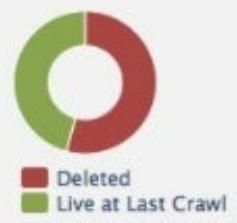
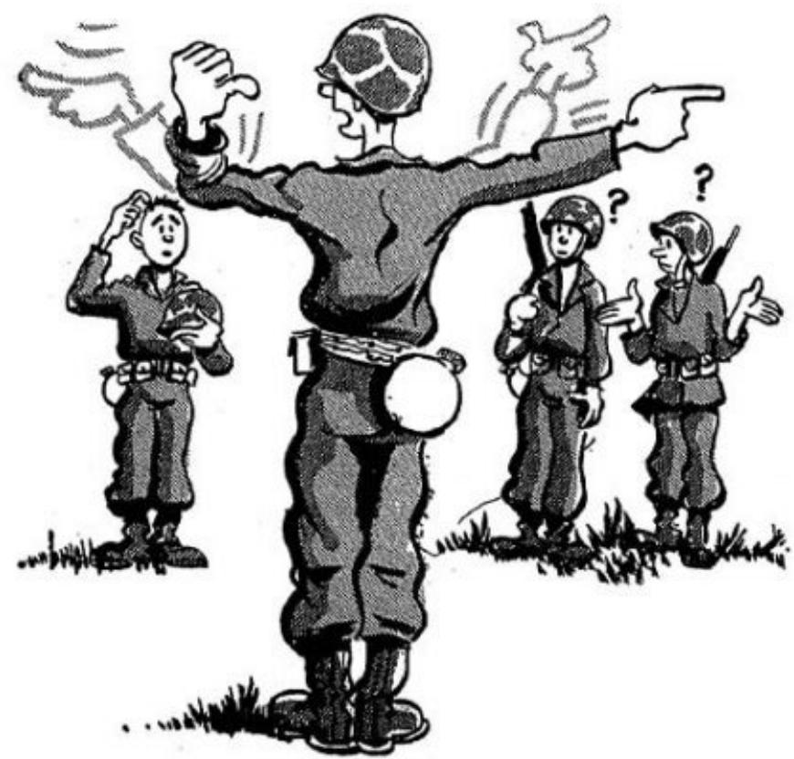
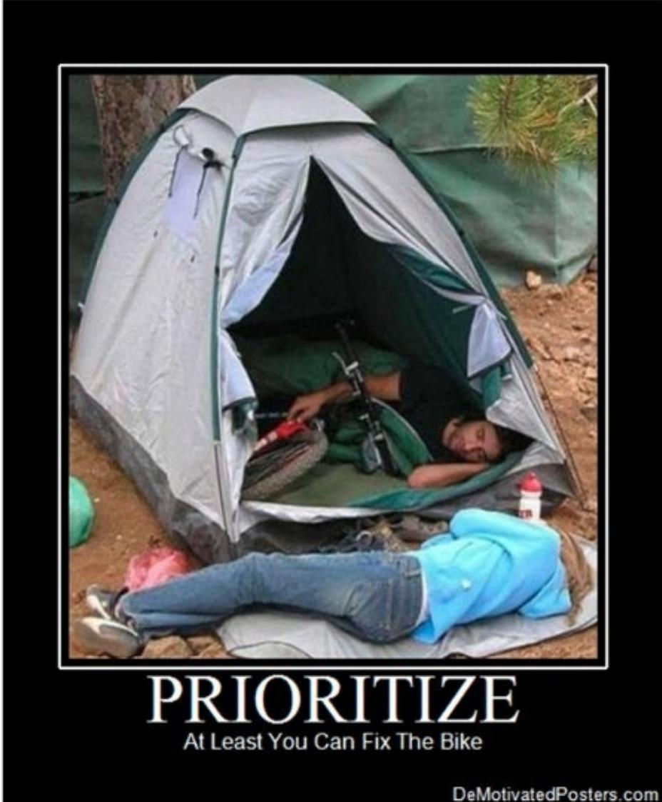

### Full Page Description (Page 0)

**Source:** `assets/_page_0_Asset_0.jpg`

**Generated:** 2026-05-30 23:01:38

---

The image is a line chart with the title "Sessions." The x-axis represents time, ranging from July 2011 to January 2014, while the y-axis represents the number of sessions, ranging from 0 to 5,000. The chart shows fluctuations in session numbers over time, with a general upward trend from July 2011 to January 2014. There are several peaks and troughs, indicating variations in session numbers throughout the period.

## Mastering Strategic SEO Audits

By Alan Bleiweiss Forensic SEO Consultant

http://AlanBleiweiss.com @AlanBlewieiss

## Mastering Strategic SEO Audits

My Background:

## 20 Years Internet Consulting 15 Years SEO

beats.by dr.dre.

#DS15

## Mastering Strategic SEO Audits

Pre-Audit

·Set Expectations

·Avoid Distractions

## Mastering Strategic SEO Audits

Audit Process

·Pull Initial Data

·Evaluate Signals/Relationships

·Step Away From The Keyboard

·Final Conclusions

·Recommendations

## Mastering Strategic SEO Audits

Set Expectations - Client/ Site Owner

·What does the client expect?

·What are their goals?

·Do they think you're their savior?

·Were they burned in the past?

### Full Page Description (Page 5)

**Source:** `assets/_page_5_Asset_0.jpg`

**Generated:** 2026-05-30 23:03:51

---

The image is a diagram illustrating the concept of an audit process. It features a rainbow leading from a cloud labeled "Pre-Audit Site" to a pot of gold labeled "The Audit." A white rabbit is depicted near the pot of gold, with an arrow pointing to it labeled "Client Expectations." The diagram uses a metaphorical representation to convey the idea that the audit process may not meet client expectations, as the rabbit (representing the client) is not directly involved in the process and may not see the full potential of the audit's outcome. The image combines text with a simple illustration to convey its message.

## Mastering Strategic SEO Audits

## Mastering Strategic SEO Audits

## Don'tSetUnrealistic Expectations

> **AI Description:**
> **Source:** `assets/_page_6_Figure_0.jpg`
> 
> **Generated:** 2026-05-30 22:53:49
> 
> ---
> 
> The image contains a 3D animated character with a single eye, running towards a vibrant rainbow. The rainbow is colorful and has a gradient effect, with hearts and sparkles around it, suggesting a magical or whimsical theme. The character appears to be in motion, with one arm extended forward and the other bent at the elbow, giving a sense of urgency or excitement. The background is a solid blue, which contrasts with the bright colors of the rainbow and the character.

Unless you want to be this guy

## Mastering Strategic SEO Audits

## Avoid Shiny Object Distractions

Addthis
AIM

> **AI Description:**
> **Source:** `assets/_page_7_Figure_2.jpg`
> 
> **Generated:** 2026-05-30 22:54:31
> 
> ---
> 
> The image contains a simple icon of a person walking, depicted in a minimalist style. The icon is yellow with a white figure in the center. There are no additional labels, text, or other visual elements present in the image.

AIM(alt）

> **AI Description:**
> **Source:** `assets/_page_7_Figure_3.jpg`
> 
> **Generated:** 2026-05-30 22:54:33
> 
> ---
> 
> The image contains a logo of the Apple Inc. brand. The logo is a simple white apple symbol on a square background, which is a well-known and iconic representation of the company.

Apple

Bebo

Behance

> **AI Description:**
> **Source:** `assets/_page_7_Figure_6.jpg`
> 
> **Generated:** 2026-05-30 22:54:19
> 
> ---
> 
> The image contains a simple orange square with a white icon resembling a stylized letter "b". There is no text or additional visual content within the square. The icon appears to be a logo or a button, possibly representing a blog or a similar platform.

Blogger

Brightkit

> **AI Description:**
> **Source:** `assets/_page_7_Figure_8.jpg`
> 
> **Generated:** 2026-05-30 23:04:50
> 
> ---
> 
> The image contains a colorful icon with a circular design. The icon features a gradient of colors including green, yellow, orange, and purple, arranged in a pattern that resembles a flower or a sunburst. There are no text labels or additional visual elements within the icon itself.

Picasa

Posterous

> **AI Description:**
> **Source:** `assets/_page_7_Figure_10.jpg`
> 
> **Generated:** 2026-05-30 22:55:15
> 
> ---
> 
> The image contains a simple, rounded square icon with the text "qik" in lowercase letters. The icon is a solid, light green color. There are no charts, graphs, or other visual elements present. The image is purely a graphic representation of the text "qik".

> **AI Description:**
> **Source:** `assets/_page_7_Figure_11.jpg`
> 
> **Generated:** 2026-05-30 22:56:10
> 
> ---
> 
> The image contains a simple icon representing the Reddit logo. It features a white background with a blue square in the top left corner, inside which is a smiling face with a red alien-like head. The icon is a visual representation of the Reddit brand and is commonly associated with the social news and discussion website.

Qik
Reddit

> **AI Description:**
> **Source:** `assets/_page_7_Figure_12.jpg`
> 
> **Generated:** 2026-05-30 22:56:18
> 
> ---
> 
> The image contains a single icon of a lightning bolt. The icon is a simple, black square with a white lightning bolt symbol in the center. It is a standard icon used to represent electrical energy, power, or speed. There are no additional visual elements or text in the image.

Cargo

> **AI Description:**
> **Source:** `assets/_page_7_Figure_13.jpg`
> 
> **Generated:** 2026-05-30 22:56:14
> 
> ---
> 
> The image contains a simple icon with a geometric design. It consists of a square divided into four quadrants: the top left is black, the top right is blue, the bottom left is white, and the bottom right is black. There are no labels, text, or additional elements present. The design is abstract and does not represent any specific data or information.

Deticious

> **AI Description:**
> **Source:** `assets/_page_7_Figure_14.jpg`
> 
> **Generated:** 2026-05-30 22:57:07
> 
> ---
> 
> The image contains a simple icon with three overlapping arrows pointing upwards. The arrows are colored in shades of orange and red, with the top arrow being the darkest. The icon is circular with a white background. The arrows suggest upward movement or progress.

Design Bump

> **AI Description:**
> **Source:** `assets/_page_7_Figure_15.jpg`
> 
> **Generated:** 2026-05-30 22:57:02
> 
> ---
> 
> The image contains a simple icon with a blue square background and a white lifebuoy in the center. The lifebuoy is orange with white lines, resembling a standard life-saving device. There is no text or additional visual content beyond the lifebuoy icon.

Design Float

> **AI Description:**
> **Source:** `assets/_page_7_Figure_16.jpg`
> 
> **Generated:** 2026-05-30 22:56:21
> 
> ---
> 
> The image contains a simple icon resembling a stylized map or globe. The icon is black and white, with a curved shape that suggests a geographical or world map. There are no labels, text, or additional visual elements present. The icon appears to be a generic representation, possibly used for a map or location-related application.

Designmoo

deviantART

Digg

Doppr

> **AI Description:**
> **Source:** `assets/_page_7_Figure_20.jpg`
> 
> **Generated:** 2026-05-30 22:58:56
> 
> ---
> 
> The image contains a simple icon of a blue square with a white eye and a flame-like symbol above it. The eye appears to be a stylized representation of a camera lens, and the flame-like symbol suggests a burning or intense focus. This icon is commonly used to represent a camera or a focus feature in various applications.

Squidoo

Stumbleupon

> **AI Description:**
> **Source:** `assets/_page_7_Figure_22.jpg`
> 
> **Generated:** 2026-05-30 22:58:51
> 
> ---
> 
> The image contains a green icon with a white speech bubble shape. The icon is likely associated with a messaging or communication application, such as WhatsApp or a similar service. The icon is simple and does not contain any text or additional visual elements.

Technorati

Tumblr

> **AI Description:**
> **Source:** `assets/_page_7_Figure_24.jpg`
> 
> **Generated:** 2026-05-30 22:57:46
> 
> ---
> 
> The image contains a simple icon with a pink background and a white basketball design in the center. The icon is square-shaped and appears to be a logo or a symbol, possibly representing a sports-related theme or a specific brand associated with basketball.

Dribbble

Email

> **AI Description:**
> **Source:** `assets/_page_7_Figure_26.jpg`
> 
> **Generated:** 2026-05-30 22:57:50
> 
> ---
> 
> The image contains a simple icon with a red flame-like shape inside a white square. The icon appears to represent a fire or a similar concept. There are no charts, graphs, or other visual elements present in the image.

Ember

> **AI Description:**
> **Source:** `assets/_page_7_Figure_27.jpg`
> 
> **Generated:** 2026-05-30 22:58:00
> 
> ---
> 
> The image contains a green square with a white elephant icon in the center. The elephant is stylized and appears to be a logo or icon, possibly representing a brand or application. There is no text or additional visual content beyond the elephant icon.

Evernote

> **AI Description:**
> **Source:** `assets/_page_7_Figure_28.jpg`
> 
> **Generated:** 2026-05-30 22:57:09
> 
> ---
> 
> The image contains a visual element that is a logo. It is a blue square with rounded corners, featuring the lowercase letter "f" in white, which is the logo for the social media platform Facebook.

Facebook

> **AI Description:**
> **Source:** `assets/_page_7_Figure_29.jpg`
> 
> **Generated:** 2026-05-30 22:56:59
> 
> ---
> 
> The image contains a simple icon with two overlapping circles, one blue and one pink. The circles are positioned in such a way that they partially overlap, creating a visual effect of two colors blending together. There are no labels or text annotations present in the image. The icon appears to be a stylized representation, possibly for a logo or a user interface element.

Flickr

FriendFeed

Github

> **AI Description:**
> **Source:** `assets/_page_7_Figure_32.jpg`
> 
> **Generated:** 2026-05-30 22:57:54
> 
> ---
> 
> The image contains a visual element that appears to be a logo. The logo consists of a white square with a blue circle in the top left corner, a red circle in the top right corner, a yellow circle in the bottom left corner, and a green circle in the bottom right corner. The circles are arranged in a 2x2 grid, forming a Windows-style logo.

Windows

> **AI Description:**
> **Source:** `assets/_page_7_Figure_33.jpg`
> 
> **Generated:** 2026-05-30 22:57:57
> 
> ---
> 
> The image contains a logo with a white "W" inside a teal square. The logo is associated with the WordPress platform, a content management system. The design is simple and recognizable, often used to represent the WordPress brand.

WordPress

Xing

Yahoo

> **AI Description:**
> **Source:** `assets/_page_7_Figure_36.jpg`
> 
> **Generated:** 2026-05-30 22:58:47
> 
> ---
> 
> The image contains a colorful icon with a rounded square shape. The icon is divided into four quadrants, each with a different color: red, yellow, green, and blue. The colors are evenly distributed, and the icon has a simple, clean design. There are no text annotations or additional visual elements present in the image.

> **AI Description:**
> **Source:** `assets/_page_7_Figure_37.jpg`
> 
> **Generated:** 2026-05-30 22:58:05
> 
> ---
> 
> The image contains a simple icon of a speech bubble with a pie chart inside it. The pie chart is divided into three sections, each with a different color: green, yellow, and blue. The icon is likely associated with a messaging or communication application, possibly indicating a feature related to group chats or team communication.

Google
GG Buzz

> **AI Description:**
> **Source:** `assets/_page_7_Figure_38.jpg`
> 
> **Generated:** 2026-05-30 22:55:19
> 
> ---
> 
> The image contains a single icon, which is a blue square with a white location pin symbol in the center. This icon is commonly associated with mapping or navigation applications. There are no charts, graphs, or other visual elements present in the image. The icon itself is a simple graphic element used to represent a location or a point of interest.

GGMaps

> **AI Description:**
> **Source:** `assets/_page_7_Figure_39.jpg`
> 
> **Generated:** 2026-05-30 22:56:07
> 
> ---
> 
> The image contains a blue square with a white speech bubble icon inside it. The icon is commonly associated with communication or messaging. There is no text or additional visual information beyond the icon itself.

GGTalk

Lastfm

Linkedin

> **AI Description:**
> **Source:** `assets/_page_7_Figure_42.jpg`
> 
> **Generated:** 2026-05-30 23:05:18
> 
> ---
> 
> The image contains a simple icon of a pencil within a rounded square. The pencil is light blue with a darker blue tip, and the square has a gradient from light blue to a slightly darker shade. There are no text annotations or other visual elements present.

Livejournal

Mixx

> **AI Description:**
> **Source:** `assets/_page_7_Figure_44.jpg`
> 
> **Generated:** 2026-05-30 23:03:04
> 
> ---
> 
> The image contains a single icon, which is a blue square with a white letter "S" in the center. The icon is simple and does not include any additional visual elements such as charts, graphs, or photographs. The icon is likely associated with a software or service, but the image itself does not provide any textual or numerical data.

Skype

Slashdot

Yelp

> **AI Description:**
> **Source:** `assets/_page_7_Figure_47.jpg`
> 
> **Generated:** 2026-05-30 23:01:17
> 
> ---
> 
> The image contains a simple icon that resembles a Wi-Fi signal or an RSS feed symbol. It is a square with rounded corners, predominantly orange in color, and features a white Wi-Fi signal or RSS feed icon in the center. This icon is commonly used to represent wireless internet connectivity or news feeds.

RSS

> **AI Description:**
> **Source:** `assets/_page_7_Figure_48.jpg`
> 
> **Generated:** 2026-05-30 22:54:39
> 
> ---
> 
> The image contains a simple icon of a cloud with a blue background. The cloud icon is commonly associated with cloud computing, cloud storage, or cloud services. There are no charts, graphs, or other visual elements present in the image. The icon is a flat design with no additional text or annotations.

MobileMe
MSN

> **AI Description:**
> **Source:** `assets/_page_7_Figure_50.jpg`
> 
> **Generated:** 2026-05-30 23:03:01
> 
> ---
> 
> The image contains a simple icon of a blue square with a white silhouette of three people. The icon is likely used to represent a group or team in a digital interface. There are no charts, graphs, or other visual elements present. The icon is a static image with no text annotations or additional information.

MySpace

> **AI Description:**
> **Source:** `assets/_page_7_Figure_51.jpg`
> 
> **Generated:** 2026-05-30 23:01:42
> 
> ---
> 
> The image contains a simple green square with a white plus sign in the center. This icon is commonly used to represent addition, a button to add something, or a medical symbol. It does not contain any text or additional visual elements.

Netvibes

> **AI Description:**
> **Source:** `assets/_page_7_Figure_52.jpg`
> 
> **Generated:** 2026-05-30 22:59:43
> 
> ---
> 
> The image contains a simple green square with a white silhouette of a plant or tree. There are no labels, text, or additional elements within the square. The image appears to be a logo or icon, possibly representing nature, growth, or environmental themes.

Newsvine

Orkut

Pandora

PayPal

> **AI Description:**
> **Source:** `assets/_page_7_Figure_56.jpg`
> 
> **Generated:** 2026-05-30 23:05:21
> 
> ---
> 
> The image contains a logo with a blue square background and a white lowercase 'v' in the center. The logo is simple and clean, likely representing a brand or company. There is no text or additional visual content beyond the logo itself.

Vimeo

Virb

YouTube

> **AI Description:**
> **Source:** `assets/_page_7_Figure_59.jpg`
> 
> **Generated:** 2026-05-30 22:54:23
> 
> ---
> 
> The image contains a blue square with a white border and a lowercase 't' in the center. This is a logo, specifically the Twitter logo, which is commonly used to represent the social media platform. The image does not contain any charts, graphs, or other visual elements beyond the logo itself.

Twitter

PHOENIX
#DS15

## Mastering Strategic SEO Audits

Avoid Distractions

> **AI Description:**
> **Source:** `assets/_page_8_Figure_0.jpg`
> 
> **Generated:** 2026-05-30 22:58:43
> 
> ---
> 
> The image is a photograph showing a man sitting on a couch with two children. The man is wearing a red sweater and has a metal bowl on his head. The child on the left is sitting on the couch and appears to be adjusting the bowl on the man's head. The child on the right is standing and holding a microphone, seemingly singing or speaking. The setting appears to be a living room with a white couch and light-colored curtains in the background.

## Mastering Strategic SEO Audits

Avoid Distractions

> **AI Description:**
> **Source:** `assets/_page_9_Figure_0.jpg`
> 
> **Generated:** 2026-05-30 22:57:42
> 
> ---
> 
> The image contains a photograph of a person sitting at a desk, surrounded by stacks of papers. The person appears to be overwhelmed, holding their head in frustration. A hand is holding a telephone receiver near the person's head, suggesting an incoming call. The desk has a calculator and some documents, indicating a work environment. The overall scene conveys a sense of stress and workload.

#DS15

## Mastering Strategic SEO Audits

Audit Process

·Pull Initial Data

·Evaluate Signals/Relationships

·Step Away From The Keyboard

·Final Conclusions

·Recommendations

## Mastering Strategic SEO Audits

## Pull Initial Data

### Full Page Description (Page 12)

**Source:** `assets/_page_12_Asset_0.jpg`

**Generated:** 2026-05-30 23:05:14

---

The image is a line chart showing the number of sessions over time. The x-axis represents the timeline from November 2014 to January 2015, and the y-axis represents the number of sessions, ranging from 70,000 to 140,000. The chart displays fluctuations in the number of sessions, with a significant drop around the middle of the timeline, followed by a gradual recovery and stabilization. The title of the chart is "Sessions."

## Mastering Strategic SEO Audits

## Pull Initial Data

## Mastering Strategic SEO Audits

## Mastering Strategic SEO Audits

Sessions:19,149,315

Sessions via Social Referral: 134,373

Conversions:22,782,94

Contributed Social Conversions: 104,274

Last Interaction Social Conversions: 71,900

### Full Page Description (Page 15)

**Source:** `assets/_page_15_Asset_0.jpg`

**Generated:** 2026-05-30 22:53:19

---

The image contains a Venn diagram with three overlapping circles. The circles represent "Direct," "Organic Search," and "Referral." The text at the top indicates that the combined percentage of these categories is 3.26% (742137). The diagram visually represents the intersection of these categories, showing the overlap areas as approximations.

## Mastering Strategic SEO Audits

## Multi-Channel Conversion Visualizer

## Mastering Strategic SEO Audits

## Mastering Strategic SEO Audits

Check Page Processing Times

Most Visited Pages

## Mastering Strategic SEO Audits

Compare to URIValet.com 1.5mbps &WebPageTest.org DSL Emulators

## Mastering Strategic SEO Audits

Don't Just Check "Most Visited" Pages

Remember to sort by average time to look for slowest pages

## Mastering Strategic SEO Audits

Gather any other data you think relevant or important for your situation or goals

### Full Page Description (Page 21)

**Source:** `assets/_page_21_Asset_0.jpg`

**Generated:** 2026-05-30 22:56:04

---

The image contains a line graph with a time series visualization. The x-axis represents time from January 2012 to January 2014, and the y-axis represents Google Organic Visits, ranging from 0k to 25k. The graph shows fluctuations in organic visits over time, with vertical bars indicating significant events or updates, such as Google's Panda, Penguin, Structural, Local, and Other updates. The graph is labeled with different categories of events, and the data appears to show a general downward trend in organic visits over the period.

## Mastering Strategic SEO Audits

## Mastering Strategic SEO Audits

## Mastering Strategic SEO Audits

## Mastering Strategic SEO Audits

### Full Page Description (Page 25)

**Source:** `assets/_page_25_Asset_0.jpg`

**Generated:** 2026-05-30 23:00:54

---

The image contains a line graph and a table. The line graph shows the time spent downloading a page in milliseconds over a period from December 2014. The graph fluctuates slightly but generally stays within a range of 800 to 1,200 milliseconds. The table lists various issues related to meta descriptions and title tags, along with the number of pages affected by each issue. Key issues include duplicate meta descriptions affecting 2,215 pages, long meta descriptions affecting 21 pages, short meta descriptions affecting 1,450 pages, missing title tags affecting 10 pages, and duplicate title tags affecting 621 pages.

## Mastering Strategic SEO Audits

### Full Page Description (Page 26)

**Source:** `assets/_page_26_Asset_0.jpg`

**Generated:** 2026-05-30 22:59:37

---

The image is a line graph titled "Backlinks discovery (cumulative view)." It displays the cumulative number of backlinks for the domain "gorentals.co.nz" over time, from June 2006 to October 2014. The x-axis represents the months and years, while the y-axis represents the number of backlinks. The graph shows a general upward trend in the number of backlinks, with a significant increase starting around May 2009. The domain's backlink count starts at zero and gradually rises to over 300,000 by the end of the period shown.

### Full Page Description (Page 26)

**Source:** `assets/_page_26_Asset_1.jpg`

**Generated:** 2026-05-30 22:59:17

---

The image is a line graph titled "Referring domains discovery (cumulative view)." It shows the cumulative number of referring domains for the domain "gorentals.co.nz" over time, from June 2006 to October 2014. The x-axis represents the months and years, while the y-axis represents the number of referring domains. The graph indicates a steady increase in referring domains over the years, with a significant jump around the middle of the timeline, suggesting a period of rapid growth in the number of referring domains. The graph is labeled with the domain name "gorentals.co.nz" at the top left corner.

## Mastering Strategic SEO Audits

### Full Page Description (Page 27)

**Source:** `assets/_page_27_Asset_0.jpg`

**Generated:** 2026-05-30 22:53:01

---

The image is a pie chart with four segments, each representing a different category: Frames, Images, TextLinks, and Redirects. The chart is divided into these categories with varying proportions. The largest segment is labeled "TextLinks," followed by "Frames," then "Images," and the smallest segment is labeled "Redirects." The chart uses different colors to distinguish between the categories, with "Frames" in orange, "Images" in purple, "TextLinks" in teal, and "Redirects" in light blue.

## Mastering Strategic SEO Audits

## TOPICALTRUSTFLOW

34Recreation/Travel

33News/Newspapers

14Regional/ Oceania

1Sports/Equestrian

13Reference/Dictionaries

13Business/Transportation and Logistics

Backlink Breakdown

> **AI Description:**
> **Source:** `assets/_page_27_Figure_1.jpg`
> 
> **Generated:** 2026-05-30 23:03:09
> 
> ---
> 
> The image contains a pie chart with two sections. The red section is labeled "Deleted," and the green section is labeled "Live at Last Crawl." The chart visually represents the proportion of data that has been deleted versus the data that was live at the last crawl. The red section appears to represent a smaller portion of the whole, indicating that a majority of the data was still live at the last crawl.

#DS15

## Mastering Strategic SEO Audits

## Scremingfrog

Internal Redirects

Internal Dead-Ends

External Redirects

External Dead-Ends

PageTitles

Meta Descriptions

H1& H2 Headline tags

URL Structure

Oversized (Bloated)

Images/HTML/Files

Robots Directives

Canonical Tags

Much more!

#DS15

## Mastering Strategic SEO Audits

## AuthorityLabs

## ahrefs

MarkupValidationService

Check the markup(HTML，XHTML,..) of Web documents

## Mastering Strategic SEO Audits

Evaluate Signals /Relationships

Site:domain.com/GWT pages indexed

First Byte Time/Time to Download /Total Page Process Time

PageTitle/URL/breadcrumb/H1 Headline /Content main focus /anchors of links to that page

## Mastering Strategic SEO Audits

Evaluate Signals/Relationships

robots.txt/meta robots/canonical tags/OG:URLs

Page topical focus /section topical focus /Site topical focus

Primary topic/shiny objects on page/wordsat source level

## Mastering Strategic SEO Audits

Step Away From The Keyboard

> **AI Description:**
> **Source:** `assets/_page_32_Figure_0.jpg`
> 
> **Generated:** 2026-05-30 23:02:57
> 
> ---
> 
> The image is a close-up photograph of a person's face. The individual has light skin and is smiling, revealing their teeth. The person's eyes appear red and puffy, and there is some redness and swelling around the eyes. The background is out of focus, suggesting the image is intended to highlight the facial features and condition of the person.

> **AI Description:**
> **Source:** `assets/_page_32_Figure_1.jpg`
> 
> **Generated:** 2026-05-30 23:01:59
> 
> ---
> 
> The image contains a hand holding a small white flag with the word "HELP" written in red letters. The hand is partially submerged in a pile of crumpled white paper. The visual suggests a plea for assistance or support, possibly metaphorically representing being overwhelmed or in need of help.

## Mastering Strategic SEO Audits

Final Conclusions

> **AI Description:**
> **Source:** `assets/_page_33_Figure_0.jpg`
> 
> **Generated:** 2026-05-30 23:04:24
> 
> ---
> 
> The image contains a photograph of wheat. It shows several stalks of wheat with their grains still attached, along with a small pile of separated wheat grains. The wheat appears to be ripe and golden in color, indicating it is ready for harvest. The image is likely used to represent agricultural produce or to illustrate the process of harvesting wheat.

## Mastering Strategic SEO Audits

Recommendations

> **AI Description:**
> **Source:** `assets/_page_34_Figure_0.jpg`
> 
> **Generated:** 2026-05-30 23:04:44
> 
> ---
> 
> The image is a black and white illustration depicting a group of soldiers in a military setting. The central figure, wearing a helmet and military uniform, is gesturing with his arms extended, appearing to give orders or instructions. Two other soldiers are standing to the right, one of whom is holding a rifle and has a questioning expression, indicated by question marks above their heads. The other soldier is also holding a rifle and appears to be listening attentively. The scene suggests a moment of communication or briefing in a military context.

Be Clear

Don't Confuse!

## Mastering Strategic SEO Audits

## Avoid Overwhelming Decision Makers

> **AI Description:**
> **Source:** `assets/_page_35_Figure_0.jpg`
> 
> **Generated:** 2026-05-30 23:02:21
> 
> ---
> 
> The image is a photograph of a young person wearing a blue shirt. The individual is covering their ears with both hands, appearing to shield themselves from noise or loud sounds. The background is plain and white, focusing attention on the subject. The person's expression suggests discomfort or annoyance.

## Mastering Strategic SEO Audits

> **AI Description:**
> **Source:** `assets/_page_36_Figure_0.jpg`
> 
> **Generated:** 2026-05-30 22:54:15
> 
> ---
> 
> The image is a photograph of a person sleeping in a tent, with another person lying on the ground outside the tent. The tent is set up on a dirt ground with some trees and foliage visible in the background. The text at the bottom of the image reads "PRIORITIZE At Least You Can Fix The Bike" and includes a website address, "DeMotivatedPosters.com". The image combines a photograph with text to convey a humorous message about prioritizing tasks.

## Mastering Strategic SEO Audits

Unless YOU are the site owner...

Somebody ELSE will ultimately decide...

What gets worked on

And what doesn't!

> **AI Description:**
> **Source:** `assets/_page_37_Figure_0.jpg`
> 
> **Generated:** 2026-05-30 22:55:10
> 
> ---
> 
> The image is a humorous and exaggerated depiction of a judge. The judge is shown with a large head, prominent glasses, and a stern expression, holding a gavel. The background includes an American flag and a wooden panel, suggesting a courtroom setting. The image uses visual exaggeration to convey a comedic effect rather than presenting any factual or informational content.

### Full Page Description (Page 38)

**Source:** `assets/_page_38_Asset_0.jpg`

**Generated:** 2026-05-30 22:56:55

---

The image is a line graph showing the number of sessions over time. The x-axis represents months from April 2014 to January 2015, and the y-axis represents the number of sessions, ranging from 100,000 to 200,000. The graph displays a fluctuating pattern with a significant drop around July 2014, followed by a gradual recovery and stabilization towards the end of the period. The title "Sessions" is located at the top left corner, indicating the type of data being represented.

## Mastering Strategic SEO Audits

If only SOME of your recommendationsare Implemented...

### Full Page Description (Page 39)

**Source:** `assets/_page_39_Asset_0.jpg`

**Generated:** 2026-05-30 23:01:14

---

The image is a line graph showing a time series of data, likely representing stock market performance or another financial metric. The x-axis represents time, ranging from July 2011 to January 2014, while the y-axis indicates the value of the metric, which ranges from 2,000 to 4,000. The graph displays fluctuations and trends over the period, with a notable peak around January 2012 and a significant drop in January 2013. The data shows a general upward trend towards the end of the period.

## Mastering Strategic SEO Audits

If EVERYTHING goes well implementingaudit recommendations..

### Full Page Description (Page 40)

**Source:** `assets/_page_40_Asset_0.jpg`

**Generated:** 2026-05-30 23:02:40

---

The image is a line chart with the title "Sessions." The x-axis represents time, ranging from July 2011 to January 2015, and the y-axis represents the number of sessions, ranging from 0 to 5,000. The chart shows fluctuations in the number of sessions over time, with a general upward trend from 2011 to 2014. There are several peaks and troughs, indicating periods of higher and lower session activity. The data suggests a significant increase in session numbers towards the end of the period, with a notable peak in January 2015.

## Mastering Strategic SEO Audits

By Alan Bleiweiss Forensic SEO Consultant

http://AlanBleiweiss.com @AlanBlewieiss