
## Physics

## HalimahTasnim

## Module 1: Energy for the Home

Temperature:Measured in degreesC'or Kelvin'K'

Thermal Energyis measured Joules'J'

Things are cold because the average energy is low

Things are hot because the average energy is high

Temperature: the average of thermal energy per particle

Thermal Energy:the total amount of energy altogether

Temperature is an arbitrary scale.

## P1a: Temperature and Energy

Arbitrary:comparing things to each other

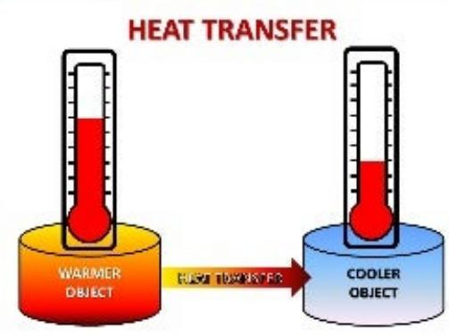

> **AI Description:**
> **Source:** `assets/_page_2_Figure_0.jpg`
> 
> **Generated:** 2026-05-30 23:52:17
> 
> ---
> 
> The image is a diagram illustrating heat transfer. It features two thermometers, one labeled "Warmer Object" and the other "Cooler Object," with arrows indicating heat transfer from the warmer object to the cooler object. The visual elements include a color gradient representing heat flow, with yellow and red colors symbolizing the transfer of heat from the warmer to the cooler object. The diagram effectively conveys the concept of heat transfer between two objects of different temperatures.

Heat travels:   
Hot to Cold   
-Thermal energy is lost by hot   
objects   
-Keep losing heat until   
equilibrium is reached   
-Thermal energy is lost quicker   
by hot objects than cold objects

### Full Page Description (Page 4)

**Source:** `assets/_page_4_Asset_0.jpg`

**Generated:** 2026-05-30 23:50:44

---

The image is a graph that illustrates the temperature changes of a substance over time, specifically water, as it undergoes phase changes. The x-axis represents time in minutes, and the y-axis represents temperature in degrees Celsius. The graph is divided into four distinct phases: heating ice (A to B), melting ice (B to C), heating liquid water (C to D), and vaporizing water (D to E). The heating stream is indicated by a dashed line, showing the temperature increase as the substance is heated. The graph highlights the temperature at which the phase changes occur, such as the melting point of ice and the boiling point of water.

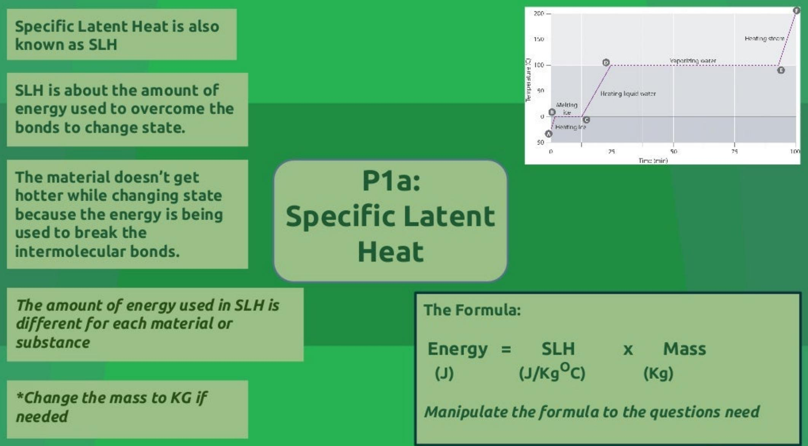

> **AI Description:**
> **Source:** `assets/_page_4_Figure_0.jpg`
> 
> **Generated:** 2026-05-30 23:55:18
> 
> ---
> 
> The image contains a combination of text and a graph. The text provides definitions and explanations related to Specific Latent Heat (SLH), including its definition, the energy required to change the state of a material, and the formula for calculating energy using SLH. The graph illustrates the heating process of a substance, showing the temperature change over time as it transitions from solid to liquid to vapor. The graph includes labeled points and phases of the heating process, such as "Melting ice," "Heating liquid water," and "Vaporizing water." The main trend is the increase in temperature as the substance is heated, with a notable horizontal line indicating the phase change at constant temperature.

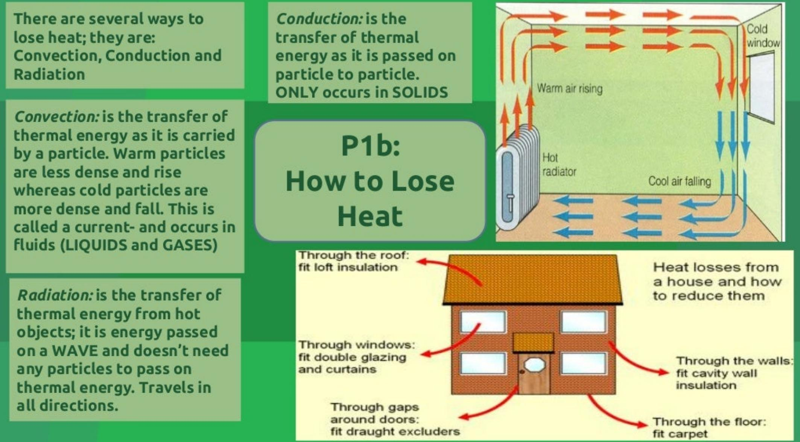

> **AI Description:**
> **Source:** `assets/_page_5_Figure_0.jpg`
> 
> **Generated:** 2026-05-30 23:53:37
> 
> ---
> 
> The image contains a combination of text and diagrams. It explains the three main ways heat can be lost from a house: convection, conduction, and radiation. The text provides definitions and descriptions of each process. Additionally, there are diagrams illustrating how heat is lost through the roof, windows, walls, and floors of a house. The diagrams show arrows indicating the direction of heat flow and suggest methods to reduce heat loss, such as fitting insulation and double glazing. The overall layout is an infographic combining text and visual elements to educate on heat loss and mitigation.

Efficiency is the amount of energy that is turned into useful energy

A traditional coal fire is not the most efficient way to heat a room because for every 100Jof energy stored in the coal only 25J of energy is used to heat the room.The remaining 75J to surroundings;meaning it is 25% efficient

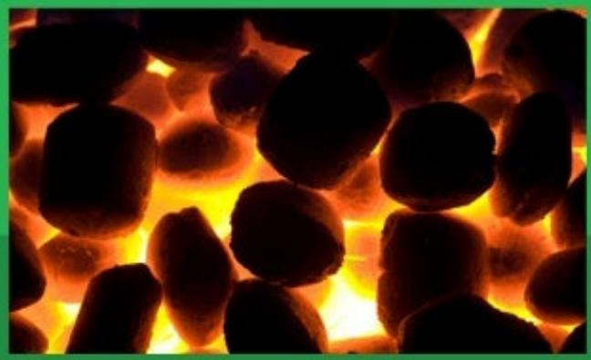

> **AI Description:**
> **Source:** `assets/_page_6_Figure_0.jpg`
> 
> **Generated:** 2026-05-30 23:47:10
> 
> ---
> 
> The image contains a photograph of glowing embers, likely from a fire or fireplace. The embers are dark and rounded, with a bright orange and yellow glow emanating from within them. The image captures the texture and intensity of the heat, suggesting a warm and cozy atmosphere.

P1b: Efficiency and Payback Time

Payback time is when how long it takes for you to get that value of money- the typical cost in time

E.g.   
Wall Cavities:   
Cost:£400   
Save:f80 (yearly)

$$
\frac { 4 0 0 } { 8 0 } = 5
$$

5 years to get money back

The Formula:

Efficiency= Useful Energy output Total Energy Input

Manipulate the formula to the questions need （x100 for percentage)

The Formula:

Payback Time

$$
\frac { \cos \theta } { \sin \theta \sin \theta \cos }
$$

Manipulate the formula to the questions need

### Full Page Description (Page 7)

**Source:** `assets/_page_7_Asset_0.jpg`

**Generated:** 2026-05-30 23:47:17

---

The image contains a diagram of a sine wave, which is a type of graph. The key information presented includes the wavelength, which is the distance between two consecutive crests or troughs, and the amplitude, which is the maximum distance from the center line to the crest or trough. The diagram visually represents the periodic nature of the sine wave, showing the repeating pattern of peaks and troughs.

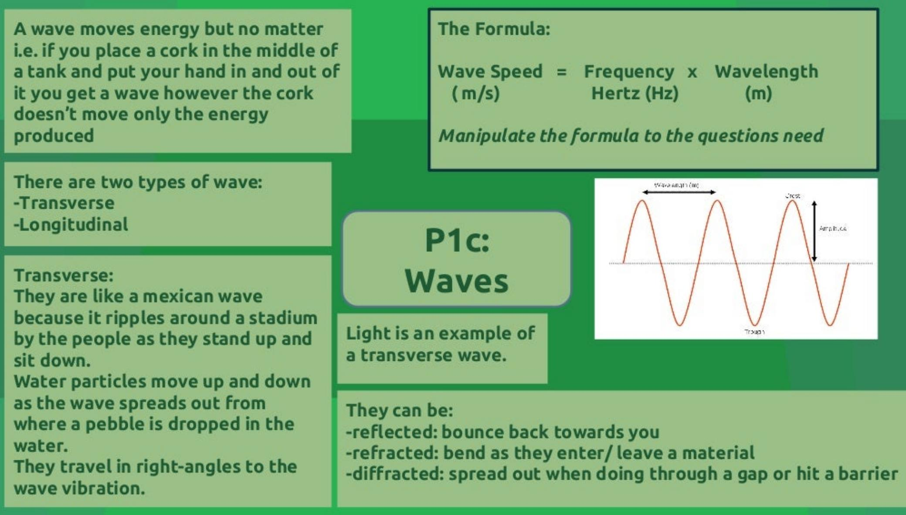

> **AI Description:**
> **Source:** `assets/_page_7_Figure_0.jpg`
> 
> **Generated:** 2026-05-30 23:50:26
> 
> ---
> 
> The image contains a combination of text and a diagram. The text provides information about waves, their types, and properties. It explains that waves move energy rather than matter and describes two types of waves: transverse and longitudinal. It also mentions that transverse waves travel in right-angles to the wave vibration and can be reflected, refracted, or diffracted. The diagram on the right shows a transverse wave with labels for wavelength, amplitude, and crest. The text includes a formula for wave speed: Wave Speed = Frequency x Wavelength. The image is an infographic combining text and a simple diagram to explain wave concepts.

REFRACTION: Bends the wave when entering/leaving a substance to another

REFLECTION:   
Bounces the wave back towards where it came from

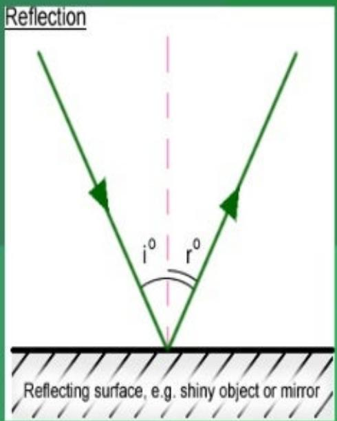

> **AI Description:**
> **Source:** `assets/_page_8_Figure_0.jpg`
> 
> **Generated:** 2026-05-30 23:51:15
> 
> ---
> 
> The image is a diagram illustrating the concept of reflection. It shows a reflecting surface, such as a shiny object or mirror, with two green arrows representing incident and reflected rays. The diagram includes labels for the incident angle (i°) and the reflected angle (r°), both marked as 0°. The diagram visually represents the law of reflection, where the angle of incidence equals the angle of reflection.

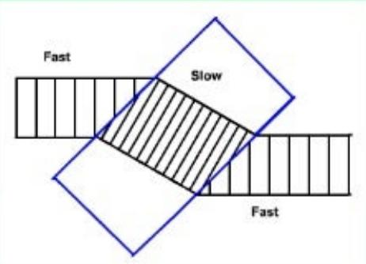

> **AI Description:**
> **Source:** `assets/_page_8_Figure_1.jpg`
> 
> **Generated:** 2026-05-30 23:51:21
> 
> ---
> 
> The image contains a diagram with two overlapping shapes labeled "Fast" and "Slow." The shapes are geometric and intersect, with the "Slow" shape partially covering the "Fast" shape. The diagram appears to represent a comparison or relationship between the two concepts, possibly in a context of speed or pace. The overlapping areas might indicate a degree of overlap or interaction between the two states.

They slow down because the substance would be a different density to another substance.

P1c: Reflection, Refraction, Diffraction

All wave can be reflected and refracted

Law of Reflection: Angleof incidence = Angle of Reflection

DIFFRACTION: Spreads the wave out when going through a gap or barrier

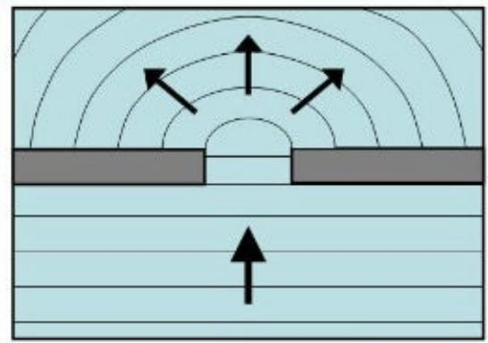

> **AI Description:**
> **Source:** `assets/_page_8_Figure_2.jpg`
> 
> **Generated:** 2026-05-30 23:51:29
> 
> ---
> 
> The image is a technical illustration showing a cross-sectional view of a component, likely a part of an electronic device or a mechanical system. The diagram includes a central dome-shaped structure with arrows indicating the direction of force or flow. The surrounding area has concentric circular lines, suggesting a pressure or force distribution pattern. The bottom part of the image shows horizontal lines, possibly representing a base or a surface. The illustration is used to demonstrate the interaction or effect of a force or flow on a specific component.

Maximum diffraction occurs when: the gap is equal to the wave.

Minimum diffraction occurs when: the gap is smaller or larger than the wave.

### Full Page Description (Page 9)

**Source:** `assets/_page_9_Asset_0.jpg`

**Generated:** 2026-05-30 23:51:39

---

The image is a diagram illustrating the electromagnetic spectrum. It shows a horizontal line representing the spectrum from gamma rays on the left to radio waves on the right. Above the line, the spectrum is labeled with various types of electromagnetic radiation, including gamma rays, X-rays, ultraviolet, visible light, infrared, microwave, and radio. Below the line, there is a visual representation of the wavelengths of light, with shorter wavelengths on the left and longer wavelengths on the right. The diagram also includes annotations indicating that shorter wavelengths correspond to higher frequencies and higher energy, while longer wavelengths correspond to lower frequencies and lower energy.

Properties of electromagnetic waves:   
-they transfer energy from one place to another   
-they can be reflected,refracted and diffracted   
-they can travel through a vacuum (space)   
-the shorter the wavelength the more dangerous theyare

## P1c: Electromagnetic Waves

> **AI Description:**
> **Source:** `assets/_page_9_Figure_0.jpg`
> 
> **Generated:** 2026-05-30 23:51:07
> 
> ---
> 
> The image contains a photograph of two rabbits sitting on grass. One rabbit is orange, and the other is gray with long ears. The rabbits appear to be interacting, with the orange rabbit leaning towards the gray rabbit. The background is a blurred green, suggesting a natural outdoor setting.

The Formula:

Wave Speed = Frequency X Wavelength

Manipulate the formula to the questions need

Types of electromagnetic waves:

Light has been used for sending messages.This allowed messages to be sent quickly. However the disadvantage of this was that a code as needed.

Lasers are another way of using light.

-in phase;in sync-all crsts and trough match up -Monochromatic; one colour usually red but also green,blue and purple -Coherent; in phase -Low Divergence;doesn't spread out,narrow beam of light even over long distances

Lasers are used in CDs and DVDs

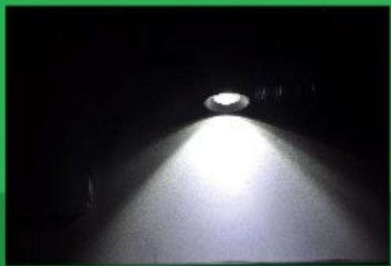

> **AI Description:**
> **Source:** `assets/_page_11_Figure_0.jpg`
> 
> **Generated:** 2026-05-30 23:51:52
> 
> ---
> 
> The image shows a bright light source, likely a flashlight or headlamp, illuminating a dark environment. The light creates a strong beam that spreads out, indicating the direction of the light source. The surrounding area is completely dark, emphasizing the brightness and directionality of the light. There are no visible labels or text annotations in the image.

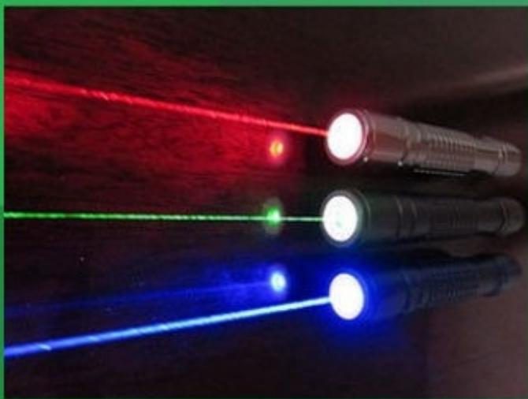

> **AI Description:**
> **Source:** `assets/_page_11_Figure_1.jpg`
> 
> **Generated:** 2026-05-30 23:51:46
> 
> ---
> 
> The image contains a photograph of three laser pointers emitting beams of light in different colors: red, green, and blue. The laser beams are visible against a dark background, and the laser pointers are aligned vertically. The image provides a visual representation of the different wavelengths of light emitted by these devices.

## P1d: Using Light

White light spreads out when travelling long distances.

CDs and Dvds have microscopic pits which act like the absence of light in morse code. The laser reflect s when it hits a shiny surface and doesn't reflect when it hits a pit. This then sends a message to computer chips which then send a visual or audio track to the player.

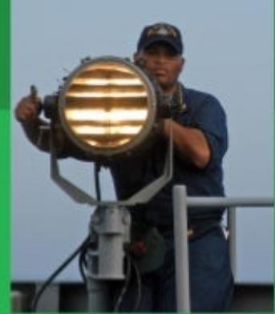

> **AI Description:**
> **Source:** `assets/_page_11_Figure_2.jpg`
> 
> **Generated:** 2026-05-30 23:52:02
> 
> ---
> 
> The image contains a photograph of a person standing on a platform, holding a large spotlight. The spotlight is mounted on a stand and appears to be a professional-grade searchlight or floodlight. The person is wearing a dark uniform and a cap, and they are giving a thumbs-up gesture. The background is a clear sky, suggesting the photo was taken outdoors during the daytime.

White/Shiny:are poor radiators and poor absorbers energy   
Black/Matt:are good radiators and good absorbers of energy

P1e: Cooking with Infrared and Microwaves

Phone signals travel at 3x10 m/s

The waves are transmitted and received. If the are not‘in line of sight' the signal may be lost.

All types of phones receive waves

When you talk into your phone; it converts the sound into a microwave signal and is sent to the nearest phone mast.

Microwave signals are affected -Poor weather conditions -large surfaces of water

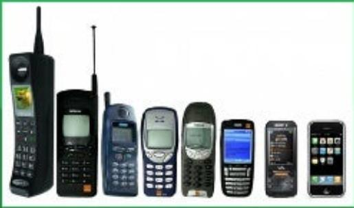

> **AI Description:**
> **Source:** `assets/_page_13_Figure_0.jpg`
> 
> **Generated:** 2026-05-30 23:47:30
> 
> ---
> 
> The image contains a series of photographs of older mobile phones arranged in a row. The phones vary in design and size, representing different generations of mobile technology. The phones range from early models with large antennas and physical keypads to more modern smartphones with touchscreens and sleeker designs. The progression of the phones illustrates the evolution of mobile technology over time.

## P1e: Phone Signals

Weather conditions can scatter the signal Radiowaves spread out (diffract) signals when passing through a gap i.e. between buildings

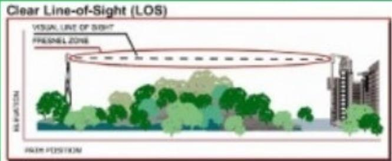

> **AI Description:**
> **Source:** `assets/_page_13_Figure_1.jpg`
> 
> **Generated:** 2026-05-30 23:47:24
> 
> ---
> 
> The image is a diagram illustrating a Clear Line-of-Sight (LOS) scenario. It features a visual line of sight extending from a transmitter (represented by a radio antenna) to a receiver (represented by a building). The diagram includes a "Fresnel Zone," which is the area within the visual line of sight where the radio waves should not be obstructed by objects. The diagram also shows trees and other potential obstructions in the path of the radio waves, indicating the importance of maintaining a clear line of sight for effective communication.

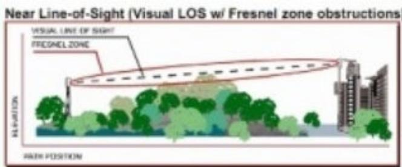

> **AI Description:**
> **Source:** `assets/_page_13_Figure_2.jpg`
> 
> **Generated:** 2026-05-30 23:49:05
> 
> ---
> 
> The image is a technical illustration depicting a scenario of "Near Line-of-Sight (Visual LOS w/ Fresnel zone obstructions)." It includes a diagram showing a visual line of sight (LOS) with a dashed line indicating the Fresnel zone. The diagram illustrates a landscape with trees and buildings, representing potential obstructions to the line of sight. The illustration is labeled with "H: Elevation" on the left side, suggesting a vertical axis, and "P: Elevation" at the bottom, indicating a horizontal axis. The image is designed to explain the concept of Fresnel zone obstructions in a line-of-sight communication scenario.

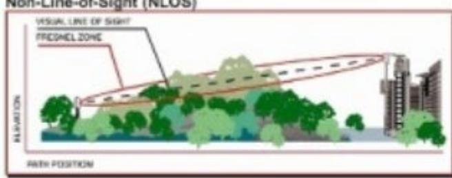

> **AI Description:**
> **Source:** `assets/_page_13_Figure_3.jpg`
> 
> **Generated:** 2026-05-30 23:50:33
> 
> ---
> 
> The image is a technical illustration depicting a Non-Line-of-Sight (NLOS) scenario in wireless communication. It shows a path position with a visual line of sight (LOS) and a Fresnel zone, which is the area where the radio waves are expected to travel without significant loss. The illustration includes a transmitter and receiver, with the Fresnel zone highlighted to show the area where the signal should ideally propagate without obstruction. Trees and other potential obstructions are also depicted, illustrating the concept of NLOS where the signal cannot follow a direct line of sight due to these obstacles.

Mobile phones can damage your brain by heating;but there is not answer that is set in stone that they can radically damage your brain

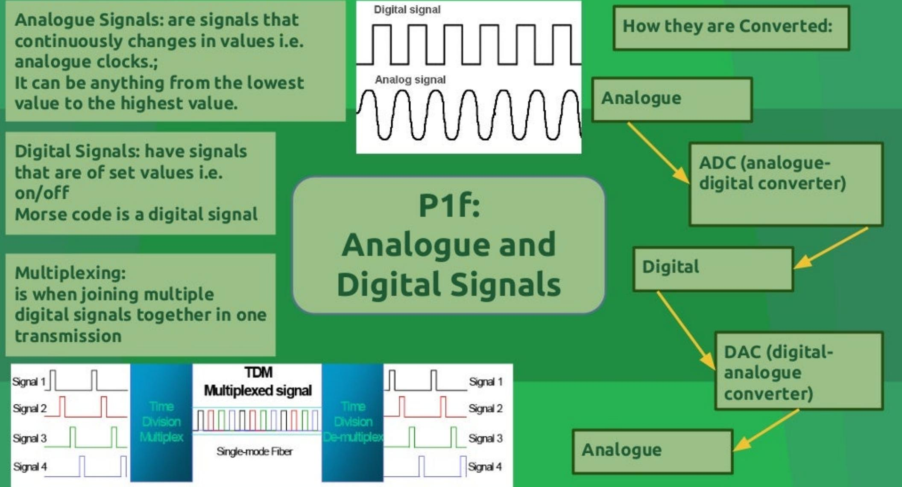

> **AI Description:**
> **Source:** `assets/_page_14_Figure_0.jpg`
> 
> **Generated:** 2026-05-30 23:48:56
> 
> ---
> 
> The image contains a combination of text and diagrams. It provides definitions and explanations of analogue and digital signals, including examples and conversion processes. The diagram illustrates the conversion of analogue signals to digital signals using an ADC (analogue-digital converter) and the conversion of digital signals to analogue signals using a DAC (digital-analogue converter). Additionally, it shows a multiplexing process using Time Division Multiplexing (TDM) for combining multiple digital signals into a single transmission. The image is an infographic combining text with technical illustrations to explain these concepts.

## P1g: Wireless Communication

Wireless Technologies:   
-appliances that communicate   
without wires -televisions and radios use   
radiowaves -mobile phones use   
microwaves -laptops and computers use   
microwaves   
-smartphones use microwaves   
and radiowaves

\*appliances that use wireless communication need an aerial to receive signals

Advantages:   
-no wired connection needed   
-portable and convenient   
-can be used on the move i.e.train,bus   
-can receive more than one signal at a   
time

Long distance communication -signals can be refracted by different layers in the atmosphere allowing them to travel further -ionosphere refracts radiowaves -microwaves can be used to send signals to satellites

P1g:   
Wireless   
Communication

Problems that can occur: -signal can spread out -waves can refract when passing through different layers of atmosphere -makes it difficult to send signals when you want to -drop in quality

Appliances that use wireless   
means:   
-TVsandradios   
-Smartphones   
-laptops   
Disadvantages:   
-wireless signals can be reflected or refracted off   
buildings or by the atmosphere   
-drop-in-quality: signal becomes weak or lose energy   
-too many reflections can drop in quality   
-signal be blocked by hillsor buildings

Line of sight isa'line'that is free from any obstructions i.e.tall building or trees

We use Bluetooth or Wi-Fi for short range communication. To send long distance communication we use different methods

You can't send a signal to a receiver if it far away because the Earth's curvature gets in the way like a large wall of water between the transmitter and aerial. Also only certain waves can be reflected in different parts of the atmosphere i.e.radiowaves are reflected

When there are obstructions the signal can drop in quality; so to fix this the microwave transmitters are placed close together on high hills to avoid the obstructions. Line of sight is an assured way of sending signals but we are not always in sight of them

P1g: Receiving Signals off the ionosphere.

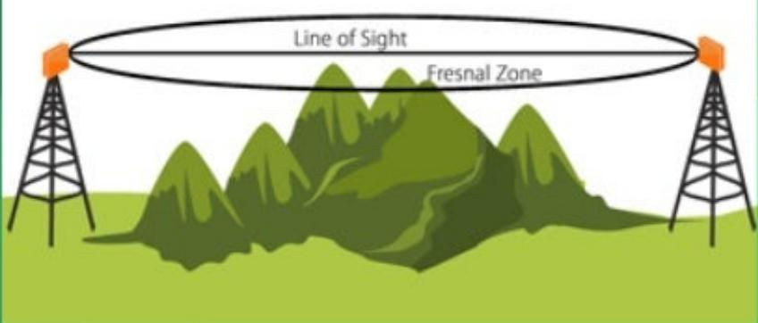

> **AI Description:**
> **Source:** `assets/_page_17_Figure_0.jpg`
> 
> **Generated:** 2026-05-30 23:53:46
> 
> ---
> 
> The image is a diagram illustrating the concept of the Fresnel Zone in radio wave propagation. It features two radio towers on either side of a mountain range, with a line of sight drawn between them. The Fresnel Zone is depicted as a circular area surrounding the line of sight, with the diagram highlighting the importance of this zone for clear radio transmission. The diagram is designed to show how the Fresnel Zone can be affected by terrain, such as mountains, which can block or distort the radio waves.

An advantage of wired communicationis that you can send rapidamount of data very qui

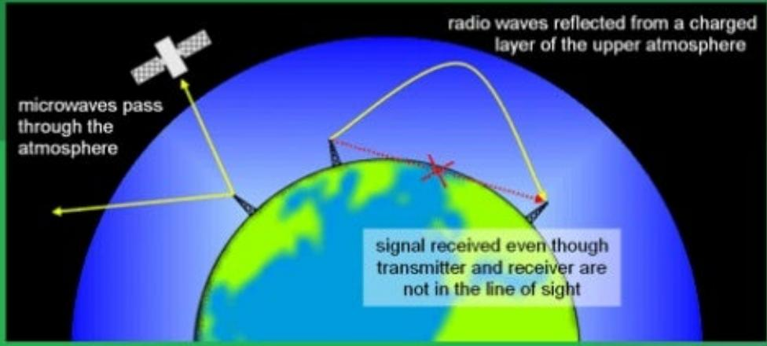

> **AI Description:**
> **Source:** `assets/_page_17_Figure_1.jpg`
> 
> **Generated:** 2026-05-30 23:53:57
> 
> ---
> 
> The image contains a diagram illustrating the concept of radio wave propagation using microwaves. It shows a satellite emitting microwaves that pass through the Earth's atmosphere and are reflected from a charged layer in the upper atmosphere. The diagram highlights how the signal can be received even when the transmitter and receiver are not in the line of sight, demonstrating the use of ionospheric reflection for long-distance communication. Key labels include "microwaves pass through the atmosphere," "radio waves reflected from a charged layer of the upper atmosphere," and "signal received even though transmitter and receiver are not in the line of sight."

There are two major waves: P-Waves: they are the primary waves S-Waves:they are the secondary waves

P-Waves are the 'invincible'waves as they travel through solids and liquids.

S-Waves: these are the less invincible'wavesastheycanonly go through solids

The other wave is an L-Wave: this travel the surface of the Earth.This help find the epicentre of the earthquake after looking at the Pand S waves.

P-Waves are longitudinal In longitudinal waves, the vibrations are along the same direction as the direction of travel.

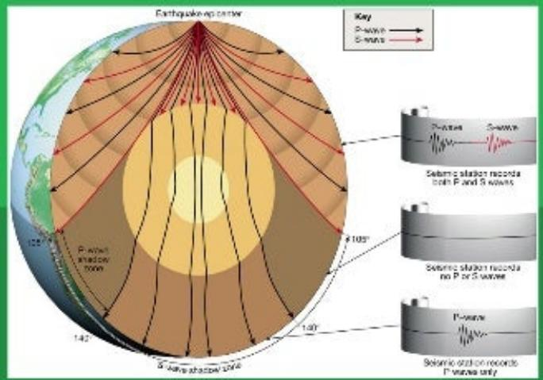

> **AI Description:**
> **Source:** `assets/_page_18_Figure_0.jpg`
> 
> **Generated:** 2026-05-30 23:51:01
> 
> ---
> 
> The image is a diagram illustrating the propagation of seismic waves (P-waves and S-waves) from an earthquake epicenter to the Earth's surface. It shows the path of these waves through the Earth's layers, highlighting the shadow zone where P-waves are not recorded due to their inability to travel through certain materials. The diagram also includes a key explaining the direction of wave propagation and seismic station recordings, indicating the types of waves recorded at different angles. The visual elements effectively demonstrate the behavior of seismic waves and their interaction with the Earth's structure.

## P1h: Earthquakes

S-Waves are transverse In transverse waves, the vibrations are at right angles to the direction of travel.

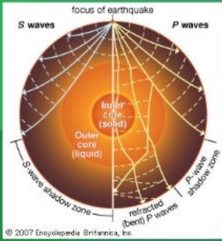

> **AI Description:**
> **Source:** `assets/_page_18_Figure_1.jpg`
> 
> **Generated:** 2026-05-30 23:50:52
> 
> ---
> 
> The image is a diagram illustrating the propagation of seismic waves (P-waves and S-waves) through the Earth's layers. It shows the focus of an earthquake at the center and the paths of the waves as they travel through the Earth's outer core (liquid) and inner core (solid). The diagram highlights the S-wave shadow zone and the P-wave shadow zone, where these waves are not detected due to their inability to propagate through certain layers of the Earth. The labels and annotations provide clear information about the types of waves and their respective paths.

They are recorded by seismometers.These are embedded into bedrock (rock that doesn't fall loose).The simplest version is:a pen in a box with a roll of paper;and when a wave hits the pen will record it by marking the paper when dangling side to side

The ozone isa layer of gas in the atmosphere; majority of the ozone reside in the stratosphere.

The ozone is thinning though by CFCs

CFCs are also known as Chlorofluorocarbons

## P1h: UV Radiation on Earth and Atmosphere

The ozone filters the amount of radiation that goes into the Earth; however the radiation intake is increasing

Satellites are used to survey the ozone layer; this also showed scientist that the ozone was thinning in colder places i. e.Antarctica.

To stop the Ozone thinning fast an international agreement was made in 1980;to stop using CFCs This was signed by many countries

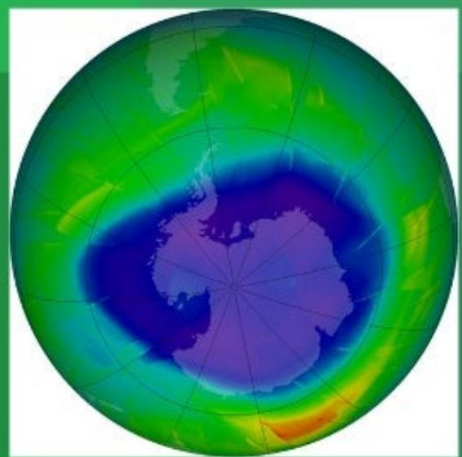

> **AI Description:**
> **Source:** `assets/_page_20_Figure_1.jpg`
> 
> **Generated:** 2026-05-30 23:52:11
> 
> ---
> 
> The image is a map showing the ozone hole over Antarctica. It is a color-coded map with varying shades of green, yellow, blue, and purple. The color gradient represents the concentration of ozone in the atmosphere, with darker shades indicating lower ozone levels. The map highlights a significant depletion of ozone over the Antarctic region, which is the ozone hole. The image is a scientific visualization used to illustrate the phenomenon of ozone depletion.

The colder the area the faster the chemical reaction involving CFCs, the quicker the Ozone thins.The cold isa catalyst for the reaction
