
## BARIUMSWALLOW

DR.SHAIKFARID

RMMCH

## INTRODUCTION

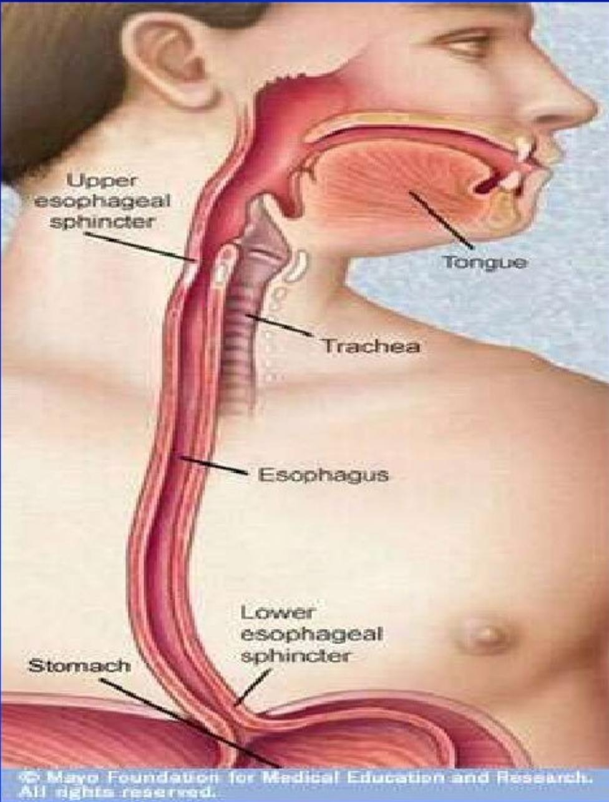

> **AI Description:**
> **Source:** `assets/_page_1_Figure_0.jpg`
> 
> **Generated:** 2026-05-31 00:00:51
> 
> ---
> 
> The image is a detailed medical illustration of the human esophagus and related structures. It shows a cross-sectional view of the upper part of the digestive tract, including the upper esophageal sphincter, tongue, trachea, esophagus, and lower esophageal sphincter. The illustration is labeled with the names of these anatomical parts, providing a clear visual representation of the structure and function of the esophagus and its surrounding areas. The image is credited to the Mayo Foundation for Medical Education and Research.

Barium swallow is a radiological study of pharynx and esophagus upto the level of stomach with the help of contrast.

## EMBRYOLOGY OFPHARYNX

Head&neckstructures arederivedfrom pharyngeal arches1&2.

Eacharch contain similar component derived from endoderm,ectoderm& mesoderm.

·The cavity within the pharyngeal arches forms the pharynx.

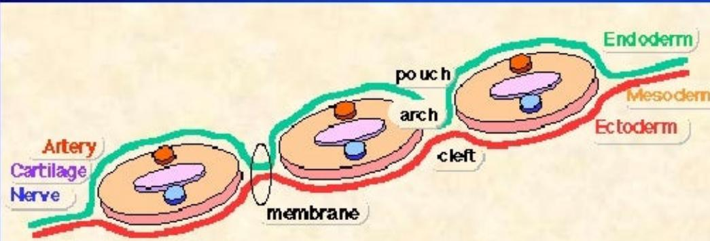

> **AI Description:**
> **Source:** `assets/_page_2_Figure_0.jpg`
> 
> **Generated:** 2026-05-31 00:21:15
> 
> ---
> 
> The image is a diagram illustrating the development of a structure, likely related to the formation of a blood vessel or artery in the context of embryonic development. It shows three stages of development, each labeled with key components such as "artery," "cartilage," and "nerve." The diagram includes annotations for "endoderm," "mesoderm," and "ectoderm," which are the three primary germ layers in embryonic development. The stages are labeled as "pouch," "arch," and "cleft," indicating the progression of the structure's formation. The diagram uses color coding to distinguish between different layers and components, aiding in the visualization of the developmental process.

## BOUNDRIES OF PHARYNX

·Anteriorly-mouth&nasal choanae

·Superiorly-soft palate&portion of skull

·Inferiorly- postr of tongue

·Posteriorly-pharnygeal constrictors

## PARTS

·Naso-ant.pharynx joins nasal cavity

· Oro- midportion of pharynx joins oral cavity

·Hypo-inferiorpharynxjoinslarynx.

## NASOPHARYNX

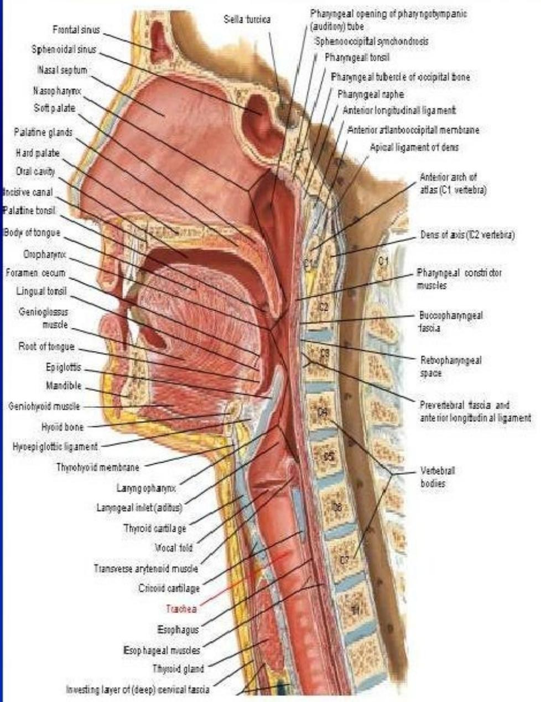

> **AI Description:**
> **Source:** `assets/_page_5_Figure_0.jpg`
> 
> **Generated:** 2026-05-31 00:21:53
> 
> ---
> 
> The image is a detailed anatomical illustration of the human pharynx and surrounding structures. It includes a cross-sectional view of the neck and upper thoracic region, showcasing various muscles, bones, and soft tissues. Key structures such as the mandible, hyoid bone, larynx, and esophagus are prominently labeled. The illustration also highlights the pharyngeal muscles, fascia, and the vertebral column, providing a comprehensive view of the anatomical relationships in this region.

· Lies behind the nasal cavity.

Postero-superiorly this extendsfrom thelevel of the junction of the   
hard and soft palates to the base of   
skull, laterallyto include the fossa of   
Rosenmuller.

The inferiorwall consists of the superior surface of the soft palate.

## OROPHARYNX

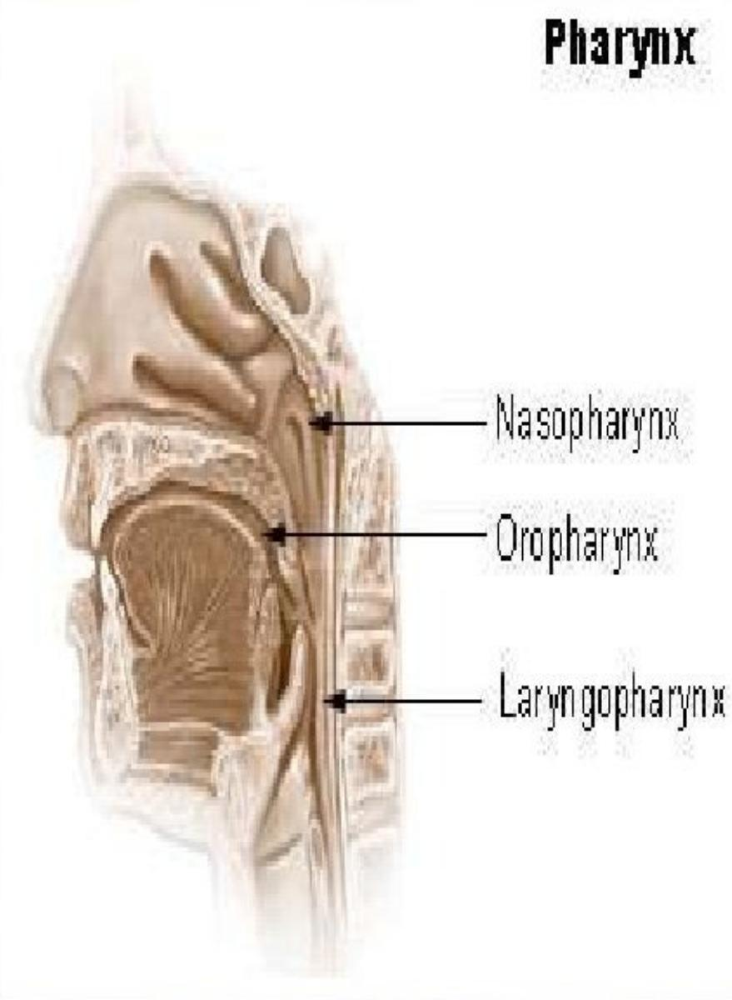

> **AI Description:**
> **Source:** `assets/_page_6_Figure_0.jpg`
> 
> **Generated:** 2026-05-31 00:01:21
> 
> ---
> 
> The image is a technical illustration of the pharynx, showing a cross-sectional view of the throat. It includes labels for the nasopharynx, oropharynx, and laryngopharynx, indicating the different regions of the pharynx. The illustration is detailed, showing the anatomical structures in a side view, which helps in understanding the spatial relationships between these parts. The image is useful for educational purposes in anatomy and physiology.

· Lies behind the oral cavity.

· The anterior wall-the base of the tongue and the epiglottic valleculae.

·the lateral walltonsil,toillr fossa,and tonsillar (faucial) pillars;

· the superior wall - inferior surface of the soft palate and the

## LARYNGOPHARYNX/HYPOPHARYNX

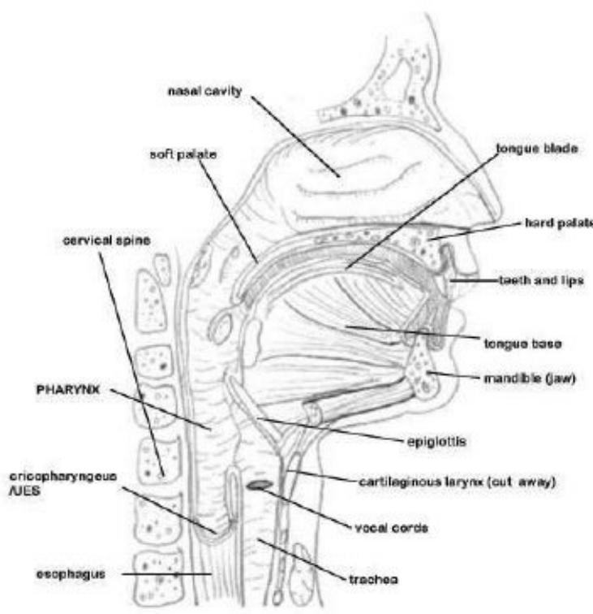

> **AI Description:**
> **Source:** `assets/_page_7_Figure_0.jpg`
> 
> **Generated:** 2026-05-31 00:09:36
> 
> ---
> 
> The image is a detailed anatomical diagram of the human oral and pharyngeal cavity, including the nasal cavity. It features labeled parts such as the nasal cavity, soft palate, tongue blade, hard palate, teeth and lips, tongue base, mandible (jaw), pharynx, epiglottis, cartilaginous larynx (cut away), vocal cords, and esophagus. The diagram is a technical illustration with annotations pointing to specific anatomical structures, providing a clear view of the oral and pharyngeal regions.

Figure 1-walowing Anatomy

LevelsbetweenC4toC6,it includes the pharyngoesophageal junction (postcricoid area),thepiriformsinusandthe posteriorpharyngeal wall.

Linedwithastratified squamous epithelium.

It lies inferior to the upright epiglottisand extendsto the larynx,where the respiratory and digestive pathways diverge.

At that point,the laryngopharynx is contunious with esophagus posteriorly.

## EMBRYOLOGY OF ESOPHAGUS

Primitive gut tube forms during 4th week of gestation.

Itisderived from incorporation of the dorsal part of the definitive yolk sac into embryo due to embryonic folding.

· Primitive gut is divided into foregut,midgut and hindgut.

·Laryngotracheal diverticulum develop in the midline of the ventral wall of the foregut.

The distal end enlarges to form lung buds,which is separated from the foregut by tracheoesophageal folds.

## PrimordialGut

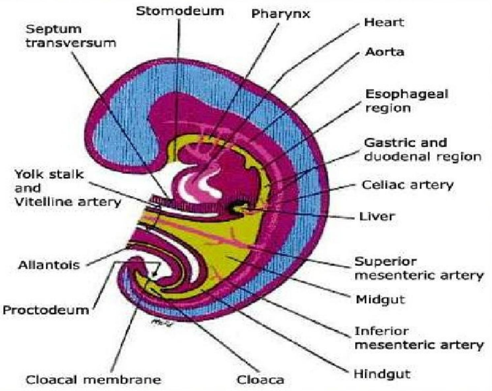

> **AI Description:**
> **Source:** `assets/_page_10_Figure_0.jpg`
> 
> **Generated:** 2026-05-31 00:23:19
> 
> ---
> 
> The image is a detailed diagram of a developing embryo, showcasing various internal structures and regions. It includes labels for key anatomical parts such as the stomodeum, pharynx, heart, aorta, esophageal region, gastric and duodenal region, celiac artery, liver, superior mesenteric artery, midgut, inferior mesenteric artery, hindgut, cloaca, cloacal membrane, proctodeum, allantois, and yolk stalk and vitelline artery. The diagram is color-coded to differentiate between different regions and structures, providing a clear visual representation of the embryonic development process.

·Tracheo-esophageal fold fuse in midline to form tracheo-esophageal septum.

The foregut divide into laryngotracheal tube(larynx,trachea,bronchi&lungs) ventrally and esophagus dorsally.

· Esophagus is initially short,but lengthens with descent of heart and lungs.

## CONGENITALANOMALIES

·esophageal atresia,EA,

·tracheoesophageal fistula,TEF,

·esophageal stenosis,

·esophageal cyst,

·tracheobronchial remnant,

·esophagealatresia and tracheoesophageal fistula,EA-EF,

·esophageal web,

·esophageal muscular hypertrophy,

·esophageal duplications,

·columnarepitheliumlined lower esophagus,

·Barrett's esophagus,laryngotrache oesophageal cleft,LEC

## ANATOMY OF ESOPHAGUS

Flattenedmuscular tube,size18 to 26cm beginning atlower border of cricoid cartilage(opp 6th cervical vertebra) and ending at cardiac orifice of stomach(opp11th cervical vertebra)

Dividedinto3anatomical   
segments   
i.e.,cervical,thoracic&   
abdominal

> **AI Description:**
> **Source:** `assets/_page_14_Figure_0.jpg`
> 
> **Generated:** 2026-05-31 00:06:59
> 
> ---
> 
> The image is a detailed anatomical illustration showing the upper part of the human body, focusing on the digestive and respiratory tracts. It includes labels for key structures such as the tongue, upper esophageal sphincter, trachea, esophagus, and lower esophageal sphincter. The illustration is a side view, highlighting the relationship between these structures and their roles in swallowing and breathing. The image is credited to the Mayo Foundation for Medical Education and Research.

· Cervical esophagus extend from pharyngeal junction to suprasternal notch and is abt 4- 5cm.

·Atthis level,eosophagusborderedanteriorly by trachea,post by vetebral column and lat by carotid sheath and thyroid gland.

Thoracic esophagus extend from suprasternal notch(opp T1) to diaphragmatic hiatus(opp T10).18cm in length.

Anteriorly lies the trachea,rt pulmonary artery, left main bronchus & diaphragm.post it rest on vertebral column and closely related to thoracic duct, azygous & hemiazygous vein.

Abdominal esophagus extend from diaphragmatic hiatus to orifice of cardia of stomach.size abt1 cm.

Its right border is continuous with lesser curvature & left border is demarcated from fundus by esophagogastric angle of implantation(angle of His)

## ESOPHAGEAL CONSTRICTION

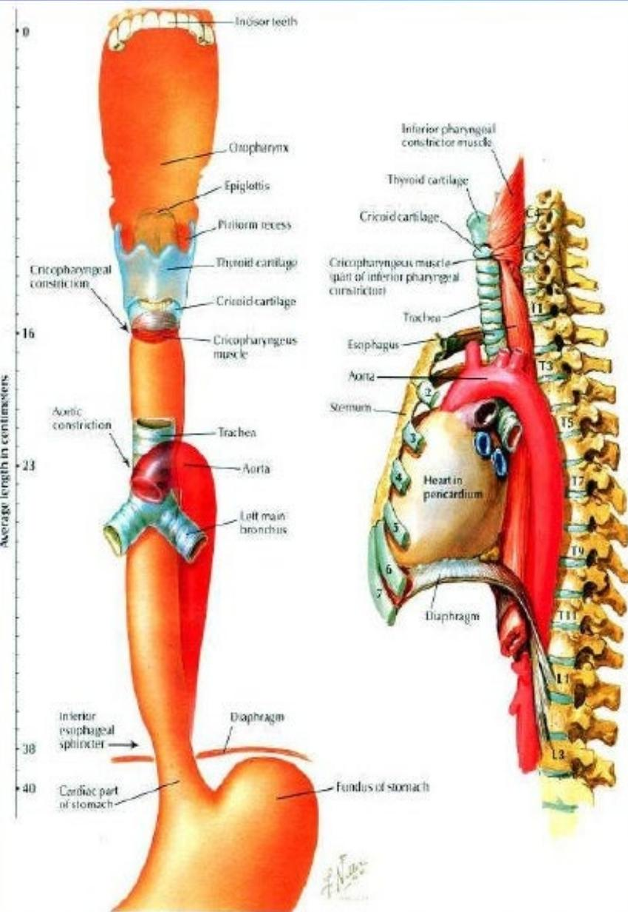

> **AI Description:**
> **Source:** `assets/_page_19_Figure_0.jpg`
> 
> **Generated:** 2026-05-31 00:11:18
> 
> ---
> 
> The image is a detailed anatomical illustration of the upper respiratory and digestive tracts, including the pharynx, larynx, trachea, esophagus, and heart. It also shows the aorta and major blood vessels, as well as the spine and thoracic cavity. The illustration includes measurements of the average length of various structures in centimeters, such as the cricopharyngeal constriction and the aortic constriction. Key anatomical structures are labeled, providing a comprehensive view of the anatomy of the upper airway and esophagus.

Superiorly: level of   
Cricoid   
cartilage, juncture with   
pharynx

·Middle:crossed byaorta and left main bronchi

·Inferiorly: diaphragmatic sphincter

## SPHINCTERS

Two high pressure zones prevent the backflow of food:

·Upper Esophageal sphincter.

·Lower Esophageal sphincter.

· It is located at upper and lower end of esophagus.

## LAYERS OF ESOPHAGUS

Structurally, esophagus wall composed of 4 layers:

·Innermostmucosa,

·Submucosa,

·Muscularis propria

·Adventitia.

·No serosa.

## BLOOD SUPPLY

·Arterial supply

Branches of inf thyroid artery - UES & cervical esophagus.

Paired aortic esophageal arteries or terminal br.of bronchial artery-thoracic esophagus

· Left gastric & br.of left phrenic art- LES& distal esophagus.

## Arteriesof Esophagus

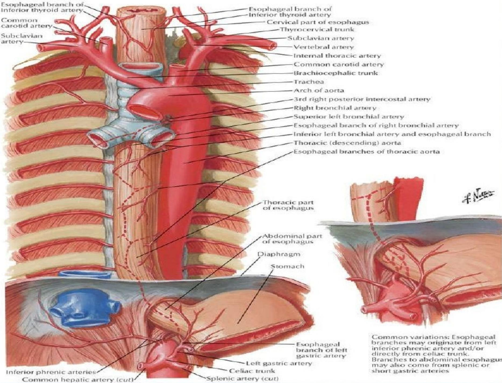

> **AI Description:**
> **Source:** `assets/_page_23_Figure_0.jpg`
> 
> **Generated:** 2026-05-31 00:05:21
> 
> ---
> 
> The image is a detailed anatomical illustration of the thoracic and abdominal regions, focusing on the blood vessels and their branches. It includes a cross-sectional view of the thorax and abdomen, highlighting the aorta, esophagus, and various arteries such as the subclavian artery, common carotid artery, and celiac trunk. The illustration also shows the esophageal branches of the inferior thyroid artery, right bronchial artery, and left gastric artery. The image is annotated with labels pointing to specific structures, providing a comprehensive view of the vascular system in the thoracic and abdominal cavities.

## VENOUSDRAINAGE

Proximal & distal esophagus drains into azygous veins.

Mid-esophagus drains into collaterals of left gastric vein,br. of portal vein.

·Submucosal connection between portal and systemic venous system in distal esophagus form esophageal varices in portal hypertension.

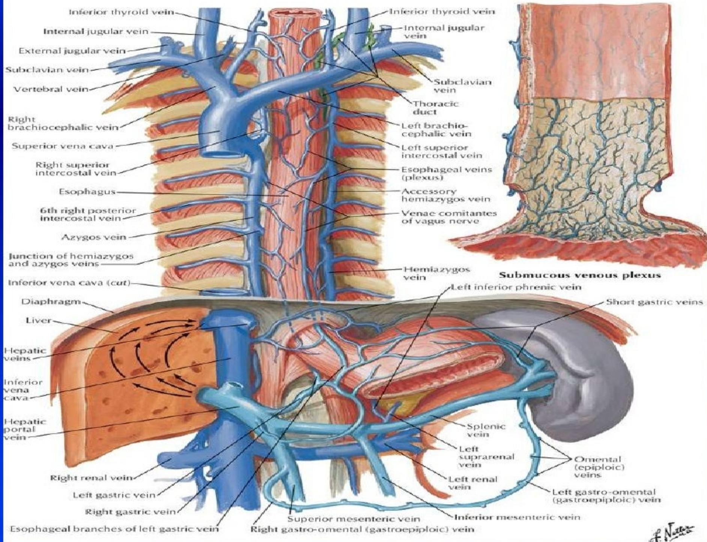

> **AI Description:**
> **Source:** `assets/_page_25_Figure_0.jpg`
> 
> **Generated:** 2026-05-31 00:09:22
> 
> ---
> 
> The image is a detailed anatomical illustration of the venous system, focusing on the thoracic and abdominal regions. It includes labeled diagrams of various veins such as the inferior thyroid vein, internal jugular vein, subclavian vein, and superior vena cava. The illustration also highlights the esophagus, diaphragm, liver, and other internal organs, with arrows indicating the direction of blood flow. The image provides a comprehensive view of the venous network, including the submucous venous plexus and the connections between different veins.

NERVE SUPPLY

Extrinsic network -sympathetic& parasympathetic.

SYMPATHETIC: -Neck - sup & inf cervical ganglion, -Thorax- upper thoracic and splanchnic nerve.

·PARASYMPATHETIC:

\- from recurrent laryngeal nerve&br of vagus in thorax&abdomen.

·Intrinsic

-from 2 intramural plexuses

\- 1in submucous layer.

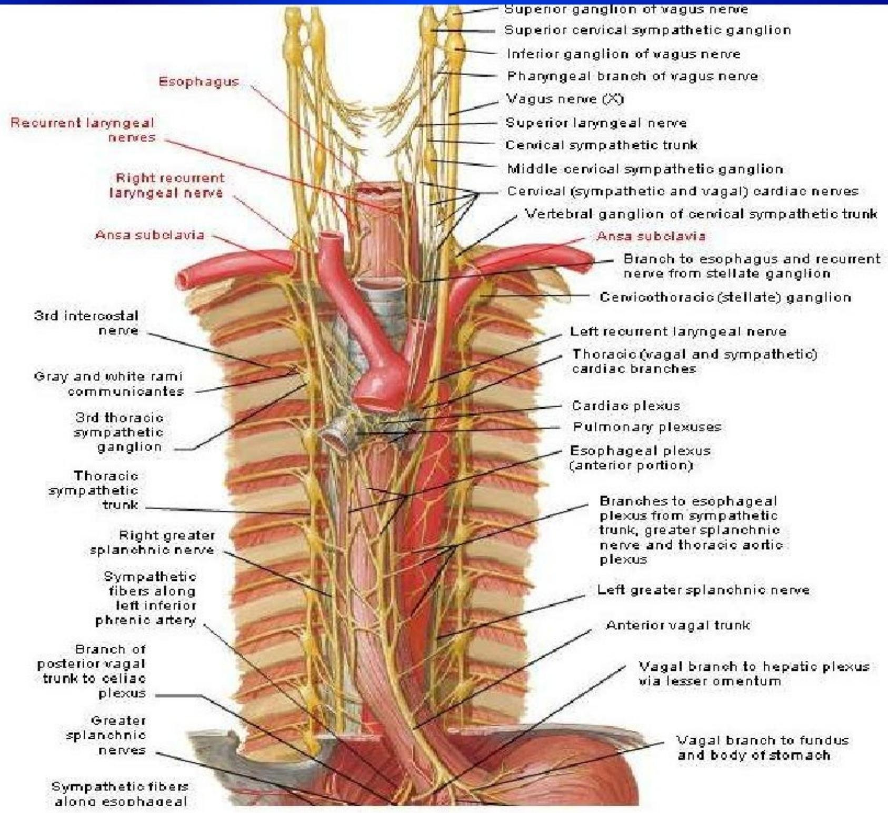

> **AI Description:**
> **Source:** `assets/_page_27_Figure_0.jpg`
> 
> **Generated:** 2026-05-31 00:19:04
> 
> ---
> 
> The image is a detailed anatomical illustration of the thoracic and cervical regions, focusing on the nerves and ganglia involved in the autonomic nervous system. It includes labels for various structures such as the esophagus, recurrent laryngeal nerves, sympathetic trunks, and cardiac plexuses. The illustration provides a comprehensive view of the neural pathways and their connections, highlighting the relationships between the vagus nerve, sympathetic ganglia, and other nerves involved in the regulation of the heart and other thoracic organs. The image is rich in visual information, combining text labels with a detailed diagram to illustrate the complex anatomy of the thoracic cavity.

## LYMPHATIC DRAINAGE

·Originate from 2 plexus-submucosal layer & other within the muscle layer.

·Upper 2/3 flow in cranial direction.

·Lower1/3 flow in caudal direction.

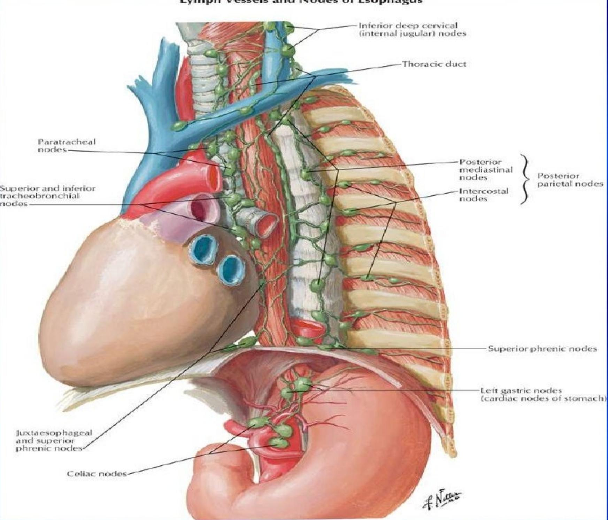

> **AI Description:**
> **Source:** `assets/_page_29_Figure_0.jpg`
> 
> **Generated:** 2026-05-31 00:13:18
> 
> ---
> 
> The image is a detailed anatomical illustration of the lymph vessels and nodes associated with the esophagus. It includes labeled diagrams of various lymph nodes and vessels such as the inferior deep cervical (internal jugular) nodes, thoracic duct, paratracheal nodes, superior and inferior tracheobronchial nodes, posterior mediastinal nodes, intercostal nodes, posterior parietal nodes, superior phrenic nodes, left gastric nodes (cardiac nodes of stomach), juxtacolic and superior phrenic nodes, and celiac nodes. The illustration provides a comprehensive view of the lymphatic system's structure and distribution in relation to the esophagus, heart, and surrounding organs.

## BARIUM SWALLOW

It is a medical imaging procedure used to examine upper gastrointestinal tract,which include the esophagus and to a lessr extent the stomach.

·The contrast used isbarium sulfate.

CONTRAST

·TYPESOF CONTRAST STUDY

(i)SINGLE CONTRAST STUDY

(ii) DOUBLE CONTRAST STUDY

CONTRAST USED

·100% BARIUM SULPHATEPASTE

·80%BARIUMSULPHATESUSPENSION

·30% BARIUM SULPHATE SUSPENSIONFOR HIGH KVTECHNIQUE

·200-250%HIGHDENSITY,OWVISCOSITOR DOUBLE CONTRAST STUDY

## INDICATION

·Dysphagia

·Heartburn,retrosternal pain,regurgitation&odynophagia.

·Hiatus hernia

·Refluxoesophagitis

·Stricture formation.

·Esophageal carcinoma.

·Motilitydisorder like

i.Achalasia

ii.diffuse esophageal spasms.

·Pressure or invasion from extrinsic lesions.

·Assessment of abnormality of

i.pharyngo esophageal junction including zenkers diverticulum

ii.cricoid webs

iii.cricopharyngeal Achalasia.

## CONTRAINDICATION

Suspected leakage from esophagus into the mediasternum or pleura and peritoneal cavities.

·Tracheo-esophageal fistula

## XRAYVIEW

## ·SOFT TISSUE NECK-AP& LAT-SCOUT

·NECK-AP&LATERAL

·THORAX-RAOVIEW

## NORMAL-AP/LATVIEW-SCOUT

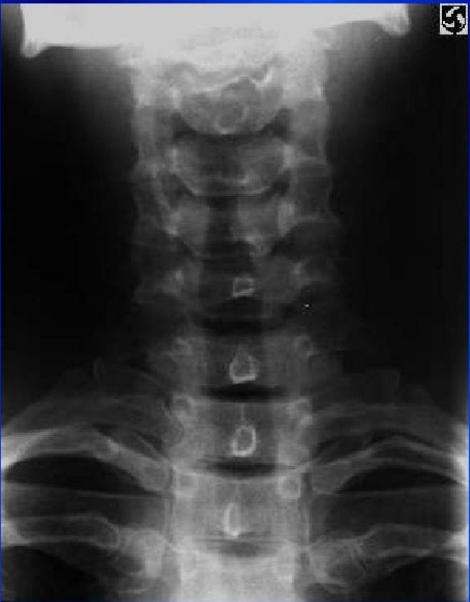

> **AI Description:**
> **Source:** `assets/_page_36_Figure_0.jpg`
> 
> **Generated:** 2026-05-31 00:01:53
> 
> ---
> 
> The image is a radiographic image, specifically an X-ray of the thoracic spine. It shows the vertebrae, intervertebral discs, and some of the ribs. The image appears to be a lateral view, as the spine is oriented vertically. There are no visible text annotations or labels within the image itself. The image quality is somewhat low, making it difficult to discern fine details.

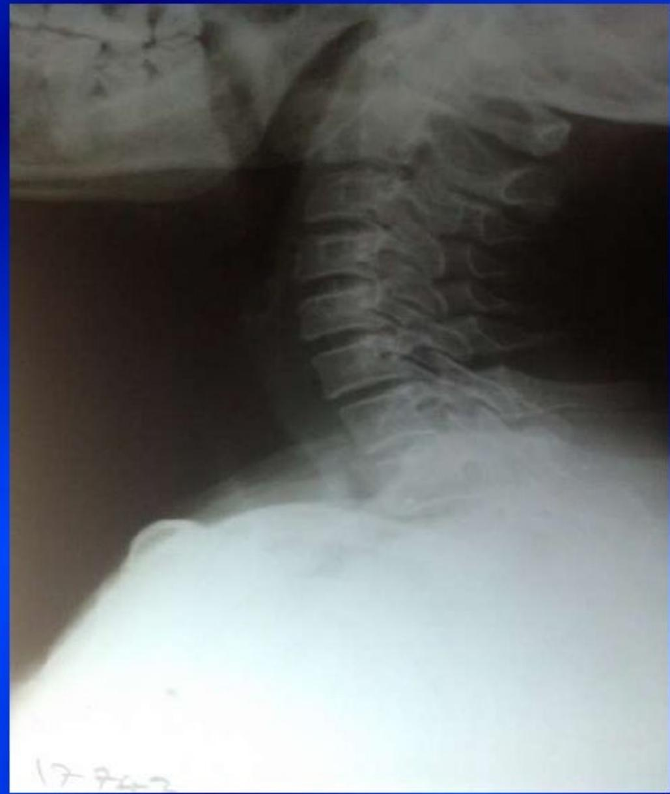

> **AI Description:**
> **Source:** `assets/_page_36_Figure_1.jpg`
> 
> **Generated:** 2026-05-31 00:03:26
> 
> ---
> 
> The image is a medical X-ray of the cervical spine, showing the vertebrae from the base of the skull down to the upper thoracic region. The X-ray provides a clear view of the cervical vertebrae, including the alignment and any potential abnormalities or degenerative changes. The image is labeled with a date in the bottom left corner, indicating when the X-ray was taken.

## AP/LATVIEWWITHBARIUM

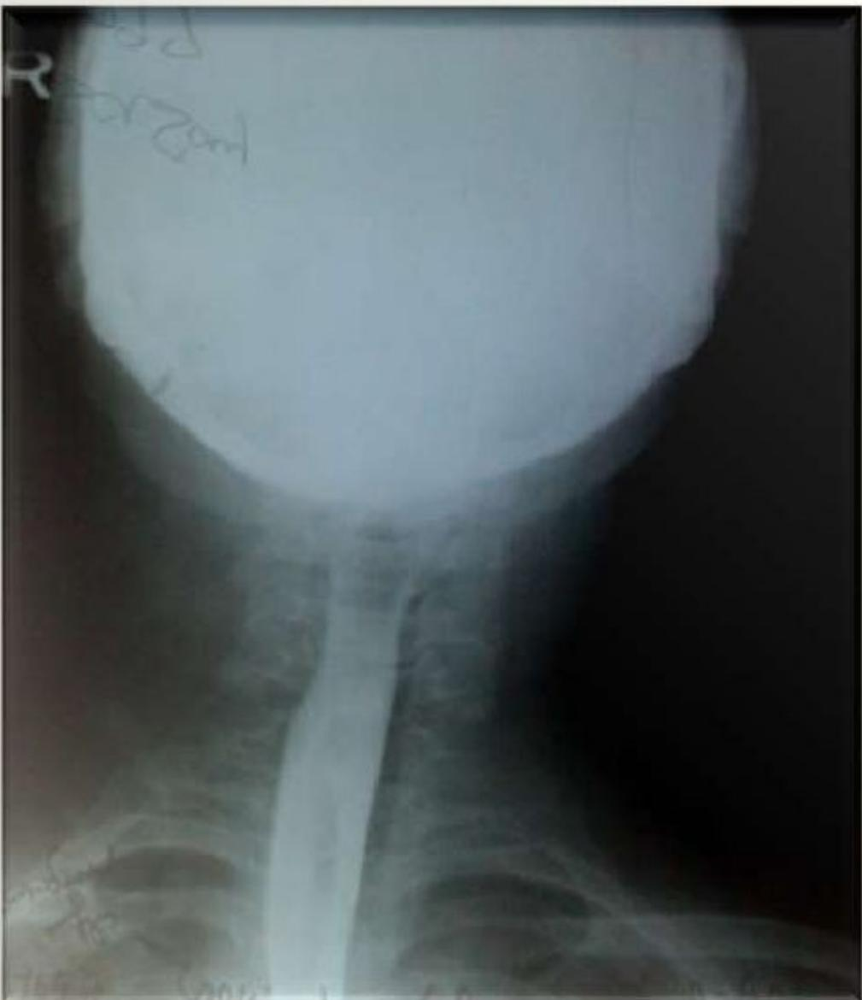

> **AI Description:**
> **Source:** `assets/_page_37_Figure_0.jpg`
> 
> **Generated:** 2026-05-31 00:10:30
> 
> ---
> 
> The image is a radiographic (X-ray) image of a human knee joint. It shows the femur (thigh bone) and tibia (shin bone) with the knee joint space visible. The image appears to be a lateral view, as the joint space is seen from the side. There are no visible text annotations or labels within the image itself.

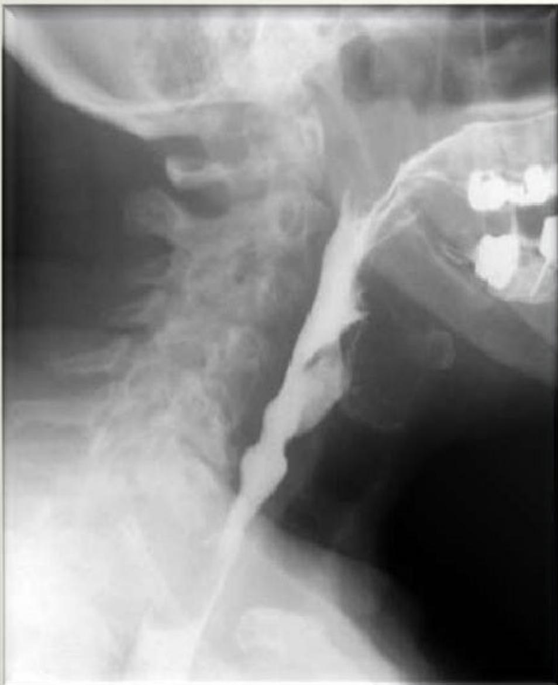

> **AI Description:**
> **Source:** `assets/_page_37_Figure_1.jpg`
> 
> **Generated:** 2026-05-31 00:07:32
> 
> ---
> 
> The image is a medical radiograph, specifically an X-ray of the thoracic spine. It shows the vertebrae and the intervertebral spaces. The image appears to be a lateral view, as it shows the spine from the side. The vertebrae are well-defined, and the intervertebral spaces are visible. There are no obvious signs of fractures or significant deformities in the vertebrae. The image quality is adequate for diagnostic purposes.

## RAO VIEW

## PATIENT PREPARATION

· None in particular but advisable to be in NPO priorto the procedure.

·Ensured that no contraindication to the pharmacological agent used.

·Check pregnancy state.

· Procedure should be explained to patient before undergoing the procedure.

## TECHNIQUE

·PHARYNX

· -One mouthful contrast bolus with high density(250% w/v).

· -Patient is asked to swallow once and stop swallowing there after.

-This is to get optimum mucosal coating.

-frontal and lateral view x-ray taken.

·ESOPHAGUS

·Single contrast

-Multiplemouthful 80%w/v barium suspension given.

·-prone swallow to assess esophageall contraction.

-useful in esophageal compression, displacement or disordered motility.

·Double contrast

· -Contrast high density，low viscosity(20o-250%).

·-15-20 ml given& asked to swallow.

· -Then effervescent powder given with another mouthful of barium.

·-In erect posture,gas tend to stay up so adequate distention stays longer time.

· Inj.buscopan I.V given before the procedure to keep esophagus distended for longer time.

## SPECIFIC CONDITION

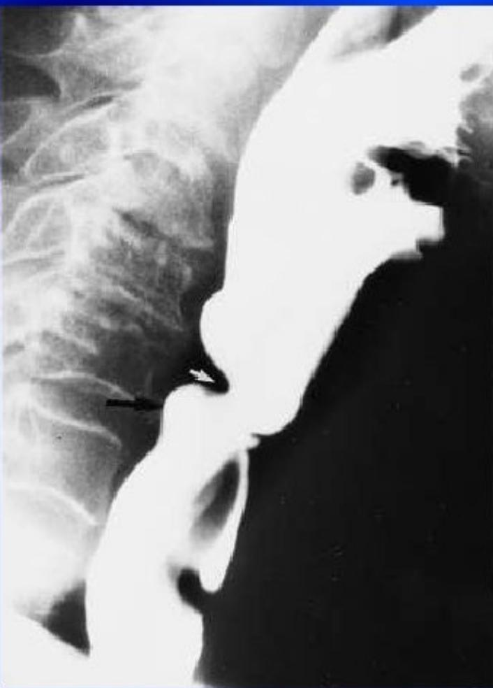

> **AI Description:**
> **Source:** `assets/_page_44_Figure_0.jpg`
> 
> **Generated:** 2026-05-31 00:17:37
> 
> ---
> 
> The image appears to be a radiographic image, likely an X-ray, showing a portion of the thoracic spine and surrounding structures. The image includes a dark area on the right side, which could represent a mass or abnormality. The spine is visible with vertebral bodies and intervertebral spaces. There is a small black arrow pointing to a specific area on the left side of the image, which may indicate a point of interest or concern. The overall image quality and clarity are somewhat low, making it challenging to discern finer details.

## ·PHARYNGEALWEB

· 50/50 dilution of standard high density barium.

·Film insupinefor frontal and erect for lateral view

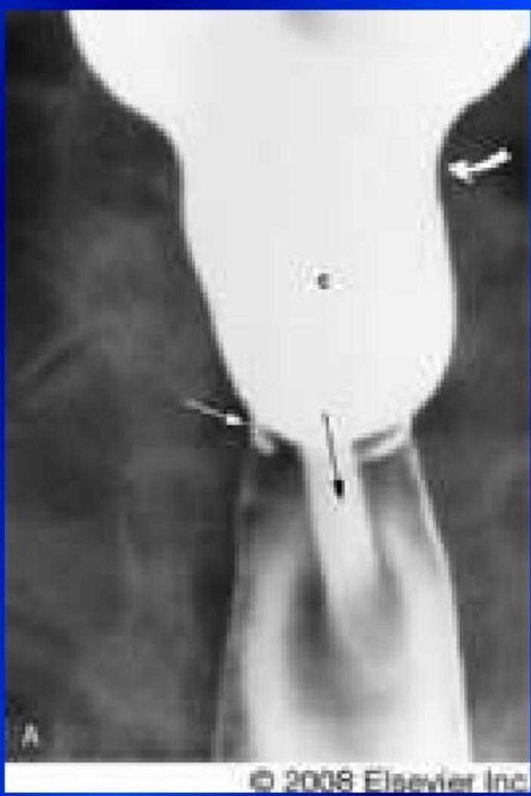

> **AI Description:**
> **Source:** `assets/_page_45_Figure_0.jpg`
> 
> **Generated:** 2026-05-31 00:22:13
> 
> ---
> 
> The image appears to be a radiographic or radiological image, likely an X-ray or CT scan. It shows a cross-sectional view of a structure, possibly a joint or a bone, with a central dark area that could represent a joint space or a void. The surrounding areas have varying shades of gray, indicating different densities of tissue or bone. There are some annotations or markings within the image, which may be used for diagnostic purposes. The image is labeled with a copyright notice at the bottom, indicating it is from Elsevier Inc. in 2008.

Partially obstructing cervical esophageal web. Frontal view shows a   
circumferential,radiolucent ring (straight white arrows) in the proximal cervical   
esophagus. Partial   
obstruction is suggested by a jet phenomenon (black   
arrows), with barium   
spurting through the   
ring,and by mild dilatation of the proximal cervical   
esophagus.

## FOREIGNBODY IMPACTION

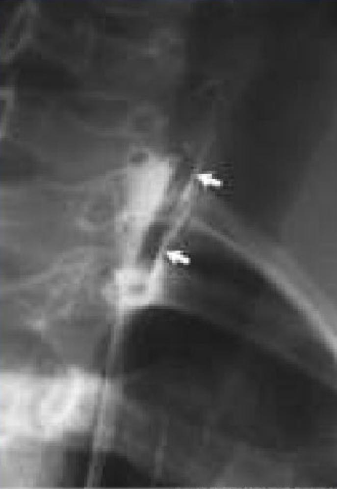

> **AI Description:**
> **Source:** `assets/_page_46_Figure_0.jpg`
> 
> **Generated:** 2026-05-31 00:06:37
> 
> ---
> 
> The image appears to be a medical radiograph, specifically an X-ray of the thoracic spine. It shows the vertebrae and surrounding structures in a side view. The image is in grayscale, which is typical for X-rays. The vertebrae are clearly visible, and there are no obvious signs of fractures or significant deformities in this particular view. The image quality is somewhat low, which might affect the ability to detect subtle abnormalities.

200EhI

Todetectthe level of obstruction in case of radiolucent foreign body in esophagus,marsh mellow coated with bariumisswallowed.

·Passage ofmarsh mellowwill be hindered at the level of obstruction

## Xray showing foreign body

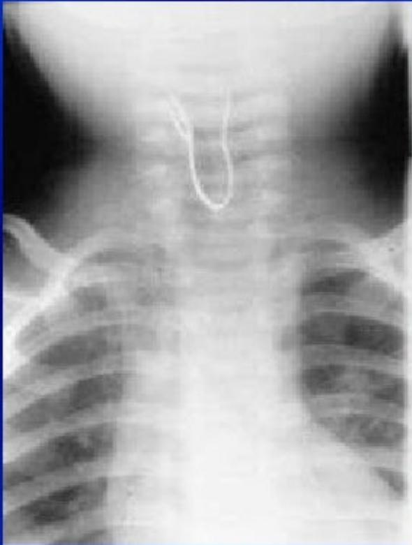

> **AI Description:**
> **Source:** `assets/_page_47_Figure_0.jpg`
> 
> **Generated:** 2026-05-30 23:58:45
> 
> ---
> 
> The image is a medical X-ray of a chest. It shows the thoracic region, including the ribs, spine, and part of the lungs. There is a visible foreign object, possibly a wire or a loop, located in the upper thoracic region. The image is in black and white, typical of X-ray imaging. The ribs and spine are clearly visible, with the foreign object standing out due to its contrast with the surrounding tissues.

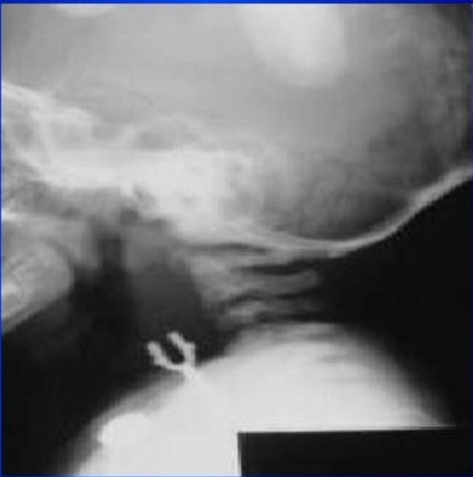

> **AI Description:**
> **Source:** `assets/_page_47_Figure_1.jpg`
> 
> **Generated:** 2026-05-30 23:58:55
> 
> ---
> 
> The image is a radiographic image, likely an X-ray, showing a portion of the skull and upper neck. The image appears to be a lateral view, as it shows the side profile of the skull. The image shows the bony structures of the skull, including the temporal bones, the occipital bone, and parts of the facial bones. There are no visible text annotations or labels within the image itself. The image quality is somewhat grainy, which is typical for X-ray images.

· AP and lateral plain films showing a metallic foreign body in the upper esophagus. Most foreign bodies are found at the level of the cricopharyngeus muscle.

## Sceleroderma esophagus

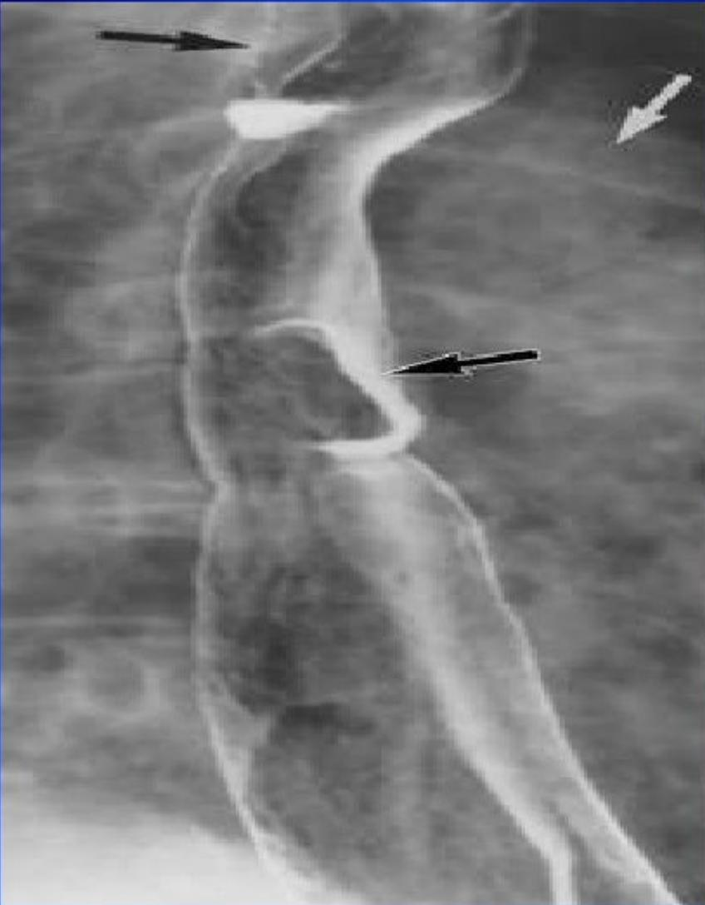

> **AI Description:**
> **Source:** `assets/_page_48_Figure_0.jpg`
> 
> **Generated:** 2026-05-31 00:16:07
> 
> ---
> 
> The image is a radiographic image, likely a chest X-ray, showing the thoracic region. The image contains several arrows pointing to specific areas of interest. The arrows highlight the heart (upper left), the diaphragm (lower right), and what appears to be a possible abnormality or structure in the mediastinum (center). The image is grayscale, typical of X-ray images, and the arrows are used to draw attention to areas that may require further medical evaluation.

Upright leftposterior   
oblique spot image from double-contrast   
esophagography shows twowide-mouthed   
sacculations en face   
(black arrows) in upper   
andmidthoracic   
esophagus.Note how   
uppersacculationextends superiorly justabovelevel of aortic arch (white   
arrow).

## DYSPHAGIA

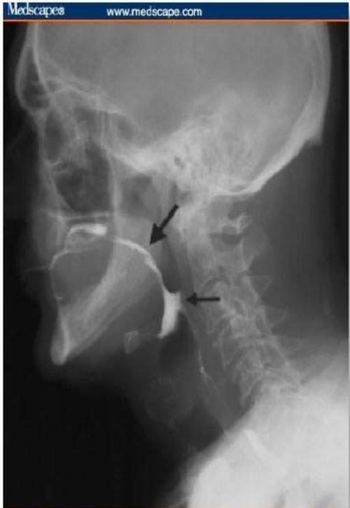

> **AI Description:**
> **Source:** `assets/_page_49_Figure_0.jpg`
> 
> **Generated:** 2026-05-31 00:16:26
> 
> ---
> 
> The image is a radiographic image of the skull and upper cervical spine. It shows the bony structures of the skull and the first two vertebrae of the cervical spine. There are two arrows pointing to specific areas within the skull and cervical spine, indicating areas of interest or concern. The image is labeled with "Medscape" and a website address, suggesting it is from a medical reference source.

Post swallow oral (thick arrow) and pharyngeal (thin arrow) stasis in a patient with base of tongue cancer.

## MEDIASTINALMASS

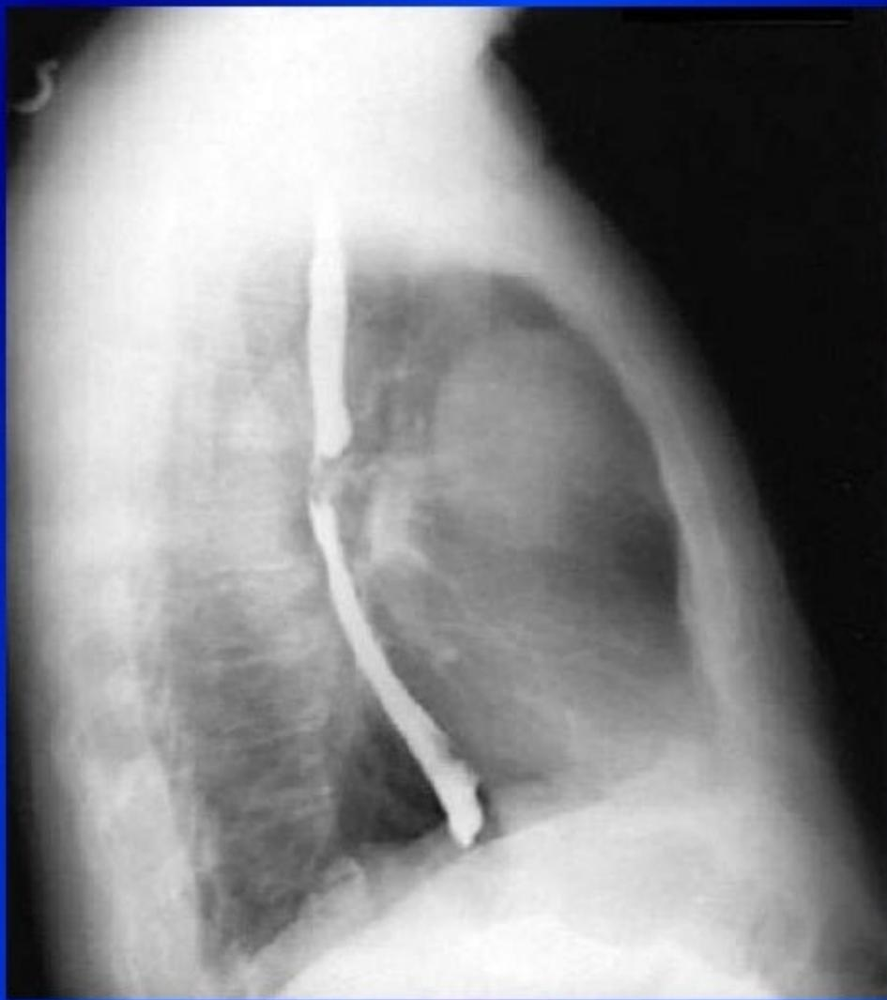

> **AI Description:**
> **Source:** `assets/_page_50_Figure_0.jpg`
> 
> **Generated:** 2026-05-31 00:24:27
> 
> ---
> 
> The image is a medical X-ray of the chest. It shows the heart, lungs, and other thoracic structures. There is a visible metallic object, possibly a catheter or a medical device, extending from the heart region towards the lower part of the chest. The lungs appear clear, with no visible signs of consolidation or fluid accumulation. The heart size appears within normal limits.

·Image showing anterior mediastinal mass in lateral view.

## CARCINOMA

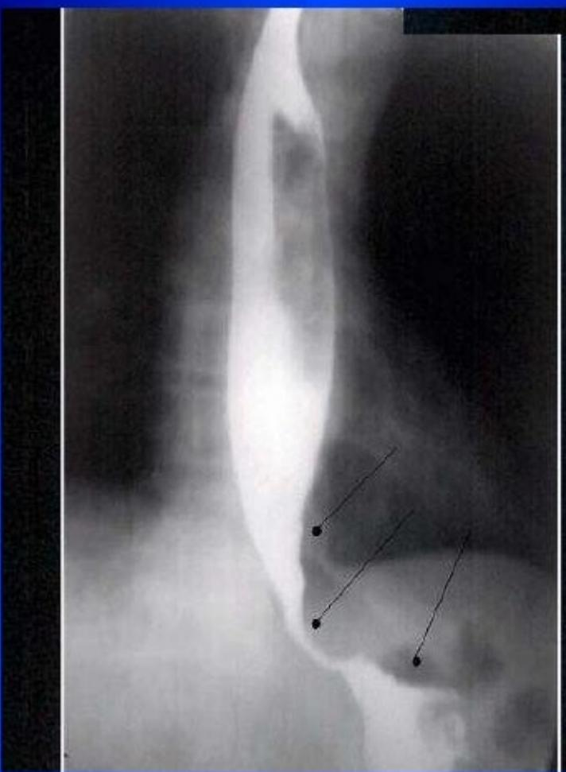

> **AI Description:**
> **Source:** `assets/_page_51_Figure_0.jpg`
> 
> **Generated:** 2026-05-31 00:16:43
> 
> ---
> 
> The image appears to be a radiographic image, likely an X-ray, showing a portion of the human body, possibly the thoracic spine. The central bright area suggests a dense structure, which could be a vertebra or a metallic implant. The image includes three black dots with lines pointing to specific areas, indicating regions of interest or potential abnormalities. The surrounding areas are darker, which is typical for X-ray images, showing less dense structures.

·Preferably high viscosity with normal density barium is used.

·Classical finding in carcinoma-rat tail appearance.

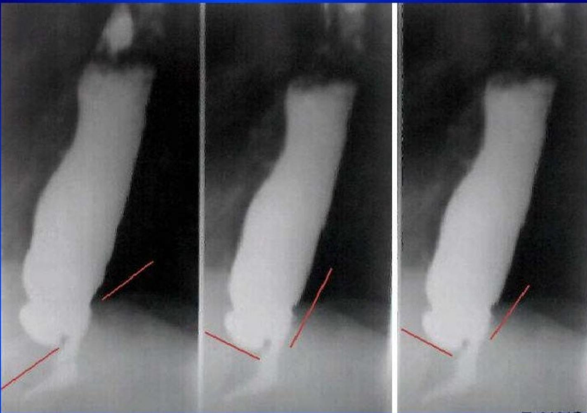

> **AI Description:**
> **Source:** `assets/_page_52_Figure_0.jpg`
> 
> **Generated:** 2026-05-30 23:59:39
> 
> ---
> 
> The image contains a series of three dental radiographs (X-rays) showing the same tooth from different angles. The red lines in each image indicate the root canal, and the images appear to be used for dental endodontic evaluation, possibly to assess the length and curvature of the root canal. The images are technical illustrations used in dental practice to diagnose and plan treatment for dental conditions.

CA ESOPHAGUS

With shouldering Thestenoticsegment islonggivinga""\*rat-tail"appearance Bariumswallowshowsmilddilatationof theesophaguswith irregular stenoticlesion inthe lowerend oftheesophagus"motheaten

appearance

## HIATUS HERNIA

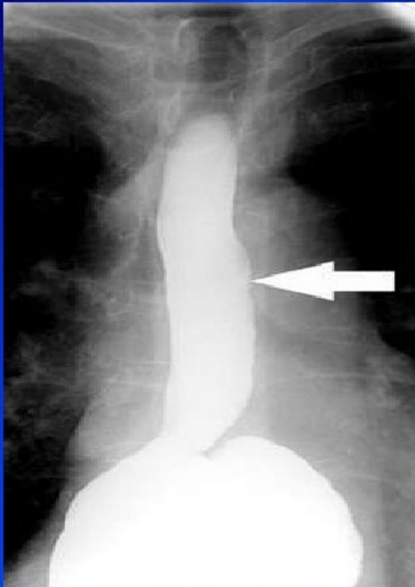

> **AI Description:**
> **Source:** `assets/_page_53_Figure_0.jpg`
> 
> **Generated:** 2026-05-31 00:06:19
> 
> ---
> 
> The image is a radiographic image, likely a chest X-ray, showing the thoracic region. The image contains a white arrow pointing to a specific area within the thoracic cavity, which appears to highlight a region of interest. The arrow is pointing to a slightly denser area in the lower right quadrant of the image, which could indicate a pathological finding such as a mass, fluid accumulation, or other abnormality. The overall structure of the lungs and heart appears normal, with no obvious signs of pneumothorax or other gross abnormalities.

High abdominal pressure is requiredtodemonstrate.

·Pt has to strain.

·Lie down,straighten legs& then raise themup.

Manual compressionof abdomen.

Pt stands upright,ask him to bend downward with leg straight.

·Stomach should be distendedto demonstrate HH.

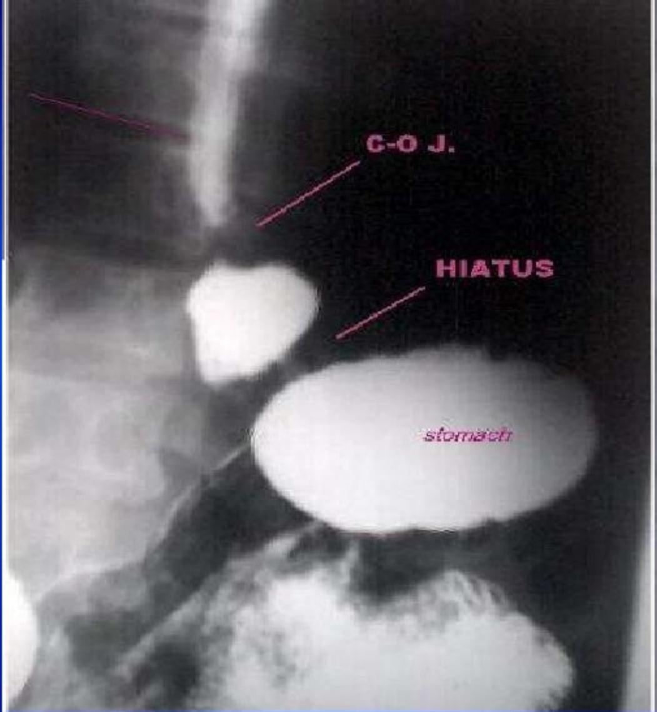

> **AI Description:**
> **Source:** `assets/_page_54_Figure_0.jpg`
> 
> **Generated:** 2026-05-31 00:05:58
> 
> ---
> 
> The image is a medical radiograph showing the upper gastrointestinal tract. It includes labeled anatomical structures such as the "C-O J." (likely referring to the cricopharyngeal muscle and the junction of the esophagus and the stomach), "HIATUS" (indicating the esophageal hiatus), and "stomach." The image is a diagnostic tool used to assess the esophagus and stomach, possibly for conditions such as esophageal obstruction or hiatal hernia. The visual content is crucial for medical professionals to interpret the patient's condition.

## HIATUS HERNIA

Bariummeal in Trendlenbergposition Displacementof thecardio-esophageal junction abovetheesophagealhiatus Partofthe stomach ispresent inthechest Reflux of barium into the esophagus

## ACHALASIA CARDIA

Eosophagus shouldbe cleaned thoroughly (aspirate &wash) - secondaryachalasia d/t Ca esophagus not missed.

Barium 80%w/v used,pt erect position.

Mecholyl test  
hyperperistalsis,pain&stre ak of contrast entering   
stomach.

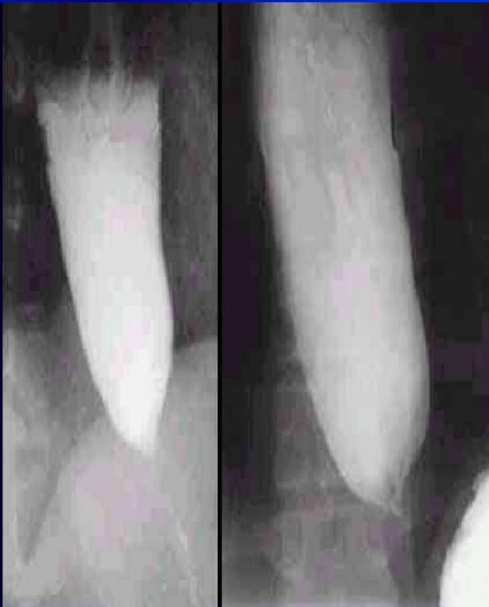

> **AI Description:**
> **Source:** `assets/_page_55_Figure_0.jpg`
> 
> **Generated:** 2026-05-31 00:00:13
> 
> ---
> 
> The image contains two X-ray images of a foot, likely comparing the same foot at different stages or angles. The X-rays show the bones and soft tissues of the foot, with the left image appearing to be a lateral view and the right image a medial view. The images are in grayscale, with varying shades indicating different densities. There are no visible labels or annotations within the images themselves.

## ACHALSIA CARDIA

·Bariumswallow showing dilatation of the esophageal body

\*With short segment stricture.

\*A"bird-peak " like tapering of the   
esophagusat the GE junction.OR   
\*A Sigmoid "Mega esophagus

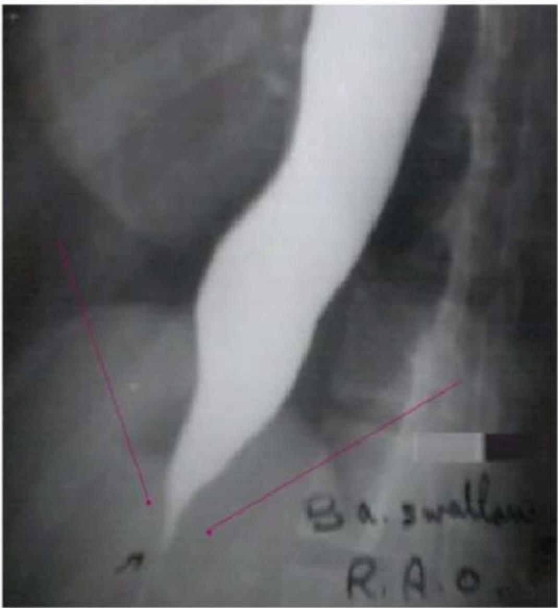

> **AI Description:**
> **Source:** `assets/_page_56_Figure_0.jpg`
> 
> **Generated:** 2026-05-31 00:17:20
> 
> ---
> 
> The image is a medical radiograph, specifically a barium swallow study (Ba swallow) taken from a right anterior oblique (RAO) view. The image shows the esophagus and the upper part of the stomach, with the barium outlining the structures. The red lines and annotations indicate the path of the barium as it moves through the esophagus. The image is useful for assessing the function of the esophagus and the presence of any abnormalities in the swallowing process.

## DIFFUSE ESOPHAGEAL SPASM

· Barium swallow shows irregular areas of narrowing and dilatation ---- "Shish kebab""corkscrew" "rosary bead" esophagus The esophageal muscle is hypertrophied,but histologically normal

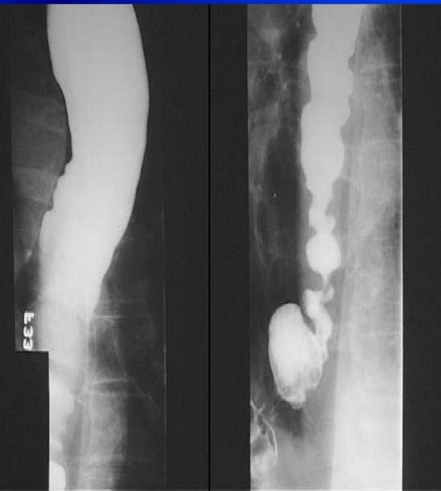

> **AI Description:**
> **Source:** `assets/_page_57_Figure_0.jpg`
> 
> **Generated:** 2026-05-31 00:24:00
> 
> ---
> 
> The image contains a series of radiographic images, likely X-rays, showing the lumbar spine in different projections. The images appear to be part of a diagnostic series, possibly for evaluating spinal conditions such as degenerative changes, fractures, or other abnormalities. The images show the vertebral bodies and intervertebral spaces, with some areas appearing more radiolucent than others, which could indicate disc space narrowing or other pathologies. The images are labeled with "L5" and "S1," indicating the levels of the lumbar and sacral vertebrae being examined.

## ESOPHAGEAL VARICES

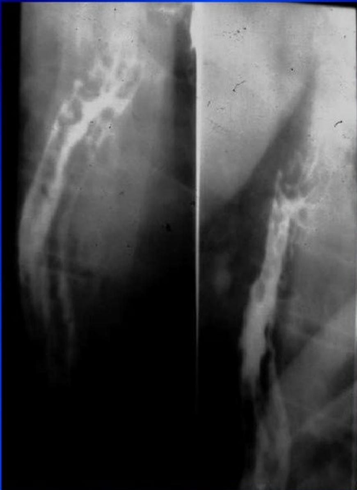

> **AI Description:**
> **Source:** `assets/_page_58_Figure_0.jpg`
> 
> **Generated:** 2026-05-31 00:14:23
> 
> ---
> 
> The image appears to be a radiographic image, likely an X-ray, showing a cross-sectional view of a body part, possibly a bone or joint. The image is in grayscale, with varying shades indicating different densities within the structure. The central dark line running vertically through the image is likely a guide or marker used during the imaging process. The surrounding lighter areas suggest bone or other dense tissues, while the darker areas could represent air or fluid. The image quality and clarity are sufficient to identify these features, but a medical professional would be needed to provide a diagnosis or interpretation of the image.

· Supine right side up position,high density thin barium should be used.

·Varices are best demonstrated in mucosal relief study after using Buscopan/ valsalva maneuver.

## ESOPHAGEAL VARICES

· Mild dilatation of the esophagus with multiple persistent filling defects in the lower third of the esophagus and/or longitudinal furrows.

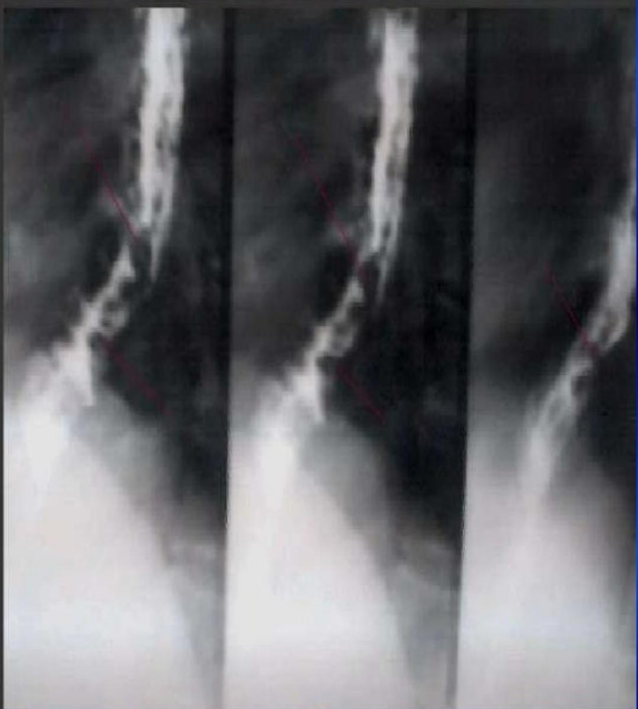

> **AI Description:**
> **Source:** `assets/_page_59_Figure_0.jpg`
> 
> **Generated:** 2026-05-31 00:11:58
> 
> ---
> 
> The image is a radiographic image, likely an X-ray, showing a section of the human spine. The image includes two vertebrae with visible spinal processes and intervertebral spaces. Red lines are drawn on the image, possibly indicating areas of interest or measurements. The image appears to be a medical diagnostic image, used for evaluating spinal conditions such as degenerative changes, fractures, or other abnormalities.

## TRACHEOESOPHAGEALFISTULA

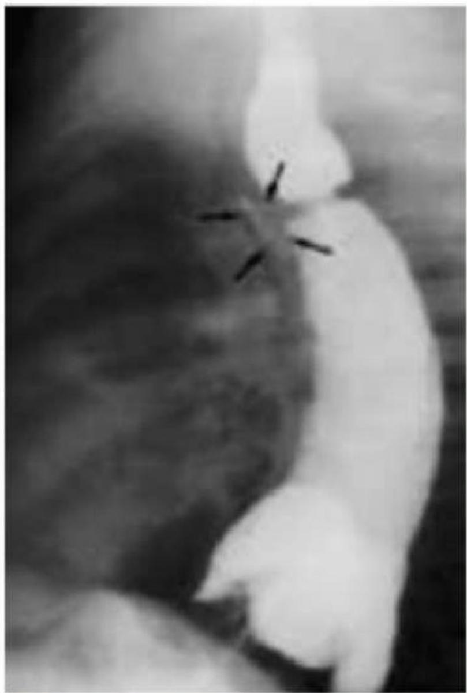

> **AI Description:**
> **Source:** `assets/_page_60_Figure_0.jpg`
> 
> **Generated:** 2026-05-31 00:20:40
> 
> ---
> 
> The image appears to be a radiographic or X-ray image, likely of a knee joint. The image shows the bones of the knee, with the femur and tibia visible. There are two metal objects present, which appear to be surgical hardware, possibly screws or pins, indicating a previous surgical procedure. The surrounding soft tissues and joint space are also visible, but the image is somewhat blurry and lacks sharp detail.

·Congenital/Acquired

· Ideal contrast non ionic water soluble media

·Barium fluid like & pt lying laterally.

In case fistula not identifylaterally,utin prone.

· If fistula seen, stop procedure as barium aspiration result in inflammation and granuloma.

## TRACHEOESOPHAGEAL FIST(INFANT)

·ARyle's tube is introduced to the level of mid esophagus & contrast is injected.

·The tube is withdrawn slowly.

·Thiswill force the contrast thro'anysmallfistula.

·Both lat& prone views to be assessed.

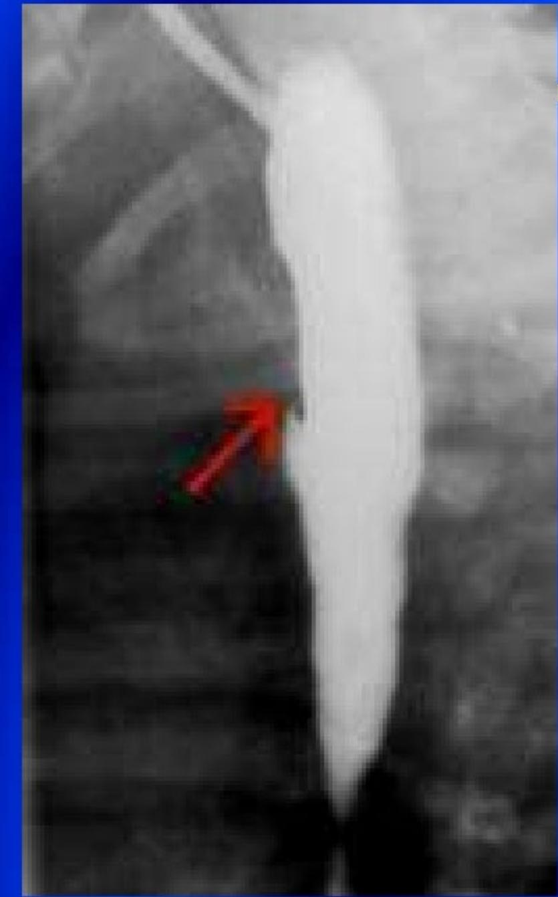

> **AI Description:**
> **Source:** `assets/_page_62_Figure_0.jpg`
> 
> **Generated:** 2026-05-31 00:10:02
> 
> ---
> 
> The image appears to be a medical imaging scan, likely an X-ray or MRI, showing a cross-sectional view of a body part. The red arrow points to a specific area within the scan, which may indicate a region of interest or a potential abnormality. The image is grayscale, with varying shades representing different densities within the body. The red arrow is the only text or annotation present, directing attention to a particular area within the scan.

Oblique barium   
esophagogram   
demonstratesa fistula (arrow) arising from the anterior esophagus and extending   
anterosuperiorly to the trachea.

## ESOPHAGEAL A-RING

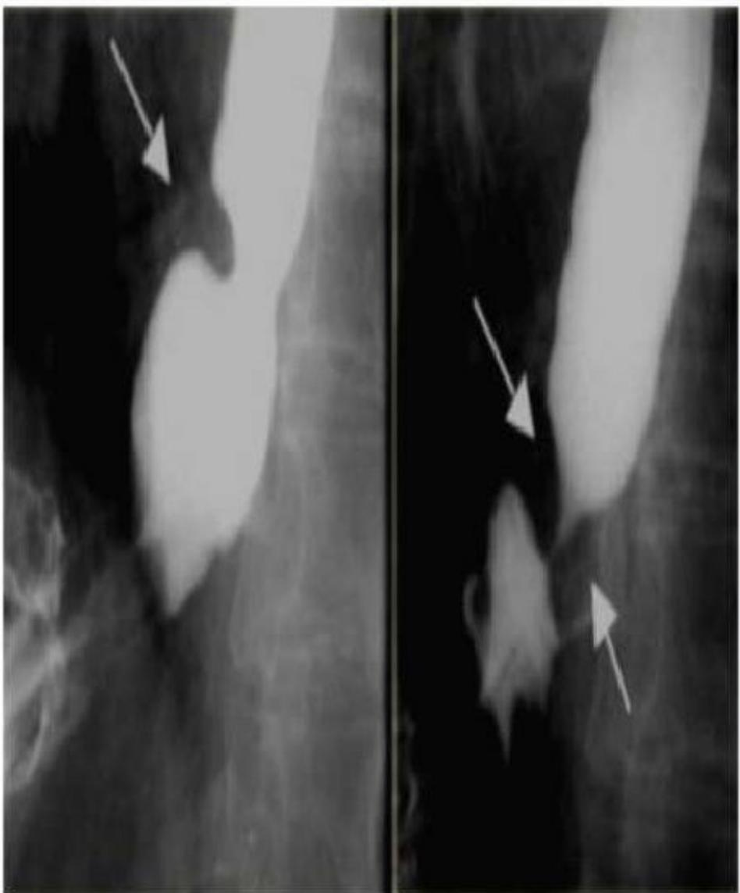

> **AI Description:**
> **Source:** `assets/_page_63_Figure_0.jpg`
> 
> **Generated:** 2026-05-31 00:02:26
> 
> ---
> 
> The image is a radiographic (X-ray) image of a human spine, likely taken in the lateral (side) view. The image shows the vertebral bodies and intervertebral spaces, with the arrow pointing to a specific area of interest, which appears to be a region of potential concern or abnormality. The image is in black and white, typical of X-ray imaging, and the bone structures are clearly visible. The arrow suggests a focus on a particular area, possibly indicating a fracture, degenerative change, or other pathology.

Esophageal A-ring due to muscular contraction at junction of tubular and vestibular esophagus .It varies during examination and may not persist.

## ESOPHAGEAL B-RING

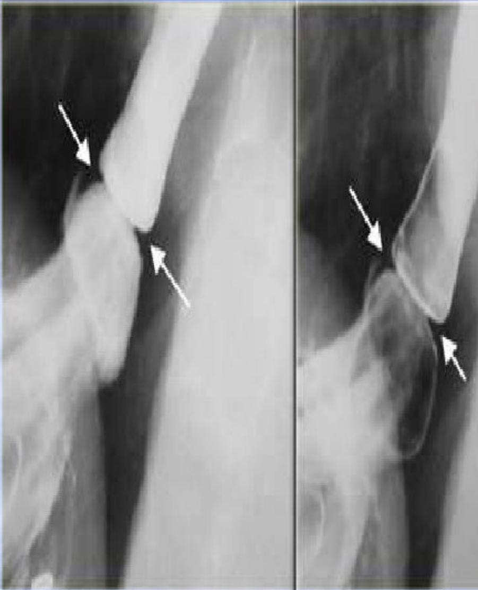

> **AI Description:**
> **Source:** `assets/_page_64_Figure_0.jpg`
> 
> **Generated:** 2026-05-31 00:02:50
> 
> ---
> 
> The image is a radiographic image of a knee joint, showing the bones and surrounding structures. The image appears to be a comparison of two views, possibly a lateral and an anteroposterior view, as indicated by the orientation of the bones and the alignment of the joint. The arrows in the image highlight specific areas of interest, likely indicating areas of concern or abnormality within the joint. The overall structure of the bones and the alignment of the joint appear to be within normal limits, but the arrows suggest a focus on particular regions for further evaluation.

The esophageal B-ring is   
locatedat the   
squamocolumnar   
junction,also termed the'Z' line.

·On the left a patient with a 'B'ring(arrows) several cm above diaphragm at the apex of sliding hiatus hernia. Note unchanged appearance on thesetwo images.

## GASTRO ESOPHAGEALREFLUX

·SIPHONTEST

Fill the stomach with 50%barium(150-200ml)

Followthis1-2mouthful ofwater toremove traces of barium in esophagus

·Pt in supine with left side raised 15% up

·Keep one mouthful of water in pt mouth

· Ask pt to swallow water-a jet of barium will shoot into water column as it enter GO junction

Alternatively with full stomach,ask pt to roll side to side

·Reflux will be seen

## ESOPHAGEALREFLUX

· Reflux oesophagitis with a deep ulcer (straight arrow).There is also asymmetric narrowing of the distal esophagus with a relatively abrupt cutoff (curvedarrow) at the proximal border of the narrowed segment.

## Barrett's Esophagus

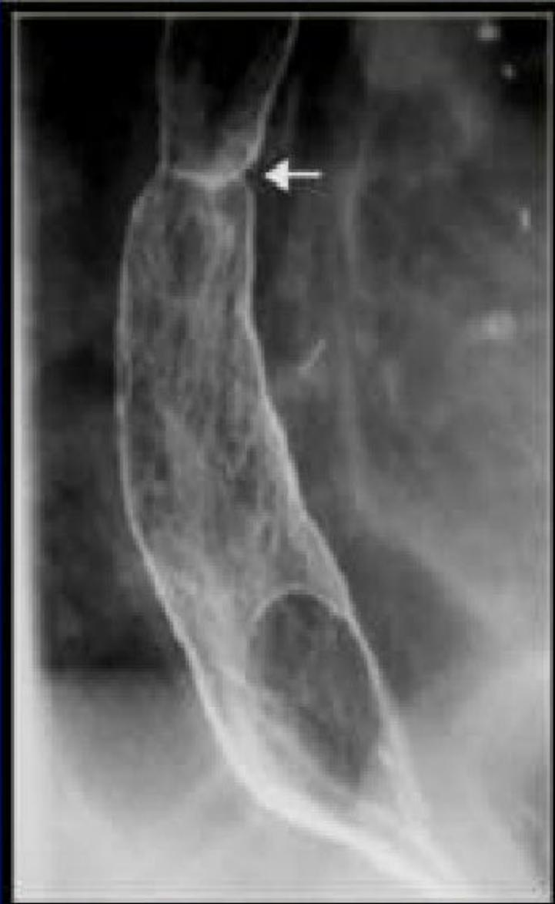

> **AI Description:**
> **Source:** `assets/_page_67_Figure_0.jpg`
> 
> **Generated:** 2026-05-31 00:21:03
> 
> ---
> 
> The image appears to be a radiographic image, likely an X-ray, showing a section of a human body. The image contains a white arrow pointing to a specific area within the structure, which could indicate a point of interest or concern. The structure in question appears to be a bone, possibly a long bone, given its shape and the presence of a circular opening, which could be a joint or a canal. The image is grayscale, typical of X-ray images, and the bone structure shows varying densities, suggesting different materials or conditions within the bone.

·Thereticular mucosa is characteristic of Barrett's columnar metaplasia, especi ally with the associated weblike (arrow) stricture.

## Candida Oesophagitis

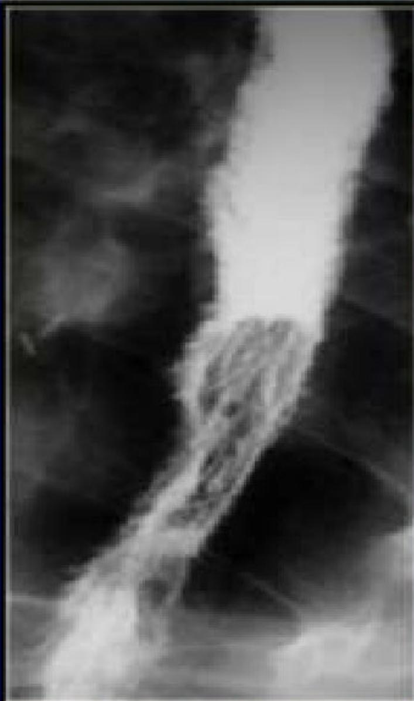

> **AI Description:**
> **Source:** `assets/_page_68_Figure_0.jpg`
> 
> **Generated:** 2026-05-31 00:10:53
> 
> ---
> 
> The image appears to be a radiographic image, likely an X-ray, showing a cross-sectional view of a human spine. The image displays the vertebral bodies and intervertebral spaces, with the central canal of the spinal cord visible. There are no obvious signs of fractures or significant deformities in the vertebrae. The image is in grayscale, which is typical for X-rays, and the bone structures are well-defined.

The barium study shows numerous fine erosions and small plaques due to Candida albicans in immunocompromised patient.

## LEFT ATRIAL ENLARGEMENT

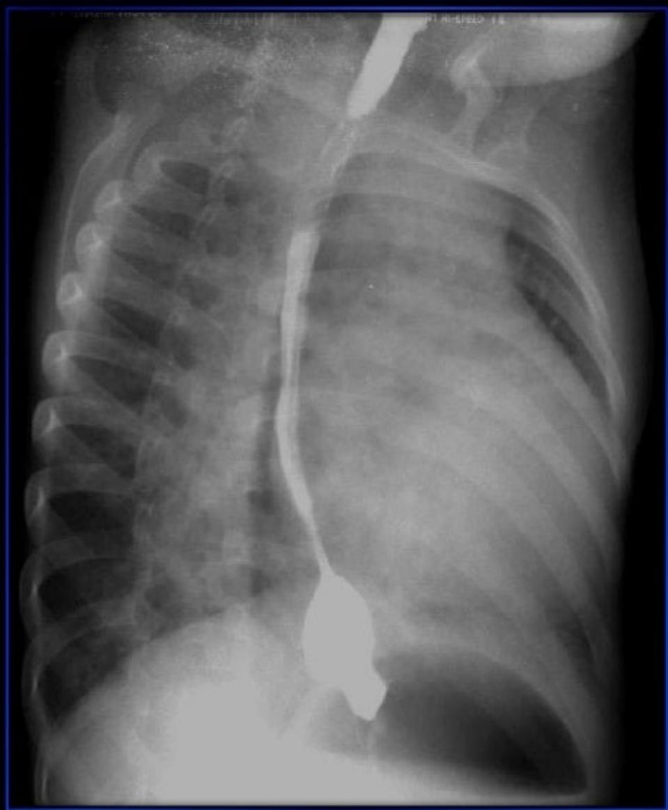

> **AI Description:**
> **Source:** `assets/_page_69_Figure_0.jpg`
> 
> **Generated:** 2026-05-31 00:13:52
> 
> ---
> 
> The image is a chest X-ray showing the thoracic region of the body. It includes the ribs, spine, heart, and portions of the lungs. A central structure, likely a tube or catheter, is visible within the chest cavity. The image is in black and white, with varying shades indicating different densities of tissue and structures. The spine is clearly visible on the left side, with the vertebrae forming a distinct pattern. The heart appears to be in the center, with the lungs surrounding it. The image quality is adequate for diagnostic purposes.

Right anterior oblique film and barium swallow demonstrates left atrial compression of the esophagus confirming left atrial dilation.

## COARCTATION OFAORTA

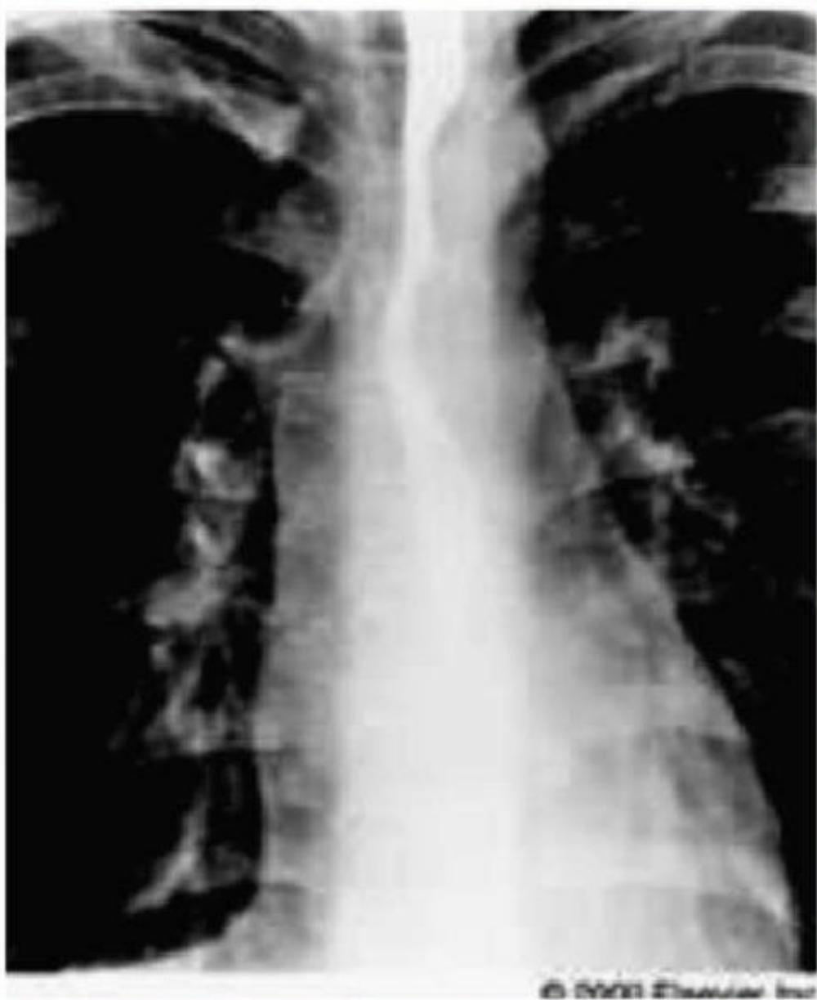

> **AI Description:**
> **Source:** `assets/_page_70_Figure_0.jpg`
> 
> **Generated:** 2026-05-31 00:08:01
> 
> ---
> 
> The image appears to be a medical radiograph, specifically an X-ray of the thoracic spine. It shows the vertebrae and surrounding structures in a side view. The image is in grayscale, with the vertebrae appearing as lighter areas against the darker background of the surrounding soft tissues. There are no visible annotations or labels within the image itself. The image is likely used for diagnostic purposes to assess the alignment and structure of the spine.

Bariuminthe   
esophagus   
exhibits the   
'reverse 3 sign'   
outlining the   
medial site of the   
aortic indentation   
in the descending   
aorta

## ZENKERS DIVERTICULUM

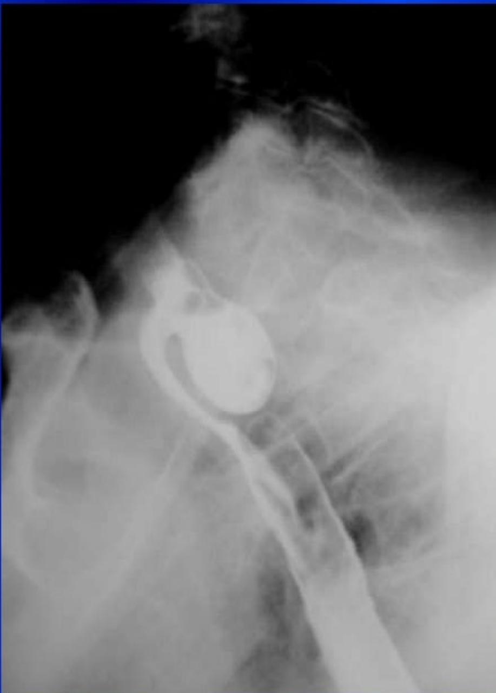

> **AI Description:**
> **Source:** `assets/_page_71_Figure_0.jpg`
> 
> **Generated:** 2026-05-31 00:03:59
> 
> ---
> 
> The image is a medical X-ray of the thoracic region, showing the spine and surrounding structures. It includes a pacemaker in the upper chest area, with leads extending down into the heart region. The ribs and some lung fields are also visible. The image is useful for assessing the placement and function of the pacemaker as well as the general condition of the thoracic cavity.

AZenker'sdiverticulum isa pulsion hypopharyngeal false diverticulum with only mucosa and submucosa protruding through triangular posteriorwall weak site (Killian'sdehiscence) between horizontal and oblique components of cricopharyngeus muscle.

·The esophagram shows collection with midline posterior origin just above cricopharyngeus protruding lateral,usually to left,and caudal with enlargement.

## KILLIAN JAMIESONDIVERTICULUM

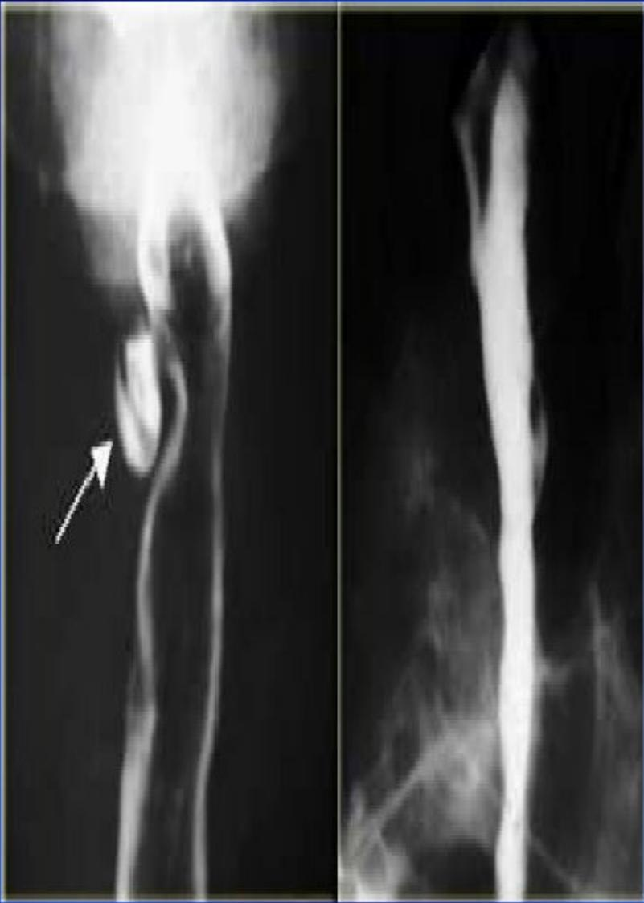

> **AI Description:**
> **Source:** `assets/_page_72_Figure_0.jpg`
> 
> **Generated:** 2026-05-31 00:19:26
> 
> ---
> 
> The image appears to be a medical radiograph, specifically an X-ray of a bone, likely a long bone such as the femur or tibia. The image shows a cross-sectional view of the bone, with the outer cortical bone and the inner medullary canal visible. There is a white arrow pointing to a specific area within the bone, which may indicate a point of interest or concern. The image is in grayscale, which is typical for X-rays, and the contrast between the bone and the surrounding tissue is clear. The image does not contain any text annotations or labels beyond the arrow.

Killian-Jamieson diverticulum is a pulsion diverticulum,that protrudes througha lateralanatomic weaksite ofthe cervical esophagusbelowthe cricopharyngeusmuscle. APviewshowsdiverticulum (arrow) originating laterally. Lateralviewconfirms diverticulum doesnot originate posteriorlyasa Zenkersdiverticulum would.

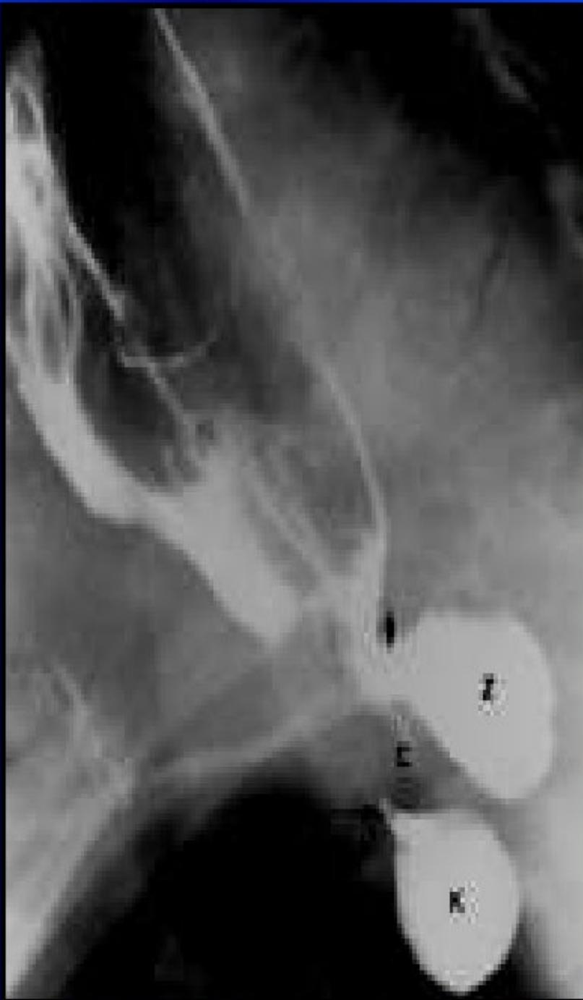

> **AI Description:**
> **Source:** `assets/_page_73_Figure_0.jpg`
> 
> **Generated:** 2026-05-31 00:25:54
> 
> ---
> 
> The image appears to be a dental radiograph, specifically an orthopantomogram (OPG), which is a type of X-ray used to visualize the entire mouth. The image shows the teeth, jawbones, and other structures in the oral cavity. The image includes dental implants, which are visible as circular shapes with a dark center. The image also shows the roots of the teeth and the surrounding bone structure. The presence of dental implants suggests that the patient may have had previous tooth extractions or other dental procedures.

·An obliqueview of the pharynx shows Zenker's diverticulum (Z) with its opening (short arrow) above the prominent cricopharyngeus (C). The Killian-Jamieson diverticulum (K) has its opening (long arrow) below the prominent cricopharyngeus.

## COMPLICATION

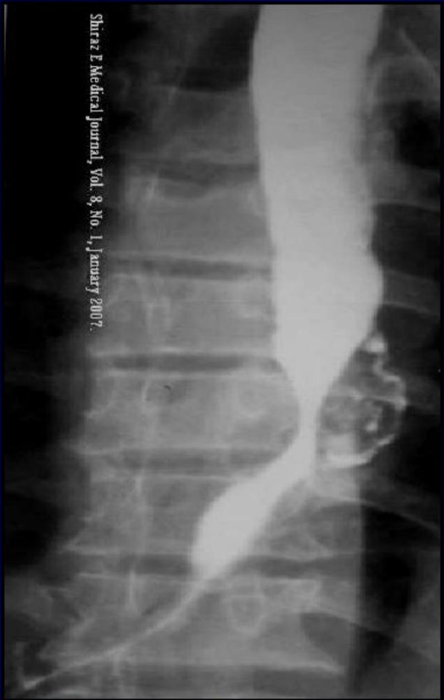

> **AI Description:**
> **Source:** `assets/_page_74_Figure_0.jpg`
> 
> **Generated:** 2026-05-31 00:25:22
> 
> ---
> 
> The image is a radiographic image of the thoracic spine, likely an X-ray. It shows the vertebral bodies, intervertebral spaces, and some surrounding soft tissues. The image appears to be a lateral view, as the spine is oriented horizontally. There are no obvious fractures or dislocations visible in the image. The text on the left side of the image indicates it is from the "Shiraz E Medical Journal, Vol. 8, No. 1, January 2007."

· Leakage of barium from unsuspected perforation.

## COMPLICATION

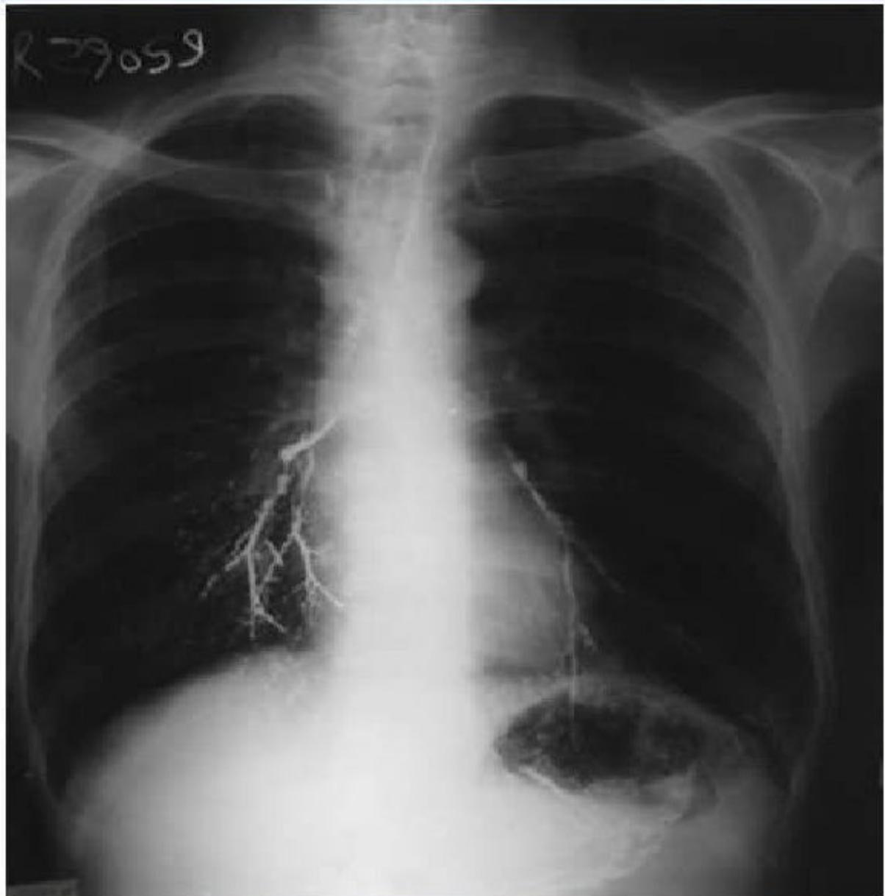

> **AI Description:**
> **Source:** `assets/_page_75_Figure_0.jpg`
> 
> **Generated:** 2026-05-31 00:20:14
> 
> ---
> 
> The image is a chest X-ray. It shows the thoracic cavity with the heart, lungs, and other structures visible. The ribs and clavicles are also clearly defined. The image appears to be a standard anteroposterior (AP) view of the chest. There are no text annotations or labels within the image itself.

## ·Aspiration

## Thank u very much.