
## Brandt

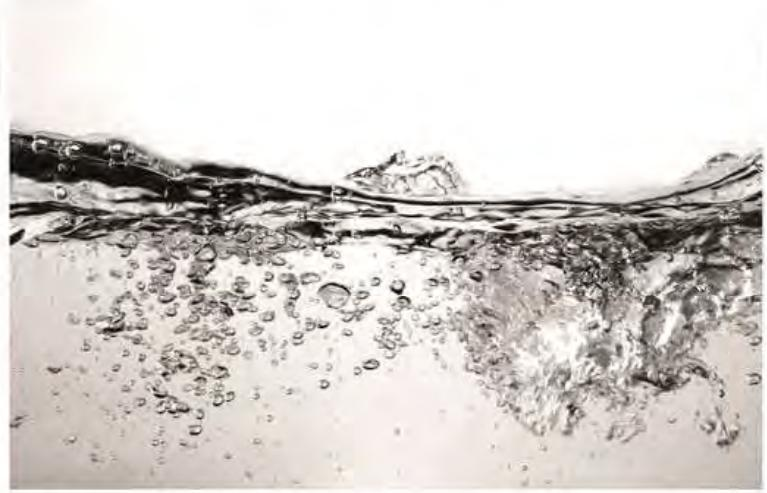

> **AI Description:**
> **Source:** `assets/_page_0_Figure_0.jpg`
> 
> **Generated:** 2026-05-31 00:49:52
> 
> ---
> 
> The image is a photograph of water with visible bubbles and ripples. The water appears to be in motion, possibly due to a disturbance or flow. The bubbles are concentrated in the lower part of the image, indicating gas or air being released from the water. The surface of the water is uneven, with some areas appearing smoother and others with more pronounced ripples. The overall scene suggests a dynamic interaction between the water and air, possibly in a natural or experimental setting.

INSTRUCTION MANUAL EN

## Dishwasher

## BDF534DW BDF534DX

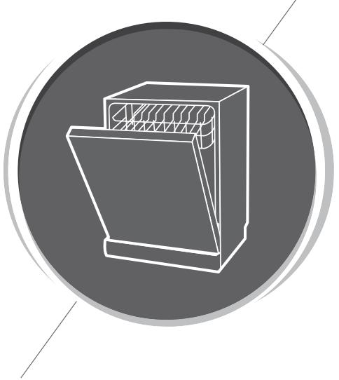

> **AI Description:**
> **Source:** `assets/_page_1_Figure_0.jpg`
> 
> **Generated:** 2026-05-31 00:47:15
> 
> ---
> 
> The image contains a simple line drawing of a dishwasher. The drawing is monochromatic, with the dishwasher depicted in white lines against a dark gray circular background. The dishwasher is shown in a side profile, with the door slightly ajar, revealing the interior racks. There are no additional labels, text, or annotations present in the image.

Dishwasher Instruction Manual

PART I:Generic Version

## CONTENTS

SAFETY INFORMATION

USING YOUR DISHWASHER Loading The Salt Into The Softener Basket Used Tips

## MAINTENANCE AND CLEANING

External Care   
Internal Care   
Caring For The Dishwasher

## INSTALLATION INSTRUCTION INSTALLATION INSTRUCTION

About Power Connection   
Water Supply And Drain   
Connection Of Drain Hoses   
Position The Appliance   
Free Standing Installation   
Built-In Installation(for the integrated model)

TROUBLESHOOTING TIPS

LOADING THE BASKETS

## NOTE:

Reviewing the section on troubleshooting Tips will help you solve some common problems by yourself.

·If you cannot solve the problems by yourself,please ask for help from a professional technician.

·The manufacturer, following a policy of constant development and updating of the product,may make modifications without giving prior notice.

·If lost or out-of-date,you can receive a new user manual from the manufacturer or responsible vendor.

## SAFETY INFORMATION

## AWARNING

## When using your dishwasher, follow the precautions listed below:

· Installation and repair can only be carried out by a qualified technician

· This appliance is intended to be used in household and similar applications such as:

-staff kitchen areas in shops, offices and other Working environments;

-farm houses;

-by clients in hotels,motels and other residential type environments;

-bed and breakfast type environments.

· This appliance can be used by children aged from 8 years and above and persons with reduced physical, sensory or mental capabilities or lack of experience and knowledge if they have been given supervision or instruction concerning use of the appliance in a safe way and understand the hazards involved.

· Children shall not play with the appliance. Cleaning and user maintenance shall not be done by children without supervision. (For EN60335-1)

This appliance is not intended for use by persons (including children ） with reduced physical, sensory or mental capabilities,or lack of experience and knowledge,unless they have been given supervision or instruction concerning use of the appliance by a person responsible for their safety. (For IEC60335-1)

· Packaging material could be dangerous for children!

· This appliance is for indoor household use only. To protect against the risk of electrical shock,do not immerse the unit, cord or plug in water or other liquid.

· Please unplug before cleaning and performing maintenance on the appliance.

· Use a soft cloth moistened with mild soap,and then use a dry cloth to wipe it again.

## Earthing Instructions

This appliance must be earthed. In the event of a malfunction or breakdown,earthing will reduce the risk of an electric shock by providing a path of least resistance of electric current. This appliance is equipped with an earthing conductor plug.

The plug must be plugged into an appropriate outlet that is installed and earthed in accordance with all local codes and ordinances.

Improper connection of the equipment-earthing conductor can result in the risk of an electric shock.

Check with a qualified electrician or service representative if you are in doubt whether the appliance is properly grounded.

· Do not modify the plug provided with the appliance; If it does not fit the outlet.

· Have a proper outlet installed by a qualified electrician.

· Do not abuse, sit on,or stand on the door or dish rack of the dishwasher.

· Do not operate your dishwasher unless all enclosure panels are properly in place.

· Open the door very carefully if the dishwasher is Operating, there is a risk of water squirting out.

· Do not place any heavy objects on or stand on the door when it is open. The appliance could tip forward.

· When loading items to be washed:

1) Locate sharp items so that they are not likely to damage the door seal;

2)Warning: Knives and other utensils with sharp points must be loaded in the basket with their points facing down or placed in a horizontal position.

· Some dishwasher detergents are strongly alkaline. They can be extremely dangerous if swallowed. Avoid contact with the skin and eyes and keep children away from the dishwasher when the door is open.

· Check that the detergent powder is empty after completion of the wash cycle.

· Do not wash plastic items unless they are marked "dishwasher safe" or the equivalent.

· For unmarked plastic items not so marked,check the manufacturer's recommendations.

· Use only detergent and rinse agents recommended for use in an automatic dishwasher.

· Never use soap,laundry detergent, or hand washing detergent in your dishwasher.

· The door should not be left open,since this could increase the risk of tripping.

If the supply cord is damaged, it must be replaced by the manufacturer or its service agent or a similarly qualified person in order to avoid a hazard.

· During installation, the power supply must not be excessively or dangerously bent or flattened.

· Do not tamper with controls.

· The appliance needs to be connected to the main water valve using new hose sets. Old sets should not be reused.

· To save energy,in stand by mode, the appliance will switch off automatically while there is no any operation in 15 minutes.

· The maximum number of place settings to be washed is 15.

· The maximum permisible inlet water pressure is 1MPa.

·The minimum permissible inlet water pressure is 0.04MPa.

## ， Disposal

· For disposing of package and the appliance please go to a recycling center. Therefore cut off the power supply cable and make the door closing device unusable.

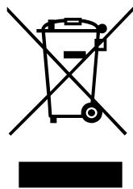

> **AI Description:**
> **Source:** `assets/_page_7_Figure_0.jpg`
> 
> **Generated:** 2026-05-31 00:49:35
> 
> ---
> 
> The image contains a single symbol: a crossed-out trash bin. This symbol is commonly used to indicate that the item or product represented by the image should not be disposed of in regular waste bins. Instead, it suggests that the item should be recycled or disposed of in a specific manner, typically in a designated recycling bin or collection point. The symbol is a standard international symbol used to convey this message in a universally recognized way.

· Cardboard packaging is manufactured from recycled paper and should be disposed in the waste paper collection for recycling.

· By ensuring this product is disposed of correctly, you will help prevent potential negative consequences for the environment and human health,which could otherwise be caused by inappropriate waste handling of this product.

· For more detailed information about recycling of this product, please contact your local city office and your household waste disposal service.

· DISPOSAL: Do not dispose this product as unsorted municipal waste. Collection of such waste separately for special treatment is necessary.

## PRODUCT OVERVIEW

## 0 IMPORTANT:

To get the best performance from your dishwasher, read alloperating instructions before using it for the first time.

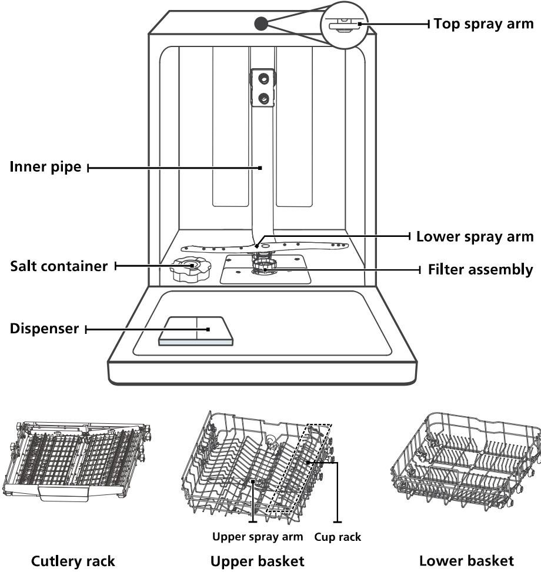

> **AI Description:**
> **Source:** `assets/_page_8_Figure_0.jpg`
> 
> **Generated:** 2026-05-31 00:50:59
> 
> ---
> 
> The image is a technical illustration of a dishwasher's internal components and layout. It includes a diagram of the dishwasher's structure with labels for various parts such as the top spray arm, inner pipe, lower spray arm, filter assembly, salt container, and dispenser. Below the main diagram, there are three separate illustrations of the dishwasher's racks: the cutlery rack, upper basket, and lower basket. The illustration is designed to provide a clear understanding of the dishwasher's design and the placement of its components.

## NOTE:

Picturesare only for reference,different models may be different.Please prevail in kind.

## USING YOUR DISHWASHER

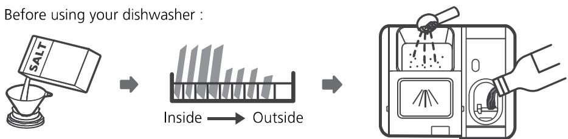

> **AI Description:**
> **Source:** `assets/_page_9_Figure_0.jpg`
> 
> **Generated:** 2026-05-31 00:50:24
> 
> ---
> 
> The image is a diagram illustrating the steps to prepare a dishwasher for use. It shows a box of salt being poured into a funnel, followed by a visual representation of a dishwasher rack with dishes inside and outside the dishwasher. The final step shows a hand placing the salt container into the dishwasher's salt compartment. The diagram uses arrows to guide the viewer through the process, emphasizing the placement of the salt inside and outside the dishwasher before adding it to the salt compartment.

1. Set the water softener

2.Loading the salt Into the softener

3.Loading the basket

4.Fill the dispenser

Please check the section 1 "Water Softener" of PART Il: Special Version, If you need to set the water softener .

## 、Loading The Salt Into The Softener

## NOTE:

If your model does not have any water softener,you may skip this section. Always use salt intended for dishwasher use.

The salt container is located beneath the lower basket and should be filled as explained in the following:

## AWARNING

## ·Only use salt specifically designed for dishwashers use!

Every other type of salt not specifically designed for dishwasher use, especially table salt,will damage the water softener.In case of damages caused by the use of unsuitable salt the manufacturer does not give any warranty nor is liable for any damages caused.

## · Only fill with salt before running a cydle.

This will prevent any grains of salt or salty water,which may have been spilled,remaining on the bottom of the machine for any period of time, which may cause corrosion.

Please follow the steps below for adding dishwasher salt:

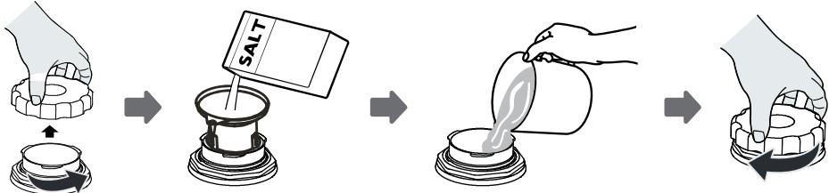

> **AI Description:**
> **Source:** `assets/_page_10_Figure_0.jpg`
> 
> **Generated:** 2026-05-31 00:53:24
> 
> ---
> 
> The image is a diagram illustrating the steps for using a salt shaker. It shows a hand holding a salt shaker, then placing it over a bowl, pouring salt into the bowl, and finally covering the bowl with the shaker. The word "SALT" is prominently displayed on the salt shaker, indicating the contents. The diagram is a simple, step-by-step guide for using a salt shaker, with clear visual instructions for each action.

1. Remove the lower basket and unscrew the reservoir cap.

2.Place the end of the funnel (supplied) into the hole and pour in about 1.5kg of dishwasher salt.

3.Fill the salt container to its maximum limit with water,It is normal for a small amount of water to come out of the salt container.

4.After filing the container,screw back the cap tightly.

5.The salt warning light will stop being after the salt container has been filled with salt.

6.Immediately after filling the salt into the salt container,a washing program should be started (We suggest to use a short program). Otherwise the filter system, pump or other important parts of the machine may be damaged by salty water. This is out of warranty.

## NOTE:

· The salt container must only be refiled when the salt warning light(S )in the control panel comes on. Depending on how well the salt dissolves,the salt warning light may stillbe on even though the salt container is filled. If there is no salt warning light in the control panel (for some Models),you can estimate when to fillthe salt into the softener by the cycles that the dishwasher has run.

·If salt has spilled,run a soak or quick program to remove it.

## 、 Basket Used Tips

## Adjusting cutlery rack

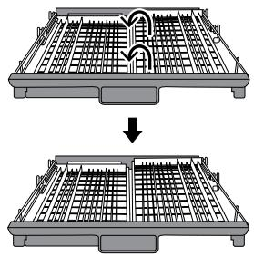

> **AI Description:**
> **Source:** `assets/_page_11_Figure_0.jpg`
> 
> **Generated:** 2026-05-31 00:52:02
> 
> ---
> 
> The image contains a technical illustration showing a before-and-after comparison of a tray or rack. The top part of the image depicts the tray in its original configuration, while the bottom part shows the tray after a modification or adjustment. The tray appears to be a grid-like structure with a handle at the bottom. The image is likely used for instructional or instructional purposes, possibly related to assembly, disassembly, or modification of the tray.

Lift the right basket up,both left and right baskets are flat.

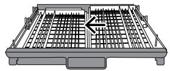

> **AI Description:**
> **Source:** `assets/_page_11_Figure_1.jpg`
> 
> **Generated:** 2026-05-31 00:51:35
> 
> ---
> 
> The image is a technical illustration of a tray, likely for a printer or copier. The tray is shown from a top-down perspective, with a grid pattern indicating the slots for paper. An arrow points to the right, suggesting the direction for paper insertion or movement. The tray appears to be part of a larger machine, possibly a multifunction printer or copier, and the illustration is used for instructional purposes.

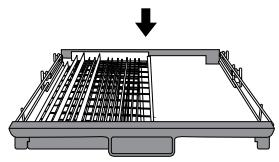

> **AI Description:**
> **Source:** `assets/_page_11_Figure_2.jpg`
> 
> **Generated:** 2026-05-31 00:52:27
> 
> ---
> 
> The image is a technical illustration of a mechanical or electronic component, likely a part of a printer or scanner. It shows a top-down view of a grid-like structure, possibly a set of rollers or a series of pins, with a downward arrow indicating the direction of movement or operation. The illustration is designed to guide the viewer on how to install or replace a component, as suggested by the arrow and the grid structure which is typical for such parts.

Move the right basket from right to left, two basket are overlapping.

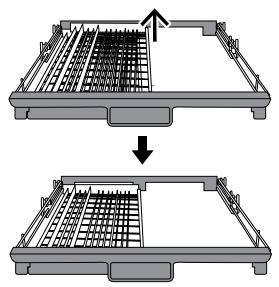

> **AI Description:**
> **Source:** `assets/_page_11_Figure_3.jpg`
> 
> **Generated:** 2026-05-31 00:53:04
> 
> ---
> 
> The image contains a technical illustration of a drawer or tray with a grid pattern. It shows two views of the same drawer: one with the drawer partially pulled out and the other with the drawer fully closed. The illustration is likely used for instructional purposes, such as demonstrating how to insert or remove the drawer. The arrows indicate the direction of movement for the drawer.

Remove the right basket from the tray,only has the left basket.

## Easy removal of cutlery

Using the principle of crank slider mechanism,the cutlery are suspended.Convenient finger goes deep under the knife and fork,and holds several cutlery at a time.

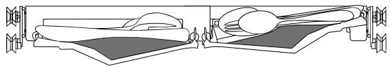

> **AI Description:**
> **Source:** `assets/_page_12_Figure_0.jpg`
> 
> **Generated:** 2026-05-31 00:46:48
> 
> ---
> 
> The image is a technical illustration of a vehicle, likely a racing car, viewed from a side perspective. It shows the car's body, wheels, and various components such as the engine and exhaust system. The car's design appears aerodynamic, with a low profile and a streamlined shape. The illustration includes some annotations, such as the placement of the wheels and the overall structure of the car. The image is detailed and technical, providing a clear view of the vehicle's design and components.

## Make the most of space

It can accommodate dishes such as egg beaters,cups,etc.,and does not affect the upper basket.

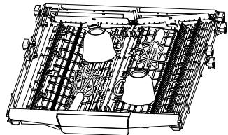

> **AI Description:**
> **Source:** `assets/_page_12_Figure_1.jpg`
> 
> **Generated:** 2026-05-31 00:46:54
> 
> ---
> 
> The image is a technical illustration of a dishwasher rack. It shows a top-down view of the rack with various utensils and dishes placed on it. The rack has multiple compartments, including a central column for tall items like glasses and mugs, and side compartments for smaller items like cutlery and plates. The illustration is monochromatic, with a focus on the structure and placement of the items within the dishwasher rack.

## Adjust the height of the rack

Loosen the four buttons on the tray and press down gently.

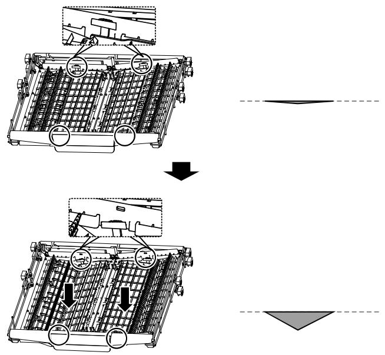

> **AI Description:**
> **Source:** `assets/_page_12_Figure_2.jpg`
> 
> **Generated:** 2026-05-31 00:47:34
> 
> ---
> 
> The image is a technical illustration showing a step-by-step process of a mechanical component, likely a part of a machine or vehicle. The top part of the image shows the component in its initial position, with two circular components highlighted. The bottom part of the image depicts the same component in a different position, with arrows indicating the direction of movement. The dashed lines on the right side of the image may represent a path or boundary for the component's movement. The image is designed to guide the viewer through a specific action or assembly process.

## Adjusting the upper basket

## Type 1:

The height of the upper basket can be easily adjusted to accommodate taller dishes in either the upper or lower basket.

To adjust the height of the upper rack,follow these steps:

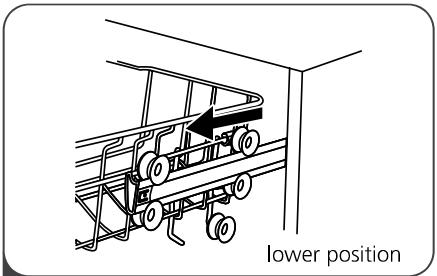

> **AI Description:**
> **Source:** `assets/_page_13_Figure_0.jpg`
> 
> **Generated:** 2026-05-31 00:48:46
> 
> ---
> 
> The image is a technical illustration showing a rack or shelving unit in a lower position. It features wheels on the lower part of the rack, indicating it can be moved or adjusted. The illustration is labeled "lower position" at the bottom right, suggesting this is a diagram to show the rack's position when it is in its lowest setting. The image is likely used for instructional or informational purposes, such as in a user manual or guide for setting up or using the rack.

Pull out the upper basket.

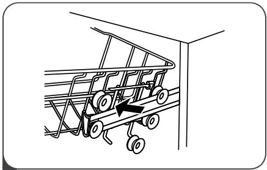

> **AI Description:**
> **Source:** `assets/_page_13_Figure_1.jpg`
> 
> **Generated:** 2026-05-31 00:48:10
> 
> ---
> 
> The image is a technical illustration showing a piece of equipment, likely a conveyor or transport system, positioned against a wall. The equipment has a series of wheels and a frame structure, with a black arrow indicating the direction of movement or travel. The illustration is in black and white, with no additional text or labels. The focus is on the equipment's design and its orientation within a confined space.

2 Remove the upper basket.

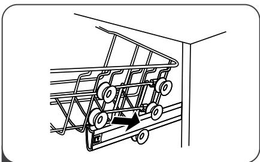

> **AI Description:**
> **Source:** `assets/_page_13_Figure_2.jpg`
> 
> **Generated:** 2026-05-31 00:49:05
> 
> ---
> 
> The image is a technical illustration showing a mechanical component, likely part of a machine or device. It depicts a series of interconnected gears and pulleys arranged in a linear fashion. The gears are connected by shafts, and the pulleys are positioned at various points along the shafts. The illustration is designed to show the movement and interaction between these components, possibly indicating how they function together in a mechanical system. The image is likely used for instructional or technical purposes, such as explaining the operation of a specific machine or assembly.

Re-attach the upper basket to upper or lower rollers.

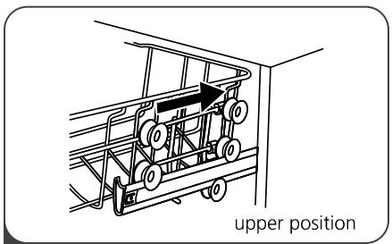

> **AI Description:**
> **Source:** `assets/_page_13_Figure_3.jpg`
> 
> **Generated:** 2026-05-31 00:49:57
> 
> ---
> 
> The image is a technical illustration showing the upper position of a dishwasher rack. It includes a diagram of a dishwasher rack with wheels, highlighting the uppermost position where the rack can be pulled out. The illustration is accompanied by the text "upper position" to indicate the rack's location within the dishwasher. The diagram is designed to guide users on how to access the upper rack of a dishwasher.

Push in the upper basket.

Type 2:
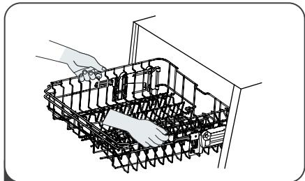

> **AI Description:**
> **Source:** `assets/_page_14_Figure_0.jpg`
> 
> **Generated:** 2026-05-31 00:48:52
> 
> ---
> 
> The image is a technical illustration showing the interior of a dishwasher. It depicts a hand placing a dish into a rack, which is part of the dishwasher's structure. The illustration highlights the placement of dishes within the dishwasher's compartments, emphasizing the layout and design of the racks. The image is likely used for instructional purposes, such as demonstrating how to load a dishwasher properly.

1 To raise the upper basket, just lift the upper basket at the center of each side until the basket locks into place in the upper position.It is not necessary to lift the adjuster handle.

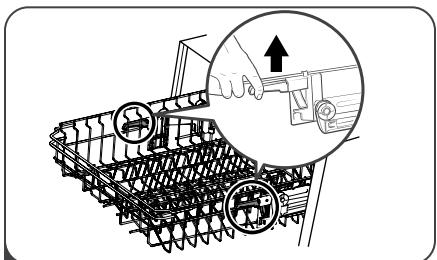

> **AI Description:**
> **Source:** `assets/_page_14_Figure_1.jpg`
> 
> **Generated:** 2026-05-31 00:48:04
> 
> ---
> 
> The image is a technical illustration showing the installation or adjustment of a dishwasher rack. It depicts a hand pushing a lever or slider mechanism on a dishwasher rack, with a close-up view of the mechanism highlighted. The illustration is likely part of a user manual or instructional guide, providing visual instructions for adjusting or securing the dishwasher rack in place. The key components shown include the rack, the lever mechanism, and the hand performing the action.

2 To lower the upper basket, lift the adjust handles on each side to release the basket and lower it to the lower position.

## Folding back the cup shelves

To make room for taller items in the upper basket, raise the cup rack upwards. You can then lean the tall glasses against it. You can also remove it when it is not required for use.

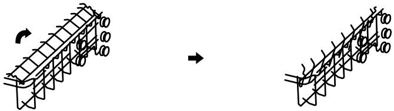

> **AI Description:**
> **Source:** `assets/_page_14_Figure_2.jpg`
> 
> **Generated:** 2026-05-31 00:48:59
> 
> ---
> 
> The image contains a diagram illustrating a mechanical or structural process. It shows a series of interconnected components, possibly gears or wheels, arranged in a linear fashion. The left side of the diagram features a curved arrow pointing to the right, indicating a direction or movement. The right side of the diagram shows the components in a different orientation, suggesting a transformation or change in the structure. The diagram appears to be a technical illustration, likely used to explain a mechanical or engineering concept.

## Folding back the rack shelves

The spikes of the lower basket are used for holding plates and a platter.   
They can be lowered to make more room for large items.

raise upwards

fold backwards

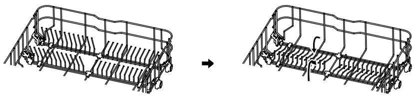

> **AI Description:**
> **Source:** `assets/_page_14_Figure_3.jpg`
> 
> **Generated:** 2026-05-31 00:50:04
> 
> ---
> 
> The image is a technical illustration showing a before-and-after comparison of a dishwasher rack. The left side of the image depicts the rack with its original configuration, while the right side shows the rack after it has been adjusted. The adjustment appears to involve the removal of some components or the repositioning of others to create more space or optimize the rack's structure. The illustration is likely used for instructional purposes, such as demonstrating how to properly load or adjust a dishwasher rack for optimal performance.

# MAINTENANCE AND CLEANING

## .External Care

## The door and the door seal

Clean the door seals regularly with a soft damp cloth to remove food deposits. When the dishwasher is being loaded,food and drink residues may drip onto the sides of the dishwasher door. These surfaces are outside the wash cabinet and are not accessed by water from the spray arms.Any deposits should be wiped off before the door is closed.

## The control panel

If cleaning is required,the control panel should be wiped with a soft damp cloth only.

## AWARNING

·To avoid penetration of water into the door lock and electrical components, do not use a spray cleaner of any kind.

·Never use abrasive cleaners or scouring pads on the outer surfaces because they may scratch the finish. Some paper towels may also scratch or leave marks on the surface.

## 、 Internal Care

## Filtering system

The filtering system in the base of the wash cabinet retains coarse debris from the washing cycle.The collected coarse debris may cause the filters to clog. Check the condition of the filters regularly (each months) and clean them if necessary under running water.Follow the steps below to clean the filters in the wash cabinet.

## NOTE:

Pictures are only for reference,different models of the filtering system and spray arms may be different.

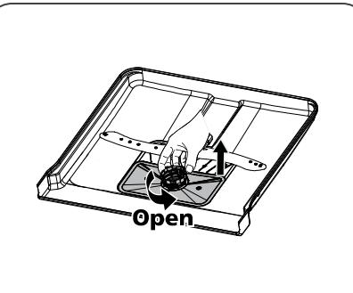

> **AI Description:**
> **Source:** `assets/_page_16_Figure_0.jpg`
> 
> **Generated:** 2026-05-31 00:51:51
> 
> ---
> 
> The image is a technical illustration showing a hand removing a part from a device. The device appears to be a square-shaped component with a central circular element, possibly a burner or a similar appliance part. The hand is depicted pulling out a component from the center of the device. The word "Open" is prominently displayed with an arrow pointing to the action of pulling out the part, indicating the direction and action required. The illustration is likely part of an instruction manual or guide for assembling or disassembling a device.

Hold the coarse filter and rotate it anticlockwise to unlock the filter. Lift the filter upwards and out of the dishwasher.

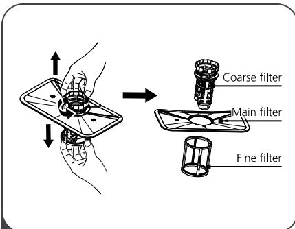

> **AI Description:**
> **Source:** `assets/_page_16_Figure_1.jpg`
> 
> **Generated:** 2026-05-31 00:51:45
> 
> ---
> 
> The image is a technical illustration showing the disassembly of a filter system. It includes a hand holding a component that is being separated into three parts: a coarse filter, a main filter, and a fine filter. The components are labeled with text pointing to each part. The illustration is designed to guide the viewer through the process of removing and identifying the different filter sections.

The fine filter can be pulled off the bottom of the filter assembly. The coarse filter can be detached from the main filter by gently squeezing the tabs at the top and pulling it away.

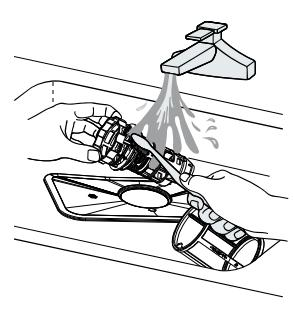

> **AI Description:**
> **Source:** `assets/_page_16_Figure_2.jpg`
> 
> **Generated:** 2026-05-31 00:52:45
> 
> ---
> 
> The image is a technical illustration showing a mechanical device, possibly a tool or part of a larger machine, being rinsed with water from a faucet. The device appears to be cylindrical with a handle and is being cleaned under running water. The water is depicted as spraying directly onto the device, suggesting a cleaning or maintenance process. The illustration is simple and lacks any additional text or labels, focusing solely on the action of rinsing the object.

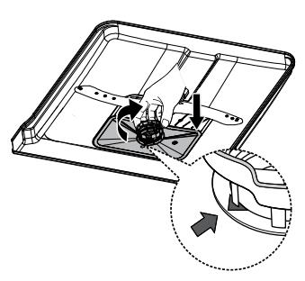

> **AI Description:**
> **Source:** `assets/_page_16_Figure_3.jpg`
> 
> **Generated:** 2026-05-31 00:52:51
> 
> ---
> 
> The image is a technical illustration showing the installation or removal of a component, likely a part of a machine or appliance. It depicts a flat, rectangular base with a circular component in the center, possibly a motor or a gear. The illustration includes an inset showing a close-up view of a part being inserted or removed, with an arrow indicating the direction of movement. The overall design suggests a step-by-step guide for assembling or disassembling a mechanical device.

3 Larger food remnants can be cleaned by rinsing the filter under running water. For a more thorough clean,use a soft cleaning brush.

4 Reassemble the filters in the reverse order of the disassembly,replace the filter insert,and rotate clockwise to the close arrow.

## AWARNING

·Do not over tighten the filters. Put the filters back in sequence securely, otherwise coarse debris could get into the system and cause a blockage.

·Never use the dishwasher without filters in place.Improper replacement of the filter may reduce the performance level of the appliance and damage dishes and utensils.

## Spray arms

It is necessary to clean the spray arms regularly for hard water chemicals willclog the spray arm jets and bearings.

To clean the spray arms,follow the instructions below:

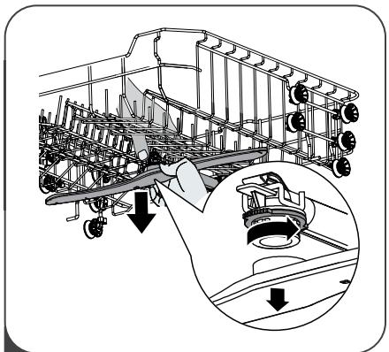

> **AI Description:**
> **Source:** `assets/_page_17_Figure_0.jpg`
> 
> **Generated:** 2026-05-31 00:53:35
> 
> ---
> 
> The image is a technical illustration showing the installation or adjustment of a dishwasher spray arm. It depicts a hand pushing a component into place, with a close-up inset showing the spray arm mechanism. The illustration is likely part of an instruction manual or guide for assembling or maintaining a dishwasher. The key elements include the spray arm, the hand pushing it into position, and the close-up of the spray arm's internal mechanism.

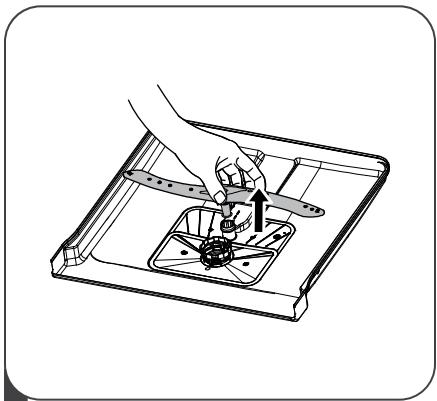

> **AI Description:**
> **Source:** `assets/_page_17_Figure_1.jpg`
> 
> **Generated:** 2026-05-31 00:53:42
> 
> ---
> 
> The image is a technical illustration showing a hand removing a burner from a stovetop. The stovetop has a flat surface with a burner grid and a central burner. The hand is depicted in the process of lifting the burner, which is attached to the stovetop via a central screw. The illustration is monochromatic and appears to be from a user manual or instructional guide.

To remove the upper spray arm, hold the nut in the center still and rotate the spray arm counterclockwise to remove it.

To remove the lower spray arm, pull out the spray arm upward.

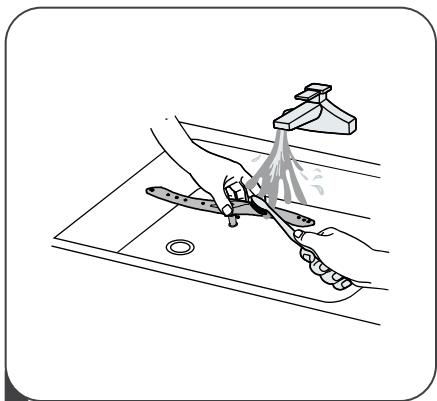

> **AI Description:**
> **Source:** `assets/_page_17_Figure_2.jpg`
> 
> **Generated:** 2026-05-31 00:54:43
> 
> ---
> 
> The image is a technical illustration showing a person washing a pair of scissors under running water from a faucet. The sink is depicted with a drain hole, and the faucet is shown with water flowing out. The scissors are being held under the water, suggesting a cleaning or rinsing action. The illustration is likely part of a guide or manual, possibly for cleaning or maintaining scissors.

】Wash the arms in soapy and warm water and use a soft brush to clean the jets. Replace them after rinsing them thoroughly.

## Caring For The Dishwasher

## Frost precaution

Please take frost protection measures on the dishwasher in winter. Every time after washing cycles,please operate as follows:

1.Cut off the electrical power to the dishwasher at the supply source.

2.Turn off the water supply and disconnect the water inlet pipe from the water valve.

3. Drain the water from the inlet pipe and water valve.(Use a pan to gather the water)

4. Reconnect the water inlet pipe to the water valve.

5. Remove the filter at the bottom of the tub and use a sponge to soak up water in the sump.

## After every wash

After every wash,turn off the water supply to the appliance and leave the door slightly open so that moisture and odors are not trapped inside.

## Remove the plug

Before cleaning or performing maintenance,always remove the plug from the socket.

## No solvents or abrasive cleaning

To clean the exterior and rubber parts of the dishwasher,do not use solvents or abrasive cleaning products. Only use a cloth with warm soapy water.

To remove spots or stains from the surface of the interior, use a cloth dampened with water an a litte vinegar,or a cleaning product made specifically for dishwashers.

## When not in use for a longtime

It is recommend that you run a wash cycle with the dishwasher empty and then remove the plug from the socket, turn off the water supply and leave the door of the appliance slightly open.This will help the door seals to last longer and prevent odors from forming within the appliance.

## Moving the appliance

If the appliance must be moved,try to keep it in the vertical position. If absolutely necessary,it can be positioned on its back.

## Seals

One of the factors that cause odours to form in the dishwasher is food that remains trapped in the seals. Periodic cleaning with a damp sponge will prevent this from occurring.

# INSTALLATION INSTRUCTION

## AWARNING

> **AI Description:**
> **Source:** `assets/_page_19_Figure_0.jpg`
> 
> **Generated:** 2026-05-31 00:50:16
> 
> ---
> 
> The image is a simple line drawing of a hand holding a lightning bolt. The hand appears to be gripping the bolt firmly, and the bolt is depicted with jagged lines, indicating electricity. The image is a symbolic representation, likely used to convey a message about electrical hazards or the dangers of electricity.

## Electrical Shock Hazard

Disconnect electrical power before   
installing dishwasher.   
Failure to do so could result in death or electrical shock.

## A Attention

The installation of the pipes and electrical equipments should be done by professionals.

## About Power Connection

## AWARNING

For personal safety:

· Do not use an extension cord or an adapter plug with this appliance.

· Do not, under any circumstances, cut or remove the earthing connection from the power cord.

## Electrical requirements

Please look at the rating label to know the rating voltage and connect the dishwasher to the appropriate power supply. Use the required fuse 10A/13A/16A,time delay fuse or circuit breaker recommended and provide separate circuit serving only this appliance.

## Electrical connection

Ensure the voltage and frequency of the power being corresponds to those on the rating plate.Only insert the plug into an electrical socket which is earthed properly. If the electrical socket to which the appliance must be connected is not appropriate for the plug,replace the socket, rather than using a adaptors or the like as they could cause overheating and burns.

## A Ensure that proper earthing exists before use

## Water Supply And Drain

## Cold water connection

Connect the cold water supply hose to a threaded 3/4(inch) connector and make sure that it is fastened tightly in place.

If the water pipes are new or have not been used for an extended period of time,let the water run to make sure that the water is clear.This precaution is needed to avoid the risk of the water inlet to be blocked and damage the appliance.

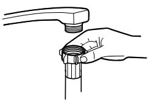

> **AI Description:**
> **Source:** `assets/_page_20_Figure_0.jpg`
> 
> **Generated:** 2026-05-31 00:52:21
> 
> ---
> 
> The image is a technical illustration showing a hand holding a cylindrical component with threads, which appears to be a part of a plumbing or mechanical assembly. The component is being inserted or adjusted into a larger fitting or fixture, likely part of a water faucet or similar device. The illustration is used to demonstrate a step in the assembly or maintenance process of such a fixture.

ordinary supply hose

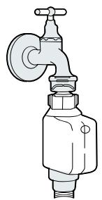

> **AI Description:**
> **Source:** `assets/_page_20_Figure_1.jpg`
> 
> **Generated:** 2026-05-31 00:53:09
> 
> ---
> 
> The image is a technical illustration of a water faucet with a connected water filter. The faucet is depicted with a handle on top and a pipe leading to a cylindrical water filter. The filter has a cap with a small hole, likely for air release, and a threaded connection at the bottom. The illustration is simple and appears to be a schematic or diagram, possibly used for instructional or technical purposes.

safety supply hose

## About the safety supply hose

The safety supply hose consists of the double walls.The hose's system guarantees its intervention by blocking the flow of water in case of the supply hose breaking and when the air space between the supply hose itself and the outer corrugated hose is full of water.

## AWARNING

A hose that attaches to a sink spray can burst if it is installed on the same water line as the dishwasher.If your sink has one,it is recommended that the hose be disconnected and the hole plugged.

## How to connect the safety supply hose

1.Pull The safety supply hoses completely out from storage compartment located at rear of dishwasher.

2.Tighter the screws of the safety supply hose to the faucet with thread 3/4inch.

3.Turn water fully on before starting the dishwasher.

## How to disconnect the safety supply hose

1. Turn off the water.

2.Unscrew the safety supply hose from the faucet.

## . Connection Of Drain Hoses

Insert the drain hose into a drain pipe with a minimum diameter of 4 cm,or let it run into the sink,making sure to avoid bending or crimping it.The height of drain pipe must be less than 10o0mm.The free end of the hose must not be immersed in water to avoid the back flow of it.

A Please securely fix the drain hose in either position A or position B

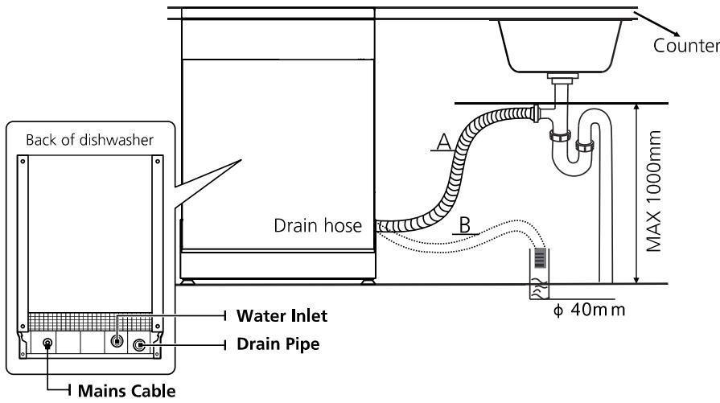

> **AI Description:**
> **Source:** `assets/_page_21_Figure_0.jpg`
> 
> **Generated:** 2026-05-31 00:54:35
> 
> ---
> 
> The image is a technical diagram illustrating the installation setup for a dishwasher. It includes a labeled view of the dishwasher's back panel, highlighting the water inlet, drain pipe, and mains cable connections. The diagram also shows the drain hose leading from the dishwasher to a sink, with a maximum height of 1000mm for the hose. The hose is marked with points A and B, indicating the connection points. The diagram provides clear visual information for proper installation and connection of the dishwasher's plumbing and electrical components.

## How to drain excess water from hoses

If the sink is 10oo higher from the floor, the excess water in hoses cannot be drained directly into the sink.It will be necessary to drain excess water from hoses into a bowl or suitable container that is held outside and lower than the sink.

## Water outlet

Connect the water drain hose.The drain hose must be correctly fitted to avoid water leaks.Ensure that the water drain hose is not kinked or squashed.

## Extension hose

If you need a drain hose extension,make sure to use a similar drain hose. It must be no longer than 4 meters; otherwise the cleaning effect of the dishwasher could be reduced.

## Syphon connection

The waste connection must be at a height less than 10o cm (maximum) from the bottom of the dish.The water drain hose should be fixed .

## 、Position The Appliance

Position the appliance in the desired location.The back should rest against the wall behind it,and the sides,along the adjacent cabinets or walls.The dishwasher is equipped with water supply and drain hoses that can be positioned either to the right or the left sides to facilitate proper installation.

## Levelling the appliance

Once the appliance is positioned for levelling, the height of the dishwasher may be altered via adjustment of the screwing level of the feet. In any case,the appliance should not be inclined more than 2°

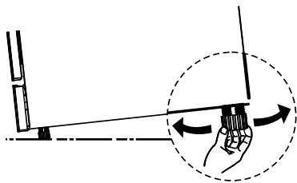

> **AI Description:**
> **Source:** `assets/_page_22_Figure_0.jpg`
> 
> **Generated:** 2026-05-31 00:49:15
> 
> ---
> 
> The image is a technical illustration showing a hand holding a device with a long antenna, which is being rotated. The device appears to be a Wi-Fi or similar type of antenna. The hand is shown in a circular motion, suggesting the device is being rotated to demonstrate its range or coverage area. The background includes a wall and a floor, indicating an indoor setting. The image is likely used for instructional or educational purposes to explain the functionality or installation of the device.

## NOTE:

Only apply to the free standing dishwasher.

## .Free Standing Installation

## Fitting between existing carbinets

The height of the dishwasher,845 mm, has been designed in order to allow the machine to be fitted between existing cabinets of the same height in modern fitted kitchens.The feet can be adjusted so that correct height is reached.

The laminated top of the machine does not require any particular care since it is heatproof,scratchproof and stainproof.

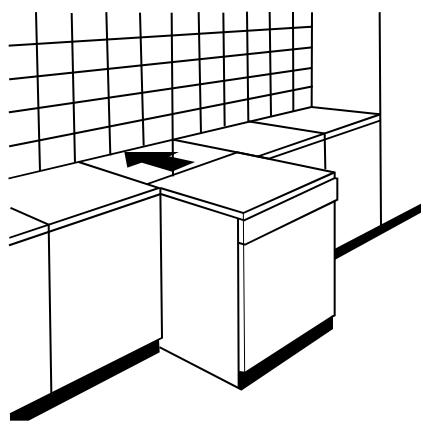

> **AI Description:**
> **Source:** `assets/_page_22_Figure_1.jpg`
> 
> **Generated:** 2026-05-31 00:49:41
> 
> ---
> 
> The image is a technical illustration of a kitchen layout. It features a corner kitchen design with two cabinets and a countertop. The cabinets are positioned at a 90-degree angle, and the countertop extends over the corner. A grid pattern is visible on the wall above the countertop, possibly indicating a backsplash or decorative element. The illustration is simple and lacks color, focusing on the structural elements of the kitchen.

## ·Built-In Installation(for the integrated model)

## Step 1. Selecting the best location for the dishwasher

The installation position of dishwasher should be near the existing inlet and drain hoses and power cord.

Illustrations of cabinet dimensions and installation position of the dishwasher.

1. Less than 5 mm between the top of dishwasher and cabinet and the outer door aligned to cabinet.

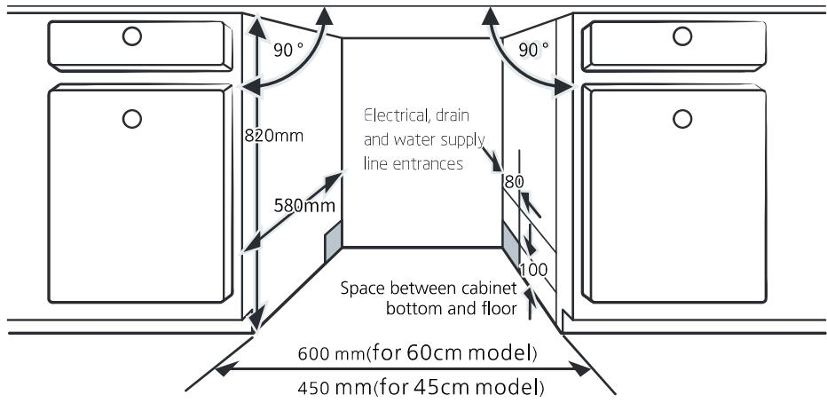

> **AI Description:**
> **Source:** `assets/_page_23_Figure_0.jpg`
> 
> **Generated:** 2026-05-31 00:47:58
> 
> ---
> 
> The image is a technical illustration of a kitchen appliance installation guide. It includes a diagram of a kitchen cabinet setup with measurements and annotations. Key features include:
> 
> - Dimensions for a 60cm model (600 mm) and a 45cm model (450 mm) for the space between the cabinet bottom and the floor.
> - The height of the cabinet is 820 mm.
> - The width of the cabinet is 580 mm.
> - The diagram highlights the 90-degree angle at the top corners of the cabinet.
> - It also notes the location of electrical, drain, and water supply line entrances.
> - The space between the cabinet bottom and the floor is marked with dimensions of 80 mm and 100 mm, indicating the minimum and maximum recommended clearances.
> 
> This diagram is useful for ensuring proper installation and clearance for the appliance in a kitchen setting.

2. If dishwasher is in stalled at the corner of the cabinet, there should be some space when the door is opened.

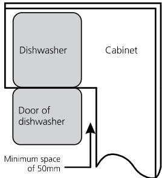

> **AI Description:**
> **Source:** `assets/_page_24_Figure_0.jpg`
> 
> **Generated:** 2026-05-31 00:47:44
> 
> ---
> 
> The image is a technical illustration showing a dishwasher and its door within a cabinet. The dishwasher is depicted as a rectangular shape with the label "Dishwasher" above it. Below the dishwasher is the door of the dishwasher, also shown as a rectangular shape. The illustration includes an arrow pointing downward from the bottom of the dishwasher door, indicating the minimum space required beneath the dishwasher door, which is labeled as "Minimum space of 50mm." The surrounding area is labeled as "Cabinet," suggesting the dishwasher is installed within this cabinet space.

## NOTE:

Depending on where your electrical outlet is,you may need to cut a hole in the opposite cabinet side.

## Step 2. Aesthetic panel's dimensions and installation

The aesthetic wooden panel could be processed according to the installation drawings.

## Semi-integrated model

Magical paster A and magical paster B be disjoinedon ,magical paster A on the aesthetic wooden panel and felted magical paster B of the outer door of dishwasher (see figure A).After positioning of the panel,fix the panel onto the outer door by screws and bolts (See figure B).

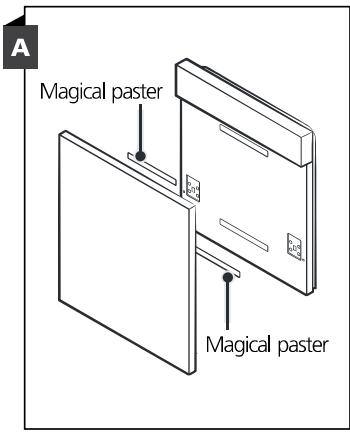

> **AI Description:**
> **Source:** `assets/_page_24_Figure_2.jpg`
> 
> **Generated:** 2026-05-31 00:46:38
> 
> ---
> 
> The image is a technical illustration showing a diagram of a device or panel with two identical sections. Each section is labeled "Magical paster," indicating a specific component or feature. The diagram is labeled "A" in the top left corner, suggesting it is part of a larger instructional or technical manual. The illustration is simple and uses lines and text to convey the information, focusing on the placement and labeling of the "Magical paster" components.

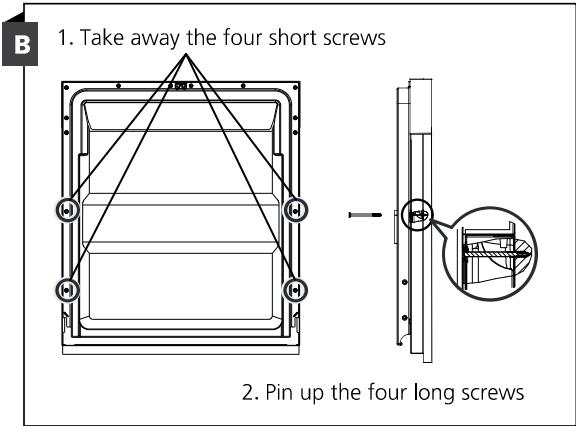

> **AI Description:**
> **Source:** `assets/_page_24_Figure_3.jpg`
> 
> **Generated:** 2026-05-31 00:47:08
> 
> ---
> 
> The image contains a diagram illustrating the process of removing and replacing screws on a piece of equipment, likely a door or panel. The diagram is divided into two steps:
> 
> 1. The first step shows four short screws located at the corners of a rectangular frame. The text instructs the user to "Take away the four short screws."
> 
> 2. The second step shows four long screws, with the text "Pin up the four long screws." The diagram includes a close-up view of one of the long screws, highlighting its position and orientation.
> 
> The diagram is a technical illustration designed to guide the user through the process of disassembling and reassembling the equipment.

## Full-integrated model

Install the hook on the aesthetic wooden panel and put the hook into the slot of the outer door of dishwasher (see figure A).After positioning of the panel,fix the panel onto the outer door by screws and bolts (See figure B).

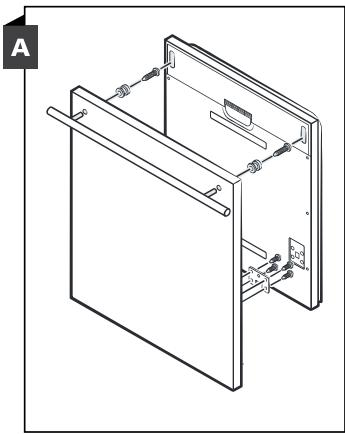

> **AI Description:**
> **Source:** `assets/_page_25_Figure_0.jpg`
> 
> **Generated:** 2026-05-31 00:49:22
> 
> ---
> 
> The image is a technical illustration showing a component of a kitchen appliance, likely a drawer or a door mechanism. It depicts a vertical panel with a sliding mechanism. The panel is attached to a frame with screws and has a handle at the top. The illustration includes a label "A" in the top left corner, indicating it is part of a larger set of instructions or diagrams. The diagram is detailed, showing the internal components and how the panel is secured within the frame.

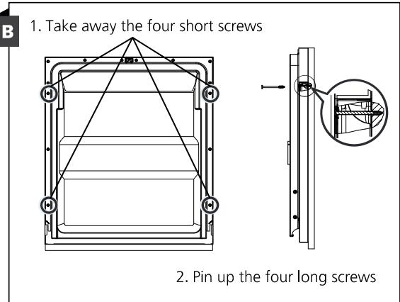

> **AI Description:**
> **Source:** `assets/_page_25_Figure_1.jpg`
> 
> **Generated:** 2026-05-31 00:49:30
> 
> ---
> 
> The image contains a technical illustration with instructions for disassembling a device. It includes a diagram of a rectangular component with four short screws and four long screws. The text at the top instructs the user to "Take away the four short screws," and the bottom text instructs to "Pin up the four long screws." The diagram shows the placement of the screws and a close-up of the long screws being pinned up. The illustration is likely part of a manual or guide for assembling or disassembling a specific piece of equipment or appliance.

## Step 3.Tension adjustment of the door spring

1.The door springs are set at the factory to the proper tension for the outer door. If aesthetic wooden panel are installed, you will have to adjust the door spring tension. Rotate the adjusting screw to drive the adjustor to strain or relax the steel cable.

2.Door spring tension is correct when the door remains horizontal in the fully opened position,yet rises to a close with the slight lift of a finger.

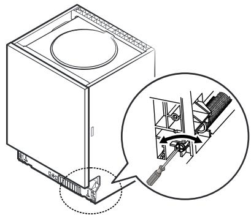

> **AI Description:**
> **Source:** `assets/_page_25_Figure_2.jpg`
> 
> **Generated:** 2026-05-31 00:48:25
> 
> ---
> 
> The image is a technical illustration showing a step in the assembly or maintenance of a piece of equipment, likely a fan or ventilation system. It depicts a side view of a rectangular box with a circular component on top. The inset diagram illustrates a mechanical part, possibly a fan or motor, being adjusted or secured with a tool. The illustration is designed to guide the viewer through a specific action or adjustment process, emphasizing the use of a screwdriver to manipulate a component within the box. The focus is on the mechanical interaction and the precise method of assembly or repair.

## Step 4. Dishwasher installation steps

Please refer to the specified installation steps in the installation drawings.

1.Affix the condensation strip under the work surface of cabinet. Please ensure the condensation strip is flush with edge of work surface.(Step 2)

2. Connect the inlet hose to the cold water supply.

3. Connect the drain hose.

4.Connect the power cord.

5.Place the dishwasher into position. (Step 4)

6.Level the dishwasher.The rear foot can be adjusted from the front of the dishwasher by turning the Philips screw in the middle of the base of dishwasher use an Philips screw.To adjust the front feet, use a flat screw driver and turn the front feet until the dishwasher is level. (Step 5 to Step 6)

7. Installthe furniture door to the outer door of the dishwasher.(Step 7 to Step 10)

8.Adjust the tension of the door springs by using an Allen key turning in a clockwise motion to tighten the left and right door springs.Failure to do this could cause damage to your dishwasher. (Step 11)

9.The dishwasher must be secured in place.There are two ways to do this: A.Normal work surface: Put the installation hook into the slot of the side plane and secure it to the work surface with the wood screws.

B. Marble or granite work top: Fix the side with Screw.

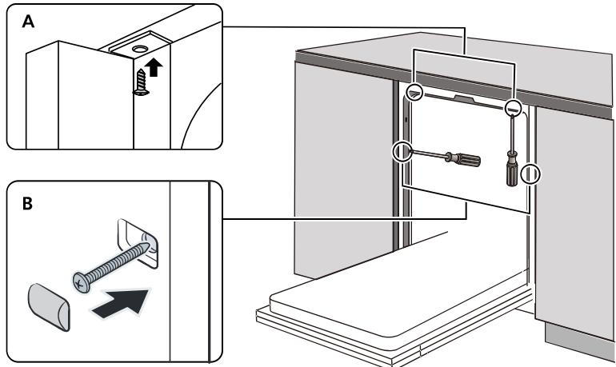

> **AI Description:**
> **Source:** `assets/_page_26_Figure_1.jpg`
> 
> **Generated:** 2026-05-31 00:54:24
> 
> ---
> 
> The image contains a technical illustration with two labeled sections (A and B) and a larger diagram of a cabinet or appliance. Section A shows a close-up of a screw being inserted into a bracket, indicating a step in assembly or installation. Section B depicts a screw and a plastic component being inserted into a hole, likely part of the same assembly process. The larger diagram illustrates the overall structure of the cabinet or appliance, with various components labeled and connected, suggesting a step-by-step guide for assembly or repair. The image is a technical illustration used to guide the viewer through the assembly process of a cabinet or similar appliance.

## Step 5. Levelling the dishwasher

Dishwasher must be level for proper dish rack operation and wash performance.

1.Place a spirit level on door and rack track inside the tub as shown to check that the dishwasher is level.

2.Level the dishwasher by adjusting the three leveling legs individually.

3.When level the dishwasher,please pay attention not to let the dishwasher tip over.

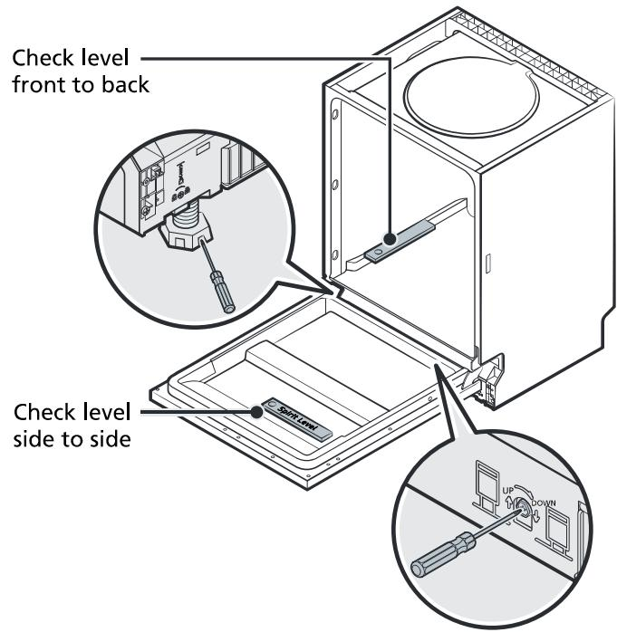

> **AI Description:**
> **Source:** `assets/_page_27_Figure_0.jpg`
> 
> **Generated:** 2026-05-31 00:52:17
> 
> ---
> 
> The image is a technical illustration showing how to check the level of a piece of equipment, likely a cabinet or appliance. It includes two diagrams: one showing how to check the level front to back, and another showing how to check the level side to side. Both diagrams feature a spirit level and a screwdriver, indicating the tools needed for the task. The illustrations are labeled with text to guide the viewer on the correct procedure.

## NOTE:

The maximum adjustment height of the feet is 50 mm.

## TROUBLESHOOTING TIPS

## Before Calling For Service

Reviewing the charts on the following pages may save you from calling for service.

# LOADING THE BASKETS ACCORDING TO EN60436:

## 1.Upper basket:

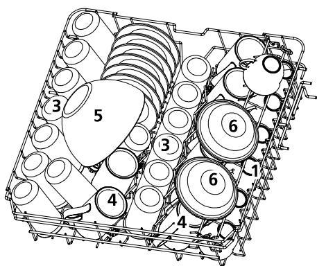

> **AI Description:**
> **Source:** `assets/_page_32_Figure_0.jpg`
> 
> **Generated:** 2026-05-31 00:52:59
> 
> ---
> 
> The image is a technical illustration of a dishwasher rack with numbered items. It shows a top-down view of a dishwasher rack containing various dishes and utensils. The numbers 1 through 6 are labeled on different items within the rack, likely indicating different types of dishes or their positions. The illustration is designed to demonstrate the layout and organization of a dishwasher rack, possibly for instructional or design purposes.

## 2.Lower basket:

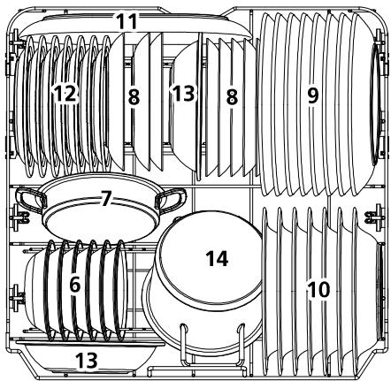

> **AI Description:**
> **Source:** `assets/_page_32_Figure_1.jpg`
> 
> **Generated:** 2026-05-31 00:52:33
> 
> ---
> 
> The image is a technical illustration of a ventilation system, likely for an air conditioning or HVAC unit. It includes various components labeled with numbers from 6 to 14, which represent different parts of the system. The diagram shows the airflow path, with numbered sections indicating the direction and flow of air through the system. The labels and numbered sections suggest a detailed breakdown of the system's components and their arrangement.

## AWARNING

Non compliance with the loading can result to poor washing quality.

## 3.Cutlery rack:

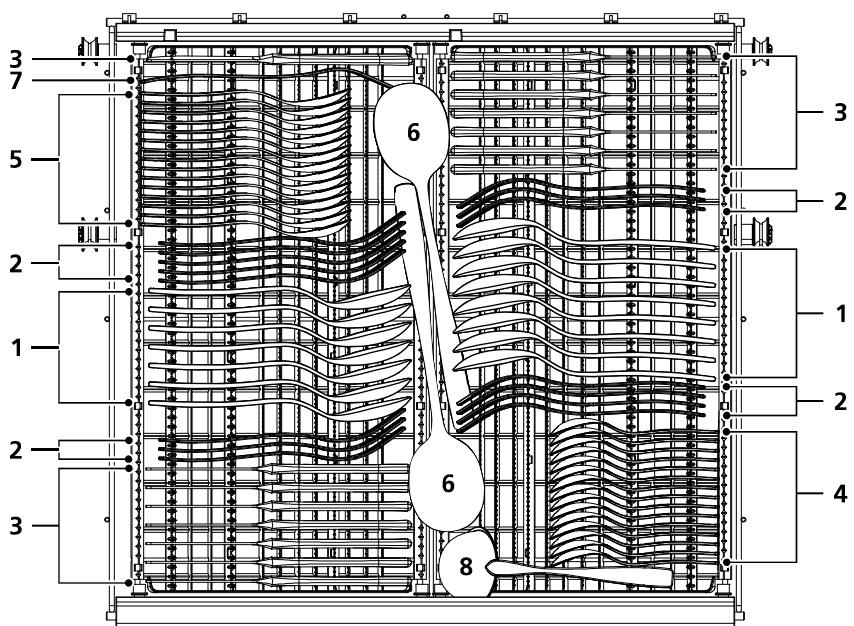

> **AI Description:**
> **Source:** `assets/_page_33_Figure_0.jpg`
> 
> **Generated:** 2026-05-31 00:54:03
> 
> ---
> 
> The image is a technical illustration, likely a cross-sectional view of a heat exchanger or a similar industrial component. It features a series of parallel tubes arranged in a grid pattern, with fins or ribs attached to the tubes to enhance heat transfer. The illustration includes numbered labels (1 through 8) pointing to various parts of the component, suggesting a detailed breakdown of the structure. The layout and design indicate a focus on heat exchange efficiency, with the tubes and fins likely designed to maximize contact area for heat transfer. The image is detailed and technical, likely used for educational or instructional purposes related to industrial engineering or HVAC systems.

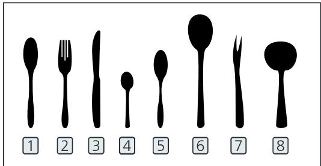

> **AI Description:**
> **Source:** `assets/_page_33_Figure_1.jpg`
> 
> **Generated:** 2026-05-31 00:54:49
> 
> ---
> 
> The image contains a series of silhouettes of kitchen utensils, numbered from 1 to 8. The utensils include a spoon, a fork, a knife, and a smaller spoon, all arranged in a horizontal line. The numbers below each utensil correspond to the items listed above. The image is a simple diagram with no additional text or annotations.

Information for comparability   
tests in accordance with EN60436   
Capacity: 15 place settings   
Position of the upper basket: lower position   
Program: ECO   
Rinse aid setting: 5   
Softener setting: H3

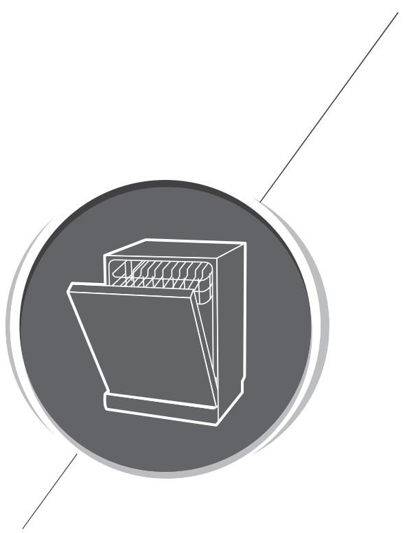

> **AI Description:**
> **Source:** `assets/_page_34_Figure_0.jpg`
> 
> **Generated:** 2026-05-31 00:54:13
> 
> ---
> 
> The image contains a simple line drawing of a dishwasher. The dishwasher is depicted in a side view, showing the door partially open and the interior racks visible. The drawing is enclosed within a circular border with a gray fill. There are no additional labels, text, or annotations present in the image.

Dishwasher Instruction Manual

PART Il: Special Version

## CONTENTS

## USING YOUR DISHWASHER

Control Panel   
Water Softener   
Preparing And Loading Dishes   
Function Of The Rinse Aid And Detergent   
Filling The Rinse Aid Reservoir   
Filling The Detergent Dispenser

## PROGRAMMING THE DISHWASHER

Wash Cycle Table   
Starting A Cycle Wash   
Changing The Program Mid-cycle   
ForgetTo Add A Dish?   
Auto Open Door

ERROR CODES

## TECHNICAL INFORMATION

## NOTE:

·If you cannot solve the problems by yourself,please ask for help from a professional technician.

·The manufacturer, following a policy of constant development and updating of the product, may make modifications without giving prior notice.

· If lost or out-of-date,you can receive a new user manual from the manufacturer or responsible vendor.

## QUICK USER GUIDE

Please read the corresponding content on the instruction manual for detailed operating method.

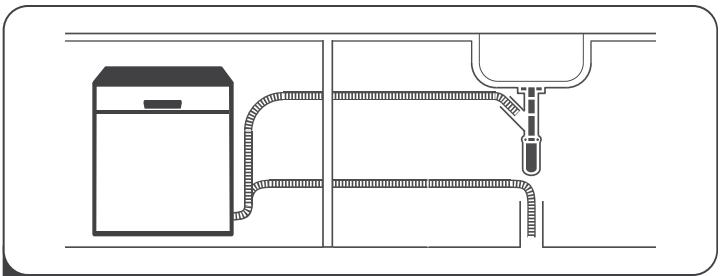

> **AI Description:**
> **Source:** `assets/_page_36_Figure_0.jpg`
> 
> **Generated:** 2026-05-31 00:47:23
> 
> ---
> 
> The image is a technical illustration showing a diagram of a water filtration system. It includes a water filter unit on the left side, connected by a hose to a faucet on the right side. The hose is shown in a zigzag pattern, indicating the path it takes from the filter to the faucet. The diagram is simple and line-based, focusing on the flow of water through the system.

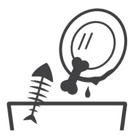

> **AI Description:**
> **Source:** `assets/_page_36_Figure_1.jpg`
> 
> **Generated:** 2026-05-31 00:47:38
> 
> ---
> 
> The image is a simple line drawing. It features a magnifying glass held above a fish skeleton resting on a flat surface. The magnifying glass is positioned as if it is about to examine the fish skeleton, suggesting a focus on detail or analysis. The drawing is minimalistic, using only black lines on a white background.

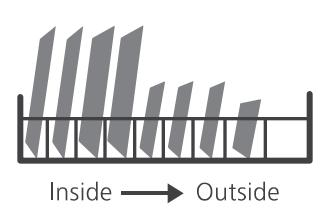

> **AI Description:**
> **Source:** `assets/_page_36_Figure_2.jpg`
> 
> **Generated:** 2026-05-31 00:46:59
> 
> ---
> 
> The image is a simple diagram illustrating a cross-sectional view of a structure, possibly a building or a wall. The diagram shows a series of vertical lines representing the inside and outside of the structure. The lines on the left side are labeled "Inside," and those on the right side are labeled "Outside," indicating the direction from inside to outside. The lines are evenly spaced and appear to represent different sections or layers of the structure.

Removing the larger residue on the cutlery
Loading the baskets

> **AI Description:**
> **Source:** `assets/_page_36_Figure_3.jpg`
> 
> **Generated:** 2026-05-31 00:46:43
> 
> ---
> 
> The image is a diagram illustrating the process of adding detergent and water to a washing machine. It shows a top-loading washing machine with a compartment for detergent and a compartment for water. The diagram includes a hand pouring liquid detergent into the detergent compartment and a hand pouring water into the water compartment. The image is a simple line drawing with no additional text or annotations.

Filling the dispenser

> **AI Description:**
> **Source:** `assets/_page_36_Figure_4.jpg`
> 
> **Generated:** 2026-05-31 00:48:30
> 
> ---
> 
> The image is a simple line drawing of a rectangular object with a horizontal line near the top, possibly representing a handle or a lid. Two curved lines are drawn above the object, suggesting sound waves or vibrations. The object appears to be a box or a container. The drawing is minimalistic and lacks any additional labels or text annotations.

5 Selecting a program and running the dishwasher

## USING YOUR DISHWASHER

## ， Control Panel

> **AI Description:**
> **Source:** `assets/_page_37_Figure_0.jpg`
> 
> **Generated:** 2026-05-31 00:50:13
> 
> ---
> 
> The image is a technical illustration of a control panel with various buttons and indicators. It includes a digital clock displaying "2:30" and several symbols and labels indicating different functions and settings. The panel is divided into sections with numbered labels from 1 to 12, each corresponding to a specific button or indicator. The labels include "Rapid Zone," "ECO," "H+," "Opt," "½," and "Prog," among others. The design suggests it is part of a kitchen appliance, likely a dishwasher, given the symbols and layout.

Operation (Button)

Display

## AWARNING

·Manual pre-rinsing of tableware items increases water and energy consumption and is not recommended.

·Washing tableware in a household dishwasher usually consumes less energy and water in the use phase than hand dishwashing when the household dishwasher is used according to the manufacturer's instructions.

## .Water Softener

The water softener must be set manually,using the water hardness dial.

The water softener is designed to remove minerals and salts from the water,which would have a detrimental or adverse effect on the operation of the appliance.

The more minerals there are,the harder your water is.

The softener should be adjusted according to the hardness of the water in your area.   
Your local Water Authority can advise you on the hardness of the water in your area.

## Adjusting salt consumption

The dishwasher is designed to allow for adjustment in the amount of salt consumed based on the hardness of the water used.This is intended to optimise and customise the level of salt consumption.

Please follow the steps below for adjustment in salt consumption.

1. Close the door and switch on the appliance;

2. Press the Program button for more than 5 seconds to start the water softener set model within 60 seconds after the appliance was switched on;

3.Press the Program button to select the proper set according to your local environment, the sets will change in the following sequence: H1->H2->H3->H4->H5->H6;

4. Press the Power button to end the set up model.

1dH=1.25 Clarke=1.78 °fH=0.178mmoll
The manufactory setting: H3
Contact your local water board for information on the hardness of your water supply.

Please check the section 3 “Loading The Salt Into The Softener" of PART I : Generic Version, If your dishwasher lacks salt.

## NOTE:

If your model does not have any water softener, you may skip this section. Water Softener

The hardness of the water varies from place to place.If hard water is used in the dishwasher,deposits will form on the dishes and utensils.

The appliance is equipped with a special softener that uses a salt container specifically designed to eliminate lime and minerals from the water.

## .Preparing And Loading Dishes

·Consider buying utensils which are identified as dishwasher-proof.

·For particular items,select a program with the lowest possible temperature.

· To prevent damage,do not take glass and cutlery out of the dishwasher immediately after the program has ended.

## For washing the following cutlery/dishes

## Are not suitable

· Cutlery with wooden, horn china or mother-of-pearl handles

·Plastic items that are not heat resistant

· Older cutlery with glued parts that are not temperature resistant

·Bonded cutlery items or dishes

·Pewter or cooper items

· Crystal glass

· Steel items subject to rusting

·Wooden platters

·Items made from synthetic fibres

## Are of limited suitability

·Some types of glasses can become dull after a large number of washes

·Silver and aluminum parts have a tendency to discolour during washing

·Glazed patterns may fade if machine washed frequently

## Recommendations for loading the dishwasher

Scrape off any large amounts of leftover food.Soften remnants of burnt food in pans.It is not necessary to rinse the dishes under running water.

For best performance of the dishwasher,follow these loading guidelines.

(Features and appearance of baskets and cutlery baskets may vary from your model.)

Place objects in the dishwasher in following way:

·Items such as cups, glasses,pots/pans,etc.are faced downwards.

·Curved items,or ones with recesses,should be loaded aslant so that water can run off.

·All utensils are stacked securely and can not tip over.

·All utensils are placed in the way that the spray arms can rotate freely during washing.

·Load hollow items such as cups, glasses, pans etc.With the opening facing downwards so that water cannot collect in the container or a deep base.

·Dishes and items of cutlery must not lie inside one another,or cover each other.

·To avoid damage, glasses should not touch one another.

·The upper basket is designed to hold more delicate and lighter dishware such as glasses,coffee and tea cups.

·Long bladed knives stored in an upright position are a potential hazard!

·Long and /or sharp items of cutlery such as carving knives must be positioned horizontally in the upper basket.

·Please do not overload your dishwasher.This is important for good results and for reasonable consumption of energy.

## NOTE:

Very small items should not be washed in the dishwasher as they could easily fall out of the basket.

## Removing the dishes

To prevent water dripping from the upper basket into the lower basket, we recommend that you empty the lower basket first, followed by the upper basket.

## AWARNING

> **AI Description:**
> **Source:** `assets/_page_42_Figure_0.jpg`
> 
> **Generated:** 2026-05-31 00:53:28
> 
> ---
> 
> The image contains a simple icon of a thermometer with a circular arrow around it. The thermometer is depicted with a wavy line above it, indicating heat or temperature. The circular arrow suggests a cycle or continuous process, possibly related to temperature regulation or climate change. The icon is likely used to represent concepts such as temperature control, climate systems, or environmental monitoring.

Items will be hot! To prevent damage,do not take glass and cutlery out of the dishwasher for around 15 minutes after the program has ended.

## Loading the upper basket

The upper basket is designed to hold more delicate and lighter dishware such as glasses,coffee and tea cups and saucers,as well as plates,small bowls and shallow pans (as long as they are not too dirty). Position the dishes and cookware so that they will not get moved by the spray of water.

> **AI Description:**
> **Source:** `assets/_page_43_Figure_0.jpg`
> 
> **Generated:** 2026-05-31 00:51:56
> 
> ---
> 
> The image is a technical illustration of a mechanical component, likely a part of a machine or engine. It shows a cross-sectional view of a cylindrical part with several bolts and washers securing it in place. The central part appears to be a pulley or a similar rotating element, with a central hole for a shaft or axle. The surrounding structure suggests it is part of a larger assembly, possibly related to power transmission or mechanical linkage.

## Loading the lower basket

We suggest that you place large items and the most difficult to clean items are to be placed into the lower basket: such as pots,pans,lids,serving dishes and bowls, as shown in the figure below.It is preferable to place serving dishes and lids on the side of the racks in order to avoid blocking the rotation of the top spray arm. The maximum diameter advised for plates in front of the detergent dispenser is of 19 cm,this not to hamper the opening of it.

> **AI Description:**
> **Source:** `assets/_page_43_Figure_1.jpg`
> 
> **Generated:** 2026-05-31 00:51:39
> 
> ---
> 
> The image is a diagram of a dish rack. It shows a horizontal metal rack with several vertical slots, each designed to hold a single dish. The slots are arranged in a staggered pattern, allowing for efficient use of space. The rack appears to be designed for drying dishes, with the slots positioned to allow air to circulate around each dish.

## Loading the cutlery basket

Cutlery should be placed in the cutlery rack separately from each other in the appropriate positions,and do make sure the utensils do not nest together,this may cause bad performance.

## AWARNING

> **AI Description:**
> **Source:** `assets/_page_43_Figure_2.jpg`
> 
> **Generated:** 2026-05-31 00:52:39
> 
> ---
> 
> The image contains a diagram with a circular background divided into sections. The central part of the circle features vertical lines resembling bars or a fence, with a black 'X' mark superimposed over the middle section. Two diagonal lines extend from the bottom left to the top right of the circle, intersecting the central 'X'. The overall design appears to be a stylized representation, possibly symbolic or related to a specific concept or organization.

Do not let any item extend through the bottom.

Always load sharp utensils with the sharp point down!

For the best washing effect, please load the baskets refer to standard loading options on last section of PART I : Generic Version

## 、Function Of The Rinse Aid And Detergent

The rinse aid is released during the final rinse to prevent water from forming droplets on your dishes,which can leave spots and streaks.It also improves drying by allowing water to roll off the dishes. Your dishwasher is designed to use liquid rinse aids.

## AWARNING

Only use branded rinse aid for dishwasher.Never fill the rinse aid dispenser with any other substances (e.g. Dishwasher cleaning agent, liquid detergent). This would damage the appliance.

## When to refill the rinse aid

The regularity of the dispenser needing to be refilled depends on how often dishes are washed and the rinse aid setting used.

·The Low Rinse Aid indicator（ :)willappear in the display when more rinse aid is needed.

•Do not overfill the rinse aid dispenser.

## Function of detergent

The chemical ingredients that compose the detergent are necessary to remove,crush and dispense alldirt out of the dishwasher.Most of the commercial quality detergents are suitable for this purpose.

## AWARNING

·Proper Use of Detergent

Use only detergent specifically made for dishwashers use. Keep your detergent fresh and dry.

Don't put powdered detergent into the dispenser until you are ready to wash dishes.

> **AI Description:**
> **Source:** `assets/_page_44_Figure_0.jpg`
> 
> **Generated:** 2026-05-31 00:52:06
> 
> ---
> 
> The image contains a diagram with a red circle and a diagonal line through it, indicating prohibition. Inside the circle are icons representing a bottle, a baby, and a battery. The red circle with the diagonal line signifies that these items are not allowed or are hazardous.

Dishwasher detergent is corrosive! Keep dishwasher detergent out of the reach of children.

## .Filling The Rinse Aid Reservoir

> **AI Description:**
> **Source:** `assets/_page_45_Figure_0.jpg`
> 
> **Generated:** 2026-05-31 00:53:16
> 
> ---
> 
> The image is a technical illustration showing a device with a display screen and a button. The screen has a symbol resembling a laser or light beam, indicating a function related to light or projection. Below the screen, there is a button with a small symbol that appears to represent a star or a burst of light, suggesting a function related to brightness or intensity. The bottom part of the device has a circular component with an arrow pointing to the right, which likely indicates a direction or movement related to the device's operation. The overall design suggests the device is related to lighting or projection control.

1 Remove the rinse reservoir cap by lifting up the handle.

> **AI Description:**
> **Source:** `assets/_page_45_Figure_1.jpg`
> 
> **Generated:** 2026-05-31 00:53:48
> 
> ---
> 
> The image is a technical illustration showing a close-up view of a door lock mechanism. It depicts a hand inserting a key into the keyhole of a door lock. The lock is shown in an open position, revealing the internal components. The illustration is monochromatic and appears to be part of an instructional guide or manual, likely for a door lock installation or repair.

> **AI Description:**
> **Source:** `assets/_page_45_Figure_2.jpg`
> 
> **Generated:** 2026-05-31 00:54:55
> 
> ---
> 
> The image is a technical illustration showing a hand interacting with a device. The device appears to be a control panel or a switch with a symbol resembling a fan or a similar icon. The hand is pressing a button on the device, which is located below the symbol. There is a curved arrow pointing downward to the right, indicating a direction or action. The illustration is likely part of an instruction manual or a guide for operating the device.

Close the cap after all.
2 Pour the rinse aid into the dispenser, being careful not to overfill.

## Adjusting the rinse aid reservoir

To achieve a better drying performance with limited rinse aid,the dishwasher is designed to adjust the consumption by user. Follow the below steps.

1. Close the door and switch on the appliance.

2.Within 60 seconds after step 1,press the Program button more than 5 seconds, and then press the Delay button to enter the set model, the rinse aid indication blinks as 1Hz frequency.

3. Press the Program button to select the proper set according to your using habits， the sets will change in the following sequence: D1->D2->D3->D4->D5->D1. The higher the number, the more rinse aid the dishwasher uses.

4.Without operation in 5 seconds or press the Power button to exit the set model, the set success.

## ，Filling The Detergent Dispenser

> **AI Description:**
> **Source:** `assets/_page_46_Figure_0.jpg`
> 
> **Generated:** 2026-05-31 00:48:40
> 
> ---
> 
> The image contains a diagram with two numbered steps illustrating a process. Step 1 shows a device sliding to the right, accompanied by an arrow pointing to the right. Step 2 depicts the same device with an arrow pointing down, indicating a downward press. The diagram is labeled with the text "Sliding it to the right" for step 1 and "Press down" for step 2. The overall purpose appears to be instructional, guiding the viewer on how to operate a particular device or mechanism.

> **AI Description:**
> **Source:** `assets/_page_46_Figure_1.jpg`
> 
> **Generated:** 2026-05-31 00:48:18
> 
> ---
> 
> The image contains a diagram illustrating a process involving two labeled components, A and B. Component A appears to be a container where a substance is being poured, possibly indicating a step in a manufacturing or laboratory procedure. Component B is shown with a small object placed on it, which could represent a sample or a piece of equipment. The diagram includes symbols that might represent steps or stages in the process, such as a sunburst symbol and a starburst symbol, which could denote different stages or operations. The overall context suggests a step-by-step guide or instructional diagram for a specific procedure.

Please choose an open way according to the actual situation.

Add detergent into the larger cavity (A) for the main wash cycle. For better cleaning result,especially if you have very dirt items,pour a small amount of detergent onto the door. The additional detergent will activate during the pre-wash phase.

1.Open the cap by sliding the release catch.

2. Open the cap by pressing down the release catch.

> **AI Description:**
> **Source:** `assets/_page_46_Figure_2.jpg`
> 
> **Generated:** 2026-05-31 00:49:10
> 
> ---
> 
> The image is a technical illustration showing a diagram of a device with a rectangular shape. The diagram includes a central square with a pattern resembling a light source or signal, and an arrow pointing upwards from this square. To the right of the square, there is a small sun-like symbol. The diagram appears to be a schematic or instructional graphic, possibly related to a device's operation or assembly.

Close the flap by sliding it to the front and then pressing it down.

## NOTE:

·Be aware that depending on the soiling of water,setting may be different.

·Please observe the manufacturer's recommendations on the detergent packaging.

## PROGRAMMING THE DISHWASHER

## .Wash Cycle Table

The table below shows which programs are best for the levels of food residue on them and how much detergent is needed.It also show various information about the programs.

(●)Means: need to fillrinse into the Rinse-Aid Dispenser.

## NOTE:

EN 60436: This program is the test cycle.The information for comparability test in accordance with EN 60436.

Values other than the ECO program are purely indicative.

## ， Starting A Cycle Wash

1.Draw out the lower and upper basket, load the dishes and push them back. It is commended to load the lower basket first, then the upper one.

2.Pour in the detergent.

3.Insert the plug into the socket. The power supply refer to last page "Product fiche". Make sure that the water supply is turned on to full pressure.

4.Close the door,press the Power button,to switch on the machine.

5.Choose a program,the response light willturn on.Then press the Start/Pause button,the dishwasher will start its cycle.

## . Changing The Program Mid-cycle

A wash cycle can only be changed if it has been running for a short time otherwise, the detergent may have already been released and the dishwasher may have already drained the wash water.If this is the case,the dishwasher needs to be reset and the detergent dispenser must be refilled.To reset the dishwasher,follow the instructions below:

1. Press the Start/Pause button to pause the washing.

2.Press Program button for more than 3 seconds - the program will cancel.

3.Press the Program button to select the desired program.

4.Press the Start/Pause button,after 10 seconds, the dishwasher will start.

> **AI Description:**
> **Source:** `assets/_page_48_Figure_0.jpg`
> 
> **Generated:** 2026-05-31 00:50:33
> 
> ---
> 
> The image is a sequence of four icons, each representing a step in a process. The first icon shows a hand pressing a button with a pause symbol, indicating the start of a sequence. The second icon displays the word "Prog" with an arrow pointing to the right and a "3 sec" label above it, suggesting a 3-second press of the "Prog" button. The third icon shows a rectangular box with the text "ECO" and two other symbols labeled "R29'" and "R45'", which likely represent different modes or settings. The fourth icon again shows a hand pressing a button with a pause symbol, indicating the end of the sequence. The overall image appears to be a simplified representation of a process flow or a sequence of actions.

## . Forget To Add A Dish?

A forgotten dish can be added any time before the detergent dispenser opens.If this is the case,follow the instructions below:

1. Press the Start/Pause button to pause the washing.

2.Wait 5 seconds then open the door.

3. Add the forgotten dishes.

4. Close the door.

5.Press the Start/Pause button after 10 seconds,the dishwasher will start.

> **AI Description:**
> **Source:** `assets/_page_49_Figure_0.jpg`
> 
> **Generated:** 2026-05-31 00:51:11
> 
> ---
> 
> The image is a diagram illustrating a sequence of steps, likely related to a kitchen appliance, such as a dishwasher. The sequence includes:
> 
> 1. A hand pressing a button, indicated by a downward arrow.
> 2. The appliance is shown with water inside, labeled "After 5 sec," suggesting a 5-second delay.
> 3. A hand is shown placing a dish into a rack, which is then shown inside the appliance.
> 4. The appliance is shown with the door closed.
> 5. The sequence ends with the hand pressing the button again, completing the cycle.
> 
> The diagram is a step-by-step guide, possibly for a user manual or instructional video.

## AWARNING

> **AI Description:**
> **Source:** `assets/_page_49_Figure_1.jpg`
> 
> **Generated:** 2026-05-31 00:51:16
> 
> ---
> 
> The image is a simple line drawing of a rectangular container with a smaller rectangular object inside it, which appears to be dripping. The container has a handle on its side, suggesting it might be a bucket or a similar type of container. The dripping object could represent a liquid or a substance leaking out of the container. The drawing is minimalistic and lacks any additional labels or annotations.

It is dangerous to open the door mid-cycle, as hot steam may scald you.

## Auto Open Door

The dishwasher door opens automatically at the end of the program,which improves the drying results.(If the dishwasher is built-in the surrounding furnishings must be resistant to any condensation.)

> **AI Description:**
> **Source:** `assets/_page_49_Figure_2.jpg`
> 
> **Generated:** 2026-05-31 00:51:03
> 
> ---
> 
> The image is a simple line drawing of a dishwasher with a box on top and an arrow pointing to the right. The dishwasher is depicted in a basic, minimalist style with a rectangular shape and a handle. The arrow suggests the direction of the box's movement or placement.

## NOTE:

The dishwasher door must not be blocked when set to open automatically.   
This can disrupt door lock functionality.

## ERROR CODES

If there is a malfunction,the dishwasher will display error codes to identify these:

## AWARNING

· If overflow occurs,turn off the main water supply before caling a service.

·If there is water in the base pan because of an overfillor small leak,the water should be removed before restarting the dishwasher.

## TECHNICAL INFORMATION

> **AI Description:**
> **Source:** `assets/_page_51_Figure_0.jpg`
> 
> **Generated:** 2026-05-31 00:51:30
> 
> ---
> 
> The image is a technical illustration of a rectangular structure, likely a cabinet or appliance, with dimensions labeled. The diagram includes measurements for width (W), depth (D1 and D2), and height (H). The structure has a flat top and a back panel, with the dimensions clearly annotated to indicate the size and shape of the object.

## DATABASE ACCESS

In order to access to your model information stored in the product database,as set out in Regulation (EU) 2019/2017 and relating to energy labelling,please log on to the website: https://eprel.ec.europa.eu/

Look for the reference of your product on the website by putting the service reference that is indicated on your product rating plate.

Another means to access this information is to flash the "QR" code on the energy label of your product.

## ENAfterSales Service:

Any maintenance on your equipment should be undertaken by: -Either your dealer,

-Or another qualified mechanic who is an authorized agent for the brand appliances. When making an appointment, state the fullreference of your equipment (model, type and serial number). This information appears on the manufacturer's nameplate attached to your equipment.

## INFORMATION

The minimum period of availabilityof spare parts listed in the European Regulation 2019-2022-EU and accessible in particular to the user of the appliance,is 10 years under the conditions layed down in the same regulation.