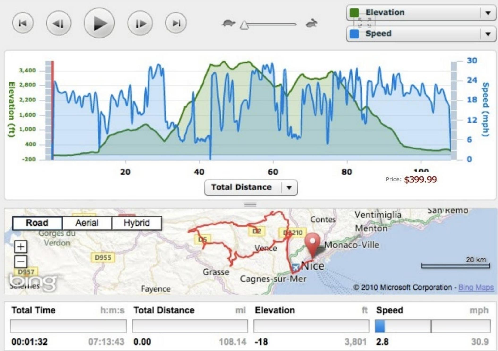
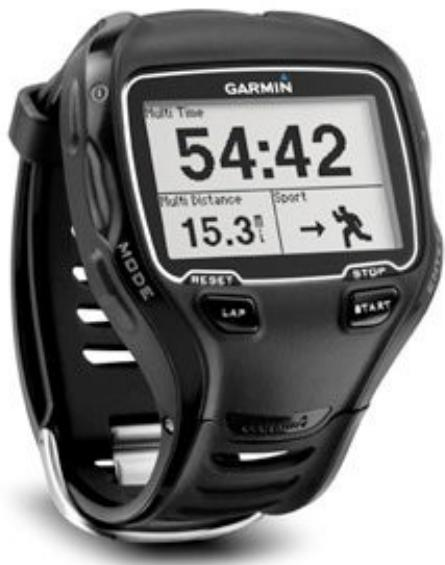
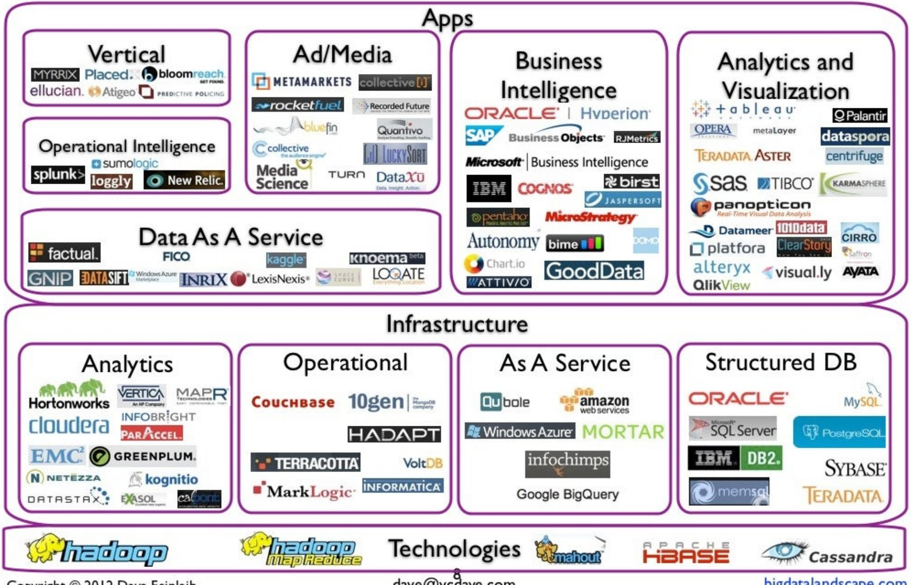
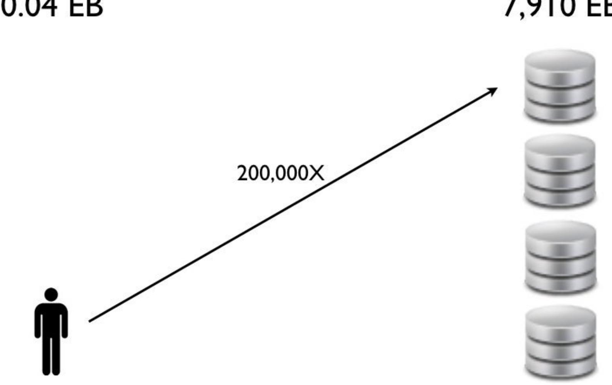
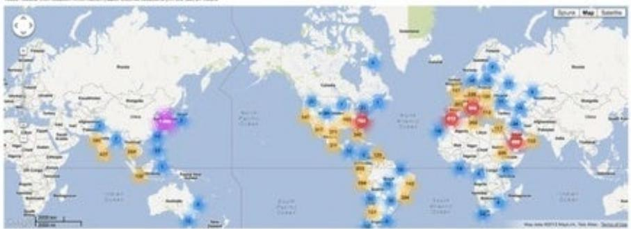
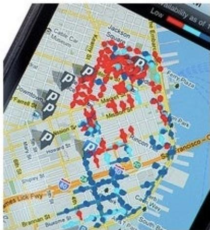
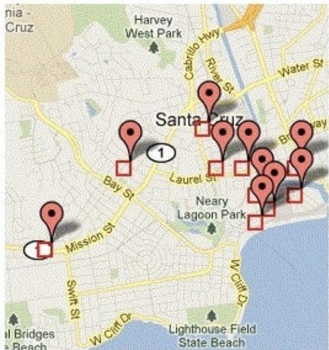
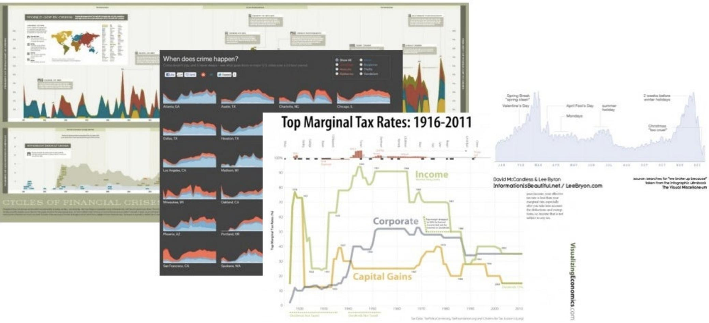

## BIG DATA TRENDS

I1/15/2012 DavidFeinleib

THEBIGDATA GROUP

THEBIGDATAGROUP.COM

WHAT IS BIG DATA?

> **AI Description:**
> **Source:** `assets/_page_2_Figure_0.jpg`
> 
> **Generated:** 2026-05-31 01:17:28
> 
> ---
> 
> The image is a photograph of a large group of people at the start of a triathlon event. They are wearing wetsuits and swim caps, preparing to enter the water. The background shows a coastal town with buildings and a body of water, with a few small boats visible. The image captures the anticipation and excitement of the participants as they get ready to begin the swimming portion of the race.

> **AI Description:**
> **Source:** `assets/_page_3_Figure_0.jpg`
> 
> **Generated:** 2026-05-31 01:19:48
> 
> ---
> 
> The image contains a combination of a map and a line graph. The map at the bottom shows a route from Nice to Monaco-Ville, with various roads and geographical features labeled. The line graph at the top displays elevation (in feet) and speed (in mph) over time, with the elevation graph in green and the speed graph in blue. The graph shows fluctuations in elevation and speed, with the elevation graph peaking at around 3,400 feet and the speed graph reaching up to 30 mph. The map indicates the total distance as 108.14 miles, with the elevation change noted as -18 feet. The total time for the journey is 1 hour and 32 minutes, and the average speed is 2.8 mph. The image also includes a price of $399.99, likely related to the service or product being used to generate this map and graph.

> **AI Description:**
> **Source:** `assets/_page_4_Figure_0.jpg`
> 
> **Generated:** 2026-05-31 01:18:25
> 
> ---
> 
> The image shows a Garmin Forerunner 920XT running watch. It displays a digital screen with the following information: the time is 54:42, the distance covered is 15.3 miles, and there is a running icon indicating the current activity. The watch has physical buttons labeled "Mode," "Reset," "Lap," "Stop," and "Start," which are used to navigate and control the watch's functions. The watch has a black strap and a rectangular digital display with a white background and black text.

Price:\$399.99

Home

Total Miles Logged by Connect Users

## 2509889029

THEBIGDATAGROUP.COM

## Outline

I) Landscape - Number of Big Data Companies and Categories Is Growing

2) Basic Stats - Consumer Scale Driving Big Data Transformation

3)Transformation - Many Industries

4) Top 8 Laws Of Big Data

5) Big Data Whitespace

## BASIC STATS - BIG DATA MARKET ROBUST, CONSUMER SCALEFUELINGTECHADOPTION

## BIGDATA LANDSCAPE

> **AI Description:**
> **Source:** `assets/_page_7_Figure_0.jpg`
> 
> **Generated:** 2026-05-31 01:07:17
> 
> ---
> 
> The image is an infographic combining text with visual elements. It categorizes various software and services related to big data and analytics into two main sections: "Apps" and "Infrastructure." The "Apps" section is further divided into subcategories such as Vertical, Ad/Media, Business Intelligence, Analytics and Visualization, Operational Intelligence, and Data As A Service. The "Infrastructure" section includes categories like Analytics, Operational, As A Service, and Structured DB. Each category lists multiple companies and technologies, providing a comprehensive overview of the landscape in the field of big data and analytics. The infographic uses a grid layout with purple borders and includes logos and names of various companies and technologies.

Copyright20l2 Dave Feinleib

## MARKET GROWTH

## THEBIGDATAGROUPCOM

### Full Page Description (Page 9)

**Source:** `assets/_page_9_Asset_0.jpg`

**Generated:** 2026-05-31 01:14:34

---

The image is a horizontal bar chart with the title "IBM" at the top. The chart lists various companies, including IBM, Intel, HP, Fujitsu, Accenture, CSC, Dell, Seagate, EMC, Teradata, Amazon, SAS, Capgemini, and Hitachi. Each company name is paired with a corresponding bar that represents a numerical value. The bars are ordered from left to right, with the length of each bar indicating the magnitude of the value for that company. The source of the data is credited to Wikibon. The chart visually compares the values associated with each company, with IBM having the longest bar, indicating the highest value among the listed companies.

## Big Data Overall Revenue \$5.IB in ’I I

### Full Page Description (Page 10)

**Source:** `assets/_page_10_Asset_0.jpg`

**Generated:** 2026-05-31 01:08:16

---

The image contains a bar chart with the title "Total Big Data Pure-Play Revenue: $468 million." The chart displays the revenue of various big data companies, with the company "Vertica" leading with $84 million, followed by "Opera Solutions" with $75 million, and "Mu Sigma" with $55 million. The revenue values are labeled on top of each bar. The chart includes a legend indicating the total revenue and a logo for "Wikibon" in the top right corner. The chart provides a clear visual representation of the revenue distribution among the big data companies, highlighting the dominance of a few leading companies and the smaller contributions of the rest.

## BigData Pure-Play Revenue \$468M in'Il

### Full Page Description (Page 11)

**Source:** `assets/_page_11_Asset_0.jpg`

**Generated:** 2026-05-31 01:11:03

---

The image contains a line graph with a blue line representing data over the years 2012 to 2017. The y-axis is labeled "Billions" and ranges from $0.0 to $60.0. The x-axis represents the years. The graph shows a steady increase in the value represented, with key data points labeled at $5.1 in 2012, $10.2 in 2013, $16.8 in 2014, $32.1 in 2015, $48.0 in 2016, and $53.4 in 2017. The graph also includes a logo and the word "Wikibon" in the top left corner.

## BigData Overall Revenue \$53.4B By2017

## DATA GROWTH

### Full Page Description (Page 13)

**Source:** `assets/_page_13_Asset_0.jpg`

**Generated:** 2026-05-31 01:09:23

---

The image is a line graph showing the growth of users over time, measured in millions. The x-axis represents time, starting from December 2004 and ending in October 2011, with intervals marked at six-month intervals. The y-axis represents the number of users, ranging from 0 to 1000 million. The graph indicates a steady increase in user numbers, with a significant jump around February 2010, followed by a more gradual increase until the end of the period. The source of the data is credited to Benphoster.com.

## Facebook at IB Users in Oct'12

### Full Page Description (Page 14)

**Source:** `assets/_page_14_Asset_0.jpg`

**Generated:** 2026-05-31 01:13:23

---

The image is a line graph showing the number of tweets per day in millions over time. The x-axis represents years from January 2007 to June 2012, while the y-axis represents the number of tweets per day in millions. The graph illustrates a significant upward trend in the number of tweets, starting from zero in January 2007 and reaching approximately 400 million tweets per day by June 2012. The source of the data is cited as Twitter blog and news reports.

## Twitter at 400MTweets Per Day in Jun 'l2

### Full Page Description (Page 15)

**Source:** `assets/_page_15_Asset_0.jpg`

**Generated:** 2026-05-31 01:02:37

---

The image is a bar chart showing the number of metrics captured over time, from January 2010 to August 2012. The y-axis represents the number of metrics captured, ranging from 0 to 60 billion, while the x-axis represents months and years. The chart illustrates a steady increase in the number of metrics captured, with a significant jump in the later months of 2011 and 2012. Notable annotations include a reference to "56+ Billion metrics captured and reported daily across 25,000+ accounts," indicating the scale of data collection.

## New Relic at 56B Metrics Captured in Aug'l2

## 94% Corporate Data Growth Y/Y

Source:Forrester

## Big Data: By The Numbers

·Walmart handles IM transactions per hour

· Google processes 24PB of data per day

·AT&T transfers 30PB of data per day

·90 trillion emails are sent per year

· World ofWarcraft uses I.3PB of storage

### Full Page Description (Page 18)

**Source:** `assets/_page_18_Asset_0.jpg`

**Generated:** 2026-05-31 01:12:20

---

The image is a bar chart with the y-axis labeled "Exabytes" and the x-axis representing years from 2005 to 2015. The chart shows a significant increase in the amount of data stored in exabytes over the years. In 2005, the data storage is minimal, around 0 exabytes. By 2010, the storage has increased to approximately 1000 exabytes, and by 2015, it has grown to about 8000 exabytes. The chart visually represents the exponential growth in data storage capacity over the decade.

## Worldwide Data Growth at 7.9EB/Yr in‘15

### Full Page Description (Page 19)

**Source:** `assets/_page_19_Asset_0.jpg`

**Generated:** 2026-05-31 01:05:09

---

The image is an infographic combining text with visual elements. It compares the bandwidth of different senses and technologies. The infographic uses a color-coded bar chart to represent the bandwidth of sight, touch, hearing, smell, and taste. Each sense or technology is represented by a color-coded bar, with the length of the bar indicating the bandwidth in MB/s. The chart includes labels such as "Sight," "Touch," "Hearing," "Smell," and "Taste," along with corresponding bandwidth values. Notable features include the comparison of bandwidth to a computer network and the use of icons to represent each sense or technology.

## Bandwidth of Our Senses

## DATA SENSED PER YEAR

> **AI Description:**
> **Source:** `assets/_page_20_Figure_0.jpg`
> 
> **Generated:** 2026-05-31 01:15:39
> 
> ---
> 
> The image is a diagram illustrating a comparison between a human and a large amount of data storage. It shows a human figure on the left side labeled "0.04 EB" and a stack of hard drives on the right side labeled "7,910 EB". An arrow between them is labeled "200,000X", indicating a 200,000-fold difference in scale. The diagram uses simple icons and text to convey the vast disparity in scale between the human and the amount of data storage.

## THEBIG DATA CYCLE

### Full Page Description (Page 22)

**Source:** `assets/_page_22_Asset_0.jpg`

**Generated:** 2026-05-31 01:06:13

---

The image is a line graph showing two sets of data over a period from February 22, 2012, to June 22, 2012. The x-axis represents dates, while the y-axis on the left side represents daily cost in USD, and the y-axis on the right side represents Elastic Compute Units. The graph includes two data series: one labeled "Cost" in green and the other labeled "Compute Units" in orange. The graph highlights two specific points of interest, labeled A and B, where the cost and compute units show significant changes. Point A indicates a sharp increase in both cost and compute units, while point B shows a significant drop in cost with a more gradual change in compute units.

## As Efficiency Increases,So Does Consumption

## The Big Data Cycle

DConsumer scale and speed requirements have introduced new technologies that have increased the efficiency of using Big Data

> **AI Description:**
> **Source:** `assets/_page_23_Figure_1.jpg`
> 
> **Generated:** 2026-05-31 01:02:43
> 
> ---
> 
> The image contains a single black arrow pointing upwards and to the right. The arrow is a simple, solid line with a triangular head. There are no labels, text, or additional elements present in the image. The arrow appears to be a standalone symbol, possibly used to indicate direction or movement in a broader context.

> **AI Description:**
> **Source:** `assets/_page_23_Figure_2.jpg`
> 
> **Generated:** 2026-05-31 01:00:16
> 
> ---
> 
> The image contains a simple black arrow pointing to the right. It is a directional symbol often used to indicate movement or direction. There are no labels, text, or additional elements present in the image.

2 This increasedefficiency is leading toadoption of Big Data across a wide variety of industries

3 This results in the generationand consumption of more data

> **AI Description:**
> **Source:** `assets/_page_23_Figure_4.jpg`
> 
> **Generated:** 2026-05-31 01:03:07
> 
> ---
> 
> The image contains a single black arrow pointing to the left. It is a simple, unadorned directional symbol with no additional text or annotations. The arrow is the sole visual element in the image.

## 6 InsightsFrom Facebook's Former Head Of BigData

# Analytics on 900M users 25PB of compressed data- I25PB uncompressed

I）“What datato store”=>“What can we do with more data”

2)Simplify data analytics for end users

3)More users means analytics systems have to be more robust

4）Social networking works for Big Data

5）No single infrastructure can solve al Big Data problems

6)Building software is hard; runninga service is even harder

## BIG DATA TRANSFORMING BUSINESS

## Transformation of Retail

THEN...

Sales

NOW...

## Data driven pricing and recommendations

> **AI Description:**
> **Source:** `assets/_page_26_Figure_1.jpg`
> 
> **Generated:** 2026-05-31 01:18:17
> 
> ---
> 
> The image contains a section titled "Today's Recommendations For You" with a daily sample of items recommended for the viewer. It includes book covers and titles such as "Even Faster Web Sites" and "Simply JavaScript," along with their authors and prices. The image also has a red arrow pointing to the text "Here's a daily sample of items recommended for you."

## Transformation of Online Marketing

## THEN...

Leads

## NOW...

Marketingand Sales Recommendations

> **AI Description:**
> **Source:** `assets/_page_27_Figure_0.jpg`
> 
> **Generated:** 2026-05-31 01:14:42
> 
> ---
> 
> The image contains a photograph of two individuals wearing headsets, likely representing customer service or call center workers. The image is accompanied by a black arrow pointing downward, which may indicate a direction or a transition to another section or image. The individuals appear to be focused on their work, with one person partially visible in the foreground and the other in the background. The setting suggests a professional environment, possibly a call center or customer service office.

Google

Campaign Recommendations

> **AI Description:**
> **Source:** `assets/_page_27_Figure_2.jpg`
> 
> **Generated:** 2026-05-31 01:14:37
> 
> ---
> 
> The image contains a single black arrow pointing diagonally upwards to the left. There are no other elements or text present in the image. The arrow is the sole visual content and does not convey any specific information or data.

### Full Page Description (Page 28)

**Source:** `assets/_page_28_Asset_0.jpg`

**Generated:** 2026-05-31 01:09:39

---

The image contains a bar chart with a timeline along the x-axis and numerical values along the y-axis. The bars represent data points at specific time intervals, showing a general upward trend in the values over time. The chart includes a legend indicating the range of values, and there are annotations for specific time points such as "9:00 PM Tue Jul 16 2013" and "12:00 AM Wed Jul 17". The chart appears to be tracking some form of data over a 24-hour period, with the values increasing slightly throughout the day.

## Transformation of IT

## THEN...

Log files

<table><tr><td>[Sun Dec 21 09:17:0920081 [error] [Sun Dec 21 10:04:53 2008] [error] Sun Dec 21 10:45:50 2008] [error] Sun Dec 2121 11:14:09 2008] [error] [Sun Dec 12:26:04 2008] [error] 心</td></tr></table>

## NOW...

## Operational intelligence

> **AI Description:**
> **Source:** `assets/_page_28_Figure_0.jpg`
> 
> **Generated:** 2026-05-31 01:09:32
> 
> ---
> 
> The image is a world map with various locations marked by colored dots. The map is divided into three sections, each representing a different region of the world. The colors of the dots (blue, yellow, and red) likely indicate different categories or levels of data, although the specific meaning of these colors is not provided in the image. The map appears to be a data visualization, possibly showing the distribution or concentration of something across different geographical areas. The map includes country names and some geographical features, but the exact data being represented is not clear from the image alone.

### Full Page Description (Page 29)

**Source:** `assets/_page_29_Asset_0.jpg`

**Generated:** 2026-05-31 01:17:45

---

The image is a line graph with two lines representing "Satisfaction" and "First Reply Time" over time. The x-axis represents the months and years from September 2011 to May 2012, while the y-axis on the left shows satisfaction levels from 70% to 90%, and the y-axis on the right shows first reply times from 9 to 30 hours. The graph shows fluctuations in satisfaction levels and first reply times over the period, with notable peaks and troughs in both metrics.

## Transformation of Customer Service

Unhappy customers

> **AI Description:**
> **Source:** `assets/_page_29_Figure_0.jpg`
> 
> **Generated:** 2026-05-31 01:09:50
> 
> ---
> 
> The image is a photograph of a person in a white shirt and black tie, appearing to be in a state of distress or frustration. The individual is holding their head with one hand and has their mouth open as if shouting or yelling. The background is dark, which draws attention to the subject. The image conveys a sense of emotional intensity or stress.

## NOW...

Customer insight

## Transformationof Billing

## THEN...

Manual coding

> **AI Description:**
> **Source:** `assets/_page_30_Figure_0.jpg`
> 
> **Generated:** 2026-05-31 01:07:25
> 
> ---
> 
> The image contains a stethoscope and a pen resting on a medical document. The document appears to be a form or chart with various fields filled out, though the specific details are not legible. The stethoscope is a common medical tool used for auscultation, and the pen suggests documentation or note-taking. The overall scene implies a medical or healthcare setting.

Intelligent coding

> **AI Description:**
> **Source:** `assets/_page_30_Figure_1.jpg`
> 
> **Generated:** 2026-05-31 01:05:17
> 
> ---
> 
> The image contains a stethoscope placed over a background of binary code. The stethoscope is metallic and appears to be a medical tool, while the binary code in the background suggests a digital or technological theme. The juxtaposition of the stethoscope and binary code may symbolize the intersection of medical practice and technology, possibly in the context of healthcare data analysis or digital health systems.

## Transformation Of Fraud Management

## THEN...

Creditdatabases

> **AI Description:**
> **Source:** `assets/_page_31_Figure_0.jpg`
> 
> **Generated:** 2026-05-31 01:02:54
> 
> ---
> 
> The image contains a close-up of a hand pointing to a checkbox labeled "Excellent" on a form. The form includes other options such as "Good," "Average," and "Poor," but only the "Excellent" checkbox is checked. The image is a photograph of a document with a focus on the interaction between the hand and the form. The visual element provides context to the text by showing the act of selecting an option.

## NOW...

Social profiles

> **AI Description:**
> **Source:** `assets/_page_31_Figure_1.jpg`
> 
> **Generated:** 2026-05-31 01:03:02
> 
> ---
> 
> The image is a Facebook profile page featuring a close-up photograph of a fluffy white dog. The profile is associated with Mark Zuckerberg, as indicated by the name and a small profile picture of him in the bottom left corner. The top of the image includes a Facebook search bar and the Facebook logo. The main focus of the image is the dog, which appears to be a young, fluffy breed, possibly a puppy.

underand CEOat Facook atdiy Matit

Friends

1,
Sulneribers

## Transformation Of Operations Management

THEN...

Operations?

> **AI Description:**
> **Source:** `assets/_page_32_Figure_0.jpg`
> 
> **Generated:** 2026-05-31 01:16:07
> 
> ---
> 
> The image contains a photograph of a parking violation notice placed on the windshield of a vehicle. The notice is orange and white with text that includes the words "PARKING VIOLATION." The windshield wipers are visible, and the background shows a blurred view of buildings, suggesting an urban setting. The image provides visual evidence of a parking ticket, which is a common occurrence in urban areas.

NOW...

Automated operations

> **AI Description:**
> **Source:** `assets/_page_32_Figure_1.jpg`
> 
> **Generated:** 2026-05-31 01:15:47
> 
> ---
> 
> The image contains a map with various symbols representing different categories of data. The map appears to be of a specific urban area, likely San Francisco, given the street names and geographical features. Red and blue symbols are scattered across the map, with red symbols concentrated in the center and blue symbols dispersed more sparsely. The map also includes a legend or key in the top right corner, which likely explains the meaning of the red and blue symbols. The map is displayed on a mobile device, suggesting it might be a mobile app or a digital map service.

## Transformation ofLaw Enforcement

THEN...

Gut instinct

NOW...

Crime hotspot prediction

> **AI Description:**
> **Source:** `assets/_page_33_Figure_1.jpg`
> 
> **Generated:** 2026-05-31 01:20:11
> 
> ---
> 
> The image is a map showing a section of Santa Cruz, California. It includes various locations marked with red pins and squares, indicating specific points of interest or data points. The map highlights streets and parks such as Harvey West Park, Cabrillo Hwy, Water St, Laurel St, Neary Lagoon Park, and Lighthouse Field State Beach. The map also includes a legend or key near the bottom left, which likely explains the meaning of the red pins and squares. The overall layout suggests this is a geographical representation of a specific area, possibly for a study or analysis of locations within Santa Cruz.

## Transformation of Medical Research

THEN...

Keyword searches

## Results:1to20of245953

Abrogation ofSrc Homology Region 2 Domain-Containing Phosphatase 1inTumor-SpecificTCells 1 Improves Effcacy of Adoptive Immunotherapy by Enhancing the Effector Function and Accumulation of Short-Lived EffectorTCells In Vivo Stromnes IM,Fowler C，Casamina CC,Georgopolos CM,McAfee MS,Schmit TM,TanX,KimTD, Choi l,Blattman JN,Greenberg PD. JImmunol.2012Jul13.[Epubahead ofprint] PMID:22798667PubMed-as supplied by publisher] Related citatons

MLL5MaintainsGenomicIntegrity by Regulating theStabity of theChromosomal Passenger

2.Complex viaa Functional Interaction with Bcrealin Liu J,Cheng F,Deng LW. JCellSci2012Jul 13.[Epub ahead ofprint] PMID:22797924[PubMed-as supplied by publisher] Related citatons

□The Blk pathway functions asa tumor suppressor in chronicmyeloid leukemia stem cells

3.ZhangH,PengC,HuY,LiH,ShengZ,ChenY,SulivanC,CernyJ,HutchinsonL，HigginsA,on P,ZhangX，Brehm MA,LiD,Green MR,LiS. NatGenet 2012Jul15.doi:10.1038/ng.2350.[Epub ahead ofprint] PMID:22797726 [PubMed-as supplied by publisher] Related citatons

NOW...

## Relevance

## TransformationofFitness

THEN...

Manual tracking

Walk 45 minutes

Smoothie

Lift weights 20 minutes

NOW...

Goals+ measurement

> **AI Description:**
> **Source:** `assets/_page_35_Figure_0.jpg`
> 
> **Generated:** 2026-05-31 01:15:56
> 
> ---
> 
> The image shows a fitness tracker with a black band and a digital display. The display shows the word "April" in a dotted font, indicating the month. The tracker has a button on the side and a small LED strip that is partially illuminated with colors, suggesting it may track activity levels or other metrics. The design is sleek and modern, with a focus on functionality for health and fitness tracking.

## TOP 8 LAWS OF BIG DATA

## BIG DATA LAW #1

The faster you analyze your data, the greater its predictive value. Companies are moving away from batch processing to real-time to gain competitive advantage.

## BIG DATA LAW #2

Maintain one copy of your data, not dozens.The more you copy and move your data,the less reliable it becomes (example: banking crisis).

## BIG DATA LAW #3

Use more diverse data, not just more data. More diverse data leads to greater insights.Combining multiple data sources can lead to the most interesting insights of all.

# Data has value far beyond what you originally anticipate. Don't throw it away.

## BIG DATA LAW #5

Plan for exponential growth.The number of photos,emails,and IMs while large,is limited by the number of people. Networked"sensor”data from mobile phones,GPS,and other devices is much larger.

## BIG DATA LAW #6

Solve a real pain point. Don't think of Big Data as a stand-alone new, shiny, technology.Think about your core business problems and how to solve them by analyzing Big Data.

## BIG DATA LAW #7

Put data and humans together to get the most insight. More data alone isn't sufficient.Look for ways to broaden the use of data across your organization.

## BIG DATA LAW #8

Big Data is transforming business the same way IT did. Those that fail to leverage the numerous internal and external data sources available willbe leapfrogged by newentrants.

## D2:DATA + DESIGN

## THEBIGDATAGROUP.COM

## Data Informs Design

> **AI Description:**
> **Source:** `assets/_page_46_Figure_0.jpg`
> 
> **Generated:** 2026-05-31 01:03:49
> 
> ---
> 
> The image is a photograph of a sailing competition, likely the America's Cup, featuring two sailboats with large red sails prominently displaying the logos "Fly Emirates" and "Prada." The boats are racing in the water, with the Golden Gate Bridge in the background. The scene captures the dynamic movement of the boats and the iconic bridge, providing a sense of the event's setting and scale. The image conveys the excitement and competition of the sailing race, with the branding on the sails indicating sponsorship and the event's high-profile nature.

"The racing technology on the yachts competing for theAmerica's Cupwill be themostadvanced ever"
-TheWall StreetJournal MarketWatch

## Design Informs Data

"Visualization isa formofknowledge compression” -David McCandless

> **AI Description:**
> **Source:** `assets/_page_47_Figure_0.jpg`
> 
> **Generated:** 2026-05-31 01:01:41
> 
> ---
> 
> The image contains multiple visual elements, including charts and graphs. 
> 
> 1. The first chart on the left appears to be a world map with various data points, possibly representing economic indicators or financial crises, with accompanying text annotations.
> 
> 2. The second chart, titled "When does crime happen?", shows crime rates across different U.S. cities over a 24-hour period, with separate lines for different types of crimes such as theft, burglary, and vandalism.
> 
> 3. The central chart is titled "Top Marginal Tax Rates: 1916-2011" and displays historical tax rates for income, corporate, and capital gains taxes over time, with distinct lines for each type of tax.
> 
> 4. The rightmost chart is a line graph showing search trends related to "we broke up because" over time, with annotations for specific holidays and events.
> 
> The image combines text with various visual elements to present data in an accessible and informative manner.

### Full Page Description (Page 48)

**Source:** `assets/_page_48_Asset_0.jpg`

**Generated:** 2026-05-31 01:10:13

---

The image is a line graph that tracks a trend over the course of a year, with the x-axis representing months from January to December and the y-axis representing some unspecified metric. Key events and trends are labeled on the graph, such as "Spring Break," "Valentine's Day," "April Fool's Day," "Mondays," "summer holiday," and "2 weeks before winter holidays." The graph shows fluctuations in the metric, with notable peaks and troughs corresponding to these labeled events. The graph also includes a label "Christmas 'too cruel'" near the end of the year, suggesting a significant drop in the metric around this time.

## BigData Versus Romance

PeakBreak-UpTimes Accordingto Facebook status updates

## SUMMARY

## BigData White Space

I) Visualization - cloud, mobile,collaboration

2) Big Data Apps - verticals

3) Trend analysis across multiple data sources

4) Consumer behavior

5) Public data for scoring

6) New information /data service businesses

## Summary

I) Consumer company speed and scale requirements driving efficiencies in Big Data storageand analytics

2)Quantity of machine data vastly increasing (examples: networked sensor data frommobile phonesand GPSdevices)

3）Move away from batch to real-time

4）Cloud servicesopening Big Data toall

5)New and broader number of data sources being meshed together

6)Big Data Apps (BDAs) means using Big Data is faster and easier

DavidFeinleib dave@thebigdatagroup.com