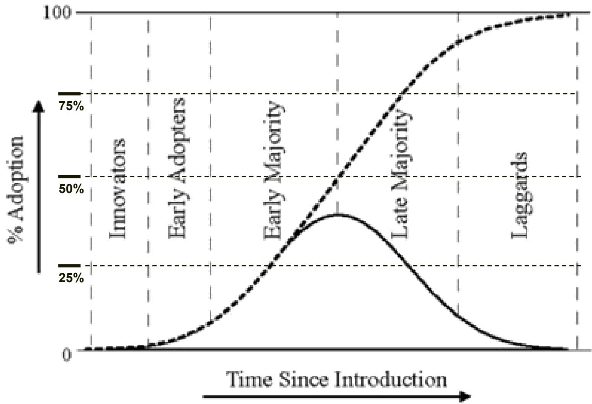
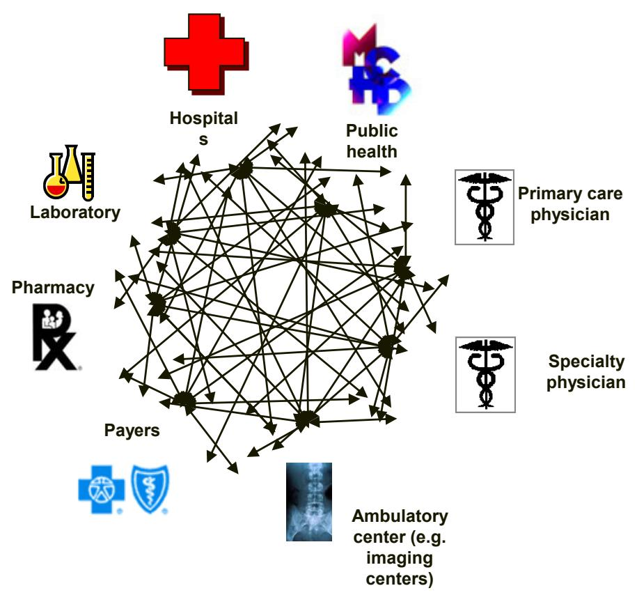
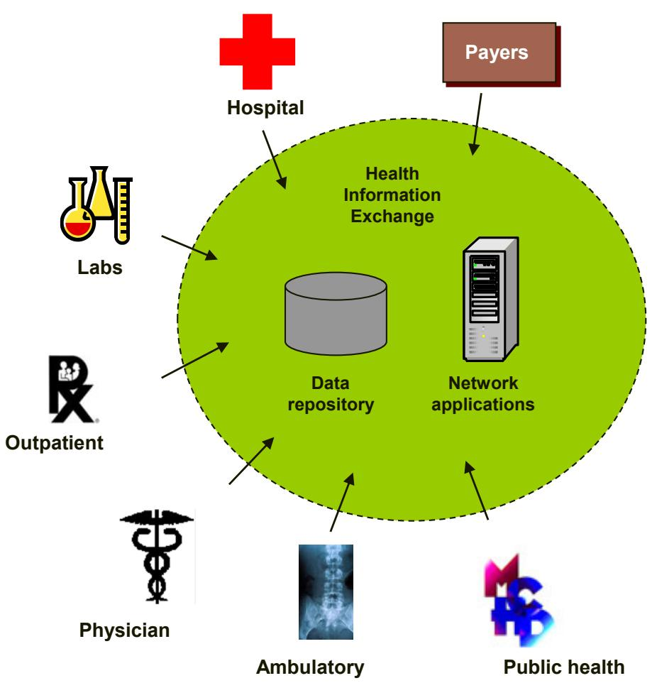

# Medical Informatics and HIT Systems

David Lubliner

## What is wrong with this picture?

> **AI Description:**
> **Source:** `assets/_page_1_Figure_0.jpg`
> 
> **Generated:** 2026-05-31 01:22:41
> 
> ---
> 
> The image contains a large stack of what appear to be medical files or patient records. The files are organized in a vertical stack, with each file having a tab at the top that likely contains patient information. The tabs are color-coded and labeled with letters and numbers, suggesting a systematic organization for easy retrieval. The files are densely packed, indicating a large volume of records, which could be indicative of a busy healthcare facility or a large database of patient information.

## Outline

• What kinds of HIT systems are there?

What major trends are emerging?

What are the benefits to adoption?

What are the barriers to adoption?

What is the current state of adoption?

• How can you learn more?

## HIT Applications

• Patient registration/ demographics

Insurance validation

Billing systems

Appointment systems

Computerized Physician Order Entry (CPOE)

• EMR/EHR/CPR

Pharmacy systems

Lab systems

• Imaging systems

Telemedicine

. Patient education

• Decision Support

Library resources

Sensors

## Sad Facts

• Medical errors account for more deaths than breast cancer, AIDs and motorcycle accidents.

US has highest HC costs per capita in world

• US has worst outcomes of industrialized nations. (infant mortality, lifespan, etc.)

• Healthcare is 10-15 yrs behind business in adoption of IT

## Some Hospitals are using Tablet Capture Devices

## • Microsoft Office OneNote

. Windows Journal

• Microsoft Educational Pack for Tablet PC

• Microsoft Experience Pack for Tablet PC

Sticky Notes

• Snipping Tool

## Electronic Medical Records

### Full Page Description (Page 7)

**Source:** `assets/_page_7_Asset_0.jpg`

**Generated:** 2026-05-31 01:23:53

---

The image contains a horizontal bar chart with two sets of bars for each category, representing the percentage of respondents who plan to implement certain IT-related initiatives either "Today" or "In Two Years." The categories include "Reduce Medical Errors/Promote Patient Safety," "Implement an EMR," "Connecting IT at Hospital and Remote Locations," "Process/Workflow Redesign," "Implement Wireless Systems," "Replace/Upgrade Inpatient Clinical Systems," "Upgrade Network Infrastructure," and "Design/Implement Strategic IT Plan." The chart visually compares the current status (Today) and future intentions (In Two Years) for each initiative. Notable features include the highest percentage for "Reduce Medical Errors/Promote Patient Safety" at 50% for "Today" and the lowest for "Design/Implement Strategic IT Plan" at 11% for "In Two Years."

## Projected IT Priorities

(Today vs. Next Two Years)

Figure 9

### Full Page Description (Page 8)

**Source:** `assets/_page_8_Asset_0.jpg`

**Generated:** 2026-05-31 01:27:53

---

The image is a horizontal bar chart comparing results from 2005 and 2006 for various healthcare-related topics. The chart includes categories such as Patient (Customer) Satisfaction, Medicare Cutbacks, Reducing Medical Errors, Cost Pressures, Clinical Transformation, Integration and Interoperability, Improving Quality of Care, Adoption of New Technology, Improving Operational Efficiency, and Providing IT to Ambulatory Facilities. Each category has two bars representing the percentage of results for 2005 and 2006. The chart highlights that in 2006, Patient (Customer) Satisfaction and Medicare Cutbacks had the highest percentages, while in 2005, Reducing Medical Errors had the highest percentage.

# Top Business Issues Facing HealthCare

(2006 vs.2005 Results)

Figure 10

### Full Page Description (Page 9)

**Source:** `assets/_page_9_Asset_0.jpg`

**Generated:** 2026-05-31 01:29:56

---

The image is a horizontal bar chart comparing results from 2005 and 2006 across various challenges faced in implementing technology in healthcare. The chart lists challenges such as "Lack of Financial Support," "Lack of Staffing Resources," and "Vendor's Inability to Effectively Deliver Product," among others. Each challenge is represented by two bars, one for 2005 and one for 2006, showing the percentage of respondents who faced each issue. The chart highlights that "Lack of Financial Support" was the most significant challenge in both years, with 20% in 2005 and 18% in 2006. The "Lack of Common Data Standards" was the least significant challenge, with only 2% in 2006.

# Most Significant Barriers to Barriers to Implementing IT

(2006 vs.2005 Results)

Figure 11

### Full Page Description (Page 10)

**Source:** `assets/_page_10_Asset_0.jpg`

**Generated:** 2026-05-31 01:25:41

---

The image is a horizontal bar chart comparing the results of two years, 2005 and 2006, for various healthcare information systems. The chart includes the following categories: Electronic Medical Record, Bar Coded Medication Management, Computerized Practitioner Order Entry (CPOE), Enterprise-Wide Clinical Information Sharing, Clinical Data Repository, Point-of-Care Decision Support, Digital Picture Archiving (PACS), and Ambulatory Systems. Each category has two bars representing the percentage of adoption in 2005 and 2006. The Electronic Medical Record shows the highest adoption in both years, with 61% in 2005 and 62% in 2006. Ambulatory Systems shows the lowest adoption, with 22% in 2005 and 17% in 2006. The chart visually highlights the adoption trends for these healthcare information systems over the two years.

## Most Important Applications

(2006 vs. 2005 Results)

Figure 12

### Full Page Description (Page 11)

**Source:** `assets/_page_11_Asset_0.jpg`

**Generated:** 2026-05-31 01:28:38

---

The image is a horizontal bar chart comparing results from 2005 and 2006 regarding various concerns related to healthcare IT security and compliance. The chart includes categories such as "Internal Breach of Security," "Inadequate Business Continuity/Disaster Recovery," and "HIPAA Compliance," among others. Each category has two bars representing the percentage of responses for each year. The chart highlights that "Internal Breach of Security" had the highest percentage in both years, with 51% in 2006 and 56% in 2005. "No Concerns" was the lowest category in both years, with 3% in both 2005 and 2006. The chart also includes "N/A" for certain categories, indicating data not available for those years.

# Top Security Concerns of Computerized Medical Information

(2006 vs.2005 Results)

Figure 14

### Full Page Description (Page 12)

**Source:** `assets/_page_12_Asset_0.jpg`

**Generated:** 2026-05-31 01:31:38

---

The image is a horizontal bar chart comparing the current implementation (today) and projected implementation (in two years) of various security and data protection measures. The chart includes percentages for each measure, such as Firewalls (98% today, 53% in two years), User Access Controls (88% today, 53% in two years), and others. The measures include Audit Logs, Multi-Level Passcodes, Off-Site Storage, Electronic Signature, Data Encryption, and Disaster Recovery. The chart highlights the current adoption rates and projected future trends for these security measures.

## Security Tools

(Today vs. Next Two Years)

Figure 15

## Technology Adoption Curve

> **AI Description:**
> **Source:** `assets/_page_13_Figure_0.jpg`
> 
> **Generated:** 2026-05-31 01:24:49
> 
> ---
> 
> The image is a graph illustrating the adoption curve of a new technology or product over time. It is a bell-shaped curve divided into five segments: Innovators, Early Adopters, Early Majority, Late Majority, and Laggards. The x-axis represents the time since the introduction of the product, while the y-axis represents the percentage of adoption. The graph shows that the adoption rate starts low, increases rapidly, reaches a peak, and then gradually declines as the majority of the population has adopted the product. The curve is labeled with key percentages (25%, 50%, 75%) to indicate the adoption levels at different stages.

### Full Page Description (Page 14)

**Source:** `assets/_page_14_Asset_0.jpg`

**Generated:** 2026-05-31 01:29:21

---

The image is a horizontal bar chart comparing the results of two years, 2005 and 2006, for various healthcare technology implementations. The chart includes percentages for each technology, such as Single Sign On/Identity Management (79% in 2006), Bar Code Technology (59% in 2005 and 69% in 2006), Speech Recognition (59% in 2005 and 65% in 2006), and others. The technologies listed are Single Sign On/Identity Management, Bar Code Technology, Speech Recognition, Handheld PDAs, Automated Alerts to Clinicians, Wireless Information Appliances, VoIP, and Computer on Wheels. The chart highlights the adoption rates of these technologies over the two years, with some technologies showing significant growth, such as Bar Code Technology and Speech Recognition, while others show a slight increase or no change.

# Technology Adoption (Next Two Years)

(2006 vs.2005 Results)

### Full Page Description (Page 15)

**Source:** `assets/_page_15_Asset_0.jpg`

**Generated:** 2026-05-31 01:21:46

---

The image contains a horizontal bar chart comparing the results from 2005 and 2006 for various healthcare-related services. The chart includes data for Marketing and Promotion, Employee Recruitment, Online Provider Directory, Consumer Health Information, Remote Employee Access, Physician Portal Link, Business-to-Business Transactions, Patient Scheduling, Patient Health Assessment Tools, and Patient Access to Medical Records. The percentages shown indicate the level of adoption or usage for each service in both years. Notably, the highest adoption rates are for Marketing and Promotion and Employee Recruitment, both at 95% in 2005 and 91% in 2006. The lowest adoption rates are for Patient Access to Medical Records, at 2% in 2005 and 3% in 2006.

## Current Web Site Functions

(2006 vs. 2005 Results)

Figure 19

### Full Page Description (Page 16)

**Source:** `assets/_page_16_Asset_0.jpg`

**Generated:** 2026-05-31 01:27:08

---

The image contains a horizontal bar chart comparing percentages for various categories related to healthcare practices, such as "Post Policies and Procedures," "Staff Communication," "Training," and others. The chart is divided into two categories: "Today" (in dark blue) and "In Two Years" (in light green). The percentages indicate the current and projected future adoption rates for each category. For example, "Post Policies and Procedures" is at 87% today and 70% in two years, while "Don't Have an Intranet" is at 7% today and 1% in two years. The chart highlights the projected decline in the adoption of certain practices over the next two years.

## Intranet Functions

(Today vs. Next Two Years)

Figure 21

### Full Page Description (Page 17)

**Source:** `assets/_page_17_Asset_0.jpg`

**Generated:** 2026-05-31 01:30:35

---

The image contains a horizontal bar chart with percentages indicating the distribution of roles or responsibilities in a clinical informatics context. The chart lists various roles such as Network Support, Clinical Informaticists, Process/Workflow Design, Application Support, Clinical Transformation, Programmers, Systems Integration, PC/Server Support, and Clinical Champions. Each role is represented by a blue bar with a corresponding percentage value. The highest percentage is for Network Support at 27%, followed closely by Clinical Informaticists and Process/Workflow Design at 24% each. The percentages for the remaining roles are 22%, 19%, 16%, 15%, 15%, and 15% respectively. The chart effectively visualizes the relative importance or frequency of each role within the clinical informatics field.

## 2006 Health IT Staffing Needs

## Goals

## “Wiring” Healthcare

Current system fragments patient information and creates redundant, inefficient efforts

> **AI Description:**
> **Source:** `assets/_page_19_Figure_0.jpg`
> 
> **Generated:** 2026-05-31 01:26:01
> 
> ---
> 
> The image is a diagram illustrating the interconnectedness of various healthcare entities. It features a central network of nodes representing hospitals, public health, laboratories, pharmacies, payers, primary care physicians, specialty physicians, and ambulatory centers (e.g., imaging centers). Arrows between the nodes indicate the flow of information or services between these entities. The diagram is accompanied by icons and labels for each category, providing a visual representation of the healthcare ecosystem and its interdependencies.

Future system will consolidate information and provide a foundation for unifying efforts

> **AI Description:**
> **Source:** `assets/_page_19_Figure_1.jpg`
> 
> **Generated:** 2026-05-31 01:26:24
> 
> ---
> 
> The image is a diagram illustrating a health information exchange system. It includes various healthcare settings and entities such as hospitals, outpatient clinics, laboratories, physicians, ambulatory care, public health, and payers. The central part of the diagram represents a data repository and network applications, with arrows pointing to these components from the surrounding healthcare settings. The diagram is designed to show how different healthcare entities contribute to and interact with the health information exchange system.
