
## Keeping up with Caltrain Ridership

Adina Levin- Friends of Caltrain June 2015

## Keeping up with Caltrain ridership

Underlying trends driving ridership growth

How Caltrain can keep up with growth

Grade separations

Funding and participation opportunities

### Full Page Description (Page 2)

**Source:** `assets/_page_2_Asset_0.jpg`

**Generated:** 2026-05-31 01:40:00

---

The image is a line graph titled "Caltrain Average Weekday Ridership." It displays the average weekday ridership for Caltrain from 1997 to 2014. The graph includes three labeled events: "Dot.Com Crash" in 2001, "Great Recession" in 2008, and "Baby Bullet" in 2005. The ridership fluctuates over the years, with a noticeable dip around the Dot.Com Crash and a significant increase after the Great Recession. The Baby Bullet label points to a small peak in ridership in 2005.

## Ridership doubled in last decade

### Full Page Description (Page 3)

**Source:** `assets/_page_3_Asset_0.jpg`

**Generated:** 2026-05-31 01:50:07

---

The image contains a line graph showing the percentage change in daily transit boardings for various transit agencies from 1991 to 2012. The graph includes data for Caltrain, BART, and several other agencies such as Muni, VTA, Golden Gate, AC Transit, and SamTrans. The x-axis represents the years, while the y-axis shows the percentage change in daily transit boardings. The graph highlights a significant increase in boardings for Caltrain around the year 2000, which is marked with an annotation indicating the "Baby Bullet service initiated." The other agencies show varying trends, with some experiencing growth and others showing fluctuations or decline over the years.

## Fastest-growing transit in Bay Area

## Rapid growth in Mountain View, Palo Alto

## Average weekday ridership growth

## Trains are crowded

## Trains are crowded

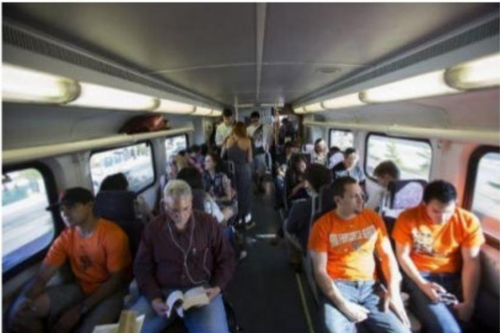

> **AI Description:**
> **Source:** `assets/_page_6_Figure_0.jpg`
> 
> **Generated:** 2026-05-31 01:39:29
> 
> ---
> 
> The image is a photograph of the interior of a train or subway car. It shows passengers seated and standing, with some individuals wearing orange shirts. The train appears to be in motion, as indicated by the blurred scenery visible through the windows. The lighting is bright, and the ceiling has fluorescent lights. The passengers are engaged in various activities, such as reading, looking at their phones, or standing and conversing. The overall scene suggests a typical public transportation setting during a commute.

## Standing room only

## Platforms 4th & King

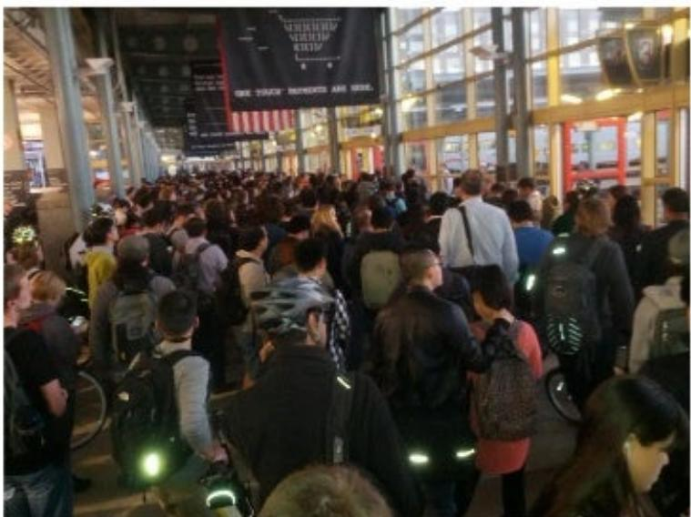

> **AI Description:**
> **Source:** `assets/_page_6_Figure_1.jpg`
> 
> **Generated:** 2026-05-31 01:40:10
> 
> ---
> 
> The image is a photograph of a crowded indoor area, likely a train station or a similar public transportation hub. The scene is bustling with people walking in various directions, some carrying backpacks and bags. The background features large banners and signs, one of which appears to have text, though it is not fully legible in the image. The overall atmosphere suggests a busy time, possibly during rush hour.

## Transit corridor growth

State policy to reduce greenhouse gas emissions, coordinate transportation& land use

Accommodate80%of housing,60% of job growth in<5% of land with transit access

## Back to the Future

Caltrain corridor is original transitorienteddevelopment

Cities grew around train

RWC,PA,MV 1938

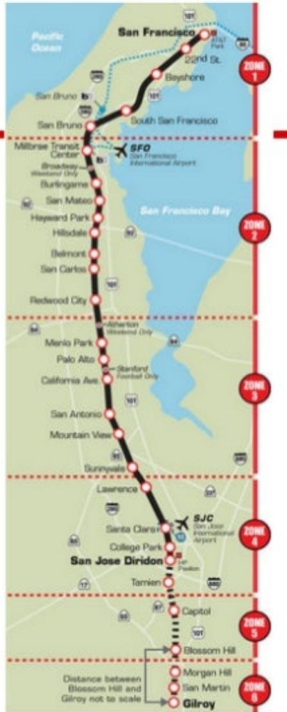

> **AI Description:**
> **Source:** `assets/_page_8_Figure_1.jpg`
> 
> **Generated:** 2026-05-31 01:47:37
> 
> ---
> 
> The image is a map of a transit system, likely a rail or bus route, with several key features:
> 
> 1. The map is divided into six zones, labeled Zone 1 through Zone 6, with Zone 1 being the northernmost and Zone 6 the southernmost.
> 2. The route is marked by a black line running from San Francisco to Gilroy, with stops marked at various locations along the way, such as San Bruno, San Mateo, Palo Alto, and San Jose Diridon.
> 3. The map includes major landmarks and points of interest, such as San Francisco International Airport (SFO) and San Jose International Airport (SJC).
> 4. The map also shows the Pacific Ocean and San Francisco Bay, providing a geographical context for the transit route.
> 5. The map includes a legend at the bottom indicating the distance between Blossom Hill and Gilroy, noting that the distance is not to scale.

## Cars off the freeway

If Caltrain were shut down, itwould take4-5extra lanes on Highway 101 to carry the extra rush hour traffic.

1,500cars/hour/lane   
8,000 pax/peak hour trad peak   
6,000 pax/peak hour rev.peak

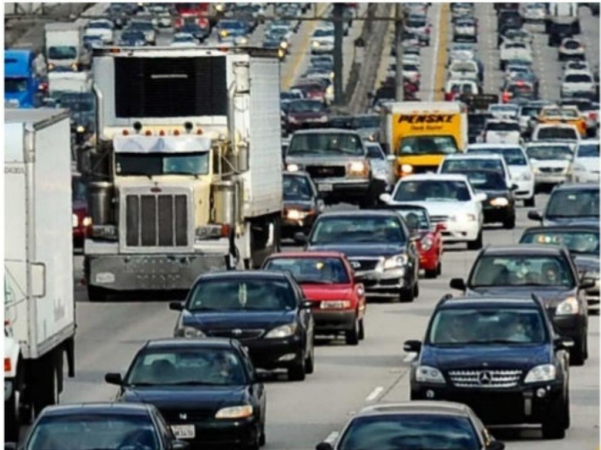

> **AI Description:**
> **Source:** `assets/_page_9_Figure_0.jpg`
> 
> **Generated:** 2026-05-31 01:46:02
> 
> ---
> 
> The image is a photograph of a busy highway with multiple lanes of traffic. It shows a variety of vehicles, including cars, trucks, and vans, all moving in the same direction. The traffic appears to be heavy, with vehicles closely packed together. The image captures the essence of urban or suburban traffic congestion.

## City policies to reduce trips

## TransportationDemandManagement

Accommodate more people with less cars, traffic,parking demand

Transit passes,shuttles,carpool,carshare, education/marketing

Transportation Management Association Nonprofit (typically)

Funded by employers,developments,parking

Data,reporting,accountability

## Established

## Developing 一

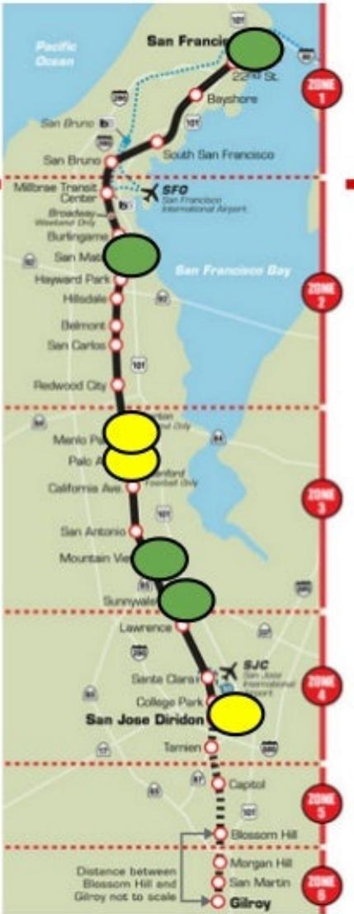

> **AI Description:**
> **Source:** `assets/_page_10_Figure_1.jpg`
> 
> **Generated:** 2026-05-31 01:52:33
> 
> ---
> 
> The image is a map of a transit route, likely for a train or light rail system. It shows a line running from San Francisco to Gilroy, with stops marked along the way. The map is divided into six zones, indicated by red dashed lines and labeled as Zone 1 through Zone 6. The map includes major landmarks and cities such as San Francisco, San Jose, and Gilroy. The route passes through several cities and towns, including San Bruno, San Mateo, Palo Alto, and Sunnyvale. The map also includes a note indicating that the distance between Blossom Hill and Gilroy is not to scale.

## Goals to reduce drivealone

Mountain View North Bayshore

• 45% drivealone (55% today)

Downtown Palo Alto

· 30% reduction (55% today)

## Changing transportation preferences

Younger people driving less...

Average miles driven by 16 to 34 year-olds dropped by 23%between2001&2009

75% of millennials expect to live in a place where they do not need a car to get around

Caltrain rider average income \$117,0oo (could drive if they wanted to)

·55%are under 35..

### Full Page Description (Page 13)

**Source:** `assets/_page_13_Asset_0.jpg`

**Generated:** 2026-05-31 01:42:14

---

The image contains a bar chart with a title "Jobs, jobs, jobs at Transbay". The chart displays the number of jobs within different distances from Transbay, categorized by distance: 1/4 mile, 1/2 mile, 1 mile, and 2 miles. The x-axis represents locations, including San Francisco Transbay, San Mateo, Redwood City, Palo Alto, Mountain View, and San Jose. The y-axis represents the number of jobs. The chart highlights that there are more jobs within 1/2 mile of Transbay than within 1/2 mile of all Caltrain stations combined. The image also includes text annotations and a reference to "Central Subway 2019" and "Downtown extension to Transbay 202x". The chart visually emphasizes the concentration of jobs near Transbay compared to other locations.

## Better access to jobs in San Francisco

## Better access to jobs in San Francisco

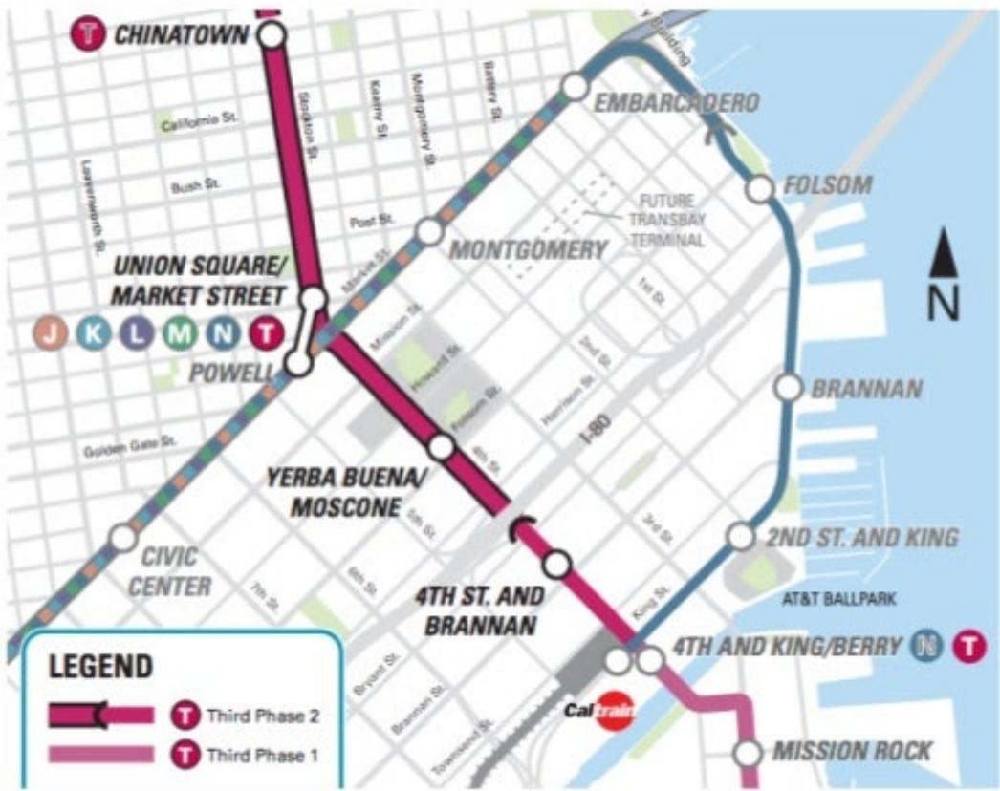

> **AI Description:**
> **Source:** `assets/_page_14_Figure_0.jpg`
> 
> **Generated:** 2026-05-31 01:40:44
> 
> ---
> 
> The image is a map of a subway system, specifically highlighting the Third Phase 2 and Third Phase 1 expansions of the system. It includes key stations such as Chinatown, Union Square/Market Street, Powell, Civic Center, Yerba Buena/Moscone, 4th St. and Brannan, and Mission Rock. The map also indicates the future Transbay Terminal and the location of AT&T Ballpark. The legend at the bottom distinguishes between the two phases of expansion with color coding. The map is oriented with North at the top right corner.

Central Subway 2019

Connects to Powell Street BART and Muni Metro

## Diridon and the BART Connection

## Diridon Station Area Plan

20,000+ jobs

2600 housing units

\~20,000 avg daily BART

\~20,000 avg daily Caltrain

·Up from\~4,000 Caltrain

40%drivealone mode share

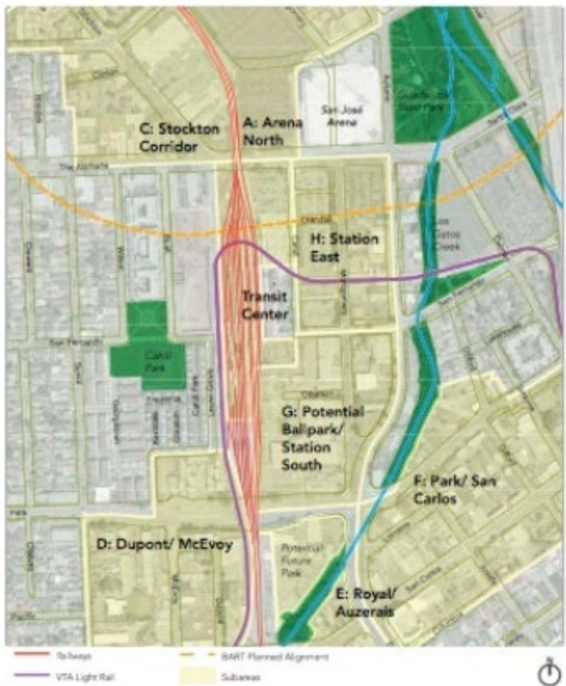

> **AI Description:**
> **Source:** `assets/_page_15_Figure_0.jpg`
> 
> **Generated:** 2026-05-31 01:39:17
> 
> ---
> 
> The image is a map with various labels and color-coded lines representing different transportation routes. Key features include:
> 
> 1. The map highlights several areas with labels such as "Stockton Corridor," "Arena North," "Transit Center," "Station East," "Potential Ballpark/Station South," "Park/San Carlos," "Dupont/McEvoy," and "Royal/Auzerais."
> 2. There are color-coded lines representing different transportation modes: red for railways, orange for BART planned alignment, blue for VTA Light Rail, and purple for subway.
> 3. The map appears to be focused on a specific urban area, likely in the San Francisco Bay Area, given the presence of BART (Bay Area Rapid Transit) and VTA (VTA Light Rail) lines.
> 4. The map is likely used for planning or discussing transportation infrastructure and potential developments in the area.

## Double ridership in the next decade

"We need to double Caltrain ridership from 60,000 to 120,000 daily trips by the next decade" 1

Carl Guardino, Silicon Valley Leadership Group

## Peak hour capacity

\# people per car (seated,standing, bikes)

Even distribution (are some cars less full)

## How can Caltrain keep up?

Current peak - 5 car trains, 5 trains per hour = 25

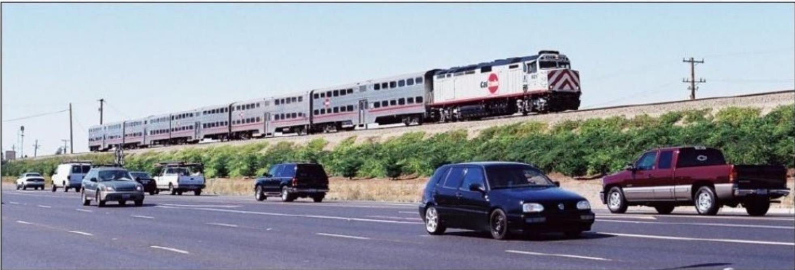

> **AI Description:**
> **Source:** `assets/_page_18_Figure_0.jpg`
> 
> **Generated:** 2026-05-31 01:44:52
> 
> ---
> 
> The image is a photograph showing a multi-lane highway with several vehicles in motion. In the background, a train is visible on a separate track, traveling parallel to the highway. The train appears to be a passenger train, identifiable by its design and the "Caltrain" logo on the locomotive. The scene is set in a relatively flat area with some greenery along the side of the tracks. The vehicles on the highway include a mix of sedans, SUVs, and a pickup truck, all traveling in the same direction. The sky is clear, suggesting a sunny day.

## 1） Surplus cars from LA Metrolink

6 cars x 5 trains per hour = 30

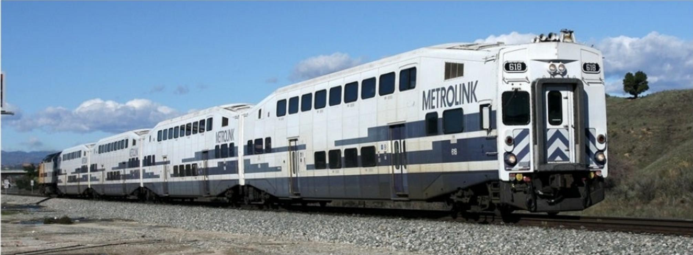

> **AI Description:**
> **Source:** `assets/_page_19_Figure_0.jpg`
> 
> **Generated:** 2026-05-31 01:43:40
> 
> ---
> 
> The image contains a photograph of a Metrolink train, specifically car number 618. The train is white with blue and gray stripes and features the Metrolink logo prominently displayed on the side. The train is on a railway track, and the background includes a clear blue sky with some scattered clouds and a hillside with sparse vegetation. The image provides a clear view of the train's design and branding, along with its operational setting.

## 2) Electrification

Fasteracceleration More stops in same end to end time

Serveunderserved stations -   
Lawrence,Santa   
Clara

But fewer seats per car

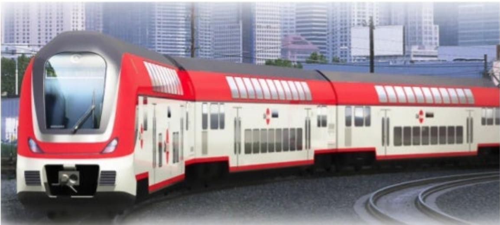

> **AI Description:**
> **Source:** `assets/_page_20_Figure_0.jpg`
> 
> **Generated:** 2026-05-31 01:51:05
> 
> ---
> 
> The image depicts a modern train with a sleek design, featuring a red and white color scheme. The train has a streamlined front with large windows, suggesting a focus on passenger comfort and visibility. The background shows a cityscape with tall buildings, indicating an urban setting. The train appears to be on a track, ready for operation, and the image is likely a promotional or conceptual rendering of a new train model.

## 6 trains per hour x 6 car trains

## 3) Longer platforms, level boarding

## 8-car trains

Level boarding

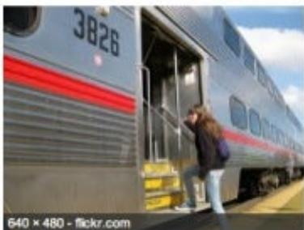

> **AI Description:**
> **Source:** `assets/_page_21_Figure_0.jpg`
> 
> **Generated:** 2026-05-31 01:53:31
> 
> ---
> 
> The image is a photograph of a person boarding a train. The train is marked with the number "3826" and has a red stripe along its side. The person is wearing a dark jacket and jeans, and they are stepping up onto the train's platform. The image also includes a watermark at the bottom left corner that reads "640 x 480 - flickr.com."

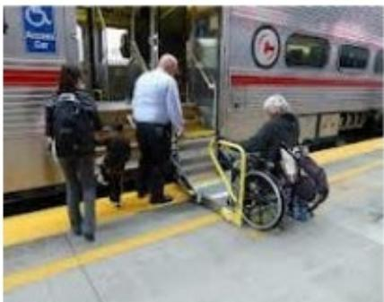

> **AI Description:**
> **Source:** `assets/_page_21_Figure_1.jpg`
> 
> **Generated:** 2026-05-31 01:53:06
> 
> ---
> 
> The image is a photograph showing a scene at a train station. It depicts a person in a wheelchair being assisted by another individual as they prepare to board a train. The wheelchair user is seated in a yellow wheelchair, and the assistant is holding the wheelchair steady. The train is an Amtrak passenger train, identifiable by the Amtrak logo on the side. The platform has a yellow tactile paving strip for safety, and there is a sign indicating an accessible exit. The image captures a moment of assistance and accessibility in a public transportation setting.

·faster service

better for mobility-impaired,strollers, bikes

more reliable

6 trains/hour x 8 cars = 48

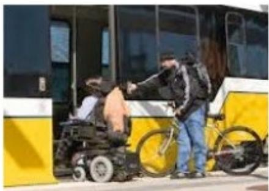

> **AI Description:**
> **Source:** `assets/_page_21_Figure_2.jpg`
> 
> **Generated:** 2026-05-31 01:51:36
> 
> ---
> 
> The image is a photograph showing two individuals interacting near a public transportation bus. One person is seated in a wheelchair, and the other is standing, appearing to assist or communicate with the seated individual. The bus has a yellow and black color scheme, and the scene takes place outdoors during the daytime. The interaction suggests a moment of assistance or communication between the two individuals.

## 4) Increase frequency

Blended system: Caltrain& HSR share tracks Up to 2 HSR trains per hour without passing tracks Up to 4 HSR trains per hour with passing tracks Don'tneed to wait for HSR

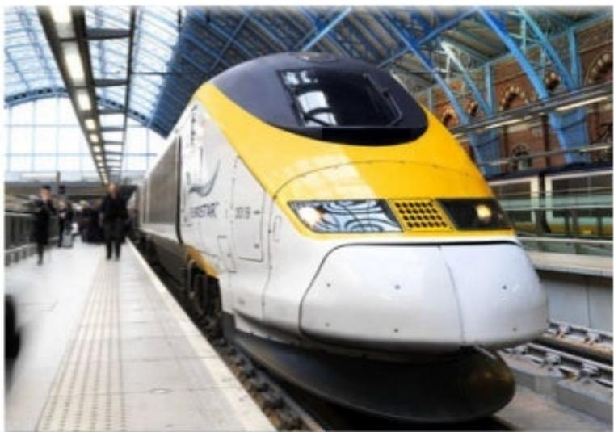

> **AI Description:**
> **Source:** `assets/_page_22_Figure_0.jpg`
> 
> **Generated:** 2026-05-31 01:40:55
> 
> ---
> 
> The image is a photograph of a high-speed train, specifically a Virgin Trains Pendolino, at a station platform. The train is predominantly white with a yellow and black front, featuring the Virgin Trains logo. The station has large glass windows and a high ceiling, allowing natural light to illuminate the scene. Passengers are visible on the platform, suggesting the train is either arriving or departing. The image captures the modern design of the train and the bustling environment of the station.

8 trains per hour x 8 car trains = 64

## Grade separations

·Frequencyand reliability

More frequent service leads to stress at intersections

40 at-grade crossings remaining (/ separated)

San Mateo County has funding,Santa Clara County does not yet

> **AI Description:**
> **Source:** `assets/_page_23_Figure_0.jpg`
> 
> **Generated:** 2026-05-31 01:40:19
> 
> ---
> 
> The image contains a photograph of a street scene with a yellow barrier gate in the foreground. The gate has a sign indicating a fine of $271 for certain violations. In the background, there are several parked cars and a pedestrian bridge crossing over the road. The scene is set in a suburban area with trees and a clear sky.

## How can Caltrain keep up?

Napkin math -watch for peak hour capacity # from Caltrain

## Grade separation options and costs

## Mountain View

Rengstorff/Central - \$120M

Castro -separate?close to cars？

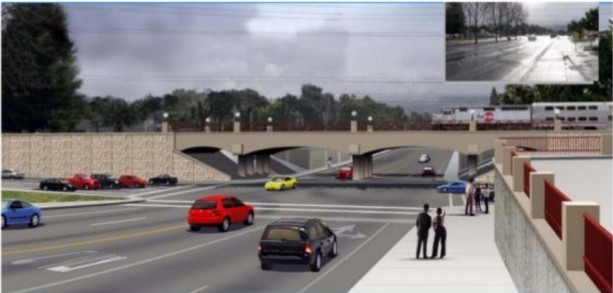

> **AI Description:**
> **Source:** `assets/_page_25_Figure_0.jpg`
> 
> **Generated:** 2026-05-31 01:41:10
> 
> ---
> 
> The image is a rendering of a road intersection with a bridge structure. It shows multiple lanes of traffic with various cars, including red, yellow, and blue vehicles. There are two people standing on the right side of the image, observing the scene. The background includes trees and a cloudy sky. In the top right corner, there is a smaller inset image showing a different view of the road, possibly taken from a different angle or time of day. The overall scene suggests a busy urban or suburban setting.

Exhibit2-2004Study-Rengstorff Avenue Looking NorthatCentral Expressway

## Grade separation options and costs

## Palo Alto

Charleston,Meadow, Churchill

Trench - \$500M to \$1B

Development funds? Local tax?

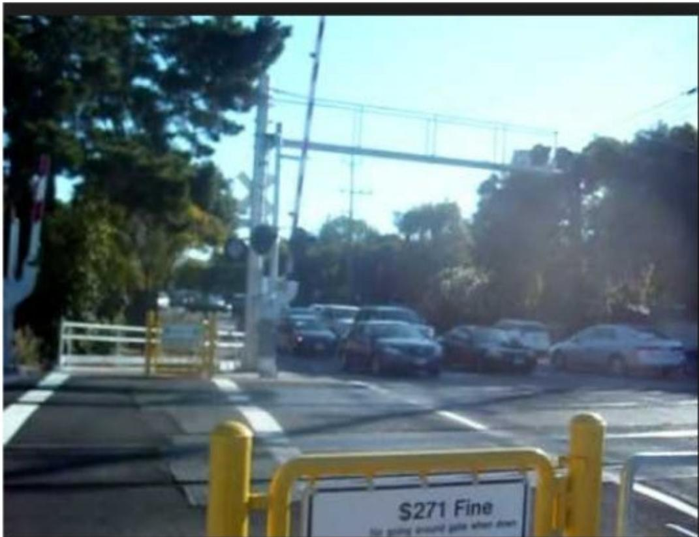

> **AI Description:**
> **Source:** `assets/_page_26_Figure_0.jpg`
> 
> **Generated:** 2026-05-31 01:54:54
> 
> ---
> 
> The image contains a photograph of a street scene. There are several parked cars along the side of the road, with trees and a clear sky in the background. In the foreground, there is a yellow barrier with a sign that reads "S271 Fine" and additional text underneath. The image also shows a pedestrian crossing with a white railing and a traffic light pole. The overall scene appears to be in a residential or urban area with some greenery.

## Cost for capacity improvements

Caltrain

## Needs & Funding - Cal Mod

Program (inmilions)

Includes S145millon to be replaced with discretionary sources TBD

## Funding sources

Transportation Ballot Measures

Santa Clara County (2016)

San Mateo County (??)

San Francisco (2016,2018)

2018-RM3-renewed bridge tolls

High Speed Rail

State Cap and Trade funds

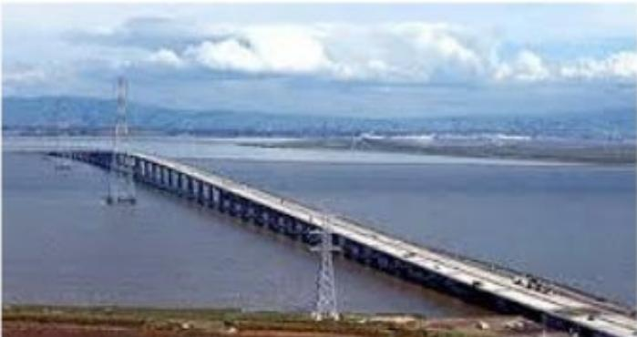

> **AI Description:**
> **Source:** `assets/_page_28_Figure_0.jpg`
> 
> **Generated:** 2026-05-31 01:42:22
> 
> ---
> 
> The image is a photograph of a long bridge spanning across a body of water, likely a river or a bay. The bridge appears to be a multi-lane road bridge with visible traffic on it. The surrounding area includes a flat landscape with some vegetation and a distant view of what seems to be a city or urban area in the background. The sky is partly cloudy, and there are some electrical towers visible near the bridge. The image does not contain any text or labels.

## Santa Clara County Ballot Measure

2016 - Envision Silicon Valley

\$3.5 Billion or \$7 Billion

BART to Diridon (and Santa Clara?)

Caltrain

Expressways/Freeways

Road paving

## Upcoming decisions

1）Santa Clara County VTA Callfor Projects

2）Transit Center /grade separation planning

3) Planning with High Speed Rail