
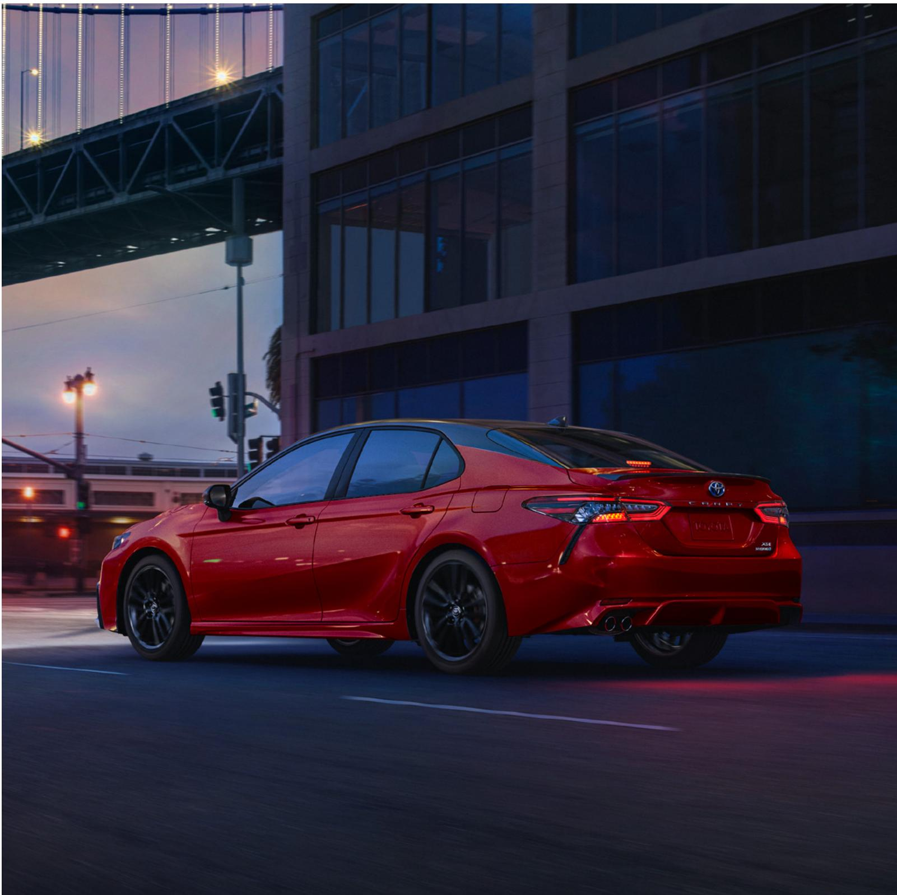

> **AI Description:**
> **Source:** `assets/_page_0_Figure_0.jpg`
> 
> **Generated:** 2026-05-31 06:34:20
> 
> ---
> 
> The image is a photograph of a red Toyota Camry driving on a city street at dusk. The car is positioned in the center of the frame, with its rear and side visible. The background features a bridge with illuminated lights and a modern building with large windows. The lighting suggests it is either early evening or late afternoon, with the sky transitioning from light to dark. The car appears to be in motion, as indicated by the slight blur of the wheels and the road surface.

# Teach your old commute new tricks.

The 2024 Toyota Camry keeps the convenience of a midsize sedan and delivers a drive that amplifies the fun. With you in mind, Camry comes in a wide range of models, so there’s a perfect match for you. Whether giving your adventures a confidence boost with available All-Wheel Drive (AWD) capability or taking your daily commutes as far as they can with hybrid efficiency, there’s a Camry fit for your lifestyle.

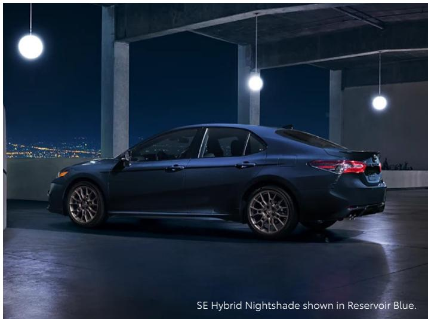

> **AI Description:**
> **Source:** `assets/_page_1_Figure_0.jpg`
> 
> **Generated:** 2026-05-31 06:12:31
> 
> ---
> 
> The image contains a photograph of a car, specifically a SE Hybrid Nightshade model in Reservoir Blue. The car is positioned in a dimly lit, industrial-style setting with concrete pillars and hanging lights. The background shows a cityscape at night, with lights visible in the distance. The car is shown from a three-quarter rear angle, highlighting its design and features. The text at the bottom of the image identifies the model and color of the car.

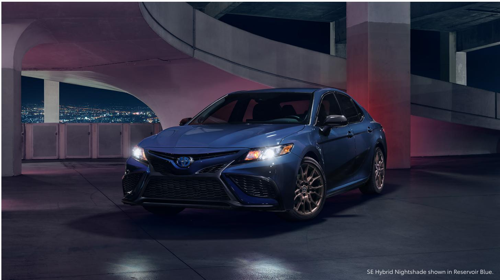

> **AI Description:**
> **Source:** `assets/_page_1_Figure_1.jpg`
> 
> **Generated:** 2026-05-31 06:20:25
> 
> ---
> 
> The image is a photograph of a 2021 Toyota Camry SE Hybrid Nightshade in Reservoir Blue. The car is positioned in a dimly lit parking garage with a cityscape visible in the background. The vehicle is shown from a three-quarter front angle, highlighting its sleek design and modern features. The text at the bottom of the image identifies the model and color of the car.

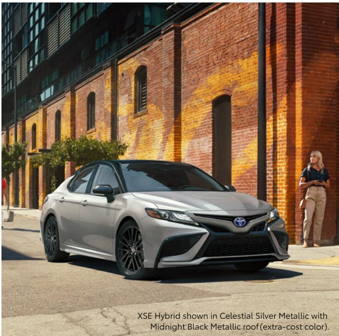

> **AI Description:**
> **Source:** `assets/_page_2_Figure_0.jpg`
> 
> **Generated:** 2026-05-31 06:45:25
> 
> ---
> 
> The image contains a photograph of a Toyota Camry XSE Hybrid car. The car is shown in Celestial Silver Metallic with a Midnight Black Metallic roof, which is noted as an extra-cost color. The background features a brick building with a warm, yellowish hue, and a person is visible on the right side of the image, standing near the building. The car is positioned on a street, and the overall setting appears to be an urban environment.

P E R F O R M A N C E

# More than capable.

By taking advantage of the light and strong Toyota New Global Architecture (TNGA) platform, Camry is engineered for optimized handling and ride quality. And with a low, wide stance, Camry delivers a crisp and responsive feel. Indulge your sporty side and take the long way home.

## Impressive 4-cylinder and V6 engines

Camry offers a compelling choice of gasoline engines: a proficient 2.5-liter Dynamic Force 4-cylinder and a robust 3.5-liter V6, each delivering a quality blend of performance and efficiency.

## Hybrid performance

Get the best of both worlds. Camry Hybrid’s Dynamic Force 4-cylinder engine, along with a proven electric motor and smooth-shifting transmission, produces ample torque and has a manufacturer-estimated rating of 46 mpg combined.1 And with available 19-in. wheels, Camry Hybrid proves it doesn’t sacrifice style.

## All-Wheel Drive

Available All-Wheel Drive (AWD) performance gives you peace of mind, no matter the forecast. When sensing slippage at the front wheels, Camry AWD can send up to 50% of the torque to the rear wheels for more grip in gravel, rain or snow.

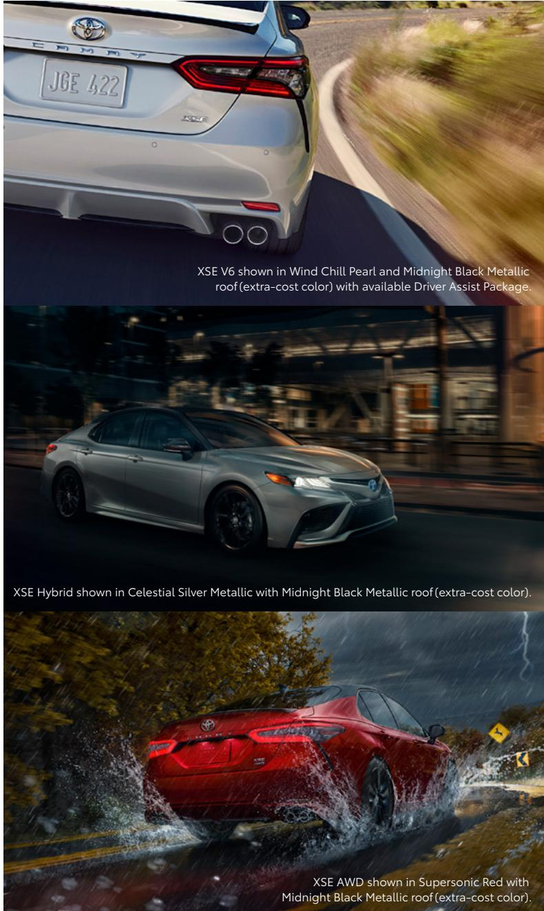

> **AI Description:**
> **Source:** `assets/_page_2_Figure_1.jpg`
> 
> **Generated:** 2026-05-31 06:43:55
> 
> ---
> 
> The image contains photographs of a Toyota Camry XSE model in different color schemes and configurations. The photographs showcase the car from various angles, highlighting its design features such as the taillights, wheels, and overall body shape. The text provides specific details about the car's model, color, and additional features like the Driver Assist Package. The images are visually appealing and informative, complementing the textual information to provide a comprehensive view of the car's appearance and options.

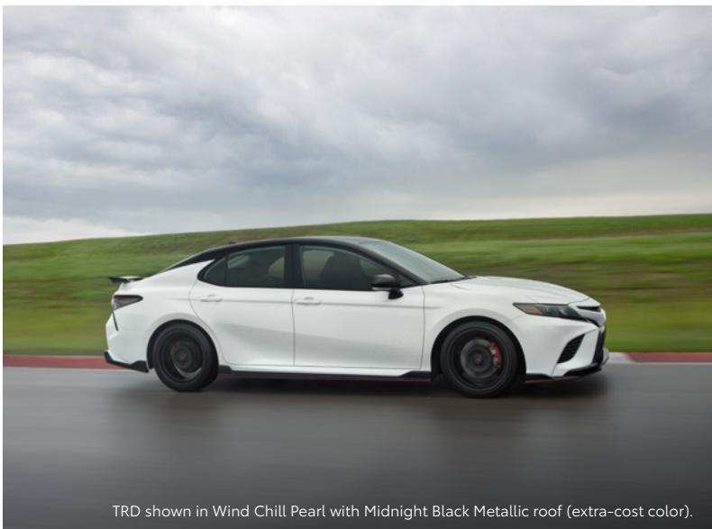

> **AI Description:**
> **Source:** `assets/_page_3_Figure_0.jpg`
> 
> **Generated:** 2026-05-31 06:54:09
> 
> ---
> 
> The image contains a photograph of a white Toyota Camry TRD model with a black roof, captured in motion on a road. The car is shown from a side angle, highlighting its sleek design and sporty features. The background consists of a blurred landscape with green fields and a cloudy sky, emphasizing the car's movement. The text at the bottom of the image provides information about the car's color, stating that it is in Wind Chill Pearl with a Midnight Black Metallic roof, which is an extra-cost color option.

T R D

# Not your average four-door.

We’ve turned our Toyota Racing Development (TRD) engineers loose on Camry, improving handling, performance and styling. Aerodynamic elements, from the front splitter and the side aero skirts to the rear diffuser and spoiler, boost Camry TRD’s bold impression and help enhance high-speed stability.

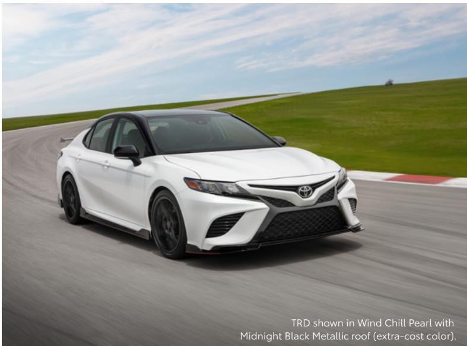

> **AI Description:**
> **Source:** `assets/_page_3_Figure_1.jpg`
> 
> **Generated:** 2026-05-31 06:55:08
> 
> ---
> 
> The image contains a photograph of a white Toyota Camry TRD model driving on a racetrack. The car is shown in motion, with the background featuring a grassy hill and a clear sky. The text at the bottom of the image indicates that the car is painted in Wind Chill Pearl with a Midnight Black Metallic roof, which is an extra-cost color option.

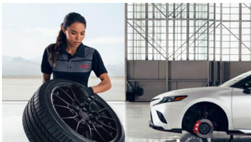

> **AI Description:**
> **Source:** `assets/_page_3_Figure_2.jpg`
> 
> **Generated:** 2026-05-31 06:48:53
> 
> ---
> 
> The image contains a photograph of a person in a uniform holding a tire, with a white car in the background. The setting appears to be a garage or workshop, indicated by the industrial-style windows and concrete floor. The person is likely a mechanic or technician, as suggested by the uniform and the context of the scene. The image conveys a professional automotive environment, possibly related to tire maintenance or car service.

## TRD 19-in. alloy wheels with red-painted calipers

Matte-black alloy wheels on TRD not only look good, but also reduce weight and enhance steering responsiveness. Large 12.9-in.-diameter front rotors and red-painted dual-piston front calipers are designed to give impressive stopping power on every twist and turn.

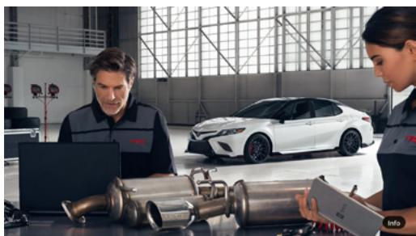

> **AI Description:**
> **Source:** `assets/_page_3_Figure_3.jpg`
> 
> **Generated:** 2026-05-31 06:48:18
> 
> ---
> 
> The image contains a photograph of two individuals in a workshop setting. One person is seated at a table with a laptop and various exhaust pipe components, while the other stands nearby holding a clipboard. In the background, there is a white car, possibly a Toyota Camry, parked in what appears to be a garage or workshop environment. The setting suggests a focus on automotive repair or maintenance, with the individuals likely discussing or working on the car or exhaust system components.

## TRD purposeful stance

TRD-tuned shocks help enhance body control, handling agility and steering precision. Thicker underbody braces increase torsional rigidity, and unique coil springs not only drop the vehicle .60 inches for a lower center of gravity, but also enhance the aero kit’s downforce and aggressive look.

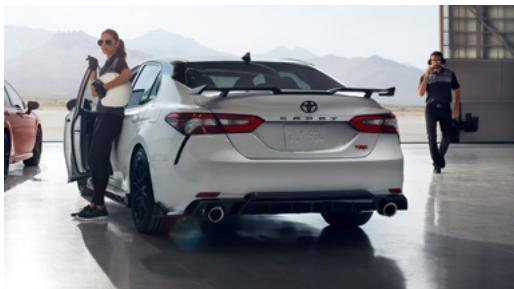

> **AI Description:**
> **Source:** `assets/_page_3_Figure_4.jpg`
> 
> **Generated:** 2026-05-31 06:40:12
> 
> ---
> 
> The image contains a photograph of a white Toyota Camry TRD Sportivo parked in a garage. The car is the focal point, with its rear facing the camera, showcasing the dual exhaust pipes and the TRD Sportivo badge. Two individuals are present in the scene: one person is standing near the open driver's side door, holding what appears to be a camera or phone, while another person is standing further back, also holding a camera or phone. The background features a desert landscape with mountains, indicating the setting might be a testing or promotional environment for the vehicle.

## TRD cat-back dual exhaust

Hit the gas and enjoy the sound of TRD’s standard 301-hp 3.5L V6. The cat-back dual exhaust releases a throatier sound with every press of the pedal. Polished stainless steel TRD exhaust tips punctuate its athletic look.

# Leave a lasting impression.

Camry’s powerful stance and available black front grille with sport mesh insert announce your arrival with authority. At night, you’ll immediately notice Camry XLE and XSE’s LED headlights and fully integrated LED Daytime Running Lights (DRL) that add an illuminating touch.

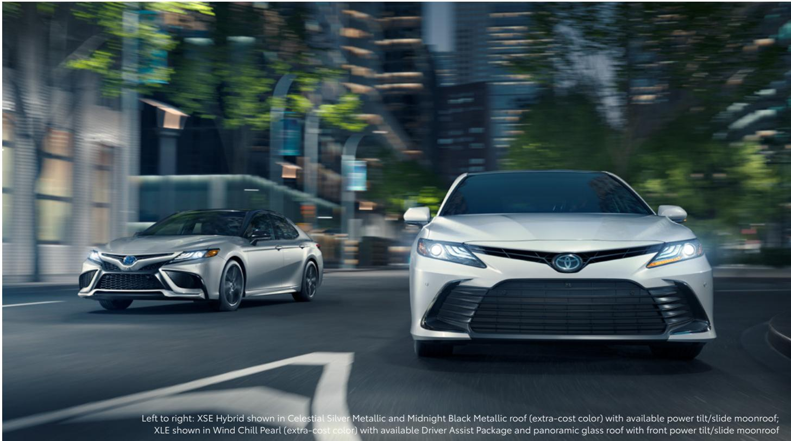

> **AI Description:**
> **Source:** `assets/_page_4_Figure_0.jpg`
> 
> **Generated:** 2026-05-31 06:53:01
> 
> ---
> 
> The image contains a photograph of two Toyota Camry vehicles driving on a city street. The car on the left is a XSE Hybrid in Celestial Silver Metallic with a Midnight Black Metallic roof, and the car on the right is an XLE in Wind Chill Pearl. Both cars are equipped with available features such as a power tilt/slide moonroof and a panoramic glass roof. The background shows a blurred urban environment with buildings and greenery, emphasizing the motion of the cars.

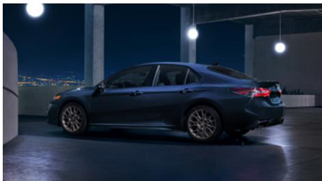

> **AI Description:**
> **Source:** `assets/_page_4_Figure_1.jpg`
> 
> **Generated:** 2026-05-31 06:55:41
> 
> ---
> 
> The image shows a dark-colored sedan parked in what appears to be an indoor or semi-outdoor setting with a modern architectural design. The car is positioned at an angle, showcasing its side profile. The background features a cityscape at night, illuminated by artificial lights, suggesting an urban environment. The overall lighting is dim, with spotlights highlighting the car and the surrounding area.

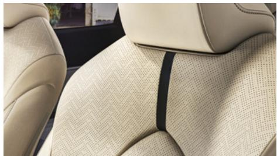

> **AI Description:**
> **Source:** `assets/_page_4_Figure_2.jpg`
> 
> **Generated:** 2026-05-31 06:49:32
> 
> ---
> 
> The image shows a close-up view of a car seat, specifically focusing on the backrest and headrest area. The seat appears to be upholstered in a light beige fabric with a textured pattern. A black strap is visible running vertically down the center of the seat backrest, likely serving as a safety feature or a decorative element. The headrest is a light gray color and is positioned at the top of the image. The overall design suggests a modern and comfortable car interior.

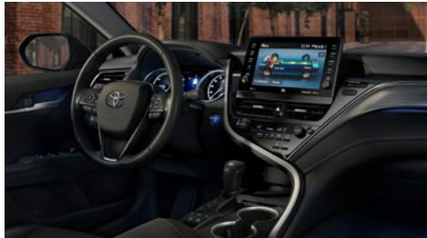

> **AI Description:**
> **Source:** `assets/_page_4_Figure_3.jpg`
> 
> **Generated:** 2026-05-31 06:47:40
> 
> ---
> 
> The image is a photograph of the interior of a car, focusing on the dashboard and steering wheel. The dashboard features a modern design with a digital display screen showing a navigation or infotainment system. The steering wheel has the Toyota logo in the center and is surrounded by blue ambient lighting. The center console includes a gear shift and a control panel with buttons and a touchpad. The overall design suggests a contemporary vehicle with advanced technology.

## Camry SE Nightshade

Show off Camry’s dark side with Camry SE Nightshade. Available in both gas and hybrid powertrains, this Special Edition is designed to be evocative. From unique 19-in. TRD matte bronze-finished alloy wheels to its Midnight Black Metallic, Ice Cap or Reservoir Blue exterior colors, get ready to impress.

## Seat details

A sedan that speaks to your sense of style. Such finely crafted details, like the herringbone seat pattern featured on XLE, ensure Camry will leave a lasting impression.

## Floating touchscreen display

With Camry’s perfectly placed steering wheel controls, everything you want is right at your fingertips. The floating display with an available 9-in. multimedia touchscreen offers Apple CarPlay®2 and Android Auto™3 compatibility with applicable smartphone devices.

C O N N E C T E D S E R V I C E S

# Technology that keeps up with you.

Take advantage of smart and convenient technologies designed to simplify your everyday life. Trial periods are available on select models for the listed Connected Services.\*,4 4G network dependent.

## Toyota app

With active applicable Connected Services4 subscriptions, the Toyota app5 allows you to stay connected to your Camry wherever you go. Available for Apple®6 and AndroidTM 7 devices.

Remote Vehicle Start8 (if equipped) and Lock/Unlock Doors

Check Up on Your Toyota’s Health

Schedule a Service Appointment

Shop for Genuine Toyota Parts and Accessories

Make a Payment With Your TFS Account

> **AI Description:**
> **Source:** `assets/_page_5_Figure_1.jpg`
> 
> **Generated:** 2026-05-31 06:41:39
> 
> ---
> 
> The image contains a simple illustration of a hand pressing a red button labeled "SOS". The button has a small icon above it, suggesting a signal or alert. The image is a minimalistic representation commonly used to symbolize an emergency call or distress signal.

## Safety Connect®

Round-the-clock help when the unexpected happens.9

Emergency Assistance Button (SOS)

Enhanced Roadside Assistance10

Automatic Collision Notification

Stolen Vehicle Locator11

> **AI Description:**
> **Source:** `assets/_page_5_Figure_2.jpg`
> 
> **Generated:** 2026-05-31 06:38:33
> 
> ---
> 
> The image contains a red icon with a wrench and a downward arrow, accompanied by a yellow exclamation mark. This icon is commonly used to indicate a critical error or warning. The icon suggests that a critical issue has been detected, and further action is required to resolve it. The design is simple and uses contrasting colors to draw attention to the warning.

## Service Connect

Being proactive to help keep your vehicle in peak condition.12

Vehicle Health Report

Vehicle Maintenance Alert

Maintenance Reminder

> **AI Description:**
> **Source:** `assets/_page_5_Figure_3.jpg`
> 
> **Generated:** 2026-05-31 06:41:20
> 
> ---
> 
> The image contains a red icon resembling a Wi-Fi signal. It is a simple, circular shape with three curved lines extending outward, representing the signal strength of a wireless network. This icon is commonly used to indicate the availability of Wi-Fi connectivity.

## Wi-Fi Connect

Turn your Toyota into a hotspot with 4G connectivity.13 AT&T Hotspot

> **AI Description:**
> **Source:** `assets/_page_5_Figure_4.jpg`
> 
> **Generated:** 2026-05-31 06:47:05
> 
> ---
> 
> The image contains a red location pin icon with radiating lines extending outward. This type of icon is commonly used to represent a geographical location or a point of interest on a map or navigation system. The icon does not provide specific data or information beyond its symbolic representation of a location.

## Dynamic Navigation

Available Dynamic Navigation14 provides you with the most up-to-date map data, routes and points of interest (POIs) on your vehicle’s factory-installed navigation system, through real-time updates downloaded from the Cloud.

Dynamic Map

Dynamic Route

Dynamic POI

> **AI Description:**
> **Source:** `assets/_page_5_Figure_5.jpg`
> 
> **Generated:** 2026-05-31 06:49:55
> 
> ---
> 
> The image contains a simple red outline of a headset, which is commonly associated with customer service, support, or communication. This visual element is often used to represent call centers, customer service representatives, or communication tools. The image does not contain any text or additional visual content beyond the outline of the headset.

## Destination Assist

Available Destination Assist15 provides drivers 24-hour access to a live agent who can provide directions through the vehicle’s factory-installed navigation system to an address or point of interest.

## Available Remote Connect

Manage your vehicle through the Toyota app.5,8

Remote Vehicle Start (if equipped)

Unlock/Lock

Remote Notifications

Guest Driver

Smartwatch Compatibility

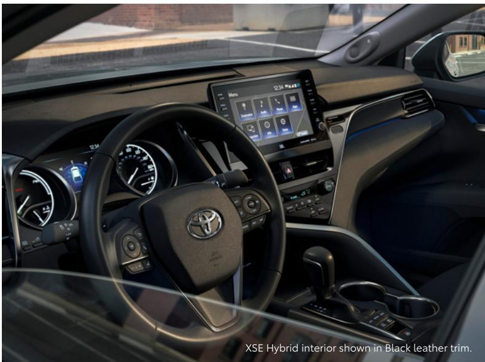

> **AI Description:**
> **Source:** `assets/_page_6_Figure_0.jpg`
> 
> **Generated:** 2026-05-31 06:14:18
> 
> ---
> 
> The image is a photograph of the interior of a Toyota vehicle, specifically the XSE Hybrid model. The interior is shown in black leather trim, featuring a modern dashboard with a digital display screen in the center. The steering wheel has the Toyota logo prominently displayed in the center. The dashboard includes various gauges and controls, and the overall design appears sleek and contemporary. The text at the bottom of the image identifies the model and the type of trim.

A U D I O M U LT I M E D I A

# Amplify your drive.

Enhance every drive with an experience that’s all about you. Whether enjoying the sounds of your favorite soundtrack or interacting with an interface that you’re familiar with, you’ll always be surrounded by comfort.

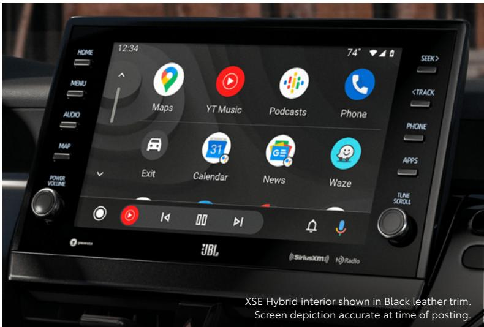

> **AI Description:**
> **Source:** `assets/_page_6_Figure_1.jpg`
> 
> **Generated:** 2026-05-31 06:16:54
> 
> ---
> 
> The image contains a photograph of a car's infotainment screen. The screen displays a user interface with various app icons, including Maps, YT Music, Podcasts, Phone, Calendar, News, and Waze. The interface also shows the time as 12:34 and the temperature as 74°F. The screen is part of the XSE Hybrid interior, which is shown in black leather trim. The bottom of the screen includes playback controls and a JBL logo, indicating the audio system. The image also includes a caption stating that the screen depiction is accurate at the time of posting.

## Apple CarPlay®

Bring along a familiar face. With Camry’s Apple CarPlay®2 compatibility, you can use your compatible iPhone®18 with the multimedia system to get directions, make calls, send and receive messages and listen to music, all while staying focused behind the wheel.

## Android Auto™

Stay connected on the road. By connecting your compatible Android™7 phone with the audio multimedia system, Android Auto™3 lets you access your Google Assistant, 17 get real-time traffic alerts, make and receive phone calls, listen to your favorite soundtrack and more.

## (siriusxm)

## SiriusXM® Platinum Plan 3-month trial

SiriusXM®19,20 has premium entertainment that you won’t hear anyplace else. With the SiriusXM® Platinum Plan 3-month trial, you get 425+ channels, including 165+ channels in your vehicle, to enjoy ad-free music, plus sports, news, talk, comedy and more. Experience even more on the SXM® App, featuring expertly curated podcasts, Xtra channels of music, personalized Pandora® stations, SiriusXM® video and more.

UBL

## JBL® Premium Audio System

Immerse yourself in quality sound with Camry’s available JBL®21 Premium Audio system. A 9-speaker, 800-watt audio system, equipped with a subwoofer and amplifier, it provides phenomenal sound that amplifies every drive.

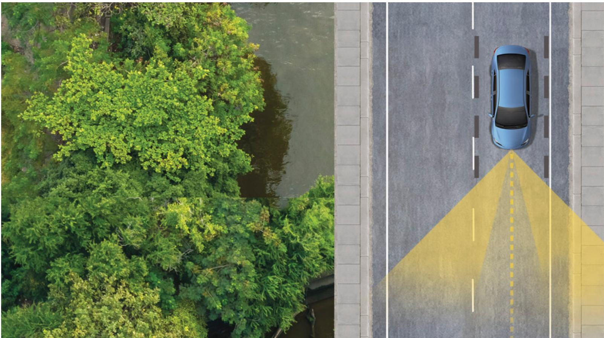

> **AI Description:**
> **Source:** `assets/_page_7_Figure_0.jpg`
> 
> **Generated:** 2026-05-31 06:29:26
> 
> ---
> 
> The image contains a combination of a real photograph and a diagram. On the left side, there is a photograph of a river surrounded by lush green trees. On the right side, there is a diagram illustrating a road with a car positioned in the center lane. The diagram includes a dotted yellow line extending from the car, indicating the car's path or trajectory. The road is divided into lanes with white dashed lines, and the diagram highlights the car's position relative to the road's lanes.

T O Y O TA S A F E T Y S E N S E ™ 2.5 + ( T S S 2.5 + )

# Peace of mind comes standard.

Toyota Safety Sense™ 2.5+ (TSS 2.5+) 22 is an advanced bundle of active safety features included on many new Toyota vehicles at no additional cost. These innovative features were designed to help protect you and your passengers from harm.

> **AI Description:**
> **Source:** `assets/_page_7_Figure_1.jpg`
> 
> **Generated:** 2026-05-31 06:26:06
> 
> ---
> 
> The image contains a simple icon of a person within a circular shape. The icon is a white silhouette of a human figure against a black background. There are no additional visual elements or text annotations present in the image.

> **AI Description:**
> **Source:** `assets/_page_7_Figure_2.jpg`
> 
> **Generated:** 2026-05-31 06:22:09
> 
> ---
> 
> The image contains a simple icon of a circular shape with three curved lines radiating outward, resembling a Wi-Fi signal or a similar symbol. There is no text or additional visual content present in the image.

Pre-Collision System with Pedestrian Detection23

Dynamic Radar Cruise Control24

> **AI Description:**
> **Source:** `assets/_page_7_Figure_3.jpg`
> 
> **Generated:** 2026-05-31 06:22:49
> 
> ---
> 
> The image is a simple icon depicting a car with a checkmark above it. The checkmark suggests approval or confirmation of the car. There are no charts, graphs, or other visual elements present. The icon is black and white, with the car and checkmark enclosed in a circular border.

Lane Departure Alert with Steering Assist25

Automatic High Beams26

> **AI Description:**
> **Source:** `assets/_page_7_Figure_5.jpg`
> 
> **Generated:** 2026-05-31 06:09:53
> 
> ---
> 
> The image is a simple icon depicting a vehicle's rear view with a dotted line extending upwards, indicating the path of a vehicle's exhaust or emissions. The icon is circular with a black background and white elements, suggesting a warning or critical status related to vehicle emissions.

Lane Tracing Assist27

Road Sign Assist28

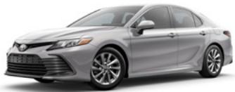

> **AI Description:**
> **Source:** `assets/_page_8_Figure_0.jpg`
> 
> **Generated:** 2026-05-31 06:37:16
> 
> ---
> 
> The image shows a silver Toyota Camry, a sedan model. The car is positioned at a slight angle, showcasing its front and side profile. The design features include a prominent grille, sleek headlights, and alloy wheels. The car appears to be in a studio setting with a plain background, emphasizing the vehicle itself.

## LE

Includes these key features

## Mechanical/Performance

2.5L 4-Cylinder with 203 hp

8-speed Electronically Controlled automatic Transmission with intelligence (ECT-i) with sequential shift mode

Normal, Eco and Sport drive modes

Available All-Wheel Drive (AWD)

28 city/39 highway/32 combined est. mpg1

## Exterior Features

Bi-LED combination headlights with auto on/off feature

LED combination taillights with black trim

Dark gray front grille

17-in. alloy wheels

Roof-mounted shark-fin antenna

Single exhaust

## Interior Features

Seating for five

Dual zone automatic climate control

Fabric-trimmed seats - 8-way power-adjustable driver’s seat - 60/40 split fold-down rear seat

4.2-in. Multi-Information Display (MID)

Remote keyless entry system

Linear dark interior trim

Three USB ports29

Tire Pressure Monitor System (TPMS)31

## Audio Multimedia

Audio includes:

\- 7-in. touchscreen and six speakers - Android Auto™3 & Apple CarPlay®2 compatible - SiriusXM®19 with 3-month Platinum Plan trial subscription20

Connected Services4 trials, including Safety Connect® 1-year trial,9 Wi-Fi Connect up to 2GB within 3-month trial.13 4G network dependent.

## Safety Features

Toyota Safety SenseTM 2.5+ (TSS 2.5+)22

Dynamic Radar Cruise Contol (DRCC)24

Star Safety System™

Ten airbags30

## Packages/Options

Convenience Package includes: - Smart Key System - HomeLink®32 universal transceiver - Auto-dimming rearview mirror

Audio Upgrade Package includes: - Audio Plus with 9-in. touchscreen - Service Connect up to 10-year trial12 and Remote Connect 1-year trial8 - Qi-compatible wireless charging33 - Rear-seat vents

Cold Weather Package includes: - Heated front seats

Blind Spot Monitor (BSM)34 with Rear Cross-Traffic Alert (RCTA)35

Power tilt/slide moonroof and dual sun visors with sliding extensions and illuminated vanity mirrors

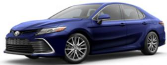

> **AI Description:**
> **Source:** `assets/_page_8_Figure_1.jpg`
> 
> **Generated:** 2026-05-31 06:37:44
> 
> ---
> 
> The image contains a photograph of a blue Toyota Camry sedan. The car is positioned at a three-quarter angle, showcasing its front and side profile. The vehicle appears to be a modern model, featuring alloy wheels, a sleek design, and a prominent grille with the Toyota logo. The car is presented against a plain white background, which highlights its design and color.

## XLE

Adds to or replaces features offered on LE

## Mechanical/Performance

Available All-Wheel Drive (AWD)

27 city/38 highway/31 combined est. mpg1

## Exterior Features

LED headlights and LED DRL with auto on/off feature

LED taillights with black trim

Dark gray front grille with chrome accents

18-in. dark gray machined-finish alloy wheels

Color-keyed heated power outside mirrors with turn-signal indicators

Single exhaust with chrome tip

## Interior Features

Leather-trimmed tilt/telescopic steering wheel

7-in. Multi-Information Display (MID)

Smart Key System with Push Button Start

Qi-compatible wireless charging33

Wood inlay interior trim

Ambient interior lighting

Tire Pressure Monitor System (TPMS)31 with direct pressure readout

## Audio Multimedia

Audio Plus includes:

\- 9-in. touchscreen and six speakers - Android Auto™3 & Apple CarPlay®2 compatible - SiriusXM®19 with 3-month Platinum Plan trial subscription20

Connected Services4 trials, including Safety Connect® 1-year trial,9 Service Connect up to 10-year trial,12 Remote Connect 1-year trial,8 available Destination Assist 1-year trial,15 available Dynamic Navigation 3-year trial,14 Wi-Fi Connect up to 2GB within 3-month trial.13 4G network dependent.

## Safety Features

Toyota Safety SenseTM 2.5+ (TSS 2.5+)22

Full-Speed Dynamic Radar Cruise Contol (DRCC)24

Blind Spot Monitor (BSM)34 with Rear Cross-Traffic Alert (RCTA)35

Star Safety System™

Ten airbags30

## Packages/Options

Navigation Upgrade Package14 includes: - Premium Audio with available Dynamic Navigation14 - Nine JBL®21 speakers including subwoofer and amplifier

Driver Assist Package includes:

\- 10-in. color Head-Up Display (HUD)

\- Panoramic View Monitor36

\- Front and Rear Parking Assist with Automatic Braking (PA w/AB)37

\- Ventilated front seats

Cold Weather Package includes: - Heated steering wheel

Panoramic glass roof with front power tilt/slide moonroof

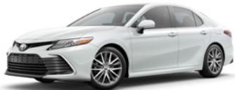

> **AI Description:**
> **Source:** `assets/_page_8_Figure_2.jpg`
> 
> **Generated:** 2026-05-31 06:38:08
> 
> ---
> 
> The image shows a white Toyota Camry sedan. The car is positioned at a three-quarter angle, allowing a clear view of its front and side. The vehicle features alloy wheels, a sleek design, and a modern appearance. The image is a photograph of a car, likely intended for promotional or informational purposes.

## XLE V6

Adds to or replaces features offered on XLE

Mechanical/Performance

3.5L V6 with 301 hp

22 city/33 highway/26 combined est. mpg1

## Exterior Features

Panoramic glass roof with front power tilt/slide moonroof

Dual exhaust with chrome tips

## Interior Features

10-in color Head-Up Display (HUD)

Tire Pressure Monitor System (TPMS)31 with direct pressure readout

## Audio Multimedia

Audio Plus with JBL®21 includes:

\- 9-in. touchscreen and nine JBL®21 speakers including subwoofer and amplifier

\- SiriusXM®19 with 3-month Platinum Plan trial subscription20

Connected Services4 trials, including Safety Connect® 1-year trial,9 Service Connect up to 10-year trial,12 Remote Connect 1-year trial,8 available Destination Assist 1-year trial,15 available Dynamic Navigation 3-year trial,14 Wi-Fi Connect up to 2GB within 3-month trial.13 4G network dependent.

## Safety Features

Toyota Safety SenseTM 2.5+ (TSS 2.5+)22

Full-Speed Dynamic Radar Cruise Contol (DRCC)24

Blind Spot Monitor (BSM)34 with Rear Cross-Traffic Alert (RCTA)35

Star Safety System™

Ten airbags30

## Packages/Options

Navigation Upgrade Package14 includes:

\- Premium Audio with Dynamic Navigation14

Driver Assist Package includes:

\- Panoramic View Monitor36

\- Front and Rear Parking Assist with Automatic Braking (PA w/AB)37

\- Ventilated front seats

Cold Weather Package includes:

\- Heated steering wheel

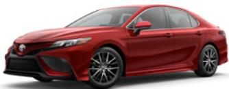

> **AI Description:**
> **Source:** `assets/_page_9_Figure_0.jpg`
> 
> **Generated:** 2026-05-31 06:36:27
> 
> ---
> 
> The image is a photograph of a red Toyota Camry sedan. The car is shown from a three-quarter front-right angle, highlighting its design features such as the headlights, grille, and alloy wheels. The car appears to be in a studio setting with a plain white background, emphasizing the vehicle's color and details.

## SE

Includes these key features

Mechanical/Performance

Available All-Wheel Drive (AWD)

Normal, Eco and Sport drive modes

28 city/39 highway/32 combined est. mpg1

## Exterior Features

Bi-LED combination headlights with black accents and auto on/off feature

Black front grille with sport mesh lower insert

Color-keyed sport side rocker panels

18-in. black machined-finish alloy wheels

Color-keyed rear spoiler

Color-keyed heated power outside mirrors with turn signal indicators

Single exhaust with dual chrome tips

## Interior Features

Dual zone automatic climate control

Sport SofTex®-trimmed38 front seats

Leather-trimmed tilt/telescopic steering wheel with paddle shifters

Tire Pressure Monitor System (TPMS)31 with direct pressure readout

## Audio Multimedia

Audio includes:

\- 7-in. touchscreen and six speakers - Android Auto™3 & Apple CarPlay®2 compatible - SiriusXM®19 with 3-month Platinum Plan trial subscription20

Connected Services4 trials, including Safety Connect® 1-year trial,9 Wi-Fi Connect up to 2GB within 3-month trial.13 4G network dependent.

## Safety Features

Toyota Safety SenseTM 2.5+ (TSS 2.5+)22

Dynamic Radar Cruise Contol (DRCC)24

Star Safety System™

Ten airbags30

## Packages/Options

Convenience Package includes: - Smart Key System

\- HomeLink®32 universal transceiver

\- Auto-dimming rearview mirror

Audio Upgrade Package includes: - Audio Plus with 9-in. touchscreen - Service Connect up to 10-year trial12 and Remote Connect 1-year trial8

\- Qi-compatible wireless charging33

\- Rear-seat vents

Cold Weather Package includes: - Heated front seats

\- Heated power outside mirrors - Heated steering wheel

Blind Spot Monitor (BSM)34 with Rear Cross-Traffic Alert (RCTA)35

Power tilt/slide moonroof and dual sun visors with sliding extensions and illuminated vanity mirrors

> **AI Description:**
> **Source:** `assets/_page_9_Figure_1.jpg`
> 
> **Generated:** 2026-05-31 06:36:01
> 
> ---
> 
> The image shows a black Toyota Camry with gold rims. The car is positioned at a slight angle, showcasing its front and side profile. The design features sleek lines and a modern aesthetic, indicative of a contemporary sedan model. The wheels have a distinctive gold finish that contrasts with the black body of the car.

## SE Nightshade

Adds to or replaces features offered on SE

Mechanical/Performance

Available All-Wheel Drive (AWD)

Available SE Hybrid Nightshade

28 city/39 highway/32 combined est. mpg1

## Exterior Features

Black-painted heated power outside mirrors with turn-signal indicators and window trim

19-in. TRD matte bronze-finished alloy wheels

Black-painted rear spoiler

Black-painted shark fin antenna

Black-trimmed headlights and taillights

Black rear Toyota emblem and “CAMRY” lettering

Black SE grade badge

## Interior Features

Sport SofTex®-trimmed38 front seats

Leather-trimmed tilt/telescopic steering wheel with paddle shifters

Tire Pressure Monitor System (TPMS)31 with direct pressure readout

## Audio Multimedia

Audio includes:

\- 7-in. touchscreen and six speakers - Android Auto™3 & Apple CarPlay®2 compatible - SiriusXM®19 with 3-month Platinum Plan trial subscription20

Connected Services4 trials, including Safety Connect® 1-year trial,9 Wi-Fi Connect up to 2GB within 3-month trial.13 4G network dependent.

## Safety Features

Toyota Safety SenseTM 2.5+ (TSS 2.5+)22

Dynamic Radar Cruise Contol (DRCC)24

Star Safety System™

Ten airbags30

## Packages/Options

Convenience Package includes:

\- Smart Key System

\- HomeLink®32 universal transceiver

\- Auto-dimming rearview mirror

Blind Spot Monitor (BSM)34 with Rear Cross-Traffic Alert (RCTA)35

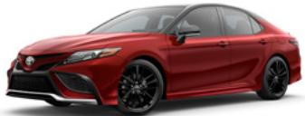

> **AI Description:**
> **Source:** `assets/_page_9_Figure_2.jpg`
> 
> **Generated:** 2026-05-31 06:36:51
> 
> ---
> 
> The image shows a red Toyota Camry sedan. It is a photograph of a car, featuring the front and side profile. The car appears to be a modern model, with a sleek design and black wheels. The image is clear and well-lit, allowing for a detailed view of the vehicle's features.

## XSE

Adds to or replaces features offered on SE

Mechanical/Performance

2.5L 4-Cylinder with 206 hp

Available All-Wheel Drive (AWD)

27 city/38 highway/31 combined est. mpg1

## Exterior Features

LED headlights with black trim, LED DRL with auto on/off feature

LED taillights with black trim

Gloss-black front grille with sport mesh lower insert

19-in. gloss-black alloy wheels

Dual exhaust with quad chrome tips

## Interior Features

Leather-trimmed seats

\- Rear adjustable headrests

7-in. Multi-Information Display (MID)

Smart Key System with Push Button Start

Qi-compatible wireless charging33

Patterned metal interior trim

Ambient interior lighting

Tire Pressure Monitor System (TPMS)31 with direct pressure readout

## Audio Multimedia

Audio Plus includes:

\- 9-in. touchscreen and six speakers

\- SiriusXM®19 with 3-month Platinum Plan trial subscription20

Connected Services4 trials, including Safety Connect® 1-year trial,9 Service Connect up to 10-year trial,12 Remote Connect 1-year trial,8 available Destination Assist 1-year trial,15 available Dynamic Navigation 3-year trial,14 Wi-Fi Connect up to 2GB within 3-month trial.13 4G network dependent.

## Safety Features

Toyota Safety SenseTM 2.5+ (TSS 2.5+)22

Full-Speed Range Dynamic Radar Cruise Contol (DRCC)24

Blind Spot Monitor (BSM)34 with Rear Cross-Traffic Alert (RCTA)35

Star Safety System™

Ten airbags30

## Packages/Options

Navigation Upgrade Package14 includes: Navigation Upgrade Package14 includes:

\- Premium Audio with available Dynamic Navigation14 - Nine JBL®21 speakers including subwoofer and amplifier

Driver Assist Package includes:

\- 10-in. color Head-Up Display (HUD)

\- Panoramic View Monitor36

\- Front and Rear Parking Assist with Automatic Braking (PA w/AB)37

Ventilated front seats

Cold Weather Package includes:

\- Heated steering wheel

Panoramic glass roof with front power tilt/slide moonroof

Two-tone exterior color (color-keyed body with black roof)39

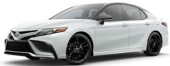

> **AI Description:**
> **Source:** `assets/_page_10_Figure_0.jpg`
> 
> **Generated:** 2026-05-31 06:46:01
> 
> ---
> 
> The image shows a white Toyota Camry sedan with a sporty front bumper and black wheels. The car is positioned at a slight angle, showcasing its front and side profile. The design suggests a modern and sleek appearance, typical of the Camry model.

## XSE V6

Adds to or replaces features offered on XSE

Mechanical/Performance

3.5L V6 with 301 hp

22 city/32 highway/26 combined est. mpg1

## Exterior Features

Panoramic glass roof with front power tilt/slide moonroof

## Interior Features

10-in. color Head-Up Display (HUD)

Tire Pressure Monitor System (TPMS)31 with direct pressure readout

## Audio Multimedia

Audio Plus with JBL®21 includes:

\- 9-in touchscreen and nine JBL®21 speakers including subwoofer and amplifier

\- Android Auto™3 & Apple CarPlay®2 compatible - SiriusXM®19 with 3-month Platinum Plan trial subscription20

Connected Services4 trials, including Safety Connect® 1-year trial,9 Service Connect up to 10-year trial,12 Remote Connect 1-year trial,8 available Destination Assist 1-year trial,15 available Dynamic Navigation 3-year trial,14 Wi-Fi Connect up to 2GB within 3-month trial.13 4G network dependent.

## Safety Features

Toyota Safety SenseTM 2.5+ (TSS 2.5+)22

Full-Speed Range Dynamic Radar Cruise Contol (DRCC)24

Star Safety System™

Ten airbags30

## Packages/Options

Navigation Upgrade Package14 includes:

Premium Audio with available Dynamic Navigation14

Driver Assist Package includes:

\- Panoramic View Monitor36

\- Front and Rear Parking Assist with Automatic Braking (PA w/AB)37

\- Ventilated front seats

Cold Weather Package includes:

\- Heated steering wheel

Two-tone exterior color (color-keyed body with black roof)39

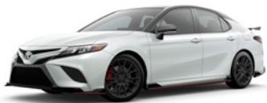

> **AI Description:**
> **Source:** `assets/_page_10_Figure_1.jpg`
> 
> **Generated:** 2026-05-31 06:50:24
> 
> ---
> 
> The image contains a photograph of a white Toyota Camry. The car is a four-door sedan with a sleek design, featuring black wheels and side mirrors. The image is clear and well-lit, allowing for a detailed view of the vehicle's exterior.

## TRD

Adds to or replaces features offered on SE

## Mechanical/Performance

3.5L V6 with 301 hp

TRD track-tuned suspension

12.9-in. front disc brakes with red-painted calipers

22 city/31 highway/25 combined est. mpg1

## Exterior Features

Gloss-black front grille with sport mesh insert

Black heated power outside mirrors with turn-signal indicators

Black window trim

19-in. x 8.5-in. TRD matte-black alloy wheels

TRD gloss-black pedestal rear spoiler

TRD gloss-black front splitter, side aero skirts and rear diffuser

TRD cat-back dual exhaust with polished stainless steel tips

Red TRD badge

## Interior Features

TRD instrumentation with red-illuminated accents

Sport SofTex®-trimmed38 front seats

\- Red seatbelts

\- TRD headrest logo

\- Fixed rear seat

Leather-trimmed steering wheel with red stitching and paddle shifters

Patterned metal interior trim

Smart Key System with Push Button Start

Aluminum sport pedals

Tire Pressure Monitor System (TPMS)31 with direct pressure readout

## Audio Multimedia

Audio includes:

\- 7-in. touchscreen and six speakers

\- Android Auto™3 & Apple CarPlay®2 compatible

\- SiriusXM®19 with 3-month Platinum Plan trial subscription20

Connected Services4 trials, including Safety Connect® 1-year trial,9 Wi-Fi Connect up to 2GB within

3-month trial.13 4G network dependent.

## Safety Features

Toyota Safety SenseTM 2.5+ (TSS 2.5+)22

Full-Speed Range Dynamic Radar Cruise Contol (DRCC)24

Blind Spot Monitor (BSM)34 with Rear Cross-Traffic Alert (RCTA)35

Star Safety System™

Ten airbags30

## Options

TRD Premium Audio with nine JBL®21 speakers - Service Connect up to 10-year trial12 and Remote Connect 1-year trial8

Two-tone exterior color (color-keyed body with black roof)39

Summer tires

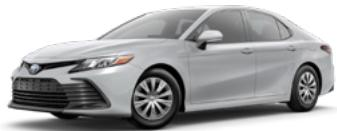

> **AI Description:**
> **Source:** `assets/_page_10_Figure_2.jpg`
> 
> **Generated:** 2026-05-31 06:56:18
> 
> ---
> 
> The image shows a photograph of a silver Toyota Camry sedan. The car is positioned at a three-quarter angle, showcasing its front and side profile. The vehicle appears to be in a standard condition, with no visible damage or modifications. The image is clear and well-lit, allowing for a detailed view of the car's design, including its headlights, grille, and wheels.

## LE Hybrid

## Mechanical/Performance

Hybrid engine: 2.5L 4-Cylinder with 208 net hp

Electronically controlled Continuously Variable Transmission (ECVT) with sequential shift mode

Normal, Eco, EV40 and Sport drive modes

51 city/53 highway/52 combined est. mpg1

## Exterior Features

Bi-LED combination headlights with auto on/off feature

LED combination taillights with black trim

Dark gray front grille

16-in. steel wheels with wheel covers

Roof-mounted shark-fin antenna

## Interior Features

Dual zone automatic climate control

Fabric-trimmed seats

\- 8-way power-adjustable driver’s seat - 60/40 split fold-down rear seat

4.2-in. Multi-Information Display (MID)

Smart Key System with Push Button Start

Linear dark interior trim

Three USB ports29

Tire Pressure Monitor System (TPMS)31 with direct pressure readout

## Audio Multimedia

Audio includes:

\- 7-in. touchscreen and six speakers

\- Android Auto™3 & Apple CarPlay®2 compatible - SiriusXM®19 with 3-month Platinum Plan trial subscription20

Connected Services4 trials, including Safety Connect® 1-year trial,9 Wi-Fi Connect up to 2GB within

3-month trial.13 4G network dependent.

## Safety Features

Toyota Safety SenseTM 2.5+ (TSS 2.5+)22

Full-Speed Range Dynamic Radar Cruise Contol (DRCC)24

Star Safety System™

Ten airbags30

## Packages/Options

Convenience Package includes:

\- HomeLink®32 universal transceiver

\- Auto-dimming rearview mirror

Audio Upgrade Package includes:

\- Service Connect up to 10-year trial12

\- Qi-compatible wireless charging33

Cold Weather Package includes: - Heated front seats

\- Heated power outside mirrors

\- Heated steering wheel

Blind Spot Monitor (BSM)34 with Rear Cross-Traffic Alert (RCTA)35

Power tilt/slide moonroof and dual sun visors with sliding extensions and illuminated vanity mirrors

> **AI Description:**
> **Source:** `assets/_page_11_Figure_0.jpg`
> 
> **Generated:** 2026-05-31 06:40:35
> 
> ---
> 
> The image shows a photograph of a dark-colored Toyota Camry. The car is positioned at a three-quarter angle, showcasing its front and side profile. The design features include sleek headlights, a prominent grille, and alloy wheels. The car appears to be in good condition, with no visible damage or wear.

## SE Hybrid

Adds to or replaces features offered on LE Hybrid

## Mechanical/Performance

Hybrid engine: 2.5L 4-Cylinder with 208 net hp

Sport-tuned suspension

44 city/47 highway/46 combined est. mpg1

## Exterior Features

Bi-LED combination headlights with black trim and auto on/off feature

Black front grille with sport mesh lower insert

Color-keyed sport side rocker panels

18-in. black machined-finish alloy wheels

Color-keyed rear spoiler

Color-keyed heated power outside mirrors with turn signal indicators

Single exhaust with dual chrome tips

## Interior Features

Dual zone automatic climate control

Sport SofTex®-trimmed38 front seats

Leather-trimmed tilt/telescopic steering wheel with paddle shifters

Tire Pressure Monitor System (TPMS)31 with direct pressure readout

## Audio Multimedia

Audio includes:

\- 7-in. touchscreen and six speakers - Android Auto™3 & Apple CarPlay®2 compatible - SiriusXM®19 with 3-month Platinum Plan trial subscription20

Connected Services4 trials, including Safety Connect® 1-year trial,9 Wi-Fi Connect up to 2GB within 3-month trial.13 4G network dependent.

## Safety Features

Toyota Safety SenseTM 2.5+ (TSS 2.5+)22

Full-Speed Range Dynamic Radar Cruise Contol (DRCC)24

Star Safety System™

Ten airbags30

## Packages/Options

Convenience Package includes: - HomeLink®32 universal transceiver - Auto-dimming rearview mirror

Audio Upgrade Package includes: - Audio Plus with 9-in. touchscreen

- Service Connect up to 10-year trial12   
and Remote Connect 1-year trial8

\- Qi-compatible wireless charging33

Cold Weather Package includes:

\- Heated front seats

\- Heated power outside mirrors - Heated steering wheel

Blind Spot Monitor (BSM)34 with Rear Cross-Traffic Alert (RCTA)35

Power tilt/slide moonroof and dual sun visors with sliding extensions and illuminated vanity mirrors

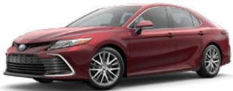

> **AI Description:**
> **Source:** `assets/_page_11_Figure_1.jpg`
> 
> **Generated:** 2026-05-31 06:38:57
> 
> ---
> 
> The image shows a red Toyota Camry sedan. The car is positioned at a three-quarter angle, highlighting its front and side profile. The vehicle features a sleek design with a prominent grille, modern headlights, and alloy wheels. The image is a photograph of a car, likely intended for promotional or sales purposes.

## XLE Hybrid

Adds to or replaces features offered on LE Hybrid

Hybrid engine: 2.5L 4-Cylinder with 208 net hp

44 city/47 highway/46 combined est. mpg1

## Exterior Features

LED headlights and LED DRL with auto on/off feature

LED taillights with black trim

Dark gray front grille with chrome accents

18-in. dark gray machined-finish alloy wheels

Color-keyed heated power outside mirrors with turn-signal indicators

## Interior Features

Leather-trimmed seats

\- Heated front seats

\- Rear adjustable headrests

Leather-trimmed tilt/telescopic steering wheel

7-in. Multi-Information Display (MID)

Qi-compatible wireless charging33

Wood inlay interior trim

Ambient interior lighting

Tire Pressure Monitor System (TPMS)31 with direct pressure readout

## Audio Plus includes:

9-in. touchscreen and six speakers - Android Auto™3 & Apple CarPlay®2 compatible - SiriusXM®19 with 3-month Platinum Plan trial subscription20

Connected Services4 trials, including Safety Connect® 1-year trial,9 Service Connect up to 10-year trial,12 Remote Connect 1-year trial,8 available Destination Assist 1-year trial,15 available Dynamic Navigation 3-year trial,14 Wi-Fi Connect up to 2GB within 3-month trial.13 4G network dependent.

## Safety Features

Toyota Safety SenseTM 2.5+ (TSS 2.5+)22

Full-Speed Range Dynamic Radar Cruise Contol (DRCC)24

Blind Spot Monitor (BSM)34 with Rear Cross-Traffic Alert (RCTA)35

Star Safety System™

Ten airbags30

## Packages/Options

Navigation Upgrade Package14 includes:

\- Premium Audio with available Dynamic Navigation14 - Nine JBL®21 speakers including subwoofer and amplifier

Driver Assist Package includes:

\- 10-in. color Head-Up Display (HUD)

\- Panoramic View Monitor36

\- Front and Rear Parking Assist with Automatic Braking (PA w/AB)37

\- Ventilated front seats

Cold Weather Package includes:

\- Heated steering wheel

Power tilt/slide moonroof

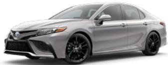

> **AI Description:**
> **Source:** `assets/_page_11_Figure_2.jpg`
> 
> **Generated:** 2026-05-31 06:44:21
> 
> ---
> 
> The image contains a photograph of a silver Toyota Camry sedan. The car is positioned at a three-quarter angle, showcasing its front and side profile. The vehicle appears to be a modern model, featuring sleek lines and contemporary design elements. The background is plain white, which emphasizes the car and makes it the focal point of the image.

## XSE Hybrid

Adds to or replaces features offered on SE Hybrid

Mechanical/Performance

Hybrid engine: 2.5L 4-Cylinder with 208 net hp

44 city/47 highway/46 combined est. mpg1

## Exterior Features

LED headlights with black trim, LED DRL with auto on/off feature

LED taillights with black trim

Gloss-black front grille with sport mesh lower insert

19-in. gloss-black alloy wheels

## Interior Features

Leather-trimmed seats

\- Heated front seats

\- Rear adjustable headrests

7-in. Multi-Information Display (MID)

Qi-compatible wireless charging33

Patterned metal interior trim

Ambient interior lighting

Tire Pressure Monitor System (TPMS)31 with direct pressure readout

## Audio Multimedia

Audio Plus includes:

\- 9-in. touchscreen and six speakers - Android Auto™3 & Apple CarPlay®2 compatible - SiriusXM®19 with 3-month Platinum Plan trial subscription20

Connected Services4 trials, including Safety Connect® 1-year trial,9 Service Connect up to 10-year trial,12 Remote Connect 1-year trial,8 available Destination Assist 1-year trial,15 available Dynamic Navigation 3-year trial,14 Wi-Fi Connect up to 2GB within 3-month trial.13 4G network dependent.

## Safety Features

Toyota Safety SenseTM 2.5+ (TSS 2.5+)22

Full-Speed Range Dynamic Radar Cruise Contol (DRCC)24

Blind Spot Monitor (BSM)34 with Rear Cross-Traffic Alert (RCTA)35

Star Safety System™

Ten airbags30

## Packages/Options

Navigation Upgrade Package14 includes:

\- Premium Audio with available Dynamic Navigation14

\- Nine JBL®21 speakers including subwoofer and amplifier

Driver Assist Package includes:

\- 10-in. color Head-Up Display (HUD)

\- Panoramic View Monitor36

\- Front and Rear Parking Assist with Automatic Braking (PA w/AB)37

\- Ventilated front seats

Cold Weather Package includes: - Heated steering wheel

Power tilt/slide moonroof

Two-tone exterior color (color-keyed body with black roof)39

Midnight Black Metallic

Reservoir Blue

Cavalry Blue

Supersonic Red39

Predawn Gray Mica
Celestial Silver Metallic

Wind Chill Pearl39

Ice Edge

Ice Cap

Available Midnight Black Metallic roof and rear spoiler39

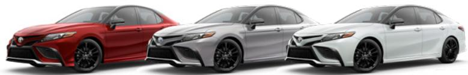

> **AI Description:**
> **Source:** `assets/_page_12_Figure_9.jpg`
> 
> **Generated:** 2026-05-31 06:39:19
> 
> ---
> 
> The image contains a photograph of three Toyota Camry sedans. The vehicles are displayed side by side, showcasing different color options: red, silver, and white. The image is likely intended to highlight the design and color variety of the Toyota Camry model.

Supersonic Red, Celestial Silver Metallic,39 Wind Chill Pearl39
Available Midnight Black Metallic roof39 for TRD models

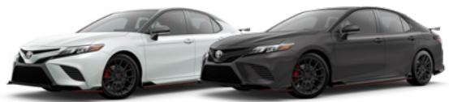

> **AI Description:**
> **Source:** `assets/_page_12_Figure_10.jpg`
> 
> **Generated:** 2026-05-31 06:20:56
> 
> ---
> 
> The image contains two photographs of a Toyota Camry TRD (Toyota Racing Development) model. The car on the left is white, and the one on the right is black. Both cars feature the TRD performance package, which includes a sporty front bumper, side skirts, and a rear spoiler. The black car also has a visible red TRD logo on the side, indicating its performance-oriented nature.

Wind Chill Pearl,39 Underground39
LE and LE Hybrid fabric shown in Ash

> **AI Description:**
> **Source:** `assets/_page_12_Figure_11.jpg`
> 
> **Generated:** 2026-05-31 06:24:16
> 
> ---
> 
> The image shows a close-up view of a textured surface, likely a fabric or material with a woven pattern. The texture appears uniform and consistent, suggesting it could be part of a larger object such as a seat or a bag. The lighting is even, highlighting the details of the weave. There are no visible labels, text, or additional elements in the image.

> **AI Description:**
> **Source:** `assets/_page_12_Figure_13.jpg`
> 
> **Generated:** 2026-05-31 06:24:43
> 
> ---
> 
> The image shows a close-up of a textured surface, likely fabric or paper, with a diagonal fold. The texture appears consistent, with a slightly rough or woven appearance. The colors are muted, with shades of beige and brown. There are no charts, graphs, or other visual elements present. The image is primarily a photograph of a material with a simple, unadorned composition.

Black
Macadamia
XLE, XLE V6 and XLE Hybrid leather trim shown in Ash

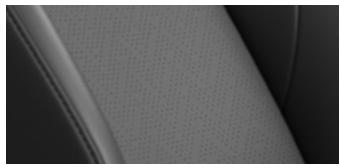

> **AI Description:**
> **Source:** `assets/_page_12_Figure_14.jpg`
> 
> **Generated:** 2026-05-31 06:17:24
> 
> ---
> 
> The image appears to be a close-up photograph of a textured surface, possibly fabric or a material with a woven pattern. The texture is consistent and uniform, with a slight sheen or reflection visible along the edge. The color is a monochromatic gray scale, suggesting it might be a black and white or grayscale image. There are no discernible labels, text, or additional elements beyond the texture itself.

Black

> **AI Description:**
> **Source:** `assets/_page_12_Figure_16.jpg`
> 
> **Generated:** 2026-05-31 06:09:08
> 
> ---
> 
> The image shows a close-up view of a textured fabric, likely a seat cover or upholstery material. The fabric appears to have a woven pattern with a consistent texture and color, which is a light beige or off-white shade. The image does not contain any text or additional visual elements beyond the fabric itself.

Macadamia
SE, SE Nightshade and SE Hybrid SofTex®38 trim shown in Black

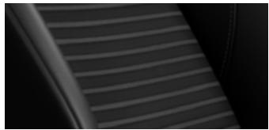

> **AI Description:**
> **Source:** `assets/_page_12_Figure_17.jpg`
> 
> **Generated:** 2026-05-31 06:10:55
> 
> ---
> 
> The image contains a close-up view of a textured surface, likely a part of a car seat or similar object. The texture appears to be a series of parallel lines, possibly indicating a pattern or design element. The lines are evenly spaced and run diagonally across the image, creating a sense of depth and dimension. The overall color scheme is dark, with varying shades of gray, suggesting a material that is durable and possibly synthetic. There are no labels or text annotations present in the image.

Ash
XSE, XSE V6 and XSE Hybrid leather trim shown in Black

Ash

Cockpit Red
TRD SofTex®38 trim shown in Black

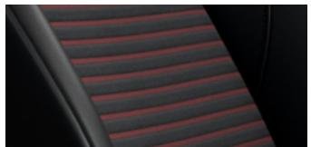

> **AI Description:**
> **Source:** `assets/_page_12_Figure_22.jpg`
> 
> **Generated:** 2026-05-31 06:41:02
> 
> ---
> 
> The image shows a close-up of a textured fabric with a repeating pattern of red and black stripes. The fabric appears to be part of a seat or upholstery, possibly from a vehicle or furniture. The stripes are evenly spaced and create a striped effect across the visible portion of the fabric. The texture of the fabric is slightly raised, giving it a three-dimensional appearance.

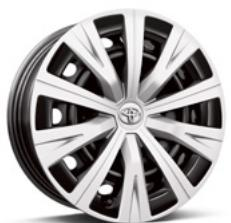

> **AI Description:**
> **Source:** `assets/_page_13_Figure_0.jpg`
> 
> **Generated:** 2026-05-31 06:23:12
> 
> ---
> 
> The image shows a single car wheel with a multi-spoke design. The wheel features a silver finish with black accents and a logo in the center, which appears to be the emblem of a car brand. The design is symmetrical and modern, with a focus on aesthetic appeal and structural integrity.

LE Hybrid 16-in. steel wheel with wheel cover

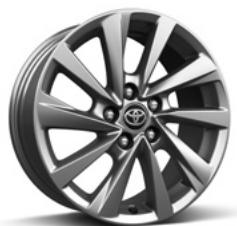

> **AI Description:**
> **Source:** `assets/_page_13_Figure_1.jpg`
> 
> **Generated:** 2026-05-31 06:21:52
> 
> ---
> 
> The image contains a photograph of a Toyota wheel. The wheel features a multi-spoke design with a metallic finish. The Toyota logo is prominently displayed in the center of the wheel. The wheel appears to be a standard alloy type commonly used on Toyota vehicles.

LE 17-in. alloy wheel

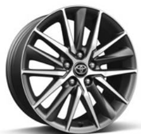

> **AI Description:**
> **Source:** `assets/_page_13_Figure_2.jpg`
> 
> **Generated:** 2026-05-31 06:25:49
> 
> ---
> 
> The image contains a single visual element: a close-up photograph of a car wheel. The wheel features a multi-spoke design with a dark gray finish and metallic accents. The Toyota logo is visible in the center of the wheel. There are no charts, graphs, or other visual elements present in the image.

XLE, XLE V6 and XLE Hybrid 18-in. dark gray machined-finish alloy wheel

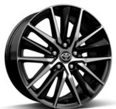

> **AI Description:**
> **Source:** `assets/_page_13_Figure_3.jpg`
> 
> **Generated:** 2026-05-31 06:34:46
> 
> ---
> 
> The image contains a single visual element: a black alloy wheel with a multi-spoke design. The wheel features a shiny, reflective surface and a central logo that appears to be a stylized representation of a Toyota emblem. The wheel is presented in a way that highlights its design and structure, likely for promotional or catalog purposes.

SE and SE Hybrid 18-in. black machined-finish alloy wheel

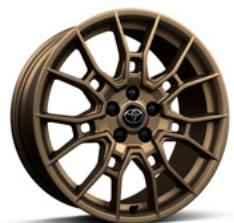

> **AI Description:**
> **Source:** `assets/_page_13_Figure_4.jpg`
> 
> **Generated:** 2026-05-31 06:14:49
> 
> ---
> 
> The image contains a single visual element: a close-up photograph of a wheel. The wheel appears to be a multi-spoke alloy wheel with a bronze or gold finish. The design of the spokes is intricate, featuring a pattern that radiates outward from the center hub. The wheel has a shiny, reflective surface, indicating it is likely made of metal. There are no visible text or labels within the image itself.

SE Nightshade 19-in. TRD matte bronze-finished alloy wheel

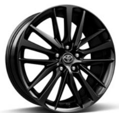

> **AI Description:**
> **Source:** `assets/_page_13_Figure_5.jpg`
> 
> **Generated:** 2026-05-31 06:15:46
> 
> ---
> 
> The image contains a photograph of a car wheel. The wheel is black with a multi-spoke design, featuring a glossy finish. The rim is branded with the Toyota logo, indicating it is an original equipment manufacturer (OEM) part for a Toyota vehicle. The wheel appears to be a standard size, likely designed for passenger cars, and the image is focused on showcasing the wheel's design and branding.

XSE, XSE V6 and XSE Hybrid 19-in. gloss-black alloy wheel

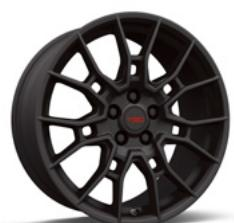

> **AI Description:**
> **Source:** `assets/_page_13_Figure_6.jpg`
> 
> **Generated:** 2026-05-31 06:10:21
> 
> ---
> 
> The image contains a single visual element: a close-up photograph of a car wheel. The wheel features a multi-spoke design with a matte black finish. The spokes are evenly spaced and the wheel appears to be a high-performance or sporty style, likely intended for a vehicle that emphasizes aesthetics and performance. There are no text annotations or other visual elements present in the image.

19-in. TRD matte-black alloy wheel

This is a great way to add extra personality to your Camry. Not every accessory is available in your area, so for a complete list of accessories, go to toyota.com/camry/accessories.

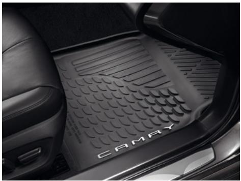

> **AI Description:**
> **Source:** `assets/_page_14_Figure_0.jpg`
> 
> **Generated:** 2026-05-31 06:23:48
> 
> ---
> 
> The image shows a photograph of a car's rear cargo area with a black rubber floor mat. The mat is branded with the word "CAMRY," indicating it is designed for a Toyota Camry. The mat has a textured pattern for grip and is positioned to cover the entire floor of the cargo area. The surrounding environment includes part of the car's interior, such as a leather seat and a portion of the door.

All-weather floor liners41

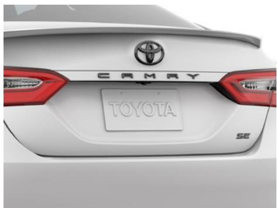

> **AI Description:**
> **Source:** `assets/_page_14_Figure_1.jpg`
> 
> **Generated:** 2026-05-31 06:21:31
> 
> ---
> 
> The image shows the rear of a Toyota Camry SE model. It features the Toyota logo at the top center, the word "CAMRY" in bold lettering below the logo, and the "SE" designation on the bottom right. The license plate area is visible, and the taillights are red and white. The image is a photograph of a car's rear end.

Blackout emblem overlays

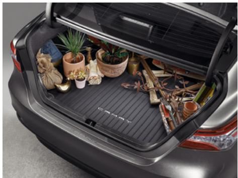

> **AI Description:**
> **Source:** `assets/_page_14_Figure_2.jpg`
> 
> **Generated:** 2026-05-31 06:25:24
> 
> ---
> 
> The image shows the open trunk of a car, which is filled with various items. The trunk contains several potted plants, some wrapped items, and what appears to be a rolled-up mat or blanket. The items are arranged in a somewhat cluttered manner, indicating the trunk is being used for storage. The car's interior is visible, with a black rubber mat lining the trunk floor. The overall scene suggests the car is being prepared for a trip or an event that requires carrying multiple items.

Cargo tray42

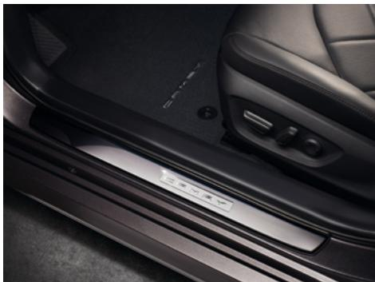

> **AI Description:**
> **Source:** `assets/_page_14_Figure_3.jpg`
> 
> **Generated:** 2026-05-31 06:35:28
> 
> ---
> 
> The image shows a close-up view of a car's interior door sill. The sill is metallic and has a sleek, modern design. The word "VOLKSWAGEN" is embossed on the sill, indicating the brand of the car. The surrounding area includes part of the car's door panel and a portion of the seat, which appears to be upholstered in a dark fabric. The overall aesthetic suggests a focus on luxury and attention to detail.

Illuminated doorsills

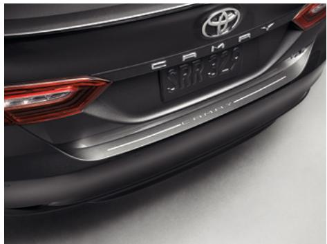

> **AI Description:**
> **Source:** `assets/_page_14_Figure_4.jpg`
> 
> **Generated:** 2026-05-31 06:13:09
> 
> ---
> 
> The image contains a photograph of the rear of a Toyota Camry. The focus is on the bumper and the license plate area. The car's model name "CAMRY" is visible on the rear, along with the license plate number "SRR323". The bumper has a protective trim, and the taillight is partially visible. The image is clear and provides a close-up view of the car's rear design and features.

Rear bumper appliqué

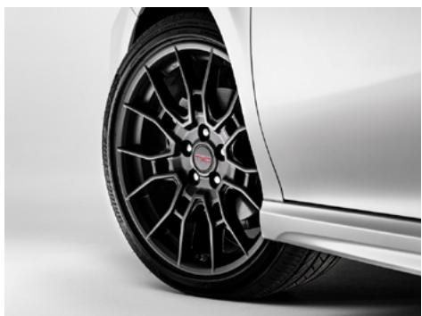

> **AI Description:**
> **Source:** `assets/_page_14_Figure_5.jpg`
> 
> **Generated:** 2026-05-31 06:17:56
> 
> ---
> 
> The image is a photograph of a car's wheel. The wheel features a black multi-spoke design with a shiny finish. The car body is white, and the wheel is partially visible, showing the tire and part of the car's body. The image focuses on the wheel's design and the contrast between the black wheel and the white car.

19-in. TRD matte-black alloy wheels

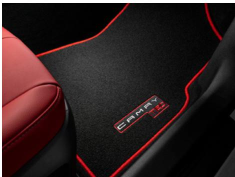

> **AI Description:**
> **Source:** `assets/_page_14_Figure_6.jpg`
> 
> **Generated:** 2026-05-31 06:11:38
> 
> ---
> 
> The image shows a close-up view of a car's interior floor mat, specifically the area near the driver's seat. The mat is black with red stitching and features the word "CAMRY" in red text, indicating the model of the car. The design includes a red outline that follows the shape of the mat, adding a sporty aesthetic. The red stitching and outline contrast sharply with the black background, making the mat visually striking. The image focuses on the mat's design and branding, with no other significant visual elements present.

TRD carpet floor mats41

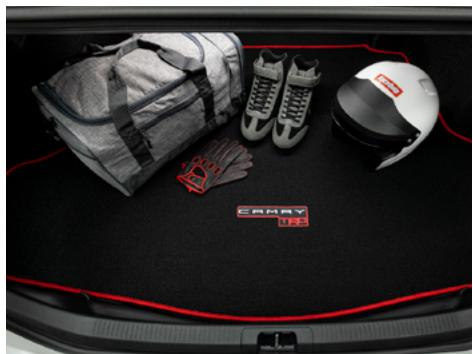

> **AI Description:**
> **Source:** `assets/_page_14_Figure_7.jpg`
> 
> **Generated:** 2026-05-31 06:08:47
> 
> ---
> 
> The image shows the trunk of a vehicle with a black floor mat featuring a red border and a "Camry" logo in the center. On the mat, there are several items: a gray duffel bag, a pair of black and white shoes, a white helmet with a red and black design, and a pair of red gloves. The items appear to be sports or racing-related gear.

TRD carpet trunk mat

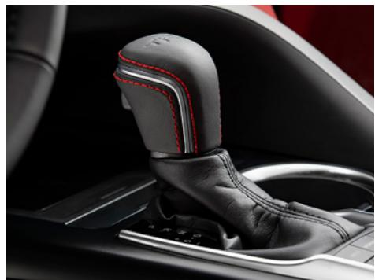

> **AI Description:**
> **Source:** `assets/_page_14_Figure_8.jpg`
> 
> **Generated:** 2026-05-31 06:46:35
> 
> ---
> 
> The image shows a close-up of a car's gear shift lever, which is upholstered in black leather with red stitching. The gear shift is positioned in the center console of a vehicle, with a glimpse of the steering wheel and part of the dashboard visible in the background. The design suggests a focus on luxury and sportiness, typical of high-end vehicles.

TRD shift knob

## WARRANTIES

Every Toyota Car, Truck and SUV is built to exceptional standards. And that’s not idle boasting. We back it up with these Limited Warranty Coverages:

Basic: 36 months/36,000 miles (all components other than normal wear and maintenance items).

Hybrid-Related Component Coverage: Hybrid-related components, including the battery control module, hybrid control module and inverter with converter, are covered for 8 years/100,000 miles. Refer to applicable Warranty and Maintenance Guide for details.

Hybrid Battery: HV battery is covered for 10 years or 150,000 miles, whichever comes first. Warranty coverage is subject to terms and conditions. Refer to applicable Warranty and Maintenance Guide for details.

Powertrain: 60 months/60,000 miles (engine, transmission/transaxle, drive system, seatbelts and airbags).

Accessories: For Genuine Toyota Accessories purchased at the time of the new vehicle purchase, the Toyota Accessory Warranty coverage is in effect for 36 months/36,000 miles from the vehicle’s in-service date, which is the same coverage as the Toyota New Vehicle Limited Warranty.

For Genuine Toyota Accessories purchased after the new vehicle purchase the coverage is 12 months, regardless of mileage, from the date the accessory was installed on the vehicle, or the remainder of any applicable new vehicle warranty, whichever provides greater coverage.

You may be eligible for transportation assistance if it’s necessary that your vehicle be kept overnight for repairs covered under warranty. Please see your authorized Toyota dealership for further details.

For complete details about Toyota’s warranties, please visit www.toyota.com, refer to the applicable Warranty and Maintenance Guide or see your Toyota dealer.

See numbered footnotes in Disclosures section.

1. Projected EPA-estimated 28 city/39 hwy/32 combined mpg rating for 2024 Camry LE, SE and SE Nightshade Edition; 27 city/38 hwy/31 combined mpg rating for 2024 Camry XLE 4-Cylinder and XSE 4-Cylinder; 22 city/33 hwy/26 combined mpg rating for 2024 Camry XLE V6; 22 city/32 hwy/26 combined mpg rating for 2024 Camry XSE V6; 21 city/31 hwy/25 combined mpg rating for 2024 Camry TRD; 51 city/53 hwy/52 combined mpg rating for 2024 Camry LE Hybrid; and 44 city/47 hwy/46 combined mpg rating for 2024 Camry SE Hybrid, XLE Hybrid and XSE Hybrid as determined by manufacturer. EPA estimates not available at time of publishing. Use for comparison purposes only. Your mileage will vary for many reasons, including your vehicle’s condition and how/where you drive. See www.fueleconomy.gov. 2. Requires compatible smartphone. Operability depends on network availability, a cellular connection and GPS signal. Services subject to change at any time without notice. Data charges may apply. To learn more, go to https://www.toyota.com/connected-services/. To learn more about Toyota’s Connected Services data collection, use, sharing and retention practices, please visit https://www.toyota.com/support/privacy-notice. Apple CarPlay® is a registered trademark of Apple Inc. 3. Google, Android, Android Auto, YouTube Music and other marks are trademarks of Google LLC. Android Auto requires compatible smartphone. Operability depends on network availability, a cellular connection and GPS signal. Services subject to change at any time without notice. Data charges may apply. To learn more, go to https://www. toyota.com/audio-multimedia/. To learn more about Toyota’s Connected Services data collection, use, sharing and retention practices, please visit https://www.toyota.com/support/ privacy-notice/. 4. Toyota Connected Services depend on certain factors outside of Toyota’s control in order to operate, including cellular network availability and GPS signal. Without either of these things, operability may be limited or precluded, including access to response center and emergency support. Services vary by vehicle and are subject to change at any time without notice. Requires app download/registration and subscription after trial (if applicable). Terms of Use apply. Data charges may apply. See Owner’s Manual and https://www. toyota.com/connected-services/. For Toyota’s Connected Services’ data collection, use, sharing and retention practices, please visit https://www.toyota.com/support/privacy-notice/. 5. An active Remote Connect trial or subscription is required to use the features mentioned in the Toyota app. 6. Apple and the Apple logo are trademarks of Apple Inc., registered in the U.S. and other countries. 7. Google, Android, Android Auto, YouTube Music and other marks are trademarks of Google LLC. 8. Use only if aware of circumstances surrounding vehicle it is legal safe to do so (e.g., do not remotely start a gas engine vehicle in an enclosed space or if vehicle is occupied by a child). Remote Connect depends on certain factors outside of Toyota’s control in order to operate, including cellular network availability and GPS signal. Without either of these things, operability may be limited or precluded. Services subject to change at any time without notice. Bluetooth® connectivity is required if your subscription includes Digital Key capability. Remote start/stop only available on select models. See your Toyota dealer for details. Terms of Use apply. Data charges may apply. See Owner’s Manual and https://www.toyota.com/connected-services/. To learn about Toyota’s Connected Services’ data collection, use, sharing and retention practices, please visit https://www.toyota.com/support/privacy-notice/. Trial period begins on original purchase or lease date of new vehicle. Paid subscription required after trial (if applicable). Terms of Use apply. 9. Safety Connect® depends on factors outside of Toyota’s control in order to operate, including cellular network availability and GPS signal. Without either of these things, operability may be limited or precluded, including access to response center and emergency support. Stolen vehicle police report required to use Stolen Vehicle Locator. If subscription includes Automatic Collision Notification, it will activate only in limited circumstances. Services vary by vehicle and are subject to change at any time without notice. Terms of Use apply. Data charges may apply. See Owner’s Manual and https://www.toyota.com/connected-services/. For Toyota’s Connected Services’ data collection, use, sharing and retention practices, please visit https://www.toyota.com/support/privacy-notice/. A Safety Connect® trial is included for up to 10 years on select vehicles with paid Connected Services packages. See your Toyota dealer for details. 4G network dependent. 10. Requires cellular network availability, a cellular connection and GPS signal. May not work in all areas. Service may vary by vehicle and region. See Toyota dealer for details and exclusions. 11. Building and/or parking structures may limit system effectiveness. Stolen vehicle police report required to use Stolen Vehicle Locator. For additional assistance contact the Toyota Brand Engagement Center at 1-800-331-4331. 12. Service Connect depends on certain factors outside of Toyota’s control in order to operate, including cellular network availability and GPS signal. Without either of these things, operability may be limited or precluded. Information provided is based on the last time data was collected from vehicle and is not real-time data. Services vary by vehicle and are subject to change at any time without notice. Terms of Use apply. Data charges may apply. See usage precautions and service limitations in Owner’s Manual and https://www.toyota.com/connected-services/. To learn about Toyota’s Connected Services’ data collection, use, sharing and retention practices, please visit https://www.toyota.com/support/privacy-notice/. The Service Connect trial period is at no extra cost and begins on the original date of purchase or lease of a new vehicle. Subscription required after trial. Service Connect renewal will be included when Safety Connect®, Remote Connect or Destination Assist connected service renewal is selected. Service Connect is not renewable as a stand-alone service. 13. Service not available everywhere or in every vehicle. Depends on cellular network availability and GPS signal. Without either of these things, operability may be limited or precluded. Up to 5 devices can be supported using in-vehicle connectivity. Services subject to change at any time without notice. The Wi-Fi Connect trial begins at the time of enrollment and expires the earlier of 3GB data use or the 1-month trial period ends. Paid subscription required after trial. Select models include Integrated Streaming capability, which requires a separate subscription to third-party provider services. Data charges may apply. Valid in the contiguous U.S. and Alaska. Go to https://myvehicle.att.com/#/toyota/learn?language=en&country=US for terms and conditions. 14. Operability and accuracy of Dynamic Navigation depends on certain factors outside of Toyota’s control in order to operate, including cellular network availability, a cellular connection and GPS signal. Without any one or more of these things, operability may be limited or precluded. Services not available in every city or roadway. Use common sense when relying on information provided. Service is subject to change at any time without notice. Paid subscription required after trial (if applicable). Terms of Use apply. Data charges may apply. See Owner’s Manual and https://www.toyota.com/connected-services/ for limitations. To learn about Toyota’s Connected Services data collection, use, sharing and retention practices, visit https://www.toyota.com/support/privacy-notice/. The Dynamic Navigation trial period is at no extra cost and trial begins the earlier of vehicle hits 100 miles or 1 year after multimedia system manufacture date (regardless of purchase or lease date). Paid subscription required after trial (if applicable). Terms of Use apply. 15. Depends on certain factors outside of Toyota’s control in order to operate, including cellular network availability, a cellular connection and GPS signal. Without any one or more of these things, operability may be limited or precluded. Use common sense when relying on this information. Service is subject to change at any time without notice. Terms of Use apply. Data charges may apply. See https://www.toyota.com/ connected-services/ for details. To learn about Toyota’s connected services data collection, use, sharing and retention practices, please visit https://www.toyota.com/support/privacynotice/. The Destination Assist trial period begins on original purchase or lease date of new vehicle. Paid subscription required after trial (if applicable). Terms of Use apply. 17. Google, Android, Android Auto, YouTube Music and other marks are trademarks of Google LLC. 18. iPhone® is a registered trademark of Apple Inc. All rights reserved. 19. Trial length and service availability may vary by model, model year or trim. Service will automatically stop at the end of your trial subscription period unless you decide to continue service. If you do not wish to enjoy your trial, you can cancel by calling the number below. All SiriusXM services require a subscription, each sold separately by SiriusXM after the trial period. Service subject to the SiriusXM Customer Agreement and Privacy Policy; visit www.siriusxm.com to see complete terms and how to cancel which includes calling 1-866-635-2349. Some services and features are subject to device capabilities and location availability. All fees, content and features are subject to change. SiriusXM, Pandora and all related logos are trademarks of Sirius XM Radio Inc. and its respective subsidiaries. 20. SiriusXM trial length and service availability may vary by model, model year or trim. 21. JBL® is a registered trademark of Harman International Industries, Inc. 22. Toyota Safety Sense™ effectiveness is dependent on many factors including road, weather and vehicle conditions. Drivers are responsible for their own safe driving. Always pay attention to your surroundings and drive safely. See Owner’s Manual for limitations. 23. The Pre-Collision System (PCS) with Pedestrian Detection (PD) is designed to determine if impact is imminent and help reduce impact speed and damage in certain frontal collisions involving a vehicle, a pedestrian or a bicyclist. PCS w/PD is not a substitute for safe and attentive driving. System effectiveness depends on many factors, such as speed, size and position of pedestrian or bicyclist and weather, light and road conditions. See Owner’s Manual for limitations. 24. Dynamic Radar Cruise Control and Full-Speed Range Dynamic Radar Cruise Control are not substitutes for safe and attentive driving. See Owner’s Manual for instructions and limitations. 25. Lane Departure Alert with Steering Assist is designed to read visible lane markers under certain conditions. It provides a visual and audible alert and slight steering force when lane departure is detected. It is not a collision-avoidance system or a substitute for safe and attentive driving. Effectiveness is dependent on many factors including road, weather and vehicle conditions. See Owner’s Manual for limitations. 26. Automatic High Beams operate at speeds above 21 mph. See Owner’s Manual for instruction and limitations. 27. Lane Tracing Assist (LTA) is designed to read visible lane markers and detect other vehicles under certain conditions. It is only operational when DRCC is engaged. See Owner’s Manual for limitations. 28. Road Sign Assist only recognizes certain road signs. See Owner’s Manual for limitations. 29. May not be compatible with all mobile phones, smart devices, tablets, e-readers, MP3/WMA players and like models. 30. Airbag systems supplement the seatbelts and are designed to inflate only under certain conditions and in certain types of severe collisions. Always wear seatbelt, sit upright in middle and as far back in seat as possible to help decrease risk of injury. Do not put objects in front of an airbag. See Owner’s Manual for limitations. 31. The Tire Pressure Monitor System alerts the driver when tire pressure is critically low. For optimal tire wear and performance, tire pressure should be checked regularly with a gauge; do not rely solely on the monitor system. See Owner’s Manual for additional limitations and details. 32. HomeLink® and the HomeLink® house icon are registered trademarks of Gentex Corporation. 33. Wireless charging may not be compatible with all mobile phones, smart devices, tablets, e-readers, MP3/WMA players and like products. 34. Do not rely exclusively on Blind Spot Monitor. Look over shoulder and use turn signal. See Owner’s Manual for limitations. 35. Do not rely exclusively on the Rear Cross-Traffic Alert. Visually confirm clearance during use. See Owner’s Manual for limitations. 36. The Panoramic View Monitor does not provide a comprehensive view of the area surrounding your vehicle. Look around to confirm clearance. See Owner’s Manual for limitations. 37. Front and Rear Parking Assist with Automatic Braking (PA w/AB) may warn drivers of, and potentially brake for front and rear collisions with certain objects when traveling at low speeds. Drivers should visually confirm clearance during use. See Owner’s Manual for instructions and limitations. 38. SofTex® is a registered trademark of Toyota Motor Sales, U.S.A., Inc. 39. Extra-cost color. 40. EV Mode lets you operate solely on battery power at low speeds for short distances and in limited circumstances, such as in a parking garage. Different conditions may prevent or limit usage. See your Owner’s Manual for limitations and details. 41. This floor mat/floor liner was designed specifically for use in your model and model year vehicle and SHOULD NOT be used in any other vehicle. To avoid potential interference with pedal operation, each mat/liner must be secured with its fasteners. Do not install a floor mat/floor liner on top of an existing floor mat/floor liner. 42. Cargo and load capacity limited by weight and distribution. Always properly secure cargo and cargo area. 43. Toyota strives to build vehicles to match customer interest and thus they typically are built with popular options and option packages. Not all options/packages are available separately and some may not be available in all regions of the country. See toyota.com for information about options/packages commonly available in your area. If you would prefer a vehicle without any or with different options, contact your dealer to check for current availability or the possibility of placing a special order. Color(s) depicted may vary based on multiple factors, including ambient lighting and the format in which it is being viewed (e.g., computer, mobile device or print). 44. The Bluetooth® word mark and logos are registered trademarks owned by Bluetooth SIG, Inc., and any use of such marks by Toyota is under license. A compatible Bluetooth®-enabled phone must first be paired. Phone performance depends on software, coverage and carrier. 45. Rated for 12 volts/10 amps. See Owner’s Manual for additional limitations and details. 46. When the system is on, Automatic Electric Parking Brake is designed to automatically engage the Electric Parking Brake under limited conditions. It may not hold the vehicle under all conditions and does not function when the vehicle is in Reverse. Automatic Electric Parking Brake is not a substitute for manual use of the Electric Parking Brake. See Owner’s Manual for additional limitations and details. 47. When the system is on and the vehicle is in Drive, Brake Hold may temporarily keep the brakes engaged after the driver brings the vehicle to a complete stop. See Owner’s Manual for limitations. 48. Vehicle Stability Control is an electronic system designed to help the driver maintain vehicle control under adverse conditions. It is not a substitute for safe and attentive driving practices. Factors including speed, road conditions, weather and driver steering input can all affect whether VSC will be effective in preventing a loss of control. See Owner’s Manual for limitations. 49. Smart Stop Technology® will reduce power to help the brakes bring vehicle to a stop during certain contemporaneous brake and accelerator pedal applications. See Owner’s Manual for limitations. 50. Whiplash-Injury-Lessening front seats can help reduce the severity of whiplash injury in certain rear-end collisions. 51. Hill Start Assist Control is designed to minimize backward rolling on steep ascents. Not a substitute for safe driving judgment and practices. Speed, grade, surface conditions, driver input, etc., can all affect HAC function. See Owner’s Manual. 52. ToyotaCare covers normal factory scheduled maintenance for two years or 25,000 miles, whichever comes first, and 24-hour Roadside Assistance is included for two years, unlimited mileage (note: bZ4X, Mirai, Prius & Prius Prime include enhanced ToyotaCare and/or Roadside Assistance). Roadside Assistance limits towing distances and locations and does not include parts and fluids, except emergency fuel delivery for certain vehicles. Excludes rental company fleet sale vehicles. See your Toyota dealer for additional restrictions and exclusions. Valid only in the continental U.S. 53. The Rear-Seat Reminder does not sense objects in the rear seat. The Rear-Seat Reminder is designed to recognize a unique rear-door opening pattern that may be consistent with an object being placed in the rear seating area. See Owner’s Manual for additional details. 54. The backup camera does not provide a comprehensive view. Always look over shoulder and use outside mirrors. See Owner’s Manual for limitations.

Toyota strives to build vehicles to match customer interest and thus they typically are built with popular options and option packages. Not all options/packages are available separately and some may not be available in all regions of the country. See toyota.com for information about options/packages commonly available in your area. If you would prefer a vehicle without any or with different options, contact your dealer to check for current availability or the possibility of placing a special order.

Color(s) depicted may vary based on multiple factors, including ambient lighting and the format in which it is being viewed (e.g., computer, mobile device or print).

Some vehicles are shown with available equipment. Seatbelts should be worn at all times. For details on vehicle specifications, standard features and available equipment in your area, contact your Toyota dealer. A vehicle with particular equipment may not be available at the dealership. Ask your Toyota dealer to help locate a specifically equipped vehicle.

All information presented herein is based on data available at the time of posting, is subject to change without notice and pertains specifically to mainland U.S.A. vehicles only.   
Vehicles shown may be prototypes, shown using visual effects and/or shown with options. Actual models may vary.