<span id="page-0-0"></span>
# Deep Learning: and Deep Data-Science


ROYAL INSTITUTE OFTECHNOLOGY
12 May 2015

roelof@kth.se www.csc.kth.se/-roelof/

Graph Technologies R&D roelof@graph-technologies.com

slides online at: https://www.slideshare.net/roelofp/deep-learning-as-a-catdog-detector

<span id="page-1-0"></span>
## BUT FIRST...

## are youa...

## CAT PERSON?

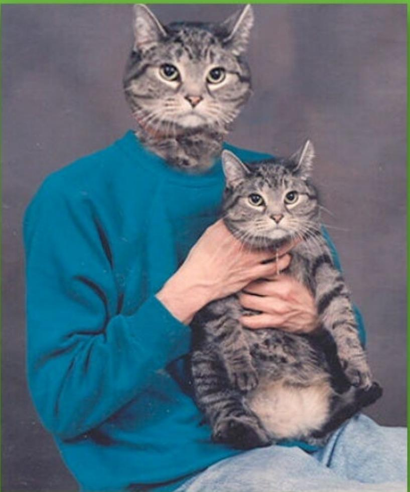

> **AI Description:**
> **Source:** `assets/_page_1_Figure_0.jpg`
> 
> **Generated:** 2026-05-31 07:13:29
> 
> ---
> 
> The image is a photograph featuring a person wearing a turquoise shirt, holding a tabby cat. The person is seated, and the cat is perched on their lap, looking directly at the camera. The background is a plain, neutral color, which helps to focus attention on the subject. The image appears to be a casual portrait, possibly for a pet-related context.


DOG PERSON?

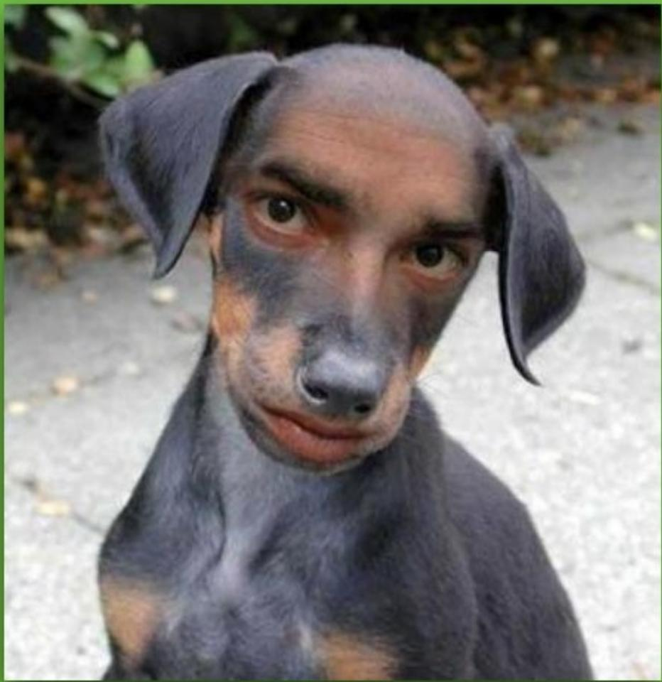

> **AI Description:**
> **Source:** `assets/_page_1_Figure_1.jpg`
> 
> **Generated:** 2026-05-31 07:28:19
> 
> ---
> 
> The image contains a photograph of a dog with a human-like face. The dog has a dark coat with some lighter markings on its face and chest. The background appears to be an outdoor setting with some greenery and a concrete surface. The image is edited to give the dog a human-like appearance, which is not natural.


<span id="page-2-0"></span>
## in the next few minutes we'llbe making a

## CAT VS DOG DETECTOR

<span id="page-3-0"></span>
## main Libraries


> **AI Description:**
> **Source:** `assets/_page_3_Figure_0.jpg`
> 
> **Generated:** 2026-05-31 09:01:32
> 
> ---
> 
> The image contains a logo with two intertwined shapes in blue and yellow. The shapes resemble the head and body of a snake, which is a stylized representation of the Python programming language. The logo is simple and uses a limited color palette, focusing on the branding of Python.


·sckikit-learn (machine learning) http://scikit-learn.org

·caffe (deep learning) - for training deep neural nets   
(for today: loading a pre-trained one)   
http://caffe.berkeleyvision.org

otheano (efficient gpu-powered math) http://www.deeplearning.net/software/theano/

•ipython notebookhttp://ipython.org/notebook.html

<span id="page-4-0"></span>
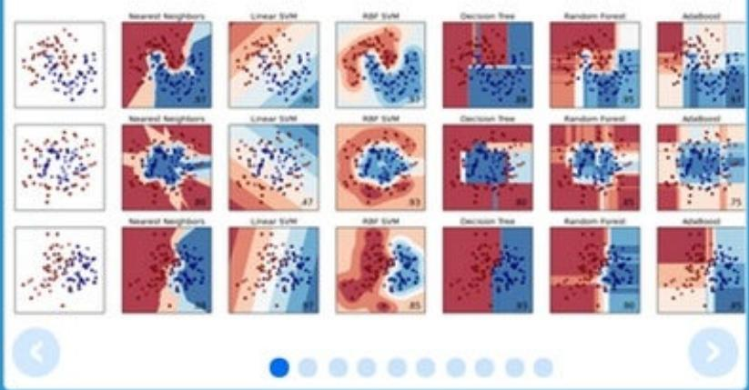

> **AI Description:**
> **Source:** `assets/_page_4_Figure_0.jpg`
> 
> **Generated:** 2026-05-31 09:01:08
> 
> ---
> 
> The image contains a series of visualizations comparing different machine learning models' performance on a classification task. Each row represents a different dataset, and each column shows the results of a different model: Nearest Neighbors, Linear SVM, AdaBoost, Random Forest, and Decision Tree. The visualizations use color gradients to represent the probability of belonging to a particular class, with red and blue colors indicating different classes. The numbers in the bottom right corner of each cell likely represent the accuracy or some other performance metric for that model on that dataset. The image provides a comparative analysis of how well each model performs on the given datasets.


## scikit-learn

Machine Leaming inPython

·Simple and efficient tools for data mining and data analysis

·Accessible toeverybodyandreusable invariouscontexts

·Built on NumPy，SciPy，and matploib

·Open source,commercially usable-BSD license

## Classification

ldentifying towhichcategoryanobject belongsto.

Applications:Spamdetection,Image recognition.

Algorithms:SVM,nearestneighbors, random forest,... -Examples

## Regression

Predictingacontinuous-valuedattribute associated withanobject.

Applications:Drug response,Stock prices.

Algorithms:SVR,ridgeregression, Lasso,.. -Examples

## Clustering

Automatic grouping of similar objects into sets.

Applications:Customersegmentation, Grouping experiment outcomes Algorithms:k-Means,spectral clustering，mean-shit... -Examples

## Dimensionality reduction

Reducing thenumberof random variablestoconsider.

Applications:Visualization,Increased efficiency

Algorithms:PCA,featureselection, non-negativematrixfactorization.

-Examples

## Model selection

Comparing,validatingand choosing parametersandmodels.

Goal:Improved accuracy viaparameter tuning

Modules:grid search,cross validation, metrics. -Examples

## Preprocessing

Featureextraction and normalization.

Application:Transforming inputdata suchastext forusewithmachine learningalgorithms.

Modules:preprocessing,feature extraction.

<span id="page-5-0"></span>
## Caffe

Deep learningframework by the BVLC

Created by

Yangqing Jia

Lead Developer

EvanShelhamer

View OnGitHub

## Caffe

Caffeisadeeplearningframeworkmadewithexpression,speed,andmodularityinmind.Itis developedbythe BerkeleyVisionand Learning Center(BVLC)andby community contributors. YangqingJiacreatedtheprojectduringhisPhDat UCBerkeley.Caffeisreleasedunder the BSD2- Clause license.

Check out our web image classification demo!

## Why Caffe?

Expressivearchitectureencouragesapplicationandinnovation.Modelsand optimizationare definedbyconfiguration withouthard-coding.SwitchbetweenCPUandGPUbysetingasingleflag totrainonaGPUmachine then deploy to commodity clusters ormobile devices.

Extensible code fostersactivedevelopment.In Caffe'sfirstyear,it hasbeenforkedbyover1,000 developersand had many significantchangescontributed back.Thanksto these contributors the framework tracksthe state-of-the-artin both codeand models.

Speedmakes Cafe perfectforresearch experimentsand industrydeployment.Caffecan process over60Mimagesperday withasingle NviDlAK40GPU\*.That's1ms/imagefor inferenceand4 ms/imageforlearning.Webelievethat Cafeisthefastest convnetimplementationavailable.

Community:Caffealreadypowersacademicresearch projects,startupprototypes,andeven largescaleindustrialapplications in vision,speech,andmultimedia.Joinourcommunityof brewerson thecaffe-users group and Github.

\*WiththeILSVRC2012-winningSuperVision modeland caching IO.Consult performance details.

<span id="page-6-0"></span>
## Welcome

Theano isaPython library thatallowsyoutodefine,optimize,and evaluate mathematical expressions involving multi-dimensional arrays efficiently.Theano features:

·tightintegrationwith NumPy-Usenumpy.ndarray in Theano-compiled functions.

·transparent use of a GPU-Performdata-intensive calculations up to 140x fasterthanwith CPU.(float32only)

·efficient symbolicdifferentiation-Theano doesyourderivatives forfunction withone ormany inputs.

·speedand stability optimizations-Get the rightanswer forlog(1+x)even whenx is really tiny.

·dynamicCcode generation-Evaluateexpressions faster.

·extensive unit-testing and self-verification-Detect and diagnose many types ofmistake.

Theano has been powering large-scale computationally intensive scientific investigations since 2oo7.But it isalsoapproachable enough tobeused inthe classroom (IFT6266 at the University ofMontreal).

## News

·Wesupport cuDNNif itis installedbythe user.

·Open Machine Learning Workshop2014 presentation.

·Colin Raffel tutorial on Theano.

·lan Goodfellow did a12h class with exerciseson Theano.

## theano

Table Of Contents

Welcome   
News   
Download   
Status   
Citing Theano   
Documentation   
Community

Next topic

ReleaseNotes

This Page

Show Source

Quick search

Go

Enter search terms oramodule, class or function name.

<span id="page-7-0"></span>
Install·Docs·Videos·News·Cite·Sponsors·Donate

## The IPython Notebook

TheIPython Notebook isan interactivecomputational environment,inwhich you can combinecodeexecution，richtext，mathematics，plotsand richmedia,asshownin thisexample session:

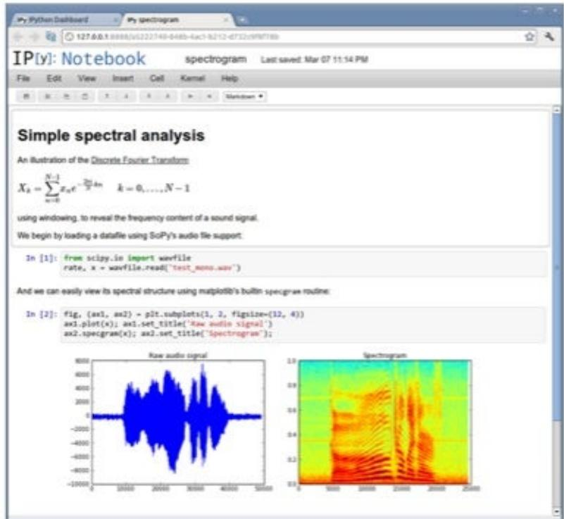

> **AI Description:**
> **Source:** `assets/_page_7_Figure_0.jpg`
> 
> **Generated:** 2026-05-31 07:45:41
> 
> ---
> 
> The image contains a screenshot of a Jupyter Notebook interface displaying a simple spectral analysis of a sound signal. It includes a code cell importing the `wavefile` module from `scipy.io` and loading a WAV file named `test_mono.wav`. The notebook then uses the `specgram` function from `matplotlib` to visualize the spectral structure of the audio signal. The left subplot shows the raw audio signal as a time-domain plot, while the right subplot displays the spectrogram, a color-coded representation of the frequency content over time. The spectrogram highlights the frequency components of the sound signal, with color intensity indicating the amplitude of the frequencies at different times.


Itaimstobeanagiletool forboth exploratorycomputationanddataanalysis,and providesaplatformto supportreproducibleresearch,sinceallinputsandoutputs maybe stored ina one-to-oneway in notebook documents.

GoogleCustom Search

Search

## VERSIONS

Stable   
3.1-April 2015   
Install   
Development   
4.0.dev   
GitHub

Offline Docs All Versions GitHub

## NOTEBOOK VIEWER

Shareyour notebooks

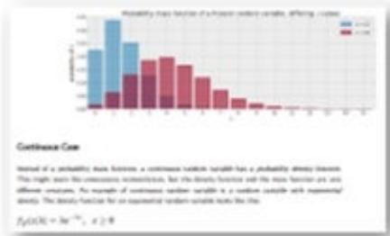

> **AI Description:**
> **Source:** `assets/_page_7_Figure_1.jpg`
> 
> **Generated:** 2026-05-31 07:43:03
> 
> ---
> 
> The image contains a bar chart and text. The bar chart is titled "Probability mass function of a Poisson random variable, differing λ-values." It displays the probability mass function for different values of λ (lambda), which are 1.0 and 1.5, as indicated by the legend. The x-axis represents the number of occurrences, and the y-axis represents the probability. The chart shows that as the value of λ increases, the probability mass function shifts to the right, indicating a higher probability of higher values of the random variable. The text below the chart explains the concept of a continuous random variable and provides an example of an exponential random variable with a density function.


<span id="page-8-0"></span>
## BEAR WITH L 古

<span id="page-9-0"></span>
## Data Science?

“Data science is clearly a blend of the hackers'art, statistics and machine learning...

-Hilary Mason&ChrisWiggins,2010

<span id="page-10-0"></span>
Machine Learning

Data Science

Substantive Expertise

(Drew Connoway 2010)

<span id="page-11-0"></span>
1 feature

<span id="page-12-0"></span>
1 feature
2 features
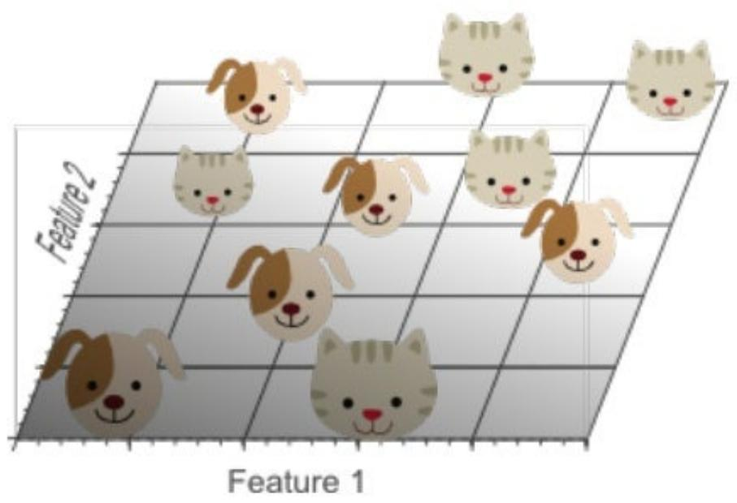

> **AI Description:**
> **Source:** `assets/_page_12_Figure_0.jpg`
> 
> **Generated:** 2026-05-31 07:06:00
> 
> ---
> 
> The image is a 3D scatter plot with two features labeled as "Feature 1" and "Feature 2" on the axes. The plot contains icons representing dogs and cats, with the dogs in the lower left and upper right quadrants and the cats in the upper left and lower right quadrants. The visualization appears to be used to demonstrate a classification or clustering algorithm, where the icons are grouped based on their feature values.


<span id="page-13-0"></span>
1 feature

2 features
too few features/dimensions = overfiting
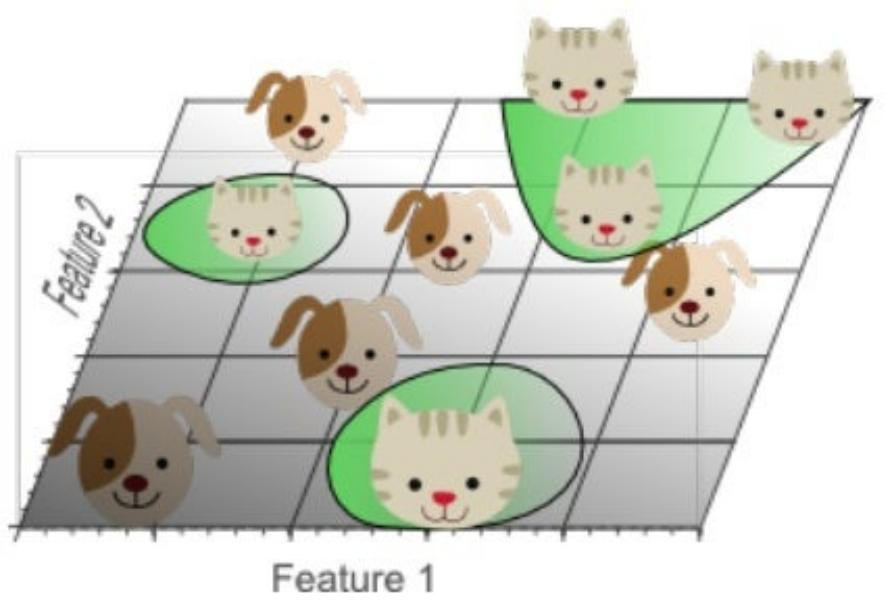

> **AI Description:**
> **Source:** `assets/_page_13_Figure_1.jpg`
> 
> **Generated:** 2026-05-31 07:31:22
> 
> ---
> 
> The image is a 3D scatter plot with two features labeled as "Feature 1" and "Feature 2" on the axes. It contains illustrations of dogs and cats, with the dogs and cats grouped into distinct clusters. The clusters are highlighted with green ellipses, indicating areas of high concentration for each group. The diagram visually represents the separation of dogs and cats based on the two features, suggesting a classification or clustering analysis.


<span id="page-14-0"></span>
1 feature

2 features


> **AI Description:**
> **Source:** `assets/_page_14_Figure_1.jpg`
> 
> **Generated:** 2026-05-31 07:29:34
> 
> ---
> 
> The image is a 3D scatter plot with two features labeled as "Feature 1" and "Feature 2" on the axes. The plot contains two distinct clusters of data points, each representing a different category: dogs and cats. The dogs are represented by brown and white faces, while the cats are represented by tan and white faces. The clusters are visually separated by green ellipses, indicating the distribution of the data points within each category. The image effectively uses color and shape to differentiate between the two groups and visually represents their distribution in the feature space.


too few features/dimensions = overfitting
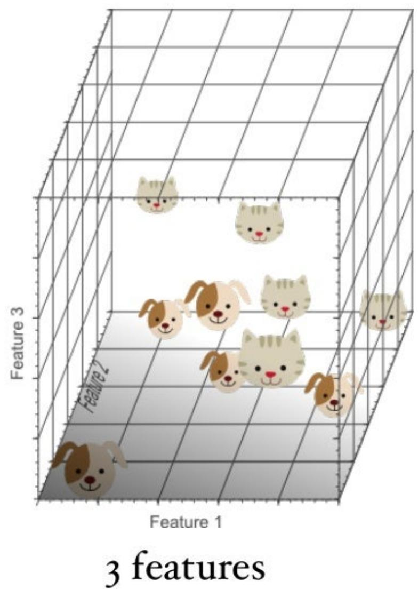

> **AI Description:**
> **Source:** `assets/_page_14_Figure_2.jpg`
> 
> **Generated:** 2026-05-31 07:35:49
> 
> ---
> 
> The image is a 3D diagram illustrating a concept with three features labeled as Feature 1, Feature 2, and Feature 3. It contains a grid-like structure where different animal faces (cats and dogs) are placed at various intersections, representing different combinations of feature values. The animals are distributed across the grid, suggesting a possible clustering or classification of data points based on the three features. The diagram visually represents a multidimensional space where each point corresponds to a unique combination of feature values.


<span id="page-15-0"></span>
1 feature

2 features
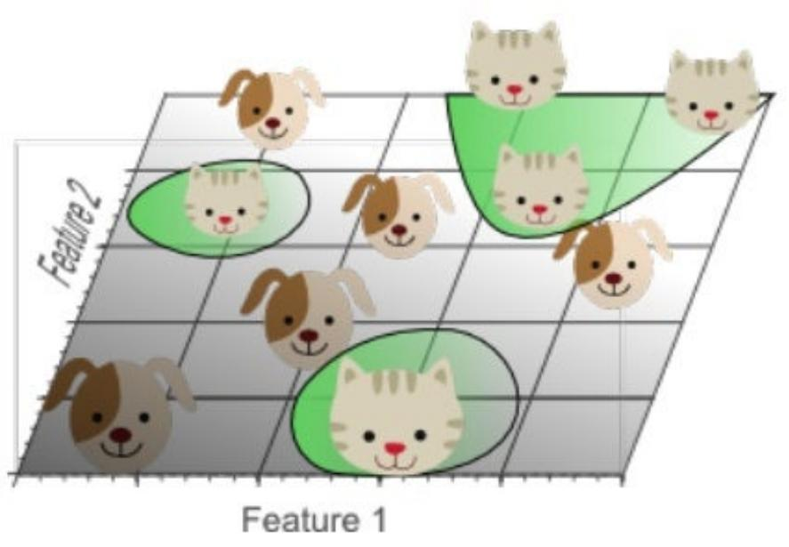

> **AI Description:**
> **Source:** `assets/_page_15_Figure_1.jpg`
> 
> **Generated:** 2026-05-31 07:10:28
> 
> ---
> 
> The image is a 3D scatter plot diagram with two features labeled as "Feature 1" and "Feature 2" on the axes. It contains illustrations of dogs and cats, with the dogs and cats grouped into distinct clusters. The clusters are visually separated by green ellipses, indicating areas of higher density or concentration of the respective animal types. The diagram appears to be used to illustrate a concept in data visualization, possibly related to clustering or classification algorithms.


3 features
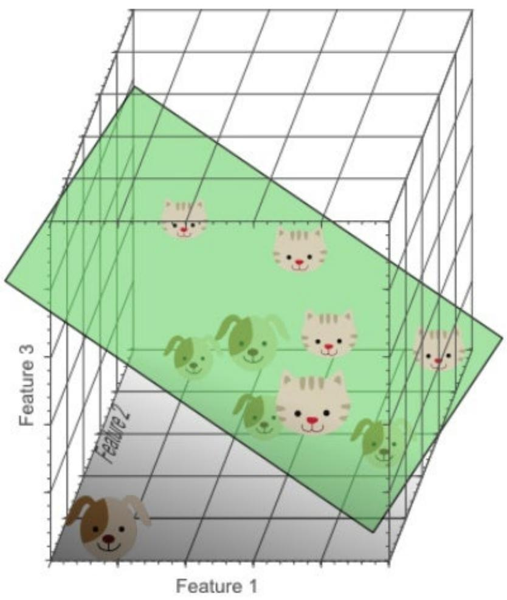

> **AI Description:**
> **Source:** `assets/_page_15_Figure_2.jpg`
> 
> **Generated:** 2026-05-31 07:26:17
> 
> ---
> 
> The image is a 3D diagram illustrating a concept related to feature space in machine learning or data analysis. It shows a cube with three axes labeled as Feature 1, Feature 2, and Feature 3. Within this cube, there are various animal faces (dogs and cats) distributed across different sections, representing different data points or clusters. The green planes within the cube likely represent decision boundaries or hyperplanes used in classification tasks. The image visually conveys the idea of separating data points into different categories using a machine learning model.


<span id="page-16-0"></span>
## ++ Data Needs also grow!


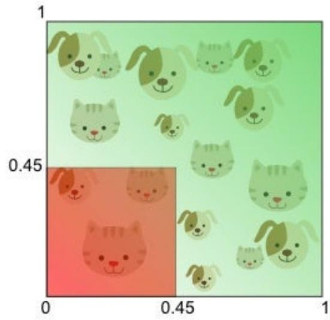

> **AI Description:**
> **Source:** `assets/_page_16_Figure_1.jpg`
> 
> **Generated:** 2026-05-31 08:31:46
> 
> ---
> 
> The image is a scatter plot with a gradient background. The x-axis and y-axis are both labeled with values ranging from 0 to 1. The plot contains various animal faces, predominantly dogs and cats, with some overlapping. The gradient background transitions from green to red, with the red area concentrated in the bottom left quadrant. The red area appears to represent a higher concentration of cat faces, while the green area has a mix of dog and cat faces.


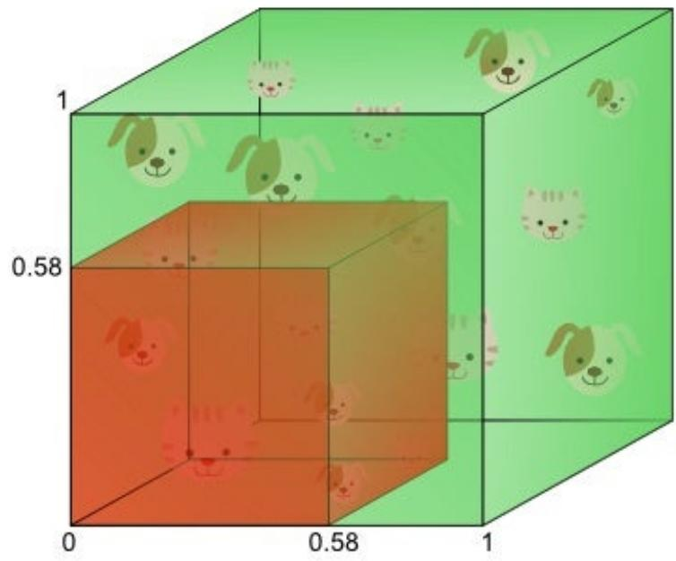

> **AI Description:**
> **Source:** `assets/_page_16_Figure_2.jpg`
> 
> **Generated:** 2026-05-31 08:40:31
> 
> ---
> 
> The image is a 3D diagram of a cube with a smaller cube inside it. The larger cube is divided into two equal parts, with the bottom half colored orange and the top half green. Both the larger and smaller cubes are decorated with cartoon animal faces. The dimensions of the cube are labeled as 0.58 and 1 on the axes, indicating the scale of the cube. The image appears to be a visual representation of a mathematical or geometric concept, possibly related to volume or spatial relationships.


<span id="page-17-0"></span>
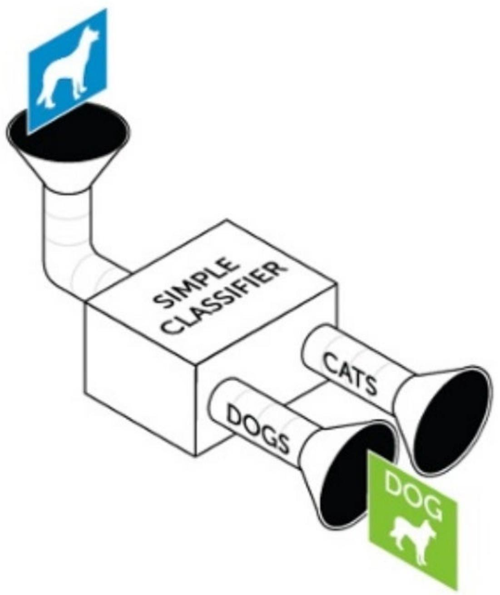

> **AI Description:**
> **Source:** `assets/_page_17_Figure_0.jpg`
> 
> **Generated:** 2026-05-31 08:54:04
> 
> ---
> 
> The image is a diagram illustrating a simple classifier. It shows a funnel-shaped input at the top with an image of a dog inside. The funnel leads to a rectangular box labeled "SIMPLE CLASSIFIER." From this box, two tubes branch out, one labeled "CATS" and the other labeled "DOGS." The tube labeled "DOGS" leads to a green sign with the word "DOG" and an image of a dog. The diagram visually represents the process of a simple classifier distinguishing between cats and dogs, with the classifier correctly identifying the input image as a dog.

(picture by Dato)

<span id="page-19-0"></span>
## Deep Learning?

A host of statistical machine learning techniques

·Enablesthe automatic learning of feature hierarchies

Generally based onartificial neural networks

<span id="page-20-0"></span>
# Deep Learning

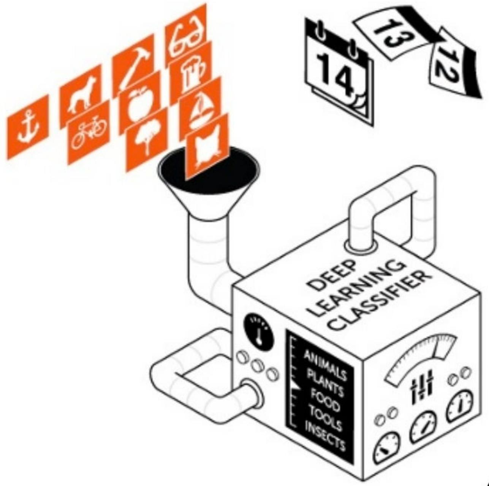

> **AI Description:**
> **Source:** `assets/_page_20_Figure_0.jpg`
> 
> **Generated:** 2026-05-31 08:39:19
> 
> ---
> 
> The image is a diagram illustrating a deep learning classifier. It shows a funnel-shaped input where various icons representing different categories (animals, plants, food, tools, insects) are fed into the classifier. The classifier is labeled "DEEP LEARNING CLASSIFIER" and has a control panel with dials and buttons. The output of the classifier is represented by a calendar with dates 12, 13, and 14, suggesting a time-based or sequence-based output. The diagram visually represents the process of categorization and classification using deep learning technology.

(picture by Dato)

<span id="page-21-0"></span>
Deep Learning?

·Manually designed features are often over-specified, incomplete and takea long time to design and validate

·Learned Features are easy toadapt,fast to learn

·Deep learning providesavery flexible,(almost?) universal, learnable framework for representing world,visualand linguistic information.

·Deep learning can learn unsupervised (from raw text/audio/images/whatever content) and supervised (with specific labels like positive/ negative)

(as summarised by Richard Socher 2014)

<span id="page-22-0"></span>
## 2006+:The Deep Learning Conspirators


<span id="page-24-0"></span>

### Full Page Description (Page 24)

**Source:** `assets/_page_24_Asset_0.jpg`

**Generated:** 2026-05-31 08:07:23

---

The image is a scatter plot comparing error rates over time for Traditional CV and Deep Learning methods from 2010 to 2014. The x-axis represents years, and the y-axis represents error rates. Blue circles represent Traditional CV, while orange circles represent Deep Learning. The plot shows a general trend of decreasing error rates over time for both methods, with Traditional CV having higher error rates than Deep Learning in earlier years, and Deep Learning showing a more significant reduction in error rates starting from 2013.

## Image Recognition

<span id="page-25-0"></span>
## Natural Langauge Processing

<span id="page-26-0"></span>
## Natural Langauge Processing

cloudy days don't last forever.

<span id="page-27-0"></span>
## DL? How ?

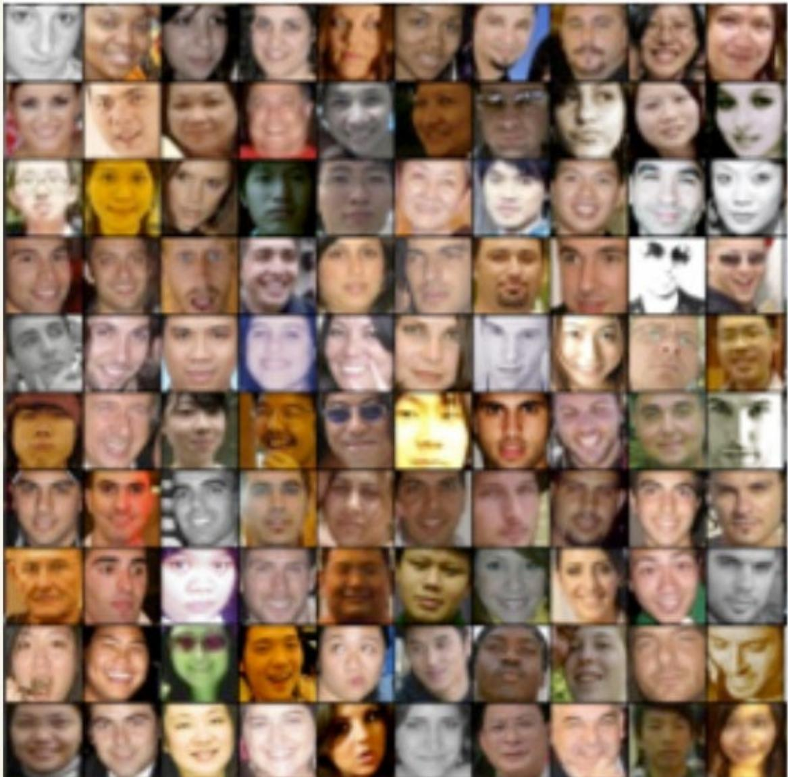

> **AI Description:**
> **Source:** `assets/_page_27_Figure_0.jpg`
> 
> **Generated:** 2026-05-31 08:35:03
> 
> ---
> 
> The image contains a grid of 100 photographs of various individuals, each with a different expression or pose. The photographs are arranged in a 10x10 grid, showcasing a diverse range of people. The images appear to be part of a dataset or collection, possibly used for facial recognition or emotion analysis. Each photo is distinct, with different lighting conditions, angles, and expressions, providing a rich set of visual data for analysis.


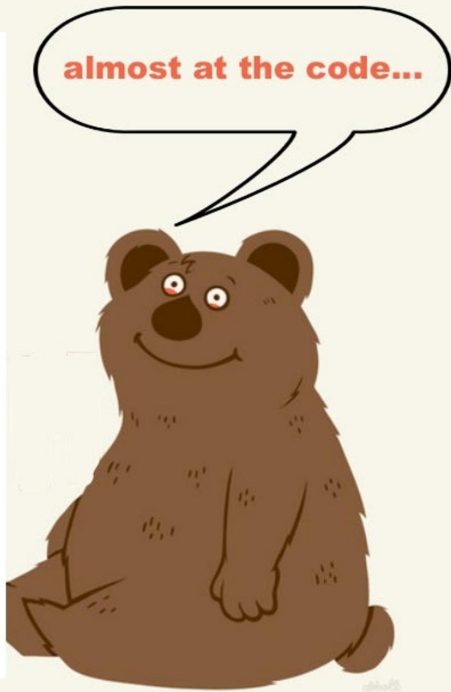

> **AI Description:**
> **Source:** `assets/_page_27_Figure_1.jpg`
> 
> **Generated:** 2026-05-31 08:48:18
> 
> ---
> 
> The image contains a cartoon bear sitting with a speech bubble above its head. The speech bubble contains the text "almost at the code...". The bear has a simple, friendly appearance with a smiling face and a light brown fur color. The background is plain white, and there are no other visual elements or charts in the image.


<span id="page-28-0"></span>
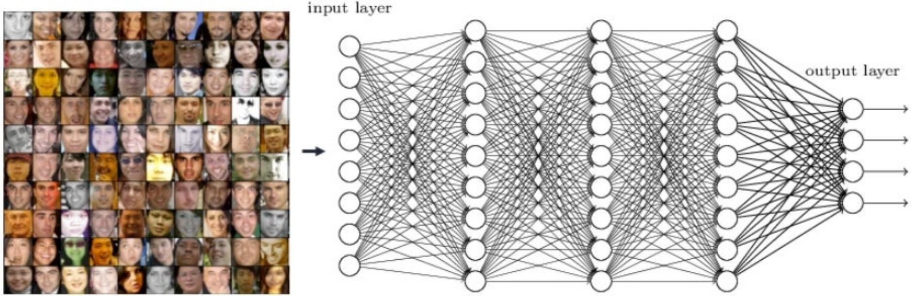

> **AI Description:**
> **Source:** `assets/_page_28_Figure_0.jpg`
> 
> **Generated:** 2026-05-31 07:51:19
> 
> ---
> 
> The image contains a combination of a grid of facial images and a diagram of a neural network. The grid on the left displays a collection of faces, each with varying expressions and lighting conditions. The diagram on the right represents a neural network with an input layer, multiple hidden layers, and an output layer. The network is depicted with nodes connected by lines, indicating the flow of information or connections between different parts of the network. The labels "input layer" and "output layer" are clearly marked, indicating the starting and ending points of the network's processing. The diagram suggests a deep learning model, possibly used for facial recognition or image classification tasks.


<span id="page-29-0"></span>
Deep neural networks learn hierarchicalfeature representations
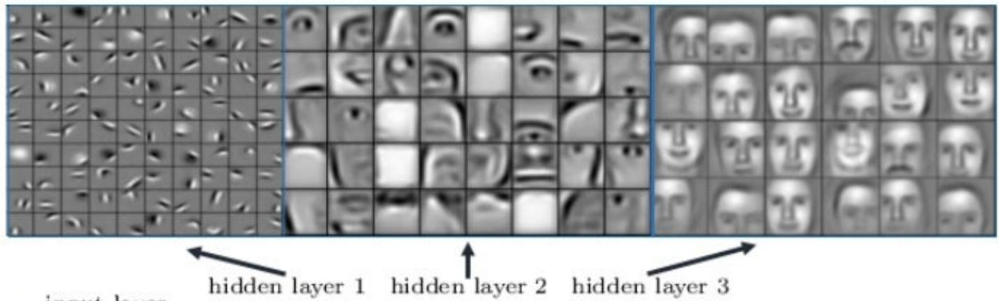

> **AI Description:**
> **Source:** `assets/_page_29_Figure_0.jpg`
> 
> **Generated:** 2026-05-31 07:54:38
> 
> ---
> 
> The image is a diagram illustrating the process of feature extraction in a neural network, specifically a convolutional neural network (CNN). It shows the progression of feature maps from the input layer through three hidden layers. The input layer contains a grid of small, abstract features. As the features move through the hidden layers, they become more complex and recognizable, culminating in images of faces in the final hidden layer. The arrows and labels indicate the flow of information from the input to the output, highlighting the hierarchical nature of feature learning in neural networks.


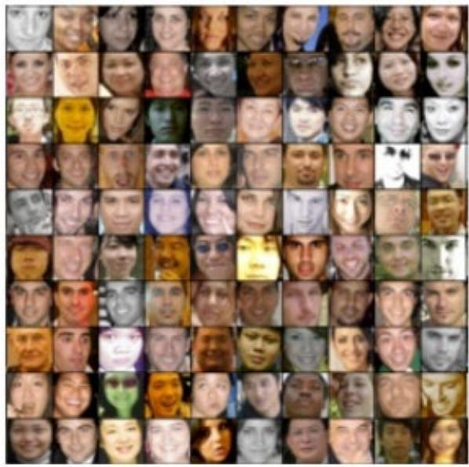

> **AI Description:**
> **Source:** `assets/_page_29_Figure_1.jpg`
> 
> **Generated:** 2026-05-31 07:55:25
> 
> ---
> 
> The image contains a grid of 100 photographs of faces. Each photograph appears to be a different individual, showcasing a variety of expressions, ages, and ethnicities. The faces are arranged in a 10x10 grid, with each photo being square-shaped and evenly spaced. The images are diverse in terms of lighting, background, and pose, providing a broad representation of human facial diversity.


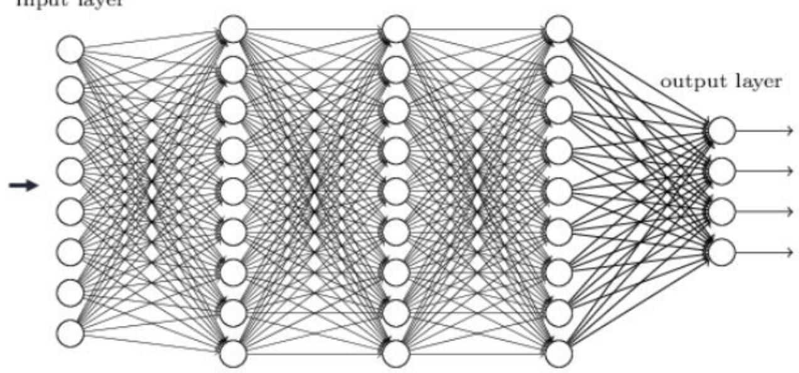

> **AI Description:**
> **Source:** `assets/_page_29_Figure_2.jpg`
> 
> **Generated:** 2026-05-31 08:02:20
> 
> ---
> 
> The image is a technical illustration of a neural network architecture. It consists of an input layer on the left, a series of hidden layers in the middle, and an output layer on the right. The layers are connected by numerous lines representing the connections between neurons, indicating the flow of information through the network. The labels "input layer" and "output layer" are clearly marked at the top and bottom of the diagram, respectively. The diagram visually represents the structure of a deep neural network, which is commonly used in machine learning and artificial intelligence applications.


<span id="page-30-0"></span>
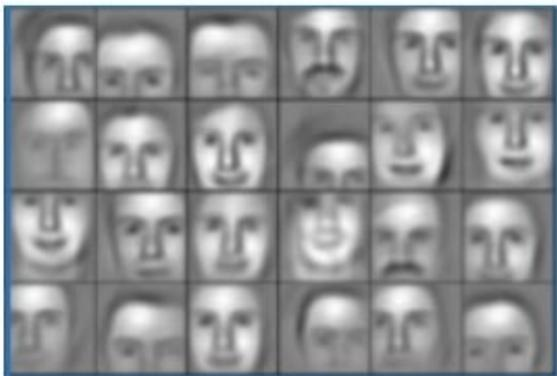

> **AI Description:**
> **Source:** `assets/_page_30_Figure_0.jpg`
> 
> **Generated:** 2026-05-31 07:46:26
> 
> ---
> 
> The image contains a grid of 25 grayscale facial images arranged in a 5x5 format. The faces appear to be manipulated or distorted, possibly as part of a study or experiment in facial recognition or image processing. The images are uniform in size and are evenly spaced, suggesting a systematic approach to the presentation of the data.


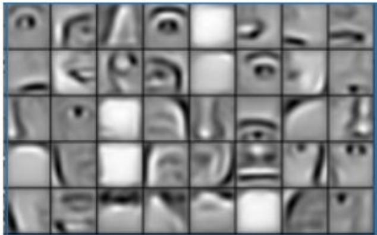

> **AI Description:**
> **Source:** `assets/_page_30_Figure_1.jpg`
> 
> **Generated:** 2026-05-31 07:36:31
> 
> ---
> 
> The image contains a grid of 25 grayscale images, each resembling a close-up view of a human face. The images appear to be part of a dataset or a visual representation of facial features, possibly used for machine learning or computer vision applications. The images are arranged in a 5x5 grid, and each image is distinct, suggesting a variety of facial expressions or variations in facial features.


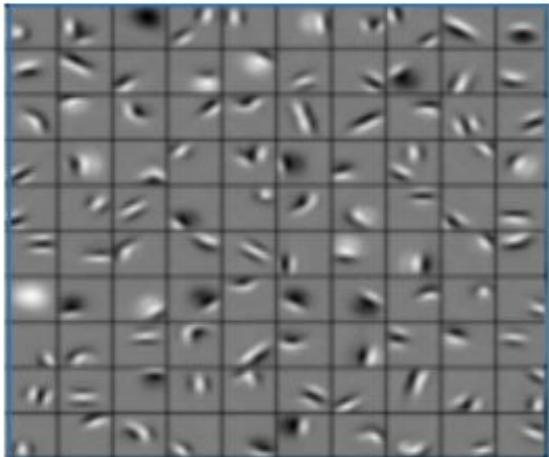

> **AI Description:**
> **Source:** `assets/_page_30_Figure_2.jpg`
> 
> **Generated:** 2026-05-31 07:30:15
> 
> ---
> 
> The image contains a grid of small, grayscale images arranged in a 10x10 matrix. Each cell in the grid displays a different pattern or texture, which appears to be a representation of various shapes and orientations. The patterns vary in size, shape, and contrast, suggesting they could be used for image recognition or classification tasks. There are no labels or text annotations within the image itself.


<span id="page-31-0"></span>
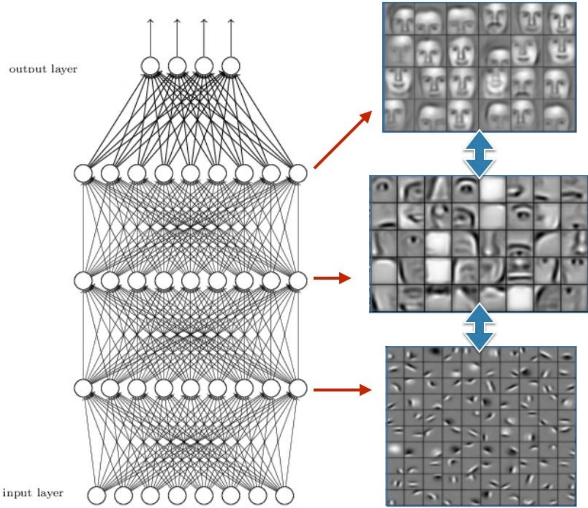

> **AI Description:**
> **Source:** `assets/_page_31_Figure_0.jpg`
> 
> **Generated:** 2026-05-31 07:24:16
> 
> ---
> 
> The image is a technical illustration of a neural network architecture. It shows a multi-layer perceptron with an input layer, hidden layers, and an output layer. The input layer is at the bottom, followed by several hidden layers with varying numbers of nodes, and the output layer at the top. Arrows indicate the flow of data from the input layer through the hidden layers to the output layer. On the right side of the image, there are three grids of images. The top grid shows facial images, the middle grid shows abstract patterns, and the bottom grid shows more abstract, pixelated patterns. These grids likely represent the activation maps or feature maps produced by the neural network at different layers.


<span id="page-32-0"></span>
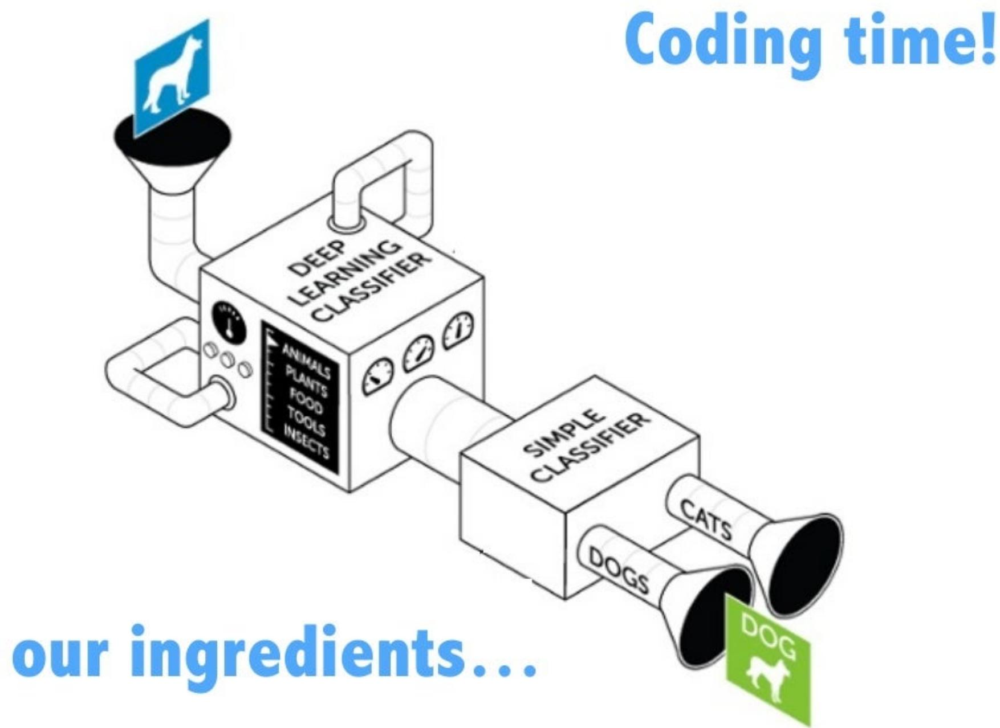

> **AI Description:**
> **Source:** `assets/_page_32_Figure_0.jpg`
> 
> **Generated:** 2026-05-31 08:46:14
> 
> ---
> 
> The image is a diagram illustrating a deep learning classifier system. It shows a funnel-shaped input leading into a box labeled "DEEP LEARNING CLASSIFIER," which has a list of categories on its side: ANIMALS, PLANTS, FOOD, TOOLS, and INSECTS. The output from this classifier is directed into a simpler box labeled "SIMPLE CLASSIFIER," which then branches into two categories: "DOGS" and "CATS." The diagram is accompanied by text at the top saying "Coding time!" and at the bottom "our ingredients...". The image uses simple line drawings and text to convey the concept of a machine learning classification process.

(picture by Dato)

<span id="page-33-0"></span>
# Kaggle's Cat vs Dog dataset (25k dog/cat pictures)

(picture by Dato)

<span id="page-34-0"></span>
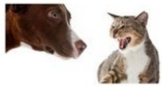

> **AI Description:**
> **Source:** `assets/_page_34_Figure_0.jpg`
> 
> **Generated:** 2026-05-31 09:00:06
> 
> ---
> 
> The image contains two distinct animals: a dog on the left and a cat on the right. The dog appears to be a pit bull mix, and the cat is a tabby. The cat is in a relaxed, yawning position, while the dog is looking at the cat. The background is plain white, which makes the animals stand out clearly. There are no charts, graphs, or text annotations present in the image.


Dashboard

Competition Details》Getthe Data 》Makea submission

Home

Data

Makeasubmission

Information

Description Evaluation Rules   
Prizes   
Winners

Forum

Leaderboard Public Private

Visualization

MyTeam GitHub

My Submissions

# Createan algorithm to distinguish dogs from cats

Inthiscompetition,you'llwriteanalgorithmtoclassifywhetherimagescontain eithera dog oracat.This iseasy for humans,dogs,and cats.Your computer willfind ita bit more difficult.

Leaderboard


Data Files

FileName

1.Pierre Sermanet

2.orchid

3.Owen

4.Paul Covington

Deep Blue beat Watson beat the brighte Can you tellFi

Available Formats

sampleSubmission

test1

train

csv (86.82kb)

zip (271.15mb)

zip(543.16mb)

https://www.kaggle.com/c/dogs-vs-cats/data

hm on

<span id="page-35-0"></span>
## Pretrained Convolutional Neural Net (CNN)

<span id="page-36-0"></span>
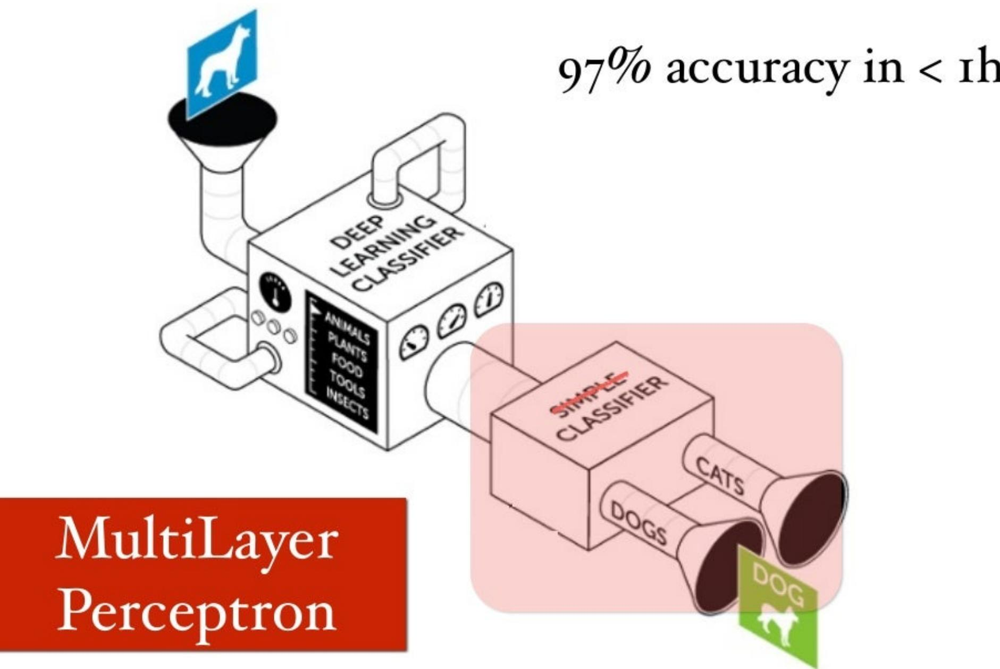

> **AI Description:**
> **Source:** `assets/_page_36_Figure_0.jpg`
> 
> **Generated:** 2026-05-31 07:18:46
> 
> ---
> 
> The image contains a diagram illustrating a MultiLayer Perceptron (MLP) in the context of a deep learning classifier. The diagram shows a deep learning classifier with various inputs such as animals, plants, food, tools, and insects. The classifier is connected to a simple classifier that categorizes animals into cats and dogs. The image also includes a label indicating "97% accuracy in < 1h," suggesting the efficiency and accuracy of the MLP in classifying images. The visual elements effectively convey the concept of a neural network and its application in image classification.


(picture by Dato)

<span id="page-37-0"></span>
## Cooking Instructions

1 Load Pretrained Net

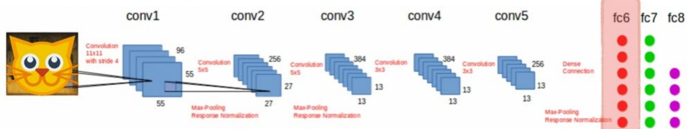

> **AI Description:**
> **Source:** `assets/_page_37_Figure_0.jpg`
> 
> **Generated:** 2026-05-31 07:48:34
> 
> ---
> 
> The image is a diagram of a convolutional neural network (CNN) architecture, specifically the VGG16 model. It illustrates the flow of data through the network, starting from the input image of a cartoon cat and progressing through multiple convolutional layers (conv1 to conv5) and fully connected layers (fc6 to fc8). Key features include convolution operations with specified kernel sizes and strides, max-pooling layers, and response normalization. The diagram also shows the dimensions of the feature maps at each layer, such as 96, 256, 384, and 256 feature maps at conv1, conv2, conv3, and conv4, respectively. The final layers (fc6 to fc8) are fully connected layers, with fc6 and fc7 having 4096 and 2048 units, respectively, and fc8 having 1000 units, likely representing the output for classification tasks.


2 Extract features for all training images

image

features

$$
\left( \begin{array} { c c c c } { { a _ { 1 1 } } } & { { a _ { 1 2 } } } & { { a _ { 1 3 } } } & { { \cdots } } \\ { { a _ { 2 1 } } } & { { a _ { 2 2 } } } & { { a _ { 2 3 } } } & { { \cdots } } \\ { { a _ { 3 1 } } } & { { a _ { 3 2 } } } & { { a _ { 3 3 } } } & { { \cdots } } \\ { { \vdots } } & { { \vdots } } & { { \vdots } } & { { \ddots } } \end{array} \right)
$$

3. train MLP on those features

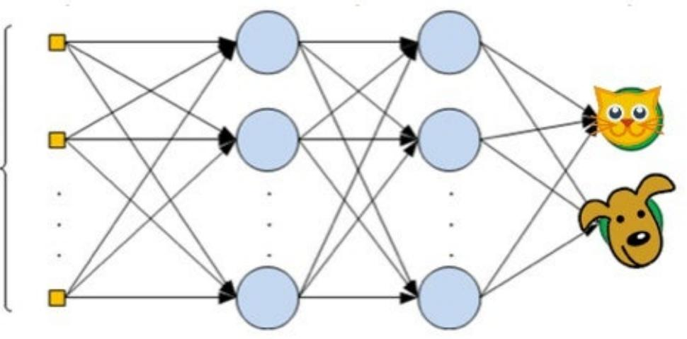

> **AI Description:**
> **Source:** `assets/_page_37_Figure_1.jpg`
> 
> **Generated:** 2026-05-31 07:33:59
> 
> ---
> 
> The image is a diagram of a neural network. It shows a series of interconnected nodes, with some nodes labeled as input nodes (yellow squares) and others as hidden nodes (light blue circles). The arrows indicate the flow of information or connections between these nodes. On the far right, there are two images of animals (a cat and a dog), which may represent the output or target classes for the network. The diagram illustrates the structure of a multi-layer perceptron, a type of feedforward artificial neural network.


<span id="page-38-0"></span>
## 1 Load Pretrained Net

## Cooking Instructions

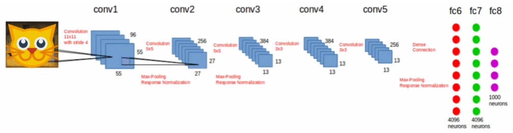

> **AI Description:**
> **Source:** `assets/_page_38_Figure_0.jpg`
> 
> **Generated:** 2026-05-31 08:30:58
> 
> ---
> 
> The image is a detailed diagram of a convolutional neural network (CNN) architecture, specifically the VGG-16 model. It illustrates the flow of data through the network, showing the number of neurons and the dimensions of the feature maps at each convolutional layer (conv1 to conv5) and fully connected layers (fc6 to fc8). The diagram includes convolutional layers with specific kernel sizes and strides, as well as max-pooling and response normalization operations. The network architecture is designed for image classification tasks, as indicated by the input image of a cat. The diagram provides a clear representation of the network's structure and the processing steps involved in feature extraction and classification.


<span id="page-39-0"></span>
## No Free Lunch...But Free Models!


BVLC/caffe

Watch-625

Unstar

3,481

YFork

2,037

## Model Zoo

LiweiWang edited this page3daysago·18revisions

Trained modelsareposted hereas links to Github Gists.Check out themodel zoo documentation fordetails.

Toacquire a model:

1.download themodel gist by./scripts/download\_model\_from\_gist.sh <gist\_id> <dirname>to load themodel metadata,architecture,solver configuration,and soon. (<dirname>isoptional and defaultstocaffe/models).

2.download themodel weights by./scripts/download\_model\_binary.py <model\_dir> where<model\_dir>is thegistdirectory fromthefirst step.

## Berkeley-trained models

·Finetuning on FlickrStyle:sameasprovidedin models/,butlisted hereasaGist for anexample.

·BVLCGoogleNet

Edit

New Page

## Network in Networkmodel

## Pages

Home

Caffe on EC2 Ubuntu 14.04 Cuda

Development

Installation

Installation (OSx)

Model Zoo

Modelsaccuracy on ImageNet 2012val

Publications

Related Projects

Ubuntu14.04 ec2instance

Ubuntu14.04VirtualBoxVM

Clone this wiki locally

https://github.com/BVLC/caffe/wiki/Model-Zoo

<span id="page-40-0"></span>
## /scripts/download\_model\_binary.py../models/bvlc\_reference\_caffenet

## Cjupyter

Files

Running

Clusters

Toimportanotebook,drag thefileonto thelisting beloworclick

bvlc\_reference\_caffenet.caffemodel

deploy.prototxt

readme.md

## Jupytersolver.prototxt03//2015

三Menu

current mode

```
```csv
net：
"models/bvlc_reference_caffenet/train_val.prototx
t”
test_iter:1000
test_interval:1000
base_lr:0.01
lr_policy:"step"
gamma:0.1
stepsize:100000
B display:20
9 max_iter:450000
10 momentum:0.9
11 weight_decay:0.0005
12 snapshot:10000
13 snapshot_prefix:
"models/bvlc_reference_caffenet/caffenet_train"
14 solver_mode:GPU
15
```
```

## Jupyterdeploy.prototxt/015

```
File Edit View Language   
1 name:"CaffeNet"   
2input:"data"   
3 input\_dim:10   
4 input\_dim:3   
5 input\_dim:227   
6 input\_dim:227   
7 layer   
8 name:"convl"   
9 type:"Convolution"   
10 bottom:"data"   
11 top:"conv1"   
12 convolution\_param{   
13 num\_output:96   
14 kernel\_size:11   
15 stride:4   
16   
17 }   
18 iayer{   
19 name:"relul"   
20 type:"ReLU"   
21 bottom:"convl"   
22 top:"convl"   
23 }   
24 iayer{   
25 name:"pooll"   
26 type:"Pooling"   
27 bottom:"conv1"   
28 top:"pooll"   
29 pooling\_param{   
30 pool:MAX   
31 kernel\_size:3   
32 stride:2   
33 1
```

<span id="page-41-0"></span>
## #imports

<span id="page-42-0"></span>
## # load pretrained deep neural net

1 MODEL\_FILE='../models/bvlc\_reference\_caffenet/deploy.prototxt' 2 PRETRAINED='../models/bvlc\_reference\_caffenet/bvlc\_reference\_caffenet. caffemodel' 3 4 defpng\_to\_np(basedir,fetch\_target=False): 5 logging.getLogger().setLevel(logging.INFO) 6 caffe.set\_mode\_gpu() net=caffe.Classifier(MODEL\_FILE,PRETRAINED, 8 mean=np.load(caffe\_root+'python/caffe/imagenet/ ilsvrc\_2012\_mean.npy').mean(1).mean(1), 9 channel\_swap=(2,1,0）, 10 raw\_scale=255, 11 image\_dims=(256,256))

(convnet from Krizhevsky et al.'s NIPS o12 ImageNet clasification paper)
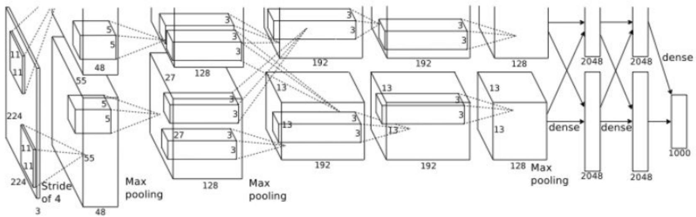

> **AI Description:**
> **Source:** `assets/_page_42_Figure_0.jpg`
> 
> **Generated:** 2026-05-31 08:50:25
> 
> ---
> 
> The image is a technical diagram illustrating the architecture of a convolutional neural network (CNN). It depicts the flow of data through various layers of the network, including convolutional layers, max pooling layers, and fully connected layers. The diagram shows the dimensions of the input and output tensors at each stage, with convolutional layers having kernel sizes and strides specified. The network architecture includes multiple convolutional layers with different filter sizes and strides, followed by max pooling layers to reduce the spatial dimensions. The final layers are fully connected layers with dense connections, leading to an output layer with 1000 units, likely representing the number of classes in a classification task.


<span id="page-43-0"></span>
## 1 Load Pretrained Net

## Cooking Instructions

<span id="page-44-0"></span>
#feed image into tbe network and return internal feature representation of layer fc6 de

demo

1 def activate(net,im):   
23 input\_image=caffe.io.load\_image(im) #Resize the image to the standard (256,256) and oversample net input sized crops. 4 input\_oversampled=caffe.io.oversample([caffe.io.resize\_image(input\_image ,net.image\_dims)],net.crop\_dims) 5 #'data' is the input blob name in the model definition,so we preprocess for that input. 6 caffe\_input=np.asarray([net.transformer.preprocess('data',in\_)forin\_ ininput\_oversampled]) 7 #forward() takes keyword args for the input blobs with preprocessed input arrays.   
8 predicted=net.forward(data=caffe\_input)   
9 #Activation of all convolutional layers and first fully connected   
10 feat=net.blobs['fc6'].data[0]   
11 return feat

<span id="page-45-0"></span>
## #extract features from images

24returndata,target,files

<span id="page-46-0"></span>
## #dump features as pickle file

```
In[\*]:x，y，filenames=png\_to\_np(   
'/mnt/pet/train/',fetch\_target=True)   
pickle.dump(x,open('saved\_x\_v2.pkl','wb')）   
pickle.dump(y,open('saved\_y\_v2.pkl','wb')）   
pickle.dump(filenames,open('saved\_filenames\_v2.pkl','wb'))   
Reading in image 0   
Reading in image 1000   
Reading in image 2000   
Reading in image 3000   
Reading in image 4000   
Reading in image 5000   
Reading in image 6000   
Reading in image 7000   
Reading in image 8000   
（.）
```

<span id="page-47-0"></span>
## Cooking Instructions

1 Load Pretrained Net

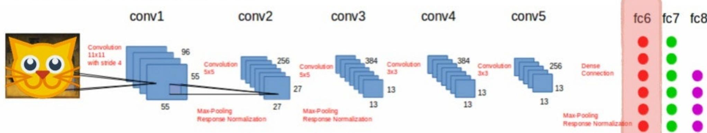

> **AI Description:**
> **Source:** `assets/_page_47_Figure_0.jpg`
> 
> **Generated:** 2026-05-31 07:07:50
> 
> ---
> 
> The image is a diagram of a convolutional neural network (CNN) architecture, specifically the VGG16 model. It illustrates the flow of data through the network, showing the convolutional layers (conv1 to conv5) and fully connected layers (fc6 to fc8). The diagram includes convolution operations with specified kernel sizes and strides, as well as max-pooling and response normalization layers. The network processes an input image, which is shown on the left side of the diagram, and outputs a classification result represented by the colored circles on the right side. The network architecture is designed for image classification tasks, and the diagram provides a clear visual representation of the computational steps involved.


2 Extract features for all training images

image

features

$$
\left( \begin{array} { c c c c } { { a _ { 1 1 } } } & { { a _ { 1 2 } } } & { { a _ { 1 3 } } } & { { \cdots } } \\ { { a _ { 2 1 } } } & { { a _ { 2 2 } } } & { { a _ { 2 3 } } } & { { \cdots } } \\ { { a _ { 3 1 } } } & { { a _ { 3 2 } } } & { { a _ { 3 3 } } } & { { \cdots } } \\ { { \vdots } } & { { \vdots } } & { { \vdots } } & { { \ddots } } \end{array} \right)
$$

3. train MLP on those features

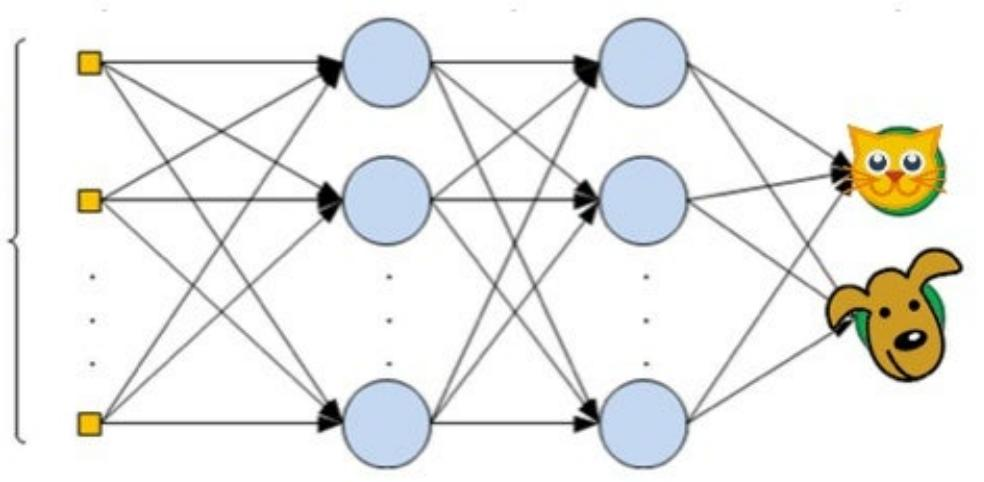

> **AI Description:**
> **Source:** `assets/_page_47_Figure_1.jpg`
> 
> **Generated:** 2026-05-31 07:09:11
> 
> ---
> 
> The image is a diagram of a neural network. It shows a series of interconnected nodes, representing layers of a neural network. The input layer is represented by the yellow squares at the bottom, which feed into the first hidden layer of blue circles. These blue circles are connected to the second hidden layer, which is also represented by blue circles. The connections between the layers are indicated by black arrows, showing the flow of information. On the right side of the diagram, there are two images of animals, a cat and a dog, which likely represent the output layer of the network. The diagram illustrates the structure of a multi-layer perceptron, a type of neural network commonly used in machine learning for tasks such as image classification.


<span id="page-48-0"></span>
# Pylearn2: Multilayer Perceptron (MLP) on top of extracted features

#imports

demo

1 from·pylearn2.modelsimport·mlp   
2from pylearn2.costs.mlp.dropoutimportDropout   
3 frompylearn2.training\_algorithms import sgd,learning\_rule   
4from pylearn2.termination\_criteria import EpochCounter   
5frompylearn2.datasetsimport DenseDesignMatrix   
6from pylearn2.train import Train   
7frompylearn2.train\_extensions importbest\_params   
8 from pylearn2.space import VectorSpace   
9

10import pickle

11import numpyasnp

<span id="page-49-0"></span>
#load earlier extracted features and labels #convert to input that pylearn understands

demo

2y=pickle.load(open('saved\_y\_v2.pkl'，'rb'))

6full =DenseDesignMatrix(X=x,y=y)

<span id="page-50-0"></span>
#create   
layers of   
MLP   
#with   
softmax   
as final layer

#trainer initialized with SGD, momentum, dropout

<span id="page-51-0"></span>
## # train/test splits

1 #no sklearn.cross\_validation > train\_test\_split   
2 # own test/train split so we can also link filenames   
3 splitter= round(len(x)\*0.8)   
4X\_train,X\_test=x[:splitter],x[splitter:]   
5 y\_train,y\_test=y[:splitter],y[splitter:]   
6filenames\_train,filenames\_test=filenames[:splitter],filenames[splitter:]   
7   
8pickle.dump(X\_train,open('saved\_feat\_x\_train\_v2.pkl','wb'))   
9 pickle.dump(X\_test,open('saved\_feat\_X\_test\_v2.pkl','wb'))   
10pickle.dump(y\_train,open('saved\_feat\_y\_train\_v2.pkl','wb'))   
11pickle.dump(y\_test,open('saved\_feat\_y\_test\_v2.pkl','wb'))   
12pickle.dump(filenames\_train,open('saved\_feat\_filenames\_train\_v2.pkl','wb'))   
13pickle.dump(filenames\_test,open('saved\_feat\_filenames\_test\_v2.pkl','wb'))

<span id="page-52-0"></span>
## #start our MLP (pylearn experiment method)

```
```python
1 #liftoff!
2 trn =DenseDesignMatrix(X=X_train,y=y_train)
3tst=DenseDesignMatrix（X=X_test,y=y_test)
4trainer.monitoring_dataset={'valid':tst,
5 'train':trn}
6experiment.main_loop()
```
```

```
In[\*]：trn= DenseDesignMatrix(X=X\_train,y=y\_train)   
tst=DenseDesignMatrix(X=x\_test，y=y\_test）   
trainer.monitoring\_dataset=t'valid':tst,   
'train':trn)   
experiment.main\_loop()   
Parameter and initial learning rate summary：   
11\_W:9.99999974738e-05   
11\_b:9.99999974738e-05   
12\_W:9.99999974738e-05   
12\_b:9.99999974738e-05   
13\_W:9.99999974738e-05   
13\_b:9.99999974738e-05   
softmax\_b:9.99999974738e-05   
softmax\_W:9.99999974738e-05   
Compiling sgd\_update...   
Compiling sgd\_update done.Time elapsed:1.686666 seconds   
compiling begin\_record\_entry...   
compiling begin\_record entry done.Time elapsed:0.548132 seconds   
Monitored channels:   
learning\_rate   
momentum   
total\_seconds\_last\_epoch
```

（.）

already after 5 min: valid\_y\_misclass: 0.061999989867

<span id="page-53-0"></span>

### Full Page Description (Page 53)

**Source:** `assets/_page_53_Asset_0.jpg`

**Generated:** 2026-05-31 08:24:06

---

The image contains a line graph with the title "accuracy" at the top. The x-axis is labeled "1 hour" and ranges from 0 to 100, while the y-axis is labeled "accuracy" and ranges from 0.0 to 0.5. There are two lines on the graph, one in blue and one in green, representing different data series. The blue line starts at approximately 0.1 and decreases slightly over time, while the green line starts at around 0.3 and also decreases but more sharply than the blue line. The graph appears to be tracking the accuracy of a system or model over a period of time, with the blue line representing a lower initial accuracy that improves over time, and the green line representing a higher initial accuracy that also improves but more rapidly.

In [319]: plt.plot(score\_train[2:]) plt.plot(score\_test[2:1)

<span id="page-54-0"></span>

### Full Page Description (Page 54)

**Source:** `assets/_page_54_Asset_0.jpg`

**Generated:** 2026-05-31 08:12:44

---

The image contains a line graph with two lines representing accuracy over time. The x-axis is labeled "start at iteration #2" and ranges from 0 to 100, while the y-axis is labeled "accuracy" and ranges from 0.025 to 0.065. The graph shows two lines, one in blue and one in green, both decreasing over time, indicating a trend of improving accuracy. The text annotations "94%" and "97%" are placed on the left side of the graph, suggesting these are the initial and final accuracy values, respectively. The graph appears to be part of a larger context, possibly related to machine learning or optimization processes.

In [319]: plt.plot(score\_train[2:]) plt.plot(score\_test[2:])

<span id="page-55-0"></span>
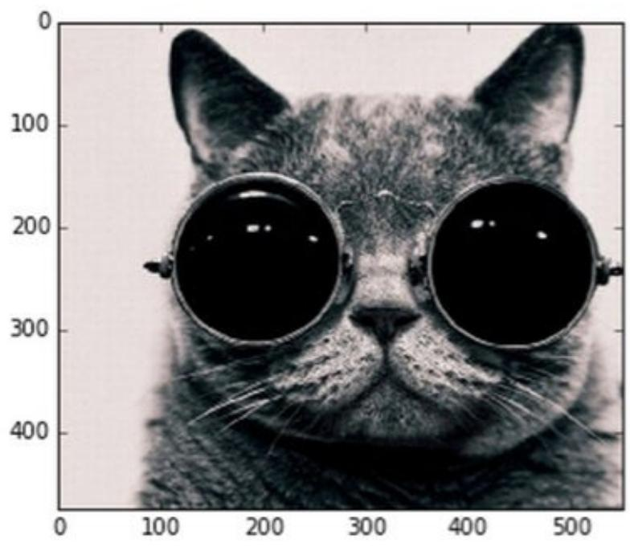

> **AI Description:**
> **Source:** `assets/_page_55_Figure_0.jpg`
> 
> **Generated:** 2026-05-31 07:11:53
> 
> ---
> 
> The image is a photograph of a cat wearing large, round sunglasses. The cat is the central focus of the image, and the sunglasses obscure most of its eyes. The image is in grayscale, and the cat appears to be looking directly at the camera. The background is plain and does not contain any additional visual information.


```
In[380]:input\_image=caffe.io.load\_image('google-glasses-cat-2.jpg')   
plt.imshow(input\_image)   
Out[380]:<matplotlib.image.AxesImageat 0x7f51a017d410>   
0   
100   
200   
300   
400   
0 100 200 300 400 500   
In[381]:feat = getfeat\_single\_image('google-glasses-cat-2.jpg') #run image through cnn   
x=feat   
Y=f([x]) #run feature through DBn >out:prediction   
ify:   
print "WOOF!"   
else:   
print "MEOW!"   
MEOW！
```

<span id="page-56-0"></span>
## So are YoU more like a Dog or Cat?

## CAT VS DOG DETECTOR

<span id="page-57-0"></span>
What about me?

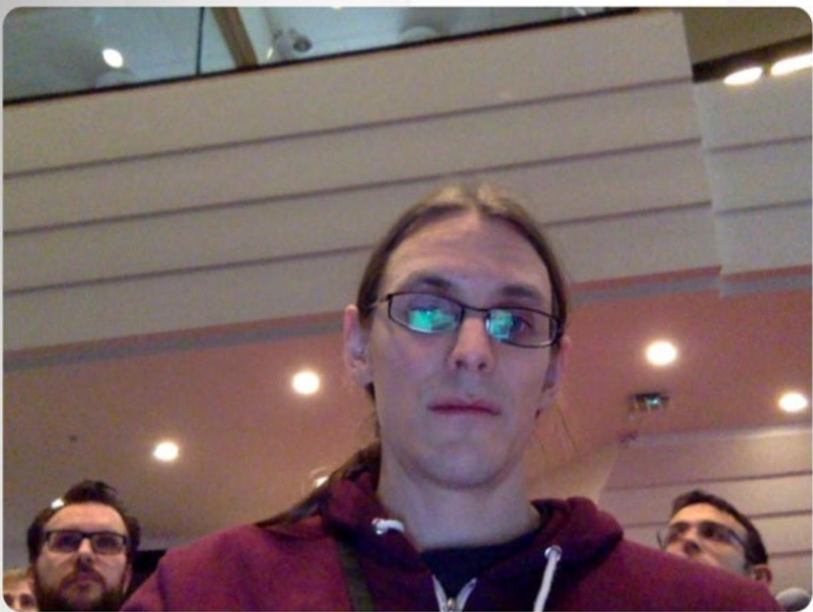

> **AI Description:**
> **Source:** `assets/_page_57_Figure_0.jpg`
> 
> **Generated:** 2026-05-31 08:56:20
> 
> ---
> 
> The image contains a photograph of a person wearing glasses and a maroon hoodie. The background shows a ceiling with recessed lighting and a partial view of other individuals, suggesting the setting might be a public or indoor space. There are no charts, graphs, or other visual elements present in the image.

Requiresawebcamandamodern browser with WebRTC support suchasFirefoxorChrome.Bui

# (I might put it up as a Flask site online, if people are interested?)

<span id="page-58-0"></span>
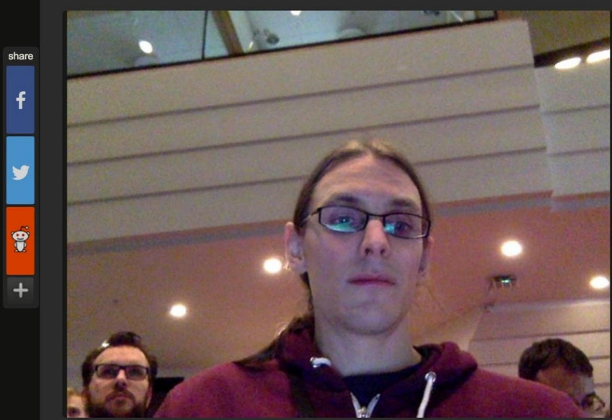

> **AI Description:**
> **Source:** `assets/_page_58_Figure_0.jpg`
> 
> **Generated:** 2026-05-31 08:00:45
> 
> ---
> 
> The image contains a photograph of a person wearing glasses and a maroon jacket. The background appears to be an indoor setting with a curved ceiling and some ceiling lights. There are other individuals partially visible in the background. The image also includes a "share" button with icons for Facebook, Twitter, and Reddit, suggesting it might be from a social media platform or a website.


2secondsago·Oviews·stats

<span id="page-59-0"></span>
```
In[391]： lwgethttp://i.imgur.com/oMJyDoo.jpg   
--2015-05-1212:12:00--http://i.imgur.com/oMJyDo0.jpg   
Resolvingi.imgur.com（i.imgur.com)...199.27.76.193   
Connecting toi.imgur.com(i.imgur.com）|199.27.76.193|:80...connected.   
HTTP request sent,awaiting response...200 OK   
Length:58456（57K）[image/jpeg]   
Saving to:‘oMJyDoo.jpg   
100%[= ==>]58,456 --.-K/s in0.02s   
2015-05-12 12:12:00(2.97 MB/s）-‘oMJyD00.jpg'saved [58456/58456]
```

```
```python
In[393]： input_image = caffe.io.load_image('oMJyDoo.jpg')
plt.imshow(input_image)
```
```

Out[393]:<matplotlib.image.AxesImage at 0x7f5laefe5e50>

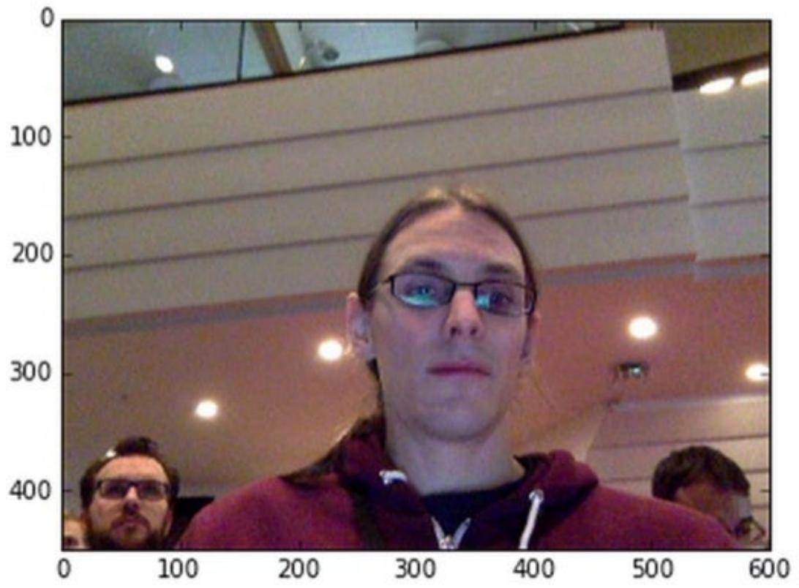

> **AI Description:**
> **Source:** `assets/_page_59_Figure_0.jpg`
> 
> **Generated:** 2026-05-31 07:53:17
> 
> ---
> 
> The image contains a photograph of a person in the foreground, with a background that includes another individual and a staircase. The image also features a coordinate grid overlay on the photograph, with axes labeled from 0 to 600 on the x-axis and 0 to 400 on the y-axis. The grid lines are faint and do not appear to represent any specific data or measurement. The primary focus of the image is the photograph of the person, with the coordinate grid serving as a visual element rather than presenting any meaningful data.


<span id="page-60-0"></span>
```
In[395]： feat = getfeat\_single\_image('rQ4bkra.jpg') #run image   
x=feat   
γ = f([x]) #run feature through Dbn > out: prediction   
if y:   
print "WOOF I'm a Dog!"   
else:   
print "MEOW I'm a Cat!"
```

WOOF I'ma Dog！

<span id="page-61-0"></span>
```
In[395]: feat = getfeat\_single\_image('rQ4bKra.jpg') #run image t   
x=feat   
γ = f([x]) #run feature through DBN > out: prediction   
if y:   
print "WOOF I'm a Dog!"   
else:   
print "MEOW I'm a Cat!"
```

WOOF I'ma Dog！

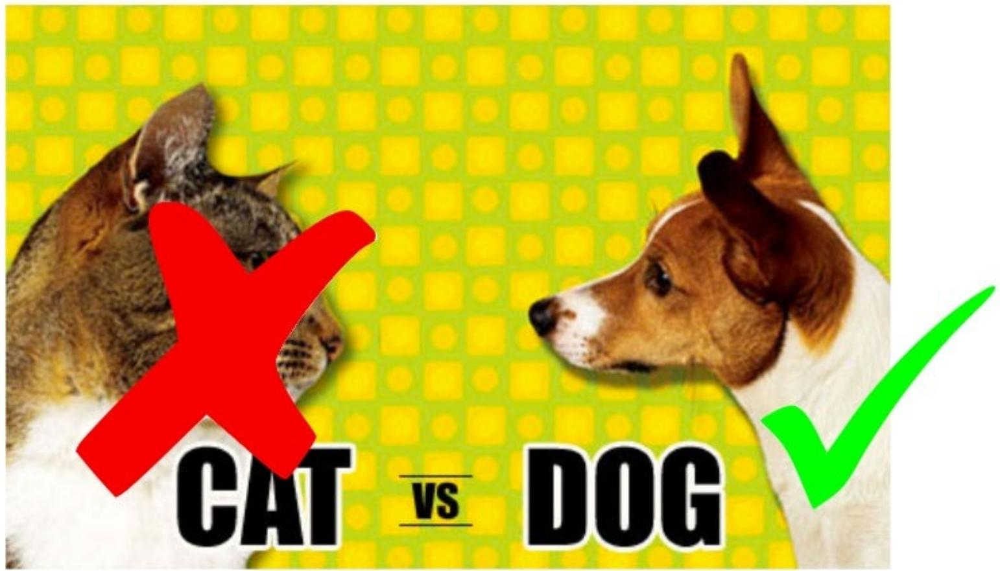

> **AI Description:**
> **Source:** `assets/_page_61_Figure_0.jpg`
> 
> **Generated:** 2026-05-31 08:59:33
> 
> ---
> 
> The image contains a comparison between a cat and a dog, represented by a photograph of a cat and a dog on a yellow background with a pattern of circles. The cat is marked with a red "X," indicating it is not the preferred option, while the dog is marked with a green checkmark, indicating it is the preferred option. The text "CAT vs DOG" is prominently displayed, emphasizing the comparison. The image uses simple visual elements to convey a preference for dogs over cats in this context.


<span id="page-62-0"></span>
## THATS ALL!

EASY PIEZY..

<span id="page-63-0"></span>
## In Touch!

## Academic/Research

asPhDcandidateKTH/CSC:   
"Always interested in discussing   
Machine Learning,Deep   
Architectures,Graphs,and   
LanguageTechnology"

ROYALINSTITUTE OFTECHNOLOGY

roelof@kth.se www.csc.kth.se/\~roelof/

## Data Science Consultancy

## Gve Systems Graph Technologies

roelof@graph-systems.com www.graph-technologies.com

<span id="page-64-0"></span>
## Stockholm Deep Learning Meetup

Home

Members

Sponsors

Photos

Pages

Discussions

More

Group tools


Myprofile

## Stockholm, Sweden

Founded Feb21,2015

About us...

Datamaniacs

295

Group reviews

PastMeetups 2

Our calendar


## Organizer:

Roelof

Pieters


We're about: Big Data Analytics Artificial Intelligence. Open Source·Software Development-New Technology·Big Data. Natural Language Processing·Machine Learning·Data

## Welcome!


## +SCHEDULEANEWMEETUP

Upcoming

Past

Calendar

April20-6:00PM

DeepLearningfor Bioinformatics


103Datamaniacs||40Photos

Agenda:·18:00-18:15Grabacoffee/beerand getreadyto rumble..·18:15-18:30Welcome·18:30-19:00RoelofPieters: DeepLearning,abirdseyeview·19:OO-..LEARNMORE

March10·6:00PM

Kickoff!Deep Learning:Revolutionor Hype in Data-Science？

144 Datamaniacs||35Photos

Deep Learningis kicking offeverywhere (seethis front page article inthe New York Timesforexample)!There isgood reason tobe excited about deep learning,as it's...LEARN MORE

## What'snew


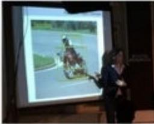

> **AI Description:**
> **Source:** `assets/_page_64_Figure_6.jpg`
> 
> **Generated:** 2026-05-31 07:43:28
> 
> ---
> 
> The image contains a photograph of a person standing in front of a projection screen. The projection screen displays a photograph of a person riding a motorcycle on a road. The person in front of the screen appears to be presenting or explaining something related to the image on the screen. The setting suggests a presentation or educational context.


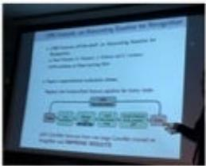

> **AI Description:**
> **Source:** `assets/_page_64_Figure_7.jpg`
> 
> **Generated:** 2026-05-31 07:44:11
> 
> ---
> 
> The image contains a slide from a presentation with a title and a flowchart. The title reads "CRITICAL: First determine if this image contains useful visual information beyond plain text." Below the title, there is a flowchart with steps and decision points related to "CRITICAL: First determine if this image contains useful visual information beyond plain text." The flowchart includes terms such as "CRITICAL," "Determine if this image contains useful visual information beyond plain text," and "YES/NO" decision points. The slide also includes a reference to "CRITICAL: First determine if this image contains useful visual information beyond plain text" at the bottom.


MORE

NEWMEMBER Stefan Avesand joined 4 daysago

NEWMEMBER MansMagnusson joined

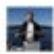

> **AI Description:**
> **Source:** `assets/_page_64_Figure_8.jpg`
> 
> **Generated:** 2026-05-31 08:40:53
> 
> ---
> 
> The image contains a photograph of a person standing on a boat. The individual appears to be wearing a life jacket and is positioned near the edge of the boat, with water visible in the background. The boat is equipped with a motor at the rear. The overall scene suggests a recreational or fishing activity on a body of water.


<span id="page-65-0"></span>
## Wanna Play ? General Deep Learning

· Theano - CPU/GPU symbolic expression compiler in python (from LISA lab at University of Montreal). http://deeplearning.net/software/theano/

·Pylearn2 - library designed to make machine learning research easy. http://deeplearning.net/software/ pylearn2/

·Torch -Matlab-like environment for state-of-the-art machine learning algorithms in lua (from Ronan Collobert,Clement Farabetand Koray Kavukcuoglu) http://torch.ch/

: more info: http://deeplearning.net/software links/

<span id="page-66-0"></span>
## Wanna Play ？ NLP

·RNNLM (Mikolov) http://rnlm.org

·NB-SVM https://github.com/mesnilgr/nbsvm

Word2Vec (skipgrams/cbow)   
https://code.google.com/p/word2vec/ (original)   
http://radimrehurek.com/gensim/models/word2vec.html (python)

·GloVe http://nlp.stanford.edu/projects/glove/(original) https://github.com/maciejkula/glove-python (python)

·Socher etal/Stanford RNN Sentiment code: http://nlp.stanford.edu/sentiment/code.html

·Deep Learning without Magic Tutorial: http://nlp.stanford.edu/courses/NAACL2013/

<span id="page-67-0"></span>
## Wanna Play ? Computer Vision

·cuda-convnet2 (AlexKrizhevsky, Toronto) (c++/ CUDA,optimized for GTX 580) https://code.google.com/p/cuda-convnet2/

·Caffe (Berkeley) (Cuda/OpenCL,Theano, Python) http://caffe.berkeleyvision.org/

·OverFeat (NYU) http://cilvr.nyu.edu/doku.php?id=code:start