<span id="page-0-0"></span>
## The Cellular Basis of Reproduction and Inheritance

## Chapter8

PowerPoint Lectures for Biology:Coets etisi Camell

<span id="page-1-0"></span>
# CONNECTIONS BETWEEN CELL DIVISION AND REPRODUCTION

<span id="page-2-0"></span>
## 8.1 Like begets like, more or less

## Living organisms reproduce by two methods

## Asexual reproduction

-Offspring are identical to the original cell or organism

-Involves inheritance ofall genes from one parent

## Sexual reproduction

-Offspringare similartoparents,but showvariations in traits

Involves inheritance of uniquesets of genes from two parents

<span id="page-3-0"></span>
## 8.3 Prokaryotes reproduce by binary fission

## Binary fission means "dividing in half"

-Occurs in prokaryotic cells

-Two identical cells arise from one cell

-Steps in the process:

A single circularchromosomeduplicates,and the copies begin to separatefromeach other

-The cell elongates,and the chromosomal copies separate further

The plasma membrane grows inward at the midpoint to divide the cells

<span id="page-4-0"></span>
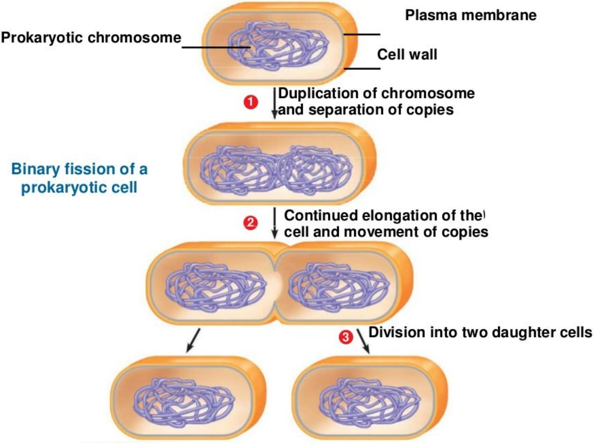

> **AI Description:**
> **Source:** `assets/_page_4_Figure_0.jpg`
> 
> **Generated:** 2026-05-31 13:49:57
> 
> ---
> 
> The image is a diagram illustrating the process of binary fission in a prokaryotic cell. It includes labeled parts of the cell such as the plasma membrane and cell wall, and stages of the division process. The diagram shows the duplication of the chromosome, the separation of copies, the continued elongation of the cell, and the division into two daughter cells. The visual elements effectively complement the textual information, making the process clear and easy to follow.

Copyright20o9 Pearson Education.Inc.

<span id="page-5-0"></span>
# THE EUKARYOTIC CELL CYCLE AND MITOSIS

<span id="page-6-0"></span>
## 8.4 The large, complex chromosomes of eukaryotes duplicate with each cell division

Eukaryotic chromosomes are composed of chromatin Chromatin=DNA +proteins

To prepare fordivision,the chromatin becomes highly compact,andthechromosomesarevisiblewitha microscope

Early in thedivision process,chromosomes duplicate

Eachchromosomeappearsastwo sisterchromatids, containing identical DNA molecules

Sister chromatidsare joined at the centromere,a narrow region

<span id="page-7-0"></span>
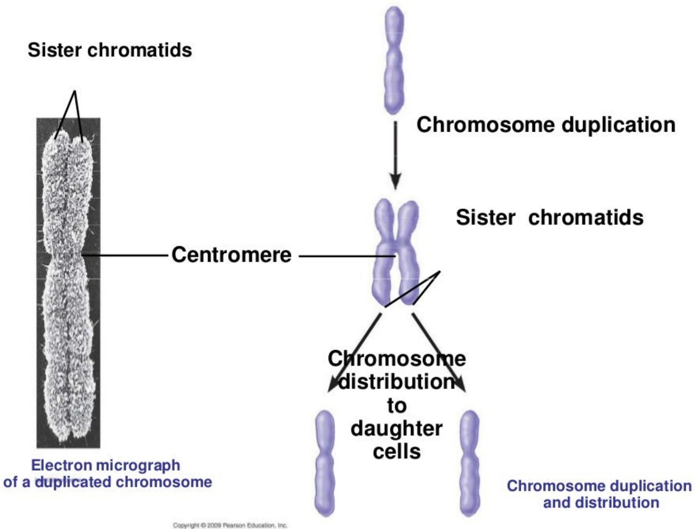

> **AI Description:**
> **Source:** `assets/_page_7_Figure_0.jpg`
> 
> **Generated:** 2026-05-31 10:31:00
> 
> ---
> 
> The image contains a diagram illustrating the process of chromosome duplication and distribution. It features a labeled electron micrograph of a duplicated chromosome, highlighting the centromere. The diagram shows the chromosome duplication process, leading to the formation of sister chromatids. These sister chromatids are then distributed to daughter cells, resulting in the duplication and distribution of chromosomes. The labels and arrows provide a clear visual representation of the stages involved in this biological process.


<span id="page-8-0"></span>
## 8.5 The cell cycle multiplies cells

The cellcycle isan ordered sequence of events for celdivision

It consists of two stages

Interphase:duplication of cell contents

G1:growth,increase incytoplasm

S:duplication of chromosomes

G2: growth,preparation fordivision

Mitotic phase:divisiMitosis:division of the nucleus Cytokinesis:division of cytoplasm

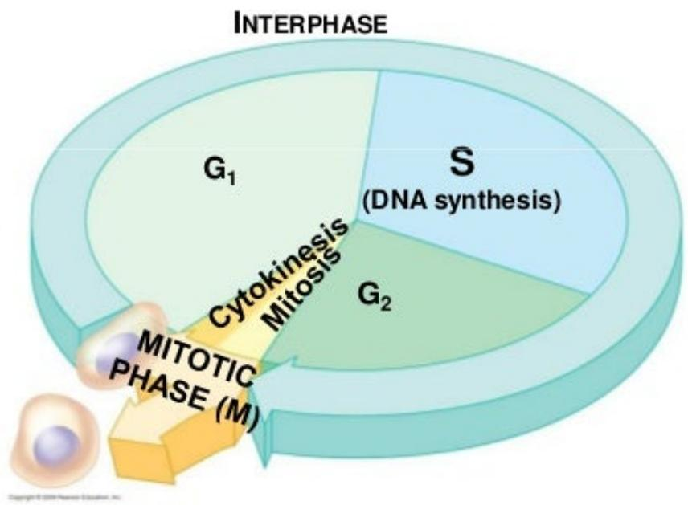

> **AI Description:**
> **Source:** `assets/_page_8_Figure_0.jpg`
> 
> **Generated:** 2026-05-31 13:36:39
> 
> ---
> 
> The image is a diagram illustrating the cell cycle, specifically the interphase and mitotic phase (M). It is a circular diagram divided into three main sections: G1, S (DNA synthesis), and G2. The diagram also includes the mitotic phase (M), which is further divided into cytokinesis and mitosis. The G1, S, and G2 phases are labeled with their respective functions, and the mitotic phase is highlighted with a yellow arrow indicating the direction of the cycle. The diagram is accompanied by small illustrations of cells in different stages of division.

Theeukaryotic cell cycle

<span id="page-9-0"></span>
## 8.6 Cell division is a continuum of dynamic changes

## Mitosis progresses through a series of stages

Prophase

Prometaphase

Metaphase

-Anaphase

Telophase

## Cytokinesis often overlaps telophase

<span id="page-10-0"></span>
## 8.6 Cell division is a continuum of dynamic changes

A mitotic spindle is required to divide the chromosomes

Themitotic spindle is composed of microtubules

\- It is produced by centrosomes, structures in the cytoplasm that:

\- Organize microtubule arrangement

-Contain a pair of centrioles in animal cells

Therole of centrioles in cell division is unclear

<span id="page-11-0"></span>
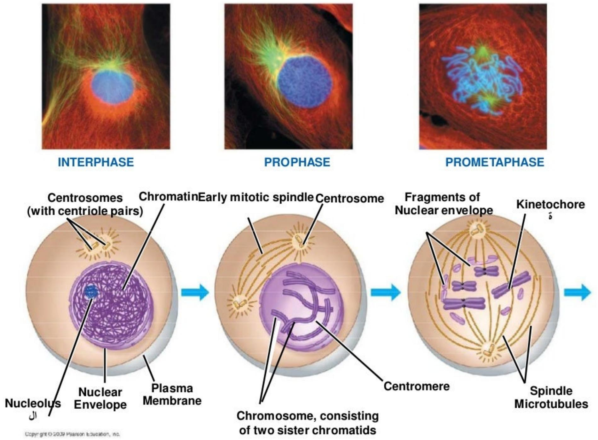

> **AI Description:**
> **Source:** `assets/_page_11_Figure_0.jpg`
> 
> **Generated:** 2026-05-31 13:41:13
> 
> ---
> 
> The image contains a series of diagrams illustrating the stages of mitosis in a cell. It includes three main stages: Interphase, Prophase, and Prometaphase. Each stage is accompanied by a microscopic image showing the progression of cellular structures. The diagrams highlight key components such as the centrosomes, chromatin, early mitotic spindle, nuclear envelope, and kinetochores. The text annotations provide detailed labels for each part of the cell, aiding in the understanding of the cellular processes involved in mitosis. The images are accompanied by a detailed explanation of the stages and components, making it a comprehensive visual guide to the mitotic process.


<span id="page-12-0"></span>
## 8.6 Cell division is a continuum of dynamic changes

## Interphase

## - In the cytoplasm

Cytoplasmic contents double

Two centrosomes form

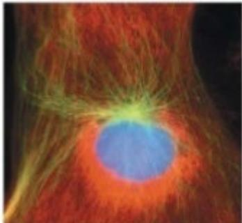

> **AI Description:**
> **Source:** `assets/_page_12_Figure_0.jpg`
> 
> **Generated:** 2026-05-31 09:48:33
> 
> ---
> 
> The image appears to be a microscopic view of a cell, likely a neuron, stained with fluorescent dyes. The cell body is highlighted in blue, and the surrounding area is stained with red and green fluorescent dyes, which are likely used to visualize different cellular structures or proteins. The red and green stains are distributed in a radial pattern, suggesting the presence of microtubules or other cellular components extending from the cell body. The image is a technical illustration, commonly used in neuroscience or cell biology research to study cellular structures and functions.


## - In the nucleus

Chromosomes duplicate during the S phase

Nucleoli,sites of ribosomeassembly,arevisible

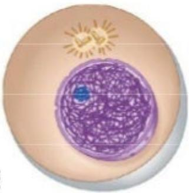

> **AI Description:**
> **Source:** `assets/_page_12_Figure_1.jpg`
> 
> **Generated:** 2026-05-31 09:49:13
> 
> ---
> 
> The image is a diagram of a cell, specifically a cross-section of a cell with a nucleus. The cell is depicted in a two-tone color scheme, with the outer layer in a light beige color and the inner layer in a darker purple color. The nucleus is located in the center of the cell and is shown with a blue dot, indicating the nucleolus. The diagram is labeled with a sun symbol at the top, which may represent the cell membrane or another feature of the cell.


<span id="page-13-0"></span>
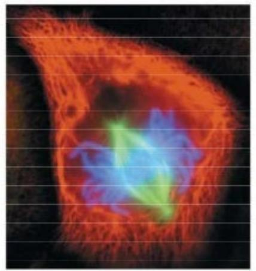

> **AI Description:**
> **Source:** `assets/_page_13_Figure_0.jpg`
> 
> **Generated:** 2026-05-31 10:16:32
> 
> ---
> 
> The image is a scientific illustration, likely a microscopic view of a biological structure. It features a central, bright blue and green region surrounded by a darker, reddish-orange outer layer. The central region appears to be a nucleus or a similar cellular component, while the surrounding layer could represent the cytoplasm or a membrane. The image is likely used to depict a cellular structure, possibly a cell in the process of division or differentiation. The colors are used to highlight different parts of the cell, with the blue-green possibly indicating DNA or RNA, and the red-orange indicating other cellular components or the cell membrane.


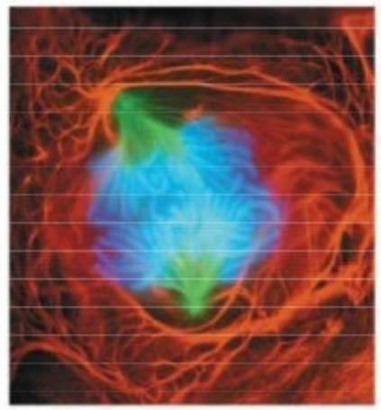

> **AI Description:**
> **Source:** `assets/_page_13_Figure_1.jpg`
> 
> **Generated:** 2026-05-31 10:02:41
> 
> ---
> 
> The image is a scientific illustration, likely representing a neural network or a similar complex system. It features a central blue and green region surrounded by a network of red lines, which could symbolize neural connections or pathways. The central region appears to be a focus of activity, with the surrounding network extending outward. The image is likely used to represent a concept in neuroscience or computational biology, highlighting the interconnectedness of neural structures.


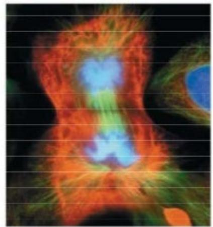

> **AI Description:**
> **Source:** `assets/_page_13_Figure_2.jpg`
> 
> **Generated:** 2026-05-31 10:19:53
> 
> ---
> 
> The image is a scientific illustration, likely a composite image of a biological or astronomical phenomenon. It features a central blue and white region surrounded by a vibrant, multi-colored, and textured outer layer. The colors range from red to green and yellow, suggesting a dynamic process or structure. The image appears to be a representation of a cell, a nebula, or a similar complex system, with the central region possibly indicating a nucleus or core. The surrounding colors and textures could represent various cellular components or the surrounding environment.

TELOPHASEANDCYTOKINESIS

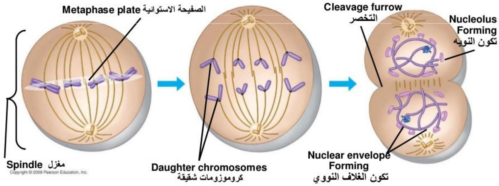

> **AI Description:**
> **Source:** `assets/_page_13_Figure_3.jpg`
> 
> **Generated:** 2026-05-31 10:34:46
> 
> ---
> 
> The image contains a series of diagrams illustrating the process of cell division, specifically mitosis. The diagrams show the metaphase plate, where chromosomes align, and the cleavage furrow, which divides the cell into two daughter cells. The text labels in both English and Arabic provide descriptions of the stages and components involved, such as the spindle, daughter chromosomes, and nuclear envelope formation. The visual elements effectively complement the textual information to illustrate the cellular division process.


<span id="page-14-0"></span>
## 8.7 Cytokinesis differs for plant and animal cells

## Cytokinesis cells

## Cleavage in animal

-Acleavage furrow forms froma contractingring of microfilaments, interactingwithmyosin

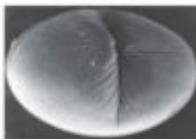

> **AI Description:**
> **Source:** `assets/_page_14_Figure_0.jpg`
> 
> **Generated:** 2026-05-31 10:17:12
> 
> ---
> 
> The image appears to be a microscopic view of a spherical object, possibly a biological cell or a microscopic particle. The object has a smooth, rounded surface with a slight indentation or division on one side, suggesting a possible division or asymmetry. The image is in grayscale, indicating it might be a scanning electron microscope (SEM) or transmission electron microscope (TEM) image. There are no visible labels or text annotations in the image.


-The cleavage furrow deepens to separate the contents into two cells

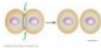

> **AI Description:**
> **Source:** `assets/_page_14_Figure_1.jpg`
> 
> **Generated:** 2026-05-31 10:02:01
> 
> ---
> 
> The image is a diagram illustrating a biological process, likely cell division or mitosis. It shows two cells in the process of dividing into three cells. The diagram includes a green arrow indicating the direction of the division process. The cells are depicted with a nucleus and cytoplasm, and the division is shown to be incomplete, with one cell splitting into two and the other remaining as a single cell. The image is simple and uses basic shapes and colors to represent the biological process.


## /tokinesis in plant cells

-Acell plate forms in themiddle from vesiclescontainingcell wall material

-The cellplate grows outward to reach the edges,dividing the contents into two cells

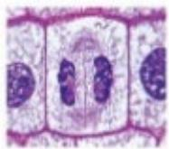

> **AI Description:**
> **Source:** `assets/_page_14_Figure_2.jpg`
> 
> **Generated:** 2026-05-31 10:18:56
> 
> ---
> 
> The image appears to be a microscopic view of plant cells, likely from a cross-section of a leaf or stem. The cells are rectangular with visible cell walls and central vacuoles. The nuclei are prominent within each cell, and the cell structures are well-defined, suggesting a healthy tissue sample. The image is useful for educational purposes in botany or plant biology.


Eachcell hasaplasmamembraneand cell wall

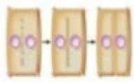

> **AI Description:**
> **Source:** `assets/_page_14_Figure_3.jpg`
> 
> **Generated:** 2026-05-31 10:40:49
> 
> ---
> 
> The image contains a sequence of three rectangular boxes, each containing a single pink circle. The boxes are arranged in a horizontal line, and there is a directional arrow pointing from the first box to the second, and from the second to the third. This suggests a step-by-step progression or a flow from one stage to another. The simplicity of the image implies it could be part of a flowchart or a diagram illustrating a process with three distinct stages.


<span id="page-15-0"></span>
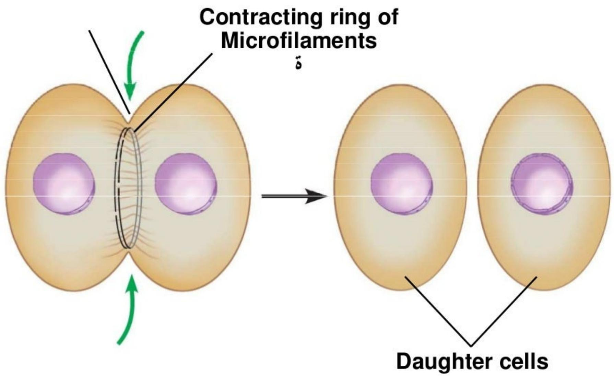

> **AI Description:**
> **Source:** `assets/_page_15_Figure_0.jpg`
> 
> **Generated:** 2026-05-31 09:43:23
> 
> ---
> 
> The image is a diagram illustrating the process of cell division, specifically cytokinesis. It shows a contracting ring of microfilaments at the center of a cell, which pinches the cell membrane inward. This action results in the formation of two daughter cells, each with its own nucleus. The diagram is labeled to highlight the contracting ring of microfilaments and the resulting daughter cells. The illustration is a technical illustration used to explain the cellular process.

Coprig209eaEucai

<span id="page-16-0"></span>
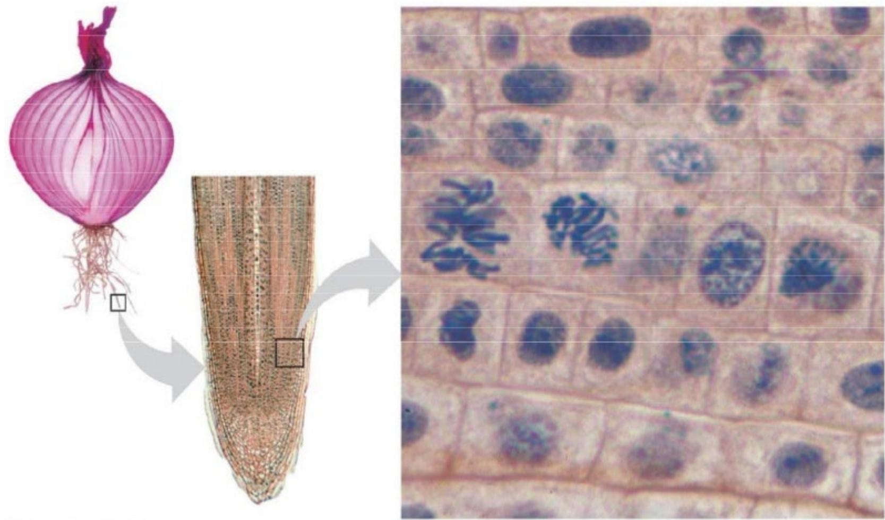

> **AI Description:**
> **Source:** `assets/_page_16_Figure_0.jpg`
> 
> **Generated:** 2026-05-31 13:39:10
> 
> ---
> 
> The image contains a sequence of visual elements related to plant biology. It begins with a diagram of an onion, highlighting a specific area with a square. This area is then magnified to show a detailed microscopic view of the onion's cells, focusing on the structure and arrangement of the cells. The image illustrates the progression from a whole plant to a close-up of its cellular structure, likely used for educational purposes in botany or plant cell biology.

Copyright  20o9 Pearson Education, Inc.
Growth (in an onion root)

<span id="page-17-0"></span>
## Mitosis

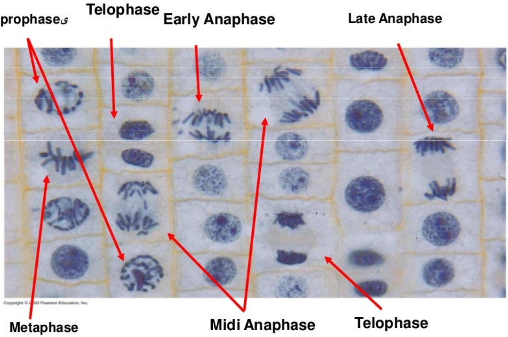

> **AI Description:**
> **Source:** `assets/_page_17_Figure_0.jpg`
> 
> **Generated:** 2026-05-31 13:45:25
> 
> ---
> 
> The image is a microscopic view of cells in various stages of mitosis, specifically focusing on the anaphase and telophase stages. It includes labeled stages such as prophase, metaphase, anaphase (early, mid, late), and telophase. The cells are stained to highlight the chromosomes, which are clearly visible in each stage. The image is educational, likely used to illustrate the process of cell division in a biological context.


<span id="page-18-0"></span>
## MEIOSIS AND CROSSING OVER

<span id="page-19-0"></span>
## 8.12 Chromosomes are matched in homologous pairs

Somatic cells have pairs of homologous chromosomes, receivingonememberofeachpairfromeachparent

Length

Centromere position

Gene locations

-A locus (plural,Ioci) is the positionof a gene

Different versions of a gene may be found at the same locus on maternaland paternalchromosomes

<span id="page-20-0"></span>
## 8.12 Chromosomes are matched in homologous pairs

The human sex chromosomesXand Y differ in sizeand genetic composition

Pairs of autosomes have the same size and geneticcomposition

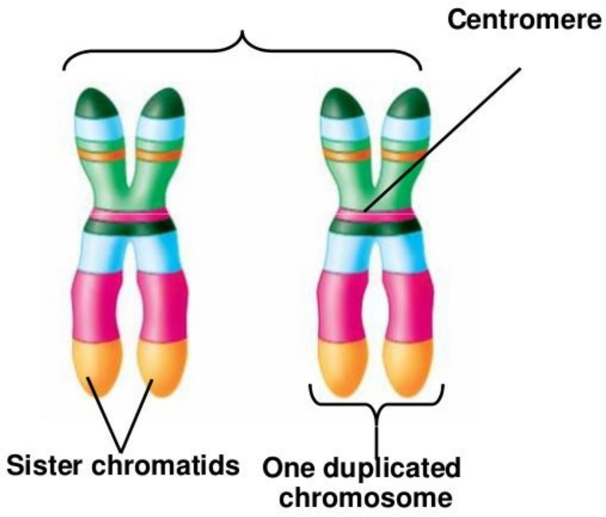

> **AI Description:**
> **Source:** `assets/_page_20_Figure_0.jpg`
> 
> **Generated:** 2026-05-31 13:41:36
> 
> ---
> 
> The image is a diagram illustrating the structure of a duplicated chromosome. It shows two sister chromatids, which are identical copies of each other, connected at the centromere. The diagram highlights the centromere as a key feature, and the sister chromatids are labeled at the bottom left. The image uses color coding to differentiate between the different parts of the chromosome, with the centromere highlighted in pink and the rest of the chromosome in green, blue, and yellow bands. The diagram is a technical illustration used to explain the concept of chromosome duplication in a biological context.

A homologous pair of chromosomes

<span id="page-21-0"></span>
## 8.13 Gametes have a single set of chromosomes

Meiosis isa process that converts diploid nuclei to haploid nuclei

Diploid cells have two homologoussets of chromosomes

Haploid cells have one set of chromosomes

Meiosis occurs in the sex organs, producing gametes-sperm and eggs

Fertilization is the union of sperm and egg

The zygote has a diploid chromosome number,one set from each parent

<span id="page-22-0"></span>
## 8.14 Meiosis reduces the chromosome number from diploid to haploid

Like mitosis,meiosis is preceded by interphase

Chromosomes duplicate during the S phase

Unlike mitosis,meiosis has two divisions

-During meiosis $\mathbf { I } ,$ homologous chromosomes separate

-Thechromosome number is reducedby half

During meiosis II,sister chromatids separate

-The chromosome number remains the same

<span id="page-23-0"></span>
## Events in the nucleusduring meiosis I

## -Prophase I

-Chromosomes coil and become compact

\- Homologous chromosomes come together as pairs by synapsis

-Eachpair,with fourchromatids,iscalledatetrad

-Nonsister chromatids exchange genetic material by crossing over

<span id="page-24-0"></span>
The stages of miosis l
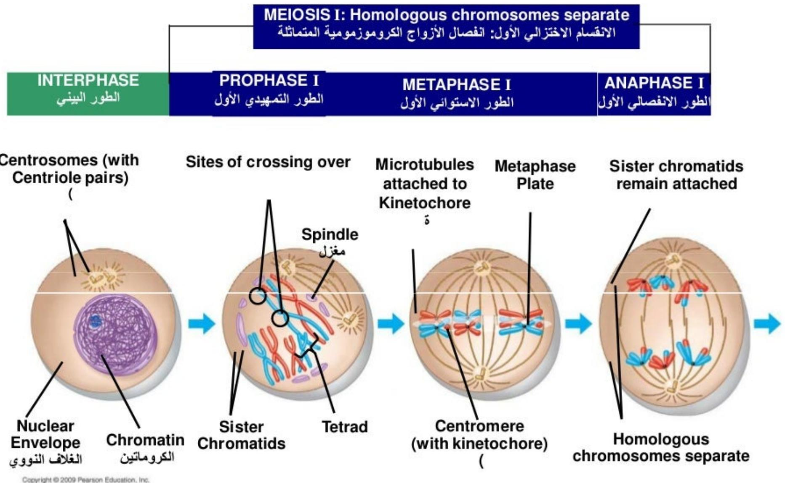

> **AI Description:**
> **Source:** `assets/_page_24_Figure_0.jpg`
> 
> **Generated:** 2026-05-31 10:01:10
> 
> ---
> 
> The image is a detailed diagram illustrating the process of meiosis I, specifically focusing on the separation of homologous chromosomes. It includes labeled stages of meiosis I: Interphase, Prophase I, Metaphase I, and Anaphase I. The diagram uses illustrations to depict the movement of chromosomes, microtubules, and other cellular structures. Key elements such as centrosomes, centriole pairs, sites of crossing over, sister chromatids, and the metaphase plate are highlighted. The image also includes text in both English and Arabic, providing a comprehensive explanation of the meiotic process.


<span id="page-25-0"></span>
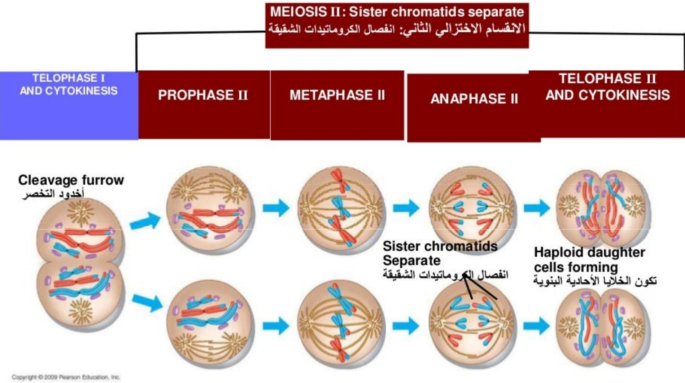

> **AI Description:**
> **Source:** `assets/_page_25_Figure_0.jpg`
> 
> **Generated:** 2026-05-31 10:24:19
> 
> ---
> 
> The image contains a detailed diagram illustrating the second meiotic division (Meiosis II). It shows the progression through the stages of Prophase II, Metaphase II, Anaphase II, and Telophase II and Cytokinesis. The diagram includes labeled illustrations of chromosomes, sister chromatids, and the formation of haploid daughter cells. The text is bilingual, with English and Arabic labels, providing a comprehensive visual representation of the meiotic process.


The stages of miosis ll

<span id="page-26-0"></span>
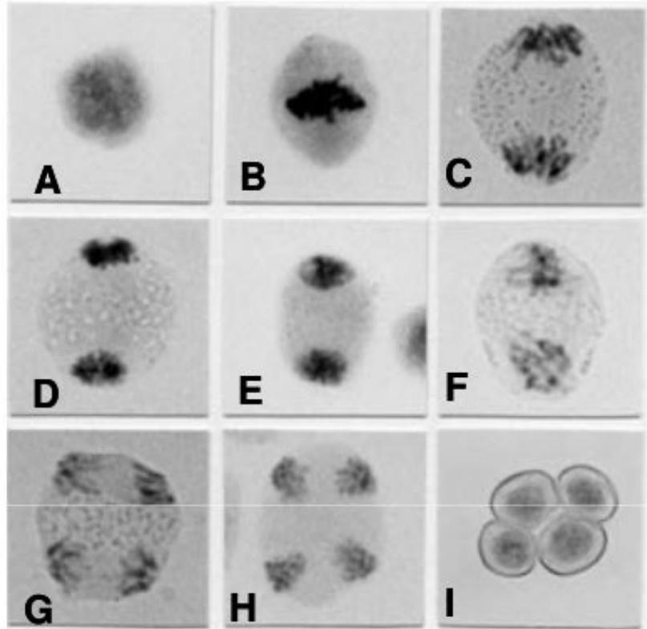

> **AI Description:**
> **Source:** `assets/_page_26_Figure_0.jpg`
> 
> **Generated:** 2026-05-31 13:50:13
> 
> ---
> 
> The image contains a series of nine microscopic photographs labeled A through I. Each photograph appears to depict different stages of cell division or cell morphology. The images show cells at various stages of mitosis, including prophase, metaphase, anaphase, and telophase, as well as cells in interphase and potentially some stages of cell division. The photographs are likely used to illustrate the process of cell division in a biological context.


A.PROPHASEI

B.METAPHASEI

C.ANAPHASEI

D.TELOPHASEI

E.PROPHASEI

F.METAPHASEI

G.ANAPHASEI

H.TELOPHASEI

1.TETRAD

## MEIOSIS

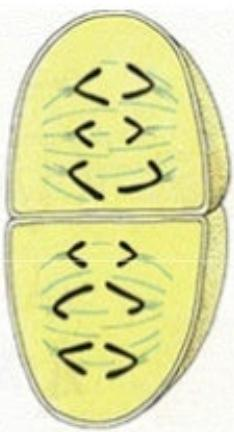

> **AI Description:**
> **Source:** `assets/_page_26_Figure_1.jpg`
> 
> **Generated:** 2026-05-31 13:48:54
> 
> ---
> 
> The image contains a diagram of two yellow ovals with black lines inside them. The lines are arranged in a pattern that resembles a series of arrows pointing in various directions. The diagram appears to be a simple illustration, possibly representing a concept or process, but without additional context, the exact meaning is unclear. The ovals and lines are the only elements present in the image.


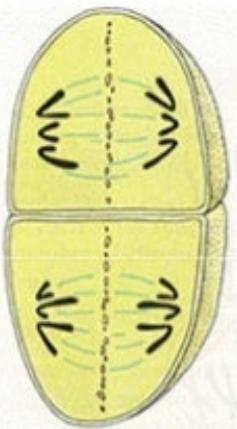

> **AI Description:**
> **Source:** `assets/_page_26_Figure_2.jpg`
> 
> **Generated:** 2026-05-31 13:45:31
> 
> ---
> 
> The image contains a diagram of a cross-section of a cell undergoing mitosis. The diagram shows two cells in the process of dividing, with the chromosomes (represented by the squiggly lines) being pulled apart by the spindle fibers (the lines extending from the center of the cell). The dashed line in the middle indicates the equatorial plate, where the chromosomes align during metaphase. The image is labeled with "mitosis" and "chromosomes," providing a clear visual representation of the cellular division process.


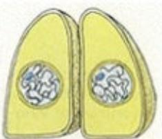

> **AI Description:**
> **Source:** `assets/_page_26_Figure_3.jpg`
> 
> **Generated:** 2026-05-31 13:45:35
> 
> ---
> 
> The image contains a pair of yellow ear-shaped objects with a circular pattern in the center. The objects appear to be stylized representations of ears, possibly used in a context related to hearing or sound. The circular pattern in the center could represent a speaker or a sound wave, suggesting a connection to audio or sound technology.


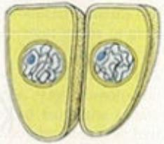

> **AI Description:**
> **Source:** `assets/_page_26_Figure_4.jpg`
> 
> **Generated:** 2026-05-31 13:38:11
> 
> ---
> 
> The image is a simple diagram showing two identical shapes, each with a central circular structure. The shapes appear to be cross-sections of cells or similar biological structures, with the central circular structure possibly representing the nucleus. The diagram is minimalistic, using only yellow for the shapes and blue for the central structure, with no additional labels or text annotations.


ANAPHASEI

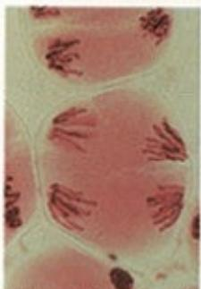

> **AI Description:**
> **Source:** `assets/_page_26_Figure_6.jpg`
> 
> **Generated:** 2026-05-31 13:42:56
> 
> ---
> 
> The image appears to be a microscopic photograph of cells, likely from a biological sample. The cells are stained, with distinct red and pink hues indicating the presence of certain cellular structures or substances. The cells are in various stages of division or growth, as evidenced by the visible chromosomes and the overall morphology. The image is useful for studying cellular biology, particularly in the context of cell division or the effects of certain treatments or conditions on cell structure.

TELOPHASE I

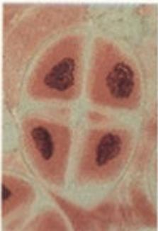

> **AI Description:**
> **Source:** `assets/_page_26_Figure_7.jpg`
> 
> **Generated:** 2026-05-31 13:41:42
> 
> ---
> 
> The image appears to be a microscopic photograph of cells, likely muscle cells, stained with a method such as hematoxylin and eosin (H&E). The cells are arranged in a grid-like pattern, and the nuclei are visible as dark areas within the cells. The cytoplasm appears lighter, indicating the staining process used. The image is useful for examining the structure and organization of the cells, which can be indicative of various cellular processes or conditions.

TETRAD

<span id="page-27-0"></span>
## Chapter9

## Patterns

PowerPoint Lectures for Biology:Coetstisi Camell

LecturebyRichardL.Myers

TranslatedbyNabihA.Baeshen

<span id="page-28-0"></span>
## MENDEL'S LAWS

<span id="page-29-0"></span>
## 9.1 The science of genetics has ancient roots

## Pangenesiswasan early explanation for inheritance

It was proposed by Hippocrates

Particlescalled pangenes came fromall parts of theorganism to be incorporated intoeggsorsperm

Characteristicsacquired during the parents'lifetimecould be transferred to the offspring

Aristotlerejected pangenesisandargued thatinstead of particles,thepotential to produce the traitswas inherited

Blending wasanother idea,based onplant breeding

Hereditarymaterial fromparentsmixestogether to forman intermediate trait, likemixingpaint

<span id="page-30-0"></span>
## 9.2 Experimental genetics began in an abbey garden （

Gregor Mendel discovered principles of genetics inexperiments with the gardenpea

Mendel showed thatparentspassheritable factorstooffspring (heritable factorsare nowcalled genes)

·Advantages of using pea plants

Controlled matings

Self-fertilizationorcross-fertilization

Observablecharacteristics with two distinct forms

True-breeding strains

<span id="page-31-0"></span>
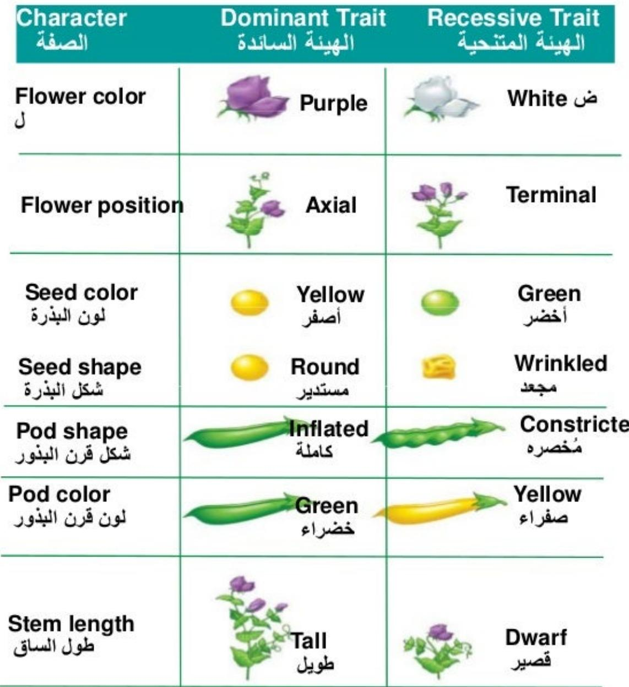

> **AI Description:**
> **Source:** `assets/_page_31_Figure_0.jpg`
> 
> **Generated:** 2026-05-31 09:55:28
> 
> ---
> 
> The image contains a table with a two-column layout. The left column lists various characteristics of pea plants, such as flower color, flower position, seed color, seed shape, pod shape, pod color, and stem length. The right column distinguishes between dominant and recessive traits for each characteristic. For example, purple flower color is the dominant trait, while white is recessive. Similarly, axial flower position is dominant over terminal, and so on. The table is bilingual, with text in both Arabic and English.

The sevenpea characteristicsstudiedbyMendel

<span id="page-32-0"></span>
## 9.3 Mendel’s law of segregation describes the inheritance of a single character

Example of a monohybrid cross

Parental generation: purple flowers ×white flowers

$\mathbb { F } _ { 1 }$ generation: all plants with purple flowers

$\mathbb { F } _ { 2 }$ generation: ofplantswith purple flowers ofplantswithwhite flowers

Mendel needed to explain

Why one trait seemed to disappear in the $\boldsymbol { \mathsf { F } } _ { \mathbf { 1 } }$ generation

Why that trait reappeared inonequarterof the $\boldsymbol { \mathsf { F } } _ { 2 }$ offspring

<span id="page-33-0"></span>
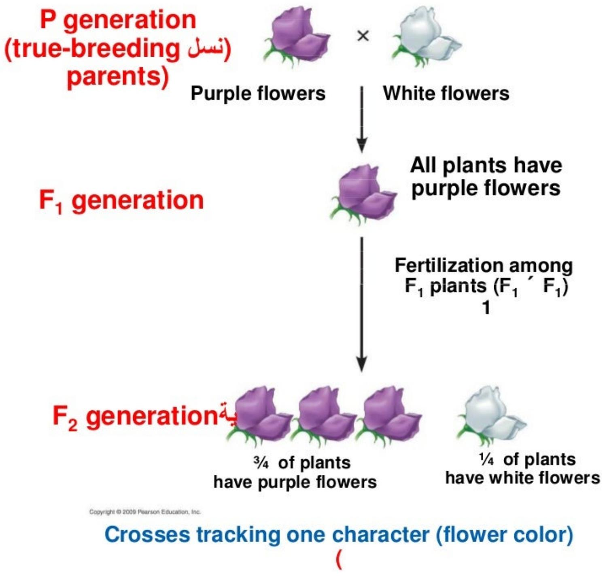

> **AI Description:**
> **Source:** `assets/_page_33_Figure_0.jpg`
> 
> **Generated:** 2026-05-31 13:48:10
> 
> ---
> 
> The image contains a diagram illustrating Mendelian inheritance, specifically focusing on the inheritance of flower color in a plant. It includes the following key elements:
> 
> 1. **P Generation (True-Breeding Parents)**: Shows two types of plants, one with purple flowers and the other with white flowers.
> 2. **F1 Generation**: Depicts the offspring of the P generation when crossed, resulting in all plants having purple flowers.
> 3. **F2 Generation**: Shows the offspring of the F1 generation when self-fertilized, with 3/4 of the plants having purple flowers and 1/4 having white flowers.
> 
> The diagram is labeled with percentages and text to explain the genetic ratios observed in the F2 generation, which is a classic example of a 3:1 ratio in Mendelian genetics.


<span id="page-34-0"></span>
P plants

Gametes

F Plants hybids

GametesJi

Phenotypicratio 3purple:1white

F2 plants

Genotypicratio 1PP:2Pp:1pp

Explanation of the crosses in previous figure

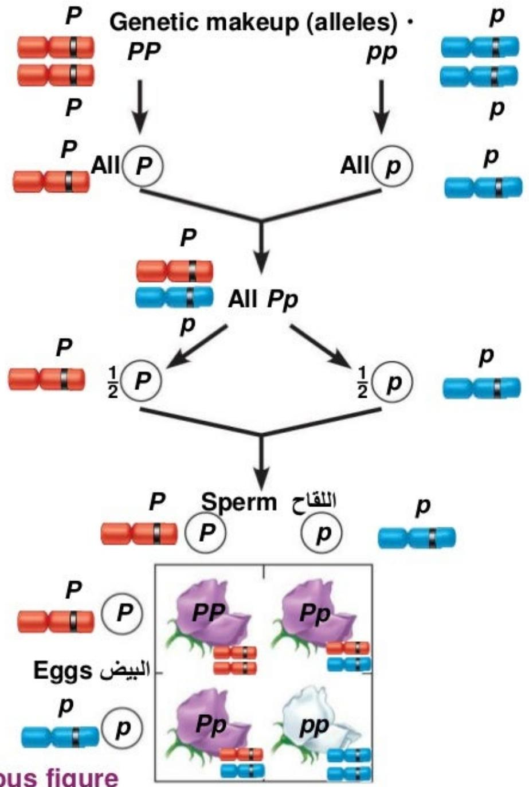

> **AI Description:**
> **Source:** `assets/_page_34_Figure_0.jpg`
> 
> **Generated:** 2026-05-31 13:48:49
> 
> ---
> 
> The image contains a detailed diagram illustrating Mendelian genetics, specifically focusing on the Punnett square method. It shows the genetic makeup of parents with the alleles "P" and "p," representing dominant and recessive traits, respectively. The diagram illustrates the possible combinations of alleles in offspring resulting from the fertilization of sperm and eggs. The visual elements include chromosomes, alleles, and the Punnett square, which is used to predict the probability of different genotypes in the offspring. The diagram effectively demonstrates the principles of inheritance and the concept of dominance and recessiveness in a clear and structured manner.


<span id="page-35-0"></span>
Matching gene loci on homologous chromosomes
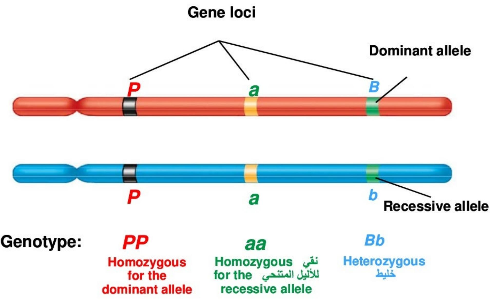

> **AI Description:**
> **Source:** `assets/_page_35_Figure_0.jpg`
> 
> **Generated:** 2026-05-31 13:42:50
> 
> ---
> 
> The image contains a diagram illustrating gene loci and their corresponding genotypes. It shows two chromosomes, each with three gene loci labeled as P, a, and B. The diagram highlights the concept of dominant and recessive alleles. The top chromosome has a dominant allele at the B locus, while the bottom chromosome has a recessive allele at the b locus. The genotypes are labeled as PP (homozygous for the dominant allele), aa (homozygous for the recessive allele), and Bb (heterozygous). The image uses color coding to differentiate between the alleles and their corresponding loci.


<span id="page-36-0"></span>
## 9.8 CONNECTION: Genetic traits in humans can be tracked through familypedigrees

## A pedigree

Shows the inheritance of a trait ina family through multiple generations

$$
1 \div \frac { 1 } { 2 } ( 1 2 \div 1 ) = ( 1 2 \div 2 ) \times 1 = ( 2 \div 2 ) = ( 2 \div 2 )
$$

Demonstrates dominant or recessive inheritance

$$
\sin ( \frac { \pi } { 2 } \pi ) = \sin ( \frac { \pi } { 2 } \pi ) , \sin ( \frac { \pi } { 2 } \pi ) , \sin ( \frac { \pi } { 2 } \pi ) = \frac { \pi } { 2 } .
$$

Canalso be used to deduce genotypes offamily members

$$
0 . 1 \dot { 0 } 0 \dot { 2 } 1 \dot { 0 } 0 0 \dot { 3 } \dot { 0 } 1 0 0 9 1 \dot { 5 } 1 0 \dot { 3 } 1 1 \dot { 5 } 1 0 0 1 1 \dot { 2 } 0 0 1 1 0 0 1 1 \dot { 2 } 0 0 1 1 \dot { 3 } 1 0 0 1 1 \dot { 5 } 0 0 1 1
$$

<span id="page-37-0"></span>
## Dominant Traits

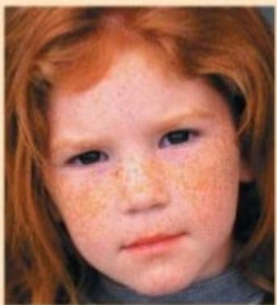

> **AI Description:**
> **Source:** `assets/_page_37_Figure_0.jpg`
> 
> **Generated:** 2026-05-31 13:31:55
> 
> ---
> 
> The image is a photograph of a child with red hair and freckles. The child is wearing a dark-colored top. The image captures the child's face and upper torso.


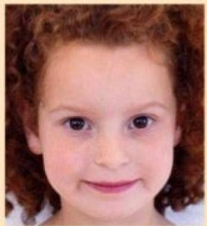

> **AI Description:**
> **Source:** `assets/_page_37_Figure_1.jpg`
> 
> **Generated:** 2026-05-31 10:18:21
> 
> ---
> 
> The image is a photograph of a young child with curly red hair. The child is smiling and looking directly at the camera. The background is plain and does not contain any additional visual elements or text.

Examples of singlegene inheritedtraits in humans

No freckles

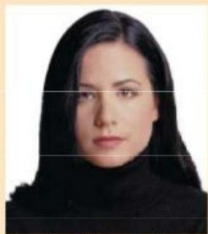

> **AI Description:**
> **Source:** `assets/_page_37_Figure_3.jpg`
> 
> **Generated:** 2026-05-31 10:17:51
> 
> ---
> 
> The image contains a photograph of a person with long dark hair, wearing a black turtleneck. The background is plain white, and there are two horizontal lines drawn across the image, possibly indicating a face recognition or facial analysis process. The image does not contain any text or additional visual elements beyond the photograph and the lines.


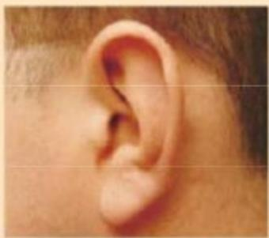

> **AI Description:**
> **Source:** `assets/_page_37_Figure_4.jpg`
> 
> **Generated:** 2026-05-31 09:36:54
> 
> ---
> 
> The image is a photograph of a human ear. The ear is shown from the side, with the visible part of the earlobe and the outer ear structure. The background appears to be a close-up of the person's skin, possibly indicating the ear is being examined for medical or aesthetic purposes. There are no labels or annotations present in the image.

Freeearlobe
Straight hairline

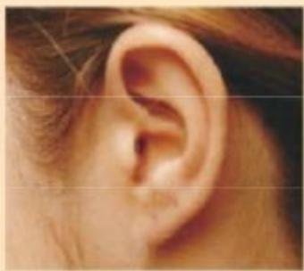

> **AI Description:**
> **Source:** `assets/_page_37_Figure_5.jpg`
> 
> **Generated:** 2026-05-31 09:50:48
> 
> ---
> 
> The image is a photograph of a human ear. It shows the outer ear, including the earlobe, ear canal, and part of the ear's surface. The image is clear and focused on the ear, with no additional text or annotations. The ear appears to be in a relaxed position, and there are no visible abnormalities or markings that stand out.

Attached earlobe

<span id="page-38-0"></span>
## Examples of single-gene inherited traits in humans

Dominant Traits

Genotype

Phenotype

FF or Ff

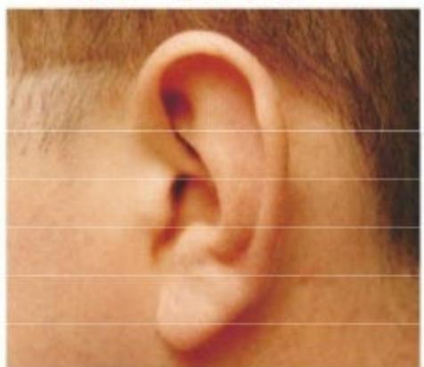

> **AI Description:**
> **Source:** `assets/_page_38_Figure_0.jpg`
> 
> **Generated:** 2026-05-31 13:36:25
> 
> ---
> 
> The image is a close-up photograph of a human ear. It shows the outer ear, including the pinna, the ear canal, and the surrounding skin. The image is clear and well-lit, allowing for a detailed view of the ear's structure. There are no labels or annotations present in the image.

Freeearlobe
Recessive Traits

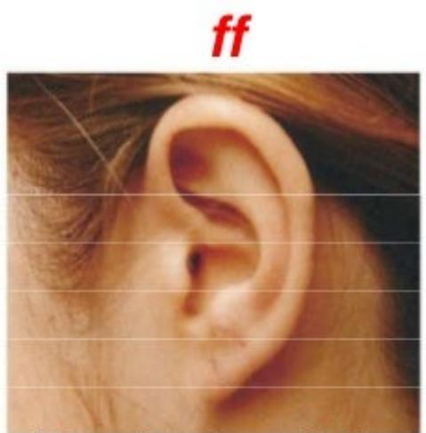

> **AI Description:**
> **Source:** `assets/_page_38_Figure_1.jpg`
> 
> **Generated:** 2026-05-31 13:36:46
> 
> ---
> 
> The image contains a close-up photograph of an ear. The ear is partially covered by hair, and the image is divided into several horizontal sections. The top of the image has the letters "ff" in red text. The image appears to be used for educational or illustrative purposes, possibly to demonstrate the structure of the ear or to highlight specific features of the ear.

Attachedearlobe

<span id="page-39-0"></span>
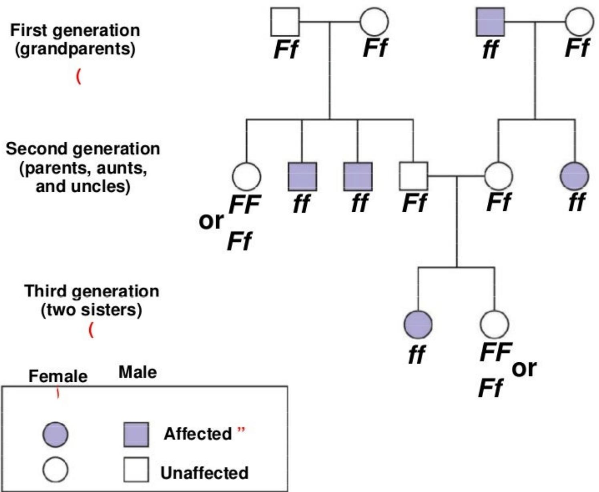

> **AI Description:**
> **Source:** `assets/_page_39_Figure_0.jpg`
> 
> **Generated:** 2026-05-31 13:36:19
> 
> ---
> 
> The image is a family pedigree chart used to illustrate genetic inheritance patterns. It includes three generations: grandparents, parents, and two sisters. The chart uses symbols to represent males and females, with filled circles indicating females and filled squares indicating males. The filled symbols are labeled as "Affected," while the unfilled symbols are labeled as "Unaffected." The genotypes of the individuals are also indicated, with "Ff" representing heterozygous individuals and "ff" representing homozygous recessive individuals. The chart visually demonstrates how traits are passed from parents to offspring, with some individuals showing the presence of the trait while others do not.


Pedigree showing inheritance of attached versus free earlobe ina hypothetical family

<span id="page-40-0"></span>
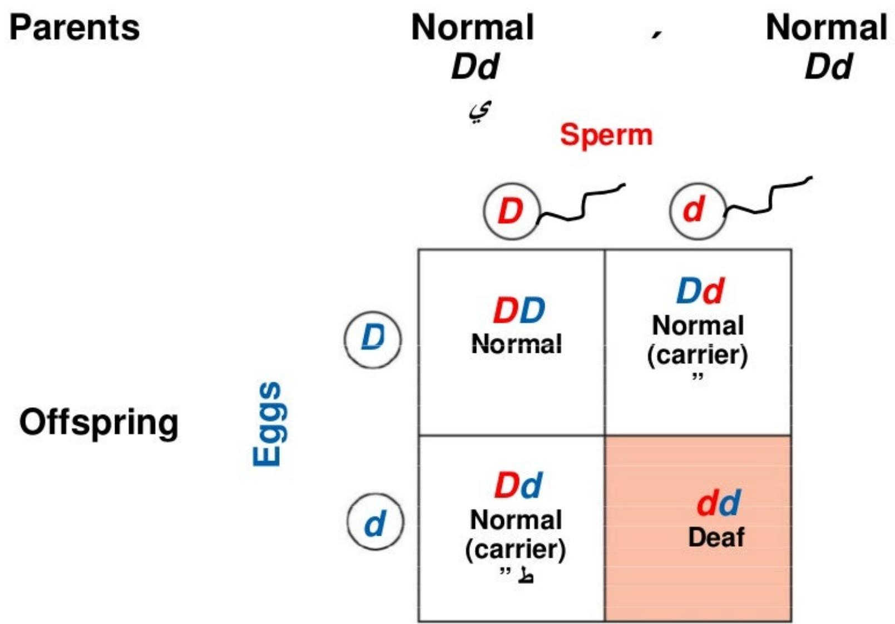

> **AI Description:**
> **Source:** `assets/_page_40_Figure_0.jpg`
> 
> **Generated:** 2026-05-31 09:47:52
> 
> ---
> 
> The image is a Punnett square, a diagram used to predict the genotypes and phenotypes of offspring from a genetic cross. It shows the possible combinations of alleles (D and d) from two parents, each with the genotype Dd. The squares represent the probability of each genotype in the offspring: DD (normal), Dd (normal carrier), and dd (deaf). The diagram visually illustrates the inheritance of a trait and the probability of different genotypes in the offspring.


<span id="page-41-0"></span>
## VARIATIONS ON MENDEL'S LAWS

<span id="page-42-0"></span>
## Incomplete dominance

Neitherallele isdominantover the other

Expression of bothalleies isobserved asan intermediate phenotype in the heterozygous individual

<span id="page-43-0"></span>
2009 Incomplete dominance in snapdragon color
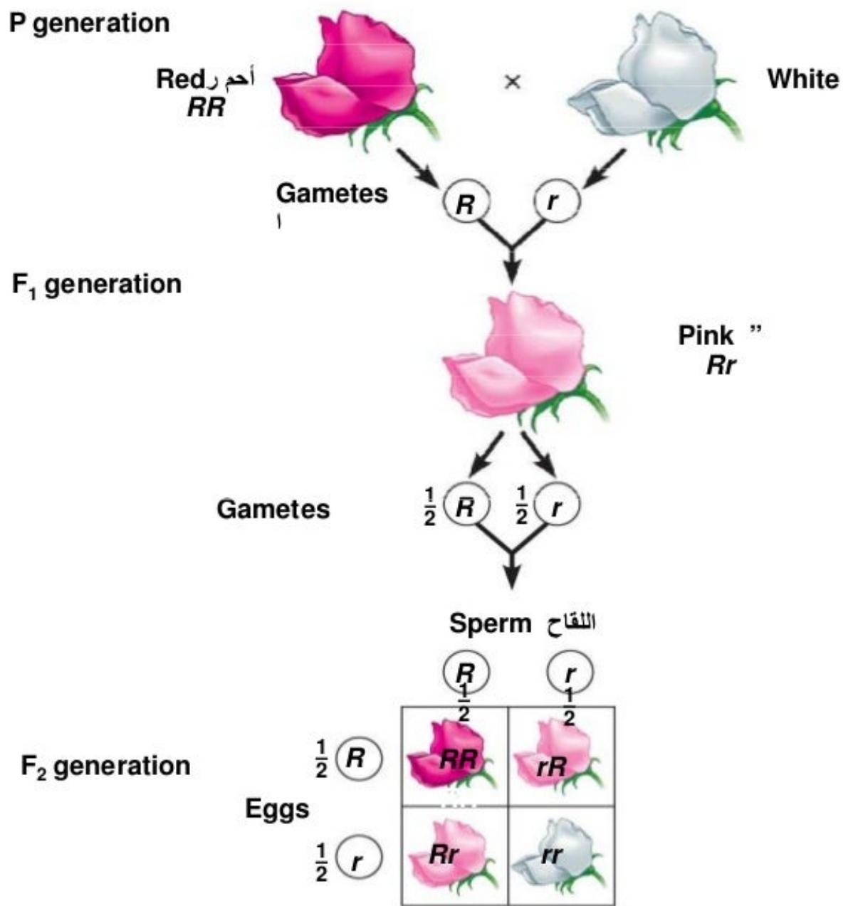

> **AI Description:**
> **Source:** `assets/_page_43_Figure_0.jpg`
> 
> **Generated:** 2026-05-31 13:40:06
> 
> ---
> 
> The image is a diagram illustrating Mendelian genetics, specifically focusing on the inheritance of flower color in roses. It shows the Punnett square method used to predict the offspring of a cross between a red rose (RR) and a white rose (rr). The diagram includes the following key elements:
> 
> 1. The P generation shows two parent roses, one red (RR) and one white (rr).
> 2. The F1 generation is represented by a pink rose (Rr), indicating a heterozygous offspring.
> 3. The F2 generation is depicted using a Punnett square, showing the possible combinations of alleles (R and r) in the offspring. The square predicts a 1:2:1 ratio of red (RR), pink (Rr), and white (rr) flowers.
> 4. The diagram uses circles to represent gametes and sperm, with the letter "R" for red and "r" for white, indicating the alleles for flower color.
> 5. The Punnett square visually represents the probability of each genotype in the F2 generation, with the red rose (RR) and white rose (rr) being less frequent compared to the pink rose (Rr).


<span id="page-44-0"></span>
## 9.20 Chromosomes determine sex in many species

```
X-Y system inmammals,fruit flies   
XX=female;XY=male   
=XY；i=xX   
X-O system in grasshoppers and roaches   
XX= female; Xo= male   
=XO;=XX   
Z-Winsystem inbirds,butterflies,and some fishes   
ZW= female,Zz=male   
= ZZ =ZW   
Chromosome number in ants and bees   
Diploid=female;haploid=male
```

<span id="page-45-0"></span>
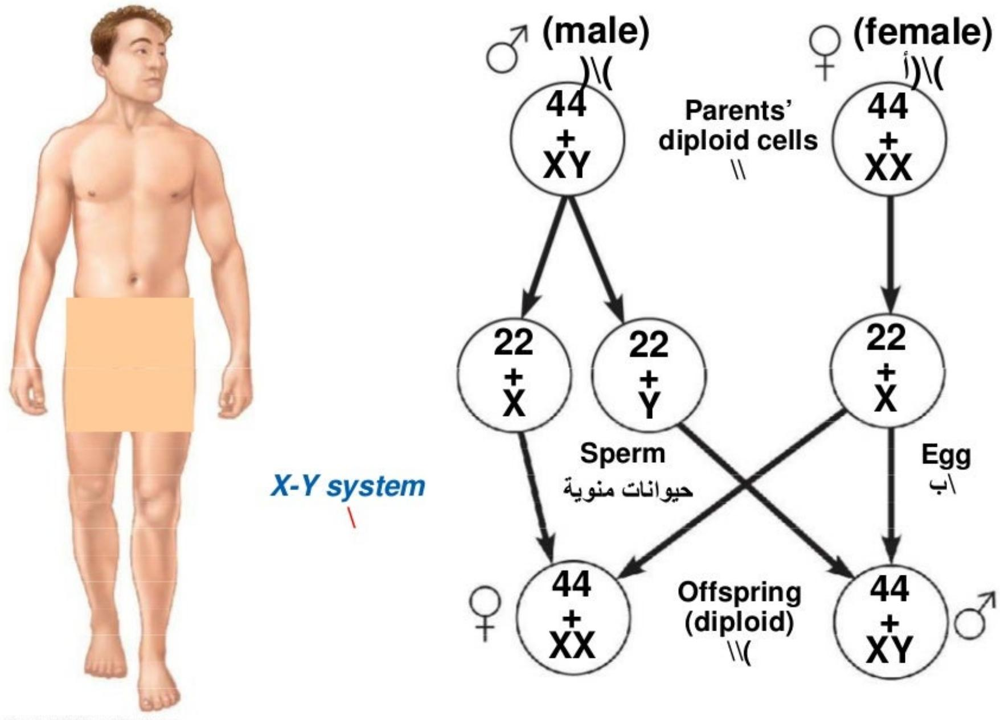

> **AI Description:**
> **Source:** `assets/_page_45_Figure_0.jpg`
> 
> **Generated:** 2026-05-31 13:44:20
> 
> ---
> 
> The image contains a diagram illustrating the X-Y sex determination system in humans. It shows the genetic makeup of a male and a female, represented by their diploid cell counts (44 chromosomes) and sex chromosomes (XY for males and XX for females). The diagram also illustrates the process of sexual reproduction, where a sperm cell (22 + X or 22 + Y) fertilizes an egg cell (22 + X) to form a diploid offspring (44 + XX or 44 + XY). The image includes labels for the parents' diploid cells, sperm, egg, and offspring, providing a clear visual representation of the genetic inheritance process.


<span id="page-46-0"></span>
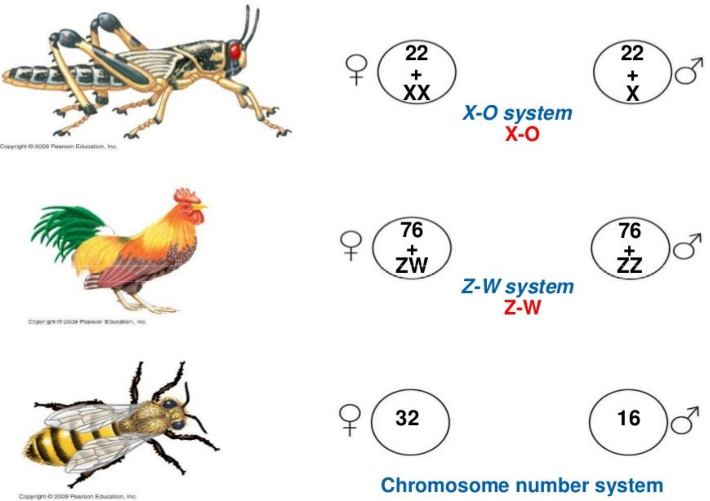

> **AI Description:**
> **Source:** `assets/_page_46_Figure_0.jpg`
> 
> **Generated:** 2026-05-31 10:15:24
> 
> ---
> 
> The image contains a diagram comparing the sex determination systems of three different animals: a grasshopper, a chicken, and a bee. It illustrates the X-O system for the grasshopper, the Z-W system for the chicken, and the chromosome number system for the bee. The diagram includes illustrations of the animals and labeled circles indicating the number of chromosomes and sex chromosomes for each sex. The grasshopper is shown with 22 chromosomes and an X chromosome for females and an X chromosome for males. The chicken is depicted with 76 chromosomes, a Z chromosome for females, and a W chromosome for males. The bee is illustrated with 32 chromosomes, 16 for females and 16 for males. The image is credited to Pearson Education, Inc. in 2009.


<span id="page-47-0"></span>
## Chapter 10

Molecular Biology of the Gene

PowerPoint Lectures for Biology:Coets oecioo Caell

<span id="page-48-0"></span>
# MOLECULAR STRUCTURE OF THE GENETIC MATERIAL

<span id="page-49-0"></span>
## 10.2 DNA and RNA are polymers of nucleotides

## The monomer unit of DNA and RNA is the nucleotide, containing

5-carbon sugar

Phosphate group

Nitrogenous base

Asugar-phosphate backbone is formed by covalent bonding. betweenthe phosphate of onenucleotide and the sugar of the nextnucleotide

Nitrogenous bases extend from the sugar-phosphate backbone

<span id="page-50-0"></span>
The structure of DNA polynucleotide
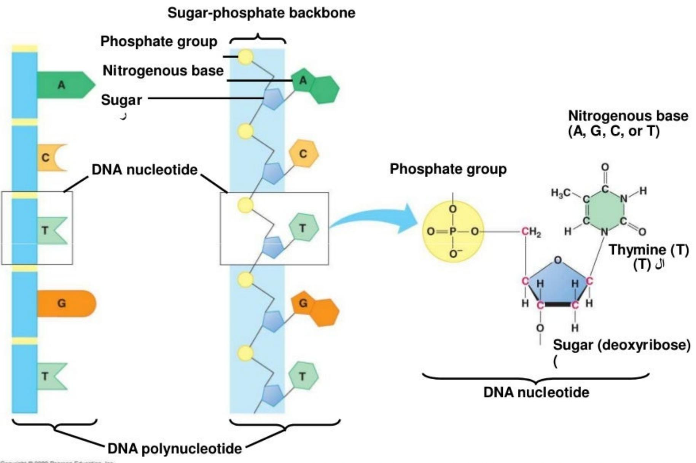

> **AI Description:**
> **Source:** `assets/_page_50_Figure_0.jpg`
> 
> **Generated:** 2026-05-31 13:47:00
> 
> ---
> 
> The image contains a detailed diagram illustrating the structure of a DNA polynucleotide. It highlights the sugar-phosphate backbone, the phosphate group, the nitrogenous base, and the sugar component of a DNA nucleotide. The diagram specifically shows the structure of a thymine (T) nucleotide, including the deoxyribose sugar and the thymine base. The image uses arrows and labels to point out the different parts of the nucleotide, providing a clear visual representation of the molecular structure.


<span id="page-51-0"></span>
## 10.3 DNA is a double-stranded helix

DNA iscomposedof twopolynucleotidechains joined together by hydrogen bonding between bases, twisted into a helical shape

The sugar-phosphate backbone is on the outside

The nitrogenous bases are perpendicular to the backbone in the interior

Specific pairs of bases give the helix a uniform shape

-A pairswith $\boldsymbol { \mathsf { T } } ,$ forming two hydrogen bonds

G pairs with $\complement ,$ forming three hydrogen bonds

<span id="page-52-0"></span>
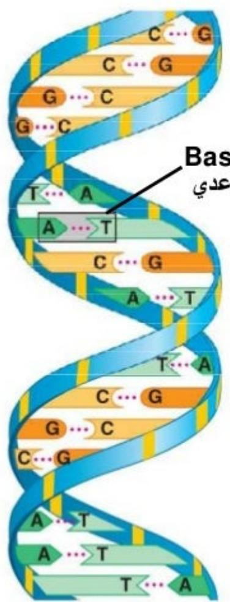

> **AI Description:**
> **Source:** `assets/_page_52_Figure_0.jpg`
> 
> **Generated:** 2026-05-31 09:50:15
> 
> ---
> 
> The image is a diagram of a DNA double helix. It shows the structure of the DNA with the two strands twisted together. The strands are labeled with the bases A, T, C, and G, which are paired in a complementary manner: A with T and C with G. The diagram includes a label pointing to the base pairs, indicating the base pairing. The text "Base" is written in English and Arabic, suggesting a bilingual educational context. The diagram is a technical illustration used to explain the structure of DNA.

Ribbonmodel Cpm

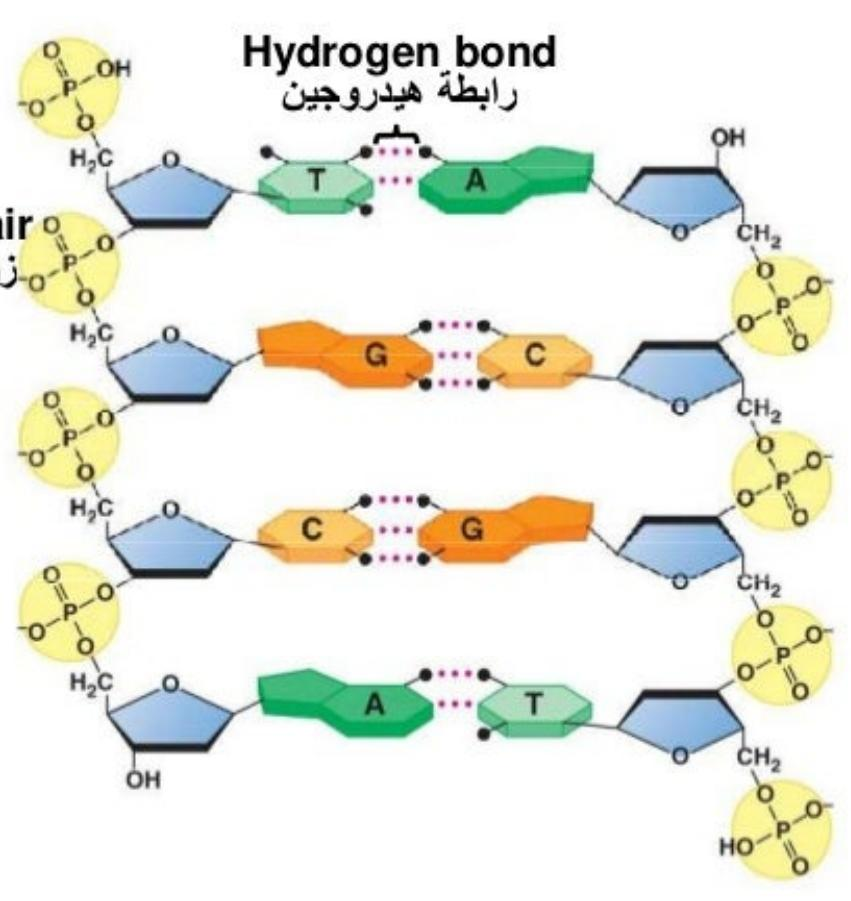

> **AI Description:**
> **Source:** `assets/_page_52_Figure_1.jpg`
> 
> **Generated:** 2026-05-31 09:38:43
> 
> ---
> 
> The image contains a detailed diagram illustrating the structure of a DNA double helix, focusing on the hydrogen bonding between complementary base pairs. It shows the phosphodiester backbone of the DNA strands in yellow, with the sugar-phosphate backbone forming the outer part of the helix. The bases are depicted in green (adenine, A) and orange (cytosine, C) for one strand, and in blue (thymine, T) and orange (guanine, G) for the other strand. The hydrogen bonds are represented by dotted lines, connecting A to T and C to G, demonstrating the base pairing principle. The image also includes the text "Hydrogen bond" and "رابطة هيدروجين" (Arabic for "Hydrogen bond") at the top, indicating the type of interaction being depicted.

Partialchemical structure EC
Three presentations of DNA

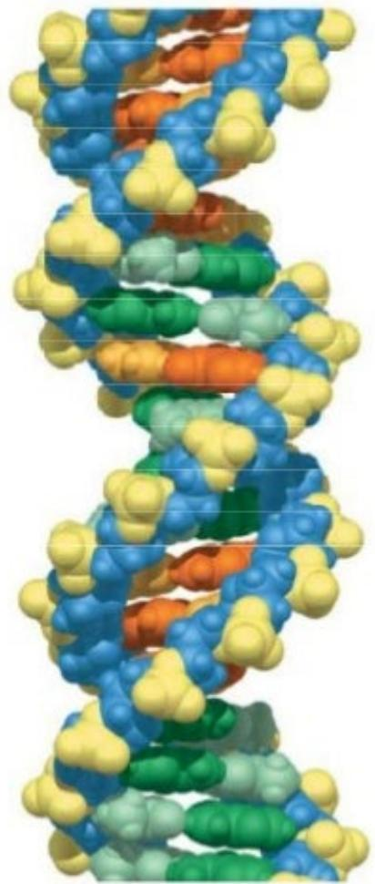

> **AI Description:**
> **Source:** `assets/_page_52_Figure_2.jpg`
> 
> **Generated:** 2026-05-31 09:51:58
> 
> ---
> 
> The image is a 3D representation of a DNA double helix. The helix is composed of a series of connected spheres, each representing a nucleotide. The spheres are color-coded to represent the four nucleotide bases: adenine (A), thymine (T), guanine (G), and cytosine (C). The helix is shown in a side view, with the two strands twisted around each other in a right-handed spiral. The image provides a clear visual representation of the structure of DNA, highlighting the repeating pattern of the nucleotide pairs.

Computermodel

<span id="page-53-0"></span>
## 11.3 DNA packing in eukaryotic chromosomes helps regulate gene expression

Eukaryotic\_chromosomes undergomultiple levelsoffoldingand coiling,calledDNApcking

Nucleosomesare formed when DNA iswrapped around histone proteins

"Beads on a string"appearance

Each bead includes DNA plus 8 histone molecules

-String is the linker DNA that connects nucleosomes

Tight helical fiber isacoiling of the nudleosome string

Supercoil isacoiling of the tight helical fiber

Metaphasechromosome representsthe highest level of packing

DNA packing can prevent transcription

<span id="page-54-0"></span>
## 11.3 DNA packing in eukaryotic chromosomes helps regulate gene expression

DNA packing in a eukaryotic chromosome
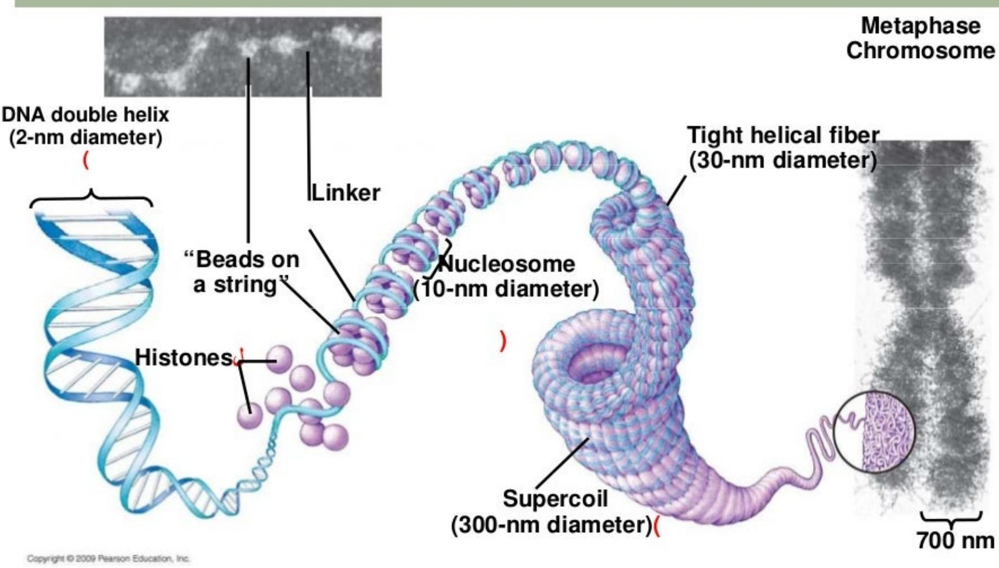

> **AI Description:**
> **Source:** `assets/_page_54_Figure_0.jpg`
> 
> **Generated:** 2026-05-31 10:08:46
> 
> ---
> 
> The image is a detailed diagram illustrating the structure of DNA and its organization within a cell. It includes a labeled illustration of a DNA double helix, which is the fundamental structure of DNA. The diagram shows how DNA is organized into nucleosomes, which are "beads on a string" structures formed by DNA wrapping around histone proteins. These nucleosomes are further organized into a tighter helical fiber and a supercoil, which are shown in increasing levels of complexity and size. The image also includes a microscopic photograph of a metaphase chromosome, providing a visual representation of the DNA structure at a cellular level. The annotations provide the diameter of each structure in nanometers, aiding in understanding the scale of these molecular components.


<span id="page-55-0"></span>
## 10.4 DNA replication depends on specific base pairing

DNA replication followsa semiconservative model

-The two DNA strands separate

Each strand is used asa pattern to produce a complementary strand,using specific base pairing

Each new DNA helix has one old strand with one new strand

<span id="page-56-0"></span>
A templatemode for DNA replication
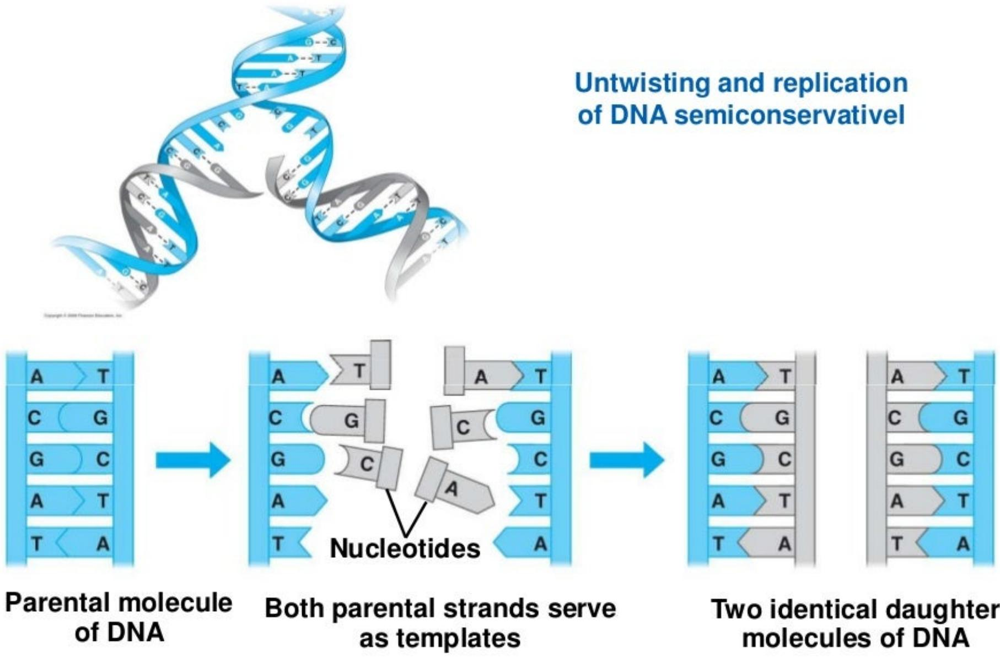

> **AI Description:**
> **Source:** `assets/_page_56_Figure_0.jpg`
> 
> **Generated:** 2026-05-31 13:38:07
> 
> ---
> 
> The image contains a diagram illustrating the process of DNA replication, specifically the semiconservative model. It shows a parental DNA molecule being untwisted and replicated into two identical daughter molecules. The diagram includes labeled sections: the parental molecule of DNA, the process where both parental strands serve as templates, and the resulting two identical daughter molecules. The illustration uses arrows and labels to indicate the flow of replication, with nucleotides depicted as the building blocks of the new DNA strands.


<span id="page-57-0"></span>
## THE FLOW OF GENETIC INFORMATION FROM DNA TO RNA TO PROTEIN

<span id="page-58-0"></span>
10.6 The DNA genotype is expressed as proteins, which provide themolecularbasis forphenotypictraits

A gene is a sequence of DNA that directs the synthesis of a specific protein

DNA istranscribed into RNA

-RNA is translated into protein

The presence and action of proteins determine the phenotype of an organism

<span id="page-59-0"></span>
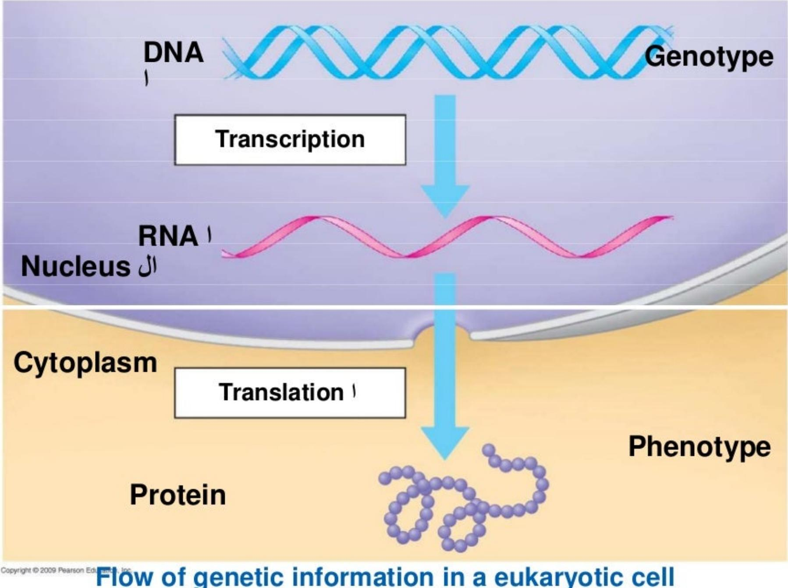

> **AI Description:**
> **Source:** `assets/_page_59_Figure_0.jpg`
> 
> **Generated:** 2026-05-31 13:33:49
> 
> ---
> 
> The image is a diagram illustrating the flow of genetic information in a eukaryotic cell. It shows a sequence of processes: DNA (genotype) is transcribed into RNA in the nucleus, and then translated into proteins in the cytoplasm. The diagram includes labels for each step and the overall process is labeled as "Flow of genetic information in a eukaryotic cell." The visual elements include arrows indicating the direction of the flow and representations of the DNA, RNA, and proteins.

Copoeslowofgeneticinformationinaeukaryoticcell

<span id="page-60-0"></span>
## 10.7 Genetic information written in codons is translated into amino acid sequences

The sequence of nucleotides in DNA provides a code for   
constructinga protein -Protein construction requiresaconversion ofanucleotide sequencetoanaminoacid sequence -Transcriptionrewrites the DNA code into RNA,using the samenucleotide "language"   
-Each "word" isa codon,consisting of three nucleotides Translation involves switching from the nucleotide "language"toaminoacid"language" -Eachamino acid isspecified bya codon -64 codons are possible -Someaminoacids have more thanone possible codon

<span id="page-61-0"></span>
Transcription& translations of codons

Gene 22

Gene33

<span id="page-62-0"></span>
## 10.8 The genetic code is the Rosetta stone of life

Characteristics of the genetic code -Triplet: Three nucleotides specify one amino acid -61 codons correspond to amino acids -AUG codes for methionine and signals the start of transcription -3"stop"codons signal the end of translation UAA UGA UAG

<span id="page-63-0"></span>
## 10.8 The genetic code is the Rosetta stone of life

Redundant: More than one codon for some amino acids

Unambiguous: Any codon for one amino acid does not code for any other amino acid

Nearly universal

<span id="page-64-0"></span>

Copyright20o Pearson Education,n.
Dictionary of the genetic code (RNA codons) "e

<span id="page-65-0"></span>
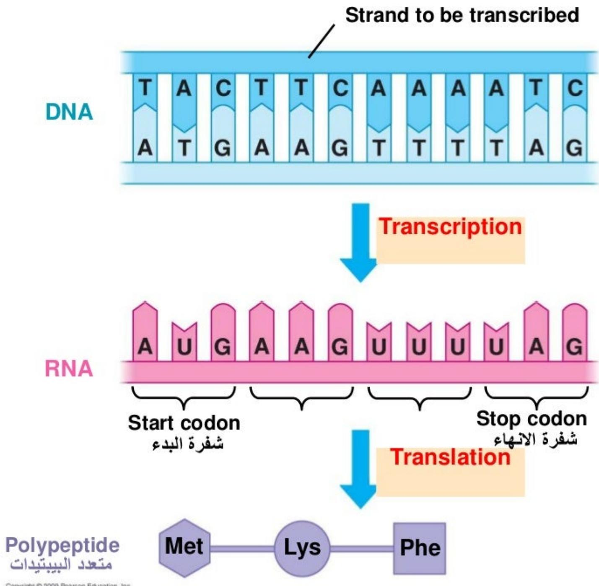

> **AI Description:**
> **Source:** `assets/_page_65_Figure_0.jpg`
> 
> **Generated:** 2026-05-31 10:40:13
> 
> ---
> 
> The image contains a diagram illustrating the process of gene expression, specifically focusing on transcription and translation. It shows a segment of DNA with the complementary RNA sequence transcribed from it. The diagram highlights the start codon (AUG) and the stop codon (UAA), which are crucial for the initiation and termination of protein synthesis. The RNA sequence is then translated into a polypeptide chain, which is represented by the amino acids Met, Lys, and Phe. The image is bilingual, with text in both English and Arabic, providing a comprehensive view of the molecular biology process.


<span id="page-66-0"></span>
## 10.16 Mutations can change the meaning of genes

· A mutation is a change in the nucleotide sequence of DNA Base substitutions: replacement of one nucleotide with another Effectdependsonwhether there isanaminoacidchange thataltersthe function of the protein

Deletions or insertions:Alter the reading frame of the mRNA, sothat nucleotidesare grouped into different codons

Lead to significant changes in amino acid sequence downstream of mutation Causeanonfunctional polypeptide to beproduced

<span id="page-67-0"></span>
## 10.16 Mutations can change the meaning of genes

## Mutations can be

Spontaneous: due to errors in DNA replication or recombination

Induced by mutagens

High-energyradiation

-Chemicals!

<span id="page-68-0"></span>
Normal hemoglobin DNA

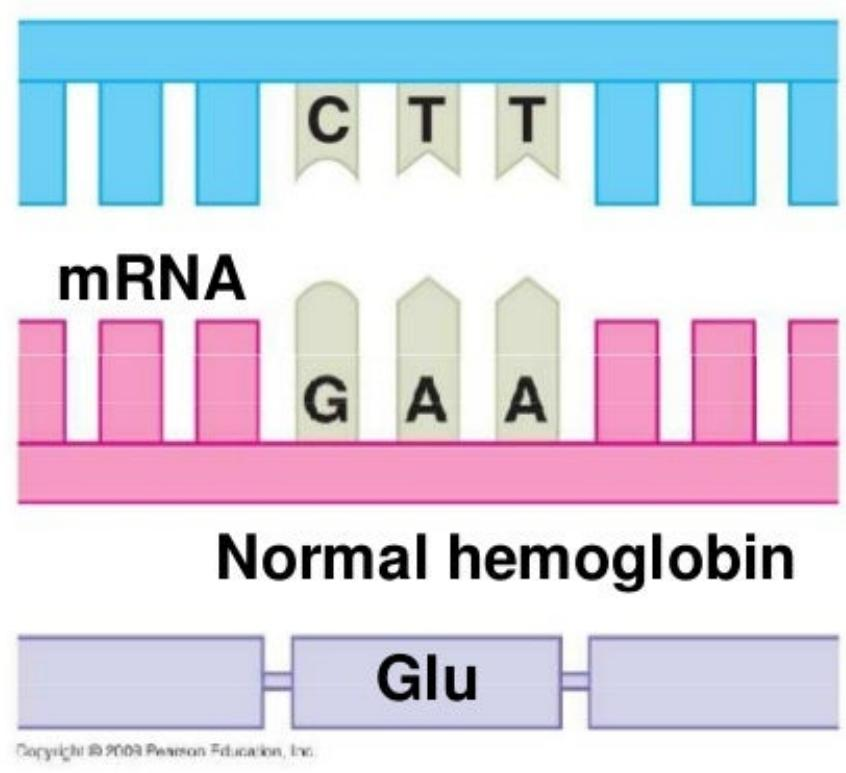

> **AI Description:**
> **Source:** `assets/_page_68_Figure_0.jpg`
> 
> **Generated:** 2026-05-31 13:32:10
> 
> ---
> 
> The image is a diagram illustrating the mRNA sequence and its corresponding amino acid sequence in the context of normal hemoglobin. It shows the mRNA sequence "CTT" which codes for the amino acid glutamic acid (Glu). The diagram includes a pink bar representing the mRNA sequence and a blue bar representing the amino acid sequence. The text "Normal hemoglobin" is present, indicating that this sequence is typical for normal hemoglobin. The image is a technical illustration used to explain the process of translation in protein synthesis.

Mutant hemoglobin DNA

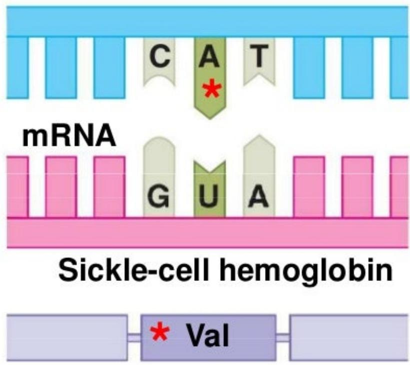

> **AI Description:**
> **Source:** `assets/_page_68_Figure_1.jpg`
> 
> **Generated:** 2026-05-31 13:32:26
> 
> ---
> 
> The image contains a diagram illustrating the genetic mutation responsible for sickle-cell anemia. It shows a section of the DNA sequence (top) with a specific mutation (indicated by a red asterisk) leading to a change in the mRNA sequence (middle). The mRNA sequence is translated into the amino acid sequence of hemoglobin (bottom), where the mutation results in the substitution of valine (Val) for glutamic acid, leading to the characteristic sickle-cell structure.

Themolecular basis of Sickle-cell disease

<span id="page-69-0"></span>
## Types of mutations and their effects

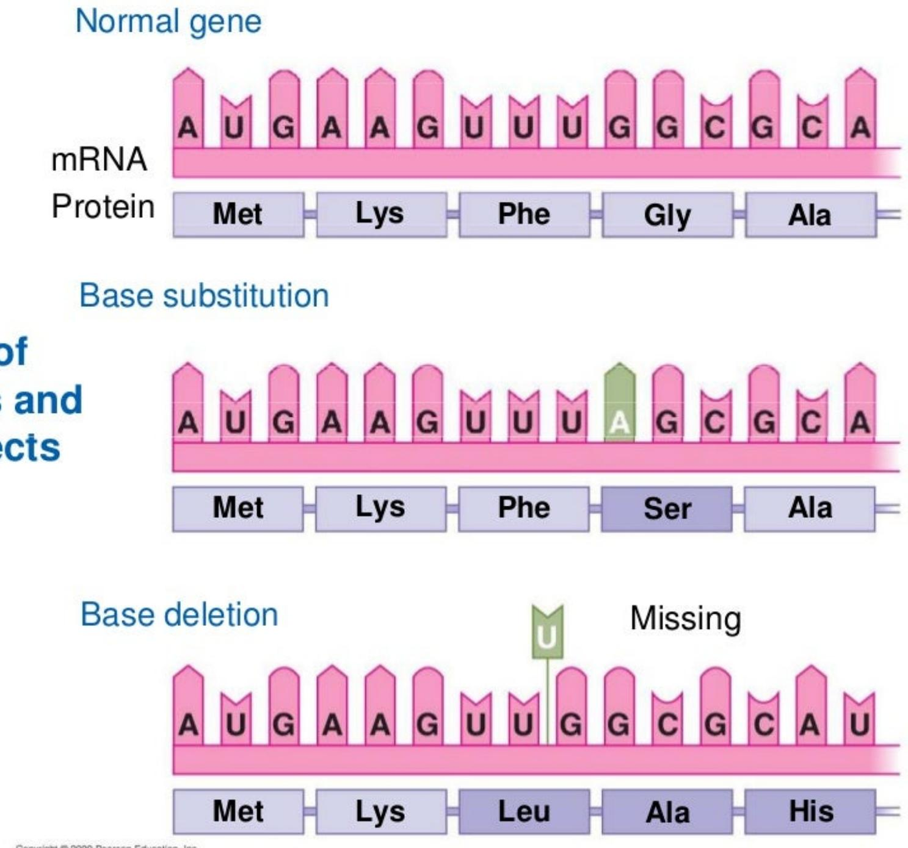

> **AI Description:**
> **Source:** `assets/_page_69_Figure_0.jpg`
> 
> **Generated:** 2026-05-31 13:35:12
> 
> ---
> 
> The image contains a diagram illustrating the effects of base substitutions and deletions on mRNA and the resulting protein sequence. It shows three scenarios: a normal gene, a base substitution, and a base deletion. The diagram uses mRNA sequences to demonstrate how changes in the genetic code can alter the amino acid sequence of a protein. The normal gene sequence results in a protein with the sequence Met-Lys-Phe-Gly-Ala. The base substitution changes the mRNA sequence to Met-Lys-Phe-Ser-Ala, and the base deletion results in a missing nucleotide, changing the protein sequence to Met-Lys-Leu-Ala-His. The diagram uses color coding and labeled segments to highlight the differences in the mRNA and protein sequences.

Copyright2009 Pearson Education,Inc.

<span id="page-70-0"></span>

