
## power of focus

Dr.Russell James Ill Texas Tech University

## A special case: Competitive focus

Decisions dominated by the shortterm, impulsive self tend to reduce future happiness

1. Excessive future discounting

2. Finding negative addictions

3. Avoiding positive addictions

But, for some, decision training is also important because of the potential for competitive mastery resulting from focus.

## Focus in the dual-self model

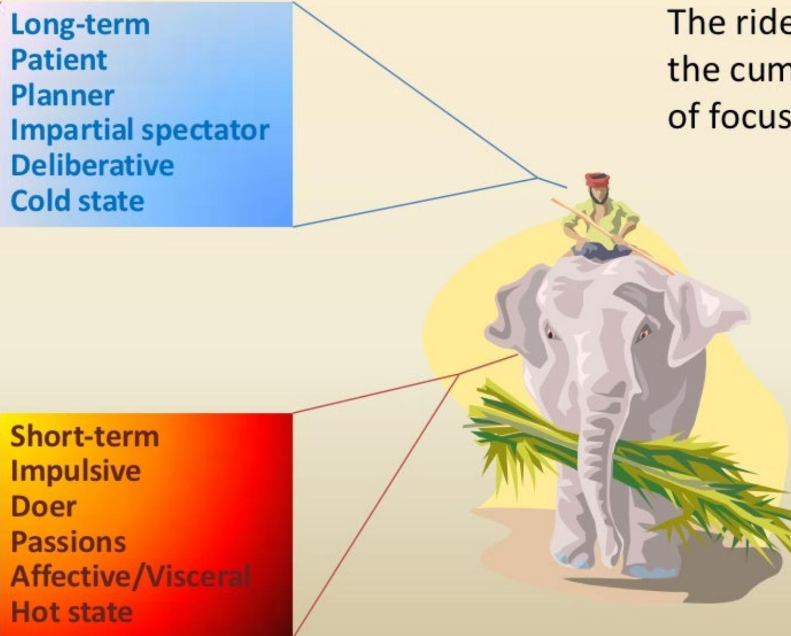

> **AI Description:**
> **Source:** `assets/_page_2_Figure_0.jpg`
> 
> **Generated:** 2026-05-31 14:12:14
> 
> ---
> 
> The image contains a diagram illustrating the concept of emotional intelligence, specifically the "Elephant and Rider" model. It features two main sections: the "Long-term Patient Planner" (cold state) on the left, represented by a blue background with text labels, and the "Short-term Impulsive Doer" (hot state) on the right, represented by a red background with text labels. The diagram shows the rider (representing the rational, long-term, and patient aspects) controlling the elephant (representing the impulsive, short-term, and emotional aspects) with reins. The elephant is depicted with a bundle of grass, symbolizing its need for guidance and control. The text on the right side of the image reads, "The rider is the cumulative focus of the elephant."

The ridercanunderstand the cumulative benefits of focus over many years.

The elephant gets bored with repetition and wants to move on to the next new experience.

## In standard consumption economics, focusing is often bad

Variety is important because diminishing marginal utility changes preferences. When enjoyment drops, we should switch to another choice.

> **AI Description:**
> **Source:** `assets/_page_3_Figure_0.jpg`
> 
> **Generated:** 2026-05-31 14:15:24
> 
> ---
> 
> The image is a photograph of a person eating a hot dog. The hot dog is in a bun and topped with mustard. The person is holding the hot dog with both hands and appears to be in the process of taking a bite. The background is plain white, which draws attention to the subject and the hot dog.

## In competition, the cumulative effect of focus may be good...

Diminishing marginal utility

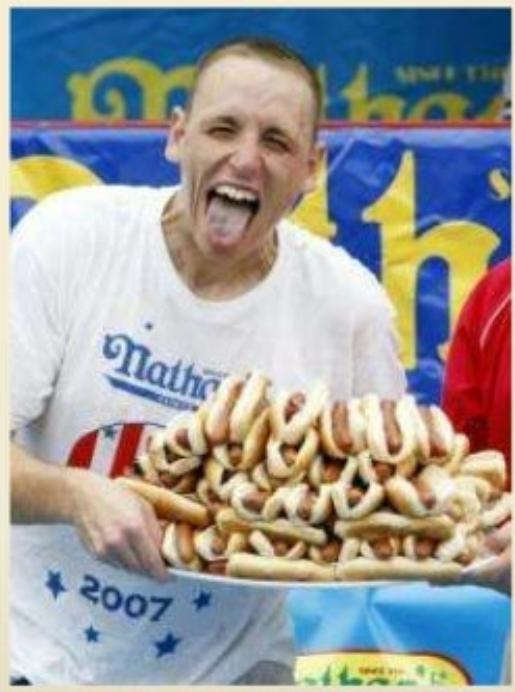

> **AI Description:**
> **Source:** `assets/_page_4_Figure_0.jpg`
> 
> **Generated:** 2026-05-31 14:15:07
> 
> ---
> 
> The image is a photograph of a person participating in a hot dog eating contest. The person is wearing a white t-shirt with "Nathan's Famous" printed on it, indicating the event is likely the Nathan's Famous Hot Dog Eating Contest. The individual is holding a large tray filled with hot dogs, and the year "2007" is visible on the edge of the tray, suggesting the image is from that year. The background includes a banner with the Nathan's Famous logo, further confirming the context of the image.

Point where Joey Chestnut ties Kobayashi forthe 2007 championship

Differential outcome

## Focus, enjoyment,and outcomes

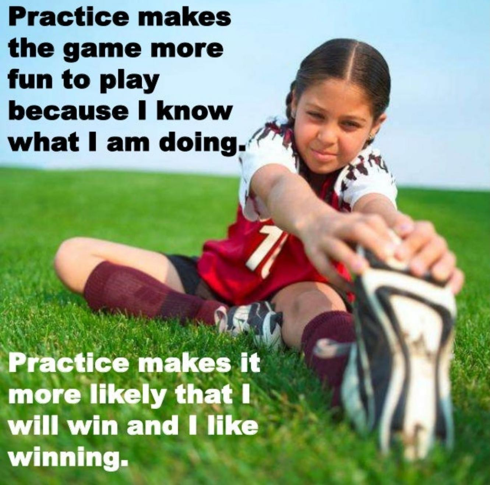

> **AI Description:**
> **Source:** `assets/_page_5_Figure_0.jpg`
> 
> **Generated:** 2026-05-31 14:13:04
> 
> ---
> 
> The image contains a photograph of a young girl in a soccer uniform stretching her leg on a grassy field. The photo is accompanied by two text quotes. The first quote reads, "Practice makes the game more fun to play because I know what I am doing." The second quote states, "Practice makes it more likely that I will win and I like winning." The image combines a photograph with text to convey a motivational message about the benefits of practice in sports.

Focused practice may result in increased utility due to

1. Improved activity experience due to accumulated skill (consumption capital)

2. Improved activity outcome due to cumulative experience (human production capital)

How important is focus when trying to achieve mastery in some area?

## Focus and differential outcomes

Does musical talent exist?

Does athletic talent exist?

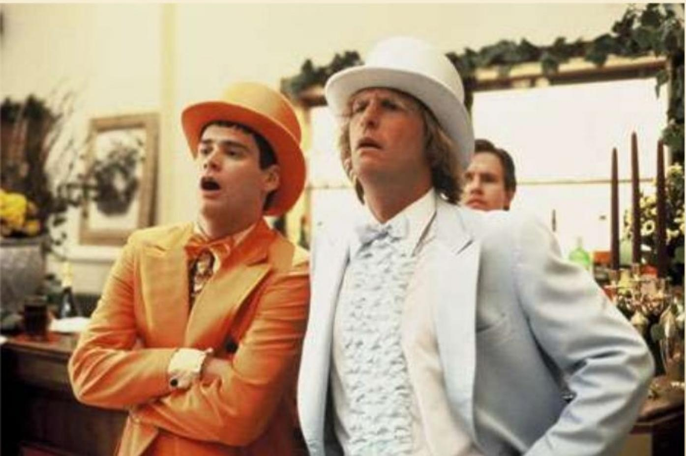

> **AI Description:**
> **Source:** `assets/_page_7_Figure_0.jpg`
> 
> **Generated:** 2026-05-31 14:01:50
> 
> ---
> 
> The image contains a photograph of two individuals standing side by side in what appears to be a social or formal setting. The person on the left is wearing an orange suit with a matching orange hat and tie, while the person on the right is dressed in a white suit with a white hat. Both individuals are looking upwards, and the background includes a table with various items and a framed picture on the wall. The setting suggests a formal or celebratory event.

Obviously, Ye, Right?""

### Full Page Description (Page 8)

**Source:** `assets/_page_8_Asset_0.jpg`

**Generated:** 2026-05-31 14:04:37

---

The image contains a close-up photograph of a stopwatch. The stopwatch has a circular dial with various markings and numbers indicating time intervals. The hands of the stopwatch are positioned at specific points, suggesting a particular time or elapsed time. The image is monochromatic, with the stopwatch appearing in grayscale. There are no additional visual elements or annotations beyond the stopwatch itself.

## A contrary argument

A series of findings suggest that, assuming basic dexterity or height, talent is simply the result of accumulated hours of focused practice with appropriate feedback.

So, seriously...

Does musical talent exist?

Does athletic talent exist?

## Talent on the violin

1. Professional performers

2.Performance track university violin students judged “best" by professors

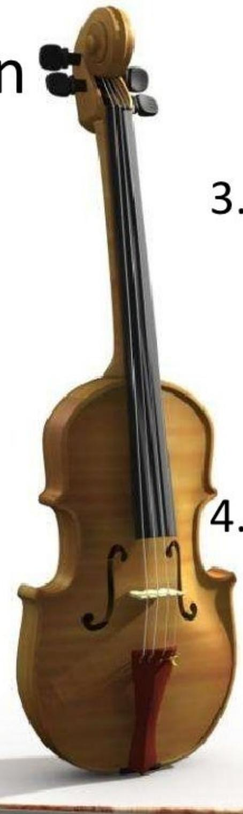

> **AI Description:**
> **Source:** `assets/_page_9_Figure_0.jpg`
> 
> **Generated:** 2026-05-31 14:05:54
> 
> ---
> 
> The image contains a photograph of a violin. The violin is shown in a side profile, with its scroll, neck, and body clearly visible. The wood has a natural, polished finish, and the strings and bridge are in place. The image is labeled with "3." and "4." in the top right corner, suggesting it might be part of a numbered sequence or list.

3.Performance track university violin students judged “good" by professors

4. Teacher track violin students

### Full Page Description (Page 10)

**Source:** `assets/_page_10_Asset_0.jpg`

**Generated:** 2026-05-31 14:02:41

---

The image contains a line graph with a title and legend. The graph shows the estimated accumulated practice hours (in hours) for violinists of different skill levels as they age. The x-axis represents the age of the violinists in years, ranging from 4 to 20. The y-axis represents the estimated accumulated practice in hours, ranging from 0 to 11,000. The legend distinguishes between "Best," "Good," "Teachers," and "Professionals" violinists, each represented by a different line and marker. The graph highlights an early divergence in practice hours among the different skill levels, as indicated by the red box and arrow.

## Talent on the violin

Can you find the talented violinists with fewer hours of practice?

## Adult piano players with 5-20+ years of experience

### Full Page Description (Page 12)

**Source:** `assets/_page_12_Asset_0.jpg`

**Generated:** 2026-05-31 14:16:48

---

The image is a line graph showing the estimated accumulated practice hours for pianists, categorized by expertise level (experts and amateurs). The x-axis represents the age of the pianists in years, ranging from 4 to 20. The y-axis represents the estimated accumulated practice hours in hours. The graph includes two lines: one for experts (solid line with filled circles) and one for amateurs (dashed line with open circles). The graph highlights a divergence in practice hours between experts and amateurs, with experts showing a steeper increase in practice hours as they age, while amateurs plateau at a lower level of practice hours. A red box with an arrow points to the divergence, emphasizing the early divergence in practice hours between the two groups.

## Talent on the piano

Does“talent"seem to be related to hours of practice?

## Innate differences of piano experts?

cognitive-motor skills.

But,therewere differences in specific abilities including singlehand movements, mirror-image movements in both hands,and different movements in opposite hands.

> **AI Description:**
> **Source:** `assets/_page_13_Figure_0.jpg`
> 
> **Generated:** 2026-05-31 13:58:25
> 
> ---
> 
> The image shows a close-up of a person's hands in a prayer position, with the palms pressed together and fingers interlocked. The background is blurred, focusing attention on the hands. The image conveys a sense of prayer or meditation, with the hands being the central visual element.

Innate differences of piano experts?

Were these specific hand skills

a) An example of innate "talent?

b) Simply a reflection of accumulated hours of practice?

> **AI Description:**
> **Source:** `assets/_page_14_Figure_0.jpg`
> 
> **Generated:** 2026-05-31 14:00:04
> 
> ---
> 
> The image contains a photograph of a person's hands in a prayer position. The hands are clasped together with the palms facing each other, and the fingers are interlocked. The background is blurred, focusing attention on the hands. The image conveys a sense of prayer or meditation.

### Full Page Description (Page 15)

**Source:** `assets/_page_15_Asset_0.jpg`

**Generated:** 2026-05-31 13:55:53

---

The image contains a scatter plot with a logarithmic scale on both axes. The x-axis represents "Log-Accumulated Practice (Hours)" and the y-axis represents "Log-Interstroke Interval (ms)." The data points are plotted with two different symbols, likely representing different groups or conditions. A fitted line is drawn through the data points, indicating a negative correlation between the log of accumulated practice and the log of interstroke interval, as indicated by the correlation coefficient \( r = -0.867 \) shown in the plot. The title "Single Hands" suggests that the data is specific to a single-handed task.

### Full Page Description (Page 15)

**Source:** `assets/_page_15_Asset_1.jpg`

**Generated:** 2026-05-31 13:55:22

---

The image contains a scatter plot with a fitted line. The x-axis represents "Log-Accumulated Practice (Hours)" and the y-axis represents "Mirror Image Movements." The data points are plotted on the graph, and a trend line is drawn through them. The correlation coefficient (r) is indicated as -0.865, suggesting a strong negative correlation between the log of accumulated practice hours and mirror image movements. The graph visually represents the relationship between practice hours and the performance in mirror image movements.

### Full Page Description (Page 15)

**Source:** `assets/_page_15_Asset_2.jpg`

**Generated:** 2026-05-31 13:56:15

---

The image is a scatter plot with a linear regression line. The x-axis represents "Log-Accumulated Practice (Hours)" and the y-axis represents "Different Movements." The data points are plotted on the graph, and the regression line is drawn through them. The correlation coefficient (r) is indicated as -0.857, suggesting a strong negative correlation between the log-accumulated practice and the different movements. The plot shows a decreasing trend as the log-accumulated practice increases.

## Core physical ability differences reflect accumulated practice

Experts are dark circles. Amateurs are empty circles.

Study of Belgian soccer players.   
All about 25 years old.   
All playing since they were about 5.   
Now some play in   
local competitions ("provincial"), some in national competitions, some in international competitions.

Any difference?

### Full Page Description (Page 17)

**Source:** `assets/_page_17_Asset_0.jpg`

**Generated:** 2026-05-31 14:09:45

---

The image is a line graph with three distinct lines representing different levels of accumulated practice (in hours) across various years into a career. The x-axis represents chronological age, ranging from 5 to 23 years, while the y-axis represents accumulated practice hours, ranging from 0 to 12,000 hours. The graph includes data points for international, national, and provincial levels of practice, with the lines showing a general upward trend as age increases. The graph is labeled with a legend indicating the types of practice and the corresponding symbols used for each level.

Helsen,etal.   
(2000),Therolesof   
talent,physical   
precocity,andpractice inthedevelopmentof soccer   
expertise,Journal of Sports

A study of soccer players in the UK age 9-18.

Differences between nationallevel players and local-level players

## A study of soccer players in the UK page9-18.

As compared with local-level youth players, did national-level youth players

A) Accumulate more hours in other sports

B) Accumulate fewer hours in other sports

C) Accumulate the same number of hours in other sports

### Full Page Description (Page 20)

**Source:** `assets/_page_20_Asset_0.jpg`

**Generated:** 2026-05-31 14:14:57

---

The image contains a line graph with three distinct lines representing different types of activities: "Practice," "Playful activities," and "Match-play." The x-axis represents age groups, ranging from U-9 to U-18, while the y-axis shows accumulated hours. The graph illustrates an increasing trend in the number of accumulated hours for each activity across the age groups. The lines for "Playful activities" and "Match-play" show a steady increase, with "Playful activities" generally having higher values than "Match-play." The "Practice" line also shows a consistent upward trend but remains the lowest among the three activities.

### Full Page Description (Page 20)

**Source:** `assets/_page_20_Asset_1.jpg`

**Generated:** 2026-05-31 14:17:10

---

The image is a line graph with three distinct lines representing different types of activities: "Practice," "Playful activities," and "Match-play." The x-axis represents age groups, ranging from U-9 to U-18, while the y-axis indicates the frequency or duration of these activities, with a scale up to 2500. The graph shows an increasing trend for all three activities as age increases, with "Playful activities" consistently having the highest frequency. The "Practice" and "Match-play" activities show a more gradual increase. The graph includes error bars, suggesting variability or standard deviation in the data.

Accumulated hours playing other sports

Nationally competitive

Accumulated hours of playing or practicing soccer matters.

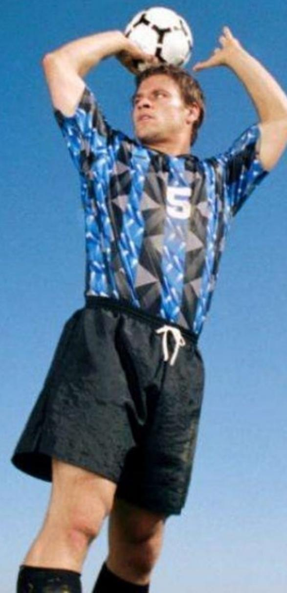

> **AI Description:**
> **Source:** `assets/_page_21_Figure_0.jpg`
> 
> **Generated:** 2026-05-31 14:15:41
> 
> ---
> 
> The image is a photograph of a person wearing a sports jersey with the number 5 on it, paired with black shorts and black socks. The individual is holding a soccer ball above their head with both hands, and the background is a clear blue sky. The jersey appears to have a geometric pattern in blue and white.

Does the type of playing or practicing matter?

3 soccer activities: Individual practice,team practice, playful activities

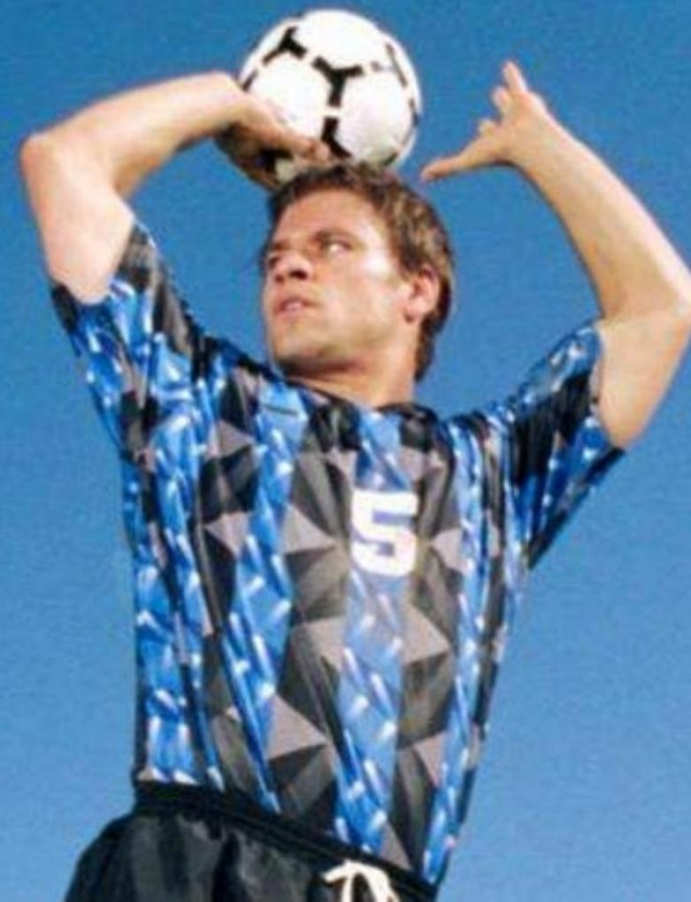

> **AI Description:**
> **Source:** `assets/_page_22_Figure_0.jpg`
> 
> **Generated:** 2026-05-31 14:00:36
> 
> ---
> 
> The image is a photograph of a soccer player in action. The player is wearing a blue and black patterned jersey with the number 5 on the front. The player is in the process of heading a soccer ball with his head, with his arms raised above his head. The background is a clear blue sky, suggesting the photo was taken outdoors during the daytime. The image captures a dynamic moment in a soccer match, emphasizing the player's athleticism and focus.

Did national-level youth players

a)Get more hours in all three activities

b)Get more hours inpractice but fewer hours in playful activities

c)Getoreoursolinlaful

d)Get more hours in team practice and playful activities, but not in individual practice

e) Get more hours in individual practice and playful activities, but not in team practice

### Full Page Description (Page 23)

**Source:** `assets/_page_23_Asset_1.jpg`

**Generated:** 2026-05-31 14:04:56

---

The image is a line graph with four distinct lines representing different types of activities: team practice, individual practice, playful activities, and match-play. The x-axis represents age groups from U-9 to U-18, while the y-axis represents the cumulative number of activities. The graph shows an increasing trend in the number of activities across all age groups, with team practice and playful activities having the highest cumulative numbers. The graph includes error bars indicating variability or standard deviation for each data point.

### Full Page Description (Page 23)

**Source:** `assets/_page_23_Asset_0.jpg`

**Generated:** 2026-05-31 14:05:39

---

The image is a line graph with the title "a". It displays accumulated hours across different age groups (U-9 to U-18) for four categories: Team practice, Individual practice, Playful activities, and Match-play. The y-axis represents the accumulated hours, while the x-axis represents the age groups. The graph shows an increasing trend for all categories as the age group increases, with the "Team practice" category having the highest accumulated hours and "Match-play" having the lowest. The graph includes error bars for each category, indicating variability or standard deviation.

## Deliberate practice v. playing around in soccer-related hours accumulated

A study of soccer players in the UK age 9-18.

## Variety/playing around v. Focus/deliberate practice

The rider can understand the cumulative benefits of deliberate focused practice over many years.

The elephant likes variety,but must be forced into focused repetition. The elephant likes to play around, but is not fond of

## The importance of feedback

"In the absence of adequate feedback, efficient learning is impossible and   
improvement only minimal even for highly motivated subjects. Hence mere   
repetition of an activity will not automatically lead to   
improvement.."

Practice≠Perfect Perfect Practice=Perfect

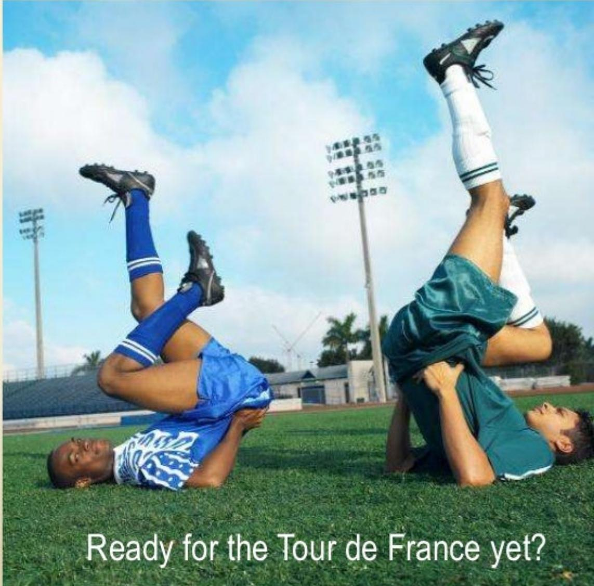

> **AI Description:**
> **Source:** `assets/_page_25_Figure_0.jpg`
> 
> **Generated:** 2026-05-31 14:01:10
> 
> ---
> 
> The image is a photograph showing two individuals performing a physical exercise on a grassy field. Both are lying on their backs with their legs bent at the knees and feet raised, appearing to stretch or perform a leg exercise. The individual on the left is wearing a blue sports jersey and shorts, while the individual on the right is wearing a green sports jersey and dark shorts. The background includes a sports field with a net, some trees, and stadium lights. The text at the bottom of the image reads, "Ready for the Tour de France yet?"

## Continued improvement requires experience + expert feedback

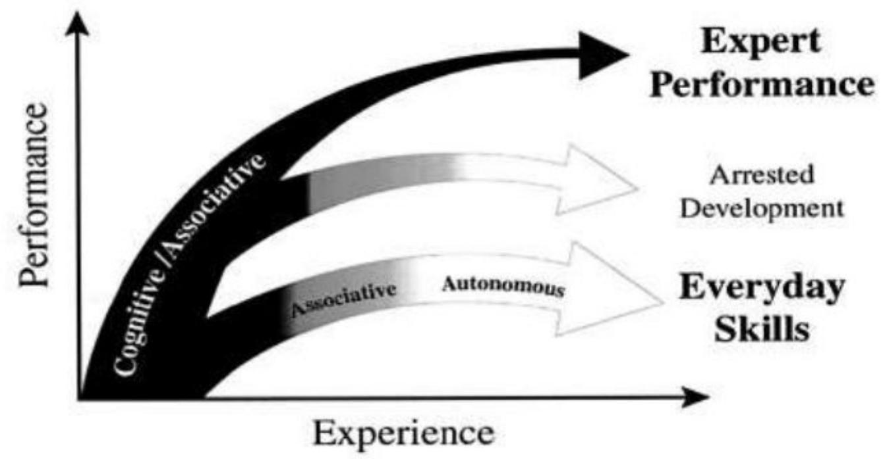

> **AI Description:**
> **Source:** `assets/_page_26_Figure_0.jpg`
> 
> **Generated:** 2026-05-31 14:16:03
> 
> ---
> 
> The image is a graph that illustrates the relationship between experience and performance, with a focus on skill development. It features a curved line labeled "Cognitive/Associative" that rises steeply as experience increases, indicating rapid improvement in performance. The line then levels off, representing "Expert Performance." Another line, labeled "Associative," shows a slower rate of improvement and eventually plateaus, indicating "Arrested Development." A third line, labeled "Autonomous," shows a steady increase in performance, leading to "Everyday Skills." The graph visually represents the stages of skill acquisition and the progression towards expertise.

"The key challenge for aspiring expert performers is to avoid the arrested development associated with automaticity and ... to support continued learning and improvement, as shown in the upper arm of [the] Figure."

## Focus v. variety in medical skills

Doctors listened to recordings of heart sounds and murmurs of healthy and sick patientsto diagnose the difference.Who was most accurate:new physicians completing residency (Residents),general practitionerphysicians (GP),or cardiologists (Specialists)?

a) Specialists ${ 1 ^ { \mathrm { s t } } } ,$ GPs $2 ^ { \mathsf { n d } }$ Residents $3 ^ { r d }$

b) Specialists ${ 1 ^ { \mathrm { s t } } } ,$ Residents $2 ^ { \mathsf { n d } }$ GPs $3 ^ { r d }$

c) GPs $1 ^ { \mathsf { s t } }$ Specialists $2 ^ { \mathsf { n d } }$ Residents $3 ^ { r d }$

d) Residents $1 ^ { \mathsf { s t } }$ ,Specialists $2 ^ { \mathsf { n d } }$ GPs $3 ^ { r d }$

e) Residents $1 ^ { \mathsf { s t } }$ GPs $2 ^ { \mathsf { n d } }$ ,Specialists $3 ^ { r d }$

### Full Page Description (Page 28)

**Source:** `assets/_page_28_Asset_0.jpg`

**Generated:** 2026-05-31 14:03:37

---

The image is a line graph with two distinct lines representing the performance of medical professionals at different stages of their career. The x-axis represents "Instruction and Experience," while the y-axis represents "Performance." The graph shows three categories: "Student," "Resident," and "Specialist," with the "Specialist" line being the highest and most stable, indicating peak performance. The "Resident" line shows an upward trend, indicating improvement with experience, and the "General Practitioners" line, represented by a dashed line, shows a decline in performance after 10-20 years of experience, with a significant drop over 20 years.

## Focus v. variety in medical skills

## A study of 108 college football players from 5 teams in the southeast.

Question:What factors were different between starters and other team members?

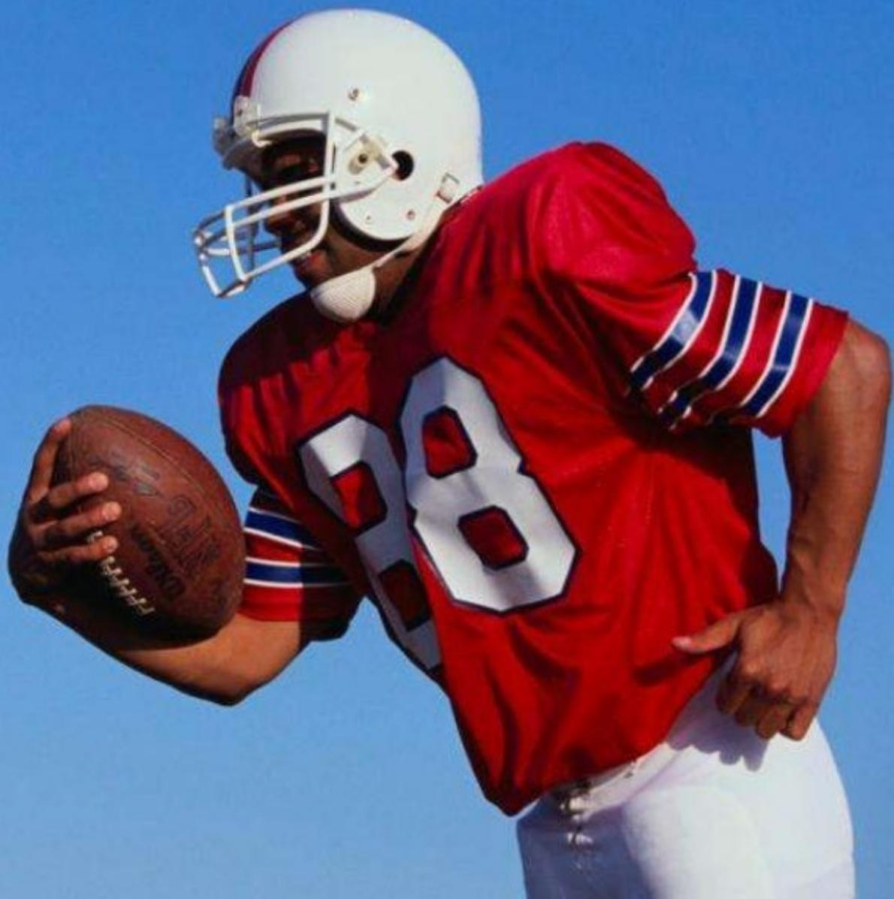

> **AI Description:**
> **Source:** `assets/_page_29_Figure_0.jpg`
> 
> **Generated:** 2026-05-31 14:04:22
> 
> ---
> 
> The image is a photograph of a football player in action. The player is wearing a red jersey with the number 28 prominently displayed on the back. The jersey also features blue and white stripes on the shoulders. The player is holding a football in his right hand and appears to be in the process of throwing or preparing to throw the ball. The background is a clear blue sky, suggesting the photo was taken outdoors on a sunny day. The player's helmet is white with a red stripe, and he is wearing white pants.

## Factors tested: Starters v. other players

Height in inches,weight in pounds,back squat maximum, bench press maximum,and forty yard dash.

Age, small high school (3A or below), state of competition, mother's education level, father'seducation level, parental presence while living at home,high school GPA,and SAT total.

28 psychological questions grouped into seven subscales

## What do you think? (Starters v.other players)

3factorswere significant:age,one psychological subscale,and...

1.Height in inches

2.weight in pounds

3.back squat maximum

4.bench press maximum

5.fortyyard dash

6.smallhigh school (3A or below)

7.state of competition

8.mother'seducation level

9.father'seducation level

10.parental presence while livingat home

11.high school GPA

12.SAT total

## A study of college football players

Significant differences in starters: age, one psychological subscale and...

not being from a small high school (3A or below).

"While smaller schools may be playing both sides of the ball, or"Ironman Football" larger school athletesmaybeableto hone theirabilitiesat one position...Alarge school athlete may spend more time with coaches... This increases the number offocused,directed practice hoursan individual obtains in a given season."

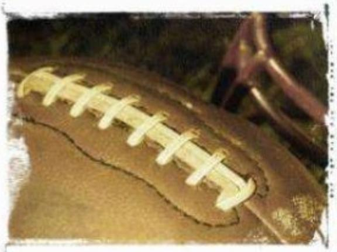

> **AI Description:**
> **Source:** `assets/_page_32_Figure_0.jpg`
> 
> **Generated:** 2026-05-31 14:11:16
> 
> ---
> 
> The image contains a close-up photograph of a football. The football is brown with a white lacing pattern running down the center. The background appears to be a blurred view of a football field, with part of a goalpost visible on the right side. The image is slightly grainy and has a vintage filter applied, giving it a nostalgic appearance.

## Does "elephant" control predict college football starting status?

The significant psychological subscale was:

1. I maintain emotional control no matter howthingsare going for me.

2. When things are going badly, Itell myself tokeepcalm, and this works for me.

3. When I feel myself getting too tense,l can quicklyrelax my body and calm myself.

4. l remain positive and enthusiastic during competition,no matter how badly things are going.

## Examples of hours accumulation

Who said that after he became a professional footballplayer, "The first 10 years, my wife and I didn't take a vacation"?

## Examples of hours accumulation

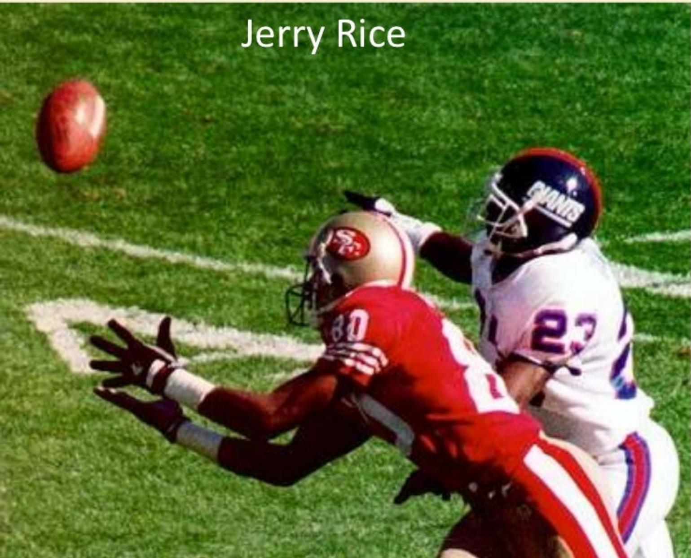

> **AI Description:**
> **Source:** `assets/_page_35_Figure_0.jpg`
> 
> **Generated:** 2026-05-31 14:11:09
> 
> ---
> 
> The image is a photograph of a football game. It shows two players in action: one in a red uniform with the number 80, and the other in a white uniform with the number 23. The player in the red uniform is diving to catch a football, while the player in the white uniform is attempting to block or defend. The photograph captures a dynamic moment in the game, with the football in mid-air and the players in motion. The text "Jerry Rice" is overlaid at the top of the image, likely identifying the player in the red uniform.

## Career Records

(23,546)seyras All-purpose yards

·Touchdowns (208)

·Receptions (1,549)

Playoff Records

rdseing

·Touchdowns (22)

·Receptions (151)

SuperBowl Records

·All-purpose yards（604）

·Touchdowns (8)

·Yards receiving in a single game (215)

## Examples of hours accumulation

· Sinclair Lewis- First American to receive the Nobel Prize in Literature

Booked to give a lecture at Columbia University on writing. He started by asking, "How many of you here are really serious about being writers?"

Most of the audience raised their hands, then...

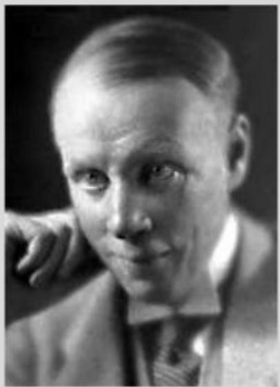

> **AI Description:**
> **Source:** `assets/_page_36_Figure_0.jpg`
> 
> **Generated:** 2026-05-31 13:56:00
> 
> ---
> 
> The image is a black and white portrait of a man with a neutral expression. The man is wearing a suit and tie, and his hair is neatly combed back. The photograph appears to be from an earlier time period, suggested by the style of the clothing and the quality of the image. There are no charts, graphs, or other visual elements present in the image.

> **AI Description:**
> **Source:** `assets/_page_36_Figure_1.jpg`
> 
> **Generated:** 2026-05-31 13:56:29
> 
> ---
> 
> The image is a black and white photograph of a large lecture hall filled with people. The audience is seated in rows, facing a stage at the front of the room. The stage has a podium and some equipment, possibly for presentations or lectures. The audience appears attentive, suggesting a formal event or educational setting. The image does not contain any text or additional visual elements beyond the photograph itself.

## Examples of hours accumulation

Lewis said,"Well, why the hell aren't you all home writing?" And he sat down.

> **AI Description:**
> **Source:** `assets/_page_37_Figure_0.jpg`
> 
> **Generated:** 2026-05-31 14:02:48
> 
> ---
> 
> The image is a black and white portrait photograph of a man. The man is wearing a suit and tie, and his hair is neatly combed. The photograph appears to be from the early to mid-20th century, based on the style of clothing and the quality of the image. There are no charts, graphs, or other visual elements present in the image.

> **AI Description:**
> **Source:** `assets/_page_37_Figure_1.jpg`
> 
> **Generated:** 2026-05-31 14:00:19
> 
> ---
> 
> The image is a photograph of a large lecture hall or auditorium filled with people. The audience is seated in rows, facing a stage at the front of the room. The seating arrangement is tiered, with the back rows elevated to provide a clear view for everyone. The photo appears to be in black and white, and the audience seems engaged, suggesting a lecture or presentation is taking place. There are no visible charts, graphs, or other visual elements beyond the seating arrangement and audience.

## Talent v. 10,000 hours

Research suggests that mastery requires about 10 years or 10,000 hours of practice with appropriate feedback in

music, mathematics, chess, compo sing, tennis, swimming, running, so ccer,and for

writers, poets, sientists,etc.

> **AI Description:**
> **Source:** `assets/_page_38_Figure_0.jpg`
> 
> **Generated:** 2026-05-31 14:06:31
> 
> ---
> 
> The image contains a photograph of a person wearing a white lab coat, looking through the eyepiece of a microscope. The individual appears to be engaged in scientific research or analysis. The microscope is a compound light microscope, identifiable by its two eyepieces and objective lenses. The background is plain and white, focusing attention on the subject and the microscope.

> **AI Description:**
> **Source:** `assets/_page_38_Figure_1.jpg`
> 
> **Generated:** 2026-05-31 14:06:38
> 
> ---
> 
> The image shows a close-up of a hand holding a yellow pencil, poised to write on a blank piece of paper. The hand appears to be that of an older person, judging by the visible wrinkles and the texture of the skin. The focus is on the hand and pencil, with the paper and background being out of focus. The image conveys a sense of readiness to write or draw.

## What about young phenoms and child prodigies?

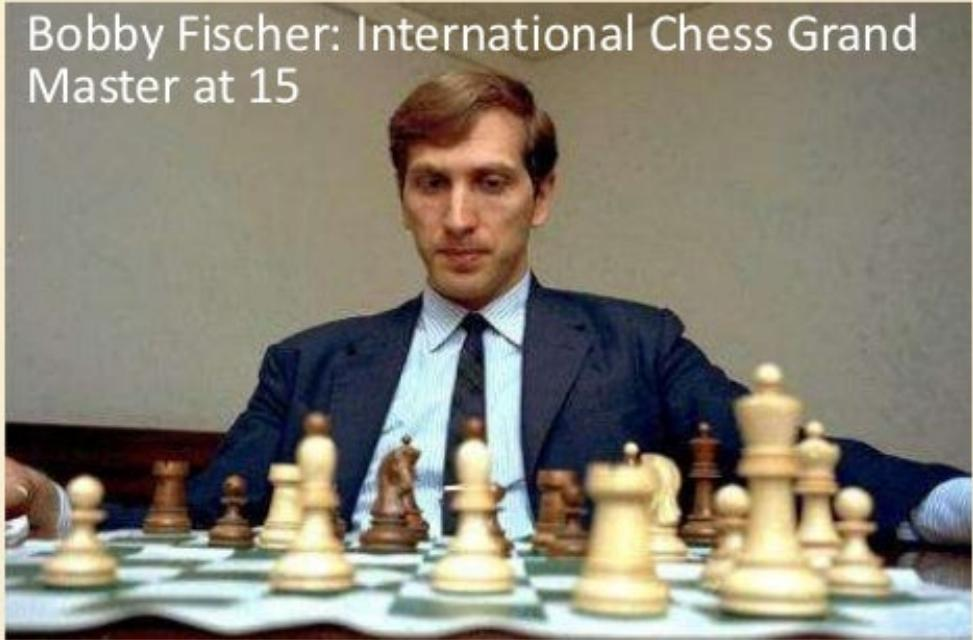

> **AI Description:**
> **Source:** `assets/_page_39_Figure_0.jpg`
> 
> **Generated:** 2026-05-31 14:05:17
> 
> ---
> 
> The image contains a photograph of a man seated at a chessboard. The text at the top of the image reads "Bobby Fischer: International Chess Grand Master at 15." The man is dressed in a suit and tie, and the chessboard in front of him has pieces arranged on it, indicating a chess game in progress. The image serves as a visual representation of Bobby Fischer's early chess career, highlighting his young age and talent as a chess grandmaster.

Mozart:Child prodigy

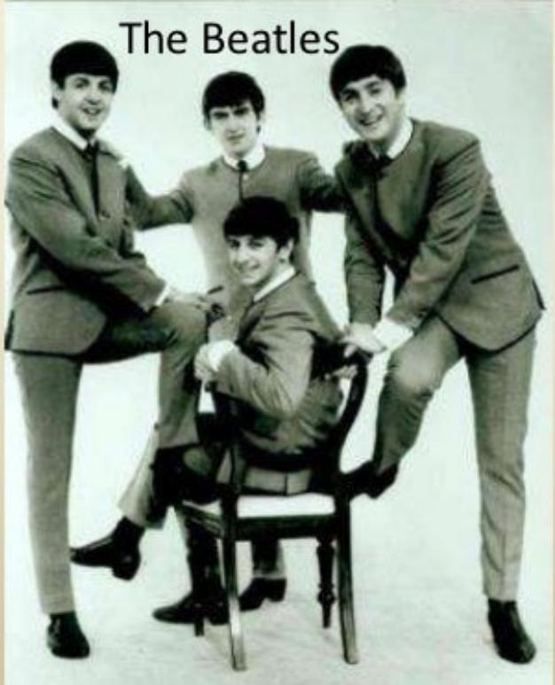

> **AI Description:**
> **Source:** `assets/_page_39_Figure_2.jpg`
> 
> **Generated:** 2026-05-31 14:06:06
> 
> ---
> 
> The image is a photograph of four individuals dressed in matching suits, posed in a playful manner. The text "The Beatles" is displayed at the top of the image, indicating the subjects are the famous British rock band. The individuals are arranged in a way that suggests camaraderie and fun, with one person sitting in a chair and the others leaning over him. The image captures a lighthearted moment, likely from a promotional or casual photo shoot.

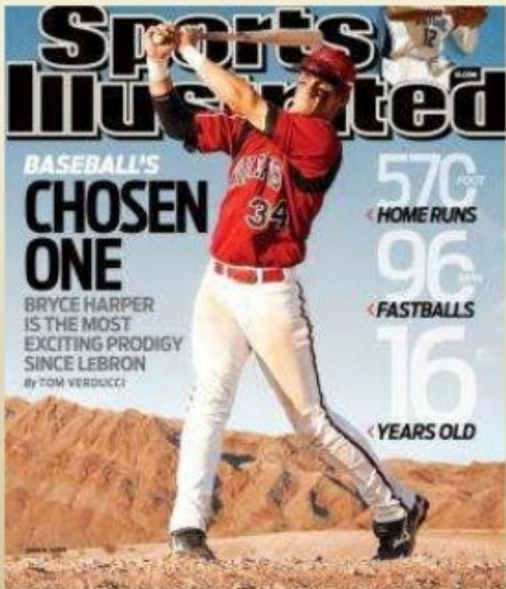

> **AI Description:**
> **Source:** `assets/_page_39_Figure_3.jpg`
> 
> **Generated:** 2026-05-31 14:06:16
> 
> ---
> 
> The image is a magazine cover from Sports Illustrated featuring a photograph of a baseball player in a batting stance. The player is wearing a red jersey with the number 34 and white pants. The background shows a desert landscape. The text on the cover highlights the player's achievements, stating "Baseball's Chosen One" and listing statistics such as "570 Home Runs," "96 Fastballs," and "16 Years Old." The text also mentions that the player is "the most exciting prodigy since LeBron" by Tom Verducci.

Bryce Harper:

·16 yr. old baseball phenom

Longest distance home run ever hitat Tropicana Field

·570 ft home run duringa high school game at age15

## Bobby Fischer

International chess grand master at 15.

· Started playing at age 6

· At 7, began weekly tutoring by. president of Brooklyn chess club

· At 12, joined one of the strongest chess clubs in the world and met several timesa week with chess master Jack Collins with access to his library of chess books.

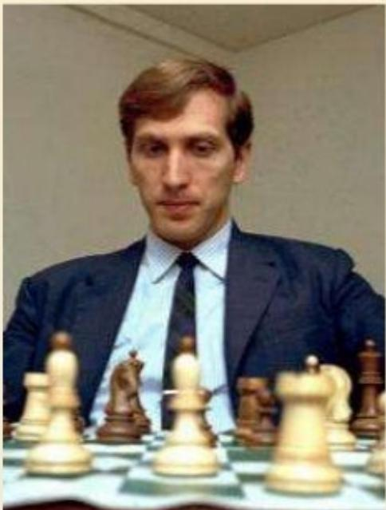

> **AI Description:**
> **Source:** `assets/_page_40_Figure_0.jpg`
> 
> **Generated:** 2026-05-31 13:55:30
> 
> ---
> 
> The image contains a photograph of a person seated at a chessboard. The individual is wearing a dark suit and tie, and the chessboard in front of them has several pieces arranged on it, including pawns, knights, and bishops. The setting appears to be indoors, with a plain wall in the background. The image captures a moment of concentration or contemplation, likely related to a chess game or analysis.

Result: Mastery in 9 years instead of 10 (probably resulting from intensity and hours of training).

## Bryce Harper

·16 yr. old baseball phenom

·570 ft home run during a high school game at age 15

·Longest distance home run ever hit at Tropicana Field

http://sports.espn.go.com/espn/e60/news/story?id=4388790   
Start-3:16   
Bryce Harper1.wmv

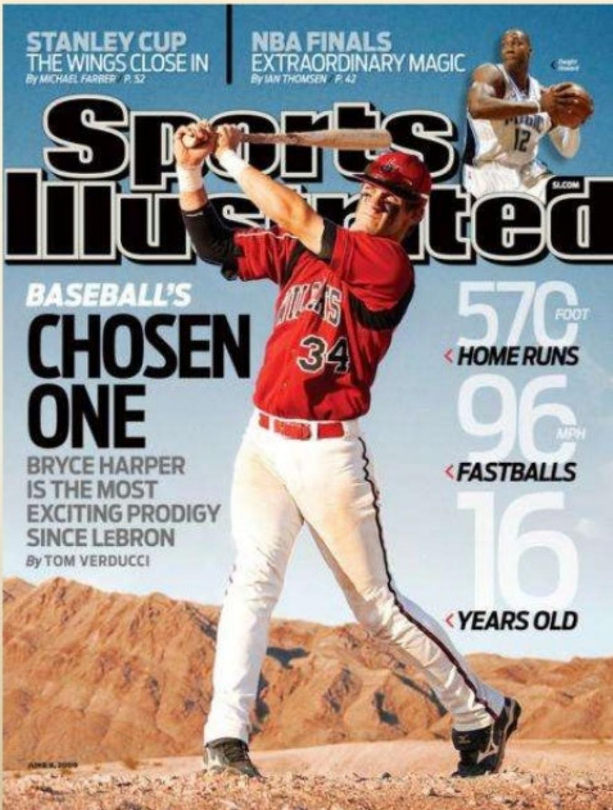

> **AI Description:**
> **Source:** `assets/_page_41_Figure_0.jpg`
> 
> **Generated:** 2026-05-31 13:59:05
> 
> ---
> 
> The image is a cover of Sports Illustrated featuring Bryce Harper. It includes a photograph of Harper in a batting stance, wearing a red jersey with the number 34. The background shows a desert landscape. The text highlights Harper as "Baseball's Chosen One" and compares him to LeBron James. It also provides statistics about Harper, such as 570 home runs, 96 mph fastballs, and being 16 years old. The image combines a photograph with text to convey information about Harper's potential and achievements.

## Bryce Harper and hours accumulation

"Bryce Harper was playing T-ball at age three against six-year-olds,.. He has playedbetween80and130baseball games a year each year for the past seven years...

Bryce Harper is the product of a travel   
baseball industry that   
mushroomed,just as he himself was   
growing up, into big business. There   
seems no end to the tournaments,all  
star games,showcases,wood-bat   
leagues, UsA Baseball youth   
teams,"scout teams" sponsored by   
major league clubs."

-Quote from issue pictured at right http://sports.espn.go.com/espn/ e60/news/story?id=4388790 3:16-4:29

## Wolfgang Amadeus Mozart

"By the standards of mature composers, Mozart's early works were not that outstanding.... Of those concertos that only contain music original to Mozart, the earliest that is now regarded as a masterwork (No.9, K 271) was not composed until he was 21. By that time Mozart had already been composing concertos for ten years."

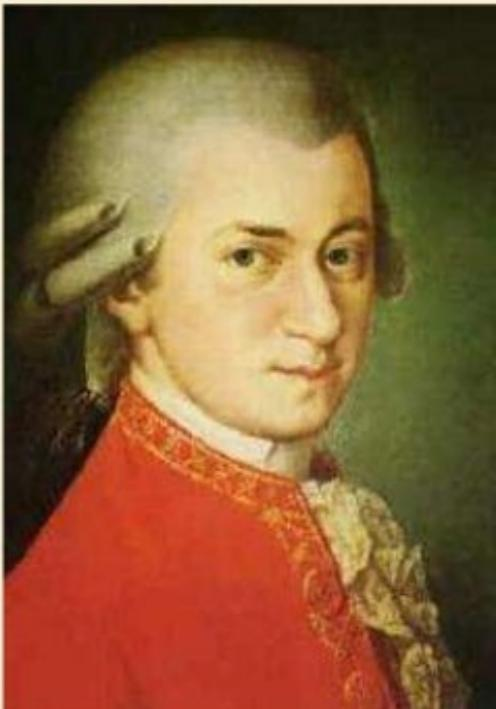

> **AI Description:**
> **Source:** `assets/_page_43_Figure_0.jpg`
> 
> **Generated:** 2026-05-31 14:06:47
> 
> ---
> 
> The image is a portrait of a man in formal attire. The man is wearing a red coat with a white shirt and a cravat, and his hair is styled in a powdered wig typical of the 18th century. The background is a muted, dark green color, which contrasts with the subject's attire. The style of the portrait suggests it is a historical depiction, possibly of a figure from the 18th century.

Michael Howe Genius Explained

## The Beatles

·1960 went to Hamburg, Germany to play in strip clubs8 hoursa night,7 days a week.

· The Hamburg trips yielded 270 nights of performing at 8 hours/night in only 1.5 years.

· By 1964 when the Beatles came to the US,they had played at least 1,200 gigs (\~8,400 hours).

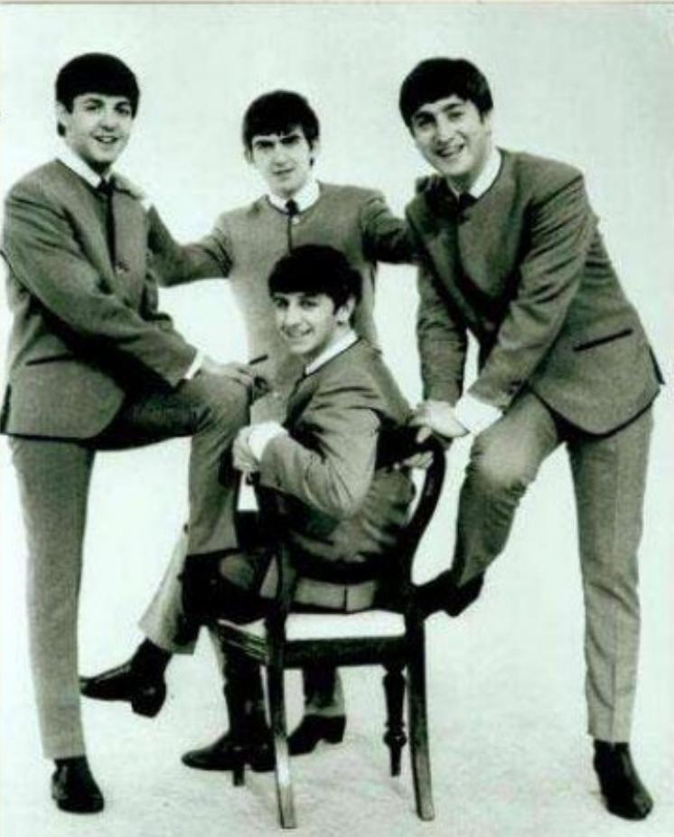

> **AI Description:**
> **Source:** `assets/_page_44_Figure_0.jpg`
> 
> **Generated:** 2026-05-31 14:08:23
> 
> ---
> 
> The image is a photograph of four individuals dressed in matching suits, posing in a casual and friendly manner. The setting appears to be from a past era, suggested by the style of clothing and the black-and-white nature of the photograph. The individuals are arranged in a way that suggests camaraderie and a sense of unity, with one person seated in a chair while the others stand around him, some with their arms around each other. The overall mood of the image is lighthearted and sociable.

"They were no good onstage when they went thereand theywere very goodwhen they cameback...twasthemakingofthem."From Shout!The Beatlesin Their Generation(1981)byP.Norman.

## Magic?

Even in mythic tales of seemingly overwhelming, undeniable talent, the 10-year or 10,000 hour guidelines still seemstoapply.stil

> **AI Description:**
> **Source:** `assets/_page_45_Figure_0.jpg`
> 
> **Generated:** 2026-05-31 14:13:49
> 
> ---
> 
> The image contains a silhouette of a person holding a hat and a stick, possibly a conductor or a performer. The silhouette is in black and white, and the image is blurry, making it difficult to discern finer details. The person appears to be in a standing position, with one arm extended forward holding the stick and the other arm bent at the elbow holding the hat. The overall impression is abstract and symbolic rather than providing specific information.

## Summary: The power of intentional focus v. the dissipation of variety

·The power to avoid negative addictions

·The power to pursue positive addictions

·The power to become the best

Slides by:   
Russell James Ill, J.D.,Ph.D.,CFP?   
Associate Professor   
Division of Personal Financial Planning   
Texas Tech University   
russell.james@ttu.edu Please use these slides!   
If you think you might use anything here in a classroom, please CLICK HERE to let me know. Thanks!

> **AI Description:**
> **Source:** `assets/_page_47_Figure_0.jpg`
> 
> **Generated:** 2026-05-31 13:55:38
> 
> ---
> 
> The image is a professional portrait photograph of a man. He is wearing glasses, a dark suit, a white shirt, and a patterned tie. The background is a gradient of dark to light shades, likely to emphasize the subject. There are no charts, graphs, or other visual elements present in the image.

The outline for this behavioral economics series is at http://www.slideshare.net/rnja8c/outline-for-behavioraleconomics-course-component