
## Creating a Data-Driven Organization

Carl Anderson

9:15am, Grand 2

Why data-driven?

> **AI Description:**
> **Source:** `assets/_page_2_Figure_0.jpg`
> 
> **Generated:** 2026-05-31 15:01:02
> 
> ---
> 
> The image is a photograph featuring a person surrounded by stacks of cash. The individual is holding a bundle of money in each hand, with additional stacks of cash visible in the foreground and background. The money is bundled and labeled with amounts such as "$5,000" and "$2,000". The setting appears to be indoors with a dark background, emphasizing the large amount of money. The person is wearing a blue shirt and glasses, and there is a ring visible on one of their fingers.

Controlling for other factors, data-driven orgs are

Brynjolfssonetal 211.Strength inumbers:howdoesdata-drivendecisonmaking affectfirm performance?Social Science Research Network

## \$13 / \$1 invested

## What is data-driven?

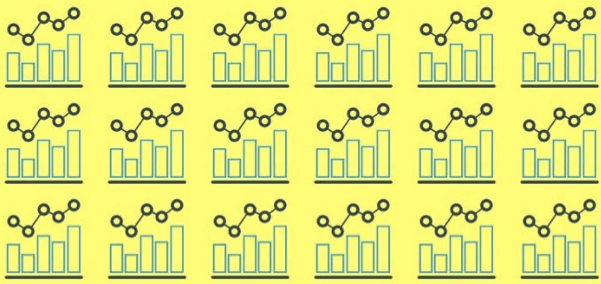

> **AI Description:**
> **Source:** `assets/_page_6_Figure_0.jpg`
> 
> **Generated:** 2026-05-31 14:48:19
> 
> ---
> 
> The image contains a repeating pattern of bar graphs and line graphs. The bar graphs display a series of bars of varying heights, representing data points, while the line graphs above them show a trend line connecting these data points. The pattern repeats across the image, suggesting a comparison or analysis of multiple datasets or time series. The visual elements are consistent and provide a clear representation of data trends and comparisons.

Having lots of reports does not make you data-driven.

> **AI Description:**
> **Source:** `assets/_page_7_Figure_0.jpg`
> 
> **Generated:** 2026-05-31 14:52:04
> 
> ---
> 
> The image contains a circular gauge with a needle pointing towards the middle. The gauge is divided into three sections: green on the left, yellow in the middle, and red on the right. The needle is positioned near the yellow section, indicating a moderate value. The gauge has a scale at the bottom, which likely represents the range of values the gauge can measure. The design suggests it could be a representation of a performance metric or status indicator.

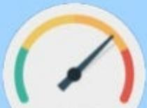

> **AI Description:**
> **Source:** `assets/_page_7_Figure_1.jpg`
> 
> **Generated:** 2026-05-31 14:51:59
> 
> ---
> 
> The image is a gauge or speedometer-style visualization. It has a circular design with a needle pointing to the right, indicating a value. The gauge is divided into three color-coded sections: green on the left, yellow in the middle, and red on the right. The needle is positioned in the yellow section, suggesting a moderate value. There are no labels or text annotations within the image itself.

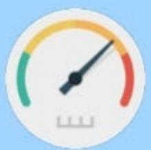

> **AI Description:**
> **Source:** `assets/_page_7_Figure_2.jpg`
> 
> **Generated:** 2026-05-31 14:49:47
> 
> ---
> 
> The image is a circular gauge with a needle pointing to a specific value. The gauge has a color-coded scale, with green on the left, yellow in the middle, and red on the right. The needle is positioned in the yellow section, indicating a moderate value. The gauge appears to be used for monitoring or measuring a variable, possibly in a control or monitoring system.

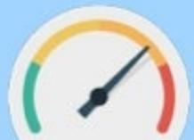

> **AI Description:**
> **Source:** `assets/_page_7_Figure_3.jpg`
> 
> **Generated:** 2026-05-31 14:50:42
> 
> ---
> 
> The image displays a speedometer-style gauge with a needle pointing towards the red section. The gauge is divided into three color-coded sections: green on the left, yellow in the middle, and red on the right. The needle is positioned in the yellow section, indicating a moderate level of activity or performance. The design suggests a visual representation of a metric that can range from low to high, with the yellow section representing a critical or cautionary level.

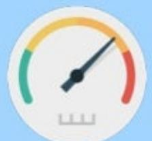

> **AI Description:**
> **Source:** `assets/_page_7_Figure_4.jpg`
> 
> **Generated:** 2026-05-31 14:47:34
> 
> ---
> 
> The image is a gauge or meter with a needle pointing to the right. The gauge has three colored sections: green on the left, yellow in the middle, and red on the right. The needle is positioned between the green and yellow sections, indicating a value that is within a normal range but not optimal. The gauge appears to be a visual representation of a performance metric or status indicator, possibly related to energy usage, system health, or another metric that can be measured on a scale.

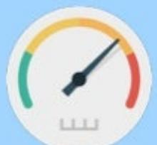

> **AI Description:**
> **Source:** `assets/_page_7_Figure_5.jpg`
> 
> **Generated:** 2026-05-31 14:47:58
> 
> ---
> 
> The image depicts a gauge or meter with a needle pointing towards the center. The gauge is divided into three sections: green on the left, yellow in the middle, and red on the right. The needle is positioned near the center, indicating a moderate value. The scale at the bottom suggests that the gauge measures a quantity that can range from a low to a high level.

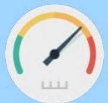

> **AI Description:**
> **Source:** `assets/_page_7_Figure_6.jpg`
> 
> **Generated:** 2026-05-31 14:48:48
> 
> ---
> 
> The image depicts a circular gauge with a needle pointing towards the right side. The gauge is divided into three color-coded sections: green on the left, yellow in the middle, and red on the right. The needle is positioned within the yellow section, indicating a moderate level. The gauge has a simple design with no additional text or labels, focusing solely on the color-coded scale and the needle's position.

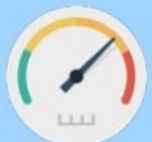

> **AI Description:**
> **Source:** `assets/_page_7_Figure_7.jpg`
> 
> **Generated:** 2026-05-31 14:48:43
> 
> ---
> 
> The image is a gauge or meter with a circular design. The needle points to the right, indicating a value within the green section, which typically represents a normal or acceptable range. The red section on the right side of the gauge is empty, suggesting that the value is not in the critical range. The gauge has a scale at the bottom, likely representing the measurement range, but the specific units are not clearly labeled.

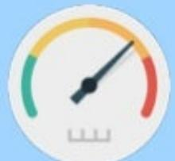

> **AI Description:**
> **Source:** `assets/_page_7_Figure_8.jpg`
> 
> **Generated:** 2026-05-31 15:02:35
> 
> ---
> 
> The image depicts a circular gauge with a needle pointing towards the middle. The gauge has a gradient color scheme, transitioning from green on the left to yellow, then to red on the right. The needle is positioned near the center, indicating a moderate reading. The gauge has a scale at the bottom, likely representing a range of values, though the specific values are not labeled in the image. The overall design suggests it could be a visual representation of a measurement or status indicator, possibly related to performance or progress.

> **AI Description:**
> **Source:** `assets/_page_7_Figure_9.jpg`
> 
> **Generated:** 2026-05-31 15:02:42
> 
> ---
> 
> The image depicts a gauge or meter with a needle pointing to a specific position. The gauge has a color-coded scale, with green on the left, yellow in the middle, and red on the right. The needle is positioned between the green and yellow sections, indicating a value within the green range. The scale at the bottom suggests that the gauge is measuring a level or intensity, possibly related to a performance metric or environmental condition.

> **AI Description:**
> **Source:** `assets/_page_7_Figure_10.jpg`
> 
> **Generated:** 2026-05-31 14:52:29
> 
> ---
> 
> The image depicts a circular gauge with a needle pointing towards the middle. The gauge has a color gradient, with green on the left, yellow in the middle, and red on the right. The needle is positioned in the yellow section, indicating a moderate reading. The gauge has a scale at the bottom, but the specific values are not labeled. The overall design suggests a visual representation of a measurement or status indicator, possibly related to a system or process.

> **AI Description:**
> **Source:** `assets/_page_7_Figure_11.jpg`
> 
> **Generated:** 2026-05-31 14:52:33
> 
> ---
> 
> The image is a gauge or meter with a needle pointing to the left. The gauge is divided into three sections: green on the left, yellow in the middle, and red on the right. The needle is positioned in the yellow section, indicating a moderate level. The gauge has a scale at the bottom, which appears to be in increments, possibly representing a percentage or a numerical scale.

> **AI Description:**
> **Source:** `assets/_page_7_Figure_12.jpg`
> 
> **Generated:** 2026-05-31 14:54:12
> 
> ---
> 
> The image depicts a circular gauge with a needle pointing to a specific value. The gauge has three color-coded sections: green on the left, yellow in the middle, and red on the right. The needle is positioned within the yellow section, indicating a value that falls within a moderate range. The gauge appears to be a simplified representation of a measurement, possibly related to a performance indicator or status level.

Having lots of dashboards does not make you data-driven.

> **AI Description:**
> **Source:** `assets/_page_8_Figure_0.jpg`
> 
> **Generated:** 2026-05-31 14:55:43
> 
> ---
> 
> The image contains a circular icon with a red background and a green border. Inside the circle, there is a white illustration of a bell with a sound wave emanating from it, and to the right of the bell, there is a white flame. The icon appears to represent a fire alarm or emergency alert system, possibly indicating a critical alert or warning.

Having lots of alerts does not make you data-driven.

## Data-driven: you must have analytics

Not necessarily data-driven !

## Levels of Analytics

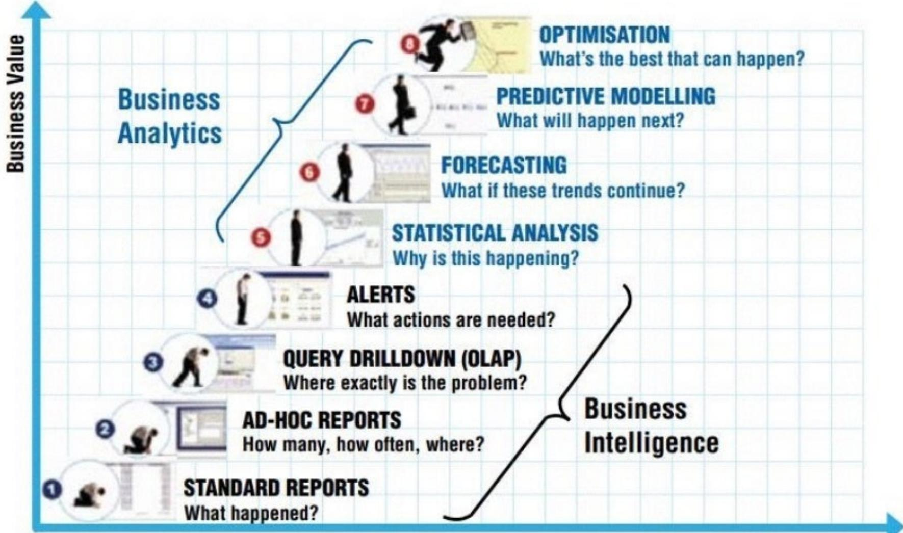

> **AI Description:**
> **Source:** `assets/_page_11_Figure_0.jpg`
> 
> **Generated:** 2026-05-31 14:59:05
> 
> ---
> 
> The image is an infographic combining text with visual elements, specifically a graph that illustrates the progression from standard reports to business intelligence and business analytics. The graph is labeled "Business Value" on the vertical axis and progresses horizontally from left to right. Key terms such as "Standard Reports," "Ad-Hoc Reports," "Query Drilldown (OLAP)," "Alerts," "Statistical Analysis," "Forecasting," "Predictive Modelling," and "Optimisation" are annotated with corresponding icons and are positioned at various points along the graph. The graph visually represents the increasing business value associated with each stage of business analytics and intelligence.

Degreeof Intelligence

## Analytics Value Chain

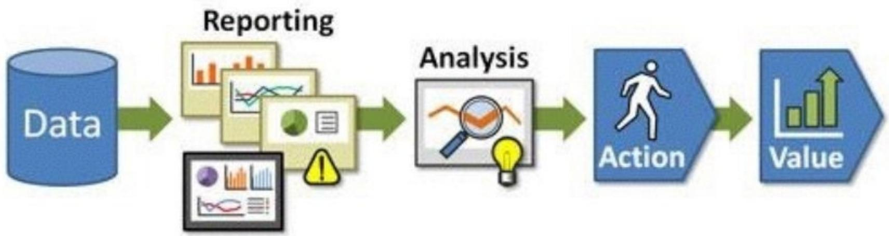

> **AI Description:**
> **Source:** `assets/_page_12_Figure_0.jpg`
> 
> **Generated:** 2026-05-31 14:47:53
> 
> ---
> 
> The image is a flowchart illustrating a data-driven process. It begins with a "Data" cylinder symbolizing the input of data. The data flows through a "Reporting" section, which includes various charts and graphs, indicating the presentation of data in a visual format. Following reporting, the data moves into an "Analysis" phase, represented by a magnifying glass and a lightbulb, suggesting the examination and interpretation of the data. This leads to an "Action" step, symbolized by a walking figure, indicating the implementation of decisions based on the analysis. Finally, the process results in "Value," depicted by a bar graph with an upward arrow, signifying the realization of benefits or improvements. The flowchart effectively communicates the progression from data collection to actionable insights and their resultant value.

"Analytics is about impact...In our company [Zynga], if you have brilliant insight and you did great research and no one changes,you get zero credit."

Ken Rudin

Facebook

> **AI Description:**
> **Source:** `assets/_page_14_Figure_0.jpg`
> 
> **Generated:** 2026-05-31 14:51:52
> 
> ---
> 
> The image contains a simple illustration of a person's head and shoulders. The head is replaced with a light bulb, symbolizing ideas or innovation. The person is depicted in a suit and tie, suggesting a professional or business context. The light bulb is the central visual element, indicating a focus on creativity or problem-solving.

Train analysts to be business savvy

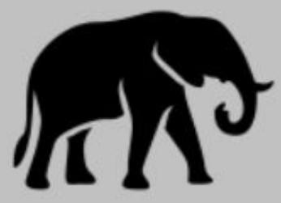

> **AI Description:**
> **Source:** `assets/_page_15_Figure_0.jpg`
> 
> **Generated:** 2026-05-31 14:46:28
> 
> ---
> 
> The image contains a simple black silhouette of an elephant against a gray background. The elephant is depicted in a side profile, facing to the right, with its trunk raised and curled upwards. There are no additional visual elements, text, or annotations present in the image.

Having a hadoop cluster does not make you data-driven.

WHYARE WE DOINGA/BTESTIN6？

WHY ARE WE ANALYZING SENTIMENT?

WHY ARE WE PREDICTING FUTURE TRENDS?

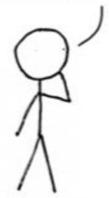

> **AI Description:**
> **Source:** `assets/_page_16_Figure_0.jpg`
> 
> **Generated:** 2026-05-31 14:57:55
> 
> ---
> 
> The image contains a simple stick figure drawing. The figure has a round head, a single line for the body, and two lines for the arms and legs. The arms are positioned as if the figure is waving or gesturing. There are no labels or text annotations present in the image.

WHY ARE WE CREATTNGARECOMMENDER SYSTEM？

WHY? WHY? WHY!

> **AI Description:**
> **Source:** `assets/_page_16_Figure_1.jpg`
> 
> **Generated:** 2026-05-31 14:57:51
> 
> ---
> 
> The image is a simple line drawing of the Earth. It is a basic representation showing the continents and oceans in a stylized manner. The drawing is symmetrical and lacks detailed features such as landmasses or water bodies. It is a general depiction of the Earth's shape and continents.

Leverage data as a strategic asset.

> **AI Description:**
> **Source:** `assets/_page_18_Figure_0.jpg`
> 
> **Generated:** 2026-05-31 14:54:31
> 
> ---
> 
> The image contains a simple diagram of a petri dish with two distinct colonies of bacteria. The colonies appear to be growing in a petri dish, which is a common method for culturing and observing microorganisms. The diagram is likely used to illustrate the growth of bacteria in a controlled environment, possibly for educational or research purposes.

Data-driven requires a data culture

## Data Driven Culture

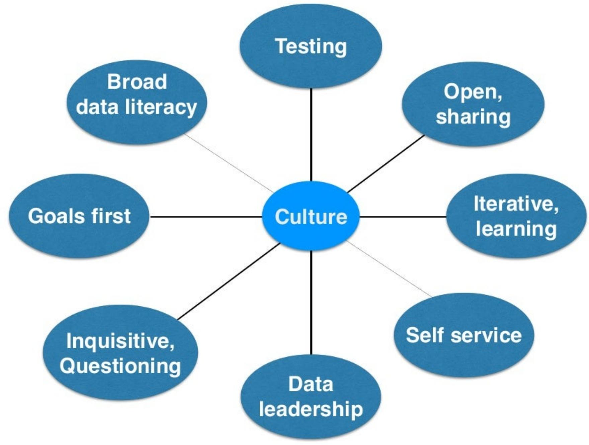

> **AI Description:**
> **Source:** `assets/_page_19_Figure_0.jpg`
> 
> **Generated:** 2026-05-31 14:54:07
> 
> ---
> 
> The image is a diagram illustrating various aspects of a data culture. It features a central circle labeled "Culture" from which eight smaller circles branch out, each representing a different attribute or principle related to the data culture. These attributes include: Testing, Broad data literacy, Open, sharing, Iterative, learning, Self service, Data leadership, Inquisitive, Questioning, and Goals first. The diagram uses a simple, clean layout with blue circles and white text, emphasizing the interconnectedness of these cultural elements.

## Being data-driven means having...

## a strong testing culture

Innovate through online and offline experimentation.   
Encourage hypothesis generation broadly across org.

"you get surprises more often,and surprises are a key source of innovation. You only get a surprise when youare tryingsomethingand the result isdifferent than you expected,so the sooner you run the experiment, the sooner you are likely to find a surprise,and the surprise is the market speaking to you,telling you something you didn't know."

Scott Cook

Intuit

## Optimize for Right Thing

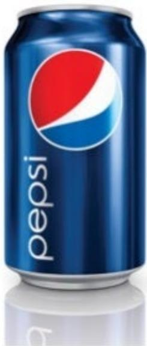

> **AI Description:**
> **Source:** `assets/_page_22_Figure_2.jpg`
> 
> **Generated:** 2026-05-31 14:50:49
> 
> ---
> 
> The image contains a single object: a can of Pepsi. The can is predominantly blue with the iconic Pepsi logo, which consists of a red and white circle on a blue background, and the word "Pepsi" written in lowercase white letters on the lower part of the can. The can appears to be a standard beverage can, likely containing a soft drink. There are no charts, graphs, or other visual elements present in the image.

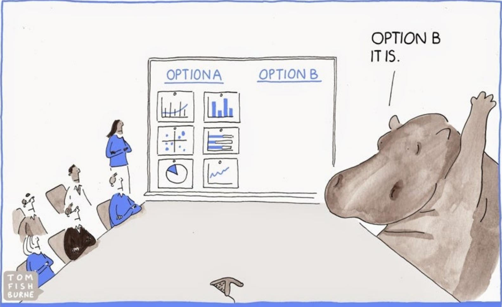

> **AI Description:**
> **Source:** `assets/_page_24_Figure_0.jpg`
> 
> **Generated:** 2026-05-31 14:49:40
> 
> ---
> 
> The image contains a cartoon-style illustration of a meeting room. A person is presenting to a group of seated individuals, with a whiteboard in the background displaying two options labeled "Option A" and "Option B." The whiteboard contains various charts and graphs under each option, indicating data visualization. The cartoon character in the foreground, a large hippopotamus, is raising its arm in a gesture of agreement, with the text "OPTION B IT IS." above it. The illustration humorously suggests a decision has been made, with the hippopotamus representing a forceful or decisive choice.

Let data drive decisions, not the Hlghest Paid Person'spinion.

## Being data-driven means having...

## an open, sharing culture

No data hoarding or silos. Bring data together to create rich contexts.Connect the dots.

## Context is King

## Context is King

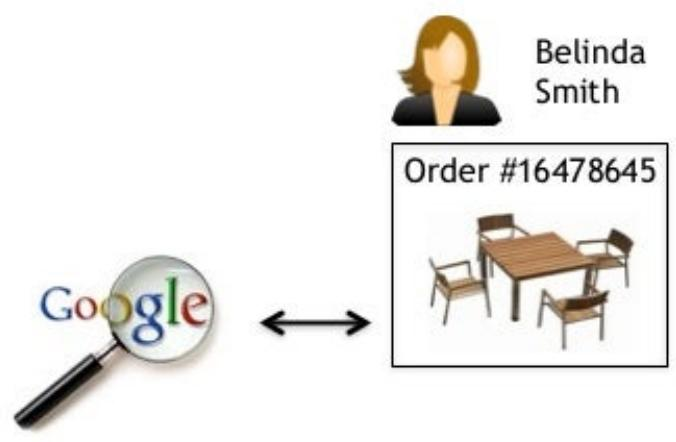

> **AI Description:**
> **Source:** `assets/_page_27_Figure_0.jpg`
> 
> **Generated:** 2026-05-31 14:59:17
> 
> ---
> 
> The image contains a combination of text and visual elements. It includes a magnifying glass with the Google logo, a profile icon with the name "Belinda Smith," and an image of a table with chairs. There is also text indicating an order number, "Order #16478645." The image appears to be related to a customer profile or order tracking system, possibly for furniture or similar products.

## Context is King

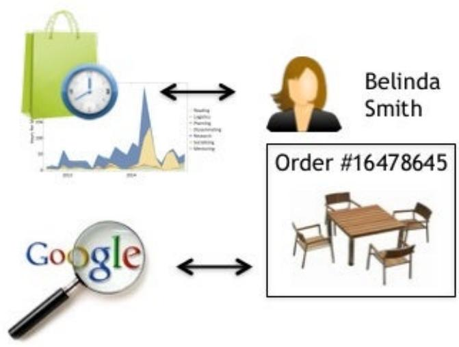

> **AI Description:**
> **Source:** `assets/_page_28_Figure_0.jpg`
> 
> **Generated:** 2026-05-31 14:52:43
> 
> ---
> 
> The image contains a combination of text and visual elements. It includes a shopping bag, a clock, a graph, a magnifying glass with the Google logo, a person's name "Belinda Smith," and an order number "16478645." The graph appears to represent some form of data over time, possibly sales or usage trends. The shopping bag and clock might symbolize time and shopping, while the magnifying glass and Google logo suggest a focus on search or analysis. The person's name and order number indicate a specific user and transaction.

## Context is King

## Context is King

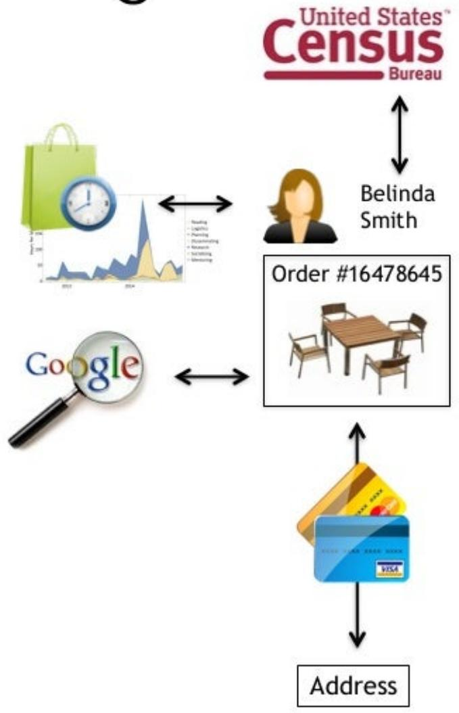

> **AI Description:**
> **Source:** `assets/_page_30_Figure_0.jpg`
> 
> **Generated:** 2026-05-31 14:52:23
> 
> ---
> 
> The image contains a flowchart with various icons and text annotations. It begins with the United States Census Bureau logo at the top right. Below it, there is a representation of Belinda Smith, followed by an order number and an image of a table and chairs. Arrows indicate a flow from the Census Bureau to Belinda Smith, then to Google, and finally to a credit card and an address. The flowchart seems to illustrate a process involving online shopping or ordering, with Google and the Census Bureau potentially playing roles in data collection or analysis.

## Context is King

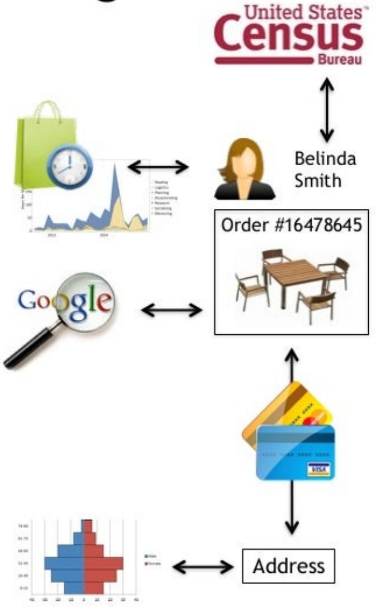

> **AI Description:**
> **Source:** `assets/_page_31_Figure_0.jpg`
> 
> **Generated:** 2026-05-31 14:48:38
> 
> ---
> 
> The image contains a combination of text and visual elements, including icons and diagrams. It illustrates a flowchart involving the United States Census Bureau, a person named Belinda Smith, and various data points. The flowchart includes icons representing a shopping bag, a clock, a magnifying glass, a table and chairs, a credit card, and a bar graph. The text includes "Order #16478645" and "Address," indicating a sequence of actions or data points related to a purchase or survey. The flowchart suggests a connection between the Census Bureau, a Google search, and an address, possibly illustrating data collection or analysis processes.

## Context is King

## Context is King

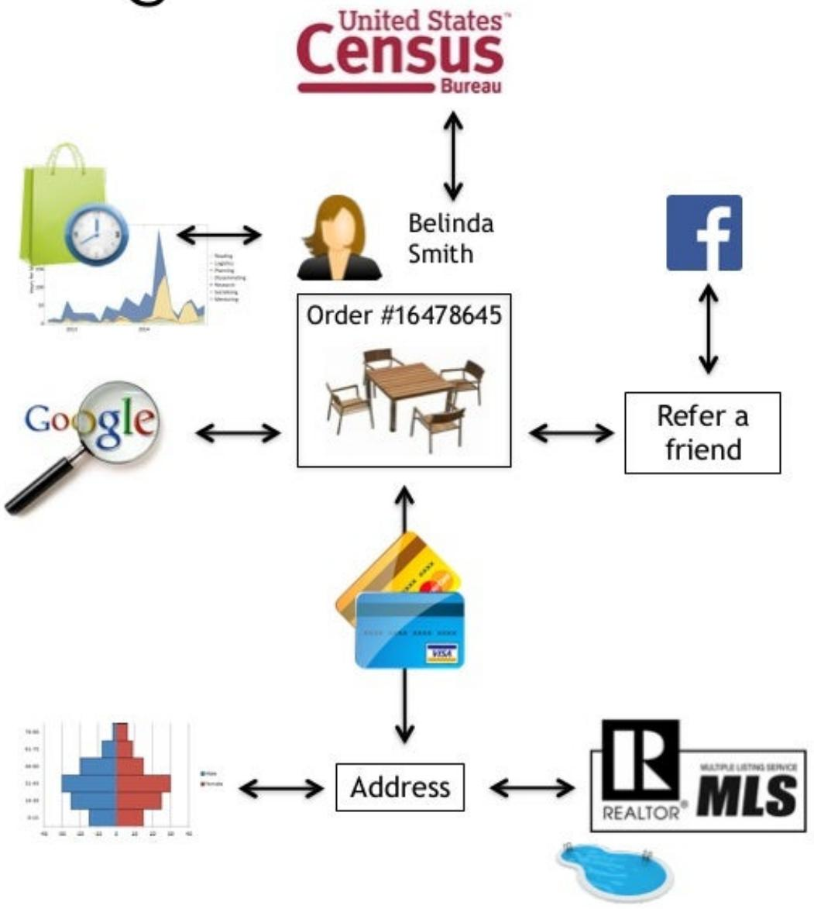

> **AI Description:**
> **Source:** `assets/_page_33_Figure_0.jpg`
> 
> **Generated:** 2026-05-31 15:02:29
> 
> ---
> 
> The image contains a flowchart with various elements representing different aspects of a process. It includes icons and text labels such as "United States Census Bureau," "Belinda Smith," "Order #16478645," "Refer a friend," "Google," "Address," and "REALTOR MLS." The flowchart illustrates a sequence of interactions, starting from the United States Census Bureau, moving through Belinda Smith, and involving various services and platforms like Google, Facebook, and the REALTOR MLS. The flowchart also includes a shopping bag, a clock, and a graph, which may represent different stages or metrics in the process being described.

Invest in data quality

O O

business leaders frequentlymakedecisions with data that they cannot trust

Being data-driven means having...

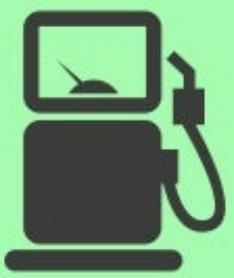

> **AI Description:**
> **Source:** `assets/_page_35_Figure_0.jpg`
> 
> **Generated:** 2026-05-31 14:59:22
> 
> ---
> 
> The image contains a simple icon of a fuel pump. The icon is a black silhouette of a fuel pump with a hose and a gauge, set against a light green background. The gauge is positioned at the top of the pump, indicating the fuel level. There are no additional labels or text annotations within the image.

a self service culture

Business units have necessary data access as well as withinteamanalytical skills to drive insights,actions,and impact.

## Traits of great analysts

Numerate

Detail-oriented

Skeptical

Confident

Curious

Communicators

Data lovers

Business savvy

### Full Page Description (Page 37)

**Source:** `assets/_page_37_Asset_0.jpg`

**Generated:** 2026-05-31 14:51:37

---

The image contains a stacked bar chart with horizontal bars representing different individuals (Jason G, David, Jason W, Jim V, Erin, Elissa, Arun, and Mark). Each bar is divided into segments of varying colors, each representing a different skill or area of expertise: ML/Big Data, Data Visualization, Math/Stats, DevOps, Programming, and Business. The chart visually compares the distribution of these skills among the individuals, with some showing a higher emphasis on certain areas such as Programming and Business, while others have a more balanced distribution. The chart effectively uses color coding to differentiate between the different skill sets and provides a clear visual representation of the expertise distribution.

## Hiring not just as individuals but to complement team

Being data-driven means having..

a broad data literacy

All decision-makers have appropriate skills to use and interpret data.

Analysts must sell, sell, sell their product

> **AI Description:**
> **Source:** `assets/_page_39_Figure_0.jpg`
> 
> **Generated:** 2026-05-31 14:54:52
> 
> ---
> 
> The image contains a black and white illustration of a man holding a box labeled "PRODUCT." The man is smiling and pointing at the box with his other hand. The illustration appears to be a vintage-style drawing, possibly used for advertising or promotional purposes. The box is the central focus of the image, with the word "PRODUCT" prominently displayed on it.

## Tie actions to outcomes

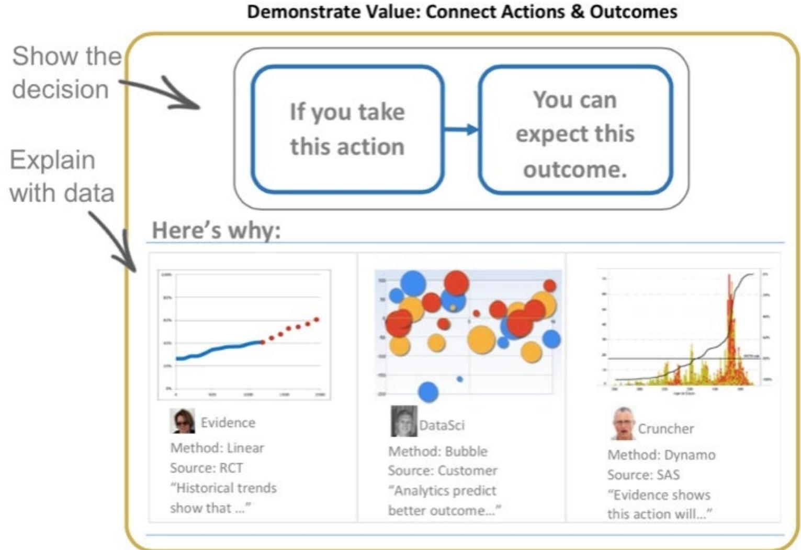

> **AI Description:**
> **Source:** `assets/_page_40_Figure_0.jpg`
> 
> **Generated:** 2026-05-31 14:47:28
> 
> ---
> 
> The image contains a flowchart and three separate data visualizations. The flowchart outlines a decision-making process, stating "If you take this action, you can expect this outcome." Below the flowchart, there are three distinct visualizations:
> 
> 1. The first visualization is a line graph showing a trend over time, labeled "Evidence" with a method of "Linear" and a source of "RCT." The caption reads, "Historical trends show that..."
> 
> 2. The second visualization is a bubble chart with data points in various colors, labeled "DataSci" with a method of "Bubble" and a source of "Customer." The caption states, "Analytics predict better outcome..."
> 
> 3. The third visualization is a histogram with a density curve, labeled "Cruncher" with a method of "Dynamo" and a source of "SAS." The caption says, "Evidence shows this action will..."
> 
> The image effectively uses these visual elements to support the flowchart and provide evidence-based reasoning for the decision-making process.

Being data-driven means having...

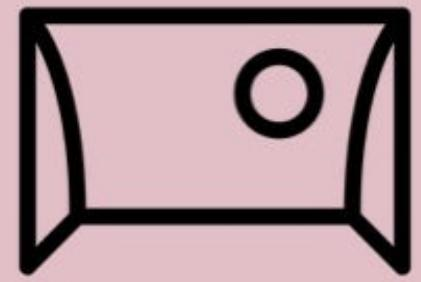

> **AI Description:**
> **Source:** `assets/_page_41_Figure_0.jpg`
> 
> **Generated:** 2026-05-31 14:51:47
> 
> ---
> 
> The image contains a simple line drawing of a camera lens. The drawing is a basic representation with a rectangular shape and a circular element in the center, likely representing the lens. There are no labels or additional text annotations.

a goals first approach.

Set out metrics before experiment.What does success mean? Have an analysis plan. Prevent gaming the system.

Being data-driven means having...

an objective, inquisitive culture

1"Do you have data to back that up?" shouldbea question that no one is afraidtoaskand everyone is prepared toanswer'-JulieArsenault.

Being data-driven means having...

avisible,clearly-articulated strategy

Commonly understood vision.Suite of well-designed,accessible KPls.All staff understand how their work ties back to these metrics.

## Being data-driven means having..

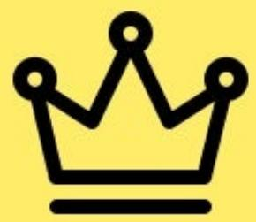

> **AI Description:**
> **Source:** `assets/_page_44_Figure_0.jpg`
> 
> **Generated:** 2026-05-31 14:59:08
> 
> ---
> 
> The image contains a simple black crown icon on a yellow background. It is a single, static image with no additional text or data. The crown is a common symbol representing royalty, leadership, or importance.

## strong data leadership

A head of data to evangelize data as strategic asset with budget,team,and influence to drive cultural change.

Which strategies have proved successful in promoting a data-driven culture in your organization?

## Change should not just be top-down

but bottom up too

Everyone in org has role and responsibility through "leveling up" their data skills,mutual mentoring,and embedding data into their processes.

### Full Page Description (Page 47)

**Source:** `assets/_page_47_Asset_1.jpg`

**Generated:** 2026-05-31 14:50:05

---

The image contains a horizontal bar chart with a numerical scale on the x-axis labeled "Total Salary (USD)" ranging from 20k to 200k. The y-axis represents different ranges of values, from "1 - 5" to "More than 20". Each bar corresponds to a salary range and is color-coded red. The chart visually represents the distribution of salaries across different value ranges, with the length of each bar indicating the frequency or count of occurrences within each salary range. The chart shows that the highest concentration of salaries falls within the "11 - 15" range, with a significant number of values falling in the "16 - 20" range as well.

### Full Page Description (Page 47)

**Source:** `assets/_page_47_Asset_0.jpg`

**Generated:** 2026-05-31 14:50:37

---

The image contains a horizontal bar chart with the title "Number of tools used." The chart displays the share of respondents for different ranges of tools used, categorized as follows: 1-5 tools, 6-10 tools, 11-15 tools, 16-20 tools, and more than 20 tools. The x-axis represents the share of respondents, ranging from 0% to 40%, while the y-axis lists the ranges of tools used. The longest bar corresponds to the range of 6-10 tools, indicating that the majority of respondents fall into this category.

## Learn and you shall receive

## Being data-driven doesn't mean

> **AI Description:**
> **Source:** `assets/_page_48_Figure_0.jpg`
> 
> **Generated:** 2026-05-31 14:55:34
> 
> ---
> 
> The image contains a simple black silhouette of a car on a light blue background. The car appears to be in a side profile view, with no additional details or labels. The image does not contain any text or other visual elements beyond the car silhouette and background.

w 3 M

## blindly following data.

Augment decision makers with objective, trustworthy,and relevant data.

https://www.youtube.com/watch?v=a2QIH2uz3p8

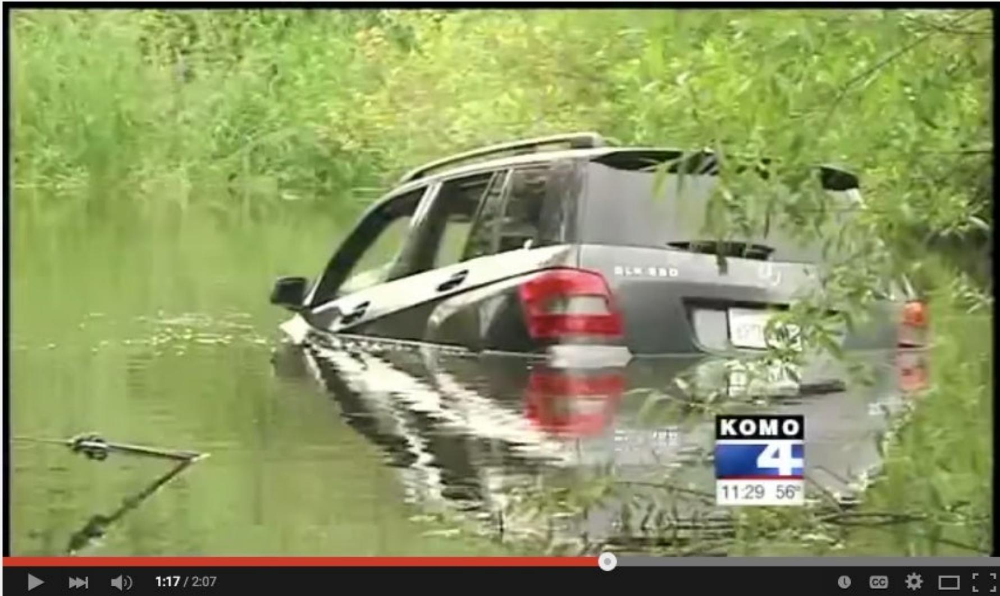

> **AI Description:**
> **Source:** `assets/_page_49_Figure_0.jpg`
> 
> **Generated:** 2026-05-31 14:56:41
> 
> ---
> 
> The image contains a photograph of a submerged car in a body of water, surrounded by greenery. The car appears to be a dark-colored SUV, partially submerged with the rear end visible above the waterline. The water level is high, reaching up to the car's windows. The image also includes a timestamp and a logo in the bottom right corner, indicating it is a screenshot from a news broadcast by KOMO 4, with the time displayed as 11:29 and the temperature as 56 degrees.

Girls Crash into Lake following Bad GPS directions

CrushingBastards

DSubscribe744

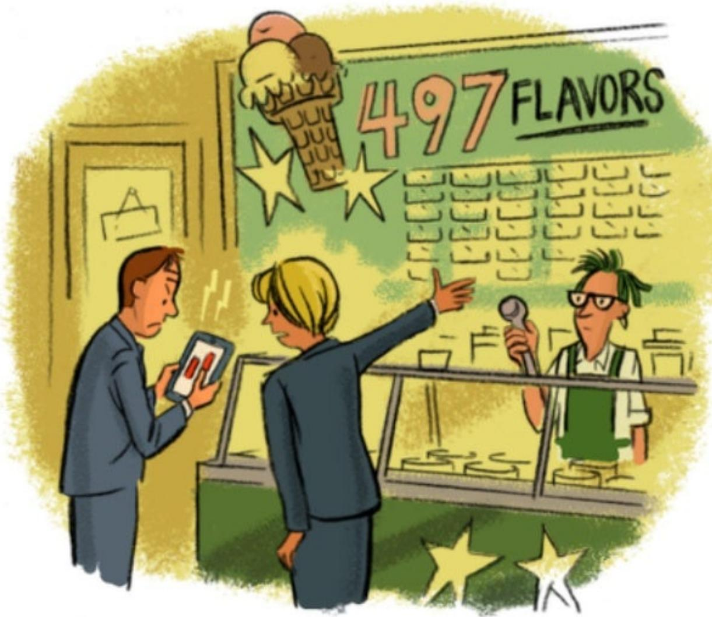

> **AI Description:**
> **Source:** `assets/_page_50_Figure_0.jpg`
> 
> **Generated:** 2026-05-31 15:01:51
> 
> ---
> 
> The image is a cartoon-style illustration of an ice cream shop. It features three characters: a man on the left holding a tablet, a woman in the middle pointing at a menu, and a shop employee on the right holding a microphone. The menu board above the counter displays the text "497 FLAVORS" in large letters, with an illustration of an ice cream cone and a star above it. The background is a simple, stylized depiction of the shop's interior, with a door and a counter. The image uses a limited color palette of yellows, greens, and blues.

"Youcan'talwaysmakea data-driven decision-- sometimesyou have to trust your gut!

Ultimately, data-driven means

> **AI Description:**
> **Source:** `assets/_page_51_Figure_0.jpg`
> 
> **Generated:** 2026-05-31 14:56:48
> 
> ---
> 
> The image contains a silhouette of a person performing a martial arts stance. The figure is depicted in a dynamic pose, with one arm extended forward and the other bent at the elbow, suggesting a punch or block. The silhouette is black against a plain gray background, emphasizing the action and movement of the figure. There are no labels or text annotations present in the image.

# using data to effect impact and results

Push data through "analytics value chain" from collection,analysis, decisions,action,and finally to impact. Partway along chain doesn't count.

## Example actions

·Analyst competency matrix

·Raise bar for new analyst hires

·Vision statement:data culture

·Stats for managers class

·Mentor/train analysts to improve skills such as stats,SQL

·Mentoring stafin experimental design

·Democratizing data access through B tools

· Push on ROl, tie back to strategic objectives

## Don't get complacent!

"With theexception of,say,an Amazon,no global store chainwas thoughtto have demonstrablykeenerdata-driven insight intocustomer loyaltyandbehavior"

## Tesco Today

· Stock at 11 year low

Shedding 9000 jobs

· Closing 43 stores

· \$9.6B loss for 2014 fiscal year

·Dunhumby,their analytics gem,up for sale

·Warren Buffett: “I made a mistake on Tesco"

## Summary

Culture

Data Leadership

Decision Making

Organization

People

Data

Collaborative,inclusive.open,inquisitive

Chief Data Officer/Chief Analytics Officer

Testingmindset.fact-based.anti-HiPPO

Embedded.federatedanalytics

Analyticsorg:composition,skils.training

Dataquality.datamanagement

> **AI Description:**
> **Source:** `assets/_page_56_Figure_0.jpg`
> 
> **Generated:** 2026-05-31 14:57:46
> 
> ---
> 
> The image is a simple black and white illustration of a cupcake. It features a cupcake wrapper with a swirl of frosting on top, decorated with three small dots that resemble sprinkles. There are no labels or text annotations present.

Bake in data-driven culture early!

CarlAnderson

http://shop.oreilly.com/

1.What is Data-Driven?

2.Data Quality

3.Data Collection

4.Analyst Org

5.Data Analysis

6.Metric Design

7.Story Telling

8.A/B Testing

9.Decision Making

10.Data-Driven Culture

11.Data-Driven C-suite

12.Privacy，Ethics

13.Conclusions

Available now

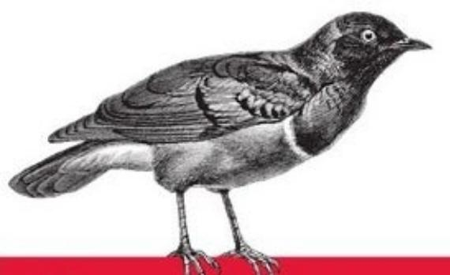

> **AI Description:**
> **Source:** `assets/_page_58_Figure_0.jpg`
> 
> **Generated:** 2026-05-31 14:54:26
> 
> ---
> 
> The image contains a detailed black and white illustration of a bird. The bird is depicted in a standing position, with its wings partially spread and its tail feathers fanned out. The illustration is highly detailed, showing the texture of the feathers and the structure of the bird's body. The bird's beak is pointed and slightly curved, and its eyes are round and dark. The image does not contain any text or additional elements beyond the bird illustration.

Creating a Data-Driven Organization

PRACTICALADVICEFROMTHETRENCHES

Carl Anderson

http://shop.oreilly.com/

1.What is Data-Driven?

2.Data Quality

3.Data Collection

4.Analyst Org

5.Data Analysis

6.Metric Design

7.Story Telling

8.A/B Testing

9.Decision Making

10.Data-Driven Culture

11.Data-Driven C-suite

12.Privacy，Ethics

13.Conclusions

Available July

## Questions?

@leapingllamas

B http://p-value.info

carl.anderson@warbyparker.com

## spares

## Vision Statement:data culture

vision statement—an aspirational description of what an organization would like to accomplishinthemid-termor long-term future

## STRONG DATA LEADERSHIP

·Data leaders that actively evangelize data as a strategic asset, leveragedto its fullest to impactall partsofthebusiness.

·Strong data leadership that understands and support the needs of the business.It supports the analytics organization by providing them with aclear career path,enables them to perform their best, to be happyand productive,and to maximize their impact.

·Managers that expect and rely ondata insights tomake informed decisions.More generally across organization,data and analytics are deeply embedded into our processes and decisions

# Vision Statement:data culture

## OPEN,TRUSTING CULTURE

·Acentralized set of coherent data sources without any silos.

·Businessunits haveasense of data ownership,proactively managing dataquality of their sources.

·Broad access to data

-Everyone who needsaccessto datato perform their function,has access.

一Everyone only hasaccessto thedata that they needto perform theirfunction.Sensitive data,such ascustomer andRxdata,should be treated with extreme caution:highly restrict access,anonymize,andencrypt.

一All staff can easily get a holistic view of the company through highly visible and accessibledashboards,reports,andanalysis.Systemsare instrumentedandalertedas reliableearly warning systems.

·Analystsare highlycollaborative,proactivelyreaching out (across departments)to help validateideasand ensureobjectivity.