
# Making Sense of Data: Creating a Structured Digital Measurement, Reporting, Testing& Optimisation Framework.

Updated:Dec2014

Martin Walsh

Director Digital Marketing

> **AI Description:**
> **Source:** `assets/_page_0_Figure_0.jpg`
> 
> **Generated:** 2026-05-31 16:51:55
> 
> ---
> 
> The image contains a bar chart with red bars representing data. The bars are arranged in a descending order, with the tallest bar on the left and the shortest on the right. The chart appears to be on a digital screen, and a hand holding a pen is visible, pointing at the chart. The chart likely represents some form of data analysis or performance metrics, but the specific labels or text annotations are not visible in the image.

> **AI Description:**
> **Source:** `assets/_page_1_Figure_0.jpg`
> 
> **Generated:** 2026-05-31 16:43:01
> 
> ---
> 
> The image is a black and white photograph of a man wearing formal attire, including a bow tie and a suit. The man has a mustache and is looking slightly to the side. The style of the clothing and the photograph suggests it is from the 19th century. There are no charts, graphs, or other visual elements present in the image.

# "If Ihad more time I would have written a shorter letter presentation."

## What I'll try and cover

1.The Macro and Micro Context of Analytics-Slide4

2.The Reality of a Marketers world-Slide26

3.Introducingand operationalising a Digital Measurement Framework-Slide 32

Revenue PerformanceManagementviaMarketingAutomation-Slide40

SearchMeasurement-Slide104

LongTail Advertising Performance Insights-Slide120

Social Influence(Media)MarketingMeasurement-Slide123

4.Qualitative vs Quantitative Analytics-Slide 133

5. Optimisation-Slide 169

6.Developinga Digital Taxonomy-Slide175

7.Key takeaways-Slide195

To be successful with analytics we must first understand the Macro and Micro Environmental Picture....

## Senior executives now want businesses run on data-driven decisions.\*

These expectations can be met-but with a caveat.

Foranalytics-driven insights to beconsumed-that is,to trigger newactionsacross the organisation,they must be:

1．Closely linked to business strategy

2.Information must become easier to understand and act upon

3.Embedded into organisational processes to take action at the right time

Eachyear marketers stake their reputations on digital marketing programs and online activity.

## And yet the marketplace is glutted with Digital measurement tools and applications...

## WebTrends.

duble click

## So,why is there such a disconnect between digital analytics tools and business results?

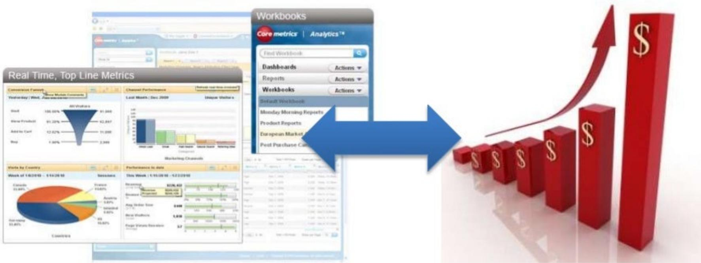

> **AI Description:**
> **Source:** `assets/_page_7_Figure_0.jpg`
> 
> **Generated:** 2026-05-31 16:51:46
> 
> ---
> 
> The image contains a combination of text and visual elements. It features a dashboard with real-time top-line metrics, including conversion funnel, channel performance, and visitor country data. The dashboard is part of a software interface labeled "Coremetrics Analytics." There is a blue arrow pointing to a section labeled "Workbooks," which includes options for dashboards, reports, and workbooks. The image also includes a bar graph with dollar signs, symbolizing financial growth, and a red arrow pointing upwards, indicating an increase in revenue or profits.

Macro Environment: Key Finding 1 Good news:Analytics correlates to performance

Organisations that lead in analytics outperform those who are just beginning to adopt analytics

Top Performersaremore likely touseananalyticapproachover intuition

## Why Data Matters: Extracting Insights,Making Better Decisions

Why Data Matters Extracting Insights,Making Better Decisions.wmv

## Macro Environment: Key Finding 2 Organisational,notdata orfinancial concerns,areholdingback adoption

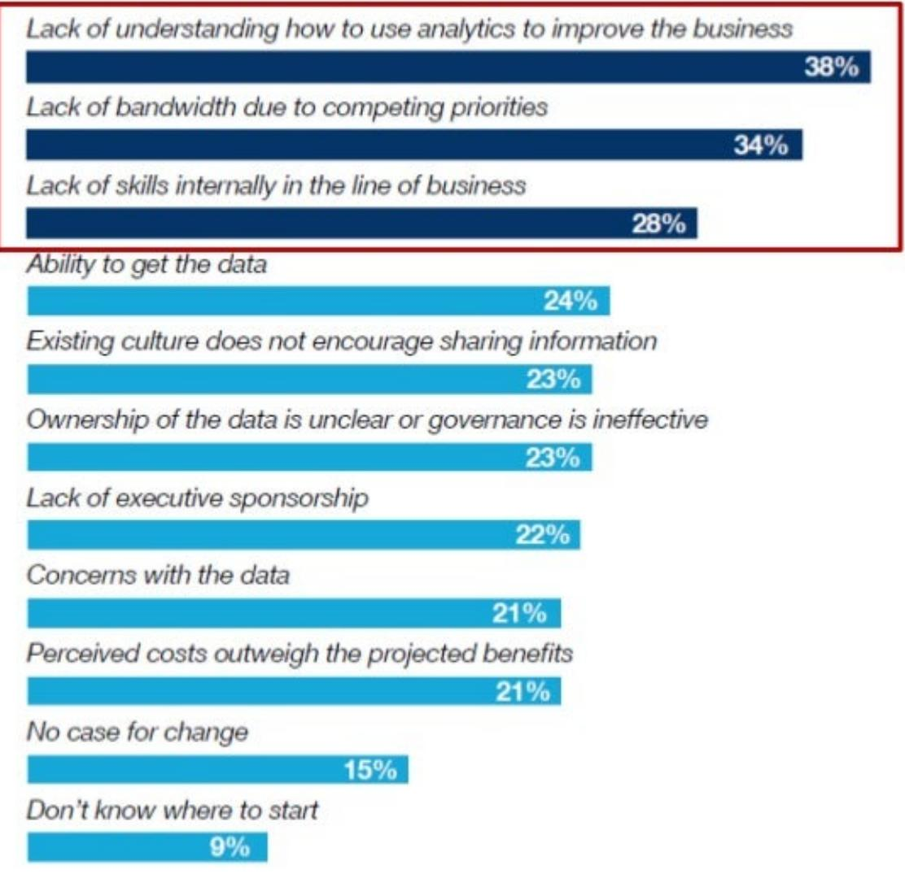

> **AI Description:**
> **Source:** `assets/_page_10_Figure_0.jpg`
> 
> **Generated:** 2026-05-31 17:31:15
> 
> ---
> 
> The image contains a bar chart with text annotations. It presents data on various challenges faced in implementing analytics to improve business performance. The chart lists 10 different challenges, each accompanied by a percentage value indicating the frequency of the issue. The top three challenges are highlighted in a red box, showing "Lack of understanding how to use analytics to improve the business" at 38%, "Lack of bandwidth due to competing priorities" at 34%, and "Lack of skills internally in the line of business" at 28%. The remaining challenges include "Ability to get the data" at 24%, "Existing culture does not encourage sharing information" at 23%, "Ownership of the data is unclear or governance is ineffective" at 23%, "Lack of executive sponsorship" at 22%, "Concerns with the data" at 21%, "Perceived costs outweigh the projected benefits" at 21%, "No case for change" at 15%, and "Don't know where to start" at 9%.

## Macro Environment: Key Finding 3

Organisation want to 'see'insights more clearly and act on them

## Today

Historic trend analysis and forecasting

Standardised reporting

Data visualisation

Data visualisation

Simulation and scenario development

Analytics applied within business processes

## Macro Environment: Key Finding 4 Analytics use propagates across functions in a predictable pattern

Brand and market management

General management

Workforce planningand allocation

Customer experience

Riskmanagement

Product research and development

Customer Service

Strategy and business development

Sales and marketing

Operationsand production

Financialmanagementandbudgeting

## Transformed

## Experienced

## Aspirational

### Full Page Description (Page 13)

**Source:** `assets/_page_13_Asset_0.jpg`

**Generated:** 2026-05-31 16:54:38

---

The image contains a stacked bar chart with three segments, each representing different categories: "Centralised analytic units," "LOB analytic units," and "At point-of-need." The chart also includes a fourth category, "IT department," which is not visually represented but is mentioned in the legend. The percentages for each category are as follows: "Centralised analytic units" is 87%, "LOB analytic units" is 71%, and "At point-of-need" is 47%. The chart visually compares the distribution of these categories, with "Centralised analytic units" having the highest percentage and "At point-of-need" having the lowest.

## Macro Environment: Key Finding 5

As adoption spreads,there isa growing demandfora greater varietyofskillsanddeeper expertise.

Note:Chartcombinesresponsestotwoquestions.Percentagefiguresattopofbarsreflectrespondents whoanswered“frequently"or"everyday"tothequestion,"Howoftendoyouuseinformationand analyticstoinformyouractionsandsupportdecisionmakinginyourday-to-dayrole?"Theheightof colouredsegmentswithineachbarreflectrespondents'answerstothequestion,"Whereareanalytics primarilyperformedwithinyourorganization?"

\*Source:“Analytics:TheNewPathto Value." MITSloanandIBM2010

## Micro Environment

## Marketers Perceptions vs Reality

Most companies have not established a framework for customer value and customer experience as key performance indicators .\*

·Marketers overestimate the extent of their customer-centricity.

·Marketers overestimate their measurement capabilities.

·Marketers overestimate the scope of their customer segmentation.

### Full Page Description (Page 15)

**Source:** `assets/_page_15_Asset_0.jpg`

**Generated:** 2026-05-31 16:41:53

---

The image contains a horizontal bar chart with two categories: "Product/Brand Focused" and "Customer Focused." The chart displays percentages for each category, with "Customer Focused" at 44% and "Product/Brand Focused" at 35%. The bars are colored in a light green shade, and the percentages are clearly labeled to the right of each corresponding bar. The chart visually represents the distribution of focus between customer-oriented and product/brand-oriented approaches.

## Marketers Think They Are Customer Centric

Mostorganisations want to think that they put customers first, but in reality most are structured around products,services and line of business.

### Full Page Description (Page 16)

**Source:** `assets/_page_16_Asset_0.jpg`

**Generated:** 2026-05-31 17:04:54

---

The image contains a bar chart with three categories: "Seldom or Never a Factor," "Often a Factor," and "Primary Factor." Each category is represented by a horizontal bar with a percentage value next to it. The percentages are as follows: "Seldom or Never a Factor" at 20%, "Often a Factor" at 32%, and "Primary Factor" at 11%. The chart visually represents the frequency of factors in a survey or study, with "Often a Factor" being the most common at 32%, followed by "Seldom or Never a Factor" at 20%, and "Primary Factor" at 11%.

## Marketers Think They Are Customer Centric

Very fewmarketersusecustomerengagementasa primary factor in their communications.

"Westruggletomeasurecustomerengagement.Wedon'thaveasystemtomanageit,inpart becausenobodyhassingularresponsibilityformanagingit.Unfortunately,it'sjustnota priority.

## Marketers Think They Are Customer Centric

Only half calculate customer valueand fewer still,use it beyond marketing.

·50% say they have a customer value metric such as Lifetime Value (LTV).

·29% that have a value metric say it is not consistent throughout marketing.

·31%say that they are unable to measure incremental impact of their marketing on customer value.

"Wemeasureprofitability where wecan,butweareonlystarting totacklewhatacustomerlifetime valuemetricmightlooklike.Historicalyourbusinesslineshavebeentooseparate-theconceptof valueforeach was verydifferent-butwearestartingtobringthoseperspectivestogetherandare thinkingabouthowtocalculatelifetimevalueatahousehold level." Aseniormarketeratafinancialservicescompany.

### Full Page Description (Page 18)

**Source:** `assets/_page_18_Asset_0.jpg`

**Generated:** 2026-05-31 17:10:34

---

The image contains a bar chart with text annotations. The chart presents data on the reasons for siloed approaches and misaligned goals in the context of experience ownership. The key information includes the following percentages for each reason:

1. "There is no single ownership of the experience resulting in siloed approaches and misaligned goals" at 52%.
2. "We are too siloed by business line/product/brand" at 46%.
3. "We do not have the resources to support this approach" at 36%.
4. "We do not have the technical infrastructure to support this approach" at 28%.
5. "We are unable to measure the influence of our activities on customer behavior" at 27%.
6. "Other" at 7%.

The chart highlights that the primary reason for siloed approaches and misaligned goals is the lack of single ownership of the experience, followed by being siloed by business lines/products/brands.

# A Siloed Approach is the Greatest Barrier to Adoption of a Customer Management Approach

“Whatare the biggest barierspreventing you fromadopting an integrated customer managementapproach (orwhatwere the biggestbarriersyou overcame inadoptingthis approach)?(Selectall that apply)"

# Marketers Believe They Consistently and Systematically Measure Marketing

55% of marketers saythat they use a standard or consistentframework to measure all marketing activity.

But.....

## Measurement isn't driving budget allocation

64%of marketers allocate budget across marketing disciplines based on historical spending.

·56% do so based on planned activity.

·Less than 30%usemedia mix modelling-which allows marketers to understand the incremental impact of specific media and activity.

"Wedotrytotracktheimpactofourmarketingactivitybuttoalargeextentwearewingingit-we makedecisionsbasedonpasthistory,personalpreferences,andwhatouragenciessayisworkingfor otherclietlytslok. Theheadofmarketingataconsumerpackaged goodscompany.

## Marketers Believe They Consistentlyand Systematically Measure Marketing

Marketers put their emphasis on financial metrics.

63%of marketers selected frequency of purchases.

·54% selected the frequency of interactions with their brand

·47% selected the level and depth of brand interaction.

These are far more specific measures of engagement.

Whenasked how they assess the impact of their marketing activity,8o% say financial impact-suchas revenue or ROl.

### Full Page Description (Page 22)

**Source:** `assets/_page_22_Asset_0.jpg`

**Generated:** 2026-05-31 16:51:13

---

The image contains a bar chart with four categories of attribution methods used in marketing, each represented by a horizontal bar with a percentage value. The categories are:

1. "Attribute activity to the most recent touch point" with 52%.
2. "Inferred attribution calculated through match back analysis" with 37%.
3. "Fractional attribution calculated through models" with 34%.
4. "Other" with 16%.

The chart visually represents the distribution of these attribution methods, with the most recent touch point attribution method being the most prevalent at 52%.

## Marketersare missing the pointmore than half the time when calculatingattribution fora transaction.

"Howdoyou calculateattributionformarketingactivity?Forexample,towhichactivity doyoucreditatransaction?(Selectallthat apply)"

## Marketers Claim Customer Segmentation Extends Broadly

Mass,direct and digital communicationsaren't integrated.

27%of marketers say that their marketing is integrated across brand, directand digital communications.

73% struggle tounderstand the impact that brand,mass,directanddigital communication have oneachotherand therefore don't plan programs andcampaigns tomaximise theircombined effectiveness.

"Wecomparedatabetweenbrandanddirectteams,butit'snotreallyintegrated.Customersoftentell usthattheyseeanoferinonemediumandreceiveadifferentofferinanother.Customerget frustrated."

Aseniormarketeratafinancialservicescompany.

## Marketers Claim Customer Segmentation Extends Broadly

Customer information isn't integrated across marketing,sales and service.

Only18%of marketers say thattheiractivitiesare integrated-in that they trackandmeasure the impact each disciplinehas on theother.

Only 30%saythey unitedisparate customerinformation fromsales, serviceand marketing intoasinglemanagement framework for global insights,targetingand measurement.

"Oneofour problems is that wedon't havesinglerepositoryofcustomerinformation.It's hard to coordinateactivitywheneachgrouphasaverydiferentviewofthecustomer.It'sabigdownsideofour siloedbusiness structure."

A seniormarketer.

## A Marketers World

> **AI Description:**
> **Source:** `assets/_page_25_Figure_0.jpg`
> 
> **Generated:** 2026-05-31 16:50:31
> 
> ---
> 
> The image contains a close-up of a compass. The compass has a circular dial with cardinal directions (N, E, S, W) and intermediate points (NE, SE, SW, NW). The dial also includes numerical degrees ranging from 100 to 220, with tick marks indicating degrees between these numbers. The needle of the compass is pointing towards the SE direction. The compass has a key ring attached to the top.

Measurement isMore lmportant,ButMore Confusing!

PoorMarketers

> **AI Description:**
> **Source:** `assets/_page_26_Figure_0.jpg`
> 
> **Generated:** 2026-05-31 17:39:23
> 
> ---
> 
> The image is a close-up photograph of a person with a surprised or shocked expression. The person's eyes are wide open, and their mouth is agape, revealing their teeth. The image appears to be edited or manipulated, as the person's face is distorted and stretched, giving it a surreal or exaggerated appearance. There are no charts, graphs, or other visual elements present in the image.

42%ofmarketerseistified withmeasurementandmetrics! -up7%yearon year.

## Evolving Digital Landscape Requires Evolving Marketing Framework& Taxonomy

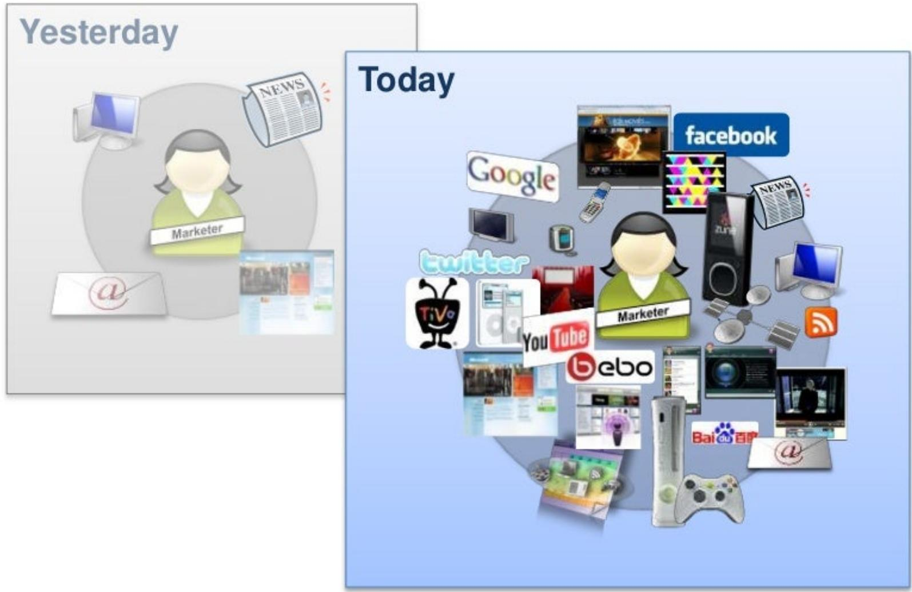

> **AI Description:**
> **Source:** `assets/_page_27_Figure_0.jpg`
> 
> **Generated:** 2026-05-31 17:27:58
> 
> ---
> 
> The image is an infographic comparing the marketing landscape from "Yesterday" to "Today." It uses a stick figure of a marketer at the center of each section. In the "Yesterday" section, the marketer is surrounded by traditional media and communication tools such as a newspaper, a computer monitor, a television, and a letter. The "Today" section shows a more diverse array of digital and social media tools, including Facebook, Google, Twitter, YouTube, Bebo, and various other platforms and devices like smartphones, tablets, and gaming consoles. The transition highlights the shift from traditional media to a more digital and interconnected marketing environment.

## Navigating the Digital Marketing Chaos

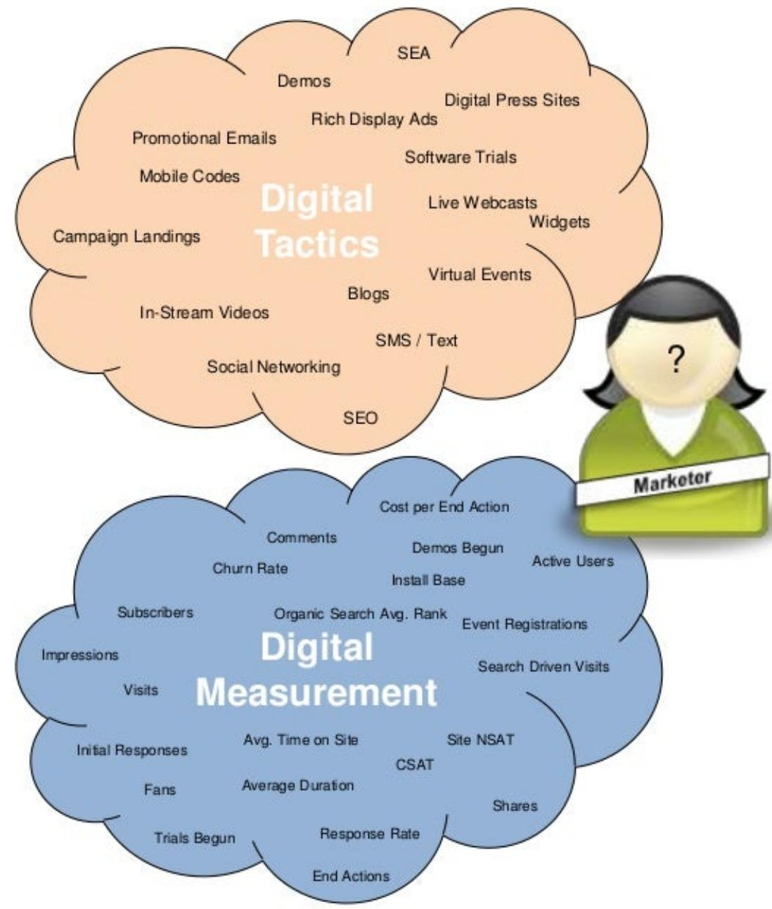

> **AI Description:**
> **Source:** `assets/_page_28_Figure_0.jpg`
> 
> **Generated:** 2026-05-31 16:56:35
> 
> ---
> 
> The image contains a mind map-style diagram with two main sections: "Digital Tactics" and "Digital Measurement." The "Digital Tactics" section lists various digital marketing strategies such as SEO, Rich Display Ads, Software Trials, Live Webcasts, and Social Networking. The "Digital Measurement" section lists metrics like Impressions, Subscribers, Organic Search Avg. Rank, and CSAT. The diagram is designed to help marketers understand the relationship between different digital marketing tactics and the metrics used to measure their effectiveness. The overall layout is visually organized to show how these tactics contribute to the measurement of digital marketing performance.

Dizzying number of tactics.

Will onlygetmorecomplex

Digital landscape can leadto misguidedand ineffectivedigital marketing investments.

Variety ofmetricsand methodologiestomeasure effectiveness.

Lack of standards for measuring "effectiveness"

Hindersabilitytobuilddigital marketingbusiness.

## Marketers Struggle With Measurement in Four Fundamental Ways

> **AI Description:**
> **Source:** `assets/_page_29_Figure_0.jpg`
> 
> **Generated:** 2026-05-31 17:00:10
> 
> ---
> 
> The image contains a simple black arrow pointing to the right on a white background. It is a directional symbol commonly used to indicate a rightward movement or direction. There are no additional labels, text, or other visual elements present in the image.

·High level goals without supporting metrics to define them

1.Action without data

## 4.Context without action

> **AI Description:**
> **Source:** `assets/_page_29_Figure_1.jpg`
> 
> **Generated:** 2026-05-31 17:01:09
> 
> ---
> 
> The image contains a simple black arrow pointing upwards on a white background. The arrow is a straight line with a slight curve at the top, indicating a direction of movement or progression. There are no labels, text, or additional elements present in the image.

Measurementintended,butnot delivered(tlogy)

·Noplansforimprovement,continueas before

> **AI Description:**
> **Source:** `assets/_page_29_Figure_2.jpg`
> 
> **Generated:** 2026-05-31 17:05:00
> 
> ---
> 
> The image contains a simple black arrow pointing downward. It is a directional symbol commonly used to indicate a downward direction or to signal a decrease. There are no additional labels, text, or other visual elements present in the image.

Actions"missthe window"tobe effective

> **AI Description:**
> **Source:** `assets/_page_29_Figure_3.jpg`
> 
> **Generated:** 2026-05-31 17:04:25
> 
> ---
> 
> The image shows a close-up of a person's hands clasped together in a prayerful gesture. The background is dark, which contrasts with the illuminated hands, drawing attention to the gesture. The hands appear to be those of an adult, and the image conveys a sense of contemplation or prayer. There are no additional visual elements or text in the image.

## 3.Insight without context

Confusion on which measures are "right"anddeservefocus

Little proven business value from web behaviours("engagement")

·Unread reports(everyone gets .+.)

Data used tojustify current activities vs guiding new ones

> **AI Description:**
> **Source:** `assets/_page_29_Figure_4.jpg`
> 
> **Generated:** 2026-05-31 16:57:04
> 
> ---
> 
> The image contains a black arrow pointing to the left. It is a simple, unadorned arrow symbol, commonly used to indicate a direction or to signal a left turn in navigation or diagrams.

## Key Micro Analytics Issues

Marketersandagenciesare largely focused on:

1.The wrong metrics-too much focus on reach and not enough on engagement.

2.Drowning indata-lookingat waytoo much datawhich is ultimatelynotinsightfuland actionable.

3. Notoptimisingactivity/efortsagainstmetrics.

4. No360degree view-marketersandagenciesare lookingattactical metrics in isolationand not lookingatacomplete360degreedashboard/pictureofALLtheiractivitiesand importantly customerbehaviour.

5. Quantitativevs Qualitative-too much focus on quantitative dataand not enough on qualitative data,for example satisfaction.

6. NoTaxonomy-not utilisingaconsistentandrelevant digitalmarketing taxonomy.

7.No processes,no clear roles& responsibilitiesand a lack of skilled resources.

8. Over-engineeringsolutions-understandingwhatdata you need toanswer your questions,who needstoaccessitandwhenand howyourmarketingapplications need to interactwithitis crucial toimplementinga simple solution.

# Introducing and Operationalisinga Digital Measurement Framework

> **AI Description:**
> **Source:** `assets/_page_31_Figure_0.jpg`
> 
> **Generated:** 2026-05-31 16:45:09
> 
> ---
> 
> The image contains a bar chart with red bars representing different categories, likely names or roles, labeled as "MARTIN," "CLARK," "SCOTT," and "JONES." The chart appears to be on a digital screen, as indicated by the reflection of light on the surface. The bars vary in height, suggesting a comparison of values or performance for each category. The chart is accompanied by a pen held by a hand, implying analysis or data interpretation is taking place. The text at the bottom indicates a "Hiredate" and a date "11/17/1991," which could be related to the data being visualized.

## You Must First Understand the 90-10 Rule of Analytics!

90% is about people..

(roles,responsibilities,frameworks, processes,txonomyskills&reorces)

> **AI Description:**
> **Source:** `assets/_page_32_Figure_0.jpg`
> 
> **Generated:** 2026-05-31 17:30:16
> 
> ---
> 
> The image is a photograph of a group of people standing together in a casual, professional setting. The individuals are dressed in a mix of business casual attire, with some wearing sweaters and others in more formal business attire. The group appears diverse in terms of gender and ethnicity. The image is well-lit and the people are smiling, suggesting a positive and friendly atmosphere. There are no charts, graphs, or text annotations present in the image.

## You Must First Understand the 90-10 Rule of Analytics!

..only10% is about tools & technology.

> **AI Description:**
> **Source:** `assets/_page_33_Figure_0.jpg`
> 
> **Generated:** 2026-05-31 17:36:54
> 
> ---
> 
> The image contains a diagram of a global network. It features a stylized globe at the center, surrounded by five laptops arranged in a semi-circle. The laptops are connected to the globe by lines, symbolizing a network connection. The globe is partially covered with what appears to be paper or document fragments, suggesting the sharing or distribution of information across the network. The laptops have blue screens, indicating they are turned on and possibly connected to the network. The overall image conveys the concept of a global network or interconnected systems.

## Silly' Marketing Metrics

But wait! Before we dive into more detail we must first address avery common problem inmostmarketingdepartments,‘SillyMetrics'.

Too many organisations and too many marketers are using what Icall 'silly'metrics to 'measure'marketingand inmost cases have also inadvertently createda tsunamiof unactionable reports.

·Thereare generally two categories of‘silly'marketing metrics:

## Vanity Metrics

Sound goodand impress people,butdon'tmeasure impactonrevenueor profitability

> **AI Description:**
> **Source:** `assets/_page_34_Figure_0.jpg`
> 
> **Generated:** 2026-05-31 17:37:37
> 
> ---
> 
> The image contains a single emoji, specifically a yellow smiley face with a frown, indicating a sad or unhappy expression. This is a simple visual representation commonly used to convey emotion in digital communication.

## ActivityMetrics

Measure what you do instead of what results and impact you have

## "New path to value" is a five-point approach to operationalisinganalytics

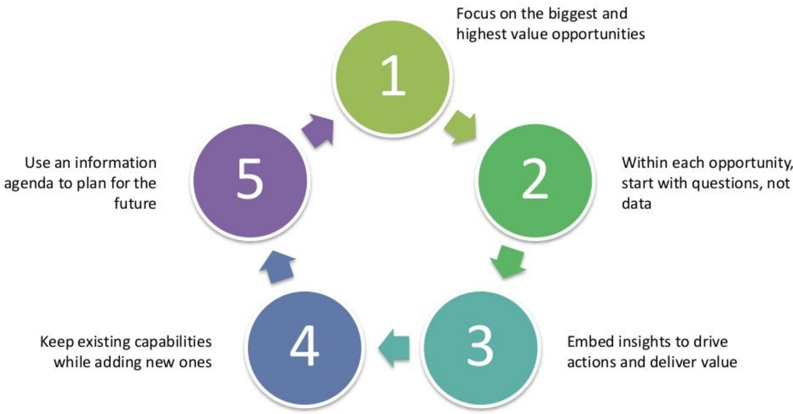

> **AI Description:**
> **Source:** `assets/_page_35_Figure_0.jpg`
> 
> **Generated:** 2026-05-31 17:29:47
> 
> ---
> 
> The image is a flowchart with five numbered circles connected by arrows, forming a circular sequence. The circles are colored differently (green, purple, blue, and two shades of green) and contain text descriptions of steps in a process. The steps are as follows:
> 
> 1. Focus on the biggest and highest value opportunities.
> 2. Within each opportunity, start with questions, not data.
> 3. Embed insights to drive actions and deliver value.
> 4. Keep existing capabilities while adding new ones.
> 5. Use an information agenda to plan for the future.
> 
> The flowchart visually represents a structured approach to planning and executing a strategy, emphasizing the importance of focusing on high-value opportunities, starting with questions, embedding insights, maintaining existing capabilities, and using an information agenda.

## A Process for Inspiring Change

SourceBMBAOServicesmethodlogy

PADIE(Process-Application-Data-Insight-Embed)techniqueisathree-stepprocessbywhichacompanycan operationalizeinsightsdrawnfromdata:first,documentprocessesandapplications;second,useanalytic techniquestogaininsightfromdata;andthird,selectthemostappropriatewaystoembedinsightintooperations.

## Macro Environment

## Within Each Opportunity,Start with Questions,Not Data...

Traditionally,organisationsare tempted to start bygatheringallavailabledata before beginning theiranalysis.

This leads toanall-encompassing focus ondatamanagement-collecting,cleansing and converting data-with little time or energy or resources to understand its potential uses.

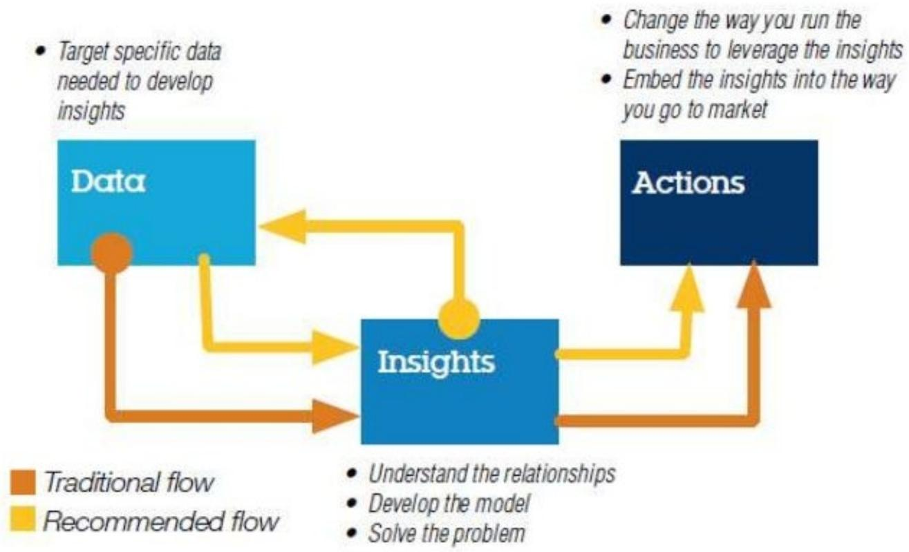

> **AI Description:**
> **Source:** `assets/_page_37_Figure_0.jpg`
> 
> **Generated:** 2026-05-31 16:53:42
> 
> ---
> 
> The image is a flowchart with a focus on data-driven decision-making processes. It includes three main components: Data, Insights, and Actions. The flowchart is divided into two pathways: Traditional flow (orange arrows) and Recommended flow (yellow arrows). The traditional flow starts with data, leads to insights, and then to actions. The recommended flow starts with data, leads to insights, and then to actions, with additional steps of understanding relationships, developing a model, and solving the problem. The image also includes text instructions on how to leverage insights and embed them into business operations and market strategies.

## The Big Picture: Where to start?

Pick your spot

1. Biggest and highest value opportunity

## Prove the value

2. Start with questions

3.Embedinsights

Continuous Value Delivery

4.Add capabilities

5.Informationagenda

## Revenue Performance Management MarketingAutomation Revenue Cycle Model - Example

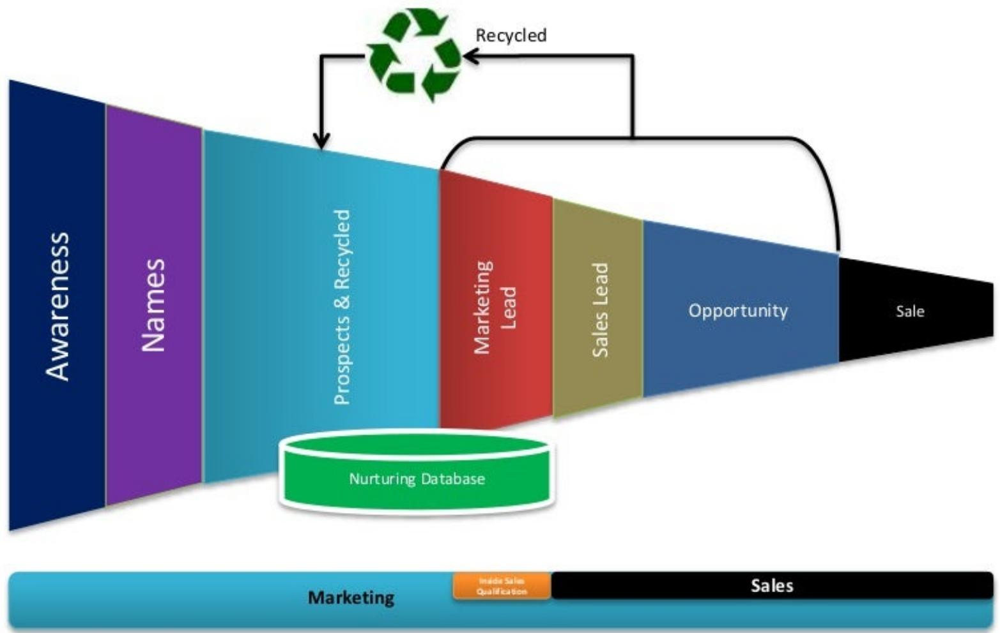

> **AI Description:**
> **Source:** `assets/_page_39_Figure_0.jpg`
> 
> **Generated:** 2026-05-31 17:08:37
> 
> ---
> 
> The image is a marketing funnel diagram with a recycling concept integrated into it. It illustrates the stages of a customer journey from Awareness to Sale, with key stages labeled as Awareness, Names, Prospects & Recycled, Marketing Lead, Sales Lead, Opportunity, and Sale. The funnel visually represents the reduction in potential customers as they move through the stages. The recycling symbol and the label "Recycled" indicate that some prospects are re-entering the funnel. The diagram also includes a "Nurturing Database" at the bottom, suggesting a database used for managing leads and prospects. The bottom of the image is divided into Marketing and Sales sections, with "Inside Sales Qualification" highlighted in the Sales section.

## Revenue Cycle Model-Overview Example

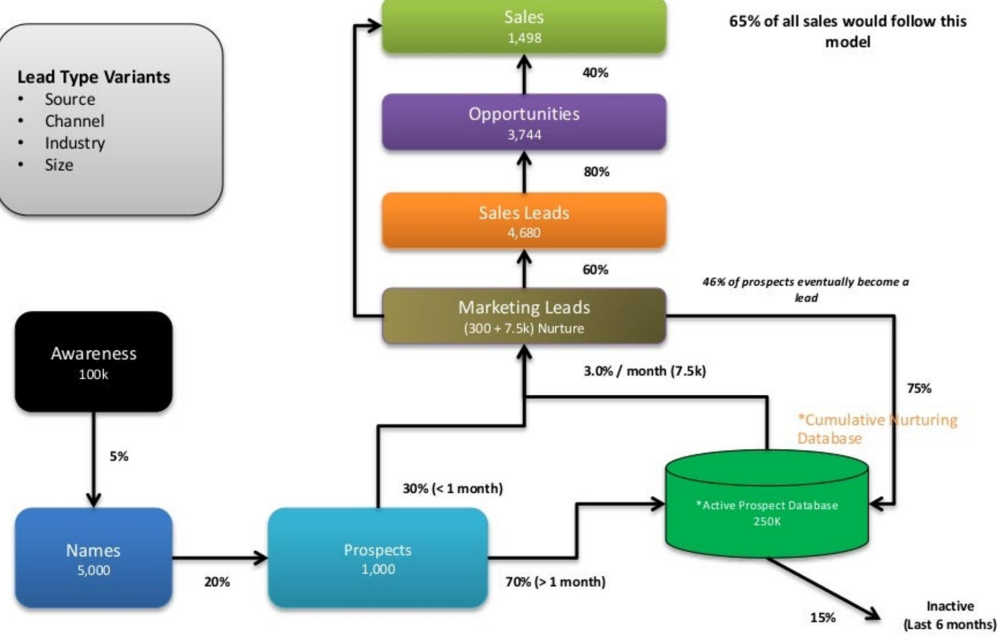

> **AI Description:**
> **Source:** `assets/_page_40_Figure_0.jpg`
> 
> **Generated:** 2026-05-31 16:38:42
> 
> ---
> 
> The image is a flowchart that illustrates a lead generation and conversion process. It includes various stages such as Awareness, Names, Prospects, Marketing Leads, Sales Leads, Opportunities, and Sales. The flowchart shows percentages and numbers associated with each stage, indicating the percentage of leads that move from one stage to the next. For example, 5% of Awareness leads to Names, and 20% of Names become Prospects. The flowchart also highlights that 46% of prospects eventually become leads, and 65% of all sales follow this model. Additionally, it shows the cumulative nurturing database and the active prospect database, with percentages indicating the proportion of leads that are active or inactive.

## Four KPI's Summarise Marketing Impact

TherearereallyonlyfourmarketingKPl'sormetrics you need tomeasureatanexecutivelevel other than CSAT(Customer Satisfaction) or NSAT (Net CustomerSatisfaction):

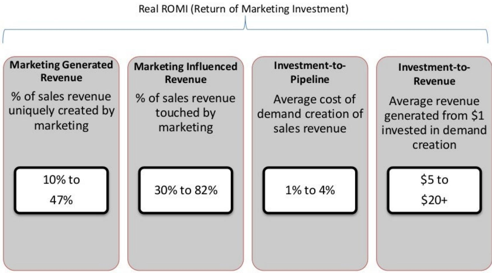

> **AI Description:**
> **Source:** `assets/_page_41_Figure_0.jpg`
> 
> **Generated:** 2026-05-31 16:49:25
> 
> ---
> 
> The image contains a chart titled "Real ROMI (Return of Marketing Investment)" which presents four different metrics related to marketing's impact on revenue. The chart includes:
> 
> 1. **Marketing Generated Revenue**: The percentage of sales revenue uniquely created by marketing, ranging from 10% to 47%.
> 2. **Marketing Influenced Revenue**: The percentage of sales revenue touched by marketing, ranging from 30% to 82%.
> 3. **Investment-to-Pipeline**: The average cost of demand creation of sales revenue, ranging from 1% to 4%.
> 4. **Investment-to-Revenue**: The average revenue generated from $1 invested in demand creation, ranging from $5 to $20+.
> 
> The chart visually organizes these metrics in a structured format, making it easier to compare the different aspects of marketing's return on investment.

## Six Metrics Diagnose Marketing Opportunity

Thereareonly sixmarketing KPl’sormetrics you need todiagnosemarketingopportunities createdacross yourorganisation:

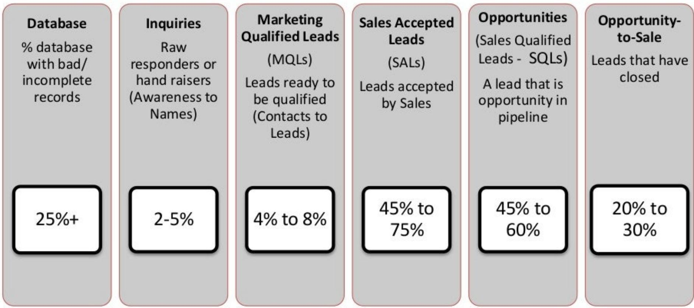

> **AI Description:**
> **Source:** `assets/_page_42_Figure_0.jpg`
> 
> **Generated:** 2026-05-31 17:32:11
> 
> ---
> 
> The image contains a chart with five vertical sections, each representing a different stage in a sales and marketing process. The sections are labeled as "Database," "Inquiries," "Marketing Qualified Leads (MQLs)," "Sales Accepted Leads (SALs)," "Opportunities (Sales Qualified Leads - SQLs)," and "Opportunity-to-Sale." Each section includes a percentage range indicating the typical conversion rate or success rate at that stage. The percentages are as follows: Database (25%+), Inquiries (2-5%), Marketing Qualified Leads (4% to 8%), Sales Accepted Leads (45% to 75%), Opportunities (45% to 60%), and Opportunity-to-Sale (20% to 30%). The chart visually represents the progression and conversion rates from database to closed sales, highlighting the significant drop-off at each stage.

\*Cross-industryaverage conversionrates

## Diagnostic Metrics- Example

Lead Funnel Progression

Displayai manyofyouSsarecovertnintoSalesQualifedLeadsSQLs)andowmanyofurSQLsarebecomingactualSalesWonOpportunieSOs)

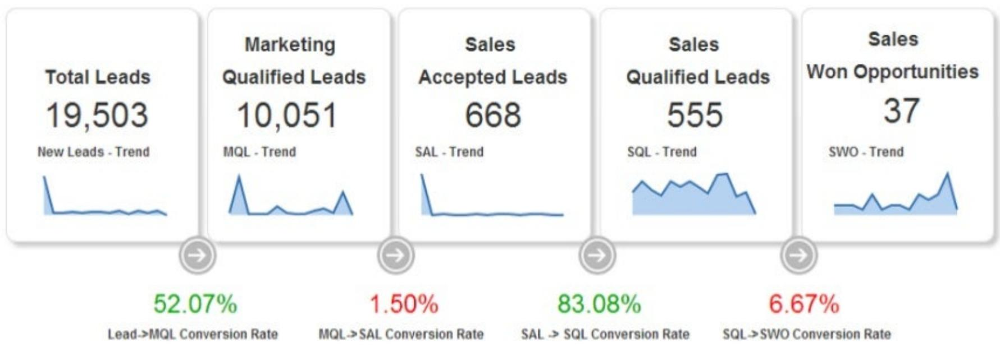

> **AI Description:**
> **Source:** `assets/_page_43_Figure_0.jpg`
> 
> **Generated:** 2026-05-31 17:26:02
> 
> ---
> 
> The image contains a series of visual elements that present marketing and sales data in a structured format. It includes five boxes with text and line graphs, each representing different stages of a sales funnel: Total Leads, Marketing Qualified Leads (MQL), Sales Accepted Leads (SAL), Sales Qualified Leads (SQL), and Sales Won Opportunities (SWO). Each box displays a numerical value and a trend line graph. Below each box, there is a conversion rate percentage, indicating the percentage of leads that progress from one stage to the next. The visual elements are designed to provide a clear overview of the conversion rates at each stage of the sales process.

### Full Page Description (Page 44)

**Source:** `assets/_page_44_Asset_0.jpg`

**Generated:** 2026-05-31 16:56:47

---

The image is a line graph titled "Membership Trend." It displays data for the months of March to September 2011. The graph has two lines: one representing "Members" and the other "New Names." The "Members" line shows a significant peak in April 2011, followed by a decline throughout the rest of the year. The "New Names" line also shows an initial increase in April but remains lower than the "Members" line throughout the period. The graph indicates a general downward trend in both metrics from April to September.

## Closed Loop Analytics- Revenue Performance Management

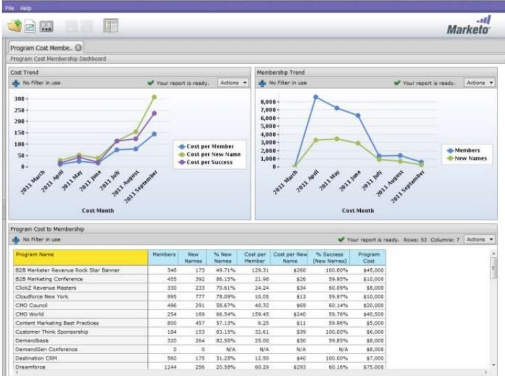

> **AI Description:**
> **Source:** `assets/_page_44_Figure_0.jpg`
> 
> **Generated:** 2026-05-31 17:27:00
> 
> ---
> 
> The image contains a dashboard with multiple visual elements including line graphs and a table. The line graphs display trends over time for "Cost Trend" and "Membership Trend," showing metrics such as "Cost per Member," "Cost per New Name," and "Cost per Success" for the "Cost Trend" graph, and "Members" and "New Names" for the "Membership Trend" graph. The table below the graphs provides detailed data for various programs, including the number of members, new names, cost per member, cost per new name, and program cost. The dashboard is designed to provide a comprehensive view of program costs and membership trends over time.

## Closed Loop Analytics - Revenue Performance Management

## Closed Loop Analytics-Channel performance& Velocity

Marketo Prospect Generation 2H2010

## Closed Loop Analytics-Single view of customer

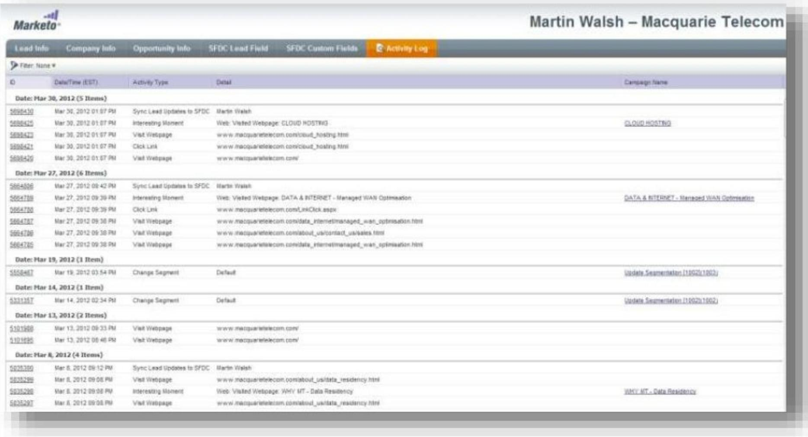

> **AI Description:**
> **Source:** `assets/_page_47_Figure_0.jpg`
> 
> **Generated:** 2026-05-31 16:41:23
> 
> ---
> 
> The image contains a table with a header labeled "Activity Log" under the "Marketlo" section. It displays a list of activities logged for a user named Martin Walsh from Macquarie Telecom. The table includes columns for ID, Date/Time, Activity Type, Detail, and Campaign Name. The data is organized by date, with entries for March 30, 2012, March 27, 2012, March 19, 2012, March 14, 2012, and March 13, 2012. Each entry includes details such as web page visits, clicks, and sync updates to Salesforce (SFDC). The table also shows campaign names associated with certain activities, such as "CLOUD HOSTING," "DATA & INTERNET - Managed WAN Optimisation," and "WHY MT - Data Residency."

## Closed Loop Analytics- Single view of customer

View in Marketo

## Social Analytics

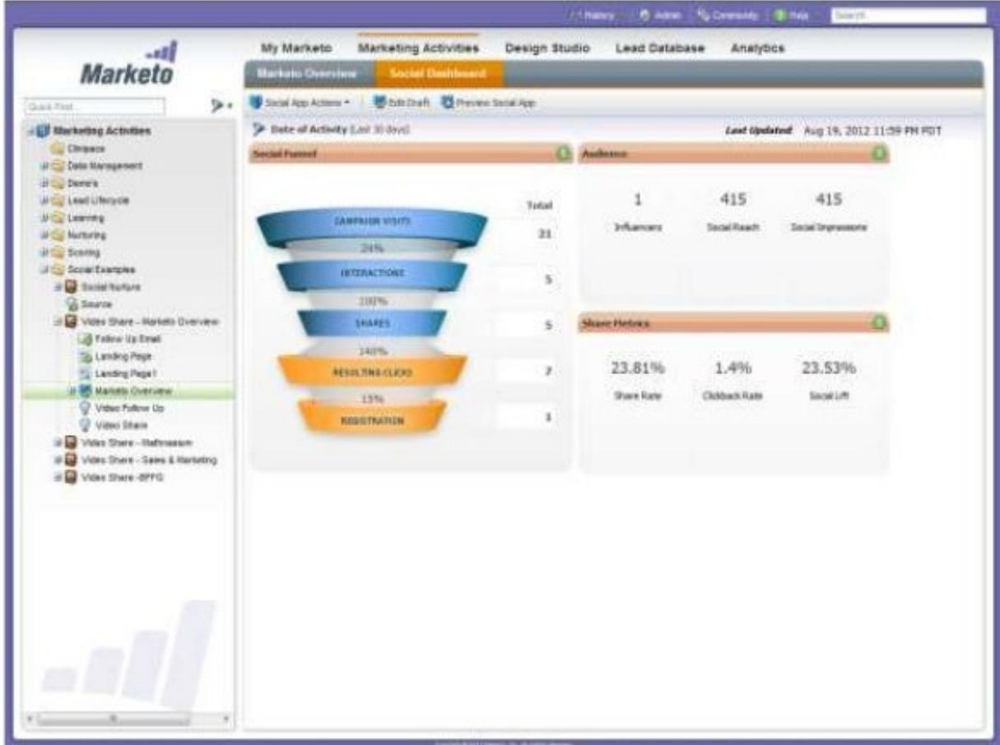

> **AI Description:**
> **Source:** `assets/_page_49_Figure_0.jpg`
> 
> **Generated:** 2026-05-31 17:17:07
> 
> ---
> 
> The image contains a visual representation of a marketing funnel, which is a common tool used in marketing to illustrate the stages a customer goes through from awareness to conversion. The funnel is divided into five stages: Campaign Visits, Interactions, Shares, Resulting Clicks, and Registration. Each stage shows the percentage of the total that falls into it, with percentages decreasing as the funnel narrows. The image also includes a section labeled "Audience" with metrics such as Influencers, Social Reach, and Social Impressions. Additionally, there are share metrics displayed, including Share Rate, Clickback Rate, and Social Lift. The interface appears to be part of a marketing automation software, specifically Marketo, as indicated by the branding and layout.

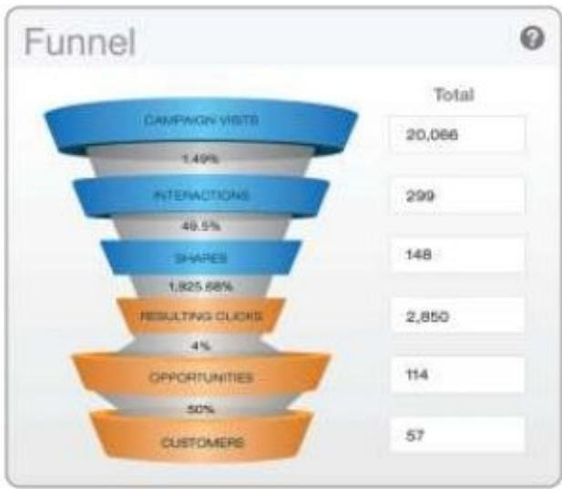

> **AI Description:**
> **Source:** `assets/_page_49_Figure_1.jpg`
> 
> **Generated:** 2026-05-31 17:19:59
> 
> ---
> 
> The image contains a funnel chart with a visual representation of a marketing or sales process. The funnel is divided into six stages: Campaign Visits, Interactions, Shares, Resulting Clicks, Opportunities, and Customers. Each stage is represented by a section of the funnel, with the percentage of the total at the top of each section. The total number of campaign visits is 20,066, with a significant drop-off from campaign visits to interactions (49.5%), shares (88%), resulting clicks (4%), opportunities (50%), and finally, customers (57%). The funnel visually illustrates the conversion rate from each stage to the next, highlighting the significant decrease in the number of customers compared to the initial number of campaign visits.

## Email Analytics

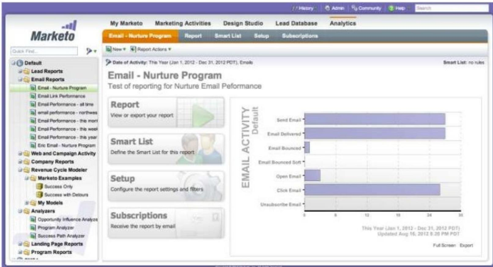

> **AI Description:**
> **Source:** `assets/_page_50_Figure_0.jpg`
> 
> **Generated:** 2026-05-31 17:36:04
> 
> ---
> 
> The image contains a screenshot of a Marketo analytics dashboard. It features a bar chart displaying email activity metrics such as "Send Email," "Email Delivered," "Email Bounced," "Email Bounced Soft," "Open Email," "Click Email," and "Unsubscribe Email." The chart is labeled with "EMAIL ACTIVITY" and "Default" indicating the default settings for the report. The dashboard also includes sections for "Report," "Smart List," "Setup," and "Subscriptions," with options to view or export the report, define the smart list, configure report settings, and receive the report by email. The date range for the activity is specified as "This Year (Jan 1, 2012 - Dec 31, 2012 PDT)."

## A/B Testing-Email,Landing Page and Forms

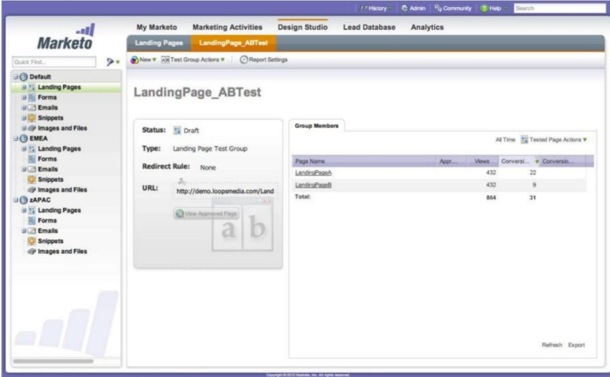

> **AI Description:**
> **Source:** `assets/_page_51_Figure_0.jpg`
> 
> **Generated:** 2026-05-31 17:22:28
> 
> ---
> 
> The image is a screenshot of a Marketo platform interface, specifically showing a Landing Page AB Test group. The visualization includes a table with columns for "Page Name," "Approved," "Views," "Conversions," and "Conversion Rate." Two landing pages, "LandingPageA" and "LandingPageB," are listed with their respective statistics. The total number of views and conversions is also provided. The interface also displays the status as "Draft," the type as "Landing Page Test Group," and the URL for the test group. The main trends are the conversion rates for the two landing pages, with "LandingPageA" having a higher conversion rate.

## Revenue CycleAnalytics-Flows,Velocity,Conversions

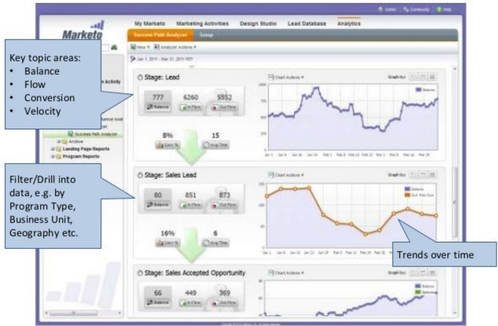

> **AI Description:**
> **Source:** `assets/_page_52_Figure_0.jpg`
> 
> **Generated:** 2026-05-31 16:42:27
> 
> ---
> 
> The image contains a screenshot of a Marketo analytics dashboard. It displays three stages of a marketing funnel: Lead, Sales Lead, and Sales Accepted Opportunity. Each stage has a pie chart showing the balance, in-flow, and out-flow of leads, along with a percentage conversion rate and average time spent. Below each stage, there are line graphs showing trends over time for the conversion and average time metrics. The dashboard also includes key topic areas such as Balance, Flow, Conversion, and Velocity, and instructions to filter or drill into the data by Program Type, Business Unit, and Geography.

Measurekeymetrics associated with each stage of themarketing&salesfunnel:

·Balance of leadsin stage

·In flow

·Outflow

·Conversion rate

·Velocity (time in stage)

Thenhave theabilitytofilter thisinformationbycampaign, products,businessunit, demographics,geographyetc.

Lead Scoring

## Marketing Automation - Lead Scoring

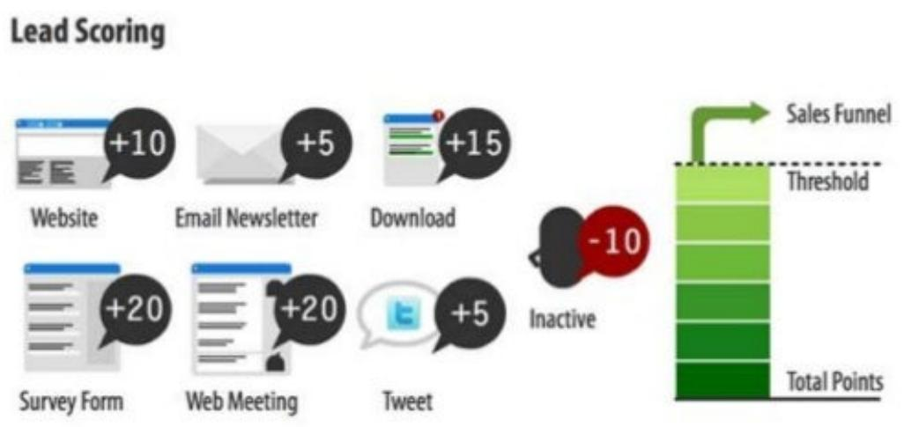

> **AI Description:**
> **Source:** `assets/_page_54_Figure_0.jpg`
> 
> **Generated:** 2026-05-31 16:47:31
> 
> ---
> 
> The image contains a lead scoring system visualization. It includes icons representing various actions or interactions, such as visiting a website, subscribing to an email newsletter, downloading a document, completing a survey form, attending a web meeting, tweeting, and being inactive. Each action is associated with a point value, with positive points for actions like visiting a website, downloading, and completing a survey, and a negative point for being inactive. The total points are represented on a bar graph that shows the progression towards a sales funnel threshold. The key information includes the point values for each action and the visual representation of the scoring system.

Leadscoringranksaprospect or lead'slevelof interestandsalesreadinessaccordingtoapredeterminedscoringmethodology.

Marketing communicationsare customised to matchtheprospectscharacteristicsanddegreeof sales-readiness.

Everyactivitythe prospects or lead does is givena score.

When the scores reach apre-determined threshold,theprospectorleadisdeemed MarketingQualifiedand thereforesales-readyand transferredtothesalesteam.

## Marketing Automation - Lead Scoring

## Scoring Based on Content

## Sample of Scoring

## How Lead Scoring Works in an Automated Marketing Context

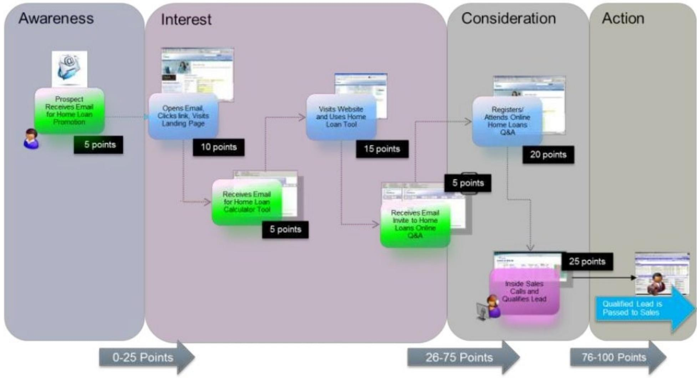

> **AI Description:**
> **Source:** `assets/_page_56_Figure_0.jpg`
> 
> **Generated:** 2026-05-31 17:24:01
> 
> ---
> 
> The image is a flowchart depicting a customer journey through a home loan promotion process. It is divided into four stages: Awareness, Interest, Consideration, and Action. Each stage includes specific actions and associated points, with the total points determining the stage the prospect moves to next. For example, receiving an email for a home loan promotion earns 5 points, while visiting the website and using the home loan tool earns 15 points. The flowchart visually represents the progression from receiving an email to becoming a qualified lead passed to sales, with points accumulating at each stage.

## How Lead Scoring Works in an Automated Marketing Context

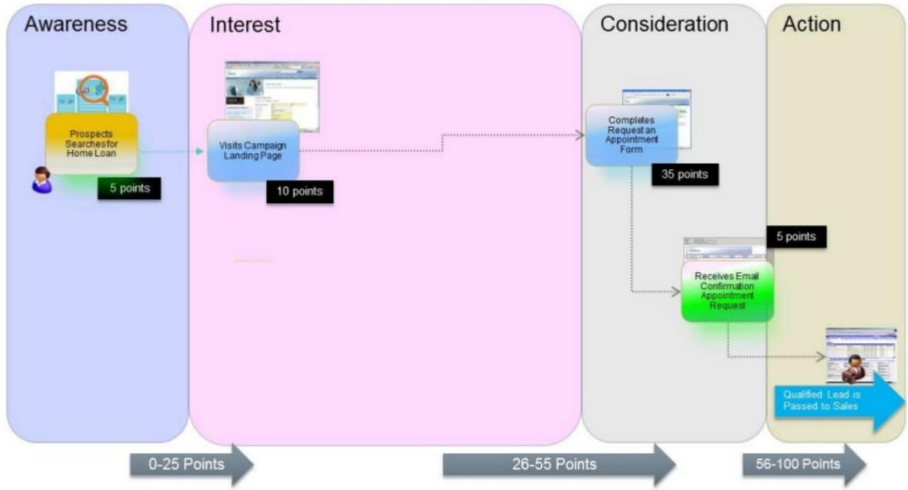

> **AI Description:**
> **Source:** `assets/_page_57_Figure_0.jpg`
> 
> **Generated:** 2026-05-31 17:35:00
> 
> ---
> 
> The image is a flowchart depicting a customer journey through a marketing funnel. It is divided into four stages: Awareness, Interest, Consideration, and Action. Each stage is represented by a color-coded section and includes specific actions and points associated with each step. For example, the Awareness stage shows a prospect searching for a home loan, which earns 5 points. The Interest stage involves visiting a campaign landing page, earning 10 points. The Consideration stage includes completing a request for an appointment form, which is worth 35 points. The Action stage shows a qualified lead being passed to sales, earning 5 points. The flowchart uses arrows to indicate the progression through the stages and includes numerical point values to track progress.

## Content& Behavioural Scoring-Active vs Latent Behaviour

Content Scoring Attributes

Exampleof Activevs Latent Behaviour. Twodifferentprospectswithsamescore butwithdifferentbehaviourandtime.

## Explicit& Implicit Data

Explicit:Whataprospect tellsus/what we know

Implicit:Whata prospect does

## Content Scoring and Optimisation

Constantlyreviewingwhat contentworks throughoutthefunnel.

In thisexample,95%ofallopportunities visitedthe‘PricingDetailsPage'.

Youcould lookatall of yourcontent and see whetherLeads,Opportunitiesorimportantly Conversions/Salesandviewing/engaging with itand when.

## Social Scoring

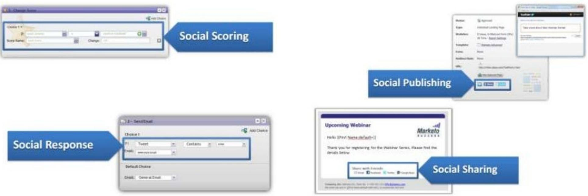

> **AI Description:**
> **Source:** `assets/_page_61_Figure_0.jpg`
> 
> **Generated:** 2026-05-31 17:37:34
> 
> ---
> 
> The image contains a flowchart with four main sections labeled "Social Scoring," "Social Publishing," "Social Response," and "Social Sharing." Each section includes a diagram with text boxes and arrows indicating the flow of information or processes. The flowchart appears to illustrate a social media marketing strategy, showing how different components interact within a marketing campaign. The text within the boxes provides specific details about each step, such as "Change Score," "Tweet," and "Share with Friends." The overall structure suggests a step-by-step guide for implementing social media marketing tactics.

## Marketing Automation-Prospect/Lead Characteristics

> **AI Description:**
> **Source:** `assets/_page_62_Figure_0.jpg`
> 
> **Generated:** 2026-05-31 16:53:09
> 
> ---
> 
> The image contains a sequence of icons representing a process or flow. The icons include a person holding a briefcase, a name tag, and another person holding a briefcase. The sequence suggests a progression from one individual to another, possibly indicating a transfer of information or a process involving two people. The name tag icon suggests a focus on identification or labeling. The overall visual elements are simple and stylized, with no additional text or annotations beyond the icons and labels.

Demographics
BANT(Budget,Authority,Need,Timing）
Behavioral Indicators

Thereare three Qualification Characteristics; Demographics，BANT(Budget,Authority,Need, Timing)and Behavioural Indicators.

Characteristicsarecritical signifiers that determine the sales-readiness ofaprospect or lead.

A Digital Measurement Framework Objective

Istoensurea common,base-level of understanding of the metrics, technology, tools and processes that support Measurement, Reporting, Testing and Optimisation

## Your Framework Must Be Focused on Identifying Insights Which Connect to their Desired Outcomes

Insights

Recommendations

Findings

Information

Data

Of most value because it offers new waysof lookingatmarkets that leadto competitiveadvantage.

Summarises the implications of the research forthe business.

Selected information that is of interest, but lacking in implications.

Informsthe businessabouta market, butno indicationof relative importance ofdifferentpiecesofinformation.

Of littlevalue becauseitis usually diicultounderstandandinterpreton itsown.

## Measurement Framework Principles

1.Uncover business objectives, understand existing   
measurementcapabilities,and   
define measurement strategy &taxonomy

6.Define optimization strategies, setup alerting on primary KPls, enableagencies with richdata

ONGOINGOPTIMIZATION

MEASUREMENT STRATEGY

2.Taggingstrategy that aligns to easurementstrategy,   
implementationplans,testing& QA

ADOPTION

DATA INTEGRATION

5.Training,governance, integration into business decision-making processes

DATA VISUALIZATION ANDDELIVERY

3.Understand data sources, develop integrationschema, integrate sourcesand test

4.Understand organizational   
reporting needs,determine best   
delivery mechanisms,develop informationarchitecture, automation

## Conceptual DigitalMeasurementFrameworkOutline

@Copyright2011MartinWalsh http://twitter.com/martinwalsh

Customer Lifecycle (B2B)

Post Sales

Perceptual Journey ofCustomers

Unawareof Cap

Needto Understand Value

Want to Investigate /Evaluate

Ready to Talk to

Plan to Deploy& Develop Skills

Use& Extract Value

Connectto Community to Share&Engage

Customer Lifecycle

Awareness

Interest/Research

Consideration

Purchase Intent

Purchase & Deploy

Use&Support

Engage,Advocate orDetract

·Discover

·Education

·Leam About

Customer Interest /Tasks

·Research

·Trust ·Benefits ·Product Comparisons

·Authority

·Value

·Whitepapers/

·Learn

·Evaluation/Trial

·Analysis ·Pricing/ Licensing ·StayUpTo Date

Help

Case Studies

·Downloads

·Howto Buy

How To

·eLearning

·Q&A's

Troubleshoot Community Contribution Forums CustomerSupport

Digital Strategy

Get Attention/Get 0

Inspire/Inform

Influence,Persuade,Engage

Convert

Satisfy

Retain/Energise

Measurement Objective

Maximise Reach, Discoverability& Initial Responses

Maximise lent

Optimise Engag nent

Optimise   
Conversions/End   
Actions

Maximise Sales

Maximise Customer

UpSell/CrossSell/

AdServing/Tracking-DoubleClick/Atlas

Data Sources

Search EngineMarketing-Marin&Covario

MarketingAutomation(mail,LeasNrturing&anagement)-UnicaEactTrget,Re

CRM-Dynamics CRM,Salesforce.com

WebAnalyticsCoremetricsNetnsights,WebrendsmnitureGoogleAalytics

CustomerSatisfaction-Comscore,GetSatisfaction.

Social Media/entimentuastan6,Converseoneen

Impressions

Unique Visitors

Content Engagement Rate #End Actions (EA)

Chum

Lifetime Value

Initial ResponseRate（ (IRR)

Landing/Entry Page Engagement Rate

Cost per Engaged Visit

Cost Per End Action (CPEA)

KPI's   
(Examples and not   
Exhaustive)

Opt Out Rate

Cost Per Initial Response(CPIR)

Continued ActionRate（CAR)

Cost PerVisit that Consumes

#Prospects/ Responders

Lead Scoring

Share of Voice

Cost per Prospect

Leads/Win Revenue/Sales

Qualitative-CSAT(customersatisfaction),NSAT(net satisfaction),Sentiment

## ROMI (Return On Marketing Investment)

· It is critical that an organisation developa framework for measuring the contribution of marketing investment to the organisation aswell as it's ROl.

· A ROMl framework ensures the whole organisation is on the same page,measuring the same things the same way at the right time with the same tools and appropriateexpertise.

## ROMI (Return On Marketing Investment)

1. ROMI (Return on Marketing Investment) should be a companywideproject to ensure that you maximize your commercial marketinginvestment.

2. The project requires leadership commitment & guidance to drive sustainableprocess,infrastructure,organizational,andcultural growth.Company-widemeansacross Business Groups, Segments,Sales,Finance,HRandMarketinginboth CHQ& the Field.

3. ROMl is the vehicle that brings together the executive team, projectmanagers,subjectmatterexperts (SMEs), communications,and change management required to transform innovative,bold ideas into real solutions that are broadlyadopted.

4.ROMl is the fusion of art and science in Marketing.

## The End Vision for ROMI

·Theend vision for ROMl is that your organisation has greater visibility into the effectiveness of itsmarketing investment.

The organisation must enable marketing to be more accountablethroughobjective-based measurement.

·The organisation must ensure that its marketing disciplines, processes,metrics, toolsand organizational structureare betteraligned so that it has the infrastructure and capability in place to deliver great marketing.

·Underlying this entire vision must be a commitment from the organisation to improve customer and partner satisfaction.

## Traditional Marketing Models Fail to Model Complex Buying Paths

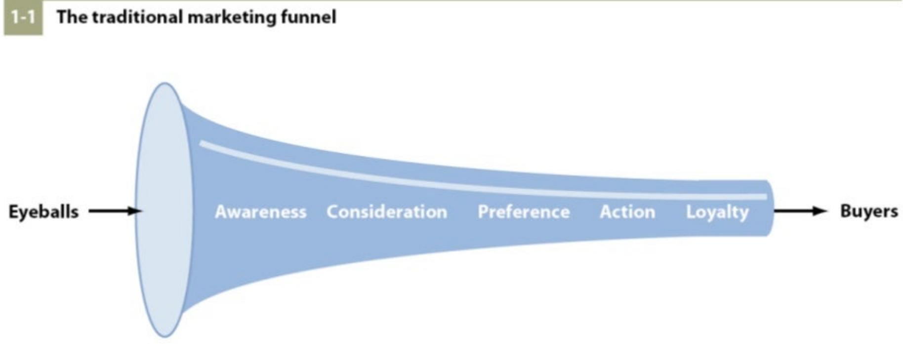

> **AI Description:**
> **Source:** `assets/_page_70_Figure_0.jpg`
> 
> **Generated:** 2026-05-31 16:50:14
> 
> ---
> 
> The image is a diagram of the traditional marketing funnel. It is a funnel-shaped illustration with the top labeled "Eyeballs" and the bottom labeled "Buyers." The funnel is divided into five stages: Awareness, Consideration, Preference, Action, and Loyalty. The width of the funnel decreases as it moves from top to bottom, indicating a reduction in the number of potential buyers as they progress through the stages of the marketing funnel. The text annotations clearly label each stage, making it easy to understand the flow of the marketing process.

Traditionall,rketersodeledtomersdcisionsstrogressedfromwarenessthoughonsderationreferencecion andloyalty-throughwhatiscalledthemarketingfunnel.Themarketer'sjobwastomovepeoplefromtheargeenddowntothe smalled.Butnowit’stimeforarethinkasthefunnelhasoutliveditsusefulnessasametaphor.Faceit:Marketersnolongerdictate thepathpeopletake,nordotheyleadthedialogue.Wemustrethink themarketingfunnelbecause:

Complexity reignsin themiddleofthefunnel.

Themost valuablecustomer isn't necessarily someone who buysalot.

Traditional media channelsare weakening.

Consumers force brandtransparency.

## Traditional Marketing Models Fail to Model Complex Buying Paths

Complexityreigns inthemiddleof the funnel.Awareness isstillimportant;you need to know thataproduct or serviceexists inorder to buy it.And themarketer'sendpoint is still a transaction.But,in between,otherfactorssuchasrecommendationsfrom friendsorfamily, productreviews,and competitivealternativesdescribedbypeersinfluenceindividuals.The funnel'sconsideration,preference,andaction stages ignore these forces thatmarketersdon't control.Ratherthanaclean linearpath,thereal processlooksmore likeacomplex network of detours,backalleys,alternateentryandexit points,external influences,andalternative resources.

Themost valuable customer isn't necessarily someone who buysalot.Inthis socially charged era inwhich peers influence each otherasmuch as companiesdo,good customers can'tbe identified solely bytheir purchases.Companiesalso need to track individualswho influence otherstobuy.Forexample,acustomerwhobuysverylitlefromyoubutalwaysratesand reviews what she buyscanbe just as valuableas someonewho buysa lot一her reviews might influence1ooother people tobuy yourproduct.Tracking only transactionsandloyaltyatthe end of the funnel misses thissignificantelementof influence.

Traditionalmediachannelsareweakening.Marketerscontinueto usemainstreammedia messagesto move consumers intoa consideration frame of mind.But passive consumption of mediaiswaning.Individualsdismissor ignoremarketingmessages in lieuof information available fromanever-increasing numberof resources,suchas product reviewsites,message boards,and online video.

## Today's Complex Buying Paths

Complexityliesat thecenter ofthemarketing funnel

## Peer Competitive reviews alternatives Buyers Eyeballis-Contributors Recommendations User-generated fromfriends content

Marketingcomplexitymeansthat traditionalmethodsandmetricsfail toaddressand capture thewhole story.Online metrics like unique visitorstoa Website,numberof pagesviewed,and time spent per pagemimicofflinemediametricsof reachandfrequency.Buttraditional marketingandtraditional measurementdoesn'taddressor indicate theengagementofan individual;theyfail toaddressor capture the sentiment,opinion,and affinityaperson hastowardsa brandasmanifestedinratings, reviews,commentsinblogsor discussion forums,orthe likelihood torecommendtoafriend.

## Marketing Leadership: Strategy

YourOrganisation Must Move Beyond Campaign-Centricityand TakeaCustomer-CentricApproach to DigitalMarketing:

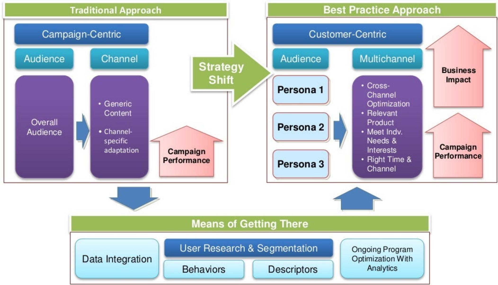

> **AI Description:**
> **Source:** `assets/_page_73_Figure_0.jpg`
> 
> **Generated:** 2026-05-31 17:39:13
> 
> ---
> 
> The image is a flowchart comparing a Traditional Approach and a Best Practice Approach in marketing strategy. The Traditional Approach is focused on a campaign-centric model, utilizing an overall audience and channel-specific adaptations, resulting in generic content and channel-specific adaptation. The Best Practice Approach shifts to a customer-centric model, using personas to tailor content to individual needs and interests, with cross-channel optimization and relevant product offerings. The flowchart highlights the means of achieving these approaches, including data integration, user research and segmentation, and ongoing program optimization with analytics. The arrows and labels indicate a strategy shift from the Traditional to the Best Practice approach, emphasizing improved business impact and campaign performance.

But first......

## Digital Marketing:Some Quick Definitions

There is still genuine confusion about the simplest,most foundational,parts of digital metrics/analyticsacross organisations:

1.Business Objectives

2.Goals

3.Metrics

4.Key Performance Indicators

5.Targets

6.Dimensions

7.Segments

## Digital Marketing: Some Quick Definitions

## 1．Business Objectives

90%of the failures inwebanalytics,the reasons companiesare data rich and information poor,isbecause they don't have DUMB objectives.

Ortheyhave just one (DUMB) Macro Conversion defined and completely ignore the Micro Conversionsand EconomicValue.

## DUMB:

Doable.

Understandable.

Manageable.

Beneficial.

## Digital Marketing:Some Quick Definitions

## 2.Goals

Businessobjectivescan bequitestrategicandhigh level.Sellmorestuff.Createhappy customers.Improvemarketing effectiveness.

Goalsare the next level drill down.It goes something like this...

Sell more stuff reallymeans we have to:

1.dox

2.improve y

3.reducez

Thebeauty of goals isthat they reflect specific strategies.They are really DUMB.They arepriorities.Theyareactuallythingsalmost everyonein thecompanywillunderstand as soonas you say them.

## Digital Marketing:Some Quick Definitions

## 3.Metrics

Ametricisanumber.That isthe simplestwayto thinkabout it.

Technicallyametriccan bea Count (atotal)ora Ratio(adivision of one number by another).

Examples of metrics that area Count is Visitsor Pageviews.

Examples ofa Ratio is Conversion Rate (a quantitativemetric)orTask Completion Rate (a qualitative metric). LAIED AL

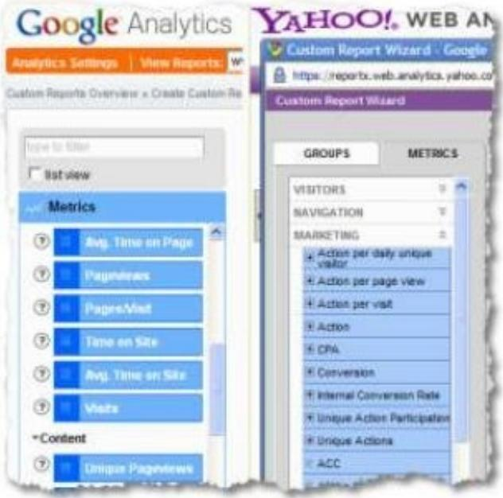

> **AI Description:**
> **Source:** `assets/_page_78_Figure_0.jpg`
> 
> **Generated:** 2026-05-31 17:16:33
> 
> ---
> 
> The image contains two side-by-side screenshots of Google Analytics and Yahoo! Web Analytics interfaces. Both screens display sections for creating custom reports, with the left side showing Google Analytics and the right side showing Yahoo! Web Analytics. The left side includes a list of metrics such as "Avg. Time on Page," "Pageviews," and "Visits," while the right side lists metrics like "Actions per daily unique visitor," "Actions per page view," and "Actions per visit." Both interfaces are designed for users to customize reports by selecting different groups and metrics.

## Digital Marketing:Some Quick Definitions

## 4.Key Performance Indicators

Key performance indicators (KPl's)are metrics. But not normal metrics.Theyare our BFF's.

A keyperformance indicator (KPl) isa metric that helps you understand how you are doing against yourobjectives.

Thatlast word-objectives-iscritical tosomethingbeingcalledaKPl,which isalso why KPl'stend tobe unique toeachcompany.

Business objective:SellStuff. KPl:AverageOrder Size.

## Digital Marketing:Some Quick Definitions

## 5.Targets

Targetsare numerical values you have pre-determined as indicators success or failure.

It is rare,even with the best intentions,that you'll create targets forallthemetrics you'll reporton.Yet itiscritical that youcreate targetsforeach webanalytics key performance indicator.

Best Buy:my KPlis stillAverageOrderValue.Buthowdolknowwhat's goodorbad?If Idon'thave targets?

## Digital Marketing:Some Quick Definitions

## 6.Dimensions

Adimension is,typically,anattributeof the Visitorto yourwebsite.

Here'sa simplistic pictorial representation...

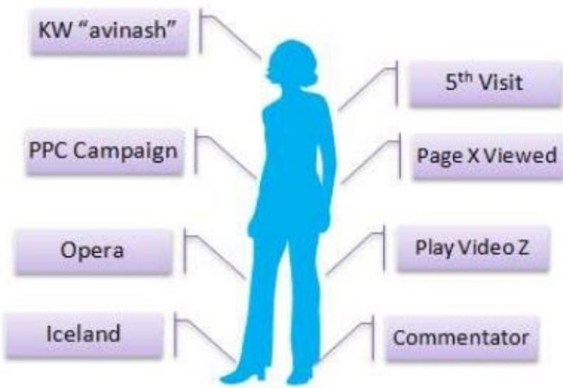

> **AI Description:**
> **Source:** `assets/_page_81_Figure_0.jpg`
> 
> **Generated:** 2026-05-31 17:06:55
> 
> ---
> 
> The image contains a diagram illustrating a user's journey or interaction with a website or application. The diagram includes a central figure representing a user, with various elements branching out from it to represent different actions or attributes associated with the user's experience. Key elements include:
> 
> - A keyword search ("KW 'avinash'")
> - A PPC Campaign
> - A browser (Opera)
> - A location (Iceland)
> - A visit count (5th Visit)
> - A page viewed (Page X)
> - A video played (Video Z)
> - A role or designation (Commentator)
> 
> The diagram visually connects these elements to the user, suggesting a flow or sequence of events related to the user's interaction with the platform.

The source that someone came from (referring urls,campaigns,countries etc) isa dimension inyourwebanalyticsdata.

## Digital Marketing:Some Quick Definitions

## 7. Segments

Asegmentcontainsagroup of rows from one ormore dimensions.

Inaggregate almost alldata isuseless (like #of Visits).The best way to find insights is to segment the data using one ormore dimensions (like#of Visits from:Australia,USA, UK,India asa%ofAll Visits).

Yousegmentbydimensionsand reportbymetrics.

## Measurement-What Activities Should You Measure?

## Most marketers focus largely on:

1. Measuring Reach and Response

2. Measuring Sales

3. Notenough measuringEngagement,EndActions,ConversionandVelocityand lookingat itend-to-end

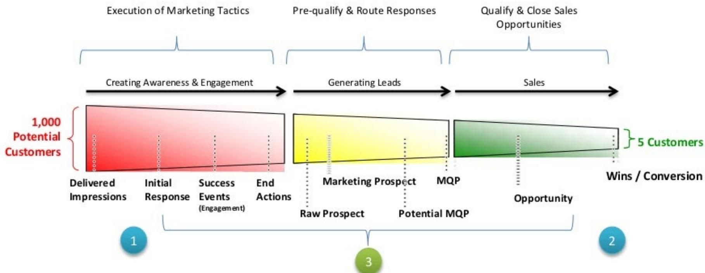

> **AI Description:**
> **Source:** `assets/_page_83_Figure_0.jpg`
> 
> **Generated:** 2026-05-31 17:00:05
> 
> ---
> 
> The image is a flowchart that illustrates the process of converting potential customers into actual customers through a series of marketing and sales stages. It starts with "1,000 Potential Customers" and outlines three main stages: "Creating Awareness & Engagement," "Generating Leads," and "Qualify & Close Sales Opportunities." 
> 
> The flowchart shows a reduction in potential customers at each stage. For instance, after "Creating Awareness & Engagement," the number of "Delivered Impressions" is significantly higher than the number of "Initial Response," "Success Events (Engagement)," and "End Actions." Similarly, the number of "Marketing Prospects" is much larger than the number of "Potential MQP" and "Opportunity," and the final number of "Wins / Conversion" is only five customers. The flowchart uses color coding to differentiate between different stages and categories of potential customers.

Delivered lmpressions,PageViews,Unique Visitors,Win/Conversions-highlevelmeasures.Buttheyarenot very insightfulin isolationand without looking atengagement.

## Key Measurement Elements-A Basic Scenario

## Process Steps

1.Delivered Impressions

2.The # of people who click on ANYof the banner ads= Initial Responses

3.The #of people who watch the video= Engagement

4.The # of people who complete the Registration Wizard= End Actions

5.Siebel measures MQLs,Opptys&Wins foreach Ad/End Action combo

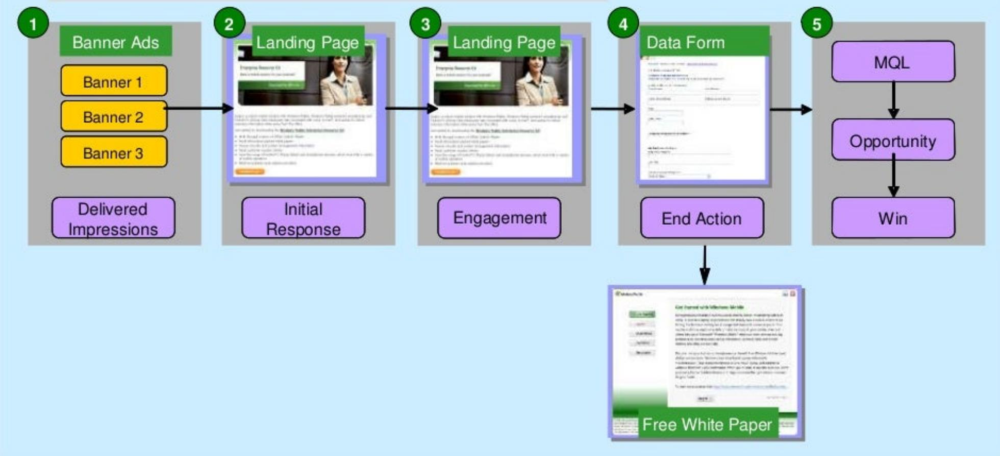

> **AI Description:**
> **Source:** `assets/_page_84_Figure_0.jpg`
> 
> **Generated:** 2026-05-31 17:01:04
> 
> ---
> 
> The image is a flowchart illustrating a marketing funnel process. It consists of five stages: 1) Banner Ads, 2) Landing Page, 3) Data Form, and 4) MQL (Marketing Qualified Lead), leading to 5) Win. Each stage is visually represented with a corresponding icon and text. The flowchart includes labels such as "Delivered Impressions," "Initial Response," "Engagement," "End Action," and "Free White Paper." The flowchart visually represents the progression from initial impressions to converting a lead into a win.

### Full Page Description (Page 85)

**Source:** `assets/_page_85_Asset_0.jpg`

**Generated:** 2026-05-31 17:21:18

---

The image is a diagram illustrating a customer journey through a website or online platform. It consists of three concentric circles, each representing a different stage of the customer's interaction:

1. **Reach**: The outermost circle labeled "Visitors" describes the initial stage where a customer arrives at the site with a need.
2. **Engagement**: The middle circle labeled "Success Events" indicates the stage where the customer navigates the site to fulfill that need.
3. **Call to Action / Conversion**: The innermost circle labeled "End Action" represents the final stage where the customer fulfills a need, which is the conversion point.

The diagram visually represents the progression from initial visitorship to successful engagement and ultimately to a conversion action.

## Simplify Top-Of-Funnel Measurement

2.Engagement

## Measurement- High Value Activities

## 1.Reach

## What Should We Measure -Top of the Funnel?

Email

Online Ads

Paid Search

SEO

ATL

Social Media

## Primary Online Media KPl's

Delivered Impressions(Dl)-1,200,000

Initial Responses(IR)-21,450

·Initial Response Rate(IRR)-1.79%

·Cost PerInitial Response(CPIR)-\$2.96

·End Action Engagement Rate-2.95%

·CostPerEnd Action(CPEA)-\$96.40

I's tme to sk smarter questions

> **AI Description:**
> **Source:** `assets/_page_87_Figure_0.jpg`
> 
> **Generated:** 2026-05-31 17:16:38
> 
> ---
> 
> The image contains a video thumbnail with the text "First-to-market, 100% superior!" prominently displayed. The thumbnail shows a close-up view of what appears to be a kitchen or food preparation area, with various items and equipment visible in the background. The text suggests a focus on a product or service that is the first to market and superior in quality.

## Primary Website KPl's

·UniqueVisitors-78,465

·Engagement Rate(of Page)-16.7%

·Continued Action Rate(CAR)-3.5%

·Success Events-7,860

·End Actions-1,850

·End Action Conversion Rate-2.35%

## What Top of Funnel KPl's?

Youneed to focus onKPl’swhich can help you determine the effectivenessand performance of your activityand which levers (tactics/channels) you can pull to maximise ROl.

IRR=Initial Response Rate

CPIR=Cost Per Initial Response

CAR=Continued Action Rate

Example (purelyillustrative):

EA=End Actions

CPEA=Cost Per End Action

\*YouwouldprincipallymeasuretheLandingPageengagementrateandtheEngagementRateofthetopEntryPages

## Why Focus on These Top of Funnel KPl's?

Byviewing this type of data weget focused on what isworkingand what isn’tworking but ina waywhich isactionable.

Forexample,iflyou weresimplylookingatSiteVisitors,PageViewsandSite Clickshowwould youdetermineapoorlyperformingLanding Page?You could lookatthebouncerateforthe Landing Pagebut thiswillnot tell you whatcontent ontheLanding Pageitself isdriving Engagement.

Anoverall Engagement Ratefora LandingPageorsubsequent pagestellsyou how effective the pageisat EngagingaSiteVisitor.Italsoallows you tooptimisewhat isand isn'tworking on the pageand itisanice simpleKPlformarketersandmanagementtounderstand.

## Example:

1%of Visitors downloadawhitepaper

10%of Visitorssubscribetoanemail newsletter

4%ofVisitorsdownloadedasoftware trial

2.5%of Visitors subscribed to RSs feed

17.5%of Visitors engaged withcontent on the page/4engagement indicators =

## 4.4%pageengagementrate

# Why Focus on These Top of Funnel KPI's?

EndActionsare the laststepin the process of meeting thecustomers need.Or,fromthemarketer's perspective,End Actionsarewhen the customer has completedaCallto Action.

Generallyspeaking there isonly everone EndActionper campaignorwebsite.Thisis the single customerneedyouare tryingto fulfilorCalltoAction.

## Forexample:

If yourcampaign isaboutgeneratingAwarenessthenan EndActioncould simply bewatchinga designatedvideo on the campaign site.

If thecampaignisabout generating Leadsthen theEndActioncouldbeacompleted Registrationas part ofanOnlineAssessment oreven thesuccessfulinitiation ofa Click toCallor Clickto Chat etc.

It is much easiertodeterminetheEndAction foracampaignthan itistodetermineforapersistent site suchasanAudienceRelationshipportal,e.g.BusinessInsights.However,itisimportanttohaveSuccess EventsandsomeformofEndActionsoyoucanmeasuretheeffectivenessofthesitetomeetthese EngagementKPl'sandimportantlyforyoutooptimiseagainst.Agood EndAction foranAudience Relationshipportal wouldbesigningupforaneNewsleterormembershiptothesite(if that exists.)If thesitewasaproduct site thentheEndActiontypicallywouldbedownloadingatrialversionof the softwarebut onceagainthisalsodepends onwhat phase of themarketinglifecycle yourwebsiteis focused on.AnAwareness End Action foranewproduct launch could stillbewatchingavideo if no softwaredownloadwasavailable.

## Important Note-Weighted Attribution

Oneof the keyproblemsacross marketingallaround theworld right nowis thatfartoomuch,orall performanceatributionofmarketingcampaigns,particularlywheretherearedigitalelements,isbeing giventotheFirst Click orLastClick.

Andsadly,fartoomuch performanceattributionisbeinggiven totheLast Clickwhichinmanycasesis Paid Search (PPC) orOrganicSearch (SEO).

Hereare just some examples of theproblem:

If someonetypesinabrandedsearchrelatedtermsuchasCommonwealth Bank Home Loans,the customerhasalreadybeenexposedtosomethingother thanPPCor SEObutthat‘other'marketing oradvertising is getting no performance attribution.

71%of Paid Search clicksare navigational.This indicates that almost threequartersof yourpaid searchisnotbringinginnewprospects-itissimplydeliveringpeoplewhoarealreadyactively looking foryou andwho havepreviously beenexposedtosome otherformofadvertisingor marketing.

Approximately 44%of peoplewho haveclickedona Paid SearchAd havebeenpreviously exposed toabannerad.But,thebanneradgetsnoperformanceattributionatallbecausetheprospect didn'tclickon itandinmost casesthemarketeroragency uses the Last Click to determine what worked-inthiscasepaid search.(Fortherecord,mypeersandlstopped usingCTR-click through rate-onbanneradssome4yearsago becauseitisnottherightperformancemetricforthe displayadvertisingmedium).

Now,thereisnomagictechnicalbullethereandifany vendorcomestoyouandsaytheydo,start runningintheoppositedirection.Great weightedatribution isderived throughacombinationof specialisedskilsataspecialisedagency,technologybut importantlyaprovenmethodology.

## Engagement: A New Perspective on Marketing

Asoutlinedearlier,ifthemarketingfunnelnolongeraccuratelyreflectswhatmarketerscaninfluence,whydo theystillclingtoit?Becausetheycanmeasureit,whichisreassuring,evenifitnolongeraccuratelyreflects therealbuying process.And,ofcourse,therearenousefulalternatives.

Webelievethatmarketersneedanewapproachtounderstandingcustomersandprospects.Thisnewtypeof measurement一engagement一encompassesthequantitativemetricsofsitevisitsandtransactions,the qualitativemetricsofbrandawarenessandloyalty,andthefuzzyareasinthemiddlebestcharacterizedby socialmedia.

## The Elements Of Engagement:

Engagement goes beyondreach and frequencytomeasurepeople'srealfeelingsabout brands.It startswith theirown brand relationshipand continuesastheyextend that relationshiptoother customers.Asa customer'sparticipationwithabranddeepensfrom siteuseand purchases (involvementandinteraction)to affinityand championing (intimacyandinfluence),measuringandactingonengagement becomesmore criticalto understandingcustomers'intentions.Thefourparts of engagementbuildoneach othertomakea holisticpicture.

·Involvement

·Interaction

·Intimacy

·Influence

## Engagement: A New Perspective on Marketing

## INVOLVEMENT

## What To Track

·Sitevisits

·Time spent

·Pages viewed

·Search keywords

·Navigation paths

·Site logins

## HowTo Track

·Web analytics

## INTERACTION

.Contributed comments toblogs

·Quantity/frequency of writtenreviews, blogcomments, forumdiscussions,and UGC

·eCommerce platforms

.Social media platforms

## INTIMACY

·Sentiment tracking on third-partysites(blogs, reviews,umsc.)

·Sentiment tracking of internal customer contributions

.Opinions expressed in customer service calls

·Brand monitoring

.Customer service calls

·Surveys

## INFLUENCE

·Net Promoter(NP) score

·Product/service satisfaction ratings

·Brand affinity

.Content forwarded to friends

.Posts on high-profile blogs

·Brand monitoring

·Customer service calls

·Surveys

## Engagement: A New Perspective on Marketing

## Putting italltogether：

Nowthatyou knowwhat informationtocollect,canweprovideyou withaformula tomeasureengagement? Well,no,becauseit'sdiferentforeachaudience/segment/campaign.Butyoucanstartbyidentifyingthe keymetricsthatareusefultoyouandusethemtochooseandworkwithvendorsofmeasurement technology.Theengagementprofilesyoutrackwillbediferentdependingonyourmarketingstrategy.Here arefourrecipesformeasuringengagement,matchedtocompanyobjectives：

If yourobjectiveistocreate awareness:Startasyoualwayshave,tracking existing onlineads,promotions, andTVcommercials.Tothis,addtrackingcontentcontributedbybrandadvocates,suchasproductreviews orcommentsindiscussionforums.Measurethesentimentofthat UGC,includingvenuesyoudon'tcontrol suchasthird-partyproduct reviewsites.Additionaly,trackinfluencethroughcustomers'intentto recommendtheproducttoafriendbyconductingasurvey orwitnessingactionsonpeerreviewsiteslike EpinionsandTripAdvisor.Agoodexample:Alargenationalfinancial institutionusedbrandmonitoring serviceBiz360toidentifykeymessagepickupfromitsSuperbowladinbothtraditionalandinteractive channels,and used thatbuzzmeasurementtoevaluatetheexpenditure.

Ifyourobjectiveistodrivetransactions:Track involvementtoidentifyhowpeopleuseyoursite(page views,navigationpaths,etc.)and mergethat informationwiththeeffect UGChasonotherspurchases. Thisway youcandiscoverthecontentandactionsthatincreaseacustomer'slikelihoodtobuy.For example,CompUsAuses Bazaarvoice's services toprovideproduct ratingsand reviews,then tracks the effectreviews haveonthebuyingbehaviorofreaders.They'vefoundthat customersacquiredviareviewrelatedsearches convertata60%higherrate thantheaveragecustomerand spend50%moreperorder.

## Engagement: A New Perspective on Marketing

## Puttingitalltogether(contd.):

If yourobjectiveistobuildbrandpreference:Trackinvolvementonyourownsiteaswellasreferralsfrom othersites toidentifythecontentpeopleusetomakedecisions.Understandinghowintimatecustomers arewithyourbrandandwhatincreasesintimacywillestablishwhatittakestoconvinceapersontochoose youoveracompetitor.Forexample,alargeautomanufacturerlaunchedanewSUV,butsentimentin discussionforums(measuredusingbrandmonitoringservices)indicatedthattheoff-roadcapabilitiesof thevehiclewerenotbelievable.Then,usingimageryoftheSUVperforminginof-roadconditions,the companywasabletotrackachangeinperception,whichresultedinoutselingitscompetitorsthat quarter.

If yourobjectiveistoincrease loyalty:Track recurringpurchases,positivecommentary,andintentto recommend.Analyze thecharacteristicsand behaviorsofknownloyalists todeterminewhatyou should do tomotivatepotential loyaliststomaketheleap.Monitorsentiment about productsinforumsand in blog commentstotrackthoseactionsthat commonlyencourageordiscouragerepeatpurchaseandrespond accordinglythroughincentives,productmodifications,orservicesenhancements.Forexample,in2006, MiniCooperdecidedtoboostitscommunityeffortsinayearwithnonewproductannouncementsto strengthenloyaltyandavoidbeingseenasafad.WorkingwithMotiveQuest,itusedbrandmonitoring servicesandconfirmedthattheemotionexpressedbyownersintheMinicommunitysetitapartfrom othervehicles.Inaddition,MiniCooperwasabletomonitortheresultsofthebrand'scommunityefforts andevolvefuturecommunications.

## Engagement: A New Perspective on Marketing

Engagement EnhancesCustomer Insight-Social CRM:

MeasuringSocial Media Engagement (Social CRM) isanewconcept.Sofar therearefewmeasurement vendorsprovidingcompletelyunifiedservicestohelptieitalltogether,howeversomesolutionsare appearing,forexample therecent (July2009)announcementofintegratedanalyticsbyWebTrends+Radian6 +SalesforceCRM.

Startingsmallandremaining focused onafewobjectivesata time (suchasconnecting UserGenerated Contenttoincreasedpurchasesorlinking sentimenttoloyalty)alowsyoutoidentifythemetricsthatmatter to youmost.Integrate yourcustomerperspectiveacrosschannelsand campaignsby usingavarietyofonline andofflinemetrics,soyoucancalculate thevalueof newchannelsandidentifyeficient strategies forthem. And considerthepayoff of your hardwork.You'llbeableto:

·Measureandlearn fromthingsyoucurrentlyignore:Qualitativemetricslikefeelings,afinity,and sentimentare difficulttotrack.Andwhenyoucancolecttheinformation,ithas historicallybeen complicatedorimpossble tousewith otherdata.Butsocialmediamakesiteasierfor customerstooffrup theiropinion,and,asaresult,allthatdataissitingouttherewaitingtobemined.Companiesshouldtrack thesemetricsonaregularbasiswith brand monitoring services,partlytogetinsights thatnosurveywould everdetect,since theycomerightfrom themindsofthecustomers.Forexample,akitchen hardware manufacturer should track commentaryin discusson forumsabout home renovation toget ideas about product shortcomings,identify new orimproved products,and track impact onactual sales.

## Engagement: A New Perspective on Marketing

Engagement Enhances Customer Insight (contd.):

·Identifycustomers who influence othersto buy:Aperson who contributes content,suchasa product review ora video of theproduct inuse,maybefarmore valuable than the average purchaser.Asaresult,your ideaof who you considera good customer shouldbecomemore robust,and you should make tactical offers with finer control todrive the behaviorof these customers.For example,asportinggoods retailer should identify customers who make significant product reviews that influence others'purchases,then initiate programsto encourage thosecustomersto contributemore content.

·Encouragebehavior across multiple touch points一online and offine:The engagement profilecrosses channels.Once you establish engagement profiles based ononline data,the next step isto tieindata fromoflinesources,suchas in-store transactions,phone orcatalog orders,andcustomer servicecalls.Forexample,aquick service restaurantshould determine if customersthatareheavyusersof itsin-storeloyaltyprogramaremore likelytoprovide favorable sentiment inonline discussion forums or possessan increased likelihood to recommendthe foodtoafriend.

## Define Key Indicators of Engagement

## Whatcharacteristics describe an engaged visitor to our sites?

Forexample:

1. Download a whitepaper

2.Watch avideo

3.Subscribe to email newsletter

4.Sendalink toa colleague

5. Comment on post

6.Subscribe to RSS

7.Looking up a business partner

8. Download software trial

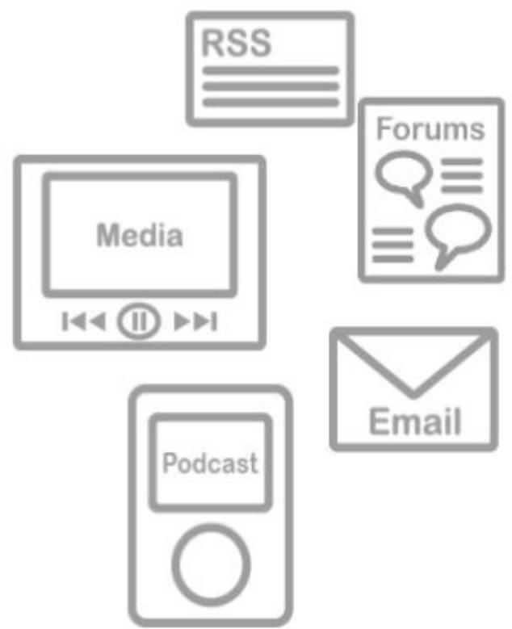

> **AI Description:**
> **Source:** `assets/_page_98_Figure_0.jpg`
> 
> **Generated:** 2026-05-31 17:30:02
> 
> ---
> 
> The image contains a diagram with five icons representing different types of digital content and communication methods. The icons include:
> 
> 1. An RSS feed symbol, indicating news or updates.
> 2. A media player icon, suggesting streaming or downloading audio or video content.
> 3. A podcast icon, representing audio content.
> 4. A forum icon, indicating a discussion or community platform.
> 5. An email icon, representing electronic communication.
> 
> The diagram visually categorizes these elements, likely for educational or informational purposes, to illustrate the variety of digital communication and content sharing methods.

## Prioritisation-Not All Objectives& Calls to Action are Equal

Marketing Objectives:

Driving Deployment 10   
Generating Leads 10   
CreatingAwareness&Changing Perceptions 5   
Building Communications& Relationships 5   
Optimising Opportunities 5   
Readying Partners 5   
Enabling Infrastructure& Customer Data 5

## Prioritisation-Not All Objectives& Calls to Action are Equal

Success Event/End Action (High Valued Actions/Calls to Action):

Awareness 10   
Event-Webcast 10   
Paid Event (live) 12   
Free Event (live) 5   
InitiateSalesContact 5   
MarketingCollateral Kit 5   
OnDemand Video 5   
White Paper 5   
Online Training 12   
PartnerOffer 12   
SoftwareTrial 20   
Profile Update 20   
Subscription-Newsletter 12   
Productoffer 12   
VirtualLab/Demo 20

## Simplified Metrics-Site/Page Engagement Rate

Use simple engagement scoring to quantify your site's current level of engagementatabroadlevel

All percentagesare the%of visitorswho didwhatwewanted:

%downloadedawhitepaper

%subscribed toan email newsletter

%downloadeda software trial

%subscribe to RSS feed

%watched

Totaland then divide by thenumber of indicators.

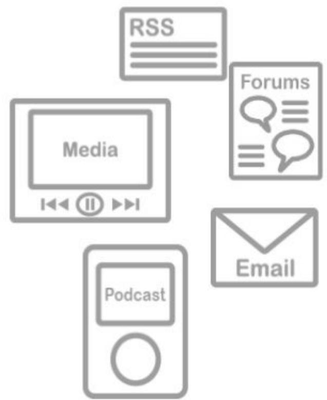

> **AI Description:**
> **Source:** `assets/_page_101_Figure_0.jpg`
> 
> **Generated:** 2026-05-31 17:14:15
> 
> ---
> 
> The image contains a diagram with five icons representing different types of media and communication platforms. The icons are labeled as follows: "RSS," "Media" (with a play button andrew symbol), "Forums," "Email," and "Podcast." Each icon is accompanied by a simple, stylized representation of the respective platform. The diagram appears to be an infographic combining text with visual elements to illustrate various digital communication methods.

## Site/Page Engagement Rate Example

1%downloadedawhitepaper

10%subscribed toanemail newsletter

4%downloadedasoftware trial

2.5% subscribe to RSS feed

17.5%engaged visitors /4engagement indicators =

4.4% page engagement rate

> **AI Description:**
> **Source:** `assets/_page_102_Figure_0.jpg`
> 
> **Generated:** 2026-05-31 17:02:52
> 
> ---
> 
> The image contains a diagram with five distinct icons representing different types of media and communication platforms. The icons are labeled as follows: "RSS," "Media" with a play button and rewind/forward symbols, "Forums" with speech bubble icons, "Email" with an envelope icon, and "Podcast" with a circular play button. The diagram appears to be an infographic combining text with visual elements to represent various online communication and media platforms.

## Search Engine Marketing (SEM)

Sadly in the area of SEM there is still:

·A significant lack of understanding of good search engine marketingprinciplesand which tactic isappropriate dependinguponmarketinggoalsand objectives

·Over attribution of overall campaign performance to the last click (ie. paid search)

·Too many generalities- B2C SEM is not the same as B2B SEM

·Lack of focus on insightful and actionable KPl's

## SEO Decision Funnel

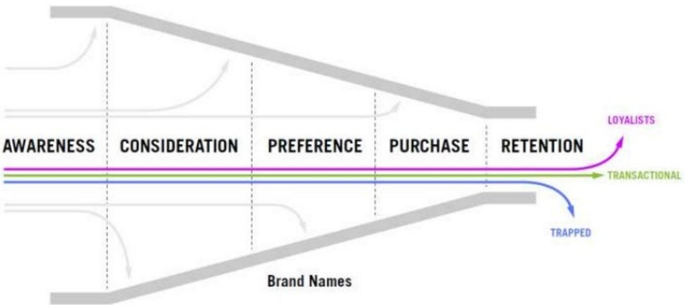

> **AI Description:**
> **Source:** `assets/_page_104_Figure_0.jpg`
> 
> **Generated:** 2026-05-31 16:55:36
> 
> ---
> 
> The image is a diagram illustrating the customer journey through a funnel, representing the stages of consumer behavior from awareness to retention. The funnel is divided into five main stages: Awareness, Consideration, Preference, Purchase, and Retention. Each stage is marked with a dashed line, and the flow of the funnel is indicated by a curved line. The diagram includes additional labels such as "Brand Names," "Loyalists," "Transactional," and "Trapped," which are positioned at various points along the funnel to indicate different customer segments or behaviors. The diagram uses a combination of text and visual elements to convey the customer journey and the different stages of consumer engagement with a brand.

Category Words
Asavisitorrefines their search criteria, therearecertain patternsthat emerge in their queries.

## SEM Strategy MIX

## SEMStrategy Matrix

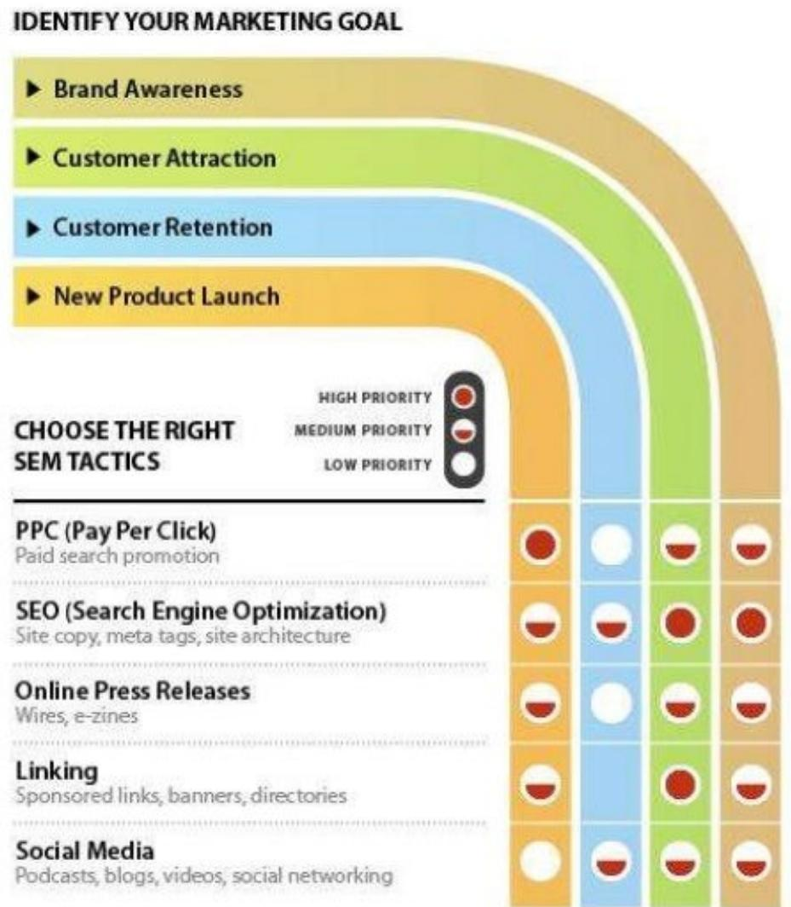

> **AI Description:**
> **Source:** `assets/_page_105_Figure_1.jpg`
> 
> **Generated:** 2026-05-31 16:59:21
> 
> ---
> 
> The image is an infographic combining text with a visual representation of marketing goals and SEM tactics. It features a curved track divided into four lanes, each representing a marketing goal: Brand Awareness, Customer Attraction, Customer Retention, and New Product Launch. The lanes are color-coded and have a traffic light icon indicating priority levels (high, medium, low). Below the track, a list of SEM tactics is provided, including PPC, SEO, Online Press Releases, Linking, and Social Media, each with a corresponding priority level represented by the traffic light icon. The infographic uses a combination of colors and icons to visually represent the priority levels and marketing goals.

Withsomany tactical optionsavailable totoday'ssearchmarketer,itcan sometimesbedifficulttodetermine whichapproachesarebestfor achieving specific goals.Should press releasesbeoptimizedforincreased brandawareness?Or,willaPPC(Pay perclick) campaignachieve better results?

## Understanding Search Engine Marketing

71%of sponsored search clicks are navigational

This indicates that almost three quarters of our sponsored search is not bringing in new prospects-it is simplydelivering peoplewhoare already actively lookingforour URL.

## 50%of search dollars=branded search

This indicates that more than half orour sponsored search is being spent onnavigational clicks.

44% of people who click on paid search are exposed to display ads prior to the last click.

Yetthemajorityofagenciesandmarketersareapplying1oo%of their campaign performance to the last click (ie.paid search).

## Search Budgets vs Search Opportunities

As illustrated below,there isa significant misalignment of marketing budgets to the actual performance of SEM.

Forevery paid search click thereare 5.6organicclicks yetSEO receives less than10%of the SEMbudgetand inmost cases effortand resources.

## B2C SEM is not the same as B2B:ie.Tech Buyers Search Engine Behaviour-Key Takeaways

97%oftech buyers start with search

Less than 12%of tech buyers usa single word search phrase

80%skimfullpageofresultsbefore clicking,38%would clickonpaid search

Eventhough page1rankinggenerates the highest volumesonly6%sticktojustthepage1search results, 53%willgo to page2or3inasearch,41%say will goto4+pages

Techbuyersuse comparisonoriented phrasesclose toendbuying stage-i.e.Avaya Cisco IPphonesystem comparison

53%use search to discovervendor solutions they arenot aware of

67%willing to click in linkof vendor theyare notfamiliarwith

27%tech buyers usemobilesearchatleastonce perweek.12%saytheyuse itevery day.

Blackberrywas topmobile deviceused inmobile search.

74%signupforat least1rssfeed,26%signupformorethan11rss feeds

·NorthAmerican's haveahigheraversionto sharing theircontact informationcompared toAsiaand Europe

Whenfillingoutaform,81%oftechbuyerswill givetheiraccurateemail,only27%willgivetheiraccurate phonenumber

Asiapacific uses video in tech buying twiceas muchasNth Americaand Europe.

ITbuyers love video but videoisa very underutilisedform of communication whenseling IT.Icannot emphasiseenough thepowerof videoand youdon't need tobetoo worriedaboutthehigh production value.Useit whenever you can for product demos and more.

50.8%are watchingvideos onmanufacturers (IBM,Microsoft etc)websites forinformation gathering to identifypotentialenterprisetechnologysolutionsaremanufacturerwebsites.Thisoverallhighusageof manufacturerwebsitesspeakstotheeffectivenessofvideoasamarketingmediumfortechnologymarketers.

## Search Engine Marketing Measurement

It's easier formarketersand management to focus onand understand more meaningful KPl'swith the right tools:

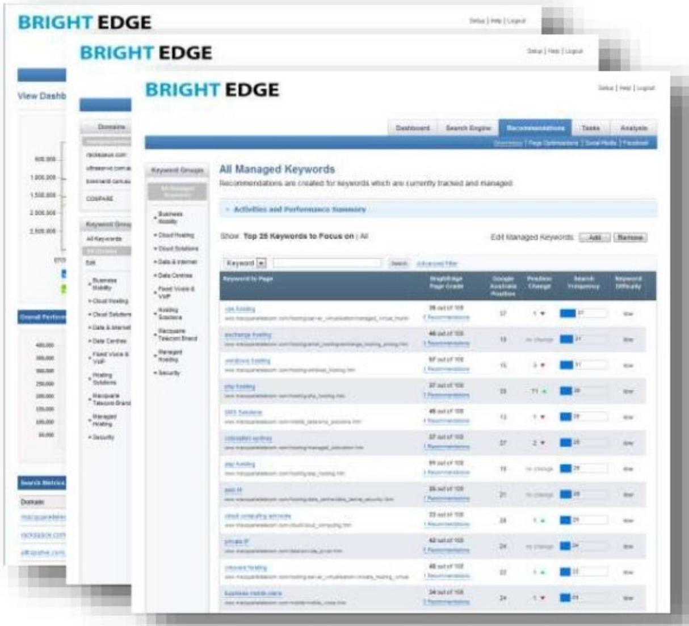

> **AI Description:**
> **Source:** `assets/_page_109_Figure_0.jpg`
> 
> **Generated:** 2026-05-31 16:53:01
> 
> ---
> 
> The image displays a screenshot of the BrightEdge platform interface, specifically the "All Managed Keywords" section. It presents a table with various columns such as "Keyword," "Page," "Page Grade," "Google Average Rank," "Predicted Change," "Search Volume," and "Keyword Difficulty." The table lists keywords related to cloud hosting and solutions, along with their respective performance metrics. The interface includes navigation tabs at the top and a sidebar with various menu options for different functionalities. The layout is designed for SEO and keyword management, providing insights into keyword performance and recommendations.

Tools like BrightEdge canautomate theregular‘auditing'of your website/pages,providedetailed reportingon yourownand your competitorskeywords.

Mostimportantly BrightEdge operationalisesoptimisation recommendationsalongwith simple stepbystep instructionsas well asworkflow.

BrightEdgeallowsyourmarketing teamtotameorganicsearch enginemarketing(SEO).

## SEM- High Level KPI's

## SEO

Traffic by Search Engine

Share of Voice

Traffic by Keyword

Keyword Ranking

High Value Actions (Success Events& End Actions)

-%Engagement Rate

-#of End Actions

Which keywordsare driving each HVA

-Which search enginesare driving each HVA

## SEA(paid search)

IR:Initial Response

IRR:%Initial Response Rate

CPIR:Cost Per Initial Response

ER:Engagement Rate

CAR:Continued Action Rate

EA:#End Actions

End Action Conversion Rate %

CPEA:\$Cost Per End Action

## Search - Navigational

Separate out branded keywords when lookingat clicks,cost and performance.

This will help you understand how paid search is contributing to our overalladvertisingefforts.If brandedkeywordsaredrivinga lotof sales,it is likelythatothermarketingchannelsaregenerating interest inour brand.Inaddition,analysing repeat-visit behaviour will help you optimize yoursearch campaigns.A high incidence of repeatvisits isan indicator thatakeyword isbeing used navigationally.This informationcan beuseful in planning natural search optimizationand could change how keyword performanceisbeingvalued.

## Search - Navigational

Test what happens if branded key phrasesare bid down or removedaltogether.

Several of advertisers in various studies were not bidding on any branded keyphrases.Inmost cases, thoseadvertisersrankedat the top of the naturallistings forbrand relatedkeyphrases,which isoftentrue for advertisers.Awell-placed natural listingmay beall the navigational searcher needsto click-through and convert.

## Search - Navigational

Consider all touch points that led to a conversion,not just the last ad.

Asdiscussed previously, navigational search can mask the impact of other advertisingmedia due to last clickattribution of conversions.In orderto accuratelyunderstand howdifferentchannelscontribute to conversions, use one tracking mechanismto measure the performance of all ad types and look beyond the last ad when attributing value.

## B2C and B2B Long Tail SEO

Marketers should also be spending more time on the B2B Long Tail:

Short/HeadTail =only30%of leadsopportunities (but85+%of budgets&SEOisspent here)

## Short/Head tail terms

·Generally largest%of paid searchis investedin HeadTerms

·Largest focus in terms of SEO

·Can drive high traffic volumes

·But can deliver lowvolume of leadsas trafficisgenericandunqualified

·High cost due to high competition

## Long tail terms

·Generally lowest%of paid search is investedin HeadTerms

·Lowest focus of SEO

·Will drive lowtrafficvolumes

·Butcandeliverhigh volume ofleadsas trafficistargetedand qualified

·Lowcost due to low competition

## Long Tail- KPI's

## Brand to non-Brand Ratio

Thisis the %of your natural search traffic that comes from brand keywords versusnon-brandkeywords.If the ratio ishighand most ofyour trafficiscomingfromsearches for yourbrands,this signals thatyourSEO is fundamentally broken.Thelower the ratio,the more of the long tail of natural search you are likely capturing.This metric is an excellent gauge of the success of your optimisation initiatives.

## Unique crawled URL's

This is the number of unique (non duplicate) web pages crawled by search engine spiders. Your website is like your virtual sales force, bringing inprospects from the search engines.Think of each unique page as one of your virtual salespeople.The more unique pages you have,the more opportunities you have to sellthrough search engines.

## Long Tail-KPl's

## Search Visitors per Contributing Page

This is the%of unique pages that yield search delivered traffic ina given month.Thisratioessentiallyisakeydriver of the lengthof your long tailof natural search.The more pages yieiding traffic fromsearch engines,the healthieryour SEO programis.If onlyasmallportionof your website is deliveringsearchersto yourdoor,mostof yourpages-your virtual salespeople-arewarmingthe bench instead of workinghard for you.You can think of theseas non-performing pages.

## Keywords per Page

This is the average number of keywords each page (minus the freeloaders) yieldsinagivenmonth.Putanotherway,it istheratioof keywordsto pagesyielding search traffic.The higher yourkeyword yield,themore of thelong tail of natural search your sitewillcapture.In other words,the morekeywordseach yieldingpageattractsortargets,thelonger your tail. So,anaverage of 8 search terms per page indicates pages with much broaderappeal totheenginesthan,say3searchtermsperpage.The averageonlineretailer ina Netconcepts Studyon the longtail of natural searchhad2.4keywordsperpage.

## Long Tail - KPI's

## Search Visitors per Keyword

This is the ratio of search engine delivered visitors to search terms. Thismetricsindicateshowmuch trafficeach keyword drivesand is afunction of your rankings in the SERPs.Put anotherway, this metric determines the height or thickness of your long tail.The average merchant in the aforementioned Netconcepts study obtained1.9 visitorsperkeyword.

## Indexto Crawl ratio

·This is the ratio of pages indexed to unique crawled pages. If a page gets crawled that doesn't guarantee it will show up in a search engines index.A low ratio can mean your site doesn't carry much weight in the search engines eyes.

## Long Tail- KPI's

## Search Visitors per Crawled Page

Calculated foreach search engineseparately,this is howmuch traffictheenginedelivers forevery page itcrawls.Eachsearch engine hasa differentaudience size.Thismetric helps you fairly compare the referral traffic you get from each.The Netconcepts Study found that Bing and Yahoo! tended to crawl significantly morepages,but the yield percrawled page from Googlewas typicallysignificantly higher.

## Conclusion

·As you optimise your site through multiple iterations,watch theaforementioned KPl's to ensure that your heading in the right direction.Those who are not privy to these metrics will have a much harder time capturing the long tail of SEO.

### Full Page Description (Page 119)

**Source:** `assets/_page_119_Asset_0.jpg`

**Generated:** 2026-05-31 17:37:50

---

The image contains a bar chart comparing two categories: "Short Tail" and "Long Tail." The chart shows a clear increase in the "Long Tail" category, with a 24% higher value indicated by the "+24%" annotation above the "Long Tail" bar. The vertical axis is labeled "CTR," which likely stands for Click-Through Rate. The chart uses two different shades of blue to differentiate between the two categories, with the "Long Tail" bar being significantly taller than the "Short Tail" bar, visually representing the higher CTR for the "Long Tail" category.

## Long Tail Advertising- CONTEXTWEB Study

CONTEXTWEB found theaverageclickthrough rate for long-tailadvertisingduring theperiod\*was24%higher than for shorttailadvertising.All20advertiserverticalsin thestudy experienced click-throughrate gains,withthe top category seeinga 50% increase.

Yetaccordingtothe CONTEXTWEBstudy,digital marketerscontinue tooverspendon themorecostlyshort-tail without gettinga significantboost inclick-through rates to justifytheoutlay.Acouple of tellingstatistics from comScore citedby CONTEXTWEB: while70%of reportabledisplay spendinggoestoshort-tail websites,Internet usersage 18andover spend just14%of their time online there.

### Full Page Description (Page 120)

**Source:** `assets/_page_120_Asset_0.jpg`

**Generated:** 2026-05-31 16:48:10

---

The image contains a bar chart with various categories on the x-axis and percentages on the y-axis. The categories include Alcohol, Charity, B2B, Health, Quick Serve Restaurant, Education, Travel, Energy, Public Services, Career, Financial & Insurance, Sports & Rec, Religion, CPG, Entertainment, Telecommunications, Gambling, Retail Goods, Pharmaceutical, and Auto. The chart visually represents the distribution of percentages for each category, with Alcohol having the highest percentage and Auto having the lowest. The chart provides a clear comparison of the relative sizes of each category.

## Long Tail Advertising- CONTEXTWEB Study

Alladvertiserverticalssawincreased CTRsinthe longtailascomparedtotheshort tail.Advertisersinthe“Alcohol"segment,forexample,sawa5o%lift.Thelowest long-tail liftobservedwas12%forautoadvertisers.

## Long Tail Advertising- CONTEXTWEB Study

## Some other key findings detailed in the paper:

Alladvertiser verticalssaw increased click-through rates in the long tailascomparedto theshorttail.Advertisersinthealcohol segment sawthegreatestlift,at50%.The lowest long-tail liftwas12%for autoadvertisers.

76%of all content categories saw increased click-through rates on long-tailsites,withthe topthreecategoriesseeinga liftof50%or better.

While24%of contentcategoriesexperienceda lift inclick-through ratesintheshorttail,rangingfrom5%to35%,thesegainsareoften offset bythe price premium paid.

Long-tailadvertisingprovided significant unduplicatedreach comparedtotheshorttail.Inotherwords,advertiserscanreachthe sametypeofaudiencewiththesamedemographicsasthatof the shorttail,atalowercost.

CONTEXTWEB foundselectunduplicated reachtobeatleast 78%on thelongtail across18 content categories,with“education"the highestat98%.

Click image to downloadthe study (2.1MB.pdf)

# Social Influence (Media) Marketing Metrics

"Social Influence Marketing isacommitment,nota campaign."

MartinWalsh,Headof DigitalMarketing,Microsoft-October2007

"Social Networking is not Social Influence Marketing."

MartinWalsh,HeadofDigitalMarketing,IBM-December2009

## CoreSocial Influence Marketing KPl's (yoursand your competitors):

Topic Share of Voice

Topic Comparison

Sentiment

Post Volume

Author Volume

Domain Volume

·Cost/Value per Impressionand or Cost/Value per Engagementand or Cost/Value per EndAction

## Social Influence (Media) Marketing (SIM) Metrics

SIMMeasurementFramework

Theseare the threebasiccategoriesof Social InfluenceMarketingKPl's:

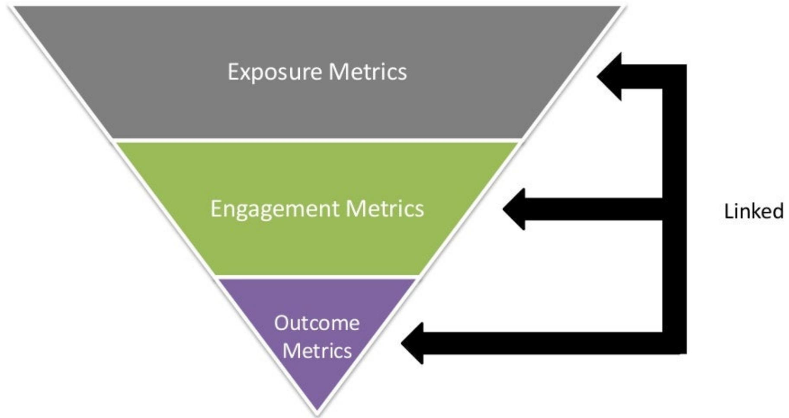

> **AI Description:**
> **Source:** `assets/_page_123_Figure_0.jpg`
> 
> **Generated:** 2026-05-31 17:12:23
> 
> ---
> 
> The image is a diagram illustrating a funnel with three sections labeled "Exposure Metrics," "Engagement Metrics," and "Outcome Metrics." The funnel is divided into three triangular sections, each representing a different stage in a process. Arrows point from the "Outcome Metrics" section to the "Engagement Metrics" section and from the "Engagement Metrics" section to the "Exposure Metrics" section, indicating a linked relationship between these stages. The term "Linked" is written to the right of the arrows, emphasizing the connection between the metrics. The diagram visually represents a hierarchical relationship where the outcome of one stage influences the next.

Whatyoumeasuredependntirelyponourarketingoalsndectiveiewarenessonsideratioonersinuttyre linkedinthesensethatifyouaremeasuringOutcomes(conversions)thenyoualsohavetomeasureEngagementandExposures.

## Social Influence Marketing Metrics

Hereare two fullsamplereports (using real data) ofwhatl considerbest of breed‘Social InfluenceMarketing'reports (bothare from Visible Technologies -Trucast):

Click on imagestodownload

Onceagain,data without analysis,insightsand recommendations is practically useless.You could use a myriad of toolsand technologies but if you don't have theexpertiseand skilsto transpose thedata intoactionable insights then you arewasting your time.

### Full Page Description (Page 125)

**Source:** `assets/_page_125_Asset_0.jpg`

**Generated:** 2026-05-31 16:45:26

---

The image contains a pie chart with two sections labeled "Sentiment (Outside)" and "Neutrals (Inside)." The "Sentiment (Outside)" section is divided into three parts: Positive (63.89%), Negative (18.06%), and Mixed (18.06%). The "Neutrals (Inside)" section is divided into two parts: Neutral (not explicitly labeled with a percentage) and Sentimented (not explicitly labeled with a percentage). The chart uses different colors to represent each category: green for Positive, red for Negative, yellow for Mixed, and blue for Neutral.

### Full Page Description (Page 125)

**Source:** `assets/_page_125_Asset_1.jpg`

**Generated:** 2026-05-31 16:43:46

---

The image contains a scatter plot with various data points representing different categories related to ExxonMobil, Chevron, and ConocoPhillips. The x-axis represents "Number of Posts," and the y-axis represents different categories such as "ExxonMobil General Perceptions," "ExxonMobil Earnings," "Climate Change and Oil Companies," "Chevron General Perceptions," "Chevron Earnings," "ConocoPhillips General Perceptions," and "Alternative Energy and Oil Companies." Each category is represented by a distinct color and number of data points, indicating the frequency or volume of posts related to each topic. The data points are scattered across the plot, with some categories having more posts than others.

## Social Influence Marketing Metrics

Metrics Summary (fig.2)

## Key Findings to Date

Ofsentimenteddata,63.89%trend positively,18.06%aremixed,and 18.06%trend negatively(fig.1).Positive sentimenthas decreasedby 8.38percentage points,and negative sentiment has increased by4 percentagepoints since the lastreportingperiod.

Ofallpostsrelevant tothe Windows topic,16.8%containsome sortof sentiment.Thisproportionof sentiment is high in comparison to other technical topics.

Postvolumehas remained quite steady since the last reporting period, with minor increases in volume.

WhencomparedtoothertopicsW7remainsthemosthighlydiscused topic

### Full Page Description (Page 126)

**Source:** `assets/_page_126_Asset_1.jpg`

**Generated:** 2026-05-31 17:04:10

---

The image contains a pie chart with a breakdown of sentiment categories. The chart is divided into five segments, each representing a different sentiment category and its corresponding percentage. The categories and their percentages are as follows: Positive (73%), Negative (24%), Mixed (3%), Neutral (91%), and Sentimented (9%). The chart visually represents the distribution of sentiments, with the largest segment being the Neutral category at 91%.

### Full Page Description (Page 126)

**Source:** `assets/_page_126_Asset_0.jpg`

**Generated:** 2026-05-31 16:58:50

---

The image is a line graph with three lines representing different categories: Posts (green), Authors (blue), and Sites (yellow). The x-axis represents dates from June 26 to August 12, and the y-axis represents the number of items for each category. The graph shows fluctuations in the number of posts, authors, and sites over the period, with the highest point for posts and authors around July 8. The number of sites remains relatively low and stable throughout the period.

## Social Influence Marketing Metrics: Sentiment

## WhatGeneratedBuzzForIBMEnergy

IBM'sAquasarsupercomputer installedat the SwissFederal Institute of Technology(Zurich)

IBM'sacquisition of security software organization BigFix

IBMnamed toTopGreen500

zEnterprise unveiled

IBM'smainframemodel forces Microsoftand Oracle tostrategize

## Negative Drivers

Failure of DBS bank's online services (Singapore) generated negative postsabout IBM servers

## Positive Drivers

Discussionabout Aquasar supercomputerand whatitmeans forenergy efficiency

### Full Page Description (Page 127)

**Source:** `assets/_page_127_Asset_0.jpg`

**Generated:** 2026-05-31 17:30:28

---

The image contains a pie chart with various segments representing different companies and their respective percentages. The chart is divided into sections, each labeled with a company name and its corresponding percentage. The largest segment is IBM at 49%, followed by Oracle at 16%, SAP at 14%, Hewlett Packard at 10%, Logica at 4%, Accenture at 4%, WiPro at 2%, Infosys at 1%, and Capgemini at less than 1%. The chart visually represents the market share or contribution of each company in a particular domain.

### Full Page Description (Page 127)

**Source:** `assets/_page_127_Asset_1.jpg`

**Generated:** 2026-05-31 17:28:24

---

The image is a line chart showing the percentage of total energy consumption over time for various companies. The x-axis represents dates from June 26 to August 20, and the y-axis represents the percentage of total energy consumption. The chart includes data for IBM, Oracle, SAP, Hewlett Packard, Logica, Accenture, WiPro, InfoSys, and Capgemini. The chart displays fluctuations in energy consumption for each company, with IBM consistently showing the highest percentage of energy consumption throughout the period. Notable peaks and troughs are visible for each company, indicating variations in energy usage over time.

## Social Influence Marketing Metrics: Share of Voice

## Share of Voice

IBMheld considerable Share of Voicein Energy Computing conversationscomparedto thecompetitorsstudied.

Much of IBM's dominance had todo with the announcement of theAquasarsupercomputeraswellasthereleaseof zEnterprise.

## Volume OverTime

·2/7:News began topropagate about Aquasar

23/7:ZEnterpriserelease wasreported

Energy Shareof Voice

## Social Media Influencer Ecosystem Mapping

Itis importanttofirstmap your influencer ecosystem but remember that popularity(followers, retweetsetc) doesnot mean influence.Realinfluenceistheabilitytoeitherdirectlyorthrougha third party influence someonetotakeaction,driveconversationsand or shift sentiment.

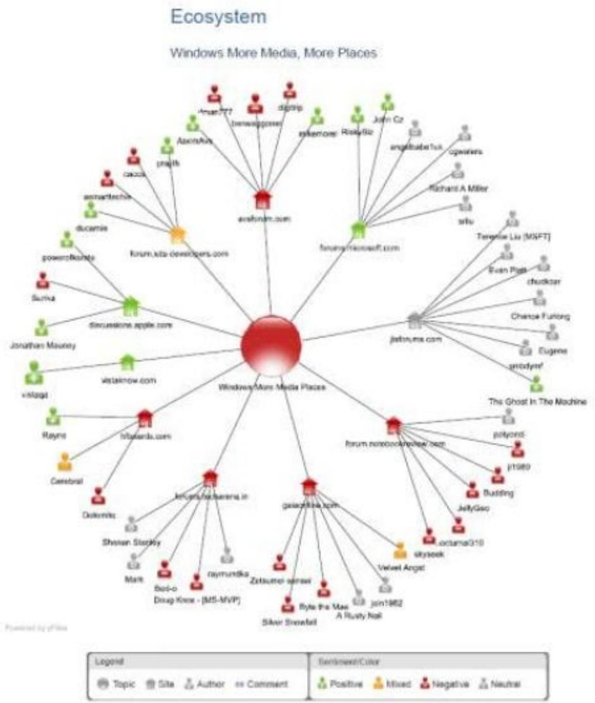

> **AI Description:**
> **Source:** `assets/_page_128_Figure_0.jpg`
> 
> **Generated:** 2026-05-31 17:25:33
> 
> ---
> 
> The image is a network diagram titled "Ecosystem: Windows More Media, More Places." It represents a complex network with various nodes connected by lines, indicating relationships or interactions. The diagram includes labels for different entities such as "arafan.com," "forum.ktsa-developers.com," and "john.ma.com." The nodes are color-coded to represent different sentiments: green for positive, yellow for mixed, red for negative, and gray for neutral. The central theme revolves around the Windows ecosystem, with connections to various websites and individuals involved in the development or discussion of Windows-related media and places.

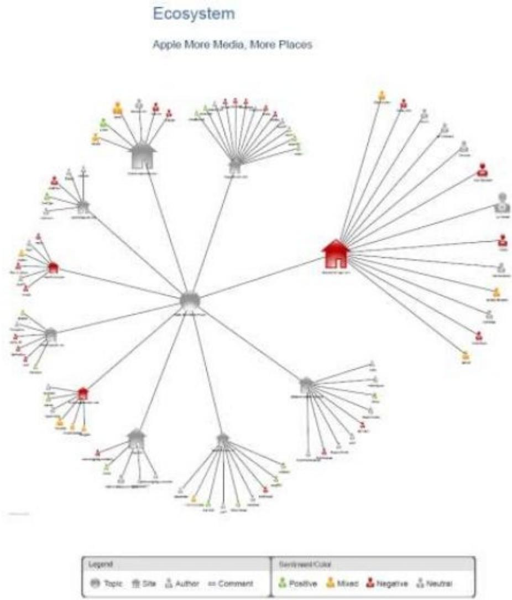

> **AI Description:**
> **Source:** `assets/_page_128_Figure_1.jpg`
> 
> **Generated:** 2026-05-31 17:25:06
> 
> ---
> 
> The image is a network diagram representing an ecosystem titled "Apple More Media, More Places." It uses a combination of text and visual elements to illustrate the connections and interactions within the ecosystem. The diagram includes various nodes representing different topics, sites, authors, and comments, with arrows indicating the flow of information or relationships between these elements. The legend at the bottom of the image provides color-coded information for the nodes, with green representing positive interactions, yellow for mixed, red for negative, and gray for neutral. The central node appears to be a hub, with multiple branches extending outward, suggesting a central focus or primary source of information in the ecosystem.

## Exposure& EngagementMetrics Determining ROl/Value

InordertodetermineROl/valueofsocialmediaitisimportanttoconsidera cost/benefit associated with the activity.

Forexample-OutreachandEngagementActivityCost,ValueRept:

## Bringing KPl's together

Itisonethingtomeasuresomebasicexposureandengagementmetrics suchasTweets,Facebook followersandotherdatapoints,butultimately if youarenot measuring‘outcomes'-changingsentiment,drivinga webpagevisit,drivingavideo view,drivingonlinesales,drivingFacebook likes,event registrationsormore(dependinguponyourmarketing objectives) then youarenotreallymeasuringtheeffectivenessand ROlof yourSocial InfluenceMarketingefforts.

IRR=Initial Response Rate

CPIR=CostPer Initial Response

CAR=Continued Action Rate

EA=End Actions

CPEA=Cost Per End Action

\*YouwouldprincipalymeasuretheLandingPageengagementrateandtheEngagementRateofthetop EntryPages

### Full Page Description (Page 131)

**Source:** `assets/_page_131_Asset_1.jpg`

**Generated:** 2026-05-31 17:18:29

---

The image is a bar chart comparing the Conversion Rate (CAR%) between Conversation Marketing and other forms of paid media. The chart includes three categories: Conversation Marketing, All Other Paid Media, and Paid Search. Conversation Marketing has the highest CAR% at 4.13%, followed by All Other Paid Media at 2.24%, and Paid Search at 1.63%. The chart visually highlights Conversation Marketing with a red ellipse, emphasizing its superior performance in terms of conversion rates.

### Full Page Description (Page 131)

**Source:** `assets/_page_131_Asset_0.jpg`

**Generated:** 2026-05-31 17:19:46

---

The image is a scatter plot with a gradient background transitioning from red to green. The x-axis represents a range from -100 to 100, and the y-axis represents the "Number of Posts," ranging from 0 to 4000. There are several data points represented by colored circles, with labels such as "SQL Server," "Visual Studio," and "Windows Server." The circles are connected by dotted lines, suggesting a relationship or progression between the categories. The plot shows a general trend where the number of posts increases as the x-axis value moves from negative to positive, with "Windows Server" having the highest number of posts.

## Ultimately It Must be About Actionable Insights

Overall increaseinpositivesentiment,increase in brandequity，greatereventvisibilityand exposure tonon-search users.

Volumes rose2oo%+around launch events,and settled more positive than original positions.

WOMhad higher registration percentage than any othercampaignchannel.

Outperformed Paid Search by 2.5x.

Simultaneous PRand advertisingwin.

### Full Page Description (Page 132)

**Source:** `assets/_page_132_Asset_0.jpg`

**Generated:** 2026-05-31 17:24:36

---

The image is a diagram of a yin-yang symbol, which is a traditional Chinese symbol representing the concept of balance and interdependence between opposing forces. The diagram is divided into two sections: the left side is labeled "Quantitative," and the right side is labeled "Qualitative." The yin-yang symbol itself is a visual representation of the idea that these two forces are complementary and interrelated, rather than mutually exclusive. The image effectively uses the yin-yang symbol to convey the relationship between quantitative and qualitative approaches, suggesting that they are two sides of the same coin and should be considered together for a comprehensive understanding.

Need More Emphasis on Qualitative vs Quantitative Measurement

## Need More Emphasis on Quantitative vs Qualitative Measurement

Example:

Ihadaproblem ona high profile website:

Less than 32% of site visitors were successfully finding the content they were looking for.

Usingour monthly Comscore Qualitative Site Satisfaction datawe found out that 62%of peoplewerecomingtothesitefor Post-Sales Information butmarketers were focused solely ondesign,informationand functionality forpre-sales!Wehad amisalignment between customer needsand marketers expectations.

No amount ofquantitative data would haveprovided this insight.

## Why is Qualitative Measurement So Important?

Helps you understand how satisfaction with all aspects of the site tracksover time.

Helps determine which aspects of the site experiencedrivesatisfaction.

· Allows you to identify actionable improvements.

> **AI Description:**
> **Source:** `assets/_page_134_Figure_0.jpg`
> 
> **Generated:** 2026-05-31 17:04:18
> 
> ---
> 
> The image is a photograph of four individuals gathered around a laptop, seemingly engaged in a collaborative discussion or presentation. The individuals are dressed in business attire, suggesting a professional setting. The laptop screen is open and appears to be the focal point of their attention, indicating that they are likely reviewing or discussing content displayed on the screen. The setting appears to be an office or meeting room, with a whiteboard and other office equipment visible in the background. The overall scene conveys a sense of teamwork and collaboration.

Will reveal whether the sites are attracting yourtargetaudience.

Will reveal whether the sitesare meeting the needs of the target audience groups.

Lets you explore whether site satisfaction and brand preferencesarecorrelated.

## Primary Qualitative Metrics

·OverallSatisfaction ${ \mathsf { N S A T } } = { \mathsf { V S A T } } - { \mathsf { D S A T } } + 1 0 0$

·Visitor Success Rate-Whether visitor found the information

·Primary Reasons for Visiting-Lifecycle= Pre-Sales&Post-Sales

·Satisfaction with Site Design

Satisfaction with Site Content

·Satisfaction with Site Functionality

> **AI Description:**
> **Source:** `assets/_page_135_Figure_0.jpg`
> 
> **Generated:** 2026-05-31 16:58:37
> 
> ---
> 
> The image contains a photograph of four individuals gathered around a laptop, smiling and appearing engaged. The individuals are dressed in business casual attire, suggesting a professional or collaborative setting. The laptop screen is not visible, so the content displayed is not discernible. The image conveys a sense of teamwork and shared focus.

Drivers of Satisfaction

Who's Visiting the Site

·Impact of Site Experience on Brand Preferences,Revisit Intentions andLikelihood to Recommend

Recommended Improvements

### Full Page Description (Page 136)

**Source:** `assets/_page_136_Asset_2.jpg`

**Generated:** 2026-05-31 16:57:00

---

The image contains a bar chart with two horizontal bars, each divided into three segments. The chart compares two categories: "Ease of doing business with Company" and "Security of products." The percentages for each segment are as follows: for "Ease of doing business with Company," the segments are 57%, 35%, and 8%; for "Security of products," the segments are 48%, 42%, and 10%. The chart uses a gradient color scheme to differentiate the segments, with lighter shades representing higher percentages.

### Full Page Description (Page 136)

**Source:** `assets/_page_136_Asset_3.jpg`

**Generated:** 2026-05-31 16:57:19

---

The image contains a line graph with a dashed line labeled "NSAT." The x-axis represents time, ranging from August 2007 to March 2009, with monthly intervals. The y-axis is labeled with numerical values, ranging from 110 to 150. The graph shows fluctuations in the NSAT values over time, with a general trend of slight decreases and increases. Notable points include a peak in May 2008 at 127 and a low in November 2007 at 118. The data points are marked with small diamond shapes, and the line connecting them is dashed.

### Full Page Description (Page 136)

**Source:** `assets/_page_136_Asset_0.jpg`

**Generated:** 2026-05-31 16:55:47

---

The image contains a bar chart with three bars labeled VSAT, SSAT, and DSAT. The y-axis represents percentages ranging from 0% to 100%. The bar for VSAT is the tallest, reaching 48%, followed by SSAT at 42%, and DSAT at 10%. The chart visually represents the distribution of percentages among the three categories.

### Full Page Description (Page 136)

**Source:** `assets/_page_136_Asset_1.jpg`

**Generated:** 2026-05-31 16:54:53

---

The image contains a horizontal bar chart with two main categories: "Is a technologically innovative company" and "Is a company I trust." The chart is divided into three segments for each category, representing different percentages: 71%, 25%, and 4% for the first category, and 60%, 33%, and 7% for the second category. The percentages are distributed across the bars, with the largest portion of each bar in the lighter gray shade, the middle portion in a darker gray, and the smallest portion in a yellow shade. The chart visually represents the distribution of responses to these two questions, with the largest portion of respondents indicating that the company is technologically innovative.

## Site Satisfaction-Austria

OverallSatisfaction with Company

<table><tr><td>□Agree（rated 8-9)</td><td>日Neutral（rated 5-7）</td><td>□Disagree （rated 1-4）</td></tr></table>

### Full Page Description (Page 137)

**Source:** `assets/_page_137_Asset_1.jpg`

**Generated:** 2026-05-31 17:39:35

---

The image contains a horizontal bar chart with three categories: "Better," "Neutral," and "Worse." The percentages for each category are as follows: "Better" at 53%, "Neutral" at 38%, and "Worse" at 9%. The chart is labeled with "n = 661," indicating the sample size. The bars are color-coded for visual distinction, with "Better" in gray, "Neutral" in white, and "Worse" in yellow. The x-axis represents the percentage scale from 0% to 100%.

### Full Page Description (Page 137)

**Source:** `assets/_page_137_Asset_0.jpg`

**Generated:** 2026-05-31 17:36:33

---

The image is a bar chart titled "Overall Satisfaction with the Web Site." It presents data on the satisfaction levels of three categories: VSAT, SSAT, and DSAT. The chart shows the percentage of satisfaction for each category: VSAT at 47%, SSAT at 44%, and DSAT at 9%. The total number of respondents, indicated by "n = 770," is provided at the bottom left corner of the chart. The chart uses different shades of gray and yellow to differentiate between the categories, with the percentage values clearly labeled above each bar.

### Full Page Description (Page 137)

**Source:** `assets/_page_137_Asset_2.jpg`

**Generated:** 2026-05-31 17:36:20

---

The image contains a horizontal bar chart with four categories: "Yes," "I found some, but not all," "No," and "Don't know." The percentages for each category are as follows: "Yes" at 47%, "I found some, but not all" at 27%, "No" at 17%, and "Don't know" at 9%. The chart is labeled with "n = 768," indicating the sample size. The main trend is that the majority of respondents (47%) answered "Yes," followed by "I found some, but not all" at 27%. The smallest percentage is for "Don't know" at 9%.

## Key Satisfaction Metrics-Austria

WhetherFound Information Looking For

### Full Page Description (Page 138)

**Source:** `assets/_page_138_Asset_1.jpg`

**Generated:** 2026-05-31 17:14:32

---

The image is a horizontal bar chart with percentages representing different stages of a process or customer journey. The chart includes categories such as Awareness, Evaluation, Purchase, Deployment, Use, Support, and Other. Each bar corresponds to a percentage value: Awareness at 15%, Evaluation at 16%, Purchase at 7%, Deployment at 16%, Use at 13%, Support at 19%, and Other at 14%. The total sample size is indicated as 772. The chart visually represents the distribution of responses across these stages, with Support being the most represented at 19%, followed by Evaluation and Deployment at 16% each, and Purchase at 7%.

### Full Page Description (Page 138)

**Source:** `assets/_page_138_Asset_0.jpg`

**Generated:** 2026-05-31 17:16:22

---

The image is a pie chart with the following key information:

1. The chart is divided into five segments representing different categories of workers.
2. The categories are Home User (40%), IT Pro (14%), BDM (16%), Info. Worker (22%), and Dev. (8%).
3. The total number of respondents, n, is 769.
4. The chart visually represents the distribution of workers across these categories, with Home User having the largest share at 40%, followed by Info. Worker at 22%, and BDM at 16%.

### Full Page Description (Page 138)

**Source:** `assets/_page_138_Asset_3.jpg`

**Generated:** 2026-05-31 17:19:24

---

The image is a horizontal bar chart with percentages representing frequency of visits. The chart is divided into two categories: "Frequent" and "Infrequent." The "Frequent" category includes visits more than once a day, once a day, a few times a week, and once a week, totaling 47%. The "Infrequent" category includes visits a few times a month, once a month, less than once a month, and this is my first visit, totaling 46%. The chart visually represents the distribution of visit frequencies among a sample of 783 respondents.

### Full Page Description (Page 138)

**Source:** `assets/_page_138_Asset_2.jpg`

**Generated:** 2026-05-31 17:18:45

---

The image contains a horizontal bar chart with percentages representing different categories of business sizes in the EMEA region. The categories are Small Business (1-24 PCs), Mid-Market (25-499 PCs), Enterprise (500+ PCs), Don't know, and Not asked/Did not answer. The chart shows that the highest percentage (25%) is for Small Business, followed by Enterprise (15%), Mid-Market (13%), and Not asked/Did not answer (42%). The "Don't know" category has the lowest percentage at 4%.

## Visitor Profile-Austria

### Full Page Description (Page 139)

**Source:** `assets/_page_139_Asset_2.jpg`

**Generated:** 2026-05-31 16:42:45

---

The image is a horizontal bar chart with data presented on the percentage of respondents finding information on the Austria website. The chart includes four categories: "100% (Find all the information on Austria Web site)" at 14%, "50% to 99%" at 70%, "20% to 49%" at 13%, and "Less than 20% (Find more than 80% of materials on U.S. English site)" at 3%. The sample size (n) is 704. The chart visually represents the distribution of responses across these categories, with the majority of respondents (70%) finding 50% to 99% of the information on the Austria website.

### Full Page Description (Page 139)

**Source:** `assets/_page_139_Asset_0.jpg`

**Generated:** 2026-05-31 16:43:29

---

The image contains a bar chart with three bars representing different categories: VSAT, SSAT, and DSAT. The y-axis is labeled as a percentage scale ranging from 0% to 100%. The x-axis lists the categories. The bar for VSAT is the tallest, reaching 47%, followed by SSAT at 44%, and DSAT at 9%. The chart visually represents the relative proportions of each category as a percentage.

### Full Page Description (Page 139)

**Source:** `assets/_page_139_Asset_1.jpg`

**Generated:** 2026-05-31 16:45:45

---

The image is a bar chart with three horizontal bars, each representing a different metric related to user engagement with a website. The metrics are:

1. "Re-visit the Web site in the future" with 93% of respondents indicating they would do so, 5% saying they might not, and 2% saying they definitely would not.
2. "Recommend the Web site to someone else" with 68% saying they would, 18% saying they might not, and 14% saying they definitely would not.
3. "Buy a Company product within next 6 months" with 60% saying they would, 24% saying they might not, and 16% saying they definitely would not.

The chart includes a note at the bottom indicating the sample size, "n = 721-758." The bars are color-coded to represent different response categories, with lighter shades indicating higher percentages.

## Evaluation& Impact of Web Site Visit-Austria

Overall Satisfactionwiththe Web Site

## Qualitative Audience Performance Summary: Example Data Only

NSAT Performance
Performance on H1FYxxDrivers

Top Drivers of Satisfaction for the Field
Swing Voter Analysis

59%Somewhat Satisfied Swing Voters

Competitive Analysis(CoreMeasures&Pillars)

Verbatim Distribution

## Example:Qualitative Optimisation Priorities Example

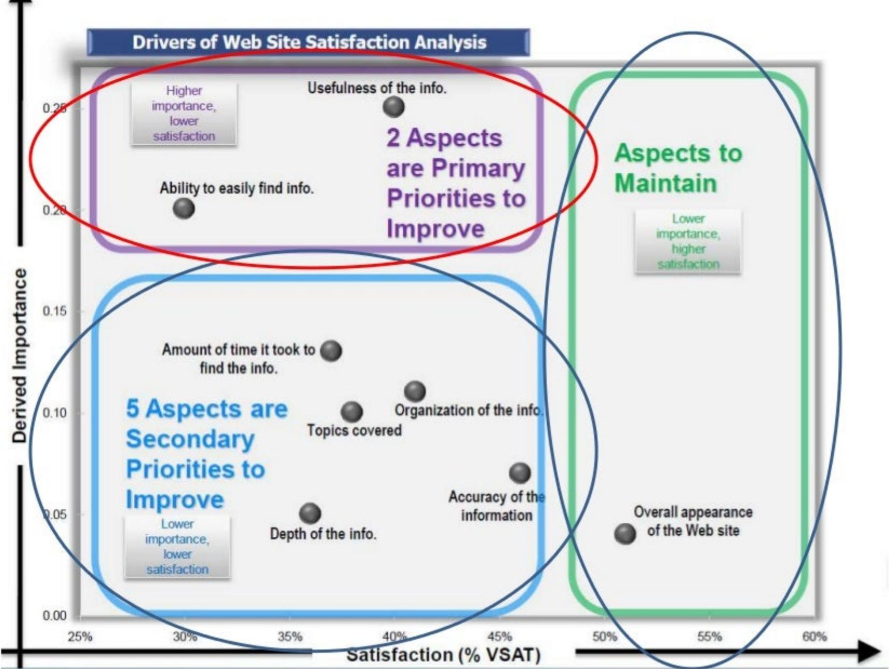

> **AI Description:**
> **Source:** `assets/_page_141_Figure_0.jpg`
> 
> **Generated:** 2026-05-31 17:16:11
> 
> ---
> 
> The image is a scatter plot chart titled "Drivers of Web Site Satisfaction Analysis." It uses a scatter plot to display the derived importance of various aspects of a website against the percentage of very satisfied users (VSAT). The chart is divided into three sections: "Primary Priorities to Improve," "Secondary Priorities to Improve," and "Aspects to Maintain." The x-axis represents the percentage of very satisfied users, ranging from 25% to 60%, while the y-axis represents the derived importance, ranging from 0.00 to 0.25. The chart highlights two primary priorities for improvement (usefulness of the info and ability to easily find info) and five secondary priorities (amount of time to find info, organization of the info, topics covered, depth of the info, and accuracy of the information). Additionally, it shows that the overall appearance of the web site is an aspect to maintain, with a higher derived importance and satisfaction.

## Measuring Success:AMeasurement Approach

General stepsofa Measurement&Testing Approach:

1.Objective Setting

2.Measurement& Testing Plan

3.Report Design, Data Sources,SLA's

4.Setup& Instrumentation

Campaign Planning

5.Testing/exp

Campaign Execution

6.Campaign Monitoring

7.Reporting& Optimisation

Campaign Analysis

## Measurement Fundamentals

## Establish Campaign Objective

·What are you trying toachieve?

·Example:Register customers for Power7 Server Launch Events.

## Set Clear Campaign Goal

·Check your benchmark tool for prior learning Howwill you knowif you achievedyour objective? ·Example:Register1oocustomers inFY09

## Develop Measure, Test& Optimise Plan

·Identifytheright KPI's ·Define High Valued Actions(HVA's) ·Choose the right tools forthe job.

## Develop Reporting Plan

·Determine Report/Dashboard Design

·Identify Data Sources

·Define SLA's

## Develop Instrumentation Plan

·Roles& Responsibilities

·SLA's

·Setup/Instrumentation Checklists

## The 6-step Measurement Plan

Determine thepurpose of your site

Define what youneed to track

Identify primary metrics

Createa user flow diagram for tagging

Define optimization strategy

Set report and optimization frequency

Step 1: Define the Purpose of Your Site

The type of site will determine the type of KPl's/ metrics you will focus on:

\- Audience Engagement Site

-Product Site

-Campaign Site

-Corporate Strategic Site

Step 2: Define What You Need to Track

## Key questions:

\- What is the site/campaign goal?

-What KPlsare critical for site/campaign optimization?

\- Are these metrics trackable with our tools?

\- If outcomes are not directly trackable,are there proxies?

· Example: MQPs/Opportunity Revenue as α proxy for Win Revenue

## Step 3: Identify Metrics for Site/Campaign Reporting/Optimization

·Primary KPl= Main site/campaign goal (End Action)

·Secondary KPls = Metrics that optimization activities will focus on (Success Events)

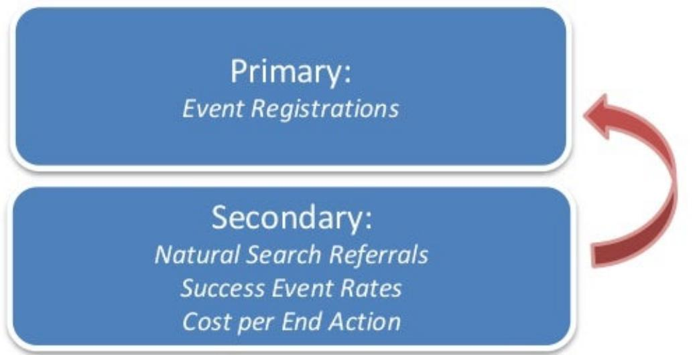

> **AI Description:**
> **Source:** `assets/_page_147_Figure_1.jpg`
> 
> **Generated:** 2026-05-31 17:09:29
> 
> ---
> 
> The image contains a simple diagram with two blue rectangular boxes. The top box is labeled "Primary: Event Registrations," and the bottom box is labeled "Secondary: Natural Search Referrals, Success Event Rates, Cost per End Action." There is a red curved arrow pointing from the "Primary" box to the "Secondary" box, indicating a relationship or flow between the two concepts. The diagram is a basic flowchart or relationship diagram used to illustrate the connection between primary event registrations and secondary metrics such as natural search referrals, success event rates, and cost per end action.

## Step 4: Create a User Flow Diagram and Tagging Plan

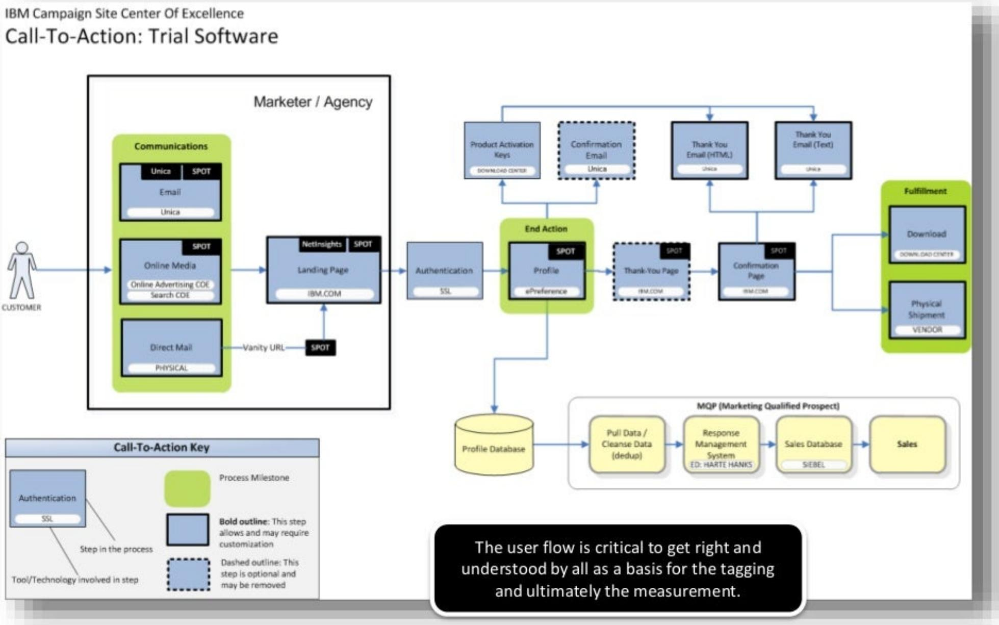

> **AI Description:**
> **Source:** `assets/_page_148_Figure_0.jpg`
> 
> **Generated:** 2026-05-31 16:46:56
> 
> ---
> 
> The image is a detailed flowchart illustrating the process of a call-to-action for trial software. It includes a customer journey starting from the marketer/agency and moving through various stages such as communications, authentication, and fulfillment. The flowchart is divided into sections representing different stages of the process, including product activation, confirmation emails, thank-you pages, and download or physical shipment options. The flowchart also includes a call-to-action key that defines symbols used in the diagram, such as process milestones, customization points, and optional steps. The bottom of the image emphasizes the critical importance of the user flow for tagging and measurement.

## Tagging Enables ComprehensiveMeasurement

Initial Responses

Success Events/ End Actions

Banner/Search Clicks ?Opens

Opportunities

Clicks

Prospects

·Profile Capture

·Cost perMP/MQP

Oppty# OpptyRevenue

Data Source

DoubleClick/Netinsights/Covario

Siebel/Dashboard

Timing

Dataavailable daily

2-3+months required before valid measurement

## ATLAS/Doubleclick Spotlight Tagging-Wireframe Example

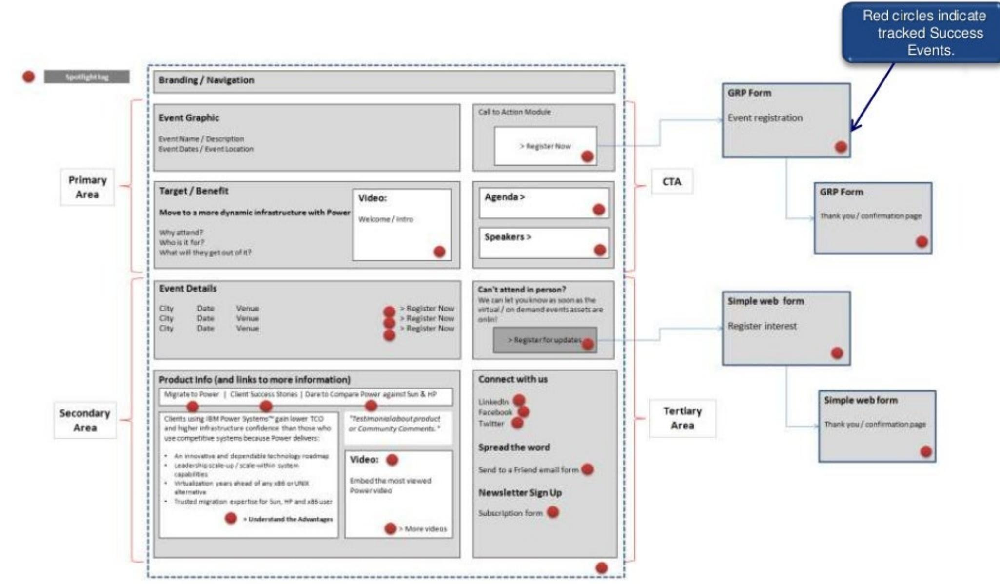

> **AI Description:**
> **Source:** `assets/_page_150_Figure_0.jpg`
> 
> **Generated:** 2026-05-31 17:02:38
> 
> ---
> 
> The image is a detailed wireframe or user interface design for an event registration page. It includes various sections such as Branding/Navigation, Event Graphic, Target/Benefit, Event Details, Product Info, and Connect with us. Each section is labeled and contains placeholder text and icons, indicating where different elements would be placed on the final design. Red circles are used to highlight specific areas, likely indicating tracked success events. The flowchart shows the progression of user interaction, starting from the registration form, moving through different sections, and ending with a confirmation page. The image is structured to guide the user through the event registration process, with clear pathways and call-to-action buttons.

## Developing and Using Campaign Codes for Tracking

## English Definition:The campaign code (e.g.Smartcode) iswhat enables youtotie thecostandpipelineinformationtoyourcampaign.

## What isa Smartcode?

“Intelligent"promotion code tied to every campaignand key campaignelements.

Carried through yoursystems for bettercampaign tracking.

Improved reporting that includes leadandpipelinedata.

## Step 5: Define the Optimization Strategy

Marketers and the Agency should discuss which elements the agency is optimizing and which aspects the company willoptimize.

Campaign Analysis

Campaign

Consistent with Workflow

Interpretation.... identificationofkey metrics,analysisof projected vs.actual, performanceby   
campaign,   
audience,segment, vehicle

Quarterly DP/Segment

Assigning business meaning toresults

DP/Segment Summary

Campaign Summaries

Recommendations based

Bi-Weeklymeeting cadence with campaign owner

Quarterlyreview withDP/Segment leadand theDP Exec

Covers pipeline, marketing contribution to pipeline,ROI

## Step 6: Set Expectations on Report Content and Frequency

Needto provide consistent reporting;reportdesign,determine roles& responsibilities,data sources&SLA's.

Campaign Summary

Overall Reports

Campaign Summary

Campaign Summary

Campaign Summary

Frequency

Quarterly

Bi-Weekly

Intended forMarketers and Management

·Individual campaignowner

## All Campaigns Repository/Benchmark Reports

AlwaysAvailatle via Campaigg Dastboarg, ADHOC

Utilize for planning bench workcomparison formulationof observationsand recommendations

## Reports and Context

It is important thatwe begin to look at digital data ina 360degree context of thedifferentchannels& tactics.

For example,lookingata paid search report alone and only looking at reach (impressions)and initial response (CPC/CPIR) data is very misleading.

44%of all people who click on paid search results have been exposed to display advertising prior to theclick.Therefore it iswrong to attribute1oo%performance to paid search orthe‘last click'.

You need to look at paid and organic search data togetherand with broader engagement/performancemetrics.

Morebroadlyyouneed to regularly lookatdata inoverallcontextofa campaignand or programand thisalso requires you to develop an overall digitaland or broadermarketing scorecard for your organisation.

## Why Data Matters: Context of Data Reveals Answers

Why Data MattersContext Reveals Answers.wmv

Example:Rolled Up Digital Marketing Management Scorecard&Metrics Definitions

## Context is King! You Need 360 Degree View of Data

Most marketersare lookingat tactical metrics in isolation and notusing360 degree views ofαlltheiractivities.

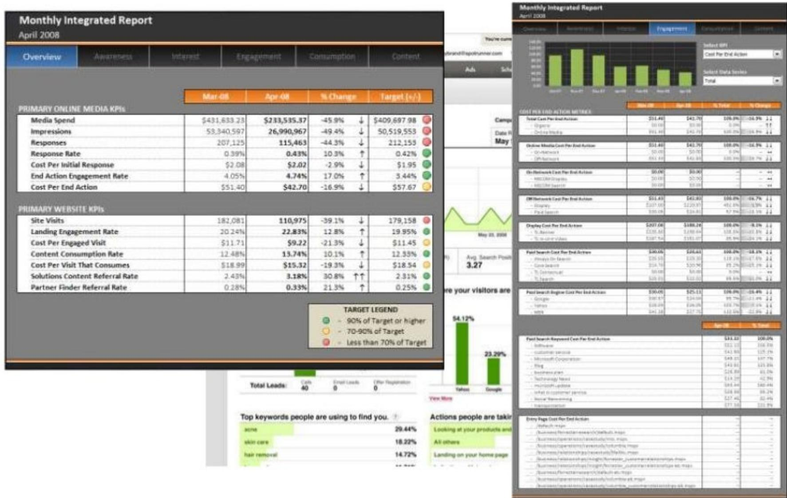

> **AI Description:**
> **Source:** `assets/_page_157_Figure_0.jpg`
> 
> **Generated:** 2026-05-31 17:03:59
> 
> ---
> 
> The image contains a monthly integrated report for April 2008, presenting various key performance indicators (KPIs) related to online media and website performance. It includes charts, graphs, and tables with data on metrics such as media spend, impressions, responses, response rate, cost per initial response, end action engagement rate, and cost per end action. The report also displays data on site visits, landing engagement rate, cost per engaged visit, content consumption rate, cost per visit that consumes content, solutions content referral rate, and partner finder referral rate. The image uses color-coded target legends to indicate performance relative to targets. Additionally, it includes bar graphs showing search engine performance and top keywords used to find the company.

## Example: Integrated Digital Campaign Report

PRIMARY WEBSITEKPIS

### Full Page Description (Page 159)

**Source:** `assets/_page_159_Asset_0.jpg`

**Generated:** 2026-05-31 16:52:16

---

The image contains a bar chart with data points representing monthly values from October 2007 to April 2008. The x-axis displays the months, while the y-axis shows numerical values, likely representing some kind of Key Performance Indicator (KPI). The chart shows fluctuations in the KPI values over the six-month period, with March 2008 having the highest value and October 2007 having the lowest. The chart is accompanied by dropdown menus labeled "Select KPI" and "Select Data Series," suggesting that the chart can be customized to display different KPIs or data series.

## Example:Persistent Website Digital Report

## Example: Digital Report

## But,asoutlineddata without insightsand recommendations is useless:

## Insights&Recommendations

## SiteVisits

InApril,we had110,975visits-downnearly40%fromMarchassresult ofdecrease involumeofmedis trafc.

Ofthesevisits82%weredrivenfromonlinemedis while18%wereorganic-organictraficisup34%thismonth

-93.5%ofmedia visits weredriven by paid searchinitiative-theremaning 6.5weredrivenbydisplay.

Withindisplaychannel,theshiftinfocus to Bannerplacements hasresuted in Banners accounting for the majority ofourdisplaytrafic（6o%).Within Pad Search，the Always On Searchtacticaccountedfor the largest percentage ofsearch traffcat46%.Core Search accountedfor33%oftotalpaid search traffc while TLSearch accounted for 22%oftotalpaid search trafic.

GoogleandYaho eachaccount foralmost halfofourtotalsearchtraffc-MSNonlyaccountedfor5%ofpaid rch visits in April.

Ourtopeywordemained relativalyconsistentmonth overmonth withofwarecustomerserviceand blog being3ofourtoptrafcdrivers.

InApril,thehomepage wasthetoplandingpageandaccountedfor7O%ofentryvisits.The Forresterlanding pgewas second with1O%ofentryvisits，followed bytheTechnologyAssessmentpage with 5%ofentryvisits.

## Landing EngagementRate

InApril，ouroverallandngengagementratewas22.83%-thisisup13%from Marchandhas beentrendingup steadily since November.

LandingengagementrateinAprilwas29.95%fororganictraffcvs.21.30%fortraficfromonlinemedia-both saw anincreasewith organicengagementrate increasing 6%andonlinemedia increasing9%

Paid searchcontinues tohave higherengagementratesthandisplaytactics-with21.41%ofvisitsfromsearch engaging beyondinitiallandingv.19.66%fromdisplayThatsaid，displayengagementratesare the highest they have been in 8months.

EngagementratesinAprilincreasedacrossallmajorcategories:displaypaidsearchandorganic.Withinthese ctegories，alltactics improved with the exception ofTLBannersand Core Search.

-Google and MSNhavethehighest engagement rates ofourmain search enginesat\~24%.Yahoo wasslightly sat18%.

Ourtop 10eywordsintermsofsitevisitshadacombinedengagementrate of18%，howevermanyofthetop10 hadengagementratesthatwereaboveouroverallverage.

Ourengagementratewithtoplandingpages actuallyimprovedfrom Marchand wasover30%.TheTechnology Assessment and Economist landing page（which combined accounted for10%oftotalsite traffic）bothhad engagementrates over35%

## Cost Per Engaged Visit

-InApril，ouroverallCPEVwas S9.22-thisisdown 21%fromMarch

-OnlinemediaCPEVwas512.00-thisisa9%declinefromMarchandisduetoreducedspend andimproved continued action ratesin April

Despitethe factthatdisplaychannelcontinues to have higher CPEVthanpaid search（S8s.52vs.S6.61inApril). veralldiplayCPEPVdeclined by7%inApril.This decline was mainlydriven byin-unit videos which saws64% improvementin CPEVmonth overmonth.

-CPEVdeclined acrossallsearchenginesinAprilandaveraged S6.61down nearly10%fromlastmonth).

## Insights &Recommendations

## “Ah On\*/Core"Search Obervations

-Recentimprovementthroug ptimiations hasnarrowedthe margin betwaen ctualand projectedprformance. Imrovement due to ggressive optimization within arch

Alw On/Core-Engagement Rae

Fbrary08:2.91

arch08:3.67%

April08:3.85%

Note:inate Decemberagency changed optimitionmethodstrom TotalConsumptionto PrimryndActions thereby providingmore vigorous definition ofconsumption and amore focused picture into user quality. "Thouthtteadership"Obervations

ThoughtLeadeshiplayerotinuesmprovemntseennMarcwithinreasedprformanceginstoth nggeent and Cost Pr KPl.

Significant improvementinCARtoPrimaryPlandCostPerPimaryKPldueto the followin

Continued expansion ofbetter performing anner tactic withincreased weight to asisting buys and introductionofnew onewflash placementson CNETCNN and NYTmes-thusimprovingrateor gents and ecny

BannerEngagement Rate-3.52%inMarchvs.5.36%inApril.

BannerCost PerPrimryKP1-S262 inMrchvs.S206in Apri.

OptimitionfsSprsintanddecresed mntgtgini-Unitvidetectic.

SitofromSo%oDiplaybudgeto 30inrlthuseducingimpactganstoveraampign results -Optimized out of poor performing ContextualSearch

Continued improvementofperfomanceagainstearch due to gressiveoptimation

Keyponttonoteathough vlumereltedmtricsalldeclindthismonthwesewanimprovementinsllourkey successmetrics for PR

## Benchmark Data is Crucial

Thebest way tochange behaviour,shiftdollars to digital and execute the rightdigital activityisto havea greatmeasurement&reporting framework inplace,capture historical performancedataand makeit readilyavailabletomarketersand youragency.

## Example:

AstheadoptionofstandardKPl'smetrics,toolsandprocesssgrow,sodoesourleaning:

Initial Response Rate Benchmarksby Call toAction types

Arewe leveraging the rightValue Proposition for each Audience?

## Benchmark Tool - Take a Snap Shot

Snapshots are ready-to-run reports that includea summaryandagraphical representationof thedata

Perfect fora quick snap shot of howa campaign performed by:

\- Call to action

\- Customer group

-Geography

\- Time period

-Other factors

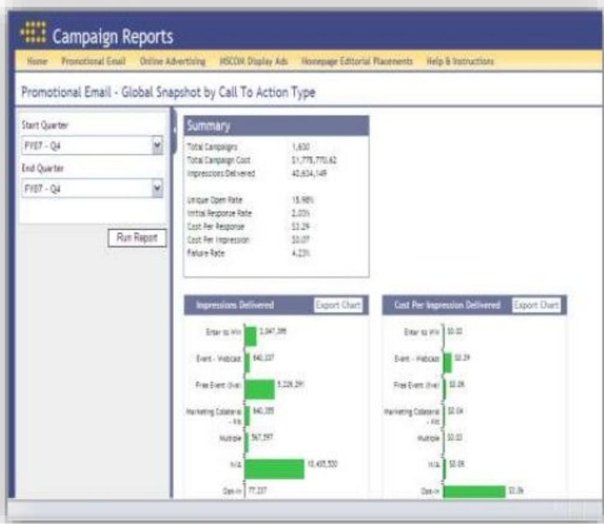

> **AI Description:**
> **Source:** `assets/_page_162_Figure_0.jpg`
> 
> **Generated:** 2026-05-31 17:19:08
> 
> ---
> 
> The image contains a detailed promotional email campaign report. It includes a summary section with metrics such as total campaigns, total campaign cost, impressions delivered, unique open rate, initial response rate, cost per response, cost per impression, and failure rate. Below the summary, there are two bar charts: one showing impressions delivered by different call-to-action types and another showing cost per impression delivered by the same categories. The visual elements help in understanding the distribution of campaign performance across different types of calls to action.

### Full Page Description (Page 163)

**Source:** `assets/_page_163_Asset_2.jpg`

**Generated:** 2026-05-31 17:07:11

---

The image contains a horizontal bar chart with percentages representing different categories. The categories include "Business Decision Maker," "Developer," "Home PC User," "Information Worker," "Dev/Dev Combination," "IT Professionals," "Multiple," "Other," and "Partner." The percentages for each category are as follows: "Business Decision Maker" at 2.51%, "Developer" at 3.08%, "Home PC User" at 2.75%, "Information Worker" at 2.80%, "Dev/Dev Combination" at 3.47%, "IT Professionals" at 2.77%, "Multiple" at 2.04%, "Other" at 1.64%, and "Partner" at 6.04%. The chart visually represents the distribution of these categories, with "Partner" having the highest percentage and "Other" having the lowest.

## Benchmark Tool - Using Snapshot Reports

·Amarketer can use benchmark data to learn from previous activitiesand investmentsandthereforemoreeffectivelyplan for the future.

Initial Response Rate

## Benchmark Tool - Customize a Query

·Run reports that target specific metrics:

-Time period

-Geography

\- Segment

\- Customer Group

·Compare the campaign to benchmark results

Export results to Excel orPrint

2.Select Campaign Filters

Subsidiary

Segment

Customer Group

Call To Action

Day of Week

3.Select Data Set to Benchmark Against

Microsoft Promotional Emat Data

Last4 Quarters Available

Industry Data

Time Period

FY07 Total

Region

World Wide

Vertical

Overall-Crossindustry

RunReport

Methodology of Calculations

# Benchmark Tool - Customize a query to drill down to the results fora specific country

·Promotional Email IRR of 1.82%is below benchmark average,but failure rate of4.56%isabovebenchmark

## YourQuery Results

## Benchmark Basis Results

## Use the Right Tool for the Job

## Technology for Measurement: Data Sources & Tools Overview

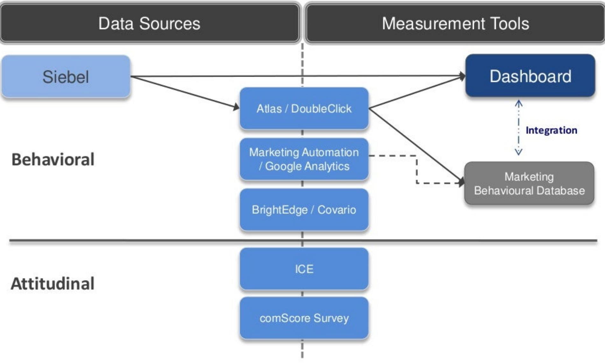

> **AI Description:**
> **Source:** `assets/_page_167_Figure_0.jpg`
> 
> **Generated:** 2026-05-31 16:58:29
> 
> ---
> 
> The image is a flowchart that illustrates the flow of data from various sources to a dashboard and a marketing behavioral database. It includes two main sections: "Data Sources" and "Measurement Tools." The data sources include "Siebel," "Atlas / DoubleClick," "Marketing Automation / Google Analytics," "BrightEdge / Covario," "ICE," and "comScore Survey." The measurement tools are "Atlas / DoubleClick," "Marketing Automation / Google Analytics," and "BrightEdge / Covario." The flowchart shows how these sources and tools feed into a dashboard and a marketing behavioral database, with an integration arrow pointing from the dashboard to the database. The chart categorizes the data sources into "Behavioral" and "Attitudinal" types.

Note:Notintended to illustrateall data sources

## Optimization

The following slides provide a guide for applying learning from campaign measurement to optimize:

1.Marketing/Creative

2. Media

3.Web Site

## Marketer Optimization Based on Results via Measurement

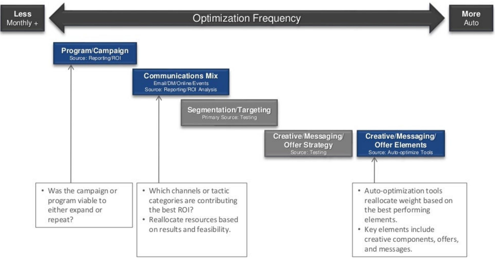

> **AI Description:**
> **Source:** `assets/_page_169_Figure_0.jpg`
> 
> **Generated:** 2026-05-31 17:33:47
> 
> ---
> 
> The image is a flowchart illustrating the process of campaign optimization frequency. It begins with "Program/Campaign" and moves through stages of "Communications Mix," "Segmentation/Targeting," and "Creative/Messaging/Offer Strategy," culminating in "Creative/Messaging/Offer Elements." The flowchart includes arrows indicating the direction of the optimization process, with labels such as "Less Monthly +," "Optimization Frequency," and "More Auto." The text provides questions and sources for each stage, such as "Was the campaign or program viable to either expand or repeat?" and "Which channels or tactic categories are contributing the best ROI?" The flowchart also highlights the use of auto-optimization tools and reallocating resources based on performance.

## Media Optimization Based on Results via Measurement

Less Monthly+

Optimization Frequency

MoreAuto

Individual Media Tactics

MediaChannels

TacticalPaidSearch Optimization

TacticSpecific Optimizations (Examples)

·Which media vehicles& tacticsare contributingto mostefficient&scalable conversionscontributingto strongROI?

Paid Search

Keywords,adcopy,adgrops, landingpages

·Daily optimization forad copy served & bids based on dynamic bid,based marketplace.

·Shift resources based on results.

Content Sites

·Individual site performance.

·Placements on site,sections within site

·Buying model(CPCvs.CPM)

Retargeting

·Performance by network

·UATs

## Web Site Optimization Based on Results via Measurement

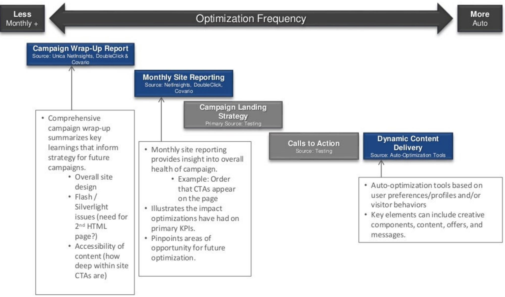

> **AI Description:**
> **Source:** `assets/_page_171_Figure_0.jpg`
> 
> **Generated:** 2026-05-31 17:13:54
> 
> ---
> 
> The image is a flowchart that illustrates the optimization frequency of various marketing and campaign management processes. It starts with "Less Monthly +" on the left and progresses to "More Auto" on the right, indicating increasing automation. The flowchart includes four main sections: Campaign Wrap-Up Report, Monthly Site Reporting, Campaign Landing Strategy, and Calls to Action, each with sub-sections detailing specific aspects of campaign management. The sources for these processes are listed at the bottom, and the flowchart visually represents the progression from manual reporting to automated content delivery.

## Marketer Optimization Based on Results via Statistical Testing

Less Monthly+

Optimization Frequency

MoreAuto

Program/Campaign Source:Reporting/ROI

Communications Mix Emal/DM/Online/Events Source:Reporting/ROl Analysis

Creative/Messaging/ OfferStrategy Source:Testing

Creative/Messaging/ Offer Elements Source:Auto-optimize Tools

·Which target ismore responsivetoacampaignor campaignelements?

·Are topdecilesresponding atexpected rates?

·Forstrategic guidance to inform new initiativesor current campaign strategy, testingcontrolsoutside influences to isolate which factors orcombination of factorsimproveresults.

## Web Site Optimization Based on Results via Statistical Testing

Less Monthly+

Optimization Frequency

MoreAuto

Campaign Wrap-Up Report Source:Netlnsights, DoubeClick Covario

MonthlySiteReporting Source:Netnsights，DoubeCck, Covario

Campaign Landing Strategy Primary Source:Testing

CallstoAction Source:Testing

Dynamic Content Delivery Source:Auto-Optimization Tools

Canwereduceabandonmentrateson thesitebymodifyingexistinglanding pagedesign/layout？

·Site load time is often addressed to reduce abandonmentrates.

·Itemsto test:design,layout,creative elements,etc.

·Canwe improveengagement rateswith keyend actions by providing clearer callsto action?

Items to test:messaging, expanding on value proposition,increasing prominence of element, etc.

## A Digital Taxonomy

> **AI Description:**
> **Source:** `assets/_page_174_Figure_0.jpg`
> 
> **Generated:** 2026-05-31 17:05:18
> 
> ---
> 
> The image contains a diagram with various elements related to business strategies and growth. It includes labels such as "Earnings," "Development Plan," "Strategies," "Advertising," "Marketing," "Growth," "Progress," and "Money." Arrows and lines connect these elements, suggesting relationships and processes. The diagram is drawn on a transparent surface, with a person in a suit gesturing towards it, indicating an explanation or presentation of the business concepts.

## Digital Marketing Taxonomy

## Goal

Define and deploy a digital marketing taxonomy to enable more effective digital marketing.

## Strategy

1. Establish a common set of definitions and success metrics for the digital marketing "mix”.

2. Integrate taxonomy with relevant marketing tools and processes.

## Why Marketing Taxonomy Matters

Integration of Toolsand Work Flow:

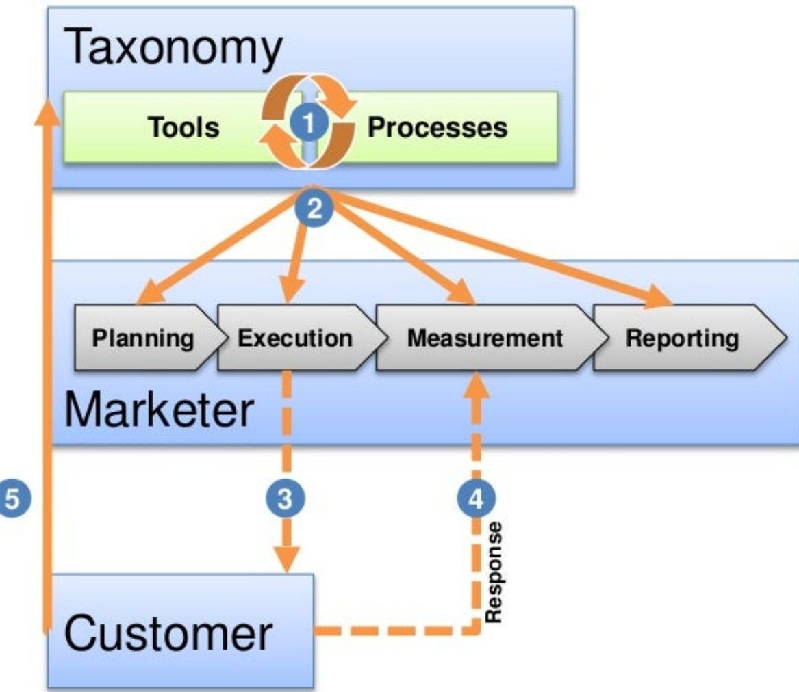

> **AI Description:**
> **Source:** `assets/_page_176_Figure_0.jpg`
> 
> **Generated:** 2026-05-31 17:11:12
> 
> ---
> 
> The image is a flowchart with a focus on marketing processes. It includes a taxonomy at the top, which is divided into tools and processes. The flowchart outlines the steps of planning, execution, measurement, and reporting, which are connected to the marketer. There is also a customer section at the bottom, with arrows indicating the flow of information from planning to execution, then to measurement and reporting, and finally to the customer. The flowchart uses arrows and numbers to indicate the sequence of steps and the direction of information flow.

## A Marketing Taxonomy...

1. ...providesacommon language toenable integration of toolsand processes.

2. ...provides increased organizational transparency acrossplanning,execution, measurementandreporting.

3. ...enablesmoreproductiveand effectivemarketertocustomer interactionsviaintegrated tools/processand increased transparency.

4. ...enablesbetterBlthrough standardized customer responses.

5. ...reflects the changing needs andbehaviors of our customers.

## Organizing the Chaos with Taxonomy

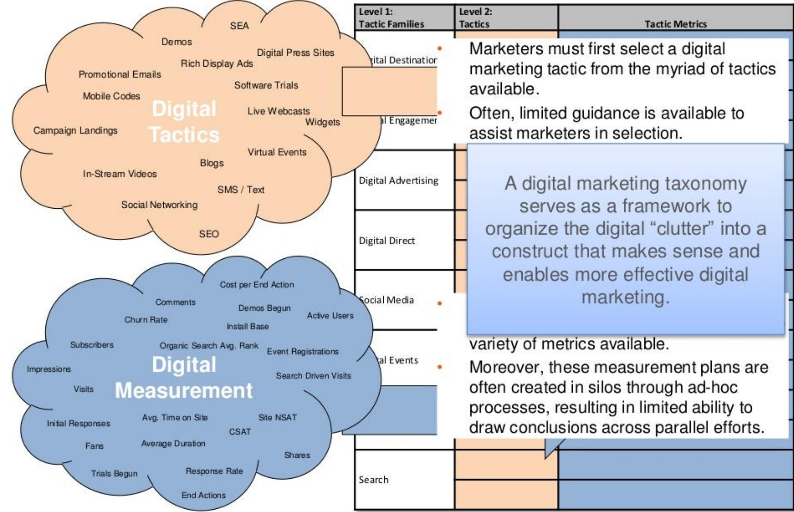

> **AI Description:**
> **Source:** `assets/_page_177_Figure_0.jpg`
> 
> **Generated:** 2026-05-31 17:18:11
> 
> ---
> 
> The image contains a detailed diagram illustrating a digital marketing taxonomy. It is divided into two main sections: "Digital Tactics" and "Digital Measurement." The "Digital Tactics" section lists various marketing strategies such as SEO, Social Networking, Digital Advertising, and Digital Direct, among others. The "Digital Measurement" section includes metrics like Impressions, Visits, and Response Rate. The diagram also includes a table with levels of tactics and tactic metrics, emphasizing the need for marketers to select a digital marketing tactic and the importance of a digital marketing taxonomy for organizing and measuring digital marketing efforts effectively.

## Start With the Customer Perspective

## Digital Direct

> **AI Description:**
> **Source:** `assets/_page_178_Figure_4.jpg`
> 
> **Generated:** 2026-05-31 16:43:10
> 
> ---
> 
> The image is a collage of photographs featuring a variety of individuals. The photographs appear to be of people of different ages, genders, and ethnicities. The images are arranged in a grid format, with each photo showing a single person. The individuals are dressed in a mix of formal and casual attire. There are no visible text annotations or labels within the image itself. The overall purpose of the image is unclear without additional context.

## Search

## SocialMedia

## Digital Engagements

> **AI Description:**
> **Source:** `assets/_page_178_Figure_7.jpg`
> 
> **Generated:** 2026-05-31 16:37:25
> 
> ---
> 
> The image contains a video thumbnail. It shows a person speaking, likely in a professional or educational setting, with a blurred background that appears to be a classroom or conference room. The thumbnail includes a play button overlay, indicating that this is a video clip. The image is framed within a typical video player interface, with controls for play, pause, and other playback functions visible.

## Digital Events

> **AI Description:**
> **Source:** `assets/_page_178_Figure_8.jpg`
> 
> **Generated:** 2026-05-31 17:32:17
> 
> ---
> 
> The image appears to be a screenshot of a virtual presentation or simulation. It features a central figure standing on a platform, likely representing a presenter or participant. The background includes a cityscape and various graphical elements, possibly representing different data points or categories. On the right side, there are icons and text boxes that seem to represent different tools or applications, such as "Office 365" and "Microsoft". The overall layout suggests a digital environment designed for collaborative or educational purposes.

## Reach vs Engagement vs Response

Different tactics,channelsand even audiences require different metricsdependingupon your objectives.

1.Exposure

2.Engagement

3.Conversion

## Organizing Principles: 2-Tier Taxonomy of Interaction Modes& Digital Tactics

## A Digital Interaction Mode is...

Afamilyofdistinctmarketing tactics that sharea unique interaction experiencewithcustomers.

## A Digital Tactic is...

Amutuallyexclusiveexecutable digitalmarketing element thatcanbediscretely measured.Tacticsfit cleanlyand exclusivelyinto onedigitalinteraction mode.

## Level1Digital Interaction Modes

## Level2Digital Tactics

## Digital Marketing Taxonomy

Illustrative

## The Taxonomy...

1....providesa common language for digital marketing efforts.

2....createsa framework for the integration of toolsand processes and the implementationof best practices.

3....enables better Bl through standardised KPl measurement.

## Taxonomy Flat File

Illustrative

TheTaxonomyis backed byadetailed flatfile thatestablishes standard metric definitions,identifies data sources,and informs metriccalculation for reporting.

## Measurement, Reporting, Instrumentation

Thereareanumber of key components required to operationalise thiscapability:

1.Developa Digital Measurement Framework

2.Developa Digital Taxonomy

3.Developa Digital Measurement Centre of Excellence

Playbook

Process

Tasks

Roles&responsibilities

Resources/skills

Documents

Briefs

Plans

Reports

Instrumentation Checklists/Instructions

## Develop Digital Marketing Centres of Excellence: DCOE

Operationalize Digital Marketing through COEdeployment: Training,orcesillsevelot

## DIGITAL CENTRES OF EXCELLENCE

Cross COEframeworksand guidance for strategy,tools, resources,communications,easurementdils

Online Advertising (OCOE)

Provides guidance for planning,execution, and optimization of online advertising campaignsand enables more effective online advertising.

eCRM/Email (ECOE)

Provides marketers with on-demand information forall aspects of email marketinganda simple, efficient way tomanage effective,privacycompliant email campaigns.

Search（SCOE)

Centralized set of resources for Search Engine Marketing (SEM) tomaximizeabilityto deliver and retain more qualified traffic to IBM.com from search activitiesand encourage marketers to make greater use of SEM.

Measurement(MCOE)

Prescriptive framework and guidance for   
consistent   
measurement,reporting, analysis,testing and   
optimisation to increase onlinemarketing   
campaign effectiveness and efficiency.

Campaign Site (CCOE)

Prescriptive guidance for   
campaign landing   
environmentsto   
increase online   
marketing campaign   
effectivenessand   
efficiency

## THE8COMPONENTSOFCOES

Strategy

Resources

Process

Communication

Policy

Measurement

Tools

Skills

## Example: Search Centre of Excellence (SCOE)

## Measurement, Reporting,Instrumentation

## Process:

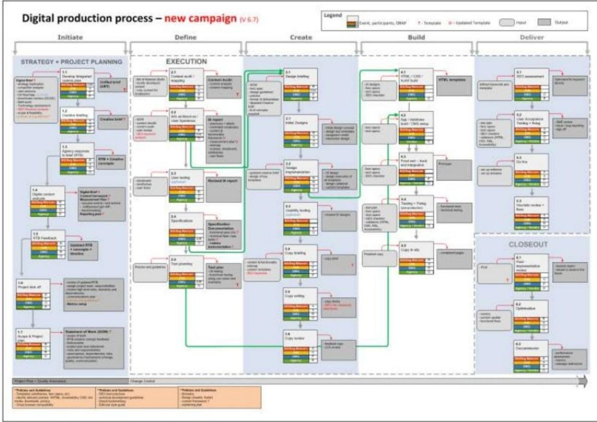

> **AI Description:**
> **Source:** `assets/_page_186_Figure_0.jpg`
> 
> **Generated:** 2026-05-31 16:40:07
> 
> ---
> 
> The image is a detailed flowchart titled "Digital production process – new campaign (V6.7)." It is divided into five main phases: Initiate, Define, Create, Build, and Deliver. Each phase is further broken down into sub-phases with specific tasks and activities. The flowchart uses a legend to indicate different types of content such as events, participants, templates, and inputs/output. The chart is color-coded to represent different levels of completion or status of tasks. The overall structure is complex, with multiple arrows connecting different steps to illustrate the flow of the digital production process.

## Documents

Measurement,Testing &Optimisation Plan

> **AI Description:**
> **Source:** `assets/_page_187_Figure_0.jpg`
> 
> **Generated:** 2026-05-31 16:48:15
> 
> ---
> 
> The image contains a red icon representing a PDF file. The icon is a stylized red "PDF" text on a red button, with a white paperclip icon above it. The paperclip icon is partially transparent, allowing the white background to show through. The design is simple and commonly associated with the Adobe PDF format.

Objectives

Benchmark& TargetKPl's

Interaction Modes

Tactics

HighValued Actions (Success Events&End Actions)

Systems/Tools

Reporting Plan

> **AI Description:**
> **Source:** `assets/_page_187_Figure_1.jpg`
> 
> **Generated:** 2026-05-31 16:47:03
> 
> ---
> 
> The image contains a graphic representation of a PDF file icon. It features a white background with a red rectangle at the top left corner containing the text "PDF" in white. Below the rectangle, there is a white square with a red, stylized letter "d" in the center, which is the standard symbol for PDF files.

Report/Dashboard Design

Data sources

SLA's

Resources

Instrumentation Plan

> **AI Description:**
> **Source:** `assets/_page_187_Figure_2.jpg`
> 
> **Generated:** 2026-05-31 16:49:34
> 
> ---
> 
> The image contains a visual representation of a PDF file icon. It features a white background with a red PDF logo in the center, consisting of a red downward-pointing arrow with a white outline. The icon is commonly used to represent a Portable Document Format file.

Roles& Responsibilities

SLA's

Resources

Systems/Tools

Setup& Instrumentation Steps/Checklists

## Roles& Responsibilities

## Skills & Resources

·Job descriptions

·Training

·Centres of Excellence

## POSITIONSUMMARY

## InitialOngoing Responsibilities:

MeetwithProducersMarketersandour Marketing Agenciesto understandthecurent andutureneedsofthebusiness

Analyze webanalytics to identity areas for improvement and where oppprtunities exist frenhancingustomerexperience andincreasing conversionrales

Provide weekiy/monthiy analysis results and recommendations based onbut notlimited tothe fllowing

Unique Visitors，VisitsPage ViewsCicksRegistrafons，Downoadsetc

Visitor segmenting and profing

Onine visitorbehavior

Sources andreferras oftraffic

User paths throughvaripus web propertes

Onine Advertising（on and of nework）

SEO

> **AI Description:**
> **Source:** `assets/_page_190_Figure_0.jpg`
> 
> **Generated:** 2026-05-31 17:22:32
> 
> ---
> 
> The image contains a graphic icon representing a PDF file. The icon features a white page with a red downward-pointing arrow, symbolizing the PDF document format. The icon is simple and does not include any additional visual elements beyond the text and the arrow.

Advise Marketers on how to meet thei marketingobjectives:

Advise Marketers on key metrics to measure

Create custom Scorecards based onsite goals

Analyze webanayticsandoerofine datatovauatesitepertormance

Define AB test scenarios anddefine success metrics

Ofertrainingsessions andresources on how to enhance customer experience andincreasecoversionrates

Participatein onine traning provided by corporate

Represent thecompanyon wordwide calsandbylisingwithhecorporate ofie on behalf ofthe Canadansubsidiary to ensure thatlocal needs are beingmetas wellasto communicale newrequirements

Developmantainand present siteanalysisreportssoorecards anddashboards on the overal periormance and trending of company.com.auaswelas provide recommendafionsto beteeverage companycomauasamarketingoo

Work withtheon-site web developmentteamoensure webmeasurement taggingis coded oorrectly on the pages as wellas troubleshooting technicalissues as they anse

Evangeisetrain andeducate our Marketing community and Marketing Agencies onthe benefitsandvabe of digitalmarketing measurement

## Requirements&Qualifications

Minimum4yearsexperenceinonlinemarketingandwebusabity

ATleast1-2years in-depth experience with a webanalytics and tracking tools (WebTrendsOmniureALASDoublecickGoogleelc.xpeiencewithWerends orOmniture in particular would be an asset

Pvenailyanstedatantactabeecmmendionstrougheusefdata mining

Proven ability to analyse and enhance SEO and SEM

Comfortable withpresenting analysisandrecommendations tomarketingmanagers producers,marketing agencies and seniormanagement

Strongrganzaionaskilsdeailedorenedresourcefuandproactiveingetingthe job done

Se-motivatedindvidualwhobeabletoaketheiniaivetoseekoutoppoies forfurtheranalysis oreveraging the tool

Comfortablein networkingand approaching collaguesand peers withinthe businessto gatherdata and completeprojects

· Excelltcommuncaionsskillsandteabitytoinluecedisussionsadcomes

Ablity to understand the business implicationsof their analysis and recommendations

Experience with working with large volumes ofdala romdisparatedata sourcesand to be able to spotrelevantpatterns and trends

Passionateabout customerscusomerexperiencesdigialmarketingand workingatthe company

## Important to be realistic!

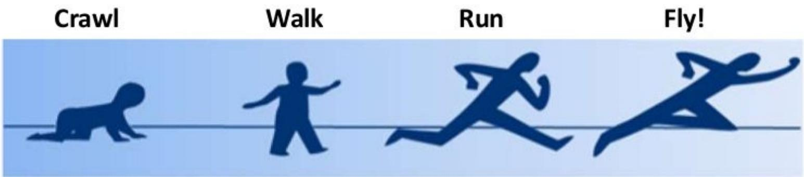

> **AI Description:**
> **Source:** `assets/_page_191_Figure_0.jpg`
> 
> **Generated:** 2026-05-31 17:35:13
> 
> ---
> 
> The image is a simple infographic combining text with visual elements. It presents a sequence of human locomotion stages: crawl, walk, run, and fly. Each stage is represented by a silhouette of a person in a corresponding pose, progressing from a crawling position to a flying position. The text labels above each silhouette clearly indicate the stage of movement.

Key Takeaways!

## Read these reports / studies:

Analytics:TheNewPathtoValue. MIT Sloanand IBM. (.PDF500K)

TheCMO's Imperative:Tackling New Digital Realities.Boston ConsultingGroup. （.PDF1MB)

Integrated,Customer CentricMarketing: ExpandingMarketing'sDelusion.Forrester Consulting. (.PDF225K)

## Key Takeaways

1.Adoption bariers relate to management&culture,not data&technology!

2.Begin with questions /desired insights first, not data

3.You cannot manage what you cannot measure

4. What you measure will determine what you do

5.Measure what matters most (customer engagement,conversion & satisfaction)

6.Turn data into information and information into intelligence

7.Data should only exist to serve the need of the business and provide information which isinsightfulandactionable

8.Satisfaction drives conversion,loyalty and Word of Mouth (WOM)

9.Measurement is hard,don't fallfor‘technology only solutions'

10.Your customers are in charge,they willgo where they are satisfied

11.90-10Rule!90%about People-Invest inpeople,skils,roles,responsibilities, processes!!

## Thank y you!

Martin Walsh

Director Digital Marketing

@martinwalsh

> **AI Description:**
> **Source:** `assets/_page_195_Figure_0.jpg`
> 
> **Generated:** 2026-05-31 16:47:16
> 
> ---
> 
> The image contains a photograph of a hand with a smiley face drawn on the palm. The background is blurred, focusing attention on the hand and the smiley face. The smiley face consists of two vertical lines for eyes and a curved line for a mouth, conveying a cheerful expression. The hand is positioned in a way that suggests it is being held up, possibly to signal a positive or friendly gesture.
