
# Disciplined Agile Business Analysis

Scott W.Ambler

ScottAmbler+Associates

Jon Smart

Barclays

## About Scott W. Ambler

Pioneered Agile Modeling and Agile Database techniques in theearly2000s

Co-creator of the Disciplined Agile Delivery (DAD) framework

·Executive Transformation Coach

CertifiedTrainer

·scott [at]scottambler.com

@scottwambler

Works with organizations around the world to help IT departments become awesome

> **AI Description:**
> **Source:** `assets/_page_1_Figure_0.jpg`
> 
> **Generated:** 2026-05-31 17:44:00
> 
> ---
> 
> The image contains a photograph of a person standing against a plain background. The individual is dressed in a black blazer over a light blue collared shirt, with their hands in their pockets. The person is wearing glasses and appears to be in a professional or semi-formal setting. There are no charts, graphs, or other visual elements present in the image.

## About Jon Smart

·Leading Agile transformation at Barclays

·Backgroundin investment banking technology

Practitioner,agileapproach to software deliverysince 1993,starting outasadeveloper on the trading floor

Experience of leading largescaleregulatory change delivered witha ScaledAgile&DevOpsapproach

Certified Disciplined AgilePractitioner

· jonathan.smart [at] barclays.com

@jonsmart

## About Barclays

Barclays moves,lends,invests and protects money for 48 million customersworldwide

Amajor global financial services provider engaged in retail banking, credit cards,corporateand investment banking and wealth and investmentmanagement

Operating in over 50 countries

132,000 employees

·325years of history,founded in 1690

> **AI Description:**
> **Source:** `assets/_page_3_Figure_0.jpg`
> 
> **Generated:** 2026-05-31 17:58:26
> 
> ---
> 
> The image shows a photograph of a tall building with the Barclays logo prominently displayed at the base. The building appears to be a modern skyscraper with a glass facade reflecting the sky and clouds. The logo is in blue and white, with the word "BARCLAYS" clearly visible. The image captures the exterior of the building, focusing on the signage and the architectural details of the structure.

Disciplined Agile Consortium

> **AI Description:**
> **Source:** `assets/_page_3_Figure_1.jpg`
> 
> **Generated:** 2026-05-31 17:58:36
> 
> ---
> 
> The image shows a nighttime view of a modern urban landscape featuring a tall building with the Barclays logo prominently displayed at the top. The building is illuminated with blue lighting, and there is a large, curved, blue structure in the foreground. The scene includes a few people walking near the structure, and the area appears to be a public space with some tents or temporary structures. The overall atmosphere is vibrant and dynamic, with the lighting creating a striking contrast against the dark sky.

# THINK OUTSIDE THE BOX

Disciplined Agile Consortium

## Let's explore several important questions...

How does disciplined agile software development work?

How does agile analysis work?

How do business analysts fit on agile teams?

> **AI Description:**
> **Source:** `assets/_page_6_Figure_0.jpg`
> 
> **Generated:** 2026-05-31 17:44:17
> 
> ---
> 
> The image is a photograph of a sailing race. It shows a group of sailors on a yellow and white sailboat leaning over the side as the boat tilts sharply to the left, likely due to strong winds or waves. The sailors are wearing dark wetsuits, and the background shows a hilly coastline with mountains. The image captures the dynamic and intense nature of competitive sailing.

## Agile Delivery Disceplined

APractitioner'sGuidetoAgileSoftwareDeliveryintheEnterprise

ScottW.Ambler·Mark Lines

ForewordbyDave West

## Disciplined Agile Delivery (DAD) isa process decision framework

The key characteristics of DAD:

-People-first

-Goal-driven

-Hybrid agile

-Learning-oriented

-Full deliverylifecycle

\- Solution focused

-Risk-value lifecycle

-Enterprise aware

## DAD isa Hybrid Framework

DAD leverages proven strategies from several sources, providingadecisionframework to guideyouradoptionand tailoring of them inacontext-drivenmanner.

## The Disciplined Agile framework supports four delivery lifecycles

> **AI Description:**
> **Source:** `assets/_page_8_Figure_0.jpg`
> 
> **Generated:** 2026-05-31 17:53:06
> 
> ---
> 
> The image contains a simple diagram with a teal circular background. At the center is a stylized, abstract shape resembling a stylized 'S' or a curved arrow. The shape is primarily black with white accents. The design appears to be a logo or icon, possibly representing a concept or brand. There are no text annotations or additional labels within the image.

Agile Delivery

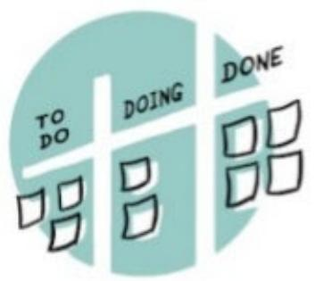

> **AI Description:**
> **Source:** `assets/_page_8_Figure_1.jpg`
> 
> **Generated:** 2026-05-31 17:53:12
> 
> ---
> 
> The image is a diagram of a three-column task management system. The columns are labeled "TO DO," "DOING," and "DONE." Each column contains three squares, representing tasks or items. The "TO DO" column has three squares, the "DOING" column has two squares, and the "DONE" column has two squares. The diagram visually represents the progression of tasks from being planned to being completed.

Lean Delivery

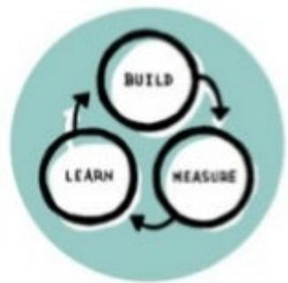

> **AI Description:**
> **Source:** `assets/_page_8_Figure_2.jpg`
> 
> **Generated:** 2026-05-31 17:53:23
> 
> ---
> 
> The image is a diagram illustrating a cycle with three interconnected circles labeled "BUILD," "LEARN," and "MEASURE." Arrows indicate the flow between these stages, suggesting a continuous process where each step informs the next. The diagram is simple and uses black circles and arrows on a light blue background.

Exploratory

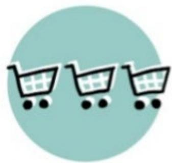

> **AI Description:**
> **Source:** `assets/_page_8_Figure_3.jpg`
> 
> **Generated:** 2026-05-31 17:53:18
> 
> ---
> 
> The image contains a simple diagram of three shopping carts arranged in a row. The shopping carts are depicted with a light blue background. The image does not contain any text or additional labels. The shopping carts are evenly spaced and appear to be identical in design, suggesting a focus on retail or e-commerce themes.

Continuous Delivery

Disciplined Agile Consortium

High Level Lifecycle
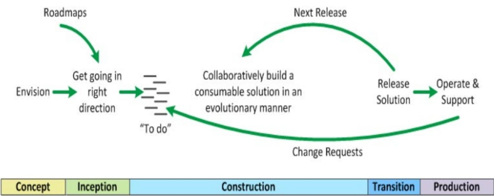

> **AI Description:**
> **Source:** `assets/_page_9_Figure_0.jpg`
> 
> **Generated:** 2026-05-31 17:52:59
> 
> ---
> 
> The image is a flowchart that illustrates a software development lifecycle. It includes stages such as Envision, Inception, Construction, Transition, and Production. The flowchart shows how ideas progress from initial envisioning to the release and support of a solution. Key elements include "Roadmaps," "Next Release," "To do," "Collaboratively build a consumable solution in an evolutionary manner," and "Change Requests." The flowchart uses arrows to depict the progression of ideas and tasks through different phases of the development process.

There's more to solution delivery than construction

Disciplined Agile Consortium

## Basic/Agile Lifecycle

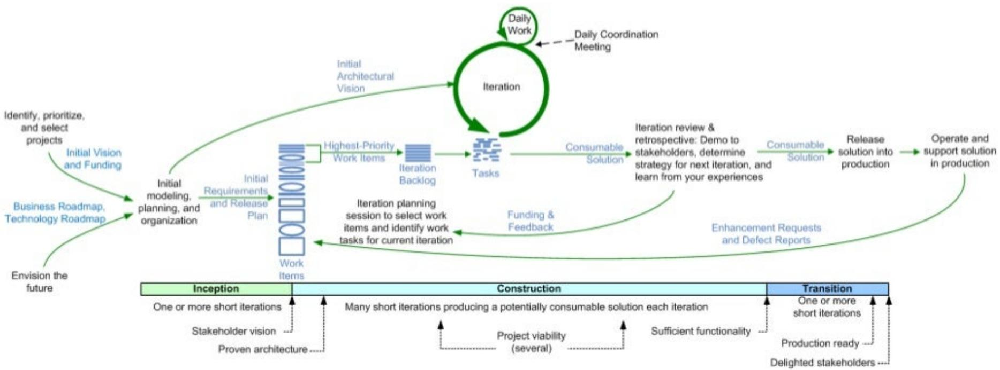

> **AI Description:**
> **Source:** `assets/_page_10_Figure_0.jpg`
> 
> **Generated:** 2026-05-31 17:56:36
> 
> ---
> 
> The image is a flowchart illustrating the Agile software development process. It outlines the stages of a project from inception to transition, including initial vision and funding, initial modeling and planning, and the iterative process of daily work, tasks, and consumable solutions. The flowchart highlights key activities such as daily coordination meetings, iteration planning sessions, and stakeholder demonstrations. It also depicts the progression from one or more short iterations in the inception phase to many short iterations producing a potentially consumable solution in the construction phase, culminating in the transition phase where the solution is released into production and supported.

Afull Scrum-basedagiledelivery lifecycle

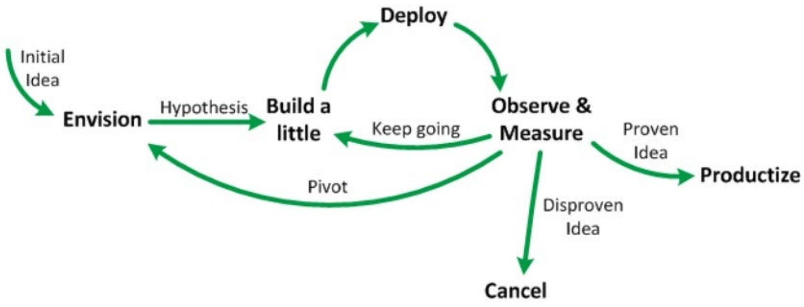

> **AI Description:**
> **Source:** `assets/_page_11_Figure_0.jpg`
> 
> **Generated:** 2026-05-31 17:54:23
> 
> ---
> 
> The image is a flowchart that illustrates a process for developing and validating ideas. It starts with "Initial Idea" leading to "Envision," where a hypothesis is formed. This hypothesis then guides the next step, "Build a little," which involves deploying a small version of the idea. Following this, the process moves to "Observe & Measure," where the idea is observed and measured. Depending on the results, the idea can either be "Keep going" and continue the cycle, "Pivot" to a new direction, or "Cancel" if it is disproven. If the idea is proven, it leads to "Productize," where the idea is fully developed and launched. The flowchart visually represents the iterative nature of the process, highlighting the importance of observation and measurement in determining the next steps.

Sometimes it takes time to identify what your stakeholdersactuallyneed

## Lean Lifecycle

A full leandelivery lifecycle
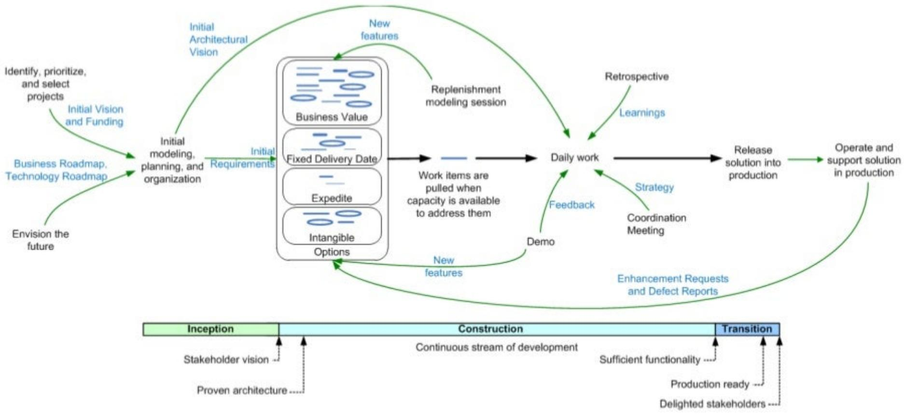

> **AI Description:**
> **Source:** `assets/_page_12_Figure_0.jpg`
> 
> **Generated:** 2026-05-31 17:43:46
> 
> ---
> 
> The image is a flowchart illustrating a software development lifecycle. It includes three main phases: Inception, Construction, and Transition. The Inception phase involves identifying, prioritizing, and selecting projects, followed by initial modeling, planning, and organization. The Construction phase focuses on continuous development, with work items being pulled when capacity is available. The Transition phase ensures sufficient functionality and production readiness. The flowchart also includes elements such as Business Value, Fixed Delivery Date, Expedites, Intangible Options, and various feedback and coordination mechanisms. The diagram is annotated with labels such as "Initial Architectural Vision," "Replenishment modeling session," "Daily work," "Retrospective," "Strategy," "Coordination Meeting," and "Enhancement Requests and Defect Reports."

## Lean Continuous Delivery Lifecycle

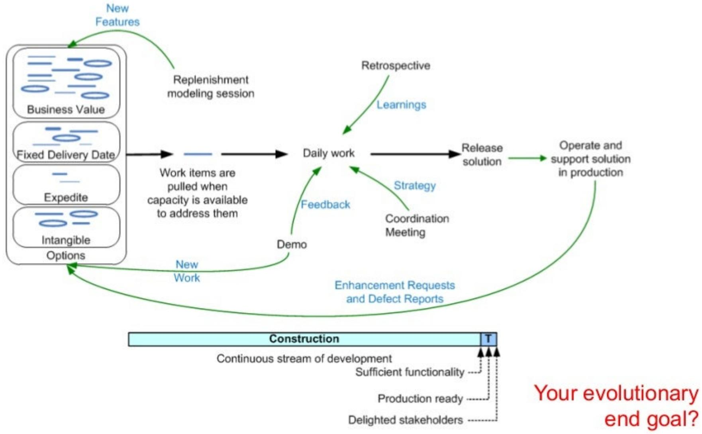

> **AI Description:**
> **Source:** `assets/_page_13_Figure_0.jpg`
> 
> **Generated:** 2026-05-31 17:46:32
> 
> ---
> 
> The image is a flowchart depicting a software development process. It illustrates a cycle of work items being pulled when capacity is available, leading to daily work, a release solution, and operating and supporting the solution in production. The chart includes labels such as "Business Value," "Fixed Delivery Date," "Expedite," and "Intangible Options," indicating different priorities or criteria for work items. The flowchart also shows feedback loops and a retrospective learning phase, emphasizing continuous improvement. The bottom section highlights the construction phase with a focus on a continuous stream of development, sufficient functionality, production readiness, and delighted stakeholders. The text at the bottom right corner asks, "Your evolutionary end goal?"

Disciplined Agile Consortium

SOYOU'RETELLING ME THAT EVERY TEAM IS UNIQUE

DAD makes your options explicit and provides guidance to help you choose wisely

## DAD is Goal-Driven, Not Prescriptive

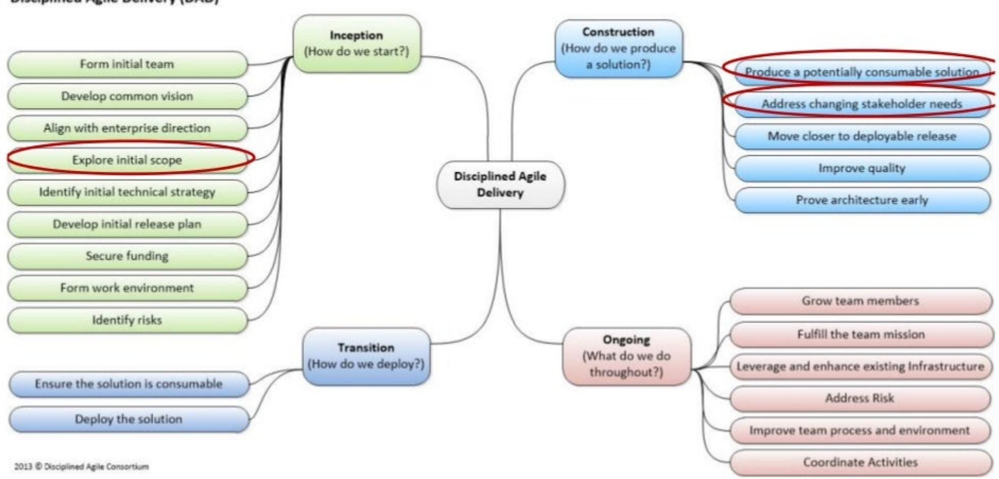

> **AI Description:**
> **Source:** `assets/_page_15_Figure_0.jpg`
> 
> **Generated:** 2026-05-31 17:42:48
> 
> ---
> 
> The image is a flowchart titled "Disciplined Agile Delivery (DAD)." It outlines the four phases of a project: Inception, Construction, Transition, and Ongoing. Each phase is further divided into specific activities or goals. For example, under Inception, activities include "Form initial team," "Develop common vision," and "Align with enterprise direction." The Construction phase focuses on producing a potentially consumable solution and addressing changing stakeholder needs. The Transition phase involves ensuring the solution is consumable and deploying the solution. The Ongoing phase emphasizes growing team members, fulfilling the team mission, and improving the team process and environment. The flowchart uses a combination of green, blue, and pink boxes to differentiate between the phases and their respective activities.

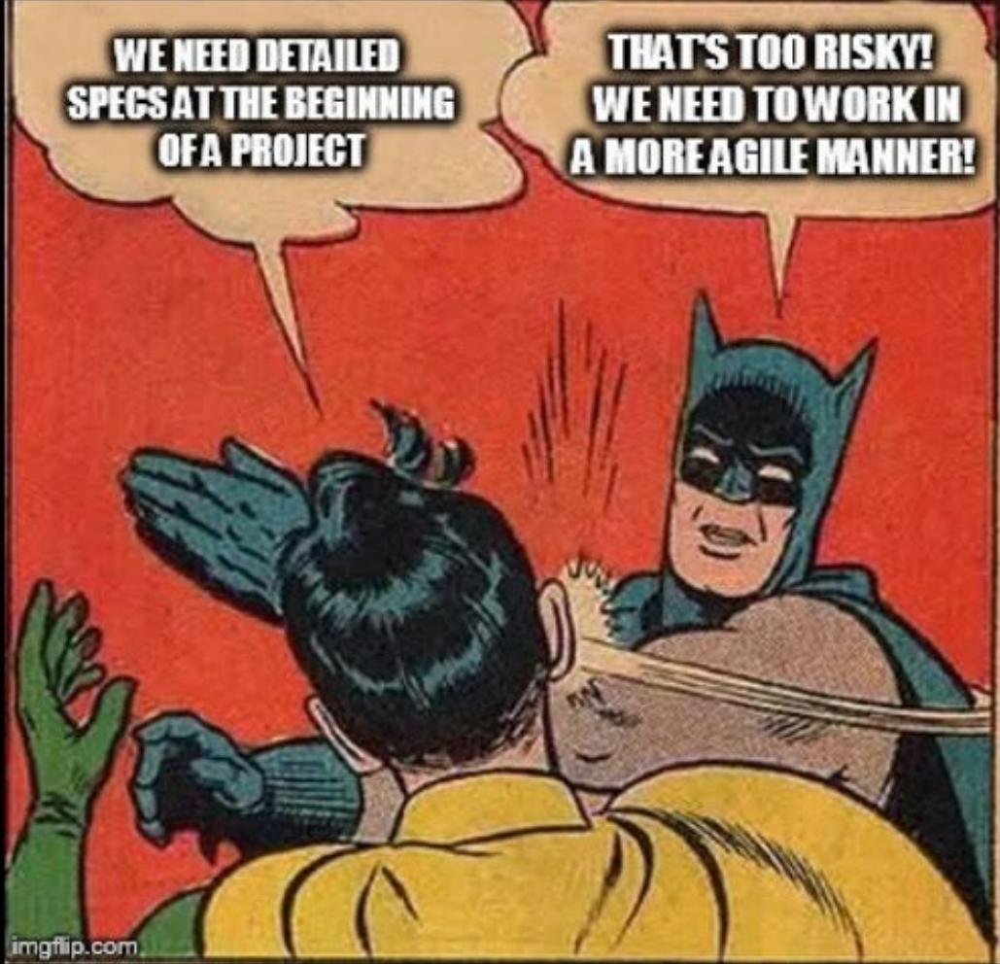

> **AI Description:**
> **Source:** `assets/_page_16_Figure_0.jpg`
> 
> **Generated:** 2026-05-31 17:53:53
> 
> ---
> 
> The image is a meme featuring a comic-style illustration of Batman and Robin. Batman is speaking to Robin, with speech bubbles containing text. The text in Batman's bubble reads, "WE NEED DETAILED SPECS AT THE BEGINNING OF A PROJECT," while Robin's bubble says, "THAT'S TOO RISKY! WE NEED TO WORK IN A MORE AGILE MANNER!" The background is a solid red color, and the image is designed to humorously contrast the two approaches to project management.

DAD supports manystrategies to explore requirements

Disciplined Agile Consortium
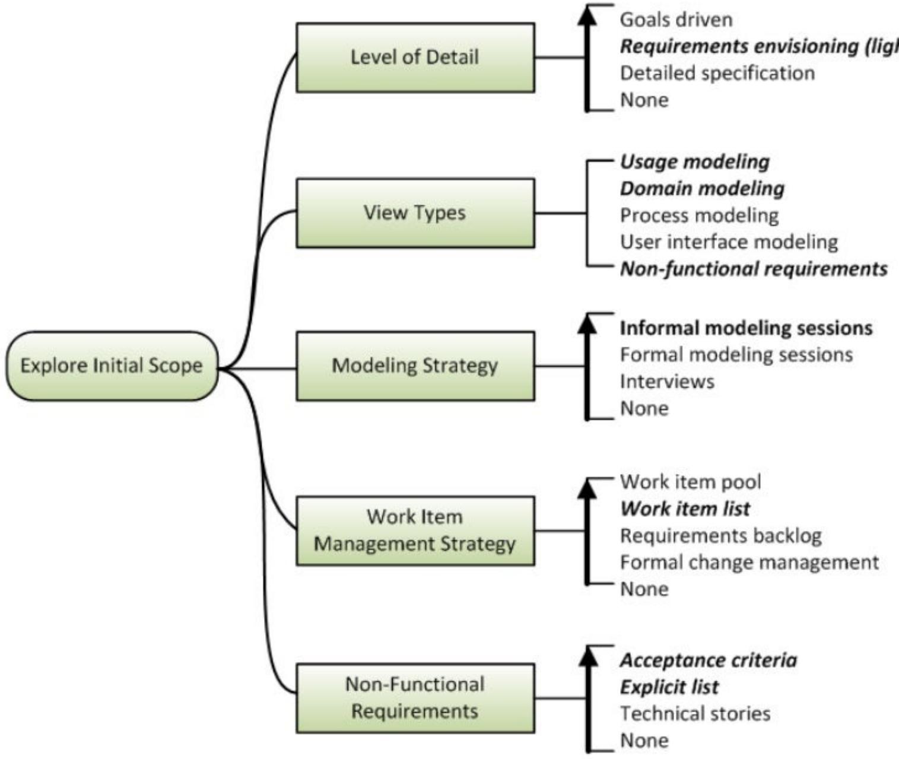

> **AI Description:**
> **Source:** `assets/_page_17_Figure_0.jpg`
> 
> **Generated:** 2026-05-31 17:57:56
> 
> ---
> 
> The image is a flowchart that outlines a process for exploring the initial scope of a project. It includes five main sections: Level of Detail, View Types, Modeling Strategy, Work Item Management Strategy, and Non-Functional Requirements. Each section branches out into specific subcategories and examples of methodologies or tools that can be used. For instance, under Level of Detail, it lists "Goals driven," "Requirements envisioning (light)," "Detailed specification," and "None." Similarly, under View Types, it includes "Usage modeling," "Domain modeling," "Process modeling," "User interface modeling," and "Non-functional requirements." The flowchart is designed to guide project managers or developers through the initial stages of planning and organizing a project's requirements and scope.

Disciplined Agile Consortium
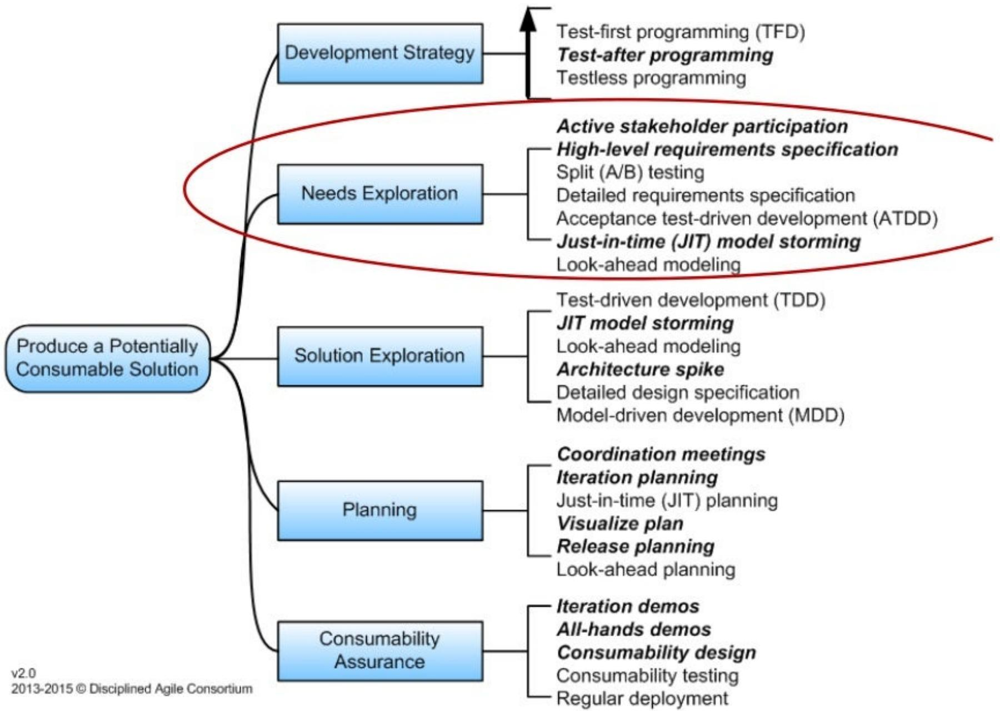

> **AI Description:**
> **Source:** `assets/_page_18_Figure_0.jpg`
> 
> **Generated:** 2026-05-31 17:52:31
> 
> ---
> 
> The image is a flowchart depicting a structured approach to software development, specifically within the context of the Disciplined Agile Consortium (DAC). It outlines a process divided into five main stages: Development Strategy, Needs Exploration, Solution Exploration, Planning, and Consumability Assurance. Each stage is further broken down into specific activities and methodologies, such as Test-first programming, Active stakeholder participation, Test-driven development, and Consumability design. The flowchart uses arrows to indicate the progression from one stage to the next, and there are annotations pointing to key methodologies and practices associated with each stage. The visual elements effectively illustrate the interconnectedness of the development process and the various strategies and techniques that can be employed at each step.

Disciplined Agile Consortium
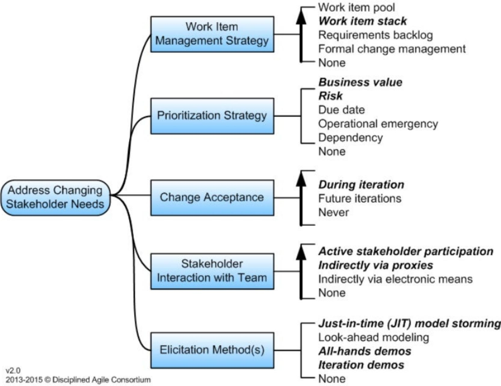

> **AI Description:**
> **Source:** `assets/_page_19_Figure_0.jpg`
> 
> **Generated:** 2026-05-31 17:50:42
> 
> ---
> 
> The image is a flowchart with a focus on "Addressing Changing Stakeholder Needs." It outlines five main strategies: Work Item Management Strategy, Prioritization Strategy, Change Acceptance, Stakeholder Interaction with Team, and Elicitation Method(s). Each strategy is further broken down into specific elements or methods, such as "Work item pool," "Business value," "During iteration," "Active stakeholder participation," and "Just-in-time (JIT) model storming." The flowchart visually connects these strategies and their components, providing a structured approach to managing stakeholder needs in a project or process.

## Observations About Agile Analysis

Analysis is so important we do it throughout the entire lifecycle, BUT wemight not have full-time analysis work every day

·Theartifactsare generally lighter

-User stories over use cases

-Sketches over detailed models

·Analysis artifacts are often transitory

-Conversations overdocuments

-Sketches overdetailed models

> **AI Description:**
> **Source:** `assets/_page_21_Figure_0.jpg`
> 
> **Generated:** 2026-05-31 17:58:43
> 
> ---
> 
> The image contains a 3D illustration of a person holding binoculars. The person is depicted in a simplified, white form with no facial features or clothing details. The binoculars have purple lenses, and the person appears to be looking through them, suggesting a focus on observation or searching for something. The image is a simple, stylized representation with no additional text or annotations.

Onadvanced teams,requirements“specifications”are executable -Acceptance tests over specification documents

## Analysis-Oriented Practices from AgileModeling.com

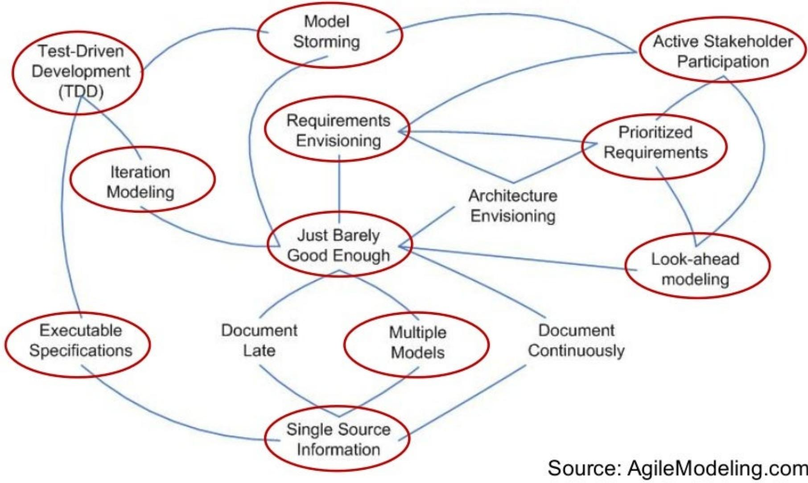

> **AI Description:**
> **Source:** `assets/_page_22_Figure_0.jpg`
> 
> **Generated:** 2026-05-31 17:48:04
> 
> ---
> 
> The image is a complex diagram illustrating various aspects of agile modeling and software development practices. It features a network of interconnected oval shapes, each containing a term related to agile methodologies, such as "Test-Driven Development," "Model Storming," "Active Stakeholder Participation," and "Just Barely Good Enough." The ovals are connected by arrows, suggesting relationships and dependencies between the different concepts. The diagram includes phrases like "Document Late" and "Document Continuously," indicating different approaches to documentation in agile processes. The source of the diagram is cited as AgileModeling.com at the bottom.

## Analysis Throughout the Lifecycle

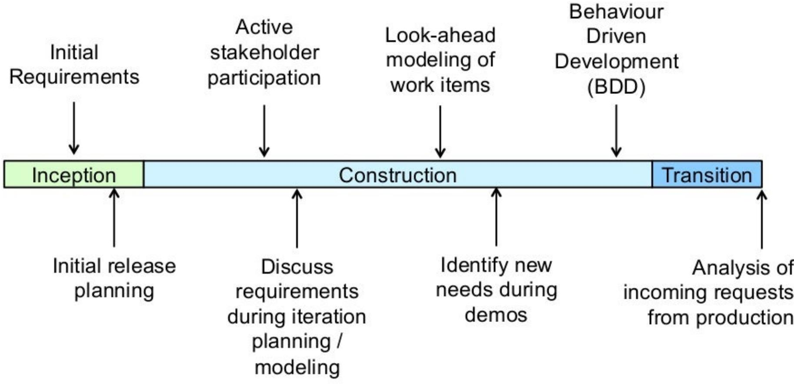

> **AI Description:**
> **Source:** `assets/_page_23_Figure_0.jpg`
> 
> **Generated:** 2026-05-31 17:45:16
> 
> ---
> 
> The image is a flowchart that illustrates the phases of a software development process. It is divided into three main sections: Inception, Construction, and Transition. The Inception phase includes initial requirements, initial release planning, and active stakeholder participation. The Construction phase involves look-ahead modeling of work items and behavior-driven development (BDD). The Transition phase includes identifying new needs during demos and analyzing incoming requests from production. The flowchart uses arrows to indicate the progression from one phase to another, with additional text annotations explaining the activities within each phase.

## Functional Requirements:Potential Model Types

Epic/User Story   
Persona   
Usage Scenario   
Use Case   
UML Use Case Diagram

User Interface (UI)

UI Flow Diagram   
UI Prototype (Low Fidelity)   
UI Prototype (High Fidelity) UI Specification

Impact (Mind) Map Context Diagram

## Domain

Domain/Conceptual Model Logical Data Model(LDM) UML Class Diagram UMLComponent Diagram

Process   
Value Stream Map   
Business Process Model   
Data Flow Diagram (DFD)   
Flow Chart   
UMLActivity Diagram   
UML State Chart

Business Rule Feature/Shall Statements

And many more...

## Non-Functional Requirements: Potential Viewsand Concerns

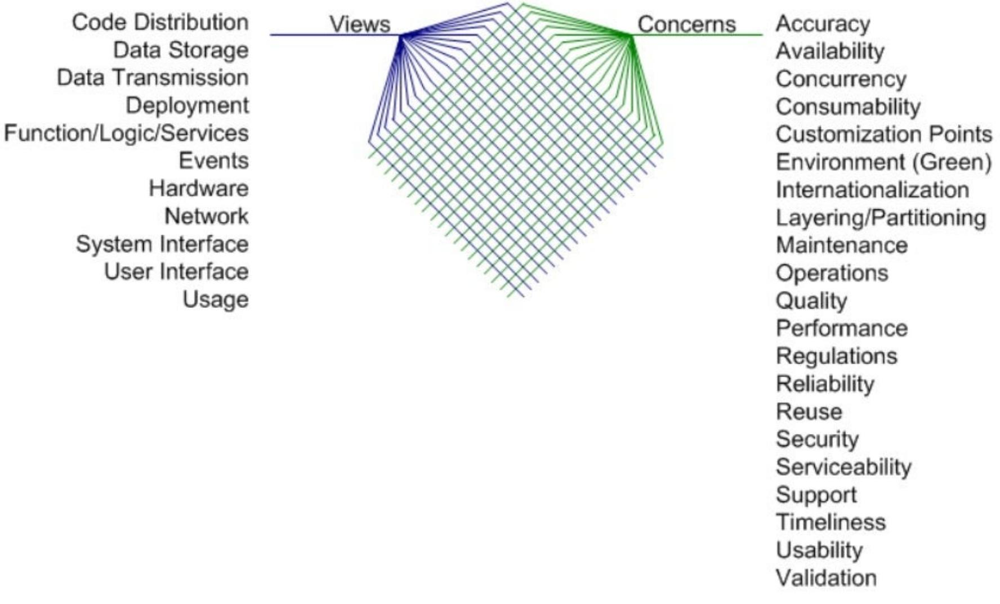

> **AI Description:**
> **Source:** `assets/_page_25_Figure_0.jpg`
> 
> **Generated:** 2026-05-31 17:49:14
> 
> ---
> 
> The image contains a hexagonal diagram with two main sections labeled "Views" and "Concerns." The "Views" section lists various aspects of a system, such as Code Distribution, Data Storage, Data Transmission, and User Interface. The "Concerns" section lists various concerns or attributes, including Accuracy, Availability, and Security. The hexagon is divided into two halves, with blue lines connecting the "Views" to the center and green lines connecting the "Concerns" to the center. This suggests a relationship or intersection between the different views and concerns in a system.

## Test-Driven Development (TDD)

Test-FirstDevelopment(TFD) isa technique where you writea single test and thenyou write just enough production code to fulfill that test.

Canbe performed at the requirements levelwithacceptance testsand thedesign levelwithdeveloper/unit tests.

Refactoring isatechniquewhere you make asimplechange toyourcode/schemato improve its qualitywithout changing its semantics.

TDD=TFD +refactoring

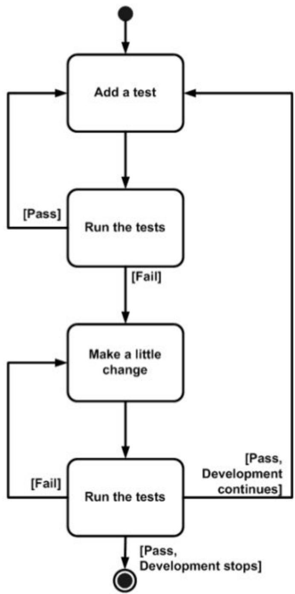

> **AI Description:**
> **Source:** `assets/_page_26_Figure_0.jpg`
> 
> **Generated:** 2026-05-31 17:59:12
> 
> ---
> 
> The image is a flowchart that illustrates a process involving the addition and execution of tests, followed by making changes and retesting. The flowchart includes four main steps: "Add a test," "Run the tests," "Make a little change," and "Run the tests again." It has decision points marked by "Pass" and "Fail," with the "Pass" leading to "Development continues" and the "Fail" leading back to "Make a little change." The flowchart visually represents a continuous loop of testing, changing, and retesting until the tests pass, at which point development stops.

## How Do Business Analysts Fit On Agile Teams?

## Characteristics of Disciplined Agile Team Members

## ·We strive to be“generalizing specialists”

-We want to gain a wide range of skils so that we're more productive

## ·We are willing to share our skills

-We learn fromeach other

## Weare flexible

-We realize that there is always more than one way of doing things

## Wearecollaborative

-Wework together asa team,not asagroup of individuals

## Weare enterprise aware

-We want to do what's best for the organization,not just for ourselves

## DAD explicitly includes several roles that an existing business analyst may choose to grow intol

> **AI Description:**
> **Source:** `assets/_page_29_Figure_0.jpg`
> 
> **Generated:** 2026-05-31 17:50:51
> 
> ---
> 
> The image contains a photograph of a monarch caterpillar (Danaus plexippus) on a leaf. The caterpillar is striped with black, yellow, and white colors. The leaf appears to be a milkweed leaf, which is the primary food source for monarch caterpillars. The image provides a clear view of the caterpillar's body and its distinctive coloration, which is characteristic of the monarch butterfly larva.

> **AI Description:**
> **Source:** `assets/_page_29_Figure_1.jpg`
> 
> **Generated:** 2026-05-31 17:51:01
> 
> ---
> 
> The image is a photograph of a chrysalis, which is the pupal stage of a butterfly or moth. The chrysalis is green with some yellow speckles and is attached to a tree trunk. The chrysalis is the stage where the insect undergoes metamorphosis, transforming from a caterpillar into an adult butterfly or moth. The image provides a clear view of the chrysalis and its environment, which is a tree trunk, indicating the natural habitat of the insect during this stage of its life cycle.

> **AI Description:**
> **Source:** `assets/_page_29_Figure_2.jpg`
> 
> **Generated:** 2026-05-31 17:51:10
> 
> ---
> 
> The image contains a photograph of a monarch butterfly perched on a blade of grass. The butterfly's wings are prominently displayed, showcasing the characteristic orange coloration with black veins and white spots along the edges. The background consists of green grass, which provides a natural setting for the butterfly. The image captures the beauty and detail of the butterfly's wings and the surrounding environment.

## Disciplined Agile Delivery (DAD) Roles

Primary Roles

> **AI Description:**
> **Source:** `assets/_page_30_Figure_0.jpg`
> 
> **Generated:** 2026-05-31 17:49:18
> 
> ---
> 
> The image contains a simple 3D illustration of a person standing next to a music stand. The person is holding a conductor's baton in one hand and appears to be gesturing with the other. The music stand is positioned to the left of the person, suggesting a musical or orchestral context. The illustration is minimalistic, using grayscale tones.

Team Lead

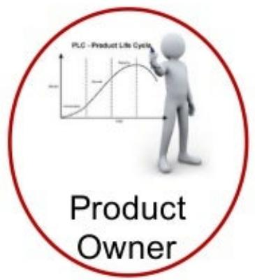

> **AI Description:**
> **Source:** `assets/_page_30_Figure_1.jpg`
> 
> **Generated:** 2026-05-31 17:46:44
> 
> ---
> 
> The image contains a combination of text and a simple diagram. The text reads "PLC - Product Life Cycle" and "Product Owner." The diagram is a simple line graph showing the stages of a product's life cycle, with a peak indicating the product's most profitable stage. The graph is labeled with the PLC acronym, and the text "Product Owner" is positioned below the diagram. The image uses a minimalist style with a white stick figure pointing to the peak of the graph.

Architecture Owner

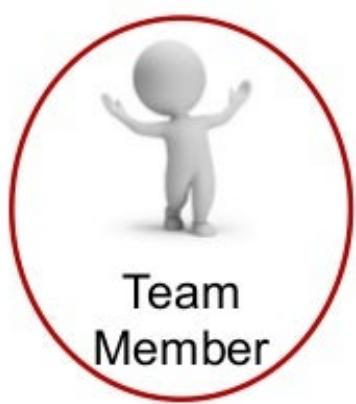

> **AI Description:**
> **Source:** `assets/_page_30_Figure_3.jpg`
> 
> **Generated:** 2026-05-31 17:46:38
> 
> ---
> 
> The image contains a simple icon of a stylized human figure with arms raised, enclosed within a red circle. Below the figure, the text "Team Member" is written. The icon appears to symbolize a team member or a person participating in a team or group setting. The design is minimalistic and likely used for a digital interface or presentation slide to represent a team member role.

> **AI Description:**
> **Source:** `assets/_page_30_Figure_4.jpg`
> 
> **Generated:** 2026-05-31 17:41:38
> 
> ---
> 
> The image contains a simple illustration of a stick figure holding a key. The stick figure is white with black outlines and has a round head, two arms, and two legs. The key is yellow with a circular bow at the top and a long, straight shaft. The figure is holding the key with both hands, and the key is positioned in front of the figure's body. There are no labels or text annotations in the image.

Stakeholder

Secondary Roles (for Scaling)

> **AI Description:**
> **Source:** `assets/_page_30_Figure_5.jpg`
> 
> **Generated:** 2026-05-31 17:43:50
> 
> ---
> 
> The image contains a simple illustration of a 3D human figure holding a magnifying glass. The figure appears to be white with a black outline, and the magnifying glass is black with a silver rim. The image is likely used to symbolize searching, investigation, or analysis.

Independent Tester

> **AI Description:**
> **Source:** `assets/_page_30_Figure_6.jpg`
> 
> **Generated:** 2026-05-31 17:44:32
> 
> ---
> 
> The image contains a simple diagram with two circles. The left circle is labeled "Specialist" and contains a figure holding a red cross and a wrench, symbolizing medical or technical expertise. The right circle is labeled "Domain Expert" and contains a figure holding a stack of books, representing knowledge in a specific field. The diagram visually contrasts the roles of a specialist and a domain expert.

> **AI Description:**
> **Source:** `assets/_page_30_Figure_7.jpg`
> 
> **Generated:** 2026-05-31 17:44:04
> 
> ---
> 
> The image depicts a simple 3D illustration of a person standing next to a cylindrical object that resembles a database server. The person appears to be holding or interacting with the server, which has horizontal stripes and a grid-like pattern, suggesting it is a representation of a database or server system. The overall image conveys a concept related to database management or server administration.

Technical Expert

> **AI Description:**
> **Source:** `assets/_page_30_Figure_8.jpg`
> 
> **Generated:** 2026-05-31 17:58:01
> 
> ---
> 
> The image depicts a simple illustration of two stick figures shaking hands, standing on top of two interlocking puzzle pieces. One puzzle piece is red, and the other is blue. The figures are white with round heads and are wearing simple, plain clothing. The image conveys a sense of partnership or collaboration, possibly symbolizing teamwork or agreement.

Integrator
Disciplined Agile Consortium

## Product Owner

·The Stakeholder“proxy”

·Go-to person for information on the solution requirements

Prioritizesall work for the team

·Participant in modeling and acceptance testing

·Hasaccess to expert stakeholders

Facilitates requirements envisioning and modeling

·Educates team in business domain

·Maydemonstrate solution tokey stakeholders

Monitors and communicates status to stakeholders

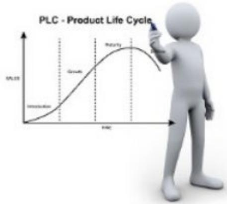

> **AI Description:**
> **Source:** `assets/_page_31_Figure_0.jpg`
> 
> **Generated:** 2026-05-31 17:44:25
> 
> ---
> 
> The image contains a chart illustrating the Product Life Cycle (PLC). It is a line graph with the x-axis labeled as "Time" and the y-axis labeled as "PLC." The graph shows four stages: Introduction, Growth, Maturity, and Decline. The graph is a standard S-shaped curve, commonly used to depict the stages of a product's market presence and sales volume over time. The image also includes a 3D figure of a person pointing at the graph, emphasizing the concept.

Negotiates priorities,scope,funding,and schedule

## Product Owner isa Very Hard Role to Fill

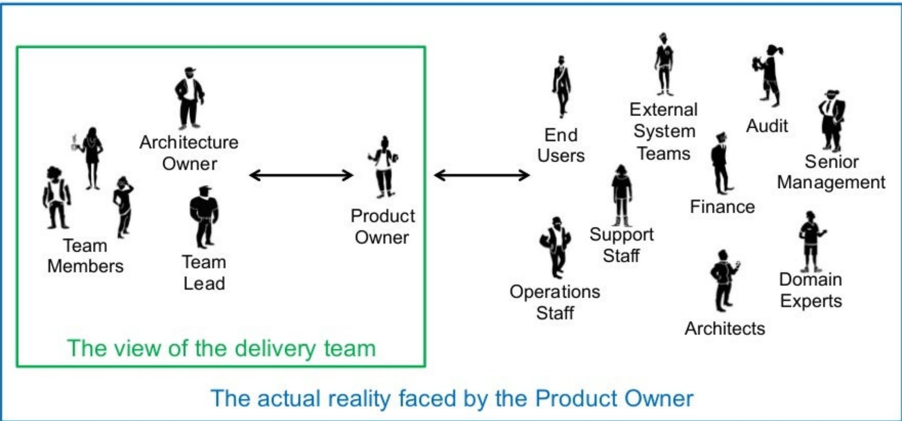

> **AI Description:**
> **Source:** `assets/_page_32_Figure_0.jpg`
> 
> **Generated:** 2026-05-31 17:55:56
> 
> ---
> 
> The image is a diagram illustrating the relationship between the delivery team and the actual reality faced by the Product Owner. It features a green box labeled "The view of the delivery team," which includes icons representing Team Members, Team Lead, Architecture Owner, and Product Owner. Arrows point from the Product Owner to various external stakeholders such as End Users, External System Teams, Audit, Senior Management, Finance, Support Staff, Operations Staff, Domain Experts, and Architects, labeled as "The actual reality faced by the Product Owner." The diagram visually represents the communication and interaction between the delivery team and the broader organizational environment.

y need someone   
inaspecialized   
business analyst role, but these situations are rare

## Business Analysts at Scale

The role of business analyst (as aSpecialist)may reappearat scale:

Product owners dealingwith complexdomainsmayneed support

Whenstakeholdersare geographicallydistributed,you mayneed BAsat each location

Someregulatoryregimes requireadditional requirements specificationwork

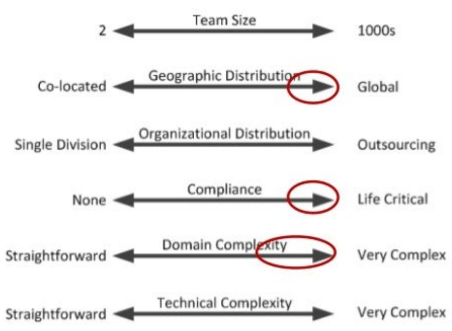

> **AI Description:**
> **Source:** `assets/_page_34_Figure_0.jpg`
> 
> **Generated:** 2026-05-31 17:58:19
> 
> ---
> 
> The image is a chart with a series of horizontal arrows and text labels. It presents a range of characteristics for teams, including team size, geographic distribution, organizational distribution, compliance, domain complexity, and technical complexity. The chart uses arrows to indicate a spectrum of values, with "2" and "1000s" for team size, "Co-located" to "Global" for geographic distribution, "Single Division" to "Outsourcing" for organizational distribution, "None" to "Life Critical" for compliance, "Straightforward" to "Very Complex" for domain complexity, and "Straightforward" to "Very Complex" for technical complexity. The chart highlights three specific areas of interest with red circles: "Global" for geographic distribution, "Life Critical" for compliance, and "Very Complex" for both domain complexity and technical complexity.

## Eliciting Requirements from Distributed Stakeholders

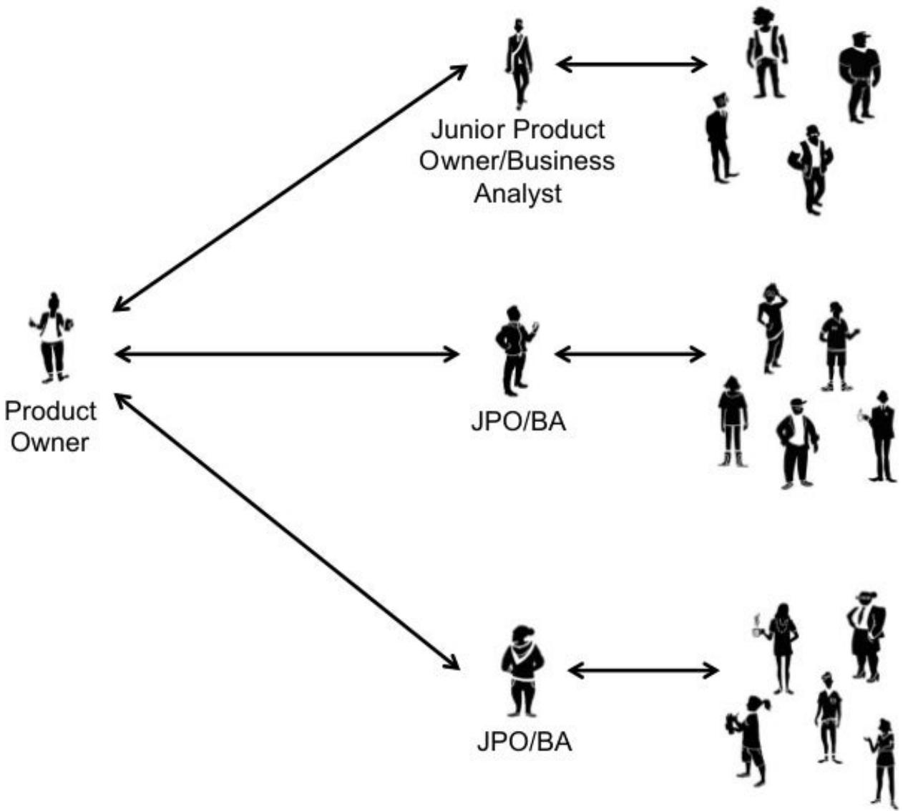

> **AI Description:**
> **Source:** `assets/_page_35_Figure_0.jpg`
> 
> **Generated:** 2026-05-31 17:55:02
> 
> ---
> 
> The image is a diagram illustrating a communication flow among three roles: Product Owner, Junior Product Owner/Business Analyst (JPO/BA), and another JPO/BA. The diagram uses stick figures to represent individuals and directional arrows to show the flow of communication between these roles. The Product Owner is at the top, with arrows pointing to both JPO/BA figures, indicating a two-way communication flow. Similarly, the JPO/BA figures have arrows pointing to the Product Owner, suggesting a reciprocal communication pattern. The diagram visually represents the collaborative nature of these roles in a product development or business analysis context.

Disciplined Agile Consortium

## My parting advice....

Recognize that Agile and Lean require a paradigm shift

Be open minded and flexible

Be prepared to share your skills

Collaborationand evolution,not documentation and “freezing",is now the focus

## Thank You!

scott [at]scottambler.com @scottwambler

AgileModeling.com

AgileData.org

Ambysoft.com

DisciplinedAgileConsortium.org

DisciplinedAgileDelivery.com

ScottAmbler.com

nDisciplinedAgile Delivery Disciplined Agile Delivery

Disciplined Agile Consortium

## Shuhari and Disciplined Agile Certification

At the shu stage you are beginning to learn the techniquesand philosophies of disciplinedagiledevelopment.Your goal isto builda strong foundation from which to build upon.

DISCIPLINEDAGILIST

CERTIFIEDDISCIPLINEDAGILIST

Atthe hastage you reflect upon and questionwhydisciplinedagile strategies work,seeking to understand the range ofstrategiesavailabletoyouand when they are best applied.

At theri stage you seek to extend and improveupondisciplinedagile   
techniques,sharing your learnings with others.

# Would You Like This Presented to Your Organization?

Contact us at ScottAmbler.com

Disciplined Agile Consortium

## SCOTT AMBLER +Associates

Scott Ambler +Associates is the thought leader behind the Disciplined Agile Delivery (DAD) framework and itsapplication.Wearea boutique ITmanagement consulting firm that advises organizationstobemore effectiveapplying disciplinedagileand leanprocesseswithin the context of your business.

Our website is ScottAmbler.com We can help