
## SOURCES OF EMISSIONS FROM AUTOMOBILES & EFFECTS ON HEALTH

ARAI,Pune

Guess,Wts

> **AI Description:**
> **Source:** `assets/_page_1_Figure_0.jpg`
> 
> **Generated:** 2026-05-31 18:10:49
> 
> ---
> 
> The image contains a microscopic view of a cell, likely a yeast cell, stained with fluorescent dyes. The red staining represents a specific protein or structure within the cell, while the green dots represent another protein or structure. The image is a composite of three different views of the cell, showing the protein distribution in different orientations. The scale bar indicates that the image is magnified to a resolution of 2 micrometers. The image is a technical illustration used to study the localization and interaction of proteins within the cell.

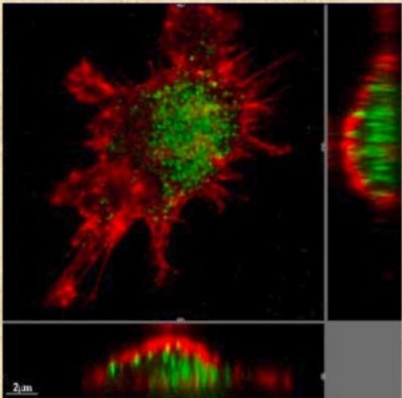

> **AI Description:**
> **Source:** `assets/_page_1_Figure_1.jpg`
> 
> **Generated:** 2026-05-31 18:11:29
> 
> ---
> 
> The image is a microscopic view of a cell, likely a neuron, stained with fluorescent dyes. The red staining appears to highlight the cell membrane or a specific protein, while the green staining is concentrated in the cell nucleus, indicating the presence of another protein or structure. The scale bar in the bottom left corner indicates that the image is magnified at a resolution of 2 micrometers. The image provides a detailed look at the cellular structure and the distribution of specific proteins or molecules within the cell.

## Red Blood Cells Exposed to Particles

1 um particles
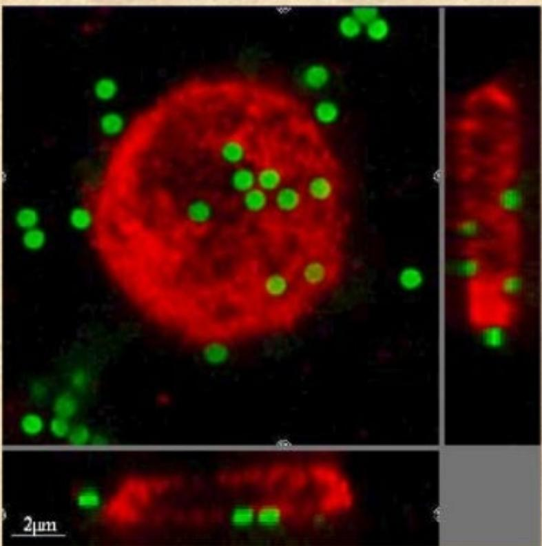

> **AI Description:**
> **Source:** `assets/_page_2_Figure_0.jpg`
> 
> **Generated:** 2026-05-31 18:32:20
> 
> ---
> 
> The image contains a fluorescence microscopy image of a cell. The main visual elements include a red fluorescent structure, likely representing a cell nucleus, and numerous small green fluorescent spots scattered throughout the image. These green spots are likely indicative of specific molecules or proteins within the cell. The scale bar in the bottom left corner indicates that the image resolution is 2 micrometers. The image appears to be used for studying cellular localization or distribution of certain molecules within the cell.

0.078 um particles

> **AI Description:**
> **Source:** `assets/_page_2_Figure_1.jpg`
> 
> **Generated:** 2026-05-31 18:32:06
> 
> ---
> 
> The image is a microscopic view of a cell, likely a neuron, stained with fluorescent dyes. The red staining appears to be for a specific protein or structure within the cell, while the green staining highlights another protein or structure. The central region of the cell shows a dense cluster of green fluorescence, which could indicate a nucleus or a specific organelle. The image is a composite of multiple views, including a zoomed-in section on the right and a cross-sectional view at the bottom, providing a detailed look at the cellular structure and the distribution of the fluorescent markers. The scale bar at the bottom left indicates the image resolution, showing that the magnification is at 2 micrometers.

Smaller Particles are More Dangerous

## Air Quality in Asian Cities is an lssue

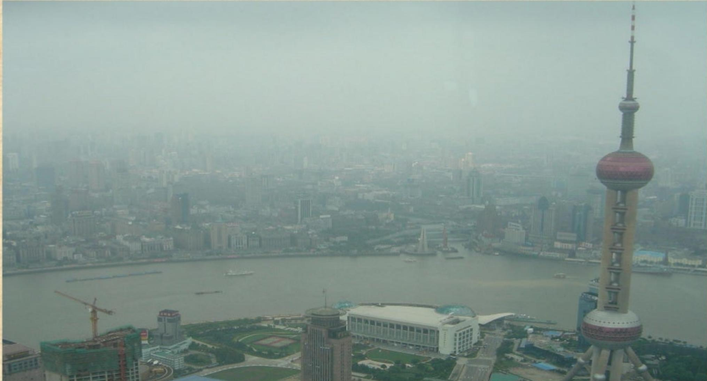

> **AI Description:**
> **Source:** `assets/_page_3_Figure_0.jpg`
> 
> **Generated:** 2026-05-31 18:35:00
> 
> ---
> 
> The image is a photograph of a cityscape, likely Shanghai, featuring the iconic Oriental Pearl Tower on the right. The city is densely built with a mix of modern and older structures. The Huangpu River runs through the center of the image, with several boats visible on the water. The sky appears overcast, contributing to a hazy atmosphere. The image captures a broad view of the urban environment, showcasing the blend of natural and architectural elements.

## Mobiity

Mobility-Movement of people & Material for their Living

Mobility -Essential part of Society- One cannot leave it

Mobility-In the present form leads following issues

·Congestion

·Inadequate Infrastructure

·Noise & Pollution

·Dependence on Non- Renewable Resources

## LWhy Sustainable Mobility ?

## Maintaining the capability to provide non-declining accessibility in time

## Sustainable Mobility to Add

·Economic Growth

·Environment Improvement

· Social Progress

-Profit

\- Planet

\- People

3P > Bottom of Pyramid to Sustainability

## Global Challenges and Requirements

Global Challenges

## FACTS

Increasing world population

ngesmand

Limited energy supplies

Environmental effects of energy use

## CONSEQUENCES

## Requirements for Vehicle

Development of new technologies

Efficient use of energy
Use ofall energycarriers
Use of environment protecting technologies

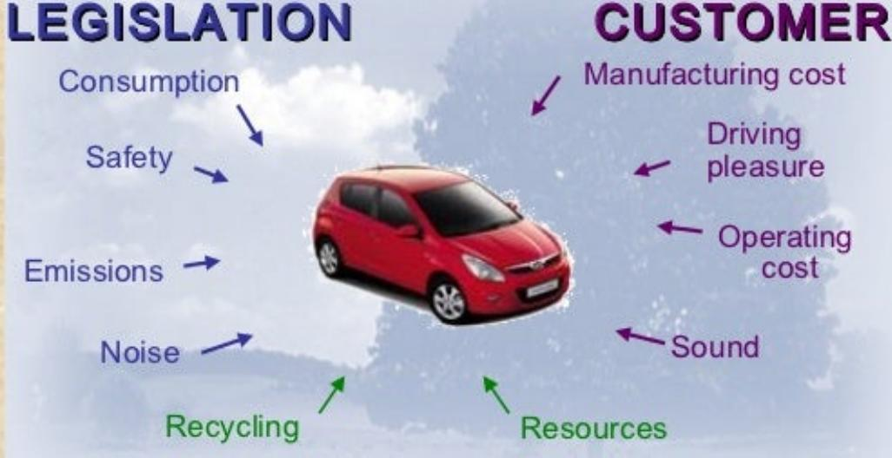

> **AI Description:**
> **Source:** `assets/_page_6_Figure_1.jpg`
> 
> **Generated:** 2026-05-31 18:11:10
> 
> ---
> 
> The image is an infographic combining text with a central visual element of a red car. It illustrates the relationship between legislation and customer considerations in the context of a vehicle. Key text elements include "Legislation" on the left side, listing factors such as consumption, safety, emissions, and noise, each with an arrow pointing towards the car. On the right side, under "Customer," factors like manufacturing cost, driving pleasure, operating cost, sound, recycling, and resources are listed, also with arrows pointing towards the car. The car itself is central, with arrows from both sides converging on it, symbolizing the interplay between legislative and customer factors in vehicle design and consumption.

ENVIRONMENT

Main Focus

Reduction in Resource Consumption Reduction of $C O _ { 2 }$ Emission

### Full Page Description (Page 7)

**Source:** `assets/_page_7_Asset_0.jpg`

**Generated:** 2026-05-31 18:12:52

---

The image is a line graph showing trends over time from 1950 to 2050 for four different categories: World Mobility, World CO₂ Emission, World Population, and Crude Availability. The graph includes a source citation at the bottom: "Source: ASPO 2004, Solcomhouse.com." The lines represent different variables, with World Mobility peaking around 2000 and then declining, World CO₂ Emission and World Population both increasing steadily, and Crude Availability showing a decline after 2000. The graph uses a beige background with a subtle pattern, and the lines are color-coded for clarity.

## oba Challengesand Requirements

## Factors contributing to Sustainable Mobility

Improve Fuel Efficiency

Energy Diversity& Renewable Fuels

Sustainable Mobility Products

Reduction of Engine Emission

Recyclable Material

### Full Page Description (Page 10)

**Source:** `assets/_page_10_Asset_0.jpg`

**Generated:** 2026-05-31 18:15:39

---

The image contains a bar chart with the following key features:

1. **Type of Visualization**: Bar chart.
2. **Key Information**: The chart displays the total number of two-wheelers (motorcycles and scooters) for the years 2002-03 to 2008-09, with data points for each year.
3. **Main Trends**: There is a general upward trend in the number of two-wheelers over the years, with a significant increase from 2002-03 to 2008-09. The number of two-wheelers more than doubled during this period.
4. **Important Labels**: The x-axis represents the years, and the y-axis represents the total number of two-wheelers in millions. The data for each year is provided at the bottom of the chart.

The chart effectively illustrates the growth in the number of two-wheelers over the specified period.

## 2 Wheeler Production Scenario in India

Sources: MoRTH & SIAM website

### Full Page Description (Page 11)

**Source:** `assets/_page_11_Asset_0.jpg`

**Generated:** 2026-05-31 18:22:45

---

The image is a stacked bar chart comparing the units (in millions) of different vehicle types for the years 2004E and 2009P. The chart includes four categories: HDV (Heavy Duty Vehicles), LCV (Light Commercial Vehicles), Pass Cars, and Motorcycles/Others. The data shows a significant increase in the total units from 2004E to 2009P, with the largest portion being Motorcycles/Others. The Pass Cars category shows a notable increase, while the HDV and LCV categories remain relatively stable. The chart uses distinct colors to represent each category and includes a legend for easy reference.

## India's Vehicle Population is Accelerating.

## Cauten Polluty

Stationary

ruelstor power Combustion o 1

ieraton or Sherbrning suchasming

commercial Industri

Solvents and

Mobources

Highway vehicles:c cars

suchtrrat.boats, equipment, RVs, construction

### Full Page Description (Page 15)

**Source:** `assets/_page_15_Asset_0.jpg`

**Generated:** 2026-05-31 18:09:07

---

The image contains a pie chart with five segments, each representing a different category of emissions: Vehicle Traffic, Power Generation, Other Sources, Industry, and Domestic Emissions. The chart visually breaks down the percentage contribution of each category to the total emissions. The largest segment is Power Generation at 37.0%, followed by Vehicle Traffic at 20.1%. Industry contributes 19.1%, Domestic Emissions account for 15.5%, and Other Sources make up 8.4%. The chart uses distinct colors for each category to differentiate them.

Source:Emissions protection report issued by government

## Source Apportionment of PM10 Emissions in Mumbai City

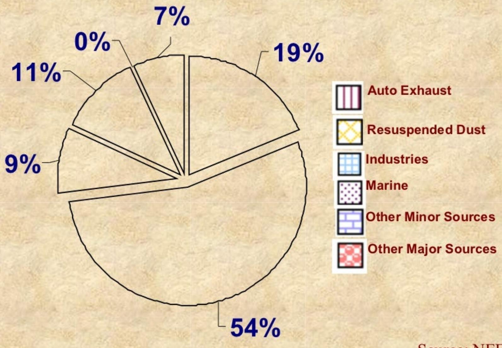

> **AI Description:**
> **Source:** `assets/_page_16_Figure_0.jpg`
> 
> **Generated:** 2026-05-31 18:29:08
> 
> ---
> 
> The image contains a pie chart with percentages and corresponding labels for different sources of particulate matter. The chart is divided into six segments, each representing a different category: Auto Exhaust (19%), Resuspended Dust (7%), Industries (11%), Marine (9%), Other Minor Sources (0%), and Other Major Sources (54%). The chart is accompanied by a legend that matches each category with a unique pattern. The source of the data is cited as NEE.

Source:NEERI

### Full Page Description (Page 17)

**Source:** `assets/_page_17_Asset_0.jpg`

**Generated:** 2026-05-31 18:30:31

---

The image is a pie chart with various segments representing different sectors and their contributions to a total of 100%. The chart includes the following categories and their respective percentages:

- Manufacturing & Construction: 18.2%
- Electricity Generation & Heating: 43.9%
- Road Transport (Cars, Trucks & Buses): 15.9%
- Fuel combustion for other uses: 12.2%
- Non road transport: 5.8%
- Other non transport: 4%

The chart visually represents the distribution of contributions from different sectors, with the largest portion coming from Electricity Generation & Heating at 43.9%. The other sectors are smaller but still significant contributors to the total.

## Road Transport Contribution to Co2

## ombus

(actual)

Exhaust:

·Nitrogen

·Water (steam)

·Carbon Dioxide

·Pollutants

Pollutants:   
Unburned   
Carbon Monoxide   
Oxides of Nitrogen

as Air

Refueling Losses

Exhaust

Evaporative Emissions

## MAJOR VEHICLE/FUEL EMISSIONS

·CarbonMonoxide

CarbonDioxide (ClimateChange)

·Diesel Exhaust

·Particulate Matter (PM)

·Lead

-Precursorsto Ozone andPM

·Nitrogen Dioxide

·Air Toxics

-Aldehydes

·formaldehyde

·acetaldehyde

·others

-Benzene

-1,3-butadiene

-Methanol

-Polycyclic organic matter (e.g.PAHs)

## AN EARLY 1904 CARTON

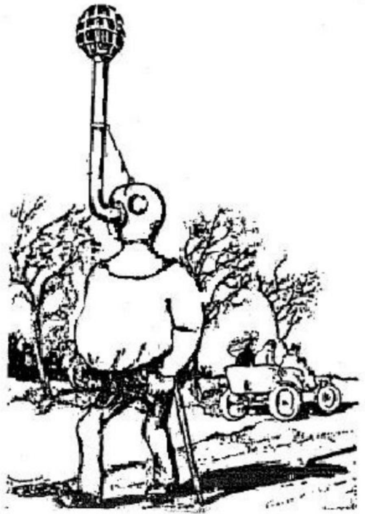

> **AI Description:**
> **Source:** `assets/_page_21_Figure_0.jpg`
> 
> **Generated:** 2026-05-31 18:35:27
> 
> ---
> 
> The image is a black and white illustration featuring a large, anthropomorphic elephant character. The elephant is holding a tall, thin pole with a spherical object at the top, resembling a lantern or beacon. The elephant is standing on a rocky terrain with sparse trees in the background. There is a small, toy-like vehicle with wheels at the base of the elephant, suggesting a playful or whimsical setting. The overall style is cartoonish and appears to be from a children's book or a similar artistic context.

## EFFECTS OF POLLUTANTS

## Different Pollutants have Different Effects:

>Carbon Monoxide -circulatory system,heart

VOCs-URTl, global warming.

NOx -ungs,global warming，acid rin.

>Ozone -respiratory system, lungs

>Lead -nervous system,brin

PM -lung,potential effects on heart

DieselAiricsncerirtory fts

>There are potential effects of the Mixture

> Carbon Dioxide & Carbon Particles - climate change

## HEALTH EFFECTS

## Some Populations more sensitive than others

·Children

·Elderly

·people with heart and lung disease

## Asthma is growing

·150 million asthmatics worldwide

·Increasing in most countries (2% to 5% per year)

·Asthmatics much more sensitive to air pollution

### Full Page Description (Page 24)

**Source:** `assets/_page_24_Asset_0.jpg`

**Generated:** 2026-05-31 18:20:32

---

The image is a bar chart titled "Premature Deaths thousands per year." It presents data on premature deaths across various regions, including China, East Asia-Pacific, Established Market Economies, Former Socialist Economies, India, Latin America & Caribbean, Middle East Crescent, South Asia, and Sub-Saharan Africa. The chart uses different colors to represent each region and includes numerical values for each bar, with India having the highest number of premature deaths at 950 thousand per year. The source of the data is cited as the World Bank, Health and Environment, Strategy Series Number 1, October 2004.

## Health effects of Air

Premature mortality due to air pollution,Pollution: India ProjectedAualAvegesfordpret by region of the world

suffer nearly one million premature and indoor), with children most affected.

CC Ocean

## CARBON MONOXIDE EFFECTS

Odorless, colourless & poisonous gas.

Caused by incomplete combustion of fuel and air

Most of it comes from motor vehicles

CO causes dizziness & vomiting sensation.

CO reacts with Hb (haemoglobin) in blood to give carboxyhaemoglobin (CO Hb) which makes Hb unavailable for O2 transport, thus blocking transport of oxygen to heart and brain

Affects mental functions & visibility more severely even at low levels

Accelerates angina (chest pain) coronary artery disease

Known to cause death at high levels of exposure

### Full Page Description (Page 26)

**Source:** `assets/_page_26_Asset_0.jpg`

**Generated:** 2026-05-31 18:25:39

---

The image is a graph showing the relationship between the percentage of carboxyhemoglobin in the blood and the duration of exposure to carbon monoxide (CO) at different concentrations. The graph includes several lines representing different exposure levels (15 ppm, 30 ppm, 100 ppm, and 300 ppm) and their corresponding effects on the body. The x-axis represents hours of exposure, while the y-axis represents the percentage of carboxyhemoglobin. The graph highlights the progression of symptoms from no symptoms to coma and death as the percentage of carboxyhemoglobin increases and the exposure duration extends.

## LOXICITY OF CARBON VINE

## VOLATILE ORGANIC COMPOUNDS (VOCS) EFFECTS

·General term for a wide range of hydrocarbon compounds

·VOCs result from combustion processes and evaporation of gasoline pors,soventst.

·They contribute to Global Warming

It leads to cold, cough & upper respiratory track infection

·Carcinogenic effects on lung tissues.

## NOX EFFECTS

·NO reacts with atmospheric $\mathbf { O } _ { 2 }$ and produce ${ \mathsf { N O } } _ { 2 } ,$ which is an insidious poisonous reddish brown gas.

·NOx results from high temperature combustion processes, e.g. cars and utilities

-Reacts with moisture in lungs to form Nitric acid.

\- Affects respiratory systems causing bronchitis, pneumonia and lung inflections.

-Visibility reduction.

-Contribute to acid rain.

·They play a major role in atmospheric reactions

·Overall levels unchanged but transportation sources are cleaner

## Photochemical smog reactants emitted by automobiles:

·hydrocarbons (HC)

evaporative losses (from the fuel system)

incomplete combustion

·oxides of nitrogen (NOx)

high-temperature (\~ 20oo K) combustion in air

## HOW SMOG IS FORMED ？

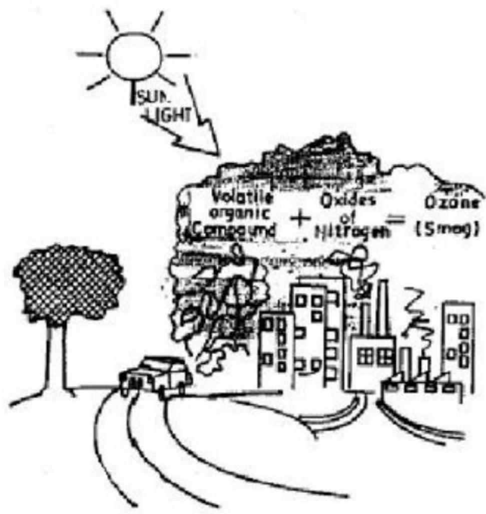

> **AI Description:**
> **Source:** `assets/_page_30_Figure_0.jpg`
> 
> **Generated:** 2026-05-31 18:14:36
> 
> ---
> 
> The image is a diagram illustrating the formation of smog in an urban environment. It shows the sun shining, with sunlight leading to the formation of ozone. The diagram includes a cityscape with buildings, factories, and vehicles, representing sources of volatile organic compounds and oxides of nitrogen. These substances combine in the presence of sunlight to form smog, as indicated by the chemical equation "Volatile organic compound + Oxides of Nitrogen = (Smog)." The diagram also includes a tree, suggesting the impact of smog on the environment.

Note : This ozone should not be confused with the layer of ozone in the upper atmosphere,whichhelps shieldingusfromultravioletlight.

## OZONE HEALTH EFFECTS

VOCs react with NOxin presence of sunlight and form Ozone leading to photochemical smog leading to :

-Visibility reduction.

-Watering and irritation of eyes.

-ENT irritation.

-Respiratory problems.

-Chemical damage to rubber，clothing,paint and exposed surfaces.

## -Damage to crops.

The ozone problem is the one affecting the most people today:

Known to cause inflammation in respiratory tract

Reduces ability to breathe (lung function) for some people

Increases hospitalization for asthma, other lung diseases

Effects have been demonstrated for short term， long term effcts are less certain，some people appear to develop “tolerance”

## LEAD HEALTH EFFECTS

Long known as one of the worst toxics in common use

Emitted from gasoline additivesbattery factories and nonferrous smelters

Affects various organs and can cause sterility and neurological impairment,e.g.retardation and behavioral disorders

Infants and children especially susceptible

Control of mobile sources has been exceptionally successful

At low doses,lead is associated with

·nerve damage in fetuses and infants

·learning deficits

·lowered Intelligence Quota (IQ)

Excessive exposure can severely damage nervous system

Primoaillandaybunin

· They react in the atmosphere to formacids,sulate sulfites

Substantial reductions due to controls at the sources and through use of low sulfur fuels

Other

Air

S

·Carbon dioxide

·Chlorofluorocarbons

·Formaldehyde

·Benzene

·Asbestos

·Manganese

·Dioxins

·Cadmium

## AIR TOXICS HEALTH EFFECTS

Benzene

aknow humana

studies in U.S.and Chinese workers have shown link between exposure and

aorodutor

or

## AIR TOXICS HEALTH EFFECTS II

Aldehydes

emitted from vehicles

0 Many different formaldehyde, others)

mostararobabe

also can be nose and respiratory irritants

## ·PAHs

Hyryclcearomaic

mamy en taxic

known or probable known

Mucher tes Mu

manained ehcles maintainedvehicle

## Particulat

## MPMer

PM10 is a general term for tiny airborne particles (under ten microns),e.g.,dust,sot,

· Primary sources are fuel-burning plants and other industrial/ commercial processes

·Some are formed in the air

· They irritate the respiratory system and may also carry metals,sates, tratet.

·Some overall decreases seen but trends may be masked by meteorological changes

## PM HEALTH EFFECTS

■ High levels of PM (e.g. 50o ug /m3) known to cause premature death e.g.London 1952

■ Recent studies in US, Europe, Asia, South America have found association of PM with death at much lower levels

no evidence of a “threshold" (safe level)

■ To date, a plausible biological mechanism for these effects has not been found

### Full Page Description (Page 39)

**Source:** `assets/_page_39_Asset_0.jpg`

**Generated:** 2026-05-31 18:28:13

---

The image contains a bar chart with a red background. The chart is divided into three main sections: "Emergency Visits (Pande)," "Chronic Effects (Chhabra)," and "Bangkok." Each section has multiple bars representing different categories such as Asthma, COAD, Cardiac, Cough, Phlegm, Lung Function, Adult Resp., Child Resp., and Nurse Resp. The y-axis is labeled "% Increase in Effects," and the x-axis has the aforementioned categories. The chart uses various colors to differentiate between the categories. The legend on the right side of the chart explains the color coding for each category.

## PM HEALTH EFFECTS-INDIA & THAILAND

Source:Chhabra 2oo1,Pande 2oo1,Vichit-Vadakan 2001

## PM HEALTH EFFECTS

■ Recent Re-analyses by HEl have generally confirmed the results of key studies

WHO,EPA and others have estimated effects on mortality

WHO analysis (Lancet, 20oo) estimated 20,0o0 annual deaths due to trafic pollution in 3 countries ( (France, Austria & Switzerland)

New WHO global estimate underway

■ Much work underway to understand effects of PM "components" (e.g.ultrafines,metals,chemicas on particles)

## DIESEL HEALTH EFFECTS

■ Diesel engines have substantial advantages higher fuel efficiency   
lower CO and Co2 emissions

■ However, they also emit high levels of : particulate matter, NOx, and chemicals attached particulate matter,(e.g.PAHs)

■ Two major types of health effects : : acute effects (e.g. exacerbating asthma) ·cancer effects

## DIESEL RISK ASSESSMENT TODAY

Many Agencies have reviewed

·Most (WHO, IARC, US) have concluded diesel a "probable human carcinogen"

·3 excess cancer deaths in 1000 people (3x10)

·US EPA 2000 draft risk assessment :

·A range of risk (10 to 10)

## SMALLER PARTICLES ARE MOREDANGEROUS

Red Blood Cells Exposed to Particles

1 um particles

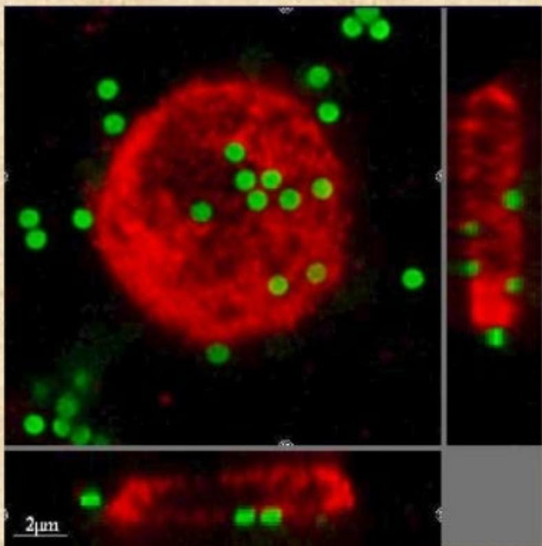

> **AI Description:**
> **Source:** `assets/_page_43_Figure_0.jpg`
> 
> **Generated:** 2026-05-31 18:29:23
> 
> ---
> 
> The image contains a series of fluorescence microscopy images of a cell. The main cell is shown in the top left panel, with a red fluorescence signal likely representing a specific protein or structure within the cell, and green fluorescent spots scattered around, possibly indicating the location of another protein or a different cellular component. The top right panel shows a close-up of the cell's interior, focusing on the green fluorescent spots. The bottom panel provides a side view of the cell, again highlighting the red and green fluorescence. The scale bar in the bottom left indicates that the images are at a resolution of 2 micrometers.

0.078 μm particles

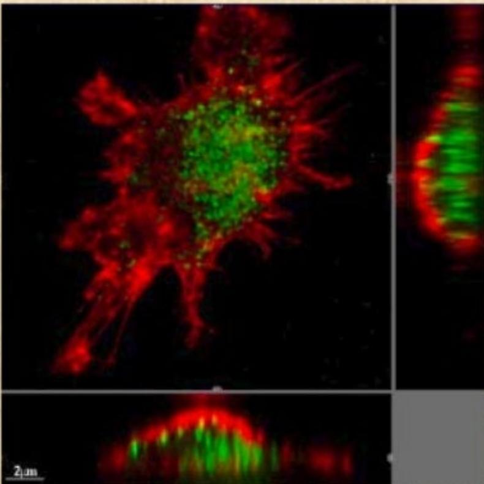

> **AI Description:**
> **Source:** `assets/_page_43_Figure_1.jpg`
> 
> **Generated:** 2026-05-31 18:26:48
> 
> ---
> 
> The image is a fluorescent microscopy image showing a cell with a complex structure. The cell is stained with red and green fluorescent dyes, which highlight different cellular components or regions. The red staining appears to be concentrated at the periphery of the cell, while the green staining is more central, possibly indicating a nucleus or another specific organelle. The scale bar in the bottom left corner indicates the image resolution is 2 micrometers. The image provides a detailed view of cellular architecture, likely for research or educational purposes.

## DEPTH OF LUNG PENETRATION OF COARSE & FINE PARTICLE

PREPRAOR（1m and above)

Stage 0(9.0 μm-10.0 μm

Stage 1 (5.8 μm-9.0 um)

Pharynx Stage 2 (4.7 μm-5.8 μm)

Trachea&primarybronchi

Secondary bronchi

Terminalbronchi

Alveoli

COARSE

Alveoli

Stage 3 (3.3 μm-4.7μm)

Stage 4 (2.1μm-3.3 μm)

Stage 5(1.1 μm-2.1μm）

Stage 6 (0.65 μm-1.1μm)

Stage 7 (0.43 μm- 0.65 μm)

Stage 8 (0.003 μm- 0.43 μm)

## POTENTIAL CONTRIBUTION OF PM FROM S.I.ENGINES

Nano particles below 50 nm Dia. penetrate deep into the interstitial tissue of the lung， causing respiratory inflammation and pulmonary toxicity. Particles which are not toxic in micron sizes may be toxic as nano particles.

S.l. Engines have lower particulate mass & number compared to C.l. Engines. However， since number of S.l. Engines exceed C.l. Engines, S.l. Engines have high potential to contribute particulate emissioninventory, especially from the 2-wheelers.

PM from S.l. Engines are more due to oil and not due to fuel. Hence,called as O-PM,G-PM or EM (Emitted Matter)

HEALTH EFFECTS OFNANOPARTIGLEryprocessesS

·Functional impairment of the lung

· Increased risk of heart attack

· Systemic effects in the whole body via the blood

·Carcinogenic effects

·Increase in sudden deaths

### Full Page Description (Page 47)

**Source:** `assets/_page_47_Asset_0.jpg`

**Generated:** 2026-05-31 18:13:56

---

The image contains a pie chart and a bar chart. The pie chart represents the composition of the atmosphere, with nitrogen (N2) making up 71.5%, water (H2O) at 13.1%, carbon dioxide (CO2) at 13.7%, and miscellaneous gases (noble gases, oxygen, hydrogen) at 0.7%. The bar chart on the right lists pollutants such as nitrous oxide (NOx), hydrocarbons (HC), particulates, and carbon monoxide (CO), with their respective percentages. The chart provides a clear visual representation of the relative proportions of different atmospheric components and pollutants.

Composition of Exhaust gas from Gasoline-engine during operation at lambda = 1

## What is greenhouse effect?

The Greenhouse Effect is an extremely vital   
process where INFRARED (IR) rays from the   
sun come into the Earth atmosphere. The   
atmosphere then traps these rays after they   
have come in (like the glass in a greenhouse)   
keeping the Earth warm. CO2 (carbon   
dioxide), NO(nitrous oxide), and   
CH4(methane) are destroying the   
atmosphere,

## lcausing more INFRARED (IR)rays toreflect on Earth.

## THE GREENHOUSE EFFECT

radiation Solary passes through theciear atmosphere

Some solar radiation iselected by the Eath and the atosphere.

THEATMOSPHERE

THEEARTH

Most radiation isabsoebed by the Earth'ssurface and warmsit.

Some of the infrared radation passes though the atmosphere, and some is absorbed and reemited inall directionsby greenouse gasmolecues.Theefect f thisis to wam the Earth'ssu face and the lower atmosphere.

latraredradiation is emittedfrom the Earth's surface.

SorcerU.S.Depvtmeot of State1992

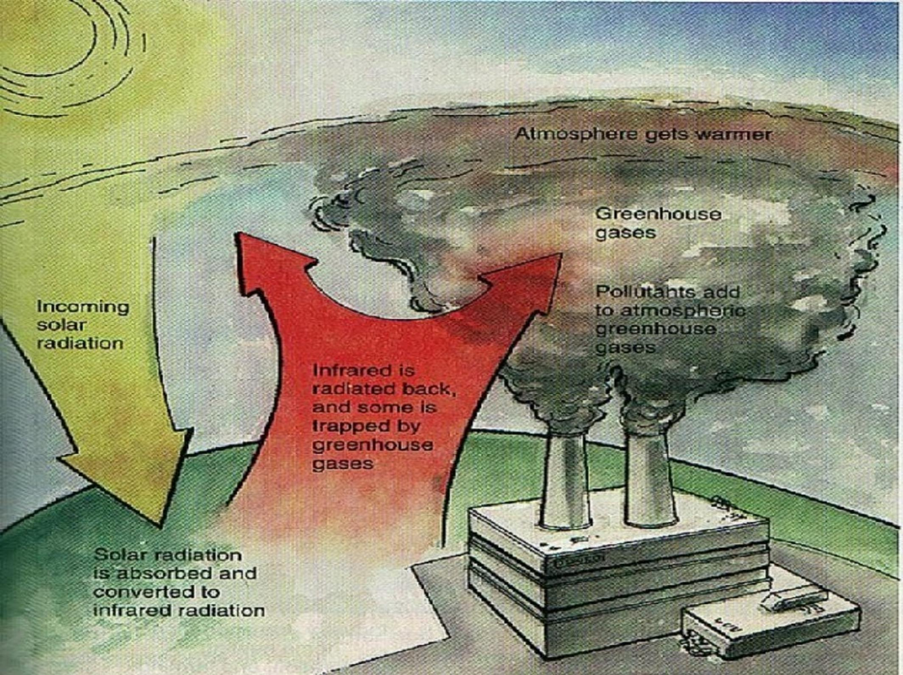

> **AI Description:**
> **Source:** `assets/_page_50_Figure_0.jpg`
> 
> **Generated:** 2026-05-31 18:33:43
> 
> ---
> 
> The image is a diagram illustrating the greenhouse effect and its relation to atmospheric warming. It includes a cross-sectional view of the Earth's atmosphere, showing the process of solar radiation being absorbed and converted to infrared radiation. The diagram highlights how infrared radiation is radiated back and some is trapped by greenhouse gases, leading to the atmosphere getting warmer. It also shows the impact of pollutants adding to atmospheric greenhouse gases. The diagram uses arrows and labels to explain the flow of energy and the role of greenhouse gases in trapping heat.

Problems with greenhouse effect.

Having more infrared rays reflected on Earth makes the Earth warmer. As temperatures on Earth rise,so does the ocean water level and the ice caps begin to melt. The worst possible problem would be mass flooding in low lying areas of the Earth including many islands in the ocean which would basically disappear.

## Cause of greenhouse effect --population growth

These advances are causing the world's population to double at a much faster rate than ever before.

■.Today, the world's population is doubling in35 to40year.

As the human population grows, pollution from human activity also increases.Many activities--such as driving automobiles,fming, manufacturing are causing much pollutants.

## EFFECTS ON CLIMATE CHANGE

■ Transport a significant contributor; More than 30% of CO2

ibs

absorbs sun and heat

diesel a major source

rttriielto wid

## AirlQuality Concerns : India

India is the sixth largest and second fastest growing emiter of Green House Gases (GHGs)

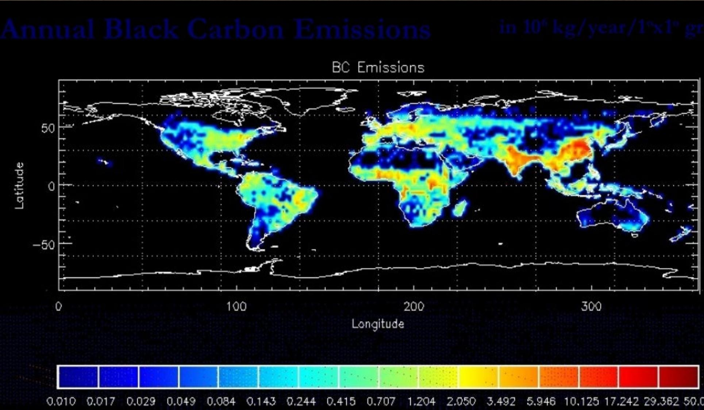

> **AI Description:**
> **Source:** `assets/_page_55_Figure_0.jpg`
> 
> **Generated:** 2026-05-31 18:10:35
> 
> ---
> 
> The image is a world map with a color-coded representation of annual black carbon emissions. The map uses a color scale ranging from blue (low emissions) to red (high emissions) to indicate the concentration of black carbon emissions across different regions. The legend at the bottom provides the scale in units of \(10^6\) kg/year/1°x1° grid. The map highlights areas with high black carbon emissions, particularly in East Asia and parts of South Asia, while showing lower emissions in other regions. The title at the top indicates that the data represents annual black carbon emissions.

### Full Page Description (Page 56)

**Source:** `assets/_page_56_Asset_1.jpg`

**Generated:** 2026-05-31 18:23:58

---

The image is a bar chart with a horizontal axis labeled "Mt CO2" and a vertical axis representing different categories such as "Energy," "Chemistry," "Paper," "Construction materials," "Iron and acier," and "Auto." The chart uses color coding to represent different ranges of costs per ton of CO2 emissions: light blue for 0 to 50 Euros/ton, blue for 50 to 500 Euros/ton, and red for > 500 Euros/ton. The "Energy" category has the highest bar, indicating the largest CO2 emissions, while the "Auto" category has the smallest bar, indicating the lowest CO2 emissions. The chart visually represents the relationship between the cost of CO2 emissions and the amount of CO2 emitted by different sectors.

### Full Page Description (Page 56)

**Source:** `assets/_page_56_Asset_0.jpg`

**Generated:** 2026-05-31 18:24:14

---

The image is a pie chart titled "Share of different sectors in CO2 emissions." It visually represents the percentage contribution of various sectors to CO2 emissions. The chart includes five categories: Energy (28%), Transport (24%), Industry (20%), Agriculture (10%), and Waste (3%), with an "Others" category accounting for 13%. The chart uses different shades of blue to differentiate between the sectors, with the largest slice representing Energy and the smallest slice representing Waste.

## SECTORIAL COMPARISON OF COS/EFFICIENCY (EUROPE,UE 15)

·60%of the transports associated to road concern LC(450Mt)

### Full Page Description (Page 58)

**Source:** `assets/_page_58_Asset_0.jpg`

**Generated:** 2026-05-31 18:18:37

---

The image is a scatter plot with the title "Motor Vehicle Penetration per 1,000 People." The x-axis represents a numerical value, and the y-axis represents motor vehicle penetration per 1,000 people. Each country is represented by a colored dot, with the size of the dot corresponding to the population of the country. The United States is shown with the largest population and the highest motor vehicle penetration per 1,000 people. Other countries, such as China and Mexico, have significantly lower values on both axes. The plot includes labels for each country, making it easy to identify which dot corresponds to which country.

## TRENDS IN COEMISSIONS

From Energy use in the Leading Automotive Markets (World),2002

## KEY TO EARLIER SLIDE

Size of the bubble is determined by the total CO2 emissions from energy use in different sectors of the respective nations. The bigger the size of the bubble, the greater the CO2 emisions from a country.

Includes the CO2 emissions from energy use in different sectors and the trasportation sector is one of the major constituents of this segment for the year 2002.

·Motor vehicle penetration is per 1,0oo people for the year 2002.

Percent share refers to the individual share of a country in the total global demand for motor vehicels in 2002.

The transportation sector accounts for 30.0 % of CO2 emissions in the industrialized economics of the OECD (Organization for Economic Cooperation and Development) and about 20.0 % worldwide.

Source:OECD,IMF and Frost & Sullivan

## GLOBAL CARBON DIOXIDE

# RECENT CARBON CONTENT INITIATIVES (WORLD),2005-15

## COReduction Time Table &

## ACEA-AgrredwithCin1998forotargets

■2003 Intermediate target range-165\~170 g/km

■2008 target -140 g/km

2012 target-120 g/km

## JAMA Agreement with EC

2003 Intermediate target range- 165\~175 g/km

■2009 target -140 g/km

2015 target-125 g/km

## KAMA Agreement with EC

2004 Intermediate target range-165\~175 g/km

2009 target-140 g/km.

## New Target Proposed in 2oo7 in European Parliament

Year2015-125g C02/km

Year2020-95gC02/km

Year 2025-70g C02/km

## Global Review

Europe & Japan continue to lead the world with the most stringent passenger vehicle GHG & FE standards.

Japan standards are expected to lead to the lowest fleet averageGHG emissions in the world(125g CO2/km by 2015).

California passenger vehicle regulations are expected to achieve the greatest overall reduction in GHG emission in the world.

U.S. passenger vehicle standards continue to lag behind other nations but could move ahead of Canada, Australia, South Korea,& California by 2020 with passage of U.S. senate bill.

South Korea is the only nation in the world with standard in place that is expected to have rising GHG emissions from passenger vehicles.

### Full Page Description (Page 65)

**Source:** `assets/_page_65_Asset_0.jpg`

**Generated:** 2026-05-31 18:08:09

---

The image is a scatter plot with a line graph overlay, presenting data on CO2 emissions in NEDC (New European Driving Cycle) for vehicles of different curb weights. The x-axis represents the vehicle curb weight in kilograms, ranging from 800 to 1600 kg. The y-axis represents CO2 emissions in grams per kilometer (g/km), ranging from 80 to 240 g/km. The plot includes three types of vehicles: Gasoline-MPFI (red diamonds), Diesel (green triangles), and Gasoline-DI (blue squares). The data points are scattered around the trend lines, which indicate the average CO2 emissions for each vehicle type. The image highlights a comparison of CO2 emissions for vehicles of similar curb weights, showing that Diesel vehicles generally have lower CO2 emissions compared to Gasoline-MPFI and Gasoline-DI vehicles. The image also includes annotations indicating a reduction in CO2 emissions of 35%, 15%, and 18% for different vehicle types, suggesting improvements in fuel efficiency or emissions reduction technologies.

## CO2 emissions VS engine type

### Full Page Description (Page 66)

**Source:** `assets/_page_66_Asset_0.jpg`

**Generated:** 2026-05-31 18:19:53

---

The image is a stacked area chart showing the breakdown of greenhouse gas (GHG) emissions from road transport over time, from 2000 to 2050. The chart includes seven increments labeled 1 through 7, each representing different strategies to reduce GHG emissions. These strategies include the use of diesels, hybrids, biofuels, fuel cells, mix shifting, and vehicle travel reduction. The chart also includes a reference case level for road transport emissions. The chart visually represents how each increment contributes to reducing GHG emissions over the years, with the overall goal of lowering emissions to a sustainable level by 2050.

## POTENTIAL FOR REDUCInG GHGS

From Vehicles Technology/Biofuels/ GigaMobiJityalent GHGs

### Full Page Description (Page 67)

**Source:** `assets/_page_67_Asset_0.jpg`

**Generated:** 2026-05-31 18:31:35

---

The image is a horizontal bar chart with a legend indicating different technologies and their associated CO2 emissions during production, combustion, and photosynthesis. The technologies listed include various fuels and energy sources such as gasoline, diesel, biodiesel, ethanol, and hydrogen. The chart provides a comparison of CO2 emissions in grams per kilometer (g/km) for each technology. The main trends show that some technologies, like biodiesel and ethanol, have higher emissions during production and combustion but lower emissions during photosynthesis. The chart also highlights that hydrogen from nuclear energy has the lowest emissions.

## COEMISSIONS Conventional & Alternative

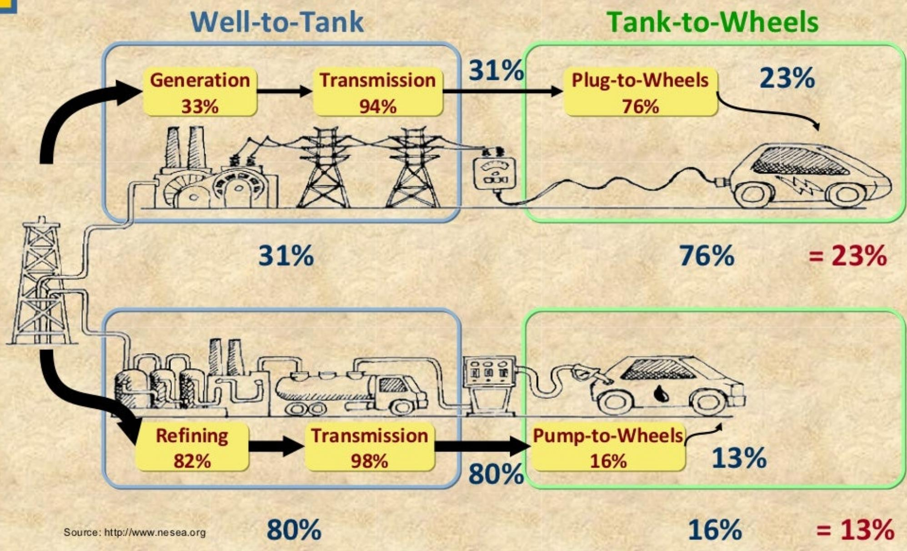

> **AI Description:**
> **Source:** `assets/_page_68_Figure_0.jpg`
> 
> **Generated:** 2026-05-31 18:17:32
> 
> ---
> 
> The image is an infographic combining text with visual elements, specifically a flowchart. It illustrates the energy efficiency of electric vehicles (EVs) compared to conventional gasoline vehicles. The flowchart is divided into two main sections: "Well-to-Tank" and "Tank-to-Wheels."
> 
> In the "Well-to-Tank" section, the infographic shows the energy efficiency at each stage of electricity generation and transmission. It highlights that 33% of the energy generated is lost during transmission, leaving 94% available at the power plant. When this electricity is used to power an EV, 76% of the energy reaches the wheels, resulting in a total efficiency of 23% from well to wheels.
> 
> The "Tank-to-Wheels" section contrasts this with the conventional gasoline vehicle. It shows that 82% of the energy is lost during refining and transmission, leaving only 16% available at the gas pump. When this gasoline is used in a conventional vehicle, only 13% of the energy reaches the wheels, resulting in a total efficiency of 13% from tank to wheels.
> 
> The infographic uses arrows and percentages to visually represent the energy loss at each stage, making it easy to compare the efficiency of EVs and conventional vehicles.

## WELLTOWHEELCARBONEMISSIONS

# DEVELOPMENT OF LOW CARBON TECHNOLOGIES (WORLD),2005-15 Hybrid

Gasoline Technology

Technology

Technology

Fuel Cell Technology

Key:

Most popularand fully commercialized technology with the highest penetration in themarket currently includes internal combustion engine (ICE) technologies

Second best popular technology，fully commercialized witha great potential to match themotor vehicles (Mvs) run on gasoline in the near future

Commercialized, however，unlikely to outpace the traditional MVs-prospectsin the medium term looksbright-certainlya force to reckon with in future

Stillin the development stage-commercialisation during theperiod looks bleak-in termsof carbon constraints, easily the best and most effective technology

Source:Frost&Sulivan

## Road to Sustainable Mobility

## Today

## Tomorrow

Hydrogen Technology

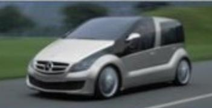

> **AI Description:**
> **Source:** `assets/_page_71_Figure_0.jpg`
> 
> **Generated:** 2026-05-31 18:11:15
> 
> ---
> 
> The image depicts a futuristic vehicle concept with a sleek, aerodynamic design. The car features a low-slung profile with a prominent front grille and large, circular headlights. The body is primarily silver with black accents on the roof and side panels. The wheels are large and appear to be designed for off-road or all-terrain use. The overall design suggests a focus on modern, possibly electric or hybrid, technology.

Hybrid/EVTechnolo

HYBRID

Alternative Fuels

Improvement of Conventional Fuels

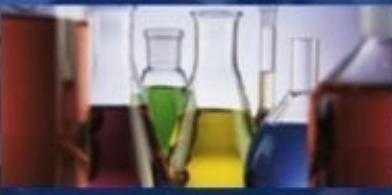

> **AI Description:**
> **Source:** `assets/_page_71_Figure_2.jpg`
> 
> **Generated:** 2026-05-31 18:06:15
> 
> ---
> 
> The image contains a photograph of laboratory glassware, including beakers and flasks, filled with various colored liquids. The colors visible are green, yellow, blue, and red. The background appears to be a laboratory setting with additional equipment and possibly a blue-tinted glass surface. The image is likely used to represent scientific experimentation or laboratory work.

Conventional Veh.Technology for higer

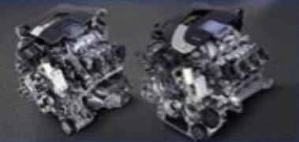

> **AI Description:**
> **Source:** `assets/_page_71_Figure_3.jpg`
> 
> **Generated:** 2026-05-31 18:09:12
> 
> ---
> 
> The image contains two photographs of what appear to be engine components. The engines are complex mechanical assemblies with various parts visible, including what looks like pistons, cylinders, and other internal mechanisms. The engines are placed on a dark surface, and the lighting highlights the metallic and mechanical details of the components. There are no visible labels or text annotations in the image.

## Need for an Integrated Approach

Automotive Industry Improve Fuel Efficiency Reduce Emissions Alternative drive systems

Fuel Industry Environmentally friendly fuels

Customer

Waug-aing

Regulators

Relevantframework Appropriate infrastructure

## Ned for an Integrated Approach Involving All Stakeholders

·Amobilization coordinatedamongall stakeholders...

·....Organized by public authorities

·Synergies of reduction beyond technologies

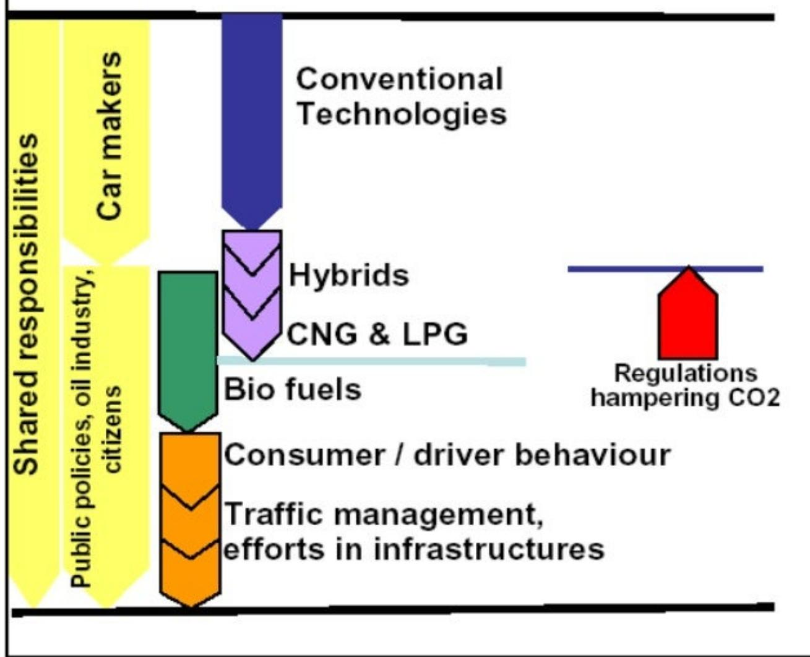

> **AI Description:**
> **Source:** `assets/_page_73_Figure_0.jpg`
> 
> **Generated:** 2026-05-31 18:36:12
> 
> ---
> 
> The image is a diagram illustrating the shared responsibilities among car makers, public policies, oil industry, and citizens in relation to conventional technologies and alternative fuel options. It categorizes these responsibilities into two main sections: "Shared responsibilities" and "Conventional Technologies." The diagram includes categories such as "Hybrids," "CNG & LPG," "Bio fuels," "Consumer/driver behavior," and "Traffic management, efforts in infrastructures." It also highlights "Regulations hampering CO2," indicating a potential barrier to reducing carbon dioxide emissions. The diagram uses arrows to visually connect these categories, suggesting a flow or interdependence between them.

Source:ACEA

### Full Page Description (Page 74)

**Source:** `assets/_page_74_Asset_0.jpg`

**Generated:** 2026-05-31 18:23:36

---

The image contains a horizontal bar chart titled "Potential means of CO2 emissions reduction in Europe." It presents data on the potential reduction of CO2 emissions in megatonnes for various measures, including speed limits, fuel taxation stages, economical driving, and a reduction in CO2 emissions per kilometer for cars. The chart uses different colors to represent each category and includes numerical values next to the bars to indicate the specific reduction potential in megatonnes. The x-axis represents the amount of CO2 emissions reduction in megatonnes, while the y-axis lists the different measures.

## EFFORTS

·Global Insight simulation for ACEA(Europe,UE15)

Increase offuel prices gas and diesel in two stages:

Secondincreaseof 0.1535 Euros/l

First increase of 0.1535 Euros/l

## LOOKING AHEAD: TRENDS AND POSSIBILITIES FOR CONTROL

■ In reducing the health effects from vehicle emissions, one fact is clear:

Even if the emissions from each vehicle and its fuel are reduced,,

the use of vehicles will increase,

vehicles will age and need maintenance..

This can offset, in whole or in part, the pollution reductionsand health benefits if careful planning is not done

## CONCLUSIONS

Vehicle efects on health result from both engine emissions and fuel

In general,as economies develop, vehicles will contribute 25% to 40 % of most pollutants

more for some pollutants and in urban settings

There are a variety of health effects caused by vehicle emissions,ncluding cancer,premature death,and increased hospitalization

Also a significant contributor to climate change

With increasing travel, health effects will only be reduced with continual improvement in fuels, emissions controls, and better maintenance

Introduction of Environment Friendly Technologies like Fuel Cells，Eectric/lectric-Hybrid

Use of renewable fuels for toxic and Green House Gas Emission Control

## Thank You