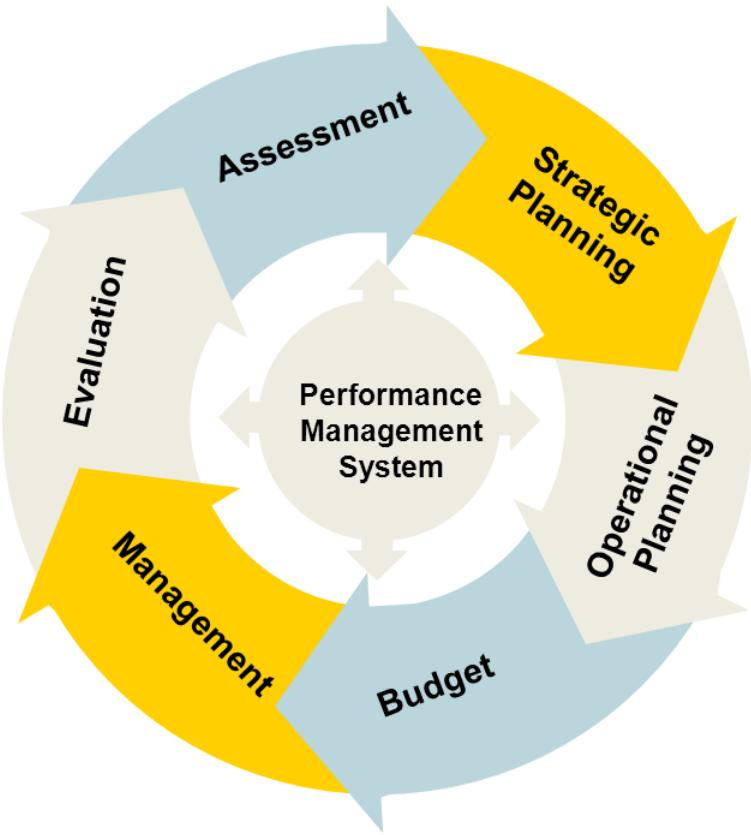

## Florida Department of Health Division of Medical Quality Assurance Strategic Plan 2016-2018

> **AI Description:**
> **Source:** `assets/_page_0_Figure_2.jpg`
> 
> **Generated:** 2026-05-31 18:49:10
> 
> ---
> 
> The image is a photograph of two children eating carrot sticks. The children appear to be enjoying their snack, with one child holding a carrot stick close to their mouth and the other child looking at the camera. The image conveys a sense of healthy eating and childhood enjoyment.

> **AI Description:**
> **Source:** `assets/_page_0_Figure_4.jpg`
> 
> **Generated:** 2026-05-31 18:48:56
> 
> ---
> 
> The image is a photograph of two individuals walking two dogs on a bridge. The person on the left is wearing a white shirt and black shorts, while the person on the right is wearing a blue tank top and black shorts. Both individuals are holding leashes attached to two large dogs, which appear to be Great Danes. The bridge has a wooden railing and is set against a backdrop of trees and greenery.

> **AI Description:**
> **Source:** `assets/_page_0_Figure_6.jpg`
> 
> **Generated:** 2026-05-31 18:49:06
> 
> ---
> 
> The image is a photograph of two individuals sitting on a wooden bench outdoors. The person on the left is wearing a white shirt and patterned pants, while the person on the right is dressed in a white outfit with a wide-brimmed hat. The background shows greenery, suggesting a garden or park setting. The individuals appear relaxed and are engaged in a casual conversation.

> **AI Description:**
> **Source:** `assets/_page_0_Figure_7.jpg`
> 
> **Generated:** 2026-05-31 18:49:02
> 
> ---
> 
> The image is a photograph of an outdoor scene featuring an older man and a child. The man appears to be teaching or guiding the child, who is holding a bright orange plastic bat, possibly for a game of baseball or tee-ball. The background shows greenery, suggesting a park or backyard setting. The interaction between the two individuals conveys a sense of teaching or mentorship.

Rick Scott

GOVERNOR

Celeste Philip, MD, MPH

> **AI Description:**
> **Source:** `assets/_page_0_Figure_11.jpg`
> 
> **Generated:** 2026-05-31 18:49:19
> 
> ---
> 
> The image is a photograph of a woman holding a baby in a grocery store. The woman is smiling and appears to be holding a tomato. The background shows various fruits and vegetables, including apples and tomatoes, on display in a grocery store setting. The scene suggests a casual, everyday moment in a retail environment.

State Surgeon General and Secretary

Version 1.3

Revised May 2016

Produced by:

Florida Department of Health

4052 Bald Cypress Way, Bin # A00

Tallahassee, FL 32399-1701

## Table of Contents

Executive Summary..   
Mission, Vision and Values..   
Strategy Map.......   
Strategic Priorities . 3   
Appendices   
Appendix A: Strategic Planning Participants........ . 4   
Appendix B: Planning and Monitoring Summary .. 8   
Appendix C: SWOT Analysis.. .10   
Appendix D: Alignment..... .. 13   
Appendix E: Environmental Scan Resources. .14

# Executive Summary

The Florida Department of Health conducted a strategic planning process during the summer of 2015 to define the direction and course of the agency for consumers, employees, administrators and legislators for the next three years. This strategic plan will position the Department to operate as a sustainable integrated public health system under the current economic environment and to provide our residents and visitors with high quality public health services. This is a living document that we will evaluate and update regularly to address new challenges posed by the changing environment of public health in Florida.

After executive leadership approved the Agency Strategic Plan strategic priorities, goals and objectives, each objective was assigned to a division to implement and monitor. In turn, each division created their own strategic plan that contains their objectives from the Agency Strategic Plan plus other goals, strategies and objectives that emerged as supporting the Department’s strategic priorities from their environmental scan and SWOT analysis.

## Mission – Why do we exist?

To protect, promote and improve the health of all people in Florida through integrated state, county and community efforts.

## Vision – What do we want to achieve?

To be the Healthiest State in the Nation.

## Values – What do we use to achieve our mission and vision?

I nnovation: We search for creative solutions and manage resources wisely.

C ollaboration: We use teamwork to achieve common goals & solve problems.

A ccountability: We perform with integrity & respect.

R esponsiveness: We achieve our mission by serving our customers & engaging our partners.

E xcellence: We promote quality outcomes through learning & continuous performance improvement.

The Division of Medical Quality Assurance (MQA) is dedicated to the mission, vision and values of the Department. Working in conjunction with 22 boards and six councils, MQA established the strategic priorities set forth in this plan. Over the next three years, MQA will work diligently to accomplish these goals and further contribute to the Department’s vision to be the healthiest state in the nation.

STRATEGY MAP

# Strategic Priorities

## Priority 1: Healthy Moms and Babies: Not applicable

## Priority 2: Long, Healthy Life

Goal 2.1: Increase healthy life expectancy

## Priority 3: Readiness for Emerging Health Threats

Goal 3.1: Demonstrate readiness for emerging health threats

## Priority 4: Effective Agency Processes

Goal 4.1: Establish a sustainable infrastructure, which includes a competent workforce, sustainable process and Effective use of technology, which supports all of the Department’s core business functions

## Strategic Priority 5: Regulatory Efficiency

Goal 5.1: Establish a regulatory structure that supports the state’s strategic priorities related to global competiveness and economic growth

# Appendix A

# Division of Medical Quality Assurance Strategic Planning Participants

The following list features all attendees of the division’s strategic planning process meetings, including the MQA Strategic Planning Retreat held in July 2015 and the Healthiest Weight Liaisons and Board Chairs/Vice Chairs Annual Long-range Planning Meetings held in September 2015. Although not included individually in the list, all MQA employees, management and board/council members participated in a Strengths, Weaknesses, Opportunities and Threats (SWOT) survey in 2015.

## MQA Executive Leadership

Lucy C. Gee, MS Director, Division of Medical Quality Assurance

Lola Pouncey Chief, Bureau of Operations

Adrienne Rodgers, JD, BSN Chief, Bureau of Health Care Practitioner Regulation

Mark Whitten Chief, Bureau of Enforcement

## DOH Executive Leadership

Celeste Philip, MD, MPH Deputy Secretary for Health Deputy State Health Officer for CMS

Nichole Geary General Counsel

J. Martin Stubblefield Deputy Secretary for Administration

## MQA Management

Brittain Keen   
Operations and Management   
Consultant II   
Sylvia Sanders   
Operations and Management   
Consultant II

Melinda Simmons Senior Health Budget Analyst A

Gwendolyn Bailey Operations and Management Consultant Manager

Diane Dennin   
Senior Management Analyst   
Supervisor   
Debora Hall   
Senior Management Analyst   
Supervisor

Anthony Jusevitch Investigation Manager

Christopher Ferguson Assistant Chief of Investigative Services

Thomas Doughty Manager, MQA Applications, Information Technology

Jennifer Wenhold, MSW Executive Director, Boards of Dentistry, Athletic Training, Hearing Aid Specialists, Clinical Social Work, Marriage and Family Therapy, and Mental Health Counseling, and Opticianry

Joe Baker, Jr.   
Executive Director, Board of   
Nursing and Council on Certified Nursing Assistants

Allison Dudley, JD Executive Director, Board of Pharmacy

Claudia J. Kemp, JD Executive Director, Boards of Osteopathic Medicine, Speech-Language Pathology and Audiology, Massage Therapy, Acupuncture and the Council of Licensed Midwifery

Allen Hall Executive Director, Boards of Occupational Therapy, Physical Therapy, Psychology, Respiratory Care, and Councils of Dietetics and Nutrition and Electrolysis

Anthony B. Spivey, DBA Executive Director, Boards of Chiropractic Medicine, Clinical Laboratory Personnel, Nursing Home Administrators, Optometry, Orthotists and Prosthetists, Podiatric Medicine, and Advisory Council of Medical Physicists

Sue Foster Executive Director, Boards of Dentistry, Athletic Training, Hearing Aid Specialists, Clinical Social Work, Marriage and Family Therapy, and Mental Health Counseling, and Opticianry

Andre Ourso, JD, MPH Executive Director, Board of Medicine and Council on Physician Assistants

## Board Legal Counsel

Ed Tellechea Chief Assistant Attorney General

David Flynn Assistant Attorney General

Donna McNulty Senior Assistant Attorney General

## Board and Council Members

Nicholas Pappas, ATC, LAT Chair, Board of Athletic Training

Billy ‘Bo’ McDougal, ATC, LAT Vice Chair, Board of Athletic Training

Jamie Buller, LCSW Chair, Board of Clinical Social Work, Marriage & Family Therapy and Mental Health Counseling

Susan Gillespy, LMFT Vice Chair, Board of Clinical Social Work, Marriage & Family Therapy and Mental Health Counseling

Leonard Britten, DDS Vice Chair, Board of Dentistry

William Kochenour, DDS Chair, Board of Dentistry

Douglas Moore, HAS Member, Board of Hearing Aid Specialists

Catherine Cabanzon, RDH Member, Board of Dentistry

Heidi Roeck-Simmons, DOT/OTR Member, Board of Occupational Therapy

John B. Girdler, III Vice Chair, Board of Opticianry

Byron D. Shannon, OD Chair, Board of Opticianry

Anthony J. Hicks, OTR Chair, Board of Occupational Therapy

Kathryn L. Whitson MSN, RN Vice Chair, Board of Nursing

Christina L. Pettie, PT, MHA Vice Chair, Board of Physical Therapy

Dean Aufderheide, PhD Chair, Board of Psychology

Sheah Rarback, MS, RD, LDN Member, Dietetics and Nutrition Practice Council

Steven Chenoweth, PT Member, Board of Physical Therapy

Peggy Cooper, MS, RD, LDN Chair, Dietetics and Nutrition Practice Council

Lori Desmond, MSN, RN, NE-BC Member, Board of Nursing

Jackie Shank, MS, RD, LDN Vice Chair, Dietetics and Nutrition Practice Council

Andrew S. Rubin, PhD Vice Chair, Board of Psychology

Joylynn M. Greenhalgh, DNP, ARNP Chair, Electrolysis Council

Debra Glass, BPharm Vice Chair, Board of Pharmacy

J. Drake Miller, PsyD Member, Board of Psychology

Raymond J. Hulley, PA Chair, Council on Physician Assistants

Roberto Garcia, RRT Member, Board of Respiratory Care

Bernardo Fernandez, MD Chair, Board of Medicine

Sarvam TerKonda, MD Vice Chair, Board of Medicine

Kevin Fogarty, DC, FICA Chair, Board of Chiropractic Medicine

Danita Heagy, DC   
Member, Board of Chiropractic   
Medicine

Linda Valdes, MS, MT (ASCP) Vice Chair, Board of Clinical Laboratory Personnel

Carleen P. Van Siclen, MS, MLS Chair, Board of Clinical Laboratory Personnel

Henry Gerrity, III, NHA Chair, Board of Nursing Home Administrators

Scott Lipman, MHSA, NHA Vice Chair, Board of Nursing Home Administrators

Chet Evans, MS, DPM Chair, Board of Podiatric Medicine

Christine Hankerson, MSN, MS/P, PhD, RN   
Member, Board of Nursing Home Administrators

Timothy Underhill, OD Chair, Board of Optometry

Stuart Kaplan, OD Vice Chair, Board of Optometry

Ruphlal R. Gooljar, CPO, MA Member, Board of Orthotists and Prosthetists

Bridget K. Burke-Wammack, LMT, CLT Chair, Board of Massage Therapy

Katherine Teisinger, AP, DOM Chair, Board of Acupuncture

Tommy Chmielewski, LPO Chair, Board of Orthotists and Prosthetists

Lydia Nixon, LMT   
Vice Chair, Board of Massage   
Therapy

Jonathan E. Walker, LM Member, Board of Massage Therapy

Anna Hayden, DO Chair, Board of Osteopathic Medicine

Bridget Bellingar, DO Vice Chair, Board of Osteopathic Medicine

Frederick Rahe, AuD Member, Board of Speech-Language Pathology and Audiology

Melissa Conord-Morrow, LM, RN Chair, Council of Licensed Midwifery

## Prosecution Services Staff

Sharmin Hibbert Deputy General Counsel

Yolonda Green Attorney Supervisor

Candace Rochester Attorney Supervisor

Program Staff   
Tamara Garland   
Senior Health Budget Analyst B   
Vernice David   
Government Operations   
Consultant I

Erica Milam Government Analyst I

Christina Robinson Government Operations Consultant I

Hannah Volz Strategy Manager

Nick Van Der Linden, MA Strategy Manager

Peggy Taff Strategy Manager

James “Wes” Love Strategy Manager

Garnet Nevels   
Government Operations   
Consultant II

Jamie McNease, MSW Strategy Manager

Scott Flowers   
Consumer/Investigative Services   
Administrator

Sidronio Casas Government Analyst I

Sherri Sutton-Johnson, MSN, RN Nursing Education Director

Janet Doke, BSN, RN Registered Nursing Education Consultant

William Spooner Program Operations Administrator

Tihara Rozier Program Operations Administrator

Brad Dalton Deputy Press Secretary

Paul Runk   
Government Analyst II, Legislative   
Affairs   
Healthiest Weight Florida   
Program Staff   
Shannon Hughes   
Director, Division of Community   
Health Promotion

Catherine Howard, PhD, MSPH Director, Healthiest Weight Florida

Kathryn Williams, MPH Coordinator, Healthiest Weight Florida

Geoffrey Kneen   
Program Specialist, Healthiest   
Weight Florida   
Ernest Bradley   
Program Specialist, Healthiest   
Weight Florida

Julie Dudley Program Manager, Bureau of Chronic Disease Prevention

Jamie Forrest, MS Epidemiology and Evaluation Program Administrator, Bureau of Chronic Disease Prevention

M. R. Street, MPH Medical/Health Care Program Analyst, Bureau of Chronic Disease Prevention

## Association and Community

Representatives Larry Barlow, PhD, LMFT Executive Director, Florida Association for Marriage and Family Therapy

Liz Brady   
Chief, Multistate Antitrust   
Enforcement, Office of Attorney   
General

Janet DuBois, ARNP President, Florida Nurse Practitioner Network

William Hightower Director of Governmental Relations, Florida Osteopathic Medical Association

Karin Kazimi   
Project Director, Florida Healthcare   
Workforce Initiative

Jo Anne Koch Owens Government Affairs Representative, Florida Society for Clinical Laboratory Science

Alisa LaPolt   
Lobbyist, Florida Nurses   
Association   
Marcia Mann   
State Contract Manager, CE   
Broker

Mandy O'Callaghan Attorney, Florida Senate

Christine Stapell, MS, RD, LDN Executive Director, Florida Academy of Nutrition and Dietetics

Casey Stoutemire Lobbyist, Florida Dental Association

Glenn Thomas   
Attorney, Lewis, Longman and   
Walker, PA Mary Thomas, Esq.   
Assistant General Counsel, Florida Medical Association   
Dennis Willerth   
Executive Director, Florida Society   
for Respiratory Care

Lynn Thames Dean of Oriental Medicine, Florida College of Integrative Medicine

Bob MacDonald Executive Director, PDMP Foundation, Inc.

Carolyn Stimel, PhD, ABPP Florida Psychological Association

Lee Ann Griffin   
Director of Quality and Regulatory   
Services, Florida Health Care   
Association

Kay Fergason

American Medical Technologists,

Florida Chapter

Leslie Dughi

Director of Government Law and

Policy, Greenberg Traurig, LLP

Corinne Mixon

Lobbyist, Mixon and Associates

Ashley Kalifeh

Attorney, Capital City Consulting

Joy Ryan

Regulatory Attorney, Meenan P.A.

# Appendix B

## Planning Summary

The Division of Medical Quality Assurance (MQA) management team, made up of the division director, bureau chiefs and other key staff, oversaw the development of this strategic plan. Prior to its first strategic planning meeting, a SWOT analysis (Appendix C) was sent out to MQA executive management and employees. The results were analyzed to determine the similarities and differences. Gaps were identified and addressed during a strategic planning retreat in which MQA management met with the division’s Strategic Planning Unit to discuss best practices and solutions. The meeting was the first of many in-depth discussions to develop a strategic plan that promoted MQA’s dedication to making Florida the healthiest state to live, work, practice and retire.

Another SWOT was developed and designed for MQA’s executive management and board members to determine if the division’s strategies and mission aligned with those of its health care boards. The division director presented the results of the survey at the Annual Board Chairs/Vice Chairs Long-range Planning meeting to executive management and board members. Meeting attendees took part in a facilitated discussion that included information management, communications, programs and services, budget (financial sustainability), and workforce development. Leadership staff conducted an environmental scan of the agency (sources listed in Appendix E). Results were reviewed and the progress of the current Department of Health Strategic Plan was analyzed to formulate additional strategies and objectives for each priority area. The revised proposal was then routed back to executive leadership for comment and approval.

The following is the strategic plan schedule of meetings:

## Monitoring Summary

As depicted in the image below, strategic planning is a key component of the larger performance management system. This statewide performance management system is the cornerstone of the Department’s organizational culture of accountability and performance excellence.

The Division of Medical Quality Assurance (MQA) leadership team will be responsible for monitoring and reporting progress on the goals and objectives of this strategic plan. The team meets quarterly to discuss recommendations about tools and methods that integrate performance management into sustainable business practices. Annually, MQA’s strategic plan progress report will be developed and presented to executive leadership, assessing progress toward reaching goals and objectives, and achievements for the year. The plan will be reviewed and revised by January each year, based on an assessment of availability of resources, data and progress.

In turn, the objectives that come from the Agency Strategic Plan that have been assigned to this division for implementation and quarterly reporting to Florida Health Performs will be reviewed by the Agency’s SPIL Team on a quarterly basis for progress toward goals, and an annual progress report will also be developed. The SPIL Team will revise the Agency Strategic Plan annually, based on their assessment of resources, data and progress.

> **AI Description:**
> **Source:** `assets/_page_11_Figure_0.jpg`
> 
> **Generated:** 2026-05-31 18:49:36
> 
> ---
> 
> The image is a circular diagram representing a Performance Management System. It includes five key components: Strategic Planning, Operational Planning, Budget, Management, and Evaluation. Each component is represented by a colored section of the circle, with arrows indicating the flow between these components. The center of the circle is labeled "Performance Management System," emphasizing the interconnected nature of these elements in a management framework.

Leadership, Workforce and Infrastructure

# Appendix C

## Strengths, Weaknesses, Opportunities and Threats

## Appendix D

## Work Plan and Alignment

LRPP: Long Range Program Plan

SHIP: State Health Improvement Plan

QI: Quality Improvement

# Appendix E

## Environmental Scan Resources

1. 2015 State Themes and Strengths Assessment

2. Agency Strategic Plan Status Report

3. Division of Medical Quality Assurance Annual Report and Long-range Plan FY 2014-2015

4. Division of Medical Quality Assurance Employee Training Log

5. Employee Satisfaction Survey 2015 Results

6. Florida Board of Acupuncture Twitter

7. Florida Board of Athletic Training Twitter

8. Florida Board of Chiropractic Medicine Twitter

9. Florida Board of Clinical Laboratory Personnel Twitter

10. Florida Board of Dentistry Twitter

11. Florida Board of Hearing Aid Specialists Twitter

12. Florida Board of Massage Therapy Twitter

13. Florida Board of Medicine Twitter

14. Florida Board of Clinical Social Work, Marriage & Family Therapy, and Mental Health Counseling Twitter

15. Florida Board of Nursing Twitter

16. Florida Board of Nursing Home Administrators Twitter

17. Florida Board of Occupational Therapy Twitter

18. Florida Board of Optometry Twitter

19. Florida Board of Opticianry Twitter

20. Florida Board of Orthotists and Prosthetists Twitter

21. Florida Board of Osteopathic Medicine Twitter

22. Florida Board of Pharmacy Twitter

23. Florida Board of Physical Therapy Twitter

24. Florida Board of Podiatric Medicine Twitter

25. Florida Board of Psychology Twitter

26. Florida Board of Respiratory Care Twitter

27. Florida Board of Speech-Language Pathology and Audiology Twitter

28. Florida Department of Health Facebook

29. Florida Department of Health, Long Range Program Plan 2015-16 through 2019-20

30. Florida Department of Health Newsroom

31. Florida Department of Health, Office of Inspector General Annual Report FY 2013-2014

32. Florida Department of Health Twitter

33. Florida Department of Health, Year in Review 2013-2014

34. Florida Department of Health, Florida Health Impact Report 2014-15 by the Numbers

35. Florida Strategic Plan for Economic Development

36. Healthiest Weight State Profile

37. Physician Workforce Annual Report 2014

38. State Monthly Economic Updates