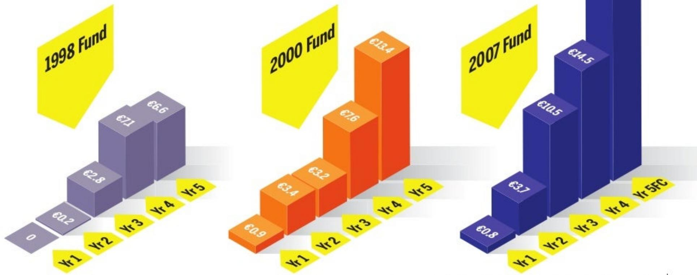

# Turning Venture Capital Data into Wisdom: Why Deal Performance in Europe is now Outpacing the US

-July2011

HendrikBrandis

ManagingPartner,EarlybirdVentureCapital

JasonWhitmire

GeneralPartner,Earlybird VentureCapital

# Background

The core data-slides inthis Report(6,7, 8,11,15,17,18,23,24,25,26,27,28,30,31) werecreatedandsupportedbyabroad cross-section ofpartners at European VC firmswho aremembers of theVenture Council at the EuropeanPrivateEquity and Venture Capital Association(EVCA). TheseVCsincludeSofinnova,Northzone, DFJEsprit,AmadeusCapital,Gimv, EndeavourVision,DeltaPartners, Advent VenturePartners,NautaCapital, NeuhausPartners,Finlombarda,and Earlybird VentureCapital.

This Report was further endorsed by 24active venture capital firms in Europe includingIndex Ventures, WellingtonPartners,FidelityGrowth Europe,Prime Technology Ventures, Hummingbird Ventures,Open Ocean, TargetPartners,VodafoneVentures, and many more.

After emerging only in the 199os,and shaking off thehangoverfrom the delugeofcapital that flooded the market in 1999-2001, European Venture Funds have staged a

Comeback

Venturebacked liquidity eventsin thelast 24 months:

## \$15 Billion

### Full Page Description (Page 4)

**Source:** `assets/_page_4_Asset_0.jpg`

**Generated:** 2026-05-31 19:02:38

---

The image contains a bar chart with two sets of bars for each country: one set for "Total Invested" and the other for "Total Exited." The countries represented are Germany, the UK, France, and Europe (Other). The chart shows the venture-backed trade sales and IPOs in Europe over the past 24 months, with data incomplete. The "Total Invested" values range from $0.6Bn to $1.4Bn, while the "Total Exited" values range from $2.5Bn to $4.4Bn. The chart uses blue bars for "Total Invested" and purple bars for "Total Exited," with annotations indicating the monetary values.

## In other words, more checks to LPs are being written in Europe than everbefore

## At the same time, real performance shows European VC driving the best exit multiples globally

Exitsover\$100M 2005-Q1/2011

Proportionally Europe is producing higherexit multiplesand,although averageexit valuesare ca.25%smaller,lower entryvaluationsand highercapital efficiency overcompensatefor disadvantages inexit value.

Number 131 Median ExitValuation \$173M %withMultipleofCash≥5 57.26%

## This outperformance is based on an overproportional share in successfulexitsinEurope...

Overview US-vs.European Share in VC Value Contribution,since 2004

### Full Page Description (Page 7)

**Source:** `assets/_page_7_Asset_0.jpg`

**Generated:** 2026-05-31 18:56:56

---

The image contains a stacked bar chart comparing the performance of venture capital funds in the United States and the European Union (EU) in 2006. The chart is divided into quartiles, with the top quartile representing the best-performing funds and the bottom quartile representing the worst-performing funds. The chart shows that 25% of US venture capital (VC) funds were in the top quartile, while 35% of EU VC funds were in the top quartile when benchmarked against the US. The chart also indicates that 25% of US VC funds were in the bottom quartile, compared to 23% of EU VC funds in the bottom quartile. The data is sourced from Prequin 2010.

## ...Due in part toa highershare ofEuropean VC funds with top US quartile performance

Active GPs Managing Fundsof Vintage ≥2006,Investment Grade Funds

## For get t he chart ts.

where are the outsized venture exits in Europe?

## Its not quite all about Skype...

> **AI Description:**
> **Source:** `assets/_page_9_Figure_3.jpg`
> 
> **Generated:** 2026-05-31 19:06:46
> 
> ---
> 
> The image contains a logo for MySQL, which is a popular open-source relational database management system. The logo features the word "MySQL" in lowercase letters, with a stylized icon of a fish above the text. The fish is depicted in a simple, cartoonish style, with its tail pointing to the right. The logo is designed to be easily recognizable and conveys a sense of simplicity and efficiency, which are qualities associated with MySQL.

> **AI Description:**
> **Source:** `assets/_page_9_Figure_4.jpg`
> 
> **Generated:** 2026-05-31 19:08:40
> 
> ---
> 
> The image contains a logo for Skype. The logo consists of the word "skype" in lowercase letters with a unique font style. The letters are light blue and have a gradient effect, giving them a three-dimensional appearance. The logo is set against a plain white background.

> **AI Description:**
> **Source:** `assets/_page_9_Figure_25.jpg`
> 
> **Generated:** 2026-05-31 19:11:11
> 
> ---
> 
> The image contains a logo with the text "ItN | Nanovation". The logo features a molecular structure with three spheres connected by lines, symbolizing molecules or atoms. The text "ItN" is in lowercase, while "Nanovation" is in a smaller font size, with "Nanovation" in all lowercase. The logo is simple and uses a white background with black text and a gray molecular structure.

...andmanymore

### Full Page Description (Page 10)

**Source:** `assets/_page_10_Asset_0.jpg`

**Generated:** 2026-05-31 18:59:02

---

The image is a line graph comparing the post-IPO performance of venture capital-backed IPOs in the United States and Europe from March 2004 to July 2011. The graph uses two lines to represent the index values: one for Europe (blue line) and one for the U.S. (red line). The y-axis represents the index value, ranging from 0% to 200%, while the x-axis represents the years from 2004 to 2011. The graph shows fluctuations in both regions, with a general upward trend in both the U.S. and Europe, but with more volatility in the U.S. line. The graph includes annotations for the Europe IPO Index Value and the U.S. IPO Index Value.

## ...while European VC-backed IPO performance matches or exceeds US performance, both preas well as post-IPO

## On the origin of the turnaround

### Full Page Description (Page 12)

**Source:** `assets/_page_12_Asset_0.jpg`

**Generated:** 2026-05-31 19:12:34

---

The image is an infographic combining text with visual elements. It presents a supply-demand ratio for European venture capital from 2000 to 2010. The chart uses a blue line to represent the supply of capital and a pink line to represent the demand. Key annotations highlight significant events and trends, such as a 50% drop in venture deal flow by 2001, a saturation of the market with pre-bubble VC funds, and a 65% slide of VC funds to oblivion by 2006. The infographic also notes an exit boom starting in 2005 and a current supply gap, indicating a major disparity between the supply of venture capital and the availability of deals.

## Europe today has the largest inequilibrium ofventure Capital availability on the planet

## Supply side: Natural selection

"Almost every bank,large corporation and insurance company in Europe created its own venture capital fund in 1999-2ooo; What has emerged from the post-bubble struggle for existence is nothing less than some of the strongest Venture Capital firms in the world."

-John Holloway,European lnvestment Fund

### Full Page Description (Page 14)

**Source:** `assets/_page_14_Asset_0.jpg`

**Generated:** 2026-05-31 19:08:36

---

The image is a combination of text and a visual representation of investment cycles over a period from 1998 to 2010. It features a series of blue circles, each labeled with a year and a corresponding monetary value in millions of euros. The circles are arranged chronologically, with the largest circle representing the year 2000 and the smallest representing 2010. The text annotations "Investment cycle" are placed above the largest circles, indicating the focus on investment trends over time. The data suggests a fluctuating investment pattern, with significant increases and decreases in investment amounts over the years.

## While the supply of venture capital started to dry out only after2004...

Early-Stage VC Fundraising Europe\*

### Full Page Description (Page 15)

**Source:** `assets/_page_15_Asset_0.jpg`

**Generated:** 2026-05-31 18:55:22

---

The image contains a bar chart and accompanying text. The chart shows a comparison between the years 1999 and 2011, with the number of active funds in Europe. In 1999, there were 1,600 active funds, and in 2011, this number decreased to 711. The chart also highlights that the top 20 venture capital firms in Europe accounted for this decrease, with a 63% reduction in the number of active funds. The text annotations provide context and specify the timeframe and the focus on the top 20 venture capital firms.

## ...Only the fittest venture capital firms survived the post-bubble shake out

Number of VC Funds in Europe 1999 vs.2011\*

## ...Has meant that a comparatively small but mature sub-set ofEuropean VCs are able to now move into fund generations 3 and beyond

## VC teams'maturity by numberof funds raised

## Asa result, it is a buyer's market\* in Europe:

"European venture capitalis a cottageindustry characterised by an insufficient number ofprivate investors (e.g: lack of pension and endowment funds whichaccount forroughly 65% ofthe US VC industry) with the capacity and willingness to invest in venture capital,mainly due to past disappointments and the resulting lack ofconfidence which stillinhibits the European venture industry today"

## Demand side: Proliferation

"Thescarcity ofVCmoney in Europe not only has led to low entry valuations,but also has driven up capital efficiency (roughly 70 percent higher than in the US)and yield(hit rate) because the scarcity of money allows the very few investors to simply be more selective."

### Full Page Description (Page 20)

**Source:** `assets/_page_20_Asset_0.jpg`

**Generated:** 2026-05-31 19:11:07

---

The image contains a simple visual representation using two overlapping circles. The left circle is labeled "2006" and contains the percentage "5.2%". The right circle is labeled "2009" and contains the percentage "7.4%". The overlapping area suggests a comparison between the two years, with the percentage increasing from 5.2% in 2006 to 7.4% in 2009. The visual is designed to highlight the increase in the percentage over the given time period.

### Full Page Description (Page 20)

**Source:** `assets/_page_20_Asset_1.jpg`

**Generated:** 2026-05-31 19:13:08

---

The image contains a 3D bar chart with three vertical bars, each representing different percentages and categories related to entrepreneurship. The bars are labeled with percentages: 93%, 92%, and 50%. The chart is divided into two sections: "Without repeat entrepreneurs" and "With repeat entrepreneurs," with the latter showing a 50% split between the two categories. The base of the chart includes labels for different years: EB 98/99, EB 2000, and EB 2007. The visual elements effectively convey the distribution of entrepreneurs across these categories and years, providing a clear comparison between repeat and non-repeat entrepreneurs.

## There has been a surge in both the quality and quantity ofthe entrepreneurial pool in Europe... 93%

## This means that only a fraction ofstartups in europe receive funding, so only the very best firms receive 1464 1146 venture backing 1598

Number of Midstage (>\$5M) VC Deals

### Full Page Description (Page 23)

**Source:** `assets/_page_23_Asset_0.jpg`

**Generated:** 2026-05-31 19:06:33

---

The image is a line graph showing early-stage entry valuations for Venture Capital investments in the USA and Europe from 2004 to 2009. The graph uses two lines, one in red for the USA and one in blue for Europe, with the y-axis representing valuations in millions of euros. The graph highlights a general upward trend in valuations for both regions until around 2007, followed by a decline. The USA's valuations are consistently higher than Europe's throughout the period. The graph also includes a note indicating a range of 1.5 to 2.5x for the valuation ratio, suggesting a comparison of growth potential or return on investment.

## ..while European capital efficiency results both from low entry valuations...

### Full Page Description (Page 24)

**Source:** `assets/_page_24_Asset_0.jpg`

**Generated:** 2026-05-31 19:05:08

---

The image is a line graph titled "Median European investments." It displays the median investment amounts across four stages of investment (Seed, First, Second, and Later) over the years 2004 to 2009. The y-axis represents the median investment amounts in millions of euros, ranging from 0 to 10M. The graph shows fluctuations in investment amounts over the years, with the "Later" stage consistently having the highest median investment amounts, peaking around 2008. The "Seed" stage has the lowest median investment amounts throughout the period.

### Full Page Description (Page 24)

**Source:** `assets/_page_24_Asset_1.jpg`

**Generated:** 2026-05-31 19:03:12

---

The image contains a line graph with four distinct lines representing different stages of investment funding over time, from 2004 to 2009. The y-axis is labeled with monetary values in increments of €2 million, ranging from €0 to €10 million. The x-axis represents the years from 2004 to 2009. The lines are labeled as "First," "Second," "Later," and "Seed," indicating different stages of investment. The graph shows fluctuations in the amount of funding over the years, with the "First" and "Second" lines peaking around 2007 and then declining sharply, while the "Later" and "Seed" lines show more consistent but lower levels of funding throughout the period.

## ... and lower cost ofgrowing businesses /tight control ofcash invested...

### Full Page Description (Page 25)

**Source:** `assets/_page_25_Asset_0.jpg`

**Generated:** 2026-05-31 19:10:27

---

The image contains a line graph with three distinct lines representing data for China, Europe, and the USA over the years 2004 to 2010. The y-axis is labeled with monetary values in millions of dollars, ranging from $0 to $700M. The graph shows fluctuations in the values for each region, with China's line peaking significantly higher than the other two regions around 2007. Europe and the USA have more stable trends, with Europe's line peaking around 2008. The graph includes annotations for each region, with China, Europe, and the USA clearly labeled.

## ...Which has resulted in Europe matching the US for successful exit values at around \$ 350M..

### Full Page Description (Page 26)

**Source:** `assets/_page_26_Asset_0.jpg`

**Generated:** 2026-05-31 19:09:29

---

The image is a line graph titled "Average Capital Invested Prior to $100M+ Exit." It displays data for three regions: USA, Europe, and China, from 2004 to 2010. The x-axis represents the years, while the y-axis represents the average capital invested in millions of dollars. The graph shows fluctuations in the average capital invested over the years for each region. The USA consistently shows the highest average capital invested, with values above $80M, while China shows the lowest values, often below $20M. Europe's values fall between those of the USA and China, with some peaks and troughs.

## ... while investing only half the capital tobuild winners

Exits in the same orderof magnitude need only half theamountof VC in Europe

》US capital efficiency not generally increasinghence lower returns, higher prices-and the current shakeout

Average in US1997-2001 was\$41M percompanyat \$317M averageexit-just like Europenow

## These market changes have led to significant european advantages in entry valuations, capital efficiency and hit rate \$388M

Benchmarking of VC Performance Drivers, Europevs.USA, 2004-2011ytd

## Reprehensible

...that you are only now reading about the Comeback, but then again: Visibility on European VC Funds for investors is highly limited and prejudiced by the poor quality ofpublished industry fund statistics in Europe.\*

## Very small data set in europe - 21% offunds in database Representing only 15%oftheindustry

No.of Funds

IntheUS,market publication requirements of endowments obligemost GPstopublishfinancial performance.In contrast,there are nosuch requirements inEurope,somanyof the top-performing Europeanfundsarenot publishing their financialdatainthe ThomsonVenture database.Moreover,inEurope85%of EVCAlisted fundshavedisappeared since theburst of the bubble,and only10%of theremainingfundsareconsidered active,yetthebulkof European venture fundmanagersthatarestillistedareno longeractive,resulting inalongnoncontributingtail of EuropeanVCfunds listedintheThomsondatabase.

## European Venture statistics are notoriously misleading: Performance of post bubble vintages not yet visible

Assembly of NAV, European Venture Fundsby Vintage

Inadditionto highly misleading published historicalindustrydatafor   
EuropeanVCwhich leadtoa negative biasinofficial   
statistics,there isalmostno reported performanceof   
post-bubble vintages (which effectivelystartedonly 2004/2005)-thesefunds aresignificantlybetter   
performingand,asevidenced by recent exitsacross toptierfunds,arenowat the inflectionpoint

# Just one example: German venturecapital

Thedramatic changes in the European venture sceneare wellillustrated inGermany, which overthe past 24months has produced thehighestnumberofventurebackedexits in Europe

Economist

Thursday,Feb.03,2011

Monday，Mar.07,2011

# Vorsprung durch Exports

Which G7 economy was the best performerof the past decade?And can it keep it up？

...Berlin beats Bay Area...

...Germany grewatits fastest pace for twodecades in 2010...

...Over thepastdecade Germany had thefastest growth in GDPper personamong theG7club of rich economies..

...TheIMFforecaststhatGermanywillalso have the fastest growth inGDPper headoverthenextfiveyears...

# How Germany Became the China of Europe

."Germanyisinavery competitivepositiontoday,more than ever,"proclaimsStephaneGarelli,directoroftheworld CompetitivenessCenterattheSwissbusinessschool IMD...

...German companies poured money into R&D and cut expenses...

...Germany chums out specialized products of such superior quality...

...Thathaskeptthe country in frontof emerging economies likeChina'sand helpeditbenefitfromtheirrapid growth...

...Germany“isaroadmap for the U.S.and other countries"..

"...increasing numbers ofGermans are choosingto forgo corporatelife to create nimble,hungry and global high-tech ventures; moreover,they realize that therapid rise oftechnology-enabled services overthepastdecade isafasterroute tosuccessthan themore capital-heavyMittelstand.

-Sven Weber, President,   
Silicon Valley BankCapital

### Full Page Description (Page 34)

**Source:** `assets/_page_34_Asset_0.jpg`

**Generated:** 2026-05-31 19:01:16

---

The image contains a bar chart with textual and numerical data. The chart compares the acquisition values of various companies, with the x-axis representing monetary values in millions of dollars and the y-axis listing the companies and their respective acquirers. The chart highlights the acquisition values for each company, with some values exceeding $500 million and others ranging from $25 million to $600 million. Notable features include the use of yellow bars for companies with enterprise value and blue bars for those with acquisition values. The chart also includes annotations such as "NA" for certain companies and "Enterprise Value" for others, indicating the type of value being represented.

## This has resulted in over\$ 4.4 BN in venture-backed exits in Germany during the last 24 months

Venture-Backed Exits Germany past 24 Months (as of March 2011)

Yet in an economy that is 25% ofUS GDP..

...Germany has only 4independent VC funds ofInvestment-Grade size>€100M (Vs. in the US >227 funds)

## A multi-localized venture model

## Ausfahrt

"Germany hasaunique model where,ina different twist to the hugely successful VC-funded start-up ecosystem ofSilicon Valley, the industry is not as much reliant on ahandfulofblockbusters oreyen a closely networked startup environment,but ratherone whereahighnumber ofregionally diversified quality opportunities correspond toincreasinglevels ofentrepreneurial activity."

-AndreasRitter,ARiCOPrivate Investments Advisoryandformer HeadofPrivateequityDuke University'sendowment

### Full Page Description (Page 37)

**Source:** `assets/_page_37_Asset_0.jpg`

**Generated:** 2026-05-31 18:57:49

---

The image contains a 3D stacked bar chart with three vertical bars representing different funds: 1998 Fund, 2000 Fund, and 2007 Fund. Each bar is divided into three segments, each labeled with a percentage and a number, indicating the number of investments in seed, early stage, and mid-stage categories. The percentages and numbers are as follows:

- 1998 Fund: 1 (4%), 5 (18%), 21 (78%)
- 2000 Fund: 1 (6%), 6 (35%), 10 (59%)
- 2007 Fund: 3 (16%), 14 (74%), 2 (10%)

The chart uses different colors to represent each stage: seed (blue), early stage (orange), and mid-stage (purple). The labels "Seed," "Early stage," and "Mid-stage" are also provided for clarity. The chart visually represents the distribution of investments across different stages over the years.

### Full Page Description (Page 37)

**Source:** `assets/_page_37_Asset_1.jpg`

**Generated:** 2026-05-31 18:57:15

---

The image contains a 3D bar chart with three bars representing different funds from the years 1998, 2000, and 2007. The heights of the bars correspond to the amounts of money in millions of euros, as indicated by the text on top of each bar. The 1998 Fund is €5.3M, the 2000 Fund is €9.8M, and the 2007 Fund is €3.8M. The chart visually compares the growth or decline of the funds over the years, showing a significant increase from 1998 to 2000 and a decrease from 2000 to 2007.

## This environment Is producing best-in-class funds with attractive market fundamentals...

Inside-out German VC fund view confirms unparalleled current environment

## ...while many VCs are now investingbeyond the J-curve and generating early liquidity due to strong accelerated traction

## Revenue Traction per Fund Generation (Year1-5)\* in€M

These trends suggest thatGerman VC has plenty of headroom,withaccelerating exit activity furtherimprovingperformance inpost-bubble vintages (20o5/2oo6et seq.)

> **AI Description:**
> **Source:** `assets/_page_38_Figure_0.jpg`
> 
> **Generated:** 2026-05-31 19:07:40
> 
> ---
> 
> The image contains a set of bar charts representing the growth of three different funds over five years: the 1998 Fund, the 2000 Fund, and the 2007 Fund. Each bar chart is color-coded and shows the value of the funds at the end of each year (Yr1, Yr2, Yr3, Yr4, and Yr5). The 1998 Fund starts at €0.2 and shows a steady increase over the years, reaching €6.6 by Yr5. The 2000 Fund starts at €0.9 and shows a more significant growth, reaching €13.4 by Yr5. The 2007 Fund starts at €0.8 and shows the highest growth, reaching €14.5 by Yr5. The visual representation clearly illustrates the progression and relative growth of each fund over the five-year period.

## Summary: The Sky is the Limit

》The structure and performance of European venture capital illustrates the unparalleled potential ofamatured industry.

》Anumber of funds basedin Europe haveachieved US top quartile performance in post-bubble era.

》The imbalance between VC funding (supply) andinvestment opportunities(demand)is drivingaunparalleled competitive landscape.

》 European VC has finally emerged with strong fundamentals within the context of an inefficientmarket whilebenefitting froma higher capital efficiency than the Us.

HendrikBrandis Managing Partner Earlybird VentureCapital

## PresentedBy:

JasonWhitmire General Partner EarlybirdVentureCapital

With Assistance From: Amit KumarJain, SummerAssociate,INSEAD