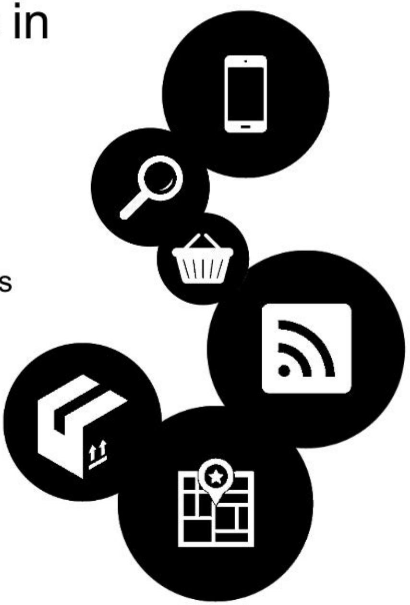
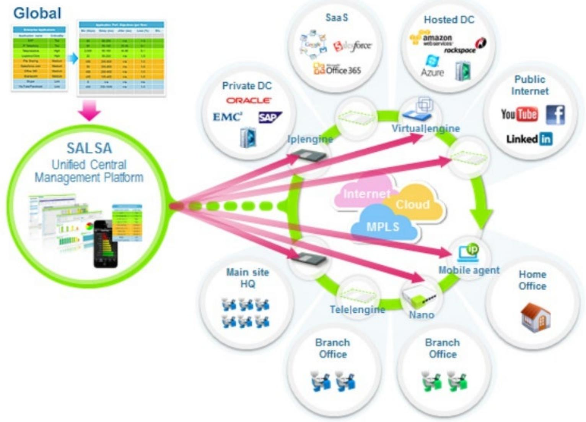
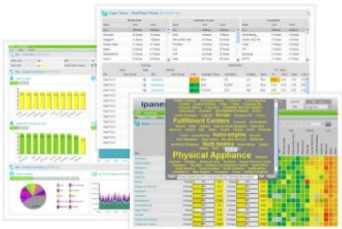
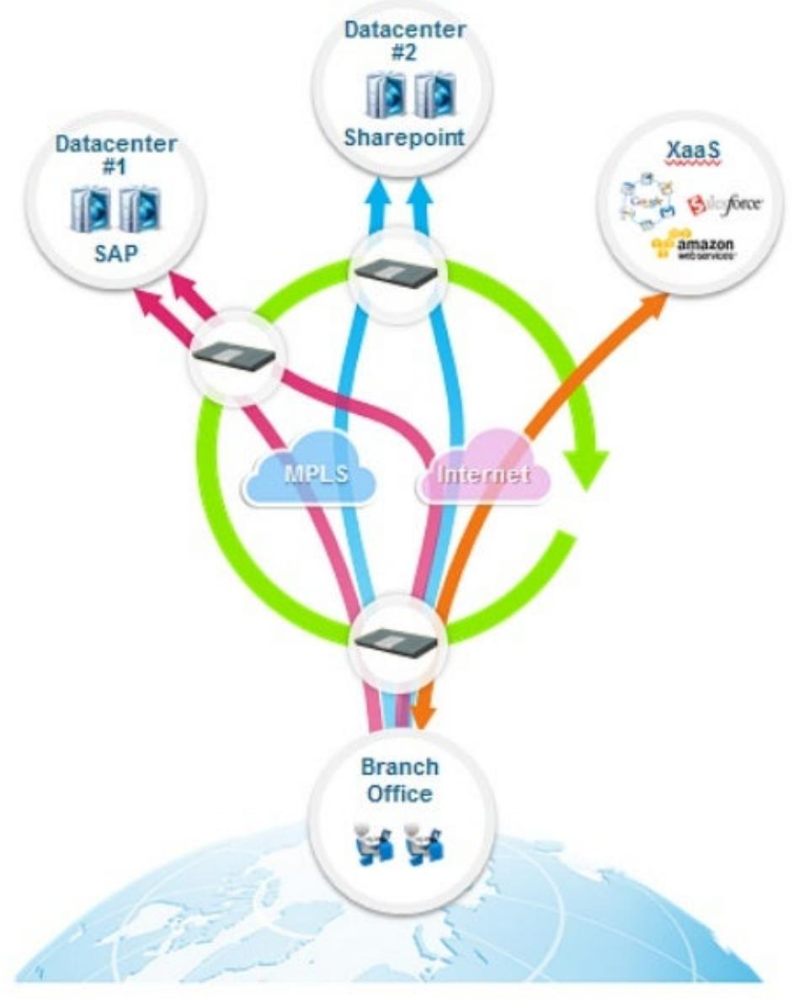
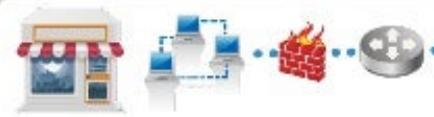
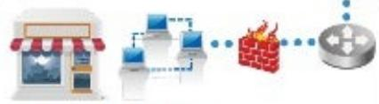

## Impact of Store Networks and WiFi on Customer Experience

#ConnectedStore

## Welcome Webinar Attendees

> **AI Description:**
> **Source:** `assets/_page_1_Figure_0.jpg`
> 
> **Generated:** 2026-05-31 19:24:37
> 
> ---
> 
> The image contains a user interface from the GoToWebinar platform. It displays an audio settings section with options for audio mode (using a telephone or microphone and speakers) and a muted status indicator. Below that, there is a "Questions" section with a log of a question and answer. The question asks if participants can ask questions live or only through the text Q&A, and the answer indicates that live questions are possible, with the option to raise a hand to unmute. The interface includes standard window controls at the top and a "Send" button at the bottom of the questions section.

## #ConnectedStore

Retail TouchPoints:

Earthlink:

AirTight Networks:

IHL Group:

@RTouchPoints

@Earthlink

@Airtight

@gregbuzek

## About Retail TouchPoints

√Launched in 2007

√Over 28,000 subscribers

√To provide executives with relevant, insightful content acrossa variety of digital medium

Freesubscription to our weekly newsletter: WWW.RETAILTOUCHPOINTS.COM/SIGNUP

## Panelists

> **AI Description:**
> **Source:** `assets/_page_4_Figure_0.jpg`
> 
> **Generated:** 2026-05-31 19:35:37
> 
> ---
> 
> The image contains a photograph of a smiling individual. The person is wearing a dark blazer over a light blue shirt. The background appears to be an indoor setting, possibly an office or home environment, with some furniture and decorative items visible. The image is framed with a white border, giving it a professional or formal appearance.

Greg Buzek Founder&President IHL Group

> **AI Description:**
> **Source:** `assets/_page_4_Figure_1.jpg`
> 
> **Generated:** 2026-05-31 19:36:03
> 
> ---
> 
> The image contains a photograph of a person wearing a suit, tie, and glasses. The background is plain and neutral. There are no charts, diagrams, or text annotations present in the image.

Kevin McCauley DirectorofRetail Market Development AirTightNetworks
MODERATOR

Debbie Hauss Editor-in-Chief Retail TouchPoints

> **AI Description:**
> **Source:** `assets/_page_4_Figure_3.jpg`
> 
> **Generated:** 2026-05-31 19:34:41
> 
> ---
> 
> The image contains a photograph of a man in a suit with a background that appears to be a painted landscape. The man is wearing a dark suit jacket over a light-colored shirt. The background features a tree and what looks like a mountainous or hilly area, suggesting a natural or outdoor setting. There are no charts, graphs, or other visual elements present in the image.

Greg Griffiths Vice President of Product Alliances EarthLink

# Impact of Store Networks and WiFi on Customer Experience

Greg Buzek President

## Fundamental Change in Store Architecture

·POS being driven by Distributed OrderManagement

·One version of the truth

·Enabling Associate and Consumers via WiFiandMobile

·Centralized Returns/Return Fraud

·Ship from Store and other Omni-Channel trends

·Beacons and Internet of Things

> **AI Description:**
> **Source:** `assets/_page_6_Figure_0.jpg`
> 
> **Generated:** 2026-05-31 19:25:10
> 
> ---
> 
> The image contains a diagram with six circular icons, each representing a different concept or function. The icons are interconnected, suggesting a relationship or flow between them. The icons include:
> 
> 1. A smartphone, indicating mobile technology or communication.
> 2. A magnifying glass, representing search or discovery.
> 3. A shopping basket, symbolizing commerce or purchasing.
> 4. A Wi-Fi signal, indicating wireless connectivity or internet access.
> 5. A box with arrows, suggesting storage or data transfer.
> 6. A building with a star, possibly representing a location or landmark.
> 
> The diagram appears to illustrate a process or system involving these interconnected elements, possibly related to online shopping, mobile commerce, or a digital ecosystem.

## Infrastructure Survey Results

### Full Page Description (Page 8)

**Source:** `assets/_page_8_Asset_1.jpg`

**Generated:** 2026-05-31 19:29:41

---

The image contains a pie chart titled "Respondents by revenue." The chart is divided into three segments, each representing a different revenue range and the percentage of respondents it corresponds to. The largest segment, in green, represents "Over $1 Billion" with 51% of respondents. The second largest segment, in blue, represents "Under $500 Million" with 30% of respondents. The smallest segment, in orange, represents "$500M - $1 Billion" with 19% of respondents. The chart visually represents the distribution of respondents across different revenue brackets.

### Full Page Description (Page 8)

**Source:** `assets/_page_8_Asset_0.jpg`

**Generated:** 2026-05-31 19:30:07

---

The image contains a pie chart with three segments representing different respondent segments. The largest segment, in blue, is labeled "General Merchandise & Specialty" and accounts for 63% of the respondents. The second largest segment, in green, is labeled "Hospitality" and represents 23% of the respondents. The smallest segment, in orange, is labeled "Food, Drug, Conv, Mass" and makes up 14% of the respondents. The chart provides a clear visual representation of the distribution of respondents across these three categories.

## Respondent Demographics

### Full Page Description (Page 9)

**Source:** `assets/_page_9_Asset_0.jpg`

**Generated:** 2026-05-31 19:33:20

---

The image is a bar chart with a color-coded legend indicating different timeframes for readiness or plans related to various technologies and systems. The chart includes categories such as Beacons, Loyalty-Mobile App, EMV Compliance, WiFi-Store Level, WAN Bandwidth/optimization, WAN/LAN Network Security, and VOIP. Each category has bars representing "Currently Ready," "Within 12 Months," "12-24 Months," "24-36 Months," and "No Plans." The data is sourced from the IHL Group Store Infrastructure Survey 2011. The chart visually represents the readiness or plans for each technology or system across different timeframes, allowing for a comparison of current status and future intentions.

## Status of Infrastructure Update %

Store Infrastructure Technology Update Timeframe

### Full Page Description (Page 10)

**Source:** `assets/_page_10_Asset_0.jpg`

**Generated:** 2026-05-31 19:28:05

---

The image contains a horizontal bar chart with four categories: "General Merchandise & Specialty," "Food, Drug, Conv, Mass," "Hospitality," and "Overall." The bars are color-coded and labeled with numerical values representing scores: 75 for "General Merchandise & Specialty," 86 for "Food, Drug, Conv, Mass," 100 for "Hospitality," and 82 for "Overall." The chart visually compares the performance or ratings of these categories.

## Who Has WiFi Installed

## %RESPONDENTSUSINGWIFIAT STORES

### Full Page Description (Page 11)

**Source:** `assets/_page_11_Asset_0.jpg`

**Generated:** 2026-05-31 19:30:56

---

The image contains a bar chart with data segmented into three categories: Overall, Food, Drug, Conv, Mass, General Merchandise & Specialty, and Hospitality. The chart uses a color-coded system to represent different data points, with blue and red sections indicating varying values. The overall section shows a total of 100 units, with 54 in blue and 42 in red. The Hospitality section has the highest value, with 85 units in blue and 8 in red. The Food, Drug, Conv, Mass category has the lowest total, with 22 units in blue and 78 in red. The General Merchandise & Specialty section has 51 units in blue and 46 in red.

## In-Store Wi-Fi Use Strategy

## How do you use Wi-Fi ? %

BothCompany useand customerWifiaccess

Justfor Company Use

Just Customer Use

### Full Page Description (Page 12)

**Source:** `assets/_page_12_Asset_0.jpg`

**Generated:** 2026-05-31 19:37:00

---

The image contains a bar chart with various categories related to customer engagement and store analytics. The chart lists different metrics such as demographics, sales conversion by WiFi, times of use, social media conversions, time in store, loyalty/repeat visits to store, hot spots in store, what devices customers use, guest WiFi session duration, and traffic counting. Each category is represented by a colored bar with a corresponding numerical value indicating the percentage or frequency of occurrence. The chart visually compares the significance of each metric in the context of store analytics, with traffic counting having the highest value at 56%.

## Analytics Usage of In-Store Wi-Fi

## %RESPONDENTS USING WIFI AT STORES

### Full Page Description (Page 13)

**Source:** `assets/_page_13_Asset_0.jpg`

**Generated:** 2026-05-31 19:28:57

---

The image contains a bar chart with two categories, "Yes" and "No," represented by blue and dark blue bars, respectively. The chart is divided into four sections: Overall, General Merchandise & Specialty, Food, Drug, Conv, Mass, and Hospitality. Each section shows the number of "Yes" and "No" responses. The "Overall" section has 24 "Yes" and 76 "No" responses. The "General Merchandise & Specialty" section has 31 "Yes" and 69 "No" responses. The "Food, Drug, Conv, Mass" section has 11 "Yes" and 89 "No" responses. The "Hospitality" section has 15 "Yes" and 85 "No" responses. The chart visually represents the distribution of responses across different categories.

## Differentiated Use of In-Store Wi-Fi

## Are you doing promotions to customers over Wi-Fi? %

### Full Page Description (Page 14)

**Source:** `assets/_page_14_Asset_0.jpg`

**Generated:** 2026-05-31 19:32:09

---

The image contains a horizontal bar chart with various categories and corresponding numerical values. The categories listed are "Analytics and Social Media integration," "Vendor reputation," "SLAs," "Costs," "Centralized Control of company devices," "PCI Compliance," and "Security." Each category has a corresponding bar with a numerical value above it, ranging from 2.9 to 4.7. The chart uses different colors for each category to distinguish them. The main trend is that the categories "PCI Compliance" and "Security" have the highest values, followed by "Centralized Control of company devices." The lowest value is for "Analytics and Social Media integration."

## Wi-Fi Vendor Selection Criteria

Top Criteria(1-5,5Critical)

## IT Spend on Data Security

## The BIG Dilemma More Security or More Guest Access?

Secure Guest Wi-Fi

What can you learn from your customers?

## Secure Guest Wi-Fi

## What can you learn from your customers?

## Engagement

Does this man need help?

Doyou know his name?

Doyoueven know he'shere?

> **AI Description:**
> **Source:** `assets/_page_19_Figure_0.jpg`
> 
> **Generated:** 2026-05-31 19:29:25
> 
> ---
> 
> The image is a photograph of a person standing outdoors, holding a smartphone in one hand and touching their face with the other. The individual appears to be wearing a jacket and has a beard. The background is blurred, suggesting an urban setting with indistinct buildings and possibly some people in the distance. The image is in black and white, with a blue circular border around the photograph.

## Secure Guest Wi-Fi

## What can you learn from your customers?

## Engagement

Does this man need help? Doyouknow hisname? Doyouevenknowhe'shere?

## Integration

What if yourWi-Ficould feed this information intoyour POS,CRM, and loyaltysystems?

> **AI Description:**
> **Source:** `assets/_page_20_Figure_0.jpg`
> 
> **Generated:** 2026-05-31 19:33:52
> 
> ---
> 
> The image is a black and white photograph of a person standing outdoors, holding a smartphone in one hand and touching their face with the other. The person appears to be in a public space, possibly a street or market area, as there are blurred figures and structures in the background. The image is framed with a blue circular border.

### Full Page Description (Page 21)

**Source:** `assets/_page_21_Asset_1.jpg`

**Generated:** 2026-05-31 19:29:07

---

The image is a bar chart that displays data across different weeks (Week 1, Week 2, Week 3) and days of the week (Sunday to Saturday). The bars are color-coded to represent the different weeks, with Week 1 in blue, Week 2 in dark gray, and Week 3 in light gray. Each day has multiple bars, indicating the data for each week. The numbers on top of the bars represent the specific values for each day and week combination. The chart appears to be tracking some form of daily data over three weeks, with the highest values generally occurring on Friday and Saturday.

### Full Page Description (Page 21)

**Source:** `assets/_page_21_Asset_0.jpg`

**Generated:** 2026-05-31 19:29:15

---

The image is a line graph titled "Average Visitors per Store per Day." It displays data points representing the number of average visitors to stores over a period of time. The x-axis represents time, while the y-axis represents the number of visitors, ranging from 0 to 800. The graph shows fluctuations in visitor numbers, with some peaks and troughs, indicating variability in store visitation rates.

## Secure Guest Wi-Fi

## What can you learn from your customers?

## Engagement

Does this man need help? Doyouknow hisname? Doyouevenknowhe'shere?

## Would knowing this makea difference?

> **AI Description:**
> **Source:** `assets/_page_21_Figure_0.jpg`
> 
> **Generated:** 2026-05-31 19:35:58
> 
> ---
> 
> The image is a photograph of a person standing outdoors, holding a smartphone in one hand and touching their face with the other. The person appears to be wearing a jacket and is in a public setting, possibly a street or a market. The image is in black and white, and there is a blue circular border around the photograph. The background is blurred, focusing attention on the person.

## Integration

What if yourWi-Ficould feed this information intoyourPOS,CRM, and loyaltysystems?

### Full Page Description (Page 22)

**Source:** `assets/_page_22_Asset_0.jpg`

**Generated:** 2026-05-31 19:26:40

---

The image is a line graph titled "Average Visitors per Store per Day." The x-axis represents days, while the y-axis represents the number of visitors, ranging from 0 to 800. The graph shows fluctuations in the number of visitors over time, with a general downward trend. There are several peaks and troughs, indicating variations in visitor numbers across different days.

### Full Page Description (Page 22)

**Source:** `assets/_page_22_Asset_1.jpg`

**Generated:** 2026-05-31 19:26:50

---

The image is a bar chart that displays data across different days of the week (Sunday to Saturday) for three weeks (Week 1, Week 2, and Week 3). The chart uses different colors to represent each week: blue for Week 1, dark gray for Week 2, and light gray for Week 3. Each day has three bars corresponding to the respective week, showing numerical values. The data appears to represent some form of daily activity or measurement, with the highest values generally occurring on Friday and Saturday. The chart is designed to compare the data across the three weeks and the seven days of the week.

## Secure Guest Wi-Fi

## What can you learn from your customers?

## Engagement

Does this man need help? Doyouknow hisname? Doyouevenknowhe'shere?

## Would knowing this makea difference?

> **AI Description:**
> **Source:** `assets/_page_22_Figure_0.jpg`
> 
> **Generated:** 2026-05-31 19:26:33
> 
> ---
> 
> The image is a photograph of a person standing outdoors, holding a smartphone in their right hand and touching their ear with their left hand. The person appears to be looking at the phone screen. The background is blurred, suggesting an urban setting with buildings and possibly some greenery. The image is in black and white, with a blue circular border around the photograph.

## Integration

What if yourWi-Ficould feed this information intoyourPOS,CRM, and loyaltysystems?

## Stumbling Blocks

1010101001110011100010000111001110001010101010110000011100000101101001010101   
10011100011001100001000110011001101011

## Stumbling Blocks What can go wrong?

## Stumbling Blocks What can go wrong?

## Mismatched profiles

1010101001110011100010000111001110001010101010110000011100000101101001010101   
10011110001101100011100001000111001100110101010

## Stumbling Blocks What can go wrong?

## Mismatched profiles

Security gaps 0000111100000101101 0101010   
10001111000110101 0001110011001000111001100110101010011100

## Stumbling Blocks What can go wrong?

Mismatched profiles

Security gaps 000011110000010110 00101010   
1000111100011010 01110011001000111001100110101010011100

## Privacy issues

## The Roadmap How to maximize your new guest Wi-Fi

Engage your guests UseguestWi-Fitopromoteloyaltyprogams and interact with customers

Secure your Wi-Fi Ensure your network issafe from wireless intrusions and complies with PCl rules

Close the loop IntegrateWi-Fianalyticsand guest data with your other instore infomation systems

## Observe your space

Presenceanalyticscan showyou howmanymobileusersareinor near your store,how long they stay,and how often they come back

## Impacton Store Network

## Applications drive the customer experience

Appealing Visuallyinteractvevironment technologies,digital signage, freeWi-Fi

## Easytransactions

Self-serviceandautomation, fast checkout,callrouting, reliableaccesstoservices

> **AI Description:**
> **Source:** `assets/_page_30_Figure_0.jpg`
> 
> **Generated:** 2026-05-31 19:27:09
> 
> ---
> 
> The image contains a photograph of a man and a woman standing together, smiling and looking at a tablet. The woman is holding shopping bags, suggesting they might be shopping or browsing online. The image is framed with an orange circular border. The photograph appears to convey a positive and cheerful shopping experience.

## Personalization

Quickaccess to customer data/records,mobile workers,informed staff

## Customer commitment

On-site employee training, protection ofcustomerdata, disasterrecovery

## Connection with othercustomers

Accesstoreviews, connection via social media

## Products/service availability

Dataanalytics,real time access toasingleviewof data,informationtosupport decisionmaking

## WAN performance drives applications

> **AI Description:**
> **Source:** `assets/_page_31_Figure_0.jpg`
> 
> **Generated:** 2026-05-31 19:26:13
> 
> ---
> 
> The image is a detailed diagram illustrating a unified central management platform called SALSA. It showcases various components and their interconnections within a network infrastructure. The diagram includes labels such as "Global," "SALSA Unified Central Management Platform," "Private DC," "Hosted DC," "Public Internet," "Main site HQ," "Branch Office," "Mobile agent," and "Home Office." It also depicts the flow of data through different technologies like "Virtual|engine," "Tele|engine," and "Nano," and highlights the use of "MPLS," "Cloud," and "Internet" as connectivity options. The diagram visually represents the integration of various applications and services, such as Salesforce, Office 365, Amazon Web Services, and others, within the overall network architecture.

## Application Visibility and Control

## Application Visibility

Providescustomerswithafull understanding of bandwidth usageat theapplication level foreach location.

> **AI Description:**
> **Source:** `assets/_page_32_Figure_0.jpg`
> 
> **Generated:** 2026-05-31 19:34:22
> 
> ---
> 
> The image contains a collage of various visual elements related to data analysis and monitoring. It includes:
> 
> 1. **Charts and Graphs**: Bar graphs and pie charts are present, likely representing some form of data distribution or performance metrics.
> 2. **Tables**: There are tables with numerical data, possibly related to inventory levels or operational metrics.
> 3. **Heat Maps**: A heat map is visible, which typically represents data with varying intensities, possibly indicating resource usage or performance levels.
> 4. **Text Elements**: Phrases like "Fulfillment Centers," "Physical Appliance," and "Real-Time Flow" suggest the image is related to logistics, inventory management, or operational tracking.
> 5. **Color Coding**: The use of colors (green, yellow, red, etc.) is consistent with data visualization, where colors often represent different levels or statuses of data.
> 
> The image appears to be a dashboard or a set of slides used for monitoring and analyzing operational data, possibly in a logistics or inventory management context.

## ApplicationControl

Providescustomerswith theability to dynamicallyadjustsnetworkbehaviorand resourcestoapplication trafficdemand.

## Dynamic WAN Selection

DynamicWAN Selection Automaticallychoosesthebestaccessforeach applicationflowtomaximizethedelivered performanceand continuity,whileoptimizing theusageof eachavailablenetworkatthe sametime

> **AI Description:**
> **Source:** `assets/_page_33_Figure_0.jpg`
> 
> **Generated:** 2026-05-31 19:35:24
> 
> ---
> 
> The image is a diagram illustrating a network architecture. It shows a branch office connected to two data centers (Datacenter #1 and Datacenter #2) through various communication channels such as MPLS and the Internet. The diagram also highlights the use of cloud services like XaaS (X as a Service) and mentions specific applications like SAP and SharePoint. The visual elements include arrows indicating data flow, icons representing different technologies, and labels for each component of the network. The diagram effectively conveys the connectivity and data exchange between the branch office and the data centers, as well as the integration of cloud services.

## EarthLink Secure Storefront

> **AI Description:**
> **Source:** `assets/_page_34_Figure_0.jpg`
> 
> **Generated:** 2026-05-31 19:35:30
> 
> ---
> 
> The image depicts a simple icon of a storefront with a red and white striped awning. The storefront has a window and a door, suggesting a small business or shop. There are no charts, graphs, or other visual elements beyond the basic outline and color scheme of the icon.

> **AI Description:**
> **Source:** `assets/_page_34_Figure_1.jpg`
> 
> **Generated:** 2026-05-31 19:37:03
> 
> ---
> 
> The image is a diagram illustrating a network or computer system. It shows three connected devices, likely representing laptops or computers, with lines connecting them to indicate a network connection. The lines are dashed, suggesting a wireless or indirect connection rather than a direct one. The devices are depicted in a simple, cartoon-like style.

> **AI Description:**
> **Source:** `assets/_page_34_Figure_2.jpg`
> 
> **Generated:** 2026-05-31 19:34:46
> 
> ---
> 
> The image shows two smartphone screens with a user interface. The screens display a form or app with fields for input, such as text boxes and dropdown menus. The interface appears to be designed for data entry or user interaction, possibly for a mobile application or a mobile web form. The design is clean and functional, with a focus on usability.

> **AI Description:**
> **Source:** `assets/_page_34_Figure_3.jpg`
> 
> **Generated:** 2026-05-31 19:34:33
> 
> ---
> 
> The image shows a credit card with a blue background and a world map design. The card has the text "One All Bank" at the top and a credit card logo in the center. The card appears to be a promotional or informational image for a financial institution.

CREDITCARD PROCESSORS

STORE LOCATION: CloudFirewal, EndPointManagement,Mobile DeviceManagement, Managed SecurityMonitoring

> **AI Description:**
> **Source:** `assets/_page_34_Figure_4.jpg`
> 
> **Generated:** 2026-05-31 19:33:38
> 
> ---
> 
> The image contains two distinct visual elements: a building and a stack of server-like icons. The building appears to be a modern office or corporate structure, suggesting a business or urban setting. The server icons are dark with blue highlights, possibly representing data centers or cloud computing infrastructure. The juxtaposition of these two elements might be intended to convey a connection between a corporate environment and the technological infrastructure supporting it.

HQ LOCATION: Managed Security Monitoring

> **AI Description:**
> **Source:** `assets/_page_34_Figure_5.jpg`
> 
> **Generated:** 2026-05-31 19:33:24
> 
> ---
> 
> The image contains a simple illustration of a brick wall with flames at the top. The flames are depicted in a stylized manner, with bright orange and yellow colors indicating heat and fire. The brick wall is represented with red bricks and a dark outline. The image is a basic representation of a fire barrier or firewall, symbolizing protection against fire.

EarthLink MPLSNetwork

EARTHLINX DERECTCONNECT

> **AI Description:**
> **Source:** `assets/_page_34_Figure_6.jpg`
> 
> **Generated:** 2026-05-31 19:34:00
> 
> ---
> 
> The image is a diagram illustrating a network security concept. It shows a network divided into two main sections: "Un-trusted" and "Trusted." The "Un-trusted" section includes a cloud with a lock symbol, representing an insecure environment, and a Wi-Fi symbol, indicating wireless access. The "Trusted" section features a cloud with a lock symbol as well, suggesting a secure environment. Between these two sections, there are multiple network devices, including routers and switches, with dotted lines connecting them, indicating data flow. The diagram highlights the transition from an untrusted to a trusted network environment, emphasizing the importance of security measures.

> **AI Description:**
> **Source:** `assets/_page_34_Figure_7.jpg`
> 
> **Generated:** 2026-05-31 19:34:27
> 
> ---
> 
> The image contains a simple diagram with two distinct elements. On the left, there is a representation of a firewall, depicted as a brick wall with a flame at the top, symbolizing protection or security. On the right, there is a circular object with four smaller circles inside it, resembling a cluster of lights or a set of buttons. The diagram appears to be a conceptual or abstract representation, possibly related to cybersecurity or network security concepts.

IPsec Aggregation

> **AI Description:**
> **Source:** `assets/_page_34_Figure_8.jpg`
> 
> **Generated:** 2026-05-31 19:26:55
> 
> ---
> 
> The image depicts a simple illustration of a storefront with a striped awning. The awning is red and white, and the storefront has a window displaying what appears to be a snowy scene. There are no charts, graphs, or other visual elements beyond the storefront and awning.

STORE LOCATION: Secure WiFi with Integrated Firewal, Managed Security Monitoring

> **AI Description:**
> **Source:** `assets/_page_34_Figure_9.jpg`
> 
> **Generated:** 2026-05-31 19:26:24
> 
> ---
> 
> The image is a diagram illustrating a network security setup. It shows a storefront on the left, representing a business or organization, connected to a series of computers through a network. A firewall is positioned between the computers and the storefront, indicating a security measure to protect the network. On the right side, there is a credit card, symbolizing online transactions or financial data. The diagram visually represents the flow of data from the storefront to the computers and the protection provided by the firewall before reaching the credit card.

> **AI Description:**
> **Source:** `assets/_page_34_Figure_10.jpg`
> 
> **Generated:** 2026-05-31 19:30:10
> 
> ---
> 
> The image contains a simple icon of a computer mouse positioned over a globe. The globe is blue with white lines representing latitude and longitude, and the mouse is white with blue accents. This icon likely represents internet connectivity or global computer use.

STORELOCATION: IPsecVPN with Integrated Firewall, PCI Compliance Solutions, Managed Security Morttoring

> **AI Description:**
> **Source:** `assets/_page_34_Figure_11.jpg`
> 
> **Generated:** 2026-05-31 19:30:59
> 
> ---
> 
> The image contains a circular icon with four directional arrows pointing left, right, up, and down. The arrows are white and set against a dark background. The icon appears to represent a navigation or directional control, possibly for a user interface or application.

> **AI Description:**
> **Source:** `assets/_page_34_Figure_12.jpg`
> 
> **Generated:** 2026-05-31 19:31:10
> 
> ---
> 
> The image contains a series of three icons, each depicting a person working at a computer. The first icon shows a person seated at a desk with a desktop computer, the second icon shows a person seated at a desk with a laptop, and the third icon shows a person seated at a desk with a laptop. The icons are simple illustrations and do not contain any text or additional visual elements.

INTERNET

Remote User: Secure Remote Access

> **AI Description:**
> **Source:** `assets/_page_34_Figure_13.jpg`
> 
> **Generated:** 2026-05-31 19:31:05
> 
> ---
> 
> The image is a diagram illustrating a network setup. It shows a storefront on the left, connected to a series of devices including a router, firewall, and a server. The diagram represents a typical network architecture, where the storefront is the client, the router and firewall act as intermediaries, and the server is the destination. The flow of data is indicated by arrows leading from the storefront to the server, passing through the router and firewall. The firewall is highlighted with a red warning sign, indicating a critical issue or security concern.

> **AI Description:**
> **Source:** `assets/_page_34_Figure_14.jpg`
> 
> **Generated:** 2026-05-31 19:32:14
> 
> ---
> 
> The image is a diagram illustrating a network setup. It shows a storefront on the left, connected to multiple computers through dotted lines, symbolizing a network connection. The computers are linked to a firewall, which is represented by a brick wall with a blue outline. The firewall is further connected to a central server or router, depicted by a circular icon with a blue outline and white dots. The diagram visually represents the flow of data or connections from the storefront to the central server through the network and firewall.

STORELOCATION: [Psec VPN w:th Integrated PCI-Compiant Firewall, ManagedSecurityMoritoring

STORELOCATION:   
MPLS IPsec. Premises Firewal, Managed   
Security Moritoring

## Whatabout Customer Loyalty?

How does WiFi lend itself to Customer Loyaltyand what type of increasedoes it have onsales?

## Customer Wi-Fi's Influence on Loyalty/Sales

## Employee Wi-Fi Impact on Customer Loyalty/Sales

## Impact on Sales/Profitability forAverage Retailer

GMSretailerscanadd onaverage2more pointsto EBITAwithWiFiandwhat that enables.
Levelingtheplayingfieldoninformation
Upsell opportunities/Offerstocustomers
Doesnotincludeanyincreasedueto increased loyalty

## What about an Average Retailer (\$Millions)

Survey RespondentsbySegmentappliedtoaverageretailer sizes per segment

Dependent on efficiency of the supporting systems

## Contact Information

IHL

> **AI Description:**
> **Source:** `assets/_page_40_Figure_0.jpg`
> 
> **Generated:** 2026-05-31 19:24:13
> 
> ---
> 
> The image is a photograph of a smiling person. The person appears to be middle-aged with a bald head and is wearing a dark-colored shirt. The background is plain and light-colored, which helps to focus attention on the subject. There are no charts, graphs, or other visual elements present in the image.

·Greg Buzek

·President

·+1-615-591-2955

·greg@ihlservices.com

## EarthLink?

> **AI Description:**
> **Source:** `assets/_page_41_Figure_0.jpg`
> 
> **Generated:** 2026-05-31 19:26:18
> 
> ---
> 
> The image contains a 3D cube with a gradient of orange shades. The cube is composed of six faces, each with a different shade of orange, creating a sense of depth and perspective. The cube is centered in the image, and the gradient effect gives it a modern and abstract appearance. There are no labels or text annotations present in the image.

AirTight RN E T W 。 R KS

## Contact Information

> **AI Description:**
> **Source:** `assets/_page_42_Figure_1.jpg`
> 
> **Generated:** 2026-05-31 19:34:50
> 
> ---
> 
> The image is a black and white photograph of a smiling man. The man appears to be middle-aged with a bald head and is wearing a dark suit jacket. The background is plain and does not contain any additional visual elements or text.

> **AI Description:**
> **Source:** `assets/_page_42_Figure_5.jpg`
> 
> **Generated:** 2026-05-31 19:33:43
> 
> ---
> 
> The image contains a photograph of a person in professional attire, standing in front of a background that appears to be a painting or digital artwork depicting a landscape with a tree and a sky. The image is framed with a reflective white border.

·Greg Buzek

·President

·+1-615-591-2955

greg@ihlservices.com

·Kevin McCauley

·Director of Retail Market Development

kevin.mccauley@airtightnetworks.com

·Greg Griffiths

·Vice President of Product Alliances

Ggriffiths@elnk.com

## Q& A// Panelists

> **AI Description:**
> **Source:** `assets/_page_43_Figure_0.jpg`
> 
> **Generated:** 2026-05-31 19:33:34
> 
> ---
> 
> The image contains a photograph of a smiling individual. The person appears to be middle-aged, with a bald head and a friendly expression. The background includes some blurred objects, possibly furniture and decor, but they are not the focus of the image. The image is framed with a white border, and the overall quality suggests it is a professional or personal headshot.

Greg Buzek Founder&President IHLGroup

Kevin McCauley DirectorofRetail Market Development AirTightNetworks
MODERATOR

Debbie Hauss Editor-in-Chief Retail TouchPoints

> **AI Description:**
> **Source:** `assets/_page_43_Figure_3.jpg`
> 
> **Generated:** 2026-05-31 19:34:08
> 
> ---
> 
> The image contains a photograph of a man in a suit with a background of a landscape painting. The man appears to be middle-aged with short brown hair and is wearing a dark suit jacket over a light-colored shirt. The background features a scenic view with mountains and a tree, suggesting a serene and natural setting.

Greg Griffiths Vice President of Product Alliances EarthLink