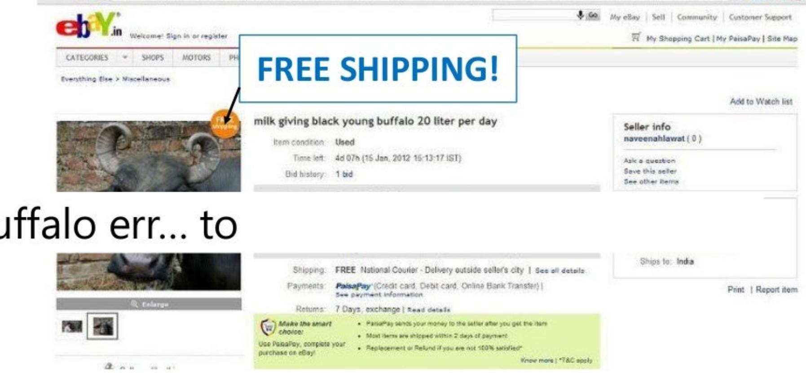
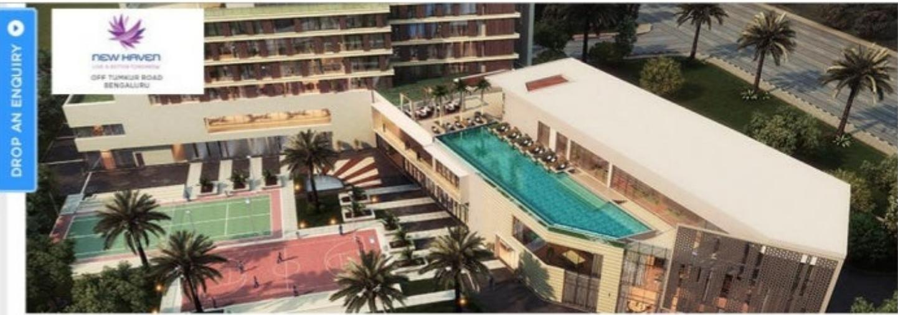
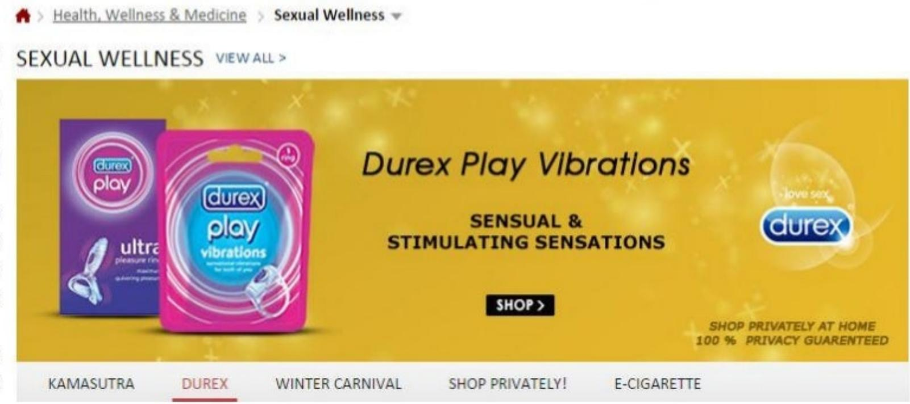
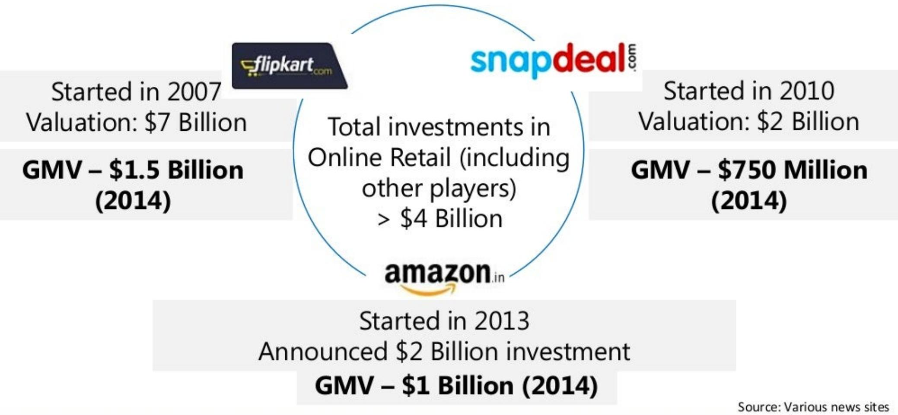
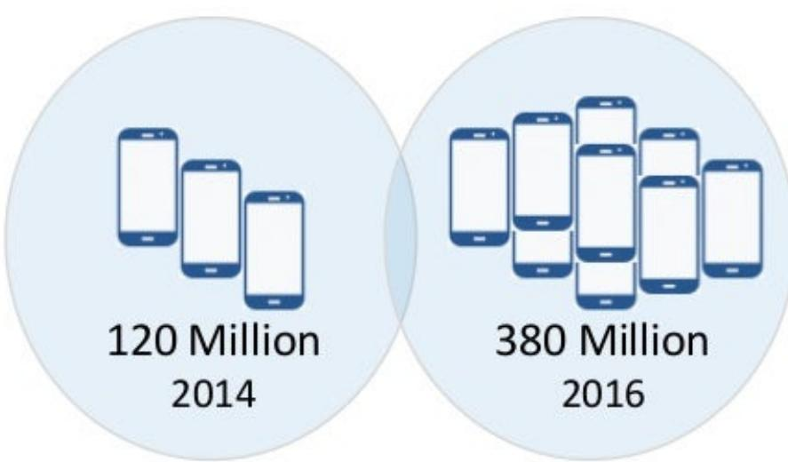
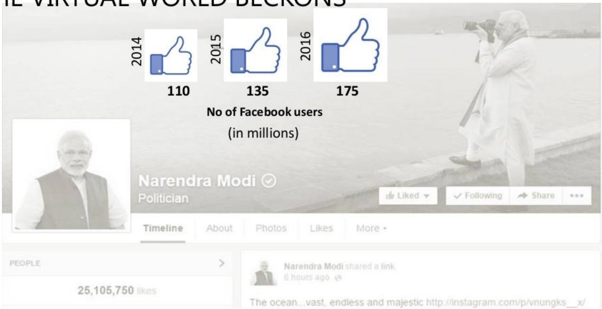
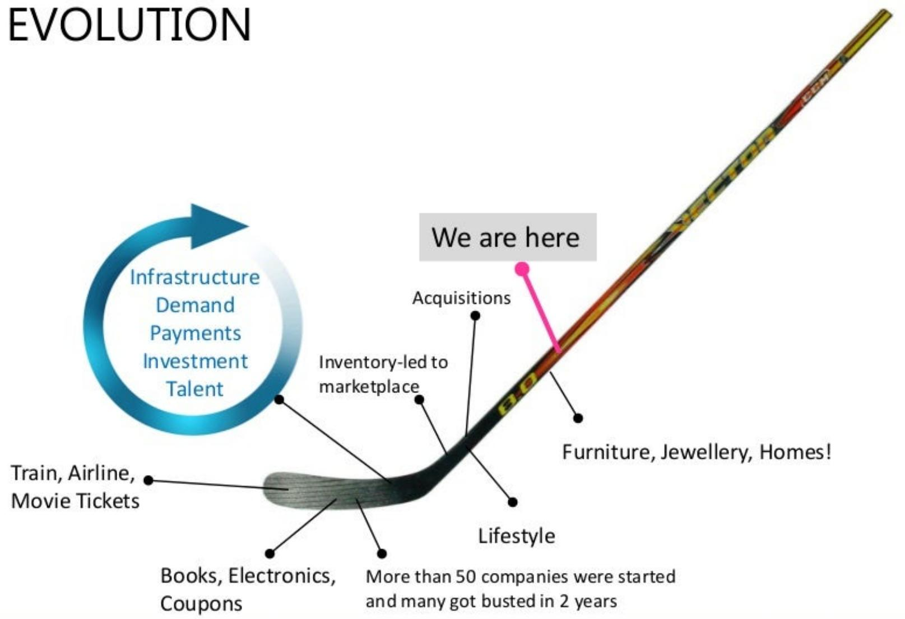
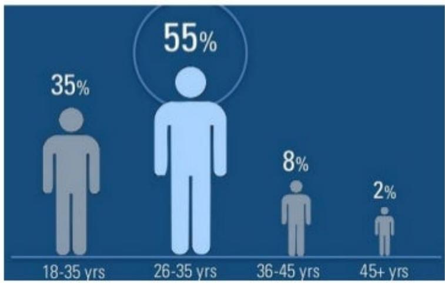
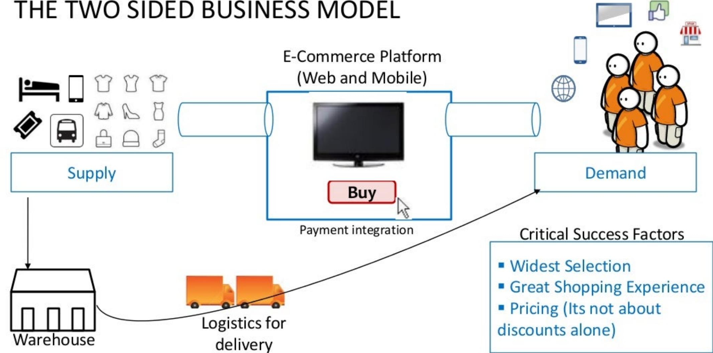
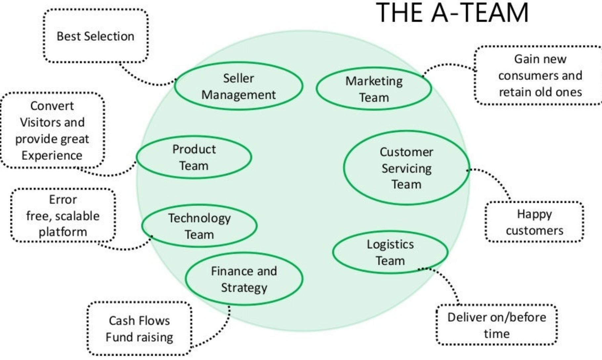

> **AI Description:**
> **Source:** `assets/_page_0_Figure_0.jpg`
> 
> **Generated:** 2026-05-31 19:49:10
> 
> ---
> 
> The image contains two photographs. The first photograph shows two individuals dressed in traditional orange robes, sitting and looking at mobile phones. The second photograph depicts a family of four, including two adults and two children, dressed in traditional attire. The family is gathered around a tablet, with one adult holding a credit card. The images appear to illustrate the use of technology in different contexts, possibly highlighting the integration of modern devices into traditional lifestyles.

## THE ECOMMERCE GOLD RUSH IN INDIA

Ashwin Krishna ashwin.arya@gmail.com

> **AI Description:**
> **Source:** `assets/_page_0_Figure_1.jpg`
> 
> **Generated:** 2026-05-31 19:48:31
> 
> ---
> 
> The image is a photograph showing two women dressed in traditional attire, likely from an Indian cultural context. They are both wearing yellow and orange sarees with intricate patterns and silver jewelry. The woman on the right is holding a smartphone and appears to be showing something on the screen to the woman on the left, who is smiling and looking at the phone. The background is blurred, suggesting an outdoor setting. The image captures a moment of interaction and shared interest, possibly related to technology or communication.

157112181380

Trivia: What's happening here?

> **AI Description:**
> **Source:** `assets/_page_2_Figure_0.jpg`
> 
> **Generated:** 2026-05-31 19:56:58
> 
> ---
> 
> The image contains a traditional illustration of two figures, likely representing a divine couple from Hindu mythology. The figure on the left is adorned with a crown and a bow, suggesting a warrior or deity, while the figure on the right is dressed in colorful attire, possibly a goddess. The style is reminiscent of classical Indian art, with intricate details and vibrant colors. The image does not contain any text or additional visual elements beyond the two figures.

## Offer Prasad to Lord Ram on Vivaah Panchmi

Everything is sold online from Prasad to...

> **AI Description:**
> **Source:** `assets/_page_3_Figure_0.jpg`
> 
> **Generated:** 2026-05-31 19:58:20
> 
> ---
> 
> The image is a screenshot of an eBay listing page. It features a photograph of a black young buffalo with large horns, accompanied by text describing the item as "milk giving black young buffalo 20 liter per day." The listing indicates that the item is used and has one bid. The seller's information and shipping details are also visible, including free shipping and the option to use PaisaPay for payments. The image includes a "FREE SHIPPING!" banner and a note about the seller's location in India.

> **AI Description:**
> **Source:** `assets/_page_4_Figure_0.jpg`
> 
> **Generated:** 2026-05-31 19:57:41
> 
> ---
> 
> The image is a rendering of a residential complex named "New Haven," located off Tumkur Road in Bengaluru. The image showcases a modern building with balconies, a large swimming pool, and a tennis court. There are palm trees and greenery surrounding the complex, indicating a well-maintained and luxurious environment. The image also includes a call-to-action button labeled "DROP AN ENQUIRY," suggesting that the image is part of a real estate advertisement.

BOOKONLINE NOWFOR Rs.30,000ONLY

SELECTYOUR SPACE

2BHKCOMPACT

28HK OPTIMA

## Houses to...

mutipurpose nallretaizone,creche andretail spaces.Tokeep yourtness going.wealso nouse a basketball court, volleyball court and a skating rink

Withtheproposedmetro stationandeasy connectivitytomajor highwaysNew Haven isonitswayto becoming Bengaluru's next big location.

PntP

Sve Pag foe

Sareag

.TIMA

LITE

3BHK

YOURAPARTMENTCOST

Rs.36,99,266 Other Chages Appy

AMENITIES

BOOK NOWFORRs.30,0OOONLY

## sexual wellness products..

JOIN THE TEAM TRACK YOUR ORDER SELL ON SNAPDEAL

## SEEALL CATEGORIES

HEALTH,WELLNESS& （17130）   
MEDICINE   
Massager&Pain Relief (2466)   
Sexual Weliness (4072)   
Weighing Scales & Daily (1507)   
Needs   
Diabetic Care （498)   
BP&Heart Rate Monitors （394）   
Supports&Rehabilitation (1156)   
Alternative Health （3494）   
Therapies   
Respiratory Care (142)   
Hospital&Medical (678)   
Cniinmant

SWACHH BHARAT STORE>WINTER CARNIVAL> BEST SELLERS>

> **AI Description:**
> **Source:** `assets/_page_5_Figure_1.jpg`
> 
> **Generated:** 2026-05-31 19:56:49
> 
> ---
> 
> The image contains a promotional advertisement for Durex Play Vibrations. It features two product packages, one labeled "ultra" and the other "vibrations," both with the Durex brand logo. The background is a gradient of yellow and gold with sparkles, giving a festive appearance. The text highlights "Sensual & Stimulating Sensations" and includes a "SHOP" button. At the bottom, there are navigation options for "KAMASUTRA," "DUREX," "WINTER CARNIVAL," "SHOP PRIVATELY!" and "E-CIGARETTE." The ad also emphasizes "SHOP PRIVATELY AT HOME 100% PRIVACY GUARANTEED."

## TALE OF TWO BILLION \$STARTUPS AND AMAZON

> **AI Description:**
> **Source:** `assets/_page_6_Figure_0.jpg`
> 
> **Generated:** 2026-05-31 19:46:59
> 
> ---
> 
> The image contains a comparison of three online retail platforms: Flipkart, Snapdeal, and Amazon.in. It is an infographic with text and logos. The key information includes:
> 
> - Flipkart started in 2007, has a valuation of $7 billion, and a GMV of $1.5 billion in 2014.
> - Snapdeal started in 2010, has a valuation of $2 billion, and a GMV of $750 million in 2014.
> - Amazon.in started in 2013, announced a $2 billion investment, and had a GMV of $1 billion in 2014.
> - The infographic also highlights total investments in online retail exceeding $4 billion.

### Full Page Description (Page 7)

**Source:** `assets/_page_7_Asset_1.jpg`

**Generated:** 2026-05-31 19:48:23

---

The image contains a pyramid diagram with two sections. The top section is labeled "Metros" and the bottom section is labeled "Rest of India (Tier 2,3,4 Cities)." The pyramid is divided into two parts with percentages on the right side: 40% above the dashed line and 60% below the dashed line. The diagram visually represents the distribution of some metric, possibly related to urbanization or population distribution, with a higher percentage in the "Rest of India" section compared to the "Metros" section.

### Full Page Description (Page 7)

**Source:** `assets/_page_7_Asset_2.jpg`

**Generated:** 2026-05-31 19:49:23

---

The image is a stacked bar chart showing the percentage of internet usage by devices (mobile and desktop) from 2011 to 2014. The chart uses two colors: yellow for mobile and green for desktop. The percentages for mobile usage are 32%, 46%, 55%, and 61% for the years 2011 to 2014, respectively. Desktop usage percentages are 68%, 54%, 45%, and 39% for the same years. The chart highlights a significant increase in mobile usage over the four years, while desktop usage shows a corresponding decrease.

## THE INTERNET JUGGERNAUT

## ONETHINGWHICHWILL CHANGETHEFUTURE

Search   
Shopping   
Comparison   
Communication   
Networking   
Travel planning   
Games   
Movies   
News   
Communication

> **AI Description:**
> **Source:** `assets/_page_8_Figure_0.jpg`
> 
> **Generated:** 2026-05-31 19:52:50
> 
> ---
> 
> The image contains a comparison of smartphone usage over two years, 2014 and 2016. It uses two circles, each containing icons of smartphones to represent the number of users. The left circle, labeled "120 Million 2014," shows three smartphones, indicating the number of smartphone users in 2014. The right circle, labeled "380 Million 2016," shows seven smartphones, representing the number of smartphone users in 2016. The visual comparison clearly illustrates a significant increase in smartphone usage from 2014 to 2016.

Smartphone users

> **AI Description:**
> **Source:** `assets/_page_9_Figure_0.jpg`
> 
> **Generated:** 2026-05-31 19:52:37
> 
> ---
> 
> The image contains a Facebook profile page for Narendra Modi, a politician, with a timeline showing the number of Facebook users (in millions) for the years 2014, 2015, and 2016. The profile includes a profile picture, a verified badge, and options to like, follow, share, and more. The profile has a significant number of likes, 25,105,750. The background of the image shows a grayscale photograph of Modi taking a photo. The text at the top of the image reads "THE VIRTUAL WORLD BECKONS." The key data presented is the increase in the number of Facebook users over the three years, with a notable jump from 110 million in 2014 to 175 million in 2016.

Source:Accel,InternetandMobileAssociationof India Reports

## DIGITAL AD SPEND IN INDIA

Advertising spend (in INR Billions)

30% CAGR DIGITALISTHEFASTEST GR SECTOR

### Full Page Description (Page 11)

**Source:** `assets/_page_11_Asset_0.jpg`

**Generated:** 2026-05-31 19:51:26

---

The image contains a bar chart comparing eCommerce sales in 2014 and 2018, broken down into two categories: Product eCommerce and Travel and Others. The chart uses a color-coded system with yellow for Product eCommerce and blue for Travel and Others. In 2014, the total sales were $11 billion, with $8 billion from Travel and Others and $3 billion from Product eCommerce. By 2018, the total sales had increased to $43 billion, with $30 billion from Travel and Others and $13 billion from Product eCommerce. The chart effectively illustrates the significant growth in eCommerce sales over the four-year period, with a notable increase in the Travel and Others category.

## SHOW ME THE MONEY, HONEY!

> **AI Description:**
> **Source:** `assets/_page_12_Figure_0.jpg`
> 
> **Generated:** 2026-05-31 19:45:26
> 
> ---
> 
> The image is a combination of text and a diagram. It presents a visual representation of the evolution of a business model, using a hockey stick as a metaphor. The diagram includes a circular flow labeled "Infrastructure, Demand, Payments, Investment, Talent," which represents the cycle of business growth. The hockey stick is divided into different sections, each labeled with a specific aspect of the business model, such as "Train, Airline, Movie Tickets," "Books, Electronics, Coupons," "Inventory-led to marketplace," "Acquisitions," "Furniture, Jewellery, Homes!," and "Lifestyle." The text also mentions that more than 50 companies were started and many got busted in 2 years. The image uses arrows and labels to connect the different parts of the hockey stick to the circular flow, illustrating the progression of the business model.

### Full Page Description (Page 13)

**Source:** `assets/_page_13_Asset_0.jpg`

**Generated:** 2026-05-31 19:49:38

---

The image is a bar chart with a focus on the growth of Women Influenced GMV (Gross Merchandise Volume) over three years: 2012, 2013, and a projected 2016. The chart includes three main elements:

1. **2012**: The bar represents $122 million, which is 15% of the market.
2. **2013**: The bar increases to $511 million, representing a 4x growth and 26% of the market.
3. **2016P (Projected)**: The bar is projected to reach $4.2 billion, indicating a 24x growth and 35% of the market.

The chart uses a dotted line to connect the projected growth, and the bars are color-coded for clarity. The source of the data is attributed to A.

## OPPORTUNITYASSESMENT

Mobile Commerce

> **AI Description:**
> **Source:** `assets/_page_13_Figure_1.jpg`
> 
> **Generated:** 2026-05-31 19:48:00
> 
> ---
> 
> The image is an infographic with a blue background. It presents data on the percentage of individuals in different age groups. The key information includes:
> 
> - 18-35 years: 35%
> - 26-35 years: 55%
> - 36-45 years: 8%
> - 45+ years: 2%
> 
> The data is visually represented by human silhouettes in proportion to their age group percentage. The largest percentage, 55%, is highlighted for the 26-35 years age group.

Online buyersprofile

### Full Page Description (Page 14)

**Source:** `assets/_page_14_Asset_1.jpg`

**Generated:** 2026-05-31 19:54:46

---

The image contains a bar chart with three vertical bars representing the number of debit card users in India from 2014 to 2016, measured in millions. The chart shows an increase in the number of debit card users over the three years. In 2014, the number was 399 million, in 2015 it was 490.77 million, and in 2016 it reached 584.02 million. Additionally, there is a note indicating that 45% of Indians were debit card users in 2016. The chart is labeled "Number of Debit Card users in India (In millions)" and the years are clearly marked on the x-axis.

### Full Page Description (Page 14)

**Source:** `assets/_page_14_Asset_0.jpg`

**Generated:** 2026-05-31 19:53:10

---

The image is a bar chart titled "Online Retail payments in India." It compares the percentage of online retail payments in India for the years 2013 and 2016 (predicted). The chart includes categories such as Cash on Delivery (COD), Credit Cards, Debit Cards, Net banking, EMI, and 3rd party wallets. The data shows that COD was the most popular method in 2013 with 60% and decreased to 50% in 2016. Credit Cards saw a decrease from 16% to 12%, while Debit Cards increased from 12% to 15%. Net banking decreased slightly from 12% to 11%. EMI and 3rd party wallets had minimal usage in 2013 (1% and 0%, respectively) and increased to 5% and 7% in 2016, respectively.

## PAYMENTS LANDSCAPE

·With the increasing digital payments penetration,the share of CODshipments isreducing

With increasing ordervalues,weare seeinganuptick of EMI payments

3rdparty walletsalbeit anewphenomenon,havea strong value propositionandwillbequicktobecomepopular-similar to China

By2016,half of Indians will havedebit card！

### Full Page Description (Page 15)

**Source:** `assets/_page_15_Asset_1.jpg`

**Generated:** 2026-05-31 19:44:31

---

The image is a pie chart divided into several segments, each representing a different category of products and their corresponding percentages. The categories and their percentages are as follows: Mobile, Tablets & Accessories (35%), Fashion, Footwear & Accessories (28%), Computers, Cameras, Electronics & Appliances (18%), Books (7%), Home Décor (3%), Jewellery (2%), Others (2%), Babycare (3%), and Health & Personal Care (2%). The chart visually represents the distribution of sales or market share across these categories.

## ONLINE RETAIL- CATEGORY WISE BREAKUP

> **AI Description:**
> **Source:** `assets/_page_16_Figure_0.jpg`
> 
> **Generated:** 2026-05-31 19:56:15
> 
> ---
> 
> The image is a diagram illustrating a two-sided business model, specifically an e-commerce platform. It features a central e-commerce platform with a "Buy" button, connected to two main sections: "Supply" and "Demand." The "Supply" section includes icons representing various products and services, leading to a warehouse and logistics for delivery. The "Demand" section shows a group of people, indicating customers, with a globe symbolizing global reach. The diagram highlights critical success factors such as the widest selection, great shopping experience, and pricing, emphasizing that it's not just about discounts. The image combines text with visual elements to effectively communicate the business model and its components.

## CONSUMERS EXPECT ALLTO ALL EXPERIENCE

> **AI Description:**
> **Source:** `assets/_page_17_Figure_0.jpg`
> 
> **Generated:** 2026-05-31 19:57:14
> 
> ---
> 
> The image shows a close-up of a person's hands holding a smartphone. The person is wearing a pink knitted garment, and their nails are painted with a light purple or lavender color. The focus is on the hands and the phone, with the background blurred, emphasizing the subject. The image appears to be a photograph rather than a diagram or chart.

ResearchOnline usingSmartphones

> **AI Description:**
> **Source:** `assets/_page_17_Figure_1.jpg`
> 
> **Generated:** 2026-05-31 19:57:20
> 
> ---
> 
> The image contains two hands, one giving a thumbs-up and the other giving a thumbs-down. The thumbs-up hand is on the right side, while the thumbs-down hand is on the left side. The image is a simple black and white illustration with no additional text or annotations. The contrast between the two gestures suggests a binary choice or opinion, possibly representing approval versus disapproval.

Productreviewsin SocialMedia

> **AI Description:**
> **Source:** `assets/_page_17_Figure_3.jpg`
> 
> **Generated:** 2026-05-31 19:57:24
> 
> ---
> 
> The image shows a plain brown paper shopping bag with two handles. The bag appears to be empty and is displayed against a plain white background. There are no labels, text, or additional visual elements present on the bag itself. The image is simple and does not contain any charts, graphs, or other visual content beyond the bag itself.

Buy Online or in store

Anywhere,Anytime,Any Channel

> **AI Description:**
> **Source:** `assets/_page_17_Figure_4.jpg`
> 
> **Generated:** 2026-05-31 19:57:08
> 
> ---
> 
> The image is a diagram illustrating a sequence of digital devices and platforms. It starts with a globe symbolizing the internet, followed by a smartphone, a tablet, and a Facebook thumbs-up icon, symbolizing user interaction. The sequence continues with a storefront icon representing a physical or online shop, and finally, logos for eBay and Amazon, indicating e-commerce platforms. The dashed lines suggest a progression or connection between these elements, possibly representing a user journey or the flow of information from one platform to another.

> **AI Description:**
> **Source:** `assets/_page_18_Figure_0.jpg`
> 
> **Generated:** 2026-05-31 19:51:01
> 
> ---
> 
> The image is a diagram titled "THE A-TEAM," which appears to represent a team structure or organizational chart for a business or project. It includes several oval-shaped sections labeled as "Seller Management," "Marketing Team," "Product Team," "Customer Servicing Team," "Technology Team," "Logistics Team," and "Finance and Strategy." These sections are interconnected, suggesting a collaborative effort among these teams. The diagram also includes external text boxes with phrases such as "Best Selection," "Convert Visitors and provide great Experience," "Error free, scalable platform," "Cash Flows Fund raising," "Gain new consumers and retain old ones," "Happy customers," and "Deliver on/before time." These phrases likely describe the goals or objectives associated with each team or section. The overall structure implies a comprehensive approach to business operations, emphasizing customer satisfaction and business growth.

# EVERYONE WANTS A SHARE OF PIE

RelianceFreshDirect.com to deliver fresh groceries in Mumbai

ShambhaviAnandETBureanNova72o,o.2PT

InspiredbyAlibabaand its Indian clones,Tata Group to get into ecommercespace

stries BSE 1.01% has taken baby etodeliver fresh grocery

HOMEINDUSTRY

FIRST PUBLISHED:THU,NOV132014.1000AMIST

ThechairmanoftheAdityaBirlagroupsaysheisopentoeitheracquiringe-retailersorbuilding

# Hindustan Unilever Ltd jumps on e-commerce bandwagon

## ECOSYSTEMPLAYERS

## ECOSYSTEMPLAYERS

## BUSINESS METRICS

Marketing

Customer acquisitioncost

Product + Marketing +Category

Average Order Value

Conversion Rate

Customer Churn

Customer Lifetime Value

Operations

%On-TimeDelivery Completion

Finance

Cash-conversion cycle and return oncapital

## THE ECONOMIc TMES

Jobs

## WHAT ARE THE OPPORTUNITIES?

Great Entrepreneurial opportunities inmaking theecosystem robust -increasing retention,increasing logisticsefficiency,analyticsetc

## THE PIONEERS

> **AI Description:**
> **Source:** `assets/_page_25_Figure_0.jpg`
> 
> **Generated:** 2026-05-31 19:48:39
> 
> ---
> 
> The image contains a photograph of a person wearing a dark blue polo shirt. The background is plain and dark, focusing attention on the individual. The person appears to be middle-aged and is wearing glasses. There are no charts, graphs, or other visual elements present in the image.

> **AI Description:**
> **Source:** `assets/_page_25_Figure_1.jpg`
> 
> **Generated:** 2026-05-31 19:48:46
> 
> ---
> 
> The image is a photograph of a person sitting in a chair. The individual is wearing a dark blazer over a blue striped shirt. The background is a textured, dark purple wall. The lighting is soft and even, highlighting the person's face and upper body. There are no charts, diagrams, or other visual elements present in the image.

> **AI Description:**
> **Source:** `assets/_page_25_Figure_2.jpg`
> 
> **Generated:** 2026-05-31 19:48:12
> 
> ---
> 
> The image contains a photograph of a person wearing a blue shirt. The person is smiling and appears to be in a studio setting with a plain background. There are no charts, graphs, or other visual elements present in the image.

> **AI Description:**
> **Source:** `assets/_page_25_Figure_3.jpg`
> 
> **Generated:** 2026-05-31 19:48:06
> 
> ---
> 
> The image contains a photograph of a smiling individual wearing glasses. The background is split into two colors: white on the left and orange on the right. There are no charts, graphs, or other visual elements present in the image. The focus is solely on the person and the color split in the background.

Thank You

Ashwin Krishna ashwin.arya@gmail.com