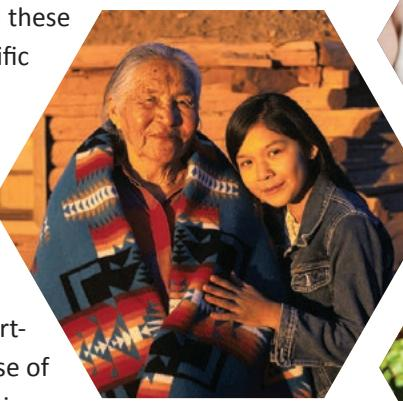
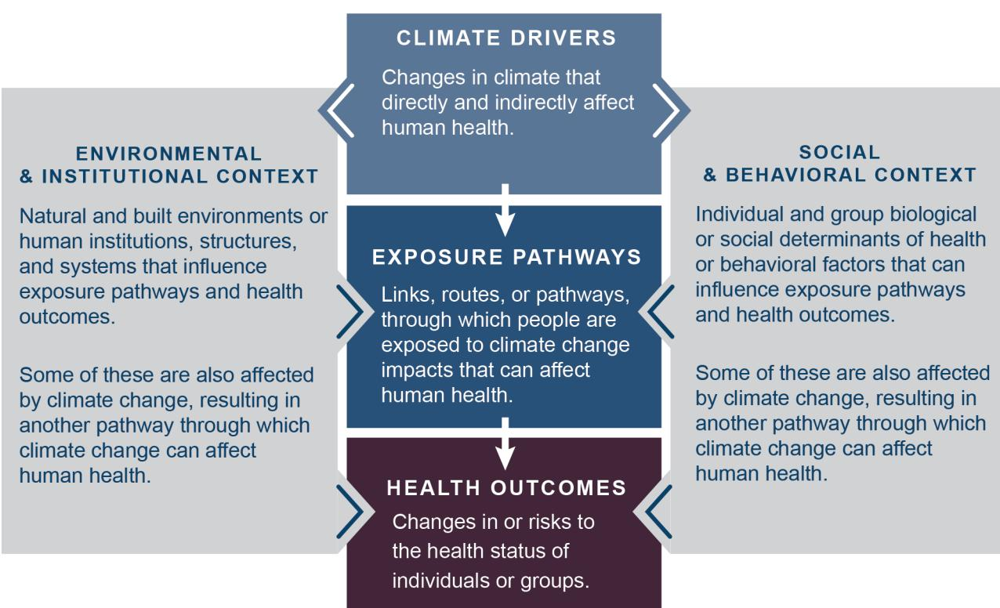
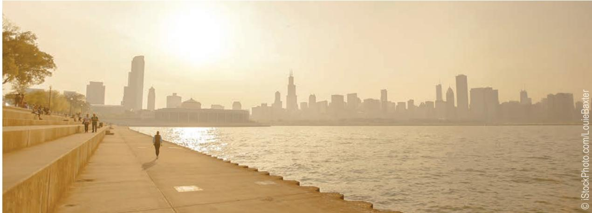
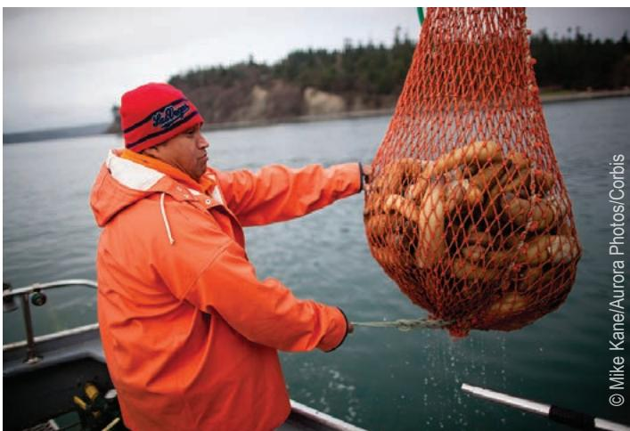

> **AI Description:**
> **Source:** `assets/_page_0_Figure_0.jpg`
> 
> **Generated:** 2026-05-31 20:17:35
> 
> ---
> 
> The image is a photograph of a city skyline during what appears to be either sunrise or sunset, as indicated by the warm tones in the sky. The skyline features numerous high-rise buildings, some with reflective glass facades, and others with more traditional architectural styles. The buildings are densely packed, and the image captures a panoramic view of the city. The reflection of the buildings is visible in the water in the foreground, creating a symmetrical effect. The sky is partly cloudy, with some areas illuminated by the light of the sun, adding to the overall aesthetic of the image.

A Scientific Assessment

U.S. Global Change Research Program

> **AI Description:**
> **Source:** `assets/_page_2_Figure_0.jpg`
> 
> **Generated:** 2026-05-31 20:19:23
> 
> ---
> 
> The image is a photograph of a city skyline during what appears to be either sunrise or sunset, as indicated by the warm hues in the sky. The skyline is dense with high-rise buildings, some of which are illuminated, suggesting it is either early morning or evening. The buildings vary in height and design, with a mix of modern glass facades and more traditional brick structures. The reflection of the buildings is clearly visible in the water below, creating a symmetrical and visually striking effect. The sky is partly cloudy, with some areas of blue and others tinged with orange and pink, adding to the serene and picturesque quality of the scene.

# THE IMPACTS OF CLIMATE CHANGE ON HUMAN HEALTH

IN THE UNITED STATES

A Scientific Assessment

U.S. Global Change Research Program

This report was produced by the U.S Global Change Research Program. 1800 G Street, NW, Suite 9100   
Washington, D.C. 20006 USA   
www.globalchange.gov

First Published April 2016

ISBN: 978-0-16-093241-0

Recommended Citation: USGCRP, 2016: The Impacts of Climate Change on Human Health in the United States: A Scientific Assessment. Crimmins, A., J. Balbus, J.L. Gamble, C.B. Beard, J.E. Bell, D. Dodgen, R.J. Eisen, N. Fann, M.D. Hawkins, S.C. Herring, L. Jantarasami, D.M. Mills, S. Saha, M.C. Sarofim, J. Trtanj, and L. Ziska, Eds. U.S. Global Change Research Program, Washington, DC, 312 pp. http://dx.doi.org/10.7930/J0R49NQX

This report is in the public domain. Some materials in the report are copyrighted and permission was granted for their publication in this report. For subsequent uses that include such copyrighted materials, permission for reproduction must be sought from the copyright holder. In all cases, credit must be given for copyrighted materials. All other materials are free to use with credit to this report.

Dear Colleagues:

On behalf of the National Science and Technology Council and the U.S. Global Change Research Program, I am pleased to share this report, The Impacts of Climate Change on Human Health in the United States: A Scientific Assessment. It advances scientific understanding of the impacts of climate change on public health, highlights social and environmental disparities that make some communities particularly vulnerable to climate change, and confirms that climate change is a significant threat to the health of all Americans.

This report was developed by over 100 experts from across the Nation representing eight Federal agencies. I want to thank in particular the efforts of the U.S. Environmental Protection Agency (EPA), the U.S. Department of Health and Human Services (HHS), and the National Oceanic and Atmospheric Administration (NOAA) for leading in the development of this report. It was called for under the President’s Climate Action Plan and is a major contribution to the sustained National Climate Assessment process. The report was informed by input gathered in listening sessions and scientific and technical information contributed through open solicitations. It underwent rigorous reviews by the public and by scientific experts inside and outside of the government, including a special committee of the National Academies of Sciences, Engineering, and Medicine.

I applaud the authors, reviewers, and staff who have developed this scientific assessment. Their dedication over the past three years has been remarkable and their work has advanced our knowledge of how human health is impacted by climate change now and in the future.

Combating the health threats from climate change is a top priority for President Obama and a key driver of his Climate Action Plan. I strongly and respectfully urge decision makers across the Nation to use the scientific information contained within to take action and protect the health of current and future generations.

Dr. John P. Holdren

Assistant to the President for Science and Technology

Director, Office of Science and Technology Policy

Executive Office of the President

# THE IMPACTS OF CLIMATE CHANGE ON HUMAN HEALTH IN THE UNITED STATES A Scientific Assessment

## About the USGCRP Climate and Health Assessment

The U.S. Global Change Research Program (USGCRP) Climate and Health Assessment has been developed to enhance understanding and inform decisions about the growing threat of climate change to the health and well-being of residents of the United States. This scientific assessment is part of the ongoing efforts of USGCRP’s sustained National Climate Assessment (NCA) process and was called for under the President’s Climate Action Plan.1 USGCRP agencies identified human health impacts as a high-priority topic for scientific assessment.

This assessment was developed by a team of more than 100 experts from 8 U.S. Federal agencies (including employees, contractors, and affiliates) to inform public health officials, urban and disaster response planners, decision makers, and other stakeholders within and outside of government who are interested in better understanding the risks climate change presents to human health.

The USGCRP Climate and Health Assessment draws from a large body of scientific peer-reviewed research and other publicly available sources; all sources meet the standards of the Information Quality Act (IQA). The report was extensively reviewed by the public and experts, including a committee of the National Academies of Sciences, Engineering, and Medicine,2 the 13 Federal agencies of the U.S. Global Change Research Program, and the Federal Committee on Environment, Natural Resources, and Sustainability (CENRS).

## About the National Climate Assessment

The Third National Climate Assessment (2014 NCA)3 assessed the science of climate change and its impacts across the United States, now and throughout this century. The report documents climate change related impacts and responses for various sectors and regions, with the goal of better informing public and private decision making at all levels. The 2014 NCA included a chapter on human health impacts,4 which formed the foundation for the development of this assessment.

> **AI Description:**
> **Source:** `assets/_page_6_Figure_0.jpg`
> 
> **Generated:** 2026-05-31 20:16:57
> 
> ---
> 
> The image contains a diagram consisting of three hexagons arranged in a triangular formation. The hexagons are colored differently: one is dark purple, another is dark blue, and the third is a light yellow. There are no labels or text annotations within the image. The arrangement and color coding suggest a possible categorization or grouping of three distinct elements or concepts.

## TABLE OF CONTENTS

About this Report.. .. vi   
Guide to the Report.. ix   
List of Contributors . . xii

## CHAPTERS

Executive Summary..   
1. Introduction: Climate Change and Human Health. .25   
2. Temperature-Related Death and Illness .. .43   
3. Air Quality Impacts.. .69   
4. Impacts of Extreme Events on Human Health.. .99   
5. Vector-Borne Diseases . .129   
6. Climate Impacts on Water-Related Illness . .157   
7. Food Safety, Nutrition, and Distribution.. .189   
8. Mental Health and Well-Being.. .217   
9. Populations of Concern .. ..247   
Appendix 1: Technical Support Document: Modeling Future Climate Impacts on Human Health ..287   
Appendix 2: Process for Literature Review ...301   
Appendix 3: Report Requirements, Development Process, Review, and Approval ....303   
Appendix 4: Documenting Uncertainty: Confidence and Likelihood.. ....305   
Appendix 5: Glossary and Acronyms .. ....307

## ABOUT THIS REPORT

Climate change threatens human health and well-being in the United States. The U.S. Global Change Research Program (USGCRP) Climate and Health Assessment has been developed to enhance understanding and inform decisions about this growing threat. This scientific assessment, called for under the President’s Climate Action Plan,1 is a major report of the sustained National Climate Assessment (NCA) process. The report responds to the 1990 Congressional mandate5 to assist the Nation in understanding, assessing, predicting, and responding to human-induced and natural processes of global change. The agencies of the USGCRP identified human health impacts as a high-priority topic for scientific assessment.

The purpose of this assessment is to provide a comprehensive, evidence-based, and, where possible, quantitative estimation of observed and projected climate change related health impacts in the United States. The USGCRP Climate and Health Assessment has been developed to inform public health officials, urban and disaster response planners, decision makers, and other stakeholders within and outside of government who are interested in better understanding the risks climate change presents to human health.

The authors of this assessment have compiled and assessed current research on human health impacts of climate change and summarized the current state of the science for a number of key topics. This assessment provides a comprehensive update to the most recent detailed technical assessment for the health impacts of climate change, the 2008 Synthesis and Assessment Product 4.6 (SAP 4.6), Analyses of the Effects of Global Change on Human Health and Welfare and Human Systems. 6 It also updates and builds upon the health chapter of the 2014 NCA.4 While Chapter 1: Introduction: Climate Change and Human Health includes a brief overview of observed and projected climate change impacts in the United States, a detailed assessment of climate science is outside the scope of this report. This report relies on the 2014 NCA3 and other peer-reviewed scientific assessments of climate change and climate scenarios as the basis for describing health impacts.

Each chapter of this assessment summarizes scientific literature on specific health outcomes or climate change related exposures that are important to health. The chapters emphasize research published between 2007 and 2015 that quantifies either observed or future health impacts associated with climate change, identifies risk factors for health impacts, and recognizes populations that are at greater risk. In addition, four chapters (Temperature-Related Death and Illness, Air Quality Impacts, Vector-Borne Disease, and Water-Related Illness) highlight recent modeling analyses that project national-scale impacts in these areas.

The geographic focus of this assessment is the United States. Studies at the regional level within the United States, analyses or observations in other countries where the findings have implications for potential U.S. impacts, and studies of global linkages and implications are also considered where relevant. For example, global studies are considered for certain topics where there is a lack of consistent, long-term historical monitoring in the United States. In some instances it is more appropriate to consider regional studies, such as where risk and impacts vary across the Nation.

While climate change is observed and measured on long-term time scales (30 years or more), decision frameworks for public health officials and regional planners are often based on much shorter time scales, determined by epidemiological, political, or budgeting factors. This assessment focuses on observed and current impacts as well as impacts projected in 2030, 2050, and 2100.

The focus of this assessment is on the health impacts of climate change. The assessment provides timely and relevant information, but makes no policy recommendations. It is beyond the scope of this report to assess the peer-reviewed literature on climate change mitigation, adaptation, or economic valuation or on health co-benefits that may be associated with climate mitigation, adaptation, and resilience strategies. The report does assess scientific literature describing the role of adaptive capacity in creating, moderating, or exacerbating vulnerability to health impacts where appropriate. The report also cites analyses that include modeling parameters that make certain assumptions about emissions pathways or adaptive capacity in order to project climate impacts on human health. This scientific assessment of impacts helps build the integrated knowledge base needed to understand, predict, and respond to these changes, and it may help inform mitigation or adaptation decisions and other strategies in the public health arena.

Climate and health impacts do not occur in isolation, and an individual or community could face multiple threats at the same time, at different stages in one’s life, or accumulating over the course of one’s life. Though important to consider as part of a comprehensive assessment of changes in risks, many types of cumulative, compounding, or secondary impacts are beyond the scope of this report. Though this assessment does not focus on health research needs or gaps, brief insights gained on research needs while conducting this assessment can be found at the end of each chapter to help inform research decisions.

The first chapter of this assessment provides background information on observations and projections of climate change in the United States and the ways in which climate change, acting in combination with other factors and stressors, influences human health. It also provides an overview of the approaches and methods used in the quantitative projections of health impacts of climate change conducted for this assessment. The next seven chapters focus on specific climate-related health impacts and exposures: Temperature-Related Death and Illness; Air Quality Impacts; Extreme Events; Vector-Borne Diseases; Water-Related Illness; Food Safety, Nutrition, and Distribution; and Mental Health and Well-Being. A final chapter on Populations of Concern identifies factors that create or exacerbate the vulnerability of certain population groups to health impacts from climate change. That chapter also integrates information from the topical health impact chapters to identify specific groups of people in the United States who may face greater health risks associated with climate change.

## The Sustained National Climate Assessment

The Climate and Health Assessment has been developed as part of the U.S. Global Change Research Program’s (USGCRP’s) sustained National Climate Assessment (NCA) process. This process facilitates continuous and transparent participation of scientists and stakeholders across regions and sectors, enabling new information and insights to be synthesized as they emerge. The Climate and Health Assessment provides a more comprehensive assessment of the impacts of climate change on human health, a topic identified as a priority for assessment by USGCRP and its Interagency Crosscutting Group on Climate Change and Human Health (CCHHG) and featured in the President’s Climate Action Plan.1

## Report Sources

The assessment draws from a large body of scientific, peer-reviewed research and other

publicly available resources. Author teams carefully reviewed thes sources to ensure a reliable assessment of the state of scientific understanding. Each source of information was determined to meet the four parts of the Information Quality Act (IQA): utility, transparency and traceability, objectivity, and integrity and security (see Appendix 2: Process for Literature Review). More information on the process each chapter author team used to review, assess, and determine whether a literature source should be cited can be found in the Supporting Evidence section of each chapter. Report authors made use of the findings of the 2014 NCA, peer-reviewed literature and scien-

> **AI Description:**
> **Source:** `assets/_page_8_Figure_0.jpg`
> 
> **Generated:** 2026-05-31 20:18:12
> 
> ---
> 
> The image is a photograph showing two individuals standing in front of a wooden structure. The person on the left is wearing a traditional Native American-style blanket with geometric patterns, while the person on the right is dressed in a denim jacket. The background appears to be a rustic setting, possibly a cabin or a traditional dwelling. The image conveys a sense of cultural connection and heritage.

> **AI Description:**
> **Source:** `assets/_page_8_Figure_1.jpg`
> 
> **Generated:** 2026-05-31 20:18:16
> 
> ---
> 
> The image contains a photograph of a young child wearing a pink top and a blue headband. The child is holding a stethoscope to their ear, suggesting a playful or educational scenario, possibly related to a doctor or medical theme. The background is slightly blurred, focusing attention on the child and the stethoscope.

tific assessments, and government statistics (such as population census reports). Authors also updated the literature search7 conducted by the National Institute of Environmental Health Sciences (NIEHS) as technical input to the Human Health chapter of the 2014 NCA.

> **AI Description:**
> **Source:** `assets/_page_8_Figure_2.jpg`
> 
> **Generated:** 2026-05-31 20:18:22
> 
> ---
> 
> The image is a photograph of a person gardening. The individual is holding a green watering can and appears to be tending to a plant with purple flowers. The person is wearing a straw hat and a plaid shirt. The background shows green foliage and a red structure, possibly a shed or a small building. The image conveys a sense of outdoor activity and gardening.

## Overarching Perspectives

Five overarching perspectives, derived from decades of observations, analysis, and experience, have helped to shape this report: 1) climate change is happening in the context of other ongoing changes across the United States and around the globe; 2) there are complex linkages and important non-climate stressors that affect individual and community health; 3) many of the health threats described in this report do not occur in isolation but may be cumulative, compounding, or secondary; 4) climate change impacts can either be amplified or reduced by individual, community, and societal decisions; and 5) climate change related impacts, vulnerabilities, and opportunities in the United States are linked to impacts and changes outside the United States, and vice versa. These overarching perspectives are briefly discussed below.

## Global Change Context

This assessment follows the model of the 2014 NCA, which recognized that climate change is one of a number of global changes affecting society, the environment, the economy, and public health.3 While changes in demographics, socioeconomic factors, and trends in health status are discussed in Chapter 1: Introduction: Climate Change and Human Health, discussion of other global changes, such as land-use change, air and water pollution, and rising consumption of resources by a growing and wealthier global population, are limited in this assessment.

## Complex Linkages and the Role of Non-Climate Stressors

Many factors may exacerbate or moderate the impact of climate change on human health. For example, a population’s vulnerability 1) may be affected by direct climate changes or by non-climate factors (such as changes in population, economic development, education, infrastructure, behavior, technology, and ecosystems); 2) may differ across regions and in urban, rural, coastal, and other communities; and 3) may be influenced by individual vulnerability factors such as age, socioeconomic status, and existing physical and/or mental illness or disability. These considerations are summarized in Chapter 1: Introduction: Climate Change and Human Health and Chapter 9: Populations of Concern. There are limited studies that quantify how climate impacts interact with the factors listed above or how these interactions can lead to many other compounding, secondary, or indirect health effects. However, where possible, this assessment identifies key environmental, institutional, social, and behavioral influences on health impacts.

Cumulative, Compounding, or Secondary Impacts Climate and health impacts do not occur in isolation and an individual or community could face multiple threats at the same time, at different stages in one’s life, or accumulating over the course of one’s life. Some of these impacts, such as the combination of high ozone levels on hot days (see Ch. 3: Air Quality Impacts) or cascading effects during extreme events (see Ch. 4: Extreme Events), have clear links to one another. In other cases, people may be threatened simultaneously by seemingly unconnected risks, such as increased exposure to Lyme disease and extreme heat. These impacts can also be compounded by secondary or tertiary impacts, such as climate change impacts on access to or disruption of healthcare services, damages to infrastructure, or effects on the economy.

## Societal Choices and Adaptive Behavior

Environmental, cultural, and socioeconomic systems are tightly coupled, and as a result, climate change impacts can either be amplified or reduced by cultural and socioeconomic decisions.3 Adaptive capacity ranges from an individual’s ability to acclimatize to different meteorological conditions to a community’s ability to prepare for and recover from damage, injuries, and lives lost due to extreme weather events. Awareness and communication of health threats to the public health community, practitioners, and the public is an important factor in the incidence, diagnosis, and treatment of climate-related health outcomes. Recognition of these interactions, together with recognition of multiple sources of vulnerability, helps identify what information decision makers need as they manage risks.

## International Context

Climate change is a global phenomenon; the causes and the impacts involve energy-use, economic, and risk-management decisions across the globe.3 Impacts, vulnerabilities, and opportunities in the United States are related in complex and interactive ways with changes outside the United States, and vice versa. The health of Americans is affected by climate changes and health impacts experienced in other parts of the world.

# GUIDE TO THE REPORT

The following describes the format of the report and the structure of each chapter.

## Executive Summary

The Executive Summary describes the impacts of climate change on the health of the American public. It summarizes the overall findings and represents each chapter with a brief overview, the Key Findings, and a figure from the chapter.

## Chapters

## Key Findings and Traceable Accounts

Topical chapters include Key Findings, which are based on the authors’ consensus expert judgment of the synthesis of the assessed literature. The Key Findings include confidence and likelihood language as appropriate (see “Documenting Uncertainty” below and Appendix 4: Documenting Uncertainty).

Each Key Finding is accompanied by a Traceable Account which documents the process and rationale the authors used in reaching these conclusions and provides additional information on sources of uncertainty. The Traceable Accounts can be found in the Supporting Evidence section of each chapter.

## Chapter Text

Each chapter assesses the state of the science in terms of observed and projected impacts of climate change on human health in the United States, describes the link between climate change and health outcomes, and summarizes the authors’ assessment of risks to public health. Both positive and negative impacts on health are reported as supported by the scientific literature. Where appropriate and supported by the literature, authors include descriptions of critical non-climate stressors and other environmental and institutional context; social, behavioral, and adaptive factors that could increase or moderate impacts; and underlying trends in health that affect vulnerability (see “Populations of Concern” below). While the report is designed to inform decisions about climate change, it does not include an assessment of literature on climate change mitigation, adaptation, or economic valuation, nor does it include policy recommendations.

> **AI Description:**
> **Source:** `assets/_page_10_Figure_1.jpg`
> 
> **Generated:** 2026-05-31 20:19:53
> 
> ---
> 
> The image is a photograph of a crowd of people from behind. The individuals are wearing various types of clothing and some are wearing hats. The image captures a diverse group of people, possibly at an outdoor event or gathering. The focus is on the backs of the heads and shoulders of the people, with no clear indication of the event or purpose of the gathering. The image does not contain any text or labels that provide additional context.

## Exposure Pathway Diagram

Each topical chapter includes an exposure pathway diagram (see Figure 1). These conceptual diagrams illustrate a key example by which climate change affects health within the area of interest of that chapter. These diagrams are not meant to be comprehensive representations of all the factors that affect human health. Rather, they summarize the key connections between climate drivers and health outcomes while recognizing that these pathways exist within the context of other factors that positively or negatively influence health outcomes.

The exposure pathway diagram in Chapter 1: Introduction: Climate Change and Human Health is a high-level overview of the main routes by which climate change affects health, summarizing the linkages described in the following chapters. Because the exposure pathway diagrams rely on examples from a specific health topic area, a diagram is not included in Chapter 9: Populations of Concern, as that chapter describes crosscutting issues relevant to all health topics.

## Research Highlights

Four chapters include research highlights: Temperature-Related Death and Illness, Air Quality Impacts, Vector-Borne Disease, and Water-Related Illness. Six research highlight sections across these four chapters describe the findings of recently published quantitative analyses of projected impacts conducted for inclusion in this report. Each analysis is summarized with a brief description of the study’s 1) Importance, 2) Objectives, 3) Methods, 4) Results, and 5) Conclusions. The analyses are all published in external peer-reviewed sources, and the full description of modeling methods and findings can be found in those citations. While authors of these analyses were provided with modeling guidance and conferred on opportunities for consistency in approach, no comprehensive set of assumptions, timeframes, or scenarios were applied across modeling analyses. Therefore, these six studies do not represent an integrated modeling assessment. The findings of these analyses are considered as part of the overall assessment of the full body of literature when developing the chapter Key Findings. For more information on modeling methods see Appendix 1: Technical Support Document.

Understanding the Exposure Pathway Diagrams
Figure 1: The center boxes include selected examples of climate drivers, the primary pathways by which humans are exposed to health threats from those drivers, and the key health outcomes that may result from exposure. The left gray box indicates examples of the larger environmental and institutional context that can affect a person’s or community’s vulnerability to health impacts of climate change. The right gray box indicates the social and behavioral context that also affects a person’s vulnerability to health impacts of climate change. This path includes factors such as race, gender, and age, as well as socioeconomic factors like income and education or behavioral factors like individual decision making. The examples listed in these two gray boxes can increase or reduce vulnerability by influencing the exposure pathway (changes in exposure) or health outcomes (changes in sensitivity or adaptive capacity). The diagram shows that climate change can affect health outcomes directly and by influencing the environmental, institutional, social, and behavioral contexts of health.

> **AI Description:**
> **Source:** `assets/_page_11_Figure_0.jpg`
> 
> **Generated:** 2026-05-31 20:18:46
> 
> ---
> 
> The image is an infographic combining text with a flowchart. It illustrates the pathways through which climate change can affect human health. The flowchart includes four main sections: Climate Drivers, Exposure Pathways, Health Outcomes, and two contextual factors, Environmental & Institutional Context and Social & Behavioral Context. Each section is described with text explaining its role in the process. The flowchart visually represents the sequence of how climate change impacts human health through various pathways.

## Populations of Concern

One of the main goals of this assessment was to identify populations that are particularly vulnerable to specific health impacts associated with climate change. Each chapter includes discussion of this topic in addition to the full chapter devoted to populations of concern. In these discussions, the authors identify segments of the general population that the peer-reviewed literature has identified as being at increased risk for health-related climate impacts, now or in the future.

## Emerging Issues

The Emerging Issues sections briefly describe emerging areas of research including areas of potential future concern; health impacts not currently prevalent or severe in the United States but with potential to become a health concern; or areas where the links between climate change and a human health outcome are in early stages of study and for which a more comprehensive synthesis is outside the scope of this report.

## Research Needs

While the goal of this assessment is to highlight the current state of the science on climate impacts on health, research needs identified through the development of this assessment are briefly summarized in each chapter. These research needs could inform research beyond the current state of the science or outside the scope of this report.

## Supporting Evidence

The Traceable Accounts supporting each Key Finding are provided at the end of each chapter in the Supporting Evidence section.

## Documenting Uncertainty: Confidence and Likelihood

Two kinds of language are used when describing the uncertainty associated with specific statements in this report: confidence language and likelihood language (see table below and Appendix 4: Documenting Uncertainty). Confidence in the validity of a finding is based on the type, amount, quality, strength, and consistency of evidence and the degree of expert agreement on the finding. Confidence is expressed qualitatively and ranges from low confidence (inconclusive evidence or disagreement among experts) to very high confidence (strong evidence and high consensus).

Likelihood language describes the likelihood of occurrence based on measures of uncertainty expressed probabilistically (in other words, based on statistical analysis of observations or model results or based on expert judgment). Likelihood, or the probability of an impact, is a term that allows a quantitative estimate of uncertainty to be associated with projections. Thus, likelihood statements have a specific probability associated with them, ranging from very unlikely (less than or equal to a 1 in 10 chance of the outcome occurring) to very likely (greater than or equal to a 9 in 10 chance).

## Likelihood and Confidence Evaluation

All Key Findings include a description of confidence. Where it is considered scientifically justified to report the likelihood of particular impacts within the range of possible outcomes, Key Findings also include a likelihood designation. Confidence and likelihood levels are based on the expert assessment and consensus of the chapter author teams. The author teams determined the appropriate level of confidence or likelihood by assessing the available literature, determining the quality and quantity of available evidence, and evaluating the level of agreement across different studies. For specific descriptions of the process by which each chapter author team came to consensus on the Key Findings and assessment of confidence and likelihood, see the Traceable Account section for each chapter. More information is also available in Appendix 1: Technical Support Document and Appendix 4: Documenting Uncertainty.

# LIST OF CONTRIBUTORS

## Report Steering Committee

Lead Coordinator

Allison Crimmins, U.S. Environmental Protection Agency

Committee Members

John Balbus, National Institutes of Health

Charles B. Beard, Centers for Disease Control and Prevention

Rona Birnbaum, U.S. Environmental Protection Agency

Neal Fann, U.S. Environmental Protection Agency

Janet L. Gamble, U.S. Environmental Protection Agency

Jada Garofalo, Centers for Disease Control and Prevention

Vito Ilacqua, U.S. Environmental Protection Agency

Lesley Jantarasami, U.S. Environmental Protection Agency

George Luber, Centers for Disease Control and Prevention

Shubhayu Saha, Centers for Disease Control and Prevention

Paul Schramm, Centers for Disease Control and Prevention

Mark M. Shimamoto, U.S. Global Change Research Program, National Coordination Office

Kimberly Thigpen Tart, National Institutes of Health Juli Trtanj, National Oceanic and Atmospheric Administration

## Chapter Authors

Carl Adrianopoli, U.S. Department of Health and Human Services

Allan Auclair, U.S. Department of Agriculture

John Balbus, National Institutes of Health

Christopher M. Barker, University of California, Davis

Charles B. Beard, Centers for Disease Control and Prevention

Jesse E. Bell, Cooperative Institute for Climate and Satellites–North Carolina

Kaitlin Benedict, Centers for Disease Control and Prevention

Martha Berger, U.S. Environmental Protection Agency

Karen Bouye, Centers for Disease Control and Prevention

Terry Brennan, Camroden Associates, Inc.

Joan Brunkard, Centers for Disease Control and Prevention

Vince Campbell, Centers for Disease Control and Prevention

Karletta Chief, The University of Arizona

Tracy Collier, National Oceanic and Atmospheric Administration and University Corporation for Atmospheric Research

Kathryn Conlon, Centers for Disease Control and Prevention

Allison Crimmins, U.S. Environmental Protection Agency

Stacey DeGrasse, U.S. Food and Drug Administration

Daniel Dodgen, U.S. Department of Health and Human Services, Office of the Assistant Secretary for Preparedness and Response

Patrick Dolwick, U.S. Environmental Protection Agency

Darrin Donato, U.S. Department of Health and Human Services,

Office of the Assistant Secretary for Preparedness and Response

David R. Easterling, National Oceanic and Atmospheric Administration

Kristie L. Ebi, University of Washington

Rebecca J. Eisen, Centers for Disease Control and Prevention

Vanessa Escobar, National Aeronautics and Space Administration

Neal Fann, U.S. Environmental Protection Agency

Barry Flanagan, Centers for Disease Control and Prevention

Janet L. Gamble, U.S. Environmental Protection Agency

Jada F. Garofalo, Centers for Disease Control and Prevention

Cristina Gonzalez-Maddux, formerly Institute for Tribal Environmental Professionals

Micah Hahn, Centers for Disease Control and Prevention

Elaine Hallisey, Centers for Disease Control and Prevention

Michelle D. Hawkins, National Oceanic and Atmospheric Administration

Mary Hayden, National Center for Atmospheric Research

Stephanie C. Herring, National Oceanic and Atmospheric Administration

Jeremy Hess, University of Washington

Radley Horton, Columbia University

Sonja Hutchins, Centers for Disease Control and Prevention

Vito Ilacqua, U.S. Environmental Protection Agency

John Jacobs, National Oceanic and Atmospheric Administration

Lesley Jantarasami, U.S. Environmental Protection Agency

Ali S. Khan, University of Nebraska Medical Center

Patrick Kinney, Columbia University

Laura Kolb, U.S. Environmental Protection Agency

Nancy Kelly, U.S. Department of Health and Human Services, Substance Abuse and Mental Health Services Administration

Samar Khoury, Association of Schools and Programs of Public Health

Max Kiefer, Centers for Disease Control and Prevention, National Institute for Occupational Safety and Health

Jessica Kolling, Centers for Disease Control and Prevention

Kenneth E. Kunkel, Cooperative Institute for Climate and Satellite– North Carolina,

Annette La Greca, University of Miami

Erin Lipp, The University of Georgia

Irakli Loladze, Bryan College of Health Sciences

Jeffrey Luvall, National Aeronautics and Space Administration

Kathy Lynn, University of Oregon

Arie Manangan, Centers for Disease Control and Prevention Marian McDonald, Centers for Disease Control and Prevention

- Sandra McLellan, University of Wisconsin-Milwaukee
- David M. Mills, Abt Associates
- Andrew J. Monaghan, National Center for Atmospheric Research
- Rachel Morello-Frosch, University of California, Berkeley
- Joshua Morganstein, Uniformed Services University of the Health Sciences
- Christopher G. Nolte, U.S. Environmental Protection Agency
- Nicholas H. Ogden, Public Health Agency of Canada
- Hans Paerl, The University of North Carolina at Chapel Hill
- Adalberto A. Pérez de León, U.S. Department of Agriculture
- Carlos Perez Garcia-Pando, Columbia University
- John Ravenscroft, U.S. Environmental Protection Agency
- Margaret H. Redsteer, U.S. Geological Survey
- Jennifer Runkle, Cooperative Institute for Climate and Satellites– North Carolina
- Josef Ruzek, U.S. Department of Veterans Affairs
- Shubhayu Saha, Centers for Disease Control and Prevention
- Marcus C. Sarofim, U.S. Environmental Protection Agency
- Paul J. Schramm, Centers for Disease Control and Prevention
- Carl J. Schreck III, Cooperative Institute for Climate and Satellites– North Carolina
- Shulamit Schweitzer, U.S. Department of Health and Human Services, Office of the Assistant Secretary for Preparedness and Response
- Mario Sengco, U.S. Environmental Protection Agency
- Mark M. Shimamoto, U.S. Global Change Research Program, National Coordination Office
- Allan Showler, U.S. Department of Agriculture
- Tanya L. Spero, U.S. Environmental Protection Agency
- Joel Schwartz, Harvard University
- Perry Sheffield, Icahn School of Medicine at Mount Sinai, New York
- Alexis St. Juliana, Abt Associates
- Kimberly Thigpen Tart, National Institutes of Health
- Jeanette Thurston, U.S. Department of Agriculture
- Juli Trtanj, National Oceanic and Atmospheric Administration
- Robert Ursano, Uniformed Services University of the Health Sciences
- Isabel Walls, U.S. Department of Agriculture
- Joanna Watson, Centers for Disease Control and Prevention, National Institute for Occupational Safety and Health

Kyle Powys Whyte, Michigan State University

Amy F. Wolkin, Centers for Disease Control and Prevention

## Chapter Coordinators

Jada F. Garofalo, Centers for Disease Control and Prevention

Lesley Jantarasami, U.S. Environmental Protection Agency

Andrea Maguire, U.S. Environmental Protection Agency

Daniel Malashock, U.S. Department of Health and Human Services, Public Health Service

- Jennifer Runkle, Cooperative Institute for Climate and Satellites– North Carolina
- Marcus C. Sarofim, U.S. Environmental Protection Agency
- Mark M. Shimamoto, U.S. Global Change Research Program, National Coordination Office

## United States Global Change Research Program

Michael Kuperberg, Executive Director, USGCRP, White House Office of Science and Technology Policy (OSTP)

Ben DeAngelo, Deputy Executive Director, USGCRP, White House OSTP

## Subcommittee on Global Change Research Leadership and Executive Committee

Chair

Thomas Karl, U.S. Department of Commerce

## Vice Chairs

Michael Freilich, National Aeronautics and Space Administration Gerald Geernaert, U.S. Department of Energy Richard Spinrad, U.S. Department of Commerce Roger Wakimoto, National Science Foundation Jeffrey Arnold, U.S. Army Corps of Engineers (Adjunct)

## Principals

John Balbus, U.S. Department of Health and Human Services   
William Breed, U.S. Agency for International Development (Acting)   
Joel Clement, U.S. Department of the Interior   
Pierre Comizzoli, Smithsonian Institution   
Wayne Higgins, U.S. Department of Commerce   
Scott Harper, U.S. Department of Defense (Acting)   
William Hohenstein, U.S. Department of Agriculture   
Jack Kaye, National Aeronautics and Space Administration   
Dorothy Koch, U.S. Department of Energy   
C. Andrew Miller, U.S. Environmental Protection Agency   
Craig Robinson, National Science Foundation   
Arthur Rypinski, U.S. Department of Transportation (Acting)   
Trigg Talley, U.S. Department of State

Executive Office of the President Liaisons

Tamara Dickinson, Principal Assistant Director for Environment and Energy, White House OSTP

Afua Bruce, Executive Director, National Science and Technology Council, White House OSTP (from June 2015)

Jayne Morrow, Executive Director, National Science and Technology Council, White House OSTP (through June 2015)

Richard Duke, White House Council on Environmental Quality

Kimberly Miller, White House Office of Management and Budget

White House OSTP (from December 2013)

## USGCRP Climate and Health Assessment Staff

## USGCRP National Coordination Office

Michael Kuperberg, Executive Director, USGCRP, White House OSTP

Ben DeAngelo, Deputy Executive Director, USGCRP, White House OSTP

Katharine Jacobs, Director, National Climate Assessment, White House OSTP (through December 2013)

Thomas Armstrong, Executive Director, USGCRP NCO, White House OSTP (through December 2014)

Christopher P. Weaver, Executive Director (Acting, through August 2015), formerly Deputy Director, USGCRP NCO, White House OSTP

Glynis C. Lough, Chief of Staff, National Climate Assessment

Bradley Akamine, Chief Digital Officer

Mark M. Shimamoto, Health Program Lead

Ilya Fischhoff, Senior Scientist, National Climate Assessment

Emily Therese Cloyd, Engagement and Outreach Lead

Steve Aulenbach, GCIS Content Curator (through September 2015)

Samantha Brooks, SGCR Executive Secretary (through July 2015)

Tess Carter, Student Assistant, National Climate Assessment

Brian Duggan, GCIS Lead System Engineer (through September 2015)

Bryce Golden-Chen, Coordinator, National Climate Assessment (through September 2015)

Justin Goldstein, Advance Science Climate Data and Observing Systems Coordinator

Alexa Jay, Science Writer (from December 2015)

Amanda Jensen, Student Assistant, The George Washington University (January-May 2015)

Amanda McQueen, SGCR Executive Secretary (from July 2015)

Alena Marovitz, Student Assistant, Amherst College (June-August 2015)

Tanya Maslak, Chief of Operations (through May 2015)

Julie Morris, Associate Director of Implementation and Strategic Planning

Brent Newman, GCIS Data Coordinator (from January 2015)

Katie Reeves, Engagement Support Associate (from December 2015)

Catherine Wolner, Science Writer (through June 2015)

Robert Wolfe, Technical Lead for the Global Change Information System (GCIS), NASA (through March 2016)

## NOAA Technical Support Unit, National Centers for Environmental Information

David R. Easterling, NCA Technical Support Unit Director, NOAA National Centers for Environmental Information (NCEI)

Paula Ann Hennon, NCA Technical Support Unit Deputy Director, Cooperative Institute for Climate and Satellites–North Carolina (CICS-NC) (through December 2015)

Kenneth E. Kunkel, Lead Scientist, CICS-NC

Sara W. Veasey, Creative Director, NOAA NCEI

Andrew Buddenberg, Software Engineer/Scientific Programmer, CICS-NC

Sarah Champion, Data Architect, CICS-NC

Daniel Glick, Editor, CICS-NC

Jessicca Griffin, Lead Graphic Designer, CICS-NC

Angel Li, Web Developer, CICS-NC

Liz Love-Brotak, Graphic Designer, NOAA NCEI

Tom Maycock, Project Manager/Editor, CICS-NC

Deborah Misch, Graphic Designer, LMI Consulting

Susan Osborne, Copy Editor, LMI Consulting

Deborah B. Riddle, Graphic Designer, NOAA NCEI

Jennifer Runkle, Editor, CICS-NC

April Sides, Web Developer, CICS-NC

Mara Sprain, Copy Editor, LAC Group

Laura E. Stevens, Research Scientist, CICS-NC

Brooke C. Stewart, Science Editor, CICS-NC

Liqiang Sun, Research Scientist/Modeling Support, CICS-NC

Devin Thomas, Metadata Specialist, ERT Inc.

Kristy Thomas, Metadata Specialist, ERT Inc.

Teresa Young, Print Specialist, ERT Inc.

## UNC Asheville’s National Environmental Modeling and Analysis Center (NEMAC)

Karin Rogers, Director of Operations/Research Scientist Greg Dobson, Director of Geospatial Technology/Research Scientist Caroline Dougherty, Principal Designer John Frimmel, Applied Research Software Developer Ian Johnson, Geospatial and Science Communications Associate

## USGCRP Interagency Crosscutting Group on Climate Change and Human Health (CCHHG)

## Co-Chairs

John Balbus, National Institutes of Health George Luber, Centers for Disease Control and Prevention Juli Trtanj, National Oceanic and Atmospheric Administration

## Coordinator

Mark M. Shimamoto, U.S. Global Change Research Program, National Coordination Office

## National Aeronautics and Space Administration

Sue Estes, Universities Space Research Association John Haynes, Science Mission Directorate

U.S. Department of Agriculture Isabel Walls, National Institute of Food and Agriculture

## U.S. Department of Commerce

Michelle Hawkins, National Oceanic and Atmospheric Administration Hunter Jones, National Oceanic and Atmospheric Administration Juli Trtanj, National Oceanic and Atmospheric Administration

## U.S. Department of Defense

Jean-Paul Chretien, Armed Forces Health Surveillance Center James Persson, U.S. Army Research Institute of Environmental Medicine

## U.S. Department of Health and Human Services

John Balbus, National Institutes of Health   
Charles B. Beard, Centers for Disease Control and Prevention   
Ross Bowling, Office of the Assistant Secretary for Administration   
Kathleen Danskin, Office of the Assistant Secretary for Preparedness and Response   
Stacey Degrasse, Food and Drug Administration   
Renee Dickman, Office of the Assistant Secretary for Planning and Evaluation   
Caroline Dilworth, National Institutes of Health   
Jada F. Garafalo, Centers for Disease Control and Prevention   
Christine Jessup, National Institutes of Health   
Maya Levine, Office of Global Affairs   
George Luber, Centers for Disease Control and Prevention   
Joshua Rosenthal, National Institutes of Health   
Shubhayu Saha, Centers for Disease Control and Prevention   
Bono Sen, National Institutes of Health   
Paul J. Schramm, Centers for Disease Control and Prevention   
Joanna Watson, Centers for Disease Control and Prevention - NIOSH   
Kimberly Thigpen Tart, National Institutes of Health

U.S. Department of Homeland Security Jeffrey Stiefel, Office of Health Affairs

U.S. Department of Housing and Urban Development J. Kofi Berko, Jr., Office of Lead Hazard Control & Healthy Homes

U.S. Department of the Interior Patricia Bright, U.S. Geological Survey Joseph Bunnell, U.S. Geological Survey

U.S. Department of State   
Joshua Glasser, Bureau of Oceans and International Environmental and Scientific Affairs

## U.S. Environmental Protection Agency

Martha Berger, Office of Children’s Health Protection Rona Birnbaum, Office of Air and Radiation Bryan Bloomer, Office of Research and Development Allison Crimmins, Office of Air and Radiation Amanda Curry Brown, Office of Air and Radiation Janet L. Gamble, Office of Research and Development Vito Ilacqua, Office of Research and Development Michael Kolian, Office of Air and Radiation Marian Rutigliano, Office of Research and Development

White House National Security Council David V. Adams

## Review Editors

Rupa Basu, California Office of Environmental Health Hazard Assessment   
Paul English, Public Health Institute, Oakland, CA   
Kim Knowlton, Columbia University Mailman School of Public Health   
Patricia Romero-Lankao, National Center for Atmospheric Research   
Bart Ostro, University of California, Davis   
Jan Semenza, European Centre for Disease Prevention and Control   
Fran Sussman, ICF International   
Felicia Wu, Michigan State University

## Acknowledgements

The authors acknowledge RTI International, ICF International, Abt Associates, and Abt Environmental Research (formerly Stratus Consulting) for their support in the development of this report.

## References:

1. Executive Office of the President, 2013: The President’s Climate Action Plan. Washington, D.C. https://http://www. whitehouse.gov/sites/default/files/image/president27sclimateactionplan.pdf

2. National Academies of Sciences Engineering and Medicine, 2015: Review of the Draft Interagency Report on the Impacts of Climate Change on Human Health in the United States. National Academies Press, Washington, D.C. http://www. nap.edu/catalog/21787/review-of-the-draft-interagency-report-on-the-impacts-of-climate-change-on-human-health-inthe-united-states

3. 2014: Climate Change Impacts in the United States: The Third National Climate Assessment. Melillo, J.M., T.C. Richmond, and G.W. Yohe, Eds. U.S. Global Change Research Program, Washington, D.C., 842 pp. http://dx.doi.org/10.7930/ J0Z31WJ2

4. Luber, G., K. Knowlton, J. Balbus, H. Frumkin, M. Hayden, J. Hess, M. McGeehin, N. Sheats, L. Backer, C.B. Beard, K.L. Ebi, E. Maibach, R.S. Ostfeld, C. Wiedinmyer, E. Zielinski-Gutiérrez, and L. Ziska, 2014: Ch. 9: Human health. Climate Change Impacts in the United States: The Third National Climate Assessment. Melillo, J.M., T.C. Richmond, and G.W. Yohe, Eds. U.S. Global Change Research Program, Washington, D.C., 220-256. http://dx.doi.org/10.7930/ J0PN93H5

5. GCRA, 1990: Global Change Research Act of 1990, Pub. L. No. 101-606, 104 Stat. 3096-3104. http://www.gpo.gov/ fdsys/pkg/STATUTE-104/pdf/STATUTE-104-Pg3096.pdf

6. CCSP, 2008: Analyses of the Effects of Global Change on Human Health and Welfare and Human Systems. A Report by the U.S. Climate Change Science Program and the Subcommittee on Global Change Research. 205 pp. Gamble, J. L., (Ed.), Ebi, K.L., F.G. Sussman, T.J. Wilbanks, (Authors). U.S. Environmental Protection Agency, Washington, D.C. http://downloads.globalchange.gov/sap/sap4-6/sap4-6-finalreport-all.pdf

7. USGCRP, 2012: National Climate Assessment Health Sector Literature Review and Bibliography. Technical Input for the Interagency Climate Change and Human Health Group. National Institute of Environmental Health Sciences. http:// www.globalchange.gov/what-we-do/assessment/nca-activities/available-technical-inputs

## PHOTO CREDITS

cover and title page–Manhattan skyline: © iStockPhoto.com/ stockelements; Farmer: © Masterfile/Corbis; Girl getting checkup: © Rob Lewine/Tetra Images/Corbis

Pg. vii–Elderly Navajo woman and her niece, image by © Alison Wright/Corbis; Doctor showing girl how to use stethoscope: ©John Fedele LLC/Corbis; Senior man watering the flowers in the garden: © iStockPhoto.com/Alexander Raths

Pg. ix– Large crowd of people: © iStockPhoto.com/Ints Vikmanis

> **AI Description:**
> **Source:** `assets/_page_18_Figure_0.jpg`
> 
> **Generated:** 2026-05-31 20:18:06
> 
> ---
> 
> The image is a photograph showing a person walking along a waterfront path with a city skyline in the background. The sun is low in the sky, casting a warm glow over the scene. The foreground features a paved walkway leading towards the water, and the background includes several tall buildings, suggesting an urban setting. The overall atmosphere is serene and suggests a peaceful moment in a city.

# EXECUTIVE SUMMARY

Climate change threatens human health and well-being in the United States. The U.S. Global Change Research Program (USGCRP) Climate and Health Assessment has been developed to enhance understanding and inform decisions about this growing threat. This scientific assessment, called for under the President’s Climate Action Plan, is a major report of the sustained National Climate Assessment (NCA) process. The report responds to the 1990 Congressional mandate to assist the Nation in understanding, assessing, predicting, and responding to human-induced and natural processes of global change. The agencies of the USGCRP identified human health impacts as a high-priority topic for scientific assessment.

The purpose of this assessment is to provide a comprehensive, evidence-based, and, where possible, quantitative estimation of observed and projected climate change related health impacts in the United States. The USGCRP Climate and Health Assessment has been developed to inform public health officials, urban and disaster response planners, decision makers, and other stakeholders within and outside of government who are interested in better understanding the risks climate change presents to human health.

## Lead Authors

Allison Crimmins U.S. Environmental Protection Agency

John Balbus National Institutes of Health

Janet L. Gamble U.S. Environmental Protection Agency

Charles B. Beard Centers for Disease Control and Prevention

Jesse E. Bell Cooperative Institute for Climate and Satellites–North Carolina

U.S. Department of Health and Human Services, Office of the Assistant Secretary for Preparedness and Response

Rebecca J. Eisen Centers for Disease Control and Prevention

Neal Fann U.S. Environmental Protection Agency

National Oceanic and Atmospheric Administration

Stephanie C. Herring National Oceanic and Atmospheric Administration

Lesley Jantarasami U.S. Environmental Protection Agency

David M. Mills Abt Associates

Shubhayu Saha Centers for Disease Control and Prevention

Marcus C. Sarofim U.S. Environmental Protection Agency

Juli Trtanj National Oceanic and Atmospheric Administration

Lewis Ziska U.S. Department of Agriculture

Recommended Citation: Crimmins, A., J. Balbus, J.L. Gamble, C.B. Beard, J.E. Bell, D. Dodgen, R.J. Eisen, N. Fann, M.D. Hawkins, S.C. Herring, L. Jantarasami, D.M. Mills, S. Saha, M.C. Sarofim, J. Trtanj, and L. Ziska, 2016: Executive Summary. The Impacts of Climate Change on Human Health in the United States: A Scientific Assessment. U.S. Global Change Research Program, Washington, DC, page 1–24. http://dx.doi.org/10.7930/J00P0WXS

> **AI Description:**
> **Source:** `assets/_page_19_Figure_0.jpg`
> 
> **Generated:** 2026-05-31 20:17:48
> 
> ---
> 
> The image contains a simple diagram consisting of three hexagons arranged in a triangular pattern. The hexagons are colored differently: one is dark purple, another is dark blue, and the third is a light gray. There are no labels or text annotations within the image. The diagram appears to be a basic representation, possibly used for categorization or grouping purposes.

# Executive Summary of THE IMPACTS OF CLIMATE CHANGE ON HUMAN HEALTH IN THE UNITED STATES

> **AI Description:**
> **Source:** `assets/_page_19_Figure_1.jpg`
> 
> **Generated:** 2026-05-31 20:18:00
> 
> ---
> 
> The image is a photograph of a city skyline viewed from a waterfront promenade. The foreground features a concrete walkway with a few people walking along it. The middle ground shows the calm waters of a lake or river. In the background, the city skyline is visible, with several tall buildings, including a prominent skyscraper. The sky appears hazy, suggesting either early morning or late afternoon light. The overall scene conveys a serene and urban atmosphere.

Climate change is a significant threat to the health of the American people. The impacts of human-induced climate change are increasing nationwide. Rising greenhouse gas concentrations result in increases in temperature, changes in precipitation, increases in the frequency and intensity of some extreme weather events, and rising sea levels. These climate change impacts endanger our health by affecting our food and water sources, the air we breathe, the weather we experience, and our interactions with the built and natural environments. As the climate continues to change, the risks to human health continue to grow.

Current and future climate impacts expose more people in more places to public health threats. Already in the United States, we have observed climate-related increases in our exposure to elevated temperatures; more frequent, severe, or longer-lasting extreme events; degraded air quality; diseases transmitted through food, water, and disease vectors (such as ticks and mosquitoes); and stresses to our mental health and well-being.

Almost all of these threats are expected to worsen with continued climate change. Some of these health threats will occur over longer time periods, or at unprecedented times of the year; some people will be exposed to threats not previously experienced in their locations. Overall, instances of potentially beneficial health impacts of climate change are limited in number and pertain to specific regions or populations. For example, the reduction in cold-related deaths is projected to be smaller than the increase in heat-related deaths in most regions.

Every American is vulnerable to the health impacts associated with climate change. Increased exposure to multiple health threats, together with changes in sensitivity and the ability to adapt to those threats, increases a person’s vulnerability to climate-related health effects. The impacts of climate change on human health interact with underlying health, demographic, and socioeconomic factors. Through the combined influence of these factors, climate change exacerbates some existing health threats and creates new public health challenges. While all Americans are at risk, some populations are disproportionately vulnerable, including those with low income, some communities of color, immigrant groups (including those with limited English proficiency), Indigenous peoples, children and pregnant women, older adults, vulnerable occupational groups, persons with disabilities, and persons with preexisting or chronic medical conditions.

> **AI Description:**
> **Source:** `assets/_page_19_Figure_2.jpg`
> 
> **Generated:** 2026-05-31 20:17:44
> 
> ---
> 
> The image is a photograph showing a person wearing an orange jacket and a red beanie, standing on a boat. The individual is holding a large orange net filled with what appears to be seafood, possibly crabs or lobsters. The background shows a body of water with a shoreline and trees in the distance. The photo captures a moment of fishing or harvesting seafood in a natural setting.

Changes in aquatic habitats and species may affect subsistence fishing among Indigenous populations.