
## Electronic Fuel Injection By Dr.S.John Alexis

A modern gasoline injection system uses pressure from an electric fuel pump to spray fuel into the engine intake manifold.

Like a carburetor, it must provide the engine with the correct air-fuel mixture for specific operating conditions.

Unlike a carburetor, however,PRESSURE,not engine vacuum,is used to feed fuel into the engine.

This makes the gasoline injection system very efficient

A gasoline injection system has several possible advantages over a carburetor type of fuel system.

Some advantages are as follows:

\* Improved atomization. Fuel is forced into the intake manifold under pressure that helps break fuel droplets into a fine mist.

\* Better fuel distribution. Equal flow offuel vapors into each cylinder.

\* Smoother idle. Lean fuel mixture can be used without rough idle because of better fuel distribution and lowspeed atomization.

\* Lower emissions. Lean efficient air-fuel mixture reduces exhaust pollution.

\* Better cold weather drivability. Injection provides better control ofmixture enrichment thana carburetor.

\* Increased engine power. Precise metering of fuel to each cylinder and increased air flow can result in more horsepower output.

\* Fewer parts. Simpler， late model，electronic fuel injection system have fewer parts than modern computer-controlled carburetors.

## There are many types of gasoline injection systems.

A basic knowledge of the different classifications :

\* single- or multi-point injection

\* indirect or direct injection

## Single and Multipoint EFl Systems

Fuel injection systems classifiedby point of injection.

Single Point Fuel Injection (Throttle Body Injection-TBl)

Injectorlocated inside throttlebody,sitson topof inletmanifold.

Injectorsprays fuel fromabove throttlevalve.

ECUcontrols injectoropening.

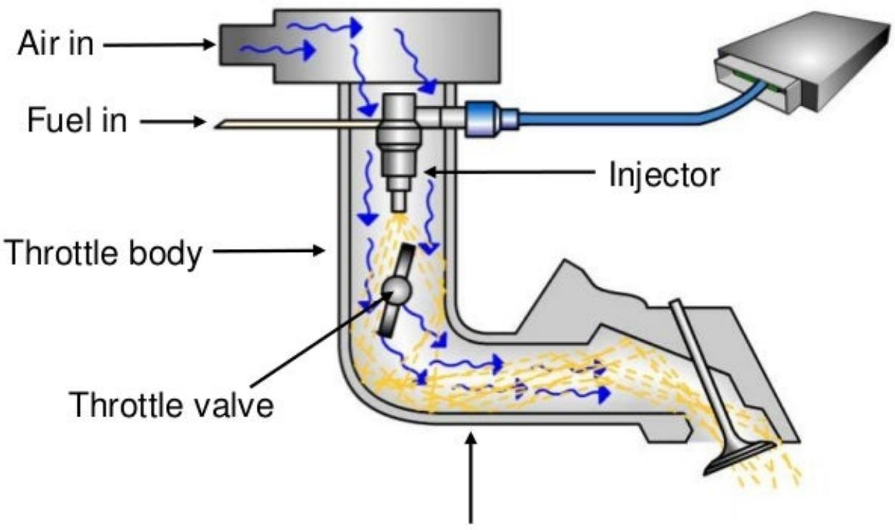

> **AI Description:**
> **Source:** `assets/_page_6_Figure_0.jpg`
> 
> **Generated:** 2026-05-31 20:21:58
> 
> ---
> 
> The image is a technical illustration of a throttle body and fuel injection system. It shows the flow of air and fuel into the throttle body, with the throttle valve regulating the amount of air entering the combustion chamber. The diagram includes labels for the air inlet, fuel inlet, throttle body, and injector, indicating the components and their functions in the system. The visual representation helps in understanding the interaction between the throttle valve and the fuel-air mixture.

Inletmanifold

## Single and Multipoint EFl Systems

## Multipoint Fuel Injection

Injectorlocatedineach branchof inletmanifold, belowthrottlevalve.

Injectorsspray fuel directly into each port.

ECU controls opening of injectors.

Inletmanifold
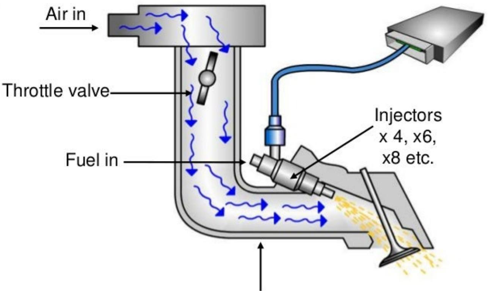

> **AI Description:**
> **Source:** `assets/_page_7_Figure_0.jpg`
> 
> **Generated:** 2026-05-31 20:26:34
> 
> ---
> 
> The image is a technical illustration of a fuel injection system, likely for an internal combustion engine. It shows a cross-sectional view of the system, including the air intake, throttle valve, fuel injection ports, and the flow of air and fuel. The diagram highlights the throttle valve's role in controlling the air flow and the fuel injectors, which are labeled as "Injectors x4, x6, x8 etc." The arrows indicate the direction of airflow and fuel flow within the system. The image provides a clear visual representation of the components and their interaction in the fuel injection process.

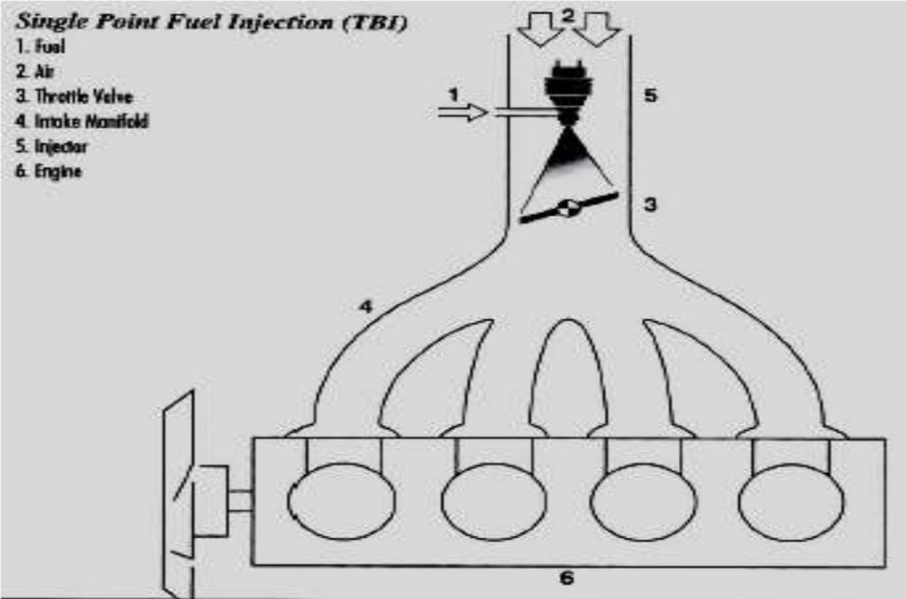

> **AI Description:**
> **Source:** `assets/_page_8_Figure_0.jpg`
> 
> **Generated:** 2026-05-31 20:31:15
> 
> ---
> 
> The image is a technical illustration of a Single Point Fuel Injection (TBI) system. It includes a diagram of the fuel injection process, showing the flow of fuel (1) and air (2) into the intake manifold (4) through the throttle valve (3). The fuel is injected into the intake manifold by the injector (5), which is positioned above the throttle valve. The diagram also includes the engine (6) at the bottom, indicating where the fuel-air mixture is drawn into the cylinders. The labels 1 through 6 correspond to the components listed in the text on the left side of the image.

A multi-point injection system, also called port injection, has an injector in the port (air-fuel passage) going to each cylinder.

Gasoline is sprayed into each intake port and toward each intake valve.Thereby, the term multipoint (more than one location) fuel injection is used.

Multipoint fuel injection (MPI)

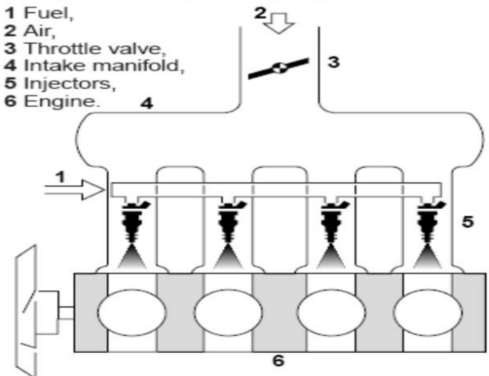

> **AI Description:**
> **Source:** `assets/_page_9_Figure_0.jpg`
> 
> **Generated:** 2026-05-31 20:29:49
> 
> ---
> 
> The image is a technical diagram illustrating the components of a fuel injection system for an engine. It includes labels for fuel, air, throttle valve, intake manifold, injectors, and the engine itself. The diagram shows the flow of fuel and air into the engine through the intake manifold and the action of the throttle valve. The injectors are shown as part of the intake manifold, indicating their role in fuel delivery. The diagram is labeled with numbers corresponding to the components, providing a clear visual representation of the system's structure and function.

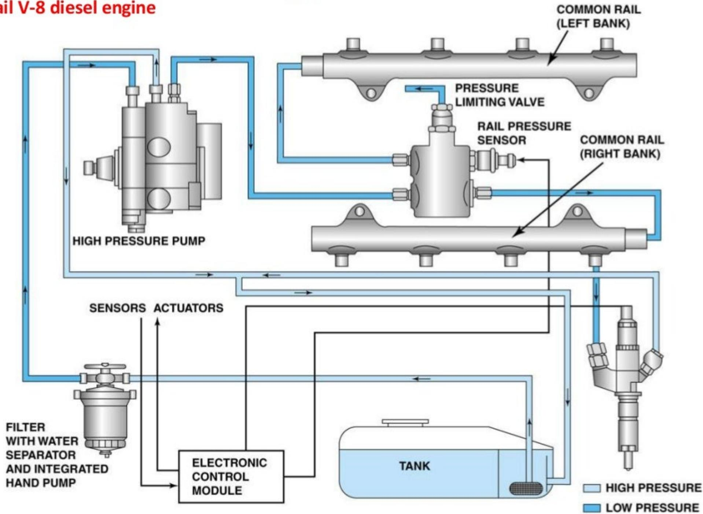

> **AI Description:**
> **Source:** `assets/_page_10_Figure_0.jpg`
> 
> **Generated:** 2026-05-31 20:34:08
> 
> ---
> 
> The image is a technical diagram illustrating the fuel system of a rail V-8 diesel engine. It includes key components such as the high-pressure pump, common rail (left and right banks), pressure limiting valve, rail pressure sensor, and electronic control module. The diagram also shows the flow of fuel through the system, with labels indicating high-pressure and low-pressure lines. The tank, filter with water separator, and integrated hand pump are also depicted, along with the sensors and actuators connected to the electronic control module. The diagram is designed to provide a clear visual representation of the fuel delivery system's layout and function.

## Electronic Injectors

The injectors can survive the excessive temperature and pressure of combustion by using the fuel that passes through it as a coolant

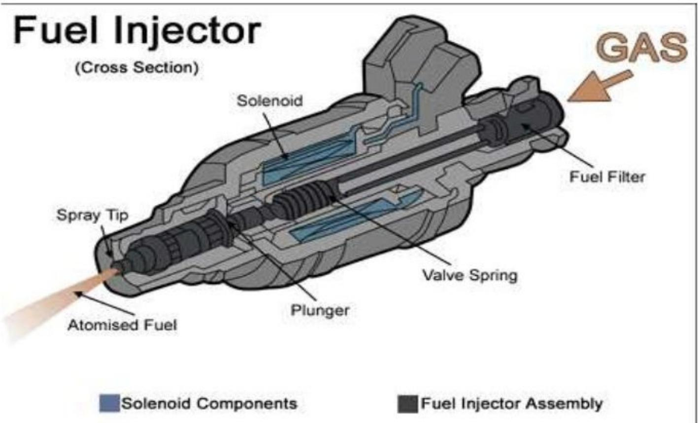

> **AI Description:**
> **Source:** `assets/_page_11_Figure_0.jpg`
> 
> **Generated:** 2026-05-31 20:31:52
> 
> ---
> 
> The image is a technical illustration of a fuel injector, specifically a cross-sectional view. It includes labels for various components such as the solenoid, plunger, valve spring, spray tip, and fuel filter. The diagram shows the flow of gas and atomized fuel through the injector. The image is annotated with a color legend indicating the solenoid components and the fuel injector assembly. This visual content is useful for understanding the structure and function of a fuel injector.

An indirect injection system sprays fuel into the engine intake manifold. Most gasoline injection systems are of this type.

Direct injection forces fuel into the engine combustion chambers. Diesel injection systems are direct type.

## So Gasoline electronic Direct Injection System

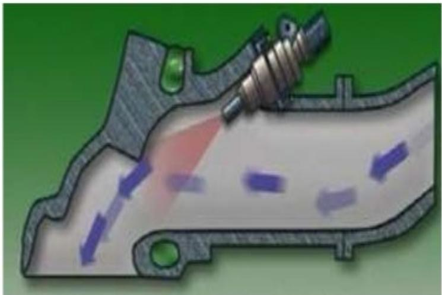

> **AI Description:**
> **Source:** `assets/_page_12_Figure_0.jpg`
> 
> **Generated:** 2026-05-31 20:21:13
> 
> ---
> 
> The image is a technical illustration of a mechanical component, likely a part of a machine or engine. It shows a cross-sectional view of a component with various parts labeled and arrows indicating the direction of movement or flow. The component appears to be a type of valve or actuator, with a spring mechanism and a moving part that interacts with a surface marked with arrows. The arrows suggest the path of a fluid or gas through the component. The illustration is designed to provide a clear understanding of the internal workings and function of the part.

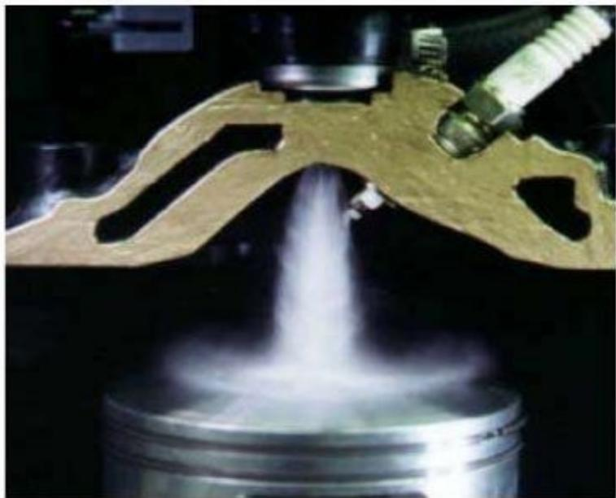

> **AI Description:**
> **Source:** `assets/_page_12_Figure_1.jpg`
> 
> **Generated:** 2026-05-31 20:21:25
> 
> ---
> 
> The image shows a close-up view of a mechanical component, likely part of an engine or machinery. The central focus is a metallic piston with a visible spark plug positioned above it, suggesting an internal combustion engine. The piston appears to be in motion, as indicated by the blurred appearance of the piston's top surface. The surrounding area includes a metallic bracket or support structure, which is partially visible. The overall scene suggests a dynamic, high-speed environment typical of engine operation.

is Classified as : multi-point and Direct injection systems

## Fuel System Diagrams and Schematics

Fuel System Block Diagrams - 1

Each block representsa system.

Lines represent connectionsbetween systems.

Arrows represent direction of flow.

Systemand subsystem blocks

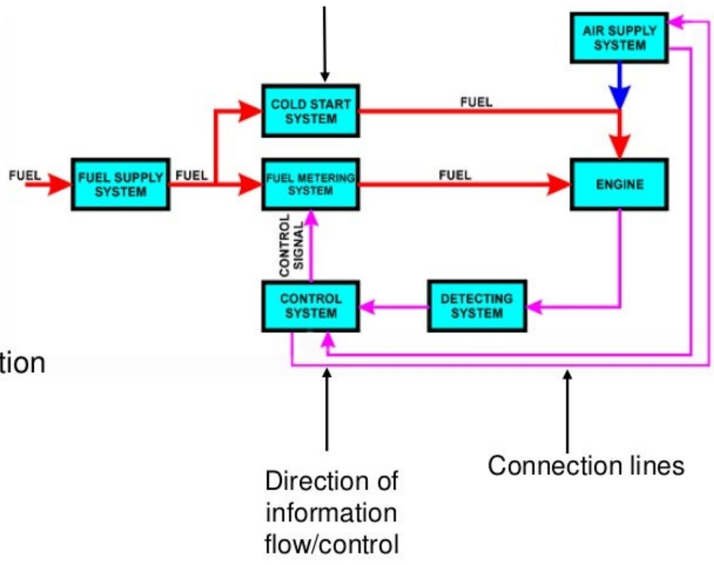

> **AI Description:**
> **Source:** `assets/_page_13_Figure_0.jpg`
> 
> **Generated:** 2026-05-31 20:24:17
> 
> ---
> 
> The image is a flowchart illustrating the components and flow of a fuel system for an engine. It includes labeled boxes for the Fuel Supply System, Cold Start System, Fuel Metering System, Engine, Air Supply System, Detecting System, and Control System. Arrows indicate the direction of fuel flow and control signals. The flowchart shows how fuel is supplied to the engine, with additional components like the cold start system and detecting system providing support. The control system receives signals from the detecting system and sends control signals back to the fuel metering system and cold start system.

## Fuel System Block Diagrams-2

Each block representsa component.

Linesrepresent connections between systems.

Arrowsrepresent direction of flow.

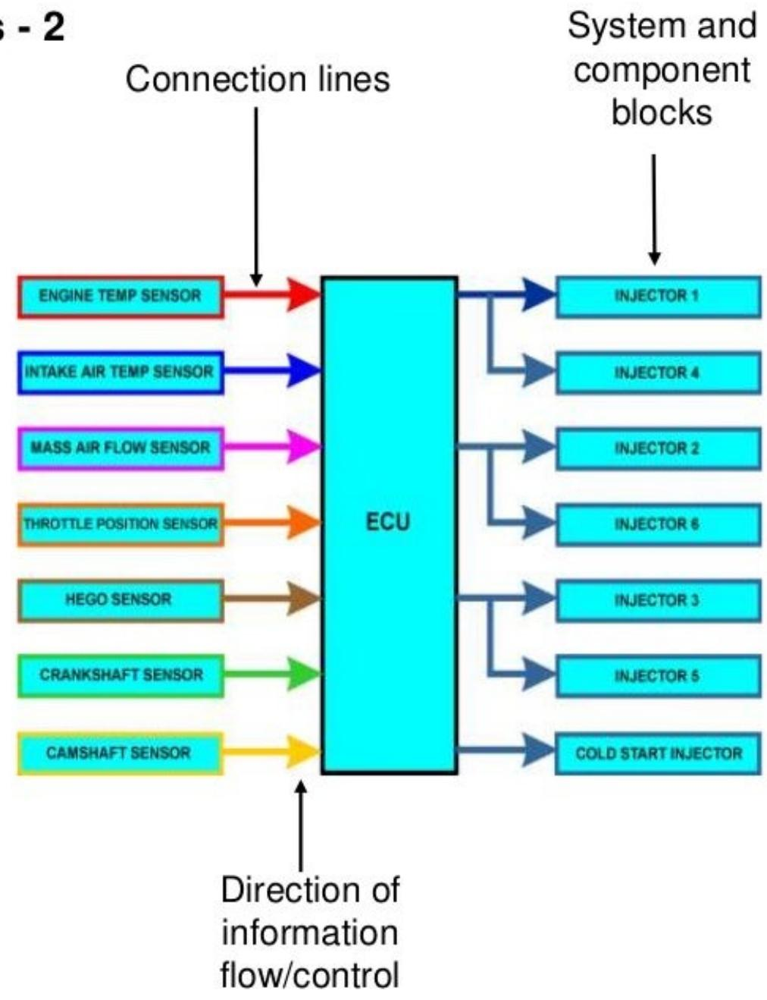

> **AI Description:**
> **Source:** `assets/_page_14_Figure_0.jpg`
> 
> **Generated:** 2026-05-31 20:25:01
> 
> ---
> 
> The image is a flowchart illustrating the connection and information flow between various sensors and components in an electronic control unit (ECU) system. Key visual elements include:
> 
> 1. **Type of Visualization**: Flowchart.
> 2. **Key Information**: The flowchart shows the sensors (Engine Temperature Sensor, Intake Air Temperature Sensor, Mass Air Flow Sensor, Throttle Position Sensor, HEGO Sensor, Crankshaft Sensor, Camshaft Sensor) sending data to the ECU. The ECU then controls the injectors (Injectors 1-6 and Cold Start Injector) based on this information.
> 3. **Main Trends**: The flow is unidirectional, with sensors feeding data to the ECU and the ECU controlling the injectors.
> 4. **Important Labels**: The labels include "Connection lines," "System and component blocks," and "Direction of information flow/control," which help to understand the flow of data in the system.

## Electronic control unit

· In automotive electronics, electronic control unit (ECU) is a generic term for any embedded system that controls one or more of the electrical systems or subsystems in a motor vehicle.

· An engine control unit (ECU), also known as power-train control module (PCM), or engine control module (ECM) is a type of electronic control unit that determines the amount of fuel, ignition timing and other parameters an internal combustion engine needs to keep running. It does this by reading values from multidimensional maps which contain values calculated by sensor devices monitoring the engine.

## Working of ECU

Control of fuel injection: ECU willdetermine the quantity of fuel to inject based on a number of parameters. If the throttle pedal is pressed further down, this will open the throttle body and allow more air to be pulled into the engine. The ECU will inject more fuel according to how much air is passing into the engine. If the engine has not warmed up yet, more fuel will be injected .

Control of ignition timing : A spark ignition engine requires a spark to initiate combustion in the combustion chamber. An ECU can adjust the exact timing of the spark (called ignition timing) to provide better power and economy.

· Control of idle speed : Most engine systems have idle speed control built into the ECU. The engine RPM is monitored by the crankshaft position sensor which plays a primary role in the engine timing functions for fuel injection，spark events,and valve timing. Idle speed is controlled by a programmable throtte stop or an idle air bypass control stepper motor.

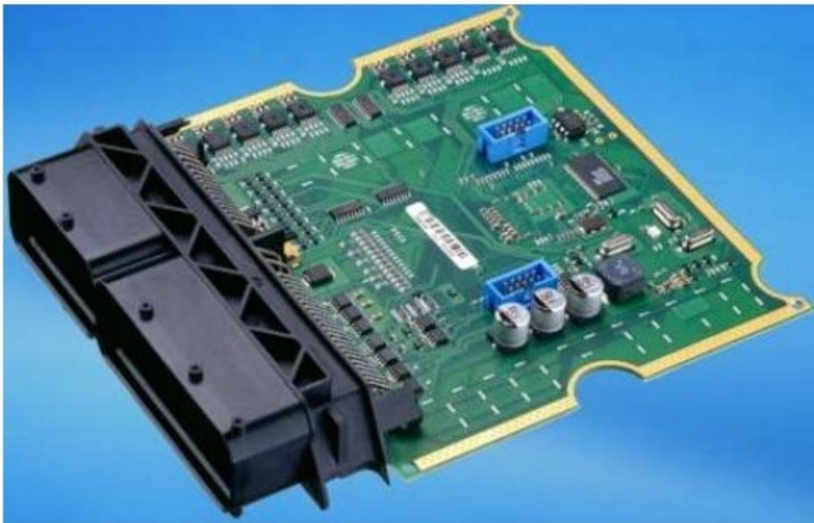

> **AI Description:**
> **Source:** `assets/_page_17_Figure_0.jpg`
> 
> **Generated:** 2026-05-31 20:34:27
> 
> ---
> 
> The image shows a close-up of a circuit board with various electronic components. The board is green with a yellow edge and features numerous integrated circuits, capacitors, and connectors. The board has a black plastic connector attached to its left side, which appears to be designed for insertion into a computer or other electronic device. The components are arranged in a way that suggests this is a specialized board, possibly for a specific application or system.

## Common rail and Pressure sensor

The term "common rail" refers to the fact that all of the fuel injectors are supplied by a common fuel rail which is nothing more than a pressure accumulator where the fuel isstored at high pressure. This accumulator supplies multiple fuel injectors with high pressure fuel.

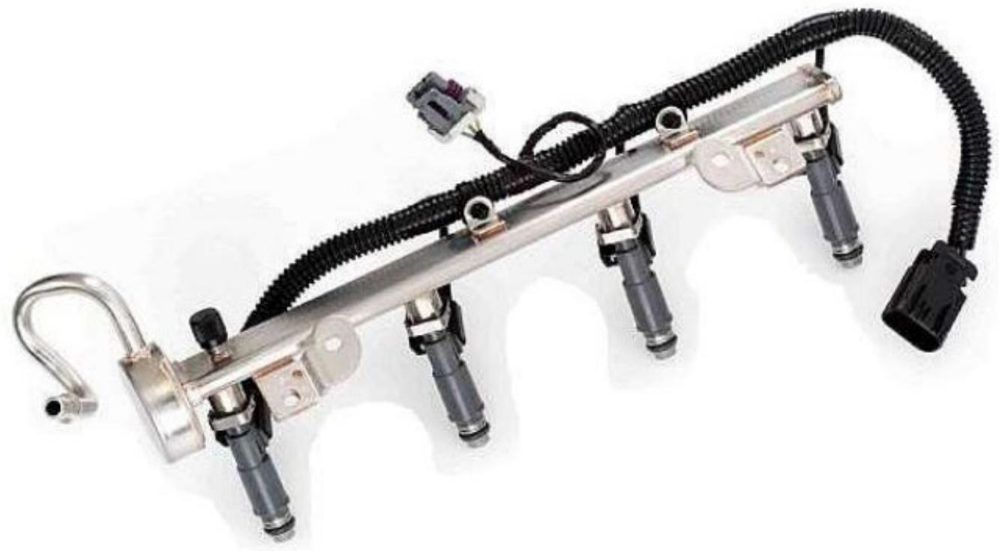

> **AI Description:**
> **Source:** `assets/_page_18_Figure_0.jpg`
> 
> **Generated:** 2026-05-31 20:29:11
> 
> ---
> 
> The image shows a mechanical component, likely part of an automotive or industrial system. It appears to be a fuel rail assembly, which is used to deliver fuel to injectors in a vehicle's engine. The assembly includes multiple fuel injectors, a fuel rail, and a flexible hose. The injectors are mounted on the rail, and the hose is connected to the rail, suggesting it is used to supply fuel to the injectors. The design and components indicate it is part of a system that requires precise fuel delivery, typical in modern engines.

## Fuel Injection System

Electronic Fuel Injection uses various engine sensorsand control module to regulate theopeningand closing of injector valve.

·Fuel delivery system

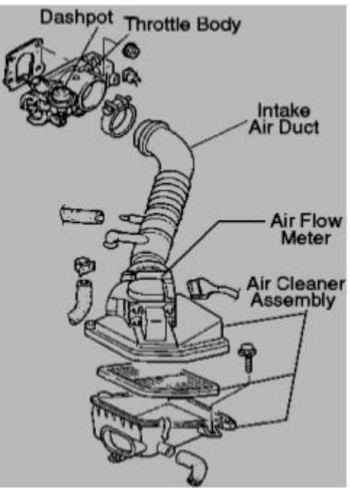

> **AI Description:**
> **Source:** `assets/_page_19_Figure_0.jpg`
> 
> **Generated:** 2026-05-31 20:28:10
> 
> ---
> 
> The image is a technical illustration of an engine air intake system. It includes labeled parts such as the dashpot, throttle body, intake air duct, air flow meter, and air cleaner assembly. The diagram is a cross-sectional view showing the flow of air into the engine, highlighting the components involved in the intake process. The labels are clear and positioned to correspond with the respective parts in the illustration.

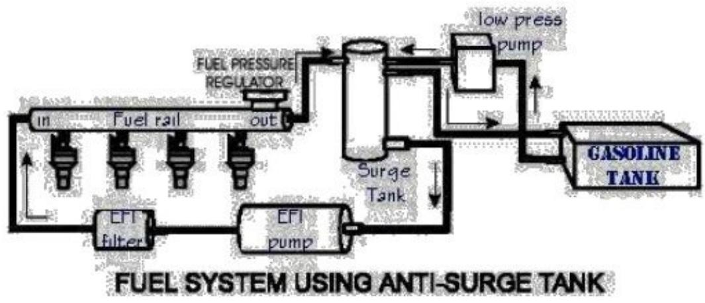

> **AI Description:**
> **Source:** `assets/_page_19_Figure_1.jpg`
> 
> **Generated:** 2026-05-31 20:28:22
> 
> ---
> 
> The image is a diagram of a fuel system using an anti-surge tank. It includes labels for various components such as the gasoline tank, low-pressure pump, fuel pressure regulator, fuel rail, EFI filter, and EFI pump. The diagram illustrates the flow of fuel from the gasoline tank through the low-pressure pump, into the fuel pressure regulator, and then into the fuel rail. The anti-surge tank is connected to the fuel rail and is labeled as such. The diagram provides a clear visual representation of the fuel system's components and their interconnections.

·Sensor system

·Air induction system

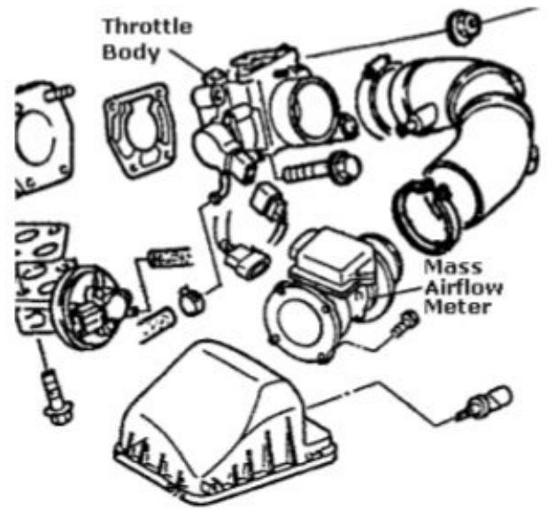

> **AI Description:**
> **Source:** `assets/_page_19_Figure_2.jpg`
> 
> **Generated:** 2026-05-31 20:26:57
> 
> ---
> 
> The image is a technical illustration of various components of a throttle body and mass airflow meter system. It includes labeled parts such as the throttle body and mass airflow meter, with additional components like sensors and connectors. The diagram is designed to show the layout and connections of these parts, likely for educational or instructional purposes.

·Computer control system

## Fuel Delivery system

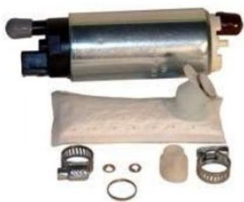

> **AI Description:**
> **Source:** `assets/_page_20_Figure_0.jpg`
> 
> **Generated:** 2026-05-31 20:32:43
> 
> ---
> 
> The image contains a mechanical component, specifically a fuel pump, along with various accompanying parts and accessories. The fuel pump is metallic and cylindrical, with a protruding nozzle at one end and a connector at the other. Below the pump, there is a white cloth or paper with printed text, though the text is not legible in the image. Surrounding the pump and cloth are several small components, including hose clamps, a rubber grommet, and other small mechanical parts, likely intended for installation or maintenance of the fuel pump. The image appears to be a product or instructional image, possibly for a DIY or professional repair setting.

·Electrical Fuel Pumpdrawsfuel from tank and forces it into the regulator.

·PressureRegulatorcontrolstheamount of pressure thatentersthe injectorand any extrafuel isreturnedtothefuel tank.

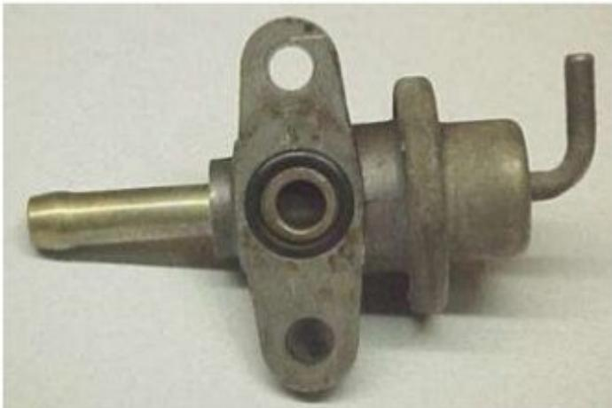

> **AI Description:**
> **Source:** `assets/_page_20_Figure_1.jpg`
> 
> **Generated:** 2026-05-31 20:32:51
> 
> ---
> 
> The image contains a mechanical component, likely a part of a vehicle or machinery. It features a cylindrical body with a central hole and a protruding rod on the left side. The component has a bracket with a hole at the top and another hole at the bottom, suggesting it is designed to be mounted or attached to another part. The material appears to be metal, and there are signs of wear and use, indicating it may be a used or refurbished part.

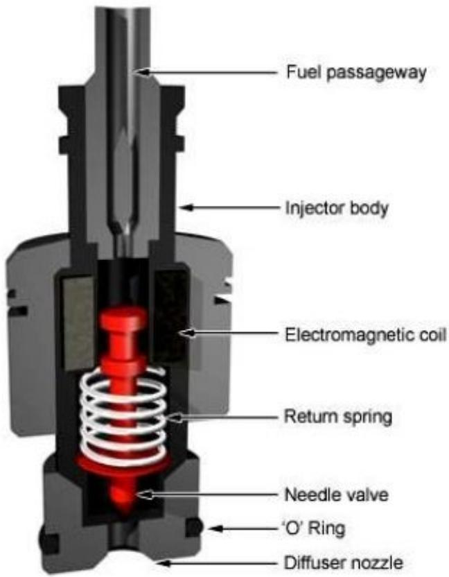

> **AI Description:**
> **Source:** `assets/_page_20_Figure_2.jpg`
> 
> **Generated:** 2026-05-31 20:32:05
> 
> ---
> 
> The image is a technical illustration of a fuel injector's internal components. It includes a detailed cross-sectional view of the injector, highlighting various parts such as the fuel passageway, injector body, electromagnetic coil, return spring, needle valve, 'O' ring, and diffuser nozzle. The illustration is labeled with arrows pointing to each component, providing a clear understanding of the structure and function of the fuel injector.

·Fuel Injector is simplyacoil or solenoid \_operatedvalve.

·Spring pressure holds the injectorclosed.

·When engaged,the injector sprays fuel into the engine.

InjectorPulseWidth indicatesthe timeeach Injector isenergized (KeptOpen).

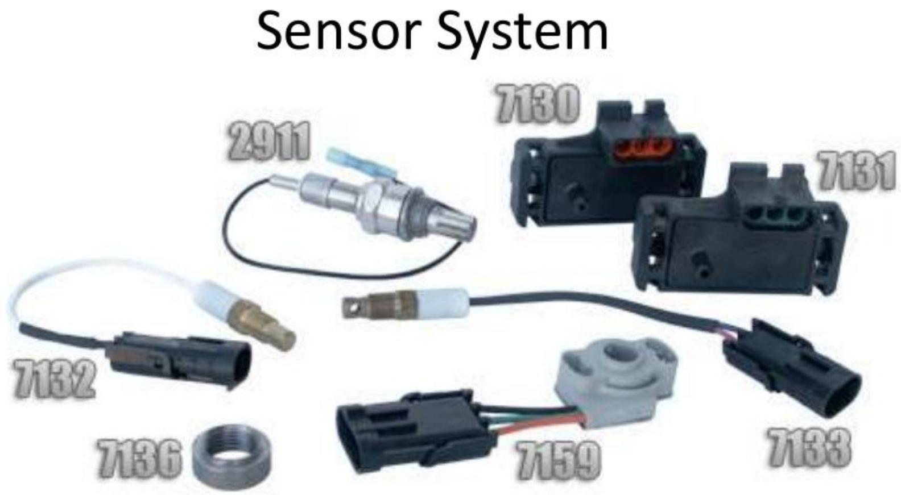

> **AI Description:**
> **Source:** `assets/_page_21_Figure_0.jpg`
> 
> **Generated:** 2026-05-31 20:35:31
> 
> ---
> 
> The image contains a technical illustration of a sensor system. It includes various components such as sensors, connectors, and housing units, each labeled with a unique number. The diagram is designed to visually represent the different parts of the sensor system, which is likely used in an automotive or industrial context. The labels and numbers (e.g., 7130, 7131, 7132, etc.) correspond to specific parts of the system, aiding in identification and reference.

·Monitorsengine operatingcondition andreportsthis information to ECM (computer).

·Sensors are electrical devices that change resistance or voltage with change in condition such as temperature, pressure and position.

## Engine Sensors

Oxygen Sensor measures the oxygen content in engine exhaust.

·Mounted on the exhaust system before the catalyticconverter.

·Voltage out-put of O2 sensor changes with the change in oxygen content of exhaust.

·Lean mixture decreases the voltage.

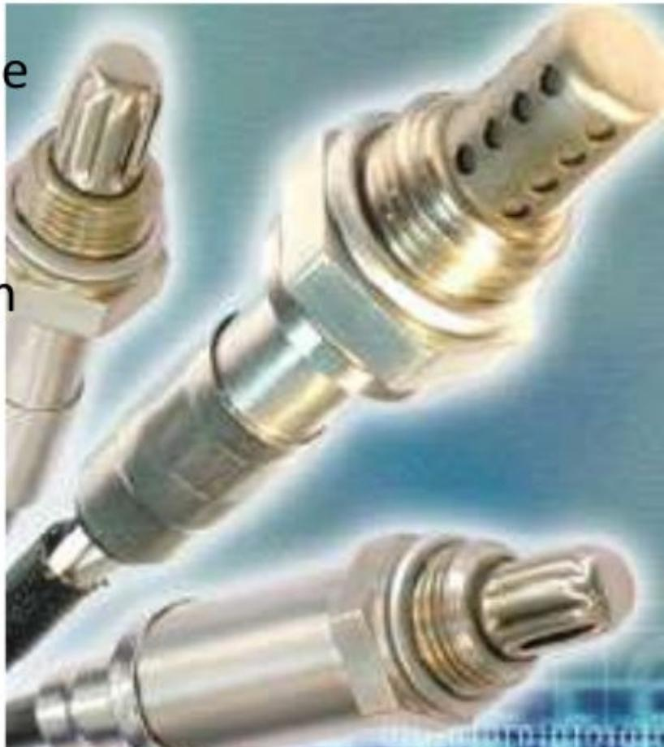

> **AI Description:**
> **Source:** `assets/_page_22_Figure_0.jpg`
> 
> **Generated:** 2026-05-31 20:25:33
> 
> ---
> 
> The image contains a series of close-up photographs of spark plugs. The spark plugs are shown in various orientations, highlighting their threaded design and the central electrode. The background is a gradient of blue tones, giving the image a clean and technical appearance. The image is likely intended to showcase the design and features of the spark plugs, possibly for educational or promotional purposes.

·Rich mixture increases the voltage.

·Signalis sent to ECMand the ECM changes the time thatan injector is open or close.

## Engine Sensors

## Throttle Position Sensor(TPS)

·Variableresisterconnected to the throttle plate.

·Change in throttle angle = change in resistance.

·Based on the resistance,ECM richens or leans the mixture.

Throttle Position SENSORS

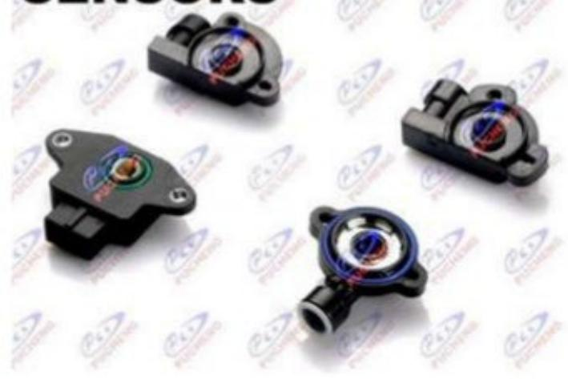

> **AI Description:**
> **Source:** `assets/_page_23_Figure_0.jpg`
> 
> **Generated:** 2026-05-31 20:23:36
> 
> ---
> 
> The image contains four mechanical components, likely sensors, arranged in a grid pattern. Each component has a black body with a circular central part, possibly a sensor or a valve, and a small protruding part. The components are labeled with a logo and some text, which appears to be a brand name or model identifier. The background is white with a watermark of the same logo repeated across it.

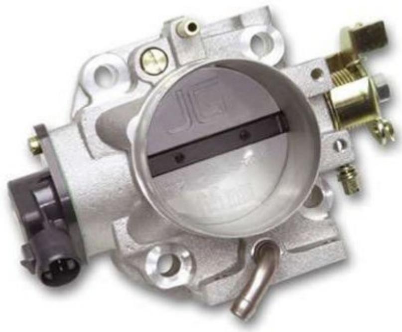

> **AI Description:**
> **Source:** `assets/_page_23_Figure_1.jpg`
> 
> **Generated:** 2026-05-31 20:21:38
> 
> ---
> 
> The image contains a mechanical component, specifically a throttle body, which is part of an engine's fuel injection system. The throttle body is metallic and features a central throttle plate with a black rubber seal. The surrounding area includes various bolts and a small connector on the left side, indicating it is likely part of a larger automotive assembly. The image provides a clear view of the throttle body's structure and design, which is useful for identifying and understanding its function within the engine's operation.

## Engine Sensors

## Engine Temperature Sensor

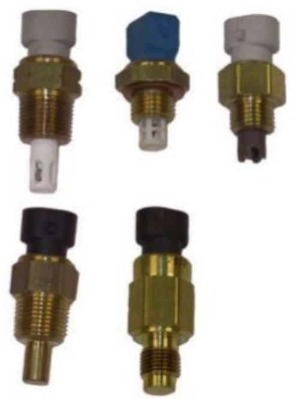

> **AI Description:**
> **Source:** `assets/_page_24_Figure_0.jpg`
> 
> **Generated:** 2026-05-31 20:23:27
> 
> ---
> 
> The image contains a set of five mechanical components, likely sensors or connectors, with varying colors and designs. The components have a brass or gold-colored body with threads at the bottom, and each has a different colored cap or end piece (white, blue, black, and two more variations). These appear to be part of a mechanical or industrial assembly, possibly for monitoring or control purposes. The image is a technical illustration, not a photograph, and does not contain any text or labels.

·Monitors the operating temperature of the engine.

·Exposed to engine coolant.

·Engine cold = Low Resistance = Rich Mixture

·Engine Hot = High Resistance= Lean Mixture.

## Engine Sensors

## MassAir FlowSensor(MAF)

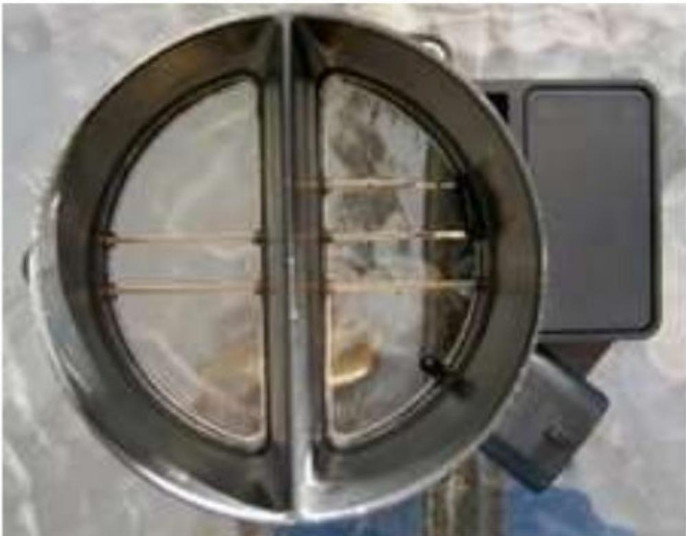

> **AI Description:**
> **Source:** `assets/_page_25_Figure_0.jpg`
> 
> **Generated:** 2026-05-31 20:25:50
> 
> ---
> 
> The image shows a close-up of a circular metallic object, possibly a part of a machine or equipment. The object has a reflective surface with a grid-like pattern inside, suggesting it might be a lens or a window with a grid structure. There is a small rectangular component attached to the right side of the circular object, which could be a control panel or a sensor. The overall appearance suggests this is a technical or industrial component, possibly related to lighting or monitoring systems.

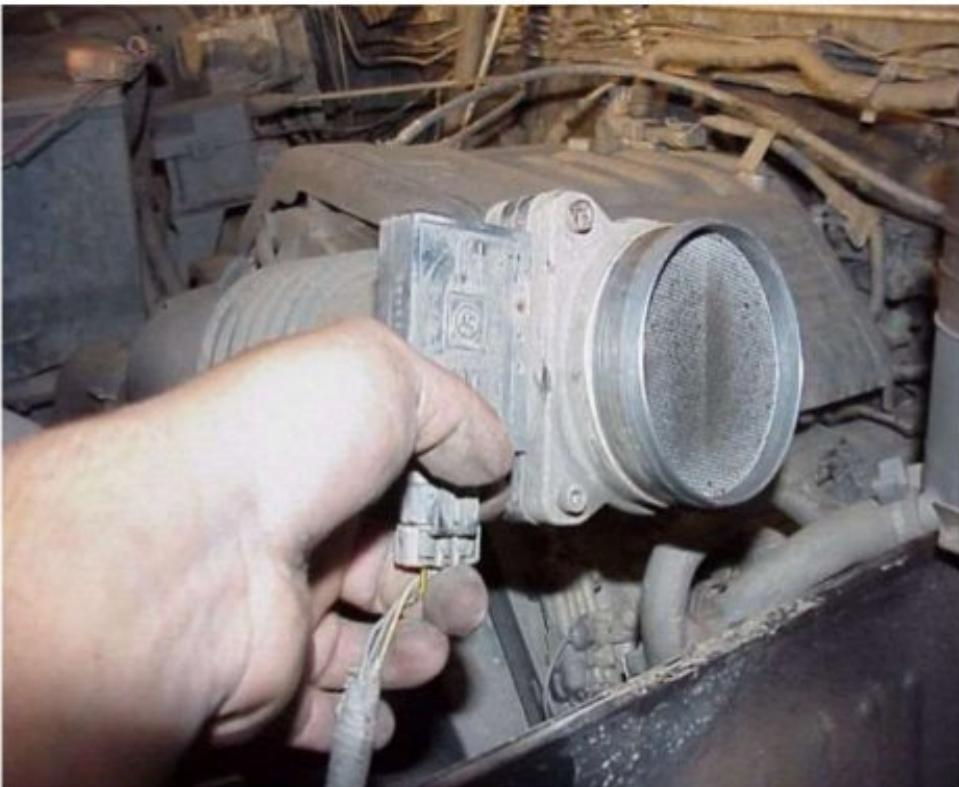

> **AI Description:**
> **Source:** `assets/_page_25_Figure_1.jpg`
> 
> **Generated:** 2026-05-31 20:26:06
> 
> ---
> 
> The image contains a photograph of a hand holding a mechanical component, which appears to be a throttle body sensor or a similar automotive part. The sensor has a cylindrical shape with a metallic finish and a circular opening. The hand is gripping the sensor, and there are visible wires connected to it, suggesting it is part of an electrical system. The background shows parts of an engine or mechanical assembly, indicating the setting is likely a vehicle's engine bay.

·Measures the amount of outside air entering the engine.

·Containsan air flap or door that operatesa variableresistor.

·Helps computer to determine how much fuel is needed.

## Engine Sensors

## Inlet Air Temperature Sensor

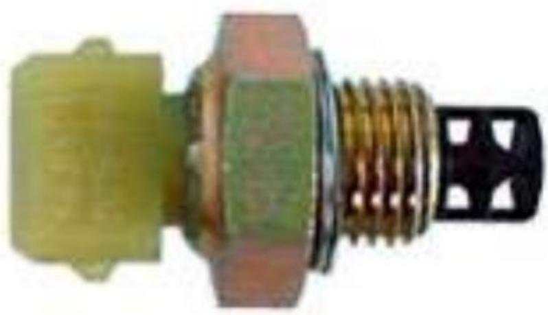

> **AI Description:**
> **Source:** `assets/_page_26_Figure_0.jpg`
> 
> **Generated:** 2026-05-31 20:35:39
> 
> ---
> 
> The image shows a mechanical component, specifically a temperature sensor or switch. It has a threaded body with a metallic finish, a square-shaped housing, and a small vent or exhaust port at the top. The design suggests it is used for monitoring temperature in a mechanical or electronic system.

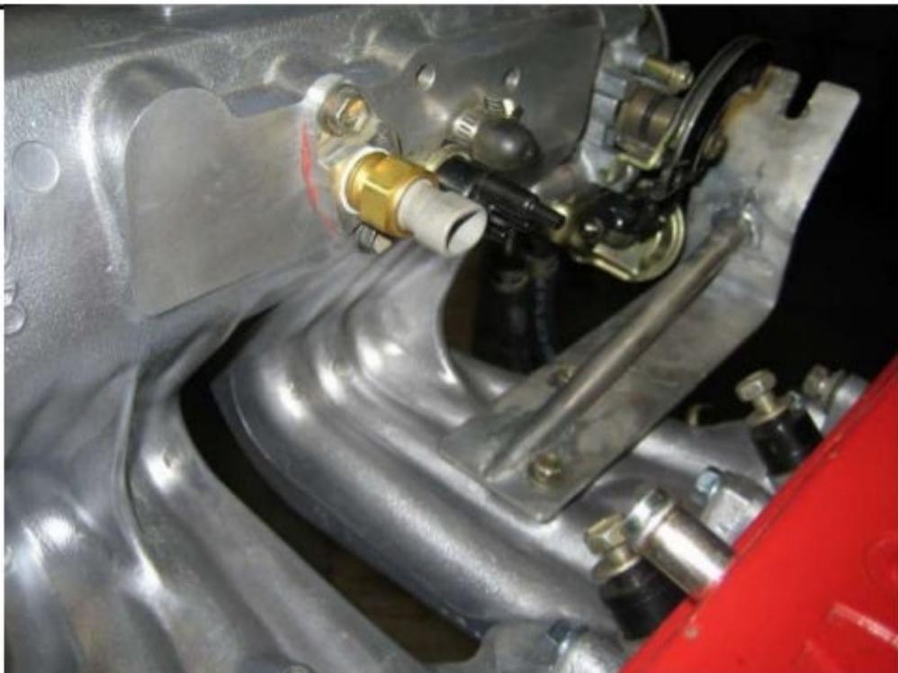

> **AI Description:**
> **Source:** `assets/_page_26_Figure_1.jpg`
> 
> **Generated:** 2026-05-31 20:34:46
> 
> ---
> 
> The image shows a close-up view of a mechanical assembly, likely part of an engine or machinery. It features metallic components, including a cylindrical part with a brass-colored fitting and a black hose. The assembly is secured with bolts and nuts, and there is a red component visible on the right side, possibly indicating a different material or part of the system. The image appears to be a photograph of a technical or industrial component, providing a detailed view of the hardware and its connections.

·Measures the temperature of air entering the engine.

·Cold air (more dense) = More fuel for proper AF ratio.

## Engine Sensors

## Crankshaft Position Sensor

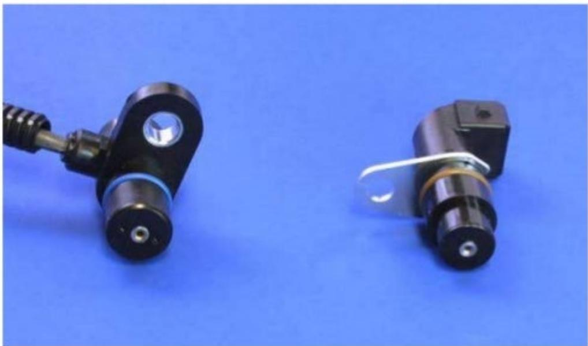

> **AI Description:**
> **Source:** `assets/_page_27_Figure_0.jpg`
> 
> **Generated:** 2026-05-31 20:32:34
> 
> ---
> 
> The image contains two mechanical components, likely sensors or actuators, against a blue background. The left component has a cylindrical body with a protruding rod and a threaded end, suggesting it may be adjustable or part of a mechanical linkage. The right component is smaller, with a rectangular body and a cylindrical protrusion, possibly indicating a different function or part of a different system. Both components have visible screws and mounting points, indicating they are designed to be attached to other parts of a larger assembly.

·Detects engine speed.

·Changes injector timing and duration.

·Higher engine speed =More fuel

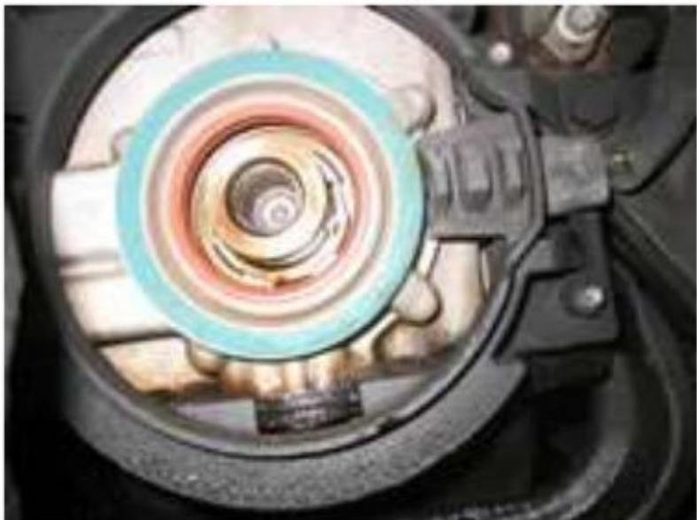

> **AI Description:**
> **Source:** `assets/_page_27_Figure_1.jpg`
> 
> **Generated:** 2026-05-31 20:33:03
> 
> ---
> 
> The image is a photograph of a mechanical component, likely part of a vehicle's alternator or similar system. It shows a circular assembly with a central hub and surrounding rings and gears. The central hub appears to be the rotor, while the surrounding rings and gears are part of the stator assembly. The colors and wear patterns suggest this is a used or worn part, possibly indicating wear or damage. The image is technical in nature and provides a detailed view of the internal structure of the mechanical component.

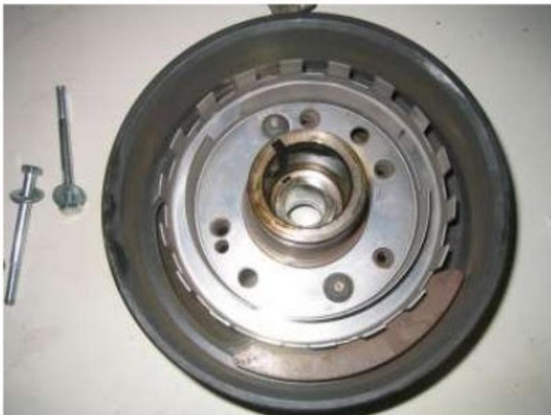

> **AI Description:**
> **Source:** `assets/_page_27_Figure_2.jpg`
> 
> **Generated:** 2026-05-31 20:32:18
> 
> ---
> 
> The image contains a photograph of a mechanical component, likely a part of a vehicle's drivetrain, such as a flywheel or clutch plate. The component has a circular shape with a central bore and multiple holes around its perimeter. There are also two cylindrical objects, possibly bolts or pins, placed to the left side of the image. The component appears to be metallic and has a worn or used appearance, indicating it might be a part that has been removed from a vehicle for maintenance or replacement.

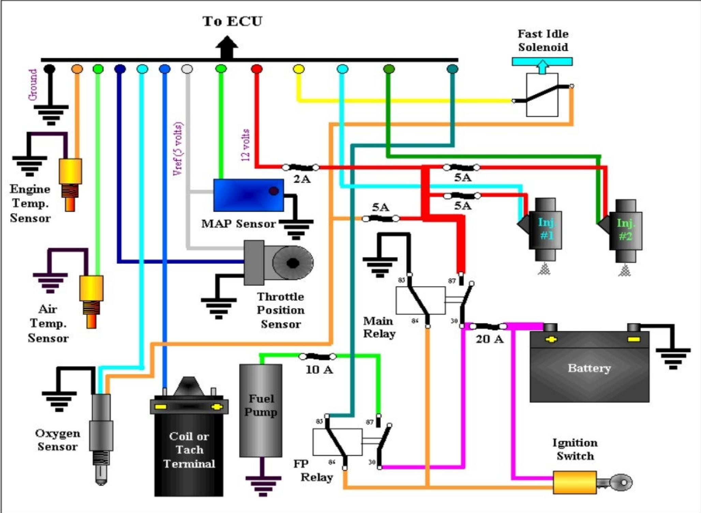

> **AI Description:**
> **Source:** `assets/_page_28_Figure_0.jpg`
> 
> **Generated:** 2026-05-31 20:28:02
> 
> ---
> 
> The image is a detailed electrical wiring diagram for a vehicle's electronic control system. It includes various components such as the Engine Temperature Sensor, Air Temperature Sensor, Oxygen Sensor, MAP Sensor, Throttle Position Sensor, Fuel Pump, Fast Idle Solenoid, Main Relay, and Ignition Switch. The diagram shows the connections between these components and the ECU (Electronic Control Unit), indicating the flow of electrical signals and power. The diagram also includes annotations for the current ratings of relays and the battery connection. The overall purpose is to illustrate the electrical connections and signal pathways within the vehicle's engine management system.

## Throttle Body Injection

·Uses one or two injectors.

·Injectors (pulse) spray fuel into the top of throttle body air horn.

·Atomized fuel mixes with air and drawn into the engine.

·Fuel pressure regulator is spring loaded and is part of the housing.

Fuel is being injected whenever the engine is running, also called CIS: Continuous Injection System.

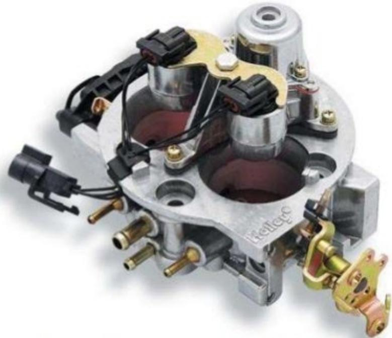

> **AI Description:**
> **Source:** `assets/_page_29_Figure_0.jpg`
> 
> **Generated:** 2026-05-31 20:28:35
> 
> ---
> 
> The image contains a detailed technical illustration of a carburetor, a mechanical device used in internal combustion engines to mix air and fuel. The carburetor is shown in a disassembled state, revealing its internal components such as the throttle body, fuel jets, and various adjustment screws. The image is likely used for educational or instructional purposes, providing a clear view of the carburetor's structure and design. The presence of labels and the metallic finish of the components suggest it is a high-quality technical diagram.

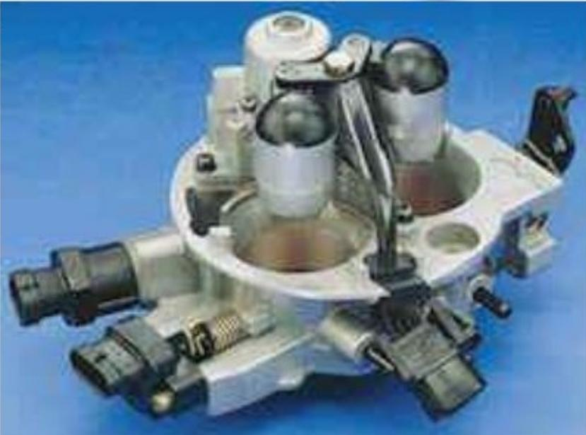

> **AI Description:**
> **Source:** `assets/_page_29_Figure_1.jpg`
> 
> **Generated:** 2026-05-31 20:28:48
> 
> ---
> 
> The image contains a technical illustration of a mechanical component, likely a part of an engine or machinery. It appears to be a carburetor or a similar assembly with various ports, a central chamber, and several adjustable screws and nozzles. The design suggests it is used for fuel or air management in an internal combustion engine. The component is metallic and has a complex structure with multiple functional parts.

## EFI Multi port Injection System

·lnjector is pressed into the runner(Port) in the intake manifold.

·lnjector sprays towards an engine intake valve.

Each cylinder has it’s own injector

## EFI Direct fuel Injection System

·Injectorsare pressed into the combustion chamber and spray fuel directly into the combustion chamber.

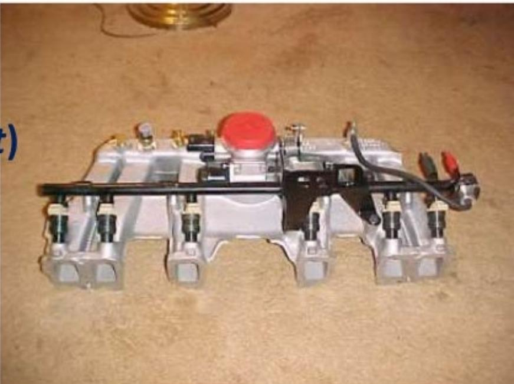

> **AI Description:**
> **Source:** `assets/_page_30_Figure_0.jpg`
> 
> **Generated:** 2026-05-31 20:26:49
> 
> ---
> 
> The image shows a mechanical device, likely a part of an engine or a similar mechanical system. It has a metallic body with several cylindrical components and a red circular part in the center. There are also wires and connectors attached to the device, suggesting it is part of an electrical or hydraulic system. The device appears to be disassembled or in a state of repair, as indicated by the visible wires and the lack of a complete assembly. The background is a plain surface, possibly a carpet or a mat, which provides no additional context about the device's function or origin.

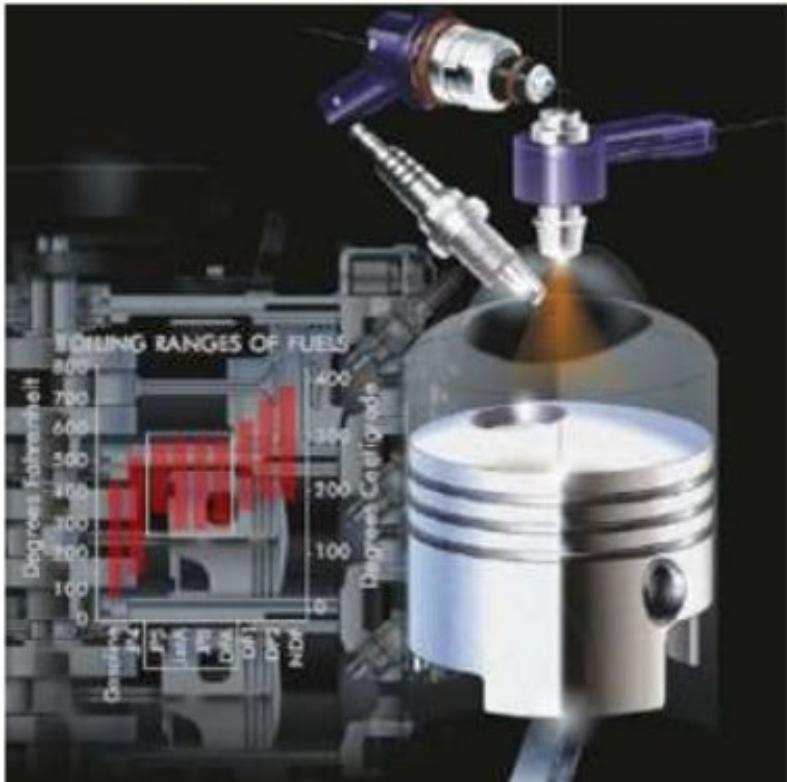

> **AI Description:**
> **Source:** `assets/_page_30_Figure_1.jpg`
> 
> **Generated:** 2026-05-31 20:25:15
> 
> ---
> 
> The image contains a technical illustration of a piston and a fuel injection system. It includes a graph titled "BOILING RANGES OF FUELS" with a scale ranging from 0 to 800 degrees Fahrenheit. The graph shows different fuel types with their respective boiling ranges. The illustration also depicts a fuel injection nozzle spraying fuel into a combustion chamber, with a piston visible below the chamber. The image combines technical diagrams and text to convey information about fuel properties and engine operation.

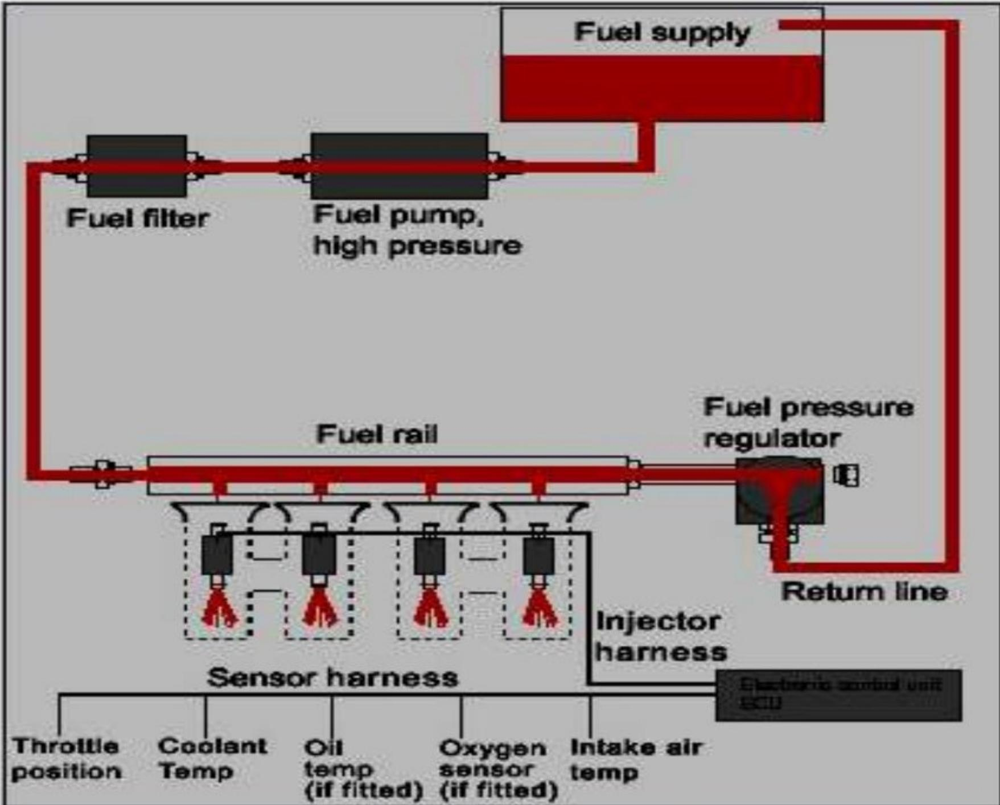

> **AI Description:**
> **Source:** `assets/_page_31_Figure_0.jpg`
> 
> **Generated:** 2026-05-31 20:23:18
> 
> ---
> 
> The image is a technical diagram illustrating the fuel supply system of an engine. It includes key components such as the fuel supply, fuel filter, high-pressure fuel pump, fuel rail, fuel pressure regulator, and return line. The diagram also shows the connection of the fuel rail to the injectors, which are part of the injector harness. Additionally, it highlights the sensor harness, which includes throttle position, coolant temperature, oil temperature, oxygen sensor, and intake air temperature sensors. The electronic control unit (ECU) is connected to the sensor harness, indicating its role in monitoring and controlling the fuel system.
