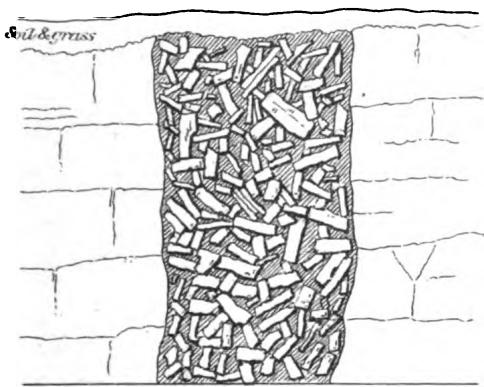
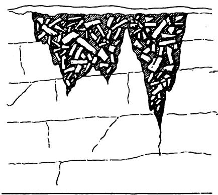
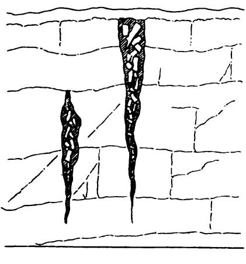
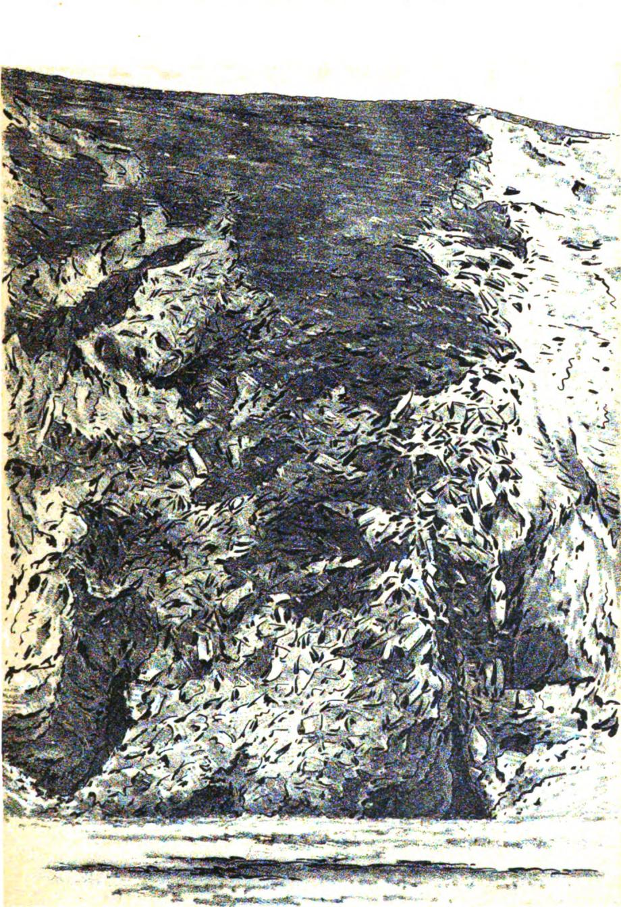

# ON THE BRECCIA-GASHES OF THE DURHAM'COAST AND SOME RECENT EARTH-SHAKES AT SUNDERLAND.

BY G. A. LEBOUR, M.A., F.G.S.,

PROPESSOR OF GEOLOGY IN THE DURHAX COLLEGE OF SCIENUE, NKWCASILE-UPON-TINE.

## 1.

THE town of Sunderland is built upon the Permian Magnesian Limestone. The later (with its subordinate marl-slate） rests, the very irregular and sometimes absent yellow sands of the Permian alone intervening,upon a denuded surface of Coal-Meagureg. The total thickness of the Magnesian Limestone at its maximum may be estimated as being not much over 6oo feet,but at Sunderland the uppermost portion of the deposit is absent. The amount of that rock present there is between 300 and 40O feet.There is very litte southerly dip in the limestone,but there is some, and the best way to ascertain the nature of those portions which underlie the town is therefore to study the beds as they crop out in the beautiful cliff sections to the north, between the Wear and the Tyne. These rocks are so strange in structure, and so striking by reason of the variety of their forms, that they have been described in many raluable papers, by the late Professor Sedgwick, Mr. R. Howse, Mr. J. W. Kirkby, and others.\* It is not intended in the present paper to repeat what hag been so well and so often:said before, but simply to draw special attention to one of the strangest and most striking of the developments of the Magnegian Limestone as displayed in Marsden Bay.

There, between the north end of the bay and the little inn in the cliff at its southern extremity,no fewer than fteen masses of breccia are most clearly shown in the lofty cliff-section.

Now,a breccia is & rock composed of angular fragments more or less frmly cemented together. Just as in & gravel or conglomerate, the rounded pebbles prove them to have come from a distance and to have

been exposed to water-wear, so in a breccia the sharp edges and rough fracture-faces of the enclosed stoneg show that they lie at or very near the place where they were broken up,or else that they have been preserved from attrition by special conditions,as,for instance, by means of ice or lava.

In the present case neither ice nor lava need,or can be, brought in as having helped to form the breccia. The fragments are,in fact,of the same material as the solid rock forming the mass of the cliff-Magnesian Limestone. Moreover, the cementing matter which binds the fragmentg together-and binds them so closely that it is sometimeg easier to break the enclosed stones than the cement that holds them-is Magnegian Limestone too. But yet there is a difference. For whereas the broken bitg of rock have all the varying character of structure and texture.of the neighbouring beds from which they have clearly been detached,the matrix in which they lie is more or less amorphous. These brecciag are exposed on the cliff-face between walls of ordinarily bedded Magnesian Limestone,and present the following peculiarities:-Sometimes they fill & mere fissure,a few feet at most in width； sometimes a broad one many yards across.Sometimes a breccia-filled fissure is nearly of equal breadth from top to bottom of the cliff；sometimes its upper termination (which is almost invariably broad) and sometimes its lower extremity (which is almost invariably narrow）is exposed in the cliff；sometimeg-though more rarely-both top and bottom are shown. In some cases the broken fragments within the fissures can be traced graduating through semibrecciated portions of beds to wholly undisturbed strata in the wall or fissure-cheeks. When the top of a fissure is exposed in section the breccia is also seen usually to pass gradually upwards,first into semi-brecciated matter,and finally to undisturbed or only slightly synclinal beds bridging over the mass of broken rock. Where the entire transverse section of a fissure is exposed it is seen to be a deep V-shaped ravine or gulet, tapering to a point below,and the rocks below it are wholly undisturbed. Such a cage is well shown very near the inn in the clif.

The varieties of breccia-gashes\* enumerated above are illustrated by diagrammatic sketches in Plate XII., Figs..1,2,3,and 4, whilst the nature of the breccia itself is shown in Plate XIII., which has been drawn from & photograph of one of the largest gashes near the north end of Marsden Bay, kindly taken for the writer by Mr. W. G. Laws, jun.,A.Sc.

\* The word gash is a convenient one used occasionally by lead-miners to express & fissure unaccompanied by dislocation. See N. Winch's “ Geology of Northumberland and Durham,” Trans. Gcol. Soc., Vol.IV., p. 30, (1816).

F1G. I.

> **AI Description:**
> **Source:** `assets/_page_2_Figure_0.jpg`
> 
> **Generated:** 2026-05-31 21:42:44
> 
> ---
> 
> The image is a technical illustration showing a cross-section of a structure, likely a wall or a similar construction element. The central part of the image is filled with numerous small, rectangular shapes, representing bricks or similar building materials. These bricks are densely packed and appear to be laid in a random pattern. The surrounding area is depicted as a brick wall, with the central section being a cutaway view. The text "oil & grass" is visible in the upper left corner, which may indicate the materials or context related to the illustration. The overall image is a sketch or drawing, not a photograph or a detailed technical diagram.

Diagram of Breccia Gash in Citr with top denuded off und Bottom concealed by the beach.

FIG.2.

> **AI Description:**
> **Source:** `assets/_page_2_Figure_1.jpg`
> 
> **Generated:** 2026-05-31 21:42:36
> 
> ---
> 
> The image is a technical illustration depicting a cross-sectional view of a structure, likely a wall or a similar construction. The illustration shows a series of vertical lines representing the wall's layers, with a shaded area at the top indicating a different material or layer composition. The shaded area contains numerous small, irregular shapes, suggesting a dense, possibly packed material such as gravel or a similar substance. The illustration is likely used in a technical or educational context to explain the construction or material distribution in a wall or similar structure.

Diagrum of Breccia Gashes with top deruided off but bottom shown in difr.

FIG. 3.

> **AI Description:**
> **Source:** `assets/_page_2_Figure_2.jpg`
> 
> **Generated:** 2026-05-31 21:42:25
> 
> ---
> 
> The image is a technical illustration of a geological cross-section. It depicts two vertical fractures in a rock formation, with the fractures filled with a different material, possibly indicating a different mineral composition or a different phase of rock formation. The fractures are shown with a dashed line indicating the direction of the fracture. The surrounding rock is depicted with horizontal and vertical lines, representing the layers and structure of the rock. The illustration is likely used to explain geological processes such as faulting or the formation of veins.

Diugrum of narrow Breccia Gashes.

F1 G.4.

Diagram of'Brexcia Gash showing process of formationv.

N.B. In.the above sketches the Cementing mater is represented by diagonal shading.

UNIVEKSI)I vI .

LFhAn7

To illustrate Prot:Lebour's paper"On the Breccia Gashes of Durham'

> **AI Description:**
> **Source:** `assets/_page_4_Figure_0.jpg`
> 
> **Generated:** 2026-05-31 21:43:13
> 
> ---
> 
> The image appears to be a black and white sketch or illustration, possibly a landscape or natural scene. It features a textured, rocky surface with variations in shading and detail that suggest a three-dimensional quality. The overall composition is abstract and does not contain any discernible text or labels. The style is reminiscent of a sketch or etching, with a focus on the interplay of light and shadow to create depth and texture.

APRel Necaste

WNIVESi

The fragments constituting the breccia are of all shapes and sizeg, from blocks a yard or more in diameter to the smallest grains,but all are angular.

## 11.

Since the beginning of last December (1883) it is well known to most memberg of the Institute that earth disturbanceg,which it is not easy to name more definitely,have repeatedly alarmed the inhabitants of certain localities in and near Sunderland. These disturbances have, it is true,been repeatedly called “ earthquakes”and “ shocks”in the local papers,and it must be admitted that some shaking of the surface and shocks to the dwellers in the affected areas did undoubtedly form part of the manifestations. But the evidences of deep-seated action,and of wide-spread efects due to it, which are characteristic of true earthquakes, have been remarkably absent in all published and unpublished records of the occurrenceg.Indeed, the disturbances have been singularly locallimited almost entirely to the Tunstall Road neighbourhood of Sunderland,and,it would appear，to certain linear directions within that district. For some months the writer has been kept informed of the successive “shocks” through the kindness of several gentlemen,among whom Professor G. S.Brady, F.R.S., Mr. J. B. Atkinson, Mr.W.S. Harrison,B.A.,A.Sc., Mr.C.L. Cummings,and Mr.G. Shaw must be specially mentioned. The results of the information thus gathered from various and independent quarters are briefly as follows :-

That in the district mentioned above,sudden shakes of houses accompanied with rattling of crockery and windows and in one case the upsetting and breaking of a globe off a chandelier,cracks in the walls, and heaves of the foor have been felt over and over again during the past five months. That loud noises and dull rumbles often, but not always,were heard following the shakes. Lastly,that though in most cases there has been no difficulty in getting plenty of corroborative evidence as to the character, time of occurrence,and duration of the more severe shakeg, many persons residing within quite a short distance from the line of greatest force have felt or noticed nothing.

Mr.Chag.L. Cummingg,who is, unfortunately for himself and his house,evidently most favourably situated for the observation of the phenomena in question,and who-has from the beginning most carefully noted all their details, has published the subjoined table which giveg & better idea of the nature of the disturbances than is otherwise obtainable:-

TABLE SHOWING SOME OF THE SHOCKS PELT IN THE LOCALITY OP TUNSTALL ROAD, SUNDERLAND.

Since the last date given in the above table the phenomena have continued much in the same manner,without either sensibly increasing or decreasing in intensity. For the purposes of this paper the above facts, confirmed as they are by numerous independent witnesses, are amply sufficient. It will only be necessary to add that Mr. W. S. Harrison informs the writer that a lady who heard the rumbles attending the first notable shock on December 7th states that “it closely resembled a gimilar one which occurred sixteen years ago,and which caused a subsidence of land on Tunstall Hill.\*This, as will presently appear, would, if properly substantiated, help to prove a very important point.

## 1I1.

The stage which the present paper has now reached is briefly this, viz.:-Certain peculiarities common in a portion of the Magnesian Limestone which underlies Sunderland have been described,and certain recent noiseg and tremors of the ground affecting parts of that town have also been called attention to. It now remains to show that there is a possible or probable connexion between these two subjects.

In the first place it is clear that ever since the Permian calcareous Breccia-gashes of Durham were first noticed by geologists they have, with very few exceptions, proved a puzzle to all. Winch，writing in 1814, says,with reference to them:-“ ···and with this breccia wide chasms or interruptions in the cliff are filled."t He attempts no explanation of either chasms or breccia.

Sedgwick, in his classical paper on the Magnesian Limestone,published in 1835,although he describes the breccia itself fully enough, scarcely does justice to its singular mode of occurrence in Marsden Bay. All he can gay as to its origin is this:-“It appears then, that these breccias are neither at the bottom nor at the top of the formation of Magnesian Limestone,but that they are subordinate to it；that the disturbing forces which produced them were riolent,mechanical,and local,and in some instances were several times brought into action；and that they were not of long duration； for the fragments of the beds are not water-worn,and appear to have been re-cemented on the spot where they were formed."t This is highly Buggestive and, so far as it goes, gtrictly accurate, but no hint is given as to what “ the disturbing forces which produced” the brecciated rock might be.

Sir Charles Lyel, in a letter to Leonard Horner,dated September 1st, 1838,thus refers to the coast at Marsden which he had just visited for the first time:-“ The coast scenery was very grand,and the brecciated form of the Magnesian Limestone,which is an aggregate of angular masses of itself, as if broken up and reconsolidated in situ."\*

At a later date, in hig “ Elements of Geology,”Lyell recurred to the subject in greater detail, but came to no conclusion. He writes :- “. · · but the subject is very obscure, and studying the phenomenon in the Marston [i.e.,Marsden] rocks,on the coast of Durham,I found it impossible to forin any positive opinion on the subject."t

In 1863, in their useful “ Synopsis,” Megrs. Howse and Kirkby were the first to offer an cxplanation of the breccias in question. After mentioning the chief dislocations of the district they add:-“ But besideg the faults above mentioned, there are of course numerous minor breaks affecting the limestone,some of which possess considerable geological interest. Sometimeg these latter take the form of rubble or breccia dykes,the space between the walls of the fesure being filled irregularly with large and small angular blocks of limestone,cemented together with a calcareous paste. Remarkable examples of these occur on the coast between the Tyne and the Wear,one of the best being the“Chimney” just to the south of Marsden grotto. The remarkable appearances presented by these breccias at Marsden may, we think, be explained by the filling up of large fissures and chasmg with broken fragments of the guperincumbent strata,and may perhaps be safely attributed to earthquake action on these rocks at an early period."‡

The late Professor David Page，who had spent some years of early life at Sunderland,and therefore knew the coast details well,more than once in conversation with the writer expressed his acceptance of the earthquake theory as accounting for the Breccia-gasheg.

So much, then,at present,as regards the attempts which have, so far, been made to clear up their origin. Many more suggestions have been made respecting that of the Sunderland earth-shocks.

Very naturally,in the first moment of local excitement, the thoughts of many were turned towards the collieries, many of which it was well known extend widely in the Coal-Measures beneath the Permian rocks. It was hinted that the shocks might have been caused by shot-firing or by falls of stone in neighbouring pits. As the Monkwearmouth Colliery was the nearest,the manager of that colliery,Mr.Parrington,replied to the inquiries which were made on the subject in the daily papers,by explaining that his workings did not underlie the area affected by the shock,and that there was no blasting going on in them. This answer, coupled with the great depth of the colliery in question,satisfactorily Bettled the underground shot-fring theory；but in his letter Mr.Parrington suggested another to take its place,and attributed the occurrences to the existence of natural water-blasts in the body of the Magnesian Limestone. Otherg,also well acquainted with that rock,have adopted that view.

Then blasting operations in quarries were proposed as likely causes, but many good reasons (e.g. the quarries not being worked at the time, many of the shocks being felt during non-working hours on week-days, also several times on Sundayg, etc.), soon repelled that accusatin.

That the shocks were true earthquake shocks was sufficiently disproved by their extreme localization,and the clear indication which they give of an action the reverse of deep seated.

Lastly,the withdrawal of water previously flling up,and therefore also to & certain extent helping to sustain, the wall and ceilingg of cavities within the limestone,and the consequent falling in of such walls, have been pointed to (though not,to the writer's knowledge,in print) ag capable of producing the effects observed. This possible explanation ha8 not been in any way disproved, and degerves careful consideration.

That the Magnesian Limestone is riddled with cavities of every size and shape is locally matter of common knowledge. Nor can it be said that the origin of many of these cavities is diffcult to trace. In some cases the smaller of them are due to the original “vuggy”or cellular character of the stone-a character which is intimately related to its eminently water-holding qualities. But the larger cavities are often true caverns formed by the double action of mechanical and chemical agencies, and that these agencies are still at work in the manufacture of such caverns there is abundant evidence to show. How readily the Magnesian Limestone is acted on by mechanical agents of denudation &nd waste is shown by the numerous caveg along the shore. All these combine the typical characters of seu-caves as enumerated by Professor W.Boyd Dawkins, F.R.S., viz., they have flat or scarcely sloping floors,and are usually widest below. They seldom penetrate far into the clif,and their entrances are in the same horizontal plane (that of the beach at highwater line,whether that beach be the pregent one,or an ancient one or raised beach).\* Such caves are evidently to a much greater degree the work of the moving shingle and sand than of the acid-water to which they nevertheless in some Blight degree also owe their production. But these sea-margin caverns are insignificant when compared with the countless gullieg, gashos,and holes of every description which cut the internal body of the limestone through and through. The history of the latter is different. Many of them may be accounted for by noting how frequently masses both large and small and of the most irregular forms of soft pulverulent earthy matter occur in the midst of the hardest and most compact portions of the limestone. An afternoon's walk along the face of the South Shields quarries, between that town and Marsden Bay, will render this sudden utter change of texture in the stone patent to any one. How easily such soft and incoherent inaterial can be removed by the merest percolation of rain-water needs no proof, and that caverng would result and have resulted from such removal is also clear. This action is indeed chiefly mechanical, but there is also going on at the same time in the limestone a continual destruction of its substance as rock by the purely chemical ordinary action of rain-water on limestone. How great this action really is may perhaps be best understood when it is stated that in every thousand gallons of Sunderland water there is nearly one pound of lime and magnesia；or, in other words,every thousand gallong of that water pumped up represents a pound weight of rock abstracted.t In the course of a year the amount of hard compact Magnesian Limestone carried away by the Water Company's works would not fall much short of forty cubic yards. If to this be added the amount of water similarly charged with lime and magnesia, which runs off to the Bea from springg, streams,and rivers, the enormous amount of stone annnally lost by the Permian series in East Durham can be better imagined than represented by fgureg. A cubic foot of Magnesian Limestone of the less crystalline varieties when saturated holds from S'45 lbs: to 17 Ibs.of water; the crystalline forms hold very little.t This bearg out the etatement made twenty yearg ago in these Trangactions by Messrs. Daglish and Forster,and confirmed by allsubsequent experience, that the feeders of water met with in sinking through the Magnegian

Limestone“ are derived not so much by percolation through the mass of the rock-for this can obtain to a small extent only-but collected in and coming off the numerous gullts and fissures which everywhere intersect and divide the mass of the strata."\*These gullts are often very large, such,for instance,as that met with in sinking the Whitburn Colliery Bhaft in 1874, from which 11,612 gallons of water were pumped per minute for a month at a time,t to say nothing of the many other recorded cases of the kind at Murton and elsewhere;and the considerations above brought forward go to show that they are even now constantly increasing in size,and new gullets are as constantly coming into existence.

Here then are the conditions to which it is desired that attention should be directed:-A mass of stone,mostly hard and compact, but cellular in places and earthy and friable in others；often cavernous on a large scale； full of water,and through its action continually parting with its substance,and thus enlarging the cavities within it.

By the mere force of gravity the vaults of the cavities last mentioned must from time to time give way,and when that is the case the cavity will become filled with the débris of the superincumbent rock. These débris will be angular; they will lie where they fell,and if circumstances be favourable to.such a deposit (and on a cliff coast-line above the gaturation level of the limestone they are eminently favourable),may easily in time be cemented together by the very material which the water has abstracted from the rock in the first instance,and in such cases returng to it,just as in other limestone districts waters which have hollowed out caves often partly fill them once more with stalactitic matter.

Such falls of gullet-vaults will occur in time even when the cavities are full of water. If, however, the water which they contain be remored either by natural or by artificial means the falls will be much accelerated. In whatever way they have been caused such smashes of solid rock must produce violent concussions accompanied by noise, but limited in the area over which their effects would be felt. In short, it appears to the writer that to accept such natural stone-falls at moderate depths as an explanation of the Sunderland earth-shocks is to accept a theory consistent with every one of the facts of the case.

\* J. Duglish and G. B. Forster “ On the Magnesian Limestone of Durham," Trans. North Engl. Inst.Min. Eng., Vol. XIII., p. 205 (1863-64).

But the theory goes further than this,and explains equally well, the writer thinks,all the facts connected with the puzzling Breccia-gashes of the coast. The forms of these gasheg,which are gullt-shaped and tapering downwards,unlike the sca-caveg； the breccia with which they are filled; the matter with which the fragments are cemented; the halfbroken beds which so often bridge over the upper portiong of the fissure8; and the unbroken beds immediately above and below them，which would be inconceivable had the fissures and their in-fillingg been due to real earthquakes-all these things are necessary accompaniments of the rock-collapseg which,it has been shown, must in time past have happened frequently，are happening still, and mugt happen more and more frequently in the future.

Mr. C. L. CuMMINGs said, that all he knew upon the subject wag contained in the paper. Thege shocks had not been felt so often since the time referred to. For about a week the shocks occurred almost always at midnight,and at no other time.

Mr.R. ForsTER asked whether, with the head of water lowered, and the quantity of stone carried away geaward by the more rapid flow of water, these Breccia-gasheg would not be more likely to increase ?

Professor MERIvALE did not see why these gashes should be pointed at the bottom. He would like to have this more thoroughly explained.

Mr.JoHn DAGLIsH said, in sinking through the limestone at Marsden they had met with large fisures.One of these,met with in the pit was bored through under water,and, therefore, they never saw the fissure；but it wag more than 12 feet wide. At one time in going through that part of the pit the trepan did not touch the rock more than 6 inches on one side,the rest was a cavity；and when they came to fill in with cement behind the tubbing a great amount of material was required. He would be glad to put in the figures when the paper was discursed. Thig was not & cavern, it was evidently & large fissure. He presumed Professor Lebour suggested that these Breccia-gashes originally had been in that form,and that the surrounding rocks had fallen in.

Mr. PARRINGToN said,he was sorry that none of the offcials of the Sunderland Water Company were present,as he would have liked to have known what was the rariation in the level of the water between the starting of the pumps in the morning and the leaving off at night at Humbledon Hill；for instance,which wag the pumping station nearest to where the shocks occurred. Professor Lebour had mentioned that he (Mr. Parrington） had & theory that these shocks were due to water-blastg in the gullets,such as Mr.Daglish mentioned.\* He (Mr. Parrington) thought this was rather a reagonable theory. He had had a conversation on the subject a short time ago with Professor Warington Smyth,who made an apt reimark-that if air pent up in small water-pipes could make the noises and shocks they knew it did, how much more would it do so in large spaces like these fissures. In the neighbourhood where Mr.Cummings,unfortunately for himself, lived, there was something like 60 fathoms of limestone； the head of thc water was about 20 fathoms below the surface, and there was, therefore,about 4O fathoms of water. He had information-and he would have liked to have asked the Sunderland Water Company's officials if it was correct-that the level of the water varied 14 fathoms between night and morning.If this was the case he thought it reasonable to suppoge that, the water rising 14 fathoms in a chain of gulletg which probably existed in that district, and the air escaping after being pent up to a high pressure at the top of these gullets, would have the effect which,unfortunately,causeg annoyance to the residents in the neighbourhood.

The PREsIDENT asked Mr. Parrington if he thought that the waterblastg took place through the alteration in the level each twenty-four hours ？

Mr. PARRINGToN said, he was informed that the Company beging pumping in the morning, lowering the water 12 to 14 fathoms during the day, after which the water riseg.

The PrEsIDENT-The water-blast is generally supposed to be formed by the gases gathered in the course of time,but not in one day's work.

Mr.PARRINGToN--If, however, the water rises so rapidly in these gulets,the pent up air will rush out of the lower ones as rapidly. A head of rery few feet in the pit causes the air to make a tremendoug noise in rushing out.

Mr.R.FoRsTER said, he could not give any data as to the rise and fall at the Sunderland Water Company's pumping station； but, having an idea that the pumping was affecting the general level of the water under the limestone, he had had a record kept for the past four years,registering every twenty-four hours the cbb and flow, or the rise and fallof the water; and he would supply the Institute with a copy of the diagram.

Mr.PARRINGToN said that, with respect to these Breccia-gashes, which were really of more interest than the eaith-shakes to the members of this Institute, he mentioned to Professor Lebour one thing which was very interesting,and that was the disappearance of small streams in the limestone in summer time. He specified one stream in particular-not a very small one-between Fulwell and Monkwearmouth, which ran through Monkwearmouth cemetery,and disappeared at certain times into the limestone,sometimes to rise again within a mile, while the spring from which the stream rose never seemed to fail.

Mr.DAGLISH-The same thing takes place at Castle Eden and the dene north of Seaham. The water disappears altogether.

The PREsIDENT-It is a very common thing in the mountain limestone.

Mr.MARKHAM-Will Professor Lebour tell us the reason why he thinks these earth-shakes will occur more frequently in the future than in the past ?

Professor LEBoUR said, the frst question 'asked was whcther he did not think that the water being lowered would make such falls more likely? Most undoubtedly it would;and this was one of the arguments in his paper. The water，of course,helped to support the walls where it filled these gullts, and when the water wag withdrawn, so much support was also withdrawn from the walls, and they were more apt to collapse. If any one could give any clear and distinct information that such a tremendous rise and fall of water,as mentioned by Mr.Parrington,took place by the action of the Water Company pumping, that would show excellent cause for the increased occurrence of such falls ofstone. The last speaker asked why he (Professor Lebour) thought these fall would happen more frequently in the future. Simply because these gullets were slowly becoming larger and larger daily. It was fortunate that they had Mr.Forster and Mr.Daglish present on this occasion, as they were the authors of,he might say, the best paper on the limestone of Durham which had appeared in the Transactions on this subject. Professor Merivale asked why Brecciagashes were pointed at the bottom. It was because they were to all intents and purposeg water channels. The tendency of water was to fall to a lower level,and to dig a channel deeper and deeper. There wag among these gulets a kind of underground river-system, though not alwayg at the same level-& kind of many storied water-system, flowing one into the other,but all tending to the sea．It would be interesting to get the details as to the great fall of water mentioned by Mr. Parrington. There was no reason, without giving up an inch of his own theory,why he should not adopt Mr. Parrington's. If mining engineers Baid that the lowering of the level of the water by the Water Company or otherg pumping was liable to make the water-blasts, he (Professor Lebour) was willing to accept that；and that might account for the great noises heard in connection with the earth-shakes in Sunderland. But this did not in the slightest degree militate against the explanation he had brought forward.

Mr. PARRINGTox said, he saw at page 58 in De Rance's “ Water Supply of England and Wales,” that no less than 5,0oo,ooO gallons a-day were pumped from the magnesian limestone without in the least altering the permanent level of the water in the district. He (Mr.Parrington) quite agreed that the permanent level of the water at Sunderland was not altered ；but he would ask Mr. Forster if towards the outcrop, the level of this water was not permanently lowered ?

Mr. R. FoRsTER gaid, he understood that this paper would come up for discugsion at a future meeting,and he proposed to answer Mr.Parrington's question by putting in the diagram to which he had alreadyalluded. He wished to ask, however,if the head of water were lowered,would not that have a tendency to cause,in the underground river or lake, the fow of water to bc more rapid,and Bo,taking away the foundation of these Breccia-gashes, cause the falls to be more frequent,and carry off more limestone with it ?

The PrEsIDENT said, the paper would be discussed at a future meet-ing. He proposed a voteof thanks to Professor Lebour for the interesting .information he had given the members in the paper. This wag a subject in which Mr. Daglish and himself took considerable interest twenty years ago ； but their experience was now old,and perhaps was superseded by the information of the present time. It was important that information on this subject should be gathered,and embodied in the Transactions of the Institute.

The vote of thanks was agreed to.