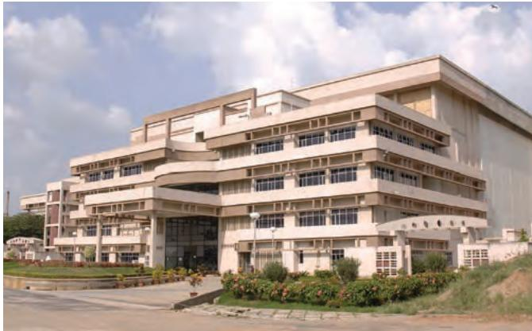
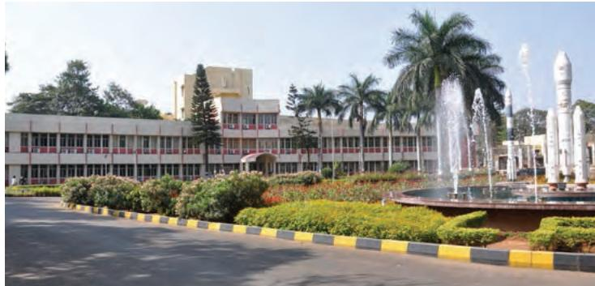
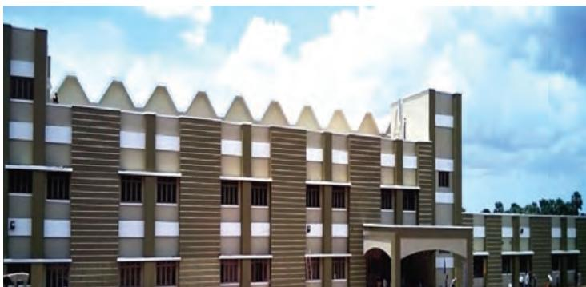
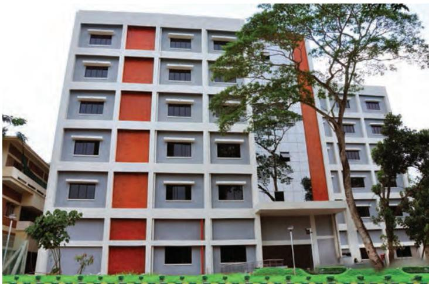
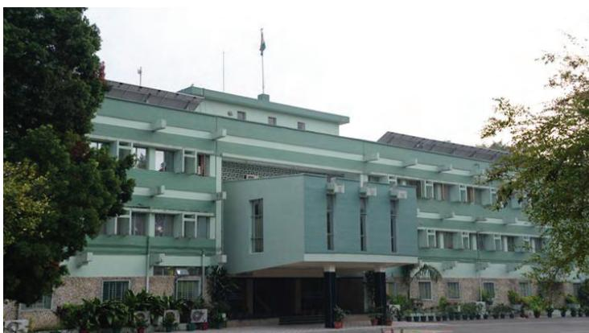
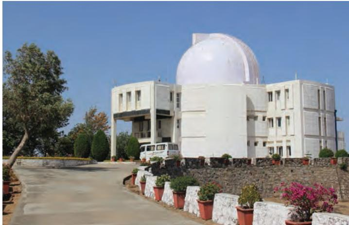
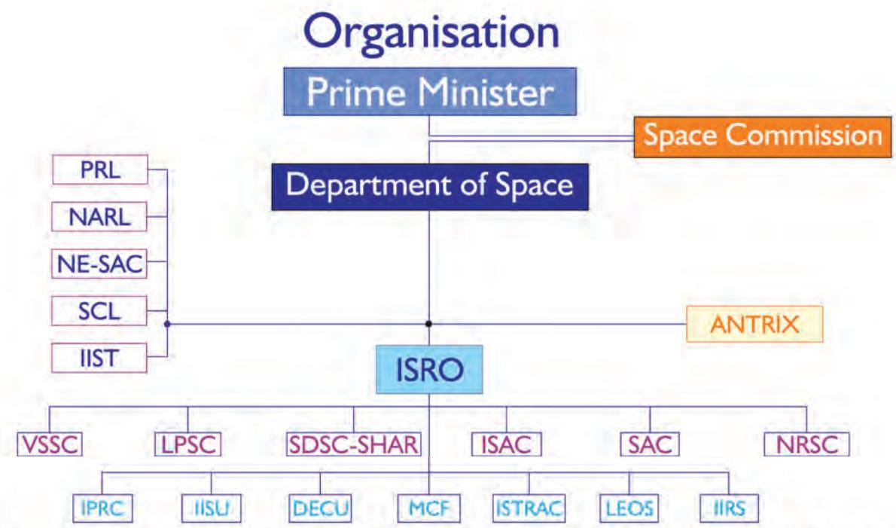
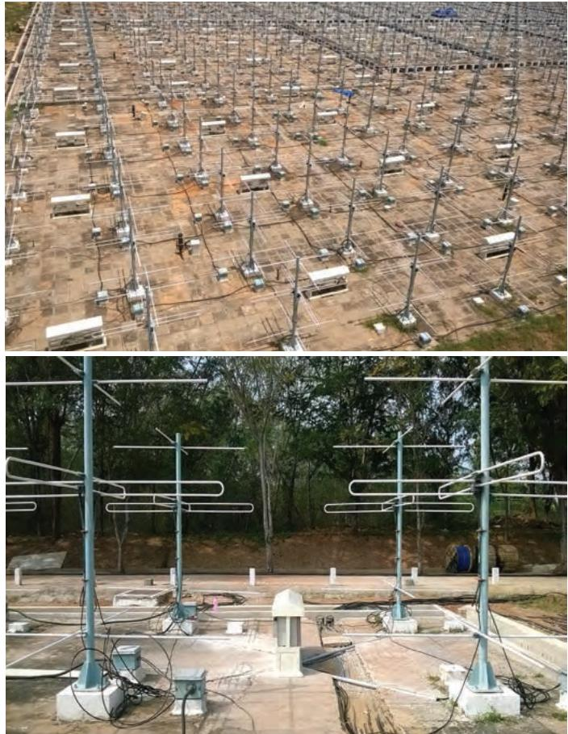
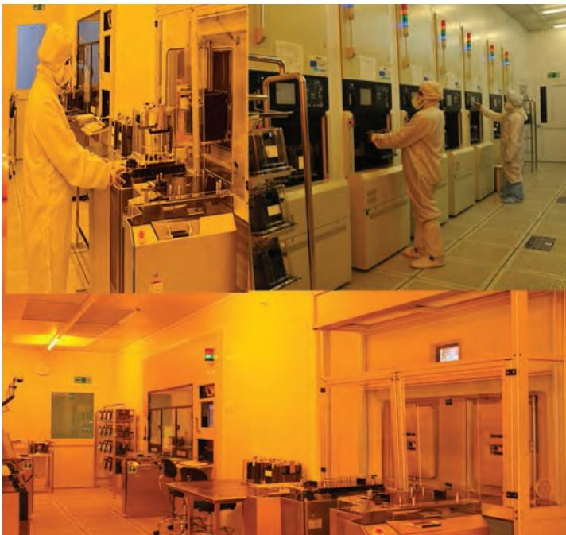

## Contents

Mission Profile 4   
Highlights 5   
Organisation 11   
Communication and Navigation Satellite System 24   
Earth Observation System 31   
Space Applications 43   
Space Transportation System 76   
Space Sciences and Planetary Research 84   
Sponsored Research 97   
Indian Space Industry 101   
Space Commerce 109   
Systems Reliability and Safety 111   
Human Resources 115   
International Cooperation 126   
‘Space’ In Parliament 130   
Space Programme Publicity 131   
Right to Information 133   
Audit Observations 134   
Milestones 138   
Acronyms 145

## Highlights

The year 2015 witnessed many significant achievements of the Indian Space programme which caught the attention of the country as well as the outside world. With the successful completion of the intended six month period by Mars Orbiter Spacecraft in its orbit around Planet Mars, India became the first country to achieve total success in its maiden attempt to explore Mars. Besides, the second consecutively successful launch of GSLV-MkII carrying the indigeneous Cryogenic Upper Stage (CUS) underscored ISRO’s capability in cryogenic rocket propulsion. The year also saw the launch of India’s multi wavelength Space Observatory ASTROSAT and its successful operationalisation.

Additionally, launch of IRNSS-1D and IRNSS-1E - the fourth and fifth satellites of the Indian Regional Navigation Satellite System (IRNSS) - by PSLV-C27 and PSLV-C31 respectively into the required sub-Geosynchronous Transfer Orbits (sub-GTO), also occurred during the year 2015-16. The year also witnessed the launch of India’s latest communication satellite GSAT-15 carrying communication transponders and GAGAN payload. And, the launch by the workhorse PSLV of 17 foreign satellites, 11 of them in two dedicated commercial PSLV missions, is yet another highlight of the Indian space programme during the reporting period.

The significant events of the Indian space programme during 2015-16 in chronological order are:

On March 24, 2015, India’s Mars Orbiter Spacecraft, which had earlier successfully entered into the scheduled orbit around planet Mars, completed the intended six month period in Mars orbit. As of February 2016 end, the spacecraft had completed seventeen months of operation in Mars orbit.

IRNSS-1D, the fourth of the seven satellites constituting the IRNSS Constellation, was successfully launched by PSLV-C27 into a sub GTO on March 28, 2015. It was the 29th launch of PSLV as well as its 28th consecutively successful mission. IRNSS constellation will enable introduction of satellite based position, timing and velocity services to a spectrum of users in the country and to the neighbouring regions.

PSLV-C28, the 30th flight of PSLV, was conducted on July 10, 2015, in which the vehicle placed United Kingdom’s three DMC3 satellites, each weighing 447 kg, along with two auxiliary payloads, also from United Kingdom, into the required Sun Synchronous Orbit of 647 km height.

GSLV-D6, the ninth flight of GSLV as well as the third flight of GSLV carrying indigenously developed Cryogenic Upper Stage (CUS), conducted on August 27, 2015, successfully launched 2117 kg GSAT-6 communication satellite into a Geosynchronous Transfer Orbit (GTO). It was the second consecutive success for GSLV carrying indigenous Cryogenic Upper Stage (GSLV-MkII).

ASTROSAT, India’s first multi wavelength astronomy mission, was successfully launched by PSLV-C30 along with six co-passenger satellites from abroad, into a 650 km orbit of 6 deg inclination on September 28, 2015.

GSAT-15, India’s latest communication satellite carrying communication transponders as well as GPS Aided Geo Augmented Navigation (GAGAN) payload was launched into GTO by the European Ariane-5 from Kourou, French Guiana on November 11, 2015.

PSLV-C29, the thirty second flight of PSLV carrying six customer satellites from abroad including the 400 kg TeLEOS-1 of Singapore, successfully placed them in an orbit of 550 km height on December 16, 2015. This was the thirty first consecutive success of PSLV.

IRNSS-1E, fifth of the seven satellites constituting IRNSS Constellation, was successfully launched on-board PSLV-C31 on January 20, 2016 into a sub Geosynchronous Transfer Orbit (sub GTO).

By February 2016 end, ISRO had a constellation of several commercial Communication satellites, exclusive Meteorological satellites, Earth Observation satellites, Navigation Satellites, a multi wavelength astronomical observatory and a spacecraft orbiting planet Mars.

## Launch Vehicle Programme

During the year under review, ISRO's workhorse Launch Vehicle PSLV, in its 'XL" version, placed two Navigation Satellites IRNSS-1D and 1E in the required sub Geosynchronous Transfer Orbits in two separate flights - PSLV-C27 and PSLV-C31. Besides, the ‘XL’ version of PSLV launched five satellites from United Kingdom successfully into a 647 km Sun Synchronous Orbit in its 30th flight (PSLV-C28). PSLV-XL also launched India’s first multi-wavelength space observatory ASTROSAT along with six customer satellites from abroad, in its thirty first flight (PSLV-30). In its ‘Core Alone’ version, PSLV placed six satellites from Singapore including the 400 kg Satellite TeLeos-1 into a 550 km Orbit, further proving its reliability and versatility.

Another prominent development in the Indian launch vehicle programme was the second consecutively successful flight (GSLV-D6) of GSLV-MkII on August 27, 2015, which was equipped with indigenous cryogenic upper stage. This flight further highlighted ISRO’s strength in cryogenic propulsion technologies.

Activities pertaining to LVM3 (GSLV-MkIII) launch vehicle, capable of launching four ton satellites into a Geosynchronous Transfer Orbit (GTO), progressed well during the year with the successful ground test of its S200 booster to validate the changes in its head end segment as well as the flight and the extended duration hot (ground) tests of CE-20 cryogenic engine of its third stage.

This apart, research and development activities in semi-cryogenic propulsion engine, air breathing propulsion and re-usable launch vehicle technology are also being pursued in earnest in an effort towards reducing the cost of access to space. Development of critical technologies for undertaking human spaceflight has also made additional progress.

## Satellite Programme

IRNSS-1D and 1E, the fourth and fifth satellites of the IRNSS Constellation, were successfully launched on board PSLV-C27 and PSLV-C31 on March 28, 2015 and January 20, 2016 respectively. IRNSS satellites employ the standard I-1K structure with a power handling capability of around 1660 W and a lift-off mass of about 1425 Kg. Like their three predecessors, IRNSS-1D and IE carry a navigation payload as well as a C-band ranging payload. The satellites also carry Corner Cube Retro Reflectors for laser ranging. In Orbit Tests (IOT) of Navigation Payload, Ranging Payload and TT&C transponder of IRNSS-1D and 1E have been successfully completed during the year and the satellites have been cleared for Navigation activities.

The 2117 kg GSAT-6, an advanced communication satellite providing services through five spot beams in S-band and a national beam in C-band, was successfully launched by GSLV-D6 on August 27, 2015 into GTO. Later, the satellite was placed in its geostationary orbital slot with the help of its own propulsion system.

GSAT-15, India’s latest communication satellite carrying Ku-band communication transponders, launched on-board European Ariane-5 VA227 on November 11, 2015, was later successfully taken to its geostationary orbital slot by firing its Liquid Apogee Motor in steps from MCF, Hassan.

The new satellites being built for meeting the country’s future requirements include IRNSS-1F, and 1G which are planned to be launched on-board PSLV, and GSAT-9 and GSAT-6A communication satellites to be launched by GSLV-MkII, GSAT-19 by GSLV-MkIII (LVM3), GSAT-17, GSAT-18 and GSAT-11 communication satellites planned to be launched through procured launch.

In the domain of earth observation satellites, it is planned to design, develop and build Cartosat-2E and Cartosat-3 in the Cartosat series of satellites, Resourcesat-2A in the Resourcesat series, Oceansat-3 and Scatsat-1 in the Oceansat series, INSAT-3DR and GISAT-1 in the INSAT series for meteorological applications during the 12th Five Year Plan.

## Space Science Programme

Mars Orbiter Mission is India’s first interplanetary spacecraft mission as well as the first Indian spacecraft mission to planet Mars. With a lift-off mass of 1340 kg, the Mars Orbiter Spacecraft carries five payloads – Mars Colour Camera, Thermal infrared Imaging Spectrometer, Methane Sensor for Mars, Lyman Alpha Photometer and Mars Exospheric Neutral Composition Analyser. Mars Orbiter Mission primarily envisaged to demonstrate the technologies for building, launching and navigating an unmanned spacecraft to Mars as well as to explore the planet by placing it in an orbit around that planet.

The spacecraft, which was launched by PSLV-C25 on November 05, 2013 from SDSC, Sriharikota into an elliptical earth parking orbit, was successfully placed in orbit around Mars on September 24, 2014. Mars Orbiter Mission is primarily a technological mission, which enabled ISRO to achieve critical mission operations with enhanced autonomy functions and stringent capabilities of propulsion and other spacecraft systems. The spacecraft successfully completed six months in its elliptical orbit around Mars on March 24, 2015, there by fulfilling all its primary objectives. All systems onboard the spacecraft are functioning normally in its orbit around Mars and it has already sent a number pictures of Mars disc showing many details. By February 2016 end, the spacecraft had successfully completed 17 months in its orbit around Mars.

Another prominent highlight of the year was yet another space science mission – ASTROSAT – which was successfully launched on September 28, 2015 by India’s workhorse launch vehicle PSLV. ASTROSAT is India’s first multi wavelength observatory capable of simultaneously viewing the Universe in the visible, Ultra violet and X-ray regions of the electromagnetic spectrum. After its launch into the planned orbit, ASTROSAT became operational following extensive in orbit test of its five payloads.

The future space science missions of ISRO include Chandrayaan-2, a follow-on mission to Chandrayaan-1 with an Orbiter, Lander and Rover to explore the moon, is to be launched onboard GSLV and Aditya-1, a scientific mission for solar studies carrying five scientific payloads including a Coronagraph. ADITYA is planned to be placed in a halo orbit around the L1 Legrangian point.

## Space Applications and Disaster Management Support

Remote Sensing applications projects at National, State and Local levels are being carried out through well-established multi-pronged implementation architecture of National Natural Resources Management System (NNRMS) in the country. During the year, Indian Remote Sensing Satellite constellation helped in Agricultural Crops Inventory, Agricultural Drought, Forest Fire, Landslides and Earthquakes monitoring, Groundwater Prospects Mapping, Inventory; Monitoring of Glacial Lakes/Water Bodies, Sericulture Development and Satellite Aided Search and Rescue.

The hallmark of Indian space programme has been the application-oriented efforts and the benefits that have accrued to the country. The societal services offered by INSAT/GSAT satellites in the area of teleeducation and telemedicine were continued during the year. Today, tele-education network has about 60,000 class rooms connected to various academic institutions and universities. ISRO Telemedicine network facilities now cover 380 hospitals connecting 302 rural hospitals and 18 mobile vans to 60 super speciality hospitals for providing health care to citizens, especially in rural areas.

The Disaster Management Support (DMS) Programme of ISRO continues to provide space based information and services to the State and Central Government Departments to strengthen the disaster management activities. The major activities during the year were monitoring all the flood events, supporting the disaster management during the Nepal Earthquake and monitoring the landslide dammed Phutkal river in Jammu and Kashmir. In 2015, flood monitoring and mapping was carried out for floods in 10 states and more than 105 flood maps were disseminated to the concerned State and Central officers in addition to making available to Users on the web through Bhuvan and NDEM web portals. LIDAR based experimental flood depth maps for part of Lakhimpur district of Assam were generated and disseminated to the state agencies for severe floods during August 23 and 25 and September 4, 2015.

Several depressions caused heavy rainfall during the year. All depressions and cyclones originated in the Indian ocean region were monitored and the track, intensity and landfall were predicted. Related information was regularly updated on the MOSDAC website.

During 2015, satellite data support (28 scenes) was provided for 10 emergency requests from Vietnam, Pakistan, Indonesia, Bangladesh, Japan, Myanmar, Nepal and Taiwan for floods, oil spill, landslides and Typhoon disasters.

## Space Commerce

Antrix Corporation, the commercial arm of the Department of Space, has been marketing the Indian space products and services in the global market. Under commercial contract with Antrix, 57 international customer satellites have been successfully launched by PSLV since 1999. During 2015, PSLV successfully launched 17 satellites from abroad. Many proposals from international Customers for the launch of their satellites onboard PSLV are under discussion and active consideration.

## Indian Space Industry

Involvement of Indian space industry continued during the year. In the past, it has made significant contribution towards the realisation of subsystems required for Indian space programme. Department of Space has associated more than 500 small, medium and large scale industries while implementing various programmes. So far, the Department of Space has transferred about 300 technologies to Indian industries for commercialisation and undertaken technical consultancies in various fields.

## International Cooperation

International cooperation is an integral part of Indian space activities, and ISRO continues to lay importance on bilateral and multilateral relations with space agencies and space related bodies with the aim of taking up new scientific and technological challenges, defining international frameworks for exploitation and utilisation of outer space for peaceful purposes, refining space policies and building and strengthening existing ties between the countries. During the year, ISRO signed cooperative agreements with the French, Canadian, Russian and Chinese space agencies as well the US Geological Survey, Jet Propulsion Laboratory and Kuwait Institute of Scientific Research.

## Human Resources

The achievements of Indian space programme are the result of commitment, dedication and expertise of its personnel who continue to play a key role. Recognising the importance of talented and motivated personnel, the department has laid stress on recruitment, training and career progression features. Department of Space continues to strive for providing its personnel with facilities such as housing, medical, canteen and schooling for their children.

## Indian Institute of Space Science and Technology

Towards capacity building in human resources and to meet the growing demands of the Indian Space Programme, the Indian Institute of Space Science and Technology (IIST), a deemed University, was established at Thiruvananthapuram in 2007. Towards the fulfillment of its primary objective of providing quality manpower to ISRO, 99 students of 2011 batch of B. Tech graduates were placed as Scientists/ Engineers at various centres of ISRO in 2015.

## Public Awareness on Space Programme

During the year, ISRO organised media visits to SDSC SHAR, Sriharikota, ISRO Satellite Centre (ISAC) and Mission Operations Complex (MOX), ISTRAC Bengaluru for the live coverage of PSLV and GSLV launches, ‘GNSS User Meet 2015’ and Mars Orbiter Mission coverage respectively. Besides, ISRO also organised many exhibitions at national and international conferences, important public congregations like cultural festivals, trade fairs and events and also at academic institutions. Exhibitions and other outreach events were also organised in association with Non-Governmental Organisations in various places for keeping the public abreast of the Indian space programme. A mobile Tableau on Mars orbiter mission was conspicuously presented during the 'International Fleet Review-2016 (IFR-16)' at Vishakhapatnam on February 07, 2016. ‘SAKAAR’, an Augmented Reality application for Android devices that helps the users, especially students, to better visualise ISRO launch vehicle, satellite and applications programmes, was launched in 2015.

## Right to Information – Ensuring Transparency

Strict compliance with the requirements of Right To Information (RTI) Act 2005 is practiced in the department. Department of Space has implemented RTI Act 2005 by identifying the Central Public Information Officers, Assistant Public Information Officers and the Appellate Authority for stage one appeals. As required under the Act, Department of Space has published the requisite information on DOS website (http://www.dos.gov.in) and on ISRO website (http://www.isro.gov.in). During the period January 2015 to December 2015, 807 applications were received and information was disseminated under the provisions of the RTI Act. 120 appeals were received by the First Appellate Authority and 25 appellants approached the Second Appellate Authority, namely, Central Information Commission.

## Conclusion

Indian space programme during the year made significant progress in its quest towards mastering critical technologies and witnessed significant milestones in space exploration. Necessary infrastructure for casting large boosters, liquid propellant engines, heavy cryogenic boosters for advanced heavier launchers and missions in the area of remote sensing, communications and navigational satellites as well as space science have been established.

The expansion of space applications programmes like tele-education and disaster management support and outreach through Direct-To-Home television, reiterates the increasing role played by the Indian space systems in providing direct benefits to the society. Thus, Indian Space Programme continues to pursue successful goals on all fronts in meeting its objective.

## Organisation

Space activities in the country were initiated with the setting up of the Indian National Committee for Space Research (INCOSPAR) in 1962. In the same year, work on Thumba Equatorial Rocket Launching Station (TERLS) near Thiruvananthapuram was also started. Indian Space Research Organisation (ISRO) was established in August 1969. The Government of India constituted the Space Commission and established the Department of Space (DOS) in June 1972 and brought ISRO under DOS in September 1972.

Space Commission formulates the policies and oversees the implementation of the Indian space programme to promote the development and application of space science and technology for the socioeconomic benefit of the country. DOS implements these programmes through, mainly, ISRO, Physical Research Laboratory (PRL), National Atmospheric Research Laboratory (NARL), North Eastern-Space Applications Centre (NE-SAC) and Semi-Conductor Laboratory (SCL). Antrix Corporation, established in 1992 as a government owned company, markets the space products and services.

The establishment of space systems and their applications are coordinated by the national level committees, namely, INSAT Coordination Committee (ICC), Planning Committee on National Natural Resources Management System (PC-NNRMS) and Advisory Committee for Space Sciences (ADCOS).

DOS Secretariat and ISRO Headquarters are located at Antariksh Bhavan in Bengaluru. Programme offices at ISRO Headquarters coordinate the programmes like satellite communication and navigation, earth observation, launch vehicle, space science, disaster management support, sponsored research scheme, international cooperation, system reliability and quality, safety, publications and public relations, budget and economic analysis and human resources development. The major establishments of DOS and their area of activities are given in the following paragraphs:

## Vikram Sarabhai Space Centre (VSSC)

Vikram Sarabhai Space Centre (VSSC) at Thiruvananthapuram is the lead centre of ISRO for the design and development of launch vehicle technology. The Centre pursues active research and development and has developed core competence in various disciplines including aeronautics, avionics, materials, mechanisms, vehicle integration, chemicals, propulsion, space ordnance, structures, space physics and systems reliability. The Centre undertakes crucial responsibilities of design, manufacturing, analysis, development and testing related to the realisation of subsystems for different missions. These are sustained by activities towards programme planning & evaluation, human resources development, technology transfer, industry coordination and safety. Planning, execution and maintenance of all civil works related to the Centre is also carries out. The Centre depends on administrative and auxiliary services for support.

VSSC has extension Centres at Valiamala housing major facilities of mechanisms, vehicle integration and testing and at Vattiyoorkavu for the development of composites. The Ammonium Perchlorate Experimental Plant (APEP) has been set up by VSSC at Aluva near Kochi.

The major programmes at VSSC include Polar Satellite Launch Vehicle (PSLV), Geosynchronous Satellite Launch Vehicle (GSLV) and Rohini Sounding Rockets as well as the development of Geo-Synchronous Satellite Launch Vehicle (GSLV-Mk III), reusable launch vehicles, advanced technology vehicles, air-breathing propulsion and critical technologies towards human spaceflight.

## ISRO Satellite Centre (ISAC)

ISRO Satellite Centre (ISAC), Bengaluru, is the lead centre of ISRO for design, development, fabrication and testing of all Indian made satellites. As a sequel to its mandate of spacecraft realisation, the Centre is engaged in the development of cutting-edge technologies of relevance to its satellite building activities and setting up of infrastructure for design, development, fabrication and testing of spacecraft. Over the past four and a half decades, ISAC has developed intellectual capital in a wide spectrum of knowledge domains of spacecraft technology.

ISITE Building

> **AI Description:**
> **Source:** `assets/_page_9_Figure_0.jpg`
> 
> **Generated:** 2026-05-31 21:49:43
> 
> ---
> 
> The image depicts a multi-story institutional building with a modern architectural design. The structure features a series of rectangular windows and a flat roof. The building is surrounded by a landscaped area with greenery and a paved pathway leading to the entrance. The sky is partly cloudy, suggesting a daytime scene. The overall appearance indicates a formal or educational institution.

ISRO Satellite Integration and Test Establishment (ISITE) is equipped with the state-of-the-art clean room facilities for spacecraft integration and test facilities including a 6.5 Metre thermo vacuum chamber, 29 Ton vibration facility, Compact Antenna Test Facility and Acoustic Test Facility under one roof. Assembly, Integration and Testing of all Communication and Navigation Spacecraft is carried out at ISITE. A dedicated facility for the productionisation of standardised subsystems is also established at ISITE.

Since its inception in 1972, the centre has built more than 75 satellites varying from scientific/experimental satellites to the state-of-art operational satellites in the areas of Communication, Navigation, Remote sensing and Space Science.

## Satish Dhawan Space Centre (SDSC) SHAR

Satish Dhawan Space Centre (SDSC) SHAR, Sriharikota, the Spaceport of India, is responsible for providing Launch Base Infrastructure for Indian Space Programme. This Centre has the facilities for solid propellant processing, static testing of solid motors, launch vehicle integration and launch operations, range operations comprising telemetry, tracking and command network and mission control centre.

The Centre has two launch pads from where the rocket launching operations on PSLV and GSLV are carried out. The mandate for the centre is (i) to produce solid propellant boosters for the launch vehicle programmes of ISRO (ii) to provide the infrastructure for qualifying various subsystems and solid rocket motors and carrying out the necessary tests (iii) to provide launch base infrastructure and of satellites and launch vehicles.

The Centre is augmenting the infrastructure to meet the requirements of increased launch frequency of 5-6 launches per year. The present Vehicle Assembly Building (VAB) is being used for integration of PSLV/GSLV/GSLV-Mk III (LVM3) launch vehicles for launching from the Second Launch pad. The second Vehicle Assembly Building (SVAB), integrated with existing rail track leading to Second Launch Pad, is planned to augment the launch infrastructure and provide redundancy to existing critical infrastructure.

SDSC SHAR has a separate launch pad for launching the sounding rockets. The centre provides the necessary launch base infrastructure for sounding rockets of ISRO and for assembly, integration and launch of sounding rockets and payloads.

## Liquid Propulsion Systems Centre (LPSC)

Liquid Propulsion Systems Centre (LPSC) is the lead centre for development and realisation of earth-to-orbit advanced propulsion stages for launch vehicle and also the in-space propulsion systems for spacecraft. The activities are spread across Valiamala / Thiruvananthapuram and Bengaluru centres.

LPSC Valiamala is the Headquarters and is responsible for R & D, system design/

LPSC Bengaluru

> **AI Description:**
> **Source:** `assets/_page_10_Figure_0.jpg`
> 
> **Generated:** 2026-05-31 21:50:23
> 
> ---
> 
> The image contains a photograph of a building complex with a large fountain in the foreground. The building has multiple stories and a modern architectural style. There are palm trees and well-maintained greenery surrounding the area, indicating a landscaped environment. The sky is clear, suggesting a sunny day. The fountain appears to be decorative and is the focal point of the image.

engineering, delivery of liquid and cryogenic propulsion systems, control components & modules and control power plants, project management functions, etc.,

LPSC Bengaluru focuses on the design and development of satellite propulsion systems and production of transducers/sensors.

## ISRO Propulsion Complex (IPRC)

ISRO Propulsion Complex (IPRC), Mahendragiri is equipped with the state-of-the-art-facilities necessary for realising the cutting edge propulsion technology products for the Indian space research programme.

The activities carried out at IPRC, Mahendragiri are: assembly, integration and testing of earth storable propellant engines, cryogenic engines and stages for launch vehicles; high altitude testing of upper stage engines and spacecraft thrusters as well as testing of its sub systems; production and supply of cryogenic propellants for Indian cryogenic rocket programme, etc. A Semi-cryogenic Cold Flow Test facility (SCFT) has been established at IPRC, Mahendragiri for the development, qualification and acceptance testing of semi-cryogenic engine subsystems.

IPRC is responsible for the supply of Storable Liquid Propellants for ISRO’s launch vehicles and satellite programmes. IPRC delivers quality products to meet the zero defect demand of ISRO space programme ensuring high standards of safety and reliability. It also carries out Research & Development (R&D) and Technology Development Programmes (TDP) towards continued improvement of its contribution to Indian space programme.

> **AI Description:**
> **Source:** `assets/_page_11_Figure_0.jpg`
> 
> **Generated:** 2026-05-31 21:49:51
> 
> ---
> 
> The image shows a multi-story building with a distinctive architectural design. The building features a series of rectangular sections with a patterned facade, including vertical lines and a series of small, evenly spaced windows. The roofline is unique, with a series of triangular peaks that give it a wave-like appearance. The sky in the background is partly cloudy, suggesting a daytime scene. The building appears to be a modern structure, possibly a school or institutional building, given its design and size.

Semi-cryogenic Cold Flow Test facility (SCFT) at IPRC, Mahendragiri

## Space Applications Centre (SAC)

Space Applications Centre (SAC) at Ahmedabad is dealing with wide variety of activities from payload development to societal applications, thereby creating a synergy of technology, science and societal applications. The centre is responsible for the development, realisation and qualification of communication, navigation, earth observation and planetary payloads and related data processing and ground systems in the areas of communications, broadcasting, remote sensing, disaster monitoring/mitigation, etc. It is playing an important role in harnessing space technologies for a wide variety of applications for societal benefits.

In order to carry out the above tasks, SAC has highly sophisticated payload integration laboratories, electronic and mechanical fabrication facilities, environmental test facilities, systems reliability/assurance group, image processing and analysis facilities, project management support group and a well-stocked library. SAC has also put adequate emphasis on and practicing outsourcing and indigenous development of technology and vendors.

## Development and Educational Communication Unit (DECU)

The Development and Educational Communication Unit (DECU) at Ahmedabad, is involved in defining, planning, implementing and conducting socio-economic research and evaluation of various societal applications. The visionary plan of DECU is to pursue the goals, on all fronts, in meeting the objectives of space-based societal applications for our nation’s overall development and to reach the unreached.

At present, the major programmes which support development, education and training are Telemedicine (TM), Tele-Education (TE) and other SATCOM Development and Applications, including Disaster Management System (DMS), Village Resource Centre (VRC) related activities, etc.

## ISRO Telemetry, Tracking and Command Network (ISTRAC)

ISRO Telemetry, Tracking and Command Network (ISTRAC) bengaluru is entrusted with the major responsibility to provide tracking support for all the satellite and launch vehicle missions of ISRO. The major objectives of the centre are: estimation of the preliminary orbits of satellites injected into space, carrying out mission operations for all operational remote sensing and scientific satellites in normal phase, operation and maintenance of the ground segment for Indian Regional Navigation Satellite

System and development of radars and associated systems for meteorological applications and launch vehicle tracking. In addition, ISTRAC has also been mandated to provide space operations support for Deep Space Missions of ISRO and to provide active support for Search & Rescue, Disaster Management and a host Space Communication Hub services for societal applications.

In order to realise these objectives, ISTRAC has established a network of ground stations at Bengaluru, Lucknow, Mauritius, Sriharikota (SHAR I & II), Port Blair, Thiruvananthapuram, Brunei, Biak (Indonesia) and Deep Space Network Stations DSN-32 and DSN-18 at Byalalu near Bengaluru. The Mission Operations Complex (MOX) located at Bengaluru carries out round-the-clock mission operations for all remote sensing and scientific satellites. All network stations of ISTRAC are connected to MOX through dedicated high-performance satellite/terrestrial communication links.

Towards the realisation of the ground segment of IRNSS, ISTRAC has established a network of stations to support IRNSS satellites consisting of ISRO Navigation Centre (INC) at Byalalu (40 km from Bengaluru), four CDMA Ranging stations at Hassan, Bhopal, Jodhpur and Shillong and twelve IRNSS Range and Integrity Monitoring Stations at Bengaluru, Hassan, Bhopal, Jodhpur, Shillong, Dehradun, Port Blair, Mahendragiri, Lucknow, Kolkata, Udaipur, Shadnagar and Pune and one IRNWT facility at Bengaluru.

In keeping with its long-established TTC support responsibility, ISTRAC has also been mandated to provide space operations support for Deep Space Missions of ISRO, undertake development of radar systems for launch vehicle tracking and meteorological applications, establish and operationalise the ground segment for Indian Regional Navigational Satellite System, provide Search & Rescue and Disaster Management Services and support space based services like telemedicine, VRC and teleeducation.

## Master Control Facility (MCF)

Master Control Facility (MCF) at Hassan in Karnataka and Bhopal in Madhya Pradesh monitors and controls all the Geostationary/Geosynchronous satellites of ISRO, namely, INSAT, GSAT, Kalpana and IRNSS series of satellites. MCF is responsible for Orbit Raising of satellites, In-orbit payload testing, and On-orbit operations all through the life of these satellites. MCF activities include round-the-clock Tracking, Telemetry & Commanding (TT&C) operations, and special operations like Eclipse management, Station-keeping manoeuvres and recovery actions in case of contingencies. MCF interacts with User Agencies for effective utilisation of the satellite payloads and to minimise the service disturbances during special operations.

MCF currently controls INSAT-3C, INSAT-3A, INSAT-4A, INSAT-4B, INSAT-4CR, INSAT-3D, Kalpana-1, GSAT-8, GSAT-10, GSAT-12, GSAT-14, IRNSS-1A, IRNSS-1B, IRNSS-1C, IRNSS-1D, IRNSS-1E, GSAT-6, GSAT-16 and GSAT-15. To carry out these operations effectively, MCF-Hassan is having an integrated facility consisting of nine Satellite Control Earth Stations.

MCF at Bhopal completed its tenth year of successful operations. The Facility is configured with two Satellite Control Earth Stations (SCES) consisting of Full Motion Antennae and Limited Motion Antennae, a Satellite Control Centre and a Power Complex. MCF Bhopal is currently managing round-the-clock operations of three satellites in close coordination with MCF Hassan.

## ISRO Inertial Systems Unit (IISU)

ISRO Inertial Systems Unit (IISU) at Thiruvananthapuram is responsible for the design and development of Inertial Systems for both Launch Vehicles and spacecraft Programmes of ISRO. Major systems like Inertial Navigation Systems based on Mechanical Gyros and Optical Gyros, attitude reference systems, Rate Gyro Packages and Accelerometer packages are developed indigenously and used in various missions of ISRO. IISU also designs and develops Actuators and Mechanisms for spacecraft and allied applications.

The Unit has crossed major milestones of competence building phase, experimental phase and is presently engaged in the process of consolidation and productionisation of the sensors, systems, actuators and mechanisms for a variety of launch vehicle and spacecraft applications. Integrated Test Complex (ITC) building of IISU was completed during the year for production, integration, assembly and testing of sensors and systems.

The experience and knowledge gained over the years are used for perfecting the present class of sensors and systems. Further, IISU

ITC Building

> **AI Description:**
> **Source:** `assets/_page_13_Figure_0.jpg`
> 
> **Generated:** 2026-05-31 21:49:01
> 
> ---
> 
> The image shows a multi-story building with a modern architectural design. The building has a symmetrical facade with a combination of gray and orange panels. The structure appears to be a residential or office building, given its uniform window layout and the presence of multiple floors. The surrounding area includes some greenery and trees, indicating an urban or suburban setting. The building's design suggests it is well-maintained and possibly part of a larger complex.

has initiated technology development programmes in niche areas to adapt itself as a Centre of Excellence in Inertial Sensors and Systems. IISU strives to make the systems cost effective, reliable and realisable in tune with global trends.

## Laboratory for Electro-Optic Systems (LEOS)

Laboratory for Electro-Optic Systems (LEOS), Bengaluru is responsible for design, development and production of Electro-Optic sensors and camera optics for remote sensing and meteorological payloads. The sensor system includes earth sensors, star sensors, sun sensors, magnetic sensors, fiber optic gyro, temperature sensors and processing electronics. Optics systems include both reflective mirror optics and refractive multi element optics for astronomical/scientific purposes, cartographic applications, remote sensing and meteorological payloads. Other special elements developed by LEOS include optical masks for sun sensors, black absorber coatings for star sensor optics, optical filters, narrow band filters, encoder and optical coatings.

Research & Development programme of LEOS includes development of miniature sensors, Active Pixel Sensor, Miniature star tracker, Vision Sensors, Detectors, MEMS devices, Segmented Mirror Telescope optics and advanced optics for future spacecraft use.

New facilities incorporated during 2015 include installation of Gross Leak Tester, 0.3M Dia Thermovac system and Dome for Telescope Laser Ranging. Sensor production building (Aryabhata Building) and ‘Optics & MEMS’ building have become operational in 2015. The new facilities established at Aryabhata Building includes ultra precision CNC cell centering and turning machine, 3.5 T Vibration shaker system, 0.8 M Thermovac system, LN2 Tank (15 KL), Temperature test chamber, Humidity chamber, Particle counter, 2-Axis motion simulator, Nitrogen purged chambers (4 Nos.) and DRUPS power supply unit.

## National Remote Sensing Centre (NRSC)

NRSC at Hyderabad is responsible for remote sensing satellite data acquisition and processing, data dissemination, aerial remote sensing and decision support for disaster management. NRSC has a data reception station at Shadnagar near Hyderabad for acquiring data from Indian remote sensing satellites as well as others. The Centre is also engaged in executing remote sensing application projects in collaboration with the users. The Aerial Services & Digital Mapping (ASDM) Area provides end-to-end Aerial Remote Sensing services and value-added solutions for various large scale applications like aerial photography and digital mapping, infrastructure planning, scanner surveys, aeromagnetic surveys, large scale base map, topographic and cadastral level mapping, etc.

Regional Remote Sensing Centres (RRSCs) support various remote sensing tasks specific to their regions as well as at the national level. RRSCs are carrying out application projects encompassing all the fields of natural resources like agriculture and soils, water resources, forestry, oceanography, geology, environment and urban planning. Apart from executing application projects, RRSCs are involved in software development, customisation and packaging specific to user requirements and conducting regular training programmes for users in geo-spatial technology, particularly digital image processing and GIS applications.

## Indian Institute of Remote Sensing (IIRS)

Indian Institute of Remote Sensing at Dehradun is a premier institute with the objective of capacity building in Remote Sensing and Geo-informatics and their applications through education and training programmes at postgraduate level. The Institute also hosts and provides support to the Centre for Space Science and Technology Education in Asia and the Pacific (CSSTE-AP), affiliated to the

IIRS Main Building

> **AI Description:**
> **Source:** `assets/_page_14_Figure_0.jpg`
> 
> **Generated:** 2026-05-31 21:49:09
> 
> ---
> 
> The image shows a large building with a light blue facade. The structure has multiple windows and a flat roof. There is a flagpole on the roof with a flag flying. The building appears to be a government or institutional building, given its size and design. The entrance has a covered area with a dark roof. There are trees and some potted plants visible in front of the building.

United Nations. The training and education programmes of the Institute are designed to meet the requirements of various target/user groups, i.e., for professionals at working, middle and supervisory levels, fresh graduates, researchers, academia, and decision makers. The duration of courses ranges from one week to two years.

The training and education programmes conducted by the Institute are broadly grouped into: Postgraduate Diploma courses, Certificate programmes and Awareness programmes. In addition, IIRS also conducts special programmes for International and National participants on request from different organisations. M.Tech. course of 24 months duration is being conducted in collaboration with Andhra University, Visakhapatnam; and M.Sc. course of 18 months duration being conducted in collaboration with the Faculty of Geo-information Science & Earth Observation (ITC) of the University of Twente (UT), The Netherlands.

## Physical Research Laboratory (PRL)

Physical Research Laboratory (PRL) at Ahmedabad is an autonomous unit of DOS and a premier research institute engaged in basic research in the areas of Astronomy and Astrophysics, Solar Physics, Planetary Science and Exploration, Space and Atmospheric Sciences, Geosciences, Theoretical Physics, Atomic, Molecular and Optical Physics, and Astro-chemistry.

PRL is actively participating in ISRO’s planetary exploration programme and has also developed capabilities for detecting exo-

> **AI Description:**
> **Source:** `assets/_page_15_Figure_0.jpg`
> 
> **Generated:** 2026-05-31 21:48:52
> 
> ---
> 
> The image shows a building with a large white dome structure, likely an observatory, situated on a hillside. The building has multiple levels and is surrounded by a paved area with potted plants and trees. A white van is parked in front of the building, and the sky is clear and blue, indicating a sunny day. The overall setting appears to be a scientific or educational facility.

Infrared Observatory, Mt. Abu

planets from its Mt. Abu Observatory. Studies of Stellar and Solar astronomy are conducted from the Infra-red Observatory at Mt. Abu, and a lake site Solar Observatory in Udaipur, respectively. Another campus at Thaltej, Ahmedabad, hosts the planetary exploration (PLANEX) programme. Laboratory infrastructure has been established in this campus to develop instrumentation for future Space Science and Planetary missions and for initiating some of the proposed new research programmes. Significant progress has been made in the areas of planetary sciences and exploration. PRL is developing several payloads for the upcoming Chandrayaan-2 and proposed Aditya missions.

PRL has initiated scientific programmes in frontier areas of research including the search for exoplanets, laboratory studies of interstellar grains, laboratory synthesis of astro-molecules and experimental studies in the field of quantum optics.

## CHANDIGARH

·Semi-ConductorLaboratory

## JODHPUR

·Westem RRSC

## UDAIPUR

·Solar Observatory

## Mt.ABU

·Infrared Observatory

## AHMEDABAD

·Space Applications Centre

Physical Research Laboratory

Developmentand Educational Communication Unit

·DOS Branch Secretariat

ISRO Branch Office

·Delhi EarthStation

## DEHRADUN

·Indian Instituteof RemoteSensing

CentreforSpaceScienceandTechnology Education in Asia-Pacific

## LUCKNOW

·ISTRAC Ground Station

·ISRO NavigationCentre

## SHILLONG

·North Eastern-Space Applications Centre

## MUMBAI

·ISROLiaison Office

## BHOPAL

Master Control FacityB

## BENGALURU

·Space Commission

·Department of Space and ISRO Headquarters

·SCNP Office

·NNRMS Secretariat

·ADCOS Secretariat

Civil EngineeringProgrammeffice

·AntrixCorporation

·ISRO SateliteCentre

·Laboratory for Electro-OpticSystems

·ISROTelemetry,Tracking and Command Network

·Southern RRSC

·Liquid Propulsion Systems Centre

## HASSAN

·Master Control Facilty

## BYALALU

·Indian Deep Space Network

Indian Space Science Data Centre

ISRO Navigation Centre

KOLKATA Eastern RRSC

NAGPUR ·Central RRSC

HYDERABAD NatioalRemoteensingentre

SRIHARIKOTA

## TIRUPATI

·National Atmospheric Research Laboratory

## ALUVA

PORTBLAIR Down Range

·Ammonium Perchlorate Experimental Plant

## THIRUVANANTHAPURAM

Vikram Sarabhai SpaceCentre

·Liquid Propulsion SystemsCentre

·ISROInertial Systems Unit

IndianInsteofSpaceScenceandTechology

## MAHENDRAGIRI

·ISRO Propulsion Complex

### Full Page Description (Page 17)

**Source:** `assets/_page_17_Asset_0.jpg`

**Generated:** 2026-05-31 21:50:16

---

The image contains a bar chart with data visualized across three categories: Space Technology, Space Applications, INSAT Operational, Space Sciences, Direction & Administration and Other Programmes, and Grand Total. The chart compares three fiscal years: BE 2015-2016 (blue bars), RE 2015-2016 (red bars), and BE 2016-2017 (green bars). The y-axis represents monetary values in millions, while the x-axis lists the categories. The Grand Total shows the cumulative values for each category across the fiscal years. Notable features include the highest values in the Grand Total category and the consistent increase in values from BE 2015-2016 to BE 2016-2017.

> **AI Description:**
> **Source:** `assets/_page_17_Figure_0.jpg`
> 
> **Generated:** 2026-05-31 21:50:48
> 
> ---
> 
> The image is a flowchart illustrating the organizational structure related to space activities in India. It begins with the Prime Minister at the top, who oversees the Space Commission. The Space Commission leads to the Department of Space, which is further divided into several entities: PRL, NARL, NE-SAC, SCL, and IIST. Additionally, the Department of Space connects to ANTRIX. The Department of Space also oversees ISRO, which is further divided into VSSC, LPSC, SDSC-SHAR, ISAC, SAC, and NRSC. Each of these entities has its own sub-divisions, such as IPRC, IISU, DECU, MCF, ISTRAC, LEOS, and IIIS. The flowchart uses a mix of blue and orange boxes to differentiate between different levels and types of organizations.

PRLPhylcaReseachLaboyRNataltmospriRseabatorNSCNrthsteSaceAplatiosCentreSCLedc LabtoraceecdhaceResestrtp SpaceCentreLPSCLiquidropuoSystemsCentrePRCOPropusionCmpleSDCStishDawaSpaceCentreISAC:SOSateltCentreSace ApplationCentreSeesinteUerttsUnCDeveloeducaomunUnte ControFaiCecaefsteRe

## National Atmospheric Research Laboratory (NARL)

NARL at Gadanki near Tirupati, an autonomous society supported by DOS, is a centre for atmospheric research with the vision “Developing capability to predict the behaviour of the earth’s atmosphere through observations and modeling”. Towards realising this vision, NARL gives equal emphasis to technology development, observations, data archival, dissemination, assimilation and modeling.

NARL carries out its research activities under seven major groups, namely, Radar Application and Development Group, Ionospheric and Space Research Group, Atmospheric Structure and Dynamics Group, Cloud and Convective Systems Group, Aerosols, Radiation and Trace Gases Group, Weather and Climate Research Group and Computers and Data Management Group. Apart from these groups, there are also specific projects such as the LIDAR project and Advanced Space-borne Instrument Development project.

> **AI Description:**
> **Source:** `assets/_page_18_Figure_0.jpg`
> 
> **Generated:** 2026-05-31 21:49:36
> 
> ---
> 
> The image contains two photographs showing a large-scale installation of what appears to be a phased array antenna system. The top photograph displays a wide view of the array, showing numerous antenna elements arranged in a grid pattern. The bottom photograph provides a closer view of the antenna elements and their supporting structures, including the cables and mounting poles. The setup is located outdoors, with trees visible in the background. The image does not contain any text or labels that provide specific information about the system's function or specifications.

MST Radar facility at NARL

## North Eastern-Space Applications Centre (NE-SAC)

NE-SAC, located at Shillong, is a joint initiative of DOS and North Eastern Council (NEC) to provide developmental support to the North Eastern Region (NER) using space science and technology. The centre has the mandate to develop high technology infrastructure support to enable NE states to adopt space technology inputs for their development. The centre has completed a number of applications projects sponsored by the user agencies in the region and taken up research and development projects under Earth Observation Applications Mission, ISRO Geo-sphere Biosphere Programme, Satellite Communications, Disaster Management Support and Space Science Programmes.

## Antrix Corporation Limited

Antrix Corporation Limited, Bengaluru is a wholly owned Government of India Company under the administrative control of the Department of Space. Antrix Corporation Limited was incorporated in September 1992 as a private limited company owned by Government of India as a Marketing arm of ISRO for promotion and commercial exploitation of space products, technical consultancy services and transfer of technologies developed by ISRO. Another major objective is to facilitate development of space related industrial capabilities in India.

As the commercial and marketing arm of ISRO, Antrix is engaged in providing Space products and services to international customers worldwide. With fully equipped state-of-the-art facilities, Antrix provides end-to-end solution for many of the space products, ranging from supply of hardware and software including simple subsystems to a complex spacecraft, for varied applications covering communications, earth observation and scientific missions; space related services including remote sensing data service, Transponder lease service, Launch services through India’s operational launch vehicle PSLV; Mission support services; and a host of consultancy and training services.

## Semi-Conductor Laboratory (SCL)

Semi-Conductor Laboratory (SCL) at Chandigarh, an Autonomous Body under the Department of Space is continuing its efforts to create a strong microelectronics base in the country and enhancing capabilities in VLSI domain. Activities at SCL are focused on the Design, Development, Fabrication, Assembly, Testing and Reliability Assurance of CMOS and MEMS Devices.

Upgradation of Wafer Fabrication Lab has been completed and 8” CMOS Wafer Fabrication Line is geared-up for production activities. Three production lots have been processed with ASICs/IPs/Test Chips designed in-house. In these lots, 28 designs have been fabricated and tested successfully. These chips include some complex ASICs, one of them being Vikram Processor for Launch Vehicles. SCL

> **AI Description:**
> **Source:** `assets/_page_19_Figure_0.jpg`
> 
> **Generated:** 2026-05-31 21:49:22
> 
> ---
> 
> The image contains a series of photographs depicting a cleanroom environment, likely used for semiconductor manufacturing or similar precision work. The photographs show individuals in white protective suits operating machinery and equipment, with a focus on the controlled environment necessary for such processes. The cleanroom is equipped with various pieces of specialized equipment, including what appear to be automated systems and workstations, all designed to maintain a sterile and controlled atmosphere. The lighting is yellow, which is typical for cleanrooms to reduce glare and help detect particles. The overall scene suggests a high level of precision and cleanliness required in the manufacturing or testing of electronic components.

Two views of SCL

is also engaged in Hi-Rel Board Fabrication, Component Screening for ISRO units, Indigenisation of Electronics Boards for Indian Air Force and Production of Radiosonde for Atmospheric Studies.

## Indian Institute of Space Science and Technology (IIST)

IIST, Asia’s first Space University, was established at Thiruvananthapuram during 2007 with the objective of offering high quality education in space science and technology to meet the demands of Indian Space Programme. The institute offers Bachelor’s Degree in Space Technology with specialisation in Avionics and Aerospace Engineering and Integrated Masters Programme in Applied Sciences with special emphasis on space related subjects. Research in IIST is built on the foundations of various academic programmes run by the Departments of Aerospace Engineering, Avionics, Chemistry, Physics, Mathematics as well as Earth and Space Sciences. IIST has started several Post Graduate programmes that have been received a resounding response.