
Nepal Media Landscape 2014

National Opinion Survey Wave-ll September 2014

National MediaLandscape2014   
Nepal OpinionSurveyWave-llSeptember2014

Nationalmediasurveyisapartof Nepal Opinion Surveyconducted by Internewsand IDA in September 2013,February20l4andSeptember2014.

## IDA

Dr.Sudhindra Sharma Team Leader and Sociologist Mr.Pawan Kumar SenSenior Statistician Mr.Hiranjya BaralField Coordinator

## Internews

Mr.David Dougherty-National Opinion Polls Specialist Mr.Oren Murphy Regional Director,Asia Ms.Dorothy DaiProgramOfficerAsia Mr.MadhuAcharya，ProjectDirectorNepal Mr.Bhumiraj ChapagainMediaCoordinator

Antenna Foundation Nepal National Democratic Institute,Nepal

Internews 2014

INTERNEWS IN NEPAL 05   
ABOUT US 06   
WHAT WE DO 07   
OUR APPROACH 08   
RESEARCH METHODOLOGY   
ATIONWIDE OPINION SURVEYWAVEI II&II 09   
DEMOGRAPHICS 10   
NEPALMEDIA LANDSCAPE FEBRUARY2014 13   
NEPALMEDIALANDSCAPE SEPTEMBER2013 36

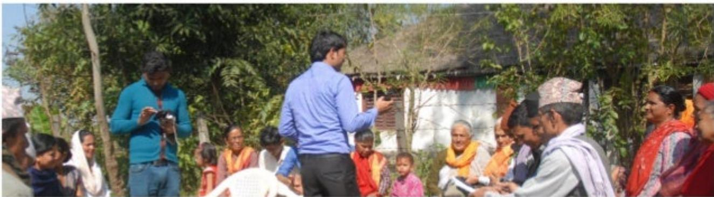

> **AI Description:**
> **Source:** `assets/_page_3_Figure_0.jpg`
> 
> **Generated:** 2026-05-31 22:27:35
> 
> ---
> 
> The image is a photograph showing a group of people gathered outdoors in what appears to be a rural setting. There are several individuals standing and sitting, with some holding cameras. The group seems to be engaged in a discussion or presentation, as one person in a blue shirt is gesturing and appears to be speaking. The background includes trees, a building with a thatched roof, and some people wearing traditional attire, suggesting a cultural or community event. The setting and attire suggest this could be a local gathering or educational session in a rural area.

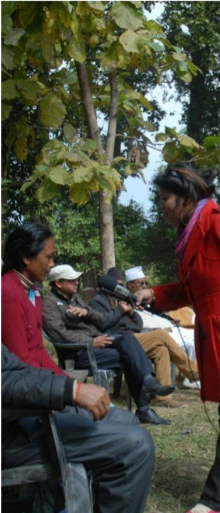

> **AI Description:**
> **Source:** `assets/_page_3_Figure_1.jpg`
> 
> **Generated:** 2026-05-31 22:27:53
> 
> ---
> 
> The image is a photograph showing a group of people in an outdoor setting, likely a park or a natural area, with trees in the background. A woman in a red jacket is speaking into a microphone, addressing a seated audience. The audience consists of several individuals, some wearing hats, and they appear to be listening attentively. The setting suggests a public speaking event or a community gathering.

# INTERNEWS IN NEPAL

Strengthening Political Parties,Electoral,and Legislative ProcessProgram (SPELP)/Consortiumfor Electionsand Political Process Strengthening (CEPPS) programUSAID/NDI

2011-2015

Intemewsactivelyengagedwithmediaand citizens in Nepal tocreate platformfordiscussiononelection-relatedthemes.Itsengagementwas focusedonprovidingNepalesemediacommunitywithmoredata,including graphical summaries about what citizens thinkabout key socio-political issues. Theprojectalso helpedNepali media betterunderstand election-related issuesandstrengthentheabilityofradiotofacilitatedebatesontheopinion pollresults,ultimatelyincreasing citizenparticipationintheelectoralprocess.

Intemews incollaboration with National Democratic Institute(NDl),worked withAntenna Foundation Nepal (AFN),InterdisciplinaryAnalysts (IDA), FreedomForumandotherlocalmediapartnersinNepal betweenJanuary 201landFebruary2015.

Duringtheprojectperiod Intemewsand itslocal partnerAntenna Foundation Nepaltrained over2OoNepali joumalists inkey investigativejournalism skillsanddata journalism toolstoreporton electoral reportingandpolitical parties.Antennaproduced 300episodesofradioprogramsfocusingon citizen'sawarenessonelectionsaswell asfield-based discussionsonnational opinion poll results.

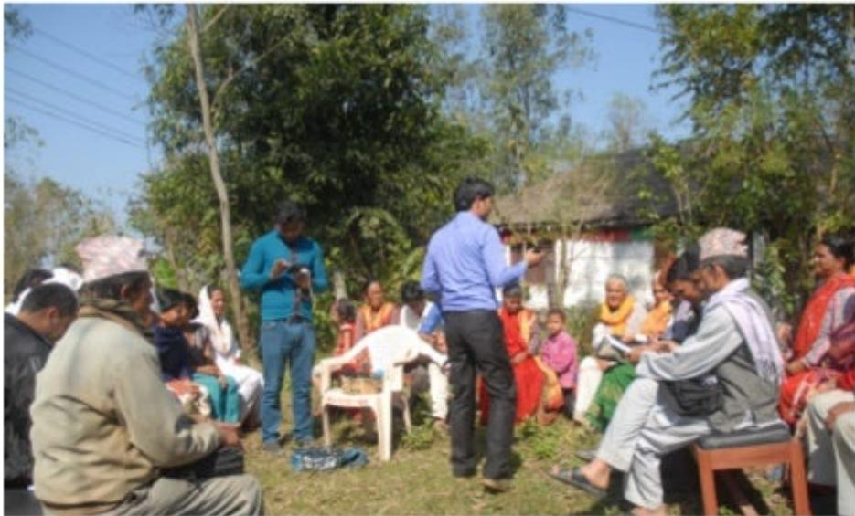

> **AI Description:**
> **Source:** `assets/_page_4_Figure_0.jpg`
> 
> **Generated:** 2026-05-31 22:27:19
> 
> ---
> 
> The image is a photograph showing a group of people gathered outdoors in what appears to be a rural setting. The group is seated on chairs and benches, with some standing. The individuals are dressed in a mix of casual and traditional attire, suggesting a cultural or community event. The background includes trees and a building, indicating a natural and possibly village environment. The people seem to be engaged in a discussion or presentation, as one person is gesturing and appears to be speaking. The overall scene conveys a sense of community interaction or educational activity.

Internewsand IDA carried out3wavesofNational Opinion Pollswith totalof10thousandsamplesacross thecountryonkey socio-political issues,constituentassembly,politicalparties,local governanceandmedia consumption behaviors.FreedomForumanotherlocal partneroperated communityof practice websitewww.nepalelectionchannel.orgtoaggregate electionandpoliticalpartiesrelatednewsinNepal.

Othersuccessful Internews engagement includes first everNational Radio Conference after 20o6 in partnership with majorradio organizations inNepal,publicationDatajournalism handbook inNepali language and developedonline trainingtoolkiton InvestigativeJournalismskills.

Datavisualizationand Infographics compiled inthis handbookarepartof National OpinionPoll series coveringNepal’slatestmediaconsumption behaviorand media landscaping.

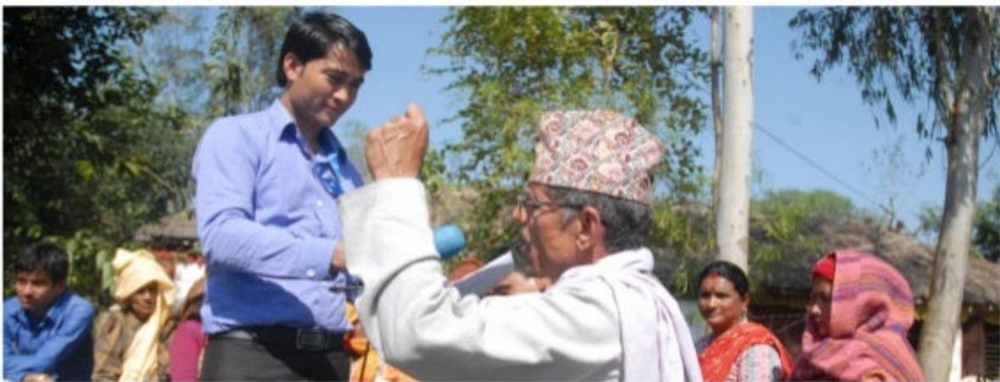

> **AI Description:**
> **Source:** `assets/_page_5_Figure_0.jpg`
> 
> **Generated:** 2026-05-31 22:26:16
> 
> ---
> 
> The image is a photograph showing two individuals in an outdoor setting. One person, wearing a blue shirt and black pants, is standing and appears to be receiving a ceremonial gesture from the other person, who is wearing a traditional Nepali hat and a white garment. The background includes trees and a few other individuals, some of whom are wearing traditional Nepali attire. The scene suggests a cultural or ceremonial event.

Intemewsisan international non-profit organizationwhosemission istoempowerlocal mediaworldwide to givepeoplethenewsand informationthey need,theabilityto connect and the means to make their voices heard.

Intemewsprovidescommunitiestheresources to produce local news and information with integrityand independence.With global expertiseand reach,Internewstrainsboth mediaprofessionalsand citizen journalists, introduces innovativemediasolutions,increases coverageofvital issuesand helpsestablish policiesneeded foropenaccessto information. Intemewsprogramscreate platforms for

dialogueand enable informeddebate,which bringabout social and economic progress.

Internews'commitment to researchand evaluation creates effective and sustainable programs,even inthemost challenging environments.

Internewsoperates intermationally，with administrative centers in California,Washington DC,andLondon,aswell asregional hubs in BangkokandNairobi.FormedinI982,Internews hasworkedinmorethan90countries,and currentlyhasoffices inAfrica,Asia,Europe,the Middle East,LatinAmericaandNorthAmerica.

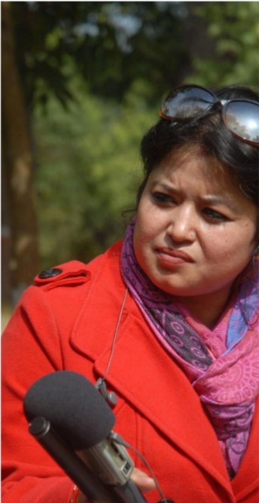

> **AI Description:**
> **Source:** `assets/_page_5_Figure_1.jpg`
> 
> **Generated:** 2026-05-31 22:25:40
> 
> ---
> 
> The image contains a photograph of a person outdoors. The individual is wearing a red coat and a patterned scarf. They are holding a microphone, suggesting they might be conducting an interview or recording a podcast. The background is blurred but appears to be a natural setting with greenery.

## WHAT WE DO

AtInternews,weworktoensure thatthefree flowof trusted information empowers people to makeinformeddecisionsabouttheir livesand theirfutures.

> **AI Description:**
> **Source:** `assets/_page_6_Figure_0.jpg`
> 
> **Generated:** 2026-05-31 22:08:45
> 
> ---
> 
> The image contains a simple icon of a computer monitor with a printer next to it, enclosed within a green circle. The icon suggests a concept related to printing or document output on a computer.

> **AI Description:**
> **Source:** `assets/_page_6_Figure_1.jpg`
> 
> **Generated:** 2026-05-31 22:10:22
> 
> ---
> 
> The image contains a simple line drawing within a circular border. The drawing depicts a person holding a cup, likely representing a beverage. The style is minimalistic and cartoonish, with no additional text or labels present. The image appears to be a symbol or icon, possibly used to represent a coffee shop, a beverage, or a similar concept.

Expand information access

Improve Quality Newsand Information

> **AI Description:**
> **Source:** `assets/_page_6_Figure_2.jpg`
> 
> **Generated:** 2026-05-31 22:08:37
> 
> ---
> 
> The image contains a simple icon of a computer monitor with a line graph trending upwards. The graph suggests a positive trend, indicating growth or improvement over time. The icon is circular with a green border, and the graph line is depicted in a gradient of green shades, emphasizing the upward direction.

Support Mediaand Information Stabilty

> **AI Description:**
> **Source:** `assets/_page_6_Figure_3.jpg`
> 
> **Generated:** 2026-05-31 22:08:22
> 
> ---
> 
> The image contains a bar chart within a green circular border. The chart consists of four horizontal bars of varying heights, representing different data points. The bars are labeled with small dots at the top, which likely indicate the values or categories they represent. The chart appears to be a simple comparison of four different values or categories.

Strengthen theenabling Environment

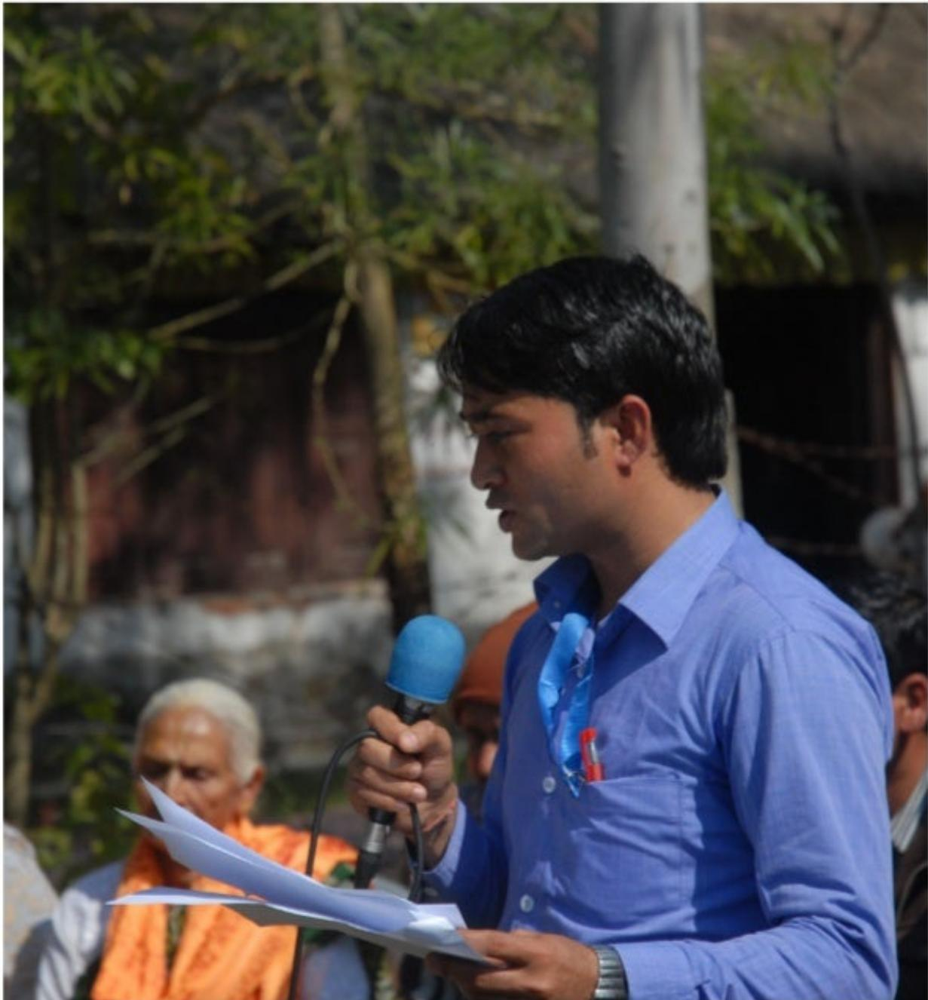

> **AI Description:**
> **Source:** `assets/_page_6_Figure_4.jpg`
> 
> **Generated:** 2026-05-31 22:11:35
> 
> ---
> 
> The image contains a photograph of a man speaking into a microphone. He is holding a piece of paper, suggesting he is reading from it or referencing it during his speech. The background shows a group of people, some of whom are wearing orange attire, possibly indicating a religious or spiritual gathering. The setting appears to be outdoors, with trees and a building visible in the background. The man is wearing a blue shirt and a tie, and there is a red object attached to his shirt, which could be a pin or a badge.

## OURAPPROACH

Wepartnerwith localorganizationstosupport strong,independentmediaandafree,openandsafeInternet.

We believe that information isainformationisafor personal,social and global well-being-as fundamental as food and water.

Weworkwhere information flowsare restricted and withmarginalizedand disadvantaged groups who livewith povertydeprivation and illitracy.

We act where there is opportunityto build healthier andmorerobust information environments

We support innovationand emergingideasthatfit local needsandaddress gaps wheremarkets fail.

We partnerwith local organizations to develop quality content and ensure people get the right information,attherighttime, from sources they trust.

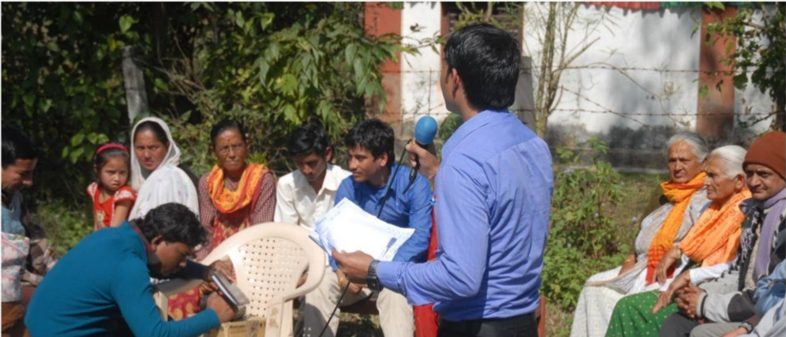

> **AI Description:**
> **Source:** `assets/_page_7_Figure_0.jpg`
> 
> **Generated:** 2026-05-31 22:13:55
> 
> ---
> 
> The image is a photograph showing a group of people gathered outdoors, seemingly engaged in a discussion or presentation. A man in a blue shirt is holding a microphone and appears to be speaking or leading the discussion. He is holding papers in his other hand. The group consists of both men and women, some sitting on chairs and others standing. The setting appears to be a rural or semi-rural area, with trees and a building in the background. The individuals are dressed in casual attire, with some wearing traditional clothing. The scene suggests an informal meeting or community gathering.

## RESEARCH METHODOLOGY NATIONWIDE OPINION SURVEY WAVEI. I&III

Internews subcontracted Interdisciplinary Analysts(IDA) toundertake threepublic opinionsurveysin 20l3and2014.

AlloftherespondentswereagedI8orabove. Multistage samplingtechniquewasemployed todetermine the sample units representing thenational population inthe country.Inthe firststage,anumberofdistrictsofNepal's75 districtswere selected usingstratified random samplingtorepresentsthel6distinctregions definedbyNepal'sfivedevelopmentregions and three ecological zones,along with the KathmanduValley.Inthesecondstage,simple randomsamplingtechniquewasused to select proportional numbersofvillagedevelopment committees(VDCs)and municipalitiesfrom thesampled districts.Inthethird stage,wards fromthesampledVDCswereselectedbased onsimplerandomsampling.Inthefourth stage, theright-hand rulewasemployedtoselect householdsineachsampled ward.Finallyinthe fifthstage,arespondentfromeach household wasselected usingKish gridtable i.e.,atable of randomnumbers,toensurethateacheligible memberinaselectedhousehold hasanequal chanceof being selected.

Themargin of errorwas+/-l.8 percentata95 percentconfidence level atthenational level for

wavelandlland+/-1.5percentata95percentconfidencelevelatthenationallevelforwavell.The surveydoes not claimthe same level of precision at eithertheregional orthe district levels.

Experiencedfield personnelcomprisingofsupervisorsandinterviewersadministeredthesurvey.Priorto theirdeployment inthefield,trainingwasconducted toorientthemontheobjectivesofthesurvey,their expectedrolesandresponsibities,surveyresearchmethodologyandfieldoperationplan,samplingdesign, surveyquestionnaires,andthingsthatthefieldteamshouldconsiderwhileundertakingthefieldwork,such asmannersandetiquette.lnaddition,mocktestwasconductedamongenumeratorssoastofamiliarize them with survey questionnaire.

ForWave llof thenational opinionpols,72experiencedfield personnelcomprisingof24supervisors and48interviewersadministeredthesurvey.Priortotheirdeploymentinthefield,four-daytrainingwas conductedtoorientthemontheobjectivesofthesurvey,their expectedrolesandresponsibilities,survey researchmethodologyandfieldoperationplan,samplingdesign,surveyquestionnaires,andthingsthatthe fieldteamshouldconsiderwhileundertakingthefieldwork,suchasmannersandetiquette.lnaddition, mocktestwas conductedamongenumeratorssoastofamiliarize themwithsurveyquestionnaire. Thetraining included practising withTablet-based questionnaire.Thequestionnaire was designedasan "app"through softwareknownas"Remo".Thefield personnel were instructedtoconducttheinterview inTabletusingRemo.FieldworkersweredeployedonAugust29,20l4andthefieldworkendedon September29,2014.

Whileforsingleresponsequestions,thetotalpercentageaddsuptolO0,thetotalexceeds I00percent forquestionsthat requiretwoormoreresponses.Thetotalpercentagefigurereflectsthetotalof respondentsratherthanthetotal ofresponses.

Theseeight broad caste/ethnicgroupswere further collapsed intotwo broad categories i.e.,categoriesby origin:Non-MadhesiandMadhesito facilitatefurther comparisonanalysis.

Table 3:Caste/ethnicity of the respondents byorigin.

Thetable below showsthereligious compositionof the sample of the three waves.

Table 4:Sample composition by religion

Theassociation of sample by rural and urban settlementof all threewavesreflectstheactual national figure of20ll census.Out of total respondents interviewedinthreesurveys,83percent werefromruraland l7percentfromurbanareas.

Table 5:Sample composition by settlement pattern

Theassociationofsamplebyruralandurban settlement of all threewavesreflectsthe actual national figure of 20llcensus.Out oftotal respondents interviewed inthree surveys,83percentwerefromrural and17 percent fromurbanareas.

Thetable below shows the percentage of menandwomenasperthecensusof2011 andthesample foreachof thethreewaves.

Table6:Sample composition by sex

Thecomposition ofthe sample in termsof ecological anddevelopment regionsdirectly matches that of the general populations inall threewaves.The followingtable indicatethe sampledistribution of geographiccomposition.

Table9:Sample composition by ecological region
Tablel0:Sample composition by development region

Anoverpoweringmajority of respondents, over80percent,weremarried andone-tenth wasunmarriedandaround5percentwidowin thesethreesurveys.Thedisaggregationof the samplebymarital statusofthe respondentsis obtainableinthetable below.

Table8:Sample composition by marital status The various age groups have been collapsed into four broad age-groups.The age composition of thesample ispresentedbelow.

Table8:Sample composition byage groups

Table I1:Whether or not afamily member isoutside the country

Between 9land94 percent reported havinga citizenship certificate.

Table 12:Whether or not people have citizenship certificate

Wave-ll Survey
Sample Distribution (District Level)
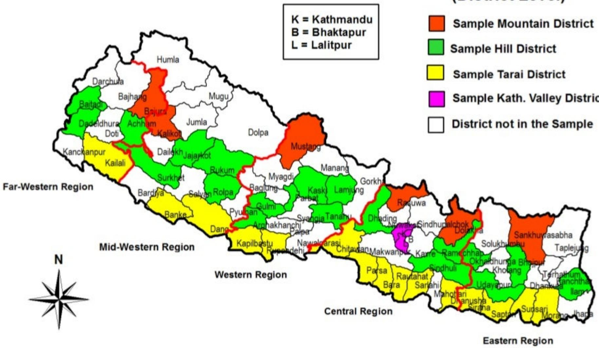

> **AI Description:**
> **Source:** `assets/_page_11_Figure_0.jpg`
> 
> **Generated:** 2026-05-31 22:24:56
> 
> ---
> 
> The image is a map of Nepal divided into regions and districts, with each district color-coded to represent a specific type of district: Mountain District, Hill District, Tarai District, Kathmandu Valley District, and those not included in the sample. The map includes a legend and a compass rose for orientation. The regions are labeled as Far-Western, Mid-Western, Western, Central, and Eastern. The map provides a geographical representation of Nepal's administrative divisions and their categorization.

## NEPAL

## Nepal Media Landscape February 2014

## WHICH OF THESE DO YOU HAVE WORKING IN YOUR HOUSEHOLD?

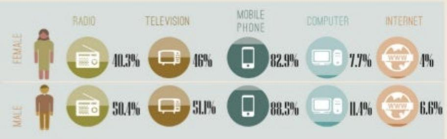

> **AI Description:**
> **Source:** `assets/_page_13_Figure_0.jpg`
> 
> **Generated:** 2026-05-31 22:10:36
> 
> ---
> 
> The image is an infographic combining text with visual elements. It presents data on media consumption by gender, specifically focusing on radio, television, mobile phone, computer, and internet usage. The data is represented through circular icons with percentages indicating the usage rates for each medium. The infographic includes two sections: one for females and one for males, with corresponding icons and percentages for each medium. The main trends show that mobile phone usage is the highest for both genders, followed by television and radio. The internet usage is notably lower for both genders compared to the other media.

## WHICH OFTHESEHAVEREGULAR ACCESSTO(ATLEASTONCEAWEEK) INYOURCOMMUNITY.OUTSIDE OF YOUR HOUSEHOLD?

BASE:4.021I MULTIPLERESPONSE

4% COMPUTER

A% ENET INTERNET

### Full Page Description (Page 15)

**Source:** `assets/_page_15_Asset_0.jpg`

**Generated:** 2026-05-31 22:08:33

---

The image is an infographic combining text with a pie chart. It presents data on the frequency of a certain activity for females. The pie chart is divided into four segments, each representing a different frequency category: "Never" (55.7%), "Few Times a Week" (17.7%), "Few Times a Month" (6.1%), and "Everyday" (20%). The chart visually represents the distribution of these categories among the female respondents.

## IN THE PAST SIX MONTHS.HOW OFTEN DID YOU LISTEN TO THE RADIO?

TO THE RADIO?IS WHYDON'T YOU LISTEN

BASE=1.865 PERCENTAGE BASED ONMULTIPLERESPONSE

### Full Page Description (Page 17)

**Source:** `assets/_page_17_Asset_0.jpg`

**Generated:** 2026-05-31 22:25:21

---

The image contains a bar chart with two bars. The left bar represents "Radio" at 76%, and the right bar represents "Mobile Phone" at 40%. The chart is labeled "BASE= 2,144, MULTIPLE RESPONSE". The bars are accompanied by icons: a radio for "Radio" and a smartphone for "Mobile Phone". The chart visually compares the usage of radio and mobile phones, with radio having a significantly higher percentage than mobile phones.

### Full Page Description (Page 17)

**Source:** `assets/_page_17_Asset_1.jpg`

**Generated:** 2026-05-31 22:22:22

---

The image contains a circular chart divided into two segments. The larger segment, colored red, represents 77% of the total and is labeled "RADIO." The smaller segment, colored brown, represents 39% of the total and is labeled "MOBILE." The chart is set against a light green background with a simple illustration of a landscape at the bottom, featuring a person sitting on a hill with a radio. The illustration adds a visual element to the otherwise text-heavy chart.

### Full Page Description (Page 17)

**Source:** `assets/_page_17_Asset_3.jpg`

**Generated:** 2026-05-31 22:26:05

---

The image is an infographic combining text with a visual element. It features a pie chart divided into two sections: "49% RADIO" and "70% MOBILE." The chart is set against a background of a stylized cityscape with buildings, trees, and birds. The colors used are primarily shades of green and red, with the percentages and labels in white text. The visual elements complement the text to convey the distribution of usage between radio and mobile.

BASE=2.144.MULTIPLERESPONSE

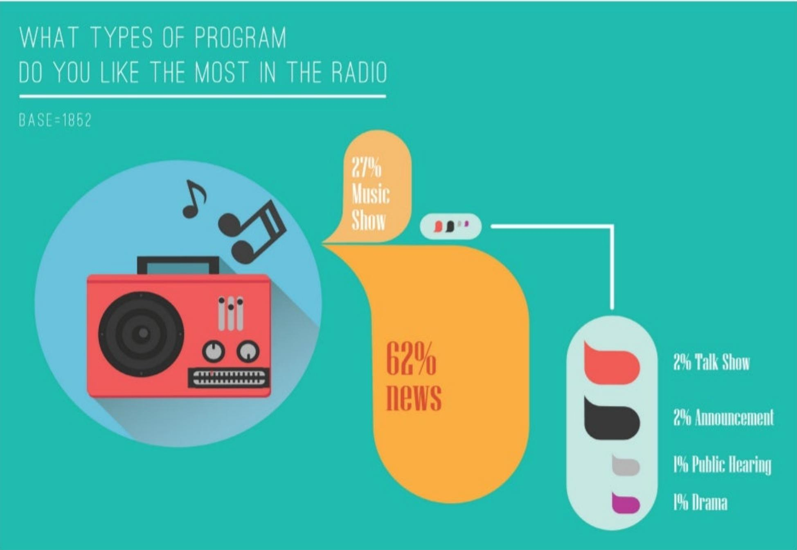

> **AI Description:**
> **Source:** `assets/_page_18_Figure_0.jpg`
> 
> **Generated:** 2026-05-31 22:20:40
> 
> ---
> 
> The image is an infographic combining text with visual elements. It presents data on the types of radio programs people like the most. The infographic includes a pie chart divided into sections representing different types of programs: Music Show (27%), News (62%), Talk Show (2%), Announcement (2%), Public Hearing (1%), and Drama (1%). The base of the survey is 1852 respondents. The design uses a radio illustration and speech bubbles to visually represent the data, making it engaging and easy to understand.

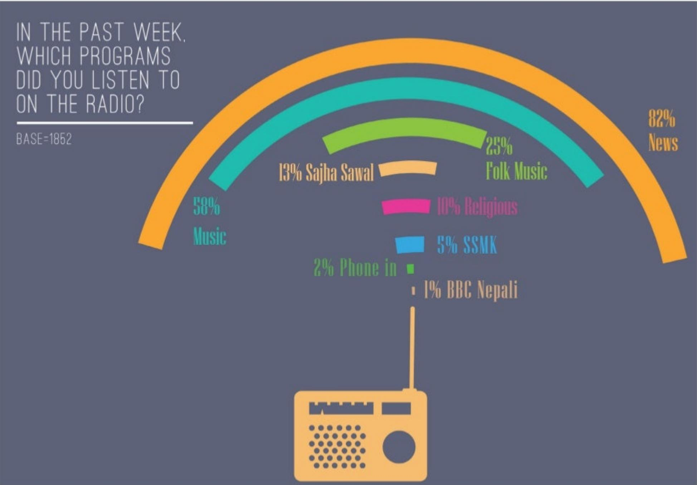

> **AI Description:**
> **Source:** `assets/_page_19_Figure_0.jpg`
> 
> **Generated:** 2026-05-31 22:16:41
> 
> ---
> 
> The image contains a pie chart with a radio illustration at the bottom. The chart shows the percentage of people who listened to different types of radio programs in the past week, based on a sample of 1852 respondents. The main categories include News (82%), Music (58%), Folk Music (25%), Sajha Sawal (13%), Religious (10%), SSMK (5%), Phone in (2%), and BBC Nepali (1%). The chart uses different colors to represent each category, with the largest portion being News and the smallest being BBC Nepali.

## WHICH TIME OFTHE DAYDOYOULISTEN TO THE RADIO FOR NEWS?

BASE=1958.MULTIPLERESPONSES

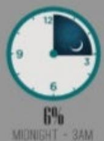

> **AI Description:**
> **Source:** `assets/_page_20_Figure_0.jpg`
> 
> **Generated:** 2026-05-31 22:25:49
> 
> ---
> 
> The image is a clock face with a crescent moon and a dark blue background. The clock shows the time as 12:00, with the moon partially visible, indicating it is nighttime. Below the clock, the text reads "6%" and "MIDNIGHT - 3AM," suggesting a time range and possibly a percentage related to that period. The image appears to be part of a larger context, possibly related to sleep patterns or time management.

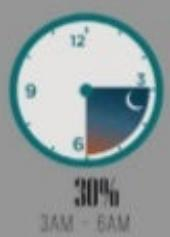

> **AI Description:**
> **Source:** `assets/_page_20_Figure_1.jpg`
> 
> **Generated:** 2026-05-31 22:25:57
> 
> ---
> 
> The image is a combination of a clock and a percentage indicator. The clock shows the time as 3 AM to 6 AM, with the hands positioned at 3 and 6, indicating the start of the night. The clock face is divided into two sections: the top half is dark, representing the night, and the bottom half is light, representing the early morning. Below the clock, there is a percentage indicator showing 30%, which likely corresponds to the percentage of the night that has passed or the percentage of the time slot from 3 AM to 6 AM. The overall design suggests a visual representation of time and progress within a specific time frame.

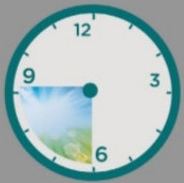

> **AI Description:**
> **Source:** `assets/_page_20_Figure_2.jpg`
> 
> **Generated:** 2026-05-31 22:25:03
> 
> ---
> 
> The image is a clock face with a light blue border. The clock shows the time as 9:30. The hands of the clock are black, and the numbers 12, 3, 6, and 9 are visible. The background of the clock face is white, and there is a small, colorful image in the lower left quadrant of the clock face, which appears to be a stylized depiction of a landscape or natural scene.

36% 6AM-9AM

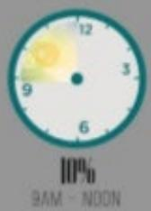

> **AI Description:**
> **Source:** `assets/_page_20_Figure_3.jpg`
> 
> **Generated:** 2026-05-31 22:22:27
> 
> ---
> 
> The image is a circular gauge with a gradient color scheme ranging from yellow to green, indicating a percentage. The gauge is divided into four sections, with the needle pointing to the 10% mark. The text at the bottom indicates the time range from 9 AM to Noon. The gauge appears to represent a percentage of completion or usage, possibly related to a daily task or resource availability.

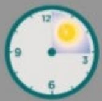

> **AI Description:**
> **Source:** `assets/_page_20_Figure_4.jpg`
> 
> **Generated:** 2026-05-31 22:26:26
> 
> ---
> 
> The image is a clock face with a sun partially obscuring the numbers. The time displayed is approximately 10:05. The clock has a simple design with a light blue background and black hour and minute hands. The sun is positioned near the 12 o'clock mark, indicating it is daytime.

10% NOON-3PM

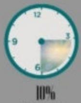

> **AI Description:**
> **Source:** `assets/_page_20_Figure_5.jpg`
> 
> **Generated:** 2026-05-31 22:26:22
> 
> ---
> 
> The image contains a clock-like diagram with a shaded area indicating 100% completion. The clock has a dark blue center and a light blue outer ring. The shaded area is a quarter of the circle, starting from the 3 o'clock position and extending to the 6 o'clock position. The clock is divided into 12 equal parts, and the shaded area represents a quarter of these parts.

10% 3PM-6PM

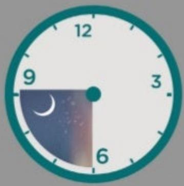

> **AI Description:**
> **Source:** `assets/_page_20_Figure_6.jpg`
> 
> **Generated:** 2026-05-31 22:26:31
> 
> ---
> 
> The image is a clock face with a crescent moon and stars depicted in the lower left quadrant. The clock shows the time as 9:30. The moon and stars are stylized and appear to be part of the clock's design rather than a separate image. The clock has a simple design with black hour markers and hands on a white background with a teal border.

57% 6PM-9PM

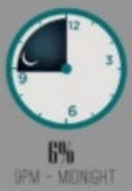

> **AI Description:**
> **Source:** `assets/_page_20_Figure_7.jpg`
> 
> **Generated:** 2026-05-31 22:29:25
> 
> ---
> 
> The image is a circular chart with a dark blue crescent moon shape on the left side, representing a portion of the clock face. The clock shows a time between 9 PM and midnight, with the moon indicating a low percentage of the total, specifically 6%. The chart is likely used to represent a time-based metric, such as battery life or a similar resource, with the moon symbolizing a diminishing amount.

> **AI Description:**
> **Source:** `assets/_page_20_Figure_8.jpg`
> 
> **Generated:** 2026-05-31 22:10:18
> 
> ---
> 
> The image contains a simple diagram of two icebergs. The icebergs are depicted in a light blue color, with visible crevasses and striations on their surfaces. The image is minimalistic and does not include any text or additional annotations. The main feature is the representation of icebergs, which could symbolize cold environments or natural landscapes.

MOUNTAIN

> **AI Description:**
> **Source:** `assets/_page_20_Figure_9.jpg`
> 
> **Generated:** 2026-05-31 22:08:50
> 
> ---
> 
> The image is a simple illustration of a landscape. It features a river flowing through a green area with trees and grass. The river is depicted with a light blue color, and the surrounding area is shaded in varying shades of green to represent vegetation. There are no text annotations or labels within the image. The illustration is likely meant to represent a natural environment or a park.

TERAI

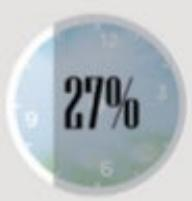

> **AI Description:**
> **Source:** `assets/_page_20_Figure_11.jpg`
> 
> **Generated:** 2026-05-31 22:22:14
> 
> ---
> 
> The image shows a circular gauge with a background resembling a clock face. The gauge is divided into sections, and the number "27%" is prominently displayed in the center. The gauge appears to be indicating a percentage, possibly representing a level of completion or a status indicator. The design is simple and clear, with the percentage being the focal point.

6AM-9AM

6PM-9PM

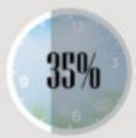

> **AI Description:**
> **Source:** `assets/_page_20_Figure_13.jpg`
> 
> **Generated:** 2026-05-31 22:22:06
> 
> ---
> 
> The image contains a circular clock face with a gradient background that transitions from light blue to white. Overlaid on the clock face is the text "35%" in a bold, dark font. The clock hands are not visible, and the image appears to be a stylized representation rather than a functional clock. The text suggests a percentage, possibly indicating a loading status or a completion level.

6AM-9AM

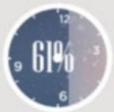

> **AI Description:**
> **Source:** `assets/_page_20_Figure_14.jpg`
> 
> **Generated:** 2026-05-31 22:22:00
> 
> ---
> 
> The image contains a clock face with the number "61%" prominently displayed in the center. The clock has a dark blue background with white numbers and hands. The percentage is likely indicating a progress or completion status, possibly related to a task or project. The design is simple and clear, focusing on the percentage value.

6PM-9PM

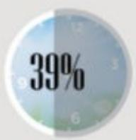

> **AI Description:**
> **Source:** `assets/_page_20_Figure_15.jpg`
> 
> **Generated:** 2026-05-31 22:20:45
> 
> ---
> 
> The image contains a circular progress indicator with a percentage label. The circle is divided into two sections: a darker gray section on the left and a lighter gray section on the right. The darker section represents 39% of the circle, while the lighter section represents the remaining 61%. The number "39%" is prominently displayed in the center of the darker section. The background of the image appears to be a blurred clock face, suggesting a time-related theme.

6AM-9AM

6PM-9PM

## IN THE PAST SIX MONTHS. HOW OFTEN DID YOU WATCH THE NEPALI TV CHANNEL?

URBAN

43%EVERYDAY   
2I%FEWTIMESA WEEK   
G%FEW TIMES A MONTH   
30%NEVER   
1%DK/CS

RURAL

19%EVERYDAY   
II%FEWTIMESAWEEK   
6%FEWTIMESA MONTH   
64%NEVER   
1%DK/CS

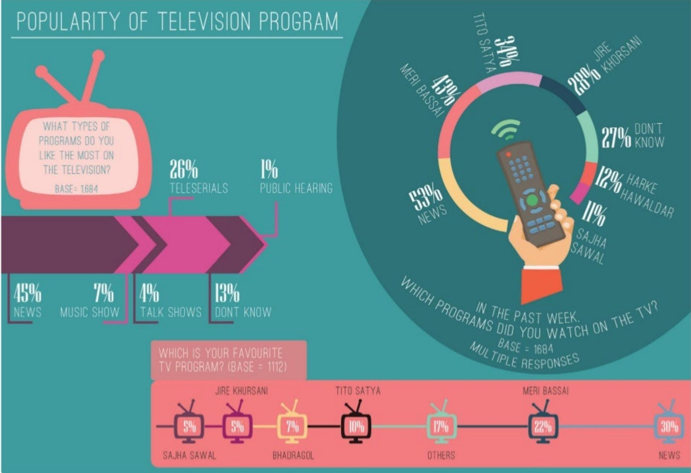

> **AI Description:**
> **Source:** `assets/_page_22_Figure_0.jpg`
> 
> **Generated:** 2026-05-31 22:12:55
> 
> ---
> 
> This image is an infographic combining text with visual elements. It presents data on the popularity of television programs, using a pie chart, a bar chart, and a horizontal bar graph. The pie chart shows the percentage of viewers who watched specific programs in the past week, with "News" being the most popular at 53%. The bar chart at the bottom displays the percentage of viewers who watched different types of programs, with "News" again leading at 30%. The text provides additional information on the types of programs viewers like the most, with "News" being the most preferred at 45%. The infographic also includes a line graph showing the percentage of viewers' favorite TV programs, with "News" leading at 30%.

### Full Page Description (Page 23)

**Source:** `assets/_page_23_Asset_1.jpg`

**Generated:** 2026-05-31 22:21:14

---

The image contains an infographic with two sections: one labeled "RURAL" and the other labeled "URBAN." Each section includes a bar chart with time intervals (midnight-3:00, 3:00-6:00 AM, 6:00-9:00 AM, 9:00 AM-noon, noon-3:00 PM, 3:00-6:00 PM, 6:00-9:00 PM, and 9:00 PM-midnight) and corresponding percentages for each time interval. The percentages are color-coded, with different colors representing different time intervals. The rural section shows a higher percentage for the 6:00-9:00 AM interval (25%) compared to the urban section (3%). The urban section has a higher percentage for the 6:00-9:00 PM interval (8%) compared to the rural section (75%). The image uses a simple design with illustrations of rural and urban landscapes to represent the two categories.

### Full Page Description (Page 23)

**Source:** `assets/_page_23_Asset_0.jpg`

**Generated:** 2026-05-31 22:21:55

---

The image is an infographic combining text with visual elements. It presents data on television viewing habits, represented by a stylized television set with colored bars inside. The bars correspond to different time periods and their respective percentages of viewership. The key information includes the percentage of viewers for each time slot: Midnight-3:00 AM (8%), 3:00 AM-6:00 AM (7%), 6:00 AM-9:00 AM (27%), 9:00 AM-noon (8%), Noon-3:00 PM (10%), 3:00 PM-6:00 PM (4%), 6:00 PM-9:00 PM (77%), and 9:00 PM-Midnight (15%). The base number of viewers is given as 1353. The infographic uses a color-coded bar chart within the television set to visually represent the data, making it easy to compare the percentages at a glance.

## WHICH TIME OF THE DAY DO YOU WATCH TVFOR NEWS?

## DO YOU SUBSCRIBE ANY NEWSPAPER?

BASE=4.021

## HOWDO YOU ACCESS THE INTERNET?

BASE=493

9%ON MYOFFICECOMPUTER/LAPTOP   
10%INACYBER   
24% ON MYHOME COMPUTER/LAPTOP   
88%ON MYMOBILE PHONE

## WHAT DO YOU USE THE INTERNET FOR?

BASE=4.021

92%

SOCIAL MEDIA （FACEBOOK.TWITTER ETC)

43%

COMMUNICATION WITHFRIENDS/FAMILY(SKYPE ETC)

..&6%NEWS

..15%WORK

I5%PERSOLESEARCHINCLUIGJOBSCH

8%EOUCATION（SCHOOL.COLLEGEWORK）

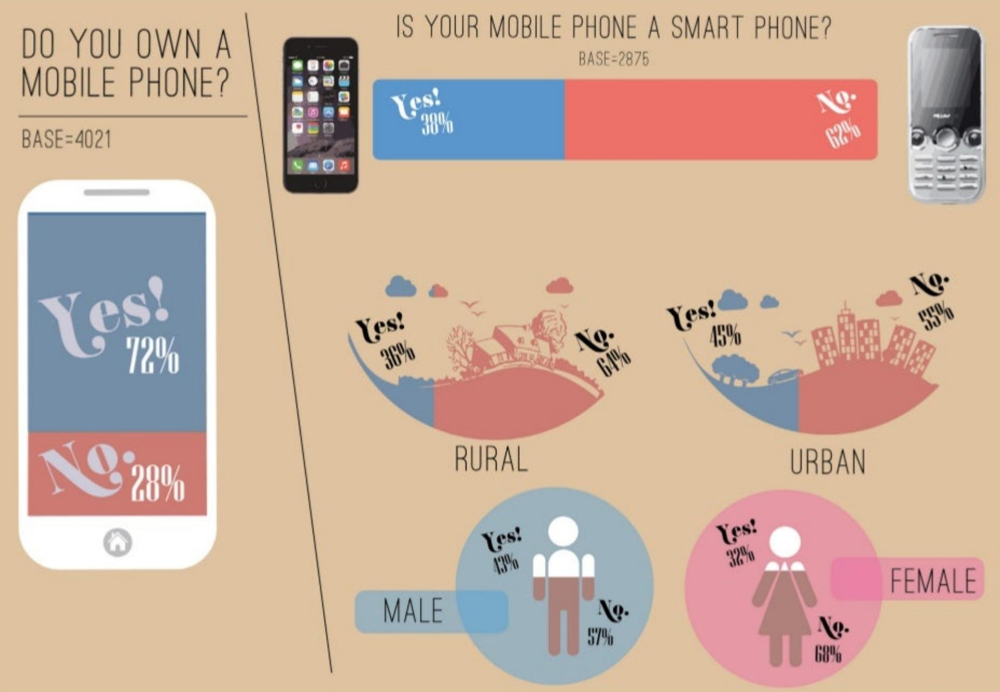

> **AI Description:**
> **Source:** `assets/_page_29_Figure_0.jpg`
> 
> **Generated:** 2026-05-31 22:18:07
> 
> ---
> 
> The image contains an infographic with various visual elements. It includes:
> 
> 1. A bar chart showing the percentage of people who own a mobile phone and whether their mobile phone is a smartphone.
> 2. Pie charts comparing mobile phone ownership and smartphone usage in rural and urban areas.
> 3. Circle graphs showing the percentage of male and female mobile phone owners.
> 
> Key information includes:
> - 72% of people own a mobile phone, with 38% of those being smartphones.
> - In rural areas, 36% of people own a mobile phone, with 64% being smartphones.
> - In urban areas, 45% of people own a mobile phone, with 55% being smartphones.
> - Among males, 43% own a mobile phone, with 57% being smartphones.
> - Among females, 32% own a mobile phone, with 68% being smartphones.
> 
> The infographic uses colors and icons to represent different categories and data points, making the information visually engaging and easy to understand.

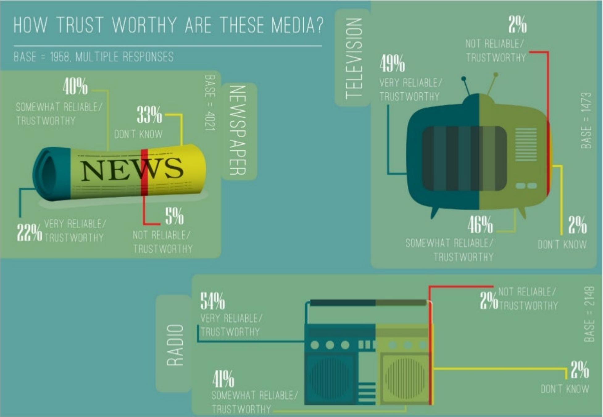

> **AI Description:**
> **Source:** `assets/_page_30_Figure_0.jpg`
> 
> **Generated:** 2026-05-31 22:15:18
> 
> ---
> 
> The image is an infographic combining text with visual elements. It presents data on the perceived trustworthiness of different media sources: news, television, and radio. The infographic uses a color-coded system to indicate the percentage of respondents who find each medium "Very Reliable/Trustworthy," "Somewhat Reliable/Trustworthy," "Don't Know," and "Not Reliable/Trustworthy." For example, 49% of respondents find television "Very Reliable/Trustworthy," while 46% find it "Somewhat Reliable/Trustworthy." The infographic also includes a base number for each media type, indicating the total number of respondents. The design uses icons of a newspaper, television, and radio to represent each media source.

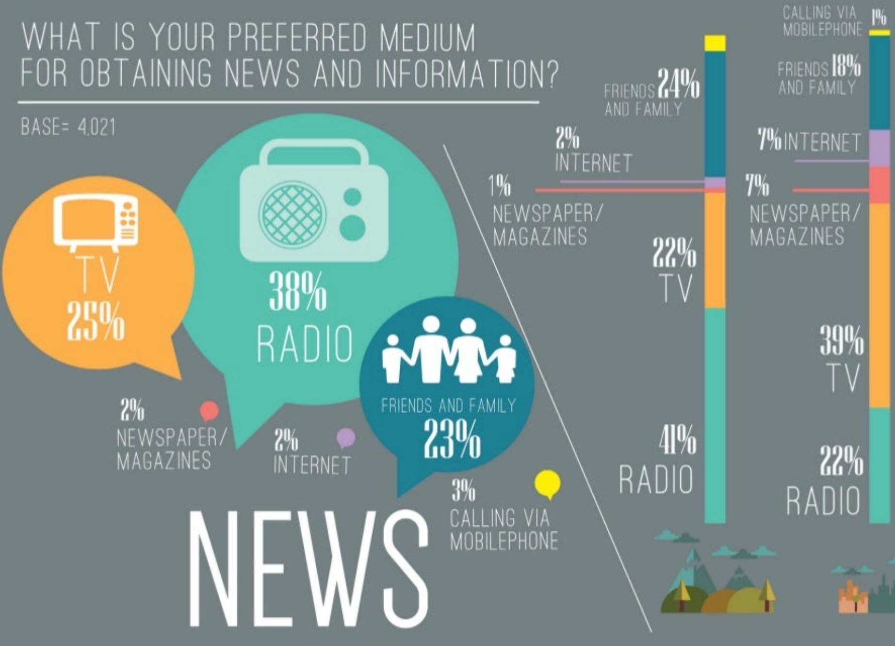

> **AI Description:**
> **Source:** `assets/_page_31_Figure_0.jpg`
> 
> **Generated:** 2026-05-31 22:10:13
> 
> ---
> 
> The image contains an infographic with a combination of text and visual elements. It presents data on the preferred mediums for obtaining news and information. The infographic includes pie charts and bar graphs that show the percentage of people who prefer different mediums such as TV, radio, friends and family, and the internet. The data is presented in a visually appealing manner with distinct colors and icons representing each medium. The main trends highlighted are the high preference for radio and TV as news sources, followed by friends and family, and the internet. The infographic is designed to be easily readable and informative.

## WHATISTHE MOST IMPORTANT TOPIC YOU WOULD LIKE TO LISTEN/WATCH/READ ONTHE RADIO/TV/NEWSPAPERS??

BASE=1353

## Nepal Media Landscape September 2013

## se2319

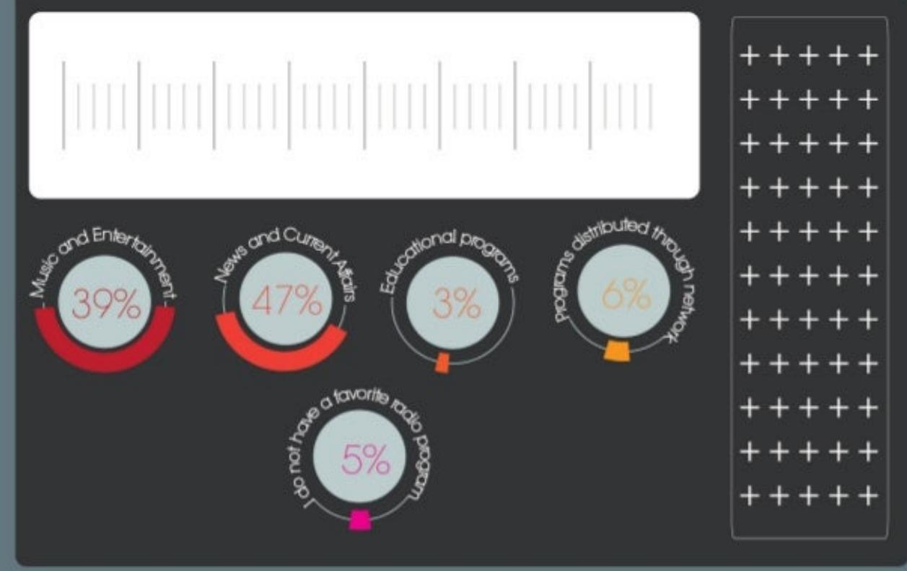

> **AI Description:**
> **Source:** `assets/_page_34_Figure_0.jpg`
> 
> **Generated:** 2026-05-31 22:27:01
> 
> ---
> 
> The image contains a pie chart and a bar chart. The pie chart displays the percentage of preferences for different types of radio programs, with "Music and Entertainment" at 39%, "News and Current Affairs" at 47%, "Educational programs" at 3%, and "Programs distributed through network" at 6%. Additionally, there is a section labeled "Do not have a favorite radio" at 5%. The bar chart on the right side of the image is partially visible and appears to be related to the data presented in the pie chart. The main trend is that "News and Current Affairs" is the most preferred type of radio program, followed by "Music and Entertainment."

## Access to Radio

Everyday

Fewtimes aweek

Fewtimes amonth

Never

中中中中心

46%

中种中中中

中中中中中

24%

中中中中中

中中中中中

8%

中中师中中

中中中中中

23%

## Access to Newspaper

Everyday

9%

Fewtimes aweek

11%

Fewtimes amonth

中中中中中10%

Never

中种种种种70%

## Accessto Television

Everyday

Fewtimes aweek

Fewtimes amonth

Never

32%

15%

8%

23%

## Accessto Internet

Everyday

Fewtimes aweek

7%

Fewtimes amonth

4%

Never

82%

## Access toMedia Everyday

46%

中中中中中中种中中种9%

中中中中中中种中中中7%

## Accessto Media few times aweek

中种种中中种种中中中7%

## Accessto Media fewtimes a month

## NeverAccessedMedia

## 中中中中中 种中种中种中中中中中 中中中中中23% 23%

70%

82%