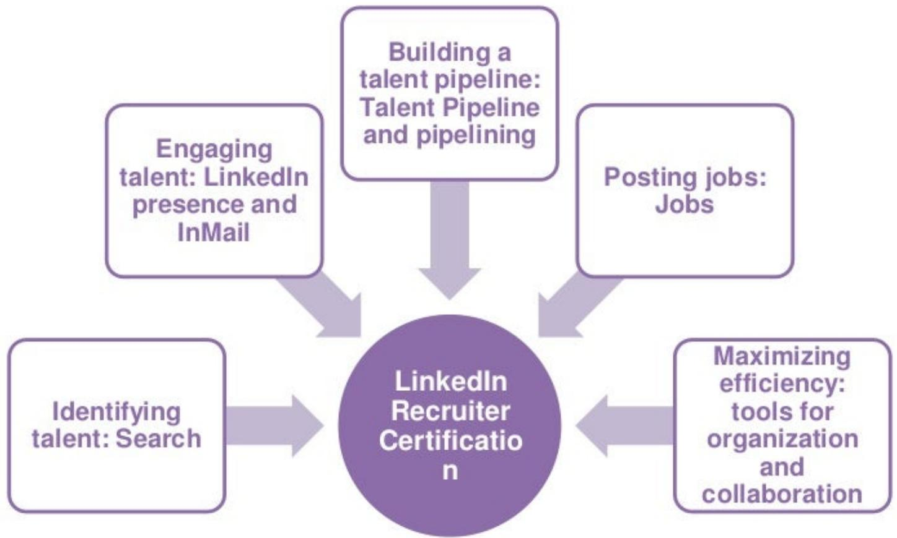
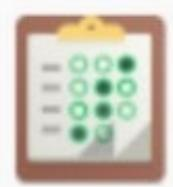
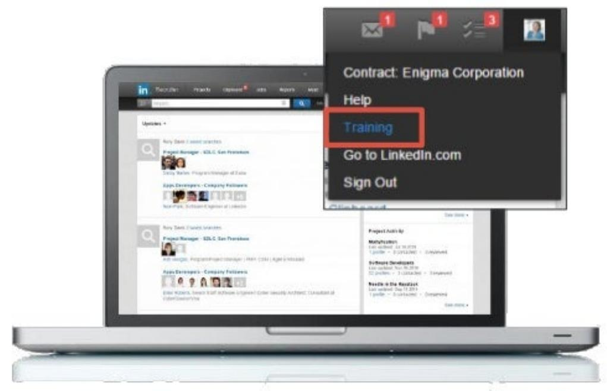
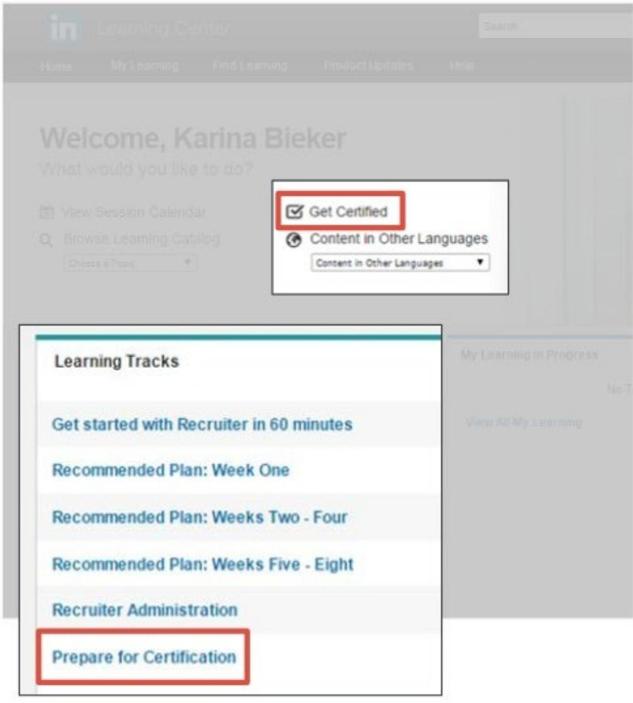
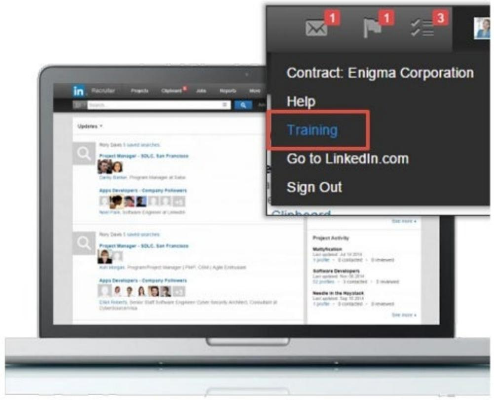

# The What,Why,and How of Recruiter Certification

Linked.Talent Solutions

## Meet the Presenters

> **AI Description:**
> **Source:** `assets/_page_1_Figure_0.jpg`
> 
> **Generated:** 2026-05-31 22:31:59
> 
> ---
> 
> The image is a photograph of a person with long hair, wearing a black sleeveless top. The background appears to be an indoor setting, possibly a café or restaurant, with blurred elements such as tables, chairs, and some greenery. The lighting is soft and natural, suggesting the photo was taken during the day.

Martien Hogerzeil
CustomerSuccessManager Linkedln,Dublin

Rebecca Vertucci
CustomerSuccessManager Linkedln,NewYork

## What we'll cover today

What'sLinkedln Recruiter Certification?

Exam Topics and Sample Questions

Preparing for Certification

Frequently Asked Questions

Registering for Certification

Takeaways

## What'sLinkedln Recruiter Certification?

## Linkedln Certified Professional - Recruiter

The only official Linkedln credential thatdemonstrates you'reanexpert incandidate recruitment using Linkedln Recruiter

## The Ultimate Toolkit for Recruiters

> **AI Description:**
> **Source:** `assets/_page_5_Figure_0.jpg`
> 
> **Generated:** 2026-05-31 22:37:06
> 
> ---
> 
> The image contains a hand pointing at a grid of individual photographs. The grid appears to be arranged in rows and columns, with each cell containing a different person's face. The hand is positioned as if it is selecting or pointing to one of the individuals in the grid. The image is likely used to represent a selection process, such as choosing a candidate or participant from a pool of options.

Find

> **AI Description:**
> **Source:** `assets/_page_5_Figure_1.jpg`
> 
> **Generated:** 2026-05-31 22:36:56
> 
> ---
> 
> The image contains a photograph of a person sitting at a table with a coffee cup and a tablet. The individual is wearing glasses and a striped blazer over a black top. The setting appears to be a café or similar indoor environment with warm lighting and blurred background elements. The person is interacting with the tablet, suggesting they might be working or browsing online.

Engage

> **AI Description:**
> **Source:** `assets/_page_5_Figure_2.jpg`
> 
> **Generated:** 2026-05-31 22:35:52
> 
> ---
> 
> The image shows a close-up of a person's hands working on a wooden puzzle or craft project. The hands are arranging wooden pieces with a geometric pattern, featuring colors such as orange, brown, and light wood tones. The focus is on the hands and the wooden pieces, suggesting a hands-on activity, possibly related to woodworking or crafting. The image captures a moment of concentration and skill in assembling the wooden pieces.

Manage
Thecredential thatvalidatesand showcases your ability to find,engageandmanage talenteffectively.

I love hearing customer success stories about how their Certified recruiters are more efficient,collaborative,and organized. They feel they'veunlocked thefull potential ofLinkedInRecruiter.It's greatto hear so many stories about how Certification has helped teams make an impact not just within their Talent Acquisition teams,but their overall business.

EricKelleher Headof Global Customer Success,Linkedln

## Exam Topics and Sample Questions

## 90-min Exam,5 Topic Areas

> **AI Description:**
> **Source:** `assets/_page_8_Figure_0.jpg`
> 
> **Generated:** 2026-05-31 22:35:45
> 
> ---
> 
> The image is a flowchart with a central circle labeled "LinkedIn Recruiter Certification." Surrounding this central circle are five square boxes, each containing text that describes different aspects of LinkedIn recruiter certification. The squares are connected by arrows indicating the flow of processes. The text in the squares includes phrases such as "Engaging talent: LinkedIn presence and InMail," "Building a talent pipeline: Talent Pipeline and pipelining," "Posting jobs: Jobs," "Identifying talent: Search," and "Maximizing efficiency: tools for organization and collaboration." The flowchart visually represents the steps and processes involved in achieving LinkedIn Recruiter Certification.

### Full Page Description (Page 9)

**Source:** `assets/_page_9_Asset_0.jpg`

**Generated:** 2026-05-31 22:36:50

---

The image is a Venn diagram with three intersecting circles labeled "Engineering," "Java," and "Manager." The circles are color-coded: purple for "Engineering," yellow for "Java," and orange for "Manager." The intersections represent the overlap between the categories. The letters A, B, C, D, E, F, and G are placed within the respective sections of the Venn diagram. The letter "E" is highlighted as the answer in a purple box at the bottom right corner of the image.

The following search string will produce which results according to the Venn diagram?

Engineering AND Java NOT Manager

A role you were previously recruiting for just re-opened. Which Talent Pipeline feature should you utilize to source talentalready inyourpipeline? A.Tags B.Sources C. Similar Profiles D.Resume Upload E.Saved Searches

Based on the report below,which recruiter should you go to foradvice on InMail best practices?

A.RecruiterA

B.Recruiter B

## Answer:B

You recruit for Retail Bankers in high volume.Which efficiency tool(s) will help you constantly uncover new leads? A.Projects B. Clipboard C.Search Alerts D.Custom Filters E.Profile Matches

## Preparing for Certification

## certification.linkedin.com

> **AI Description:**
> **Source:** `assets/_page_14_Figure_0.jpg`
> 
> **Generated:** 2026-05-31 22:32:40
> 
> ---
> 
> The image contains a combination of text and a photograph. The text includes the LinkedIn Certification logo, navigation options such as "Why Get Certified," "How to Prepare," "Take the Exam," and "Support." The main visual element is a photograph of two individuals in a professional setting, one of whom is holding a coffee cup and appears to be engaged in a discussion. The text overlay promotes signing up for a "Certification Curriculum" available only to LinkedIn Recruiter customers. The image is designed to guide users through the process of preparing for a LinkedIn certification exam.

## Prepare with a 3 Step Strategy

Evaluate

> **AI Description:**
> **Source:** `assets/_page_15_Figure_0.jpg`
> 
> **Generated:** 2026-05-31 22:31:39
> 
> ---
> 
> The image shows a close-up of a person's hands typing on a laptop keyboard. The laptop appears to be a modern model with a silver or light-colored body. The hands are positioned on the keyboard, suggesting active use of the computer. The background is blurred, focusing attention on the hands and the laptop. The lighting is warm, creating a soft glow around the hands and the laptop.

Improve

> **AI Description:**
> **Source:** `assets/_page_15_Figure_1.jpg`
> 
> **Generated:** 2026-05-31 22:31:52
> 
> ---
> 
> The image depicts an empty classroom with rows of desks and chairs facing a large window. The window offers a view of a forested area outside, with trees and greenery visible. The room appears to be well-lit, suggesting natural light coming through the window. There are no people or additional objects in the room, giving it a quiet and serene atmosphere.

Employ

> **AI Description:**
> **Source:** `assets/_page_15_Figure_2.jpg`
> 
> **Generated:** 2026-05-31 22:32:08
> 
> ---
> 
> The image shows a group of people engaged in a collaborative activity, possibly brainstorming or planning. They are pointing at a whiteboard with markers, suggesting they are discussing ideas or strategies. The setting appears to be a professional or educational environment, indicated by the wooden paneling and the casual yet focused atmosphere. The individuals are actively participating, indicating a dynamic and interactive session.

## Evaluate

ldentify your strengths& gaps with the Knowledge Check

## TestResults-Karina Baker

Questions on Test:100

Questions Correct:61

Questions Incorrect:39

Percent Correct:61%

Passing Score:85%

Pass/Fail:Failed

ReviewTest:Review

Strong!

Reference Tip Sheets for strategy refreshers

## ScoresbySection

Find:81%(17OutOf21)

Pipeline:42%(150utOf36)

Organize/Collaborate:45%(5Out Of11)

Measure:65%(110utOf17)

Contact:90%(9 0ut Of10)

Post:50%(10ut Of2)

Intro:100%(30utOf3)

OverallScore:61%(61 Out Of100)

Area of Opportunity:

Prioritize education on this topic

## Example Learning Strategy

## Knowledge Check

> **AI Description:**
> **Source:** `assets/_page_17_Figure_0.jpg`
> 
> **Generated:** 2026-05-31 22:37:10
> 
> ---
> 
> The image depicts a clipboard with a checklist. The checklist contains a series of items, each with a circle that appears to be filled in, indicating completion. The circles are green, suggesting that the items have been marked as done. The image is a simple illustration and does not include any text or additional annotations.

## Strong

> **AI Description:**
> **Source:** `assets/_page_17_Figure_1.jpg`
> 
> **Generated:** 2026-05-31 22:37:15
> 
> ---
> 
> The image contains a simple icon of a folder with a document inside, suggesting a file or folder management concept. The icon is stylized with a yellow folder and a document that appears to have a picture and some text on it. This icon is commonly used to represent digital folders or documents in various software interfaces.

> **AI Description:**
> **Source:** `assets/_page_17_Figure_2.jpg`
> 
> **Generated:** 2026-05-31 22:38:00
> 
> ---
> 
> The image contains a simple icon of a blue square with a white circle inside it, which has a white play button symbol in the center. This icon is commonly associated with video playback or media content. There are no charts, graphs, or other visual elements present in the image.

TipSheets&Videos

## ImprovementArea

> **AI Description:**
> **Source:** `assets/_page_17_Figure_3.jpg`
> 
> **Generated:** 2026-05-31 22:37:44
> 
> ---
> 
> The image depicts a simple icon of a calendar. It features a red top border with two white dots, representing the top of the calendar, and a gray grid below, symbolizing the days of the week or months. The bottom right corner has a white curled edge, suggesting a page turn or a folded corner. This icon is commonly used to represent scheduling, appointments, or dates in digital interfaces.

> **AI Description:**
> **Source:** `assets/_page_17_Figure_4.jpg`
> 
> **Generated:** 2026-05-31 22:37:00
> 
> ---
> 
> The image contains a simple icon of a laptop with a blue screen. It is a graphical representation and does not contain any text or additional visual elements. The icon is used to symbolize a computer or a digital device.

Webinars&Tutorials

## Improve Sharpen your skills with the Certification Preparation Curriculum

> **AI Description:**
> **Source:** `assets/_page_18_Figure_0.jpg`
> 
> **Generated:** 2026-05-31 22:35:07
> 
> ---
> 
> The image shows a laptop screen displaying the LinkedIn platform. The main content on the screen includes a list of updates and profiles, with a search bar at the top. On the right side, there is a pop-up window with a header that reads "Contract: Enigma Corporation." Below this header, there are options labeled "Help," "Training," "Go to LinkedIn.com," and "Sign Out." The "Training" option is highlighted with a red box, indicating it is the selected or focused option. The overall layout suggests a user interface for accessing LinkedIn's features related to a specific contract.

> **AI Description:**
> **Source:** `assets/_page_18_Figure_1.jpg`
> 
> **Generated:** 2026-05-31 22:34:50
> 
> ---
> 
> The image contains a screenshot of a learning center interface. It includes a welcome message for "Karina Bieker" and options for navigating the platform. The interface highlights a section titled "Get Certified" and an option to view content in other languages. Below this, there are learning tracks and a recommended plan for a recruiter certification program, covering weeks one through eight. The bottom section is labeled "Recruiter Administration" and includes a highlighted option for "Prepare for Certification." The layout is structured with text and navigation options, but no charts, diagrams, or photographs are present.

## Employ

Practiceapplying your skills in your day-to-day recruiting activities

> **AI Description:**
> **Source:** `assets/_page_19_Figure_0.jpg`
> 
> **Generated:** 2026-05-31 22:34:23
> 
> ---
> 
> The image displays a screenshot of a LinkedIn Recruiter interface on a laptop. The screen shows various sections including updates, saved searches, and project activity. Key elements include:
> 
> - Updates: Lists new results for saved searches, such as "Mobile Marketing Manager" and "HR Business Partner."
> - Saved Searches: Displays profiles for specific roles, like "Executive Search Talent Acquisition" and "Talent Acquisition Director."
> - Project Activity: Lists projects with their last update dates and the number of profiles contacted and reviewed, such as "Agency Owner Sarasota" and "SQL Server Developer Req #1234."
> 
> The interface is designed to help recruiters manage and track potential candidates and projects efficiently.

## Things Successful Test Takers Do

"Become a Projects and Talent Pipeline expert! Thatwas my least knowledgeable area before the certification, and now is the most valuable part of Recruiter for me.

\- Peter Z.

“Take the training seriously and dedicate some   
focused time to the curriculum that is outlined. You'll find it incredibly useful in your daily recruiting.

\- Melinda D.

"Focus on "Best Practices" ofusing LinkedIn Recruiter. There are several ways of performing an action in LinkedIn Recruiter,but the optimal way is what you need to learn.

\- Vikas K.

“The exam is based on the entire recruiting   
life cycle. Understanding how to effectively search the network is just as important as knowing how to post a job."

\- Emily B.

## Frequently Asked Questions

## What happens to my certification with the rollout of Next-Gen Recruiter?

Your certification willbe valid for two years after passing.   
Even though there willbea change to the Recruiter tool,   
the main subjects and objectives of the exam will remain the same.Most of the existing certification exam   
questions will remain relevant in the next generation of Recruiter.

## Next-Gen Recruiter seems to eliminate the need for Boolean Search, will there stillbe questions about this?

Yes.While next-gen Recruiter will allow for efficient searching   
without knowledge of Booleanmodifiers,understanding how to construct accurate Boolean search strings remains a fundamental skill for all talent acquisition professionals.   
Knowledge of Booleanmodifiersmayno longerbe required to   
performaneffective search,but test takersshould have that knowledge.Everyday knowledge of the tool will not be   
sufficient to pass the exam.Trulyadvanced Recruiter users will understand and leverage Boolean searching.

## Not all recruiting organizations use Linkedln job postings or Recruiter job slots. Why are questions about these capabilities included on the exam?

Linkedln recognizes that while you may not currently be using job postings or job slots,organizations must be able to react quickly andflexiblytochanging business needs.Requiringyoutoknow howto effectively display jobs to potential candidates ensures that theLinkedln Certified Professional-Recruitercertificationwill be relevant in the overallrecruiting industryasa foundational skill set,nowand in the future.

## Registering for Certification

## Reqister Today

> **AI Description:**
> **Source:** `assets/_page_28_Figure_0.jpg`
> 
> **Generated:** 2026-05-31 22:33:23
> 
> ---
> 
> The image contains a photograph of two women engaged in a discussion at a desk. One woman, wearing a pink blazer and glasses, is leaning forward and gesturing with her hands, while the other woman, dressed in a patterned top, is seated and holding a pen. They appear to be working on a laptop, with a computer mouse visible on the desk. The setting suggests a professional or collaborative environment.

1.Choose to test Online or Onsite

2.Pick a date and Register

## Takeaways

> **AI Description:**
> **Source:** `assets/_page_30_Figure_0.jpg`
> 
> **Generated:** 2026-05-31 22:33:07
> 
> ---
> 
> The image contains two photographs. The first photograph shows a person standing in a room with rows of blue chairs, possibly a classroom or meeting space. The second photograph depicts a person sitting at a desk with a laptop, seemingly engaged in work or study. The setting appears to be a casual workspace or home office.

Stay Ahead
Keep Growing

> **AI Description:**
> **Source:** `assets/_page_30_Figure_1.jpg`
> 
> **Generated:** 2026-05-31 22:32:50
> 
> ---
> 
> The image is a photograph of a group of five people in a modern, casual office setting. They appear to be engaged in a collaborative discussion or meeting. The room has a rustic aesthetic with wooden beams on the ceiling and a chandelier hanging from it. There is a computer monitor on a desk, and the individuals are standing and sitting around it, pointing and gesturing as if explaining something. The setting includes a couch, a radiator, and various office supplies on a table, suggesting a creative or tech-oriented workspace.

Work Together

## Get Recognized

## Showcase your skills and boost your reputation

Certifications

Linkedln Certified Professional-Recruiter Linkedln

September2013-September2015

# The minute you stop learning, you stop growing.

Amy Deagle

Leadership Expert

## Everything in one place

> **AI Description:**
> **Source:** `assets/_page_33_Figure_0.jpg`
> 
> **Generated:** 2026-05-31 22:37:39
> 
> ---
> 
> The image shows a screenshot of a LinkedIn interface on a laptop. The main focus is on a dropdown menu labeled "Contract: Enigma Corporation" with options such as "Help," "Training," "Go to LinkedIn.com," and "Sign Out." The dropdown menu is highlighted with a red box around the "Training" option. The LinkedIn interface in the background displays various sections like "Recruiter," "Projects," "Clipboard," and "Jobs." The image also includes a sidebar with project activity updates, including mentions of "Project Manager - SDLC, San Francisco" and "Apps Developers - Company Followers." The overall layout suggests a professional networking environment with a focus on job-related activities and training resources.

Knowledge Check

Certification Curriculum

Certification Website

Help & Support

## in