
## FORMWORK

ASTUDY OFITSVARIOUSTYPES,MATERIALSAND CONSTRUCTIONTECHNIQUES

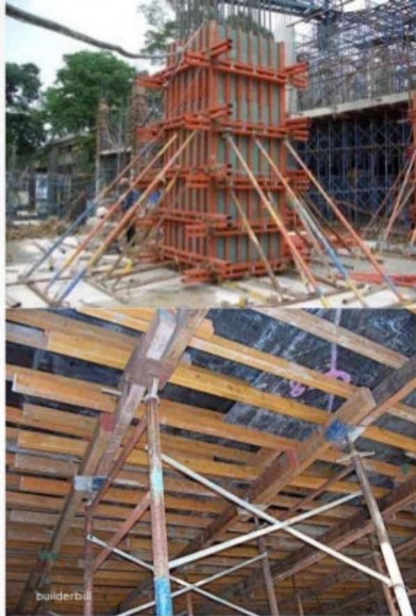

> **AI Description:**
> **Source:** `assets/_page_0_Figure_0.jpg`
> 
> **Generated:** 2026-05-31 22:53:16
> 
> ---
> 
> The image contains two photographs of a construction site. The top photo shows a large, partially constructed structure with orange scaffolding and supports. The structure appears to be made of concrete and steel, with a complex framework. The bottom photo displays a close-up view of a wooden framework, possibly part of the same construction project, with visible scaffolding and supports. The wooden beams are arranged in a grid pattern, and there are some tools and construction materials scattered around. The text "builderbill" is visible in the bottom left corner of the bottom photo.

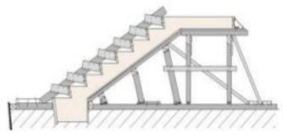

> **AI Description:**
> **Source:** `assets/_page_0_Figure_1.jpg`
> 
> **Generated:** 2026-05-31 22:52:36
> 
> ---
> 
> The image is a technical illustration of a staircase and its structural support system. It shows a side view of a staircase with multiple steps leading upwards. The staircase is supported by a series of beams and columns, which are interconnected to form a stable structure. The illustration is likely used for architectural or engineering purposes to demonstrate the construction and stability of the staircase.

## INTRODUCTIONTO FORMWORK

## What isFormwork?

Formwork inconstruction isthe Useof support structuresand mouldstocreate structuresout ofconcretewhich ispoured intothemoulds.Formwork canbemadeusingmouldsout of steel,wood,aluminium and/or prefabricated forms.

Formwork isan ancillary construction,used asamould fora structure.Intothismould,freshconcrete isplacedonlyto harden subsequently.

Theconstruction offormwork takes timeand involves expenditureupto20to25%ofthecost of the structureor evenmore.

The operation of removing theformwork is known as stripping. Strippedformworkcanbereused.Reusableformsareknown as panel forms and non-usable are called stationary forms.

Formwork isdesigned according to The ACl document SP-4.

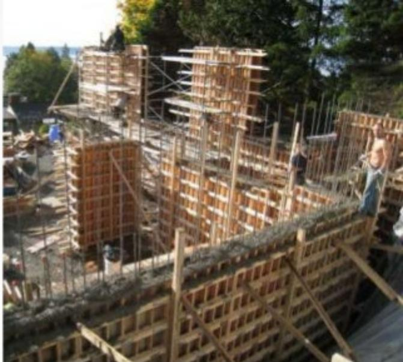

> **AI Description:**
> **Source:** `assets/_page_1_Figure_0.jpg`
> 
> **Generated:** 2026-05-31 22:49:25
> 
> ---
> 
> The image shows a construction site with a partially built structure. The structure appears to be made of wooden beams and supports, forming a framework for what could be a building or a large structure. The construction is in progress, with some workers visible on the structure. The background includes trees and a clear sky, indicating an outdoor setting. The image captures the process of building, highlighting the structural elements and the ongoing work.

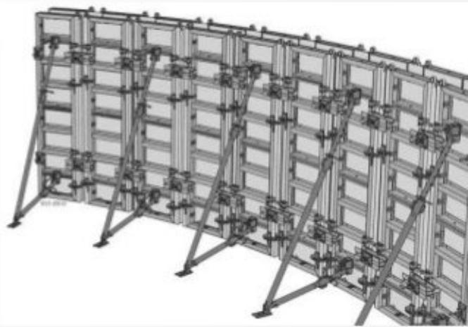

> **AI Description:**
> **Source:** `assets/_page_1_Figure_1.jpg`
> 
> **Generated:** 2026-05-31 22:50:38
> 
> ---
> 
> The image contains a technical illustration of a modular construction system, likely used for temporary walls or barriers. The illustration shows a series of interconnected panels with a grid-like structure, supported by a framework of beams and legs. The design appears to be scalable and modular, suggesting it can be easily assembled and disassembled. The image does not include any text annotations or labels, focusing solely on the structural components and their arrangement.

A good formwork should satisfy the following requirements:

Strong enough towithstandall types of dead and live loads

Rigidlyconstructedandefficientlyproppedandbracedboth horizontallyandvertically,soas to retain its shape

The joints in the formwork should be tight against leakage of cement grout

Construction of formwork should permit removal of various parts in desired sequences without damageto theconcrete

Materialof theformworkshouldbecheap,easilyavailableandshouldbesuitableforreuse

Theformwork should besetaccuratelyto thedesiredlineandlevels should haveplane surface.

## Aslight as possible

Material of the formwork should not warpor get distorted when exposed to the elements Should rest on firm base

Thefollowing pointsaretobekept in viewtoeffect economy inthecost of formwork:

Theplanof thebuilding shouldimplyminimumnumberof variationsinthesizeof rooms,floorarea etc.soastopermit reuseof the formwork repeatedly.

Design should be perfect to use slender sections only in amost economical way.

Minimum sawingandcuting of wooden pieces shouldbemade toenable reuse of themateriala numberof times.Thequantityof surfacefinishdependson thequalityof theformwork.

## CATEGORIES OF FORMWORK

Conventional:Theformwork isbuiltonsiteoutoftimberandplywoodormoisture-resistantparticleboard.Itis easytoproducebuttime-consumingforlargerstructures,and theplywoodfacing hasarelativelyshort lifespan.Itistillusedextensivelywherethelabourcostsarelowerthanthecostsforprocuringreusable formwork.Itisalsothemost flexibletypeofformwork,soevenwhereothersystemsareinuse,complicated sectionsmay useit.

Modern-Day Formworks:This formworksystemsaremostlymodular,whichare designed forspeedand eficiency.Theyaredesignedtoprovideincreasedaccuracyandminimizewasteinconstructionandmost haveenhanced healthandsafetyfeaturesbuilt-in.Themaintypes offormworksystemsin use noware:

Tableform/flying form

Systemcolumn formwork

Horizontal panel

Slipform

Tunnelform

Engineered/Pre-fabricatedFormworks:Thisformworkisbuiltoutofprefabricatedmoduleswithametalframe (usuallysteeloraluminium)andcoveredontheapplication(concrete)sidewithmaterial havingthewanted surfacestructure(steel,aluminium,timber,etc.).Thetwomajoradvantagesofformworksytems,comparedto traditionaltimberformwork,arespeedofconstructionandlowerlife-cyclecosts (baringmajorforce,the frameisalmostindestructible,whilethecoveringifmadeofwood;mayhavetobereplacedafterafew-ora fewdozen-uses,butifthecoveringismadewithsteeloraluminiumtheformcanachieveuptotwothousand usesdepending on care and the applications).

## MATERIALS USED

Formworkaremainly of two types Steelformwork Wooden formwork

Steel formworkismadeof Steel sheets Angle Iron Teelron

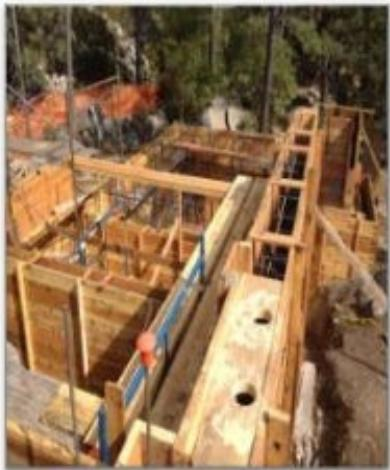

> **AI Description:**
> **Source:** `assets/_page_4_Figure_0.jpg`
> 
> **Generated:** 2026-05-31 23:04:00
> 
> ---
> 
> The image depicts a construction site with wooden framing for a building under construction. The structure appears to be in the early stages of development, with visible beams, supports, and some concrete elements. The surrounding area includes trees and other construction materials, indicating an outdoor setting. The image provides a clear view of the construction process and the materials used in the building's framework.

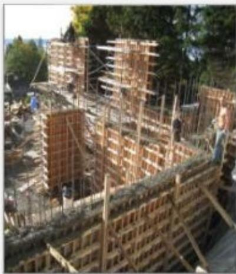

> **AI Description:**
> **Source:** `assets/_page_4_Figure_1.jpg`
> 
> **Generated:** 2026-05-31 23:04:28
> 
> ---
> 
> The image shows a construction site where a building is being framed with wooden beams. The structure appears to be in the early stages of construction, with scaffolding and supports in place. Workers can be seen on the site, indicating ongoing construction activity. The image provides a clear view of the building's framework, highlighting the progress of the construction process.

Wooden formwork

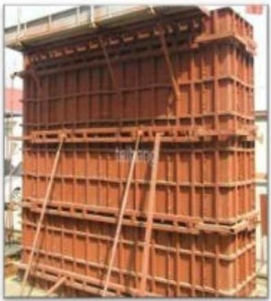

> **AI Description:**
> **Source:** `assets/_page_4_Figure_2.jpg`
> 
> **Generated:** 2026-05-31 23:02:40
> 
> ---
> 
> The image shows a large, industrial structure that appears to be a formwork or a section of a construction site. The structure is made of metal and has a grid-like pattern, suggesting it is used for casting concrete or other materials. The reddish-brown color and the construction context indicate it is likely part of a building or infrastructure project. The image does not contain any text or labels that provide additional information about the structure's purpose or specifications.

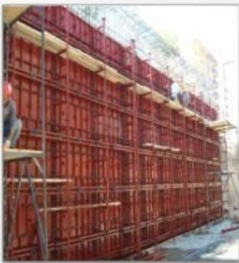

> **AI Description:**
> **Source:** `assets/_page_4_Figure_3.jpg`
> 
> **Generated:** 2026-05-31 23:02:32
> 
> ---
> 
> The image shows a construction site with a large structure under construction. The structure appears to be a multi-story building with scaffolding and formwork in place. The formwork is red and is used to shape the concrete walls. There is a worker visible on the left side of the image, indicating ongoing construction activity. The background suggests an urban environment with some trees and a street visible.

Steel Formwork

## Timber formwork:

Mostcommonmaterial used for bracingthemember,hencecalled asthetraditional formwork.

caneasily be cut to size on site. Joistarereplacedwithengineered woodbeamsand supportsare replaced withmetal props.This makesthismethodmoresystematic andreusable.

-Various sizes of members of timber

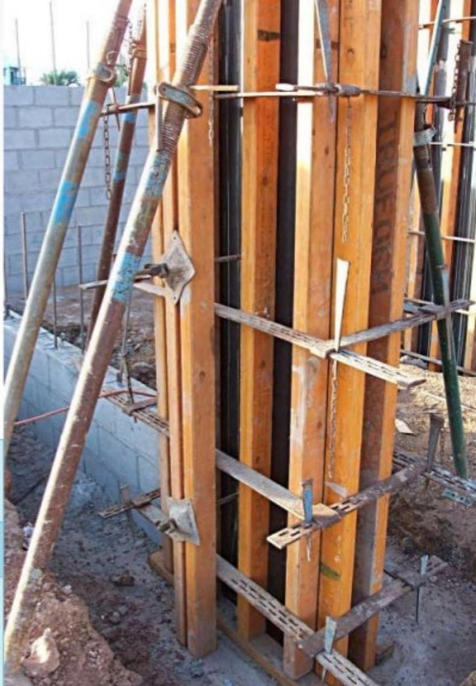

> **AI Description:**
> **Source:** `assets/_page_5_Figure_0.jpg`
> 
> **Generated:** 2026-05-31 23:01:29
> 
> ---
> 
> The image shows a construction site with a wooden framework for a concrete column. The framework is supported by metal scaffolding and has various metal brackets and ties securing the wooden planks. The ground around the column is uneven and appears to be in the process of being prepared for concrete pouring. The background includes a partially constructed wall made of concrete blocks. The image provides a clear view of the construction process and the materials used in the construction of the column.

## Plywood

Thisisby far themost commonmaterial used for the facingpanel.It iseasilycut toshapeonsite,andif handledand storedcarefully,itcanbeusedmany times.

Astandard plywood thickness on site is 18mm.Thisisusuallysufficient formost pours.

However,if the formwork iscurved,a thinnerplywoodisusedtofacilitate bending.

Thicker plywoodmay be used when the weight ofconcretecausesa standard thicknessplywood tobowout,distorting theconcrete face.

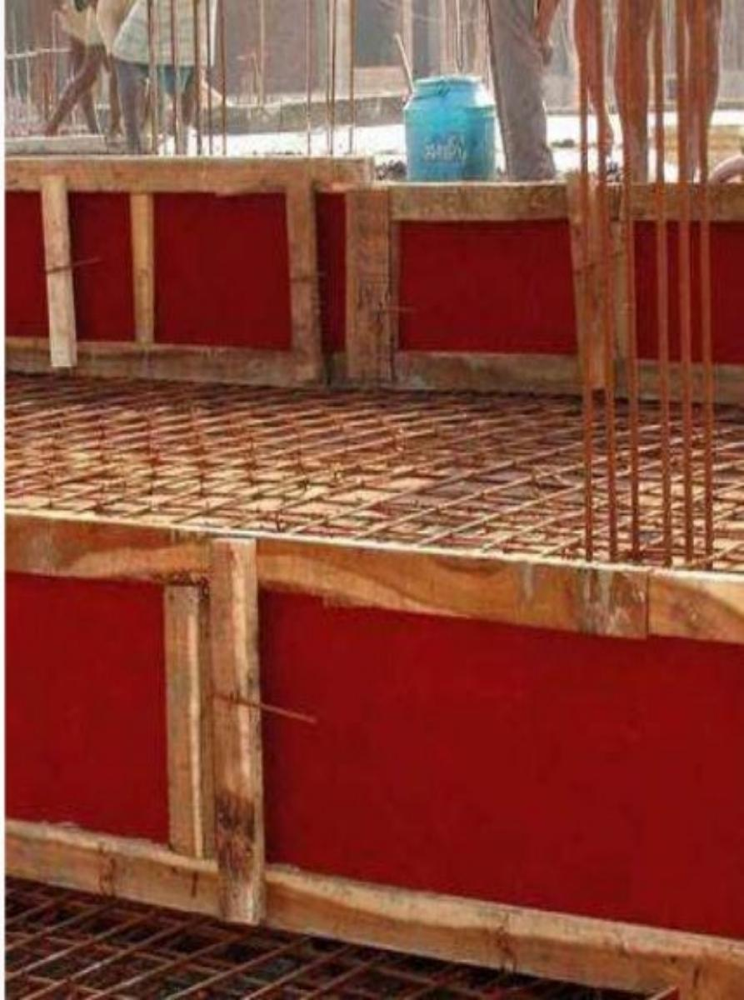

> **AI Description:**
> **Source:** `assets/_page_6_Figure_0.jpg`
> 
> **Generated:** 2026-05-31 22:49:49
> 
> ---
> 
> The image shows a construction site with a concrete foundation being prepared. The foundation is framed with wooden beams and has a grid of rebar laid out on top, which is likely for reinforcement. The background includes a blue container and some construction materials, indicating ongoing work. The red walls of the structure are visible, suggesting the foundation is part of a larger building project.

## Steel formwork:

Steel formsarestronger,durable andhavelonger life than timber formworkand their reusesaremore innumber

Steel formscan be installed and dismantledwith greatereaseand speed.

Thequality of exposed concrete surfaceby usingsteel forms isgood andsuchsurfacesneednofurther treatment.

Steel formworkdoesnot absorb moisture fromconcrete.

Steel formworkdoesnot shrink or warp

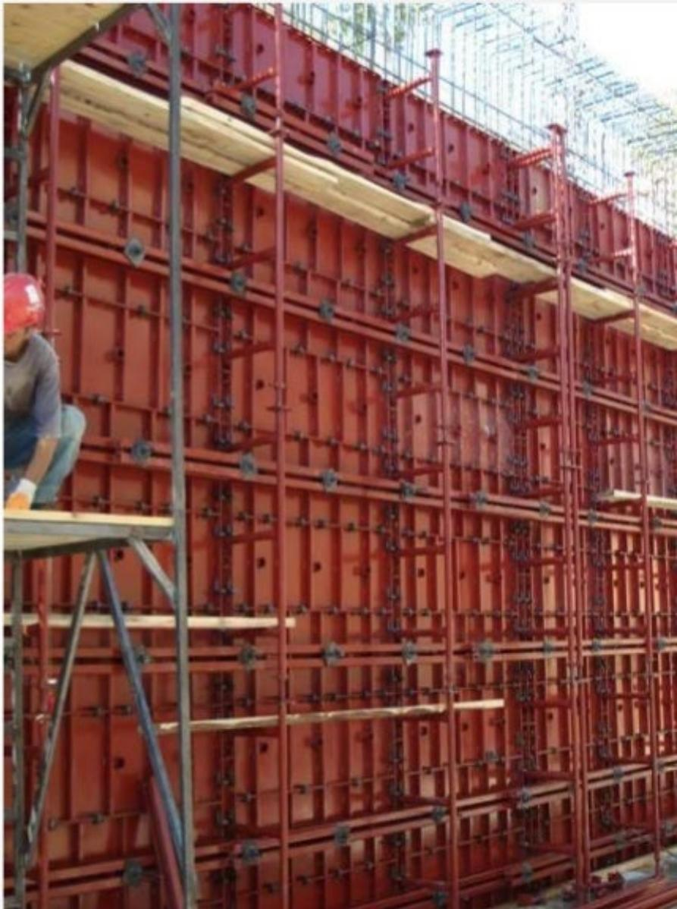

> **AI Description:**
> **Source:** `assets/_page_7_Figure_0.jpg`
> 
> **Generated:** 2026-05-31 22:53:03
> 
> ---
> 
> The image shows a construction site where a worker is working on a structure. The structure appears to be a formwork system, which is used to shape and support concrete during the construction of buildings. The formwork is made up of red metal frames with wooden beams and metal supports. The worker is wearing a red hard hat and is positioned on a scaffolding ladder, indicating that the work is at a higher elevation. The formwork is organized in a grid-like pattern, suggesting it is part of a larger construction project. The image captures the process of building a structure, highlighting the use of formwork and the safety measures in place.

## Aluminium formwork

Oftenused in pre-fabricated formwork,that isput together on site.

Aluminium is strongand light,and consequentlyfewersupportsand ties arerequired.

Thelighter sections willdeflect more, but thiscan be avoidedby simply followingthemanufacturers recommendations.

## Plastic formwork

Glass reinforced plastics (GRP) and vacuumformedplasticsareused whencomplicatedconcrete shapes arerequired (e.g.wafflefloors).

Althoughvacuum formed plastics will alwaysneed support,GRPcan befabricatedwith integral bearers making it self supporting.

Like steel,plastic formwork canbe re-usedmanytimes,aslongascare istakennot to scour the surface whilstvibratingtheconcrete.

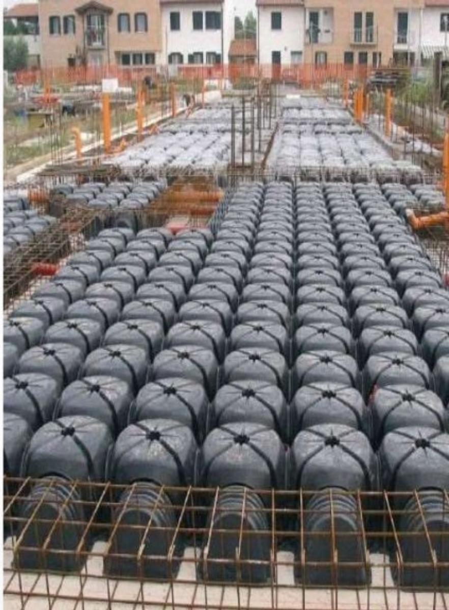

> **AI Description:**
> **Source:** `assets/_page_9_Figure_0.jpg`
> 
> **Generated:** 2026-05-31 22:56:20
> 
> ---
> 
> The image shows a construction site with a large number of cylindrical concrete forms arranged in rows. These forms are part of a construction process, likely for a foundation or a similar structure. The forms are surrounded by metal rebar and are positioned on a concrete base. In the background, there are residential buildings and construction fencing, indicating an urban or suburban setting. The image provides a clear view of the construction materials and the layout of the site.

# PROCESSOFFORMWORKCONSTRUCTION

FORMWORKFORVARIOUSSTRUCTURALMEMBERS

Thisnormallyinvolves the following operations:

proppingandcentering

2 shuttering

Provision of camber

Cleaning and surface treatment

## FORMWORK FOR WALL

## It consists of

·Timber sheeting

·Vertical posts

·Horizontal members

·Rackers

·Stakes

·Wedges

Aftercompletingonesideof formwork reinforcementisprovidedattheplace then the second side formwork isprovided.

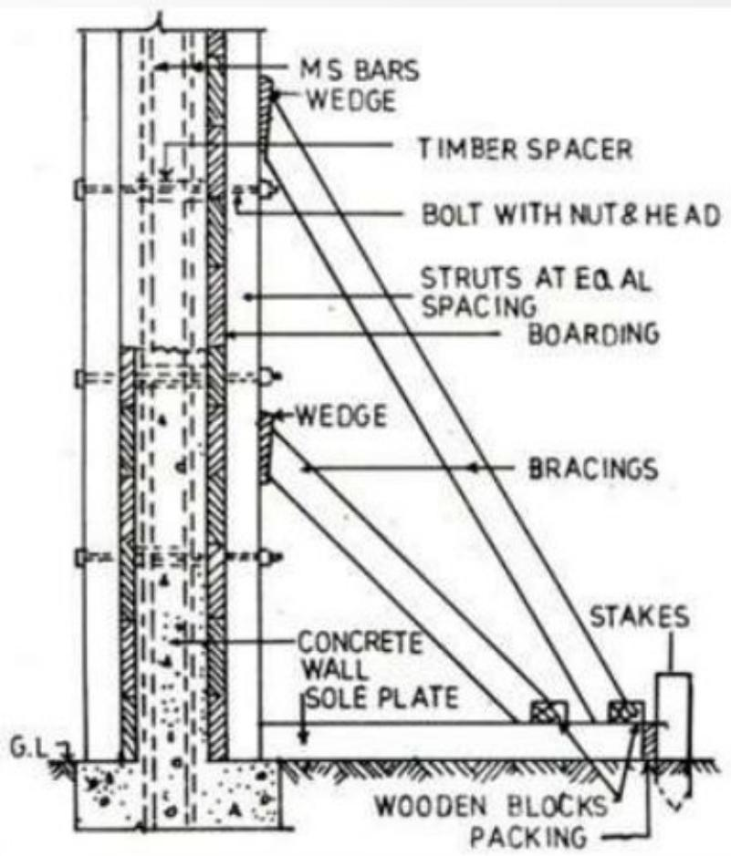

> **AI Description:**
> **Source:** `assets/_page_11_Figure_0.jpg`
> 
> **Generated:** 2026-05-31 22:58:37
> 
> ---
> 
> The image is a technical illustration of a construction detail, specifically for a wall structure. It shows a cross-sectional view of a wall with various components labeled. The key elements include:
> 
> - A concrete wall with a sole plate at the base.
> - Wooden blocks and packing at the bottom.
> - Bracings and struts at equal spacing.
> - Wedges and timber spacers.
> - A bolt with a nut and head.
> - Stakes and boarding.
> 
> The illustration is annotated with labels pointing to each part, providing a clear view of the construction method and the placement of each component.

## Wall Formworks and its components

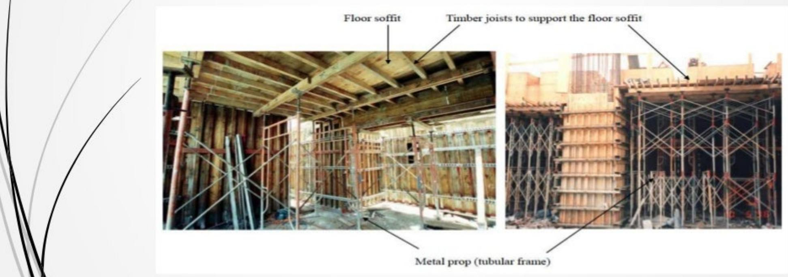

> **AI Description:**
> **Source:** `assets/_page_12_Figure_0.jpg`
> 
> **Generated:** 2026-05-31 22:48:34
> 
> ---
> 
> The image contains a photograph of a construction site, specifically focusing on the interior framing of a building under construction. The photograph includes labels pointing to various structural elements: "Floor soffit," "Timber joists to support the floor soffit," and "Metal prop (tubular frame)." The image provides a clear view of the construction process, highlighting the use of timber and metal components in the building's framework. The labels offer a detailed explanation of the structural elements, making the image informative for those interested in construction techniques or building materials.

## FORMWORK FOR COLUMN

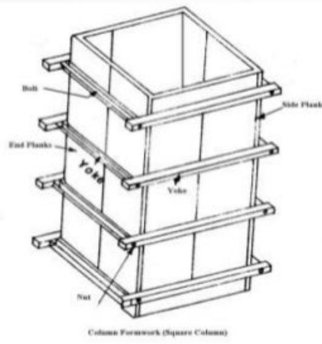

> **AI Description:**
> **Source:** `assets/_page_13_Figure_0.jpg`
> 
> **Generated:** 2026-05-31 22:51:55
> 
> ---
> 
> The image is a technical illustration of a column formwork for a square column. It shows a three-dimensional structure with labeled components such as "Bolt," "Side Planks," "End Planks," "Yoke," and "Nut." The illustration is designed to provide a clear understanding of the assembly and structure of the formwork, which is commonly used in construction to create square columns. The image is a diagram that combines text labels with a visual representation of the formwork's structure.

-Side& End Planks

-Yoke

-Nut& Bolts

·Two end& two side planks are joined by the yokes and bolts.

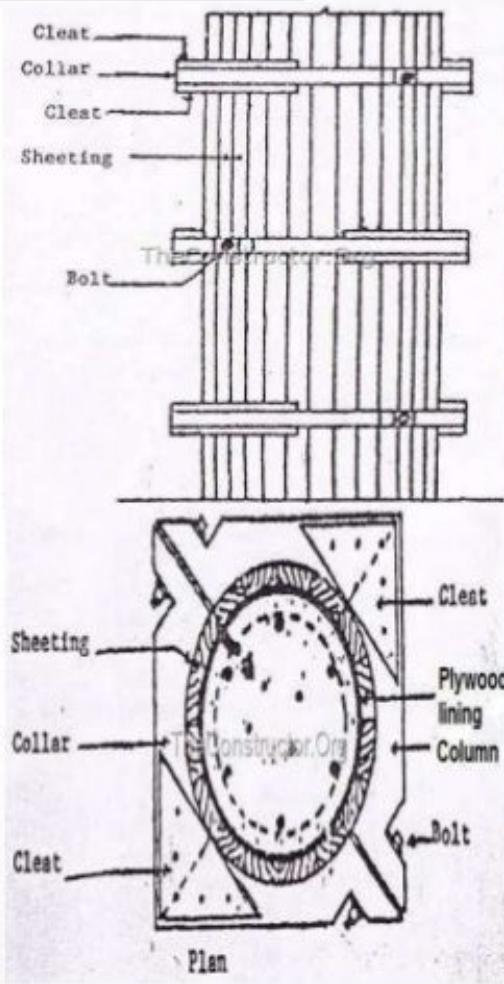

> **AI Description:**
> **Source:** `assets/_page_13_Figure_1.jpg`
> 
> **Generated:** 2026-05-31 22:51:18
> 
> ---
> 
> The image contains a technical illustration of a structural component, likely a formwork or a column reinforcement system. It includes a vertical cross-section diagram and a plan view. The cross-section shows a series of vertical elements labeled as "Cleat," "Collar," and "Sheeting," which are part of the formwork structure. The plan view illustrates the same elements in a circular arrangement around a central column, with additional labels such as "Plywood lining," "Column," and "Bolt." The image is annotated with labels pointing to specific parts of the structure, indicating the function and placement of each component.

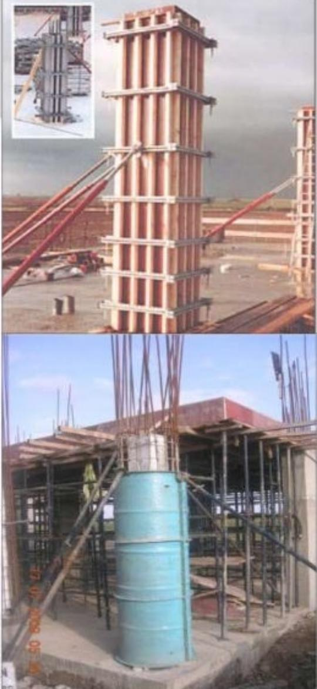

> **AI Description:**
> **Source:** `assets/_page_13_Figure_2.jpg`
> 
> **Generated:** 2026-05-31 22:52:31
> 
> ---
> 
> The image contains two photographs of construction sites. The top photograph shows a large, cylindrical structure being built, with scaffolding around it and a smaller inset image showing a close-up of the construction process. The bottom photograph depicts a construction site with a large cylindrical object, possibly a tank or drum, surrounded by scaffolding and other construction materials. The setting appears to be an industrial or construction environment.

## Erectionsequence fora column

Priortopositioningcolumn formworkcheckthat steelforthecolumn hasbeen inspected and cleared for casting.

-Position formwork for the column from predetermined grids.

Plumb formwork bothwaysand securely support usingadjustable steel props.

-The propping angle should be 45°to the floor.

Ensurethesteel propsaresafely securedtothecolumn formwork and the

floor/and that adjustment for pushingandpulling isoperational.

-Setout thepositions of column clamps from a storey rod.

Tfansfer the column clamppositions fromthe storey rod onto colu mnformwork.

Use nails to support the arms of column clamps while wedging.   
Position and wedge thebottom,middle and topclamps sets.

-Check the formwork at the top for square.

-Positionand wedge the remainder of the column clamps.

Usinga plumb bob suspended froma gauge blockplumb the column.

Whenallthe column formwork issecurely propped a finalcheckmust bemade forplumbandcolumnalignment beforeandimmediately after theconcrete hasbeenpoured and vibrated.

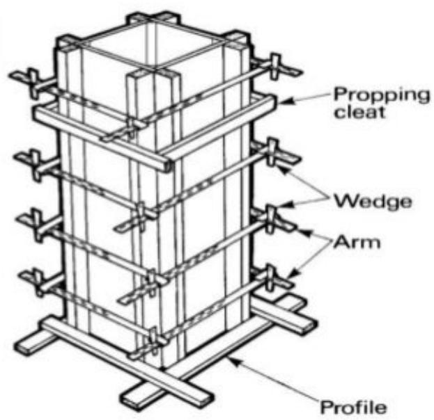

> **AI Description:**
> **Source:** `assets/_page_14_Figure_0.jpg`
> 
> **Generated:** 2026-05-31 22:52:16
> 
> ---
> 
> The image is a technical illustration of a construction or engineering setup. It shows a structure with labeled components: "Propping cleat," "Wedge," "Arm," and "Profile." The illustration appears to be a diagram used to explain the assembly or function of these components in a construction context. The labels are clearly marked on the diagram, indicating the placement and function of each part within the structure.

## COLUMNCLAMPSIN POSITION

Columnclamps arecreated to giveextra externalsupporttotheformworkfrom avoiding circularing of the column

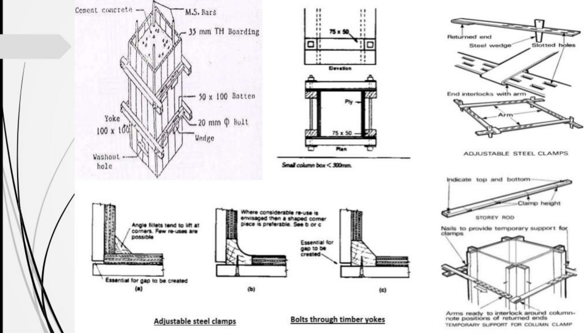

> **AI Description:**
> **Source:** `assets/_page_15_Figure_0.jpg`
> 
> **Generated:** 2026-05-31 22:47:48
> 
> ---
> 
> The image contains a series of technical illustrations and annotations related to construction and structural components. It includes detailed diagrams of a column formwork setup, showing various parts such as cement concrete, M.S. bars, 35 mm TH boarding, 50 x 100 batten, 20 mm φ bolt, and wedge. The illustrations also depict adjustable steel clamps, bolts through timber yokes, and a plan view of a small column box. The annotations provide specific dimensions and details about the construction elements, such as the size of the bolts and the placement of the washout hole. The diagrams are labeled with key terms and measurements to guide the construction process.

## CIRCULAR AND OCTAGONAL COLUMNS

Circularcolumn formwork

Fabricatedsteel,usually twopiece,andoftenwith ahinge.

Fibrecement pipeswhichare left inplace asperm anent formwork.

Timbersheathing tied with standardcolumn clamp s.Cornersneed to have infillpieces.Alternatively, metalstrapcanbeusedwithout theneed forcorn erinfills.

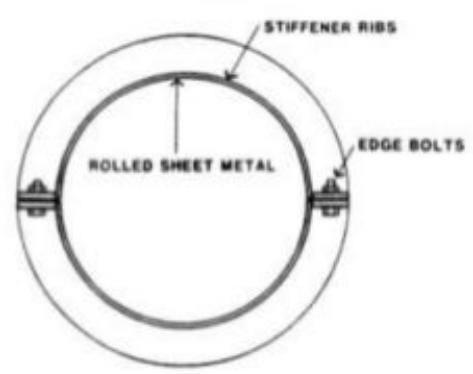

> **AI Description:**
> **Source:** `assets/_page_16_Figure_0.jpg`
> 
> **Generated:** 2026-05-31 22:58:04
> 
> ---
> 
> The image is a technical illustration of a circular component made from rolled sheet metal. It includes annotations pointing to stiffener ribs and edge bolts. The diagram is likely used for instructional or engineering purposes, detailing the construction and key features of the component.

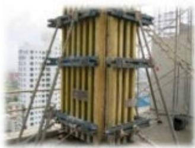

> **AI Description:**
> **Source:** `assets/_page_16_Figure_1.jpg`
> 
> **Generated:** 2026-05-31 22:57:59
> 
> ---
> 
> The image shows a large, yellow, cylindrical structure mounted on a platform. The structure appears to be a piece of industrial equipment, possibly a pressure vessel or a tank, given its shape and the surrounding supports. The platform it is mounted on has various mechanical components and clamps, suggesting it is part of a larger assembly or testing setup. The background shows a blurred view of a building, indicating the equipment is located outdoors or on a rooftop.

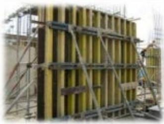

> **AI Description:**
> **Source:** `assets/_page_16_Figure_2.jpg`
> 
> **Generated:** 2026-05-31 23:00:16
> 
> ---
> 
> The image shows a construction site where a large concrete structure is being built. The structure appears to be a formwork system, which is used to shape and support concrete during the casting process. The formwork is yellow and is supported by scaffolding. There are workers visible on the right side of the image, indicating ongoing construction activity. The image captures the process of constructing a large concrete structure, likely for a building or infrastructure project.

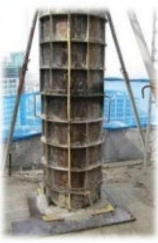

> **AI Description:**
> **Source:** `assets/_page_16_Figure_3.jpg`
> 
> **Generated:** 2026-05-31 23:00:51
> 
> ---
> 
> The image shows a cylindrical structure with a series of circular openings along its length. The structure appears to be made of metal and is supported by a framework with diagonal braces. The background includes a blue railing and some industrial equipment, suggesting the setting might be a construction site or a similar industrial environment. The structure looks like it could be part of a larger mechanical or industrial system, possibly related to ventilation or water treatment.

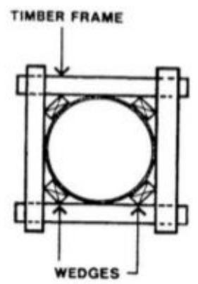

> **AI Description:**
> **Source:** `assets/_page_16_Figure_4.jpg`
> 
> **Generated:** 2026-05-31 23:04:08
> 
> ---
> 
> The image is a technical illustration showing a cross-sectional view of a timber frame structure. The diagram includes a circular opening in the center, likely representing a window or door opening. The frame is supported by four corner posts, and there are wedges placed at the base of the frame, possibly for securing or adjusting the structure. The text labels "TIMBER FRAME" at the top and "WEDGES" at the bottom indicate the components of the structure. The illustration is likely used for educational or instructional purposes in construction or woodworking.

Vertical Timber sheathing column

## COLUMN BRACINGFORMWORK

·Column formwork bracing performs two functions:

Itmust maintain the accuracy of the column form position and plumb so that it is withintolerance.

·Withstand results of forcesacting on either thecolumn formwork or thebracing. Theforcesmay bewind or impact.These impact forcescan occur fromthecoll isionof concretebuckets or cranes hoistingmaterials

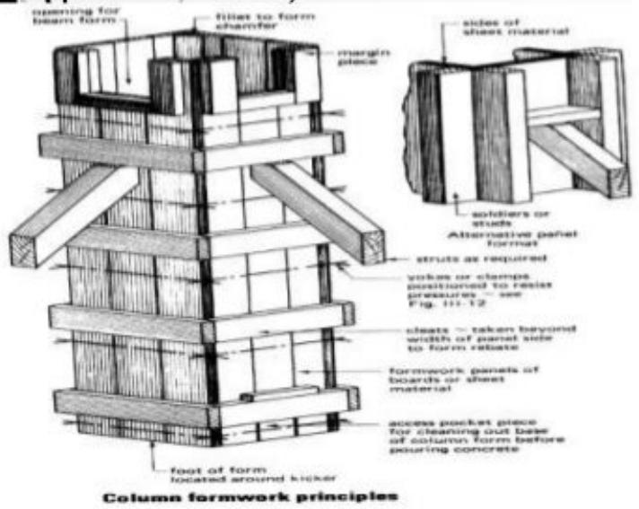

> **AI Description:**
> **Source:** `assets/_page_17_Figure_0.jpg`
> 
> **Generated:** 2026-05-31 23:02:14
> 
> ---
> 
> The image is a technical illustration of column formwork principles. It includes a detailed diagram of a column formwork setup, showing various components such as the margin piece, soldiers or studs, struts, yokes or clamps, cleats, and access pocket piece. The illustration is annotated with labels pointing to each part, providing a clear understanding of the construction and assembly of the column formwork. The diagram is designed to guide the construction of a column form, highlighting the placement and function of each component.

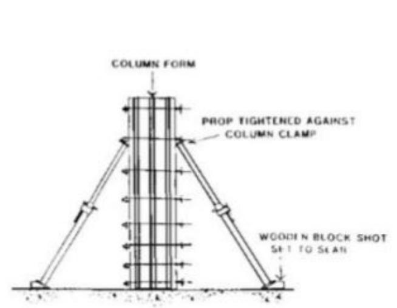

> **AI Description:**
> **Source:** `assets/_page_17_Figure_1.jpg`
> 
> **Generated:** 2026-05-31 23:02:56
> 
> ---
> 
> The image is a technical illustration showing a method for supporting a column form during construction. It includes a diagram of a column form with props tightened against a column clamp. The props are shown as angled supports, and there are wooden block shots placed at the base to set the stance. The illustration is labeled with key components and their functions, providing a clear visual guide for setting up the column form.

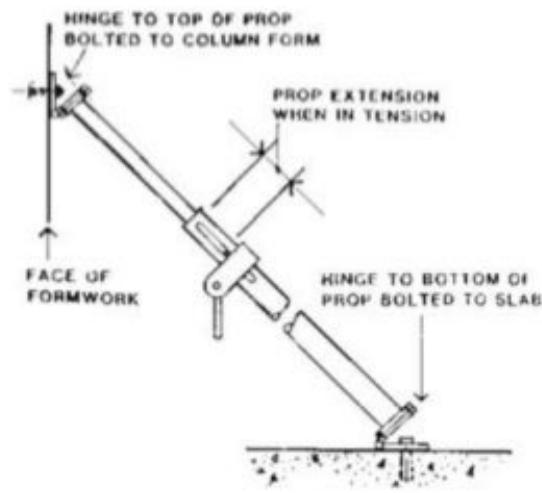

> **AI Description:**
> **Source:** `assets/_page_17_Figure_2.jpg`
> 
> **Generated:** 2026-05-31 23:04:52
> 
> ---
> 
> The image is a technical illustration of a prop system used in construction, specifically for supporting column forms. It shows a prop system with a hinge at the top of the prop, bolted to the column form, and another hinge at the bottom of the prop, bolted to the slab. The diagram includes labels such as "Hinge to Top of Prop Bolted to Column Form," "Prop Extension When in Tension," and "Face of Formwork." The illustration is designed to show how the prop system is used to provide support and stability during the construction of a column.

## FORMWORKFOR BEAM

Beamsofitmustbe thickened timber or strengthened plywood.

Beamsides 18mmplywood or 25mmboards,withstuds (cleats) at 500to 600mmcentres.

Deep beams (over 600mm) should have walkers and ties.

Useangle fillets inthe beam sideto sofit joint wherepossible.

Alowancemust bemade for height adjustment of the props or falsework.

## Erectionsequence forconstructing beam formworkincludes

·Position of sole plates;

·Marking out and setting heights forfalseworks;

·Assembleand position props,adjustable head jacks,falseworks, bearersandSpreaders;

·Construct and erect sidewallsand beam soffit.

·Position of sole plates

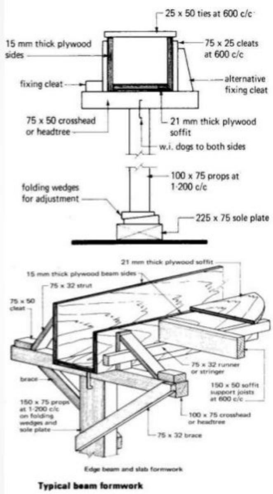

> **AI Description:**
> **Source:** `assets/_page_18_Figure_0.jpg`
> 
> **Generated:** 2026-05-31 22:55:40
> 
> ---
> 
> The image contains a detailed technical illustration of beam and slab formwork. It includes a top-down view of the formwork setup, showing the placement of various components such as plywood sides, cleats, props, and struts. The illustration is annotated with measurements and labels for each part, providing a clear guide for constructing the formwork. The bottom part of the image shows a side view of the formwork, highlighting the arrangement of props, struts, and braces. The text annotations provide specific dimensions and placement details for each component, making it a comprehensive guide for assembling the formwork.

## FORMWORK FOR STAIRCASE

·Points to consider when designing stair form work：

Stairformworkmust support theweight ofconcrete. Theweight of the throat of the stairand the steps wil have to besupported.

Because of the slopeof thestair,someof the forceis transmittedsideways.Allformworkmustbewelltied together to prevent sidewaymovement.

Consider the finish ofthe stair treadsandtype of nosing.   
Spacemay have tobe lefforpurposemade nosing.

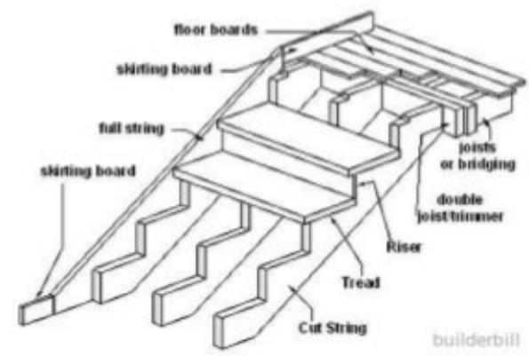

> **AI Description:**
> **Source:** `assets/_page_19_Figure_0.jpg`
> 
> **Generated:** 2026-05-31 22:55:02
> 
> ---
> 
> The image is a technical illustration of a staircase construction. It includes labels for various components such as the floor boards, skirting board, full string, cut string, riser, tread, and joists or bridging. The diagram is labeled with arrows pointing to each part, providing a clear visual guide to the structure and its components. The illustration is detailed and appears to be used for educational or instructional purposes, likely for builders or carpenters.

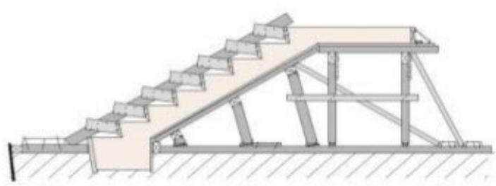

> **AI Description:**
> **Source:** `assets/_page_19_Figure_1.jpg`
> 
> **Generated:** 2026-05-31 22:55:09
> 
> ---
> 
> The image is a technical illustration of a roof structure, likely a roof truss system. It shows a cross-sectional view of a roof with multiple triangular sections, indicating the framework of the roof. The illustration includes beams, joists, and rafters, which are typical components of a roof's structural design. The image is detailed, showing how the various parts of the roof are interconnected to form a stable and functional structure.

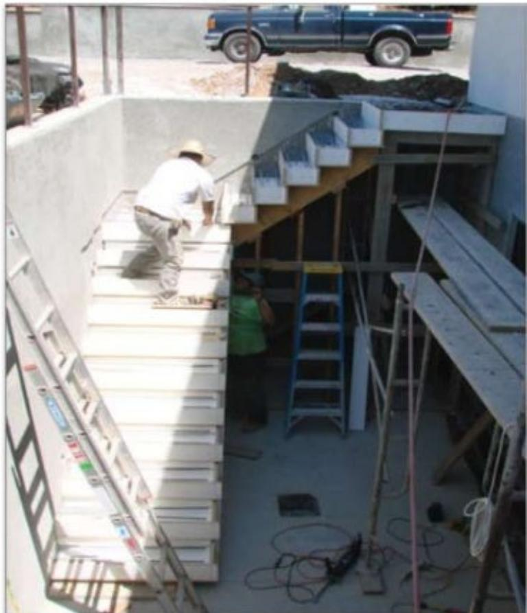

> **AI Description:**
> **Source:** `assets/_page_19_Figure_2.jpg`
> 
> **Generated:** 2026-05-31 22:54:36
> 
> ---
> 
> The image is a photograph of a construction site. It shows a person working on a staircase that appears to be part of a building under construction. The staircase is made of concrete and is partially completed. There is a blue ladder leaning against the staircase, and various construction materials and tools are scattered around the area. In the background, there is a blue pickup truck parked near the construction site. The overall scene suggests ongoing construction work.

## SUSPENDED SLABS

Suspended floor slabscan be constructed using cast insitu,precast unitsoracombinationof both.

Whichevermethod isused,it is importanttosupportthe proposed method ofconstructionusing acombination o ftimber or steel bearersand adjustable shoring.

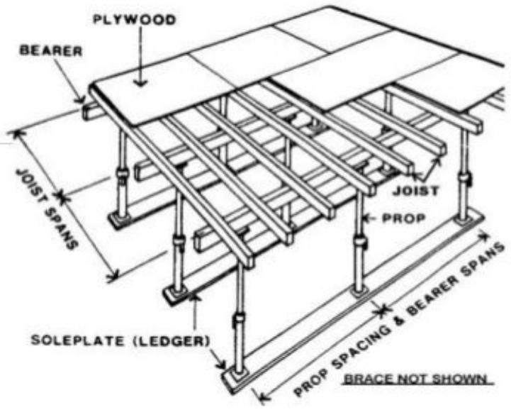

> **AI Description:**
> **Source:** `assets/_page_20_Figure_0.jpg`
> 
> **Generated:** 2026-05-31 23:00:10
> 
> ---
> 
> The image is a technical illustration of a floor construction system. It shows a cross-sectional view of a floor with labeled components such as plywood, bearers, joists, props, and a soleplate (ledger). The illustration includes measurements and annotations for joist spans, prop spacing, and bearer spans. The diagram is labeled to indicate the structure's components and their relative positions, providing a clear visual guide for understanding the construction details.

Thespacing and type of support system required is determinedbythe load imposedduringthe construction process.

Manufacturers provide tables toassist in the selection and spacing of adjustable shoring systems.

Standard slab formwork

The erection sequence for constructing a suspendedfloor slabincludes:

·Determining the bearer spacing;

·Erecting bearers and joists;

·Fixing the sheeting;

·Preparation for concrete.

## SOLE PLATE

Thepurposeofa soleplate isto transfervertical load from onevertical supportmemberto thefoundation

Thevertical support requiresabaseplate fitted to help distribute theloadtothesoleplate,which isusuallya steeper.

If the sole plateis positioned onnatural ground,it is important the ground is gradedand consolidated toa levelsurface.

Theobjectiveistoachievemaximumbearingbeneath sole plate.Once sole plates are positioned and firmly be dded theyshouldbecheckedforlevel.

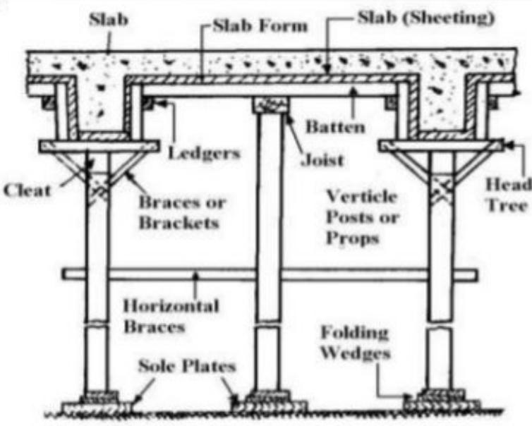

> **AI Description:**
> **Source:** `assets/_page_21_Figure_0.jpg`
> 
> **Generated:** 2026-05-31 23:04:21
> 
> ---
> 
> The image is a technical illustration of a construction setup, specifically for setting up a slab form. It includes various labeled components such as ledgers, braces or brackets, joists, vertical posts or props, horizontal braces, folding wedges, and sole plates. The illustration shows the arrangement of these elements in a cross-sectional view, demonstrating how they are positioned to support and form the slab. The labels provide a clear understanding of the function and placement of each component in the construction process.

CURING

Curing is the process inwhich the concreteis protected from lossofmoistureandkeptwithin areasonabletemperaturerange.Theresultof this processisincreasedstrengthand decreased permeability.Curingisalsoakey playerinmitigatingcracksintheconcrete, which severelyimpactsdurability

Thelengthofadequatecuringtimeis dependent on the following factors:

Mixtureproportions

Specified strength

Size and shape of concretemember

Ambient weather conditions

Futureexposureconditions

Deshuttering is a process after curing

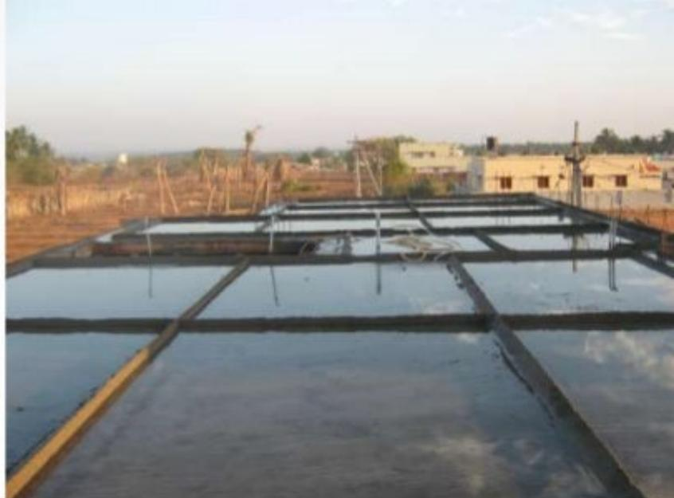

> **AI Description:**
> **Source:** `assets/_page_23_Figure_0.jpg`
> 
> **Generated:** 2026-05-31 22:50:51
> 
> ---
> 
> The image shows a series of rectangular water tanks or basins, likely part of a wastewater treatment facility. The tanks are filled with water and are arranged in a grid-like pattern. The surrounding area includes some structures and vegetation, suggesting an outdoor setting. The image appears to be taken during daylight hours, with the sky showing a gradient of colors, possibly indicating sunrise or sunset.

## DESHUTTERING

DESHUTTERING in simple means,the processof removing the shuttering (Formwork for Concrete).

Orderandmethod of removing formwork:

Shuttering forming vertical faces of walls,beams&column sides should be removedfirst.   
Shuttering formingsofit to slabshould be removed next.

Shuttering forming soffit tobeams,girdersorother heavily loadedmembersshouldberemovedintheend.

## Factors considerd:

Concreting is done under normal circumstances

Cement used isOrdinary Portland Cement

Adequate curing is done

Ambient temperature isnot fallbelow15 degree

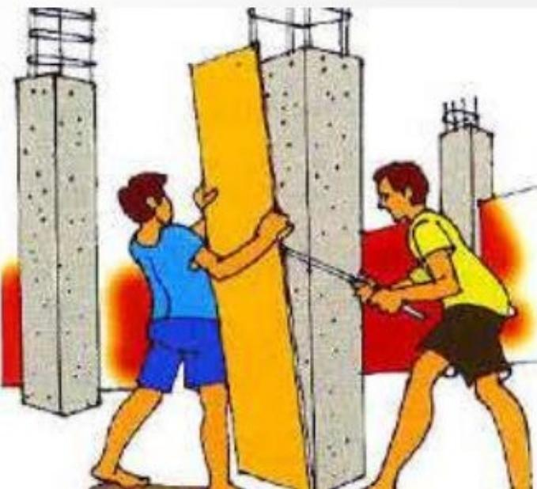

> **AI Description:**
> **Source:** `assets/_page_24_Figure_0.jpg`
> 
> **Generated:** 2026-05-31 22:50:30
> 
> ---
> 
> The image is a diagram illustrating the process of constructing a concrete column. It shows two individuals working together to lift and place a large concrete column. The diagram includes additional concrete columns and rebar structures, indicating the stages of construction. The visual elements help to convey the physical effort involved and the teamwork required in building structures.

## DESHUTTERING AGENTS

Thereare chances of concrete sticking to the formwork

Hence deshuttering agents are used to ease the process

Dosage/Coverage:

Dilutionratio:KEMMRA2:waterat1:10.Coverage:1600sq.ft.depending onconditions of fomwork

KEMMRA1-25/30mi≥/2/literdependingupontheporosityand usage condition of the substrate

## TRADITIONAL FORMWORK

Timberformworkwasused traditionally laterit got replacedwithmodemmaterialsdue toits limitationsandcost factors

Formwork is built onsitewith timberand ply or moistureresistant particleboard.

It iseasier toproducebutthe time taken is more

Extensively used where the labor cost s are low

It is themost flexible type of formwork

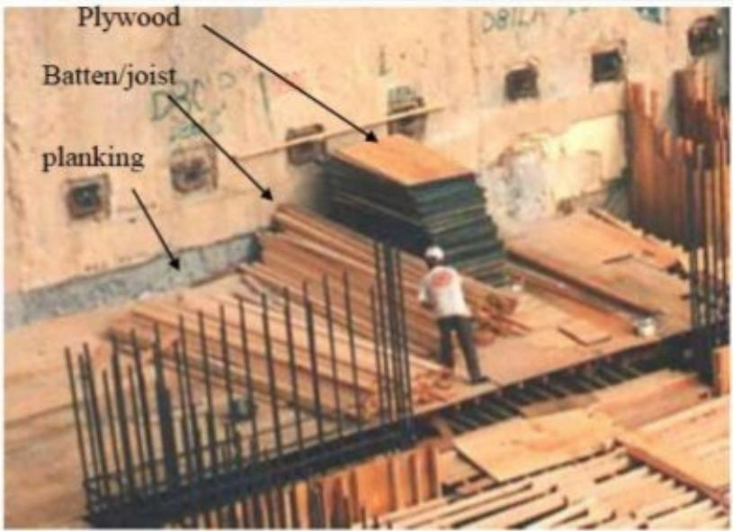

> **AI Description:**
> **Source:** `assets/_page_26_Figure_0.jpg`
> 
> **Generated:** 2026-05-31 23:04:42
> 
> ---
> 
> The image is a photograph of a construction site. It shows a worker standing on a wooden structure that appears to be under construction. The structure includes labeled components such as "Plywood," "Batten/Joist," and "planking." The plywood is stacked on top of the batten/joist, and the planking is laid out on the structure. The background shows a wall with graffiti and some construction materials. The image provides a visual representation of the construction process and the materials used in the construction of a wooden framework.

Usuallytimber intheformof plywood,planking, battenand joist are usedas thebasicmaterial.

Humanworkersneedtoenter intoeverycomertoperform theformwork installationworks

EXPLORING NEW FORMWORK TECHNIQUES

## SLIPFORMTECHNOLOGY INTRODUCTION:

·Method of verticallyextrudingareinforced concrete sectionandissuitableforconstructionofcorewallsin high-rise structures-liftshafts,stair shafts,towers.

Theformwork risescontinuously,at arateof about 300 mmperhour,supporting itselfonthecoreand not relying onsupport oraccessfromotherpartsof the building orpermanent works.

Allows forthe continuous pouring of concrete into walls ofastructure and only stopswhen the full required height of the structure hasbeenreached.

Theheight of theformwork isdesigned insuchaway thatwhilethetop oftheformwork isbeingfilled by concrete thelowest layerofconcretepouredearlier hasalready gained an initial set.Whenthe formwork is movedupwards theconcrete that is thenexposed remainsfirm.

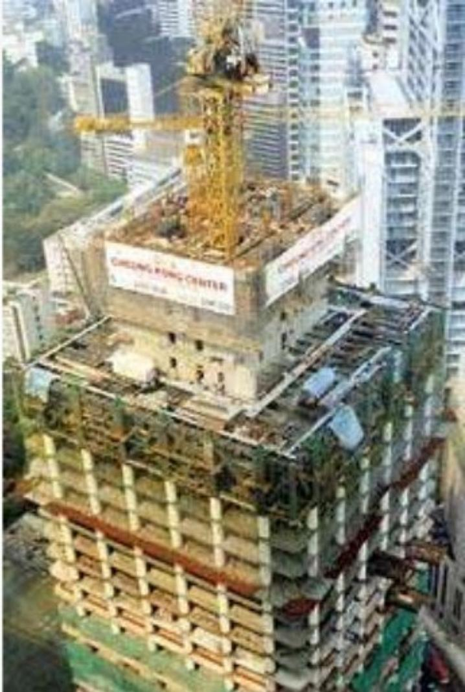

> **AI Description:**
> **Source:** `assets/_page_28_Figure_0.jpg`
> 
> **Generated:** 2026-05-31 22:54:55
> 
> ---
> 
> The image shows a construction site with a large building under construction. The structure is partially completed, with scaffolding and construction materials visible. A crane is positioned at the top of the building, indicating ongoing work. The building is labeled with "CANTON HONG CENTER" on the upper section, suggesting the name of the project or the intended use of the building. The surrounding area includes other high-rise buildings, indicating an urban setting.

CHEUNG KONG CENTRE

## PROCEDURE:

·Assembly can only start once the foundationsare in place and thewallstarterisincorrect alignment.

·Slipform shuttering isalignedwith the helpof yokes.

·Horizontal crossbeamsconnect these yokes.

·Hydraulic jacksare attached to these crossbeams for simultaneousupwardmovement.

·Height of the slipformranges from1.1to1.5metres.

Yokesand crossbeams also used to support the working platform

·Structure should be rigid and shape maintained at al times.

·Makesure there is no lag or elseit prevents the structure from freeupwardmovement

·It isalso possible to reduce wall thicknesses astheconstruction gains height and arrangements havetobemade in the slipformstructure that will enable suchreductionat regular intervals.

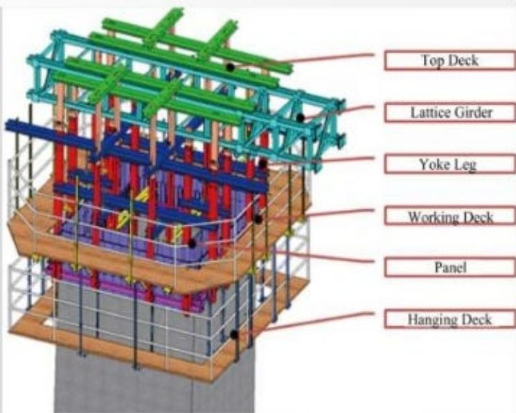

> **AI Description:**
> **Source:** `assets/_page_29_Figure_0.jpg`
> 
> **Generated:** 2026-05-31 22:55:21
> 
> ---
> 
> The image is a technical illustration of a structural framework, likely for a bridge or similar construction. It includes a detailed breakdown of various components such as the Top Deck, Lattice Girder, Yoke Leg, Working Deck, Panel, and Hanging Deck. The illustration uses color coding to differentiate between the different parts of the structure, with labels pointing to each component for clarity. The image provides a clear visual representation of the structural layout and the interconnections between the various elements.

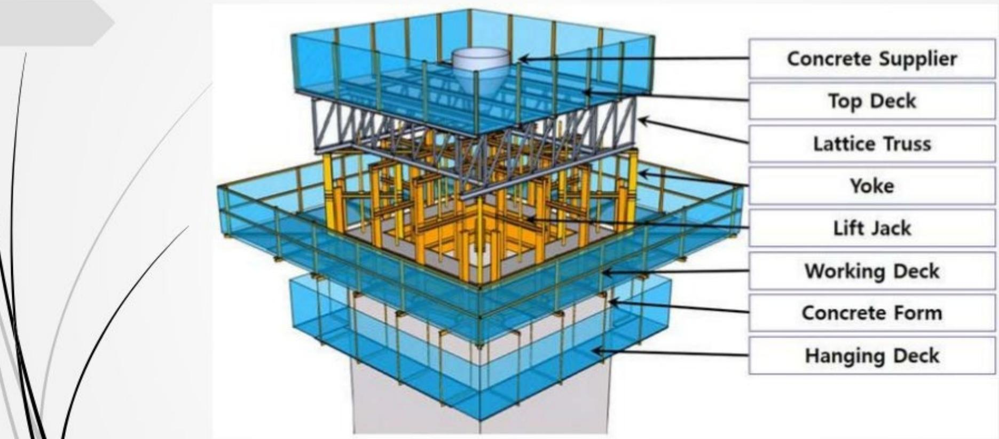

> **AI Description:**
> **Source:** `assets/_page_30_Figure_0.jpg`
> 
> **Generated:** 2026-05-31 22:54:09
> 
> ---
> 
> The image is a technical illustration of a construction system, specifically a modular construction method. It shows a multi-level structure with labeled components such as the Concrete Supplier, Top Deck, Lattice Truss, Yoke, Lift Jack, Working Deck, Concrete Form, and Hanging Deck. The illustration is a 3D rendering with transparent materials to show the internal structure and connections between the components. The diagram is designed to provide a clear understanding of the construction process and the interdependencies of the various parts involved.

ERECTION OFATOWER USING SLIPFORM

## HORIZONTALFORMWORK:

·Slipform methods of construction canalso be adaptedto horizontal structuresand are usedforpaving, canals,and tunneling.

·Thetechnique ismore inuse for structures that havecontinuouswalls likesilos,chimneys,and piersfor very tall bridges.

·It has also been successfully used for constructionof buildings,although thisrequiresthemannerof leaving insertsforopeningslikedoorsand windowsto bedecided well in advance,aswell asalso any necessaryinsertstosupportfloorslabs afterthewallsareconstructed.

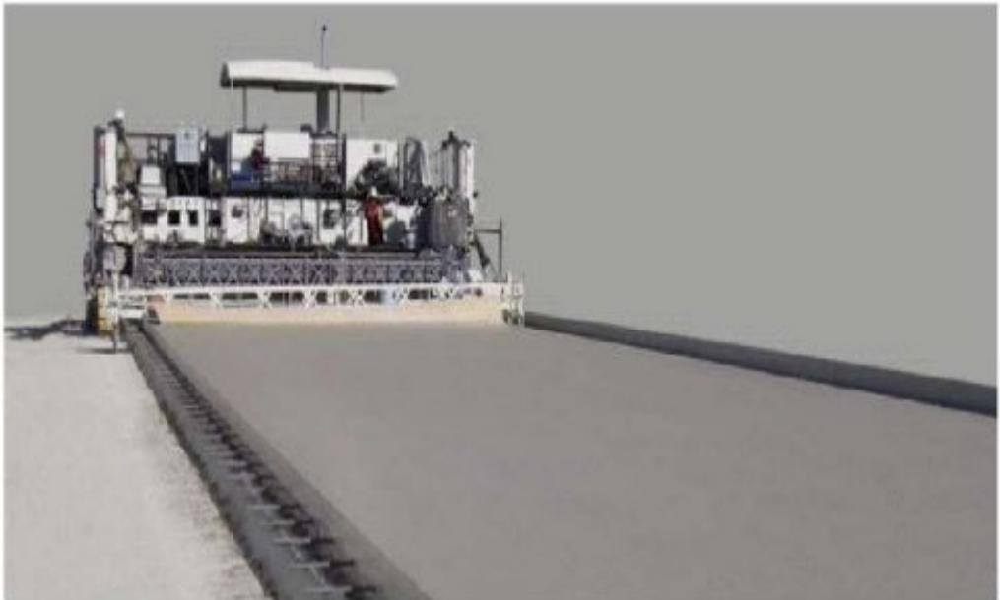

> **AI Description:**
> **Source:** `assets/_page_31_Figure_0.jpg`
> 
> **Generated:** 2026-05-31 22:50:22
> 
> ---
> 
> The image shows a road construction scene. A large piece of machinery, likely a road paver, is laying asphalt on a newly constructed road. The machinery is equipped with various components and appears to be in the process of smoothing and compacting the fresh asphalt. The road surface is smooth and even, indicating that the paving process is being carried out efficiently. The background is plain, with no other vehicles or structures visible, focusing attention on the paving machine and the road being constructed.

## ADVANTAGES:

·Amajor cost of concrete structure construction is the requiredformworktoretaintheconcretetillitcanbesafely de-shutteredandbeable tosupport itself andother imposed loads.

Theformwork needs tobe continuallyremovedtonewer locationsand thenre-erected.

Continuous use of manpower andlifting equipment like cranes.

·Inthecase of slipformbuilding,the formwork iserected only onceand remains intact until theentirestructure is completed.

Greatreduction in thecost of formwork as well astimesaving forre-erection. ·Cost effective ·Saving onto thelabourcostotherwise used for intermittentconcretingoperations. ·Thereductioninthemovementofformwork andworkersalso leadstofarmoresafeworking conditions that alsomakeit amajor advantage.

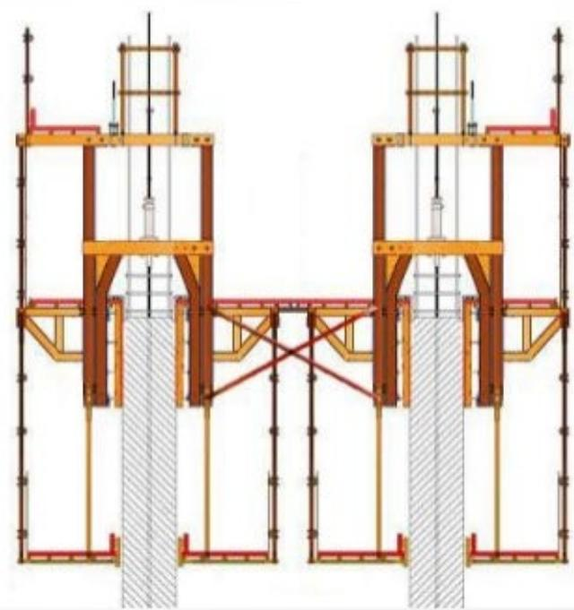

> **AI Description:**
> **Source:** `assets/_page_32_Figure_0.jpg`
> 
> **Generated:** 2026-05-31 23:01:02
> 
> ---
> 
> The image is a technical illustration of a structural framework, likely for a building or industrial structure. It shows a cross-sectional view of a multi-story building with a focus on the structural elements. The illustration includes beams, columns, and connections, with some parts highlighted in yellow and red for emphasis. The structure appears to be designed for stability and load-bearing, with diagonal braces providing additional support. The image is detailed and likely used for architectural or engineering purposes.

## PRECAUTIONS

·Concrete is continuously protected against loss of moisture and rapidtemperaturechanges for7days

·Unhardened concrete is protected from rain and flowing water

·Prevent plastic shrinkage

·Plastic cracks are filled by injection of epoxyresin.

（a）
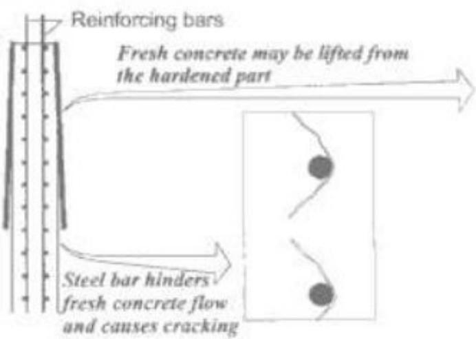

> **AI Description:**
> **Source:** `assets/_page_33_Figure_0.jpg`
> 
> **Generated:** 2026-05-31 23:03:31
> 
> ---
> 
> The image is a technical illustration showing the interaction between fresh concrete and reinforcing bars. It includes a diagram with arrows and text annotations. The diagram illustrates that fresh concrete may be lifted from the hardened part, and the steel bars hinder the flow of fresh concrete, leading to cracking. The illustration is labeled with "Reinforcing bars" at the top and "Steel bar hinders fresh concrete flow and causes cracking" at the bottom, emphasizing the issue of concrete flow obstruction by the reinforcing bars.

（b）
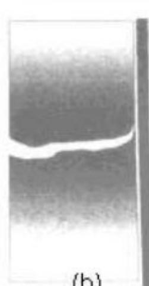

> **AI Description:**
> **Source:** `assets/_page_33_Figure_1.jpg`
> 
> **Generated:** 2026-05-31 23:04:58
> 
> ---
> 
> The image appears to be a grayscale photograph or scan of a document or page. The text "(b)" is visible at the bottom right corner, which suggests this might be part of a series or a figure label in a scientific or technical document. The image quality is low, and the content is not clearly legible, making it difficult to discern specific details or trends.

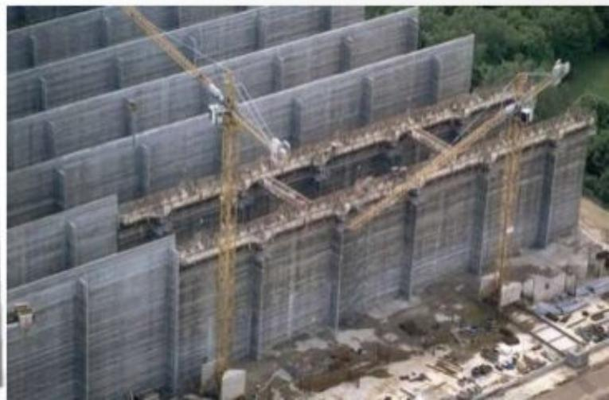

> **AI Description:**
> **Source:** `assets/_page_33_Figure_2.jpg`
> 
> **Generated:** 2026-05-31 23:03:21
> 
> ---
> 
> The image shows an aerial view of a large construction site, featuring a series of parallel concrete structures that appear to be part of a dam or similar infrastructure project. Several yellow cranes are positioned around the structures, indicating ongoing construction activities. The surrounding area includes some greenery and what looks like a road or access path. The concrete structures are uniform in design, suggesting a planned and systematic construction process.

·It iscalculated by using the following equation:

## Vs=(h1-h1）/(ts-tt) Where

Vs-slipform rate (mm/h)   
H1=the distance from the top   
oftheslipformpanel tothe   
averagecuringfront (mm)   
H2=Thedistance from the top   
ofthe slipformpanel to   
average freeboard (mm)   
Ts=setting time (h)   
Tt=Time frommixing concrete   
toplacing

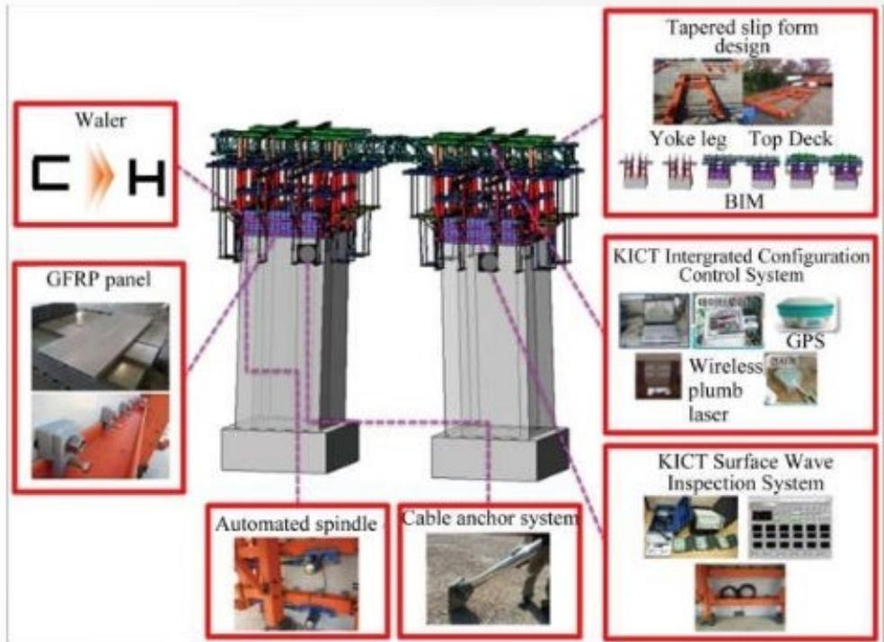

> **AI Description:**
> **Source:** `assets/_page_34_Figure_0.jpg`
> 
> **Generated:** 2026-05-31 23:03:53
> 
> ---
> 
> The image is a technical illustration combining text and diagrams. It presents a detailed view of a construction or engineering project, highlighting various components and systems involved. Key elements include:
> 
> 1. A central diagram of a structure with labeled parts such as "Waler," "GFRP panel," "Automated spindle," and "Cable anchor system."
> 2. Surrounding text boxes provide additional information about each component, such as "Tapered slip form design," "Yoke leg," "Top Deck," "BIM," "KICT Integrated Configuration Control System," "GPS," "Wireless plumb laser," and "KICT Surface Wave Inspection System."
> 3. The image appears to be part of a technical report or presentation, focusing on the integration of various systems and technologies in a construction or industrial setting.

## TUNNELFORMWORK SYSTEM

·Tunnel formwork system allows the contractor to cast wallsand slabs in one operation ina daily cycle.

·It combines the speed,qualityand accuracy offactory/off-site productionwith the flexibilityand economy of in-situ construction ·Recognized as a modernmethod of construction (MMC).

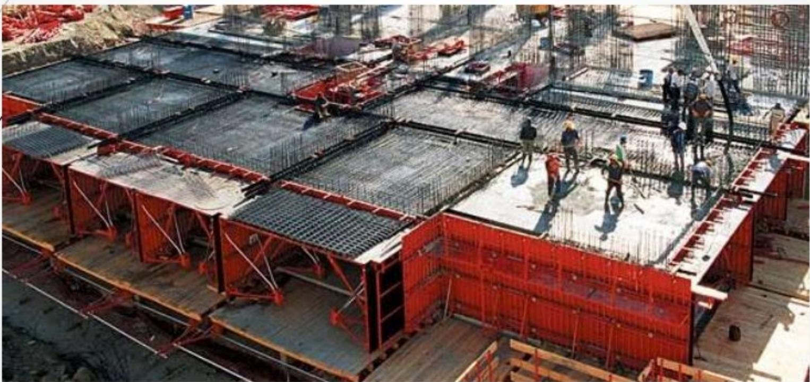

> **AI Description:**
> **Source:** `assets/_page_35_Figure_0.jpg`
> 
> **Generated:** 2026-05-31 23:00:46
> 
> ---
> 
> The image depicts a construction site with workers on a concrete foundation. The structure appears to be a large, rectangular concrete slab with rebar reinforcement visible throughout. The workers are engaged in construction activities, possibly related to the reinforcement or pouring of concrete. The site is equipped with scaffolding and other construction materials, indicating an ongoing building project. The image provides a clear view of the construction process and the infrastructure being built.

Theresult isa cellularreinforced structure,the surfaces of whichare suficiently high qualityto requireonlyminimal finishing fordirect decoration,while the end wallsand facadesareeasilycompleted with thermally insulated units that can be clad as required.

Thesystem createsan efficient load-bearing structure for use in a wide variety of applications.

It isparticularly effectiveinprojectssuitedtorepetitivecellular construction such asresidential blocks,hotels,student accommodation, barracks and prisons.

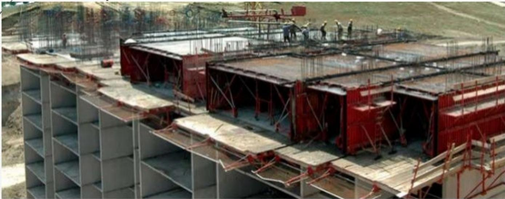

> **AI Description:**
> **Source:** `assets/_page_36_Figure_0.jpg`
> 
> **Generated:** 2026-05-31 22:50:07
> 
> ---
> 
> The image shows a construction site with a focus on a partially built structure. The structure appears to be a large concrete framework, possibly for a bridge or a similar infrastructure project. The framework is supported by red scaffolding and forms, indicating it is in the process of being poured or reinforced. Several workers are visible on the structure, suggesting active construction work. The surrounding area is open, with no significant buildings or other structures in the immediate vicinity. The image captures the progress of a large-scale construction project.

## ADVANTAGES:

## Cost

cost-effective,high qualityconstruction, generating significant savings intime andcostsoveralternativemethods without compromising on design

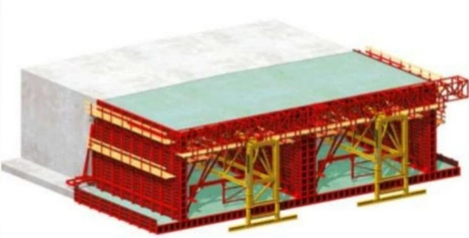

> **AI Description:**
> **Source:** `assets/_page_37_Figure_0.jpg`
> 
> **Generated:** 2026-05-31 22:54:21
> 
> ---
> 
> The image is a technical illustration of a structural framework, likely for a building or industrial structure. It features a red steel framework with yellow supports, indicating a load-bearing structure. The framework is designed to support a large, flat, light blue surface, which could represent a roof or deck. The structure appears to be supported by concrete blocks at the base, suggesting a foundation. The image is a 3D rendering, providing a clear view of the structural components and their arrangement.

## Building

The repetitive nature of the system and the use of prefabricated forms and reinforcingmats/cages simplifies the whole constructionprocess, producinga smoothand fast operation

## Quality

Quality isenhanced despite the speed of construction.The precise, evensteel faceof the formworkcreatesasmooth,highqualityfinish capableof receivingdirectdecorationwiththeminimumof preparation (a skimcoatmaybe required).Thisreducesthe requirement for followingtrades,thusprovidingadditional cost savings and speeding the entire process.

## Design

The large bays constructed provide exceptional flexibility in the design and layout of the building and allowa high degree of freedomin the final appearance.

## Safety

Integral working platformsand edge protection systems.The repetitive,predictablenatureof the tasks involved encourages familiaritywith operations.Theminimal requirementfor tools and equipment further reduces the risk of accidents on site.

## Sustainability

The in-situcastingof unitson siteand the local availabilityof readymixed concrete suppliesreduce transportation impacts. Just-in-time deliveries andnear zero wastage produce an overall tidier site with associated cost savingsand safetybenefits. Concrete'sthermal masscoupled with correctinsulation and boiler designminimisesheating costsand canevenreduce airconditioning requirements.

## GENERAL FACTS:

Tunnel formwork come in half unitsand in the form of an inverted “L" whichareboltedtogetherat thetopto formeachtunnel.The inbuilt wheelsand the jackshelp the formworkmove inand out of the positionand adjusted to the final height.

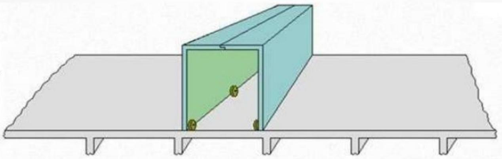

> **AI Description:**
> **Source:** `assets/_page_39_Figure_0.jpg`
> 
> **Generated:** 2026-05-31 22:55:55
> 
> ---
> 
> The image is a technical illustration of a structural element, likely a part of a bridge or a similar construction. It shows a cross-sectional view of a beam or girder supported by multiple vertical supports. The beam is divided into two sections: the upper section is colored in a light blue shade, while the lower section is green. The green section appears to be a hollow or void space within the beam, possibly for weight reduction or structural optimization. The supports are evenly spaced and seem to be designed to distribute the load evenly across the beam. The illustration is likely used for educational or engineering purposes to demonstrate the design and functionality of the beam's structure.

Thefactory-made steel formworkcanbere-used upto6ootimes and itcan suitavariety of modulesizes.Thismakes themethod of construction very versatile and extremely economical. Tunnel-form work allows a 24-hour constructioncycle to be achieved andthus the buildabilityof in-situconcrete is improvedbychoosing thistypeof formwork.

## The Casting Process of Tunnel Formwork:

1) Stage One:PrefabricatedWall reinforcement isplaced by cranealong theentirewing priortocasting thekickers (used to position wall formwork).

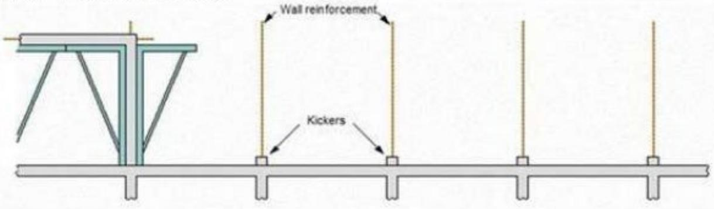

> **AI Description:**
> **Source:** `assets/_page_40_Figure_0.jpg`
> 
> **Generated:** 2026-05-31 22:48:00
> 
> ---
> 
> The image is a technical illustration showing a cross-sectional view of a structural element, likely a wall or column reinforcement in a building or civil engineering context. It includes labeled components such as "Wall reinforcement" and "Kickers," which are structural supports. The diagram is a simplified representation used to illustrate the placement and function of these elements within a larger structure. The illustration is designed to provide a clear understanding of the reinforcement layout and its relationship to the wall or column.

2) Stage Two:Two and a half tunnel iscraned intoplace,bolted togetherandtiesareadded.

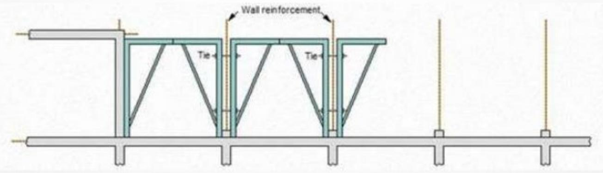

> **AI Description:**
> **Source:** `assets/_page_40_Figure_1.jpg`
> 
> **Generated:** 2026-05-31 22:49:03
> 
> ---
> 
> The image is a technical illustration of a structural design, specifically a wall reinforcement system. It features a cross-sectional view of a wall with reinforcement elements. The diagram includes labels for "Wall reinforcement" and "Tie," indicating the placement and function of these components within the wall structure. The illustration shows the reinforcement elements integrated into the wall, with ties connecting the reinforcement to the wall structure. The image is likely used for educational or instructional purposes in civil engineering or construction.

3) Stage Three: The wall concrete is poured.

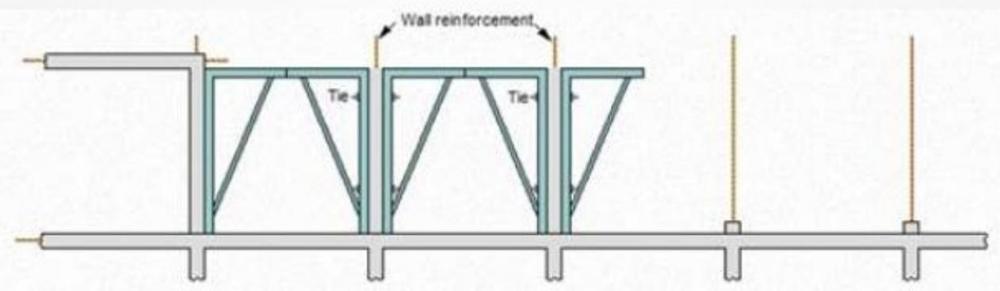

> **AI Description:**
> **Source:** `assets/_page_41_Figure_0.jpg`
> 
> **Generated:** 2026-05-31 22:52:06
> 
> ---
> 
> The image is a technical illustration of a structural design, specifically a wall reinforcement system. It shows a series of wall sections with reinforcement ties and wall reinforcement elements. The illustration includes labels such as "Wall reinforcement" and "Tie," indicating the components and their placement within the wall structure. The diagram is likely used for architectural or civil engineering purposes to demonstrate the reinforcement strategy for a building or similar structure.

4) Stage Four:The slab reinforcements arefixed

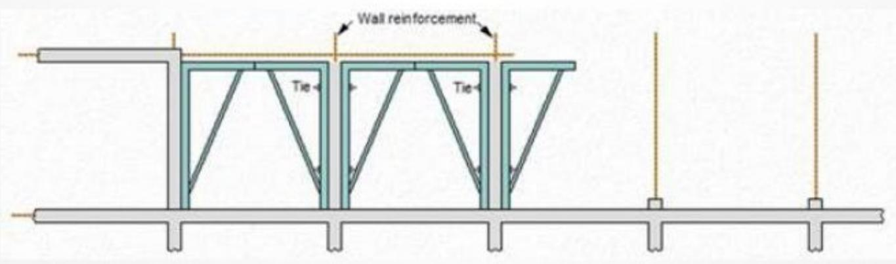

> **AI Description:**
> **Source:** `assets/_page_41_Figure_1.jpg`
> 
> **Generated:** 2026-05-31 22:51:04
> 
> ---
> 
> The image is a technical illustration of a structural design, specifically a wall reinforcement system. It shows a cross-sectional view of a wall with tie rods and wall reinforcement elements. The diagram includes labels for "Wall reinforcement" and "Tie," indicating the placement and function of these components within the structure. The illustration is likely used for architectural or engineering purposes to demonstrate the structural integrity and design of the wall.

5)Stage5:The slabconcrete isplaced.The formwork systemprovides forapour tobewrappedintarpaulinsand for the use of butane heaterstomaintainasufficientlyhightemperaturefor theconcreteto reachitsstriking strengthovernight.

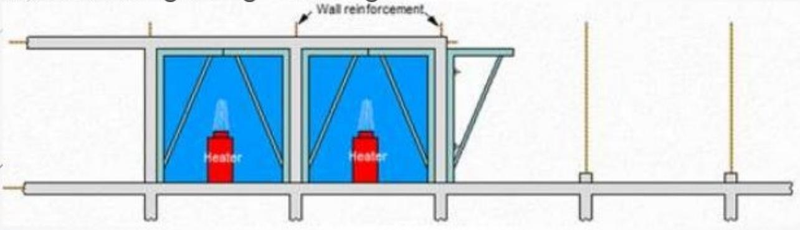

> **AI Description:**
> **Source:** `assets/_page_42_Figure_0.jpg`
> 
> **Generated:** 2026-05-31 23:02:02
> 
> ---
> 
> The image is a technical illustration showing a cross-sectional view of a structure with two heaters labeled within blue sections. The structure includes wall reinforcement elements, depicted as triangular supports. The heaters are positioned within the blue sections, which are likely part of a larger system, possibly for heating or insulation purposes. The illustration is accompanied by labels for the heaters and wall reinforcement, providing a clear view of the components and their arrangement.

6) Stage 6:The tunnel-forms are removed next day.

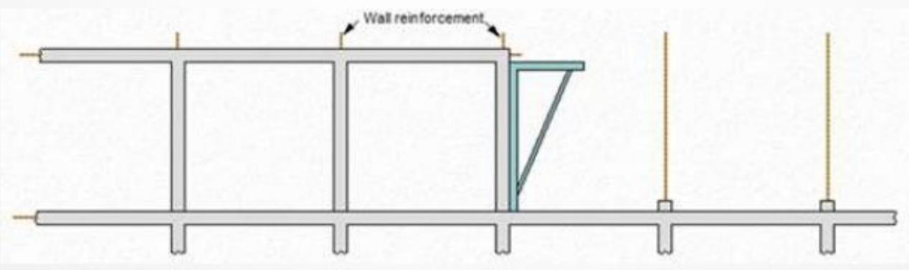

> **AI Description:**
> **Source:** `assets/_page_42_Figure_1.jpg`
> 
> **Generated:** 2026-05-31 23:03:10
> 
> ---
> 
> The image is a technical illustration of a wall reinforcement structure. It shows a cross-sectional view of a wall with a reinforcement element highlighted in blue. The reinforcement is depicted as a diagonal brace extending from the bottom right corner of the wall to the top left corner. The wall is divided into sections, with the reinforcement element connecting two of these sections. The illustration includes labels pointing to the reinforcement element, indicating its importance in the structure. The overall design suggests a focus on structural integrity and stability.

7) Stage 7: The process is repeated for the next two bays.

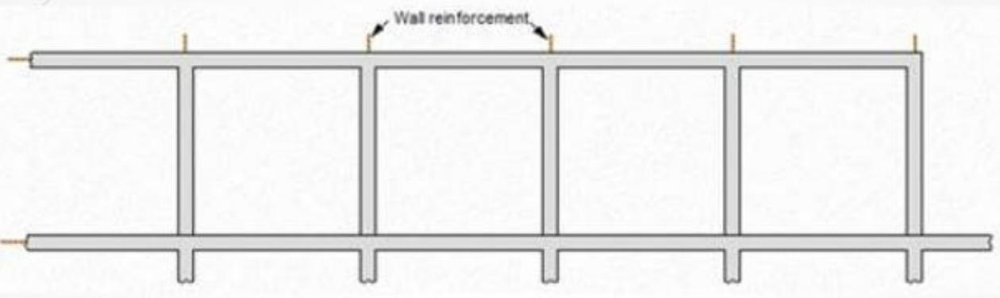

> **AI Description:**
> **Source:** `assets/_page_43_Figure_0.jpg`
> 
> **Generated:** 2026-05-31 22:58:16
> 
> ---
> 
> The image is a technical illustration of a wall reinforcement structure. It shows a series of rectangular panels connected by horizontal and vertical beams, representing a reinforced wall system. The panels are evenly spaced, and the horizontal beams run across the top and bottom of the structure, while vertical beams connect the panels. The image includes a label pointing to the wall reinforcement, indicating the focus of the illustration. The overall design suggests a modular construction method for wall reinforcement.

Tunnel formcan produce strongand durablein-situ cellular structures.Thismethodofconstructioncanachievetime savings upto 25%with cost savings of 15%.   
Sincetheconcretefinish isvery good,therequirement forpost construction trades suchasplasterersand electriciansare greatly reduced.

COMPONENTSOFTUNNELFORMWORK
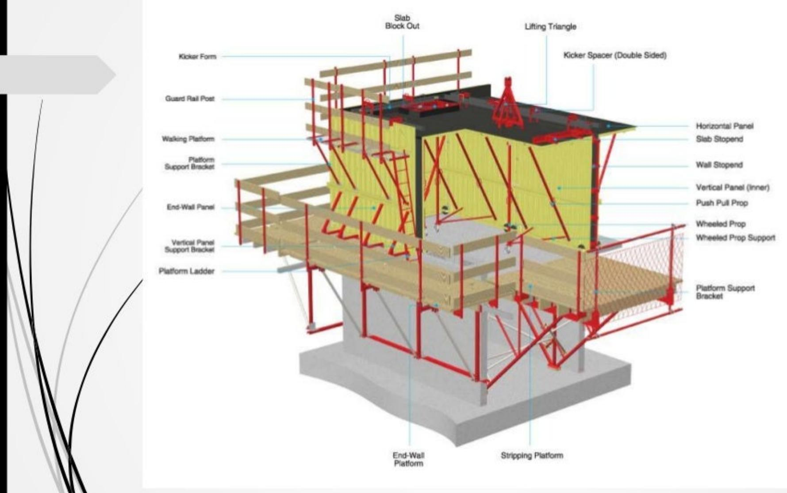

> **AI Description:**
> **Source:** `assets/_page_44_Figure_0.jpg`
> 
> **Generated:** 2026-05-31 22:59:38
> 
> ---
> 
> The image is a technical illustration of a construction setup, specifically a formwork system used in building construction. It includes various components such as the Kicker Form, Guard Rail Post, Walking Platform, and Platform Support Bracket, among others. The illustration is labeled with detailed annotations for each part, providing a clear view of the structure and its components. The diagram is designed to show the assembly and layout of the formwork system, which is crucial for understanding the construction process and ensuring safety and precision in the construction of the building.

## COLUMN SYSTEMFORMWORK

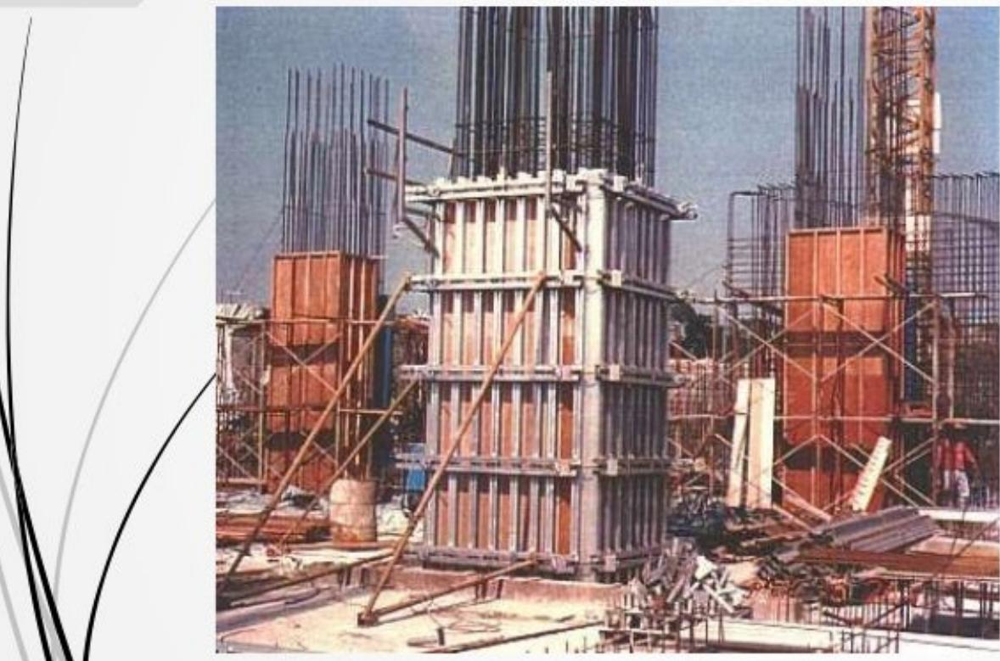

> **AI Description:**
> **Source:** `assets/_page_45_Figure_0.jpg`
> 
> **Generated:** 2026-05-31 23:01:50
> 
> ---
> 
> The image is a photograph of a construction site. It shows a large structure under construction, with visible scaffolding and rebar framework. The structure appears to be a tower or a tall building, with multiple levels of reinforcement and supports. The surrounding area includes construction materials and equipment, indicating an active building project. The image provides a clear view of the construction process and the materials used in the building's foundation and framework.

Thecolumn formwork systemsnowavailableare normallymodular innature and allow quick assembly and erection on-site while minimizing labor and crane time.Theyare available insteel, aluminiumand even cardboard (not reusable but recycled) and have a varietyof internal face surfacesdepending on the concretefinish required.Innovationshave ledtoadjustable,reusable column formswhichcan beclamped on-site to give different column sizes.

## Benefits

·Increased speed and efficiency in construction ·Therequirement of skilled labor isreduced due to the

simplicity of assembly and disassembly. Metal column formscan beassembledanderected moreeasily thantraditional formwork.

·Disposable formscomereadyassembledtosite. ·High quality surface finishes are possible. ·Thehighlyengineerednatureof themetalformwork

syste

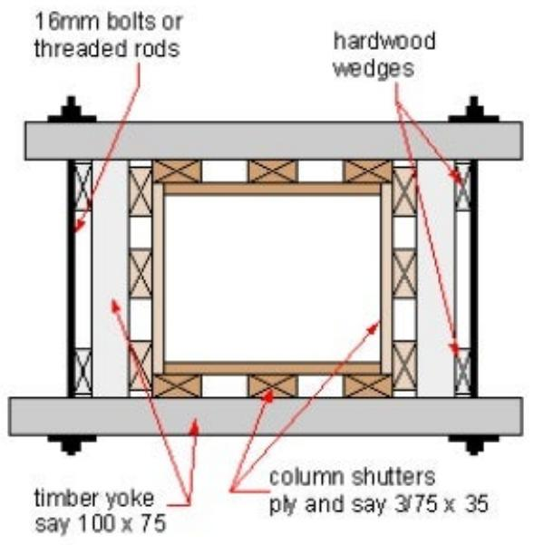

> **AI Description:**
> **Source:** `assets/_page_46_Figure_0.jpg`
> 
> **Generated:** 2026-05-31 22:51:46
> 
> ---
> 
> The image is a technical illustration of a structural component, likely a part of a building or construction framework. It shows a cross-sectional view of a structure with labeled parts. The key elements include:
> 
> 1. **Timber yokes** (labeled as "timber yoke say 100 x 75") which appear to be vertical supports.
> 2. **Column shutters** (labeled as "column shutters ply and say 3/75 x 35") which seem to be horizontal beams or supports.
> 3. **Hardwood wedges** (labeled as "hardwood wedges") which are positioned at the corners of the structure, possibly for adjustment or securing purposes.
> 4. **16mm bolts or threaded rods** (labeled as "16mm bolts or threaded rods") which are used for fastening the components together.
> 
> The illustration is likely used for educational or instructional purposes, detailing the assembly or construction of a specific type of structural element.

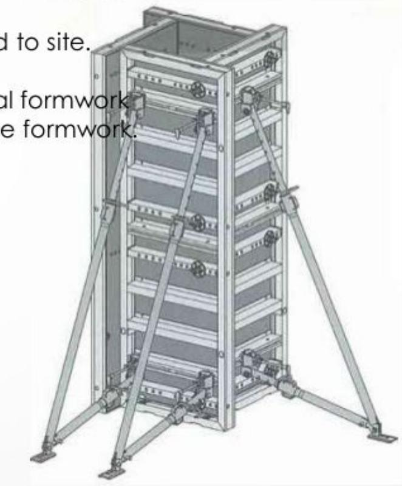

> **AI Description:**
> **Source:** `assets/_page_46_Figure_1.jpg`
> 
> **Generated:** 2026-05-31 22:51:31
> 
> ---
> 
> The image is a technical illustration of a modular formwork system. It shows a multi-level structure with horizontal beams and vertical supports, likely used for construction purposes. The illustration includes various components such as brackets, connectors, and legs, which are essential for the assembly and stability of the formwork. The text on the left side of the image provides context about the formwork being delivered to a site and mentions "modular formwork" and "the formwork," indicating its use in construction projects.

## Safety

·Metalformworksystemscan have integral ready-to-useconcreting platformswith guard railsand access equipment including ladders.This reducestheneedforindependent access.

·Forsystemswithdisposable formwork, workingplatforms forconcreting have tobe erected separatelyto allowsafe accesstothetop of thecolumn forms. ·Formworksystemsareavailablewhich need to beworked only from one side. Thiscouldbe an important safety considerationforcolumnssituatedat building edgesandcorners. ·Metal systemstypicallyproviderobust assemblies.

·Assembly process is simple allowing site operativestobecomefamiliarwith healthand safetyaspects. ·Normallytheseformworksystems require minimal use of power tools.

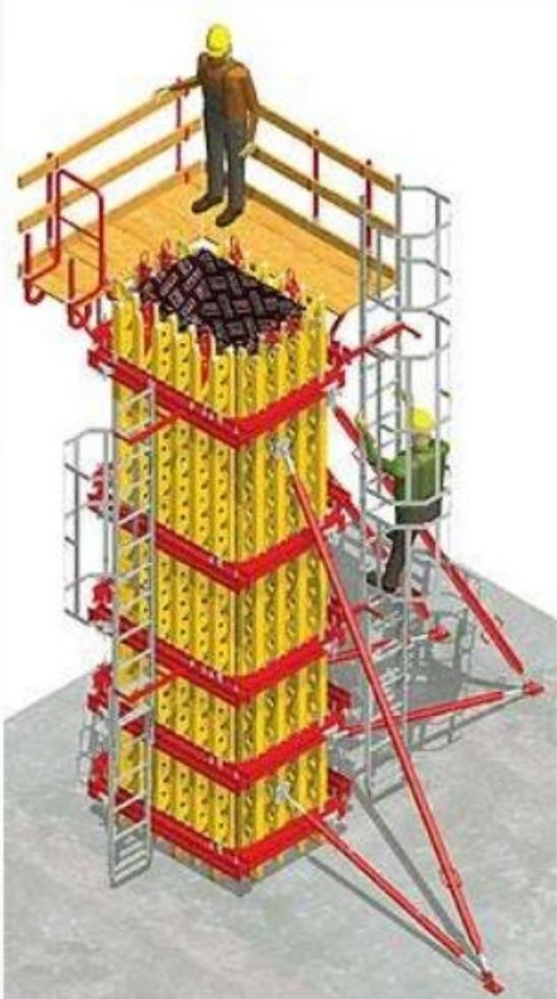

> **AI Description:**
> **Source:** `assets/_page_47_Figure_0.jpg`
> 
> **Generated:** 2026-05-31 22:48:50
> 
> ---
> 
> The image is a technical illustration of a construction scaffolding system. It shows a multi-level scaffolding structure with yellow and red components, indicating different sections or stages of the scaffolding. The scaffolding is designed to support workers at various heights, as shown by the presence of two workers in hard hats. One worker is standing on the uppermost platform, while the other is working on a lower platform. The scaffolding appears to be modular, with red beams and yellow panels, and includes safety railings. The illustration is likely used for educational or instructional purposes in construction safety or scaffolding design.

## Other considerations

Column forms are designed for specificmaximum concrete pressures.Theconcreteplacement rateshaveto beadjusted tokeep theconcretepressurewithin thespecified limits. Theassembledformworkhastoberestrainedatthebase properly toavoid displacement,and grout loss during

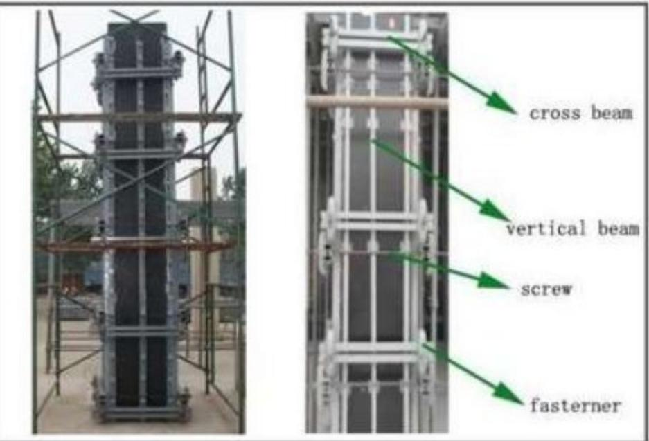

> **AI Description:**
> **Source:** `assets/_page_48_Figure_0.jpg`
> 
> **Generated:** 2026-05-31 22:56:44
> 
> ---
> 
> The image contains a technical illustration of a scaffolding structure. It shows a detailed view of the scaffolding with labeled components: cross beam, vertical beam, screw, and fastener. The left side of the image provides a broader view of the scaffolding structure, while the right side zooms in on the structural details, highlighting the labeled parts. The image is designed to provide a clear understanding of the scaffolding's construction and the function of each component.

SCAFFOLD FOR COLUMN

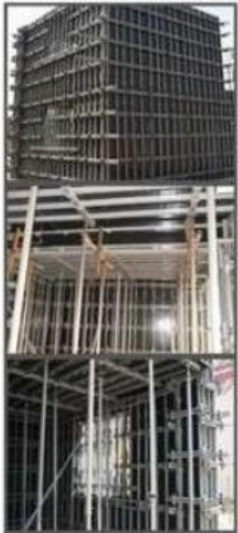

> **AI Description:**
> **Source:** `assets/_page_48_Figure_1.jpg`
> 
> **Generated:** 2026-05-31 22:56:29
> 
> ---
> 
> The image contains a series of three photographs showing a building under construction. The top photo shows the exterior of a multi-story building with scaffolding around it. The middle photo provides a closer view of the scaffolding and the building's structure, highlighting the framework and construction materials. The bottom photo offers a detailed view of the scaffolding and the building's foundation, emphasizing the progress and complexity of the construction process. The images collectively illustrate the stages of construction from an exterior view to a more detailed look at the structural framework and foundation.

PREFABRICATEDFORMWORK

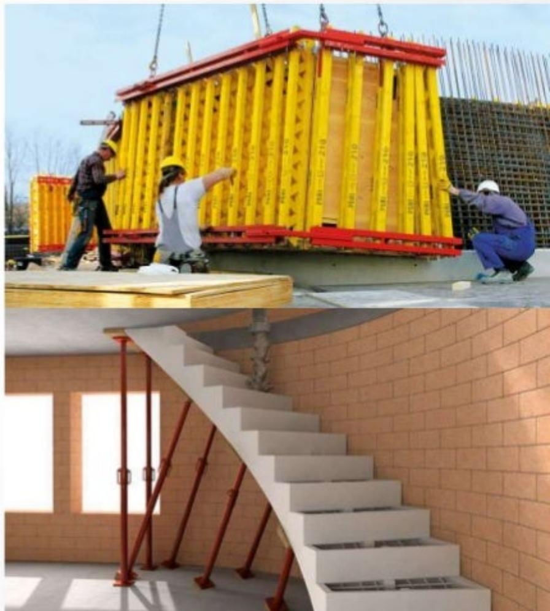

> **AI Description:**
> **Source:** `assets/_page_49_Figure_0.jpg`
> 
> **Generated:** 2026-05-31 22:57:26
> 
> ---
> 
> The image contains two photographs. The top photograph shows a construction scene where workers are handling a large, yellow, prefabricated concrete wall panel. The panel is supported by red beams and is being lifted by a crane. The workers are wearing safety gear, including hard hats and gloves. The bottom photograph displays a completed staircase with concrete steps and a brick wall. The staircase is supported by metal scaffolding, which is likely used for construction or maintenance purposes. The images appear to be related to construction and the assembly of prefabricated concrete components.

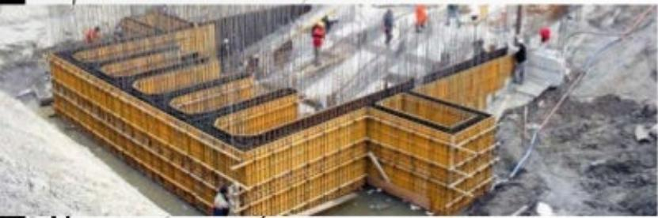

> **AI Description:**
> **Source:** `assets/_page_50_Figure_0.jpg`
> 
> **Generated:** 2026-05-31 23:02:48
> 
> ---
> 
> The image shows a construction site with workers and equipment. The main visual element is a large, partially constructed concrete structure with wooden forms and rebar reinforcement. The structure appears to be part of a larger building or infrastructure project. The workers are wearing safety gear and are engaged in various tasks around the construction area. The ground is uneven and covered with dirt, indicating ongoing work.

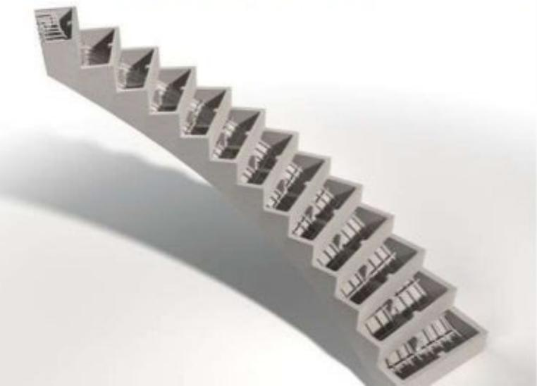

> **AI Description:**
> **Source:** `assets/_page_50_Figure_1.jpg`
> 
> **Generated:** 2026-05-31 23:02:26
> 
> ---
> 
> The image contains a series of identical rectangular shapes arranged in a diagonal line. Each rectangle features a small icon or symbol in the top left corner, which appears to be a stylized representation of a building or structure. The shapes are evenly spaced and aligned, creating a sense of order and symmetry. The background is plain white, which helps to highlight the shapes and their uniformity. The image does not contain any text or additional annotations beyond the icons in the rectangles.

·Very littleon-site skilled laborneeded.

The abilityto reuse formseither asa large sectionor as individual units.

Allprefabricated systemsare designed forlight aswell as heavy construction.

Contractorscanbidalmostanytypeofwork;straight, battered,curved orcut-up.

Prefab formsmaybeset inany combination,horizontally and vertically,toanywall height.

·On high walsoneside of forms can be erected and ties placed;then the close-out side can be erected during placement,minimizingconcrete drop and assuring effective vibration.

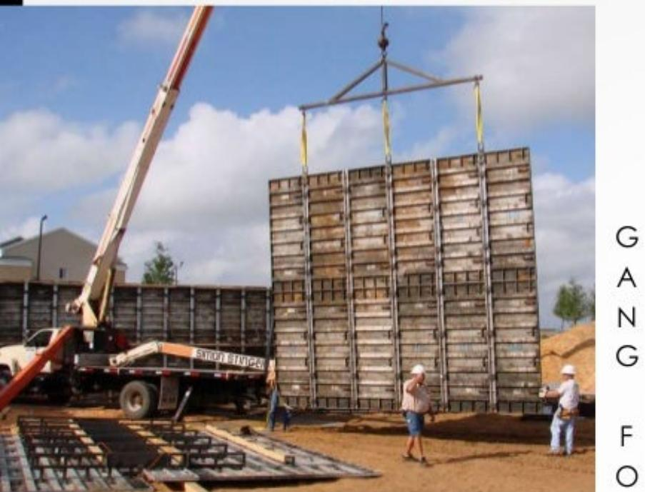

> **AI Description:**
> **Source:** `assets/_page_51_Figure_0.jpg`
> 
> **Generated:** 2026-05-31 22:57:41
> 
> ---
> 
> The image shows a construction site where a large, modular concrete wall is being lifted by a crane. The wall appears to be part of a gang form system, as indicated by the text "GANG FORM" on the right side of the image. Two construction workers are visible on the ground, one of whom is holding a tool. The background includes a partially constructed building and some trees, suggesting this is an ongoing construction project. The crane is labeled "STATION STINGER," indicating the brand or type of the equipment.

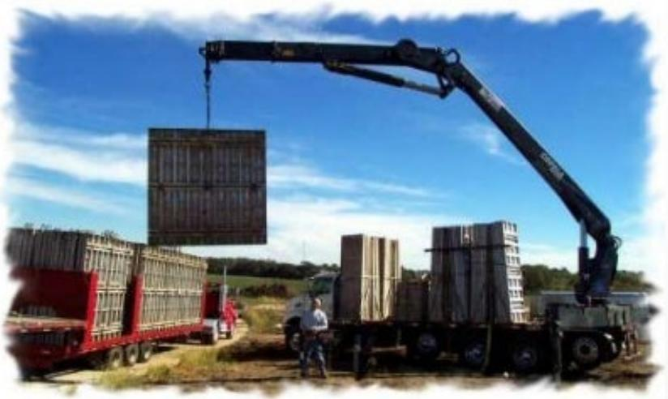

> **AI Description:**
> **Source:** `assets/_page_51_Figure_1.jpg`
> 
> **Generated:** 2026-05-31 22:59:59
> 
> ---
> 
> The image shows a crane lifting a large wooden crate or container. The crane is mounted on a truck, and there are several other similar crates stacked on the ground nearby. The scene appears to be an outdoor setting, possibly a construction or industrial site. The sky is clear with some clouds, indicating fair weather. The image captures a moment of heavy lifting, likely related to construction or material handling.

Inaprefab systemthecontractorcan remove andreplace formsat anypoint.This simplifies erection and stripping,which can be started at any location.

Toallowforacastingpocket,apanel is simply removedandreplacedmaintenanceof forms canbeatiresometask,butwell-maintained formsmeanmorereuses.

Abigadvance inprefab forming hasbeen the development of gang forming,whichis simply defined as the grouping together andmoving ofanumber of forms asa single unit.

Thesuccess of gang forming isdue tothe development of easy-to-use hard w a re and ties,madeespeciallyforthisforming technique.

Since pre formsare pre-engineered and precisionmade,theyofferthebestmaterials available andwork equallywell on all jobs, resultinginlowercostperuse.Although prefabricated formsworkwell on any size job, thesmall job isa goodwayto introduce the systemto theworkmen.

## DRAWBACKS

·High cost factor

Greater transportationcost,due to the large pieces,where asthe regular formworkcan be transportedeasily.

·Toomany pieces involved in the pre fabricated formwork

Prefabricated formwork,leavepoor finishesat the joints,of theformingmembers.

·Pre-fab formwork deflect duringplacement.

If recommended placingratesare followedand thereisgoodsupervisionof placementand vibrating,the problemof deflectioncanbe controlled.

Withmany prefab systems,panelscanberem ovedat different locations and used as casting pockets.

·This procedure avoids dropping the concretea great distance and helpstomaintainamore constant rate of placement.

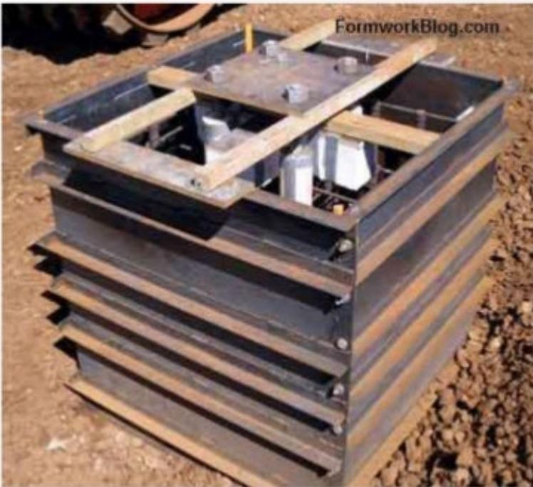

> **AI Description:**
> **Source:** `assets/_page_52_Figure_0.jpg`
> 
> **Generated:** 2026-05-31 22:49:16
> 
> ---
> 
> The image contains a photograph of a metal formwork structure, likely used in construction for casting concrete. The formwork is composed of several horizontal and vertical metal panels, with a wooden frame at the top. The structure appears to be designed for creating a rectangular shape, possibly for a foundation or a similar construction element. The ground around the formwork is dirt, indicating an outdoor construction site. The text "FormworkBlog.com" is visible in the upper right corner, suggesting the image is related to construction formwork techniques or blog content.

## Time of Removal of formwork

FAILURE OF FORMWORK

12.09200610:53

Formwork failuresare thecause ofmanyaccidents and failuresthat occurduring concreteconstruction which usually happenwhenfreshconcrete isplaced

Generally some unexpected event causesone memberto fail,thenothersbecome overloaded or misalignedand theentire formwork structure collapses

Improper strippingand shoreremoval

Inadequate bracing

Vibration

Unstable soil under mudsils,shoring not plumb

nadequatecontrol of concreteplacement

Lackof attention to formworkdetails

Inadequate crossbracing and horizontal bracing of shores

Formssometime collapse when their shores/jackare displaced by the vibration caused by:

passing traffic

movement of workers&equipment onthe formwork theeffect of vibratingconcrete toconsolidate it

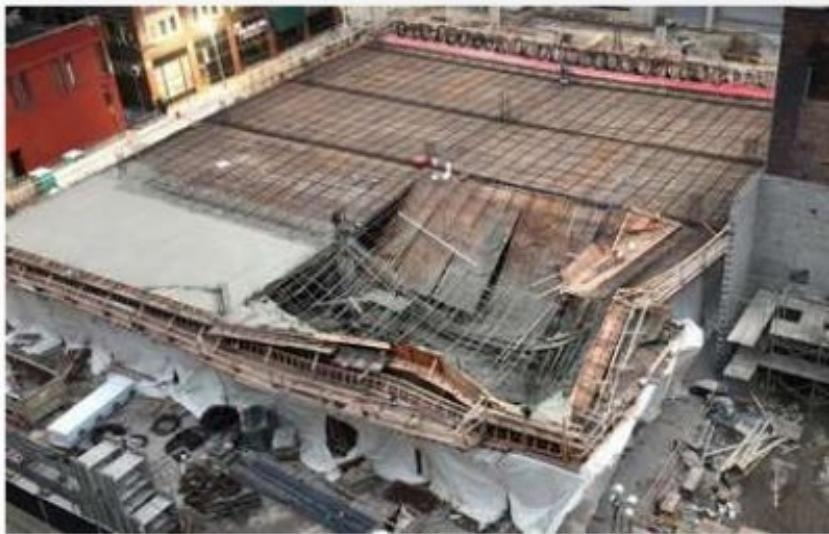

> **AI Description:**
> **Source:** `assets/_page_56_Figure_0.jpg`
> 
> **Generated:** 2026-05-31 22:57:53
> 
> ---
> 
> The image shows a construction site with a partially completed building. The structure appears to be in the early stages of construction, with visible scaffolding and rebar framework. The roof area is covered with wooden planks, and there are construction materials and equipment scattered around the site. The surrounding area includes other buildings, indicating an urban setting. The image captures the progress of the construction project, highlighting the structural elements and the state of the building at this stage.

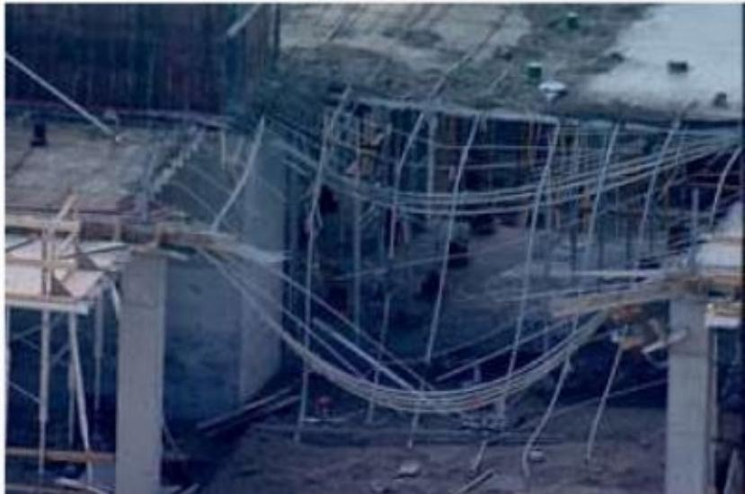

> **AI Description:**
> **Source:** `assets/_page_56_Figure_1.jpg`
> 
> **Generated:** 2026-05-31 22:59:49
> 
> ---
> 
> The image shows a construction site with a partially built structure. The main visual elements include concrete pillars, a framework of rebar, and a partially poured concrete wall. The rebar is arranged in a grid pattern, suggesting reinforcement for the concrete structure. The surrounding area appears to be an active construction zone with various construction materials and tools scattered around. The image captures the early stages of construction, focusing on the reinforcement and concrete work.

## SAFETY PRECAUTION

Material used for theconstructionof formworkmust fulfill the specification.

Formworkisfixedfirmly&properly

Constructionarea must beprotectedtoprevent vandalismof formwork.

Warning signmust beput upat the area where the formwork is fixed toprevent entrance of people thatmay damage the formwork.

Theformworkmust be inspected before theconcreteispoured.

## STRIKING,MAINTENANCE,STORAGE OF FORMWORK

## Striking：

Ascolumnand beam side formworkwillbe removed before beamand slab soffitformwork,provisionmustbemadeforeasyremovalandinthecorrect order.Ifbeamand slabsoffit formwork istoberemovedbefore theconcrete hasachievedworkingstrength,permanent proppingor shoring isrequired. Takecaretoavoiddamagetoformworkwhichistobereused.Eight ormore Usesmaybeobtained fromtimber formwork.

Maintenance Cleanformswith stifbrushand cleancold water.Use scrapers onlyasalast resort.Keepformswell oiledtoprevent delaminationof plywood or rusting of steel and always oil the edges.

Storageof formsAny formworkwithsteelcomponentsshouldbestoredin the dry.Avoiddirect sunlight ontimber forms.Storeclear of the ground without twist or bend,and keep free of dirt.

## THANK YOU

ZEUS PITHAWALLA(37) GARIMA RAJPUT(38) MANASVIRANE(39)

RITHIKA RAVISHANKAR(40) SHIVALI SANAP(41) SUVOJIT SEN(43)

EKTA SHAH(44) RAJESH SHELAKE(45)