<span id="page-0-0"></span>
GERMANWINGS 9525:THE FIRST6HOURS

25-03-2015

BRENDANHODGSON+AHMEDALSHARIQI

<span id="page-1-0"></span>
## GERMANWINGS4U9525\~QUICKFACTS

Dateof incident:24th of March 2015

Flight:Germanwings 4u9525

Location ofcrash:Massif desTrois-Evechés

Time of crash:10:45CET(Estimate)

Fatalities:150

Aircraft:AirbusA320

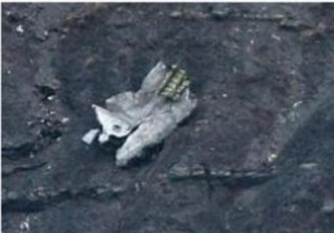

> **AI Description:**
> **Source:** `assets/_page_1_Figure_0.jpg`
> 
> **Generated:** 2026-05-31 23:08:34
> 
> ---
> 
> The image appears to be a photograph of a mechanical or electronic component lying on a textured surface. The component has a metallic appearance with a rectangular shape and what looks like a small, yellowish-green label or marking on it. The surface beneath the component is dark and rough, possibly concrete or a similar material. There are no visible charts, graphs, or other visual elements in the image. The focus is solely on the single object and its immediate surroundings.


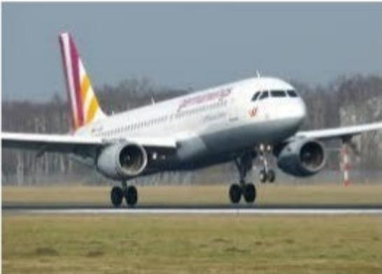

> **AI Description:**
> **Source:** `assets/_page_1_Figure_1.jpg`
> 
> **Generated:** 2026-05-31 23:08:48
> 
> ---
> 
> The image shows a commercial airplane, specifically an Airbus A320, taking off from a runway. The aircraft is painted in the livery of Iberia, a Spanish airline. The background includes a grassy area and some trees, suggesting the photo was taken at an airport. The landing gear is still extended, indicating the plane is in the process of lifting off.


<span id="page-2-0"></span>
# GERMANWINGS4U9525\~QUICKFACTS

## +Analysis Parameters:

First6hours following crash-24-May-2015 (approx.11:00-17:00CET)

Supplemented by24 hourrefresh-11AMCET-25-May-2015

Timestampsincluded inthisdocumentareestimates only.

NOTE:thisanalysis is not intended asa critique of the responseeffortsofanyinvolvedparty

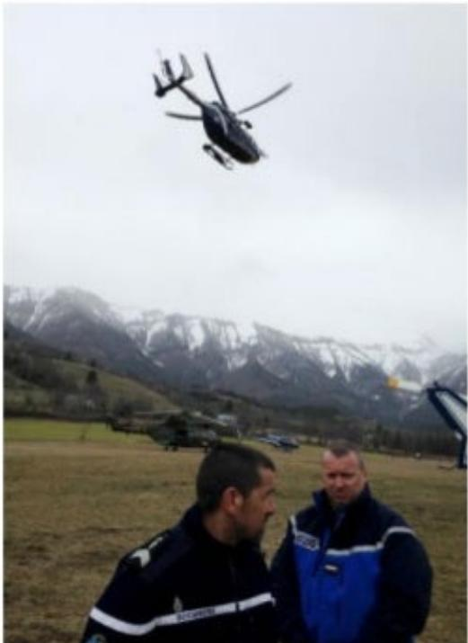

> **AI Description:**
> **Source:** `assets/_page_2_Figure_0.jpg`
> 
> **Generated:** 2026-05-31 23:13:03
> 
> ---
> 
> The image contains a photograph of two individuals standing on a grassy field with a helicopter in the air above them. In the background, there are snow-capped mountains. The individuals are wearing uniforms, suggesting they may be part of a rescue or security team. The helicopter appears to be in the process of landing or taking off, and there are other helicopters visible in the distance. The setting suggests a remote, mountainous area, possibly used for search and rescue operations or similar activities.


<span id="page-3-0"></span>
## KEYFINDINGS/CONCLUSIONS

\+ Asseenduringpreviousincidents,includingtheCostaConcordiaincident(2O12)，theAsianaAirlinescrash atSFO(2o13),andmorerecentaviationdisasters,theroleofsocialplatformsasback-upstoacompany's corporatesitehasbecomeincreasinglyimportant.ThecatastrophicfailureoftheGermanwingswebsitein theinitialhourscontinuestoreinforcetheimportanceof havingsocialplatformsinplaceandanimpetusto considerandreviewexisting infrastructure.

However，unlikeAsianaAirlines,wherecitizen-generatedvisualslargelydrovethemediaagendaduringthe firsthours,theimmediatelack of visualstransformedthisquicklyintoamedia-drivenstory.

Theactionstakenbythreeof thekeyplayers-Germanwings,LufthansaandAirbus-toquicklyadaptthe visualappearanceoftheirwebsiteandtheirsocialplatformshighlightstheimportanceof havingclear protocolsinplaceforcoordinatedbrandmanagementintimesofcatastrophiccrisis.

ThedecisionbyparentcompanyLufthansanottoadapt/updateitscorporatewebsite(oroversightindoing so)intheearlyhoursof thecrisishighlightsadilemmafacingbrandsassociatedwith，yetseparatefrom,the affectedbrand.Itsuggeststhequestion:WasitLufthansa'sresponsibilityastheparentcompanytosupport orreflect thepublicmood intheearly hoursof thecrisis?

Theincreasingintegrationofsocial“outputs”intoreal-timemediastoriese.g.tweetsor Instagramimages etc.further highlightstheimportanceofthesechannelsasopportunitiestoinsertcorporatemessagesinto theunfolding narrative.

\+ Asalways,visualsremainapowerful accelerantforsocialamplificationintimesof crisis.

\+ Clickthelinksforadditionalanalysisofpreviousincidents:CostaConcordia,AsianaAirlines214,USAirways 1549orvisit http://www.slideshare.net/Brendan

<span id="page-4-0"></span>
## ANALYSIS

## BRENDANHODGSON AHMED ALSHARIQI

<span id="page-5-0"></span>
## +Within the first 6O minutes:

Germanwings issues firsttweetacknowledgingincident& issuesupdatetoFacebook

Atthesame time,Germanwingswebsitecrashes-remains inaccessibleforapprox.2hours

Nochange tobrand colours/logo onsocial platformsatthis time

(Germanwings.comsite)

(Twitter)

(Facebook)

<span id="page-6-0"></span>
## +Within the first 90 minutes:

Within90minutesof the crash，AirbusandGermanwings parentcompanyLufthansapublishfirstacknowledgementsof theincident viaTwitteraccounts

```
Lufthansa uihas3   
".on4U 9525.Ifour fears are confirmed,this isa dark day for Lufthansa.   
We hope to find survivors.Carsten Spohr2/2   
+ 14 ★3   
Lufthansa @ufthas4m   
"We do not yet know what has happened to   
flight4U9525.Mydeepestsympathy goes   
tothefamiliesandfriendsof our passengers   
and crew1/2   
36 10 0.8/9   
Lufthansa @ufthanse-Mar23   
#LiveBilbao2:Opinionson the Guggenheimanyone?   
#LHcityofthemonth
```


<span id="page-7-0"></span>
## +Within the first 120 minutes:

Germanwingsrecoloureditslogoonboth itsTwitterand Facebookaccountstoblackand white.

ParentcompanyLufthansa followswithinasimilar timeframewithitssocial platforms

(GermanwingsFacebook)


<span id="page-8-0"></span>
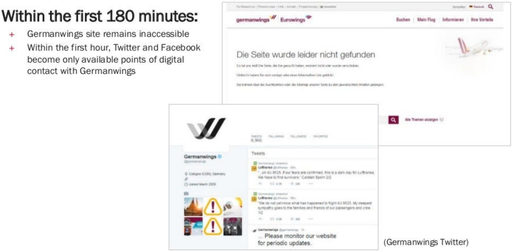

> **AI Description:**
> **Source:** `assets/_page_8_Figure_0.jpg`
> 
> **Generated:** 2026-05-31 23:11:56
> 
> ---
> 
> The image contains a combination of text and a screenshot of a Germanwings website. The text at the top provides information about the accessibility of the Germanwings website and social media platforms within the first 180 minutes of an incident. The screenshot shows a Germanwings website page with a message indicating that the page was not found, suggesting a website outage. Below the text, there is a screenshot of the Germanwings Twitter page, which includes tweets from Lufthansa and Germanwings, providing updates and expressing sympathy. The image effectively combines textual information with visual elements to convey the status of Germanwings' digital presence during a critical period.


<span id="page-9-0"></span>
## +Within the first 180 minutes:

(Germanwings.comsite)

Germanwingsappearstobestrugglingtoreactivate itswebsite.

Atone point,the original sitewith full marketingcontentappearsonthesitecontradictingitsmoresombresocial platforms

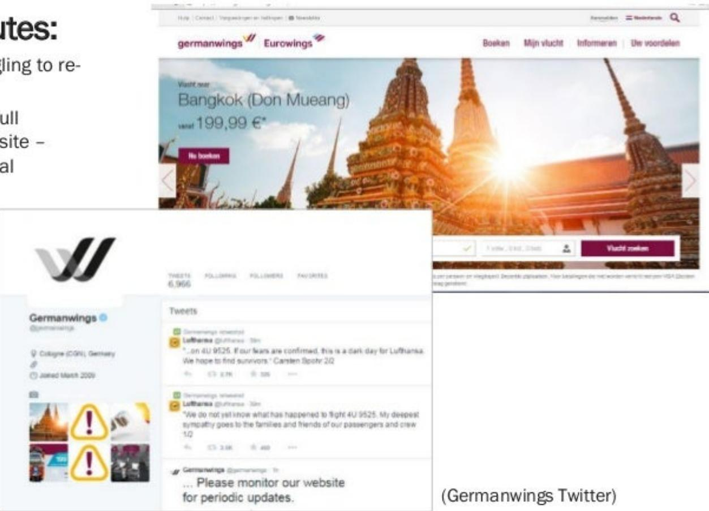

> **AI Description:**
> **Source:** `assets/_page_9_Figure_0.jpg`
> 
> **Generated:** 2026-05-31 23:10:50
> 
> ---
> 
> The image contains a screenshot of the Germanwings website and a portion of their Twitter feed. The website features a promotional image of a temple in Bangkok with a flight price of 199.99€. The Twitter feed shows updates related to flight 4U 9525, with messages expressing condolences and directing users to monitor the website for updates. The image also includes a logo of Germanwings and a section with follower and tweet statistics.


<span id="page-10-0"></span>
(Airbus.com site)

<span id="page-11-0"></span>
## +Within the first 4 hours:

Germanwings.com beginsto stabilize

Bythefifth hour following the incident,thecurrent crisis site is in place

(Germanwings.com Hour 3)

(Germanwings.com updates Hour12+)

(Germanwings.com Hour 4.5)

<span id="page-12-0"></span>
## +Within the first 4 hours:

Lufthansaupdatescorporate homepagewitha statementontheincident\~nosystem failures

Statements are updated throughout theday

Within24 hours thecorporate siteresumesactivitywith aclearbannerto informationon the incident

(Lufthansa.com Hour24)

(Lufthansa.com Hour3)


> **AI Description:**
> **Source:** `assets/_page_12_Figure_1.jpg`
> 
> **Generated:** 2026-05-31 23:08:10
> 
> ---
> 
> The image contains a screenshot of the Lufthansa website. It features a photograph of a smiling woman using a mobile device, promoting mobile check-in. The website layout includes a search bar, flight booking options, and promotional content for travel to Europe. The image also includes text elements such as flight prices and booking categories.


(Lufthansa.com Hour 4.5)

<span id="page-13-0"></span>
## +Within the first 4 hours:

Airbus.comincorporatesapop-upnotification acknowledgingthe incident.

Thepop-up isadapted throughthecourse of thedayand within5hours linkstoAirbus'statementontheincident.

(Airbus.com Hour 5+)

(Airbus.com Hour3)

(Airbus.com Hour 3)

<span id="page-14-0"></span>
It isunclear if Dusseldorf airport experienced a failure,wasintentionallydisabledorimmediately movedtoitsdarksite.Howeverthesiteremainsina minimalstate24hourslater.

Barcelona'sElPratairportmadeonlyminor modifications intendedtopointvisitorstospecific mediaandlocalauthoritiesresponsibleforthecrisis.

## seldorf DUS Airport

## Aktuelle Informationen

DerInternetauftritdes DusseldorferFlughafensistderzeit nicht verfugbar.FlugunfallBetro HotlineO8oo-7766350 wenden.DesWeiterenhatdasAuswartigeAmt eineKrisenhotlineel

## BARCELONA Airport ElPrat

## DUS

## WELCOMETOBARCELONAAIRPORT


<span id="page-15-0"></span>

### Full Page Description (Page 15)

**Source:** `assets/_page_15_Asset_0.jpg`

**Generated:** 2026-05-31 23:08:27

---

The image contains three line graphs, each representing data for different entities: Germanwings, Airbus, and Lufthansa. The x-axis represents dates from March 20 to March 25, and the y-axis represents numerical values in increments of 5,000. The lines for each entity show varying trends over the time period. Germanwings has a sharp increase around March 20, while Airbus shows a gradual increase. Lufthansa also has a significant increase around March 20, similar to Germanwings. The graphs are labeled with the respective entity names and numerical values at the end of each line.

## +During the first 24 hours:

Germanwings focusesthemajorityof itsdigital activityon Twitter-postinginboth English(1O)and German (14)

Germanwingsand Lufthansa both see significant spikesin followersonTwitterdueto thecrash.


<span id="page-16-0"></span>
## CORPORATEACTIVITYBYTHENUMBERS

## +Financialimpacts:

Almostimmediatelyfollowingthefirstreportsof the incident,thesharepricesofbothLufthansaandAirbusfell significantly-however,tradingstabilisedwithin\~2hours after thecrash.

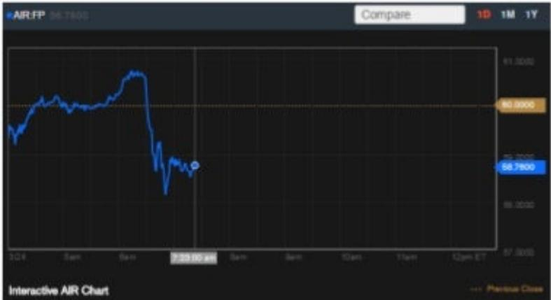

> **AI Description:**
> **Source:** `assets/_page_16_Figure_0.jpg`
> 
> **Generated:** 2026-05-31 23:12:30
> 
> ---
> 
> The image contains a line chart with a time series of data points. The chart appears to represent the price movement of a financial instrument, likely a stock or currency pair, over a period of time. The x-axis represents time, with labels indicating days and hours, while the y-axis represents the price, with a range from approximately 56.7000 to 81.0000. The chart shows a general upward trend followed by a significant drop and then a recovery, indicating volatility in the price movement. The chart is labeled "Interactive AIR Chart" at the bottom, suggesting it is a tool for analyzing financial data.


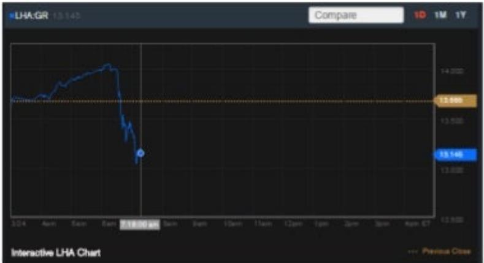

> **AI Description:**
> **Source:** `assets/_page_16_Figure_1.jpg`
> 
> **Generated:** 2026-05-31 23:12:19
> 
> ---
> 
> The image contains a line chart visualization. The chart shows the price movement of a financial instrument, likely a stock or ETF, labeled as "LHA:GR." The chart displays a time series of price data, with the x-axis representing time and the y-axis representing the price in euros. The chart highlights a significant drop in price, starting at approximately 13.500 and falling to around 12.500, with a peak at approximately 14.000. The chart also includes a "Compare" button at the top, suggesting the ability to compare this chart with others. The chart is labeled as "Interactive LHA Chart," indicating it is a dynamic chart that can be interacted with, possibly for real-time or historical data analysis.


<span id="page-17-0"></span>
# MEDIA/SOCIALACTIVITYBYTHENUMBERS

## + TWITTER:

Oneof the firsttweetstobepostedaround the incidentcamefrom Flightradar,awidely trustedandusedwebsitefortrackingflights globally.

Within the first9Ominutes the tweet was retweeted more than 2,000 times.

Within the first 6O minutes,#Germanwings had become the top trending topic on Twitter

Withinthefirst6Ominutes,accordingto Sysomos,more than 60,000Tweetswereposted referencing#Germanwings

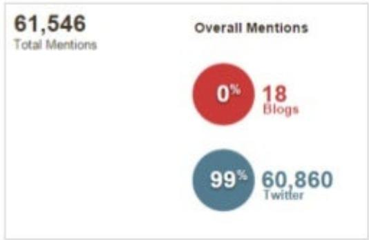

> **AI Description:**
> **Source:** `assets/_page_17_Figure_0.jpg`
> 
> **Generated:** 2026-05-31 23:13:56
> 
> ---
> 
> The image contains a pie chart and text. The pie chart visually represents the distribution of mentions between blogs and Twitter. The text indicates a total of 61,546 overall mentions. The chart shows that 0% of the mentions are from blogs, and 99% are from Twitter. The remaining 1% is not visually represented in the chart but is implied by the total.


Germanwings flight #4U9525(registration D-AIPX)was lost from Flightradar24at6800 feetat 09.39UTC time

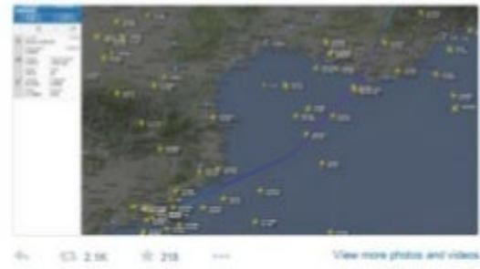

> **AI Description:**
> **Source:** `assets/_page_17_Figure_1.jpg`
> 
> **Generated:** 2026-05-31 23:14:02
> 
> ---
> 
> The image is a map with various yellow markers scattered across it, indicating locations. A blue line connects two points on the map, suggesting a route or path. The map appears to be focused on a coastal area, with the blue line starting near the bottom left and ending near the top right. The map is zoomed in on a specific region, and there are no additional text or annotations that provide specific information about the locations or the purpose of the map.


<span id="page-18-0"></span>
## MEDIA/SOCIALACTIVITYBYTHENUMBERS

Within six hours of the incident,the numberof tweetsreferencing#Germanwingshad reached nearly500,000globally.

Amidthemany expressions of condolencesand sharingof news,tweetssoonmovedtoward capturingimagesof theregion of the crash.


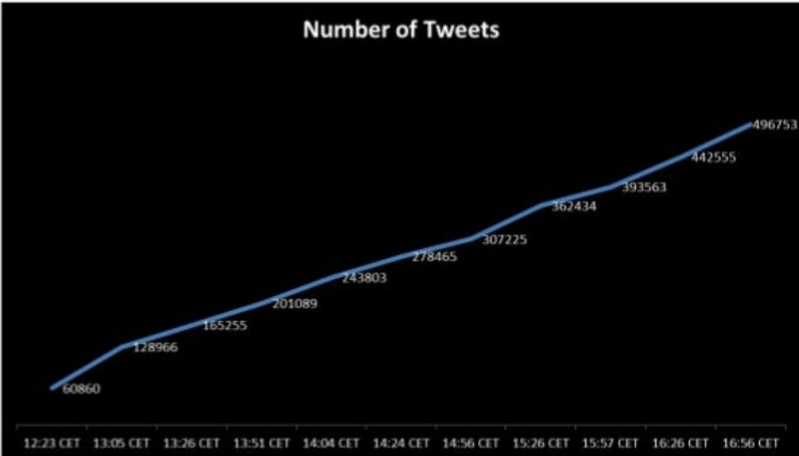

> **AI Description:**
> **Source:** `assets/_page_18_Figure_1.jpg`
> 
> **Generated:** 2026-05-31 23:10:19
> 
> ---
> 
> The image contains a line graph with the title "Number of Tweets." The x-axis represents time in CET (Central European Time) from 12:23 to 16:56, while the y-axis represents the number of tweets. The graph shows a steady increase in the number of tweets over time, with values at specific time points marked on the graph. The data points are labeled with corresponding tweet counts, such as 60860 at 12:23 CET and 496753 at 16:56 CET. The overall trend is an upward curve, indicating a growing number of tweets as time progresses.


<span id="page-19-0"></span>
## TRENDSANDBEHAVIOURS

Duetothe initial remoteness of the incidentandlackof immediate visuals,fake imagesand videos begantoappearonlinein increasingnumbers.

Questions had also arisen due to variousearlyTwitterreportsaround whetheradistresscall hadactually beenmadeby thepilots.

## Storyful

Thisphoto being shared as A320 crash site actually showsan incident in Turkeyin 2007 #dailydebunk

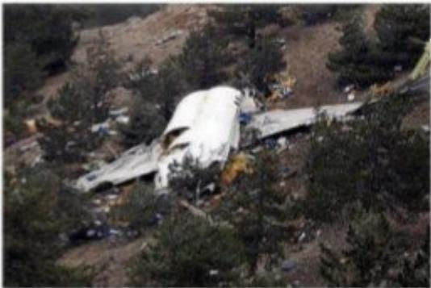

> **AI Description:**
> **Source:** `assets/_page_19_Figure_0.jpg`
> 
> **Generated:** 2026-05-31 23:09:52
> 
> ---
> 
> The image depicts the wreckage of an aircraft lying on the ground amidst a forested area. The fuselage is prominently visible, with debris scattered around it. The terrain appears rugged and uneven, with trees and shrubs surrounding the crash site. The image provides a clear view of the aftermath of an aviation incident, highlighting the extent of the damage and the natural environment where the crash occurred.


## Uncertainty overdistresscall

Onthe question of whethera distress call wasmade from the aircraft,thespokesman says theairline has received contradictory reports.

6Wehavecontradictory informationabout that ourselves,fromthe airtrafficcontrollers,andweareuncertainas towhethera distress call was issued at all.

<span id="page-20-0"></span>
## TRENDSANDBEHAVIOURS

Aswith otherrecent crises ormajor news events,the evolution of thelivenews feed (using tools suchasStorify)by mediahasseenan increasedrelianceanduseof 3rdparty andeye-witnesstweetstosupplement reporting-allowing themtoprovideavarietyofcommentsandreactionsby decision-makers,executives,witnessses,expertsetc.

Theimplicationswhich haveemerged over time-butwhich mustbecarefullybalancedandapplied-are the importance ofsocial channelstodrivemediacoverageandpresence within breaking news stories.

## theguardian


## BBC


<span id="page-21-0"></span>
## TRENDSANDBEHAVIOURS

Within90minutes-anddespitelack of immediate information-political leaderswerequicktoreact andprovidecommentontheincident.

Francois Hollandewasthe first of theworld's political leaderstocommentontheincident.

Whilethe FrenchCivil AviationAuthorities have been activethroughnon-digital channelsfromtheoutset (e.g.statementtothemedia),theirsocialmedia presencewaslimitedinthefirsthours.Afirsttweet camealmost\~6 hoursafter thecrash.(17:31CET)

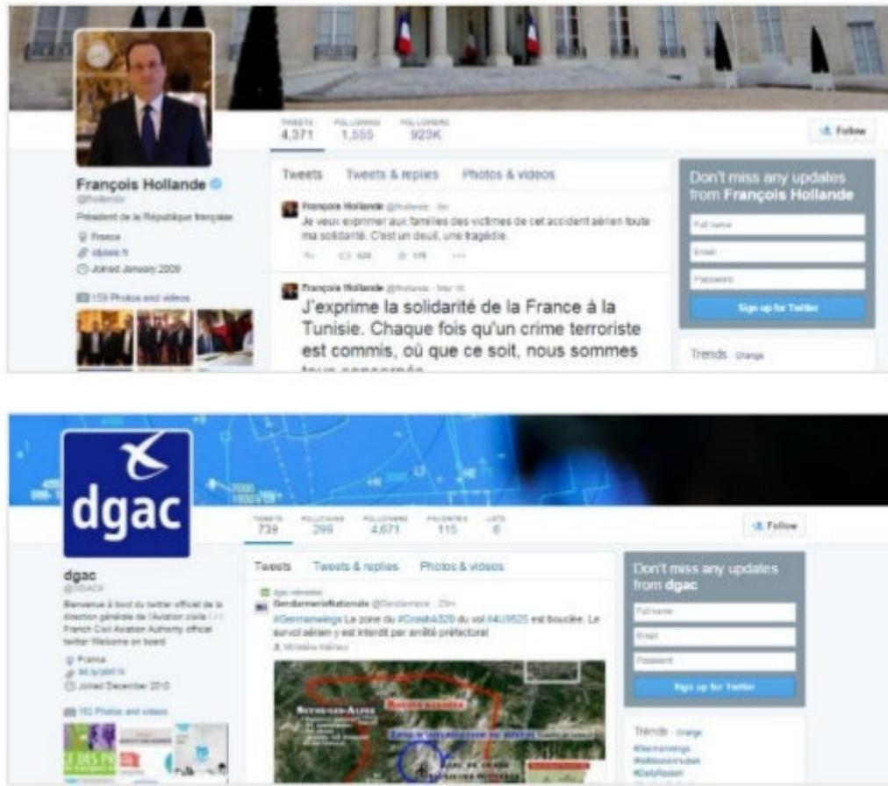

> **AI Description:**
> **Source:** `assets/_page_21_Figure_0.jpg`
> 
> **Generated:** 2026-05-31 23:14:24
> 
> ---
> 
> The image contains two Twitter profiles: one for François Hollande and one for the DGAC (Direction Générale de l'Aviation Civile). Both profiles display typical Twitter interface elements such as the number of tweets, followers, and following, as well as recent tweets. The Hollande profile shows two tweets expressing solidarity and condolences, while the DGAC profile includes a tweet about the crash of a Germanwings flight and a map indicating the crash site. The visual content includes profile pictures, tweet text, follower counts, and a map with red lines marking the crash site.


<span id="page-22-0"></span>
Notuntil the first helicopters had identifiedand reached the crashsitedid thestorybecomesignificantlymorevisualprovidingnewmomentumforsocialamplification.

Equallypowerful,however,havebeentheemergingimages relatedtothelossoftheGermanexchangestudents.

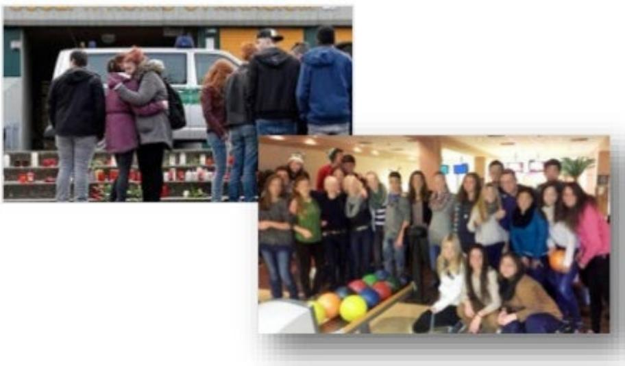

> **AI Description:**
> **Source:** `assets/_page_22_Figure_0.jpg`
> 
> **Generated:** 2026-05-31 23:09:23
> 
> ---
> 
> The image contains two photographs. The top photo shows a group of people standing in front of a white van, with some individuals appearing to be interacting or conversing. The bottom photo depicts a group of people gathered in what appears to be a bowling alley, with bowling balls visible and some individuals posing for the photo. The setting suggests a social or team-building event.


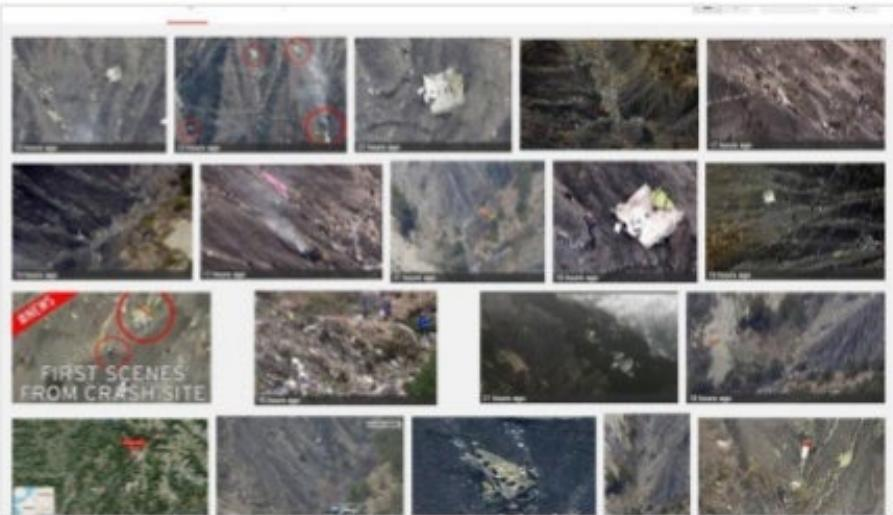

> **AI Description:**
> **Source:** `assets/_page_22_Figure_1.jpg`
> 
> **Generated:** 2026-05-31 23:09:46
> 
> ---
> 
> The image contains a series of photographs showing the aftermath of a crash site. The photographs depict various angles and sections of the crash site, with some areas circled in red, likely indicating specific points of interest or damage. The text "FIRST SCENES FROM CRASH SITE" is prominently displayed, suggesting that these images are the initial documentation of the crash site. The images appear to be taken from different perspectives, providing a comprehensive view of the site's layout and condition.


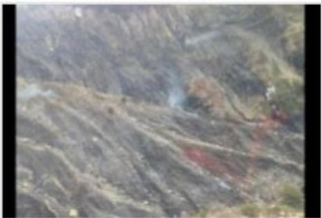

> **AI Description:**
> **Source:** `assets/_page_22_Figure_3.jpg`
> 
> **Generated:** 2026-05-31 23:08:58
> 
> ---
> 
> The image appears to be a photograph of a rugged, rocky landscape. There is a noticeable area with what looks like a small plume of smoke or dust rising from the ground, possibly indicating some form of activity or disturbance in the area. The terrain is uneven and covered with vegetation, suggesting a natural, possibly mountainous environment. The image quality is somewhat blurry, making it difficult to discern finer details.
