
## Contents

1 Welcome to Tsinghua   
Welcome Message 01   
About Tsinghua 02   
2 Before You Leave Home   
Important Documents 03   
Visa 03   
Physical Examination 05   
Converting Money 05   
What to Bring 06   
Accommodation 06   
3 Settling In   
Getting to Tsinghua 08   
Housing Arrangements 09   
University Registration 09   
Local Sim Card 09   
Bank Card 10   
Student IC Card 10   
Internet 11   
Student Email Account 12   
Physical Examination Authentication 12   
Orientation 12   
Additional Information 12

## Life at Tsinghua

Food and Drink 13   
Shopping 15   
Postal and Delivery Services 16   
Transportation 16   
Sports and Leisure 18   
Student Associations 19   
Important Dates and Holidays 20   
5 Academics and Related Resources   
Teaching Buildings and Self-Study Rooms 21   
Learning Chinese 21   
Libraries 22   
Important University Websites 22   
Center for Psychological Development 23   
Center for Student Learning and Development 23   
Career Development Center 24   
Center for Global Competence Development 24   
6 Health and Safety   
Hospitals 25   
Health Insurance 26   
Campus Safety Tips 27   
7 Beijing and Surrounds   
Climate 29   
Transportation 29   
Wudaokou and Surrounds 30   
Travel 30   
Beijing Life Web Resources 30   
8 Useful Information and Contacts   
Emergency Contacts 31   
On-Campus Important Contacts 31   
Of-Campus Important Contacts 31   
Campus Map 32   
International Students & Scholars Center 33

## Appendix

# Welcome Message

## Dear students,

Welcome to Tsinghua University.

Since its founding back in 1911, Tsinghua University has had a focus on internationalization, and was one of the first Chinese universities to admit international students. In 2019, over 4000 international students from 133 countries were enrolled at Tsinghua, who help promote cross-cultural exchange and create a more internationalized campus.

The International Students & Scholars Center (ISSC) supports and serves international students and scholars throughout their Tsinghua experience. The center is a hub of information and resources for the international community, including for immigration and visas, residency, university services, campus life and cultural activities. ISSC aims to foster an inspired and dynamic international community to help every international student and scholar thrive at Tsinghua. The ISSC staff are dedicated to ensuring that the international community is supported, nurtured and represented at Tsinghua.

This Guide has been created by ISSC to provide you with useful information both before and after your arrival at Tsinghua. I hope you will find it helpful.

I, together with my colleagues at OIA and ISSC, look forward to greeting you on our beautiful campus to begin your Tsinghua journey. I wish you all the best in the pursuit of your educational and personal goals.

Dr. Li Jinliang   
Dean of the Of ce of International Af airs   
Director of the International Students & Scholars Center   
Tsinghua University

133 countries

# About Tsinghua

Founded in 1911, Tsinghua University is a unique comprehensive university bridging China and the world, connecting ancient and modern society, and encompassing the arts and sciences. As one of China's most prestigious and influential universities, Tsinghua is committed to cultivating globally competent students who will thrive in today's world and become tomorrow's leaders. Through the pursuit of education and research at the highest level of excellence, Tsinghua is developing innovative solutions that will help solve pressing problems in China and the world.

The Tsinghua campus, renowned for its beauty and historical significance, is situated on the site of the former imperial gardens of the Qing Dynasty, and is surrounded by a number of historical sites in north-west Beijing.

Tsinghua offers its students a superior learning, teaching and research environment. Its research and teaching facilities include one main library, six subject libraries, over 300 public classrooms and more than 300 laboratories and research institutes.

Tsinghua is among the top research universities in the world. It has fostered many outstanding scholars, successful entrepreneurs, and distinguished statesmen widely esteemed at home and abroad. Outstanding alumni include Nobel Prize winners Yang Chen-ning and Lee Tsung-dao, statesmen such as President Xi Jinping, former President Hu Jintao, and former Premier Zhu Rongji.

In the latest global rankings, Tsinghua University ranked 1st in the US News Best Global Universities for Engineering and Computer Science (2020). It ranked 15th in the QS World University Rankings (2021) and 23nd in the THE World University Rankings (2020).

Student life at Tsinghua extends far beyond academic courses. Athletics, performing arts, a vast array of clubs and societies, and diverse social activities not only complement a student’s studies at Tsinghua, but also offer wonderful opportunities for friendship and learning.

## 1 Important Documents

Before arriving at the university, please prepare the following documents:

1. Admission Notice (original and photocopy)

2. Visa Application for Study in China (JW202/201 Form) (original and photocopy)

3. Passport (original and photocopy). If passport has been renewed after application, be prepared to show both the old and new passport upon registration at Tsinghua. It is recommended to bring 8 recently taken passport-style photos (2 inches, with a white background), which may be required for school administrative formalities.

According to related regulations, international students coming to study in China should apply for an X1 visa (for a study period of more than 180 days), or an X2 visa (for a study period of less than 180 days). Without the correct student visa, students will not be able to register at the university. Students holding an X1 visa should apply for a residence permit within 30 days after entering China.

## 2 Visa

International students coming to study in China should apply for a Chinese student visa at the Chinese Embassy

4. Students under 18 years old should provide a “China Guardian Certificate” (to be obtained once in China). Chinese name: 在华监护人公证书 .

5. Highest diploma and degree certificate (original copy)

6. Foreigner Physical Examination Form. For students who have not completed the examination form, they can go to the Beijing International Travel Healthcare Center - Haidian branch to complete the examination. Refer to the Physical Examination Authentication section on page 12 of this Guide.

\* Note: In addition to the above documents, other materials may be required for each individual depending on the degree or non-degree program. Refer to relevant notices received before entering the university.

or Consulate in their country of nationality or country of residence. Applying for a Chinese student visa requires supplying the original Admission Notice, valid passport, the Visa Application for Study in China (JW202/201 Form), and any additional documents requested by the Chinese Embassy or Consulate.

Contact information for Chinese Embassies and Consulates can be found through the website of the Chinese Ministry of Foreign Affairs: http: //www.fmprc.gov.cn/mfa\_eng/ wjb\_663304/zwjg\_665342/.

## Visa Application

According to Chinese law, it is not possible to apply for a visa or change visas by entering Mainland China using a visa-free entry. Do not use a visa-free entry to enter into China.

1. For students applying for a visa from outside of China, please carefully research visa types, and read the description below:

a. X1 Visa: The X1 visa generally permits only one entry, and students must register at the university within 30 days after entry in order to apply for the required residence permit, otherwise it constitutes illegal residence. Since the university does not accept students registering in advance of the scheduled date, and it usually takes 3-5 working days to prepare the residence permit application, it is suggested that international students holding an X1 visa should have at least one week remaining on their visa before its expiry date at the time of registration at the university.

b. X2 Visa: The number of entries and the duration of stay permitted per entry are both indicated on the X2 visa. Once international students on an X2 visa enter the country, they should keep in mind the permitted duration of their stay on their visa and must register at the university within the time limit specified.

\* Please note that entry into Mainland China from Hong Kong S.A.R., Macao S.A.R., or China Taiwan is considered as one entry.

2. Regarding visa collection: When picking up one’s passport containing the visa for China, please ensure that the Embassy or Consulate returns the original copy of the Admission Notice and the Visa Application for Study in China (JW202/201 Form). These are important and required documents for international students for their study, residence permit application and other procedures whilst in China.

## Passport Nationality Used at Registration

1. The nationality of the passport used by the international student when registering at the university should be consistent with the nationality listed when applying to study at the university, otherwise they will not be able to register.

2. For international students who have both foreign nationality and a residence identity from Hong Kong, Macao or China Taiwan, if they applied to the university under their foreign nationality they must not register at the university using travel documents for Hong Kong, Macao and China Taiwan (such as the Mainland Travel Permit for Hong Kong and Macao Residents and the Mainland Travel Permit for Taiwan Residents).

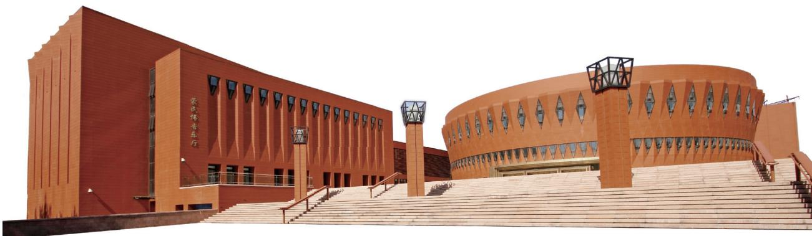

> **AI Description:**
> **Source:** `assets/_page_5_Figure_0.jpg`
> 
> **Generated:** 2026-05-31 23:40:49
> 
> ---
> 
> The image shows a modern architectural structure with a distinctive design. The building is primarily constructed of red brick and features a large, circular section with a unique facade of triangular cutouts. There are multiple staircases leading up to the building, and the structure includes several small, square-shaped skylights. The overall design suggests a blend of functionality and artistic expression, possibly a cultural or educational facility.

## Travel Planning

The university arranges specific registration dates for all international students to register at the university. Advance registration is not available. International students whose visa, stay permit or residence permit has expired or will expire in too short a time to go through the registration formalities will not be permitted to register at the university. Therefore, travel planning is essential. Please do not enter into China too early in advance before the designated university registration period to avoid the risk of the entry visa expiring before registration, which will lead to an inability to register at the university or other difficulties.

In addition, after registration, international students applying for a residence permit will be without their passport for approximately 3-4 weeks while it is being processed. International students holding an X2 visa, who after registration need to apply for an extension or increase of the number of entries on their visa, will be without their passport for approximately 3-4 weeks.

## Rejection of Admission Offer

If an international student decides to renounce their admission offer from the university, he or she can not use the documents issued by the university to apply for a visa, nor use that visa to enter China. According to Chinese government regulations, after the university registration period has concluded, the university will report all unregistered international students to the Division of Exit and Entry Administration of the Beijing Public Security Bureau.

If a student holds a visa to study in China but does not register at the university they have been admitted to, the visa may be cancelled and the individual will be penalized for making an illegal stay.

## Visa Breaches and Penalties

It is illegal to stay in China after a visa, stay permit or residence permit has expired. Those committing such an offense will be subject to a fine of 500 RMB per day and will face detainment or deportation.

## 3 Physical Examination

All international students must submit the completed Foreigner Physical Examination Form. Below are the two options for how the physical examination can be completed.

## 1.Complete the Foreigner Physical Examination in home country

The Foreigner Physical Examination Form is included in the admission package that will be sent to students in the mail prior to arrival at the university. The student can take the form to a hospital or clinic in their home country. The form should be written, signed and stamped by the doctor conducting the examination. The original form must then be brought to China (including the original blood test reports) and presented at the Beijing International Travel Healthcare Center - Haidian branch for authentication. The student will then receive a Physical Examination Report after authentication is approved. If the health documents provided do not meet the Beijing International Travel Healthcare Center’s standards, the student must redo the health examination at the Beijing International Travel Healthcare Center.

## 2.Complete the Foreigner Physical Examination after arrival in Beijing

After arriving in China, students can undergo the physical examination at the Beijing International Travel Healthcare Center - Haidian branch to obtain the Physical Examination Report. More information can be found by referring to the Physical Examination Authentication section, on page 12 of this Guide.

## 4 Converting Money

## Exchanging Foreign Currency

In China, only banks are authorized to provide legal exchange services of foreign currencies. Before trying to exchange foreign currency, check with bank service personnel whether the bank is able to provide the exchange service for the required foreign currency. Sometimes it is necessary to make an appointment in advance (usually one working day in advance). Non-Chinese citizens can exchange no more than 500 US dollars of foreign currency per day (for specific information, please consult the bank). Therefore, planning ahead is essential if a large amount of foreign currency is to be exchanged.

A valid passport is required to be presented at the bank when exchanging foreign currency. Be mindful that the exchange rate of different banks is different, and that the exchange rate fluctuates in real time throughout the day.

## Wire Transfers

As banks require several days to complete a wire transfer, it is recommended that students bring a sufficient amount of cash with them to China to pay for the first month's living expenses.

## Cash Withdrawal Limit

Banks impose a daily withdrawal limit on credit and debit cards. Students should confirm the daily limit of their personal credit card/debit card within China with their bank before departure.

## 5 What to Bring

For clothing, be aware of seasonal changes in Beijing’s weather. The spring and autumn seasons in Beijing are relatively short in duration. Refer to the Climate section on page 29 of this Guide for more details. For shoes, running shoes and sandals should be brought.

It is recommended that students bring often-used personal health and sanitary items such as cold and flu and stomach medicine, face towel, pillowcase, low power hair dryer and basic toiletries.

Bring any personal study items such as a laptop computer, and an electronic translation dictionary. Pens and other items can be bought at supermarkets on-campus.

Power plug adaptors: Bring both the three-prong type and two-prong type adaptors (Chinese power voltage is 220V).

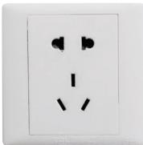

> **AI Description:**
> **Source:** `assets/_page_7_Figure_0.jpg`
> 
> **Generated:** 2026-05-31 23:35:26
> 
> ---
> 
> The image shows a standard electrical power outlet with two round pins and a grounding slot, commonly used in Australia. The outlet is white and has a rectangular shape with rounded corners. The design is simple and functional, intended for plugging in electrical devices.

## 6 Accommodation

Due to the limited amount of accommodation available on campus, students should reserve a dormitory in advance. For more information, please refer to the Instructions for Tsinghua University International Students Dormitory Room Booking Application System (included in the admission package). For those who could not reserve accommodation on-campus, they will need to make their own housing arrangements off campus. Students who will receive the Chinese Government Scholarship (full scholarship), or students who have been selected to live in the Asian Youth Center will automatically be reserved a room, and therefore do not need to reserve a room themselves.

## On-Campus Living

The Tsinghua University International Student Apartments are the Zijing Apartment Buildings 19-23, and the Asian Youth Exchange Center (Building 6). There are three different room arrangements: double rooms, single rooms and “AB” rooms (with separate bedrooms and a shared bathroom). Double rooms are 40 RMB per day and the single and “AB” rooms are 80 RMB per day.

The dormitories are each equipped with a desk, bed and closet. A mattress, quilt, pillow and bed linen are also provided. There are specific times for the use of hot water for showering in the dormitories, which are as follows: 7:00am - 2:00pm and 5:00pm - 12:00am each day. Each year, the air conditioning system for the buildings is turned on between June 1st and September 30th, and the heating system is turned on between November 15th and March 15th. Each building has its own public spaces for use by students, such as a study lounge, workshop space, multi-purpose room, light sports space (facilities vary from building to building). Also, apart from the AB rooms in building 20 that have a small room kitchen, all buildings have communal kitchens. Students need to use their own cooking utensils and supplies. All buildings are equipped with public washing machines, and some buildings also have dryers.

According to school regulations, the Zijing Apartment Buildings 19-23 are for international students. Friends or family members are allowed to visit, but they must first register at the reception desk on the ground floor of the building after presenting their valid ID document. Guests are not permitted to stay overnight, and can visit between the hours of 8:00am and 11:00pm.

Students residing in the dormitories must abide by the dormitory rules and regulations stipulated in the Tsinghua University Administrative Measures for International Student Dormitory Accommodation. The measures include that that smoking indoors and the use of cooking appliances in areas other than the common kitchens are prohibited in the apartment buildings, and that the following objects are prohibited for being used or stored in the apartments: electric vehicle batteries and chargers (including scooter batteries), immersion heaters, electric blankets, electric water heaters, electric heaters or open flames such as candles. In the event of illegal residence in the apartment, the charging of electric vehicle batteries, non-residents staying in the apartment overnight, or the use of prohibited electrical appliances of the causing of a fire, the student’s right to accommodation will be forfeit.

## Off-Campus Living

Due to the limited amount of on-campus accommodation, some students will need to find accommodation off campus. Students who do not have a dormitory room reserved on campus can choose to rent an apartment off campus. Before moving in to any off-campus accommodation, it should be checked whether the landlord can provide the documentation required for the issuing of a Registration Form of Temporary Residence ( 临时 住宿登记表 ).

There are many housing agencies located near the Tsinghua campus. Their services and prices offered should be compared in advance. Below are some factors to be aware of when looking for off-campus accommodation: 1. Choose a legal, reputable housing agency. Research

online or through the State Administration for Industry and Commerce ( 中国工商行政管理机关 ) for the credentials and qualifications of housing agents and inquire with friends or others about their experiences using housing agents in the area.

2. Do not simply trust the introduction given by the housing agent. Make sure to inspect the apartment room, its facilities and the surrounding area in person.

3. Check and verify the landlord’s credentials and property credentials, including whether the property has the right to be rented out. If signing a lease through a third-party agent, check the agency agreement and understand the agency’s terms and conditions and their right to sign the contract.

4. Carefully read through the conditions outlined in the rental contract and check whether the rights and obligations of the two parties are fair. Take note of whether the responsibility for a specific breach of contract is clearly defined and ensure that all commitments are written and signed off by the agent in the contract, not simply conveyed by spoken word.

5. Pay attention and check through the information provided in receipts given, including the deposit amount and rental fee, and keep safe official documents and payment receipts. Note that in Chinese, one should pay attention to the contract and invoices when the term “dingjin” is used, as there are two types of “dingjin” in Chinese. The first is “ 定金 ” (dìngjīn), which is a type of deposit/advance payment that you can get back should you choose to exit out of the contract, and the second is 订金 (dìngjīn), which is a type of deposit/advance payment that you cannot get back once paid.

6. Do not pay any deposit or make a payment until a full agreement is formally reached.

7. After signing the contract, go to the local police station to apply for the Registration Form of Temporary Residence. For more information, refer to the Accommodation Guide for International Students.

## On-Campus Hotels

Tsinghua Jiasuo Hotel ( 清华大学甲所 ) Contact number: 62793001, then transfer to the bookings department

Tsinghua Bingsuo Hotel ( 清华大学丙所 ) Contact number: 62793001, then transfer to the bookings department

Tsinghua Jinchunyuan Hotel ( 清华大学近春园 ) Contact number: 62793001, then transfer to the bookings department

## Off-Campus Hotels

Sun Home Fashion Hotel ( 三和概念酒店 )   
Address: 85 Shuangqing Street, Haidian District (海淀区双清路85号)   
Contact number: 62340038   
Beijing Wenjin Hotel ( 北京文津国际酒店 )   
Address: TUS Park, Haidian District ( 海淀区清华科技园 )   
Contact number: 62525566   
Website: http://www.wenjin.com.cn/

Beijing Holiday Inn ( 北京红杉假日酒店 ) Address: 89 Shuangqing Street, Haidian District (海淀区双清路89号) Contact number: 82398888

Beijing Lanting Hui Hotel ( 北京兰亭汇快捷酒店 ))   
Address: 35 Chengfu Street, Haidian District (海淀区成府路35号)   
Contact number: 62619296

## 1 Getting to Tsinghua

Beijing has two international airports. Both airports are located in different areas of Beijing. Some airlines only fly into only one of the two airports. Students can research in advance which airport is most suitable for their arrival and travel needs.

## Arriving at Beijing Capital International Airport

Taxi: For students coming to Beijing for the first time, it is more convenient to take a taxi from the airport to Tsinghua University. You can follow the airport's instructions and wait in line for a taxi. Regularly operated taxis have standardized markings and signs. In order to ensure personal safety, please do not take illegally operated "black taxis". The taxi fare from Capital International Airport to Tsinghua University should be about 150 RMB. Please tell the taxi driver that you want to go to the north-east gate of Tsinghua University, which in Chinese is “ 我要到清华大 学东北门的紫荆公寓 ”. After entering the north-east gate of Tsinghua University, please refer to the Campus Map in part 8 of this Guide. Remember to ask for your receipt from the taxi driver upon your arrival.

Subway/Rail: The Beijing Capital Airport offers an express train service, which is an affordable and reliable option for getting into the city. The express train has four stops: Terminal 2 and Terminal 3 at the airport, and Dongzhimen and Sanyuanqiao in downtown Beijing. The running time for the trains departing from Terminal 2 is 6:35am to 11:10pm daily. The running time for the train departing from Terminal 3 is 6:20am to 10:50pm daily. A one-way ticket costs 25 RMB. The quickest way is to Tsinghua is

to get off at Sanyuanqiao station, take subway line 10 to Zhichunlu ( 知春路 ) station and transfer to line 13. Take line 13 one stop to Wudaokou ( 五道口 ) station. Once at Wudaokou, go out through exit A and take bus 549 two stops to Dashiqiao ( 大石桥 ) which brings you to the northeast gate of Tsinghua University.

Airport bus: You can take the Zhongguancun route, which stops at the Tsinghua Science Park ( 清华科技园 ) . The one-way bus ticket costs roughly 30 RMB and starts service at 6:50am and concludes at 12:00am. After getting off at Tsinghua Science Park, take a taxi to the Tsinghua University north-east gate (approximately 15 RMB).

For more information, please refer to the official Beijing Capital Airport website: http://en.bcia.com.cn.

## Arriving at Beijing Daxing International Airport

Taxi: For students coming to Beijing for the first time, it is more convenient to take a taxi from the airport to Tsinghua University. Follow the airport signs to locate the taxi rank. Regularly operated taxis have standardized markings and signs. In order to ensure personal safety, please do not take illegally operated "black taxis". The fare from Daxing International Airport to Tsinghua University is about 250 RMB. Please tell the taxi driver that you want to go to the north-east gate of Tsinghua University, which in Chinese is “ 我要到清华大学东北门的紫荆公寓 ”. After entering the north-east gate of Tsinghua University, please refer to the Campus Map in part 8 of this Guide. Remember to ask for your receipt from the taxi driver upon your arrival.

Subway/Rail: The Daxing International Airport offers an express train service, which has the stops: Caoqiao, Daxing Xincheng and Daxing Airport on the Daxing Airport Line.

Its operating hours are from: 6:00-10:30pm, and a oneway fare is 35 yuan/person for regular class and 50 yuan/ person for business class. The quickest way is to Tsinghua is to take the Metro Daxing Airport Line to Caoqiao Statio where you can transfer to subway Line 10 and go to Zhichunlu ( 知春路 ) station. Then, transfer to Metro Line 13 and go one stop to Wudaokou ( 五道口 ) station. Once at Wudaokou, go out through exit A and take bus 549 two stops to Dashiqiao ( 大石桥 ) which brings you to the northeast gate of Tsinghua University

Airport bus: The airport also has various bus routes heading downtown.

For more information, please refer to the official website of Daxing International Airport https://www.bdia.com.cn/#/ .

Form of Temporary Residence and their passport. For detailed information and specific requirements for the processing of the Registration Form of Temporary Residence, students should check with their local police station.

If staying in a hotel, when checking-in, confirm with the reception desk whether they can provide a Registration Form of Temporary Residence.

## 3 University Registration

For specific details on the student registration process, refer to materials provided in the admission package.

## 2 Housing Arrangements

## On-Campus Housing: Dormitory Check-in

For students who have successfully reserved a dormitory, during the specified time they should bring their Admission Notice and valid passport to the Service Desk on the 1st floor of Zijing Apartment Building 19 ( 紫荆公寓 19 号楼 1 层总服务台 ) to check-in and obtain an Registration Form of Temporary Residence. Students should keep their payment receipts in a safe place as they will be needed to be shown when checking-out.

For detailed information on check-in times, please refer to the materials provided in the admission package.

## Off-Campus Housing: Obtaining a Registration Form of Temporary Residence

Students who live off-campus must, within 24 hours of arrival in China, take their passport and go with their landlord to register at their local police station where they will obtain an official paper slip titled: Registration Form of Temporary Residence ( 临时住宿登记表 ).

When a student’s visa type is changed/extended, or when the student re-enters China from a trip abroad, they must reregister at the police station and obtain a new Registration Form of Temporary Residence. In these cases, the student can reregister at the police station themselves, without the presence of their landlord, as long as they bring their current Registration

## Local Sim Card

There are currently three Chinese mobile service providers that have branches located on the Tsinghua University campus:

## China Mobile

Two branches: Located at C Building (C 楼 ) and at Zhaolanyuan ( 照澜院 )

## China Unicom

Two branches: Located at C Building (C 楼 ) and close to Teaching Building 5 ( 五教附近 )

## China Telecom

Two branches: Located at C Building (C 楼 ) and at Zhaolanyuan ( 照澜院 )

When purchasing a Chinese SIM card, students must bring along the following:

• Original passport

• RMB in cash

\* Notes:

• The national code for China is 86, and the Beijing telephone area code is 010.

• After purchasing a Chinese SIM card, students should memorize their new Mainland Chinese phone number.

• A Mainland Chinese mobile phone number is required in order to apply for a Chinese bank card.

## 5 Bank Card

After arriving at Tsinghua, new students must apply for a Bank of China bank account to obtain a bank card, which will then be linked to their student IC card. Once prepaid with money from the bank card, the student IC card can be used at canteens, libraries, computer labs, supermarkets, and to make other payments. Additionally, scholarship funds and other types of financial stipends, subsidies or reimbursements will be deposited via this bank card account.

In order to better settle-in and make use of their IC card payment functions, students are highly encouraged to apply for a Bank of China bank account as soon as possible. The Bank of China can be found on the Tsinghua campus, on the 1st floor of the Zijing Student Service Centre (C Building), approximately 300 meters west of the international student dormitories. During the registration period, Bank of China staff will be on-site to receive materials for the bank account application.

## 6 Student IC Card

Student IC cards serve as both student identification cards, as well as a form of electronic payment. IC cards can only be used by their original owner, and may not be transferred or borrowed by other people. IC cards can be used on campus to borrow library books, pay for food, enter the campus, use campus computer labs, pay for internet access, use the campus hospital, and sign-in for campus events and lectures.

## Obtaining a Student IC Card

New students can receive their ready-made student IC card directly from their school or department on the day of registration.

If issues arise with the student photograph and the student IC card is not ready for collection from their school or department, the student can obtain their IC card onsite during registration day by bringing their Admission Notice to the IC card photo-taking area in the Comprehensive Gymnasium to get their photo taken.

## Using the Student IC Card

## Password

The IC card’s initial pre-set password is the last six digits of the student’s passport number. Any non-digit numbers should be replaced by a “0”.

## Topping up/recharging the IC card

a. Using IC card self-service machines: Before being able to top up their IC card using these machines, students must have a Bank of China bank card, which has been applied for and linked to their IC card at the Bank of China branch in the Zijing Student Service Center (C Building).

Students can recharge their IC card at the IC card selfservice machines, known in Chinese as 圈存服务机 or 自助查询机 , by transferring money from their bank account to their IC card, known in Chinese as 圈存 .

b. Using Alipay: Students can open the Alipay app, click on Campus Life > Campus IC card ( 一卡通 ) to initiate the transfer. Then, students should bring the IC card to an IC card self-service machine (to either of these types of machines: 自助领款机 or 自助查询机 ) to complete the recharge.

## Replacing a lost IC card

If an IC card is lost or damaged, students can apply for a replacement card using a self-service machine ( 自助一体 机 ), or they can go to the Registration Center at C Building Room 201. Please note that these self-service machines machines are different from the two other types of machines previously mentioned.

The self-service machines are located at:

• Building 6, A area, lower floor entrance (六教A区零层入口)

• Student Registration Center, Room 102, C Building ( 紫荆学生公寓C楼102注册中心服务大厅）

\* For specific management regulations and usage, please refer to the “Campus IC Card User Guidebooks" , ( 校园 卡通使用手册 ), available on the http://its.tsinghua.edu. cn website, by clicking “Student Services Guidebooks” ( 学生服务指南 ) , then clicking the “Campus IC Card” ( 校 园一卡通栏目 ) section, and then click “User Guidebook” ( 使用指南 ), which will open to a page with the English guidebook linked, called: User’s Manual for Tunicard.

## Internet Services

The standard internet service provided for students is free, which includes a dynamic IPv4 address with a 50 GB data cap per month, a dynamic IPv6 address and free data, 5 maximum simultaneous Internet connections, and 1 email address. After exceeding 50 GB of data, the standard fee rate is 1 RMB per additional GB.

## Ways to top-up/recharge internet account

## 1. Online:

Students can recharge their internet account online by logging onto http://usereg.tsinghua.edu.cn. On the lefthand menu, click on “Self-Payment” ( 自助缴费 ). Students can then complete the payment with mobile payment (WeChat or Alipay). Note: If owing fees, log on and choose to access the on-campus route ( 校内访问 ) and then use WeChat pay to complete payment.

## 2. IC card self-service machines:

Students can recharge their internet account by logging into an IC card self-service machine, selecting the “Self-Service Payment” ( 自助缴费 ) option, and transferring money from their IC card to their internet account. These machines can be found across campus, including at the entrance of canteens, Teaching Building 6, libraries, the campus hospital and various laboratories.

## 3. On WeChat:

After connecting their student card to the Tsinghua University Official Information Services WeChat Platform ( 清华大学信息服务微信企业 ), students can go on to the “Internet Services” ( 网络服务 ) page to top up/recharge their internet account by using WeChat Pay.

Wechat account QR code for the Tsinghua University Information Services Platform

## 4. In-person:

Students can recharge their internet account in Room A128 of the Lee Shau Kee Science and Technology Building, ( 李兆基科技大楼 A128), Monday to Friday from 1:00pm - 4:00pm. Currently, only cash is accepted.

## Internet account set-up

After registering at Tsinghua, new international students will receive an envelope with details on how to activate their personal internet account from the International Students & Scholars Center. Students can then log into the identity authentication website (http://id.tsinghua.edu.cn) to activate their internet account. The website language can be changed to English via the button up the top right. Then follow the prompts to activate your account. For any issues, contact the Information Technology Service Center.

## Information Technology Service Center:

Address: Room A128, Lee Shau Kee Science and Technology Building ( 李兆基科技大楼 A128)

Opening hours: 8:00am – 12:00pm, 1:00pm– 5:00pm Contact number: 62784859/62771940

## Accessing the Internet

Once a student’s internet account has been successfully activated, the student may access the internet via LAN ports located in their dormitory room and/or wireless networks accessible throughout the entire campus (Wi-Fi network name: "Tsinghua" or any network name starting with "Tsinghua"). Once connected to the internet via a LAN port or wireless network, students should open their internet browser and log in to http://info.tsinghua.edu. cn, which will then display a pop-up screen prompting the user to login with their username and password. Note that students can browse Tsinghua university websites without using data; to do this, uncheck the "access to the network outside the school" ( 访问校外网络 ) button before clicking "connect to the network" ( 连接网络 ). When going offline, students should click “disconnect” to completely disconnect from the network to prevent unnecessary data consumption.

Students can log into http://usereg.tsinghua.edu.cn to manage their internet account (including to manually disconnect a separate device from the Internet, check their current internet balance, or view other account information) . Finally, students can directly download applications and manage Tsinghua Internet Services through http://usereg.tsinghua.edu.cn or http://its. tsinghua.edu.cn.

## Campus Computer Labs

All Tsinghua teaching staff and students can access campus computer labs, which are located near the north-west entrance of the Main Building (enter through the terrace). These computer labs are open every day from 8:00am to 10:00pm. The service phone for the computer lab is: 62782820.

## 8 Student Email Account

Once the student receives their personal Tsinghua student account name and password, they will be able to login to the Tsinghua email system (https://mails.tsinghua.edu.cn). Each student will be given a 10 GB personal Tsinghua University student email account (i.e.“studentaccountname@mails. tsinghua.edu.cn”).

## 2. If a physical examination has not been completed in the international student’s own country:

completed in the international student’s own country: Upon arriving in China, the student must present the original physical examination form (including the original blood test reports) to the Beijing International Travel Healthcare Center - Haidian branch, to have their health documents verified and approved. If the health documents provided do not meet the Beijing International Travel Healthcare Center’s standards, then the student must redo the health examination at the Beijing International Travel Healthcare Center.

The student can undergo the physical health examination and obtain the certified Physical Examination Report at the Beijing International Travel Healthcare Center - Haidian branch.

Beijing International Travel Healthcare Center - Haidianbranch, 北京国际旅行卫生保健中心 (海淀门诊部).

## 9 Physical Examination Authentication

Address: 10 De Zheng Road, Haidian District, Beijing (near the Xibeiwang Town People’s Government Office), 北京市海 淀区德政路10号（西北旺镇政府附近）.

International students who are admitted to Tsinghua must submit a certified Physical Examination Report.

\* Notes:

Public Transportation:

• By Bus: 333, 365, 570, 982

Before coming to China:

Physical examination times:

## 1. If the physical examination has already been

• By Subway: Line 4 > Line 16

Take subway line 4 from Yuanmingyuan ( 圆明园 ) station (near the west gate of the Tsinghua campus), and ride one stop to Xiyuan ( 西苑 ) station. At Xiyuan station, transfer to line 16 and ride three stops to Xibeiwang ( 西北旺 ) station. Go out exit B and walk east for approximately 700 meters.

Monday to Friday; 8:30am – 11:00am

• The physical examination requires fasting. Do not consume any food within 8 hours of the examination.

Fax: 58648744

• Students are requested to bring:   
Original passport   
Admission Notice or student IC card   
Two passport-style photographs (2 inches, photograph must be in color).

• Approximately 350 RMB in cash should be brought to pay for the cost of the physical examination.

## 10 Orientation

Orientation activities for new international students in the Fall Semester: Freshman orientation program (for undergraduates); welcome orientation events series (for graduate students); tours of the university campus, libraries and university history museum.

Orientation activities for new international students in the Spring Semester: Welcoming orientation assembly; tours of the university campus, libraries and university history museum.

\* For detailed information on when and where the orientation activities will be held, refer to the email notification sent before the beginning of the semester, and the arrival schedule received at the time of registration.

## Additional Information

## WeChat account

WeChat is an integral part of daily life in China. For communicating with friends, classmates, and learning about events and news, WeChat is a very useful social network platform. WeChat also has a wallet function where payments can be made by linking the WeChat account to one’s own Chinese bank account. After downloading the WeChat phone app and registering using one’s phone number, follow the steps to set up a WeChat account. Please note, do not add strangers as friends on WeChat.

## 1 Food and Drink

## Drinking Water

Tap water is not suitable for drinking in China. Large bottles of water can be purchased at the supermarket, or for convenience many people will opt to order water tanks, that can be replaced with a new tank once empty. These tanks sit on a dispenser base that when plugged in can also produce hot water. Before selecting, it is recommended to first become familiar with nearby water tank supply companies to learn of their basic prices. A single water tank should cost around 20 RMB and the deposit should be roughly 50 RMB. A water tank dispenser can be purchased for an additional fee. For students living on campus, inquiries or requests for help with ordering water tanks can be directed to student dormitory reception staff.

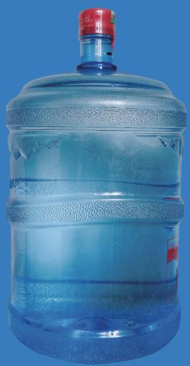

> **AI Description:**
> **Source:** `assets/_page_14_Figure_0.jpg`
> 
> **Generated:** 2026-05-31 23:34:48
> 
> ---
> 
> The image shows a large plastic water dispenser bottle. The bottle is transparent, allowing the blue liquid inside to be visible. It has a red cap on top and a handle on the side for easy carrying. The bottle appears to be a standard size for water dispensers, commonly used in offices or homes for refilling water dispensers.

## On-Campus Dining

Tsinghua has a large number of canteens that serve a wide variety of dishes and conform to a high level of food safety standards. Meals are provided for breakfast, lunch and dinner.

Canteen Name

Opening Hours

Guanchou Yuan 6:30am – 9:00am, 11:00am – 1:00pm, ( 观畴园 ) 5:00pm – 7:00pm

Taoli Yuan( 桃李园 )

6:30am – 9:00am, 11:00am – 1:00pm,   
5:00pm – 10:30pm (for late dinners)

Zijing Yuan( 紫荆园 )

6:30am – 9:00am, 11:00am – 1:00pm,   
5:00pm – 7:00pm

Tingtao Yuan ( 听涛园 )

6:30am – 9:00am, 11:00am – 1:00pm,   
5:00pm – 7:00pm

Dingxiang Yuan 6:30am – 9:00am, 11:00am – 1:00pm, ( 丁香园 ) 5:00pm – 7:00pm

Qingfen Yuan( 清芬园 )

6:30am – 9:00am, 11:00am – 1:00pm,   
5:00pm – 7:00pm

Yushu Yuan ( 玉树园 )

6:40am – 8:30am, 11:00am – 1:30pm,   
5:00pm – 8:30pm

Zhilan Yuan( 芝兰园 )

11:00am – 1:00pm, 5:00pm – 8:00pm

University campus canteen management contact number: 62782142

The 1st floor of Yushu Yuan and the 3rd floors of Guanchou Yuan, Taoli Yuan and Xichun Yuan all offer restaurant-style table service.

## On-Campus Coffee Shops

Tsinghua University has a variety of coffee shops across the campus, including nearby canteens and inside the libraries. Below are some of the available coffee shops.

# Setting-up, Activating, Re-charging and Replacing Canteen Cards

Student IC cards are the method of payment accepted at campus canteens (apart from at restaurant-style dining areas where cash can be used). For information on how to recharge student IC cards, refer to the Student IC Card section on page 10 of this Guide. Normally, most canteens will have a re-charge machine just inside the canteen entrance.

The re-charge and payment system for non-degree program students is different; please consult with one’s academic program officer for specific information.

## Off-Campus Dining

In the nearby Wudaokou area there is a wide variety of restaurants and cuisines available including Western, Korean, Japanese, along with different Chinese cuisines. Fast food chains such as McDonalds, KFC, Pizza Hut and Yoshinoya are also available.

When eating out, pay attention to food safety. Before dining out in China, many people first check reviews of restaurants by using the website Dazhong Dianping ( 大众 点评 ): http://www.dianping.com, which also has a mobile app version. Dazhong Dianping provides a vast array of reviews and information, including for dining, shopping, leisure and entertainment.

## Food Delivery

Many restaurants offer delivery services, which can be used via third party apps or by calling the restaurant directly. Food ordered on food delivery apps can be paid for using WeChat, Alipay or via bank card. Most apps require advance mobile payment before the food is delivered. During peak hours, food should be ordered in advance to avoid delay. The standard wait-time for deliveries is between 30 minutes and 1 hour. When the food delivery has arrived, the delivery worker will call the mobile number that was provided when the order was made.

## 2 Shopping

## On-Campus Supermarkets and Markets

Tsinghua University has many useful amenities available on campus. There are four supermarkets, which stock all essential items. Payment at these supermarkets can be made through cash, WeChat, Alipay, or student IC card.

There are three markets on campus that provide fresh produce and meats.

## Zijing Student Service Center (C Building)

Known as C Building for its shape resembling the letter C, the Zijing Student Service Center is located beside the Zijing Sports Field, in the heart of the student dormitories area of campus. C Building offers a central location for various shops and services, including a supermarket, hairdresser, post office, bank, ATM, bookshop, photo shop, optical services shop, computer repair shop, souvenir shop, printer shop, phone shop, student card top-up machine and student registration services.

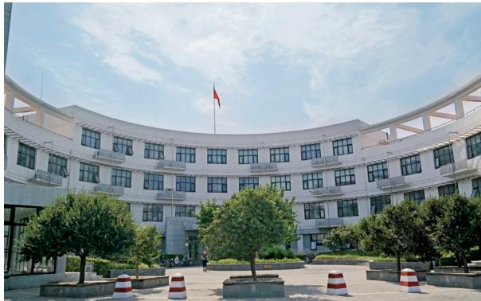

> **AI Description:**
> **Source:** `assets/_page_16_Figure_0.jpg`
> 
> **Generated:** 2026-05-31 23:40:22
> 
> ---
> 
> The image is a photograph of a building with a circular design, featuring multiple levels of windows. The building appears to be a government or institutional structure, as indicated by the flagpole with a flag at the top. The courtyard in front of the building is landscaped with trees and has traffic cones placed around the perimeter. The sky is partly cloudy, suggesting a daytime scene.

## Other On-Campus Service Shops

## Pharmacy/drugstore

Tong Ren Tang pharmacy is located opposite to the Zhaolanyuan Market. The pharmacy supplies both Chinese and Western medicine.

## Photography studio

There are several photo studios located on campus. One is located in C Building, one in the Zhaolanyuan area, and another is in the shop area to the east of Guanchou Yuan canteen. They provide photo printing and other photography related services.

## Optical services

There are optometrists located on the 1st floor of C Building, at Zhaolanyuan, and also in the shop area to the east of Guanchou Yuan canteen.

## Electronic repairs shop

In the basement of C Building there is an electronics repair and servicing shop.

## Watch repairs shop

A watch servicing and battery changing shop is located beside the Zhaolanyuan Market.

## Stationery shops

There are many stationery shops on campus, which provide almost all of one’s stationery needs. One is located in Tmall campus store in the basement of C Building; another is at the shop area to the east of Guanchou Yuan canteen. Here, they also sell electronics and exercise gear.

## Printing shops

Printing on campus is very convenient. Libraries have printing machines, and some teaching buildings and departments also offer printing services, along with more than ten separate printing shops on campus.

## Wenyuhao Qinglan Yuan Printing Express Center

Opening hours: Monday to Sunday, 8:00am – 12:00am Located at Zhaolanyuan, area one, next to the Kodak photo studio

Other printing shops on campus are located at the shopping area to the east of Guanchou Yuan canteen, C Building, south section of Building 7, south section of Building 25 and Zijing Buildings 1, 4, 6, 8, 10 and 12.

Nearby campus there are three large supermarkets:

## Off-Campus Supermarkets Online Shopping

Online shopping is very convenient and efficient in China. Payment can be made using Alipay or a Chinese bank card (when applying for a bank card, ask for the option of online purchases to be allowed). Some businesses will also accept payment upon delivery. When making purchases online by using Alipay or a bank card, be very mindful of one’s personal information and privacy.

## C Building China Post branch

Operating hours: Monday to Sunday, 9:00am – 4:30pm \* Note that this branch cannot send overseas parcels.

## DHL Express delivery

DHL Express delivery point: 1st Floor, Zijing Apartment Building 9

## General Deliveries Service Station

There is a general delivery service point located in the northern part of the campus behind Zijing Apartment Building 14. For students, all deliveries made to an oncampus dormitory address will be sent to this site, where parcels and packages can be collected. Parcels can also be sent from the service station.

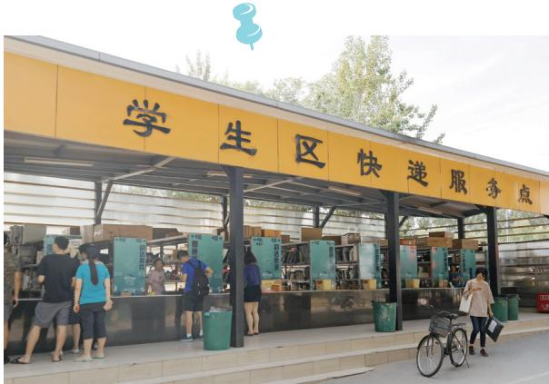

> **AI Description:**
> **Source:** `assets/_page_17_Figure_0.jpg`
> 
> **Generated:** 2026-05-31 23:40:59
> 
> ---
> 
> The image contains a photograph of a student zone with a sign that reads "学生区快递服务点" (Student Zone Express Service Point). The photo shows a row of lockers and a few people standing in front of the lockers, seemingly interacting with the service. The setting appears to be outdoors, with trees visible in the background. The image provides a clear view of the service point and its immediate surroundings.

## 3 Postal and Delivery Services

Letters sent to on-campus addresses should be written in the following format:

To: XXX (Recipient’s name)

Room xx, Zi Jing Building ##

Tsinghua University, Haidian District, Beijing P.R. China 100084

## Post office (China Post)

Zhaolanyuan area (south of the old university gate) Opening hours: Monday to Sunday, 8:30am – 5:30pm

\* For sending parcels overseas, a passport must first be shown at the service counter.

## 4 Transportation

## Campus Shuttle Bus

The campus has an electric powered shuttle bus service. The shuttle buses are all purple in color and stop along the road when hailed. The buses operate along different routes, including the following:

## Outer route operating times:

Monday to Friday, 7:20am – 6:00pm

Weekends and holidays, 8:30am – 5:30pm Notices will inform of the specific summer and winter vacation operating times.

Method of operation: Leaves from the West gate. Runs both clockwise and anticlockwise along the route. Buses depart approximately every 20 minutes in the same direction (every 10 minutes in alternating directions). On weekdays, the 7:20am, 7:30am, and 7:40am shuttles go in the direction of the north gate, the 7:50am shuttle passes by the Lanqiying north gate. The 6:00pm shuttle goes in the direction of the Main gate. At other times, every hour at 10, 30 and 50 minutes past the hour to shuttle goes in the direction of the Main gate, and every 20 and 40 minutes past the hour it goes in the direction of the north gate.

Route stops: West Gate – Outdoor Swimming Pool – Information Center – Elderly Activity Center – Kindergarten – Lee Shau Kee Science and Technology Building – Main Gate – Academy of Arts and Design – Gymnasium – Natatorium – Zijing Sports Field – Zijing Apartment Building 17 – North Gate – Mochtar Riady Library – North-west Gate - University Hospital - Outdoor Swimming Pool - West Gate

## Inner route operating times:

Monday to Friday, 7:40am – 11.10am, 12:40pm - 5:25pm Not in operation on weekends and holidays. Notices will inform of the specific summer and winter vacation operating times.

## Method of operation:

Leaves from the West gate. Buses depart approximately every 30 minutes in the same direction (every 15 minutes in alternating directions). On weekdays the shuttle leaves at 10 and 40 minutes past the hour in the direction of the campus hospital; at 25 and 55 minutes past the hour the shuttle leaves in the direction of the Main Building.

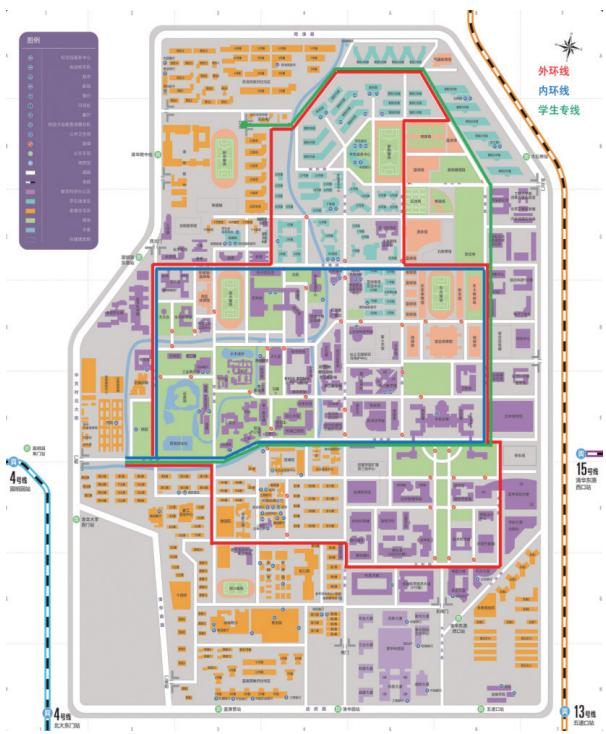

> **AI Description:**
> **Source:** `assets/_page_18_Figure_0.jpg`
> 
> **Generated:** 2026-05-31 23:38:32
> 
> ---
> 
> The image is a detailed campus map with various colored zones and labeled paths. It includes a legend on the left side indicating different types of buildings and facilities. The map is divided into sections with red, green, and blue lines marking different routes or zones. The map also includes labels for specific locations and pathways, such as "外环线" (Outer Ring Line), "内环线" (Inner Ring Line), and "学生专线" (Student Special Line). The map is oriented with a compass at the top right corner, and there are also references to subway lines (4号线 and 13号线) on the left side.

Route map: Blue line - Inner Route Red Line - Outer Route Green Line: Student Route

## Route stops (clockwise):

West Gate – Outdoor Swimming Pool – Campus Hospital - Lee Shau Kee Science and Technology Building - Mochtar Riady Library – No. 10 Canteen – Natatorium – Main Building - New Tsinghua Xuetang – Old Gate - Information Center - Outdoor Swimming Pool - West Gate

## Route stops (anticlockwise):

West Gate – Outdoor Swimming Pool - Information Center – Old Gate – New Tsinghua Xuetang – Main Building – Natatorium - No. 10 Canteen - Mochtar Riady Library – Campus Hospital – West Gate

## Student route operating times:

Monday to Friday; 7:40am, 9:20am, 1:00pm, and 2:50pm. Not in operation on weekends, public holidays or summer and winter vacations.

## Method of operation:

The words “student route” ( 学生专线 ) are displayed on the bus. The route begins at the north gate and covers the Zijing Apartment Buildings area, then travels towards the Main Building and finishes at the west gate.

Download the “Tsinghua Campus Bus” ( 清华校园巴士 ) mobile APP by scanning the below QR code or scan the “Tsinghua Campus Bus” ( 清华校园巴士 ) applet code below to check the departure status of each shuttle route.

Tsinghua Campus Bus App QR Code

Tsinghua Campus Bus Applet QR Code

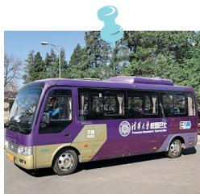

> **AI Description:**
> **Source:** `assets/_page_18_Figure_3.jpg`
> 
> **Generated:** 2026-05-31 23:38:17
> 
> ---
> 
> The image contains a photograph of a purple and gold bus. The bus has text on its side, which appears to be related to a university or institution, though the specific details of the text are not fully legible in the image. The bus is parked on a paved road with trees and a clear sky in the background. The image does not contain any charts, graphs, or other visual elements beyond the bus and its surroundings.

## Electric Vehicles

Some students choose to purchase electric vehicles (including scooters) to get around campus. However, in recent years several accidents have occurred on campus with the batteries of electric vehicles setting alight whilst charging and causing injuries, life threatening situations and damage to property. No matter the brand and quality, no electric vehicle battery can be considered completely safe. In order to maintain the safety of students and their property, and uphold a safe living environment for all, Tsinghua University prohibits students from bringing electric vehicle batteries indoors to be charged, including in student dormitories, teaching buildings, laboratories and activity centers. Therefore, to promote campus safety, it is recommended that students do not buy or use electric vehicles on campus, and abide by the regulations in place.

## Bicycles

Most Tsinghua students get around campus using bicycles. A new bicycle costs roughly 200–500 RMB, with the price depending on the type and quality of the bicycle. Many students opt to purchase second hand bicycles on campus, which usually cost no more than 150 RMB. There are many small bicycle repair shops located on campus, with free tire pumping and seat adjustment services.

## Bike Sharing

Share bikes are a very popular and affordable mode of transport in Beijing, and can also be found on campus. To start using a share bike, download the company’s mobile app by scanning the QR code on the bike using a phone. After registering on the share bike company’s app and paying a deposit, the bikes can be unlocked and used. When non-Chinese citizens register, they will need to provide their passport information.

## 5 Sports and Leisure

## Sports and Fitness

Tsinghua has a long sporting tradition and encourages students to regularly participate in sporting activities. The campus is fully equipped with many different sports facilities, and has more than 10 sports grounds open to students, and 6 courts with lights for evening use.

## Swimming Pool

The Tsinghua University swimming pool was the training pool for the 2008 Olympics and Paralympics. It was also the venue for the 21st International University Sports Federation Competition. The complex is equipped with a swimming pool, diving area and dry land diving training area. The 50-meter long swimming pool is divided into shallow and deep water areas. The shallow water depth is between 1.2 and 1.4 meters, and the deep water depth is between 2.2 and 2.4 meters.

Location: South side of Zijing Apartment Buildings area Opening hours:

Monday to Friday; 12:00pm – 1:00pm, 5:30pm – 6:30pm, 8:00pm – 9:00pm, 9:30pm – 10:30pm

Weekends; 12:00pm – 1:30pm, 2:00pm – 3:30pm, 5:00pm – 6:30pm, 8:00pm – 9:00pm, 9:30pm – 10:30pm

How to buy tickets: At the swimming pool entrance Ticket price for students: 7 RMB/hour

## Comprehensive Gymnasium

The Comprehensive Gymnasium is a venue integrating sports competition, training, teaching, meetings and

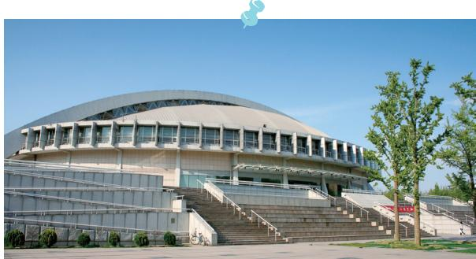

> **AI Description:**
> **Source:** `assets/_page_19_Figure_0.jpg`
> 
> **Generated:** 2026-05-31 23:38:10
> 
> ---
> 
> The image shows a large, modern building with a curved roof, likely a sports arena or stadium. The structure has multiple levels with a series of steps leading up to the main entrance. There are trees and greenery in the foreground, and the sky is clear and blue, suggesting a sunny day. The building appears to be well-maintained and is situated in an open area.

performances. The venue space for sports competitions is 55 meters by 35 meters.

Location: South side of the East Sports Ground (behind the Main Building)

## Opening hours:

Badminton and basketball courts

Monday to Friday; 5:00pm – 10:00pm

Weekends; 8:00am – 10:00pm

Fitness Center

Monday to Sunday; 9:00am – 10:00pm

How to book: Online, http://50.tsinghua.edu.cn

Ticket price for students: Badminton; 20 RMB per court/hour Fitness Center; 600 RMB for half-year membership, 900 RMB for annual membership

## Inflatable Sports Dome

The Inflatable Sports Dome was built in March 2010, and was the first of its kind to be built at a Chinese university. The dome combines smart technology with environmentally friendly design. It consists of 12 badminton courts, 9 table tennis tables and a high quality plastic-coated court and specialty lighting.

Location: East side of the Zijing Apartment Buildings area

Opening hours: 8:00am – 10:00pm

How to book: Online, http://50.tsinghua.edu.cn

Ticket prices: Badminton; 20 RMB per court/hour Table Tennis; 10 RMB per table/hour

## West Gymnasium

The West Gymnasium was the first gym to be built in Tsinghua and is one of the first four main buildings of the university. The gymnasium is divided into the former hall and the latter hall. The former hall was completed in March 1919, with a total area of 2,170 square meters. In 1932, the rear hall was expanded, with an area of 2,708 square meters. It has badminton courts, billiards and a basketball court.

Location: West side of the West Sports Field

Opening hours: 6:30pm – 10:30pm

How to book: Online, http://50.tsinghua.edu.cn

Ticket prices: Billiards; 15 RMB per court/hour Badminton; 20 RMB per court/hour

## Performing Arts and Films

In recent years, Tsinghua has placed an increasing emphasis on the performing arts. With the completion of the New Tsinghua Xuetang and the installation of video equipment in the auditorium, teachers and students can enjoy a wide variety of performances and films on campus.

Most performances and movies shown at Tsinghua provide discount tickets for students, thus tickets tend to sell out quickly. Therefore, it is recommended that students line up as soon as possible to purchase tickets. To stay up to date regarding upcoming performances and movies, pay attention to the exhibition boards displayed in front of the New Tsinghua Xuetang and along the main roads in the university, or visit: http://www.hall.tsinghua.edu.cn/.

On-campus performances and films are usually shown in the Auditorium and the New Tsinghua Xuetang. Tickets can be purchased at the ticket office of the New Tsinghua Xuetang. The details are as follows:

Ticket office opening times: 9:00am – 7:00pm (closed on Tuesdays)

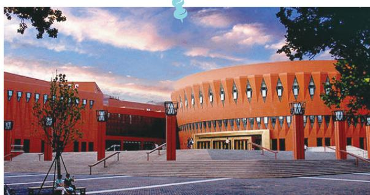

> **AI Description:**
> **Source:** `assets/_page_20_Figure_0.jpg`
> 
> **Generated:** 2026-05-31 23:40:32
> 
> ---
> 
> The image depicts a modern architectural structure with a distinctive design. The building features a combination of red and orange hues, with a unique pattern of windows and a large, open plaza in front. The architecture includes a series of steps leading up to the entrance, flanked by railings. The sky is partly cloudy, suggesting a daytime scene. The overall design appears to be contemporary and possibly part of an educational or institutional facility.

New Tsinghua Xuetang Ticket Office location: South-east side of the New Tsinghua Xuetang, by the west side of the Main Building.

Contact number: 62781984

\* Note: The 60 RMB and below priced tickets are for students. A maximum of two tickets can be purchased using one student IC card.

## Tsinghua University Art Museum

The Tsinghua University Art Museum was officially opened in September 2016, and holds more than 13,000 pieces, most of which have come from the collection of the Academy of Arts & Design collection post-1956, as well as donations from alumni and individuals. The collection includes six main categories of art: painting and calligraphy, embroidery, porcelain, furniture, bronze ware and comprehensive artwork. It is located on the south-east side of campus.

Opening hours:

Tuesday to Sunday, 9:00am – 5:00pm (last entry at 4:30pm)

Closed on Mondays (except official holidays), and for the 11 days after Chinese New Year’s Eve.

Contact number: 62781012

Website: http://www.artmuseum.tsinghua.edu.cn

## Tsinghua University History Museum

The Tsinghua University History Museum displays many precious historical materials, such as student registration record cards, transcripts, exam answer sheets, experiment reports, and teaching materials from famous alumni including Cao Yu, Yang Zhenning, Li Zhengdao, Qian Xuesen, Qian Weichang, and Qian Sanqiang. It is located by the New Tsinghua Xuetang.

Opening hours:

Tuesdays and Thursdays, 8:30am – 4:30pm

Contact number: 62782289

Website: http://xsg.tsinghua.edu.cn

## 6 Student Associations

Student associations serve as important “second classrooms” for cultivating students' hobbies and all-round growth. Student associations provide a space for students to continue their personal development, expand their horizons and make friends. For international students, joining student association activities can help them greater integrate into their new environment and enjoy a more enriching campus life.

At present, Tsinghua University has more than 270 student associations, covering many areas including culture, arts, sports, science and innovation, and public welfare. Tsinghua University's Student Associations Fair for recruiting new members is held every March and October in front of the Zijing Student Service Center (C Building).

More information can be found through the following website: http://shetuan.student.tsinghua.edu.cn, or contact the Student Associations Department directly for further information:

Student Associations Department office

Opening hours: Monday to Friday, 1:00pm - 2:00pm

Address: Room 307, Zijing Student Service Center (C Building)

Contact number: 62772347

Email: shetuan@mail.tsinghua.edu.cn

Currently registered national and regional associations include:

## 7 Important Dates and Holidays

Important national holidays:

\- New Year’s Day (January 1st)

\- Spring Festival (the first day of the first month of the Chinese lunar calendar)

\- Tomb-Sweeping Festival (around April 5th)

\- Labor Day (May 1st)

\- Youth Day (May 4th)

\- Dragon Boat Festival (the fifth day of the fifth month of the Chinese lunar calendar)

\- Armed Forces Day (August 1st)

\- Mid-Autumn Festival (the fifteenth day of the eighth month of the Chinese lunar calendar)

\- National day of the People's Republic of China (October 1st)

Important Tsinghua University holidays and events:

\- Tsinghua University Anniversary Celebration (the last Sunday in April)

\- Student Associations Fair (every March and October)

\- Campus Marathon (every April)

\- Campus Singing Competitions (every April and December)

\- Graduation Music Festival (every June)

\- Graduation Running Race (every June)

\- Sports Night (every June)

\- International Culture Festival (every Spring semester)

\- Entrepreneurship Competition (every December)

\- International Students & Scholars’ Gala Night (every December)

1 Teaching Buildings and Self-Study Rooms

The main teaching buildings on campus are found at: 1.The old gate area: Teaching Building 1, Teaching Building 2, West Lecture Theater, Tsinghua Xuetang, New Water Conservation Building.

2. The central area: Teaching Buildings 3, 4, 5, 6, and the Old Economic Management Lecture Hall, Leo Koguan Building.

3. The east gate area: Mingli Building, Weilun Building, Yifu Science and Technology Building, Main Building Lecture Hall, Jianguan Lecture Hall, East Lecture Theater.

The purpose of the teaching buildings is not only for holding classes, but also for self-study. The teaching buildings’ opening hours are from 7:30am to 10:30pm (Tsinghua Xuetang is open until 11:00pm). To find out when classes are being held in specific classrooms, go to the Tsinghua University Information Service WeChat Account ( 清华大学信息服务微信企业号 ), then click “Teaching and Educational Affairs” ( 教学与教务 ) and click “Public Information” ( 公共信息 ) on the bottom tab, and finally click “Classroom Information” ( 教室信息 ). The purple dots indicate an occupied classroom and the “1, 2, 3, 4, 5, 6” indicates the class period. A full class schedule for each teaching block can be found at the entrance of the 1st floor of the building or a class schedule may be found posted on the door of the classroom.

The teaching buildings have 21 group seminar rooms, located in: Tsinghua Xuetang (4 rooms), Teaching Building 6 (3 rooms), Leo Koguan Building basement (2 rooms),

and Teaching Building 4 (12 rooms). The rooms are all equipped with seminar tables and chairs, a whiteboard and a multi-purpose power supply, and some seminar rooms have a TV (with projector) and a glass writing wall. Students wishing to use the rooms can reserve them by scanning the QR code or logging on to the "my home" (http://myhome.tsinghua.edu.cn) website. International students who do not have the “my home” account can make an appointment to use the seminar rooms by phone: Tsinghua Xuetang - 62788488, Teaching Building 6 - 62796588, Leo Koguan Building - 62787880, Teaching Building 4 - 62783268.

Wechat account QR code for the Tsinghua University Information Service Platform “My home” seminar room reservation system

2 Learning Chinese

Having a good grasp of the Chinese language is very beneficial for all daily aspects of life in China as an international student.

Learning Chinese on-campus:   
Unless already undertaking the Chinese language   
learning program at Tsinghua, there are options available to take Chinese language and culture courses. For   
more information, refer to the website of the Tsinghua University Language Center for details on class availability and selection.

Website: https://adm.iclcc.tsinghua.edu.cn/

## Learning Chinese off-campus:

There are also various Chinese language schools in the nearby area that offer classes or individual lessons from beginner to advanced levels.

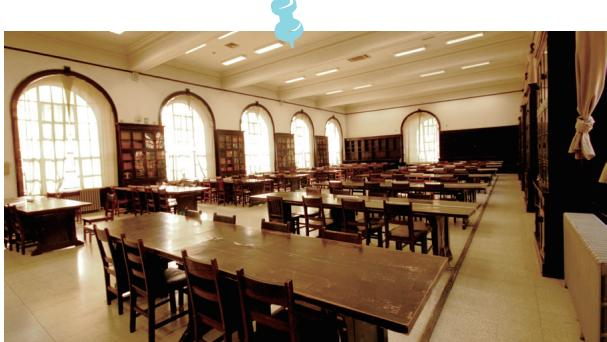

> **AI Description:**
> **Source:** `assets/_page_23_Figure_0.jpg`
> 
> **Generated:** 2026-05-31 23:34:39
> 
> ---
> 
> The image depicts a spacious library or reading room with rows of wooden tables and chairs arranged for study or reading. Large arched windows allow natural light to fill the room, and bookshelves line the walls, indicating a space designed for academic or research activities. The overall atmosphere is quiet and conducive to concentration.

## 3 Libraries

Tsinghua University has many libraries, including general libraries and six specialized libraries. The general libraries include the Old Library, the Yifu Library and the Mochtar Riady Library (North Building). All students may enter freely and borrow books from these libraries with their student IC card.

The six specialized libraries are the Management Library, the Architecture Library, the Law Library, the Humanities Library, the Fine Arts Library and the Finance Library. These libraries focus on providing books related to different disciplines and are mainly intended to be used by students studying the related discipline.

Among these specialized libraries, the Humanities Library and the Finance Library have no restrictions regarding the amount of books that may be borrowed. For all other specialized libraries – the Management Library, the Law Library, the Architecture Library and the Fine Arts Library – students that do not belong to the related department may not borrow out more than two books at one time.

To search for a particular subject, book or material, go to the main library website (http://www.lib.tsinghua.edu.cn) and click the “Shuimu Search” ( 水木搜索 ) feature on the top left to find information on relevant resources.

The library offers various study spaces and rooms, totaling approximately 4,200 seats. There are both private study rooms and group discussion rooms. All are available for free online booking through the library’s homepage: http:// www.lib.tsinghua.edu.cn, then click the option to “apply for services” ( 服务申请 ) on the top right hand corner, and then click “study room booking” ( 研读间 / 研讨间预约申请 ) from the options listed.

Undergraduate, graduate, exchange students and Chinese language program students can all borrow books from the library. When borrowing books, care should be taken not to damage or lose books; otherwise compensation must be paid in accordance with the library’s regulations.

For more information, check the Library Guide for International Students via this link: http://lib.tsinghua.edu. cn/tutorial/newstudents/images/lovethelibrary.pdf.

## 4 Important University Websites

Tsinghua University Information Portal: http://info.tsinghua.edu.cn/

The Tsinghua University Information Portal gathers many campus resources into one place to provide an information platform for the university’s teachers, students and alumni. Announcements and personal information that relates to teaching, research, study and life can be found on this website.

Tsinghua University Academic Portal: http://academic.tsinghua.edu.cn/

This website provides users with services related to academics, such as course introductions, and allows the user to reserve and select courses. Users can also browse academic regulations and processes, as well download upto-date forms that they may require.

Student Courses Platform: http://learn.tsinghua.edu.cn/

After logging into their student account, users can access information such as teaching materials and homework for their courses.

Tsinghua University Information User Service Platform: http://its.tsinghua.edu.cn/

This website provides a user guide to the main campus websites. After logging into their student account, users may also download for free up-to-date computer software, such as operations systems, anti-virus software, office software, development software, and calculations software.

Tsinghua University Campus Network: http://usereg.tsinghua.edu.cn/

After logging into their student account, users may manage their account by changing their password and buying more internet data. They may also check information such as personal browsing details and online status.

Tsinghua University Email: http://mails.tsinghua.edu.cn/

After logging in using their campus account, users may send and receive emails using this website.

Tsinghua University Cloud Drive: https://cloud.tsinghua.edu.cn/

An online service that provides students with data storage, synchronization, management and sharing functions for work and study purposes. Through a personal account, it provides 300G of cloud storage space for every student and faculty member during their time at Tsinghua.

Tsinghua University Library: http://eng.lib.tsinghua.edu.cn/

This website provides library-related services for students. On this website, students may apply to use book-borrowing services, inquire about library collections and browse the electronic library.

Tsinghua University Office of International Education: http://goglobal.tsinghua.edu.cn/

An online platform that provides information on international education opportunities and resources for global competence development.

Tsinghua University International Students & Scholars Center: http://is.tsinghua.edu.cn/

This website provides international students and scholars with important information on campus life and study, including visas, accommodation, insurance and careers and employment. It also includes information on materials needed for international students in preparation of coming to China.

# 5 Center for Psychological Development

The Center for Psychological Development (CPD) caters to the psychological well-being of students by assisting them with difficulties faced during their academic studies and personal life, to improve students’ mental health and

allow them to complete their studies successfully. For all inquiries, please contact CPD at:

Contact number: 62782007 Address: Room 409, Zijing Student Service Center (C Building) Email: xinli@tsinghua.edu.cn

Scan to follow the CPD's WeChat account

# 6 Center for Student Learning and Development

The Tsinghua University Center for Student Learning and Development (CSLD) was founded in November 2009 to provide professional advisory and support services on student learning and development, as well as promote the quality of students’ learning, and help them achieve success in their studies. Programs and services that the CSLD provides include academic advising, drop-in tutoring for STEM Courses, Chinese writing tutoring, workshops, lectures and the Buddy Plan. CSLD offers learning

resources both online and offline.

Contact number: 62792453 Address: Room 407, Zijing Student Service Center (C Building) Email: learning@tsinghua.edu.cn

Scan to follow the CSLD's WeChat account

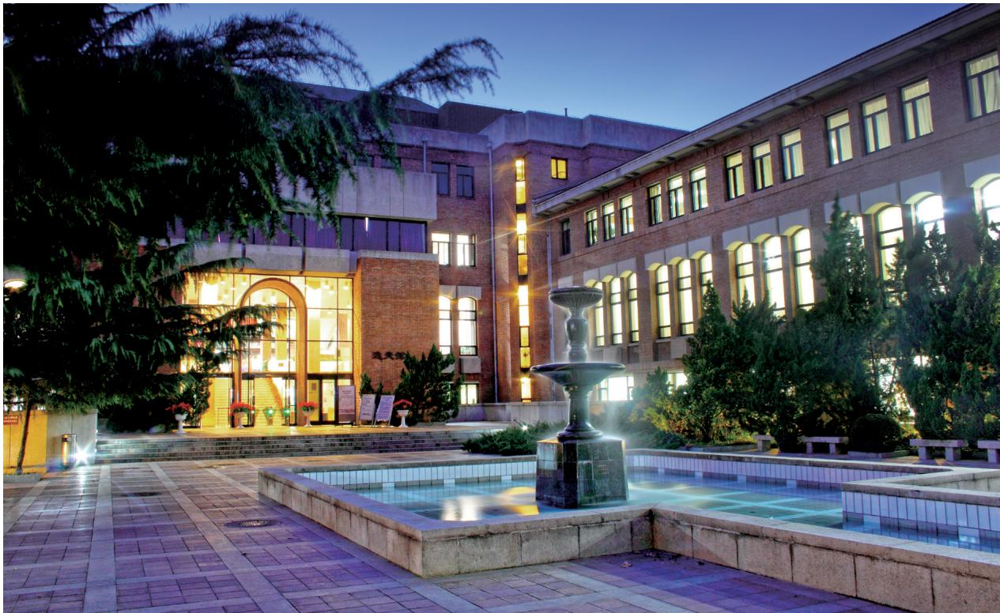

> **AI Description:**
> **Source:** `assets/_page_25_Figure_0.jpg`
> 
> **Generated:** 2026-05-31 23:35:21
> 
> ---
> 
> The image depicts a nighttime scene of a building with a courtyard. The building has a modern architectural style with large windows and brick walls. The courtyard features a central fountain surrounded by paved areas and some greenery. The lighting from the building illuminates the area, creating a warm and inviting atmosphere. The image captures the serene and well-maintained environment of what appears to be a public or institutional building.

## 7 Career Development Center

The Career Development Center of Tsinghua University (THCDC) is responsible for implementing national employment policies and related university requirements and formulating measures for the employment of graduating students. THCDC collects and releases job opportunities for graduates and organizes on-campus job publicity and recruitment activities. The Center offers consultation and guidance services to help students greater understand their career options and set career goals. Outstanding students will be guided and recommended by the Center for working positions in key state institutions and enterprises. The Center also helps with the signing of employment agreements and the dispatching of graduates.

Contact number: 62784625 Address: THCDC Office Building (south of Qingfen Yuan Canteen) Website: http://career.tsinghua.edu.cn

Scan to follow the THCDC's WeChat account

# 8 Center for Global Competence Development

The Center for Global Competence Development (CGCD) is a university-level organization dedicated to providing guidance and support on global competence development, and to promoting its integration into the university-wide student cultivation process. CGCD strives to offer transformative learning support and resources of a high quality, including through workshops, one-on-one tutorials, online learning resources, and Wesalon - that facilitates inter-disciplinary exchanges between faculty and students. CGCD is committed to studying the best models of education of global competence by cooperating with various international organizations and world-leading institutions of higher education. In addition, CGCD also provides expertise

and guidance to student associations and offers diversified engagement opportunities to promote inter-cultural understanding and exchange across campus.

Contact number: 62780238 Address: Room 226, Zijing Student Service Center (C Building) Email: thgc@tsinghua.edu.cn

Scan to follow the CGCD's WeChat account (Office of International Education)

## 1 Hospitals

## On-Campus Hospital

Tsinghua University has its own campus hospital located in the western part of the campus.

The hours of operation for various departments are as follows. Outpatient services time: Monday to Friday; 8:00am – 12:00pm, 1:30pm – 5:00pm   
Registration for outpatient services: Monday to Friday; 7:45am – 11:50am, 1:20pm – 4:50pm   
Emergency services: 24 hours

\* Note: The Tsinghua University campus hospital is capable of treating and diagnosing common illnesses and health issues. However, for more complicated and serious medical conditions and treatment, a visit to a more comprehensive hospital is required. When visiting hospitals off-campus, international students are required to bring their passports for identification and registration purposes.

Process for seeing a doctor at the hospital

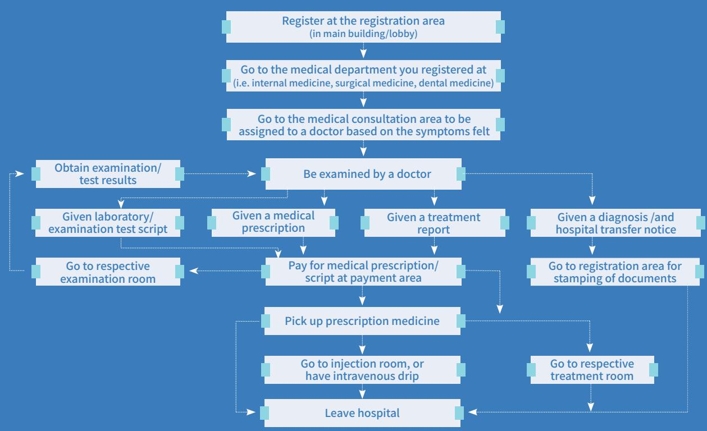

> **AI Description:**
> **Source:** `assets/_page_26_Figure_0.jpg`
> 
> **Generated:** 2026-05-31 23:43:29
> 
> ---
> 
> The image is a flowchart that illustrates the process of visiting a hospital and undergoing medical treatment. It begins with registering at the registration area, then proceeding to the appropriate medical department based on symptoms. The flowchart details the steps involved in obtaining examination/test results, being examined by a doctor, receiving a diagnosis, and various treatment options. It also outlines the process of paying for medical prescriptions, picking up prescription medicine, and leaving the hospital. The flowchart uses arrows to indicate the sequence of actions and includes labels for each step to guide the viewer through the process.

## Off-Campus Clinic

One nearby off-campus hospital is the United Family Wudaokou Clinic, located in the Wudaokou area.

United Family Wudaokou Clinic ( 和睦家五道口综合门诊部 )

Address: 1st Floor, Building D, Tsinghua Tongfang Hi-tech Plaza, Haidian District, Beijing

(北京市海淀区王庄路1号清华同方科技广场D座1层)

Consultation Hours: Monday to Sunday, 9:00am – 6:00pm Contact number: 82366918

24 Hour Customer Service Hotline: 4008919191

24 Hour Emergency Service Phone: 59277120

## Health Insurance

According to the regulations set in place by the People’s Republic of China and the Ministry of Education, a comprehensive health insurance scheme has been implemented for international students studying in China. According to national and university-level regulations, all international students must purchase this insurance scheme.

Comprehensive medical insurance obligations, claims procedures and other detailed insurance information can be found in English at: http://en.lxbx.net/.

A 24 hour contact hotline is also available: 4008105119, extension 1.

\* Please note: the insurance does not cover private hospitals and clinics, such as the United Family Wudaokou Clinic and Beijing United Family Hospital.

## Insurance Reimbursement Claims

Materials required for filing a claim:

## General Hospitals

Below are the details of several general hospitals located in Beijing.

Beijing University Third Hospital ( 北京大学第三医院 )Address: 49 North Garden Road, Haidian District, Beijing（北京市海淀区花园北路49号）

Contact number: 82266699

Website: http://www.puh3.net.cn/englishweb/index.shtml

China-Japan Friendship Hospital ( 中日友好医院 )

Address: 2 Yinghuayuan East Street, Chaoyang District,

Beijing ( 北京市朝阳区樱花园东路 2 号 )

Contact number: 84205288

Website: http://english.zryhyy.com.cn/

Beijing United Family Hospital ( 北京和睦家医院 )

Address: 2 Jiangtai Road, Chaoyang District, Beijing

(北京朝阳区将台路2号)

Contact number: 59277000

24 Hour Service Line: 4008919191

24 Hour Emergency Line: 59277120

Website: http://beijing.ufh.com.cn/

## Submitting documents

Option a: at Tsinghua University

Insurance documents can be provided to the insurance company representative

Time: The last Friday afternoon of each month, 1:30pm – 3:30pm

Location: Room 119, International Students & Scholars Center

Option b: sent directly to the insurance company Insurance claim documents can be sent directly to the insurance company.

Claims office address: Room 303, Shuangzi Zuo Building B, 55 East Third Middle Ring Road, Chaoyang District, Beijing, 100022 (北京市朝阳区东三环中路55号双子座B座303室, 邮编 100022)

Receiver: Project Claims Department

Contact number: 4008105119, extension 1

## Important points to note:

Before receiving medical treatment, first call 4008105119, extension 1, to check the details of medical service coverage.

Proof, documentation, and certificates of accidents must be provided as evidence (for example a traffic accident certification issued by the relevant transport office).

When providing bank details, the bank account name, account number and banking branch that the account was opened at must be provided.

## 3 Campus Safety Tips

In order to ensure personal safety and of one’s belongings, all international students should keep in mind the following points whilst studying on campus.

## Protecting oneself against common safety issues

Students should ensure the safety of their personal belongings. Do not carry around large amounts of money. Take appropriate care of important items such as passports, admission notices, phones, laptops and wallets.

Be aware of telecommunications fraud. Do not give information to unknown people by phone, text, WeChat or online. Do not transfer money or write checks to unknown accounts or individuals.

## Paying attention to traffic safety and obeying traffic regulations

Do not ride in unlicensed vehicles, or with unfamiliar individuals.

The university does not encourage students or parents to drive cars into the university. Also, students are not permitted to apply for a motorized vehicle pass in campus. Motorized vehicles are forbidden from entering the student dormitory areas. The university does not recommend students to purchase electric vehicles (including scooters).

The primary mode of on-campus transportation is by bicycle (either personal bicycles or shared bikes). Bicycles should be locked after use. When walking or cycling on campus, please use the pavement or lanes for non-motorized vehicles. Do not ride in a dangerous manner, such as riding the wrong way down a roadway, speeding, or turning without signaling.

## Awareness of dormitory safety and prevention of theft or fire

Do not leave large amounts of cash; student IC card; keys or other important and valuable objects out in one’s room. Either keep them safely locked away or on one’s person.

Obey dormitory regulations. When leaving the student dormitory room or resting inside the dormitory, lock the windows and door and do not let others stay in the room. When entering a dormitory building, make sure that others do not sneak in behind. Take an active role to prevent the subleasing of dormitory rooms by reporting such situations to the building staff or security staff.

Be careful when using electricity inside the dormitory. The connecting, disconnecting, or pulling of electrical wires without permission is strictly forbidden. It is also forbidden to use electrical devices that go against regulations, as well as open flames such as candles or mosquito-repellant incense. Smoking in the dormitories is forbidden. Take care to prevent any potential fires from occurring. Become familiar with dormitory emergency exits and evacuation routes. When there is a fire, promptly raise the alarm and exit the building.

## Avoiding injuries whilst exercising

Avoid strenuous exercise and stay hydrated. Rest when feeling tired, hungry or uncomfortable.

When exercising, dress according to the season and time of day.

Those with illnesses should choose exercise methods that suit their physical condition.

To avoid injury, do warm-up exercises beforehand and recovery exercises afterwards. Choose suitable exercise equipment.

If one is injured during exercise, stop exercising and rest sufficiently. Recovery exercises should be performed until the injury heals. If necessary, see a doctor for diagnosis and treatment.

## Staying safe while shopping online

When choosing a specific online shopping website, first compare information such as volume of trade and customer reviews. Businesses that have an offlinestore or a seven-day returns policy can better guarantee customer rights and are more reliable.

Use third-party payment platforms to minimize the risk of transaction issues. Keep hold of proof of transactions, such as records of communication, delivery numbers and evidence of payments.

After receiving the purchased item, open and inspect the package immediately. If the product is not the same as was advertised or there is a problem with its quality, the recipient has the right to reject the delivery. If there is the option, do not click “confirm delivery” ( 确认收货 ) if the item has not yet arrived or is unsatisfactory.

\* Note: Most of the information in this section is from the University Students' Safety Knowledge Manual.

## Beijing and Surrounds 北京及周边

## 1 Climate

The four seasons in Beijing are generally as follows. Spring (March-May): Weather is pleasant, temperatures between 0°C and 26°C (32°F and 79°F) Summer (June-August): Hot and humid, temperatures between 18°C and 35°C (66°F and 95°F) Autumn (September-November): Cool with occasional rain, temperatures between 0°C and 26°C (32°F and 79°F) Winter (December-February): Cold, dry and windy, temperatures between -8°C and 5°C (16°F and 41°F) In the north of China, most public buildings will be heated between mid-November and mid-March. Buildings will often open their windows during winter to maintain a healthy level of air circulation.

## 2 Transportation

## Taxis

Taxis are commonly seen in China. Licensed taxis are normally of the same design and should have the taxi company logo displayed. Different cities have different starting prices, but all are relatively affordable. Be careful not to ride in unlicensed taxis. Check the taxi company, driver and vehicle information (usually posted above the front passenger seat) and check whether there is a taxi meter fitted and in operation (in Chinese: 打表计费 ).

## Taxi fare fee

The standard taxi fare is 2.30 RMB per kilometer. The flag-down starting rate is 13 RMB (within the first 3 kilometers). The taxi fare fee may be a slightly higher rate when in traffic jams and during evenings.

Confirming that a taxi is a licensed taxi When taking a taxi, first check the car license plate. Licensed taxis in Beijing should all have a car license plate beginning with the letter B. Always ask for the receipt when getting out of the taxi.

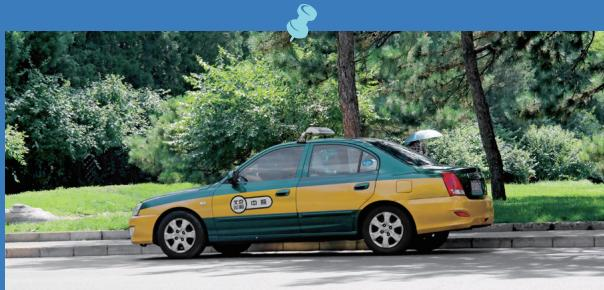

> **AI Description:**
> **Source:** `assets/_page_30_Figure_0.jpg`
> 
> **Generated:** 2026-05-31 23:35:33
> 
> ---
> 
> The image shows a taxi parked on the side of a road. The taxi is painted in a green and yellow color scheme, which is typical for taxis in certain regions. The car is positioned next to a sidewalk and surrounded by greenery, including trees and bushes. The background features a clear sky and a well-maintained grassy area. There are no visible text or labels within the image itself.

## Subway and Light Rail Network

The Beijing Subway and Light Rail Network (apart from the airport express train) is a highly connected transportation network. Prices depend on the distance travelled and range from 3 to 7 RMB per journey. Tickets can be purchased at the ticket window or by using the automatic machines found at all subway stations. A rechargeable Beijing transportation card can also be purchased, which is used by most people who frequently travel via public

transportation. The transportation card must be scanned upon both entry and exit of the subway. For more information, visit: https://www.bjsubway.com/ en/. The nearest subway stations to Tsinghua University are Qinghuadongluxikou ( 清华东路西口 ) on line 15, Wudaokou ( 五道口 ) on line 13, and Yuanmingyuan ( 圆 明园 ) on line 4.

## Bus Network

The bus network in Beijing is a very affordable method of transportation, with fees starting from 1 RMB using the Beijing transportation card (the same one used for the subway system), or from 2 RMB if paying in cash. The west, south and north-east gates of Tsinghua all have bus stops close-by. The nearest bus stop to the student dormitories is the stop located by the north-east gate, where bus number 549 travels to the nearby areas of Wudaokou and Zhongguancun. For more information, visit: http://www. bjbus.com.

## 3 Wudaokou and Surrounds

The Wudaokou area is a student-hub, as it is located near several universities, including Tsinghua. The busiest and most bustling part of Wudaokou is centered on either side of the Wudaokou subway station. Traffic jams are common, especially during peak hour and thus attention should be paid to personal safety.

The Wudaokou area has an international atmosphere and is filled with shops, restaurants, coffee shops and bars. The main department store in Wudaokou, known as the U Center, is home to clothing and lifestyle stores, a pharmacy and the BHG supermarket on the basement floor housing many international products. Nearby, there is also D-Mart - a smaller international supermarket, and Lotus supermarket - a large local supermarket chain.

Nearby the Wudaokou subway station are bus stops that can take you back to the north-east gate of Tsinghua University (bus number 549) and several buses going in the direction of nearby Peking University and Zhongguancun, Beijing’s technology hub.

Due to its close proximity to Tsinghua University, many students living off campus choose to live in apartment blocks located in Wudaokou. Apart from Wudaokou, there is also a nearby area called Liudaokou ( 六道口 ), where many students also choose to live. It has its own subway station of the same name on line 15, the Golden Towers shopping market, and a large variety of Chinese restaurants.

## Beijing

Beijing has a rich cultural history, the reason for which many visitors come to the city. Famous sights in Beijing include Tiananmen Square, the Forbidden City, the National Museum and the Museum of Science and Technology. There is also the Bird’s Nest and Water Cube, where the 2008 Beijing Olympics were held, and one of the great wonders of the world – the Great Wall. Furthermore, Peking University and Tsinghua University - both with more than 100 years of history - are also famous Beijing attractions.

\* Note: Services, souvenirs, and food at tourist sites will be more expensive than in other locations. Only buy items after asking about the price.

## Travel information

For booking plane tickets, train tickets and hotels, the Ctrip website and app is widely used in China. Train tickets booked online may be picked up at the on-campus China Post office at the Zhaolanyuan area by taking one’s passport and showing the ticket booking number, or they can be collected directly from the tickets office counter at the train station. Please note: the first time train tickets are booked online requires the individual to collect their ticket from the train station. After this, they will be able to directly pick up train tickets from subsidiary ticket providers, such as the China Post office at Zhaolanyuan.

## 5 Beijing Life Web Resources

Below are a few commonly used English language websites that may help foreigners greater adapt to life in Beijing.

• The Beijinger. This community website created by foreign expatriates provides information about life in Beijing. The website features a blog and community forum to help foreigners settle into Beijing life. Website: www.thebeijinger.com

• Timeout Beijing. This website focuses on providing lifestyle information to those that live in Beijing. Its content covers popular products, fine dining, art and culture and many other aspects of Beijing city life. Website: www.timeoutbeijing.com

## 1 Emergency Contacts

Campus Police

62782001

Campus Hospital (emergencies)

Police Department

Fire Department

Trafc Police

Ambulance

120/999

Zhongguancun Police Station 中关村派出所 62554600

Dongsheng Police Station 东升派出所

62329664

Qinglong Bridge Police Station 青龙桥派出所 62881666

## 2 On-Campus Important Contacts

Campus Telephone Directory 62793001

Zijing Students Comprehensive Ofce 62783996

International Students Apartment Front Desk 51535501

Registration Center: IC Card

Registration Center: Registration

62794720

62788122

Registration Center: Choosing Classes

62787169

Registration Center: Transcripts

62788110

Undergraduate Admissions Ofce

62783100

Graduate Admissions Ofce

62781380

Ofce of Academic Afairs: Division of Student Study Status Administration

62794180

Graduate Scholarship and Grants Management Ofce 62789660

Visiting/Exchange Student Program

Chinese Language Program

62773508

62771368

## 3 Off-Campus Important Contacts

Division of Exit and Entry Administration of the

Beijing Public Security Bureau

84020101

The campus map can be viewed online through the following link: https://www.tsinghua.edu.cn/zjqh/xyfg/xydt1.htm Or for English, in the ‘Guides’ section on the ISSC website: https://is.tsinghua.edu.cn/publish/isscen/11846/index.html

5 International Students & Scholars Center

Office Hours: Monday to Friday; 8:00am –

12:00pm, 1:00pm – 5:00pm

Address: 1st Floor, Zijing Apartment Building 22,

Tsinghua University, 100084

Fax: 62771134

Website: http://is.tsinghua.edu.cn

(Undergraduates)

Phone: +86 10 62773076

Email: iso-undergrad@tsinghua.edu.cn

(Graduates)

Phone: +86 10 62789388

Email: iso-grad@tsinghua.edu.cn

(Non-degree Students)

Phone: +86 10 62770992

Email: iso-nondegree@tsinghua.edu.cn

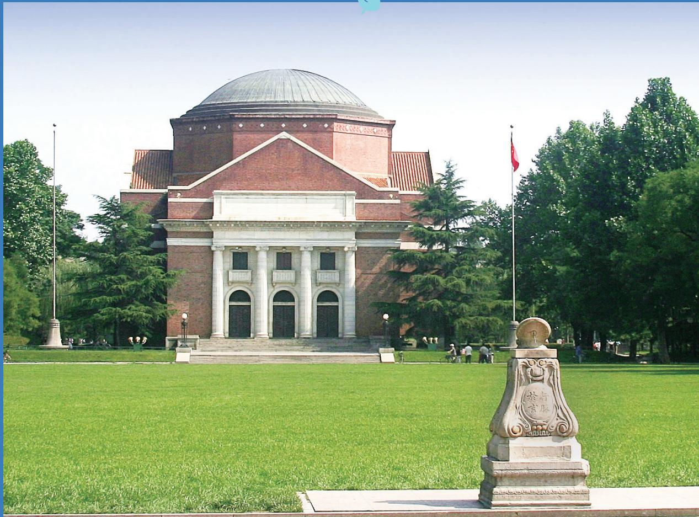

> **AI Description:**
> **Source:** `assets/_page_34_Figure_0.jpg`
> 
> **Generated:** 2026-05-31 23:42:41
> 
> ---
> 
> The image is a photograph of a large, classical-style building with a prominent dome and a symmetrical facade featuring columns. The building is surrounded by a well-maintained green lawn and is flanked by trees. In the foreground, there is a stone monument with Chinese characters inscribed on it. The sky is clear and blue, suggesting a sunny day. The overall setting appears to be a campus or a formal public space.

## Tsinghua Official Wechat Accounts

## Account Type

## Account Name and QR Code

TsinghuaUni

xiaowuyeyuanthu
Campus Life

thuxiaoyanonline

issc2016

Renwen\_Tsinghua

## Introduction to Account

Official English language account of Tsinghua University, operated by the Global Communication Office. Provides recent Tsinghua news and events and important updates.

“Tsinghua Xiaowu Yeyuan” is a student platform supervised by the Student Activities Office to share information of interest to students.

Organized by the Graduate Students Union. Xiaoyan Online provides a vast array of information relating to campus life.

Official account of the International Students & Scholars Center. Provides important information on campus life and study, including visas, accommodation, insurance and careers and employment. It also is a window into the rich and colorful campus life of international students, and provides news and information on activities, lectures and student interviews.

Ofcial account for the Humanities at Tsinghua series. Provides information on upcoming lectures. Humanities at Tsinghua lectures are large-scale public lectures that invite renowned scholars and public fgures in the humanities to give talks on classic theories, unique thoughts and new fndings.

## Account Name and QR Code

Campus Life

SchwarzmanScholars

Entertainment

Xinqinghuaxuetang

shetuan\_THU

Aicethu2005
Tsinghua�s Internationalization

Gh\_c9d071d35f01

Qhdxgjjy

The official account of Schwarzman College. Provides information on the latest events held at the college.

Official account of the New Tsinghua Xuetang. Publishes information on upcoming performances and movies held at Tsinghua.

Official account for the Student Associations Department. Shares information on the 200+ student associations at Tsinghua, including their events and stories.

The official account for the Association of International Culture Exchange (AICE), a student society with the aim to bring together and promote connections between local and international students by hosting events.

“Tsinghua Guoji” is produced by Tsinghua University's Of ce of International Cooperation and Exchange, and is a window for Chinese readers in China and abroad to learn of Tsinghua's cooperation internationally and also with Hong Kong, Macao and Taiwan.

Of cial WeChat account for the Of ce of International Education at Tsinghua University, which was founded in July 2015 to further enhance the cultivation of students using an international approach, so as to enhance students� global competence and heighten the infl uence of Tsinghua worldwide.

Important Terms: English to Chinese

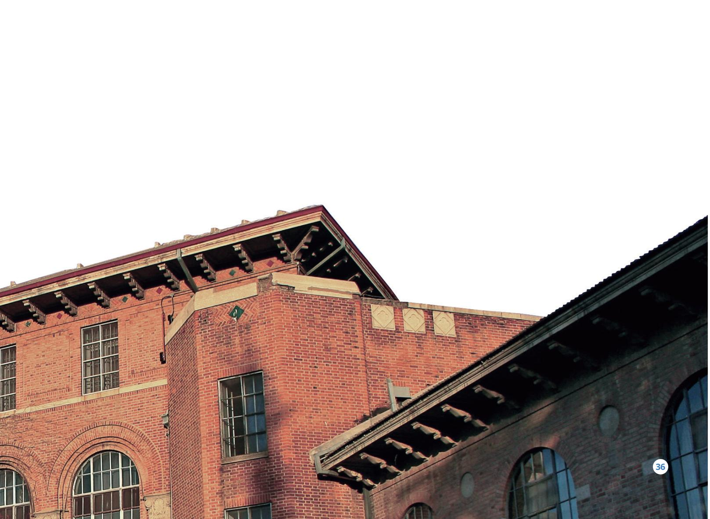

> **AI Description:**
> **Source:** `assets/_page_37_Figure_0.jpg`
> 
> **Generated:** 2026-05-31 23:36:48
> 
> ---
> 
> The image shows a section of a brick building with architectural details. The structure features a series of windows with arched tops and rectangular frames, as well as decorative elements on the brick facade. The roofline includes overhanging sections with intricate detailing. The photograph captures the building from a low angle, emphasizing its height and the architectural style. There is a small, circular label with the number "36" in the bottom right corner, which may indicate a page number or reference.

## Basic Chinese Words and Phrases to Know

Greetings and Goodbyes
Useful Words on Campus

Courtesy Words

Useful Phrases

Numbers and Directions

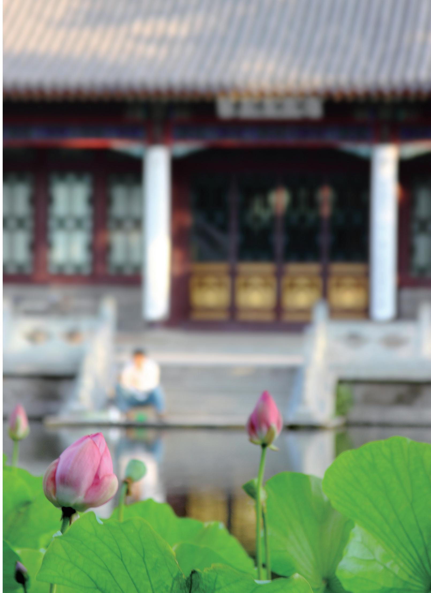

> **AI Description:**
> **Source:** `assets/_page_39_Figure_0.jpg`
> 
> **Generated:** 2026-05-31 23:39:35
> 
> ---
> 
> The image contains a photograph of a traditional building with a focus on a statue in the foreground. In the foreground, there are pink lotus flowers and green leaves, which are in sharp focus. The background is blurred, drawing attention to the statue and the lotus flowers. The building appears to have a traditional architectural style, with columns and a tiled roof. The overall scene suggests a serene and culturally significant setting.
