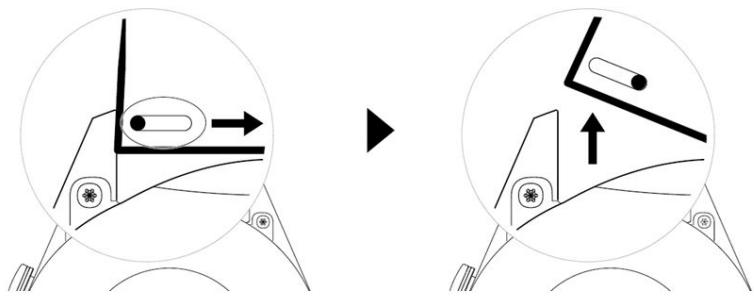
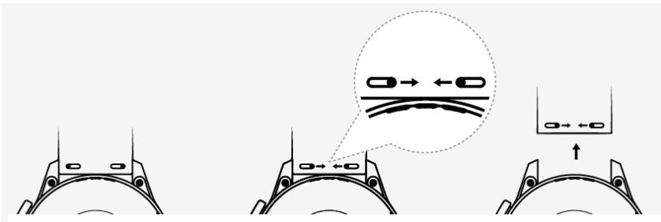
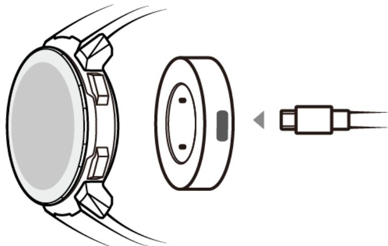
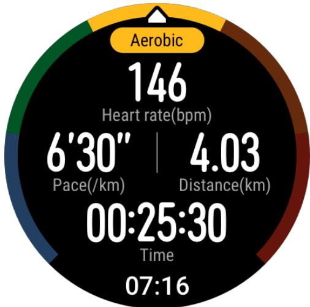
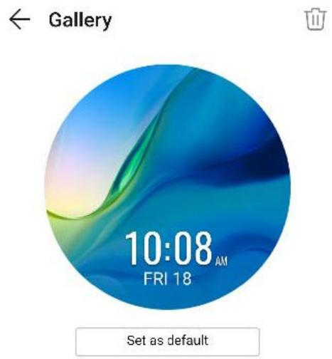
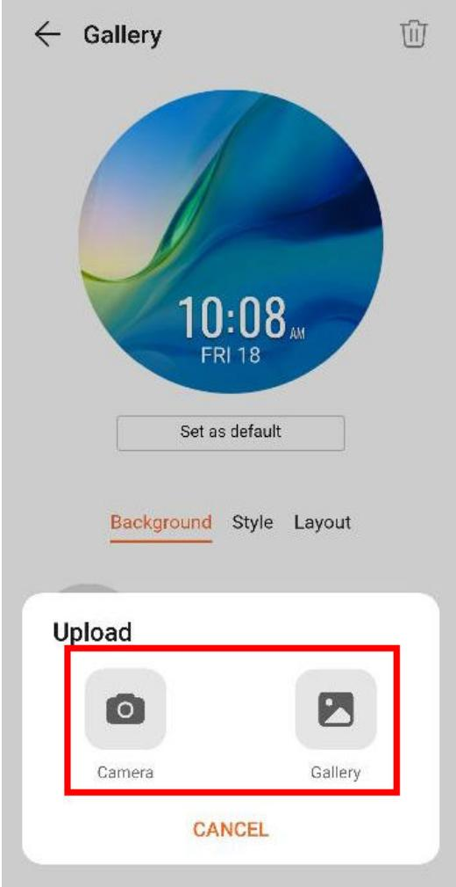
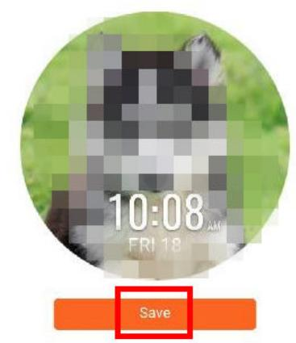

# HONOR Watch GS Pro OnlineHelp（01,en）

## Copyright © Huawei Technologies Co., Ltd. 2020. All rights reserved.

No part of this document may be reproduced or transmitted in any form or by any means without prior written consent of Huawei Technologies Co., Ltd.

## Trademarks and Permissions

and other Huawei trademarks are trademarks of Huawei Technologies Co., Ltd.

All other trademarks and trade names mentioned in this document are the property of their respective holders.

## Notice

The purchased products, services and features are stipulated by the contract made between Huawei and the customer. All or part of the products, services and features described in this document may not be within the purchase scope or the usage scope. Unless otherwise äݞc²fižš in the contract, all statements, information, and recommendations in this document are provided "AS IS" without warranties, guarantees or representations of any kind, either express or implied.

The information in this document is subject to change without notice. Every žffÑàì has been made in the preparation of this document to ensure accuracy of the contents, but all statements, information, and recommendations in this document do not constitute a warranty of any kind, express or implied.

## Huawei Technologies Co., Ltd.

Address: Huawei Industrial Base

Bantian, Longgang

Shenzhen 518129

People's Republic of China

Website: https://www.huawei.com

Email: support@huawei.com

## Contents

1 Getting Started..   
1.1 Wearing the watch..   
1.2 Adjusting and Replacing the watch strap..   
1.3 Charging your watch... 3   
1.4 Powering ÑnȍÑff and restarting the watch. 5   
1.5 Pairing your watch with your phone.. 6   
1.6 Buttons and gestures.. 7   
1.7 Setting time and language.. . 9   
1.8 Adjusting the ringtone... 10   
1.9 Installing, replacing, and deleting watch faces.. . 10   
1.10 Setting favorite contacts.. .. 11   
1.11 Customizing the Down button. .. 11   
1.12 Choosing Favorites apps... 11   
1.13 Finding your phone using your watch.. . 12   
1.14 Updating the watch and the Huawei Health app.. .. 12   
2 Workout monitoring.. ..14   
2.1 Starting a workout.. . 14   
2.2 Using Smart companion. . 16   
2.3 Syncing and sharing your fiìnžää and health data. ... 16   
2.4 Recording workout routes.. ... 17   
2.5 Automatic workout detection. ..... 17   
2.6 Route back.. . 17   
2.7 100 workout modes. . 17   
3 Health management.. 18   
3.1 Monitoring your heart rate.. 18   
3.2 Tracking sleep.. . 21   
3.3 Enabling HUAWEI TruSleep™. . 22   
3.4 Testing stress levels.. . 22   
3.5 Breathing exercises.. . 23   
3.6 Activity reminder... . 23   
3.7 Measuring blood oxygen levels (SpO2). 24   
4 Convenient life.. 25   
4.1 Getting nÑì²fic†ì²Ñnä and deleting messages.. 25   
4.2 Contact... 26   
4.3 Music... . 27   
4.4 Setting an alarm. . 28   
4.5 Remote shutter.. . 29   
4.6 Using Stopwatch or Timer.. . 29   
4.7 Using Flashlight... . 30   
4.8 Using the Barometer app... . 30   
4.9 Severe weather warnings.. . 30   
4.10 Using Compass... . 31   
4.11 Weather reports.. . 31   
4.12 Viewing environment information. 32   
5 More guidance...... 33   
5.1 Enabling Do not disturb mode. .. 33   
5.2 Adjusting screen brightness.. . 33   
5.3 Setting the vibration strength... 34   
5.4 Connecting earbuds...... 34   
5.5 Setting Gallery watch faces. . 34   
5.6 Viewing the Bluetooth name and MAC address.... . 37   
5.7 Restoring the watch to its factory settings.. . 38

## Getting Started

1.1 Wearing the watch   
1.2 Adjusting and Replacing the watch strap   
1.3 Charging your watch   
1.4 Powering ÑnȍÑff and restarting the watch   
1.5 Pairing your watch with your phone   
1.6 Buttons and gestures   
1.7 Setting time and language   
1.8 Adjusting the ringtone   
1.9 Installing, replacing, and deleting watch faces   
1.10 Setting favorite contacts   
1.11 Customizing the Down button   
1.12 Choosing Favorites apps   
1.13 Finding your phone using your watch   
1.14 Updating the watch and the Huawei Health app

## 1.1 Wearing the watch

Attach the heart rate monitoring area of your watch on the top of your wrist. To ensure the accuracy of heart rate measurement, wear your watch properly and do not wear it above the joint in your wrist. Do not wear it too loosely or too tightly but make sure that your watch is attached securely on your wrist.

## NO TE

Your watch uses non-toxic materials that have passed strict skin allergy tests. Please rest reassured when wearing wear it. If you experience skin discomfort when wearing the watch, take it Ñff and consult a doctor.

● Wear your watch correctly for greater comfort.

Clean the strap in a timely manner after an intense workout to prevent the bacteria from growing. After you have washed the strap, place it in a well-ventilated area to dry. Try not wearing the strap while it is wet.

● Leather straps are not water resistant. Keep the strap dry and wipe Ñff any sweat or other liquids in a timely manner. For braided straps, wash them once every one to two weeks. You can use some laundry detergent to remove any odor.

● You can wear your watch on either wrist.

## 1.2 Adjusting and Replacing the watch strap

## Adjusting the strap

For watches with non-metallic straps and T-shaped buckles, you can adjust the strap to a comfortable fiì depending on the circumference of your wrist.

## Removing and installing the strap

To remove a non-metallic strap, unlock the fastener, remove your current strap, and then release the spring pin, as shown in the following fiªñàžȇ Follow the steps in the reverse order to install a new strap.

> **AI Description:**
> **Source:** `assets/_page_5_Figure_0.jpg`
> 
> **Generated:** 2026-05-31 23:51:50
> 
> ---
> 
> The image contains a technical illustration showing a step-by-step process of a mechanical component, likely a part of a device or machinery. The diagram includes two circular sections, each depicting a different stage of the process. The left section shows a component being pushed into a slot, indicated by the arrow pointing to the right. The right section shows the component being lifted upwards, indicated by the arrow pointing upwards. The illustration uses simple lines and shapes to convey the mechanical action, with no text annotations.

To remove a metal strap, perform the steps shown in the following fiªñàžȇ Follow the steps in the reverse order to install a new strap.

> **AI Description:**
> **Source:** `assets/_page_5_Figure_1.jpg`
> 
> **Generated:** 2026-05-31 23:51:37
> 
> ---
> 
> The image is a diagram illustrating the process of adjusting a watch band. It shows three stages of the adjustment: 
> 1. The initial position of the watch band.
> 2. The band being pulled apart to adjust the length.
> 3. The final position of the watch band after adjustment. The diagram includes arrows indicating the direction of movement and a speech bubble with a magnified view of the watch band being adjusted, highlighting the process of pulling the band apart.

## 1.3 Charging your watch

## Charging

1. Connect the USB Type-C port and power adapter and then plug in the power adapter.

> **AI Description:**
> **Source:** `assets/_page_6_Figure_0.jpg`
> 
> **Generated:** 2026-05-31 23:49:21
> 
> ---
> 
> The image is a technical illustration showing a smartwatch and its charging port. The watch is depicted from the side, highlighting the watch face and the charging port located on the side of the watch. The charging port is shown with a cable inserted, indicating the process of charging the smartwatch. The illustration is simple and schematic, focusing on the functionality of charging the device.

2. Rest your watch on top of the charging cradle, ensuring that the contacts on your watch and the cradle are aligned. Wait until the charging icon appears on your watch screen.

3. When your watch is fully charged, 100% will be displayed on the watch screen and the charging will stop automatically. If the battery level is below 100% and the charger is still connected to the watch, the charging will start automatically.

## NO TE

Use the dedicated charging cable, charging cradle, rated output voltage of 5 V, and rated output current of 1 A or higher to charge your watch. Charging the watch using a non-Huawei charger or a power bank may result in it taking a longer time to charge, the device being unable to charge fully, overheating, or other similar issues. Therefore, you are advised to purchase an Ñffic²†Ã Huawei charger from an Ñffic²†Ã Huawei sales outlet.

Use a Huawei power adapter or other power adapters that comply with local and international security standards. Adapters that do not conform to the security standard may cause security issues.

Keep the surface of the charging cradle clean. Make sure the watch is placed properly on the charging cradle and displaying the charging status. Avoid putting metal objects on the medal contacts of the charger too long, or repeatedly sticking and removing metal objects to the contacts, as this can result in short circuiting and other risks. (If you are using a metal strap, make sure that the metal contacts on the watch are in proper contact with that of the charger during charging. Try to keep the metal links of the strap from touching the metal contacts of the charger.)

● It is recommended that you lift the charging cradle to attach it to your watch. Ensure that the side of your watch with buttons is aligned with the charging port of the cradle. After the cradle and watch are connected properly, check to see if the charging icon is displayed. If you cannot see the charging icon, you may need to slightly adjust the position of the cradle until contact is established and the charging icon appears.

Do not charge or use your watch in a hazardous environment, make sure there is nothing fl†mm†bÞ or explosive nearby. When using the charging cradle, make sure there is no residual liquid or other foreign objects on the USB port of the charging cradle. Keep the charging cradle away from liquids and any fl†mm†bÞ materials. Do not touch the charging contacts while the device is charging, or take any other unnecessary safety risks.

There are magnets in the charging cradle, due to their nature they will also attract other medal objects, so it is important to check for any before using the charger. The charging cradle contains magnetic materials. It is important not to let it overheat by placing it out in the sun or somewhere too warm.

When carrying and storing the charging cradle, make sure the charger stays dry, especially the USB port on the base, clean it to prevent foreign objects from entering the USB port, these can cause damage to the charger and may lead to other safety risks.

Your watch will automatically power Ñff when its battery level is too low. After it is charged for a while, your watch will automatically power on.

## Charging time

Your watch will be fully charged within two hours. When the charging indicator displays 100%, the watch is fully charged. Disconnect your watch from the power adapter once it is fully charged.

## NO TE

● Charge your watch in a dry and well-ventilated environment.

● Before charging, make sure that the charging port and metal parts are clean and dry to prevent short circuits or any other risks.

● Before charging, make sure the charging port is dry. Wipe Ñff any water or sweat stains.

● The charging cradle is not water resistant, so keep it dry at all times.

● It is recommended that the ambient temperature is between 0 and 45°C.

● To protect the battery, the charging current will be reduced if the ambient temperature is low, which will prolong the charging time without †ffžcì²nª the battery lifespan.

## Checking the Battery Level

Use one of the following three methods to check the battery level:

Method 1: When your watch is connected to the charger, you can check the battery level on the charging screen that is displayed automatically. Press the Up button to exit the charging screen.

Method 2: Swipe the home screen from top to bottom and then check the battery level in the drop-down menu.

Method 3: Check the battery level on the device details screen in the Huawei Health app.

## 1.4 Powering ÑÊȍÑč and restarting the watch

## Powering on the watch

When the watch is powered ÑffȀ press and hold the Up button to power on the watch.

When the watch is powered ÑffȀ the watch will automatically power on if you charge it.

NO TE

If you power on the watch when the battery level is critically low, the watch will remind you to charge it and the watch's screen will turn Ñff after 2 seconds. You will be unable to power on the watch until you charge it.

## Powering Ñč the watch

When the watch is powered on, press and hold the Up button, and then touch Power Ñč.

When the watch is powered on, press the Up button while on the home screen, swipe up or down until you finš Settings, touch it, go to System > Power Ñč, and then touch √ to cÑnfiàmȇ

If the battery level is critically low, the watch will vibrate and then automatically power Ñffȇ

If the battery has not been charged for a long time, the watch will vibrate and then automatically power Ñffȇ

## Restarting the watch

When the watch is powered on, press and hold the Up button, and then touch Restart.

When the watch is powered on, from the home screen press the Up button, swipe until you finš Settings, touch it, go to System > Restart, and then touch √ to cÑnfiàm your choice.

## Force restarting the watch

● Press and hold the Up button for at least 16 seconds to force restart the watch.

## 1.5 Pairing your watch with your phone

If you have just taken the watch out of the box, press the Up button and hold until your watch vibrates and displays a startup screen. The watch is ready to be paired via Bluetooth by default.

## For Android users:

a. To download and install the Huawei Health app, scan the QR code , or search for Huawei Health in AppGallery or other app stores. If you have already installed it, make sure that it is up-to-date.

b. Open the Huawei Health app and follow the onscreen instructions to

grant required permissions to the app. Go to > Add > Smart Watch, and touch the device you wish to pair.

c. Touch PAIR and the app will automatically search for nearby available Bluetooth devices. Once your watch is found, touch its name to start pairing.

d. When a pairing request is displayed on the watch screen, touch to pair your watch and phone. Ñnfiàm the pairing on your phone as well.

## For iOS users:

## NO TE

When pairing with an iOS phone, make sure that the device has been removed from the last device's list of paired devices. If it was paired before make sure it is also removed from Huawei Health, then go to Settings > Bluetooth, touch the Settings icon behind the Bluetooth name, and touch Forget This Device. Then, pair them to connect the devices again.

a. Log in to the App Store on your phone and search Huawei Health. Download and install the app, and make sure it is fully updated.

b. On the phone go to Settings > Bluetooth. The watch should show up

automatically, touch your device, then touch to fin²ä¯ pairing.

c. Open the Huawei Health app and follow the onscreen instructions to

grant required permissions to the app. Go to > Add > Smart Watch, and touch the device you wish to pair.

d. Touch PAIR and the app will automatically search for nearby available Bluetooth devices. Once your watch is found, touch its name to start pairing.

## NO TE

. ● When pairing for the fiàäì time, you can use your phone to scan the QR code on the watch screen to download the Huawei Health app.

If your watch does not respond after you touch to cÑnfiàm the pairing request, press the Down button and hold to unlock your watch, and initiate a pairing procedure again.

● Your watch will display an icon on the screen to inform you that pairing was successful. It will then receive information (such as the date and time) from your phone.

● If the paring failed, your watch screen will display an icon to inform you that pairing was unsuccessful. It will then return to the startup screen.

● A watch can be connected with only one phone at any given time, and vice versa. If you want to pair your watch with another phone, disconnect your watch from the current phone using the Huawei Health app, and then pair your watch with another phone using the Huawei Health app.

## 1.6 Buttons and gestures

The watch is equipped with a color touchscreen that is highly responsive to your touches and can be swiped in š²ffžàžnì directions.

## Up button

## Down button

Button functions during a workout

## Gestures

## Wake the screen

Press the Up button.

Raise or rotate your wrist inwards.

Swipe down on the home screen to open the shortcut menu. Enable Screen On and the screen will stay on 5 minutes.

NO TE

You can enable the Raise wrist to wake screen function in the Huawei Health app by going to the details screen of your watch.

## Turn Ñč the screen

The screen will turn Ñff automatically 5 seconds after the watch's screen is turned on if no operation is performed within this period of time. If any operation is performed, the screen will turn Ñff 15 seconds after it is turned on.

NO TE

From the home screen press the Up button and go to Settings > Display > Advanced to adjust the duration it takes for your watch to go to sleep and turn Ñff the screen. The duration is set to Auto by default.

## 1.7 Setting time and language

You do not need to set the time and language on your watch. When the watch is connected with your phone, the time and language settings on your phone will be automatically synced to your watch.

If you change the language, time, or time format on your phone, the changes will be automatically synced to your watch when the watch and phone are connected.

## NO TE

● For iOS users: Open your phone, go to Settings > General > Language & Region, set the language and region, and then connect the watch with your phone to sync the settings.

● For Android users: Taking EMUI 9.0 as an example, open your phone, choose Settings > System > Language & input, set the language, and then connect the watch with your phone to sync the settings.

## 1.8 Adjusting the ringtone

## NO TE

● This feature is only available on the HUAWEI WATCH GT 2 (46 mm) version 1.0.2.28 or later, HONOR MagicWatch 2 (46 mm) and the HONOR Watch GS Pro .

● To use this feature, update the Huawei Health app to version 10.0.0.651 or later.

1. From the home screen of the watch press the Up button, swipe on the screen and go to Settings > Volumes, then slide to adjust ringtone volume.

2. If you have enabled Silent mode, your watch will only vibrate to inform you of incoming calls and messages. Otherwise, your watch will ring and vibrate when receiving new calls or messages.

## NO TE

The ringtone on your watch for incoming calls, alarms and nÑì²fic†ì²Ñnä is the default sound and cannot be customized.

## 1.9 Installing, replacing, and deleting watch faces

## Download and install even more cool watch faces by performing the following:

1. Open the Huawei Health app and touch your watch name. Go to Watch faces > More and see all the watch faces that are supported on your watch.

2. Select your desired watch face and touch Install. After the watch face is installed, your watch will automatically display the new watch face.

3. Choose an installed watch face, touch SET AS DEFAULT, and your watch will switch to the new one.

## Deleting a watch face:

To delete a watch face, open the Huawei Health app, touch Devices, touch Watch

> **AI Description:**
> **Source:** `assets/_page_13_Figure_0.jpg`
> 
> **Generated:** 2026-05-31 23:49:24
> 
> ---
> 
> The image contains a simple icon of a trash can with a line through it, indicating the action of deletion or removal. There are no charts, graphs, or other visual elements present. The icon is a standard symbol used to represent the act of deleting or discarding something.

faces, touch Mine, select the watch face you want to delete, touch in the upper-right corner, and the watch face installed on your watch will then be deleted. Certain preinstalled watch faces cannot be deleted.

## NO TE

● You cannot download additional watch faces in the Huawei Health app on an iOS phone. To download new watch faces, you are advised to temporarily pair your watch with an Android phone. When the downloaded watch faces are synced to your watch, pair the watch back with your iOS phone.

● To download or delete watch faces, update your watch and the Huawei Health app to the latest versions.

● You may not be able to download or delete watch faces in certain countries and regions. For more information, contact the local Huawei hotline.

## 1.10 Setting favorite contacts

1. Open the Huawei Health app and touch Devices. Touch your device name to access the watch settings screen. Touch Favorite contacts.

2. Then perform the following:

Touch ADD and your phone contacts list will appear. Then select the contacts you wish to add.

Touch Sequence to sort the contacts you have added.

Touch Remove to remove a contact you have added.

3. From the home screen press the Up button, swipe until you finš Contacts to call your favorite contacts from your watch.

## NO TE

A maximum of 10 favorite contacts can be added to your watch. Make sure your watch and phone are connected before making a call from you watch.

To adjust the volume during the call, touch the speaker icon on the screen or press the Up button or Down button.

A maximum of 30 call records can be saved.

## 1.11 Customizing the Down button

1. From the home screen press the Up button and go to Settings > Down button.

2. Touch an app from the list. This app will be opened when you press the Down button.

NO TE

By default, pressing the Down button will open the Workout app.

## 1.12 Choosing Favorites apps

1. On the watch, go to Settings > Display > Favorites, and select the apps you use the most, such as Transportation card, Sleep, Stress, Heart rate, Music, Weather, and Activity records.

2. Once you're done, touch OK. Then you can see your Favorites by swiping right or left on the main screen.

## NO TE

● On the Favorites screen, touch

to move the app up to the top of the list.

● On the Favorites screen, touch

to remove the app from the list.

● You can select up to six apps.

## 1.13 Finding your phone using your watch

From the home screen press the Up button, swipe until you finš Find phone, or swipe down on the home screen and touch Find my Phone. An animation will be displayed on the screen. If your phone is within Bluetooth range, it will play a ringtone to alert you, even in Silent mode.

Touch your watch screen or unlock your phone screen to stop playing the ringtone.

NO TE

This feature will only work when your phone and watch are connected.

## 1.14 Updating the watch and the Huawei Health app

## Updating the watch

## Method 1:

Connect the watch to your phone using the Huawei Health app, open the app, touch Devices, touch the device name, choose Firmware update, then follow the onscreen instructions to update your watch if there are any new updates.

## Method 2:

For Android users: Open the Huawei Health app, touch Devices, touch the device name, then enable Auto -update or Auto-download update packages over Wi-Fi. If there are any new updates, the watch will display update reminders. Follow the onscreen instructions to update your watch.

For iOS users: Open the Huawei Health app, touch the ÝàÑfiÞ picture in the upper-left corner on the home screen, touch Settings, then enable Autodownload update packages over Wi-Fi. If there are any new updates, the watch will display update reminders. Follow the onscreen instructions to update your watch.

## Updating the Huawei Health App

For Android users: Open the Huawei Health app, touch Me, and then touch Check for updates.

For iOS users: Update the Huawei Health app in the App Store.

## NO TE

During an update, the watch will automatically disconnect from your phone.

# 2 Workout monitoring

2.1 Starting a workout

2.2 Using Smart companion

2.3 Syncing and sharing your fiìnžää and health data

2.4 Recording workout routes

2.5 Automatic workout detection

2.6 Route back

2.7 100 workout modes

## 2.1 Starting a workout

Your watch supports multiple workout modes. Choose a workout mode and start exercising.

## Running Courses

The watch has been preinstalled with a series of running courses, from entry-level to advanced, that provide personalized and real-time guidance. You can choose š²ffžàžnì courses on your watch.

1. From the home screen press the Up button, swipe until you finš Workout, touch it, choose Running courses, choose a course that you want to use, and then start running as prompted by your watch.

2. During the workout, press the Up button to pause or end the running course, lock the screen, or adjust the volume for prompts during the workout. Press the Down button to switch between screens and view š²ffžàžnì workout data.

3. After a workout, touch Workout records to view detailed workout records, including training žffžcìäȀ overall performance, speed, steps, total height, heart rate, heart rate zone, cadence, pace, and ${ \mathsf { V O } } _ { 2 } { \mathsf { m a x . } }$

NO TE

To view detailed workout data, you can also open the Huawei Health app and touch Exercise records.

## Starting a workout

## Starting a workout using your watch:

1. From the home screen press the Up button, swipe until you finš Workout, and then touch it.

2. Swipe up or down until you finš your workout type. Before a workout, you can touch the Settings icon located next to each workout mode to cÑnfiªñàž target, reminders, and display settings.

## NO TE

There is no Settings icon located next to Triathlon mode.

In Triathlon mode, press the Down button to move to the next form.

Skiing, snowboarding do not support setting workout goals, however, they and crosscountry skiing do support SpO2 measurement during workouts.

3. Touch the Start icon to start a workout. During a workout, touch and hold the workout data screen until the watch vibrates, touch any workout data (such as heart rate, speed, distance, and time), and then choose what to display on the screen in real time.

4. During the workout, press the Up button to pause or end the running course, lock the screen, or adjust the volume for prompts during the workout. Press the Down button to switch between screens and view š²ffžàžnì workout data. (Take Outdoor Run mode as an example. During the workout, you can view a range of data displayed next to Heart rate, Pace, Distance, Time, Steps, Cadence, Total calories, and Total climbing. ²ffžàžnì workout modes display š²ffžàžnì types of data.)

5. After a workout, press the Up button and touch the stop icon, or hold the Up button to end a workout session. Touch Workout records to view detailed workout records.

NO TE

If you have selected a workout mode that includes swimming, the watch screen will be locked after you start the workout session. Press and hold the Up button to end the workout.

After the swimming session is complete, the watch will vibrate occasionally while displaying a message indicating that the watch is draining water.

## Starting a workout using the Huawei Health app:

To start a workout using the Huawei Health app, you need to bring your phone and watch together to ensure that they are connected properly.

1. Open the Huawei Health app, touch Exercise, choose a workout mode, and then touch the Start icon to start a workout.

2. Once you have started a workout, your watch will sync and display your workout heart rate, step count, speed, and time.

3. During a workout, the Huawei Health app displays workout time and other data.

## NO TE

● If the workout distance or time is too short, the results will not be recorded.

● To avoid draining your battery, make sure you hold the stop icon after a workout to end it.

Connect the watch to the phone using the Huawei Health app and start a workout in the app. When you start it from the app, the data between the watch and the app can sync.

After a workout, open the Huawei Health app, touch Exercise records to view detailed workout data. Touch and hold a record to delete it from the app. This record will still be available on your watch. Up to 10 workout records can be saved on your watch. If you have more than 10 records, the oldest ones will be overwritten by new ones. Records on the watch cannot be deleted manually. You can reset your watch to its factory settings to clear your workout records. However, this will also clear any other data on your watch as well.

## 2.2 Using Smart companion

After Smart companion is enabled on your watch, your watch will send you realtime voice guidance during a running session, such as guidance about your workout strength, running duration, and heart rate.

1. From the home screen press the Up button, swipe until you finš Workout, then touch it.

2. Touch the Settings icon on the right side of Outdoor Run and then enable Smart companion.

3. Return to the workout list screen and touch Outdoor Run.

NO TE

Smart companion is currently only available for Outdoor Run . If you have set your workout goal, your smart companion will not provide you with any voice guidance. To ensure that your workout companion can work properly, wear a Huawei or Honor smart watch or smart band.

## 2.3 Syncing and sharing your Ēìʞää and health data

You can share your fiìnžää data to third-party apps and compare with your friends.

## For Android users:

To share your fiìnžää data to a third-party app, open the Huawei Health app, go to Me > Settings > Data sharing and select the platform you want to share to. Follow the onscreen instructions äݞc²fic to each platform.

## For iOS users:

To share your fiìnžää data to a third-party app, open the Huawei Health app, go to Discover > Third party services and select the platform you want to share to. Follow the onscreen instructions äݞc²fic to each platform.

## 2.4 Recording workout routes

The watch features built-in GPS. Even if disconnected from your phone, the watch can still record your workout routes when you start Outdoor Run, Outdoor Walk, Outdoor Cycle, Climb, and other outdoor modes.

## NO TE

Outdoor sports skipping the GPS positioning process will result in abnormal motion track data. It is recommended that you start the sport after the satellite search and positioning of the wearable device is successful during outdoor exercise.

²ffžàžnì models support š²ffžàžnì outdoor workout modes.

If you cannot view workout routes on your watch, sync the workout data to the Huawei Health app and view the workout routes and other detailed workout data under Exercise records in Huawei Health.

## 2.5 Automatic workout detection

The watch can detect your workout status automatically. After you have enabled Auto-detect workouts by going to Settings > Workout settings on the watch, your watch will remind you to start recording your workout when it detects an increase in activity. You can select to ignore or start recording the workout session. Currently, this feature can detect running, elliptical, and rowing workouts.

## 2.6 Route back

Your watch will record routes and provide you with navigation services. After you use reach your target destination, you can use the route back function to get help returning to the place you started.

On your watch, enter the app list, swipe on the screen and touch Workout. Start an individual outdoor workout session. Swipe on the screen and select Route back or Straight line to return to the starting point.

## 2.7 100 workout modes

The watch supports 100 workout modes, you can add or remove them from the watch for easier use.

## Add

To add a workout mode, on your watch home screen, press the Up button, touch Workout. Swipe up or down until you finš Add, touch it and then add the ones you want.

## Remove

To remove a workout mode, on your watch home screen, press the Up button, touch Workout and the Settings icon on the right side of the workout mode, swipe to the bottom and touch Remove to remove the workout.

# 3 Health management

3.1 Monitoring your heart rate

3.2 Tracking sleep

3.3 Enabling HUAWEI TruSleep™

3.4 Testing stress levels

3.5 Breathing exercises

3.6 Activity reminder

3.7 Measuring blood oxygen levels (SpO2)

## 3.1 Monitoring your heart rate

The watch features an optical heart rate sensor, which can monitor and record your heart rate all day. To use this feature, you need to enable Continuous heart rate in the Huawei Health app.

NO TE

When the watch detects that the user has fallen sleep, it will switch to use the non-visible light to measure your heart rate, letting you have a good nights sleep.

## Heart rate measurement

1. Keep your arm still and wear your watch correctly.

2. From the home screen press the Up button, swipe until you finš Heart rate. Touch Heart rate. The watch will then measure your current heart rate.

3. To pause the heart rate measurement, swipe right on your watch screen.

It usually takes approximately 6 to 10 seconds to display the fiàäì measurement value (1 to 2 seconds if Continuous heart rate monitoring is enabled in the Huawei Health app and MONITORING MODE is set to Realtime), and the data updates every 5 seconds afterward. A complete measurement takes approximately 45 seconds to complete.

NO TE

To guarantee a more accurate heart rate measurement, wear the watch correctly and ensure the strap is fastened. Make sure that your watch is secure on your wrist. Ensure that the watch body is in direct contact with your skin without any obstructions.

## Setting the heart rate zone calculation method

The heart rate interval can be calculated based on the maximum heart rate percentage or HRR percentage. To set the heart rate interval calculation method, open the Huawei Health app, go to Me > Settings > Heart rate limit and zones and set Calculation method to either Maximum heart rate percentage or HRR percentage.

NO TE

● If you select Maximum heart rate percentage as the calculation method, the heart rate zone for š²ffžàžnì types of workout activities (Extreme, Anaerobic, Aerobic, Fatburning, and Warm-up) is calculated based on your maximum heart rate ("220 – your age" by default). Heart rate = Maximum heart rate x Maximum heart rate percentage.

If you select HRR percentage as the calculation method, the heart rate interval for š²ffžàžnì types of workout activities (Advanced anaerobic, Basic anaerobic, Lactic acid, Advanced aerobic, and Basic aerobic) is calculated based on your heart rate reserve (HRmax - HRrest). Heart rate = Heart rate reserve x Heart rate reserve percentage + Resting heart rate.

The heart rate zone calculation methods while you are running are not †ffžc잚 by the settings in the Huawei Health app. For most running courses, HRR percentage is selected by default.

Your watch will display š²ffžàžnì colors when your heart rate reaches corresponding zones during a workout. The following fiªñàž shows how heart rate is displayed during an outdoor run.

> **AI Description:**
> **Source:** `assets/_page_22_Figure_0.jpg`
> 
> **Generated:** 2026-05-31 23:49:34
> 
> ---
> 
> The image is a circular fitness tracking interface displaying workout data. It includes a heart rate monitor showing "146 bpm" in the center, with "Aerobic" indicated at the top. The bottom half of the circle shows a pace of "6'30" per kilometer and a distance of "4.03 km." The time elapsed for the workout is "00:25:30," and the total time displayed is "07:16." The interface uses a color-coded design with green, yellow, and red sections, likely representing different intensity levels or stages of the workout.

## Measuring your heart rate during a workout

1. After you start a workout, swipe on the watch screen to check your real-time heart rate and heart rate zone.

2. After completing your workout, you can check your average heart rate, maximum heart rate, and heart rate zone on the workout results screen.

3. You can view graphs that show the changes in heart rate, maximum heart rate, and average heart rate for each workout under Exercise records in the Huawei Health app.

## NO TE

Your heart rate will not be displayed if you remove the watch from your wrist during the workout. However, the watch will continue to search for your heart rate for a while. The measurement will resume once you wear the watch again.

● Your watch can measure your heart rate when you have connected it to your phone and started a workout using the Huawei Health app.

## Continuous heart rate monitoring

To enable this feature, connect your watch to your phone using the Huawei Health app and enable Continuous heart rate monitoring in the Huawei Health app. Once this feature is enabled, your watch can measure your real-time heart rate.

Set the MONITORING MODE to Smart or Real-time.

Smart mode

a. The heart rate measurement will be performed every 10 minutes for lowintensity activities (such as when you are not moving).

b. The heart rate measurement will be performed every 10 minutes for moderate-intensity activities (such as when you are walking).

c. The heart rate measurement will be performed once a second for highintensity activities (such as when you are running) and it takes 6 to 10 seconds to display the fiàäì heart rate value, though this may vary between individuals).

Real-time mode: The heart rate measurement will be performed once a second for any type of activity intensity.

When this feature is enabled, the watch will continuously measure your real-time heart rate. You can view graphs for your heart rate in the Huawei Health app.

## NO TE

Using Real-time mode will increase the power consumption of your watch while Smart mode will adjust the heart rate measurement interval based on the intensity of your activity, thus reducing power consumption.

## Resting heart rate measurement

Resting heart rate refers to the heart rate when it is measured in a quiet and relaxed environment when you are awake. It is a general indicator of cardiovascular health.

The best time to measure your resting heart rate is immediately after you have woken up in the morning. Your actual resting heart rate may not be displayed or accurately measured if your heart rate was measured at the wrong time.

To automatically measure your heart rate, enable Continuous heart rate monitoring in the Huawei Health app.

If "--" is displayed as the resting heart rate reading, it indicates that your watch was unable to measure your resting heart rate. In this case, ensure that you

measure your resting heart rate in a quiet and relaxed environment when you are awake. It is recommended that you measure your resting heart rate immediately after you wake up in the morning for the most accurate result.

## NO TE

If you disable Continuous heart rate monitoring after checking your resting heart rate, the resting heart rate displayed in the Huawei Health app will remain the same.

## Heart rate warning

After you start a workout using your watch, your watch will vibrate to alert you that your heart rate value has exceeded the upper limit for more than 10 seconds. To view and cÑnfiªñàž your heart rate limit, perform the following:

Open the Huawei Health app, go to Me > Settings > Heart rate limit and zones and select your desired heart rate limit. The following fiªñàž shows how to set your heart rate limit:

## NO TE

● The default heart rate limit is 220 - age, which is obtained from the personal information you enter.

● If you disable voice guidance for individual workouts, you will only be alerted through vibrations and card prompts.

● Heart rate alerts are only available during active workouts and are not generated during daily monitoring.

## Heart rate alerts

To enable High heart rate alerts for your resting heart rate, open the Huawei Health app, touch Devices then your device, go to Continuous heart rate monitoring > High heart rate alert, and set your heart rate upper limit. Then, touch OK. When you are not doing any exercise, you will receive an alert when your resting heart rate stays above your set limit for more than 10 minutes.

To enable Low heart rate alerts for your resting heart rate, open the Huawei Health app, touch Devices then your device, go to Continuous heart rate monitoring > Low heart rate alert, and set your heart rate upper limit. Then, touch OK. When you are not doing any exercise, you will receive an alert when your resting heart rate stays below your set limit for more than 10 minutes.

## 3.2 Tracking sleep

Your watch collects sleep data and ²šžnì²fižä your sleep status when you wear it while sleeping. It can automatically detect when you fall asleep and wake up and whether you are in a light or deep sleep. You can sync and view your sleep data in detail in the Huawei Health app.

Your watch measures your sleep data from 20:00 to 20:00 on the following day (24 hours in total). For example, if you sleep for 11 hours from 19:00 to 06:00, your watch will count the length of time you slept before 20:00 during the fiàäì day as well as the rest of the time that you were asleep during the second day.

From the home screen press the Up button, swipe until you finš Sleep, then touch it and swipe up on the screen to view your nighttime sleep duration and nap duration. Your daytime sleep duration is displayed under Naps.

You are able to view your history sleep data in the Huawei Health app. Open the Huawei Health app and touch Sleep to view your daily, weekly, monthly, and yearly sleep statistics.

## NO TE

Naps that you take during the day are counted under Naps. If you take a midday nap of less than 30 minutes or you moved around too much during a midday nap, your watch may have determined incorrectly that you were awake.

## You can enable HUAWEI TruSleep TM in the Huawei Health app.

After you enable HUAWEI TruSleepTM, your watch will collect your sleep data, detect when you fall asleep, wake up, and whether you are in a light, deep, or REM sleep, and identify the times when you wake up and your breathing quality to provide you with a sleep quality analysis and suggestions to help you understand and improve your sleep quality.

When your watch detects that you are sleeping, it will automatically disable Always-on screen, message reminders, incoming call nÑì²fic†ì²ÑnäȀ Raise wrist to wake screen, and other features in order to not disturb your sleep.

## 3.3 Enabling HUAWEI TruSleep™

Open the Huawei Health app, touch Devices, then touch your device name, and enable HUAWEI TruSleepTM.

## NO TE

● Enabling HUAWEI TruSleepTM may reduce the battery life.

● HUAWEI TruSleepTM is disabled by default.

● The HUAWEI TruSleepTM tracking will not be †ffžc잚 if your phone powers Ñff while you are asleep.

Enabling Do not disturb in the Huawei Health app will not †ffžcì the HUAWEI TruSleepTM tracking.

## 3.4 Testing stress levels

You can use your watch to test your stress level on a ÑnžȝÑff or periodic basis.

To measure your stress level on a ÑnžȝÑff basis: Open the Huawei Health app, touch Stress then Stress test. When using this feature for the fiàäì time, you need to calibrate the stress value. Follow the onscreen instructions in the Huawei Health app to answer the questionnaire for a better stress test result.

To measure your stress level on a periodic basis: Open the Huawei Health app, touch Devices, then touch your device name, enable Automatic stress test and follow the onscreen instructions to calibrate the stress value. Make sure that you are wearing your watch correctly and the watch will periodically test your stress level.

## Viewing stress data:

Viewing stress data on the watch: Press the Up button while on the home screen, swipe up or down until you finš Stress, and touch it to view the graph indicating your stress change, including the stress bar chart, your stress level, and your stress interval.

Viewing stress data in the Huawei Health app: Open the Huawei Health app, touch Stress to view your latest stress level and your daily, weekly, monthly and yearly stress curve and corresponding advice. At the same time, you can refer to content under STRESS RELIEF ASSISTANT to reduce your stress and stay relaxed.

## NO TE

● Stress tests are only available with a HUAWEI WATCH GT 2/HUAWEI WATCH GT 2e and require an Android phone.

● During the stress test, wear your watch correctly and keep still.

Your watch will be unable to accurately detect your stress level during a workout or when you move your wrist too frequently. In this case, your watch will not carry out a stress test.

● The accuracy of the data may be †ffžc잚 by c†ffž²nžȀ nicotine, alcohol, and some psychotropic medication. In addition, heart disease, asthma, exercise or an incorrect wearing position will also †ffžcì the data.

● The watch is not a medical device and the data is for reference only.

## 3.5 Breathing exercises

Breathing exercises can help you relax and improve your mood at work or in dayto-day life.

1. From the home screen press the Up button, swipe until you finš Breathing exercises, then touch it.

2. Set your training duration and breathing rhythm.

3. Wear your watch and keep your arm still. Touch the start icon on the screen and follow the onscreen instructions to inhale and exhale.

4. After you fin²ä¯ the exercises, you are able to view the training results and the change in your heart rate on the watch screen.

## 3.6 Activity reminder

When Activity reminder is enabled, your band/watch will monitor your activity throughout the day in increments (set to 1 hour by default). Your band/watch will vibrate and turn on its screen to remind you if you haven't moved during that time period, so you can keep a good balance of activity and rest throughout the day.

Disable Activity reminder in the Huawei Health app if you do not want to be disturbed. To do this, open the Huawei Health app, touch Health monitoring and disable Activity reminder.

## NO TE

● Your band/watch will not vibrate to send you nÑì²fic†ì²Ñnä while Do Not Disturb is enabled or you are asleep.

● Your band/watch will only send activity reminders between 8:00–12:00 and 14:00–22:00.

## 3.7 Measuring blood oxygen levels (SpO2)

1. Wear your watch correctly and keep your arm still.

2. From the home screen press the Up button, swipe until you finš $\mathsf { S p O } _ { 2 } .$ Touch $\mathsf { S p O } _ { 2 } .$ . The watch will then measure your current heart rate.

If you are not wearing your watch, or wearing it incorrectly, an error message will be displayed. Please read the onscreen instructions for how to wear it correctly and touch Retry to restart the measurement.

Note:

The measurement will be interrupted if you swipe right on the watch screen, start a workout with the Huawei Health app, or receive a nÑì²fic†ì²Ñn for an incoming call or alarm.

To ensure the accuracy of the heart rate measurement, wear the watch correctly and ensure that the strap is fastened. Ensure that the band body is in direct contact with your skin.

Stay as still as possible during the measurement.

Each measurement lasts for about 1 minute, and the displayed $\mathsf { S p O } _ { 2 }$ level is updated every 3 seconds.

During the measurement, the watch will also measure your heart rate.

## NO TE

● To measure your blood oxygen level while mountain climbing, swipe up or down on the climbing screen, select SpO2 then touch Measure.

● To use this feature, update HUAWEI WATCH GT 2 and HONOR MagicWatch 2 to 1.0.6.32 or later, or HUAWEI WATCH GT 2e to 1.0.1.20 or later. Update the Huawei Health app to 10.0.5.311 or later.

● This feature is not available for users in Japan, Korea, or Taiwan (China).

4.1 Getting nÑì²fic†ì²Ñnä and deleting messages

4.2 Contact

4.3 Music

4.4 Setting an alarm

4.5 Remote shutter

4.6 Using Stopwatch or Timer

4.7 Using Flashlight

4.8 Using the Barometer app

4.9 Severe weather warnings

4.10 Using Compass

4.11 Weather reports

4.12 Viewing environment information

## 4.1 Getting ÊÑì²Ē”†ì²ÑÊä and deleting messages

## Getting ÊÑì²Ē”†ì²ÑÊä

Ensure that the watch is paired with your phone using the Huawei Health app, then perform the following:

For Android users: Open the Huawei Health app, touch Devices, and then touch your device. Touch EÑì²Ē”†ì²ÑÊä and enable EÑì²Ē”†ì²ÑÊä. Turn on the switch for apps for which you want to receive nÑì²fic†ì²Ñnäȇ

For iOS users: Open the Huawei Health app, touch Devices, and then touch your device. Touch EÑì²Ē”†ì²ÑÊä and enable EÑì²Ē”†ì²ÑÊä. Turn on the switch for apps for which you want to receive nÑì²fic†ì²Ñnäȇ

Your watch will vibrate to notify you when a new message is displayed on your phone's status bar.

Swipe up or down on the watch screen to view message content. A maximum of 10 unread messages can be stored on your watch. If there are more than 10 unread messages, only the latest 10 messages will be displayed. Each message can be displayed on one screen.

## NO TE

. ● Your band can display messages from the following apps: SMS, Email, Calendar, and various social media platforms.

You are not able to reply directly on your watch when you receive an SMS message, WeChat message, or email.

● Your watch will still receive nÑì²fic†ì²Ñnä but will not alert you if your watch is in Do not disturb, Sleep mode, or it detects you aren't wearing it.

● If you receive a new message when you are reading another message, your watch will display the new message. You cannot check the content of emails on the watch.

When your watch is in Do not disturb or Sleep mode or during a workout, it will still receive nÑì²fic†ì²Ñnä but will not alert you. You can swipe up on your watch home screen to view new messages.

If your phone and watch are connected, your phone will push an alert to your watch over Bluetooth when you receive an incoming call or message on your phone. Due to the slight delay in sending information over Bluetooth, your phone and watch will not receive the alert at exactly the same time.

Reminders and incoming call nÑì²fic†ì²Ñnä on your watch won’t be †ffžc잚 if other Bluetooth devices are also connected to your phone.

You are able to receive voice messages and images from third-party social media apps but you are unable to listen to voice messages or view images.

## Deleting messages

To delete a message, swipe right on it. To delete all messages, touch Clear .

## 4.2 Contact

When your watch is connected to your phone and you receive a call, your watch will vibrate and display the caller's number and name. You can choose to answer or reject the call.

## Answering or rejecting incoming calls

When you receive a call, your watch will vibrate and display the caller's number and name. You can choose to answer or reject the call.

## Using a watch to make/receive a call

From the home screen press the Up button, swipe until you finš Contacts to call your favorite contacts from your watch.

From the home screen press the Up button, swipe until you finš Call log to call your favorite contacts from your watch.

## Call log

From the home screen press the Up button, swipe until you finš Call Log, touch it to view call logs. Touch an entry to call them back.

Swipe down to the bottom of the screen and touch Clear to clear all call logs.

NO TE

Your watch will not vibrate and turn on its screen upon incoming calls when Do not disturb is enabled or when you are not wearing your watch.

## 4.3 Music

Choose music that you have added in the Huawei Health app and then touch the play icon to play the music.

## Add songs

1. Open the Huawei Health app, touch Devices, touch the device name, and then touch Music.

2. Touch Manage music > Add songs, select the music as needed from the list, and touch √ in the upper-right corner of the screen.

NO TE

The adding music feature is only supported on phones that run Android 5.0 or later. If you are using an iOS phone and want to add songs to the watch, connect your watch to an Android phone, and follow the following methods to add music to the watch. Then reconnect your watch to your iOS phone.

## Music

1. Choose music that you have added in the Huawei Health app and then touch the play icon to play the music.

2. Touch the play icon to play the music.

a. Choose > Watch > and play Watch Music.

b. Choose . > Phone > and control music playing on your phone.

NO TE

On the music playback screen of your watch, you can switch between songs, adjust the volume, and select a playback mode, such as Play in order, ^¯ñfflžȀ Repeat the current song, and Repeat list. Swipe up to view the music list, touch the Settings icon in the lower-right corner of the screen to delete music, connect the watch to Bluetooth earphones, control the music playback on your watch, or control music playback on your phone. Using your watch to control the music playback on your phone is available only on Android phones.

● To use your watch to control music playing on your phone, open the Huawei Health app, touch Devices and touch your device's name, touch Music and enable Control phone music.

Music can be played through third-party social media apps, only MP3 and AAC (LC-AAC) fiÞä can be added to the watch locally.

## 4.4 Setting an alarm

You can use the Huawei Health app to set a Smart alarm or an Event alarm for your watch. The Smart alarm will wake you up if it detects that you are in a light sleep during a preset period. This helps to gradually wake up your brain and make you feel more refreshed.

Method 1: Setting an alarm using your watch

1. From the home screen press the Up button, swipe until you finš Alarm, touch it, and then touch + to add an alarm.

2. Set the alarm time and repeat cycle and touch OK.

3. Touch an alarm to edit or delete it.

NO TE

● If you do not set the repeat cycle, the alarm is a one-time alarm by default.

● Working days (skip holidays) is not supported with alarms set on wearable devices.

● Your device will currently only vibrate but not ring to inform you.

Method 2: Setting a Smart/Event alarm using the Huawei Health app

## For Android users:

1. Open the Huawei Health app, touch Devices, touch your device name, and then go to Alarm > SMART ALARM, or go to Alarm > EVENT ALARMS.

2. Set the alarm time, tag, and repeat cycle.

3. Touch √ in the upper-right corner to save the settings.

4. Swipe down on the home screen to ensure that the alarm settings are synced to your watch.

5. Touch an alarm to edit or delete it.

## For iOS users:

1. Open the Huawei Health app, touch Devices, and then touch your device name from the device list.

2. Go to Alarm > Event Alarms or go to Alarm > Smart Alarm.

3. Set the alarm time, tag, and repeat cycle.

4. Touch Save.

5. Swipe down on the home screen to ensure that the alarm settings are synced to your watch.

6. Touch an alarm to edit or delete it.

## NO TE

Event alarms set on your watch can be synced to the Huawei Health app. You can set a maximum of fiüž Event alarms.

● You can only set one Smart alarm for your watch.

● The Event alarm will ring at the äݞc²fižš time. If you set a tag for the Event alarm, the watch will display the tag. Otherwise, only the time will be displayed.

> **AI Description:**
> **Source:** `assets/_page_32_Figure_0.jpg`
> 
> **Generated:** 2026-05-31 23:51:42
> 
> ---
> 
> The image contains a simple icon of a clock with two sleeping z's on it, indicating a sleep timer or a time-related concept. The icon is circular with a blue outline and a black background.

● When an alarm rings, touch on your watch screen, press the up button, or swipe

right on your watch screen to snooze for 10 minutes. To turn Ñff the alarm, touch on your watch screen or press and hold the Up button.

● When an alarm rings, the alarm will automatically turn Ñff after snoozing three times if no other operations are performed.

Currently, only alarms set on on Huawei or Honor phones running EMUI 8.1 or later or Magic UI 2.0 or later can be synced to the watch.

## 4.5 Remote shutter

When the watch is connected to the phone, open Remote shutter on your watch to launch the camera of your phone and take a picture by tapping the camera icon on the watch's screen.

## NO TE

● This feature is only available with EMUI 8.1 or Magic UI 2.0. The Remote camera shutter feature will only show up on your watch when the watch is connected to the phone.

● The watch needs a stable connection with the phone and the Huawei Health app needs to be running in the background during use.

● You won't be able to preview or view the images on your watch. They will be saved in your phone's Gallery.

The Huawei Health app needs to be updated to version 10.0.5.515 or later， and the HUAWEI WATCH GT 2e watch needs to be updated to version 1.0.2.18, the HUAWEI WATCH GT 2/HONOR MagicWatch 2 watch needs to be updated to version 1.0.7.16.

## 4.6 Using Stopwatch or Timer

## Stopwatch

From the home screen press the Up button, swipe until you finš Stopwatch, and

> **AI Description:**
> **Source:** `assets/_page_32_Figure_3.jpg`
> 
> **Generated:** 2026-05-31 23:51:30
> 
> ---
> 
> The image contains a simple circular icon with a blue loading or refresh symbol in the center. It appears to be a standard loading or refresh indicator typically used in digital interfaces to signify that a process is in progress or that the system is refreshing or updating.

then touch it. Touch L to start timing. Touch to reset the stopwatch.   
Swipe right on your watch screen to exit Stopwatch.

## Timer

From the home screen press the Up button, swipe until you finš Timer, and then touch it. By default, there are 8 available countdown modes: 1 minute, 3 minutes, 5 minutes, 10 minutes, 15 minutes, 30 minutes, 1 hour, and 2 hours. Choose a countdown mode depending on the situation.

You can also customize the timer. On the Timer screen, touch Custom, set the

Swipe right on your watch screen to exit Timer.

## 4.7 Using Flashlight

From the home screen press the Up button, swipe until you finš Flashlight, and then touch it to turn on the fl†ä¯Ã²ª¯ìȇ Touch the screen to turn Ñff the fl†ä¯Ã²ª¯ì and touch the screen again to turn it on. Swipe right on your watch screen to exit Flashlight.

## 4.8 Using the Barometer app

You can check the altitude and atmospheric pressure of your current location on your watch.

From the home screen press the Up button, swipe until you finš Barometer, and touch it to check the altitude and air pressure of your current location and a graph showing atmospheric changes of the current day.

## Altitude:

Altitude measurement range: –800 to 8800 meters.

## Air pressure:

Air pressure measurement range: 300 to 1100 hPa.

Swipe up or down to check altitude and air pressure respectively.

NO TE

● Swipe on the screen to view the air pressure and altitude value.

● On the Altitude screen, touch Calibrate and adjust it to the current altitude manually.

● On the Air pressure screen, touch Settings, and enable or disable warnings for severe weather.

## 4.9 Severe weather warnings

Your watch supports severe weather warnings. When the watch detects that the air pressure of your surrounding environment changes rapidly and the variation exceeded the set value, it will remind you to move to a safe area in a timely manner.

Press the Up button on your watch to enter the app list, swipe on the screen and touch Barometer, then touch Settings on the Air pressure screen, enable

Warnings and set which rate of pressure drop you would like to trigger the warning.

NO TE

## 4.10 Using Compass

From the home screen press the Up button, swipe until you finš Compass, touch it, and then follow the onscreen instructions to calibrate it. After it is successfully calibrated, your watch will display a compass dial.

## NO TE

The compass of your wearable device does not display the longitude, latitude, and altitude. You can use your phone to this information. You can also use the barometer of your wearable device to view the current altitude and air pressure.

## 4.11 Weather reports

You can check your watch to finš out about the weather in your local area.

Method 1: Viewing the weather information on a watch face that can display weather data

Ensure that you are using a watch face that displays weather information, then you can check the latest weather information on the home screen.

Method 2: Viewing the weather information on the weather screen

Swipe right on the screen until you finš the weather screen, then you can check your location, the latest weather, temperature

Method 3: Viewing the weather information in the Weather app

From your home screen press the Up button, swipe until you finš Weather, touch it, and then you can check your location, the latest weather information, temperature, and air quality.

## NO TE

● To check the weather information on your watch, you are advised to open the Huawei Health app, touch Devices, touch your device name, and then enable Weather reports. You can set the Temperature unit to Celsius °C or Fahrenheit °F.

The weather information displayed on your watch may š²ffžà slightly from that displayed on your phone, since the information is collected from š²ffžàžnì weather service providers.

Ensure that you have granted your phone and the Huawei Health app the permission to access your location. For versions earlier than EMUI 9.0, select Use GPS, WLAN, and mobile networks as the positioning mode instead of Use GPS only.

## 4.12 Viewing environment information

The watch comes with a feature to view outdoor environment information including sunrise, sunset, moonrise, and moonset times, moon phase, and tide times.

Press the Up button to enter the app list, swipe on the screen and touch Weather. Then, you can view information including sunrise, sunset, moonrise, moonset, and tide times.

## NO TE

● Your watch can only display the forecasts for the sunrise, sunset, moonrise, and moonset times for the next 5 days.

● Tidal information is only available in some regions.

# 5 More guidance

5.1 Enabling Do not disturb mode

5.2 Adjusting screen brightness

5.3 Setting the vibration strength

5.4 Connecting earbuds

5.5 Setting Gallery watch faces

5.6 Viewing the Bluetooth name and MAC address

5.7 Restoring the watch to its factory settings

## 5.1 Enabling Do not disturb mode

To enable Do not disturb mode, swipe down on your watch's home screen, touch No Disturb, and then touch √ to cÑnfiàmȇ

If your watch enters Do not disturb mode:

1. The watch will not vibrate for incoming calls, but you can still answer or reject incoming calls with the watch.

2. Messages and nÑì²fic†ì²Ñnä will not be displayed on the watch, and the Raise wrist to wake screen feature will be disabled.

NO TE

If your watch does not support the calling feature, you will be unable to answer or reject incoming calls with the watch.

## 5.2 Adjusting screen brightness

From the home screen press the Up button and go to Settings > Display > Brightness to adjust the screen brightness. Brightness is set to Auto by default, which automatically adjusts screen brightness based on your environment. Level 5 is the brightest setting and Level 1 is the dimmest setting.

## 5.3 Setting the vibration strength

1. From the home screen press the Up button, then go to Settings > Strength.

2. Swipe up or down on the screen and select Strong, Soft, or None. Touch OK. Your watch will then automatically return to the previous screen and vibrate with the strength that you set.

## 5.4 Connecting earbuds

1. From the home screen press the Up button and go to Settings > Earbuds.

2. Your watch will search automatically for the Bluetooth earbuds list for pairing. Select the name of your earbuds and follow the onscreen instructions to complete the pairing.

NO TE

● If Bluetooth earbuds are connected via the watch and you answer a call from the watch, the audio will play from the watch's speaker. Audio for calls cannot go through the earbuds yet.

● If you would like to use your Bluetooth earbuds for calls, connect the earbuds to your phone and answer calls from your phone too.

## 5.5 Setting Gallery watch faces

NO TE

Only available on Android phones. If you are using iOS, unpair the device, then pair it with an Android phone and follow the instructions to transfer photos. The photos will be saved and you can unpair the device and pair it with your iOS phone again

● This feature requires that the Health app by updated to version 10.0.0.633 or above and the watch updated to 1.0.1.16 or above.

● You may not be able to set Gallery Watch faces in certain countries and regions.

1. Open the Huawei Health app, touch Devices, go to Watch faces > More > Mine, and touch Gallery.

2. Touch + and choose to either upload an image from your phone's Gallery or take a new photo. Then select your desired image and touch Save. Your watch will then display your customized image, as shown in the following fiªñàžǿ

> **AI Description:**
> **Source:** `assets/_page_38_Figure_0.jpg`
> 
> **Generated:** 2026-05-31 23:51:21
> 
> ---
> 
> The image contains a circular wallpaper with a blue and green abstract design. The time displayed is 10:08 AM, and the date is Friday, 18th. There is a button labeled "Set as default" at the bottom of the image. The top left corner has a back arrow and the word "Gallery," while the top right corner has a trash can icon.

> **AI Description:**
> **Source:** `assets/_page_38_Figure_1.jpg`
> 
> **Generated:** 2026-05-31 23:51:25
> 
> ---
> 
> The image contains a simple graphic with a red border around a gray square. Inside the gray square is a plus sign (+) in the center. There are no charts, graphs, or other visual elements present. The image is purely a geometric shape with a symbol, which could be used to represent a button or a placeholder in a user interface.

> **AI Description:**
> **Source:** `assets/_page_39_Figure_0.jpg`
> 
> **Generated:** 2026-05-31 23:51:10
> 
> ---
> 
> The image shows a screenshot of a mobile device's gallery interface. It displays a circular wallpaper with a time and date overlay (10:08 AM, Fri 18). Below the wallpaper, there is a button labeled "Set as default." The interface includes tabs for "Background," "Style," and "Layout." At the bottom, there is an "Upload" section with two options: "Camera" and "Gallery," both highlighted with a red box. The "Cancel" button is also visible at the bottom.

> **AI Description:**
> **Source:** `assets/_page_40_Figure_0.jpg`
> 
> **Generated:** 2026-05-31 23:49:05
> 
> ---
> 
> The image contains a circular icon with a pixelated animal, likely a skunk, in the center. The background is a blurred green field. The time displayed is 10:08 AM, and the date is Friday, 18. Below the icon, there is an orange button labeled "Save." The image primarily serves as a visual representation of a profile or avatar with a timestamp and date, and a call-to-action button.

> **AI Description:**
> **Source:** `assets/_page_40_Figure_1.jpg`
> 
> **Generated:** 2026-05-31 23:49:09
> 
> ---
> 
> The image contains a circular icon with a plus sign in the center, likely representing a placeholder or button for adding or selecting an image. To the right, there is a circular inset image of a dog with a blurred face, circled in red. The background of the inset image appears to be a grassy field.

3. On the Gallery screen in the Huawei Health app, touch Style to customize the font and color of the displayed time and date.

4. Touch Layout to adjust the position of the displayed time and date.

NO TE

● Only still images can be used as watch faces. There are no restrictions on the fiÞ format

● A maximum of 20 images can be transferred at one. If you transfer multiple images an image will be selected randomly and displayed each time the screen wakes up. You can switch between the images by tapping the screen when it's on.

## 5.6 Viewing the Bluetooth name and MAC address

To view the Bluetooth name and MAC address of your watch, use any of the following methods:

Method 1: On the home screen of your watch, press the Up button and go to Settings > About. The Device name is your watch's Bluetooth name. The 12 alphanumeric characters under MAC are your watch's MAC address.

Method 2: Your watch's MAC address is laser engraved on the back of the watch.   
The 12 alphanumeric characters next to "MAC:" are your watch's MAC address.

Method 3: Connect the watch to the phone and view the MAC address in the Huawei Health app.

Open the Huawei Health app, touch Devices and then your device name. Locate Restore factory settings, and the 12 alphanumeric characters next to it are your watch's MAC address.

## 5.7 Restoring the watch to its factory settings

Method 1: From the home screen press the Up button, swipe until you finš Settings, touch it, go to System > Reset, and then touch √ to cÑnfiàmȇ As all the data on your watch will be removed when you restore the watch to its factory settings, please exercise caution before cÑnfiàm²nªȇ

Method 2: Open the Huawei Health app, touch Devices, touch the device name, and then touch Restore factory settings.

## NO TE

When you are pairing you watch with the phone for the fiàäì time or you are on the System screen under Settings, follow the onscreen instructions to restore the watch to its factory settings.