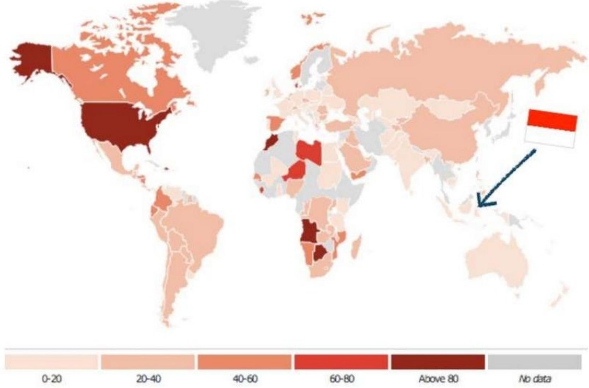

## Outline

Country Overview   
2 Mobile Internet ecosystem   
3 Mobile Internet business model   
4 Investment enrolled on Internet

### Full Page Description (Page 2)

**Source:** `assets/_page_2_Asset_0.jpg`

**Generated:** 2026-06-01 12:17:09

---

The image contains a bar chart with the title "GDP per capita." The chart displays the GDP per capita for the years 2010, 2011, 2012, and 2013. The GDP per capita values are shown as follows: $3,695 in 2010, $3,873 in 2011, $4,071 in 2012, and $4,271 in 2013. The bars are orange and increase in height from left to right, indicating an upward trend in GDP per capita over the four-year period. The chart is simple and clear, focusing on the economic indicator of GDP per capita.

### Full Page Description (Page 2)

**Source:** `assets/_page_2_Asset_1.jpg`

**Generated:** 2026-06-01 12:17:21

---

The image is a bar chart showing the penetration of smartphones from 2012 to 2015. The chart includes four vertical bars, each representing a year and its corresponding smartphone penetration percentage. The percentages are as follows: 9% in 2012, 24% in 2013, 35% in 2014, and 50% in 2015. The chart is labeled with the title "Smartphone Penetration" at the bottom. The main trend is an increasing penetration of smartphones over the years, with a significant jump from 2014 to 2015.

### Full Page Description (Page 2)

**Source:** `assets/_page_2_Asset_2.jpg`

**Generated:** 2026-06-01 12:16:56

---

The image contains a bar chart with the following key features:

1. **Type of Visualization**: Bar Chart
2. **Key Information**: The chart displays the Internet penetration in millions from 2011 to 2015. The years are listed on the x-axis, and the number of Internet users in millions is on the y-axis.
3. **Main Trends/Patterns**: There is a consistent increase in Internet penetration over the years, with a projected increase to 125 million in 2015.
4. **Important Labels/Text Annotations**: The chart includes the years 2011, 2012, 2013, 2014, and 2015 on the x-axis. The y-axis is labeled "Internet Penetration (in millions)." The projected number of Internet users in 2015 is labeled as "125 proj."

## Country Overview

Population: (July2013 est.)251,160,124

GDP(per capita):(2014) \$4,271

Mobile phone penetration: (2014) 278million (110%)

Internet penetration: (2014) 80 million (32%)

Facebook: $4 ^ { \mathrm { t h } }$ in the world at 70 million users

Twitter: $3 ^ { \mathsf { r d } }$ in the world at30million users

### Full Page Description (Page 3)

**Source:** `assets/_page_3_Asset_1.jpg`

**Generated:** 2026-06-01 12:22:01

---

The image contains a bar chart with data for the years 2010, 2011, and 2012. The chart compares average values (green bars) and female percentages (red bars) across these years. The percentages for the average values are 3.72%, 6.34%, and 6.02% for the years 2010, 2011, and 2012, respectively. The female percentages are 8.31%, 8.88%, and 8.47% for the same years. The chart visually represents the increase in both average values and female percentages over the three years.

### Full Page Description (Page 3)

**Source:** `assets/_page_3_Asset_0.jpg`

**Generated:** 2026-06-01 12:22:50

---

The image contains a horizontal bar chart with data for the years 2010, 2011, and 2012. The chart compares the percentages of males and females for each year. The blue bars represent males, and the red bars represent females. The percentages for males are consistently slightly higher than those for females across all three years. The percentages for males are 50.17 in 2010, 50.37 in 2011, and 50.35 in 2012. The percentages for females are 49.83 in 2010, 49.63 in 2011, and 49.65 in 2012. The chart uses a legend to differentiate between males and females.

## Country Overview

Historical Populationof IndonesiaTop15Cities

Source:www.bps.go.id

## Religious Demographics

Source:http://sp2010.bps.go.id/index.php/site/tabel?tid=321&wid=0

## Outline

Country Overview

2Mobile Internet ecosystem

3 Mobile Internet business model

4 Investment enrolled on Internet

## Outline

2

## MobileInternetecosystem

HandsetManufacturer

3 Internetindustry

## Telecom Operators (1)

In Indonesia,there are 6 (formerly10) GSM/WCDMA& CDMA operators,1 LTEoperator,and1WiMAX operator.

Big3telco:Telkomsel,XLAxiata,and Indosat (allGSMoperators).

GSM:Telkomsel,XLAxiata (AXISmerged withXL),Indosat,3

CDMA:Smartfren,Telkom Flexi (mergedwithTelkomsel),Esia,StarOne (merged with Indosat)

CDMAoperators willbe goneby 2016.Existing CDMA operatorsare told to mergeor migrate to LTEorbe sold to GSMoperators.

Smartfren,the best performing CDMA operator inrecent time,is migrating toLTETDD2.3GHz from PCS1900.

Bolt4Gis thecountry'sfirst commercial LTEoperator(data-only)operating LTETDDon2.3GHz frequency band. Bolt4G was formerly operating the country'sfirst commercial WiMAX,Sitra Wimax.

The otherWiMAX operator in Indonesia is Berca-owned company called WiGO which serves the eastern part of Indonesia.

### Full Page Description (Page 7)

**Source:** `assets/_page_7_Asset_1.jpg`

**Generated:** 2026-06-01 12:18:04

---

The image contains a pie chart with two segments. The larger segment, colored blue, represents 89% and is labeled "GSM." The smaller segment, colored red, represents 11% and is labeled "CDMA." The chart visually represents the proportion of GSM and CDMA technologies, with GSM significantly dominating the CDMA segment.

### Full Page Description (Page 7)

**Source:** `assets/_page_7_Asset_0.jpg`

**Generated:** 2026-06-01 12:17:56

---

The image contains a pie chart with five segments, each representing a different mobile operator in Indonesia. The chart is divided as follows: Telkomsel (42%), XL+AXIS (18%), Indosat (16.7%), 3 Indonesia (5.4%), and CDMA Operators (11%). The segments are color-coded for easy identification, with each operator's name and percentage clearly labeled. The chart provides a visual representation of the market share distribution among the major mobile operators in Indonesia.

## Telecom Operators (2)

Operator'sMarket Share (%)

Source:http://www.tribunnews.com/bisnis/2013/06/25/telkomsel-xl-dan-indosat-masuk-zona-merah-frekuensi

### Full Page Description (Page 8)

**Source:** `assets/_page_8_Asset_0.jpg`

**Generated:** 2026-06-01 12:21:31

---

The image is a bar chart that displays subscriber, smartphone, BlackBerry user, and data user statistics for various telecommunications companies in Indonesia. The companies listed are Telkomsel, XL, Indosat, 3, Smartfren, and Esia. The chart uses different colors to represent each category: blue for subscribers, red for smartphones, green for BlackBerry users, and purple for data users. The data is presented in millions. The chart highlights the dominance of Telkomsel in terms of subscribers, with over 132.7 million, and shows a significant number of data users across all companies. The chart also indicates a relatively small number of BlackBerry users, with the majority of users being data users.

Telecom Operators - 2013-2014 (3)

### Full Page Description (Page 9)

**Source:** `assets/_page_9_Asset_0.jpg`

**Generated:** 2026-06-01 12:24:33

---

The image is a bar chart comparing subscriber numbers, smartphone usage, BlackBerry users, Android users, and data users for three telecommunications companies: Telkomsel, XL, and Indosat. The chart uses different colors to represent each category: blue for subscribers, red for smartphones, green for BlackBerry users, purple for Android users, and teal for data users. The data is presented in millions. Telkomsel has the highest number of subscribers with 139.3 million, followed by XL with 58.3 million and Indosat with 54.2 million. Telkomsel also leads in smartphone usage with 35.4 million, while Indosat has the highest number of BlackBerry users at 10.4 million.

Telecom Operators - late 2014 (4)

### Full Page Description (Page 10)

**Source:** `assets/_page_10_Asset_1.jpg`

**Generated:** 2026-06-01 12:18:17

---

The image is a bar chart comparing the market share percentages of four telecommunications companies (Indosat, Telkomsel, XL, and Smartfren) in two different years, 2008 and 2012. The chart uses blue bars for 2008 and light blue bars for 2012. Indosat shows a decrease in market share from 34.6% to 25.4%, while Telkomsel shows a significant increase from 53% to 34%. XL shows a slight decrease from 35% to 31%, and Smartfren shows a substantial decrease from 21.5% to 14.4%. The chart visually highlights the changes in market dominance over the four-year period.

### Full Page Description (Page 10)

**Source:** `assets/_page_10_Asset_0.jpg`

**Generated:** 2026-06-01 12:19:40

---

The image is a line graph with data points representing years from 2008 to 2012. The y-axis ranges from 26 to 40, and the x-axis represents the years. The graph shows a downward trend, with the values decreasing from 38 in 2008 to 30 in 2012. Each data point is labeled with the corresponding year and value, making it easy to track the decline over the years.

## ARPU (1)

Initially reduced ARPUwasdue to massiveprice war,initiatedby the government.

CDMAoperatorsmanaged to force GSMoperatorstoreduce their tariffs.

Recentlypeopleusedata-based IM,VolP,etc.thus leadstoeven lessusage of SMSand voice call.

Tariffs have hit rock-bottom thus there will not beany pricewar anymore.

Less usage on SMS and voicealso leadtoreduced ARPU.

## Source:

http://www.ventureconsulting.com/assets/indomobile-Arpu4.pdf

### Full Page Description (Page 11)

**Source:** `assets/_page_11_Asset_0.jpg`

**Generated:** 2026-06-01 12:21:49

---

The image is a line graph showing the ARPU (Average Revenue Per User) trends for Voice, SMS, and Mobile Data services from 2013 to 2017. The graph has three lines, each representing a different service type: Voice ARPU in blue, SMS ARPU in light blue, and Mobile Data ARPU in black. The y-axis is labeled "ARPU" and ranges from 0 to 13.0. The x-axis represents the years from 2013 to 2017. The Voice ARPU shows a slight downward trend, while the SMS ARPU remains relatively stable. The Mobile Data ARPU shows a more pronounced upward trend over the same period.

## ARPU (2)

Voice ARPUwill continue to flatten in the mediumterm.

·SMSARPUwillcontinue to decrease,becausemajorityof users will be on smartphones eventually.

·Data ARPU willfall in short term,but will pick up later as users data consumption increases.

Continued trend of declining ARPUuntil 2015where data userswill start toenroll forbigger data plans due to increased usage of the mobile Internet and compensate the decliningvoiceand SMS ARPU.

Source:

## Outline

2

## MobileInternetecosystem

Telecom industry

2 Handset Manufacturer

3 Internetindustry

### Full Page Description (Page 13)

**Source:** `assets/_page_13_Asset_0.jpg`

**Generated:** 2026-06-01 12:19:55

---

The image is a bar chart comparing the market share percentages of different smartphone operating systems (Android, BlackBerry, Windows Phone, iOS, and Symbian) for the years 2012 and 2013. The chart uses blue bars for 2012 and red bars for 2013. Android had the highest market share in both years, with a slight increase from 56% to 60%. BlackBerry showed a significant decrease from 37% to 30%. Windows Phone had a small increase from 2% to 9%, while iOS and Symbian remained relatively stable with minimal changes.

## Mobile Handset (1)

Localmobile handsetmakersareaggressivemarketerstryingtobe the leading brand.

TopSmartphone Mobile Brand in Indonesia

Samsung

·Smartfren

BlackBerry

Lenovo

Evercoss

· Sony

Mito

·Apple

Nokia

LG

Others: Huawei,OPPO,TE, Xiaomi

## Mobile Platform(OS)Market Share (%)

## Source:

http://www.buzzcity.com/l/reports/The-BuzzCity-Report-Vol-4- Issue-3.pdf

http://id.techinasia.com/blackberry-kini-nomor-tiga-di-indonesiadikalahkan-bintang-baru-smartfren-andromax/

http://id.techinasia.com/pangsa-pasar-terbesar-android-os-palingrentan-grafik/

## Mobile Handset (2)

·Local brandsare very aggressive in marketing.Evercoss was the sponsor of themost watched TV program,X-Factor Indonesia and Indonesian ldol.

·Maxtron,Cyrus,S-Nexian,Tiphone,Polytroncan beseen inmanybillboardsin the country.

·These local brands cooperate with telcos to do data plan bundling.

·Evercoss ships 16 million phones annuallyand has 40 models in the market.

·Smartfren Andromax phones can only be used for Smartfren network,thus its sales helpswith Smartfren's useracquisition.

·Baidu Browser is preinstaledin Maxtron (not as default browser)and Andromax (as default browser) phones,but uninstallable.

## TopLocal Mobile Brandsin Indonesia

Evercoss

Smartfren

Mito

Advan

Significant local players:Maxtron,-Nexian,Advan,

Tiphone,Cyrus,,olytron,Ivu

Tabulet.

Source:http://www.techinasia.com/evercos-indonesias-biggest-local-handset-manufacturers/

## Outline

## MobileInternetecosystem

Telecom industry

HandsetManufacturer

B Internet industry

## Native Major Internet Companies

## Mobile Internet Overview (1)

## Data fromOpera

Top10Mobile Websites in Indonesia

## Top10 Android devices in Indonesia

1.Samsung GalaxyY(GT-S5360)   
2.Samsung Galaxy Mini(GT-S5570)   
3. SamsungGalaxyTab2(GT-P3100)   
4. Smartfren Andromax (Android AD683G)   
5. Samsung Galaxy YDuos(GT-S6102)   
6.Samsung Galaxy Chat (GT-B5330)   
7.Samsung Galaxy Pocket (GT-S5300)   
8.SamsungGalaxyW(GT-18150)   
9.Samsung Galaxy Ace(GT-S5830)   
10.Samsung Galaxy Mini2(GT-S6500D)

## Unlimited Browsing with Opera Mini

## Source:

## Mobile Internet Overview (2)

## Data from Opera (Jan2011&Sep2011)

Page-viewgrowth sinceJanuary 201o:29.2% Unique-usergrowthsinceJanuary201o:49.2% Datatransfergrowth sinceJanuary 201O:55.7% Pageviewsperuser:593 Data transferred per user(MB):6 Data transferred per pageview(KB):10

## Top10 sites in Indonesia(unique users)

facebook.com   
google.com   
detik.com   
youtube.com   
twitter.com(6)   
wapdam.com (5)   
yahoo.com   
wikipedia.org   
kaskus.us(back on the list)   
4shared.com(new)

## TophandsetsforJanuary2011

Nokia5130XpressMusic   
NokiaC3   
Nokia2700c   
NokiaE63   
Nokia2330c   
Nokia6300   
Nokia N70   
Nokia2730c   
Nokia3120c   
Nokia5310XpressMu

## Source:

http://www.operasoftware.com/archive/smw/2011/09/ http://www.operasoftware.com/archive/smw/2011/01/

Page-view growth since September201o:-4.5% Unique-usergrowthsinceSeptember2010:21% Datatransfergrowth sinceSeptember2010:3.4% Pageviews peruser:528 Data transferred per user(MB):5 Data transferred per page view(KB):10

## Top10 sites in Indonesia (unique users)

facebook.com   
google.com   
youtube.com   
detik.com   
yahoo.com（6）   
wikipedia.org(9)   
waptrick.com   
4shared.com   
my.opera.com (10)   
kaskus.us(back on the list)

## TophandsetsforSeptember2011

Nokia5130XpressMusic   
Nokia X2   
NokiaC3   
Nokia E63   
Nokia2330c   
Nokia6300   
Nokia2700c   
Nokia N70   
Nokia2730c   
Nokia3120c

## Internet Content Regulations

Legislators passed UU ITEwhich is supposed to protect people and businesses frommalicious Internet activities (suchas DoS,hacking,sniffing,etc.)

With UUITE,criminal acts overthe Internetcan be prosecuted and if convicted will result in jail time.

Ministry of ICTdeployed TrustPositif initiative to block illgal sites (porn, gambling,etc.)

Some sites like Vimeo,whichallownudity video,Imgur,and Reddit are blocked.

TrustPositif only blocks (and forcesredirect) DNS requests,thus this blocking method can easilybe circumventedasseen in UC Browser.

Internet users can face libel suitsand even criminal prosecution for comments posted by other users on their websites.In thecase of politician Misbakhun, theTwitter user who accused him of being a corruptor on Twittergot jail time. Misbakhun was previously convicted but overturned by higher court.

## Mobile E-commerce (1)

·Vserv.mobi states that almost 30%of e-commerce traffic in Asia Pacific come from smartphonesand tablets.

·Indonesian e-commerce website,lojai.com,recorded almost 20% of their sales come from mobile on May 2014.

·Tokobagus/OLX recorded 800% growth on their Android app in 2013.

·Rakuten managed to grow 438% on mobile during Apr-Dec 2012.

There are stillplenty of BBM Group “online shops"especially for fashionandapparels,inadditionto Instagramand Facebook "shops"(F-commerce).

Source:   
http:/inet.detik.com/read/2014/04/22/082250/2561457/319/geliat-e-commerce-lewat-ponsel--tablet   
http://lifestyle.bisnis.com/read/20140526/106/230915/transaksi-online-pengguna-mobile-commerce-terus  
meningkat  
http:/inet.detik.com/read/2013/03/12/092442/2191985/319/pengguna-aplikasi-android-tokobagus-naik-800   
http://teknokompas.com/read/213/02/13/2332752/bisnis.ecommerce.melesat.kencang

## Mobile E-commerce (2)

E-commerce with mobile apps:

OLX (1M-5M GP, #41AS)

Tokopedia (100K-500K GP)

Berniaga.com (1M-5M GP)

Zalora (1M-5MGP,#169 AS)

Lazada (1M-5MGP,#70AS)

Blibli (50K-100K GP)

Bukalapak.com (50K-100K GP)

Elevenia (100K-500K GP,#193AS)

Bhinneka (100K-500K GP)

Traveloka (100K-500KGP,#50AS)

Tiket.com (50K-100K GP, #155AS)

## Price comparison websites:

PriceArea (100-500)

Telunjuk (5000-10000)

Pricelist (1000-5000)

Source:Google Play&appannie.com

## Mobile Ads Networks (1)

Ads industryestimates in Indonesia annually: (2011) \$5 billion,(2012) \$7 billion.20%YoY growth.

Ads media breakdown:TVaccounts for 64% totalads expenses,33%on newspaper,and 3%onmagazines-tabloids.

Onaverage,Indonesian users consume 5 hours of media content.Mobile devicesaccountfor 36%of this,106minutes.Data from2012.

Customer decision influencer:mobiledevices (55%),TV(49%),desktop PC (39%).

In 2013according to XL,mobileads industry in Indonesia is worth \$9.5million. XL owned25%of themobileadsindustry,at\$2.3million.12.5%ofXL'smobile ads came from LBS ads.

·Mobile ads are expected to account for5 to 10% of total ads industryin 2015.

Currently intrusiveads (interstitialand offdeckads)are themost popular form of mobile ads in Indonesia and have sparked controversyin the society.

Source:   
http://inet.detik.com/read/2012/08/11/10o556/1988959/328/3/relakah-ponsel-anda-dibanjiri-sms-iklan   
http://inetdetik.com/read/2012/12/06/090313/2110752/398/indonesia-pasar-iklan-mobile-terbesar-ketiga-di-dunia   
http://tekno.kompas.com/read/2013/05/03/1538144/3.operator.seluler.bersatu.demi.iklan.mobile   
http://inet.detik.com/read/2014/05/20/165432/2587450/328/xl-tak-puas-cuma-kebagian-25-kue-iklan-di-ponsel   
http://bisniskeuangankompa.com/read/214/09/11/245606/Soal.lanPeralian.Tkomseldan.XAiataAaPatui   
Aturan

## Mobile Ads Networks (2)

Global Ads Networks:

Google AdMob

Vserv.mobi

InMobi

BuzzCity

LINE

Adways

Nexage

Mobgold

Komli Mobile

MobPartner

Innity

Appia

Tapjoy

Flurry

## Local Ads Networks:

LBS ad services from telcos

AdStars

AdPlus

Kliksaya

## Mobile Application Store

Indonesia isa Google Play-dominated market,other $3 ^ { \mathsf { r d } }$ party app stores have little tono impact in themarket

·Oomph (Smartfren App Store,Polytron App Store,&ADVAN App Store)

NEO Apps World (MiTO phones)

appmarket.co.id(tiPhone phones)

Mobogenie(Changyou)-400KMAU,20%growthMoM

Mobo Market (Baidu)

GudangApp (XL-Huawei)

TemanDev (Telkomsel)

Samsung,LG,Huawei,ZTE

Appota

AppTOKO

Archos Appslib

1mobile

Nexian's S-apps(http://sapps.iguanasms.com/)

Cyrus (http://www.cyrusaplikasi.com/)

SpeedUp Studio

## Source:

http://tekno.liputan6.com/read/2061048/ekspansi-indonesia-toko-aplikasi-mobogenie-suguhkan-

## Mobile Games

Mobilecontent providers (CP)used to supplyMIDP games.Thereareonlya fewmobile CPsleft that focusondownloadablemobile content.

Most games are downloaded through Google Play.

Populargames:

LINEGames(Let'sGet Rich,PokoPoko,STAGE,etc.)(rough estimate:\$300Kper month on games\*)

King.com (Candy Crush Saga,Farm Heroes Saga,etc.)

Supercell(Clash of Clans,Hay Day,Boom Beach,etc.)

Boyaa Texas Poker (last timeit generated\$12OK monthlyon Telkomsel alone)

Coalaa Texas Poker (about half of Boyaa'smonthly revenue on Telkomsel)

SubwaySurfers

DinerDash

Gameloft games

No local game publishers/developers managed to publish popular mobile games in Indonesia.Someactiveones:Winner,Alegrium,NightSpade,Toge Productions,etc.

Faunia Paw (developedbyArtoncodeandpublishedby LytoMobi) has19oo0MAU.

Source:GooglePlay&appannie.com

http://www.businessinsider.com/line-is-not-just-about-sticker-revenue-2013-12

## Mobile Entertainment (1)

Music industry has long stopped major marketing campaigns on musicdue to deteriorating sales of cassettes/CDsand increasingadoption of MP3 in phones.

Music industry hasbeen relatively quiet since the Black October incident in Indonesia.

Themusic industry is hitso bad,that it caused Aquarius (one of the oldest music labels in Indonesia) hadto closeits long standing music stores in Jakarta.

Disc Tarra also downsized their shops at shopping malls.Disc Tarra owns the largest physical musicdistribution chainin Indonesia.

Various local musicapps have struggled to bring profitable business, including industry heavyweights like Telkom'sMelOnand Telkomsel's Langitmusik.MusikLegal (byGenlD) also failedtogrowthemarket,despite GenlDbeing the official digital repository for most music labels in Indonesia.

Smartfren claims that Indonesian digital music industry isworth \$60 million for the last 12 months (2014).

## Source:

## Mobile Entertainment (2)

Smartfrenpreloads Gudang Musik into Smartfren Andromax phones, in cooperation with MelOn.GudangMusik offers1million songs from 87music labels,8of themare global labels.

Telkom's MelOn finally madeannual net profit of \$40oK in2014,after years of losses.MelOnmade \$6ooK net lossthe yearbefore.

Inaddition to the telcos' music businesses,currently Apple's iTunes contributes to digital income of the music label companies.

·Preloaded music stores on local Android phones have limited success.

Most radio stations have online streaming these days to appeal to broaderaudience,because radio stations operate locally.

Malaysia contributes to sales of original CDs of Indonesian music.

Nagaswara,one of Indonesia'stopmusic label with hundreds of artists under their management,earns \$10oK monthly from Malaysia.

Malaysians also buy Indonesian music through iTunes due to better penetration ofcreditcards inMalaysia.

## Other Commonly Preloaded Apps

Baidu Browser

DU Battery Saver

DU Speed Booster

NQ Mobile Security

Opera Mini

BBM

Facebook

Twitter

## Outline

Country profile

2 Mobile Internet ecosystem

3Mobile Internetbusinessmodel

Investment enrolled on Internet

Indonesia'sdataplanisnowoneofthecheapestintheworld.Thankstothegovernment-backedefortstoforce operatorstoreduce theirtariffsandmassivesuccessof BlackBerryin2oo8-2012.

> **AI Description:**
> **Source:** `assets/_page_30_Figure_0.jpg`
> 
> **Generated:** 2026-06-01 12:19:29
> 
> ---
> 
> The image is a world map with a color-coded legend indicating different ranges of values (0-20, 20-40, 40-60, 60-80, Above 80, No data). The map uses these color codes to represent data for various countries. The legend is located at the bottom of the image. The map highlights regions with data, with darker shades indicating higher values. The country of Indonesia is marked with a flag and an arrow pointing to it, suggesting it is of particular interest or importance in the context of the data being represented.

Pre-paid handset-basedsubscriptionwith 5Oombofdata permonthbasedon US\$atPurchasing Power Parity Source:ITU(2012),Andriodcentral.com(2013)

### Full Page Description (Page 31)

**Source:** `assets/_page_31_Asset_0.jpg`

**Generated:** 2026-06-01 12:20:10

---

The image contains a stacked bar chart comparing the percentage of male and female internet and mobile users in Indonesia and the Southeast Asia (SEA) average. The chart shows that in Indonesia, 51.6% of internet users and 71% of mobile users are male, while 48.4% of internet users and 29% of mobile users are female. For the SEA average, 63% of mobile users are male, and 37% are female. The chart uses red for female and blue for male, with percentages clearly labeled on each segment.

### Full Page Description (Page 31)

**Source:** `assets/_page_31_Asset_1.jpg`

**Generated:** 2026-06-01 12:20:27

---

The image contains a bar chart with the title "Indonesia Ad Impressions (BuzzCity)." It displays data for three quarters: Q1 2013, Q2 2013, and Q1 2014. The x-axis represents the quarters, and the y-axis represents the number of ad impressions in Indonesia. The bars are orange and labeled with the corresponding ad impression numbers. The chart shows a significant increase in ad impressions from Q1 2013 to Q1 2014, with Q1 2014 having the highest number of impressions at 16,322,888,551.

## Mobile Internet Growth (1)

62%of Internet usersaccess through mobile,and less than10%of them have Internet access at home.

92%of Internetusers in Indonesia own a Facebook account.

Almost9o%of the Indonesian Facebook usersaccess itthrough mobile.

AsidefromTV,Internet has become themain sourceof information,ahead of newspapers.   
60%of Internet usersalreadyrelyon the Internetto findinformation.

According to InMobi Indonesia made200 billionmobileads impression in 2012, $2 ^ { \mathsf { n d } }$ largest marketafterUS formobileads.

BuzzCity,a global mobileadsagency,records significant increase inad impressonsin Indonesia for2014.

## Source:

http:/id.techinasia.com/laporan-mayoritas-masyarakat-indonesia-akses-internet-lewat-perangkat-mobile-slideshow/ http://tekno.kompas.com/read/2014/10/12/09393227/Pagi.Ini.Mark.Zuckerberg.Kunjungi.borobudur

### Full Page Description (Page 32)

**Source:** `assets/_page_32_Asset_0.jpg`

**Generated:** 2026-06-01 12:17:45

---

The image contains a bar chart comparing offline and online shopping preferences. The left side of the chart, labeled "Offline Shopping," shows the percentage of respondents who purchased various items in person, with a base of all respondents (n=2105). The right side, labeled "Online Shopping," shows the percentage of respondents who purchased items online, with a base of those who have ever bought an online product (n=435). The chart includes categories such as apparel, shoes, bags, cinema tickets, books, handphones, watches, and more, with corresponding percentages for each category. The data highlights the shift in consumer behavior towards online shopping for certain items.

## Mobile Internet Growth (2)

Instantmessaging is theprimarymethod of communication formobilephone users.90%of themareusingIMeverydayand ofwhich 6O%use IMmultiple timesdaily.

Onaverage,thereare 4.2IMapplications installedon themobilephoneusers'device,with WhatsApp,BlackBerryMessenger(BBM),andLINEarethetop3IMinstalled.InSeptember 2014,LINE reported to have30millionusersfrom Indonesia.

E-commerce users prefer to shop online through conventional ecommerce sites (2O%),social media (26%),IMgrouplike BBMGroup (27%),and forumand classifiedslike Kaskusand OLX (27%).

## Source:

http://id.techinasia.com/laporan-mayoritas-masyarakat-indonesia-akses-internet-lewat-perangkat-mobile-slideshow/ http://id.techinasia.com/tingkah-laku-pengguna-internet-indonesia/

http://www.techinasia.com/line-releases-regional-breakdowns-for-its-49om-registered-users/

### Full Page Description (Page 33)

**Source:** `assets/_page_33_Asset_0.jpg`

**Generated:** 2026-06-01 12:22:20

---

The image contains a stacked bar chart comparing the age distribution of mobile users and internet users. The chart is divided into four age groups: <18, 18-24, 25-35, and >35. The left bar represents mobile users, with 21% in the <18 age group, 32% in the 18-24 age group, 33% in the 25-35 age group, and 14% in the >35 age group. The right bar represents internet users, with 20.80% in the <18 age group, 11.60% in the 18-24 age group, 26% in the 25-35 age group, and 41.60% in the >35 age group. The chart visually highlights that a larger proportion of internet users are in the >35 age group compared to mobile users.

### Full Page Description (Page 33)

**Source:** `assets/_page_33_Asset_1.jpg`

**Generated:** 2026-06-01 12:22:38

---

The image contains a pie chart with various categories representing different groups of people in Indonesia. The chart is divided into segments with percentages indicating the proportion of each group. The categories include Full-Time Job (39%), Business (16%), Entrepreneur (9%), Part-Time Job (12%), Student (16%), Housewives (4%), and Retired (4%). The chart also includes a note stating that one-fourth of mobile internet users in Indonesia are businessmen or entrepreneurs. The visual elements effectively convey the distribution of these groups within the population.

### Full Page Description (Page 33)

**Source:** `assets/_page_33_Asset_2.jpg`

**Generated:** 2026-06-01 12:23:27

---

The image contains a bar chart and a smartphone icon with icons representing different categories of mobile media consumption. The categories and their corresponding percentages are:

1. Social Media: 24%
2. Entertainment: 20%
3. General Info: 16%
4. Email: 14%
5. Games: 12%
6. Shopping: 8%
7. Local Search: 6%

The smartphone icon on the left side of the image displays icons for each of these categories, aligning with the percentages shown in the bar chart on the right. The chart visually represents the distribution of mobile media consumption across various categories in Indonesia, according to the InMobi Mobile Media Consumption report.

### Full Page Description (Page 33)

**Source:** `assets/_page_33_Asset_3.jpg`

**Generated:** 2026-06-01 12:23:07

---

The image is an infographic combining text with visual elements. It presents data on the most downloaded mobile content, with a bar chart showing percentages for games/applications (70%), video (49%), music (44%), and themes (33%). The chart uses different colors to represent each category, with a legend on the right side explaining the color coding. The title at the top states, "Games/Apps are the most downloaded mobile content," and the source is cited as "AIMA & VSEAV.mobi, The Mobile Internet Consumer Indonesia, 2013."

## Mobile Internet Demographics and Trends

Mobile Internetusersdemographics

What doesrevenue come from?

Advertisement Revenue share/commission Traffic/user exchange

Game   
Music   
Download   
VAS

## Mobile Internet Payment Options

Howdo userspay formobile ecommerce in Indonesia?

## Outline

Country profile

2 Mobile Internet ecosystem

3 Mobile Internet business model

4Investment enrolled on Internet

## Venture Capitals in Indonesia's Internet startups

MajorVenture Capitalin Indonesian Internetindustry

Source:http://www.techinasia.com/10-of-indonesia-most-active-venture-capital-firms/

Several othermajorVCsare playing the spaceaswell-MountainSEAVentures,ldeosource,Grupara, FenoxVenture Capital,IMJ InvestmentPartners.