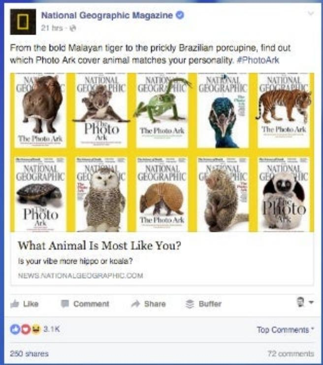
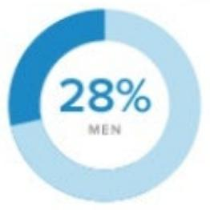
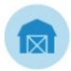

## Measuring Success on Facebook,Twitter&Linkedln

Class3:New York University

Social Media Analyticsl

## Steps for Measurement on Any Social Channel

## Identify the Audience

## Types of Content Shared

Photos

Video

Text

GIFs

Audio

Links

## Understand Your Goals

### Full Page Description (Page 5)

**Source:** `assets/_page_5_Asset_0.jpg`

**Generated:** 2026-06-01 12:38:19

---

The image contains a bar chart with five vertical bars of varying heights, each colored differently: pink, red, teal, yellow, and orange. A hand holding a pen is positioned over the yellow bar, suggesting an action of highlighting or drawing attention to it. The chart appears to represent some form of data comparison or progression, with the bars likely indicating different categories or time periods. The image also includes a watermark at the bottom right corner with the text "@BrianHonigman".

## Channel Specific Metrics

## Tools for Channel Measurement

## Cross Channel Measurement

SimplyMeasured

FB,Twitter,

Linkedln&

Instagram

Brandwatch

FB&Twitter

## Cross Channel Measurement

Google Analytics

Any Social Channel That Drives Traffic

Sprout Social & Socialbakers

FB,Twitter, Linkedln& Instagram

## Facebook's Audience

# Facebook Content Types

Ka ir but skeiterim ar obsesivi-kompulsivie traucejumiem?Adriena Bularda stasts http:/win.gs/22jKGAW

See Translation

> **AI Description:**
> **Source:** `assets/_page_10_Figure_0.jpg`
> 
> **Generated:** 2026-06-01 12:37:14
> 
> ---
> 
> The image contains a photograph of a person performing a trick inside a large circular metal structure, likely a sculpture or part of an urban art installation. The person is mid-air, with their body arched and legs extended, suggesting a dynamic and athletic movement. The background shows a clear blue sky, some trees, and buildings, indicating an outdoor urban setting. The image also includes social media interaction buttons at the bottom, suggesting it is a screenshot from a social media platform.

> **AI Description:**
> **Source:** `assets/_page_10_Figure_1.jpg`
> 
> **Generated:** 2026-06-01 12:38:33
> 
> ---
> 
> The image contains a Facebook post from National Geographic Magazine featuring a selection of animal covers from their "The Photo Ark" series. The post includes a variety of animal illustrations, such as a Malayan tiger, a Brazilian porcupine, a koala, a peacock, an owl, a turtle, a sloth, and a penguin, each representing a different animal species. The text encourages readers to find which animal matches their personality, with a question at the bottom asking if their vibe is more hippo or koala. The post has received 3.1K likes and 250 shares.

## Disneyland June 15 at8:00m@

They sayadad isadaughter's first love.We couldn'tagree morel Share thisvideo withthe Disney Dad inyourlifetoremind himthat he holds your heartforever!#HappyFathersDay

> **AI Description:**
> **Source:** `assets/_page_10_Figure_3.jpg`
> 
> **Generated:** 2026-06-01 12:38:42
> 
> ---
> 
> The image is a photograph showing two individuals, an adult and a child, interacting in what appears to be a playful or competitive manner. The adult is pointing at the child, who is holding a small object and appears to be in the middle of a gesture, possibly throwing or showing the object. The background is slightly blurred, suggesting a casual indoor setting. The image conveys a sense of interaction and engagement between the two individuals.

50,298Views Like-Comment·Share

4,257 peoplelike this

1,311 shares

## Social Litmus Test: Does Your Goal Work Here?

## Facebook Metrics

## FBMeasurement Tools

·Facebook Insights

· Sumall

·Agora Pulse

## Twitterusers

Among online adults,the%who useTwitter

Source:Pew Research Center'sIntemet ProjeaSeptemberCombinedOmnibusSurvey, September11-14&September18-21,2014.N=1,597internetusersages18+.The margin oferror forallintemetusersis+/-2.9percentagepoints.2013datafrom Pew InternetAugustTrackingSurvey,August07-September16,2013,n=1,445 internet usersages18+.

Note:Percentsgesmarked with an asterisk (\*)representa significantchange from2013.   
Results are significantatthe 95% confidence level usingan independentz-test.

PEWRESEARCHCENTER

## Twitter' 's Audience

## Twitter Content Types

Reuters U.S.News Retweeted

Reuters Pictures@reuterspictures·54m

A lookat some of the foreigners who have been detained in North Korea reut.rs/1VdcjpZ

> **AI Description:**
> **Source:** `assets/_page_15_Figure_1.jpg`
> 
> **Generated:** 2026-06-01 12:34:36
> 
> ---
> 
> The image is a collage of three photographs. The first photo shows a man speaking at a press conference, with microphones and other individuals in the background. The second photo depicts a man in military uniform standing at a podium, with another person seated behind him. The third photo shows a person holding a framed portrait of a leader, with another individual in the foreground. The images appear to be related to a formal or official setting, possibly involving a political or military context.

Target@Target·Mar9

## Home iswhere the WiFi connects automatically. #WednesdayWisdom

Maddie Irish @maddie\_irish

youcould beanywherein the countryand alwaysfeellikeyou'reat home in @Target

## Social Litmus Test: Does Your Goal Work Here?

## Twitter Metrics

Followers

Tweet Clicks

Video Views

Tweet Reach

Engagement Rate

Completion Rate

Engagement: Mentions, Retweets,ikes

Top Tweet,Top Mention,Top Follower,Top Media Tweet

Twitter Referral Traffic

## Twitter Measurement Tools

·Twitter Analytics

·Followerwonk

·Buffer

·TweetReach

### Full Page Description (Page 19)

**Source:** `assets/_page_19_Asset_0.jpg`

**Generated:** 2026-06-01 12:34:47

---

The image contains two pie charts, each representing the gender distribution of a population. The first pie chart shows that 28% of the population is male, while the second pie chart indicates that 27% of the population is female. The charts are color-coded with blue representing the percentage for each gender. The text "GENDER" is displayed at the top of the image, and the percentages and gender labels are clearly marked within each pie chart.

## Linkedln Usage Among Key Demographics

> **AI Description:**
> **Source:** `assets/_page_19_Figure_0.jpg`
> 
> **Generated:** 2026-06-01 12:35:04
> 
> ---
> 
> The image is a pie chart with a light blue background and a darker blue section representing 28% of the total. The chart is divided into two segments, with the larger portion labeled "MEN" and the smaller portion not labeled. The text "28%" is prominently displayed in the center of the chart, indicating the percentage of the total that is attributed to men. The chart is simple and clear, effectively conveying the proportion of men in the context of the data being represented.

> **AI Description:**
> **Source:** `assets/_page_19_Figure_1.jpg`
> 
> **Generated:** 2026-06-01 12:35:09
> 
> ---
> 
> The image contains a simple icon of two buildings, likely representing a cityscape or urban environment. The buildings are stylized with multiple windows, suggesting a multi-story structure. The icon is circular and appears to be a logo or symbol, possibly used to represent a company, organization, or concept related to urban development or real estate.

32% URBAN

> **AI Description:**
> **Source:** `assets/_page_19_Figure_2.jpg`
> 
> **Generated:** 2026-06-01 12:34:58
> 
> ---
> 
> The image contains a simple icon of a blue fence against a light blue circular background. There are no charts, graphs, or other visual elements present. The icon appears to be a generic representation of a fence, possibly used in a context where a fence is a relevant symbol, such as property boundaries or security.

29% SUBURBAN

> **AI Description:**
> **Source:** `assets/_page_19_Figure_3.jpg`
> 
> **Generated:** 2026-06-01 12:34:54
> 
> ---
> 
> The image contains a simple icon of a barn, which is a common symbol used to represent agriculture, farming, or rural areas. The barn is depicted in a stylized manner with a triangular roof and a door marked with an 'X'. There are no charts, graphs, or other visual elements present in the image. The icon is contained within a circular blue background, which serves as a frame for the barn icon.

14% RURAL

## INCOME

EDUCATION

44% >\$75K

> **AI Description:**
> **Source:** `assets/_page_19_Figure_4.jpg`
> 
> **Generated:** 2026-06-01 12:35:15
> 
> ---
> 
> The image contains a single, simple icon of a blue dollar bill with a dollar sign in the center. It is a visual representation of money or currency, likely used to symbolize financial concepts or economic data.

31% \$50K-\$75K

> **AI Description:**
> **Source:** `assets/_page_19_Figure_5.jpg`
> 
> **Generated:** 2026-06-01 12:35:12
> 
> ---
> 
> The image contains a single icon of a dollar bill with a dollar sign in the center. The icon is blue and appears to be a simple graphic representation commonly used to symbolize money or currency. There are no additional visual elements or text annotations present in the image.

> **AI Description:**
> **Source:** `assets/_page_19_Figure_8.jpg`
> 
> **Generated:** 2026-06-01 12:35:29
> 
> ---
> 
> The image contains a single icon of a blue dollar bill with a dollar sign in the center. The icon is a simple, flat design and is likely used to represent money or currency in a digital or graphical context. There are no additional visual elements or text annotations present in the image.

> **AI Description:**
> **Source:** `assets/_page_19_Figure_9.jpg`
> 
> **Generated:** 2026-06-01 12:35:26
> 
> ---
> 
> The image contains a single, simple icon of a blue dollar bill with a dollar sign in the center. It is a graphical representation of currency, likely used to symbolize financial or economic concepts. The icon is minimalistic and does not contain any additional text or data.

21% \$30K-\$49K

15% <\$30K

## 50%

COLLEGE GRADUATE

22%
SOME COLLEGE

12% HIGH SCHOOL ORLESS

sproutsocial
http://www.pewintectorg/les/2015/01/Pi\_SociMediaUpdate20144.pd http .nkedin.com/about-lin

# Linkedln Content Types

OpenX shared:

Sponsored

Folow

Is your current ad servermakingthe best decisions? htps:/nkd.in/eH6bJvd

## Can Switching Ad Servers Make You Smile?

wr

> **AI Description:**
> **Source:** `assets/_page_20_Figure_0.jpg`
> 
> **Generated:** 2026-06-01 12:37:04
> 
> ---
> 
> The image is a photograph of a person with curly hair, smiling and looking to the side. The person is wearing a light pink top with a white design on it. The background appears to be a neutral, light-colored surface, possibly a couch or chair. The image conveys a casual and relaxed atmosphere.

VIEWCASE STUDY

OpenX

Like·Comment·Share·2

Dave Kerpen

Founder&CEO,Likeable Local,NY Times Best-Seling Author&Speaker

4h

The worid of communication is rapidly shifting.To keep up, you could spend thousands of hours trying tofigure out how to win fansand customersusing theltest social networks(by the way，they may change next week),cr you could buy..show more

## OF PEOPLE

TheArt of People:11 Simple People Skills That Will Get You Everything You Want

1Simple People Skills Tht

amazon.com ·The Art of People:11 Simple People Skills That WillGet You Everything You Want [Dave Kerpen on Am...

Shannon Patterson Ijust pre-ordered my copy of this from the UK after reading an excerptand findingmyself intrigued.Looking forward to reacing it!

> **AI Description:**
> **Source:** `assets/_page_20_Figure_2.jpg`
> 
> **Generated:** 2026-06-01 12:36:58
> 
> ---
> 
> Error analyzing image: model runner has unexpectedly stopped, this may be due to resource limitations or an internal error, check ollama server logs for details (status code: 500)

Add a comment...

Pandora shared:

P

Sponsored

Embracing the next phase of personalization with Gatorade's senior director of consumer engagement,Kenny Mitcheli-watch the SXSW interview.

Follow

> **AI Description:**
> **Source:** `assets/_page_20_Figure_3.jpg`
> 
> **Generated:** 2026-06-01 12:36:58
> 
> ---
> 
> The image contains a photograph of a man sitting outdoors, likely in a casual setting. He is wearing a light blue shirt and appears to be engaged in a conversation or interview. The background shows a fence and some greenery, suggesting an urban or suburban environment. The image also includes text at the bottom identifying the person as Kenny Mitchell, Sr. Director of Consumer Engagement at Gatorade. There is a play button overlay in the center of the image, indicating that this is a still from a video.

Winning the Battle forAttention:Kenny Mitchell-Personalization

YouTube·Kenny Mitchell Sr. Director of Consumer Engagement at Gatorade,sat down at SXSWto dscuss the role personalization plays in winning the batle for..

Like·Comment·Share·271

## Social Litmus Test: Does Your Goal Work Here?

## Linkedln Metrics

## Linkedln Measurement Tools

Google Analytics

Any Social

Channel That

DrivesTraffic

Sprout Social,

Simply Measured & Socialbakers

FB,Twitter,

Linkedln&

Instagram

## Questions!?