
Mi Phone User Guide

## Welcome

Mi phone is powerful smart phone brand presented by Xiaomi Inc.

Please visit www.mi.com to learn more features about Mi phone and purchase accessories.

To know more features about MIUI, please visit www.miui.com

This user guide may differ from actual phone due to software update. Please refer to your actual phone accordingly.

This revision is updated on 12th May, 2016

## Table of Contents

Chapter 1: Overview   
Overview 1   
Applications 3   
Status Bar Icons 7   
Chapter 2: Get Started 9   
Important Information 9   
Battery and Charging 9   
USB Connectivity 9   
Headset Quick Guide 10   
Chapter 3: Basic Function 11   
Applications 11   
Gestures 11   
Notification Panel 12   
Text Input 12   
Chapter 4: Introduction of Detailed Functions 1 4   
Phone 14   
Take Photos and Videos 24   
Entertainment 26   
Browse the Web 29   
Multi-Tasks 29   
Add Widgets, Change the Wallpaper and Home Screen Thumbnail 29   
Changing Themes 30   
System Tools 31   
Other Utilisations 32

## Chapter 1: Overview

## Overview

Thank you for choosing Mi Phone! This user guide will help you with Mi Phone basics and advance functions. For more information, please visit our official website: www.mi.com

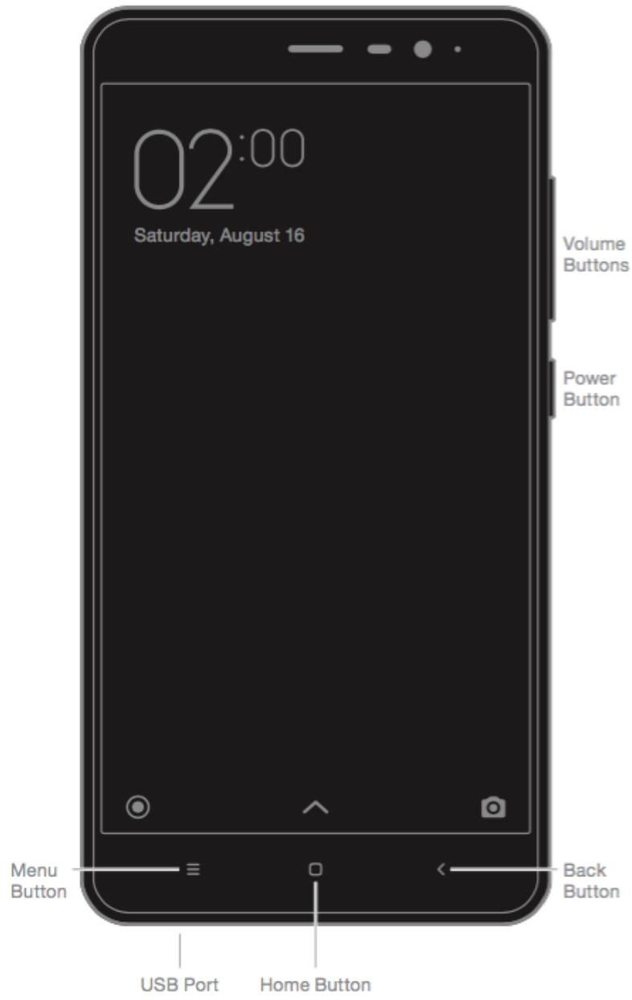

> **AI Description:**
> **Source:** `assets/_page_3_Figure_0.jpg`
> 
> **Generated:** 2026-06-01 12:52:10
> 
> ---
> 
> The image is a technical illustration of a smartphone, showing the front view with labeled buttons and ports. It includes the following labeled components: Menu Button, USB Port, Home Button, Back Button, Power Button, and Volume Buttons. The screen displays the time as 02:00 and the date as Saturday, August 16. The illustration is designed to provide a clear visual guide to the phone's layout and button functions.

\*Picture shown above may differ from each model. Please refer to your actual phone accordingly.

## Buttons

## Installing the SIM or USIM card

For phones with non-removable batteries:

1. Take the ejection pin out from print bundleҔ

2. Insert the ejection pin into the hole on/beside the tray to loosen the tray and pull out the tray from the slot gentlyҔ

3. Place the SIM or USIM card on the tray properlyҔ

4. Insert the tray back into the tray slot.

For phones with removable batteries:

1. Remove the back cover and the battery

2. Insert the SIM or USIM into the slot with metal contacts facing downҔ

3. Insert the battery and close the back cover.

## Applications

> **AI Description:**
> **Source:** `assets/_page_5_Figure_0.jpg`
> 
> **Generated:** 2026-06-01 12:51:31
> 
> ---
> 
> The image contains a simple icon of a white telephone handset on a green square background. The icon is a standard representation of a phone call or communication. There are no charts, graphs, or additional visual elements present. The image is purely a graphic symbol with no textual or numerical information.

Phone

Making phone calls or searching contacts with T9 keyboard. You can also check your call logs.

> **AI Description:**
> **Source:** `assets/_page_5_Figure_1.jpg`
> 
> **Generated:** 2026-06-01 12:50:58
> 
> ---
> 
> The image contains a simple icon with a white speech bubble on an orange background. The icon is a minimalist representation of a chat or messaging symbol, commonly used to denote communication or dialogue. There are no charts, graphs, or other visual elements present. The icon is purely graphical and does not convey any specific data or information beyond its basic function as a visual representation of a chat or message.

Messaging lets you exchange text messages with other SMS and MMS devices using your cellular connection.

Messaging

> **AI Description:**
> **Source:** `assets/_page_5_Figure_2.jpg`
> 
> **Generated:** 2026-06-01 12:50:37
> 
> ---
> 
> The image contains a simple icon of a person's head and shoulders against a blue background. The icon is a generic representation of a user or contact, often used in digital interfaces to indicate a person or account. There are no charts, graphs, or other visual elements present in the image.

You can manage your contacts saved in SIM/UIM, external memory and Mi account.

Contacts

> **AI Description:**
> **Source:** `assets/_page_5_Figure_3.jpg`
> 
> **Generated:** 2026-06-01 12:50:53
> 
> ---
> 
> The image contains a simple icon of an envelope, which is commonly used to represent email or communication. There are no charts, graphs, or other visual elements present in the image. The icon is a white shape with a gray outline, resembling an envelope with a flap.

Mail

Setup your mail account and access your mailbox with Mi phone. You will receive notification when new email received.

> **AI Description:**
> **Source:** `assets/_page_5_Figure_4.jpg`
> 
> **Generated:** 2026-06-01 12:51:34
> 
> ---
> 
> The image contains a simple icon with a gradient background transitioning from red to pink. At the center of the icon is a white musical note symbol. The icon is square-shaped and appears to represent a music-related application or service.

Dirac HD sound brings a genuine improvement in audio performance, immersing your ears in a world of music.

Music

> **AI Description:**
> **Source:** `assets/_page_5_Figure_5.jpg`
> 
> **Generated:** 2026-06-01 12:51:38
> 
> ---
> 
> The image contains a simple icon of a camera. The icon is circular with a white border and a gray center, featuring a black lens in the center. There are no charts, graphs, or other visual elements present in the image. The icon is likely used to represent a camera or photography-related function.

Take photos and record videos using various modes and settings.

Camera

> **AI Description:**
> **Source:** `assets/_page_6_Figure_0.jpg`
> 
> **Generated:** 2026-06-01 12:48:42
> 
> ---
> 
> The image is a simple icon depicting a landscape with a sun rising over a green field. It appears to be a stylized representation of a countryside or farmland scene. The icon is likely used to represent themes such as nature, agriculture, or rural life.

The new Gallery with reorganized layout enables smooth browsing of images. Cloud albums will sync automatically, making it easy to create albums and manage photos.

Gallery

> **AI Description:**
> **Source:** `assets/_page_6_Figure_1.jpg`
> 
> **Generated:** 2026-06-01 12:49:02
> 
> ---
> 
> The image contains a simple icon with a purple background. The icon features a white circle with a curved line inside it, resembling a stylized 'O' or a partial ring. There are no charts, graphs, or other visual elements present. The icon appears to be a logo or a symbol, possibly representing a brand or a concept, but the exact meaning is not clear from the image alone.

Browser

It brings you a smooth browsing and reading experience, and additionally offers comprehensive security protection.

> **AI Description:**
> **Source:** `assets/_page_6_Figure_2.jpg`
> 
> **Generated:** 2026-06-01 12:48:39
> 
> ---
> 
> The image contains a simple icon of a paintbrush with a gradient background transitioning from blue to yellow. The paintbrush is white and appears to be in the process of applying paint. There are no text annotations or additional visual elements present in the image.

Themes

Personalise your MI Phone by choosing from hundreds of unique MI Themes. Choose your own style, change it to fit your moods simply and quickly with just a few screen taps.

> **AI Description:**
> **Source:** `assets/_page_6_Figure_3.jpg`
> 
> **Generated:** 2026-06-01 12:48:20
> 
> ---
> 
> The image depicts a simple icon of a folder, which is commonly used to represent directories or files in digital interfaces. The folder is a solid orange color with a small tab on the top left corner, indicating that it is a standard folder icon. There are no charts, graphs, or other visual elements present in the image.

File explorer lets you check storage usage and file browsing. You can also use WLAN to manage your phone storage remotely.

File Explorer

> **AI Description:**
> **Source:** `assets/_page_6_Figure_4.jpg`
> 
> **Generated:** 2026-06-01 12:49:44
> 
> ---
> 
> The image contains a simple icon with a green background. The icon features a white shield shape with a plus sign in the center, symbolizing health, safety, or medical care. There are no charts, graphs, or other visual elements present in the image.

The Security and Privacy functions allow you to set how you’d like to lock and unlock your phone. The MIUI supports application encryption. Using MIUI virus scan and block-list features could prevent your phone from virus attacks, spam calls and junk SMS.

> **AI Description:**
> **Source:** `assets/_page_6_Figure_5.jpg`
> 
> **Generated:** 2026-06-01 12:49:22
> 
> ---
> 
> The image contains a simple blue square with a white upward-pointing arrow in the center. The arrow is a standard icon used to represent upward movement or progression. There are no charts, graphs, or other visual elements present in the image. The image is purely a symbol with no additional text or annotations.

Keep your updated to latest MIUI version.

Updater

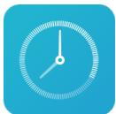

> **AI Description:**
> **Source:** `assets/_page_6_Figure_6.jpg`
> 
> **Generated:** 2026-06-01 12:49:58
> 
> ---
> 
> The image contains a simple icon of a clock with a blue background. The clock is white with black hands and a white center. There are no labels, text, or additional elements present in the image.

Customize your alarm clock setting and tag each of the alarm.

Clock

Notes

You can take down notes and share via SMS, Bluetooth, mail and etc.

Radio supports auto scan and lets you listen to local FM radio stations.

> **AI Description:**
> **Source:** `assets/_page_7_Figure_2.jpg`
> 
> **Generated:** 2026-06-01 12:49:25
> 
> ---
> 
> The image contains a simple icon with a gray square background. Inside the square is a white circle with an orange dot in the center. There are no labels, text, or additional elements present in the image.

Recorder

Recorder lets you use Mi Phone as a portable recording device.

Calendar

Check out all the dates and public holidays. Calendar also supports lunar calendar.

> **AI Description:**
> **Source:** `assets/_page_7_Figure_4.jpg`
> 
> **Generated:** 2026-06-01 12:48:28
> 
> ---
> 
> The image contains a simple icon with a dark gray background. At the center is a white circle with a red arrow pointing to the right, and inside the circle is a white letter "N". The icon appears to be a logo or symbol, possibly representing a compass or navigation direction.

Compass

Find a direction, see your latitude and longitude, nd level, or match a slope.

> **AI Description:**
> **Source:** `assets/_page_7_Figure_5.jpg`
> 
> **Generated:** 2026-06-01 12:48:32
> 
> ---
> 
> The image contains a simple green square with a white downward arrow in the center. The arrow is pointing downwards, suggesting a direction or action to proceed or move forward. There are no charts, graphs, or other visual elements present in the image. The primary feature is the arrow, which could symbolize a download, submission, or a similar action.

Manage all your download contents.

Downloads

Calculator provides simple and complex calculation function.

Calculator

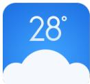

> **AI Description:**
> **Source:** `assets/_page_8_Figure_0.jpg`
> 
> **Generated:** 2026-06-01 12:50:29
> 
> ---
> 
> The image contains a simple icon of a cloud with the number "28°" displayed above it. The cloud icon is blue with a white outline, and the temperature is shown in a white font. The icon is likely used to represent weather conditions, specifically indicating a temperature of 28 degrees Celsius.

Get the latest whether information online.

Weather

> **AI Description:**
> **Source:** `assets/_page_8_Figure_1.jpg`
> 
> **Generated:** 2026-06-01 12:50:33
> 
> ---
> 
> The image contains a simple icon of a file folder with two horizontal lines inside it. The icon is a flat design with a dark gray background and a white outline of the folder. There are no labels or text annotations present in the image. The icon likely represents a file or folder in a digital interface, possibly indicating a storage or document management function.

Portable QR code, bar code scanner.

Scanner

\* Application may different due to the region sold.

## Status Bar Icons

Notification bar will show below icons to indicate different status.

## Chapter 2: Get Started

## Important Information

To avoid injury, please read following critical information before using Mi phone.

• Please do not switch on your Mi phone in the place where wireless device is prohibited, for instance, plane, hospital and medical equipment with “No Mobile Phone” sign

• Please do not switch on your Mi phone where RF and cellular signal could possibly cause danger or interference, for instance, gas station, fuel, chemical solution and explosive article.

• Please use authentic Mi branded accessories and batteries. Do not use unauthorised accessories.

• Please keep your phone in dry condition

• Repair job should be operated by authorised professionals.

• For external plugged-in accessories, please read the user guide and handle with care.

• Xiaomi Communications Co., Ltd. and its affiliates (“Xiaomi”) will not be liable for any injuries, loss or damages due to unauthorised modifications or modes of operations of Xiaomi products.

Correct Disposal of this product.This marking indicates that this product should not be disposed with other household wastes throughout the EU. To prevent possible harm to the environment or human health from uncontrolled waste disposal, recycle it responsibly to promote the sustainable reuse of material resources. To return your used device, please use the return and collection systems or contact the retailer where the product was purchased. They can take this product for environmental safe recycling.

## Caution

RISK OF EXPLOSION IF BATTERY IS REPLACED BY AN INCORRECT TYPE. DIS-POSE OF USED BATTERIES ACCORDING TO THE INSTRUCTIONS.

To prevent possible hearing damage,

do not listen at high volume levels for long periods.

Temperature: 0°C—40°C

Adapter shall be installed near the equipment and shall be easily accessible.

## Battery and Charging

The battery icon in the upper-right corner shows the battery level or charging status. To display the percentage of battery charge remaining, go to Settings > Additional settings > Battery & performance > Battery indicator. When syncing or using Mi phone, it may take longer to charge the battery.

## USB Connectivity

With the supplied USB cable, you can transfer data from other devices. You can choose the connection mode in the notification panel.

## Headset Quick Guide

\* You can also customise the function of each button in the latest MIUI version.

# Chapter 3: Basic Function

Applications

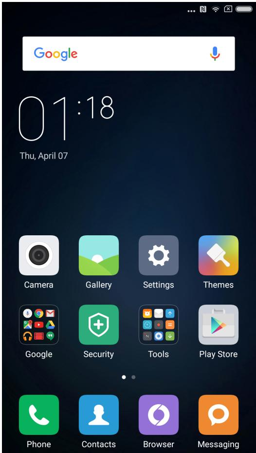

> **AI Description:**
> **Source:** `assets/_page_13_Figure_0.jpg`
> 
> **Generated:** 2026-06-01 12:49:40
> 
> ---
> 
> The image shows a smartphone home screen with a dark background. It includes a Google search bar at the top, displaying the time as 01:18 and the date as Thursday, April 07. Below the search bar are several app icons arranged in a grid: Camera, Gallery, Settings, Themes, Google, Security, Tools, Play Store, Phone, Contacts, Browser, and Messaging. The icons are colorful and represent various functions of the phone. The layout is clean and organized, typical of a user interface for a mobile device.

• If you need to launch an APP, just tap the icon in the home screen.

• Return to home screenғPress the home button.

• Switch to other home screensғSwipe left/right on the screen, or tap the white dot.

• Switch to recent used APPs: Press the menu button.

## Gestures

You can operate icon, button, menu, and input keypad via gesture function.

• Tapping: To open an APP, to select a menu item, to press an on-screen button, or to enter a character using the keypad on the screen, tap it with your finger.

• Tapping and holding: Tap and hold an item or screen or more than 2 seconds to access available options.

• Swiping: Swipe to the left or right on the Home screen or Apps screen to view other panels. Swipe upwards or downwards to scroll through a webpage or a list of items, such as contacts.

• Spreading and pinching: Spread two fingers apart on a webpage, map, or image to zoom in a part. Pinch to zoom out.

• Dragging: To move an item, tap and hold it and drag it to the target position.

• Double-tapping: Double-tap on a webpage or image to zoom in. Double-tap again to return.

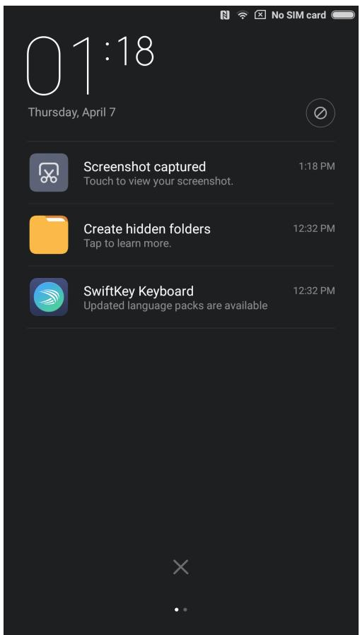

> **AI Description:**
> **Source:** `assets/_page_14_Figure_0.jpg`
> 
> **Generated:** 2026-06-01 12:49:55
> 
> ---
> 
> The image contains a screenshot of a smartphone lock screen. It displays the time as 01:18, the date as Thursday, April 7, and a notification indicating that a screenshot was captured at 1:18 PM. Additionally, there are two more notifications: one suggesting to create hidden folders, and another about SwiftKey Keyboard with an update available. The background is dark, and the icons and text are white, providing a clear contrast.

## Notification Panel

When there are icons shown in the notification bar, please drag down from the notification bar to open the notification panel and check the details of the information.

## Text Input

Virtual keypad is available for text input purpose.

Below is an example showing how to use the input keypad. Detailed interface layout and operations depends on the keypad which you set by default.

## Opening the keypad

1. Type the input field( such as typing a message) to open the keypad. There is cursor flashing in the input field.

2. Type the letter on the keypad.

SwiftKey

Google Keyboard

Fleksy

Google Pinyin Input

\* You can change the keypad in the notification panel. When you want to change the keypad please pull down the notification panel to select which keypad you want to use.

# Chapter 4: Introduction of Detailed Functions

Phone

Making A Call and Answering a Call

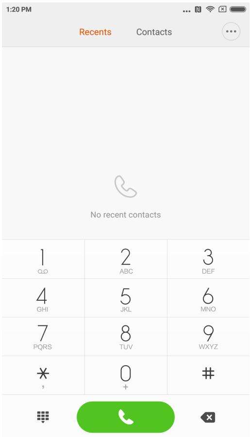

> **AI Description:**
> **Source:** `assets/_page_16_Figure_0.jpg`
> 
> **Generated:** 2026-06-01 12:50:49
> 
> ---
> 
> The image is a screenshot of a phone's dialer interface. It displays a keypad with numbers and letters for dialing, along with a green call button at the bottom. The top of the screen shows the time as 1:20 PM and indicates the device is connected to a network and has a battery level. The "Recents" tab is selected, and the text "No recent contacts" is displayed, indicating there are no recent calls or contacts listed. The interface is clean and minimalistic, with a simple design and no additional visual elements.

## Making A Call

Using the dial key

Dial the phone number: input the numbers directly, press the calling button to start calling.

Type the symbol” + “ : Tap and hold number key “0” for seconds.

Type the pause symbol “ , “: Tap and hold key \* for seconds.

Enter the voice mail box: Tap and hold number key “ 1 “ for seconds.

## Making A Fast Call via T9 Dial Key

Search via T9 dial key support:

Search a contact via any letter of his / her English name;

Search a contact via any number of his / her phone numbers;

It will show the matched results with highlighted remark. You can make the call via typing the highlighted parts.

## Calling via “Recents”

Latest calls will be found in “Recents”. You can make the same call via typing his/her name or phone numbers in the call log.

The arrow icon on the right is used to access the interface of detailed information.   
Missed calls will be remarked in red with calling times.   
It will show the attribution of strangers’ numbers.

## Calling via the “Contacts”

If you want to call someone via “Contacts” please swipe to the left to access “Contacts” interface. You can choose the person’s name and press to dial his/her numbers.

## Emergency call

You can make emergency call without SIM card or register to local network under the support of the network operator. For example: Type 112, type the calling button to make a emergency call.

## Speaker Mode

Use hands-free function to make a call. When blue-tooth is connected, “Hands-free” will be changed to “Connect to the device” which is used to switch the communication device during a call.

## Keypad

Open keypad to dial phone numbers.

## Mute

Mute your line.

## Record

You can save a talk on the phone by tapping “Record” button.

## Notes

Tap ”Notes” button to open the note and manually type text. The note will be saved automatically.

Xiaomi Communications Co., Ltd.

## Contacts

Tap ”Contacts“ to open “Contacts” interface and view contacts’ information.

## Calling from The Third Party

When you receive a third party call during an on-going call, your phone will beep and show detailed contact information of the third party caller to remind you to decide ”Answer” or “Ignore”.

\* Calling the third party or receiving a call from the third party is optional service. Please contact your network operator for more information.

## Hold

When you want answer a call from the third party during on-going calling you can press “hold” to let current call wait. When you finish the call with the third party you can type ”Resume call” to retrieve the held call.

## Adding Call

You can jump to “Contacts” interface to add the other contact when you are calling on the phone. When the other call is answered your on-going calling will be held. In this situation you can choose “Switch” or “Merge call”. When you choose “Merge call” your phone will be change to “Conference call” mode.

## Conference Call

If	your	network	operator	can	support	Multi-user	talk	you	can	set	up	a	conference	call	with	no more	than	5	people.

Create	conference	call:	Firstly	make	a	call.	Secondly	type	“Add	calls”	to	call	the	other	contact. The	Birst	call	will	be	held	in	this	situation.	Thirdly	type	“Merge	call”	to	Merge	all	the	contacts	to the	same	line	where	all	 the	people	can	hear	each	other	and	 talk	with	each	other.	Repeat	 the second	and	the	third	step	to	add	more	calls.	During	the	conference	call	you	can	type	the	buttons	on	the	calling	interface	to	edit	conference	call:	there	will	be	listed	all	the	contacts	on	the conference	call;	You	can	stop	calling	with	anyone	or	only	talk	with	someone	of	the	contacts.

## Making A Call During Calling

Tap” Add calls” and call the other contact. Your first call will be held.

Tap” Merge call” . All the calls will be merged to the same line so that all the people on the call will hear each other.

Repeat the second and third step to add more contacts.

Answering A Call

Answering

Swipe upwards “Answer” button to answer a phone.

Xiaomi Communications Co., Ltd.

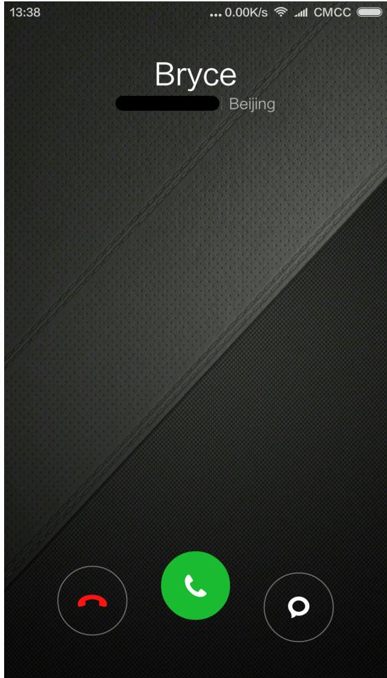

> **AI Description:**
> **Source:** `assets/_page_20_Figure_0.jpg`
> 
> **Generated:** 2026-06-01 12:51:13
> 
> ---
> 
> The image displays a phone call interface with a dark textured background. At the top, the name "Bryce" and the location "Beijing" are shown. Below the name, there are three circular icons: a red hanging phone symbol for ending the call, a green phone symbol for accepting the call, and a chat bubble icon for messaging. The time "13:38" is displayed in the top left corner, and the status bar at the top right indicates network and battery status.

Swipe upwards ”Reject” button to reject a call. You can swipe upwards “ Message “ button to reject the call and send a message instead.

## Changing the Gesture of Answering A Phone

Mute the ringtone of the calling: Press” Power” button or any “Voice” button, the ringtone will be mute, but you can still decide to answer the phone.

## Recognising Strangers’ Phone Numbers

The phone numbers of the sellers will be recognised as the name of the seller. For example: 10010 will be recognised as “China Unicom” automatically.

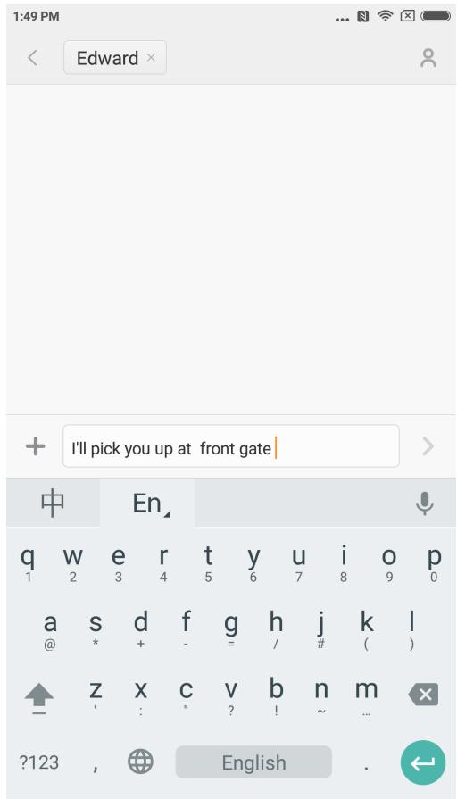

> **AI Description:**
> **Source:** `assets/_page_21_Figure_0.jpg`
> 
> **Generated:** 2026-06-01 12:52:21
> 
> ---
> 
> The image shows a mobile messaging app interface with a text input field. The text "I'll pick you up at front gate" is typed into the input field. The keyboard is visible at the bottom, displaying the English language layout. The top of the screen shows the time as 1:49 PM and the battery and network status icons. The interface is clean and focused on the text input, with no additional visual elements or charts.

## Editing An SMS

1. Tap “Compose” button.

2. Add a recipient

Directly type a contact’s phone numbers; Type any letters or phone numbers of a contact, select the result from below speed search bar and press the icon “Add contacts” on the right to select which one you want from contacts list. If you choose contacts by mistake you can delete the wrong contacts by pressing the added contacts preview.

3.Tap “Text message” to type text.

There is a remind of text’s capacity above “Send” button (It will appear if there is enough space). When there is more than 1 message in the mailbox it will show current messages’ quantity. If you attach picture, video or PPT. the message will be switched to MMS directly. Besides that it can support attaching emoticon, contacts’ information, mass name, everyday expressions.

4. Tap “Send” button.

## Reading An SMS

When you receive a message there will be a remind with sender’s name, preview and receive time in the message list. You can read the completed message by typing the list. After reading the message you can also reply it to the sender immediately.

## Reading MMS

When you receive MMS it will remind you to download the MMS via tapping “Download” button.

If MMS has a image or video attachment: Read the attachment through the “Gallery”. If MMS has an audio attachment: It will be played through the system’s media player

## Sending A Group SMS

It will show the sending progress such as “sending the message to which number contact” If it failed to send a message to someone there will be a remind to ask the user to select retry or give up.

When all messages are sent you can check every sent message by pressing message list of the group.

## Deleting An SMS Dialogue or A Message

You can access “edit mode” by tap and hold a message in the message list or message dialogue for seconds. In this situation you can select the message which you want to remove.

## Manage Preview and Notifications

You can enable preview and light up the screen in the message’s settings.

If you enable the preview you can view it from locked screen, notifications bar, pop-up windows when you receive a new message.

If you enable light screen function the screen will be lighted automatically when you receive a new message so that you can read, reply, delete the message fast.

## Search An SMS

You can click search bar to access search mode. You can search all messages’ text here.

## Adding A Message to “Favorite”

Tap any message in the message list for seconds to find “More” at the bottom of the menu. If you tap “Starred” it will add the message to favourites. The message in the favourite list will be remarked with a heart icon. If you tap the “Starred” icon again the message will be removed from favourite list.

All the favourite messages will be listed in the favourite list. User can forward the message or cancel the starred icon of the message.

## Pin An SMS Dialog to The Top

Tap and hold any dialog in your SMS list and tap the “Pin” button in the bottom. This SMS dialog will be pined to the top of the SMS dialog list.

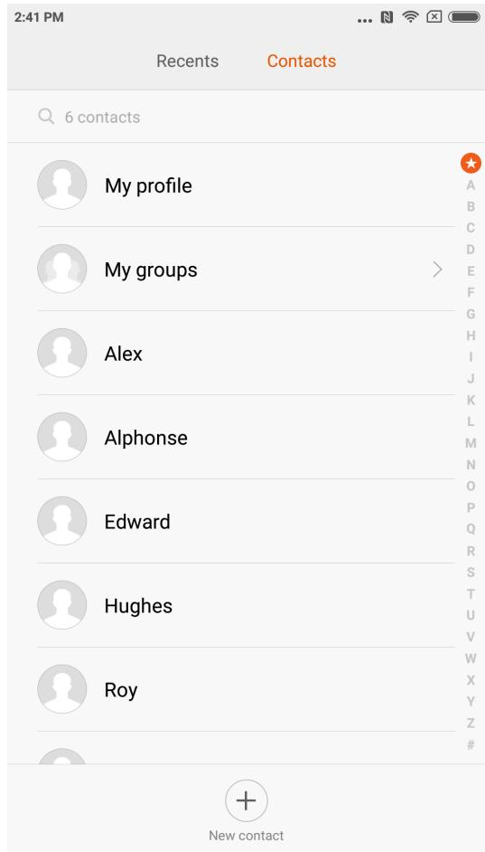

> **AI Description:**
> **Source:** `assets/_page_23_Figure_0.jpg`
> 
> **Generated:** 2026-06-01 12:49:18
> 
> ---
> 
> The image shows a contact list from a mobile device interface. It includes a header indicating "Contacts" and a search bar at the top. Below the header, there are six contacts listed: "My profile," "My groups," "Alex," "Alphonse," "Edward," "Hughes," and "Roy." Each contact entry has a circular icon with a silhouette of a person. On the right side, there is a vertical alphabetical index from A to Z, with a red star next to "My profile." At the bottom, there is a button labeled "New contact" with a plus sign. The time at the top left corner reads 2:41 PM.

## Importing Contacts

MIUI offers 4 ways to mass import contacts or add single contact information.

Sync with your Mi account

By tapping it you can set the cloud-based account to synchronise the contacts data.

Import contacts from a vCard file

By tapping it you can search vCard files in the phone and select one or more vCard files to import. You can view details of the vCard by tapping arrow icon on the right.

Import using Mi mover

By using Mi mover you will get an instruction to guide you to import data from the other phone step by step.

Create A New Contact

By tapping it you can create a new contact manually.

## Viewing Contacts

## Contacts list

Contact list is set to simple mode by default. It can only show names of contact. If you want to show more information you can enable “Display photos and info” Tap alphabetical Index and choose a letter. If the letter is matched in the contacts’ names it will show the related contacts’ names.

Contacts card   
You can do below when you view the contacts card:ғ   
Make a call   
Send an SMS   
Set a birthday reminder of the contacts   
Send an e-mail if you already saved e-mail address of contacts   
Open the Browser to visit website   
Find the location of contact’ address and get driving path to reach there   
Add a note   
Set contacts by groups   
Set a ringtone   
Set contact’s photo of calling   
Check all the calling logs with a contact   
Place on Home screen (Menu)   
Send contact’s information (Menu)   
Favorite (Menu)

When a contact have more than 1 phone numbers you can type one of them for seconds and press “Set default”.

## Searching Contacts

You can find the contacts by searching his/her name, any letter of his/her name, nick name or company name.

## Creating A New Contact

Use dials to create new contacts:

Type numbers on the T9 dial key. If it is phone numbers of strangers you can press new contact or add to contacts.

Tap arrow icon behind strangers’ phone numbers to move to next interface, tap new contact at the bottom and select “New contact” or “Add to contacts”.

Add new contacts via message: Tap “New contact” on the contacts list.

## Editing Contacts

Choose any contact and tap “Edit” Edit the information of the contact and save the information.

Xiaomi Communications Co., Ltd.

## Modifying the information of contacts

Tap and hold a contact for seconds and tap edit to change the information. When everything is ok tap ok to save it.

## Adding more information

Tap and hold a contact for seconds and type edit to access contact cards interface. Tap “Add another field “to choose more information to add.

## Deleting information of contacts

Tap delete button on the right to remove information.

## Creating a group

Tap “My groups” to create a contact group.

Add new contact to the group

Open the group and tap “Add” button to select contacts from the list.

## Removing contacts from a group

Tap a contact which you want to remove for seconds. Tap delete from menu to remove the contact from the group. Removing contact will not delete the contact information from contacts list.

Adding a contact to the favourite list

Open the contact card and tap “Favourite” button.

Removing a contact from favourite list

Open the contact card and tap “Favourite” to change it from “Favourite” to “Unfavorite”.

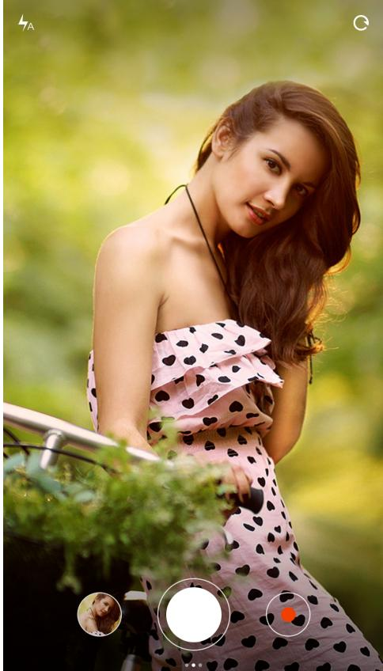

> **AI Description:**
> **Source:** `assets/_page_26_Figure_0.jpg`
> 
> **Generated:** 2026-06-01 12:52:31
> 
> ---
> 
> The image is a photograph of a person wearing a strapless dress with a polka dot pattern. The dress is primarily pink with black heart shapes. The person is sitting on a bicycle, and there is greenery in the background, suggesting an outdoor setting. The image appears to be taken with a camera interface, as indicated by the circular icons at the bottom of the image.

Launch camera to take high quality photos, quick focal length adjustment supported while burst shooting, timer, special effect, panorama and other professional photo modes are supported as well. Switching recording mode through the action bar at the bottom of page to record videos, it supports recording of 1080p high quality videos.

## Taking Photos

## Focusing

Users tap any position of framing area to trigger focus frame, the location of frame will be changed depends on the location being tapped by user,

Focus frame has three statuses, which are focus preparation/ focus failed/ focus succeed, Focus failed and focus succeed are the consequences of auto-judgment by app when users press the shutter,

Exposure can be adjusted rapidly by rotating focus frame horizontally after focus success.

## Flash

Multiple taps on flash button to switch between three flash modes: auto/ turn on/ turn off.

## Burst Shooting

Users to long press the shutter to take photos continuously, the number of photos taken will be shown at the center of screen.

## Operation Panel

Swipe left to enter “filters” interface, various filter effects are selectable,

Swipe right to enter “options” interface, there are a variety of photo modes to choose and modifying camera settings. Under video recording mode, tap record button to start recording, tap again to stop.

Tap camera button of operation bar at the bottom to return to camera mode, Video recording mode supports slow motion, quick motion and HDR.

There is a video quality setting for video recording It’s allowed to switch between 1080p/ 720p/ 480p.

Entertainment

Listening to Music

Not signed in

Playlists

Create playlist

Touch to shuffle playl..

Music app supports playing local music. It supports to play music in different modes according to song titles, singers, albums, and playlists. It also features a warm-hearted sleeping mode.

My Music

View/manage local song, categorised music within favourite list;   
Sync music list to cloud by login Xiaomi account.

Play music

Interface of playing music.

Display album cover/lyric of current playing song, swipe left to switch to lyric interface, swipe right to current play list page;   
Tap song album cover to call out advance functions: controller of song playing order, Milian etc.

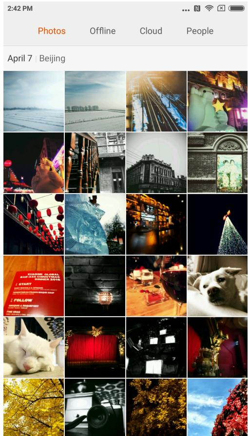

> **AI Description:**
> **Source:** `assets/_page_29_Figure_0.jpg`
> 
> **Generated:** 2026-06-01 12:50:16
> 
> ---
> 
> The image is a collage of photographs taken on April 7 in Beijing. It contains a variety of visual elements, including landscapes, urban scenes, architectural details, and animals. The photographs depict a mix of natural and man-made environments, showcasing different aspects of the city and its surroundings. The images are diverse in content, ranging from snowy landscapes to indoor scenes with animals and architectural features.

## Viewing Mode

You may view photos captured and photo album or file directory in internal storage by gallery. Wherein camera photos including photos taken by local device, gallery is a form of various photos of phone being organised based on certain organisation method.

## Viewing A Single Photo

1. Tap on the folder which wanted to browse,

2. Tap the photo to view among thumbnails, viewing a photo or video in full screen.

## Show or hide control bar

Tap on centre area of photo or video to call out the control bar, tap again to hide.

## Bottom control bar including

Send: user may select any kind of services that able to receive photo via pop-out system menu.

Edit: crop and horizontal rotation supported.

Delete: delete current photo.

Xiaomi Communications Co., Ltd.

More: map position, add to album, add to hidden album, set as wallpaper, set as contact photo, start swipe show.

## Upper control bar including

Photo details: viewing photo detailed parameters.

Control bar will be hidden automatically if not operating for 3 seconds.

## Partial zoom in or zoom out

Spread two fingers apart or pinch to zoom in or zoom out, you may also double tap to zoom in, double tap again to zoom out.

## Viewing next or previous photo

Swipe your finger to the left or right.

## Hide Pictures Folder

If there is picture in a picture folder doesn't wants to be seen during browsing, you may long press the folder and select “hide”. To show hidden albums, get into settings-galleryturn on “show hidden albums”.

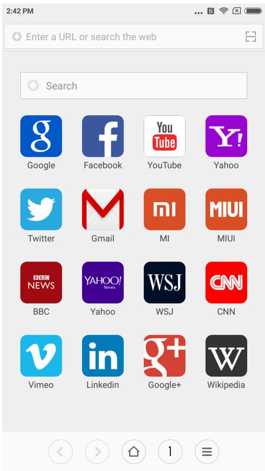

> **AI Description:**
> **Source:** `assets/_page_31_Figure_0.jpg`
> 
> **Generated:** 2026-06-01 12:48:56
> 
> ---
> 
> The image displays a screenshot of a web browser or search interface with various application icons arranged in a grid. The icons represent popular websites and services such as Google, Facebook, YouTube, Yahoo, Twitter, Gmail, BBC News, Yahoo News, WSJ, CNN, Vimeo, LinkedIn, Google+, and Wikipedia. The top of the screen includes a search bar and a URL input field, indicating the functionality of a web browser. The icons are colorful and distinct, making it easy to identify each application. The layout is clean and organized, suggesting a user-friendly interface for accessing various online resources.

Browser supports double tap or spread/pinch two fingers to zoom webpage. Get into useful websites rapidly via website navigation.

Multiple windows supported, swipe from edge of the screen to switch between tabs.   
Smart full screen, best fitted browsing area.

Reading mode, eliminating all elements that might affect reading, restoring the most essential reading appeal.

## Multi-Tasks

Mi phones support running multi-tasks simultaneously, all you have to do is just tap “menu button” under unlock status and select the application you would like to switch.

“One tap removal” button is helping you to close all ongoing applications instantly, in order to release memory space quickly.

## Add Widgets, Change the Wallpaper and Home Screen Thumbnail

You may pinch or tap and hold “menu button” to get into edit mode to add widgets, select “widgets”;

Select “move apps” in the menu to move in bulk, delete application on desktop, it supports create new folder rapidly;

Select “wallpaper” in the menu to change lock screen and wallpaper;

Pinch on desktop by using three fingers to get into “thumbnail mode”, able to add, delete and adjust screen sequence, setting a home screen is supported and able to jump into a screen immediately.

Changing Themes

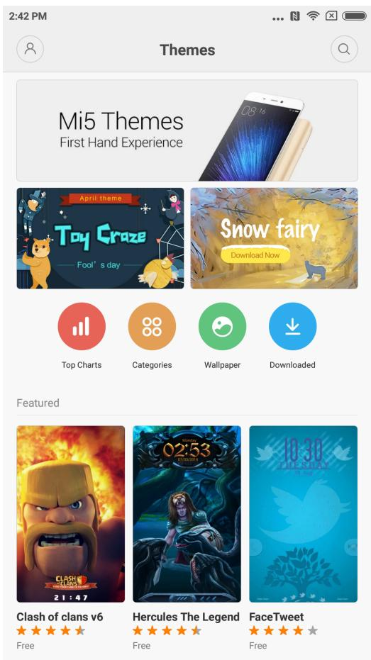

> **AI Description:**
> **Source:** `assets/_page_32_Figure_0.jpg`
> 
> **Generated:** 2026-06-01 12:51:27
> 
> ---
> 
> The image contains a screenshot of a mobile app interface titled "Themes." It displays a section for "Mi5 Themes" with a promotional image of a smartphone. Below this, there are four circular icons labeled "Top Charts," "Categories," "Wallpaper," and "Downloaded." The "Featured" section showcases three theme options: "Clash of Clans v6," "Hercules The Legend," and "FaceTweet," each with a star rating and a brief description. The themes are visually represented with their respective icons or images, and the interface includes navigation and search icons at the top.

Using themes application to change the theme of system global area, supports customise partially, including wallpaper, home screen, icons, lock screen, ringtone etc. Moreover, there are online resources of constantly updated themes so it’s much more easier to change a theme.

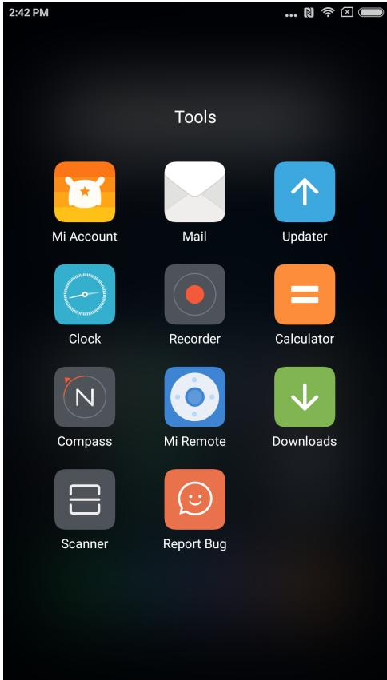

> **AI Description:**
> **Source:** `assets/_page_33_Figure_0.jpg`
> 
> **Generated:** 2026-06-01 12:51:48
> 
> ---
> 
> The image contains a collection of app icons arranged in a grid format. The icons represent various tools and utilities, including Mi Account, Mail, Updater, Clock, Recorder, Calculator, Compass, Mi Remote, Downloads, Scanner, and Report Bug. The background is dark, and the icons are colorful with distinct symbols and labels. The text "Tools" is displayed at the top of the grid.

## File Explorer

Get to know the current usage of phone storage via file explorer, it supports quick viewing documents through category and managing documents based on routes. Furthermore, there is FTP function that enables remote manage phone’s document via WLAN from PC

## Security

There is nothing to worry when using MIUI. Security is a part of the system, runs under system level, more secure and stable. Integrating rubbish cleaner, block list, virus scan, data usage monitor, battery utiliser, permission manager in one app, comprehensive protection of phone safety and privacy.

## Backup

It supports backup of contacts, call logs, messages, system settings etc., partly or fully restored is selectable after backup done.

## Updater

Keeping MIUI the latest version, restore to a nearest historical version is supported.

## Other Utilisations

## Clock

Clock is a great helper of reminding the time for you, it supports repetition reminder, custom tag.

## Weather

Weather forecast of the next three days, real time display of weather condition, reminder of sudden weather, family weather, quick share of weather forecast to family is supported.

## Notes

Notes helps you to take down text messages fast and sharing via email or other approaches, it supports synchronisation with Google task.

## Calendar

Allow you to view date, festival and holidays.

## Flashlight

Flashlight application can be used quickly by long pressing “menu button” after lighting up the screen, it can also be used via the notification bar after unlocked the screen.

## Radio

Radio supports automatic search for radio stations, adding a radio station to favourite and loudspeaker.

## Recorder

Recorder helps you to quick save voice notes, it may records uninterruptedly up to 7 days.

## Compass

Compass helps you to find direction rapidly.

## Hotline service

Please call customer service hotline as below if customer service is needed:

Singapore: +65 6761 6088

Malaysia: 1 800 281 182 / 015 4840 7777

India: 1800 103 6286

Indonesia: 0800 1 401558

Hong Kong: 3001 1888

Taiwan: 02 2192 1023

## Online support

Online chatting, get to know various customer service details in real time, please visit links as below for more tips of using Xiaomi.

Singapore: http://www.mi.com/sg/service/online/

Malaysia: http://www.mi.com/my/service/online/

India: http://www.mi.com/in/service/online/

Indonesia: http://www.mi.com/id/service/online/

Philippines: http://www.mi.com/ph/service/online/

Hong Kong: http://www.mi.com/hk/service/online/

Taiwan: http://www.mi.com/tw/service/online/

## Learn more

For more information pertaining to Xiaomi and splendid original accessories and products,

please visit our official website:

United States: http://www.mi.com/en/

Europe: http://www.mi.com/en/

Singapore: www.mi.com/sg

Malaysia: www.mi.com/my

India: www.mi.com/in

Indonesia: www.mi.com/id

Philippines: www.mi.com/ph

Hong Kong: www.mi.com/hk

Taiwan: www.mi.com/tw

Feel free to join the base camp of MIUI, your opinions help us shape the future of MIUI. en.miui.com

http://www.mi.com is the only official website of Xiaomi Inc. mi.com domain is under the protection of PRC law.

and MIUI etc. are trademarks of Xiaomi Inc.

MIUI is the Mi smart phone built in operation system. All rights reserved by Xiaomi Inc.

This user guide is applicable to following Models :

2013023 / 2013029 / 2013062 / 2013121 / 2014715 / 2014817 / 2014818 / 2014819

2014215 / 2014817 / 2015015 / 2015011 / 2015051 / 2015105 / 2015816 / 2015116

2015161 / 2016001 / 2016002 / 2016031 / 2016032 / 2016037