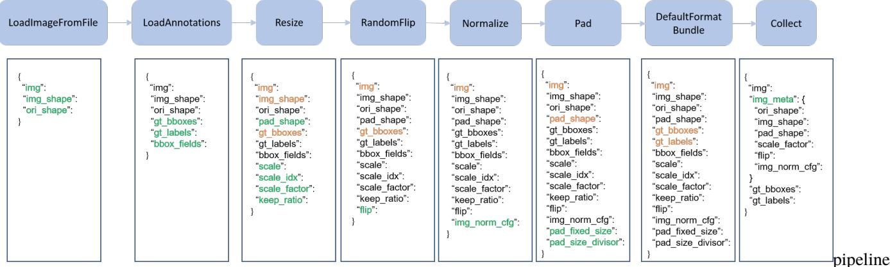
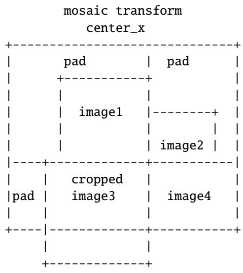

<span id="page-0-0"></span>
MMDetection

Release 2.18.0

MMDetection Authors

Oct 28, 2021

<span id="page-2-0"></span>
## GET STARTED

1 Prerequisites 1   
2 Installation 3   
2.1 Prepare environment 3   
2.2 Install MMDetection 3   
2.3 Install without GPU support 5   
2.4 Another option: Docker Image 5   
2.5 A from-scratch setup script 5   
2.6 Developing with multiple MMDetection versions 6   
3 Verification 7   
4 Benchmark and Model Zoo 9   
4.1 Mirror sites 9   
4.2 Common settings 9   
4.3 ImageNet Pretrained Models 9   
4.4 Baselines 10   
4.5 Speed benchmark . 15   
4.6 Comparison with Detectron2 . 16   
5 1: Inference and train with existing models and standard datasets 17   
5.1 Inference with existing models 17   
5.2 Test existing models on standard datasets 20   
5.3 Train predefined models on standard datasets 26   
6 2: Train with customized datasets 29   
6.1 Prepare the customized dataset . 29   
6.2 Prepare a config 33   
6.3 Train a new model 34   
6.4 Test and inference 34   
3: Train with customized models and standard datasets 35   
7.1 Prepare the standard dataset 35   
7.2 Prepare your own customized model 36   
7.3 Prepare a config 37   
7.4 Train a new model 40   
7.5 Test and inference 40   
8 Tutorial 1: Learn about Configs 41   
8.1 Modify config through script arguments 41   
8.2 Config File Structure 41   
8.3 Config Name Style 42   
8.4 Deprecated train\_cfg/test\_cfg 42   
8.5 An Example of Mask R-CNN 43   
8.6 FAQ . . . . 51   
9 Tutorial 2: Customize Datasets 55   
9.1 Support new data format 55   
9.2 Customize datasets by dataset wrappers 60   
9.3 Modify Dataset Classes 63   
9.4 COCO Panoptic Dataset 64   
10 Tutorial 3: Customize Data Pipelines 67   
10.1 Design of Data pipelines 67   
10.2 Extend and use custom pipelines . 70   
11 Tutorial 4: Customize Models 71   
11.1 Develop new components 71   
12 Tutorial 5: Customize Runtime Settings 79   
12.1 Customize optimization settings 79   
12.2 Customize training schedules 81   
12.3 Customize workflow 82   
12.4 Customize hooks . 82   
13 Tutorial 6: Customize Losses 87   
13.1 Computation pipeline of a loss . 87   
13.2 Set sampling method (step 1) 87   
13.3 Tweaking loss 88   
13.4 Weighting loss (step 3) 89   
14 Tutorial 7: Finetuning Models 91   
14.1 Inherit base configs . 91   
14.2 Modify head 91   
14.3 Modify dataset 92   
14.4 Modify training schedule . 92   
14.5 Use pre-trained model 93   
15 Tutorial 8: Pytorch to ONNX (Experimental) 95   
15.1 How to convert models from Pytorch to ONNX 95   
15.2 How to evaluate the exported models 97   
15.3 List of supported models exportable to ONNX 98   
15.4 The Parameters of Non-Maximum Suppression in ONNX Export 99   
15.5 Reminders 99   
15.6 FAQs 99   
16 Tutorial 9: ONNX to TensorRT (Experimental) 101   
16.1 How to convert models from ONNX to TensorRT 101   
16.2 How to evaluate the exported models 102   
16.3 List of supported models convertible to TensorRT 103   
16.4 Reminders 103   
16.5 FAQs 103   
17 Tutorial 10: Weight initialization 105   
17.1 Description . 105   
17.2 Initialize parameters 105   
17.3 Usage of init\_cfg 107   
18 Log Analysis 109   
19 Result Analysis 111   
20 Visualization 113   
20.1 Visualize Datasets 113   
20.2 Visualize Models . 113   
20.3 Visualize Predictions 113   
21 Error Analysis 115   
22 Model Serving 117   
22.1 1. Convert model from MMDetection to TorchServe 117   
22.2 2. Build mmdet-serve docker image 117   
22.3 3. Run mmdet-serve 117   
22.4 4. Test deployment 118   
23 Model Complexity 121   
24 Model conversion 123   
24.1 MMDetection model to ONNX (experimental) 123   
24.2 MMDetection 1.x model to MMDetection 2.x . 123   
24.3 RegNet model to MMDetection 123   
24.4 Detectron ResNet to Pytorch 124   
24.5 Prepare a model for publishing . 124   
25 Dataset Conversion 125   
26 Benchmark 127   
26.1 Robust Detection Benchmark 127   
26.2 FPS Benchmark 127   
27 Miscellaneous 129   
27.1 Evaluating a metric . 129   
27.2 Print the entire config 129   
28 Hyper-parameter Optimization 131   
28.1 YOLO Anchor Optimization 131   
29 Conventions 133   
29.1 Loss . . 133   
29.2 Empty Proposals 133   
29.3 Coco Panoptic Dataset 134   
30 Compatibility of MMDetection 2.x 135   
30.1 MMDetection 2.18.0 135   
30.2 MMDetection 2.14.0 135   
30.3 MMDetection 2.12.0 135   
30.4 Compatibility with MMDetection 1.x 136   
30.5 pycocotools compatibility 138   
31 Projects based on MMDetection 139   
31.1 Projects as an extension 139   
31.2 Projects of papers 139   
32 Changelog 141   
32.1 v2.18.0 (27/10/2021) . 141   
32.2 v2.17.0 (28/9/2021) 142   
32.3 v2.16.0 (30/8/2021) 144   
32.4 v2.15.1 (11/8/2021) 145   
32.5 v2.15.0 (02/8/2021) 146   
32.6 v2.14.0 (29/6/2021) 147   
32.7 v2.13.0 (01/6/2021) 148   
32.8 v2.12.0 (01/5/2021) 150   
32.9 v2.11.0 (01/4/2021) 151   
32.10 v2.10.0 (01/03/2021) 152   
32.11 v2.9.0 (01/02/2021) 153   
32.12 v2.8.0 (04/01/2021) 154   
32.13 v2.7.0 (30/11/2020) 156   
32.14 v2.6.0 (1/11/2020) 157   
32.15 v2.5.0 (5/10/2020) 158   
32.16 v2.4.0 (5/9/2020) 159   
32.17 v2.3.0 (5/8/2020) 161   
32.18 v2.2.0 (1/7/2020) 162   
32.19 v2.1.0 (8/6/2020) 163   
32.20 v2.0.0 (6/5/2020) 165   
32.21 v1.1.0 (24/2/2020) 166   
32.22 v1.0.0 (30/1/2020) 167   
32.23 v1.0rc1 (13/12/2019) 168   
32.24 v1.0rc0 (27/07/2019) 171   
32.25 v0.6.0 (14/04/2019) 171   
32.26 v0.6rc0(06/02/2019) 171   
32.27 v0.5.7 (06/02/2019) 171   
32.28 v0.5.6 (17/01/2019) 171   
32.29 v0.5.5 (22/12/2018) 171   
32.30 v0.5.4 (27/11/2018) 172   
32.31 v0.5.3 (26/11/2018) 172   
32.32 v0.5.2 (21/10/2018) 172   
32.33 v0.5.1 (20/10/2018) 172   
33 Frequently Asked Questions 173   
33.1 MMCV Installation 173   
33.2 PyTorch/CUDA Environment 173   
33.3 Training . . . 174   
33.4 Evaluation . . 175   
34 English 177   
35 179   
36 mmdet.apis 181   
37 mmdet.core 183   
37.1 anchor 183   
37.2 bbox 191   
37.3 export . 208   
37.4 mask 211   
37.5 evaluation . 219   
37.6 post\_processing 221   
37.7 utils 224   
38 mmdet.datasets 227   
38.1 datasets . 227   
38.2 pipelines 239   
38.3 samplers 256   
38.4 api\_wrappers 257   
39 mmdet.models 259   
39.1 detectors 259   
39.2 backbones 273   
39.3 necks 291   
39.4 dense\_heads 301   
39.5 roi\_heads 383   
39.6 losses 412   
39.7 utils . 425   
40 mmdet.utils 437   
41 Indices and tables 439   
Python Module Index 441   
Index 443

<span id="page-8-0"></span>
## PREREQUISITES

• Linux or macOS (Windows is in experimental support)

• Python 3.6+

• PyTorch 1.3+

• CUDA 9.2+ (If you build PyTorch from source, CUDA 9.0 is also compatible)

• GCC 5+

• MMCV

Compatible MMDetection and MMCV versions are shown as below. Please install the correct version of MMCV to avoid installation issues.

Note: You need to run pip uninstall mmcv first if you have mmcv installed. If mmcv and mmcv-full are both installed, there will be ModuleNotFoundError.

<span id="page-10-0"></span>
## INSTALLATION

## 2.1 Prepare environment

1. Create a conda virtual environment and activate it.

```
conda create -n openmmlab python=3.7 -y   
conda activate openmmlab
```

2. Install PyTorch and torchvision following the official instructions, e.g.,

```
conda install pytorch torchvision -c pytorch
```

Note: Make sure that your compilation CUDA version and runtime CUDA version match. You can check the supported CUDA version for precompiled packages on the PyTorch website.

E.g.1 If you have CUDA 10.1 installed under /usr/local/cuda and would like to install PyTorch 1.5, you need to install the prebuilt PyTorch with CUDA 10.1.

```
```batch
conda install pytorch cudatoolkit=10.1 torchvision -c pytorch
```
```

E.g. 2 If you have CUDA 9.2 installed under /usr/local/cuda and would like to install PyTorch 1.3.1., you need to install the prebuilt PyTorch with CUDA 9.2.

```
conda install pytorch=1.3.1 cudatoolkit=9.2 torchvision=0.4.2 -c pytorch
```

If you build PyTorch from source instead of installing the prebuilt package, you can use more CUDA versions such as 9.0.

## 2.2 Install MMDetection

It is recommended to install MMDetection with MIM, which automatically handle the dependencies of OpenMMLab projects, including mmcv and other python packages.

```
```batch
pip install openmim
mim install mmdet
```
```

Or you can still install MMDetection manually:

1. Install mmcv-full.

```
```batch
pip install mmcv-full -f https://download.openmmlab.com/mmcv/dist/{cu_version}/
→{torch_version}/index.html
(continues on next page) (continues on next pag
```
```

<span id="page-11-0"></span>
(continued from previous page)

Please replace {cu\_version} and {torch\_version} in the url to your desired one. For example, to install the latest mmcv-full with CUDA 11.0 and PyTorch 1.7.0, use the following command:

```
```batch
pip install mmcv-full -f https://download.openmmlab.com/mmcv/dist/cu110/torch1.7.0/
˓→index.html
```
```

See here for different versions of MMCV compatible to different PyTorch and CUDA versions.

Optionally you can compile mmcv from source if you need to develop both mmcv and mmdet. Refer to the guide for details.

## 2. Install MMDetection.

You can simply install mmdetection with the following command:

```
```batch
pip install mmdet
```
```

or clone the repository and then install it:

```
```batch
git clone https://github.com/open-mmlab/mmdetection.git
cd mmdetection
pip install -r requirements/build.txt
pip install -v -e . # or "python setup.py develop"
```
```

3. Install extra dependencies for Instaboost, Panoptic Segmentation, LVIS dataset, or Albumentations.

```
```shell
# for instaboost
pip install instaboostfast
# for panoptic segmentation
pip install git+https://github.com/cocodataset/panopticapi.git
# for LVIS dataset
pip install git+https://github.com/lvis-dataset/lvis-api.git
# for albumentations
pip install albumentations>=0.3.2 --no-binary imgaug,albumentations
```
```

## Note:

a. When specifying -e or develop, MMDetection is installed on dev mode , any local modifications made to the code will take effect without reinstallation.

b. If you would like to use opencv-python-headless instead of opencv-python, you can install it before installing MMCV.

c. Some dependencies are optional. Simply running pip install -v -e . will only install the minimum runtime requirements. To use optional dependencies like albumentations and imagecorruptions either install them manually with pip install -r requirements/optional.txt or specify desired extras when calling pip (e.g. pip install -v -e .[optional]). Valid keys for the extras field are: all, tests, build, and optional.

d. If you would like to use albumentations, we suggest using pip install albumentations>=0.3.2 --no-binary imgaug,albumentations. If you simply use pip install albumentations>=0.3.2, it will install opencv-python-headless simultaneously (even though you have already installed opencv-python). We should not allow opencv-python and opencv-python-headless installed at the same time, because it might cause unexpected issues. Please refer to official documentation for more details.

<span id="page-12-0"></span>
## 2.3 Install without GPU support

MMDetection can be built for CPU only environment (where CUDA isn’t available).

In CPU mode you can run the demo/webcam\_demo.py for example. However some functionality is gone in this mode:

• Deformable Convolution

• Modulated Deformable Convolution

• ROI pooling

• Deformable ROI pooling

• CARAFE: Content-Aware ReAssembly of FEatures

• SyncBatchNorm

• CrissCrossAttention: Criss-Cross Attention

• MaskedConv2d

• Temporal Interlace Shift

• nms\_cuda

• sigmoid\_focal\_loss\_cuda

• bbox\_overlaps

If you try to run inference with a model containing above ops, an error will be raised. The following table lists affected algorithms.

Notice: MMDetection does not support training with CPU for now.

## 2.4 Another option: Docker Image

We provide a Dockerfile to build an image. Ensure that you are using docker version >=19.03.

```
# build an image with PyTorch 1.6, CUDA 10.1   
docker build -t mmdetection docker/
```

Run it with

```
```batch
docker run --gpus all --shm-size=8g -it -v {DATA_DIR}:/mmdetection/data mmdetection
```
```

## 2.5 A from-scratch setup script

Assuming that you already have CUDA 10.1 installed, here is a full script for setting up MMDetection with conda.

```
```shell
conda create -n openmmlab python=3.7 -y
conda activate openmmlab
conda install pytorch==1.6.0 torchvision==0.7.0 cudatoolkit=10.1 -c pytorch -y
# install the latest mmcv
pip install mmcv-full -f https://download.openmmlab.com/mmcv/dist/cu101/torch1.6.0/index.
˓→html (continues on next page)
```
```

<span id="page-13-0"></span>
```
```shell
# install mmdetection
git clone https://github.com/open-mmlab/mmdetection.git
cd mmdetection
pip install -r requirements/build.txt
pip install -v -e .
```
```

(continued from previous page)

## 2.6 Developing with multiple MMDetection versions

The train and test scripts already modify the PYTHONPATH to ensure the script use the MMDetection in the current directory.

To use the default MMDetection installed in the environment rather than that you are working with, you can remove the following line in those scripts

```
```makefile
PYTHONPATH="$(dirname $0)/..":$PYTHONPATH
```
```

<span id="page-14-0"></span>
## VERIFICATION

To verify whether MMDetection is installed correctly, we can run the following sample code to initialize a detector and inference a demo image.

```
```python
from mmdet.apis import init_detector, inference_detector
config_file = 'configs/faster_rcnn/faster_rcnn_r50_fpn_1x_coco.py'
# download the checkpoint from model zoo and put it in `checkpoints/`
# url: https://download.openmmlab.com/mmdetection/v2.0/faster_rcnn/faster_rcnn_r50_fpn_
˓→1x_coco/faster_rcnn_r50_fpn_1x_coco_20200130-047c8118.pth
checkpoint_file = 'checkpoints/faster_rcnn_r50_fpn_1x_coco_20200130-047c8118.pth'
device = 'cuda:0'
# init a detector
model = init_detector(config_file, checkpoint_file, device=device)
# inference the demo image
inference_detector(model, 'demo/demo.jpg')
```
```

The above code is supposed to run successfully upon you finish the installation.

<span id="page-16-0"></span>
# BENCHMARK AND MODEL ZOO

## 4.1 Mirror sites

We only use aliyun to maintain the model zoo since MMDetection V2.0. The model zoo of V1.x has been deprecated.

## 4.2 Common settings

• All models were trained on coco\_2017\_train, and tested on the coco\_2017\_val.

• We use distributed training.

• All pytorch-style pretrained backbones on ImageNet are from PyTorch model zoo, caffe-style pretrained backbones are converted from the newly released model from detectron2.

• For fair comparison with other codebases, we report the GPU memory as the maximum value of torch.cuda. max\_memory\_allocated() for all 8 GPUs. Note that this value is usually less than what nvidia-smi shows.

• We report the inference time as the total time of network forwarding and post-processing, excluding the data loading time. Results are obtained with the script benchmark.py which computes the average time on 2000 images.

## 4.3 ImageNet Pretrained Models

It is common to initialize from backbone models pre-trained on ImageNet classification task. All pre-trained model links can be found at open\_mmlab. According to img\_norm\_cfg and source of weight, we can divide all the ImageNet pre-trained model weights into some cases:

• TorchVision: Corresponding to torchvision weight, including ResNet50, ResNet101. The img\_norm\_cfg is dict(mean=[123.675, 116.28, 103.53], std=[58.395, 57.12, 57.375], to\_rgb=True).

• Pycls: Corresponding to pycls weight, including RegNetX. The img\_norm\_cfg is dict( mean=[103.530, 116.280, 123.675], std=[57.375, 57.12, 58.395], to\_rgb=False).

• MSRA styles: Corresponding to MSRA weights, including ResNet50\_Caffe and ResNet101\_Caffe. The img\_norm\_cfg is dict( mean=[103.530, 116.280, 123.675], std=[1.0, 1.0, 1.0], to\_rgb=False).

• Caffe2 styles: Currently only contains ResNext101\_32x8d. The img\_norm\_cfg is dict(mean=[103.530, 116.280, 123.675], std=[57.375, 57.120, 58.395], to\_rgb=False).

<span id="page-17-0"></span>
• Other styles: E.g SSD which corresponds to img\_norm\_cfg is dict(mean=[123.675, 116.28, 103.53], std=[1, 1, 1], to\_rgb=True) and YOLOv3 which corresponds to img\_norm\_cfg is dict(mean=[0, 0, 0], std=[255., 255., 255.], to\_rgb=True).

The detailed table of the commonly used backbone models in MMDetection is listed below :

## 4.4 Baselines

## 4.4.1 RPN

Please refer to RPN for details.

## 4.4.2 Faster R-CNN

Please refer to Faster R-CNN for details.

## 4.4.3 Mask R-CNN

Please refer to Mask R-CNN for details.

## 4.4.4 Fast R-CNN (with pre-computed proposals)

Please refer to Fast R-CNN for details.

## 4.4.5 RetinaNet

Please refer to RetinaNet for details.

## 4.4.6 Cascade R-CNN and Cascade Mask R-CNN

Please refer to Cascade R-CNN for details.

## 4.4.7 Hybrid Task Cascade (HTC)

Please refer to HTC for details.

## 4.4.8 SSD

Please refer to SSD for details.

<span id="page-18-0"></span>
## 4.4.9 Group Normalization (GN)

Please refer to Group Normalization for details.

## 4.4.10 Weight Standardization

Please refer to Weight Standardization for details.

## 4.4.11 Deformable Convolution v2

Please refer to Deformable Convolutional Networks for details.

## 4.4.12 CARAFE: Content-Aware ReAssembly of FEatures

Please refer to CARAFE for details.

## 4.4.13 Instaboost

Please refer to Instaboost for details.

## 4.4.14 Libra R-CNN

Please refer to Libra R-CNN for details.

## 4.4.15 Guided Anchoring

Please refer to Guided Anchoring for details.

## 4.4.16 FCOS

Please refer to FCOS for details.

## 4.4.17 FoveaBox

Please refer to FoveaBox for details.

## 4.4.18 RepPoints

Please refer to RepPoints for details.

<span id="page-19-0"></span>
## 4.4.19 FreeAnchor

Please refer to FreeAnchor for details.

## 4.4.20 Grid R-CNN (plus)

Please refer to Grid R-CNN for details.

## 4.4.21 GHM

Please refer to GHM for details.

## 4.4.22 GCNet

Please refer to GCNet for details.

## 4.4.23 HRNet

Please refer to HRNet for details.

## 4.4.24 Mask Scoring R-CNN

Please refer to Mask Scoring R-CNN for details.

## 4.4.25 Train from Scratch

Please refer to Rethinking ImageNet Pre-training for details.

## 4.4.26 NAS-FPN

Please refer to NAS-FPN for details.

## 4.4.27 ATSS

Please refer to ATSS for details.

## 4.4.28 FSAF

Please refer to FSAF for details.

<span id="page-20-0"></span>
## 4.4.29 RegNetX

Please refer to RegNet for details.

## 4.4.30 Res2Net

Please refer to Res2Net for details.

## 4.4.31 GRoIE

Please refer to GRoIE for details.

## 4.4.32 Dynamic R-CNN

Please refer to Dynamic R-CNN for details.

## 4.4.33 PointRend

Please refer to PointRend for details.

## 4.4.34 DetectoRS

Please refer to DetectoRS for details.

## 4.4.35 Generalized Focal Loss

Please refer to Generalized Focal Loss for details.

## 4.4.36 CornerNet

Please refer to CornerNet for details.

## 4.4.37 YOLOv3

Please refer to YOLOv3 for details.

## 4.4.38 PAA

Please refer to PAA for details.

<span id="page-21-0"></span>
## 4.4.39 SABL

Please refer to SABL for details.

## 4.4.40 CentripetalNet

Please refer to CentripetalNet for details.

## 4.4.41 ResNeSt

Please refer to ResNeSt for details.

## 4.4.42 DETR

Please refer to DETR for details.

## 4.4.43 Deformable DETR

Please refer to Deformable DETR for details.

## 4.4.44 AutoAssign

Please refer to AutoAssign for details.

## 4.4.45 YOLOF

Please refer to YOLOF for details.

## 4.4.46 Seesaw Loss

Please refer to Seesaw Loss for details.

## 4.4.47 CenterNet

Please refer to CenterNet for details.

## 4.4.48 YOLOX

Please refer to YOLOX for details.

<span id="page-22-0"></span>
## 4.4.49 PVT

Please refer to PVT for details.

## 4.4.50 SOLO

Please refer to SOLO for details.

## 4.4.51 QueryInst

Please refer to QueryInst for details.

## 4.4.52 Other datasets

We also benchmark some methods on PASCAL VOC, Cityscapes and WIDER FACE.

## 4.4.53 Pre-trained Models

We also train Faster R-CNN and Mask R-CNN using ResNet-50 and RegNetX-3.2G with multi-scale training and longer schedules. These models serve as strong pre-trained models for downstream tasks for convenience.

## 4.5 Speed benchmark

## 4.5.1 Training Speed benchmark

We provide analyze\_logs.py to get average time of iteration in training. You can find examples in Log Analysis.

We compare the training speed of Mask R-CNN with some other popular frameworks (The data is copied from detectron2). For mmdetection, we benchmark with mask\_rcnn\_r50\_caffe\_fpn\_poly\_1x\_coco\_v1.py, which should have the same setting with mask\_rcnn\_R\_50\_FPN\_noaug\_1x.yaml of detectron2. We also provide the checkpoint and training log for reference. The throughput is computed as the average throughput in iterations 100-500 to skip GPU warmup time.

## 4.5.2 Inference Speed Benchmark

We provide benchmark.py to benchmark the inference latency. The script benchmarkes the model with 2000 images and calculates the average time ignoring first 5 times. You can change the output log interval (defaults: 50) by setting LOG-INTERVAL.

```
```shell
python toools/benchmark.py ${CONFIG} ${CHECKPOINT} [--log-interval $[LOG-INTERVAL]] [--
˓→fuse-conv-bn]
```
```

The latency of all models in our model zoo is benchmarked without setting fuse-conv-bn, you can get a lower latency by setting it.

<span id="page-23-0"></span>
## 4.6 Comparison with Detectron2

We compare mmdetection with Detectron2 in terms of speed and performance. We use the commit id 185c27e(30/4/2020) of detectron. For fair comparison, we install and run both frameworks on the same machine.

## 4.6.1 Hardware

• 8 NVIDIA Tesla V100 (32G) GPUs

• Intel(R) Xeon(R) Gold 6148 CPU @ 2.40GHz

## 4.6.2 Software environment

• Python 3.7

• PyTorch 1.4

• CUDA 10.1

• CUDNN 7.6.03

• NCCL 2.4.08

## 4.6.3 Performance

## 4.6.4 Training Speed

The training speed is measure with s/iter. The lower, the better.

## 4.6.5 Inference Speed

The inference speed is measured with fps (img/s) on a single GPU, the higher, the better. To be consistent with Detectron2, we report the pure inference speed (without the time of data loading). For Mask R-CNN, we exclude the time of RLE encoding in post-processing. We also include the officially reported speed in the parentheses, which is slightly higher than the results tested on our server due to differences of hardwares.

## 4.6.6 Training memory

<span id="page-24-0"></span>
# 1: INFERENCE AND TRAIN WITH EXISTING MODELS AND STANDARD DATASETS

MMDetection provides hundreds of existing and existing detection models in Model Zoo), and supports multiple standard datasets, including Pascal VOC, COCO, CityScapes, LVIS, etc. This note will show how to perform common tasks on these existing models and standard datasets, including:

• Use existing models to inference on given images.

• Test existing models on standard datasets.

• Train predefined models on standard datasets.

## 5.1 Inference with existing models

By inference, we mean using trained models to detect objects on images. In MMDetection, a model is defined by a configuration file and existing model parameters are save in a checkpoint file.

To start with, we recommend Faster RCNN with this configuration file and this checkpoint file. It is recommended to download the checkpoint file to checkpoints directory.

## 5.1.1 High-level APIs for inference

MMDetection provide high-level Python APIs for inference on images. Here is an example of building the model and inference on given images or videos.

```
```python
from mmdet.apis import init_detector, inference_detector
import mmcv
# Specify the path to model config and checkpoint file
config_file = 'configs/faster_rcnn/faster_rcnn_r50_fpn_1x_coco.py'
checkpoint_file = 'checkpoints/faster_rcnn_r50_fpn_1x_coco_20200130-047c8118.pth'
# build the model from a config file and a checkpoint file
model = init_detector(config_file, checkpoint_file, device='cuda:0')
# test a single image and show the results
img = 'test.jpg' # or img = mmcv.imread(img), which will only load it once
result = inference_detector(model, img)
# visualize the results in a new window
model.show_result(img, result)
```
```

(continues on next page)

<span id="page-25-0"></span>
(continued from previous page) (continued from previous page)

```
```python
# or save the visualization results to image files
model.show_result(img, result, out_file='result.jpg')
# test a video and show the results
video = mmcv.VideoReader('video.mp4')
for frame in video:
result = inference_detector(model, frame)
model.show_result(frame, result, wait_time=1)
```
```

A notebook demo can be found in demo/inference\_demo.ipynb.

Note: inference\_detector only supports single-image inference for now.

## 5.1.2 Asynchronous interface - supported for Python 3.7+

For Python 3.7+, MMDetection also supports async interfaces. By utilizing CUDA streams, it allows not to block CPU on GPU bound inference code and enables better CPU/GPU utilization for single-threaded application. Inference can be done concurrently either between different input data samples or between different models of some inference pipeline.

See tests/async\_benchmark.py to compare the speed of synchronous and asynchronous interfaces.

```
```python
import asyncio
import torch
from mmdet.apis import init_detector, async_inference_detector
from mmdet.utils.contextmanagers import concurrent
async def main():
config_file = 'configs/faster_rcnn/faster_rcnn_r50_fpn_1x_coco.py'
checkpoint_file = 'checkpoints/faster_rcnn_r50_fpn_1x_coco_20200130-047c8118.pth'
device = 'cuda:0'
model = init_detector(config_file, checkpoint=checkpoint_file, device=device)
# queue is used for concurrent inference of multiple images
streamqueue = asyncio.Queue()
# queue size defines concurrency level
streamqueue_size = 3
for _ in range(streamqueue_size):
streamqueue.put_nowait(torch.cuda.Stream(device=device))
# test a single image and show the results
img = 'test.jpg' # or img = mmcv.imread(img), which will only load it once
async with concurrent(streamqueue):
result = await async_inference_detector(model, img)
# visualize the results in a new window
model.show_result(img, result)
# or save the visualization results to image files
model.show_result(img, result, out_file='result.jpg')
```
```

(continues on next page)

<span id="page-26-0"></span>
(continued from previous page)

```
asyncio.run(main())
```

## 5.1.3 Demos

We also provide three demo scripts, implemented with high-level APIs and supporting functionality codes. Source codes are available here.

## Image demo

This script performs inference on a single image.

```
```shell
python demo/image_demo.py
${IMAGE_FILE}
${CONFIG_FILE} \
${CHECKPOINT_FILE} \
[--device ${GPU_ID}] \
[--score-thr ${SCORE_THR}]
```
```

Examples:

```
```batch
python demo/image_demo.py demo/demo.jpg
configs/faster_rcnn/faster_rcnn_r50_fpn_1x_coco.py
checkpoints/faster_rcnn_r50_fpn_1x_coco_20200130-047c8118.pth \
--device cpu
```
```

## Webcam demo

This is a live demo from a webcam.

```
```shell
python demo/webcam_demo.py
${CONFIG_FILE}
${CHECKPOINT_FILE} \
[--device ${GPU_ID}] \
[--camera-id ${CAMERA-ID}] \
[--score-thr ${SCORE_THR}]
```
```

## Examples:

```
python demo/webcam\_demo.py   
configs/faster\_rcnn/faster\_rcnn\_r50\_fpn\_1x\_coco.py   
checkpoints/faster\_rcnn\_r50\_fpn\_1x\_coco\_20200130-047c8118.pth
```

<span id="page-27-0"></span>
## Video demo

This script performs inference on a video.

```
```shell
python demo/video_demo.py
${VIDEO_FILE} \
${CONFIG_FILE} \
${CHECKPOINT_FILE} \
[--device ${GPU_ID}] \
[--score-thr ${SCORE_THR}] \
[--out ${OUT_FILE}] \
[--show] \
[--wait-time ${WAIT_TIME}]
```
```

Examples:

```
```batch
python demo/video_demo.py demo/demo.mp4 \
configs/faster_rcnn/faster_rcnn_r50_fpn_1x_coco.py
checkpoints/faster_rcnn_r50_fpn_1x_coco_20200130-047c8118.pth \
--out result.mp4
```
```

## 5.2 Test existing models on standard datasets

To evaluate a model’s accuracy, one usually tests the model on some standard datasets. MMDetection supports multiple public datasets including COCO, Pascal VOC, CityScapes, and more. This section will show how to test existing models on supported datasets.

## 5.2.1 Prepare datasets

Public datasets like Pascal VOC or mirror and COCO are available from official websites or mirrors. Note: In the detection task, Pascal VOC 2012 is an extension of Pascal VOC 2007 without overlap, and we usually use them together. It is recommended to download and extract the dataset somewhere outside the project directory and symlink the dataset root to \$MMDETECTION/data as below. If your folder structure is different, you may need to change the corresponding paths in config files.

```
mmdetection   
mmdet   
tools   
configs   
data   
coco   
annotations   
train2017   
val2017   
test2017   
cityscapes   
annotations   
leftImg8bit   
train   
val   
gtFine
```

(continues on next page)

<span id="page-28-0"></span>
```
train   
val   
VOCdevkit   
VOC2007   
VOC2012
```

(continued from previous page)

Some models require additional COCO-stuff datasets, such as HTC, DetectoRS and SCNet, you can download and unzip then move to the coco folder. The directory should be like this.

```
mmdetection   
data   
coco   
annotations   
train2017   
val2017   
test2017   
stuffthingmaps
```

Panoptic segmentation models like PanopticFPN require additional COCO Panoptic datasets, you can download and unzip then move to the coco annotation folder. The directory should be like this.

```
mmdetection   
data   
coco   
annotations   
panoptic\_train2017.json   
panoptic\_train2017   
panoptic\_val2017.json   
panoptic\_val2017   
train2017   
val2017   
test2017
```

The cityscapes annotations need to be converted into the coco format using tools/dataset\_converters/ cityscapes.py:

```
```shell
pip install cityscapesscripts
python tools/dataset_converters/cityscapes.py \
./data/cityscapes
--nproc 8 \
--out-dir ./data/cityscapes/annotations
```
```

TODO: CHANGE TO THE NEW PATH

<span id="page-29-0"></span>
## 5.2.2 Test existing models

We provide testing scripts for evaluating an existing model on the whole dataset (COCO, PASCAL VOC, Cityscapes, etc.). The following testing environments are supported:

• single GPU

• single node multiple GPUs

• multiple nodes

Choose the proper script to perform testing depending on the testing environment.

```
```shell
# single-gpu testing
python tools/test.py
${CONFIG_FILE} \
${CHECKPOINT_FILE} \
[--out ${RESULT_FILE}] \
[--eval ${EVAL_METRICS}] \
[--show]
# multi-gpu testing
bash tools/dist_test.sh \
${CONFIG_FILE} \
${CHECKPOINT_FILE} \
${GPU_NUM}
[--out ${RESULT_FILE}] \
[--eval ${EVAL_METRICS}]
```
```

tools/dist\_test.sh also supports multi-node testing, but relies on PyTorch’s launch utility.

## Optional arguments:

• RESULT\_FILE: Filename of the output results in pickle format. If not specified, the results will not be saved to a file.

• EVAL\_METRICS: Items to be evaluated on the results. Allowed values depend on the dataset, e.g., proposal\_fast, proposal, bbox, segm are available for COCO, mAP, recall for PASCAL VOC. Cityscapes could be evaluated by cityscapes as well as all COCO metrics.

--show: If specified, detection results will be plotted on the images and shown in a new window. It is only applicable to single GPU testing and used for debugging and visualization. Please make sure that GUI is available in your environment. Otherwise, you may encounter an error like cannot connect to X server.

--show-dir: If specified, detection results will be plotted on the images and saved to the specified directory. It is only applicable to single GPU testing and used for debugging and visualization. You do NOT need a GUI available in your environment for using this option.

• --show-score-thr: If specified, detections with scores below this threshold will be removed.

• --cfg-options: if specified, the key-value pair optional cfg will be merged into config file

• --eval-options: if specified, the key-value pair optional eval cfg will be kwargs for dataset.evaluate() function, it’s only for evaluation

<span id="page-30-0"></span>
## 5.2.3 Examples

Assuming that you have already downloaded the checkpoints to the directory checkpoints/.

1. Test Faster R-CNN and visualize the results. Press any key for the next image. Config and checkpoint files are available here.

```
```shell
python tools/test.py
configs/faster_rcnn/faster_rcnn_r50_fpn_1x_coco.py
checkpoints/faster_rcnn_r50_fpn_1x_coco_20200130-047c8118.pth \
--show
```
```

2. Test Faster R-CNN and save the painted images for future visualization. Config and checkpoint files are available here.

```
```shell
python tools/test.py
configs/faster_rcnn/faster_rcnn_r50_fpn_1x.py
checkpoints/faster_rcnn_r50_fpn_1x_coco_20200130-047c8118.pth \
--show-dir faster_rcnn_r50_fpn_1x_results
```
```

3. Test Faster R-CNN on PASCAL VOC (without saving the test results) and evaluate the mAP. Config and checkpoint files are available here.

```
```shell
python tools/test.py \
configs/pascal_voc/faster_rcnn_r50_fpn_1x_voc.py
checkpoints/faster_rcnn_r50_fpn_1x_voc0712_20200624-c9895d40.pth \
--eval mAP
```
```

4. Test Mask R-CNN with 8 GPUs, and evaluate the bbox and mask AP. Config and checkpoint files are available here.

```
```shell
./tools/dist_test.sh \
configs/mask_rcnn_r50_fpn_1x_coco.py
checkpoints/mask_rcnn_r50_fpn_1x_coco_20200205-d4b0c5d6.pth \
8
--out results.pkl \
--eval bbox segm
```
```

5. Test Mask R-CNN with 8 GPUs, and evaluate the classwise bbox and mask AP. Config and checkpoint files are available here.

```
```shell
./tools/dist_test.sh \
configs/mask_rcnn/mask_rcnn_r50_fpn_1x_coco.py
checkpoints/mask_rcnn_r50_fpn_1x_coco_20200205-d4b0c5d6.pth \
8 \
--out results.pkl \
--eval bbox segm
--options "classwise=True"
```
```

6. Test Mask R-CNN on COCO test-dev with 8 GPUs, and generate JSON files for submitting to the official evaluation server. Config and checkpoint files are available here.

```
```shell
./tools/dist_test.sh \
configs/mask_rcnn/mask_rcnn_r50_fpn_1x_coco.py
checkpoints/mask_rcnn_r50_fpn_1x_coco_20200205-d4b0c5d6.pth \
```
```

(continues on next page)

<span id="page-31-0"></span>
(continued from previous page)

```
8   
--format-only \   
--options "jsonfile\_prefix=./mask\_rcnn\_test-dev\_results"
```

This command generates two JSON files mask\_rcnn\_test-dev\_results.bbox.json and mask\_rcnn\_test-dev\_results.segm.json.

7. Test Mask R-CNN on Cityscapes test with 8 GPUs, and generate txt and png files for submitting to the official evaluation server. Config and checkpoint files are available here.

```
```shell
./tools/dist_test.sh \
configs/cityscapes/mask_rcnn_r50_fpn_1x_cityscapes.py \
checkpoints/mask_rcnn_r50_fpn_1x_cityscapes_20200227-afe51d5a.pth
8
--format-only \
--options "txtfile_prefix=./mask_rcnn_cityscapes_test_results"
```
```

The generated png and txt would be under ./mask\_rcnn\_cityscapes\_test\_results directory.

## 5.2.4 Test without Ground Truth Annotations

MMDetection supports to test models without ground-truth annotations using CocoDataset. If your dataset format is not in COCO format, please convert them to COCO format. For example, if your dataset format is VOC, you can directly convert it to COCO format by the script in tools. If your dataset format is Cityscapes, you can directly convert it to COCO format by the script in tools. The rest of the formats can be converted using this script.

```
```shell
python tools/dataset_converters/images2coco.py \
${IMG_PATH} \
${CLASSES} \
${OUT} \
[--exclude-extensions]
```
```

## arguments

• IMG\_PATH: The root path of images.

• CLASSES: The text file with a list of categories.

• OUT: The output annotation json file name. The save dir is in the same directory as IMG\_PATH.

• exclude-extensions: The suffix of images to be excluded, such as ‘png’ and ‘bmp’.

After the conversion is complete, you can use the following command to test

```
```shell
# single-gpu testing
python tools/test.py \
${CONFIG_FILE} \
${CHECKPOINT_FILE}
--format-only \
--options ${JSONFILE_PREFIX} \
[--show]
# multi-gpu testing
bash tools/dist_test.sh \
${CONFIG_FILE} \
```
```

(continues on next page)

<span id="page-32-0"></span>
```
```shell
${CHECKPOINT_FILE} \
${GPU_NUM} \
--format-only \
--options ${JSONFILE_PREFIX} \
[--show]
```
```

(continued from previous page)

Assuming that the checkpoints in the model zoo have been downloaded to the directory checkpoints/, we can test Mask R-CNN on COCO test-dev with 8 GPUs, and generate JSON files using the following command.

```
```shell
./tools/dist_test.sh \
configs/mask_rcnn/mask_rcnn_r50_fpn_1x_coco.py \
checkpoints/mask_rcnn_r50_fpn_1x_coco_20200205-d4b0c5d6.pth \
8 \
-format-only \
--options "jsonfile_prefix=./mask_rcnn_test-dev_results"
```
```

This command generates two JSON files mask\_rcnn\_test-dev\_results.bbox.json and mask\_rcnn\_test-dev\_results.segm.json.

## 5.2.5 Batch Inference

MMDetection supports inference with a single image or batched images in test mode. By default, we use single-image inference and you can use batch inference by modifying samples\_per\_gpu in the config of test data. You can do that either by modifying the config as below.

```
```lua
data = dict(train=dict(...), val=dict(...), test=dict(samples_per_gpu=2, ...))
```
```

Or you can set it through --cfg-options as --cfg-options data.test.samples\_per\_gpu=2

## 5.2.6 Deprecated ImageToTensor

In test mode, ImageToTensor pipeline is deprecated, it’s replaced by DefaultFormatBundle that recommended to manually replace it in the test data pipeline in your config file. examples:

```
```python
# use ImageToTensor (deprecated)
pipelines = [
dict(type='LoadImageFromFile'),
dict(
type='MultiScaleFlipAug',
img_scale=(1333, 800),
flip=False,
transforms=[
dict(type='Resize', keep_ratio=True),
dict(type='RandomFlip'),
dict(type='Normalize', mean=[0, 0, 0], std=[1, 1, 1]),
dict(type='Pad', size_divisor=32),
dict(type='ImageToTensor', keys=['img']),
dict(type='Collect', keys=['img']),
])
]
```
```

(continues on next page)

<span id="page-33-0"></span>
(continued from previous page)

```
```python
# manually replace ImageToTensor to DefaultFormatBundle (recommended)
pipelines = [
dict(type='LoadImageFromFile'),
dict(
type='MultiScaleFlipAug',
img_scale=(1333, 800),
flip=False,
transforms=[
dict(type='Resize', keep_ratio=True),
dict(type='RandomFlip'),
dict(type='Normalize', mean=[0, 0, 0], std=[1, 1, 1]),
dict(type='Pad', size_divisor=32),
dict(type='DefaultFormatBundle'),
dict(type='Collect', keys=['img']),
])
]
```
```

## 5.3 Train predefined models on standard datasets

MMDetection also provides out-of-the-box tools for training detection models. This section will show how to train predefined models (under configs) on standard datasets i.e. COCO.

Important: The default learning rate in config files is for 8 GPUs and 2 img/gpu (batch size = 8\*2 = 16). According to the linear scaling rule, you need to set the learning rate proportional to the batch size if you use different GPUs or images per GPU, e.g., lr=0.01 for 4 GPUs \* 2 imgs/gpu and lr=0.08 for 16 GPUs \* 4 imgs/gpu.

## 5.3.1 Prepare datasets

Training requires preparing datasets too. See section Prepare datasets above for details.

Note: Currently, the config files under configs/cityscapes use COCO pretrained weights to initialize. You could download the existing models in advance if the network connection is unavailable or slow. Otherwise, it would cause errors at the beginning of training.

## 5.3.2 Training on a single GPU

We provide tools/train.py to launch training jobs on a single GPU. The basic usage is as follows.

```
python tools/train.py \   
\${CONFIG\_FILE}   
[optional arguments]
```

During training, log files and checkpoints will be saved to the working directory, which is specified by work\_dir in the config file or via CLI argument --work-dir.

By default, the model is evaluated on the validation set every epoch, the evaluation interval can be specified in the config file as shown below.

```
# evaluate the model every 12 epoch.   
evaluation = dict(interval=12)
```

<span id="page-34-0"></span>
This tool accepts several optional arguments, including:

• --no-validate (not suggested): Disable evaluation during training.

• --work-dir \${WORK\_DIR}: Override the working directory.

• --resume-from \${CHECKPOINT\_FILE}: Resume from a previous checkpoint file.

• --options 'Key=value': Overrides other settings in the used config.

## Note:

Difference between resume-from and load-from:

resume-from loads both the model weights and optimizer status, and the epoch is also inherited from the specified checkpoint. It is usually used for resuming the training process that is interrupted accidentally. load-from only loads the model weights and the training epoch starts from 0. It is usually used for finetuning.

## 5.3.3 Training on multiple GPUs

We provide tools/dist\_train.sh to launch training on multiple GPUs. The basic usage is as follows.

```
bash ./tools/dist\_train.sh \   
\${CONFIG\_FILE}   
\${GPU\_NUM} \   
[optional arguments]
```

Optional arguments remain the same as stated above.

## Launch multiple jobs simultaneously

If you would like to launch multiple jobs on a single machine, e.g., 2 jobs of 4-GPU training on a machine with 8 GPUs, you need to specify different ports (29500 by default) for each job to avoid communication conflict.

If you use dist\_train.sh to launch training jobs, you can set the port in commands.

```
CUDA\_VISIBLE\_DEVICES=0,1,2,3 PORT=29500 ./tools/dist\_train.sh \${CONFIG\_FILE} 4   
CUDA\_VISIBLE\_DEVICES=4,5,6,7 PORT=29501 ./tools/dist\_train.sh \${CONFIG\_FILE} 4
```

## 5.3.4 Training on multiple nodes

MMDetection relies on torch.distributed package for distributed training. Thus, as a basic usage, one can launch distributed training via PyTorch’s launch utility.

## 5.3.5 Manage jobs with Slurm

Slurm is a good job scheduling system for computing clusters. On a cluster managed by Slurm, you can use slurm\_train.sh to spawn training jobs. It supports both single-node and multi-node training.

The basic usage is as follows.

```
```shell
[GPUS=${GPUS}] ./tools/slurm_train.sh ${PARTITION} ${JOB_NAME} ${CONFIG_FILE} ${WORK_DIR}
```
```

Below is an example of using 16 GPUs to train Mask R-CNN on a Slurm partition named dev, and set the work-dir to some shared file systems.

<span id="page-35-0"></span>
GPUS=16 ./tools/slurm\_train.sh dev mask\_r50\_1x configs/mask\_rcnn\_r50\_fpn\_1x\_coco.py /nfs/ ˓→xxxx/mask\_rcnn\_r50\_fpn\_1x

You can check the source code to review full arguments and environment variables.

When using Slurm, the port option need to be set in one of the following ways:

1. Set the port through --options. This is more recommended since it does not change the original configs.

```
```shell
CUDA_VISIBLE_DEVICES=0,1,2,3 GPUS=4 ./tools/slurm_train.sh ${PARTITION} ${JOB_NAME}␣
˓→config1.py ${WORK_DIR} --options 'dist_params.port=29500'
CUDA_VISIBLE_DEVICES=4,5,6,7 GPUS=4 ./tools/slurm_train.sh ${PARTITION} ${JOB_NAME}␣
˓→config2.py ${WORK_DIR} --options 'dist_params.port=29501'
```
```

2. Modify the config files to set different communication ports.

In config1.py, set

```
```python
dist_params = dict(backend='nccl', port=29500)
```
```

In config2.py, set

```
```python
dist_params = dict(backend='nccl', port=29501)
```
```

Then you can launch two jobs with config1.py and config2.py.

```
```makefile
CUDA_VISIBLE_DEVICES=0,1,2,3 GPUS=4 ./tools/slurm_train.sh ${PARTITION} ${JOB_NAME}␣
˓→config1.py ${WORK_DIR}
CUDA_VISIBLE_DEVICES=4,5,6,7 GPUS=4 ./tools/slurm_train.sh ${PARTITION} ${JOB_NAME}␣
˓→config2.py ${WORK_DIR}
```
```

<span id="page-36-0"></span>
# 2: TRAIN WITH CUSTOMIZED DATASETS

In this note, you will know how to inference, test, and train predefined models with customized datasets. We use the balloon dataset as an example to describe the whole process.

The basic steps are as below:

1. Prepare the customized dataset

2. Prepare a config

3. Train, test, inference models on the customized dataset.

## 6.1 Prepare the customized dataset

There are three ways to support a new dataset in MMDetection:

1. reorganize the dataset into COCO format.

2. reorganize the dataset into a middle format.

3. implement a new dataset.

Usually we recommend to use the first two methods which are usually easier than the third.

In this note, we give an example for converting the data into COCO format.

Note: MMDetection only supports evaluating mask AP of dataset in COCO format for now. So for instance segmentation task users should convert the data into coco format.

## 6.1.1 COCO annotation format

The necessary keys of COCO format for instance segmentation is as below, for the complete details, please refer here.

```
{   
"images": [image],   
"annotations": [annotation],   
"categories": [category]   
}   
image = {   
"id": int,   
"width": int,   
"height": int,
```

(continues on next page)

<span id="page-37-0"></span>
```
"file\_name": str,   
}   
annotation = {   
"id": int,   
"image\_id": int,   
"category\_id": int,   
"segmentation": RLE or [polygon],   
"area": float,   
"bbox": [x,y,width,height],   
"iscrowd": 0 or 1,   
}   
categories = [{   
"id": int,   
"name": str,   
"supercategory": str,   
}]
```

(continued from previous page)

Assume we use the balloon dataset. After downloading the data, we need to implement a function to convert the annotation format into the COCO format. Then we can use implemented COCODataset to load the data and perform training and evaluation.

If you take a look at the dataset, you will find the dataset format is as below:

```
{'base64\_img\_data': '',   
'file\_attributes': {},   
'filename': '34020010494\_e5cb88e1c4\_k.jpg',   
'fileref': ''   
'regions': {'0': {'region\_attributes': {},   
'shape\_attributes': {'all\_points\_x': [1020,   
1000,   
994,   
1003,   
1023,   
1050,   
1089,   
1134,   
1190,   
1265,   
1321,   
1361,   
1403,   
1428,   
1442,   
1445,   
1441,   
1427,   
1400,   
1361,   
1316,   
1269,   
1228,
```

(continues on next page)

<span id="page-38-0"></span>
(continued from previous page)

<table><tr><td>1198, 1207, 1210， 1190, 1177, 1172, 1174, 1170, 1153, 1127, 1104, 1061, 1032, 1020]， &#x27;all_points_y&#x27;: [963, 899， 841, 787, 738, 700， 663， 638, 621, 619, 643, 672, 720, 765， 800, 860, 896， 942, 990, 1035, 1079,</td><td></td></tr></table>
(continues on next page)

<span id="page-39-0"></span>
(continued from previous page)

```
'size': 1115004}
```

The annotation is a JSON file where each key indicates an image’s all annotations. The code to convert the balloon dataset into coco format is as below.

```
```python
import os.path as osp
def convert_balloon_to_coco(ann_file, out_file, image_prefix):
data_infos = mmcv.load(ann_file)
annotations = []
images = []
obj_count = 0
for idx, v in enumerate(mmcv.track_iter_progress(data_infos.values())):
filename = v['filename']
img_path = osp.join(image_prefix, filename)
height, width = mmcv.imread(img_path).shape[:2]
images.append(dict(
id=idx,
file_name=filename,
height=height,
width=width))
bboxes = []
labels = []
masks = []
for _, obj in v['regions'].items():
assert not obj['region_attributes']
obj = obj['shape_attributes']
px = obj['all_points_x']
py = obj['all_points_y']
poly = [(x + 0.5, y + 0.5) for x, y in zip(px, py)]
poly = [p for x in poly for p in x]
x_min, y_min, x_max, y_max = (
min(px), min(py), max(px), max(py))
data_anno = dict(
image_id=idx,
id=obj_count,
category_id=0,
bbox=[x_min, y_min, x_max - x_min, y_max - y_min],
area=(x_max - x_min) * (y_max - y_min),
segmentation=[poly],
iscrowd=0)
annotations.append(data_anno)
obj_count += 1
coco_format_json = dict(
images=images,
```
```

(continues on next page)

<span id="page-40-0"></span>
```
```python
annotations=annotations,
categories=[{'id':0, 'name': 'balloon'}])
mmcv.dump(coco_format_json, out_file)
```
```

(continued from previous page)

Using the function above, users can successfully convert the annotation file into json format, then we can use CocoDataset to train and evaluate the model.

## 6.2 Prepare a config

The second step is to prepare a config thus the dataset could be successfully loaded. Assume that we want to use Mask R-CNN with FPN, the config to train the detector on balloon dataset is as below. Assume the config is under directory configs/balloon/ and named as mask\_rcnn\_r50\_caffe\_fpn\_mstrain-poly\_1x\_balloon.py, the config is as below.

```
# The new config inherits a base config to highlight the necessary modification   
\_base\_ = 'mask\_rcnn/mask\_rcnn\_r50\_caffe\_fpn\_mstrain-poly\_1x\_coco.py   
# We also need to change the num\_classes in head to match the dataset's annotation   
model = dict(   
roi\_head=dict(   
bbox\_head=dict(num\_classes=1),   
mask\_head=dict(num\_classes=1)))   
# Modify dataset related settings   
dataset\_type = 'COCODataset'   
classes = ('balloon',)   
data = dict(   
train=dict(   
img\_prefix='balloon/train/',   
classes=classes,   
ann\_file='balloon/train/annotation\_coco.json'),   
val=dict(   
img\_prefix='balloon/val/',   
classes=classes,   
ann\_file='balloon/val/annotation\_coco.json'),   
test=dict(   
img\_prefix='balloon/val/',   
classes=classes,   
ann\_file='balloon/val/annotation\_coco.json'))   
# We can use the pre-trained Mask RCNN model to obtain higher performance   
load\_from = 'checkpoints/mask\_rcnn\_r50\_caffe\_fpn\_mstrain-poly\_3x\_coco\_bbox\_mAP-0.408\_   
˓→segm\_mAP-0.37\_20200504\_163245-42aa3d00.pth'
```

<span id="page-41-0"></span>
## 6.3 Train a new model

To train a model with the new config, you can simply run

python tools/train.py configs/balloon/mask\_rcnn\_r50\_caffe\_fpn\_mstrain-poly\_1x\_balloon.py

For more detailed usages, please refer to the Case 1.

## 6.4 Test and inference

To test the trained model, you can simply run

```
python tools/test.py configs/balloon/mask\_rcnn\_r50\_caffe\_fpn\_mstrain-poly\_1x\_balloon.py␣   
˓→work\_dirs/mask\_rcnn\_r50\_caffe\_fpn\_mstrain-poly\_1x\_balloon.py/latest.pth --eval bbox␣   
˓→segm
```

For more detailed usages, please refer to the Case 1.

<span id="page-42-0"></span>
## 3: TRAIN WITH CUSTOMIZED MODELS AND STANDARD DATASETS

In this note, you will know how to train, test and inference your own customized models under standard datasets. We use the cityscapes dataset to train a customized Cascade Mask R-CNN R50 model as an example to demonstrate the whole process, which using AugFPN to replace the default FPN as neck, and add Rotate or Translate as training-time auto augmentation.

The basic steps are as below:

1. Prepare the standard dataset

2. Prepare your own customized model

3. Prepare a config

4. Train, test, and inference models on the standard dataset.

## 7.1 Prepare the standard dataset

In this note, as we use the standard cityscapes dataset as an example.

It is recommended to symlink the dataset root to \$MMDETECTION/data. If your folder structure is different, you may need to change the corresponding paths in config files.

```
mmdetection   
mmdet   
tools   
configs   
data   
coco   
annotations   
train2017   
val2017   
test2017   
cityscapes   
annotations   
leftImg8bit   
train   
val   
gtFine   
train   
val   
VOCdevkit
```

(continues on next page)

<span id="page-43-0"></span>
```
VOC2007   
VOC2012
```

(continued from previous page)

The cityscapes annotations have to be converted into the coco format using tools/dataset\_converters/ cityscapes.py:

```
```shell
pip install cityscapesscripts
python tools/dataset_converters/cityscapes.py ./data/cityscapes --nproc 8 --out-dir ./
˓→data/cityscapes/annotations
```
```

Currently the config files in cityscapes use COCO pre-trained weights to initialize. You could download the pretrained models in advance if network is unavailable or slow, otherwise it would cause errors at the beginning of training.

## 7.2 Prepare your own customized model

The second step is to use your own module or training setting. Assume that we want to implement a new neck called AugFPN to replace with the default FPN under the existing detector Cascade Mask R-CNN R50. The following implementsAugFPN under MMDetection.

## 7.2.1 1. Define a new neck (e.g. AugFPN)

Firstly create a new file mmdet/models/necks/augfpn.py.

```
```python
from ..builder import NECKS
@NECKS.register_module()
class AugFPN(nn.Module):
def __init__(self,
in_channels,
out_channels,
num_outs,
start_level=0,
end_level=-1,
add_extra_convs=False):
pass
def forward(self, inputs):
# implementation is ignored
pass
```
```

<span id="page-44-0"></span>
## 7.2.2 2. Import the module

You can either add the following line to mmdet/models/necks/\_\_init\_\_.py,

```
```python
from .augfpn import AugFPN
```
```

or alternatively add

```
```python
custom_imports = dict(
imports=['mmdet.models.necks.augfpn.py'],
allow_failed_imports=False)
```
```

to the config file and avoid modifying the original code.

## 7.2.3 3. Modify the config file

```
neck=dict(   
type='AugFPN',   
in\_channels=[256, 512, 1024, 2048],   
out\_channels=256,   
num\_outs=5)
```

For more detailed usages about customize your own models (e.g. implement a new backbone, head, loss, etc) and runtime training settings (e.g. define a new optimizer, use gradient clip, customize training schedules and hooks, etc), please refer to the guideline Customize Models and Customize Runtime Settings respectively.

## 7.3 Prepare a config

The third step is to prepare a config for your own training setting. Assume that we want to add AugFPN and Rotate or Translate augmentation to existing Cascade Mask R-CNN R50 to train the cityscapes dataset, and assume the config is under directory configs/cityscapes/ and named as cascade\_mask\_rcnn\_r50\_augfpn\_autoaug\_10e\_cityscapes.py, the config is as below.

```
```python
# The new config inherits the base configs to highlight the necessary modification
_base_ = [
'../_base_/models/cascade_mask_rcnn_r50_fpn.py',
'../_base_/datasets/cityscapes_instance.py', '../_base_/default_runtime.py'
]
model = dict(
# set None to avoid loading ImageNet pretrained backbone,
# instead here we set `load_from` to load from COCO pretrained detectors.
backbone=dict(init_cfg=None),
# replace neck from defaultly `FPN` to our new implemented module `AugFPN`
neck=dict(
type='AugFPN',
in_channels=[256, 512, 1024, 2048],
out_channels=256,
num_outs=5),
# We also need to change the num_classes in head from 80 to 8, to match the
# cityscapes dataset's annotation. This modification involves `bbox_head` and `mask_
˓→head`.
```
```

(continues on next page)

<span id="page-45-0"></span>
```
```python
(continued from previous page)
roi_head=dict(
bbox_head=[
dict(
type='Shared2FCBBoxHead',
in_channels=256,
fc_out_channels=1024,
roi_feat_size=7,
# change the number of classes from defaultly COCO to cityscapes
num_classes=8,
bbox_coder=dict(
type='DeltaXYWHBBoxCoder',
target_means=[0., 0., 0., 0.],
target_stds=[0.1, 0.1, 0.2, 0.2]),
reg_class_agnostic=True,
loss_cls=dict(
type='CrossEntropyLoss',
use_sigmoid=False,
loss_weight=1.0),
loss_bbox=dict(type='SmoothL1Loss', beta=1.0,
loss_weight=1.0)),
dict(
type='Shared2FCBBoxHead',
in_channels=256,
fc_out_channels=1024,
roi_feat_size=7,
# change the number of classes from defaultly COCO to cityscapes
num_classes=8,
bbox_coder=dict(
type='DeltaXYWHBBoxCoder',
target_means=[0., 0., 0., 0.],
target_stds=[0.05, 0.05, 0.1, 0.1]),
reg_class_agnostic=True,
loss_cls=dict(
type='CrossEntropyLoss',
use_sigmoid=False,
loss_weight=1.0),
loss_bbox=dict(type='SmoothL1Loss', beta=1.0,
loss_weight=1.0)),
dict(
type='Shared2FCBBoxHead',
in_channels=256,
fc_out_channels=1024,
roi_feat_size=7,
# change the number of classes from defaultly COCO to cityscapes
num_classes=8,
bbox_coder=dict(
type='DeltaXYWHBBoxCoder',
target_means=[0., 0., 0., 0.],
target_stds=[0.033, 0.033, 0.067, 0.067]),
reg_class_agnostic=True,
loss_cls=dict(
type='CrossEntropyLoss',
```
```

(continues on next page)

<span id="page-46-0"></span>
(continued from previous page)

```
```prolog
use_sigmoid=False,
loss_weight=1.0),
loss_bbox=dict(type='SmoothL1Loss', beta=1.0, loss_weight=1.0))
],
mask_head=dict(
type='FCNMaskHead',
num_convs=4,
in_channels=256,
conv_out_channels=256,
# change the number of classes from defaultly COCO to cityscapes
num_classes=8,
loss_mask=dict(
type='CrossEntropyLoss', use_mask=True, loss_weight=1.0))))
# over-write `train_pipeline` for new added `AutoAugment` training setting
img_norm_cfg = dict(
mean=[123.675, 116.28, 103.53], std=[58.395, 57.12, 57.375], to_rgb=True)
train_pipeline = [
dict(type='LoadImageFromFile'),
dict(type='LoadAnnotations', with_bbox=True, with_mask=True),
dict(
type='AutoAugment',
policies=[
[dict(
type='Rotate',
level=5,
img_fill_val=(124, 116, 104),
prob=0.5,
scale=1)
],
[dict(type='Rotate', level=7, img_fill_val=(124, 116, 104)),
dict(
type='Translate',
level=5,
prob=0.5,
img_fill_val=(124, 116, 104))
],
]),
dict(
type='Resize', img_scale=[(2048, 800), (2048, 1024)], keep_ratio=True),
dict(type='RandomFlip', flip_ratio=0.5),
dict(type='Normalize', **img_norm_cfg),
dict(type='Pad', size_divisor=32),
dict(type='DefaultFormatBundle'),
dict(type='Collect', keys=['img', 'gt_bboxes', 'gt_labels', 'gt_masks']),
]
# set batch_size per gpu, and set new training pipeline
data = dict(
samples_per_gpu=1,
workers_per_gpu=3,
# over-write `pipeline` with new training pipeline setting
```
```

(continues on next page)

## 7.3. Prepare a config

<span id="page-47-0"></span>
(continued from previous page)

```
```python
train=dict(dataset=dict(pipeline=train_pipeline)))
# Set optimizer
optimizer = dict(type='SGD', lr=0.01, momentum=0.9, weight_decay=0.0001)
optimizer_config = dict(grad_clip=None)
# Set customized learning policy
lr_config = dict(
policy='step',
warmup='linear',
warmup_iters=500,
warmup_ratio=0.001,
step=[8])
runner = dict(type='EpochBasedRunner', max_epochs=10)
# We can use the COCO pretrained Cascade Mask R-CNN R50 model for more stable␣
˓→performance initialization
load_from = 'https://download.openmmlab.com/mmdetection/v2.0/cascade_rcnn/cascade_mask_
˓→rcnn_r50_fpn_1x_coco/cascade_mask_rcnn_r50_fpn_1x_coco_20200203-9d4dcb24.pth'
```
```

## 7.4 Train a new model

To train a model with the new config, you can simply run

```
```shell
python tools/train.py configs/cityscapes/cascade_mask_rcnn_r50_augfpn_autoaug_10e_
˓→cityscapes.py
```
```

For more detailed usages, please refer to the Case 1.

## 7.5 Test and inference

To test the trained model, you can simply run

```
```shell
python tools/test.py configs/cityscapes/cascade_mask_rcnn_r50_augfpn_autoaug_10e_
˓→cityscapes.py work_dirs/cascade_mask_rcnn_r50_augfpn_autoaug_10e_cityscapes.py/latest.
˓→pth --eval bbox segm
```
```

For more detailed usages, please refer to the Case 1.

<span id="page-48-0"></span>
# TUTORIAL 1: LEARN ABOUT CONFIGS

We incorporate modular and inheritance design into our config system, which is convenient to conduct various experiments. If you wish to inspect the config file, you may run python tools/misc/print\_config.py /PATH/TO/ CONFIG to see the complete config.

## 8.1 Modify config through script arguments

When submitting jobs using “tools/train.py” or “tools/test.py”, you may specify --cfg-options to in-place modify the config.

• Update config keys of dict chains.

The config options can be specified following the order of the dict keys in the original config. For example, --cfg-options model.backbone.norm\_eval=False changes the all BN modules in model backbones to train mode.

• Update keys inside a list of configs.

Some config dicts are composed as a list in your config. For example, the training pipeline data.train. pipeline is normally a list e.g. [dict(type='LoadImageFromFile'), ...]. If you want to change 'LoadImageFromFile' to 'LoadImageFromWebcam' in the pipeline, you may specify --cfg-options data.train.pipeline.0.type=LoadImageFromWebcam.

• Update values of list/tuples.

If the value to be updated is a list or a tuple. For example, the config file normally sets workflow=[('train', 1)]. If you want to change this key, you may specify --cfg-options workflow="[(train,1),(val,1)]". Note that the quotation mark “ is necessary to support list/tuple data types, and that NO white space is allowed inside the quotation marks in the specified value.

## 8.2 Config File Structure

There are 4 basic component types under config/\_base\_, dataset, model, schedule, default\_runtime. Many methods could be easily constructed with one of each like Faster R-CNN, Mask R-CNN, Cascade R-CNN, RPN, SSD. The configs that are composed by components from \_base\_ are called primitive.

For all configs under the same folder, it is recommended to have only one primitive config. All other configs should inherit from the primitive config. In this way, the maximum of inheritance level is 3.

For easy understanding, we recommend contributors to inherit from existing methods. For example, if some modification is made base on Faster R-CNN, user may first inherit the basic Faster R-CNN structure by specifying \_base\_ = ../faster\_rcnn/faster\_rcnn\_r50\_fpn\_1x\_coco.py, then modify the necessary fields in the config files.

<span id="page-49-0"></span>
If you are building an entirely new method that does not share the structure with any of the existing methods, you may create a folder xxx\_rcnn under configs,

Please refer to mmcv for detailed documentation.

## 8.3 Config Name Style

We follow the below style to name config files. Contributors are advised to follow the same style.

```
{model}\_[model setting]\_{backbone}\_{neck}\_[norm setting]\_[misc]\_[gpu x batch\_per\_gpu]\_   
˓→{schedule}\_{dataset}
```

{xxx} is required field and [yyy] is optional.

• {model}: model type like faster\_rcnn, mask\_rcnn, etc.

• [model setting]: specific setting for some model, like without\_semantic for htc, moment for reppoints, etc.

• {backbone}: backbone type like r50 (ResNet-50), x101 (ResNeXt-101).

• {neck}: neck type like fpn, pafpn, nasfpn, c4.

• [norm\_setting]: bn (Batch Normalization) is used unless specified, other norm layer type could be gn (Group Normalization), syncbn (Synchronized Batch Normalization). gn-head/gn-neck indicates GN is applied in head/neck only, while gn-all means GN is applied in the entire model, e.g. backbone, neck, head.

• [misc]: miscellaneous setting/plugins of model, e.g. dconv, gcb, attention, albu, mstrain.

• [gpu x batch\_per\_gpu]: GPUs and samples per GPU, 8x2 is used by default.

• {schedule}: training schedule, options are 1x, 2x, 20e, etc. 1x and 2x means 12 epochs and 24 epochs respectively. 20e is adopted in cascade models, which denotes 20 epochs. For 1x/2x, initial learning rate decays by a factor of 10 at the 8/16th and 11/22th epochs. For 20e, initial learning rate decays by a factor of 10 at the 16th and 19th epochs.

• {dataset}: dataset like coco, cityscapes, voc\_0712, wider\_face.

## 8.4 Deprecated train\_cfg/test\_cfg

The train\_cfg and test\_cfg are deprecated in config file, please specify them in the model config. The original config structure is as below.

```
```julia
# deprecated
model = dict(
type=...,
)
train_cfg=dict(...)
test_cfg=dict(...)
```
```

The migration example is as below.

<span id="page-50-0"></span>
```
```julia
# recommended
model = dict(
type=...,
train_cfg=dict(...),
test_cfg=dict(...),
```
```

## 8.5 An Example of Mask R-CNN

To help the users have a basic idea of a complete config and the modules in a modern detection system, we make brief comments on the config of Mask R-CNN using ResNet50 and FPN as the following. For more detailed usage and the corresponding alternative for each modules, please refer to the API documentation.

```
```python
model = dict(
type='MaskRCNN', # The name of detector
backbone=dict( # The config of backbone
type='ResNet', # The type of the backbone, refer to https://github.com/open-
˓→mmlab/mmdetection/blob/master/mmdet/models/backbones/resnet.py#L308 for more details.
depth=50, # The depth of backbone, usually it is 50 or 101 for ResNet and␣
˓→ResNext backbones.
num_stages=4, # Number of stages of the backbone.
out_indices=(0, 1, 2, 3), # The index of output feature maps produced in each␣
˓→stages
frozen_stages=1, # The weights in the first 1 stage are fronzen
norm_cfg=dict( # The config of normalization layers.
type='BN', # Type of norm layer, usually it is BN or GN
requires_grad=True), # Whether to train the gamma and beta in BN
norm_eval=True, # Whether to freeze the statistics in BN
style='pytorch' # The style of backbone, 'pytorch' means that stride 2 layers␣
˓→are in 3x3 conv, 'caffe' means stride 2 layers are in 1x1 convs.
init_cfg=dict(type='Pretrained', checkpoint='torchvision://resnet50')), #␣
˓→The ImageNet pretrained backbone to be loaded
neck=dict(
type='FPN', # The neck of detector is FPN. We also support 'NASFPN', 'PAFPN'
˓→etc. Refer to https://github.com/open-mmlab/mmdetection/blob/master/mmdet/models/necks/
→fpn.py#L10 for more details.
in_channels=[256, 512, 1024, 2048], # The input channels, this is consistent␣
˓→with the output channels of backbone
out_channels=256, # The output channels of each level of the pyramid feature map
num_outs=5), # The number of output scales
rpn_head=dict(
type='RPNHead', # The type of RPN head is 'RPNHead', we also support 'GARPNHead
, etc. Refer to https://github.com/open-mmlab/mmdetection/blob/master/mmdet/models/
˓→dense_heads/rpn_head.py#L12 for more details.
in_channels=256, # The input channels of each input feature map, this is␣
˓→consistent with the output channels of neck
feat_channels=256, # Feature channels of convolutional layers in the head.
anchor_generator=dict( # The config of anchor generator
type='AnchorGenerator', # Most of methods use AnchorGenerator, SSD␣
˓→Detectors uses `SSDAnchorGenerator`. Refer to https://github.com/open-mmlab/
˓→mmdetection/blob/master/mmdet/core/anchor/anchor_generator.py#L10 for more details (continues on next page)
```
```

<span id="page-51-0"></span>
```
scales=[8], # Basic scale of the anchor, the area of the anchor in one␣   
˓→position of a feature map will be scale \* base\_sizes   
ratios=[0.5, 1.0, 2.0], # The ratio between height and width.   
strides=[4, 8, 16, 32, 64]), # The strides of the anchor generator. This is␣   
→consistent with the FPN feature strides. The strides will be taken as base\_sizes if␣   
˓→base\_sizes is not set.   
bbox\_coder=dict( # Config of box coder to encode and decode the boxes during␣   
˓→training and testing   
type='DeltaXYWHBBoxCoder', # Type of box coder. 'DeltaXYWHBBoxCoder' is␣   
˓→applied for most of methods. Refer to https://github.com/open-mmlab/mmdetection/blob/   
˓→master/mmdet/core/bbox/coder/delta\_xywh\_bbox\_coder.py#L9 for more details.   
target\_means=[0.0, 0.0, 0.0, 0.0], # The target means used to encode and␣   
˓→decode boxes   
target\_stds=[1.0, 1.0, 1.0, 1.0]), # The standard variance used to encode␣   
→and decode boxes   
loss\_cls=dict( # Config of loss function for the classification branch   
type='CrossEntropyLoss', # Type of loss for classification branch, we also␣   
˓→support FocalLoss etc.   
use\_sigmoid=True, # RPN usually perform two-class classification, so it␣   
˓→usually uses sigmoid function.   
loss\_weight=1.0), # Loss weight of the classification branch.   
loss\_bbox=dict( # Config of loss function for the regression branch.   
type='L1Loss', # Type of loss, we also support many IoU Losses and smooth␣   
˓→L1-loss, etc. Refer to https://github.com/open-mmlab/mmdetection/blob/master/mmdet/   
˓→models/losses/smooth\_l1\_loss.py#L56 for implementation.   
loss\_weight=1.0)), # Loss weight of the regression branch.   
roi\_head=dict( # RoIHead encapsulates the second stage of two-stage/cascade␣   
˓→detectors.   
type='StandardRoIHead', # Type of the RoI head. Refer to https://github.com/   
→open-mmlab/mmdetection/blob/master/mmdet/models/roi\_heads/standard\_roi\_head.py#L10 for␣   
→implementation.   
bbox\_roi\_extractor=dict( # RoI feature extractor for bbox regression.   
type='SingleRoIExtractor', # Type of the RoI feature extractor, most of␣   
˓→methods uses SingleRoIExtractor. Refer to https://github.com/open-mmlab/mmdetection/   
˓→blob/master/mmdet/models/roi\_heads/roi\_extractors/single\_level.py#L10 for details.   
roi\_layer=dict( # Config of RoI Layer   
type='RoIAlign', # Type of RoI Layer, DeformRoIPoolingPack and␣   
˓→ModulatedDeformRoIPoolingPack are also supported. Refer to https://github.com/open-  
˓→mmlab/mmdetection/blob/master/mmdet/ops/roi\_align/roi\_align.py#L79 for details.   
output\_size=7, # The output size of feature maps.   
sampling\_ratio=0), # Sampling ratio when extracting the RoI features. 0␣   
→means adaptive ratio.   
out\_channels=256, # output channels of the extracted feature.   
featmap\_strides=[4, 8, 16, 32]), # Strides of multi-scale feature maps. It␣   
→should be consistent to the architecture of the backbone.   
bbox\_head=dict( # Config of box head in the RoIHead.   
type='Shared2FCBBoxHead', # Type of the bbox head, Refer to https://github.   
˓→com/open-mmlab/mmdetection/blob/master/mmdet/models/roi\_heads/bbox\_heads/convfc\_bbox\_   
˓→head.py#L177 for implementation details.   
in\_channels=256, # Input channels for bbox head. This is consistent with␣   
˓→the out\_channels in roi\_extractor   
fc\_out\_channels=1024, # Output feature channels of FC layers.
```

(continues on next page)

<span id="page-52-0"></span>
(continued from previous page)

```
roi\_feat\_size=7, # Size of RoI features   
num\_classes=80, # Number of classes for classification   
bbox\_coder=dict( # Box coder used in the second stage.   
type='DeltaXYWHBBoxCoder', # Type of box coder. 'DeltaXYWHBBoxCoder' is␣   
→applied for most of methods.   
target\_means=[0.0, 0.0, 0.0, 0.0], # Means used to encode and decode box   
target\_stds=[0.1, 0.1, 0.2, 0.2]), # Standard variance for encoding and␣   
˓→decoding. It is smaller since the boxes are more accurate. [0.1, 0.1, 0.2, 0.2] is a␣   
˓→conventional setting.   
reg\_class\_agnostic=False, # Whether the regression is class agnostic.   
loss\_cls=dict( # Config of loss function for the classification branch   
type='CrossEntropyLoss', # Type of loss for classification branch, we␣   
˓→also support FocalLoss etc.   
use\_sigmoid=False, # Whether to use sigmoid.   
loss\_weight=1.0), # Loss weight of the classification branch.   
loss\_bbox=dict( # Config of loss function for the regression branch.   
type='L1Loss', # Type of loss, we also support many IoU Losses and␣   
˓→smooth L1-loss, etc.   
loss\_weight=1.0)), # Loss weight of the regression branch.   
mask\_roi\_extractor=dict( # RoI feature extractor for mask generation.   
type='SingleRoIExtractor', # Type of the RoI feature extractor, most of␣   
˓→methods uses SingleRoIExtractor.   
roi\_layer=dict( # Config of RoI Layer that extracts features for instance␣   
˓→segmentation   
type='RoIAlign', # Type of RoI Layer, DeformRoIPoolingPack and␣   
˓→ModulatedDeformRoIPoolingPack are also supported   
output\_size=14, # The output size of feature maps.   
sampling\_ratio=0), # Sampling ratio when extracting the RoI features.   
out\_channels=256, # Output channels of the extracted feature.   
featmap\_strides=[4, 8, 16, 32]), # Strides of multi-scale feature maps.   
mask\_head=dict( # Mask prediction head   
type='FCNMaskHead', # Type of mask head, refer to https://github.com/open-  
→mmlab/mmdetection/blob/master/mmdet/models/roi\_heads/mask\_heads/fcn\_mask\_head.py#L21␣   
˓→for implementation details.   
num\_convs=4, # Number of convolutional layers in mask head.   
in\_channels=256, # Input channels, should be consistent with the output␣   
˓→channels of mask roi extractor.   
conv\_out\_channels=256, # Output channels of the convolutional layer.   
num\_classes=80, # Number of class to be segmented.   
loss\_mask=dict( # Config of loss function for the mask branch.   
type='CrossEntropyLoss', # Type of loss used for segmentation   
use\_mask=True, # Whether to only train the mask in the correct class.   
loss\_weight=1.0)))) # Loss weight of mask branch.   
train\_cfg = dict( # Config of training hyperparameters for rpn and rcnn   
rpn=dict( # Training config of rpn   
assigner=dict( # Config of assigner   
type='MaxIoUAssigner', # Type of assigner, MaxIoUAssigner is used for␣   
˓→many common detectors. Refer to https://github.com/open-mmlab/mmdetection/blob/master/   
˓→mmdet/core/bbox/assigners/max\_iou\_assigner.py#L10 for more details.   
pos\_iou\_thr=0.7, # IoU >= threshold 0.7 will be taken as positive␣   
˓→samples   
neg\_iou\_thr=0.3, # IoU < threshold 0.3 will be taken as negative samples
```

(continues on next page)

<span id="page-53-0"></span>
```
min\_pos\_iou=0.3, # The minimal IoU threshold to take boxes as positive␣   
˓→samples   
match\_low\_quality=True, # Whether to match the boxes under low quality␣   
˓→(see API doc for more details).   
ignore\_iof\_thr=-1), # IoF threshold for ignoring bboxes   
sampler=dict( # Config of positive/negative sampler   
type='RandomSampler', # Type of sampler, PseudoSampler and other␣   
˓→samplers are also supported. Refer to https://github.com/open-mmlab/mmdetection/blob/   
˓→master/mmdet/core/bbox/samplers/random\_sampler.py#L8 for implementation details.   
num=256, # Number of samples   
pos\_fraction=0.5, # The ratio of positive samples in the total samples.   
neg\_pos\_ub=-1, # The upper bound of negative samples based on the␣   
˓→number of positive samples.   
add\_gt\_as\_proposals=False), # Whether add GT as proposals after␣   
˓→sampling.   
allowed\_border=-1, # The border allowed after padding for valid anchors.   
pos\_weight=-1, # The weight of positive samples during training.   
debug=False), # Whether to set the debug mode   
rpn\_proposal=dict( # The config to generate proposals during training   
nms\_across\_levels=False, # Whether to do NMS for boxes across levels. Only␣   
˓→work in \`GARPNHead\`, naive rpn does not support do nms cross levels.   
nms\_pre=2000, # The number of boxes before NMS   
nms\_post=1000, # The number of boxes to be kept by NMS, Only work in␣   
˓→\`GARPNHead\`.   
max\_per\_img=1000, # The number of boxes to be kept after NMS.   
nms=dict( # Config of NMS   
type='nms', # Type of NMS   
iou\_threshold=0.7 # NMS threshold   
),   
min\_bbox\_size=0), # The allowed minimal box size   
rcnn=dict( # The config for the roi heads.   
assigner=dict( # Config of assigner for second stage, this is different for␣   
˓→that in rpn   
type='MaxIoUAssigner', # Type of assigner, MaxIoUAssigner is used for␣   
˓→all roi\_heads for now. Refer to https://github.com/open-mmlab/mmdetection/blob/master/   
˓→mmdet/core/bbox/assigners/max\_iou\_assigner.py#L10 for more details.   
pos\_iou\_thr=0.5, # IoU >= threshold 0.5 will be taken as positive␣   
˓→samples   
neg\_iou\_thr=0.5, # IoU < threshold 0.5 will be taken as negative samples   
min\_pos\_iou=0.5, # The minimal IoU threshold to take boxes as positive␣   
˓→samples   
match\_low\_quality=False, # Whether to match the boxes under low quality␣   
˓→(see API doc for more details).   
ignore\_iof\_thr=-1), # IoF threshold for ignoring bboxes   
sampler=dict(   
type='RandomSampler', # Type of sampler, PseudoSampler and other␣   
˓→samplers are also supported. Refer to https://github.com/open-mmlab/mmdetection/blob/   
˓→master/mmdet/core/bbox/samplers/random\_sampler.py#L8 for implementation details.   
num=512, # Number of samples   
pos\_fraction=0.25, # The ratio of positive samples in the total samples.   
neg\_pos\_ub=-1, # The upper bound of negative samples based on the␣   
˓→number of positive samples.
```

(continues on next page)

<span id="page-54-0"></span>
(continued from previous page)

```
add\_gt\_as\_proposals=True   
), # Whether add GT as proposals after sampling.   
mask\_size=28, # Size of mask   
pos\_weight=-1, # The weight of positive samples during training.   
debug=False)) # Whether to set the debug mode   
test\_cfg = dict( # Config for testing hyperparameters for rpn and rcnn   
rpn=dict( # The config to generate proposals during testing   
nms\_across\_levels=False, # Whether to do NMS for boxes across levels. Only␣   
˓→work in \`GARPNHead\`, naive rpn does not support do nms cross levels.   
nms\_pre=1000, # The number of boxes before NMS   
nms\_post=1000, # The number of boxes to be kept by NMS, Only work in␣   
˓→\`GARPNHead\`.   
max\_per\_img=1000, # The number of boxes to be kept after NMS.   
nms=dict( # Config of NMS   
type='nms', #Type of NMS   
iou\_threshold=0.7 # NMS threshold   
),   
min\_bbox\_size=0), # The allowed minimal box size   
rcnn=dict( # The config for the roi heads.   
score\_thr=0.05, # Threshold to filter out boxes   
nms=dict( # Config of NMS in the second stage   
type='nms', # Type of NMS   
iou\_thr=0.5), # NMS threshold   
max\_per\_img=100, # Max number of detections of each image   
mask\_thr\_binary=0.5)) # Threshold of mask prediction   
dataset\_type = 'CocoDataset' # Dataset type, this will be used to define the dataset   
data\_root = 'data/coco/' # Root path of data   
img\_norm\_cfg = dict( # Image normalization config to normalize the input images   
mean=[123.675, 116.28, 103.53], # Mean values used to pre-training the pre-trained␣   
˓→backbone models   
std=[58.395, 57.12, 57.375], # Standard variance used to pre-training the pre-  
˓→trained backbone models   
to\_rgb=True   
) # The channel orders of image used to pre-training the pre-trained backbone models   
train\_pipeline = [ # Training pipeline   
dict(type='LoadImageFromFile'), # First pipeline to load images from file path   
dict(   
type='LoadAnnotations', # Second pipeline to load annotations for current image   
with\_bbox=True, # Whether to use bounding box, True for detection   
with\_mask=True, # Whether to use instance mask, True for instance segmentation   
poly2mask=False), # Whether to convert the polygon mask to instance mask, set␣   
→False for acceleration and to save memory   
dict(   
type='Resize', # Augmentation pipeline that resize the images and their␣   
˓→annotations   
img\_scale=(1333, 800), # The largest scale of image   
keep\_ratio=True   
), # whether to keep the ratio between height and width.   
dict(   
type='RandomFlip', # Augmentation pipeline that flip the images and their␣   
→annotations   
flip\_ratio=0.5), # The ratio or probability to flip
```

(continues on next page)

<span id="page-55-0"></span>
```
dict(   
type='Normalize', # Augmentation pipeline that normalize the input images   
mean=[123.675, 116.28, 103.53], # These keys are the same of img\_norm\_cfg since␣   
˓→the   
std=[58.395, 57.12, 57.375], # keys of img\_norm\_cfg are used here as arguments   
to\_rgb=True),   
dict(   
type='Pad', # Padding config   
size\_divisor=32), # The number the padded images should be divisible   
dict(type='DefaultFormatBundle'), # Default format bundle to gather data in the␣   
˓→pipeline   
dict(   
type='Collect', # Pipeline that decides which keys in the data should be passed␣   
˓→to the detector   
keys=['img', 'gt\_bboxes', 'gt\_labels', 'gt\_masks'])   
]   
test\_pipeline = [   
dict(type='LoadImageFromFile'), # First pipeline to load images from file path   
dict(   
type='MultiScaleFlipAug', # An encapsulation that encapsulates the testing␣   
→augmentations   
img\_scale=(1333, 800), # Decides the largest scale for testing, used for the␣   
˓→Resize pipeline   
flip=False, # Whether to flip images during testing   
transforms=[   
dict(type='Resize', # Use resize augmentation   
keep\_ratio=True), # Whether to keep the ratio between height and width,   
the img\_scale set here will be suppressed by the img\_scale set above.   
dict(type='RandomFlip'), # Thought RandomFlip is added in pipeline, it is␣   
˓→not used because flip=False   
dict(   
type='Normalize', # Normalization config, the values are from img\_norm\_   
˓→cfg   
mean=[123.675, 116.28, 103.53],   
std=[58.395, 57.12, 57.375],   
to\_rgb=True),   
dict(   
type='Pad', # Padding config to pad images divisible by 32.   
size\_divisor=32),   
dict(   
type='ImageToTensor', # convert image to tensor   
keys=['img']),   
dict(   
type='Collect', # Collect pipeline that collect necessary keys for␣   
˓→testing.   
keys=['img'])   
])   
]   
data = dict(   
samples\_per\_gpu=2, # Batch size of a single GPU   
workers\_per\_gpu=2, # Worker to pre-fetch data for each single GPU   
train=dict( # Train dataset config
```

(continues on next page)

<span id="page-56-0"></span>
(continued from previous page)

```
type='CocoDataset', # Type of dataset, refer to https://github.com/open-mmlab/   
→mmdetection/blob/master/mmdet/datasets/coco.py#L19 for details.   
ann\_file='data/coco/annotations/instances\_train2017.json', # Path of annotation␣   
˓→file   
img\_prefix='data/coco/train2017/', # Prefix of image path   
pipeline=[ # pipeline, this is passed by the train\_pipeline created before.   
dict(type='LoadImageFromFile'),   
dict(   
type='LoadAnnotations',   
with\_bbox=True,   
with\_mask=True,   
poly2mask=False),   
dict(type='Resize', img\_scale=(1333, 800), keep\_ratio=True),   
dict(type='RandomFlip', flip\_ratio=0.5),   
dict(   
type='Normalize',   
mean=[123.675, 116.28, 103.53],   
std=[58.395, 57.12, 57.375],   
to\_rgb=True),   
dict(type='Pad', size\_divisor=32),   
dict(type='DefaultFormatBundle'),   
dict(   
type='Collect',   
keys=['img', 'gt\_bboxes', 'gt\_labels', 'gt\_masks'])   
]),   
val=dict( # Validation dataset config   
type='CocoDataset',   
ann\_file='data/coco/annotations/instances\_val2017.json',   
img\_prefix='data/coco/val2017/',   
pipeline=[ # Pipeline is passed by test\_pipeline created before   
dict(type='LoadImageFromFile'),   
dict(   
type='MultiScaleFlipAug',   
img\_scale=(1333, 800),   
flip=False,   
transforms=[   
dict(type='Resize', keep\_ratio=True),   
dict(type='RandomFlip'),   
dict(   
type='Normalize',   
mean=[123.675, 116.28, 103.53],   
std=[58.395, 57.12, 57.375],   
to\_rgb=True),   
dict(type='Pad', size\_divisor=32),   
dict(type='ImageToTensor', keys=['img']),   
dict(type='Collect', keys=['img'])   
])   
]),   
test=dict( # Test dataset config, modify the ann\_file for test-dev/test submission   
type='CocoDataset',   
ann\_file='data/coco/annotations/instances\_val2017.json',   
img\_prefix='data/coco/val2017/',
```

(continues on next page)

<span id="page-57-0"></span>
(continued from previous page) page)

```
pipeline=[ # Pipeline is passed by test\_pipeline created before   
dict(type='LoadImageFromFile'),   
dict(   
type='MultiScaleFlipAug',   
img\_scale=(1333, 800),   
flip=False,   
transforms=[   
dict(type='Resize', keep\_ratio=True),   
dict(type='RandomFlip'),   
dict(   
type='Normalize',   
mean=[123.675, 116.28, 103.53],   
std=[58.395, 57.12, 57.375],   
to\_rgb=True),   
dict(type='Pad', size\_divisor=32),   
dict(type='ImageToTensor', keys=['img']),   
dict(type='Collect', keys=['img'])   
])   
],   
samples\_per\_gpu=2 # Batch size of a single GPU used in testing   
))   
evaluation = dict( # The config to build the evaluation hook, refer to https://github.   
˓→com/open-mmlab/mmdetection/blob/master/mmdet/core/evaluation/eval\_hooks.py#L7 for more␣   
˓→details.   
interval=1, # Evaluation interval   
metric=['bbox', 'segm']) # Metrics used during evaluation   
optimizer = dict( # Config used to build optimizer, support all the optimizers in␣   
˓→PyTorch whose arguments are also the same as those in PyTorch   
type='SGD', # Type of optimizers, refer to https://github.com/open-mmlab/   
→mmdetection/blob/master/mmdet/core/optimizer/default\_constructor.py#L13 for more␣   
˓→details   
lr=0.02, # Learning rate of optimizers, see detail usages of the parameters in the␣   
→documentation of PyTorch   
momentum=0.9, # Momentum   
weight\_decay=0.0001) # Weight decay of SGD   
optimizer\_config = dict( # Config used to build the optimizer hook, refer to https://   
˓→github.com/open-mmlab/mmcv/blob/master/mmcv/runner/hooks/optimizer.py#L8 for␣   
˓→implementation details.   
grad\_clip=None) # Most of the methods do not use gradient clip   
lr\_config = dict( # Learning rate scheduler config used to register LrUpdater hook   
policy='step', # The policy of scheduler, also support CosineAnnealing, Cyclic, etc.   
Refer to details of supported LrUpdater from https://github.com/open-mmlab/mmcv/blob/   
˓→master/mmcv/runner/hooks/lr\_updater.py#L9.   
warmup='linear', # The warmup policy, also support \`exp\` and \`constant\`.   
warmup\_iters=500, # The number of iterations for warmup   
warmup\_ratio=   
0.001, # The ratio of the starting learning rate used for warmup   
step=[8, 11]) # Steps to decay the learning rate   
runner = dict(   
type='EpochBasedRunner', # Type of runner to use (i.e. IterBasedRunner or␣   
→EpochBasedRunner)   
max\_epochs=12) # Runner that runs the workflow in total max\_epochs. For␣   
→IterBasedRunner use \`max\_iters\` (continues on next page)
```

<span id="page-58-0"></span>
```
checkpoint\_config = dict( # Config to set the checkpoint hook, Refer to https://github.   
˓→com/open-mmlab/mmcv/blob/master/mmcv/runner/hooks/checkpoint.py for implementation.   
interval=1) # The save interval is 1   
log\_config = dict( # config to register logger hook   
interval=50, # Interval to print the log   
hooks=[   
# dict(type='TensorboardLoggerHook') # The Tensorboard logger is also supported   
dict(type='TextLoggerHook')   
]) # The logger used to record the training process.   
dist\_params = dict(backend='nccl') # Parameters to setup distributed training, the port␣   
˓→can also be set.   
log\_level = 'INFO' # The level of logging.   
load\_from = None # load models as a pre-trained model from a given path. This will not␣   
˓→resume training.   
resume\_from = None # Resume checkpoints from a given path, the training will be resumed␣   
˓→from the epoch when the checkpoint's is saved.   
workflow = [('train', 1)] # Workflow for runner. [('train', 1)] means there is only one␣   
˓→workflow and the workflow named 'train' is executed once. The workflow trains the␣   
˓→model by 12 epochs according to the total\_epochs.   
work\_dir = 'work\_dir' # Directory to save the model checkpoints and logs for the␣   
˓→current experiments.
```

## 8.6 FAQ

## 8.6.1 Ignore some fields in the base configs

Sometimes, you may set \_delete\_=True to ignore some of fields in base configs. You may refer to mmcv for simple illustration.

In MMDetection, for example, to change the backbone of Mask R-CNN with the following config.

```
model = dict(   
type='MaskRCNN',   
pretrained='torchvision://resnet50',   
backbone=dict(   
type='ResNet',   
depth=50,   
num\_stages=4,   
out\_indices=(0, 1, 2, 3),   
frozen\_stages=1,   
norm\_cfg=dict(type='BN', requires\_grad=True),   
norm\_eval=True,   
style='pytorch'),   
neck=dict(...),   
rpn\_head=dict(...),   
roi\_head=dict(...))
```

ResNet and HRNet use different keywords to construct.

<span id="page-59-0"></span>
```
```python
_base_ = '../mask_rcnn/mask_rcnn_r50_fpn_1x_coco.py'
model = dict(
pretrained='open-mmlab://msra/hrnetv2_w32',
backbone=dict(
_delete_=True,
type='HRNet',
extra=dict(
stage1=dict(
num_modules=1,
num_branches=1,
block='BOTTLENECK',
num_blocks=(4, ),
num_channels=(64, )),
stage2=dict(
num_modules=1,
num_branches=2,
block='BASIC',
num_blocks=(4, 4),
num_channels=(32, 64)),
stage3=dict(
num_modules=4,
num_branches=3,
block='BASIC',
num_blocks=(4, 4, 4),
num_channels=(32, 64, 128)),
stage4=dict(
num_modules=3,
num_branches=4,
block='BASIC',
num_blocks=(4, 4, 4, 4),
num_channels=(32, 64, 128, 256)))),
neck=dict(...))
```
```

The \_delete\_=True would replace all old keys in backbone field with new keys.

## 8.6.2 Use intermediate variables in configs

Some intermediate variables are used in the configs files, like train\_pipeline/test\_pipeline in datasets. It’s worth noting that when modifying intermediate variables in the children configs, user need to pass the intermediate variables into corresponding fields again. For example, we would like to use multi scale strategy to train a Mask R-CNN. train\_pipeline/test\_pipeline are intermediate variable we would like modify.

```
```python
_base_ = './mask_rcnn_r50_fpn_1x_coco.py'
img_norm_cfg = dict(
mean=[123.675, 116.28, 103.53], std=[58.395, 57.12, 57.375], to_rgb=True)
train_pipeline = [
dict(type='LoadImageFromFile'),
dict(type='LoadAnnotations', with_bbox=True, with_mask=True),
dict(
type='Resize',
img_scale=[(1333, 640), (1333, 672), (1333, 704), (1333, 736),
(1333, 768), (1333, 800)],
```
```

(continues on next page)

<span id="page-60-0"></span>
```
```python
multiscale_mode="value",
keep_ratio=True),
dict(type='RandomFlip', flip_ratio=0.5),
dict(type='Normalize', **img_norm_cfg),
dict(type='Pad', size_divisor=32),
dict(type='DefaultFormatBundle'),
dict(type='Collect', keys=['img', 'gt_bboxes', 'gt_labels', 'gt_masks']),
test_pipeline = [
dict(type='LoadImageFromFile'),
dict(
type='MultiScaleFlipAug',
img_scale=(1333, 800),
flip=False,
transforms=[
dict(type='Resize', keep_ratio=True),
dict(type='RandomFlip'),
dict(type='Normalize', **img_norm_cfg),
dict(type='Pad', size_divisor=32),
dict(type='ImageToTensor', keys=['img']),
dict(type='Collect', keys=['img']),
])
data = dict(
train=dict(pipeline=train_pipeline),
val=dict(pipeline=test_pipeline),
test=dict(pipeline=test_pipeline))
```
```

We first define the new train\_pipeline/test\_pipeline and pass them into data.

Similarly, if we would like to switch from SyncBN to BN or MMSyncBN, we need to substitute every norm\_cfg in the config.

```
```python
_base_ = './mask_rcnn_r50_fpn_1x_coco.py'
norm_cfg = dict(type='BN', requires_grad=True)
model = dict(
backbone=dict(norm_cfg=norm_cfg),
neck=dict(norm_cfg=norm_cfg),
...)
```
```

<span id="page-62-0"></span>
## TUTORIAL 2: CUSTOMIZE DATASETS

## 9.1 Support new data format

To support a new data format, you can either convert them to existing formats (COCO format or PASCAL format) or directly convert them to the middle format. You could also choose to convert them offline (before training by a script) or online (implement a new dataset and do the conversion at training). In MMDetection, we recommend to convert the data into COCO formats and do the conversion offline, thus you only need to modify the config’s data annotation paths and classes after the conversion of your data.

## 9.1.1 Reorganize new data formats to existing format

The simplest way is to convert your dataset to existing dataset formats (COCO or PASCAL VOC).

The annotation json files in COCO format has the following necessary keys:

```
'images': [   
{   
'file\_name': 'COCO\_val2014\_000000001268.jpg',   
'height': 427,   
'width': 640,   
'id': 1268   
},   
],   
'annotations': [   
{   
'segmentation': [[192.81,   
247.09,   
219.03,   
249.06]], # if you have mask labels   
'area': 1035.749,   
'iscrowd': 0,   
'image\_id': 1268,   
'bbox': [192.81, 224.8, 74.73, 33.43],   
'category\_id': 16,   
'id': 42986   
},
```

(continues on next page)

<span id="page-63-0"></span>
```
],   
'categories': [   
{'id': 0, 'name': 'car'},   
]
```

(continued from previous page)

There are three necessary keys in the json file:

• images: contains a list of images with their information like file\_name, height, width, and id.

• annotations: contains the list of instance annotations.

• categories: contains the list of categories names and their ID.

After the data pre-processing, there are two steps for users to train the customized new dataset with existing format (e.g. COCO format):

1. Modify the config file for using the customized dataset.

2. Check the annotations of the customized dataset.

Here we give an example to show the above two steps, which uses a customized dataset of 5 classes with COCO format to train an existing Cascade Mask R-CNN R50-FPN detector.

## 1. Modify the config file for using the customized dataset

There are two aspects involved in the modification of config file:

1. The data field. Specifically, you need to explicitly add the classes fields in data.train, data.val and data.test.

2. The num\_classes field in the model part. Explicitly over-write all the num\_classes from default value (e.g. 80 in COCO) to your classes number.

In configs/my\_custom\_config.py:

```
```python
# the new config inherits the base configs to highlight the necessary modification
_base_ = './cascade_mask_rcnn_r50_fpn_1x_coco.py'
# 1. dataset settings
dataset_type = 'CocoDataset'
classes = ('a', 'b', 'c', 'd', 'e')
data = dict(
samples_per_gpu=2,
workers_per_gpu=2,
train=dict(
type=dataset_type,
# explicitly add your class names to the field `classes`
classes=classes,
ann_file='path/to/your/train/annotation_data',
img_prefix='path/to/your/train/image_data'),
val=dict(
type=dataset_type,
# explicitly add your class names to the field `classes`
classes=classes,
```
```

(continues on next page)

<span id="page-64-0"></span>
(continued from previous page)

```
ann\_file='path/to/your/val/annotation\_data',   
img\_prefix='path/to/your/val/image\_data'),   
test=dict(   
type=dataset\_type,   
# explicitly add your class names to the field \`classes\`   
classes=classes,   
ann\_file='path/to/your/test/annotation\_data',   
img\_prefix='path/to/your/test/image\_data'))   
# 2. model settings   
# explicitly over-write all the \`num\_classes\` field from default 80 to 5.   
model = dict(   
roi\_head=dict(   
bbox\_head=[   
dict(   
type='Shared2FCBBoxHead',   
# explicitly over-write all the \`num\_classes\` field from default 80 to 5.   
num\_classes=5),   
dict(   
type='Shared2FCBBoxHead',   
# explicitly over-write all the \`num\_classes\` field from default 80 to 5.   
num\_classes=5),   
dict(   
type='Shared2FCBBoxHead',   
# explicitly over-write all the \`num\_classes\` field from default 80 to 5.   
num\_classes=5)],   
# explicitly over-write all the \`num\_classes\` field from default 80 to 5.   
mask\_head=dict(num\_classes=5)))
```

## 2. Check the annotations of the customized dataset

Assuming your customized dataset is COCO format, make sure you have the correct annotations in the customized dataset:

1. The length for categories field in annotations should exactly equal the tuple length of classes fields in your config, meaning the number of classes (e.g. 5 in this example).

2. The classes fields in your config file should have exactly the same elements and the same order with the name in categories of annotations. MMDetection automatically maps the uncontinuous id in categories to the continuous label indices, so the string order of name in categories field affects the order of label indices. Meanwhile, the string order of classes in config affects the label text during visualization of predicted bounding boxes.

3. The category\_id in annotations field should be valid, i.e., all values in category\_id should belong to id in categories.

Here is a valid example of annotations:

```
'annotations': [   
{   
'segmentation': [[192.81,
```

(continues on next page)

<span id="page-65-0"></span>
(continued from previous page)

```
```python
247.09,
219.03,
249.06]], # if you have mask labels
'area': 1035.749,
'iscrowd': 0,
'image_id': 1268,
'bbox': [192.81, 224.8, 74.73, 33.43],
'category_id': 16,
'id': 42986
},
],
# MMDetection automatically maps the uncontinuous `id` to the continuous label indices.
'categories': [
{'id': 1, 'name': 'a'}, {'id': 3, 'name': 'b'}, {'id': 4, 'name': 'c'}, {'id': 16,
˓→'name': 'd'}, {'id': 17, 'name': 'e'},
]
```
```

We use this way to support CityScapes dataset. The script is in cityscapes.py and we also provide the finetuning configs.

## Note

1. For instance segmentation datasets, MMDetection only supports evaluating mask AP of dataset in COCO format for now.

2. It is recommended to convert the data offline before training, thus you can still use CocoDataset and only need to modify the path of annotations and the training classes.

## 9.1.2 Reorganize new data format to middle format

It is also fine if you do not want to convert the annotation format to COCO or PASCAL format. Actually, we define a simple annotation format and all existing datasets are processed to be compatible with it, either online or offline.

The annotation of a dataset is a list of dict, each dict corresponds to an image. There are 3 field filename (relative path), width, height for testing, and an additional field ann for training. ann is also a dict containing at least 2 fields: bboxes and labels, both of which are numpy arrays. Some datasets may provide annotations like crowd/difficult/ignored bboxes, we use bboxes\_ignore and labels\_ignore to cover them.

Here is an example.

```
```json
[
{
'filename': 'a.jpg',
'width': 1280,
'height': 720,
'ann': {
'bboxes': <np.ndarray, float32> (n, 4),
'labels': <np.ndarray, int64> (n, ),
'bboxes_ignore': <np.ndarray, float32> (k, 4),
'labels_ignore': <np.ndarray, int64> (k, ) (optional field)
}
```
```

(continues on next page)

<span id="page-66-0"></span>
```
},   
]
```

(continued from previous page)

There are two ways to work with custom datasets.

• online conversion

You can write a new Dataset class inherited from CustomDataset, and overwrite two methods load\_annotations(self, ann\_file) and get\_ann\_info(self, idx), like CocoDataset and VOC-Dataset.

## • offline conversion

You can convert the annotation format to the expected format above and save it to a pickle or json file, like pascal\_voc.py. Then you can simply use CustomDataset.

## 9.1.3 An example of customized dataset

Assume the annotation is in a new format in text files. The bounding boxes annotations are stored in text file annotation.txt as the following

```
```asm
#
000001.jpg
1280 720
2
10 20 40 60 1
20 40 50 60 2
#
000002.jpg
1280 720
3
50 20 40 60 2
20 40 30 45 2
30 40 50 60 3
```
```

We can create a new dataset in mmdet/datasets/my\_dataset.py to load the data.

```
```python
import mmcv
import numpy as np
from .builder import DATASETS
from .custom import CustomDataset
@DATASETS.register_module()
class MyDataset(CustomDataset):
CLASSES = ('person', 'bicycle', 'car', 'motorcycle')
def load_annotations(self, ann_file):
ann_list = mmcv.list_from_file(ann_file)
```
```

(continues on next page)

<span id="page-67-0"></span>
(continued from previous page)

```
```python
data_infos = []
for i, ann_line in enumerate(ann_list):
if ann_line != '#':
continue
img_shape = ann_list[i + 2].split(' ')
width = int(img_shape[0])
height = int(img_shape[1])
bbox_number = int(ann_list[i + 3])
anns = ann_line.split(' ')
bboxes = []
labels = []
for anns in ann_list[i + 4:i + 4 + bbox_number]:
bboxes.append([float(ann) for ann in anns[:4]])
labels.append(int(anns[4]))
data_infos.append(
dict(
filename=ann_list[i + 1],
width=width,
height=height,
ann=dict(
bboxes=np.array(bboxes).astype(np.float32),
labels=np.array(labels).astype(np.int64))
))
return data_infos
def get_ann_info(self, idx):
return self.data_infos[idx]['ann']
```
```

Then in the config, to use MyDataset you can modify the config as the following

```
dataset\_A\_train = dict(   
type='MyDataset',   
ann\_file = 'image\_list.txt',   
pipeline=train\_pipeline   
)
```

## 9.2 Customize datasets by dataset wrappers

MMDetection also supports many dataset wrappers to mix the dataset or modify the dataset distribution for training. Currently it supports to three dataset wrappers as below:

• RepeatDataset: simply repeat the whole dataset.

• ClassBalancedDataset: repeat dataset in a class balanced manner.

• ConcatDataset: concat datasets.

<span id="page-68-0"></span>
## 9.2.1 Repeat dataset

We use RepeatDataset as wrapper to repeat the dataset. For example, suppose the original dataset is Dataset\_A, to repeat it, the config looks like the following

```
dataset\_A\_train = dict(   
type='RepeatDataset',   
times=N,   
dataset=dict( # This is the original config of Dataset\_A   
type='Dataset\_A',   
pipeline=train\_pipeline   
)   
)
```

## 9.2.2 Class balanced dataset

We use ClassBalancedDataset as wrapper to repeat the dataset based on category frequency. The dataset to repeat needs to instantiate function self.get\_cat\_ids(idx) to support ClassBalancedDataset. For example, to repeat Dataset\_A with oversample\_thr=1e-3, the config looks like the following

```
dataset\_A\_train = dict(   
type='ClassBalancedDataset',   
oversample\_thr=1e-3,   
dataset=dict( # This is the original config of Dataset\_A   
type='Dataset\_A',   
pipeline=train\_pipeline   
)   
)
```

You may refer to source code for details.

## 9.2.3 Concatenate dataset

There are three ways to concatenate the dataset.

1. If the datasets you want to concatenate are in the same type with different annotation files, you can concatenate the dataset configs like the following.

```
dataset\_A\_train = dict(   
type='Dataset\_A',   
ann\_file = ['anno\_file\_1', 'anno\_file\_2'],   
pipeline=train\_pipeline   
)
```

If the concatenated dataset is used for test or evaluation, this manner supports to evaluate each dataset separately.   
To test the concatenated datasets as a whole, you can set separate\_eval=False as below.

```
```python
dataset_A_train = dict(
type='Dataset_A',
ann_file = ['anno_file_1', 'anno_file_2'],
```
```

(continues on next page)

<span id="page-69-0"></span>
```
```python
separate_eval=False,
pipeline=train_pipeline
```
```

(continued from previous page)

2. In case the dataset you want to concatenate is different, you can concatenate the dataset configs like the following.

```
dataset\_A\_train = dict()   
dataset\_B\_train = dict()   
data = dict(   
imgs\_per\_gpu=2,   
workers\_per\_gpu=2,   
train = [   
dataset\_A\_train,   
dataset\_B\_train   
],   
val = dataset\_A\_val,   
test = dataset\_A\_test   
)
```

If the concatenated dataset is used for test or evaluation, this manner also supports to evaluate each dataset separately.

3. We also support to define ConcatDataset explicitly as the following.

```
dataset\_A\_val = dict()   
dataset\_B\_val = dict()   
data = dict(   
imgs\_per\_gpu=2,   
workers\_per\_gpu=2,   
train=dataset\_A\_train,   
val=dict(   
type='ConcatDataset',   
datasets=[dataset\_A\_val, dataset\_B\_val],   
separate\_eval=False))
```

This manner allows users to evaluate all the datasets as a single one by setting separate\_eval=False.

## Note:

1. The option separate\_eval=False assumes the datasets use self.data\_infos during evaluation. Therefore, COCO datasets do not support this behavior since COCO datasets do not fully rely on self.data\_infos for evaluation. Combining different types of datasets and evaluating them as a whole is not tested thus is not suggested.

2. Evaluating ClassBalancedDataset and RepeatDataset is not supported thus evaluating concatenated datasets of these types is also not supported.

A more complex example that repeats Dataset\_A and Dataset\_B by N and M times, respectively, and then concatenates the repeated datasets is as the following.

```
```python
dataset_A_train = dict(
type='RepeatDataset',
times=N,
```
```

(continues on next page)

<span id="page-70-0"></span>
(continued from previous page)

```
dataset=dict(   
type='Dataset\_A',   
pipeline=train\_pipeline   
)   
)   
dataset\_A\_val = dict(   
pipeline=test\_pipeline   
)   
dataset\_A\_test = dict(   
pipeline=test\_pipeline   
)   
dataset\_B\_train = dict(   
type='RepeatDataset',   
times=M,   
dataset=dict(   
type='Dataset\_B',   
pipeline=train\_pipeline   
)   
)   
data = dict(   
imgs\_per\_gpu=2,   
workers\_per\_gpu=2,   
train = [   
dataset\_A\_train,   
dataset\_B\_train   
],   
val = dataset\_A\_val,   
test = dataset\_A\_test   
)
```

## 9.3 Modify Dataset Classes

With existing dataset types, we can modify the class names of them to train subset of the annotations. For example, if you want to train only three classes of the current dataset, you can modify the classes of dataset. The dataset will filter out the ground truth boxes of other classes automatically.

```
classes = ('person', 'bicycle', 'car')   
data = dict(   
train=dict(classes=classes),   
val=dict(classes=classes),   
test=dict(classes=classes))
```

MMDetection V2.0 also supports to read the classes from a file, which is common in real applications. For example, assume the classes.txt contains the name of classes as the following.

<span id="page-71-0"></span>
```
person   
bicycle   
car
```

Users can set the classes as a file path, the dataset will load it and convert it to a list automatically.

```
classes = 'path/to/classes.txt'   
data = dict(   
train=dict(classes=classes),   
val=dict(classes=classes),   
test=dict(classes=classes))
```

## Note:

• Before MMDetection v2.5.0, the dataset will filter out the empty GT images automatically if the classes are set and there is no way to disable that through config. This is an undesirable behavior and introduces confusion because if the classes are not set, the dataset only filter the empty GT images when filter\_empty\_gt=True and test\_mode=False. After MMDetection v2.5.0, we decouple the image filtering process and the classes modification, i.e., the dataset will only filter empty GT images when filter\_empty\_gt=True and test\_mode=False, no matter whether the classes are set. Thus, setting the classes only influences the annotations of classes used for training and users could decide whether to filter empty GT images by themselves.

• Since the middle format only has box labels and does not contain the class names, when using CustomDataset, users cannot filter out the empty GT images through configs but only do this offline.

• Please remember to modify the num\_classes in the head when specifying classes in dataset. We implemented NumClassCheckHook to check whether the numbers are consistent since v2.9.0(after PR#4508).

• The features for setting dataset classes and dataset filtering will be refactored to be more user-friendly in the future (depends on the progress).

## 9.4 COCO Panoptic Dataset

Now we support COCO Panoptic Dataset, the format of panoptic annotations is different from COCO format. Both the foreground and the background will exist in the annotation file. The annotation json files in COCO Panoptic format has the following necessary keys:

```
```python
'images': [
{
'file_name': '000000001268.jpg',
'height': 427,
'width': 640,
'id': 1268
},
'annotations': [
{
'filename': '000000001268.jpg',
'image_id': 1268,
'segments_info': [
{
```
```

(continues on next page)

<span id="page-72-0"></span>
```
```python
'id':8345037, # One-to-one correspondence with the id in the annotation␣
˓→map.
'category_id': 51,
'iscrowd': 0,
'bbox': (x1, y1, w, h), # The bbox of the background is the outer␣
˓→rectangle of its mask.
'area': 24315
},
]
},
'categories': [ # including both foreground categories and background categories
{'id': 0, 'name': 'person'},
]
```
```

Moreover, the seg\_prefix must be set to the path of the panoptic annotation images.

```
data = dict(   
type='CocoPanopticDataset',   
train=dict(   
seg\_prefix = 'path/to/your/train/panoptic/image\_annotation\_data'   
),   
val=dict(   
seg\_prefix = 'path/to/your/train/panoptic/image\_annotation\_data'   
)   
)
```

<span id="page-74-0"></span>
## TUTORIAL 3: CUSTOMIZE DATA PIPELINES

## 10.1 Design of Data pipelines

Following typical conventions, we use Dataset and DataLoader for data loading with multiple workers. Dataset returns a dict of data items corresponding the arguments of models’ forward method. Since the data in object detection may not be the same size (image size, gt bbox size, etc.), we introduce a new DataContainer type in MMCV to help collect and distribute data of different size. See here for more details.

The data preparation pipeline and the dataset is decomposed. Usually a dataset defines how to process the annotations and a data pipeline defines all the steps to prepare a data dict. A pipeline consists of a sequence of operations. Each operation takes a dict as input and also output a dict for the next transform.

We present a classical pipeline in the following figure. The blue blocks are pipeline operations. With the pipeline going on, each operator can add new keys (marked as green) to the result dict or update the existing keys (marked as orange).



> **AI Description:**
> **Source:** `assets/_page_74_Figure_0.jpg`
> 
> **Generated:** 2026-06-01 13:28:46
> 
> ---
> 
> The image is a flowchart illustrating a data processing pipeline for image data. It outlines the steps involved in preparing an image for machine learning tasks. The pipeline includes operations such as loading an image, loading annotations, resizing, random flipping, normalization, padding, and collecting the processed data. Each step is represented by a box with a corresponding label describing the transformation or operation applied to the image data. The flowchart also includes examples of the data structure at each stage, showing how the image and its annotations are modified and augmented through the pipeline.


figure

The operations are categorized into data loading, pre-processing, formatting and test-time augmentation.

Here is a pipeline example for Faster R-CNN.

```
```python
img_norm_cfg = dict(
mean=[123.675, 116.28, 103.53], std=[58.395, 57.12, 57.375], to_rgb=True)
train_pipeline = [
dict(type='LoadImageFromFile'),
dict(type='LoadAnnotations', with_bbox=True),
dict(type='Resize', img_scale=(1333, 800), keep_ratio=True),
dict(type='RandomFlip', flip_ratio=0.5),
dict(type='Normalize', **img_norm_cfg),
dict(type='Pad', size_divisor=32),
dict(type='DefaultFormatBundle'),
```
```

(continues on next page)

<span id="page-75-0"></span>
(continued from previous page)

```
dict(type='Collect', keys=['img', 'gt\_bboxes', 'gt\_labels']),   
]   
test\_pipeline = [   
dict(type='LoadImageFromFile'),   
dict(   
type='MultiScaleFlipAug',   
img\_scale=(1333, 800),   
flip=False,   
transforms=[   
dict(type='Resize', keep\_ratio=True),   
dict(type='RandomFlip'),   
dict(type='Normalize', \*\*img\_norm\_cfg),   
dict(type='Pad', size\_divisor=32),   
dict(type='ImageToTensor', keys=['img']),   
dict(type='Collect', keys=['img']),   
])   
]
```

For each operation, we list the related dict fields that are added/updated/removed.

## 10.1.1 Data loading

LoadImageFromFile

• add: img, img\_shape, ori\_shape

LoadAnnotations

• add: gt\_bboxes, gt\_bboxes\_ignore, gt\_labels, gt\_masks, gt\_semantic\_seg, bbox\_fields, mask\_fields LoadProposals

• add: proposals

## 10.1.2 Pre-processing

Resize

• add: scale, scale\_idx, pad\_shape, scale\_factor, keep\_ratio

• update: img, img\_shape, \*bbox\_fields, \*mask\_fields, \*seg\_fields

RandomFlip

• add: flip

• update: img, \*bbox\_fields, \*mask\_fields, \*seg\_fields

## Pad

• add: pad\_fixed\_size, pad\_size\_divisor

• update: img, pad\_shape, \*mask\_fields, \*seg\_fields

RandomCrop

• update: img, pad\_shape, gt\_bboxes, gt\_labels, gt\_masks, \*bbox\_fields

Normalize

<span id="page-76-0"></span>
• add: img\_norm\_cfg

• update: img

SegRescale

• update: gt\_semantic\_seg

PhotoMetricDistortion

• update: img

Expand

• update: img, gt\_bboxes

MinIoURandomCrop

• update: img, gt\_bboxes, gt\_labels

Corrupt

• update: img

## 10.1.3 Formatting

ToTensor

• update: specified by keys.

ImageToTensor

• update: specified by keys.

Transpose

• update: specified by keys.

ToDataContainer

• update: specified by fields.

DefaultFormatBundle

• update: img, proposals, gt\_bboxes, gt\_bboxes\_ignore, gt\_labels, gt\_masks, gt\_semantic\_seg Collect

• add: img\_meta (the keys of img\_meta is specified by meta\_keys)

• remove: all other keys except for those specified by keys

## 10.1.4 Test time augmentation

MultiScaleFlipAug

<span id="page-77-0"></span>
## 10.2 Extend and use custom pipelines

1. Write a new pipeline in a file, e.g., in my\_pipeline.py. It takes a dict as input and returns a dict.

```
```python
import random
from mmdet.datasets import PIPELINES
@PIPELINES.register_module()
class MyTransform:
"""Add your transform
Args:
p (float): Probability of shifts. Default 0.5.
def __init__(self, p=0.5):
self.p = p
def __call__(self, results):
if random.random() > self.p:
results['dummy'] = True
return results
```
```

2. Import and use the pipeline in your config file. Make sure the import is relative to where your train script is located.

```
```python
custom_imports = dict(imports=['path.to.my_pipeline'], allow_failed_imports=False)
img_norm_cfg = dict(
mean=[123.675, 116.28, 103.53], std=[58.395, 57.12, 57.375], to_rgb=True)
train_pipeline = [
dict(type='LoadImageFromFile'),
dict(type='LoadAnnotations', with_bbox=True),
dict(type='Resize', img_scale=(1333, 800), keep_ratio=True),
dict(type='RandomFlip', flip_ratio=0.5),
dict(type='Normalize', **img_norm_cfg),
dict(type='Pad', size_divisor=32),
dict(type='MyTransform', p=0.2),
dict(type='DefaultFormatBundle'),
dict(type='Collect', keys=['img', 'gt_bboxes', 'gt_labels']),
]
```
```

## 3. Visualize the output of your augmentation pipeline

To visualize the output of your agmentation pipeline, tools/misc/browse\_dataset.py can help the user to browse a detection dataset (both images and bounding box annotations) visually, or save the image to a designated directory. More detials can refer to useful\_tools

<span id="page-78-0"></span>
## TUTORIAL 4: CUSTOMIZE MODELS

We basically categorize model components into 5 types.

• backbone: usually an FCN network to extract feature maps, e.g., ResNet, MobileNet.

• neck: the component between backbones and heads, e.g., FPN, PAFPN.

• head: the component for specific tasks, e.g., bbox prediction and mask prediction.

• roi extractor: the part for extracting RoI features from feature maps, e.g., RoI Align.

• loss: the component in head for calculating losses, e.g., FocalLoss, L1Loss, and GHMLoss.

## 11.1 Develop new components

## 11.1.1 Add a new backbone

Here we show how to develop new components with an example of MobileNet.

## 1. Define a new backbone (e.g. MobileNet)

Create a new file mmdet/models/backbones/mobilenet.py.

```
```python
import torch.nn as nn
from ..builder import BACKBONES
@BACKBONES.register_module()
class MobileNet(nn.Module):
def __init__(self, arg1, arg2):
pass
def forward(self, x): # should return a tuple
pass
```
```

<span id="page-79-0"></span>
## 2. Import the module

You can either add the following line to mmdet/models/backbones/\_\_init\_\_.py

```
```python
from .mobilenet import MobileNet
```
```

or alternatively add

```
```python
custom_imports = dict(
imports=['mmdet.models.backbones.mobilenet'],
allow_failed_imports=False)
```
```

to the config file to avoid modifying the original code.

3. Use the backbone in your config file

```
model = dict(   
backbone=dict(   
type='MobileNet',   
arg1=xxx,   
arg2=xxx),
```

## 11.1.2 Add new necks

## 1. Define a neck (e.g. PAFPN)

Create a new file mmdet/models/necks/pafpn.py.

```
```python
from ..builder import NECKS
@NECKS.register_module()
class PAFPN(nn.Module):
def __init__(self,
in_channels,
out_channels,
num_outs,
start_level=0,
end_level=-1,
add_extra_convs=False):
pass
def forward(self, inputs):
# implementation is ignored
pass
```
```

<span id="page-80-0"></span>
## 2. Import the module

You can either add the following line to mmdet/models/necks/\_\_init\_\_.py,

```
```python
from .pafpn import PAFPN
```
```

or alternatively add

```
```python
custom_imports = dict(
imports=['mmdet.models.necks.pafpn.py'],
allow_failed_imports=False)
```
```

to the config file and avoid modifying the original code.

## 3. Modify the config file

```
```python
neck=dict(
type='PAFPN',
in_channels=[256, 512, 1024, 2048],
out_channels=256,
num_outs=5)
```
```

## 11.1.3 Add new heads

Here we show how to develop a new head with the example of Double Head R-CNN as the following.

First, add a new bbox head in mmdet/models/roi\_heads/bbox\_heads/double\_bbox\_head.py. Double Head R-CNN implements a new bbox head for object detection. To implement a bbox head, basically we need to implement three functions of the new module as the following.

```
```python
from mmdet.models.builder import HEADS
from .bbox_head import BBoxHead
@HEADS.register_module()
class DoubleConvFCBBoxHead(BBoxHead):
r"""Bbox head used in Double-Head R-CNN
/-> cls
/-> shared convs ->
\-> reg
roi features
/-> cls
\-> shared fc ->
\-> reg
# noqa: W605
def __init__(self,
num_convs=0,
num_fcs=0,
conv_out_channels=1024,
fc_out_channels=1024,
conv_cfg=None,
```
```

(continues on next page)

<span id="page-81-0"></span>
```
```python
norm_cfg=dict(type='BN'),
**kwargs):
kwargs.setdefault('with_avg_pool', True)
super(DoubleConvFCBBoxHead, self).__init__(**kwargs)
def forward(self, x_cls, x_reg):
```
```

(continued from previous page)

Second, implement a new RoI Head if it is necessary. We plan to inherit the new DoubleHeadRoIHead from StandardRoIHead. We can find that a StandardRoIHead already implements the following functions.

```
```python
import torch
from mmdet.core import bbox2result, bbox2roi, build_assigner, build_sampler
from ..builder import HEADS, build_head, build_roi_extractor
from .base_roi_head import BaseRoIHead
from .test_mixins import BBoxTestMixin, MaskTestMixin
@HEADS.register_module()
class StandardRoIHead(BaseRoIHead, BBoxTestMixin, MaskTestMixin):
"""Simplest base roi head including one bbox head and one mask head.
def init_assigner_sampler(self):
def init_bbox_head(self, bbox_roi_extractor, bbox_head):
def init_mask_head(self, mask_roi_extractor, mask_head):
def forward_dummy(self, x, proposals):
def forward_train(self,
x,
img_metas,
proposal_list,
gt_bboxes,
gt_labels,
gt_bboxes_ignore=None,
gt_masks=None):
def _bbox_forward(self, x, rois):
def _bbox_forward_train(self, x, sampling_results, gt_bboxes, gt_labels,
img_metas):
def _mask_forward_train(self, x, sampling_results, bbox_feats, gt_masks,
img_metas):
def _mask_forward(self, x, rois=None, pos_inds=None, bbox_feats=None):
```
```

(continues on next page)

<span id="page-82-0"></span>
(continued from previous page)

```
```python
def simple_test(self,
x,
proposal_list,
img_metas,
proposals=None,
rescale=False):
"""Test without augmentation."""
```
```

Double Head’s modification is mainly in the bbox\_forward logic, and it inherits other logics from the StandardRoIHead. In the mmdet/models/roi\_heads/double\_roi\_head.py, we implement the new RoI Head as the following:

```
```python
from ..builder import HEADS
from .standard_roi_head import StandardRoIHead
@HEADS.register_module()
class DoubleHeadRoIHead(StandardRoIHead):
"""RoI head for Double Head RCNN
https://arxiv.org/abs/1904.06493
def __init__(self, reg_roi_scale_factor, **kwargs):
super(DoubleHeadRoIHead, self).__init__(**kwargs)
self.reg_roi_scale_factor = reg_roi_scale_factor
def _bbox_forward(self, x, rois):
bbox_cls_feats = self.bbox_roi_extractor(
x[:self.bbox_roi_extractor.num_inputs], rois)
bbox_reg_feats = self.bbox_roi_extractor(
x[:self.bbox_roi_extractor.num_inputs],
rois,
roi_scale_factor=self.reg_roi_scale_factor)
if self.with_shared_head:
bbox_cls_feats = self.shared_head(bbox_cls_feats)
bbox_reg_feats = self.shared_head(bbox_reg_feats)
cls_score, bbox_pred = self.bbox_head(bbox_cls_feats, bbox_reg_feats)
bbox_results = dict(
cls_score=cls_score,
bbox_pred=bbox_pred,
bbox_feats=bbox_cls_feats)
return bbox_results
```
```

Last, the users need to add the module in mmdet/models/bbox\_heads/\_\_init\_\_.py and mmdet/models/ roi\_heads/\_\_init\_\_.py thus the corresponding registry could find and load them.

Alternatively, the users can add

<span id="page-83-0"></span>
```
```python
custom_imports=dict(
imports=['mmdet.models.roi_heads.double_roi_head', 'mmdet.models.bbox_heads.double_
˓→bbox_head'])
```
```

to the config file and achieve the same goal.

The config file of Double Head R-CNN is as the following

```
```python
_base_ = '../faster_rcnn/faster_rcnn_r50_fpn_1x_coco.py'
model = dict(
roi_head=dict(
type='DoubleHeadRoIHead',
reg_roi_scale_factor=1.3,
bbox_head=dict(
_delete_=True,
type='DoubleConvFCBBoxHead',
num_convs=4,
num_fcs=2,
in_channels=256,
conv_out_channels=1024,
fc_out_channels=1024,
roi_feat_size=7,
num_classes=80,
bbox_coder=dict(
type='DeltaXYWHBBoxCoder',
target_means=[0., 0., 0., 0.],
target_stds=[0.1, 0.1, 0.2, 0.2]),
reg_class_agnostic=False,
loss_cls=dict(
type='CrossEntropyLoss', use_sigmoid=False, loss_weight=2.0),
loss_bbox=dict(type='SmoothL1Loss', beta=1.0, loss_weight=2.0))))
```
```

Since MMDetection 2.0, the config system supports to inherit configs such that the users can focus on the modification. The Double Head R-CNN mainly uses a new DoubleHeadRoIHead and a new DoubleConvFCBBoxHead, the arguments are set according to the \_\_init\_\_ function of each module.

## 11.1.4 Add new loss

Assume you want to add a new loss as MyLoss, for bounding box regression. To add a new loss function, the users need implement it in mmdet/models/losses/my\_loss.py. The decorator weighted\_loss enable the loss to be weighted for each element.

```
```python
import torch
import torch.nn as nn
from ..builder import LOSSES
from .utils import weighted_loss
@weighted_loss
def my_loss(pred, target):
assert pred.size() == target.size() and target.numel() > 0
loss = torch.abs(pred - target)
return loss
```
```

(continues on next page)

<span id="page-84-0"></span>
(continued from previous page)

```
```python
@LOSSES.register_module()
class MyLoss(nn.Module):
def __init__(self, reduction='mean', loss_weight=1.0):
super(MyLoss, self).__init__()
self.reduction = reduction
self.loss_weight = loss_weight
def forward(self,
pred,
target,
weight=None,
avg_factor=None,
reduction_override=None):
assert reduction_override in (None, 'none', 'mean', 'sum')
reduction = (
reduction_override if reduction_override else self.reduction)
loss_bbox = self.loss_weight * my_loss(
pred, target, weight, reduction=reduction, avg_factor=avg_factor)
return loss_bbox
```
```

Then the users need to add it in the mmdet/models/losses/\_\_init\_\_.py.

```
```python
from .my_loss import MyLoss, my_loss
```
```

Alternatively, you can add

```
```python
custom_imports=dict(
imports=['mmdet.models.losses.my_loss'])
```
```

to the config file and achieve the same goal.

To use it, modify the loss\_xxx field. Since MyLoss is for regression, you need to modify the loss\_bbox field in the head.

```
loss\_bbox=dict(type='MyLoss', loss\_weight=1.0))
```

<span id="page-86-0"></span>
# TUTORIAL 5: CUSTOMIZE RUNTIME SETTINGS

## 12.1 Customize optimization settings

## 12.1.1 Customize optimizer supported by Pytorch

We already support to use all the optimizers implemented by PyTorch, and the only modification is to change the optimizer field of config files. For example, if you want to use ADAM (note that the performance could drop a lot), the modification could be as the following.

```
```python
optimizer = dict(type='Adam', lr=0.0003, weight_decay=0.0001)
```
```

To modify the learning rate of the model, the users only need to modify the lr in the config of optimizer. The users can directly set arguments following the API doc of PyTorch.

## 12.1.2 Customize self-implemented optimizer

## 1. Define a new optimizer

A customized optimizer could be defined as following.

Assume you want to add a optimizer named MyOptimizer, which has arguments a, b, and c. You need to create a new directory named mmdet/core/optimizer. And then implement the new optimizer in a file, e.g., in mmdet/core/ optimizer/my\_optimizer.py:

```
```python
from .registry import OPTIMIZERS
from torch.optim import Optimizer
@OPTIMIZERS.register_module()
class MyOptimizer(Optimizer):
def __init__(self, a, b, c)
```
```

<span id="page-87-0"></span>
## 2. Add the optimizer to registry

To find the above module defined above, this module should be imported into the main namespace at first. There are two options to achieve it.

• Modify mmdet/core/optimizer/\_\_init\_\_.py to import it.

The newly defined module should be imported in mmdet/core/optimizer/\_\_init\_\_.py so that the registry will find the new module and add it:

```
```python
from .my_optimizer import MyOptimizer
```
```

• Use custom\_imports in the config to manually import it

```
```python
custom_imports = dict(imports=['mmdet.core.optimizer.my_optimizer'], allow_failed_
˓→imports=False)
```
```

The module mmdet.core.optimizer.my\_optimizer will be imported at the beginning of the program and the class MyOptimizer is then automatically registered. Note that only the package containing the class MyOptimizer should be imported. mmdet.core.optimizer.my\_optimizer.MyOptimizer cannot be imported directly.

Actually users can use a totally different file directory structure using this importing method, as long as the module root can be located in PYTHONPATH.

## 3. Specify the optimizer in the config file

Then you can use MyOptimizer in optimizer field of config files. In the configs, the optimizers are defined by the field optimizer like the following:

```
```python
optimizer = dict(type='SGD', lr=0.02, momentum=0.9, weight_decay=0.0001)
```
```

To use your own optimizer, the field can be changed to

```
```python
optimizer = dict(type='MyOptimizer', a=a_value, b=b_value, c=c_value)
```
```

## 12.1.3 Customize optimizer constructor

Some models may have some parameter-specific settings for optimization, e.g. weight decay for BatchNorm layers.   
The users can do those fine-grained parameter tuning through customizing optimizer constructor.

```
```python
from mmcv.utils import build_from_cfg
from mmcv.runner.optimizer import OPTIMIZER_BUILDERS, OPTIMIZERS
from mmdet.utils import get_root_logger
from .my_optimizer import MyOptimizer
@OPTIMIZER_BUILDERS.register_module()
class MyOptimizerConstructor(object):
def __init__(self, optimizer_cfg, paramwise_cfg=None):
def __call__(self, model):
```
```

(continues on next page)

<span id="page-88-0"></span>
(continued from previous page)

```
return my\_optimizer
```

The default optimizer constructor is implemented here, which could also serve as a template for new optimizer constructor.

## 12.1.4 Additional settings

Tricks not implemented by the optimizer should be implemented through optimizer constructor (e.g., set parameterwise learning rates) or hooks. We list some common settings that could stabilize the training or accelerate the training. Feel free to create PR, issue for more settings.

• Use gradient clip to stabilize training: Some models need gradient clip to clip the gradients to stabilize the training process. An example is as below:

```
```python
optimizer_config = dict(
_delete_=True, grad_clip=dict(max_norm=35, norm_type=2))
```
```

If your config inherits the base config which already sets the optimizer\_config, you might need \_delete\_=True to override the unnecessary settings. See the config documentation for more details.

• Use momentum schedule to accelerate model convergence: We support momentum scheduler to modify model’s momentum according to learning rate, which could make the model converge in a faster way. Momentum scheduler is usually used with LR scheduler, for example, the following config is used in 3D detection to accelerate convergence. For more details, please refer to the implementation of CyclicLrUpdater and Cyclic-MomentumUpdater.

```
lr\_config = dict(   
policy='cyclic',   
target\_ratio=(10, 1e-4),   
cyclic\_times=1,   
step\_ratio\_up=0.4,   
momentum\_config = dict(   
policy='cyclic',   
target\_ratio=(0.85 / 0.95, 1),   
cyclic\_times=1,   
step\_ratio\_up=0.4,   
)
```

## 12.2 Customize training schedules

By default we use step learning rate with 1x schedule, this calls StepLRHook in MMCV. We support many other learning rate schedule here, such as CosineAnnealing and Poly schedule. Here are some examples

• Poly schedule:

```
```python
lr_config = dict(policy='poly', power=0.9, min_lr=1e-4, by_epoch=False)
```
```

• ConsineAnnealing schedule:

<span id="page-89-0"></span>
```
```python
lr_config = dict(
policy='CosineAnnealing',
warmup='linear',
warmup_iters=1000,
warmup_ratio=1.0 / 10,
min_lr_ratio=1e-5)
```
```

## 12.3 Customize workflow

Workflow is a list of (phase, epochs) to specify the running order and epochs. By default it is set to be

```
```python
workflow = [('train', 1)]
```
```

which means running 1 epoch for training. Sometimes user may want to check some metrics (e.g. loss, accuracy) about the model on the validate set. In such case, we can set the workflow as

```
```json
[('train', 1), ('val', 1)]
```
```

so that 1 epoch for training and 1 epoch for validation will be run iteratively.

## Note:

1. The parameters of model will not be updated during val epoch.

2. Keyword total\_epochs in the config only controls the number of training epochs and will not affect the validation workflow.

3. Workflows [('train', 1), ('val', 1)] and [('train', 1)] will not change the behavior of EvalHook because EvalHook is called by after\_train\_epoch and validation workflow only affect hooks that are called through after\_val\_epoch. Therefore, the only difference between [('train', 1), ('val', 1)] and [('train', 1)] is that the runner will calculate losses on validation set after each training epoch.

## 12.4 Customize hooks

## 12.4.1 Customize self-implemented hooks

## 1. Implement a new hook

There are some occasions when the users might need to implement a new hook. MMDetection supports customized hooks in training (#3395) since v2.3.0. Thus the users could implement a hook directly in mmdet or their mmdet-based codebases and use the hook by only modifying the config in training. Before v2.3.0, the users need to modify the code to get the hook registered before training starts. Here we give an example of creating a new hook in mmdet and using it in training.

```
```python
from mmcv.runner import HOOKS, Hook
@HOOKS.register_module()
class MyHook(Hook):
def __init__(self, a, b):
```
```

(continues on next page)

<span id="page-90-0"></span>
```
```python
pass
def before_run(self, runner):
pass
def after_run(self, runner):
pass
def before_epoch(self, runner):
pass
def after_epoch(self, runner):
pass
def before_iter(self, runner):
pass
def after_iter(self, runner):
pass
```
```

(continued from previous page)

Depending on the functionality of the hook, the users need to specify what the hook will do at each stage of the training in before\_run, after\_run, before\_epoch, after\_epoch, before\_iter, and after\_iter.

## 2. Register the new hook

Then we need to make MyHook imported. Assuming the file is in mmdet/core/utils/my\_hook.py there are two ways to do that:

• Modify mmdet/core/utils/\_\_init\_\_.py to import it.

The newly defined module should be imported in mmdet/core/utils/\_\_init\_\_.py so that the registry will find the new module and add it:

```
```python
from .my_hook import MyHook
```
```

• Use custom\_imports in the config to manually import it

```
```python
custom_imports = dict(imports=['mmdet.core.utils.my_hook'], allow_failed_imports=False)
```
```

## 3. Modify the config

```
```python
custom_hooks = [
dict(type='MyHook', a=a_value, b=b_value)
]
```
```

You can also set the priority of the hook by adding key priority to 'NORMAL' or 'HIGHEST' as below

```
```python
custom_hooks = [
dict(type='MyHook', a=a_value, b=b_value, priority='NORMAL')
]
```
```

By default the hook’s priority is set as NORMAL during registration.

## 12.4. Customize hooks

<span id="page-91-0"></span>
## 12.4.2 Use hooks implemented in MMCV

If the hook is already implemented in MMCV, you can directly modify the config to use the hook as below

## 4. Example: NumClassCheckHook

We implement a customized hook named NumClassCheckHook to check whether the num\_classes in head matches the length of CLASSSES in dataset.

We set it in default\_runtime.py.

```
custom\_hooks = [dict(type='NumClassCheckHook')]
```

## 12.4.3 Modify default runtime hooks

There are some common hooks that are not registered through custom\_hooks, they are

• log\_config

• checkpoint\_config

• evaluation

• lr\_config

• optimizer\_config

• momentum\_config

In those hooks, only the logger hook has the VERY\_LOW priority, others’ priority are NORMAL. The above-mentioned tutorials already covers how to modify optimizer\_config, momentum\_config, and lr\_config. Here we reveals how what we can do with log\_config, checkpoint\_config, and evaluation.

## Checkpoint config

The MMCV runner will use checkpoint\_config to initialize CheckpointHook.

```
checkpoint\_config = dict(interval=1)
```

The users could set max\_keep\_ckpts to only save only small number of checkpoints or decide whether to store state dict of optimizer by save\_optimizer. More details of the arguments are here

## Log config

The log\_config wraps multiple logger hooks and enables to set intervals. Now MMCV supports WandbLoggerHook, MlflowLoggerHook, and TensorboardLoggerHook. The detail usages can be found in the doc.

```
log\_config = dict(   
interval=50,   
hooks=[   
dict(type='TextLoggerHook'),   
dict(type='TensorboardLoggerHook')   
])
```

<span id="page-92-0"></span>
## Evaluation config

The config of evaluation will be used to initialize the EvalHook. Except the key interval, other arguments such as metric will be passed to the dataset.evaluate()

evaluation = dict(interval=1, metric='bbox')

<span id="page-94-0"></span>
## TUTORIAL 6: CUSTOMIZE LOSSES

MMDetection provides users with different loss functions. But the default configuration may be not applicable for different datasets or models, so users may want to modify a specific loss to adapt the new situation.

This tutorial first elaborate the computation pipeline of losses, then give some instructions about how to modify each step. The modification can be categorized as tweaking and weighting.

## 13.1 Computation pipeline of a loss

Given the input prediction and target, as well as the weights, a loss function maps the input tensor to the final loss scalar. The mapping can be divided into four steps:

1. Set the sampling method to sample positive and negative samples.

2. Get element-wise or sample-wise loss by the loss kernel function.

3. Weighting the loss with a weight tensor element-wisely.

4. Reduce the loss tensor to a scalar.

5. Weighting the loss with a scalar.

## 13.2 Set sampling method (step 1)

For some loss functions, sampling strategies are needed to avoid imbalance between positive and negative samples.

For example, when using CrossEntropyLoss in RPN head, we need to set RandomSampler in train\_cfg

```
train\_cfg=dict(   
rpn=dict(   
sampler=dict(   
type='RandomSampler',   
num=256,   
pos\_fraction=0.5,   
neg\_pos\_ub=-1,   
add\_gt\_as\_proposals=False))
```

For some other losses which have positive and negative sample balance mechanism such as Focal Loss, GHMC, and QualityFocalLoss, the sampler is no more necessary.

<span id="page-95-0"></span>
## 13.3 Tweaking loss

Tweaking a loss is more related with step 2, 4, 5, and most modifications can be specified in the config. Here we take Focal Loss (FL) as an example. The following code sniper are the construction method and config of FL respectively, they are actually one to one correspondence.

```
```python
@LOSSES.register_module()
class FocalLoss(nn.Module):
def __init__(self,
use_sigmoid=True,
gamma=2.0,
alpha=0.25,
reduction='mean',
loss_weight=1.0):
```
```

```
```python
loss_cls=dict(
type='FocalLoss',
use_sigmoid=True,
gamma=2.0,
alpha=0.25,
loss_weight=1.0)
```
```

## 13.3.1 Tweaking hyper-parameters (step 2)

gamma and beta are two hyper-parameters in the Focal Loss. Say if we want to change the value of gamma to be 1.5 and alpha to be 0.5, then we can specify them in the config as follows:

```
loss\_cls=dict(   
type='FocalLoss',   
use\_sigmoid=True,   
gamma=1.5,   
alpha=0.5,   
loss\_weight=1.0)
```

## 13.3.2 Tweaking the way of reduction (step 3)

The default way of reduction is mean for FL. Say if we want to change the reduction from mean to sum, we can specify it in the config as follows:

```
loss\_cls=dict(   
type='FocalLoss',   
use\_sigmoid=True,   
gamma=2.0,   
alpha=0.25,   
loss\_weight=1.0,   
reduction='sum')
```

<span id="page-96-0"></span>
## 13.3.3 Tweaking loss weight (step 5)

The loss weight here is a scalar which controls the weight of different losses in multi-task learning, e.g. classification loss and regression loss. Say if we want to change to loss weight of classification loss to be 0.5, we can specify it in the config as follows:

```
```python
loss_cls=dict(
type='FocalLoss',
use_sigmoid=True,
gamma=2.0,
alpha=0.25,
loss_weight=0.5)
```
```

## 13.4 Weighting loss (step 3)

Weighting loss means we re-weight the loss element-wisely. To be more specific, we multiply the loss tensor with a weight tensor which has the same shape. As a result, different entries of the loss can be scaled differently, and so called element-wisely. The loss weight varies across different models and highly context related, but overall there are two kinds of loss weights, label\_weights for classification loss and bbox\_weights for bbox regression loss. You can find them in the get\_target method of the corresponding head. Here we take ATSSHead as an example, which inherit AnchorHead but overwrite its get\_targets method which yields different label\_weights and bbox\_weights.

```
```python
class ATSSHead(AnchorHead):
def get_targets(self,
anchor_list,
valid_flag_list,
gt_bboxes_list,
img_metas,
gt_bboxes_ignore_list=None,
gt_labels_list=None,
label_channels=1,
unmap_outputs=True):
```
```

<span id="page-98-0"></span>
## TUTORIAL 7: FINETUNING MODELS

Detectors pre-trained on the COCO dataset can serve as a good pre-trained model for other datasets, e.g., CityScapes and KITTI Dataset. This tutorial provides instruction for users to use the models provided in the Model Zoo for other datasets to obtain better performance.

There are two steps to finetune a model on a new dataset.

• Add support for the new dataset following Tutorial 2: Customize Datasets.

• Modify the configs as will be discussed in this tutorial.

Take the finetuning process on Cityscapes Dataset as an example, the users need to modify five parts in the config.

## 14.1 Inherit base configs

To release the burden and reduce bugs in writing the whole configs, MMDetection V2.0 support inheriting configs from multiple existing configs. To finetune a Mask RCNN model, the new config needs to inherit \_base\_/models/ mask\_rcnn\_r50\_fpn.py to build the basic structure of the model. To use the Cityscapes Dataset, the new config can also simply inherit \_base\_/datasets/cityscapes\_instance.py. For runtime settings such as training schedules, the new config needs to inherit \_base\_/default\_runtime.py. This configs are in the configs directory and the users can also choose to write the whole contents rather than use inheritance.

```
```python
_base_ = [
'../_base_/models/mask_rcnn_r50_fpn.py',
'../_base_/datasets/cityscapes_instance.py', '../_base_/default_runtime.py'
```
```

## 14.2 Modify head

Then the new config needs to modify the head according to the class numbers of the new datasets. By only changing num\_classes in the roi\_head, the weights of the pre-trained models are mostly reused except the final prediction head.

```
```python
model = dict(
pretrained=None,
roi_head=dict(
bbox_head=dict(
type='Shared2FCBBoxHead',
in_channels=256,
fc_out_channels=1024,
roi_feat_size=7,
```
```

(continues on next page)

<span id="page-99-0"></span>
(continued from previous page)

```
num\_classes=8,   
bbox\_coder=dict(   
type='DeltaXYWHBBoxCoder',   
target\_means=[0., 0., 0., 0.],   
target\_stds=[0.1, 0.1, 0.2, 0.2]),   
reg\_class\_agnostic=False,   
loss\_cls=dict(   
type='CrossEntropyLoss', use\_sigmoid=False, loss\_weight=1.0),   
loss\_bbox=dict(type='SmoothL1Loss', beta=1.0, loss\_weight=1.0)),   
mask\_head=dict(   
type='FCNMaskHead',   
num\_convs=4,   
in\_channels=256,   
conv\_out\_channels=256,   
num\_classes=8,   
loss\_mask=dict(   
type='CrossEntropyLoss', use\_mask=True, loss\_weight=1.0))))
```

## 14.3 Modify dataset

The users may also need to prepare the dataset and write the configs about dataset. MMDetection V2.0 already support VOC, WIDER FACE, COCO and Cityscapes Dataset.

## 14.4 Modify training schedule

The finetuning hyperparameters vary from the default schedule. It usually requires smaller learning rate and less training epochs

```
```python
# optimizer
# lr is set for a batch size of 8
optimizer = dict(type='SGD', lr=0.01, momentum=0.9, weight_decay=0.0001)
optimizer_config = dict(grad_clip=None)
# learning policy
lr_config = dict(
policy='step',
warmup='linear',
warmup_iters=500,
warmup_ratio=0.001,
step=[7])
# the max_epochs and step in lr_config need specifically tuned for the customized dataset
runner = dict(max_epochs=8)
log_config = dict(interval=100)
```
```

<span id="page-100-0"></span>
## 14.5 Use pre-trained model

To use the pre-trained model, the new config add the link of pre-trained models in the load\_from. The users might need to download the model weights before training to avoid the download time during training.

```
load\_from = 'https://download.openmmlab.com/mmdetection/v2.0/mask\_rcnn/mask\_rcnn\_r50\_   
˓→caffe\_fpn\_mstrain-poly\_3x\_coco/mask\_rcnn\_r50\_caffe\_fpn\_mstrain-poly\_3x\_coco\_bbox\_mAP-0.   
˓→408\_\_segm\_mAP-0.37\_20200504\_163245-42aa3d00.pth' # noqa
```

<span id="page-102-0"></span>
# TUTORIAL 8: PYTORCH TO ONNX (EXPERIMENTAL)

• Tutorial 8: Pytorch to ONNX (Experimental)

– How to convert models from Pytorch to ONNX

∗ Prerequisite

∗ Usage

∗ Description of all arguments

– How to evaluate the exported models

∗ Prerequisite

∗ Usage

∗ Description of all arguments

∗ Results and Models

– List of supported models exportable to ONNX

– The Parameters of Non-Maximum Suppression in ONNX Export

– Reminders

– FAQs

## 15.1 How to convert models from Pytorch to ONNX

## 15.1.1 Prerequisite

1. Install the prerequisites following get\_started.md/Prepare environment.

2. Build custom operators for ONNX Runtime and install MMCV manually following How to build custom operators for ONNX Runtime

3. Install MMdetection manually following steps 2-3 in get\_started.md/Install MMdetection.

<span id="page-103-0"></span>
## 15.1.2 Usage

```
```shell
python tools/deployment/pytorch2onnx.py \
${CONFIG_FILE} \
${CHECKPOINT_FILE} \
--output-file ${OUTPUT_FILE} \
--input-img ${INPUT_IMAGE_PATH} \
--shape ${IMAGE_SHAPE} \
--test-img ${TEST_IMAGE_PATH}
--opset-version ${OPSET_VERSION} \
--cfg-options ${CFG_OPTIONS}
--dynamic-export \
--show \
--verify \
--simplify \
```
```

## 15.1.3 Description of all arguments

• config : The path of a model config file.

• checkpoint : The path of a model checkpoint file.

• --output-file: The path of output ONNX model. If not specified, it will be set to tmp.onnx.

• --input-img: The path of an input image for tracing and conversion. By default, it will be set to tests/data/ color.jpg.

• --shape: The height and width of input tensor to the model. If not specified, it will be set to 800 1216.

• --test-img : The path of an image to verify the exported ONNX model. By default, it will be set to None, meaning it will use --input-img for verification.

• --opset-version : The opset version of ONNX. If not specified, it will be set to 11.

• --dynamic-export: Determines whether to export ONNX model with dynamic input and output shapes. If not specified, it will be set to False.

• --show: Determines whether to print the architecture of the exported model and whether to show detection outputs when --verify is set to True. If not specified, it will be set to False.

• --verify: Determines whether to verify the correctness of an exported model. If not specified, it will be set to False.

• --simplify: Determines whether to simplify the exported ONNX model. If not specified, it will be set to False.

• --cfg-options: Override some settings in the used config file, the key-value pair in xxx=yyy format will be merged into config file.

--skip-postprocess: Determines whether export model without post process. If not specified, it will be set to False. Notice: This is an experimental option. Only work for some single stage models. Users need to implement the post-process by themselves. We do not guarantee the correctness of the exported model.

Example:

```
python tools/deployment/pytorch2onnx.py \   
configs/yolo/yolov3\_d53\_mstrain-608\_273e\_coco.py   
checkpoints/yolo/yolov3\_d53\_mstrain-608\_273e\_coco.pth \
```

(continues on next page)

<span id="page-104-0"></span>
(continued from previous page)

```
```shell
--output-file checkpoints/yolo/yolov3_d53_mstrain-608_273e_coco.onnx
--input-img demo/demo.jpg
--test-img tests/data/color.jpg
--shape 608 608 \
--show \
--verify
--dynamic-export \
--cfg-options \
model.test_cfg.deploy_nms_pre=-1 \
```
```

## 15.2 How to evaluate the exported models

We prepare a tool tools/deplopyment/test.py to evaluate ONNX models with ONNXRuntime and TensorRT.

## 15.2.1 Prerequisite

• Install onnx and onnxruntime (CPU version)

```
```batch
pip install onnx onnxruntime==1.5.1
```
```

• If you want to run the model on GPU, please remove the CPU version before using the GPU version.

```
```batch
pip uninstall onnxruntime
pip install onnxruntime-gpu
```
```

Note: onnxruntime-gpu is version-dependent on CUDA and CUDNN, please ensure that your environment meets the requirements.

• Build custom operators for ONNX Runtime following How to build custom operators for ONNX Runtime

• Install TensorRT by referring to How to build TensorRT plugins in MMCV (optional)

## 15.2.2 Usage

```
```shell
python tools/deployment/test.py
${CONFIG_FILE}
${MODEL_FILE} \
--out ${OUTPUT_FILE} \
--backend ${BACKEND} \
--format-only ${FORMAT_ONLY} \
--eval ${EVALUATION_METRICS} \
--show-dir ${SHOW_DIRECTORY} \
----show-score-thr ${SHOW_SCORE_THRESHOLD} \
---cfg-options ${CFG_OPTIONS} \
----eval-options ${EVALUATION_OPTIONS} \
```
```

<span id="page-105-0"></span>
## 15.2.3 Description of all arguments

• config: The path of a model config file.

• model: The path of an input model file.

• --out: The path of output result file in pickle format.

• --backend: Backend for input model to run and should be onnxruntime or tensorrt.

• --format-only : Format the output results without perform evaluation. It is useful when you want to format the result to a specific format and submit it to the test server. If not specified, it will be set to False.

• --eval: Evaluation metrics, which depends on the dataset, e.g., “bbox”, “segm”, “proposal” for COCO, and “mAP”, “recall” for PASCAL VOC.

• --show-dir: Directory where painted images will be saved

• --show-score-thr: Score threshold. Default is set to 0.3.

• --cfg-options: Override some settings in the used config file, the key-value pair in xxx=yyy format will be merged into config file.

• --eval-options: Custom options for evaluation, the key-value pair in xxx=yyy format will be kwargs for dataset.evaluate() function

Notes:

• If the deployed backend platform is TensorRT, please add environment variables before running the file:

export ONNX\_BACKEND=MMCVTensorRT

• If you want to use the --dynamic-export parameter in the TensorRT backend to export ONNX, please remove the --simplify parameter, and vice versa.

## 15.2.4 Results and Models

Notes:

• All ONNX models are evaluated with dynamic shape on coco dataset and images are preprocessed according to the original config file. Note that CornerNet is evaluated without test-time flip, since currently only single-scale evaluation is supported with ONNX Runtime.

• Mask AP of Mask R-CNN drops by 1% for ONNXRuntime. The main reason is that the predicted masks are directly interpolated to original image in PyTorch, while they are at first interpolated to the preprocessed input image of the model and then to original image in other backend.

## 15.3 List of supported models exportable to ONNX

The table below lists the models that are guaranteed to be exportable to ONNX and runnable in ONNX Runtime.

Notes:

• Minimum required version of MMCV is 1.3.5

• All models above are tested with Pytorch==1.6.0 and onnxruntime==1.5.1, except for CornerNet. For more details about the torch version when exporting CornerNet to ONNX, which involves mmcv::cummax, please refer to the Known Issues in mmcv.

<span id="page-106-0"></span>
• Though supported, it is not recommended to use batch inference in onnxruntime for DETR, because there is huge performance gap between ONNX and torch model (e.g. 33.5 vs 39.9 mAP on COCO for onnxruntime and torch respectively, with a batch size 2). The main reason for the gap is that these is non-negligible effect on the predicted regressions during batch inference for ONNX, since the predicted coordinates is normalized by img\_shape (without padding) and should be converted to absolute format, but img\_shape is not dynamically traceable thus the padded img\_shape\_for\_onnx is used.

• Currently only single-scale evaluation is supported with ONNX Runtime, also mmcv::SoftNonMaxSuppression is only supported for single image by now.

## 15.4 The Parameters of Non-Maximum Suppression in ONNX Export

In the process of exporting the ONNX model, we set some parameters for the NMS op to control the number of output bounding boxes. The following will introduce the parameter setting of the NMS op in the supported models. You can set these parameters through --cfg-options.

• nms\_pre: The number of boxes before NMS. The default setting is 1000.

• deploy\_nms\_pre: The number of boxes before NMS when exporting to ONNX model. The default setting is 0.

• max\_per\_img: The number of boxes to be kept after NMS. The default setting is 100.

• max\_output\_boxes\_per\_class: Maximum number of output boxes per class of NMS. The default setting is 200.

## 15.5 Reminders

• When the input model has custom op such as RoIAlign and if you want to verify the exported ONNX model, you may have to build mmcv with ONNXRuntime from source.

• mmcv.onnx.simplify feature is based on onnx-simplifier. If you want to try it, please refer to onnx in mmcv and onnxruntime op in mmcv for more information.

• If you meet any problem with the listed models above, please create an issue and it would be taken care of soon. For models not included in the list, please try to dig a little deeper and debug a little bit more and hopefully solve them by yourself.

• Because this feature is experimental and may change fast, please always try with the latest mmcv and mmdetecion.

## 15.6 FAQs

• None

<span id="page-108-0"></span>
# TUTORIAL 9: ONNX TO TENSORRT (EXPERIMENTAL)

• Tutorial 9: ONNX to TensorRT (Experimental)

– How to convert models from ONNX to TensorRT

∗ Prerequisite

∗ Usage

– How to evaluate the exported models

– List of supported models convertible to TensorRT

– Reminders

– FAQs

## 16.1 How to convert models from ONNX to TensorRT

## 16.1.1 Prerequisite

1. Please refer to get\_started.md for installation of MMCV and MMDetection from source.

2. Please refer to ONNXRuntime in mmcv and TensorRT plugin in mmcv to install mmcv-full with ONNXRuntime custom ops and TensorRT plugins.

3. Use our tool pytorch2onnx to convert the model from PyTorch to ONNX.

## 16.1.2 Usage

```
```shell
python tools/deployment/onnx2tensorrt.py
${CONFIG} \
${MODEL} \
--trt-file ${TRT_FILE} \
--input-img ${INPUT_IMAGE_PATH} \
--shape ${INPUT_IMAGE_SHAPE} \
--min-shape ${MIN_IMAGE_SHAPE} \
--max-shape ${MAX_IMAGE_SHAPE} \
--workspace-size {WORKSPACE_SIZE}
--show \
--verify \
```
```

Description of all arguments:

<span id="page-109-0"></span>
• config : The path of a model config file.

• model : The path of an ONNX model file.

• --trt-file: The Path of output TensorRT engine file. If not specified, it will be set to tmp.trt.

• --input-img : The path of an input image for tracing and conversion. By default, it will be set to demo/demo. jpg.

• --shape: The height and width of model input. If not specified, it will be set to 400 600.

• --min-shape: The minimum height and width of model input. If not specified, it will be set to the same as --shape.

• --max-shape: The maximum height and width of model input. If not specified, it will be set to the same as --shape.

• --workspace-size : The required GPU workspace size in GiB to build TensorRT engine. If not specified, it will be set to 1 GiB.

• --show: Determines whether to show the outputs of the model. If not specified, it will be set to False.

• --verify: Determines whether to verify the correctness of models between ONNXRuntime and TensorRT. If not specified, it will be set to False.

• --verbose: Determines whether to print logging messages. It’s useful for debugging. If not specified, it will be set to False.

## Example:

```
```shell
python tools/deployment/onnx2tensorrt.py \
configs/retinanet/retinanet_r50_fpn_1x_coco.py
checkpoints/retinanet_r50_fpn_1x_coco.onnx
--trt-file checkpoints/retinanet_r50_fpn_1x_coco.trt \
--input-img demo/demo.jpg \
--shape 400 600
--show \
--verify \
```
```

## 16.2 How to evaluate the exported models

We prepare a tool tools/deplopyment/test.py to evaluate TensorRT models.

Please refer to following links for more information.

• how-to-evaluate-the-exported-models

• results-and-models

<span id="page-110-0"></span>
## 16.3 List of supported models convertible to TensorRT

The table below lists the models that are guaranteed to be convertible to TensorRT.

Notes:

• All models above are tested with Pytorch==1.6.0, onnx==1.7.0 and TensorRT-7.2.1.6.Ubuntu-16.04.x86\_64- gnu.cuda-10.2.cudnn8.0

## 16.4 Reminders

• If you meet any problem with the listed models above, please create an issue and it would be taken care of soon. For models not included in the list, we may not provide much help here due to the limited resources. Please try to dig a little deeper and debug by yourself.

• Because this feature is experimental and may change fast, please always try with the latest mmcv and mmdetecion.

## 16.5 FAQs

• None

<span id="page-112-0"></span>
# TUTORIAL 10: WEIGHT INITIALIZATION

During training, a proper initialization strategy is beneficial to speeding up the training or obtaining a higher performance. MMCV provide some commonly used methods for initializing modules like nn.Conv2d. Model initialization in MMdetection mainly uses init\_cfg. Users can initialize models with following two steps:

1. Define init\_cfg for a model or its components in model\_cfg, but init\_cfg of children components have higher priority and will override init\_cfg of parents modules.

2. Build model as usual, but call model.init\_weights() method explicitly, and model parameters will be initialized as configuration.

The high-level workflow of initialization in MMdetection is :

model\_cfg(init\_cfg) -> build\_from\_cfg -> model -> init\_weight() -> initialize(self, self.init\_cfg) -> children’s init\_weight()

## 17.1 Description

It is dict or list[dict], and contains the following keys and values:

• type (str), containing the initializer name in INTIALIZERS, and followed by arguments of the initializer.

• layer (str or list[str]), containing the names of basiclayers in Pytorch or MMCV with learnable parameters that will be initialized, e.g. 'Conv2d','DeformConv2d'.

override (dict or list[dict]), containing the sub-modules that not inherit from BaseModule and whose initialization configuration is different from other layers’ which are in 'layer' key. Initializer defined in type will work for all layers defined in layer, so if sub-modules are not derived Classes of BaseModule but can be initialized as same ways of layers in layer, it does not need to use override. override contains:

– type followed by arguments of initializer;

– name to indicate sub-module which will be initialized.

## 17.2 Initialize parameters

Inherit a new model from mmcv.runner.BaseModule or mmdet.models Here we show an example of FooModel.

```
```python
import torch.nn as nn
from mmcv.runner import BaseModule
class FooModel(BaseModule)
def __init__(self,
```
```

(continues on next page)

<span id="page-113-0"></span>
```
```python
arg1,
arg2,
init_cfg=None):
super(FooModel, self).__init__(init_cfg)
```
```

(continued from previous page)

• Initialize model by using init\_cfg directly in code

```
```python
import torch.nn as nn
from mmcv.runner import BaseModule
# or directly inherit mmdet models
class FooModel(BaseModule)
def __init__(self,
arg1,
arg2,
init_cfg=XXX):
super(FooModel, self).__init__(init_cfg)
```
```

• Initialize model by using init\_cfg directly in mmcv.Sequential or mmcv.ModuleList code

```
```python
from mmcv.runner import BaseModule, ModuleList
class FooModel(BaseModule)
def __init__(self,
arg1,
arg2,
init_cfg=None):
super(FooModel, self).__init__(init_cfg)
self.conv1 = ModuleList(init_cfg=XXX)
```
```

• Initialize model by using init\_cfg in config file

```
model = dict(   
model = dict(   
type='FooModel',   
arg1=XXX,   
arg2=XXX,   
init\_cfg=XXX),
```

<span id="page-114-0"></span>
## 17.3 Usage of init\_cfg

## 1. Initialize model by layer key

If we only define layer, it just initialize the layer in layer key.

NOTE: Value of layer key is the class name with attributes weights and bias of Pytorch, (so such as MultiheadAttention layer is not supported).

• Define layer key for initializing module with same configuration.

```
```python
init_cfg = dict(type='Constant', layer=['Conv1d', 'Conv2d', 'Linear'], val=1)
# initialize whole module with same configuration
```
```

• Define layer key for initializing layer with different configurations.

```
```python
init_cfg = [dict(type='Constant', layer='Conv1d', val=1),
dict(type='Constant', layer='Conv2d', val=2),
dict(type='Constant', layer='Linear', val=3)]
# nn.Conv1d will be initialized with dict(type='Constant', val=1)
# nn.Conv2d will be initialized with dict(type='Constant', val=2)
# nn.Linear will be initialized with dict(type='Constant', val=3)
```
```

1. Initialize model by override key

• When initializing some specific part with its attribute name, we can use override key, and the value in override will ignore the value in init\_cfg.

```
```python
# layers
# self.feat = nn.Conv1d(3, 1, 3)
# self.reg = nn.Conv2d(3, 3, 3)
# self.cls = nn.Linear(1,2)
init_cfg = dict(type='Constant',
layer=['Conv1d','Conv2d'], val=1, bias=2,
override=dict(type='Constant', name='reg', val=3, bias=4))
# self.feat and self.cls will be initialized with dict(type='Constant', val=1,
˓→ bias=2)
# The module called 'reg' will be initialized with dict(type='Constant', val=3, bias=4)
```
```

• If layer is None in init\_cfg, only sub-module with the name in override will be initialized, and type and other args in override can be omitted.

```
```python
# layers
# self.feat = nn.Conv1d(3, 1, 3)
# self.reg = nn.Conv2d(3, 3, 3)
# self.cls = nn.Linear(1,2)
init_cfg = dict(type='Constant', val=1, bias=2, override=dict(name='reg'))
# self.feat and self.cls will be initialized by Pytorch
# The module called 'reg' will be initialized with dict(type='Constant', val=1, bias=2)
```
```

• If we don’t define layer key or override key, it will not initialize anything.

• Invalid usage

<span id="page-115-0"></span>
```
```python
# It is invalid that override don't have name key
init_cfg = dict(type='Constant', layer ['Conv1d','Conv2d'], val=1, bias=2,
override=dict(type='Constant', val=3, bias=4))
# It is also invalid that override has name and other args except type
init_cfg = dict(type='Constant', layer ['Conv1d','Conv2d'], val=1, bias=2,
override=dict(name='reg', val=3, bias=4))
```
```

1. Initialize model with the pretrained model

```
```python
init_cfg = dict(type='Pretrained',
checkpoint='torchvision://resnet50')
```
```

More details can refer to the documentation in MMCV and MMCV PR #780

Apart from training/testing scripts, We provide lots of useful tools under the tools/ directory.

<span id="page-116-0"></span>

### Full Page Description (Page 116)

**Source:** `assets/_page_116_Asset_0.jpg`

**Generated:** 2026-06-01 13:28:19

---

The image is a line graph showing the evolution of two types of loss functions, "loss_cls" and "loss_bbox," over iterations (iter). The x-axis represents the number of iterations, ranging from 0 to 40,000, while the y-axis represents the loss values, ranging from 0.2 to 1.0. The graph indicates that both loss functions decrease over time, with "loss_cls" consistently lower than "loss_bbox" throughout the iterations. The graph includes a legend to differentiate between the two loss functions.

## LOG ANALYSIS

tools/analysis\_tools/analyze\_logs.py plots loss/mAP curves given a training log file. Run pip install seaborn first to install the dependency.

```
```shell
python tools/analysis_tools/analyze_logs.py plot_curve [--keys ${KEYS}] [--title ${TITLE}
˓→] [--legend ${LEGEND}] [--backend ${BACKEND}] [--style ${STYLE}] [--out ${OUT_FILE}]
```
```

• Plot the classification loss of some run.

<table><tr><td>python tools/analysis_tools/analyze_logs.py plot_curve log.json --keys loss_cls -- -legend loss_cls</td></tr></table>

• Plot the classification and regression loss of some run, and save the figure to a pdf.

<span id="page-117-0"></span>
```
```batch
python tools/analysis_tools/analyze_logs.py plot_curve log.json --keys loss_cls␣
˓→loss_bbox --out losses.pdf
```
```

• Compare the bbox mAP of two runs in the same figure.

```
```batch
python tools/analysis_tools/analyze_logs.py plot_curve log1.json log2.json --keys␣
˓→bbox_mAP --legend run1 run2
```
```

• Compute the average training speed.

```
```shell
python tools/analysis_tools/analyze_logs.py cal_train_time log.json [--include-
˓→outliers]
```
```

The output is expected to be like the following.

```
--Analyze train time of work\_dirs/some\_exp/20190611\_192040.log.json----   
slowest epoch 11, average time is 1.2024   
fastest epoch 1, average time is 1.1909   
time std over epochs is 0.0028   
average iter time: 1.1959 s/iter
```

<span id="page-118-0"></span>
## RESULT ANALYSIS

tools/analysis\_tools/analyze\_results.py calculates single image mAP and saves or shows the topk images with the highest and lowest scores based on prediction results.

```
```shell
python tools/analysis_tools/analyze_results.py \
${CONFIG}
${PREDICTION_PATH} \
${SHOW_DIR}
[--show] \
[--wait-time ${WAIT_TIME}] \
[--topk ${TOPK}] \
[--show-score-thr ${SHOW_SCORE_THR}] \
[--cfg-options ${CFG_OPTIONS}]
```
```

Description of all arguments:

• config : The path of a model config file.

• prediction\_path: Output result file in pickle format from tools/test.py

• show\_dir: Directory where painted GT and detection images will be saved

• --showDetermines whether to show painted images, If not specified, it will be set to False

• --wait-time: The interval of show (s), 0 is block

• --topk: The number of saved images that have the highest and lowest topk scores after sorting. If not specified, it will be set to 20.

• --show-score-thr: Show score threshold. If not specified, it will be set to 0.

• --cfg-options: If specified, the key-value pair optional cfg will be merged into config file

## Examples:

Assume that you have got result file in pickle format from tools/test.py in the path ‘./result.pkl’.

1. Test Faster R-CNN and visualize the results, save images to the directory results/

```
```batch
python tools/analysis_tools/analyze_results.py \
configs/faster_rcnn/faster_rcnn_r50_fpn_1x_coco.py
result.pkl \
results \
--show
```
```

1. Test Faster R-CNN and specified topk to 50, save images to the directory results/

<span id="page-119-0"></span>
```
```shell
python tools/analysis_tools/analyze_results.py \
configs/faster_rcnn/faster_rcnn_r50_fpn_1x_coco.py
result.pkl \
results \
--topk 50
```
```

1. If you want to filter the low score prediction results, you can specify the show-score-thr parameter

```
```batch
python tools/analysis_tools/analyze_results.py \
configs/faster_rcnn/faster_rcnn_r50_fpn_1x_coco.py
result.pkl \
results \
--show-score-thr 0.3
```
```

<span id="page-120-0"></span>
## VISUALIZATION

## 20.1 Visualize Datasets

tools/misc/browse\_dataset.py helps the user to browse a detection dataset (both images and bounding box annotations) visually, or save the image to a designated directory.

```
```shell
python tools/misc/browse_dataset.py ${CONFIG} [-h] [--skip-type ${SKIP_TYPE[SKIP_TYPE...
˓→]}] [--output-dir ${OUTPUT_DIR}] [--not-show] [--show-interval ${SHOW_INTERVAL}]
```
```

## 20.2 Visualize Models

First, convert the model to ONNX as described here. Note that currently only RetinaNet is supported, support for other models will be coming in later versions. The converted model could be visualized by tools like Netron.

## 20.3 Visualize Predictions

If you need a lightweight GUI for visualizing the detection results, you can refer DetVisGUI project.

<span id="page-122-0"></span>
## ERROR ANALYSIS

tools/analysis\_tools/coco\_error\_analysis.py analyzes COCO results per category and by different criterion. It can also make a plot to provide useful information.

```
```shell
python tools/analysis_tools/coco_error_analysis.py ${RESULT} ${OUT_DIR} [-h] [--ann $
˓→{ANN}] [--types ${TYPES[TYPES...]}]
```
```

## Example:

Assume that you have got Mask R-CNN checkpoint file in the path ‘checkpoint’. For other checkpoints, please refer to our model zoo. You can use the following command to get the results bbox and segmentation json file.

```
```shell
# out: results.bbox.json and results.segm.json
python tools/test.py \
configs/mask_rcnn/mask_rcnn_r50_fpn_1x_coco.py
checkpoint/mask_rcnn_r50_fpn_1x_coco_20200205-d4b0c5d6.pth \
--format-only \
--options "jsonfile_prefix=./results"
```
```

1. Get COCO bbox error results per category , save analyze result images to the directory results/

```
```shell
python tools/analysis_tools/coco_error_analysis.py \
results.bbox.json \
results \
--ann=data/coco/annotations/instances_val2017.json
```
```

1. Get COCO segmentation error results per category , save analyze result images to the directory results/

```
```batch
python tools/analysis_tools/coco_error_analysis.py \
results.segm.json
results \
--ann=data/coco/annotations/instances_val2017.json
--types='segm'
```
```

<span id="page-124-0"></span>
## MODEL SERVING

In order to serve an MMDetection model with TorchServe, you can follow the steps:

## 22.1 1. Convert model from MMDetection to TorchServe

```
```shell
python tools/deployment/mmdet2torchserve.py ${CONFIG_FILE} ${CHECKPOINT_FILE} \
--output-folder ${MODEL_STORE} \
--model-name ${MODEL_NAME}
```
```

Note: \${MODEL\_STORE} needs to be an absolute path to a folder.

## 22.2 2. Build mmdet-serve docker image

```
```batch
docker build -t mmdet-serve:latest docker/serve/
```
```

## 22.3 3. Run mmdet-serve

Check the official docs for running TorchServe with docker.

In order to run in GPU, you need to install nvidia-docker. You can omit the --gpus argument in order to run in CPU.

Example:

```
```shell
docker run --rm
--cpus 8 \
--gpus device=0 \
-p8080:8080 -p8081:8081 -p8082:8082
--mount type=bind,source=$MODEL_STORE,target=/home/model-server/model-store \
mmdet-serve:latest
```
```

Read the docs about the Inference (8080), Management (8081) and Metrics (8082) APis

<span id="page-125-0"></span>
## 22.4 4. Test deployment

```
```shell
curl -O curl -O https://raw.githubusercontent.com/pytorch/serve/master/docs/images/3dogs.
˓→jpg
curl http://127.0.0.1:8080/predictions/${MODEL_NAME} -T 3dogs.jpg
```
```

You should obtain a response similar to:

```
```json
[
{
"class_name": "dog",
"bbox": [
294.63409423828125,
203.99111938476562,
417.048583984375,
281.62744140625
],
"score": 0.9987992644309998
},
{
"class_name": "dog",
"bbox": [
404.26019287109375,
126.0080795288086,
574.5091552734375,
293.6662292480469
],
"score": 0.9979367256164551
},
{
"class_name": "dog",
"bbox": [
197.2144775390625,
93.3067855834961,
307.8505554199219,
276.7560119628906
],
"score": 0.993338406085968
}
]
```
```

And you can use test\_torchserver.py to compare result of torchserver and pytorch, and visualize them.

```
```shell
python tools/deployment/test_torchserver.py ${IMAGE_FILE} ${CONFIG_FILE} ${CHECKPOINT_
˓→FILE} ${MODEL_NAME}
[--inference-addr ${INFERENCE_ADDR}] [--device ${DEVICE}] [--score-thr ${SCORE_THR}]
```
```

Example:

```
```batch
python tools/deployment/test_torchserver.py \
demo/demo.jpg
configs/yolo/yolov3_d53_320_273e_coco.py
checkpoint/yolov3_d53_320_273e_coco-421362b6.pth \
```
```

(continues on next page)

<span id="page-126-0"></span>
yolov3

(continued from previous page)

<span id="page-128-0"></span>
# MODEL COMPLEXITY

tools/analysis\_tools/get\_flops.py is a script adapted from flops-counter.pytorch to compute the FLOPs and params of a given model.

```
```shell
python tools/analysis_tools/get_flops.py ${CONFIG_FILE} [--shape ${INPUT_SHAPE}]
```
```

You will get the results like this.

```
Input shape: (3, 1280, 800)   
Flops: 239.32 GFLOPs   
Params: 37.74 M
```

Note: This tool is still experimental and we do not guarantee that the number is absolutely correct. You may well use the result for simple comparisons, but double check it before you adopt it in technical reports or papers.

1. FLOPs are related to the input shape while parameters are not. The default input shape is (1, 3, 1280, 800).

2. Some operators are not counted into FLOPs like GN and custom operators. Refer to mmcv.cnn. get\_model\_complexity\_info() for details.

3. The FLOPs of two-stage detectors is dependent on the number of proposals.

<span id="page-130-0"></span>
## MODEL CONVERSION

## 24.1 MMDetection model to ONNX (experimental)

We provide a script to convert model to ONNX format. We also support comparing the output results between Pytorch and ONNX model for verification.

```
```shell
python tools/deployment/pytorch2onnx.py ${CONFIG_FILE} ${CHECKPOINT_FILE} --output_file $
˓→{ONNX_FILE} [--shape ${INPUT_SHAPE} --verify]
```
```

Note: This tool is still experimental. Some customized operators are not supported for now. For a detailed description of the usage and the list of supported models, please refer to pytorch2onnx.

## 24.2 MMDetection 1.x model to MMDetection 2.x

tools/model\_converters/upgrade\_model\_version.py upgrades a previous MMDetection checkpoint to the new version. Note that this script is not guaranteed to work as some breaking changes are introduced in the new version. It is recommended to directly use the new checkpoints.

python tools/model\_converters/upgrade\_model\_version.py \${IN\_FILE} \${OUT\_FILE} [-h] [-- ˓→num-classes NUM\_CLASSES]

## 24.3 RegNet model to MMDetection

tools/model\_converters/regnet2mmdet.py convert keys in pycls pretrained RegNet models to MMDetection style.

```
```shell
python tools/model_converters/regnet2mmdet.py ${SRC} ${DST} [-h]
```
```

<span id="page-131-0"></span>
## 24.4 Detectron ResNet to Pytorch

tools/model\_converters/detectron2pytorch.py converts keys in the original detectron pretrained ResNet models to PyTorch style.

python tools/model\_converters/detectron2pytorch.py \${SRC} \${DST} \${DEPTH} [-h]

## 24.5 Prepare a model for publishing

tools/model\_converters/publish\_model.py helps users to prepare their model for publishing.

Before you upload a model to AWS, you may want to

1. convert model weights to CPU tensors

2. delete the optimizer states and

3. compute the hash of the checkpoint file and append the hash id to the filename.

python tools/model\_converters/publish\_model.py \${INPUT\_FILENAME} \${OUTPUT\_FILENAME}

E.g.,

python tools/model\_converters/publish\_model.py work\_dirs/faster\_rcnn/latest.pth faster\_ ˓→rcnn\_r50\_fpn\_1x\_20190801.pth

The final output filename will be faster\_rcnn\_r50\_fpn\_1x\_20190801-{hash id}.pth.

<span id="page-132-0"></span>
## DATASET CONVERSION

tools/data\_converters/ contains tools to convert the Cityscapes dataset and Pascal VOC dataset to the COCO format.

```
```shell
python tools/dataset_converters/cityscapes.py ${CITYSCAPES_PATH} [-h] [--img-dir ${IMG_
˓→DIR}] [--gt-dir ${GT_DIR}] [-o ${OUT_DIR}] [--nproc ${NPROC}]
python tools/dataset_converters/pascal_voc.py ${DEVKIT_PATH} [-h] [-o ${OUT_DIR}]
```
```

<span id="page-134-0"></span>
## BENCHMARK

## 26.1 Robust Detection Benchmark

tools/analysis\_tools/test\_robustness.py andtools/analysis\_tools/robustness\_eval.py helps users to evaluate model robustness. The core idea comes from Benchmarking Robustness in Object Detection: Autonomous Driving when Winter is Coming. For more information how to evaluate models on corrupted images and results for a set of standard models please refer to robustness\_benchmarking.md.

## 26.2 FPS Benchmark

tools/analysis\_tools/benchmark.py helps users to calculate FPS. The FPS value includes model forward and post-processing. In order to get a more accurate value, currently only supports single GPU distributed startup mode.

```
```shell
python -m torch.distributed.launch --nproc_per_node=1 --master_port=${PORT} tools/
˓→analysis_tools/benchmark.py \
${CONFIG} \
${CHECKPOINT} \
[--repeat-num ${REPEAT_NUM}] \
[--max-iter ${MAX_ITER}] \
[--log-interval ${LOG_INTERVAL}] \
--launcher pytorch
```
```

Examples: Assuming that you have already downloaded the Faster R-CNN model checkpoint to the directory checkpoints/.

```
```shell
python -m torch.distributed.launch --nproc_per_node=1 --master_port=29500 tools/analysis_
˓→tools/benchmark.py
configs/faster_rcnn/faster_rcnn_r50_fpn_1x_coco.py \
checkpoints/faster_rcnn_r50_fpn_1x_coco_20200130-047c8118.pth \
--launcher pytorch
```
```

<span id="page-136-0"></span>
## MISCELLANEOUS

## 27.1 Evaluating a metric

tools/analysis\_tools/eval\_metric.py evaluates certain metrics of a pkl result file according to a config file.

```
```shell
python tools/analysis_tools/eval_metric.py ${CONFIG} ${PKL_RESULTS} [-h] [--format-only]␣
˓→[--eval ${EVAL[EVAL ...]}]
[--cfg-options ${CFG_OPTIONS [CFG_OPTIONS ...]}]
[--eval-options ${EVAL_OPTIONS [EVAL_OPTIONS ...]}]
```
```

## 27.2 Print the entire config

tools/misc/print\_config.py prints the whole config verbatim, expanding all its imports.

```
```shell
python tools/misc/print_config.py ${CONFIG} [-h] [--options ${OPTIONS [OPTIONS...]}]
```
```

<span id="page-138-0"></span>
## HYPER-PARAMETER OPTIMIZATION

## 28.1 YOLO Anchor Optimization

tools/analysis\_tools/optimize\_anchors.py provides two method to optimize YOLO anchors.

One is k-means anchor cluster which refers from darknet.

```
```shell
python tools/analysis_tools/optimize_anchors.py ${CONFIG} --algorithm k-means --input-
˓→shape ${INPUT_SHAPE [WIDTH HEIGHT]} --output-dir ${OUTPUT_DIR}
```
```

Another is using differential evolution to optimize anchors.

```
```shell
python tools/analysis_tools/optimize_anchors.py ${CONFIG} --algorithm differential_
˓→evolution --input-shape ${INPUT_SHAPE [WIDTH HEIGHT]} --output-dir ${OUTPUT_DIR}
```
```

E.g.,

```
```batch
python tools/analysis_tools/optimize_anchors.py configs/yolo/yolov3_d53_320_273e_coco.py␣
--algorithm differential_evolution --input-shape 608 608 --device cuda --output-dir␣
˓→work_dirs
```
```

You will get:

```
loading annotations into memory...   
Done (t=9.70s)   
creating index...   
index created!   
2021-07-19 19:37:20,951 - mmdet - INFO - Collecting bboxes from annotation...   
[>>>>>>>>>>>>>>>>>>>>>>>>>>>>>>>>>>>>>>>>>>>>>>>>>>] 117266/117266, 15874.5 task/s,␣   
˓→elapsed: 7s, ETA: 0s   
2021-07-19 19:37:28,753 - mmdet - INFO - Collected 849902 bboxes.   
differential\_evolution step 1: f(x)= 0.506055   
differential\_evolution step 2: f(x)= 0.506055   
differential\_evolution step 489: f(x)= 0.386625   
2021-07-19 19:46:40,775 - mmdet - INFO Anchor evolution finish. Average IOU: 0.   
˓→6133754253387451   
2021-07-19 19:46:40,776 - mmdet - INFO Anchor differential evolution result:[[10, 12],␣   
˓→[15, 30], [32, 22], [29, 59], [61, 46], [57, 116], [112, 89], [154, 198], [349, 336]]   
2021-07-19 19:46:40,798 - mmdet - INFO Result saved in work\_dirs/anchor\_optimize\_result.   
˓→json (continues on next page)
```

<span id="page-139-0"></span>
(continued from previous page)

<span id="page-140-0"></span>
## CONVENTIONS

Please check the following conventions if you would like to modify MMDetection as your own project.

## 29.1 Loss

In MMDetection, a dict containing losses and metrics will be returned by model(\*\*data).

For example, in bbox head,

```
```python
class BBoxHead(nn.Module):
def loss(self, ...):
losses = dict()
# classification loss
losses['loss_cls'] = self.loss_cls(...)
# classification accuracy
losses['acc'] = accuracy(...)
# bbox regression loss
losses['loss_bbox'] = self.loss_bbox(...)
return losses
```
```

bbox\_head.loss() will be called during model forward. The returned dict contains 'loss\_bbox', 'loss\_cls', 'acc' . Only 'loss\_bbox', 'loss\_cls' will be used during back propagation, 'acc' will only be used as a metric to monitor training process.

By default, only values whose keys contain 'loss' will be back propagated. This behavior could be changed by modifying BaseDetector.train\_step().

## 29.2 Empty Proposals

In MMDetection, We have added special handling and unit test for empty proposals of two-stage. We need to deal with the empty proposals of the entire batch and single image at the same time. For example, in CascadeRoIHead,

```
```python
# simple_test method
# There is no proposal in the whole batch
if rois.shape[0] == 0:
bbox_results = [[
np.zeros((0, 5), dtype=np.float32)
```
```

(continues on next page)

<span id="page-141-0"></span>
(continued from previous page)

```
```python
for _ in range(self.bbox_head[-1].num_classes)
]] * num_imgs
if self.with_mask:
mask_classes = self.mask_head[-1].num_classes
segm_results = [[[] for _ in range(mask_classes)]
for _ in range(num_imgs)]
results = list(zip(bbox_results, segm_results))
else:
results = bbox_results
return results
# There is no proposal in the single image
for i in range(self.num_stages):
if i < self.num_stages - 1:
for j in range(num_imgs):
# Handle empty proposal
if rois[j].shape[0] > 0:
bbox_label = cls_score[j][:, :-1].argmax(dim=1)
refine_roi = self.bbox_head[i].regress_by_class(
rois[j], bbox_label, bbox_pred[j], img_metas[j])
refine_roi_list.append(refine_roi)
```
```

If you have customized RoIHead, you can refer to the above method to deal with empty proposals.

## 29.3 Coco Panoptic Dataset

In MMDetection, we have supported COCO Panoptic dataset. We clarify a few conventions about the implementation of CocoPanopticDataset here.

1. For mmdet<=2.16.0, the range of foreground and background labels in semantic segmentation are different from the default setting of MMDetection. The label 0 stands for VOID label and the category labels start from 1. Since mmdet=2.17.0, the category labels of semantic segmentation start from 0 and label 255 stands for VOID for consistency with labels of bounding boxes. To achieve that, the Pad pipeline supports setting the padding value for seg.

2. In the evaluation, the panoptic result is a map with the same shape as the original image. Each value in the result map has the format of instance\_id \* INSTANCE\_OFFSET + category\_id.

<span id="page-142-0"></span>
# COMPATIBILITY OF MMDETECTION 2.X

## 30.1 MMDetection 2.18.0

## 30.1.1 DIIHead compatibility

In order to support QueryInst, attn\_feats is added into the returned tuple of DIIHead.

## 30.2 MMDetection 2.14.0

## 30.2.1 MMCV Version

In order to fix the problem that the priority of EvalHook is too low, all hook priorities have been re-adjusted in 1.3.8, so MMDetection 2.14.0 needs to rely on the latest MMCV 1.3.8 version. For related information, please refer to #1120, for related issues, please refer to #5343.

## 30.2.2 SSD compatibility

In v2.14.0, to make SSD more flexible to use, PR5291 refactored its backbone, neck and head. The users can use the script tools/model\_converters/upgrade\_ssd\_version.py to convert their models.

python tools/model\_converters/upgrade\_ssd\_version.py \${OLD\_MODEL\_PATH} \${NEW\_MODEL\_PATH}

• OLD\_MODEL\_PATH: the path to load the old version SSD model.

• NEW\_MODEL\_PATH: the path to save the converted model weights.

## 30.3 MMDetection 2.12.0

MMDetection is going through big refactoring for more general and convenient usages during the releases from v2.12.0 to v2.18.0 (maybe longer). In v2.12.0 MMDetection inevitably brings some BC-breakings, including the MMCV dependency, model initialization, model registry, and mask AP evaluation.

<span id="page-143-0"></span>
## 30.3.1 MMCV Version

MMDetection v2.12.0 relies on the newest features in MMCV 1.3.3, including BaseModule for unified parameter initialization, model registry, and the CUDA operator MultiScaleDeformableAttn for Deformable DETR. Note that MMCV 1.3.2 already contains all the features used by MMDet but has known issues. Therefore, we recommend users to skip MMCV v1.3.2 and use v1.3.2, though v1.3.2 might work for most of the cases.

## 30.3.2 Unified model initialization

To unify the parameter initialization in OpenMMLab projects, MMCV supports BaseModule that accepts init\_cfg to allow the modules’ parameters initialized in a flexible and unified manner. Now the users need to explicitly call model. init\_weights() in the training script to initialize the model (as in here, previously this was handled by the detector. The downstream projects must update their model initialization accordingly to use MMDetection v2.12.0. Please refer to PR #4750 for details.

## 30.3.3 Unified model registry

To easily use backbones implemented in other OpenMMLab projects, MMDetection v2.12.0 inherits the model registry created in MMCV (#760). In this way, as long as the backbone is supported in an OpenMMLab project and that project also uses the registry in MMCV, users can use that backbone in MMDetection by simply modifying the config without copying the code of that backbone into MMDetection. Please refer to PR #5059 for more details.

## 30.3.4 Mask AP evaluation

Before PR 4898 and V2.12.0, the mask AP of small, medium, and large instances is calculated based on the bounding box area rather than the real mask area. This leads to higher APs and APm but lower APl but will not affect the overall mask AP. PR 4898 change it to use mask areas by deleting bbox in mask AP calculation. The new calculation does not affect the overall mask AP evaluation and is consistent with Detectron2.

## 30.4 Compatibility with MMDetection 1.x

MMDetection 2.0 goes through a big refactoring and addresses many legacy issues. It is not compatible with the 1.x version, i.e., running inference with the same model weights in these two versions will produce different results. Thus, MMDetection 2.0 re-benchmarks all the models and provides their links and logs in the model zoo.

The major differences are in four folds: coordinate system, codebase conventions, training hyperparameters, and modular design.

## 30.4.1 Coordinate System

The new coordinate system is consistent with Detectron2 and treats the center of the most left-top pixel as (0, 0) rather than the left-top corner of that pixel. Accordingly, the system interprets the coordinates in COCO bounding box and segmentation annotations as coordinates in range [0, width] or [0, height]. This modification affects all the computation related to the bbox and pixel selection, which is more natural and accurate.

• The height and width of a box with corners (x1, y1) and (x2, y2) in the new coordinate system is computed as width = x2 - x1 and height = y2 - y1. In MMDetection 1.x and previous version, a “+ 1” was added both height and width. This modification are in three folds:

1. Box transformation and encoding/decoding in regression.

<span id="page-144-0"></span>
2. IoU calculation. This affects the matching process between ground truth and bounding box and the NMS process. The effect to compatibility is very negligible, though.

3. The corners of bounding box is in float type and no longer quantized. This should provide more accurate bounding box results. This also makes the bounding box and RoIs not required to have minimum size of 1, whose effect is small, though.

• The anchors are center-aligned to feature grid points and in float type. In MMDetection 1.x and previous version, the anchors are in int type and not center-aligned. This affects the anchor generation in RPN and all the anchorbased methods.

• ROIAlign is better aligned with the image coordinate system. The new implementation is adopted from Detectron2. The RoIs are shifted by half a pixel by default when they are used to cropping RoI features, compared to MMDetection 1.x. The old behavior is still available by setting aligned=False instead of aligned=True.

• Mask cropping and pasting are more accurate.

1. We use the new RoIAlign to crop mask targets. In MMDetection 1.x, the bounding box is quantized before it is used to crop mask target, and the crop process is implemented by numpy. In new implementation, the bounding box for crop is not quantized and sent to RoIAlign. This implementation accelerates the training speed by a large margin (\~0.1s per iter, \~2 hour when training Mask R50 for 1x schedule) and should be more accurate.

2. In MMDetection 2.0, the “paste\_mask()” function is different and should be more accurate than those in previous versions. This change follows the modification in Detectron2 and can improve mask AP on COCO by \~0.5% absolute.

## 30.4.2 Codebase Conventions

• MMDetection 2.0 changes the order of class labels to reduce unused parameters in regression and mask branch more naturally (without +1 and -1). This effect all the classification layers of the model to have a different ordering of class labels. The final layers of regression branch and mask head no longer keep K+1 channels for K categories, and their class orders are consistent with the classification branch.

– In MMDetection 2.0, label “K” means background, and labels [0, K-1] correspond to the K = num\_categories object categories.

– In MMDetection 1.x and previous version, label “0” means background, and labels [1, K] correspond to the K categories.

– Note: The class order of softmax RPN is still the same as that in 1.x in versions<=2.4.0 while sigmoid RPN is not affected. The class orders in all heads are unified since MMDetection v2.5.0.

• Low quality matching in R-CNN is not used. In MMDetection 1.x and previous versions, the max\_iou\_assigner will match low quality boxes for each ground truth box in both RPN and R-CNN training. We observe this sometimes does not assign the most perfect GT box to some bounding boxes, thus MMDetection 2.0 do not allow low quality matching by default in R-CNN training in the new system. This sometimes may slightly improve the box AP (\~0.1% absolute).

• Separate scale factors for width and height. In MMDetection 1.x and previous versions, the scale factor is a single float in mode keep\_ratio=True. This is slightly inaccurate because the scale factors for width and height have slight difference. MMDetection 2.0 adopts separate scale factors for width and height, the improvement on AP \~0.1% absolute.

• Configs name conventions are changed. MMDetection V2.0 adopts the new name convention to maintain the gradually growing model zoo as the following:

```
```ini
[model]_(model setting)_[backbone]_[neck]_(norm setting)_(misc)_(gpu x batch)_
˓→[schedule]_[dataset].py,
```
```

<span id="page-145-0"></span>
where the (misc) includes DCN and GCBlock, etc. More details are illustrated in the documentation for config

• MMDetection V2.0 uses new ResNet Caffe backbones to reduce warnings when loading pre-trained models. Most of the new backbones’ weights are the same as the former ones but do not have conv.bias, except that they use a different img\_norm\_cfg. Thus, the new backbone will not cause warning of unexpected keys.

## 30.4.3 Training Hyperparameters

The change in training hyperparameters does not affect model-level compatibility but slightly improves the performance. The major ones are:

• The number of proposals after nms is changed from 2000 to 1000 by setting nms\_post=1000 and max\_num=1000. This slightly improves both mask AP and bbox AP by \~0.2% absolute.

• The default box regression losses for Mask R-CNN, Faster R-CNN and RetinaNet are changed from smooth L1 Loss to L1 loss. This leads to an overall improvement in box AP (\~0.6% absolute). However, using L1-loss for other methods such as Cascade R-CNN and HTC does not improve the performance, so we keep the original settings for these methods.

• The sample num of RoIAlign layer is set to be 0 for simplicity. This leads to slightly improvement on mask AP (\~0.2% absolute).

• The default setting does not use gradient clipping anymore during training for faster training speed. This does not degrade performance of the most of models. For some models such as RepPoints we keep using gradient clipping to stabilize the training process and to obtain better performance.

• The default warmup ratio is changed from 1/3 to 0.001 for a more smooth warming up process since the gradient clipping is usually not used. The effect is found negligible during our re-benchmarking, though.

## 30.4.4 Upgrade Models from 1.x to 2.0

To convert the models trained by MMDetection V1.x to MMDetection V2.0, the users can use the script tools/ model\_converters/upgrade\_model\_version.py to convert their models. The converted models can be run in MMDetection V2.0 with slightly dropped performance (less than 1% AP absolute). Details can be found in configs/ legacy.

## 30.5 pycocotools compatibility

mmpycocotools is the OpenMMlab’s folk of official pycocotools, which works for both MMDetection and Detectron2. Before PR 4939, since pycocotools and mmpycocotool have the same package name, if users already installed pyccocotools (installed Detectron2 first under the same environment), then the setup of MMDetection will skip installing mmpycocotool. Thus MMDetection fails due to the missing mmpycocotools. If MMDetection is installed before Detectron2, they could work under the same environment. PR 4939 deprecates mmpycocotools in favor of official pycocotools. Users may install MMDetection and Detectron2 under the same environment after PR 4939, no matter what the installation order is.

<span id="page-146-0"></span>
# PROJECTS BASED ON MMDETECTION

There are many projects built upon MMDetection. We list some of them as examples of how to extend MMDetection for your own projects. As the page might not be completed, please feel free to create a PR to update this page.

## 31.1 Projects as an extension

Some projects extend the boundary of MMDetection for deployment or other research fields. They reveal the potential of what MMDetection can do. We list several of them as below.

• OTEDetection: OpenVINO training extensions for object detection.

• MMDetection3d: OpenMMLab’s next-generation platform for general 3D object detection.

## 31.2 Projects of papers

There are also projects released with papers. Some of the papers are published in top-tier conferences (CVPR, ICCV, and ECCV), the others are also highly influential. To make this list also a reference for the community to develop and compare new object detection algorithms, we list them following the time order of top-tier conferences. Methods already supported and maintained by MMDetection are not listed.

• Involution: Inverting the Inherence of Convolution for Visual Recognition, CVPR21. [paper][github]

• Multiple Instance Active Learning for Object Detection, CVPR 2021. [paper][github]

• Adaptive Class Suppression Loss for Long-Tail Object Detection, CVPR 2021. [paper][github]

• Generalizable Pedestrian Detection: The Elephant In The Room, CVPR2021. [paper][github]

• Group Fisher Pruning for Practical Network Compression, ICML2021. [paper][github]

• Overcoming Classifier Imbalance for Long-tail Object Detection with Balanced Group Softmax, CVPR2020. [paper][github]

• Coherent Reconstruction of Multiple Humans from a Single Image, CVPR2020. [paper][github]

• Look-into-Object: Self-supervised Structure Modeling for Object Recognition, CVPR 2020. [paper][github]

• Video Panoptic Segmentation, CVPR2020. [paper][github]

• D2Det: Towards High Quality Object Detection and Instance Segmentation, CVPR2020. [paper][github]

• CentripetalNet: Pursuing High-quality Keypoint Pairs for Object Detection, CVPR2020. [paper][github]

• Learning a Unified Sample Weighting Network for Object Detection, CVPR 2020. [paper][github]

• Scale-equalizing Pyramid Convolution for Object Detection, CVPR2020. [paper] [github]

<span id="page-147-0"></span>
• Revisiting the Sibling Head in Object Detector, CVPR2020. [paper][github]

• PolarMask: Single Shot Instance Segmentation with Polar Representation, CVPR2020. [paper][github]

• Hit-Detector: Hierarchical Trinity Architecture Search for Object Detection, CVPR2020. [paper][github]

• ZeroQ: A Novel Zero Shot Quantization Framework, CVPR2020. [paper][github]

• CBNet: A Novel Composite Backbone Network Architecture for Object Detection, AAAI2020. [paper][github]

• RDSNet: A New Deep Architecture for Reciprocal Object Detection and Instance Segmentation, AAAI2020. [paper][github]

• Training-Time-Friendly Network for Real-Time Object Detection, AAAI2020. [paper][github]

• Cascade RPN: Delving into High-Quality Region Proposal Network with Adaptive Convolution, NeurIPS 2019. [paper][github]

• Reasoning R-CNN: Unifying Adaptive Global Reasoning into Large-scale Object Detection, CVPR2019. [paper][github]

• Learning RoI Transformer for Oriented Object Detection in Aerial Images, CVPR2019. [paper][github]

• SOLO: Segmenting Objects by Locations. [paper][github]

• SOLOv2: Dynamic, Faster and Stronger. [paper][github]

• Dense Peppoints: Representing Visual Objects with Dense Point Sets. [paper][github]

• IterDet: Iterative Scheme for Object Detection in Crowded Environments. [paper][github]

• Cross-Iteration Batch Normalization. [paper][github]

• A Ranking-based, Balanced Loss Function Unifying Classification and Localisation in Object Detection, NeurIPS2020 [paper][github]

• RelationNet++: Bridging Visual Representations for Object Detection via Transformer Decoder, NeurIPS2020 [paper][github]

• Generalized Focal Loss V2: Learning Reliable Localization Quality Estimation for Dense Object Detection, CVPR2021[paper][github]

• Instances as Queries, ICCV2021[paper][github]

• Swin Transformer: Hierarchical Vision Transformer using Shifted Windows, ICCV2021[paper][github]

• Focal Transformer: Focal Self-attention for Local-Global Interactions in Vision Transformers, NeurIPS2021[paper][github]

• End-to-End Semi-Supervised Object Detection with Soft Teacher, ICCV2021[paper][github]

• CBNetV2: A Novel Composite Backbone Network Architecture for Object Detection [paper][github]

• Instances as Queries, ICCV2021 [paper][github]

<span id="page-148-0"></span>
## CHANGELOG

## 32.1 v2.18.0 (27/10/2021)

## 32.1.1 Highlights

• Support QueryInst (#6050)

• Refactor dense heads to decouple onnx export logics from get\_bboxes and speed up inference (#5317, #6003, #6369, #6268, #6315)

## 32.1.2 New Features

• Support QueryInst (#6050)

• Support infinite sampler (#5996)

## 32.1.3 Bug Fixes

• Fix init\_weight in fcn\_mask\_head (#6378)

• Fix type error in imshow\_bboxes of RPN (#6386)

• Fix broken colab link in MMDetection Tutorial (#6382)

• Make sure the device and dtype of scale\_factor are the same as bboxes (#6374)

• Remove sampling hardcode (#6317)

• Fix RandomAffine bbox coordinate recorrection (#6293)

• Fix init bug of final cls/reg layer in convfc head (#6279)

• Fix img\_shape broken in auto\_augment (#6259)

• Fix kwargs parameter missing error in two\_stage (#6256)

<span id="page-149-0"></span>
## 32.1.4 Improvements

• Unify the interface of stuff head and panoptic head (#6308)

• Polish readme (#6243)

• Add code-spell pre-commit hook and fix a typo (#6306)

• Fix typo (#6245, #6190)

• Fix sampler unit test (#6284)

• Fix forward\_dummy of YOLACT to enable get\_flops (#6079)

• Fix link error in the config documentation (#6252)

• Adjust the order to beautify the document (#6195)

## 32.1.5 Refactors

• Refactor one-stage get\_bboxes logic (#5317)

• Refactor ONNX export of One-Stage models (#6003, #6369)

• Refactor dense\_head and speedup (#6268)

• Migrate to use prior\_generator in training of dense heads (#6315)

## 32.1.6 Contributors

A total of 18 developers contributed to this release. Thanks @Boyden, @onnkeat, @st9007a, @vealocia, @yhcao6, @DapangpangX, @yellowdolphin, @cclauss, @kennymckormick, @pingguokiller, @collinzrj, @AndreaPi, @Aron-Lin, @BIGWangYuDong, @hhaAndroid, @jshilong, @RangiLyu, @ZwwWayne

## 32.2 v2.17.0 (28/9/2021)

## 32.2.1 Highlights

• Support PVT and PVTv2

• Support SOLO

• Support large scale jittering and New Mask R-CNN baselines

• Speed up YOLOv3 inference

## 32.2.2 New Features

• Support PVT and PVTv2 (#5780)

• Support SOLO (#5832)

• Support large scale jittering and New Mask R-CNN baselines (#6132)

• Add a general data structrue for the results of models (#5508)

• Added a base class for one-stage instance segmentation (#5904)

<span id="page-150-0"></span>
• Speed up YOLOv3 inference (#5991)

• Release Swin Transformer pre-trained models (#6100)

• Support mixed precision training in YOLOX (#5983)

• Support val workflow in YOLACT (#5986)

• Add script to test torchserve (#5936)

• Support onnxsim with dynamic input shape (#6117)

## 32.2.3 Bug Fixes

• Fix the function naming errors in model\_wrappers (#5975)

• Fix regression loss bug when the input is an empty tensor (#5976)

• Fix scores not contiguous error in centernet\_head (#6016)

• Fix missing parameters bug in imshow\_bboxes (#6034)

• Fix bug in aug\_test of HTC when the length of det\_bboxes is 0 (#6088)

• Fix empty proposal errors in the training of some two-stage models (#5941)

• Fix dynamic\_axes parameter error in ONNX dynamic shape export (#6104)

• Fix dynamic\_shape bug of SyncRandomSizeHook (#6144)

• Fix the Swin Transformer config link error in the configuration (#6172)

## 32.2.4 Improvements

• Add filter rules in Mosaic transform (#5897)

• Add size divisor in get flops to avoid some potential bugs (#6076)

• Add Chinese translation of docs\_zh-CN/tutorials/customize\_dataset.md (#5915)

• Add Chinese translation of conventions.md (#5825)

• Add description of the output of data pipeline (#5886)

• Add dataset information in the README file for PanopticFPN (#5996)

• Add extra\_repr for DropBlock layer to get details in the model printing (#6140)

• Fix CI out of memory and add PyTorch1.9 Python3.9 unit tests (#5862)

• Fix download links error of some model (#6069)

• Improve the generalization of XML dataset (#5943)

• Polish assertion error messages (#6017)

• Remove opencv-python-headless dependency by albumentations (#5868)

• Check dtype in transform unit tests (#5969)

• Replace the default theme of documentation with PyTorch Sphinx Theme (#6146)

• Update the paper and code fields in the metafile (#6043)

• Support to customize padding value of segmentation map (#6152)

• Support to resize multiple segmentation maps (#5747)

<span id="page-151-0"></span>
## 32.2.5 Contributors

A total of 24 developers contributed to this release. Thanks @morkovka1337, @HarborYuan, @guillaumefrd, @guigarfr, @www516717402, @gaotongxiao, @ypwhs, @MartaYang, @shinya7y, @justiceeem, @zhaojinjian0000, @VVsssssk, @aravind-anantha, @wangbo-zhao, @czczup, @whai362, @czczup, @marijnl, @AronLin, @BIG-WangYuDong, @hhaAndroid, @jshilong, @RangiLyu, @ZwwWayne

## 32.3 v2.16.0 (30/8/2021)

## 32.3.1 Highlights

• Support Panoptic FPN and Swin Transformer

## 32.3.2 New Features

• Support Panoptic FPN and release models (#5577, #5902)

• Support Swin Transformer backbone (#5748)

• Release RetinaNet models pre-trained with multi-scale 3x schedule (#5636)

• Add script to convert unlabeled image list to coco format (#5643)

• Add hook to check whether the loss value is valid (#5674)

• Add YOLO anchor optimizing tool (#5644)

• Support export onnx models without post process. (#5851)

• Support classwise evaluation in CocoPanopticDataset (#5896)

• Adapt browse\_dataset for concatenated datasets. (#5935)

• Add PatchEmbed and PatchMerging with AdaptivePadding (#5952)

## 32.3.3 Bug Fixes

• Fix unit tests of YOLOX (#5859)

• Fix lose randomness in imshow\_det\_bboxes (#5845)

• Make output result of ImageToTensor contiguous (#5756)

• Fix inference bug when calling regress\_by\_class in RoIHead in some cases (#5884)

• Fix bug in CIoU loss where alpha should not have gradient. (#5835)

• Fix the bug that multiscale\_output is defined but not used in HRNet (#5887)

• Set the priority of EvalHook to LOW. (#5882)

• Fix a YOLOX bug when applying bbox rescaling in test mode (#5899)

• Fix mosaic coordinate error (#5947)

• Fix dtype of bbox in RandomAffine. (#5930)

<span id="page-152-0"></span>
## 32.3.4 Improvements

• Add Chinese version of data\_pipeline and (#5662)

• Support to remove state dicts of EMA when publishing models. (#5858)

• Refactor the loss function in HTC and SCNet (#5881)

• Use warnings instead of logger.warning (#5540)

• Use legacy coordinate in metric of VOC (#5627)

• Add Chinese version of customize\_losses (#5826)

• Add Chinese version of model\_zoo (#5827)

## 32.3.5 Contributors

A total of 19 developers contributed to this release. Thanks @ypwhs, @zywvvd, @collinzrj, @OceanPang, @ddonatien, @@haotian-liu, @viibridges, @Muyun99, @guigarfr, @zhaojinjian0000, @jbwang1997,@wangbo-zhao, @xvjiarui, @RangiLyu, @jshilong, @AronLin, @BIGWangYuDong, @hhaAndroid, @ZwwWayne

## 32.4 v2.15.1 (11/8/2021)

## 32.4.1 Highlights

• Support YOLOX

## 32.4.2 New Features

• Support YOLOX(#5756, #5758, #5760, #5767, #5770, #5774, #5777, #5808, #5828, #5848)

## 32.4.3 Bug Fixes

• Update correct SSD models. (#5789)

• Fix casting error in mask structure (#5820)

• Fix MMCV deployment documentation links. (#5790)

## 32.4.4 Improvements

• Use dynamic MMCV download link in TorchServe dockerfile (#5779)

• Rename the function upsample\_like to interpolate\_as for more general usage (#5788)

<span id="page-153-0"></span>
## 32.4.5 Contributors

A total of 14 developers contributed to this release. Thanks @HAOCHENYE, @xiaohu2015, @HsLOL, @zhiqwang, @Adamdad, @shinya7y, @Johnson-Wang, @RangiLyu, @jshilong, @mmeendez8, @AronLin, @BIGWangYuDong, @hhaAndroid, @ZwwWayne

## 32.5 v2.15.0 (02/8/2021)

## 32.5.1 Highlights

• Support adding MIM dependencies during pip installation

• Support MobileNetV2 for SSD-Lite and YOLOv3

• Support Chinese Documentation

## 32.5.2 New Features

• Add function upsample\_like (#5732)

• Support to output pdf and epub format documentation (#5738)

• Support and release Cascade Mask R-CNN 3x pre-trained models (#5645)

• Add ignore\_index to CrossEntropyLoss (#5646)

• Support adding MIM dependencies during pip installation (#5676)

• Add MobileNetV2 config and models for YOLOv3 (#5510)

• Support COCO Panoptic Dataset (#5231)

• Support ONNX export of cascade models (#5486)

• Support DropBlock with RetinaNet (#5544)

• Support MobileNetV2 SSD-Lite (#5526)

## 32.5.3 Bug Fixes

• Fix the device of label in multiclass\_nms (#5673)

• Fix error of backbone initialization from pre-trained checkpoint in config file (#5603, #5550)

• Fix download links of RegNet pretrained weights (#5655)

• Fix two-stage runtime error given empty proposal (#5559)

• Fix flops count error in DETR (#5654)

• Fix unittest for NumClassCheckHook when it is not used. (#5626)

• Fix description bug of using custom dataset (#5546)

• Fix bug of multiclass\_nms that returns the global indices (#5592)

• Fix valid\_mask logic error in RPNHead (#5562)

• Fix unit test error of pretrained configs (#5561)

• Fix typo error in anchor\_head.py (#5555)

<span id="page-154-0"></span>
• Fix bug when using dataset wrappers (#5552)

• Fix a typo error in demo/MMDet\_Tutorial.ipynb (#5511)

• Fixing crash in get\_root\_logger when cfg.log\_level is not None (#5521)

• Fix docker version (#5502)

• Fix optimizer parameter error when using IterBasedRunner (#5490)

## 32.5.4 Improvements

• Add unit tests for MMTracking (#5620)

• Add Chinese translation of documentation (#5718, #5618, #5558, #5423, #5593, #5421, #5408. #5369, #5419, #5530, #5531)

• Update resource limit (#5697)

• Update docstring for InstaBoost (#5640)

• Support key reduction\_override in all loss functions (#5515)

• Use repeatdataset to accelerate CenterNet training (#5509)

• Remove unnecessary code in autoassign (#5519)

• Add documentation about init\_cfg (#5273)

## 32.5.5 Contributors

A total of 18 developers contributed to this release. Thanks @OceanPang, @AronLin, @hellock, @Outsider565, @RangiLyu, @ElectronicElephant, @likyoo, @BIGWangYuDong, @hhaAndroid, @noobying, @yyz561, @likyoo, @zeakey, @ZwwWayne, @ChenyangLiu, @johnson-magic, @qingswu, @BuxianChen

## 32.6 v2.14.0 (29/6/2021)

## 32.6.1 Highlights

• Add simple\_test to dense heads to improve the consistency of single-stage and two-stage detectors

• Revert the test\_mixins to single image test to improve efficiency and readability

• Add Faster R-CNN and Mask R-CNN config using multi-scale training with 3x schedule

## 32.6.2 New Features

• Support pretrained models from MoCo v2 and SwAV (#5286)

• Add Faster R-CNN and Mask R-CNN config using multi-scale training with 3x schedule (#5179, #5233)

• Add reduction\_override in MSELoss (#5437)

• Stable support of exporting DETR to ONNX with dynamic shapes and batch inference (#5168)

• Stable support of exporting PointRend to ONNX with dynamic shapes and batch inference (#5440)

<span id="page-155-0"></span>
## 32.6.3 Bug Fixes

• Fix size mismatch bug in multiclass\_nms (#4980)

• Fix the import path of MultiScaleDeformableAttention (#5338)

• Fix errors in config of GCNet ResNext101 models (#5360)

• Fix Grid-RCNN error when there is no bbox result (#5357)

• Fix errors in onnx\_export of bbox\_head when setting reg\_class\_agnostic (#5468)

• Fix type error of AutoAssign in the document (#5478)

• Fix web links ending with .md (#5315)

## 32.6.4 Improvements

• Add simple\_test to dense heads to improve the consistency of single-stage and two-stage detectors (#5264)

• Add support for mask diagonal flip in TTA (#5403)

• Revert the test\_mixins to single image test to improve efficiency and readability (#5249)

• Make YOLOv3 Neck more flexible (#5218)

• Refactor SSD to make it more general (#5291)

• Refactor anchor\_generator and point\_generator (#5349)

• Allow to configure out the mask\_head of the HTC algorithm (#5389)

• Delete deprecated warning in FPN (#5311)

• Move model.pretrained to model.backbone.init\_cfg (#5370)

• Make deployment tools more friendly to use (#5280)

• Clarify installation documentation (#5316)

• Add ImageNet Pretrained Models docs (#5268)

• Add FAQ about training loss=nan solution and COCO AP or AR =-1 (# 5312, #5313)

• Change all weight links of http to https (#5328)

## 32.7 v2.13.0 (01/6/2021)

## 32.7.1 Highlights

• Support new methods: CenterNet, Seesaw Loss, MobileNetV2

<span id="page-156-0"></span>
## 32.7.2 New Features

• Support paper Objects as Points (#4602)

• Support paper Seesaw Loss for Long-Tailed Instance Segmentation (CVPR 2021) (#5128)

• Support MobileNetV2 backbone and inverted residual block (#5122)

• Support MIM (#5143)

• ONNX exportation with dynamic shapes of CornerNet (#5136)

• Add mask\_soft config option to allow non-binary masks (#4615)

• Add PWC metafile (#5135)

## 32.7.3 Bug Fixes

• Fix YOLOv3 FP16 training error (#5172)

• Fix Cacscade R-CNN TTA test error when det\_bboxes length is 0 (#5221)

• Fix iou\_thr variable naming errors in VOC recall calculation function (#5195)

• Fix Faster R-CNN performance dropped in ONNX Runtime (#5197)

• Fix DETR dict changed error when using python 3.8 during iteration (#5226)

## 32.7.4 Improvements

• Refactor ONNX export of two stage detector (#5205)

• Replace MMDetection’s EvalHook with MMCV’s EvalHook for consistency (#4806)

• Update RoI extractor for ONNX (#5194)

• Use better parameter initialization in YOLOv3 head for higher performance (#5181)

• Release new DCN models of Mask R-CNN by mixed-precision training (#5201)

• Update YOLOv3 model weights (#5229)

• Add DetectoRS ResNet-101 model weights (#4960)

• Discard bboxes with sizes equals to min\_bbox\_size (#5011)

• Remove duplicated code in DETR head (#5129)

• Remove unnecessary object in class definition (#5180)

• Fix doc link (#5192)

<span id="page-157-0"></span>
## 32.8 v2.12.0 (01/5/2021)

## 32.8.1 Highlights

• Support new methods: AutoAssign, YOLOF, and Deformable DETR

• Stable support of exporting models to ONNX with batched images and dynamic shape (#5039)

## 32.8.2 Backwards Incompatible Changes

MMDetection is going through big refactoring for more general and convenient usages during the releases from v2.12.0 to v2.15.0 (maybe longer). In v2.12.0 MMDetection inevitably brings some BC-breakings, including the MMCV dependency, model initialization, model registry, and mask AP evaluation.

• MMCV version. MMDetection v2.12.0 relies on the newest features in MMCV 1.3.3, including BaseModule for unified parameter initialization, model registry, and the CUDA operator MultiScaleDeformableAttn for Deformable DETR. Note that MMCV 1.3.2 already contains all the features used by MMDet but has known issues. Therefore, we recommend users skip MMCV v1.3.2 and use v1.3.3, though v1.3.2 might work for most cases.

• Unified model initialization (#4750). To unify the parameter initialization in OpenMMLab projects, MMCV supports BaseModule that accepts init\_cfg to allow the modules’ parameters initialized in a flexible and unified manner. Now the users need to explicitly call model.init\_weights() in the training script to initialize the model (as in here, previously this was handled by the detector. The models in MMDetection have been rebenchmarked to ensure accuracy based on PR #4750. The downstream projects should update their code accordingly to use MMDetection v2.12.0.

• Unified model registry (#5059). To easily use backbones implemented in other OpenMMLab projects, MMDetection migrates to inherit the model registry created in MMCV (#760). In this way, as long as the backbone is supported in an OpenMMLab project and that project also uses the registry in MMCV, users can use that backbone in MMDetection by simply modifying the config without copying the code of that backbone into MMDetection.

• Mask AP evaluation (#4898). Previous versions calculate the areas of masks through the bounding boxes when calculating the mask AP of small, medium, and large instances. To indeed use the areas of masks, we pop the key bbox during mask AP calculation. This change does not affect the overall mask AP evaluation and aligns the mask AP of similar models in other projects like Detectron2.

## 32.8.3 New Features

• Support paper AutoAssign: Differentiable Label Assignment for Dense Object Detection (#4295)

• Support paper You Only Look One-level Feature (#4295)

• Support paper Deformable DETR: Deformable Transformers for End-to-End Object Detection (#4778)

• Support calculating IoU with FP16 tensor in bbox\_overlaps to save memory and keep speed (#4889)

• Add \_\_repr\_\_ in custom dataset to count the number of instances (#4756)

• Add windows support by updating requirements.txt (#5052)

• Stable support of exporting models to ONNX with batched images and dynamic shape, including SSD, FSAF,FCOS, YOLOv3, RetinaNet, Faster R-CNN, and Mask R-CNN (#5039)

<span id="page-158-0"></span>
## 32.8.4 Improvements

• Use MMCV MODEL\_REGISTRY (#5059)

• Unified parameter initialization for more flexible usage (#4750)

• Rename variable names and fix docstring in anchor head (#4883)

• Support training with empty GT in Cascade RPN (#4928)

• Add more details of usage of test\_robustness in documentation (#4917)

• Changing to use pycocotools instead of mmpycocotools to fully support Detectron2 and MMDetection in one environment (#4939)

• Update torch serve dockerfile to support dockers of more versions (#4954)

• Add check for training with single class dataset (#4973)

• Refactor transformer and DETR Head (#4763)

• Update FPG model zoo (#5079)

• More accurate mask AP of small/medium/large instances (#4898)

## 32.8.5 Bug Fixes

• Fix bug in mean\_ap.py when calculating mAP by 11 points (#4875)

• Fix error when key meta is not in old checkpoints (#4936)

• Fix hanging bug when training with empty GT in VFNet, GFL, and FCOS by changing the place of reduce\_mean (#4923, #4978, #5058)

• Fix asyncronized inference error and provide related demo (#4941)

• Fix IoU losses dimensionality unmatch error (#4982)

• Fix torch.randperm whtn using PyTorch 1.8 (#5014)

• Fix empty bbox error in mask\_head when using CARAFE (#5062)

• Fix supplement\_mask bug when there are zero-size RoIs (#5065)

• Fix testing with empty rois in RoI Heads (#5081)

## 32.9 v2.11.0 (01/4/2021)

## Highlights

• Support new method: Localization Distillation for Object Detection

• Support Pytorch2ONNX with batch inference and dynamic shape

## New Features

• Support Localization Distillation for Object Detection (#4758)

• Support Pytorch2ONNX with batch inference and dynamic shape for Faster-RCNN and mainstream one-stage detectors (#4796)

## Improvements

• Support batch inference in head of RetinaNet (#4699)

<span id="page-159-0"></span>
• Add batch dimension in second stage of Faster-RCNN (#4785)

• Support batch inference in bbox coder (#4721)

• Add check for ann\_ids in COCODataset to ensure it is unique (#4789)

• support for showing the FPN results (#4716)

• support dynamic shape for grid\_anchor (#4684)

• Move pycocotools version check to when it is used (#4880)

## Bug Fixes

• Fix a bug of TridentNet when doing the batch inference (#4717)

• Fix a bug of Pytorch2ONNX in FASF (#4735)

• Fix a bug when show the image with float type (#4732)

## 32.10 v2.10.0 (01/03/2021)

## 32.10.1 Highlights

• Support new methods: FPG

• Support ONNX2TensorRT for SSD, FSAF, FCOS, YOLOv3, and Faster R-CNN.

## 32.10.2 New Features

• Support ONNX2TensorRT for SSD, FSAF, FCOS, YOLOv3, and Faster R-CNN (#4569)

• Support Feature Pyramid Grids (FPG) (#4645)

• Support video demo (#4420)

• Add seed option for sampler (#4665)

• Support to customize type of runner (#4570, #4669)

• Support synchronizing BN buffer in EvalHook (#4582)

• Add script for GIF demo (#4573)

## 32.10.3 Bug Fixes

• Fix ConfigDict AttributeError and add Colab link (#4643)

• Avoid crash in empty gt training of GFL head (#4631)

• Fix iou\_thrs bug in RPN evaluation (#4581)

• Fix syntax error of config when upgrading model version (#4584)

<span id="page-160-0"></span>
## 32.10.4 Improvements

• Refactor unit test file structures (#4600)

• Refactor nms config (#4636)

• Get loading pipeline by checking the class directly rather than through config strings (#4619)

• Add doctests for mask target generation and mask structures (#4614)

• Use deep copy when copying pipeline arguments (#4621)

• Update documentations (#4642, #4650, #4620, #4630)

• Remove redundant code calling import\_modules\_from\_strings (#4601)

• Clean deprecated FP16 API (#4571)

• Check whether CLASSES is correctly initialized in the initialization of XMLDataset (#4555)

• Support batch inference in the inference API (#4462, #4526)

• Clean deprecated warning and fix ‘meta’ error (#4695)

## 32.11 v2.9.0 (01/02/2021)

## 32.11.1 Highlights

• Support new methods: SCNet, Sparse R-CNN

• Move train\_cfg and test\_cfg into model in configs

• Support to visualize results based on prediction quality

## 32.11.2 New Features

• Support SCNet (#4356)

• Support Sparse R-CNN (#4219)

• Support evaluate mAP by multiple IoUs (#4398)

• Support concatenate dataset for testing (#4452)

• Support to visualize results based on prediction quality (#4441)

• Add ONNX simplify option to Pytorch2ONNX script (#4468)

• Add hook for checking compatibility of class numbers in heads and datasets (#4508)

<span id="page-161-0"></span>
## 32.11.3 Bug Fixes

• Fix CPU inference bug of Cascade RPN (#4410)

• Fix NMS error of CornerNet when there is no prediction box (#4409)

• Fix TypeError in CornerNet inference (#4411)

• Fix bug of PAA when training with background images (#4391)

• Fix the error that the window data is not destroyed when out\_file is not None and show==False (#4442)

• Fix order of NMS score\_factor that will decrease the performance of YOLOv3 (#4473)

• Fix bug in HTC TTA when the number of detection boxes is 0 (#4516)

• Fix resize error in mask data structures (#4520)

## 32.11.4 Improvements

• Allow to customize classes in LVIS dataset (#4382)

• Add tutorials for building new models with existing datasets (#4396)

• Add CPU compatibility information in documentation (#4405)

• Add documentation of deprecated ImageToTensor for batch inference (#4408)

• Add more details in documentation for customizing dataset (#4430)

• Switch imshow\_det\_bboxes visualization backend from OpenCV to Matplotlib (#4389)

• Deprecate ImageToTensor in image\_demo.py (#4400)

• Move train\_cfg/test\_cfg into model (#4347, #4489)

• Update docstring for reg\_decoded\_bbox option in bbox heads (#4467)

• Update dataset information in documentation (#4525)

• Release pre-trained R50 and R101 PAA detectors with multi-scale 3x training schedules (#4495)

• Add guidance for speed benchmark (#4537)

## 32.12 v2.8.0 (04/01/2021)

## 32.12.1 Highlights

• Support new methods: Cascade RPN, TridentNet

<span id="page-162-0"></span>
## 32.12.2 New Features

• Support Cascade RPN (#1900)

• Support TridentNet (#3313)

## 32.12.3 Bug Fixes

• Fix bug of show result in async\_benchmark (#4367)

• Fix scale factor in MaskTestMixin (#4366)

• Fix but when returning indices in multiclass\_nms (#4362)

• Fix bug of empirical attention in resnext backbone error (#4300)

• Fix bug of img\_norm\_cfg in FCOS-HRNet models with updated performance and models (#4250)

• Fix invalid checkpoint and log in Mask R-CNN models on Cityscapes dataset (#4287)

• Fix bug in distributed sampler when dataset is too small (#4257)

• Fix bug of ‘PAFPN has no attribute extra\_convs\_on\_inputs’ (#4235)

## 32.12.4 Improvements

• Update model url from aws to aliyun (#4349)

• Update ATSS for PyTorch 1.6+ (#4359)

• Update script to install ruby in pre-commit installation (#4360)

• Delete deprecated mmdet.ops (#4325)

• Refactor hungarian assigner for more general usage in Sparse R-CNN (#4259)

• Handle scipy import in DETR to reduce package dependencies (#4339)

• Update documentation of usages for config options after MMCV (1.2.3) supports overriding list in config (#4326)

• Update pre-train models of faster rcnn trained on COCO subsets (#4307)

• Avoid zero or too small value for beta in Dynamic R-CNN (#4303)

• Add doccumentation for Pytorch2ONNX (#4271)

• Add deprecated warning FPN arguments (#4264)

• Support returning indices of kept bboxes when using nms (#4251)

• Update type and device requirements when creating tensors GFLHead (#4210)

• Update device requirements when creating tensors in CrossEntropyLoss (#4224)

<span id="page-163-0"></span>
## 32.13 v2.7.0 (30/11/2020)

• Support new method: DETR, ResNest, Faster R-CNN DC5.

• Support YOLO, Mask R-CNN, and Cascade R-CNN models exportable to ONNX.

## 32.13.1 New Features

• Support DETR (#4201, #4206)

• Support to link the best checkpoint in training (#3773)

• Support to override config through options in inference.py (#4175)

• Support YOLO, Mask R-CNN, and Cascade R-CNN models exportable to ONNX (#4087, #4083)

• Support ResNeSt backbone (#2959)

• Support unclip border bbox regression (#4076)

• Add tpfp func in evaluating AP (#4069)

• Support mixed precision training of SSD detector with other backbones (#4081)

• Add Faster R-CNN DC5 models (#4043)

## 32.13.2 Bug Fixes

• Fix bug of gpu\_id in distributed training mode (#4163)

• Support Albumentations with version higher than 0.5 (#4032)

• Fix num\_classes bug in faster rcnn config (#4088)

• Update code in docs/2\_new\_data\_model.md (#4041)

## 32.13.3 Improvements

• Ensure DCN offset to have similar type as features in VFNet (#4198)

• Add config links in README files of models (#4190)

• Add tutorials for loss conventions (#3818)

• Add solution to installation issues in 30-series GPUs (#4176)

• Update docker version in get\_started.md (#4145)

• Add model statistics and polish some titles in configs README (#4140)

• Clamp neg probability in FreeAnchor (#4082)

• Speed up expanding large images (#4089)

• Fix Pytorch 1.7 incompatibility issues (#4103)

• Update trouble shooting page to resolve segmentation fault (#4055)

• Update aLRP-Loss in project page (#4078)

• Clean duplicated reduce\_mean function (#4056)

• Refactor Q&A (#4045)

<span id="page-164-0"></span>
## 32.14 v2.6.0 (1/11/2020)

• Support new method: VarifocalNet.

• Refactored documentation with more tutorials.

## 32.14.1 New Features

• Support GIoU calculation in BboxOverlaps2D, and re-implement giou\_loss using bbox\_overlaps (#3936)

• Support random sampling in CPU mode (#3948)

• Support VarifocalNet (#3666, #4024)

## 32.14.2 Bug Fixes

• Fix SABL validating bug in Cascade R-CNN (#3913)

• Avoid division by zero in PAA head when num\_pos=0 (#3938)

• Fix temporary directory bug of multi-node testing error (#4034, #4017)

• Fix --show-dir option in test script (#4025)

• Fix GA-RetinaNet r50 model url (#3983)

• Update code in docs and fix broken urls (#3947)

## 32.14.3 Improvements

• Refactor pytorch2onnx API into mmdet.core.export and use generate\_inputs\_and\_wrap\_model for pytorch2onnx (#3857, #3912)

• Update RPN upgrade scripts for v2.5.0 compatibility (#3986)

• Use mmcv tensor2imgs (#4010)

• Update test robustness (#4000)

• Update trouble shooting page (#3994)

• Accelerate PAA training speed (#3985)

• Support batch\_size > 1 in validation (#3966)

• Use RoIAlign implemented in MMCV for inference in CPU mode (#3930)

• Documentation refactoring (#4031)

<span id="page-165-0"></span>
## 32.15 v2.5.0 (5/10/2020)

## 32.15.1 Highlights

• Support new methods: YOLACT, CentripetalNet.

• Add more documentations for easier and more clear usage.

## 32.15.2 Backwards Incompatible Changes

FP16 related methods are imported from mmcv instead of mmdet. (#3766, #3822) Mixed precision training utils in mmdet.core.fp16 are moved to mmcv.runner, including force\_fp32, auto\_fp16, wrap\_fp16\_model, and Fp16OptimizerHook. A deprecation warning will be raised if users attempt to import those methods from mmdet. core.fp16, and will be finally removed in V2.10.0.

[0, N-1] represents foreground classes and N indicates background classes for all models. (#3221) Before v2.5.0, the background label for RPN is 0, and N for other heads. Now the behavior is consistent for all models. Thus self. background\_labels in dense\_heads is removed and all heads use self.num\_classes to indicate the class index of background labels. This change has no effect on the pre-trained models in the v2.x model zoo, but will affect the training of all models with RPN heads. Two-stage detectors whose RPN head uses softmax will be affected because the order of categories is changed.

Only call get\_subset\_by\_classes when test\_mode=True and self.filter\_empty\_gt=True (#3695) Function get\_subset\_by\_classes in dataset is refactored and only filters out images when test\_mode=True and self. filter\_empty\_gt=True. In the original implementation, get\_subset\_by\_classes is not related to the flag self. filter\_empty\_gt and will only be called when the classes is set during initialization no matter test\_mode is True or False. This brings ambiguous behavior and potential bugs in many cases. After v2.5.0, if filter\_empty\_gt=False, no matter whether the classes are specified in a dataset, the dataset will use all the images in the annotations. If filter\_empty\_gt=True and test\_mode=True, no matter whether the classes are specified, the dataset will call \`\`get\_subset\_by\_classes\` to check the images and filter out images containing no GT boxes. Therefore, the users should be responsible for the data filtering/cleaning process for the test dataset.

## 32.15.3 New Features

• Test time augmentation for single stage detectors (#3844, #3638)

• Support to show the name of experiments during training (#3764)

• Add Shear, Rotate, Translate Augmentation (#3656, #3619, #3687)

• Add image-only transformations including Constrast, Equalize, Color, and Brightness. (#3643)

• Support YOLACT (#3456)

• Support CentripetalNet (#3390)

• Support PyTorch 1.6 in docker (#3905)

<span id="page-166-0"></span>
## 32.15.4 Bug Fixes

• Fix the bug of training ATSS when there is no ground truth boxes (#3702)

• Fix the bug of using Focal Loss when there is num\_pos is 0 (#3702)

• Fix the label index mapping in dataset browser (#3708)

• Fix Mask R-CNN training stuck problem when their is no positive rois (#3713)

• Fix the bug of self.rpn\_head.test\_cfg in RPNTestMixin by using self.rpn\_head in rpn head (#3808)

• Fix deprecated Conv2d from mmcv.ops (#3791)

• Fix device bug in RepPoints (#3836)

• Fix SABL validating bug (#3849)

• Use https://download.openmmlab.com/mmcv/dist/index.html for installing MMCV (#3840)

• Fix nonzero in NMS for PyTorch 1.6.0 (#3867)

• Fix the API change bug of PAA (#3883)

• Fix typo in bbox\_flip (#3886)

• Fix cv2 import error of ligGL.so.1 in Dockerfile (#3891)

## 32.15.5 Improvements

• Change to use mmcv.utils.collect\_env for collecting environment information to avoid duplicate codes (#3779)

• Update checkpoint file names to v2.0 models in documentation (#3795)

• Update tutorials for changing runtime settings (#3778), modifying loss (#3777)

• Improve the function of simple\_test\_bboxes in SABL (#3853)

• Convert mask to bool before using it as img’s index for robustness and speedup (#3870)

• Improve documentation of modules and dataset customization (#3821)

## 32.16 v2.4.0 (5/9/2020)

## Highlights

• Fix lots of issues/bugs and reorganize the trouble shooting page

• Support new methods SABL, YOLOv3, and PAA Assign

• Support Batch Inference

• Start to publish mmdet package to PyPI since v2.3.0

• Switch model zoo to download.openmmlab.com

Backwards Incompatible Changes

• Support Batch Inference (#3564, #3686, #3705): Since v2.4.0, MMDetection could inference model with multiple images in a single GPU. This change influences all the test APIs in MMDetection and downstream codebases. To help the users migrate their code, we use replace\_ImageToTensor (#3686) to convert legacy test data pipelines during dataset initialization.

<span id="page-167-0"></span>
• Support RandomFlip with horizontal/vertical/diagonal direction (#3608): Since v2.4.0, MMDetection supports horizontal/vertical/diagonal flip in the data augmentation. This influences bounding box, mask, and image transformations in data augmentation process and the process that will map those data back to the original format.

• Migrate to use mmlvis and mmpycocotools for COCO and LVIS dataset (#3727). The APIs are fully compatible with the original lvis and pycocotools. Users need to uninstall the existing pycocotools and lvis packages in their environment first and install mmlvis & mmpycocotools.

## Bug Fixes

• Fix default mean/std for onnx (#3491)

• Fix coco evaluation and add metric items (#3497)

• Fix typo for install.md (#3516)

• Fix atss when sampler per gpu is 1 (#3528)

• Fix import of fuse\_conv\_bn (#3529)

• Fix bug of gaussian\_target, update unittest of heatmap (#3543)

• Fixed VOC2012 evaluate (#3553)

• Fix scale factor bug of rescale (#3566)

• Fix with\_xxx\_attributes in base detector (#3567)

• Fix boxes scaling when number is 0 (#3575)

• Fix rfp check when neck config is a list (#3591)

• Fix import of fuse conv bn in benchmark.py (#3606)

• Fix webcam demo (#3634)

• Fix typo and itemize issues in tutorial (#3658)

• Fix error in distributed training when some levels of FPN are not assigned with bounding boxes (#3670)

• Fix the width and height orders of stride in valid flag generation (#3685)

• Fix weight initialization bug in Res2Net DCN (#3714)

• Fix bug in OHEMSampler (#3677)

## New Features

• Support Cutout augmentation (#3521)

• Support evaluation on multiple datasets through ConcatDataset (#3522)

• Support PAA assign #(3547)

• Support eval metric with pickle results (#3607)

• Support YOLOv3 (#3083)

• Support SABL (#3603)

• Support to publish to Pypi in github-action (#3510)

• Support custom imports (#3641)

## Improvements

• Refactor common issues in documentation (#3530)

• Add pytorch 1.6 to CI config (#3532)

<span id="page-168-0"></span>
• Add config to runner meta (#3534)

• Add eval-option flag for testing (#3537)

• Add init\_eval to evaluation hook (#3550)

• Add include\_bkg in ClassBalancedDataset (#3577)

• Using config’s loading in inference\_detector (#3611)

• Add ATSS ResNet-101 models in model zoo (#3639)

• Update urls to download.openmmlab.com (#3665)

• Support non-mask training for CocoDataset (#3711)

## 32.17 v2.3.0 (5/8/2020)

## Highlights

• The CUDA/C++ operators have been moved to mmcv.ops. For backward compatibility mmdet.ops is kept as warppers of mmcv.ops.

• Support new methods CornerNet, DIOU/CIOU loss, and new dataset: LVIS V1

• Provide more detailed colab training tutorials and more complete documentation.

• Support to convert RetinaNet from Pytorch to ONNX.

## Bug Fixes

• Fix the model initialization bug of DetectoRS (#3187)

• Fix the bug of module names in NASFCOSHead (#3205)

• Fix the filename bug in publish\_model.py (#3237)

• Fix the dimensionality bug when inside\_flags.any() is False in dense heads (#3242)

• Fix the bug of forgetting to pass flip directions in MultiScaleFlipAug (#3262)

• Fixed the bug caused by default value of stem\_channels (#3333)

• Fix the bug of model checkpoint loading for CPU inference (#3318, #3316)

• Fix topk bug when box number is smaller than the expected topk number in ATSSAssigner (#3361)

• Fix the gt priority bug in center\_region\_assigner.py (#3208)

• Fix NaN issue of iou calculation in iou\_loss.py (#3394)

• Fix the bug that iou\_thrs is not actually used during evaluation in coco.py (#3407)

• Fix test-time augmentation of RepPoints (#3435)

• Fix runtimeError caused by incontiguous tensor in Res2Net+DCN (#3412)

## New Features

• Support CornerNet (#3036)

• Support DIOU/CIOU loss (#3151)

• Support LVIS V1 dataset (#)

• Support customized hooks in training (#3395)

• Support fp16 training of generalized focal loss (#3410)

<span id="page-169-0"></span>
• Support to convert RetinaNet from Pytorch to ONNX (#3075)

## Improvements

• Support to process ignore boxes in ATSS assigner (#3082)

• Allow to crop images without ground truth in RandomCrop (#3153)

• Enable the the Accuracy module to set threshold (#3155)

• Refactoring unit tests (#3206)

• Unify the training settings of to\_float32 and norm\_cfg in RegNets configs (#3210)

• Add colab training tutorials for beginners (#3213, #3273)

• Move CUDA/C++ operators into mmcv.ops and keep mmdet.ops as warppers for backward compatibility (#3232)(#3457)

• Update installation scripts in documentation (#3290) and dockerfile (#3320)

• Support to set image resize backend (#3392)

• Remove git hash in version file (#3466)

• Check mmcv version to force version compatibility (#3460)

## 32.18 v2.2.0 (1/7/2020)

## Highlights

• Support new methods: DetectoRS, PointRend, Generalized Focal Loss, Dynamic R-CNN

## Bug Fixes

• Fix FreeAnchor when no gt in image (#3176)

• Clean up deprecated usage of register\_module() (#3092, #3161)

• Fix pretrain bug in NAS FCOS (#3145)

• Fix num\_classes in SSD (#3142)

• Fix FCOS warmup (#3119)

• Fix rstrip in tools/publish\_model.py

• Fix flip\_ratio default value in RandomFLip pipeline (#3106)

• Fix cityscapes eval with ms\_rcnn (#3112)

• Fix RPN softmax (#3056)

• Fix filename of LVIS@v0.5 (#2998)

• Fix nan loss by filtering out-of-frame gt\_bboxes in COCO (#2999)

• Fix bug in FSAF (#3018)

• Add FocalLoss num\_classes check (#2964)

• Fix PISA Loss when there are no gts (#2992)

• Avoid nan in iou\_calculator (#2975)

• Prevent possible bugs in loading and transforms caused by shallow copy (#2967)

## New Features

<span id="page-170-0"></span>
• Add DetectoRS (#3064)

• Support Generalize Focal Loss (#3097)

• Support PointRend (#2752)

• Support Dynamic R-CNN (#3040)

• Add DeepFashion dataset (#2968)

• Implement FCOS training tricks (#2935)

• Use BaseDenseHead as base class for anchor-base heads (#2963)

• Add with\_cp for BasicBlock (#2891)

• Add stem\_channels argument for ResNet (#2954)

## Improvements

• Add anchor free base head (#2867)

• Migrate to github action (#3137)

• Add docstring for datasets, pipelines, core modules and methods (#3130, #3125, #3120)

• Add VOC benchmark (#3060)

• Add concat mode in GRoI (#3098)

• Remove cmd arg autorescale-lr (#3080)

• Use len(data['img\_metas']) to indicate num\_samples (#3073, #3053)

• Switch to EpochBasedRunner (#2976)

## 32.19 v2.1.0 (8/6/2020)

## Highlights

• Support new backbones: RegNetX, Res2Net

• Support new methods: NASFCOS, PISA, GRoIE

• Support new dataset: LVIS

## Bug Fixes

• Change the CLI argument --validate to --no-validate to enable validation after training epochs by default. (#2651)

• Add missing cython to docker file (#2713)

• Fix bug in nms cpu implementation (#2754)

• Fix bug when showing mask results (#2763)

• Fix gcc requirement (#2806)

• Fix bug in async test (#2820)

• Fix mask encoding-decoding bugs in test API (#2824)

• Fix bug in test time augmentation (#2858, #2921, #2944)

• Fix a typo in comment of apis/train (#2877)

<span id="page-171-0"></span>
• Fix the bug of returning None when no gt bboxes are in the original image in RandomCrop. Fix the bug that misses to handle gt\_bboxes\_ignore, gt\_label\_ignore, and gt\_masks\_ignore in RandomCrop, MinIoURandomCrop and Expand modules. (#2810)

• Fix bug of base\_channels of regnet (#2917)

• Fix the bug of logger when loading pre-trained weights in base detector (#2936)

## New Features

• Add IoU models (#2666)

• Add colab demo for inference

• Support class agnostic nms (#2553)

• Add benchmark gathering scripts for development only (#2676)

• Add mmdet-based project links (#2736, #2767, #2895)

• Add config dump in training (#2779)

• Add ClassBalancedDataset (#2721)

• Add res2net backbone (#2237)

• Support RegNetX models (#2710)

• Use mmcv.FileClient to support different storage backends (#2712)

• Add ClassBalancedDataset (#2721)

• Code Release: Prime Sample Attention in Object Detection (CVPR 2020) (#2626)

• Implement NASFCOS (#2682)

• Add class weight in CrossEntropyLoss (#2797)

• Support LVIS dataset (#2088)

• Support GRoIE (#2584)

## Improvements

• Allow different x and y strides in anchor heads. (#2629)

• Make FSAF loss more robust to no gt (#2680)

• Compute pure inference time instead (#2657) and update inference speed (#2730)

• Avoided the possibility that a patch with 0 area is cropped. (#2704)

• Add warnings when deprecated imgs\_per\_gpu is used. (#2700)

• Add a mask rcnn example for config (#2645)

• Update model zoo (#2762, #2866, #2876, #2879, #2831)

• Add ori\_filename to img\_metas and use it in test show-dir (#2612)

• Use img\_fields to handle multiple images during image transform (#2800)

• Add upsample\_cfg support in FPN (#2787)

• Add ['img'] as default img\_fields for back compatibility (#2809)

• Rename the pretrained model from open-mmlab://resnet50\_caffe and open-mmlab:// resnet50\_caffe\_bgr to open-mmlab://detectron/resnet50\_caffe and open-mmlab://detectron2/ resnet50\_caffe. (#2832)

<span id="page-172-0"></span>
• Added sleep(2) in test.py to reduce hanging problem (#2847)

• Support c10::half in CARAFE (#2890)

• Improve documentations (#2918, #2714)

• Use optimizer constructor in mmcv and clean the original implementation in mmdet.core.optimizer (#2947)

## 32.20 v2.0.0 (6/5/2020)

In this release, we made lots of major refactoring and modifications.

1. Faster speed. We optimize the training and inference speed for common models, achieving up to 30% speedup for training and 25% for inference. Please refer to model zoo for details.

2. Higher performance. We change some default hyperparameters with no additional cost, which leads to a gain of performance for most models. Please refer to compatibility for details.

3. More documentation and tutorials. We add a bunch of documentation and tutorials to help users get started more smoothly. Read it here.

4. Support PyTorch 1.5. The support for 1.1 and 1.2 is dropped, and we switch to some new APIs.

5. Better configuration system. Inheritance is supported to reduce the redundancy of configs.

6. Better modular design. Towards the goal of simplicity and flexibility, we simplify some encapsulation while add more other configurable modules like BBoxCoder, IoUCalculator, OptimizerConstructor, RoIHead. Target computation is also included in heads and the call hierarchy is simpler.

7. Support new methods: FSAF and PAFPN (part of PAFPN).

Breaking Changes Models training with MMDetection 1.x are not fully compatible with 2.0, please refer to the compatibility doc for the details and how to migrate to the new version.

## Improvements

• Unify cuda and cpp API for custom ops. (#2277)

• New config files with inheritance. (#2216)

• Encapsulate the second stage into RoI heads. (#1999)

• Refactor GCNet/EmpericalAttention into plugins. (#2345)

• Set low quality match as an option in IoU-based bbox assigners. (#2375)

• Change the codebase’s coordinate system. (#2380)

• Refactor the category order in heads. 0 means the first positive class instead of background now. (#2374)

• Add bbox sampler and assigner registry. (#2419)

• Speed up the inference of RPN. (#2420)

• Add train\_cfg and test\_cfg as class members in all anchor heads. (#2422)

• Merge target computation methods into heads. (#2429)

• Add bbox coder to support different bbox encoding and losses. (#2480)

• Unify the API for regression loss. (#2156)

• Refactor Anchor Generator. (#2474)

• Make lr an optional argument for optimizers. (#2509)

<span id="page-173-0"></span>
• Migrate to modules and methods in MMCV. (#2502, #2511, #2569, #2572)

• Support PyTorch 1.5. (#2524)

• Drop the support for Python 3.5 and use F-string in the codebase. (#2531)

## Bug Fixes

• Fix the scale factors for resized images without keep the aspect ratio. (#2039)

• Check if max\_num > 0 before slicing in NMS. (#2486)

• Fix Deformable RoIPool when there is no instance. (#2490)

• Fix the default value of assigned labels. (#2536)

• Fix the evaluation of Cityscapes. (#2578)

## New Features

• Add deep\_stem and avg\_down option to ResNet, i.e., support ResNetV1d. (#2252)

• Add L1 loss. (#2376)

• Support both polygon and bitmap for instance masks. (#2353, #2540)

• Support CPU mode for inference. (#2385)

• Add optimizer constructor for complicated configuration of optimizers. (#2397, #2488)

• Implement PAFPN. (#2392)

• Support empty tensor input for some modules. (#2280)

• Support for custom dataset classes without overriding it. (#2408, #2443)

• Support to train subsets of coco dataset. (#2340)

• Add iou\_calculator to potentially support more IoU calculation methods. (2405)

• Support class wise mean AP (was removed in the last version). (#2459)

• Add option to save the testing result images. (#2414)

• Support MomentumUpdaterHook. (#2571)

• Add a demo to inference a single image. (#2605)

## 32.21 v1.1.0 (24/2/2020)

## Highlights

• Dataset evaluation is rewritten with a unified api, which is used by both evaluation hooks and test scripts.

• Support new methods: CARAFE.

## Breaking Changes

• The new MMDDP inherits from the official DDP, thus the \_\_init\_\_ api is changed to be the same as official DDP.

• The mask\_head field in HTC config files is modified.

• The evaluation and testing script is updated.

• In all transforms, instance masks are stored as a numpy array shaped (n, h, w) instead of a list of (h, w) arrays, where n is the number of instances.

<span id="page-174-0"></span>
## Bug Fixes

• Fix IOU assigners when ignore\_iof\_thr > 0 and there is no pred boxes. (#2135)

• Fix mAP evaluation when there are no ignored boxes. (#2116)

• Fix the empty RoI input for Deformable RoI Pooling. (#2099)

• Fix the dataset settings for multiple workflows. (#2103)

• Fix the warning related to torch.uint8 in PyTorch 1.4. (#2105)

• Fix the inference demo on devices other than gpu:0. (#2098)

• Fix Dockerfile. (#2097)

• Fix the bug that pad\_val is unused in Pad transform. (#2093)

• Fix the albumentation transform when there is no ground truth bbox. (#2032)

## Improvements

• Use torch instead of numpy for random sampling. (#2094)

• Migrate to the new MMDDP implementation in MMCV v0.3. (#2090)

• Add meta information in logs. (#2086)

• Rewrite Soft NMS with pytorch extension and remove cython as a dependency. (#2056)

• Rewrite dataset evaluation. (#2042, #2087, #2114, #2128)

• Use numpy array for masks in transforms. (#2030)

## New Features

• Implement “CARAFE: Content-Aware ReAssembly of FEatures”. (#1583)

• Add worker\_init\_fn() in data\_loader when seed is set. (#2066, #2111)

• Add logging utils. (#2035)

## 32.22 v1.0.0 (30/1/2020)

This release mainly improves the code quality and add more docstrings.

## Highlights

• Documentation is online now: https://mmdetection.readthedocs.io.

• Support new models: ATSS.

• DCN is now available with the api build\_conv\_layer and ConvModule like the normal conv layer.

• A tool to collect environment information is available for trouble shooting.

## Bug Fixes

• Fix the incompatibility of the latest numpy and pycocotools. (#2024)

• Fix the case when distributed package is unavailable, e.g., on Windows. (#1985)

• Fix the dimension issue for refine\_bboxes(). (#1962)

• Fix the typo when seg\_prefix is a list. (#1906)

• Add segmentation map cropping to RandomCrop. (#1880)

<span id="page-175-0"></span>
• Fix the return value of ga\_shape\_target\_single(). (#1853)

• Fix the loaded shape of empty proposals. (#1819)

• Fix the mask data type when using albumentation. (#1818)

## Improvements

• Enhance AssignResult and SamplingResult. (#1995)

• Add ability to overwrite existing module in Registry. (#1982)

• Reorganize requirements and make albumentations and imagecorruptions optional. (#1969)

• Check NaN in SSDHead. (#1935)

• Encapsulate the DCN in ResNe(X)t into a ConvModule & Conv\_layers. (#1894)

• Refactoring for mAP evaluation and support multiprocessing and logging. (#1889)

• Init the root logger before constructing Runner to log more information. (#1865)

• Split SegResizeFlipPadRescale into different existing transforms. (#1852)

• Move init\_dist() to MMCV. (#1851)

• Documentation and docstring improvements. (#1971, #1938, #1869, #1838)

• Fix the color of the same class for mask visualization. (#1834)

• Remove the option keep\_all\_stages in HTC and Cascade R-CNN. (#1806)

## New Features

• Add two test-time options crop\_mask and rle\_mask\_encode for mask heads. (#2013)

• Support loading grayscale images as single channel. (#1975)

• Implement “Bridging the Gap Between Anchor-based and Anchor-free Detection via Adaptive Training Sample Selection”. (#1872)

• Add sphinx generated docs. (#1859, #1864)

• Add GN support for flops computation. (#1850)

• Collect env info for trouble shooting. (#1812)

## 32.23 v1.0rc1 (13/12/2019)

The RC1 release mainly focuses on improving the user experience, and fixing bugs.

## Highlights

• Support new models: FoveaBox, RepPoints and FreeAnchor.

• Add a Dockerfile.

• Add a jupyter notebook demo and a webcam demo.

• Setup the code style and CI.

• Add lots of docstrings and unit tests.

• Fix lots of bugs.

Breaking Changes

<span id="page-176-0"></span>
• There was a bug for computing COCO-style mAP w.r.t different scales (AP\_s, AP\_m, AP\_l), introduced by #621. (#1679)

## Bug Fixes

• Fix a sampling interval bug in Libra R-CNN. (#1800)

• Fix the learning rate in SSD300 WIDER FACE. (#1781)

• Fix the scaling issue when keep\_ratio=False. (#1730)

• Fix typos. (#1721, #1492, #1242, #1108, #1107)

• Fix the shuffle argument in build\_dataloader. (#1693)

• Clip the proposal when computing mask targets. (#1688)

• Fix the “index out of range” bug for samplers in some corner cases. (#1610, #1404)

• Fix the NMS issue on devices other than GPU:0. (#1603)

• Fix SSD Head and GHM Loss on CPU. (#1578)

• Fix the OOM error when there are too many gt bboxes. (#1575)

• Fix the wrong keyword argument nms\_cfg in HTC. (#1573)

• Process masks and semantic segmentation in Expand and MinIoUCrop transforms. (#1550, #1361)

• Fix a scale bug in the Non Local op. (#1528)

• Fix a bug in transforms when gt\_bboxes\_ignore is None. (#1498)

• Fix a bug when img\_prefix is None. (#1497)

• Pass the device argument to grid\_anchors and valid\_flags. (#1478)

• Fix the data pipeline for test\_robustness. (#1476)

• Fix the argument type of deformable pooling. (#1390)

• Fix the coco\_eval when there are only two classes. (#1376)

• Fix a bug in Modulated DeformableConv when deformable\_group>1. (#1359)

• Fix the mask cropping in RandomCrop. (#1333)

• Fix zero outputs in DeformConv when not running on cuda:0. (#1326)

• Fix the type issue in Expand. (#1288)

• Fix the inference API. (#1255)

• Fix the inplace operation in Expand. (#1249)

• Fix the from-scratch training config. (#1196)

• Fix inplace add in RoIExtractor which cause an error in PyTorch 1.2. (#1160)

• Fix FCOS when input images has no positive sample. (#1136)

• Fix recursive imports. (#1099)

## Improvements

• Print the config file and mmdet version in the log. (#1721)

• Lint the code before compiling in travis CI. (#1715)

• Add a probability argument for the Expand transform. (#1651)

<span id="page-177-0"></span>
• Update the PyTorch and CUDA version in the docker file. (#1615)

• Raise a warning when specifying --validate in non-distributed training. (#1624, #1651)

• Beautify the mAP printing. (#1614)

• Add pre-commit hook. (#1536)

• Add the argument in\_channels to backbones. (#1475)

• Add lots of docstrings and unit tests, thanks to @Erotemic. (#1603, #1517, #1506, #1505, #1491, #1479, #1477, #1475, #1474)

• Add support for multi-node distributed test when there is no shared storage. (#1399)

• Optimize Dockerfile to reduce the image size. (#1306)

• Update new results of HRNet. (#1284, #1182)

• Add an argument no\_norm\_on\_lateral in FPN. (#1240)

• Test the compiling in CI. (#1235)

• Move docs to a separate folder. (#1233)

• Add a jupyter notebook demo. (#1158)

• Support different type of dataset for training. (#1133)

• Use int64\_t instead of long in cuda kernels. (#1131)

• Support unsquare RoIs for bbox and mask heads. (#1128)

• Manually add type promotion to make compatible to PyTorch 1.2. (#1114)

• Allowing validation dataset for computing validation loss. (#1093)

• Use .scalar\_type() instead of .type() to suppress some warnings. (#1070)

## New Features

• Add an option --with\_ap to compute the AP for each class. (#1549)

• Implement “FreeAnchor: Learning to Match Anchors for Visual Object Detection”. (#1391)

• Support Albumentations for augmentations in the data pipeline. (#1354)

• Implement “FoveaBox: Beyond Anchor-based Object Detector”. (#1339)

• Support horizontal and vertical flipping. (#1273, #1115)

• Implement “RepPoints: Point Set Representation for Object Detection”. (#1265)

• Add test-time augmentation to HTC and Cascade R-CNN. (#1251)

• Add a COCO result analysis tool. (#1228)

• Add Dockerfile. (#1168)

• Add a webcam demo. (#1155, #1150)

• Add FLOPs counter. (#1127)

• Allow arbitrary layer order for ConvModule. (#1078)

<span id="page-178-0"></span>
## 32.24 v1.0rc0 (27/07/2019)

• Implement lots of new methods and components (Mixed Precision Training, HTC, Libra R-CNN, Guided Anchoring, Empirical Attention, Mask Scoring R-CNN, Grid R-CNN (Plus), GHM, GCNet, FCOS, HRNet, Weight Standardization, etc.). Thank all collaborators!

• Support two additional datasets: WIDER FACE and Cityscapes.

• Refactoring for loss APIs and make it more flexible to adopt different losses and related hyper-parameters.

• Speed up multi-gpu testing.

• Integrate all compiling and installing in a single script.

## 32.25 v0.6.0 (14/04/2019)

• Up to 30% speedup compared to the model zoo.

• Support both PyTorch stable and nightly version.

• Replace NMS and SigmoidFocalLoss with Pytorch CUDA extensions.

## 32.26 v0.6rc0(06/02/2019)

• Migrate to PyTorch 1.0.

## 32.27 v0.5.7 (06/02/2019)

• Add support for Deformable ConvNet v2. (Many thanks to the authors and @chengdazhi)

• This is the last release based on PyTorch 0.4.1.

## 32.28 v0.5.6 (17/01/2019)

• Add support for Group Normalization.

• Unify RPNHead and single stage heads (RetinaHead, SSDHead) with AnchorHead.

## 32.29 v0.5.5 (22/12/2018)

• Add SSD for COCO and PASCAL VOC.

• Add ResNeXt backbones and detection models.

• Refactoring for Samplers/Assigners and add OHEM.

• Add VOC dataset and evaluation scripts.

<span id="page-179-0"></span>
## 32.30 v0.5.4 (27/11/2018)

• Add SingleStageDetector and RetinaNet.

## 32.31 v0.5.3 (26/11/2018)

• Add Cascade R-CNN and Cascade Mask R-CNN.

• Add support for Soft-NMS in config files.

## 32.32 v0.5.2 (21/10/2018)

• Add support for custom datasets.

• Add a script to convert PASCAL VOC annotations to the expected format.

## 32.33 v0.5.1 (20/10/2018)

• Add BBoxAssigner and BBoxSampler, the train\_cfg field in config files are restructured.

• ConvFCRoIHead / SharedFCRoIHead are renamed to ConvFCBBoxHead / SharedFCBBoxHead for consistency.

<span id="page-180-0"></span>
# FREQUENTLY ASKED QUESTIONS

We list some common troubles faced by many users and their corresponding solutions here. Feel free to enrich the list if you find any frequent issues and have ways to help others to solve them. If the contents here do not cover your issue, please create an issue using the provided templates and make sure you fill in all required information in the template.

## 33.1 MMCV Installation

• Compatibility issue between MMCV and MMDetection; “ConvWS is already registered in conv layer”; “AssertionError: MMCV==xxx is used but incompatible. Please install mmcv>=xxx, <=xxx.”

Please install the correct version of MMCV for the version of your MMDetection following the installation instruction.

• “No module named ‘mmcv.ops’”; “No module named ‘mmcv.\_ext’”.

1. Uninstall existing mmcv in the environment using pip uninstall mmcv.

2. Install mmcv-full following the installation instruction.

## 33.2 PyTorch/CUDA Environment

• “RTX 30 series card fails when building MMCV or MMDet”

1. Temporary work-around: do MMCV\_WITH\_OPS=1 MMCV\_CUDA\_ARGS='-gencode=arch=compute\_80, code=sm\_80' pip install -e .. The common issue is nvcc fatal : Unsupported gpu architecture 'compute\_86'. This means that the compiler should optimize for sm\_86, i.e., nvidia 30 series card, but such optimizations have not been supported by CUDA toolkit 11.0. This work-around modifies the compile flag by adding MMCV\_CUDA\_ARGS='-gencode=arch=compute\_80,code=sm\_80', which tells nvcc to optimize for sm\_80, i.e., Nvidia A100. Although A100 is different from the 30 series card, they use similar ampere architecture. This may hurt the performance but it works.

2. PyTorch developers have updated that the default compiler flags should be fixed by pytorch/pytorch#47585. So using PyTorch-nightly may also be able to solve the problem, though we have not tested it yet.

• “invalid device function” or “no kernel image is available for execution”.

1. Check if your cuda runtime version (under /usr/local/), nvcc --version and conda list cudatoolkit version match.

2. Run python mmdet/utils/collect\_env.py to check whether PyTorch, torchvision, and MMCV are built for the correct GPU architecture. You may need to set TORCH\_CUDA\_ARCH\_LIST to reinstall MMCV. The GPU arch table could be found here, i.e. run TORCH\_CUDA\_ARCH\_LIST=7.0 pip install mmcv-full to build MMCV for Volta GPUs. The compatibility issue could happen when using old GPUS, e.g., Tesla K80 (3.7) on colab.

<span id="page-181-0"></span>
3. Check whether the running environment is the same as that when mmcv/mmdet has compiled. For example, you may compile mmcv using CUDA 10.0 but run it on CUDA 9.0 environments.

• “undefined symbol” or “cannot open xxx.so”.

1. If those symbols are CUDA/C++ symbols (e.g., libcudart.so or GLIBCXX), check whether the CUDA/GCC runtimes are the same as those used for compiling mmcv, i.e. run python mmdet/utils/collect\_env. py to see if "MMCV Compiler"/"MMCV CUDA Compiler" is the same as "GCC"/"CUDA\_HOME".

2. If those symbols are PyTorch symbols (e.g., symbols containing caffe, aten, and TH), check whether the PyTorch version is the same as that used for compiling mmcv.

3. Run python mmdet/utils/collect\_env.py to check whether PyTorch, torchvision, and MMCV are built by and running on the same environment.

• setuptools.sandbox.UnpickleableException: DistutilsSetupError(“each element of ‘ext\_modules’ option must be an Extension instance or 2-tuple”)

1. If you are using miniconda rather than anaconda, check whether Cython is installed as indicated in #3379. You need to manually install Cython first and then run command pip install -r requirements.txt.

2. You may also need to check the compatibility between the setuptools, Cython, and PyTorch in your environment.

• “Segmentation fault”.

1. Check you GCC version and use GCC 5.4. This usually caused by the incompatibility between PyTorch and the environment (e.g., GCC < 4.9 for PyTorch). We also recommend the users to avoid using GCC 5.5 because many feedbacks report that GCC 5.5 will cause “segmentation fault” and simply changing it to GCC 5.4 could solve the problem.

2. Check whether PyTorch is correctly installed and could use CUDA op, e.g. type the following command in your terminal.

```
python -c 'import torch; print(torch.cuda.is\_available())'
```

And see whether they could correctly output results.

3. If Pytorch is correctly installed, check whether MMCV is correctly installed.

```
python -c 'import mmcv; import mmcv.ops'
```

If MMCV is correctly installed, then there will be no issue of the above two commands.

4. If MMCV and Pytorch is correctly installed, you man use ipdb, pdb to set breakpoints or directly add ‘print’ in mmdetection code and see which part leads the segmentation fault.

## 33.3 Training

• “Loss goes Nan”

1. Check if the dataset annotations are valid: zero-size bounding boxes will cause the regression loss to be Nan due to the commonly used transformation for box regression. Some small size (width or height are smaller than 1) boxes will also cause this problem after data augmentation (e.g., instaboost). So check the data and try to filter out those zero-size boxes and skip some risky augmentations on the small-size boxes when you face the problem.

<span id="page-182-0"></span>
2. Reduce the learning rate: the learning rate might be too large due to some reasons, e.g., change of batch size. You can rescale them to the value that could stably train the model.

3. Extend the warmup iterations: some models are sensitive to the learning rate at the start of the training. You can extend the warmup iterations, e.g., change the warmup\_iters from 500 to 1000 or 2000.

4. Add gradient clipping: some models requires gradient clipping to stabilize the training process. The default of grad\_clip is None, you can add gradient clippint to avoid gradients that are too large, i.e., set optimizer\_config=dict(\_delete\_=True, grad\_clip=dict(max\_norm=35, norm\_type=2)) in your config file. If your config does not inherits from any basic config that contains optimizer\_config=dict(grad\_clip=None), you can simply add optimizer\_config=dict(grad\_clip=dict(max\_norm=35, norm\_type=2)).

## • ’GPU out of memory”

1. There are some scenarios when there are large amount of ground truth boxes, which may cause OOM during target assignment. You can set gpu\_assign\_thr=N in the config of assigner thus the assigner will calculate box overlaps through CPU when there are more than N GT boxes.

2. Set with\_cp=True in the backbone. This uses the sublinear strategy in PyTorch to reduce GPU memory cost in the backbone.

3. Try mixed precision training using following the examples in config/fp16. The loss\_scale might need further tuning for different models.

• “RuntimeError: Expected to have finished reduction in the prior iteration before starting a new one”

1. This error indicates that your module has parameters that were not used in producing loss. This phenomenon may be caused by running different branches in your code in DDP mode.

2. You can set find\_unused\_parameters = True in the config to solve the above problems or find those unused parameters manually.

## 33.4 Evaluation

## • COCO Dataset, AP or AR = -1

1. According to the definition of COCO dataset, the small and medium areas in an image are less than 1024 (32\*32), 9216 (96\*96), respectively.

2. If the corresponding area has no object, the result of AP and AR will set to -1.

<span id="page-184-0"></span>
ENGLISH

<span id="page-188-0"></span>
## MMDET.APIS

## async mmdet.apis.async\_inference\_detector(model, imgs)

Async inference image(s) with the detector.

## Parameters

• model (nn.Module) – The loaded detector.

• img (str | ndarray) – Either image files or loaded images.

Returns Awaitable detection results.

mmdet.apis.get\_root\_logger(log\_file=None, log\_level=20)

Get root logger.

Parameters

• log\_file (str, optional) – File path of log. Defaults to None.

• log\_level (int, optional) – The level of logger. Defaults to logging.INFO.

Returns The obtained logger

Return type logging.Logger

mmdet.apis.inference\_detector(model, imgs)

Inference image(s) with the detector.

## Parameters

• model (nn.Module) – The loaded detector.

• imgs (str/ndarray or list[str/ndarray] or tuple[str/ndarray]) – Either image files or loaded images.

Returns If imgs is a list or tuple, the same length list type results will be returned, otherwise return the detection results directly.

mmdet.apis.init\_detector(config, checkpoint=None, device='cuda:0', cfg\_options=None)

Initialize a detector from config file.

## Parameters

• config (str or mmcv.Config) – Config file path or the config object.

• checkpoint (str, optional) – Checkpoint path. If left as None, the model will not load any weights.

• cfg\_options (dict) – Options to override some settings in the used config.

Returns The constructed detector.

Return type nn.Module

<span id="page-189-0"></span>
mmdet.apis.multi\_gpu\_test(model, data\_loader, tmpdir=None, gpu\_collect=False)

## Test model with multiple gpus.

This method tests model with multiple gpus and collects the results under two different modes: gpu and cpu modes. By setting ‘gpu\_collect=True’ it encodes results to gpu tensors and use gpu communication for results collection. On cpu mode it saves the results on different gpus to ‘tmpdir’ and collects them by the rank 0 worker.

## Parameters

• model (nn.Module) – Model to be tested.

• data\_loader (nn.Dataloader) – Pytorch data loader.

• tmpdir (str) – Path of directory to save the temporary results from different gpus under cpu mode.

• gpu\_collect (bool) – Option to use either gpu or cpu to collect results.

Returns The prediction results.

Return type list

mmdet.apis.set\_random\_seed(seed, deterministic=False)

Set random seed.

## Parameters

• seed (int) – Seed to be used.

• deterministic (bool) – Whether to set the deterministic option for CUDNN backend, i.e., set torch.backends.cudnn.deterministic to True and torch.backends.cudnn.benchmark to False. Default: False.

mmdet.apis.show\_result\_pyplot(model, img, result, score\_thr=0.3, title='result', wait\_time=0)

Visualize the detection results on the image.

## Parameters

• model (nn.Module) – The loaded detector.

• img (str or np.ndarray) – Image filename or loaded image.

• result (tuple[list] or list) – The detection result, can be either (bbox, segm) or just bbox.

• score\_thr (float) – The threshold to visualize the bboxes and masks.

• title (str) – Title of the pyplot figure.

• wait\_time (float) – Value of waitKey param. Default: 0.

<span id="page-190-0"></span>
## 37.1 anchor

class mmdet.core.anchor.AnchorGenerator(strides, ratios, scales=None, base\_sizes=None,

Standard anchor generator for 2D anchor-based detectors.

## Parameters

• strides (list[int] | list[tuple[int, int]]) – Strides of anchors in multiple feature levels in order (w, h).

• ratios (list[float]) – The list of ratios between the height and width of anchors in a single level.

• scales (list[int] | None) – Anchor scales for anchors in a single level. It cannot be set at the same time if octave\_base\_scale and scales\_per\_octave are set.

• base\_sizes (list[int] | None) – The basic sizes of anchors in multiple levels. If None is given, strides will be used as base\_sizes. (If strides are non square, the shortest stride is taken.)

• scale\_major (bool) – Whether to multiply scales first when generating base anchors. If true, the anchors in the same row will have the same scales. By default it is True in V2.0

• octave\_base\_scale (int) – The base scale of octave.

• scales\_per\_octave (int) – Number of scales for each octave. octave\_base\_scale and scales\_per\_octave are usually used in retinanet and the scales should be None when they are set.

• centers (list[tuple[float, float]] | None) – The centers of the anchor relative to the feature grid center in multiple feature levels. By default it is set to be None and not used. If a list of tuple of float is given, they will be used to shift the centers of anchors.

• center\_offset (float) – The offset of center in proportion to anchors’ width and height.   
By default it is 0 in V2.0.

<span id="page-191-0"></span>
## Examples

```
```python
>>> from mmdet.core import AnchorGenerator
>>> self = AnchorGenerator([16], [1.], [1.], [9])
>>> all_anchors = self.grid_priors([(2, 2)], device='cpu')
>>> print(all_anchors)
[tensor([[-4.5000, -4.5000, 4.5000, 4.5000],
[11.5000, -4.5000, 20.5000, 4.5000],
[-4.5000, 11.5000, 4.5000, 20.5000],
[11.5000, 11.5000, 20.5000, 20.5000]])]
>>> self = AnchorGenerator([16, 32], [1.], [1.], [9, 18])
>>> all_anchors = self.grid_priors([(2, 2), (1, 1)], device='cpu')
>>> print(all_anchors)
[tensor([[-4.5000, -4.5000, 4.5000, 4.5000],
[11.5000, -4.5000, 20.5000, 4.5000],
[-4.5000, 11.5000, 4.5000, 20.5000],
[11.5000, 11.5000, 20.5000, 20.5000]]), tensor([[-9., -9., 9., 9.
˓→]])]
```
```

gen\_base\_anchors()

```
Generate base anchors.
```

Returns Base anchors of a feature grid in multiple feature levels.

Return type list(torch.Tensor)

gen\_single\_level\_base\_anchors(base\_size, scales, ratios, center=None)

Generate base anchors of a single level.

## Parameters

• base\_size (int | float) – Basic size of an anchor.

• scales (torch.Tensor) – Scales of the anchor.

• ratios (torch.Tensor) – The ratio between between the height and width of anchors in a single level.

• center (tuple[float], optional) – The center of the base anchor related to a single feature grid. Defaults to None.

Returns Anchors in a single-level feature maps.

Return type torch.Tensor

grid\_anchors(featmap\_sizes, device='cuda')

Generate grid anchors in multiple feature levels.

Parameters

• featmap\_sizes (list[tuple]) – List of feature map sizes in multiple feature levels.

• device (str) – Device where the anchors will be put on.

Returns Anchors in multiple feature levels. The sizes of each tensor should be [N, 4], where N = width \* height \* num\_base\_anchors, width and height are the sizes of the corresponding feature level, num\_base\_anchors is the number of anchors for that level.

Return type list[torch.Tensor]

grid\_priors(featmap\_sizes, dtype=torch.float32, device='cuda')

Generate grid anchors in multiple feature levels.

<span id="page-192-0"></span>
## Parameters

• featmap\_sizes (list[tuple]) – List of feature map sizes in multiple feature levels.

• dtype (torch.dtype) – Dtype of priors. Default: torch.float32.

• device (str) – The device where the anchors will be put on.

Returns Anchors in multiple feature levels. The sizes of each tensor should be [N, 4], where N = width \* height \* num\_base\_anchors, width and height are the sizes of the corresponding feature level, num\_base\_anchors is the number of anchors for that level.

```
Return type list[torch.Tensor]   
property num\_base\_anchors   
total number of base anchors in a feature grid   
Type list[int]   
property num\_base\_priors   
The number of priors (anchors) at a point on the feature grid   
Type list[int]   
property num\_levels   
number of feature levels that the generator will be applied   
Type int   
single\_level\_grid\_anchors(base\_anchors, featmap\_size, stride=(16, 16), device='cuda')   
Generate grid anchors of a single level.
```

Note: This function is usually called by method self.grid\_anchors.

## Parameters

• base\_anchors (torch.Tensor) – The base anchors of a feature grid.

• featmap\_size (tuple[int]) – Size of the feature maps.

• stride (tuple[int], optional) – Stride of the feature map in order (w, h). Defaults to (16, 16).

• device (str, optional) – Device the tensor will be put on. Defaults to ‘cuda’.

Returns Anchors in the overall feature maps.

Return type torch.Tensor

single\_level\_grid\_priors(featmap\_size, level\_idx, dtype=torch.float32, device='cuda') Generate grid anchors of a single level.

Note: This function is usually called by method self.grid\_priors.

## Parameters

• featmap\_size (tuple[int]) – Size of the feature maps.

• level\_idx (int) – The index of corresponding feature map level.

• (obj (dtype) – torch.dtype): Date type of points.Defaults to torch.float32.

<span id="page-193-0"></span>
• device (str, optional) – The device the tensor will be put on. Defaults to ‘cuda’.

Returns Anchors in the overall feature maps.

Return type torch.Tensor

single\_level\_valid\_flags(featmap\_size, valid\_size, num\_base\_anchors, device='cuda') Generate the valid flags of anchor in a single feature map.

## Parameters

• featmap\_size (tuple[int]) – The size of feature maps, arrange as (h, w).

• valid\_size (tuple[int]) – The valid size of the feature maps.

• num\_base\_anchors (int) – The number of base anchors.

• device (str, optional) – Device where the flags will be put on. Defaults to ‘cuda’.

Returns The valid flags of each anchor in a single level feature map.

Return type torch.Tensor

sparse\_priors(prior\_idxs, featmap\_size, level\_idx, dtype=torch.float32, device='cuda') Generate sparse anchors according to the prior\_idxs.

## Parameters

• prior\_idxs (Tensor) – The index of corresponding anchors in the feature map.

• featmap\_size (tuple[int]) – feature map size arrange as (h, w).

• level\_idx (int) – The level index of corresponding feature map.

• (obj (device) – torch.dtype): Date type of points.Defaults to torch.float32.

• (obj – torch.device): The device where the points is located.

## Returns

Anchor with shape (N, 4), N should be equal to the length of prior\_idxs.

Return type Tensor

valid\_flags(featmap\_sizes, pad\_shape, device='cuda')

Generate valid flags of anchors in multiple feature levels.

## Parameters

• featmap\_sizes (list(tuple)) – List of feature map sizes in multiple feature levels.

• pad\_shape (tuple) – The padded shape of the image.

• device (str) – Device where the anchors will be put on.

Returns Valid flags of anchors in multiple levels.

Return type list(torch.Tensor)

class mmdet.core.anchor.LegacyAnchorGenerator(strides, ratios, scales=None, base\_sizes=None, scale\_major=True, octave\_base\_scale=None, scales\_per\_octave=None, centers=None, center\_offset=0.0)

Legacy anchor generator used in MMDetection V1.x.

Note: Difference to the V2.0 anchor generator:

<span id="page-194-0"></span>
1. The center offset of V1.x anchors are set to be 0.5 rather than 0.

2. The width/height are minused by 1 when calculating the anchors’ centers and corners to meet the V1.x coordinate system.

3. The anchors’ corners are quantized.

## Parameters

• strides (list[int] | list[tuple[int]]) – Strides of anchors in multiple feature levels.

• ratios (list[float]) – The list of ratios between the height and width of anchors in a single level.

• scales (list[int] | None) – Anchor scales for anchors in a single level. It cannot be set at the same time if octave\_base\_scale and scales\_per\_octave are set.

• base\_sizes (list[int]) – The basic sizes of anchors in multiple levels. If None is given, strides will be used to generate base\_sizes.

• scale\_major (bool) – Whether to multiply scales first when generating base anchors. If true, the anchors in the same row will have the same scales. By default it is True in V2.0

• octave\_base\_scale (int) – The base scale of octave.

• scales\_per\_octave (int) – Number of scales for each octave. octave\_base\_scale and scales\_per\_octave are usually used in retinanet and the scales should be None when they are set.

• centers (list[tuple[float, float]] | None) – The centers of the anchor relative to the feature grid center in multiple feature levels. By default it is set to be None and not used. It a list of float is given, this list will be used to shift the centers of anchors.

• center\_offset (float) – The offset of center in proportion to anchors’ width and height.   
By default it is 0.5 in V2.0 but it should be 0.5 in v1.x models.

## Examples

```
```python
>>> from mmdet.core import LegacyAnchorGenerator
>>> self = LegacyAnchorGenerator(
>>> [16], [1.], [1.], [9], center_offset=0.5)
>>> all_anchors = self.grid_anchors(((2, 2),), device='cpu')
>>> print(all_anchors)
[tensor([[ 0., 0., 8., 8.],
[16., 0., 24., 8.],
[ 0., 16., 8., 24.],
[16., 16., 24., 24.]])]
```
```

gen\_single\_level\_base\_anchors(base\_size, scales, ratios, center=None) Generate base anchors of a single level.

Note: The width/height of anchors are minused by 1 when calculating the centers and corners to meet the V1.x coordinate system.

## Parameters

<span id="page-195-0"></span>
• base\_size (int | float) – Basic size of an anchor.

• scales (torch.Tensor) – Scales of the anchor.

• ratios (torch.Tensor) – The ratio between between the height. and width of anchors in a single level.

• center (tuple[float], optional) – The center of the base anchor related to a single feature grid. Defaults to None.

Returns Anchors in a single-level feature map.

Return type torch.Tensor

## class mmdet.core.anchor.MlvlPointGenerator(strides, offset=0.5)

Standard points generator for multi-level (Mlvl) feature maps in 2D points-based detectors.

## Parameters

• strides (list[int] | list[tuple[int, int]]) – Strides of anchors in multiple feature levels in order (w, h).

• offset (float) – The offset of points, the value is normalized with corresponding stride. Defaults to 0.5.

grid\_priors(featmap\_sizes, dtype=torch.float32, device='cuda', with\_stride=False)

Generate grid points of multiple feature levels.

## Parameters

• featmap\_sizes (list[tuple]) – List of feature map sizes in multiple feature levels, each size arrange as as (h, w).

• dtype (dtype) – Dtype of priors. Default: torch.float32.

• device (str) – The device where the anchors will be put on.

• with\_stride (bool) – Whether to concatenate the stride to the last dimension of points.

Returns Points of multiple feature levels. The sizes of each tensor should be (N, 2) when with stride is False, where N = width \* height, width and height are the sizes of the corresponding feature level, and the last dimension 2 represent (coord\_x, coord\_y), otherwise the shape should be (N, 4), and the last dimension 4 represent (coord\_x, coord\_y, stride\_w, stride\_h).

Return type list[torch.Tensor]

## property num\_base\_priors

The number of priors (points) at a point on the feature grid

Type list[int]

## property num\_levels

number of feature levels that the generator will be applied

Type int

Generate grid Points of a single level.

Note: This function is usually called by method self.grid\_priors.

## Parameters

<span id="page-196-0"></span>
• featmap\_size (tuple[int]) – Size of the feature maps, arrange as (h, w).

• level\_idx (int) – The index of corresponding feature map level.

• dtype (dtype) – Dtype of priors. Default: torch.float32.

• device (str, optional) – The device the tensor will be put on. Defaults to ‘cuda’.

• with\_stride (bool) – Concatenate the stride to the last dimension of points.

Returns Points of single feature levels. The shape of tensor should be (N, 2) when with stride is False, where N = width \* height, width and height are the sizes of the corresponding feature level, and the last dimension 2 represent (coord\_x, coord\_y), otherwise the shape should be (N, 4), and the last dimension 4 represent (coord\_x, coord\_y, stride\_w, stride\_h).

Return type Tensor

## single\_level\_valid\_flags(featmap\_size, valid\_size, device='cuda')

Generate the valid flags of points of a single feature map.

## Parameters

• featmap\_size (tuple[int]) – The size of feature maps, arrange as as (h, w).

• valid\_size (tuple[int]) – The valid size of the feature maps. The size arrange as as (h, w).

• device (str, optional) – The device where the flags will be put on. Defaults to ‘cuda’.

Returns The valid flags of each points in a single level feature map.

## Return type torch.Tensor

sparse\_priors(prior\_idxs, featmap\_size, level\_idx, dtype=torch.float32, device='cuda')

Generate sparse points according to the prior\_idxs.

## Parameters

• prior\_idxs (Tensor) – The index of corresponding anchors in the feature map.

• featmap\_size (tuple[int]) – feature map size arrange as (w, h).

• level\_idx (int) – The level index of corresponding feature map.

• (obj (device) – torch.dtype): Date type of points. Defaults to torch.float32.

• (obj – torch.device): The device where the points is located.

Returns Anchor with shape (N, 2), N should be equal to the length of prior\_idxs. And last dimension 2 represent (coord\_x, coord\_y).

## Return type Tensor

## valid\_flags(featmap\_sizes, pad\_shape, device='cuda')

Generate valid flags of points of multiple feature levels.

## Parameters

• featmap\_sizes (list(tuple)) – List of feature map sizes in multiple feature levels, each size arrange as as (h, w).

• pad\_shape (tuple(int)) – The padded shape of the image, arrange as (h, w).

• device (str) – The device where the anchors will be put on.

Returns Valid flags of points of multiple levels.

Return type list(torch.Tensor)

<span id="page-197-0"></span>
## class mmdet.core.anchor.YOLOAnchorGenerator(strides, base\_sizes)

## Anchor generator for YOLO.

## Parameters

• strides (list[int] | list[tuple[int, int]]) – Strides of anchors in multiple feature levels.

• base\_sizes (list[list[tuple[int, int]]]) – The basic sizes of anchors in multiple levels.

## gen\_base\_anchors()

Generate base anchors.

Returns Base anchors of a feature grid in multiple feature levels.

Return type list(torch.Tensor)

gen\_single\_level\_base\_anchors(base\_sizes\_per\_level, center=None)

Generate base anchors of a single level.

## Parameters

• base\_sizes\_per\_level (list[tuple[int, int]]) – Basic sizes of anchors.

• center (tuple[float], optional) – The center of the base anchor related to a single feature grid. Defaults to None.

Returns Anchors in a single-level feature maps.

Return type torch.Tensor

## property num\_levels

number of feature levels that the generator will be applied

Type int

responsible\_flags(featmap\_sizes, gt\_bboxes, device='cuda')

Generate responsible anchor flags of grid cells in multiple scales.

## Parameters

• featmap\_sizes (list(tuple)) – List of feature map sizes in multiple feature levels.

• gt\_bboxes (Tensor) – Ground truth boxes, shape (n, 4).

• device (str) – Device where the anchors will be put on.

Returns responsible flags of anchors in multiple level

Return type list(torch.Tensor)

single\_level\_responsible\_flags(featmap\_size, gt\_bboxes, stride, num\_base\_anchors, device='cuda')

Generate the responsible flags of anchor in a single feature map.

## Parameters

• featmap\_size (tuple[int]) – The size of feature maps.

• gt\_bboxes (Tensor) – Ground truth boxes, shape (n, 4).

• stride (tuple(int)) – stride of current level

• num\_base\_anchors (int) – The number of base anchors.

• device (str, optional) – Device where the flags will be put on. Defaults to ‘cuda’.

Returns The valid flags of each anchor in a single level feature map.

<span id="page-198-0"></span>
## Return type torch.Tensor

mmdet.core.anchor.anchor\_inside\_flags(flat\_anchors, valid\_flags, img\_shape, allowed\_border=0) Check whether the anchors are inside the border.

## Parameters

• flat\_anchors (torch.Tensor) – Flatten anchors, shape (n, 4).

• valid\_flags (torch.Tensor) – An existing valid flags of anchors.

• img\_shape (tuple(int)) – Shape of current image.

• allowed\_border (int, optional) – The border to allow the valid anchor. Defaults to 0.

Returns Flags indicating whether the anchors are inside a valid range.

Return type torch.Tensor

mmdet.core.anchor.calc\_region(bbox, ratio, featmap\_size=None)

Calculate a proportional bbox region.

The bbox center are fixed and the new h’ and w’ is h \* ratio and w \* ratio.

Parameters

• bbox (Tensor) – Bboxes to calculate regions, shape (n, 4).

• ratio (float) – Ratio of the output region.

• featmap\_size (tuple) – Feature map size used for clipping the boundary.

Returns x1, y1, x2, y2

Return type tuple

mmdet.core.anchor.images\_to\_levels(target, num\_levels)

Convert targets by image to targets by feature level.

[target\_img0, target\_img1] -> [target\_level0, target\_level1, . . . ]

## 37.2 bbox

Stores assignments between predicted and truth boxes.

## num\_gts

the number of truth boxes considered when computing this assignment

Type int

## gt\_inds

for each predicted box indicates the 1-based index of the assigned truth box. 0 means unassigned and -1 means ignore.

Type LongTensor

## max\_overlaps

the iou between the predicted box and its assigned truth box.

Type FloatTensor

## labels

If specified, for each predicted box indicates the category label of the assigned truth box.

<span id="page-199-0"></span>
## Type None | LongTensor

## Example

```
```python
>>> # An assign result between 4 predicted boxes and 9 true boxes
>>> # where only two boxes were assigned.
>>> num_gts = 9
>>> max_overlaps = torch.LongTensor([0, .5, .9, 0])
>>> gt_inds = torch.LongTensor([-1, 1, 2, 0])
>>> labels = torch.LongTensor([0, 3, 4, 0])
>>> self = AssignResult(num_gts, gt_inds, max_overlaps, labels)
>>> print(str(self)) # xdoctest: +IGNORE_WANT
<AssignResult(num_gts=9, gt_inds.shape=(4,), max_overlaps.shape=(4,),
labels.shape=(4,))>
>>> # Force addition of gt labels (when adding gt as proposals)
>>> new_labels = torch.LongTensor([3, 4, 5])
>>> self.add_gt_(new_labels)
>>> print(str(self)) # xdoctest: +IGNORE_WANT
<AssignResult(num_gts=9, gt_inds.shape=(7,), max_overlaps.shape=(7,),
labels.shape=(7,))>
```
```

## add\_gt\_(gt\_labels)

Add ground truth as assigned results.

```
Parameters gt\_labels (torch.Tensor) – Labels of gt boxes
```

## get\_extra\_property(key)

## property info

## property num\_preds

```
Type int
```

## Parameters

• num\_preds – number of predicted boxes

• num\_gts – number of true boxes

• p\_ignore (float) – probability of a predicted box assigned to an ignored truth

• p\_assigned (float) – probability of a predicted box not being assigned

• p\_use\_label (float | bool) – with labels or not

• rng (None | int | numpy.random.RandomState) – seed or state

Returns Randomly generated assign results.

Return type AssignResult

<span id="page-200-0"></span>
## Example

```
```python
>>> from mmdet.core.bbox.assigners.assign_result import * # NOQA
>>> self = AssignResult.random()
>>> print(self.info)
```
```

## class mmdet.core.bbox.BaseAssigner

Base assigner that assigns boxes to ground truth boxes.

abstract assign(bboxes, gt\_bboxes, gt\_bboxes\_ignore=None, gt\_labels=None)

Assign boxes to either a ground truth boxes or a negative boxes.

class mmdet.core.bbox.BaseBBoxCoder(\*\*kwargs)

Base bounding box coder.

abstract decode(bboxes, bboxes\_pred)

Decode the predicted bboxes according to prediction and base boxes.

abstract encode(bboxes, gt\_bboxes)

class mmdet.core.bbox.BaseSampler(num, pos\_fraction, neg\_pos\_ub=- 1, add\_gt\_as\_proposals=True,

Base class of samplers.

sample(assign\_result, bboxes, gt\_bboxes, gt\_labels=None, \*\*kwargs) Sample positive and negative bboxes.

This is a simple implementation of bbox sampling given candidates, assigning results and ground truth bboxes.

## Parameters

• assign\_result (AssignResult) – Bbox assigning results.

• bboxes (Tensor) – Boxes to be sampled from.

• gt\_bboxes (Tensor) – Ground truth bboxes.

• gt\_labels (Tensor, optional) – Class labels of ground truth bboxes.

Returns Sampling result.

Return type SamplingResult

## Example

```
```python
>>> from mmdet.core.bbox import RandomSampler
>>> from mmdet.core.bbox import AssignResult
>>> from mmdet.core.bbox.demodata import ensure_rng, random_boxes
>> rng = ensure_rng(None)
>> assign_result = AssignResult.random(rng=rng)
bboxes = random_boxes(assign_result.num_preds, rng=rng)
gt_bboxes = random_boxes(assign_result.num_gts, rng=rng)
>> gt_labels = None
>>> self = RandomSampler(num=32, pos_fraction=0.5, neg_pos_ub=-1,
```
```

(continues on next page)

<span id="page-201-0"></span>
(continued from previous page)

```
```python
>>> add_gt_as_proposals=False)
>>> self = self.sample(assign_result, bboxes, gt_bboxes, gt_labels)
```
```

class mmdet.core.bbox.BboxOverlaps2D(scale=1.0, dtype=None)

2D Overlaps (e.g. IoUs, GIoUs) Calculator.

class mmdet.core.bbox.CenterRegionAssigner(pos\_scale, neg\_scale, min\_pos\_iof=0.01, ignore\_gt\_scale=0.5, foreground\_dominate=False, iou\_calculator={'type': 'BboxOverlaps2D'})

Assign pixels at the center region of a bbox as positive.

Each proposals will be assigned with -1, 0, or a positive integer indicating the ground truth index. - -1: negative samples - semi-positive numbers: positive sample, index (0-based) of assigned gt

## Parameters

• pos\_scale (float) – Threshold within which pixels are labelled as positive.

• neg\_scale (float) – Threshold above which pixels are labelled as positive.

• min\_pos\_iof (float) – Minimum iof of a pixel with a gt to be labelled as positive. Default: 1e-2

• ignore\_gt\_scale (float) – Threshold within which the pixels are ignored when the gt is labelled as shadowed. Default: 0.5

• foreground\_dominate (bool) – If True, the bbox will be assigned as positive when a gt’s kernel region overlaps with another’s shadowed (ignored) region, otherwise it is set as ignored. Default to False.

assign(bboxes, gt\_bboxes, gt\_bboxes\_ignore=None, gt\_labels=None)

Assign gt to bboxes.

This method assigns gts to every bbox (proposal/anchor), each bbox will be assigned with -1, or a semipositive number. -1 means negative sample, semi-positive number is the index (0-based) of assigned gt.

## Parameters

• bboxes (Tensor) – Bounding boxes to be assigned, shape(n, 4).

• gt\_bboxes (Tensor) – Groundtruth boxes, shape (k, 4).

• gt\_bboxes\_ignore (tensor, optional) – Ground truth bboxes that are labelled as ignored, e.g., crowd boxes in COCO.

• gt\_labels (tensor, optional) – Label of gt\_bboxes, shape (num\_gts,).

Returns The assigned result. Note that shadowed\_labels of shape (N, 2) is also added as an assign\_result attribute. shadowed\_labels is a tensor composed of N pairs of anchor\_ind, class\_label], where N is the number of anchors that lie in the outer region of a gt, anchor\_ind is the shadowed anchor index and class\_label is the shadowed class label.

Return type AssignResult

<span id="page-202-0"></span>
## Example

```
```python
>>> self = CenterRegionAssigner(0.2, 0.2)
>>> bboxes = torch.Tensor([[0, 0, 10, 10], [10, 10, 20, 20]])
>>> gt_bboxes = torch.Tensor([[0, 0, 10, 10]])
>>> assign_result = self.assign(bboxes, gt_bboxes)
>>> expected_gt_inds = torch.LongTensor([1, 0])
>>> assert torch.all(assign_result.gt_inds == expected_gt_inds)
```
```

## assign\_one\_hot\_gt\_indices(is\_bbox\_in\_gt\_core, is\_bbox\_in\_gt\_shadow, gt\_priority=None)

Assign only one gt index to each prior box.

Gts with large gt\_priority are more likely to be assigned.

## Parameters

• is\_bbox\_in\_gt\_core (Tensor) – Bool tensor indicating the bbox center is in the core area of a gt (e.g. 0-0.2). Shape: (num\_prior, num\_gt).

• is\_bbox\_in\_gt\_shadow (Tensor) – Bool tensor indicating the bbox center is in the shadowed area of a gt (e.g. 0.2-0.5). Shape: (num\_prior, num\_gt).

• gt\_priority (Tensor) – Priorities of gts. The gt with a higher priority is more likely to be assigned to the bbox when the bbox match with multiple gts. Shape: (num\_gt, ).

## Returns

Returns (assigned\_gt\_inds, shadowed\_gt\_inds).

• assigned\_gt\_inds: The assigned gt index of each prior bbox (i.e. index from 1 to num\_gts). Shape: (num\_prior, ).

• shadowed\_gt\_inds: shadowed gt indices. It is a tensor of shape (num\_ignore, 2) with first column being the shadowed prior bbox indices and the second column the shadowed gt indices (1-based).

## Return type tuple

## get\_gt\_priorities(gt\_bboxes)

Get gt priorities according to their areas.

Smaller gt has higher priority.

Parameters gt\_bboxes (Tensor) – Ground truth boxes, shape (k, 4).

Returns The priority of gts so that gts with larger priority is more likely to be assigned. Shape (k, )

Return type Tensor

class mmdet.core.bbox.CombinedSampler(pos\_sampler, neg\_sampler, \*\*kwargs)

A sampler that combines positive sampler and negative sampler.

class mmdet.core.bbox.DeltaXYWHBBoxCoder(target\_means=(0.0, 0.0, 0.0, 0.0), target\_stds=(1.0, 1.0, 1.0, 1.0), clip\_border=True, add\_ctr\_clamp=False, ctr\_clamp=32)

Delta XYWH BBox coder.

Following the practice in R-CNN, this coder encodes bbox (x1, y1, x2, y2) into delta (dx, dy, dw, dh) and decodes delta (dx, dy, dw, dh) back to original bbox (x1, y1, x2, y2).

Parameters

• target\_means (Sequence[float]) – Denormalizing means of target for delta coordinates

<span id="page-203-0"></span>
• target\_stds (Sequence[float]) – Denormalizing standard deviation of target for delta coordinates

• clip\_border (bool, optional) – Whether clip the objects outside the border of the image. Defaults to True.

• add\_ctr\_clamp (bool) – Whether to add center clamp, when added, the predicted box is clamped is its center is too far away from the original anchor’s center. Only used by YOLOF. Default False.

• ctr\_clamp (int) – the maximum pixel shift to clamp. Only used by YOLOF. Default 32.

decode(bboxes, pred\_bboxes, max\_shape=None, wh\_ratio\_clip=0.016)

Apply transformation pred\_bboxes to boxes.

## Parameters

• bboxes (torch.Tensor) – Basic boxes. Shape (B, N, 4) or (N, 4)

• pred\_bboxes (Tensor) – Encoded offsets with respect to each roi. Has shape (B, N, num\_classes \* 4) or (B, N, 4) or (N, num\_classes \* 4) or (N, 4). Note N = num\_anchors \* W \* H when rois is a grid of anchors.Offset encoding follows1.

• (Sequence[int] or torch.Tensor or Sequence[ (max\_shape) Sequence[int]],optional): Maximum bounds for boxes, specifies (H, W, C) or (H, W). If bboxes shape is (B, N, 4), then the max\_shape should be a Sequence[Sequence[int]] and the length of max\_shape should also be B.

• wh\_ratio\_clip (float, optional) – The allowed ratio between width and height.

Returns Decoded boxes.

Return type torch.Tensor

## encode(bboxes, gt\_bboxes)

Get box regression transformation deltas that can be used to transform the bboxes into the gt\_bboxes.

## Parameters

• bboxes (torch.Tensor) – Source boxes, e.g., object proposals.

• gt\_bboxes (torch.Tensor) – Target of the transformation, e.g., ground-truth boxes.

Returns Box transformation deltas

Return type torch.Tensor

## class mmdet.core.bbox.DistancePointBBoxCoder(clip\_border=True)

Distance Point BBox coder.

This coder encodes gt bboxes (x1, y1, x2, y2) into (top, bottom, left, right) and decode it back to the original.

Parameters clip\_border (bool, optional) – Whether clip the objects outside the border of the image. Defaults to True.

decode(points, pred\_bboxes, max\_shape=None)

Decode distance prediction to bounding box.

## Parameters

• points (Tensor) – Shape (B, N, 2) or (N, 2).

• pred\_bboxes (Tensor) – Distance from the given point to 4 boundaries (left, top, right, bottom). Shape (B, N, 4) or (N, 4)

<span id="page-204-0"></span>
• (Sequence[int] or torch.Tensor or Sequence[ (max\_shape) Sequence[int]],optional): Maximum bounds for boxes, specifies (H, W, C) or (H, W). If priors shape is (B, N, 4), then the max\_shape should be a Sequence[Sequence[int]], and the length of max\_shape should also be B. Default None.

Returns Boxes with shape (N, 4) or (B, N, 4)

Return type Tensor

encode(points, gt\_bboxes, max\_dis=None, eps=0.1)

Encode bounding box to distances.

## Parameters

• points (Tensor) – Shape (N, 2), The format is [x, y].

• gt\_bboxes (Tensor) – Shape (N, 4), The format is “xyxy”

• max\_dis (float) – Upper bound of the distance. Default None.

• eps (float) – a small value to ensure target < max\_dis, instead <=. Default 0.1.

Returns Box transformation deltas. The shape is (N, 4).

Return type Tensor

class mmdet.core.bbox.InstanceBalancedPosSampler(num, pos\_fraction, neg\_pos\_ub=- 1,

Instance balanced sampler that samples equal number of positive samples for each instance.

class mmdet.core.bbox.IoUBalancedNegSampler(num, pos\_fraction, floor\_thr=- 1, floor\_fraction=0,

```
num\_bins=3, \*\*kwargs)
```

IoU Balanced Sampling.

arXiv: https://arxiv.org/pdf/1904.02701.pdf (CVPR 2019)

Sampling proposals according to their IoU. floor\_fraction of needed RoIs are sampled from proposals whose IoU are lower than floor\_thr randomly. The others are sampled from proposals whose IoU are higher than floor\_thr. These proposals are sampled from some bins evenly, which are split by num\_bins via IoU evenly.

## Parameters

• num (int) – number of proposals.

• pos\_fraction (float) – fraction of positive proposals.

• floor\_thr (float) – threshold (minimum) IoU for IoU balanced sampling, set to -1 if all using IoU balanced sampling.

• floor\_fraction (float) – sampling fraction of proposals under floor\_thr.

• num\_bins (int) – number of bins in IoU balanced sampling.

sample\_via\_interval(max\_overlaps, full\_set, num\_expected)

Sample according to the iou interval.

Parameters

• max\_overlaps (torch.Tensor) – IoU between bounding boxes and ground truth boxes.

• full\_set (set(int)) – A full set of indices of boxes

• num\_expected (int) – Number of expected samples

Returns Indices of samples

Return type np.ndarray

<span id="page-205-0"></span>
class mmdet.core.bbox.MaxIoUAssigner(pos\_iou\_thr, neg\_iou\_thr, min\_pos\_iou=0.0,

gt\_max\_assign\_all=True, ignore\_iof\_thr=- 1,

ignore\_wrt\_candidates=True, match\_low\_quality=True,

gpu\_assign\_thr=- 1, iou\_calculator={'type': 'BboxOverlaps2D'})

Assign a corresponding gt bbox or background to each bbox.

Each proposals will be assigned with -1, or a semi-positive integer indicating the ground truth index.

• -1: negative sample, no assigned gt

• semi-positive integer: positive sample, index (0-based) of assigned gt

## Parameters

• pos\_iou\_thr (float) – IoU threshold for positive bboxes.

• neg\_iou\_thr (float or tuple) – IoU threshold for negative bboxes.

• min\_pos\_iou (float) – Minimum iou for a bbox to be considered as a positive bbox. Positive samples can have smaller IoU than pos\_iou\_thr due to the 4th step (assign max IoU sample to each gt).

• gt\_max\_assign\_all (bool) – Whether to assign all bboxes with the same highest overlap with some gt to that gt.

• ignore\_iof\_thr (float) – IoF threshold for ignoring bboxes (if gt\_bboxes\_ignore is specified). Negative values mean not ignoring any bboxes.

• ignore\_wrt\_candidates (bool) – Whether to compute the iof between bboxes and gt\_bboxes\_ignore, or the contrary.

• match\_low\_quality (bool) – Whether to allow low quality matches. This is usually allowed for RPN and single stage detectors, but not allowed in the second stage. Details are demonstrated in Step 4.

• gpu\_assign\_thr (int) – The upper bound of the number of GT for GPU assign. When the number of gt is above this threshold, will assign on CPU device. Negative values mean not assign on CPU.

## assign(bboxes, gt\_bboxes, gt\_bboxes\_ignore=None, gt\_labels=None)

Assign gt to bboxes.

This method assign a gt bbox to every bbox (proposal/anchor), each bbox will be assigned with -1, or a semi-positive number. -1 means negative sample, semi-positive number is the index (0-based) of assigned gt. The assignment is done in following steps, the order matters.

1. assign every bbox to the background

2. assign proposals whose iou with all gts < neg\_iou\_thr to 0

3. for each bbox, if the iou with its nearest gt >= pos\_iou\_thr, assign it to that bbox

4. for each gt bbox, assign its nearest proposals (may be more than one) to itself

## Parameters

• bboxes (Tensor) – Bounding boxes to be assigned, shape(n, 4).

• gt\_bboxes (Tensor) – Groundtruth boxes, shape (k, 4).

• gt\_bboxes\_ignore (Tensor, optional) – Ground truth bboxes that are labelled as ignored, e.g., crowd boxes in COCO.

• gt\_labels (Tensor, optional) – Label of gt\_bboxes, shape (k, ).

<span id="page-206-0"></span>
Returns The assign result.

Return type AssignResult

## Example

```
```python
>>> self = MaxIoUAssigner(0.5, 0.5)
>>> bboxes = torch.Tensor([[0, 0, 10, 10], [10, 10, 20, 20]])
>>> gt_bboxes = torch.Tensor([[0, 0, 10, 9]])
>> assign_result = self.assign(bboxes, gt_bboxes)
>>> expected_gt_inds = torch.LongTensor([1, 0])
>>> assert torch.all(assign_result.gt_inds == expected_gt_inds)
```
```

## assign\_wrt\_overlaps(overlaps, gt\_labels=None)

Assign w.r.t. the overlaps of bboxes with gts.

## Parameters

• overlaps (Tensor) – Overlaps between k gt\_bboxes and n bboxes, shape(k, n).

• gt\_labels (Tensor, optional) – Labels of k gt\_bboxes, shape (k, ).

Returns The assign result.

Return type AssignResult

## class mmdet.core.bbox.OHEMSampler(num, pos\_fraction, context, neg\_pos\_ub=- 1,

Online Hard Example Mining Sampler described in Training Region-based Object Detectors with Online Hard Example Mining.

## class mmdet.core.bbox.PseudoBBoxCoder(\*\*kwargs)

Pseudo bounding box coder.

```
decode(bboxes, pred\_bboxes)   
torch.Tensor: return the given pred\_bboxes
```

```
encode(bboxes, gt\_bboxes)   
torch.Tensor: return the given bboxes
```

## class mmdet.core.bbox.PseudoSampler(\*\*kwargs)

A pseudo sampler that does not do sampling actually.

sample(assign\_result, bboxes, gt\_bboxes, \*\*kwargs)

Directly returns the positive and negative indices of samples.

## Parameters

• assign\_result (AssignResult) – Assigned results

• bboxes (torch.Tensor) – Bounding boxes

• gt\_bboxes (torch.Tensor) – Ground truth boxes

Returns sampler results

Return type SamplingResult

class mmdet.core.bbox.RandomSampler(num, pos\_fraction, neg\_pos\_ub=- 1, add\_gt\_as\_proposals=True,

Random sampler.

Parameters

<span id="page-207-0"></span>
• num (int) – Number of samples

• pos\_fraction (float) – Fraction of positive samples

• neg\_pos\_up (int, optional) – Upper bound number of negative and positive samples. Defaults to -1.

• add\_gt\_as\_proposals (bool, optional) – Whether to add ground truth boxes as proposals. Defaults to True.

## random\_choice(gallery, num)

Random select some elements from the gallery.

If gallery is a Tensor, the returned indices will be a Tensor; If gallery is a ndarray or list, the returned indices will be a ndarray.

## Parameters

• gallery (Tensor | ndarray | list) – indices pool.

• num (int) – expected sample num.

Returns sampled indices.

Return type Tensor or ndarray

## class mmdet.core.bbox.RegionAssigner(center\_ratio=0.2, ignore\_ratio=0.5)

Assign a corresponding gt bbox or background to each bbox.

Each proposals will be assigned with -1, 0, or a positive integer indicating the ground truth index.

• -1: don’t care

• 0: negative sample, no assigned gt

• positive integer: positive sample, index (1-based) of assigned gt

## Parameters

• center\_ratio – ratio of the region in the center of the bbox to define positive sample.

• ignore\_ratio – ratio of the region to define ignore samples.

## assign(mlvl\_anchors, mlvl\_valid\_flags, gt\_bboxes, img\_meta, featmap\_sizes, anchor\_scale, anchor\_strides, gt\_bboxes\_ignore=None, gt\_labels=None, allowed\_border=0)

Assign gt to anchors.

This method assign a gt bbox to every bbox (proposal/anchor), each bbox will be assigned with -1, 0, or a positive number. -1 means don’t care, 0 means negative sample, positive number is the index (1-based) of assigned gt.

The assignment is done in following steps, and the order matters.

1. Assign every anchor to 0 (negative)

2. (For each gt\_bboxes) Compute ignore flags based on ignore\_region then assign -1 to anchors w.r.t. ignore flags

3. (For each gt\_bboxes) Compute pos flags based on center\_region then assign gt\_bboxes to anchors w.r.t. pos flags

4. (For each gt\_bboxes) Compute ignore flags based on adjacent anchor level then assign -1 to anchors w.r.t. ignore flags

5. Assign anchor outside of image to -1

<span id="page-208-0"></span>
## Parameters

• mlvl\_anchors (list[Tensor]) – Multi level anchors.

• mlvl\_valid\_flags (list[Tensor]) – Multi level valid flags.

• gt\_bboxes (Tensor) – Ground truth bboxes of image

• img\_meta (dict) – Meta info of image.

• featmap\_sizes (list[Tensor]) – Feature mapsize each level

• anchor\_scale (int) – Scale of the anchor.

• anchor\_strides (list[int]) – Stride of the anchor.

• gt\_bboxes – Groundtruth boxes, shape (k, 4).

• gt\_bboxes\_ignore (Tensor, optional) – Ground truth bboxes that are labelled as ignored, e.g., crowd boxes in COCO.

• gt\_labels (Tensor, optional) – Label of gt\_bboxes, shape (k, ).

• allowed\_border (int, optional) – The border to allow the valid anchor. Defaults to 0.

Returns The assign result.

Return type AssignResult

class mmdet.core.bbox.SamplingResult(pos\_inds, neg\_inds, bboxes, gt\_bboxes, assign\_result, gt\_flags) Bbox sampling result.

## Example

```
```python
>>> # xdoctest: +IGNORE_WANT
>>> from mmdet.core.bbox.samplers.sampling_result import * # NOQA
>>> self = SamplingResult.random(rng=10)
>>> print(f'self = {self}')
self = <SamplingResult({
'neg_bboxes': torch.Size([12, 4]),
'neg_inds': tensor([ 0, 1, 2, 4, 5, 6, 7, 8, 9, 10, 11, 12]),
'num_gts': 4,
'pos_assigned_gt_inds': tensor([], dtype=torch.int64),
'pos_bboxes': torch.Size([0, 4]),
'pos_inds': tensor([], dtype=torch.int64),
'pos_is_gt': tensor([], dtype=torch.uint8)
})>
property bboxes
concatenated positive and negative boxes
Type torch.Tensor
property info
Returns a dictionary of info about the object.
classmethod random(rng=None, **kwargs)
```
```

## Parameters

<span id="page-209-0"></span>
• rng (None | int | numpy.random.RandomState) – seed or state.

• kwargs (keyword arguments) –

– num\_preds: number of predicted boxes

– num\_gts: number of true boxes

– p\_ignore (float): probability of a predicted box assigned to an ignored truth.

– p\_assigned (float): probability of a predicted box not being assigned.

– p\_use\_label (float | bool): with labels or not.

Returns Randomly generated sampling result.

Return type SamplingResult

## Example

```
```python
>>> from mmdet.core.bbox.samplers.sampling_result import * # NOQA
>>> self = SamplingResult.random()
>>> print(self.__dict__)
```
```

## to(device)

Change the device of the data inplace.

## Example

```
```python
>>> self = SamplingResult.random()
>>> print(f'self = {self.to(None)}')
>>> # xdoctest: +REQUIRES(--gpu)
>>> print(f'self = {self.to(0)}')
```
```

class mmdet.core.bbox.ScoreHLRSampler(num, pos\_fraction, context, neg\_pos\_ub=- 1,

```
```python
add_gt_as_proposals=True, k=0.5, bias=0, score_thr=0.05,
iou_thr=0.5, **kwargs)
```
```

Importance-based Sample Reweighting (ISR\_N), described in Prime Sample Attention in Object Detection.

Score hierarchical local rank (HLR) differentiates with RandomSampler in negative part. It firstly computes Score-HLR in a two-step way, then linearly maps score hlr to the loss weights.

## Parameters

• num (int) – Total number of sampled RoIs.

• pos\_fraction (float) – Fraction of positive samples.

• context (BaseRoIHead) – RoI head that the sampler belongs to.

• neg\_pos\_ub (int) – Upper bound of the ratio of num negative to num positive, -1 means no upper bound.

• add\_gt\_as\_proposals (bool) – Whether to add ground truth as proposals.

• k (float) – Power of the non-linear mapping.

• bias (float) – Shift of the non-linear mapping.

• score\_thr (float) – Minimum score that a negative sample is to be considered as valid bbox.

<span id="page-210-0"></span>
## static random\_choice(gallery, num)

Randomly select some elements from the gallery.

If gallery is a Tensor, the returned indices will be a Tensor; If gallery is a ndarray or list, the returned indices will be a ndarray.

## Parameters

• gallery (Tensor | ndarray | list) – indices pool.

• num (int) – expected sample num.

Returns sampled indices.

Return type Tensor or ndarray

sample(assign\_result, bboxes, gt\_bboxes, gt\_labels=None, img\_meta=None, \*\*kwargs)

Sample positive and negative bboxes.

This is a simple implementation of bbox sampling given candidates, assigning results and ground truth bboxes.

## Parameters

• assign\_result (AssignResult) – Bbox assigning results.

• bboxes (Tensor) – Boxes to be sampled from.

• gt\_bboxes (Tensor) – Ground truth bboxes.

• gt\_labels (Tensor, optional) – Class labels of ground truth bboxes.

## Returns

Sampling result and negative label weights.

Return type tuple[SamplingResult, Tensor]

class mmdet.core.bbox.TBLRBBoxCoder(normalizer=4.0, clip\_border=True)

TBLR BBox coder.

Following the practice in FSAF, this coder encodes gt bboxes (x1, y1, x2, y2) into (top, bottom, left, right) and decode it back to the original.

## Parameters

• normalizer (list | float) – Normalization factor to be divided with when coding the coordinates. If it is a list, it should have length of 4 indicating normalization factor in tblr dims. Otherwise it is a unified float factor for all dims. Default: 4.0

• clip\_border (bool, optional) – Whether clip the objects outside the border of the image. Defaults to True.

decode(bboxes, pred\_bboxes, max\_shape=None)

Apply transformation pred\_bboxes to boxes.

## Parameters

• bboxes (torch.Tensor) – Basic boxes.Shape (B, N, 4) or (N, 4)

• pred\_bboxes (torch.Tensor) – Encoded boxes with shape (B, N, 4) or (N, 4)

• (Sequence[int] or torch.Tensor or Sequence[ (max\_shape) Sequence[int]],optional): Maximum bounds for boxes, specifies (H, W, C) or (H, W). If bboxes shape is (B, N, 4), then the max\_shape should be a Sequence[Sequence[int]] and the length of max\_shape should also be B.

<span id="page-211-0"></span>
Returns Decoded boxes.

## Return type torch.Tensor

encode(bboxes, gt\_bboxes)

Get box regression transformation deltas that can be used to transform the bboxes into the gt\_bboxes in the (top, left, bottom, right) order.

Parameters

• bboxes (torch.Tensor) – source boxes, e.g., object proposals.

• gt\_bboxes (torch.Tensor) – target of the transformation, e.g., ground truth boxes.

Returns Box transformation deltas

Return type torch.Tensor

mmdet.core.bbox.bbox2distance(points, bbox, max\_dis=None, eps=0.1)

Decode bounding box based on distances.

## Parameters

• points (Tensor) – Shape (n, 2), [x, y].

• bbox (Tensor) – Shape (n, 4), “xyxy” format

• max\_dis (float) – Upper bound of the distance.

• eps (float) – a small value to ensure target < max\_dis, instead <=

Returns Decoded distances.

Return type Tensor

mmdet.core.bbox.bbox2result(bboxes, labels, num\_classes)

Convert detection results to a list of numpy arrays.

## Parameters

• bboxes (torch.Tensor | np.ndarray) – shape (n, 5)

• labels (torch.Tensor | np.ndarray) – shape (n, )

• num\_classes (int) – class number, including background class

Returns bbox results of each class

Return type list(ndarray)

mmdet.core.bbox.bbox2roi(bbox\_list)

Convert a list of bboxes to roi format.

Parameters bbox\_list (list[Tensor]) – a list of bboxes corresponding to a batch of images.

Returns shape (n, 5), [batch\_ind, x1, y1, x2, y2]

Return type Tensor

mmdet.core.bbox.bbox\_cxcywh\_to\_xyxy(bbox)

Convert bbox coordinates from (cx, cy, w, h) to (x1, y1, x2, y2).

Parameters bbox (Tensor) – Shape (n, 4) for bboxes.

Returns Converted bboxes.

Return type Tensor

<span id="page-212-0"></span>
Parameters

• bboxes (Tensor) – Shape (. . . , 4\*k)

• img\_shape (tuple) – Image shape.

• direction (str) – Flip direction, options are “horizontal”, “vertical”, “diagonal”. Default: “horizontal”

Returns Flipped bboxes.

Return type Tensor

mmdet.core.bbox.bbox\_mapping(bboxes, img\_shape, scale\_factor, flip, flip\_direction='horizontal') Map bboxes from the original image scale to testing scale.

mmdet.core.bbox.bbox\_mapping\_back(bboxes, img\_shape, scale\_factor, flip, flip\_direction='horizontal') Map bboxes from testing scale to original image scale.

mmdet.core.bbox.bbox\_overlaps(bboxes1, bboxes2, mode='iou', is\_aligned=False, eps=1e-06) Calculate overlap between two set of bboxes.

FP16 Contributed by https://github.com/open-mmlab/mmdetection/pull/4889 .. note:

```
Assume bboxes1 is M x 4, bboxes2 is N x 4, when mode is 'iou',   
there are some new generated variable when calculating IOU   
using bbox\_overlaps function:   
1) is\_aligned is False   
area1: M x 1   
area2: N x 1   
lt: M x N x 2   
rb: M x N x 2   
wh: M x N x 2   
overlap: M x N x 1   
union: M x N x 1   
ious: M x N x 1   
Total memory:   
S = (9 x N x M + N + M) \* 4 Byte,   
When using FP16, we can reduce:   
R = (9 x N x M + N + M) \* 4 / 2 Byte   
R large than (N + M) \* 4 \* 2 is always true when N and M >= 1.   
Obviously, N + M <= N \* M < 3 \* N \* M, when N >=2 and M >=2,   
N + 1 < 3 \* N, when N or M is 1.   
Given M = 40 (ground truth), N = 400000 (three anchor boxes   
in per grid, FPN, R-CNNs),   
R = 275 MB (one times)   
A special case (dense detection), M = 512 (ground truth),   
R = 3516 MB = 3.43 GB   
When the batch size is B, reduce:
```

(continues on next page)

<span id="page-213-0"></span>
```
B x R   
Therefore, CUDA memory runs out frequently.   
Experiments on GeForce RTX 2080Ti (11019 MiB):   
dtype | M | N | Use Real | Ideal   

2) is\_aligned is True   
area1: N x 1   
area2: N x 1   
lt: N x 2   
rb: N x 2   
wh: N x 2   
overlap: N x 1   
union: N x 1   
ious: N x 1   
Total memory:   
S = 11 x N \* 4 Byte   
When using FP16, we can reduce:   
R = 11 x N \* 4 / 2 Byte   
So do the 'giou' (large than 'iou').   
Time-wise, FP16 is generally faster than FP32.   
When gpu\_assign\_thr is not -1, it takes more time on cpu   
but not reduce memory.   
There, we can reduce half the memory and keep the speed.
```

If is\_aligned is False, then calculate the overlaps between each bbox of bboxes1 and bboxes2, otherwise the overlaps between each aligned pair of bboxes1 and bboxes2.

## Parameters

• bboxes1 (Tensor) – shape (B, m, 4) in <x1, y1, x2, y2> format or empty.

• bboxes2 (Tensor) – shape (B, n, 4) in <x1, y1, x2, y2> format or empty. B indicates the batch dim, in shape (B1, B2, . . . , Bn). If is\_aligned is True, then m and n must be equal.

• mode (str) – “iou” (intersection over union), “iof” (intersection over foreground) or “giou” (generalized intersection over union). Default “iou”.

• is\_aligned (bool, optional) – If True, then m and n must be equal. Default False.

• eps (float, optional) – A value added to the denominator for numerical stability. Default 1e-6.

Returns shape (m, n) if is\_aligned is False else shape (m,)

<span id="page-214-0"></span>
## Return type Tensor

## Example

```
```python
>>> bboxes1 = torch.FloatTensor([
>> [0, 0, 10, 10],
[10, 10, 20, 20],
>>> [32, 32, 38, 42],
])
>>> bboxes2 = torch.FloatTensor([
>>> [0, 0, 10, 20],
>>> [0, 10, 10, 19],
>>> [10, 10, 20, 20],
>>> ])
>>> overlaps = bbox_overlaps(bboxes1, bboxes2)
assert overlaps.shape == (3, 3)
>>> overlaps = bbox_overlaps(bboxes1, bboxes2, is_aligned=True)
>>> assert overlaps.shape == (3, )
```
```

## Example

```
```python
>>> empty = torch.empty(0, 4)
>>> nonempty = torch.FloatTensor([[0, 0, 10, 9]])
>>> assert tuple(bbox_overlaps(empty, nonempty).shape) == (0, 1)
>>> assert tuple(bbox_overlaps(nonempty, empty).shape) == (1, 0)
>>> assert tuple(bbox_overlaps(empty, empty).shape) == (0, 0)
```
```

## mmdet.core.bbox.bbox\_rescale(bboxes, scale\_factor=1.0)

## Parameters

• bboxes (Tensor) – Shape (n, 4) for bboxes or (n, 5) for rois

<span id="page-215-0"></span>
mmdet.core.bbox.distance2bbox(points, distance, max\_shape=None)

Decode distance prediction to bounding box.

## Parameters

• points (Tensor) – Shape (B, N, 2) or (N, 2).

• distance (Tensor) – Distance from the given point to 4 boundaries (left, top, right, bottom). Shape (B, N, 4) or (N, 4)

• (Sequence[int] or torch.Tensor or Sequence[ (max\_shape) Sequence[int]],optional): Maximum bounds for boxes, specifies (H, W, C) or (H, W). If priors shape is (B, N, 4), then the max\_shape should be a Sequence[Sequence[int]] and the length of max\_shape should also be B.

Returns Boxes with shape (N, 4) or (B, N, 4)

Return type Tensor

mmdet.core.bbox.roi2bbox(rois)

Convert rois to bounding box format.

Parameters rois (torch.Tensor) – RoIs with the shape (n, 5) where the first column indicates batch id of each RoI.

Returns Converted boxes of corresponding rois.

Return type list[torch.Tensor]

## 37.3 export

mmdet.core.export.add\_dummy\_nms\_for\_onnx(boxes, scores, max\_output\_boxes\_per\_class=1000,

Create a dummy onnx::NonMaxSuppression op while exporting to ONNX.

This function helps exporting to onnx with batch and multiclass NMS op. It only supports class-agnostic detection results. That is, the scores is of shape (N, num\_bboxes, num\_classes) and the boxes is of shape (N, num\_boxes, 4).

## Parameters

• boxes (Tensor) – The bounding boxes of shape [N, num\_boxes, 4]

• scores (Tensor) – The detection scores of shape [N, num\_boxes, num\_classes]

• max\_output\_boxes\_per\_class (int) – Maximum number of output boxes per class of nms. Defaults to 1000.

• iou\_threshold (float) – IOU threshold of nms. Defaults to 0.5

• score\_threshold (float) – score threshold of nms. Defaults to 0.05.

• pre\_top\_k (bool) – Number of top K boxes to keep before nms. Defaults to -1.

• after\_top\_k (int) – Number of top K boxes to keep after nms. Defaults to -1.

• labels (Tensor, optional) – It not None, explicit labels would be used. Otherwise, labels would be automatically generated using num\_classed. Defaults to None.

## Returns

dets of shape [N, num\_det, 5] and class labels of shape [N, num\_det].

<span id="page-216-0"></span>
## Return type tuple[Tensor, Tensor]

mmdet.core.export.build\_model\_from\_cfg(config\_path, checkpoint\_path, cfg\_options=None)

Build a model from config and load the given checkpoint.

## Parameters

• config\_path (str) – the OpenMMLab config for the model we want to export to ONNX

• checkpoint\_path (str) – Path to the corresponding checkpoint

Returns the built model

Return type torch.nn.Module

mmdet.core.export.dynamic\_clip\_for\_onnx(x1, y1, x2, y2, max\_shape)

Clip boxes dynamically for onnx.

Since torch.clamp cannot have dynamic min and max, we scale the boxes by 1/max\_shape and clamp in the range [0, 1].

## Parameters

• x1 (Tensor) – The x1 for bounding boxes.

• y1 (Tensor) – The y1 for bounding boxes.

• x2 (Tensor) – The x2 for bounding boxes.

• y2 (Tensor) – The y2 for bounding boxes.

• max\_shape (Tensor or torch.Size) – The (H,W) of original image.

Returns The clipped x1, y1, x2, y2.

Return type tuple(Tensor)

mmdet.core.export.generate\_inputs\_and\_wrap\_model(config\_path, checkpoint\_path, input\_config,

Prepare sample input and wrap model for ONNX export.

The ONNX export API only accept args, and all inputs should be torch.Tensor or corresponding types (such as tuple of tensor). So we should call this function before exporting. This function will:

1. generate corresponding inputs which are used to execute the model.

2. Wrap the model’s forward function.

For example, the MMDet models’ forward function has a parameter return\_loss:bool. As we want to set it as False while export API supports neither bool type or kwargs. So we have to replace the forward method like model.forward = partial(model.forward, return\_loss=False).

## Parameters

• config\_path (str) – the OpenMMLab config for the model we want to export to ONNX

• checkpoint\_path (str) – Path to the corresponding checkpoint

• input\_config (dict) – the exactly data in this dict depends on the framework. For MMSeg, we can just declare the input shape, and generate the dummy data accordingly. However, for MMDet, we may pass the real img path, or the NMS will return None as there is no legal bbox.

## Returns

<span id="page-217-0"></span>
(model, tensor\_data) wrapped model which can be called by model(\*tensor\_data) and a list of inputs which are used to execute the model while exporting.

## Return type tuple

mmdet.core.export.get\_k\_for\_topk(k, size)

Get k of TopK for onnx exporting.

The K of TopK in TensorRT should not be a Tensor, while in ONNX Runtime it could be a Tensor.Due to dynamic shape feature, we have to decide whether to do TopK and what K it should be while exporting to ONNX.

If returned K is less than zero, it means we do not have to do TopK operation.

## Parameters

• k (int or Tensor) – The set k value for nms from config file.

• size (Tensor or torch.Size) – The number of elements of TopK’s input tensor

Returns (int or Tensor): The final K for TopK.

Return type tuple

mmdet.core.export.preprocess\_example\_input(input\_config)

Prepare an example input image for generate\_inputs\_and\_wrap\_model.

Parameters input\_config (dict) – customized config describing the example input.

Returns (one\_img, one\_meta), tensor of the example input image and meta information for the example input image.

Return type tuple

## Examples

```
```python
>>> from mmdet.core.export import preprocess_example_input
input_config = {
'input_shape': (1,3,224,224),
'input_path': 'demo/demo.jpg',
'normalize_cfg': {
'mean': (123.675, 116.28, 103.53),
'std': (58.395, 57.12, 57.375)
}
>> }
>>> one_img, one_meta = preprocess_example_input(input_config)
>>> print(one_img.shape)
torch.Size([1, 3, 224, 224])
>>> print(one_meta)
{'img_shape': (224, 224, 3),
'ori_shape': (224, 224, 3),
'pad_shape': (224, 224, 3),
'filename': '<demo>.png',
'scale_factor': 1.0,
'flip': False}
```
```

<span id="page-218-0"></span>
## 37.4 mask

class mmdet.core.mask.BaseInstanceMasks

Base class for instance masks.

abstract property areas areas of each instance.

Type ndarray

abstract crop(bbox)

Crop each mask by the given bbox.

Parameters bbox (ndarray) – Bbox in format [x1, y1, x2, y2], shape (4, ).

Returns The cropped masks.

Return type BaseInstanceMasks

abstract crop\_and\_resize(bboxes, out\_shape, inds, device, interpolation='bilinear', binarize=True) Crop and resize masks by the given bboxes.

This function is mainly used in mask targets computation. It firstly align mask to bboxes by assigned\_inds, then crop mask by the assigned bbox and resize to the size of (mask\_h, mask\_w)

## Parameters

• bboxes (Tensor) – Bboxes in format [x1, y1, x2, y2], shape (N, 4)

• out\_shape (tuple[int]) – Target (h, w) of resized mask

• inds (ndarray) – Indexes to assign masks to each bbox, shape (N,) and values should be between [0, num\_masks - 1].

• device (str) – Device of bboxes

• interpolation (str) – See mmcv.imresize

• binarize (bool) – if True fractional values are rounded to 0 or 1 after the resize operation. if False and unsupported an error will be raised. Defaults to True.

Returns the cropped and resized masks.

Return type BaseInstanceMasks

abstract expand(expanded\_h, expanded\_w, top, left) see Expand.

abstract flip(flip\_direction='horizontal')

Flip masks alone the given direction.

Parameters flip\_direction (str) – Either ‘horizontal’ or ‘vertical’.

Returns The flipped masks.

Return type BaseInstanceMasks

abstract pad(out\_shape, pad\_val)

Pad masks to the given size of (h, w).

Parameters

• out\_shape (tuple[int]) – Target (h, w) of padded mask.

• pad\_val (int) – The padded value.

Returns The padded masks.

<span id="page-219-0"></span>
## Return type BaseInstanceMasks

abstract rescale(scale, interpolation='nearest')

Rescale masks as large as possible while keeping the aspect ratio. For details can refer to mmcv.imrescale.

## Parameters

• scale (tuple[int]) – The maximum size (h, w) of rescaled mask.

• interpolation (str) – Same as mmcv.imrescale().

Returns The rescaled masks.

Return type BaseInstanceMasks

abstract resize(out\_shape, interpolation='nearest')

Resize masks to the given out\_shape.

## Parameters

• out\_shape – Target (h, w) of resized mask.

• interpolation (str) – See mmcv.imresize().

Returns The resized masks.

Return type BaseInstanceMasks

abstract rotate(out\_shape, angle, center=None, scale=1.0, fill\_val=0)

Rotate the masks.

## Parameters

• out\_shape (tuple[int]) – Shape for output mask, format (h, w).

• angle (int | float) – Rotation angle in degrees. Positive values mean counterclockwise rotation.

• center (tuple[float], optional) – Center point (w, h) of the rotation in source image. If not specified, the center of the image will be used.

• scale (int | float) – Isotropic scale factor.

• fill\_val (int | float) – Border value. Default 0 for masks.

Returns Rotated masks.

shear(out\_shape, magnitude, direction='horizontal', border\_value=0, interpolation='bilinear') Shear the masks.

## Parameters

• out\_shape (tuple[int]) – Shape for output mask, format (h, w).

• magnitude (int | float) – The magnitude used for shear.

• direction (str) – The shear direction, either “horizontal” or “vertical”.

• border\_value (int | tuple[int]) – Value used in case of a constant border. Default 0.

• interpolation (str) – Same as in mmcv.imshear().

Returns Sheared masks.

Return type ndarray

abstract to\_ndarray()

Convert masks to the format of ndarray.

<span id="page-220-0"></span>
Returns Converted masks in the format of ndarray.

## Return type ndarray

abstract to\_tensor(dtype, device)

Convert masks to the format of Tensor.

## Parameters

• dtype (str) – Dtype of converted mask.

• device (torch.device) – Device of converted masks.

Returns Converted masks in the format of Tensor.

Return type Tensor

abstract translate(out\_shape, offset, direction='horizontal', fill\_val=0, interpolation='bilinear') Translate the masks.

## Parameters

• out\_shape (tuple[int]) – Shape for output mask, format (h, w).

• offset (int | float) – The offset for translate.

• direction (str) – The translate direction, either “horizontal” or “vertical”.

• fill\_val (int | float) – Border value. Default 0.

• interpolation (str) – Same as mmcv.imtranslate().

Returns Translated masks.

class mmdet.core.mask.BitmapMasks(masks, height, width)

This class represents masks in the form of bitmaps.

## Parameters

• masks (ndarray) – ndarray of masks in shape (N, H, W), where N is the number of objects.

• height (int) – height of masks

• width (int) – width of masks

## Example

```
```python
>>> from mmdet.core.mask.structures import * # NOQA
>>> num_masks, H, W = 3, 32, 32
>>> rng = np.random.RandomState(0)
>>> masks = (rng.rand(num_masks, H, W) > 0.1).astype(np.int)
>>> self = BitmapMasks(masks, height=H, width=W)
```
```

```
```python
>>> # demo crop_and_resize
num_boxes = 5
bboxes = np.array([[0, 0, 30, 10.0]] * num_boxes)
out_shape = (14, 14)
inds = torch.randint(0, len(self), size=(num_boxes,))
device = 'cpu'
>> interpolation = 'bilinear'
>>> new = self.crop_and_resize(
bboxes, out_shape, inds, device, interpolation)
```
```

(continues on next page)

<span id="page-221-0"></span>
```
>>> assert len(new) == num\_boxes   
>>> assert new.height, new.width == out\_shape
```

(continued from previous page)

```
property areas   
See BaseInstanceMasks.areas.   
crop(bbox)   
See BaseInstanceMasks.crop().   
crop\_and\_resize(bboxes, out\_shape, inds, device='cpu', interpolation='bilinear', binarize=True)   
See BaseInstanceMasks.crop\_and\_resize().   
expand(expanded\_h, expanded\_w, top, left)   
See BaseInstanceMasks.expand().   
flip(flip\_direction='horizontal')   
See BaseInstanceMasks.flip().   
pad(out\_shape, pad\_val=0)   
See BaseInstanceMasks.pad().   
classmethod random(num\_masks=3, height=32, width=32, dtype=<class 'numpy.uint8'>, rng=None)   
Generate random bitmap masks for demo / testing purposes.
```

## Example

```
```python
>>> from mmdet.core.mask.structures import BitmapMasks
>>> self = BitmapMasks.random()
>>> print('self = {}'.format(self))
self = BitmapMasks(num_masks=3, height=32, width=32)
rescale(scale, interpolation='nearest')
See BaseInstanceMasks.rescale().
resize(out_shape, interpolation='nearest')
See BaseInstanceMasks.resize().
rotate(out_shape, angle, center=None, scale=1.0, fill_val=0)
Rotate the BitmapMasks.
```
```

## Parameters

• out\_shape (tuple[int]) – Shape for output mask, format (h, w).

• angle (int | float) – Rotation angle in degrees. Positive values mean counterclockwise rotation.

• center (tuple[float], optional) – Center point (w, h) of the rotation in source image. If not specified, the center of the image will be used.

• scale (int | float) – Isotropic scale factor.

• fill\_val (int | float) – Border value. Default 0 for masks.

Returns Rotated BitmapMasks.

Return type BitmapMasks

shear(out\_shape, magnitude, direction='horizontal', border\_value=0, interpolation='bilinear') Shear the BitmapMasks.

<span id="page-222-0"></span>
## Parameters

• out\_shape (tuple[int]) – Shape for output mask, format (h, w).

• magnitude (int | float) – The magnitude used for shear.

• direction (str) – The shear direction, either “horizontal” or “vertical”.

• border\_value (int | tuple[int]) – Value used in case of a constant border.

• interpolation (str) – Same as in mmcv.imshear().

Returns The sheared masks.

Return type BitmapMasks

## to\_ndarray()

See BaseInstanceMasks.to\_ndarray().

## to\_tensor(dtype, device)

See BaseInstanceMasks.to\_tensor().

translate(out\_shape, offset, direction='horizontal', fill\_val=0, interpolation='bilinear')

Translate the BitmapMasks.

## Parameters

• out\_shape (tuple[int]) – Shape for output mask, format (h, w).

• offset (int | float) – The offset for translate.

• direction (str) – The translate direction, either “horizontal” or “vertical”.

• fill\_val (int | float) – Border value. Default 0 for masks.

• interpolation (str) – Same as mmcv.imtranslate().

Returns Translated BitmapMasks.

Return type BitmapMasks

## Example

```
```python
>>> from mmdet.core.mask.structures import BitmapMasks
>>> self = BitmapMasks.random(dtype=np.uint8)
>>> out_shape = (32, 32)
>>> offset = 4
direction = 'horizontal'
fill_val = 0
>> interpolation = 'bilinear'
>>> # Note, There seem to be issues when:
>>> # * out_shape is different than self's shape
>> # * the mask dtype is not supported by cv2.AffineWarp
>> new = self.translate(out_shape, offset, direction, fill_val,
>>> interpolation)
>>> assert len(new) == len(self)
>>> assert new.height, new.width == out_shape
```
```

class mmdet.core.mask.PolygonMasks(masks, height, width)

This class represents masks in the form of polygons.

<span id="page-223-0"></span>
Polygons is a list of three levels. The first level of the list corresponds to objects, the second level to the polys that compose the object, the third level to the poly coordinates

## Parameters

• masks (list[list[ndarray]]) – The first level of the list corresponds to objects, the second level to the polys that compose the object, the third level to the poly coordinates

• height (int) – height of masks

• width (int) – width of masks

## Example

```
```python
>>> from mmdet.core.mask.structures import * # NOQA
>>> masks = [
>>> [ np.array([0, 0, 10, 0, 10, 10., 0, 10, 0, 0]) ]
>>> ]
>>> height, width = 16, 16
>>> self = PolygonMasks(masks, height, width)
```
```

```
```python
>>> # demo translate
>>> new = self.translate((16, 16), 4., direction='horizontal')
>>> assert np.all(new.masks[0][0][1::2] == masks[0][0][1::2])
>>> assert np.all(new.masks[0][0][0::2] == masks[0][0][0::2] + 4)
```
```

```
```python
>>> # demo crop_and_resize
>>> num_boxes = 3
>> bboxes = np.array([[0, 0, 30, 10.0]] * num_boxes)
out_shape = (16, 16)
>> inds = torch.randint(0, len(self), size=(num_boxes,))
>>> device = 'cpu'
>>> interpolation = 'bilinear'
new = self.crop_and_resize(
bboxes, out_shape, inds, device, interpolation)
>>> assert len(new) == num_boxes
>>> assert new.height, new.width == out_shape
```
```

This func is modified from detectron2. The function only works with Polygons using the shoelace formula.

```
Return type ndarray   
crop(bbox)   
see BaseInstanceMasks.crop()   
crop\_and\_resize(bboxes, out\_shape, inds, device='cpu', interpolation='bilinear', binarize=True)   
see BaseInstanceMasks.crop\_and\_resize()   
expand(\*args, \*\*kwargs)   
TODO: Add expand for polygon   
flip(flip\_direction='horizontal')   
see BaseInstanceMasks.flip()
```

<span id="page-224-0"></span>
classmethod random(num\_masks=3, height=32, width=32, n\_verts=5, dtype=<class 'numpy.float32'>, rng=None)

Generate random polygon masks for demo / testing purposes.

Adapted fromPage 196, 1

References

Example

```
```python
>>> from mmdet.core.mask.structures import PolygonMasks
>>> self = PolygonMasks.random()
>>> print('self = {}'.format(self))
```
```

```
rescale(scale, interpolation=None)   
see BaseInstanceMasks.rescale()   
resize(out\_shape, interpolation=None)   
see BaseInstanceMasks.resize()   
rotate(out\_shape, angle, center=None, scale=1.0, fill\_val=0)   
See BaseInstanceMasks.rotate().   
shear(out\_shape, magnitude, direction='horizontal', border\_value=0, interpolation='bilinear')   
See BaseInstanceMasks.shear().   
to\_bitmap()   
convert polygon masks to bitmap masks.   
to\_ndarray()   
Convert masks to the format of ndarray.   
to\_tensor(dtype, device)   
See BaseInstanceMasks.to\_tensor().   
translate(out\_shape, offset, direction='horizontal', fill\_val=None, interpolation=None)   
Translate the PolygonMasks.
```

Example

```
```python
>>> self = PolygonMasks.random(dtype=np.int)
>>> out_shape = (self.height, self.width)
>>> new = self.translate(out_shape, 4., direction='horizontal')
>>> assert np.all(new.masks[0][0][1::2] == self.masks[0][0][1::2])
>>> assert np.all(new.masks[0][0][0::2] == self.masks[0][0][0::2] + 4) # noqa:␣
˓→E501
```
```

mmdet.core.mask.encode\_mask\_results(mask\_results)

Parameters mask\_results (list | tuple[list]) – bitmap mask results. In mask scoring rcnn, mask\_results is a tuple of (segm\_results, segm\_cls\_score).

Returns RLE encoded mask.

<span id="page-225-0"></span>
## Return type list | tuple

mmdet.core.mask.mask\_target(pos\_proposals\_list, pos\_assigned\_gt\_inds\_list, gt\_masks\_list, cfg) Compute mask target for positive proposals in multiple images.

## Parameters

• pos\_proposals\_list (list[Tensor]) – Positive proposals in multiple images.

• pos\_assigned\_gt\_inds\_list (list[Tensor]) – Assigned GT indices for each positive proposals.

• gt\_masks\_list (list[BaseInstanceMasks]) – Ground truth masks of each image.

• cfg (dict) – Config dict that specifies the mask size.

Returns Mask target of each image.

Return type list[Tensor]

## Example

```
```python
>>> import mmcv
>>> import mmdet
>>> from mmdet.core.mask import BitmapMasks
>>> from mmdet.core.mask.mask_target import
>>> H, W = 17, 18
> cfg = mmcv.Config({'mask_size': (13, 14)})
>>> >>> rng = np.random.RandomState(0)
>>> ] # Positive proposals (tl_x, tl_y, br_x, br_y) for each image pos_proposals_list = [
torch.Tensor([
[ 7.2425, 5.5929, 13.9414, 14.9541],
[ 7.3241, 3.6170, 16.3850, 15.3102],
]),
torch.Tensor([
[ 4.8448, 6.4010, 7.0314, 9.7681],
[ 5.9790, 2.6989, 7.4416, 4.8580],
[ 0.0000, 0.0000, 0.1398, 9.8232],
]),
]
# Corresponding class index for each proposal for each image
pos_assigned_gt_inds_list = [
torch.LongTensor([7, 0]),
>>> >>> torch.LongTensor([5, 4, 1]),
]
# Ground truth mask for each true object for each image
>>> ] gt_masks_list = [
BitmapMasks(rng.rand(8, H, W), height=H, width=W),
BitmapMasks(rng.rand(6, H, W), height=H, width=W),
]
>>> >>> >>> mask_targets = mask_target(
pos_proposals_list, pos_assigned_gt_inds_list,
gt_masks_list, cfg)
>>> assert mask_targets.shape == (5,) + cfg['mask_size']
```
```

<span id="page-226-0"></span>
mmdet.core.mask.split\_combined\_polys(polys, poly\_lens, polys\_per\_mask)

Split the combined 1-D polys into masks.

A mask is represented as a list of polys, and a poly is represented as a 1-D array. In dataset, all masks are concatenated into a single 1-D tensor. Here we need to split the tensor into original representations.

## Parameters

• polys (list) – a list (length = image num) of 1-D tensors

• poly\_lens (list) – a list (length = image num) of poly length

• polys\_per\_mask (list) – a list (length = image num) of poly number of each mask

Returns a list (length = image num) of list (length = mask num) of list (length = poly num) of numpy array.

Return type list

## 37.5 evaluation

class mmdet.core.evaluation.DistEvalHook(dataloader, start=None, interval=1, by\_epoch=True,

mmdet.core.evaluation.average\_precision(recalls, precisions, mode='area')

Calculate average precision (for single or multiple scales).

## Parameters

• recalls (ndarray) – shape (num\_scales, num\_dets) or (num\_dets, )

• precisions (ndarray) – shape (num\_scales, num\_dets) or (num\_dets, )

• mode (str) – ‘area’ or ‘11points’, ‘area’ means calculating the area under precision-recall curve, ‘11points’ means calculating the average precision of recalls at [0, 0.1, . . . , 1]

Returns calculated average precision

Return type float or ndarray

mmdet.core.evaluation.eval\_map(det\_results, annotations, scale\_ranges=None, iou\_thr=0.5, dataset=None,

Evaluate mAP of a dataset.

## Parameters

• det\_results (list[list]) – [[cls1\_det, cls2\_det, . . . ], . . . ]. The outer list indicates images, and the inner list indicates per-class detected bboxes.

• annotations (list[dict]) – Ground truth annotations where each item of the list indicates an image. Keys of annotations are:

– bboxes: numpy array of shape (n, 4)

– labels: numpy array of shape (n, )

<span id="page-227-0"></span>
– bboxes\_ignore (optional): numpy array of shape (k, 4)

– labels\_ignore (optional): numpy array of shape (k, )

• scale\_ranges (list[tuple] | None) – Range of scales to be evaluated, in the format [(min1, max1), (min2, max2), . . . ]. A range of (32, 64) means the area range between (32\*\*2, 64\*\*2). Default: None.

• iou\_thr (float) – IoU threshold to be considered as matched. Default: 0.5.

• dataset (list[str] | str | None) – Dataset name or dataset classes, there are minor differences in metrics for different datasets, e.g. “voc07”, “imagenet\_det”, etc. Default: None.

• logger (logging.Logger | str | None) – The way to print the mAP summary. See mmcv.utils.print\_log() for details. Default: None.

• tpfp\_fn (callable | None) – The function used to determine true/ false positives. If None, tpfp\_default() is used as default unless dataset is ‘det’ or ‘vid’ (tpfp\_imagenet() in this case). If it is given as a function, then this function is used to evaluate tp & fp. Default None.

• nproc (int) – Processes used for computing TP and FP. Default: 4.

• use\_legacy\_coordinate (bool) – Whether to use coordinate system in mmdet v1.x. which means width, height should be calculated as ‘x2 - x1 + 1\` and ‘y2 - y1 + 1’ respectively. Default: False.

Returns (mAP, [dict, dict, . . . ])

Return type tuple

mmdet.core.evaluation.eval\_recalls(gts, proposals, proposal\_nums=None, iou\_thrs=0.5, logger=None, use\_legacy\_coordinate=False)

Calculate recalls.

## Parameters

• gts (list[ndarray]) – a list of arrays of shape (n, 4)

• proposals (list[ndarray]) – a list of arrays of shape (k, 4) or (k, 5)

• proposal\_nums (int | Sequence[int]) – Top N proposals to be evaluated.

• iou\_thrs (float | Sequence[float]) – IoU thresholds. Default: 0.5.

• logger (logging.Logger | str | None) – The way to print the recall summary. See mmcv.utils.print\_log() for details. Default: None.

• use\_legacy\_coordinate (bool) – Whether use coordinate system in mmdet v1.x. “1” was added to both height and width which means w, h should be computed as ‘x2 - x1 + 1\` and ‘y2 - y1 + 1’. Default: False.

Returns recalls of different ious and proposal nums

Return type ndarray

mmdet.core.evaluation.get\_classes(dataset)

Get class names of a dataset.

mmdet.core.evaluation.plot\_iou\_recall(recalls, iou\_thrs)

Plot IoU-Recalls curve.

Parameters

• recalls (ndarray or list) – shape (k,)

<span id="page-228-0"></span>
• iou\_thrs (ndarray or list) – same shape as recalls

mmdet.core.evaluation.plot\_num\_recall(recalls, proposal\_nums)

Plot Proposal\_num-Recalls curve.

## Parameters

• recalls (ndarray or list) – shape (k,)

• proposal\_nums (ndarray or list) – same shape as recalls

mmdet.core.evaluation.print\_map\_summary(mean\_ap, results, dataset=None, scale\_ranges=None, logger=None)

Print mAP and results of each class.

A table will be printed to show the gts/dets/recall/AP of each class and the mAP.

## Parameters

• mean\_ap (float) – Calculated from eval\_map().

• results (list[dict]) – Calculated from eval\_map().

• dataset (list[str] | str | None) – Dataset name or dataset classes.

• scale\_ranges (list[tuple] | None) – Range of scales to be evaluated.

• logger (logging.Logger | str | None) – The way to print the mAP summary. See mmcv.utils.print\_log() for details. Default: None.

mmdet.core.evaluation.print\_recall\_summary(recalls, proposal\_nums, iou\_thrs, row\_idxs=None,

$$
c o l \_ i d x s = N o n e , l o g g e r = N o n e )
$$

Print recalls in a table.

## Parameters

• recalls (ndarray) – calculated from bbox\_recalls

• proposal\_nums (ndarray or list) – top N proposals

• iou\_thrs (ndarray or list) – iou thresholds

• row\_idxs (ndarray) – which rows(proposal nums) to print

• col\_idxs (ndarray) – which cols(iou thresholds) to print

• logger (logging.Logger | str | None) – The way to print the recall summary. See mmcv.utils.print\_log() for details. Default: None.

## 37.6 post\_processing

mmdet.core.post\_processing.fast\_nms(multi\_bboxes, multi\_scores, multi\_coeffs, score\_thr, iou\_thr, top\_k,

$$
m a x \_ n u m { = } - 1 )
$$

Fast NMS in YOLACT.

Fast NMS allows already-removed detections to suppress other detections so that every instance can be decided to be kept or discarded in parallel, which is not possible in traditional NMS. This relaxation allows us to implement Fast NMS entirely in standard GPU-accelerated matrix operations.

## Parameters

• multi\_bboxes (Tensor) – shape (n, #class\*4) or (n, 4)

<span id="page-229-0"></span>
• multi\_scores (Tensor) – shape (n, #class+1), where the last column contains scores of the background class, but this will be ignored.

• multi\_coeffs (Tensor) – shape (n, #class\*coeffs\_dim).

• score\_thr (float) – bbox threshold, bboxes with scores lower than it will not be considered.

• iou\_thr (float) – IoU threshold to be considered as conflicted.

• top\_k (int) – if there are more than top\_k bboxes before NMS, only top top\_k will be kept.

• max\_num (int) – if there are more than max\_num bboxes after NMS, only top max\_num will be kept. If -1, keep all the bboxes. Default: -1.

## Returns

(dets, labels, coefficients), tensors of shape (k, 5), (k, 1), and (k, coeffs\_dim). Dets are boxes with scores. Labels are 0-based.

Return type tuple

mmdet.core.post\_processing.mask\_matrix\_nms(masks, labels, scores, filter\_thr=- 1, nms\_pre=- 1, max\_num=- 1, kernel='gaussian', sigma=2.0, mask\_area=None)

Matrix NMS for multi-class masks.

## Parameters

• masks (Tensor) – Has shape (num\_instances, h, w)

• labels (Tensor) – Labels of corresponding masks, has shape (num\_instances,).

• scores (Tensor) – Mask scores of corresponding masks, has shape (num\_instances).

• filter\_thr (float) – Score threshold to filter the masks after matrix nms. Default: -1, which means do not use filter\_thr.

• nms\_pre (int) – The max number of instances to do the matrix nms. Default: -1, which means do not use nms\_pre.

• max\_num (int, optional) – If there are more than max\_num masks after matrix, only top max\_num will be kept. Default: -1, which means do not use max\_num.

• kernel (str) – ‘linear’ or ‘gaussian’.

• sigma (float) – std in gaussian method.

• mask\_area (Tensor) – The sum of seg\_masks.

## Returns

Processed mask results.

• scores (Tensor): Updated scores, has shape (n,).

• labels (Tensor): Remained labels, has shape (n,).

• masks (Tensor): Remained masks, has shape (n, w, h).

• keep\_inds (Tensor): The indices number of the remaining mask in the input mask, has shape (n,).

Return type tuple(Tensor)

mmdet.core.post\_processing.merge\_aug\_bboxes(aug\_bboxes, aug\_scores, img\_metas, rcnn\_test\_cfg)

Merge augmented detection bboxes and scores.

<span id="page-230-0"></span>
## Parameters

• aug\_bboxes (list[Tensor]) – shape (n, 4\*#class)

• aug\_scores (list[Tensor] or None) – shape (n, #class)

• img\_shapes (list[Tensor]) – shape (3, ).

• rcnn\_test\_cfg (dict) – rcnn test config.

Returns (bboxes, scores)

Return type tuple

mmdet.core.post\_processing.merge\_aug\_masks(aug\_masks, img\_metas, rcnn\_test\_cfg, weights=None) Merge augmented mask prediction.

## Parameters

• aug\_masks (list[ndarray]) – shape (n, #class, h, w)

• img\_shapes (list[ndarray]) – shape (3, ).

• rcnn\_test\_cfg (dict) – rcnn test config.

Returns (bboxes, scores)

Return type tuple

mmdet.core.post\_processing.merge\_aug\_proposals(aug\_proposals, img\_metas, cfg)

Merge augmented proposals (multiscale, flip, etc.)

## Parameters

• aug\_proposals (list[Tensor]) – proposals from different testing schemes, shape (n, 5). Note that they are not rescaled to the original image size.

• img\_metas (list[dict]) – list of image info dict where each dict has: ‘img\_shape’, ‘scale\_factor’, ‘flip’, and may also contain ‘filename’, ‘ori\_shape’, ‘pad\_shape’, and ‘img\_norm\_cfg’. For details on the values of these keys see mmdet/datasets/pipelines/formatting.py:Collect.

• cfg (dict) – rpn test config.

Returns shape (n, 4), proposals corresponding to original image scale.

Return type Tensor

mmdet.core.post\_processing.merge\_aug\_scores(aug\_scores)

Merge augmented bbox scores.

mmdet.core.post\_processing.multiclass\_nms(multi\_bboxes, multi\_scores, score\_thr, nms\_cfg, max\_num=- 1, score\_factors=None, return\_inds=False)

NMS for multi-class bboxes.

## Parameters

• multi\_bboxes (Tensor) – shape (n, #class\*4) or (n, 4)

• multi\_scores (Tensor) – shape (n, #class), where the last column contains scores of the background class, but this will be ignored.

• score\_thr (float) – bbox threshold, bboxes with scores lower than it will not be considered.

• nms\_thr (float) – NMS IoU threshold

<span id="page-231-0"></span>
• max\_num (int, optional) – if there are more than max\_num bboxes after NMS, only top max\_num will be kept. Default to -1.

• score\_factors (Tensor, optional) – The factors multiplied to scores before applying NMS. Default to None.

• return\_inds (bool, optional) – Whether return the indices of kept bboxes. Default to False.

## Returns

(dets, labels, indices (optional)), tensors of shape (k, 5), (k), and (k). Dets are boxes with scores. Labels are 0-based.

Return type tuple

## 37.7 utils

## class mmdet.core.utils.DistOptimizerHook(\*args, \*\*kwargs)

Deprecated optimizer hook for distributed training.

mmdet.core.utils.all\_reduce\_dict(py\_dict, op='sum', group=None, to\_float=True)

Apply all reduce function for python dict object.

The code is modified from https://github.com/Megvii- BaseDetection/YOLOX/blob/main/yolox/utils/allreduce\_norm.py.

NOTE: make sure that py\_dict in different ranks has the same keys and the values should be in the same shape.

## Parameters

• py\_dict (dict) – Dict to be applied all reduce op.

• op (str) – Operator, could be ‘sum’ or ‘mean’. Default: ‘sum’

• group (torch.distributed.group, optional) – Distributed group, Default: None.

• to\_float (bool) – Whether to convert all values of dict to float. Default: True.

Returns reduced python dict object.

Return type OrderedDict

mmdet.core.utils.allreduce\_grads(params, coalesce=True, bucket\_size\_mb=- 1)

Allreduce gradients.

## Parameters

• params (list[torch.Parameters]) – List of parameters of a model

• coalesce (bool, optional) – Whether allreduce parameters as a whole. Defaults to True.

• bucket\_size\_mb (int, optional) – Size of bucket, the unit is MB. Defaults to -1.

## mmdet.core.utils.center\_of\_mass(mask, esp=1e-06)

Calculate the centroid coordinates of the mask.

## Parameters

• mask (Tensor) – The mask to be calculated, shape (h, w).

• esp (float) – Avoid dividing by zero. Default: 1e-6.

## Returns

the coordinates of the center point of the mask.

<span id="page-232-0"></span>
• center\_h (Tensor): the center point of the height.

• center\_w (Tensor): the center point of the width.

Return type tuple[Tensor]

mmdet.core.utils.filter\_scores\_and\_topk(scores, score\_thr, topk, results=None)

Filter results using score threshold and topk candidates.

## Parameters

• scores (Tensor) – The scores, shape (num\_bboxes, K).

• score\_thr (float) – The score filter threshold.

• topk (int) – The number of topk candidates.

• results (dict or list or Tensor, Optional) – The results to which the filtering rule is to be applied. The shape of each item is (num\_bboxes, N).

## Returns

Filtered results

• scores (Tensor): The scores after being filtered, shape (num\_bboxes\_filtered, ).

• labels (Tensor): The class labels, shape (num\_bboxes\_filtered, ).

• anchor\_idxs (Tensor): The anchor indexes, shape (num\_bboxes\_filtered, ).

• filtered\_results (dict or list or Tensor, Optional): The filtered results. The shape of each item is (num\_bboxes\_filtered, N).

Return type tuple

mmdet.core.utils.flip\_tensor(src\_tensor, flip\_direction)

flip tensor base on flip\_direction.

## Parameters

• src\_tensor (Tensor) – input feature map, shape (B, C, H, W).

• flip\_direction (str) – The flipping direction. Options are ‘horizontal’, ‘vertical’, ‘diagonal’.

Returns Flipped tensor.

Return type out\_tensor (Tensor)

mmdet.core.utils.generate\_coordinate(featmap\_sizes, device='cuda')

Generate the coordinate.

## Parameters

• featmap\_sizes (tuple) – The feature to be calculated, of shape (N, C, W, H).

• device (str) – The device where the feature will be put on.

Returns The coordinate feature, of shape (N, 2, W, H).

Return type coord\_feat (Tensor)

mmdet.core.utils.mask2ndarray(mask)

Convert Mask to ndarray..

:param mask (BitmapMasks or PolygonMasks or: :param torch.Tensor or np.ndarray): The mask to be converted.

Returns Ndarray mask of shape (n, h, w) that has been converted

<span id="page-233-0"></span>
## Return type np.ndarray

mmdet.core.utils.multi\_apply(func, \*args, \*\*kwargs) Apply function to a list of arguments.

Note: This function applies the func to multiple inputs and map the multiple outputs of the func into different list. Each list contains the same type of outputs corresponding to different inputs.

Parameters func (Function) – A function that will be applied to a list of arguments

Returns A tuple containing multiple list, each list contains a kind of returned results by the function

Return type tuple(list)

mmdet.core.utils.reduce\_mean(tensor)

“Obtain the mean of tensor on different GPUs.

mmdet.core.utils.select\_single\_mlvl(mlvl\_tensors, batch\_id, detach=True)

Extract a multi-scale single image tensor from a multi-scale batch tensor based on batch index.

Note: The default value of detach is True, because the proposal gradient needs to be detached during the training of the two-stage model. E.g Cascade Mask R-CNN.

## Parameters

• mlvl\_tensors (list[Tensor]) – Batch tensor for all scale levels, each is a 4D-tensor.

• batch\_id (int) – Batch index.

• detach (bool) – Whether detach gradient. Default True.

Returns Multi-scale single image tensor.

Return type list[Tensor]

mmdet.core.utils.unmap(data, count, inds, fill=0)

Unmap a subset of item (data) back to the original set of items (of size count)

<span id="page-234-0"></span>
# MMDET.DATASETS

## 38.1 datasets

class mmdet.datasets.CityscapesDataset(ann\_file, pipeline, classes=None, data\_root=None, img\_prefix='', seg\_prefix=None, proposal\_file=None, test\_mode=False, filter\_empty\_gt=True)

evaluate(results, metric='bbox', logger=None, outfile\_prefix=None, classwise=False, proposal\_nums=(100, 300, 1000), iou\_thrs=array([0.5, 0.55, 0.6, 0.65, 0.7, 0.75, 0.8, 0.85, 0.9, 0.95])) Evaluation in Cityscapes/COCO protocol.

## Parameters

• results (list[list | tuple]) – Testing results of the dataset.

• metric (str | list[str]) – Metrics to be evaluated. Options are ‘bbox’, ‘segm’, ‘proposal’, ‘proposal\_fast’.

• logger (logging.Logger | str | None) – Logger used for printing related information during evaluation. Default: None.

• outfile\_prefix (str | None) – The prefix of output file. It includes the file path and the prefix of filename, e.g., “a/b/prefix”. If results are evaluated with COCO protocol, it would be the prefix of output json file. For example, the metric is ‘bbox’ and ‘segm’, then json files would be “a/b/prefix.bbox.json” and “a/b/prefix.segm.json”. If results are evaluated with cityscapes protocol, it would be the prefix of output txt/png files. The output files would be png images under folder “a/b/prefix/xxx/” and the file name of images would be written into a txt file “a/b/prefix/xxx\_pred.txt”, where “xxx” is the video name of cityscapes. If not specified, a temp file will be created. Default: None.

• classwise (bool) – Whether to evaluating the AP for each class.

• proposal\_nums (Sequence[int]) – Proposal number used for evaluating recalls, such as recall@100, recall@1000. Default: (100, 300, 1000).

• iou\_thrs (Sequence[float]) – IoU threshold used for evaluating recalls. If set to a list, the average recall of all IoUs will also be computed. Default: 0.5.

Returns COCO style evaluation metric or cityscapes mAP and AP@50.

Return type dict[str, float]

format\_results(results, txtfile\_prefix=None)

Format the results to txt (standard format for Cityscapes evaluation).

## Parameters

<span id="page-235-0"></span>
• results (list) – Testing results of the dataset.

• txtfile\_prefix (str | None) – The prefix of txt files. It includes the file path and the prefix of filename, e.g., “a/b/prefix”. If not specified, a temp file will be created. Default: None.

Returns (result\_files, tmp\_dir), result\_files is a dict containing the json filepaths, tmp\_dir is the temporal directory created for saving txt/png files when txtfile\_prefix is not specified.

Return type tuple

results2txt(results, outfile\_prefix)

Dump the detection results to a txt file.

## Parameters

• results (list[list | tuple]) – Testing results of the dataset.

• outfile\_prefix (str) – The filename prefix of the json files. If the prefix is “somepath/xxx”, the txt files will be named “somepath/xxx.txt”.

Returns Result txt files which contains corresponding instance segmentation images.

Return type list[str]

## class mmdet.datasets.ClassBalancedDataset(dataset, oversample\_thr, filter\_empty\_gt=True)

A wrapper of repeated dataset with repeat factor.

Suitable for training on class imbalanced datasets like LVIS. Following the sampling strategy in the paper, in each epoch, an image may appear multiple times based on its “repeat factor”. The repeat factor for an image is a function of the frequency the rarest category labeled in that image. The “frequency of category c” in [0, 1] is defined by the fraction of images in the training set (without repeats) in which category c appears. The dataset needs to instantiate self.get\_cat\_ids() to support ClassBalancedDataset.

The repeat factor is computed as followed.

1. For each category c, compute the fraction # of images that contain it: ??(??)

2. For each category c, compute the category-level repeat factor: $r ( c ) = m a x ( 1 , s q r t ( t / f ( c ) ) )$

3. For each image I, compute the image-level repeat factor: $r ( I ) = m a x _ { c i n I } r ( c )$

## Parameters

• dataset (CustomDataset) – The dataset to be repeated.

• oversample\_thr (float) – frequency threshold below which data is repeated. For categories with f\_c >= oversample\_thr, there is no oversampling. For categories with f\_c < oversample\_thr, the degree of oversampling following the square-root inverse frequency heuristic above.

• filter\_empty\_gt (bool, optional) – If set true, images without bounding boxes will not be oversampled. Otherwise, they will be categorized as the pure background class and involved into the oversampling. Default: True.

class mmdet.datasets.CocoDataset(ann\_file, pipeline, classes=None, data\_root=None, img\_prefix='', seg\_prefix=None, proposal\_file=None, test\_mode=False, filter\_empty\_gt=True)

evaluate(results, metric='bbox', logger=None, jsonfile\_prefix=None, classwise=False, proposal\_nums=(100, 300, 1000), iou\_thrs=None, metric\_items=None) Evaluation in COCO protocol.

<span id="page-236-0"></span>
## Parameters

• results (list[list | tuple]) – Testing results of the dataset.

• metric (str | list[str]) – Metrics to be evaluated. Options are ‘bbox’, ‘segm’, ‘proposal’, ‘proposal\_fast’.

• logger (logging.Logger | str | None) – Logger used for printing related information during evaluation. Default: None.

• jsonfile\_prefix (str | None) – The prefix of json files. It includes the file path and the prefix of filename, e.g., “a/b/prefix”. If not specified, a temp file will be created. Default: None.

• classwise (bool) – Whether to evaluating the AP for each class.

• proposal\_nums (Sequence[int]) – Proposal number used for evaluating recalls, such as recall@100, recall@1000. Default: (100, 300, 1000).

• iou\_thrs (Sequence[float], optional) – IoU threshold used for evaluating recalls/mAPs. If set to a list, the average of all IoUs will also be computed. If not specified, [0.50, 0.55, 0.60, 0.65, 0.70, 0.75, 0.80, 0.85, 0.90, 0.95] will be used. Default: None.

• metric\_items (list[str] | str, optional) – Metric items that will be returned. If not specified, ['AR@100', 'AR@300', 'AR@1000', 'AR\_s@1000', 'AR\_m@1000', 'AR\_l@1000' ] will be used when metric=='proposal', ['mAP', 'mAP\_50', 'mAP\_75', 'mAP\_s', 'mAP\_m', 'mAP\_l'] will be used when metric=='bbox' or metric=='segm'.

Returns COCO style evaluation metric.

Return type dict[str, float]

format\_results(results, jsonfile\_prefix=None, \*\*kwargs)

Format the results to json (standard format for COCO evaluation).

## Parameters

• results (list[tuple | numpy.ndarray]) – Testing results of the dataset.

• jsonfile\_prefix (str | None) – The prefix of json files. It includes the file path and the prefix of filename, e.g., “a/b/prefix”. If not specified, a temp file will be created. Default: None.

Returns (result\_files, tmp\_dir), result\_files is a dict containing the json filepaths, tmp\_dir is the temporal directory created for saving json files when jsonfile\_prefix is not specified.

Return type tuple

## get\_ann\_info(idx)

Get COCO annotation by index.

Parameters idx (int) – Index of data.

Returns Annotation info of specified index.

Return type dict

get\_cat\_ids(idx)

Get COCO category ids by index.

Parameters idx (int) – Index of data.

Returns All categories in the image of specified index.

Return type list[int]

<span id="page-237-0"></span>
load\_annotations(ann\_file) Load annotation from COCO style annotation file.

Parameters ann\_file (str) – Path of annotation file.

Returns Annotation info from COCO api.

Return type list[dict]

Dump the detection results to a COCO style json file.

There are 3 types of results: proposals, bbox predictions, mask predictions, and they have different data types. This method will automatically recognize the type, and dump them to json files.

## Parameters

• results (list[list | tuple | ndarray]) – Testing results of the dataset.

• outfile\_prefix (str) – The filename prefix of the json files. If the prefix is “somepath/xxx”, the json files will be named “somepath/xxx.bbox.json”, “somepath/xxx.segm.json”, “somepath/xxx.proposal.json”.

Returns str]: Possible keys are “bbox”, “segm”, “proposal”, and values are corresponding filenames.

Return type dict[str

## xyxy2xywh(bbox)

Convert xyxy style bounding boxes to xywh style for COCO evaluation.

Parameters bbox (numpy.ndarray) – The bounding boxes, shape (4, ), in xyxy order.

Returns The converted bounding boxes, in xywh order.

Return type list[float]

class mmdet.datasets.CocoPanopticDataset(ann\_file, pipeline, classes=None, data\_root=None, img\_prefix='', seg\_prefix=None, proposal\_file=None, test\_mode=False, filter\_empty\_gt=True)

Coco dataset for Panoptic segmentation.

The annotation format is shown as follows. The ann field is optional for testing.

```
[   
{   
'filename': f'{image\_id:012}.png',   
'image\_id':9   
'segments\_info': {   
[   
{   
'id': 8345037, (segment\_id in panoptic png,   
convert from rgb)   
'category\_id': 51,   
'iscrowd': 0,   
'bbox': (x1, y1, w, h),   
'area': 24315,   
'segmentation': list,(coded mask)   
},   
}
```

(continues on next page)

<span id="page-238-0"></span>
(continued from previous page)

```
}   
},
```

evaluate(results, metric='PQ', logger=None, jsonfile\_prefix=None, classwise=False, \*\*kwargs) Evaluation in COCO Panoptic protocol.

## Parameters

• results (list[dict]) – Testing results of the dataset.

• metric (str | list[str]) – Metrics to be evaluated. Only support ‘PQ’ at present. ‘pq’ will be regarded as ‘PQ.

• logger (logging.Logger | str | None) – Logger used for printing related information during evaluation. Default: None.

• jsonfile\_prefix (str | None) – The prefix of json files. It includes the file path and the prefix of filename, e.g., “a/b/prefix”. If not specified, a temp file will be created. Default: None.

• classwise (bool) – Whether to print classwise evaluation results. Default: False.

Returns COCO Panoptic style evaluation metric.

Return type dict[str, float]

evaluate\_pan\_json(result\_files, outfile\_prefix, logger=None, classwise=False)

Evaluate PQ according to the panoptic results json file.

## get\_ann\_info(idx)

Get COCO annotation by index.

Parameters idx (int) – Index of data.

Returns Annotation info of specified index.

Return type dict

## load\_annotations(ann\_file)

Load annotation from COCO Panoptic style annotation file.

Parameters ann\_file (str) – Path of annotation file.

Returns Annotation info from COCO api.

Return type list[dict]

results2json(results, outfile\_prefix)

Dump the panoptic results to a COCO panoptic style json file.

## Parameters

• results (dict) – Testing results of the dataset.

• outfile\_prefix (str) – The filename prefix of the json files. If the prefix is “somepath/xxx”, the json files will be named “somepath/xxx.panoptic.json”

Returns

str]: The key is ‘panoptic’ and the value is corresponding filename.

Return type dict[str

<span id="page-239-0"></span>
## class mmdet.datasets.ConcatDataset(datasets, separate\_eval=True)

A wrapper of concatenated dataset.

Same as torch.utils.data.dataset.ConcatDataset, but concat the group flag for image aspect ratio.

## Parameters

• datasets (list[Dataset]) – A list of datasets.

• separate\_eval (bool) – Whether to evaluate the results separately if it is used as validation dataset. Defaults to True.

evaluate(results, logger=None, \*\*kwargs) Evaluate the results.

## Parameters

• results (list[list | tuple]) – Testing results of the dataset.

• logger (logging.Logger | str | None) – Logger used for printing related information during evaluation. Default: None.

Returns float]: AP results of the total dataset or each separate dataset if self.separate\_eval=True.

Return type dict[str

## get\_cat\_ids(idx)

Get category ids of concatenated dataset by index.

Parameters idx (int) – Index of data.

Returns All categories in the image of specified index.

Return type list[int]

class mmdet.datasets.CustomDataset(ann\_file, pipeline, classes=None, data\_root=None, img\_prefix='', seg\_prefix=None, proposal\_file=None, test\_mode=False, filter\_empty\_gt=True)

Custom dataset for detection.

The annotation format is shown as follows. The ann field is optional for testing.

```
```json
[
{
'filename': 'a.jpg',
'width': 1280,
'height': 720,
'ann': {
'bboxes': <np.ndarray> (n, 4) in (x1, y1, x2, y2) order.
'labels': <np.ndarray> (n, ),
'bboxes_ignore': <np.ndarray> (k, 4), (optional field)
'labels_ignore': <np.ndarray> (k, 4) (optional field)
}
},
```
```

## Parameters

• ann\_file (str) – Annotation file path.

• pipeline (list[dict]) – Processing pipeline.

<span id="page-240-0"></span>
• classes (str | Sequence[str], optional) – Specify classes to load. If is None, cls. CLASSES will be used. Default: None.

• data\_root (str, optional) – Data root for ann\_file, img\_prefix, seg\_prefix, proposal\_file if specified.

• test\_mode (bool, optional) – If set True, annotation will not be loaded.

• filter\_empty\_gt (bool, optional) – If set true, images without bounding boxes of the dataset’s classes will be filtered out. This option only works when test\_mode=False, i.e., we never filter images during tests.

evaluate(results, metric='mAP', logger=None, proposal\_nums=(100, 300, 1000), iou\_thr=0.5,

scale\_ranges=None)

Evaluate the dataset.

## Parameters

• results (list) – Testing results of the dataset.

• metric (str | list[str]) – Metrics to be evaluated.

• logger (logging.Logger | None | str) – Logger used for printing related information during evaluation. Default: None.

• proposal\_nums (Sequence[int]) – Proposal number used for evaluating recalls, such as recall@100, recall@1000. Default: (100, 300, 1000).

• iou\_thr (float | list[float]) – IoU threshold. Default: 0.5.

• scale\_ranges (list[tuple] | None) – Scale ranges for evaluating mAP. Default: None.

## format\_results(results, \*\*kwargs)

Place holder to format result to dataset specific output.

## get\_ann\_info(idx)

Get annotation by index.

Parameters idx (int) – Index of data.

Returns Annotation info of specified index.

Return type dict

## get\_cat\_ids(idx)

Get category ids by index.

Parameters idx (int) – Index of data.

Returns All categories in the image of specified index.

Return type list[int]

## classmethod get\_classes(classes=None)

Get class names of current dataset.

Parameters classes (Sequence[str] | str | None) – If classes is None, use default CLASSES defined by builtin dataset. If classes is a string, take it as a file name. The file contains the name of classes where each line contains one class name. If classes is a tuple or list, override the CLASSES defined by the dataset.

Returns Names of categories of the dataset.

Return type tuple[str] or list[str]

<span id="page-241-0"></span>
```
```prolog
load_annotations(ann_file)
Load annotation from annotation file.
load_proposals(proposal_file)
Load proposal from proposal file.
pre_pipeline(results)
Prepare results dict for pipeline.
prepare_test_img(idx)
Get testing data after pipeline.
Parameters idx (int) – Index of data.
Returns Testing data after pipeline with new keys introduced by pipeline.
Return type dict
prepare_train_img(idx)
Get training data and annotations after pipeline.
Parameters idx (int) – Index of data.
Returns Training data and annotation after pipeline with new keys introduced by pipeline.
Return type dict
lass mmdet.datasets.DeepFashionDataset(ann_file, pipeline, classes=None, data_root=None,
img_prefix='', seg_prefix=None, proposal_file=None,
test_mode=False, filter_empty_gt=True)
lass mmdet.datasets.DistributedGroupSampler(dataset, samples_per_gpu=1, num_replicas=None,
rank=None, seed=0)
Sampler that restricts data loading to a subset of the dataset.
It is especially useful in conjunction with torch.nn.parallel.DistributedDataParallel. In such case,
each process can pass a DistributedSampler instance as a DataLoader sampler, and load a subset of the original
dataset that is exclusive to it.
```
```

Note: Dataset is assumed to be of constant size.

## Parameters

• dataset – Dataset used for sampling.

• num\_replicas (optional) – Number of processes participating in distributed training.

• rank (optional) – Rank of the current process within num\_replicas.

• seed (int, optional) – random seed used to shuffle the sampler if shuffle=True. This number should be identical across all processes in the distributed group. Default: 0.

class mmdet.datasets.DistributedSampler(dataset, num\_replicas=None, rank=None, shuffle=True, seed=0)

class mmdet.datasets.GroupSampler(dataset, samples\_per\_gpu=1)

mmdet.datasets.LVISDataset

alias of mmdet.datasets.lvis.LVISV05Dataset

<span id="page-242-0"></span>
class mmdet.datasets.LVISV05Dataset(ann\_file, pipeline, classes=None, data\_root=None, img\_prefix='', seg\_prefix=None, proposal\_file=None, test\_mode=False, filter\_empty\_gt=True)

evaluate(results, metric='bbox', logger=None, jsonfile\_prefix=None, classwise=False, proposal\_nums=(100, 300, 1000), iou\_thrs=array([0.5, 0.55, 0.6, 0.65, 0.7, 0.75, 0.8, 0.85, 0.9, 0.95]))

Evaluation in LVIS protocol.

## Parameters

• results (list[list | tuple]) – Testing results of the dataset.

• metric (str | list[str]) – Metrics to be evaluated. Options are ‘bbox’, ‘segm’, ‘proposal’, ‘proposal\_fast’.

• logger (logging.Logger | str | None) – Logger used for printing related information during evaluation. Default: None.

• jsonfile\_prefix (str | None) –

• classwise (bool) – Whether to evaluating the AP for each class.

• proposal\_nums (Sequence[int]) – Proposal number used for evaluating recalls, such as recall@100, recall@1000. Default: (100, 300, 1000).

• iou\_thrs (Sequence[float]) – IoU threshold used for evaluating recalls. If set to a list, the average recall of all IoUs will also be computed. Default: 0.5.

Returns LVIS style metrics.

Return type dict[str, float]

load\_annotations(ann\_file)

Load annotation from lvis style annotation file.

Parameters ann\_file (str) – Path of annotation file.

Returns Annotation info from LVIS api.

Return type list[dict]

class mmdet.datasets.LVISV1Dataset(ann\_file, pipeline, classes=None, data\_root=None, img\_prefix='', seg\_prefix=None, proposal\_file=None, test\_mode=False, filter\_empty\_gt=True)

## load\_annotations(ann\_file)

Load annotation from lvis style annotation file.

Parameters ann\_file (str) – Path of annotation file.

Returns Annotation info from LVIS api.

Return type list[dict]

class mmdet.datasets.MultiImageMixDataset(dataset, pipeline, dynamic\_scale=None,

skip\_type\_keys=None)

A wrapper of multiple images mixed dataset.

Suitable for training on multiple images mixed data augmentation like mosaic and mixup. For the augmentation pipeline of mixed image data, the get\_indexes method needs to be provided to obtain the image indexes, and you can set skip\_flags to change the pipeline running process. At the same time, we provide the dynamic\_scale parameter to dynamically change the output image size.

<span id="page-243-0"></span>
## Parameters

• dataset (CustomDataset) – The dataset to be mixed.

• pipeline (Sequence[dict]) – Sequence of transform object or config dict to be composed.

• dynamic\_scale (tuple[int], optional) – The image scale can be changed dynamically. Default to None.

• skip\_type\_keys (list[str], optional) – Sequence of type string to be skip pipeline. Default to None.

update\_dynamic\_scale(dynamic\_scale)

Update dynamic\_scale. It is called by an external hook.

Parameters dynamic\_scale (tuple[int]) – The image scale can be changed dynamically.

update\_skip\_type\_keys(skip\_type\_keys)

Update skip\_type\_keys. It is called by an external hook.

Parameters skip\_type\_keys (list[str], optional) – Sequence of type string to be skip pipeline.

## class mmdet.datasets.RepeatDataset(dataset, times)

A wrapper of repeated dataset.

The length of repeated dataset will be times larger than the original dataset. This is useful when the data loading time is long but the dataset is small. Using RepeatDataset can reduce the data loading time between epochs.

## Parameters

• dataset (Dataset) – The dataset to be repeated.

• times (int) – Repeat times.

## get\_cat\_ids(idx)

Get category ids of repeat dataset by index.

Parameters idx (int) – Index of data.

Returns All categories in the image of specified index.

Return type list[int]

class mmdet.datasets.VOCDataset(\*\*kwargs)

evaluate(results, metric='mAP', logger=None, proposal\_nums=(100, 300, 1000), iou\_thr=0.5,

scale\_ranges=None)

Evaluate in VOC protocol.

## Parameters

• results (list[list | tuple]) – Testing results of the dataset.

• metric (str | list[str]) – Metrics to be evaluated. Options are ‘mAP’, ‘recall’.

• logger (logging.Logger | str, optional) – Logger used for printing related information during evaluation. Default: None.

• proposal\_nums (Sequence[int]) – Proposal number used for evaluating recalls, such as recall@100, recall@1000. Default: (100, 300, 1000).

• iou\_thr (float | list[float]) – IoU threshold. Default: 0.5.

<span id="page-244-0"></span>
• scale\_ranges (list[tuple], optional) – Scale ranges for evaluating mAP. If not specified, all bounding boxes would be included in evaluation. Default: None.

Returns AP/recall metrics.

Return type dict[str, float]

class mmdet.datasets.WIDERFaceDataset(\*\*kwargs)

Reader for the WIDER Face dataset in PASCAL VOC format.

Conversion scripts can be found in https://github.com/sovrasov/wider-face-pascal-voc-annotations

load\_annotations(ann\_file)

Load annotation from WIDERFace XML style annotation file.

Parameters ann\_file (str) – Path of XML file.

Returns Annotation info from XML file.

Return type list[dict]

class mmdet.datasets.XMLDataset(min\_size=None, img\_subdir='JPEGImages', ann\_subdir='Annotations', \*\*kwargs)

XML dataset for detection.

## Parameters

• min\_size (int | float, optional) – The minimum size of bounding boxes in the images. If the size of a bounding box is less than min\_size, it would be add to ignored field.

• img\_subdir (str) – Subdir where images are stored. Default: JPEGImages.

• ann\_subdir (str) – Subdir where annotations are. Default: Annotations.

## get\_ann\_info(idx)

Get annotation from XML file by index.

Parameters idx (int) – Index of data.

Returns Annotation info of specified index.

Return type dict

get\_cat\_ids(idx)

Get category ids in XML file by index.

Parameters idx (int) – Index of data.

Returns All categories in the image of specified index.

Return type list[int]

Load annotation from XML style ann\_file.

Parameters ann\_file (str) – Path of XML file.

Returns Annotation info from XML file.

Return type list[dict]

mmdet.datasets.build\_dataloader(dataset, samples\_per\_gpu, workers\_per\_gpu, num\_gpus=1, dist=True, shuffle=True, seed=None, runner\_type='EpochBasedRunner', \*\*kwargs)

Build PyTorch DataLoader.

In distributed training, each GPU/process has a dataloader. In non-distributed training, there is only one dataloader for all GPUs.

<span id="page-245-0"></span>
## Parameters

• dataset (Dataset) – A PyTorch dataset.

• samples\_per\_gpu (int) – Number of training samples on each GPU, i.e., batch size of each GPU.

• workers\_per\_gpu (int) – How many subprocesses to use for data loading for each GPU.

• num\_gpus (int) – Number of GPUs. Only used in non-distributed training.

• dist (bool) – Distributed training/test or not. Default: True.

• shuffle (bool) – Whether to shuffle the data at every epoch. Default: True.

• runner\_type (str) – Type of runner. Default: EpochBasedRunner

• kwargs – any keyword argument to be used to initialize DataLoader

Returns A PyTorch dataloader.

Return type DataLoader

mmdet.datasets.get\_loading\_pipeline(pipeline)

Only keep loading image and annotations related configuration.

Parameters pipeline (list[dict]) – Data pipeline configs.

Returns

The new pipeline list with only keep loading image and annotations related configuration.

Return type list[dict]

## Examples

```
```python
>>> pipelines = [
dict(type='LoadImageFromFile'),
dict(type='LoadAnnotations', with_bbox=True),
dict(type='Resize', img_scale=(1333, 800), keep_ratio=True),
dict(type='RandomFlip', flip_ratio=0.5),
dict(type='Normalize', **img_norm_cfg),
dict(type='Pad', size_divisor=32),
dict(type='DefaultFormatBundle'),
dict(type='Collect', keys=['img', 'gt_bboxes', 'gt_labels'])
]
expected_pipelines = [
dict(type='LoadImageFromFile'),
dict(type='LoadAnnotations', with_bbox=True)
]
>>> assert expected_pipelines == get_loading_pipeline(pipelines)
```
```

mmdet.datasets.replace\_ImageToTensor(pipelines)

Replace the ImageToTensor transform in a data pipeline to DefaultFormatBundle, which is normally useful in batch inference.

Parameters pipelines (list[dict]) – Data pipeline configs.

Returns

The new pipeline list with all ImageToTensor replaced by DefaultFormatBundle.

<span id="page-246-0"></span>
Return type list

## Examples

```
```python
>>> pipelines = [
... dict(type='LoadImageFromFile'),
dict(
type='MultiScaleFlipAug',
img_scale=(1333, 800),
flip=False,
transforms=[
dict(type='Resize', keep_ratio=True),
dict(type='RandomFlip'),
dict(type='Normalize', mean=[0, 0, 0], std=[1, 1, 1]),
dict(type='Pad', size_divisor=32),
dict(type='ImageToTensor', keys=['img']),
dict(type='Collect', keys=['img']),
])
]
>>> expected_pipelines = [
dict(type='LoadImageFromFile'),
dict(
type='MultiScaleFlipAug',
img_scale=(1333, 800),
flip=False,
transforms=[
dict(type='Resize', keep_ratio=True),
dict(type='RandomFlip'),
dict(type='Normalize', mean=[0, 0, 0], std=[1, 1, 1]),
dict(type='Pad', size_divisor=32),
dict(type='DefaultFormatBundle'),
dict(type='Collect', keys=['img']),
])
]
>>> assert expected_pipelines == replace_ImageToTensor(pipelines)
```
```

## 38.2 pipelines

class mmdet.datasets.pipelines.Albu(transforms, bbox\_params=None, keymap=None, update\_pad\_shape=False, skip\_img\_without\_anno=False)

Albumentation augmentation.

Adds custom transformations from Albumentations library. Please, visit https://albumentations.readthedocs.io to get more information.

An example of transforms is as followed:

```
```python
[
dict(
type='ShiftScaleRotate',
shift_limit=0.0625,
```
```

(continues on next page)

<span id="page-247-0"></span>
(continued from previous page)

```
```python
scale_limit=0.0,
rotate_limit=0,
interpolation=1,
p=0.5),
dict(
type='RandomBrightnessContrast',
brightness_limit=[0.1, 0.3],
contrast_limit=[0.1, 0.3],
p=0.2),
dict(type='ChannelShuffle', p=0.1),
dict(
type='OneOf',
transforms=[
dict(type='Blur', blur_limit=3, p=1.0),
dict(type='MedianBlur', blur_limit=3, p=1.0)
],
p=0.1),
]
```
```

## Parameters

• transforms (list[dict]) – A list of albu transformations

• bbox\_params (dict) – Bbox\_params for albumentation Compose

• keymap (dict) – Contains {‘input key’:’albumentation-style key’}

• skip\_img\_without\_anno (bool) – Whether to skip the image if no ann left after aug

## albu\_builder(cfg)

Import a module from albumentations.

It inherits some of build\_from\_cfg() logic.

Parameters cfg (dict) – Config dict. It should at least contain the key “type”.

Returns The constructed object.

Return type obj

static mapper(d, keymap)

Dictionary mapper. Renames keys according to keymap provided.

Parameters

• d (dict) – old dict

• keymap (dict) – {‘old\_key’:’new\_key’}

Returns new dict.

Return type dict

## class mmdet.datasets.pipelines.AutoAugment(policies)

Auto augmentation.

This data augmentation is proposed in Learning Data Augmentation Strategies for Object Detection.

TODO: Implement ‘Shear’, ‘Sharpness’ and ‘Rotate’ transforms

<span id="page-248-0"></span>
Parameters policies (list[list[dict]]) – The policies of auto augmentation. Each policy in policies is a specific augmentation policy, and is composed by several augmentations (dict). When AutoAugment is called, a random policy in policies will be selected to augment images.

## Examples

```
```prolog
>>> ] replace = (104, 116, 124)
policies = [
[
dict(type='Sharpness', prob=0.0, level=8),
dict(
type='Shear',
prob=0.4,
level=0,
replace=replace,
axis='x')
],
[
dict(
type='Rotate',
prob=0.6,
level=10,
replace=replace),
dict(type='Color', prob=1.0, level=6)
]
augmentation = AutoAugment(policies)
img = np.ones(100, 100, 3)
gt_bboxes = np.ones(10, 4)
results = dict(img=img, gt_bboxes=gt_bboxes)
results = augmentation(results)
```
```

class mmdet.datasets.pipelines.BrightnessTransform(level, prob=0.5)

Apply Brightness transformation to image. The bboxes, masks and segmentations are not modified.

## Parameters

• level (int | float) – Should be in range [0,\_MAX\_LEVEL].

• prob (float) – The probability for performing Brightness transformation.

class mmdet.datasets.pipelines.Collect(keys, meta\_keys=('filename', 'ori\_filename', 'ori\_shape',

Collect data from the loader relevant to the specific task.

This is usually the last stage of the data loader pipeline. Typically keys is set to some subset of “img”, “proposals”, “gt\_bboxes”, “gt\_bboxes\_ignore”, “gt\_labels”, and/or “gt\_masks”.

The “img\_meta” item is always populated. The contents of the “img\_meta” dictionary depends on “meta\_keys”. By default this includes:

• “img\_shape”: shape of the image input to the network as a tuple (h, w, c). Note that images may be zero padded on the bottom/right if the batch tensor is larger than this shape.

• “scale\_factor”: a float indicating the preprocessing scale

<span id="page-249-0"></span>
• “flip”: a boolean indicating if image flip transform was used

• “filename”: path to the image file

• “ori\_shape”: original shape of the image as a tuple (h, w, c)

• “pad\_shape”: image shape after padding

• “img\_norm\_cfg”: a dict of normalization information:

– mean - per channel mean subtraction

– std - per channel std divisor

– to\_rgb - bool indicating if bgr was converted to rgb

## Parameters

• keys (Sequence[str]) – Keys of results to be collected in data.

• meta\_keys (Sequence[str], optional) – Meta keys to be converted to mmcv.DataContainer and collected in data[img\_metas]. Default: ('filename', 'ori\_filename', 'ori\_shape', 'img\_shape', 'pad\_shape', 'scale\_factor', 'flip', 'flip\_direction', 'img\_norm\_cfg')

class mmdet.datasets.pipelines.ColorTransform(level, prob=0.5)

Apply Color transformation to image. The bboxes, masks, and segmentations are not modified.

## Parameters

• level (int | float) – Should be in range [0,\_MAX\_LEVEL].

• prob (float) – The probability for performing Color transformation.

class mmdet.datasets.pipelines.Compose(transforms)

Compose multiple transforms sequentially.

Parameters transforms (Sequence[dict | callable]) – Sequence of transform object or config dict to be composed.

class mmdet.datasets.pipelines.ContrastTransform(level, prob=0.5)

Apply Contrast transformation to image. The bboxes, masks and segmentations are not modified.

## Parameters

• level (int | float) – Should be in range [0,\_MAX\_LEVEL].

• prob (float) – The probability for performing Contrast transformation.

class mmdet.datasets.pipelines.CutOut(n\_holes, cutout\_shape=None, cutout\_ratio=None, fill\_in=(0, 0, 0)) CutOut operation.

Randomly drop some regions of image used in Cutout.

## Parameters

• n\_holes (int | tuple[int, int]) – Number of regions to be dropped. If it is given as a list, number of holes will be randomly selected from the closed interval [n\_holes[0], n\_holes[1]].

• cutout\_shape (tuple[int, int] | list[tuple[int, int]]) – The candidate shape of dropped regions. It can be tuple[int, int] to use a fixed cutout shape, or list[tuple[int, int]] to randomly choose shape from the list.

<span id="page-250-0"></span>
• cutout\_ratio (tuple[float, float] | list[tuple[float, float]]) – The candidate ratio of dropped regions. It can be tuple[float, float] to use a fixed ratio or list[tuple[float, float]] to randomly choose ratio from the list. Please note that cutout\_shape and cutout\_ratio cannot be both given at the same time.

• fill\_in (tuple[float, float, float] | tuple[int, int, int]) – The value of pixel to fill in the dropped regions. Default: (0, 0, 0).

## class mmdet.datasets.pipelines.DefaultFormatBundle

Default formatting bundle.

It simplifies the pipeline of formatting common fields, including “img”, “proposals”, “gt\_bboxes”, “gt\_labels”, “gt\_masks” and “gt\_semantic\_seg”. These fields are formatted as follows.

• img: (1)transpose, (2)to tensor, (3)to DataContainer (stack=True)

• proposals: (1)to tensor, (2)to DataContainer

• gt\_bboxes: (1)to tensor, (2)to DataContainer

• gt\_bboxes\_ignore: (1)to tensor, (2)to DataContainer

• gt\_labels: (1)to tensor, (2)to DataContainer

• gt\_masks: (1)to tensor, (2)to DataContainer (cpu\_only=True)

• gt\_semantic\_seg: (1)unsqueeze dim-0 (2)to tensor, (3)to DataContainer (stack=True)

class mmdet.datasets.pipelines.EqualizeTransform(prob=0.5)

Apply Equalize transformation to image. The bboxes, masks and segmentations are not modified.

Parameters prob (float) – The probability for performing Equalize transformation.

class mmdet.datasets.pipelines.Expand(mean=(0, 0, 0), to\_rgb=True, ratio\_range=(1, 4),

Random expand the image & bboxes.

Randomly place the original image on a canvas of ‘ratio’ x original image size filled with mean values. The ratio is in the range of ratio\_range.

## Parameters

• mean (tuple) – mean value of dataset.

• to\_rgb (bool) – if need to convert the order of mean to align with RGB.

• ratio\_range (tuple) – range of expand ratio.

• prob (float) – probability of applying this transformation

## class mmdet.datasets.pipelines.ImageToTensor(keys)

Convert image to torch.Tensor by given keys.

The dimension order of input image is (H, W, C). The pipeline will convert it to (C, H, W). If only 2 dimension (H, W) is given, the output would be (1, H, W).

Parameters keys (Sequence[str]) – Key of images to be converted to Tensor.

class mmdet.datasets.pipelines.InstaBoost(action\_candidate=('normal', 'horizontal', 'skip'),

$$
a c t i o n \_ p r o b = ( I , 0 , 0 ) , s c a l e = ( 0 . 8 , \ I . 2 ) , d x = I 5 , d y = I 5 ,
$$

$$
t h e t a = ( - \textit { l } , \textit { l } ) , c o l o r \_ p r o b = 0 . 5 , \ h f a g = F a l s e , a u g \_ r a t i o = 0 . 5 )
$$

Data augmentation method in InstaBoost: Boosting Instance Segmentation Via Probability Map Guided Copy-Pasting.

Refer to https://github.com/GothicAi/Instaboost for implementation details.

<span id="page-251-0"></span>
## Parameters

• action\_candidate (tuple) – Action candidates. “normal”, “horizontal”, “vertical”, “skip” are supported. Default: (‘normal’, ‘horizontal’, ‘skip’).

• action\_prob (tuple) – Corresponding action probabilities. Should be the same length as action\_candidate. Default: (1, 0, 0).

• scale (tuple) – (min scale, max scale). Default: (0.8, 1.2).

• dx (int) – The maximum x-axis shift will be (instance width) / dx. Default 15.

• dy (int) – The maximum y-axis shift will be (instance height) / dy. Default 15.

• theta (tuple) – (min rotation degree, max rotation degree). Default: (-1, 1).

• color\_prob (float) – Probability of images for color augmentation. Default 0.5.

• heatmap\_flag (bool) – Whether to use heatmap guided. Default False.

• aug\_ratio (float) – Probability of applying this transformation. Default 0.5.

class mmdet.datasets.pipelines.LoadAnnotations(with\_bbox=True, with\_label=True, with\_mask=False,

$$
w i t h \_ s e g = F a l s e , p o l y 2 m a s k { = } T r u e ,
$$

$$
f l l e \_ c l i e n t \_ a r g s { = } \{ { ' } b a c k e n d \cdot : { ' } d i s k ^ { \prime } \} )
$$

Load multiple types of annotations.

## Parameters

• with\_bbox (bool) – Whether to parse and load the bbox annotation. Default: True.

• with\_label (bool) – Whether to parse and load the label annotation. Default: True.

• with\_mask (bool) – Whether to parse and load the mask annotation. Default: False.

• with\_seg (bool) – Whether to parse and load the semantic segmentation annotation. Default: False.

• poly2mask (bool) – Whether to convert the instance masks from polygons to bitmaps. Default: True.

• file\_client\_args (dict) – Arguments to instantiate a FileClient. See mmcv.fileio. FileClient for details. Defaults to dict(backend='disk').

## process\_polygons(polygons)

Convert polygons to list of ndarray and filter invalid polygons.

Parameters polygons (list[list]) – Polygons of one instance.

Returns Processed polygons.

Return type list[numpy.ndarray]

class mmdet.datasets.pipelines.LoadImageFromFile(to\_float32=False, color\_type='color', file\_client\_args={'backend': 'disk'})

Load an image from file.

Required keys are “img\_prefix” and “img\_info” (a dict that must contain the key “filename”). Added or updated keys are “filename”, “img”, “img\_shape”, “ori\_shape” (same as img\_shape), “pad\_shape” (same as img\_shape), “scale\_factor” (1.0) and “img\_norm\_cfg” (means=0 and stds=1).

## Parameters

• to\_float32 (bool) – Whether to convert the loaded image to a float32 numpy array. If set to False, the loaded image is an uint8 array. Defaults to False.

• color\_type (str) – The flag argument for mmcv.imfrombytes(). Defaults to ‘color’.

<span id="page-252-0"></span>
• file\_client\_args (dict) – Arguments to instantiate a FileClient. See mmcv.fileio. FileClient for details. Defaults to dict(backend='disk').

class mmdet.datasets.pipelines.LoadImageFromWebcam(to\_float32=False, color\_type='color', file\_client\_args={'backend': 'disk'})

Load an image from webcam.

Similar with LoadImageFromFile, but the image read from webcam is in results['img'].

class mmdet.datasets.pipelines.LoadMultiChannelImageFromFiles(to\_float32=False,

$$
\begin{array} { l } { { c o l o r \_ t y p e = ' u n c h a n g e d ' , } } \\ { { \hslash L e \_ c l i e n t \_ a r g s = \{ ' b a c k e n d ` \cdot } }  \\ { { \prime d i s k ^ { \prime } \nrightarrow } } \end{array}
$$

Load multi-channel images from a list of separate channel files.

Required keys are “img\_prefix” and “img\_info” (a dict that must contain the key “filename”, which is expected to be a list of filenames). Added or updated keys are “filename”, “img”, “img\_shape”, “ori\_shape” (same as img\_shape), “pad\_shape” (same as img\_shape), “scale\_factor” (1.0) and “img\_norm\_cfg” (means=0 and stds=1).

## Parameters

• to\_float32 (bool) – Whether to convert the loaded image to a float32 numpy array. If set to False, the loaded image is an uint8 array. Defaults to False.

• color\_type (str) – The flag argument for mmcv.imfrombytes(). Defaults to ‘color’.

• file\_client\_args (dict) – Arguments to instantiate a FileClient. See mmcv.fileio. FileClient for details. Defaults to dict(backend='disk').

class mmdet.datasets.pipelines.LoadProposals(num\_max\_proposals=None)

Load proposal pipeline.

Required key is “proposals”. Updated keys are “proposals”, “bbox\_fields”.

Parameters num\_max\_proposals (int, optional) – Maximum number of proposals to load. If not specified, all proposals will be loaded.

class mmdet.datasets.pipelines.MinIoURandomCrop(min\_ious=(0.1, 0.3, 0.5, 0.7, 0.9), min\_crop\_size=0.3, bbox\_clip\_border=True)

Random crop the image & bboxes, the cropped patches have minimum IoU requirement with original image & bboxes, the IoU threshold is randomly selected from min\_ious.

## Parameters

• min\_ious (tuple) – minimum IoU threshold for all intersections with

• boxes (bounding) –

• min\_crop\_size (float) – minimum crop’s size (i.e. h,w := a\*h, a\*w,

• a >= min\_crop\_size) (where) –

• bbox\_clip\_border (bool, optional) – Whether clip the objects outside the border of the image. Defaults to True.

Note: The keys for bboxes, labels and masks should be paired. That is, gt\_bboxes corresponds to gt\_labels and gt\_masks, and gt\_bboxes\_ignore to gt\_labels\_ignore and gt\_masks\_ignore.

<span id="page-253-0"></span>
class mmdet.datasets.pipelines.MixUp(img\_scale=(640, 640), ratio\_range=(0.5, 1.5), flip\_ratio=0.5, pad\_val=114, max\_iters=15, min\_bbox\_size=5, min\_area\_ratio=0.2, max\_aspect\_ratio=20)

MixUp data augmentation.

## Parameters

• img\_scale (Sequence[int]) – Image output size after mixup pipeline. Default: (640, 640).

• ratio\_range (Sequence[float]) – Scale ratio of mixup image. Default: (0.5, 1.5).

• flip\_ratio (float) – Horizontal flip ratio of mixup image. Default: 0.5.

• pad\_val (int) – Pad value. Default: 114.

• max\_iters (int) – The maximum number of iterations. If the number of iterations is greater than max\_iters, but gt\_bbox is still empty, then the iteration is terminated. Default: 15.

• min\_bbox\_size (float) – Width and height threshold to filter bboxes. If the height or width of a box is smaller than this value, it will be removed. Default: 5.

• min\_area\_ratio (float) – Threshold of area ratio between original bboxes and wrapped bboxes. If smaller than this value, the box will be removed. Default: 0.2.

• max\_aspect\_ratio (float) – Aspect ratio of width and height threshold to filter bboxes. If max(h/w, w/h) larger than this value, the box will be removed. Default: 20.

## get\_indexes(dataset)

Call function to collect indexes.

Parameters dataset (MultiImageMixDataset) – The dataset.

Returns indexes.

Return type list

class mmdet.datasets.pipelines.Mosaic(img\_scale=(640, 640), center\_ratio\_range=(0.5, 1.5),

$$
m i n \_ b b o x \_ s i z e = 0 , p a d \_ \nu a l = I I 4 )
$$

Mosaic augmentation.

Given 4 images, mosaic transform combines them into one output image. The output image is composed of the parts from each sub- image.



> **AI Description:**
> **Source:** `assets/_page_253_Figure_0.jpg`
> 
> **Generated:** 2026-06-01 13:28:28
> 
> ---
> 
> The image is a diagram illustrating a mosaic transform centered at x. It shows a grid with four images (image1, image2, image3, and image4) arranged in a 2x2 format. The images are padded and cropped to fit into the grid, demonstrating how the mosaic transform works by combining multiple images into a single output. The diagram highlights the process of padding and cropping to align the images for the mosaic operation.


(continues on next page)

<span id="page-254-0"></span>
(continued from previous page)

```
The mosaic transform steps are as follows:   
1. Choose the mosaic center as the intersections of 4 images   
2. Get the left top image according to the index, and randomly   
sample another 3 images from the custom dataset.   
3. Sub image will be cropped if image is larger than mosaic patch
```

## Parameters

• img\_scale (Sequence[int]) – Image size after mosaic pipeline of single image. Default to (640, 640).

• center\_ratio\_range (Sequence[float]) – Center ratio range of mosaic output. Default to (0.5, 1.5).

• min\_bbox\_size (int | float) – The minimum pixel for filtering invalid bboxes after the mosaic pipeline. Default to 0.

• pad\_val (int) – Pad value. Default to 114.

## get\_indexes(dataset)

Call function to collect indexes.

Parameters dataset (MultiImageMixDataset) – The dataset.

Returns indexes.

Return type list

class mmdet.datasets.pipelines.MultiScaleFlipAug(transforms, img\_scale=None, scale\_factor=None, flip=False, flip\_direction='horizontal')

Test-time augmentation with multiple scales and flipping.

An example configuration is as followed:

```
```python
img_scale=[(1333, 400), (1333, 800)],
flip=True,
transforms=[
dict(type='Resize', keep_ratio=True),
dict(type='RandomFlip'),
dict(type='Normalize', **img_norm_cfg),
dict(type='Pad', size_divisor=32),
dict(type='ImageToTensor', keys=['img']),
dict(type='Collect', keys=['img']),
]
```
```

After MultiScaleFLipAug with above configuration, the results are wrapped into lists of the same length as followed:

```
dict(   
img=[...],   
img\_shape=[...],   
scale=[(1333, 400), (1333, 400), (1333, 800), (1333, 800)]   
flip=[False, True, False, True]   
)
```

<span id="page-255-0"></span>
## Parameters

• transforms (list[dict]) – Transforms to apply in each augmentation.

• img\_scale (tuple | list[tuple] | None) – Images scales for resizing.

• scale\_factor (float | list[float] | None) – Scale factors for resizing.

• flip (bool) – Whether apply flip augmentation. Default: False.

• flip\_direction (str | list[str]) – Flip augmentation directions, options are “horizontal”, “vertical” and “diagonal”. If flip\_direction is a list, multiple flip augmentations will be applied. It has no effect when flip == False. Default: “horizontal”.

class mmdet.datasets.pipelines.Normalize(mean, std, to\_rgb=True)

Normalize the image.

Added key is “img\_norm\_cfg”.

Parameters

• mean (sequence) – Mean values of 3 channels.

• std (sequence) – Std values of 3 channels.

• to\_rgb (bool) – Whether to convert the image from BGR to RGB, default is true.

class mmdet.datasets.pipelines.Pad(size=None, size\_divisor=None, pad\_to\_square=False, pad\_val={'img': 0, 'masks': 0, 'seg': 255})

Pad the image & masks & segmentation map.

There are two padding modes: (1) pad to a fixed size and (2) pad to the minimum size that is divisible by some number. Added keys are “pad\_shape”, “pad\_fixed\_size”, “pad\_size\_divisor”,

## Parameters

• size (tuple, optional) – Fixed padding size.

• size\_divisor (int, optional) – The divisor of padded size.

• pad\_to\_square (bool) – Whether to pad the image into a square. Currently only used for YOLOX. Default: False.

• pad\_val (dict, optional) – A dict for padding value, the default value is dict(img=0, masks=0, seg=255).

class mmdet.datasets.pipelines.PhotoMetricDistortion(brightness\_delta=32, contrast\_range=(0.5,

1.5), saturation\_range=(0.5, 1.5), hue\_delta=18)

Apply photometric distortion to image sequentially, every transformation is applied with a probability of 0.5.   
The position of random contrast is in second or second to last.

1. random brightness

2. random contrast (mode 0)

3. convert color from BGR to HSV

4. random saturation

5. random hue

6. convert color from HSV to BGR

7. random contrast (mode 1)

8. randomly swap channels

<span id="page-256-0"></span>
## Parameters

• brightness\_delta (int) – delta of brightness.

• contrast\_range (tuple) – range of contrast.

• saturation\_range (tuple) – range of saturation.

• hue\_delta (int) – delta of hue.

class mmdet.datasets.pipelines.RandomAffine(max\_rotate\_degree=10.0, max\_translate\_ratio=0.1,

Random affine transform data augmentation.

This operation randomly generates affine transform matrix which including rotation, translation, shear and scaling transforms.

## Parameters

• max\_rotate\_degree (float) – Maximum degrees of rotation transform. Default: 10.

• max\_translate\_ratio (float) – Maximum ratio of translation. Default: 0.1.

• scaling\_ratio\_range (tuple[float]) – Min and max ratio of scaling transform. Default: (0.5, 1.5).

• max\_shear\_degree (float) – Maximum degrees of shear transform. Default: 2.

• border (tuple[int]) – Distance from height and width sides of input image to adjust output shape. Only used in mosaic dataset. Default: (0, 0).

• border\_val (tuple[int]) – Border padding values of 3 channels. Default: (114, 114, 114).

• min\_bbox\_size (float) – Width and height threshold to filter bboxes. If the height or width of a box is smaller than this value, it will be removed. Default: 2.

• min\_area\_ratio (float) – Threshold of area ratio between original bboxes and wrapped bboxes. If smaller than this value, the box will be removed. Default: 0.2.

• max\_aspect\_ratio (float) – Aspect ratio of width and height threshold to filter bboxes. If max(h/w, w/h) larger than this value, the box will be removed.

class mmdet.datasets.pipelines.RandomCenterCropPad(crop\_size=None, ratios=(0.9, 1.0, 1.1),

$$
b o r d e r = I 2 8 , m e a n { = } N o n e , s t d { = } N o n e ,
$$

$$
\scriptstyle t o \_ r g b = N o n e , t e s t \_ m o d e = F a l s e ,
$$

$$
t e s t \_ p a d \_ m o d e = ( ` l o g i c a l \_ o r \_ l 2 7 ) ,
$$

$$
t e s t \_ p a d \_ a d d \_ p i x = 0 , b b o x \_ c l i p \_ b o r d e r \_ T r u e )
$$

Random center crop and random around padding for CornerNet.

This operation generates randomly cropped image from the original image and pads it simultaneously. Different from RandomCrop, the output shape may not equal to crop\_size strictly. We choose a random value from ratios and the output shape could be larger or smaller than crop\_size. The padding operation is also different from Pad, here we use around padding instead of right-bottom padding.

The relation between output image (padding image) and original image:

output image

(continues on next page)

<span id="page-257-0"></span>
(continued from previous page)

There are 5 main areas in the figure:

• output image: output image of this operation, also called padding image in following instruction.

• original image: input image of this operation.

• padded area: non-intersect area of output image and original image.

• cropped area: the overlap of output image and original image.

• center range: a smaller area where random center chosen from. center range is computed by border and original image’s shape to avoid our random center is too close to original image’s border.

Also this operation act differently in train and test mode, the summary pipeline is listed below.

## Train pipeline:

1. Choose a random\_ratio from ratios, the shape of padding image will be random\_ratio \* crop\_size.

2. Choose a random\_center in center range.

3. Generate padding image with center matches the random\_center.

4. Initialize the padding image with pixel value equals to mean.

5. Copy the cropped area to padding image.

6. Refine annotations.

## Test pipeline:

1. Compute output shape according to test\_pad\_mode.

2. Generate padding image with center matches the original image center.

3. Initialize the padding image with pixel value equals to mean.

4. Copy the cropped area to padding image.

## Parameters

• crop\_size (tuple | None) – expected size after crop, final size will computed according to ratio. Requires (h, w) in train mode, and None in test mode.

• ratios (tuple) – random select a ratio from tuple and crop image to (crop\_size[0] \* ratio) \* (crop\_size[1] \* ratio). Only available in train mode.

• border (int) – max distance from center select area to image border. Only available in train mode.

• mean (sequence) – Mean values of 3 channels.

<span id="page-258-0"></span>
• std (sequence) – Std values of 3 channels.

• to\_rgb (bool) – Whether to convert the image from BGR to RGB.

• test\_mode (bool) – whether involve random variables in transform. In train mode, crop\_size is fixed, center coords and ratio is random selected from predefined lists. In test mode, crop\_size is image’s original shape, center coords and ratio is fixed.

• test\_pad\_mode (tuple) – padding method and padding shape value, only available in test mode. Default is using ‘logical\_or’ with 127 as padding shape value.

– ’logical\_or’: final\_shape = input\_shape | padding\_shape\_value

– ’size\_divisor’: final\_shape = int( ceil(input\_shape / padding\_shape\_value) \* padding\_shape\_value)

• test\_pad\_add\_pix (int) – Extra padding pixel in test mode. Default 0.

• bbox\_clip\_border (bool, optional) – Whether clip the objects outside the border of the image. Defaults to True.

class mmdet.datasets.pipelines.RandomCrop(crop\_size, crop\_type='absolute', allow\_negative\_crop=False, recompute\_bbox=False, bbox\_clip\_border=True)

Random crop the image & bboxes & masks.

The absolute crop\_size is sampled based on crop\_type and image\_size, then the cropped results are generated.

## Parameters

• crop\_size (tuple) – The relative ratio or absolute pixels of height and width.

• crop\_type (str, optional) – one of “relative\_range”, “relative”, “absolute”, “absolute\_range”. “relative” randomly crops (h \* crop\_size[0], w \* crop\_size[1]) part from an input of size (h, w). “relative\_range” uniformly samples relative crop size from range [crop\_size[0], 1] and [crop\_size[1], 1] for height and width respectively. “absolute” crops from an input with absolute size (crop\_size[0], crop\_size[1]). “absolute\_range” uniformly samples crop\_h in range [crop\_size[0], min(h, crop\_size[1])] and crop\_w in range [crop\_size[0], min(w, crop\_size[1])]. Default “absolute”.

• allow\_negative\_crop (bool, optional) – Whether to allow a crop that does not contain any bbox area. Default False.

• recompute\_bbox (bool, optional) – Whether to re-compute the boxes based on cropped instance masks. Default False.

• bbox\_clip\_border (bool, optional) – Whether clip the objects outside the border of the image. Defaults to True.

## Note:

• If the image is smaller than the absolute crop size, return the original image.

• The keys for bboxes, labels and masks must be aligned. That is, gt\_bboxes corresponds to gt\_labels and gt\_masks, and gt\_bboxes\_ignore corresponds to gt\_labels\_ignore and gt\_masks\_ignore.

• If the crop does not contain any gt-bbox region and allow\_negative\_crop is set to False, skip this image.

## class mmdet.datasets.pipelines.RandomFlip(flip\_ratio=None, direction='horizontal')

Flip the image & bbox & mask.

If the input dict contains the key “flip”, then the flag will be used, otherwise it will be randomly decided by a ratio specified in the init method.

<span id="page-259-0"></span>
When random flip is enabled, flip\_ratio/direction can either be a float/string or tuple of float/string. There are 3 flip modes:

• flip\_ratio is float, direction is string: the image will be direction\`\`ly flipped with probability of \`\`flip\_ratio . E.g., flip\_ratio=0.5, direction='horizontal', then image will be horizontally flipped with probability of 0.5.

• flip\_ratio is float, direction is list of string: the image will be direction[i]\`\`ly flipped with probability of \`\`flip\_ratio/len(direction). E.g., flip\_ratio=0.5, direction=['horizontal', 'vertical'], then image will be horizontally flipped with probability of 0.25, vertically with probability of 0.25.

• flip\_ratio is list of float, direction is list of string: given len(flip\_ratio) == len(direction), the image will be direction[i]\`\`ly flipped with probability of \`\`flip\_ratio[i]. E.g., flip\_ratio=[0.3, 0.5], direction=['horizontal', 'vertical'], then image will be horizontally flipped with probability of 0.3, vertically with probability of 0.5.

## Parameters

• flip\_ratio (float | list[float], optional) – The flipping probability. Default: None.

• direction (str | list[str], optional) – The flipping direction. Options are ‘horizontal’, ‘vertical’, ‘diagonal’. Default: ‘horizontal’. If input is a list, the length must equal flip\_ratio. Each element in flip\_ratio indicates the flip probability of corresponding direction.

## bbox\_flip(bboxes, img\_shape, direction)

Flip bboxes horizontally.

## Parameters

• bboxes (numpy.ndarray) – Bounding boxes, shape (. . . , 4\*k)

• img\_shape (tuple[int]) – Image shape (height, width)

• direction (str) – Flip direction. Options are ‘horizontal’, ‘vertical’.

Returns Flipped bounding boxes.

Return type numpy.ndarray

class mmdet.datasets.pipelines.RandomShift(shift\_ratio=0.5, max\_shift\_px=32, filter\_thr\_px=1) Shift the image and box given shift pixels and probability.

## Parameters

• shift\_ratio (float) – Probability of shifts. Default 0.5.

• max\_shift\_px (int) – The max pixels for shifting. Default 32.

• filter\_thr\_px (int) – The width and height threshold for filtering. The bbox and the rest of the targets below the width and height threshold will be filtered. Default 1.

class mmdet.datasets.pipelines.Resize(img\_scale=None, multiscale\_mode='range', ratio\_range=None, keep\_ratio=True, bbox\_clip\_border=True, backend='cv2', override=False)

Resize images & bbox & mask.

This transform resizes the input image to some scale. Bboxes and masks are then resized with the same scale factor. If the input dict contains the key “scale”, then the scale in the input dict is used, otherwise the specified

<span id="page-260-0"></span>
scale in the init method is used. If the input dict contains the key “scale\_factor” (if MultiScaleFlipAug does not give img\_scale but scale\_factor), the actual scale will be computed by image shape and scale\_factor.

img\_scale can either be a tuple (single-scale) or a list of tuple (multi-scale). There are 3 multiscale modes:

• ratio\_range is not None: randomly sample a ratio from the ratio range and multiply it with the image scale.

• ratio\_range is None and multiscale\_mode == "range": randomly sample a scale from the multiscale range.

• ratio\_range is None and multiscale\_mode == "value": randomly sample a scale from multiple scales.

## Parameters

• img\_scale (tuple or list[tuple]) – Images scales for resizing.

• multiscale\_mode (str) – Either “range” or “value”.

• ratio\_range (tuple[float]) – (min\_ratio, max\_ratio)

• keep\_ratio (bool) – Whether to keep the aspect ratio when resizing the image.

• bbox\_clip\_border (bool, optional) – Whether clip the objects outside the border of the image. Defaults to True.

• backend (str) – Image resize backend, choices are ‘cv2’ and ‘pillow’. These two backends generates slightly different results. Defaults to ‘cv2’.

• override (bool, optional) – Whether to override scale and scale\_factor so as to call resize twice. Default False. If True, after the first resizing, the existed scale and scale\_factor will be ignored so the second resizing can be allowed. This option is a work-around for multiple times of resize in DETR. Defaults to False.

## static random\_sample(img\_scales)

Randomly sample an img\_scale when multiscale\_mode=='range'.

Parameters img\_scales (list[tuple]) – Images scale range for sampling. There must be two tuples in img\_scales, which specify the lower and upper bound of image scales.

Returns Returns a tuple (img\_scale, None), where img\_scale is sampled scale and None is just a placeholder to be consistent with random\_select().

Return type (tuple, None)

## static random\_sample\_ratio(img\_scale, ratio\_range)

Randomly sample an img\_scale when ratio\_range is specified.

A ratio will be randomly sampled from the range specified by ratio\_range. Then it would be multiplied with img\_scale to generate sampled scale.

## Parameters

• img\_scale (tuple) – Images scale base to multiply with ratio.

• ratio\_range (tuple[float]) – The minimum and maximum ratio to scale the img\_scale.

Returns Returns a tuple (scale, None), where scale is sampled ratio multiplied with img\_scale and None is just a placeholder to be consistent with random\_select().

Return type (tuple, None)

<span id="page-261-0"></span>
static random\_select(img\_scales)

Randomly select an img\_scale from given candidates.

Parameters img\_scales (list[tuple]) – Images scales for selection.

Returns Returns a tuple (img\_scale, scale\_dix), where img\_scale is the selected image scale and scale\_idx is the selected index in the given candidates.

Return type (tuple, int)

class mmdet.datasets.pipelines.Rotate(level, scale=1, center=None, img\_fill\_val=128,

seg\_ignore\_label=255, prob=0.5, max\_rotate\_angle=30,

Apply Rotate Transformation to image (and its corresponding bbox, mask, segmentation).

## Parameters

• level (int | float) – The level should be in range (0,\_MAX\_LEVEL].

• scale (int | float) – Isotropic scale factor. Same in mmcv.imrotate.

• center (int | float | tuple[float]) – Center point (w, h) of the rotation in the source image. If None, the center of the image will be used. Same in mmcv.imrotate.

• img\_fill\_val (int | float | tuple) – The fill value for image border. If float, the same value will be used for all the three channels of image. If tuple, the should be 3 elements (e.g. equals the number of channels for image).

• seg\_ignore\_label (int) – The fill value used for segmentation map. Note this value must equals ignore\_label in semantic\_head of the corresponding config. Default 255.

• prob (float) – The probability for perform transformation and should be in range 0 to 1.

• max\_rotate\_angle (int | float) – The maximum angles for rotate transformation.

• random\_negative\_prob (float) – The probability that turns the offset negative.

class mmdet.datasets.pipelines.SegRescale(scale\_factor=1, backend='cv2')

Rescale semantic segmentation maps.

## Parameters

• scale\_factor (float) – The scale factor of the final output.

• backend (str) – Image rescale backend, choices are ‘cv2’ and ‘pillow’. These two backends generates slightly different results. Defaults to ‘cv2’.

class mmdet.datasets.pipelines.Shear(level, img\_fill\_val=128, seg\_ignore\_label=255, prob=0.5,

direction='horizontal', max\_shear\_magnitude=0.3,

random\_negative\_prob=0.5, interpolation='bilinear')

Apply Shear Transformation to image (and its corresponding bbox, mask, segmentation).

## Parameters

• level (int | float) – The level should be in range [0,\_MAX\_LEVEL].

• img\_fill\_val (int | float | tuple) – The filled values for image border. If float, the same fill value will be used for all the three channels of image. If tuple, the should be 3 elements.

• seg\_ignore\_label (int) – The fill value used for segmentation map. Note this value must equals ignore\_label in semantic\_head of the corresponding config. Default 255.

• prob (float) – The probability for performing Shear and should be in range [0, 1].

• direction (str) – The direction for shear, either “horizontal” or “vertical”.

<span id="page-262-0"></span>
• max\_shear\_magnitude (float) – The maximum magnitude for Shear transformation.

• random\_negative\_prob (float) – The probability that turns the offset negative. Should be in range [0,1]

• interpolation (str) – Same as in mmcv.imshear().

class mmdet.datasets.pipelines.ToDataContainer(fields=({'key': 'img', 'stack': True}, {'key': 'gt\_bboxes'},

Convert results to mmcv.DataContainer by given fields.

Parameters fields (Sequence[dict]) – Each field is a dict like dict(key='xxx', \*\*kwargs). The key in result will be converted to mmcv.DataContainer with \*\*kwargs. Default: (dict(key='img', stack=True), dict(key='gt\_bboxes'), dict(key='gt\_labels')).

class mmdet.datasets.pipelines.ToTensor(keys)

Convert some results to torch.Tensor by given keys.

Parameters keys (Sequence[str]) – Keys that need to be converted to Tensor.

class mmdet.datasets.pipelines.Translate(level, prob=0.5, img\_fill\_val=128, seg\_ignore\_label=255,

Translate the images, bboxes, masks and segmentation maps horizontally or vertically.

## Parameters

• level (int | float) – The level for Translate and should be in range [0,\_MAX\_LEVEL].

• prob (float) – The probability for performing translation and should be in range [0, 1].

• img\_fill\_val (int | float | tuple) – The filled value for image border. If float, the same fill value will be used for all the three channels of image. If tuple, the should be 3 elements (e.g. equals the number of channels for image).

• seg\_ignore\_label (int) – The fill value used for segmentation map. Note this value must equals ignore\_label in semantic\_head of the corresponding config. Default 255.

• direction (str) – The translate direction, either “horizontal” or “vertical”.

• max\_translate\_offset (int | float) – The maximum pixel’s offset for Translate.

• random\_negative\_prob (float) – The probability that turns the offset negative.

• min\_size (int | float) – The minimum pixel for filtering invalid bboxes after the translation.

class mmdet.datasets.pipelines.Transpose(keys, order)

Transpose some results by given keys.

## Parameters

• keys (Sequence[str]) – Keys of results to be transposed.

• order (Sequence[int]) – Order of transpose.

mmdet.datasets.pipelines.to\_tensor(data)

Convert objects of various python types to torch.Tensor.

Supported types are: numpy.ndarray, torch.Tensor, Sequence, int and float.

Parameters data (torch.Tensor | numpy.ndarray | Sequence | int | float) – Data to be converted.

<span id="page-263-0"></span>
## 38.3 samplers

class mmdet.datasets.samplers.DistributedGroupSampler(dataset, samples\_per\_gpu=1,

num\_replicas=None, rank=None, seed=0)

Sampler that restricts data loading to a subset of the dataset.

It is especially useful in conjunction with torch.nn.parallel.DistributedDataParallel. In such case, each process can pass a DistributedSampler instance as a DataLoader sampler, and load a subset of the original dataset that is exclusive to it.

Note: Dataset is assumed to be of constant size.

## Parameters

• dataset – Dataset used for sampling.

• num\_replicas (optional) – Number of processes participating in distributed training.

• rank (optional) – Rank of the current process within num\_replicas.

• seed (int, optional) – random seed used to shuffle the sampler if shuffle=True. This number should be identical across all processes in the distributed group. Default: 0.

class mmdet.datasets.samplers.DistributedSampler(dataset, num\_replicas=None, rank=None,

class mmdet.datasets.samplers.GroupSampler(dataset, samples\_per\_gpu=1)

class mmdet.datasets.samplers.InfiniteBatchSampler(dataset, batch\_size=1, world\_size=None,

Similar to BatchSampler warping a DistributedSampler. It is designed iteration-based runners like \`IterBasedRunner and yields a mini-batch indices each time.

The implementation logic is referred to https://github.com/facebookresearch/detectron2/blob/main/detectron2/ data/samplers/grouped\_batch\_sampler.py

## Parameters

• dataset (object) – The dataset.

• batch\_size (int) – When model is DistributedDataParallel, it is the number of training samples on each GPU, When model is DataParallel, it is num\_gpus \* samples\_per\_gpu. Default : 1.

• world\_size (int, optional) – Number of processes participating in distributed training.   
Default: None.

• rank (int, optional) – Rank of current process. Default: None.

• seed (int) – Random seed. Default: 0.

• shuffle (bool) – Whether shuffle the dataset or not. Default: True.

set\_epoch(epoch)

Not supported in IterationBased runner.

class mmdet.datasets.samplers.InfiniteGroupBatchSampler(dataset, batch\_size=1, world\_size=None, rank=None, seed=0, shuffle=True)

Similar to BatchSampler warping a GroupSampler. It is designed for iteration-based runners like \`IterBasedRunner and yields a mini-batch indices each time, all indices in a batch should be in the same group.

<span id="page-264-0"></span>
The implementation logic is referred to https://github.com/facebookresearch/detectron2/blob/main/detectron2/ data/samplers/grouped\_batch\_sampler.py

## Parameters

• dataset (object) – The dataset.

• batch\_size (int) – When model is DistributedDataParallel, it is the number of training samples on each GPU. When model is DataParallel, it is num\_gpus \* samples\_per\_gpu. Default : 1.

• world\_size (int, optional) – Number of processes participating in distributed training.   
Default: None.

• rank (int, optional) – Rank of current process. Default: None.

• seed (int) – Random seed. Default: 0.

• shuffle (bool) – Whether shuffle the indices of a dummy epoch, it should be noted that shuffle can not guarantee that you can generate sequential indices because it need to ensure that all indices in a batch is in a group. Default: True.

set\_epoch(epoch)

Not supported in IterationBased runner.

## 38.4 api\_wrappers

class mmdet.datasets.api\_wrappers.COCO(\*args: Any, \*\*kwargs: Any)

This class is almost the same as official pycocotools package.

It implements some snake case function aliases. So that the COCO class has the same interface as LVIS class.

<span id="page-266-0"></span>
# MMDET.MODELS

## 39.1 detectors

Implementation of ATSS.

class mmdet.models.detectors.AutoAssign(backbone, neck, bbox\_head, train\_cfg=None, test\_cfg=None, pretrained=None)

Implementation of AutoAssign: Differentiable Label Assignment for Dense Object Detection.

class mmdet.models.detectors.BaseDetector(init\_cfg=None)

Base class for detectors.

abstract aug\_test(imgs, img\_metas, \*\*kwargs) Test function with test time augmentation.

abstract extract\_feat(imgs)

Extract features from images.

extract\_feats(imgs)

Extract features from multiple images.

Parameters imgs (list[torch.Tensor]) – A list of images. The images are augmented from the same image but in different ways.

Returns Features of different images

Return type list[torch.Tensor]

forward(img, img\_metas, return\_loss=True, \*\*kwargs) Calls either forward\_train() or forward\_test() depending on whether return\_loss is True.

Note this setting will change the expected inputs. When return\_loss=True, img and img\_meta are single-nested (i.e. Tensor and List[dict]), and when resturn\_loss=False, img and img\_meta should be double nested (i.e. List[Tensor], List[List[dict]]), with the outer list indicating test time augmentations.

forward\_test(imgs, img\_metas, \*\*kwargs)

## Parameters

• imgs (List[Tensor]) – the outer list indicates test-time augmentations and inner Tensor should have a shape NxCxHxW, which contains all images in the batch.

• img\_metas (List[List[dict]]) – the outer list indicates test-time augs (multiscale, flip, etc.) and the inner list indicates images in a batch.

<span id="page-267-0"></span>
forward\_train(imgs, img\_metas, \*\*kwargs)

## Parameters

• img (list[Tensor]) – List of tensors of shape (1, C, H, W). Typically these should be mean centered and std scaled.

• img\_metas (list[dict]) – List of image info dict where each dict has: ‘img\_shape’, ‘scale\_factor’, ‘flip’, and may also contain ‘filename’, ‘ori\_shape’, ‘pad\_shape’, and ‘img\_norm\_cfg’. For details on the values of these keys, see mmdet.datasets. pipelines.Collect.

• kwargs (keyword arguments) – Specific to concrete implementation.

show\_result(img, result, score\_thr=0.3, bbox\_color=(72, 101, 241), text\_color=(72, 101, 241),

mask\_color=None, thickness=2, font\_size=13, win\_name='', show=False, wait\_time=0, out\_file=None)

Draw result over img.

## Parameters

• img (str or Tensor) – The image to be displayed.

• result (Tensor or tuple) – The results to draw over img bbox\_result or (bbox\_result, segm\_result).

• score\_thr (float, optional) – Minimum score of bboxes to be shown. Default: 0.3.

• bbox\_color (str or tuple(int) or Color) – Color of bbox lines. The tuple of color should be in BGR order. Default: ‘green’

• text\_color (str or tuple(int) or Color) – Color of texts. The tuple of color should be in BGR order. Default: ‘green’

• mask\_color (None or str or tuple(int) or Color) – Color of masks. The tuple of color should be in BGR order. Default: None

• thickness (int) – Thickness of lines. Default: 2

• font\_size (int) – Font size of texts. Default: 13

• win\_name (str) – The window name. Default: ‘’

• wait\_time (float) – Value of waitKey param. Default: 0.

• show (bool) – Whether to show the image. Default: False.

• out\_file (str or None) – The filename to write the image. Default: None.

Returns Only if not show or out\_file

Return type img (Tensor)

## train\_step(data, optimizer)

The iteration step during training.

This method defines an iteration step during training, except for the back propagation and optimizer updating, which are done in an optimizer hook. Note that in some complicated cases or models, the whole process including back propagation and optimizer updating is also defined in this method, such as GAN.

## Parameters

• data (dict) – The output of dataloader.

<span id="page-268-0"></span>
• optimizer (torch.optim.Optimizer | dict) – The optimizer of runner is passed to train\_step(). This argument is unused and reserved.

## Returns

It should contain at least 3 keys: loss, log\_vars, num\_samples.

• loss is a tensor for back propagation, which can be a weighted sum of multiple losses.

• log\_vars contains all the variables to be sent to the logger.

• num\_samples indicates the batch size (when the model is DDP, it means the batch size on each GPU), which is used for averaging the logs.

## Return type dict

## val\_step(data, optimizer=None)

The iteration step during validation.

This method shares the same signature as train\_step(), but used during val epochs. Note that the evaluation after training epochs is not implemented with this method, but an evaluation hook.

## property with\_bbox

whether the detector has a bbox head

Type bool

property with\_mask

whether the detector has a mask head

Type bool

property with\_neck whether the detector has a neck

Type bool

property with\_shared\_head

whether the detector has a shared head in the RoI Head

Type bool

class mmdet.models.detectors.CascadeRCNN(backbone, neck=None, rpn\_head=None, roi\_head=None, train\_cfg=None, test\_cfg=None, pretrained=None, init\_cfg=None)

Implementation of Cascade R-CNN: Delving into High Quality Object Detection

show\_result(data, result, \*\*kwargs)

Show prediction results of the detector.

## Parameters

• data (str or np.ndarray) – Image filename or loaded image.

• result (Tensor or tuple) – The results to draw over img bbox\_result or (bbox\_result, segm\_result).

Returns The image with bboxes drawn on it.

Return type np.ndarray

class mmdet.models.detectors.CenterNet(backbone, neck, bbox\_head, train\_cfg=None, test\_cfg=None, pretrained=None, init\_cfg=None)

Implementation of CenterNet(Objects as Points)

<https://arxiv.org/abs/1904.07850>.

<span id="page-269-0"></span>
aug\_test(imgs, img\_metas, rescale=True)

Augment testing of CenterNet. Aug test must have flipped image pair, and unlike CornerNet, it will perform an averaging operation on the feature map instead of detecting bbox.

## Parameters

• imgs (list[Tensor]) – Augmented images.

• img\_metas (list[list[dict]]) – Meta information of each image, e.g., image size, scaling factor, etc.

• rescale (bool) – If True, return boxes in original image space. Default: True.

Note: imgs must including flipped image pairs.

## Returns

BBox results of each image and classes. The outer list corresponds to each image. The inner list corresponds to each class.

Return type list[list[np.ndarray]]

merge\_aug\_results(aug\_results, with\_nms)

Merge augmented detection bboxes and score.

## Parameters

• aug\_results (list[list[Tensor]]) – Det\_bboxes and det\_labels of each image.

• with\_nms (bool) – If True, do nms before return boxes.

Returns (out\_bboxes, out\_labels)

Return type tuple

class mmdet.models.detectors.CornerNet(backbone, neck, bbox\_head, train\_cfg=None, test\_cfg=None, pretrained=None, init\_cfg=None)

CornerNet.

This detector is the implementation of the paper CornerNet: Detecting Objects as Paired Keypoints .

aug\_test(imgs, img\_metas, rescale=False)

Augment testing of CornerNet.

## Parameters

• imgs (list[Tensor]) – Augmented images.

• img\_metas (list[list[dict]]) – Meta information of each image, e.g., image size, scaling factor, etc.

• rescale (bool) – If True, return boxes in original image space. Default: False.

Note: imgs must including flipped image pairs.

## Returns

BBox results of each image and classes. The outer list corresponds to each image. The inner list corresponds to each class.

Return type list[list[np.ndarray]]

<span id="page-270-0"></span>
merge\_aug\_results(aug\_results, img\_metas)

Merge augmented detection bboxes and score.

## Parameters

• aug\_results (list[list[Tensor]]) – Det\_bboxes and det\_labels of each image.

• img\_metas (list[list[dict]]) – Meta information of each image, e.g., image size, scaling factor, etc.

Returns (bboxes, labels)

Return type tuple

class mmdet.models.detectors.DETR(backbone, bbox\_head, train\_cfg=None, test\_cfg=None,

Implementation of DETR: End-to-End Object Detection with Transformers

forward\_dummy(img)

Used for computing network flops.

See mmdetection/tools/analysis\_tools/get\_flops.py

onnx\_export(img, img\_metas)

Test function for exporting to ONNX, without test time augmentation.

Parameters

• img (torch.Tensor) – input images.

• img\_metas (list[dict]) – List of image information.

## Returns

dets of shape [N, num\_det, 5] and class labels of shape [N, num\_det].

Return type tuple[Tensor, Tensor]

class mmdet.models.detectors.DeformableDETR(\*args, \*\*kwargs)

class mmdet.models.detectors.FCOS(backbone, neck, bbox\_head, train\_cfg=None, test\_cfg=None, pretrained=None, init\_cfg=None)

Implementation of FCOS

class mmdet.models.detectors.FOVEA(backbone, neck, bbox\_head, train\_cfg=None, test\_cfg=None, pretrained=None, init\_cfg=None)

Implementation of FoveaBox

class mmdet.models.detectors.FSAF(backbone, neck, bbox\_head, train\_cfg=None, test\_cfg=None, pretrained=None, init\_cfg=None)

Implementation of FSAF

class mmdet.models.detectors.FastRCNN(backbone, roi\_head, train\_cfg, test\_cfg, neck=None,

Implementation of Fast R-CNN

forward\_test(imgs, img\_metas, proposals, \*\*kwargs)

## Parameters

• imgs (List[Tensor]) – the outer list indicates test-time augmentations and inner Tensor should have a shape NxCxHxW, which contains all images in the batch.

• img\_metas (List[List[dict]]) – the outer list indicates test-time augs (multiscale, flip, etc.) and the inner list indicates images in a batch.

<span id="page-271-0"></span>
• proposals (List[List[Tensor]]) – the outer list indicates test-time augs (multiscale, flip, etc.) and the inner list indicates images in a batch. The Tensor should have a shape Px4, where P is the number of proposals.

class mmdet.models.detectors.FasterRCNN(backbone, rpn\_head, roi\_head, train\_cfg, test\_cfg, neck=None,pretrained=None, init\_cfg=None)

Implementation of Faster R-CNN

class mmdet.models.detectors.GFL(backbone, neck, bbox\_head, train\_cfg=None, test\_cfg=None, pretrained=None, init\_cfg=None)

class mmdet.models.detectors.GridRCNN(backbone, rpn\_head, roi\_head, train\_cfg, test\_cfg, neck=None,pretrained=None, init\_cfg=None)

Grid R-CNN.

This detector is the implementation of: - Grid R-CNN (https://arxiv.org/abs/1811.12030) - Grid R-CNN Plus: Faster and Better (https://arxiv.org/abs/1906.05688)

class mmdet.models.detectors.HybridTaskCascade(\*\*kwargs)

Implementation of HTC

property with\_semantic

whether the detector has a semantic head

Type bool

class mmdet.models.detectors.KnowledgeDistillationSingleStageDetector(backbone, neck, (backbone, neck,

Implementation of Distilling the Knowledge in a Neural Network..

bbox\_head, teacher\_config, teacher\_ckpt=None, eval\_teacher=True, train\_cfg=None, test\_cfg=None, pretrained=None)

## Parameters

• teacher\_config (str | dict) – Config file path or the config object of teacher model.

• teacher\_ckpt (str, optional) – Checkpoint path of teacher model. If left as None, the model will not load any weights.

cuda(device=None)

Since teacher\_model is registered as a plain object, it is necessary to put the teacher model to cuda when calling cuda function.

forward\_train(img, img\_metas, gt\_bboxes, gt\_labels, gt\_bboxes\_ignore=None)

## Parameters

• img (Tensor) – Input images of shape (N, C, H, W). Typically these should be mean centered and std scaled.

• img\_metas (list[dict]) – A List of image info dict where each dict has: ‘img\_shape’, ‘scale\_factor’, ‘flip’, and may also contain ‘filename’, ‘ori\_shape’, ‘pad\_shape’, and ‘img\_norm\_cfg’. For details on the values of these keys see mmdet.datasets. pipelines.Collect.

• gt\_bboxes (list[Tensor]) – Each item are the truth boxes for each image in [tl\_x, tl\_y, br\_x, br\_y] format.

<span id="page-272-0"></span>
• gt\_labels (list[Tensor]) – Class indices corresponding to each box

• gt\_bboxes\_ignore (None | list[Tensor]) – Specify which bounding boxes can be ignored when computing the loss.

Returns A dictionary of loss components.

Return type dict[str, Tensor]

train(mode=True)

Set the same train mode for teacher and student model.

class mmdet.models.detectors.MaskRCNN(backbone, rpn\_head, roi\_head, train\_cfg, test\_cfg, neck=None,

Implementation of Mask R-CNN

class mmdet.models.detectors.MaskScoringRCNN(backbone, rpn\_head, roi\_head, train\_cfg, test\_cfg,

Mask Scoring RCNN.

https://arxiv.org/abs/1903.00241

class mmdet.models.detectors.NASFCOS(backbone, neck, bbox\_head, train\_cfg=None, test\_cfg=None,

```
```python
pretrained=None, init_cfg=None)
```
```

NAS-FCOS: Fast Neural Architecture Search for Object Detection.

https://arxiv.org/abs/1906.0442

class mmdet.models.detectors.PAA(backbone, neck, bbox\_head, train\_cfg=None, test\_cfg=None,

```
```python
pretrained=None, init_cfg=None)
```
```

Implementation of PAA.

class mmdet.models.detectors.PanopticFPN(backbone, neck=None, rpn\_head=None, roi\_head=None,

train\_cfg=None, test\_cfg=None, pretrained=None,

init\_cfg=None, semantic\_head=None,

Implementation of Panoptic feature pyramid networks

class mmdet.models.detectors.PointRend(backbone, rpn\_head, roi\_head, train\_cfg, test\_cfg, neck=None,

```
```python
pretrained=None, init_cfg=None)
```
```

PointRend: Image Segmentation as Rendering

This detector is the implementation of PointRend.

class mmdet.models.detectors.QueryInst(backbone, rpn\_head, roi\_head, train\_cfg, test\_cfg, neck=None,

Implementation of Instances as Queries

class mmdet.models.detectors.RPN(backbone, neck, rpn\_head, train\_cfg, test\_cfg, pretrained=None,

```
init\_cfg=None)
```

Implementation of Region Proposal Network.

aug\_test(imgs, img\_metas, rescale=False)

Test function with test time augmentation.

Parameters

• imgs (list[torch.Tensor]) – List of multiple images

• img\_metas (list[dict]) – List of image information.

• rescale (bool, optional) – Whether to rescale the results. Defaults to False.

Returns proposals

<span id="page-273-0"></span>
## Parameters

• img (Tensor) – Input images of shape (N, C, H, W). Typically these should be mean centered and std scaled.

• img\_metas (list[dict]) – A List of image info dict where each dict has: ‘img\_shape’, ‘scale\_factor’, ‘flip’, and may also contain ‘filename’, ‘ori\_shape’, ‘pad\_shape’, and ‘img\_norm\_cfg’. For details on the values of these keys see mmdet.datasets. pipelines.Collect.

• gt\_bboxes (list[Tensor]) – Each item are the truth boxes for each image in [tl\_x, tl\_y, br\_x, br\_y] format.

• gt\_bboxes\_ignore (None | list[Tensor]) – Specify which bounding boxes can be ignored when computing the loss.

Returns A dictionary of loss components.

Return type dict[str, Tensor]

show\_result(data, result, top\_k=20, \*\*kwargs)

Show RPN proposals on the image.

Parameters

• data (str or np.ndarray) – Image filename or loaded image.

• result (Tensor or tuple) – The results to draw over img bbox\_result or (bbox\_result, segm\_result).

• top\_k (int) – Plot the first k bboxes only if set positive. Default: 20

Returns The image with bboxes drawn on it.

Return type np.ndarray

simple\_test(img, img\_metas, rescale=False)

Test function without test time augmentation.

Parameters

• imgs (list[torch.Tensor]) – List of multiple images

• img\_metas (list[dict]) – List of image information.

• rescale (bool, optional) – Whether to rescale the results. Defaults to False.

Returns proposals

<span id="page-274-0"></span>
## Return type list[np.ndarray]

class mmdet.models.detectors.RepPointsDetector(backbone, neck, bbox\_head, train\_cfg=None,

RepPoints: Point Set Representation for Object Detection.

This detector is the implementation of: - RepPoints detector (https://arxiv.org/pdf/1904.11490)

class mmdet.models.detectors.RetinaNet(backbone, neck, bbox\_head, train\_cfg=None, test\_cfg=None, pretrained=None, init\_cfg=None)

Implementation of RetinaNet

## class mmdet.models.detectors.SCNet(\*\*kwargs)

Implementation of SCNet

class mmdet.models.detectors.SOLO(backbone, neck=None, bbox\_head=None, mask\_head=None,

SOLO: Segmenting Objects by Locations

class mmdet.models.detectors.SingleStageDetector(backbone, neck=None, bbox\_head=None, train\_cfg=None, test\_cfg=None, pretrained=None, init\_cfg=None)

Base class for single-stage detectors.

Single-stage detectors directly and densely predict bounding boxes on the output features of the backbone+neck.

## aug\_test(imgs, img\_metas, rescale=False)

Test function with test time augmentation.

## Parameters

• imgs (list[Tensor]) – the outer list indicates test-time augmentations and inner Tensor should have a shape NxCxHxW, which contains all images in the batch.

• img\_metas (list[list[dict]]) – the outer list indicates test-time augs (multiscale, flip, etc.) and the inner list indicates images in a batch. each dict has image information.

• rescale (bool, optional) – Whether to rescale the results. Defaults to False.

## Returns

BBox results of each image and classes. The outer list corresponds to each image. The inner list corresponds to each class.

Return type list[list[np.ndarray]]

## extract\_feat(img)

Directly extract features from the backbone+neck.

## forward\_dummy(img)

Used for computing network flops.

See mmdetection/tools/analysis\_tools/get\_flops.py

forward\_train(img, img\_metas, gt\_bboxes, gt\_labels, gt\_bboxes\_ignore=None)

## Parameters

• img (Tensor) – Input images of shape (N, C, H, W). Typically these should be mean centered and std scaled.

• img\_metas (list[dict]) – A List of image info dict where each dict has: ‘img\_shape’, ‘scale\_factor’, ‘flip’, and may also contain ‘filename’, ‘ori\_shape’, ‘pad\_shape’, and

<span id="page-275-0"></span>
‘img\_norm\_cfg’. For details on the values of these keys see mmdet.datasets.   
pipelines.Collect.

• gt\_bboxes (list[Tensor]) – Each item are the truth boxes for each image in [tl\_x, tl\_y, br\_x, br\_y] format.

• gt\_labels (list[Tensor]) – Class indices corresponding to each box

• gt\_bboxes\_ignore (None | list[Tensor]) – Specify which bounding boxes can be ignored when computing the loss.

Returns A dictionary of loss components.

Return type dict[str, Tensor]

onnx\_export(img, img\_metas, with\_nms=True)

Test function without test time augmentation.

Parameters

• img (torch.Tensor) – input images.

• img\_metas (list[dict]) – List of image information.

## Returns

dets of shape [N, num\_det, 5] and class labels of shape [N, num\_det].

Return type tuple[Tensor, Tensor]

simple\_test(img, img\_metas, rescale=False)

Test function without test-time augmentation.

## Parameters

• img (torch.Tensor) – Images with shape (N, C, H, W).

• img\_metas (list[dict]) – List of image information.

• rescale (bool, optional) – Whether to rescale the results. Defaults to False.

## Returns

BBox results of each image and classes. The outer list corresponds to each image. The inner list corresponds to each class.

Return type list[list[np.ndarray]]

class mmdet.models.detectors.SparseRCNN(\*args, \*\*kwargs)

Implementation of Sparse R-CNN: End-to-End Object Detection with Learnable Proposals

forward\_dummy(img)

Used for computing network flops.

See mmdetection/tools/analysis\_tools/get\_flops.py

forward\_train(img, img\_metas, gt\_bboxes, gt\_labels, gt\_bboxes\_ignore=None, gt\_masks=None, proposals=None, \*\*kwargs)

Forward function of SparseR-CNN and QueryInst in train stage.

Parameters

• img (Tensor) – of shape (N, C, H, W) encoding input images. Typically these should be mean centered and std scaled.

<span id="page-276-0"></span>
• img\_metas (list[dict]) – list of image info dict where each dict has: ‘img\_shape’, ‘scale\_factor’, ‘flip’, and may also contain ‘filename’, ‘ori\_shape’, ‘pad\_shape’, and ‘img\_norm\_cfg’. For details on the values of these keys see mmdet.datasets. pipelines.Collect.

• gt\_bboxes (list[Tensor]) – Ground truth bboxes for each image with shape (num\_gts, 4) in [tl\_x, tl\_y, br\_x, br\_y] format.

• gt\_labels (list[Tensor]) – class indices corresponding to each box

• gt\_bboxes\_ignore (None | list[Tensor) – specify which bounding boxes can be ignored when computing the loss.

• gt\_masks (List[Tensor], optional) – Segmentation masks for each box. This is required to train QueryInst.

• proposals (List[Tensor], optional) – override rpn proposals with custom proposals. Use when with\_rpn is False.

Returns a dictionary of loss components

Return type dict[str, Tensor]

simple\_test(img, img\_metas, rescale=False)

Test function without test time augmentation.

## Parameters

• imgs (list[torch.Tensor]) – List of multiple images

• img\_metas (list[dict]) – List of image information.

• rescale (bool) – Whether to rescale the results. Defaults to False.

## Returns

BBox results of each image and classes. The outer list corresponds to each image. The inner list corresponds to each class.

Return type list[list[np.ndarray]]

class mmdet.models.detectors.TridentFasterRCNN(backbone, rpn\_head, roi\_head, train\_cfg, test\_cfg,neck=None, pretrained=None, init\_cfg=None)

Implementation of TridentNet

aug\_test(imgs, img\_metas, rescale=False)

Test with augmentations.

If rescale is False, then returned bboxes and masks will fit the scale of imgs[0].

forward\_train(img, img\_metas, gt\_bboxes, gt\_labels, \*\*kwargs)

make copies of img and gts to fit multi-branch.

simple\_test(img, img\_metas, proposals=None, rescale=False)

Test without augmentation.

class mmdet.models.detectors.TwoStageDetector(backbone, neck=None, rpn\_head=None, roi\_head=None, train\_cfg=None, test\_cfg=None, pretrained=None, init\_cfg=None)

Base class for two-stage detectors.

Two-stage detectors typically consisting of a region proposal network and a task-specific regression head.

async async\_simple\_test(img, img\_meta, proposals=None, rescale=False)

Async test without augmentation.

<span id="page-277-0"></span>
aug\_test(imgs, img\_metas, rescale=False)

Test with augmentations.

If rescale is False, then returned bboxes and masks will fit the scale of imgs[0].

Directly extract features from the backbone+neck.

forward\_dummy(img) Used for computing network flops.

See mmdetection/tools/analysis\_tools/get\_flops.py

forward\_train(img, img\_metas, gt\_bboxes, gt\_labels, gt\_bboxes\_ignore=None, gt\_masks=None, proposals=None, \*\*kwargs)

## Parameters

• img (Tensor) – of shape (N, C, H, W) encoding input images. Typically these should be mean centered and std scaled.

• img\_metas (list[dict]) – list of image info dict where each dict has: ‘img\_shape’, ‘scale\_factor’, ‘flip’, and may also contain ‘filename’, ‘ori\_shape’, ‘pad\_shape’, and ‘img\_norm\_cfg’. For details on the values of these keys see mmdet/datasets/pipelines/formatting.py:Collect.

• gt\_bboxes (list[Tensor]) – Ground truth bboxes for each image with shape (num\_gts, 4) in [tl\_x, tl\_y, br\_x, br\_y] format.

• gt\_labels (list[Tensor]) – class indices corresponding to each box

• gt\_bboxes\_ignore (None | list[Tensor]) – specify which bounding boxes can be ignored when computing the loss.

• gt\_masks (None | Tensor) – true segmentation masks for each box used if the architecture supports a segmentation task.

• proposals – override rpn proposals with custom proposals. Use when with\_rpn is False.

Returns a dictionary of loss components

Return type dict[str, Tensor]

simple\_test(img, img\_metas, proposals=None, rescale=False) Test without augmentation.

property with\_roi\_head whether the detector has a RoI head

Type bool

property with\_rpn whether the detector has RPN

Type bool

class mmdet.models.detectors.TwoStagePanopticSegmentor(backbone, neck=None, rpn\_head=None, (backbone, neck=None, rpn\_head=None,

roi\_head=None, train\_cfg=None, test\_cfg=None, pretrained=None, init\_cfg=None, semantic\_head=None, panoptic\_fusion\_head=None)

Base class of Two-stage Panoptic Segmentor.

<span id="page-278-0"></span>
As well as the components in TwoStageDetector, Panoptic Segmentor has extra semantic\_head and panoptic\_fusion\_head.

forward\_dummy(img)

Used for computing network flops.

See mmdetection/tools/get\_flops.py

forward\_train(img, img\_metas, gt\_bboxes, gt\_labels, gt\_bboxes\_ignore=None, gt\_masks=None, gt\_semantic\_seg=None, proposals=None, \*\*kwargs)

## Parameters

• img (Tensor) – of shape (N, C, H, W) encoding input images. Typically these should be mean centered and std scaled.

• img\_metas (list[dict]) – list of image info dict where each dict has: ‘img\_shape’, ‘scale\_factor’, ‘flip’, and may also contain ‘filename’, ‘ori\_shape’, ‘pad\_shape’, and ‘img\_norm\_cfg’. For details on the values of these keys see mmdet/datasets/pipelines/formatting.py:Collect.

• gt\_bboxes (list[Tensor]) – Ground truth bboxes for each image with shape (num\_gts, 4) in [tl\_x, tl\_y, br\_x, br\_y] format.

• gt\_labels (list[Tensor]) – class indices corresponding to each box

• gt\_bboxes\_ignore (None | list[Tensor]) – specify which bounding boxes can be ignored when computing the loss.

• gt\_masks (None | Tensor) – true segmentation masks for each box used if the architecture supports a segmentation task.

• proposals – override rpn proposals with custom proposals. Use when with\_rpn is False.

Returns a dictionary of loss components

Return type dict[str, Tensor]

simple\_test(img, img\_metas, proposals=None, rescale=False)

Test without Augmentation.

simple\_test\_mask(x, img\_metas, det\_bboxes, det\_labels, rescale=False)

Simple test for mask head without augmentation.

class mmdet.models.detectors.VFNet(backbone, neck, bbox\_head, train\_cfg=None, test\_cfg=None, pretrained=None, init\_cfg=None)

Implementation of \`VarifocalNet (VFNet).<https://arxiv.org/abs/2008.13367>\`\_

class mmdet.models.detectors.YOLACT(backbone, neck, bbox\_head, segm\_head, mask\_head, train\_cfg=None,test\_cfg=None, pretrained=None, init\_cfg=None)

Implementation of YOLACT

aug\_test(imgs, img\_metas, rescale=False)

Test with augmentations.

forward\_dummy(img)

Used for computing network flops.

See mmdetection/tools/analysis\_tools/get\_flops.py

forward\_train(img, img\_metas, gt\_bboxes, gt\_labels, gt\_bboxes\_ignore=None, gt\_masks=None)

## Parameters

<span id="page-279-0"></span>
• img (Tensor) – of shape (N, C, H, W) encoding input images. Typically these should be mean centered and std scaled.

• img\_metas (list[dict]) – list of image info dict where each dict has: ‘img\_shape’, ‘scale\_factor’, ‘flip’, and may also contain ‘filename’, ‘ori\_shape’, ‘pad\_shape’, and ‘img\_norm\_cfg’. For details on the values of these keys see mmdet/datasets/pipelines/formatting.py:Collect.

• gt\_bboxes (list[Tensor]) – Ground truth bboxes for each image with shape (num\_gts, 4) in [tl\_x, tl\_y, br\_x, br\_y] format.

• gt\_labels (list[Tensor]) – class indices corresponding to each box

• gt\_bboxes\_ignore (None | list[Tensor]) – specify which bounding boxes can be ignored when computing the loss.

• gt\_masks (None | Tensor) – true segmentation masks for each box used if the architecture supports a segmentation task.

Returns a dictionary of loss components

Return type dict[str, Tensor]

simple\_test(img, img\_metas, rescale=False) Test function without test-time augmentation.

class mmdet.models.detectors.YOLOF(backbone, neck, bbox\_head, train\_cfg=None, test\_cfg=None, pretrained=None) Implementation of You Only Look One-level Feature

class mmdet.models.detectors.YOLOV3(backbone, neck, bbox\_head, train\_cfg=None, test\_cfg=None, pretrained=None, init\_cfg=None)

onnx\_export(img, img\_metas)

Test function for exporting to ONNX, without test time augmentation.

## Parameters

• img (torch.Tensor) – input images.

• img\_metas (list[dict]) – List of image information.

## Returns

dets of shape [N, num\_det, 5] and class labels of shape [N, num\_det].

Return type tuple[Tensor, Tensor]

class mmdet.models.detectors.YOLOX(backbone, neck, bbox\_head, train\_cfg=None, test\_cfg=None, pretrained=None, init\_cfg=None) Implementation of YOLOX: Exceeding YOLO Series in 2021

<span id="page-280-0"></span>
## 39.2 backbones

class mmdet.models.backbones.CSPDarknet(arch='P5', deepen\_factor=1.0, widen\_factor=1.0,

out\_indices=(2, 3, 4), frozen\_stages=- 1, use\_depthwise=False, arch\_ovewrite=None, spp\_kernal\_sizes=(5, 9, 13), conv\_cfg=None, norm\_cfg={'eps': 0.001, 'momentum': 0.03, 'type': 'BN'}, act\_cfg={'type': 'Swish'}, norm\_eval=False, init\_cfg={'a': 2.23606797749979, 'distribution': 'uniform', 'layer': 'Conv2d', 'mode': 'fan\_in', 'nonlinearity': 'leaky\_relu', 'type': 'Kaiming'})

CSP-Darknet backbone used in YOLOv5 and YOLOX.

## Parameters

• arch (str) – Architecture of CSP-Darknet, from {P5, P6}. Default: P5.

• deepen\_factor (float) – Depth multiplier, multiply number of channels in each layer by this amount. Default: 1.0.

• widen\_factor (float) – Width multiplier, multiply number of blocks in CSP layer by this amount. Default: 1.0.

• out\_indices (Sequence[int]) – Output from which stages. Default: (2, 3, 4).

• frozen\_stages (int) – Stages to be frozen (stop grad and set eval mode). -1 means not freezing any parameters. Default: -1.

• use\_depthwise (bool) – Whether to use depthwise separable convolution. Default: False.

• arch\_ovewrite (list) – Overwrite default arch settings. Default: None.

• spp\_kernal\_sizes – (tuple[int]): Sequential of kernel sizes of SPP layers. Default: (5, 9, 13).

• conv\_cfg (dict) – Config dict for convolution layer. Default: None.

• norm\_cfg (dict) – Dictionary to construct and config norm layer. Default: dict(type=’BN’, requires\_grad=True).

• act\_cfg (dict) – Config dict for activation layer. Default: dict(type=’LeakyReLU’, negative\_slope=0.1).

• norm\_eval (bool) – Whether to set norm layers to eval mode, namely, freeze running stats (mean and var). Note: Effect on Batch Norm and its variants only.

• init\_cfg (dict or list[dict], optional) – Initialization config dict. Default: None.

## Example

```
```python
>>> from mmdet.models import CSPDarknet
import torch
self = CSPDarknet(depth=53)
self.eval()
inputs = torch.rand(1, 3, 416, 416)
>> level_outputs = self.forward(inputs)
>>> for level_out in level_outputs:
print(tuple(level_out.shape))
```
```

(continues on next page)

<span id="page-281-0"></span>
```
(1, 256, 52, 52)   
(1, 512, 26, 26)   
(1, 1024, 13, 13)
```

(continued from previous page)

## forward(x)

Defines the computation performed at every call.

Should be overridden by all subclasses.

Note: Although the recipe for forward pass needs to be defined within this function, one should call the Module instance afterwards instead of this since the former takes care of running the registered hooks while the latter silently ignores them.

## train(mode=True)

Sets the module in training mode.

This has any effect only on certain modules. See documentations of particular modules for details of their behaviors in training/evaluation mode, if they are affected, e.g. Dropout, BatchNorm, etc.

Parameters mode (bool) – whether to set training mode (True) or evaluation mode (False). Default: True.

Returns self

Return type Module

Darknet backbone.

## Parameters

• depth (int) – Depth of Darknet. Currently only support 53.

• out\_indices (Sequence[int]) – Output from which stages.

• frozen\_stages (int) – Stages to be frozen (stop grad and set eval mode). -1 means not freezing any parameters. Default: -1.

• conv\_cfg (dict) – Config dict for convolution layer. Default: None.

• norm\_cfg (dict) – Dictionary to construct and config norm layer. Default: dict(type=’BN’, requires\_grad=True)

• act\_cfg (dict) – Config dict for activation layer. Default: dict(type=’LeakyReLU’, negative\_slope=0.1).

• norm\_eval (bool) – Whether to set norm layers to eval mode, namely, freeze running stats (mean and var). Note: Effect on Batch Norm and its variants only.

• pretrained (str, optional) – model pretrained path. Default: None

• init\_cfg (dict or list[dict], optional) – Initialization config dict. Default: None

<span id="page-282-0"></span>
## Example

```
```python
>>> from mmdet.models import Darknet
import torch
self = Darknet(depth=53)
self.eval()
inputs = torch.rand(1, 3, 416, 416)
level_outputs = self.forward(inputs)
>> for level_out in level_outputs:
print(tuple(level_out.shape))
(1, 256, 52, 52)
(1, 512, 26, 26)
(1, 1024, 13, 13)
```
```

## forward(x)

Defines the computation performed at every call.

Should be overridden by all subclasses.

Note: Although the recipe for forward pass needs to be defined within this function, one should call the Module instance afterwards instead of this since the former takes care of running the registered hooks while the latter silently ignores them.

static make\_conv\_res\_block(in\_channels, out\_channels, res\_repeat, conv\_cfg=None,

norm\_cfg={'requires\_grad': True, 'type': 'BN'}, act\_cfg={'negative\_slope': 0.1, 'type': 'LeakyReLU'})

In Darknet backbone, ConvLayer is usually followed by ResBlock. This function will make that. The Conv layers always have 3x3 filters with stride=2. The number of the filters in Conv layer is the same as the out channels of the ResBlock.

## Parameters

• in\_channels (int) – The number of input channels.

• out\_channels (int) – The number of output channels.

• res\_repeat (int) – The number of ResBlocks.

• conv\_cfg (dict) – Config dict for convolution layer. Default: None.

• norm\_cfg (dict) – Dictionary to construct and config norm layer. Default: dict(type=’BN’, requires\_grad=True)

• act\_cfg (dict) – Config dict for activation layer. Default: dict(type=’LeakyReLU’, negative\_slope=0.1).

## train(mode=True)

Sets the module in training mode.

This has any effect only on certain modules. See documentations of particular modules for details of their behaviors in training/evaluation mode, if they are affected, e.g. Dropout, BatchNorm, etc.

Parameters mode (bool) – whether to set training mode (True) or evaluation mode (False). Default: True.

Returns self

Return type Module

<span id="page-283-0"></span>
class mmdet.models.backbones.DetectoRS\_ResNeXt(groups=1, base\_width=4, \*\*kwargs) ResNeXt backbone for DetectoRS.

## Parameters

• groups (int) – The number of groups in ResNeXt.

• base\_width (int) – The base width of ResNeXt.

## make\_res\_layer(\*\*kwargs)

Pack all blocks in a stage into a ResLayer for DetectoRS.

class mmdet.models.backbones.DetectoRS\_ResNet(sac=None, stage\_with\_sac=(False, False, False, False),

ResNet backbone for DetectoRS.

## Parameters

• sac (dict, optional) – Dictionary to construct SAC (Switchable Atrous Convolution). Default: None.

• stage\_with\_sac (list) – Which stage to use sac. Default: (False, False, False, False).

• rfp\_inplanes (int, optional) – The number of channels from RFP. Default: None. If specified, an additional conv layer will be added for rfp\_feat. Otherwise, the structure is the same as base class.

• output\_img (bool) – If True, the input image will be inserted into the starting position of output. Default: False.

## forward(x)

Forward function.

## init\_weights()

Initialize the weights.

## make\_res\_layer(\*\*kwargs)

Pack all blocks in a stage into a ResLayer for DetectoRS.

## rfp\_forward(x, rfp\_feats)

Forward function for RFP.

class mmdet.models.backbones.HRNet(extra, in\_channels=3, conv\_cfg=None, norm\_cfg={'type': 'BN'}, norm\_eval=True, with\_cp=False, zero\_init\_residual=False, multiscale\_output=True, pretrained=None, init\_cfg=None)

HRNet backbone.

High-Resolution Representations for Labeling Pixels and Regions arXiv:.

## Parameters

• extra (dict) – Detailed configuration for each stage of HRNet. There must be 4 stages, the configuration for each stage must have 5 keys:

– num\_modules(int): The number of HRModule in this stage.

– num\_branches(int): The number of branches in the HRModule.

– block(str): The type of convolution block.

– num\_blocks(tuple): The number of blocks in each branch. The length must be equal to num\_branches.

<span id="page-284-0"></span>
– num\_channels(tuple): The number of channels in each branch. The length must be equal to num\_branches.

• in\_channels (int) – Number of input image channels. Default: 3.

• conv\_cfg (dict) – Dictionary to construct and config conv layer.

• norm\_cfg (dict) – Dictionary to construct and config norm layer.

• norm\_eval (bool) – Whether to set norm layers to eval mode, namely, freeze running stats (mean and var). Note: Effect on Batch Norm and its variants only. Default: True.

• with\_cp (bool) – Use checkpoint or not. Using checkpoint will save some memory while slowing down the training speed. Default: False.

• zero\_init\_residual (bool) – Whether to use zero init for last norm layer in resblocks to let them behave as identity. Default: False.

• multiscale\_output (bool) – Whether to output multi-level features produced by multiple branches. If False, only the first level feature will be output. Default: True.

• pretrained (str, optional) – Model pretrained path. Default: None.

• init\_cfg (dict or list[dict], optional) – Initialization config dict. Default: None.

## Example

```
```python
>>> from mmdet.models import HRNet
import torch
extra = dict(
stage1=dict(
num_modules=1,
num_branches=1,
block='BOTTLENECK',
num_blocks=(4, ),
num_channels=(64, )),
stage2=dict(
num_modules=1,
num_branches=2,
block='BASIC',
num_blocks=(4, 4),
num_channels=(32, 64)),
stage3=dict(
num_modules=4,
num_branches=3,
block='BASIC',
num_blocks=(4, 4, 4),
num_channels=(32, 64, 128)),
stage4=dict(
num_modules=3,
num_branches=4,
block='BASIC',
num_blocks=(4, 4, 4, 4),
num_channels=(32, 64, 128, 256)))
> self = HRNet(extra, in_channels=1)
>>> self.eval()
```
```

<span id="page-285-0"></span>
```
>>> inputs = torch.rand(1, 1, 32, 32)   
>>> level\_outputs = self.forward(inputs)   
>>> for level\_out in level\_outputs:   
print(tuple(level\_out.shape))   
(1, 32, 8, 8)   
(1, 64, 4, 4)   
(1, 128, 2, 2)   
(1, 256, 1, 1)
```

(continued from previous page)

```
forward(x)   
Forward function.
```

## property norm1

the normalization layer named “norm1”

Type nn.Module

## property norm2

the normalization layer named “norm2”

Type nn.Module

```
train(mode=True)
```

Convert the model into training mode will keeping the normalization layer freezed.

HourglassNet backbone.

Stacked Hourglass Networks for Human Pose Estimation. More details can be found in the paper .

## Parameters

• downsample\_times (int) – Downsample times in a HourglassModule.

• num\_stacks (int) – Number of HourglassModule modules stacked, 1 for Hourglass-52, 2 for Hourglass-104.

• stage\_channels (list[int]) – Feature channel of each sub-module in a HourglassModule.

• stage\_blocks (list[int]) – Number of sub-modules stacked in a HourglassModule.

• feat\_channel (int) – Feature channel of conv after a HourglassModule.

• norm\_cfg (dict) – Dictionary to construct and config norm layer.

• pretrained (str, optional) – model pretrained path. Default: None

• init\_cfg (dict or list[dict], optional) – Initialization config dict. Default: None

<span id="page-286-0"></span>
## Example

```
```python
>>> from mmdet.models import HourglassNet
import torch
self = HourglassNet()
self.eval()
inputs = torch.rand(1, 3, 511, 511)
level_outputs = self.forward(inputs)
>> for level_output in level_outputs:
print(tuple(level_output.shape))
(1, 256, 128, 128)
(1, 256, 128, 128)
```
```

```
forward(x)   
Forward function.   
init\_weights()   
Init module weights.
```

MobileNetV2 backbone.

## Parameters

• widen\_factor (float) – Width multiplier, multiply number of channels in each layer by this amount. Default: 1.0.

• out\_indices (Sequence[int], optional) – Output from which stages. Default: (1, 2, 4, 7).

• frozen\_stages (int) – Stages to be frozen (all param fixed). Default: -1, which means not freezing any parameters.

• conv\_cfg (dict, optional) – Config dict for convolution layer. Default: None, which means using conv2d.

• norm\_cfg (dict) – Config dict for normalization layer. Default: dict(type=’BN’).

• act\_cfg (dict) – Config dict for activation layer. Default: dict(type=’ReLU6’).

• norm\_eval (bool) – Whether to set norm layers to eval mode, namely, freeze running stats (mean and var). Note: Effect on Batch Norm and its variants only. Default: False.

• with\_cp (bool) – Use checkpoint or not. Using checkpoint will save some memory while slowing down the training speed. Default: False.

• pretrained (str, optional) – model pretrained path. Default: None

• init\_cfg (dict or list[dict], optional) – Initialization config dict. Default: None

## forward(x)

Forward function.

make\_layer(out\_channels, num\_blocks, stride, expand\_ratio)

Stack InvertedResidual blocks to build a layer for MobileNetV2.

## Parameters

• out\_channels (int) – out\_channels of block.

<span id="page-287-0"></span>
• num\_blocks (int) – number of blocks.

• stride (int) – stride of the first block. Default: 1

• expand\_ratio (int) – Expand the number of channels of the hidden layer in InvertedResidual by this ratio. Default: 6.

train(mode=True)

Convert the model into training mode while keep normalization layer frozen.

class mmdet.models.backbones.PyramidVisionTransformer(pretrain\_img\_size=224, in\_channels=3, (pretrain\_img\_size=224,in\_channels=3,

```
```python
embed_dims=64, num_stages=4,
num_layers=[3, 4, 6, 3], num_heads=[1, 2, 5,
8], patch_sizes=[4, 2, 2, 2], strides=[4, 2, 2,
2], paddings=[0, 0, 0, 0], sr_ratios=[8, 4, 2,
1], out_indices=(0, 1, 2, 3), mlp_ratios=[8, 8,
4, 4], qkv_bias=True, drop_rate=0.0,
attn_drop_rate=0.0, drop_path_rate=0.1,
use_abs_pos_embed=True,
norm_after_stage=False,
use_conv_ffn=False, act_cfg={'type':
'GELU'}, norm_cfg={'eps': 1e-06, 'type':
'LN'}, pretrained=None,
convert_weights=True, init_cfg=None)
```
```

Pyramid Vision Transformer (PVT)

Implementation of Pyramid Vision Transformer: A Versatile Backbone for Dense Prediction without Convolutions.

## Parameters

• pretrain\_img\_size (int | tuple[int]) – The size of input image when pretrain. Defaults: 224.

• in\_channels (int) – Number of input channels. Default: 3.

• embed\_dims (int) – Embedding dimension. Default: 64.

• num\_stags (int) – The num of stages. Default: 4.

• num\_layers (Sequence[int]) – The layer number of each transformer encode layer. Default: [3, 4, 6, 3].

• num\_heads (Sequence[int]) – The attention heads of each transformer encode layer. Default: [1, 2, 5, 8].

• patch\_sizes (Sequence[int]) – The patch\_size of each patch embedding. Default: [4, 2, 2, 2].

• strides (Sequence[int]) – The stride of each patch embedding. Default: [4, 2, 2, 2].

• paddings (Sequence[int]) – The padding of each patch embedding. Default: [0, 0, 0, 0].

• sr\_ratios (Sequence[int]) – The spatial reduction rate of each transformer encode layer. Default: [8, 4, 2, 1].

• out\_indices (Sequence[int] | int) – Output from which stages. Default: (0, 1, 2, 3).

• mlp\_ratios (Sequence[int]) – The ratio of the mlp hidden dim to the embedding dim of each transformer encode layer. Default: [8, 8, 4, 4].

• qkv\_bias (bool) – Enable bias for qkv if True. Default: True.

• drop\_rate (float) – Probability of an element to be zeroed. Default 0.0.

<span id="page-288-0"></span>
• attn\_drop\_rate (float) – The drop out rate for attention layer. Default 0.0.

• drop\_path\_rate (float) – stochastic depth rate. Default 0.1.

• use\_abs\_pos\_embed (bool) – If True, add absolute position embedding to the patch embedding. Defaults: True.

• use\_conv\_ffn (bool) – If True, use Convolutional FFN to replace FFN. Default: False.

• act\_cfg (dict) – The activation config for FFNs. Default: dict(type=’GELU’).

• norm\_cfg (dict) – Config dict for normalization layer. Default: dict(type=’LN’).

• pretrained (str, optional) – model pretrained path. Default: None.

convert\_weights (bool) – The flag indicates whether the pre-trained model is from the original repo. We may need to convert some keys to make it compatible. Default: True.

• init\_cfg (dict or list[dict], optional) – Initialization config dict. Default: None.

## forward(x)

Defines the computation performed at every call.

Should be overridden by all subclasses.

Note: Although the recipe for forward pass needs to be defined within this function, one should call the Module instance afterwards instead of this since the former takes care of running the registered hooks while the latter silently ignores them.

## init\_weights()

Initialize the weights.

class mmdet.models.backbones.PyramidVisionTransformerV2(\*\*kwargs)

Implementation of PVTv2: Improved Baselines with Pyramid Vision Transformer.

class mmdet.models.backbones.RegNet(arch, in\_channels=3, stem\_channels=32, base\_channels=32, (arch,in\_channels=3,stem\_channels=32,base\_channels=32,

```
```python
strides=(2, 2, 2, 2), dilations=(1, 1, 1, 1), out_indices=(0, 1, 2, 3),
style='pytorch', deep_stem=False, avg_down=False, frozen_stages=-
1, conv_cfg=None, norm_cfg={'requires_grad': True, 'type': 'BN'},
norm_eval=True, dcn=None, stage_with_dcn=(False, False, False,
False), plugins=None, with_cp=False, zero_init_residual=True,
pretrained=None, init_cfg=None)
```
```

RegNet backbone.

More details can be found in paper .

## Parameters

• arch (dict) – The parameter of RegNets.

– w0 (int): initial width

– wa (float): slope of width

– wm (float): quantization parameter to quantize the width

– depth (int): depth of the backbone

– group\_w (int): width of group

– bot\_mul (float): bottleneck ratio, i.e. expansion of bottleneck.

• strides (Sequence[int]) – Strides of the first block of each stage.

<span id="page-289-0"></span>
• base\_channels (int) – Base channels after stem layer.

• in\_channels (int) – Number of input image channels. Default: 3.

• dilations (Sequence[int]) – Dilation of each stage.

• out\_indices (Sequence[int]) – Output from which stages.

• style (str) – pytorch or caffe. If set to “pytorch”, the stride-two layer is the 3x3 conv layer, otherwise the stride-two layer is the first 1x1 conv layer.

• frozen\_stages (int) – Stages to be frozen (all param fixed). -1 means not freezing any parameters.

• norm\_cfg (dict) – dictionary to construct and config norm layer.

• norm\_eval (bool) – Whether to set norm layers to eval mode, namely, freeze running stats (mean and var). Note: Effect on Batch Norm and its variants only.

• with\_cp (bool) – Use checkpoint or not. Using checkpoint will save some memory while slowing down the training speed.

• zero\_init\_residual (bool) – whether to use zero init for last norm layer in resblocks to let them behave as identity.

• pretrained (str, optional) – model pretrained path. Default: None

• init\_cfg (dict or list[dict], optional) – Initialization config dict. Default: None

## Example

```
```python
>>> from mmdet.models import RegNet
>>> import torch
>>> self = RegNet(
arch=dict(
w0=88,
wa=26.31,
wm=2.25,
group_w=48,
depth=25,
bot_mul=1.0))
>>> self.eval()
>>> inputs = torch.rand(1, 3, 32, 32)
>>> level_outputs = self.forward(inputs)
>>> for level_out in level_outputs:
print(tuple(level_out.shape))
(1, 96, 8, 8)
(1, 192, 4, 4)
(1, 432, 2, 2)
(1, 1008, 1, 1)
```
```

adjust\_width\_group(widths, bottleneck\_ratio, groups) Adjusts the compatibility of widths and groups.

## Parameters

• widths (list[int]) – Width of each stage.

• bottleneck\_ratio (float) – Bottleneck ratio.

<span id="page-290-0"></span>
• groups (int) – number of groups in each stage

Returns The adjusted widths and groups of each stage.

Return type tuple(list)

## forward(x)

Forward function.

## generate\_regnet(initial\_width, width\_slope, width\_parameter, depth, divisor=8)

Generates per block width from RegNet parameters.

## Parameters

• initial\_width ([int]) – Initial width of the backbone

• width\_slope ([float]) – Slope of the quantized linear function

• width\_parameter ([int]) – Parameter used to quantize the width.

• depth ([int]) – Depth of the backbone.

• divisor (int, optional) – The divisor of channels. Defaults to 8.

Returns return a list of widths of each stage and the number of stages

Return type list, int

## get\_stages\_from\_blocks(widths)

Gets widths/stage\_blocks of network at each stage.

Parameters widths (list[int]) – Width in each stage.

Returns width and depth of each stage

Return type tuple(list)

static quantize\_float(number, divisor)

Converts a float to closest non-zero int divisible by divisor.

## Parameters

• number (int) – Original number to be quantized.

• divisor (int) – Divisor used to quantize the number.

Returns quantized number that is divisible by devisor.

Return type int

class mmdet.models.backbones.Res2Net(scales=4, base\_width=26, style='pytorch', deep\_stem=True, avg\_down=True, pretrained=None, init\_cfg=None, \*\*kwargs)

## Res2Net backbone.

## Parameters

• scales (int) – Scales used in Res2Net. Default: 4

• base\_width (int) – Basic width of each scale. Default: 26

• depth (int) – Depth of res2net, from {50, 101, 152}.

• in\_channels (int) – Number of input image channels. Default: 3.

• num\_stages (int) – Res2net stages. Default: 4.

• strides (Sequence[int]) – Strides of the first block of each stage.

• dilations (Sequence[int]) – Dilation of each stage.

<span id="page-291-0"></span>
• out\_indices (Sequence[int]) – Output from which stages.

• style (str) – pytorch or caffe. If set to “pytorch”, the stride-two layer is the 3x3 conv layer, otherwise the stride-two layer is the first 1x1 conv layer.

• deep\_stem (bool) – Replace 7x7 conv in input stem with 3 3x3 conv

• avg\_down (bool) – Use AvgPool instead of stride conv when downsampling in the bottle2neck.

• frozen\_stages (int) – Stages to be frozen (stop grad and set eval mode). -1 means not freezing any parameters.

• norm\_cfg (dict) – Dictionary to construct and config norm layer.

• norm\_eval (bool) – Whether to set norm layers to eval mode, namely, freeze running stats (mean and var). Note: Effect on Batch Norm and its variants only.

• plugins (list[dict]) – List of plugins for stages, each dict contains:

– cfg (dict, required): Cfg dict to build plugin.

– position (str, required): Position inside block to insert plugin, options are ‘after\_conv1’, ‘after\_conv2’, ‘after\_conv3’.

– stages (tuple[bool], optional): Stages to apply plugin, length should be same as ‘num\_stages’.

• with\_cp (bool) – Use checkpoint or not. Using checkpoint will save some memory while slowing down the training speed.

• zero\_init\_residual (bool) – Whether to use zero init for last norm layer in resblocks to let them behave as identity.

• pretrained (str, optional) – model pretrained path. Default: None

• init\_cfg (dict or list[dict], optional) – Initialization config dict. Default: None

## Example

```
```python
>>> from mmdet.models import Res2Net
>>> import torch
>> self = Res2Net(depth=50, scales=4, base_width=26)
self.eval()
inputs = torch.rand(1, 3, 32, 32)
>> level_outputs = self.forward(inputs)
>>> for level_out in level_outputs:
print(tuple(level_out.shape))
(1, 256, 8, 8)
(1, 512, 4, 4)
(1, 1024, 2, 2)
(1, 2048, 1, 1)
```
```

```
make\_res\_layer(\*\*kwargs)   
Pack all blocks in a stage into a ResLayer.
```

```
ResNeSt backbone.
```

Parameters

<span id="page-292-0"></span>
• groups (int) – Number of groups of Bottleneck. Default: 1

• base\_width (int) – Base width of Bottleneck. Default: 4

• radix (int) – Radix of SplitAttentionConv2d. Default: 2

• reduction\_factor (int) – Reduction factor of inter\_channels in SplitAttentionConv2d. Default: 4.

• avg\_down\_stride (bool) – Whether to use average pool for stride in Bottleneck. Default: True.

• kwargs (dict) – Keyword arguments for ResNet.

## make\_res\_layer(\*\*kwargs)

Pack all blocks in a stage into a ResLayer.

class mmdet.models.backbones.ResNeXt(groups=1, base\_width=4, \*\*kwargs)

ResNeXt backbone.

## Parameters

• depth (int) – Depth of resnet, from {18, 34, 50, 101, 152}.

• in\_channels (int) – Number of input image channels. Default: 3.

• num\_stages (int) – Resnet stages. Default: 4.

• groups (int) – Group of resnext.

• base\_width (int) – Base width of resnext.

• strides (Sequence[int]) – Strides of the first block of each stage.

• dilations (Sequence[int]) – Dilation of each stage.

• out\_indices (Sequence[int]) – Output from which stages.

• style (str) – pytorch or caffe. If set to “pytorch”, the stride-two layer is the 3x3 conv layer, otherwise the stride-two layer is the first 1x1 conv layer.

• frozen\_stages (int) – Stages to be frozen (all param fixed). -1 means not freezing any parameters.

• norm\_cfg (dict) – dictionary to construct and config norm layer.

• norm\_eval (bool) – Whether to set norm layers to eval mode, namely, freeze running stats (mean and var). Note: Effect on Batch Norm and its variants only.

• with\_cp (bool) – Use checkpoint or not. Using checkpoint will save some memory while slowing down the training speed.

• zero\_init\_residual (bool) – whether to use zero init for last norm layer in resblocks to let them behave as identity.

## make\_res\_layer(\*\*kwargs)

Pack all blocks in a stage into a ResLayer

<span id="page-293-0"></span>
class mmdet.models.backbones.ResNet(depth, in\_channels=3, stem\_channels=None, base\_channels=64, num\_stages=4, strides=(1, 2, 2, 2), dilations=(1, 1, 1, 1), out\_indices=(0, 1, 2, 3), style='pytorch', deep\_stem=False, avg\_down=False, frozen\_stages=- 1, conv\_cfg=None, norm\_cfg={'requires\_grad': True, 'type': 'BN'}, norm\_eval=True, dcn=None, stage\_with\_dcn=(False, False, False, False), plugins=None, with\_cp=False, zero\_init\_residual=True, pretrained=None, init\_cfg=None)

ResNet backbone.

## Parameters

• depth (int) – Depth of resnet, from {18, 34, 50, 101, 152}.

• stem\_channels (int | None) – Number of stem channels. If not specified, it will be the same as base\_channels. Default: None.

• base\_channels (int) – Number of base channels of res layer. Default: 64.

• in\_channels (int) – Number of input image channels. Default: 3.

• num\_stages (int) – Resnet stages. Default: 4.

• strides (Sequence[int]) – Strides of the first block of each stage.

• dilations (Sequence[int]) – Dilation of each stage.

• out\_indices (Sequence[int]) – Output from which stages.

• style (str) – pytorch or caffe. If set to “pytorch”, the stride-two layer is the 3x3 conv layer, otherwise the stride-two layer is the first 1x1 conv layer.

• deep\_stem (bool) – Replace 7x7 conv in input stem with 3 3x3 conv

• avg\_down (bool) – Use AvgPool instead of stride conv when downsampling in the bottleneck.

• frozen\_stages (int) – Stages to be frozen (stop grad and set eval mode). -1 means not freezing any parameters.

• norm\_cfg (dict) – Dictionary to construct and config norm layer.

• norm\_eval (bool) – Whether to set norm layers to eval mode, namely, freeze running stats (mean and var). Note: Effect on Batch Norm and its variants only.

• plugins (list[dict]) – List of plugins for stages, each dict contains:

– cfg (dict, required): Cfg dict to build plugin.

– position (str, required): Position inside block to insert plugin, options are ‘after\_conv1’, ‘after\_conv2’, ‘after\_conv3’.

– stages (tuple[bool], optional): Stages to apply plugin, length should be same as ‘num\_stages’.

• with\_cp (bool) – Use checkpoint or not. Using checkpoint will save some memory while slowing down the training speed.

• zero\_init\_residual (bool) – Whether to use zero init for last norm layer in resblocks to let them behave as identity.

• pretrained (str, optional) – model pretrained path. Default: None

• init\_cfg (dict or list[dict], optional) – Initialization config dict. Default: None

<span id="page-294-0"></span>
## Example

```
```python
>>> from mmdet.models import ResNet
import torch
self = ResNet(depth=18)
self.eval()
inputs = torch.rand(1, 3, 32, 32)
level_outputs = self.forward(inputs)
>>> for level_out in level_outputs:
print(tuple(level_out.shape))
(1, 64, 8, 8)
(1, 128, 4, 4)
(1, 256, 2, 2)
(1, 512, 1, 1)
```
```

```
forward(x)   
Forward function.
```

```
make\_res\_layer(\*\*kwargs)   
Pack all blocks in a stage into a ResLayer.
```

## make\_stage\_plugins(plugins, stage\_idx)

Make plugins for ResNet stage\_idx th stage.

Currently we support to insert context\_block, empirical\_attention\_block, nonlocal\_block into the backbone like ResNet/ResNeXt. They could be inserted after conv1/conv2/conv3 of Bottleneck.

An example of plugins format could be:

## Examples

```
```python
>>> plugins=[
dict(cfg=dict(type='xxx', arg1='xxx'),
stages=(False, True, True, True),
position='after_conv2'),
dict(cfg=dict(type='yyy'),
stages=(True, True, True, True),
position='after_conv3'),
dict(cfg=dict(type='zzz', postfix='1'),
stages=(True, True, True, True),
position='after_conv3'),
dict(cfg=dict(type='zzz', postfix='2'),
stages=(True, True, True, True),
position='after_conv3')
]
>>> self = ResNet(depth=18)
>>> stage_plugins = self.make_stage_plugins(plugins, 0)
>>> assert len(stage_plugins) == 3
```
```

Suppose stage\_idx=0, the structure of blocks in the stage would be:

```
conv1-> conv2->conv3->yyy->zzz1->zzz2
```

Suppose ‘stage\_idx=1’, the structure of blocks in the stage would be:

<span id="page-295-0"></span>
```
conv1-> conv2->xxx->conv3->yyy->zzz1->zzz2
```

If stages is missing, the plugin would be applied to all stages.

## Parameters

• plugins (list[dict]) – List of plugins cfg to build. The postfix is required if multiple same type plugins are inserted.

• stage\_idx (int) – Index of stage to build

Returns Plugins for current stage

Return type list[dict]

property norm1

the normalization layer named “norm1”

Type nn.Module

train(mode=True)

Convert the model into training mode while keep normalization layer freezed.

## class mmdet.models.backbones.ResNetV1d(\*\*kwargs)

ResNetV1d variant described in Bag of Tricks.

Compared with default ResNet(ResNetV1b), ResNetV1d replaces the 7x7 conv in the input stem with three 3x3 convs. And in the downsampling block, a 2x2 avg\_pool with stride 2 is added before conv, whose stride is changed to 1.

class mmdet.models.backbones.SSDVGG(depth, with\_last\_pool=False, ceil\_mode=True, out\_indices=(3, 4), out\_feature\_indices=(22, 34), pretrained=None, init\_cfg=None, input\_size=None, l2\_norm\_scale=None)

VGG Backbone network for single-shot-detection.

## Parameters

• depth (int) – Depth of vgg, from {11, 13, 16, 19}.

• with\_last\_pool (bool) – Whether to add a pooling layer at the last of the model

• ceil\_mode (bool) – When True, will use ceil instead of floor to compute the output shape.

• out\_indices (Sequence[int]) – Output from which stages.

• out\_feature\_indices (Sequence[int]) – Output from which feature map.

• pretrained (str, optional) – model pretrained path. Default: None

• init\_cfg (dict or list[dict], optional) – Initialization config dict. Default: None

• input\_size (int, optional) – Deprecated argumment. Width and height of input, from {300, 512}.

• l2\_norm\_scale (float, optional) – Deprecated argumment. L2 normalization layer init scale.

<span id="page-296-0"></span>
## Example

```
```python
>>> self = SSDVGG(input_size=300, depth=11)
>>> self.eval()
>> inputs = torch.rand(1, 3, 300, 300)
>>> level_outputs = self.forward(inputs)
>>> for level_out in level_outputs:
print(tuple(level_out.shape))
(1, 1024, 19, 19)
(1, 512, 10, 10)
(1, 256, 5, 5)
(1, 256, 3, 3)
(1, 256, 1, 1)
```
```

forward(x)

Forward function.

init\_weights(pretrained=None)

Initialize the weights.

(pretrain\_img\_size=224, in\_channels=3, embed\_dims=96,   
patch\_size=4, window\_size=7, mlp\_ratio=4, depths=(2,   
2, 6, 2), num\_heads=(3, 6, 12, 24), strides=(4, 2, 2, 2),   
out\_indices=(0, 1, 2, 3), qkv\_bias=True, qk\_scale=None,   
patch\_norm=True, drop\_rate=0.0, attn\_drop\_rate=0.0,   
drop\_path\_rate=0.1, use\_abs\_pos\_embed=False,   
act\_cfg={'type': 'GELU'}, norm\_cfg={'type': 'LN'},   
with\_cp=False, pretrained=None,   
convert\_weights=False, frozen\_stages=- 1,   
init\_cfg=None)

Swin Transformer A PyTorch implement of : Swin Transformer: Hierarchical Vision Transformer using Shifted Windows -

https://arxiv.org/abs/2103.14030

Inspiration from https://github.com/microsoft/Swin-Transformer

## Parameters

• pretrain\_img\_size (int | tuple[int]) – The size of input image when pretrain. Defaults: 224.

• in\_channels (int) – The num of input channels. Defaults: 3.

• embed\_dims (int) – The feature dimension. Default: 96.

• patch\_size (int | tuple[int]) – Patch size. Default: 4.

• window\_size (int) – Window size. Default: 7.

• mlp\_ratio (int) – Ratio of mlp hidden dim to embedding dim. Default: 4.

• depths (tuple[int]) – Depths of each Swin Transformer stage. Default: (2, 2, 6, 2).

• num\_heads (tuple[int]) – Parallel attention heads of each Swin Transformer stage. Default: (3, 6, 12, 24).

• strides (tuple[int]) – The patch merging or patch embedding stride of each Swin Transformer stage. (In swin, we set kernel size equal to stride.) Default: (4, 2, 2, 2).

• out\_indices (tuple[int]) – Output from which stages. Default: (0, 1, 2, 3).

<span id="page-297-0"></span>
• qkv\_bias (bool, optional) – If True, add a learnable bias to query, key, value. Default: True

• qk\_scale (float | None, optional) – Override default qk scale of head\_dim \*\* -0.5 if set. Default: None.

• patch\_norm (bool) – If add a norm layer for patch embed and patch merging. Default: True.

• drop\_rate (float) – Dropout rate. Defaults: 0.

• attn\_drop\_rate (float) – Attention dropout rate. Default: 0.

• drop\_path\_rate (float) – Stochastic depth rate. Defaults: 0.1.

• use\_abs\_pos\_embed (bool) – If True, add absolute position embedding to the patch embedding. Defaults: False.

• act\_cfg (dict) – Config dict for activation layer. Default: dict(type=’LN’).

• norm\_cfg (dict) – Config dict for normalization layer at output of backone. Defaults: dict(type=’LN’).

• with\_cp (bool, optional) – Use checkpoint or not. Using checkpoint will save some memory while slowing down the training speed. Default: False.

• pretrained (str, optional) – model pretrained path. Default: None.

convert\_weights (bool) – The flag indicates whether the pre-trained model is from the original repo. We may need to convert some keys to make it compatible. Default: False.

• frozen\_stages (int) – Stages to be frozen (stop grad and set eval mode). -1 means not freezing any parameters.

• init\_cfg (dict, optional) – The Config for initialization. Defaults to None.

## forward(x)

Defines the computation performed at every call.

Should be overridden by all subclasses.

Note: Although the recipe for forward pass needs to be defined within this function, one should call the Module instance afterwards instead of this since the former takes care of running the registered hooks while the latter silently ignores them.

## init\_weights()

Initialize the weights.

train(mode=True)

Convert the model into training mode while keep layers freezed.

class mmdet.models.backbones.TridentResNet(depth, num\_branch, test\_branch\_idx, trident\_dilations,

\*\*kwargs)

The stem layer, stage 1 and stage 2 in Trident ResNet are identical to ResNet, while in stage 3, Trident BottleBlock is utilized to replace the normal BottleBlock to yield trident output. Different branch shares the convolution weight but uses different dilations to achieve multi-scale output.

/ stage3(b0) x - stem - stage1 - stage2 - stage3(b1) - output stage3(b2) /

Parameters

• depth (int) – Depth of resnet, from {50, 101, 152}.

<span id="page-298-0"></span>
• num\_branch (int) – Number of branches in TridentNet.

• test\_branch\_idx (int) – In inference, all 3 branches will be used if test\_branch\_idx==-1, otherwise only branch with index test\_branch\_idx will be used.

• trident\_dilations (tuple[int]) – Dilations of different trident branch. len(trident\_dilations) should be equal to num\_branch.

## 39.3 necks

## class mmdet.models.necks.BFP(Balanced Feature Pyramids)

BFP takes multi-level features as inputs and gather them into a single one, then refine the gathered feature and scatter the refined results to multi-level features. This module is used in Libra R-CNN (CVPR 2019), see the paper Libra R-CNN: Towards Balanced Learning for Object Detection for details.

## Parameters

• in\_channels (int) – Number of input channels (feature maps of all levels should have the same channels).

• num\_levels (int) – Number of input feature levels.

• conv\_cfg (dict) – The config dict for convolution layers.

• norm\_cfg (dict) – The config dict for normalization layers.

• refine\_level (int) – Index of integration and refine level of BSF in multi-level features from bottom to top.

• refine\_type (str) – Type of the refine op, currently support [None, ‘conv’, ‘non\_local’].

• init\_cfg (dict or list[dict], optional) – Initialization config dict.

forward(inputs)

Forward function.

class mmdet.models.necks.CTResNetNeck(in\_channel, num\_deconv\_filters, num\_deconv\_kernels,

The neck used in CenterNet for object classification and box regression.

## Parameters

• in\_channel (int) – Number of input channels.

• num\_deconv\_filters (tuple[int]) – Number of filters per stage.

• num\_deconv\_kernels (tuple[int]) – Number of kernels per stage.

• use\_dcn (bool) – If True, use DCNv2. Default: True.

• init\_cfg (dict or list[dict], optional) – Initialization config dict.

## forward(inputs)

Defines the computation performed at every call.

Should be overridden by all subclasses.

Note: Although the recipe for forward pass needs to be defined within this function, one should call the Module instance afterwards instead of this since the former takes care of running the registered hooks while the latter silently ignores them.

<span id="page-299-0"></span>
```
init\_weights()   
Initialize the weights.
```

class mmdet.models.necks.ChannelMapper(in\_channels, out\_channels, kernel\_size=3, conv\_cfg=None, norm\_cfg=None, act\_cfg={'type': 'ReLU'}, num\_outs=None, init\_cfg={'distribution': 'uniform', 'layer': 'Conv2d', 'type': 'Xavier'})

Channel Mapper to reduce/increase channels of backbone features.

This is used to reduce/increase channels of backbone features.

## Parameters

• in\_channels (List[int]) – Number of input channels per scale.

• out\_channels (int) – Number of output channels (used at each scale).

• kernel\_size (int, optional) – kernel\_size for reducing channels (used at each scale). Default: 3.

• conv\_cfg (dict, optional) – Config dict for convolution layer. Default: None.

• norm\_cfg (dict, optional) – Config dict for normalization layer. Default: None.

• act\_cfg (dict, optional) – Config dict for activation layer in ConvModule. Default: dict(type=’ReLU’).

• num\_outs (int, optional) – Number of output feature maps. There would be extra\_convs when num\_outs larger than the length of in\_channels.

• init\_cfg (dict or list[dict], optional) – Initialization config dict.

## Example

```
>>> import torch   
>> in\_channels = [2, 3, 5, 7]   
>>> scales = [340, 170, 84, 43]   
>>> inputs = [torch.rand(1, c, s, s)   
for c, s in zip(in\_channels, scales)]   
>>> self = ChannelMapper(in\_channels, 11, 3).eval()   
>>> outputs = self.forward(inputs)   
>>> for i in range(len(outputs)):   
print(f'outputs[{i}].shape = {outputs[i].shape}')   
outputs[0].shape = torch.Size([1, 11, 340, 340])   
outputs[1].shape = torch.Size([1, 11, 170, 170])   
outputs[2].shape = torch.Size([1, 11, 84, 84])   
outputs[3].shape = torch.Size([1, 11, 43, 43])   
forward(inputs)   
Forward function.
```

class mmdet.models.necks.DilatedEncoder(in\_channels, out\_channels, block\_mid\_channels,

```
Dilated Encoder for YOLOF <https://arxiv.org/abs/2103.09460>\`.
```

This module contains two types of components:

• the original FPN lateral convolution layer and fpn convolution layer, which are 1x1 conv + 3x3 conv

<span id="page-300-0"></span>
• the dilated residual block

## Parameters

• in\_channels (int) – The number of input channels.

• out\_channels (int) – The number of output channels.

• block\_mid\_channels (int) – The number of middle block output channels

• num\_residual\_blocks (int) – The number of residual blocks.

## forward(feature)

Defines the computation performed at every call.

Should be overridden by all subclasses.

Note: Although the recipe for forward pass needs to be defined within this function, one should call the Module instance afterwards instead of this since the former takes care of running the registered hooks while the latter silently ignores them.

class mmdet.models.necks.FPG(in\_channels, out\_channels, num\_outs, stack\_times, paths,

inter\_channels=None, same\_down\_trans=None,   
same\_up\_trans={'kernel\_size': 3, 'padding': 1, 'stride': 2, 'type': 'conv'},   
across\_lateral\_trans={'kernel\_size': 1, 'type': 'conv'},   
across\_down\_trans={'kernel\_size': 3, 'type': 'conv'}, across\_up\_trans=None,   
across\_skip\_trans={'type': 'identity'}, output\_trans={'kernel\_size': 3, 'type':   
'last\_conv'}, start\_level=0, end\_level=- 1, add\_extra\_convs=False,   
norm\_cfg=None, skip\_inds=None, init\_cfg=[{'type': 'Caffe2Xavier', 'layer':   
'Conv2d'}, {'type': 'Constant', 'layer': ['\_BatchNorm', '\_InstanceNorm',   
'GroupNorm', 'LayerNorm'], 'val': 1.0}])

## FPG.

Implementation of Feature Pyramid Grids (FPG). This implementation only gives the basic structure stated in the paper. But users can implement different type of transitions to fully explore the the potential power of the structure of FPG.

## Parameters

• in\_channels (int) – Number of input channels (feature maps of all levels should have the same channels).

• out\_channels (int) – Number of output channels (used at each scale)

• num\_outs (int) – Number of output scales.

• stack\_times (int) – The number of times the pyramid architecture will be stacked.

• paths (list[str]) – Specify the path order of each stack level. Each element in the list should be either ‘bu’ (bottom-up) or ‘td’ (top-down).

• inter\_channels (int) – Number of inter channels.

• same\_up\_trans (dict) – Transition that goes down at the same stage.

• same\_down\_trans (dict) – Transition that goes up at the same stage.

• across\_lateral\_trans (dict) – Across-pathway same-stage

• across\_down\_trans (dict) – Across-pathway bottom-up connection.

• across\_up\_trans (dict) – Across-pathway top-down connection.

<span id="page-301-0"></span>
• across\_skip\_trans (dict) – Across-pathway skip connection.

• output\_trans (dict) – Transition that trans the output of the last stage.

• start\_level (int) – Index of the start input backbone level used to build the feature pyramid. Default: 0.

• end\_level (int) – Index of the end input backbone level (exclusive) to build the feature pyramid. Default: -1, which means the last level.

• add\_extra\_convs (bool) – It decides whether to add conv layers on top of the original feature maps. Default to False. If True, its actual mode is specified by extra\_convs\_on\_inputs.

• norm\_cfg (dict) – Config dict for normalization layer. Default: None.

• init\_cfg (dict or list[dict], optional) – Initialization config dict.

## forward(inputs)

Defines the computation performed at every call.

Should be overridden by all subclasses.

Note: Although the recipe for forward pass needs to be defined within this function, one should call the Module instance afterwards instead of this since the former takes care of running the registered hooks while the latter silently ignores them.

class mmdet.models.necks.FPN(in\_channels, out\_channels, num\_outs, start\_level=0, end\_level=- 1, add\_extra\_convs=False, relu\_before\_extra\_convs=False, no\_norm\_on\_lateral=False, conv\_cfg=None, norm\_cfg=None, act\_cfg=None, upsample\_cfg={'mode': 'nearest'}, init\_cfg={'distribution': 'uniform', 'layer': 'Conv2d', 'type': 'Xavier'})

Feature Pyramid Network.

This is an implementation of paper Feature Pyramid Networks for Object Detection.

## Parameters

• in\_channels (List[int]) – Number of input channels per scale.

• out\_channels (int) – Number of output channels (used at each scale)

• num\_outs (int) – Number of output scales.

• start\_level (int) – Index of the start input backbone level used to build the feature pyramid. Default: 0.

• end\_level (int) – Index of the end input backbone level (exclusive) to build the feature pyramid. Default: -1, which means the last level.

• add\_extra\_convs (bool | str) – If bool, it decides whether to add conv layers on top of the original feature maps. Default to False. If True, it is equivalent to add\_extra\_convs=’on\_input’. If str, it specifies the source feature map of the extra convs. Only the following options are allowed

– ’on\_input’: Last feat map of neck inputs (i.e. backbone feature).

– ’on\_lateral’: Last feature map after lateral convs.

– ’on\_output’: The last output feature map after fpn convs.

• relu\_before\_extra\_convs (bool) – Whether to apply relu before the extra conv. Default: False.

<span id="page-302-0"></span>
• no\_norm\_on\_lateral (bool) – Whether to apply norm on lateral. Default: False.

• conv\_cfg (dict) – Config dict for convolution layer. Default: None.

• norm\_cfg (dict) – Config dict for normalization layer. Default: None.

• act\_cfg (str) – Config dict for activation layer in ConvModule. Default: None.

• upsample\_cfg (dict) – Config dict for interpolate layer. Default: dict(mode=’nearest’)

• init\_cfg (dict or list[dict], optional) – Initialization config dict.

## Example

```
```python
>>> import torch
>>> in_channels = [2, 3, 5, 7]
>>> scales = [340, 170, 84, 43]
>>> inputs = [torch.rand(1, c, s, s)
for c, s in zip(in_channels, scales)]
>>> self = FPN(in_channels, 11, len(in_channels)).eval()
>>> outputs = self.forward(inputs)
>>> for i in range(len(outputs)):
print(f'outputs[{i}].shape = {outputs[i].shape}')
outputs[0].shape = torch.Size([1, 11, 340, 340])
outputs[1].shape = torch.Size([1, 11, 170, 170])
outputs[2].shape = torch.Size([1, 11, 84, 84])
outputs[3].shape = torch.Size([1, 11, 43, 43])
```
```

## forward(inputs)

```
Forward function.
```

class mmdet.models.necks.FPN\_CARAFE(in\_channels, out\_channels, num\_outs, start\_level=0, end\_level=- 1,

```
```python
norm_cfg=None, act_cfg=None, order=('conv', 'norm', 'act'),
upsample_cfg={'encoder_dilation': 1, 'encoder_kernel': 3, 'type':
'carafe', 'up_group': 1, 'up_kernel': 5}, init_cfg=None)
```
```

FPN\_CARAFE is a more flexible implementation of FPN. It allows more choice for upsample methods during the top-down pathway.

It can reproduce the performance of ICCV 2019 paper CARAFE: Content-Aware ReAssembly of FEatures Please refer to https://arxiv.org/abs/1905.02188 for more details.

## Parameters

• in\_channels (list[int]) – Number of channels for each input feature map.

• out\_channels (int) – Output channels of feature pyramids.

• num\_outs (int) – Number of output stages.

• start\_level (int) – Start level of feature pyramids. (Default: 0)

• end\_level (int) – End level of feature pyramids. (Default: -1 indicates the last level).

• norm\_cfg (dict) – Dictionary to construct and config norm layer.

• activate (str) – Type of activation function in ConvModule (Default: None indicates w/o activation).

• order (dict) – Order of components in ConvModule.

• upsample (str) – Type of upsample layer.

<span id="page-303-0"></span>
• upsample\_cfg (dict) – Dictionary to construct and config upsample layer.

• init\_cfg (dict or list[dict], optional) – Initialization config dict. Default: None

```
forward(inputs)   
Forward function.
```

```
```python
slice_as(src, dst)
Slice src as dst
```
```

Note: src should have the same or larger size than dst.

## Parameters

• src (torch.Tensor) – Tensors to be sliced.

• dst (torch.Tensor) – src will be sliced to have the same size as dst.

Returns Sliced tensor.

Return type torch.Tensor

## tensor\_add(a, b)

Add tensors a and b that might have different sizes.

class mmdet.models.necks.HRFPN(High Resolution Feature Pyramids)

paper: High-Resolution Representations for Labeling Pixels and Regions.

## Parameters

• in\_channels (list) – number of channels for each branch.

• out\_channels (int) – output channels of feature pyramids.

• num\_outs (int) – number of output stages.

• pooling\_type (str) – pooling for generating feature pyramids from {MAX, AVG}.

• conv\_cfg (dict) – dictionary to construct and config conv layer.

• norm\_cfg (dict) – dictionary to construct and config norm layer.

• with\_cp (bool) – Use checkpoint or not. Using checkpoint will save some memory while slowing down the training speed.

• stride (int) – stride of 3x3 convolutional layers

• init\_cfg (dict or list[dict], optional) – Initialization config dict.

## forward(inputs)

Forward function.

class mmdet.models.necks.NASFCOS\_FPN(in\_channels, out\_channels, num\_outs, start\_level=1, end\_level=- 1, add\_extra\_convs=False, conv\_cfg=None, norm\_cfg=None, init\_cfg=None)

FPN structure in NASFPN.

Implementation of paper NAS-FCOS: Fast Neural Architecture Search for Object Detection

## Parameters

<span id="page-304-0"></span>
• in\_channels (List[int]) – Number of input channels per scale.

• out\_channels (int) – Number of output channels (used at each scale)

• num\_outs (int) – Number of output scales.

• start\_level (int) – Index of the start input backbone level used to build the feature pyramid. Default: 0.

• end\_level (int) – Index of the end input backbone level (exclusive) to build the feature pyramid. Default: -1, which means the last level.

• add\_extra\_convs (bool) – It decides whether to add conv layers on top of the original feature maps. Default to False. If True, its actual mode is specified by extra\_convs\_on\_inputs.

• conv\_cfg (dict) – dictionary to construct and config conv layer.

• norm\_cfg (dict) – dictionary to construct and config norm layer.

• init\_cfg (dict or list[dict], optional) – Initialization config dict. Default: None

## forward(inputs)

Forward function.

## init\_weights()

Initialize the weights of module.

class mmdet.models.necks.NASFPN(in\_channels, out\_channels, num\_outs, stack\_times, start\_level=0, end\_level=- 1, add\_extra\_convs=False, norm\_cfg=None, init\_cfg={'layer': 'Conv2d', 'type': 'Caffe2Xavier'})

## NAS-FPN.

Implementation of NAS-FPN: Learning Scalable Feature Pyramid Architecture for Object Detection

## Parameters

• in\_channels (List[int]) – Number of input channels per scale.

• out\_channels (int) – Number of output channels (used at each scale)

• num\_outs (int) – Number of output scales.

• stack\_times (int) – The number of times the pyramid architecture will be stacked.

• start\_level (int) – Index of the start input backbone level used to build the feature pyramid. Default: 0.

• end\_level (int) – Index of the end input backbone level (exclusive) to build the feature pyramid. Default: -1, which means the last level.

• add\_extra\_convs (bool) – It decides whether to add conv layers on top of the original feature maps. Default to False. If True, its actual mode is specified by extra\_convs\_on\_inputs.

• init\_cfg (dict or list[dict], optional) – Initialization config dict.

## forward(inputs)

Forward function.

class mmdet.models.necks.PAFPN(in\_channels, out\_channels, num\_outs, start\_level=0, end\_level=- 1, add\_extra\_convs=False, relu\_before\_extra\_convs=False, no\_norm\_on\_lateral=False, conv\_cfg=None, norm\_cfg=None, act\_cfg=None, init\_cfg={'distribution': 'uniform', 'layer': 'Conv2d', 'type': 'Xavier'})

Path Aggregation Network for Instance Segmentation.

This is an implementation of the PAFPN in Path Aggregation Network.

<span id="page-305-0"></span>
## Parameters

• in\_channels (List[int]) – Number of input channels per scale.

• out\_channels (int) – Number of output channels (used at each scale)

• num\_outs (int) – Number of output scales.

• start\_level (int) – Index of the start input backbone level used to build the feature pyramid. Default: 0.

• end\_level (int) – Index of the end input backbone level (exclusive) to build the feature pyramid. Default: -1, which means the last level.

• add\_extra\_convs (bool | str) – If bool, it decides whether to add conv layers on top of the original feature maps. Default to False. If True, it is equivalent to add\_extra\_convs=’on\_input’. If str, it specifies the source feature map of the extra convs. Only the following options are allowed

– ’on\_input’: Last feat map of neck inputs (i.e. backbone feature).

– ’on\_lateral’: Last feature map after lateral convs.

– ’on\_output’: The last output feature map after fpn convs.

• relu\_before\_extra\_convs (bool) – Whether to apply relu before the extra conv. Default: False.

• no\_norm\_on\_lateral (bool) – Whether to apply norm on lateral. Default: False.

• conv\_cfg (dict) – Config dict for convolution layer. Default: None.

• norm\_cfg (dict) – Config dict for normalization layer. Default: None.

• act\_cfg (str) – Config dict for activation layer in ConvModule. Default: None.

• init\_cfg (dict or list[dict], optional) – Initialization config dict.

forward(inputs)

Forward function.

## class mmdet.models.necks.RFP(Recursive Feature Pyramid)

This is an implementation of RFP in DetectoRS. Different from standard FPN, the input of RFP should be multi level features along with origin input image of backbone.

## Parameters

• rfp\_steps (int) – Number of unrolled steps of RFP.

• rfp\_backbone (dict) – Configuration of the backbone for RFP.

• aspp\_out\_channels (int) – Number of output channels of ASPP module.

• aspp\_dilations (tuple[int]) – Dilation rates of four branches. Default: (1, 3, 6, 1)

• init\_cfg (dict or list[dict], optional) – Initialization config dict. Default: None

forward(inputs)

Forward function.

init\_weights()

Initialize the weights.

<span id="page-306-0"></span>
class mmdet.models.necks.SSDNeck(in\_channels, out\_channels, level\_strides, level\_paddings,

l2\_norm\_scale=20.0, last\_kernel\_size=3, use\_depthwise=False,

conv\_cfg=None, norm\_cfg=None, act\_cfg={'type': 'ReLU'},

init\_cfg=[{'type': 'Xavier', 'distribution': 'uniform', 'layer': 'Conv2d'},

{'type': 'Constant', 'val': 1, 'layer': 'BatchNorm2d'}])

Extra layers of SSD backbone to generate multi-scale feature maps.

## Parameters

• in\_channels (Sequence[int]) – Number of input channels per scale.

• out\_channels (Sequence[int]) – Number of output channels per scale.

• level\_strides (Sequence[int]) – Stride of 3x3 conv per level.

• level\_paddings (Sequence[int]) – Padding size of 3x3 conv per level.

• l2\_norm\_scale (float|None) – L2 normalization layer init scale. If None, not use L2 normalization on the first input feature.

• last\_kernel\_size (int) – Kernel size of the last conv layer. Default: 3.

• use\_depthwise (bool) – Whether to use DepthwiseSeparableConv. Default: False.

• conv\_cfg (dict) – Config dict for convolution layer. Default: None.

• norm\_cfg (dict) – Dictionary to construct and config norm layer. Default: None.

• act\_cfg (dict) – Config dict for activation layer. Default: dict(type=’ReLU’).

• init\_cfg (dict or list[dict], optional) – Initialization config dict.

forward(inputs)

Forward function.

class mmdet.models.necks.YOLOV3Neck(num\_scales, in\_channels, out\_channels, conv\_cfg=None,

norm\_cfg={'requires\_grad': True, 'type': 'BN'},

act\_cfg={'negative\_slope': 0.1, 'type': 'LeakyReLU'}, init\_cfg=None)

The neck of YOLOV3.

It can be treated as a simplified version of FPN. It will take the result from Darknet backbone and do some upsampling and concatenation. It will finally output the detection result.

## Note:

The input feats should be from top to bottom. i.e., from high-lvl to low-lvl

But YOLOV3Neck will process them in reversed order. i.e., from bottom (high-lvl) to top (low-lvl)

## Parameters

• num\_scales (int) – The number of scales / stages.

• in\_channels (List[int]) – The number of input channels per scale.

• out\_channels (List[int]) – The number of output channels per scale.

• conv\_cfg (dict, optional) – Config dict for convolution layer. Default: None.

• norm\_cfg (dict, optional) – Dictionary to construct and config norm layer. Default: dict(type=’BN’, requires\_grad=True)

• act\_cfg (dict, optional) – Config dict for activation layer. Default: dict(type=’LeakyReLU’, negative\_slope=0.1).

<span id="page-307-0"></span>
• init\_cfg (dict or list[dict], optional) – Initialization config dict. Default: None

## forward(feats)

Defines the computation performed at every call.

Should be overridden by all subclasses.

Note: Although the recipe for forward pass needs to be defined within this function, one should call the Module instance afterwards instead of this since the former takes care of running the registered hooks while the latter silently ignores them.

class mmdet.models.necks.YOLOXPAFPN(in\_channels, out\_channels, num\_csp\_blocks=3,

```
```python
use_depthwise=False, upsample_cfg={'mode': 'nearest',
'scale_factor': 2}, conv_cfg=None, norm_cfg={'eps': 0.001,
'momentum': 0.03, 'type': 'BN'}, act_cfg={'type': 'Swish'},
init_cfg={'a': 2.23606797749979, 'distribution': 'uniform', 'layer':
'Conv2d', 'mode': 'fan_in', 'nonlinearity': 'leaky_relu', 'type':
'Kaiming'})
```
```

Path Aggregation Network used in YOLOX.

## Parameters

• in\_channels (List[int]) – Number of input channels per scale.

• out\_channels (int) – Number of output channels (used at each scale)

• num\_csp\_blocks (int) – Number of bottlenecks in CSPLayer. Default: 3

• use\_depthwise (bool) – Whether to depthwise separable convolution in blocks. Default: False

• upsample\_cfg (dict) – Config dict for interpolate layer. Default: dict(scale\_factor=2, mode=’nearest’)

• conv\_cfg (dict, optional) – Config dict for convolution layer. Default: None, which means using conv2d.

• norm\_cfg (dict) – Config dict for normalization layer. Default: dict(type=’BN’)

• act\_cfg (dict) – Config dict for activation layer. Default: dict(type=’Swish’)

• init\_cfg (dict or list[dict], optional) – Initialization config dict. Default: None.

## forward(inputs)

Parameters inputs (tuple[Tensor]) – input features.

Returns YOLOXPAFPN features.

Return type tuple[Tensor]

<span id="page-308-0"></span>
## 39.4 dense\_heads

class mmdet.models.dense\_heads.ATSSHead(num\_classes, in\_channels, stacked\_convs=4, conv\_cfg=None, norm\_cfg={'num\_groups': 32, 'requires\_grad': True, 'type': 'GN'}, reg\_decoded\_bbox=True, loss\_centerness={'loss\_weight': 1.0, 'type': 'CrossEntropyLoss', 'use\_sigmoid': True}, init\_cfg={'layer': 'Conv2d', 'override': {'bias\_prob': 0.01, 'name': 'atss\_cls', 'std': 0.01, 'type': 'Normal'}, 'std': 0.01, 'type': 'Normal'}, \*\*kwargs)

Bridging the Gap Between Anchor-based and Anchor-free Detection via Adaptive Training Sample Selection.

ATSS head structure is similar with FCOS, however ATSS use anchor boxes and assign label by Adaptive Training Sample Selection instead max-iou.

https://arxiv.org/abs/1912.02424

## forward(feats)

Forward features from the upstream network.

Parameters feats (tuple[Tensor]) – Features from the upstream network, each is a 4Dtensor.

## Returns

Usually a tuple of classification scores and bbox prediction

cls\_scores (list[Tensor]): Classification scores for all scale levels, each is a 4D-tensor, the channels number is num\_anchors \* num\_classes.

bbox\_preds (list[Tensor]): Box energies / deltas for all scale levels, each is a 4Dtensor, the channels number is num\_anchors \* 4.

Return type tuple

forward\_single(x, scale)

Forward feature of a single scale level.

## Parameters

• x (Tensor) – Features of a single scale level.

• ( (scale) – obj: mmcv.cnn.Scale): Learnable scale module to resize the bbox prediction.

## Returns

cls\_score (Tensor): Cls scores for a single scale level the channels number is num\_anchors \* num\_classes.

bbox\_pred (Tensor): Box energies / deltas for a single scale level, the channels number is num\_anchors \* 4.

centerness (Tensor): Centerness for a single scale level, the channel number is (N, num\_anchors \* 1, H, W).

Return type tuple

get\_targets(anchor\_list, valid\_flag\_list, gt\_bboxes\_list, img\_metas, gt\_bboxes\_ignore\_list=None, gt\_labels\_list=None, label\_channels=1, unmap\_outputs=True)

Get targets for ATSS head.

This method is almost the same as AnchorHead.get\_targets(). Besides returning the targets as the parent method does, it also returns the anchors as the first element of the returned tuple.

<span id="page-309-0"></span>
loss(cls\_scores, bbox\_preds, centernesses, gt\_bboxes, gt\_labels, img\_metas, gt\_bboxes\_ignore=None) Compute losses of the head.

## Parameters

• cls\_scores (list[Tensor]) – Box scores for each scale level Has shape (N, num\_anchors \* num\_classes, H, W)

• bbox\_preds (list[Tensor]) – Box energies / deltas for each scale level with shape (N, num\_anchors \* 4, H, W)

• centernesses (list[Tensor]) – Centerness for each scale level with shape (N, num\_anchors \* 1, H, W)

• gt\_bboxes (list[Tensor]) – Ground truth bboxes for each image with shape (num\_gts, 4) in [tl\_x, tl\_y, br\_x, br\_y] format.

• gt\_labels (list[Tensor]) – class indices corresponding to each box

• img\_metas (list[dict]) – Meta information of each image, e.g., image size, scaling factor, etc.

• gt\_bboxes\_ignore (list[Tensor] | None) – specify which bounding boxes can be ignored when computing the loss.

Returns A dictionary of loss components.

Return type dict[str, Tensor]

loss\_single(anchors, cls\_score, bbox\_pred, centerness, labels, label\_weights, bbox\_targets,

num\_total\_samples)

Compute loss of a single scale level.

## Parameters

• cls\_score (Tensor) – Box scores for each scale level Has shape (N, num\_anchors \* num\_classes, H, W).

• bbox\_pred (Tensor) – Box energies / deltas for each scale level with shape (N, num\_anchors \* 4, H, W).

• anchors (Tensor) – Box reference for each scale level with shape (N, num\_total\_anchors, 4).

• labels (Tensor) – Labels of each anchors with shape (N, num\_total\_anchors).

• label\_weights (Tensor) – Label weights of each anchor with shape (N, num\_total\_anchors)

• bbox\_targets (Tensor) – BBox regression targets of each anchor weight shape (N, num\_total\_anchors, 4).

• num\_total\_samples (int) – Number os positive samples that is reduced over all GPUs.

Returns A dictionary of loss components.

Return type dict[str, Tensor]

<span id="page-310-0"></span>
class mmdet.models.dense\_heads.AnchorFreeHead(num\_classes, in\_channels, feat\_channels=256, (num\_classes,in\_channels,feat\_channels=256, stacked\_convs=4, strides=(4, 8, 16, 32, 64), dcn\_on\_last\_conv=False, conv\_bias='auto', loss\_cls={'alpha': 0.25, 'gamma': 2.0, 'loss\_weight': 1.0, 'type': 'FocalLoss', 'use\_sigmoid': True}, loss\_bbox={'loss\_weight': 1.0, 'type': 'IoULoss'}, bbox\_coder={'type': 'DistancePointBBoxCoder'}, conv\_cfg=None, norm\_cfg=None, train\_cfg=None, test\_cfg=None, init\_cfg={'layer': 'Conv2d', 'override': {'bias\_prob': 0.01, 'name': 'conv\_cls', 'std': 0.01, 'type': 'Normal'}, 'std': 0.01, 'type': 'Normal'})

Anchor-free head (FCOS, Fovea, RepPoints, etc.).

## Parameters

• num\_classes (int) – Number of categories excluding the background category.

• in\_channels (int) – Number of channels in the input feature map.

• feat\_channels (int) – Number of hidden channels. Used in child classes.

• stacked\_convs (int) – Number of stacking convs of the head.

• strides (tuple) – Downsample factor of each feature map.

• dcn\_on\_last\_conv (bool) – If true, use dcn in the last layer of towers. Default: False.

• conv\_bias (bool | str) – If specified as auto, it will be decided by the norm\_cfg. Bias of conv will be set as True if norm\_cfg is None, otherwise False. Default: “auto”.

• loss\_cls (dict) – Config of classification loss.

• loss\_bbox (dict) – Config of localization loss.

• bbox\_coder (dict) – Config of bbox coder. Defaults ‘DistancePointBBoxCoder’.

• conv\_cfg (dict) – Config dict for convolution layer. Default: None.

• norm\_cfg (dict) – Config dict for normalization layer. Default: None.

• train\_cfg (dict) – Training config of anchor head.

• test\_cfg (dict) – Testing config of anchor head.

• init\_cfg (dict or list[dict], optional) – Initialization config dict.

## aug\_test(feats, img\_metas, rescale=False)

Test function with test time augmentation.

## Parameters

• feats (list[Tensor]) – the outer list indicates test-time augmentations and inner Tensor should have a shape NxCxHxW, which contains features for all images in the batch.

• img\_metas (list[list[dict]]) – the outer list indicates test-time augs (multiscale, flip, etc.) and the inner list indicates images in a batch. each dict has image information.

• rescale (bool, optional) – Whether to rescale the results. Defaults to False.

Returns bbox results of each class

Return type list[ndarray]

## forward(feats)

Forward features from the upstream network.

<span id="page-311-0"></span>
Parameters feats (tuple[Tensor]) – Features from the upstream network, each is a 4Dtensor.

## Returns

Usually contain classification scores and bbox predictions.

cls\_scores (list[Tensor]): Box scores for each scale level, each is a 4D-tensor, the channel number is num\_points \* num\_classes.

bbox\_preds (list[Tensor]): Box energies / deltas for each scale level, each is a 4Dtensor, the channel number is num\_points \* 4.

## Return type tuple

## forward\_single(x)

Forward features of a single scale level.

Parameters x (Tensor) – FPN feature maps of the specified stride.

## Returns

Scores for each class, bbox predictions, features after classification and regression conv layers, some models needs these features like FCOS.

## Return type tuple

get\_points(featmap\_sizes, dtype, device, flatten=False)

Get points according to feature map sizes.

## Parameters

• featmap\_sizes (list[tuple]) – Multi-level feature map sizes.

• dtype (torch.dtype) – Type of points.

• device (torch.device) – Device of points.

Returns points of each image.

Return type tuple

abstract get\_targets(points, gt\_bboxes\_list, gt\_labels\_list)

Compute regression, classification and centerness targets for points in multiple images.

## Parameters

• points (list[Tensor]) – Points of each fpn level, each has shape (num\_points, 2).

• gt\_bboxes\_list (list[Tensor]) – Ground truth bboxes of each image, each has shape (num\_gt, 4).

• gt\_labels\_list (list[Tensor]) – Ground truth labels of each box, each has shape (num\_gt,).

abstract loss(cls\_scores, bbox\_preds, gt\_bboxes, gt\_labels, img\_metas, gt\_bboxes\_ignore=None) Compute loss of the head.

## Parameters

• cls\_scores (list[Tensor]) – Box scores for each scale level, each is a 4D-tensor, the channel number is num\_points \* num\_classes.

• bbox\_preds (list[Tensor]) – Box energies / deltas for each scale level, each is a 4Dtensor, the channel number is num\_points \* 4.

<span id="page-312-0"></span>
• gt\_bboxes (list[Tensor]) – Ground truth bboxes for each image with shape (num\_gts, 4) in [tl\_x, tl\_y, br\_x, br\_y] format.

• gt\_labels (list[Tensor]) – class indices corresponding to each box

• img\_metas (list[dict]) – Meta information of each image, e.g., image size, scaling factor, etc.

• gt\_bboxes\_ignore (None | list[Tensor]) – specify which bounding boxes can be ignored when computing the loss.

class mmdet.models.dense\_heads.AnchorHead(num\_classes, in\_channels, feat\_channels=256,

anchor\_generator={'ratios': [0.5, 1.0, 2.0], 'scales': [8, 16, 32], 'strides': [4, 8, 16, 32, 64], 'type': 'AnchorGenerator'}, bbox\_coder={'clip\_border': True, 'target\_means': (0.0, 0.0, 0.0, 0.0), 'target\_stds': (1.0, 1.0, 1.0, 1.0), 'type': 'DeltaXYWHBBoxCoder'}, reg\_decoded\_bbox=False, loss\_cls={'loss\_weight': 1.0, 'type': 'CrossEntropyLoss', 'use\_sigmoid': True}, loss\_bbox={'beta': 0.1111111111111111, 'loss\_weight': 1.0, 'type': 'SmoothL1Loss'}, train\_cfg=None, test\_cfg=None, init\_cfg={'layer': 'Conv2d', 'std': 0.01, 'type': 'Normal'})

Anchor-based head (RPN, RetinaNet, SSD, etc.).

## Parameters

• num\_classes (int) – Number of categories excluding the background category.

• in\_channels (int) – Number of channels in the input feature map.

• feat\_channels (int) – Number of hidden channels. Used in child classes.

• anchor\_generator (dict) – Config dict for anchor generator

• bbox\_coder (dict) – Config of bounding box coder.

• reg\_decoded\_bbox (bool) – If true, the regression loss would be applied directly on decoded bounding boxes, converting both the predicted boxes and regression targets to absolute coordinates format. Default False. It should be True when using IoULoss, GIoULoss, or DIoULoss in the bbox head.

• loss\_cls (dict) – Config of classification loss.

• loss\_bbox (dict) – Config of localization loss.

• train\_cfg (dict) – Training config of anchor head.

• test\_cfg (dict) – Testing config of anchor head.

• init\_cfg (dict or list[dict], optional) – Initialization config dict.

aug\_test(feats, img\_metas, rescale=False)

Test function with test time augmentation.

## Parameters

• feats (list[Tensor]) – the outer list indicates test-time augmentations and inner Tensor should have a shape NxCxHxW, which contains features for all images in the batch.

• img\_metas (list[list[dict]]) – the outer list indicates test-time augs (multiscale, flip, etc.) and the inner list indicates images in a batch. each dict has image information.

• rescale (bool, optional) – Whether to rescale the results. Defaults to False.

## Returns

<span id="page-313-0"></span>
Each item in result\_list is 2-tuple. The first item is bboxes with shape (n, 5), where 5 represent (tl\_x, tl\_y, br\_x, br\_y, score). The shape of the second tensor in the tuple is labels with shape (n,), The length of list should always be 1.

## Return type list[tuple[Tensor, Tensor]]

## forward(feats)

Forward features from the upstream network.

Parameters feats (tuple[Tensor]) – Features from the upstream network, each is a 4Dtensor.

## Returns

A tuple of classification scores and bbox prediction.

• cls\_scores (list[Tensor]): Classification scores for all scale levels, each is a 4D-tensor, the channels number is num\_base\_priors \* num\_classes.

• bbox\_preds (list[Tensor]): Box energies / deltas for all scale levels, each is a 4D-tensor, the channels number is num\_base\_priors \* 4.

## Return type tuple

## forward\_single(x)

Forward feature of a single scale level.

Parameters x (Tensor) – Features of a single scale level.

Returns cls\_score (Tensor): Cls scores for a single scale level the channels number is num\_base\_priors \* num\_classes. bbox\_pred (Tensor): Box energies / deltas for a single scale level, the channels number is num\_base\_priors \* 4.

## Return type tuple

## get\_anchors(featmap\_sizes, img\_metas, device='cuda')

Get anchors according to feature map sizes.

## Parameters

• featmap\_sizes (list[tuple]) – Multi-level feature map sizes.

• img\_metas (list[dict]) – Image meta info.

• device (torch.device | str) – Device for returned tensors

Returns anchor\_list (list[Tensor]): Anchors of each image. valid\_flag\_list (list[Tensor]): Valid flags of each image.

## Return type tuple

get\_targets(anchor\_list, valid\_flag\_list, gt\_bboxes\_list, img\_metas, gt\_bboxes\_ignore\_list=None,

gt\_labels\_list=None, label\_channels=1, unmap\_outputs=True,

return\_sampling\_results=False)

Compute regression and classification targets for anchors in multiple images.

## Parameters

• anchor\_list (list[list[Tensor]]) – Multi level anchors of each image. The outer list indicates images, and the inner list corresponds to feature levels of the image. Each element of the inner list is a tensor of shape (num\_anchors, 4).

• valid\_flag\_list (list[list[Tensor]]) – Multi level valid flags of each image. The outer list indicates images, and the inner list corresponds to feature levels of the image. Each element of the inner list is a tensor of shape (num\_anchors, )

<span id="page-314-0"></span>
• gt\_bboxes\_list (list[Tensor]) – Ground truth bboxes of each image.

• img\_metas (list[dict]) – Meta info of each image.

• gt\_bboxes\_ignore\_list (list[Tensor]) – Ground truth bboxes to be ignored.

• gt\_labels\_list (list[Tensor]) – Ground truth labels of each box.

• label\_channels (int) – Channel of label.

• unmap\_outputs (bool) – Whether to map outputs back to the original set of anchors.

## Returns

Usually returns a tuple containing learning targets.

• labels\_list (list[Tensor]): Labels of each level.

• label\_weights\_list (list[Tensor]): Label weights of each level.

• bbox\_targets\_list (list[Tensor]): BBox targets of each level.

• bbox\_weights\_list (list[Tensor]): BBox weights of each level.

• num\_total\_pos (int): Number of positive samples in all images.

• num\_total\_neg (int): Number of negative samples in all images.

## additional\_returns: This function enables user-defined returns from

self.\_get\_targets\_single. These returns are currently refined to properties at each feature map (i.e. having HxW dimension). The results will be concatenated after the end

## Return type tuple

loss(cls\_scores, bbox\_preds, gt\_bboxes, gt\_labels, img\_metas, gt\_bboxes\_ignore=None)

Compute losses of the head.

## Parameters

• cls\_scores (list[Tensor]) – Box scores for each scale level Has shape (N, num\_anchors \* num\_classes, H, W)

• bbox\_preds (list[Tensor]) – Box energies / deltas for each scale level with shape (N, num\_anchors \* 4, H, W)

• gt\_bboxes (list[Tensor]) – Ground truth bboxes for each image with shape (num\_gts, 4) in [tl\_x, tl\_y, br\_x, br\_y] format.

• gt\_labels (list[Tensor]) – class indices corresponding to each box

• img\_metas (list[dict]) – Meta information of each image, e.g., image size, scaling factor, etc.

• gt\_bboxes\_ignore (None | list[Tensor]) – specify which bounding boxes can be ignored when computing the loss. Default: None

Returns A dictionary of loss components.

Return type dict[str, Tensor]

loss\_single(cls\_score, bbox\_pred, anchors, labels, label\_weights, bbox\_targets, bbox\_weights,

Compute loss of a single scale level.

## Parameters

<span id="page-315-0"></span>
• cls\_score (Tensor) – Box scores for each scale level Has shape (N, num\_anchors \* num\_classes, H, W).

• bbox\_pred (Tensor) – Box energies / deltas for each scale level with shape (N, num\_anchors \* 4, H, W).

• anchors (Tensor) – Box reference for each scale level with shape (N, num\_total\_anchors, 4).

• labels (Tensor) – Labels of each anchors with shape (N, num\_total\_anchors).

• label\_weights (Tensor) – Label weights of each anchor with shape (N, num\_total\_anchors)

• bbox\_targets (Tensor) – BBox regression targets of each anchor weight shape (N, num\_total\_anchors, 4).

• bbox\_weights (Tensor) – BBox regression loss weights of each anchor with shape (N, num\_total\_anchors, 4).

• num\_total\_samples (int) – If sampling, num total samples equal to the number of total anchors; Otherwise, it is the number of positive anchors.

Returns A dictionary of loss components.

Return type dict[str, Tensor]

class mmdet.models.dense\_heads.AutoAssignHead(\*args, force\_topk=False, topk=9,

AutoAssignHead head used in AutoAssign.

More details can be found in the paper .

## Parameters

• force\_topk (bool) – Used in center prior initialization to handle extremely small gt. Default is False.

• topk (int) – The number of points used to calculate the center prior when no point falls in gt\_bbox. Only work when force\_topk if True. Defaults to 9.

• pos\_loss\_weight (float) – The loss weight of positive loss and with default value 0.25.

• neg\_loss\_weight (float) – The loss weight of negative loss and with default value 0.75.

• center\_loss\_weight (float) – The loss weight of center prior loss and with default value 0.75.

## forward\_single(x, scale, stride)

Forward features of a single scale level.

## Parameters

• x (Tensor) – FPN feature maps of the specified stride.

• ( (scale) – obj: mmcv.cnn.Scale): Learnable scale module to resize the bbox prediction.

• stride (int) – The corresponding stride for feature maps, only used to normalize the bbox prediction when self.norm\_on\_bbox is True.

Returns scores for each class, bbox predictions and centerness predictions of input feature maps.

Return type tuple

<span id="page-316-0"></span>
get\_neg\_loss\_single(cls\_score, objectness, gt\_labels, ious, inside\_gt\_bbox\_mask) Calculate the negative loss of all points in feature map.

## Parameters

• cls\_score (Tensor) – All category scores for each point on the feature map. The shape is (num\_points, num\_class).

• objectness (Tensor) – Foreground probability of all points and is shape of (num\_points, 1).

• gt\_labels (Tensor) – The zeros based label of all gt with shape of (num\_gt).

• ious (Tensor) – Float tensor with shape of (num\_points, num\_gt). Each value represent the iou of pred\_bbox and gt\_bboxes.

• inside\_gt\_bbox\_mask (Tensor) – Tensor of bool type, with shape of (num\_points, num\_gt), each value is used to mark whether this point falls within a certain gt.

## Returns

• neg\_loss (Tensor): The negative loss of all points in the feature map.

## Return type tuple[Tensor]

get\_pos\_loss\_single(cls\_score, objectness, reg\_loss, gt\_labels, center\_prior\_weights)

Calculate the positive loss of all points in gt\_bboxes.

## Parameters

• cls\_score (Tensor) – All category scores for each point on the feature map. The shape is (num\_points, num\_class).

• objectness (Tensor) – Foreground probability of all points, has shape (num\_points, 1).

• reg\_loss (Tensor) – The regression loss of each gt\_bbox and each prediction box, has shape of (num\_points, num\_gt).

• gt\_labels (Tensor) – The zeros based gt\_labels of all gt with shape of (num\_gt,).

• center\_prior\_weights (Tensor) – Float tensor with shape of (num\_points, num\_gt). Each value represents the center weighting coefficient.

## Returns

• pos\_loss (Tensor): The positive loss of all points in the gt\_bboxes.

Return type tuple[Tensor]

## get\_targets(points, gt\_bboxes\_list)

Compute regression targets and each point inside or outside gt\_bbox in multiple images.

## Parameters

• points (list[Tensor]) – Points of all fpn level, each has shape (num\_points, 2).

• gt\_bboxes\_list (list[Tensor]) – Ground truth bboxes of each image, each has shape (num\_gt, 4).

## Returns

• inside\_gt\_bbox\_mask\_list (list[Tensor]): Each Tensor is with bool type and shape of (num\_points, num\_gt), each value is used to mark whether this point falls within a certain gt.

• concat\_lvl\_bbox\_targets (list[Tensor]): BBox targets of each level. Each tensor has shape (num\_points, num\_gt, 4).

<span id="page-317-0"></span>
## Return type tuple(list[Tensor])

## init\_weights()

Initialize weights of the head.

In particular, we have special initialization for classified conv’s and regression conv’s bias

loss(cls\_scores, bbox\_preds, objectnesses, gt\_bboxes, gt\_labels, img\_metas, gt\_bboxes\_ignore=None) Compute loss of the head.

## Parameters

• cls\_scores (list[Tensor]) – Box scores for each scale level, each is a 4D-tensor, the channel number is num\_points \* num\_classes.

• bbox\_preds (list[Tensor]) – Box energies / deltas for each scale level, each is a 4Dtensor, the channel number is num\_points \* 4.

• objectnesses (list[Tensor]) – objectness for each scale level, each is a 4D-tensor, the channel number is num\_points \* 1.

• gt\_bboxes (list[Tensor]) – Ground truth bboxes for each image with shape (num\_gts, 4) in [tl\_x, tl\_y, br\_x, br\_y] format.

• gt\_labels (list[Tensor]) – class indices corresponding to each box

• img\_metas (list[dict]) – Meta information of each image, e.g., image size, scaling factor, etc.

• gt\_bboxes\_ignore (None | list[Tensor]) – specify which bounding boxes can be ignored when computing the loss.

Returns A dictionary of loss components.

Return type dict[str, Tensor]

class mmdet.models.dense\_heads.CascadeRPNHead(num\_stages, stages, train\_cfg, test\_cfg, init\_cfg=None) The CascadeRPNHead will predict more accurate region proposals, which is required for two-stage detectors (such as Fast/Faster R-CNN). CascadeRPN consists of a sequence of RPNStage to progressively improve the accuracy of the detected proposals.

More details can be found in https://arxiv.org/abs/1909.06720.

## Parameters

• num\_stages (int) – number of CascadeRPN stages.

• stages (list[dict]) – list of configs to build the stages.

• train\_cfg (list[dict]) – list of configs at training time each stage.

• test\_cfg (dict) – config at testing time.

## aug\_test\_rpn(x, img\_metas)

Augmented forward test function.

forward\_train(x, img\_metas, gt\_bboxes, gt\_labels=None, gt\_bboxes\_ignore=None, proposal\_cfg=None) Forward train function.

## get\_bboxes()

get\_bboxes() is implemented in StageCascadeRPNHead.

## loss()

loss() is implemented in StageCascadeRPNHead.

<span id="page-318-0"></span>
simple\_test\_rpn(x, img\_metas)

Simple forward test function.

class mmdet.models.dense\_heads.CenterNetHead(in\_channel, feat\_channel, num\_classes, loss\_center\_heatmap={'loss\_weight': 1.0, 'type': 'GaussianFocalLoss'}, loss\_wh={'loss\_weight': 0.1, 'type': 'L1Loss'}, loss\_offset={'loss\_weight': 1.0, 'type': 'L1Loss'}, train\_cfg=None, test\_cfg=None, init\_cfg=None)

Objects as Points Head. CenterHead use center\_point to indicate object’s position. Paper link <https://arxiv.org/ abs/1904.07850>

## Parameters

• in\_channel (int) – Number of channel in the input feature map.

• feat\_channel (int) – Number of channel in the intermediate feature map.

• num\_classes (int) – Number of categories excluding the background category.

• loss\_center\_heatmap (dict | None) – Config of center heatmap loss. Default: GaussianFocalLoss.

• loss\_wh (dict | None) – Config of wh loss. Default: L1Loss.

• loss\_offset (dict | None) – Config of offset loss. Default: L1Loss.

• train\_cfg (dict | None) – Training config. Useless in CenterNet, but we keep this variable for SingleStageDetector. Default: None.

• test\_cfg (dict | None) – Testing config of CenterNet. Default: None.

• init\_cfg (dict or list[dict], optional) – Initialization config dict. Default: None

decode\_heatmap(center\_heatmap\_pred, wh\_pred, offset\_pred, img\_shape, k=100, kernel=3) Transform outputs into detections raw bbox prediction.

## Parameters

• center\_heatmap\_pred (Tensor) – center predict heatmap, shape (B, num\_classes, H, W).

• wh\_pred (Tensor) – wh predict, shape (B, 2, H, W).

• offset\_pred (Tensor) – offset predict, shape (B, 2, H, W).

• img\_shape (list[int]) – image shape in [h, w] format.

• k (int) – Get top k center keypoints from heatmap. Default 100.

• kernel (int) – Max pooling kernel for extract local maximum pixels. Default 3.

## Returns

Decoded output of CenterNetHead, containing

the following Tensors:

• batch\_bboxes (Tensor): Coords of each box with shape (B, k, 5)

• batch\_topk\_labels (Tensor): Categories of each box with shape (B, k)

## Return type tuple[torch.Tensor]

## forward(feats)

Forward features. Notice CenterNet head does not use FPN.

<span id="page-319-0"></span>
Parameters feats (tuple[Tensor]) – Features from the upstream network, each is a 4Dtensor.

## Returns

center predict heatmaps for all levels, the channels number is num\_classes.

wh\_preds (List[Tensor]): wh predicts for all levels, the channels number is 2.

offset\_preds (List[Tensor]): offset predicts for all levels, the channels number is 2.

Return type center\_heatmap\_preds (List[Tensor])

## forward\_single(feat)

Forward feature of a single level.

Parameters feat (Tensor) – Feature of a single level.

## Returns

center predict heatmaps, the channels number is num\_classes.

wh\_pred (Tensor): wh predicts, the channels number is 2. offset\_pred (Tensor): offset predicts, the channels number is 2.

Return type center\_heatmap\_pred (Tensor)

get\_bboxes(center\_heatmap\_preds, wh\_preds, offset\_preds, img\_metas, rescale=True, with\_nms=False) Transform network output for a batch into bbox predictions.

## Parameters

• center\_heatmap\_preds (list[Tensor]) – Center predict heatmaps for all levels with shape (B, num\_classes, H, W).

• wh\_preds (list[Tensor]) – WH predicts for all levels with shape (B, 2, H, W).

• offset\_preds (list[Tensor]) – Offset predicts for all levels with shape (B, 2, H, W).

• img\_metas (list[dict]) – Meta information of each image, e.g., image size, scaling factor, etc.

• rescale (bool) – If True, return boxes in original image space. Default: True.

• with\_nms (bool) – If True, do nms before return boxes. Default: False.

## Returns

Each item in result\_list is 2-tuple. The first item is an (n, 5) tensor, where 5 represent (tl\_x, tl\_y, br\_x, br\_y, score) and the score between 0 and 1. The shape of the second tensor in the tuple is (n,), and each element represents the class label of the corresponding box.

Return type list[tuple[Tensor, Tensor]]

get\_targets(gt\_bboxes, gt\_labels, feat\_shape, img\_shape)

Compute regression and classification targets in multiple images.

## Parameters

• gt\_bboxes (list[Tensor]) – Ground truth bboxes for each image with shape (num\_gts, 4) in [tl\_x, tl\_y, br\_x, br\_y] format.

• gt\_labels (list[Tensor]) – class indices corresponding to each box.

• feat\_shape (list[int]) – feature map shape with value [B, \_, H, W]

• img\_shape (list[int]) – image shape in [h, w] format.

<span id="page-320-0"></span>
## Returns

The float value is mean avg\_factor, the dict has components below: center\_heatmap\_target (Tensor): targets of center heatmap, shape (B, num\_classes, H, W). - wh\_target (Tensor): targets of wh predict, shape (B, 2, H, W). - offset\_target (Tensor): targets of offset predict, shape (B, 2, H, W). - wh\_offset\_target\_weight (Tensor): weights of wh and offset predict, shape (B, 2, H, W).

Return type tuple[dict,float]

## init\_weights()

Initialize weights of the head.

loss(center\_heatmap\_preds, wh\_preds, offset\_preds, gt\_bboxes, gt\_labels, img\_metas,

gt\_bboxes\_ignore=None)

Compute losses of the head.

## Parameters

• center\_heatmap\_preds (list[Tensor]) – center predict heatmaps for all levels with shape (B, num\_classes, H, W).

• wh\_preds (list[Tensor]) – wh predicts for all levels with shape (B, 2, H, W).

• offset\_preds (list[Tensor]) – offset predicts for all levels with shape (B, 2, H, W).

• gt\_bboxes (list[Tensor]) – Ground truth bboxes for each image with shape (num\_gts, 4) in [tl\_x, tl\_y, br\_x, br\_y] format.

• gt\_labels (list[Tensor]) – class indices corresponding to each box.

• img\_metas (list[dict]) – Meta information of each image, e.g., image size, scaling factor, etc.

• gt\_bboxes\_ignore (None | list[Tensor]) – specify which bounding boxes can be ignored when computing the loss. Default: None

## Returns

which has components below:

• loss\_center\_heatmap (Tensor): loss of center heatmap.

• loss\_wh (Tensor): loss of hw heatmap

• loss\_offset (Tensor): loss of offset heatmap.

Return type dict[str, Tensor]

class mmdet.models.dense\_heads.CentripetalHead(\*args, centripetal\_shift\_channels=2,

guiding\_shift\_channels=2,

feat\_adaption\_conv\_kernel=3,

loss\_guiding\_shift={'beta': 1.0, 'loss\_weight': 0.05,

'type': 'SmoothL1Loss'}, loss\_centripetal\_shift={'beta':

1.0, 'loss\_weight': 1, 'type': 'SmoothL1Loss'},

Head of CentripetalNet: Pursuing High-quality Keypoint Pairs for Object Detection.

CentripetalHead inherits from CornerHead. It removes the embedding branch and adds guiding shift and centripetal shift branches. More details can be found in the paper .

## Parameters

• num\_classes (int) – Number of categories excluding the background category.

<span id="page-321-0"></span>
• in\_channels (int) – Number of channels in the input feature map.

• num\_feat\_levels (int) – Levels of feature from the previous module. 2 for HourglassNet-104 and 1 for HourglassNet-52. HourglassNet-104 outputs the final feature and intermediate supervision feature and HourglassNet-52 only outputs the final feature. Default: 2.

• corner\_emb\_channels (int) – Channel of embedding vector. Default: 1.

• train\_cfg (dict | None) – Training config. Useless in CornerHead, but we keep this variable for SingleStageDetector. Default: None.

• test\_cfg (dict | None) – Testing config of CornerHead. Default: None.

• loss\_heatmap (dict | None) – Config of corner heatmap loss. Default: GaussianFocal-Loss.

• loss\_embedding (dict | None) – Config of corner embedding loss. Default: AssociativeEmbeddingLoss.

• loss\_offset (dict | None) – Config of corner offset loss. Default: SmoothL1Loss.

• loss\_guiding\_shift (dict) – Config of guiding shift loss. Default: SmoothL1Loss.

• loss\_centripetal\_shift (dict) – Config of centripetal shift loss. Default: SmoothL1Loss.

• init\_cfg (dict or list[dict], optional) – Initialization config dict. Default: None

## forward\_single(x, lvl\_ind)

Forward feature of a single level.

## Parameters

• x (Tensor) – Feature of a single level.

• lvl\_ind (int) – Level index of current feature.

## Returns

A tuple of CentripetalHead’s output for current feature level. Containing the following Tensors:

• tl\_heat (Tensor): Predicted top-left corner heatmap.

• br\_heat (Tensor): Predicted bottom-right corner heatmap.

• tl\_off (Tensor): Predicted top-left offset heatmap.

• br\_off (Tensor): Predicted bottom-right offset heatmap.

• tl\_guiding\_shift (Tensor): Predicted top-left guiding shift heatmap.

• br\_guiding\_shift (Tensor): Predicted bottom-right guiding shift heatmap.

• tl\_centripetal\_shift (Tensor): Predicted top-left centripetal shift heatmap.

• br\_centripetal\_shift (Tensor): Predicted bottom-right centripetal shift heatmap.

Return type tuple[Tensor]

get\_bboxes(tl\_heats, br\_heats, tl\_offs, br\_offs, tl\_guiding\_shifts, br\_guiding\_shifts, tl\_centripetal\_shifts,

br\_centripetal\_shifts, img\_metas, rescale=False, with\_nms=True)

Transform network output for a batch into bbox predictions.

## Parameters

• tl\_heats (list[Tensor]) – Top-left corner heatmaps for each level with shape (N, num\_classes, H, W).

<span id="page-322-0"></span>
• br\_heats (list[Tensor]) – Bottom-right corner heatmaps for each level with shape (N, num\_classes, H, W).

• tl\_offs (list[Tensor]) – Top-left corner offsets for each level with shape (N, corner\_offset\_channels, H, W).

• br\_offs (list[Tensor]) – Bottom-right corner offsets for each level with shape (N, corner\_offset\_channels, H, W).

• tl\_guiding\_shifts (list[Tensor]) – Top-left guiding shifts for each level with shape (N, guiding\_shift\_channels, H, W). Useless in this function, we keep this arg because it’s the raw output from CentripetalHead.

• br\_guiding\_shifts (list[Tensor]) – Bottom-right guiding shifts for each level with shape (N, guiding\_shift\_channels, H, W). Useless in this function, we keep this arg because it’s the raw output from CentripetalHead.

• tl\_centripetal\_shifts (list[Tensor]) – Top-left centripetal shifts for each level with shape (N, centripetal\_shift\_channels, H, W).

• br\_centripetal\_shifts (list[Tensor]) – Bottom-right centripetal shifts for each level with shape (N, centripetal\_shift\_channels, H, W).

• img\_metas (list[dict]) – Meta information of each image, e.g., image size, scaling factor, etc.

• rescale (bool) – If True, return boxes in original image space. Default: False.

• with\_nms (bool) – If True, do nms before return boxes. Default: True.

## init\_weights()

Initialize the weights.

loss(tl\_heats, br\_heats, tl\_offs, br\_offs, tl\_guiding\_shifts, br\_guiding\_shifts, tl\_centripetal\_shifts,

br\_centripetal\_shifts, gt\_bboxes, gt\_labels, img\_metas, gt\_bboxes\_ignore=None)

Compute losses of the head.

## Parameters

• tl\_heats (list[Tensor]) – Top-left corner heatmaps for each level with shape (N, num\_classes, H, W).

• br\_heats (list[Tensor]) – Bottom-right corner heatmaps for each level with shape (N, num\_classes, H, W).

• tl\_offs (list[Tensor]) – Top-left corner offsets for each level with shape (N, corner\_offset\_channels, H, W).

• br\_offs (list[Tensor]) – Bottom-right corner offsets for each level with shape (N, corner\_offset\_channels, H, W).

• tl\_guiding\_shifts (list[Tensor]) – Top-left guiding shifts for each level with shape (N, guiding\_shift\_channels, H, W).

• br\_guiding\_shifts (list[Tensor]) – Bottom-right guiding shifts for each level with shape (N, guiding\_shift\_channels, H, W).

• tl\_centripetal\_shifts (list[Tensor]) – Top-left centripetal shifts for each level with shape (N, centripetal\_shift\_channels, H, W).

• br\_centripetal\_shifts (list[Tensor]) – Bottom-right centripetal shifts for each level with shape (N, centripetal\_shift\_channels, H, W).

<span id="page-323-0"></span>
• gt\_bboxes (list[Tensor]) – Ground truth bboxes for each image with shape (num\_gts, 4) in [left, top, right, bottom] format.

• gt\_labels (list[Tensor]) – Class indices corresponding to each box.

• img\_metas (list[dict]) – Meta information of each image, e.g., image size, scaling factor, etc.

• gt\_bboxes\_ignore (list[Tensor] | None) – Specify which bounding boxes can be ignored when computing the loss.

## Returns

A dictionary of loss components. Containing the following losses:

• det\_loss (list[Tensor]): Corner keypoint losses of all feature levels.

• off\_loss (list[Tensor]): Corner offset losses of all feature levels.

• guiding\_loss (list[Tensor]): Guiding shift losses of all feature levels.

• centripetal\_loss (list[Tensor]): Centripetal shift losses of all feature levels.

Return type dict[str, Tensor]

loss\_single(tl\_hmp, br\_hmp, tl\_off, br\_off, tl\_guiding\_shift, br\_guiding\_shift, tl\_centripetal\_shift,

br\_centripetal\_shift, targets)

Compute losses for single level.

## Parameters

• tl\_hmp (Tensor) – Top-left corner heatmap for current level with shape (N, num\_classes, H, W).

• br\_hmp (Tensor) – Bottom-right corner heatmap for current level with shape (N, num\_classes, H, W).

• tl\_off (Tensor) – Top-left corner offset for current level with shape (N, corner\_offset\_channels, H, W).

• br\_off (Tensor) – Bottom-right corner offset for current level with shape (N, corner\_offset\_channels, H, W).

• tl\_guiding\_shift (Tensor) – Top-left guiding shift for current level with shape (N, guiding\_shift\_channels, H, W).

• br\_guiding\_shift (Tensor) – Bottom-right guiding shift for current level with shape (N, guiding\_shift\_channels, H, W).

• tl\_centripetal\_shift (Tensor) – Top-left centripetal shift for current level with shape (N, centripetal\_shift\_channels, H, W).

• br\_centripetal\_shift (Tensor) – Bottom-right centripetal shift for current level with shape (N, centripetal\_shift\_channels, H, W).

• targets (dict) – Corner target generated by get\_targets.

## Returns

Losses of the head’s different branches containing the following losses:

• det\_loss (Tensor): Corner keypoint loss.

• off\_loss (Tensor): Corner offset loss.

• guiding\_loss (Tensor): Guiding shift loss.

<span id="page-324-0"></span>
• centripetal\_loss (Tensor): Centripetal shift loss.

Return type tuple[torch.Tensor]

class mmdet.models.dense\_heads.CornerHead(num\_classes, in\_channels, num\_feat\_levels=2, corner\_emb\_channels=1, train\_cfg=None, test\_cfg=None, loss\_heatmap={'alpha': 2.0, 'gamma': 4.0, 'loss\_weight': 1, 'type': 'GaussianFocalLoss'}, loss\_embedding={'pull\_weight': 0.25, 'push\_weight': 0.25, 'type': 'AssociativeEmbeddingLoss'}, loss\_offset={'beta': 1.0, 'loss\_weight': 1, 'type': 'SmoothL1Loss'}, init\_cfg=None)

Head of CornerNet: Detecting Objects as Paired Keypoints.

Code is modified from the official github repo .

More details can be found in the paper .

## Parameters

• num\_classes (int) – Number of categories excluding the background category.

• in\_channels (int) – Number of channels in the input feature map.

• num\_feat\_levels (int) – Levels of feature from the previous module. 2 for HourglassNet-104 and 1 for HourglassNet-52. Because HourglassNet-104 outputs the final feature and intermediate supervision feature and HourglassNet-52 only outputs the final feature. Default: 2.

• corner\_emb\_channels (int) – Channel of embedding vector. Default: 1.

• train\_cfg (dict | None) – Training config. Useless in CornerHead, but we keep this variable for SingleStageDetector. Default: None.

• test\_cfg (dict | None) – Testing config of CornerHead. Default: None.

• loss\_heatmap (dict | None) – Config of corner heatmap loss. Default: GaussianFocal-Loss.

• loss\_embedding (dict | None) – Config of corner embedding loss. Default: AssociativeEmbeddingLoss.

• loss\_offset (dict | None) – Config of corner offset loss. Default: SmoothL1Loss.

• init\_cfg (dict or list[dict], optional) – Initialization config dict. Default: None

decode\_heatmap(tl\_heat, br\_heat, tl\_off, br\_off, tl\_emb=None, br\_emb=None, tl\_centripetal\_shift=None, br\_centripetal\_shift=None, img\_meta=None, k=100, kernel=3, distance\_threshold=0.5, num\_dets=1000)

Transform outputs for a single batch item into raw bbox predictions.

## Parameters

• tl\_heat (Tensor) – Top-left corner heatmap for current level with shape (N, num\_classes, H, W).

• br\_heat (Tensor) – Bottom-right corner heatmap for current level with shape (N, num\_classes, H, W).

• tl\_off (Tensor) – Top-left corner offset for current level with shape (N, corner\_offset\_channels, H, W).

• br\_off (Tensor) – Bottom-right corner offset for current level with shape (N, corner\_offset\_channels, H, W).

<span id="page-325-0"></span>
• tl\_emb (Tensor | None) – Top-left corner embedding for current level with shape (N, corner\_emb\_channels, H, W).

• br\_emb (Tensor | None) – Bottom-right corner embedding for current level with shape (N, corner\_emb\_channels, H, W).

• tl\_centripetal\_shift (Tensor | None) – Top-left centripetal shift for current level with shape (N, 2, H, W).

• br\_centripetal\_shift (Tensor | None) – Bottom-right centripetal shift for current level with shape (N, 2, H, W).

• img\_meta (dict) – Meta information of current image, e.g., image size, scaling factor, etc.

• k (int) – Get top k corner keypoints from heatmap.

• kernel (int) – Max pooling kernel for extract local maximum pixels.

• distance\_threshold (float) – Distance threshold. Top-left and bottom-right corner keypoints with feature distance less than the threshold will be regarded as keypoints from same object.

• num\_dets (int) – Num of raw boxes before doing nms.

## Returns

Decoded output of CornerHead, containing the following Tensors:

• bboxes (Tensor): Coords of each box.

• scores (Tensor): Scores of each box.

• clses (Tensor): Categories of each box.

Return type tuple[torch.Tensor]

## forward(feats)

Forward features from the upstream network.

Parameters feats (tuple[Tensor]) – Features from the upstream network, each is a 4Dtensor.

## Returns

Usually a tuple of corner heatmaps, offset heatmaps and embedding heatmaps.

• tl\_heats (list[Tensor]): Top-left corner heatmaps for all levels, each is a 4D-tensor, the channels number is num\_classes.

• br\_heats (list[Tensor]): Bottom-right corner heatmaps for all levels, each is a 4D-tensor, the channels number is num\_classes.

• tl\_embs (list[Tensor] | list[None]): Top-left embedding heatmaps for all levels, each is a 4D-tensor or None. If not None, the channels number is corner\_emb\_channels.

• br\_embs (list[Tensor] | list[None]): Bottom-right embedding heatmaps for all levels, each is a 4D-tensor or None. If not None, the channels number is corner\_emb\_channels.

• tl\_offs (list[Tensor]): Top-left offset heatmaps for all levels, each is a 4D-tensor. The channels number is corner\_offset\_channels.

• br\_offs (list[Tensor]): Bottom-right offset heatmaps for all levels, each is a 4D-tensor. The channels number is corner\_offset\_channels.

Return type tuple

<span id="page-326-0"></span>
forward\_single(x, lvl\_ind, return\_pool=False)

Forward feature of a single level.

## Parameters

• x (Tensor) – Feature of a single level.

• lvl\_ind (int) – Level index of current feature.

• return\_pool (bool) – Return corner pool feature or not.

## Returns

A tuple of CornerHead’s output for current feature level. Containing the following Tensors:

• tl\_heat (Tensor): Predicted top-left corner heatmap.

• br\_heat (Tensor): Predicted bottom-right corner heatmap.

• tl\_emb (Tensor | None): Predicted top-left embedding heatmap. None for self.with\_corner\_emb == False.

• br\_emb (Tensor | None): Predicted bottom-right embedding heatmap. None for self.with\_corner\_emb == False.

• tl\_off (Tensor): Predicted top-left offset heatmap.

• br\_off (Tensor): Predicted bottom-right offset heatmap.

• tl\_pool (Tensor): Top-left corner pool feature. Not must have.

• br\_pool (Tensor): Bottom-right corner pool feature. Not must have.

Return type tuple[Tensor]

get\_bboxes(tl\_heats, br\_heats, tl\_embs, br\_embs, tl\_offs, br\_offs, img\_metas, rescale=False,

with\_nms=True)

Transform network output for a batch into bbox predictions.

## Parameters

• tl\_heats (list[Tensor]) – Top-left corner heatmaps for each level with shape (N, num\_classes, H, W).

• br\_heats (list[Tensor]) – Bottom-right corner heatmaps for each level with shape (N, num\_classes, H, W).

• tl\_embs (list[Tensor]) – Top-left corner embeddings for each level with shape (N, corner\_emb\_channels, H, W).

• br\_embs (list[Tensor]) – Bottom-right corner embeddings for each level with shape (N, corner\_emb\_channels, H, W).

• tl\_offs (list[Tensor]) – Top-left corner offsets for each level with shape (N, corner\_offset\_channels, H, W).

• br\_offs (list[Tensor]) – Bottom-right corner offsets for each level with shape (N, corner\_offset\_channels, H, W).

• img\_metas (list[dict]) – Meta information of each image, e.g., image size, scaling factor, etc.

• rescale (bool) – If True, return boxes in original image space. Default: False.

• with\_nms (bool) – If True, do nms before return boxes. Default: True.

<span id="page-327-0"></span>
get\_targets(gt\_bboxes, gt\_labels, feat\_shape, img\_shape, with\_corner\_emb=False,

with\_guiding\_shift=False, with\_centripetal\_shift=False)

Generate corner targets.

Including corner heatmap, corner offset.

Optional: corner embedding, corner guiding shift, centripetal shift.

For CornerNet, we generate corner heatmap, corner offset and corner embedding from this function.

For CentripetalNet, we generate corner heatmap, corner offset, guiding shift and centripetal shift from this function.

## Parameters

• gt\_bboxes (list[Tensor]) – Ground truth bboxes of each image, each has shape (num\_gt, 4).

• gt\_labels (list[Tensor]) – Ground truth labels of each box, each has shape (num\_gt,).

• feat\_shape (list[int]) – Shape of output feature, [batch, channel, height, width].

• img\_shape (list[int]) – Shape of input image, [height, width, channel].

• with\_corner\_emb (bool) – Generate corner embedding target or not. Default: False.

• with\_guiding\_shift (bool) – Generate guiding shift target or not. Default: False.

• with\_centripetal\_shift (bool) – Generate centripetal shift target or not. Default: False.

## Returns

Ground truth of corner heatmap, corner offset, corner embedding, guiding shift and centripetal shift. Containing the following keys:

• topleft\_heatmap (Tensor): Ground truth top-left corner heatmap.

• bottomright\_heatmap (Tensor): Ground truth bottom-right corner heatmap.

• topleft\_offset (Tensor): Ground truth top-left corner offset.

• bottomright\_offset (Tensor): Ground truth bottom-right corner offset.

• corner\_embedding (list[list[list[int]]]): Ground truth corner embedding. Not must have.

• topleft\_guiding\_shift (Tensor): Ground truth top-left corner guiding shift. Not must have.

• bottomright\_guiding\_shift (Tensor): Ground truth bottom-right corner guiding shift. Not must have.

• topleft\_centripetal\_shift (Tensor): Ground truth top-left corner centripetal shift. Not must have.

• bottomright\_centripetal\_shift (Tensor): Ground truth bottom-right corner centripetal shift. Not must have.

## Return type dict

init\_weights()

Initialize the weights.

loss(tl\_heats, br\_heats, tl\_embs, br\_embs, tl\_offs, br\_offs, gt\_bboxes, gt\_labels, img\_metas,

gt\_bboxes\_ignore=None)

Compute losses of the head.

Parameters

<span id="page-328-0"></span>
• tl\_heats (list[Tensor]) – Top-left corner heatmaps for each level with shape (N, num\_classes, H, W).

• br\_heats (list[Tensor]) – Bottom-right corner heatmaps for each level with shape (N, num\_classes, H, W).

• tl\_embs (list[Tensor]) – Top-left corner embeddings for each level with shape (N, corner\_emb\_channels, H, W).

• br\_embs (list[Tensor]) – Bottom-right corner embeddings for each level with shape (N, corner\_emb\_channels, H, W).

• tl\_offs (list[Tensor]) – Top-left corner offsets for each level with shape (N, corner\_offset\_channels, H, W).

• br\_offs (list[Tensor]) – Bottom-right corner offsets for each level with shape (N, corner\_offset\_channels, H, W).

• gt\_bboxes (list[Tensor]) – Ground truth bboxes for each image with shape (num\_gts, 4) in [left, top, right, bottom] format.

• gt\_labels (list[Tensor]) – Class indices corresponding to each box.

• img\_metas (list[dict]) – Meta information of each image, e.g., image size, scaling factor, etc.

• gt\_bboxes\_ignore (list[Tensor] | None) – Specify which bounding boxes can be ignored when computing the loss.

## Returns

A dictionary of loss components. Containing the following losses:

• det\_loss (list[Tensor]): Corner keypoint losses of all feature levels.

• pull\_loss (list[Tensor]): Part one of AssociativeEmbedding losses of all feature levels.

• push\_loss (list[Tensor]): Part two of AssociativeEmbedding losses of all feature levels.

• off\_loss (list[Tensor]): Corner offset losses of all feature levels.

Return type dict[str, Tensor]

loss\_single(tl\_hmp, br\_hmp, tl\_emb, br\_emb, tl\_off, br\_off, targets)

Compute losses for single level.

## Parameters

• tl\_hmp (Tensor) – Top-left corner heatmap for current level with shape (N, num\_classes, H, W).

• br\_hmp (Tensor) – Bottom-right corner heatmap for current level with shape (N, num\_classes, H, W).

• tl\_emb (Tensor) – Top-left corner embedding for current level with shape (N, corner\_emb\_channels, H, W).

• br\_emb (Tensor) – Bottom-right corner embedding for current level with shape (N, corner\_emb\_channels, H, W).

• tl\_off (Tensor) – Top-left corner offset for current level with shape (N, corner\_offset\_channels, H, W).

• br\_off (Tensor) – Bottom-right corner offset for current level with shape (N, corner\_offset\_channels, H, W).

<span id="page-329-0"></span>
• targets (dict) – Corner target generated by get\_targets.

## Returns

Losses of the head’s different branches containing the following losses:

• det\_loss (Tensor): Corner keypoint loss.

• pull\_loss (Tensor): Part one of AssociativeEmbedding loss.

• push\_loss (Tensor): Part two of AssociativeEmbedding loss.

• off\_loss (Tensor): Corner offset loss.

Return type tuple[torch.Tensor]

onnx\_export(tl\_heats, br\_heats, tl\_embs, br\_embs, tl\_offs, br\_offs, img\_metas, rescale=False, with\_nms=True)

Transform network output for a batch into bbox predictions.

## Parameters

• tl\_heats (list[Tensor]) – Top-left corner heatmaps for each level with shape (N, num\_classes, H, W).

• br\_heats (list[Tensor]) – Bottom-right corner heatmaps for each level with shape (N, num\_classes, H, W).

• tl\_embs (list[Tensor]) – Top-left corner embeddings for each level with shape (N, corner\_emb\_channels, H, W).

• br\_embs (list[Tensor]) – Bottom-right corner embeddings for each level with shape (N, corner\_emb\_channels, H, W).

• tl\_offs (list[Tensor]) – Top-left corner offsets for each level with shape (N, corner\_offset\_channels, H, W).

• br\_offs (list[Tensor]) – Bottom-right corner offsets for each level with shape (N, corner\_offset\_channels, H, W).

• img\_metas (list[dict]) – Meta information of each image, e.g., image size, scaling factor, etc.

• rescale (bool) – If True, return boxes in original image space. Default: False.

• with\_nms (bool) – If True, do nms before return boxes. Default: True.

Returns First tensor bboxes with shape [N, num\_det, 5], 5 arrange as (x1, y1, x2, y2, score) and second element is class labels of shape [N, num\_det].

Return type tuple[Tensor, Tensor] (num\_classes, in\_channels, num\_query=100, num\_reg\_fcs=2, transformer=None, sync\_cls\_avg\_factor=False, positional\_encoding={'normalize': True, 'num\_feats': 128, 'type': 'SinePositionalEncoding'}, loss\_cls={'bg\_cls\_weight': 0.1, 'class\_weight': 1.0, 'loss\_weight': 1.0, 'type': 'CrossEntropyLoss', 'use\_sigmoid': False}, loss\_bbox={'loss\_weight': 5.0, 'type': 'L1Loss'}, loss\_iou={'loss\_weight': 2.0, 'type': 'GIoULoss'}, train\_cfg={'assigner': {'cls\_cost': {'type': 'ClassificationCost', 'weight': 1.0}, 'iou\_cost': {'iou\_mode': 'giou', 'type': 'IoUCost', 'weight': 2.0}, 'reg\_cost': {'type': 'BBoxL1Cost', 'weight': 5.0}, 'type': 'HungarianAssigner'}}, test\_cfg={'max\_per\_img': 100}, init\_cfg=None, \*\*kwargs)

<span id="page-330-0"></span>
Implements the DETR transformer head.

See paper: End-to-End Object Detection with Transformers for details.

## Parameters

• num\_classes (int) – Number of categories excluding the background.

• in\_channels (int) – Number of channels in the input feature map.

• num\_query (int) – Number of query in Transformer.

• num\_reg\_fcs (int, optional) – Number of fully-connected layers used in FFN, which is then used for the regression head. Default 2.

• (obj (test\_cfg) – \`mmcv.ConfigDict\`|dict): Config for transformer. Default: None.

• sync\_cls\_avg\_factor (bool) – Whether to sync the avg\_factor of all ranks. Default to False.

• (obj – \`mmcv.ConfigDict\`|dict): Config for position encoding.

• (obj – mmcv.ConfigDict\`|dict): Config of the classification loss. Default \`CrossEntropy-Loss.

• (obj – mmcv.ConfigDict\`|dict): Config of the regression loss. Default \`L1Loss.

• (obj – mmcv.ConfigDict\`|dict): Config of the regression iou loss. Default \`GIoULoss.

• (obj – \`mmcv.ConfigDict\`|dict): Training config of transformer head.

• (obj – \`mmcv.ConfigDict\`|dict): Testing config of transformer head.

• init\_cfg (dict or list[dict], optional) – Initialization config dict. Default: None

## forward(feats, img\_metas)

Forward function.

## Parameters

• feats (tuple[Tensor]) – Features from the upstream network, each is a 4D-tensor.

• img\_metas (list[dict]) – List of image information.

## Returns

Outputs for all scale levels.

• all\_cls\_scores\_list (list[Tensor]): Classification scores for each scale level. Each is a 4Dtensor with shape [nb\_dec, bs, num\_query, cls\_out\_channels]. Note cls\_out\_channels should includes background.

<span id="page-331-0"></span>
• all\_bbox\_preds\_list (list[Tensor]): Sigmoid regression outputs for each scale level. Each is a 4D-tensor with normalized coordinate format (cx, cy, w, h) and shape [nb\_dec, bs, num\_query, 4].

Return type tuple[list[Tensor], list[Tensor]]

## forward\_onnx(feats, img\_metas)

Forward function for exporting to ONNX.

Over-write forward because: masks is directly created with zero (valid position tag) and has the same spatial size as x. Thus the construction of masks is different from that in forward.

## Parameters

• feats (tuple[Tensor]) – Features from the upstream network, each is a 4D-tensor.

• img\_metas (list[dict]) – List of image information.

## Returns

Outputs for all scale levels.

• all\_cls\_scores\_list (list[Tensor]): Classification scores for each scale level. Each is a 4Dtensor with shape [nb\_dec, bs, num\_query, cls\_out\_channels]. Note cls\_out\_channels should includes background.

• all\_bbox\_preds\_list (list[Tensor]): Sigmoid regression outputs for each scale level. Each is a 4D-tensor with normalized coordinate format (cx, cy, w, h) and shape [nb\_dec, bs, num\_query, 4].

Return type tuple[list[Tensor], list[Tensor]]

## forward\_single(x, img\_metas)

“Forward function for a single feature level.

## Parameters

• x (Tensor) – Input feature from backbone’s single stage, shape [bs, c, h, w].

• img\_metas (list[dict]) – List of image information.

## Returns

Outputs from the classification head, shape [nb\_dec, bs, num\_query, cls\_out\_channels]. Note cls\_out\_channels should includes background.

all\_bbox\_preds (Tensor): Sigmoid outputs from the regression head with normalized coordinate format (cx, cy, w, h). Shape [nb\_dec, bs, num\_query, 4].

Return type all\_cls\_scores (Tensor)

## forward\_single\_onnx(x, img\_metas)

“Forward function for a single feature level with ONNX exportation.

## Parameters

• x (Tensor) – Input feature from backbone’s single stage, shape [bs, c, h, w].

• img\_metas (list[dict]) – List of image information.

## Returns

Outputs from the classification head, shape [nb\_dec, bs, num\_query, cls\_out\_channels]. Note cls\_out\_channels should includes background.

all\_bbox\_preds (Tensor): Sigmoid outputs from the regression head with normalized coordinate format (cx, cy, w, h). Shape [nb\_dec, bs, num\_query, 4].

<span id="page-332-0"></span>
Return type all\_cls\_scores (Tensor)

forward\_train(x, img\_metas, gt\_bboxes, gt\_labels=None, gt\_bboxes\_ignore=None, proposal\_cfg=None, \*\*kwargs)

Forward function for training mode.

## Parameters

• x (list[Tensor]) – Features from backbone.

• img\_metas (list[dict]) – Meta information of each image, e.g., image size, scaling factor, etc.

• gt\_bboxes (Tensor) – Ground truth bboxes of the image, shape (num\_gts, 4).

• gt\_labels (Tensor) – Ground truth labels of each box, shape (num\_gts,).

• gt\_bboxes\_ignore (Tensor) – Ground truth bboxes to be ignored, shape (num\_ignored\_gts, 4).

• proposal\_cfg (mmcv.Config) – Test / postprocessing configuration, if None, test\_cfg would be used.

Returns A dictionary of loss components.

Return type dict[str, Tensor]

get\_bboxes(all\_cls\_scores\_list, all\_bbox\_preds\_list, img\_metas, rescale=False)

Transform network outputs for a batch into bbox predictions.

## Parameters

• all\_cls\_scores\_list (list[Tensor]) – Classification outputs for each feature level. Each is a 4D-tensor with shape [nb\_dec, bs, num\_query, cls\_out\_channels].

• all\_bbox\_preds\_list (list[Tensor]) – Sigmoid regression outputs for each feature level. Each is a 4D-tensor with normalized coordinate format (cx, cy, w, h) and shape [nb\_dec, bs, num\_query, 4].

• img\_metas (list[dict]) – Meta information of each image.

• rescale (bool, optional) – If True, return boxes in original image space. Default False.

Returns Each item in result\_list is 2-tuple. The first item is an (n, 5) tensor, where the first 4 columns are bounding box positions (tl\_x, tl\_y, br\_x, br\_y) and the 5-th column is a score between 0 and 1. The second item is a (n,) tensor where each item is the predicted class label of the corresponding box.

Return type list[list[Tensor, Tensor]]

get\_targets(cls\_scores\_list, bbox\_preds\_list, gt\_bboxes\_list, gt\_labels\_list, img\_metas,

gt\_bboxes\_ignore\_list=None)

“Compute regression and classification targets for a batch image.

Outputs from a single decoder layer of a single feature level are used.

## Parameters

• cls\_scores\_list (list[Tensor]) – Box score logits from a single decoder layer for each image with shape [num\_query, cls\_out\_channels].

• bbox\_preds\_list (list[Tensor]) – Sigmoid outputs from a single decoder layer for each image, with normalized coordinate (cx, cy, w, h) and shape [num\_query, 4].

<span id="page-333-0"></span>
• gt\_bboxes\_list (list[Tensor]) – Ground truth bboxes for each image with shape (num\_gts, 4) in [tl\_x, tl\_y, br\_x, br\_y] format.

• gt\_labels\_list (list[Tensor]) – Ground truth class indices for each image with shape (num\_gts, ).

• img\_metas (list[dict]) – List of image meta information.

• gt\_bboxes\_ignore\_list (list[Tensor], optional) – Bounding boxes which can be ignored for each image. Default None.

## Returns

a tuple containing the following targets.

• labels\_list (list[Tensor]): Labels for all images.

• label\_weights\_list (list[Tensor]): Label weights for all images.

• bbox\_targets\_list (list[Tensor]): BBox targets for all images.

• bbox\_weights\_list (list[Tensor]): BBox weights for all images.

• num\_total\_pos (int): Number of positive samples in all images.

• num\_total\_neg (int): Number of negative samples in all images.

Return type tuple

## init\_weights()

Initialize weights of the transformer head.

loss(all\_cls\_scores\_list, all\_bbox\_preds\_list, gt\_bboxes\_list, gt\_labels\_list, img\_metas,

gt\_bboxes\_ignore=None)

“Loss function.

Only outputs from the last feature level are used for computing losses by default.

## Parameters

• all\_cls\_scores\_list (list[Tensor]) – Classification outputs for each feature level. Each is a 4D-tensor with shape [nb\_dec, bs, num\_query, cls\_out\_channels].

• all\_bbox\_preds\_list (list[Tensor]) – Sigmoid regression outputs for each feature level. Each is a 4D-tensor with normalized coordinate format (cx, cy, w, h) and shape [nb\_dec, bs, num\_query, 4].

• gt\_bboxes\_list (list[Tensor]) – Ground truth bboxes for each image with shape (num\_gts, 4) in [tl\_x, tl\_y, br\_x, br\_y] format.

• gt\_labels\_list (list[Tensor]) – Ground truth class indices for each image with shape (num\_gts, ).

• img\_metas (list[dict]) – List of image meta information.

• gt\_bboxes\_ignore (list[Tensor], optional) – Bounding boxes which can be ignored for each image. Default None.

Returns A dictionary of loss components.

Return type dict[str, Tensor]

loss\_single(cls\_scores, bbox\_preds, gt\_bboxes\_list, gt\_labels\_list, img\_metas,

gt\_bboxes\_ignore\_list=None)

“Loss function for outputs from a single decoder layer of a single feature level.

## Parameters

<span id="page-334-0"></span>
• cls\_scores (Tensor) – Box score logits from a single decoder layer for all images. Shape [bs, num\_query, cls\_out\_channels].

• bbox\_preds (Tensor) – Sigmoid outputs from a single decoder layer for all images, with normalized coordinate (cx, cy, w, h) and shape [bs, num\_query, 4].

• gt\_bboxes\_list (list[Tensor]) – Ground truth bboxes for each image with shape (num\_gts, 4) in [tl\_x, tl\_y, br\_x, br\_y] format.

• gt\_labels\_list (list[Tensor]) – Ground truth class indices for each image with shape (num\_gts, ).

• img\_metas (list[dict]) – List of image meta information.

• gt\_bboxes\_ignore\_list (list[Tensor], optional) – Bounding boxes which can be ignored for each image. Default None.

## Returns

A dictionary of loss components for outputs from a single decoder layer.

Return type dict[str, Tensor]

onnx\_export(all\_cls\_scores\_list, all\_bbox\_preds\_list, img\_metas)

Transform network outputs into bbox predictions, with ONNX exportation.

## Parameters

• all\_cls\_scores\_list (list[Tensor]) – Classification outputs for each feature level. Each is a 4D-tensor with shape [nb\_dec, bs, num\_query, cls\_out\_channels].

• all\_bbox\_preds\_list (list[Tensor]) – Sigmoid regression outputs for each feature level. Each is a 4D-tensor with normalized coordinate format (cx, cy, w, h) and shape [nb\_dec, bs, num\_query, 4].

• img\_metas (list[dict]) – Meta information of each image.

## Returns

dets of shape [N, num\_det, 5] and class labels of shape [N, num\_det].

Return type tuple[Tensor, Tensor]

simple\_test\_bboxes(feats, img\_metas, rescale=False)

Test det bboxes without test-time augmentation.

Parameters

• feats (tuple[torch.Tensor]) – Multi-level features from the upstream network, each is a 4D-tensor.

• img\_metas (list[dict]) – List of image information.

• rescale (bool, optional) – Whether to rescale the results. Defaults to False.

## Returns

Each item in result\_list is 2-tuple. The first item is bboxes with shape (n, 5), where 5 represent (tl\_x, tl\_y, br\_x, br\_y, score). The shape of the second tensor in the tuple is labels with shape (n,)

Return type list[tuple[Tensor, Tensor]] (\*args, init\_cfg=[{'type': 'Normal', 'layer': 'Conv2d', 'std': 0.01}, {'type': 'Normal', 'std': 0.01, 'bias\_prob': 0.01, 'override': {'name': 'conv\_mask\_list\_x'}}, {'type': 'Normal', 'std': 0.01, 'bias\_prob': 0.01, 'override': {'name': 'conv\_mask\_list\_y'}}, {'type': 'Normal', 'std': 0.01, 'bias\_prob': 0.01, 'override': {'name': 'conv\_cls'}}], \*\*kwargs)

<span id="page-335-0"></span>
Decoupled SOLO mask head used in \`SOLO: Segmenting Objects by Locations.

<https://arxiv.org/abs/1912.04488>\`\_

Parameters init\_cfg (dict or list[dict], optional) – Initialization config dict.

## forward(feats)

Defines the computation performed at every call.

Should be overridden by all subclasses.

Note: Although the recipe for forward pass needs to be defined within this function, one should call the Module instance afterwards instead of this since the former takes care of running the registered hooks while the latter silently ignores them.

get\_results(mlvl\_mask\_preds\_x, mlvl\_mask\_preds\_y, mlvl\_cls\_scores, img\_metas, rescale=None, \*\*kwargs)

Get multi-image mask results.

## Parameters

• mlvl\_mask\_preds\_x (list[Tensor]) – Multi-level mask prediction from x branch. Each element in the list has shape (batch\_size, num\_grids ,h ,w).

• mlvl\_mask\_preds\_y (list[Tensor]) – Multi-level mask prediction from y branch. Each element in the list has shape (batch\_size, num\_grids ,h ,w).

• mlvl\_cls\_scores (list[Tensor]) – Multi-level scores. Each element in the list has shape (batch\_size, num\_classes ,num\_grids ,num\_grids).

• img\_metas (list[dict]) – Meta information of all images.

## Returns

Processed results of multiple images.Each InstanceData usually contains following keys.

• scores (Tensor): Classification scores, has shape (num\_instance,).

• labels (Tensor): Has shape (num\_instances,).

• masks (Tensor): Processed mask results, has shape (num\_instances, h, w).

Return type list[InstanceData]

loss(mlvl\_mask\_preds\_x, mlvl\_mask\_preds\_y, mlvl\_cls\_preds, gt\_labels, gt\_masks, img\_metas,

gt\_bboxes=None, \*\*kwargs)

Calculate the loss of total batch.

## Parameters

• mlvl\_mask\_preds\_x (list[Tensor]) – Multi-level mask prediction from x branch. Each element in the list has shape (batch\_size, num\_grids ,h ,w).

• mlvl\_mask\_preds\_x – Multi-level mask prediction from y branch. Each element in the list has shape (batch\_size, num\_grids ,h ,w).

<span id="page-336-0"></span>
• mlvl\_cls\_preds (list[Tensor]) – Multi-level scores. Each element in the list has shape (batch\_size, num\_classes, num\_grids ,num\_grids).

• gt\_labels (list[Tensor]) – Labels of multiple images.

• gt\_masks (list[Tensor]) – Ground truth masks of multiple images. Each has shape (num\_instances, h, w).

• img\_metas (list[dict]) – Meta information of multiple images.

• gt\_bboxes (list[Tensor]) – Ground truth bboxes of multiple images. Default: None.

Returns A dictionary of loss components.

Return type dict[str, Tensor]

class mmdet.models.dense\_heads.DecoupledSOLOLightHead(\*args, dcn\_cfg=None, init\_cfg=[{'type': (\*args,dcn\_cfg=None,init\_cfg=[{'type':

```
```python
'Normal', 'layer': 'Conv2d', 'std': 0.01},
{'type': 'Normal', 'std': 0.01, 'bias_prob':
0.01, 'override': {'name':
'conv_mask_list_x'}}, {'type': 'Normal', 'std':
0.01, 'bias_prob': 0.01, 'override': {'name':
'conv_mask_list_y'}}, {'type': 'Normal', 'std':
0.01, 'bias_prob': 0.01, 'override': {'name':
'conv_cls'}}], **kwargs)
```
```

Decoupled Light SOLO mask head used in SOLO: Segmenting Objects by Locations

## Parameters

• with\_dcn (bool) – Whether use dcn in mask\_convs and cls\_convs, default: False.

• init\_cfg (dict or list[dict], optional) – Initialization config dict.

## forward(feats)

Defines the computation performed at every call.

Should be overridden by all subclasses.

Note: Although the recipe for forward pass needs to be defined within this function, one should call the Module instance afterwards instead of this since the former takes care of running the registered hooks while the latter silently ignores them.

class mmdet.models.dense\_heads.DeformableDETRHead(\*args, with\_box\_refine=False,

as\_two\_stage=False, transformer=None, \*\*kwargs)

Head of DeformDETR: Deformable DETR: Deformable Transformers for End-to- End Object Detection.

Code is modified from the official github repo.

More details can be found in the paper .

## Parameters

• with\_box\_refine (bool) – Whether to refine the reference points in the decoder. Defaults to False.

• as\_two\_stage (bool) – Whether to generate the proposal from the outputs of encoder.

• (obj (transformer) – ConfigDict): ConfigDict is used for building the Encoder and Decoder.

<span id="page-337-0"></span>
forward(mlvl\_feats, img\_metas) Forward function.

## Parameters

• mlvl\_feats (tuple[Tensor]) – Features from the upstream network, each is a 4D-tensor with shape (N, C, H, W).

• img\_metas (list[dict]) – List of image information.

Returns Outputs from the classification head, shape [nb\_dec, bs, num\_query, cls\_out\_channels]. Note cls\_out\_channels should includes background. all\_bbox\_preds (Tensor): Sigmoid outputs from the regression head with normalized coordinate format (cx, cy, w, h). Shape [nb\_dec, bs, num\_query, 4]. enc\_outputs\_class (Tensor): The score of each point on encode feature map, has shape (N, h\*w, num\_class). Only when as\_two\_stage is True it would be returned, otherwise None would be returned. enc\_outputs\_coord (Tensor): The proposal generate from the encode feature map, has shape (N, h\*w, 4). Only when as\_two\_stage is True it would be returned, otherwise None would be returned.

## Return type all\_cls\_scores (Tensor)

get\_bboxes(all\_cls\_scores, all\_bbox\_preds, enc\_cls\_scores, enc\_bbox\_preds, img\_metas, rescale=False) Transform network outputs for a batch into bbox predictions.

## Parameters

• all\_cls\_scores (Tensor) – Classification score of all decoder layers, has shape [nb\_dec, bs, num\_query, cls\_out\_channels].

• all\_bbox\_preds (Tensor) – Sigmoid regression outputs of all decode layers. Each is a 4D-tensor with normalized coordinate format (cx, cy, w, h) and shape [nb\_dec, bs, num\_query, 4].

• enc\_cls\_scores (Tensor) – Classification scores of points on encode feature map , has shape (N, h\*w, num\_classes). Only be passed when as\_two\_stage is True, otherwise is None.

• enc\_bbox\_preds (Tensor) – Regression results of each points on the encode feature map, has shape (N, h\*w, 4). Only be passed when as\_two\_stage is True, otherwise is None.

• img\_metas (list[dict]) – Meta information of each image.

• rescale (bool, optional) – If True, return boxes in original image space. Default False.

Returns Each item in result\_list is 2-tuple. The first item is an (n, 5) tensor, where the first 4 columns are bounding box positions (tl\_x, tl\_y, br\_x, br\_y) and the 5-th column is a score between 0 and 1. The second item is a (n,) tensor where each item is the predicted class label of the corresponding box.

## Return type list[list[Tensor, Tensor]]

## init\_weights()

Initialize weights of the DeformDETR head.

loss(all\_cls\_scores, all\_bbox\_preds, enc\_cls\_scores, enc\_bbox\_preds, gt\_bboxes\_list, gt\_labels\_list,

img\_metas, gt\_bboxes\_ignore=None)

“Loss function.

## Parameters

• all\_cls\_scores (Tensor) – Classification score of all decoder layers, has shape [nb\_dec, bs, num\_query, cls\_out\_channels].

<span id="page-338-0"></span>
• all\_bbox\_preds (Tensor) – Sigmoid regression outputs of all decode layers. Each is a 4D-tensor with normalized coordinate format (cx, cy, w, h) and shape [nb\_dec, bs, num\_query, 4].

• enc\_cls\_scores (Tensor) – Classification scores of points on encode feature map , has shape (N, h\*w, num\_classes). Only be passed when as\_two\_stage is True, otherwise is None.

• enc\_bbox\_preds (Tensor) – Regression results of each points on the encode feature map, has shape (N, h\*w, 4). Only be passed when as\_two\_stage is True, otherwise is None.

• gt\_bboxes\_list (list[Tensor]) – Ground truth bboxes for each image with shape (num\_gts, 4) in [tl\_x, tl\_y, br\_x, br\_y] format.

• gt\_labels\_list (list[Tensor]) – Ground truth class indices for each image with shape (num\_gts, ).

• img\_metas (list[dict]) – List of image meta information.

• gt\_bboxes\_ignore (list[Tensor], optional) – Bounding boxes which can be ignored for each image. Default None.

Returns A dictionary of loss components.

Return type dict[str, Tensor]

class mmdet.models.dense\_heads.EmbeddingRPNHead(num\_proposals=100, proposal\_feature\_channel=256, init\_cfg=None, \*\*kwargs)

RPNHead in the Sparse R-CNN .

Unlike traditional RPNHead, this module does not need FPN input, but just decode init\_proposal\_bboxes and expand the first dimension of init\_proposal\_bboxes and init\_proposal\_features to the batch\_size.

## Parameters

• num\_proposals (int) – Number of init\_proposals. Default 100.

• proposal\_feature\_channel (int) – Channel number of init\_proposal\_feature. Defaults to 256.

• init\_cfg (dict or list[dict], optional) – Initialization config dict. Default: None

## forward\_dummy(img, img\_metas)

Dummy forward function.

Used in flops calculation.

forward\_train(img, img\_metas)

Forward function in training stage.

## init\_weights()

Initialize the init\_proposal\_bboxes as normalized.

[c\_x, c\_y, w, h], and we initialize it to the size of the entire image.

simple\_test(img, img\_metas)

Forward function in testing stage.

simple\_test\_rpn(img, img\_metas) Forward function in testing stage.

<span id="page-339-0"></span>
class mmdet.models.dense\_heads.FCOSHead(num\_classes, in\_channels, regress\_ranges=((- 1, 64), (64, 128), l(num\_classes,in\_channels,regress\_ranges=(-1,64),(64,128), (128, 256), (256, 512), (512, 100000000.0)), center\_sampling=False, center\_sample\_radius=1.5, norm\_on\_bbox=False, centerness\_on\_reg=False, loss\_cls={'alpha': 0.25, 'gamma': 2.0, 'loss\_weight': 1.0, 'type': 'FocalLoss', 'use\_sigmoid': True}, loss\_bbox={'loss\_weight': 1.0, 'type': 'IoULoss'}, loss\_centerness={'loss\_weight': 1.0, 'type': 'CrossEntropyLoss', 'use\_sigmoid': True}, norm\_cfg={'num\_groups': 32, 'requires\_grad': True, 'type': 'GN'}, init\_cfg={'layer': 'Conv2d', 'override': {'bias\_prob': 0.01, 'name': 'conv\_cls', 'std': 0.01, 'type': 'Normal'}, 'std': 0.01, 'type': 'Normal'}, \*\*kwargs)

Anchor-free head used in FCOS.

The FCOS head does not use anchor boxes. Instead bounding boxes are predicted at each pixel and a centerness measure is used to suppress low-quality predictions. Here norm\_on\_bbox, centerness\_on\_reg, dcn\_on\_last\_conv are training tricks used in official repo, which will bring remarkable mAP gains of up to 4.9. Please see https: //github.com/tianzhi0549/FCOS for more detail.

## Parameters

• num\_classes (int) – Number of categories excluding the background category.

• in\_channels (int) – Number of channels in the input feature map.

• strides (list[int] | list[tuple[int, int]]) – Strides of points in multiple feature levels. Default: (4, 8, 16, 32, 64).

• regress\_ranges (tuple[tuple[int, int]]) – Regress range of multiple level points.

• center\_sampling (bool) – If true, use center sampling. Default: False.

• center\_sample\_radius (float) – Radius of center sampling. Default: 1.5.

• norm\_on\_bbox (bool) – If true, normalize the regression targets with FPN strides. Default: False.

• centerness\_on\_reg (bool) – If true, position centerness on the regress branch. Please refer to https://github.com/tianzhi0549/FCOS/issues/89#issuecomment-516877042. Default: False.

• conv\_bias (bool | str) – If specified as auto, it will be decided by the norm\_cfg. Bias of conv will be set as True if norm\_cfg is None, otherwise False. Default: “auto”.

• loss\_cls (dict) – Config of classification loss.

• loss\_bbox (dict) – Config of localization loss.

• loss\_centerness (dict) – Config of centerness loss.

• norm\_cfg (dict) – dictionary to construct and config norm layer. Default: norm\_cfg=dict(type=’GN’, num\_groups=32, requires\_grad=True).

• init\_cfg (dict or list[dict], optional) – Initialization config dict.

<span id="page-340-0"></span>
## Example

```
```python
>>> self = FCOSHead(11, 7)
>>> feats = [torch.rand(1, 7, s, s) for s in [4, 8, 16, 32, 64]]
>>> cls_score, bbox_pred, centerness = self.forward(feats)
>>> assert len(cls_score) == len(self.scales)
```
```

## centerness\_target(pos\_bbox\_targets)

Parameters pos\_bbox\_targets (Tensor) – BBox targets of positive bboxes in shape (num\_pos, 4)

Returns Centerness target.

Return type Tensor

## forward(feats)

Forward features from the upstream network.

Parameters feats (tuple[Tensor]) – Features from the upstream network, each is a 4Dtensor.

Returns cls\_scores (list[Tensor]): Box scores for each scale level, each is a 4D-tensor, the channel number is num\_points \* num\_classes. bbox\_preds (list[Tensor]): Box energies / deltas for each scale level, each is a 4D-tensor, the channel number is num\_points \* 4. centernesses (list[Tensor]): centerness for each scale level, each is a 4D-tensor, the channel number is num\_points \* 1.

Return type tuple

forward\_single(x, scale, stride)

Forward features of a single scale level.

## Parameters

• x (Tensor) – FPN feature maps of the specified stride.

• ( (scale) – obj: mmcv.cnn.Scale): Learnable scale module to resize the bbox prediction.

• stride (int) – The corresponding stride for feature maps, only used to normalize the bbox prediction when self.norm\_on\_bbox is True.

Returns scores for each class, bbox predictions and centerness predictions of input feature maps.

Return type tuple

get\_targets(points, gt\_bboxes\_list, gt\_labels\_list)

Compute regression, classification and centerness targets for points in multiple images.

## Parameters

• points (list[Tensor]) – Points of each fpn level, each has shape (num\_points, 2).

• gt\_bboxes\_list (list[Tensor]) – Ground truth bboxes of each image, each has shape (num\_gt, 4).

• gt\_labels\_list (list[Tensor]) – Ground truth labels of each box, each has shape (num\_gt,).

Returns concat\_lvl\_labels (list[Tensor]): Labels of each level. concat\_lvl\_bbox\_targets (list[Tensor]): BBox targets of each level.

Return type tuple

<span id="page-341-0"></span>
loss(cls\_scores, bbox\_preds, centernesses, gt\_bboxes, gt\_labels, img\_metas, gt\_bboxes\_ignore=None) Compute loss of the head.

## Parameters

• cls\_scores (list[Tensor]) – Box scores for each scale level, each is a 4D-tensor, the channel number is num\_points \* num\_classes.

• bbox\_preds (list[Tensor]) – Box energies / deltas for each scale level, each is a 4Dtensor, the channel number is num\_points \* 4.

• centernesses (list[Tensor]) – centerness for each scale level, each is a 4D-tensor, the channel number is num\_points \* 1.

• gt\_bboxes (list[Tensor]) – Ground truth bboxes for each image with shape (num\_gts, 4) in [tl\_x, tl\_y, br\_x, br\_y] format.

• gt\_labels (list[Tensor]) – class indices corresponding to each box

• img\_metas (list[dict]) – Meta information of each image, e.g., image size, scaling factor, etc.

• gt\_bboxes\_ignore (None | list[Tensor]) – specify which bounding boxes can be ignored when computing the loss.

Returns A dictionary of loss components.

Return type dict[str, Tensor]

class mmdet.models.dense\_heads.FSAFHead(\*args, score\_threshold=None, init\_cfg=None, \*\*kwargs) Anchor-free head used in FSAF.

The head contains two subnetworks. The first classifies anchor boxes and the second regresses deltas for the anchors (num\_anchors is 1 for anchor- free methods)

## Parameters

• \*args – Same as its base class in RetinaHead

• score\_threshold (float, optional) – The score\_threshold to calculate positive recall. If given, prediction scores lower than this value is counted as incorrect prediction. Default to None.

• init\_cfg (dict or list[dict], optional) – Initialization config dict. Default: None

• \*\*kwargs – Same as its base class in RetinaHead

## Example

```
```python
>>> import torch
>>> self = FSAFHead(11, 7)
>>> x = torch.rand(1, 7, 32, 32)
>>> cls_score, bbox_pred = self.forward_single(x)
>>> # Each anchor predicts a score for each class except background
>>> cls_per_anchor = cls_score.shape[1] / self.num_anchors
>>> box_per_anchor = bbox_pred.shape[1] / self.num_anchors
>>> assert cls_per_anchor == self.num_classes
>>> assert box_per_anchor == 4
```
```

calculate\_pos\_recall(cls\_scores, labels\_list, pos\_inds) Calculate positive recall with score threshold.

<span id="page-342-0"></span>
## Parameters

• cls\_scores (list[Tensor]) – Classification scores at all fpn levels. Each tensor is in shape (N, num\_classes \* num\_anchors, H, W)

• labels\_list (list[Tensor]) – The label that each anchor is assigned to. Shape (N \* H \* W \* num\_anchors, )

• pos\_inds (list[Tensor]) – List of bool tensors indicating whether the anchor is assigned to a positive label. Shape (N \* H \* W \* num\_anchors, )

Returns A single float number indicating the positive recall.

Return type Tensor

collect\_loss\_level\_single(cls\_loss, reg\_loss, assigned\_gt\_inds, labels\_seq)

Get the average loss in each FPN level w.r.t. each gt label.

## Parameters

• cls\_loss (Tensor) – Classification loss of each feature map pixel, shape (num\_anchor, num\_class)

• reg\_loss (Tensor) – Regression loss of each feature map pixel, shape (num\_anchor, 4)

• assigned\_gt\_inds (Tensor) – It indicates which gt the prior is assigned to (0-based, -1: no assignment). shape (num\_anchor),

• labels\_seq – The rank of labels. shape (num\_gt)

Returns (num\_gt), average loss of each gt in this level

Return type shape

## forward\_single(x)

Forward feature map of a single scale level.

Parameters x (Tensor) – Feature map of a single scale level.

## Returns

cls\_score (Tensor): Box scores for each scale level Has shape (N, num\_points \* num\_classes, H, W).

bbox\_pred (Tensor): Box energies / deltas for each scale level with shape (N, num\_points \* 4, H, W).

Return type tuple (Tensor)

loss(cls\_scores, bbox\_preds, gt\_bboxes, gt\_labels, img\_metas, gt\_bboxes\_ignore=None)

Compute loss of the head.

## Parameters

• cls\_scores (list[Tensor]) – Box scores for each scale level Has shape (N, num\_points \* num\_classes, H, W).

• bbox\_preds (list[Tensor]) – Box energies / deltas for each scale level with shape (N, num\_points \* 4, H, W).

• gt\_bboxes (list[Tensor]) – each item are the truth boxes for each image in [tl\_x, tl\_y, br\_x, br\_y] format.

• gt\_labels (list[Tensor]) – class indices corresponding to each box

• img\_metas (list[dict]) – Meta information of each image, e.g., image size, scaling factor, etc.

<span id="page-343-0"></span>
• gt\_bboxes\_ignore (None | list[Tensor]) – specify which bounding boxes can be ignored when computing the loss.

Returns A dictionary of loss components.

Return type dict[str, Tensor]

reweight\_loss\_single(cls\_loss, reg\_loss, assigned\_gt\_inds, labels, level, min\_levels)

Reweight loss values at each level.

Reassign loss values at each level by masking those where the pre-calculated loss is too large. Then return the reduced losses.

## Parameters

• cls\_loss (Tensor) – Element-wise classification loss. Shape: (num\_anchors, num\_classes)

• reg\_loss (Tensor) – Element-wise regression loss. Shape: (num\_anchors, 4)

• assigned\_gt\_inds (Tensor) – The gt indices that each anchor bbox is assigned to. -1 denotes a negative anchor, otherwise it is the gt index (0-based). Shape: (num\_anchors, ),

• labels (Tensor) – Label assigned to anchors. Shape: (num\_anchors, ).

• level (int) – The current level index in the pyramid (0-4 for RetinaNet)

• min\_levels (Tensor) – The best-matching level for each gt. Shape: (num\_gts, ),

## Returns

• cls\_loss: Reduced corrected classification loss. Scalar.

• reg\_loss: Reduced corrected regression loss. Scalar.

• pos\_flags (Tensor): Corrected bool tensor indicating the final positive anchors. Shape: (num\_anchors, ).

Return type tuple

class mmdet.models.dense\_heads.FeatureAdaption(in\_channels, out\_channels, kernel\_size=3,

```
```python
deform_groups=4, init_cfg={'layer': 'Conv2d',
'override': {'name': 'conv_adaption', 'std': 0.01, 'type':
'Normal'}, 'std': 0.1, 'type': 'Normal'})
```
```

Feature Adaption Module.

Feature Adaption Module is implemented based on DCN v1. It uses anchor shape prediction rather than feature map to predict offsets of deform conv layer.

## Parameters

• in\_channels (int) – Number of channels in the input feature map.

• out\_channels (int) – Number of channels in the output feature map.

• kernel\_size (int) – Deformable conv kernel size.

• deform\_groups (int) – Deformable conv group size.

• init\_cfg (dict or list[dict], optional) – Initialization config dict.

## forward(x, shape)

Defines the computation performed at every call.

Should be overridden by all subclasses.

<span id="page-344-0"></span>
Note: Although the recipe for forward pass needs to be defined within this function, one should call the Module instance afterwards instead of this since the former takes care of running the registered hooks while the latter silently ignores them.

class mmdet.models.dense\_heads.FoveaHead(num\_classes, in\_channels, base\_edge\_list=(16, 32, 64, 128, (num\_classes,in\_channels,base\_edge\_list=(16,32,64,128,

256), scale\_ranges=((8, 32), (16, 64), (32, 128), (64, 256), (128, 512)), sigma=0.4, with\_deform=False, deform\_groups=4, init\_cfg={'layer': 'Conv2d', 'override': {'bias\_prob': 0.01, 'name': 'conv\_cls', 'std': 0.01, 'type': 'Normal'}, 'std': 0.01, 'type': 'Normal'}, \*\*kwargs)

FoveaBox: Beyond Anchor-based Object Detector https://arxiv.org/abs/1904.03797

## forward\_single(x)

Forward features of a single scale level.

Parameters x (Tensor) – FPN feature maps of the specified stride.

## Returns

Scores for each class, bbox predictions, features after classification and regression conv layers, some models needs these features like FCOS.

## Return type tuple

## get\_targets(gt\_bbox\_list, gt\_label\_list, featmap\_sizes, points)

Compute regression, classification and centerness targets for points in multiple images.

## Parameters

• points (list[Tensor]) – Points of each fpn level, each has shape (num\_points, 2).

• gt\_bboxes\_list (list[Tensor]) – Ground truth bboxes of each image, each has shape (num\_gt, 4).

• gt\_labels\_list (list[Tensor]) – Ground truth labels of each box, each has shape (num\_gt,).

loss(cls\_scores, bbox\_preds, gt\_bbox\_list, gt\_label\_list, img\_metas, gt\_bboxes\_ignore=None) Compute loss of the head.

## Parameters

• cls\_scores (list[Tensor]) – Box scores for each scale level, each is a 4D-tensor, the channel number is num\_points \* num\_classes.

• bbox\_preds (list[Tensor]) – Box energies / deltas for each scale level, each is a 4Dtensor, the channel number is num\_points \* 4.

• gt\_bboxes (list[Tensor]) – Ground truth bboxes for each image with shape (num\_gts, 4) in [tl\_x, tl\_y, br\_x, br\_y] format.

• gt\_labels (list[Tensor]) – class indices corresponding to each box

• img\_metas (list[dict]) – Meta information of each image, e.g., image size, scaling factor, etc.

• gt\_bboxes\_ignore (None | list[Tensor]) – specify which bounding boxes can be ignored when computing the loss.

<span id="page-345-0"></span>
class mmdet.models.dense\_heads.FreeAnchorRetinaHead(num\_classes, in\_channels, stacked\_convs=4,

conv\_cfg=None, norm\_cfg=None,

pre\_anchor\_topk=50, bbox\_thr=0.6,

FreeAnchor RetinaHead used in https://arxiv.org/abs/1909.02466.

## Parameters

• num\_classes (int) – Number of categories excluding the background category.

• in\_channels (int) – Number of channels in the input feature map.

• stacked\_convs (int) – Number of conv layers in cls and reg tower. Default: 4.

• conv\_cfg (dict) – dictionary to construct and config conv layer. Default: None.

• norm\_cfg (dict) – dictionary to construct and config norm layer. Default: norm\_cfg=dict(type=’GN’, num\_groups=32, requires\_grad=True).

• pre\_anchor\_topk (int) – Number of boxes that be token in each bag.

• bbox\_thr (float) – The threshold of the saturated linear function. It is usually the same with the IoU threshold used in NMS.

• gamma (float) – Gamma parameter in focal loss.

• alpha (float) – Alpha parameter in focal loss.

loss(cls\_scores, bbox\_preds, gt\_bboxes, gt\_labels, img\_metas, gt\_bboxes\_ignore=None)

## Parameters

• cls\_scores (list[Tensor]) – Box scores for each scale level Has shape (N, num\_anchors \* num\_classes, H, W)

• bbox\_preds (list[Tensor]) – Box energies / deltas for each scale level with shape (N, num\_anchors \* 4, H, W)

• gt\_bboxes (list[Tensor]) – each item are the truth boxes for each image in [tl\_x, tl\_y, br\_x, br\_y] format.

• gt\_labels (list[Tensor]) – class indices corresponding to each box

• img\_metas (list[dict]) – Meta information of each image, e.g., image size, scaling factor, etc.

• gt\_bboxes\_ignore (None | list[Tensor]) – specify which bounding boxes can be ignored when computing the loss.

Returns A dictionary of loss components.

Return type dict[str, Tensor]

## negative\_bag\_loss(cls\_prob, box\_prob)

Compute negative bag loss.

$$
F L ( ( 1 - P _ { a _ { j } \in A _ { + } } ) * ( 1 - P _ { j } ^ { b g } ) ) .
$$

$P _ { a _ { j } \in A _ { + } }$ : Box\_probability of matched samples.

$P _ { j } ^ { b g } \colon$ : Classification probability of negative samples.

Parameters

• cls\_prob (Tensor) – Classification probability, in shape (num\_img, num\_anchors, num\_classes).

<span id="page-346-0"></span>
• box\_prob (Tensor) – Box probability, in shape (num\_img, num\_anchors, num\_classes).

Returns Negative bag loss in shape (num\_img, num\_anchors, num\_classes).

## Return type Tensor

positive\_bag\_loss(matched\_cls\_prob, matched\_box\_prob)

Compute positive bag loss.

−??????(?? ?????? − ??????(?? ?????????? \* ?? ?????????? )).

$P _ { i j } ^ { c l s } { ; }$ : matched\_cls\_prob, classification probability of matched samples.

$P _ { i j } ^ { l o c . }$ : matched\_box\_prob, box probability of matched samples.

Parameters

• matched\_cls\_prob (Tensor) – Classification probability of matched samples in shape (num\_gt, pre\_anchor\_topk).

• matched\_box\_prob (Tensor) – BBox probability of matched samples, in shape (num\_gt, pre\_anchor\_topk).

Returns Positive bag loss in shape (num\_gt,).

Return type Tensor

class mmdet.models.dense\_heads.GARPNHead(in\_channels, init\_cfg={'layer': 'Conv2d', 'override': {'bias\_prob': 0.01, 'name': 'conv\_loc', 'std': 0.01, 'type': 'Normal'}, 'std': 0.01, 'type': 'Normal'}, \*\*kwargs)

Guided-Anchor-based RPN head.

forward\_single(x)

Forward feature of a single scale level.

loss(cls\_scores, bbox\_preds, shape\_preds, loc\_preds, gt\_bboxes, img\_metas, gt\_bboxes\_ignore=None) Compute losses of the head.

## Parameters

• cls\_scores (list[Tensor]) – Box scores for each scale level Has shape (N, num\_anchors \* num\_classes, H, W)

• bbox\_preds (list[Tensor]) – Box energies / deltas for each scale level with shape (N, num\_anchors \* 4, H, W)

• gt\_bboxes (list[Tensor]) – Ground truth bboxes for each image with shape (num\_gts, 4) in [tl\_x, tl\_y, br\_x, br\_y] format.

• gt\_labels (list[Tensor]) – class indices corresponding to each box

• img\_metas (list[dict]) – Meta information of each image, e.g., image size, scaling factor, etc.

• gt\_bboxes\_ignore (None | list[Tensor]) – specify which bounding boxes can be ignored when computing the loss. Default: None

Returns A dictionary of loss components.

Return type dict[str, Tensor]

class mmdet.models.dense\_heads.GARetinaHead(num\_classes, in\_channels, stacked\_convs=4, conv\_cfg=None, norm\_cfg=None, init\_cfg=None, \*\*kwargs)

Guided-Anchor-based RetinaNet head.

<span id="page-347-0"></span>
## forward\_single(x)

Forward feature map of a single scale level.

class mmdet.models.dense\_heads.GFLHead(num\_classes, in\_channels, stacked\_convs=4, conv\_cfg=None, l(num\_classes,in\_channels,stacked\_convs=4,conv\_cfg=None,

norm\_cfg={'num\_groups': 32, 'requires\_grad': True, 'type': 'GN'}, loss\_dfl={'loss\_weight': 0.25, 'type': 'DistributionFocalLoss'}, bbox\_coder={'type': 'DistancePointBBoxCoder'}, reg\_max=16, init\_cfg={'layer': 'Conv2d', 'override': {'bias\_prob': 0.01, 'name': 'gfl\_cls', 'std': 0.01, 'type': 'Normal'}, 'std': 0.01, 'type': 'Normal'}, \*\*kwargs) d and Distributed Bounding Boxes for Dense Obiect Detection

Generalized Focal Loss: Learning Qualified and Distributed Bounding Boxes for Dense Object Detection.

GFL head structure is similar with ATSS, however GFL uses 1) joint representation for classification and localization quality, and 2) flexible General distribution for bounding box locations, which are supervised by Quality Focal Loss (QFL) and Distribution Focal Loss (DFL), respectively

https://arxiv.org/abs/2006.04388

## Parameters

• num\_classes (int) – Number of categories excluding the background category.

• in\_channels (int) – Number of channels in the input feature map.

• stacked\_convs (int) – Number of conv layers in cls and reg tower. Default: 4.

• conv\_cfg (dict) – dictionary to construct and config conv layer. Default: None.

• norm\_cfg (dict) – dictionary to construct and config norm layer. Default: dict(type=’GN’, num\_groups=32, requires\_grad=True).

• loss\_qfl (dict) – Config of Quality Focal Loss (QFL).

• bbox\_coder (dict) – Config of bbox coder. Defaults ‘DistancePointBBoxCoder’.

• reg\_max (int) – Max value of integral set :math: {0, . . . , reg\_max} in QFL setting. Default: 16.

• init\_cfg (dict or list[dict], optional) – Initialization config dict.

## Example

```
```python
>>> self = GFLHead(11, 7)
>>> feats = [torch.rand(1, 7, s, s) for s in [4, 8, 16, 32, 64]]
>>> cls_quality_score, bbox_pred = self.forward(feats)
>>> assert len(cls_quality_score) == len(self.scales)
```
```

## anchor\_center(anchors)

Parameters anchors (Tensor) – Anchor list with shape (N, 4), “xyxy” format.

Returns Anchor centers with shape (N, 2), “xy” format.

Return type Tensor

## forward(feats)

Forward features from the upstream network.

Parameters feats (tuple[Tensor]) – Features from the upstream network, each is a 4Dtensor.

<span id="page-348-0"></span>
## Returns

Usually a tuple of classification scores and bbox prediction

cls\_scores (list[Tensor]): Classification and quality (IoU) joint scores for all scale levels, each is a 4D-tensor, the channel number is num\_classes.

bbox\_preds (list[Tensor]): Box distribution logits for all scale levels, each is a 4Dtensor, the channel number is 4\*(n+1), n is max value of integral set.

Return type tuple

forward\_single(x, scale)

Forward feature of a single scale level.

## Parameters

• x (Tensor) – Features of a single scale level.

• ( (scale) – obj: mmcv.cnn.Scale): Learnable scale module to resize the bbox prediction.

## Returns

cls\_score (Tensor): Cls and quality joint scores for a single scale level the channel number is num\_classes.

bbox\_pred (Tensor): Box distribution logits for a single scale level, the channel number is 4\*(n+1), n is max value of integral set.

Return type tuple

get\_targets(anchor\_list, valid\_flag\_list, gt\_bboxes\_list, img\_metas, gt\_bboxes\_ignore\_list=None, gt\_labels\_list=None, label\_channels=1, unmap\_outputs=True)

Get targets for GFL head.

This method is almost the same as AnchorHead.get\_targets(). Besides returning the targets as the parent method does, it also returns the anchors as the first element of the returned tuple.

loss(cls\_scores, bbox\_preds, gt\_bboxes, gt\_labels, img\_metas, gt\_bboxes\_ignore=None)

Compute losses of the head.

## Parameters

• cls\_scores (list[Tensor]) – Cls and quality scores for each scale level has shape (N, num\_classes, H, W).

• bbox\_preds (list[Tensor]) – Box distribution logits for each scale level with shape (N, 4\*(n+1), H, W), n is max value of integral set.

• gt\_bboxes (list[Tensor]) – Ground truth bboxes for each image with shape (num\_gts, 4) in [tl\_x, tl\_y, br\_x, br\_y] format.

• gt\_labels (list[Tensor]) – class indices corresponding to each box

• img\_metas (list[dict]) – Meta information of each image, e.g., image size, scaling factor, etc.

• gt\_bboxes\_ignore (list[Tensor] | None) – specify which bounding boxes can be ignored when computing the loss.

Returns A dictionary of loss components.

Return type dict[str, Tensor]

loss\_single(anchors, cls\_score, bbox\_pred, labels, label\_weights, bbox\_targets, stride, num\_total\_samples) Compute loss of a single scale level.

<span id="page-349-0"></span>
## Parameters

• anchors (Tensor) – Box reference for each scale level with shape (N, num\_total\_anchors, 4).

• cls\_score (Tensor) – Cls and quality joint scores for each scale level has shape (N, num\_classes, H, W).

• bbox\_pred (Tensor) – Box distribution logits for each scale level with shape (N, 4\*(n+1), H, W), n is max value of integral set.

• labels (Tensor) – Labels of each anchors with shape (N, num\_total\_anchors).

• label\_weights (Tensor) – Label weights of each anchor with shape (N, num\_total\_anchors)

• bbox\_targets (Tensor) – BBox regression targets of each anchor weight shape (N, num\_total\_anchors, 4).

• stride (tuple) – Stride in this scale level.

• num\_total\_samples (int) – Number of positive samples that is reduced over all GPUs.

Returns A dictionary of loss components.

Return type dict[str, Tensor]

class mmdet.models.dense\_heads.GuidedAnchorHead(num\_classes, in\_channels, feat\_channels=256,

approx\_anchor\_generator={'octave\_base\_scale': 8,   
'ratios': [0.5, 1.0, 2.0], 'scales\_per\_octave': 3,   
'strides': [4, 8, 16, 32, 64], 'type': 'AnchorGenerator'},   
square\_anchor\_generator={'ratios': [1.0], 'scales':   
[8], 'strides': [4, 8, 16, 32, 64], 'type':   
'AnchorGenerator'}, anchor\_coder={'target\_means':   
[0.0, 0.0, 0.0, 0.0], 'target\_stds': [1.0, 1.0, 1.0, 1.0],   
'type': 'DeltaXYWHBBoxCoder'},   
bbox\_coder={'target\_means': [0.0, 0.0, 0.0, 0.0],   
'target\_stds': [1.0, 1.0, 1.0, 1.0], 'type':   
'DeltaXYWHBBoxCoder'}, reg\_decoded\_bbox=False,   
deform\_groups=4, loc\_filter\_thr=0.01,   
train\_cfg=None, test\_cfg=None, loss\_loc={'alpha':   
0.25, 'gamma': 2.0, 'loss\_weight': 1.0, 'type':   
'FocalLoss', 'use\_sigmoid': True}, loss\_shape={'beta':   
0.2, 'loss\_weight': 1.0, 'type': 'BoundedIoULoss'},   
loss\_cls={'loss\_weight': 1.0, 'type':   
'CrossEntropyLoss', 'use\_sigmoid': True},   
loss\_bbox={'beta': 1.0, 'loss\_weight': 1.0, 'type':   
'SmoothL1Loss'}, init\_cfg={'layer': 'Conv2d',   
'override': {'bias\_prob': 0.01, 'name': 'conv\_loc',   
'std': 0.01, 'type': 'Normal'}, 'std': 0.01, 'type':   
'Normal'})

Guided-Anchor-based head (GA-RPN, GA-RetinaNet, etc.).

This GuidedAnchorHead will predict high-quality feature guided anchors and locations where anchors will be kept in inference. There are mainly 3 categories of bounding-boxes.

• Sampled 9 pairs for target assignment. (approxes)

• The square boxes where the predicted anchors are based on. (squares)

• Guided anchors.

<span id="page-350-0"></span>
Please refer to https://arxiv.org/abs/1901.03278 for more details.

## Parameters

• num\_classes (int) – Number of classes.

• in\_channels (int) – Number of channels in the input feature map.

• feat\_channels (int) – Number of hidden channels.

• approx\_anchor\_generator (dict) – Config dict for approx generator

• square\_anchor\_generator (dict) – Config dict for square generator

• anchor\_coder (dict) – Config dict for anchor coder

• bbox\_coder (dict) – Config dict for bbox coder

• reg\_decoded\_bbox (bool) – If true, the regression loss would be applied directly on decoded bounding boxes, converting both the predicted boxes and regression targets to absolute coordinates format. Default False. It should be True when using IoULoss, GIoULoss, or DIoULoss in the bbox head.

• deform\_groups – (int): Group number of DCN in FeatureAdaption module.

• loc\_filter\_thr (float) – Threshold to filter out unconcerned regions.

• loss\_loc (dict) – Config of location loss.

• loss\_shape (dict) – Config of anchor shape loss.

• loss\_cls (dict) – Config of classification loss.

• loss\_bbox (dict) – Config of bbox regression loss.

• init\_cfg (dict or list[dict], optional) – Initialization config dict.

## forward(feats)

Forward features from the upstream network.

Parameters feats (tuple[Tensor]) – Features from the upstream network, each is a 4Dtensor.

## Returns

A tuple of classification scores and bbox prediction.

• cls\_scores (list[Tensor]): Classification scores for all scale levels, each is a 4D-tensor, the channels number is num\_base\_priors \* num\_classes.

• bbox\_preds (list[Tensor]): Box energies / deltas for all scale levels, each is a 4D-tensor, the channels number is num\_base\_priors \* 4.

## Return type tuple

## forward\_single(x)

Forward feature of a single scale level.

Parameters x (Tensor) – Features of a single scale level.

Returns cls\_score (Tensor): Cls scores for a single scale level the channels number is num\_base\_priors \* num\_classes. bbox\_pred (Tensor): Box energies / deltas for a single scale level, the channels number is num\_base\_priors \* 4.

Return type tuple

<span id="page-351-0"></span>
## ga\_loc\_targets(gt\_bboxes\_list, featmap\_sizes)

Compute location targets for guided anchoring.

Each feature map is divided into positive, negative and ignore regions. - positive regions: target 1, weight 1 - ignore regions: target 0, weight 0 - negative regions: target 0, weight 0.1

## Parameters

• gt\_bboxes\_list (list[Tensor]) – Gt bboxes of each image.

• featmap\_sizes (list[tuple]) – Multi level sizes of each feature maps.

## Returns tuple

ga\_shape\_targets(approx\_list, inside\_flag\_list, square\_list, gt\_bboxes\_list, img\_metas, gt\_bboxes\_ignore\_list=None, unmap\_outputs=True)

Compute guided anchoring targets.

## Parameters

• approx\_list (list[list]) – Multi level approxs of each image.

• inside\_flag\_list (list[list]) – Multi level inside flags of each image.

• square\_list (list[list]) – Multi level squares of each image.

• gt\_bboxes\_list (list[Tensor]) – Ground truth bboxes of each image.

• img\_metas (list[dict]) – Meta info of each image.

• gt\_bboxes\_ignore\_list (list[Tensor]) – ignore list of gt bboxes.

• unmap\_outputs (bool) – unmap outputs or not.

## Returns tuple

get\_anchors(featmap\_sizes, shape\_preds, loc\_preds, img\_metas, use\_loc\_filter=False, device='cuda') Get squares according to feature map sizes and guided anchors.

## Parameters

• featmap\_sizes (list[tuple]) – Multi-level feature map sizes.

• shape\_preds (list[tensor]) – Multi-level shape predictions.

• loc\_preds (list[tensor]) – Multi-level location predictions.

• img\_metas (list[dict]) – Image meta info.

• use\_loc\_filter (bool) – Use loc filter or not.

• device (torch.device | str) – device for returned tensors

## Returns

square approxs of each image, guided anchors of each image, loc masks of each image

## Return type tuple

get\_bboxes(cls\_scores, bbox\_preds, shape\_preds, loc\_preds, img\_metas, cfg=None, rescale=False) Transform network outputs of a batch into bbox results.

Note: When score\_factors is not None, the cls\_scores are usually multiplied by it then obtain the real score used in NMS, such as CenterNess in FCOS, IoU branch in ATSS.

## Parameters

• cls\_scores (list[Tensor]) – Classification scores for all scale levels, each is a 4Dtensor, has shape (batch\_size, num\_priors \* num\_classes, H, W).

<span id="page-352-0"></span>
• bbox\_preds (list[Tensor]) – Box energies / deltas for all scale levels, each is a 4Dtensor, has shape (batch\_size, num\_priors \* 4, H, W).

• score\_factors (list[Tensor], Optional) – Score factor for all scale level, each is a 4D-tensor, has shape (batch\_size, num\_priors \* 1, H, W). Default None.

• img\_metas (list[dict], Optional) – Image meta info. Default None.

• cfg (mmcv.Config, Optional) – Test / postprocessing configuration, if None, test\_cfg would be used. Default None.

• rescale (bool) – If True, return boxes in original image space. Default False.

• with\_nms (bool) – If True, do nms before return boxes. Default True.

## Returns

Each item in result\_list is 2-tuple. The first item is an (n, 5) tensor, where the first 4 columns are bounding box positions (tl\_x, tl\_y, br\_x, br\_y) and the 5-th column is a score between 0 and 1. The second item is a (n,) tensor where each item is the predicted class label of the corresponding box.

Return type list[list[Tensor, Tensor]]

get\_sampled\_approxs(featmap\_sizes, img\_metas, device='cuda')

Get sampled approxs and inside flags according to feature map sizes.

## Parameters

• featmap\_sizes (list[tuple]) – Multi-level feature map sizes.

• img\_metas (list[dict]) – Image meta info.

• device (torch.device | str) – device for returned tensors

Returns approxes of each image, inside flags of each image

Return type tuple

loss(cls\_scores, bbox\_preds, shape\_preds, loc\_preds, gt\_bboxes, gt\_labels, img\_metas,

gt\_bboxes\_ignore=None)

Compute losses of the head.

## Parameters

• cls\_scores (list[Tensor]) – Box scores for each scale level Has shape (N, num\_anchors \* num\_classes, H, W)

• bbox\_preds (list[Tensor]) – Box energies / deltas for each scale level with shape (N, num\_anchors \* 4, H, W)

• gt\_bboxes (list[Tensor]) – Ground truth bboxes for each image with shape (num\_gts, 4) in [tl\_x, tl\_y, br\_x, br\_y] format.

• gt\_labels (list[Tensor]) – class indices corresponding to each box

• img\_metas (list[dict]) – Meta information of each image, e.g., image size, scaling factor, etc.

• gt\_bboxes\_ignore (None | list[Tensor]) – specify which bounding boxes can be ignored when computing the loss. Default: None

Returns A dictionary of loss components.

Return type dict[str, Tensor]

<span id="page-353-0"></span>
class mmdet.models.dense\_heads.LDHead(num\_classes, in\_channels, loss\_ld={'T': 10, 'loss\_weight': 0.25, 'type': 'LocalizationDistillationLoss'}, \*\*kwargs)

Localization distillation Head. (Short description)

It utilizes the learned bbox distributions to transfer the localization dark knowledge from teacher to student.   
Original paper: Localization Distillation for Object Detection.

## Parameters

• num\_classes (int) – Number of categories excluding the background category.

• in\_channels (int) – Number of channels in the input feature map.

• loss\_ld (dict) – Config of Localization Distillation Loss (LD), T is the temperature for distillation.

forward\_train(x, out\_teacher, img\_metas, gt\_bboxes, gt\_labels=None, gt\_bboxes\_ignore=None, proposal\_cfg=None, \*\*kwargs)

## Parameters

• x (list[Tensor]) – Features from FPN.

• img\_metas (list[dict]) – Meta information of each image, e.g., image size, scaling factor, etc.

• gt\_bboxes (Tensor) – Ground truth bboxes of the image, shape (num\_gts, 4).

• gt\_labels (Tensor) – Ground truth labels of each box, shape (num\_gts,).

• gt\_bboxes\_ignore (Tensor) – Ground truth bboxes to be ignored, shape (num\_ignored\_gts, 4).

• proposal\_cfg (mmcv.Config) – Test / postprocessing configuration, if None, test\_cfg would be used

## Returns

The loss components and proposals of each image.

• losses (dict[str, Tensor]): A dictionary of loss components.

• proposal\_list (list[Tensor]): Proposals of each image.

Return type tuple[dict, list]

loss(cls\_scores, bbox\_preds, gt\_bboxes, gt\_labels, soft\_target, img\_metas, gt\_bboxes\_ignore=None) Compute losses of the head.

## Parameters

• cls\_scores (list[Tensor]) – Cls and quality scores for each scale level has shape (N, num\_classes, H, W).

• bbox\_preds (list[Tensor]) – Box distribution logits for each scale level with shape (N, 4\*(n+1), H, W), n is max value of integral set.

• gt\_bboxes (list[Tensor]) – Ground truth bboxes for each image with shape (num\_gts, 4) in [tl\_x, tl\_y, br\_x, br\_y] format.

• gt\_labels (list[Tensor]) – class indices corresponding to each box

• img\_metas (list[dict]) – Meta information of each image, e.g., image size, scaling factor, etc.

<span id="page-354-0"></span>
• gt\_bboxes\_ignore (list[Tensor] | None) – specify which bounding boxes can be ignored when computing the loss.

Returns A dictionary of loss components.

Return type dict[str, Tensor]

loss\_single(anchors, cls\_score, bbox\_pred, labels, label\_weights, bbox\_targets, stride, soft\_targets, num\_total\_samples)

Compute loss of a single scale level.

## Parameters

• anchors (Tensor) – Box reference for each scale level with shape (N, num\_total\_anchors, 4).

• cls\_score (Tensor) – Cls and quality joint scores for each scale level has shape (N, num\_classes, H, W).

• bbox\_pred (Tensor) – Box distribution logits for each scale level with shape (N, 4\*(n+1), H, W), n is max value of integral set.

• labels (Tensor) – Labels of each anchors with shape (N, num\_total\_anchors).

• label\_weights (Tensor) – Label weights of each anchor with shape (N, num\_total\_anchors)

• bbox\_targets (Tensor) – BBox regression targets of each anchor weight shape (N, num\_total\_anchors, 4).

• stride (tuple) – Stride in this scale level.

• num\_total\_samples (int) – Number of positive samples that is reduced over all GPUs.

Returns Loss components and weight targets.

Return type dict[tuple, Tensor]

class mmdet.models.dense\_heads.NASFCOSHead(\*args, init\_cfg=None, \*\*kwargs)

Anchor-free head used in NASFCOS.

It is quite similar with FCOS head, except for the searched structure of classification branch and bbox regression branch, where a structure of “dconv3x3, conv3x3, dconv3x3, conv1x1” is utilized instead.

class mmdet.models.dense\_heads.PAAHead(\*args, topk=9, score\_voting=True, covariance\_type='diag', \*\*kwargs)

Head of PAAAssignment: Probabilistic Anchor Assignment with IoU Prediction for Object Detection.

Code is modified from the official github repo.

More details can be found in the paper .

## Parameters

• topk (int) – Select topk samples with smallest loss in each level.

• score\_voting (bool) – Whether to use score voting in post-process.

• covariance\_type – String describing the type of covariance parameters to be used in sklearn.mixture.GaussianMixture. It must be one of:

– ’full’: each component has its own general covariance matrix

– ’tied’: all components share the same general covariance matrix

– ’diag’: each component has its own diagonal covariance matrix

<span id="page-355-0"></span>
– ’spherical’: each component has its own single variance

Default: ‘diag’. From ‘full’ to ‘spherical’, the gmm fitting process is faster yet the performance could be influenced. For most cases, ‘diag’ should be a good choice.

get\_bboxes(cls\_scores, bbox\_preds, score\_factors=None, img\_metas=None, cfg=None, rescale=False, with\_nms=True, \*\*kwargs)

Transform network outputs of a batch into bbox results.

Note: When score\_factors is not None, the cls\_scores are usually multiplied by it then obtain the real score used in NMS, such as CenterNess in FCOS, IoU branch in ATSS.

## Parameters

• cls\_scores (list[Tensor]) – Classification scores for all scale levels, each is a 4Dtensor, has shape (batch\_size, num\_priors \* num\_classes, H, W).

• bbox\_preds (list[Tensor]) – Box energies / deltas for all scale levels, each is a 4Dtensor, has shape (batch\_size, num\_priors \* 4, H, W).

• score\_factors (list[Tensor], Optional) – Score factor for all scale level, each is a 4D-tensor, has shape (batch\_size, num\_priors \* 1, H, W). Default None.

• img\_metas (list[dict], Optional) – Image meta info. Default None.

• cfg (mmcv.Config, Optional) – Test / postprocessing configuration, if None, test\_cfg would be used. Default None.

• rescale (bool) – If True, return boxes in original image space. Default False.

• with\_nms (bool) – If True, do nms before return boxes. Default True.

## Returns

Each item in result\_list is 2-tuple. The first item is an (n, 5) tensor, where the first 4 columns are bounding box positions (tl\_x, tl\_y, br\_x, br\_y) and the 5-th column is a score between 0 and 1. The second item is a (n,) tensor where each item is the predicted class label of the corresponding box.

Return type list[list[Tensor, Tensor]]

get\_pos\_loss(anchors, cls\_score, bbox\_pred, label, label\_weight, bbox\_target, bbox\_weight, pos\_inds) Calculate loss of all potential positive samples obtained from first match process.

## Parameters

• anchors (list[Tensor]) – Anchors of each scale.

• cls\_score (Tensor) – Box scores of single image with shape (num\_anchors, num\_classes)

• bbox\_pred (Tensor) – Box energies / deltas of single image with shape (num\_anchors, 4)

• label (Tensor) – classification target of each anchor with shape (num\_anchors,)

• label\_weight (Tensor) – Classification loss weight of each anchor with shape (num\_anchors).

• bbox\_target (dict) – Regression target of each anchor with shape (num\_anchors, 4).

• bbox\_weight (Tensor) – Bbox weight of each anchor with shape (num\_anchors, 4).

• pos\_inds (Tensor) – Index of all positive samples got from first assign process.

Returns Losses of all positive samples in single image.

<span id="page-356-0"></span>
## Return type Tensor

get\_targets(anchor\_list, valid\_flag\_list, gt\_bboxes\_list, img\_metas, gt\_bboxes\_ignore\_list=None,

gt\_labels\_list=None, label\_channels=1, unmap\_outputs=True)

Get targets for PAA head.

This method is almost the same as AnchorHead.get\_targets(). We direct return the results from \_get\_targets\_single instead map it to levels by images\_to\_levels function.

## Parameters

• anchor\_list (list[list[Tensor]]) – Multi level anchors of each image. The outer list indicates images, and the inner list corresponds to feature levels of the image. Each element of the inner list is a tensor of shape (num\_anchors, 4).

• valid\_flag\_list (list[list[Tensor]]) – Multi level valid flags of each image. The outer list indicates images, and the inner list corresponds to feature levels of the image. Each element of the inner list is a tensor of shape (num\_anchors, )

• gt\_bboxes\_list (list[Tensor]) – Ground truth bboxes of each image.

• img\_metas (list[dict]) – Meta info of each image.

• gt\_bboxes\_ignore\_list (list[Tensor]) – Ground truth bboxes to be ignored.

• gt\_labels\_list (list[Tensor]) – Ground truth labels of each box.

• label\_channels (int) – Channel of label.

• unmap\_outputs (bool) – Whether to map outputs back to the original set of anchors.

## Returns

Usually returns a tuple containing learning targets.

• labels (list[Tensor]): Labels of all anchors, each with shape (num\_anchors,).

• label\_weights (list[Tensor]): Label weights of all anchor. each with shape (num\_anchors,).

• bbox\_targets (list[Tensor]): BBox targets of all anchors. each with shape (num\_anchors, 4).

• bbox\_weights (list[Tensor]): BBox weights of all anchors. each with shape (num\_anchors, 4).

• pos\_inds (list[Tensor]): Contains all index of positive sample in all anchor.

• gt\_inds (list[Tensor]): Contains all gt\_index of positive sample in all anchor.

## Return type tuple

## gmm\_separation\_scheme(gmm\_assignment, scores, pos\_inds\_gmm)

A general separation scheme for gmm model.

It separates a GMM distribution of candidate samples into three parts, 0 1 and uncertain areas, and you can implement other separation schemes by rewriting this function.

## Parameters

• gmm\_assignment (Tensor) – The prediction of GMM which is of shape (num\_samples,). The 0/1 value indicates the distribution that each sample comes from.

• scores (Tensor) – The probability of sample coming from the fit GMM distribution. The tensor is of shape (num\_samples,).

<span id="page-357-0"></span>
• pos\_inds\_gmm (Tensor) – All the indexes of samples which are used to fit GMM model. The tensor is of shape (num\_samples,)

## Returns

The indices of positive and ignored samples.

• pos\_inds\_temp (Tensor): Indices of positive samples.

• ignore\_inds\_temp (Tensor): Indices of ignore samples.

Return type tuple[Tensor]

loss(cls\_scores, bbox\_preds, iou\_preds, gt\_bboxes, gt\_labels, img\_metas, gt\_bboxes\_ignore=None) Compute losses of the head.

## Parameters

• cls\_scores (list[Tensor]) – Box scores for each scale level Has shape (N, num\_anchors \* num\_classes, H, W)

• bbox\_preds (list[Tensor]) – Box energies / deltas for each scale level with shape (N, num\_anchors \* 4, H, W)

• iou\_preds (list[Tensor]) – iou\_preds for each scale level with shape (N, num\_anchors \* 1, H, W)

• gt\_bboxes (list[Tensor]) – Ground truth bboxes for each image with shape (num\_gts, 4) in [tl\_x, tl\_y, br\_x, br\_y] format.

• gt\_labels (list[Tensor]) – class indices corresponding to each box

• img\_metas (list[dict]) – Meta information of each image, e.g., image size, scaling factor, etc.

• gt\_bboxes\_ignore (list[Tensor] | None) – Specify which bounding boxes can be ignored when are computing the loss.

Returns A dictionary of loss gmm\_assignment.

Return type dict[str, Tensor]

paa\_reassign(pos\_losses, label, label\_weight, bbox\_weight, pos\_inds, pos\_gt\_inds, anchors)

Fit loss to GMM distribution and separate positive, ignore, negative samples again with GMM model.

## Parameters

• pos\_losses (Tensor) – Losses of all positive samples in single image.

• label (Tensor) – classification target of each anchor with shape (num\_anchors,)

• label\_weight (Tensor) – Classification loss weight of each anchor with shape (num\_anchors).

• bbox\_weight (Tensor) – Bbox weight of each anchor with shape (num\_anchors, 4).

• pos\_inds (Tensor) – Index of all positive samples got from first assign process.

• pos\_gt\_inds (Tensor) – Gt\_index of all positive samples got from first assign process.

• anchors (list[Tensor]) – Anchors of each scale.

## Returns

Usually returns a tuple containing learning targets.

• label (Tensor): classification target of each anchor after paa assign, with shape (num\_anchors,)

<span id="page-358-0"></span>
• label\_weight (Tensor): Classification loss weight of each anchor after paa assign, with shape (num\_anchors).

• bbox\_weight (Tensor): Bbox weight of each anchor with shape (num\_anchors, 4).

• num\_pos (int): The number of positive samples after paa assign.

## Return type tuple

score\_voting(det\_bboxes, det\_labels, mlvl\_bboxes, mlvl\_nms\_scores, score\_thr)

Implementation of score voting method works on each remaining boxes after NMS procedure.

## Parameters

• det\_bboxes (Tensor) – Remaining boxes after NMS procedure, with shape (k, 5), each dimension means (x1, y1, x2, y2, score).

• det\_labels (Tensor) – The label of remaining boxes, with shape (k, 1),Labels are 0- based.

• mlvl\_bboxes (Tensor) – All boxes before the NMS procedure, with shape (num\_anchors,4).

• mlvl\_nms\_scores (Tensor) – The scores of all boxes which is used in the NMS procedure, with shape (num\_anchors, num\_class)

• score\_thr (float) – The score threshold of bboxes.

## Returns

Usually returns a tuple containing voting results.

• det\_bboxes\_voted (Tensor): Remaining boxes after score voting procedure, with shape (k, 5), each dimension means (x1, y1, x2, y2, score).

• det\_labels\_voted (Tensor): Label of remaining bboxes after voting, with shape (num\_anchors,).

Return type tuple

class mmdet.models.dense\_heads.PISARetinaHead(num\_classes, in\_channels, stacked\_convs=4,

PISA Retinanet Head.

The head owns the same structure with Retinanet Head, but differs in two aspects: 1. Importance-based Sample Reweighting Positive (ISR-P) is applied to

change the positive loss weights.

2. Classification-aware regression loss is adopted as a third loss.

loss(cls\_scores, bbox\_preds, gt\_bboxes, gt\_labels, img\_metas, gt\_bboxes\_ignore=None)

Compute losses of the head.

Parameters

• cls\_scores (list[Tensor]) – Box scores for each scale level Has shape (N, num\_anchors \* num\_classes, H, W)

<span id="page-359-0"></span>
• bbox\_preds (list[Tensor]) – Box energies / deltas for each scale level with shape (N, num\_anchors \* 4, H, W)

• gt\_bboxes (list[Tensor]) – Ground truth bboxes of each image with shape (num\_obj, 4).

• gt\_labels (list[Tensor]) – Ground truth labels of each image with shape (num\_obj, 4).

• img\_metas (list[dict]) – Meta information of each image, e.g., image size, scaling factor, etc.

• gt\_bboxes\_ignore (list[Tensor]) – Ignored gt bboxes of each image. Default: None.

## Returns

Loss dict, comprise classification loss, regression loss and carl loss.

Return type dict

class mmdet.models.dense\_heads.PISASSDHead(num\_classes=80, in\_channels=(512, 1024, 512, 256, 256,

256), stacked\_convs=0, feat\_channels=256, use\_depthwise=False, conv\_cfg=None, norm\_cfg=None, act\_cfg=None, anchor\_generator={'basesize\_ratio\_range': (0.1, 0.9), 'input\_size': 300, 'ratios': ([2], [2, 3], [2, 3], [2, 3], [2], [2]), 'scale\_major': False, 'strides': [8, 16, 32, 64, 100, 300], 'type': 'SSDAnchorGenerator'}, bbox\_coder={'clip\_border': True, 'target\_means': [0.0, 0.0, 0.0, 0.0], 'target\_stds': [1.0, 1.0, 1.0, 1.0], 'type': 'DeltaXYWHBBoxCoder'}, reg\_decoded\_bbox=False, train\_cfg=None, test\_cfg=None, init\_cfg={'bias': 0, 'distribution': 'uniform', 'layer': 'Conv2d', 'type': 'Xavier'})

loss(cls\_scores, bbox\_preds, gt\_bboxes, gt\_labels, img\_metas, gt\_bboxes\_ignore=None)

Compute losses of the head.

## Parameters

• cls\_scores (list[Tensor]) – Box scores for each scale level Has shape (N, num\_anchors \* num\_classes, H, W)

• bbox\_preds (list[Tensor]) – Box energies / deltas for each scale level with shape (N, num\_anchors \* 4, H, W)

• gt\_bboxes (list[Tensor]) – Ground truth bboxes of each image with shape (num\_obj, 4).

• gt\_labels (list[Tensor]) – Ground truth labels of each image with shape (num\_obj, 4).

• img\_metas (list[dict]) – Meta information of each image, e.g., image size, scaling factor, etc.

• gt\_bboxes\_ignore (list[Tensor]) – Ignored gt bboxes of each image. Default: None.

## Returns

Loss dict, comprise classification loss regression loss and carl loss.

Return type dict

<span id="page-360-0"></span>
class mmdet.models.dense\_heads.RPNHead(in\_channels, init\_cfg={'layer': 'Conv2d', 'std': 0.01, 'type': 'Normal'}, num\_convs=1, \*\*kwargs)

## RPN head.

## Parameters

• in\_channels (int) – Number of channels in the input feature map.

• init\_cfg (dict or list[dict], optional) – Initialization config dict.

• num\_convs (int) – Number of convolution layers in the head. Default 1.

## forward\_single(x)

Forward feature map of a single scale level.

loss(cls\_scores, bbox\_preds, gt\_bboxes, img\_metas, gt\_bboxes\_ignore=None)

Compute losses of the head.

## Parameters

• cls\_scores (list[Tensor]) – Box scores for each scale level Has shape (N, num\_anchors \* num\_classes, H, W)

• bbox\_preds (list[Tensor]) – Box energies / deltas for each scale level with shape (N, num\_anchors \* 4, H, W)

• gt\_bboxes (list[Tensor]) – Ground truth bboxes for each image with shape (num\_gts, 4) in [tl\_x, tl\_y, br\_x, br\_y] format.

• img\_metas (list[dict]) – Meta information of each image, e.g., image size, scaling factor, etc.

• gt\_bboxes\_ignore (None | list[Tensor]) – specify which bounding boxes can be ignored when computing the loss.

Returns A dictionary of loss components.

Return type dict[str, Tensor]

onnx\_export(x, img\_metas)

Test without augmentation.

## Parameters

• x (tuple[Tensor]) – Features from the upstream network, each is a 4D-tensor.

• img\_metas (list[dict]) – Meta info of each image.

Returns dets of shape [N, num\_det, 5].

Return type Tensor

<span id="page-361-0"></span>
(num\_classes, in\_channels, point\_feat\_channels=256, num\_points=9, gradient\_mul=0.1, point\_strides=[8, 16, 32, 64, 128], point\_base\_scale=4, loss\_cls={'alpha': 0.25, 'gamma': 2.0, 'loss\_weight': 1.0, 'type': 'FocalLoss', 'use\_sigmoid': True}, loss\_bbox\_init={'beta': 0.1111111111111111, 'loss\_weight': 0.5, 'type': 'SmoothL1Loss'}, loss\_bbox\_refine={'beta': 0.1111111111111111, 'loss\_weight': 1.0, 'type': 'SmoothL1Loss'}, use\_grid\_points=False, center\_init=True, transform\_method='moment', moment\_mul=0.01, init\_cfg={'layer': 'Conv2d', 'override': {'bias\_prob': 0.01, 'name': 'reppoints\_cls\_out', 'std': 0.01, 'type': 'Normal'}, 'std': 0.01, 'type': 'Normal'}, \*\*kwargs)

## RepPoint head.

## Parameters

• point\_feat\_channels (int) – Number of channels of points features.

• gradient\_mul (float) – The multiplier to gradients from points refinement and recognition.

• point\_strides (Iterable) – points strides.

• point\_base\_scale (int) – bbox scale for assigning labels.

• loss\_cls (dict) – Config of classification loss.

• loss\_bbox\_init (dict) – Config of initial points loss.

• loss\_bbox\_refine (dict) – Config of points loss in refinement.

• use\_grid\_points (bool) – If we use bounding box representation, the

• is represented as grid points on the bounding box. (reppoints) –

• center\_init (bool) – Whether to use center point assignment.

• transform\_method (str) – The methods to transform RepPoints to bbox.

• init\_cfg (dict or list[dict], optional) – Initialization config dict.

## centers\_to\_bboxes(point\_list)

Get bboxes according to center points.

Only used in MaxIoUAssigner.

## forward(feats)

Forward features from the upstream network.

Parameters feats (tuple[Tensor]) – Features from the upstream network, each is a 4Dtensor.

## Returns

Usually contain classification scores and bbox predictions.

cls\_scores (list[Tensor]): Box scores for each scale level, each is a 4D-tensor, the channel number is num\_points \* num\_classes.

bbox\_preds (list[Tensor]): Box energies / deltas for each scale level, each is a 4Dtensor, the channel number is num\_points \* 4.

Return type tuple

<span id="page-362-0"></span>
## forward\_single(x)

Forward feature map of a single FPN level.

## gen\_grid\_from\_reg(reg, previous\_boxes)

Base on the previous bboxes and regression values, we compute the regressed bboxes and generate the grids on the bboxes.

## Parameters

• reg – the regression value to previous bboxes.

• previous\_boxes – previous bboxes.

Returns generate grids on the regressed bboxes.

get\_points(featmap\_sizes, img\_metas, device)

Get points according to feature map sizes.

## Parameters

• featmap\_sizes (list[tuple]) – Multi-level feature map sizes.

• img\_metas (list[dict]) – Image meta info.

Returns points of each image, valid flags of each image

## Return type tuple

get\_targets(proposals\_list, valid\_flag\_list, gt\_bboxes\_list, img\_metas, gt\_bboxes\_ignore\_list=None,

Compute corresponding GT box and classification targets for proposals.

## Parameters

• proposals\_list (list[list]) – Multi level points/bboxes of each image.

• valid\_flag\_list (list[list]) – Multi level valid flags of each image.

• gt\_bboxes\_list (list[Tensor]) – Ground truth bboxes of each image.

• img\_metas (list[dict]) – Meta info of each image.

• gt\_bboxes\_ignore\_list (list[Tensor]) – Ground truth bboxes to be ignored.

• gt\_bboxes\_list – Ground truth labels of each box.

• stage (str) – init or refine. Generate target for init stage or refine stage

• label\_channels (int) – Channel of label.

• unmap\_outputs (bool) – Whether to map outputs back to the original set of anchors.

## Returns

• labels\_list (list[Tensor]): Labels of each level.

• label\_weights\_list (list[Tensor]): Label weights of each level. # noqa: E501

• bbox\_gt\_list (list[Tensor]): Ground truth bbox of each level.

• proposal\_list (list[Tensor]): Proposals(points/bboxes) of each level. # noqa: E501

• proposal\_weights\_list (list[Tensor]): Proposal weights of each level. # noqa: E501

• num\_total\_pos (int): Number of positive samples in all images. # noqa: E501

• num\_total\_neg (int): Number of negative samples in all images. # noqa: E501

## Return type tuple

<span id="page-363-0"></span>
loss(cls\_scores, pts\_preds\_init, pts\_preds\_refine, gt\_bboxes, gt\_labels, img\_metas, gt\_bboxes\_ignore=None) Compute loss of the head.

## Parameters

• cls\_scores (list[Tensor]) – Box scores for each scale level, each is a 4D-tensor, the channel number is num\_points \* num\_classes.

• bbox\_preds (list[Tensor]) – Box energies / deltas for each scale level, each is a 4Dtensor, the channel number is num\_points \* 4.

• gt\_bboxes (list[Tensor]) – Ground truth bboxes for each image with shape (num\_gts, 4) in [tl\_x, tl\_y, br\_x, br\_y] format.

• gt\_labels (list[Tensor]) – class indices corresponding to each box

• img\_metas (list[dict]) – Meta information of each image, e.g., image size, scaling factor, etc.

• gt\_bboxes\_ignore (None | list[Tensor]) – specify which bounding boxes can be ignored when computing the loss.

## offset\_to\_pts(center\_list, pred\_list)

Change from point offset to point coordinate.

## points2bbox(pts, y\_first=True)

Converting the points set into bounding box.

## Parameters

• pts – the input points sets (fields), each points set (fields) is represented as 2n scalar.

• y\_first – if y\_first=True, the point set is represented as [y1, x1, y2, x2 . . . yn, xn], otherwise the point set is represented as [x1, y1, x2, y2 . . . xn, yn].

Returns each points set is converting to a bbox [x1, y1, x2, y2].

(num\_classes, in\_channels, stacked\_convs=4, conv\_cfg=None, norm\_cfg=None, anchor\_generator={'octave\_base\_scale': 4, 'ratios': [0.5, 1.0, 2.0], 'scales\_per\_octave': 3, 'strides': [8, 16, 32, 64, 128], 'type': 'AnchorGenerator'}, init\_cfg={'layer': 'Conv2d', 'override': {'bias\_prob': 0.01, 'name': 'retina\_cls', 'std': 0.01, 'type': 'Normal'}, 'std': 0.01, 'type': 'Normal'}, \*\*kwargs)

An anchor-based head used in RetinaNet.

The head contains two subnetworks. The first classifies anchor boxes and the second regresses deltas for the anchors.

## Example

```
```python
>>> import torch
>>> self = RetinaHead(11, 7)
>>> x = torch.rand(1, 7, 32, 32)
>>> cls_score, bbox_pred = self.forward_single(x)
>>> # Each anchor predicts a score for each class except background
>>> cls_per_anchor = cls_score.shape[1] / self.num_anchors
>>> box_per_anchor = bbox_pred.shape[1] / self.num_anchors
>>> assert cls_per_anchor == (self.num_classes)
>>> assert box_per_anchor == 4
```
```

<span id="page-364-0"></span>
Forward feature of a single scale level.

Parameters x (Tensor) – Features of a single scale level.

## Returns

cls\_score (Tensor): Cls scores for a single scale level the channels number is num\_anchors \* num\_classes.

bbox\_pred (Tensor): Box energies / deltas for a single scale level, the channels number is num\_anchors \* 4.

Return type tuple

class mmdet.models.dense\_heads.RetinaSepBNHead(num\_classes, num\_ins, in\_channels, stacked\_convs=4, conv\_cfg=None, norm\_cfg=None, init\_cfg=None, \*\*kwargs)

“RetinaHead with separate BN.

In RetinaHead, conv/norm layers are shared across different FPN levels, while in RetinaSepBNHead, conv layers are shared across different FPN levels, but BN layers are separated.

## forward(feats)

Forward features from the upstream network.

Parameters feats (tuple[Tensor]) – Features from the upstream network, each is a 4Dtensor.

## Returns

Usually a tuple of classification scores and bbox prediction

cls\_scores (list[Tensor]): Classification scores for all scale levels, each is a 4D-tensor, the channels number is num\_anchors \* num\_classes.

bbox\_preds (list[Tensor]): Box energies / deltas for all scale levels, each is a 4Dtensor, the channels number is num\_anchors \* 4.

Return type tuple

## init\_weights()

Initialize weights of the head.

<span id="page-365-0"></span>
class mmdet.models.dense\_heads.SABLRetinaHead(num\_classes, in\_channels, stacked\_convs=4,

feat\_channels=256,   
approx\_anchor\_generator={'octave\_base\_scale': 4,   
'ratios': [0.5, 1.0, 2.0], 'scales\_per\_octave': 3, 'strides':   
[8, 16, 32, 64, 128], 'type': 'AnchorGenerator'},   
square\_anchor\_generator={'ratios': [1.0], 'scales': [4],   
'strides': [8, 16, 32, 64, 128], 'type':   
'AnchorGenerator'}, conv\_cfg=None, norm\_cfg=None,   
bbox\_coder={'num\_buckets': 14, 'scale\_factor': 3.0,   
'type': 'BucketingBBoxCoder'},   
reg\_decoded\_bbox=False, train\_cfg=None,   
test\_cfg=None, loss\_cls={'alpha': 0.25, 'gamma': 2.0,   
'loss\_weight': 1.0, 'type': 'FocalLoss', 'use\_sigmoid':   
True}, loss\_bbox\_cls={'loss\_weight': 1.5, 'type':   
'CrossEntropyLoss', 'use\_sigmoid': True},   
loss\_bbox\_reg={'beta': 0.1111111111111111,   
'loss\_weight': 1.5, 'type': 'SmoothL1Loss'},   
init\_cfg={'layer': 'Conv2d', 'override': {'bias\_prob':   
0.01, 'name': 'retina\_cls', 'std': 0.01, 'type': 'Normal'},   
'std': 0.01, 'type': 'Normal'})

Side-Aware Boundary Localization (SABL) for RetinaNet.

The anchor generation, assigning and sampling in SABLRetinaHead are the same as GuidedAnchorHead for guided anchoring.

Please refer to https://arxiv.org/abs/1912.04260 for more details.

## Parameters

• num\_classes (int) – Number of classes.

• in\_channels (int) – Number of channels in the input feature map.

• stacked\_convs (int) – Number of Convs for classification and regression branches. Defaults to 4.

• feat\_channels (int) – Number of hidden channels. Defaults to 256.

• approx\_anchor\_generator (dict) – Config dict for approx generator.

• square\_anchor\_generator (dict) – Config dict for square generator.

• conv\_cfg (dict) – Config dict for ConvModule. Defaults to None.

• norm\_cfg (dict) – Config dict for Norm Layer. Defaults to None.

• bbox\_coder (dict) – Config dict for bbox coder.

• reg\_decoded\_bbox (bool) – If true, the regression loss would be applied directly on decoded bounding boxes, converting both the predicted boxes and regression targets to absolute coordinates format. Default False. It should be True when using IoULoss, GIoULoss, or DIoULoss in the bbox head.

• train\_cfg (dict) – Training config of SABLRetinaHead.

• test\_cfg (dict) – Testing config of SABLRetinaHead.

• loss\_cls (dict) – Config of classification loss.

• loss\_bbox\_cls (dict) – Config of classification loss for bbox branch.

• loss\_bbox\_reg (dict) – Config of regression loss for bbox branch.

<span id="page-366-0"></span>
• init\_cfg (dict or list[dict], optional) – Initialization config dict.

## forward(feats)

Defines the computation performed at every call.

Should be overridden by all subclasses.

Note: Although the recipe for forward pass needs to be defined within this function, one should call the Module instance afterwards instead of this since the former takes care of running the registered hooks while the latter silently ignores them.

## get\_anchors(featmap\_sizes, img\_metas, device='cuda')

Get squares according to feature map sizes and guided anchors.

## Parameters

• featmap\_sizes (list[tuple]) – Multi-level feature map sizes.

• img\_metas (list[dict]) – Image meta info.

• device (torch.device | str) – device for returned tensors

Returns square approxs of each image

Return type tuple

get\_bboxes(cls\_scores, bbox\_preds, img\_metas, cfg=None, rescale=False)

Transform network outputs of a batch into bbox results.

Note: When score\_factors is not None, the cls\_scores are usually multiplied by it then obtain the real score used in NMS, such as CenterNess in FCOS, IoU branch in ATSS.

## Parameters

• cls\_scores (list[Tensor]) – Classification scores for all scale levels, each is a 4Dtensor, has shape (batch\_size, num\_priors \* num\_classes, H, W).

• bbox\_preds (list[Tensor]) – Box energies / deltas for all scale levels, each is a 4Dtensor, has shape (batch\_size, num\_priors \* 4, H, W).

• score\_factors (list[Tensor], Optional) – Score factor for all scale level, each is a 4D-tensor, has shape (batch\_size, num\_priors \* 1, H, W). Default None.

• img\_metas (list[dict], Optional) – Image meta info. Default None.

• cfg (mmcv.Config, Optional) – Test / postprocessing configuration, if None, test\_cfg would be used. Default None.

• rescale (bool) – If True, return boxes in original image space. Default False.

• with\_nms (bool) – If True, do nms before return boxes. Default True.

## Returns

Each item in result\_list is 2-tuple. The first item is an (n, 5) tensor, where the first 4 columns are bounding box positions (tl\_x, tl\_y, br\_x, br\_y) and the 5-th column is a score between 0 and 1. The second item is a (n,) tensor where each item is the predicted class label of the corresponding box.

Return type list[list[Tensor, Tensor]]

<span id="page-367-0"></span>
get\_target(approx\_list, inside\_flag\_list, square\_list, gt\_bboxes\_list, img\_metas, gt\_bboxes\_ignore\_list=None, gt\_labels\_list=None, label\_channels=None, sampling=True, unmap\_outputs=True)

Compute bucketing targets. :param approx\_list: Multi level approxs of each image. :type approx\_list: list[list] :param inside\_flag\_list: Multi level inside flags of each

image.

## Parameters

• square\_list (list[list]) – Multi level squares of each image.

• gt\_bboxes\_list (list[Tensor]) – Ground truth bboxes of each image.

• img\_metas (list[dict]) – Meta info of each image.

• gt\_bboxes\_ignore\_list (list[Tensor]) – ignore list of gt bboxes.

• gt\_bboxes\_list – Gt bboxes of each image.

• label\_channels (int) – Channel of label.

• sampling (bool) – Sample Anchors or not.

• unmap\_outputs (bool) – unmap outputs or not.

## Returns

Returns a tuple containing learning targets.

• labels\_list (list[Tensor]): Labels of each level.

• label\_weights\_list (list[Tensor]): Label weights of each level.

• bbox\_cls\_targets\_list (list[Tensor]): BBox cls targets of each level.

• bbox\_cls\_weights\_list (list[Tensor]): BBox cls weights of each level.

• bbox\_reg\_targets\_list (list[Tensor]): BBox reg targets of each level.

• bbox\_reg\_weights\_list (list[Tensor]): BBox reg weights of each level.

• num\_total\_pos (int): Number of positive samples in all images.

• num\_total\_neg (int): Number of negative samples in all images.

Return type tuple

loss(cls\_scores, bbox\_preds, gt\_bboxes, gt\_labels, img\_metas, gt\_bboxes\_ignore=None) Compute losses of the head.

class mmdet.models.dense\_heads.SOLOHead(num\_classes, in\_channels, feat\_channels=256, stacked\_convs=4, strides=(4, 8, 16, 32, 64), scale\_ranges=((8, 32), (16, 64), (32, 128), (64, 256), (128, 512)), pos\_scale=0.2, num\_grids=[40, 36, 24, 16, 12], cls\_down\_index=0, loss\_mask=None, loss\_cls=None, norm\_cfg={'num\_groups': 32, 'requires\_grad': True, 'type': 'GN'}, train\_cfg=None, test\_cfg=None, init\_cfg=[{'type': 'Normal', 'layer': 'Conv2d', 'std': 0.01}, {'type': 'Normal', 'std': 0.01, 'bias\_prob': 0.01, 'override': {'name': 'conv\_mask\_list'}}, {'type': 'Normal', 'std': 0.01, 'bias\_prob': 0.01, 'override': {'name': 'conv\_cls'}}])

SOLO mask head used in \`SOLO: Segmenting Objects by Locations.

<https://arxiv.org/abs/1912.04488>\`\_

<span id="page-368-0"></span>
## Parameters

• num\_classes (int) – Number of categories excluding the background category.

• in\_channels (int) – Number of channels in the input feature map.

• feat\_channels (int) – Number of hidden channels. Used in child classes. Default: 256.

• stacked\_convs (int) – Number of stacking convs of the head. Default: 4.

• strides (tuple) – Downsample factor of each feature map.

• scale\_ranges (tuple[tuple[int, int]]) – Area range of multiple level masks, in the format [(min1, max1), (min2, max2), . . . ]. A range of (16, 64) means the area range between (16, 64).

• pos\_scale (float) – Constant scale factor to control the center region.

• num\_grids (list[int]) – Divided image into a uniform grids, each feature map has a different grid value. The number of output channels is grid \*\* 2. Default: [40, 36, 24, 16, 12].

• cls\_down\_index (int) – The index of downsample operation in classification branch. Default: 0.

• loss\_mask (dict) – Config of mask loss.

• loss\_cls (dict) – Config of classification loss.

• norm\_cfg (dict) – dictionary to construct and config norm layer. Default: norm\_cfg=dict(type=’GN’, num\_groups=32,

requires\_grad=True).

• train\_cfg (dict) – Training config of head.

• test\_cfg (dict) – Testing config of head.

• init\_cfg (dict or list[dict], optional) – Initialization config dict.

## forward(feats)

Defines the computation performed at every call.

Should be overridden by all subclasses.

Note: Although the recipe for forward pass needs to be defined within this function, one should call the Module instance afterwards instead of this since the former takes care of running the registered hooks while the latter silently ignores them.

get\_results(mlvl\_mask\_preds, mlvl\_cls\_scores, img\_metas, \*\*kwargs)

Get multi-image mask results.

## Parameters

• mlvl\_mask\_preds (list[Tensor]) – Multi-level mask prediction. Each element in the list has shape (batch\_size, num\_grids\*\*2 ,h ,w).

• mlvl\_cls\_scores (list[Tensor]) – Multi-level scores. Each element in the list has shape (batch\_size, num\_classes, num\_grids ,num\_grids).

• img\_metas (list[dict]) – Meta information of all images.

## Returns

Processed results of multiple images.Each InstanceData usually contains following keys.

<span id="page-369-0"></span>
• scores (Tensor): Classification scores, has shape (num\_instance,).

• labels (Tensor): Has shape (num\_instances,).

• masks (Tensor): Processed mask results, has shape (num\_instances, h, w).

## Return type list[InstanceData]

loss(mlvl\_mask\_preds, mlvl\_cls\_preds, gt\_labels, gt\_masks, img\_metas, gt\_bboxes=None, \*\*kwargs) Calculate the loss of total batch.

## Parameters

• mlvl\_mask\_preds (list[Tensor]) – Multi-level mask prediction. Each element in the list has shape (batch\_size, num\_grids\*\*2 ,h ,w).

• mlvl\_cls\_preds (list[Tensor]) – Multi-level scores. Each element in the list has shape (batch\_size, num\_classes, num\_grids ,num\_grids).

• gt\_labels (list[Tensor]) – Labels of multiple images.

• gt\_masks (list[Tensor]) – Ground truth masks of multiple images. Each has shape (num\_instances, h, w).

• img\_metas (list[dict]) – Meta information of multiple images.

• gt\_bboxes (list[Tensor]) – Ground truth bboxes of multiple images. Default: None.

Returns A dictionary of loss components.

Return type dict[str, Tensor]

resize\_feats(feats)

Downsample the first feat and upsample last feat in feats.

```
```python
(num_classes=80, in_channels=(512, 1024, 512, 256, 256, 256),
stacked_convs=0, feat_channels=256, use_depthwise=False,
conv_cfg=None, norm_cfg=None, act_cfg=None,
anchor_generator={'basesize_ratio_range': (0.1, 0.9),
'input_size': 300, 'ratios': ([2], [2, 3], [2, 3], [2, 3], [2], [2]),
'scale_major': False, 'strides': [8, 16, 32, 64, 100, 300], 'type':
'SSDAnchorGenerator'}, bbox_coder={'clip_border': True,
'target_means': [0.0, 0.0, 0.0, 0.0], 'target_stds': [1.0, 1.0, 1.0,
1.0], 'type': 'DeltaXYWHBBoxCoder'}, reg_decoded_bbox=False,
train_cfg=None, test_cfg=None, init_cfg={'bias': 0,
'distribution': 'uniform', 'layer': 'Conv2d', 'type': 'Xavier'})
```
```

SSD head used in https://arxiv.org/abs/1512.02325.

## Parameters

• num\_classes (int) – Number of categories excluding the background category.

• in\_channels (int) – Number of channels in the input feature map.

• stacked\_convs (int) – Number of conv layers in cls and reg tower. Default: 0.

• feat\_channels (int) – Number of hidden channels when stacked\_convs > 0. Default: 256.

• use\_depthwise (bool) – Whether to use DepthwiseSeparableConv. Default: False.

• conv\_cfg (dict) – Dictionary to construct and config conv layer. Default: None.

• norm\_cfg (dict) – Dictionary to construct and config norm layer. Default: None.

• act\_cfg (dict) – Dictionary to construct and config activation layer. Default: None.

<span id="page-370-0"></span>
• anchor\_generator (dict) – Config dict for anchor generator

• bbox\_coder (dict) – Config of bounding box coder.

• reg\_decoded\_bbox (bool) – If true, the regression loss would be applied directly on decoded bounding boxes, converting both the predicted boxes and regression targets to absolute coordinates format. Default False. It should be True when using IoULoss, GIoULoss, or DIoULoss in the bbox head.

• train\_cfg (dict) – Training config of anchor head.

• test\_cfg (dict) – Testing config of anchor head.

• init\_cfg (dict or list[dict], optional) – Initialization config dict.

## forward(feats)

Forward features from the upstream network.

Parameters feats (tuple[Tensor]) – Features from the upstream network, each is a 4Dtensor.

## Returns

cls\_scores (list[Tensor]): Classification scores for all scale levels, each is a 4D-tensor, the channels number is num\_anchors \* num\_classes.

bbox\_preds (list[Tensor]): Box energies / deltas for all scale levels, each is a 4D-tensor, the channels number is num\_anchors \* 4.

## Return type tuple

loss(cls\_scores, bbox\_preds, gt\_bboxes, gt\_labels, img\_metas, gt\_bboxes\_ignore=None)

Compute losses of the head.

## Parameters

• cls\_scores (list[Tensor]) – Box scores for each scale level Has shape (N, num\_anchors \* num\_classes, H, W)

• bbox\_preds (list[Tensor]) – Box energies / deltas for each scale level with shape (N, num\_anchors \* 4, H, W)

• gt\_bboxes (list[Tensor]) – each item are the truth boxes for each image in [tl\_x, tl\_y, br\_x, br\_y] format.

• gt\_labels (list[Tensor]) – class indices corresponding to each box

• img\_metas (list[dict]) – Meta information of each image, e.g., image size, scaling factor, etc.

• gt\_bboxes\_ignore (None | list[Tensor]) – specify which bounding boxes can be ignored when computing the loss.

Returns A dictionary of loss components.

Return type dict[str, Tensor]

loss\_single(cls\_score, bbox\_pred, anchor, labels, label\_weights, bbox\_targets, bbox\_weights,

num\_total\_samples)

Compute loss of a single image.

## Parameters

• cls\_score (Tensor) – Box scores for eachimage Has shape (num\_total\_anchors, num\_classes).

<span id="page-371-0"></span>
• bbox\_pred (Tensor) – Box energies / deltas for each image level with shape (num\_total\_anchors, 4).

• anchors (Tensor) – Box reference for each scale level with shape (num\_total\_anchors, 4).

• labels (Tensor) – Labels of each anchors with shape (num\_total\_anchors,).

• label\_weights (Tensor) – Label weights of each anchor with shape (num\_total\_anchors,)

• bbox\_targets (Tensor) – BBox regression targets of each anchor weight shape (num\_total\_anchors, 4).

• bbox\_weights (Tensor) – BBox regression loss weights of each anchor with shape (num\_total\_anchors, 4).

• num\_total\_samples (int) – If sampling, num total samples equal to the number of total anchors; Otherwise, it is the number of positive anchors.

Returns A dictionary of loss components.

Return type dict[str, Tensor]

## property num\_anchors

Returns: list[int]: Number of base\_anchors on each point of each level.

```
```python
(in_channels, anchor_generator={'ratios': [1.0],
'scales': [8], 'strides': [4, 8, 16, 32, 64], 'type':
'AnchorGenerator'}, adapt_cfg={'dilation': 3,
'type': 'dilation'}, bridged_feature=False,
with_cls=True, sampling=True, init_cfg=None,
**kwargs)
```
```

Stage of CascadeRPNHead.

## Parameters

• in\_channels (int) – Number of channels in the input feature map.

• anchor\_generator (dict) – anchor generator config.

• adapt\_cfg (dict) – adaptation config.

• bridged\_feature (bool, optional) – whether update rpn feature. Default: False.

• with\_cls (bool, optional) – whether use classification branch. Default: True.

• sampling (bool, optional) – whether use sampling. Default: True.

• init\_cfg (dict or list[dict], optional) – Initialization config dict. Default: None

## anchor\_offset(anchor\_list, anchor\_strides, featmap\_sizes)

Get offset for deformable conv based on anchor shape NOTE: currently support deformable kernel\_size=3   
and dilation=1

## Parameters

• anchor\_list (list[list[tensor])) – [NI, NLVL, NA, 4] list of multi-level anchors

• anchor\_strides (list[int]) – anchor stride of each level

## Returns

[NLVL, NA, 2, 18]: offset of DeformConv kernel.

Return type offset\_list (list[tensor])

<span id="page-372-0"></span>
forward(feats, offset\_list=None)

Forward function.

forward\_single(x, offset)

Forward function of single scale.

get\_bboxes(anchor\_list, cls\_scores, bbox\_preds, img\_metas, cfg, rescale=False)

Get proposal predict.

## Parameters

• anchor\_list (list[list]) – Multi level anchors of each image.

• cls\_scores (list[Tensor]) – Classification scores for all scale levels, each is a 4Dtensor, has shape (batch\_size, num\_priors \* num\_classes, H, W).

• bbox\_preds (list[Tensor]) – Box energies / deltas for all scale levels, each is a 4Dtensor, has shape (batch\_size, num\_priors \* 4, H, W).

• img\_metas (list[dict], Optional) – Image meta info. Default None.

• cfg (mmcv.Config, Optional) – Test / postprocessing configuration, if None, test\_cfg would be used.

• rescale (bool) – If True, return boxes in original image space. Default: False.

## Returns

Labeled boxes in shape (n, 5), where the first 4 columns are bounding box positions (tl\_x, tl\_y, br\_x, br\_y) and the 5-th column is a score between 0 and 1.

## Return type Tensor

get\_targets(anchor\_list, valid\_flag\_list, gt\_bboxes, img\_metas, featmap\_sizes, gt\_bboxes\_ignore=None, label\_channels=1)

Compute regression and classification targets for anchors.

## Parameters

• anchor\_list (list[list]) – Multi level anchors of each image.

• valid\_flag\_list (list[list]) – Multi level valid flags of each image.

• gt\_bboxes (list[Tensor]) – Ground truth bboxes of each image.

• img\_metas (list[dict]) – Meta info of each image.

• featmap\_sizes (list[Tensor]) – Feature mapsize each level

• gt\_bboxes\_ignore (list[Tensor]) – Ignore bboxes of each images

• label\_channels (int) – Channel of label.

## Returns cls\_reg\_targets (tuple)

loss(anchor\_list, valid\_flag\_list, cls\_scores, bbox\_preds, gt\_bboxes, img\_metas, gt\_bboxes\_ignore=None) Compute losses of the head.

## Parameters

• anchor\_list (list[list]) – Multi level anchors of each image.

• cls\_scores (list[Tensor]) – Box scores for each scale level Has shape (N, num\_anchors \* num\_classes, H, W)

• bbox\_preds (list[Tensor]) – Box energies / deltas for each scale level with shape (N, num\_anchors \* 4, H, W)

<span id="page-373-0"></span>
• gt\_bboxes (list[Tensor]) – Ground truth bboxes for each image with shape (num\_gts, 4) in [tl\_x, tl\_y, br\_x, br\_y] format.

• img\_metas (list[dict]) – Meta information of each image, e.g., image size, scaling factor, etc.

• gt\_bboxes\_ignore (None | list[Tensor]) – specify which bounding boxes can be ignored when computing the loss. Default: None

Returns A dictionary of loss components.

Return type dict[str, Tensor]

loss\_single(cls\_score, bbox\_pred, anchors, labels, label\_weights, bbox\_targets, bbox\_weights, num\_total\_samples) Loss function on single scale.

refine\_bboxes(anchor\_list, bbox\_preds, img\_metas) Refine bboxes through stages.

region\_targets(anchor\_list, valid\_flag\_list, gt\_bboxes\_list, img\_metas, featmap\_sizes, gt\_bboxes\_ignore\_list=None, gt\_labels\_list=None, label\_channels=1, unmap\_outputs=True) See StageCascadeRPNHead.get\_targets().

(num\_classes, in\_channels, regress\_ranges=((- 1, 64), (64, 128), (128, 256), (256, 512), (512, 100000000.0)), center\_sampling=False, center\_sample\_radius=1.5,   
sync\_num\_pos=True, gradient\_mul=0.1, bbox\_norm\_type='reg\_denom', loss\_cls\_fl={'alpha': 0.25, 'gamma': 2.0, 'loss\_weight': 1.0, 'type': 'FocalLoss', 'use\_sigmoid': True}, use\_vfl=True, loss\_cls={'alpha': 0.75, 'gamma': 2.0, 'iou\_weighted': True, 'loss\_weight': 1.0, 'type': 'VarifocalLoss', 'use\_sigmoid': True}, loss\_bbox={'loss\_weight': 1.5, 'type': 'GIoULoss'}, loss\_bbox\_refine={'loss\_weight': 2.0, 'type': 'GIoULoss'},   
norm\_cfg={'num\_groups': 32, 'requires\_grad': True, 'type': 'GN'}, use\_atss=True, reg\_decoded\_bbox=True,   
anchor\_generator={'center\_offset': 0.0, 'octave\_base\_scale':   
8, 'ratios': [1.0], 'scales\_per\_octave': 1, 'strides': [8, 16, 32,   
64, 128], 'type': 'AnchorGenerator'}, init\_cfg={'layer': 'Conv2d', 'override': {'bias\_prob': 0.01, 'name': 'vfnet\_cls', 'std': 0.01, 'type': 'Normal'}, 'std': 0.01, 'type': 'Normal'}, \*\*kwargs)

Head of \`VarifocalNet (VFNet): An IoU-aware Dense Object Detector.<https://arxiv.org/abs/2008.13367>\`\_.

The VFNet predicts IoU-aware classification scores which mix the object presence confidence and object localization accuracy as the detection score. It is built on the FCOS architecture and uses ATSS for defining positive/negative training examples. The VFNet is trained with Varifocal Loss and empolys star-shaped deformable convolution to extract features for a bbox.

## Parameters

• num\_classes (int) – Number of categories excluding the background category.

• in\_channels (int) – Number of channels in the input feature map.

• regress\_ranges (tuple[tuple[int, int]]) – Regress range of multiple level points.

• center\_sampling (bool) – If true, use center sampling. Default: False.

<span id="page-374-0"></span>
• center\_sample\_radius (float) – Radius of center sampling. Default: 1.5.

• sync\_num\_pos (bool) – If true, synchronize the number of positive examples across GPUs. Default: True

• gradient\_mul (float) – The multiplier to gradients from bbox refinement and recognition. Default: 0.1.

• bbox\_norm\_type (str) – The bbox normalization type, ‘reg\_denom’ or ‘stride’. Default: reg\_denom

• loss\_cls\_fl (dict) – Config of focal loss.

• use\_vfl (bool) – If true, use varifocal loss for training. Default: True.

• loss\_cls (dict) – Config of varifocal loss.

• loss\_bbox (dict) – Config of localization loss, GIoU Loss.

• loss\_bbox – Config of localization refinement loss, GIoU Loss.

• norm\_cfg (dict) – dictionary to construct and config norm layer. Default: norm\_cfg=dict(type=’GN’, num\_groups=32, requires\_grad=True).

• use\_atss (bool) – If true, use ATSS to define positive/negative examples. Default: True.

• anchor\_generator (dict) – Config of anchor generator for ATSS.

• init\_cfg (dict or list[dict], optional) – Initialization config dict.

## Example

```
```python
>>> self = VFNetHead(11, 7)
>>> feats = [torch.rand(1, 7, s, s) for s in [4, 8, 16, 32, 64]]
>>> cls_score, bbox_pred, bbox_pred_refine= self.forward(feats)
>>> assert len(cls_score) == len(self.scales)
```
```

## forward(feats)

Forward features from the upstream network.

Parameters feats (tuple[Tensor]) – Features from the upstream network, each is a 4Dtensor.

## Returns

cls\_scores (list[Tensor]): Box iou-aware scores for each scale level, each is a 4D-tensor, the channel number is num\_points \* num\_classes.

bbox\_preds (list[Tensor]): Box offsets for each scale level, each is a 4D-tensor, the channel number is num\_points \* 4.

bbox\_preds\_refine (list[Tensor]): Refined Box offsets for each scale level, each is a 4Dtensor, the channel number is num\_points \* 4.

```
Return type tuple
```

forward\_single(x, scale, scale\_refine, stride, reg\_denom) Forward features of a single scale level.

## Parameters

• x (Tensor) – FPN feature maps of the specified stride.

<span id="page-375-0"></span>
• ( (scale\_refine) – obj: mmcv.cnn.Scale): Learnable scale module to resize the bbox prediction.

• ( – obj: mmcv.cnn.Scale): Learnable scale module to resize the refined bbox prediction.

• stride (int) – The corresponding stride for feature maps, used to normalize the bbox prediction when bbox\_norm\_type = ‘stride’.

• reg\_denom (int) – The corresponding regression range for feature maps, only used to normalize the bbox prediction when bbox\_norm\_type = ‘reg\_denom’.

## Returns

iou-aware cls scores for each box, bbox predictions and refined bbox predictions of input feature maps.

Return type tuple

get\_anchors(featmap\_sizes, img\_metas, device='cuda')

Get anchors according to feature map sizes.

## Parameters

• featmap\_sizes (list[tuple]) – Multi-level feature map sizes.

• img\_metas (list[dict]) – Image meta info.

• device (torch.device | str) – Device for returned tensors

Returns anchor\_list (list[Tensor]): Anchors of each image. valid\_flag\_list (list[Tensor]): Valid flags of each image.

Return type tuple

get\_atss\_targets(cls\_scores, mlvl\_points, gt\_bboxes, gt\_labels, img\_metas, gt\_bboxes\_ignore=None) A wrapper for computing ATSS targets for points in multiple images.

## Parameters

• cls\_scores (list[Tensor]) – Box iou-aware scores for each scale level with shape (N, num\_points \* num\_classes, H, W).

• mlvl\_points (list[Tensor]) – Points of each fpn level, each has shape (num\_points, 2).

• gt\_bboxes (list[Tensor]) – Ground truth bboxes of each image, each has shape (num\_gt, 4).

• gt\_labels (list[Tensor]) – Ground truth labels of each box, each has shape (num\_gt,).

• img\_metas (list[dict]) – Meta information of each image, e.g., image size, scaling factor, etc.

• gt\_bboxes\_ignore (None | Tensor) – Ground truth bboxes to be ignored, shape (num\_ignored\_gts, 4). Default: None.

## Returns

labels\_list (list[Tensor]): Labels of each level. label\_weights (Tensor): Label weights of all levels. bbox\_targets\_list (list[Tensor]): Regression targets of each

level, (l, t, r, b).

bbox\_weights (Tensor): Bbox weights of all levels.

Return type tuple

<span id="page-376-0"></span>
## get\_fcos\_targets(points, gt\_bboxes\_list, gt\_labels\_list)

Compute FCOS regression and classification targets for points in multiple images.

## Parameters

• points (list[Tensor]) – Points of each fpn level, each has shape (num\_points, 2).

• gt\_bboxes\_list (list[Tensor]) – Ground truth bboxes of each image, each has shape (num\_gt, 4).

• gt\_labels\_list (list[Tensor]) – Ground truth labels of each box, each has shape (num\_gt,).

Returns labels (list[Tensor]): Labels of each level. label\_weights: None, to be compatible with ATSS targets. bbox\_targets (list[Tensor]): BBox targets of each level. bbox\_weights: None, to be compatible with ATSS targets.

## Return type tuple

## get\_targets(cls\_scores, mlvl\_points, gt\_bboxes, gt\_labels, img\_metas, gt\_bboxes\_ignore)

A wrapper for computing ATSS and FCOS targets for points in multiple images.

## Parameters

• cls\_scores (list[Tensor]) – Box iou-aware scores for each scale level with shape (N, num\_points \* num\_classes, H, W).

• mlvl\_points (list[Tensor]) – Points of each fpn level, each has shape (num\_points, 2).

• gt\_bboxes (list[Tensor]) – Ground truth bboxes of each image, each has shape (num\_gt, 4).

• gt\_labels (list[Tensor]) – Ground truth labels of each box, each has shape (num\_gt,).

• img\_metas (list[dict]) – Meta information of each image, e.g., image size, scaling factor, etc.

• gt\_bboxes\_ignore (None | Tensor) – Ground truth bboxes to be ignored, shape (num\_ignored\_gts, 4).

## Returns

labels\_list (list[Tensor]): Labels of each level. label\_weights (Tensor/None): Label weights of all levels. bbox\_targets\_list (list[Tensor]): Regression targets of each

level, (l, t, r, b).

bbox\_weights (Tensor/None): Bbox weights of all levels.

## Return type tuple

loss(cls\_scores, bbox\_preds, bbox\_preds\_refine, gt\_bboxes, gt\_labels, img\_metas, gt\_bboxes\_ignore=None) Compute loss of the head.

## Parameters

• cls\_scores (list[Tensor]) – Box iou-aware scores for each scale level, each is a 4Dtensor, the channel number is num\_points \* num\_classes.

• bbox\_preds (list[Tensor]) – Box offsets for each scale level, each is a 4D-tensor, the channel number is num\_points \* 4.

• bbox\_preds\_refine (list[Tensor]) – Refined Box offsets for each scale level, each is a 4D-tensor, the channel number is num\_points \* 4.

<span id="page-377-0"></span>
• gt\_bboxes (list[Tensor]) – Ground truth bboxes for each image with shape (num\_gts, 4) in [tl\_x, tl\_y, br\_x, br\_y] format.

• gt\_labels (list[Tensor]) – class indices corresponding to each box

• img\_metas (list[dict]) – Meta information of each image, e.g., image size, scaling factor, etc.

• gt\_bboxes\_ignore (None | list[Tensor]) – specify which bounding boxes can be ignored when computing the loss. Default: None.

Returns A dictionary of loss components.

Return type dict[str, Tensor]

property num\_anchors

Returns: int: Number of anchors on each point of feature map.

star\_dcn\_offset(bbox\_pred, gradient\_mul, stride)

Compute the star deformable conv offsets.

## Parameters

• bbox\_pred (Tensor) – Predicted bbox distance offsets (l, r, t, b).

• gradient\_mul (float) – Gradient multiplier.

• stride (int) – The corresponding stride for feature maps, used to project the bbox onto the feature map.

Returns The offsets for deformable convolution.

Return type dcn\_offsets (Tensor)

transform\_bbox\_targets(decoded\_bboxes, mlvl\_points, num\_imgs)

Transform bbox\_targets (x1, y1, x2, y2) into (l, t, r, b) format.

## Parameters

• decoded\_bboxes (list[Tensor]) – Regression targets of each level, in the form of (x1, y1, x2, y2).

• mlvl\_points (list[Tensor]) – Points of each fpn level, each has shape (num\_points, 2).

• num\_imgs (int) – the number of images in a batch.

## Returns

Regression targets of each level in the form of (l, t, r, b).

Return type bbox\_targets (list[Tensor])

class mmdet.models.dense\_heads.YOLACTHead(num\_classes, in\_channels,

anchor\_generator={'octave\_base\_scale': 3, 'ratios': [0.5, 1.0, 2.0], 'scales\_per\_octave': 1, 'strides': [8, 16, 32, 64, 128], 'type': 'AnchorGenerator'}, loss\_cls={'loss\_weight': 1.0, 'reduction': 'none', 'type': 'CrossEntropyLoss', 'use\_sigmoid': False}, loss\_bbox={'beta': 1.0, 'loss\_weight': 1.5, 'type': 'SmoothL1Loss'}, num\_head\_convs=1, num\_protos=32, use\_ohem=True, conv\_cfg=None, norm\_cfg=None, init\_cfg={'bias': 0, 'distribution': 'uniform', 'layer': 'Conv2d', 'type': 'Xavier'}, \*\*kwargs)

YOLACT box head used in https://arxiv.org/abs/1904.02689.

<span id="page-378-0"></span>
Note that YOLACT head is a light version of RetinaNet head. Four differences are described as follows:

1. YOLACT box head has three-times fewer anchors.

2. YOLACT box head shares the convs for box and cls branches.

3. YOLACT box head uses OHEM instead of Focal loss.

4. YOLACT box head predicts a set of mask coefficients for each box.

## Parameters

• num\_classes (int) – Number of categories excluding the background category.

• in\_channels (int) – Number of channels in the input feature map.

• anchor\_generator (dict) – Config dict for anchor generator

• loss\_cls (dict) – Config of classification loss.

• loss\_bbox (dict) – Config of localization loss.

• num\_head\_convs (int) – Number of the conv layers shared by box and cls branches.

• num\_protos (int) – Number of the mask coefficients.

• use\_ohem (bool) – If true, loss\_single\_OHEM will be used for cls loss calculation. If false, loss\_single will be used.

• conv\_cfg (dict) – Dictionary to construct and config conv layer.

• norm\_cfg (dict) – Dictionary to construct and config norm layer.

• init\_cfg (dict or list[dict], optional) – Initialization config dict.

## forward\_single(x)

Forward feature of a single scale level.

Parameters x (Tensor) – Features of a single scale level.

Returns cls\_score (Tensor): Cls scores for a single scale level the channels number is num\_anchors \* num\_classes. bbox\_pred (Tensor): Box energies / deltas for a single scale level, the channels number is num\_anchors \* 4. coeff\_pred (Tensor): Mask coefficients for a single scale level, the channels number is num\_anchors \* num\_protos.

## Return type tuple

get\_bboxes(cls\_scores, bbox\_preds, coeff\_preds, img\_metas, cfg=None, rescale=False) “Similar to func:AnchorHead.get\_bboxes, but additionally processes coeff\_preds.

## Parameters

• cls\_scores (list[Tensor]) – Box scores for each scale level with shape (N, num\_anchors \* num\_classes, H, W)

• bbox\_preds (list[Tensor]) – Box energies / deltas for each scale level with shape (N, num\_anchors \* 4, H, W)

• coeff\_preds (list[Tensor]) – Mask coefficients for each scale level with shape (N, num\_anchors \* num\_protos, H, W)

• img\_metas (list[dict]) – Meta information of each image, e.g., image size, scaling factor, etc.

• cfg (mmcv.Config | None) – Test / postprocessing configuration, if None, test\_cfg would be used

<span id="page-379-0"></span>
• rescale (bool) – If True, return boxes in original image space. Default: False.

## Returns

Each item in result\_list is a 3-tuple. The first item is an (n, 5) tensor, where the first 4 columns are bounding box positions (tl\_x, tl\_y, br\_x, br\_y) and the 5-th column is a score between 0 and 1. The second item is an (n,) tensor where each item is the predicted class label of the corresponding box. The third item is an (n, num\_protos) tensor where each item is the predicted mask coefficients of instance inside the corresponding box.

Return type list[tuple[Tensor, Tensor, Tensor]]

loss(cls\_scores, bbox\_preds, gt\_bboxes, gt\_labels, img\_metas, gt\_bboxes\_ignore=None)

A combination of the func:AnchorHead.loss and func:SSDHead.loss.

When self.use\_ohem == True, it functions like SSDHead.loss, otherwise, it follows AnchorHead.   
loss. Besides, it additionally returns sampling\_results.

## Parameters

• cls\_scores (list[Tensor]) – Box scores for each scale level Has shape (N, num\_anchors \* num\_classes, H, W)

• bbox\_preds (list[Tensor]) – Box energies / deltas for each scale level with shape (N, num\_anchors \* 4, H, W)

• gt\_bboxes (list[Tensor]) – Ground truth bboxes for each image with shape (num\_gts, 4) in [tl\_x, tl\_y, br\_x, br\_y] format.

• gt\_labels (list[Tensor]) – Class indices corresponding to each box

• img\_metas (list[dict]) – Meta information of each image, e.g., image size, scaling factor, etc.

• gt\_bboxes\_ignore (None | list[Tensor]) – Specify which bounding boxes can be ignored when computing the loss. Default: None

Returns dict[str, Tensor]: A dictionary of loss components. List[:obj:SamplingResult]: Sampler results for each image.

Return type tuple

loss\_single\_OHEM(cls\_score, bbox\_pred, anchors, labels, label\_weights, bbox\_targets, bbox\_weights, num\_total\_samples)

“See func:SSDHead.loss.

class mmdet.models.dense\_heads.YOLACTProtonet(num\_classes, in\_channels=256, proto\_channels=(256, 256, 256, None, 256, 32), proto\_kernel\_sizes=(3, 3, 3, - 2, 3, 1), include\_last\_relu=True, num\_protos=32, loss\_mask\_weight=1.0, max\_masks\_to\_train=100, init\_cfg={'distribution': 'uniform', 'override': {'name': 'protonet'}, 'type': 'Xavier'})

YOLACT mask head used in https://arxiv.org/abs/1904.02689.

This head outputs the mask prototypes for YOLACT.

## Parameters

• in\_channels (int) – Number of channels in the input feature map.

• proto\_channels (tuple[int]) – Output channels of protonet convs.

• proto\_kernel\_sizes (tuple[int]) – Kernel sizes of protonet convs.

• include\_last\_relu (Bool) – If keep the last relu of protonet.

<span id="page-380-0"></span>
• num\_protos (int) – Number of prototypes.

• num\_classes (int) – Number of categories excluding the background category.

• loss\_mask\_weight (float) – Reweight the mask loss by this factor.

• max\_masks\_to\_train (int) – Maximum number of masks to train for each image.

• init\_cfg (dict or list[dict], optional) – Initialization config dict.

## crop(masks, boxes, padding=1)

Crop predicted masks by zeroing out everything not in the predicted bbox.

## Parameters

• masks (Tensor) – shape [H, W, N].

• boxes (Tensor) – bbox coords in relative point form with shape [N, 4].

Returns The cropped masks.

## Return type Tensor

## forward(x, coeff\_pred, bboxes, img\_meta, sampling\_results=None)

Forward feature from the upstream network to get prototypes and linearly combine the prototypes, using masks coefficients, into instance masks. Finally, crop the instance masks with given bboxes.

## Parameters

• x (Tensor) – Feature from the upstream network, which is a 4D-tensor.

• coeff\_pred (list[Tensor]) – Mask coefficients for each scale level with shape (N, num\_anchors \* num\_protos, H, W).

• bboxes (list[Tensor]) – Box used for cropping with shape (N, num\_anchors \* 4, H, W). During training, they are ground truth boxes. During testing, they are predicted boxes.

• img\_meta (list[dict]) – Meta information of each image, e.g., image size, scaling factor, etc.

• sampling\_results (List[:obj:SamplingResult]) – Sampler results for each image.

Returns Predicted instance segmentation masks.

Return type list[Tensor]

## get\_seg\_masks(mask\_pred, label\_pred, img\_meta, rescale)

Resize, binarize, and format the instance mask predictions.

## Parameters

• mask\_pred (Tensor) – shape (N, H, W).

• label\_pred (Tensor) – shape (N, ).

• img\_meta (dict) – Meta information of each image, e.g., image size, scaling factor, etc.

• rescale (bool) – If rescale is False, then returned masks will fit the scale of imgs[0].

Returns Mask predictions grouped by their predicted classes.

Return type list[ndarray]

get\_targets(mask\_pred, gt\_masks, pos\_assigned\_gt\_inds)

Compute instance segmentation targets for each image.

Parameters

• mask\_pred (Tensor) – Predicted prototypes with shape (num\_classes, H, W).

<span id="page-381-0"></span>
• gt\_masks (Tensor) – Ground truth masks for each image with the same shape of the input image.

• pos\_assigned\_gt\_inds (Tensor) – GT indices of the corresponding positive samples.

## Returns

Instance segmentation targets with shape (num\_instances, H, W).

## Return type Tensor

loss(mask\_pred, gt\_masks, gt\_bboxes, img\_meta, sampling\_results)

Compute loss of the head.

## Parameters

• mask\_pred (list[Tensor]) – Predicted prototypes with shape (num\_classes, H, W).

• gt\_masks (list[Tensor]) – Ground truth masks for each image with the same shape of the input image.

• gt\_bboxes (list[Tensor]) – Ground truth bboxes for each image with shape (num\_gts, 4) in [tl\_x, tl\_y, br\_x, br\_y] format.

• img\_meta (list[dict]) – Meta information of each image, e.g., image size, scaling factor, etc.

• sampling\_results (List[:obj:SamplingResult]) – Sampler results for each image.

Returns A dictionary of loss components.

Return type dict[str, Tensor]

## sanitize\_coordinates(x1, x2, img\_size, padding=0, cast=True)

Sanitizes the input coordinates so that x1 < x2, x1 != x2, x1 >= 0, and x2 <= image\_size. Also converts from relative to absolute coordinates and casts the results to long tensors.

Warning: this does things in-place behind the scenes so copy if necessary.

## Parameters

• \_x1 (Tensor) – shape (N, ).

• \_x2 (Tensor) – shape (N, ).

• img\_size (int) – Size of the input image.

• padding (int) – x1 >= padding, x2 <= image\_size-padding.

• cast (bool) – If cast is false, the result won’t be cast to longs.

Returns x1 (Tensor): Sanitized \_x1. x2 (Tensor): Sanitized \_x2.

## Return type tuple

simple\_test(feats, det\_bboxes, det\_labels, det\_coeffs, img\_metas, rescale=False)

Test function without test-time augmentation.

## Parameters

• feats (tuple[torch.Tensor]) – Multi-level features from the upstream network, each is a 4D-tensor.

• det\_bboxes (list[Tensor]) – BBox results of each image. each element is (n, 5) tensor, where 5 represent (tl\_x, tl\_y, br\_x, br\_y, score) and the score between 0 and 1.

• det\_labels (list[Tensor]) – BBox results of each image. each element is (n, ) tensor, each element represents the class label of the corresponding box.

<span id="page-382-0"></span>
• det\_coeffs (list[Tensor]) – BBox coefficient of each image. each element is (n, m) tensor, m is vector length.

• img\_metas (list[dict]) – Meta information of each image, e.g., image size, scaling factor, etc.

• rescale (bool, optional) – Whether to rescale the results. Defaults to False.

## Returns

encoded masks. The c-th item in the outer list corresponds to the c-th class. Given the cth outer list, the i-th item in that inner list is the mask for the i-th box with class label c.

Return type list[list]

class mmdet.models.dense\_heads.YOLACTSegmHead(num\_classes, in\_channels=256,

loss\_segm={'loss\_weight': 1.0, 'type':

'CrossEntropyLoss', 'use\_sigmoid': True},

init\_cfg={'distribution': 'uniform', 'override': {'name':

'segm\_conv'}, 'type': 'Xavier'})

YOLACT segmentation head used in https://arxiv.org/abs/1904.02689.

Apply a semantic segmentation loss on feature space using layers that are only evaluated during training to increase performance with no speed penalty.

## Parameters

• in\_channels (int) – Number of channels in the input feature map.

• num\_classes (int) – Number of categories excluding the background category.

• loss\_segm (dict) – Config of semantic segmentation loss.

• init\_cfg (dict or list[dict], optional) – Initialization config dict.

## forward(x)

Forward feature from the upstream network.

Parameters x (Tensor) – Feature from the upstream network, which is a 4D-tensor.

## Returns

Predicted semantic segmentation map with shape (N, num\_classes, H, W).

Return type Tensor

get\_targets(segm\_pred, gt\_masks, gt\_labels)

Compute semantic segmentation targets for each image.

## Parameters

• segm\_pred (Tensor) – Predicted semantic segmentation map with shape (num\_classes, H, W).

• gt\_masks (Tensor) – Ground truth masks for each image with the same shape of the input image.

• gt\_labels (Tensor) – Class indices corresponding to each box.

## Returns

Semantic segmentation targets with shape (num\_classes, H, W).

Return type Tensor

<span id="page-383-0"></span>
loss(segm\_pred, gt\_masks, gt\_labels)

Compute loss of the head.

## Parameters

• segm\_pred (list[Tensor]) – Predicted semantic segmentation map with shape (N, num\_classes, H, W).

• gt\_masks (list[Tensor]) – Ground truth masks for each image with the same shape of the input image.

• gt\_labels (list[Tensor]) – Class indices corresponding to each box.

Returns A dictionary of loss components.

Return type dict[str, Tensor]

simple\_test(feats, img\_metas, rescale=False)

Test function without test-time augmentation.

class mmdet.models.dense\_heads.YOLOFHead(num\_classes, in\_channels, num\_cls\_convs=2,

num\_reg\_convs=4, norm\_cfg={'requires\_grad': True, 'type': 'BN'}, \*\*kwargs)

YOLOFHead Paper link: https://arxiv.org/abs/2103.09460.

## Parameters

• num\_classes (int) – The number of object classes (w/o background)

• in\_channels (List[int]) – The number of input channels per scale.

• cls\_num\_convs (int) – The number of convolutions of cls branch. Default 2.

• reg\_num\_convs (int) – The number of convolutions of reg branch. Default 4.

• norm\_cfg (dict) – Dictionary to construct and config norm layer.

## forward\_single(feature)

Forward feature of a single scale level.

Parameters x (Tensor) – Features of a single scale level.

Returns cls\_score (Tensor): Cls scores for a single scale level the channels number is num\_base\_priors \* num\_classes. bbox\_pred (Tensor): Box energies / deltas for a single scale level, the channels number is num\_base\_priors \* 4.

## Return type tuple

get\_targets(cls\_scores\_list, bbox\_preds\_list, anchor\_list, valid\_flag\_list, gt\_bboxes\_list, img\_metas, gt\_bboxes\_ignore\_list=None, gt\_labels\_list=None, label\_channels=1, unmap\_outputs=True) Compute regression and classification targets for anchors in multiple images.

## Parameters

• cls\_scores\_list (list[Tensor]) – each image. each is a 4D-tensor, the shape is (h \* w, num\_anchors \* num\_classes).

• bbox\_preds\_list (list[Tensor]) – each is a 4D-tensor, the shape is (h \* w, num\_anchors \* 4).

• anchor\_list (list[Tensor]) – Anchors of each image. Each element of is a tensor of shape (h \* w \* num\_anchors, 4).

• valid\_flag\_list (list[Tensor]) – Valid flags of each image. Each element of is a tensor of shape (h \* w \* num\_anchors, )

<span id="page-384-0"></span>
• gt\_bboxes\_list (list[Tensor]) – Ground truth bboxes of each image.

• img\_metas (list[dict]) – Meta info of each image.

• gt\_bboxes\_ignore\_list (list[Tensor]) – Ground truth bboxes to be ignored.

• gt\_labels\_list (list[Tensor]) – Ground truth labels of each box.

• label\_channels (int) – Channel of label.

• unmap\_outputs (bool) – Whether to map outputs back to the original set of anchors.

## Returns

Usually returns a tuple containing learning targets.

• batch\_labels (Tensor): Label of all images. Each element of is a tensor of shape (batch, h \* w \* num\_anchors)

• batch\_label\_weights (Tensor): Label weights of all images of is a tensor of shape (batch, h \* w \* num\_anchors)

• num\_total\_pos (int): Number of positive samples in all images.

• num\_total\_neg (int): Number of negative samples in all images.

## additional\_returns: This function enables user-defined returns from

self.\_get\_targets\_single. These returns are currently refined to properties at each feature map (i.e. having HxW dimension). The results will be concatenated after the end

Return type tuple

## init\_weights()

Initialize the weights.

loss(cls\_scores, bbox\_preds, gt\_bboxes, gt\_labels, img\_metas, gt\_bboxes\_ignore=None)

Compute losses of the head.

## Parameters

• cls\_scores (list[Tensor]) – Box scores for each scale level Has shape (batch, num\_anchors \* num\_classes, h, w)

• bbox\_preds (list[Tensor]) – Box energies / deltas for each scale level with shape (batch, num\_anchors \* 4, h, w)

• gt\_bboxes (list[Tensor]) – Ground truth bboxes for each image with shape (num\_gts, 4) in [tl\_x, tl\_y, br\_x, br\_y] format.

• gt\_labels (list[Tensor]) – class indices corresponding to each box

• img\_metas (list[dict]) – Meta information of each image, e.g., image size, scaling factor, etc.

• gt\_bboxes\_ignore (None | list[Tensor]) – specify which bounding boxes can be ignored when computing the loss. Default: None

Returns A dictionary of loss components.

Return type dict[str, Tensor]

<span id="page-385-0"></span>
class mmdet.models.dense\_heads.YOLOV3Head(num\_classes, in\_channels, out\_channels=(1024, 512, 256),

anchor\_generator={'base\_sizes': [[(116, 90), (156, 198),   
(373, 326)], [(30, 61), (62, 45), (59, 119)], [(10, 13), (16, 30),   
(33, 23)]], 'strides': [32, 16, 8], 'type':   
'YOLOAnchorGenerator'}, bbox\_coder={'type':   
'YOLOBBoxCoder'}, featmap\_strides=[32, 16, 8],   
one\_hot\_smoother=0.0, conv\_cfg=None,   
norm\_cfg={'requires\_grad': True, 'type': 'BN'},   
act\_cfg={'negative\_slope': 0.1, 'type': 'LeakyReLU'},   
loss\_cls={'loss\_weight': 1.0, 'type': 'CrossEntropyLoss',   
'use\_sigmoid': True}, loss\_conf={'loss\_weight': 1.0, 'type':   
'CrossEntropyLoss', 'use\_sigmoid': True},   
loss\_xy={'loss\_weight': 1.0, 'type': 'CrossEntropyLoss',   
'use\_sigmoid': True}, loss\_wh={'loss\_weight': 1.0, 'type':   
'MSELoss'}, train\_cfg=None, test\_cfg=None,   
init\_cfg={'override': {'name': 'convs\_pred'}, 'std': 0.01,   
'type': 'Normal'})

YOLOV3Head Paper link: https://arxiv.org/abs/1804.02767.

## Parameters

• num\_classes (int) – The number of object classes (w/o background)

• in\_channels (List[int]) – Number of input channels per scale.

• out\_channels (List[int]) – The number of output channels per scale before the final 1x1 layer. Default: (1024, 512, 256).

• anchor\_generator (dict) – Config dict for anchor generator

• bbox\_coder (dict) – Config of bounding box coder.

• featmap\_strides (List[int]) – The stride of each scale. Should be in descending order. Default: (32, 16, 8).

• one\_hot\_smoother (float) – Set a non-zero value to enable label-smooth Default: 0.

• conv\_cfg (dict) – Config dict for convolution layer. Default: None.

• norm\_cfg (dict) – Dictionary to construct and config norm layer. Default: dict(type=’BN’, requires\_grad=True)

• act\_cfg (dict) – Config dict for activation layer. Default: dict(type=’LeakyReLU’, negative\_slope=0.1).

• loss\_cls (dict) – Config of classification loss.

• loss\_conf (dict) – Config of confidence loss.

• loss\_xy (dict) – Config of xy coordinate loss.

• loss\_wh (dict) – Config of wh coordinate loss.

• train\_cfg (dict) – Training config of YOLOV3 head. Default: None.

• test\_cfg (dict) – Testing config of YOLOV3 head. Default: None.

• init\_cfg (dict or list[dict], optional) – Initialization config dict.

## aug\_test(feats, img\_metas, rescale=False)

Test function with test time augmentation.

Parameters

<span id="page-386-0"></span>
• feats (list[Tensor]) – the outer list indicates test-time augmentations and inner Tensor should have a shape NxCxHxW, which contains features for all images in the batch.

• img\_metas (list[list[dict]]) – the outer list indicates test-time augs (multiscale, flip, etc.) and the inner list indicates images in a batch. each dict has image information.

• rescale (bool, optional) – Whether to rescale the results. Defaults to False.

Returns bbox results of each class

Return type list[ndarray]

## forward(feats)

Forward features from the upstream network.

Parameters feats (tuple[Tensor]) – Features from the upstream network, each is a 4Dtensor.

## Returns

A tuple of multi-level predication map, each is a 4D-tensor of shape (batch\_size, 5+num\_classes, height, width).

Return type tuple[Tensor]

get\_bboxes(pred\_maps, img\_metas, cfg=None, rescale=False, with\_nms=True)

Transform network output for a batch into bbox predictions. It has been accelerated since PR #5991.

## Parameters

• pred\_maps (list[Tensor]) – Raw predictions for a batch of images.

• img\_metas (list[dict]) – Meta information of each image, e.g., image size, scaling factor, etc.

• cfg (mmcv.Config | None) – Test / postprocessing configuration, if None, test\_cfg would be used. Default: None.

• rescale (bool) – If True, return boxes in original image space. Default: False.

• with\_nms (bool) – If True, do nms before return boxes. Default: True.

## Returns

Each item in result\_list is 2-tuple. The first item is an (n, 5) tensor, where 5 represent (tl\_x, tl\_y, br\_x, br\_y, score) and the score between 0 and 1. The shape of the second tensor in the tuple is (n,), and each element represents the class label of the corresponding box.

Return type list[tuple[Tensor, Tensor]]

get\_targets(anchor\_list, responsible\_flag\_list, gt\_bboxes\_list, gt\_labels\_list)

Compute target maps for anchors in multiple images.

## Parameters

• anchor\_list (list[list[Tensor]]) – Multi level anchors of each image. The outer list indicates images, and the inner list corresponds to feature levels of the image. Each element of the inner list is a tensor of shape (num\_total\_anchors, 4).

• responsible\_flag\_list (list[list[Tensor]]) – Multi level responsible flags of each image. Each element is a tensor of shape (num\_total\_anchors, )

• gt\_bboxes\_list (list[Tensor]) – Ground truth bboxes of each image.

• gt\_labels\_list (list[Tensor]) – Ground truth labels of each box.

## Returns

<span id="page-387-0"></span>
## Usually returns a tuple containing learning targets.

• target\_map\_list (list[Tensor]): Target map of each level.

• neg\_map\_list (list[Tensor]): Negative map of each level.

## Return type tuple

## init\_weights()

Initialize the weights.

loss(pred\_maps, gt\_bboxes, gt\_labels, img\_metas, gt\_bboxes\_ignore=None)

Compute loss of the head.

## Parameters

• pred\_maps (list[Tensor]) – Prediction map for each scale level, shape (N, num\_anchors \* num\_attrib, H, W)

• gt\_bboxes (list[Tensor]) – Ground truth bboxes for each image with shape (num\_gts, 4) in [tl\_x, tl\_y, br\_x, br\_y] format.

• gt\_labels (list[Tensor]) – class indices corresponding to each box

• img\_metas (list[dict]) – Meta information of each image, e.g., image size, scaling factor, etc.

• gt\_bboxes\_ignore (None | list[Tensor]) – specify which bounding boxes can be ignored when computing the loss.

Returns A dictionary of loss components.

Return type dict[str, Tensor]

loss\_single(pred\_map, target\_map, neg\_map)

Compute loss of a single image from a batch.

## Parameters

• pred\_map (Tensor) – Raw predictions for a single level.

• target\_map (Tensor) – The Ground-Truth target for a single level.

• neg\_map (Tensor) – The negative masks for a single level.

Returns loss\_cls (Tensor): Classification loss. loss\_conf (Tensor): Confidence loss. loss\_xy (Tensor): Regression loss of x, y coordinate. loss\_wh (Tensor): Regression loss of w, h coordinate.

## Return type tuple

## property num\_anchors

Returns: int: Number of anchors on each point of feature map.

## property num\_attrib

number of attributes in pred\_map, bboxes (4) + objectness (1) + num\_classes

Type int

onnx\_export(pred\_maps, img\_metas, with\_nms=True)

Transform network output for a batch into bbox predictions.

## Parameters

• cls\_scores (list[Tensor]) – Box scores for each scale level with shape (N, num\_points \* num\_classes, H, W).

<span id="page-388-0"></span>
• bbox\_preds (list[Tensor]) – Box energies / deltas for each scale level with shape (N, num\_points \* 4, H, W).

• score\_factors (list[Tensor]) – score\_factors for each s cale level with shape (N, num\_points \* 1, H, W). Default: None.

• img\_metas (list[dict]) – Meta information of each image, e.g., image size, scaling factor, etc. Default: None.

• with\_nms (bool) – Whether apply nms to the bboxes. Default: True.

Returns When with\_nms is True, it is tuple[Tensor, Tensor], first tensor bboxes with shape [N, num\_det, 5], 5 arrange as (x1, y1, x2, y2, score) and second element is class labels of shape [N, num\_det]. When with\_nms is False, first tensor is bboxes with shape [N, num\_det, 4], second tensor is raw score has shape [N, num\_det, num\_classes].

Return type tuple[Tensor, Tensor] | list[tuple]

class mmdet.models.dense\_heads.YOLOXHead(num\_classes, in\_channels, feat\_channels=256,

stacked\_convs=2, strides=[8, 16, 32], use\_depthwise=False, dcn\_on\_last\_conv=False, conv\_bias='auto', conv\_cfg=None, norm\_cfg={'eps': 0.001, 'momentum': 0.03, 'type': 'BN'}, act\_cfg={'type': 'Swish'}, loss\_cls={'loss\_weight': 1.0, 'reduction': 'sum', 'type': 'CrossEntropyLoss', 'use\_sigmoid': True}, loss\_bbox={'eps': 1e-16, 'loss\_weight': 5.0, 'mode': 'square', 'reduction': 'sum', 'type': 'IoULoss'}, loss\_obj={'loss\_weight': 1.0, 'reduction': 'sum', 'type': 'CrossEntropyLoss', 'use\_sigmoid': True}, loss\_l1={'loss\_weight': 1.0, 'reduction': 'sum', 'type': 'L1Loss'}, train\_cfg=None, test\_cfg=None, init\_cfg={'a': 2.23606797749979, 'distribution': 'uniform', 'layer': 'Conv2d', 'mode': 'fan\_in', 'nonlinearity': 'leaky\_relu', 'type': 'Kaiming'})

YOLOXHead head used in YOLOX.

## Parameters

• num\_classes (int) – Number of categories excluding the background category.

• in\_channels (int) – Number of channels in the input feature map.

• feat\_channels (int) – Number of hidden channels in stacking convs. Default: 256

• stacked\_convs (int) – Number of stacking convs of the head. Default: 2.

• strides (tuple) – Downsample factor of each feature map.

• use\_depthwise (bool) – Whether to depthwise separable convolution in blocks. Default: False

• dcn\_on\_last\_conv (bool) – If true, use dcn in the last layer of towers. Default: False.

• conv\_bias (bool | str) – If specified as auto, it will be decided by the norm\_cfg. Bias of conv will be set as True if norm\_cfg is None, otherwise False. Default: “auto”.

• conv\_cfg (dict) – Config dict for convolution layer. Default: None.

• norm\_cfg (dict) – Config dict for normalization layer. Default: None.

• act\_cfg (dict) – Config dict for activation layer. Default: None.

• loss\_cls (dict) – Config of classification loss.

• loss\_bbox (dict) – Config of localization loss.

<span id="page-389-0"></span>
• loss\_obj (dict) – Config of objectness loss.

• loss\_l1 (dict) – Config of L1 loss.

• train\_cfg (dict) – Training config of anchor head.

• test\_cfg (dict) – Testing config of anchor head.

• init\_cfg (dict or list[dict], optional) – Initialization config dict.

## forward(feats)

Forward features from the upstream network.

Parameters feats (tuple[Tensor]) – Features from the upstream network, each is a 4Dtensor.

## Returns

A tuple of multi-level predication map, each is a 4D-tensor of shape (batch\_size, 5+num\_classes, height, width).

Return type tuple[Tensor]

forward\_single(x, cls\_convs, reg\_convs, conv\_cls, conv\_reg, conv\_obj)

Forward feature of a single scale level.

get\_bboxes(cls\_scores, bbox\_preds, objectnesses, img\_metas=None, cfg=None, rescale=False,

with\_nms=True)

Transform network outputs of a batch into bbox results. :param cls\_scores: Classification scores for all scale levels, each is a 4D-tensor, has shape (batch\_size, num\_priors \* num\_classes, H, W).

## Parameters

• bbox\_preds (list[Tensor]) – Box energies / deltas for all scale levels, each is a 4Dtensor, has shape (batch\_size, num\_priors \* 4, H, W).

• objectnesses (list[Tensor], Optional) – Score factor for all scale level, each is a 4D-tensor, has shape (batch\_size, 1, H, W).

• img\_metas (list[dict], Optional) – Image meta info. Default None.

• cfg (mmcv.Config, Optional) – Test / postprocessing configuration, if None, test\_cfg would be used. Default None.

• rescale (bool) – If True, return boxes in original image space. Default False.

• with\_nms (bool) – If True, do nms before return boxes. Default True.

## Returns

Each item in result\_list is 2-tuple. The first item is an (n, 5) tensor, where the first 4 columns are bounding box positions (tl\_x, tl\_y, br\_x, br\_y) and the 5-th column is a score between 0 and 1. The second item is a (n,) tensor where each item is the predicted class label of the corresponding box.

Return type list[list[Tensor, Tensor]]

## init\_weights()

Initialize the weights.

loss(cls\_scores, bbox\_preds, objectnesses, gt\_bboxes, gt\_labels, img\_metas, gt\_bboxes\_ignore=None) Compute loss of the head. :param cls\_scores: Box scores for each scale level,

each is a 4D-tensor, the channel number is num\_priors \* num\_classes.

<span id="page-390-0"></span>
## Parameters

• bbox\_preds (list[Tensor]) – Box energies / deltas for each scale level, each is a 4Dtensor, the channel number is num\_priors \* 4.

• objectnesses (list[Tensor], Optional) – Score factor for all scale level, each is a 4D-tensor, has shape (batch\_size, 1, H, W).

• gt\_bboxes (list[Tensor]) – Ground truth bboxes for each image with shape (num\_gts, 4) in [tl\_x, tl\_y, br\_x, br\_y] format.

• gt\_labels (list[Tensor]) – class indices corresponding to each box

• img\_metas (list[dict]) – Meta information of each image, e.g., image size, scaling factor, etc.

• gt\_bboxes\_ignore (None | list[Tensor]) – specify which bounding boxes can be ignored when computing the loss.

## 39.5 roi\_heads

class mmdet.models.roi\_heads.BBoxHead(with\_avg\_pool=False, with\_cls=True, with\_reg=True, (with\_avg\_po with\_reg=True,

```
```python
roi_feat_size=7, in_channels=256, num_classes=80,
bbox_coder={'clip_border': True, 'target_means': [0.0, 0.0, 0.0,
0.0], 'target_stds': [0.1, 0.1, 0.2, 0.2], 'type':
'DeltaXYWHBBoxCoder'}, reg_class_agnostic=False,
reg_decoded_bbox=False, reg_predictor_cfg={'type': 'Linear'},
cls_predictor_cfg={'type': 'Linear'}, loss_cls={'loss_weight': 1.0,
'type': 'CrossEntropyLoss', 'use_sigmoid': False},
loss_bbox={'beta': 1.0, 'loss_weight': 1.0, 'type': 'SmoothL1Loss'},
init_cfg=None)
```
```

Simplest RoI head, with only two fc layers for classification and regression respectively.

## forward(x)

Defines the computation performed at every call.

Should be overridden by all subclasses.

Note: Although the recipe for forward pass needs to be defined within this function, one should call the Module instance afterwards instead of this since the former takes care of running the registered hooks while the latter silently ignores them.

get\_bboxes(rois, cls\_score, bbox\_pred, img\_shape, scale\_factor, rescale=False, cfg=None) Transform network output for a batch into bbox predictions.

## Parameters

• rois (Tensor) – Boxes to be transformed. Has shape (num\_boxes, 5). last dimension 5 arrange as (batch\_index, x1, y1, x2, y2).

• cls\_score (Tensor) – Box scores, has shape (num\_boxes, num\_classes + 1).

• bbox\_pred (Tensor, optional) – Box energies / deltas. has shape (num\_boxes, num\_classes \* 4).

• img\_shape (Sequence[int], optional) – Maximum bounds for boxes, specifies (H, W, C) or (H, W).

<span id="page-391-0"></span>
• scale\_factor (ndarray) – Scale factor of the image arrange as (w\_scale, h\_scale, w\_scale, h\_scale).

• rescale (bool) – If True, return boxes in original image space. Default: False.

• (obj (cfg) – ConfigDict): test\_cfg of Bbox Head. Default: None

Returns First tensor is det\_bboxes, has the shape (num\_boxes, 5) and last dimension 5 represent (tl\_x, tl\_y, br\_x, br\_y, score). Second tensor is the labels with shape (num\_boxes, ).

Return type tuple[Tensor, Tensor]

get\_targets(sampling\_results, gt\_bboxes, gt\_labels, rcnn\_train\_cfg, concat=True)

Calculate the ground truth for all samples in a batch according to the sampling\_results.

Almost the same as the implementation in bbox\_head, we passed additional parameters pos\_inds\_list and neg\_inds\_list to \_get\_target\_single function.

## Parameters

• (List[obj (sampling\_results) – SamplingResults]): Assign results of all images in a batch after sampling.

• gt\_bboxes (list[Tensor]) – Gt\_bboxes of all images in a batch, each tensor has shape (num\_gt, 4), the last dimension 4 represents [tl\_x, tl\_y, br\_x, br\_y].

• gt\_labels (list[Tensor]) – Gt\_labels of all images in a batch, each tensor has shape (num\_gt,).

• (obj (rcnn\_train\_cfg) – ConfigDict): train\_cfg of RCNN.

• concat (bool) – Whether to concatenate the results of all the images in a single batch.

## Returns

Ground truth for proposals in a single image. Containing the following list of Tensors:

• labels (list[Tensor],Tensor): Gt\_labels for all proposals in a batch, each tensor in list has shape (num\_proposals,) when concat=False, otherwise just a single tensor has shape (num\_all\_proposals,).

• label\_weights (list[Tensor]): Labels\_weights for all proposals in a batch, each tensor in list has shape (num\_proposals,) when concat=False, otherwise just a single tensor has shape (num\_all\_proposals,).

• bbox\_targets (list[Tensor],Tensor): Regression target for all proposals in a batch, each tensor in list has shape (num\_proposals, 4) when concat=False, otherwise just a single tensor has shape (num\_all\_proposals, 4), the last dimension 4 represents [tl\_x, tl\_y, br\_x, br\_y].

• bbox\_weights (list[tensor],Tensor): Regression weights for all proposals in a batch, each tensor in list has shape (num\_proposals, 4) when concat=False, otherwise just a single tensor has shape (num\_all\_proposals, 4).

## Return type Tuple[Tensor]

onnx\_export(rois, cls\_score, bbox\_pred, img\_shape, cfg=None, \*\*kwargs)

Transform network output for a batch into bbox predictions.

## Parameters

• rois (Tensor) – Boxes to be transformed. Has shape (B, num\_boxes, 5)

• cls\_score (Tensor) – Box scores. has shape (B, num\_boxes, num\_classes + 1), 1 represent the background.

<span id="page-392-0"></span>
• bbox\_pred (Tensor, optional) – Box energies / deltas for, has shape (B, num\_boxes, num\_classes \* 4) when.

• img\_shape (torch.Tensor) – Shape of image.

• (obj (cfg) – ConfigDict): test\_cfg of Bbox Head. Default: None

## Returns

dets of shape [N, num\_det, 5] and class labels of shape [N, num\_det].

Return type tuple[Tensor, Tensor]

refine\_bboxes(rois, labels, bbox\_preds, pos\_is\_gts, img\_metas)

Refine bboxes during training.

## Parameters

• rois (Tensor) – Shape (n\*bs, 5), where n is image number per GPU, and bs is the sampled RoIs per image. The first column is the image id and the next 4 columns are x1, y1, x2, y2.

• labels (Tensor) – Shape (n\*bs, ).

• bbox\_preds (Tensor) – Shape (n\*bs, 4) or (n\*bs, 4\*#class).

• pos\_is\_gts (list[Tensor]) – Flags indicating if each positive bbox is a gt bbox.

• img\_metas (list[dict]) – Meta info of each image.

Returns Refined bboxes of each image in a mini-batch.

Return type list[Tensor]

## Example

```
```python
>>> # xdoctest: +REQUIRES(module:kwarray)
>>> >>> import kwarray
import numpy as np
>>> from mmdet.core.bbox.demodata import random_boxes
>>> self = BBoxHead(reg_class_agnostic=True)
>>> n_roi = 2
>> n_img = 4
>>> scale = 512
rng = np.random.RandomState(0)
>>> img_metas = [{'img_shape': (scale, scale)}
for _ in range(n_img)]
>>> # Create rois in the expected format
>>> roi_boxes = random_boxes(n_roi, scale=scale, rng=rng)
> img_ids = torch.randint(0, n_img, (n_roi,))
img_ids = img_ids.float()
>> rois = torch.cat([img_ids[:, None], roi_boxes], dim=1)
>> # Create other args
>>> labels = torch.randint(0, 2, (n_roi,)).long()
bbox_preds = random_boxes(n_roi, scale=scale, rng=rng)
> # For each image, pretend random positive boxes are gts
>>> is_label_pos = (labels.numpy() > 0).astype(np.int)
>>> lbl_per_img = kwarray.group_items(is_label_pos,
img_ids.numpy())
>>> pos_per_img = [sum(lbl_per_img.get(gid, []))
```
```

(continues on next page)

<span id="page-393-0"></span>
(continued from previous page)

```
```python
for gid in range(n_img)]
>>> pos_is_gts = [
>>> ] torch.randint(0, 2, (npos,)).byte().sort(
descending=True)[0]
for npos in pos_per_img
]
bboxes_list = self.refine_bboxes(rois, labels, bbox_preds,
>>> pos_is_gts, img_metas)
>>> print(bboxes_list)
```
```

## regress\_by\_class(rois, label, bbox\_pred, img\_meta)

Regress the bbox for the predicted class. Used in Cascade R-CNN.

## Parameters

• rois (Tensor) – Rois from rpn\_head or last stage bbox\_head, has shape (num\_proposals, 4) or (num\_proposals, 5).

• label (Tensor) – Only used when self.reg\_class\_agnostic is False, has shape (num\_proposals, ).

• bbox\_pred (Tensor) – Regression prediction of current stage bbox\_head. When self.reg\_class\_agnostic is False, it has shape (n, num\_classes \* 4), otherwise it has shape (n, 4).

• img\_meta (dict) – Image meta info.

Returns Regressed bboxes, the same shape as input rois.

Return type Tensor

class mmdet.models.roi\_heads.BaseRoIExtractor(roi\_layer, out\_channels, featmap\_strides,

$$
i n i t \_ c f g { = } N o n e )
$$

Base class for RoI extractor.

## Parameters

• roi\_layer (dict) – Specify RoI layer type and arguments.

• out\_channels (int) – Output channels of RoI layers.

• featmap\_strides (int) – Strides of input feature maps.

• init\_cfg (dict or list[dict], optional) – Initialization config dict. Default: None

## build\_roi\_layers(layer\_cfg, featmap\_strides)

Build RoI operator to extract feature from each level feature map.

## Parameters

• layer\_cfg (dict) – Dictionary to construct and config RoI layer operation. Options are modules under mmcv/ops such as RoIAlign.

• featmap\_strides (List[int]) – The stride of input feature map w.r.t to the original image size, which would be used to scale RoI coordinate (original image coordinate system) to feature coordinate system.

## Returns

The RoI extractor modules for each level feature map.

Return type nn.ModuleList

<span id="page-394-0"></span>
abstract forward(feats, rois, roi\_scale\_factor=None) Defines the computation performed at every call.

Should be overridden by all subclasses.

Note: Although the recipe for forward pass needs to be defined within this function, one should call the Module instance afterwards instead of this since the former takes care of running the registered hooks while the latter silently ignores them.

## property num\_inputs

Number of input feature maps.

Type int

roi\_rescale(rois, scale\_factor) Scale RoI coordinates by scale factor.

Parameters

• rois (torch.Tensor) – RoI (Region of Interest), shape (n, 5)

• scale\_factor (float) – Scale factor that RoI will be multiplied by.

Returns Scaled RoI.

Return type torch.Tensor

Base class for RoIHeads.

async async\_simple\_test(x, proposal\_list, img\_metas, proposals=None, rescale=False, \*\*kwargs) Asynchronized test function.

Test with augmentations.

If rescale is False, then returned bboxes and masks will fit the scale of imgs[0].

Forward function during training.

## abstract init\_assigner\_sampler()

Initialize assigner and sampler.

## abstract init\_bbox\_head()

Initialize bbox\_head

Initialize mask\_head

simple\_test(x, proposal\_list, img\_meta, proposals=None, rescale=False, \*\*kwargs) Test without augmentation.

## property with\_bbox

Type bool

<span id="page-395-0"></span>
property with\_mask whether the RoI head contains a mask\_head

Type bool

property with\_shared\_head whether the RoI head contains a shared\_head

Type bool

(num\_stages, stage\_loss\_weights, bbox\_roi\_extractor=None, bbox\_head=None, mask\_roi\_extractor=None, mask\_head=None, shared\_head=None, train\_cfg=None, test\_cfg=None, pretrained=None, init\_cfg=None)

Cascade roi head including one bbox head and one mask head.

https://arxiv.org/abs/1712.00726

aug\_test(features, proposal\_list, img\_metas, rescale=False) Test with augmentations.

If rescale is False, then returned bboxes and masks will fit the scale of imgs[0].

forward\_dummy(x, proposals)

Dummy forward function.

forward\_train(x, img\_metas, proposal\_list, gt\_bboxes, gt\_labels, gt\_bboxes\_ignore=None, gt\_masks=None)

## Parameters

• x (list[Tensor]) – list of multi-level img features.

• img\_metas (list[dict]) – list of image info dict where each dict has: ‘img\_shape’, ‘scale\_factor’, ‘flip’, and may also contain ‘filename’, ‘ori\_shape’, ‘pad\_shape’, and ‘img\_norm\_cfg’. For details on the values of these keys see mmdet/datasets/pipelines/formatting.py:Collect.

• proposals (list[Tensors]) – list of region proposals.

• gt\_bboxes (list[Tensor]) – Ground truth bboxes for each image with shape (num\_gts, 4) in [tl\_x, tl\_y, br\_x, br\_y] format.

• gt\_labels (list[Tensor]) – class indices corresponding to each box

• gt\_bboxes\_ignore (None | list[Tensor]) – specify which bounding boxes can be ignored when computing the loss.

• gt\_masks (None | Tensor) – true segmentation masks for each box used if the architecture supports a segmentation task.

Returns a dictionary of loss components

Return type dict[str, Tensor]

init\_assigner\_sampler()

Initialize assigner and sampler for each stage.

init\_bbox\_head(bbox\_roi\_extractor, bbox\_head)

Initialize box head and box roi extractor.

Parameters

<span id="page-396-0"></span>
• bbox\_roi\_extractor (dict) – Config of box roi extractor.

• bbox\_head (dict) – Config of box in box head.

init\_mask\_head(mask\_roi\_extractor, mask\_head)

Initialize mask head and mask roi extractor.

## Parameters

• mask\_roi\_extractor (dict) – Config of mask roi extractor.

• mask\_head (dict) – Config of mask in mask head.

simple\_test(x, proposal\_list, img\_metas, rescale=False)

Test without augmentation.

## Parameters

• x (tuple[Tensor]) – Features from upstream network. Each has shape (batch\_size, c, h, w).

• proposal\_list (list(Tensor)) – Proposals from rpn head. Each has shape (num\_proposals, 5), last dimension 5 represent (x1, y1, x2, y2, score).

• img\_metas (list[dict]) – Meta information of images.

• rescale (bool) – Whether to rescale the results to the original image. Default: True.

Returns When no mask branch, it is bbox results of each image and classes with type list[list[np.ndarray]]. The outer list corresponds to each image. The inner list corresponds to each class. When the model has mask branch, it contains bbox results and mask results. The outer list corresponds to each image, and first element of tuple is bbox results, second element is mask results.

Return type list[list[np.ndarray]] or list[tuple]

class mmdet.models.roi\_heads.CoarseMaskHead(num\_convs=0, num\_fcs=2, fc\_out\_channels=1024,

downsample\_factor=2, init\_cfg={'override': [{'name':

'fcs'}, {'type': 'Constant', 'val': 0.001, 'name': 'fc\_logits'}],

'type': 'Xavier'}, \*arg, \*\*kwarg)

Coarse mask head used in PointRend.

Compared with standard FCNMaskHead, CoarseMaskHead will downsample the input feature map instead of upsample it.

## Parameters

• num\_convs (int) – Number of conv layers in the head. Default: 0.

• num\_fcs (int) – Number of fc layers in the head. Default: 2.

• fc\_out\_channels (int) – Number of output channels of fc layer. Default: 1024.

• downsample\_factor (int) – The factor that feature map is downsampled by. Default: 2.

• init\_cfg (dict or list[dict], optional) – Initialization config dict.

## forward(x)

Defines the computation performed at every call.

Should be overridden by all subclasses.

Note: Although the recipe for forward pass needs to be defined within this function, one should call the Module instance afterwards instead of this since the former takes care of running the registered hooks while

<span id="page-397-0"></span>
the latter silently ignores them.

## init\_weights()

Initialize the weights.

```
```python
class mmdet.models.roi_heads.ConvFCBBoxHead(num_shared_convs=0, num_shared_fcs=0,
num_cls_convs=0, num_cls_fcs=0, num_reg_convs=0,
num_reg_fcs=0, conv_out_channels=256,
fc_out_channels=1024, conv_cfg=None, norm_cfg=None,
init_cfg=None, *args, **kwargs)
```
```

More general bbox head, with shared conv and fc layers and two optional separated branches.

```
/-> cls convs -> cls fcs -> cls   
shared convs -> shared fcs   
\-> reg convs -> reg fcs -> reg
```

## forward(x)

Defines the computation performed at every call.

Should be overridden by all subclasses.

Note: Although the recipe for forward pass needs to be defined within this function, one should call the Module instance afterwards instead of this since the former takes care of running the registered hooks while the latter silently ignores them.

class mmdet.models.roi\_heads.DIIHead(num\_classes=80, num\_ffn\_fcs=2, num\_heads=8, num\_cls\_fcs=1,

```
```python
num_reg_fcs=3, feedforward_channels=2048, in_channels=256,
dropout=0.0, ffn_act_cfg={'inplace': True, 'type': 'ReLU'},
dynamic_conv_cfg={'act_cfg': {'inplace': True, 'type': 'ReLU'},
'feat_channels': 64, 'in_channels': 256, 'input_feat_shape': 7,
'norm_cfg': {'type': 'LN'}, 'out_channels': 256, 'type':
'DynamicConv'}, loss_iou={'loss_weight': 2.0, 'type': 'GIoULoss'},
init_cfg=None, **kwargs)
```
```

Dynamic Instance Interactive Head for Sparse R-CNN: End-to-End Object Detection with Learnable Proposals

## Parameters

• num\_classes (int) – Number of class in dataset. Defaults to 80.

• num\_ffn\_fcs (int) – The number of fully-connected layers in FFNs. Defaults to 2.

• num\_heads (int) – The hidden dimension of FFNs. Defaults to 8.

• num\_cls\_fcs (int) – The number of fully-connected layers in classification subnet. Defaults to 1.

• num\_reg\_fcs (int) – The number of fully-connected layers in regression subnet. Defaults to 3.

• feedforward\_channels (int) – The hidden dimension of FFNs. Defaults to 2048

• in\_channels (int) – Hidden\_channels of MultiheadAttention. Defaults to 256.

• dropout (float) – Probability of drop the channel. Defaults to 0.0

• ffn\_act\_cfg (dict) – The activation config for FFNs.

• dynamic\_conv\_cfg (dict) – The convolution config for DynamicConv.

• loss\_iou (dict) – The config for iou or giou loss.

<span id="page-398-0"></span>
## forward(roi\_feat, proposal\_feat)

Forward function of Dynamic Instance Interactive Head.

## Parameters

• roi\_feat (Tensor) – Roi-pooling features with shape (batch\_size\*num\_proposals, feature\_dimensions, pooling\_h , pooling\_w).

• proposal\_feat – Intermediate feature get from diihead in last stage, has shape (batch\_size, num\_proposals, feature\_dimensions)

## get\_targets(sampling\_results, gt\_bboxes, gt\_labels, rcnn\_train\_cfg, concat=True)

Calculate the ground truth for all samples in a batch according to the sampling\_results.

Almost the same as the implementation in bbox\_head, we passed additional parameters pos\_inds\_list and neg\_inds\_list to \_get\_target\_single function.

## Parameters

• (List[obj (sampling\_results) – SamplingResults]): Assign results of all images in a batch after sampling.

• gt\_bboxes (list[Tensor]) – Gt\_bboxes of all images in a batch, each tensor has shape (num\_gt, 4), the last dimension 4 represents [tl\_x, tl\_y, br\_x, br\_y].

• gt\_labels (list[Tensor]) – Gt\_labels of all images in a batch, each tensor has shape (num\_gt,).

• (obj (rcnn\_train\_cfg) – ConfigDict): train\_cfg of RCNN.

• concat (bool) – Whether to concatenate the results of all the images in a single batch.

## Returns

Ground truth for proposals in a single image. Containing the following list of Tensors:

• labels (list[Tensor],Tensor): Gt\_labels for all proposals in a batch, each tensor in list has shape (num\_proposals,) when concat=False, otherwise just a single tensor has shape (num\_all\_proposals,).

• label\_weights (list[Tensor]): Labels\_weights for all proposals in a batch, each tensor in list has shape (num\_proposals,) when concat=False, otherwise just a single tensor has shape (num\_all\_proposals,).

• bbox\_targets (list[Tensor],Tensor): Regression target for all proposals in a batch, each tensor in list has shape (num\_proposals, 4) when concat=False, otherwise just a single tensor has shape (num\_all\_proposals, 4), the last dimension 4 represents [tl\_x, tl\_y, br\_x, br\_y].

• bbox\_weights (list[tensor],Tensor): Regression weights for all proposals in a batch, each tensor in list has shape (num\_proposals, 4) when concat=False, otherwise just a single tensor has shape (num\_all\_proposals, 4).

## Return type Tuple[Tensor]

## init\_weights()

Use xavier initialization for all weight parameter and set classification head bias as a specific value when use focal loss.

loss(cls\_score, bbox\_pred, labels, label\_weights, bbox\_targets, bbox\_weights, imgs\_whwh=None,

reduction\_override=None, \*\*kwargs)

“Loss function of DIIHead, get loss of all images.

## Parameters

<span id="page-399-0"></span>
• cls\_score (Tensor) – Classification prediction results of all class, has shape (batch\_size \* num\_proposals\_single\_image, num\_classes)

• bbox\_pred (Tensor) – Regression prediction results, has shape (batch\_size \* num\_proposals\_single\_image, 4), the last dimension 4 represents [tl\_x, tl\_y, br\_x, br\_y].

• labels (Tensor) – Label of each proposals, has shape (batch\_size \* num\_proposals\_single\_image

• label\_weights (Tensor) – Classification loss weight of each proposals, has shape (batch\_size \* num\_proposals\_single\_image

• bbox\_targets (Tensor) – Regression targets of each proposals, has shape (batch\_size \* num\_proposals\_single\_image, 4), the last dimension 4 represents [tl\_x, tl\_y, br\_x, br\_y].

• bbox\_weights (Tensor) – Regression loss weight of each proposals’s coordinate, has shape (batch\_size \* num\_proposals\_single\_image, 4),

• imgs\_whwh (Tensor) – imgs\_whwh (Tensor): Tensor with shape (batch\_size, num\_proposals, 4), the last dimension means [img\_width,img\_height, img\_width, img\_height].

• reduction\_override (str, optional) – The reduction method used to override the original reduction method of the loss. Options are “none”, “mean” and “sum”. Defaults to None,

• Returns – dict[str, Tensor]: Dictionary of loss components

class mmdet.models.roi\_heads.DoubleConvFCBBoxHead(num\_convs=0, num\_fcs=0,

```
```python
conv_out_channels=1024, fc_out_channels=1024,
conv_cfg=None, norm_cfg={'type': 'BN'},
init_cfg={'override': [{'type': 'Normal', 'name':
'fc_cls', 'std': 0.01}, {'type': 'Normal', 'name':
'fc_reg', 'std': 0.001}, {'type': 'Xavier', 'name':
'fc_branch', 'distribution': 'uniform'}], 'type':
'Normal'}, **kwargs)
```
```

Bbox head used in Double-Head R-CNN

roi features

\-> shared fc

## forward(x\_cls, x\_reg)

Defines the computation performed at every call.

Should be overridden by all subclasses.

Note: Although the recipe for forward pass needs to be defined within this function, one should call the Module instance afterwards instead of this since the former takes care of running the registered hooks while the latter silently ignores them.

## class mmdet.models.roi\_heads.DoubleHeadRoIHead(reg\_roi\_scale\_factor, \*\*kwargs) RoI head for Double Head RCNN.

https://arxiv.org/abs/1904.06493

<span id="page-400-0"></span>
## class mmdet.models.roi\_heads.DynamicRoIHead(\*\*kwargs)

RoI head for Dynamic R-CNN.

forward\_train(x, img\_metas, proposal\_list, gt\_bboxes, gt\_labels, gt\_bboxes\_ignore=None, gt\_masks=None) Forward function for training.

## Parameters

• x (list[Tensor]) – list of multi-level img features.

• img\_metas (list[dict]) – list of image info dict where each dict has: ‘img\_shape’, ‘scale\_factor’, ‘flip’, and may also contain ‘filename’, ‘ori\_shape’, ‘pad\_shape’, and ‘img\_norm\_cfg’. For details on the values of these keys see mmdet/datasets/pipelines/formatting.py:Collect.

• proposals (list[Tensors]) – list of region proposals.

• gt\_bboxes (list[Tensor]) – each item are the truth boxes for each image in [tl\_x, tl\_y, br\_x, br\_y] format.

• gt\_labels (list[Tensor]) – class indices corresponding to each box

• gt\_bboxes\_ignore (None | list[Tensor]) – specify which bounding boxes can be ignored when computing the loss.

• gt\_masks (None | Tensor) – true segmentation masks for each box used if the architecture supports a segmentation task.

Returns a dictionary of loss components

Return type dict[str, Tensor]

## update\_hyperparameters()

Update hyperparameters like IoU thresholds for assigner and beta for SmoothL1 loss based on the training statistics.

Returns the updated iou\_thr and beta.

Return type tuple[float]

class mmdet.models.roi\_heads.FCNMaskHead(num\_convs=4, roi\_feat\_size=14, in\_channels=256, (num\_convs=4,roi\_feat\_size=14,in\_channels=256,

```
```python
conv_kernel_size=3, conv_out_channels=256,
num_classes=80, class_agnostic=False,
upsample_cfg={'scale_factor': 2, 'type': 'deconv'},
conv_cfg=None, norm_cfg=None, predictor_cfg={'type':
'Conv'}, loss_mask={'loss_weight': 1.0, 'type':
'CrossEntropyLoss', 'use_mask': True}, init_cfg=None)
```
```

## forward(x)

Defines the computation performed at every call.

Should be overridden by all subclasses.

Note: Although the recipe for forward pass needs to be defined within this function, one should call the Module instance afterwards instead of this since the former takes care of running the registered hooks while the latter silently ignores them.

get\_seg\_masks(mask\_pred, det\_bboxes, det\_labels, rcnn\_test\_cfg, ori\_shape, scale\_factor, rescale) Get segmentation masks from mask\_pred and bboxes.

<span id="page-401-0"></span>
## Parameters

• mask\_pred (Tensor or ndarray) – shape (n, #class, h, w). For single-scale testing, mask\_pred is the direct output of model, whose type is Tensor, while for multi-scale testing, it will be converted to numpy array outside of this method.

• det\_bboxes (Tensor) – shape (n, 4/5)

• det\_labels (Tensor) – shape (n, )

• rcnn\_test\_cfg (dict) – rcnn testing config

• ori\_shape (Tuple) – original image height and width, shape (2,)

• scale\_factor (ndarray | Tensor) – If rescale is True, box coordinates are divided by this scale factor to fit ori\_shape.

• rescale (bool) – If True, the resulting masks will be rescaled to ori\_shape.

## Returns

encoded masks. The c-th item in the outer list corresponds to the c-th class. Given the cth outer list, the i-th item in that inner list is the mask for the i-th box with class label c.

Return type list[list]

## Example

```
```python
>>> import mmcv
>>> from mmdet.models.roi_heads.mask_heads.fcn_mask_head import * # NOQA
>>> N = 7 # N = number of extracted ROIs
>>> C, H, W = 11, 32, 32
>>> # Create example instance of FCN Mask Head.
>>> self = FCNMaskHead(num_classes=C, num_convs=0)
>>> inputs = torch.rand(N, self.in_channels, H, W)
mask_pred = self.forward(inputs)
>>> # Each input is associated with some bounding box
>>> det_bboxes = torch.Tensor([[1, 1, 42, 42 ]] * N)
> det_labels = torch.randint(0, C, size=(N,))
>>> ) rcnn_test_cfg = mmcv.Config({'mask_thr_binary': 0, })
ori_shape = (H * 4, W * 4)
scale_factor = torch.FloatTensor((1, 1))
rescale = False
# Encoded masks are a list for each category.
encoded_masks = self.get_seg_masks(
mask_pred, det_bboxes, det_labels, rcnn_test_cfg, ori_shape,
scale_factor, rescale
)
>>> assert len(encoded_masks) == C
>>> assert sum(list(map(len, encoded_masks))) == N
```
```

init\_weights()

Initialize the weights.

loss(mask\_pred, mask\_targets, labels)

<span id="page-402-0"></span>
## Example

```
```python
>>> from mmdet.models.roi_heads.mask_heads.fcn_mask_head import * # NOQA
>>> N = 7 # N = number of extracted ROIs
>>> C, H, W = 11, 32, 32
>>> # Create example instance of FCN Mask Head.
>>> # There are lots of variations depending on the configuration
>>> self = FCNMaskHead(num_classes=C, num_convs=1)
>>> inputs = torch.rand(N, self.in_channels, H, W)
>>> mask_pred = self.forward(inputs)
>>> sf = self.scale_factor
>>> labels = torch.randint(0, C, size=(N,))
>>> # With the default properties the mask targets should indicate
>>> # a (potentially soft) single-class label
>>> mask_targets = torch.rand(N, H * sf, W * sf)
>>> loss = self.loss(mask_pred, mask_targets, labels)
>>> print('loss = {!r}'.format(loss))
```
```

onnx\_export(mask\_pred, det\_bboxes, det\_labels, rcnn\_test\_cfg, ori\_shape, \*\*kwargs)

Get segmentation masks from mask\_pred and bboxes.

## Parameters

• mask\_pred (Tensor) – shape (n, #class, h, w).

• det\_bboxes (Tensor) – shape (n, 4/5)

• det\_labels (Tensor) – shape (n, )

• rcnn\_test\_cfg (dict) – rcnn testing config

• ori\_shape (Tuple) – original image height and width, shape (2,)

Returns a mask of shape (N, img\_h, img\_w).

Return type Tensor

class mmdet.models.roi\_heads.FeatureRelayHead(in\_channels=1024, out\_conv\_channels=256,

Feature Relay Head used in SCNet.

## Parameters

• in\_channels (int, optional) – number of input channels. Default: 256.

• conv\_out\_channels (int, optional) – number of output channels before classification layer. Default: 256.

• roi\_feat\_size (int, optional) – roi feat size at box head. Default: 7.

• scale\_factor (int, optional) – scale factor to match roi feat size at mask head. Default: 2.

• init\_cfg (dict or list[dict], optional) – Initialization config dict.

## forward(x)

Forward function.

<span id="page-403-0"></span>
class mmdet.models.roi\_heads.FusedSemanticHead(num\_ins, fusion\_level, num\_convs=4, 1(num\_ins,fusion\_level,num\_convs=4,

```
```python
in_channels=256, conv_out_channels=256,
num_classes=183, conv_cfg=None, norm_cfg=None,
ignore_label=None, loss_weight=None,
loss_seg={'ignore_index': 255, 'loss_weight': 0.2,
'type': 'CrossEntropyLoss'}, init_cfg={'override':
{'name': 'conv_logits'}, 'type': 'Kaiming'})
```
```

Multi-level fused semantic segmentation head.

```
in\_1 -> 1x1 conv ---   
|   
in\_2 -> 1x1 conv -- |   
||   
in\_3 -> 1x1 conv - ||   
||| /-> 1x1 conv (mask prediction)   
in\_4 -> 1x1 conv -----> 3x3 convs (\*4)   
\-> 1x1 conv (feature)   
in\_5 -> 1x1 conv ---
```

## forward(feats)

Defines the computation performed at every call.

Should be overridden by all subclasses.

Note: Although the recipe for forward pass needs to be defined within this function, one should call the Module instance afterwards instead of this since the former takes care of running the registered hooks while the latter silently ignores them.

class mmdet.models.roi\_heads.GenericRoIExtractor(aggregation='sum', pre\_cfg=None, post\_cfg=None, \*\*kwargs)

Extract RoI features from all level feature maps levels.

This is the implementation of A novel Region of Interest Extraction Layer for Instance Segmentation.

## Parameters

• aggregation (str) – The method to aggregate multiple feature maps. Options are ‘sum’, ‘concat’. Default: ‘sum’.

• pre\_cfg (dict | None) – Specify pre-processing modules. Default: None.

• post\_cfg (dict | None) – Specify post-processing modules. Default: None.

• kwargs (keyword arguments) – Arguments that are the same as BaseRoIExtractor.

forward(feats, rois, roi\_scale\_factor=None)

Forward function.

class mmdet.models.roi\_heads.GlobalContextHead(num\_convs=4, in\_channels=256,

```
```python
conv_out_channels=256, num_classes=80,
loss_weight=1.0, conv_cfg=None, norm_cfg=None,
conv_to_res=False, init_cfg={'override': {'name': 'fc'},
'std': 0.01, 'type': 'Normal'})
```
```

Global context head used in SCNet.

Parameters

• num\_convs (int, optional) – number of convolutional layer in GlbCtxHead. Default: 4.

<span id="page-404-0"></span>
• in\_channels (int, optional) – number of input channels. Default: 256.

• conv\_out\_channels (int, optional) – number of output channels before classification layer. Default: 256.

• num\_classes (int, optional) – number of classes. Default: 80.

• loss\_weight (float, optional) – global context loss weight. Default: 1.

• conv\_cfg (dict, optional) – config to init conv layer. Default: None.

• norm\_cfg (dict, optional) – config to init norm layer. Default: None.

• conv\_to\_res (bool, optional) – if True, 2 convs will be grouped into 1 SimplifiedBasicBlock using a skip connection. Default: False.

• init\_cfg (dict or list[dict], optional) – Initialization config dict.

## forward(feats)

Forward function.

loss(pred, labels)

Loss function.

```
```python
class mmdet.models.roi_heads.GridHead(grid_points=9, num_convs=8, roi_feat_size=14, in_channels=256,
conv_kernel_size=3, point_feat_channels=64,
deconv_kernel_size=4, class_agnostic=False,
loss_grid={'loss_weight': 15, 'type': 'CrossEntropyLoss',
'use_sigmoid': True}, conv_cfg=None, norm_cfg={'num_groups':
36, 'type': 'GN'}, init_cfg=[{'type': 'Kaiming', 'layer': ['Conv2d',
'Linear']}, {'type': 'Normal', 'layer': 'ConvTranspose2d', 'std':
0.001, 'override': {'type': 'Normal', 'name': 'deconv2', 'std': 0.001,
'bias': - 4.59511985013459}}])
```
```

## calc\_sub\_regions()

Compute point specific representation regions.

See Grid R-CNN Plus (https://arxiv.org/abs/1906.05688) for details.

## forward(x)

Defines the computation performed at every call.

Should be overridden by all subclasses.

Note: Although the recipe for forward pass needs to be defined within this function, one should call the Module instance afterwards instead of this since the former takes care of running the registered hooks while the latter silently ignores them.

class mmdet.models.roi\_heads.GridRoIHead(grid\_roi\_extractor, grid\_head, \*\*kwargs) Grid roi head for Grid R-CNN. https://arxiv.org/abs/1811.12030 forward\_dummy(x, proposals) Dummy forward function. simple\_test(x, proposal\_list, img\_metas, proposals=None, rescale=False) Test without augmentation.   
class mmdet.models.roi\_heads.HTCMaskHead(with\_conv\_res=True, \*args, \*\*kwargs)

<span id="page-405-0"></span>
forward(x, res\_feat=None, return\_logits=True, return\_feat=True) Defines the computation performed at every call. Should be overridden by all subclasses.

Note: Although the recipe for forward pass needs to be defined within this function, one should call the Module instance afterwards instead of this since the former takes care of running the registered hooks while the latter silently ignores them.

class mmdet.models.roi\_heads.HybridTaskCascadeRoIHead(num\_stages, stage\_loss\_weights, (num\_stages,stage\_loss\_weights,

semantic\_roi\_extractor=None,   
semantic\_head=None,   
semantic\_fusion=('bbox', 'mask'),   
interleaved=True, mask\_info\_flow=True,   
\*\*kwargs)

Hybrid task cascade roi head including one bbox head and one mask head.

https://arxiv.org/abs/1901.07518

aug\_test(img\_feats, proposal\_list, img\_metas, rescale=False)

Test with augmentations.

If rescale is False, then returned bboxes and masks will fit the scale of imgs[0].

forward\_dummy(x, proposals)

Dummy forward function.

forward\_train(x, img\_metas, proposal\_list, gt\_bboxes, gt\_labels, gt\_bboxes\_ignore=None, gt\_masks=None, gt\_semantic\_seg=None)

## Parameters

• x (list[Tensor]) – list of multi-level img features.

• img\_metas (list[dict]) – list of image info dict where each dict has: ‘img\_shape’, ‘scale\_factor’, ‘flip’, and may also contain ‘filename’, ‘ori\_shape’, ‘pad\_shape’, and ‘img\_norm\_cfg’. For details on the values of these keys see mmdet/datasets/pipelines/formatting.py:Collect.

• proposal\_list (list[Tensors]) – list of region proposals.

• gt\_bboxes (list[Tensor]) – Ground truth bboxes for each image with shape (num\_gts, 4) in [tl\_x, tl\_y, br\_x, br\_y] format.

• gt\_labels (list[Tensor]) – class indices corresponding to each box

• gt\_bboxes\_ignore (None, list[Tensor]) – specify which bounding boxes can be ignored when computing the loss.

• gt\_masks (None, Tensor) – true segmentation masks for each box used if the architecture supports a segmentation task.

• gt\_semantic\_seg (None, list[Tensor]) – semantic segmentation masks used if the architecture supports semantic segmentation task.

Returns a dictionary of loss components

Return type dict[str, Tensor]

simple\_test(x, proposal\_list, img\_metas, rescale=False)

Test without augmentation.

<span id="page-406-0"></span>
## Parameters

• x (tuple[Tensor]) – Features from upstream network. Each has shape (batch\_size, c, h, w).

• proposal\_list (list(Tensor)) – Proposals from rpn head. Each has shape (num\_proposals, 5), last dimension 5 represent (x1, y1, x2, y2, score).

• img\_metas (list[dict]) – Meta information of images.

• rescale (bool) – Whether to rescale the results to the original image. Default: True.

Returns When no mask branch, it is bbox results of each image and classes with type list[list[np.ndarray]]. The outer list corresponds to each image. The inner list corresponds to each class. When the model has mask branch, it contains bbox results and mask results. The outer list corresponds to each image, and first element of tuple is bbox results, second element is mask results.

Return type list[list[np.ndarray]] or list[tuple]

property with\_semantic

whether the head has semantic head

Type bool

class mmdet.models.roi\_heads.MaskIoUHead(num\_convs=4, num\_fcs=2, roi\_feat\_size=14, (num\_convs=4,num\_fcs=2,roi\_feat\_size=14,

```
```python
in_channels=256, conv_out_channels=256,
fc_out_channels=1024, num_classes=80,
loss_iou={'loss_weight': 0.5, 'type': 'MSELoss'},
init_cfg=[{'type': 'Kaiming', 'override': {'name': 'convs'}},
{'type': 'Caffe2Xavier', 'override': {'name': 'fcs'}}, {'type':
'Normal', 'std': 0.01, 'override': {'name': 'fc_mask_iou'}}])
```
```

Mask IoU Head.

This head predicts the IoU of predicted masks and corresponding gt masks.

forward(mask\_feat, mask\_pred)

Defines the computation performed at every call.

Should be overridden by all subclasses.

Note: Although the recipe for forward pass needs to be defined within this function, one should call the Module instance afterwards instead of this since the former takes care of running the registered hooks while the latter silently ignores them.

get\_mask\_scores(mask\_iou\_pred, det\_bboxes, det\_labels)

Get the mask scores.

mask\_score = bbox\_score \* mask\_iou

get\_targets(sampling\_results, gt\_masks, mask\_pred, mask\_targets, rcnn\_train\_cfg)

Compute target of mask IoU.

Mask IoU target is the IoU of the predicted mask (inside a bbox) and the gt mask of corresponding gt mask (the whole instance). The intersection area is computed inside the bbox, and the gt mask area is computed with two steps, firstly we compute the gt area inside the bbox, then divide it by the area ratio of gt area inside the bbox and the gt area of the whole instance.

Parameters

• sampling\_results (list[SamplingResult]) – sampling results.

<span id="page-407-0"></span>
• gt\_masks (BitmapMask | PolygonMask) – Gt masks (the whole instance) of each image, with the same shape of the input image.

• mask\_pred (Tensor) – Predicted masks of each positive proposal, shape (num\_pos, h, w).

• mask\_targets (Tensor) – Gt mask of each positive proposal, binary map of the shape (num\_pos, h, w).

• rcnn\_train\_cfg (dict) – Training config for R-CNN part.

Returns mask iou target (length == num positive).

Return type Tensor

class mmdet.models.roi\_heads.MaskPointHead(num\_classes, num\_fcs=3, in\_channels=256, l(num\_classes,num\_fcs=3,in\_channels=256,

```
```python
fc_channels=256, class_agnostic=False,
coarse_pred_each_layer=True, conv_cfg={'type':
'Conv1d'}, norm_cfg=None, act_cfg={'type': 'ReLU'},
loss_point={'loss_weight': 1.0, 'type': 'CrossEntropyLoss',
'use_mask': True}, init_cfg={'override': {'name':
'fc_logits'}, 'std': 0.001, 'type': 'Normal'})
```
```

A mask point head use in PointRend.

MaskPointHead use shared multi-layer perceptron (equivalent to nn.Conv1d) to predict the logit of input points.   
The fine-grained feature and coarse feature will be concatenate together for predication.

## Parameters

• num\_fcs (int) – Number of fc layers in the head. Default: 3.

• in\_channels (int) – Number of input channels. Default: 256.

• fc\_channels (int) – Number of fc channels. Default: 256.

• num\_classes (int) – Number of classes for logits. Default: 80.

• class\_agnostic (bool) – Whether use class agnostic classification. If so, the output channels of logits will be 1. Default: False.

• coarse\_pred\_each\_layer (bool) – Whether concatenate coarse feature with the output of each fc layer. Default: True.

• conv\_cfg (dict | None) – Dictionary to construct and config conv layer. Default: dict(type=’Conv1d’))

• norm\_cfg (dict | None) – Dictionary to construct and config norm layer. Default: None.

• loss\_point (dict) – Dictionary to construct and config loss layer of point head. Default: dict(type=’CrossEntropyLoss’, use\_mask=True, loss\_weight=1.0).

• init\_cfg (dict or list[dict], optional) – Initialization config dict.

forward(fine\_grained\_feats, coarse\_feats)

Classify each point base on fine grained and coarse feats.

## Parameters

• fine\_grained\_feats (Tensor) – Fine grained feature sampled from FPN, shape (num\_rois, in\_channels, num\_points).

• coarse\_feats (Tensor) – Coarse feature sampled from CoarseMaskHead, shape (num\_rois, num\_classes, num\_points).

## Returns

Point classification results, shape (num\_rois, num\_class, num\_points).

<span id="page-408-0"></span>
## Return type Tensor

get\_roi\_rel\_points\_test(mask\_pred, pred\_label, cfg)

Get num\_points most uncertain points during test.

## Parameters

• mask\_pred (Tensor) – A tensor of shape (num\_rois, num\_classes, mask\_height, mask\_width) for class-specific or class-agnostic prediction.

• pred\_label (list) – The predication class for each instance.

• cfg (dict) – Testing config of point head.

## Returns

A tensor of shape (num\_rois, num\_points) that contains indices from [0, mask\_height x mask\_width) of the most uncertain points.

point\_coords (Tensor): A tensor of shape (num\_rois, num\_points, 2) that contains [0, 1] x [0, 1] normalized coordinates of the most uncertain points from the [mask\_height, mask\_width] grid .

Return type point\_indices (Tensor)

## get\_roi\_rel\_points\_train(mask\_pred, labels, cfg)

Get num\_points most uncertain points with random points during train.

Sample points in [0, 1] x [0, 1] coordinate space based on their uncertainty. The uncertainties are calculated for each point using ‘\_get\_uncertainty()’ function that takes point’s logit prediction as input.

## Parameters

• mask\_pred (Tensor) – A tensor of shape (num\_rois, num\_classes, mask\_height, mask\_width) for class-specific or class-agnostic prediction.

• labels (list) – The ground truth class for each instance.

• cfg (dict) – Training config of point head.

## Returns

A tensor of shape (num\_rois, num\_points, 2) that contains the coordinates sampled points.

Return type point\_coords (Tensor)

get\_targets(rois, rel\_roi\_points, sampling\_results, gt\_masks, cfg) Get training targets of MaskPointHead for all images.

## Parameters

• rois (Tensor) – Region of Interest, shape (num\_rois, 5).

• rel\_roi\_points – Points coordinates relative to RoI, shape (num\_rois, num\_points, 2).

• sampling\_results (SamplingResult) – Sampling result after sampling and assignment.

• gt\_masks (Tensor) – Ground truth segmentation masks of corresponding boxes, shape (num\_rois, height, width).

• cfg (dict) – Training cfg.

Returns Point target, shape (num\_rois, num\_points).

Return type Tensor

<span id="page-409-0"></span>
loss(point\_pred, point\_targets, labels) Calculate loss for MaskPointHead.

## Parameters

• point\_pred (Tensor) – Point predication result, shape (num\_rois, num\_classes, num\_points).

• point\_targets (Tensor) – Point targets, shape (num\_roi, num\_points).

• labels (Tensor) – Class label of corresponding boxes, shape (num\_rois, )

Returns a dictionary of point loss components

Return type dict[str, Tensor]

class mmdet.models.roi\_heads.MaskScoringRoIHead(mask\_iou\_head, \*\*kwargs)

Mask Scoring RoIHead for Mask Scoring RCNN.

https://arxiv.org/abs/1903.00241

simple\_test\_mask(x, img\_metas, det\_bboxes, det\_labels, rescale=False) Obtain mask prediction without augmentation.

class mmdet.models.roi\_heads.PISARoIHead(bbox\_roi\_extractor=None, bbox\_head=None,

The RoI head for Prime Sample Attention in Object Detection.

forward\_train(x, img\_metas, proposal\_list, gt\_bboxes, gt\_labels, gt\_bboxes\_ignore=None,

Forward function for training.

## Parameters

• x (list[Tensor]) – List of multi-level img features.

• img\_metas (list[dict]) – List of image info dict where each dict has: ‘img\_shape’, ‘scale\_factor’, ‘flip’, and may also contain ‘filename’, ‘ori\_shape’, ‘pad\_shape’, and ‘img\_norm\_cfg’. For details on the values of these keys see mmdet/datasets/pipelines/formatting.py:Collect.

• proposals (list[Tensors]) – List of region proposals.

• gt\_bboxes (list[Tensor]) – Each item are the truth boxes for each image in [tl\_x, tl\_y, br\_x, br\_y] format.

• gt\_labels (list[Tensor]) – Class indices corresponding to each box

• gt\_bboxes\_ignore (list[Tensor], optional) – Specify which bounding boxes can be ignored when computing the loss.

• gt\_masks (None | Tensor) – True segmentation masks for each box used if the architecture supports a segmentation task.

Returns a dictionary of loss components

Return type dict[str, Tensor]

class mmdet.models.roi\_heads.PointRendRoIHead(point\_head, \*args, \*\*kwargs)

PointRend.

aug\_test\_mask(feats, img\_metas, det\_bboxes, det\_labels)

Test for mask head with test time augmentation.

<span id="page-410-0"></span>
## init\_point\_head(point\_head)

Initialize point\_head

mask\_onnx\_export(x, img\_metas, det\_bboxes, det\_labels, \*\*kwargs)

Export mask branch to onnx which supports batch inference.

## Parameters

• x (tuple[Tensor]) – Feature maps of all scale level.

• img\_metas (list[dict]) – Image meta info.

• det\_bboxes (Tensor) – Bboxes and corresponding scores. has shape [N, num\_bboxes, 5].

• det\_labels (Tensor) – class labels of shape [N, num\_bboxes].

## Returns

The segmentation results of shape [N, num\_bboxes, image\_height, image\_width].

Return type Tensor

simple\_test\_mask(x, img\_metas, det\_bboxes, det\_labels, rescale=False)

Obtain mask prediction without augmentation.

class mmdet.models.roi\_heads.ResLayer(depth, stage=3, stride=2, dilation=1, style='pytorch', norm\_cfg={'requires\_grad': True, 'type': 'BN'}, norm\_eval=True, with\_cp=False, dcn=None, pretrained=None, init\_cfg=None)

## forward(x)

Defines the computation performed at every call.

Should be overridden by all subclasses.

Note: Although the recipe for forward pass needs to be defined within this function, one should call the Module instance afterwards instead of this since the former takes care of running the registered hooks while the latter silently ignores them.

## train(mode=True)

Sets the module in training mode.

This has any effect only on certain modules. See documentations of particular modules for details of their behaviors in training/evaluation mode, if they are affected, e.g. Dropout, BatchNorm, etc.

Parameters mode (bool) – whether to set training mode (True) or evaluation mode (False). Default: True.

Returns self

Return type Module

<span id="page-411-0"></span>
class mmdet.models.roi\_heads.SABLHead(num\_classes, cls\_in\_channels=256, reg\_in\_channels=256, (num\_classes,cls\_in\_channels=256,reg\_in\_channels=256, roi\_feat\_size=7, reg\_feat\_up\_ratio=2, reg\_pre\_kernel=3, reg\_post\_kernel=3, reg\_pre\_num=2, reg\_post\_num=1, cls\_out\_channels=1024, reg\_offset\_out\_channels=256, reg\_cls\_out\_channels=256, num\_cls\_fcs=1, num\_reg\_fcs=0, reg\_class\_agnostic=True, norm\_cfg=None, bbox\_coder={'num\_buckets': 14, 'scale\_factor': 1.7, 'type': 'BucketingBBoxCoder'}, loss\_cls={'loss\_weight': 1.0, 'type': 'CrossEntropyLoss', 'use\_sigmoid': False}, loss\_bbox\_cls={'loss\_weight': 1.0, 'type': 'CrossEntropyLoss', 'use\_sigmoid': True}, loss\_bbox\_reg={'beta': 0.1, 'loss\_weight': 1.0, 'type': 'SmoothL1Loss'}, init\_cfg=None)

Side-Aware Boundary Localization (SABL) for RoI-Head.

Side-Aware features are extracted by conv layers with an attention mechanism. Boundary Localization with Bucketing and Bucketing Guided Rescoring are implemented in BucketingBBoxCoder.

Please refer to https://arxiv.org/abs/1912.04260 for more details.

## Parameters

• cls\_in\_channels (int) – Input channels of cls RoI feature. Defaults to 256.

• reg\_in\_channels (int) – Input channels of reg RoI feature. Defaults to 256.

• roi\_feat\_size (int) – Size of RoI features. Defaults to 7.

• reg\_feat\_up\_ratio (int) – Upsample ratio of reg features. Defaults to 2.

• reg\_pre\_kernel (int) – Kernel of 2D conv layers before attention pooling. Defaults to 3.

• reg\_post\_kernel (int) – Kernel of 1D conv layers after attention pooling. Defaults to 3.

• reg\_pre\_num (int) – Number of pre convs. Defaults to 2.

• reg\_post\_num (int) – Number of post convs. Defaults to 1.

• num\_classes (int) – Number of classes in dataset. Defaults to 80.

• cls\_out\_channels (int) – Hidden channels in cls fcs. Defaults to 1024.

• reg\_offset\_out\_channels (int) – Hidden and output channel of reg offset branch. Defaults to 256.

• reg\_cls\_out\_channels (int) – Hidden and output channel of reg cls branch. Defaults to 256.

• num\_cls\_fcs (int) – Number of fcs for cls branch. Defaults to 1.

• num\_reg\_fcs (int) – Number of fcs for reg branch.. Defaults to 0.

• reg\_class\_agnostic (bool) – Class agnostic regression or not. Defaults to True.

• norm\_cfg (dict) – Config of norm layers. Defaults to None.

• bbox\_coder (dict) – Config of bbox coder. Defaults ‘BucketingBBoxCoder’.

• loss\_cls (dict) – Config of classification loss.

• loss\_bbox\_cls (dict) – Config of classification loss for bbox branch.

• loss\_bbox\_reg (dict) – Config of regression loss for bbox branch.

• init\_cfg (dict or list[dict], optional) – Initialization config dict. Default: None

<span id="page-412-0"></span>
## attention\_pool(reg\_x)

Extract direction-specific features fx and fy with attention methanism.

bbox\_pred\_split(bbox\_pred, num\_proposals\_per\_img)

Split batch bbox prediction back to each image.

## forward(x)

Defines the computation performed at every call.

Should be overridden by all subclasses.

Note: Although the recipe for forward pass needs to be defined within this function, one should call the Module instance afterwards instead of this since the former takes care of running the registered hooks while the latter silently ignores them.

## refine\_bboxes(rois, labels, bbox\_preds, pos\_is\_gts, img\_metas)

Refine bboxes during training.

## Parameters

• rois (Tensor) – Shape (n\*bs, 5), where n is image number per GPU, and bs is the sampled RoIs per image.

• labels (Tensor) – Shape (n\*bs, ).

• bbox\_preds (list[Tensor]) – Shape [(n\*bs, num\_buckets\*2), (n\*bs, num\_buckets\*2)].

• pos\_is\_gts (list[Tensor]) – Flags indicating if each positive bbox is a gt bbox.

• img\_metas (list[dict]) – Meta info of each image.

Returns Refined bboxes of each image in a mini-batch.

Return type list[Tensor]

reg\_pred(x, offset\_fcs, cls\_fcs)

Predict bucketing estimation (cls\_pred) and fine regression (offset pred) with side-aware features.

regress\_by\_class(rois, label, bbox\_pred, img\_meta)

Regress the bbox for the predicted class. Used in Cascade R-CNN.

## Parameters

• rois (Tensor) – shape (n, 4) or (n, 5)

• label (Tensor) – shape (n, )

• bbox\_pred (list[Tensor]) – shape [(n, num\_buckets \*2), (n, num\_buckets \*2)]

• img\_meta (dict) – Image meta info.

Returns Regressed bboxes, the same shape as input rois.

Return type Tensor

side\_aware\_feature\_extractor(reg\_x)

Refine and extract side-aware features without split them.

side\_aware\_split(feat)

Split side-aware features aligned with orders of bucketing targets.

<span id="page-413-0"></span>
class mmdet.models.roi\_heads.SCNetBBoxHead(num\_shared\_convs=0, num\_shared\_fcs=0,

BBox head for SCNet.

This inherits ConvFCBBoxHead with modified forward() function, allow us to get intermediate shared feature.

forward(x, return\_shared\_feat=False)

Forward function.

Parameters

• x (Tensor) – input features

• return\_shared\_feat (bool) – If True, return cls-reg-shared feature.

## Returns

contain cls\_score and bbox\_pred, if return\_shared\_feat is True, append x\_shared to the returned tuple.

Return type out (tuple[Tensor])

class mmdet.models.roi\_heads.SCNetMaskHead(conv\_to\_res=True, \*\*kwargs)

Mask head for SCNet.

Parameters conv\_to\_res (bool, optional) – if True, change the conv layers to SimplifiedBasicBlock.

class mmdet.models.roi\_heads.SCNetRoIHead(num\_stages, stage\_loss\_weights, semantic\_roi\_extractor=None, semantic\_head=None, feat\_relay\_head=None, glbctx\_head=None, \*\*kwargs)

RoIHead for SCNet.

## Parameters

• num\_stages (int) – number of cascade stages.

• stage\_loss\_weights (list) – loss weight of cascade stages.

• semantic\_roi\_extractor (dict) – config to init semantic roi extractor.

• semantic\_head (dict) – config to init semantic head.

• feat\_relay\_head (dict) – config to init feature\_relay\_head.

• glbctx\_head (dict) – config to init global context head.

aug\_test(img\_feats, proposal\_list, img\_metas, rescale=False)

Test with augmentations.

If rescale is False, then returned bboxes and masks will fit the scale of imgs[0].

forward\_train(x, img\_metas, proposal\_list, gt\_bboxes, gt\_labels, gt\_bboxes\_ignore=None,

gt\_masks=None, gt\_semantic\_seg=None)

## Parameters

• x (list[Tensor]) – list of multi-level img features.

• img\_metas (list[dict]) – list of image info dict where each dict has: ‘img\_shape’, ‘scale\_factor’, ‘flip’, and may also contain ‘filename’, ‘ori\_shape’,

<span id="page-414-0"></span>
‘pad\_shape’, and ‘img\_norm\_cfg’. For details on the values of these keys see mmdet/datasets/pipelines/formatting.py:Collect.

• proposal\_list (list[Tensors]) – list of region proposals.

• gt\_bboxes (list[Tensor]) – Ground truth bboxes for each image with shape (num\_gts, 4) in [tl\_x, tl\_y, br\_x, br\_y] format.

• gt\_labels (list[Tensor]) – class indices corresponding to each box

• gt\_bboxes\_ignore (None, list[Tensor]) – specify which bounding boxes can be ignored when computing the loss.

• gt\_masks (None, Tensor) – true segmentation masks for each box used if the architecture supports a segmentation task.

• gt\_semantic\_seg (None, list[Tensor]) – semantic segmentation masks used if the architecture supports semantic segmentation task.

Returns a dictionary of loss components

Return type dict[str, Tensor]

init\_mask\_head(mask\_roi\_extractor, mask\_head)

Initialize mask\_head

simple\_test(x, proposal\_list, img\_metas, rescale=False)

Test without augmentation.

## Parameters

• x (tuple[Tensor]) – Features from upstream network. Each has shape (batch\_size, c, h, w).

• proposal\_list (list(Tensor)) – Proposals from rpn head. Each has shape (num\_proposals, 5), last dimension 5 represent (x1, y1, x2, y2, score).

• img\_metas (list[dict]) – Meta information of images.

• rescale (bool) – Whether to rescale the results to the original image. Default: True.

Returns When no mask branch, it is bbox results of each image and classes with type list[list[np.ndarray]]. The outer list corresponds to each image. The inner list corresponds to each class. When the model has mask branch, it contains bbox results and mask results. The outer list corresponds to each image, and first element of tuple is bbox results, second element is mask results.

Return type list[list[np.ndarray]] or list[tuple]

property with\_feat\_relay

whether the head has feature relay head

Type bool

property with\_glbctx whether the head has global context head

Type bool

property with\_semantic whether the head has semantic head

Type bool

class mmdet.models.roi\_heads.SCNetSemanticHead(conv\_to\_res=True, \*\*kwargs)

Mask head for SCNet.

<span id="page-415-0"></span>
Parameters conv\_to\_res (bool, optional) – if True, change the conv layers to SimplifiedBasicBlock.

class mmdet.models.roi\_heads.Shared2FCBBoxHead(fc\_out\_channels=1024, \*args, \*\*kwargs)

class mmdet.models.roi\_heads.Shared4Conv1FCBBoxHead(fc\_out\_channels=1024, \*args, \*\*kwargs)

class mmdet.models.roi\_heads.SingleRoIExtractor(roi\_layer, out\_channels, featmap\_strides,

Extract RoI features from a single level feature map.

If there are multiple input feature levels, each RoI is mapped to a level according to its scale. The mapping rule is proposed in FPN.

## Parameters

• roi\_layer (dict) – Specify RoI layer type and arguments.

• out\_channels (int) – Output channels of RoI layers.

• featmap\_strides (List[int]) – Strides of input feature maps.

• finest\_scale (int) – Scale threshold of mapping to level 0. Default: 56.

• init\_cfg (dict or list[dict], optional) – Initialization config dict. Default: None

## forward(feats, rois, roi\_scale\_factor=None)

Forward function.

## map\_roi\_levels(rois, num\_levels)

Map rois to corresponding feature levels by scales.

• scale < finest\_scale \* 2: level 0

• finest\_scale \* 2 <= scale < finest\_scale \* 4: level 1

• finest\_scale \* 4 <= scale < finest\_scale \* 8: level 2

• scale >= finest\_scale \* 8: level 3

## Parameters

• rois (Tensor) – Input RoIs, shape (k, 5).

• num\_levels (int) – Total level number.

Returns Level index (0-based) of each RoI, shape (k, )

Return type Tensor

class mmdet.models.roi\_heads.SparseRoIHead(num\_stages=6, stage\_loss\_weights=(1, 1, 1, 1, 1, 1), l(num\_stages=6,stage\_loss\_weights=(1,1,1,1,1,1),

proposal\_feature\_channel=256,   
bbox\_roi\_extractor={'featmap\_strides': [4, 8, 16, 32],   
'out\_channels': 256, 'roi\_layer': {'output\_size': 7,   
'sampling\_ratio': 2, 'type': 'RoIAlign'}, 'type':   
'SingleRoIExtractor'}, mask\_roi\_extractor=None,   
bbox\_head={'dropout': 0.0, 'feedforward\_channels': 2048,   
'ffn\_act\_cfg': {'inplace': True, 'type': 'ReLU'},   
'hidden\_channels': 256, 'num\_classes': 80, 'num\_cls\_fcs': 1,   
'num\_fcs': 2, 'num\_heads': 8, 'num\_reg\_fcs': 3,   
'roi\_feat\_size': 7, 'type': 'DIIHead'}, mask\_head=None,   
train\_cfg=None, test\_cfg=None, pretrained=None,   
init\_cfg=None)

The RoIHead for Sparse R-CNN: End-to-End Object Detection with Learnable Proposals and Instances as

<span id="page-416-0"></span>
## Queries

## Parameters

• num\_stages (int) – Number of stage whole iterative process. Defaults to 6.

• stage\_loss\_weights (Tuple[float]) – The loss weight of each stage. By default all stages have the same weight 1.

• bbox\_roi\_extractor (dict) – Config of box roi extractor.

• mask\_roi\_extractor (dict) – Config of mask roi extractor.

• bbox\_head (dict) – Config of box head.

• mask\_head (dict) – Config of mask head.

• train\_cfg (dict, optional) – Configuration information in train stage. Defaults to None.

• test\_cfg (dict, optional) – Configuration information in test stage. Defaults to None.

• pretrained (str, optional) – model pretrained path. Default: None

• init\_cfg (dict or list[dict], optional) – Initialization config dict. Default: None

aug\_test(features, proposal\_list, img\_metas, rescale=False)

Test with augmentations.

If rescale is False, then returned bboxes and masks will fit the scale of imgs[0].

forward\_dummy(x, proposal\_boxes, proposal\_features, img\_metas)

Dummy forward function when do the flops computing.

forward\_train(x, proposal\_boxes, proposal\_features, img\_metas, gt\_bboxes, gt\_labels,

gt\_bboxes\_ignore=None, imgs\_whwh=None, gt\_masks=None)

Forward function in training stage.

## Parameters

• x (list[Tensor]) – list of multi-level img features.

• proposals (Tensor) – Decoded proposal bboxes, has shape (batch\_size, num\_proposals, 4)

• proposal\_features (Tensor) – Expanded proposal features, has shape (batch\_size, num\_proposals, proposal\_feature\_channel)

• img\_metas (list[dict]) – list of image info dict where each dict has: ‘img\_shape’, ‘scale\_factor’, ‘flip’, and may also contain ‘filename’, ‘ori\_shape’, ‘pad\_shape’, and ‘img\_norm\_cfg’. For details on the values of these keys see mmdet/datasets/pipelines/formatting.py:Collect.

• gt\_bboxes (list[Tensor]) – Ground truth bboxes for each image with shape (num\_gts, 4) in [tl\_x, tl\_y, br\_x, br\_y] format.

• gt\_labels (list[Tensor]) – class indices corresponding to each box

• gt\_bboxes\_ignore (None | list[Tensor]) – specify which bounding boxes can be ignored when computing the loss.

• imgs\_whwh (Tensor) – Tensor with shape (batch\_size, 4), the dimension means [img\_width,img\_height, img\_width, img\_height].

• gt\_masks (None | Tensor) – true segmentation masks for each box used if the architecture supports a segmentation task.

<span id="page-417-0"></span>
Returns a dictionary of loss components of all stage.

Return type dict[str, Tensor]

simple\_test(x, proposal\_boxes, proposal\_features, img\_metas, imgs\_whwh, rescale=False)

## Parameters

• x (list[Tensor]) – list of multi-level img features.

• proposal\_boxes (Tensor) – Decoded proposal bboxes, has shape (batch\_size, num\_proposals, 4)

• proposal\_features (Tensor) – Expanded proposal features, has shape (batch\_size, num\_proposals, proposal\_feature\_channel)

• img\_metas (dict) – meta information of images.

• imgs\_whwh (Tensor) – Tensor with shape (batch\_size, 4), the dimension means [img\_width,img\_height, img\_width, img\_height].

• rescale (bool) – If True, return boxes in original image space. Defaults to False.

Returns When no mask branch, it is bbox results of each image and classes with type list[list[np.ndarray]]. The outer list corresponds to each image. The inner list corresponds to each class. When the model has a mask branch, it is a list[tuple] that contains bbox results and mask results. The outer list corresponds to each image, and first element of tuple is bbox results, second element is mask results.

Return type list[list[np.ndarray]] or list[tuple]

class mmdet.models.roi\_heads.StandardRoIHead(bbox\_roi\_extractor=None, bbox\_head=None,

mask\_roi\_extractor=None, mask\_head=None,

shared\_head=None, train\_cfg=None, test\_cfg=None,

Simplest base roi head including one bbox head and one mask head.

async async\_simple\_test(x, proposal\_list, img\_metas, proposals=None, rescale=False)

Async test without augmentation.

aug\_test(x, proposal\_list, img\_metas, rescale=False)

Test with augmentations.

If rescale is False, then returned bboxes and masks will fit the scale of imgs[0].

bbox\_onnx\_export(x, img\_metas, proposals, rcnn\_test\_cfg, \*\*kwargs)

Export bbox branch to onnx which supports batch inference.

## Parameters

• x (tuple[Tensor]) – Feature maps of all scale level.

• img\_metas (list[dict]) – Image meta info.

• proposals (Tensor) – Region proposals with batch dimension, has shape [N, num\_bboxes, 5].

• (obj (rcnn\_test\_cfg) – ConfigDict): test\_cfg of R-CNN.

## Returns

bboxes of shape [N, num\_bboxes, 5] and class labels of shape [N, num\_bboxes].

Return type tuple[Tensor, Tensor]

<span id="page-418-0"></span>
forward\_dummy(x, proposals)

Dummy forward function.

forward\_train(x, img\_metas, proposal\_list, gt\_bboxes, gt\_labels, gt\_bboxes\_ignore=None, gt\_masks=None, \*\*kwargs)

## Parameters

• x (list[Tensor]) – list of multi-level img features.

• img\_metas (list[dict]) – list of image info dict where each dict has: ‘img\_shape’, ‘scale\_factor’, ‘flip’, and may also contain ‘filename’, ‘ori\_shape’, ‘pad\_shape’, and ‘img\_norm\_cfg’. For details on the values of these keys see mmdet/datasets/pipelines/formatting.py:Collect.

• proposals (list[Tensors]) – list of region proposals.

• gt\_bboxes (list[Tensor]) – Ground truth bboxes for each image with shape (num\_gts, 4) in [tl\_x, tl\_y, br\_x, br\_y] format.

• gt\_labels (list[Tensor]) – class indices corresponding to each box

• gt\_bboxes\_ignore (None | list[Tensor]) – specify which bounding boxes can be ignored when computing the loss.

• gt\_masks (None | Tensor) – true segmentation masks for each box used if the architecture supports a segmentation task.

Returns a dictionary of loss components

Return type dict[str, Tensor]

## init\_assigner\_sampler()

Initialize assigner and sampler.

init\_bbox\_head(bbox\_roi\_extractor, bbox\_head)

Initialize bbox\_head

init\_mask\_head(mask\_roi\_extractor, mask\_head)

Initialize mask\_head

mask\_onnx\_export(x, img\_metas, det\_bboxes, det\_labels, \*\*kwargs)

Export mask branch to onnx which supports batch inference.

Parameters

• x (tuple[Tensor]) – Feature maps of all scale level.

• img\_metas (list[dict]) – Image meta info.

• det\_bboxes (Tensor) – Bboxes and corresponding scores. has shape [N, num\_bboxes, 5].

• det\_labels (Tensor) – class labels of shape [N, num\_bboxes].

## Returns

The segmentation results of shape [N, num\_bboxes, image\_height, image\_width].

Return type Tensor

onnx\_export(x, proposals, img\_metas, rescale=False)

Test without augmentation.

<span id="page-419-0"></span>
simple\_test(x, proposal\_list, img\_metas, proposals=None, rescale=False)

Test without augmentation.

## Parameters

• x (tuple[Tensor]) – Features from upstream network. Each has shape (batch\_size, c, h, w).

• proposal\_list (list(Tensor)) – Proposals from rpn head. Each has shape (num\_proposals, 5), last dimension 5 represent (x1, y1, x2, y2, score).

• img\_metas (list[dict]) – Meta information of images.

• rescale (bool) – Whether to rescale the results to the original image. Default: True.

Returns When no mask branch, it is bbox results of each image and classes with type list[list[np.ndarray]]. The outer list corresponds to each image. The inner list corresponds to each class. When the model has mask branch, it contains bbox results and mask results. The outer list corresponds to each image, and first element of tuple is bbox results, second element is mask results.

Return type list[list[np.ndarray]] or list[tuple]

class mmdet.models.roi\_heads.TridentRoIHead(num\_branch, test\_branch\_idx, \*\*kwargs) Trident roi head.

## Parameters

• num\_branch (int) – Number of branches in TridentNet.

• test\_branch\_idx (int) – In inference, all 3 branches will be used if test\_branch\_idx==-1, otherwise only branch with index test\_branch\_idx will be used.

aug\_test\_bboxes(feats, img\_metas, proposal\_list, rcnn\_test\_cfg)

Test det bboxes with test time augmentation.

merge\_trident\_bboxes(trident\_det\_bboxes, trident\_det\_labels)

Merge bbox predictions of each branch.

simple\_test(x, proposal\_list, img\_metas, proposals=None, rescale=False)

Test without augmentation as follows:

1. Compute prediction bbox and label per branch.

2. Merge predictions of each branch according to scores of bboxes, i.e., bboxes with higher score are kept to give top-k prediction.

## 39.6 losses

class mmdet.models.losses.Accuracy(topk=(1), thresh=None)

forward(pred, target)

Forward function to calculate accuracy.

Parameters

• pred (torch.Tensor) – Prediction of models.

• target (torch.Tensor) – Target for each prediction.

Returns The accuracies under different topk criterions.

<span id="page-420-0"></span>
## Return type tuple[float]

## class mmdet.models.losses.AssociativeEmbeddingLoss(pull\_weight=0.25, push\_weight=0.25)

Associative Embedding Loss.

More details can be found in Associative Embedding and CornerNet . Code is modified from kp\_utils.py # noqa: E501

## Parameters

• pull\_weight (float) – Loss weight for corners from same object.

• push\_weight (float) – Loss weight for corners from different object.

forward(pred, target, match)

Forward function.

## class mmdet.models.losses.BalancedL1Loss(alpha=0.5, gamma=1.5, beta=1.0, reduction='mean',

Balanced L1 Loss.

arXiv: https://arxiv.org/pdf/1904.02701.pdf (CVPR 2019)

## Parameters

• alpha (float) – The denominator alpha in the balanced L1 loss. Defaults to 0.5.

• gamma (float) – The gamma in the balanced L1 loss. Defaults to 1.5.

• beta (float, optional) – The loss is a piecewise function of prediction and target. beta serves as a threshold for the difference between the prediction and target. Defaults to 1.0.

• reduction (str, optional) – The method that reduces the loss to a scalar. Options are “none”, “mean” and “sum”.

• loss\_weight (float, optional) – The weight of the loss. Defaults to 1.0

forward(pred, target, weight=None, avg\_factor=None, reduction\_override=None, \*\*kwargs) Forward function of loss.

## Parameters

• pred (torch.Tensor) – The prediction with shape (N, 4).

• target (torch.Tensor) – The learning target of the prediction with shape (N, 4).

• weight (torch.Tensor, optional) – Sample-wise loss weight with shape (N, ).

• avg\_factor (int, optional) – Average factor that is used to average the loss. Defaults to None.

• reduction\_override (str, optional) – The reduction method used to override the original reduction method of the loss. Options are “none”, “mean” and “sum”.

Returns The calculated loss

Return type torch.Tensor

class mmdet.models.losses.BoundedIoULoss(beta=0.2, eps=0.001, reduction='mean', loss\_weight=1.0)

forward(pred, target, weight=None, avg\_factor=None, reduction\_override=None, \*\*kwargs)

Defines the computation performed at every call.

Should be overridden by all subclasses.

<span id="page-421-0"></span>
Note: Although the recipe for forward pass needs to be defined within this function, one should call the Module instance afterwards instead of this since the former takes care of running the registered hooks while the latter silently ignores them.

class mmdet.models.losses.CIoULoss(eps=1e-06, reduction='mean', loss\_weight=1.0)

forward(pred, target, weight=None, avg\_factor=None, reduction\_override=None, \*\*kwargs) Defines the computation performed at every call.

Should be overridden by all subclasses.

Note: Although the recipe for forward pass needs to be defined within this function, one should call the Module instance afterwards instead of this since the former takes care of running the registered hooks while the latter silently ignores them.

class mmdet.models.losses.CrossEntropyLoss(use\_sigmoid=False, use\_mask=False, reduction='mean', class\_weight=None, ignore\_index=None, loss\_weight=1.0)

forward(cls\_score, label, weight=None, avg\_factor=None, reduction\_override=None, ignore\_index=None, \*\*kwargs) Forward function.

## Parameters

• cls\_score (torch.Tensor) – The prediction.

• label (torch.Tensor) – The learning label of the prediction.

• weight (torch.Tensor, optional) – Sample-wise loss weight.

• avg\_factor (int, optional) – Average factor that is used to average the loss. Defaults to None.

• reduction\_override (str, optional) – The method used to reduce the loss. Options are “none”, “mean” and “sum”.

• ignore\_index (int | None) – The label index to be ignored. If not None, it will override the default value. Default: None.

Returns The calculated loss.

Return type torch.Tensor

class mmdet.models.losses.DIoULoss(eps=1e-06, reduction='mean', loss\_weight=1.0)

forward(pred, target, weight=None, avg\_factor=None, reduction\_override=None, \*\*kwargs) Defines the computation performed at every call.

Should be overridden by all subclasses.

Note: Although the recipe for forward pass needs to be defined within this function, one should call the Module instance afterwards instead of this since the former takes care of running the registered hooks while the latter silently ignores them.

<span id="page-422-0"></span>
class mmdet.models.losses.DiceLoss(use\_sigmoid=True, activate=True, reduction='mean', loss\_weight=1.0, eps=0.001)

## Parameters

• pred (torch.Tensor) – The prediction, has a shape (n, \*).

• target (torch.Tensor) – The label of the prediction, shape (n, \*), same shape of pred.

• weight (torch.Tensor, optional) – The weight of loss for each prediction, has a shape (n,). Defaults to None.

• avg\_factor (int, optional) – Average factor that is used to average the loss. Defaults to None.

• reduction\_override (str, optional) – The reduction method used to override the original reduction method of the loss. Options are “none”, “mean” and “sum”.

Returns The calculated loss

Return type torch.Tensor

class mmdet.models.losses.DistributionFocalLoss(reduction='mean', loss\_weight=1.0)

Distribution Focal Loss (DFL) is a variant of Generalized Focal Loss: Learning Qualified and Distributed Bounding Boxes for Dense Object Detection.

## Parameters

• reduction (str) – Options are ‘none’, ‘mean’ and ‘sum’.

• loss\_weight (float) – Loss weight of current loss.

forward(pred, target, weight=None, avg\_factor=None, reduction\_override=None)

Forward function.

## Parameters

• pred (torch.Tensor) – Predicted general distribution of bounding boxes (before softmax) with shape (N, n+1), n is the max value of the integral set {0, . . . , n} in paper.

• target (torch.Tensor) – Target distance label for bounding boxes with shape (N,).

• weight (torch.Tensor, optional) – The weight of loss for each prediction. Defaults to None.

• avg\_factor (int, optional) – Average factor that is used to average the loss. Defaults to None.

• reduction\_override (str, optional) – The reduction method used to override the original reduction method of the loss. Defaults to None.

class mmdet.models.losses.FocalLoss(use\_sigmoid=True, gamma=2.0, alpha=0.25, reduction='mean', loss\_weight=1.0)

forward(pred, target, weight=None, avg\_factor=None, reduction\_override=None) Forward function.

Parameters

• pred (torch.Tensor) – The prediction.

<span id="page-423-0"></span>
• target (torch.Tensor) – The learning label of the prediction.

• weight (torch.Tensor, optional) – The weight of loss for each prediction. Defaults to None.

• avg\_factor (int, optional) – Average factor that is used to average the loss. Defaults to None.

• reduction\_override (str, optional) – The reduction method used to override the original reduction method of the loss. Options are “none”, “mean” and “sum”.

Returns The calculated loss

Return type torch.Tensor

class mmdet.models.losses.GHMC(bins=10, momentum=0, use\_sigmoid=True, loss\_weight=1.0,

$$
r e d u c t i o n { = } ^ { \prime } m e a n ^ { \prime } )
$$

GHM Classification Loss.

Details of the theorem can be viewed in the paper Gradient Harmonized Single-stage Detector.

## Parameters

• bins (int) – Number of the unit regions for distribution calculation.

• momentum (float) – The parameter for moving average.

• use\_sigmoid (bool) – Can only be true for BCE based loss now.

• loss\_weight (float) – The weight of the total GHM-C loss.

• reduction (str) – Options are “none”, “mean” and “sum”. Defaults to “mean”

forward(pred, target, label\_weight, reduction\_override=None, \*\*kwargs)

Calculate the GHM-C loss.

## Parameters

• pred (float tensor of size [batch\_num, class\_num]) – The direct prediction of classification fc layer.

• target (float tensor of size [batch\_num, class\_num]) – Binary class target for each sample.

• label\_weight (float tensor of size [batch\_num, class\_num]) – the value is 1 if the sample is valid and 0 if ignored.

• reduction\_override (str, optional) – The reduction method used to override the original reduction method of the loss. Defaults to None.

Returns The gradient harmonized loss.

class mmdet.models.losses.GHMR(mu=0.02, bins=10, momentum=0, loss\_weight=1.0, reduction='mean') GHM Regression Loss.

Details of the theorem can be viewed in the paper Gradient Harmonized Single-stage Detector.

## Parameters

• mu (float) – The parameter for the Authentic Smooth L1 loss.

• bins (int) – Number of the unit regions for distribution calculation.

• momentum (float) – The parameter for moving average.

• loss\_weight (float) – The weight of the total GHM-R loss.

• reduction (str) – Options are “none”, “mean” and “sum”. Defaults to “mean”

<span id="page-424-0"></span>
forward(pred, target, label\_weight, avg\_factor=None, reduction\_override=None)

## Parameters

• pred (float tensor of size [batch\_num, 4 (\* class\_num)]) – The prediction of box regression layer. Channel number can be 4 or 4 \* class\_num depending on whether it is class-agnostic.

• target (float tensor of size [batch\_num, 4 (\* class\_num)]) – The target regression values with the same size of pred.

• label\_weight (float tensor of size [batch\_num, 4 (\* class\_num)]) – The weight of each sample, 0 if ignored.

• reduction\_override (str, optional) – The reduction method used to override the original reduction method of the loss. Defaults to None.

Returns The gradient harmonized loss.

class mmdet.models.losses.GIoULoss(eps=1e-06, reduction='mean', loss\_weight=1.0)

forward(pred, target, weight=None, avg\_factor=None, reduction\_override=None, \*\*kwargs) Defines the computation performed at every call.

Should be overridden by all subclasses.

Note: Although the recipe for forward pass needs to be defined within this function, one should call the Module instance afterwards instead of this since the former takes care of running the registered hooks while the latter silently ignores them.

## class mmdet.models.losses.GaussianFocalLoss(alpha=2.0, gamma=4.0, reduction='mean',

GaussianFocalLoss is a variant of focal loss.

More details can be found in the paper Code is modified from kp\_utils.py # noqa: E501 Please notice that the target in GaussianFocalLoss is a gaussian heatmap, not 0/1 binary target.

## Parameters

• alpha (float) – Power of prediction.

• gamma (float) – Power of target for negative samples.

• reduction (str) – Options are “none”, “mean” and “sum”.

• loss\_weight (float) – Loss weight of current loss.

forward(pred, target, weight=None, avg\_factor=None, reduction\_override=None)

Forward function.

## Parameters

• pred (torch.Tensor) – The prediction.

• target (torch.Tensor) – The learning target of the prediction in gaussian distribution.

• weight (torch.Tensor, optional) – The weight of loss for each prediction. Defaults to None.

• avg\_factor (int, optional) – Average factor that is used to average the loss. Defaults to None.

<span id="page-425-0"></span>
• reduction\_override (str, optional) – The reduction method used to override the original reduction method of the loss. Defaults to None.

class mmdet.models.losses.IoULoss(linear=False, eps=1e-06, reduction='mean', loss\_weight=1.0,

$$
m o d e { = } ^ { \prime } l o g ^ { \prime } )
$$

IoULoss.

Computing the IoU loss between a set of predicted bboxes and target bboxes.

## Parameters

• linear (bool) – If True, use linear scale of loss else determined by mode. Default: False.

• eps (float) – Eps to avoid log(0).

• reduction (str) – Options are “none”, “mean” and “sum”.

• loss\_weight (float) – Weight of loss.

• mode (str) – Loss scaling mode, including “linear”, “square”, and “log”. Default: ‘log’

forward(pred, target, weight=None, avg\_factor=None, reduction\_override=None, \*\*kwargs) Forward function.

## Parameters

• pred (torch.Tensor) – The prediction.

• target (torch.Tensor) – The learning target of the prediction.

• weight (torch.Tensor, optional) – The weight of loss for each prediction. Defaults to None.

• avg\_factor (int, optional) – Average factor that is used to average the loss. Defaults to None.

• reduction\_override (str, optional) – The reduction method used to override the original reduction method of the loss. Defaults to None. Options are “none”, “mean” and “sum”.

class mmdet.models.losses.KnowledgeDistillationKLDivLoss(reduction='mean', loss\_weight=1.0,

Loss function for knowledge distilling using KL divergence.

## Parameters

• reduction (str) – Options are ‘none’, ‘mean’ and ‘sum’.

• loss\_weight (float) – Loss weight of current loss.

• T (int) – Temperature for distillation.

forward(pred, soft\_label, weight=None, avg\_factor=None, reduction\_override=None)

## Parameters

• pred (Tensor) – Predicted logits with shape (N, n + 1).

• soft\_label (Tensor) – Target logits with shape (N, N + 1).

• weight (torch.Tensor, optional) – The weight of loss for each prediction. Defaults to None.

• avg\_factor (int, optional) – Average factor that is used to average the loss. Defaults to None.

<span id="page-426-0"></span>
• reduction\_override (str, optional) – The reduction method used to override the original reduction method of the loss. Defaults to None.

class mmdet.models.losses.L1Loss(reduction='mean', loss\_weight=1.0)

L1 loss.

## Parameters

• reduction (str, optional) – The method to reduce the loss. Options are “none”, “mean” and “sum”.

• loss\_weight (float, optional) – The weight of loss.

forward(pred, target, weight=None, avg\_factor=None, reduction\_override=None)

Forward function.

## Parameters

• pred (torch.Tensor) – The prediction.

• target (torch.Tensor) – The learning target of the prediction.

• weight (torch.Tensor, optional) – The weight of loss for each prediction. Defaults to None.

• avg\_factor (int, optional) – Average factor that is used to average the loss. Defaults to None.

• reduction\_override (str, optional) – The reduction method used to override the original reduction method of the loss. Defaults to None.

class mmdet.models.losses.MSELoss(reduction='mean', loss\_weight=1.0)

MSELoss.

## Parameters

• reduction (str, optional) – The method that reduces the loss to a scalar. Options are “none”, “mean” and “sum”.

• loss\_weight (float, optional) – The weight of the loss. Defaults to 1.0

forward(pred, target, weight=None, avg\_factor=None, reduction\_override=None)

Forward function of loss.

## Parameters

• pred (torch.Tensor) – The prediction.

• target (torch.Tensor) – The learning target of the prediction.

• weight (torch.Tensor, optional) – Weight of the loss for each prediction. Defaults to None.

• avg\_factor (int, optional) – Average factor that is used to average the loss. Defaults to None.

• reduction\_override (str, optional) – The reduction method used to override the original reduction method of the loss. Defaults to None.

Returns The calculated loss

Return type torch.Tensor

<span id="page-427-0"></span>
class mmdet.models.losses.QualityFocalLoss(use\_sigmoid=True, beta=2.0, reduction='mean',

loss\_weight=1.0)

Quality Focal Loss (QFL) is a variant of Generalized Focal Loss: Learning Qualified and Distributed Bounding Boxes for Dense Object Detection.

## Parameters

• use\_sigmoid (bool) – Whether sigmoid operation is conducted in QFL. Defaults to True.

• beta (float) – The beta parameter for calculating the modulating factor. Defaults to 2.0.

• reduction (str) – Options are “none”, “mean” and “sum”.

• loss\_weight (float) – Loss weight of current loss.

forward(pred, target, weight=None, avg\_factor=None, reduction\_override=None) Forward function.

## Parameters

• pred (torch.Tensor) – Predicted joint representation of classification and quality (IoU) estimation with shape (N, C), C is the number of classes.

• target (tuple([torch.Tensor])) – Target category label with shape (N,) and target quality label with shape (N,).

• weight (torch.Tensor, optional) – The weight of loss for each prediction. Defaults to None.

• avg\_factor (int, optional) – Average factor that is used to average the loss. Defaults to None.

• reduction\_override (str, optional) – The reduction method used to override the original reduction method of the loss. Defaults to None.

class mmdet.models.losses.SeesawLoss(use\_sigmoid=False, p=0.8, q=2.0, num\_classes=1203, eps=0.01, reduction='mean', loss\_weight=1.0, return\_dict=True)

Seesaw Loss for Long-Tailed Instance Segmentation (CVPR 2021) arXiv: https://arxiv.org/abs/2008.10032

## Parameters

• use\_sigmoid (bool, optional) – Whether the prediction uses sigmoid of softmax. Only False is supported.

• p (float, optional) – The p in the mitigation factor. Defaults to 0.8.

• q (float, optional) – The q in the compenstation factor. Defaults to 2.0.

• num\_classes (int, optional) – The number of classes. Default to 1203 for LVIS v1 dataset.

• eps (float, optional) – The minimal value of divisor to smooth the computation of compensation factor

• reduction (str, optional) – The method that reduces the loss to a scalar. Options are “none”, “mean” and “sum”.

• loss\_weight (float, optional) – The weight of the loss. Defaults to 1.0

• return\_dict (bool, optional) – Whether return the losses as a dict. Default to True.

forward(cls\_score, labels, label\_weights=None, avg\_factor=None, reduction\_override=None) Forward function.

## Parameters

<span id="page-428-0"></span>
• cls\_score (torch.Tensor) – The prediction with shape (N, C + 2).

• labels (torch.Tensor) – The learning label of the prediction.

• label\_weights (torch.Tensor, optional) – Sample-wise loss weight.

• avg\_factor (int, optional) – Average factor that is used to average the loss. Defaults to None.

• reduction (str, optional) – The method used to reduce the loss. Options are “none”, “mean” and “sum”.

Returns if return\_dict == False: The calculated loss | if return\_dict == True: The dict of calculated losses for objectness and classes, respectively.

Return type torch.Tensor | Dict [str, torch.Tensor]

## get\_accuracy(cls\_score, labels)

Get custom accuracy w.r.t. cls\_score and labels.

## Parameters

• cls\_score (torch.Tensor) – The prediction with shape (N, C + 2).

• labels (torch.Tensor) – The learning label of the prediction.

## Returns

The accuracy for objectness and classes, respectively.

Return type Dict [str, torch.Tensor]

## get\_activation(cls\_score)

Get custom activation of cls\_score.

Parameters cls\_score (torch.Tensor) – The prediction with shape (N, C + 2).

Returns

The custom activation of cls\_score with shape (N, C + 1).

Return type torch.Tensor

get\_cls\_channels(num\_classes)

Get custom classification channels.

Parameters num\_classes (int) – The number of classes.

Returns The custom classification channels.

Return type int

class mmdet.models.losses.SmoothL1Loss(beta=1.0, reduction='mean', loss\_weight=1.0) Smooth L1 loss.

## Parameters

• beta (float, optional) – The threshold in the piecewise function. Defaults to 1.0.

• reduction (str, optional) – The method to reduce the loss. Options are “none”, “mean” and “sum”. Defaults to “mean”.

• loss\_weight (float, optional) – The weight of loss.

forward(pred, target, weight=None, avg\_factor=None, reduction\_override=None, \*\*kwargs)

Forward function.

Parameters

<span id="page-429-0"></span>
• pred (torch.Tensor) – The prediction.

• target (torch.Tensor) – The learning target of the prediction.

• weight (torch.Tensor, optional) – The weight of loss for each prediction. Defaults to None.

• avg\_factor (int, optional) – Average factor that is used to average the loss. Defaults to None.

• reduction\_override (str, optional) – The reduction method used to override the original reduction method of the loss. Defaults to None.

class mmdet.models.losses.VarifocalLoss(use\_sigmoid=True, alpha=0.75, gamma=2.0,

iou\_weighted=True, reduction='mean', loss\_weight=1.0)

forward(pred, target, weight=None, avg\_factor=None, reduction\_override=None)

Forward function.

## Parameters

• pred (torch.Tensor) – The prediction.

• target (torch.Tensor) – The learning target of the prediction.

• weight (torch.Tensor, optional) – The weight of loss for each prediction. Defaults to None.

• avg\_factor (int, optional) – Average factor that is used to average the loss. Defaults to None.

• reduction\_override (str, optional) – The reduction method used to override the original reduction method of the loss. Options are “none”, “mean” and “sum”.

Returns The calculated loss

Return type torch.Tensor

mmdet.models.losses.binary\_cross\_entropy(pred, label, weight=None, reduction='mean',

avg\_factor=None, class\_weight=None, ignore\_index=- 100)

Calculate the binary CrossEntropy loss.

## Parameters

• pred (torch.Tensor) – The prediction with shape (N, 1).

• label (torch.Tensor) – The learning label of the prediction.

• weight (torch.Tensor, optional) – Sample-wise loss weight.

• reduction (str, optional) – The method used to reduce the loss. Options are “none”, “mean” and “sum”.

• avg\_factor (int, optional) – Average factor that is used to average the loss. Defaults to None.

• class\_weight (list[float], optional) – The weight for each class.

• ignore\_index (int | None) – The label index to be ignored. If None, it will be set to default value. Default: -100.

Returns The calculated loss.

Return type torch.Tensor

<span id="page-430-0"></span>
mmdet.models.losses.cross\_entropy(pred, label, weight=None, reduction='mean', avg\_factor=None, class\_weight=None, ignore\_index=- 100)

Calculate the CrossEntropy loss.

## Parameters

• pred (torch.Tensor) – The prediction with shape (N, C), C is the number of classes.

• label (torch.Tensor) – The learning label of the prediction.

• weight (torch.Tensor, optional) – Sample-wise loss weight.

• reduction (str, optional) – The method used to reduce the loss.

• avg\_factor (int, optional) – Average factor that is used to average the loss. Defaults to None.

• class\_weight (list[float], optional) – The weight for each class.

• ignore\_index (int | None) – The label index to be ignored. If None, it will be set to default value. Default: -100.

Returns The calculated loss

Return type torch.Tensor

mmdet.models.losses.mask\_cross\_entropy(pred, target, label, reduction='mean', avg\_factor=None, class\_weight=None, ignore\_index=None)

Calculate the CrossEntropy loss for masks.

## Parameters

• pred (torch.Tensor) – The prediction with shape (N, C, \*), C is the number of classes. The trailing \* indicates arbitrary shape.

• target (torch.Tensor) – The learning label of the prediction.

• label (torch.Tensor) – label indicates the class label of the mask corresponding object. This will be used to select the mask in the of the class which the object belongs to when the mask prediction if not class-agnostic.

• reduction (str, optional) – The method used to reduce the loss. Options are “none”, “mean” and “sum”.

• avg\_factor (int, optional) – Average factor that is used to average the loss. Defaults to None.

• class\_weight (list[float], optional) – The weight for each class.

• ignore\_index (None) – Placeholder, to be consistent with other loss. Default: None.

Returns The calculated loss

Return type torch.Tensor

<span id="page-431-0"></span>
## Example

```
```python
>>> N, C = 3, 11
>>> H, W = 2, 2
>>> pred = torch.randn(N, C, H, W) * 1000
target = torch.rand(N, H, W)
label = torch.randint(0, C, size=(N,))
reduction = 'mean'
avg_factor = None
class_weights = None
>>> loss = mask_cross_entropy(pred, target, label, reduction,
>>> avg_factor, class_weights)
>>> assert loss.shape == (1,)
```
```

## mmdet.models.losses.mse\_loss(pred, target)

```
Warpper of mse loss.
```

mmdet.models.losses.reduce\_loss(loss, reduction)

```
Reduce loss as specified.
```

## Parameters

• loss (Tensor) – Elementwise loss tensor.

• reduction (str) – Options are “none”, “mean” and “sum”.

Returns Reduced loss tensor.

Return type Tensor

mmdet.models.losses.sigmoid\_focal\_loss(pred, target, weight=None, gamma=2.0, alpha=0.25,

A warpper of cuda version Focal Loss.

## Parameters

• pred (torch.Tensor) – The prediction with shape (N, C), C is the number of classes.

• target (torch.Tensor) – The learning label of the prediction.

• weight (torch.Tensor, optional) – Sample-wise loss weight.

• gamma (float, optional) – The gamma for calculating the modulating factor. Defaults to 2.0.

• alpha (float, optional) – A balanced form for Focal Loss. Defaults to 0.25.

• reduction (str, optional) – The method used to reduce the loss into a scalar. Defaults to ‘mean’. Options are “none”, “mean” and “sum”.

• avg\_factor (int, optional) – Average factor that is used to average the loss. Defaults to None.

## mmdet.models.losses.weighted\_loss(loss\_func)

Create a weighted version of a given loss function.

To use this decorator, the loss function must have the signature like loss\_func(pred, target, \*\*kwargs). The function only needs to compute element-wise loss without any reduction. This decorator will add weight and reduction arguments to the function. The decorated function will have the signature like loss\_func(pred, target, weight=None, reduction=’mean’, avg\_factor=None, \*\*kwargs).

## Example

<span id="page-432-0"></span>
```
```python
>>> import torch
>>> @weighted_loss
>>> def l1_loss(pred, target):
>>> return (pred - target).abs()
```
```

```
>>> pred = torch.Tensor([0, 2, 3])   
>>> target = torch.Tensor([1, 1, 1])   
>>> weight = torch.Tensor([1, 0, 1])
```

```
>>> l1\_loss(pred, target)   
tensor(1.3333)   
>>> l1\_loss(pred, target, weight)   
tensor(1.)   
>>> l1\_loss(pred, target, reduction='none')   
tensor([1., 1., 2.])   
>>> l1\_loss(pred, target, weight, avg\_factor=2)   
tensor(1.5000)
```

## 39.7 utils

class mmdet.models.utils.AdaptiveAvgPool2d(output\_size: Union[int, None, Tuple[Optional[int], ...]]) Handle empty batch dimension to AdaptiveAvgPool2d.

```
forward(x)   
Defines the computation performed at every call.
```

Should be overridden by all subclasses.

Note: Although the recipe for forward pass needs to be defined within this function, one should call the Module instance afterwards instead of this since the former takes care of running the registered hooks while the latter silently ignores them.

class mmdet.models.utils.CSPLayer(in\_channels, out\_channels, expand\_ratio=0.5, num\_blocks=1,

Cross Stage Partial Layer.

## Parameters

• in\_channels (int) – The input channels of the CSP layer.

• out\_channels (int) – The output channels of the CSP layer.

• expand\_ratio (float) – Ratio to adjust the number of channels of the hidden layer. Default: 0.5

• num\_blocks (int) – Number of blocks. Default: 1

• add\_identity (bool) – Whether to add identity in blocks. Default: True

• use\_depthwise (bool) – Whether to depthwise separable convolution in blocks. Default: False

<span id="page-433-0"></span>
• conv\_cfg (dict, optional) – Config dict for convolution layer. Default: None, which means using conv2d.

• norm\_cfg (dict) – Config dict for normalization layer. Default: dict(type=’BN’)

• act\_cfg (dict) – Config dict for activation layer. Default: dict(type=’Swish’)

forward(x)

Defines the computation performed at every call.

Should be overridden by all subclasses.

Note: Although the recipe for forward pass needs to be defined within this function, one should call the Module instance afterwards instead of this since the former takes care of running the registered hooks while the latter silently ignores them.

class mmdet.models.utils.ConvUpsample(in\_channels, inner\_channels, num\_layers=1,

num\_upsample=None, conv\_cfg=None, norm\_cfg=None,

init\_cfg=None, \*\*kwargs)

ConvUpsample performs 2x upsampling after Conv.

There are several ConvModule layers. In the first few layers, upsampling will be applied after each layer of convolution. The number of upsampling must be no more than the number of ConvModule layers.

## Parameters

• in\_channels (int) – Number of channels in the input feature map.

• inner\_channels (int) – Number of channels produced by the convolution.

• num\_layers (int) – Number of convolution layers.

• num\_upsample (int | optional) – Number of upsampling layer. Must be no more than num\_layers. Upsampling will be applied after the first num\_upsample layers of convolution. Default: num\_layers.

• conv\_cfg (dict) – Config dict for convolution layer. Default: None, which means using conv2d.

• norm\_cfg (dict) – Config dict for normalization layer. Default: None.

• init\_cfg (dict) – Config dict for initialization. Default: None.

• kwargs (key word augments) – Other augments used in ConvModule.

## forward(x)

Defines the computation performed at every call.

Should be overridden by all subclasses.

Note: Although the recipe for forward pass needs to be defined within this function, one should call the Module instance afterwards instead of this since the former takes care of running the registered hooks while the latter silently ignores them.

class mmdet.models.utils.DetrTransformerDecoder(\*args, post\_norm\_cfg={'type': 'LN'},

return\_intermediate=False, \*\*kwargs)

Implements the decoder in DETR transformer.

Parameters

• return\_intermediate (bool) – Whether to return intermediate outputs.

<span id="page-434-0"></span>
• post\_norm\_cfg (dict) – Config of last normalization layer. Default LN.

forward(query, \*args, \*\*kwargs)

Forward function for TransformerDecoder.

Parameters query (Tensor) – Input query with shape (num\_query, bs, embed\_dims).

Returns

Results with shape [1, num\_query, bs, embed\_dims] when return\_intermediate is False, otherwise it has shape [num\_layers, num\_query, bs, embed\_dims].

Return type Tensor

class mmdet.models.utils.DetrTransformerDecoderLayer(attn\_cfgs, feedforward\_channels,

```
```python
ffn_dropout=0.0, operation_order=None,
act_cfg={'inplace': True, 'type': 'ReLU'},
norm_cfg={'type': 'LN'}, ffn_num_fcs=2,
**kwargs)
```
```

Implements decoder layer in DETR transformer.

## Parameters

• attn\_cfgs (list[mmcv.ConfigDict] | list[dict] | dict )) – Configs for self\_attention or cross\_attention, the order should be consistent with it in operation\_order. If it is a dict, it would be expand to the number of attention in operation\_order.

• feedforward\_channels (int) – The hidden dimension for FFNs.

• ffn\_dropout (float) – Probability of an element to be zeroed in ffn. Default 0.0.

• operation\_order (tuple[str]) – The execution order of operation in transformer. Such as (‘self\_attn’, ‘norm’, ‘ffn’, ‘norm’). DefaultNone

• act\_cfg (dict) – The activation config for FFNs. Default: LN

• norm\_cfg (dict) – Config dict for normalization layer. Default: LN.

• ffn\_num\_fcs (int) – The number of fully-connected layers in FFNs. Default2.

class mmdet.models.utils.DynamicConv(in\_channels=256, feat\_channels=64, out\_channels=None,

```
```python
input_feat_shape=7, with_proj=True, act_cfg={'inplace': True,
'type': 'ReLU'}, norm_cfg={'type': 'LN'}, init_cfg=None)
```
```

Implements Dynamic Convolution.

This module generate parameters for each sample and use bmm to implement 1\*1 convolution. Code is modified from the official github repo .

## Parameters

• in\_channels (int) – The input feature channel. Defaults to 256.

• feat\_channels (int) – The inner feature channel. Defaults to 64.

• out\_channels (int, optional) – The output feature channel. When not specified, it will be set to in\_channels by default

• input\_feat\_shape (int) – The shape of input feature. Defaults to 7.

• with\_proj (bool) – Project two-dimentional feature to one-dimentional feature. Default to True.

• act\_cfg (dict) – The activation config for DynamicConv.

• norm\_cfg (dict) – Config dict for normalization layer. Default layer normalization.

<span id="page-435-0"></span>
• (obj (init\_cfg) – mmcv.ConfigDict): The Config for initialization. Default: None.

forward(param\_feature, input\_feature)

Forward function for DynamicConv.

## Parameters

• param\_feature (Tensor) – The feature can be used to generate the parameter, has shape (num\_all\_proposals, in\_channels).

• input\_feature (Tensor) – Feature that interact with parameters, has shape (num\_all\_proposals, in\_channels, H, W).

Returns The output feature has shape (num\_all\_proposals, out\_channels).

Return type Tensor

class mmdet.models.utils.InvertedResidual(in\_channels, out\_channels, mid\_channels, kernel\_size=3,

Inverted Residual Block.

## Parameters

• in\_channels (int) – The input channels of this Module.

• out\_channels (int) – The output channels of this Module.

• mid\_channels (int) – The input channels of the depthwise convolution.

• kernel\_size (int) – The kernel size of the depthwise convolution. Default: 3.

• stride (int) – The stride of the depthwise convolution. Default: 1.

• se\_cfg (dict) – Config dict for se layer. Default: None, which means no se layer.

• with\_expand\_conv (bool) – Use expand conv or not. If set False, mid\_channels must be the same with in\_channels. Default: True.

• conv\_cfg (dict) – Config dict for convolution layer. Default: None, which means using conv2d.

• norm\_cfg (dict) – Config dict for normalization layer. Default: dict(type=’BN’).

• act\_cfg (dict) – Config dict for activation layer. Default: dict(type=’ReLU’).

• with\_cp (bool) – Use checkpoint or not. Using checkpoint will save some memory while slowing down the training speed. Default: False.

• init\_cfg (dict or list[dict], optional) – Initialization config dict. Default: None

Returns The output tensor.

Return type Tensor

## forward(x)

Defines the computation performed at every call.

Should be overridden by all subclasses.

Note: Although the recipe for forward pass needs to be defined within this function, one should call the Module instance afterwards instead of this since the former takes care of running the registered hooks while the latter silently ignores them.

<span id="page-436-0"></span>
class mmdet.models.utils.LearnedPositionalEncoding(num\_feats, row\_num\_embed=50, col\_num\_embed=50, init\_cfg={'layer': 'Embedding', 'type': 'Uniform'})

Position embedding with learnable embedding weights.

## Parameters

• num\_feats (int) – The feature dimension for each position along x-axis or y-axis. The final returned dimension for each position is 2 times of this value.

• row\_num\_embed (int, optional) – The dictionary size of row embeddings. Default 50.

• col\_num\_embed (int, optional) – The dictionary size of col embeddings. Default 50.

• init\_cfg (dict or list[dict], optional) – Initialization config dict.

## forward(mask)

Forward function for LearnedPositionalEncoding.

Parameters mask (Tensor) – ByteTensor mask. Non-zero values representing ignored positions, while zero values means valid positions for this image. Shape [bs, h, w].

## Returns

Returned position embedding with shape [bs, num\_feats\*2, h, w].

Return type pos (Tensor)

class mmdet.models.utils.NormedConv2d(\*args, tempearture=20, power=1.0, eps=1e-06,

Normalized Conv2d Layer.

## Parameters

• tempeature (float, optional) – Tempeature term. Default to 20.

• power (int, optional) – Power term. Default to 1.0.

• eps (float, optional) – The minimal value of divisor to keep numerical stability. Default to 1e-6.

• norm\_over\_kernel (bool, optional) – Normalize over kernel. Default to False.

## forward(x)

Defines the computation performed at every call.

Should be overridden by all subclasses.

Note: Although the recipe for forward pass needs to be defined within this function, one should call the Module instance afterwards instead of this since the former takes care of running the registered hooks while the latter silently ignores them.

class mmdet.models.utils.NormedLinear(\*args, tempearture=20, power=1.0, eps=1e-06, \*\*kwargs) Normalized Linear Layer.

## Parameters

• tempeature (float, optional) – Tempeature term. Default to 20.

• power (int, optional) – Power term. Default to 1.0.

• eps (float, optional) – The minimal value of divisor to keep numerical stability. Default to 1e-6.

<span id="page-437-0"></span>
## forward(x)

Defines the computation performed at every call.

Should be overridden by all subclasses.

Note: Although the recipe for forward pass needs to be defined within this function, one should call the Module instance afterwards instead of this since the former takes care of running the registered hooks while the latter silently ignores them.

class mmdet.models.utils.PatchEmbed(in\_channels=3, embed\_dims=768, conv\_type='Conv2d',

Image to Patch Embedding.

We use a conv layer to implement PatchEmbed.

## Parameters

• in\_channels (int) – The num of input channels. Default: 3

• embed\_dims (int) – The dimensions of embedding. Default: 768

• conv\_type (str) – The config dict for embedding conv layer type selection. Default: “Conv2d.

• kernel\_size (int) – The kernel\_size of embedding conv. Default: 16.

• stride (int) – The slide stride of embedding conv. Default: None (Would be set as kernel\_size).

• padding (int | tuple | string) – The padding length of embedding conv. When it is a string, it means the mode of adaptive padding, support “same” and “corner” now. Default: “corner”.

• dilation (int) – The dilation rate of embedding conv. Default: 1.

• bias (bool) – Bias of embed conv. Default: True.

• norm\_cfg (dict, optional) – Config dict for normalization layer. Default: None.

• input\_size (int | tuple | None) – The size of input, which will be used to calculate the out size. Only work when dynamic\_size is False. Default: None.

• init\_cfg (mmcv.ConfigDict, optional) – The Config for initialization. Default: None.

## forward(x)

Parameters x (Tensor) – Has shape (B, C, H, W). In most case, C is 3.

## Returns

Contains merged results and its spatial shape.

• x (Tensor): Has shape (B, out\_h \* out\_w, embed\_dims)

• out\_size (tuple[int]): Spatial shape of x, arrange as (out\_h, out\_w).

Return type tuple

class mmdet.models.utils.ResLayer(block, inplanes, planes, num\_blocks, stride=1, avg\_down=False,

ResLayer to build ResNet style backbone.

<span id="page-438-0"></span>
## Parameters

• block (nn.Module) – block used to build ResLayer.

• inplanes (int) – inplanes of block.

• planes (int) – planes of block.

• num\_blocks (int) – number of blocks.

• stride (int) – stride of the first block. Default: 1

• avg\_down (bool) – Use AvgPool instead of stride conv when downsampling in the bottleneck. Default: False

• conv\_cfg (dict) – dictionary to construct and config conv layer. Default: None

• norm\_cfg (dict) – dictionary to construct and config norm layer. Default: dict(type=’BN’)

• downsample\_first (bool) – Downsample at the first block or last block. False for Hourglass, True for ResNet. Default: True

class mmdet.models.utils.SELayer(channels, ratio=16, conv\_cfg=None, act\_cfg=({'type': 'ReLU'}, {'type': 'Sigmoid'}), init\_cfg=None)

Squeeze-and-Excitation Module.

## Parameters

• channels (int) – The input (and output) channels of the SE layer.

• ratio (int) – Squeeze ratio in SELayer, the intermediate channel will be int(channels/ ratio). Default: 16.

• conv\_cfg (None or dict) – Config dict for convolution layer. Default: None, which means using conv2d.

• act\_cfg (dict or Sequence[dict]) – Config dict for activation layer. If act\_cfg is a dict, two activation layers will be configurated by this dict. If act\_cfg is a sequence of dicts, the first activation layer will be configurated by the first dict and the second activation layer will be configurated by the second dict. Default: (dict(type=’ReLU’), dict(type=’Sigmoid’))

• init\_cfg (dict or list[dict], optional) – Initialization config dict. Default: None

## forward(x)

Defines the computation performed at every call.

Should be overridden by all subclasses.

Note: Although the recipe for forward pass needs to be defined within this function, one should call the Module instance afterwards instead of this since the former takes care of running the registered hooks while the latter silently ignores them.

class mmdet.models.utils.SimplifiedBasicBlock(inplanes, planes, stride=1, dilation=1,

Simplified version of original basic residual block. This is used in SCNet.

• Norm layer is now optional

• Last ReLU in forward function is removed

<span id="page-439-0"></span>
```
forward(x)   
Forward function.
```

property norm1 normalization layer after the first convolution layer

Type nn.Module

property norm2 normalization layer after the second convolution layer

Type nn.Module

class mmdet.models.utils.SinePositionalEncoding(num\_feats, temperature=10000, normalize=False, scale=6.283185307179586, eps=1e-06, offset=0.0, init\_cfg=None)

Position encoding with sine and cosine functions.

See End-to-End Object Detection with Transformers for details.

## Parameters

• num\_feats (int) – The feature dimension for each position along x-axis or y-axis. Note the final returned dimension for each position is 2 times of this value.

• temperature (int, optional) – The temperature used for scaling the position embedding. Defaults to 10000.

• normalize (bool, optional) – Whether to normalize the position embedding. Defaults to False.

• scale (float, optional) – A scale factor that scales the position embedding. The scale will be used only when normalize is True. Defaults to 2\*pi.

• eps (float, optional) – A value added to the denominator for numerical stability. Defaults to 1e-6.

• offset (float) – offset add to embed when do the normalization. Defaults to 0.

• init\_cfg (dict or list[dict], optional) – Initialization config dict. Default: None

## forward(mask)

Forward function for SinePositionalEncoding.

Parameters mask (Tensor) – ByteTensor mask. Non-zero values representing ignored positions, while zero values means valid positions for this image. Shape [bs, h, w].

## Returns

Returned position embedding with shape [bs, num\_feats\*2, h, w].

Return type pos (Tensor)

class mmdet.models.utils.Transformer(encoder=None, decoder=None, init\_cfg=None)

Implements the DETR transformer.

Following the official DETR implementation, this module copy-paste from torch.nn.Transformer with modifications:

• positional encodings are passed in MultiheadAttention

• extra LN at the end of encoder is removed

• decoder returns a stack of activations from all decoding layers

See paper: End-to-End Object Detection with Transformers for details.

<span id="page-440-0"></span>
## Parameters

• encoder (mmcv.ConfigDict | Dict) – Config of TransformerEncoder. Defaults to None.

• decoder ((mmcv.ConfigDict | Dict)) – Config of TransformerDecoder. Defaults to None

• (obj (init\_cfg) – mmcv.ConfigDict): The Config for initialization. Defaults to None.

## forward(x, mask, query\_embed, pos\_embed)

Forward function for Transformer.

## Parameters

• x (Tensor) – Input query with shape [bs, c, h, w] where c = embed\_dims.

• mask (Tensor) – The key\_padding\_mask used for encoder and decoder, with shape [bs, h, w].

• query\_embed (Tensor) – The query embedding for decoder, with shape [num\_query, c].

• pos\_embed (Tensor) – The positional encoding for encoder and decoder, with the same shape as x.

## Returns

results of decoder containing the following tensor.

• out\_dec: Output from decoder. If return\_intermediate\_dec is True output has shape [num\_dec\_layers, bs, num\_query, embed\_dims], else has shape [1, bs, num\_query, embed\_dims].

• memory: Output results from encoder, with shape [bs, embed\_dims, h, w].

Return type tuple[Tensor]

init\_weights()

Initialize the weights.

mmdet.models.utils.adaptive\_avg\_pool2d(input, output\_size)

Handle empty batch dimension to adaptive\_avg\_pool2d.

## Parameters

• input (tensor) – 4D tensor.

• output\_size (int, tuple[int,int]) – the target output size.

mmdet.models.utils.build\_linear\_layer(cfg, \*args, \*\*kwargs)

Build linear layer. :param cfg: The linear layer config, which should contain:

• type (str): Layer type.

• layer args: Args needed to instantiate an linear layer.

## Parameters

• args (argument list) – Arguments passed to the \_\_init\_\_ method of the corresponding linear layer.

• kwargs (keyword arguments) – Keyword arguments passed to the \_\_init\_\_ method of the corresponding linear layer.

Returns Created linear layer.

Return type nn.Module

## mmdet.models.utils.build\_transformer(cfg, default\_args=None)

Builder for Transformer.

<span id="page-441-0"></span>
mmdet.models.utils.gaussian\_radius(det\_size, min\_overlap)

Generate 2D gaussian radius.

This function is modified from the official github repo.

Given min\_overlap, radius could computed by a quadratic equation according to Vieta’s formulas.

There are 3 cases for computing gaussian radius, details are following:

• Explanation of figure: lt and br indicates the left-top and bottom-right corner of ground truth box. x indicates the generated corner at the limited position when radius=r.

• Case1: one corner is inside the gt box and the other is outside.

```
|< width >|   
lt-+-- -+   
| | | A   
+--x--- --+--+   
| | |   
| height   
| overlap |   
|   
| v   
+--+- --br--+   
| | |   
+-- ---+--x
```

To ensure IoU of generated box and gt box is larger than min\_overlap:

$$
\begin{array} { r } { \frac { ( w - r ) * ( h - r ) } { w * h + ( w + h ) r - r ^ { 2 } } \geq i o u \quad \Rightarrow \quad r ^ { 2 } - ( w + h ) r + \frac { 1 - i o u } { 1 + i o u } * w * h \geq 0 } \\ { a = 1 , \quad b = - ( w + h ) , \quad c = \cfrac { 1 - i o u } { 1 + i o u } * w * h r \leq \cfrac { - b - \sqrt { b ^ { 2 } - 4 * a * c } } { 2 * a } } \end{array}
$$

• Case2: both two corners are inside the gt box.


To ensure IoU of generated box and gt box is larger than min\_overlap:

$$
\frac { ( w - 2 * r ) * ( h - 2 * r ) } { w * h } \geq i o u \quad \Rightarrow \quad 4 r ^ { 2 } - 2 ( w + h ) r + ( 1 - i o u ) * w * h \geq 0
$$

• Case3: both two corners are outside the gt box.

<span id="page-442-0"></span>
```
|< width >|   
x--+- +   
| | |   
+-lt- + |   

+- -br--+   
| |   
+ -+--x
```

To ensure IoU of generated box and gt box is larger than min\_overlap:

$$
\begin{array} { r } { \frac { w * h } { ( w + 2 * r ) * ( h + 2 * r ) } \geq i o u \quad \Rightarrow \quad 4 * i o u * r ^ { 2 } + 2 * i o u * ( w + h ) r + ( i o u - 1 ) * w * h \leq 0 } \\ { \quad \quad a = 4 * i o u , \quad b = 2 * i o u * ( w + h ) , \quad c = ( i o u - 1 ) * w * h } \\ { \quad \quad \quad \quad \quad \quad \quad r \leq \frac { - b + \sqrt { b ^ { 2 } - 4 * a * c } } { 2 * a } } \end{array}
$$

## Parameters

• det\_size (list[int]) – Shape of object.

• min\_overlap (float) – Min IoU with ground truth for boxes generated by keypoints inside the gaussian kernel.

Returns Radius of gaussian kernel.

Return type radius (int)

mmdet.models.utils.gen\_gaussian\_target(heatmap, center, radius, k=1)

Generate 2D gaussian heatmap.

## Parameters

• heatmap (Tensor) – Input heatmap, the gaussian kernel will cover on it and maintain the max value.

• center (list[int]) – Coord of gaussian kernel’s center.

• radius (int) – Radius of gaussian kernel.

• k (int) – Coefficient of gaussian kernel. Default: 1.

Returns Updated heatmap covered by gaussian kernel.

Return type out\_heatmap (Tensor)

mmdet.models.utils.interpolate\_as(source, target, mode='bilinear', align\_corners=False)

Interpolate the source to the shape of the target.

The source must be a Tensor, but the target can be a Tensor or a np.ndarray with the shape (. . . , target\_h, target\_w).

Parameters

• source (Tensor) – A 3D/4D Tensor with the shape (N, H, W) or (N, C, H, W).

• target (Tensor | np.ndarray) – The interpolation target with the shape (. . . , target\_h, target\_w).

<span id="page-443-0"></span>
• mode (str) – Algorithm used for interpolation. The options are the same as those in F.interpolate(). Default: 'bilinear'.

• align\_corners (bool) – The same as the argument in F.interpolate().

Returns The interpolated source Tensor.

## Return type Tensor

mmdet.models.utils.make\_divisible(value, divisor, min\_value=None, min\_ratio=0.9)

Make divisible function.

This function rounds the channel number to the nearest value that can be divisible by the divisor. It is taken from the original tf repo. It ensures that all layers have a channel number that is divisible by divisor. It can be seen here: https://github.com/tensorflow/models/blob/master/research/slim/nets/mobilenet/mobilenet.py # noqa

## Parameters

• value (int) – The original channel number.

• divisor (int) – The divisor to fully divide the channel number.

• min\_value (int) – The minimum value of the output channel. Default: None, means that the minimum value equal to the divisor.

• min\_ratio (float) – The minimum ratio of the rounded channel number to the original channel number. Default: 0.9.

Returns The modified output channel number.

## Return type int

mmdet.models.utils.nchw\_to\_nlc(x)

Flatten [N, C, H, W] shape tensor to [N, L, C] shape tensor.

Parameters x (Tensor) – The input tensor of shape [N, C, H, W] before conversion.

Returns The output tensor of shape [N, L, C] after conversion.

Return type Tensor

mmdet.models.utils.nlc\_to\_nchw(x, hw\_shape)

Convert [N, L, C] shape tensor to [N, C, H, W] shape tensor.

## Parameters

• x (Tensor) – The input tensor of shape [N, L, C] before conversion.

• hw\_shape (Sequence[int]) – The height and width of output feature map.

Returns The output tensor of shape [N, C, H, W] after conversion.

Return type Tensor

<span id="page-444-0"></span>
MMDET.UTILS

<span id="page-446-0"></span>
INDICES AND TABLES

• genindex

• search

<span id="page-448-0"></span>
PYTHON MODULE INDEX

## m

mmdet.apis, 181

mmdet.core.anchor, 183

mmdet.core.bbox, 191

mmdet.core.evaluation, 219

mmdet.core.export, 208

mmdet.core.mask, 211

mmdet.core.post\_processing, 221

mmdet.core.utils, 224

mmdet.datasets, 227

mmdet.datasets.api\_wrappers, 257

mmdet.datasets.pipelines, 239

mmdet.datasets.samplers, 256

mmdet.models.backbones, 273

mmdet.models.dense\_heads, 301

mmdet.models.detectors, 259

mmdet.models.losses, 412

mmdet.models.necks, 291

mmdet.models.roi\_heads, 383

mmdet.models.utils, 425

<span id="page-450-0"></span>
## A

Accuracy (class in mmdet.models.losses), 412

adaptive\_avg\_pool2d() (in module mmdet.models.utils), 433

AdaptiveAvgPool2d (class in mmdet.models.utils), 425

add\_dummy\_nms\_for\_onnx() (in module mmdet.core.export), 208

add\_gt\_() (mmdet.core.bbox.AssignResult method), 192

adjust\_width\_group() (mmdet.models.backbones.RegNet method), 282

Albu (class in mmdet.datasets.pipelines), 239

all\_reduce\_dict() (in module mmdet.core.utils), 224

allreduce\_grads() (in module mmdet.core.utils), 224

anchor\_center() (mmdet.models.dense\_heads.GFLHead method), 340

anchor\_inside\_flags() (in module mmdet.core.anchor), 191

AnchorFreeHead (class in mmdet.models.dense\_heads), 302

AnchorGenerator (class in mmdet.core.anchor), 183

AnchorHead (class in mmdet.models.dense\_heads), 305

areas (mmdet.core.mask.BaseInstanceMasks property), 211

areas (mmdet.core.mask.BitmapMasks property), 214

areas (mmdet.core.mask.PolygonMasks property), 216

assign() (mmdet.core.bbox.BaseAssigner method), 193

assign() (mmdet.core.bbox.CenterRegionAssigner method), 194

assign() (mmdet.core.bbox.MaxIoUAssigner method), 198

assign() (mmdet.core.bbox.RegionAssigner method), 200

assign\_one\_hot\_gt\_indices() (mmdet.core.bbox.CenterRegionAssigner method), 195

assign\_wrt\_overlaps() (mmdet.core.bbox.MaxIoUAssigner method),

199

AssignResult (class in mmdet.core.bbox), 191

AssociativeEmbeddingLoss (class in mmdet.models.losses), 413

async\_inference\_detector() (in module mmdet.apis), 181

async\_simple\_test() (mmdet.models.detectors.TwoStageDetector method), 269

async\_simple\_test() (mmdet.models.roi\_heads.BaseRoIHead method), 387

async\_simple\_test() (mmdet.models.roi\_heads.StandardRoIHead method), 410

ATSS (class in mmdet.models.detectors), 259

ATSSHead (class in mmdet.models.dense\_heads), 301

attention\_pool() (mmdet.models.roi\_heads.SABLHead method), 404

aug\_test() (mmdet.models.dense\_heads.AnchorFreeHead cadeRPNHeadmethod), 303

aug\_test() (mmdet.models.dense\_heads.AnchorHead method), 305

aug\_test() (mmdet.models.dense\_heads.YOLOV3Head method), 378

aug\_test() (mmdet.models.detectors.BaseDetector method), 259

aug\_test() (mmdet.models.detectors.CenterNet method), 261

aug\_test() (mmdet.models.detectors.CornerNet method), 262

aug\_test() (mmdet.models.detectors.RPN method), 265

aug\_test() (mmdet.models.detectors.SingleStageDetector method), 267

aug\_test() (mmdet.models.detectors.TridentFasterRCNN method), 269

aug\_test() (mmdet.models.detectors.TwoStageDetector method), 269

aug\_test() (mmdet.models.detectors.YOLACT method), 271

aug\_test() (mmdet.models.roi\_heads.BaseRoIHead method), 387

<span id="page-451-0"></span>
aug\_test() (mmdet.models.roi\_heads.CascadeRoIHead method), 388

aug\_test() (mmdet.models.roi\_heads.SCNetRoIHead method), 406

aug\_test() (mmdet.models.roi\_heads.SparseRoIHead method), 409

aug\_test() (mmdet.models.roi\_heads.StandardRoIHead method), 410

AutoAssignHead (class in mmdet.models.dense\_heads), 308

BitmapMasks (class in mmdet.core.mask), 213   
BoundedIoULoss (class in mmdet.models.losses), 413

build\_roi\_layers() (mmdet.models.roi\_heads.BaseRoIExtractor method), 386

## B

BalancedL1Loss (class in mmdet.models.losses), 413   
BaseAssigner (class in mmdet.core.bbox), 193   
BaseBBoxCoder (class in mmdet.core.bbox), 193   
BaseDetector (class in mmdet.models.detectors), 259   
BaseInstanceMasks (class in mmdet.core.mask), 211   
BaseRoIExtractor (class in mmdet.models.roi\_heads), 386   
BaseRoIHead (class in mmdet.models.roi\_heads), 387   
BaseSampler (class in mmdet.core.bbox), 193   
bbox2distance() (in module mmdet.core.bbox), 204   
bbox2result() (in module mmdet.core.bbox), 204   
bbox2roi() (in module mmdet.core.bbox), 204   
bbox\_cxcywh\_to\_xyxy() (in module mmdet.core.bbox), 204   
bbox\_flip() (in module mmdet.core.bbox), 204   
bbox\_flip() (mmdet.datasets.pipelines.RandomFlip method), 252   
bbox\_mapping() (in module mmdet.core.bbox), 205   
bbox\_mapping\_back() (in module mmdet.core.bbox), 205   
bbox\_onnx\_export() (mmdet.models.roi\_heads.Standar method), 410   
bbox\_overlaps() (in module mmdet.core.bbox), 205   
bbox\_pred\_split() (mmdet.models.roi\_heads.SABLHea method), 405   
bbox\_rescale() (in module mmdet.core.bbox), 207   
bbox\_xyxy\_to\_cxcywh() (in module mmdet.core.bbox), 207   
bboxes (mmdet.core.bbox.SamplingResult property), 201   
BBoxHead (class in mmdet.models.roi\_heads), 383

## C

calc\_region() (in module mmdet.core.anchor), 191 calc\_sub\_regions() (mmdet.models.roi\_heads.GridHead method), 397

calculate\_pos\_recall() (mmdet.models.dense\_heads.FSAFHead method), 334

CascadeRPNHead (class in mmdet.models.dense\_heads), 310

centerness\_target() (mmdet.models.dense\_heads.FCOSHead method), 333

CenterNetHead (class in mmdet.models.dense\_heads), 311

CenterRegionAssigner (class in mmdet.core.bbox), 194

CentripetalHead (class in d mmdet.models.dense\_heads), 313 ChannelMapper (class in mmdet.models.necks), 292 CIoULoss (class in mmdet.models.losses), 414 CityscapesDataset (class in mmdet.datasets), 227 ClassBalancedDataset (class in mmdet.datasets), 228 CoarseMaskHead (class in mmdet.models.roi\_heads), 389

<span id="page-452-0"></span>
COCO (class in mmdet.datasets.api\_wrappers), 257

CocoDataset (class in mmdet.datasets), 228

CocoPanopticDataset (class in mmdet.datasets), 230

Collect (class in mmdet.datasets.pipelines), 241

collect\_loss\_level\_single() (mmdet.models.dense\_heads.FSAFHead method), 335

ColorTransform (class in mmdet.datasets.pipelines), 242

CombinedSampler (class in mmdet.core.bbox), 195

Compose (class in mmdet.datasets.pipelines), 242

ConcatDataset (class in mmdet.datasets), 231

ContrastTransform (class in mmdet.datasets.pipelines), 242

ConvFCBBoxHead (class in mmdet.models.roi\_heads), 390

ConvUpsample (class in mmdet.models.utils), 426

CornerHead (class in mmdet.models.dense\_heads), 317

CornerNet (class in mmdet.models.detectors), 262

crop() (mmdet.core.mask.BaseInstanceMasks method), 211

crop() (mmdet.core.mask.BitmapMasks method), 214

crop() (mmdet.core.mask.PolygonMasks method), 216

crop() (mmdet.models.dense\_heads.YOLACTProtonet method), 373

decode\_heatmap() (mmdet.models.dense\_heads.CenterNetHead method), 311

decode\_heatmap() (mmdet.models.dense\_heads.CornerHead method), 317

DecoupledSOLOHead (class in mmdet.models.dense\_heads), 327

DecoupledSOLOLightHead (class i n mmdet.models.dense\_heads), 329

DeepFashionDataset (class in mmdet.datasets), 234

DefaultFormatBundle (class mmdet.datasets.pipelines), 243

DeformableDETR (class in mmdet.models.detectors), 263

DeformableDETRHead (class mmdet.models.dense\_heads), 329

DeltaXYWHBBoxCoder (class in mmdet.core.bbox), 195

DetectoRS\_ResNet (class in mmdet.models.backbones), 276

DetectoRS\_ResNeXt (class in

DETR (class in mmdet.models.detectors), 263

DETRHead (class in mmdet.models.dense\_heads), 322

DetrTransformerDecoder (class i n mmdet.models.utils), 426

DetrTransformerDecoderLayer (class i n mmdet.models.utils), 427

crop\_and\_resize() (mmdet.core.mask.BaseInstanceMasksDiceLoss (class in mmdet.models.losses), 414   
method), 211 DIIHead (class in mmdet.models.roi\_heads), 390

crop\_and\_resize() (mmdet.core.mask.BitmapMasks method), 214

crop\_and\_resize() (mmdet.core.mask.PolygonMasks method), 216

cross\_entropy() (in module mmdet.models.losses), 422

DilatedEncoder (class in mmdet.models.necks), 292

DIoULoss (class in mmdet.models.losses), 414

distance2bbox() (in module mmdet.core.bbox), 207

DistancePointBBoxCoder (class in mmdet.core.bbox), 196

DistEvalHook (class in mmdet.core.evaluation), 219

CrossEntropyLoss (class in mmdet.models.losses), 414 DistOptimizerHook (class in mmdet.core.utils), 224

CSPDarknet (class in mmdet.models.backbones), 273

CSPLayer (class in mmdet.models.utils), 425

DistributedGroupSampler (class in mmdet.datasets), 234

CTResNetNeck (class in mmdet.models.necks), 291

DistributedGroupSampler (class in

cuda() (mmdet.models.detectors.KnowledgeDistillationSingleStageDetectormmdet.datasets.samplers), 256 method), 264 DistributedSampler (class in mmdet.datasets), 234

CustomDataset (class in mmdet.datasets), 232

CutOut (class in mmdet.datasets.pipelines), 242

## D

Darknet (class in mmdet.models.backbones), 274   
decode() (mmdet.core.bbox.BaseBBoxCoder method), 193   
decode() (mmdet.core.bbox.DeltaXYWHBBoxCoder method), 196   
decode() (mmdet.core.bbox.DistancePointBBoxCoder method), 196   
decode() (mmdet.core.bbox.PseudoBBoxCoder method), 199   
decode() (mmdet.core.bbox.TBLRBBoxCoder method), 203

DistributedSampler (class in mmdet.datasets.samplers), 256

DistributionFocalLoss (class in mmdet.models.losses), 415

DoubleConvFCBBoxHead (class in mmdet.models.roi\_heads), 392

DoubleHeadRoIHead (class in mmdet.models.roi\_heads), 392

dynamic\_clip\_for\_onnx() (in module mmdet.core.export), 209

DynamicConv (class in mmdet.models.utils), 427

DynamicRoIHead (class in mmdet.models.roi\_heads), 393

<span id="page-453-0"></span>
## E

EmbeddingRPNHead (class in mmdet.models.dense\_heads), 331

encode() (mmdet.core.bbox.BaseBBoxCoder method), 193

encode() (mmdet.core.bbox.DeltaXYWHBBoxCoder method), 196

encode() (mmdet.core.bbox.DistancePointBBoxCoder method), 197

encode() (mmdet.core.bbox.PseudoBBoxCoder method), 199

encode() (mmdet.core.bbox.TBLRBBoxCoder method), 204

encode\_mask\_results() (in module mmdet.core.mask), 217

EqualizeTransform (class in mmdet.datasets.pipelines), 243

eval\_map() (in module mmdet.core.evaluation), 219

eval\_recalls() (in module mmdet.core.evaluation), 220

EvalHook (class in mmdet.core.evaluation), 219

evaluate() (mmdet.datasets.CocoDataset method), 228

evaluate() (mmdet.datasets.CocoPanopticDataset method), 231

evaluate() (mmdet.datasets.ConcatDataset method), 232

evaluate() (mmdet.datasets.CustomDataset method), 233

evaluate() (mmdet.datasets.LVISV05Dataset method), 235

evaluate() (mmdet.datasets.VOCDataset method), 236

evaluate\_pan\_json() (mmdet.datasets.CocoPanopticDataset method), 231

Expand (class in mmdet.datasets.pipelines), 243

expand() (mmdet.core.mask.BitmapMasks method), 214

expand() (mmdet.core.mask.PolygonMasks method), 216

extract\_feat() (mmdet.models.detectors.BaseDetector method), 259

extract\_feat() (mmdet.models.detectors.RPN method), 266

## F

fast\_nms() (in module mmdet.core.post\_processing), 221

FasterRCNN (class in mmdet.models.detectors), 264

FastRCNN (class in mmdet.models.detectors), 263

FCNMaskHead (class in mmdet.models.roi\_heads), 393

FCOS (class in mmdet.models.detectors), 263

FCOSHead (class in mmdet.models.dense\_heads), 331

FeatureAdaption (class in mmdet.models.dense\_heads), 336

FeatureRelayHead (class in mmdet.models.roi\_heads), 395

filter\_scores\_and\_topk() (in module mmdet.core.utils), 225

flip() (mmdet.core.mask.BaseInstanceMasks method), 211

flip() (mmdet.core.mask.BitmapMasks method), 214

flip() (mmdet.core.mask.PolygonMasks method), 216

flip\_tensor() (in module mmdet.core.utils), 225

FocalLoss (class in mmdet.models.losses), 415

format\_results() (mmdet.datasets.CityscapesDataset method), 227

format\_results() (mmdet.datasets.CocoDataset method), 229

format\_results() (mmdet.datasets.CustomDataset method), 233

forward() (mmdet.models.backbones.CSPDarknet method), 274

forward() (mmdet.models.backbones.Darknet method), 275

forward() (mmdet.models.backbones.DetectoRS\_ResNet method), 276

forward() (mmdet.models.backbones.HourglassNet method), 279

forward() (mmdet.models.backbones.HRNet method), 278

forward() (mmdet.models.backbones.MobileNetV2 method), 279

forward() (mmdet.models.backbones.PyramidVisionTransformer method), 281

forward() (mmdet.models.backbones.RegNet method), 283

forward() (mmdet.models.backbones.ResNet method), 287

forward() (mmdet.models.backbones.SSDVGG method), 289

extract\_feat() (mmdet.models.detectors.SingleStageDetectorforward() (mmdet.models.backbones.SwinTransformer method), 267 method), 290

extract\_feat() (mmdet.models.detectors.TwoStageDetectorforward() (mmdet.models.dense\_heads.AnchorFreeHead method), 270 method), 303

extract\_feats() (mmdet.models.detectors.BaseDetector forward() (mmdet.models.dense\_heads.AnchorHead method), 259 method), 306

forward() (mmdet.models.dense\_heads.ATSSHead method), 301

<span id="page-454-0"></span>


<span id="page-455-0"></span>
forward() (mmdet.models.roi\_heads.CoarseMaskHead method), 389

forward() (mmdet.models.utils.SimplifiedBasicBlock method), 431

forward() (mmdet.models.roi\_heads.ConvFCBBoxHead method), 390

forward() (mmdet.models.utils.SinePositionalEncoding method), 432

forward() (mmdet.models.roi\_heads.DIIHead method), forward() (mmdet.models.utils.Transformer method), 391 433

forward() (mmdet.models.roi\_heads.DoubleConvFCBBoxHeadforward\_dummy() (mmdet.models.dense\_heads.EmbeddingRPNHead method), 392 method), 331

forward() (mmdet.models.roi\_heads.FCNMaskHead method), 393

forward() (mmdet.models.roi\_heads.FeatureRelayHead method), 395

forward() (mmdet.models.roi\_heads.FusedSemanticHead method), 396

forward() (mmdet.models.roi\_heads.GenericRoIExtractor method), 396

forward() (mmdet.models.roi\_heads.GlobalContextHead method), 397

forward() (mmdet.models.roi\_heads.GridHead method), 397

forward() (mmdet.models.roi\_heads.HTCMaskHead method), 397

forward() (mmdet.models.roi\_heads.MaskIoUHead method), 399

forward() (mmdet.models.roi\_heads.MaskPointHead method), 400

forward() (mmdet.models.roi\_heads.ResLayer method), 403

forward() (mmdet.models.roi\_heads.SABLHead method), 405

forward() (mmdet.models.roi\_heads.SCNetBBoxHead method), 406

forward() (mmdet.models.roi\_heads.SingleRoIExtractor method), 408

forward() (mmdet.models.utils.AdaptiveAvgPool2d method), 425

forward() (mmdet.models.utils.ConvUpsample method), 426

forward() (mmdet.models.utils.CSPLayer method), 426

forward() (mmdet.models.utils.DetrTransformerDecoder method), 427

forward() (mmdet.models.utils.DynamicConv method), 428

forward() (mmdet.models.utils.InvertedResidual method), 428

forward() (mmdet.models.utils.LearnedPositionalEncoding ng method), 429 f

forward() (mmdet.models.utils.NormedConv2d method), 429

forward() (mmdet.models.utils.NormedLinear method), 429

forward() (mmdet.models.utils.PatchEmbed method), 430

forward() (mmdet.models.utils.SELayer method), 431 forward\_dummy() (mmdet.models.detectors.DETR method), 263

forward\_dummy() (mmdet.models.detectors.RPN method), 266

forward\_dummy() (mmdet.models.detectors.SingleStageDetector method), 267

forward\_dummy() (mmdet.models.detectors.SparseRCNN method), 268

forward\_dummy() (mmdet.models.detectors.TwoStageDetector method), 270

forward\_dummy() (mmdet.models.detectors.TwoStagePanopticSegmentor method), 271

forward\_dummy() (mmdet.models.detectors.YOLACT method), 271

forward\_dummy() (mmdet.models.roi\_heads.CascadeRoIHead method), 388

forward\_dummy() (mmdet.models.roi\_heads.GridRoIHead method), 397

forward\_dummy() (mmdet.models.roi\_heads.HybridTaskCascadeRoIHead method), 398

forward\_dummy() (mmdet.models.roi\_heads.SparseRoIHead method), 409

forward\_dummy() (mmdet.models.roi\_heads.StandardRoIHead method), 410

forward\_onnx() (mmdet.models.dense\_heads.DETRHead method), 324

forward\_single() (mmdet.models.dense\_heads.AnchorFreeHead method), 304

forward\_single() (mmdet.models.dense\_heads.AnchorHead method), 306

forward\_single() (mmdet.models.dense\_heads.ATSSHead method), 301

forward\_single() (mmdet.models.dense\_heads.AutoAssignHead method), 308

forward\_single() (mmdet.models.dense\_heads.CenterNetHead method), 312

forward\_single() (mmdet.models.dense\_heads.CentripetalHead method), 314

forward\_single() (mmdet.models.dense\_heads.CornerHead method), 318

forward\_single() (mmdet.models.dense\_heads.DETRHead method), 324

forward\_single() (mmdet.models.dense\_heads.FCOSHead method), 333

forward\_single() (mmdet.models.dense\_heads.FoveaHead method), 337

<span id="page-456-0"></span>
forward\_single() (mmdet.models.dense\_heads.FSAFHead method), 270 method), 335 forward\_train() (mmdet.models.detectors.TwoStagePanopticSegmentor

forward\_single() (mmdet.models.dense\_heads.RetinaHead method), 398 method), 356 forward\_train() (mmdet.models.roi\_heads.PISARoIHead

forward\_single() (mmdet.models.dense\_heads.StageCascadeRPNHeadmethod), 406 method), 365 forward\_train() (mmdet.models.roi\_heads.SparseRoIHead

- forward\_single() (mmdet.models.dense\_heads.YOLACTHead method), 411 method), 371 FOVEA (class in mmdet.models.detectors), 263
- forward\_single() (mmdet.models.dense\_heads.YOLOFHeadFoveaHead (class in mmdet.models.dense\_heads), 337 method), 376 FPG (class in mmdet.models.necks), 293

method), 325 ga\_shape\_targets() (mmdet.models.dense\_heads.GuidedAnchorHead forward\_train() (mmdet.models.dense\_heads.EmbeddingRPNHeadmethod), 344 method), 331 GARetinaHead (class in mmdet.models.dense\_heads),

forward\_train() (mmdet.models.detectors.BaseDetector gaussian\_radius() (in module mmdet.models.utils), method), 259 433

forward\_train() (mmdet.models.detectors.RPN gen\_base\_anchors() (mmdet.core.anchor.AnchorGenerator method), 266 method), 184

forward\_train() (mmdet.models.detectors.SingleStageDetectorgen\_base\_anchors() (mmdet.core.anchor.YOLOAnchorGenerator method), 267 method), 190

forward\_train() (mmdet.models.detectors.SparseRCNN gen\_gaussian\_target() (in module method), 268 mmdet.models.utils), 435

<span id="page-457-0"></span>
gen\_single\_level\_base\_anchors() (mmdet.core.anchor.AnchorGenerator method), 184

gen\_single\_level\_base\_anchors() (mmdet.core.anchor.LegacyAnchorGenerator method), 187

gen\_single\_level\_base\_anchors() (mmdet.core.anchor.YOLOAnchorGenerator method), 190

generate\_coordinate() (in module mmdet.core.utils), 225

generate\_inputs\_and\_wrap\_model() (in module mmdet.core.export), 209

generate\_regnet() (mmdet.models.backbones.RegNet method), 283

GenericRoIExtractor (class in mmdet.models.roi\_heads), 396

get\_accuracy() (mmdet.models.losses.SeesawLoss method), 421

get\_activation() (mmdet.models.losses.SeesawLoss method), 421

method), 348

get\_bboxes() (mmdet.models.dense\_heads.SABLRetinaHead method), 359

get\_bboxes() (mmdet.models.dense\_heads.StageCascadeRPNHead method), 365

get\_bboxes() (mmdet.models.dense\_heads.YOLACTHead method), 371

get\_bboxes() (mmdet.models.dense\_heads.YOLOV3Head method), 379

get\_bboxes() (mmdet.models.dense\_heads.YOLOXHead method), 382

get\_bboxes() (mmdet.models.roi\_heads.BBoxHead method), 383

get\_cat\_ids() (mmdet.datasets.CocoDataset method), 229

get\_cat\_ids() (mmdet.datasets.ConcatDataset method), 232

get\_cat\_ids() (mmdet.datasets.CustomDataset method), 233

get\_cat\_ids() (mmdet.datasets.RepeatDataset method), 236

get\_anchors() (mmdet.models.dense\_heads.AnchorHead get\_cat\_ids() (mmdet.datasets.XMLDataset method), method), 306 237

get\_anchors() (mmdet.models.dense\_heads.GuidedAnchorHeadget\_classes() (in module mmdet.core.evaluation), 220 method), 344 get\_classes() (mmdet.datasets.CustomDataset class

get\_anchors() (mmdet.models.dense\_heads.SABLRetinaHead method), 233 method), 359 get\_cls\_channels() (mmdet.models.losses.SeesawLoss

get\_ann\_info() (mmdet.datasets.CocoDataset (mmdet.core.bbox.AssignResult method), method), 229 192

get\_ann\_info() (mmdet.datasets.CocoPanopticDataset get\_fcos\_targets() (mmdet.models.dense\_heads.VFNetHead method), 231 method), 368

get\_ann\_info() (mmdet.datasets.CustomDataset get\_gt\_priorities() method), 233 (mmdet.core.bbox.CenterRegionAssigner

get\_ann\_info() (mmdet.datasets.XMLDataset method), 195 method), 237 get\_indexes() (mmdet.datasets.pipelines.MixUp

get\_bboxes() (mmdet.models.dense\_heads.CascadeRPNHead method), 247 method), 310 get\_k\_for\_topk() (in module mmdet.core.export), 210

get\_bboxes() (mmdet.models.dense\_heads.CenterNetHeadget\_loading\_pipeline() (in module mmdet.datasets), method), 312 238

get\_bboxes() (mmdet.models.dense\_heads.CentripetalHeadget\_mask\_scores() (mmdet.models.roi\_heads.MaskIoUHead method), 314 method), 399

get\_bboxes() (mmdet.models.dense\_heads.CornerHead get\_neg\_loss\_single() method), 319 (mmdet.models.dense\_heads.AutoAssignHead

get\_bboxes() (mmdet.models.dense\_heads.DeformableDETRHead method), 308 method), 330 get\_points() (mmdet.models.dense\_heads.AnchorFreeHead

get\_bboxes() (mmdet.models.dense\_heads.DETRHead method), 304 method), 325 get\_points() (mmdet.models.dense\_heads.RepPointsHead

get\_bboxes() (mmdet.models.dense\_heads.PAAHead method), 348

<span id="page-458-0"></span>


<span id="page-459-0"></span>
ImageToTensor (class in mmdet.datasets.pipelines), 243 init\_weights() (mmdet.models.dense\_heads.DETRHead   
inference\_detector() (in module mmdet.apis), 181 method), 326   
InfiniteBatchSampler (class in init\_weights() (mmdet.models.dense\_heads.EmbeddingRPNHead mmdet.datasets.samplers), 256 method), 331   
InfiniteGroupBatchSampler (class in init\_weights() (mmdet.models.dense\_heads.RetinaSepBNHead mmdet.datasets.samplers), 256 method), 357   
info (mmdet.core.bbox.AssignResult property), 192 init\_weights() (mmdet.models.dense\_heads.YOLOFHead   
info (mmdet.core.bbox.SamplingResult property), 201 method), 377   
init\_assigner\_sampler() init\_weights() (mmdet.models.dense\_heads.YOLOV3Head (mmdet.models.roi\_heads.BaseRoIHead method), 380 method), 387 init\_weights() (mmdet.models.dense\_heads.YOLOXHead   
init\_assigner\_sampler() method), 382 (mmdet.models.roi\_heads.CascadeRoIHead init\_weights() (mmdet.models.necks.CTResNetNeck method), 388 method), 291   
init\_assigner\_sampler() init\_weights() (mmdet.models.necks.FPN\_CARAFE (mmdet.models.roi\_heads.StandardRoIHead method), 296 method), 411 init\_weights() (mmdet.models.necks.NASFCOS\_FPN   
init\_bbox\_head() (mmdet.models.roi\_heads.BaseRoIHead method), 297 method), 387 init\_weights() (mmdet.models.necks.RFP method),   
init\_bbox\_head() (mmdet.models.roi\_heads.CascadeRoIHead 298 method), 388 init\_weights() (mmdet.models.roi\_heads.CoarseMaskHead   
init\_bbox\_head() (mmdet.models.roi\_heads.StandardRoIHead method), 390 method), 411 init\_weights() (mmdet.models.roi\_heads.DIIHead   
init\_detector() (in module mmdet.apis), 181 method), 391   
init\_mask\_head() (mmdet.models.roi\_heads.BaseRoIHeadinit\_weights() (mmdet.models.roi\_heads.FCNMaskHead method), 387 method), 394   
init\_mask\_head() (mmdet.models.roi\_heads.CascadeRoIHeadinit\_weights() (mmdet.models.utils.Transformer method), 389 method), 433   
init\_mask\_head() (mmdet.models.roi\_heads.SCNetRoIHeadInstaBoost (class in mmdet.datasets.pipelines), 243 method), 407 InstanceBalancedPosSampler (class i n   
init\_mask\_head() (mmdet.models.roi\_heads.StandardRoIHead mmdet.core.bbox), 197 method), 411 interpolate\_as() (in module mmdet.models.utils), 435   
init\_point\_head() (mmdet.models.roi\_heads.PointRendRoIHeadInvertedResidual (class in mmdet.models.utils), 428 method), 402 IoUBalancedNegSampler (class in mmdet.core.bbox),   
init\_weights() (mmdet.models.backbones.DetectoRS\_ResNet 197 method), 276 IoULoss (class in mmdet.models.losses), 418   
init\_weights() (mmdet.models.backbones.HourglassNet method), 279 K   
init\_weights() (mmdet.models.backbones.PyramidVisionTransformerKnowledgeDistillationKLDivLoss (class in method), 281 mmdet.models.losses), 418   
init\_weights() (mmdet.models.backbones.SSDVGG KnowledgeDistillationSingleStageDetector method), 289 (class in mmdet.models.detectors), 264   
init\_weights() (mmdet.models.backbones.SwinTransformer method), 290 L   
init\_weights() (mmdet.models.dense\_heads.AutoAssignHeadL1Loss (class in mmdet.models.losses), 419   
init\_weights() (mmdet.models.dense\_heads.CenterNetHeadLDHead (class in mmdet.models.dense\_heads), 345 method), 310 labels (mmdet.core.bbox.AssignResult attribute), 191 method), 313 LearnedPositionalEncoding (class in   
init\_weights() (mmdet.models.dense\_heads.CentripetalHead mmdet.models.utils), 428   
init\_weights() (mmdet.models.dense\_heads.CornerHeadLegacyAnchorGenerator (class in mmdet.core.anchor), method), 315 186   
init\_weights() (mmdet.models.dense\_heads.DeformableDETRHeadmethod), 229 method), 320 load\_annotations() (mmdet.datasets.CocoDataset method), 330

<span id="page-460-0"></span>
- load\_annotations() (mmdet.datasets.CocoPanopticDataset method), 231 los
- load\_annotations() (mmdet.datasets.CustomDataset method), 233
- load\_annotations() (mmdet.datasets.LVISV05Dataset method), 235
- load\_annotations() (mmdet.datasets.LVISV1Dataset method), 235
- load\_annotations() (mmdet.datasets.WIDERFaceDataset set method), 237 1
- load\_annotations() (mmdet.datasets.XMLDataset method), 237
- load\_proposals() (mmdet.datasets.CustomDataset method), 234
- LoadAnnotations (class in mmdet.datasets.pipelines), 244
- LoadImageFromFile (class in mmdet.datasets.pipelines), 244
- LoadImageFromWebcam (class in mmdet.datasets.pipelines), 245
- LoadMultiChannelImageFromFiles (class in mmdet.datasets.pipelines), 245
- LoadProposals (class in mmdet.datasets.pipelines), 245
- loss() (mmdet.models.dense\_heads.AnchorFreeHead method), 304
- loss() (mmdet.models.dense\_heads.AnchorHead method), 307
- loss() (mmdet.models.dense\_heads.ATSSHead method), 301
- loss() (mmdet.models.dense\_heads.AutoAssignHead method), 310
- loss() (mmdet.models.dense\_heads.CascadeRPNHead method), 310
- loss() (mmdet.models.dense\_heads.CenterNetHead method), 313
- loss() (mmdet.models.dense\_heads.CentripetalHead method), 315
- loss() (mmdet.models.dense\_heads.CornerHead method), 320
- loss() (mmdet.models.dense\_heads.DeformableDETRHe ad method), 330 1
- loss() (mmdet.models.dense\_heads.DETRHead method), 326
- loss() (mmdet.models.dense\_heads.FCOSHead method), 333
- loss() (mmdet.models.dense\_heads.FoveaHead method), 337
- loss() (mmdet.models.dense\_heads.FreeAnchorRetinaHe ad method), 338 l
- loss() (mmdet.models.dense\_heads.FSAFHead method), 335
- loss() (mmdet.models.dense\_heads.GARPNHead
- s() (mmdet.models.dense\_heads.GFLHead method), 341
- loss() (mmdet.models.dense\_heads.GuidedAnchorHead method), 345
- loss() (mmdet.models.dense\_heads.LDHead method), 346
- loss() (mmdet.models.dense\_heads.PAAHead method), 350
- loss() (mmdet.models.dense\_heads.PISARetinaHead method), 351
- loss() (mmdet.models.dense\_heads.PISASSDHead method), 352
- loss() (mmdet.models.dense\_heads.RepPointsHead method), 355
- loss() (mmdet.models.dense\_heads.RPNHead method), 353
- loss() (mmdet.models.dense\_heads.SABLRetinaHead method), 360
- loss() (mmdet.models.dense\_heads.SOLOHead method), 362
- loss() (mmdet.models.dense\_heads.SSDHead method), 363
- loss() (mmdet.models.dense\_heads.StageCascadeRPNHead method), 365
- loss() (mmdet.models.dense\_heads.VFNetHead method), 369
- loss() (mmdet.models.dense\_heads.YOLACTHead method), 372
- loss() (mmdet.models.dense\_heads.YOLACTProtonet method), 374
- loss() (mmdet.models.dense\_heads.YOLACTSegmHead method), 375
- loss() (mmdet.models.dense\_heads.YOLOFHead method), 377
- loss() (mmdet.models.dense\_heads.YOLOV3Head method), 380
- loss() (mmdet.models.dense\_heads.YOLOXHead method), 382
- loss() (mmdet.models.roi\_heads.FCNMaskHead method), 394
- loss() (mmdet.models.roi\_heads.GlobalContextHead method), 397
- loss() (mmdet.models.roi\_heads.MaskPointHead method), 401
- loss\_single() (mmdet.models.dense\_heads.AnchorHead method), 307
- loss\_single() (mmdet.models.dense\_heads.ATSSHead method), 302
- oss\_single() (mmdet.models.dense\_heads.CentripetalHead method), 316
- loss\_single() (mmdet.models.dense\_heads.CornerHead method), 321

<span id="page-461-0"></span>
loss\_single() (mmdet.models.dense\_heads.DETRHead method), 326

MaskIoUHead (class in mmdet.models.roi\_heads), 399

MaskPointHead (class in mmdet.models.roi\_heads), 400

loss\_single() (mmdet.models.dense\_heads.GFLHead method), 341

MaskRCNN (class in mmdet.models.detectors), 265

loss\_single() (mmdet.models.dense\_heads.LDHead method), 347

MaskScoringRCNN (class in mmdet.models.detectors), 265

loss\_single() (mmdet.models.dense\_heads.SSDHead mmdet.models.roi\_heads), 402 method), 363 max\_overlaps (mmdet.core.bbox.AssignResult at-

MaxIoUAssigner (class in mmdet.core.bbox), 197

loss\_single() (mmdet.models.dense\_heads.YOLOV3Headmerge\_aug\_bboxes() (in module method), 380 mmdet.core.post\_processing), 222

loss\_single\_OHEM() (mmdet.models.dense\_heads.YOLACTHeadmerge\_aug\_masks() (in module method), 372 mmdet.core.post\_processing), 223

LVISDataset (in module mmdet.datasets), 234

LVISV05Dataset (class in mmdet.datasets), 234

LVISV1Dataset (class in mmdet.datasets), 235 merge\_aug\_proposals() (in module mmdet.core.post\_processing), 223

## M

merge\_aug\_results() (mmdet.models.detectors.CenterNet method), 262

make\_conv\_res\_block() (mmdet.models.backbones.Darknet static method), 275

make\_divisible() (in module mmdet.models.utils), 436

merge\_aug\_results() (mmdet.models.detectors.CornerNet method), 263

make\_layer() (mmdet.models.backbones.MobileNetV2 method), 279

merge\_aug\_scores() (in module mmdet.core.post\_processing), 223

make\_res\_layer() (mmdet.models.backbones.DetectoRS\_ResNet (mmdet.models.roi\_heads.TridentRoIHead method), 276 method), 412

make\_res\_layer() (mmdet.models.backbones.DetectoRS\_ResNeXtMinIoURandomCrop (class in mmdet.datasets.pipelines), method), 276 245

make\_res\_layer() (mmdet.models.backbones.Res2Net MixUp (class in mmdet.datasets.pipelines), 245 method), 284 MlvlPointGenerator (class in mmdet.core.anchor),

make\_res\_layer() (mmdet.models.backbones.ResNeSt 188 method), 285 mmdet.apis

make\_res\_layer() (mmdet.models.backbones.ResNet module, 181 method), 287 mmdet.core.anchor

make\_res\_layer() (mmdet.models.backbones.ResNeXt module, 183 method), 285 mmdet.core.bbox

make\_stage\_plugins() module, 191 (mmdet.models.backbones.ResNet method), mmdet.core.evaluation 287 module, 219

map\_roi\_levels() (mmdet.models.roi\_heads.SingleRoIExtractormmdet.core.export method), 408 module, 208

mapper() (mmdet.datasets.pipelines.Albu static method), mmdet.core.mask 240 module, 211

mask2ndarray() (in module mmdet.core.utils), 225 mmdet.core.post\_processing

mask\_cross\_entropy() (in module module, 221 mmdet.models.losses), 423 mmdet.core.utils

mask\_matrix\_nms() (in module module, 224 mmdet.core.post\_processing), 222 mmdet.datasets

mask\_onnx\_export() (mmdet.models.roi\_heads.PointRendRoIHeadmodule, 227 method), 403 mmdet.datasets.api\_wrappers

mask\_onnx\_export() (mmdet.models.roi\_heads.StandardRoIHeadmodule, 257 method), 411 mmdet.datasets.pipelines

mask\_target() (in module mmdet.core.mask), 218 module, 239

<span id="page-462-0"></span>
mmdet.datasets.samplers module, 256

mmdet.models.backbones module, 273

mmdet.models.dense\_heads module, 301

mmdet.models.detectors module, 259

mmdet.models.losses module, 412

mmdet.models.necks module, 291

mmdet.models.roi\_heads module, 383

mmdet.models.utils module, 425

MobileNetV2 (class in mmdet.models.backbones), 279 module

mmdet.apis, 181

mmdet.core.anchor, 183

mmdet.core.bbox, 191

mmdet.core.evaluation, 219

mmdet.core.export, 208

mmdet.core.mask, 211

mmdet.core.post\_processing, 221

mmdet.core.utils, 224

mmdet.datasets, 227

mmdet.datasets.api\_wrappers, 257

mmdet.datasets.pipelines, 239

mmdet.datasets.samplers, 256

mmdet.models.backbones, 273

mmdet.models.dense\_heads, 301

mmdet.models.detectors, 259

mmdet.models.losses, 412

mmdet.models.necks, 291

mmdet.models.roi\_heads, 383   
mmdet.models.utils, 425

Mosaic (class in mmdet.datasets.pipelines), 246

mse\_loss() (in module mmdet.models.losses), 424

MSELoss (class in mmdet.models.losses), 419

multi\_apply() (in module mmdet.core.utils), 226

multi\_gpu\_test() (in module mmdet.apis), 181

multiclass\_nms() (in module mmdet.core.post\_processing), 223

MultiScaleFlipAug (class in mmdet.datasets.pipelines), 247

## N

NASFCOS (class in mmdet.models.detectors), 265   
NASFCOS\_FPN (class in mmdet.models.necks), 296   
NASFCOSHead (class in mmdet.models.dense\_heads), 347   
NASFPN (class in mmdet.models.necks), 297   
nchw\_to\_nlc() (in module mmdet.models.utils), 436

negative\_bag\_loss() (mmdet.models.dense\_heads.FreeAnchorRetinaHead method), 338

nlc\_to\_nchw() (in module mmdet.models.utils), 436

norm1 (mmdet.models.backbones.HRNet property), 278

norm1 (mmdet.models.backbones.ResNet property), 288

norm1 (mmdet.models.utils.SimplifiedBasicBlock property), 432

norm2 (mmdet.models.backbones.HRNet property), 278

norm2 (mmdet.models.utils.SimplifiedBasicBlock property), 432

Normalize (class in mmdet.datasets.pipelines), 248

NormedConv2d (class in mmdet.models.utils), 429

NormedLinear (class in mmdet.models.utils), 429

num\_anchors (mmdet.models.dense\_heads.SSDHead property), 364

num\_anchors (mmdet.models.dense\_heads.VFNetHead property), 370

num\_anchors (mmdet.models.dense\_heads.YOLOV3Head property), 380

num\_attrib (mmdet.models.dense\_heads.YOLOV3Head property), 380

num\_base\_anchors (mmdet.core.anchor.AnchorGenerator property), 185

num\_base\_priors (mmdet.core.anchor.AnchorGenerator property), 185

num\_base\_priors (mmdet.core.anchor.MlvlPointGenerator property), 188

num\_gts (mmdet.core.bbox.AssignResult attribute), 191

num\_inputs (mmdet.models.roi\_heads.BaseRoIExtractor property), 387

num\_levels (mmdet.core.anchor.AnchorGenerator property), 185

num\_levels (mmdet.core.anchor.MlvlPointGenerator property), 188

num\_levels (mmdet.core.anchor.YOLOAnchorGenerator property), 190

num\_preds (mmdet.core.bbox.AssignResult property), 192

## O

offset\_to\_pts() (mmdet.models.dense\_heads.RepPointsHead method), 356

OHEMSampler (class in mmdet.core.bbox), 199

onnx\_export() (mmdet.models.dense\_heads.CornerHead method), 322

onnx\_export() (mmdet.models.dense\_heads.DETRHead method), 327

onnx\_export() (mmdet.models.dense\_heads.RPNHead method), 353

onnx\_export() (mmdet.models.dense\_heads.YOLOV3Head method), 380

onnx\_export() (mmdet.models.detectors.DETR method), 263

<span id="page-463-0"></span>
onnx\_export() (mmdet.models.detectors.SingleStageDetectorprint\_recall\_summary() (in module method), 268 mmdet.core.evaluation), 221

onnx\_export() (mmdet.models.roi\_heads.FCNMaskHead PyramidVisionTransformer (class in method), 395 mmdet.models.backbones), 280

onnx\_export() (mmdet.models.roi\_heads.StandardRoIHeadPyramidVisionTransformerV2 (class i n method), 411 mmdet.models.backbones), 281

## P

PAA (class in mmdet.models.detectors), 265   
paa\_reassign() (mmdet.models.dense\_heads.PAAHead method), 350   
PAAHead (class in mmdet.models.dense\_heads), 347   
Pad (class in mmdet.datasets.pipelines), 248   
pad() (mmdet.core.mask.BaseInstanceMasks method), 211   
pad() (mmdet.core.mask.BitmapMasks method), 214   
pad() (mmdet.core.mask.PolygonMasks method), 216   
PAFPN (class in mmdet.models.necks), 297   
PanopticFPN (class in mmdet.models.detectors), 265   
PatchEmbed (class in mmdet.models.utils), 430   
PhotoMetricDistortion (class in mmdet.datasets.pipelines), 248   
PISARetinaHead (class in mmdet.models.dense\_heads), 351   
PISARoIHead (class in mmdet.models.roi\_heads), 402   
PISASSDHead (class in mmdet.models.dense\_heads), 352   
plot\_iou\_recall() (in module mmdet.core.evaluation), 220   
plot\_num\_recall() (in module mmdet.core.evaluation), 221   
PointRend (class in mmdet.models.detectors), 265   
PointRendRoIHead (class in mmdet.models.roi\_heads), 402   
points2bbox() (mmdet.models.dense\_heads.RepPointsH method), 356   
PolygonMasks (class in mmdet.core.mask), 215   
positive\_bag\_loss() (mmdet.models.dense\_heads.FreeAnchorRetinaH method), 339   
pre\_pipeline() (mmdet.datasets.CustomDataset method), 234   
prepare\_test\_img() (mmdet.datasets.CustomDataset method), 234   
prepare\_train\_img() (mmdet.datasets.CustomDataset method), 234   
preprocess\_example\_input() (in module mmdet.core.export), 210   
print\_map\_summary() (in module mmdet.core.evaluation), 221

## Q

QualityFocalLoss (class in mmdet.models.losses), 419 quantize\_float() (mmdet.models.backbones.RegNet static method), 283 QueryInst (class in mmdet.models.detectors), 265

## R

random() (mmdet.core.bbox.AssignResult class method), 192   
random() (mmdet.core.bbox.SamplingResult class method), 201   
random() (mmdet.core.mask.BitmapMasks class method), 214   
random() (mmdet.core.mask.PolygonMasks class method), 217   
random\_choice() (mmdet.core.bbox.RandomSampler method), 200   
random\_choice() (mmdet.core.bbox.ScoreHLRSampler static method), 202   
random\_sample() (mmdet.datasets.pipelines.Resize static method), 253   
random\_sample\_ratio() (mmdet.datasets.pipelines.Resize static method), 253   
random\_select() (mmdet.datasets.pipelines.Resize static method), 253   
eadRandomAffine (class in mmdet.datasets.pipelines), 249   
RandomCenterCropPad (class i n mmdet.datasets.pipelines), 249   
RandomCrop (class in mmdet.datasets.pipelines), 251   
eadRandomFlip (class in mmdet.datasets.pipelines), 251   
RandomSampler (class in mmdet.core.bbox), 199   
RandomShift (class in mmdet.datasets.pipelines), 252   
reduce\_loss() (in module mmdet.models.losses), 424   
reduce\_mean() (in module mmdet.core.utils), 226   
refine\_bboxes() (mmdet.models.dense\_heads.StageCasc method), 366   
refine\_bboxes() (mmdet.models.roi\_heads.BBoxHead method), 385   
refine\_bboxes() (mmdet.models.roi\_heads.SABLHead method), 405   
reg\_pred() (mmdet.models.roi\_heads.SABLHead method), 405

<span id="page-464-0"></span>
RegionAssigner (class in mmdet.core.bbox), 200

RegNet (class in mmdet.models.backbones), 281

regress\_by\_class() (mmdet.models.roi\_heads.SABLHead ad method), 405 r

RepeatDataset (class in mmdet.datasets), 236

replace\_ImageToTensor() (in module mmdet.datasets), 238

RepPointsDetector (class in mmdet.models.detectors), 267

RepPointsHead (class in mmdet.models.dense\_heads), 353

Res2Net (class in mmdet.models.backbones), 283

rescale() (mmdet.core.mask.BaseInstanceMasks method), 212

rescale() (mmdet.core.mask.BitmapMasks method), 214

rescale() (mmdet.core.mask.PolygonMasks method), 217

Resize (class in mmdet.datasets.pipelines), 252

resize() (mmdet.core.mask.BaseInstanceMasks method), 212

resize() (mmdet.core.mask.BitmapMasks method), 214

resize() (mmdet.core.mask.PolygonMasks method), 217

resize\_feats() (mmdet.models.dense\_heads.SOLOHead method), 362

ResLayer (class in mmdet.models.roi\_heads), 403

ResLayer (class in mmdet.models.utils), 430

ResNeSt (class in mmdet.models.backbones), 284

ResNet (class in mmdet.models.backbones), 285

ResNetV1d (class in mmdet.models.backbones), 288

ResNeXt (class in mmdet.models.backbones), 285

responsible\_flags() (mmdet.core.anchor.YOLOAnchorGenerator method), 190

results2json() (mmdet.datasets.CocoDataset method), 230

results2json() (mmdet.datasets.CocoPanopticDataset method), 231

results2txt() (mmdet.datasets.CityscapesDataset method), 228

RetinaHead (class in mmdet.models.dense\_heads), 356

RetinaNet (class in mmdet.models.detectors), 267

RetinaSepBNHead (class i n mmdet.models.dense\_heads), 357

reweight\_loss\_single() (mmdet.models.dense\_heads.FSAFHead method), 336

RFP (class in mmdet.models.necks), 298

rfp\_forward() (mmdet.models.backbones.DetectoRS\_ResNet roi2bbox() (in module mmdet.core.bbox), 208 roi\_rescale() (mmdet.models.roi\_heads.BaseRoIExtractor method), 387

rotate() (mmdet.core.mask.BaseInstanceMasks

method), 212 rotate() (mmdet.core.mask.BitmapMasks method), 214 rotate() (mmdet.core.mask.PolygonMasks method),

RPN (class in mmdet.models.detectors), 265   
RPNHead (class in mmdet.models.dense\_heads), 352

## S

SABLHead (class in mmdet.models.roi\_heads), 403 SABLRetinaHead (class in mmdet.models.dense\_heads), 357

sample() (mmdet.core.bbox.BaseSampler method), 193

sample() (mmdet.core.bbox.PseudoSampler method), 199

sample() (mmdet.core.bbox.ScoreHLRSampler method), 203

sample\_via\_interval() (mmdet.core.bbox.IoUBalancedNegSampler method), 197

SamplingResult (class in mmdet.core.bbox), 201

sanitize\_coordinates() (mmdet.models.dense\_heads.YOLACTProtonet method), 374

SCNet (class in mmdet.models.detectors), 267

SCNetBBoxHead (class in mmdet.models.roi\_heads), 405

SCNetMaskHead (class in mmdet.models.roi\_heads), 406

SCNetRoIHead (class in mmdet.models.roi\_heads), 406

SCNetSemanticHead (class in

score\_voting() (mmdet.models.dense\_heads.PAAHead method), 351

ScoreHLRSampler (class in mmdet.core.bbox), 202

SeesawLoss (class in mmdet.models.losses), 420

SegRescale (class in mmdet.datasets.pipelines), 254

SELayer (class in mmdet.models.utils), 431

select\_single\_mlvl() (in module mmdet.core.utils), 226

set\_epoch() (mmdet.datasets.samplers.InfiniteBatchSampler method), 256

set\_epoch() (mmdet.datasets.samplers.InfiniteGroupBatchSampler method), 257

set\_extra\_property() (mmdet.core.bbox.AssignResult method), 193

set\_random\_seed() (in module mmdet.apis), 182

Shared2FCBBoxHead (class mmdet.models.roi\_heads), 408

<span id="page-465-0"></span>
Shared4Conv1FCBBoxHead (class i n mmdet.models.roi\_heads), 408

Shear (class in mmdet.datasets.pipelines), 254

shear() (mmdet.core.mask.BaseInstanceMasks method), 212

shear() (mmdet.core.mask.BitmapMasks method), 214

shear() (mmdet.core.mask.PolygonMasks method), 217

show\_result() (mmdet.models.detectors.BaseDetector method), 260

show\_result() (mmdet.models.detectors.CascadeRCNN method), 261

show\_result() (mmdet.models.detectors.RPN method), 266

show\_result\_pyplot() (in module mmdet.apis), 182

side\_aware\_feature\_extractor() (mmdet.models.roi\_heads.SABLHead method), 405

method), 411

simple\_test() (mmdet.models.roi\_heads.TridentRoIHead method), 412

simple\_test\_bboxes() (mmdet.models.dense\_heads.DETRHead method), 327

simple\_test\_mask() (mmdet.models.detectors.TwoStagePanopticSegment method), 271

simple\_test\_mask() (mmdet.models.roi\_heads.MaskScoringRoIHead method), 402

simple\_test\_mask() (mmdet.models.roi\_heads.PointRendRoIHead method), 403

simple\_test\_rpn() (mmdet.models.dense\_heads.CascadeRPNHead method), 310

simple\_test\_rpn() (mmdet.models.dense\_heads.EmbeddingRPNHead method), 331

SimplifiedBasicBlock (class in mmdet.models.utils),

side\_aware\_split() (mmdet.models.roi\_heads.SABLHead 431 method), 405 SinePositionalEncoding (class in

sigmoid\_focal\_loss() (in module mmdet.models.utils), 432 mmdet.models.losses), 424 single\_level\_grid\_anchors()

simple\_test() (mmdet.models.dense\_heads.EmbeddingRPNHead (mmdet.core.anchor.AnchorGenerator method), method), 331 185

simple\_test() (mmdet.models.dense\_heads.YOLACTProtonetsingle\_level\_grid\_priors() method), 374 (mmdet.core.anchor.AnchorGenerator method),

simple\_test() (mmdet.models.dense\_heads.YOLACTSegmHead 185 method), 376 single\_level\_grid\_priors()

simple\_test() (mmdet.models.detectors.RPN method), (mmdet.core.anchor.MlvlPointGenerator 266 method), 188

simple\_test() (mmdet.models.detectors.SingleStageDetectorsingle\_level\_responsible\_flags() method), 268 (mmdet.core.anchor.YOLOAnchorGenerator

simple\_test() (mmdet.models.detectors.SparseRCNN method), 190 method), 269 single\_level\_valid\_flags()

simple\_test() (mmdet.models.detectors.TridentFasterRCNN (mmdet.core.anchor.AnchorGenerator method), method), 269 186

simple\_test() (mmdet.models.detectors.TwoStageDetectorsingle\_level\_valid\_flags() method), 270 (mmdet.core.anchor.MlvlPointGenerator

simple\_test() (mmdet.models.detectors.TwoStagePanopticSegmentormethod), 189 method), 271 SingleRoIExtractor (class in

simple\_test() (mmdet.models.detectors.YOLACT mmdet.models.roi\_heads), 408 method), 272 SingleStageDetector (class i n

simple\_test() (mmdet.models.roi\_heads.BaseRoIHead mmdet.models.detectors), 267 method), 387 slice\_as() (mmdet.models.necks.FPN\_CARAFE

simple\_test() (mmdet.models.roi\_heads.CascadeRoIHead method), 296 method), 389 SmoothL1Loss (class in mmdet.models.losses), 421

simple\_test() (mmdet.models.roi\_heads.GridRoIHead SOLO (class in mmdet.models.detectors), 267 method), 397 SOLOHead (class in mmdet.models.dense\_heads), 360

simple\_test() (mmdet.models.roi\_heads.HybridTaskCascadeRoIHeadsparse\_priors() (mmdet.core.anchor.AnchorGenerator method), 398 method), 186

simple\_test() (mmdet.models.roi\_heads.SCNetRoIHead sparse\_priors() (mmdet.core.anchor.MlvlPointGenerator method), 407 method), 189

simple\_test() (mmdet.models.roi\_heads.SparseRoIHead SparseRCNN (class in mmdet.models.detectors), 268 method), 410 SparseRoIHead (class in mmdet.models.roi\_heads), 408

simple\_test() (mmdet.models.roi\_heads.StandardRoIHeadsplit\_combined\_polys() (in module

<span id="page-466-0"></span>
mmdet.core.mask), 218

SSDHead (class in mmdet.models.dense\_heads), 362

SSDNeck (class in mmdet.models.necks), 298

SSDVGG (class in mmdet.models.backbones), 288

StageCascadeRPNHead (class in mmdet.models.dense\_heads), 364

StandardRoIHead (class in mmdet.models.roi\_heads), 410

star\_dcn\_offset() (mmdet.models.dense\_heads.VFNet method), 370

SwinTransformer (class in mmdet.models.backbones), 289

## T

TBLRBBoxCoder (class in mmdet.core.bbox), 203

tensor\_add() (mmdet.models.necks.FPN\_CARAFE method), 296

to() (mmdet.core.bbox.SamplingResult method), 202

to\_bitmap() (mmdet.core.mask.PolygonMasks method), 217

to\_ndarray() (mmdet.core.mask.BaseInstanceMasks method), 212

to\_ndarray() (mmdet.core.mask.BitmapMasks method), 215

to\_ndarray() (mmdet.core.mask.PolygonMasks method), 217

to\_tensor() (in module mmdet.datasets.pipelines), 255

to\_tensor() (mmdet.core.mask.BaseInstanceMasks method), 213

to\_tensor() (mmdet.core.mask.BitmapMasks method), 215

to\_tensor() (mmdet.core.mask.PolygonMasks method), 217

ToDataContainer (class in mmdet.datasets.pipelines), 255

ToTensor (class in mmdet.datasets.pipelines), 255

train() (mmdet.models.backbones.CSPDarknet method), 274

train() (mmdet.models.backbones.Darknet method), 275

train() (mmdet.models.backbones.HRNet method), 278

train() (mmdet.models.backbones.MobileNetV2 method), 280

train() (mmdet.models.backbones.ResNet method), 288

train() (mmdet.models.detectors.KnowledgeDistillationS method), 265

train() (mmdet.models.roi\_heads.ResLayer method), 403

train\_step() (mmdet.models.detectors.BaseDetector method), 260

transform\_bbox\_targets() (mmdet.models.dense\_heads.VFNetHead

method), 370

Transformer (class in mmdet.models.utils), 432

Translate (class in mmdet.datasets.pipelines), 255

translate() (mmdet.core.mask.BaseInstanceMasks method), 213

translate() (mmdet.core.mask.BitmapMasks method), 215

translate() (mmdet.core.mask.PolygonMasks Head method), 217

Transpose (class in mmdet.datasets.pipelines), 255

TridentFasterRCNN (class in mmdet.models.detectors), 269

TridentResNet (class in mmdet.models.backbones), 290

TridentRoIHead (class in mmdet.models.roi\_heads), 412

TwoStageDetector (class in mmdet.models.detectors), 269

TwoStagePanopticSegmentor (class in mmdet.models.detectors), 270

## U

unmap() (in module mmdet.core.utils), 226

update\_dynamic\_scale() (mmdet.datasets.MultiImageMixDataset method), 236

update\_hyperparameters() (mmdet.models.roi\_heads.DynamicRoIHead method), 393

update\_skip\_type\_keys() (mmdet.datasets.MultiImageMixDataset method), 236

## V

val\_step() (mmdet.models.detectors.BaseDetector method), 261

valid\_flags() (mmdet.core.anchor.AnchorGenerator method), 186

valid\_flags() (mmdet.core.anchor.MlvlPointGenerator method), 189

VarifocalLoss (class in mmdet.models.losses), 422

VFNet (class in mmdet.models.detectors), 271

VFNetHead (class in mmdet.models.dense\_heads), 366

VOCDataset (class in mmdet.datasets), 236

## W

WIDERFaceDataset (class in mmdet.datasets), 237 with\_bbox (mmdet.models.detectors.BaseDetector property), 261

with\_bbox (mmdet.models.roi\_heads.BaseRoIHead property), 387

with\_feat\_relay (mmdet.models.roi\_heads.SCNetRoIHead property), 407

<span id="page-467-0"></span>
with\_glbctx (mmdet.models.roi\_heads.SCNetRoIHead property), 407

with\_mask (mmdet.models.detectors.BaseDetector property), 261

with\_mask (mmdet.models.roi\_heads.BaseRoIHead property), 387

with\_neck (mmdet.models.detectors.BaseDetector property), 261

with\_roi\_head (mmdet.models.detectors.TwoStageDetector property), 270

with\_rpn (mmdet.models.detectors.TwoStageDetector property), 270

with\_semantic (mmdet.models.detectors.HybridTaskCascade property), 264

with\_semantic (mmdet.models.roi\_heads.HybridTaskCascadeRoIHead property), 399

with\_semantic (mmdet.models.roi\_heads.SCNetRoIHead property), 407

with\_shared\_head (mmdet.models.detectors.BaseDetector property), 261

with\_shared\_head (mmdet.models.roi\_heads.BaseRoIHead property), 388

## X

XMLDataset (class in mmdet.datasets), 237

xyxy2xywh() (mmdet.datasets.CocoDataset method), 230

## Y

YOLACT (class in mmdet.models.detectors), 271

YOLACTHead (class in mmdet.models.dense\_heads), 370

YOLACTProtonet (class in mmdet.models.dense\_heads), 372

YOLACTSegmHead (class in mmdet.models.dense\_heads), 375

YOLOAnchorGenerator (class in mmdet.core.anchor), 189

YOLOF (class in mmdet.models.detectors), 272

YOLOFHead (class in mmdet.models.dense\_heads), 376

YOLOV3 (class in mmdet.models.detectors), 272

YOLOV3Head (class in mmdet.models.dense\_heads), 377

YOLOV3Neck (class in mmdet.models.necks), 299

YOLOX (class in mmdet.models.detectors), 272

YOLOXHead (class in mmdet.models.dense\_heads), 381

YOLOXPAFPN (class in mmdet.models.necks), 300