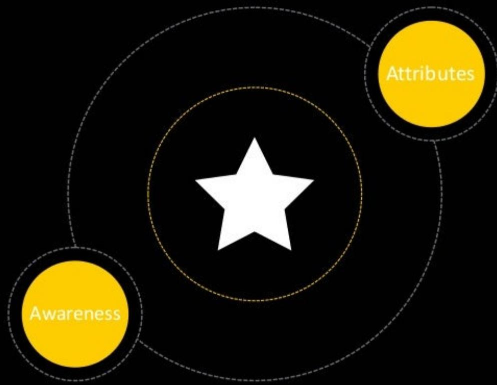
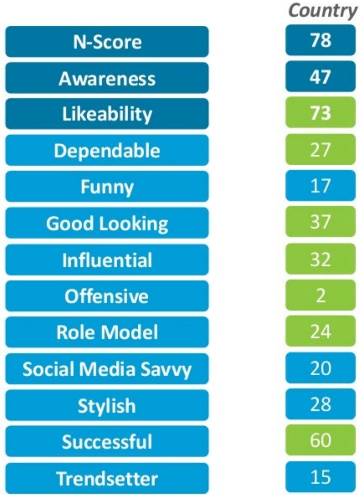
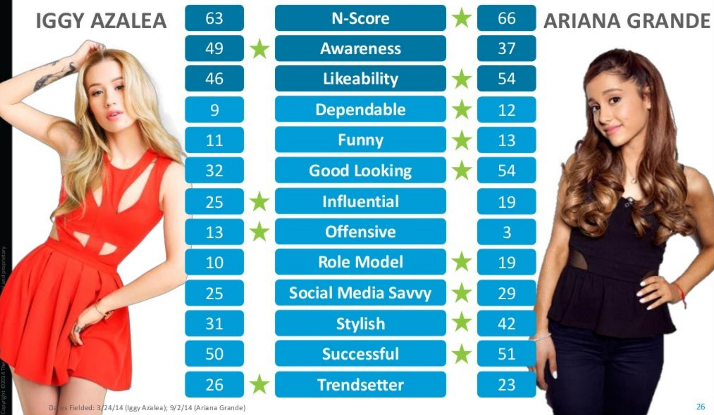
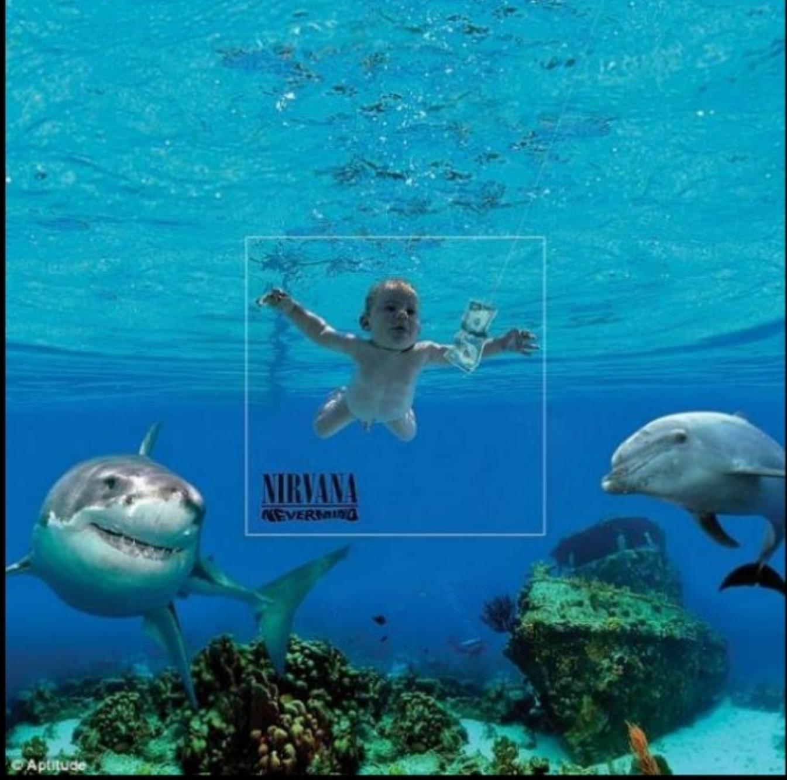
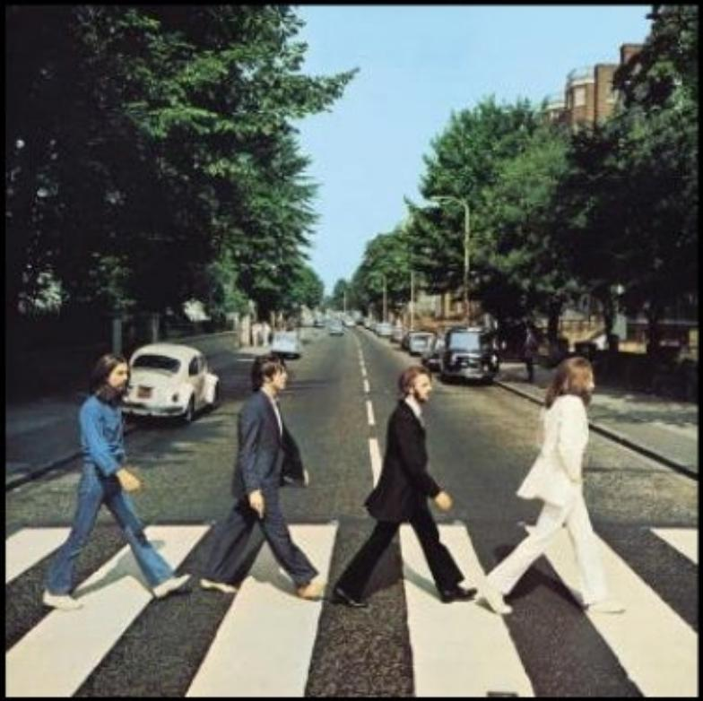
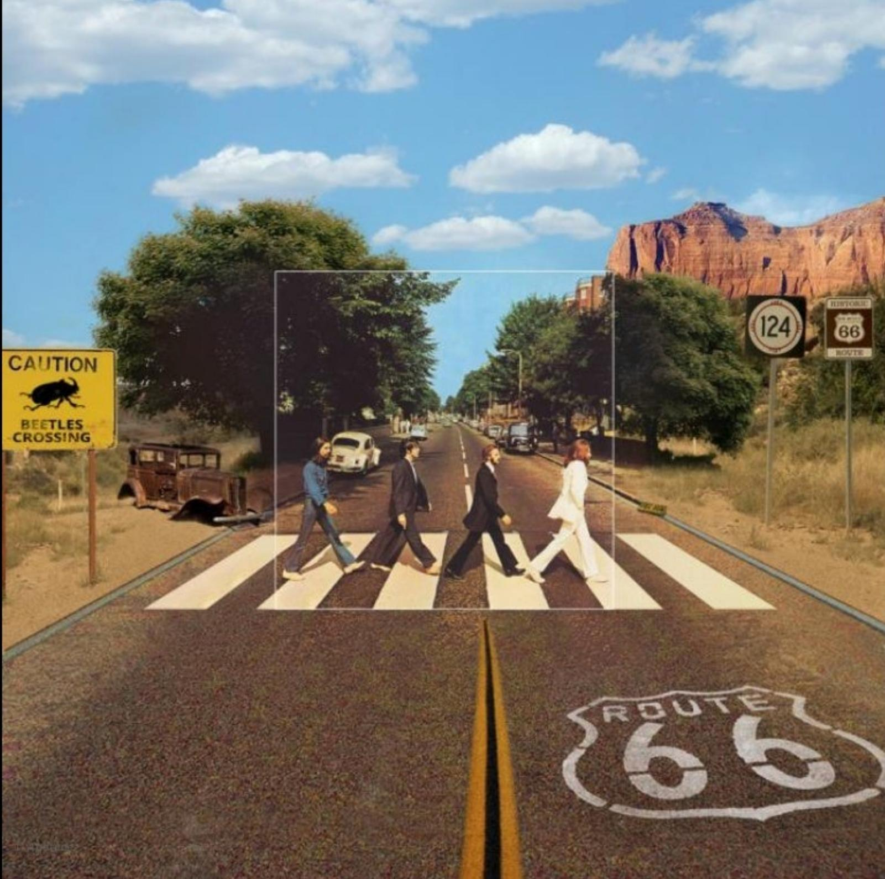

## nielsen THE COMPLETEVIEW OFMUSIC

## AREYOU SEEINGTHE WHOLE PICTURE?

THEVELUET UNDERGROUnD &nICo

AC+DC

FOR THOSE ABOUT TOROCK

## MEASUREMENTOFMUSICACTIVITYAND MUSICFANS

### Full Page Description (Page 4)

**Source:** `assets/_page_4_Asset_0.jpg`

**Generated:** 2026-06-01 14:50:16

---

The image is a bar chart comparing music industry metrics between 2014 and 2015. It includes data on Total Music Volume, Total Sales, Overall Albums, Physical Albums, Digital Albums, Digital TEA, and Streaming SEA. The chart shows a significant increase in Streaming SEA with a 91% growth from 38M to 62M. Total Music Volume increased by 14% from 183M to 208M. Total Sales decreased by 5% from 121M to 114M. The chart highlights the shift towards streaming as a dominant revenue stream in the music industry.

·AND MORE GOOD NEWS - OVERALL VOLUME IS UP 14% SO FAR IN 2015

### Full Page Description (Page 5)

**Source:** `assets/_page_5_Asset_0.jpg`

**Generated:** 2026-06-01 14:58:13

---

The image is a stacked bar chart comparing the distribution of music consumption by format (physical albums, digital albums, digital tracks, and streaming) in 2014 and 2015. The chart uses four colors to represent each category: gray for physical albums, orange for digital albums, green for digital tracks, and blue for streaming. The percentages for each category are clearly labeled on the chart. Notable trends include a decrease in physical album sales and an increase in streaming, which shows a significant shift in the music consumption market.

## STREAMING HAS QUICKLY BECOME THE LARGEST SHARE OF THE BUSINESS

## ACLOSERLOOKATMUSICFORMATSANDGENRES

### Full Page Description (Page 7)

**Source:** `assets/_page_7_Asset_0.jpg`

**Generated:** 2026-06-01 14:45:32

---

The image is a bar chart titled "Share of Total Activity." It displays the percentage share of total activity for different music genres. The genres and their corresponding percentages are as follows: Rock (30%), R&B/Hip-Hop (21%), Pop (17%), Country (9%), Latin (5%), Dance/Elec (4%), and Christian/Gosp (3%). The chart visually represents the distribution of activity across these genres, with Rock having the highest share at 30%, followed by R&B/Hip-Hop at 21%, and Pop at 17%. The genres with the lowest shares are Christian/Gosp at 3% and Dance/Elec at 4%.

## ROCK IS THE BIGGEST GENRE, BUT R&B/HIP-HOP AND POP ARE ALSO STRONG IN 2015

### Full Page Description (Page 8)

**Source:** `assets/_page_8_Asset_0.jpg`

**Generated:** 2026-06-01 14:51:20

---

The image is a bar chart that visually represents the distribution of album sales, song sales, and streams percentages across different music genres. The genres included are Rock, R&B/Hip-Hop, Pop, Country, Latin, Dance/Elec, and Christian/Gosp. The chart uses three distinct colors to differentiate between album sales (green), song sales (orange), and streams (purple). Notable features include the dominance of album sales in the Rock genre, with a significant portion of song sales and streams in the R&B/Hip-Hop and Pop genres. The Latin genre shows the lowest percentages across all categories.

## ROCK DOMINATES ALBUMS, POP DRIVES SONG SALES AND R&B/HIP-HOP LEADS STREAMING

### Full Page Description (Page 9)

**Source:** `assets/_page_9_Asset_0.jpg`

**Generated:** 2026-06-01 14:55:30

---

The image is a bar chart that displays the distribution of music genres across different categories: Phys Albums, Dig Albums, TEA, and SEA. The genres include All Music, Rock, R&B/Hip-Hop, Pop, Country, Latin, Dance/Elec, and Christian/Gosp. Each genre is represented by a set of four bars, each corresponding to one of the categories. The chart shows that Country music has the highest percentage in the Phys Albums category (35%), while Latin music has the highest percentage in the SEA category (68%). The chart provides a clear visual representation of the relative popularity of each genre across the four categories.

## STREAMING HAS BECOMETHE LEADING FORMAT OVERALL AND IN MOST GENRES

### Full Page Description (Page 10)

**Source:** `assets/_page_10_Asset_0.jpg`

**Generated:** 2026-06-01 14:48:36

---

The image is a bar chart with four bars representing different categories of music activity: Total Activity, Album Sales, Song Sales, and Streams. The chart is divided into four segments, each with a percentage value: Total Activity at 57%, Album Sales at 51%, Song Sales at 49%, and Streams at 70%. The chart visually compares the relative contributions of these categories to the total music activity. The bars are color-coded for clarity: Total Activity is green, Album Sales is orange, Song Sales is purple, and Streams is red. The chart provides a clear visual representation of the distribution of music activity across different metrics.

## WHILE SALES ARE EVENLY SPLIT BETWEENCURRENT AND CATALOG, STREAMS ARE 70%CATALOG

### Full Page Description (Page 11)

**Source:** `assets/_page_11_Asset_0.jpg`

**Generated:** 2026-06-01 14:52:27

---

The image is a bar chart with four categories: Rock, Pop, R&B/Hip-Hop, and Country. It presents data on total activity, album sales percentage, song sales percentage, and streams percentage for each genre. The chart uses different colors to represent each metric: green for total activity, orange for album sales percentage, purple for song sales percentage, and red for streams percentage. Notable features include the highest total activity and streams percentage in Rock, and the highest album sales percentage in Country. The chart provides a clear comparison of the different metrics across the four genres.

## ROCK IS DRIVEN BY CATALOG AT ALL FORMATS,WHILE POP IS MAINLY DRIVEN BY CURRENT

## DIFFERENTTYPESOFCONSUMPTIONMEANS DIFFERENTPATHSTOSUCCESS

## THE TOP ALBUMS ACHIEVE SUCCESS IN DIFFERENT WAYS

## billboard

## SOME OTHER NOTABLE SUCCESSES IN 2015

## STRONG CORRELATION BETWEEN STREAMS, n SALES AND RADIO AUDIENCE -USUALLY

## THEATTRIBUTESOFASUCCESSFULARTIST

## N-SCORECELEBRITYPERCEPTION

## OurN-Score tool allows us tomeasurefanaffinityand sentiment for individualcelebrities-andassesstheirpotentialfor brand partnerships

> **AI Description:**
> **Source:** `assets/_page_17_Figure_0.jpg`
> 
> **Generated:** 2026-06-01 14:57:25
> 
> ---
> 
> The image is a diagram with two yellow circles labeled "Awareness" and "Attributes," both connected to a central white star. The central star is surrounded by a dashed circle, suggesting a relationship or influence between the star and the two circles. The overall design appears to represent a model or framework, possibly related to marketing or brand awareness, where "Awareness" and "Attributes" are key components influencing the central concept.

Wecan evaluateanartist or celebrity'sability tomove products and enhance brand reputation.

### Full Page Description (Page 18)

**Source:** `assets/_page_18_Asset_0.jpg`

**Generated:** 2026-06-01 14:53:22

---

The image is a histogram with an orange bar chart. The x-axis represents numerical values ranging from 20 to 240, with intervals marked at 20. The y-axis is labeled "Music Industry Mean" and has a value of 100. The chart shows a distribution of data points around the mean value of 100. There are two vertical dashed lines labeled "Top 10 Stream Songs" and "Top 10 Albums," with corresponding values of 144 and 147, respectively. The chart visually represents the spread and concentration of data points around the mean, with a peak at the mean value and a decline as the values move away from it.

## TOPARTISTSARE SEEN ASTRENDSETTERS

Artistsof the top10albums purchasedand top10 streamed songsare,above allelse, seenas Trendsetters in the musicindustry

THE MOST SUCCESSFUL COUNTRY ARTISTSARE SEEN AS LIKEABLE,UNOFFENSIVE,DEPENDABLEAND ROLE-MODELS

> **AI Description:**
> **Source:** `assets/_page_19_Figure_0.jpg`
> 
> **Generated:** 2026-06-01 14:49:05
> 
> ---
> 
> The image contains a bar chart with two sets of bars, one in blue and the other in green, representing data across two categories: "N-Score" and "Country." The chart lists various attributes such as "Awareness," "Likeability," "Dependable," and "Successful," with corresponding scores for each attribute. The blue bars represent the "N-Score" and the green bars represent the "Country" scores. The chart highlights that attributes like "N-Score," "Likeability," and "Successful" have higher scores, while attributes like "Offensive" and "Trendsetter" have lower scores. The "Country" category shows a higher score for "Successful" compared to other attributes.

## NO WONDER COUNTRY FANS HAVE SO MUCH ENERGY

## WHO ARE THEY?

58%of country music fansare female.

81%of country music fans are white.

## THEY AREACTIVE ON

## SOCIALMEDIA,PARTICULARLYAROUNDLIVEMUSIC EVENTS

20-30%more likely than the averagemusicfan topost photosorupdatestatusabout live music.

## THEY STILL LOVE RADIO

Radiois both the most popular platformand themost popular listeningdevice.

## WHAT ARETHEY DRINKING?

Farmorelikelytodrink energy drinks.

Also,favordomesticbeersover importedand flavoredalcoholic spirits overwine.

HIP HOP FANS ARE MORE TOLERANT OF THEIR ARTISTS 山 BEING OFFENSIVE,BUT IT IS IMPORTANT FOR THEM TO BE INFLUENTIAL,STYLISHTREND-SETTERS

## HIP-HOP FANS ARE AT THE FOREFRONT OF THE DIGITAL MUSIC MOVEMENT

## WHO ARE THEY?

Overtwiceas likely to be African-American and 50% more likely to be Hispanic.

## THEYAREVERYENGAGED WITHDIGITALMUSIC

Farmore likelytousestreaming services forboth consumption and discovery.

Strongsocial element-hip-hop consumersaremorethantwice aslikelyto connectwith friends through music.

## THEY ARE SPENDING MORE

Hip-hop fansspend 35%more annuallyon music,including twice asmuch on club eventswith live

DJsand 40%moreonmusic festivals.

## WHAT MOBILE SERVICES?

UseSprintandT-Mobile significantlymore than the averageconsumer.

Also,50%more likelytohavea Samsungmobile phone than average.

WHILE EDM HAS LOWER GENERAL AWARENESS, TRAITS OFTHEMOST SUCCESSFULARTISTS INCLUDEBEING INFLUENTIALTREND-SETTERS AND SOCIAL MEDIA SAVVY

## EDM FANS - DIGITALLY DRIVEN CONSUMERS WHO LOVE FESTIVALS AND SUGAR

## WHO ARE THEY?

Tend tobeyoungerand skew male.

Almost twice as likely to be Hispanic than average.

## TRENDSETTERSAND DIGITALLYENGAGED

They are more likelyto be seen asmusical trendsetters by their peers.

Theyaremore likely tostream musicandmore likely topay for streaming.

## THEY ATTEND FESTIVALS

Theyaremore likelytoattend festivalsandaremore likelyto post liveeventupdatesand videostosocialmedia.

## THESUGARBUZZAND BRANDENGAGEMENT

50%more likelytopurchase energydrinks,19%more likely to purchase chewinggumand18% less likelytodrinkdietsoda.

53% view brands more favorably when they sponsor tours/concerts.

## USING DATA TO DRIVE DECISION MAKING AT THE ARTIST LEVEL

> **AI Description:**
> **Source:** `assets/_page_25_Figure_0.jpg`
> 
> **Generated:** 2026-06-01 14:46:56
> 
> ---
> 
> The image is an infographic comparing the N-Score and various attributes of two individuals, Iggy Azalea and Ariana Grande. It includes a chart with numerical scores and star ratings for each attribute such as awareness, likeability, dependability, and others. The chart is visually organized with blue bars for each attribute and corresponding scores. The individuals are shown in photographs on either side of the chart, with their names labeled at the top. The infographic also includes dates for when the data was collected.

## ANDLET'SNOTFORGETABOUTTHEPOWER OFTELEVISION

### Full Page Description (Page 27)

**Source:** `assets/_page_27_Asset_1.jpg`

**Generated:** 2026-06-01 14:43:50

---

The image contains a line graph with two data series: "Total Tweets" and "Total Unique Authors". The graph is titled "SOCIAL TRAFFIC". The x-axis represents time, while the y-axis on the left side shows the number of tweets, and the y-axis on the right side shows the number of unique authors. The graph illustrates an upward trend in both the total number of tweets and the total number of unique authors over time, with the number of tweets consistently higher than the number of unique authors.

### Full Page Description (Page 27)

**Source:** `assets/_page_27_Asset_0.jpg`

**Generated:** 2026-06-01 14:43:38

---

The image contains a line graph with a yellow line representing data over time. The x-axis shows dates from January 7 to February 25, and the y-axis ranges from 9 to 14. The graph shows a steady increase in the data over the period, starting at approximately 10 on January 7 and reaching around 13.5 on February 25. The data appears to be increasing at a consistent rate throughout the timeline.

## A MUSIC STORY GROWING FROM TELEVISION EMPIRE

## VIEWERS (MILLIONS)

## ONLINE

Overall,THEmosttweetedabout show since its premiere(Cableor Broadcast)

At382,ooo each airing，the showgarnersthe highestaverage tweetsperepisodeduring live airingsofany Broadcastdramathisseason

## TELEVISION

AsofFeb25th，EmpirerankedastheNo.1showon network television (18-49)

Theshowbecame the first series since 1991togain increasedviewershipforitsfirst5consecutiveweeks onair

> **AI Description:**
> **Source:** `assets/_page_27_Figure_5.jpg`
> 
> **Generated:** 2026-06-01 14:57:04
> 
> ---
> 
> The image contains a simple icon of a computer monitor within a blue circle. The icon is a flat, two-dimensional representation and does not include any text or additional visual elements. The blue circle surrounding the monitor suggests a focus or highlight on the computer monitor icon.

Feb25th ep.wasthe highest rated regular Broadcast drama inapproximately5years

## SEETHEWHOLEPICTURE

> **AI Description:**
> **Source:** `assets/_page_30_Figure_0.jpg`
> 
> **Generated:** 2026-06-01 14:47:48
> 
> ---
> 
> The image is a composite of a photograph and text. It features a baby floating underwater, a shark smiling, and a dolphin, all set against a vibrant underwater scene with coral and rocks. The photograph is framed within a square that contains the text "NIRVANA NEVERMIND," referencing the album cover of the band Nirvana. The image combines elements of a famous album cover with an underwater scene, creating a surreal and humorous juxtaposition.

> **AI Description:**
> **Source:** `assets/_page_31_Figure_0.jpg`
> 
> **Generated:** 2026-06-01 14:44:19
> 
> ---
> 
> The image is a photograph of four individuals crossing a street at a pedestrian crossing. The setting appears to be an urban environment with trees lining the sides of the road and several cars visible in the background. The individuals are dressed in distinct styles, with two wearing suits and the other two in more casual attire. The image is iconic and is often associated with a famous album cover.

> **AI Description:**
> **Source:** `assets/_page_32_Figure_0.jpg`
> 
> **Generated:** 2026-06-01 14:56:58
> 
> ---
> 
> The image is a composite of two distinct scenes. The foreground features a classic photograph of four individuals crossing a road at a pedestrian crossing, reminiscent of the iconic Beatles album cover "Abbey Road." The background shows a desert landscape with a sign indicating "Route 66" and another sign reading "124." The juxtaposition of these two scenes creates a surreal and humorous effect. The text on the signs adds a layer of irony, with one sign humorously warning of "Beetles Crossing." The overall composition blends historical and cultural references with a modern, humorous twist.

## THANKYOU!