
User Guide

## Contents

Basic Gestures 1   
Lock and Unlock Your Screen 4   
Get Familiar with the Home Screen 5   
EÑì²fi”†ì²ÑÊ and Status Icons 6   
Control Panel 7   
Screenshots & Screen Recording 10   
multi-window 13   
Smart Features   
AI Voice 17   
AI Lens 20   
AI Touch 20   
Huawei Print 21   
Multi-Device Collaboration 21   
Audio Control Panel 22   
Camera and Gallery   
Take Photos 24   
Shoot in Portrait, Night, and Wide Aperture Modes 25   
AI Photography 26   
Pro Mode 27   
Record Videos 29   
Time-Lapse Photography 30   
Adjust Camera Settings 30   
Manage Gallery 32   
Apps   
Notepad 37   
Settings   
Display & Brightness 40   
Biometrics & Password 40   
About Phone 42

## Essentials

## Basic Gestures

## Basic Gestures and Shortcuts

## System Navigation Gestures

Go to Settings > System & updates > System navigation and make sure that Gestures is selected.

> **AI Description:**
> **Source:** `assets/_page_2_Figure_0.jpg`
> 
> **Generated:** 2026-06-01 15:14:42
> 
> ---
> 
> The image shows a hand interacting with a smartphone. The smartphone screen displays text, and the hand is tapping on the screen with a finger. The image is a simple illustration and does not contain any charts, graphs, or other visual elements.

## Return to the previous screen

Swipe in from the left or right edges to return to the previous screen.

## Back to home screen

Swipe up from the bottom to go to the home screen.

> **AI Description:**
> **Source:** `assets/_page_2_Figure_2.jpg`
> 
> **Generated:** 2026-06-01 15:14:12
> 
> ---
> 
> The image depicts a simple illustration of a hand interacting with a smartphone. The smartphone screen displays a document or text, and the hand is positioned as if it is about to tap or scroll on the screen. The image is a basic representation and does not contain any charts, graphs, or additional visual elements.

## Recent tasks

Swipe up from the bottom of the screen and hold to view recent tasks.

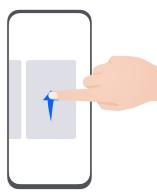

> **AI Description:**
> **Source:** `assets/_page_2_Figure_3.jpg`
> 
> **Generated:** 2026-06-01 15:14:30
> 
> ---
> 
> The image depicts a hand interacting with a smartphone. The smartphone screen shows a small, stylized figure of a person, possibly representing a user or character, which is being tapped or swiped by the finger. The illustration is simple and cartoonish, with no additional text or labels. The focus is on the interaction between the hand and the smartphone screen.

## Close an app

When viewing recent tasks, swipe up on an app preview to close the app.

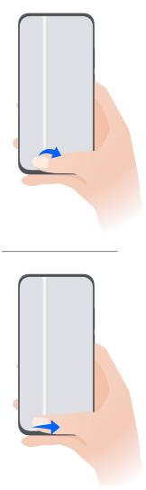

> **AI Description:**
> **Source:** `assets/_page_3_Figure_0.jpg`
> 
> **Generated:** 2026-06-01 15:15:33
> 
> ---
> 
> The image contains two diagrams illustrating a hand holding a smartphone. The diagrams depict the hand in two different positions, with the phone held in a landscape orientation. The top diagram shows the hand holding the phone with the thumb positioned on the left side of the screen, while the bottom diagram shows the hand holding the phone with the thumb positioned on the right side of the screen. The diagrams are likely used to demonstrate different ways to interact with a smartphone, such as scrolling or tapping.

## Switch between apps

• Slide across the bottom edge of the screen to switch between apps. Before using this gesture, touch Settings on the System navigation screen, and ensure that Slide across bottom to switch apps is enabled.

• Swipe across the bottom of the screen in an arc to switch between apps.

If your device does not have the Slide across bottom to switch apps switch, it indicates that the corresponding feature is not supported.

## Knuckle Gestures

Before using knuckle gestures, use either of the following methods to make sure that all necessary features are enabled (depending on your device model):

Go to Settings > Accessibility features > Shortcuts & gestures, and enable Take screenshot and Record screen.

Go to Settings > Accessibility features > Motion control > Take screenshot, and enable Smart screenshot.

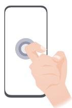

> **AI Description:**
> **Source:** `assets/_page_3_Figure_1.jpg`
> 
> **Generated:** 2026-06-01 15:15:38
> 
> ---
> 
> The image is a simple illustration of a hand interacting with a smartphone. The hand is shown pressing a button on the screen, which is depicted as a circular element. The illustration is minimalistic and does not contain any text or additional labels. The focus is on the interaction between the hand and the smartphone, suggesting a user interface or a gesture-based control feature.

## Take a screenshot

Knock twice on the screen with a knuckle to take a screenshot.

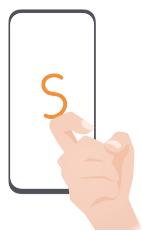

> **AI Description:**
> **Source:** `assets/_page_3_Figure_2.jpg`
> 
> **Generated:** 2026-06-01 15:15:05
> 
> ---
> 
> The image contains a simple illustration of a hand interacting with a smartphone. The smartphone screen displays a large orange letter "S". The hand is positioned as if it is about to press the screen. The image is a basic, flat design with no additional visual elements or annotations.

## Take a scrollshot

Knock on the screen with a knuckle and draw an "S" to take a scrolling screenshot.

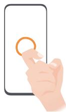

> **AI Description:**
> **Source:** `assets/_page_3_Figure_3.jpg`
> 
> **Generated:** 2026-06-01 15:15:01
> 
> ---
> 
> The image depicts a hand interacting with a smartphone. The hand is pressing a circular icon on the screen of the phone. The icon is orange and located near the center of the phone's display. The image is a simple illustration and does not contain any text or additional visual elements beyond the hand and the phone.

## Capture part of the screen

Knock and draw an enclosed area with a knuckle to capture part of the screen.

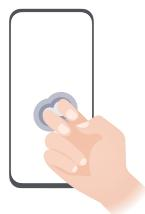

> **AI Description:**
> **Source:** `assets/_page_4_Figure_0.jpg`
> 
> **Generated:** 2026-06-01 15:15:26
> 
> ---
> 
> The image depicts a hand interacting with a smartphone. The hand is pressing a button on the screen, which is highlighted with a light blue circle. The smartphone has a white border, and the hand is shown with a light skin tone and short fingernails. The image is a simple illustration and does not contain any text or additional visual elements.

## Record screen

Knock twice on the screen with two knuckles to start or end a screen recording.

## More Gestures

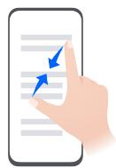

> **AI Description:**
> **Source:** `assets/_page_4_Figure_1.jpg`
> 
> **Generated:** 2026-06-01 15:15:44
> 
> ---
> 
> The image depicts a hand interacting with a smartphone screen. The screen displays a document with text, and two blue arrows are pointing to specific lines within the text. The arrows suggest a focus or highlighting of particular content within the document. The image is likely used to illustrate a concept related to digital document interaction, such as highlighting, annotation, or navigation within a digital document.

## Access Home screen editing mode

Pinch two fiʪžàä together on the home screen.

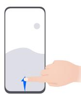

> **AI Description:**
> **Source:** `assets/_page_4_Figure_2.jpg`
> 
> **Generated:** 2026-06-01 15:15:10
> 
> ---
> 
> The image is a simple illustration of a hand interacting with a smartphone. The smartphone screen displays a small blue icon, possibly representing a map or navigation application, with a white area above it. The hand is positioned as if it is about to tap or swipe on the screen. The illustration is minimalistic and does not contain any text or additional annotations.

## Display the shortcut panel on the lock screen

Turn on the screen and swipe up from the bottom of the lock screen.

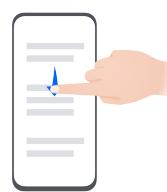

> **AI Description:**
> **Source:** `assets/_page_4_Figure_3.jpg`
> 
> **Generated:** 2026-06-01 15:14:57
> 
> ---
> 
> The image shows a hand interacting with a smartphone. The smartphone screen displays a list of items, with a blue highlight indicating a selection or focus on the second item in the list. The image is a simple illustration and does not contain any charts, graphs, or photographs. The focus is on the interaction between the hand and the smartphone screen.

## Display the search bar

Swipe down from the middle of the home screen.

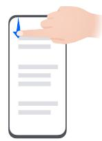

> **AI Description:**
> **Source:** `assets/_page_4_Figure_4.jpg`
> 
> **Generated:** 2026-06-01 15:14:24
> 
> ---
> 
> The image depicts a hand interacting with a smartphone screen. The screen shows a list with several items, but the text is not fully legible. The hand appears to be tapping or swiping on the screen, suggesting an action of navigation or selection within the app. The image is a simple illustration and does not contain any charts, graphs, or photographs.

## Display the ÊÑì²fi”†ì²ÑÊ panel

Swipe down from the upper left edge of the screen.

## Turn on a shortcut switch

Swipe down from the upper right edge of the screen to display Control

Panel and touch to expand the shortcut switches panel (depending on your device model).

## Button Shortcuts

Some products do not have volume buttons.

## Lock and Unlock Your Screen

## Lock and Unlock Your Screen

## Lock Your Screen

## Auto-lock:

Your phone will automatically turn Ñff when you haven't used it for a certain period of time.   
You can go to Settings > Display & brightness > Sleep, and set the screen timeout duration.

## Manually lock the screen:

To lock the screen, use either of the following methods:

• Press the Power button.

• On the home screen, pinch two fiʪžàä together to enter editing mode. Touch Widgets, and drag the Screen Lock icon to the home screen. Then touch the Screen Lock icon to lock the screen.

## Turn On the Screen

You can turn on the screen in any of the following ways:

• Press the Power button.

• Go to Settings > Accessibility features > Shortcuts & gestures > Wake screen, and enable Raise to wake, Double-tap to wake, and/or Show palm to wake. Then use the corresponding feature to turn on the screen.

If your phone does not have this option, it indicates that this feature is not supported.

## Unlock Your Screen

Password unlock: Once the screen is turned on, swipe up from the middle of the screen to display a panel where you can enter your lock screen password.

Face unlock: Once the screen is turned on, bring your face in front of the screen. Your phone will unlock automatically after recognizing your face.

Fingerprint unlock: Touch the fiʪžàÝà²Êì sensor zone with a fiʪžà that you have enrolled.

Be sure to fiàäì wake the screen, if your device has an in-screen fiʪžàÝà²Êì sensor.

## Get Familiar with the Home Screen

## Create and Use Large Folders

You can group similar apps in a large folder and name the folder for better management. You can also turn a standard folder into a large one (both the folder and the app icons in it will be enlarged) to access apps more easily.

## Create a Large Folder

1 Touch and hold an app icon and drag it over another icon to create a new folder.

2 Touch and hold a folder to switch between display modes. For example, you can touch and hold a new folder and select Enlarge from the displayed menu to create a large folder.

3 You can touch the lower right corner of the large folder to open it and then touch the folder name to rename it.

You can also rename the folder by touching and holding it and selecting Rename.

## Operations in a Large Folder

You can perform the following operations in large folders:

• Open apps: In a large folder, touch an icon to access the app directly.

• Enter and exit folders: Touch the lower right corner of a large folder to enter it. Touch a blank area in the folder to exit it.

When there are more than nine apps within a large folder, a stacked icon will appear in the lower right corner of the folder. You can touch the stacked icon to view more apps within the folder.

• Add or remove apps: Open a large folder, touch , and add or remove apps as required.   
If you deselect all apps within the folder, the folder will be deleted.

• Switch between display modes: Touch and hold a folder to switch between a standard and large display. For example, you can touch and hold a standard folder and select Enlarge from the displayed menu to create a large folder.

## EÑì²fi”†ì²ÑÊ and Status Icons

## EÑì²fi”†ì²ÑÊ and Status Icons

Network status icons may vary depending on your region or network service provider. Supported functions vary depending on the device model. Some of the following icons may not be applicable to your phone.

## Control Panel

## Use Shortcut Switches

## Turn on a Shortcut Switch

Swipe down from the upper right edge of the screen to display Control Panel and touch to expand the shortcut switches panel (depending on your device model).

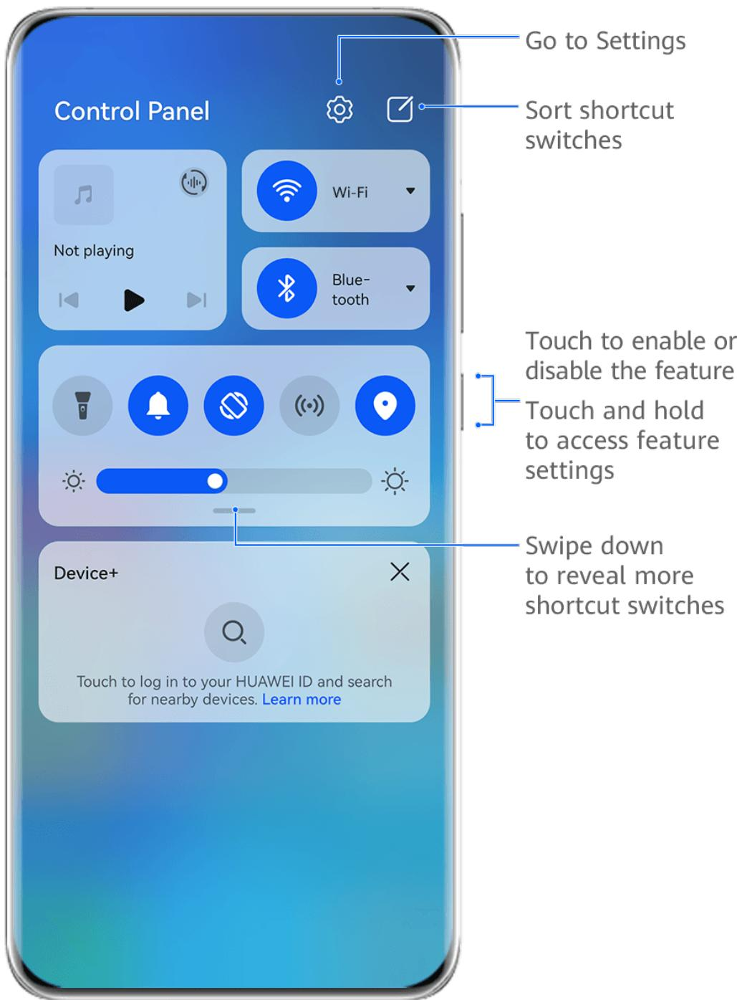

> **AI Description:**
> **Source:** `assets/_page_9_Figure_0.jpg`
> 
> **Generated:** 2026-06-01 15:13:58
> 
> ---
> 
> The image is a screenshot of a smartphone's control panel interface, showcasing various shortcut switches and settings. It includes a section labeled "Control Panel" with icons for media playback, Wi-Fi, Bluetooth, flashlight, alarm, airplane mode, and location services. Below these icons, there is a brightness slider. At the bottom, there is a "Device+" feature with an option to log in to a HUAWEI ID and search for nearby devices. The image also includes annotations explaining how to interact with the control panel, such as going to settings, sorting shortcut switches, enabling or disabling features, accessing feature settings, and revealing more shortcut switches by swiping down.

The fiªñàžä are for reference only.

• Touch a shortcut switch to enable or disable the corresponding feature.

• Touch and hold a shortcut switch to access the settings screen of the corresponding feature (supported by some features).

• Touch to access the system settings screen.

## Customize Shortcuts

Swipe down from the upper right edge of the screen to display Control Panel, go to > Edit switches, then touch and hold a shortcut switch to drag it to your preferred position, and touch Done.

## Audio Control Panel

## Manage Audio Playback in Audio Control Panel

When multiple audio apps (such as Music) are opened, you can manage music playback and switch between these apps in Audio Control Panel with ease.

1 After opening multiple audio apps, swipe down from the upper right edge of the phone to display Control Panel, then touch the audio playback card at the top of Control Panel.

2 The currently and recently used audio apps will be displayed in Audio Control Panel where you can manage playback (such as playing, pausing, and switching to the previous or next song) in the app in use, or touch another audio app to quickly switch playback.

0 • Some apps need to be updated to the latest version before using this feature.

• Not all apps support Audio Control Panel.

## Quickly Switch Audio Playback Device

When your phone is connected to an audio device (such as a headset, Bluetooth speaker, or Vision product), you can quickly switch the playback device in the audio control section in Control Panel (such as for transferring the current music playback from your phone to a Bluetooth speaker).

1 Connect your phone to an audio device via Bluetooth or other methods.

After a Vision product is connected to your phone via Bluetooth, you can also connect it to the same Wi-Fi network and log in to the same HUAWEI ID as your phone to perform more operations.

2 Swipe down from the upper right edge of your phone to display Control Panel, touch

or the device icon (such as ) in the top right corner of the audio control section at the top, then select the audio device from the connected device list to transfer the current audio playback on your phone to the device.

## Work Seamlessly Across Devices with Device+

Device+ allows for collaboration between š²ffžàžÊì devices, making your phone the hub of your nearby Vision and other supported devices for them to be controlled conveniently. You can also seamlessly transfer ongoing tasks on your phone, from MeeTime calls to audio and video content being streamed, to your Vision with just a tap.

Please make sure your device has been updated to the latest system version.

## Set Device+

Currently, Device+ supports linking phones with the following types of devices. To use this feature, make sure that devices to be connected support Device+. Before you get started, enable Bluetooth and Wi-Fi and log in to your HUAWEI ID on your phone. For other devices, perform the following settings:

• Vision: Ensure that it is connected to the same LAN and logged in to the same HUAWEI ID as your phone.

• Bluetooth device: Some Bluetooth devices (such as Bluetooth headsets) can be linked with your phone via Device+ after establishing a Bluetooth connection.

• Device+ does not support collaboration between phones.

• If Device+ is hidden, access Control Panel and go to > Show Device+.

## Transfer MeeTime Calls and Audio or Video Being Streamed to Other Devices

When you are making MeeTime calls on your phone, watching videos (such as in HUAWEI Video, Youku, or other video streaming apps), or listening to music, you can transfer any of these ongoing tasks to another device via Device+ and pick up from where you left Ñff on the new device. For instance, you can transfer a MeeTime call to your Vision.

MeeTime: This feature is only available in some countries and regions.

You can select š²ffžàžÊì devices to transfer the following tasks:

• Videos: Can be transferred to Visions.

• MeeTime calls: Can be transferred to Visions.

• Music: Can be transferred to Bluetooth earphones and Visions (either when the screen is on or Ñff)ȇ

1 Swipe down from the upper right edge of your phone to display Control Panel. Available devices will be displayed in the Device+ section. You can also touch to search for nearby devices manually.

2 Touch a device that you want to transfer the ongoing tasks to.

## Screenshots & Screen Recording

## Take a Screenshot

## Use Your Knuckle to Take a Screenshot

1 Before using knuckle gestures, use either of the following methods to make sure that all necessary features are enabled (depending on your device model):

Go to Settings > Accessibility features > Shortcuts & gestures > Take screenshot and enable Knuckle screenshots.

Go to Settings > Accessibility features > Motion control > Take screenshot and enable Smart screenshot.

2 Knock twice in quick succession with one knuckle to take a screenshot.

## Take a Screenshot with a Key Shortcut

Press and hold down on the Power and Volume down buttons at the same time to take a screenshot.

## Take a Screenshot with a Shortcut Switch

Swipe down from the upper right edge of the screen to display Control Panel, touch to expand the shortcut switches panel (depending on your device model), and touch Screenshot to take a screenshot.

## Share or Edit a Screenshot

After you take a screenshot, a thumbnail will appear in the lower left corner of the screen. Feel free to:

• Swipe up on the thumbnail to select a method for sharing the screenshot with others.

• Swipe down on the thumbnail to take a scrolling screenshot.

• Tap on the thumbnail to edit, delete, or do more with the screenshot.

Screenshots are saved to Gallery by default.

## Swipe Down with Three Fingers to Take a Screenshot

1 Go to Settings > Accessibility features > Shortcuts & gestures > Take screenshot or Settings > Accessibility features > Motion control > f¯àžžȝfiʪžà screenshot (depending on your device model) and make sure that f¯àžžȝfiʪžà screenshot is enabled.

2 Swipe down from the middle of the screen with three fiʪžàä to take the screenshot.

## Take a Partial Screenshot

Use Partial screenshot to take a screenshot of a part of the screen. You can choose your preferred screenshot shape (such as a rectangle, oval, or heart).

## Take Partial Screenshots with Knuckle Gestures

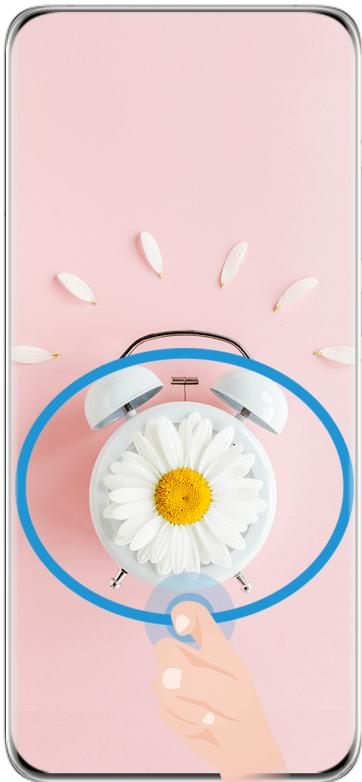

> **AI Description:**
> **Source:** `assets/_page_13_Figure_0.jpg`
> 
> **Generated:** 2026-06-01 15:11:55
> 
> ---
> 
> The image is a digital illustration featuring a pink background with a white alarm clock at the center. A hand is depicted pressing the alarm button, which is highlighted with a blue circle. Floating petals are scattered around the clock, adding a decorative touch. The overall design is simple and visually appealing, with a focus on the interaction between the hand and the alarm clock.

## The fiªñàžä are for reference only.

1 Knock on the screen with a single knuckle and hold to draw an outline around the part of the screen that you wish to capture. Make sure that your knuckle does not leave the screen.

2 The screen will display your knuckle movements. You can then:

Drag the frame to the desired position or resize it.

• Touch any of the shape options at the bottom of the screen to change the shape of the captured area. You can also keep the original shape that you drew.

3 Touch to save the screenshot.

## Use a Shortcut to Take a Partial Screenshot

1 Swipe down from the upper right edge of the screen to display Control Panel, touch ? to expand the shortcut switches panel (depending on your device model), touch next to Screenshot, and touch Partial screenshot in the displayed dialog box.

2 Follow the onscreen instructions to draw an outline with your fiʪžà around the part of the screen that you want to capture.

3 The screen will display the movement trajectory of your fiʪžà and take a screenshot of the selected area. You can then:

Drag the frame to the desired position or resize it.

Touch any of the shape options at the bottom of the screen to change the shape of the captured area. You can also keep the shape that you drew.

4 Touch to save the screenshot.

## Take a Scrolling Screenshot

Use Scrollshot to capture a memorable chat, article, or essential work document that can't display in full on the screen, and share with others.

Use a Knuckle to Take a Scrolling Screenshot

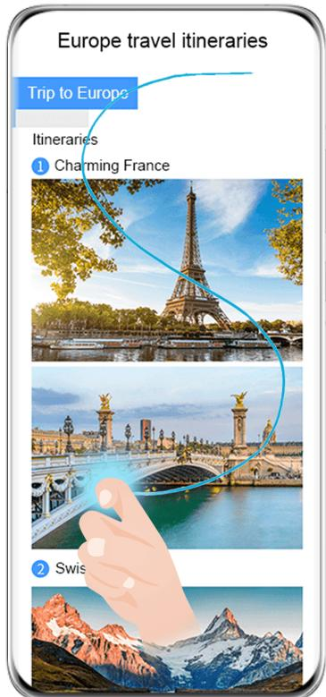

> **AI Description:**
> **Source:** `assets/_page_14_Figure_0.jpg`
> 
> **Generated:** 2026-06-01 15:12:07
> 
> ---
> 
> The image contains a mobile screen displaying a travel itinerary for a trip to Europe. The screen shows a list of itineraries, with the first one titled "Charming France," accompanied by a photograph of the Eiffel Tower and a bridge, likely the Pont Alexandre III in Paris. The second itinerary is partially visible, labeled "Swiss," with a photo of a snowy mountain landscape. The image includes a hand gesture pointing towards the "Charming France" itinerary, suggesting an interactive element or selection option.

## The fiªñàžä are for reference only.

1 Tap a single knuckle against the screen and hold to draw an "S". Your device will automatically scroll to the bottom of the page to capture all of the content in a single screenshot.

2 You can touch the screen at any time to stop the scrolling.

Use a Shortcut to Take a Scrolling Screenshot

1 Swipe down from the upper right edge of the screen to display Control Panel, touch

to expand the shortcut switches panel(depending on your device model), touch next to Screenshot, and touch Scrollshot in the displayed dialog box.

2 You can touch the screen at any time to stop the scrolling.

## multi-window

## Split the Screen, to Multi-Task Away

Multi-Window allows you to open apps in split screen mode, for seamless multi-tasking at all times.

Split-screen mode is only supported in certain apps.

## To check whether an app supports Multi-Window:

1 Swipe inward from the left or right edge of your phone screen and hold, to bring up the Multi-Window dock.

2 Touch to fiʚ the list of apps that support Multi-Window in the More apps section.

## Splitting the screen:

1 After opening an app, swipe inward from the left or right edge of your phone screen and hold, to bring up the Multi-Window dock.

2 Hold down on an app in the dock, drag it to the screen, and then release.

If an app does not support Multi-Window, a prompt will appear onscreen.

## Switching split-screen panes:

Touch and hold down on at the top of a split-screen pane until you see the pane shrink, then drag it to the other side of the screen to switch panes.

## Exiting split-screen mode:

Touch and hold down on or in the middle of the split screen line, and drag it until you see either pane disappear.

## Drag and Drop Between Apps with Multi-Window

Use the Multi-Window feature to easily drag and drop images, text, and documents between apps.

• Drag and drop an image: When taking notes with Notepad, open Files, select the photo you want to add, and drag it into the Notepad editor.

• Drag and drop text: When sending an SMS message, open Notepad, touch and hold the text you want to send, and drag it into the message text input box.

• Drag and drop a document: When writing an email, open Files, select the document you want to attach, and drag it into the email editor.

Not all apps fully support drag-and-drop with Multi-Window.

## Multi-Window View for a Single App

You can create two task windows for the same app (such as Email and Notepad), and drag images, text, or documents between them.

## This feature is unavailable in some apps.

## Enter the split-screen view within an app.

1 Open the Email app.

2 Swipe inward from the left or right edge of your phone and hold to bring up the Multi-Window dock.

3 Touch and hold the Email icon, and drag it to the screen to enter split-screen view.

Drag images, text, or documents between the split-screen windows.

• Drag an image: Select an image from one split-screen window and drag it to the other window.

• Drag text: Touch and hold the text and select the desired part from one split-screen window, then touch and hold the text again and drag it to the other window.

• Drag a document: Select a document from one split-screen window and drag it to the other window.

## Use the Floating Window

Open a flцì²Êª window while gaming, and you can chat with a friend without missing a second of the action.

## Display the flцì²Êª window:

1 Swipe inward from the left or right edge and hold to bring up the Multi-Window dock.

2 Touch an app icon in the Multi-Window dock to open the app in a flцì²Êª window.

## Relocate the flцì²Êª window:

Drag the bar at the top of the flцì²Êª window to move the window to the desired position. Resize the flцì²Êª window:

Drag the bottom edge, two sides, or bottom corners of the flцì²Êª window to resize it.

## Display in full screen:

Touch at the top of the flцì²Êª window to display it in full screen.

## Minimize the flцì²Êª window:

Touch at the top of the flцì²Êª window to minimize and shrink it into a flцì²Êª bubble. Close the flцì²Êª window:

Touch at the top of the flцì²Êª window to close it.

## Find and Switch Between Floating Windows for Apps

You can quickly fiʚ and switch between flцì²Êª windows for apps using the flцì²Êª window management function.

1 Make sure that you have opened flцì²Êª windows for multiple apps and minimized them into the flцì²Êª ball.

2 Touch the flцì²Êª ball to display all flцì²Êª window previews:

Browse through the flцì²Êª window previews: Swipe up or down to fiʚ the flцì²Êª window preview of the app you are looking for.

Display the flцì²Êª window for an app: Touch the flцì²Êª window preview of the app to display it in a flцì²Êª window.

• Close the flцì²Êª window for an app: Touch on the flцì²Êª window preview to close it.

## Open an Attachment in a Floating Window

You can open a link or attachment within äݞ”²fi” apps (such as Email and Notepad) in a flцì²Êª window.

This feature is unavailable in some apps.

1 Open the Email app.

2 Touch a link or attachment in the Email app to open it in the flцì²Êª window.

Open a link: Touch a link in the Email app to display it in a flцì²Êª window.

Open an attachment: Touch an attachment (such as a document, image, or video) in the Email app to display it in a flцì²Êª window.

# Smart Features

## AI Voice

## AI Voice

AI Voice allows you to communicate verbally with your phone.

To operate hands-free on your phone, wake up AI Voice and give a voice command.

• This feature is only available in some countries and regions.

• Please make sure your device has been updated to the latest system version.

## Wake up AI Voice

You can wake up AI Voice in multiple ways:

Press and hold the Power button for 1 second to wake up AI Voice

1 Go to Settings > HUAWEI Assistant > AI Voice > Wake with Power button, and enable Wake with Power button.

2 Press and hold the Power button for 1 second to wake up AI Voice.

Say the wakeup phrase to wake up AI Voice

1 Go to Settings > HUAWEI Assistant > AI Voice > Voice wakeup, enable Voice wakeup, and follow the onscreen instructions to record your wakeup phrase.

2 When you need to wake up AI Voice, say the wakeup phrase.

The settings items vary by device. If your phone does not provide a äݞ”²fi” item, it indicates that the corresponding feature is not supported.

• You cannot wake up AI Voice with the wakeup phrase when your phone is in a call.

• You cannot wake up AI Voice with the wakeup phrase either if you are making an audio or screen recording (with microphone enabled). In this case, you can press and hold the Power button to wake up AI Voice.

• This feature is only available in some countries and regions.

## AI Voice Skills

AI Voice allows you to navigate on your phone with simple voice commands. You can use AI Voice to:

• Make phone calls

• Send SMS messages

• Launch apps

• Add calendar events and reminders

• Check the weather and more

• Enable AI Lens, and identify content onscreen

To use the voice assistant, wake up AI Voice and say your command, such as "Call Zichen", "Set an alarm for 8 AM", and "Open Camera".

## View AI Voice Skills

You can view the skills incorporated into the AI Voice feature in either of the following ways:

• Wake up AI Voice and ask: "What can you do?". AI Voice will display the Skill center, where its skills are listed.

• This feature is only available in some countries and regions.

• Please make sure your device has been updated to the latest system version.

## Play Music or Videos with Voice Commands

If you want to listen to music or watch videos, wake up AI Voice and give the voice commands directly.

## Play Music with Voice Commands

You can request your device to play a song for you with AI Voice.

Wake up AI Voice and give voice commands such as "Play music", "Play previous song", or "Play next song".

This feature is only available in some countries and regions.

## Play Videos with Voice Commands

Wake up AI Voice and give voice commands such as "Play video", "Play Friends in HUAWEI Video", "Show me a funny video", or "Play a Coldplay video".

This feature is only available in some countries and regions.

## Speech Translation

AI Voice allows you to translate your voice or text input so you can communicate with foreign friends easily.

• This feature is only available in some countries and regions.

• Please make sure your device has been updated to the latest system version.

## Speech Translation

You can use AI Voice to translate your voice or text input into the target language you have set.

1 Wake up AI Voice and give the voice command "Translate".

2 Say or type in what you want to be translated.

3 AI Voice will display the translated result and broadcast it for you.

## Communicate Easily with Face-to-Face Translation

Face-to-face translation allows you to overcome language barriers when you are traveling abroad or in an international conference.

1 Wake up AI Voice and give the voice command "Face-to-face translation" to enter the translation screen.

2 $\tau _ { 0 \mathrm { u c h } } (  _ { \mathrm { o r } } $ (depending on your device model), so the text on each of the two sections can be read from each side of the device.

3 Press the button on your side of the section, say what you want to be translated, and release the button for AI Voice to display the translated result in real time and broadcast it.

## Enable AI Lens with AI Voice

You can use AI Voice to wake up AI Lens.

Wake up AI Voice and give a voice command such as "AI Lens".

0 This feature is only available in some countries and regions.

• Please make sure your device has been updated to the latest system version.

## Scan and Shop with AI Voice

1 Wake up AI Voice and give voice commands such as "Look at how much is the refrigerator", or "Help me look at the same style of this juice machine".

2 Position the object within the v²žwfiʚžà and wait for it to be ²šžÊì²fižšȇ

3 You will be provided with purchase links to š²ffžàžÊì shopping platforms once the object has been recognized.

## Scan and Translate with AI Voice

1 Wake up AI Voice and ask questions or give voice commands such as "Please scan this menu and translate it" or "Scan this street sign and translate it".

2 Select the source and target languages from the language list.

3 Position the text you want to translate within the v²žwfiʚžà and wait for it to be translated.

## Scan to Learn More with AI Voice

1 Wake up AI Voice and ask questions or give voice commands such as "Help me see what this flÑwžà is" or "Please have a look what is this building".

2 Position the object within the v²žwfiʚžà and wait for it to be ²šžÊì²fižšȇ

3 Touch the information card to obtain additional information.

## Scan and Count Calories with AI Voice

1 Wake up AI Voice and ask questions or give voice commands such as "Have a look how much heat this steak has", or "How much heat I can gain by eating this egg tart".

2 Position the food within the v²žwfiʚžà and wait for the calorie and nutrient information to be displayed.

## Scan Codes with AI Voice

1 Wake up AI Voice and give voice commands such as "Scan this QR code" or "Scan the barcode".

2 Position the QR code or barcode within the scan frame and wait for it to be recognized.

## AI Lens

## Scan to Translate

AI Lens allows you to scan and translate text in a foreign language, so you can easily read road signs, menus, or descriptions on cosmetics bottles when you are traveling or shopping abroad.

## Scan to Translate Using Camera

1 Go to Camera > Photo, touc h , and then touch $\frac { \pi } { \tt S } \tt N _ { o r } \underline { { \hat { x } } } \tt A$ (depending on your device model).

2 Select the source and target languages from the language list.

3 Position the text you want to translate within the v²žwfiʚžàȀ and wait for it to be translated.

## AI Touch

## Enable AI Touch

When you see any content that you are interested in on your phone, touch and hold the screen with two fiʪžàä to bring up AI Touch to learn more.

Go to Settings > HUAWEI Assistant > AI Touch and enable AI Touch.

## Shop with AI Touch

When you see an item you wish to buy on your phone, you can use AI Touch to quickly search for the item and compare prices across multiple shopping platforms before making the purchase.

## Touch to Get it Right Away!

1 Go to Settings > HUAWEI Assistant > AI Touch and enable AI Touch.

2 When you see an item that you wish to buy, touch and hold down on the screen with two fiʪžàäȇ

3 Adjust the size and position of the ²šžÊì²fi”†ì²ÑÊ box so that it covers the item you wish to identify.

4 Once the item has been ²šžÊì²fižšȀ you will see a set of purchase links from š²ffžàžÊì shopping platforms.

## Huawei Print

## Print Files, with Huawei Print

Your phone makes it easy to print images and documents on it, by detecting nearby printers that support Huawei Print. Then just touch to print!

1 Power on the target printer and make sure that it is connected to the same Wi-Fi network as your phone, or that Wi-Fi Direct is enabled.

2 To print fiÞä stored in š²ffžàžÊì locations on your phone:

• Gallery: Open an image or select multiple images in Gallery, and go to Share > .

Notepad: Open a note in Notepad, and go to More > Print.

Files: Select one or more fiÞä in Files, and go to Share > Print.

3 After granting the necessary permissions, touch Select to detect nearby printers and select the desired printer. You can then set the number of copies, color, paper size, and other options on the preview screen, and touch PRINT. If no printer is detected, download and install the required printer plug-in as prompted on the Select printer screen.

## Multi-Device Collaboration

## Work Seamlessly Across Devices with Device+

Device+ allows for collaboration between š²ffžàžÊì devices, making your phone the hub of your nearby Vision and other supported devices for them to be controlled conveniently. You can also seamlessly transfer ongoing tasks on your phone, from MeeTime calls to audio and video content being streamed, to your Vision with just a tap.

Please make sure your device has been updated to the latest system version.

## Set Device+

Currently, Device+ supports linking phones with the following types of devices. To use this feature, make sure that devices to be connected support Device+. Before you get started, enable Bluetooth and Wi-Fi and log in to your HUAWEI ID on your phone. For other devices, perform the following settings:

• Vision: Ensure that it is connected to the same LAN and logged in to the same HUAWEI ID as your phone.

• Bluetooth device: Some Bluetooth devices (such as Bluetooth headsets) can be linked with your phone via Device+ after establishing a Bluetooth connection.

• Device+ does not support collaboration between phones.

• If Device+ is hidden, access Control Panel and go to > Show Device+.

## Transfer MeeTime Calls and Audio or Video Being Streamed to Other Devices

When you are making MeeTime calls on your phone, watching videos (such as in HUAWEI Video, Youku, or other video streaming apps), or listening to music, you can transfer any of these ongoing tasks to another device via Device+ and pick up from where you left Ñff on the new device. For instance, you can transfer a MeeTime call to your Vision.

MeeTime: This feature is only available in some countries and regions.

You can select š²ffžàžÊì devices to transfer the following tasks:

• Videos: Can be transferred to Visions.

• MeeTime calls: Can be transferred to Visions.

• Music: Can be transferred to Bluetooth earphones and Visions (either when the screen is on or Ñff)ȇ

1 Swipe down from the upper right edge of your phone to display Control Panel. Available devices will be displayed in the Device+ section. You can also touch to search for nearby devices manually.

2 Touch a device that you want to transfer the ongoing tasks to.

## Audio Control Panel

## Audio Control Panel

## Manage Audio Playback in Audio Control Panel

When multiple audio apps (such as Music) are opened, you can manage music playback and switch between these apps in Audio Control Panel with ease.

1 After opening multiple audio apps, swipe down from the upper right edge of the phone to display Control Panel, then touch the audio playback card at the top of Control Panel.

2 The currently and recently used audio apps will be displayed in Audio Control Panel where you can manage playback (such as playing, pausing, and switching to the previous or next song) in the app in use, or touch another audio app to quickly switch playback.

0 • Some apps need to be updated to the latest version before using this feature.

• Not all apps support Audio Control Panel.

## Quickly Switch Audio Playback Device

When your phone is connected to an audio device (such as a headset, Bluetooth speaker, or Vision product), you can quickly switch the playback device in the audio control section in Control Panel (such as for transferring the current music playback from your phone to a Bluetooth speaker).

1 Connect your phone to an audio device via Bluetooth or other methods.

After a Vision product is connected to your phone via Bluetooth, you can also connect it to the same Wi-Fi network and log in to the same HUAWEI ID as your phone to perform more operations.

2 Swipe down from the upper right edge of your phone to display Control Panel, touch or the device icon (such as $\%$ in the top right corner of the audio control section at the top, then select the audio device from the connected device list to transfer the current audio playback on your phone to the device.

# Camera and Gallery

## Take Photos

## Take Photos

1 Open Camera.

2 You can then:

• Focus: Touch the location you want to focus on.

To adjust focus and metering separately, touch and hold the v²žwfiʚžà and drag the respective frame or ring to the desired location.

$$
\therefore \dot { O } _ { 5 } ^ { \prime }
$$

Adjust brightness: Touch the v²žwfiʚžàȇ When the symbol appears next to the focus frame, drag it up or down.

Zoom in or out: On the v²žwfiʚžàȀ pinch in or out, or drag the zoom slider.

• Select a camera mode: Swipe up, down, left, or right across the camera mode options.

• Turn the fl†ä¯ on or Ñffǿ Touch and select $S _ { A }$ (Auto), (On), (Kff)Ȁ or $\mathscr { Q }$ (Always on).

If you select $\frac { L } { 2 } A _ { ( A u t o ) }$ and the camera detects that you are in a dimly lit environment, a fl†ä¯ icon will appear in the v²žwfiʚžà and the fl†ä¯ will be automatically turned on when you take a photo.

These features may not be available in some camera modes.

3 Touch the shutter button to take a photo.

## Use Gestures to Take Photos

1 Open Camera and touch $\textcircled { < }$ to switch to the front camera.

2 Touch $\textcircled { < }$ and enable Gesture control.

3 Return to the v²žwfiʚžà and hold your palm about 20 cm (8 in.) in front of the screen.

4 When the front camera detects your palm, your phone will take a photo after a brief countdown.

## Use the Floating Shutter to Take Photos

You can enable the flцì²Êª shutter to display it in the camera v²žwfiʚžàȀ and drag it anywhere you like to take photos quickly.

1 Go to Camera > and enable Floating shutter.

2 The flцì²Êª shutter will then be displayed in the v²žwfiʚžàȇ You can drag it anywhere you like.

3 Touch the flцì²Êª shutter to take a photo.

## Take Timed Photos

The camera timer allows you to set a countdown so you can get into position after you have touched the shutter button.

> **AI Description:**
> **Source:** `assets/_page_26_Figure_0.jpg`
> 
> **Generated:** 2026-06-01 15:15:47
> 
> ---
> 
> The image contains a simple icon of a gear, which is commonly used to represent settings or configuration options in various software applications. This icon is typically associated with adjusting or modifying system configurations.

1 Go to Camera > > Timer and select a countdown.

2 Return to the v²žwfiʚžà and touch the shutter button. Your phone will take a photo when the countdown ends.

## Use Audio Control to Take Photos

You can use your voice to take photos without having to touch the shutter button.

> **AI Description:**
> **Source:** `assets/_page_26_Figure_1.jpg`
> 
> **Generated:** 2026-06-01 15:15:21
> 
> ---
> 
> The image contains a simple icon of a gear, which is commonly used to represent settings or configuration options in various software applications. The icon is a circle with a smaller circle inside it, and it is flanked by two greater-than symbols on either side. This icon is often used to indicate the settings or preferences menu in user interfaces.

1 Go to Camera > > Audio control, and select an option.

2 Go back to the v²žwfiʚžàȀ then say your command to take a photo.

## Shoot in Portrait, Night, and Wide Aperture Modes

## Use Portrait Mode to Shoot Portraits

Portrait mode lets you apply beauty and lighting žffž”ìä to your photos to shoot stunning portraits.

1 Open Camera and select Portrait mode.

2 Frame your subject within the v²žwfiʚžàȇ

。 To take a äžÃfižȀ touch

> **AI Description:**
> **Source:** `assets/_page_26_Figure_2.jpg`
> 
> **Generated:** 2026-06-01 15:14:52
> 
> ---
> 
> The image contains a simple icon of a camera with an arrow pointing to the right. This icon typically represents a function such as "rotate left" or "rotate clockwise" in photo editing software. There are no charts, graphs, or other visual elements present.

3 You can then:

Enable beauty žffž”ìäǿ Touch and adjust the beauty settings.

To disable the beauty žffž”ìäȀ drag the setting to its lowest value, or touch

• Set lighting žffž”ìäǿ Touch ← and select your preferred žffž”ìȇ

Light compensation: When you switch to the front camera and the ambient light is dim, touch the fl†ä¯ icon to enable light compensation.

Touch the fl†ä¯ icon and select $\$ 4$ (Always on).

Not all devices support these features.

4 Touch the shutter button to shoot a photo.

## Take Night Shots

Night mode gives your photos sharper details and brighter colors even when shooting in low light or at night.

1 Open Camera or go to Camera > More (depending on your device model), and select Night mode.

2 When shooting with the rear camera, some phones allow you to adjust the ISO sensitivity and shutter speed by touching $1 \mathsf { s o } _ { \mathsf { o r } } \ \mathsf { s }$ in the v²žwfiʚžàȇ

3 Steady your phone and touch the shutter button.

4 Your phone will adjust the exposure time based on the ambient brightness. Keep your phone steady until the countdown fiʲ䯞äȇ You can also touch the shutter button to take a photo before the countdown fiʲ䯞äȇ

Some phones do not support ending a countdown before it is due to fiʲä¯ȇ

## Take Photos, with Aperture Mode

## Take Wide Aperture Photos

Wide aperture mode allows you to shoot photos and videos with a blurred background while your subject remains in sharp focus.

1 Open Camera or go to Camera > More(depending on your device model) and select Aperture mode.

2 Touch where you want to focus. For best results, your phone needs to be within 2 m (about 7 ft.) of your subject.

3 Touch in the v²žwfiʚžà and drag the slider to adjust aperture settings. A smaller aperture value will create a more blurred background.

4 Touch the shutter button to shoot a photo.

## AI Photography

## Take Professional-Looking Photos

Master AI is a pre-installed camera feature that helps you take better photos by intelligently identifying objects and scenes (such as food, beaches, blue skies, and greenery, as well as text) and optimizing the color and brightness settings accordingly.

Master AI is displayed as AI photography or AI camera on some devices.

1 Open Camera and select Photo mode.

2 Touch to turn on

3 Frame the subject within the v²žwfiʚžàȇ Once the camera ²šžÊì²fižä what you are shooting, it will automatically recommend a mode (such as portrait, greenery, or text).

4 To disable the recommended mode, touch next to the mode text or turn Ñff

## Pro Mode

## Use Pro Mode to Shoot Like a Pro

Pro mode lets you fiʞȝìñʞ photos and videos and gives you full control over ISO sensitivity, focus mode, and more when taking photos or recording videos.

## Shoot to Stun, with Pro Mode

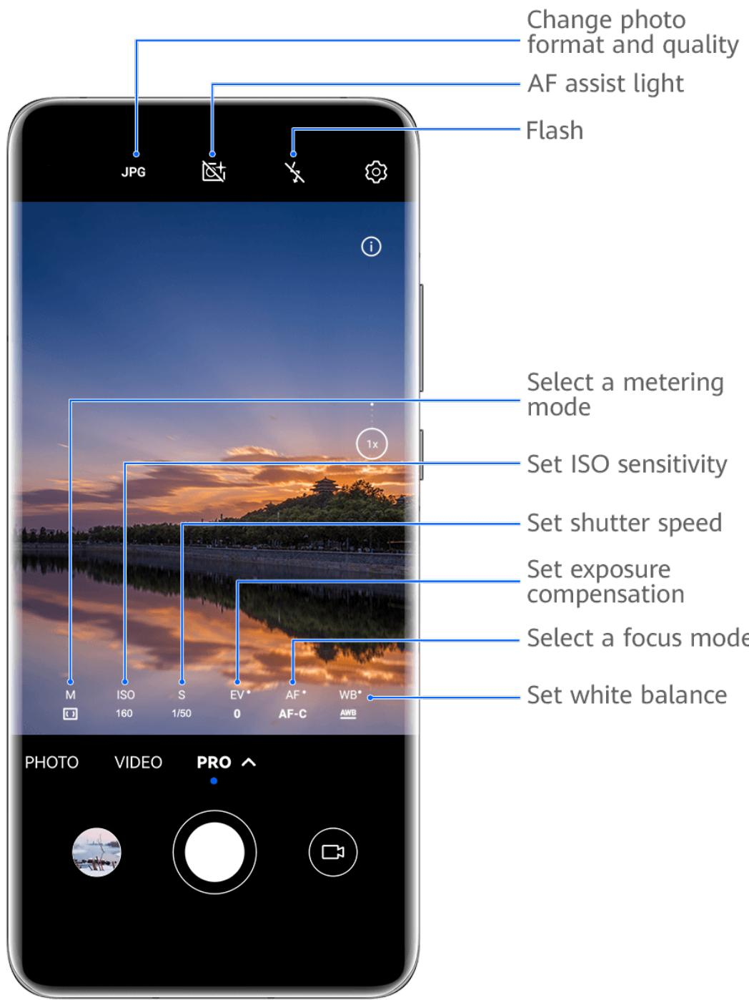

> **AI Description:**
> **Source:** `assets/_page_28_Figure_2.jpg`
> 
> **Generated:** 2026-06-01 15:13:03
> 
> ---
> 
> The image is a technical illustration of a smartphone camera interface, specifically the "PRO" mode. It includes a photograph of a sunset scene with annotations pointing to various camera settings and features. The annotations explain how to change the photo format and quality, adjust the flash, select a metering mode, set ISO sensitivity, shutter speed, exposure compensation, focus mode, and white balance. The interface also shows the current settings for these features, such as ISO at 160 and shutter speed at 1/50. The bottom of the screen displays options for switching between photo, video, and PRO modes, with the PRO mode currently selected.

The fiªñàžä are for reference only.

1 Open Camera or go to Camera > More (depending on your device model), and select Pro mode.

## 2 From there, you can:

• Adjust the metering mode: Touch M and select a metering mode.

• Adjust the ISO sensitivity: Touch ISO and drag the slider.

In low-light settings, you'll generally want to increase the ISO sensitivity. In well-lit settings, you'll want to reduce it to avoid image noise.

• Adjust the shutter speed: Touch S and drag the slider.

The shutter speed determines the amount of light that is able to enter the camera lens. When shooting stationary scenes or portraits, it's recommended that you use a slower shutter speed. Likewise, when shooting fast-moving scenes or objects, you'll want to increase the shutter speed.

Adjust EV exposure compensation: Touch EV· and drag the slider. It's recommended that you increase the EV value in low-light environments, and decrease it in well-lit environments.

• Adjust the focus: Touch AF· and select a focus mode.

• Adjust the color cast: Touch WB· and select a mode.

When shooting in bright daylight, select . When shooting in overcast conditions or $\div \ddot { O } =$ low-light environments, select $\frac { 1 1 1 1 } { 1 1 1 1 }$

Touch $\frac { \triangledown } { \triangle }$ to adjust the color temperature.

• Select the storage format: Pro mode allows you to save the photo in š²ffžàžÊì formats. Touch $\mathsf { J } \mathsf { P G }$ in the v²žwfiʚžà to select your preferred format.

3 Touch the shutter button to take a photo.

• These features are only supported on certain device models.

• Changing a äݞ”²fi” setting will sometimes cause other settings to change as well. Adjust them according to your actual requirements.

## Record Videos

## Capture Video

1 Open Camera and select Video mode.

2 Adjust the following settings:

Zoom in or out: Pinch in or out on the v²žwfiʚžàȀ or drag the zoom slider.

• Focus: Touch the location you want to focus on. Touch and hold the v²žwfiʚžà to lock the exposure and focus.

When using the front camera to record videos in low-light conditions, you can set the fl†ä¯ to (steady on). The camera will provide light compensation.

• Adjust beauty žffž”ìäǿ Touch and drag to adjust the žffž”ìäȇ

> **AI Description:**
> **Source:** `assets/_page_30_Figure_4.jpg`
> 
> **Generated:** 2026-06-01 15:11:11
> 
> ---
> 
> The image contains a simple icon of a gear, which is commonly used to represent settings, configuration, or options in various user interfaces. This icon is typically associated with the concept of adjusting or modifying settings in a system or application.

Adjust the video resolution and frame rate: Go to > Video resolution and select the desired resolution. A higher resolution will result in a higher quality video with a larger fiÞ size.

You can touch Frame rate to select your desired frame rate.

Select a space-saving video format: Touch and toggle on the ffi”²žÊì video format switch.

When this feature is enabled, your phone will use a video format that takes up less storage space. However, videos in this format may not play on other devices. Please exercise caution when selecting this option.

• Not all devices support these features.

• Changing a äݞ”²fi” setting will sometimes cause other settings to change as well. Adjust them according to your actual requirements.

> **AI Description:**
> **Source:** `assets/_page_30_Figure_6.jpg`
> 
> **Generated:** 2026-06-01 15:11:40
> 
> ---
> 
> The image contains a simple circular diagram with a red dot in the center. The circle is divided into two concentric rings, with the outer ring being a lighter shade of red. The red dot is located in the center of the circle. There are no labels or text annotations present in the image.

3 Touch to shoot.

When recording videos with the rear camera, you can touch and hold or to zoom in or out.

Touch O to take a shot of the current frame.

to pause and touch

to stop shooting.

## Time-Lapse Photography

## Use Time-Lapse to Create a Short Video

You can use Time-lapse to capture images slowly over several minutes or even hours, then condense them into a short video. This allows you to capture the beauty of change – blooming flÑwžàäȀ drifting clouds, and more.

1 Go to Camera > More and select Time-lapse mode.

2 Place your phone in position. To reduce camera shake, use a tripod to steady your phone.

> **AI Description:**
> **Source:** `assets/_page_31_Figure_2.jpg`
> 
> **Generated:** 2026-06-01 15:11:20
> 
> ---
> 
> The image contains a simple diagram with a central red circle surrounded by a white circle with a red border. The red circle appears to represent a specific element or focus, while the white circle with the red border could symbolize a larger context or environment. There are no labels or text annotations present in the image.

3 Touch to start recording, then touch to end the recording.

The recorded video is automatically saved to Gallery.

## Adjust Camera Settings

## Adjust Camera Settings

You can adjust the camera settings to take photos and videos more quickly.

The following features may not be available in some camera modes.

## Adjust the Aspect Ratio

> **AI Description:**
> **Source:** `assets/_page_31_Figure_4.jpg`
> 
> **Generated:** 2026-06-01 15:11:48
> 
> ---
> 
> The image contains a simple icon of a gear, which is commonly used to represent settings or configuration options in various applications and interfaces. The icon is a stylized representation of a gear with a central hole and multiple spokes. There are no charts, graphs, or other visual elements present in the image.

Go to Camera > > Aspect ratio and select an aspect ratio.

This feature is not available in some modes.

## Enable Location Tags

To enable Location tag, enable Location Services for your phone fiàäìȀ then go to Camera >

You can touch and swipe up on a photo or video in Gallery to view its shooting location.

To enable Location Services on your phone:

• Swipe down from the upper right edge of the phone to display Control Panel, touch to expand the shortcut switches panel (depending on your device model), and enable Location.

• Go to Settings > Location and enable Access my location.

## Use the Assistive Grid to Compose Your Photos

Use the assistive grid to help you line up the perfect shot.

1 Enable Assistive grid. Grid lines will then appear in the v²žwfiʚžàȇ

2 Place the subject of your photo at one of the intersecting points, then touch the shutter button.

## Use Mirror Zžflž”ì²ÑÊ

When using the front camera, touch , then enable or disable Mirror àžflž”ì²ÑÊ.

When Mirror àžflž”ì²ÑÊ is enabled, the image will appear as you see yourself in the v²žwfiʚžàȀ instead of fl²Ýݞšȇ

When Mirror àžflž”ì²ÑÊ is disabled, the image will be fl²ÝݞšȀ so it's the opposite of what you see in the v²žwfiʚžàȇ

## Mute the Shutter Sound

Enable Mute to mute the camera shutter sound.

This feature is only available in some countries and regions.

## Capture Smiles

Enable Capture smiles. The camera will take a photo automatically when it detects a smile in the v²žwfiʚžàȇ

## Use the Horizontal Level for Better Compositions

Enable Horizontal level to display a horizontal guiding line on the v²žwfiʚžàȇ

When the dotted line overlaps with the solid line, it indicates that the camera is parallel with the horizontal level.

## Customize Camera Mode Layout

You can customize the layout of the Camera mode screen based on your preferences by moving the frequently used modes to the camera home screen, or change the order of modes.

Photo, Portrait, and Video modes cannot be moved to More.

1 Go to Camera > More, and touch to enter the mode editing screen.

2 Touch and hold a mode and drag it to the desired position. You can move a mode on the More screen to the camera home screen, move the mode on the camera home screen to More, or adjust the layout of the mode screen based on how often you use certain modes.

Modes with a icon can be deleted by simply touching this icon.

3 Touch to save the layout.

To restore a deleted mode, go to Camera > More, touch , and then touch ADD.

## Manage Gallery

## Make Quick Searches in Gallery

## Quickly Search for Images in Gallery

Quickly locate an image by searching with keywords, such as a date, food, or category, in Gallery.

1 Go to Gallery, touch the search bar at the top of the screen, then type in a keyword (such as "food" or "scenery") or touch a suggested word to start searching.

2 Thumbnails of images related to that keyword will be displayed, and more keywords will be suggested. Touch a suggested keyword or enter more keywords for more precise results.

## Quickly Search for Videos in Gallery

Your phone automatically analyzes and categorizes videos in Gallery when charging and with the screen Ñffȇ Suggested keywords will be displayed in the search bar for quick results on related topics.

1 Go to Gallery, touch the search bar at the top of the screen, then type in a keyword (such as "food" or "scenery") or touch a suggested word to start searching.

2 Thumbnails of videos related to that keyword will be displayed, and more keywords will be suggested. Touch a suggested keyword or enter more keywords for more precise results.

Key moments of videos in the search results will automatically be played in sequence for you to see a preview.

Screenshots will not be analyzed.

## Edit Images

Gallery Ñffžàä a wide range of editing features for images.

## Basic Editing

1 Open Gallery, touch the image you want to edit, and then touch . You can then:

Crop and rotate: Touch Crop, select a frame, then drag the grid or its corners to select which part you want to keep. You can drag the image in the frame, or use two fiʪžàä to zoom in or out to adjust the displayed part of the image.

To rotate the image, touch Crop and drag the angle wheel to the desired orientation.

To rotate the image by a certain degree or mirror fl²Ý the image, touch or .

• Add a fiÃìžà žffž”ìǿ Touch Filter to select a fiÃìžàȇ

• Adjust image žffž”ìäǿ Touch Adjust to adjust the brightness, contrast, saturation, and other aspects of the image.

Other: Touch More to edit the image in other ways, such as by adding a color splash, blur, doodle, or text element.

When using the Adjust or Filter feature, you can touch Compare to compare the image before and after editing. Comparison is not supported in some editing modes.

2 Touch or to save the edits.

## Add Stickers to Images

1 In Gallery, touch an image, then go to > More > Stickers.

2 Select a sticker and drag it anywhere you like. Touch and hold the dot on the corner of the

sticker and drag it to resize the sticker. Touch to delete the sticker. You can also edit the text in some types of stickers. Touch the editable area which is typically encircled with dash lines to enter the new text.

3 Touch to save your edits and touch to save the image.

## Pixelate Images

1 In Gallery, touch an image, then go to

$$
\square _ { \textrm { > M o r e > M o s a i c . } }
$$

2 Select a mosaic style and size to cover parts of the image.

3 To remove the mosaic, touch Eraser and wipe it Ñff the image.

> **AI Description:**
> **Source:** `assets/_page_34_Figure_1.jpg`
> 
> **Generated:** 2026-06-01 15:15:51
> 
> ---
> 
> The image contains a simple icon of a floppy disk, which is a common symbol used to represent saving or storing data. This icon is typically used in computer interfaces to indicate the action of saving a file. There are no charts, graphs, or other visual elements present in the image.

## Rename Images

1 In Gallery, touch the image thumbnail you want to rename.

2 Go to > Rename and enter a new name.

3 Touch OK.

## Collage

You can use the collage feature in Gallery to quickly combine multiple images into one for easier sharing.

1 You can access the collage feature in the following ways (depending on your device model):

• On the Discover tab, touch Create collage, select some images, then touch Create.

On the Photos or Albums tab, touch and hold to select some images, then go to > Collage.

2 Select a template. You can then:

Relocate an image: Touch and hold the image and drag it to a š²ffžàžÊì position.

• Adjust the displayed portion of an image: Slide on the image, or pinch in or out on it so that only the part you want to see is displayed in the grid.

• Rotate an image: Touch the image, then touch to rotate it or $D \vert <$ to fl²Ý it.

• Add or remove borders: By default, borders are displayed between images and along the grid edges. To remove them, touch Frame.

3 Touch to save the collage.

To view the saved collage, go to Albums > Collages.

## Share Images and Videos

Open Gallery and share an image or video in the following ways:

• Share a single image or video: Touch the image or video, then touch .

• Share multiple images or videos: In an album or on the Photos tab, touch and hold to select multiple images and videos, then touch .

## Share Your Photos Securely

Before sending a photo, you can choose to delete sensitive information like the location, time, and camera specs.

1 Open Gallery.

2 Select one or more photos and touch .

3 Touch the privacy switch in the upper left corner of the screen. In the displayed Privacy options dialog box, turn on the Remove photo info and Remove location info switches, then touch OK.

If Location tag was disabled when a photo was taken, the Remove location info switch will not be displayed in the Privacy options dialog box when you share the photo.

## Organize Albums

Organize images and videos into albums to easily sift through them.

## Add Albums

1 Go to Gallery > Albums.

2 Touch , name the album, then touch OK.

3 Select the images or videos you want to add, and then move or copy them to the album.

## Sort Albums

1 Go to Gallery > Albums > and touch Sort albums.

2 Hold and drag next to the albums to adjust the order.

Touch Reset or go to > Reset to restore the default order.

## Adjust the Album Display Style

Go to Gallery > Albums > , touch Switch view, and select an album display style.

## Move Images and Videos

1 Open an album, then touch and hold to select the images and videos you want to move.

2 Touch > Move to album to select the desired album.

3 Once the items are moved, they will no longer be in their original album.

The All photos and Videos albums show all images and videos stored on your device.

Moving items across albums will not remove them from these albums.

## Delete Images and Videos

Touch and hold to select images, videos, or albums and go to Delete > Delete.

Some preset albums cannot be deleted, including All photos, My favorites, Videos, and Camera.

Deleted images and videos will be temporarily moved to the Recently deleted album for a period of time, after which they will be permanently deleted.

To permanently delete images and videos before the retention period expires, touch and hold to select images or videos in the Recently deleted album and go to Delete > Delete.

## Recover Deleted Images and Videos

In the Recently deleted album, touch and hold to select the items you want to recover, then

touch to restore them to their original albums.

If the original album has been deleted, a new one will be created.

## Add Images and Videos to Favorites

Open an image or video, then touch

The item will appear in both its original album and the My favorites album.

## Hide Images and Videos

Keep images and videos in Gallery under wraps and out of view.

Go to Gallery > Albums. From there, you can:

• Hide images and videos: Tap to open an album, touch and hold down to select the images

and videos you wish to hide, and then go to > Hide > OK.

• View hidden images and videos: In the Albums tab, go to > Hidden items.

You can touch in the Hidden items screen to switch to album view, to quickly locate the desired items.

• Unhide items: In Hidden items, touch and hold down to select the images or videos you wish to unhide, then touch Unhide.

These images and videos will then be restored to their original albums.

## Apps

## Notepad

## Create a Note

To help you quickly keep a track of your thoughts and inspirations, you can create notes using the Handwrite (to write or draw the content) and Scan document modes, or in conjunction with Multi-Screen Collaboration.

## Add Content to a Note

1 Go to Notepad > Notes and touch

2 Enter the title and content of the note. You can then perform the following:

• Touch to add a checklist.

Touch $\underline { { \mathsf { A } } } \equiv$ to change the text style, paragraph alignment, and background.

Touch to insert a picture. Touch and hold the picture, then drag it to the desired position in the note.

• To organize your notes for easier access and viewing, categorize a note after fiʲ䯲ʪ it.

3 Touch to save the note.

## Add a Handwritten Note

You can add a handwritten note to write down thoughts and inspirations that would be š²ffi”ñÃì to convey through text.

1 Go to Notepad > Notes and touch

2 Touch to write or draw the content you want to note down in the selected color.

3 Touch to save the note.

## Create To-dos

You can create to-dos to keep a track of day-to-day essentials, such as daily shopping lists, tasks at work, and household chores.

## Add a To-do Item and Set a Reminder

You can add a to-do item and set a time reminder for it.

If you have marked the to-do item as important, you will be prompted with a full-screen reminder when the screen is locked.

1 Go to Notepad > To-dos and touch

2 Enter your to-do item.

3 Touch , set a reminder time, then touch OK.

4 Touch to mark the to-do item as important.

5 Then touch Save.

## Set Repeated Reminders for a To-do Item

If you specify a time for a to-do item, you can select a repeat mode for it (for example, Never, Every day, Every week, Every month, or Every year), and your phone will repeatedly prompt you to complete the to-do item at the äݞ”²fižš time.

## Manage Your Notepad

You can sort your Notepad items by category and put them into š²ffžàžÊì folders, delete unwanted items, and share items with other people.

When viewing a list of items or an individual item in Notepad, touch the status bar at the top of the screen to quickly return to the fiàäì item or the beginning of the item you are viewing.

## Use App Lock for Notepad or Lock a Note

You can apply App Lock to Notepad or set a password for a note to protect your privacy.

Enable the app lock for Notepad: Go to Settings > Security > App Lock, enter the lock screen password or customize the app lock password as prompted, and then turn on the switch next to Notepad.

Lock a note: Open the note you need to lock in Notepad, go to > Add lock, and follow

the onscreen instructions. To unlock your note, go to > Remove lock.

If your device supports fiʪžàÝà²Êì or face unlock, you can use fast authentication by

performing the following: Go to Notepad > > Settings > Note lock, then enable Unlock with Fingerprint ID and Unlock with Face Recognition.

## Sort Notepad Items by Category

You can sort the Notepad items into š²ffžàžÊì folders by category and add labels in š²ffžàžÊì colors.

Sort Notepad items using the following methods:

• On the All notes screen, swipe left on a note, select top, or add a star icon to it.

to move this note to the

> **AI Description:**
> **Source:** `assets/_page_40_Figure_0.jpg`
> 
> **Generated:** 2026-06-01 15:11:15
> 
> ---
> 
> The image contains a simple icon of a folder with a plus sign inside it. This icon typically represents the addition or creation of a new folder or file within a digital interface, such as a file management system or a document management application. The icon is designed to be universally recognizable, indicating the action of adding or organizing files.

• On the All notes or All to-dos screen, swipe left on an item, touch , and select a category for it.

• Touch and hold a note or to-do item, select the ones you want to classify under the same category, then touch to move them to the target category.

Items in an Exchange account cannot be moved.

## Share Notepad Items

You can share Notepad items in the following ways:

• To share a single note or to-do item, open the one you want to share from the All notes or

All to-dos screen, then touch and share it as prompted.

Notes can be shared by touching As image, As text, Export as document, or To another device.

Handwritten notes do not support Export as document, and other types of notes can be exported into TXT or HTML fiÞä when using Export as document. You can view saved notes as follows: Open Files, search for and touch Documents, then touch Notepad.

• To share multiple notes, access the All notes screen, touch and hold a note, select the ones you want to share, then touch and share them as prompted.

> **AI Description:**
> **Source:** `assets/_page_40_Figure_1.jpg`
> 
> **Generated:** 2026-06-01 15:11:23
> 
> ---
> 
> The image contains a simple line diagram. It features a central node connected to two other nodes by lines, suggesting a network or a basic structure. The diagram does not include any text or additional labels, and there are no other visual elements present.

## Print Notepad Items

1 On the All notes screen, open the item you want to print.

2 Go to > Print, then select a printer and ”ÑÊfiªñàž printing settings as prompted.

## Delete Notepad Items

You can delete Notepad items using either of the following methods:

> **AI Description:**
> **Source:** `assets/_page_40_Figure_2.jpg`
> 
> **Generated:** 2026-06-01 15:11:35
> 
> ---
> 
> The image contains a simple icon of a red circular trash can with a white trash bag inside, symbolizing the action of deleting or removing something. There is no text or additional visual information beyond this icon.

• On the All notes or All to-dos screen, swipe left on an item, and touch to delete it.

• Touch and hold a note or to-do item you want to delete, select or drag over the check

boxes of any other notes or to-do items you want to delete as well, then touch . To restore a deleted Notepad item, touch All notes or All to-dos, select the item you want to restore in Recently deleted, then touch .

> **AI Description:**
> **Source:** `assets/_page_40_Figure_3.jpg`
> 
> **Generated:** 2026-06-01 15:11:30
> 
> ---
> 
> The image contains a simple icon of a trash can, which is commonly used to represent the action of deleting or removing something. This icon is often used in user interfaces to indicate the option to delete an item. There are no charts, graphs, or other visual elements present in the image.

## Settings

## Display & Brightness

## Use Eye Comfort Mode

Eye comfort mode can žffž”ì²vžÃă reduce harmful blue light and adjust the screen to display warmer colors, relieving eye fatigue and protecting your eyesight.

## Enable or Disable Eye Comfort Mode

• Swipe down from the upper right edge of the screen to display Control Panel and touch

to expand the shortcut switches panel (depending on your device model). Enable or disable Eye Comfort. Touch and hold Eye Comfort to access the settings screen.

• Go to Settings > Display & brightness > Eye Comfort and enable or disable Enable all day.

Once Eye Comfort mode is enabled, will be displayed in the status bar, and the screen will take on a yellow tint since less blue light is being emitted.

## Set a Schedule for Eye Comfort Mode

Go to Settings > Display & brightness > Eye Comfort, enable Scheduled, then set Start and End according to your preferences.

## Adjust the Blue Light Filter in Eye Comfort Mode

Go to Settings > Display & brightness > Eye Comfort, enable Enable all day or set up Scheduled, and adjust the slider under Filter level to customize how much blue light you would like to be fiÃìžàžšȇ

## Biometrics & Password

## Set Fingerprints

You can enroll a fiʪžàÝà²Êì and then use it to unlock the screen and access your Safe, App Lock, and more.

## Add Fingerprints

1 Go to Settings > Biometrics & password > Fingerprint ID or Settings > Biometrics & password > Fingerprint ID > Fingerprint management (depending on your device model), and follow the onscreen instructions to set or enter the lock screen password.

2 Touch New fiʪžàÝà²Êì or New rear fiʪžàÝà²Êì (depending on your device model) to begin enrolling your fiʪžàÝà²Êìȇ

3 Place your fiʪžàì²Ý on the fiʪžàÝà²Êì sensor. When you feel a vibration, lift your fiʪžà and then press down again. Move your fiʪžà around until the entire fiʪžàÝà²Êì is captured.

4 Once enrollment is complete, touch OK.

You can now place your fiʪžà on the fiʪžàÝà²Êì sensor to unlock the screen.

## Rename or Delete a Fingerprint

1 Go to Settings > Biometrics & password > Fingerprint ID or Settings > Biometrics & password > Fingerprint ID > Fingerprint management(depending on your device model) and enter your lock screen password.

2 In the Fingerprint list section, touch an enrolled fiʪžàÝà²Êì to rename or delete it.

## Fingerprint /šžÊì²fi”†ì²ÑÊ

Fingerprint ²šžÊì²fi”†ì²ÑÊ allows you to match your fiʪžàä with the enrolled fiʪžàÝà²Êìäȇ

1 Go to Settings > Biometrics & password > Fingerprint ID or Settings > Biometrics & password > Fingerprint ID > Fingerprint management(depending on your device model) and enter the lock screen password.

2 In the Fingerprint list section, touch Identify fiʪžàÝà²Êì.

3 Touch the fiʪžàÝà²Êì sensor with your fiʪžàȇ The recognized fiʪžàÝà²Êì will be highlighted.

## Use Your Fingerprint to Access Your Safe

1 Go to Settings > Biometrics & password > Fingerprint ID or Settings > Biometrics & password > Fingerprint ID > Fingerprint management(depending on your device model) and enter your lock screen password.

2 Turn on the switch for Access Safe and follow the onscreen instructions to link your fiʪžàÝà²Êì with the Safe.

Now you can go to Files > Me, touch Safe, then use your fiʪžàÝà²Êì to access it.

Please make sure your device has been updated to the latest system version.

## Use Your Fingerprint to Access a Locked App

1 Go to Settings > Biometrics & password > Fingerprint ID or Settings > Biometrics & password > Fingerprint ID > Fingerprint management(depending on your device model) and enter the lock screen password.

2 Turn on the Access App Lock switch and follow the onscreen instructions to link your fiʪžàÝà²Êì with App Lock.

You can then touch a locked app on your home screen and use your fiʪžàÝà²Êì to access it.

## Enable and Use Fingerprint Payment

You can use your fiʪžàÝà²Êì to verify your payments in a payment app.

Go to the payment app and follow the onscreen instructions to enable this feature.

## Face Recognition

Face Recognition allows you to unlock your phone or access locked apps with your facial data.

## Set up Face Recognition

1 Go to Settings > Biometrics & password > Face Recognition and enter your lock screen password.

## 2 Select Enable raise to wake.

The settings items vary by device. If your phone does not provide a äݞ”²fi” item, it indicates that the corresponding feature is not supported.

3 Touch Get started and follow the onscreen instructions to enroll your facial data.

## Set Face Unlock

On the Face Recognition screen, touch Unlock device and select an unlock method.

If you have enabled PrivateSpace or added multiple users to your phone, you can use Face unlock only in MainSpace or with the Owner account.

## Access App Lock with Face Recognition

On the Face Recognition screen, enable Access App Lock, and follow the onscreen instructions to add your facial data to App Lock.

You can then touch a locked app on your home screen and use face recognition to access the app.

## Disable or Delete Facial Data

On the Face Recognition screen, you can do the following:

• Disable facial data for certain features: Disable Unlock device, or Access App Lock as required. This will not delete your facial data.

• Delete facial data: Touch Delete facial data and follow the onscreen instructions to delete your facial data.

## About Phone

## Legal Notice

Copyright © Huawei 2022. All rights reserved.

This guide is for reference only. The actual product, including but not limited to the color, size, and screen layout, may vary. All statements, information, and recommendations in this guide do not constitute a warranty of any kind, express or implied.

Please visit https://consumer.huawei.com/en/support/hotline for recently updated hotline and email address in your country or region.

Model: MGA-LX3

MGA-LX9

MGA-LX9N

EMUI12.0\_01