
# Object Storage Service

## Product Introduction

Issue 26

Date 2024-02-28

> **AI Description:**
> **Source:** `assets/_page_0_Figure_0.jpg`
> 
> **Generated:** 2026-06-01 15:55:07
> 
> ---
> 
> The image is a simple line drawing of two hands holding a globe. The lines are continuous and red, creating a minimalist representation of the hands and the globe. The hands are positioned as if cradling the globe, suggesting themes of care, protection, or responsibility. The globe is depicted with a simplified shape, emphasizing the concept rather than geographical details.

## Copyright © Huawei Technologies Co., Ltd. 2024. All rights reserved.

No part of this document may be reproduced or transmitted in any form or by any means without prior written consent of Huawei Technologies Co., Ltd.

## Trademarks and Permissions

and other Huawei trademarks are trademarks of Huawei Technologies Co., Ltd.

All other trademarks and trade names mentioned in this document are the property of their respective holders.

## Notice

The purchased products, services and features are stipulated by the contract made between Huawei and the customer. All or part of the products, services and features described in this document may not be within the purchase scope or the usage scope. Unless otherwise specified in the contract, all statements, information, and recommendations in this document are provided "AS IS" without warranties, guarantees or representations of any kind, either express or implied.

The information in this document is subject to change without notice. Every effort has been made in the preparation of this document to ensure accuracy of the contents, but all statements, information, and recommendations in this document do not constitute a warranty of any kind, express or implied.

## Security Declaration

## Vulnerability

Huawei's regulations on product vulnerability management are subject to the Vul. Response Process. For details about this process, visit the following web page:

https://www.huawei.com/en/psirt/vul-response-process

For vulnerability information, enterprise customers can visit the following web page:

https://securitybulletin.huawei.com/enterprise/en/security-advisory

## Contents

1 About OBS..   
2 Advantages... 6   
3 Application Scenarios.. 10   
4 Functions....... 19   
5 Security... 27   
5.1 Shared Responsibilities.. . 27   
5.2 Identity Authentication and Access Control. 28   
5.3 Data Protection.. . 29   
5.4 Audit and Logging.. . 31   
5.5 Resilience.. . 32   
5.6 Risk Monitoring... 33   
5.7 Certificates. .. 33   
6 Permissions Management.. 35   
7 Restrictions and Limitations..... . 43   
8 Related Services. 49   
9 Basic Concepts.. .51   
9.1 Objects.. . 51   
9.2 Buckets... 52   
9.3 Parallel File System.. 53   
9.4 Access Keys (AK/SK).. 53   
9.5 Endpoints and Domain Names.. 54   
9.6 Region and AZ.. 56   
10 Change History.... 58

## OBS Overview

Object Storage Service (OBS) is a scalable service that provides secure, reliable, and cost-effective cloud storage for massive amounts of data.

OBS provides unlimited storage capacity for objects of any format, catering to the needs of common users, websites, enterprises, and developers. There is no limitation on the storage capacity of the entire OBS system or of a single bucket, and any number of objects can be stored. As a web service, OBS supports APIs over Hypertext Transfer Protocol (HTTP) and Hypertext Transfer Protocol Secure (HTTPS). You can use OBS Console or OBS tools to access and manage data stored in OBS anytime, anywhere. With OBS SDKs and APIs, you can easily manage data stored in OBS and develop upper-layer applications.

Huawei Cloud deploys OBS infrastructures in multiple regions across the globe, delivering high scalability and reliability. You can deploy OBS in specific regions for faster access at an affordable price.

## Product Architecture

OBS basically consists of buckets and objects.

A bucket is a container for storing objects in OBS. Each bucket is specific to a region and has specific storage class and access permissions. A bucket is accessible through its access domain name over the Internet.

An object is the fundamental storage unit in OBS. An object consists of the following:

A key that specifies the name of an object. An object key is a UTF-8 string up to 1,024 characters long. Each object is uniquely identified by a key within a bucket.

Metadata that describes an object. The metadata is a set of key-value pairs that are assigned to objects stored in OBS. There are two types of metadata: system-defined metadata and custom metadata.

System-defined metadata is automatically assigned by OBS for processing objects. Such metadata includes Date, Content-Length, Last-Modified, ETag, and more.

You can specify custom metadata to describe the object when you upload an object to OBS.

Data that refers to the content of an object.

By means of secondary development based on OBS REST APIs, OBS Console, SDKs, and a variety of tools are provided for you to use OBS. You can also use OBS SDKs and APIs to develop applications customized for your business needs.

Figure 1-1 Product architecture
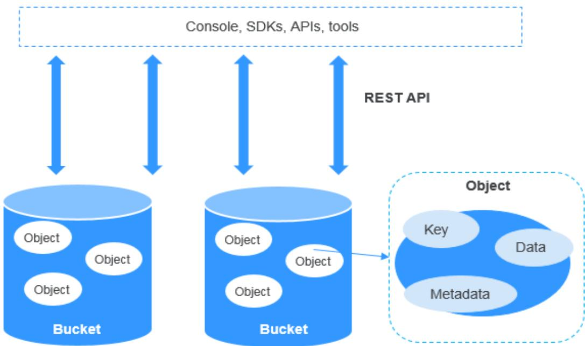

> **AI Description:**
> **Source:** `assets/_page_5_Figure_0.jpg`
> 
> **Generated:** 2026-06-01 15:58:11
> 
> ---
> 
> The image is a diagram illustrating the structure of a cloud storage system. It shows two blue cylinders labeled "Bucket," each containing multiple white circles labeled "Object." Arrows point from the "Console, SDKs, APIs, tools" area to the buckets, indicating the interaction points. The diagram also includes a zoomed-in view of an "Object," showing its components: "Key," "Data," and "Metadata." The "REST API" is mentioned on the right side, suggesting the method used for accessing the buckets and objects. The overall structure represents a hierarchical storage model with access points for various tools and interfaces.

## Storage Classes

OBS offers the storage classes below to meet your requirements for storage performance and costs. You can change buckets and objects between storage classes. To learn billing for different storage classes, see Storage Space.

Standard: The Standard storage class features low latency and high throughput. It is therefore good for storing frequently (multiple times per month) accessed files or small files (less than 1 MB). Its application scenarios include big data analytics, mobile apps, hot videos, and social apps.

Infrequent Access: The Infrequent Access storage class is for storing data that is infrequently (less than 12 times per year) accessed, but when needed, the access has to be fast. It can be used for file synchronization, file sharing, enterprise backups, and many other scenarios. This storage class has the same durability, low latency, and high throughput as the Standard storage class, with a lower cost, but its availability is slightly lower than the Standard storage class.

Archive: The Archive storage class is ideal for storing data that is rarely (once per year) accessed. Its application scenarios include data archive and longterm backups. This storage class is secure, durable, and inexpensive, so it can be used to replace tape libraries. To keep cost low, it may take hours to restore data from the Archive storage class.

Deep Archive: The Deep Archive storage class (under limited beta testing) is suitable for storing data that is barely (once every few years) accessed. This storage class costs less than the Archive storage class, but takes longer time (usually several hours) to restore data.

An object uploaded to a bucket inherits the storage class of the bucket by default.   
You can also specify a storage class for an object when you upload it.

Changing the storage class of a bucket does not change the storage classes of existing objects in the bucket, but newly uploaded objects will inherit the new storage class.

Table 1-1 Comparison between storage classes

## NO TE

Minimum storage duration refers to the least time that will be charged for object storage. This means that objects will be charged for a minimum storage duration even if they are not stored for that long. For instance, if an Infrequent Access object is stored in OBS for 20 days (shorter than the minimum storage duration of 30 days) and then deleted, you will be billed for a storage duration of 30 days.

## How to Access OBS

OBS provides various resource management tools. You can use any of the tools listed in Table 1-2 to access and manage resources in OBS.

Table 1-2 OBS resource management tools

## Comparison Between OBS and On-Premises Storage Servers

In this information era, it becomes increasingly difficult for conventional onpremises storage servers to deal with the fast-growing data of enterprises. Table 2-1 compares OBS with on-premises storage servers.

Table 2-1 Comparison between OBS and on-premises storage servers

## OBS Advantages

Data durability and service continuity: OBS provides storage for cloud albums of Huawei mobile phones to support access of hundreds of millions of users. It delivers a data durability of up to 99.9999999999% and service continuity of up to 99.995% by using cross-region replication, cross-AZ disaster recovery, device and data redundancy in an AZ, slow disk or bad sector detection, and other technologies.

Figure 2-1 Five-level reliability architecture of OBS
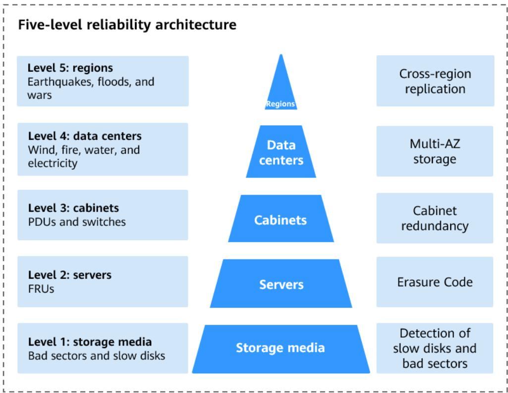

> **AI Description:**
> **Source:** `assets/_page_11_Figure_0.jpg`
> 
> **Generated:** 2026-06-01 15:56:55
> 
> ---
> 
> The image is a five-level reliability architecture diagram. It presents a hierarchical structure with five levels, each representing a different tier of reliability in a system. The levels are labeled as follows:
> 
> 1. Level 5: regions, which includes natural disasters like earthquakes, floods, and wars.
> 2. Level 4: data centers, which lists potential failures such as wind, fire, water, and electricity.
> 3. Level 3: cabinets, which mentions PDUs and switches.
> 4. Level 2: servers, which includes FRUs (Field Replaceable Units).
> 5. Level 1: storage media, which lists issues like bad sectors and slow disks.
> 
> Each level is associated with specific reliability measures or strategies, such as cross-region replication, multi-AZ storage, cabinet redundancy, erasure code, and detection of slow disks and bad sectors. The diagram uses a pyramid shape to visually represent the hierarchical nature of the reliability architecture, with the most critical components at the top and the least critical at the bottom.

Multi-level protection and authorization management: OBS has passed the Trusted Cloud Service (TRUCS) certification. Measures, including versioning, server-side encryption, URL validation, virtual private cloud (VPC)- based network isolation, access log audit, and fine-grained access control are provided to keep data secure and trusted.

Highly concurrent access for hundreds of billions of objects: With intelligent scheduling and response, optimized access paths, and technologies such as transmission acceleration and big data vertical optimization, you can store hundreds of billions of objects in OBS and still experience smooth concurrent access with ultra-high bandwidth and low latency.

Figure 2-2 Access to numerous objects at high-level concurrency
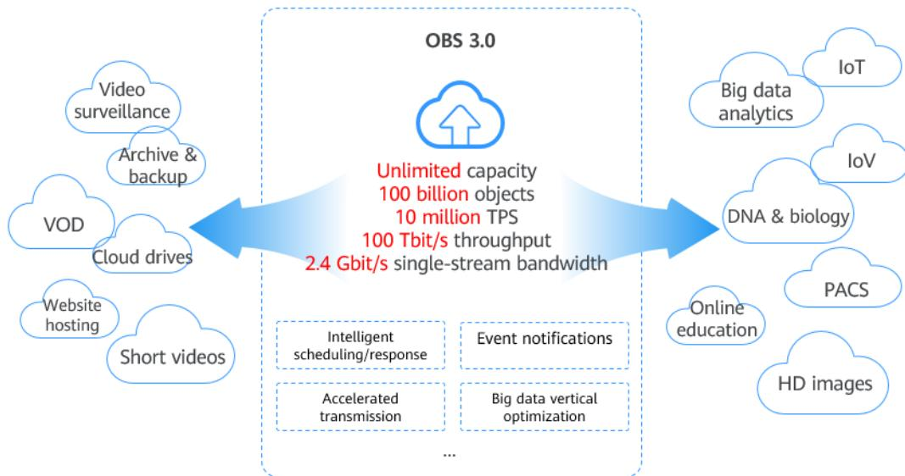

> **AI Description:**
> **Source:** `assets/_page_12_Figure_0.jpg`
> 
> **Generated:** 2026-06-01 15:53:01
> 
> ---
> 
> The image is a diagram illustrating the capabilities and applications of OBS 3.0, a cloud storage and management service. It features a central cloud icon labeled "OBS 3.0" with key performance metrics such as "Unlimited capacity," "100 billion objects," "10 million TPS," "100 Tbit/s throughput," and "2.4 Gbit/s single-stream bandwidth." The diagram is divided into two main sections: on the left, it lists applications such as "Video surveillance," "Archive & backup," "VOD," "Cloud drives," "Website hosting," and "Short videos," while on the right, it includes "Big data analytics," "IoT," "IoV," "DNA & biology," "PACS," "Online education," and "HD images." The diagram also highlights features like "Intelligent scheduling/response," "Event notifications," "Accelerated transmission," and "Big data vertical optimization." The overall design is clean and uses blue cloud icons to visually represent the various applications and features.

Easy use and management: OBS provides standard REST APIs, SDKs in different programming languages, and data migration tools to help you quickly move your workloads to cloud. Storage resources are linearly, infinitely scalable, without compromising performance. You do not have to plan storage capacity beforehand or worry about expansion or reduction. When needed, you can ask Huawei Cloud to perform online upgrade or capacity expansion on your behalf.

Tiered storage and on-demand use: Both pay-per-use and yearly/monthly billing are available for OBS. Data in each of the Deep Archive (under limited beta testing), Archive, Infrequent Access, and Standard storage classes is separately metered and billed, which reduces storage costs.

# 3 Application Scenarios

## Big Data Analytics

## Scenario Description

OBS enables inexpensive big data solutions that feature high performance with zero service interruptions. It eliminates the need for capacity expansion. Such solutions are designed for scenarios that involve mass data storage and analysis, query of historical data details, analysis of numerous behavior logs, and statistical analysis of public transactions.

Mass data storage and analysis: storage of petabytes of data, batch data analysis, and data query in milliseconds

Query of historical data details: account statement audit, analysis on device energy consumption history, playback of trails, analysis on vehicle driving behavior, and refined monitoring

Analysis of numerous behavior logs: analysis of learning habits and logs

Statistical analysis on public transactions: crime tracking, associated case queries, traffic congestion analysis, and scenic spot popularity statistics

You can migrate data to OBS with Data Express Service (DES), and then use Huawei Cloud big data services like MapReduce Service (MRS) or open-source computing frameworks such as Hadoop and Spark to analyze data stored in OBS. Such analysis results will be returned to your programs or applications on Elastic Cloud Servers (ECSs).

## Recommended Services

MRS, ECS, and DES

Figure 3-1 Big data analytics
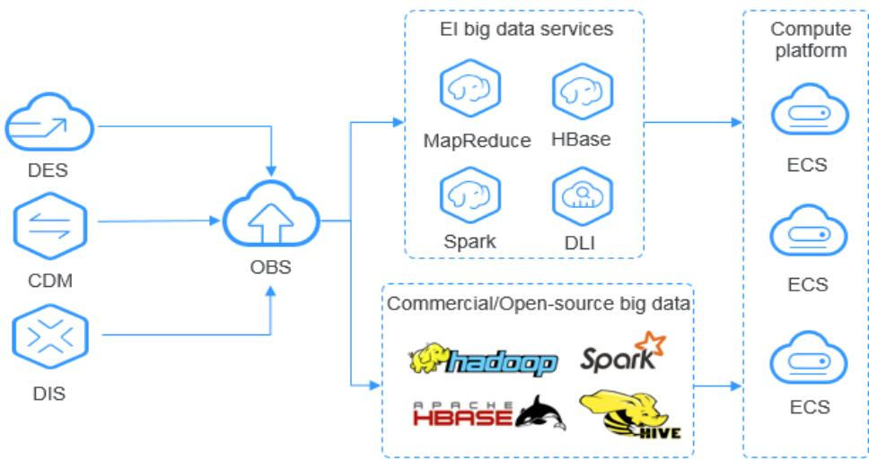

> **AI Description:**
> **Source:** `assets/_page_14_Figure_0.jpg`
> 
> **Generated:** 2026-06-01 15:54:20
> 
> ---
> 
> The image is a flowchart depicting a big data processing architecture. It includes three main sections: data sources (DES, CDM, DIS), an object storage service (OBS), big data services (MapReduce, HBase, Spark, DLI), and a compute platform (ECS). The flowchart illustrates the data flow from the data sources through OBS to the big data services and finally to the compute platform. The diagram also highlights the integration of commercial and open-source big data technologies (Apache Hadoop, Spark, HBase, Hive). The visual elements include icons representing different components and services, and arrows indicating the direction of data flow.

## Static Website Hosting

## Scenario Description

OBS provides a website hosting function that is cost-effective, highly available, and scalable to traffic changes. By combining the OBS static website hosting, CDN, and ECS, you can quickly build a website or an application system with separate static and dynamic content.

The dynamic data on end user browsers and apps directly interacts with the service systems deployed on Huawei Cloud. Requests for dynamic data are sent to service systems for processing and then returned to end users. The static data is stored in OBS. Business systems can process static data over the intranet. End users directly request and read the static data from OBS through nearby highspeed nodes.

## Recommended Services

Content Delivery Network (CDN) and Elastic Cloud Server (ECS)

Figure 3-2 Static website hosting
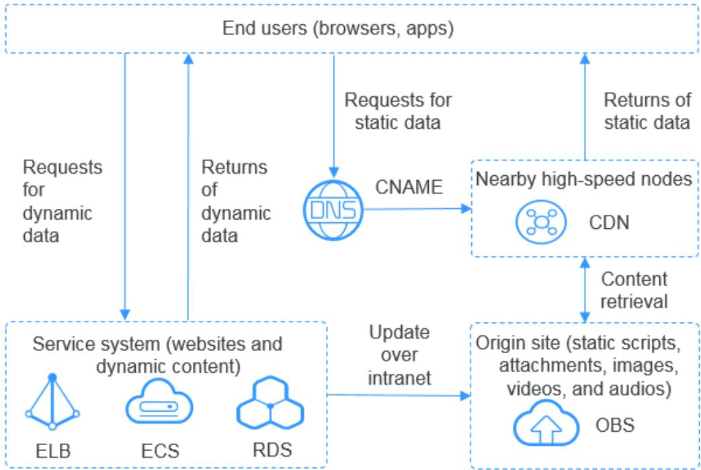

> **AI Description:**
> **Source:** `assets/_page_15_Figure_0.jpg`
> 
> **Generated:** 2026-06-01 15:52:38
> 
> ---
> 
> The image is a technical diagram illustrating a web architecture for serving both static and dynamic content to end users. It includes key components such as the DNS server, CDN (Content Delivery Network), service system (websites and dynamic content), and an origin site (static scripts, attachments, images, videos, and audios). The diagram shows the flow of requests and responses between these components, with arrows indicating the direction of data transmission. Notable features include the use of a CNAME record for static data requests and the retrieval of content from nearby high-speed nodes via the CDN. The diagram also highlights the update process over an intranet from the service system to the origin site.

## Online VOD

## Scenario Description

The OBS storage system is scalable, highly reliable, and cost-effective, featuring high concurrency and low latency. Working with the MPC, Content Moderation, and CDN services, OBS can help you quickly construct a fast, secure, and highly available online VOD platform.

OBS serves as the origin server of VOD services. Normal Internet users or professional content creators can upload their video files to OBS, use Content Moderation to review video content, and use MPC to transcode source video files. The processed video content then is played on devices after CDN acceleration.

## Recommended Services

Content delivery network (CDN), Media Processing Center (MPC), and Content Moderation

Figure 3-3 VOD
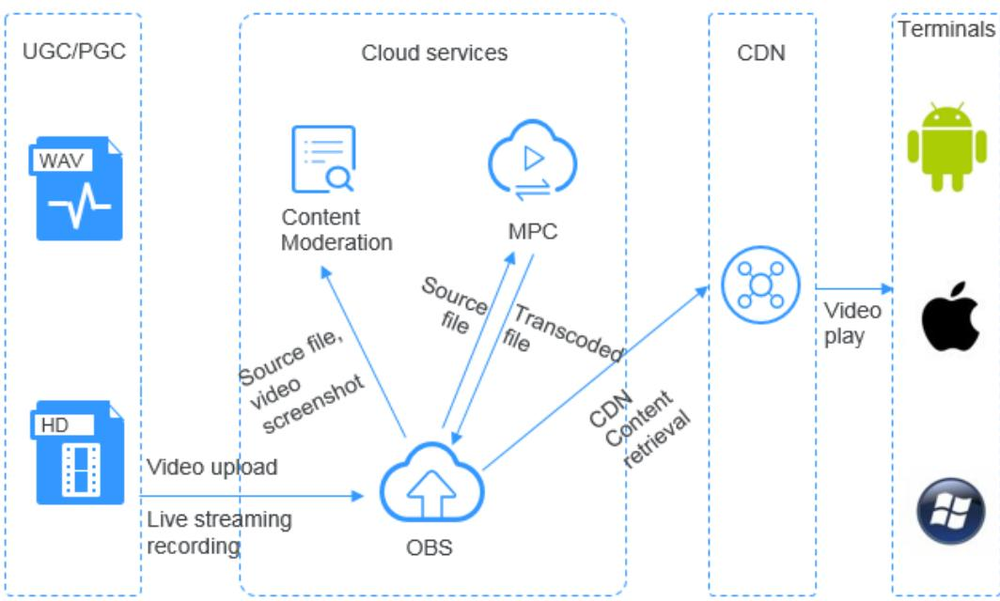

> **AI Description:**
> **Source:** `assets/_page_16_Figure_0.jpg`
> 
> **Generated:** 2026-06-01 15:56:25
> 
> ---
> 
> The image is a flowchart illustrating a video content workflow. It includes labeled sections such as UGC/PGC, Cloud services, CDN, and Terminals. The flowchart shows the process of uploading video content, including live streaming recording, to OBS (Open Broadcaster Software). From there, the content goes through moderation, transcoding, and content retrieval via CDN. The final step is video play on various terminals, represented by Android, Apple, and Windows icons. Key terms such as "Source file," "Video screenshot," "Transcoded file," and "CDN Content retrieval" are annotated within the flowchart.

## DNA Sequencing

## Scenario Description

OBS is a reliable, cost-effective system for storing massive amounts of data and features high concurrency and low latency. It works with compute services on Huawei Cloud to help you easily build a DNA sequencing platform.

You can use Direct Connect to automatically upload data from the sequencer in your data center to Huawei Cloud. You can then perform data analysis on the compute cluster (including ECS, CCE, and MRS services), and the analysis results will be stored in OBS. After an analysis is completed, the source DNA data will be automatically stored in the Archive storage class in OBS, and the sequencing results can be distributed to hospitals and scientific research institutes over the Internet.

## Recommended Services

Elastic Cloud Server (ECS), Bare Metal Server (BMS), MapReduce Service (MRS), Cloud Container Engine (CCE), and Direct Connect (DC)

Figure 3-4 DNA sequencing
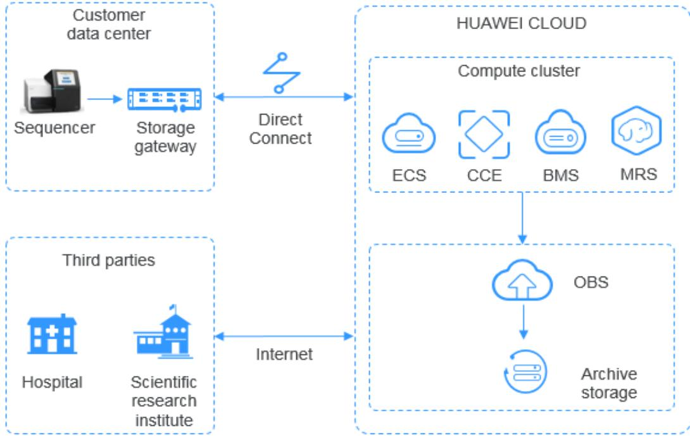

> **AI Description:**
> **Source:** `assets/_page_17_Figure_0.jpg`
> 
> **Generated:** 2026-06-01 15:58:36
> 
> ---
> 
> The image is a technical diagram illustrating a data flow and architecture for a cloud computing environment. It includes:
> 
> 1. A customer data center with a sequencer and storage gateway connected to a direct connect to Huawei Cloud.
> 2. Huawei Cloud components such as ECS (Elastic Cloud Server), CCE (Cloud Container Engine), BMS (Block Storage Service), and MRS (MapReduce Service).
> 3. A compute cluster within Huawei Cloud.
> 4. An internet connection to third parties, including a hospital and a scientific research institute.
> 5. Data flow from the customer data center to Huawei Cloud and then to OBS (Object Storage Service) and archive storage.
> 
> The diagram visually represents the integration and data transfer between on-premises infrastructure and cloud services, highlighting the use of direct connect and internet connectivity for data exchange.

## Intelligent Video Surveillance

## Scenario Description

OBS provides reliable, inexpensive storage for virtually any amount of data. It has high performance and low latency and offers end-to-end solutions that cover device management, video surveillance, video processing, and more. Such solutions are ideal for individuals and enterprises alike.

You can upload surveillance videos in cameras to Huawei Cloud over the Internet or using a Direct Connect connection. Video files on the processing platform consisting of ECS and ELB are segmented and then stored into OBS. Later, you can download the video segments from OBS to play them on terminals. Video files stored in OBS can also be backed up using Cross-Region Replication, improving storage security and reliability.

## Recommended Services

Elastic Load Balance (ELB) and Elastic Cloud Server (ECS)

Figure 3-5 Video surveillance
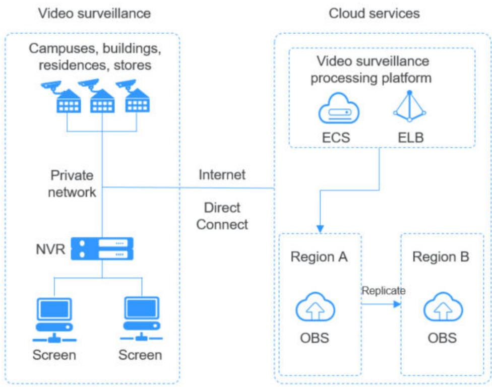

> **AI Description:**
> **Source:** `assets/_page_18_Figure_0.jpg`
> 
> **Generated:** 2026-06-01 15:56:04
> 
> ---
> 
> The image is a technical diagram illustrating a video surveillance system architecture. It shows the flow of data from physical cameras and NVRs (Network Video Recorders) in a private network to a cloud-based video surveillance processing platform. The platform is connected to two regions, A and B, via OBS (Object Storage Service) and ELB (Elastic Load Balancing). The diagram highlights the use of Direct Connect for internet connectivity and the replication of data between the two regions.

## Backup and Archiving

## Scenario Description

OBS offers a highly reliable, inexpensive storage system featuring high concurrency and low latency. It can hold massive amounts of data, meeting the archive needs for unstructured data of applications and databases.

You can use the synchronization clients (such as OBS Browser+ and obsutil), Cloud Storage Gateway (CSG), DES, or mainstream backup software to back up your onpremises data to OBS. OBS also provides lifecycle rules to automatically transition objects between storage classes to save your money on storage. You can restore data from OBS to a DR or test host on the cloud.

Synchronization clients: good for manual backup of a single database or program

Backup software: applicable to automatic backup for multiple applications or hosts, delivering strong compatibility

CSG: seamlessly compatible with on-premises backup systems

DES: ideal for archiving massive volumes of data. It transfers data using Teleport devices and disks to cloud.

## Recommended Services

Data Express Service (DES) and Elastic Cloud Server (ECS)

Figure 3-6 Backup and archiving
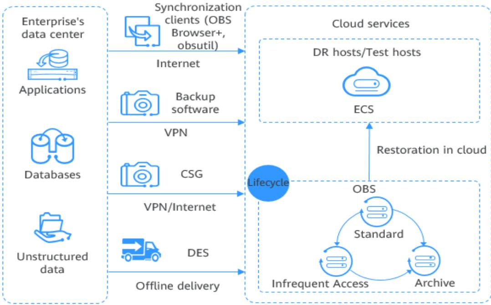

> **AI Description:**
> **Source:** `assets/_page_19_Figure_0.jpg`
> 
> **Generated:** 2026-06-01 15:55:43
> 
> ---
> 
> The image is a flowchart that illustrates a data management and backup strategy for an enterprise's data center. It shows the flow of data from the enterprise's data center to cloud services, including synchronization clients, backup software, and offline delivery methods. The flowchart includes key components such as applications, databases, unstructured data, and cloud services like ECS and OBS. It also depicts the lifecycle of data, including standard, infrequent access, and archive storage options. The flowchart uses icons and arrows to represent different processes and connections between various elements.

## High-Performance Computing

## Scenario Description

OBS works with cloud services such as ECS, AS, EVS, IMS, IAM, and Cloud Eye to provide reliable high-performance computing (HPC) solutions. These solutions have huge capacity and large single-stream bandwidth.

In HPC scenarios, enterprises can directly upload data to OBS or migrate data to OBS by using DES. The POSIX and HDFS of OBS allow you to mount buckets to HPC flavor nodes, as well as big data and AI applications. This facilitates highperformance computing by providing efficient and convenient data, write, and storage capabilities.

## Recommended Services

Data Express Service (DES), Elastic Cloud Server (ECS), Auto Scaling (AS), Image Management Service (IMS), Cloud Eye, and Identity and Access Management (IAM)

Figure 3-7 High-performance computing
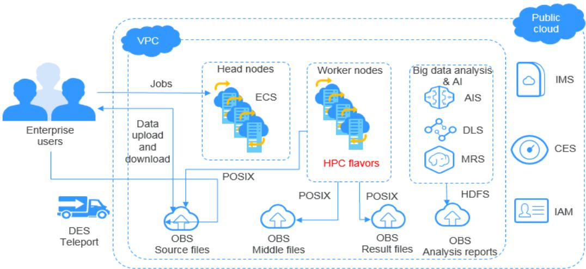

> **AI Description:**
> **Source:** `assets/_page_20_Figure_0.jpg`
> 
> **Generated:** 2026-06-01 15:57:14
> 
> ---
> 
> The image is a technical diagram illustrating a cloud-based computing architecture. It includes a VPC (Virtual Private Cloud) with various components such as head nodes, worker nodes, and HPC flavors (High-Performance Computing flavors). The diagram shows the flow of jobs from enterprise users to the head nodes and then to worker nodes, with data uploaded and downloaded through OBS (Object Storage Service). The diagram also highlights the use of different services like DES Teleport, OBS for source and middle files, and HDFS for result files and analysis reports. Additionally, it mentions big data analysis and AI services like AIS, DLS, and MRS. The diagram uses icons and labels to represent different components and services, making it a comprehensive visual representation of a cloud computing environment.

## Enterprise Cloud Boxes (Web Disks)

## Scenario Description

OBS works with cloud services such as ECS, ELB, RDS, and VBS to provide enterprise web disks with a reliable, inexpensive storage system featuring low latency and high concurrency. The storage capacity automatically scales as the volume of stored data grows.

Dynamic data on devices such as mobile phones, PCs, and tablets interacts with the enterprise cloud disk service system built on Huawei Cloud. Requests for dynamic data are sent to the service system for processing and then returned to devices, and the static data is stored in OBS. Service systems can process static data over the intranet. End users can directly request and read the static data from OBS. In addition, OBS provides the lifecycle management function to automatically change storage classes for objects, reducing storage costs.

## Recommended Services

Elastic Cloud Server (ECS), Elastic Load Balance (ELB), Relational Database Service (RDS), and Volume Backup Service (VBS)

Figure 3-8 Enterprise cloud boxes (web disks)
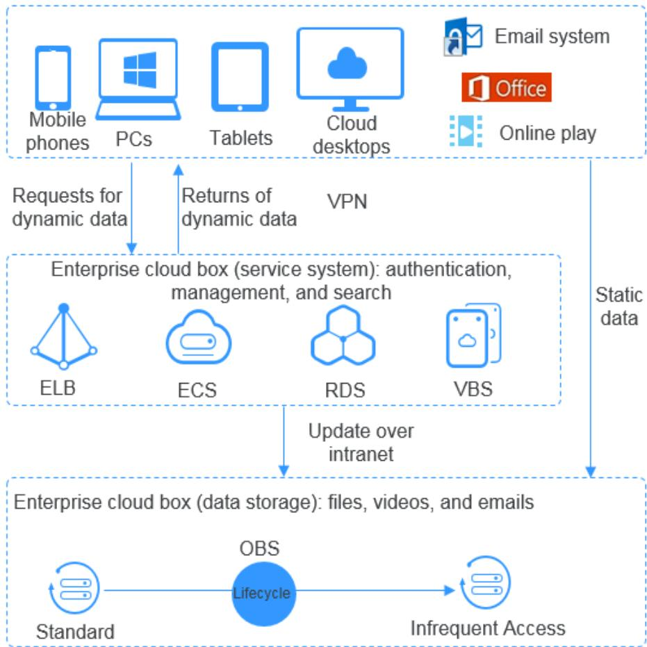

> **AI Description:**
> **Source:** `assets/_page_21_Figure_0.jpg`
> 
> **Generated:** 2026-06-01 15:59:05
> 
> ---
> 
> The image is a flowchart depicting a cloud-based enterprise system architecture. It illustrates the flow of data and services within a cloud environment, including mobile phones, PCs, tablets, cloud desktops, and various cloud services such as email, Office, and online play. The flowchart shows how requests for dynamic data are directed to the enterprise cloud box for authentication, management, and search, while static data is stored in the enterprise cloud box for file, video, and email storage. The diagram also highlights the use of services like ELB, ECS, RDS, and VBS, and the lifecycle management of data from standard to infrequent access. The flowchart uses arrows to indicate the direction of data flow and includes labels for each component and service.

Table 4-1 lists the basic functions of OBS.

It is recommended that you get familiar with the basic concepts of OBS before using OBS.

Table 4-1 OBS functions

# 5 Security

## 5.1 Shared Responsibilities

Huawei guarantees that its commitment to cyber security will never be outweighed by the consideration of commercial interests. To cope with emerging cloud security challenges and pervasive cloud security threats and attacks, Huawei Cloud builds a comprehensive cloud service security assurance system for different regions and industries based on Huawei's unique software and hardware advantages, laws, regulations, industry standards, and security ecosystem.

Security is a shared responsibility between Huawei Cloud and you. Figure 5-1 illustrates how the security responsibilities are shared.

Huawei Cloud: Ensure the security of cloud services and provide secure clouds. Huawei Cloud's security responsibilities include ensuring the security of our IaaS, PaaS, and SaaS services, as well as the physical environments of the Huawei Cloud data centers where our IaaS, PaaS, and SaaS services operate. Huawei Cloud is responsible for not only the security functions and performance of our infrastructure, cloud services, and technologies, but also for the overall cloud O&M security and, in the broader sense, the security and compliance of our infrastructure and services.

Tenant: Use the cloud securely. Tenants of Huawei Cloud are responsible for the secure and effective management of the tenant-customized configurations of cloud services including IaaS, PaaS, and SaaS. This includes but is not limited to virtual networks, the OS of virtual machine hosts and guests, virtual firewalls, API Gateway, advanced security services, all types of cloud services, tenant data, identity accounts, and key management.

Huawei Cloud Security White PaperHuawei Cloud Security White Paper elaborates on the ideas and measures for building Huawei Cloud security, including cloud security strategies, the shared responsibility model, compliance and privacy, security organizations and personnel, infrastructure security, tenant service and security, engineering security, O&M security, and ecosystem security.

Figure 5-1 Huawei Cloud shared security responsibility model
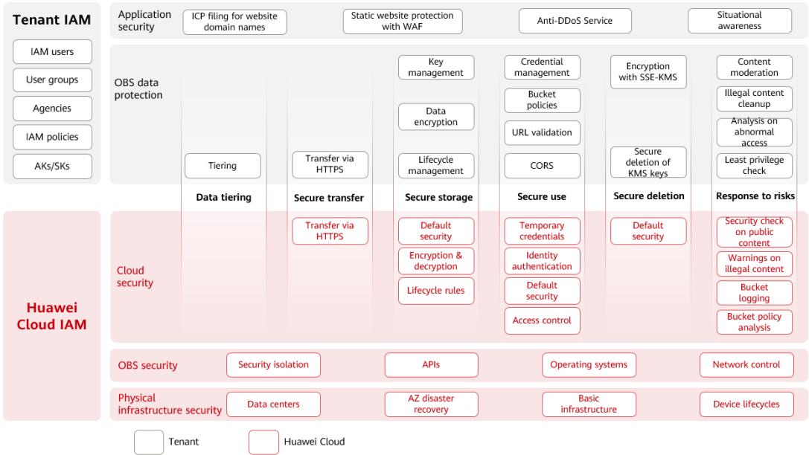

> **AI Description:**
> **Source:** `assets/_page_31_Figure_0.jpg`
> 
> **Generated:** 2026-06-01 15:54:04
> 
> ---
> 
> The image is a detailed infographic combining text with visual elements, specifically a flowchart or organizational chart. It outlines the security features and components of Huawei Cloud's Identity and Access Management (IAM) system, categorized into tenant IAM and Huawei Cloud IAM. The chart is divided into sections with subcategories such as Application security, OBS data protection, and Cloud security. Each section includes specific security measures like Key management, Data encryption, and Secure transfer via HTTPS. The chart uses a color-coded system with white and red sections to differentiate between tenant and Huawei Cloud components. The text is structured in a way that highlights the various security aspects and their corresponding measures, providing a comprehensive overview of the security framework.

## 5.2 Identity Authentication and Access Control

## Identity Authentication

You can use OBS Console, OBS Browser+ (a client), obsutil (a command line tool), APIs, and SDKs to access OBS. No matter which method you use, you are accessing OBS over the REST API.

OBS REST APIs support both authenticated and anonymous requests. There will usually be anonymous requests in the scenarios that require public access, for example, accessing a hosted static website. In most cases, requests for OBS resources must be authenticated. An authenticated request must include a signature. The signature is calculated based on the requester's access keys (a pair of AK and SK) that are used as the encryption factor and the specific information included in the request body. OBS uses an access key ID (AK) and a secret access key (SK) together to authenticate the identity of a requester. For more information, see Access Keys (AK/SK).

Other OBS access scenarios include:

Accessing OBS Using Permanent Access Keys

Accessing OBS Using Temporary Access Keys

Accessing OBS Using a Temporary URL

Accessing OBS Using an IAM Agency

## Access Control

OBS access control can be implemented based on IAM permissions, bucket policies, ACLs, URL validation, and CORS.

Table 5-1 OBS access control

## 5.3 Data Protection

OBS takes different measures to keep data stored in OBS secure and reliable.

Table 5-2 Data protection measures

## 5.4 Audit and Logging

## Audit

Cloud Trace Service (CTS) records operations on the cloud resources in your account. You can use the logs generated by CTS to perform security analysis, track resource changes, audit compliance, and locate faults.

After you enable CTS and configure a tracker, CTS can record management and data traces of OBS for auditing.

For details about how to enable and configure CTS, see Enabling CTS.

For details about OBS management and data traces that can be tracked by CTS, see Cloud Trace Service.

Figure 5-2 CTS
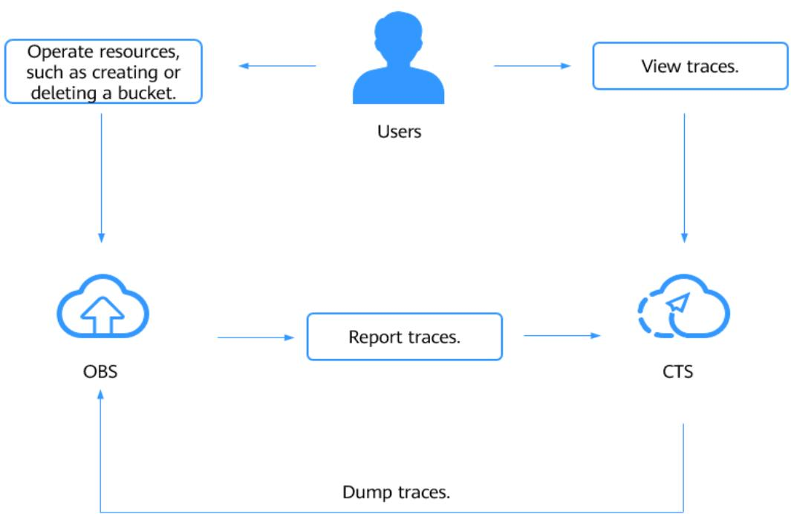

> **AI Description:**
> **Source:** `assets/_page_35_Figure_0.jpg`
> 
> **Generated:** 2026-06-01 15:57:38
> 
> ---
> 
> The image is a flowchart that illustrates a process involving users interacting with cloud services. It shows a user operating resources, such as creating or deleting a bucket, which is represented by an icon of a cloud with an upload arrow. The user's actions are then reported to a service labeled "OBS," which is depicted with a cloud icon. The flow continues with the reporting of traces to another service labeled "CTS," which is also represented by a cloud icon. The diagram includes additional text indicating actions such as "View traces," "Report traces," and "Dump traces." The flowchart visually represents the sequence of operations and data flow between the user, OBS, and CTS.

## Logging

You can enable OBS logging for bucket analysis or audit. After logging is enabled for a bucket, OBS automatically logs access requests for the bucket and writes the generated log files into the specified bucket. With access logs, the bucket owner can deeply analyze the characteristics, types, or trends of requests sent to the bucket.

For the introduction and configuration of OBS logging, see Logging.

## 5.5 Resilience

OBS offers a five-level reliability architecture. It ensures data durability and reliability by leveraging cross-region replication, disaster recovery across AZs, device and data redundancy in an AZ, and detection of slow disks and bad sectors.

Figure 5-3 Five-level reliability architecture of OBS

> **AI Description:**
> **Source:** `assets/_page_36_Figure_0.jpg`
> 
> **Generated:** 2026-06-01 15:53:43
> 
> ---
> 
> The image is a diagram illustrating a "Five-level reliability architecture." It uses a hierarchical structure with five levels, each representing a different layer of a system's reliability. The levels are labeled as follows:
> 
> - Level 5: Regions, which includes natural disasters like earthquakes, floods, and wars.
> - Level 4: Data centers, which covers environmental factors such as wind, fire, water, and electricity.
> - Level 3: Cabinets, which includes PDUs and switches.
> - Level 2: Servers, which includes FRUs (Field Replaceable Units).
> - Level 1: Storage media, which includes bad sectors and slow disks.
> 
> Each level is associated with specific measures to enhance reliability, such as cross-region replication, multi-AZ storage, cabinet redundancy, erasure code, and detection of slow disks and bad sectors. The diagram uses blue shapes to represent each level, with text annotations explaining the reliability measures for each level.

## 5.6 Risk Monitoring

OBS uses Cloud Eye to perform monitoring over resources and operations, helping you monitor your buckets and receive alarms and notifications in real time. You can get the details about requests, traffic, bandwidth, error responses, and storage usage of your buckets.

For details about OBS monitoring metrics and how to create alarm rules, see Monitoring.

## 5.7 Certificates

## Compliance Certificates

Huawei Cloud services and platforms have obtained various security and compliance certifications from authoritative organizations, such as International Organization for Standardization (ISO). You can download them from the console.

Figure 5-4 Downloading compliance certificates
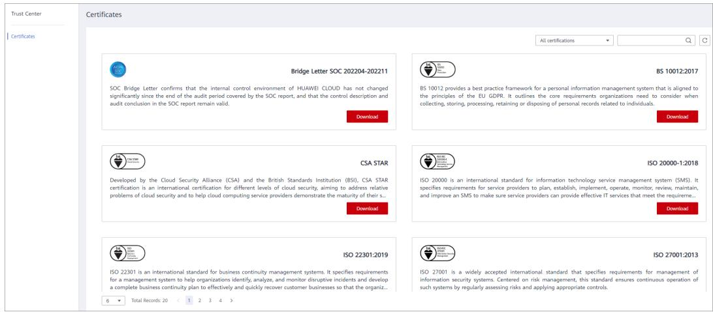

> **AI Description:**
> **Source:** `assets/_page_37_Figure_0.jpg`
> 
> **Generated:** 2026-06-01 15:55:24
> 
> ---
> 
> The image contains a section titled "Certificates" within a Trust Center interface. It displays various certification logos and descriptions related to Huawei Cloud's security and compliance standards. The certificates include SOC Bridge Letter, BS 10012:2017, CSA STAR, ISO 20000-1:2018, ISO 22301:2019, and ISO 27001:2013. Each certificate is accompanied by a brief description of its purpose and relevance to cloud security and information management. The layout is structured with icons, text descriptions, and download buttons for each certification.

## Resource Center

Huawei Cloud also provides the following resources to help users meet compliance requirements. For details, see Resource Center.

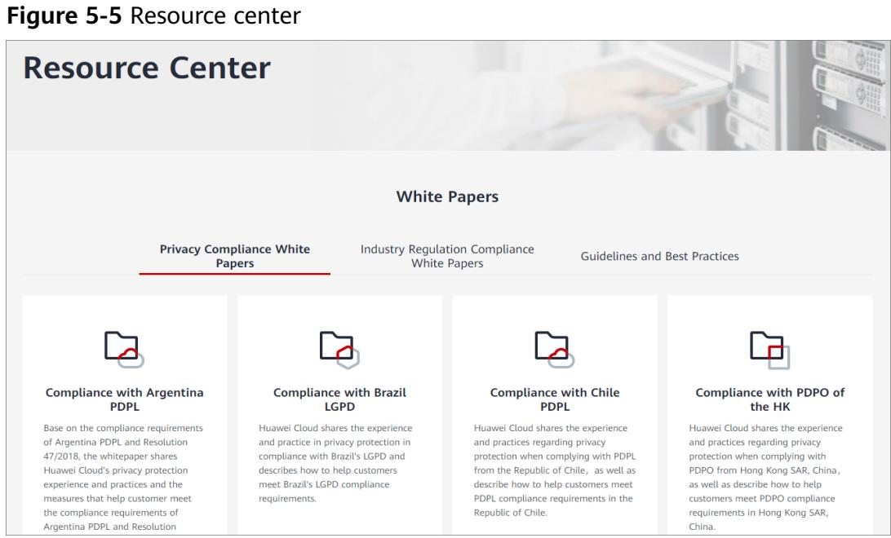

> **AI Description:**
> **Source:** `assets/_page_37_Figure_1.jpg`
> 
> **Generated:** 2026-06-01 15:54:41
> 
> ---
> 
> The image contains a resource center page with a title "Figure 5-5 Resource center" and a subheading "Resource Center". Below this, there are sections labeled "Privacy Compliance White Papers", "Industry Regulation Compliance White Papers", and "Guidelines and Best Practices". The image includes four folders, each representing a different compliance topic: "Compliance with Argentina PDPL", "Compliance with Brazil LGPD", "Compliance with Chile PDPL", and "Compliance with PDPO of the HK". Each folder contains a brief description of the content within, explaining the privacy protection experience and practices related to each compliance topic. The visual elements include icons representing folders and text descriptions, making it a combination of text and simple icons.

# 6 Permissions Management

You can use Identity and Access Management (IAM) to manage OBS permissions and control access to your resources. IAM provides identity authentication, permissions management, and access control.

You can create IAM users for your employees, and assign permissions to these users on a principle of least privilege (PoLP) basis to control their access to specific resource types. For example, you can create IAM users for software developers and assign specific permissions to allow them to use OBS resources but prevent them from being able to delete resources or perform any high-risk operations.

If your Huawei Cloud account does not require individual IAM users for permissions management, skip this section.

IAM is a free service. You only pay for the resources in your account. For more information about IAM, see What Is IAM?

## OBS Permissions

By default, new IAM users do not have any permissions assigned. You can assign permissions to these users by adding them to one or more groups and attaching policies or roles to the groups.

OBS is a global service deployed and accessed without specifying any physical region. OBS permissions are assigned to users in the global project, and users do not need to switch regions when accessing OBS.

You can grant users permissions by using roles or policies.

Roles: A type of coarse-grained authorization mechanism that provides only a limited number of service-level roles. When using roles to grant permissions, you also need to assign dependency roles. However, roles are not an ideal choice for fine-grained authorization and secure access control.

Policies: A type of fine-grained authorization mechanism that defines permissions required to perform operations on specific cloud resources under certain conditions. This mechanism allows for more flexible policy-based authorization for secure access control. For example, you can grant OBS users only the permissions for managing a certain type of OBS resources. Most policies define permissions based on APIs. For the API actions supported by OBS, see Permissions and Supported Actions.

## NO TE

Due to data caching, a role and policy involving OBS actions will take effect 10 to 15 minutes after it is attached to a user, an enterprise project, and a user group.

Table 6-1 lists all system permissions of OBS.

Table 6-1 OBS system permissions

Table 6-2 lists the common operations supported by each system-defined policy or role of OBS. Select the policies or roles as required.

Table 6-2 Permissions and the allowed operations on OBS resources

## OBS Resource Permissions Management

Access to OBS buckets and objects can be controlled by IAM user permissions, bucket policies, and ACLs.

For more information, see OBS Permission Control.

## Permissions Required for OBS Console Operations

Table 6-3 Roles or policies that are required for performing operations on OBS Console

## References

What Is IAM?

IAM Basic Concepts

Creating a User and Granting OBS Permissions

IAM Policies and Supported Actions

# Restrictions and Limitations

This section describes the restrictions on using OBS features.

Table 7-1 OBS use restrictions and limitations

## 8

Table 8-1 Related services

OBS can be used as the storage resource pool for other cloud services such as Image Management Service (IMS) and Cloud Trace Service (CTS).

# 9 Basic Concepts

## 9.1 Objects

Objects are basic units stored in OBS. An object contains both data and the metadata that describes data attributes. Data uploaded to OBS is stored in buckets as objects.

An object consists of the following:

A key that specifies the name of an object. An object key is a UTF-8 string up to 1,024 characters long. Each object is uniquely identified by a key within a bucket.

Metadata that describes an object. The metadata is a set of key-value pairs that are assigned to objects stored in OBS. There are two types of metadata: system-defined metadata and custom metadata.

System-defined metadata is automatically assigned by OBS for processing objects. Such metadata includes Date, Content-Length, Last-Modified, ETag, and more.

You can specify custom metadata to describe the object when you upload an object to OBS.

Data that refers to the content of an object.

Generally, objects are managed as files. However, OBS is an object-based storage service and there is no concept of files and folders. For easy data management, OBS provides a method to simulate folders. By adding a slash (/) to an object name, for example, test/123.jpg, you can specify test as a folder and 123.jpg as the name of a file in the test folder. The key of the object is test/123.jpg.

When uploading an object, you can set a storage class for the object. If no storage class is specified, the object is stored in the same storage class as the bucket in which it resides. You can also change the storage class of an existing object in a bucket.

On OBS Console and OBS Browser+, you can use folders the same way you use them in a file system.

For details about object operations, see Managing Objects.

## 9.2 Buckets

Buckets are containers for storing objects. OBS provides flat storage in the form of buckets and objects. Unlike the conventional multi-layer directory structure of file systems, all objects in a bucket are stored at the same logical layer.

Each bucket has its own attributes, such as access permissions, storage class, and the region. You can specify access permissions, storage class, and regions when creating buckets. You can also configure advanced attributes to meet storage requirements in different scenarios.

OBS provides the following storage classes for buckets: Standard, Infrequent Access, Archive, and Deep Archive (under limited beta testing). With support for these storage classes, OBS caters to diverse storage performance and cost requirements. When creating a bucket, you can specify a storage class for it, which can be changed later.

Each bucket name in OBS is globally unique and cannot be changed after the bucket has been created. The region where a bucket resides cannot be changed once the bucket is created. When you create a bucket, OBS creates a default access control list (ACL) that grants users permissions (such as read and write permissions) on the bucket. Only authorized users can perform operations such as creating, deleting, viewing, and configuring buckets.

An account (including all IAM users under this account) can create a maximum of 100 buckets and parallel file systems. However, there is no restriction on the number and total size of objects in a bucket.

OBS adopts the REST architectural style, and is based on HTTP and HTTPS. You can use URLs to locate resources.

Figure 9-1 illustrates the relationship between buckets and objects in OBS.

Figure 9-1 Relationship between objects and buckets
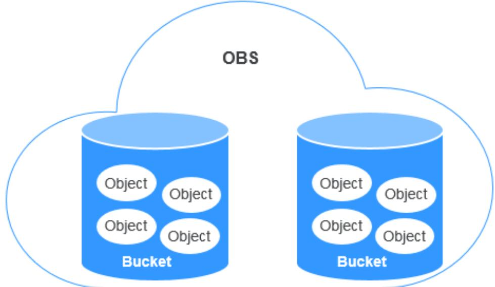

> **AI Description:**
> **Source:** `assets/_page_55_Figure_0.jpg`
> 
> **Generated:** 2026-06-01 15:53:14
> 
> ---
> 
> The image is a diagram illustrating a cloud storage system. It shows two cylindrical shapes labeled "Bucket," each containing multiple circular shapes labeled "Object." Above the cylinders, the acronym "OBS" is written, indicating the name of the cloud storage service. The diagram visually represents the concept of storing multiple objects within separate buckets in a cloud storage environment.

For details about bucket operations, see Managing Buckets.

## 9.3 Parallel File System

Parallel File System (PFS) is a high-performance semantic file system provided by OBS. It features access latency in milliseconds, TB/s-level bandwidth, and millions of IOPS, which makes it ideal for processing high-performance computing (HPC) workloads.

It also supports data read and write through obsfs, a PFS client that supports POSIX. obsfs can be deployed on a Linux ECS, and then you can use obsfs to mount a parallel file system to that server. Once mounted, PFS functions like a local file system. You can manage the PFS online, including creating, deleting, renaming files and folders, or modifying files.

For details about PFS, see the Parallel File System Feature Guide.

## 9.4 Access Keys (AK/SK)

OBS uses an access key ID (AK) and secret access key (SK) to authenticate the identity of a requester. When you use OBS APIs for secondary development and use the AK and SK for authentication, the signature must be calculated based on the algorithm defined by OBS and added to the request.

The authentication can be based on a permanent AK and SK pair, or based on a temporary AK/SK pair and security token.

## Permanent AK/SK Pair

You can create a pair of permanent AK and SK on the My Credentials page. For details, see Obtaining Access Keys (AK and SK).

Access key ID (AK): indicates the ID of the access key. It is the unique ID associated with the SK. The AK and SK are used together to obtain an encrypted signature for a request.

Secret access key (SK): indicates the private key used together with its associated AK to cryptographically sign requests. The AK and SK are used together to identify a request sender to prevent the request from being modified.

## Temporary AK/SK Pair

A temporary AK/SK pair and security token assigned by OBS comply with the principle of least privilege and are for temporarily accessing OBS. They are valid from 15 minutes to 24 hours, and need to be obtained again once they expire. If the security token is missing from your request, a 403 error will be returned.

Temporary AK: indicates the ID of a temporary access key. It is the unique ID associated with the SK. The AK and SK are used together to obtain an encrypted signature for a request.

Temporary SK: indicates the temporary private key used together with its associated temporary AK. The AK and SK are used together to identify a request sender to prevent the request from being modified.

Security token: indicates the token used together with the temporary AK and SK to access all resources of a specified account.

When using the following tools to access OBS resources, you need to use the AK/SK pair for security authentication.

Table 9-1 OBS resource management tools

## References

For details about how to obtain a permanent AK/SK pair, see Obtaining Access Keys (AK and SK).

For details about how to obtain a temporary AK/SK pair and security token, see Obtaining a Temporary Access Key Pair and Security Token.

## 9.5 Endpoints and Domain Names

Endpoint: OBS provides an endpoint for each region. An endpoint is considered a domain name to access OBS in a region and is used to process requests of that region. For details about regions and endpoints, see Regions and Endpoints.

Bucket domain name: Each bucket in OBS has a domain name. A domain name is the address of a bucket and can be used to access the bucket over the Internet. It is applicable to cloud application development and data sharing.

An OBS bucket domain name is in the format of BucketName.Endpoint, where BucketName indicates the name of the bucket, and Endpoint indicates the domain name of the region where the bucket is located.

Table 9-2 lists the bucket domain name and other domain names in OBS, including their structure and protocols.

Table 9-2 OBS domain names

## 9.6 Region and AZ

## Concept

A region and availability zone (AZ) identify the location of a data center. You can create resources in a specific region and AZ.

Regions are classified based on geographical location and network latency. Public services, such as Elastic Cloud Server (ECS), Elastic Volume Service (EVS), Object Storage Service (OBS), Virtual Private Cloud (VPC), Elastic IP (EIP), and Image Management Service (IMS), are shared within the same region. Regions are classified as universal regions and dedicated regions. A universal region provides universal cloud services for common tenants. A dedicated region provides services of the same type or only provides services for specific tenants.

An AZ contains one or more physical data centers. Each AZ has independent cooling, fire extinguishing, moisture-proofing, and electricity facilities. Within an AZ, computing, network, storage, and other resources are logically divided into multiple clusters. AZs within a region are interconnected using highspeed optical fibers to allow you to build cross-AZ high-availability systems.

Figure 9-2 shows the relationship between the regions and AZs.

Figure 9-2 Regions and AZs
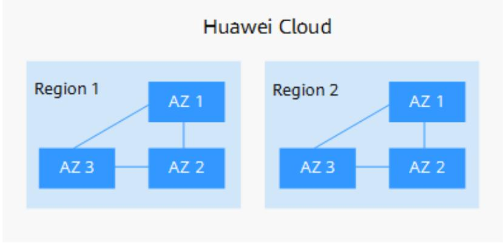

> **AI Description:**
> **Source:** `assets/_page_60_Figure_0.jpg`
> 
> **Generated:** 2026-06-01 15:57:49
> 
> ---
> 
> The image is a diagram illustrating the structure of Huawei Cloud regions and availability zones (AZs). It shows two regions, Region 1 and Region 2, each divided into three availability zones: AZ 1, AZ 2, and AZ 3. The diagram visually represents the hierarchical relationship between the regions and the availability zones, indicating a multi-zone architecture for cloud services. The labels and layout clearly depict the organization of cloud infrastructure within the Huawei Cloud environment.

Huawei Cloud provides services in many regions around the world. You can select a region and AZ according to your requirement. For more information, see Huawei Cloud Global Regions.

## How Do I Select a Region?

When selecting a region, consider the following factors:

● Location

Select a region close to you or your target users. This reduces network latency and improves access speed. However, Chinese mainland regions provide the same infrastructure, BGP network quality, as well as resource operations and configurations. If you or your target users are in the Chinese mainland, you do not need to consider differences in network latency when selecting a region.

If you or your target users are in the Asia Pacific region (excluding the Chinese mainland), select regions such as AP-Bangkok and AP-Singapore.

If you or your target users are in Africa, select the AF-Johannesburg region.

If you or your target users are in Europe, select the EU-Paris region.

Resource prices

Resource prices may vary depending on different regions. For details, see Product Pricing Details.

## How Do I Select an AZ?

When determining whether to deploy resources in the same AZ, consider your applications' requirements for disaster recovery (DR) and network latency.

For high DR capability, deploy resources in different AZs in the same region.

For low network latency, deploy resources in the same AZ.

## Regions and Endpoints

Before using an API to call resources, you must specify its region and endpoint. For details about Huawei Cloud regions and endpoints, see Regions and Endpoints.

## 10 Change History

