
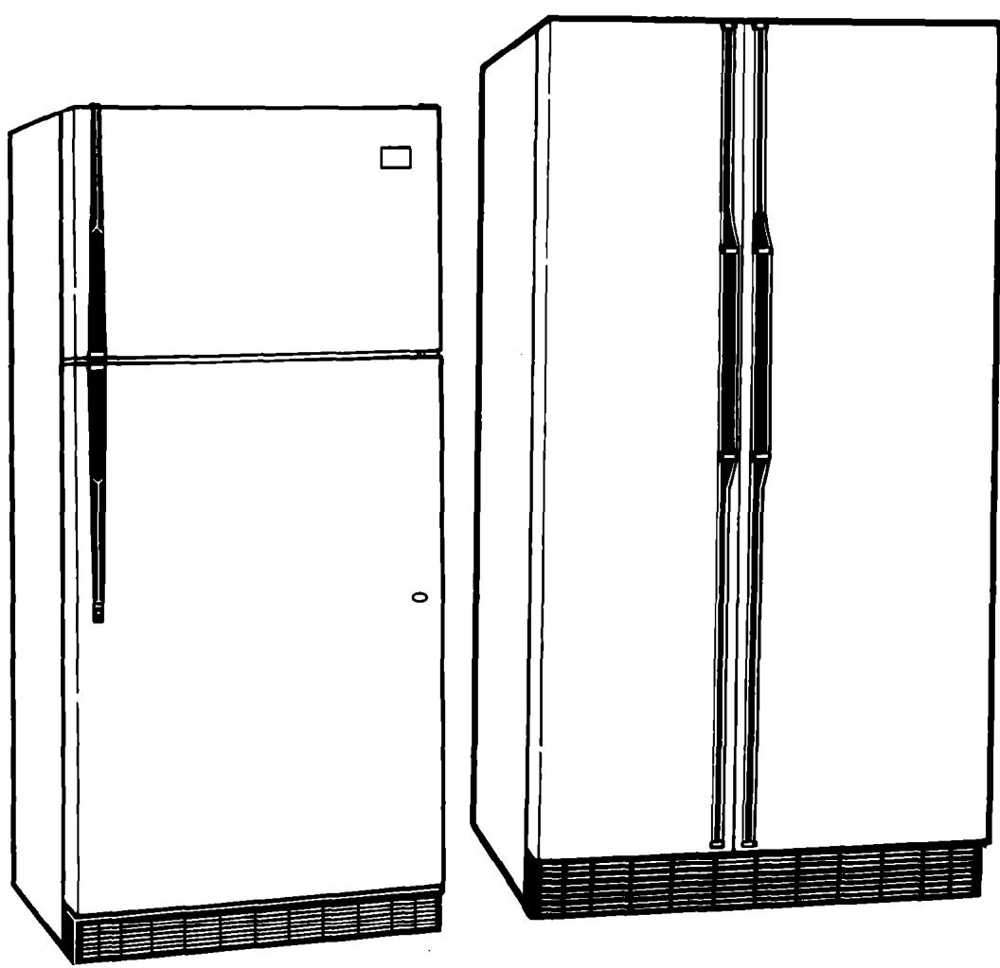

> **AI Description:**
> **Source:** `assets/_page_0_Figure_0.jpg`
> 
> **Generated:** 2026-06-01 16:16:19
> 
> ---
> 
> The image contains two illustrations of refrigerators. The left illustration shows a top-freezer refrigerator with a single door on the bottom and a freezer compartment on top. The right illustration depicts a side-by-side refrigerator with two doors, one for the freezer and one for the refrigerator compartment. Both refrigerators have a vented base and a handle on the side.

A Note to You. 2   
Refrigerator Safety . .3   
Parts and Features 4-5   
Before Using Your Refrigerator ..6   
Cleaning your refrigerator . .6   
Plugging it in 6   
Installing it properly 7   
Leveling it.. 7   
Using Your Refrigerator .. 8   
Setting the controls 8   
Changing the control settings 8   
Removing the door trim.. .9   
Adjusting the wine rack.. .9   
Adjusting the door bins 10   
Adjusting the refrigerator shelves.....10   
Adjusting the EZ-Track\* shel.. 11   
Removing the crisper and   
crisper cover . 12   
Adjusting the crisper humidity   
control ... 13   
Removing the meat drawer   
and cover 13   
Adjusting the meat drawer   
temperature. 13   
Removing the snack bin . 14   
Removing the freezer baskets .14   
Using the ice cube trays. 15   
Using the optional automatic   
ice maker . 15   
Removing the base grille 16   
Using the THIRSTCRUSHER\*   
dispensing system 16-17   
Solving common ice maker/dispenser   
problems 18   
Changing the light bulbs .19-20   
Understanding the sounds you   
may hear ... 20   
Saving energy . 20   
Caring for Your Refrigerator.. 21   
Cleaning your refrigerator. 21   
Holiday and moving care.. 22-23   
Power interruptions . 23   
Food Storage Guide .. 24   
Storing fresh food. 24   
Storing frozen food. 25   
Removing the Doors.. .26-27   
Troubleshooting . 28   
Requesting Service . 29   
Warranty ... 30

## A Note to You

## Thank you for buying a Whirlpool\* appliance.

You have purchased a quality，world-class home appliance. Years of engineering experience went into its manufacturing.To ensure that you enjoy many years of trouble-free operation, we developed this Use and Care Guide. It is full of valuable information on how to operate and maintain your appliance properly and safely. Please read it carefully.

## Help when you need it.

If you ever have a question concerning your appliance's operation, or if you need service, first see “Requesting Service"on page 29.If you need further help,feel free to callan authorized Whirlpool service center. When caling, you will need to know your appliance's complete model number and serial number. You can find this information on the model and serial number label (see diagram on pages 4-5). For your convenience, we have included a handy place below for you to record these numbers,the purchase date from the sales slip,and your dealer's name and telephone number. Keep this book and the sales slip together in a safe place for future reference.

Model Number

Dealer Name

Serial Number

Purchase Date

Dealer Phone\_

## Refrigerator Safety

## Your safety is important to us.

This guide contains statements under warning symbols. Please pay special attention to these symbols and follow any instructions given. Here is a brief explanation of the use of the symbol.

## AWARNING

This symbol alerts you to such dangers as personal injury, burns, fire,and electrical shock

## IMPORTANT SAFETY INSTRUCTIONS

## AWARNING

## To reduce the risk of fire, electrical shock, or injury when using your refrigerator, follow these basic precautions:

· Read all instructions before using the refrigerator.

· Never allow children to operate, play with,or crawl inside the refrigerator.

· Never clean refrigerator parts with flammable fluids.The fumes can create a fire hazard or explosion.

·FOR YOUR SAFETY·

DO NOT STORE OR USE GASOLINE OR OTHER FLAMMABLE VAPORS AND LIQUIDS IN THE VICINITY OF THIS OR ANY OTHER APPLIANCE.THE FUMES CAN CREATE A FIRE HAZARD OR EXPLOSION.

## - SAVE THESE INSTRUCTIONS -

## Help us help you

## Please:

· Install and level the refrigerator on a floor that will hold the weight and in an area suitable for its size and use.

· Do not install the refrigerator near an oven,radiator,or other heat source.

· Do not use the refrigerator in an area where the room temperature will fall below 13℃ (55°F).

· Keep the refrigerator out of the weather.

· Connect the refrigerator only to the proper kind of outlet, with the correct electrical supply and grounding. (Refer to p. 6, “Piugging it in.")

· Do not load the refrigerator with food before it has time to get properly cold.

· Use the refrigerator only for the uses described in this manual.

· Properly maintain the refrigerator.

· Be sure the refrigerator is not used by anyone unable to operate it properly.

# Parts and Features

Below are illustrations of your appliance with the parts and features called out. Your model may have all of some of the features shown and it may not be exactly as illstrated.

## Style 1

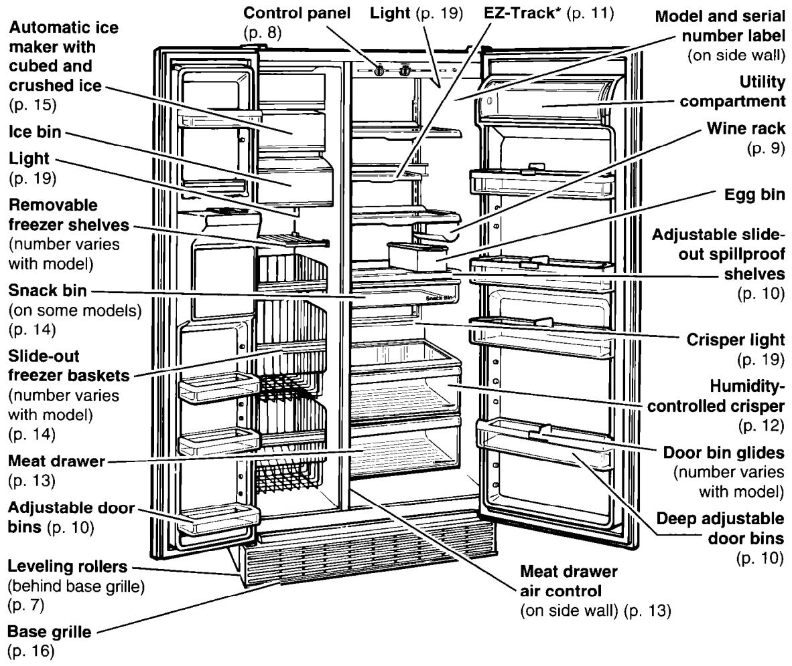

> **AI Description:**
> **Source:** `assets/_page_4_Figure_0.jpg`
> 
> **Generated:** 2026-06-01 16:20:45
> 
> ---
> 
> The image is a detailed technical illustration of the interior components of a refrigerator. It includes a labeled diagram of various parts such as the automatic ice maker, ice bin, control panel, and adjustable shelves. The illustration is accompanied by text annotations pointing to each part and providing page references for further information. The diagram is designed to help users understand the layout and functionality of the refrigerator's interior.

Style 2
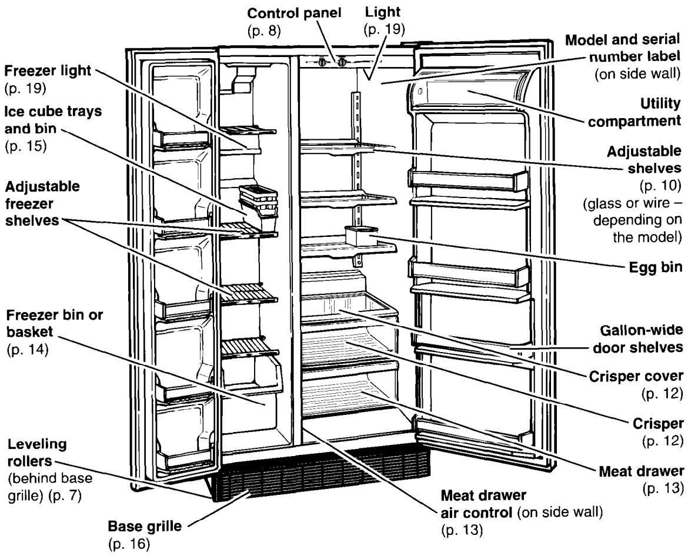

> **AI Description:**
> **Source:** `assets/_page_5_Figure_0.jpg`
> 
> **Generated:** 2026-06-01 16:19:21
> 
> ---
> 
> The image is a technical illustration of a refrigerator's interior and exterior components. It includes labels for various parts such as the control panel, light, model and serial number label, adjustable shelves, egg bin, and meat drawer. The illustration also highlights features like the freezer light, ice cube trays and bin, adjustable freezer shelves, and leveling rollers. The diagram is accompanied by page references for further information, indicating it is likely from a user manual or technical guide.

## Please read this Use and Care Guide before you do anything else.

This booklet tells you how to start your refrigerator, clean it,move shelves, and adjust controls. It even tells you what new sounds to expect from your refrigerator.

Treat your new refrigerator with care. Use it only to do what home refrigerators are designed to do.

# Before Using Your Refrigerator

It is important to prepare your refrigerator for use.This section tells you how to clean it, connect it to a power source, install it, and level it.

## Cleaning your refrigerator

## Removing packaging materials

Remove tape and any inside labels (except the model and serial number label) before using the refrigerator.

To remove any remaining glue:

· Rub briskly with thumb to make a ball, then remove.

## OR

· Soak area with liquid hand-dishwashing detergent before removing glue as described above. Do not use sharp instruments,rubbing alcohol, flammable fluids or abrasive cleaners.These can damage the material. See "Important Safety Instructions"on page 3.

## Plugging it in

## Recommended Grounding Method

A 115 Volt/60 Hz (Plug 1),220/240 Volt/50 Hz (Plug 2or 3) or 220 Volt/60 Hz (Plug 3) AC only 15 or 20 ampere fused and properly grounded electrical supply is required. It is recommended that a separate circuit serving only this appliance be provided. Use a receptacle which cannot be turned off with a switch or pull chain. Do not use an extension cord.

NOTE: Do not remove any permanent instruction labels inside your refrigerator. Do not remove the Tech Sheet fastened under the refrigerator at the front.

## Cleaning it before use

After removing all packaging materials,clean your refrigerator before using it, if necessary. See cleaning instructions on pages 21-22.

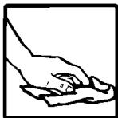

> **AI Description:**
> **Source:** `assets/_page_6_Figure_0.jpg`
> 
> **Generated:** 2026-06-01 16:14:39
> 
> ---
> 
> The image is a simple line drawing depicting a hand holding a piece of paper. The hand appears to be in the act of passing or handing over the paper, which could symbolize sharing, giving, or presenting information. There are no labels or text annotations present in the image.

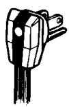

> **AI Description:**
> **Source:** `assets/_page_6_Figure_1.jpg`
> 
> **Generated:** 2026-06-01 16:14:52
> 
> ---
> 
> The image shows a close-up of a black electrical plug with a white and black cable. The plug has two prongs and a grounding pin, indicating it is a standard two-pronged plug with a ground. The cable appears to be slightly frayed at the end, suggesting potential wear or damage. The image is a simple, straightforward representation of an electrical plug and cable.

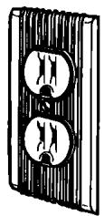

> **AI Description:**
> **Source:** `assets/_page_6_Figure_2.jpg`
> 
> **Generated:** 2026-06-01 16:14:35
> 
> ---
> 
> The image contains a diagram of a double-sided electrical outlet. The outlet has two sockets, each with a circular shape and a rectangular slot, designed for plugging in two-pronged electrical devices. The diagram is simple and black and white, with no additional text or labels.

Plug 1

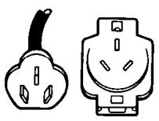

> **AI Description:**
> **Source:** `assets/_page_6_Figure_3.jpg`
> 
> **Generated:** 2026-06-01 16:14:06
> 
> ---
> 
> The image contains two distinct electrical plug types. On the left is a two-pronged plug, commonly used in North America and other regions. On the right is a three-pronged plug, which is more commonly found in Europe and other parts of the world. The image is a simple illustration used to visually differentiate between these two types of plugs.

Plug 2

Plug 3
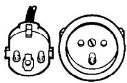

> **AI Description:**
> **Source:** `assets/_page_6_Figure_4.jpg`
> 
> **Generated:** 2026-06-01 16:15:13
> 
> ---
> 
> The image contains a technical illustration of two electrical connectors. The left side shows a connector with a metallic housing and multiple pins, while the right side displays the corresponding female connector with a circular shape and several holes for the pins. The image is likely used for technical documentation or assembly instructions related to electrical components.

## Installing it properly

1.Allow 1.25 cm (/ inch) space on each side and at the top of the refrigerator for ease of installation.

2. If the hinge side of the refrigerator is to be against a wall, you might want to leave extra space so the door can be opened wider.

3.The refrigerator can be flush against the back wall.

4.Make sure the ice maker water supply has been connected. Refer to Installation Instructions.

## Leveling it

Your refrigerator has 2 front leveling screws - one on the right and one on the left. To adjust one or both of these, follow the directions below.

1. Remove base grille. (See page 16.)

2. To raise front, turn screw clockwise.

3. To lower front, turn screw counterclockwise.

4. Check with level.

5. Replace base grille. (See page 16.)

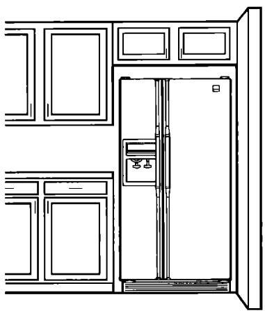

> **AI Description:**
> **Source:** `assets/_page_7_Figure_0.jpg`
> 
> **Generated:** 2026-06-01 16:15:49
> 
> ---
> 
> The image is a simple line drawing of a kitchen setting. It features a refrigerator with a water dispenser on the door, positioned between two sets of kitchen cabinets. The cabinets have a classic design with rectangular panels and a raised panel style. The refrigerator is centrally placed, and the overall layout suggests a standard kitchen layout with ample storage space.

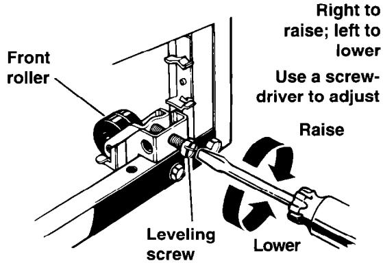

> **AI Description:**
> **Source:** `assets/_page_7_Figure_1.jpg`
> 
> **Generated:** 2026-06-01 16:15:42
> 
> ---
> 
> The image is a technical illustration showing a close-up view of a leveling mechanism, likely for a piece of furniture or equipment. It includes a diagram of a front roller and a leveling screw. The illustration demonstrates how to adjust the roller using a screwdriver, with arrows indicating the direction to turn the screw to raise or lower the roller. The text explains that turning the screw to the right raises the roller, while turning it to the left lowers it. This is a clear, instructional diagram designed to guide users on how to adjust the leveling mechanism.

# Using Your Refrigerator

To obtain the best possible results from your refrigerator, it is important that you operate it properly.This section tells you how to set the temperature control,remove,and adjust some of the features in your refrigerator,and how to save energy.

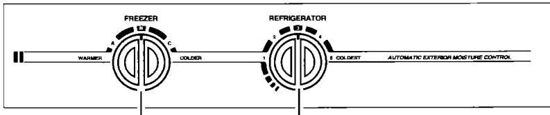

> **AI Description:**
> **Source:** `assets/_page_8_Figure_0.jpg`
> 
> **Generated:** 2026-06-01 16:17:15
> 
> ---
> 
> The image is a diagram illustrating the controls for a refrigerator and freezer. It features two circular dials labeled "FREEZER" and "REFRIGERATOR," each with settings ranging from "COLDER" to "COLDEST." The dials are connected by a line, indicating the relationship between the two temperature controls. The diagram also includes a label "AUTOMATIC EXTERIOR MOISTURE CONTROL" at the bottom right, suggesting an additional feature of the appliance. The design is simple and functional, likely intended for instructional purposes.

## Setting the controls

Controls for the refrigerator and freezer are in the refrigerator. When you plug in the refrigerator for the first time:

1. Set the Refrigerator Control to 3. Refrigerator Control adjustments range from 1 (warmest) to 5 (coldest).

2. Set the Freezer Control to B. Freezer Control adjustments range from A (warmest) to C (coldest).

3. Give the refrigerator time to cool down completely before adding food. (This may take several hours.)

The settings indicated above should be correct for normal, household refrigerator usage.The controls will be set correctly when milk or juice is as cold as you like and when ice cream is firm. If you need to adjust these settings, see “Changing the control settings"below.

NOTE:The Automatic Exterior Moisture control continuously guards against moisture buildup on the outside of your refrigerator cabinet. This control does not have to be set or adjusted.

## Changing the control settings

If you need to adjust temperatures in the refrigerator or freezer, use the settings listed in the chart below as a guide.

·Adjust the Refrigerator Control first.

· Wait at least 24 hours between adjustments.

·Then adjust the Freezer Control if needed.

## Removing the door trim

## Drop-in trim

To remove the trim piece:

1. Remove all items from the shelf.

2. Pull straight up on the trim piece at each end.

## To replace the trim piece:

1. Locate each end of the trim piece above the trim pocket opening.

2. Push the trim piece straight down until it stops.

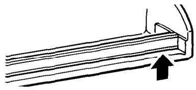

> **AI Description:**
> **Source:** `assets/_page_9_Figure_0.jpg`
> 
> **Generated:** 2026-06-01 16:16:54
> 
> ---
> 
> The image is a technical illustration showing a close-up view of a mechanical component, likely a part of a door or window mechanism. It features a rectangular section with a series of parallel lines, possibly representing a track or rail, and a small protruding part at the top right corner, which could be a guide or stopper. The black arrow pointing upwards suggests the direction of movement or action, indicating that the component might be used in a sliding or lifting mechanism. The illustration is detailed and appears to be part of an instruction manual or technical guide.

3.Replace items on the shelf.

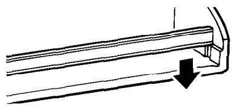

> **AI Description:**
> **Source:** `assets/_page_9_Figure_1.jpg`
> 
> **Generated:** 2026-06-01 16:16:47
> 
> ---
> 
> The image is a technical illustration showing a close-up view of a mechanical component, likely a part of a door or window frame. The illustration includes a black arrow pointing downward, indicating a direction or movement. The component appears to have a rectangular shape with a groove or slot along its length, which may be used for a sliding or hinged mechanism. The image is detailed enough to suggest it is part of an assembly or installation guide.

## Snap-on trivet

## To remove the trivet:

1. Remove allitems from the shelf.

2. Pull out on the inside tab at each end.

3. Lift trivet straight out.

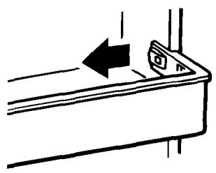

> **AI Description:**
> **Source:** `assets/_page_9_Figure_2.jpg`
> 
> **Generated:** 2026-06-01 16:17:00
> 
> ---
> 
> The image is a technical illustration showing a diagram of a device with a button or switch labeled with an arrow pointing to the left. The arrow indicates the direction in which the button or switch should be pressed or moved. The diagram is likely part of an instruction manual or user guide, providing guidance on how to operate the device.

## To replace the trivet:

1. Line up ends of the trivet with the button on the door liner wall.

2. Push trivet straight back until it snaps securely into place.

3.Replace items on the shelf.

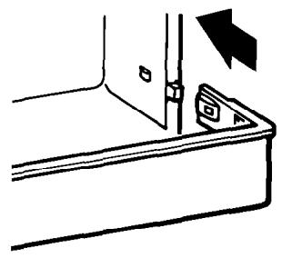

> **AI Description:**
> **Source:** `assets/_page_9_Figure_3.jpg`
> 
> **Generated:** 2026-06-01 16:17:06
> 
> ---
> 
> The image is a technical illustration showing a close-up view of a door hinge mechanism. It includes a diagram of a door hinge with a small rectangular component labeled with a symbol resembling a gear and a triangle. An arrow points to the hinge, indicating the direction of movement or action. The illustration is likely used for instructional or technical purposes, such as explaining how to install or adjust a door hinge.

## Adjusting the wine rack (on some models)

To remove the wine rack:

1. Lift front of wine rack.

2. Pull rack off rear-support.

3. Replace in reverse order.

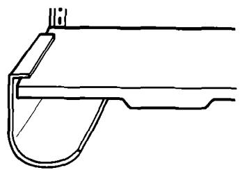

> **AI Description:**
> **Source:** `assets/_page_9_Figure_4.jpg`
> 
> **Generated:** 2026-06-01 16:17:21
> 
> ---
> 
> The image is a technical illustration of a mechanical component, likely a part of a door or window mechanism. It shows a cross-sectional view of a sliding or hinged mechanism with a track and a sliding element. The track appears to be a guide for a sliding door or panel, and the sliding element is designed to fit into this track. The illustration is simple and schematic, focusing on the structural elements rather than any specific measurements or labels.

## Adjusting the door bins (on some models)

## To remove door bins:

1. Lift bin up.

2. Pull bin straight out.

## To replace door bins:

1. Slide bin in above desired support button.

2.Push down until it stops.

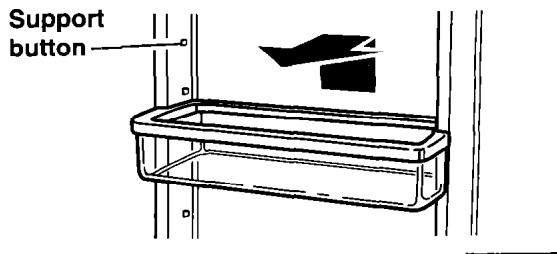

> **AI Description:**
> **Source:** `assets/_page_10_Figure_0.jpg`
> 
> **Generated:** 2026-06-01 16:19:29
> 
> ---
> 
> The image is a technical illustration of a support button mechanism. It shows a rectangular support button attached to a vertical structure, likely part of a larger machine or device. The illustration includes a small diagram in the top right corner, indicating the direction of the support button's movement or function. The text "Support button" is annotated on the left side of the image, pointing to the button itself. The illustration is simple and schematic, designed to provide clear instructions or information about the button's operation.

## Adjusting the refrigerator shelves

Adjust the shelves to match the way you use your refrigerator. Glass shelves are strong enough to hold botles,milk,and other heavy food items.

## To remove a shelf:

1.Remove items from shelf.

2. Tilt shelf up at front.

3. Lift shelf at back.

4. Pull shelf straight out.

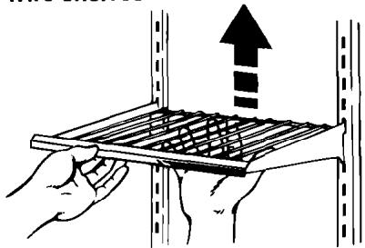

> **AI Description:**
> **Source:** `assets/_page_10_Figure_1.jpg`
> 
> **Generated:** 2026-06-01 16:19:58
> 
> ---
> 
> The image is a technical illustration showing a person installing a shelf into a shelving unit. The shelf is a grid-like structure, and the person is holding it with both hands, aligning it with the vertical supports of the shelving unit. An upward arrow indicates the direction in which the shelf should be pushed to secure it in place. The image is designed to guide the user on how to properly install the shelf.

## To replace a shelf:

Wire shelves

1. Guide the rear shelf hooks into the slots in the shelf supports on the back liner wall.

2.Tilt front of shelf up until hooks drop into slots.

3.Lower front of shelf to a level position.

NOTE: Glass shelves are heavy. Handle them carefully.

To slide shelf out (on some models):

· Carefully pull front of shelf toward you.

To slide shelf in (on some models):

· Push shelf in until it stops.

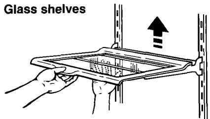

> **AI Description:**
> **Source:** `assets/_page_10_Figure_2.jpg`
> 
> **Generated:** 2026-06-01 16:21:12
> 
> ---
> 
> The image contains a diagram illustrating the installation of glass shelves. It shows a hand holding a glass shelf, with arrows indicating the direction of movement to insert the shelf into a shelving unit. The text "Glass shelves" is prominently displayed at the top, providing context for the image. The diagram is simple and instructional, focusing on the placement of the shelf within a shelving system.

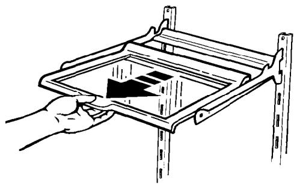

> **AI Description:**
> **Source:** `assets/_page_10_Figure_3.jpg`
> 
> **Generated:** 2026-06-01 16:20:06
> 
> ---
> 
> The image is a technical illustration showing a hand inserting a rectangular object, likely a filter or a similar component, into a frame or housing. The frame appears to be part of a larger mechanical or industrial setup, possibly related to air filtration or ventilation systems. The hand is positioned on the left side of the image, and the arrow indicates the direction in which the object should be inserted. The illustration is simple and lacks any additional text or labels, focusing solely on the action of inserting the object.

## Adjusting the EZ-Track\* shelf (on some models)

## To slide shelf side-to-side:

1.Lift slightly on shelf front.

2. Slide to desired location.

3.Lower shelf front to level position.

NOTE: You do not have to remove small items from the shelf before moving it side-to-side. You may need to remove larger items.

## To remove the shelf:

1.Remove all items from the shelf.

2. Hold back of shelf with one hand.

3.Lift front of shelf to $4 5 ^ { \circ }$ angle.

4.Lower shelf slightly to release shelf from upper channel track.Then pull shelf straight out.

NOTE: Shelf is heavy. Make sure you use both hands when removing shelf.

## To remove shelf track:

1. Lift both sides of track slightly.

2. Pull track straight out.

## To replace shelf track:

1. Guide track hooks into the shelf support slots on the back wall of the cabinet. NOTE: Make sure both track hooks are in slots and that the slots are parallel to each other.

2.Push track backward and down.

3. Check that track is completely seated in the shelf supports.

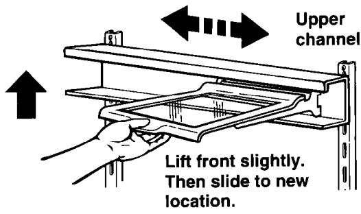

> **AI Description:**
> **Source:** `assets/_page_11_Figure_0.jpg`
> 
> **Generated:** 2026-06-01 16:18:00
> 
> ---
> 
> The image is a technical illustration showing a step-by-step guide for adjusting a shelf or component within a shelving unit. It includes a hand demonstrating the action of lifting the front of the shelf slightly and then sliding it to a new location. The illustration is labeled with "Upper channel" at the top and includes directional arrows indicating the movement. The text at the bottom reads, "Lift front slightly. Then slide to new location." The image is designed to provide clear, step-by-step instructions for assembling or adjusting shelving units.

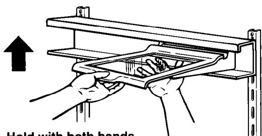

> **AI Description:**
> **Source:** `assets/_page_11_Figure_1.jpg`
> 
> **Generated:** 2026-06-01 16:17:28
> 
> ---
> 
> The image is a technical illustration showing how to hold a shelf bracket. It includes a diagram of a shelf bracket being held with both hands, with an arrow indicating the upward direction. The text at the bottom of the image reads "Hold with both hands," providing instructions on proper handling. The illustration is likely used in a manual or instructional guide for assembling or installing shelf brackets.

Hold with both hands and lift front to 45°angle.

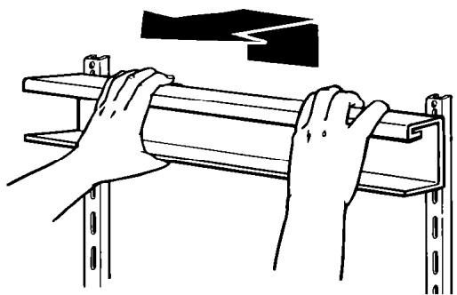

> **AI Description:**
> **Source:** `assets/_page_11_Figure_2.jpg`
> 
> **Generated:** 2026-06-01 16:18:29
> 
> ---
> 
> The image is a technical illustration showing hands installing a shelf or bracket on a wall. The diagram includes a shelf being inserted into a bracket, with arrows indicating the direction of movement. The shelf is mounted on a vertical bracket attached to a wall, and there are additional brackets and supports visible in the background. The illustration is likely part of a manual or instructional guide for assembling or installing shelving units.

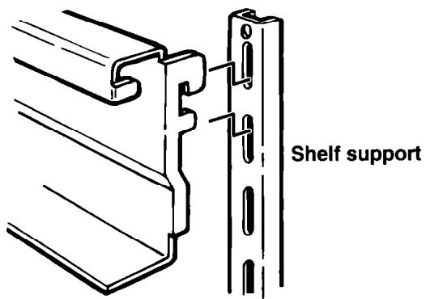

> **AI Description:**
> **Source:** `assets/_page_11_Figure_3.jpg`
> 
> **Generated:** 2026-06-01 16:18:37
> 
> ---
> 
> The image is a technical illustration showing a shelf support mechanism. It features a diagram of a shelf bracket and a vertical support structure. The shelf bracket is shown in a side view, with a cutout section highlighting the connection point to the shelf support. The support structure is labeled as "Shelf support" and includes a series of holes, likely for adjustable positioning. The illustration is clean and technical, designed for instructional or assembly purposes.

Make sure both sets of hooks are in support slots.

## To reinstall shelf:

1. Hold shelf at front and back.

2. Tilt front of shelf up to a 45° angle to track.

3. Insert both rear shelf slides into upper channel of track.

4. Lower front of shelf to a level position.

NOTE:Make sure both rear shelf slides are securely in the track before letting go of shelf.

Upper channel of track.

Insert rear shelf slides into upper channel of track. —

# Removing the crisper and crisper cover

To remove the crisper:

1. Slide the crisper straight out to the stop.

2. Lift the front slightly.

3. Slide out the rest of the way.

4. Replace in reverse order.

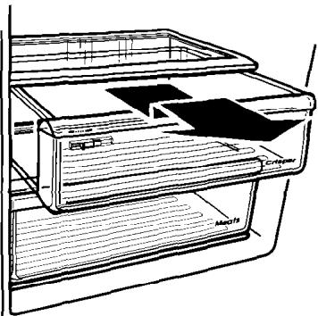

> **AI Description:**
> **Source:** `assets/_page_12_Figure_0.jpg`
> 
> **Generated:** 2026-06-01 16:14:17
> 
> ---
> 
> The image is a technical illustration of a refrigerator's interior, specifically focusing on the meat compartment. It shows a sliding drawer labeled "Meats" with a black plastic cover partially pulled out. The illustration is in black and white, with a simple line drawing style. The drawer appears to be designed for storing meat, with a label indicating its purpose. The surrounding area of the refrigerator is partially visible, showing the interior structure and other compartments.

Pull out to the stop, lift the front, and pull again.

## Style 1

To remove the cover:

1. Hold cover firmly with both hands and lift front of cover off supports.

2. Lift cover out by pulling up and out.

## To replace the cover:

1. Fit back of cover into notch supports on walls of refrigerator.

2. Lower front into place.

## Style 2

To remove the cover:

1.Push up glass insert from the bottom, then slide out with both hands.

2. Lift front of cover frame.

3. Lift cover frame up and out.

## To replace the cover:

1. Fit back of cover frame into notch supports on walls of refrigerator, then lower front into place.

2. Slide back of glass insert into place, then . lower front into place.

12

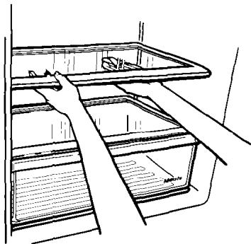

> **AI Description:**
> **Source:** `assets/_page_12_Figure_1.jpg`
> 
> **Generated:** 2026-06-01 16:14:23
> 
> ---
> 
> The image is a technical illustration showing a hand reaching into a refrigerator to adjust or remove a shelf. The refrigerator is depicted in a side view, with the door open to reveal the interior. The shelf being adjusted is labeled with a small diagram indicating its position and function. The illustration appears to be instructional, likely part of a manual or guide for refrigerator maintenance or use.

Lift the cover front, then the back.

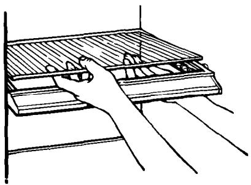

> **AI Description:**
> **Source:** `assets/_page_12_Figure_2.jpg`
> 
> **Generated:** 2026-06-01 16:14:47
> 
> ---
> 
> The image is a technical illustration showing a hand interacting with a mechanical device, possibly a keyboard or a control panel. The hand is pressing a button or lever, and the device has multiple components, including a grid-like structure and several protruding elements. The illustration is in black and white, with no additional text or labels.

## Adjusting the crisper humidity control

## (on some models)

You can control the amount of humidity in the moisture-sealed crispers.Adjust the control to any setting between LOW and HIGH.

· LOW (open) lets moist air out of the crisper for best storage of fruits and vegetables with skins.

· HIGH (closed) keeps moist air in the crisper for best storage of fresh, leafy vegetables.

## Removing the meat drawer and cover

## To remove the meat drawer:

1. Slide the meat drawer straight out to the stop.

2. Lift the front slightly.

3. Slide out the rest of the way.

4. Replace in reverse order.

## To remove the cover:

1. Remove meat drawer and crisper.

2. Lift front of cover off supports.

3. Lift cover out by pulling up and out.

## To replace the cover:

1. Fit back of cover into notch supports on walls of refrigerator.

2. Lower front into place.

3. Replace meat drawer and crisper.

Pull out to the stop, lift the front, and pull again.

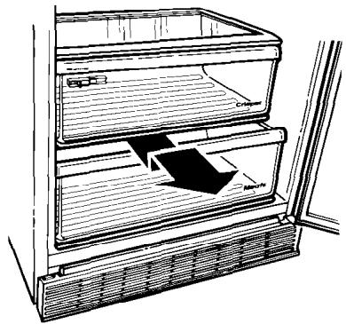

> **AI Description:**
> **Source:** `assets/_page_13_Figure_1.jpg`
> 
> **Generated:** 2026-06-01 16:15:07
> 
> ---
> 
> The image is a technical illustration of a refrigerator's interior drawer system. It shows a top-down view of the refrigerator with two drawers. The top drawer is labeled "Crisper" and the bottom drawer is labeled "Refrigerator." An arrow points from the bottom drawer into the top drawer, indicating a possible transfer or exchange of contents between the two compartments. The illustration is likely used for instructional purposes, such as demonstrating how to use or maintain the refrigerator's storage system.

## Adjusting the meat drawer temperature

Cold air from the freezer flows into the meat drawer. This helps keep the meat drawer colder than the rest of the refrigerator for better storage of meats.

Slide the control from side to side to let more or less cold air through.

Use control to adjust meat drawer temperature.

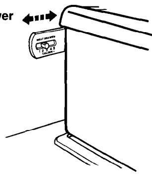

> **AI Description:**
> **Source:** `assets/_page_13_Figure_2.jpg`
> 
> **Generated:** 2026-06-01 16:15:33
> 
> ---
> 
> The image contains a technical illustration of a device, likely a heater or a similar appliance. It shows a control panel with a label "HEAT DRAWER" and a set of buttons. Arrows indicate the direction to slide the cover, suggesting the user should move the cover in the direction of the arrows to access or use the heat drawer. The illustration is simple and functional, designed to guide the user on how to interact with the device.

## Removing the snack bin (on some models)

To remove the snack bin:

1. Slide snack bin straight out to the stop with an even, constant motion.

2. Lift the front.

3. Slide bin out the rest of the way.

4.Replace in reverse order.

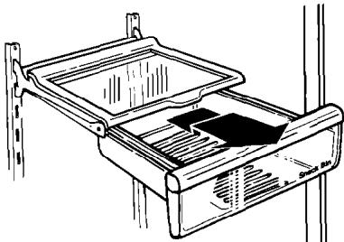

> **AI Description:**
> **Source:** `assets/_page_14_Figure_0.jpg`
> 
> **Generated:** 2026-06-01 16:15:19
> 
> ---
> 
> The image is a technical illustration of a shelving unit with a tray and a drawer. The tray is mounted on a bracket attached to the side of the shelf, and the drawer is partially pulled out. The drawer has a label that reads "Smart Box." The illustration appears to be a diagram used for instructional or design purposes, possibly for a shelving system or storage unit.

Pull out to the
stop, lift the front, and pull again.

## Removing the freezer baskets (on some models)

To remove a basket:

1. Slide basket out to the stop.

2. Lift the front to clear the stop.

3. Slide basket out the rest of the way.

To replace a basket:

1. Place basket on the slides.

2.Make sure the wire stops clear the front of the slides.

3. Slide basket in all the way.

Pull out to the stop, lift the front, and pull again.

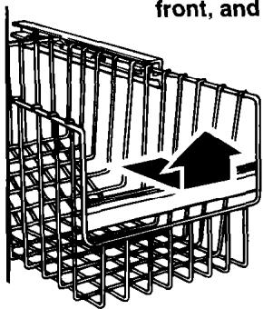

> **AI Description:**
> **Source:** `assets/_page_14_Figure_1.jpg`
> 
> **Generated:** 2026-06-01 16:14:59
> 
> ---
> 
> The image contains a technical illustration of a dish rack, likely from a user manual or instruction guide. It shows a side view of the dish rack with a clear indication of the direction in which the rack should be pulled out. The illustration includes a black arrow pointing upwards, suggesting the rack should be pulled out from the front. The text "front, and" is partially visible at the top of the image, indicating it is part of a larger instruction.

## Removing the freezer shelf

To remove the shelf:

1. Lift right side of shelf off supports.

2. Slide shelf out of shelf support holes.

3.Replace in reverse order.

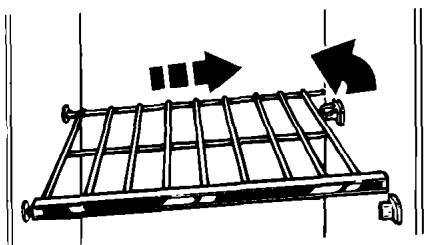

> **AI Description:**
> **Source:** `assets/_page_14_Figure_2.jpg`
> 
> **Generated:** 2026-06-01 16:15:26
> 
> ---
> 
> The image is a technical illustration of a rack or shelf system. It shows a diagram of a shelf with a series of horizontal bars and vertical supports. Arrows indicate the direction of movement for the shelf, suggesting it can be extended or retracted. The diagram includes a small icon of a gear, possibly indicating a mechanism for adjusting or locking the shelf in place. The illustration is likely used for assembly or instructional purposes.

## Using the ice cube trays (on some models)

If cubes are not used, they may shrink.The moving cold air starts a slow evaporation. The longer you store cubes, the smaller they get.

## To remove ice:

1. Hold tray at both ends.

2. Twist slightly.

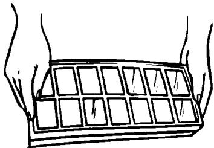

> **AI Description:**
> **Source:** `assets/_page_15_Figure_0.jpg`
> 
> **Generated:** 2026-06-01 16:14:11
> 
> ---
> 
> The image is a simple line drawing of two hands holding a rectangular object with a grid of 12 squares. The object appears to be a keyboard or a similar rectangular device with a grid layout. The hands are positioned as if they are about to type or interact with the device. There are no labels or text annotations within the image itself.

## Using the optional automatic ice maker

If your refrigerator has an automatic ice maker,or if you plan to add one later (contact the dealer for ice maker kit number),here are a few things you should know.

· The ON/OFF lever is a wire signal arm.

DOWN to make ice automatically

UP to shut off the ice maker

IMPORTANT: Do not turn ice maker on until you connect it to the water supply.

· If you remove the ice bin, raise the signal arm to shut off the ice maker. When you replace the bin,push it in all the way and lower the ice maker signal arm to the ON position.

· Good water quality is important for good ice quality. Try to avoid connecting the ice maker to a softened water supply.Water softener chemicals (such as salt from a malfunctioning softener) can damage the ice maker mold and lead to poor ice quality. If you cannot avoid a softened water supply, make sure the water softener is operating properly and is well maintained.

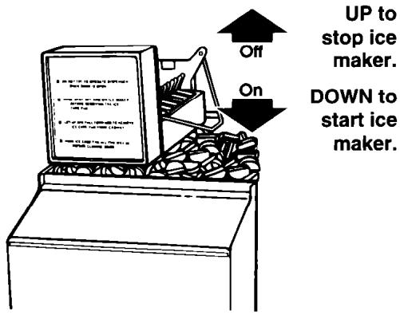

> **AI Description:**
> **Source:** `assets/_page_15_Figure_1.jpg`
> 
> **Generated:** 2026-06-01 16:14:31
> 
> ---
> 
> The image is a diagram illustrating the control panel of an ice maker. It shows a control switch with two positions labeled "Off" and "On." An arrow pointing up indicates that the "Off" position stops the ice maker, while an arrow pointing down indicates that the "On" position starts the ice maker. The diagram also includes a visual representation of ice cubes in a container, suggesting the function of the ice maker.

## Removing the base grille

## To remove the grille:

1. Open both doors.

2. Pull base grille forward to release the support tabs from the metal clips.

3.Do not remove Tech Sheet fastened behind the grille.

## To replace the grille:

1. Line up grille support tabs with metal clips.

2. Push firmly to snap into place.

3. Close the doors.

See cleaning instructions for defrost pan and condenser coils on page 22.

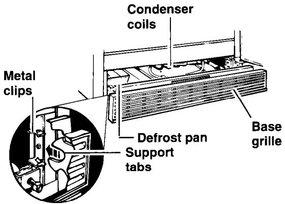

> **AI Description:**
> **Source:** `assets/_page_16_Figure_0.jpg`
> 
> **Generated:** 2026-06-01 16:17:46
> 
> ---
> 
> The image is a technical illustration of a section of a refrigerator or similar appliance. It includes labeled components such as condenser coils, base grille, defrost pan, and support tabs. The illustration also highlights metal clips, indicating their placement and function within the appliance. The diagram is designed to provide a clear view of the internal structure and components for maintenance or repair purposes.

# Using the THIRSTCRUSHER\* dispensing system (on some models)

## The ice dispenser

Ice dispenses from the ice maker storage bin in the freezer. When the dispenser bar is pressed,a trapdoor opens in a chute between the dispenser and the ice bin. Ice moves from the bin and falls through the chute.When the dispenser bar is released, a buzzing sound may be heard for a few seconds as the trapdoor closes. The dispenser system will not operate when the freezer door is open.

For crushed ice,cubes are crushed before being dispensed.This may cause a slight delay when dispensing crushed ice. Noise from the ice crusher is normal,and pieces of ice may vary in size.

When changing from CRUSHED to CUBE, a few ounces of crushed ice will be dispensed along with the first cubes.

## To dispense ice:

1. For cubed ice, move Ice Selector Switch to CUBE position.

For crushed ice (on some models), move Ice Selector Switch to CRUSHED position.

## AWARNING

## Personal Injury Hazard

Tumbling ice and pressure on a fragile glass can break it. Use a sturdy glass when dispensing ice or water.

Failure to do so could result in personal injury or breakage.

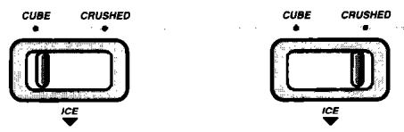

> **AI Description:**
> **Source:** `assets/_page_16_Figure_1.jpg`
> 
> **Generated:** 2026-06-01 16:17:39
> 
> ---
> 
> The image contains two diagrams side by side, each illustrating the concept of ice in two different states: "CUBE" and "CRUSHED". Both diagrams depict a rectangular container with an arrow labeled "ICE" pointing downwards, indicating the direction of ice movement or flow. The diagrams are simple and appear to be used for instructional or educational purposes, likely to demonstrate the difference between ice cubes and crushed ice in a container.

2.Press a sturdy glass against the ice dispenser bar. Hold glass close to dispenser opening so ice does not fall outside of glass.

3. Remove the glass to stop dispensing.

NOTE: The first few batches of ice may have an off-flavor from new plumbing and parts. Throw the ice away. Aiso, large amounts of ice should be taken from the ice bin, not through the dispenser.

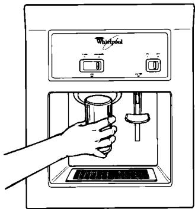

> **AI Description:**
> **Source:** `assets/_page_17_Figure_0.jpg`
> 
> **Generated:** 2026-06-01 16:19:36
> 
> ---
> 
> The image is a technical illustration of a Whirlpool water dispenser. It shows a hand holding a glass under the spout of the dispenser, which is designed to dispense water. The dispenser has a control panel with buttons and a display screen above the spout. The illustration is monochromatic and appears to be a diagram or schematic used for instructional or informational purposes.

## The water dispenser

Chilled water comes from a tank behind the meat drawer. It holds approximately 1.5 L (11/2 quarts).

When you first hook up the refrigerator, press the water dispenser bar with a glass or jar until you have drawn and discarded 1.9 to 2.8 L (2 or 3 quarts). The water you draw and discard wil rinse the tank and pipes.

Allow several hours to chill a new tankful.

NOTE: The small tray beneath the dispenser is designed to evaporate small spills.There is no drain in this tray. Do not pour water into it.

## To dispense water:

1. Press a sturdy glass against the water dispenser bar.

2. Remove the glass to stop dispensing.

NOTE: Dispense enough water every week to maintain a fresh supply.

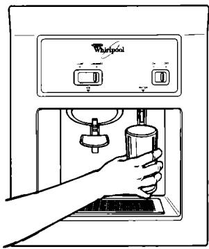

> **AI Description:**
> **Source:** `assets/_page_17_Figure_1.jpg`
> 
> **Generated:** 2026-06-01 16:19:51
> 
> ---
> 
> The image is a technical illustration of a Whirlpool water dispenser. It shows a hand holding a cup under the spout of the dispenser, which is part of a refrigerator unit. The dispenser has a control panel with two buttons labeled "On" and "Off," and a water level indicator. The illustration is monochromatic and appears to be a schematic or instructional diagram.

## The dispenser light

To turn on night light, slide dispenser LIGHT switch to the left. See page 20 for directions for changing the dispenser light bulb.

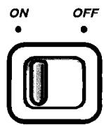

> **AI Description:**
> **Source:** `assets/_page_17_Figure_2.jpg`
> 
> **Generated:** 2026-06-01 16:21:05
> 
> ---
> 
> The image contains a simple diagram of a switch with two positions labeled "ON" and "OFF". The switch is depicted as a rectangular button with a sliding mechanism in the center. The "ON" position is on the left, and the "OFF" position is on the right. The switch is designed to be a toggle switch, commonly used in electrical circuits or other devices to control power.

Solving common ice maker/dispenser problems

## Changing the light bulbs

## AWARNING

## Electrical Shock Hazard

Before removing a light bulb, either unplug the refrigerator or disconnect the electricity leading to the refrigerator at the main power supply.

Failure to do so could result in electrical shock or personal injury.

## To change refrigerator light:

1. Disconnect refrigerator from power supply.

2.Reach behind the Control Console to remove bulb.

3. Replace bulb with a 40-watt appliance bulb.

4.Reconnect refrigerator to power supply.

## To change crisper light (on some models):

1. Disconnect refrigerator from power supply.

2.Pull top of light shield forward until it snaps free.

3. Lower light shield to clear bottom supports.

4. Pull light shield straight out to remove.

5. Replace bulb with a 40-watt appliance bulb.

6. Replace light shield in reverse order.

7. Reconnect refrigerator to power supply.

## To change light below ice bin:

1. Disconnect refrigerator from power supply.

2. Push in sides of light shield until it snaps free.

3. Replace bulb with a 40-watt appliance bulb.

4. Replace light shield.

5. Reconnect refrigerator to power supply.

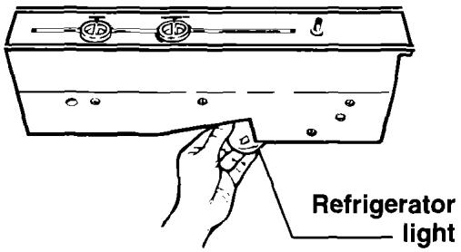

> **AI Description:**
> **Source:** `assets/_page_19_Figure_0.jpg`
> 
> **Generated:** 2026-06-01 16:16:33
> 
> ---
> 
> The image is a technical illustration showing a hand interacting with a refrigerator light. The hand is depicted pressing a button or switch on the top of a rectangular object labeled "Refrigerator light." The illustration appears to be a diagram or schematic, likely used for instructional or maintenance purposes. The design is simple, with minimalistic lines and shapes, focusing on the interaction between the hand and the refrigerator light.

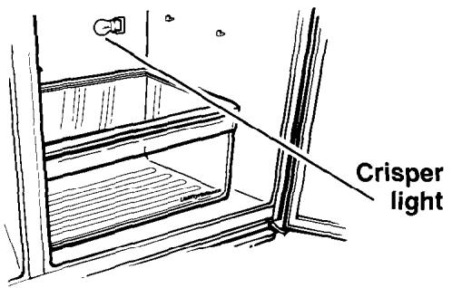

> **AI Description:**
> **Source:** `assets/_page_19_Figure_1.jpg`
> 
> **Generated:** 2026-06-01 16:16:40
> 
> ---
> 
> The image is a technical illustration of a refrigerator crisper drawer. It shows a side view of the crisper drawer with a light source labeled as "Crisper light." The illustration is a simple line drawing with no additional visual elements or charts. The focus is on the crisper drawer and the light it contains, which is likely used to illuminate the contents of the drawer.

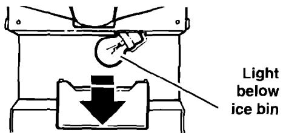

> **AI Description:**
> **Source:** `assets/_page_19_Figure_2.jpg`
> 
> **Generated:** 2026-06-01 16:16:26
> 
> ---
> 
> The image is a technical illustration showing a light bulb located below an ice bin. The light bulb is depicted with a downward arrow pointing towards the ice bin, indicating its position. The text "Light below ice bin" is written to the right of the illustration, providing a clear label for the component being described. The image is likely part of an instructional manual or technical guide, providing visual context for the placement of a light bulb in relation to an ice bin.

## To change dispenser area light (on some models):

1. Disconnect refrigerator from power supply.

2.Reach through.dispenser area to remove bulb.

3. Replace with a heavy-duty 10-watt bulb, which can be purchased from your Whirlpool dealer.

4. Reconnect refrigerator to power supply.

NOTE: Not all appliance bulbs will fit your refrigerator. Be sure to replace a bulb with one of the same size and shape.

Dispenser area light
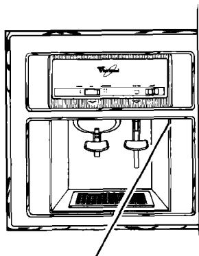

> **AI Description:**
> **Source:** `assets/_page_20_Figure_0.jpg`
> 
> **Generated:** 2026-06-01 16:18:21
> 
> ---
> 
> The image is a technical illustration of a Whirlpool appliance, likely a coffee machine or espresso maker. It shows a cross-sectional view of the machine, highlighting the internal components such as the brewing chamber, the drip tray, and the water reservoir. The diagram is labeled with the Whirlpool logo at the top, indicating the brand. The illustration is monochromatic, with detailed shading to represent different parts of the machine.

# Understanding the sounds you may hear

Your new refrigerator may make sounds that your old one didn't. Because the sounds are new to you,youmightbe concerned about them.Don't be.Most of the new sounds are normal. Hard surfaces like the floor,walls,and cabinets can make the sounds seem louder.

The following describes the kinds of sounds that might be new to you, and what may be making them.

## Slight hum, soft hiss

You may hear the refrigerator's fan motor and moving air.

## Clicking or snapping sounds

The thermostat makes a definite click when the refrigerator stops running. It also makes a sound when the refrigerator starts. The defrost timer will click when the defrost cycle starts.

## Saving energy

You can help your refrigerator use less electricity.

· Check door gaskets for a tight seal. Level the cabinet to be sure of a good seal.

·Clean the condenser coils regularly.

· Open the door as few times as possible. Think about what you need before you open the door. Get everything out at one time.Keep food organized so you won't have to search for what you want. Close door as soon as food is removed.

## Water sounds

When the refrigerator stops running,you may hear gurgling in the tubing for a few minutes after it stops.You may also hear defrost water running into the defrost water pan.

## Ice maker sounds

· trickling water

· thud (clatter of ice)

You may hear buzzing (from the water valve), trickling water,and the clatter of ice dumped into the bin.

## Running sounds

Your refrigerator has a high-efficiency compressor and motor. It will run longer than older designs. It may even seem to run most of the time.

· Go ahead and fill up the refrigerator, but don't overcrowd it so air movement is blocked.

· It is a waste of electricity to set the refrigeratorand freezer to temperatures colder than they need to be. If ice cream is firm in the freezer and drinks are as cold as your family likes them, that's cold enough.

· Make sure your refrigerator is not next to a heat source such as a range,water heater,furnace,radiator,or in direct sunlight.

# Caring for Your Refrigerator

Your refrigerator is built to give you many years of dependable service. However, there are a few things you can do to help extend its product life. This section tells you how to clean your refrigerator and what to do when going on holiday,moving, or during a power outage.

## Cleaning your refrigerator

Both the refrigeratorand freezer sections defrost automatically. However, clean both about once a month to prevent odors from building up.Wipe up spills right away.

To clean your refrigerator, unplug it, take out all removable parts,and clean the refrigerator according to the following directions.

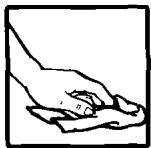

> **AI Description:**
> **Source:** `assets/_page_21_Figure_0.jpg`
> 
> **Generated:** 2026-06-01 16:20:50
> 
> ---
> 
> The image contains a simple diagram of a hand holding a small object, possibly a coin or a small piece of paper. The hand is positioned in a way that suggests it is either picking up or placing the object. The image is a basic illustration and does not contain any text or additional visual elements.

## AWARNING

## Personal Injury Hazard

Refrigeration system tubes are near the defrost pan and can become hot. Remove and install defrost pan carefully. Failure to do so could result in personal injury.

continued on next page

## Holiday and moving care

## Short holidays

No need to shut off the refrigerator if you wil be away for less than four weeks.

1. Use up any perishables.

2. Freeze other items.

3.Raise ice maker signal arm to OFF (up) position.

4. Shut off water supply to ice maker.

5. Empty the ice bin.

## Long holidays

If you will be gone a month or more:

1. Remove all food from the refrigerator.

2. Turn off the water supply to the ice maker at least one day ahead of time.

3.When the last load of ice drops, turn off the ice maker. Make sure all ice is dispensed out of the ice maker mechanism.

4. Unplug the refrigerator.

5. Clean it, rinse well,and dry.

6.Tape rubber or wood blocks to the tops of both doors to prop them open far enough for air to get in. This stops odor and mold from building up.

## AWARNING

## Personal Injury Hazard

Do not allow children to climb on,play near,or climb inside the refrigerator when the doors are blocked open.

They may become injured or trapped.

To restart refrigerator, see “Using Your Refrigerator' on page 8.

## Power interruptions

If electricity goes off, call the power company. Ask how long power will be off.

1. If service will be interrupted 24 hours or less,keep both doors closed. This helps foods stay frozen.

2. If service will be interrupted longer than 24 hours:

(a) Remove all frozen food and store in a frozen food locker.

## OR

(b) Place 32 grams of dry ice in freezer for every liter (2 Ibs. for every cubic foot) of freezer space.This will keep food frozen for 2 to 4 days.Wear gloves to protect your hands from dry ice burns.

## Moving

When you are moving the refrigerator to a new home:

1.Turn off the water supply to the ice maker at least one day ahead of time.

2. Disconnect the water line.

3. After the last load of ice drops,lift the signal arm to the OFF (up) position.

4.Remove all food from the refrigerator.

5. Pack all frozen food in dry ice.

6. Unplug the refrigerator.

7. Clean it thoroughly. Rinse well and dry.

8.Take out ali removable parts,wrap them well,and tape them together so they don't shift and rattle.

9. Screw in the leveling rollers.

10. Tape the doors shut and tape the power supply cord to the cabinet.

When you get to your new home,put everything back and refer to page 6. Also,remember to reconnect the water supply line.

## OR

(c) If neither a food locker or dry ice is available,use or can perishable food at once.

3.A full freezer stays cold longer than a partly filled one.A freezer full of meat stays cold longer than a freezer full of baked goods. If food contains ice crystals, it may be safely refrozen,although the quality and flavor may be affected. If the condition of the food is poor, or if you feel it is unsafe,dispose of it.

# Food Storage Guide

There is a correct way to package and store refrigerated or frozen food. To keep food fresher, longer,take the time to study these recommended steps.

## Storing fresh food

Wrap or store food in the refrigerator in air-tight and moisture-proof material. This prevents food odor and taste transfer throughout the refrigerator. For dated products,check code date to ensure freshness.

## Leafy vegetables

Remove store wrapping and trim or tear off bruised and discolored areas.Wash in cold water and drain. Place in plastic bag or plastic container and store in crisper.

## Vegetables with skins (carrots, peppers)

Store in crisper,plastic bags,or plastic container.

## Fruit

Wash, let dry,and store in refrigerator in plastic bags or crisper. Do not wash or hull berries until they are ready to use. Sort and keep berries in their original container in a crisper,or store ina loosely closed paper bag on a refrigerator shelf.

## Eggs

Store without washing in the original carton on interior shelf.

## Milk

Wipe milk cartons.For best storage, place milk on interior shelf.

## Butter or margarine

Keep opened butter in covered dish or closed compartment.When storing an extra supply,wrap in freezer packaging and freeze.

## Cheese

Store in the original wrapping until you are ready to use it. Once opened,rewrap tightly in plastic wrap or aluminum foil.

## Leftovers

Cover leftovers with plastic wrap or aluminum foil. Plastic containers with tight lids can also be used.

## Meat

Store most meat in original wrapping as long as it is airtight and moisture-proof. Rewrap if necessary. See the following chart for storage times.

† When storing meat longer than the times given,follow the directions for freezing.
NOTE:Use fresh fish and shellfish the same day as purchased.

## Storing frozen food

The freezer section is designed for storage of commercially frozen food and for freezing food at home.

NOTE:For further information about preparing food for freezing or food storage times, check a freezer guide or reliable cookbook.

## Packaging

The secret of successful freezing is in the packaging. The way you close and seal the package must not allow air or moisture in or out. Packaging done in any other way could cause food odor and taste transfer throughout the refrigerator and drying of frozen food.

## Packaging recommended for use:

· Rigid plastic containers with tight-fitting lids

· Straight-sided canning/freezing jars

· Heavy-duty aluminum foil

·Plastic-coated paper

· Non-permeable plastic wraps (made from a saran film)

Follow package or container instructions for proper freezing methods.

## Do not use:

· Bread wrappers

· Non-polyethylene plastic containers

· Containers without tight lids

·Wax paper

· Wax-coated freezer wrap

· Thin, semi-permeable wrap

The use of these wrappings could cause food odor,taste transfer,and drying of frozen food.

## Freezing

Do not expect your freezer to quick-freeze any large quantity of food. Put no more unfrozen food into the freezer than will freeze within 24 hours (no more than 32 to 48 grams of food per liter [2 to 3 Ibs. per cubic foot] of freezer space). Leave enough space for air to circulate around packages. Be careful to leave enough room at the front so the door can close tightly.

Storage times will vary according to the quality of the food, the type of packaging or wrap used (airtight and moisture-proof),and the storage temperature,which should be -17.8C (0°F).

## Removing the Doors

## Please read these helpful hints before you start

·Before you start, either unplug the refrigerator or disconnect the electricity leading to it at the main power supply and remove any food from door shelves.

·When removing hinges, keep doors closed until ready to lift free from cabinet.

·To remove doors, start at the top hinge and work down.

· To replace doors, start at the bottom hinge and work up.

· Line up doors so they are centered between the sides of the cabinet and are parallel with each other.

·If refrigerator light does not go out when door is closed, the door may be too low. Use a thicker spacer if necessary.

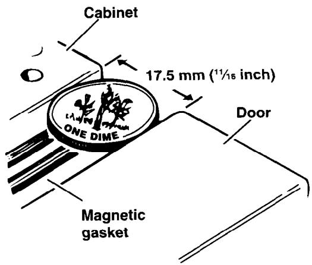

> **AI Description:**
> **Source:** `assets/_page_26_Figure_0.jpg`
> 
> **Generated:** 2026-06-01 16:20:59
> 
> ---
> 
> The image is a technical illustration of a cabinet door assembly. It includes a diagram showing the placement of a magnetic gasket on the edge of a cabinet door. The gasket is labeled with a size of 17.5 mm (11/16 inch). The diagram highlights the cabinet, the door, and the magnetic gasket, with arrows pointing to each component for clarity. The illustration is likely used for instructional or technical purposes, such as assembly or repair of a cabinet.

· Door seal may be adjusted by removing the top hinge and adding or removing shims to the bottom hinge.

· Set the door gap at 17.5 mm (1/16 inch).   
The diameter of a dime is about right. See figure.

·The refrigerator must be level and sitting on a solid floor.

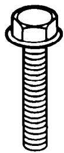

> **AI Description:**
> **Source:** `assets/_page_26_Figure_1.jpg`
> 
> **Generated:** 2026-06-01 16:20:14
> 
> ---
> 
> The image is a technical illustration of a bolt with a hexagonal head and a threaded shaft. The bolt appears to be a standard fastener, commonly used in construction and mechanical applications. The illustration is simple, with clean lines and no additional annotations or labels. The focus is on the shape and structure of the bolt, highlighting its key features such as the head and the thread pattern.

8 mm (5/16") hex-head hinge screw

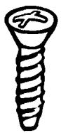

> **AI Description:**
> **Source:** `assets/_page_26_Figure_2.jpg`
> 
> **Generated:** 2026-06-01 16:19:40
> 
> ---
> 
> The image is a technical illustration of a screw. It shows a close-up view of a single screw with a spiral thread and a flat head. The screw appears to be a standard type, commonly used in construction and manufacturing. The illustration is simple, focusing solely on the screw's design and structure without any additional context or labels.

Countersink handle screw

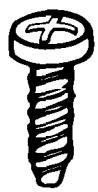

> **AI Description:**
> **Source:** `assets/_page_26_Figure_3.jpg`
> 
> **Generated:** 2026-06-01 16:19:44
> 
> ---
> 
> The image contains a simple line drawing of a screw. The screw has a flat head with a cross-shaped indentation and a threaded shaft. The drawing is a basic representation, likely used for illustrative or instructional purposes.

Oval sealing screw (use on bottoms of doors)

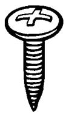

> **AI Description:**
> **Source:** `assets/_page_26_Figure_4.jpg`
> 
> **Generated:** 2026-06-01 16:17:32
> 
> ---
> 
> The image is a simple technical illustration of a screw. It features a cross-shaped head and a pointed tip, with a helical thread running along its length. The illustration is monochromatic and appears to be a standard representation of a common fastening tool used in construction and woodworking.

Handle screw

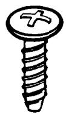

> **AI Description:**
> **Source:** `assets/_page_26_Figure_5.jpg`
> 
> **Generated:** 2026-06-01 16:17:51
> 
> ---
> 
> The image is a technical illustration of a screw. It shows a close-up view of a single screw with a Phillips head and a threaded shaft. The screw appears to be made of metal, and the image is a black and white line drawing. The screw is depicted in a side view, highlighting its shape and structure.

Oval sealing screw (use on tops of doors)

# Removing the doors without damaging. water line and electrical wiring in the door hinges

## Things you need to know:

Two persons are needed to remove and replace the doors.

Read all directions carefully before you begin.

Tools required:

·Open-end or hex-head socket wrenches (6.5 cm [/4"] and8 mm [5/16"])

·2 adjustable wrenches (or 13 mm [12"]and 11 mm [/16"] open-end wrenches)

· Phillips screwdriver

· Knife

Remove all door shelves and compartments before removing the doors.

1.Open the doors and remove the base grille at the bottom of the refrigerator. Disconnectthe union in the water line hose by removing the nut atthe left.Pulithe tube out of the clamp.Remove the rubber“O"rings and nut from the freezer door water line and remove the protective spring. (See figure 1.)

WATER TUBING BEHIND BASE GRILLE

> **AI Description:**
> **Source:** `assets/_page_27_Figure_0.jpg`
> 
> **Generated:** 2026-06-01 16:18:14
> 
> ---
> 
> The image is a technical illustration labeled "FIGURE 1". It shows a water line with a union and a nut. The illustration highlights the location of the nut that needs to be removed. The key components are labeled: "Water line", "Remove this nut", and "Union". The diagram is used to guide the viewer on how to access the union by removing the specified nut.

2.Remove the screw that holds the upper freezer hinge cover. Disconnect the electrical plug.(See figure 2.)
FREEZER DOOR TOP HINGE

> **AI Description:**
> **Source:** `assets/_page_27_Figure_1.jpg`
> 
> **Generated:** 2026-06-01 16:18:46
> 
> ---
> 
> The image is a technical diagram labeled "FIGURE 2," which appears to illustrate the components and assembly of a mechanical or electrical device. The diagram includes labels for various parts such as the "Hinge cover," "Disconnect electrical plug," "Top hinge," "Hex-head screws," and "Shim." The diagram is likely used for instructional or maintenance purposes, showing how to disassemble or repair the device by identifying and locating specific parts. The visual elements are clear and labeled, making it a useful technical illustration.

3.Remove the three screws that hold the top hinge.Open the freezerdoorand lift itup off lower hinge.Be careful not to damage the water line.

4.Carefully set the freezer door to one side.Be careful not to kink the water line hose.

5．Now，remove the refrigerator door.Pryoff the hinge cover,starting at the back of it. Hold the door while youremove the three screws that hold the top hinge and shim. Save the nylon spacer. Lift the door up off the bottom hinge and carefully set it aside.

NOTE:On some models,the top hinge is permanently attached to the inside of the door and must not be removed.

## To reinstall the doors:

1.With the freezer door held upright next to its hinge,feed the water line carefully through the hinge hole.Lower the door onto the bottom hinge while pulling the remaining water line through the bottom. Close the door.

2．While the freezer door is still held in place,reinsertthe three screws to reattach the top hinge to the cabinet. Reconnect the electrical wires at the top.(See figure 3.)

3.Reconnect the water line.Replace the protective spring,nut, and "O"rings.Tighten the union. (Must be water tight.)

4．Reattach the refrigerator door.Lift refrigerator door onto bottom hinge pin.While holding the door in the closed position，reinstall the top hinge.

FREEZER DOOR ELECTRICAL PLUG

> **AI Description:**
> **Source:** `assets/_page_27_Figure_2.jpg`
> 
> **Generated:** 2026-06-01 16:18:07
> 
> ---
> 
> The image is a technical illustration, specifically a diagram labeled as "Figure 3." It shows a mechanical or electrical component with various parts labeled. The diagram includes a label pointing to a part of the component that says "Reconnect electrical plug," indicating a step in a process or maintenance procedure. The diagram appears to be part of an instructional guide or manual, providing visual instructions for reattaching an electrical plug to a device or system.

5．Align the doors and adjust the door seal. Loosen the top hinge screws and line up the doors so theyare parallel with the sides of the cabinet and with each other.

To adjust the door seal, move the top hinges slightly and add shims to the bottom hinge as required.Make sure the water line and electrical wire are not interfered with.

6．Check the alignment by plugging in therefrigerator to make sure the lights go out as the doors close.

When the doors are aligned properly,retighten all hinge screws securely and replace the hinge covers. (Replace the screw on the freezer hinge cover.） Reattach the door shelves and compartments.

Do not replace the base grille until the water line is hooked up.Check the union for leakage when water is flushed through the cold water tank. Tighten the connection if needed.

## Troubleshooting

Listed in this chart are the most common problems consumers run into with their appliances. Please read through this and see if it can solve your problem.It could save you the cost of a service call.

## Requesting Service

## 1. If the problem is not due to one of the items listed in Troubleshooting...

Contact the dealer from whom you purchased the unit or an authorized Whirlpool\* service company.

## tWhen asking for help or service:

Please provide a detailed description of the problem, your appliance's complete model and serial numbers,and the purchase date. (See page 2.) This information will help us respond properly to your request.

## 2. If you need FSP\* replacement partst ...

FSP is a registered trademark of Whirlpool Corporation for quality parts. Look for this symbol of quality whenever you need a replacement part for your Whirlpool appliance.FSP replacement parts will fit right and work right because they are made to the same exacting specifications used to build every new Whirlpool appliance.

To locate FSP replacement parts in your area, contact the dealer from whom you purchased the unit or an authorized Whirlpool service company.

# WHIRLPOOL Refrigerator Warranty

WHIRLPOOL CORPORATION SHALL NOT BE LIABLE FOR INCIDENTAL OR CONSE-QUENTIAL DAMAGES.

Outside the United States, a different warranty may apply. For details, please contact your authorized Whirlpool distributor or military exchange.

> **AI Description:**
> **Source:** `assets/_page_31_Figure_0.jpg`
> 
> **Generated:** 2026-06-01 16:14:42
> 
> ---
> 
> The image contains a circular icon with three interlocking arrows forming a triangular shape. This is the universally recognized symbol for recycling, indicating that the material or product represented can be recycled.

Printed on recycled paper-10% Post-consumer waste/ 50% Recovered materials