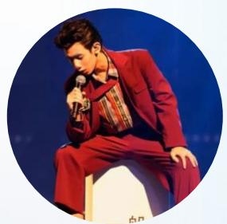
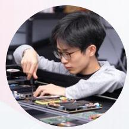
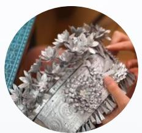
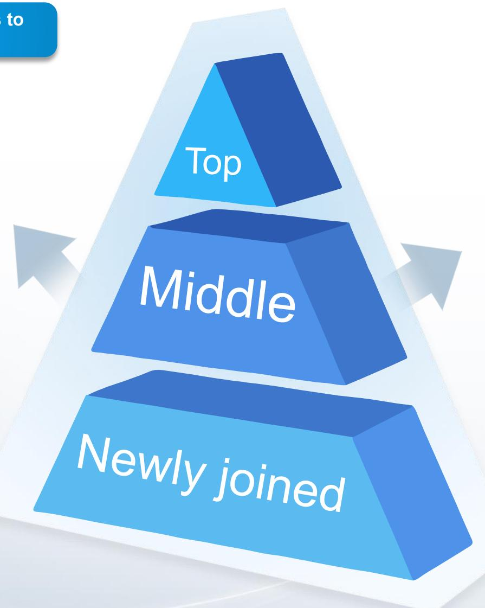
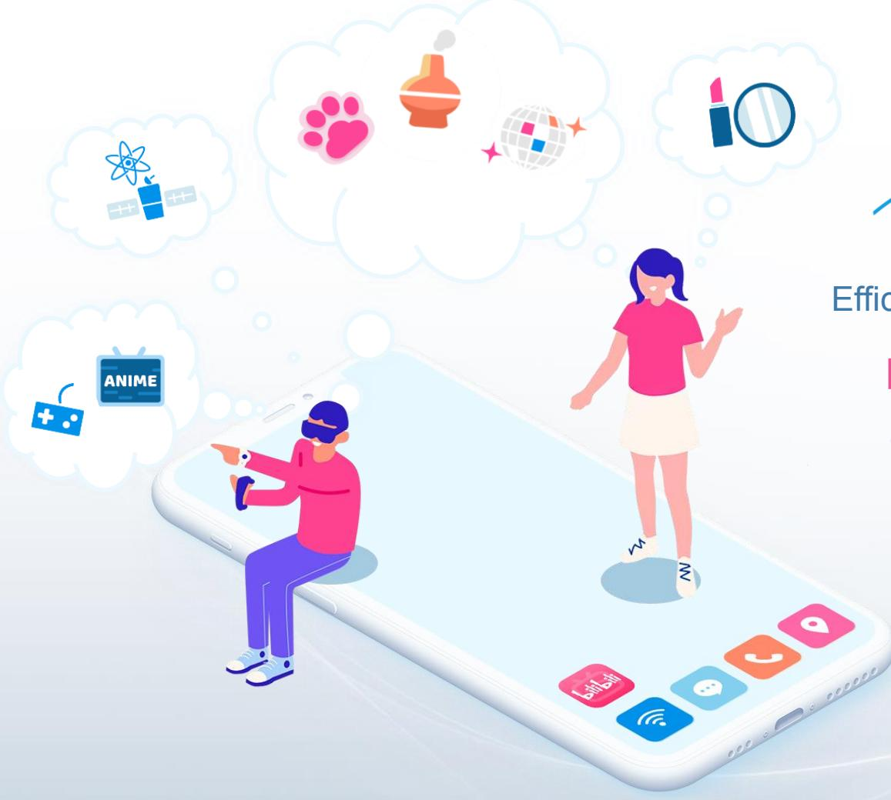
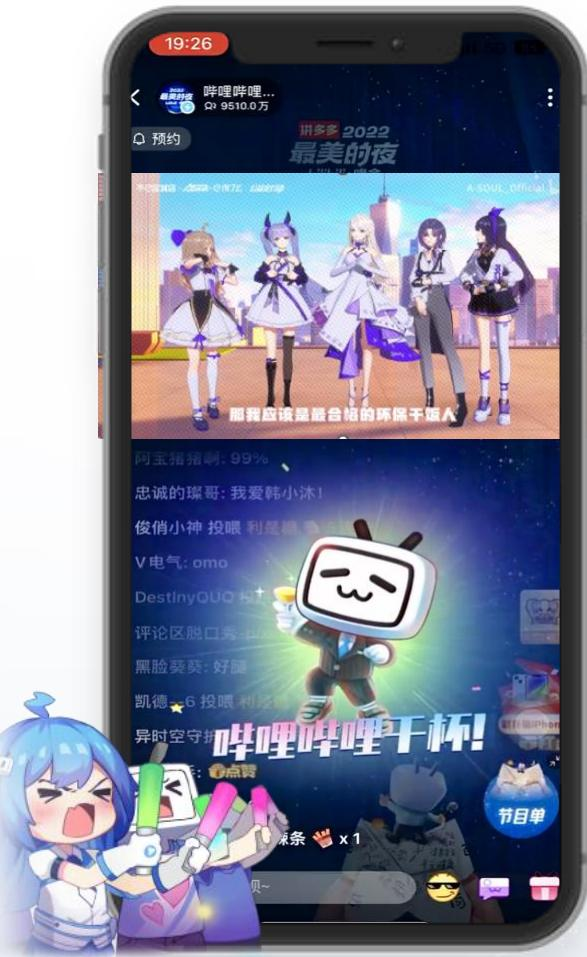
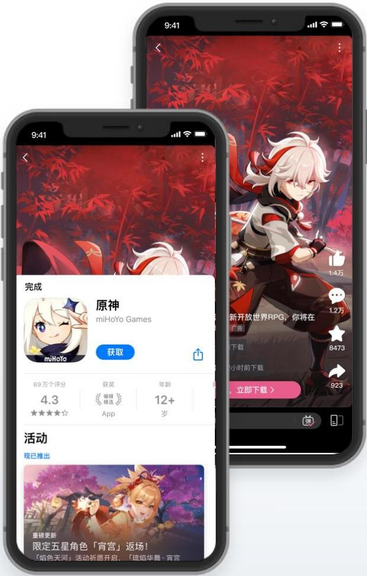
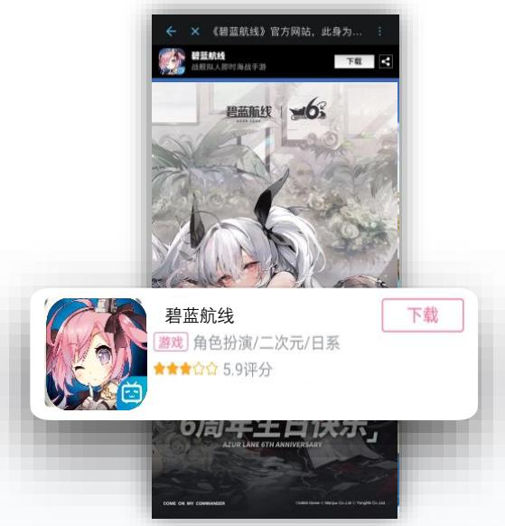

> **AI Description:**
> **Source:** `assets/_page_0_Figure_0.jpg`
> 
> **Generated:** 2026-06-01 16:35:53
> 
> ---
> 
> The image contains a cartoon-style character wearing a formal suit and tie. The character has a square head with a simple face, including eyes and a mouth. The character is waving with one hand and has a confident posture. The background is a solid blue color, which helps the character stand out. The character's attire and pose suggest a professional or formal context.

## Investor Presentation

June 2023

## Safe Harbor Statement

Thisannouncementcontainsforward-lokingstatements.Thesestatementsaremadeunderthe“safeharborprovisionsoftheUS.Private SecuritiesLitigationReformActof1995.Theseforard-lookingstatementscanbeidentifiedbyterminologysuchas“wil”“expects” anticipate”"i”fuu””“s"“bels”sis”i”“te”“iie otherthingsutkndotatiosfromanagementinthisanouncementasellasilsstrategicadoperatioalplaotan forward-lokingstatementslibliaysoakewitoafoadingstatementsitspoiceportsteUScuritad ExchangeComioisteaeptredesoetssubaidbi ofTheStockExchangeofHongKongLimited(te“HngKongStockExchange)，inpressreleasesandotherwritenmateralsndinoral statementsadebitsficeietosormploystothirdparttatementsthatenttorcafactsncuinguttidt statementsaboutliblsbeliefsandexpectatiosarefoadkingstatements.Foardingstatementsinvoeinerentrissand uncertainties.Aumbofctosldeatalrultstifraterllfotoecotandayadigstatetcding butotliitedlls financialconditoandulsfoeraios;liblsbitteaiandireetmbrofuss,mbsddvertisinste, providequaityontetpductsandcendexpnditsproductadsferis;ompetiointiteradstr; Biilisitsdsslilias PRCgoveetapdatittiterntustreacooicdsdisol inChinaandassumptiosunderlingorrelatedtoanyoftheforegong.Furtherinformatioegardingteseandothissisincludedinth Company'sfingswiththe Securitiesand ExchangeCommissionandthe Hong Kong Stock Exchange.Al informationprovided inthis presentatioisoftedateoftepresentationdthCompanyundertakesndutytpdatesuchiforationexceptasqiduder applicable law.

## Enrich the everyday life of young generations in China

94mn

315mn

30%

29mn

96mins

DAUs (1) (2)

MAUs (1) (2)

DAU/MAU (1) (2)

MPUs (1) (3)

Avg. daily time spent (1)(4)

(2) Star gsmartTV and other smart devices) at have launched our mobileapps during a given period.Active users on the PCends referto thesum ofvalid logged-ir visit comandengageinPCapplicationduringa given beriod，aftereliminatingd

(3) Starting fromt

(4) Avg. daily o period, further dividedby the numberof

### Full Page Description (Page 3)

**Source:** `assets/_page_3_Asset_0.jpg`

**Generated:** 2026-06-01 16:44:54

---

The image contains two bar charts with the following key information:

1. The first chart shows the Daily Active Users (DAUs) in millions (mn) over time, from 21Q1 to 23Q1. The data shows a consistent year-over-year (YOY) growth of 18%, with DAUs increasing from 60 million in 21Q1 to 94 million in 23Q1.

2. The second chart displays the DAU/MAU (Daily Active Users per Monthly Active Users) ratio over the same period. The ratio shows a slight upward trend, starting at 26.9% in 21Q1 and reaching 29.7% in 23Q1.

The main trend is the consistent year-over-year growth in DAUs, with a minor increase in the DAU/MAU ratio over the years.

## bilibili

## Rapid Growth of DAUs and User Engagement

### Full Page Description (Page 4)

**Source:** `assets/_page_4_Asset_0.jpg`

**Generated:** 2026-06-01 16:39:09

---

The image contains two bar charts, one for Gross Profit and one for Net Loss, both presented in RMB units. The Gross Profit chart shows a significant increase from 807 million RMB in 22Q1 to 1,104 million RMB in 23Q1, with a growth rate of +37%. The Net Loss chart indicates a substantial improvement from a loss of 2.3 billion RMB in 22Q1 to a profit of 0.6 billion RMB in 23Q1, with a reduction of -72% in the net loss. The charts also include percentage changes and profit margins for each quarter.

## bilibili

## Improving Margins and Narrowing Losses

### Full Page Description (Page 5)

**Source:** `assets/_page_5_Asset_1.jpg`

**Generated:** 2026-06-01 16:47:10

---

The image contains two bar charts. The first chart shows data in millions (mn) for the years 2022 and 2025E, with a 19% increase from 995 million to 1,180 million. The second chart displays the number of hours per day for the same years, with a 23% increase from 2.9 hours to 3.6 hours. Both charts use blue bars to represent the data, and the years are labeled at the base of each bar. The text annotations indicate the percentage increase from 2022 to 2025E.

### Full Page Description (Page 5)

**Source:** `assets/_page_5_Asset_0.jpg`

**Generated:** 2026-06-01 16:46:48

---

The image contains a bar chart with two bars representing the year 2022 and the projected year 2025E. The chart is labeled with RMB billion (RMB bn) at the top. The bars are blue and show an increase from 1,152 in 2022 to 1,877 in 2025E, indicating a 1.6x growth. The chart is accompanied by three blue text boxes labeled "Infrastructure," "Supply," and "Demand," each with a plus sign and a brief description. The "Infrastructure" box mentions 5G and video production tools, the "Supply" box mentions more diversified content and video content creators, and the "Demand" box mentions rising demand and spending power for video-based content.

## Golden Opportunity From Videolization

Video becomes fundamental to information,entertainment and communication

Massive Video-Based Industry(1)

## Our Unparalleled Leadership in Gen Z+

## The golden cohort and future of the video-based industry

Our Core User Base

450+ mn

Gen Z+ population

Gen Z+ contribution to China's video-based industry revenue(1)

More time spent & more value

73%

+83 mins

More time spent(2)

+99%

Higher per capita value(3)

## Multi-Categories for Diverse Content Interests

> **AI Description:**
> **Source:** `assets/_page_8_Figure_1.jpg`
> 
> **Generated:** 2026-06-01 16:43:35
> 
> ---
> 
> The image contains a photograph of a person wearing a virtual reality headset and holding a controller. The background appears to be a wall with red and white geometric shapes, possibly part of an interactive VR environment. The person is actively engaged with the VR experience, suggesting the image is related to virtual reality technology or a VR demonstration.

Games

Anime

> **AI Description:**
> **Source:** `assets/_page_8_Figure_3.jpg`
> 
> **Generated:** 2026-06-01 16:45:02
> 
> ---
> 
> The image is a photograph of two skydivers in freefall, with a clear view of the Palm Jumeirah island in Dubai in the background. The skydivers are wearing helmets and jumpsuits, and they are positioned upside down, with their legs extended and arms outstretched. The image captures the thrill and excitement of skydiving, with the iconic palm-shaped island providing a stunning backdrop.

Lifestyle

> **AI Description:**
> **Source:** `assets/_page_8_Figure_4.jpg`
> 
> **Generated:** 2026-06-01 16:43:09
> 
> ---
> 
> The image is a photograph of an elderly person standing in front of a large piece of machinery, likely related to maritime or industrial equipment. The individual is wearing a blue and red jacket with some text on it, which appears to be in Chinese characters. The background shows part of the machinery, which includes blue and red components and what looks like a large pipe or hose. The overall setting suggests a work environment, possibly related to shipbuilding, maintenance, or maritime operations.

> **AI Description:**
> **Source:** `assets/_page_8_Figure_5.jpg`
> 
> **Generated:** 2026-06-01 16:43:02
> 
> ---
> 
> The image is a photograph of a person performing on stage. The individual is wearing a red suit and holding a microphone, suggesting they are a performer or entertainer. The background appears to be a stage setting with a blue hue, indicating a live performance environment. The person is seated on a white stool, which is a common stage prop used for performances.

All the Videos You Like
Knowledge
Entertainment

> **AI Description:**
> **Source:** `assets/_page_8_Figure_6.jpg`
> 
> **Generated:** 2026-06-01 16:41:02
> 
> ---
> 
> The image is a photograph of a person playing a violin in an outdoor setting. The individual is wearing a white outfit and is positioned in a field of tall grass, with a blurred background that suggests a natural, possibly rural environment. The person appears to be focused on playing the violin, which is held in a traditional manner with both hands. The overall mood of the image is serene and artistic.

Music

> **AI Description:**
> **Source:** `assets/_page_8_Figure_8.jpg`
> 
> **Generated:** 2026-06-01 16:39:21
> 
> ---
> 
> The image is a photograph showing two people standing on the roof of a black van parked on a beach. The van appears to be a camper van, equipped with various items such as coolers and storage containers. The background features a stunning view of a large body of water, likely a lake or sea, with a snow-capped mountain in the distance. The sky is clear and blue, suggesting a sunny day. The people on the van roof are raising their arms, possibly in a gesture of excitement or celebration.

> **AI Description:**
> **Source:** `assets/_page_8_Figure_9.jpg`
> 
> **Generated:** 2026-06-01 16:39:14
> 
> ---
> 
> The image contains a simple circular design with a pink fill and a darker pink outline. The circle appears to be a placeholder or a button, possibly indicating a loading state or a focus point in a user interface. There are no labels, text, or additional elements present in the image.

> **AI Description:**
> **Source:** `assets/_page_8_Figure_10.jpg`
> 
> **Generated:** 2026-06-01 16:45:54
> 
> ---
> 
> The image is a photograph of a person performing a lunge exercise. The individual is shirtless, wearing shorts and athletic shoes, and is in a lunge position with one knee bent and the other leg extended behind. The background appears to be an indoor setting, possibly a gym or home workout area. The person is also wearing a wristwatch on their left wrist.

Automobile
Fitness

> **AI Description:**
> **Source:** `assets/_page_8_Figure_11.jpg`
> 
> **Generated:** 2026-06-01 16:45:45
> 
> ---
> 
> The image is a photograph of a cat wearing a red scarf. The cat appears to be sitting or lying down, and the background is slightly blurred with what looks like festive lights, suggesting a holiday or celebratory setting. The cat's expression is neutral, and it is the central focus of the image.

> **AI Description:**
> **Source:** `assets/_page_8_Figure_12.jpg`
> 
> **Generated:** 2026-06-01 16:45:20
> 
> ---
> 
> The image is a photograph of a food dish, likely a type of Japanese hot pot or sukiyaki. It features skewers with various ingredients such as tofu, shrimp, and vegetables, placed in a pot with a broth. The ingredients are arranged in a visually appealing manner, showcasing the variety of components typically found in such dishes. The focus is on the food itself, with no additional text or annotations present.

Pets

Food

> **AI Description:**
> **Source:** `assets/_page_8_Figure_14.jpg`
> 
> **Generated:** 2026-06-01 16:46:21
> 
> ---
> 
> The image is a photograph of a person working on a computer or electronic device. The individual is wearing glasses and a light-colored long-sleeve shirt. The person appears to be focused on assembling or repairing a circuit board or electronic components. The background is slightly blurred, emphasizing the person and the task at hand. The image conveys a sense of technical work or hobbyist activity related to electronics or computer hardware.

Tech

> **AI Description:**
> **Source:** `assets/_page_8_Figure_15.jpg`
> 
> **Generated:** 2026-06-01 16:47:15
> 
> ---
> 
> The image shows a close-up of a hand holding a decorative, intricately designed object. The object appears to be a piece of jewelry or a decorative accessory, possibly a tiara or crown, adorned with floral and leaf-like patterns in shades of silver or metallic gray. The background is blurred, focusing attention on the detailed craftsmanship of the object.

> **AI Description:**
> **Source:** `assets/_page_8_Figure_18.jpg`
> 
> **Generated:** 2026-06-01 16:32:11
> 
> ---
> 
> The image contains a photograph of a person dressed in traditional Chinese attire, possibly representing a historical or cultural figure. The individual is wearing a red robe with intricate patterns and a headdress adorned with decorative elements. The background features a circular design with red and gold hues, complementing the overall traditional aesthetic. The person is holding a fan, which is a common accessory in traditional Chinese portraits.

Traditional Chinese Art
Handicraft

> **AI Description:**
> **Source:** `assets/_page_8_Figure_19.jpg`
> 
> **Generated:** 2026-06-01 16:32:24
> 
> ---
> 
> The image contains a photograph of a dog. The dog appears to be a medium-sized breed with a light brown coat and a fluffy tail. It is sitting and looking slightly to the side. The background is plain white, which makes the dog the focal point of the image. There are no text annotations or other visual elements present in the image.

Autotune Remix

### Full Page Description (Page 9)

**Source:** `assets/_page_9_Asset_0.jpg`

**Generated:** 2026-06-01 16:45:13

---

The image contains a simple bar chart with two blue bars. The left bar is labeled "22Q1" and the right bar is labeled "23Q1". An upward arrow with the label "19%" connects the two bars, indicating a 19% increase from 22Q1 to 23Q1. The chart visually represents a growth or improvement in the data between the two quarters.

### Full Page Description (Page 9)

**Source:** `assets/_page_9_Asset_1.jpg`

**Generated:** 2026-06-01 16:45:40

---

The image contains a stacked bar chart comparing data from two quarters, 22Q1 and 23Q1. The chart uses two colors to represent different categories: Story Mode (blue) and PUGV and OGV (pink). The chart shows a significant increase in the pink portion of the bars, indicating a higher proportion of PUGV and OGV in 23Q1 compared to 22Q1. The blue portion, representing Story Mode, shows a smaller increase. The chart also includes a label indicating a 37% increase in the overall height of the bars from 22Q1 to 23Q1.

## Multi-Scenarios for Different Viewing Preferences

Total time spent(1)

for fragmented time is quickly gaining popularity & contributing incremental traffic

On-the-go

Interactive

## Story Mode

> **AI Description:**
> **Source:** `assets/_page_9_Figure_0.jpg`
> 
> **Generated:** 2026-06-01 16:41:40
> 
> ---
> 
> The image is a simple illustration featuring a hand holding a smartphone. The phone screen displays a small figure, possibly a person, with a heart symbol, a thumbs-up icon, and a coin symbol floating around it. The icons suggest themes of social interaction, approval, and financial transactions, likely representing user engagement, likes, and monetization in a digital context.

> **AI Description:**
> **Source:** `assets/_page_9_Figure_1.jpg`
> 
> **Generated:** 2026-06-01 16:40:56
> 
> ---
> 
> The image is a simple illustration featuring a person playing an electric guitar. The individual is wearing pink headphones and appears to be in a recording studio setting, as indicated by the microphone in the background. There are lightning bolts around the person, suggesting a strong or intense sound or energy. The person is wearing a yellow top and has a tattoo on their arm. The overall style is cartoonish and vibrant.

Living rooms

> **AI Description:**
> **Source:** `assets/_page_9_Figure_2.jpg`
> 
> **Generated:** 2026-06-01 16:41:47
> 
> ---
> 
> The image contains a simple illustration of a person sitting on the floor with a cat, watching a screen. The screen displays various icons, including a heart, a play button, and a smiling face with a tongue sticking out. The illustration is colorful and cartoonish, with a light background. The scene suggests a relaxed and playful atmosphere, possibly related to a video streaming or social media context.

Average daily video views

### Full Page Description (Page 10)

**Source:** `assets/_page_10_Asset_0.jpg`

**Generated:** 2026-06-01 16:36:04

---

The image contains a visual representation of a comparison between two quarters, 22Q1 and 23Q1. It is a bar chart with two blue bars, each labeled with a value. The bar for 22Q1 is labeled "12.6," and the bar for 23Q1 is labeled "22.5." An arrow with the text "79%" indicates a significant increase from the value in 22Q1 to the value in 23Q1. The chart visually demonstrates a substantial growth in the measured quantity or metric from the first quarter of 2022 to the first quarter of 2023.

### Full Page Description (Page 10)

**Source:** `assets/_page_10_Asset_2.jpg`

**Generated:** 2026-06-01 16:32:31

---

The image contains a simple infographic with a blue cube and accompanying text. The cube represents a visual element, likely symbolizing a quantity or value. The text "48%" is positioned to the left of the cube, indicating a percentage. Below the cube, the date "March 31, 2023" is displayed, suggesting a time reference for the data. The overall design is minimalistic, focusing on conveying a specific data point in a clear and straightforward manner.

## Ever-Growing Supply of Creative PUG Videos

Talented Content Creators

Number of daily average active content creators

Create

Encourage
95% (1)
High-Quality Content Creation Number of monthly video submissions (mn)

## Robust Mechanism Attracts and Supports Content Creators

Improved infrastructure and products to support continuous creation

Multiple avenues to realize commercial value

> **AI Description:**
> **Source:** `assets/_page_11_Figure_0.jpg`
> 
> **Generated:** 2026-06-01 16:45:26
> 
> ---
> 
> The image contains a simple blue thumbs-up icon. It is a single, circular graphic with a white thumbs-up symbol in the center. There are no charts, graphs, or other visual elements present. The icon is a universal symbol often used to indicate approval or agreement.

Al-powered algorithm promotes original and high quality content

Positive feedback & encouraging community culture

Bilibili Power Up Award

Online and offline tutoring programs B-cut video editing app

> **AI Description:**
> **Source:** `assets/_page_11_Figure_4.jpg`
> 
> **Generated:** 2026-06-01 16:49:02
> 
> ---
> 
> The image contains a three-tiered pyramid diagram with the following labels: "Newly joined" at the base, "Middle" in the middle, and "Top" at the apex. Arrows point upwards from each tier, suggesting a progression or hierarchy. The diagram visually represents a structured progression or ranking system, likely used to illustrate a career ladder or organizational structure.

## 1.5mn+ content creators received income on Bilbili) 50% YOY growth

· 750k+ content creators earned income through live broadcasting(2)

·1.1mn+ content creators enrolled in Cash Incentive Program (3)

· 600k+ content creators enrolled in various Ad program'§

· \~80% of content creators with over 10k followers received income

## Highly Engaged and Interactive Community

## Interactive Features Frequently Engaged by Our Users

One Click Triple-Function Combo

> **AI Description:**
> **Source:** `assets/_page_12_Figure_0.jpg`
> 
> **Generated:** 2026-06-01 16:31:48
> 
> ---
> 
> The image contains a simple pink thumbs-up icon within a light blue oval border. The icon is a common symbol used to represent approval, agreement, or a positive action. There are no charts, graphs, or other visual elements present in the image.

Like

Coincasting
Add to Favorite

Bullet-chat

Commentary

Share

> **AI Description:**
> **Source:** `assets/_page_12_Figure_5.jpg`
> 
> **Generated:** 2026-06-01 16:34:44
> 
> ---
> 
> The image contains a simple icon of a white cross on a gray square background. This type of icon is commonly used to represent medical or healthcare-related concepts. There are no charts, graphs, or other visual elements present in the image. The icon is a single, static image with no additional text or annotations.

Following

> **AI Description:**
> **Source:** `assets/_page_12_Figure_6.jpg`
> 
> **Generated:** 2026-06-01 16:33:58
> 
> ---
> 
> The image contains a simple icon of a suitcase with a lightning bolt symbol inside it. The icon is monochromatic and appears to be a stylized representation of a travel or luggage-related concept, possibly indicating a quick or urgent travel scenario.

Virtual Gifting

Moment

Highly Engaged

4.1bn avg.daily video viewet)

37% YoY growth

Highly Interactive

14.2bn monthly interactions(1(2)

15% YoY growth

### Full Page Description (Page 13)

**Source:** `assets/_page_13_Asset_0.jpg`

**Generated:** 2026-06-01 16:36:35

---

The image contains a bar chart with data visualized over multiple quarters from 21Q1 to 23Q1. The bars are color-coded, with the last bar in pink indicating a year-over-year (YOY) increase of 29%. The chart shows a general upward trend in the metric being measured, with values increasing from 112 in 21Q1 to 205 in 23Q1. The chart is labeled with the unit "mn" at the top left corner, and the YOY increase is highlighted with a circular annotation on the top right.

### Full Page Description (Page 13)

**Source:** `assets/_page_13_Asset_1.jpg`

**Generated:** 2026-06-01 16:37:23

---

The image is a line chart with multiple lines representing data from April 2021 to March 2022. The x-axis represents time in months, ranging from 0 to 12, while the y-axis represents a percentage scale from 0% to 100%. Each line corresponds to a specific month, with different colors and labels indicating the year and month (e.g., Apr-21, May-21, etc.). The lines show a general downward trend over time, with some fluctuations. The chart appears to be tracking a metric that decreases over the period shown.

## Highly Sticky Community With a Strong Sense of Belonging

205mn official members(1)

## Commercialization Comes Naturally Around Users' Interests

Users'diverse,expanding interests

> **AI Description:**
> **Source:** `assets/_page_14_Figure_0.jpg`
> 
> **Generated:** 2026-06-01 16:34:37
> 
> ---
> 
> The image contains a diagram illustrating a mobile communication scenario. It features two characters, a man and a woman, situated on a smartphone screen. The man is wearing a VR headset and pointing, while the woman is standing and gesturing. Cloud icons above their heads represent various interests or thoughts, such as "Anime," "Paw," "Disco," and "Makeup." The bottom of the phone screen displays app icons, including "Bilibili," a messaging app, and a location service. The overall theme suggests a focus on mobile communication and social interaction.

Desired content and services fulfilling needs

Efficient match powered by

Big data insights

of user interests and behaviors

Diverse

Interests

Advertising

Mobile Games

IP Derivatives

## Value-Added Services: Multi-Faceted Commercialization

Premium membership Enjoy exclusive or advanced high quality content

> **AI Description:**
> **Source:** `assets/_page_15_Figure_1.jpg`
> 
> **Generated:** 2026-06-01 16:32:05
> 
> ---
> 
> The image contains a screenshot of a mobile app interface. It features a group of animated characters in a stage-like setting with a cityscape background. The characters are dressed in various costumes, suggesting a performance or event theme. Below the characters, there is text in Chinese, which appears to be related to the event or performance. The bottom part of the image shows a chat interface with user comments and a character holding a drink, adding a playful element to the scene. The overall design is vibrant and colorful, typical of a digital entertainment or streaming platform.

Live broadcasting Natural extension of our diversified content platform

Bilibili Comic Pay to view comic platform

Maoer Premium audio drama platform

## Advertising: Bilibili Is Becoming a Go-To Platform for Advertisers

> **AI Description:**
> **Source:** `assets/_page_17_Figure_0.jpg`
> 
> **Generated:** 2026-06-01 16:46:15
> 
> ---
> 
> The image displays a mobile app interface with a focus on video content. The top of the screen shows a navigation bar with categories such as "电视剧" (TV dramas), "综艺" (variety shows), "电竞" (esports), and "游戏" (games). Below the navigation bar, there is a search bar and icons for "直播" (live streaming), "推荐" (recommended), "热门" (popular), "追番" (追番), "影视" (movies and TV), and "共同抗" (cooperation). The main content area features a large advertisement for Pepsi Max with the tagline "百事可乐无糖 用热爱创未来" (Pepsi Max sugar-free, create the future with love). Below the ad, there are four video thumbnails with titles such as "[RM情景中毒]石头是宋智孝-科学家篇" and "[TBBT]只有霍华德受伤的世界完了". The bottom of the screen has icons for "首页" (home), "动态" (activity), "会员购" (member purchase), and "我的" (my account). The interface suggests a platform for watching and browsing various types of video content.

N-reach brand ads

> **AI Description:**
> **Source:** `assets/_page_17_Figure_1.jpg`
> 
> **Generated:** 2026-06-01 16:47:33
> 
> ---
> 
> The image contains a screenshot of a mobile app interface. It features a promotional advertisement for KFC's "吮指原味鸡" (吮指原味鸡) campaign, which translates to "Suck Your Fingers Original Chicken." The ad includes a large image of a fried chicken with a magnifying glass, emphasizing the focus on the chicken. Below the image, there is text detailing the campaign, mentioning that it is a replication challenge for the iconic KFC chicken, which has been a classic for 80 years. The interface also shows a timeline for the campaign, with dates for submission and announcement of results. Additionally, there are two smaller video thumbnails displayed, likely showcasing different content related to the campaign. The overall design uses a red and yellow color scheme, which is consistent with KFC's branding.

Customized and innovative native ads

> **AI Description:**
> **Source:** `assets/_page_17_Figure_2.jpg`
> 
> **Generated:** 2026-06-01 16:50:04
> 
> ---
> 
> The image contains a screenshot of a mobile app store page for the game "原神" (Genshin Impact) by miHoYo Games. The page displays the game's cover art, featuring a character with white hair and red attire, set against a red background with autumn leaves. Below the cover art, there is a description of the game as a "new open-world RPG" and a prompt to download the game. The app store page also includes a rating of 4.3 stars from 690,000 reviews, along with a "获取" (Get) button and a "年龄" (Age) label indicating the game is suitable for ages 12 and up. The bottom section of the page advertises an event with the text "限定五星角色「宵宫」返场!" (Limited five-star character 'Xiao' returning!).

Performance-based ads with sales conversion add-on

### Full Page Description (Page 18)

**Source:** `assets/_page_18_Asset_0.jpg`

**Generated:** 2026-06-01 16:42:56

---

The image contains a bar chart with data presented in RMB million (RMB mn). The chart shows quarterly data from 22Q1 to 23Q1. The bars are color-coded, with blue representing data from 22Q1 to 22Q4 and pink representing 23Q1. The chart indicates an increase of 22% year-over-year (YOY) in 23Q1, as noted by the annotation in the top right corner. The values for each quarter are clearly labeled on the bars.

## Advertising Revenue: Robust Growth With Great Potential

## Integrated Mobile Game Licensing, Development, and Joint Operation Capabilities

## Exclusive licensed games

> **AI Description:**
> **Source:** `assets/_page_19_Figure_0.jpg`
> 
> **Generated:** 2026-06-01 16:37:35
> 
> ---
> 
> The image contains a screenshot of a mobile app store page for the game "碧蓝航线" (Azur Lane). The page includes a large promotional image featuring an anime-style character with long white hair and a pink-haired character. Below the image, there is a smaller section with the game's title, a brief description indicating it is a role-playing game with anime characters, and a rating of 5.9 stars. The page also includes a download button and a link to the game's official website. The overall design is colorful and visually appealing, with a focus on the game's characters and themes.

Proven game selection and long-life cycle operation capabilities
Self-developed games

Strategic focus on self-developed games for next-generation gamers 4 in-house studios

## Jointly operated games

> **AI Description:**
> **Source:** `assets/_page_19_Figure_2.jpg`
> 
> **Generated:** 2026-06-01 16:36:50
> 
> ---
> 
> The image contains a screenshot of a mobile game advertisement for "崩坏：星穹铁道" (Honkai: Star Rail). The image includes a character illustration at the top, a rating of 7.8 points, and mentions that the game has a public beta test now open. There are also links to download the game and access a guide. The image also features a comment section with user interactions and a ranking of the game's popularity.

Strong distribution capabilities

## Pipeline for the coming quarters

Domestic

8 titles (1)

Overseas

5 titles(1)

### Full Page Description (Page 20)

**Source:** `assets/_page_20_Asset_0.jpg`

**Generated:** 2026-06-01 16:48:35

---

The image contains a bar chart with data visualized across five quarters: 22Q1, 22Q2, 22Q3, 22Q4, and 23Q1. The bars are color-coded, with blue representing the first four quarters and pink for the fifth. The heights of the bars correspond to numerical values: 1,358 for 22Q1, 1,046 for 22Q2, 1,471 for 22Q3, 1,146 for 22Q4, and 1,132 for 23Q1. The chart shows a fluctuation in values over the quarters, with a peak in 22Q3 and a decline in 23Q1.

Mobile Games Strategy: Develop In-house, Distribute Globally

(RMB mn)

> **AI Description:**
> **Source:** `assets/_page_21_Figure_0.jpg`
> 
> **Generated:** 2026-06-01 16:49:24
> 
> ---
> 
> The image contains a cartoon character dressed in a formal suit with a red tie. The character has a square-shaped head with a simple face featuring closed eyes, a small smile, and a pink tongue sticking out. The character is raising one hand in a pointing gesture while the other arm is bent with the hand near the waist. The background is a solid blue color.

## OUR FINANCIALS

### Full Page Description (Page 22)

**Source:** `assets/_page_22_Asset_0.jpg`

**Generated:** 2026-06-01 16:35:10

---

The image is a bar chart showing data across different quarters from 21Q1 to 23Q1. The bars are color-coded, with blue representing data from 21Q1 to 22Q4 and a pink bar representing 23Q1. The y-axis appears to represent some form of numerical data, though the exact scale is not provided. The chart shows a general upward trend in the data values over the quarters, with a significant jump in the pink bar for 23Q1, indicating a substantial increase compared to the previous quarters.

### Full Page Description (Page 22)

**Source:** `assets/_page_22_Asset_1.jpg`

**Generated:** 2026-06-01 16:35:34

---

The image is a stacked bar chart displaying data across different quarters from 21Q1 to 23Q1. The chart is divided into four color-coded segments, each representing a different category. The total values for each quarter are labeled at the top of the bars. The chart shows a general upward trend in total values over the quarters, with some fluctuations. The categories represented by the colors appear to be consistent across the quarters, suggesting a comparison of the same metrics over time.

## bilibili

## Expanding User Base Drives Revenue Growth

Total DAUs

### Full Page Description (Page 23)

**Source:** `assets/_page_23_Asset_1.jpg`

**Generated:** 2026-06-01 16:40:49

---

The image contains a set of stacked bar charts, each representing data for different quarters (22Q1 to 23Q1). The bars are divided into three segments, each with a percentage label indicating the proportion of the total for that quarter. The percentages are distributed across three categories, represented by different colors: pink, orange, and blue. The total values for each quarter are also displayed at the top of the bars. The data shows fluctuations in the proportions of the categories across the quarters, with some categories showing a slight increase or decrease in their share of the total.

### Full Page Description (Page 23)

**Source:** `assets/_page_23_Asset_0.jpg`

**Generated:** 2026-06-01 16:41:34

---

The image contains a stacked bar chart with data presented in RMB million (RMB mn) and as a percentage of revenue. The chart is labeled as Non-GAAP and shows data from 22Q1 to 23Q1. The bars are divided into five segments, each representing a different category with varying percentages. The top of the chart indicates the Gross Profit Margin (GPM) percentage for each quarter. The chart visually represents the revenue and its breakdown into different categories over time, showing an overall upward trend in GPM percentage from 16.4% in 22Q1 to 22.0% in 23Q1.

## Cost of Revenue and Operating Expenses

(Non-GAAP, RMB mn; as a percentage of revenue %)

## Consolidated Balance Sheets

## Consolidated Statements of Operations and Comprehensive Loss

(RMB mn)

## THANK YOU!

IR Contacts

Bilibili Inc.

Juliet Yang Tel: +86-21-2509-9255 Ext. 8523 E-mail: ir@bilibili.com

Piacente Financial Communications

Tel: +86-21-6039-8363 (In China) Tel: +1-212-481-2050 (In U.S.) E-mail: bilibili@tpg-ir.com

> **AI Description:**
> **Source:** `assets/_page_26_Figure_0.jpg`
> 
> **Generated:** 2026-06-01 16:49:40
> 
> ---
> 
> The image contains a cartoon character with a square head, wearing a suit and tie. The character has a simple, happy expression with a small tongue sticking out. The character's hands are raised in a gesture that could be interpreted as waving or greeting. The background is a solid blue color, which provides a clear contrast to the character. The character's attire and the overall style suggest a playful and lighthearted theme.
