
## VIETNAM MOBILEAPPS REPORT Q3 2015

> **AI Description:**
> **Source:** `assets/_page_1_Figure_0.jpg`
> 
> **Generated:** 2026-06-01 16:52:27
> 
> ---
> 
> The image contains a simple icon of a person's head and shoulders, with a tie, set against a blue background. The icon is a white silhouette and does not provide any specific information or data. It appears to be a generic representation of a person, possibly used in a user profile or contact context.

AppotaisVietnam's number-onemobilecontent distribution platform.It allowsdevelopers and gamepublisherstoeffectively distribute their content to the largest smartphone communities in South-East Asia (where Vietnam currently accounts for18 million users).

Core products include:

> **AI Description:**
> **Source:** `assets/_page_1_Figure_1.jpg`
> 
> **Generated:** 2026-06-01 16:52:45
> 
> ---
> 
> The image contains a logo with a blue and white color scheme. The central element is a stylized representation of a video game controller, with a plus sign and a speech bubble. The design suggests a connection to gaming or online gaming communities.

## a

Quarterly，Appotareleasesamobilemarketreportproviding referencesformobiledevelopersandpublishersto Vietnammarket. Thisresearch isbasedondata from Q3/2015on theAppota platform. The report also uses public data provided from various sources.

1. Global mobilemarket

2.Vietnam mobile market

3.Stateofmobileadvertising in Vietnam

4.Appota news

> **AI Description:**
> **Source:** `assets/_page_4_Figure_0.jpg`
> 
> **Generated:** 2026-06-01 17:00:59
> 
> ---
> 
> The image contains a simple graphic of a stylized globe against a blue background. The globe is white and appears to be a simplified representation of Earth, with continents and oceans implied but not detailed. There are no charts, graphs, or additional text annotations present. The image is likely a logo or icon representing global or international themes.

## State of the global mobileapps market and the most important figures

### Full Page Description (Page 5)

**Source:** `assets/_page_5_Asset_0.jpg`

**Generated:** 2026-06-01 17:00:40

---

The image is a line graph showing the market share of different mobile operating systems from Q2 2012 to Q2 2015. The x-axis represents the quarters, and the y-axis represents the market share percentage. The graph includes four lines, each representing a different operating system: Android, iOS, Windows Phone, and BlackBerry. The Android market share is the highest, peaking at 82.8% in Q2 2015, while BlackBerry has the lowest share, remaining below 10% throughout the period. iOS shows a slight decline, starting at around 15% and ending at 13.9%. Windows Phone also shows a decline, starting at around 10% and ending at 8%.

Androiddominated the smartphone market withashare of 82.8%.

iOSsawitsmarket sharefor 2015/Q2decline by22.3%QoQwith 47.5million shipments.

Windows Phone experienced a QoQdecline of 4.2%witha total of8.8million units shipped thisquarter.

BlackberryOS,which sawasmall increase in someregions,continued to decline in growth globally.

Global OSsharetrendinthelast3years

### Full Page Description (Page 6)

**Source:** `assets/_page_6_Asset_0.jpg`

**Generated:** 2026-06-01 16:57:33

---

The image is a pie chart with three segments, each representing a different iOS version and its usage percentage. The chart is divided into three sections: "Earlier" (8%), "iOS 8" (41%), and "iOS 9" (51%). The "iOS 9" section is the largest, occupying more than half of the chart. The "iOS 8" section is the second largest, and the "Earlier" section is the smallest. The chart uses different colors to distinguish between the three categories.

ios9 has thefastestadoption rate ever, "withmore than50percentof devices already using iOS9."According to Apple's measurement was done by the App Store on September19,2015.

### Full Page Description (Page 7)

**Source:** `assets/_page_7_Asset_0.jpg`

**Generated:** 2026-06-01 16:53:08

---

The image is a pie chart with a white center and blue segments. It represents different Android versions, labeled as Ice Cream Sandwich, Gingerbread, Froyo, Lollipop, KitKat, and Jelly Bean. The segments vary in size, indicating the proportion of each Android version. The chart visually compares the distribution of these Android versions, with KitKat and Jelly Bean being the largest segments.

While the current AndroidLollipop is gaining momentum taking up 21% (inclusive of Android 5.0and 5.1), majority of Android devicesare still running onKitKatwhich standsat 39.2%.

### Full Page Description (Page 8)

**Source:** `assets/_page_8_Asset_0.jpg`

**Generated:** 2026-06-01 16:56:52

---

The image contains a bar chart with four categories: Android, iOS, Java, and WP. Each category is represented by a colored bar with a percentage value next to it. The Android category has the longest bar and the highest percentage at 44.6%, followed by iOS at 33.4%, Java at 19.8%, and WP at 2.3%. The chart uses icons representing each category: a robot for Android, an apple for iOS, a coffee cup for Java, and a Windows logo for WP.

## GLOBALMOBILEDEVELOPERSMINDSHARE

Android developers outnumber ios developers4to3.Justover2%of mobiledevelopers identifyas Windows Phone developers.

20% of mobile developers don't identify withaparticularmobile platform.

### Full Page Description (Page 9)

**Source:** `assets/_page_9_Asset_0.jpg`

**Generated:** 2026-06-01 16:58:46

---

The image is a bar chart comparing the number of downloads (in millions) from the Apple App Store and Google Play Store from 2012 to 2015. The chart uses two colors: dark gray for the Apple App Store and light blue for the Google Play Store. The data shows a general upward trend in downloads for both stores over the years. The Google Play Store consistently had higher download numbers than the Apple App Store throughout the period.

## GLOBALMOBILEAPPS BYNUMBER

The number of apps in the GooglePlay Store grewbymore than50%lastyear,GooglePlay hasover1.6millionavailable apps,compared to just1.5 million for Apple'sApp Store,a difference of about 17%.

### Full Page Description (Page 10)

**Source:** `assets/_page_10_Asset_0.jpg`

**Generated:** 2026-06-01 16:54:34

---

The image contains a bar chart with data visualizing revenue in billion U.S. dollars from 2011 to 2015. The chart shows a clear upward trend in revenue over the years. The revenue for 2011 is 8.32 billion U.S. dollars, increasing to 18.56 billion U.S. dollars in 2012, 26.68 billion U.S. dollars in 2013, 34.99 billion U.S. dollars in 2014, and reaching 45.37 billion U.S. dollars in 2015. The chart uses blue bars for each year, with the height of the bars corresponding to the revenue figures.

## GLOBALMOBILEAPPSREVENUEGROWTH

App store sales would generate 45.37 billion dollars in revenues in 2015. Mobilee-commerceis projected to accountfor3oobillion U.S.dollarsof mobile sales.

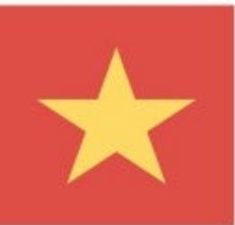

> **AI Description:**
> **Source:** `assets/_page_11_Figure_0.jpg`
> 
> **Generated:** 2026-06-01 16:59:11
> 
> ---
> 
> The image contains a single, prominent yellow star centered on a red background. This is the flag of Vietnam, representing the national symbol of the country. The star is a five-pointed star, which is a common symbol in many flags, often representing unity and the five principles of socialism. The red background is typically associated with revolution and socialism.

Quantify and understand internet usage of smartphone usersin Vietnam.

## Vietnammobilenews

> **AI Description:**
> **Source:** `assets/_page_12_Figure_0.jpg`
> 
> **Generated:** 2026-06-01 16:51:51
> 
> ---
> 
> The image contains a blue circular icon with a white camera symbol in the center. This is a common visual representation used for social media platforms, specifically Instagram. The icon is simple and does not include any text or additional visual elements.

## Instagramadvertising

Instagramhas openeditsdoors toalladvertisersin Vietnamanditwillbecome apowerful mobileadvertising platformsoon.

> **AI Description:**
> **Source:** `assets/_page_12_Figure_1.jpg`
> 
> **Generated:** 2026-06-01 16:51:55
> 
> ---
> 
> The image contains a logo of a bird in flight, which is the Twitter logo. The bird is white and is set against a blue circular background. The logo is a simple, iconic representation of a bird in flight, symbolizing communication and the spread of information.

## Bluebird award

Abig competition forallindiemobile gamedeveloperswasheldby VietnamTelevision.

> **AI Description:**
> **Source:** `assets/_page_12_Figure_2.jpg`
> 
> **Generated:** 2026-06-01 16:52:35
> 
> ---
> 
> The image contains a blue circular icon with a white speech bubble and a stylized letter "M" inside it. This icon is commonly associated with messaging or communication applications. The design is simple and recognizable, often used to represent chat or messaging services.

## Videocall on Messenger

Messengeralreadyoffers peopletheability tomake voicecals tofriendsand lovedones.   
All OTTappsinVNwillfaceastrong competitor innear future.

### Full Page Description (Page 13)

**Source:** `assets/_page_13_Asset_0.jpg`

**Generated:** 2026-06-01 16:54:51

---

The image is a pie chart titled "Smartphone users in Vietnam." It visually represents the distribution of smartphone operating systems used by users in Vietnam. The chart shows that 63% of users use Android, 31% use Apple iOS, and 6% use Windows Phone. The chart uses different colors to differentiate between the operating systems: blue for Android, gray for Apple iOS, and a lighter gray for Windows Phone. The percentages are clearly labeled next to each corresponding section of the pie chart.

### Full Page Description (Page 13)

**Source:** `assets/_page_13_Asset_1.jpg`

**Generated:** 2026-06-01 16:55:25

---

The image contains a horizontal bar chart comparing internet speeds in Thailand, the Philippines, and Vietnam. The bars represent the average internet speeds in Mbps for each country. The Philippines has the lowest speed at 0.1 Mbps, followed by Vietnam at 1.6 Mbps, and Thailand at 2.3 Mbps. The chart uses a gray background with blue bars and includes a note indicating that the speeds are in Mbps.

## VIETNAMMOBILEMARKET

Smartphoneusers in Vietnam

Appota Inc. VietnamMobileAppsReportQ32015

source: Appota,Facebook

### Full Page Description (Page 14)

**Source:** `assets/_page_14_Asset_0.jpg`

**Generated:** 2026-06-01 16:58:24

---

The image is a bar chart comparing the percentage of iOS versions used by users in Q2/2015 and Q3/2015. The chart includes data for iOS 6, iOS 7, iOS 8, and iOS 9. iOS 8 had the highest usage in Q3/2015 at 52%, while iOS 6 had the lowest usage at 11% in the same quarter. iOS 9 showed a significant increase from 11% in Q2/2015 to 13% in Q3/2015. The chart visually represents the transition from older iOS versions to newer ones, with iOS 8 being the most popular in Q3/2015.

ios9 has seenabig adoption rate since its firstrelease this quarter.

### Full Page Description (Page 15)

**Source:** `assets/_page_15_Asset_0.jpg`

**Generated:** 2026-06-01 16:52:15

---

The image contains a bar chart comparing the percentage usage of different Android operating system versions (ICS, JB, Kitkat, Lollipop) between Q2/2015 and Q3/2015. The chart shows a significant increase in the usage of Lollipop from 16% in Q2/2015 to 35% in Q3/2015. Conversely, the usage of ICS and JB decreased, with ICS dropping from 4% to 3% and JB from 50% to 33%. The Kitkat usage increased from 27% to 28%. The chart effectively illustrates the shift in Android version adoption over the two quarters.

Lollipop,Google's latestOShasabig rateof adoption.TheOSaccounts for 35% of total Android users.

### Full Page Description (Page 16)

**Source:** `assets/_page_16_Asset_0.jpg`

**Generated:** 2026-06-01 16:56:39

---

The image is a pie chart visualizing the market share of different smartphone brands. The chart is divided into segments representing various brands and their corresponding percentages. The largest segment, labeled "Other," occupies 26% of the chart. The second largest segment is "Samsung" at 36%. Other brands such as Asus, LG, Sony, Sky, HTC, Lenovo, Google, OPPO, Nokia, and Huawei are also represented, with each brand's share ranging from 7% to 10%. The chart provides a clear visual representation of the market dominance of Samsung and the significant presence of other brands in the smartphone market.

Samsung retained the leadership position by awidemargin,attracted moreusers than the next five vendors combined.

### Full Page Description (Page 17)

**Source:** `assets/_page_17_Asset_0.jpg`

**Generated:** 2026-06-01 16:59:46

---

The image contains a horizontal bar chart with percentages representing the usage of various online activities. The chart includes categories such as "Use search engines," "Use social networks," "Check mail," "Play games," "Watch online videos," "Purchase products/services," "Look for product information," "Look up maps and directions," and "Listen to music." The percentages for each activity are displayed above the corresponding bars, with "Use social networks" having the highest percentage at 59%, followed by "Use search engines" at 56%, and "Watch online videos" at 54%. The chart visually compares the frequency of these activities, with "Purchase products/services" having the lowest percentage at 6%.

## VIETNAMSMARTPHONEUSERSBEHAVIOUR

Onlineactivities people do on their smartphonesat least weekly.

Appota Inc. VietnamMobileApps ReportQ32015

Source: Google Dev

## VIETNAMSMARTPHONEUSERSBEHAVIOUR

Vietnam has more screens than ever

57%

### Full Page Description (Page 19)

**Source:** `assets/_page_19_Asset_0.jpg`

**Generated:** 2026-06-01 16:53:42

---

The image contains a line graph with a world map background. The graph shows two lines: one labeled "average" and another labeled "highest." The "average" line is blue and fluctuates throughout the day, starting low, rising to a peak around 20 hours, and then dropping again. The "highest" line, which is red, also rises to a peak around 20 hours but is consistently above the "average" line, indicating it represents the maximum values for the data being measured. The x-axis represents time, ranging from 0 to 24 hours, likely representing a 24-hour period.

## VIETNAMSMARTPHONEUSERSBEHAVIOUR

Popular timefordownloads

## STATEOFMOBILEADS INVIETNAM

## Mobile ad networkmodels:

## Non-incentive ads

MobileWebads In-appads Searchads Videoads SMS/MMSads

## Incentiveads Incentiverewardplatform

## Most popularnon-incentivead-networks

## Most popular incentivead-networks

> **AI Description:**
> **Source:** `assets/_page_20_Figure_12.jpg`
> 
> **Generated:** 2026-06-01 16:57:59
> 
> ---
> 
> The image contains a simple icon of a piggy bank with a coin inside it. The piggy bank is depicted in a flat design style, with a red outline and a white interior. The coin is a yellow circle with a black outline. This icon is commonly used to represent savings, finance, or money management.

## STATEOFMOBILEADS INVIETNAM

## Device share of impressions

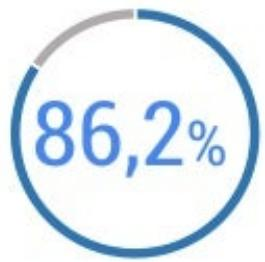

> **AI Description:**
> **Source:** `assets/_page_21_Figure_0.jpg`
> 
> **Generated:** 2026-06-01 17:01:11
> 
> ---
> 
> The image contains a pie chart with a single segment highlighted. The segment represents 86.2% of the total, indicated by the text "86,2%" in the center of the chart. The background is white, and the segment is colored blue, with a small gray section indicating the remaining portion. The chart is simple and focuses on displaying a single percentage value.

Smartphone

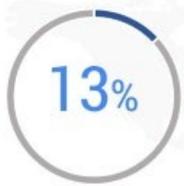

> **AI Description:**
> **Source:** `assets/_page_21_Figure_1.jpg`
> 
> **Generated:** 2026-06-01 17:01:05
> 
> ---
> 
> The image is a circular progress indicator showing 13% completion. The circle is divided into two sections: a filled portion in blue representing 13% and an empty portion in gray. The text "13%" is prominently displayed in the center of the circle, indicating the percentage completion. The design is simple and clear, effectively conveying the progress status.

Tablet

Feature phone

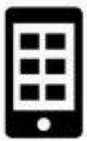

> **AI Description:**
> **Source:** `assets/_page_21_Figure_3.jpg`
> 
> **Generated:** 2026-06-01 17:00:46
> 
> ---
> 
> The image contains a simple icon of a smartphone with a grid of squares inside it, representing a mobile device interface or application layout. The icon is black and white, with no additional text or labels.

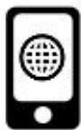

> **AI Description:**
> **Source:** `assets/_page_21_Figure_4.jpg`
> 
> **Generated:** 2026-06-01 16:59:03
> 
> ---
> 
> The image contains a simple icon of a smartphone with a globe symbol inside it. This icon likely represents a mobile device with internet connectivity or global communication capabilities.

Ad impressions on mobile apps.

Adimpressions on mobilewebsites.

Samsung maintains its lead as the top manufacturer

32 %

Of totalimpression

OS share of impressions

> **AI Description:**
> **Source:** `assets/_page_22_Figure_0.jpg`
> 
> **Generated:** 2026-06-01 16:53:59
> 
> ---
> 
> The image contains a simple black and white icon of the Android robot, which is a well-known symbol associated with the Android operating system. The icon is a stylized figure with a square body, two arms, two legs, and a head with two eyes and a small smile. There are no additional visual elements or text in the image.

54,9%

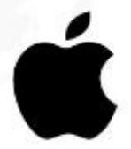

> **AI Description:**
> **Source:** `assets/_page_22_Figure_1.jpg`
> 
> **Generated:** 2026-06-01 16:54:12
> 
> ---
> 
> The image contains a simple black silhouette of an apple with a leaf on top. It is a logo commonly associated with a technology company. The image does not contain any text or additional visual elements beyond the apple and leaf design.

30,7%

> **AI Description:**
> **Source:** `assets/_page_22_Figure_2.jpg`
> 
> **Generated:** 2026-06-01 16:53:19
> 
> ---
> 
> The image contains a simple black and white logo resembling the Windows operating system icon. It is a graphical representation of two overlapping windows with a cross in the center. There are no charts, graphs, or other visual elements present. The logo is a static image with no additional text or annotations.

13,2%

## STATEOFMOBILEADSINVIETNAM

Topperforming mobileappsad-types by Click-through-rate

Search ads

Socialads

Bannerads inapps

Bannerads inwebsites

Richmediavideoads
Appota Inc. VietnamMobileApps ReportQ32015
Source: Adsota
Slide24

## STATEOF MOBILEADS INVIETNAM

Users love mobileads that help them

> **AI Description:**
> **Source:** `assets/_page_24_Figure_0.jpg`
> 
> **Generated:** 2026-06-01 16:52:42
> 
> ---
> 
> The image contains a blue arrow pointing downward, which is commonly used to represent a download icon. This visual element is typically associated with the action of downloading files or content from a website or application.

46% Find agood dealon something

## 57%

> **AI Description:**
> **Source:** `assets/_page_24_Figure_2.jpg`
> 
> **Generated:** 2026-06-01 16:51:45
> 
> ---
> 
> The image contains a simple icon of a blue ribbon with a white star in the center. The ribbon is stylized and appears to be a symbol of achievement or recognition. There are no charts, graphs, or other visual elements present in the image. The icon is a single, static image with no additional text or annotations.

44% Learn aboutabrand

## Download mobile content

33%Locate something nearby

## STATEOFMOBILEADSINVIETNAM

## Mostpopularad-types and average costs

Cost pr. click

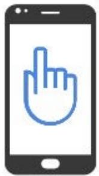

> **AI Description:**
> **Source:** `assets/_page_25_Figure_0.jpg`
> 
> **Generated:** 2026-06-01 16:54:04
> 
> ---
> 
> The image depicts a smartphone with a stylized hand icon on its screen. The hand icon is blue and appears to be pointing upwards, suggesting a gesture or interaction with the phone. The phone itself is outlined in black, with a white border around the screen. There are no additional labels or text annotations within the image.

0,01-0,03 s

Cost pr. install

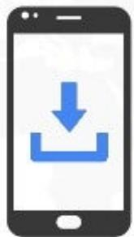

> **AI Description:**
> **Source:** `assets/_page_25_Figure_1.jpg`
> 
> **Generated:** 2026-06-01 16:54:08
> 
> ---
> 
> The image depicts a smartphone with a download icon displayed on its screen. The icon is a blue arrow pointing downward, commonly associated with downloading or receiving data. The smartphone is outlined in black, and the screen is white, with the download icon being the only visual element present.

0,3-0,4s ncenive

0,5-1son-incentive

Cost pr. mile

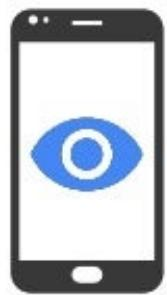

> **AI Description:**
> **Source:** `assets/_page_25_Figure_2.jpg`
> 
> **Generated:** 2026-06-01 16:53:15
> 
> ---
> 
> The image contains a simple illustration of a smartphone with a stylized eye icon in the center. The eye is blue and white, resembling a simplified representation of a Google logo. The smartphone is depicted in a minimalist style, with a black outline and a white background. The image does not contain any text or additional visual elements beyond the smartphone and the eye icon.

1-2s

thousand of impressions

Source: Adsota

## Trends in Vietnam

> **AI Description:**
> **Source:** `assets/_page_26_Figure_0.jpg`
> 
> **Generated:** 2026-06-01 17:01:16
> 
> ---
> 
> The image contains a simple icon of two stacked coins within a blue circle. The icon is a visual representation of financial or monetary concepts, such as savings, investment, or financial management. The design is minimalistic and does not include any text or additional elements.

## Incentivereward platform

MobileincentiverewardplatformboominVietnamwithmanynamesenteringthemarket, eachplayerprovidingapproximately5-20kinstallsaday.

> **AI Description:**
> **Source:** `assets/_page_26_Figure_1.jpg`
> 
> **Generated:** 2026-06-01 17:00:54
> 
> ---
> 
> The image contains a simple icon of a play button, which is typically used to indicate the start or play action in media or software interfaces. It is a white triangle pointing to the right, set within a circular gray background. This icon is universally recognized and used to signify the beginning or playback of a video or audio file.

## Mobile videoads

Therearemillons ofonlinevideo views onthesmartphoneeveryday in Vietnam.Therefore increased demand and rapid adoption of mobile video-ad units.

## Trends in Vietnam

> **AI Description:**
> **Source:** `assets/_page_27_Figure_0.jpg`
> 
> **Generated:** 2026-06-01 16:59:59
> 
> ---
> 
> The image contains a simple icon of a camera with a flash, set against a blue circular background. The icon is white and represents the logo of the social media platform Instagram. There are no charts, graphs, or other visual elements present in the image.

## Instagramadvertising

Withabout7oo,ooo activeusers inVietnam,advertising on instagram bring more engagement but more expensive than other advertising platforms.

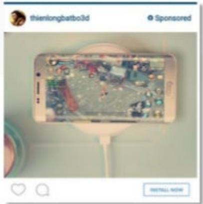

> **AI Description:**
> **Source:** `assets/_page_27_Figure_2.jpg`
> 
> **Generated:** 2026-06-01 16:59:54
> 
> ---
> 
> The image contains a photograph of a smartphone displaying a game interface. The phone is mounted on a stand, and the screen shows a colorful game with various characters and elements. The top of the image includes a username and a "Sponsored" label, indicating that this is likely an advertisement. The bottom of the image has a "REINSTALL NOW" button, suggesting that this is an Instagram post promoting a game or app.

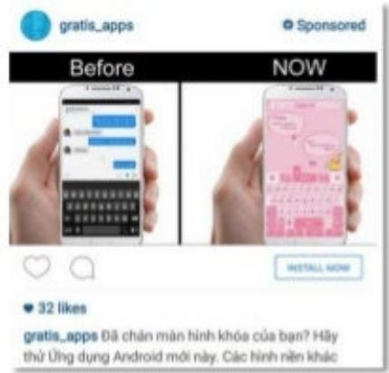

> **AI Description:**
> **Source:** `assets/_page_27_Figure_3.jpg`
> 
> **Generated:** 2026-06-01 16:58:54
> 
> ---
> 
> The image contains a comparison of two smartphone screens, labeled "Before" and "Now." The "Before" screen shows a text messaging app with a dark background and blue text bubbles, while the "Now" screen displays a text messaging app with a pink background and pink text bubbles. The image also includes a "Sponsored" label, indicating that this is an advertisement. The text at the bottom mentions a free app and encourages users to try it.

## TOPVIETNAMESEiOSAPPSONAPPOTAPLATFORM

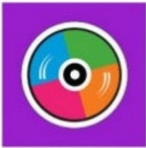

> **AI Description:**
> **Source:** `assets/_page_28_Figure_0.jpg`
> 
> **Generated:** 2026-06-01 16:55:16
> 
> ---
> 
> The image contains a colorful circular diagram with five segments, each in a different color (blue, green, orange, pink, and red). The segments are divided by white lines, and there is a central black circle with a white outline. The diagram appears to represent a pie chart or a circular graph, possibly used to illustrate proportions or categories. The colors and segments suggest a categorization or distribution of something, but the specific context or data is not provided in the image.

Zing mp3

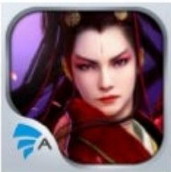

> **AI Description:**
> **Source:** `assets/_page_28_Figure_1.jpg`
> 
> **Generated:** 2026-06-01 16:54:58
> 
> ---
> 
> The image contains a stylized illustration of a character with long hair and a red and black outfit. The character appears to be from a video game or animated series. The logo in the bottom left corner indicates that the image is associated with a game or application, as it includes the letter "A" and a stylized bird or eagle. The character's expression is serious, and the background is a gradient of dark colors, possibly indicating a dramatic or intense scene.

TieuNgao Giang Ho

> **AI Description:**
> **Source:** `assets/_page_28_Figure_2.jpg`
> 
> **Generated:** 2026-06-01 16:55:29
> 
> ---
> 
> The image contains a simple icon with a blue background. The icon features a white play button in the center, surrounded by a white outline of headphones. This suggests the icon is likely associated with audio or music playback.

NCT

> **AI Description:**
> **Source:** `assets/_page_28_Figure_3.jpg`
> 
> **Generated:** 2026-06-01 16:55:46
> 
> ---
> 
> The image contains a cartoon-style character wearing a Santa hat, which suggests a festive theme. The character appears to be from a popular anime or manga series, as indicated by the headband with a symbol on it. The character is depicted in a dynamic pose, possibly indicating action or movement. The background is plain white, which makes the character the focal point of the image.

lamNaruto

> **AI Description:**
> **Source:** `assets/_page_28_Figure_4.jpg`
> 
> **Generated:** 2026-06-01 16:56:20
> 
> ---
> 
> The image appears to be a close-up of a textured surface, possibly a rock or mineral, with a fiery, glowing effect overlaying it. The texture is rugged and uneven, with a mix of light and dark areas that give it a three-dimensional appearance. The glowing effect suggests heat or molten material, which could imply a volcanic or geological context. The logo in the bottom left corner indicates it might be related to a specific organization or project.

Dsatmobile

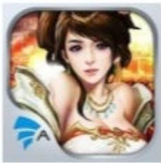

> **AI Description:**
> **Source:** `assets/_page_28_Figure_5.jpg`
> 
> **Generated:** 2026-06-01 16:57:00
> 
> ---
> 
> The image contains a stylized illustration of a character with long hair, wearing ornate attire, set against a fiery background. The character appears to be a female figure, possibly from a fantasy or historical context. The illustration is accompanied by a logo in the bottom left corner, which includes the letter "A" and a stylized design element. The overall style suggests it could be an icon or logo for a game or digital media.

Chinh Do Mobile

> **AI Description:**
> **Source:** `assets/_page_28_Figure_6.jpg`
> 
> **Generated:** 2026-06-01 16:56:14
> 
> ---
> 
> The image contains a logo with a stylized letter "L" in the center. The letter is illuminated with a glowing, electric blue effect, giving it a dynamic and energetic appearance. The background is dark, which makes the letter stand out prominently. In the bottom left corner, there is a small icon with the letter "A" inside a blue circle, suggesting it might be a logo or emblem for a company or organization. The overall design is modern and visually striking, likely intended to convey a sense of power or energy.

Lienminh huyénthoai

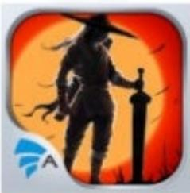

> **AI Description:**
> **Source:** `assets/_page_28_Figure_7.jpg`
> 
> **Generated:** 2026-06-01 16:55:53
> 
> ---
> 
> The image is a stylized illustration featuring a silhouette of a person in a traditional outfit, possibly a samurai or warrior, holding a sword. The background is a gradient of orange and red hues, suggesting a sunset or fiery atmosphere. The illustration has a dark, ominous tone, and the logo of a company or app, "A," is visible in the bottom left corner. The image appears to be related to a game or app, possibly with a historical or fantasy theme.

HiepKhach

> **AI Description:**
> **Source:** `assets/_page_28_Figure_8.jpg`
> 
> **Generated:** 2026-06-01 16:57:10
> 
> ---
> 
> The image is a digital illustration featuring a cartoon-style soccer player in action. The player is depicted mid-kick, with a soccer ball in front of them. The background is dynamic, with a burst of light and energy lines, emphasizing the motion and intensity of the kick. The player is wearing a blue and white uniform, and the number "10" is visible on their shorts. The image appears to be an icon or logo for a soccer-related game or application, as indicated by the stylized design and the presence of a logo or brand mark in the bottom left corner.

vua bong da

MobiTivi

Appota Inc. VietnamMobileAppsReport Q32015

source: Appota

## TOPVIETNAMESEANDROIDAPPSONAPPOTA PLATFORM

> **AI Description:**
> **Source:** `assets/_page_29_Figure_0.jpg`
> 
> **Generated:** 2026-06-01 16:56:00
> 
> ---
> 
> The image appears to be a digital illustration of a character with a stylized appearance, possibly from a video game or animated series. The character has a serious expression and is wearing a red and black outfit with intricate designs. The background is dark with a gradient effect, and there is a logo in the bottom left corner that includes a stylized 'A' and a blue and white design. The image is likely a promotional or in-game image rather than a chart, diagram, or photograph.

Tieu Ngao Giang Ho

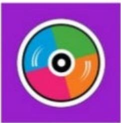

> **AI Description:**
> **Source:** `assets/_page_29_Figure_1.jpg`
> 
> **Generated:** 2026-06-01 16:56:06
> 
> ---
> 
> The image is a simple graphic with a purple background. At the center is a circular design divided into five equal sections, each colored differently: blue, green, orange, pink, and purple. The sections appear to have a slight gradient effect, and there are small, curved lines emanating from the center, resembling sound waves or a spinning effect. The overall design is abstract and does not contain any text or labels.

ZingMp3

Dosat mobile

> **AI Description:**
> **Source:** `assets/_page_29_Figure_3.jpg`
> 
> **Generated:** 2026-06-01 16:56:26
> 
> ---
> 
> The image contains a stylized illustration of a character with long hair, wearing ornate attire. The background features a fiery, dynamic scene with swirling colors, suggesting action or movement. The image also includes a logo in the bottom left corner, which appears to be a stylized letter "A" within a blue and white design. The overall style is reminiscent of a game or animated character design.

ChinhDo Mobile

> **AI Description:**
> **Source:** `assets/_page_29_Figure_4.jpg`
> 
> **Generated:** 2026-06-01 16:55:41
> 
> ---
> 
> The image contains a simple icon with a blue background. It features a white play button in the center, surrounded by a white outline of headphones. This icon is commonly associated with audio or video playback, suggesting it is a visual representation of a media player or music application.

NCT

> **AI Description:**
> **Source:** `assets/_page_29_Figure_5.jpg`
> 
> **Generated:** 2026-06-01 16:55:36
> 
> ---
> 
> The image contains a visual representation of a character wearing a Santa hat, which is part of a game or app icon. The character appears to be from a popular anime series, identifiable by the headband with the symbol "K" and the yellow eyes. The icon also includes a small "A" at the bottom left, possibly indicating a level or a character's ability. The overall design is colorful and cartoonish, typical of mobile game icons.

Naruto

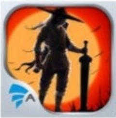

> **AI Description:**
> **Source:** `assets/_page_29_Figure_6.jpg`
> 
> **Generated:** 2026-06-01 16:55:02
> 
> ---
> 
> The image contains a silhouette of a figure holding a sword against a fiery orange background. The figure appears to be a warrior or knight, and the overall design suggests a theme of action or adventure. The logo of a company or organization is visible in the bottom left corner.

HiepKhach

> **AI Description:**
> **Source:** `assets/_page_29_Figure_7.jpg`
> 
> **Generated:** 2026-06-01 16:55:09
> 
> ---
> 
> The image contains a logo with a large, stylized letter "L" in the center. The letter is outlined in gold and has a glowing blue aura with some white, lightning-like streaks emanating from it. The background is a dark blue with a subtle gradient effect. The logo is framed by a light gray border, and in the bottom left corner, there is a small, stylized letter "A" with a blue and white color scheme. The overall design suggests a theme of power or magic.

Lienminh huyenthoai

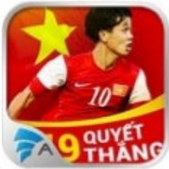

> **AI Description:**
> **Source:** `assets/_page_29_Figure_8.jpg`
> 
> **Generated:** 2026-06-01 16:57:55
> 
> ---
> 
> The image contains a photograph of a soccer player in a red jersey with the number 10 on the back. The player is in motion, running, and appears to be wearing a white armband. The background is red with a yellow star, possibly representing a national team. Below the image, there is text in Vietnamese that reads "A9 QUYẾT THẮNG," which translates to "A9 Decisive Victory." The image also includes a logo with the letters "A9" in a stylized font.

MobiTivi

> **AI Description:**
> **Source:** `assets/_page_29_Figure_9.jpg`
> 
> **Generated:** 2026-06-01 16:57:47
> 
> ---
> 
> The image contains a logo featuring a stylized squirrel in white against an orange background. The squirrel is depicted in a dynamic pose, with its tail curled and body in motion. The logo is simple and modern in design, likely representing a brand or company related to squirrels or nature.

UC Browser Tieng Viet

Appota Inc. VietnamMobileAppsReport Q32015

Source: Appota

> **AI Description:**
> **Source:** `assets/_page_30_Figure_0.jpg`
> 
> **Generated:** 2026-06-01 16:54:16
> 
> ---
> 
> The image contains a simple icon of a rocket ship within a blue circle. The rocket is white and appears to be in a launch position, with a single exhaust flame at the bottom. The icon is minimalistic and does not contain any text or additional elements.

## Launching boost top servicefor mobile apps

Asevice that helpadvertisers promote rank their apps/games ina short periodof time.

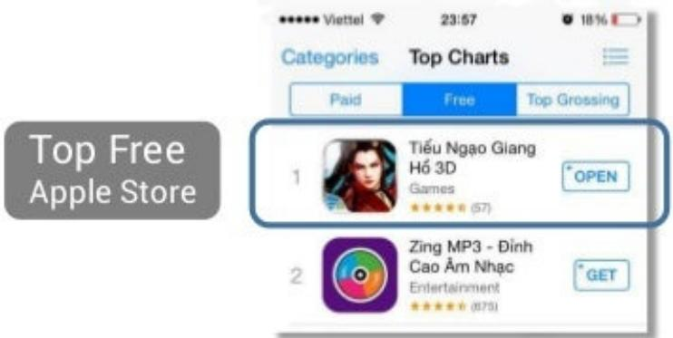

> **AI Description:**
> **Source:** `assets/_page_30_Figure_1.jpg`
> 
> **Generated:** 2026-06-01 16:53:55
> 
> ---
> 
> The image shows a screenshot of the "Top Free" section of the Apple Store app store. It displays a list of top free apps, with the first app being "Tiếu Ngạo Giang Hồ 3D Games" ranked number 1. The app has a 4-star rating from 57 reviews. Below it, the second app listed is "Zing MP3 - Đỉnh Cao Âm Nhạc Entertainment." The image also includes a label "Top Free Apple Store" in the top left corner, indicating the category of the screenshot. The time and battery status are visible at the top of the screen.

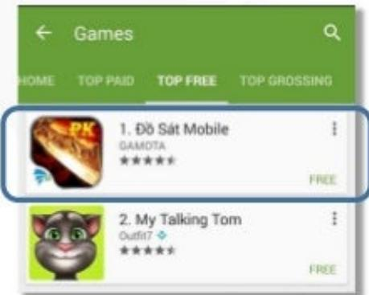

> **AI Description:**
> **Source:** `assets/_page_30_Figure_2.jpg`
> 
> **Generated:** 2026-06-01 16:52:58
> 
> ---
> 
> The image contains a screenshot from a mobile app store, specifically the "Games" section. It displays a list of top-free games, with the first game listed being "Đồ Sát Mobile" by Gamota, which is marked as free. The second game listed is "My Talking Tom" by Outfit7, also marked as free. The image includes a navigation bar at the top with options for "HOME," "TOP PAID," "TOP FREE," and "TOP GROSSING." The visual elements include icons representing the games and their respective developers, along with star ratings and free indicators.

TopFree GooglePlay

> **AI Description:**
> **Source:** `assets/_page_30_Figure_3.jpg`
> 
> **Generated:** 2026-06-01 16:53:22
> 
> ---
> 
> The image contains a simple icon of a white bird on a blue circular background. This is the logo for Twitter, a social media platform. The icon is a recognizable symbol used to represent the company and its services.

## Becomea partnerof Bluebird award

This is the biggest competition for allindie mobile game developers.

Launching Appdaily Anincentivereward platform hits1ook installsinfirst launchingweek.

## TOP3CAMPAIGNS

100,000+ installs/week

Quykiem 3D

Appota's fanpage“Android Store Viet Nam"became thebiggest VN tech community on Facebook.

Totalfans

1,134,462

> **AI Description:**
> **Source:** `assets/_page_32_Figure_1.jpg`
> 
> **Generated:** 2026-06-01 17:00:05
> 
> ---
> 
> The image contains a cartoon-style Android robot character wearing a red headband with a yellow star and a badge with a white and blue design. The background is a light green circle with a dashed black border. The Android character appears to be a mascot or icon, possibly representing a specific Android-related theme or project.

New page likes/week

> **AI Description:**
> **Source:** `assets/_page_32_Figure_2.jpg`
> 
> **Generated:** 2026-06-01 16:59:00
> 
> ---
> 
> The image contains a simple icon of a hand with a finger pointing. It is a blue circular icon with a white hand and finger pointing to the left. There are no charts, graphs, or other visual elements present. The icon is likely used to represent a button or action, such as "click here" or "select."

Userengagement/week

15,681

2,164,246

Avg reach/post

125,000

## THANK YOU!

CONTACTUS

Sale@appota.com

04-35191616

www.appota.com

FOLLOWUS

f/appota

in/appota

D/appota