
## Annual Report 2021

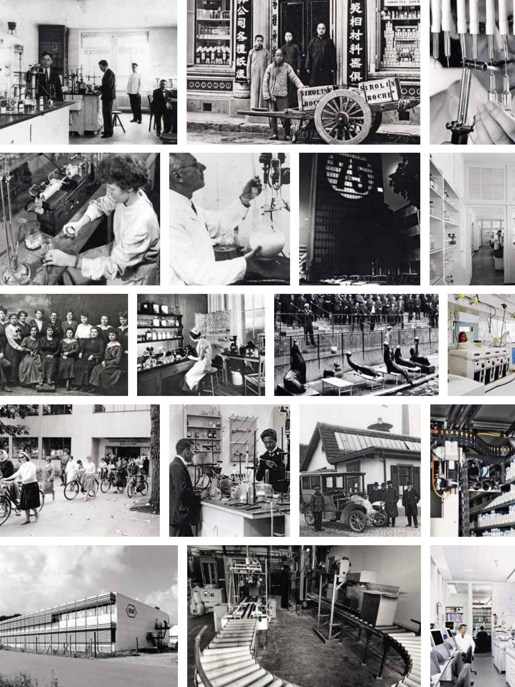

> **AI Description:**
> **Source:** `assets/_page_1_Figure_0.jpg`
> 
> **Generated:** 2026-06-01 18:13:52
> 
> ---
> 
> The image is a collage of black-and-white photographs depicting various scenes from what appears to be a pharmaceutical or chemical company's history. The photographs show laboratory settings with scientists working, historical buildings, and people in professional attire. Some images include text, such as labels on equipment and storefronts, providing context to the scenes. The overall theme suggests a progression through time, showcasing different aspects of the company's operations and evolution.

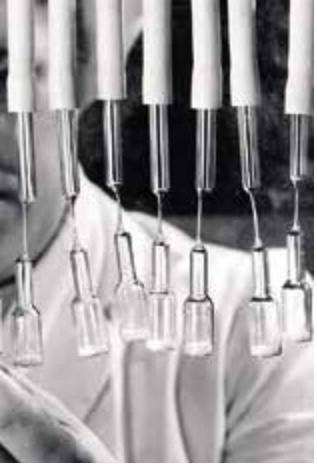

> **AI Description:**
> **Source:** `assets/_page_2_Figure_0.jpg`
> 
> **Generated:** 2026-06-01 19:15:44
> 
> ---
> 
> The image shows a close-up photograph of a person holding multiple syringes. The syringes are arranged in a way that suggests they are being used for a medical or scientific procedure, possibly involving multiple injections or samples. The focus is on the syringes and the person's hands, with the background blurred, emphasizing the syringes as the main subject. The image does not contain any text or additional visual elements beyond the syringes and the person's hands.

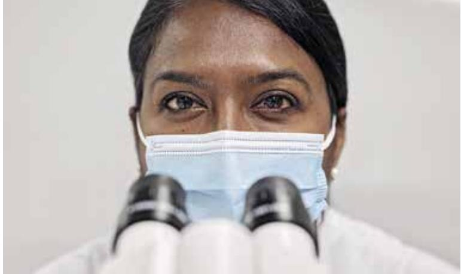

> **AI Description:**
> **Source:** `assets/_page_2_Figure_1.jpg`
> 
> **Generated:** 2026-06-01 19:13:41
> 
> ---
> 
> The image contains a photograph of a person wearing a surgical mask and looking through the eyepieces of a microscope. The individual appears to be in a laboratory setting, suggesting a scientific or medical context. The image conveys a sense of focus and concentration, likely related to research or analysis.

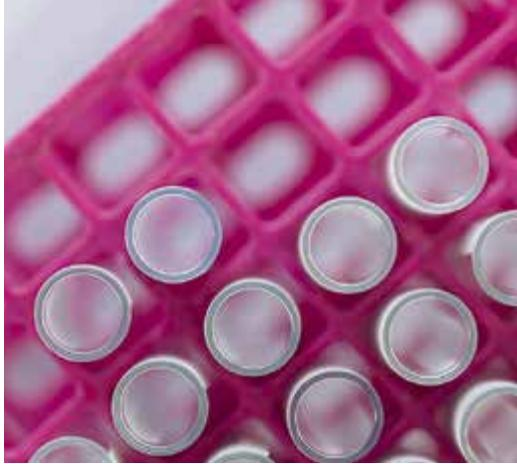

> **AI Description:**
> **Source:** `assets/_page_2_Figure_2.jpg`
> 
> **Generated:** 2026-06-01 19:07:00
> 
> ---
> 
> The image shows a close-up of a pink plastic tray with multiple circular wells, likely used for storing small samples or test tubes. The wells are empty, and the focus is on the top few rows, which are clearly visible. The tray appears to be designed for laboratory or scientific use, possibly for storing small vials or test tubes. The pink color of the tray is consistent across the visible portion.

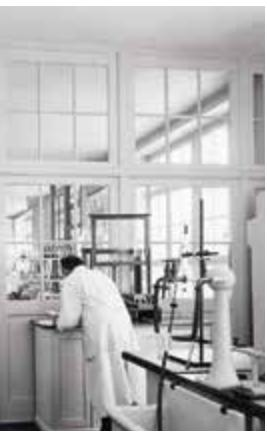

> **AI Description:**
> **Source:** `assets/_page_2_Figure_3.jpg`
> 
> **Generated:** 2026-06-01 19:10:49
> 
> ---
> 
> The image is a photograph of a laboratory setting. It shows a person in a white lab coat working at a desk, surrounded by various laboratory equipment and apparatus. The room has large windows allowing natural light to enter, and the overall atmosphere suggests a scientific or medical research environment.

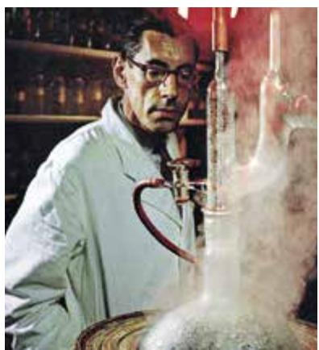

> **AI Description:**
> **Source:** `assets/_page_2_Figure_4.jpg`
> 
> **Generated:** 2026-06-01 19:19:01
> 
> ---
> 
> The image is a photograph of a person in a laboratory setting, wearing a lab coat and glasses. The individual appears to be conducting an experiment, as they are standing next to a large glass apparatus emitting steam or smoke. The background shows shelves with various laboratory equipment and bottles, suggesting a scientific or chemical research environment. The overall scene conveys a sense of scientific activity and experimentation.

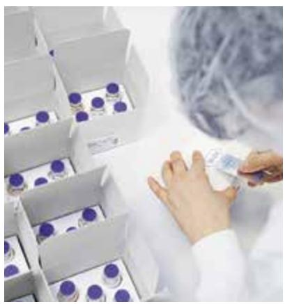

> **AI Description:**
> **Source:** `assets/_page_2_Figure_5.jpg`
> 
> **Generated:** 2026-06-01 19:20:42
> 
> ---
> 
> The image depicts a laboratory setting where a person in a lab coat is handling small vials with blue caps. The vials are being placed into white boxes, which appear to be organized for storage or transport. The background includes a blurred figure, possibly another lab worker, wearing a hairnet, suggesting a controlled environment typical of a laboratory or research facility. The focus is on the action of organizing the vials, which implies a process of sample management or inventory control.

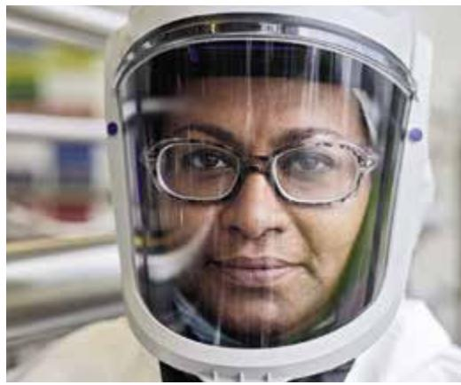

> **AI Description:**
> **Source:** `assets/_page_2_Figure_6.jpg`
> 
> **Generated:** 2026-06-01 19:27:46
> 
> ---
> 
> The image contains a photograph of a person wearing a clear face shield and glasses. The background appears to be a laboratory setting with shelves and equipment. The person is wearing a white lab coat, suggesting they are a scientist or medical professional. The face shield is transparent, allowing the person's face to be partially visible. The overall context implies a focus on safety and possibly a medical or scientific environment.

> **AI Description:**
> **Source:** `assets/_page_2_Figure_7.jpg`
> 
> **Generated:** 2026-06-01 19:25:20
> 
> ---
> 
> The image depicts a crowded indoor event with numerous people gathered on a red carpeted floor. The attendees appear to be engaged in various activities, possibly at a trade show, conference, or similar event. The scene is lively, with people standing, walking, and interacting with each other. There are some visible signs and banners, but the text on them is not legible in the image. The overall atmosphere suggests a busy and dynamic environment.

> **AI Description:**
> **Source:** `assets/_page_2_Figure_8.jpg`
> 
> **Generated:** 2026-06-01 18:14:22
> 
> ---
> 
> The image shows a conveyor belt with rows of clear glass vials containing a transparent liquid, each capped with a green screw-on lid. The vials are neatly arranged in a grid pattern, suggesting an automated production or packaging line. The conveyor belt appears to be part of a manufacturing or quality control process, likely for pharmaceutical or laboratory applications. The uniformity and organization of the vials indicate a controlled and efficient production environment.

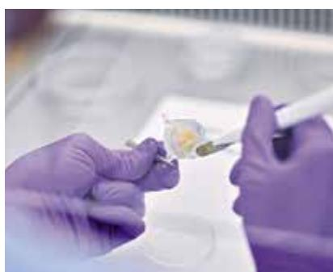

> **AI Description:**
> **Source:** `assets/_page_2_Figure_9.jpg`
> 
> **Generated:** 2026-06-01 18:18:14
> 
> ---
> 
> The image shows a close-up of a person wearing purple gloves handling a small, clear plastic container. The container appears to be used for laboratory or medical purposes, as it is being held over what looks like a laboratory bench or table. The person is using a pipette to transfer a liquid or substance from the container, suggesting a scientific or medical procedure. The focus is on the hands and the container, with no additional text or labels visible in the image.

> **AI Description:**
> **Source:** `assets/_page_2_Figure_10.jpg`
> 
> **Generated:** 2026-06-01 19:00:19
> 
> ---
> 
> The image contains a photograph of a laboratory setting. It shows a rack filled with numerous test tubes, some of which are labeled. The test tubes are arranged in a systematic manner, suggesting an organized and scientific environment. The image likely represents a research or medical laboratory where samples are being stored or processed.

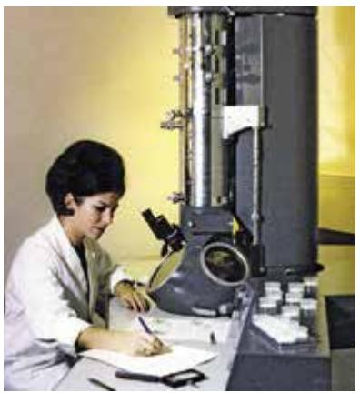

> **AI Description:**
> **Source:** `assets/_page_2_Figure_11.jpg`
> 
> **Generated:** 2026-06-01 19:01:27
> 
> ---
> 
> The image contains a photograph of a person in a laboratory setting. The individual is wearing a lab coat and appears to be working with scientific equipment, specifically a microscope and a tall cylindrical apparatus that resembles a distillation column or a similar piece of laboratory equipment. The person is also taking notes on a piece of paper, suggesting they are recording observations or data. The setting and equipment indicate a scientific or chemical research environment.

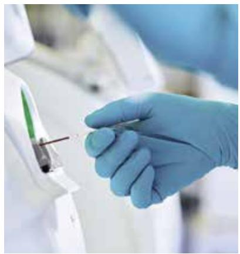

> **AI Description:**
> **Source:** `assets/_page_2_Figure_12.jpg`
> 
> **Generated:** 2026-06-01 19:05:32
> 
> ---
> 
> The image shows a close-up of a person wearing a white lab coat and blue nitrile gloves, holding a syringe. The syringe appears to be filled with a green liquid, possibly a sample or reagent. The background is blurred, focusing attention on the gloved hand and the syringe. The setting suggests a laboratory environment, possibly for medical or scientific research.

> **AI Description:**
> **Source:** `assets/_page_2_Figure_13.jpg`
> 
> **Generated:** 2026-06-01 19:05:04
> 
> ---
> 
> The image contains a photograph of a person wearing a surgical cap, face mask, and gloves, indicating a sterile or medical environment. The individual appears to be interacting with a piece of equipment, possibly a machine or a control panel, which suggests a laboratory or healthcare setting. The person is pointing at the equipment, which may imply they are operating or monitoring it. The image conveys a sense of professionalism and attention to detail, typical in medical or scientific workspaces.

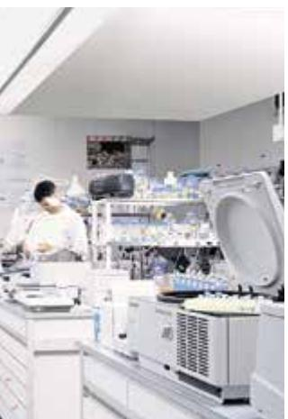

> **AI Description:**
> **Source:** `assets/_page_2_Figure_14.jpg`
> 
> **Generated:** 2026-06-01 18:58:18
> 
> ---
> 
> The image depicts a laboratory setting. The scene includes a person wearing a lab coat, working at a counter. Various laboratory equipment and supplies are visible, including a centrifuge, beakers, and other scientific instruments. The environment appears clean and organized, typical of a research or medical laboratory.

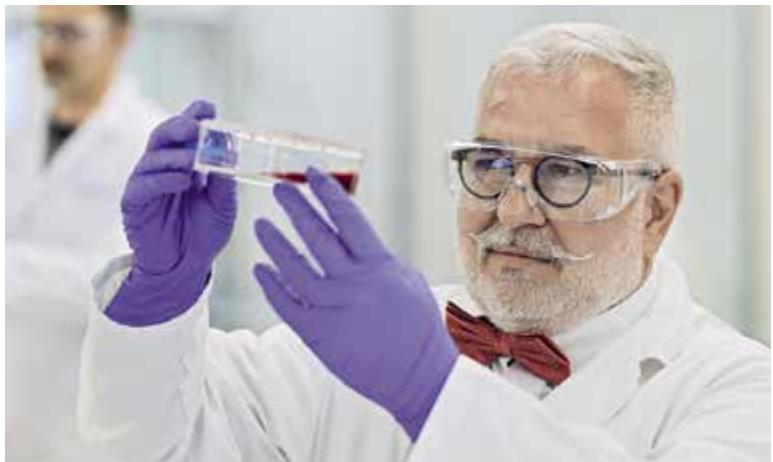

> **AI Description:**
> **Source:** `assets/_page_2_Figure_15.jpg`
> 
> **Generated:** 2026-06-01 18:56:51
> 
> ---
> 
> The image contains a photograph of a scientist in a laboratory setting. The scientist is wearing a white lab coat, purple gloves, and safety goggles. They are holding a test tube filled with a red liquid, likely a sample for analysis. The background shows another individual in a lab coat, suggesting a collaborative or educational environment. The image conveys a sense of scientific research or experimentation.

> **AI Description:**
> **Source:** `assets/_page_2_Figure_16.jpg`
> 
> **Generated:** 2026-06-01 18:50:33
> 
> ---
> 
> The image contains a photograph of a laboratory setting. A person wearing a white lab coat and blue gloves is handling a pipette, suggesting the process of transferring or measuring liquid. In the foreground, there is a rack of test tubes, each labeled with a color-coded label, indicating different samples or categories. The test tubes are arranged in a neat, organized manner, and the background is a plain white, typical of a laboratory environment. The image conveys a sense of scientific research or analysis.

1896 Roche is founded   
1904  Digalen, first standardised heart medication   
1912  Roche present in nine countries on three continents   
1929  Alice Keller, manager of Roche Japan, first female executive   
1934  First company to mass-produce vitamins   
1952  Rimifon, first treatment for tuberculosis   
1968 First leap into diagnostics   
1979 Cobas Bio, first automated lab device   
1986 Roferon-A, genetically engineered cancer therapeutic   
1991  Roche acquires PCR technology   
1994  Roche launches Phelophepa, mobile health clinics in South Africa   
1995  First protease inhibitor against AIDS   
1997  MabThera/Rituxan, world’s first targeted antibody cancer drug   
1998 Roche acquires Boehringer Mannheim   
2002  Alliance with Chugai Pharmaceutical in Japan   
2003  First Children’s Walk for global children’s charities   
2009 Full integration of biotech pioneer Genentech   
2011  Cobas 4800 HPV test to detect cervical cancer   
2013  Kadcyla, antibody-drug conjugate for HER2-positive breast cancer   
2015  Acquisition of Foundation Medicine   
2017 Ocrevus, monoclonal antibody for multiple sclerosis   
2018  Acquisition of Flatiron Health   
2021 16 COVID-19 tests

## 125 years of making a difference in the lives of millions

Each day, our breakthrough medicines and innovative diagnostic solutions improve the lives of countless people worldwide. This is our 125-year legacy. It is also our promise for the future.

On our 125-year anniversary, we see every reason to celebrate. Because life is about celebration – whether creating new memories that resonate for years or pausing to reflect on the precious moments of our past.

In 2021, we celebrated our history, our culture and the enduring purpose that guides Roche’s next 125 years towards a sustainable, healthy future. In 2021, we Celebrated Life.

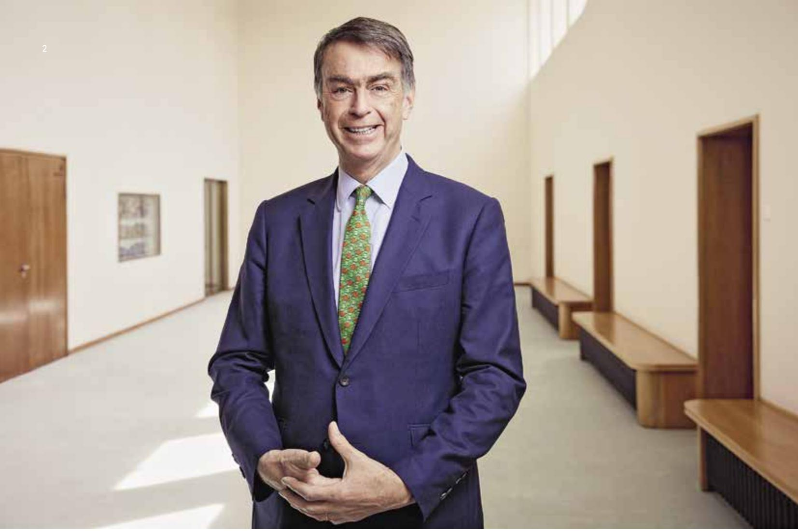

> **AI Description:**
> **Source:** `assets/_page_5_Figure_0.jpg`
> 
> **Generated:** 2026-06-01 19:16:48
> 
> ---
> 
> The image is a photograph of a man standing in a hallway. He is dressed in a dark blue suit with a light blue shirt and a green tie with red patterns. The hallway has light-colored walls, wooden doors on the left side, and wooden benches along the right side. The lighting is bright, and the man is smiling. There is a small framed picture on the wall in the background.

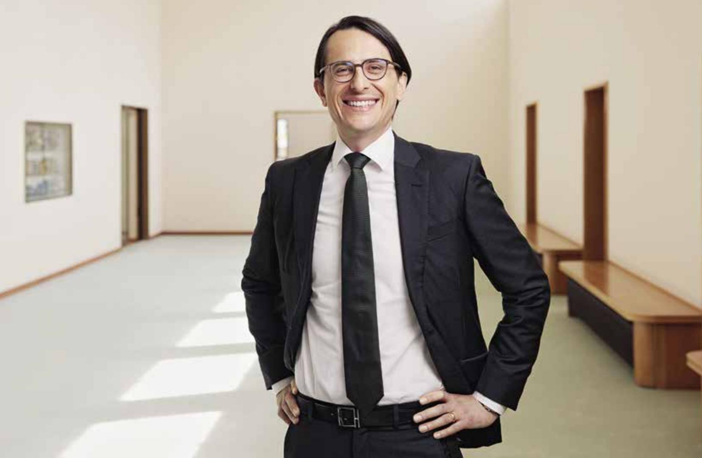

> **AI Description:**
> **Source:** `assets/_page_5_Figure_1.jpg`
> 
> **Generated:** 2026-06-01 19:13:33
> 
> ---
> 
> The image is a photograph of a person standing in a well-lit, modern interior space, possibly a hallway or gallery. The individual is dressed in formal business attire, consisting of a black suit, white shirt, and black tie. The person is smiling and has their hands on their hips. The background features a clean, minimalist design with light-colored walls, a wooden bench, and a framed piece of art on the left side. The overall atmosphere of the image is professional and polished.

# Stability and long-term thinking

André Hoffmann and Jörg Duschmalé are members of Roche’s founding families and Board of Directors. On the occasion of our 125-year anniversary, they share their thoughts on the past, present and future of the company.

## Your ancestor Fritz Hoffmann founded Roche 125 years ago. What does this milestone anniversary mean to you?

A. Hoffmann: I feel extremely proud. My greatgrandfather Fritz Hoffmann and so many other family members would be very pleased to see how Roche has evolved over the years. This anniversary is an important milestone, but a company that thinks sustainably and long-term will exist forever.

J. Duschmalé: Looking back on the rich history of 125 years and being able to shape the next chapter of Roche as a new member of the Board of Directors is of course a great privilege and something I am very much looking forward to. Roche has always played an important part in my life.

## What does that mean exactly?

J. Duschmalé: Since my early childhood, Roche was present in my life. There was always a feeling of being strongly connected to it and I was taught about the lasting bond of our family with the company and the corresponding responsibility. Since I grew up in Basel, Roche was of course also visually present in the city.

## André, you grew up in the Camargue in France. Did Roche also play such a big role in your upbringing?

A. Hoffmann: For me it was a bit different. I remember my father always spoke very proudly of Roche, but because I didn’t grow up in Switzerland, I didn’t have a constant connection to the company back then. I started realising the actual importance and impact of the company in my teenage years.

## You are representing the fourth and fifth generation of the founding families. How do you describe the role of the family in the company structure?

A. Hoffmann: The long-term family ownership helps provide stability to the company by establishing an active partnership with management and the board for the company’s long-term success. You can think of the structure as a triangle that unites the family, the Board of Directors and the Corporate Executive Committee. The Corporate Executive Committee leads the company, the Board of Directors sets the strategy and monitors its implementation while the owner ensures the long-term direction. The separation of control and execution is very important. I see my role as a family representative not only as a privilege, but also as a major responsibility.

J. Duschmalé: The fact that the family has been a part of the success story of Roche from the beginning fills me with pride. Roche can continue to count and rely on us as committed and loyal majority shareholders. We want to pass on a healthy and sustainable company to the next generation and I think it really is this long-term vision that we bring to the company. Being able now to boldly invest in areas that only will pay off in 10, 20 or even 30 years is certainly a big advantage, and that is what our stable family ownership can bring.

What are some of the ways the family is involved in decision-making? A. Hoffmann: The family is engaged in the selection of the members of the Board of Directors.

It is part of the governance of the company. It is important to us that the values and goals of the company are represented by the individuals on the board. This is something we pay attention to in the selection process.

How does the family deal with internal differences that affect important, forwardlooking business decisions? A. Hoffmann: For us, the well-being of the company has always been the common driver. We share the same values, and this joint responsibility also keeps us together as a family. With that we can bring stability over the years.

J. Duschmalé: As a family, we make it a priority to listen to one another and to always focus on the most important thing: the long-term success of Roche. That helps in finding a common ground which – as André says – benefits the company.

## What is at the core of Roche’s success?

J. Duschmalé: Roche has managed to reinvent itself again and again. The original idea was to produce medicines of the highest quality. Today, Roche is one of the largest biotech and diagnostics companies in the world. We owe this success to innovative research and the many partnerships that we have entered into with foresight and courage and we will continue to do so in the future.

A. Hoffmann: This is a success that many teams and great talents around the world contribute to everyday. And we have done it in a sustainable way as we have kept societal and patient needs in our focus.

Talking about sustainable ways – you are known for being a sustainability ambassador, André. Why do you believe this is such an important topic?

A. Hoffmann: To start with, let me state the obvious: The future is sustainable or there is no future. If humanity is to continue to thrive, it will have to think and behave sustainably.

Sustainability is not something you do alongside other business activities like marketing or sales. To be truly sustainable, every action in which we engage must be defined in terms of durability. Traditionally, success is defined as positive cash flows. This is too simple. Just measuring the financial consequence of a business activity fails to measure the social, human and environmental impact that action is having. We should use the natural, social and human capital in ways that create sustainable, long-term value. This starts with constantly acting with an eye on the greater value and impact on society. When I connect this to Roche, thinking about tomorrow is part of our history and legacy, and it’s equally important for our future.

Jörg, what is your perspective on sustainability? J. Duschmalé: I agree with André’s points. Additionally, as a scientist, I associate sustainability with Roche’s strength as an innovation powerhouse. In order to be successful for the long term, we have to innovate at the frontier of scientific knowledge for the benefit of patients. It is often a matter of taking certain risks today that might not appear lucrative in the short term, but can create sustainable value in the long term.

## You have been a researcher at Roche. How was that time for you?

J. Duschmalé: It was a wonderful time for me. The experience was an eye-opener on the importance of science and what great things can be achieved with it. I was able to experience first-hand what the culture and values of the company mean in everyday work. And what great personal commitment and perseverance it takes to advance a research idea into a therapy that can save lives.

What makes the Roche culture special for you? A. Hoffmann: It’s about the special people at Roche and how we interact with each other. All of us are driven by our passion to make a difference for patients. It’s also about how we shape our external partnerships. It’s not by coincidence that we are a partner of choice for many.

J. Duschmalé: I am convinced and have experienced that Roche’s values are lived every day. In addition, there is a company commitment that every employee knows: Follow the science. That is what shapes us and I am very proud to be a part of this company.

## A look into the future – how do you see Roche in 20 years?

J. Duschmalé: I expect that we will focus even more on prevention and personalised therapies. It is also likely that there will be great advances in therapeutic areas with great medical need, such as neurological diseases. In the future, I think the industry, in collaboration with all healthcare stakeholders, must succeed in improving access to healthcare. I also believe that better availability of data will positively change research and make it more impactful.

A. Hoffmann: Hopefully, Roche will be just as successful as today. That is also our task: to hand over a healthy company to the next generation of our family.

## What does success mean for you?

A. Hoffmann: Roche is creating a better future for millions of people. That is the greatest success of all. Driving medical innovation requires us to take bold risks. This requires room to manoeuvre. If there are not enough profits, you cannot invest them sustainably. But to focus only on profit maximisation is not right. Society does not only value profitgenerating activities. I am delighted to witness everyday acts of generosity and kindness that do not lead to an invoice being sent! Acting graciously and in an altruistic way is one of the things that makes us human. Let’s try not to forget it. This kind of thinking is how we will continue to be a sustainable organisation in the years to come.

You are both part of a very wealthy and successful family. What significance does this have for you?

A. Hoffmann: We are in this position because we as a family have invested in the company for the long term. Our assets essentially consist of Roche shares and this gives us the privilege and responsibilities of ownership. This is why I see ownership not as a passive role but as an active one. We commit ourselves to Roche’s success in a very real way alongside the 100,000 employees who work at Roche. I don’t feel like an investor for myself. I see myself as someone who prepares the company for the next generation.

J. Duschmalé: I see it very similarly – the shares give us the opportunity to influence the company. The value of the share package would only be relevant for us if we were to sell. But we are committed to the long-term success of Roche.

## The company still has its headquarters in Basel. Did you ever discuss moving it to another location?

A. Hoffmann: Even though we are active in more than 100 countries today, our roots are here in Switzerland. We are very happy with Basel as our location, but also with the research that can be conducted here. At the end of 2023 we will open a new innovation centre with state-of-the-art lab facilities and I am looking forward to visiting it once it is finished.

J. Duschmalé: We do research in Basel and have a great network of partners to support us in this. As long as our headquarters location supports us in bringing breakthrough innovations to patients, we are in the right place.

The theme of Roche’s 125-year anniversary is Celebrate Life. How do you celebrate life? J. Duschmalé: Probably by enjoying a nice dinner with family and friends.

A. Hoffmann: I celebrate life when I am in harmony with nature. And I wish the same to all of us.

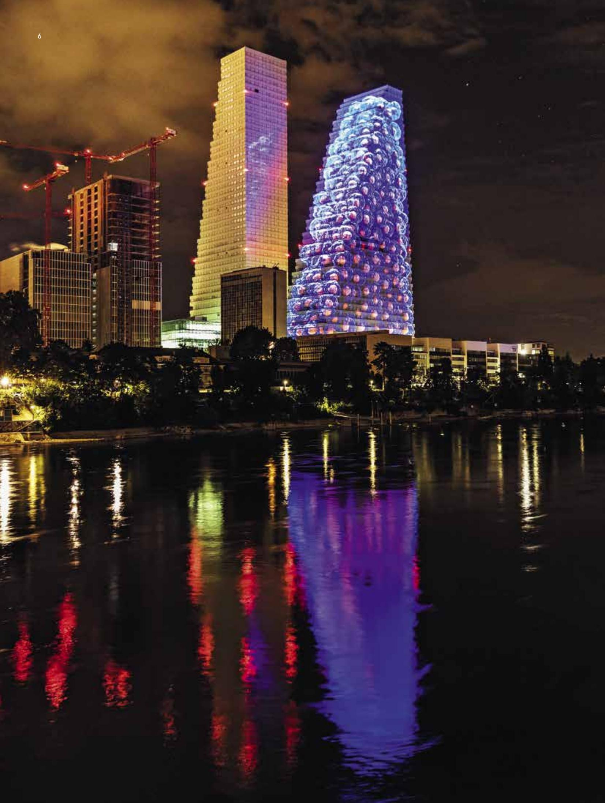

> **AI Description:**
> **Source:** `assets/_page_9_Figure_0.jpg`
> 
> **Generated:** 2026-06-01 18:53:49
> 
> ---
> 
> The image is a photograph of a cityscape at night. It features a prominent skyscraper with a unique light projection on its facade, displaying a pattern of circles in various colors. The reflection of the lights on the water below creates a symmetrical effect. In the background, there are other buildings under construction, identifiable by the cranes. The overall scene is illuminated by artificial lights, giving it a vibrant and dynamic appearance.

## Doing now what patients need next

We believe it is urgent to deliver medical solutions right now – even as we develop innovations for the future. We are passionate about transforming patients’ lives. We are courageous in both decision and action. And we believe that good business means a better world.

That is why we come to work each day. We commit ourselves to scientific rigour, unassailable ethics, and access to medical innovations for all. We do this today to build a better tomorrow.

We are proud of who we are, what we do, and how we do it. We are many, working as one across functions, across companies, and across the world.

We are Roche.

## Contents

Shareholder letters 10   
Reporting and strategy 20   
Diagnostics 28   
Pharmaceuticals 42   
Personalised healthcare 58   
Access to healthcare 72   
People and culture 84   
Environment 96   
Community engagement 108   
Business ethics 118   
Business performance 130   
Corporate Governance 140   
Remuneration Report 162

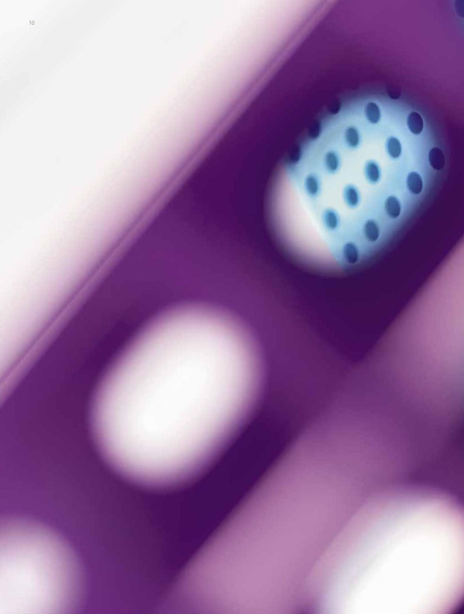

> **AI Description:**
> **Source:** `assets/_page_13_Figure_0.jpg`
> 
> **Generated:** 2026-06-01 18:24:41
> 
> ---
> 
> The image appears to be a close-up photograph of a finger with a nail polish design. The design features a gradient of purple hues and includes a pattern of small, evenly spaced dots on the nail. The background is blurred, emphasizing the nail and the finger. The overall aesthetic is artistic and modern, with a focus on the nail art.

## · Shareholder letters

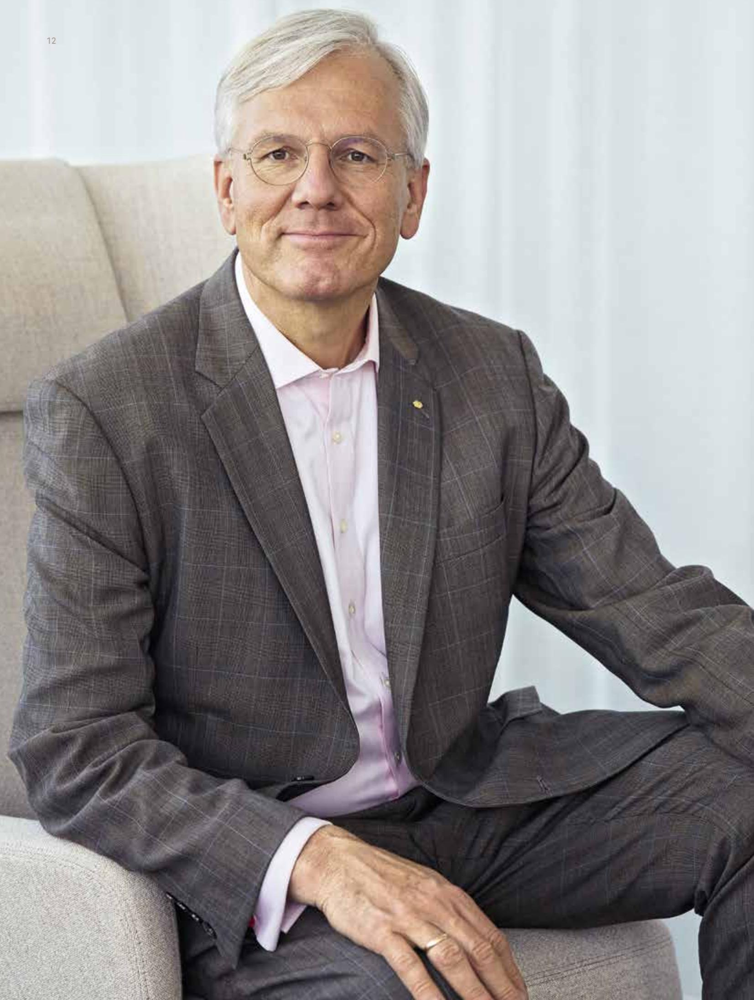

> **AI Description:**
> **Source:** `assets/_page_15_Figure_0.jpg`
> 
> **Generated:** 2026-06-01 18:09:45
> 
> ---
> 
> The image is a photograph of a man sitting on a chair. He is wearing a gray checkered suit jacket over a pink dress shirt. The man has short, gray hair and is wearing glasses. The background is a plain, light-colored curtain. There are no charts, graphs, or other visual elements present in the image.

## Dear Shareholders

Since its founding 125 years ago, Roche has worked to improve the health and lives of countless people all over the world. Our anniversary year was no exception: In 2021 our more than 100,000 employees and our partners developed, manufactured and provided global access to state-of-the-art diagnostics and treatments for serious diseases including COVID-19. These efforts were guided by the pioneering spirit that has characterised Roche since its founding. My sincere thanks for this.

The COVID-19 pandemic has dominated world events for the past two years or so. It is not the first time that known or yet unknown pathogens have suddenly spread and presented us all with major challenges, and it certainly will not be the last. Roche itself was established under the effect of a pandemic: Fritz Hoffmann had just taken up a position as a merchant in Hamburg in the summer of 1892 when cholera broke out. As a result of this experience, he decided to set up an industrial pharmaceutical company on his return to Basel. His aim was to provide large quantities of effective medicines of uniform quality; this was still a revolutionary concept at the time.

During the 125 years since its establishment, Roche has repeatedly found the courage to reinvent itself – guided by scientific progress. I was recently reminded of this during a visit to Poland, where Roche opened a branch back in the early last century. The impact of researchers such as Leo Sternbach, a Polish chemist, was enormous: In the 1960s he discovered the benzodiazepines Valium and Librium, which have become indispensable in the treatment of anxiety, insomnia and nervousness. Roche is still actively involved in the field of neuroscience. Ocrevus for the treatment of multiple sclerosis is one of our most sought-after medicinal products.

Further milestones in our company’s history include our early adoption of biotechnology at a time when almost nobody believed in it. We used the discovery of monoclonal antibodies to revolutionise cancer therapy. With our PCR technology, we were also pioneers in molecular diagnostics.

For Roche, innovation has always been about identifying and seizing opportunities. This will remain so in the future as well. Digitalisation has substantially increased the pace of our company’s transformation since I became Chairman of the Board of Directors. We view health data from medical practice as an opportunity to pursue the ongoing development of personalised, and thus even more effective, medicine. At the same time, our analysis of these data supports laboratory research and the development of new clinical trial concepts; it enables us to accelerate approval procedures for innovative therapies and make them available to patients faster.

Going forward, we want to use digitalisation to achieve more medical progress at lower cost. We will therefore once again increase our investment in research and development, even though our R&D expenditure of 13.7 billion Swiss francs (+14%\*) last year already exceeds that of any other healthcare company worldwide.

One of Roche’s particular strengths is our longterm mindset. This privilege has a great deal to do with the stability afforded us by the founding families. For this, too, I would like to express my sincere thanks. Thinking sustainably is in our DNA. We are delighted and further motivated to have been selected once again by the Dow Jones Sustainability Indices as one of the world’s most sustainable companies in the healthcare sector. We received this recognition in 2021 for the thirteenth year!

Last year we achieved an additional milestone: The extraordinary General Meeting at the end of November 2021 approved the buyback of the Roche bearer shares held by Novartis for the past 20 years in a near-unanimous vote. I am confident that this 19 billion Swiss francs transaction is in the best strategic and financial interests of Roche and all investors. It restores our full control over strategic decisions without requiring us to restrict our operative scope.

The strong product pipeline that Severin Schwan describes in more detail in his letter on page 17 and our financial figures – Group sales rose 9% to 62.8 billion Swiss francs and net income amounted to 14.9 billion Swiss francs – confirm that Roche is on the right path. In light of our good performance, the Board of Directors is proposing a 2% dividend increase to 9.30 Swiss francs per share and nonvoting equity security. Subject to your approval, this will be the 35th consecutive dividend increase.

Finally, I would like to draw your attention to a number of changes on the Roche Board of Directors. After ten years as a member of the Board of Directors, Paul Bulcke has decided not to stand for re-election at the General Meeting in 2022.

On behalf of the Board of Directors, I wish to thank him sincerely for his valuable contributions to Roche’s success.

I am delighted to propose Dr Jemilah Mahmood, a doctor from Malaysia, as a new member of the Board of Directors. She has great expertise in the field of public health, especially in less developed regions of the world. Her particular experience will enable her to help Roche make our medicines and diagnostic products even more accessible to people all over the world.

Roche is very special: focused on science-driven innovation, committed to sustainability, rooted in Switzerland and open to the world.

I would like to thank you, our shareholders, for your confidence and loyalty.

Dr Christoph Franz

Chairman

## Roche Board of Directors on 31 December 2021

A Corporate Governance and Sustainability Committee

B  Audit Committee

C Remuneration Committee

D Chairman’s/Nomination Committee

E Non-executive director

F Executive director

G Independent member of the Board of Directors

\* Committee chairperson

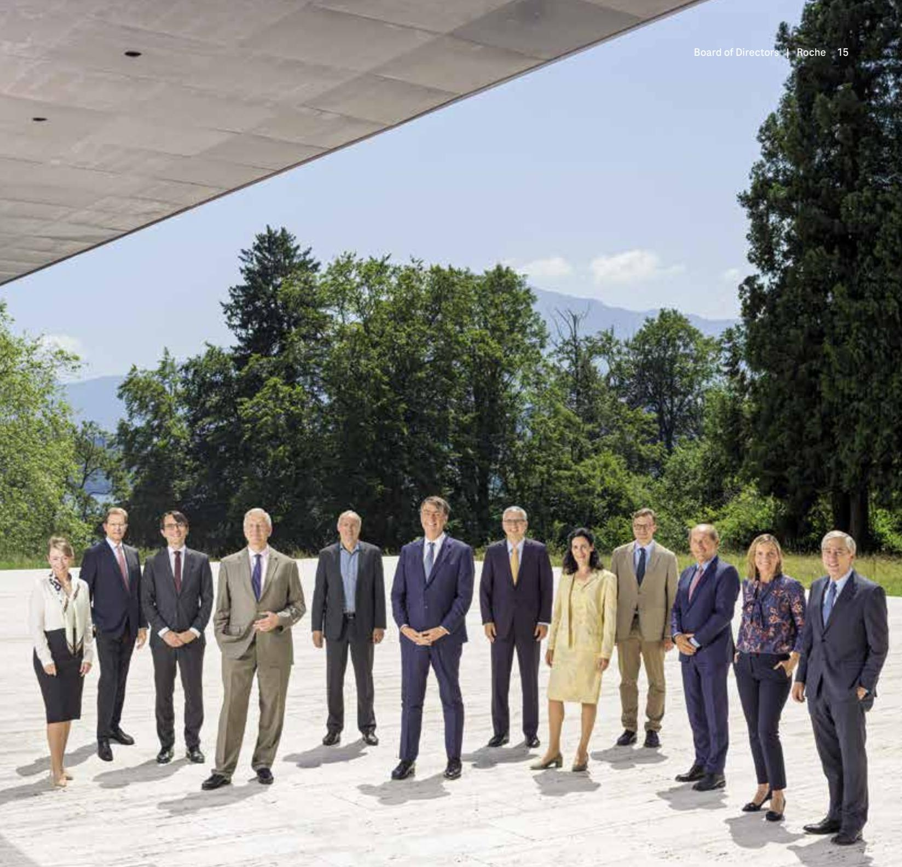

> **AI Description:**
> **Source:** `assets/_page_18_Figure_0.jpg`
> 
> **Generated:** 2026-06-01 18:48:16
> 
> ---
> 
> The image is a photograph of a group of individuals standing outdoors in front of a modern architectural structure with a sloped roof. The background features lush green trees and a clear sky, with distant mountains visible in the distance. The group consists of both men and women dressed in formal attire, suggesting a professional or corporate setting. The text in the top right corner reads "Board of Directors | Roche 15," indicating that the image is likely a group photo of the Roche Board of Directors. The image provides a visual representation of the board members, their attire, and the setting in which they are photographed.

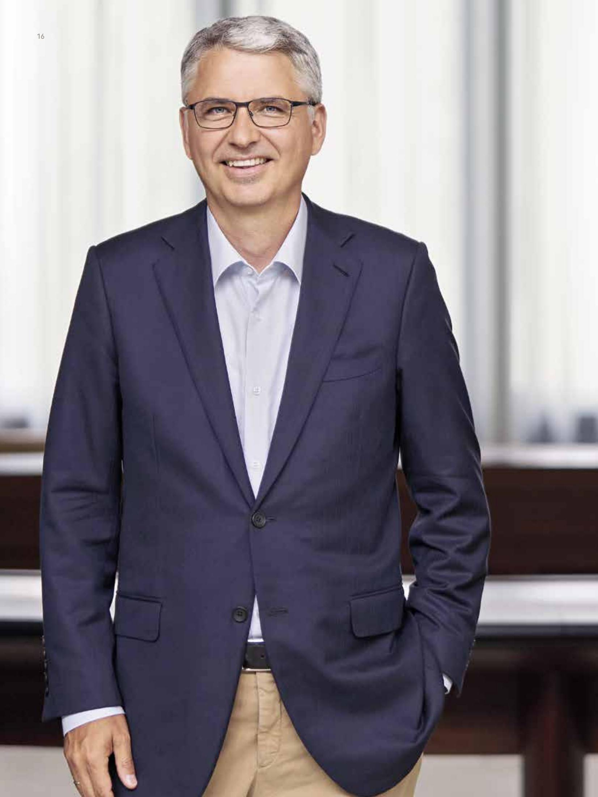

> **AI Description:**
> **Source:** `assets/_page_19_Figure_0.jpg`
> 
> **Generated:** 2026-06-01 18:38:54
> 
> ---
> 
> The image is a photograph of a man wearing a dark blue blazer over a light blue shirt, with his hands in his pockets. He is smiling and appears to be in a professional setting, possibly an office or a formal environment. The background is blurred, suggesting a focus on the subject. There are no charts, graphs, or other visual elements present in the image.

## Dear Shareholders

Improving people’s lives by delivering medical innovations – that is what Roche has been about for 125 years now. Many of our medicines which were developed decades ago are still greatly benefiting millions of people today. The World Health Organization’s Model List of Essential Medicines includes 32 of our products – a record high.

In the future, too, Roche’s success will be based on medical innovations. Despite all the successes, there is still a great need for better therapies in many areas, such as cancer, dementia and infections, far beyond COVID-19. A need for effective treatments to give people with serious diseases a better life or even cure them, a need for precision diagnostics to find the cause of a disease and treat it at the earliest possible stage. Preventive diagnostics are also gaining increasing significance.

Looking ahead, I am pleased with the continued high demand for our newly launched medicines and diagnostic tests as well as the development of our product pipelines in both divisions.

Last year, we continued to make significant progress for patients. Tecentriq became the first cancer immunotherapy for people with early-stage lung cancer to be approved – for many, this means hope for a cure. Polivy is the first medicine in 20 years to significantly improve outcomes in a form of aggressive blood cancer.

In ophthalmology, we were granted regulatory approval for Susvimo, an innovative eye implant. Susvimo offers an alternative to monthly injections in the eyes and can thus make the lives of people with wet age-related macular degeneration a great deal easier. Furthermore, we applied for regulatory approval for Vabysmo, the first in a new class of eye medicines that targets two key signalling pathways which cause retinal diseases.

The demand for effective treatments is also extremely high for nervous system disorders. Recent study data have highlighted the benefits of Ocrevus for multiple sclerosis, and Enspryng for NMOSD, a rare disease affecting the central nervous system. Roche is researching and developing over a dozen medicines to treat neurological disorders, including Huntington’s, Parkinson’s and Alzheimer’s disease.

In Diagnostics, we have a world-leading portfolio of diagnostic solutions for COVID-19, and have been working tirelessly since the start of the pandemic to constantly expand our range of coronavirus tests. Roche is investing significant amounts in establishing additional production capacity to meet the continued high demand for routine diagnostics too.

Innovative diagnostics are essential for prevention, early detection and treatment decisions in infectious diseases, cancer and other serious conditions.

We have further expanded our leading position in the area of infectious diseases with two targeted acquisitions. TIB Molbiol has brought a substantial number of tests to our broad portfolio of molecular diagnostic solutions, while the acquisition of GenMark strengthens our commitment to combating antibiotic resistance. We also launched three molecular PCR diagnostic test panels to simultaneously detect common respiratory pathogens out of one patient sample.

Accurate diagnosis enables patients to receive the most appropriate treatment, and prevents them from being exposed to antibiotics they might not respond to. However, diagnostic tests play a crucial role in more than just combating infectious diseases. They can also help prevent other diseases, such as cervical cancer or hepatitis C-related liver cancer.

Digitalisation, an area in which Roche is investing heavily, is becoming an ever more significant factor in medical progress. Roche embarked on strategic partnerships with Foundation Medicine (FMI) and Flatiron Health several years ago because we recognise that combining high-quality genomics with real-world data (patient data from clinical practice) delivers completely new approaches. Where data sets are available in sufficient quantity and quality, they represent an enormous potential going forward that is already within grasp today. This is a crucial driver of our efforts to advance personalised healthcare. For now, the focus is on making a significant improvement for cancer patients by accelerating the discovery and development of new cancer medicines.

Digital products, such as specific apps, are also delivering ever better support for monitoring and treatment in other therapeutic areas such as neurology or ophthalmology.

Everything we have achieved would not have been possible without the 100,000 people who work for Roche worldwide, and I would like to thank them all for their exemplary dedication and commitment. Despite the challenges of the pandemic, our people in research and development, production, distribution and support functions around the world are working tirelessly to ensure that patients continue to receive life-saving medicines and diagnostics.

To treat cancer effectively, it is first necessary to understand the molecular mechanisms underlying the disease. In autumn 2021, Roche therefore partnered with FMI to launch a genome profiling kit for personalised cancer research. The kit is the first to enable researchers to use FMI’s comprehensive genomic profiling assay in their own laboratories. Digital solutions enable recording, structuring and analysing of patients’ data, supporting clinical decision-making and driving forward research.

I would also like to thank you, our shareholders, for the trust you have placed in our company.

Dr Severin Schwan

CEO Roche Group

Roche Corporate Executive Committee on 31 December 2021

Dr Alan Hippe (1967), Chief Financial and Information Officer

Claudia Böckstiegel\* (1964), General Counsel

Dr Severin Schwan (1967), CEO Roche Group

Cristina A. Wilbur (1967), Chief People Officer

Bill Anderson (1966), CEO Roche Pharmaceuticals

Barbara Schädler\* (1962), Head Group Communications

Dr James H. Sabry\* (1958), Global Head Pharma Partnering

Dr Thomas Schinecker (1975), CEO Roche Diagnostics

\* Member of the Enlarged Corporate Executive Committee

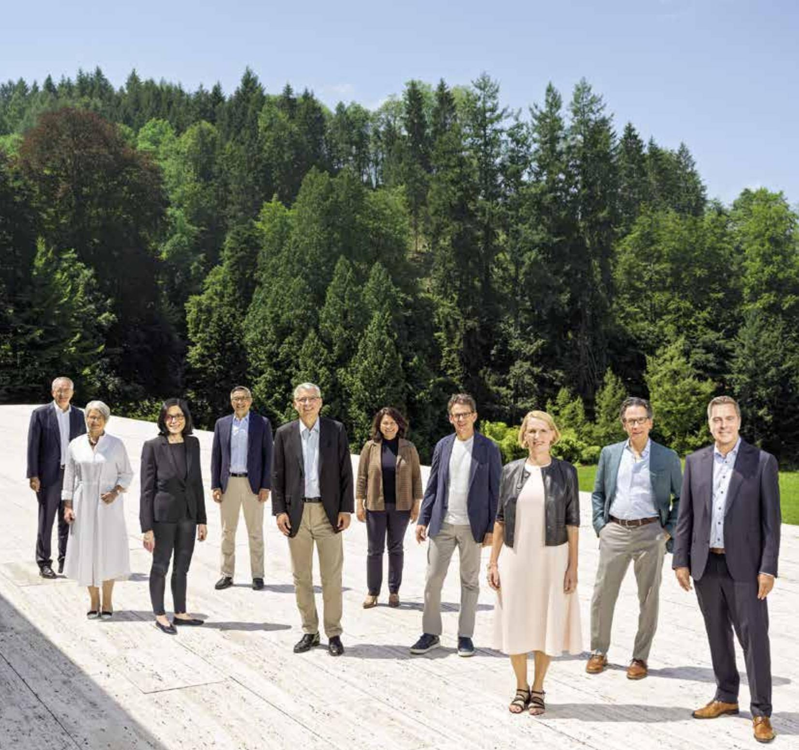

> **AI Description:**
> **Source:** `assets/_page_22_Figure_0.jpg`
> 
> **Generated:** 2026-06-01 18:28:07
> 
> ---
> 
> The image is a photograph of a group of ten individuals standing outdoors in a line. They are dressed in business attire, with some wearing suits and others in more casual or semi-formal clothing. The background features a lush green forest and a clear blue sky, suggesting a pleasant, sunny day. The group appears to be posing for a formal or professional photo, possibly for a company or organizational event. There are no visible text or labels within the image.

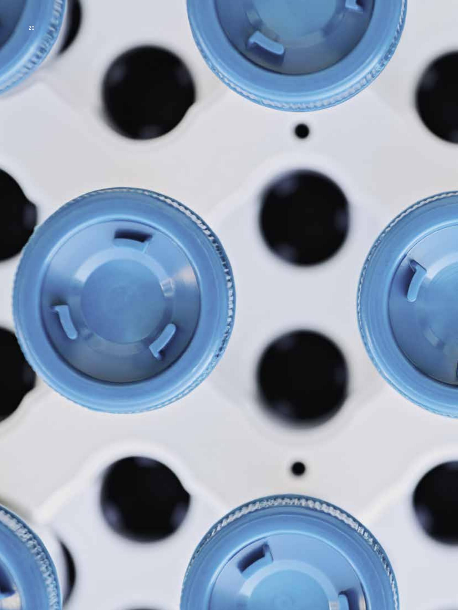

> **AI Description:**
> **Source:** `assets/_page_23_Figure_0.jpg`
> 
> **Generated:** 2026-06-01 18:21:33
> 
> ---
> 
> The image contains a close-up photograph of a grid-like structure with multiple circular openings. The structure appears to be made of a white material, possibly plastic, with blue circular caps inserted into the openings. The caps have a textured edge and a central hole, suggesting they might be part of a laboratory or industrial setup, possibly for holding test tubes or similar items. The image does not contain any text or labels that provide additional context.

## Reporting and

strategy

# Our reporting approach

Roche is committed to transparent reporting and we endeavour to drive our economic, social and environmental performance with the same diligence as our financial performance.

## Reporting scope and boundaries

Our financial and non-financial reporting consists of the Annual Report, the Finance Report and the online report. It contains the annual financial statements, consolidated financial statements and non-financial performance indicators. It covers all regions and divisions of the Roche Group from 1 January to 31 December 2021. The financial reporting scope is defined and outlined in our Finance Report, and there have been no significant changes in scope in 2021 compared to 2020.

## GRI standards and materiality

We have followed the GRI (Global Reporting Initiative) G4 guidelines since 2014, and transitioned to the GRI Standards in 2017. By using the GRI guidelines, we disclose the most critical impacts of our activities on the environment, society and the economy. In this respect, we conducted a first materiality analysis at the corporate level in 2014. In 2018/2019, we conducted a second global materiality assessment including expert interviews and feedback from more than 600 stakeholders. The results of this assessment are featured on pages 24 and 25 of this report and are also published on our website (see link on page 24).

## Risk management

Our Risk Management Policy sets out Roche’s approach to identifying, analysing, managing and reporting internal and external risks and opportunities. A consolidated Group Risk Report, which covers all material risks and opportunities, is discussed annually with the Corporate Executive Committee and reviewed by the Board of Directors. The effectiveness of the Group Risk Management Process is regularly monitored by the Group

Risk Advisory team and the overall process reviewed by the Audit Committee of the Board of Directors, and reviewed externally when appropriate. Risk management is embedded at all levels of the Roche Group. Our Pharmaceuticals and Diagnostics divisions and global functions conduct a formal risk and opportunity assessment process at least once a year and must develop response plans for their most material risks and opportunities.

Read more in ‘Corporate Governance’ on page 140.

We also identify long-term business sustainability trends with associated risks and opportunities on an annual basis and integrate these into our existing Group Risk Management Process. Each year, emerging trends (including associated risks and opportunities) are identified from internal and external sources.

Based on these findings the Sustainability Steering Committee prioritises and selects the top business sustainability trends. Among those identified trends are healthcare evolution and societal crises.

## UN Sustainable Development Goals

We support the United Nations Sustainable Development Goals (SDGs) within the sphere of our corporate business strategy. We contribute to a number of the SDGs and are particularly pleased to see a dedicated goal on health (SDG 3). This goal is closely connected with the achievement of universal health coverage, which goes hand in hand with better access to quality essential medicines and diagnostics. This fits in perfectly with our vision to improve and save lives. Since 2016, the SDGs have been an integral part of our annual reporting.

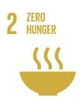

> **AI Description:**
> **Source:** `assets/_page_26_Figure_2.jpg`
> 
> **Generated:** 2026-06-01 19:19:09
> 
> ---
> 
> The image contains a simple icon and text. The icon is a bowl with steam rising from it, symbolizing food or nutrition. The text "ZERO HUNGER" is written above the icon. This image is likely part of a sustainability or development initiative, possibly related to the United Nations Sustainable Development Goals (SDGs), as it aligns with Goal 2: Zero Hunger.

Examples of our contribution to the UN goals are listed on our UN SDG webpage (see link on page 24) and are mapped to our material topics as featured on page 25.

As a signatory of the UN Global Compact (UNGC), we commit to integrate the universal principles in the areas of human rights, labour, environment and anti-corruption into our business strategy, culture and daily operations and to report on the results achieved each year. We will publish our first Communication on Progress in the first quarter of 2022.

## External assurance

Our non-financial reporting has been verified by PricewaterhouseCoopers AG (PwC), an independent third party, focused on the materiality determination process, the design of the sustainability risks and opportunities determination process and on the figures in the areas of safety, security, health and environmental protection, people and contributions. Since 2019, and as a result of Roche’s strengthened control framework, review procedures and reporting aspects, the figures related to our grants, donations and sponsorships to healthcare and patient organisations have been subject to reasonable assurance performed by PwC. This figure is disclosed on the non-financial reporting key performance indicators webpage, including the PwC assurance report.

See ‘Independent Assurance Report’ on page 190.

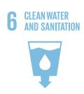

> **AI Description:**
> **Source:** `assets/_page_26_Figure_10.jpg`
> 
> **Generated:** 2026-06-01 18:42:59
> 
> ---
> 
> The image contains a visual element that is part of the United Nations Sustainable Development Goals (SDGs) series. It features a blue icon of a water droplet inside a glass, symbolizing clean water and sanitation. The number "6" is prominently displayed in the top left corner, indicating that this icon represents Goal 6 of the SDGs. The text "CLEAN WATER AND SANITATION" is written in blue at the top of the image, providing a clear label for the icon.

## Business sustainability trends

Healthcare is moving towards a continuum of care approach, including prevention, treatment and cure, offering a wider range of products and service solutions. This is a unique opportunity to accelerate delivery of truly integrated, patient-centric and personalised healthcare solutions. For example, we have introduced our Navify Symptom Tracker, which offers remote monitoring of COVID-19 symptoms. We are also developing cloud-enabled integration engines to support digital health ecosystems and mobile apps for patients and healthcare professionals, like the mySugr app to monitor and manage diabetes on a smartphone. The risks and opportunities associated with this new digital health arena are assessed and managed through the Group Risk Management Process.

## Societal crises

Ineffective social models with limited economic and educational prospects are likely to lead to dissolution of societal solidarity and exacerbate mental health deterioration and youth disillusionment. We consider that it is our role to drive public-private partnerships and initiatives, working in collaboration with governments and healthcare providers, to tackle such risks. We also see an opportunity to demonstrate that we are an employer of choice, acknowledging the importance of health and well-being of our employees. We provide various offerings to support employees and their families, from flexible working arrangements, parental leave for men and women, childcare facilities and other provisions to help employees combine their career and family roles, to unpaid-leave options for people needing to care for an elderly relative.

# Materiality and impact

Our purpose is Doing now what patients need next. How we identify and meet those needs – what we do every day – must be sustainable if we are to succeed. It is why sustainability is built into our business strategy and part of everyone’s job at Roche.

Our approach is holistic and integrates the three dimensions of sustainability:

Society – how we contribute to a better tomorrow for all

• Environment – how we minimise our impact on nature

Economy – how we invest in medical advances, create jobs and ensure livelihoods

What does this mean for each of us at Roche, every day?

## Society

We contribute to a better society by enabling the right treatment for the right patient at the right time for the right value. We do this by developing new medicines and ways of diagnosing disease and gaining insights from data. Our commitment to expand access to these innovations will help more patients live longer, better lives. And with this comes a deep respect for the human rights of everyone we reach, especially patients, business partners, suppliers, local communities and, of course, our colleagues around the world. It is why we emphasise employee safety, health and development while promoting diversity and inclusion, integrity, mutual respect and equal opportunities for all.

## Environment

The respect for a healthy planet and for the environment has always been a priority of our founding families and the company. We are committed to halving the environmental impact of our operations and products from

2019 to 2029.  And we aim to reduce our own greenhouse gas emissions to absolute zero by 2050, while partnering with our suppliers to reduce their emissions for our mutual benefit.

## Economy

Our business must meet the needs of patients and continue creating quality jobs that provide people and their families with secure livelihoods, while earning competitive returns for our investors. We do this by promoting innovation and by translating science into pioneering medicines and diagnostics that help patients live longer, better and more productive lives – enabling them to support themselves and contribute to their local economies.

As described in our strategy our set-up is designed for innovation. Our autonomous research and development centres and alliances with more than 250 external partners foster a diversity of scientific approaches and agility. Roche operates in over 100 countries where our local teams implement our strategy. We measure our performance and report to all our stakeholders the progress towards the goals we have set ourselves.

## Materiality assessment and stakeholder engagement

Engaging with our stakeholders is essential to build trust and an understanding of their expectations. By embedding their feedback in our strategy and our daily business, we are able to jointly address our common issues and develop long-term solutions.

In order to identify the topics that are particularly relevant to Roche, our stakeholders and society at large and to deliver lasting shared value, we conducted an in-depth materiality assessment at corporate level among our key stakeholders in 2018/2019. Our approach to materiality assessment is integrated – building on our Group Risk Management Process – and inclusive, being designed collaboratively with colleagues across multiple functions. We gathered insights from a broad range of internal and external stakeholders to identify the most important and pressing issues that Roche should address in the next three to five years. We identified 19 material topics, clustered in eight main categories, that stood out as highly relevant to us and to our key stakeholders. To properly address these topics, we have then aligned them with our current goals and are measuring performance through our defined set of indicators.

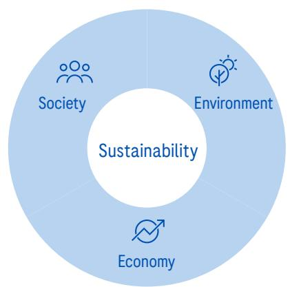

> **AI Description:**
> **Source:** `assets/_page_28_Figure_0.jpg`
> 
> **Generated:** 2026-06-01 18:37:12
> 
> ---
> 
> The image is a circular diagram illustrating the concept of sustainability. It features three main sections labeled "Society," "Environment," and "Economy," each represented by a distinct icon. The word "Sustainability" is prominently placed at the center, indicating that these three aspects are interconnected and essential for achieving sustainability. The diagram is designed to visually represent the three pillars of sustainability in a balanced and interdependent manner.

## Our strategy

We focus on finding new medicines and diagnostics and on establishing data-based insights that evolve the practice of medicine and that help patients live longer, better lives.

Our business environment is undergoing tremendous change. We are facing new challenges due to the complexity of care and increasing pressure on healthcare budgets. At the same time, we see new opportunities arising from major advances in life sciences and from digitalisation in healthcare.

In these turbulent times, we are guided by our common purpose: Doing now what patients need next. Our company has been bringing novel diagnostics and treatments to patients for 125 years. Patients are and will remain at the core of what we do. They are the reason we come to work every day.

## What we do

We focus on our vision of fitting treatments to patients: providing the right therapy for the right patient to ensure the best response at the right time for the right value. Our approach combines our rich expertise in pharmaceuticals and diagnostics with expanded data science capabilities to drive more effective and efficient research and to enable better therapeutic decisions for patients.

Our pursuit of excellence in science rests on four key elements: an exceptionally broad and deep understanding of disease biology; the seamless integration of our capabilities in pharmaceuticals and diagnostics; a diversity of approaches to maximise innovation; and a long-term orientation.

Working in partnership with third parties, we offer integrated solutions with improved medical, health and economic benefits. We work with many different stakeholders in the healthcare ecosystem to broaden access to our offerings for people who need them and, ultimately, to provide a seamless patient journey. We will continue to concentrate our energies on prescription medicines, in vitro diagnostics and increasingly data and insights, rather than diversify into other sectors like generics, biosimilars or over-the-counter medicines.

Our delivery is to create value for all our stakeholders: being a partner of choice; bringing significant medical benefit for patients, doctors and payers; offering a great place to work for employees; delivering a sustainable positive contribution to society; and earning competitive returns for our investors.

## How we do it

Ultimately, delivering on our commitments takes people with integrity, courage and a passion for making a difference for patients. Our people are proud to say: We are Roche.

Our leadership inspires outcomes that matter by embracing diversity and inclusion. Different backgrounds, perspectives and experiences, across the entire organisation, foster innovative solutions for the benefit of patients. Our ways of working enable agile and networked responses to the ever increasing pace of change by balancing the needs for stability, speed and flexibility.

Our set-up is designed for innovation. Our autonomous research and development centres and alliances with more than 250 external partners foster a diversity of scientific approaches and agility. Our global geographical scale and reach enables us to attract talent in the leading global science clusters and to quickly bring our solutions to people who need them.

What we do

How we do it

Our focus Fitting treatments to patients

Our distinctiveness Excellence in science

Our delivery Value for all stakeholders

Our leadership Inspiring outcomes that matter

Our ways of working Agile and networked

Our set-up Built for innovation

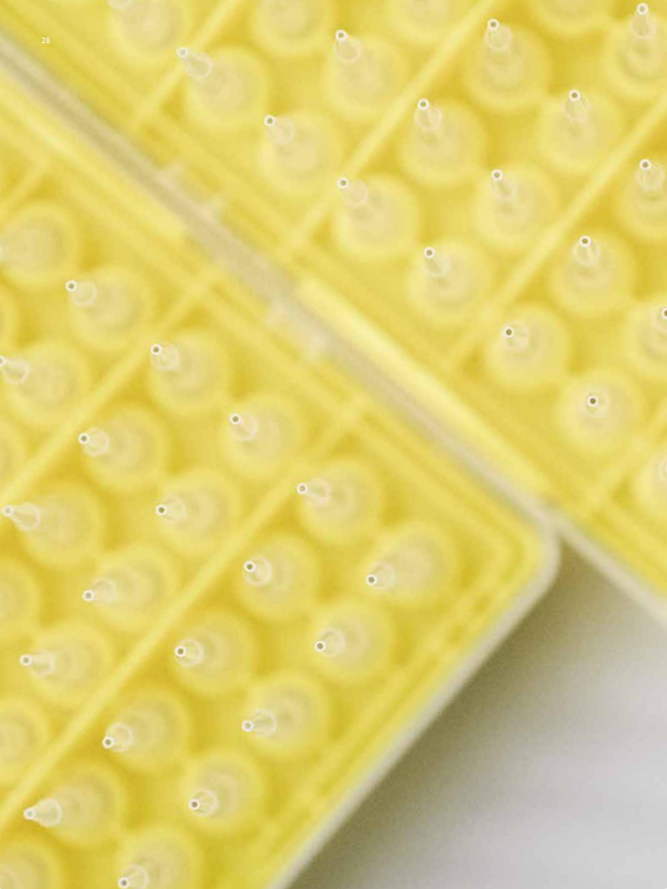

> **AI Description:**
> **Source:** `assets/_page_31_Figure_0.jpg`
> 
> **Generated:** 2026-06-01 18:18:08
> 
> ---
> 
> The image shows a close-up view of a yellow, textured surface with numerous small, clear, and transparent structures arranged in a grid-like pattern. These structures appear to be part of a scientific or laboratory setting, possibly related to cell culture or a similar process. The image is detailed and focused on the texture and arrangement of these structures, which could be indicative of a specific material or experimental setup. The image does not contain any text or labels that provide additional context.

## Diagnostics

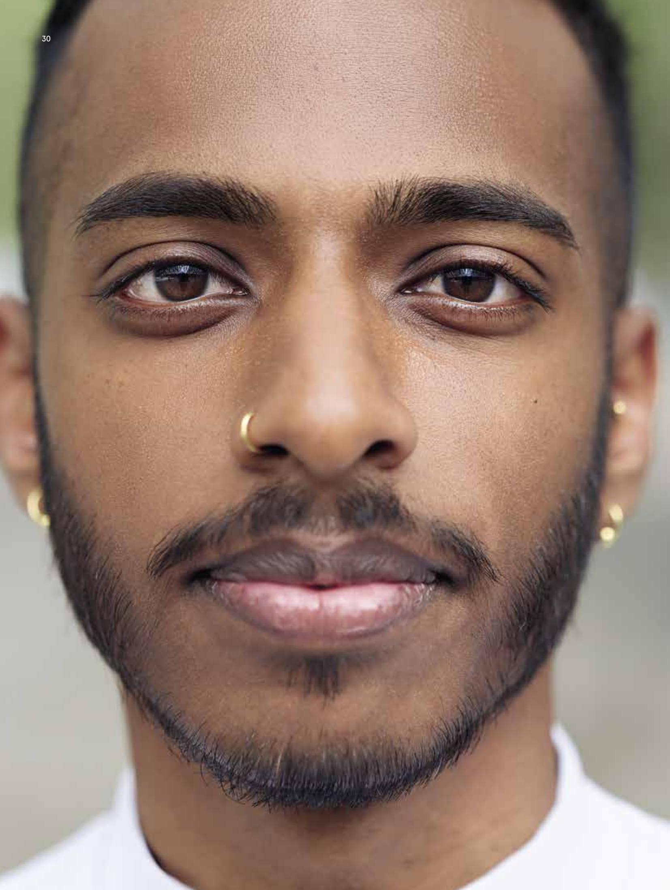

> **AI Description:**
> **Source:** `assets/_page_33_Figure_0.jpg`
> 
> **Generated:** 2026-06-01 19:23:57
> 
> ---
> 
> The image is a close-up photograph of a person's face. The individual has a short beard and mustache, and is wearing small hoop earrings. The background is plain and out of focus, drawing attention to the subject's facial features. The image does not contain any text or additional visual elements beyond the person's face.

# Diagnostic solutions - the backbone of treatment decisions

Whether it is cancer, infectious diseases or other serious health threats, the quest for better solutions to healthcare’s greatest challenges depends on diagnostics.

The COVID-19 pandemic profoundly raised awareness of the role diagnostics play in disease prevention and management. Although COVID-19 continues to dominate the healthcare landscape and the pandemic remains a global threat, some countries have made varying degrees of progress towards containing the virus. At the end of 2021, there were more than 293 million confirmed cases of COVID-19, and more than five million deaths.

The spread of the virus has placed an enormous strain on health systems and heightened the need or millions of tests. At Roche, we are proud of our industry-leading portfolio of 22 COVID-19 solutions, and we remain committed to developing and bringing to market additional tests and solutions to strengthen the global fight against the disease.

In March 2021, we launched the cobas SARS-CoV-2 Set 1 variant test, which runs on our cobas 6800/8800 systems. Developed to detect and differentiate SARS-CoV-2 mutations in known variants, this research-use-only test can help scientists track mutation prevalence, assess the spread of circulating variants, and monitor their potential impact on treatments, vaccines, and public health measures. The test has a pre-optimised assay design, ready-to-use test cassettes, and predefined software parameters, all of which reduce testing complexity and shorten turnaround time.

In the first quarter of 2021, we also introduced the SARS-CoV-2 Antigen Self Test Nasal for self-administered testing at home. The test enables patients to gather a sample from the front area of the nose rather than the nasopharynx and can identify infectious SARS-CoV-2 in just 15 minutes. Initially granted special approval in several European countries, the test received the CE mark in June, expanding its availability to countries accepting the CE mark.

We further supplemented our COVID-19 portfolio in June with the launch of the SARS-CoV-2 assay on the cobas Liat system, making it the first 20-minute point-of-care (PoC) PCR test to receive Emergency Use Authorization in the US for asymptomatic screening. The test detects all currently known SARS-CoV-2 variants, and brings fast PCR testing to near-patient settings, like clinician’s offices, emergency rooms and urgent care clinics.

In December, we received FDA Emergency Use Authorization for our COVID-19 At-Home Test, which uses a simple anterior nasal swab sample for convenient self-collection and self-testing by individuals aged 14 years and older, and by an adult for children aged 2–13 years old. It can produce accurate, reliable and quick results in as few as 20 minutes for SARS-CoV-2 and all known variants of concern, including Omicron.

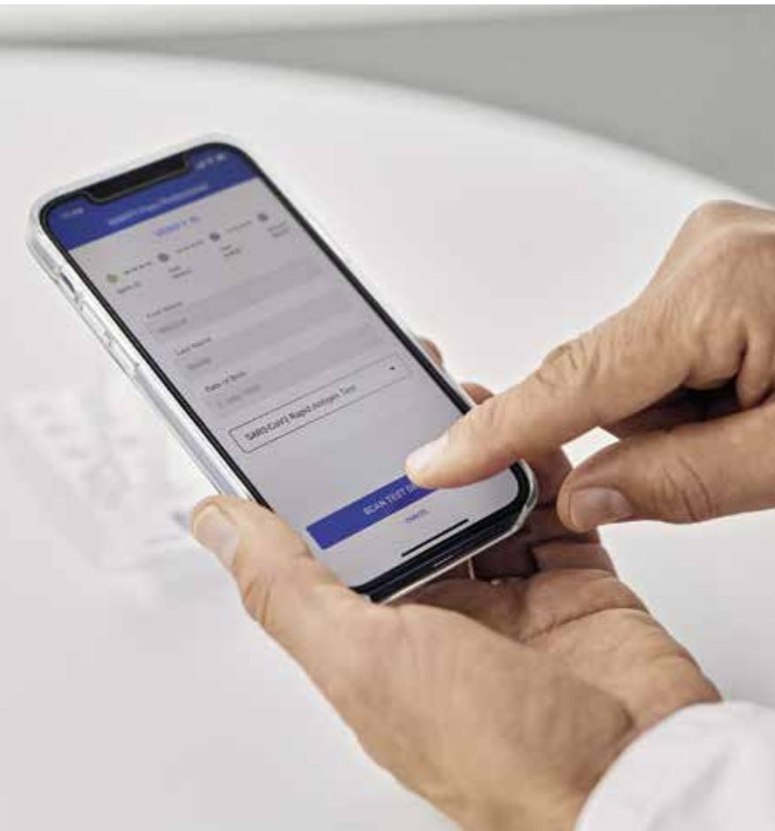

> **AI Description:**
> **Source:** `assets/_page_35_Figure_0.jpg`
> 
> **Generated:** 2026-06-01 19:15:30
> 
> ---
> 
> The image shows a close-up of a person's hands holding a smartphone. The phone screen displays a form or application interface with fields for entering personal information such as name, date of birth, and a section labeled "SARS-CoV-2 Rapid Antigen Test." The interface also includes a button labeled "SCAN TEST." The background is a plain, light-colored surface. The image focuses on the interaction between the hands and the smartphone, suggesting a user interface for a health-related application.

## 125 years of milestones

Revolutionising diagnostics   
Polymerase chain reaction (PCR) is a trusted way to create unlimited copies of DNA from just one original strand. The copied DNA can then be used reliably in a wide variety of tests to diagnose or monitor diseases, or for basic molecular biology research.

In 1983, Kary Mullis, a scientist at the Cetus Corporation, conceived PCR as a method to copy DNA and synthesise large amounts of a specific target DNA. Over the next two years, the team of Cetus scientists that recognised the potential impact PCR could have on molecular biology researched, refined and made the theoretical process a reality.

In 1991, Roche bought the rights to PCR from Cetus and invested in refining the science for use in molecular diagnostics to detect diseases. Roche Molecular Diagnostics has not only defined and refined PCR, but it has remained the clear leader and trailblazer of this technology.

Navify Pass enables individuals to receive health credentials easily and seamlessly on their mobile devices.

That same month, we added three additional research-use-only (RUO) test kits for the detection of mutations present in the novel B.1.1.529 Omicron SARS-CoV-2 variant: VirSNiP SARS Spike ins214EPE (RUO), VirSNiP SARS-CoV-2 Spike S371L S373P (RUO), VirSNiP SARS Spike E484A (RUO). The kits were developed with TIB Molbiol, our newly acquired subsidiary.

The VirSNiP variant kits allow differentiation between the range of unique mutations present within the Omicron variant compared to other SARS-CoV-2 variants and are for use on LightCycler and cobas z 480 analysers. Using a technology called quantitative polymerase chain reaction (qPCR) they can help researchers with improved variant detection and viral research, and are among the first to address the range of unique mutations of the Omicron variant.

Besides the novel assays, we also launched the Navify Pass, a digital solution that allows people to receive their COVID-19-related health data in a mobile app. Available in various countries, including the United Kingdom and the Netherlands, this solution can be used to facilitate access to events and travel and enable a return to normality.

Point-of-care testing plays an essential and increasingly important role in healthcare as it delivers high medical value solutions and diagnostic information to patients and healthcare professionals wherever and whenever it is needed. The Roche point-of-care strategy focuses on infectious diseases like COVID-19, influenza A/B and sepsis, with tests for several other diseases currently in development.

## Diagnostics beyond COVID-19

Unfortunately, during a pandemic, many people with other serious diseases face delays in treatment and disease monitoring. To achieve the best possible results, these patients depend heavily on early diagnosis and rapid access to therapy. To meet both COVID-19 and other testing needs, we significantly increased installations of our high-throughput systems cobas 6800/8800, and have now installed more than 1,700. As a result, every 24 hours, laboratories around the world can perform three million more tests than they could before the pandemic. Health systems can use the additional capacities for screening, diagnosis, and treatment monitoring in other areas, such as cancer, cardiovascular disease and women’s health.

In spite of the pressures of meeting the ongoing demand for COVID-19 tests, we launched several tests and solutions for other health conditions in 2021. Many of these conditions are not only a tremendous stress and strain on the patient, but also on their loved ones and on the healthcare system.

In oncology, we added important new tests to aid in the fight against cancer. In March, we expanded the label for the Ventana ALK (D5F3) assay to identify ALK-positive lung cancer patients who are eligible for targeted treatment with Lorbrena (lorlatinib, Pfizer). This assay is the only immunohistochemistry test approved by the FDA as a companion diagnostic for Lorbrena. The test has previously been approved as a companion diagnostic for three other targeted treatments, including Xalkori (crizotinib, Pfizer), Zykadia (ceritinib, Novartis) and Roche’s Alecensa (alectinib). This label expansion advances Roche’s commitment to personalised healthcare (PHC). It provides lung cancer patients with access to more treatment options and a better chance for progression-free survival, compared to the standard of care.

A month later, we launched the Elecsys Anti-p53 immunoassay to help diagnose bowel, breast, and oesophageal cancer. A mutation of p53 is present in half of solid tumour cancers and is the most common genetic change identified so far in human cancers. This test is especially impactful in oesophageal cancer, the sixth most common cause of cancer death worldwide. It can be particularly difficult to treat as it often has no signs or symptoms in the early stages.

Also in support of our PHC approach towards cancer care, we received FDA approval in October for the Ventana PD-L1 (SP263) assay to be used as a companion diagnostic to identify patients with non-small cell lung cancer eligible for treatment with our Tecentriq immunotherapy. The approval was based on the results from the phase III IMpower010 study and expands our industry-leading portfolio of companion diagnostics.

We also launched the Elecsys Growth Differentiation Factor 15 (GDF-15) immunoassay, which detects a specific form of weight loss known as cachexia in patients with solid tumours. The test, which has received the FDA Breakthrough Device Designation, helps determine eligibility for treatment that targets this highly prevalent complication of cancer.

The Ventana MMR RxDx Panel, launched in April, is the first FDA-approved companion diagnostic for identifying patients with advanced or recurring endometrial cancer who are best suited for treatment with GSK’s immunotherapy drug Jemperli (dostarlimab-gxly). Endometrial cancer is the most common gynaecologic cancer in the US and about 90,000 women globally die from endometrial cancer each year. Currently, only limited treatment options exist for women whose disease progresses on or after first-line therapy; ours is the first companion diagnostic to identify endometrial cancer patients eligible for anti-PD1 immunotherapy. The test was also FDA approved in August to help determine, based on cancer biomarkers, which patients with solid tumours may benefit from Jemperli.

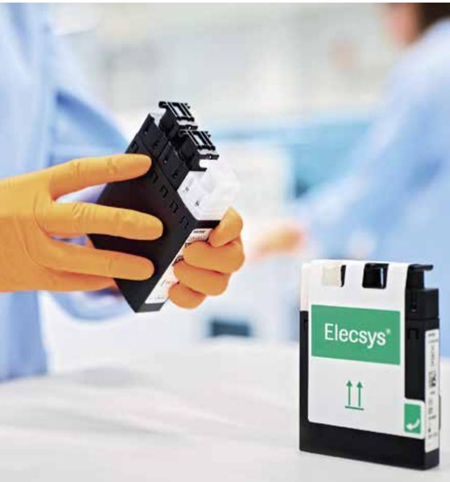

> **AI Description:**
> **Source:** `assets/_page_37_Figure_0.jpg`
> 
> **Generated:** 2026-06-01 18:31:17
> 
> ---
> 
> The image contains a photograph of a laboratory setting. A person wearing a yellow glove is holding a black device with multiple slots, possibly a test kit or analyzer. In the foreground, there is a white and green device labeled "Elecsys" with arrows indicating the direction for insertion or operation. The background is blurred, showing another person in a lab coat, suggesting a clinical or research environment. The image appears to be related to medical or scientific testing equipment.

In October, we announced the IMPACT (IMproving Primary screening And Colposcopy Triage) clinical trial data showing a clear benefit in using our CINtec Plus Cytology test for women who are at higher risk of developing cervical cancer. More than 604,000 women are diagnosed with cervical cancer each year and approximately 342,000 die from this preventable cancer caused by infection with high-risk types of the human papillomavirus (HPV). Results from the trial of more than 35,000 women aged 25–65 years, were published in the International Journal of Cancer.

In the study, women who were positive for highrisk HPV received a follow-up triage test to help determine if their cervical cells were transforming to cervical pre-cancer. The biomarker-based CINtec Plus Cytology test showed a significantly higher sensitivity in detecting cervical pre-cancers, compared to Pap cytology. The Roche test aids clinicians in more confidently determining which

Our systems, tests and software solutions help laboratories improve their efficiency, quality controls and information sharing, and support physicians and patients in treatment decisions.

women are at increased risk for high-grade cervical pre-cancer and require immediate further diagnostic procedures, and which women may need repeat testing or routine screening.

## Improving CVD management

Cardiovascular disease (CVD) remains the leading cause of death globally, claiming the lives of nearly 18 million people each year.1 The COVID-19 pandemic has made management of this disease even more challenging, especially as many patients are unaware that they have the disease, and are reluctant to seek care even if experiencing classic symptoms like chest pain. Biomarkers play a critical role in improving the diagnosis and management of heart attacks and heart failure. In April, we announced additional testing capabilities for two key biomarkers: high-sensitive cardiac troponin T (cTnT-hs) and N-terminal pro-brain natriuretic peptide (NT-proBNP).

Heart failure affects more than 64 million people worldwide and places great stress on patients, caregivers and healthcare systems. Despite treatment and hospitalisation, the outlook is poor. One of the new Elecsys NT-proBNP test extensions can identify which patients with type 2 diabetes are at greater risk for developing heart failure. Another helps identify patients at risk of developing atrial fibrillation, an abnormal heart rhythm that can lead to stroke, brain damage or death. The new extensions for Elecsys cTnT-hs testing help predict heart attack risk and mortality in non-cardiac surgery patients, and can assess long-term cardiovascular event risk in asymptomatic patients.

Infectious disease threats beyond COVID-19 Although COVID-19 retains the world’s attention, a range of other infectious diseases affect millions of people, and rank among the top three causes of death worldwide. We continue to develop tests and solutions for infectious diseases beyond COVID-19.

In March, we launched the Elecsys Epstein-Barr virus (EBV) immunoassay panel to improve EBV staging in countries accepting the CE mark. Infecting more than 90% of the world’s population by adulthood, EBV normally remains dormant, but can become threatening to those with weakened immune systems, such as transplant patients. This panel includes three immunoassays to detect specific EBV antibodies: Elecsys IgM, Elecsys EBV VCA IgG and Elecsys EBNA IgG. The panel helps clinicians make faster decisions on treatment for transplant patients, and can also be used to rule out other acute infections, such as undetected HIV.

Also newly approved is a claim extension for our Elecsys BRAHMS Procalcitonin (PCT) immunoassay to monitor patients on antibiotic therapy, which is around 420 million patients a year. This aids in identifying resistance and enables targeted antibiotic use. It also detects severe bacterial infections in as many as 50 million patients a year for earlier therapeutic intervention.

With the completion of our GenMark Diagnostics acquisition, we have strengthened and broadened our infectious diseases portfolio and taken a major step into syndromic panel testing (also known as multiplex testing). By detecting the most common pathogens that cause disease together on a single rapid test, with a single patient sample, clinicians can prescribe the right therapeutic within hours – rather than days, when compared with conventional testing algorithms. Roche and GenMark can benefit patients, laboratories and healthcare providers through this combined expertise and portfolio.

Acute respiratory infections, including serious complications from infections with SARS-CoV-2, are among the world’s leading causes of death and disability. In September, we launched three respiratory test panels in CE markets to help

identify multiple pathogens with overlapping symptoms. These test panels can be run on the cobas omni Utility Channel of the high-volume cobas 6800/8800 systems. These three new molecular diagnostic panels use a single patient sample to test for influenza A and influenza B as well as respiratory syncytial virus (RSV); adenovirus (ADV), human metapneumovirus (hMPV) and enterovirus/rhinovirus (EV/RV); and parainfluenza 1, 2, 3 and 4. The tests can be run together or alone. When compared to conventional diagnostic methods, these flexible syndromic panels reduce unnecessary testing and provide important insights to clinicians more quickly. Moreover, these tests can be combined with our COVID-19 testing on the cobas 6800/8800 systems.

Patients with respiratory infections often have signs and symptoms that are not specific enough to discern the root cause of the illness. This latest set of syndromic respiratory solutions allows clinicians to choose the appropriate tests based on the healthcare setting, any seasonal outbreaks, and patient needs. By testing only what is medically relevant and necessary, they enable targeted therapy, avoid misuse of antibiotics and reduce unnecessary intervention.

Through our acquisition of the TIB Molbiol Group in December, we are able to further expand our portfolio with more than 45 CE-IVD assays and more than 100 research use assays on our LightCycler PCR systems and MagNA Pure sample preparation systems. We have successfully partnered with TIB Molbiol for more than 20 years and this collaboration was instrumental in creating our first SARS-CoV-2 detection test in January 2020, mere days after this novel virus had first been sequenced.

# Transforming healthcare through digitalisation and advanced technology

In 2021, more than 27 billion tests were conducted with Roche products. This includes more than one billion tests to diagnose SARS-CoV-2 infections or measure related antibodies. In addition, it includes millions of tests for other health conditions. Over time, the thousands of data points individual patients create throughout their journeys not only help identify changes in their health, but also enable tracking of similar patient cohorts across institutions and geographies. This will eventually allow for comparison of outcomes as well as predictive measures through artificial intelligence (AI) and machine learning.

With the goal of improving patient care by expanding access to innovative image analysis, we launched the Digital Pathology Open Environment. With this open environment, Roche is building an open application programming interface (API) framework to enable third-party companies to deploy their algorithms within Navify Digital Pathology, the cloud version of Roche uPath enterprise software. In addition to the Digital Pathology Open Environment, we announced in October collaborations with PathAI and Ibex Medical Analytics for AI-based digital pathology applications.

Our growing involvement with AI underscores our belief that it holds significant promise for advancing pathology imaging, which can benefit cancer patients through more precise diagnosis. This in turn can help clinicians identify targeted treatments that could lead to better results.

For breast cancer, we announced in January the CE-IVD launch of our automated digital pathology algorithms, uPath HER2 (4B5) image analysis and uPath HER2 Dual ISH image analysis, to help determine the best treatment strategy for each patient. In December, we launched three new research-use-only (RUO) automated digital pathology algorithms, uPath Ki-67 (30-9), uPath ER (SP1) and uPath PR (1E2) image analysis, also for breast cancer. These three are important biomarkers and they complete our digital pathology breast panel of image analysis algorithms.

For earlier detection of liver cancer, specifically hepatocellular carcinoma (HCC), the CE mark was granted in November for our Elecsys GAAD algorithmic score, which combines gender, age and Roche’s Elecsys AFP and Elecsys PIVKA-II assays. Liver cancer is one of the few cancers that is on the rise and is responsible for 830,000 deaths a year. However, when detected and managed early, patient five-year survival rates can increase up to 70%. Our algorithmic score helps aid in diagnosis of patients with chronic liver disease, such as hepatitis or cirrhosis, when followed-up with CT or MRI scanning. This provides clinicians with more accurate information to support their treatment decisions and could help increase access to liver cancer testing.

In digitalisation for the point-of-care setting, the cobas pulse system represents a major advance. This revolutionary new glucose management solution is the first professional blood glucose meter with an Android-based operating system loaded with industry-leading medical apps that can perform essential functions for nurses, doctors and lab managers. With cobas pulse launched in November, we believe that the system will serve as a gateway to future digital health services and medical practice.

## Improved lab management for improved patient outcomes

Innovative tests, digital insights and enhanced laboratory management solutions are transforming healthcare and improving outcomes. With this new digital era come great opportunities to benefit patients and laboratories around the world. By

Digitalisation in healthcare is continually improving our ability to collect, curate and make sense of vast quantities of diverse patient data.

identifying and developing innovative predictive diagnostics, testing enables early detection and treatment, which can significantly improve outcomes. In addition, AI can help increase the number of cases reviewed by pathologists while reducing human error, improving accuracy and enabling personalised treatment plans.

In the third quarter, we launched updated and expanded lab analytical applications for our customers, including Viewics LabOPS Molecular. This newly expanded offering provides insights across the entire menu of the Roche cobas 6800/8800 systems using data directly uploaded from the analytics to Roche.

Viewics LabOPS Core has been approved for launch in several regions around the world, further enhancing our digital diagnostics portfolio. This application provides laboratory and hospital personnel with an easier way to track, review and identify operational trends and challenges. Its visibility guides the decision-making process towards optimising operations, customer delivery and overall lab performance in a targeted and efficient manner. LabOPS Core is providing a set of turnkey analytics, thereby enabling datadriven decisions to improve the operational effectiveness of the clinical laboratories.

In 2021 we also launched new diagnostic platforms such as the cobas pure, cobas pro (high throughput) and cobas 5800. These new systems will enhance our offering by enabling comparable results for labs of different sizes – the first two in the Serum Work Area space for core laboratories, and the latter for molecular labs.

At Roche, our goal is to provide patient-centric continuity of care at every stage of the patient journey: from prevention to diagnosis through treatment monitoring and after-care.

> **AI Description:**
> **Source:** `assets/_page_40_Figure_0.jpg`
> 
> **Generated:** 2026-06-01 18:10:03
> 
> ---
> 
> The image contains a photograph of a person in a medical or laboratory setting, holding a tablet device. The tablet screen displays a grid of icons, likely representing a user interface for a medical or scientific application. The background is slightly blurred, showing another individual in similar attire, suggesting a professional environment. The focus is on the interaction with the tablet, implying the use of digital tools in a healthcare or research context.

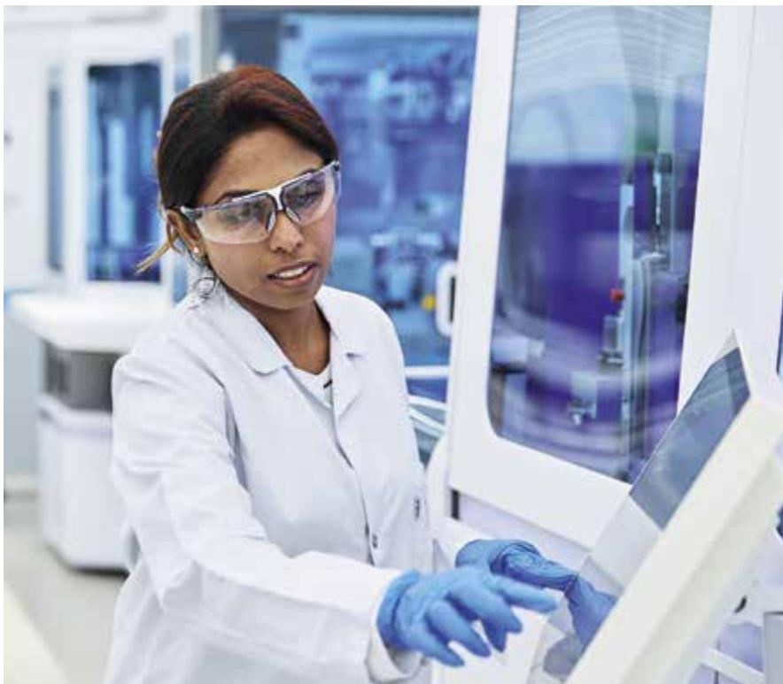

> **AI Description:**
> **Source:** `assets/_page_40_Figure_1.jpg`
> 
> **Generated:** 2026-06-01 18:11:47
> 
> ---
> 
> The image contains a photograph of a person in a laboratory setting. The individual is wearing a white lab coat, blue gloves, and protective eyewear. They are interacting with a piece of laboratory equipment, which appears to be a machine with a digital display and buttons. The background shows other laboratory equipment and glass walls, suggesting a controlled and professional environment. The image conveys a sense of scientific work and technological operation within a laboratory.

## Diabetes Care

Diabetes management is complex and personal, and achieving therapy goals is an ongoing challenge. We believe that the more personalised and tailored the therapy is, the better the outcomes. This is why we continue to implement solutions to leverage our integrated personalised diabetes management approach.

In April 2021, Diabetes Care began offering the Accu-Chek Insight insulin pump paired with Diabeloop’s hybrid closed-loop system within the scope of our previously announced partnership. People living with diabetes in Germany, Italy, Spain, Switzerland and the Netherlands are now able to use the Accu-Chek Insight insulin pump as part of Diabeloop’s DBLG1 system, which features a self-learning algorithm hosted on a dedicated

The mySugr app fully integrates with our RocheDiabetes Care Platform.

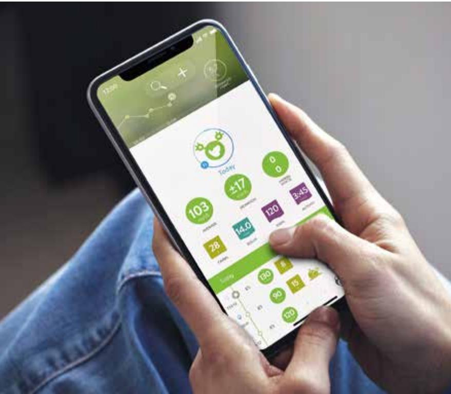

> **AI Description:**
> **Source:** `assets/_page_41_Figure_0.jpg`
> 
> **Generated:** 2026-06-01 18:24:57
> 
> ---
> 
> The image contains a smartphone displaying a health tracking app interface. The screen shows various health metrics such as steps taken, calories burned, and heart rate. The app uses a combination of icons and numerical data to present the information. The interface includes a circular icon at the top with a gear symbol, indicating settings or options. The app appears to be designed for monitoring daily health activities and progress.

handset. This algorithm analyses data in real time and decides whether to stop insulin delivery, adjust basal rates, or even deliver an automatic correction bolus when needed.

Also in April, mySugr (acquired by Roche in 2017) announced the integration of the Novo Nordisk NovoPen 6 and NovoPen Echo Plus into the mySugr app logbook on iOS. The integration follows the collaboration agreement signed between Roche and Novo Nordisk in 2019. Users can record their insulin data in the mySugr app, track and combine it with blood glucose values, activities, meals and other relevant diabetes data. The solution is currently available in Sweden and Denmark as well as in pilot projects in selected healthcare institutions in Germany and Austria.

The mySugr app is an integral part of the Diabetes Care open ecosystem and offers features like structured documentation of data, accurate insulin dose calculations, reminders and coaching to help people better manage their daily diabetes routine. It fully integrates with our RocheDiabetes Care Platform which enables healthcare professionals to have a comprehensive overview of all relevant patient data and, as of 2021, also features Remote Patient Monitoring – which is even more important as people with diabetes are spending significantly less time with their physicians due to the COVID-19 pandemic.

In May 2021, we signed a collaboration agreement with Eli Lilly and Company to integrate data from the company’s connected insulin pen solution into Roche’s open ecosystem through the mySugr app. When paired with the mySugr app, the Tempo Smart Button will automatically transfer data via Bluetooth technology into the mySugr logbook and thus into Roche’s open diabetes management ecosystem.

> **AI Description:**
> **Source:** `assets/_page_43_Figure_0.jpg`
> 
> **Generated:** 2026-06-01 19:09:18
> 
> ---
> 
> The image is a photograph of a family of four walking outdoors in a grassy area with trees in the background. The family consists of two adults and two children. The adults are smiling and appear to be enjoying the moment. The children are also smiling and seem to be having fun. The lighting suggests it is either early morning or late afternoon, as the sun is low in the sky, creating a warm and golden glow. The family is dressed in casual, comfortable clothing suitable for a walk in the park.

## Lung cancer patient ‘going for the cure’

## Amanda Nerstad, a mom with ALK-positive lung cancer, shares her story on the importance of biomarker testing and raising money for a cure.

Jogging through the hills of her Tennessee home in the United States, Amanda found herself gasping for breath. A friend had just been diagnosed with pneumonia, and the young mom wondered if she might have the same.

A trip to the doctor that day in 2016 launched a harrowing journey. Within days, Amanda, a nonsmoker who is diligent about health and fitness, was diagnosed with stage IV lung cancer. Told she might have as little as two weeks to live, Amanda’s first thought was of her daughters, Isabella and Greta. “I put notes in their lunchboxes every morning – have a great day, Mommy loves you – and I thought, ‘who’s going to write their notes?’ It was devastating.

In search of clues to what was driving Amanda’s cancer, her oncologist ordered more tests. After nervously waiting for results from biomarker testing, the Nerstads found something powerful – hope.

## The welcome news

Amanda, now 44, tested positive for a change in the anaplastic lymphoma kinase – or ALK – gene, found in about four percent of non-small cell lung cancer cases. She was a candidate for targeted treatment specifically for people who test positive for this mutation. The first few months of treatment left Amanda exhausted and ill. Then, her doctor suggested a new ALK-targeted therapy. Today she celebrates a complete metabolic response, with no evidence of disease and few side effects.

Amanda is on a mission to spread the word about the importance of biomarker testing, sharing her experiences with survivors – many young moms like herself. She fundraises through ALK Positive, a non-profit organisation that has raised more than USD 3 million for ALK-positive lung cancer research.

Lemonade for a cure   
Through neighbourhood lemonade stands inspired by her daughters, and incredible support from family and friends, the Nerstad family has raised USD 350,000 for lung cancer research since   
2016. Among the projects they have helped fund is an ALK vaccine study they hope will turn this terminal disease into a chronic illness. “We’re going for the cure,” Amanda says. “Having ALK-positive lung cancer has given us a platform to raise money for research for that cure.”

She is also driven to change the negative bias toward lung cancer patients. “Everyone wants to know what you did to get lung cancer. No one ever asks someone with breast cancer how they got it, but one of the first questions everyone asks me is whether I smoked. It’s important to know that anyone who has lungs can get lung cancer.”

Amanda is also dedicated to inspiring researchers and industry leaders – including Roche as we celebrate our 125-year anniversary – to drive innovation. “I hope that in the next 125 years, Roche will help move research forward, and that annual cancer testing will be available to everyone to hopefully catch cancer early,” she says.

Surrounded by positivity   
Amanda finds joy in making a difference for other cancer warriors, and in the sweet moments wrapped in the love of family. “We are determined in every aspect of our life because time is very important to us. We live in the now, and enjoy the moments.” And how lovely they are – laughter around the dinner table and snuggles on the couch with a favourite movie. “We surround ourselves with positivity, and embrace every day together,” Amanda says. “We are going for the cure.”

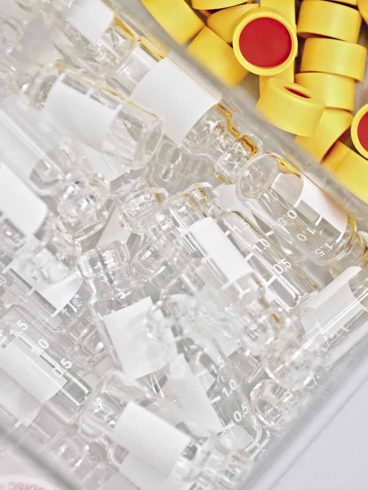

> **AI Description:**
> **Source:** `assets/_page_45_Figure_0.jpg`
> 
> **Generated:** 2026-06-01 19:18:10
> 
> ---
> 
> The image contains a photograph of a laboratory setting. It features multiple clear glass vials with white caps, some of which are marked with measurement values such as "0.5," "1.0," and "1.5." The vials are neatly arranged in a clear plastic tray. In the background, there are yellow and red caps, likely for different vials or for different stages of the experiment. The image is focused on the vials and caps, suggesting a scientific or medical context, possibly related to sample storage or testing.

Pharmaceuticals

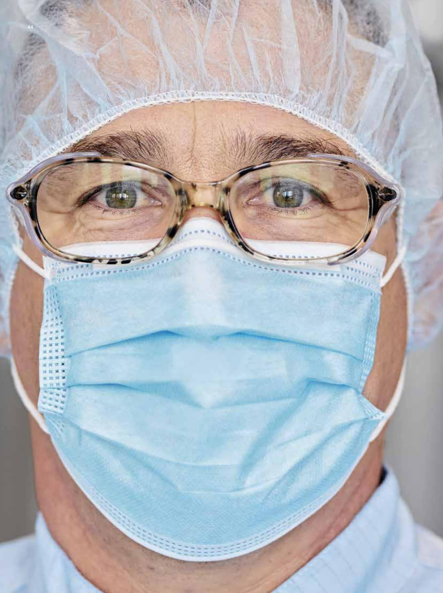

> **AI Description:**
> **Source:** `assets/_page_47_Figure_0.jpg`
> 
> **Generated:** 2026-06-01 18:11:29
> 
> ---
> 
> The image contains a close-up photograph of a person wearing a surgical mask and a hairnet. The individual is also wearing glasses. The background is plain and does not contain any additional text or visual elements. The image appears to be focused on the person's face, likely to convey a sense of preparedness or safety, possibly in a medical or healthcare setting.

# Driving patient benefit

## The burden of poor health is increasing; growing populations, higher life expectancies, an increase in chronic diseases, and continued discrepancies in access to healthcare – all of this means demand for healthcare continues to grow and systems are struggling to keep up.

This is why both our industry and our society need to rethink how we innovate and how we can provide care in a sustainable way.

Roche has a long history of developing and delivering breakthrough medicines that have made a meaningful difference in the lives of millions of people worldwide. But in today’s world, there is more we can and must do. We are making fundamental changes to the way we operate, how we work with our stakeholders and partners, and how we leverage developments in science and technology to deliver what matters most: more patient benefit at far less cost to society.

It is time to be bold. New approaches are needed, and we are going to do our part to bring about solutions.

COVID-19 spurred us to rethink how we partner to develop diagnostics and treatment options, and to work at speeds we never could have imagined, all with the goal of delivering innovation for patients.

Building on our partnering efforts from 2020, we continued to work with Gilead Sciences on a combination study evaluating two medicines (Roche’s Actemra/RoActemra and Gilead’s Veklury) in hospitalised patients with severe COVID-19- associated pneumonia. We also furthered our work with Regeneron on its antibody cocktail of casirivimab and imdevimab (Ronapreve) (please see the story on page 55). And we worked with Atea

Pharmaceuticals on AT-527, their investigational antiviral medicine for COVID-19.

## Milestones in our COVID-19 portfolio Ronapreve

• In March, new phase III data showed that Ronapreve reduced hospitalisation or death by 70% in non-hospitalised patients with COVID-19.

• In April, a phase III prevention trial showed that subcutaneous administration of Ronapreve reduced the risk of symptomatic COVID-19 infections by 81%.

• In June, the University of Oxford announced preliminary phase III results from the UK RECOVERY study in patients hospitalised with COVID-19. Results showed that Ronapreve reduced the risk of death in those who had not mounted a natural antibody response of their own (seronegative).

• In July, Japan was the first country to approve Ronapreve for treatment of mild to moderate COVID-19, followed by EU approval for treatment and prevention in November.

• In September, phase II/III trial data showed that Ronapreve significantly reduced viral load within seven days of treatment in patients hospitalised with COVID-19.

In September, the WHO recommended the use of Ronapreve in non-severe COVID-19 patients who are at highest risk of severe disease, and in patients with severe and critical infection who have a seronegative status.

• In October, Ronapreve (together with Actemra/ RoActemra and AT-527) was included in the EU Commission’s portfolio of the ten most promising COVID-19 treatments.

In November, the new SARS-CoV-2 variant Omicron (B.1.1.529) was classified as a variant of concern by the WHO. While analyses have shown that Ronapreve does not retain neutralising activity against the Omicron variant, Ronapreve retains its activity against all other main variants of concern, including Delta. Activity of Ronapreve against potential future variants will be continually assessed.

## Actemra/RoActemra

• In June, Roche’s Actemra/RoActemra received US FDA Emergency Use Authorization for the treatment of COVID-19 in hospitalised adults and children.

Throughout the pandemic, our production and logistics teams have demonstrated a deep commitment to serving patients worldwide.

• In July, the WHO issued new treatment guidelines for COVID-19 which recommend interleukin-6 (IL-6) receptor blockers such as Actemra/ RoActemra for patients hospitalised with severe or critical COVID-19.

• In December, the European Commission extended the marketing authorisation for Actemra/RoActemra to include the treatment of COVID-19 in adults who are receiving systemic corticosteroids and require supplemental oxygen or mechanical ventilation. This decision came just hours after the recommendation by the European Medicines Agency’s Committee for Medicinal Products for Human Use reflecting the urgent need for our medicines to tackle the COVID-19 pandemic.

## AT-527

• In June, Atea Pharmaceuticals announced interim results from the phase II AT-03A-001 trial in hospitalised patients with moderate COVID-19 who were at high risk of poor outcomes. These interim results indicated rapid and sustained antiviral activity against SARS-CoV-2 in patients in a hospitalised setting.

• In October, Atea Pharmaceuticals announced results from the phase II MOONSONG study of AT-527 in non-hospitalised patients with mild or moderate COVID-19. The study did not meet its primary endpoint, showing no significant reduction in viral load from baseline when compared to placebo in the overall study population.

• In November, Roche and Atea Pharmaceuticals communicated that Roche decided to end its partnership with Atea on the AT-527 programme to focus efforts on other COVID-19 activities.

## Pharmaceuticals clinical pipeline

Our pipeline of 80 new molecular entities covers a broad range of diseases, and highly innovative technologies are applied to create and produce the active molecules.

## Advancing clinical trials

Clinical trials are essential to medical progress. Data from trials helps scientists and clinicians understand how investigational medicines affect different groups of people with specific genetic markers for disease, and supports the development of more targeted, personalised treatments.

The more accurately the make-up of clinical trials represents real-world demographics, the more robust the data, and ultimately the more effective medicines might be for patients who need them.

We are deeply committed to addressing barriers to clinical trial participation, widening access to expanded and innovative diagnostic and therapeutic solutions, and diversifying genetic data by advancing inclusive research globally.

## Missed opportunities

Across industry, around 80% of global clinical trial participants are of European ancestry, which represents only 8% of the global population.1 Additionally, more than 87% of genomic data available is of European ancestry, leaving a significant amount of data undiscovered.2

These gaps mean that trial results are not always applicable to all patient populations, and we miss out on an enormous amount of valuable data in our studies. Consider, for instance, that even though black women have a mortality rate for breast cancer that is approximately 40% greater than that of Caucasian women, they represent only 6% of women in trials studying the disease.3

Determining which treatments will work best for which patients requires a great deal of clinical and genomic data. Currently, data available for public study comprises mostly European populations. With little representation from communities of non-European descent, it can be difficult to understand how diverse genetic variants play a role in the progression of a disease.

## Closing the gaps – real world demographics matter

Over the past several years, we have been focusing our efforts on closing gaps in our clinical trials by ensuring accurate representation of patient populations around the world. In 2021, results from a research collaboration between Genentech and Stanford University, known as Trial Pathfinder, were published in the scientific journal Nature.4 The study highlights how real-world data and artificial intelligence (AI) could be used to help address underrepresentation in clinical research for non-small cell lung cancer (NSCLC).

While recent studies show a majority of NSCLC patients do not meet the criteria to participate in clinical trials due to restrictive inclusion criteria, and 86% of trials fail to complete recruitment within the targeted time, Trial Pathfinder showed that using a data-driven approach to eliminate restrictive eligibility criteria could increase the total number of eligible patients by 107%, to more than twice as many by including more women and African-Americans, as well as a broader range of ages, without compromising the study outcome.

In 2020, as the pandemic disproportionately and devastatingly impacted people of colour, we initiated a clinical trial of one of our investigational medicines for COVID-19 pneumonia. Global trial sites that enrolled high-risk and minority populations were included in order to enhance

We are deeply committed to addressing barriers to clinical trial participation in patient populations around the world.

the understanding of the clinical profile of Actemra/ RoActemra in these patients, and to allow access to underserved and minority populations, which are not commonly represented in clinical trials. Approximately 85% of participants represented communities of colour, including Hispanic/Latinx, Native American and black populations.

## Advancing the participation of representative patient populations

In 2021, Genentech initiated the Advancing Inclusive Research Site Alliance, a coalition of clinical research centres that are building a sustainable ecosystem in order to facilitate the inclusion of historically underrepresented people in all clinical research. Together, we aim to advance the participation of diverse patient populations in our oncology trials, test recruitment and retention approaches, and establish best practices that can be leveraged across the industry and other disease areas to help achieve health equity for all people.

Our four inaugural partners who are successfully including diverse populations in their clinical trial efforts are: Mays Cancer Center in San Antonio, Texas; O’Neal Comprehensive Cancer Center in Birmingham, Alabama; West Cancer Center in Memphis, Tennessee; and City of Hope Comprehensive Cancer Center in Los Angeles, California.

We recognise that bringing about real change requires both partnership and industry-wide investments. By partnering across the healthcare ecosystem, we can collectively combine scientific advances, new technologies, and real-world data to create new standards for inclusive clinical research.

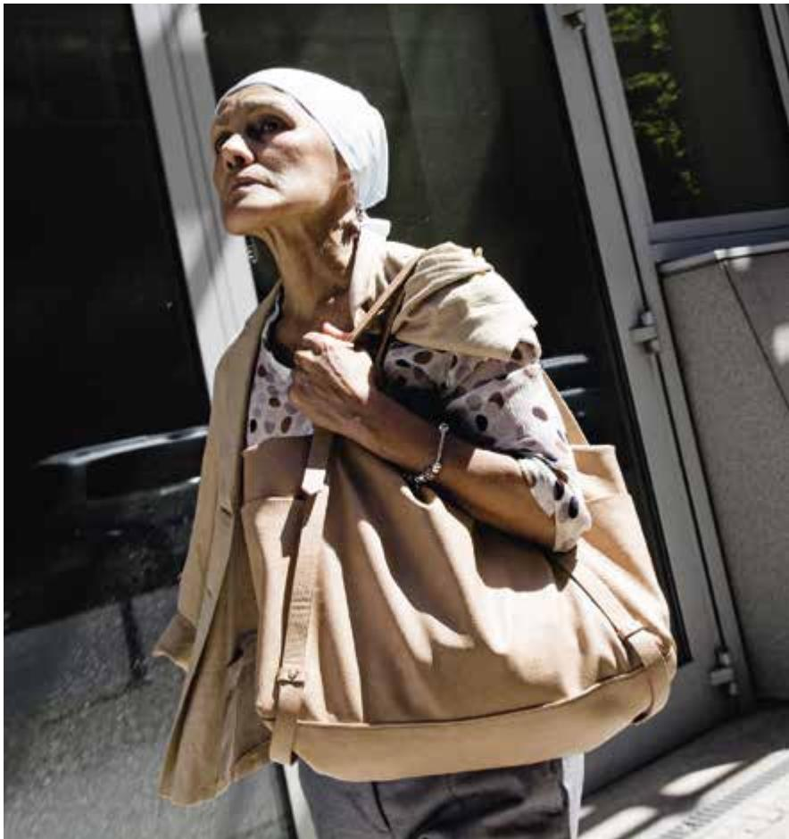

> **AI Description:**
> **Source:** `assets/_page_52_Figure_0.jpg`
> 
> **Generated:** 2026-06-01 18:12:06
> 
> ---
> 
> The image is a photograph of a person standing outdoors, wearing a light-colored head covering and a beige jacket over a patterned top. They are holding a large beige bag with a polka-dotted item partially visible inside. The background shows a building with a glass door and a window, suggesting an urban setting. The person appears to be looking upwards, possibly at something or someone out of frame. The image captures a candid moment in a real-world setting.

# Shaping the next 125 years of science

The pace at which new drugs are discovered and developed is rapidly increasing. There has never been a more exciting time to transform how we deliver care for patients, and we are committed to exploring uncharted areas to access previously unreachable targets. We, along with our partners, envision a future where the latest and greatest science and technology will drive innovation and unlock the future of healthcare.

## Gene therapy

Gene therapies have the potential to address previously untreated diseases and replace existing therapies with potential one-time treatments. On a quest to follow the science and strengthen our presence in this promising emerging modality, two years ago Roche acquired Spark Therapeutics, a leading gene therapy company. Today, Spark’s expertise combined with Roche’s broad R&D skills, commercial capability and global reach, along with those of our partners, puts us in the unique position to unlock the full potential of gene therapy.

To further our work in this area, in August 2021, we entered into a research collaboration and license agreement with Shape Tx, who have developed a novel form of gene therapy that edits genetic messages at the level of mRNA without any changes to DNA. We are excited to work together with them to develop therapies for certain targets in the areas of Alzheimer’s disease, Parkinson’s disease, and rare diseases.

## Cell therapy

Cell therapy is another promising emerging modality with over 1,000 active cell therapy studies ongoing worldwide and more than 500 product candidates under development.5 In cancer immunotherapy, cell therapy is showing potential to be an effective approach to harness a person’s immune system to fight cancer. To follow this hypothesis, Genentech has been collaborating with Adaptive Biotechnologies since 2019 to develop a type of personalised cellular therapy.

Genentech further expanded its commitment to cell therapies with a new collaboration signed with Adaptimmune Therapeutics in September 2021 to develop T-cell therapies for various solid tumours and with another collaboration entered in December 2021 with Lineage Cell Therapeutics to further develop and commercialise their retinal pigment epithelium (RPE) cell therapy for specific ocular disorders. We also have ongoing partnerships with companies like BioNTech (mRNA-based) and Nykode Therapeutics (DNA-based) to develop therapies aimed at training the immune system to recognise the patient’s own neoantigens – similar to the vaccines used to successfully provide immunity to SARS-CoV-2 infections.

Advances in data and technology for patients More than one million medical papers are published each year. No clinician has enough time to immerse themselves in the latest, increasingly complex research, and decide on the right therapy for each individual patient. Advances in data, technology and analytics will not only enable clinicians to make better treatment decisions faster, but they will allow us to solve problems and bridge gaps across the healthcare ecosystem, from drug discovery, development and approval, to diagnosis, disease monitoring and access to care. We envision a future where data, technologies and analytics routinely accelerate drug discovery and development, and enable better patient care. In 2021, employees across the Roche Group worked together with our partners to bring this future closer – as exemplified by the following initiatives:

## Discovering and selecting the best drug candidates

In drug discovery, there are many benefits to utilising artificial intelligence (AI). Roche’s

We envision a future where the latest and greatest science and technology will drive innovation and unlock the future of healthcare.

Pharmaceutical Research and Early Development (pRED) organisation developed a machinelearning operationalisation platform (ML Ops) that enables the embedding of machine-learning models in the daily routines for non-data scientists, bringing AI to their fingertips. Teams are using the platform to predict different properties for small molecules, enabling a faster selection of good drug candidates. Following the same aspiration, Roche and Genentech have teamed up with companies like Reverie Labs and Genesis Therapeutics to generate new compound designs and predict their properties, thereby advancing preclinical development of small molecule medicines. In addition, Genentech recently acquired Prescient Design, which will support the application of ML to the optimisation and de novo design of therapeutic antibodies.

The power of prediction in clinical trials AI and other computational approaches can be used to analyse large amounts of data gathered in clinical trials, leading to a better understanding of patient outcomes. For example, as part of our IMvigor010 study in urothelial cancer, scientists looked into various biomarkers that can be found directly in the blood to assess if some patients with these specific biomarkers need additional therapy. The retrospective analysis of the data showed that patients without a detectable amount of circulating tumour DNA (ctDNA) had a better chance of becoming disease-free, and better overall survival rates. These results led directly to the initiation of another phase III study in adjuvant bladder cancer with a prospective selection of ctDNA-positive patients. This outcome has the potential to change clinical practice by improving the probability of success of clinical trials and allowing for smaller, shorter trials focused on patients that need additional treatments.

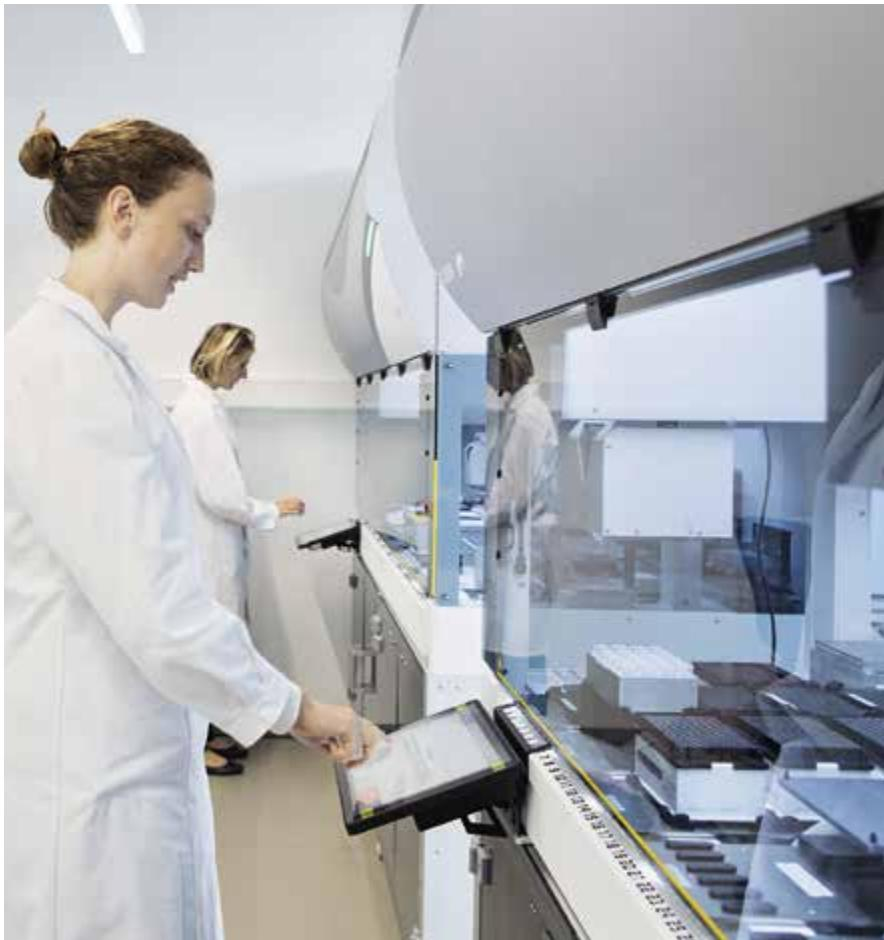

> **AI Description:**
> **Source:** `assets/_page_54_Figure_0.jpg`
> 
> **Generated:** 2026-06-01 18:23:17
> 
> ---
> 
> The image shows a laboratory setting with two individuals wearing white lab coats. They are working with a large, automated laboratory machine, which appears to be a robotic analyzer or a similar piece of equipment used for sample processing or testing. The machine has a digital interface and is equipped with various trays and compartments for sample handling. The environment is clean and organized, typical of a research or medical laboratory. The individuals seem to be operating the machine, possibly inputting data or retrieving results.

## 125 years of milestones

Taking risks for patients For years, the origin of multiple sclerosis (MS) an autoimmune disease of the central nervous system – was a mystery. T-cells were identified as the primary culprit and treatments for MS focused on them.

Dr Stephen Hauser, current director of the Weill Institute for Neurosciences, University of California (UCSF), and other researchers hypothesised that B-cells – another component of the immune system – also played a critical role in causing the inflammation leading to MS. This research was met with scepticism in the scientific community and no academic funding was granted.

Genentech was willing to take the risk and agreed to go forward with an early-phase clinical trial that had an estimated 15% chance of success. After three decades of research, they were able to refine a new molecule, a breakthrough that opened up new treatment possibilities and revolutionised our understanding of MS.

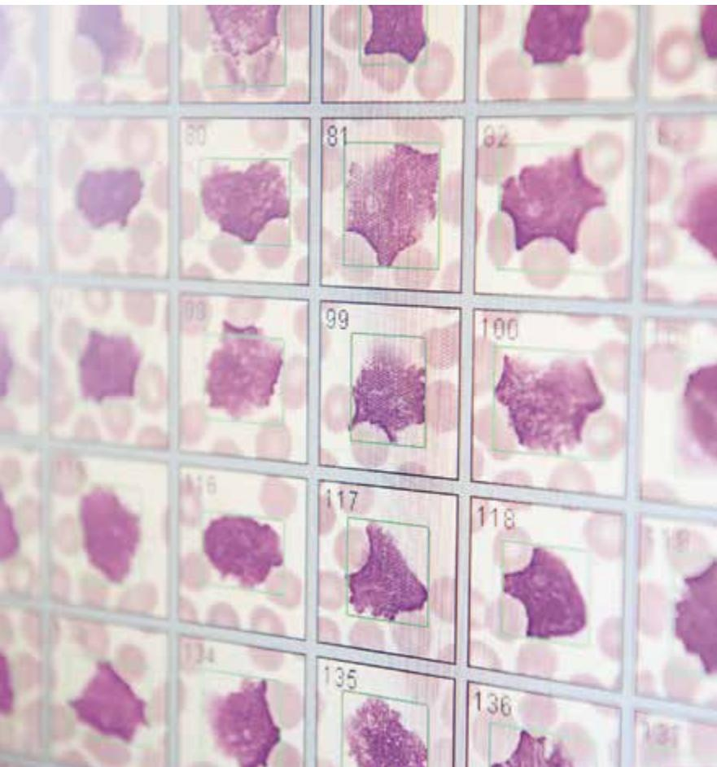

> **AI Description:**
> **Source:** `assets/_page_55_Figure_0.jpg`
> 
> **Generated:** 2026-06-01 18:12:31
> 
> ---
> 
> The image contains a grid of microscopic images, each labeled with a number. These images appear to be of blood cells, with some cells highlighted in green boxes. The cells vary in shape and size, with some exhibiting abnormal characteristics. The grid format suggests a systematic examination of blood samples, possibly for diagnostic purposes. The numbers likely correspond to patient IDs or sample numbers.

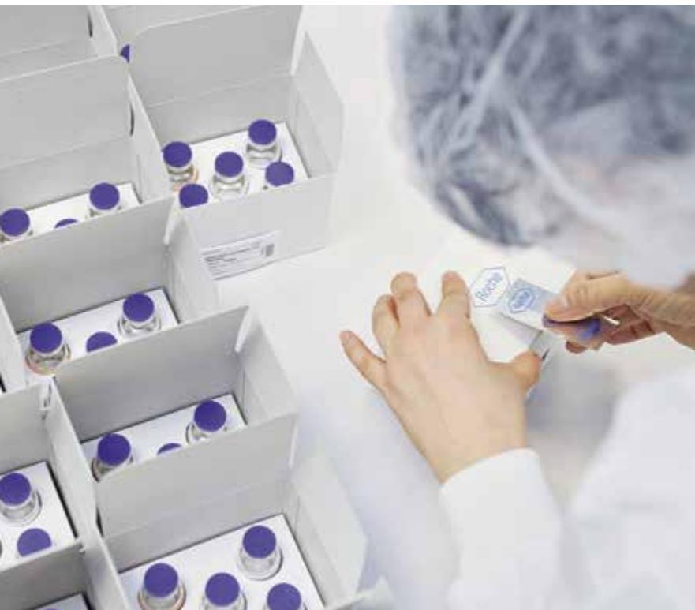

> **AI Description:**
> **Source:** `assets/_page_55_Figure_1.jpg`
> 
> **Generated:** 2026-06-01 18:07:34
> 
> ---
> 
> The image contains a photograph of a person in a laboratory setting, handling small vials with blue caps. The vials are neatly arranged in white boxes, suggesting a scientific or pharmaceutical context. The person is wearing a lab coat and appears to be labeling or organizing the vials. The focus is on the hands and the vials, with the background slightly blurred, emphasizing the activity being performed.

Our increasing data and insights capabilities allow us to focus on our vision of providing the right therapy for the right patient at the right time.

## Gathering and making sense of large amounts of data

Advances in technology also highlight the fact that an incredible amount of data is being collected across various stakeholders, countries and systems. Across the Roche Group, we  are focused on better ways to gather, structure and make sense of data. Our Direct Data Connection (DDC) initiative, for example, is reinventing the flow of data from clinical trial sites back to Roche. By automating the end-toend stream of patient trial data from electronic health record (EHR) systems to sponsor electronic data capture (EDC) systems, the DDC initiative eliminates the need for duplicative, manual data entry and allows real-time, error-free access to clinical trial data. In 2021, this user-friendly software solution was tested at sites around the world, and received positive feedback from site coordinators and study team members who are now able to make real-time decisions for patients.

Another example of our work in this area is our new partnership with the Alan Turing Institute, UK’s national institute for data science and AI. Teams will develop and apply advanced analytics methodologies to generate insights from multiple types of healthcare data. This will improve our understanding of the impact of patients’ individual disease characteristics and their response to different therapies, with the ultimate goal of enhancing clinical care for people around the world.

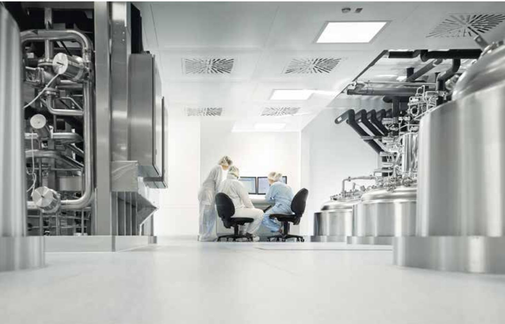

> **AI Description:**
> **Source:** `assets/_page_57_Figure_0.jpg`
> 
> **Generated:** 2026-06-01 19:20:08
> 
> ---
> 
> The image depicts an industrial setting, likely a laboratory or a manufacturing facility. It features large stainless steel tanks and pipes, indicative of a chemical processing or pharmaceutical environment. Three individuals in white lab coats are seated at a desk, working on computers, suggesting they are conducting research or monitoring processes. The room is well-lit with fluorescent lighting, and the overall design is clean and modern, emphasizing a focus on hygiene and precision.

> **AI Description:**
> **Source:** `assets/_page_57_Figure_1.jpg`
> 
> **Generated:** 2026-06-01 19:19:32
> 
> ---
> 
> The image contains a photograph of two individuals wearing surgical masks and hairnets, suggesting a medical or laboratory setting. The individuals are dressed in white lab coats, indicating they are likely healthcare professionals or scientists. The background is blurred, focusing attention on the individuals and their attire. The image conveys a sense of professionalism and safety, likely related to medical or scientific work.

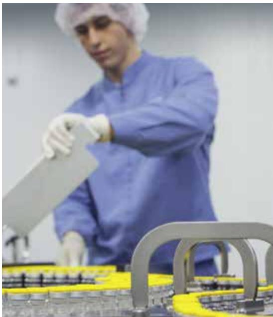

> **AI Description:**
> **Source:** `assets/_page_57_Figure_2.jpg`
> 
> **Generated:** 2026-06-01 19:25:54
> 
> ---
> 
> The image shows a person in a laboratory or manufacturing setting, wearing a lab coat, hairnet, and gloves, handling a piece of equipment or material. The individual appears to be working on a conveyor belt with yellow components, possibly part of an assembly or testing process. The setting suggests a controlled environment, likely for precision work such as electronics assembly or pharmaceutical manufacturing.

The pandemic has drastically altered the scale and urgency needed to develop and distribute COVID-19 treatments and diagnostic tests.

# Opening up new possibilities in the fight against COVID-19

In the face of the COVID-19 pandemic, the healthcare community looked for ways to address the ongoing situation around the world. Acknowledging the great responsibility we feel to society, coupled with our capabilities and expertise, we asked ourselves: “What can we do to help?”

While we worked tirelessly to develop testing solutions and to investigate some of our medicines in COVID-19, we understood it would take extraordinary mobilisation and collaboration across the entire healthcare ecosystem to defeat it. Strong partnerships have always been a cornerstone of our work at Roche – approximately half of our medicines are the result of successful collaborations with companies and institutions around the world. We knew we could contribute our scientific knowledge and clinical research expertise in infectious diseases and in antibodybased therapeutics as well as our skilled workforce and specialised manufacturing capabilities. The pandemic has drastically altered the scale and urgency needed to develop and distribute COVID-19 treatments and diagnostic tests, leading us to collaborate in new ways and to work at speeds we never could have imagined. Now was not the time to go it alone, and that meant reaching out to all parties, including competitors, to see what we could do together.

When we entered into our partnership with US biotechnology company Regeneron, we embarked on a journey full of new experiences, challenges and one jaw-dropping milestone after another.

The collaboration to jointly develop and increase global distribution of Regeneron’s COVID-19 antibody combination called for both parties to embrace a new mindset and challenge our ways of doing things.

The results were – in a word – amazing. Within only 123 days, and while not knowing if the clinical studies would be successful, the teams completed the drug substance technology transfer, a process that usually takes about nine months. It only took six months from the day when Roche first received the manufacturing details until we delivered the first products to countries around the world. Thanks to the shared vision and momentum of this partnership, the trials for the antibody combination moved from phase I to phase III in only 13 months. Data from the trials in early 2021 were promising, particularly in prophylaxis and the treatment of high-risk and hospitalised patients. While we entered into bilateral agreements with an increasing number of countries where the antibody combination was authorised for emergency use, we received the first official approvals from Japan in July, followed by the EU in November.

If it was not for a willingness to take risks as well as the tireless effort and unwavering commitment of all involved, none of this would have been possible. Despite feelings of uncertainty and fear, and the difficult operating conditions due to global lockdowns, the teams embraced the challenge with an open mind and a goal in sight – to develop and manufacture potentially life-saving medicines, the impact of which would be felt around the world.

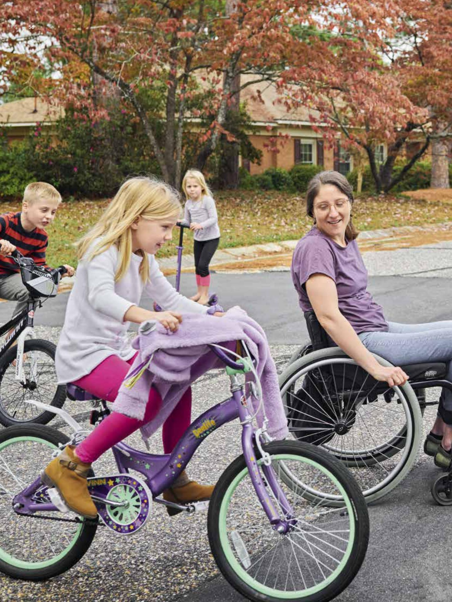

> **AI Description:**
> **Source:** `assets/_page_59_Figure_0.jpg`
> 
> **Generated:** 2026-06-01 18:40:16
> 
> ---
> 
> The image is a photograph showing a family scene. A woman in a wheelchair is smiling and appears to be interacting with two children who are riding bicycles. The setting is outdoors, likely in a residential area with trees and houses in the background. The children are dressed casually, and the woman is wearing a purple top. The photograph captures a moment of family activity and interaction.

## An elusive diagnosis, a lifetime of perseverance and hope

At age 17, Liz Adams was diagnosed with spinal muscular atrophy (SMA) – a rare neuromuscular disorder that results in the loss of motor neurons and progressive muscle degeneration. Liz is now 39. Thanks to her positive mindset, she feels more content than ever.

Liz was almost two years old when she started to walk. Throughout her childhood, she experienced physical weakness. As she got older, she wondered why she frequently fell down, her hands shook, and why she could not run as fast as her friends. By the time she was 13, her symptoms had worsened, and she asked her parents to take her to the doctor. “That started the long process of going from doctor to doctor, and nobody knew what was wrong with me,” says Liz.

Because SMA was not well known at the time, another four years passed until she was finally diagnosed. At that point, her parents were told there was nothing that could be done. Most people with type 3 SMA lose their ability to walk at some point in their lives, and require mobility support. “It was hard to hear that. But my dad was very determined to make the best of it,” she adds. In the years following her diagnosis, Liz and her parents figured out some exercises, read and educated themselves about SMA, and built a support system with friends and family.

Liz went on to college, where she studied American Sign Language and pottery. “I’m a very hands-on person and a challenge does not turn me away. After I graduated, I lived in South Korea for 14 months, and taught English as a foreign language,” Liz explains. At that point, Liz was walking with a cane. But she still enjoyed travelling and working, and developed an adventurous spirit. After returning home from Korea, she became an interpreter for the deaf, working in public schools in Fayetteville, North Carolina.

Liz is now married and a mum of four kids – Sam, Joyful, Rebekah and David. While she now uses a wheelchair, she enjoys exercising and spending time outdoors. “I usually swim two to three times a week and regularly use the rowing machine. That invigorates me a lot,” says Liz. She is also really excited about participating in an upcoming 10 km race, the first one in her wheelchair. An overarching attitude of perseverance has really stuck with Liz her entire life. “I love to set goals for myself. Setting high goals and trying to reach them, even if it’s a modified version of the original goal, motivates me a lot,” she explains.

Liz is excited about recent scientific developments in SMA, and is encouraged by the growth in awareness of the disease over the last decade. “Starting from my personal experience in the late 1990s when no therapy was available to having treatment options and possibilities, is just amazing!” concludes Liz with a smile.

## Personalised healthcare

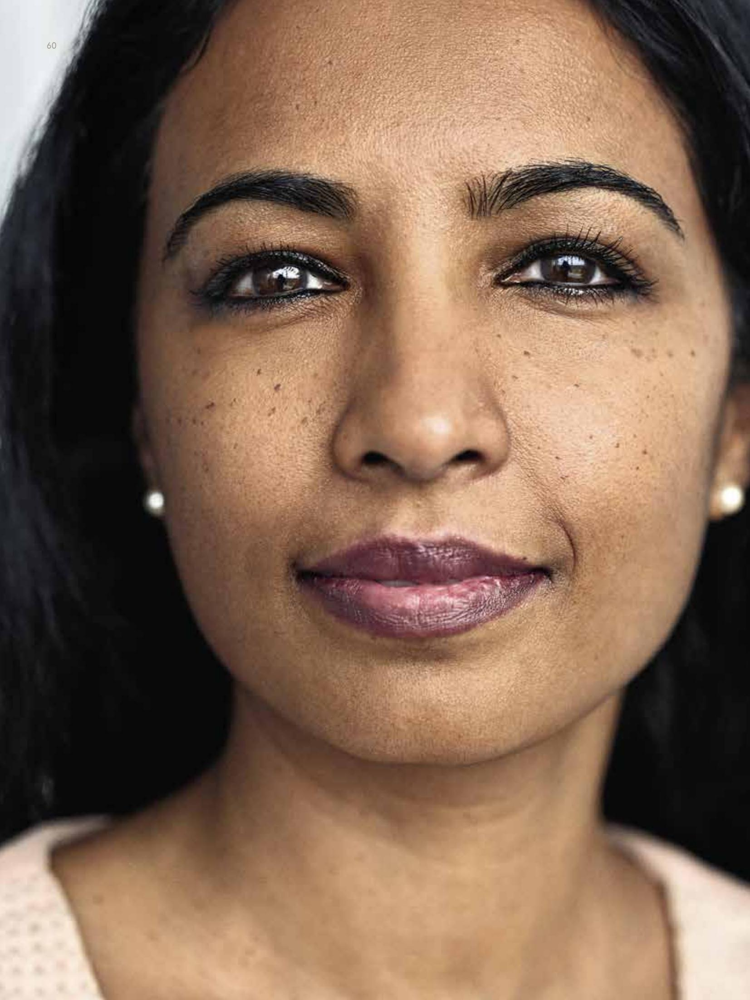

> **AI Description:**
> **Source:** `assets/_page_63_Figure_0.jpg`
> 
> **Generated:** 2026-06-01 18:15:41
> 
> ---
> 
> The image is a close-up portrait of a person with dark hair, wearing a light-colored top. The background is plain and does not contain any text or additional visual elements. The focus is on the individual's face, which is the primary subject of the image.

# The future of healthcare lies in tailor-made solutions

Improving lives has always been at the heart of what we do. And, more than once in our 125-year history, our commitment to innovative science has led to life-changing discoveries for patients.

Recently, we have focused much of our attention on developing new technologies that can enable us to personalise healthcare.

Our efforts to develop an individualised approach to care date back to the early 1990s, when Roche and Genentech pioneered what is now commonly known as personalised healthcare (PHC). Back then, bringing targeted treatments to patients was a goal. Today, it is a reality. By combining our unique expertise in pharmaceuticals, diagnostics, and data-driven insights, we continue to move forward. And we remain united in our goal of integrating all elements of care in order to create a truly personalised experience for patients.

## Introducing the care continuum

As part of our goal to expand personalised healthcare, we have shifted from treating diseases to focusing on a holistic, people-centric approach that spans the entire care continuum. This change entails a fundamental shift in the way we understand and deliver healthcare.

To ensure the care continuum approach is successful, we are tapping into our deep internal resources and expertise. At the same time, we are capitalising on the strengths of our independent affiliates, such as Flatiron Health and Foundation Medicine. And, we are also partnering with external stakeholders across the healthcare ecosystem to help deliver the right treatment to the right patient at the right time.

Early and comprehensive diagnosis Advanced diagnostics and measurement tools allow us to predict who is likely to become ill, diagnose illness earlier, and understand the unique characteristics of each patient’s condition and response to treatment. Digital solutions can help close gaps along the care continuum in areas from prevention to disease monitoring and are even more effective when they incorporate third-party data.

One of the major challenges in diagnosis is the preparation of the specimen. DNA is especially complex to prepare for sequencing and prone to human error. In 2021, we launched the Avenio Edge System to simplify and automate next-generation sequencing sample preparation, reduce human error and advance precision medicine for the future.

We also recently introduced an open digital pathology environment that enables pathologists to exchange data securely, and also provides access to Roche image analysis tools, as well as third-party technology. Among the first collaborations within this framework was a joint development agreement made in October 2021 with Ibex Medical Analytics, a global leader in artificial intelligence (AI)-based cancer diagnostics. Under the agreement, we will jointly develop an embedded image analysis workflow for pathologists to seamlessly access Ibex’s AI algorithms, insights and decision support tools using Navify Digital Pathology, which is the cloud version of our uPath enterprise software.

Material topics · Patient centricity · R&D efficiency Personalised healthcare · Real-world data Preparedness for ageing society

## Powered by data and analytics

High-quality data and rigorous analytics make up the engine that drives PHC. But today, healthcare produces a vast amount of untapped data, which holds the potential to unlock valuable insights. The broad range of Roche diagnostic solutions alone produces billions of data points each year. Every single one of them holds high-quality information that could spark a small advancement in personalised healthcare. Brought together, they can contribute to longitudinal data on a massive scale, enabling a more comprehensive view of patients.

Maximising the true potential of data and data-enabled technology hinges on patient trust. To build and maintain that trust, we maintain the highest standards in data privacy, de-identification and security. Additionally, we are increasing our expertise in data handling and have added various digital health offerings to our portfolio.

Early in 2021, Roche announced the launch of Navify Pass, an important expansion of our broad response to the COVID-19 pandemic. The cloud-based solution consists of a mobile app for individuals and healthcare professionals, as well as a back-end tool for testing sites. Navify Pass also enables unconventional point-of-care sites to fully digitise their workflows, from the first test performed to government reporting. The application enables individuals to store results from self-administered tests, as well as those administered in a medical facility or other professional site.

Remote patient monitoring and management Roche has been at the forefront of diagnostics and disease monitoring for decades. In the early 1980s, we were among the first to develop an at-home, automated, self-monitoring blood glucose meter for people with diabetes. Today, we are ushering in a new era in which physicians use novel, more sensitive quantitative measures and patients are empowered to monitor themselves for a variety of diseases. The ability to establish a deep understanding of a patient’s metrics, both on a daily basis and over time, can lead to more tailored, more effective care.

Data indicates that continuously reporting symptoms of disease or effects of cancer therapy can facilitate a shared approach to disease management between patients and their care teams. It can also increase survival and improve quality of life, while reducing symptom burden, emergency room visits, and hospitalisations.

The continued reliance on clinic visits as the primary way to assess and monitor patients remains a fundamental limitation of healthcare. Personal technologies, including wearables and medical devices, can allow patients to play a more active role in tracking and managing their health.

Multiple sclerosis (MS) is an insidious and unpredictable disease that can be hard to track and measure. The launch of the smartphone application Floodlight in the US, Germany and Finland helps make precision monitoring a reality for people living with MS. Through simple tasks, such as drawing a shape, the app enables physicians and patients to shed a light on the impact of the disease on the individual patient. Furthermore, each data point contributes to a unique data set designed to move MS research forward.

In collaboration with Moorfields Eye Hospital in London, Roche piloted Home Vision Monitor, an interactive smartphone- and tablet-based app that empowers patients to test and monitor changes in their vision. The app was designed for people with diseases that affect the macula, such as age-related macular degeneration and diabetes. More than 350 Moorfields patients have used the app, with 70% claiming it offers them peace of

Navify Pass is a cloud-based solution consisting of a mobile application for individuals and healthcare professionals, as well as a back-end tool for testing sites.

mind in the knowledge they are documenting any changes in their vision in between check-ups.

## Partnerships and collaborations

Unlocking the full potential of PHC – and integrating advances in medical science, data, and technology into the care continuum – demands holistic thinking and collaboration among stakeholders across the healthcare ecosystem. As part of our commitment to accelerating this effort, we are partnering with other organisations to create new approaches and solutions.

Roche joined the Autism Sharing Initiative, a new project to build the first global network for sharing genomics and clinical data to accelerate breakthrough discoveries and precision healthcare in autism. Using a new technology, the initiative allows search and analysis to be performed across multiple individual data sets while that information remains in its protected local environments.

In June 2021, Genentech presented the results of its collaborative efforts with PathAI, which improved clinical assessments of non-small cell lung cancer. The partnership with PathAI accelerates our understanding of patient response to lung cancer treatments.

While we develop our own innovative products and digital solutions, we also work with stakeholders to jointly address obstacles, and make PHC solutions accessible to patients around the world. In March 2021, Roche Canada signed a memorandum of collaboration with the British Columbia Cancer Agency and the Canadian Personalized Healthcare Innovation Network known as PREDiCT (Precision Oncology Evidence Development in Cancer Treatment). If proven successful, the initiative will generate and assess real-world evidence (RWE), which may be used to shape new sustainable reimbursement pathways for personalised cancer treatments. This critical step in sustainable

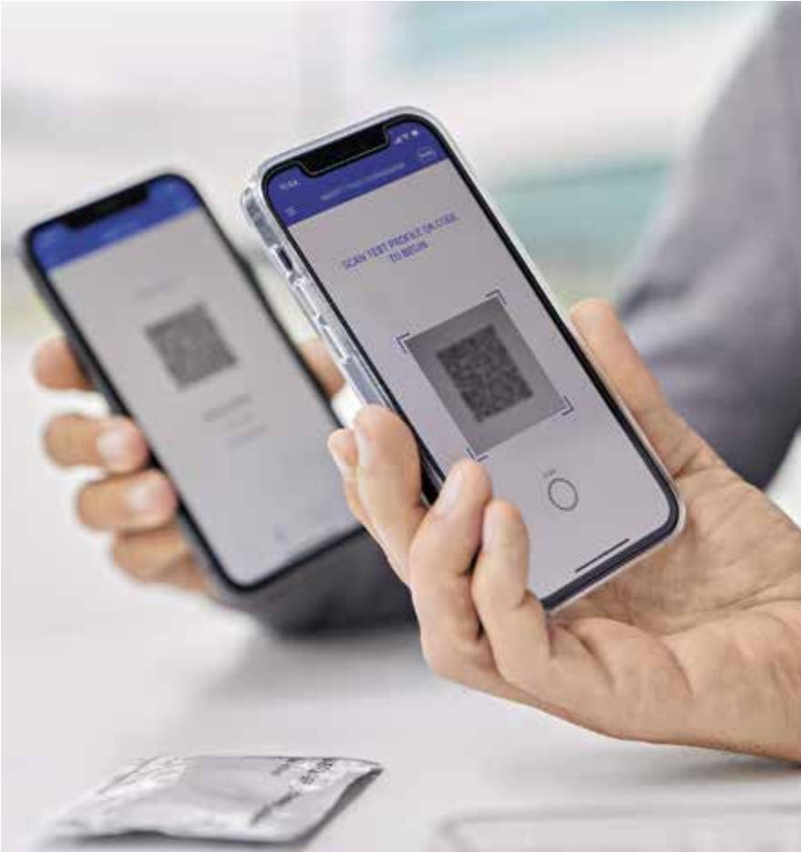

> **AI Description:**
> **Source:** `assets/_page_66_Figure_0.jpg`
> 
> **Generated:** 2026-06-01 19:22:37
> 
> ---
> 
> The image contains a photograph of two smartphones being held by a person. The phone on the right displays a QR code and the text "SCAN TEST PROFILE QR CODE TO BEGIN." The phone on the left shows a similar QR code. The setting appears to be a clinical or laboratory environment, suggested by the presence of what looks like a test kit or sample packet on the table. The image conveys a process of scanning a QR code for a test or procedure, likely related to a medical or scientific test.

## 125 years of milestones

A turning point in cancer treatment For most of the last century, cancer was categorised only by its location in the body. As a result, treatment results varied significantly.

In September 1998, the FDA approved Roche and Genentech’s breast cancer therapy, Herceptin. In many regards, that approval marked a turning point in cancer treatment.

The monoclonal antibody was specifically designed to treat patients with metastatic breast cancer whose tumours overexpress the HER2 protein. Herceptin was not only the first targeted treatment for a solid tumour, but also the first drug to be paired with a companion diagnostic. By identifying patients with an improved risk-benefit profile, those patients gained critical time that would otherwise have been spent in search of a viable treatment.

healthcare transformation can lead to better care at a lower cost, for people and society (please see the story on page 69).

Foundation Medicine and Flatiron Health, both independent affiliates of the Roche Group, are pioneers in the field of healthcare data and analytics. Together, they have built a clinicogenomic database that links two of the largest sources of clinical and genomic real-world data (RWD) into an integrated data set that serves as a valuable resource for accelerating precision oncology. Some 98,000 linked patient records were available for research at the end of 2021, reflecting growth of about 40% in just a year.

## Flatiron Health

Flatiron Health has continuously expanded its US network of community oncology practices and academic medical centres; its community oncology partners alone saw a daily average of 47,500 patients in 2021. In addition, 370 oncologists are already using the Flatiron Assist decision support tool to quickly select evidence-based treatment options for their patients. Also in 2021, Flatiron began to expand its network beyond the US, building new partnerships to derive RWD from hospitals and health networks in Europe and Asia.

Despite the impact of COVID-19 on traditional clinical trials, the Prospective Clinico-Genomic (PCG) study – a partnership among Flatiron, Foundation Medicine, Genentech, and US community and academic oncology practices – enrolled more than 940 patients with metastatic lung cancer across 23 sites. The study was designed to more seamlessly integrate clinical research into clinical care, and offer participants serial genomic testing they may not have otherwise had access to.

In 2021, Flatiron published several important studies, including one that highlighted the

impact of the pandemic on the time elapsed between diagnosis and the initiation of systemic treatment in cancer patients. The American Society of Clinical Oncology (ASCO) accepted this study, as well as extensive additional work to help oncology practices assess and address frontline impacts.

As part of their leadership in RWE regulatory and policy frameworks, Flatiron helped establish the RWE Alliance, an industry organisation whose goal is to collectively identify, develop and advocate technical, regulatory and policy solutions that advance the use of RWE for regulatory decisions.

Furthermore, Flatiron has taken major steps to ensure that the interests and priorities of patients are considered in their research strategy. These steps include the launch of formal mechanisms for patient engagement in the US and the UK.

## Foundation Medicine

Together, Roche and Foundation Medicine offer a portfolio of comprehensive genomic profiling (CGP) tests for solid and haematological tumours. These tests enable easier, faster and better clinical decisions. As partners, the two companies are leading the implementation and uptake of CGP around the world with the goal of developing personalised treatment strategies in oncology, as well as smarter, more efficient diagnostic solutions. Foundation Medicine services are now available in over 100 countries worldwide.

In August 2021, Japan’s health authorities approved the use and reimbursement of FoundationOne Liquid CDx, a blood-based CGP test that analyses more than 300 cancer-related genes in solid tumours. This provides a better understanding of what is driving a patient’s cancer to grow and gives insight into personalised treatment options for each patient.

Foundation Medicine tests enable easier, faster and better clinical decision-making through comprehensive genomic profiling (CGP).

Additionally, the FDA approved companion diagnostic claims for FoundationOne CDx and FoundationOne Liquid CDx in bile duct cancer and non-small cell lung cancer (NSCLC). Foundation Medicine now has 37 companion diagnostic approvals across its two FDA-approved tests.

In partnership with Natera, Foundation Medicine launched the FoundationOne Tracker, for research use only. The Tracker is a personalised circulating tumour DNA (ctDNA) monitoring assay that combines Foundation Medicine’s tissue-based CGP platform with Natera’s expertise in ctDNA monitoring. In addition, Roche launched a new genomic profiling kit that helps cancer researchers sequence tumours without having to send tissue samples to centralised laboratories. The Avenio CGP kit powered by FoundationOne (researchuse-only) allows healthcare professionals to apply high-quality CGP in their local labs, giving more patients the opportunity to participate in a trial that leverages CGP.

In 2021, Foundation Medicine also made several updates across its portfolio to help expand access to precision oncology. The integration with Flatiron Health’s OncoEMR platform improves the efficiency of clinical decision-making by enabling electronic ordering, order tracking, and receipt of Foundation Medicine’s CGP test results. The forthcoming integration with Epic’s electronic medical record system will also streamline access to genomic insights for precision cancer care.

Genomic data also helps us to better understand, diagnose and treat patients with rare cancers on a more personalised level. The ongoing CUPISCO study – a randomised trial using CGP to assign patients with cancer of unknown primary (CUP) to targeted or immunotherapy treatment – aims to shed further light on a disease with a high medical need. In addition, using FoundationCore, one of the largest CGP databases in oncology, allows

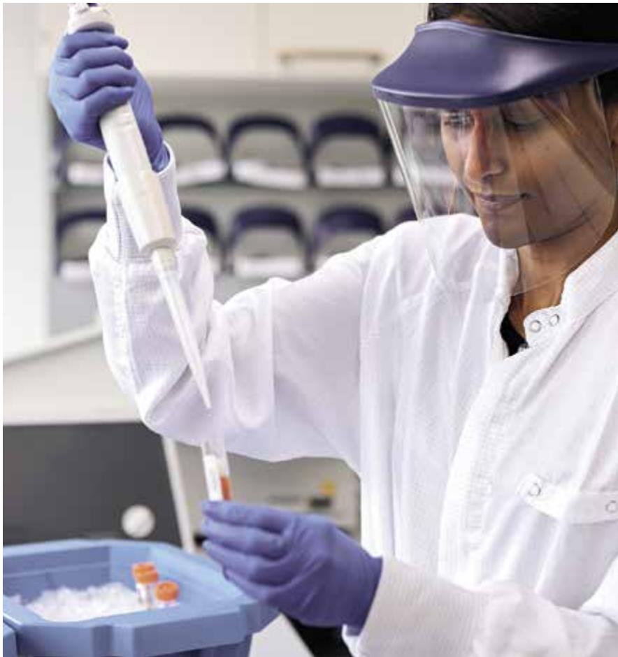

> **AI Description:**
> **Source:** `assets/_page_68_Figure_0.jpg`
> 
> **Generated:** 2026-06-01 18:32:15
> 
> ---
> 
> The image contains a photograph of a person in a laboratory setting. The individual is wearing a white lab coat, blue gloves, and a face shield. They are holding a pipette and appear to be working with a blue tray containing test tubes and other laboratory equipment. The background shows shelves with additional laboratory items, indicating a controlled and professional environment.

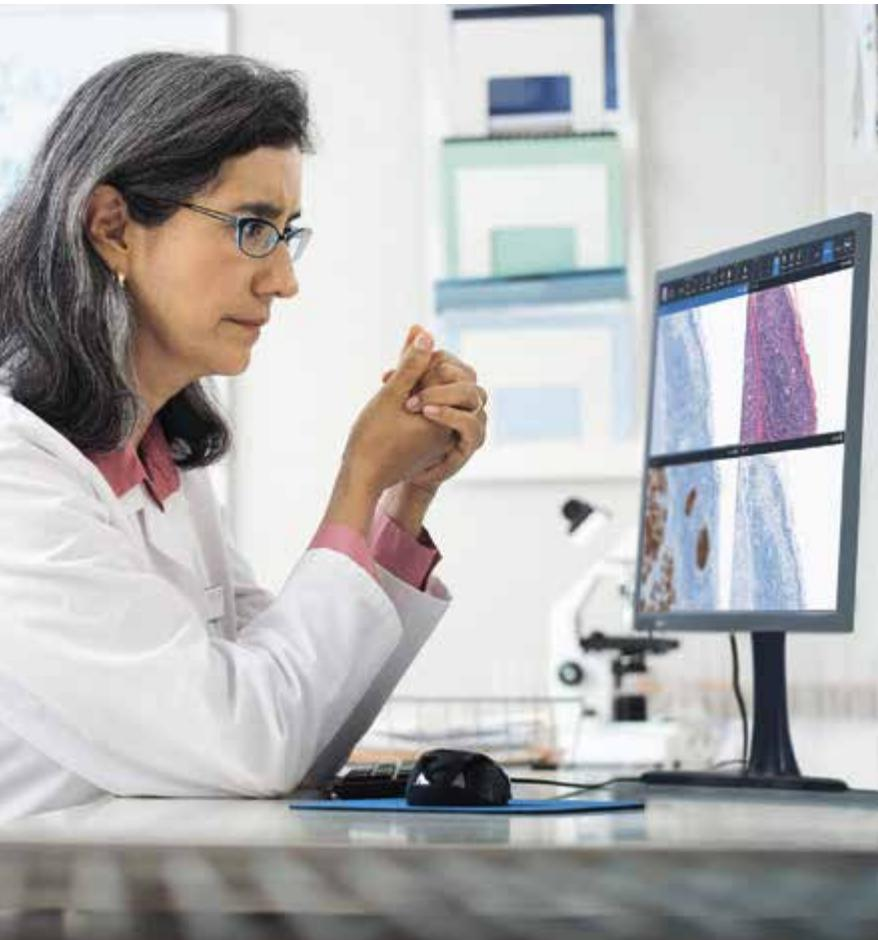

> **AI Description:**
> **Source:** `assets/_page_69_Figure_0.jpg`
> 
> **Generated:** 2026-06-01 18:44:19
> 
> ---
> 
> The image contains a photograph of a person in a lab coat, sitting at a desk with a computer monitor in front of them. The monitor displays what appears to be microscopic images of tissue samples, possibly for medical or scientific analysis. The setting suggests a laboratory or research environment. The person is wearing glasses and has their hands clasped together, appearing to be focused on the images on the screen.

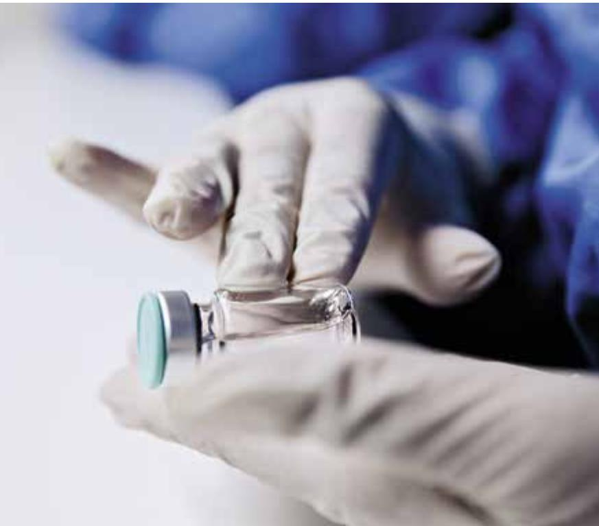

> **AI Description:**
> **Source:** `assets/_page_69_Figure_1.jpg`
> 
> **Generated:** 2026-06-01 18:41:55
> 
> ---
> 
> The image shows a close-up of a person's gloved hands holding a small vial, likely containing a vaccine or medication. The vial has a green cap and appears to be in a laboratory or medical setting, suggested by the sterile gloves and the blurred background that resembles a lab coat. The image conveys a sense of medical or scientific activity, possibly related to the administration or handling of a vaccine or other pharmaceutical product.

Genomic data helps us to better understand, diagnose and treat patients with rare cancers on a more personalised level.

researchers to learn more about the characteristics of NTRK fusion-positive cancers, a very rare molecular subgroup of cancer.

Making PHC accessible for everyone More than two decades have passed since Roche took its first steps into the field of personalised healthcare. Those initial efforts have led us to where we are today – delivering innovative personalised solutions that help millions of people around the globe. Today, PHC is embedded across our organisation. We maintain a clear focus on the entire care continuum, and on our goal of making PHC accessible to everyone.

Technology and science are constantly shifting the boundaries. What seemed impossible yesterday may be within our grasp today, and may transform a patient’s life tomorrow. We are excited by the opportunity to deliver better outcomes to more people around the world through care tailored to each individual.

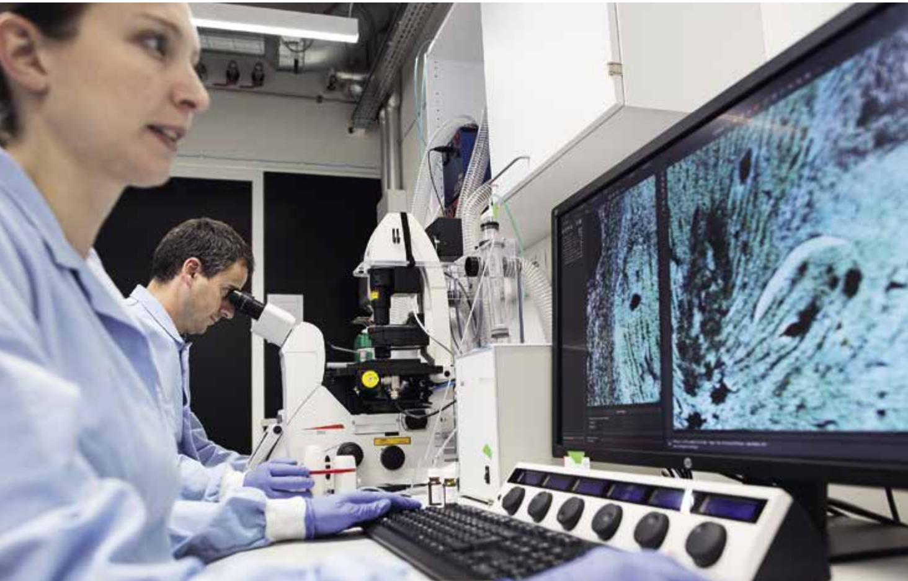

> **AI Description:**
> **Source:** `assets/_page_71_Figure_0.jpg`
> 
> **Generated:** 2026-06-01 18:18:57
> 
> ---
> 
> The image contains a photograph of two individuals in a laboratory setting. One person is using a microscope, while the other is observing a computer screen displaying a magnified image of what appears to be a biological sample, possibly cells or tissue. The laboratory equipment includes a microscope, a computer monitor, and a control panel with multiple buttons. The setting suggests a scientific or medical research environment.

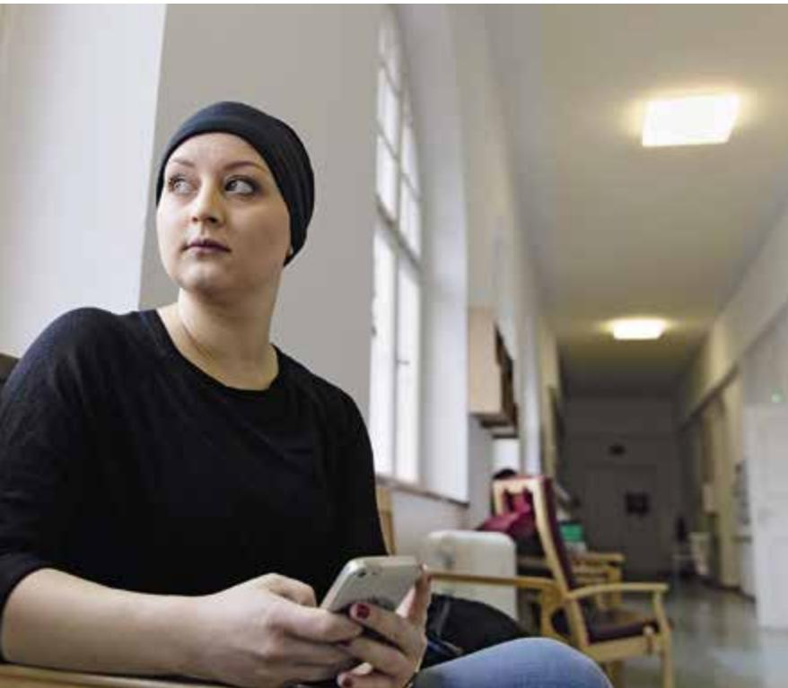

> **AI Description:**
> **Source:** `assets/_page_71_Figure_1.jpg`
> 
> **Generated:** 2026-06-01 18:14:15
> 
> ---
> 
> The image is a photograph of a person sitting in what appears to be a hospital or medical facility waiting area. The individual is wearing a dark-colored head covering and a black top, holding a smartphone in their hands. The background shows a corridor with chairs, a person sitting in the distance, and large windows allowing natural light to enter. The setting suggests a calm and quiet environment.

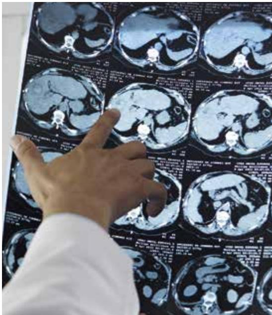

> **AI Description:**
> **Source:** `assets/_page_71_Figure_2.jpg`
> 
> **Generated:** 2026-06-01 18:07:43
> 
> ---
> 
> The image contains a series of cross-sectional medical images, likely from a CT or MRI scan, displayed in a grid format. The images show internal structures of the body, with varying shades of gray indicating different densities. A hand is pointing to one of the images, suggesting an area of interest or concern. The images are labeled with text, which appears to include medical terminology and patient information, though the specific details are not legible in this description. The overall context suggests a medical diagnostic or review process.

The combined power of advanced imaging technology, artificial intelligence and large databases of real-world data provides new insights into diseases.

# Hope for the future of personalised cancer care in Canada

For more than 20 years, Roche has helped lay the scientific groundwork for personalised healthcare with treatments that target the underlying biology of a person’s individual disease and with targeted diagnostics that help doctors determine the right therapy for their patients. Unlocking the value of advances in medical science, data and technology towards a more personalised approach – and integrating them into how we care for people – demands holistic thinking and collaboration among stakeholders across the healthcare ecosystem. We know that meaningful change can only happen when we work together.

Real-world data (RWD), or patient data that is collected as part of routine healthcare practice instead of through clinical trials, is becoming increasingly important to fill gaps and capture insights that can help guide how a patient is diagnosed and treated. The demand for RWD by regulatory, reimbursement and healthcare decision makers continues to grow, particularly for personalised cancer therapies that target rare mutations where traditional clinical trial evidence is limited and challenging to collect.

The tide is turning, however, and our recent partnership in British Columbia, Canada, is setting the stage for what we hope will lead to faster patient access to innovative treatments and technologies across many disease areas. In March 2021, Roche Canada, the British Columbia Cancer Agency and the Canadian Personalized Healthcare Innovation Network signed a memorandum of collaboration which is the first public-private collaboration in personalised healthcare in British

Columbia and represents an important milestone in transforming the healthcare system in Canada.

This collaborative project is aimed at reducing fragmentation and improving decision-making based on learnings from patients in real time. PREDiCT – Precision Oncology Evidence Development in Cancer Treatment – is a programme piloting a framework that will help guide healthcare decision makers to utilise RWD in their clinical, regulatory and reimbursement decisions. We are hopeful that this will mean earlier, more precise diagnosis for patients and access to the right treatment at the right time. Our ultimate goal is to scale this framework beyond British Columbia to other provinces in Canada. We also know that what we learn from PREDiCT may translate beyond borders to other Roche affiliates worldwide.

Although there is much work yet to be done, in less than a year the PREDiCT collaboration is already showing signs of progress. More patients in British Columbia are being diagnosed with more precise testing at an earlier stage following a cancer diagnosis. Additionally, key system changes to integrate data have also begun which will allow decision makers to utilise the PREDiCT framework. Work is already underway to expand the programme into new disease areas and geographies. PREDiCT is just one example of how we are partnering across society to co-create new approaches and solutions, being mindful of the urgency of this moment. To us, personalised healthcare means far more than improving treatment – it is about improving life for every person. And we are hopeful that our efforts in this area will do just that.

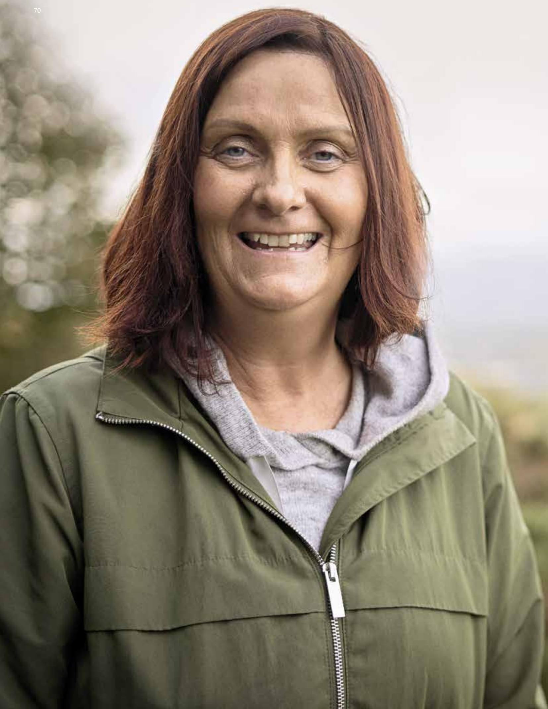

> **AI Description:**
> **Source:** `assets/_page_73_Figure_0.jpg`
> 
> **Generated:** 2026-06-01 19:27:38
> 
> ---
> 
> The image is a photograph of a person wearing a green jacket over a gray hoodie. The background appears to be an outdoor setting with blurred trees and a light sky. The person is smiling and looking directly at the camera. There is a number "70" in the top left corner of the image.

## How targeting a cancer’s unique drivers is transforming patient care

Kissing your young children goodnight every evening is a precious ritual treasured by parents worldwide.

But Mary Bodley, 51, cherishes these moments more than most – because she was not sure she would be around for her children. Six years ago, Mary was diagnosed with invasive, ductal grade 2, HER2-negative and ER-positive breast cancer.

When she received her diagnosis, her first thoughts were for her young family. “I was more scared about telling my family and the impact it would have on my daughters,” Mary says. “It was there and then that I knew I was going to fight this. I was determined to see their communions and confirmations and hear about their first boyfriend or girlfriend.”

Mary lives in County Dublin, Ireland, and is currently on sick leave from her role as an Internal Communications Manager at Roche Ireland. She firmly believes that the reason she has been able to progress so far is a friend’s suggestion that she look into genomic profiling,

Genomic profiling helps doctors tailor treatment to a patient’s unique tumour based on its individual ‘fingerprint’. The process can detect, from a tissue or blood sample, mutations in a cancer’s DNA which may be driving its growth and identify specific treatments which can target that individual tumour. This allows doctors to refine and tailor treatment based on the mutation rather than the location of the cancer in the body.

After a round of successful treatment, Mary was given the all-clear. But, just two years later, her cancer returned. Again, treatment was a success, and again she was given the all-clear. But just months later, she discovered a lump in her neck and her worst fears were confirmed – the cancer had returned once more.

Mary had an added complication: each time her cancer returned, it evolved. It began as HER2-negative and ER-positive breast cancer, then recurred as HER2-positive and ER-negative, and finally as triple negative. Thankfully, genomic testing was able to provide treatment options that could work well with Mary’s tumour.

“I’ve gone down several different treatment paths and they’ve kept me alive for six and a half years,” she says. “Genomic testing is a huge part of that. The current treatment is working well and all my cancer tumours are stable at the moment.”

As Roche celebrates its 125-year anniversary, Mary says: “It’s my hope that over the next 125 years, Roche’s fantastic people will have created and rolled out a medicine that can cure all forms of breast cancer. And, I also hope a bulletproof method for preventing breast cancer will have been created, which could be implanted into all women from the age of 40.”

“For now, their incredible work has given me precious extra time which I am so grateful for and I can still kiss my two girls goodnight every evening.”

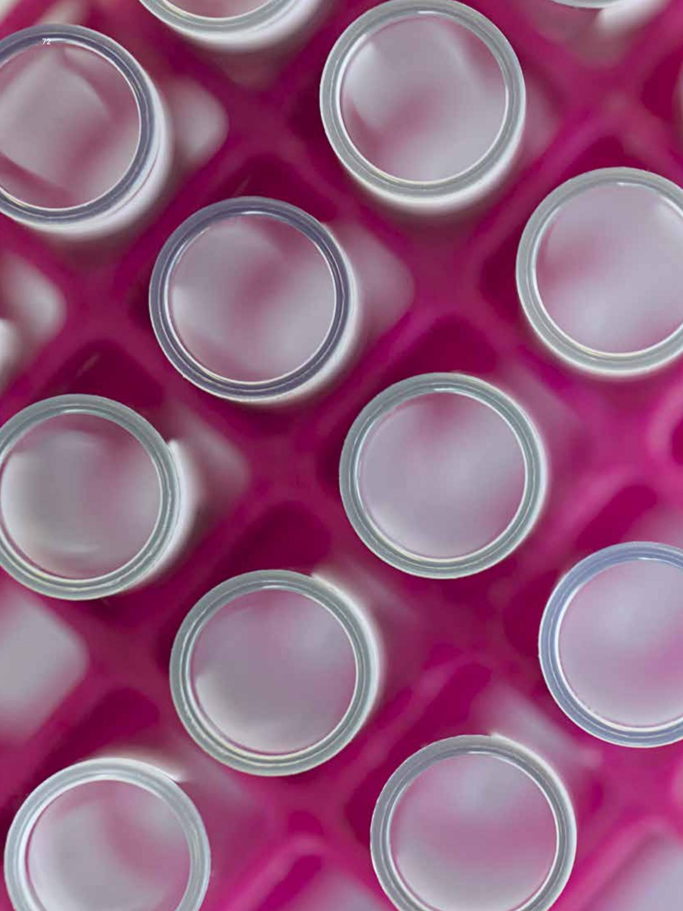

> **AI Description:**
> **Source:** `assets/_page_75_Figure_0.jpg`
> 
> **Generated:** 2026-06-01 19:15:01
> 
> ---
> 
> The image contains a series of circular objects, likely glass jars or containers, arranged in a grid pattern on a vibrant pink background. The jars appear to be empty and are uniformly spaced. The image is visually striking due to the contrast between the clear glass and the bright pink background. There are no labels or text annotations present in the image.

## Access to healthcare

> **AI Description:**
> **Source:** `assets/_page_77_Figure_0.jpg`
> 
> **Generated:** 2026-06-01 18:26:46
> 
> ---
> 
> The image is a close-up portrait of a person with dark skin. The individual has dark hair pulled back and is wearing small, gold hoop earrings. The background is out of focus, drawing attention to the subject's face. The lighting is even, highlighting the subject's facial features.

# Striving for improved access to healthcare around the world

At Roche, we know that life-changing innovation is only meaningful if it reaches those who need it. We also understand that millions of patients all over the world still do not have access to quality healthcare.

Multiple barriers continue to stand in their way, and the situation has been exacerbated by the ongoing pandemic, which is contributing to increasing global inequalities.

During this second year of the COVID-19 pandemic, healthcare systems around the world experienced significantly increased pressure. Throughout this time, we have continued to work closely with governments, healthcare providers, laboratories, regulatory authorities, and organisations around the world, not only by increasing our production of critical diagnostic tests and medicines, but also by helping strengthen healthcare systems to support the fight against the pandemic and minimise its impact. In parallel, we have worked to help improve access to quality healthcare for non-communicable diseases, and to provide non-COVID-19-related diagnostics and treatments which have been delayed or even cancelled.

Our access strategy remains focused on addressing root causes at both global and country levels. We work in collaboration with global and local stakeholders, with a focus on pricing and access programmes, particularly in low- and middle-income countries (LMICs) where we support their efforts to achieve universal health coverage (UHC).

We put access at the centre of our business, and consider it a key part of our commitment to improving patient outcomes. As we bring our innovations to patients, we look deeply into the causes that prevent access to optimal healthcare; from screening and diagnosis to treatment.

We know that every country has a different situation, and their healthcare systems present unique challenges. So we draw on our breadth of expertise and innovation that spans the patient journey, and work closely with many partners to develop and deliver tailored access solutions that reflect each country’s individual healthcare needs.

Now more than ever, it is important and urgent for us to acknowledge our shared responsibility to build resilient and sustainable healthcare systems. We believe that comprehensive UHC helps support stable economies and strong societies, and is fundamental to addressing inequality in access to healthcare, particularly in LMICs. We are accelerating our ongoing efforts in this area with our goal to double the number of patients receiving our innovative therapies in low- and lower-middleincome countries by the end of 2026, and it remains our ambition to double patient access to novel, high-medical-value diagnostic solutions to people around the world.

## Tailoring solutions to LMICs

Around 80% of the world’s population lives in LMICs. We have long been committed to LMICs, and have a range of programmes to broaden access to our medicines and diagnostics in those countries.

We believe in harnessing new technologies in healthcare to improve patient outcomes, including in settings with limited resources. This is why we are using digital solutions, such as Navify Digital Pathology, to help with virtual diagnosis and to train pathologists virtually, which is particularly

UN SDGs

POVERTY NO

Material topics Long-term mindset Availability of healthcare

valuable in regions with limited pathology services, such as Africa. We are also developing new tools to support patients in taking a more active role in their disease management. For example, we have created iThemba Life, a mobile health application which delivers HIV viral load results, education, reminders and support directly to users’ smartphones. The app empowers people living with HIV to remain adherent to treatment and engaged in care. In 2021, we extended its functionality to cover cervical cancer to address a key challenge of loss to follow-up.

## Programmes and partnerships that support access along the patient journey

Our strengths in pharmaceuticals and diagnostics position us to play an early role in the patient journey and identify barriers to access. We have learned a great deal through our partnerships and can apply those learnings to future initiatives.

Examples of our programmes and partnerships:

• In 2021, we expanded our Global Access Program to include SARS-CoV-2 PCR testing to increase access in low- and middle-income countries during the ongoing pandemic.

• We have been awarded World Health Organization’s (WHO) prequalification for HIV and HCV tests, and WHO guidelines now include cobas MTB and cobas MTB-RIF/INH tests, all on the cobas 6800/8800 systems. For patients living in areas with limited healthcare resources, WHO prequalification ensures access to the highestquality diagnostics.

Our Diagnostics Division continued its partnership with the non-profit organisation (RED) on a shared mission to emphasise the importance of diagnostic testing in the fight against COVID-19 and the ongoing HIV/AIDS epidemic, and to mitigate further impact of COVID-19 on health systems in order to reach patients where access is limited.

• Roche joined the World Economic Forum’s Ending Workplace TB initiative, a coalition of companies and key organisations active in the fight against tuberculosis.

• We continue to have a strong partnership with the City Cancer Challenge (C/Can). Our joint mission is to improve access to equitable, quality cancer care in cities around the world. As of December 2021, C/Can is working in 9 cities reaching an estimated 54.2 million people and brings together more than 1,200 health professionals, 149 institutions and 77 global partners from around the world.

In the US, the Genentech Patient Foundation provides free medicine to approximately 60,000 people each year.

• Through a partnership with the ECHO Institute, we are working to establish a remote telementoring programme for health workers in underserved or rural communities, enabling them to diagnose and treat patients faster and more effectively. The ECHO platform connects national centres of excellence to remote areas. In 2021, Roche was setting up ECHO clinics in various countries (Philippines, Indonesia, Pakistan, India, Malaysia, Guatemala and Canada for their First Nations Population), with several already launched.

• Roche officially joined the Go Further Partnership, which was established in 2018 as an innovative, public-private partnership between the U.S. President’s Emergency Plan for AIDS Relief (PEPFAR), the George W. Bush Institute, UNAIDS and Merck. Go Further is committed to creating a healthier future for women and aims to reduce new cervical cancer cases by 95% among women living with HIV in 12 African countries.

Our responsible approach to medicine pricing Because we endeavour to ensure that affordability is not a barrier to access, we take the pricing of our medicines and innovations very seriously. Our pricing strategy reflects the WHO’s definition of fair pricing, balancing the need for both affordability and incentives for innovation with the needs of patients today and tomorrow.

We have long been committed to low- and middle-income countries in order to broaden access to our medicines and diagnostics.

Like other healthcare stakeholders, we believe that differential pricing can be an effective solution to address affordability constraints of a specific country. Our International Differential Pricing (IDP) approach allows our local organisations to adjust prices to reflect a country’s relative income and their ability to pay, ensuring that our innovations are fairly priced and can reach patients in need. This approach has been proven to greatly improve patient access to innovative medicines, particularly in developing countries where price is a primary barrier.

Partnering to improve access in women’s health Our work in women’s health exemplifies our tailored approach to access. Roche is committed to a woman’s health at every stage of her life, supporting needs around reproduction, fertility and pregnancy, as well as disease prevention and treatment through a variety of diagnostic screenings, monitoring assays and innovative medicines. Our efforts to support and improve women’s health are aligned with the WHO’s Global Strategy for Women’s, Children’s and Adolescents’ Health, 2016–2030, and its Every Woman Every Child movement.

A key example of this commitment is our work in women’s cancers, such as breast and gynaecologic cancers. In our efforts to combat cervical cancer, we work with countries to further strengthen healthcare systems and help establish national cervical cancer programmes to eliminate the disease. Over 85% of annual cervical cancer deaths occur in LMICs where we are helping overcome barriers to care, specifically by increasing awareness around screening. Roche is collaborating with partners to help countries implement national HPV screening and treatment programmes (please see the story on page 81).

Across the Asia-Pacific region, HPV continues to be responsible for the majority of cervical cancer cases. In some countries, cervical cancer is the

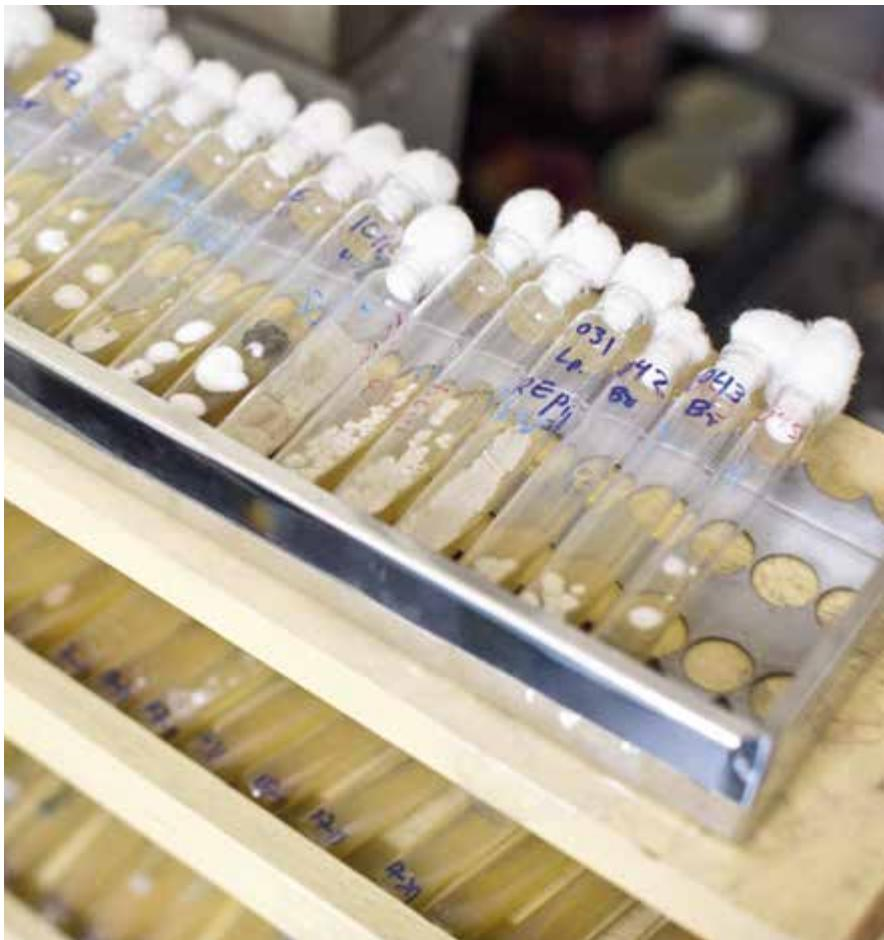

> **AI Description:**
> **Source:** `assets/_page_80_Figure_0.jpg`
> 
> **Generated:** 2026-06-01 19:00:37
> 
> ---
> 
> The image contains a photograph of a laboratory setting. It shows a rack filled with test tubes, each containing a liquid sample. The test tubes are labeled with numbers and some text, which appears to be codes or identifiers for the samples. The rack is placed on a wooden surface, and the background is slightly out of focus, emphasizing the test tubes in the foreground. The liquid in the test tubes appears to be a light yellow or amber color.

## 125 years of milestones

Revolutionising the care of people living with HIV Since entering the diagnostics space in 1968, Roche has had a strong focus on infectious diseases. Following the identification of HIV in the 1980s, we were at the forefront of developing diagnostics for HIV, particularly molecular tests for early infant diagnosis and viral load testing to monitor treatment response. This revolutionised the management and care of HIV-positive patients.

To enable equitable access to HIV testing in resource-limited settings, and to support the UNAIDS 2020 targets, Roche created the Global Access Program in 2014. Through this programme, Roche provides sustainable pricing to governments and funders and works with partners to build the infrastructure and capabilities required to run diagnostic programmes. Each year, over 8 million people in Africa use our viral load testing to manage their HIV infection and to date over 11 million babies have been tested for HIV with Roche tests.

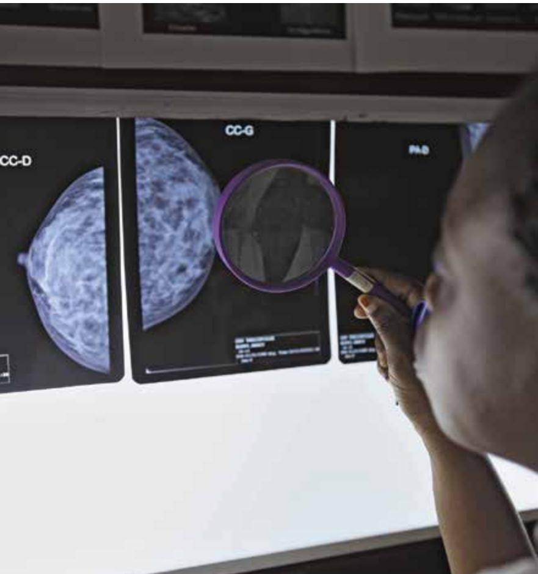

> **AI Description:**
> **Source:** `assets/_page_81_Figure_0.jpg`
> 
> **Generated:** 2026-06-01 18:48:53
> 
> ---
> 
> The image contains a photograph of a person examining mammogram images on a lightbox. The images are labeled "CC-D" and "CC-G," indicating different views of the breast. The person is using a magnifying glass to closely inspect the images, suggesting a detailed analysis of the breast tissue. The lightbox setup is commonly used in medical settings for reviewing and discussing diagnostic images.

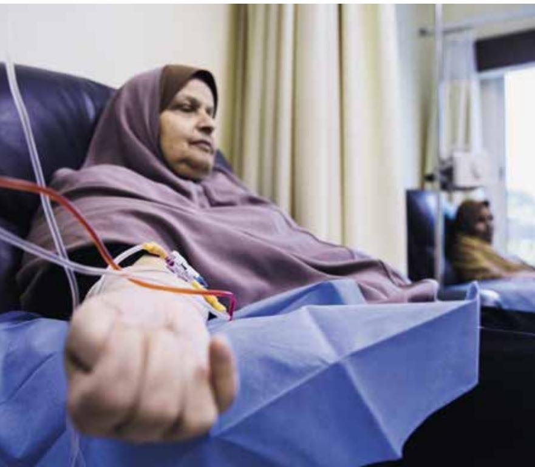

> **AI Description:**
> **Source:** `assets/_page_81_Figure_1.jpg`
> 
> **Generated:** 2026-06-01 18:54:06
> 
> ---
> 
> The image is a photograph showing a person lying in a hospital bed, with their arm extended and a blood donation setup visible. The person is wearing a headscarf and is covered with a hospital gown. The background includes medical equipment and another person lying in a similar position, suggesting a blood donation center or similar medical facility. The image captures the process of blood donation, highlighting the medical context and the individual's participation in the procedure.

We support programmes around the world that are aimed at increasing access to diagnostics and treatments for breast cancer.

second most common cancer. In August 2021, the APEC Roadmap to Promote Sustainable Economic Advancement for Women Through Cervical Cancer Prevention and Control (2021–2025) was officially endorsed by the 21 members of the Asia-Pacific Economic Cooperation (APEC). Roche contributed to the development of this new roadmap to include cervical cancer screening, especially using HPV molecular testing.

In 2020, breast cancer overtook lung cancer as the world’s most commonly diagnosed cancer. It is responsible for one in six of all cancer deaths among women. In line with the new WHO Global Breast Cancer Initiative and our focus on women’s health, we increased the number of people treated with Perjeta in China by 65% from August 2020 to August 2021. In the UK, we have also seen 80% of breast cancer patients switch to Phesgo, a subcutaneous fixed-dose combination of Perjeta and Herceptin, with a shorter and less invasive mode of administration. This has reduced the number of patients who receive their medicines via intravenous infusion, freeing up capacity in hospitals.

## Towards better access in the future

Looking forward, our work to expand access will continue to be a priority. By working in partnership with stakeholders across the healthcare spectrum – from governments and payers to non-governmental organisations, multilaterals and insurance companies – we will continue to develop tailored solutions that help overcome barriers to create rapid, broad and sustainable access.

## Women 4 Cancer

## Kenya

Roche is supporting the EMPOWER programme, which seeks to contribute to the prevention, early diagnosis, treatment and education of women in the community on breast and cervical cancer.

## Pink Consulting Rooms

## Colombia

To address problems around breast cancer diagnosis and treatments, Roche has supported the set up of over 150 Pink Consulting Rooms, testing over one million women and diagnosing more than 14,000.

## Hepatitis C diagnosis Pakistan

This partnership supports underprivileged people with hepatitis C testing and diagnosis.

This initiative is implementing national programmes aimed at cervical cancer elimination.

## Cervical cancer screening and triage Thailand

To support Thailand’s goal of eradicating cervical cancer, Roche has been partnering with the government and the healthcare community to raise awareness of HPV DNA testing.

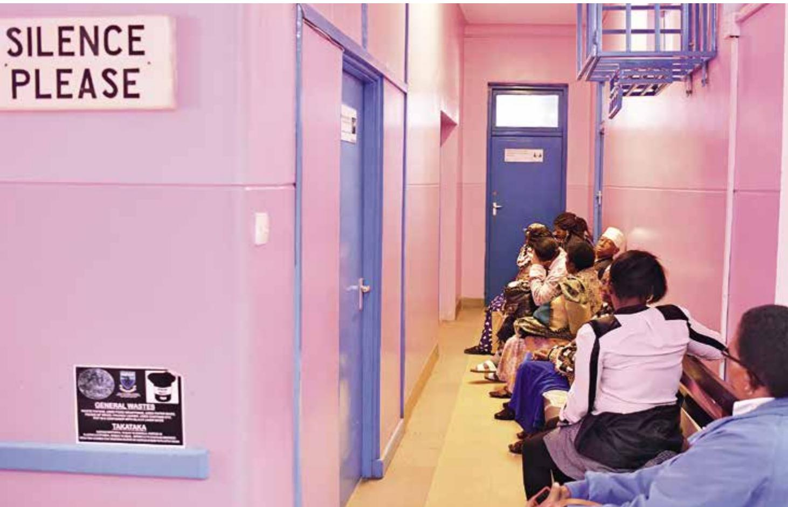

> **AI Description:**
> **Source:** `assets/_page_83_Figure_0.jpg`
> 
> **Generated:** 2026-06-01 18:42:32
> 
> ---
> 
> The image contains a photograph of a hallway with several people sitting on benches. The walls are painted pink, and there are blue doors along the hallway. A sign on the left wall reads "SILENCE PLEASE," and another sign below it indicates "GENERAL WASTED" with a logo and text that appears to be related to waste management. The people in the image are dressed in various attire, suggesting a diverse group. The setting appears to be a public or institutional space, possibly a hospital or a similar facility.

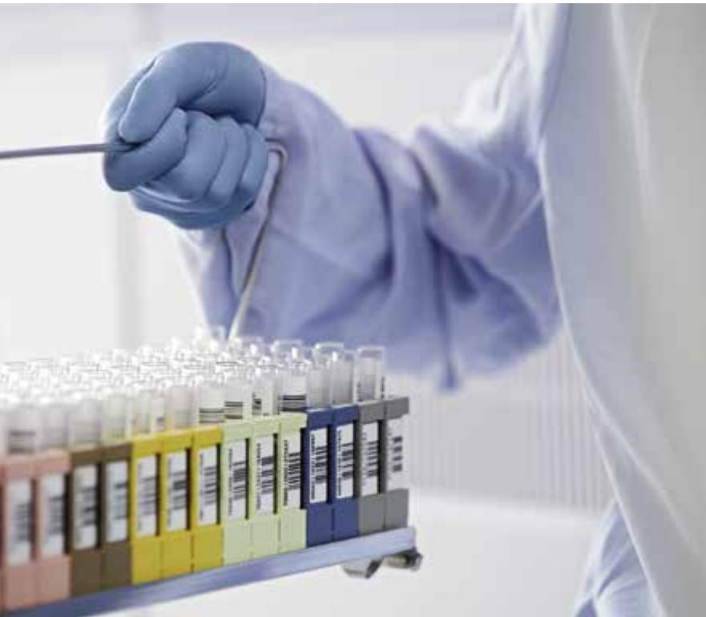

> **AI Description:**
> **Source:** `assets/_page_83_Figure_1.jpg`
> 
> **Generated:** 2026-06-01 18:43:34
> 
> ---
> 
> The image shows a person in a laboratory setting, wearing a lab coat and blue gloves, handling a pipette to transfer liquid into test tubes. The test tubes are arranged in a rack, with labels indicating different colors and barcodes, suggesting a scientific or medical testing process. The focus is on the hands and the test tubes, emphasizing the precision and care involved in laboratory work.

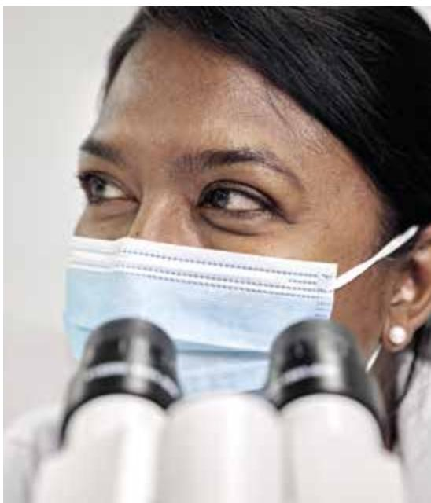

> **AI Description:**
> **Source:** `assets/_page_83_Figure_2.jpg`
> 
> **Generated:** 2026-06-01 18:47:08
> 
> ---
> 
> The image contains a photograph of a person wearing a surgical mask and looking through a microscope. The person appears to be engaged in scientific or medical research. The focus is on the individual and the microscope, suggesting a setting related to laboratory work or medical analysis.

Working in collaboration with healthcare systems and our partners is key to resolving critical access barriers to therapies.

# Tackling healthcare’s greatest challenges in women’s health

At Roche, we challenge not only ourselves but entire healthcare systems to bring life-changing solutions to patients across the globe. Why? Because it is what society expects of us, and it is why we come to work every day. We are relentlessly looking towards the needs of tomorrow in the hope that one day, our vision of a brighter, healthier world will become reality. But each passing year brings new challenges, including access to diagnostics and treatments for diseases like cervical cancer.

More than 90% of cervical cancer cases result from human papillomavirus (HPV), a sexually transmitted infection for which a vaccine already exists.1 Despite being almost 100% preventable with vaccination and screening, approximately 300,000 women succumb to the disease every year,2 making it one of the most common causes of cancer death in women.

Many countries are moving to HPV DNA testing as a more effective and efficient disease prevention strategy. In fact, the World Health Organization (WHO) recently endorsed it as the first-choice method for cervical cancer screening.3 Recommended clinical guidelines have also been evolving in favour of HPV tests for first-line primary screening, supported by an interest to improve outcomes, and the availability of technologies to help laboratories achieve the efficiency and scale they need to meet the demands of high-volume cervical screening programmes.

The rapidity and scale at which comprehensive testing portfolios were developed during the pandemic left many to wonder: Could the same not be done to curb the spread of other lifethreatening diseases? After all, Roche’s cobas instruments used for COVID-19 testing are some of the same used for cervical cancer screening. This, in and of itself, could be a game changer that could allow countries who would not have had the infrastructure in place prior to the pandemic to utilise these machines to help address significant gaps in women’s health.

But life-changing innovation is only impactful if it reaches those who need it. Over 85% of global cervical cancer deaths occur in middle- and lowincome countries, where diagnostic discrepancies and disparities are most prevalent.2 This is why we have adjusted our focus so that we not only develop and deliver advanced diagnostic solutions but also address the significant disparities in cervical cancer, especially in regions where the burden of the disease is at its peak. Roche added HPV screening to our Global Access Program to make cutting-edge diagnostic solutions available to women in the greatest need.

The world is watching and waiting for advances to be made in women’s health. In July 2021, the WHO announced updated screening guidelines that will help realise its goal of eliminating cervical cancer by 2030. Our Diagnostics Division remains committed to investing in advancements that will significantly improve prevention strategies and provide women with the protection and care they deserve. Empowering women to take control over their health lies at the core of our ambition to transform healthcare and while progress has been made, we know we can still do more.

> **AI Description:**
> **Source:** `assets/_page_85_Figure_0.jpg`
> 
> **Generated:** 2026-06-01 18:35:29
> 
> ---
> 
> The image is a photograph of a person standing in a bookstore aisle. The individual is wearing a vibrant, patterned dress with a mix of red, green, and yellow colors, featuring a floral and geometric design. The person is holding a book in their left hand and appears to be looking at another book in their right hand. The background consists of bookshelves filled with various books, and the setting suggests a well-lit, organized bookstore environment.

## When words save lives

Agnès Kraidy is a journalist and activist from Abidjan, Côte d’Ivoire. She is also a breast cancer survivor campaigning for every woman to have access to diagnostics, medicines and, above all, information.

“I felt a lump in my left breast. Very small, but clearly noticeable,” Agnès explains. She knew something wasn’t right, so she immediately went to her company doctor to get it checked. “AIthough non-surgical treatments were available, the doctors recommended that I have a mastectomy. I realised that, like many women in Côte d’Ivoire, I had very little information and knowledge about breast cancer.’’ And this despite the fact that the disease affects approximately 2,300 women in the country  each year, with half of those diagnosed not surviving.

Giving hope and changing perspectives Ultimately, Agnès didn’t go ahead with a mastectomy. But she was determined that all women in Côte d’Ivoire needed to learn more about this dreadful illness. “I want them to be able to share knowledge with others affected. This is also why I wrote a book about my journey and the lessons I’ve learned along the way.” Unsurprisingly, Tu me fous les boules! Vaincre le cancer was the catalyst for a large awareness campaign across the country.

Obstacles at every step of the patient journey Despite more awareness being raised thanks to Agnès’s efforts, people in Côte d’Ivoire still face a multitude of barriers to access the diagnostics and treatments they deserve. One of these barriers is the affordability of treatment as there is no reimbursement policy for cancer treatments. Since 2014 and in close collaboration with the government, Roche has been helping increase access to high-quality care across the country. For instance, the first agreement, made under the National Programme against Cancer, provides free testing for HER2-positive breast cancer

through the public health system. As part of our current work with the government, Herceptin is free for all HER2-positive breast cancer patients.

“We are happy to now have basic diagnostics, but what if you need a biopsy or something even more sophisticated to ensure you are treated correctly?” Agnès asks. “There are simply not enough healthcare professionals or well-equipped hospitals for the number of patients in need.”

Geography can also prevent access. Côte d’Ivoire’s oncology centres are mostly located in Abidjan, which means long journeys and high accommodation costs for anyone living outside of the city centre. “This is yet another obstacle for people who simply cannot afford these costs for the many months of their treatment,” says Agnès. Therefore, in 2021, Roche supported the setting up of a new oncology centre in Bouaké to bring screening, diagnosis and follow-up closer to those living in other parts of the country.

While words can save lives, partnerships can too “There are many people who have the power to create solutions to the barriers patients face – but they often don’t wish to challenge the status quo. I call this the cancer of ignorance.” This is why Agnès is advocating ongoing investment in awareness campaigns and patient support programmes, as well as partnerships across different sectors.

Despite the numerous challenges, Agnès looks positively to the future and is thankful that some improvements have already been made. “As our focus continues to be how we can save more lives, we will continue to overcome barriers to bring effective solutions to patients everywhere in Côte d’Ivoire.”

## People and culture

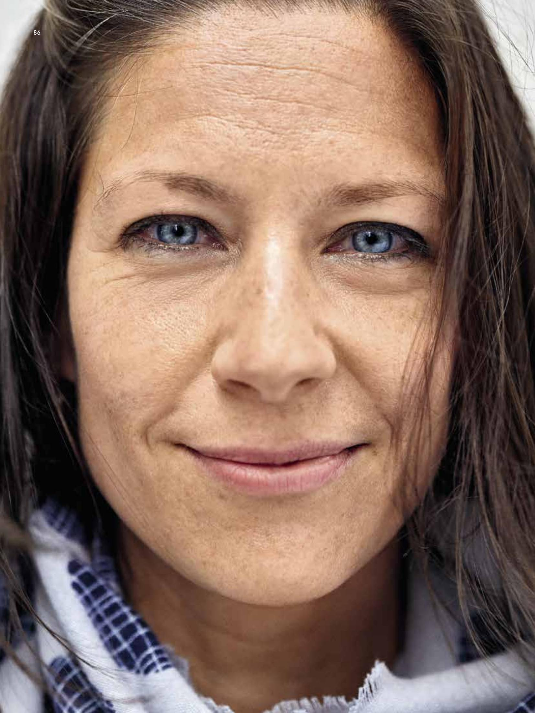

> **AI Description:**
> **Source:** `assets/_page_89_Figure_0.jpg`
> 
> **Generated:** 2026-06-01 18:22:54
> 
> ---
> 
> The image is a close-up photograph of a person with blue eyes, light skin, and brown hair. The person is wearing a white garment with a blue and white patterned collar. The background is plain and white, which helps to focus attention on the subject. There are no charts, graphs, or other visual elements present in the image.

# We are #RocheProud

## The pandemic changed many of our personal and professional routines, while also reaffirming our connection to our shared purpose and strengthening our sense of belonging and pride working for Roche.

The happiness and engagement of our people is fundamental to our success. In 2021, we conducted our biennial Global Employee Opinion Survey (GEOS). Seventy-eight percent of all Roche employees participated in the survey and shared how happy they are to be working at Roche. Those results are especially satisfying when we consider that the survey followed a particularly intense period. We underwent critical purpose-driven transformations while maintaining a relentless focus on ongoing business initiatives. At the same time, we worked to ensure we remained supportive of our people and patients in the face of the COVID-19 pandemic.

Because of the ongoing pandemic-related challenges, we faced many unpredictable and difficult situations. Nevertheless, our people remained highly engaged, evidenced with a score of 80 out of 100, unchanged from the 2019 GEOS survey. These results keep Roche in the top quartile of the global healthcare industry according to the GEOS benchmark, and validate our continued efforts to sustain a great working environment.

It is clear from the survey that our people are happy working at Roche, enjoy an inclusive and rewarding culture, and feel optimistic about our future and the positive impact we have on patients.

## A focus on the safety and well-being of our people

As a company, we are committed to serving the needs of our patients and society. As an employer, we are committed to providing a safe and inclusive working environment that enables our people to grow, thrive and reach their full potential. Our culture is people-centred and purpose-driven.

We know the important role we play as a critical global supplier of healthcare solutions. This has been even more evident throughout the COVID-19 pandemic, and is why business continuity, under these circumstances, carries higher expectations.

Throughout 2021, we took special care in implementing adequate on-site safety measures to protect our employees across research and development, manufacturing and the global supply chain. We also worked diligently to ensure the safety of everyone in our global support functions, particularly those working at customer premises who were more likely to be exposed to the virus. The health and safety of our employees is always paramount, and is also key to maintaining a reliable supply of medicines and diagnostic solutions for the patients and customers who need them. We are committed to going the extra mile to ensure all aspects of our work – including our workplaces as well as third-party manufacturers and suppliers – remain safe and healthy.

In these unprecedented times, the mental and physical well-being of all our employees demand greater focus. To help support both aspects, we have put a number of assistance programmes in place. These programmes provide guidance on working from home, mental health, nutrition, ergonomics, social well-being, sleep, fitness, mindfulness and resilience.

During our global Live Well week in September, renowned keynote speakers shared their insights on resilience, friendship and happiness. We also offered multiple complementary activities both on-site and virtually, ranging from online yoga and other fitness classes to a 21-day resilience challenge.

## Diversity & Inclusion at work

Another critical aspect of our culture is providing an inclusive work environment, where authenticity and respect are inherent and a sense of belonging is nurtured. To ensure we maintain that environment, we have explicitly emphasised Diversity & Inclusion (D&I) as a crucial part of Roche’s history and cultural identity.

In 2021 we introduced our updated D&I vision and strategic pillars. We also established a D&I Council, which oversees the strategic and overall governance of D&I, and ensures that D&I is properly integrated into our business strategies.

## Our updated D&I strategy focuses on four pillars:

• Patients: Addressing the unmet needs of diverse patients and communities Specific activities in this pillar include diversity in clinical trials and inclusive research. One example is EMPACTA (Evaluating Minority Patients with Actemra), the first global, phase III COVID-19 clinical trial designed specifically to enrol patient populations that are often underrepresented in clinical studies and have been disproportionately affected by the pandemic.

## • People: Building a workforce that reflects the societies we serve

In this pillar, we increased data transparency and released our gender pay equity report. Based on our organisation-wide analysis – and taking into consideration global grading, job structure, level in organisation, etc. – we found no significant difference in pay between men and women in similar jobs. In accordance with the United Nations Sustainable Development Goal number five to “achieve gender equality and empower all women and girls”, we continue to commit ourselves to further advancing the opportunities for women within the organisation, most notably by increasing the proportion of female leaders in executive positions by an additional 2% in 2021.

• Culture: Ensuring our employees can thrive and deliver their best work, while also remaining true to themselves When employees feel comfortable presenting themselves as they choose, and confident they are protected from discrimination based on gender, culture, race, sexual orientation, or any other aspect, they are free to focus on doing their best work. To ensure we measure this accurately, we have integrated an inclusion index in GEOS.

• Society: Advancing positive change in society For this pillar, we foster supplier and vendor diversity and invest in STEM (Science, Technology, Engineering, Mathematics), activities to inspire and support future talents.

Additionally, our senior leaders demonstrated a strong engagement with D&I through their individual D&I commitments, which were shared across the organisation.

Over the course of the year, we celebrated D&I through multiple events and activities, including the Choose to Challenge campaign, which was launched in connection with International Women’s Day (IWD) and continued throughout the year. The campaign called on participants to call out gender bias and inequality and celebrate women’s achievements. It included a photo challenge which encouraged Roche employees to raise their hands and show solidarity for IWD, and challenge the status quo for greater gender equality in the world.

Pride Month in June was another highlight. We celebrated with our affiliates around the world, and Roche in Switzerland was awarded the LGBTIQ+ certification by the Swiss LGBTI-Label, an organisation that certifies Swiss companies that advocate internal equality for the LGBTIQ+ community.

We are proud of our inclusive work environment, where authenticity and respect are inherent and a sense of belonging is nurtured.

During our D&I Month in November we brought together employees from across the organisation to intensify our commitment to Diversity & Inclusion. Employees could choose from over 60 virtual events, inspiring discussions and engaging sessions, such as Unconscious Bias Training, Advancing Inclusive Research, Health Equity, Neurodiversity, and many more.

We recognise and value the uniqueness of each individual, regardless of their gender, race, age, skin colour, religion, marital status, sexual orientation, heritage, or physical or mental ability. This is why Roche does not – nor will it ever – tolerate discrimination in any shape or form. Furthermore, we firmly condemn any type of harassment – mental, physical or sexual – or any other infringement violating an employee’s right to dignity and respect in the workplace.

Our stance on D&I has been further strengthened in our updated employment policy. We are deeply convinced that our success depends on the talent and performance of our dedicated and diverse workforce. Moreover, we strongly believe in the potential of every single employee and remain committed to unlocking the potential of all our people to bring our purpose to life.

## Living our new ways of working

Creating a truly diverse and inclusive workplace and living our new ways of working will directly impact our ability to achieve our long-term ambitions and deliver on our purpose of doing now what patients need next. We believe the greatest ideas arise through collaboration and co-creation. By asking tough questions, exchanging perspectives and challenging not only ourselves, but also shifting paradigms, we are capable of innovating and developing life-changing solutions.

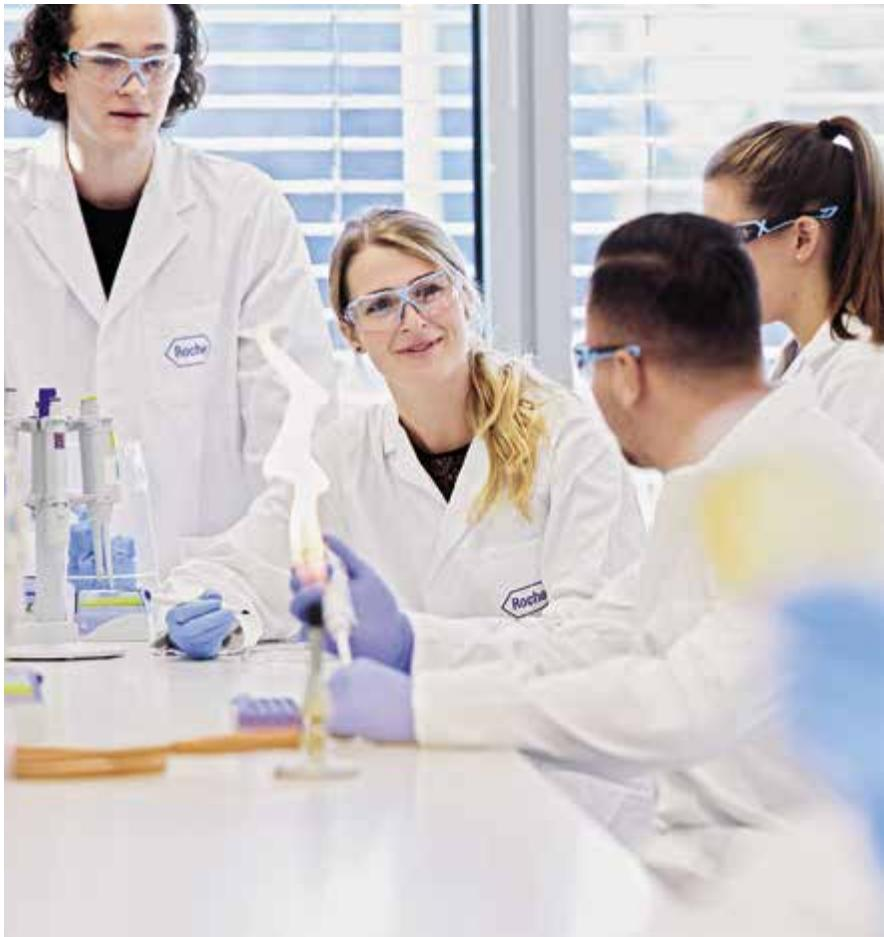

> **AI Description:**
> **Source:** `assets/_page_92_Figure_0.jpg`
> 
> **Generated:** 2026-06-01 18:58:36
> 
> ---
> 
> The image contains a photograph of a laboratory setting. Four individuals, dressed in white lab coats with the Roche logo, are engaged in a discussion or collaborative activity. One person is holding a pipette and appears to be demonstrating or explaining something to the others. The lab is equipped with various scientific instruments and glassware, indicating a research or educational environment. The individuals are wearing protective eyewear, emphasizing safety protocols in the lab.

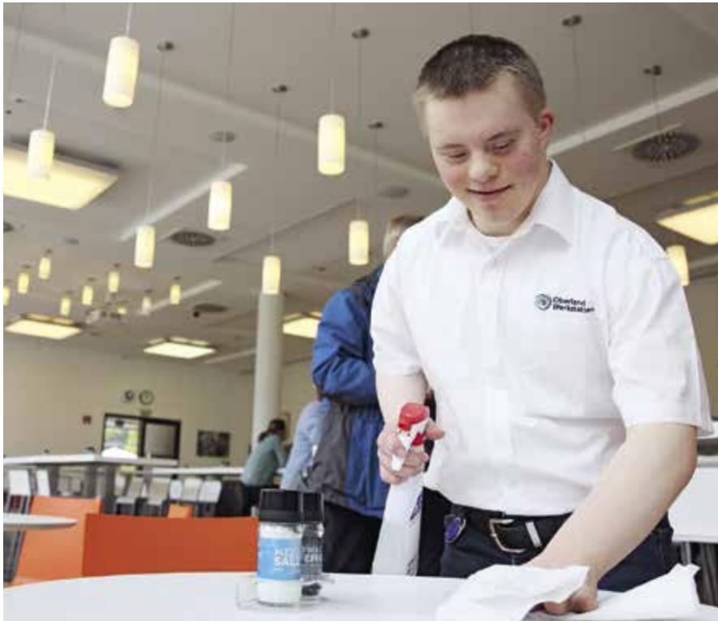

> **AI Description:**
> **Source:** `assets/_page_92_Figure_1.jpg`
> 
> **Generated:** 2026-06-01 19:04:25
> 
> ---
> 
> The image is a photograph of a person wearing a white shirt with a logo on the left chest, standing in what appears to be a cafeteria or dining area. The individual is holding a spray bottle and a napkin, seemingly engaged in cleaning or sanitizing a table. The background shows other people, tables, and hanging lights, indicating a public or institutional setting. The person is wearing a lanyard, suggesting they might be an employee or participant in an event.

> **AI Description:**
> **Source:** `assets/_page_93_Figure_0.jpg`
> 
> **Generated:** 2026-06-01 18:51:53
> 
> ---
> 
> The image contains a photograph of a person sitting at a table, working on a tablet. The individual is wearing a rust-colored cardigan over a dark top. The setting appears to be a well-lit room with large windows in the background, suggesting a modern, possibly office or café environment. The person is focused on the tablet, which is placed on the table, and there is a glass of water next to it. The image conveys a sense of productivity and concentration.

## 125 years of milestones

Alice Keller shatters the glass ceiling   
Alice Keller had talent. Talent that Emil C. Barell, CEO of Roche from 1920 until 1953, recognised when he brought her into the company. He had a feeling for brilliant people and did not care much for the convention of the times. Whether man or woman, it did not matter. He was a champion of excellence in any form.

In 1926, he posted Alice to a position in Japan. After a 35-day journey by boat, she arrived in Tokyo to handle the country’s product launches and correspondence with Basel. Alice loved Japan and, unsurprisingly, excelled at the role. Within three years, she was promoted to Director of Roche Japan, making her the first woman senior executive at Roche. It was a sensational development at the time.

Women like Alice paved the way for the inclusion of people with diverse backgrounds, experiences, skills and perspectives, which is key to our success today, and in the future.

In 2021, we increased the use of technology and digitalisation and introduced a number of new approaches and tools to provide our people with around-the-clock support.

Our rapidly changing environment is prompting us to think differently about how to sustain our competitiveness. But we are no stranger to change – our capacity to adapt and undergo transformations has been in our DNA since our founding 125 years ago. We have reinvented ourselves, advanced science and technology, and adjusted our ways of working multiple times throughout our history. The most recent implementation of agile working methodologies and operating models has boosted the speed and efficiency with which we deliver our solutions to patients and healthcare providers.

While the pandemic forced a physical distance among many of us, it also revolutionised our ways of working, making us much more agile and collaborative. Roche continued its broad transformation journey and, despite the confusion and uncertainty created by the pandemic, our people have never shown more engagement and dedication for co-creating the future and shaping healthcare systems than they have throughout these challenging times.

## Evolving our ways of leading

Our new ways of working go hand in hand with new ways of leading. Every Roche employee deserves to work and thrive under great leadership, which is why we have been operating under our seven leadership commitments for many years. At the same time, the role of our leaders has evolved – and continues to do so.

Over the past several years, we have continued to utilise Kinesis and Synergy, our senior leadership development programmes. But the pandemic forced us to re-think the way we organise and run our programmes and events. For instance, the Global Virtual Leadership Development Initiative was launched virtually in 2021 which, incidentally, gave a much broader audience access to this valuable tool.

Our implementation of agile working methodologies and operating principles has boosted the speed and efficiency with which we deliver our solutions to patients and healthcare providers.

As we become more agile, the need for a shift towards shared leadership – one that fosters trust and ownership – becomes evident. We are developing a networked organisation where decisions can no longer be made in silos due to the high interconnectedness and interdependence across the company. This approach requires leaders to apply the VACC principles – visionary, architect, coach and catalyst – when leading and serving their teams and the organisation. The VACC leadership approach aligns with our creative mindset, and supports our co-creating vision, allowing us to achieve results, actively and authentically drive change and further enable role models who continuously push for learning and empowerment.

Our unique efforts and investments in developing coaching skills in our leaders have been recognised by the International Coaching Federation (ICF). In autumn 2021, we were awarded the 2021 ICF PRISM Award Special Mention. This award recognises Roche’s approach to making coaching an integral element of its leadership culture, while fulfilling the highest professional standards and creating measurable positive impacts.

At Roche, we want everyone to build the capability to lead and learn. By encouraging self-leadership and fostering a learning mindset, we help our people thrive. To achieve this, we have refined our existing people development strategy and provided a portfolio of activities and training to support self-growth and individual leadership.

## Enhancing everyone’s experience

When we unveiled our new approach to engaging and developing our employees a few years ago, we set the goal of becoming an agile organisation. In 2021, we took a significant step towards increasing the use of technology and digitalisation to improve the employee experience.

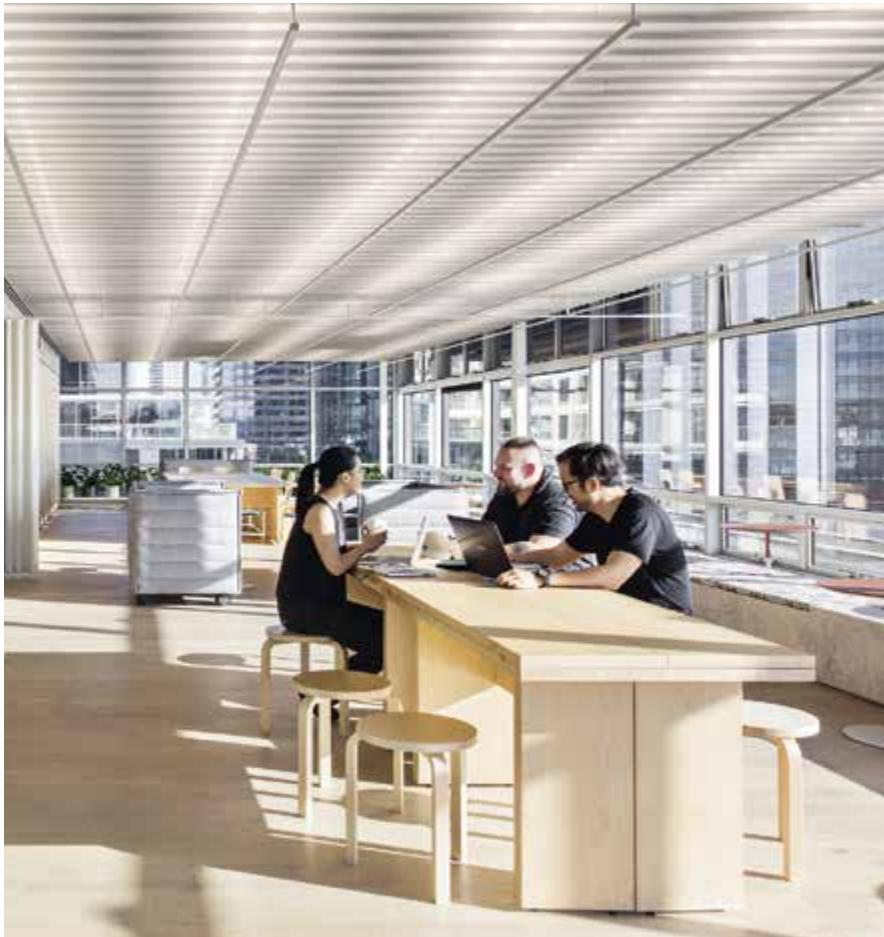

> **AI Description:**
> **Source:** `assets/_page_94_Figure_0.jpg`
> 
> **Generated:** 2026-06-01 18:51:24
> 
> ---
> 
> The image depicts a modern office setting with a large, open workspace. Three individuals are seated at a long, light-colored wooden table, engaged in a discussion. One person is using a laptop, while the others appear to be listening or observing. The room is well-lit with natural light streaming in from large windows, and the ceiling features a series of horizontal light fixtures. The overall design is minimalist and contemporary, with clean lines and a focus on functionality.

We introduced a number of new approaches and tools to provide our people with round-the-clock support. Additionally, we set up a broad range of internal and external training and learning opportunities, each designed to strengthen the foundations of an agile, self-organised workplace.

As a business function, People & Culture has also undergone its own significant transformation. We refreshed our workforce strategies, revamped our organisational growth efforts and updated our core processes and practices. Thanks to these efforts, People & Culture has not only become more efficient as a strategic partner, but has also established new standards in the creation of value for the long-term success of our organisation.

> **AI Description:**
> **Source:** `assets/_page_95_Figure_0.jpg`
> 
> **Generated:** 2026-06-01 19:00:14
> 
> ---
> 
> The image contains a photograph of two individuals engaged in a collaborative activity. One person, wearing a polka-dotted shirt, is leaning over a desk, holding a yellow object that appears to be a ruler or measuring tool. The other person, wearing a gray sweater, is seated at the desk, looking at a computer screen. The desk has a computer mouse, a tablet, and a keyboard. The setting appears to be an office or workspace environment.

## Employee health and safety

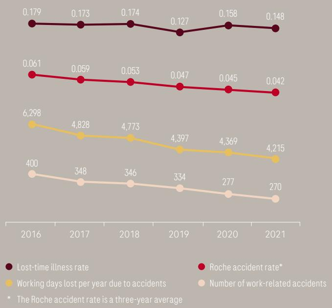

> **AI Description:**
> **Source:** `assets/_page_95_Figure_1.jpg`
> 
> **Generated:** 2026-06-01 19:04:10
> 
> ---
> 
> The image contains a line graph with three distinct lines representing different metrics over the years 2016 to 2021. The graph includes the following data:
> 
> 1. **Lost-time illness rate** (represented by the dark line) shows a slight fluctuation but generally remains stable around 0.15.
> 2. **Roche accident rate** (represented by the red line) is a three-year average and shows a consistent downward trend from 0.061 in 2016 to 0.042 in 2021.
> 3. **Working days lost per year due to accidents** (represented by the yellow line) and **Number of work-related accidents** (represented by the light pink line) both show a downward trend. The number of working days lost per year decreases from 6,298 in 2016 to 4,215 in 2021, while the number of work-related accidents decreases from 400 in 2016 to 270 in 2021.
> 
> The graph effectively illustrates the improvement in safety and accident reduction over the six-year period.

Throughout the pandemic, we have provided tailored resources and support for employees working from home, including ergonomic assessments.

## Occupational health and safety

In 2021 the pandemic continued to impact operations at Roche. However, manufacturing and related activities were kept running during this time. In some countries, due to decreasing case numbers, operations resumed on-site at least temporarily while in other countries, most employees continued to work remotely.

Sites managed the pandemic locally using a uniform risk-based approach to mitigate the likelihood of workplace transmission and offered SARS-CoV-2 testing and, in many cases, vaccination to their employees working on-site or from home. Sites provided tailored support and resources to employees working from home consisting of information and programmes to maintain health and well-being, support setting up an ergonomic working environment at home and remote access to employee assistance and counselling. Roche actively supported, where possible, community programmes to deliver vaccines, provided up-todate evidence-based information and dismantled barriers for employees to get vaccinated against SARS-CoV-2 and influenza.

One of our primary objectives is to provide a safe workplace for our employees, both on- and off-site. Occupational accidents, which include operating motor vehicles, present significant risks to Roche that are actively managed as part of our risk management programme. Included in our current set of goals (2020–2025), we aim, once again, to continuously improve the safety of our employees. Our goals are to keep the Roche accident rate (RAR) below 0.05 (RAR corresponds to the number of working days lost due to occupational accidents per employee per year) and to reduce vehicle collisions per million kilometres by 10%, both by 2025.

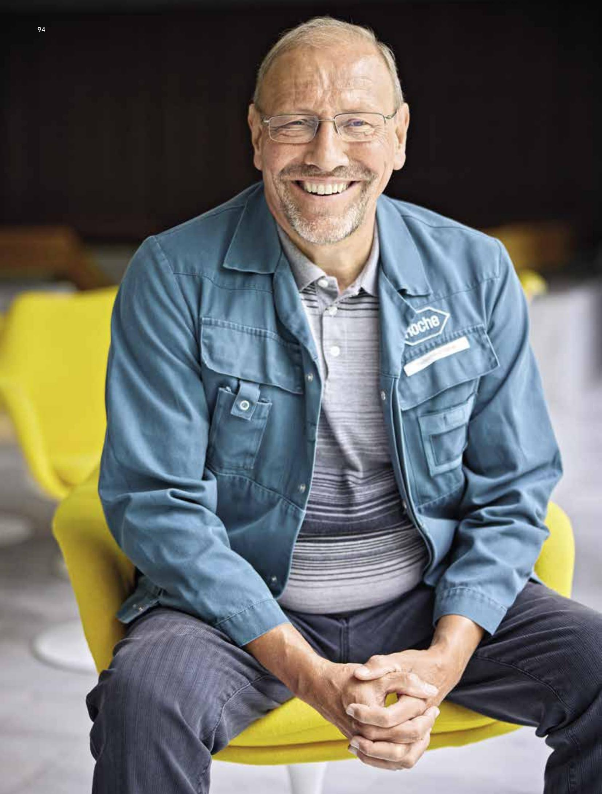

> **AI Description:**
> **Source:** `assets/_page_97_Figure_0.jpg`
> 
> **Generated:** 2026-06-01 18:33:34
> 
> ---
> 
> The image is a photograph of a person sitting on a yellow chair. The individual is wearing a light blue denim jacket over a striped shirt and dark pants. The jacket has a logo on the left chest area. The person is smiling and has their hands clasped together on their lap. The background is blurred, with some indistinct shapes and colors. The top left corner of the image has the number "94" printed in white.

## A lifelong career at Roche

## When Hans Aeberhard embarked on his Roche apprenticeship in Basel in 1972, he could not have imagined he would eventually retire from the company after 49 years, 4 months and 21 days.

Hans grew up in Basel. It is common in Switzerland for teenagers to complete a short apprenticeship during their final year at school before deciding on a career. Although he had no concrete vocation in mind, Hans knew his profession should be something technical and offer good prospects for growth and development. His choice to become a chemical technician was influenced by his teachers, who were very enthusiastic about the opportunities that existed at Roche. His older brother, who had started an apprenticeship as a chemical technician a few years earlier, also approved. “I am very happy with the path I chose,” Hans says. “My job was never boring; I was able to develop professionally and personally, and work in an innovative environment.”

## The highlights

Looking back, there are plenty of highlights that fill Hans with pride and fond memories. He has a deep appreciation for how Roche has been family-owned for generations. This leadership, he is convinced, is reflected in the culture and how employees are always treated with respect by colleagues and managers alike.

Working at the cutting edge of innovation and technology was always a key motivator. “We were the pioneers of liquid crystal technology and in the mid-1990s we set up a state-of-the-art, fully computerised manufacturing building on campus. These were the early years of digitalisation.”

His personal highlights include his promotion to foreman and becoming a line manager. Leading people was more than a job, it was a personal commitment. He developed a genuine interest in people and strove to discover and develop their potential. Hans’s colleagues are close to his heart. “I met a lot of people who shared their experience and expertise and helped me grow,” he explains. “In fact, many of my colleagues have become friends.”

## The challenges

During his career, there were only a handful of challenges. The hardest were reorganisations, which often involved downsizing. “It is difficult to sustain a high-performing team when your department gets reorganised,” he says. “Especially when you have to say goodbye to great people.”

The past two years of the pandemic have been a challenge for those in the manufacturing sector as well. For Hans and his wife, however, working from home during this period provided a way to ease into his retirement in August 2021.

## A new chapter in life

After 49 years, what advice can Hans offer for a successful and fulfilling career? “Perseverance and don’t give in when things get tough. Be authentic and speak up, but know when to hold back,” he explains. “And lastly, be a team player and respect your colleagues.”

Looking to the next 125 years, Hans hopes that Roche will sustain its unique legacy and keep employees and patients at the core of what we do. For himself, he hopes that he and his family stay happy and healthy. Although he is now retired, Hans will not fully disconnect from his profession: both of his sons have decided to follow in his footsteps and become pharma technologists.

## Environment

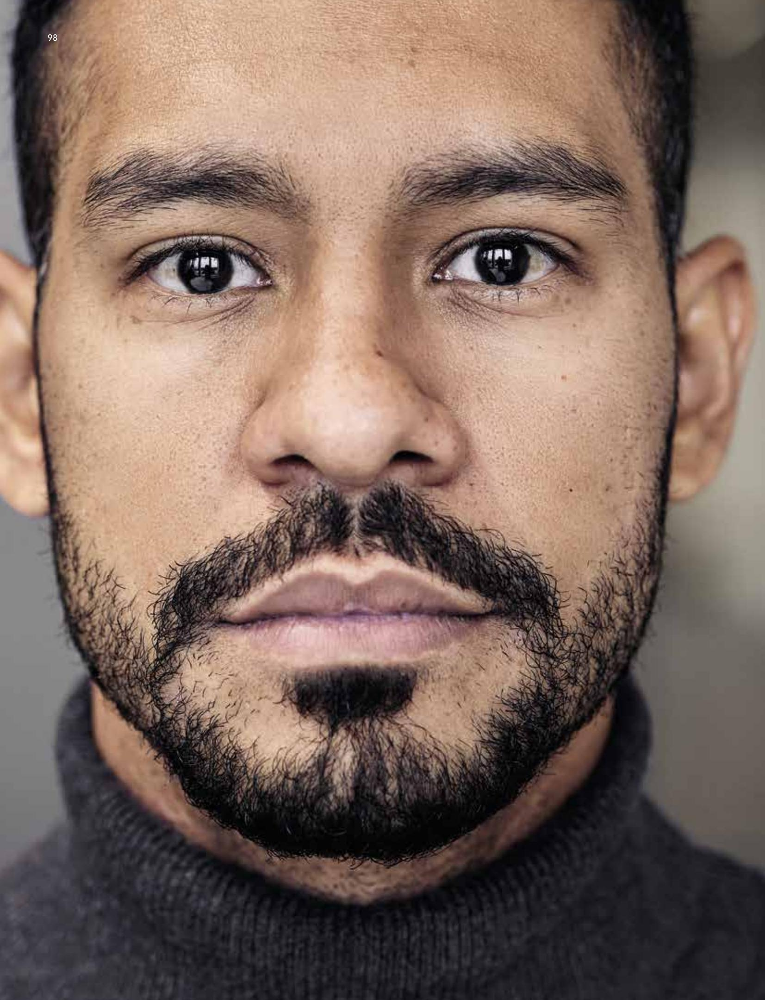

> **AI Description:**
> **Source:** `assets/_page_101_Figure_0.jpg`
> 
> **Generated:** 2026-06-01 18:59:54
> 
> ---
> 
> The image is a close-up portrait of a person wearing a dark, textured sweater. The focus is on the individual's face, capturing their facial features, including their eyes, nose, and beard. The background is neutral and out of focus, drawing attention to the subject. There are no charts, graphs, or other visual elements present in the image.

# Environmental protection – going beyond our achievements

What is known today as Safety, Security, Health and Environmental Protection (SHE) at Roche was conceived out of an industrial accident roughly 45 years ago.

In 1976, a blast at one of our subsidiaries in Italy, known today as the Seveso incident, resulted in the release of toxic chemicals into the air. The aftermath of the incident brought about the standardisation of industrial safety regulations that would greatly influence the future of SHE at Roche, and beyond.

The Seveso incident was tragic. But it was also a huge opportunity for Roche to evolve our approach to environmental protection. Since the late 1970s, protecting the environment has been an integral part of our operations. We approach it with the same sense of responsibility, and just as methodically, as we do with issues concerning quality, productivity and cost efficiency. Wherever possible and economically viable, we strive for continuous improvement in SHE and we seek sustainable, long-term improvement by changing behaviour, adapting equipment to the most recent standards, and developing innovative processes throughout our organisation. In order to ensure disasters like the Seveso incident do not recur, we devote special attention to prevention by reducing risks, which is key to effective environmental management.

As a company with production operations around the world, Roche is exposed to risks that could possibly damage people, goods, the environment, or our reputation. Audits, consulting, training and culture, combined with a professional risk management system, minimise these risks. Expert teams at each Roche site identify risks, develop mitigation plans and communicate policy and guidelines to employees and other stakeholders and support them in implementing the necessary measures.

Many of the environmental challenges that have occupied us for the last 40–50 years include waste, as well as emissions to air and water. And today, climate change is at the forefront. As the changing climate has introduced new risks, such as resource scarcity and a heightened occurrence of natural disasters, the Roche SHE operational risk management strategy includes forecasting and evaluating the financial implications that situations such as extreme weather or water scarcity could have on its operations.

We have been developing environmental protection goals since 2005. Our current five-year goal period runs from 2020 to 2025. The goals we set in the areas of people, environment and business are challenging, but achievable. By managing SHE professionally and proactively, we can maintain the current high levels of SHE performance and standards across the organisation.

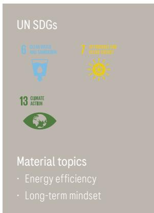

> **AI Description:**
> **Source:** `assets/_page_102_Figure_0.jpg`
> 
> **Generated:** 2026-06-01 18:43:40
> 
> ---
> 
> The image contains a combination of text and icons. It lists the United Nations Sustainable Development Goals (SDGs) related to clean water and sanitation (Goal 6), affordable and clean energy (Goal 7), and climate action (Goal 13). Below the SDGs, there are two material topics: energy efficiency and a long-term mindset. The icons are simple and represent the respective SDGs.

# Embracing our environmental responsibilities

Environmental responsibility has guided Roche’s activities for many years. We started reporting on greenhouse gas (GHG) emissions as early as 1990. Since 2004 we have been implementing carbon dioxide reduction measures that have led to a combined 59% decrease in carbon dioxide generated from within our operations (scope 1) and from purchased energy (scope 2).

However, our operations have impacts that extend far past the company gates. We purchase materials, components and services that enable us to develop and manufacture the products our patients need. These, too, form part of our environmental responsibilities. In 2021, we completed our total GHG emissions inventory, which now includes emissions associated with all goods and services purchased by Roche. We can now extend our focus to hot spots within our supply chain and develop mitigation strategies that will benefit the environment by minimising our carbon footprint. In parallel, it will bring long-term financial and reputational benefits for Roche and our suppliers.

## Supporting our suppliers (scope 3)

To be effective in managing our extended GHG responsibilities, we have identified the best ways to work with different segments of our supply base. In 2021, we identified 90 suppliers, across our Pharmaceuticals and Diagnostics Divisions, whose products and services account for nearly one-third of our total carbon footprint. By engaging these suppliers in active dialogue, we are working with them to further develop their sustainability strategies. This partnership also encourages greater transparency and better decision-making.

We support our suppliers in their efforts to decarbonise their operations and processes. One of these strategies involves a pilot project through which we partnered with a UK-based energy supplier to offer our supply chain partners renewable energy at a combined and more competitive rate. We used this project as research to gauge the receptiveness of suppliers when we offered to actively support their sustainability journey by providing commercially valuable solutions. We will be monitoring the results to determine further strategies, and have extended the offer to other high-spend, high-emission suppliers, representing 80% of Roche’s spending in the UK, as well as smaller and more diverse suppliers.

Another area of focus for these partnerships concerns the reuse of materials. A number of collaboration projects have been established with our suppliers to understand opportunities to reduce levels of waste, including plastic. Interactive workshops held with key suppliers have focused on single-use technology and filters and looked at ways to recycle, reuse and substitute materials.

## Our future is sustainable

As of 2021, 72% of our electricity comes from sustainable sources. In the continual pursuit to further reduce GHG emissions from scope 1 and 2 sources, we have developed a clear and defined process to generate progress by setting challenging but realistic goals, developing action plans on how to achieve these goals, and then implementing them.

Our scope 3 programme is also constantly evolving as new innovations become available. Over the next 12 months, we will finalise our scope 3 carbon reduction strategies, and set targets based on the potential for reduction. We will extend the number of suppliers we actively collaborate with and outline our expectations of them. Our longer-term ambition is to gradually move towards product-specific reporting for our suppliers, which can be used to monitor carbon dioxide reductions and to inform our product choices.

We are committed to a sustainable energy future and are implementing innovative technologies to improve energy efficiency.

We are also using the power of our people to drive change. Across Roche, everyone can have their voice heard, and everyone can contribute to our sustainability efforts by sharing their ideas on our innovation platform. These can touch on any aspect of the sustainable development agenda – whether environmental, social (including human rights) or economic. Our refreshed Supply Chain Sustainability Council, an internal decisionmaking body at the executive level, reviews these ideas and business cases to decide on the ones to resource for implementation and support. This level of focus and prioritisation of sustainability within our business allows ideas and concepts to be turned into impactful deliverables and wide-scale change.

Our scope 3 strategy and execution centres on three key themes:

• Reducing, reusing and recycling This involves influencing business travel behaviours, reducing spend on non-essential goods and services and recycling or reusing materials.

• Substituting and innovating This involves substituting non-sustainable energies with sustainable energies, considering environmental stewardship in product designs and alternative logistics methods and routing.

• Engaging and partnering with suppliers and supply chains This involves transitioning suppliers towards renewable electricity and incorporating sustainability as a core element of global supplier relationship management strategies.

We recognise that we cannot deliver sustainable supply chains alone. This is why we will build on our existing industry collaboration to extend our reach so that we can influence and learn from other industries’ approaches to sustainability.

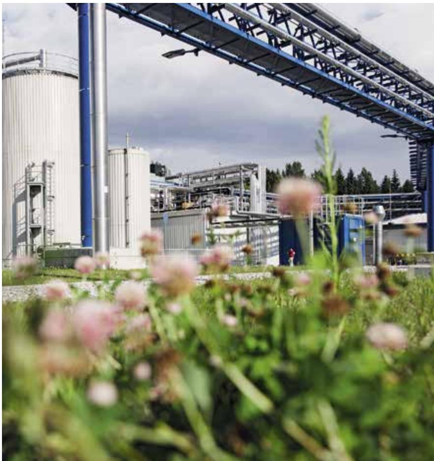

> **AI Description:**
> **Source:** `assets/_page_104_Figure_0.jpg`
> 
> **Generated:** 2026-06-01 18:33:56
> 
> ---
> 
> The image contains a photograph of an industrial facility with large cylindrical tanks and a network of pipes and structures. In the foreground, there are blurred pink flowers and green foliage, which contrast with the industrial background. The sky is partly cloudy, and there are trees visible in the distance, suggesting a mix of natural and industrial elements in the scene. The image captures a juxtaposition of nature and industry, possibly highlighting the coexistence of environmental and industrial landscapes.

## Steering towards a sustainable energy future

Roche recognises climate change as one of the largest global risks and addresses it as a matter of urgency. Expert teams, with a problem-tosolution-focused mindset, have been addressing this global issue for more than 15 years. Most greenhouse gas (GHG) emissions at Roche originate from the transformation and use of energy. Instead of compensating with offsets, the teams pursue programmes that actively reduce GHG emissions. As a priority these include reducing energy consumption and increasing energy efficiency before substituting with energy from sustainable sources. With these measures, we have already reduced GHG emissions by more than 59% since 2004. At the Basel and Kaiseraugst site, for example, the energy consumption of the buildings and operations is minimised by innovative design and they are heated with waste heat and heat from the environment in a carbon dioxide-neutral way. We will continue to optimise energy use throughout the company striving towards one of our goals of reducing scope 1 and 2 GHG emissions to zero by 2050.

## Environmental performance data

We are continuously monitoring our environmental performance, and our aim is to collect data on at least 95% of each key performance indicator. By doing so, we ensure compliance with our high standards and objectives and guarantee that our processes and equipment are state of the art. Since 2005, we have shown progressive improvement in reducing our environmental footprint. Roche measures its environmental impact using the ecobalance metric, which measures the environmental impact of pollutant emissions or resource extraction activities in eco-points per unit of quantity. These points are added up and related to the total number of employees. This enables us to monitor our environmental impact per employee, taking business growth into account. Since 2019 we have reduced

## 125 years of milestones

Former Nutley site embodies Roche’s legacy Roche takes environmental responsibility seriously and is determined to create long-term social value for communities. The Nutley remediation project was no exception. The Nutley site was closed in 2012 and Roche was committed to making sure the 118-acre former US headquarters carried on its legacy of innovation and social responsibility.

A pioneering approach to environmental investigation and remediation and a novel divestment strategy cut years from traditional timelines and attracted a developer for the property, which sold in 2016 with Roche retaining responsibility for the site clean-up.

Now called ON3, the campus boasts research institutions and a private clinical laboratory with approximately 6,000 employees (compared to 1,500 when the site closed). Other tenants will include healthcare, biotech, retail and hospitality leaders. As was our vision, ON3 is contributing to the area’s economic and social well-being for generations to come.

our impact by approximately 30%. This puts us on a clear path to reach 36% by 2025.

We are committed to contributing to a sustainable energy future. To make this vision a reality, we are implementing innovative technologies, improving energy efficiency and increasing the use of sustainable energy. Such considerations positively impact our environmental footprint by, for example, dramatically reducing GHG emissions.

## Greenhouse gas reduction efforts

Our success at reducing energy consumption and carbon dioxide emissions can be credited to Roche’s GHG management approach. In 2021, for example, our Diagnostics site in Meylan, France, became the first Roche site to reduce GHG emissions from stationary sources (eg, heating and purchased electricity) to zero. The site consists of a new energy-efficient building that is provided with electricity from sustainable sources as well as biomethane. The site is now focusing on its car fleet strategy to optimise further emissions.

At three of Roche’s technical production sites, the heating, ventilation, and air conditioning systems in the cleanrooms have been optimised. Such areas utilise high ventilation rates to meet room air quality requirements. This optimisation has reduced carbon dioxide emissions by approximately 5,000 tonnes per year and resulted in annual monetary savings of approximately CHF 700,000. Once the project has been expanded to all pharmaceutical production sites, it is estimated that monetary savings will increase to approximately CHF 2 million per year with a maximum reduction in carbon dioxide emissions of 11,000 tonnes per year.

Similar GHG reduction measures are in place as part of our five-year goals. By 2025 our sustainable energy future activities will result in a further 40% reduction of carbon dioxide emissions from scope 1 and 2 sources.

### Full Page Description (Page 106)

**Source:** `assets/_page_106_Asset_0.jpg`

**Generated:** 2026-06-01 18:51:02

---

The image is an infographic combining text with a circular chart. The chart represents the Roche eco-balance for the year 2021. It includes five categories: Emissions to air, Emissions to water, Energy consumption, Water consumption, and Landfilled waste. Each category is represented by a colored segment of the circle, with percentages indicating the proportion of the total eco-balance. The largest segment, labeled "Emissions to air," accounts for 80.8% of the total, while the smallest segment, "Noise pollution," accounts for 1.0%. The chart provides a visual representation of Roche's environmental impact across various aspects.

## Grid electricity 26.2%

Our first priority is to reduce usage of energy. For the energy we use, we look for ways of improving efficiencies, such as heat recovery. In addition we encourage the use of renewable energy wherever it makes sense.

## Natural gas 28.9%

We stipulate that company car fleets consist of vehicles which use less than 2 MJ/km. By 2030, all vehicles will operate using energy from sustainable sources.

## Business air travelling 1.7%

Video and teleconferencing facilities have been established at all sites and are widely used. Employees are encouraged to use trains and to consolidate several business trips into one.

### Full Page Description (Page 107)

**Source:** `assets/_page_107_Asset_0.jpg`

**Generated:** 2026-06-01 18:29:20

---

The image contains a combination of text and circular diagrams representing greenhouse gas (GHG) emissions in tons of CO₂ equivalent (t CO₂). 

The left diagram is a pie chart showing the breakdown of GHG emissions across three scopes: Scope 1, Scope 2, and Scope 3. Scope 3 accounts for 95.0% of the emissions, Scope 2 for 39.9%, and Scope 1 for 3.0%. The remaining 2.0% is not explicitly categorized but is included in Scope 2.

The right diagram is a similar pie chart, but it focuses on Scope 1 and Scope 2 emissions. Scope 1 emissions are 60.1% of the total, while Scope 2 emissions are 2.0%. The remaining 39.9% is not explicitly categorized but is included in Scope 2.

Both diagrams use color coding to differentiate between Scope 1 and Scope 2 emissions, with Scope 1 in purple and Scope 2 in gray. The text at the bottom of the image provides the total emissions for each scope and the percentage contribution to the overall emissions.

### Full Page Description (Page 107)

**Source:** `assets/_page_107_Asset_1.jpg`

**Generated:** 2026-06-01 18:25:26

---

The image contains a pie chart and textual information related to greenhouse gas (GHG) emissions. The pie chart is labeled "Scope 3 GHG emissions (t CO2)" and is divided into several segments representing different categories of emissions. The textual information provides the specific values and percentages for each category, such as "Purchased goods and services" at 86.0%, "Transportation and distribution" at 2.9%, and "Business travel" at 0.2%. The chart visually represents the relative contributions of each category to the total GHG emissions, with "Purchased goods and services" being the largest contributor.

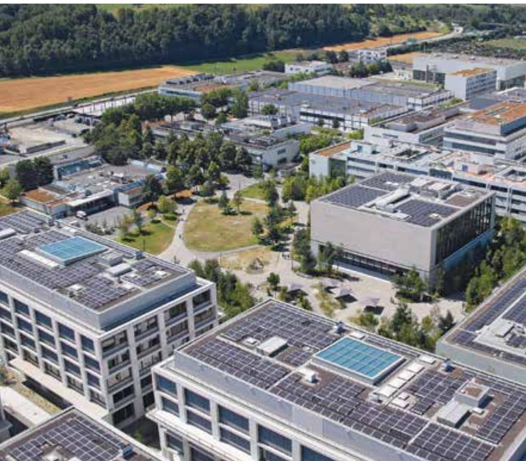

> **AI Description:**
> **Source:** `assets/_page_107_Figure_0.jpg`
> 
> **Generated:** 2026-06-01 18:52:28
> 
> ---
> 
> The image is a photograph of a modern industrial or commercial complex. It features multiple buildings with flat roofs, some of which are equipped with solar panels. The buildings are arranged in a grid-like pattern, with a central open area that appears to be a courtyard or plaza. Surrounding the complex are patches of greenery and trees, indicating a mix of urban and natural elements. The overall layout suggests a well-planned and possibly eco-friendly industrial or research facility.

Energy consumption in terajoules

GJ = gigajoule

Halogenated hydrocarbons in tonnes\*

\* Global inventory including Chugai, Genentech and Ventana

\*\* Includes data from additional Roche sites as well as a wider scope of halogenated hydrocarbons than in previous years

Emissions into the air in tonnes

\* Volatile organic compounds

Water usage and discharge

Landfilled and incinerated waste in tonnes

\* Less contaminated soil was removed in 2020 due to reduced remediation activities at the Kesslergrube, Germany
\*\* The increase in hazardous waste is due to the reallocation of electronic waste to hazardous waste

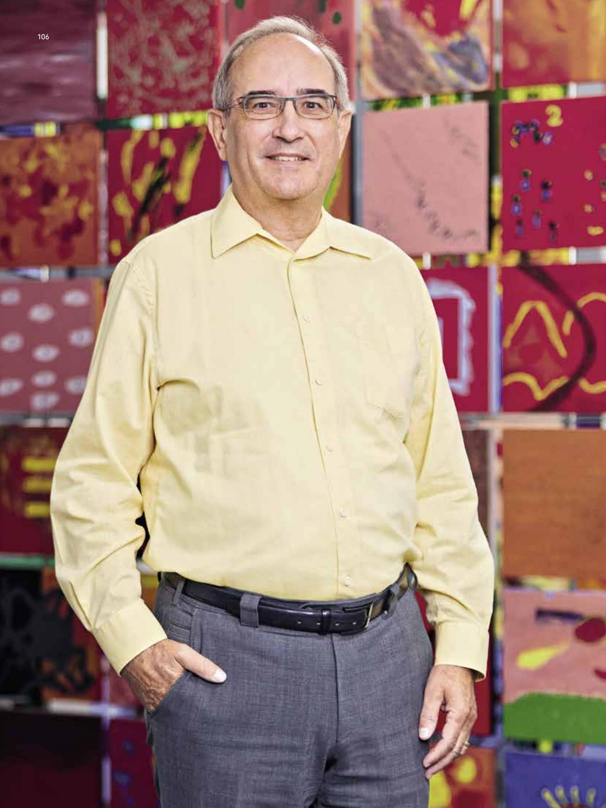

> **AI Description:**
> **Source:** `assets/_page_109_Figure_0.jpg`
> 
> **Generated:** 2026-06-01 18:30:56
> 
> ---
> 
> The image contains a photograph of a person standing in front of a colorful background with various abstract paintings. The person is wearing a yellow long-sleeved shirt, gray trousers, and a black belt. The background features vibrant red, yellow, and green abstract artworks. The image is well-lit, and the person appears to be in a casual yet professional setting.

## SHE is about managing risks for people, the environment and our assets

Peter Schnurrenberger and his team have evolved our Safety, Security, Health and Environmental Protection (SHE) function to become an integral part of our business activities over the past 21 years.

Driven by the strong belief that protecting people, the environment and our assets is integral to the success of our company and the betterment of society, Peter and his team have developed a comprehensive SHE management system that is embedded throughout our organisation and is a core pillar of how we do business.

Societal expectations have increased over time, which are reflected in more laws and regulations regarding SHE. “People realise now, more than ever, that we must act to protect the planet, ourselves and future generations,” says Peter. “We know that despite the progress that has been made, there is still more to do, and an opportunity to improve.”

When looking towards the future, Peter sees a number of key issues that we must tackle as an organisation. “An obvious area is climate change,” he says. “If we want to reduce the associated risks, we need bold action. At Roche, we have set a goal to eliminate all greenhouse gas emissions by 2050. We are developing roadmaps towards this goal and action plans are being implemented across all areas of our business. The faster we act, the less greenhouse gases will be in the atmosphere.”

Another key issue is water – the basis of all life – and an indispensable basic material for the manufacturing of pharmaceutical and diagnostic products. Water scarcity is increasing in several regions around the world as is the need for clean water. “We must further reduce our water consumption and reuse and recycle wherever feasible,” Peter reflects. “But it is not only the quantity, but also the quality of water that matters. Society is becoming less accepting of non-natural chemicals in the water.” We know that we need to further reduce pollution with such chemicals, in particular if they are not readily decomposable. Where this is not possible we need to be transparent about any associated risks versus the benefits.

Standardising information is another area of focus for Roche. By not only being transparent with our reporting, but also advocating harmonised reporting systems, we know that society will benefit from increased knowledge and reassurance. “Today we see standards drifting apart, becoming far too complex and detailed, thus creating a lot of bureaucratic burden with questionable value relative to the effort,” says Peter. “We need to work with all stakeholders to create a simple, informative and robust reporting framework.”

Finally, with increasing global dependencies, the risk of events with widespread impact is increasing as well. “As a global healthcare company, we need to be well prepared for such situations as we must ensure uninterrupted supply of our products to patients,” Peter says. “Our responsibility to patients and society is the driving force behind our SHE activities and it is not taken lightly.” At the end of the day, we know that in order to achieve our goals, we need educated, highly committed and passionate people driving our efforts in SHE. There is a lot of work to be done, but it is our responsibility to move these activities forward in order to protect the health, safety and well-being of generations to come.

## Community engagement

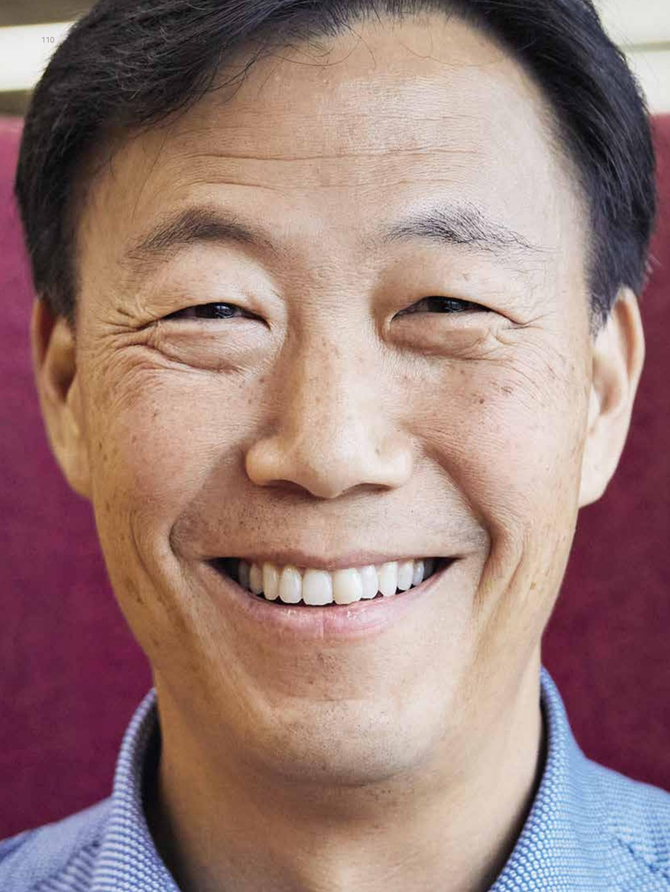

> **AI Description:**
> **Source:** `assets/_page_113_Figure_0.jpg`
> 
> **Generated:** 2026-06-01 19:02:47
> 
> ---
> 
> The image is a close-up photograph of a smiling individual. The person is wearing a light blue collared shirt and is seated against a red background. The image captures the person's face and shoulders, with a focus on their expression and attire. The lighting is even, highlighting the person's features and the texture of their clothing.

# Community impact – our lasting tradition of philanthropy at Roche

For over 100 years, we have remained committed to making a sustainable difference in communities in which we operate, and beyond. It is part of our commitment to society.

Our first and longest philanthropic partnership is with the International Committee of the Red Cross (ICRC). We began supporting the ICRC in 1918 in an effort to help the displaced and hungry across Europe. Over the years, our partnership with the ICRC has continued to evolve and grow.

In 2005, we became a founding member of the ICRC Corporate Support Group. Since 2015, we have supported the ICRC’s access to water initiative in Mali. In total, over one million people benefited from this programme. We are proud of our many enduring partnerships with organisations like the ICRC and our collaborative efforts to make a difference for communities around the world.

From our partnerships to our core pillars, we take a long-term approach to philanthropy. We have a well-established strategy, and maintain a clear focus on our engagements. Our philanthropic strategy is built around four pillars: community projects, supporting the arts, investing in education and providing humanitarian support. We strictly adhere to specific criteria throughout our partner and project selection processes. Those criteria include quality, innovation and sustainability.

## Grassroots community engagement

Our biggest employee engagement and philanthropic event is the Roche Children’s Walk. The event began in 2003 as an employee-driven pilot project across our sites in Basel, Nutley and Palo Alto. All of the funds raised through the walk go to Re&Act, our independent global charity, and to local non-governmental organisations (NGOs), in support of early childhood development and education efforts around the world.

In response to the pandemic and related restrictions on gatherings, our employees got creative and re-invented the event to include a wide range of innovative fundraising activities. In 2021, these events included plogging (a combination of jogging and picking up litter) in South Korea, volunteering at an orphanage in Côte d’Ivoire, ‘walking meeting’ challenges in Spain and virtual boxing workshops in Colombia. In total, over 26,000 people from 138 sites across 60 countries participated in fundraising activities.

Every year, our colleagues nominate employee ambassadors to visit Re&Act children’s projects and witness first-hand the impact of their fundraising activities. In 2021, a group of nine ambassadors made a virtual visit to Child’s Dream, Re&Act’s newest partner. This NGO is focused on children’s education in Southeast Asia.

During the visit, the ambassadors had the chance to meet the founders of Child’s Dream, see the schools and computer labs we are helping to build in Cambodia, and hear directly from students about how the scholarships are changing their lives. While meeting in person is ideal, this virtual immersion was truly inspirational, and the money saved on travel went to local children’s NGOs in the ambassadors’ respective countries. To learn more about Child’s Dream, please see the story on page 117.

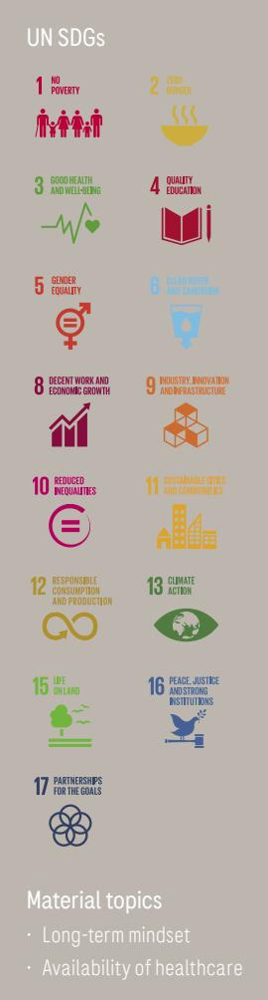

> **AI Description:**
> **Source:** `assets/_page_114_Figure_0.jpg`
> 
> **Generated:** 2026-06-01 19:00:47
> 
> ---
> 
> The image is an infographic combining text with visual elements. It presents the 17 Sustainable Development Goals (SDGs) of the United Nations, each represented by a distinct icon and a corresponding number and title. The icons are colorful and simple, making the information easily digestible. The text is clear and concise, providing a brief description of each goal. At the bottom, there is a section labeled "Material topics" with two bullet points: "Long-term mindset" and "Availability of healthcare," which seem to be related to the SDGs. The overall design is clean and organized, making it suitable for educational or informational purposes.

Art as a means to connect with communities Our long history of supporting groundbreaking contemporary art and cultural projects has included explorations of the parallels between innovations in art and innovations in science. Exposure to new ideas and perspectives helps to foster a culture of openness and creativity at Roche. It also helps to promote diversity and inclusion by celebrating different cultures and disciplines.

In 2003, we began collaborating with the Lucerne Festival, an international festival of contemporary classical music on a unique project called Roche Commissions. Every two years, we commission a new orchestral work from one of the world’s most talented composers. Starting in 2013, this partnership was extended to include Roche

Young Commissions to engage new contemporary classical composers and expose our scientists to leading-edge experiences in sound.

In 2021, one of the young composers, Australianborn Kirsten Milenko, debuted her new piece, Traho. It pays homage to the unfathomable losses Australia experienced as a result of the wildfires that raged there from 2019 to 2020 and that resulted in the loss of billions of animals and millions of hectares of burnt land. During the piece, the musicians sang in tribute to those who perished, and helped to keep their memory alive in the public mind.

With 169 nationalities represented at Roche, we are committed to diversity and inclusion in all that we do. Our support of projects like Culturescapes, a multidisciplinary Swiss festival that promotes cross-border cultural dialogue, helps us to celebrate our diversity by bringing some of its unique facets to our employees.

## 125 years of milestones

Good, clean health for South Africa   
Phelophepa. It means “good, clean health” in Sotho. For over 14 million people in rural South Africa, it has meant access to affordable primary healthcare. In 1994, Roche and Transnet, a freight logistics company, came together to establish Phelophepa, the world’s first comprehensive primary healthcare facility on rail.

What started as a three-car train was expanded to two 19-coach trains in 2012. They provide a range of healthcare services including dental, ophthalmological, psychological and general health. As the main external sponsor, Roche provided additional support during the COVID-19 pandemic including protective and sanitising equipment.

In 2021, Transnet launched a third train to support Phelophepa’s COVID-19 response. Over 16,000 people were vaccinated and over 127,000 patients received basic healthcare.

In 2021, Culturescapes focused on the Amazon region, bringing artists from Brazil, Colombia, Peru and Ecuador to Switzerland. Topics explored during the festival included climate change, access to water, violence and peace. Collaboration with the festival was wide-ranging, and Roche PhDs, postdocs and employees from Latin America had access to performances and workshops with the artists.

To bring the benefits of this event to as many people as possible, Roche Brazil hosted a virtual Culturescapes week. Throughout the week, they shared music from the artists, provided

One of the Roche Young Commission’s 2021 recipients, Kirsten Milenko, following the debut of her new orchestral work Traho (above). Ibã Sales, shaman of the indigenous Huni Kuin people in Brazil, performed with the Burned Instruments Orchestra during Culturescapes 2021 Amazonia (below).

mind and body workshops, and offered talks about some of the social issues the artists are exploring through their work. During an extended working-from-home period, this event provided a valuable outlet for connecting with colleagues through creativity, exploring diversity and inclusion in a new way, and feeling a sense of pride about engaging in Roche philanthropy.

## Getting students excited about STEM

At Roche, science and technology is at the heart of what we do. That is why we are committed to supporting interest in these disciplines among young people through international and local programmes. By improving access to education and real-world science and technology, we hope to support the next generation of innovators.

For more than 50 years, Roche has supported Swiss Youth in Science, which promotes science and technology among young people. In 2009, we became a founding sponsor of the International Swiss Talent Forum, the organisation’s think tank programme. This annual meeting brings young people from around the world together to discuss current global issues.

We are also proud to support and host Science on the Move, a Switzerland-wide school competition, run biennially in cooperation with the SimplyScience Foundation. In 2021, ten of the 25 schools participating presented projects on the theme of ‘Smart Systems’ to a jury of Roche scientists, academics and industry experts. The winning class will take a science-themed trip to London in 2022.

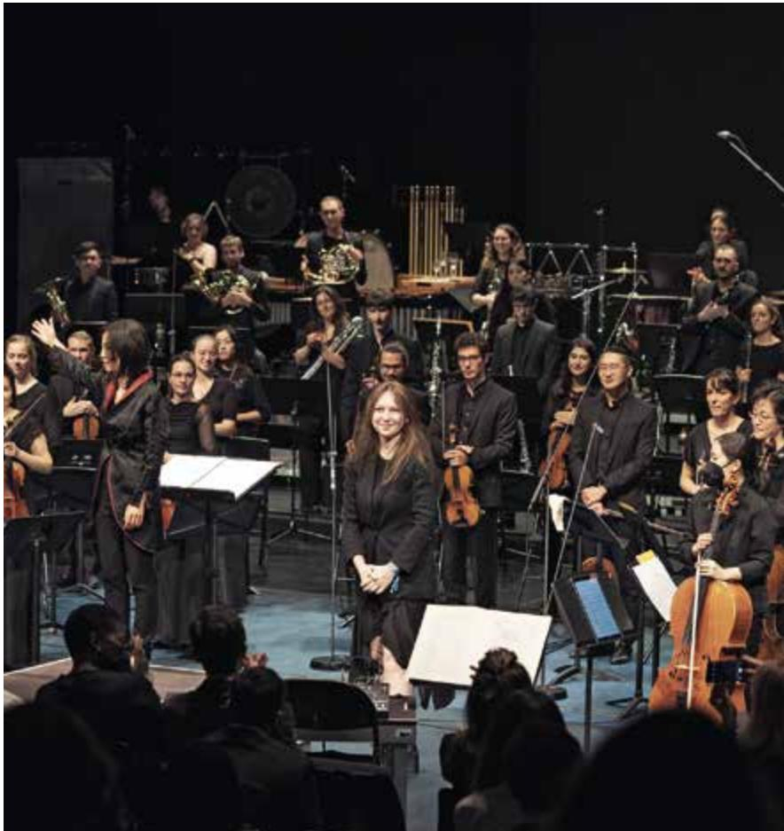

> **AI Description:**
> **Source:** `assets/_page_116_Figure_0.jpg`
> 
> **Generated:** 2026-06-01 18:37:06
> 
> ---
> 
> The image is a photograph of a musical ensemble, likely an orchestra, performing on stage. The ensemble includes various string instruments such as violins, cellos, and violas, as well as brass instruments like trumpets and trombones. The musicians are dressed in formal black attire, and some are holding their instruments. In the foreground, a conductor stands at a podium with sheet music, leading the ensemble. The stage is equipped with musical instruments and stands, and the audience is partially visible in the foreground, clapping and watching the performance. The overall setting suggests a formal concert or recital.

> **AI Description:**
> **Source:** `assets/_page_116_Figure_1.jpg`
> 
> **Generated:** 2026-06-01 18:31:57
> 
> ---
> 
> The image contains a photograph of a person standing on a stage with a microphone in front of them. The individual is wearing a traditional outfit with intricate patterns and a headband. The background features a fiery, orange-red design, possibly representing flames or a similar thematic element. The person appears to be addressing an audience, as indicated by their posture and the presence of the microphone.

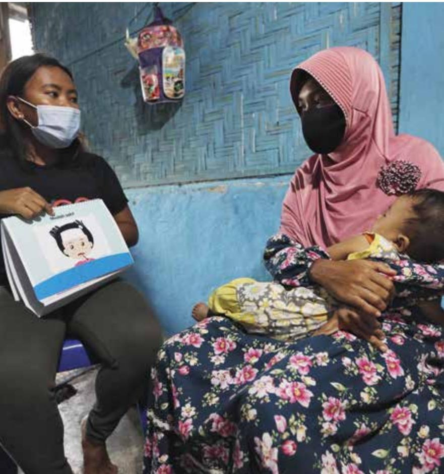

> **AI Description:**
> **Source:** `assets/_page_117_Figure_0.jpg`
> 
> **Generated:** 2026-06-01 18:42:53
> 
> ---
> 
> The image is a photograph showing two women in a room with a blue wall. One woman, wearing a black shirt and a face mask, is holding a bag with a cartoon character on it. The other woman, wearing a pink headscarf and a face mask, is sitting and holding a baby. The room appears to be modestly furnished, with a patterned fabric draped over a surface. The image conveys a scene of interaction, possibly related to health or social services, given the presence of the bag and the face masks.

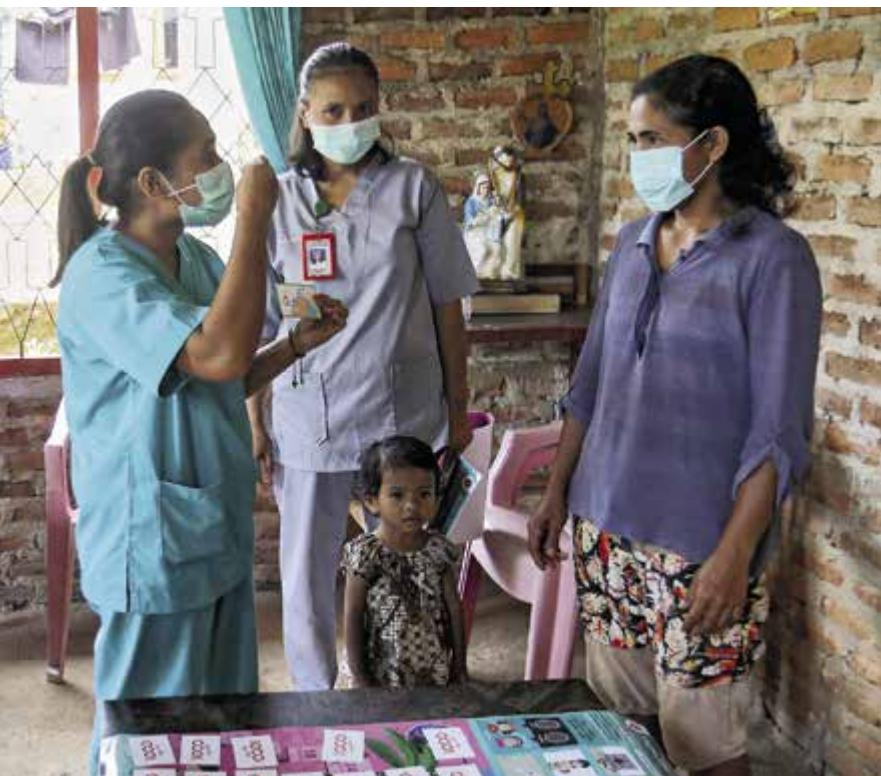

> **AI Description:**
> **Source:** `assets/_page_117_Figure_1.jpg`
> 
> **Generated:** 2026-06-01 18:43:17
> 
> ---
> 
> The image contains a photograph of three individuals, two of whom are wearing medical scrubs and masks, standing in what appears to be a medical or community health setting. The person in the middle is holding a small child, and the person on the right is wearing a casual outfit. The background includes a brick wall and a statue, suggesting a rural or community health center. The individuals seem to be engaged in a discussion or consultation.

Healthcare workers and volunteers from 1000 Days Fund, an NGO committed to reducing childhood stunting in Indonesia, showing mothers the impact of poor nutrition on children’s health. Roche helped to establish the country’s first Impact Stunting Centre of Excellence.

## It goes on without us

As a healthcare company, we are committed to building stronger and healthier communities by supporting human and social services systems in places where they are needed most. We seek partners who aim to implement simple and meaningful measures that will result in lasting improvements and a sustainable impact on society.

For example, we supported the 1000 Days Fund in Indonesia, which was established to help reduce childhood stunting. This condition is defined as shortness in height for a child’s age arising from prolonged malnutrition, and affects both physical and cognitive development. With our support, the NGO established the country’s first Impact Stunting Centre of Excellence, which provides tools and training to community healthcare workers and parents.

In 2021, three additional centres opened, directly benefiting 44,100 people, including healthcare workers, parents and children. In addition, the model has garnered support from the Ministry of Health, and attracted new donors, enabling them to continue to scale up and further integrate into the healthcare system. Ensuring the sustainability of a project – including its ability to go on without us – is central to philanthropy at Roche.

Another sustainable way we are supporting our communities is through the global philanthropic secondment programme which allows Roche employees to volunteer with an NGO supporting global health and education. In 2021, Walter Lee, from Roche Diagnostics (see photo on page 110), supported Terre des Hommes, a children’s aid organisation, in defining a model to introduce a new global health technology, a digital stethoscope, in low- and middle-income countries to improve outcomes for children.

## International Committee of the Red Cross 1918

We have supported the ICRC for over 100 years. In 2005, we became a founding member of the ICRC Corporate Support Group. We have contributed to water and habitat activities in several countries across Africa.

Over one million people have benefited from the access to water initiative in Mali.

## Child’s Dream 2019

We are working with Child’s Dream, our most recent Re&Act partner, to improve education for children in Southeast Asia.

Over 4,000 students have benefited from new classrooms, computer labs and scholarships in Cambodia.

## Some of

our partnerships and what we have achieved together

## UNICEF

The WWF was co-founded by Dr Lukas (Luc) Hoffmann, grandson of Roche founder Fritz Hoffmann-La Roche and his wife Adèle. Roche has continued to support the WWF ever since.

## World Wide Fund for Nature 1961

Over 3,000 people have benefited from rebuilding efforts in Nepal, Kenya and Zimbabwe.

## 2003

We have been working together to support access to education for children from disadvantaged backgrounds in several countries throughout Africa and Asia.

Over 450,000 children have benefited from educational programmes across Ethiopia, Malawi, Nepal and the Philippines.

## Swiss Youth in Science 1967

We have been supporting Swiss Youth in Science, which seeks to promote science and technology to young people, for over 50 years.

Over 15,000 students have been reached by Swiss Youth in Science programmes.

## Phelophepa healthcare trains 1994

We have been the main external sponsor of Phelophepa, a free mobile healthcare clinic that travels to rural areas in South Africa, since its first journey over 25 years ago.

Over 14 million people have benefited from basic healthcare services, trainings and jobs through Phelophepa in South Africa.

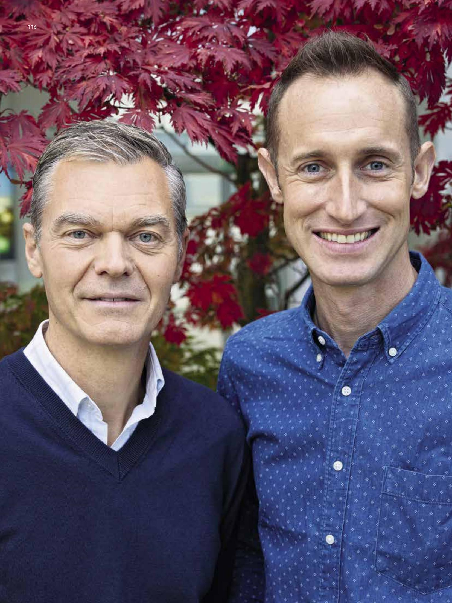

> **AI Description:**
> **Source:** `assets/_page_119_Figure_0.jpg`
> 
> **Generated:** 2026-06-01 19:12:29
> 
> ---
> 
> The image contains a photograph of two individuals standing outdoors. The background features a tree with vibrant red leaves, suggesting it might be autumn. The person on the left is wearing a dark blue sweater over a white collared shirt, while the person on the right is dressed in a blue button-up shirt with a small white pattern. The image appears to be a casual portrait, possibly for a professional or personal profile.

## How a balance of heart and head helped Child’s Dream become a reality

## Marc Jenni and Daniel Siegfried gave up careers in banking to set up a charity for children in Asia. They started from nothing and built an association that delivers health, education and – perhaps most important of all – hope.

“Good philanthropy requires perfect balance between heart and head – your heart needs to really understand and care about the people you are trying to help, and your head must stay rational and make good decisions.”

Daniel is talking about the secret to success of Child’s Dream – a charitable, not-for-profit organisation supporting children and young adults in Myanmar, Laos, Cambodia and Thailand. Co-founded by Marc and Daniel in 2003, the organisation now employs over 50 people. They work to reduce childhood mortality and improve health and hygiene in schools and communities, while also increasing access to quality education.

Marc and Daniel both admit that the balance is not always easy to maintain – the current situation in Myanmar in particular is “absolutely devastating”, says Daniel, “making it really difficult for me not to become emotional about it and lose that balance.” But over the last 18 years, they have managed to navigate that line, and deliver meaningful change and real hope for thousands of children.

## A meaningful mission

They set up Child’s Dream after successful but unfulfilling careers in banking in Switzerland, Hong Kong and Singapore. Those experiences provided a gateway to Southeast Asia and a first realisation of some of the challenges faced by local children. For the two of them, that realisation was a pivotal moment. “Daniel basically had an epiphany that he wanted to do something meaningful, and he suggested we set up a children’s charity,” says

Marc. “We sat there in a little guest house in front of a blank piece of paper, and through the night our ideas formed. We are both so happy that it developed from there into something so meaningful.”

## Productive partnership

The organisation established a partnership with Roche in 2019, with three clear areas of focus in Cambodia: improving school building infrastructure, with a five-year goal of 150 new primary, secondary or high school classrooms benefiting 6,000 students a year; supporting computer laboratory facilities, with the aim of ten fully equipped computer laboratories to vastly improve IT skills and knowledge; and finally, backing 350 high school scholarships to help marginalised students improve job and social mobility opportunities.

“The partnership works because we have a shared purpose and Roche is very engaged in the work we are doing,” says Daniel. “And the impact is very real. We will provide new school buildings for thousands of children in Cambodia, some of whom are the most marginalised, with difficult backgrounds. And with computer labs comes digital literacy, which is so important to bring new opportunities.”

They emphasise that we can all make a difference. It does not have to mean travelling to the other side of the world – it can mean being “a social worker in your own network”, whether that’s your family members, your neighbours or your local community. “But try to maintain that balance between heart and head,” says Marc. “And remember, even after the biggest storm, the sun will come out and shine again.”

## Business ethics

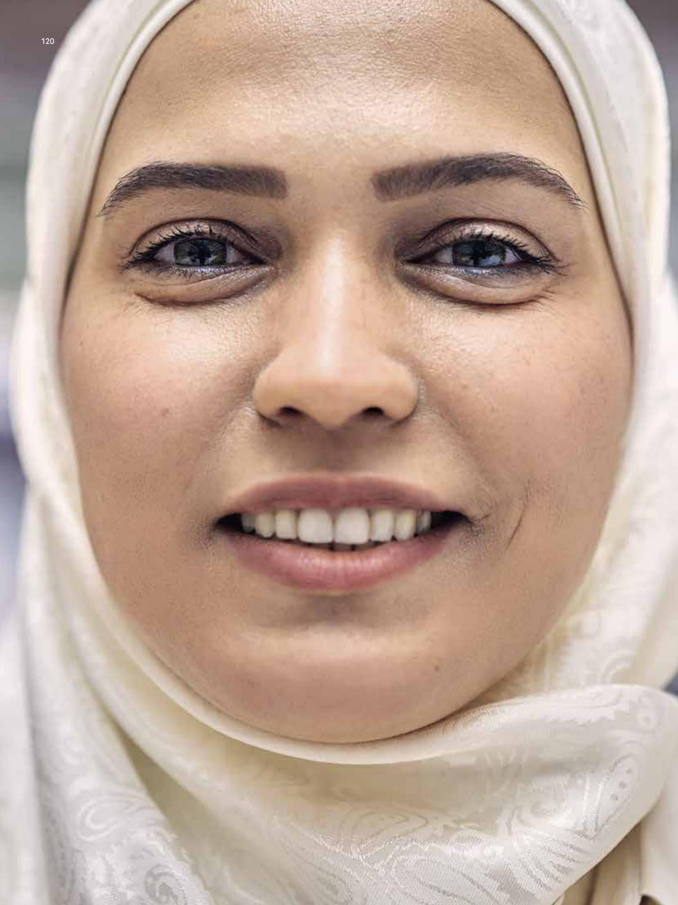

> **AI Description:**
> **Source:** `assets/_page_123_Figure_0.jpg`
> 
> **Generated:** 2026-06-01 18:58:13
> 
> ---
> 
> The image is a close-up photograph of a person wearing a white hijab. The person has a neutral expression and is looking directly at the camera. The background is blurred, focusing attention on the subject. The lighting is even, highlighting the person's facial features and the texture of the hijab. There are no visible text or other elements in the image.

# Integrity as a driver for business ethics

Upholding high standards of ethics, integrity and sustainability is not just about complying with laws and regulations; it is about making a positive impact on society in everything we do.

At Roche, we believe that integrity is the basis of a sustainable and successful business. We start with ourselves: Every employee has the responsibility to behave with integrity and in accordance with our shared company values and compliance guidelines. Because our commitment is also reflected in the expectations we place on our partners around the world, we require our distributors, suppliers and service providers to meet our integrity standards. We emphasise sustainability and expect our business partners to help foster social and economic development in the communities in which they operate.

We also continue to focus our efforts on our stakeholders’ understanding of – and trust in – our organisation. To help ensure that trust, we remain independent of any political affiliation. In 2021, we spent CHF 10.6 million in Switzerland. That spending included payments to industry associations and various chambers of commerce, financial assistance for trade unions, and donations to political parties at cantonal and federal levels. Donations to political parties were each in the low double-digit thousand range in Swiss francs, and together accounted for approximately 2% of the total contributions and donations.

The COVID-19 pandemic has had an impact on how we work together within Roche, including how we ensure compliance at our affiliates worldwide. In 2021, we implemented new ways of working, which empowered our compliance network to focus more on collaboration and exchange, allowing us to further strengthen our shared ethical mindset across the organisation.

## Fostering collaboration through a OneRoche approach

Although we have several distinct businesses and partners within the Roche Group, we know that fostering collaboration through a OneRoche approach is key to our overall success. This approach was the driving force behind many of our compliance and risk and opportunity management efforts in 2021.

One example of this was an initiative aimed at enhancing effectiveness and collaboration across our assurance functions including, but not limited to, compliance, quality, safety, health and environment. The insights of this comprehensive and collaborative gap analysis revealed a high level of competence in many key areas. Moving forward, we see a great opportunity to continue fostering collaboration across the assurance functions to ensure Roche is holding itself to the highest standards and providing pragmatic solutions to the business, with the ultimate goal of improving patients’ lives.

Building on a common set of values across divisions and countries, two more examples demonstrate how we want to move towards a more holistic, consistent and sustainable approach to compliance.

In 2021, we harmonised our compliance and risk and opportunity management process across all divisions. The intent of this initiative was to improve

· Human rights

· Ethics and transparency

· Patient centricity

· Compliance

· Availability of healthcare

efficiencies, minimise redundancies and enhance transparency.

As part of our overall review of our approach to business ethics incident management, we also developed a new system for internal noncompliance case management and reporting. The system enables stronger collaboration between the different functions involved in the management of the cases, especially Compliance, the Internal Investigations team and People & Culture.

## Collaboration with patients

Along with evolving and improving our internal processes, we are also striving for and engaging in important dialogues outside of Roche. We know we can learn a great deal from patients, and adhering to stringent ethical standards is key to impactful and effective interactions with them. In 2021, we developed a supportive coaching tool called Compliance Patient Engagement Navigator. The tool supports the business in identifying the applicable principles and rules, and provides robust guidance, enabling Roche employees to build compliant and sustainable relationships with patients and patient organisations (please see the story on page 127).

## Adapting to meet changing needs

As the healthcare system continues to transform rapidly, we must look at and respond effectively to how we spend money. In late 2020, Roche finalised a new policy on third-party spend. The policy moved us from providing tactical guidance that focused on procurement activities to providing Roche-wide principles and parameters governing how we spend money. The new framework allows us to set operational procurement rules and processes at a local level, while establishing globally applicable due diligence and sustainability requirements.

In 2021, we formed a team of supplier risk management professionals who are providing support to and enabling our procurement team, as well as the rest of the organisation. They are also developing state-of-the-art tools to facilitate risk assessment and management.

To provide further support to employees working in procurement and sourcing, we implemented a new online due diligence tool in 2021. The tool provides guidance on how to mitigate risks related to finance, supply, sustainability, technology, intellectual property, quality and contracts. The guidance is based on the inherent risks associated with the type of supplier, and how and where we expect to engage with them.

## Working together to mitigate risks and protect human rights

Roche’s commitment to human rights is reflected in the stringent requirements we place on ourselves and on our more than 60,000 suppliers worldwide. We regard our suppliers and service providers as partners, and put our efforts into creating a relationship of mutual trust and collaboration in order to ensure that our standards are met.

One important element of these relationships is our Supplier Sustainability Assurance Visit programme (SSAV), which gives us the ability to positively impact labour conditions at our suppliers’ facilities. The Roche Supplier Code of Conduct binds our suppliers to adhere to clearly stated performance expectations, including performance on human rights, and allows Roche to conduct SSAVs to help ensure compliance through collaboration and capability building. All our suppliers are evaluated annually through a standardised, risk-based process to identify those at high risk for human rights violations against vulnerable populations (children, underage workers, migrants, local underprivileged

Modern and safe remediation methods at the Kesslergrube site in Grenzach, Germany, protect the water of the nearby Rhine river.

communities and people with low levels of education). Suppliers determined to be at high risk are included in the SSAV programme.

Looking to the future, it is essential for us to constantly develop and expand our human rights requirements and guidelines in order to ensure we continue to meet the highest possible standards. In 2021, we updated our methodology to address industry sectors that were not previously considered, as well as non-Organisation for Economic Co-operation and Development (OECD) countries where performance standards may be lower, and human rights risks associated with certain commodities. To ensure we are properly addressing the issue of child labour, we also integrated the UNICEF Children’s Rights in the Workplace Index in our methodology for identifying high risk suppliers for inclusion into our SSAV programme.

Despite the ongoing challenges of the COVID-19 pandemic, Roche continued the SSAV programme in 2021 using a carefully developed remote auditing protocol, and adopting a hybrid virtual and on-site approach. In 2021, we conducted 26 SSAVs (7 in EMEA, 14 in APAC, 1 in North America and 4 in LATAM). There were 52 human rights related observations (see graph on page 125).

Following every audit, suppliers commit to a documented corrective action plan to address each audit finding. Our SSAV programme also includes follow-up audits to verify that corrective actions adequately address the identified findings.

## Human rights come first

One example that illustrates how we partner with our suppliers to help increase human rights standards is our effort to reduce our environmental impacts by converting the Roche fleet to electric vehicles.

> **AI Description:**
> **Source:** `assets/_page_126_Figure_0.jpg`
> 
> **Generated:** 2026-06-01 18:48:33
> 
> ---
> 
> The image contains a photograph of a construction site. It features heavy machinery, including a large yellow drilling rig and a wheeled excavator. The ground appears wet and muddy, suggesting recent rain or ongoing construction activity. In the background, there is a large crane, indicating a significant construction project. The machinery and wet ground suggest active work in progress.

## 125 years of milestones

Doing our part for generations to come Between the 1950s and 1970s, the Kesslergrube site in Germany served as a mixed landfill for domestic, industrial and chemical waste for the local community and businesses, including Roche. Eventually the area was covered up and in 2011, authorities decided that it was in need of remediation in order to protect the local groundwater resource and the adjacent river Rhine.

Recognising the social and ethical responsibility we have to protect the environment and generations to come, in 2014 we began one of the most complex remediation projects in Germany that is still ongoing today. Going way beyond what is legally required, our goal is not only to eliminate as much of the existing soil and groundwater contamination as possible, but with our proactive approach, to create a positive impact by making the remediated area available for re-use.

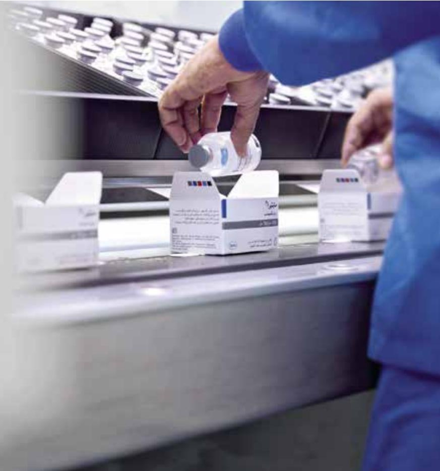

> **AI Description:**
> **Source:** `assets/_page_127_Figure_0.jpg`
> 
> **Generated:** 2026-06-01 18:37:33
> 
> ---
> 
> The image shows a close-up of a person's hands working on a conveyor belt in what appears to be a manufacturing or packaging environment. The hands are handling small, white boxes with text and logos on them. The boxes are being placed into a larger white box on the conveyor belt. The background shows more of the conveyor belt and additional boxes, suggesting an automated production line. The focus is on the packaging process, with the person's hands actively engaged in the task.

## Compliance

In 2021, 161 employees used the Roche Group SpeakUp Line, operated by an external provider, which is available in 53 languages in 103 countries. The Chief Compliance Officer received 567 reports of alleged violations of the Code of Conduct via the Business Ethics Incident Reporting system. Of these, 214 were unfounded, 216 were founded, and 137 are still under quote investigation. As a result, 88 employment contracts and 8 agreements 150with business partners were terminated on grounds of unethical behaviour.

We work closely with suppliers around the world to ensure we are adhering to the highest ethical standards in all areas of our business.

Protecting human rights is key in these efforts, as we believe that greenhouse gas reductions will not come at the expense of human rights.

Our objective is to not only ensure that manufacturers providing electric fleet vehicles are in full compliance with OECD Guidance on Responsible Supply Chains, but also to be able to trace conflict minerals to smelters and refiners compliant with our human rights expectations.

Accordingly, all our suppliers of electric vehicles must be in full compliance with OECD guidance, have an ethical mineral sourcing code of conduct that protects miners and families, and have a recycling programme for conflict minerals.

Roche has ceased negotiations with electric vehicle manufacturers that refuse our Supplier Code of Conduct and our right to audit, and do not have their own equivalent sustainable supplier code of conduct. It is our policy to not do business with any supplier who refuses to accept the principles of our Supplier Code of Conduct, and our right to audit for compliance with our sustainability principles.

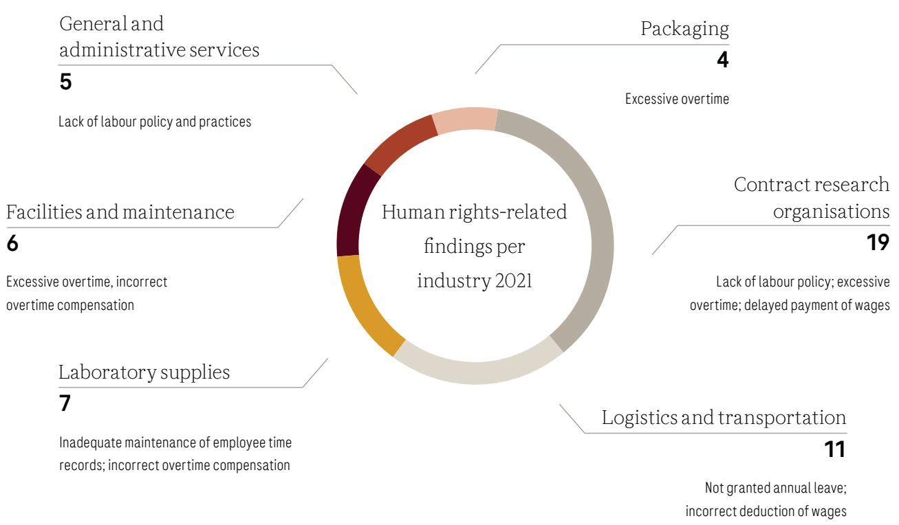

> **AI Description:**
> **Source:** `assets/_page_128_Figure_0.jpg`
> 
> **Generated:** 2026-06-01 19:07:56
> 
> ---
> 
> The image is an infographic combining text with a circular chart. The chart is divided into segments representing different industries and their corresponding human rights-related findings in 2021. The key information includes:
> 
> - Contract research organizations have the highest number of findings (19).
> - Logistics and transportation have 11 findings.
> - Laboratory supplies have 7 findings.
> - Facilities and maintenance have 6 findings.
> - General and administrative services have 5 findings.
> - Packaging has 4 findings.
> 
> The chart visually represents the distribution of findings across these industries, with larger segments indicating more frequent issues.

> **AI Description:**
> **Source:** `assets/_page_129_Figure_0.jpg`
> 
> **Generated:** 2026-06-01 19:18:55
> 
> ---
> 
> The image is a photograph showing a person interacting with a black dog by a serene body of water. The person is kneeling on a stone ledge, extending their hand towards the dog, which is standing on its hind legs, reaching up to the person's hand. The scene is bathed in warm sunlight, creating a lens flare effect that adds a dreamy quality to the image. The background features a calm lake with lily pads and lush greenery, suggesting a peaceful, natural setting.

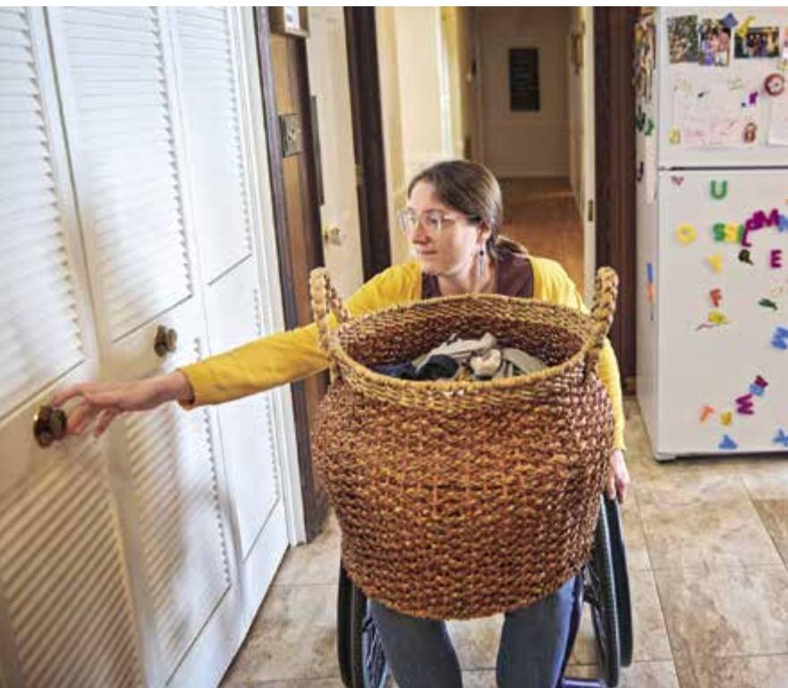

> **AI Description:**
> **Source:** `assets/_page_129_Figure_1.jpg`
> 
> **Generated:** 2026-06-01 19:20:59
> 
> ---
> 
> The image is a photograph showing a person in a wheelchair pushing a large woven basket filled with clothes. The person is wearing a yellow long-sleeve shirt and glasses. The setting appears to be a home, with a refrigerator decorated with various magnets and letters in the background. The person is opening a white door with a brass doorknob. The image captures a moment of everyday life, possibly related to laundry or household chores.

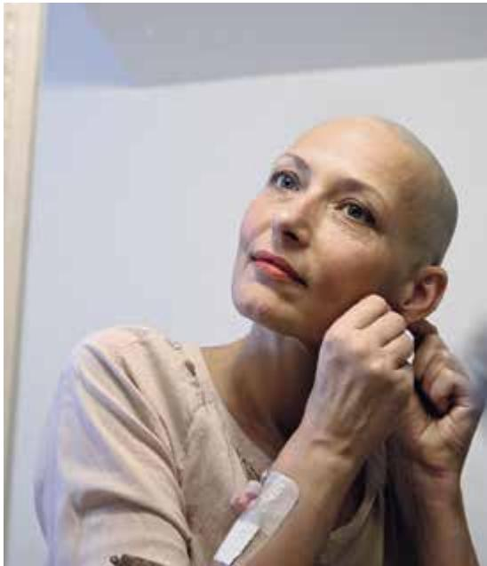

> **AI Description:**
> **Source:** `assets/_page_129_Figure_2.jpg`
> 
> **Generated:** 2026-06-01 19:27:55
> 
> ---
> 
> The image is a photograph of a person with a shaved head, wearing a light-colored top. The individual appears to be in a medical or clinical setting, as indicated by the visible medical wristband. The person is holding their chin with one hand, and their expression seems contemplative or thoughtful. The background is a plain, light-colored wall, suggesting a simple, possibly hospital or clinic environment.

Patients are at the heart of everything we do. We work closely with the patient community to listen, learn and integrate their feedback into all aspects of our work.

# Reflecting on our responsibility to patients

When we look at our history, we are humbled by the trust patients and their families have placed in us. They have trusted our research, the medicines and diagnostics we have developed, and the integrated solutions we have launched to help improve their quality of life. The responsibility we have to patients and those who care for them is the driving force behind our approach to patient partnership.

Over the last 125 years, we have worked to understand gaps that exist in the treatment of diseases like cancer, multiple sclerosis, spinal muscular atrophy and so many more. And while we have tried to keep the people impacted by these diseases in mind, we have not always asked for their perspective on what they value in their care. So, over the years, we have made a concerted effort to learn about how we can and should work with the patient community to integrate their feedback into our work.

Patients today take centre stage at Roche. We engage them early and systematically across our business to ensure that our thinking on disease management is shaped by their feedback on the outcomes that matter most to them, such as survival, relief of symptoms and cure of disease. We have, in the past, been challenged by regulatory authorities and payers on the outcomes we have measured for some of our medicines. This has required us to take a step back and consult the patient community to refine our thinking. Our hope is that by proactively getting the patient community’s perspective, we will answer the right research questions upfront.

Beyond research, patients and their families educate us about how they live, how they cope and what concessions they make in their dayto-day lives. These insights guide us on how we can help improve the patient experience from diagnosis to treatment to ongoing monitoring and patient support. Our work to engage patients in the right way is centralised through our Global Patient Partnership team and Worldwide Patient Partnership Network who partner across the company to drive our collaboration with patient communities within our core geographies.

Our collaboration with patients culminates in our long-standing commitment to help the community network, share and mobilise on broad health system topics through the International Experience Exchange with Patient Organizations (IEEPO). Over the past 13 years, IEEPO has become a signature Roche offering that helps patient groups share learnings, identify synergies in their markets, and collaborate on health topics that will make healthcare accessible to everyone around the world. It is also an opportunity for patient groups to tell us what we are not doing well and how we can improve. With close to 600 patient groups from 70+ countries participating in this platform (www.ieepo.com), IEEPO has become central to our vision for patient partnership.

This collaborative approach has resulted in Roche ranking first in corporate reputation amongst our peer group of ‘Big Pharma’ as announced in 2021.1 This recognition is a testament to not only our vision for partnering with patients, but to their willingness to share and trust in us. It is a responsibility that has driven us for the last 125 years and one that we will carry into the next 125.

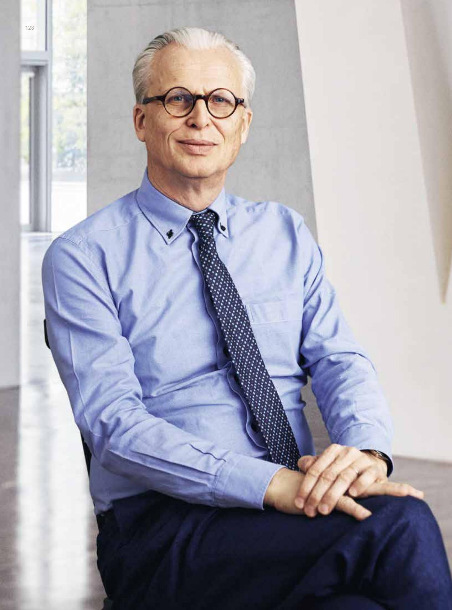

> **AI Description:**
> **Source:** `assets/_page_131_Figure_0.jpg`
> 
> **Generated:** 2026-06-01 18:55:08
> 
> ---
> 
> The image is a photograph of a person sitting with their hands clasped on their lap. The individual is wearing a light blue dress shirt, a dark tie with a small pattern, and dark pants. They are also wearing glasses and have short, neatly combed hair. The background appears to be an indoor setting with large windows allowing natural light to enter. The image is well-lit and the person is the central focus of the photograph.

## Integrity underpins every aspect of our business

Adriano Treve joined Roche 36 years ago as a trainee for the region of Iran, Saudi Arabia, Bangladesh, Pakistan and Cyprus. For the past three years, he has served as Area Head for Turkey, Russia, Iran, Central and Eastern Europe, Central Asia and the Indian subcontinent.

Adriano passionately believes that integrity is vital to Roche’s cultural mindset, and to our future success. We conduct business within a framework of the highest professionalism. Full compliance with legal and regulatory requirements is a prerequisite of our licence to operate, and is vital to our sustainability, our reputation and our future. Integrity extends beyond simply ensuring that correct procedures are followed. It must be ingrained within our culture.

Our Code of Conduct defines us, what we stand for, and what Roche expects of us. Our core values are courage, passion and integrity. As Adriano explains: “When we are confident that our managers and colleagues will respond with integrity, we are empowered to express our concerns. When we trust our colleagues, non-compliant behaviours are less likely to occur – a concern that is discussed becomes an issue avoided.” This is an approach Adriano has extended across his teams, ensuring that everyone he directly works with feels they are able to speak up with confidence and without the fear of retaliation. All employees can also use the anonymous Roche Group SpeakUp Line to report a compliance concern via the intranet or by phone.

Adriano supports the Roche policy of zero tolerance of non-compliance. “This is not as draconian as it may sound; an open and supportive culture means there is less opportunity for unethical behaviours to emerge,” he says. “Concerns are raised early and discussed openly, and actions are taken to ensure non-compliant behaviour is avoided.” Our Code of Conduct applies across the organisation, regardless of geography or culture. Zero tolerance of non-compliance is universal. However, this does not preclude the flexibility to accommodate different cultures, as long as integrity is preserved. For example, in some countries small gifts, like chocolates, are used to show respect in business interactions. But in other regions, this would be unacceptable. When advising his team, Adriano is guided by the principle of ‘integrity of motivation’. Why is this being suggested? Does it form a normal part of local business practices? Or is it likely to alter the basis of our engagement with a business partner? Even in circumstances where modest business gifts are normal, they must remain ‘token’ in nature; cultural variance is never a licence for excess.

Integrity in leadership, coupled with a conscious effort to foster that behaviour within our teams, is crucial to Roche. We will continue to behave with consistent and demonstrable personal integrity, and will consistently cultivate and encourage these values in our areas of responsibility. Our integritydriven mindset makes us an ideal partner around the world, allowing us to serve wider groups of patients. We are compliant not merely because we are required to be, but because it is the right thing to do.

As we celebrate our 125-year anniversary, Adriano reflects on the future of Roche in the years to come. “Roche is already future-fit, living by the same principles today that will guide success in the next 125 years,” he says. “The most important thing to me is that we continue to attract talent of the same high calibre as we do today – people rooted in the Roche heartland making a meaningful difference for patients.”

# RO

## Business performance

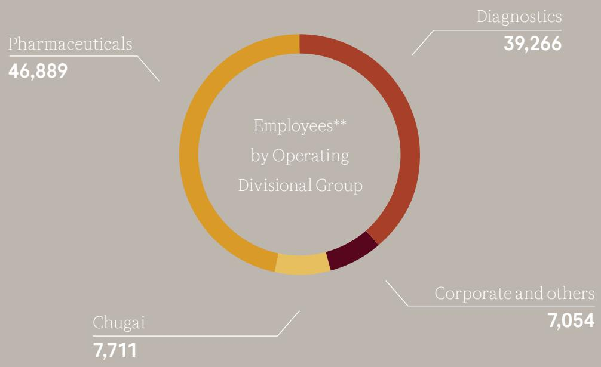

> **AI Description:**
> **Source:** `assets/_page_136_Figure_0.jpg`
> 
> **Generated:** 2026-06-01 18:56:43
> 
> ---
> 
> The image is a circular chart divided into four segments, each representing a different operating divisional group within an organization. The chart is titled "Employees** by Operating Divisional Group." The segments are labeled as follows:
> 
> 1. Pharmaceuticals: 46,889 employees
> 2. Diagnostics: 39,266 employees
> 3. Chugai: 7,711 employees
> 4. Corporate and others: 7,054 employees
> 
> The chart visually represents the distribution of employees across these divisions, with the largest segment being Pharmaceuticals and the smallest being Corporate and others. The use of distinct colors for each segment helps to differentiate between the groups and makes it easy to compare the number of employees in each division.

Research and development sites in Pharmaceuticals and Diagnostics worldwide 27

Manufacturing sites in Pharmaceuticals and Diagnostics worldwide 20

Treated with Roche medicines 16.4 million patients

On the WHO Model List of Essential Medicines 32 Roche medicines

## Roche Group

In 2021, Group sales rose 9%\* (8% in CHF) to CHF 62.8 billion. Core operating profit increased 4% (2% in CHF), reflecting the strong underlying business performance, and core EPS grew 6% (3% in CHF). The Swiss franc’s appreciation against almost all currencies affected the results expressed in Swiss francs compared to constant exchange rates.

IFRS net income was CHF 14.9 billion. This represents an increase of 2% (–1% in CHF), driven by the operating results.

In December, Roche completed the CHF 19.0 billion repurchase of Roche shares held by Novartis. This restores Roche’s full strategic flexibility while retaining its operational scope of action.

Pharmaceuticals Division sales increased by 3% to CHF 45.0 billion. Strong demand for newly launched medicines to treat severe diseases, namely Hemlibra (haemophilia), Ocrevus (multiple sclerosis), Tecentriq (cancer), Evrysdi (spinal muscular atrophy) and Phesgo (cancer) drove this growth; medicines for the treatment of COVID-19 also contributed to sales growth (Ronapreve for high-risk COVID-19 patients and Actemra/ RoActemra for severe COVID-19 pneumonia).

Overall, the medicines launched in the last ten years1 contributed an additional CHF 5.7 billion in new sales. The impact of competition from biosimilars for the cancer medicines Avastin, Herceptin and MabThera/Rituxan has slowed down as expected (combined CHF 4.5 billion of sales reduction); and the second half of the year saw signs of recovery from the COVID-19 pandemic.

The Diagnostics Division reported strong sales growth of 29% to CHF 17.8 billion. The division’s base business showed strong momentum throughout 2021 (overall +16%). With sales totalling CHF 4.7 billion, Roche’s leading portfolio of COVID-19 tests contributed significantly to the division’s overall sales.

## Outlook for 2022

Sales are expected to be stable or grow in the low-single digits (at constant exchange rates). Core earnings per share are targeted to grow in the low- to mid-single digit range (at constant exchange rates), including the accretive effect of the recent share repurchase. Roche expects to increase its dividend in Swiss francs further.

Roche anticipates sales of COVID-19 medicines and diagnostics to decrease by approximately CHF 2 billion to around CHF 5 billion, and sales losses to biosimilars in the current year to be roughly CHF 2.5 billion. Excluding those effects, Group sales are expected to grow in the high-single digit range.

Material topic · Long-term mindset

## Diagnostics

Diagnostics sales grew by 29%, driven by strong momentum in the base business and continued high demand for COVID-19 testing.

detection and monitoring, donor screening, sexual health and genomics.

Sales grew strongly across the world: Europe, Middle East and Africa (EMEA) 37%, Asia-Pacific 29%, North America 16%, and Latin America 48%.

Point of Care sales continued to grow significantly (+138%). The SARS-CoV-2 Rapid Antigen test was the main growth driver, especially in the EMEA region.

The division has also seen strong sales growth across all customer areas:

This customer area provides diagnostics solutions immediately at the point of care such as in emergency rooms, medical practices and directly with patients; it includes SARS-CoV-2 rapid tests and blood gas and electrolyte tests.

Core Lab sales increased by 21% due to its immunodiagnostics business, with infectious and cardiac tests as main contributors. Sales grew across all regions, most strongly in EMEA and Asia-Pacific.

Diabetes Care sales increased 3%, driven by the blood glucose monitoring business (such as the Accu-Chek Guide system).

This customer area focuses on central labs and provides diagnostics solutions in the areas of immunoassays, clinical chemistry and custom biotech.

This customer area focuses on integrated personalised diabetes management for people with diabetes and healthcare professionals.

Molecular Lab sales grew 29%, led by the virology business. The Delta variant continued to push growth in COVID-19 testing such as high-throughput PCR tests. Sales increased in all regions, led by the North America and Asia-Pacific regions.

Pathology Lab sales increased 12%. This was mainly due to growth in the advanced staining business.

This customer area focuses on molecular labs and provides diagnostics solutions for pathogen

This customer area focuses on pathology labs and provides diagnostics solutions for tissue biopsies and companion diagnostics. These targeted diagnostics support the specific therapy decisions for each patient.

## Pharmaceuticals

Pharmaceuticals Division sales increased by 3%; the continued strong demand for newly launched medicines more than offset the impact of biosimilars.

New and returning patients both boosted growth, the latter group generating stronger sales.

In the United States, sales decreased by 2%. While sales of Actemra/RoActemra, Hemlibra, Ocrevus, Evrysdi and Tecentriq increased, the impact of biosimilars and the COVID-19 pandemic affected total growth as expected.

Perjeta (first approved in 2012; CHF 4.0 billion, +4%). HER2-positive breast cancer. Sales increased mostly due to high demand in China in both early and metastatic breast cancer settings. In the United States, sales of Perjeta declined by 1% due to certain patients being switched to Kadcyla and due to the launch of Phesgo in 2020.

In Europe, sales grew 7%. Growth of recently launched medicines more than compensated for the impact of biosimilars and the COVID-19 pandemic.

In Japan, sales increased by 26%, driven by strong demand for new medicines. This more than compensated for competition from biosimilars and government price cuts.

Tecentriq (first approved in 2016; CHF 3.3 billion, +24%). Cancer immunotherapy (either alone or in combinations) for various types of cancer, eg, lung, bladder, breast and liver cancer. Sales increased in all regions, most notably in Japan, primarily due to the demand for treatment of hepatocellular carcinoma (HCC). US sales were higher, driven by the new indications for HCC and first-line non-small cell lung cancer (NSCLC).

Sales in the International region grew by 4%. In China, sales were stable: Growth of Perjeta, Alecensa and Heceptin was offset by the impact from biosimilars. Excluding China, sales increased by 6%, mainly driven by new product sales, partially offset by the biosimilars competition.

Ocrevus (first approved in 2017; CHF 5.1 billion, +19%). Relapsing and primary progressive forms of multiple sclerosis; two-hour only infusion. The demand for this treatment in both indications remained strong, mainly in the United States, while the pandemic still had a certain negative impact.

Hemlibra (first approved in 2017; CHF 3.0 billion, +41%). Haemophilia A with and without factor VIII inhibitors; only prophylactic treatment that can be administered subcutaneously once weekly, every two or every four weeks. Sales continued to show a strong uptake, especially in the United States and Europe.

Kadcyla (first approved in 2013; CHF 2.0 billion, +16%). HER2-positive breast cancer. Sales growth was driven by the usage of Kadcyla in the early breast cancer setting. Sales benefited from patients switching to this new standard of treatment.

## Corporate Governance

## Principles

Business activities with a focus on sustainable value creation and innovation, a management culture conforming to recognised standards of good corporate governance and a policy of transparent communication embody Roche’s corporate governance principles, which build the basis for the successful implementation of Roche’s commitment to serving all its stakeholders.

A strong Board of Directors, which represents the interests of the shareholders and all other stakeholders, and highly skilled managers who act with integrity are extremely important.

Roche ranked as one of the top three most sustainable healthcare companies in the Pharmaceuticals index of the Dow Jones Sustainability Indices (DJSI) for the 13th year running. This recognition is based on an in-depth analysis of economic, social and environmental performance. The DJSI serve as a benchmark for investors who integrate sustainability considerations into their portfolios. Sustainability is at the core of our business practices and this award reflects our commitment to running our business in a way that is ethical, responsible and creates long-term value for stakeholders.

This Corporate Governance Report sets out the structures, processes and rules which Roche takes as the basis for well-functioning corporate governance. In doing so, Roche complies with all relevant corporate governance requirements, in particular with all applicable laws, the Swiss Stock Exchange (SIX Swiss Exchange) directives and the Swiss Code of Best Practice for Corporate Governance promulgated by the Swiss business federation ‘economiesuisse’. The company’s internal governance framework, particularly its Articles of Incorporation and Bylaws, embodies all the principles needed to ensure that the company’s businesses are managed and supervised in a manner consistent with good corporate governance, including the necessary checks and balances.1

The printed Annual Report contains selected links to the Roche website (https://www.roche.com). Readers are thus provided not only with a ‘snapshot’ of our company at the reporting date but are also directed to sources which they can consult at any time for up-to-date information about corporate governance at Roche. Whereas each Annual Report covers a single financial year ending 31 December, our website contains information of a more permanent nature, as well as the latest Roche news. The company’s Articles of Incorporation, Bylaws and the curricula vitae of current and former (status as per end of term and as at the reporting date on 31 December of each year, at least of the last five years) members of the Board of Directors and the Corporate Executive Committee are published on our website.

## Board of Directors

In accordance with Art. 8 of the Federal Act on the Statutory Principles for Federal Council Ordinances on Combating the COVID-19 Epidemic (COVID-19 Act) and Art. 27 of the Ordinance 3 on Measures to Combat the Coronavirus (COVID-19) (COVID-19 Ordinance 3), the 103rd Annual General Meeting (AGM) of Roche Holding Ltd was held on 16 March 2021 without the physical participation of shareholders. Shareholders have been requested to exercise their rights via the independent proxy, Testaris AG, and to address their questions to the company in writing.

At the AGM of Roche Holding Ltd, on 16 March 2021, shareholders re-elected Dr Christoph Franz as Chairman of the Board of Directors for a term of one year as provided by the Articles of Incorporation.

Furthermore, the AGM re-elected André Hoffmann, Julie Brown, Paul Bulcke, Prof. Dr Hans Clevers, Dr Jörg Duschmalé, Dr Patrick Frost, Anita Hauser, Prof. Dr Richard P. Lifton, Bernard Poussot, Dr Severin Schwan and Dr Claudia Suessmuth Dyckerhoff as members of the Board of Directors for a term of one year as provided by the Articles of Incorporation.

In addition, the AGM elected Dr Christoph Franz, André Hoffmann, Prof. Dr Richard P. Lifton and Bernard Poussot as members of the Remuneration Committee for a term of one year.

At its organising meeting immediately following the AGM, the Board of Directors determined

the structure and composition of its remaining committees as shown on page 146 (see also page 14 and page 151 ‘Board of Directors and Corporate Executive Committee’).

On 15 March 2022, at the forthcoming AGM the Board of Directors nominates the Chairman and all remaining members of the Board of Directors for re-election, with the exception of Mr Paul Bulcke and Prof. Dr Hans Clevers. Paul Bulcke has been serving on the Board of Directors since 2011 and has decided not to stand for re-election at the AGM in 2022, following almost eleven years of tenure. Prof. Dr Hans Clevers, who joined the Board of Directors in 2019, will step down from this position and be appointed the new Head of Roche pRED effective 18 March 2022. He will become a member of the enlarged Corporate Executive Committee. The Board of Directors proposes Dr Jemilah Mahmood, currently the Special Advisor on Public Health to Malaysia’s prime minister, for election to the Board of Directors at the AGM 2022.

Moreover, the Board of Directors nominates Dr Christoph Franz, André Hoffmann, Prof. Dr Richard P. Lifton, Bernard Poussot and in addition Dr Patrick Frost for election to the Remuneration Committee at the AGM in 2022.

The Board of Directors nominates Testaris AG for election as independent proxy by the AGM in 2022 for the period from 2022 until the conclusion of the 2023 ordinary AGM of shareholders.

Board of Directors and Board Committees

Curricula vitae (CVs) of members of the Board of Directors:
a) current members: https://www.roche.com/about/governance/board\_of\_directors.htm
b) former members (at least of the last five years): https://www.roche.com/about/governance/ec\_bod\_former.htm
c) information of CVs at the reporting date on 31 December of each year (at least of the last five years): https://www.roche.com/about/governance/archiv\_former\_cvs.htm

A Corporate Governance and Sustainability Committee

D Chairman’s/Nomination Committee

B Audit Committee

C Remuneration Committee

G Independent member of the Board of Directors

E Non-executive director

\* Committee chairperson

F Executive director

Board of Directors

Committees

André Hoffmann (Chair)

B

Prof. Dr Hans Clevers

Julie Brown (Chair)

André Hoffmann (Chair)

Anita Hauser

Dr Jörg Duschmalé

Dr Christoph Franz (Chair)

Paul Bulcke

Dr Christoph Franz

Dr Claudia Suessmuth Dyckerhoff

André Hoffmann

Dr Patrick Frost

Prof. Dr Richard P. Lifton

Bernard Poussot

# Corporate Executive Committee

All memberships of the Corporate Executive Committee remained unchanged in 2021.

Information on each member of the Corporate Executive Committee and of the Enlarged

Corporate Executive Committee is listed below (see also page 18 and page 151 ‘Board of Directors and Corporate Executive Committee’).

Corporate Executive Committee

Enlarged Corporate Executive Committee

a) current members: https://www.roche.com/about/governance/executive\_committee.htm
c) information of CVs at the reporting date on 31 December of each year (at least of the last five years): https://www.roche.com/about/governance/archiv\_former\_cvs.htm
b) former members (at least five years back): https://www.roche.com/about/governance/ec\_bod\_former.htm

# Group structure and shareholders

Roche’s operating businesses are organised into two divisions: Pharmaceuticals and Diagnostics.

The Pharmaceuticals Division comprises the two business segments Roche Pharmaceuticals and Chugai, whereas Genentech as the former third segment has been integrated into Roche Pharmaceuticals.

In 2021, as part of a transformation initiative, the Diagnostics Division replaced the previous business area structure of its four business areas Centralised and Point of Care Solutions, Molecular Diagnostics, Tissue Diagnostics and Diabetes Care with new customer areas. Sales are presented by the following customer areas: Core Lab, Molecular Lab, Point of Care, Diabetes Care, Pathology Lab (for details see Finance Report, page 27).

Business activities are carried out through Group subsidiaries and associated companies. Detailed information on Roche Holding Ltd and on significant subsidiaries and associated companies (including company name, listing information, domicile, share capital and equity interest) is listed in the Finance Report, Note 33 to the Roche Group Consolidated Financial Statements (‘List of subsidiaries and associates’, page 138).

Major shareholders are listed in the Finance Report, Notes 22 and 32 to the Roche Group Consolidated Financial Statements (‘Equity attributable to Roche shareholders’ and ‘Related parties’, pages 95 and 135), and in Note 4 to the Financial Statements of Roche Holding Ltd (‘Significant shareholders’, page 181). In addition, significant shareholders are published on the

## Pharmaceuticals

relevant webpage (see link below\*) of the disclosure office of SIX Exchange Regulation.

André Hoffmann, Vice-Chairman of the Board of Directors, Chairman of the Remuneration Committee and of the Board’s Corporate Governance and Sustainability Committee and member of the Board’s Chairman’s/Nomination Committee, and Dr Jörg Duschmalé, member of the Board of Directors and of the Board’s Audit Committee, serve in their respective capacities on the Board and its committees as representatives of the shareholder group with pooled voting rights and receive the remuneration set forth in the Remuneration Report on page 174 and in the Finance Report, Note 32 to the Roche Group Consolidated Financial Statements (‘Related parties’, page 135). No other relationships exist with the shareholders with pooled voting rights.

There are no cross-shareholdings.

André Hoffmann, Chairman of the Corporate Governance and Sustainability Committee and of the Remuneration Committee, and Dr Jörg Duschmalé, member of the Audit Committee.

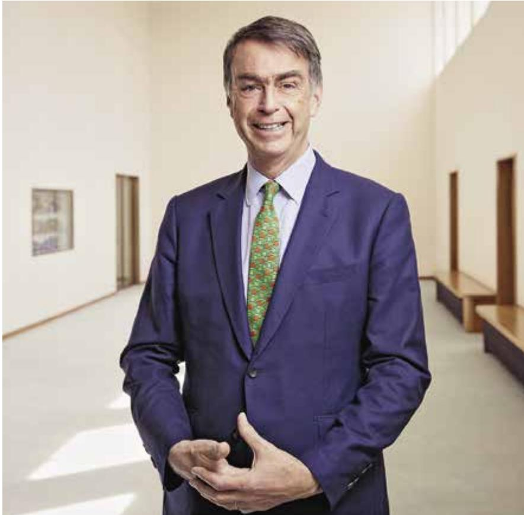

> **AI Description:**
> **Source:** `assets/_page_152_Figure_0.jpg`
> 
> **Generated:** 2026-06-01 18:52:10
> 
> ---
> 
> The image is a photograph of a man standing in what appears to be a hallway or corridor. He is dressed in a dark blue suit with a white shirt and a green tie with a floral pattern. The man is smiling and has his hands clasped in front of him. The background is a simple, clean hallway with light-colored walls and a few framed pictures or artwork pieces visible on the left side. The setting suggests a professional or institutional environment.

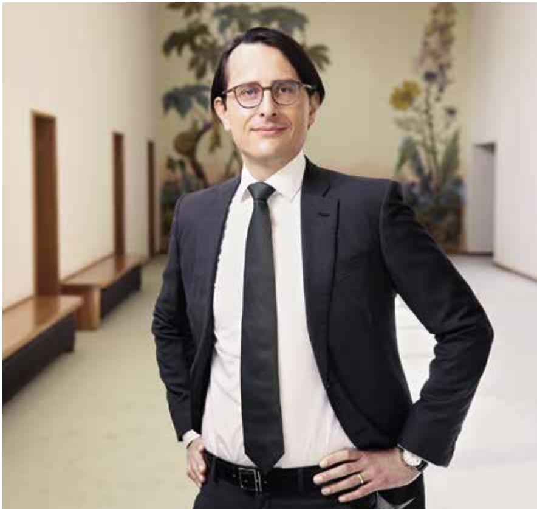

> **AI Description:**
> **Source:** `assets/_page_152_Figure_1.jpg`
> 
> **Generated:** 2026-06-01 18:50:26
> 
> ---
> 
> The image is a photograph of a person dressed in formal business attire, including a black suit, white shirt, and black tie. The individual is standing with hands on hips in what appears to be an indoor setting with a modern design, featuring a light-colored wall and a decorative plant in the background. The overall setting suggests a professional or corporate environment.

## Capital structure

Information on Roche’s capital structure is provided in the Finance Report, Notes to the Financial Statements of Roche Holding Ltd (page 178). Additional details are contained in the Articles of Incorporation of Roche Holding Ltd.2

earnings and in any liquidation proceeds following repayment of the share capital. Roche’s NES and the rights pertaining thereto (including the provisions protecting the interests of NES holders) are described in §4 of the Articles of Incorporation of Roche Holding Ltd.

Movement in recognised amounts during the last three financial years are detailed in the Finance Report, Notes to the Financial Statements of Roche Holding Ltd (page 178).

Information on debt instruments which have been issued and on outstanding bonds is provided in the Finance Report, Note 21 to the Roche Group Consolidated Financial Statements (‘Debt’, page 91).

At an extraordinary General Meeting, held on 26 November 2021, the shareholders agreed to reduce the company’s share capital from CHF 160,000,000 by an amount of CHF 53,309,000 to CHF 106,691,000 through the cancellation of 53,309,000 bearer shares with a nominal value of CHF 1 each which were repurchased by the company from Novartis Holding AG pursuant to the repurchase agreement dated 3 November 2021. The difference between the acquisition cost and the nominal value of the bearer shares to be cancelled was accounted for through a reduction of voluntary reserves and retained earnings.

Information on employee stock options is provided in the Finance Report, Note 27 to the Roche Group Consolidated Financial Statements (‘Equity compensation plans’, page 109), including detailed information on the Stock-settled Stock Appreciation Rights (S-SARs) Plan, the Restricted Stock Units (RSUs) Plan, Roche Connect and the Roche Option Plan.

There is no authorised or conditional capital.

In addition, 702,562,700 non-voting equity securities (NES) have been issued in bearer form. They do not form part of the share capital and confer no voting rights. Each NES confers the same rights as one share to participate in available

Roche has issued no options apart from employee stock options as described in the Finance Report, Note 27 to the Roche Group Consolidated Financial Statements (‘Equity compensation plans’, page 109) and options issued in connection with debt instruments.

Neither the options awarded to employees nor the debt instruments which have been issued have any effect on Roche’s share capital.

# Board of Directors and Corporate Executive Committee

Information on each member of the Board of Directors and on each member of the Corporate Executive Committee is listed on pages 146 and 147. Members of the Board of Directors have no age limit or restriction on their term of office.

Curricula vitae (CVs) of all current and former members (of at least the last five years) of both bodies and other information (including information on the years of their first election, additional positions, memberships and activities) are available and continuously updated on the Internet. In addition, the status of the CVs of both bodies at the relevant reporting date on 31 December (of at least the last five years) is separately available too.3

Rules pursuant to article 12 para. 1 point 1 VegüV on the number of permitted activities of the Board of Directors and the Corporate Executive Committee members are outlined in §22.4 of the Articles of Incorporation of Roche Holding Ltd.4

Since 2014, the Annual General Meeting has elected all members of the Board of Directors, the Chairman of the Board of Directors and the members of the Remuneration Committee on an annual basis in elections in which each nominee is voted on separately (see §18 of the Articles of Incorporation of Roche Holding Ltd4 and the Minutes of the 103rd Annual General Meeting of Roche Holding Ltd, held on 16 March 20215 ).

With the exception of Dr Severin Schwan none of the members of the Board of Directors in office at the end of 2021 has been a member of Roche’s Corporate Executive Committee or served in an executive capacity at any Group subsidiary during the five financial years preceding the current reporting period and they are for lack of existing business connections with the Group or any Group subsidiary independent. Roche’s Board of

Directors’ independence definition is based on the definition in the Swiss Code of Best Practice for Corporate Governance of ‘economiesuisse’ and is complemented by specific preceding criteria (see https://www.roche.com/about/governance/ board\_of\_directors.htm).

The Principles of Governance (principles of delegation and competence, reservation of powers and management of a group of companies) of the executive bodies of the company include economic, environmental and social topics. The principles together with the internal organisation of the Board of Directors, the division of authority and responsibilities between the Board and management, the remits of the Board Committees, and the information and control mechanisms available to the Board in its dealings with corporate management, are governed by the Bylaws.6

The Board of Directors of Roche Holding Ltd is organised so as to ensure that the Group conducts its businesses responsibly and with a focus on long-term value creation. To this end, the Roche Board has delegated certain responsibilities to several committees.7 Their composition and chairpersons as at 31 December 2021 are described on pages 14 and 146. Each committee’s authorities and responsibilities are defined in detail in the Bylaws of the Board of Directors.8

All the committees are chaired by independent directors.

According to the Bylaws of the Board of Directors, a Board meeting may be convened without the Chairman present at the request of any of its members. The Roche Board meets once a year to assess the Chairman’s performance. This meeting, which is not attended by the Chairman, is chaired by the Vice-Chairman.

As part of the Management Information System (MIS), the Board of Directors is regularly informed about the most important issues, sales performance, etc. The Board has access to an electronic information platform which provides timely information to the Board of Directors and the Board Committees as does the system of controls as set forth below.

The Board of Directors has established a system of controls which is continuously monitored by the Audit Committee, by the Corporate Governance and Sustainability Committee and by the Board of Directors and consists of the following elements:

• Report on operating and financial risks (risk management system)

The Roche Group has established a risk management process covering the entire company with a system in place to identify and manage all types of risks potentially affecting its business (including economic, environmental and social impacts, risks and opportunities and stakeholder input). The Board of Directors is the highest governance body involved. Roche’s Risk Management Policy sets out the approach and accompanying responsibilities. The Pharmaceuticals and Diagnostics Divisions and global functions conduct a formal risk assessment process at least once a year and must develop

risk plans for their most material risks. These are monitored and deviations reviewed in regular performance dialogues. The consolidated Group Risk Report including target risk profile is discussed by the Corporate Executive Committee and approved together with the Group Business Plan. All material risks are reviewed by the Board on a yearly basis. The effectiveness of the risk management process is monitored by the Group Risk Advisory team and the overall process is regularly reviewed by external auditors, with findings presented to the Audit Committee and the full Board. For details on risk management, including risk factors and the Risk Management Policy, see ‘Risk Management’ on our website.9 Financial risk management is specifically described in the Finance Report.10

• System of internal controls over financial reporting (see page 153 of the Finance Report)

• Internal audit

Group Audit reports to the General Counsel, has direct access and gives regular briefings to the Audit Committee and to the Corporate Governance and Sustainability Committee about ongoing activities and audit reports. The Chief Audit & Risk Advisory Executive attends the Audit Committee and partly the Corporate Governance and Sustainability Committee meetings, as do the external auditors. Group Audit is an independent appraisal function which evaluates and reviews the Group’s activities as a service to the Board of Directors and to management. The annual audit plan with yearly defined focus areas (eg, market access, third-party management) is validated by senior management and approved by the Audit Committee. The Roche Group is committed to maintaining a high standard of internal control throughout its worldwide operations. Management is responsible for assessing the business risks in all aspects of its operation and for implementing effective and efficient processes and controls whilst ensuring compliance with internal and external rules and regulations. By conducting operational audits, Group Audit determines management’s response to the risks surrounding business processes and systems, and evaluates the appropriateness, completeness and efficiency of the processes and controls. Action plans to implement necessary changes and enhancements are developed together with the business/auditee and are tracked to completion.

• Statutory auditors, see page 158

• Chief Compliance Officer and Compliance Officers in subsidiaries, see page 161

• Safety, Health and Environmental Protection Department11

• Corporate Sustainability Committee12

• Science and Ethics Advisory Group (SEAG), for issues relating to genetic engineering13

The members of the Corporate Executive Committee are invited to attend meetings of the Board of Directors for, and report in person on, those agenda items concerning them. When the situation warrants, members of the Enlarged Corporate Executive Committee may also be invited to attend. The Board Committees invite the Chairman of the Board and Corporate Executive Committee members to deliver reports at committee meetings and may elect to commission independent expert reports and call on the services of consultants.

Each year several black-out periods are imposed during which members of the Board of Directors and senior and certain other employees are prohibited from trading in company stock.

The following black-out periods are/were in effect for 2022 and 2021, respectively:

## Black-out periods

Black-out periods can be changed by the Chairman of the Board of Directors if circumstances warrant.

Roche employees involved in the preparation of regular publicity events (in particular annual and half-year reports and media conferences, quarterly sales releases) or having otherwise access to such potentially share price sensitive information of Roche and all Roche employees who are resident in the US including US citizens, Green Card holders, and ‘resident aliens’, as well as terminated employees and retirees who fall into one of these US categories are subject to these black-out periods. Irrespective of whether the relevant information is share price sensitive for Roche or not, during the black-out periods these persons shall keep the relevant information confidential and must not (i) disclose it to any non-insider within or outside Roche (including family members), (ii) buy, sell or otherwise trade in equity securities of Roche (shares, non-voting equity securities [NES]) as well as options or similar instruments and derivatives based thereon, or (iii) provide trading recommendations thereon. The automatic execution of predefined periodic purchase orders under the Roche Connect programme is not subject to these black-out periods.

For addressees, scope and exceptions with regard to the black-out periods please refer to the Roche Group Insider Directive (https://www.roche.com/ dam/jcr:d0fbd427-a2d3-47cc-a13d-aacab92e312b/ en/group\_insider\_policy.pdf).

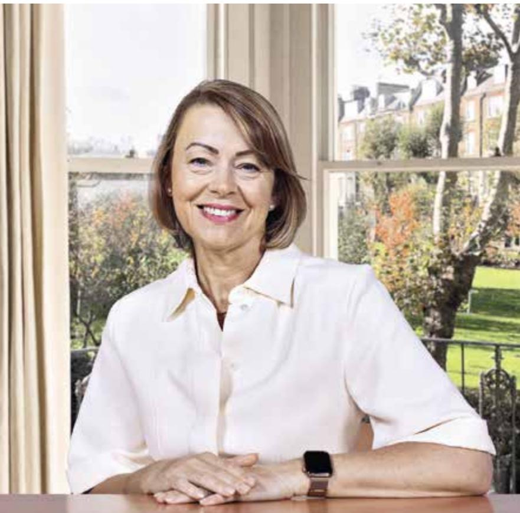

> **AI Description:**
> **Source:** `assets/_page_157_Figure_0.jpg`
> 
> **Generated:** 2026-06-01 18:43:59
> 
> ---
> 
> The image contains a photograph of a person sitting at a table, wearing a light-colored blouse and a smartwatch. The background shows a window with a view of a garden and some trees. The person appears to be in a professional setting, possibly an office or a home office. The image does not contain any charts, graphs, or other visual elements beyond the photograph itself.

Julie Brown, Chairwoman of the Audit Committee.

In 2021, the Board of Directors met for 11 meetings: 6 ordinary meetings from 3 to 6 hours in length, including a full-day meeting, and 5 extraordinary Board meetings from 1 to 3 hours in length held in connection with major business transactions. In addition, the Board went on a 4-day trip to a European affiliate.\*

The Board Committees met as follows in 2021:

• Chairman’s/Nomination Committee: 10 meetings (approx. 2 hours each\*)

• Remuneration Committee: 3 meetings14 (approx. 2 to 3 hours each\*)

• Audit Committee: 6 meetings (approx. 3 to 4 hours each\*)

• Corporate Governance and Sustainability Committee: 3 meetings (approx. 3 hours each\*)

The Board of Directors regularly conducts an assessment (self-assessment / assessment by third parties via electronic survey and personal interviews) of its performance.

Members of the Corporate Executive Committee have a maximum ordinary notice period of twelve months. There are no change-of-control clauses in the employment contracts.

There are no management contracts which fall within the scope of Subsection 4.4 (annex) of the SIX Directive on Information relating to Corporate Governance.

Attendance at Board and Board Committee meetings in 2021

– Not a member of that committee

# Remuneration, shareholdings and loans

All details regarding remuneration, shareholdings and loans (content and method of determining the compensation and the shareholding programmes, basic principles and elements of compensation and shareholding programmes for serving and former members of the Board of Directors and Corporate Executive Committee, together with a description of the authorities and procedure for determining such) are set forth in the separate Remuneration Report on pages 162 to 188 and in the Finance Report, Notes 22 and 32 to the Roche Group Consolidated Financial Statements (‘Equity attributable to Roche shareholders’ and ‘Related parties’, pages 95 and 135), and are listed in Note 6 to the Financial Statements of Roche Holding Ltd (‘Board and Executive shareholdings’, page 182).

The following rules on remuneration, shareholdings and loans for the Board of Directors (Board) and the Corporate Executive Committee (CEC) are set forth in the Articles of Incorporation (AoI)15:

# Participatory rights of shareholders

The participatory rights of shareholders are defined in Roche’s Articles of Incorporation.16 As Roche shares are issued to bearer, there are no restrictions on admission to Annual General Meetings, with the exception that shares must be deposited within a specified period before the date of a meeting and an admittance card must be issued in the shareholder’s name, as provided in §12 of the Articles of Incorporation. Any shareholder can elect to be represented by a third party at an Annual General Meeting.

The Articles of Incorporation contain no restrictions on the exercise of voting rights, and the only quorum requirements are those stipulated in §16, in conformity with the Swiss Code of Obligations.

Under §10.2 of the Articles of Incorporation, shareholders representing shares with a nominal value of at least CHF 1 million can request the placement of items on the agenda of an Annual General Meeting. This must be done no later than 28 days before the date of the meeting.

The rules on the issue of instructions to the independent proxy and rules on the electronic participation in the Annual General Meeting are laid down in the corresponding invitation to the Annual General Meeting and are not regulated in the Articles of Incorporation.

## Change of control and defensive measures

The Articles of Incorporation contain no provisions on the mandatory bid rule. Swiss law applies.

There are no change-of-control clauses. Those components of remuneration based on Roche non-voting equity securities would be terminated in the event of an acquisition, and vesting period restrictions on pre-existing awards would be removed, so that all such options could be exercised immediately.

# Relationship to statutory auditors

At the Annual General Meeting of Roche Holding Ltd on 16 March 2021, the shareholders voted to appoint KPMG AG (KPMG) as statutory auditors.

Based on the existing legal requirements of the Swiss Code of Obligations (Article 730a) concerning the maximum term of office of seven years of the auditor in charge, Mark Baillache has been the auditor in charge since business year 2018 (information on how long the auditor in charge has been serving in this capacity is provided on page 147). The statutory auditors participate in Audit Committee meetings. They prepare written and oral reports on the results of their audits. The Audit Committee oversees and assesses the auditors and makes recommendations to the Board (for information on the authorities and responsibilities of the Audit Committee, see Article 8.1 of the Bylaws17). The statutory auditors participated in all six meetings of the Audit Committee in 2021.

The performance of KPMG is assessed based on different elements such as affiliate surveys (to evaluate the service level at the country level), interviews with Roche key stakeholders and the self-evaluation of the KPMG internal processes to ensure compliance with the Federal Audit Oversight Authority (FAOA) Audit Committee Guide.

KPMG’s independence is ensured by limiting KPMG from providing certain non-audit services. Furthermore, permitted services cannot exceed in total 20% of the audit fee unless they are explicitly rewieved and approved by the Audit Committee. The company has a formal policy governing the engagement of the statutory auditor for non-audit services of which limits for certain permitted other services are agreed by the Audit Committee.

Each potential non-audit service engagement is reviewed against this policy before any authority to proceed is given.

The auditors have direct access to the Audit Committee and its chair as well as the Head of Group Audit to discuss relevant issues.

The reports of the statutory auditor on the Consolidated Financial Statements and on the Financial Statements can be found on pages 154 and 186, respectively, of the Finance Report.

KPMG received the following remuneration for their services as statutory auditors of Roche Holding Ltd and as the auditors of other Roche companies (including Chugai):

The audit fee is reviewed by the Head of Group Audit and approved by the Audit Committee every year and takes into consideration changes in Roche’s business, as well as changes in financial reporting and audit standards and regulations.

The statutory auditors are elected each year by the Annual General Meeting.

Auditing services are provided as legally required.

Audit-related services include assurance and accounting services provided by auditors but which are not necessarily provided by the statutory auditor. These services, which go beyond the legal requirements, could include other attestation services, comfort letters, and consultations.

Tax services include services with respect to compliance, tax returns and tax advice except those services related to the audit of tax.

Other services include advice relating to process improvements, regulations and trainings.

## Relationship to the independent proxy

Since 2019, Testaris AG has served as the independent proxy and at the Annual General Meeting on 16 March 2021, shareholders elected Testaris AG as the independent proxy for the period from 2021 until the conclusion of the 2022 ordinary Annual General Meeting of Shareholders. Testaris AG was paid for its services for the Annual General Meeting 2021 and the extraordinary Geneneral Meeting in November 2021 according to expenditure totalling CHF 28,288 (2020: CHF 26,429).

The Board of Directors nominates Testaris AG for election as independent proxy by the Annual General Meeting 2022 for the period from 2022 until the conclusion of the 2023 ordinary Annual General Meeting of Shareholders.

The rules on the issue of instructions to the independent proxy and rules on the electronic participation in the Annual General Meeting are laid down in the corresponding invitation to the Annual General Meeting and are not regulated in the Articles of Incorporation.

## Information policy

As provided by §34 of the Articles of Incorporation18, corporate notices are published in the Swiss Official Gazette of Commerce and in other daily newspapers designated by the Board of Directors (‘Basler Zeitung’, ‘Finanz und Wirtschaft’, ‘L’Agefi’, ‘Le Temps’, ‘Neue Zürcher Zeitung’).

Roche reports its half-year and full-year results in business reports (published in print and/or online formats) and at media events. In addition, detailed first-quarter and nine months sales figures are published each year in April and October. The most current list of publication dates is available on the Internet.19

All relevant information and documents, including all media releases, investor updates20 and

presentations to analyst and investor conferences   
are available on the Internet. Further publications   
are available on   
https://www.roche.com/publications.htm   
or can be ordered by e-mail:   
basel.warehouse-services@roche.com   
or fax: +41 (0)61 688 69 02   
The contact address for Investor Relations is:   
F. Hoffmann-La Roche Ltd, Investor Relations,   
Group Finance, 4070 Basel, Switzerland   
Tel.: +41 (0)61 688 88 80   
Fax: +41 (0)61 691 00 14

Additional information, including details on specific contact persons, is available on the Internet.21

# Chief Compliance Officer and Compliance Officers network

The Chief Compliance Officer with the Compliance Officers network is committed to ensuring that the Roche Group Code of Conduct22 is consistently complied with throughout the Roche Group. The Chief Compliance Officer also serves as a contact person for shareholders, employees, business partners, customers, suppliers and the general public on issues relating to the implementation of and compliance with this Code.

Employees and other parties who become aware of violations of the Roche Group Code of Conduct can bring them to the attention of their managers or supervisors, to the local Compliance Officer or report them to the Chief Compliance Officer23 (Ms Pascale Schmidt,

e-mail: pascale.schmidt@roche.com, tel.: +41 (0)61 688 48 90). Such disclosures will be treated confidentially. In addition, employees may anonymously report irregularities or complaints in their mother tongue via a ‘SpeakUp Line’. In case of questions or uncertainties about the interpretation of the Roche Group Code of Conduct and its reference documents, employees may reach out to their line managers, the local Compliance Officer or the Chief Compliance Officer, or contact the Roche Group Code of Conduct Help & Advice

Line. This compliance tool furthermore serves as a platform for ideas and suggestions concerning those documents.

In addition, Roche has established a Business Ethics Incident Reporting (BEIR) system which enables the Chief Compliance Officer to capture, track and monitor alleged violations, from initial reports by local Compliance Officers or the Group Internal Investigations department through to resolution.

Business ethics incidents are recorded in the system when the Group Internal Investigations department or the regional/local management receives specific and concrete information about an alleged violation of the Roche Group Code of Conduct in one of certain pre-defined categories.24 The Corporate Governance and Sustainability Committee and the Audit Committee of the Board of Directors are informed of substantial violations and management’s corrective actions taken.

The Chief Compliance Officer reports to the General Counsel and also submits regular reports to the Corporate Governance and Sustainability Committee and as needed to the Audit Committee of the Board of Directors.

## Non-applicability/negative disclosure

It is expressly noted that any information not contained or mentioned herein is either nonapplicable or its omission is to be construed as

a negative declaration (as provided in the SIX Swiss Exchange Corporate Governance Directive and the Commentary thereto).

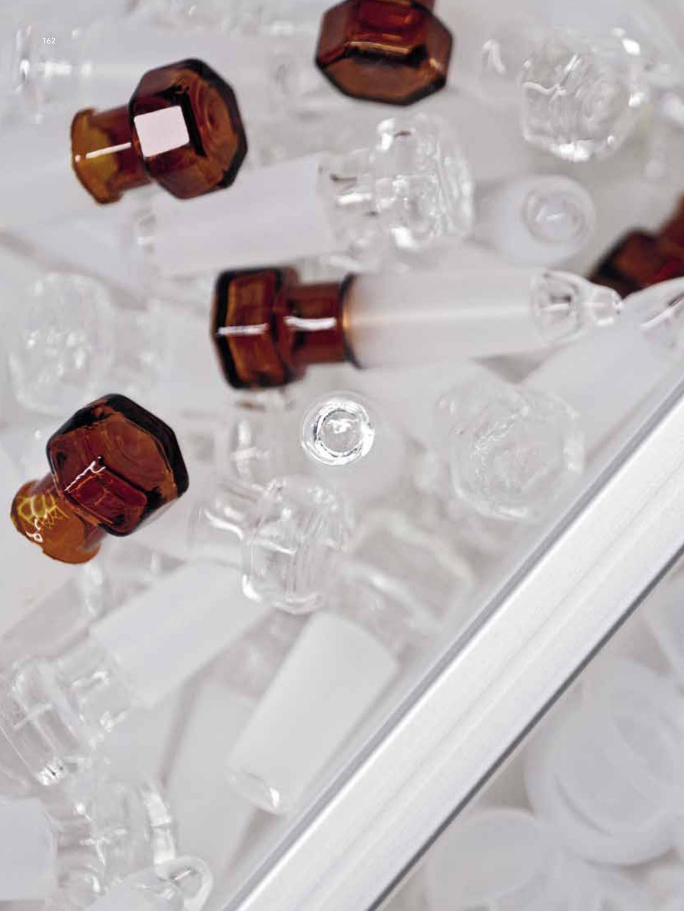

> **AI Description:**
> **Source:** `assets/_page_165_Figure_0.jpg`
> 
> **Generated:** 2026-06-01 19:06:52
> 
> ---
> 
> The image contains a collection of glass objects, including amber-colored and clear glass items, arranged on a white surface. The glass pieces vary in shape and size, with some appearing faceted and others smooth. The objects are scattered across the surface, with some overlapping. The image is a photograph, likely intended to showcase the glass items for aesthetic or design purposes.

## Remuneration Report

## 1. Principles

Roche is an innovative and agile company whose success depends substantially on the expertise, motivation and performance of its employees. This conviction forms the basis of our compensation policy.

Roche aims to remunerate all employees fairly, transparently and in line with market conditions, to enable them to participate appropriately in the company’s success. We pursue this goal by providing equitable, competitive, performancebased and results-oriented compensation.

We strive for a balanced mix of fixed and variable compensation components geared to each employee’s position and management responsibility.

Firstly, the variable components are intended to create additional financial incentives to achieve corporate goals and to keep innovation at a consistently high level while increasing the value that the company creates for all stakeholder groups. Secondly, in order to allow employees and managers to participate in the company’s business success, adequate compensation measures are key. Both objectives are incentivised by annual bonus payments and long-term securities-based programmes.

For a global company like Roche, marketcompetitive remuneration plays a key role along with a performance- and success-based, transparent compensation structure. To ensure that compensation packages are competitive, both the structure and individual components are regularly benchmarked based on the relevant Swiss, European and international market criteria. Our remuneration guidelines and their underlying principles are also subject to regular outside comparisons.

However, compensation policy is only one factor in safeguarding Roche’s future success. The key element is a corporate culture that offers employees conditions in which they can make their best possible contribution to the shared corporate goal of improving healthcare to patients. This includes a sound and a sustainability-oriented value system that is based on integrity, courage and passion. At the same time, our decentralised management approach plays a major role with its wide scope for individual decision-making, respectful interactions, openness to diversity, wideranging training and development opportunities and an attractive working environment. A unidimensional diminishment to questions on remuneration would fall by far too short.

Roche is committed to a fair, performance-based and results-oriented compensation policy that links employees’ interests with those of various other stakeholder groups.

# 2. Remuneration decision process and approval framework

## 2.1 Overview

Each year the Remuneration Committee of Roche’s Board of Directors decides the remuneration of Board members and the members of the Group’s Corporate Executive Committee.

Chairman, Group CEO and all other members of the Group’s Corporate Executive Committee must not be present when the Remuneration Committee decides their corresponding compensation and have no right to a say in decisions. The decision right is reserved to Remuneration Committee members only.

Remuneration decision process and approval framework as of 2021

The Remuneration Committee tracks market data on salaries at other leading global pharmaceutical companies1 and at major Swiss companies2 and reports its findings to the full Board. The external consulting firm PricewaterhouseCoopers (PwC) assists the Remuneration Committee of Roche in performing market comparisons and in advising. PwC has been awarded additional mandates in the Roche Group. Information on the Remuneration Committee’s remit, powers and procedures for making remuneration decisions can be found in the Bylaws of the Roche Board of Directors3 and in the Articles of Incorporation.4 They are also outlined in the sections below on the principles governing specific remuneration components (see 3.).

Since 2014, total aggregate amounts that are based on these decisions have been submitted to the General Meeting for approval implementing the ‘Ordinance against excessive compensation at listed joint-stock companies’ (Verordnung gegen übermässige Vergütungen bei börsenkotierten Aktiengesellschaften [VegüV]). The General Meeting shall vote annually and with binding effect on the approval of the remuneration (that the Board of Directors has resolved) of the Board of Directors and the Corporate Executive Committee (for details see 4. and 5.).

Abbott Laboratories AbbVie   
Amgen   
AstraZeneca   
Bristol-Myers Squibb Danaher   
Eli Lilly   
GlaxoSmithKline   
Johnson & Johnson Medtronic   
Merck & Co.   
Novartis   
Novo Nordisk   
Pfizer   
Sanofi   
ABB   
Alcon   
Credit Suisse   
Holcim   
Lonza   
Nestlé   
Richemont   
UBS   
Zurich

Market comparison companies for salary assessment

Pharma peer set . Major Swiss companies

2.2 Procedure for submitting total Board and Executive remuneration for shareholder approval at the Annual General Meeting Each year at the Annual General Meeting (AGM) shareholders approve the total remuneration for the Board of Directors and for the Corporate Executive Committee as decided by the Board of Directors’ Remuneration Committee and the Board of Directors, respectively.

According to the approval at the AGM 2014, Roche has committed itself to obtaining separate and binding shareholder approvals of the total remuneration paid to the Board of Directors and to the Corporate Executive Committee as follows:

## Retrospective approval

Total aggregate bonus amounts for the Corporate Executive Committee and the Chairman of the Board of Directors for the financial year just ended will be submitted retrospectively at each ordinary AGM for separate and binding approval.

## Prospective approval

All other Board and Executive aggregate remuneration will be submitted prospectively to the AGM for separate and binding approval for the period between two ordinary AGMs.

### Full Page Description (Page 170)

**Source:** `assets/_page_170_Asset_0.jpg`

**Generated:** 2026-06-01 19:11:08

---

The image is a timeline chart showing the financial year 2021 and 2022, with key events and payments associated with different roles and committees. It includes:

1. A timeline from January 1, 2021, to January 1, 2023, with AGM (Annual General Meeting) dates marked.
2. Events for the CEC (Chief Executive Committee) and C (likely referring to a CEO or similar role) for the financial year 2021, with bonus payments.
3. For the financial year 2022, it shows BoD (Board of Directors) base pay/remuneration, CEC base pay, S-SARs (Stock-Specific Share Appreciation Rights), RSUs (Restricted Stock Units), and indirect benefits.
4. The chart visually represents the timing of payments and events, with arrows indicating the duration of certain payments or benefits.

André Hoffmann, Chairman of the Remuneration Committee.

Chairman (C) of the Board of Directors (BoD):

• Bonus for financial year 2021 (total amount)

Corporate Executive Committee (CEC) including CEO Roche Group: • Bonus for financial year 2021 (total amount)

Board of Directors (BoD) including Chairman (C):

Aggregate total remuneration (AGM 2022–AGM 2023)

• Base pay / remuneration

Corporate Executive Committee (CEC) including CEO Roche Group: Aggregate total remuneration (AGM 2022–AGM 2023)

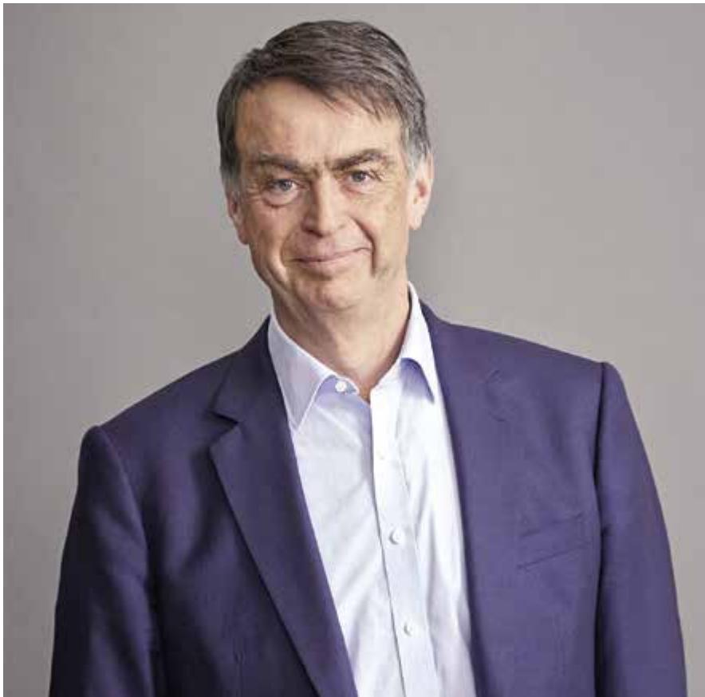

> **AI Description:**
> **Source:** `assets/_page_170_Figure_0.jpg`
> 
> **Generated:** 2026-06-01 19:04:41
> 
> ---
> 
> The image contains a photograph of a person wearing a dark blue blazer over a light blue shirt. The background is plain and neutral, focusing attention on the individual. The person appears to be middle-aged with short, graying hair. There are no charts, graphs, diagrams, or other visual elements present in the image.

• Stock-settled Stock Appreciation Rights (S-SARs)

• Restricted Stock Units (RSUs)

• Indirect benefits

## 3. Remuneration components

## 3.1 Overview of remuneration elements

The remuneration to the members of the Board of Directors and the Corporate Executive Committee is composed of the following elements:

The fixed base salary is complemented with the annual variable bonus as Short-Term Incentive (STI) and with perennial remuneration elements (S-SARs, RSUs) as Long-Term Incentive (LTI).

The remuneration components are linked to the employees’ performance, the company’s financial performance and non-financial success5 and thus align the interests of Roche and its employees with those of shareholders. Societal and environmental objectives6 are also taken into account.

The LTI remuneration components are intended to sustainably, homogenously and in a long-termoriented perspective align management’s interest with those of shareholders and holders of nonvoting equity securities and to give participating managers an additional incentive to achieve sustainable shareholder value growth.

Composition of remuneration to the Board of Directors and the Corporate Executive Committee

The LTI of the Corporate Executive Committee and the Enlarged Corporate Executive Committee is composed of 80% S-SARs and 20% RSUs (based on the already existing individual target value of the total LTI for Corporate Executive Committee members of 133.33% of a base pay measured on 1 January of a year). Vesting and

expiration periods are aligned for any newly issued S-SARs and RSUs (see below). Unlike all other participants of the two programmes, members of the Corporate Executive Committee have no choice in determining the mix of RSUs and S-SARs, which as of 2019 have a four-year cliff vesting.

Corporate Executive Committee LTI

The remaining participants of the S-SARs and RSUs programmes are offered on a yearly basis a choice of three combinations to determine the mix of Restricted Stock Units (RSUs) and Stock-settled Stock Appreciation Rights (S-SARs, options are used instead of S-SARs in some countries). The following options are available:

Offering this level of choice empowers participants to engage more fully in their total rewards, enables them to better understand a critical element of their compensation and increases the value of the programme.

This attractively designed Roche Long-Term Incentive programme enables Roche to attract, motivate and retain the best talent and keep it aligned with the company’s long-term success.

Roche remuneration components

Variable, long-term

\* Employer contribution of social securities’ beneficial parts

## 3.1.1 Base pay (fixed)

Base pay (cash payment) is determined for each position based on salary market data of other leading global pharmaceutical companies (see footnote 1) and of other major Swiss companies (see footnote 2) and reflects individuals’ abilities, experience and performance over time. Pay adjustments are likewise linked to individual performance and take into account prevailing market conditions and the company’s overall financial situation.

The Remuneration Committee makes and reviews the final decision on the individual base pay paid to the Chairman of the Board of Directors and members of the Corporate Executive Committee and on the remuneration of the other members of the Board.

## 3.1.2 Bonuses (variable)

Bonuses are annually awarded for individual contributions of value creation in a business year and are meant to be an incentive to strive for outstanding results and to create new business opportunities. Bonus amounts are linked to Group and divisional core profits, sales growth at constant exchange rates, Operating Profit After Capital Charge (OPAC) based on core operating profit, core earnings per share and non-voting equity security (NES) growth at constant exchange rates, product development pipeline, diversity of employees and managers7 and environmental goals8 . Additionally, they are linked to the achievement of measurable and qualitative individual or functional performance objectives. For competitive reasons, Roche does not disclose the individual performance objectives of members of its Corporate Executive Committee and of its Chairman.

In December at the end of a reporting year or in January following a reporting year, the Remuneration Committee decides on the bonuses and their amounts payable to the Chairman of the Board and the members of the Corporate Executive Committee in respect of the relevant reporting year, based on performance against the aforementioned objectives. At the same time, the Remuneration Committee also decides in what form bonuses will be awarded, ie, cash payments and/or blocked (if applicable) non-voting equity securities and/or shares.

The Remuneration Committee uses its discretion appropriately in the weighting of each criteria and in the bonus allocation.

In 2021 in total, around 78,900 employees were eligible for a bonus under the Roche Bonus Program.

## 3.1.3 Stock-settled Stock Appreciation Rights (S-SARs) (long-term)

The S-SARs proportion of the LTI of the Corporate Executive Committee is 80% (based on the individual target value of the total LTI for Corporate Executive Committee members of 133.33% of a base pay measured on 1 January of a year).

S-SARs entitle holders to benefit financially from any increase in the value of Roche’s non-voting equity securities between the grant date and the exercise date. S-SARs granted all vest together after four years and then have to be exercised within ten years of the grant date. Unexercised S-SARs lapse without compensation. Since 2012, the fair value of S-SARs has been calculated at the grant date using the trinomial model for American call options (for details see page 182).

S-SARs to the Corporate Executive Committee are allocated individually at the Remuneration Committee’s discretion.

In 2021 in total, 22,965 employees received S-SARs.

## 3.1.4 Restricted Stock Units (RSUs) (long-term)

The proportion of Restricted Stock Units (RSUs) of the members of the Corporate Executive Committee is 20% of the total LTI (based on the individual target value of the total LTI for Corporate Executive Committee members of 133.33% of a base pay measured on 1 January of a year).

RSUs contain rights to receive non-voting equity securities and/or shares after a four-year vesting period plus a value adjustment (being the amount equivalent to the sum of the dividend paid during the vesting period attributable to the number of non-voting equity securities and/or shares for which an individual award has been granted). They will be all vested to the recipient for the Corporate Executive Committee after four years only. Thereafter, resulting non-voting equity securities and/or shares may remain blocked for up to ten years.

RSU awards are allocated individually for the Corporate Executive Committee at the Remuneration Committee’s discretion.

In 2021, RSUs served as a remuneration component for 23,106 eligible Roche employees.

## 3.1.5 Indirect benefits

As shown in 5.8 (5.3 [for the CEO Roche Group] and 4.3 [for the Chairman], respectively), members of the Corporate Executive Committee additionally received indirect benefits (pension funds / insurance contributions, Roche Connect, payments for foreign tax obligation and tax consulting services and annual expense allowances). As shown under 5.9, individual members of the Corporate Executive Committee received payments for family, children and education allowances and for schooling costs for their children.

### Full Page Description (Page 175)

**Source:** `assets/_page_175_Asset_0.jpg`

**Generated:** 2026-06-01 19:26:09

---

The image is a horizontal bar chart with two distinct colors representing different types of compensation: "fixed" (light orange) and "variable, long-term" (dark brown). The chart categorizes compensation by three roles: "Chairman," "Board of Directors," and "Corporate Executive Committee (including CEO Roche Group)." The percentages for each role are as follows: 82% fixed and 18% variable, long-term for the Chairman; 100% fixed for the Board of Directors; and 39% fixed and 61% variable, long-term for the Corporate Executive Committee. The chart visually represents the distribution of compensation types across these roles, highlighting the significant proportion of variable, long-term compensation for the Corporate Executive Committee.

## 3.3 Ratio of variable remuneration components relative to fixed base pay of the Corporate Executive Committee 2021

Ratio of variable remuneration components (bonuses, S-SARs and RSUs) relative to % of value of fixed base pay

n/a – not applicable
Assessed in consideration of the performance of competitors and the macro-economic development
\*\* Based on the already existing individual target value of the total LTI for Corporate Executive Committee members of 133.33% of a base pay measured on 1 January of a year

For all further details please refer to the following sections of this Remuneration Report.9

# 4. Remuneration of the Board of Directors

## 4.1 Resolution and approval

Remuneration of the Chairman of the Board of Directors and of members of the Board of Directors was decided at the Remuneration Committee’s discretion, taking into account market comparisons.

The remuneration is in form of cash payments and is annually tracked against market data on directors’ pay at other leading global pharmaceutical companies (see footnote 1) and other major Swiss companies (see footnote 2), and is assisted by the consultancy of PwC.

As in the previous years, in 2022, the Board of Directors will separately submit the total aggregate bonus of the Chairman of the Board of Directors to the General Meeting for the 2021 financial year, for retrospective binding approval.

The maximum amounts of the total other aggregate remuneration of the Board of Directors for the period between the ordinary General Meeting 2022 and the ordinary General Meeting 2023 will be separately tabled in 2022 as in the previous years for the General Meeting’s prospective binding approval (see 2.2).

## 4.2 Amount of remuneration to the members of the Board of Directors

In 2021, the members of the Board of Directors10 received remuneration and additional compensation in the form of quarterly fixed cash payments as shown in the ‘Remuneration of members of the

Board of Directors 2021’ table on page 174 for their Board activities. Roche paid employer’s contributions totalling CHF 358,574 to social security agencies for the members of the Board of Directors beside the legally required contributions separately stated for the Chairman of the Board of Directors.

The basic remuneration of the Board of Directors (excluding the Chairman) has remained unchanged since 2001.

With the exception of the Chairman of the Board of Directors (bonus in form of blocked shares) and Dr Severin Schwan as an executive member of the Board, members of the Board of Directors were not awarded any shares, non-voting equity securities or S-SARs.

There are no loans or credits granted to the members of the Board of Directors.

In his capacity as a member of the Chugai International Council (CIC) of Chugai Pharmaceutical Co., Ltd. André Hoffmann received in 2021 honoraria amounting to a total of USD 20,000 (CHF 18,277).

In 2021, for their advisory service on the Genentech Scientific Resource Board, Prof. Dr Richard P. Lifton and Prof. Dr Hans Clevers received honoraria amounting to a total of USD 22,000 (CHF 20,105) each.

Remuneration of members of the Board of Directors 2021 (in CHF)

Costs under the provisions of the Swiss Federal Occupational Old Age, Survivors’ and Invalidity Pension Act (BVG). In accordance with the minimum requirements for insurance benefits under BVG, half of the costs for four members of the Board of Directors who are subject to compulsory insurance are borne by the company.
11 With the exception of members of the Chairman’s Committee (Chairman, Vice-Chairman), Board members receive CHF 30,000/year for each committee they serve on and CHF 60,000/year for each committee they chair.
12 Remuneration for serving as Vice-Chairman of the Board
13 Additionally, employer contribution to AHV/IV/ALV totalling CHF 997,150 (including the Chairman) was paid that does not form part of remuneration.

Remuneration of members of the Board of Directors 2020 (in CHF)

14 With the exception of members of the Chairman’s Committee (Chairman, Vice-Chairman), Board members receive CHF 30,000/year for each committee they serve on and CHF 60,000/year for each committee they chair.
15 Remuneration for serving as Vice-Chairman of the Board
16 Prorated remuneration for the period from March to December 2020
17 Prorated remuneration for the period from January to March 2020
18 Additionally, employer contribution to AHV/IV/ALV totalling CHF 354,578 (including the Chairman) was paid that does not form part of remuneration.

## 4.3 Total remuneration paid to the Chairman of the Board of Directors

As Chairman, Dr Christoph Franz received total remuneration for 2021 as shown below. The Remuneration Committee’s bonus proposal (adopted in late 2021) in respect of the 2021 financial year (in form of shares blocked for

ten years, payable in March 2022) will be put for shareholder binding vote at the 2022 ordinary Annual General Meeting (AGM).

The Chairman’s total remuneration is contained in the total remuneration of the Board of Directors in 4.4.

Total remuneration paid to the Chairman of the Board of Directors (in CHF)

n/a – not applicable
In form of shares blocked for 10 years (calculation of number of shares based on the price at the date of transfer in March 2022 and 2021, respectively, after approval at the AGM 2022 / AGM 2021, respectively), calculation of value in consideration of reduction of value due to blocking period of 10 years (reduced market value: 55.839%) to be submitted for shareholder approval at the AGM 2022 / as approved at the AGM 2021, respectively
\*\* Agreed reduction of pension fund contributions upon reaching the age of 60 in 2020
19 Additionally, employer contribution to AHV/IV/ALV of CHF 638,576 (2020: CHF 236,732) was paid that does not form part of remuneration.

## 4.4 Total remuneration paid to the Board of Directors

For the 2021 calendar year the members of the Board of Directors received remuneration including bonuses and employer contribution of social securities’ beneficial parts totalling CHF 8,724,738 (2020: CHF 8,580,399), excluding additional employer’s contribution paid to social securities totalling CHF 997,150 (2020: CHF 354,578). This includes contributions to foreign authorities amounting to CHF 237,769.

## 4.5 Remuneration paid to the former members of the Board of Directors

Former member of the Board of Directors Dr Franz B. Humer in 2021 received fees amounting to a total of USD 20,000 (CHF 18,277) for serving as a member of the Chugai International Council (CIC) of Chugai Pharmaceutical Co., Ltd. Former member of the Board of Directors William M. Burns in 2021 received fees amounting to a total of USD 20,000 (CHF 18,277) in his capacity as a member of the Chugai International Council (CIC) of Chugai Pharmaceutical Co., Ltd.

In addition, for Sir John Bell, social security contributions amounting to CHF 204,100 were paid to a foreign state social security institution.

## No additional remuneration was paid.

## 4.6 Board remuneration subject to approval at the Annual General Meeting

## 4.6.1 Submission of the Chairman’s total aggregate bonus for a binding vote at the Annual General Meeting

Remuneration to the Chairman of the Board of Directors includes a bonus award of CHF 949,263 in form of shares blocked for ten years as shown in the table in section ‘4.3 Total remuneration paid to the Chairman of the Board of Directors’. The Board of Directors will submit the Remuneration Committee’s bonus proposal (adopted in late 2021) for the Chairman of the Board, Dr Christoph Franz, in respect of the 2021 financial year (payable in March 2022, excluding legally required employer’s contributions to AHV/IV/ALV) for the shareholder binding vote to the 2022 ordinary Annual General Meeting.

Retrospective approvals of the Chairman’s total aggregate bonus (in CHF)\*
\* Excluding legally required employer’s contributions to AHV/IV/ALV
\*\* Bonus award (in form of shares blocked for 10 years [calculation of number of shares based on the price at the date of transfer in March 2022 / March 2021 / March 2020, respectively, after approval at the AGM 2022 / AGM 2021 / AGM 2020, respectively], calculation of value in consideration of reduction of value due to blocking period of 10 years [reduced market value: 55.839%] to be submitted for shareholder approval at the AGM 2022 / as approved at the AGM 2021 and AGM 2020, respectively)

## 4.6.2 Submission of the Board’s total aggregate future remuneration for a binding shareholder vote

The Board of Directors proposes that the 2022 ordinary AGM approve Board remuneration totalling not more than CHF 10,000,000 (excluding legally required employer’s contributions to AHV/IV/ALV and excluding bonuses) for the period ending at the 2023 ordinary AGM.

Dr Severin Schwan’s remuneration as shown in 5.3 which he receives in his function as CEO Roche Group and member of the Corporate Executive Committee is not included here but is part of the Corporate Executive Committee’s total remuneration.

Prospective approvals of the Board’s total aggregate future remuneration (in CHF)\*
\* Excluding legally required employer’s contributions to AHV/IV/ALV and excluding bonuses

## 4.6.3 Reconciliation of the reported remuneration with the shareholders’ approved remuneration for the members of the Board of Directors

The 2020 ordinary AGM approved Board remuneration totalling not more than CHF 10,000,000 (excluding legally required employer’s contributions to AHV/IV/ALV and excluding bonuses) for the period ending at the 2021 ordinary AGM.

For comparison, from the 2020 ordinary AGM to the 2021 ordinary AGM actual remuneration amounted to CHF 7,631,377 (excluding legally required employer’s contributions to AHV/IV/ALV and excluding bonuses).

Prospectively approved total remuneration for the members of the Board of Directors in comparison to the actual total payments made (in CHF)\*

\* Excluding legally required employer’s contributions to AHV/IV/ALV and excluding bonuses

## 4.7 Security holdings

Directors André Hoffmann and Dr Jörg Duschmalé and members of the founder’s families who are closely associated with them belong to a contractually bound shareholder group with pooled voting rights. At the end of 2021 this group held 72,018,000 shares (45.01% of issued shares). Detailed information about this group can be found in the Finance Report, Note 32 to the Roche Group Consolidated Financial

Statements (‘Related parties’, page 135) and in Note 4 to the Financial Statements of Roche Holding Ltd (‘Significant shareholders’, page 181). In addition, as at 31 December 2021 (as at 31 December 2020, respectively) the members of the Board of Directors and persons closely associated with them held Roche shares, non-voting equity securities (NES) and American Depositary Receipts (ADRs\*\*\*) as shown in the table ‘Security holdings’ below.

Security holdings (shares and NES)

\* Shares held by the shareholder group with pooled voting rights not listed
\*\* Jointly held with close relative
\*\*\* Roche’s ADR (American Depositary Receipt) listed on OTCQX (https://www.otcmarkets.com/stock/RHHBY/quote) International Premier under the symbol RHHBY, ISIN US771195104. Traded in USD, eight (8) ADRs represent one (1) underlying NES.

# 5. Remuneration of the Corporate Executive Committee

## 5.1 Resolution and approval

Remuneration of the members of the Corporate Executive Committee was decided at the Remuneration Committee’s discretion, taking into account market comparisons.

As in the previous years, in 2022, the Board of Directors will separately submit the total aggregate bonuses of the Corporate Executive Committee to the General Meeting for the 2021 financial year for retrospective binding approval.

The maximum amounts of the total other aggregate remuneration of the Corporate Executive Committee for the period between the ordinary General Meeting 2022 and the ordinary General Meeting 2023 will be tabled in 2022 as in the previous years for the General Meeting’s prospective binding approval (see 2.2).

5.2 Amount of remuneration to members of the Corporate Executive Committee The general provisions assigning authority for decisions on Corporate Executive Committee remuneration to the Remuneration Committee and to the Board of Directors are outlined on page 165, ‘2. Remuneration decision process and approval framework’.

In 2021, members of the Corporate Executive Committee received remuneration for their work as shown in 5.3–5.11. The amount of remuneration for the CEO Roche Group, Dr Severin Schwan, is explained in 5.3 in detail.

## 5.3 Highest total remuneration paid to Dr Severin Schwan as a member of the Corporate Executive Committee

Dr Severin Schwan, executive member of the Board of Directors, received his remuneration in his primary function as CEO Roche Group. It is reflected as the highest total remuneration paid to a member of the Corporate Executive Committee (see below) and included in the total amount paid to the Corporate Executive Committee (see ‘5.11 Total remuneration paid to the members of the Corporate Executive Committee’, page 184).

Highest total remuneration paid to Dr Severin Schwan as a member of the Corporate Executive Committee (in CHF)

20 For detailed calculation of the remuneration for 2020 and 2019 see Annual Report 2020, page 156.
21 In light of the overall economic impact of the COVID-19 pandemic, Dr Severin Schwan waived the amount of CHF 500,000 from his contractual base salary in 2020.
22 Shares blocked for 10 years (calculation of number of shares based on the share price at the date of transfer in March 2022 after approval at the AGM 2022)
25 Includes an annual expense allowance (CHF 30,000), payments for tax consulting services (CHF 3,554; 2020: CHF 42,626), family, children and education allowance (CHF 10,415;
\* Calculation of value of non-voting equity securities / shares in consideration of reduction of value due to blocking period of 10 years (reduced market value: 55.839%)
\*\* Including employer contribution of social securities’ beneficial parts

## 5.4 Base pay of the other members of the Corporate Executive Committee

Base pay (in CHF)

## 5.5 Bonuses of the other members

## of the Corporate Executive Committee

The Remuneration Committee of the Board of Directors determined the Corporate Executive Committee members’ bonuses based on the 2021 performance against the agreed objectives. The Remuneration Committee uses its discretion appropriately in the weighting of each criteria and in the bonus allocation. The total aggregate amount of bonuses will be brought forward for a binding vote by the Annual General Meeting 2022.

Except for Dr Severin Schwan, all members of the Corporate Executive Committee will receive the bonus 2021 as a 100% cash payment. Dr Severin Schwan will receive the bonus in form of Roche shares which are blocked for ten years (see page 180). Bonus payment is due in March 2022.

Bonus (in CHF)

## 5.6 Stock-settled Stock Appreciation Rights (S-SARs) of the other members of the Corporate Executive Committee

S-SARs to the Corporate Executive Committee are allocated individually at the Remuneration Committee’s discretion. The S-SARs shown in the 5.15.2 ‘S-SARs’ table on page 188 entitle holders to benefit financially from any increase in the value of Roche’s non-voting equity securities (NES) between the grant date and the exercise date. The strike price for S-SARs under the terms of this multi-year plan is the closing price for Roche NES at grant date. All S-SARs since 2019 vest four (previously granted S-SARs three) years after the grant date. Vested S-SARs can be exercised (converted into NES) within ten (previously granted S-SARs within seven) years of the grant date. Unexercised S-SARs lapse without compensation.

Since 2019, the S-SARs proportion of the LTI of the Corporate Executive Committee is 80% (based on the already existing individual target value of the total LTI for Corporate Executive Committee members of 133.33% of a base pay measured on 1 January of a year).

The fair value of the S-SARs is calculated at the grant date using the trinomial model for American call options. The trinomial model is an effective method for valuation of American call options, as it considers the possibility of exercising the option any time prior to maturity (called ‘American’ option, as compared to a ‘European’ option, which only allows exercise at its maturity date).26

The numbers of S-SARs, the strike prices, expiry dates and grant values for S-SARs are shown below and in the 5.15.2 ‘S-SARs’ table on page 188. The numbers of S-SARs as calculated at the time of issue have been entered as values in the table below and on page 180.

Stock-settled Stock Appreciation Rights (S-SARs)

## 5.7 Restricted Stock Units (RSUs) of the other members of the Corporate Executive Committee

Since 2019, the proportion of Restricted Stock Units (RSUs) of the members of the Corporate Executive Committee is 20% of the total LTI (based on the already existing individual target value of the total LTI for Corporate Executive Committee members of 133.33% of a base pay measured on 1 January of a year). RSU awards are allocated individually for the Corporate Executive Committee at the Remuneration Committee’s discretion.

RSUs contain rights to receive non-voting equity securities and/or shares after a since 2019 newly defined four-year vesting period plus a value adjustment (being the amount equivalent to the sum of the dividend paid during the vesting period attributable to the number of non-voting equity securities and/or shares for which an individual award has been granted). They will be vested to the recipient for the Corporate Executive Committee after four years only. Thereafter, resulting nonvoting equity securities and/or shares may remain blocked for up to ten years.

Calculation of value in consideration of reduction of value due to an additional blocking period of 10 years, reduced market value: 55.839%
\*\* Calculation of value in consideration of reduction of value due to an additional blocking period of 4 years, reduced market value: 79.209%

## 5.8 Indirect benefits of the other members of the Corporate Executive Committee

Employer contributions made in 2021 to social security schemes, pension plans and a Group-wide employee stock purchase plan (Roche Connect) in respect of members of the Corporate Executive Committee are shown in the ‘Indirect benefits (employer contributions)’ table below and in the table on page 180.

Roche Connect is a voluntary stock purchase plan offering employees the opportunity to buy

Roche non-voting equity securities (NES) up to an amount equal to 10% of their annual salary at a 20% discount. NES purchased under this plan are subject to a holding period, which is four years in Switzerland.

In addition, members of the Corporate Executive Committee received annual expense allowances and some members payments for foreign tax obligations and tax consulting services as shown in the table below.

Indirect benefits (employer contributions) (in CHF)

\* Including employer contribution of social securities’ beneficial parts

## 5.9 Other remuneration and loans of members of the Corporate Executive Committee (excl. CEO Roche Group)

To meet legal and contractual obligations, in 2021 Roche paid a total of CHF 12,451 to individual members of the Corporate Executive Committee for family, child and education allowances and their children’s schooling costs.

All aforementioned additional payments are included in the total remuneration to members of the Corporate Executive Committee.

In 2021, there were no loans or credits granted to the members of the Corporate Executive Committee.

The maximum regular period of notice for members of the Corporate Executive Committee is 12 months. There are no change-of-control clauses in the employment contracts.

5.10 Remuneration to former members of the Corporate Executive Committee A total of CHF 350,000 was paid to Dr Gottlieb Keller.

5.11 Total remuneration paid to the members of the Corporate Executive Committee For the 2021 calendar year, the members of the Corporate Executive Committee received remuneration (including bonuses, employer

contribution of social securities’ beneficial parts) totalling CHF 35,495,906 (2020: CHF 33,488,192), excluding additional employer’s contribution paid to AHV/IV/ALV totalling CHF 2,637,751 (2020: CHF 2,090,167) that does not form part of remuneration.

No additional remuneration other than the above-mentioned payments was paid to current or former members of the Corporate Executive Committee.

## 5.12 The Corporate Executive Committee’s remuneration subject to approval at the Annual General Meeting

5.12.1 Submission of the Corporate Executive Committee’s total aggregate bonuses for a binding vote at the Annual General Meeting The Board of Directors proposes awarding the members of the Corporate Executive Committee bonuses (for Dr Severin Schwan in form of Roche shares which are blocked for ten years, for all other members of the Corporate Executive Committee as a 100% cash payment, see 5.5) totalling CHF 10,491,950 in respect of the 2021 financial year (2020: CHF 10,041,950), excluding legally required employer’s contributions to social security agencies, and will submit this proposed total amount to the ordinary Annual General Meeting (AGM) for a binding vote.

Retrospective approvals of the members of the Corporate Executive Committee’s total aggregate bonuses (in CHF)\*

\* Excluding legally required employer’s contributions to AHV/IV/ALV

5.12.2 Submission of the Corporate Executive Committee’s total future aggregate remuneration for a binding shareholder vote The Board of Directors proposes that the 2022 ordinary AGM approve remuneration for the Corporate Executive Committee totalling not more than CHF 38,000,000 (excluding legally required employer’s contributions to AHV/IV/ALV and excluding bonuses) for the period ending at the 2023 ordinary AGM.

The amount of the Corporate Executive Committee’s total future aggregate remuneration is composed of base pay, long-term incentives S-SARs (calculated at grant value without considering reductions of value due to blocking periods if applicable) and RSUs (see 3.1.4, calculated at the time of reservation of non-voting equity securities or shares, without considering reductions of value due to blocking periods), pension benefits (excluding legally required employer’s contributions to AHV/IV/ALV) as well as contributions for expenses, payments for foreign tax obligations, tax consulting services and Roche Connect.

Prospective approvals of the members of the Corporate Executive Committee’s total future aggregate remuneration (in CHF)\*

\* Excluding legally required employer’s contributions to AHV/IV/ALV and excluding bonuses

5.12.3 Reconciliation of the reported remuneration with the shareholders’ prospectively approved remuneration for the members of the Corporate Executive Committee

The 2020 ordinary AGM approved remuneration for the Corporate Executive Committee totalling not more than CHF 37,000,000 (excluding legally required employer’s contributions to AHV/IV/ALV and excluding bonuses) for the period ending at the 2021 ordinary AGM.

For comparison, from the 2020 ordinary AGM to the 2021 ordinary AGM remuneration amounted to CHF 24,635,559 (excluding legally required employer’s contributions to AHV/IV/ALV and excluding bonuses).

Prospectively approved total remuneration of the members of the Corporate Executive Committee in comparison to actual total remuneration effected (in CHF)\*
\* Excluding legally required employer’s contributions to AHV/IV/ALV and excluding bonuses

## 5.13 Clawback

In addition to applicable statutory provisions, Roche’s long-term incentive plans include the option to partially reclaim distributed compensation as a result of special circumstances (clawback).

If the employee voluntarily serves notice of termination of employment, S-SARs (see 5.15.2) and RSUs (see 5.15.3) which are unvested at the date of termination of employment lapse immediately without any compensation.

Upon termination of employment as a result of serious misconduct, all S-SARs and RSUs granted and outstanding, whether vested or unvested, shall lapse immediately without any compensation.

According to the S-SARs plan rules, serious misconduct by the participant may include (inter alia):

• activity leading to serious disciplinary action

• repeated or willful failure to perform such duties as have been reasonably assigned by Roche

• violation of any law or public regulation

• commission of a crime

• gross negligence or willful misconduct in employment

• engaging in conduct bringing disgrace or disrepute to Roche and/or any of its subsidiaries

• violation of any of Roche’s directives and guidelines relating to business conduct

## 5.14 Guidelines for security holdings

In 2012, the Board of Directors decided that the CEO Roche Group and other members of the Corporate Executive Committee must acquire shares and/or NES equivalent to two annual base salaries (CEO Roche Group since 2018 equivalent to five annual base salaries) and one annual base salary, respectively, by the

end of 2016 and retain these holdings for as long as they serve on the Corporate Executive Committee. With the exception of Bill Anderson and Dr Thomas Schinecker, who joined the Corporate Executive Committee in 2019 and who must fulfil the requirement by the end of 2024, all other members of the Corporate Executive Committee fulfil this requirement.

## 5.15 Security holdings

As at 31 December 2021 (as at 31 December 2020, respectively) the members of the Corporate Executive Committee and persons closely

associated with them held securities as shown in the following tables ‘Shares and non-voting equity securities (NES)’, ‘S-SARs’ and ‘Restricted Stock Units (RSUs)’.

5.15.1 Shares and non-voting equity securities (NES)

Number of S-SARs held on 31 December 2021

5.15.3 Restricted Stock Units (RSUs)

# Statutory Auditor's Report

To the General Meeting of Roche Holding Ltd, Basel

We have audited the accompanying Remuneration Report of Roche Holding Ltd for the year ended 31 December 2021. The audit was limited to the information according to articles 14–16 of the Ordinance against excessive compensation at listed joint-stock companies (the Ordinance) contained in the sections marked as ‘audited’ with a grey line, including the respective footnotes, on pages 162 to 188 of the Remuneration Report.

Responsibility of the Board of Directors The Board of Directors is responsible for the preparation and overall fair presentation of the Remuneration Report in accordance with Swiss law and the Ordinance. The Board of Directors is also responsible for designing the remuneration system and defining individual remuneration packages.

## Auditor’s Responsibility

Our responsibility is to express an opinion on the accompanying Remuneration Report. We conducted our audit in accordance with Swiss Auditing Standards. Those Standards require that we comply with ethical requirements and plan and perform the audit to obtain reasonable assurance about whether the Remuneration Report complies with Swiss law and articles 14–16 of the Ordinance.

An audit involves performing procedures to obtain audit evidence on the disclosures made in the Remuneration Report with regard to compensation, loans and credits in accordance with articles 14–16 of the Ordinance. The procedures selected depend on the auditor’s judgement, including the assessment of the risks of material misstatements in the Remuneration Report, whether due to fraud or error. This audit also includes evaluating the reasonableness of the methods applied to value components of remuneration, as well as assessing the overall presentation of the Remuneration Report.

We believe that the audit evidence we have obtained is sufficient and appropriate to provide a basis for our opinion.

## Opinion

In our opinion, the Remuneration Report for the year ended 31 December 2021 of Roche Holding Ltd complies with Swiss law and articles 14–16 of the Ordinance.

KPMG AG

Mark Baillache Licensed Audit Expert Auditor in Charge

Basel, 1 February 2022

Marc Ziegler Licensed Audit Expert

# Independent Limited Assurance Report

on the 2021 non-financial reporting to the Corporate Governance and Sustainability Committee of Roche Holding Ltd, Basel

We have been engaged by the Corporate Governance and Sustainability Committee to perform assurance procedures to provide limited assurance on the non-financial reporting of Roche Holding Ltd and its consolidated subsidiaries (‘Roche’) for the year ended 31 December 2021 disclosed in the Annual Report 2021 (‘Report’) and prepared in accordance with the suitable criteria selected by Roche.

## Scope and Subject matter

Our assurance engagement relates to limited level of assurance on the specified non-financial information for the year ended 31 December 2021 disclosed in the Annual Report 2021.

The following specified data and information published in the Report is within the scope of our limited assurance engagement:

• the materiality determination process of Roche at Group level according to the requirements of the ‘GRI Standards’, as disclosed on pages 24 and 25 of the Report;

• the design of the sustainability risks and opportunities determination process based on Group level activities, disclosed on page 22 in the paragraph ‘Risk management’ of the Report;

• the correctness of the following consolidated key figures:

• the people key figures in the graphs on page 93 of the Report;

• the Safety, Security, Health and Environmental protection (‘SHE’) key figures (including greenhouse gas emissions for scope 1 & 2 and scope 3 resulting from business flights) in the tables and graphs on page 92 and pages 103 to 105 of the Report; and

• the key figures in relation to contributions in Switzerland, disclosed on page 121 of the Report.

## Criteria

The specified non-financial information was prepared by the Corporate Governance and Sustainability Committee of Roche based on the following criteria (the ‘suitable Criteria’):

• the Roche materiality determination process at Group level based on the ‘GRI Standards’ published in October 2016 by the Global Reporting Initiative (GRI);

• the Roche Group internal non-financial reporting guidelines based on the ‘Responsible Care Health, Safety and Environmental Protection reporting guidelines’ published by the European Chemical Industry Council CEFIC and the ‘GRI Standards’ published in October 2016 by the Global Reporting Initiative (GRI);

• the defined guidelines, by which Safety, Security, Health and Environmental (‘SHE’), people, contributions key figures, and sustainability risks and opportunities are internally gathered, collated and aggregated; and

• the Roche Group guideline ‘Grants, donations and sponsorship (GSD) data collection process’ disclosed on the website https://www.roche.com/ dam/jcr:f425f9f5-1ead-401b-a912-c9cad93db9cc/ en/grants-donations-sponsorship-process.pdf published in January 2020.

## Inherent limitations

The accuracy and completeness of the specified non-financial information are subject to inherent limitations given their nature and methods for determining, calculating and estimating such data.

In addition, the GHG quantification is subject to inherent uncertainty because of incomplete scientific knowledge used to determine emission factors and the values needed to combine emissions of different gases. Our assurance report therefore has to be read in connection with the publicly available individual Roche Group guidelines used by Roche, its definitions and procedures as well as on the third-party guidelines used to present the specified non-financial information performance.

## Responsibility of the Corporate Governance and Sustainability Committee

The Corporate Governance and Sustainability Committee of Roche Holding Ltd is responsible for the selection and application of the suitable Criteria, as well as for the preparation and presentation of the specified non-financial information in accordance with the suitable Criteria. This responsibility includes adequate record keeping as well as the design, implementation and maintenance of an internal control system as determined necessary to enable the preparation of the specified non-financial information that are free from material misstatement, whether due to fraud or error.

## Independence and quality control

We are independent of Roche Holding Ltd in accordance with the International Code of Ethics for Professional Accountants (including International Independence Standards) issued by the International Ethics Standards Board for Accountants (IESBA Code). We have fulfilled our other ethical responsibilities in accordance with the IESBA Code, which is founded on fundamental principles of integrity, objectivity, professional competence and due care, confidentiality and professional behaviour.

PricewaterhouseCoopers AG applies International Standard on Quality Control 1 and accordingly maintains a comprehensive system of quality control including documented policies and procedures regarding compliance with ethical requirements, professional standards and applicable legal and regulatory requirements.

## Practitioner’s responsibility

Our responsibility is to perform an assurance engagement and to express a limited assurance conclusion on the 2021 specified non-financial information of Roche in the Report. We conducted our engagement in accordance with International Standard on Assurance Engagements ISAE 3000 (Revised) ‘Assurance engagements other than audits or reviews of historical financial information’ and, in respect of greenhouse gas emissions, with the International Standard on Assurance Engagements ISAE 3410 ‘Assurance Engagements on Greenhouse Gas Statements’, issued by the International Auditing and Assurance Standards Board. Those standards require that we plan and perform our procedures to obtain limited assurance, on whether the specified non-financial information was prepared, in all material aspects, in accordance with the suitable Criteria.

Based on risk and materiality considerations, we performed our procedures to obtain sufficient and appropriate assurance evidence. The procedures selected depend on the assurance practitioner’s judgement. A limited assurance engagement under ISAE 3000 (Revised) is substantially less in scope than a reasonable assurance engagement in relation to both the risk assessment procedures, including an understanding of internal control, and the procedures performed in response to the assessed risks. Consequently, the nature, timing and extent of procedures for gathering sufficient appropriate evidence are deliberately limited relative to a reasonable assurance engagement and therefore less assurance is obtained with a limited assurance engagement than for a reasonable assurance engagement.

We performed the following assurance procedures, among others:

• Review of the application of Roche Group guidelines

Reviewing the application of the Roche Group non-financial reporting and contributions guidelines;

• Site visits and management inquiry Remotely visiting selected Pharmaceuticals and Diagnostics sites in the USA, China, Taiwan and the UK. The selection was based on quantitative and qualitative criteria; Interviewing personnel responsible for internal non-financial reporting and data collection at the sites we visited and at the Group level to determine the understanding and application of Roche’s non-financial and contributions guidelines;

## • Assessment of the key figures

Performing tests on a sample basis of evidence supporting selected SHE, contributions, and people key figures (e.g. Roche accident rate, energy consumption, emissions into the air, water usage and discharge, number of employees (full-time equivalents), percentage of women in total workforce) concerning completeness, accuracy, adequacy and consistency;

• Review of documentation and analysis of relevant policies and principles Reviewing relevant documentation on a sample basis, including Roche Group non-financial reporting policies, management of reporting structures and documentation;

Reviewing the principles of the Roche materiality process providing the definition for the development of its adherence to GRI’s environmental, social and economic reporting requirements addressing the soundness of the identification process, determination of impacted stakeholders, peer and competition review, integration of relevant regulatory requirements, integration of key organisational values and objectives and report prioritisation of material aspects;

Inspecting the integration of the sustainability risks and opportunities in the Group risk management process and its adherence to the suitable Criteria;

## • Assessment of the processes and data consolidation

Reviewing the management and non-financial reporting processes for SHE, people, and contributions key figures; and Assessing the aggregation process of data at Group level.

We believe that the evidence we have obtained is sufficient and appropriate to provide a basis for our conclusion.

## Conclusion

Based on the procedures we performed and evidence obtained, nothing has come to our attention that causes us to believe that in all material respects, related to the 2021 specified non-financial information in the Report of Roche Holding Ltd for the year ended 31 December 2021, the following applies:

• the materiality determination process at Group level disclosed on pages 24 and 25 of the report does not comply with the principles of the “GRI Standards”;

• the design of the sustainability risks and opportunities determination process at Group level is inconsistent with the information disclosed on page 22 in the paragraph “Risk Management” of the Report;

• the specified non-financial information mentioned in the subject matter section and published in the 2021 Report of Roche Holding Ltd are not correct in accordance with the suitable Criteria.

Restriction of use and purpose of the report This report is prepared for, and only for, the Corporate Governance and Sustainability Committee of Roche Holding Ltd, and solely for the purpose of reporting to them on the 2021 specified non-financial information in the Report and no other purpose. We do not, in giving our conclusion, accept or assume responsibility (legal or otherwise) or accept liability for, or in connection with, any other purpose for which our report including the conclusion may be used, or to any other person to whom our report is shown or into whose hands it may come, and no other persons shall be entitled to rely on our conclusion.

We permit the disclosure of our report, in full only and in combination with the suitable Criteria, to enable the Corporate Governance and Sustainability Committee of Roche Holding Ltd to demonstrate that they have discharged their governance responsibilities by commissioning an independent assurance report over the specified non-financial information, without assuming or accepting any responsibility or liability to any third parties on our part. To the fullest extent permitted by law, we do not accept or assume responsibility to anyone other than the

Corporate Governance and Sustainability Committee of Roche Holding Ltd for our work or this report.

PricewaterhouseCoopers AG

Christophe Bourgoin

Annina Binder

Zurich, 3 February 2022

The maintenance and integrity of Roche Holding Ltd’s website and its content are the responsibility of the Corporate Governance and Sustainability Committee; the work carried out by the assurance provider does not involve consideration of the maintenance and integrity of Roche Holding Ltd’s website, accordingly, the assurance provider accepts no responsibility for any changes that may have occurred to the specified non-financial information or suitable Criteria since they were initially presented on the website.

Published by   
F. Hoffmann-La Roche Ltd Group Communications 4070 Basel, Switzerland Tel.: +41 (0)61 688 11 11 www.roche.com

## Key dates for 2022

Annual General Meeting 15 March 2022

First-quarter sales 25 April 2022

Nine-month sales 18 October 2022

Half-year results 21 July 2022

To order/download publications Internet: www.roche.com/publications E-mail: basel.warehouse-services@roche.com Fax: +41 (0)61 688 69 02

Media Relations Tel.: +41 (0)61 688 88 88 E-mail: media.relations@roche.com

Investor Relations Tel.: +41 (0)61 688 88 80 E-mail: investor.relations@roche.com

Corporate Sustainability Committee Tel.: +41 (0)61 688 40 18 E-mail: corporate.sustainability@roche.com

## Cautionary statement regarding forwardlooking statements

This Annual Report contains certain forward-looking statements. These forward-looking statements may be identified by words such as ‘believes’, ‘expects’, ‘anticipates’, ‘projects’, ‘intends’, ‘should’, ‘seeks’, ‘estimates’, ‘future’ or similar expressions or by discussion of, among other things, strategy, goals, plans or intentions. Various factors may cause actual results to differ materially in the future from those reflected in forward-looking statements contained in this Annual Report, such as: (1) pricing and product initiatives of competitors; (2) legislative and regulatory developments and economic conditions; (3) delay or inability in obtaining regulatory approvals or bringing products to market; (4) fluctuations in currency exchange rates and general financial market conditions; (5) uncertainties in the discovery, development or marketing of new products or new uses of existing products, including without limitation negative results of clinical trials or research projects, unexpected side effects of pipeline or marketed products; (6) increased government pricing pressures; (7) interruptions in production; (8) loss of or inability to obtain adequate protection for intellectual property rights; (9) litigation; (10) loss of key executives or other employees; and (11) adverse publicity and news coverage.

The statement regarding earnings per share growth is not a profit forecast and should not be interpreted to mean that Roche’s earnings or earnings per share for 2021 or any subsequent period will necessarily match or exceed the historical published earnings or earnings per share of Roche.

## All trademarks are legally protected.

Links to third-party pages are provided for convenience only. We do not express any opinion on the content of any third-party pages and expressly disclaim any liability for all third-party information and the use thereof.

The Roche Annual Report is published in German and English.

Our reporting consists of the actual Annual Report and of the Finance Report and contains the annual financial statements and the consolidated financial statements. With regards to content, the Management Report as per the Articles of Incorporation consists of both aforementioned reports with the exception of the Remuneration Report.

Printed on non-chlorine bleached, FSC-certified paper.

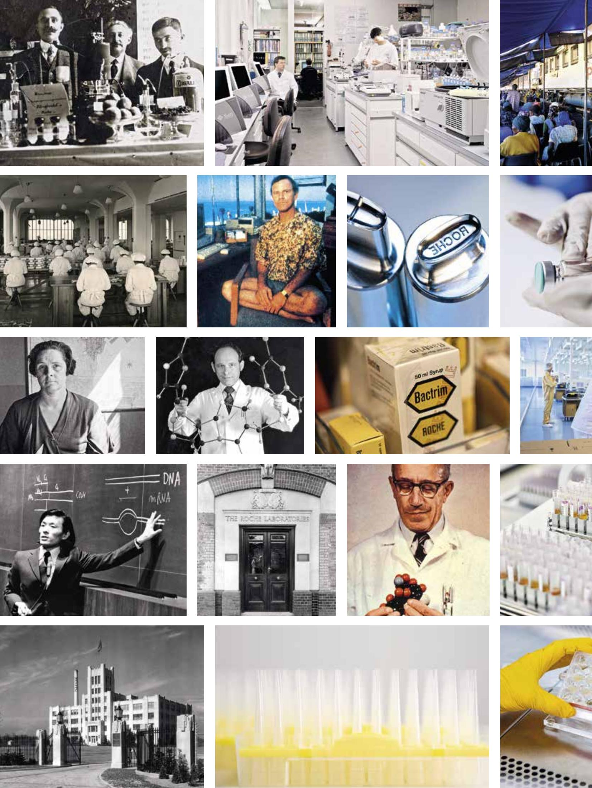

> **AI Description:**
> **Source:** `assets/_page_199_Figure_0.jpg`
> 
> **Generated:** 2026-06-01 18:45:40
> 
> ---
> 
> The image is a collage of photographs and text, primarily featuring historical and modern scientific and pharmaceutical imagery. It includes black-and-white photographs of individuals in lab settings, a building labeled "The Roche Laboratories," and various laboratory equipment and products. There are also color photographs of laboratory workstations, people in lab coats, and a product box labeled "Bactrim." The collage appears to be related to the history and present-day operations of Roche, a pharmaceutical company.

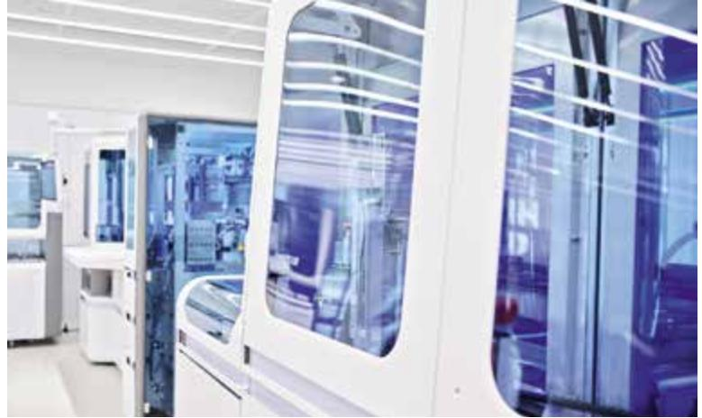

> **AI Description:**
> **Source:** `assets/_page_200_Figure_0.jpg`
> 
> **Generated:** 2026-06-01 19:07:26
> 
> ---
> 
> The image shows a clean, modern laboratory environment with multiple large, transparent equipment units. These units appear to be part of a high-tech research facility, possibly for semiconductor manufacturing or advanced materials testing. The equipment has a sleek design with curved edges and is mounted on white stands. The background reveals additional lab equipment and possibly a control panel, indicating a well-equipped and organized workspace. The overall impression is one of precision and advanced technology.

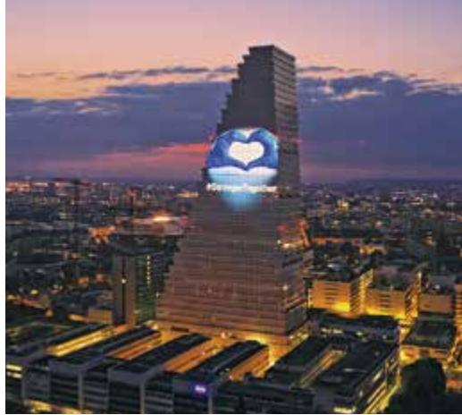

> **AI Description:**
> **Source:** `assets/_page_200_Figure_1.jpg`
> 
> **Generated:** 2026-06-01 19:09:27
> 
> ---
> 
> The image is a photograph of a cityscape at dusk or early evening. The focal point is a tall, modern building with a unique design that features a heart shape illuminated on its facade. The heart is glowing blue and white, creating a striking contrast against the darkening sky and the lights from the surrounding buildings. The city appears to be densely populated with various structures, and the overall atmosphere is serene with the soft glow of the setting or rising sun.

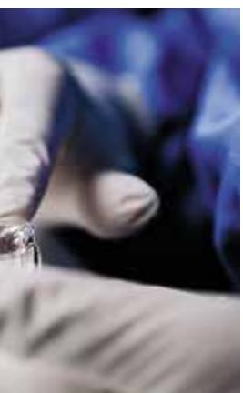

> **AI Description:**
> **Source:** `assets/_page_200_Figure_2.jpg`
> 
> **Generated:** 2026-06-01 19:15:37
> 
> ---
> 
> The image appears to be a close-up photograph of a person's hands wearing white gloves, holding a small object that resembles a ring or a similar item. The background is blurred, with shades of blue and purple, suggesting a fabric or cloth. The focus is on the hands and the object they are holding, with no additional text or labels visible. The image seems to be a still life or a close-up shot, possibly for a product display or a demonstration.

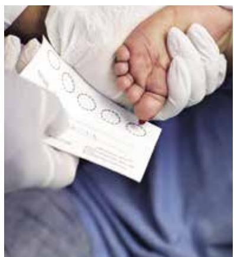

> **AI Description:**
> **Source:** `assets/_page_200_Figure_3.jpg`
> 
> **Generated:** 2026-06-01 19:15:08
> 
> ---
> 
> The image contains a photograph of a person's hand, wearing a white glove, holding a small white card with circular patterns and text. The card appears to be a medical or diagnostic tool, possibly used for measuring grip strength or assessing hand function. The hand is resting on a blue fabric, which could be a medical or examination table cover. The image is focused on the interaction between the hand and the card, suggesting a clinical or medical context.

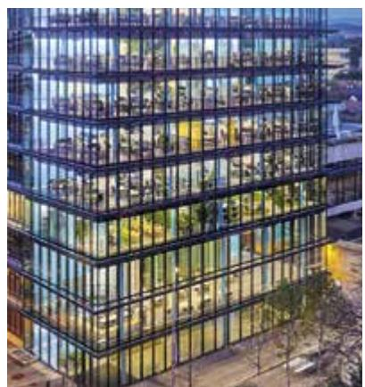

> **AI Description:**
> **Source:** `assets/_page_200_Figure_4.jpg`
> 
> **Generated:** 2026-06-01 19:26:17
> 
> ---
> 
> The image depicts a modern, multi-story office building with a glass facade. The structure is illuminated from within, suggesting it is either dusk or early evening. The building has a contemporary design with a grid-like pattern of windows. The surrounding area includes some greenery and what appears to be a road or walkway in front of the building. The image conveys a sense of urban development and modern architecture.

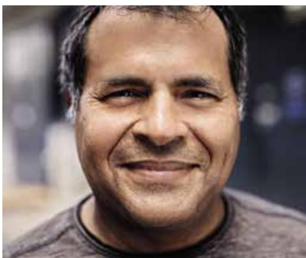

> **AI Description:**
> **Source:** `assets/_page_200_Figure_5.jpg`
> 
> **Generated:** 2026-06-01 19:25:31
> 
> ---
> 
> The image is a photograph of a smiling individual. The person is wearing a dark-colored, short-sleeved shirt. The background is blurred, suggesting an indoor setting with some indistinct shapes and colors. The image appears to be a portrait-style photograph, focusing on the person's face and upper torso.

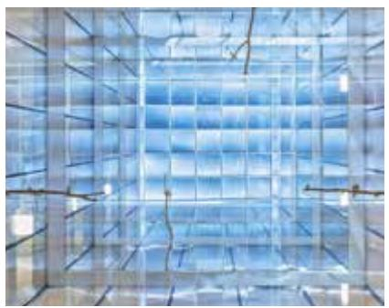

> **AI Description:**
> **Source:** `assets/_page_200_Figure_6.jpg`
> 
> **Generated:** 2026-06-01 19:19:15
> 
> ---
> 
> The image appears to be a photograph of a greenhouse or a similar structure with transparent walls and a grid-like framework. The structure is filled with rows of plants, likely seedlings or young plants, which are evenly spaced and arranged in a systematic manner. The image is somewhat blurry, making it difficult to discern specific details of the plants or the environment inside the structure. The overall impression is that of a controlled environment for plant cultivation.

> **AI Description:**
> **Source:** `assets/_page_200_Figure_7.jpg`
> 
> **Generated:** 2026-06-01 19:20:15
> 
> ---
> 
> The image contains a photograph of a reflective glass floor with a view of a cityscape. The reflection in the glass shows modern buildings, a red crane, and a clear sky with some clouds. The perspective is from a high vantage point, looking down onto the reflective surface, which creates a symmetrical and visually striking effect. The image captures the contrast between the urban environment and the smooth, glossy surface of the glass floor.

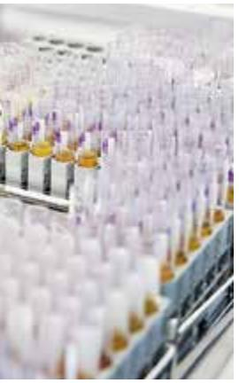

> **AI Description:**
> **Source:** `assets/_page_200_Figure_9.jpg`
> 
> **Generated:** 2026-06-01 18:10:08
> 
> ---
> 
> The image contains a photograph of a laboratory setting with multiple test tubes and vials arranged in a rack. The test tubes are primarily white with some containing yellow liquid. The vials are transparent with purple caps. The image suggests a scientific or medical context, possibly related to sample storage or testing. The focus is on the equipment and materials used in laboratory procedures.

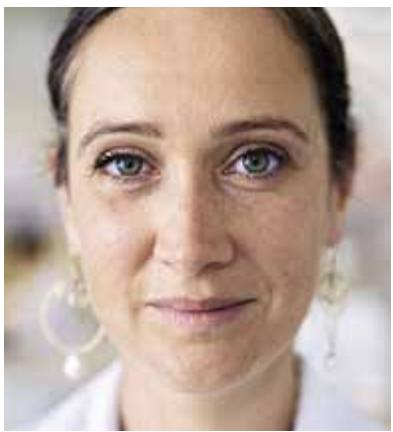

> **AI Description:**
> **Source:** `assets/_page_200_Figure_10.jpg`
> 
> **Generated:** 2026-06-01 18:12:11
> 
> ---
> 
> The image is a photograph of a person wearing large hoop earrings. The background is blurred, focusing attention on the individual. The person appears to be wearing a light-colored top. There are no charts, graphs, or other visual elements present in the image.

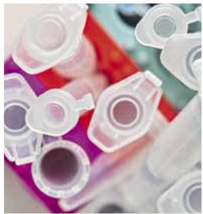

> **AI Description:**
> **Source:** `assets/_page_200_Figure_11.jpg`
> 
> **Generated:** 2026-06-01 18:07:17
> 
> ---
> 
> The image contains a collection of clear plastic test tubes with screw-on caps, arranged in a colorful tray. The test tubes appear to be used for laboratory or scientific purposes, possibly for storing samples or conducting experiments. The focus is on the test tubes, with no additional text or labels visible in the image. The colors of the tray suggest organization by type or category, but the specific content of the tubes is not discernible from the image.

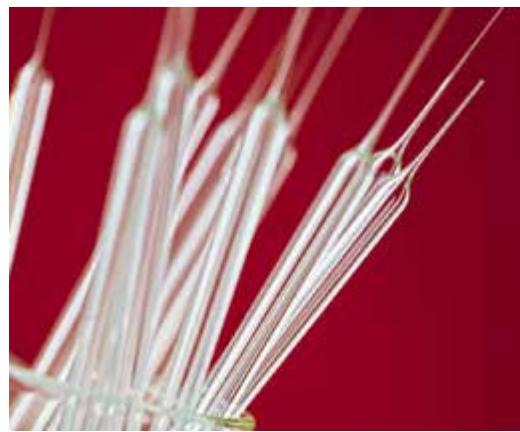

> **AI Description:**
> **Source:** `assets/_page_200_Figure_12.jpg`
> 
> **Generated:** 2026-06-01 18:13:59
> 
> ---
> 
> The image contains a close-up photograph of several thin, transparent tubes or wires. The tubes are arranged in a fan-like pattern against a solid red background. The tubes appear to be made of a clear material, possibly glass or plastic, and have a smooth, cylindrical shape. The image does not contain any text or labels, and the focus is on the tubes themselves, which may be used for scientific or technical purposes.

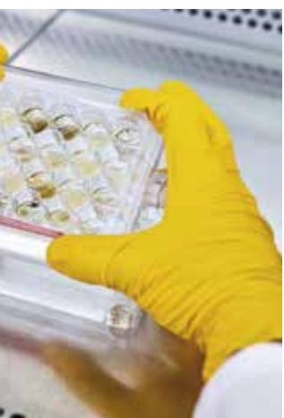

> **AI Description:**
> **Source:** `assets/_page_200_Figure_13.jpg`
> 
> **Generated:** 2026-06-01 18:20:12
> 
> ---
> 
> The image shows a close-up of a gloved hand holding a clear plastic tray with multiple compartments, each containing a small amount of liquid or a sample. The hand is wearing a yellow nitrile glove, suggesting a laboratory or medical setting. The tray appears to be used for holding biological samples or conducting experiments, possibly related to research or testing. The background is out of focus, emphasizing the tray and the hand holding it.

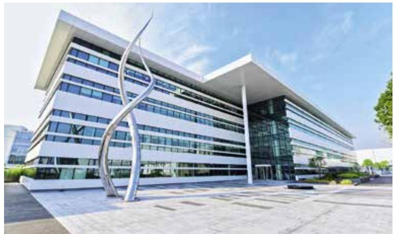

> **AI Description:**
> **Source:** `assets/_page_200_Figure_14.jpg`
> 
> **Generated:** 2026-06-01 18:25:09
> 
> ---
> 
> The image shows a modern office building with a contemporary design. The building features multiple floors with large glass windows, providing a bright and open appearance. In front of the building, there is a large, abstract sculpture that curves upwards, adding an artistic element to the scene. The sky is clear and blue, suggesting a sunny day. The overall impression is of a professional and aesthetically pleasing corporate environment.

> **AI Description:**
> **Source:** `assets/_page_200_Figure_15.jpg`
> 
> **Generated:** 2026-06-01 18:29:35
> 
> ---
> 
> The image is a photograph of an urban plaza or courtyard. It features a patterned walkway with trees and greenery interspersed throughout. The area appears to be part of a larger building complex, as indicated by the visible architectural elements in the upper part of the image. The plaza is well-maintained, with a mix of paved areas and open spaces, suggesting it is a public or communal space designed for relaxation or social interaction. The shadows cast by the trees and surrounding structures indicate that the photo was taken during the daytime.

