
# San Francisco

“All you’ve got to do is decide to go and the hardest part is over.

So go!”

TONY WHEELER, COFOUNDER – LONELY PLANET

## Contents

## sPlan Your TripPlan Your Trip

Welcome to San   
Francisco   
San Francisco’s Top 10 ��� 6   
What’s New ��� � 13   
Need to Know ��� � 14   
Top Itineraries � � 16

## 04

If You Like... 18   
Month By Month�� � 20   
With Kids � 23   
Eating ��� � 25   
Drinking &   
Nightlife � 30   
Entertainment� 34   
LGBT+���� 37   
Shopping�� 39   
Sports & Activities ��� 42

## Explore San Francisco

Neighborhoods   
at a Glance� 46   
The Marina,   
Fisherman’s Wharf   
& the Piers�� � 48   
Downtown, Civic Center   
& SoMa� 74   
North Beach   
& Chinatown   
Nob Hill, Russian Hill   
& Fillmore� 128   
The Mission   
& Potrero Hill�� 144   
The Castro   
& Noe Valley�� 167

## 44

The Haight, NoPa   
& Hayes Valley � � 178   
Golden Gate Park   
& the Avenues�� � 193   
Day Trips from   
San Francisco���� 206   
Sleeping ���� 226

## Understand San Francisco 237

San Francisco   
Today� � 238   
History�� � 240   
Literary San   
Francisco � � 250   
Visual Arts ��252   
San Francisco Music��� 255   
San Francisco   
Architecture� 258

## Survival Guide

## 263

Transportation ����������� 264 Directory A–Z �������������� 271 Index �� � 277

## San Francisco Maps

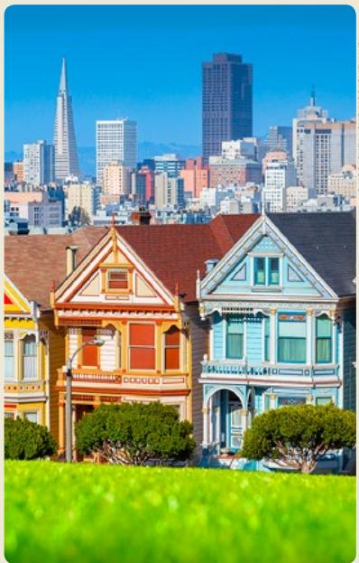

> **AI Description:**
> **Source:** `assets/_page_2_Figure_0.jpg`
> 
> **Generated:** 2026-06-01 19:46:53
> 
> ---
> 
> The image contains a photograph of a row of colorful Victorian-style houses in the foreground, with a city skyline in the background. The houses are painted in bright, pastel colors and have intricate architectural details. The skyline features modern high-rise buildings, including a distinctive spire. The scene is set against a clear blue sky, and the foreground includes green grass and shrubs. The image captures a blend of historical and modern architecture, showcasing the contrast between the vibrant, historic homes and the contemporary urban landscape.

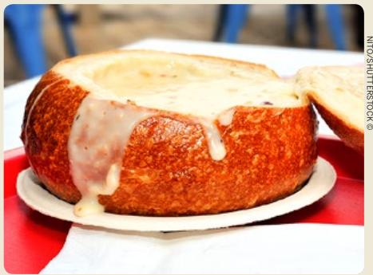

> **AI Description:**
> **Source:** `assets/_page_2_Figure_1.jpg`
> 
> **Generated:** 2026-06-01 19:45:50
> 
> ---
> 
> The image contains a photograph of a bread bowl filled with a creamy, melted cheese dip. The bread bowl appears to be freshly baked, with a golden-brown crust and a soft, porous interior. The cheese dip is generously ladled into the bowl, with some of it dripping over the edges, indicating its rich and gooey texture. The setting appears to be a casual dining environment, as suggested by the red tablecloth and the white plate holding the bread bowl.

MIZZICK/SHUTTERSTOCK ©
(above) Clam chowder served in a bread bowl (left) The ‘Painted Ladies’ Victorian mansions at Alamo Square Park (p181) (right) Crane in Crissy Field (p55)

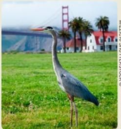

> **AI Description:**
> **Source:** `assets/_page_2_Figure_2.jpg`
> 
> **Generated:** 2026-06-01 19:44:32
> 
> ---
> 
> The image is a photograph of a Great Blue Heron standing on a grassy area with the Golden Gate Bridge in the background. The heron is positioned in the foreground, with its long neck extended and beak pointing forward. In the background, there are palm trees and a white building with a red roof, likely a house or a small structure. The Golden Gate Bridge is partially visible, spanning the distance between the landmasses. The image captures a serene natural scene with a blend of wildlife and iconic urban architecture.

# Top Itineraries

## Day One

## North Beach & Chinatown (p112)

Grab a leather strap on the Powell-Mason cable car and hold on: you’re in for hills and thrills. Hop off at Washington Square Park, where parrots squawk encouragement for your hike up to Coit Tower for Work Projects Administration (WPA) murals and 360-degree panoramas. Take scenic Filbert Street Steps to the Embarcadero to wander across Fog Bridge and explore the freaky Tactile Dome at the Exploratorium.

山 Lunch Try local oysters and Dungeness crab at the Ferry Building (p79).

## The Marina, Fisherman’s Wharf & the Piers (p48)

Catch your prebooked ferry to R Alcatraz, where D-Block solitary raises goose bumps. Make your island-prison break, taking in Golden Gate Bridge views on the ferry ride back. Take the Powell-Mason cable car to North Beach, to take in free-speech landmark City Lights and mingle with SF’s freest spirits at the Beat Museum.

Dinner Reserve North Beach’s best pasta at Cotogna (p88) or a Cal-Chinese banquet at Mister Jiu’s (p121).

## North Beach & Chinatown (p112)

Since you just escaped prison, you’re ★ tough enough to handle too-close-forcomfort comics at Cobb’s Comedy Club or razor-sharp satire at Beach Blanket Babylon. Toast the wildest night in the west with potent Pisco sours at Comstock Saloon or spiked cappuccinos at Tosca Cafe.

## Day Two

## Golden Gate Park & the Avenues (p193)

M Hop the N Judah to Golden Gate Park to see carnivorous plants enjoying insect breakfasts at the Conservatory of Flowers and spiky dahlias wet with dew in the Dahlia Garden. Follow Andy Goldsworthy’s artful sidewalk fault lines to find Oceanic masks and flawless tower-top views inside the de Young Museum, then take a walk on the wild side in the rainforest dome of the California Academy of Sciences. Enjoy a moment of Zen with green tea at the Japanese Tea Garden and bliss out in the secret redwood grove at the San Francisco Botanical Garden.

山 Lunch Join surfers at Outerlands (p202) for grilled cheese and organic soup.

## Golden Gate Park & the Avenues (p193)

Beachcomb Ocean Beach up to the R Beach Chalet to glimpse 1930s WPA murals celebrating Golden Gate Park. Follow the Coastal Trail past Sutro Baths and Land’s End for Golden Gate Bridge vistas and priceless paper artworks at the Legion of Honor.

Dinner You’ve walked the coastline – now savour a seafood feast at Wako (p201).

## Nob Hill, Russian Hill & Fillmore (p128)

Psychedelic posters and top acts make for rock-legendary nights at the Fillmore.

MICHAEL WARWICK/SHUTTERSTOCK ©

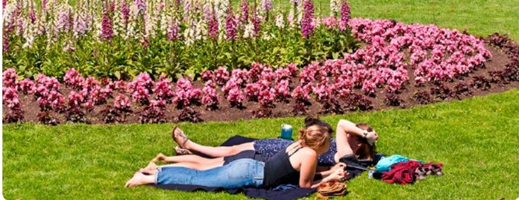

> **AI Description:**
> **Source:** `assets/_page_4_Figure_0.jpg`
> 
> **Generated:** 2026-06-01 19:48:53
> 
> ---
> 
> The image is a photograph showing three people lying on a grassy area in a park. They are relaxing on a blanket, with one person in the foreground lying on their back, another person in the middle lying on their stomach, and a third person partially visible behind them. The background features a well-maintained flower bed with a variety of colorful flowers, predominantly pink and purple, arranged in a landscaped design. The scene suggests a pleasant outdoor setting, likely during a sunny day.

Golden Gate Park (p195)

## Day Three

## North Beach & Chinatown (p112)

Take the California cable car to pagoda-topped Grant St for an eyeopening Red Blossom tea tasting and then a jaw-dropping history of Chinatown at the Chinese Historical Society of America. Wander temple-lined Waverly Place and notorious Ross Alley to find your fortune at the Golden Gate Fortune Cookie Company.

Lunch Hail dim-sum carts for dumplings at City View (p120).

## The Marina, Fisherman’s Wharf & the Piers (p48)

> **AI Description:**
> **Source:** `assets/_page_4_Figure_3.jpg`
> 
> **Generated:** 2026-06-01 19:48:22
> 
> ---
> 
> The image contains a simple graphic of a sun with a bright yellow color and a circular shape. It is a basic icon representing the sun, often used to symbolize sunlight, weather, or time. There are no additional visual elements or text annotations present in the image.

R To cover the waterfront, take the Powell-Hyde cable car past zigzagging Lombard Street to the San Francisco Maritime National Historical Park, where you can see what it was like to stow away on a schooner. Save the world from Space Invaders at Musée Mécanique or enter underwater stealth mode inside a real WWII submarine: the USS Pampanito. Watch sea lions cavort as the

> **AI Description:**
> **Source:** `assets/_page_4_Figure_4.jpg`
> 
> **Generated:** 2026-06-01 19:45:15
> 
> ---
> 
> The image contains a simple icon of a fork and knife crossed over each other, commonly used to represent dining or eating. There is no text or additional visual elements present.

Dinner Inspired NorCal fare at Rich Table (p186) satisfies and surprises.

sun fades over Pier 39, then hop onto the vintage F-line streetcar.

## The Haight, NoPa & Hayes Valley (p178)

> **AI Description:**
> **Source:** `assets/_page_4_Figure_5.jpg`
> 
> **Generated:** 2026-06-01 19:44:34
> 
> ---
> 
> The image contains a simple icon of a crescent moon with two stars above it. The icon is blue and appears to be a stylized representation of the night sky. There are no charts, graphs, or other visual elements present in the image.

Browse Hayes Valley boutiques before your concert at the SF Sym-

## Day Four

## The Mission & Potrero Hill (p144)

Wander 24th St past mural-covered M bodegas to Balmy Alley, where the Mission muralist movement began in the 1970s. Stop for a ‘secret breakfast’ (bourbon and cornflakes) ice-cream sundae at Humphry Slocombe, then head up Valencia to Ritual Coffee Roasters. Pause for pirate supplies and Fish Theater at 826 Valencia and duck into Clarion Alley, the Mission’s outdoor graffiti-art gallery. See San Francisco’s first building, Spanish adobe Mission Dolores, and visit the memorial to the Native Ohlone who built it.

Lunch Take La Taqueria (p151) burritos to Dolores Park, or dine in at Tacolicious (p153).

> **AI Description:**
> **Source:** `assets/_page_4_Figure_8.jpg`
> 
> **Generated:** 2026-06-01 19:41:47
> 
> ---
> 
> The image contains a simple, stylized sun icon. It is a circular shape with radiating lines extending outward, representing the sun's rays. There are no labels or text annotations present in the image.

## The Haight, NoPa & Hayes Valley (p178)

Spot Victorian ‘Painted Ladies’ R around Alamo Square and browse NoPa boutiques. Stroll tree-lined Panhandle park to Stanyan, then window-shop your way down hippie-historic Haight Street past record stores, vintage empori-

Dinner Early walk-ins may score sensational small plates at Frances (p173).

## ums, drag designers and Bound Together Anarchist Book Collective.

## The Castro & Noe Valley (p167)

Sing along to tunes pounded out on the Mighty Wurlitzer organ

# San Francisco Maps

## Sights

## Activities, Courses & Tours

Bodysurfing   
Diving Canoeing/Kayaking   
· Course/Tour   
山 Sento Hot Baths/Onsen Skiing Snorkeling Surfing Swimming/Pool Walking Windsurfing Other Activity

## Sleeping

Sleeping Camping Hut/Shelter

Eating Eating

## Drinking & Nightlife

Drinking & Nightlife Cafe

## Entertainment

Entertainment

## Shopping

Shopping

## Information

Bank Embassy/Consulate Hospital/Medical Internet   
Police   
Post Office   
Telephone Toilet   
Tourist Information   
Other Information

## Geographic

? Beach Gate Hut/Shelter Lighthouse Lookout Mountain/Volcano Oasis Park Pass Picnic Area Waterfall

## Population

+0。 Capital (National) Capital (State/Province) City/Large Town 。 Town/Village

## Transport

Airport   
B BART station Border crossing   
T Boston T station   
Bus   
Cable car/Funicular   
Cycling   
Ferry   
M Metro/Muni station Monorail   
P Parking   
Petrol station   
S Subway/SkyTrain station   
Taxi   
Train station/Railway Tram   
Underground station   
Other Transport

## Routes

## Boundaries

International State/Province Disputed Regional/Suburb Marine Park Cliff Wall

## Hydrography

Areas

Note: Not all symbols displayed above appear on the maps in this book

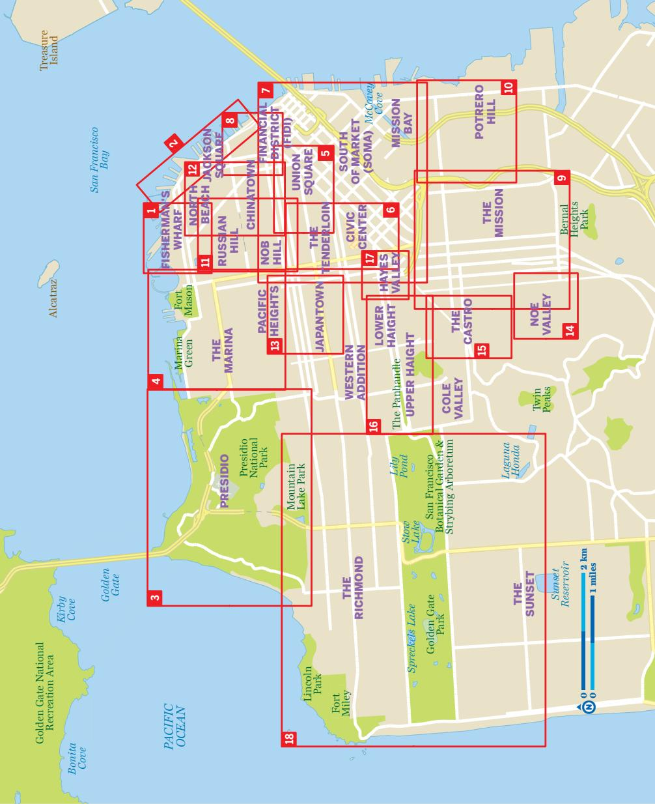

> **AI Description:**
> **Source:** `assets/_page_6_Figure_0.jpg`
> 
> **Generated:** 2026-06-01 19:39:16
> 
> ---
> 
> The image is a map of San Francisco, California, with various neighborhoods and landmarks labeled. The map includes red rectangular boundaries around different areas, such as Fisherman's Wharf, Chinatown, and The Marina. The map also highlights green areas representing parks and natural spaces, such as the Presidio and Golden Gate National Recreation Area. The map provides a clear layout of the city, with streets and major landmarks marked, making it useful for navigation and understanding the city's geography.

AP INDE herman’s Wharf (p2 he Piers (p29 he Presidio (p2 he Marina (p29 nion Square (p2 Civic Center Tenderloin (p29 oMa (p29 nancial District (p3 he Mission (p30 Potrero Hill (p30 ssian & Nob Hills (p North Beac hinatown (p30 Japantow cific Heights (p3 Noe Valley (p3 The Castro (p31 The Haight (p31 Hayes Valley (p3 olden Gate Park & enues (p31

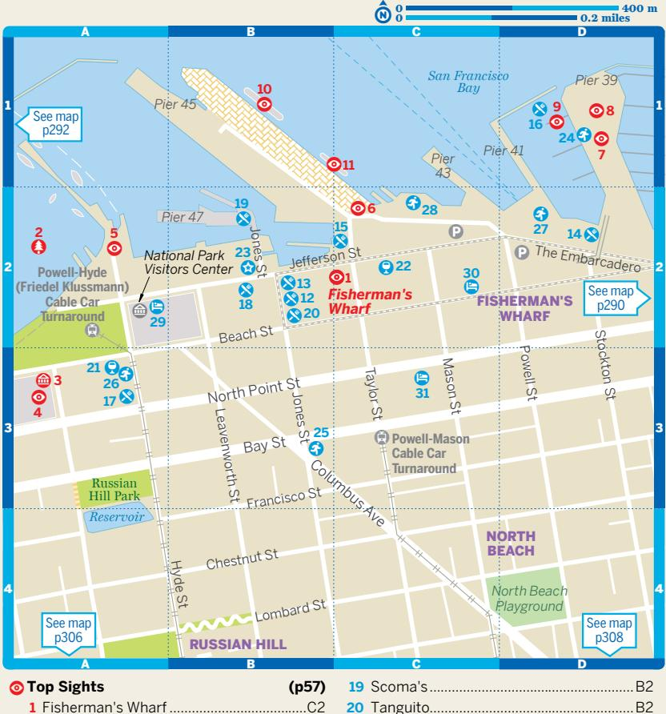

> **AI Description:**
> **Source:** `assets/_page_7_Figure_0.jpg`
> 
> **Generated:** 2026-06-01 19:41:45
> 
> ---
> 
> The image is a map of a specific area, likely in San Francisco, California. It includes a grid layout of streets with numbered locations marked at various points. The map highlights several landmarks and points of interest, such as Fisherman's Wharf, Powell-Hyde Cable Car Turnaround, and Russian Hill Park. The map also shows the location of the National Park Visitors Center and various piers along the waterfront. The map includes a legend indicating the scale and direction, as well as references to other maps for additional details.

æ Top Sights (p57)   
1 Fisherman's Wharf . ..C2   
æ Sights (p61)   
2 Aquatic Park.. ...A2   
3 Cartoon Art Museum.. ...A3   
4 Ghirardelli Square.. ...A3   
5 Maritime National Historical   
Park.. ..A2   
6 Musée Mécanique... ...C2   
7 Pier 39 .. .... D1   
8 San Francisco Carousel.. .. D1   
9 Sea Lions at Pier 39... .. D1   
10 SS Jeremiah O'Brien .. . B1   
11 USS Pampanito.. .. C1   
ú Eating (p62)   
12 Carmel Pizza Co.. ..B2   
13 Codmother Fish & Chips.. ..B2   
14 Eagle Cafe... ..D2   
15 Fisherman's Wharf Crab Stands .. ...C2   
16 Forbes Island.. .. D1   
17 Gary Danko.. ...A3   
18 In-N-Out Burger . ......................... ..B2   
19 Scoma's.. .B2   
20 Tanguito.. .. B2   
û Drinking & Nightlife (p68)   
21 Buena Vista Cafe.. ... A3   
22 Gold Dust Lounge.. ... C2   
ý Entertainment (p69)   
23 Lou's Fish Shack.. .. B2   
þ Shopping (p70)   
elizabethW.. ..(see 4)   
Ø Sports & Activities (p72)   
24 Adventure Cat. ...D1   
25 Basically Free Bike Rentals. .. B3   
26 Blazing Saddles . ... A3   
27 Blue & Gold Fleet.. .. D2   
28 Red & White Fleet.. .. C2   
ÿ Sleeping (p229)   
29 Argonaut Hotel .. .. A2   
30 Hotel Zephyr .... ... C2   
31 Tuscan .. .. C3   
æ Top Sights (p60)   
1 Exploratorium .. ... A5   
æ Sights (p57)   
2 Aquarium of the Bay... ....A1   
Tactile Dome .... ....... (see 1)   
ý Entertainment (p69)   
3 Pier 23 . ... A4   
þ Shopping (p70)   
Exploratorium Store... .... (see 1)   
4 Houdini's Magic Shop .. .....A1   
5 SF Salt Co . ...A1   
Ø Sports & Activities (p72)   
6 Alcatraz Cruises.. . A2   
æ Sights (p61)   
1 Baker Street Steps ... .... A6   
2 Fort Mason Center.... .... D2   
3 Maritime Museum . ...... F2   
4 Octagon House . .... E5   
5 Wave Organ ..... ......B1   
ú Eating (p62)   
6 A16 ...... ..... A4   
7 Balboa Cafe .. ...... C5   
8 Belga.... .... D5   
9 Blue Barn Gourmet.... ...... C4   
10 Greens ....... ........ D2   
11 Izzy's Steaks & Chops...   
12 Kara's Cupcakes.. ..... B4   
13 Lite Bite ..... ... E5   
14 Lucca Delicatessen........... .. B4   
15 Mamacita ..... ..B4   
16 Off the Grid ........ ...... D2   
17 Pluto's Fresh Food.. ... B4   
18 Roam Artisan Burger .. .. E5   
19 Rooster & Rice . .... C5   
20 Rose's Café.. .... C5   
21 Seed & Salt .. ... B4   
û Drinking & Nightlife (p68)   
22 California Wine Merchant.. .... B4   
23 Interval Bar & Cafe . ..... D2   
24 MatrixFillmore.. .... C5   
25 West Coast Wine & Cheese.. ...... C5   
ý Entertainment (p69)   
26 BATS Improv.... .... D2   
27 Magic Theatre . .... D2   
þ Shopping (p70)   
28 Ambiance.. .... E5   
29 ATYS... .... C5   
30 Benefit ... ...... B4   
31 Books Inc ...... ..... B4   
32 Epicurean Trader.... ........   
33 Flax Art & Design .......................................... D2   
34 Fog City Leather..... ......................... ..... D5   
35 Itoya Top Drawer ......... ....................... ........ E5   
36 Jack's....... ........ B4   
37 My Roommate's Closet..... ..... C5   
38 PlumpJack Wines ... .... C5   
39 Sui Generis Illa....... .... C5   
40 Y & I Boutique....... ...... B4   
Ø Sports & Activities (p72)   
41 Environmental Traveling Companions......D2   
42 Oceanic Society Expeditions....................... A2

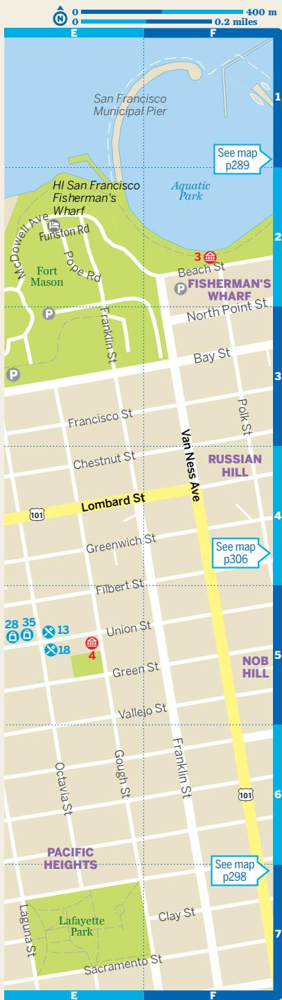

> **AI Description:**
> **Source:** `assets/_page_11_Figure_0.jpg`
> 
> **Generated:** 2026-06-01 19:45:32
> 
> ---
> 
> The image is a map of a specific area in San Francisco, highlighting streets, landmarks, and points of interest. It includes labels for major streets such as Lombard St, Van Ness Ave, and Francisco St. Notable landmarks include Fisherman's Wharf and Fort Mason. The map also indicates directions to other sections of the city, with arrows pointing to maps on pages 289, 298, and 306. The map uses a color-coded system to differentiate between land and water, with green representing land and blue representing water bodies.

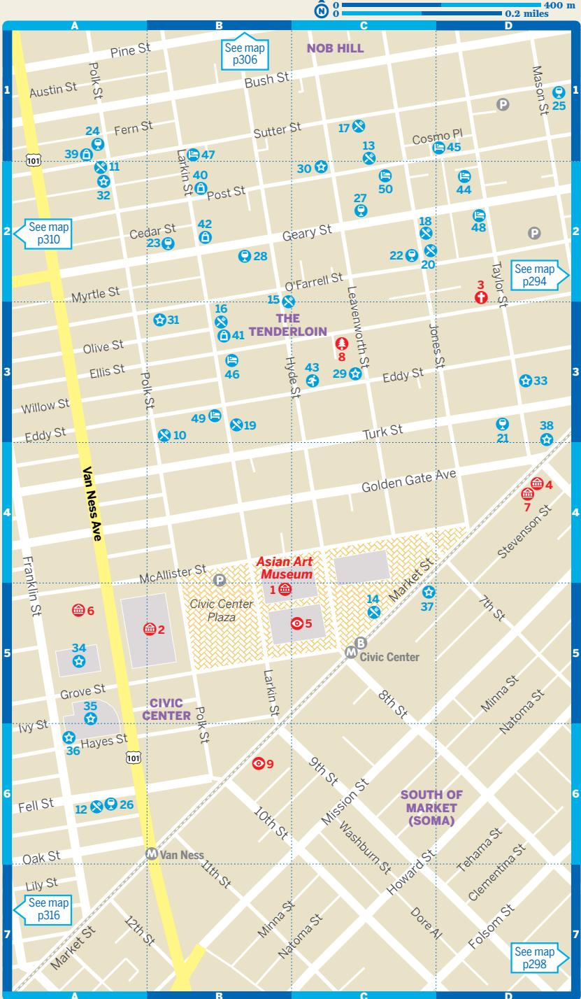

> **AI Description:**
> **Source:** `assets/_page_14_Figure_0.jpg`
> 
> **Generated:** 2026-06-01 19:41:20
> 
> ---
> 
> The image is a detailed street map of a specific urban area, likely in San Francisco, California. It includes a grid of streets with labeled intersections and notable landmarks such as the Asian Art Museum, Civic Center Plaza, and the Tenderloin district. The map is color-coded with different symbols representing various points of interest, such as museums, parks, and other attractions. The map also includes references to other maps for additional areas, such as Nob Hill and South of Market (SOMA). The scale at the top indicates distances in meters and miles.

## CIVIC CENTER & THE TENDERLOIN

æ Top Sights (p78)   
1 Asian Art Museum .......... ..B5   
æ Sights (p85)   
2 City Hall .. ..B5   
3 Glide Memorial United Methodist   
Church.. ..D2   
4 Luggage Store Gallery.. ..D4   
5 San Francisco Main Library... ...C5   
6 SF Arts Commission Gallery.. ...A5   
7 SF Camerawork . ..D4   
8 Tenderloin National Forest.. ...C3   
9 Twitter Headquarters... ...B6   
10 Brenda's French Soul Food.. ..B3   
11 Cafe Zitouna.. ...A2   
12 Cala... ....A6   
13 farm:table . .. C1   
14 Heart of the City Farmers Market . ..C5   
15 Hooker's Sweet Treats... ...B2   
16 Lers Ros . ...B3   
17 Liholiho Yacht Club.. ... C1   
18 Red Chilli .. ...C2   
19 Saigon Sandwich Shop.. ..B3   
20 Shalimar.. ..C2   
û Drinking & Nightlife (p101)   
21 Aunt Charlie's Lounge.. ..D3   
22 Bourbon & Branch.. ...C2   
23 Edinburgh Castle ... ...B2   
24 Lush Lounge. .... A1   
25 Pacific Cocktail Haven . .. D1   
26 Rickshaw Stop.. ...A6   
27 Rye.. ..C2   
28 Whiskey Thieves......................................... B2   
ý Entertainment (p102)   
29 Black Cat . ..C3   
30 Café Royale.. ... C2   
31 Great American Music Hall. .. B3   
32 Hemlock Tavern . ... A2   
33 PianoFight .. ... D3   
34 San Francisco Ballet.. ... A5   
San Francisco Opera . .. (see 34)   
35 San Francisco Symphony..... .... A5   
36 SoundBox.. .... A6   
37 Strand Theater .. . C5   
38 Warfield. ... D3   
Ø Sports & Activities (p111)   
43 Onsen Bath. .C3   
ÿ Sleeping (p230)   
44 Adelaide Hostel.. . D2   
45 Fitzgerald Hotel .. ...D1   
46 HI San Francisco City Center.... ... B3   
47 Hotel Carlton.. ...B1   
48 Marker.. ... D2   
49 Phoenix Hotel.. .B3   
50 USA Hostels.. .. C2

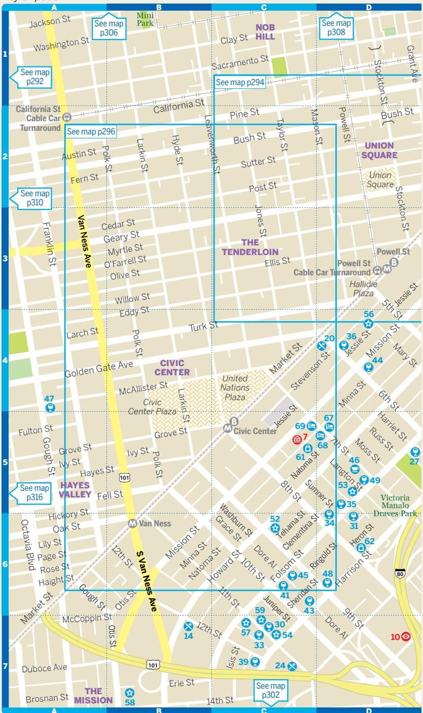

> **AI Description:**
> **Source:** `assets/_page_16_Figure_0.jpg`
> 
> **Generated:** 2026-06-01 19:45:13
> 
> ---
> 
> The image is a detailed map of a specific area, likely in San Francisco, California. It includes street names, landmarks, and notable locations such as Nob Hill, Union Square, The Tenderloin, Civic Center, Hayes Valley, and The Mission. The map is divided into sections with blue borders, and there are references to other maps (e.g., "See map p292," "See map p294," "See map p296," etc.) indicating that this map is part of a larger set. The map also includes bus routes and stops, as indicated by the numbers and symbols on the streets. The overall layout and labeling suggest it is a transit or travel map designed to help users navigate the area efficiently.

## SOMA Map on p298

æ Sights (p83)   
1 California Historical Society... .. E2   
2 Children's Creativity Museum.. ..E3   
3 Contemporary Jewish Museum . ..E3   
4 Crown Point Press.. .. F3   
5 Museum of the African Diaspora.. ..E3   
6 Pacific Telephone & Telegraph   
Company Building . .. F3   
7 Root Division . ..C5   
8 San Francisco Murals at Rincon Annex   
Post Office . . G1   
9 San Francisco Museum of Modern Art....E3   
10 SOMArts . ..D7   
11 South Park. . G4   
12 SPUR Urban Center Gallery . .. E2   
13 Yerba Buena Gardens. .E3   
14 1601 Bar & Kitchen . .B7   
15 21st Amendment Brewery... . G4   
Amawele's South African Kitchen.... (see 8)   
16 Benu .. .. F3   
17 Boulevard. .. G1   
18 Butler & the Chef .. .. G4   
19 Cockscomb. ... F5   
20 Dottie's True Blue Café. ..D4   
21 In Situ . .. F3   
22 Salt House.. .. F2   
23 Sentinel . ..E2   
24 SoMa StrEat Food Park . ..C7   
25 Tropisueño.. ..E3   
26 Zero Zero . .E4   
û Drinking & Nightlife (p98)   
27 1015 Folsom.. ..D5   
28 111 Minna.. .. F2   
29 83 Proof .... ..... F2   
30 Bar Agricole... .....C7   
31 Bloodhound. ..D6   
32 Bluxome Street Winery.. ... F5   
33 Butter ... ...C7   
34 Cat Club . ..D6   
35 City Beer Store & Tasting Room .. ..D5   
36 Club OMG.. ..D4   
37 Coin-Op Game Room . ... F5   
38 Dada .. ..E2   
39 Eagle Tavern.. ..C7   
40 EndUp . E5   
41 Hole in the Wall. ..C6   
42 House of Shields.. . E2   
43 Lone Star Saloon...... ..... C6   
44 Monarch... .... D4   
45 Powerhouse .. ... C6   
46 Sightglass Coffee .. ..... D5   
47 Smuggler's Cove . ... A4   
48 Stud. .. D6   
49 Terroir Natural Wine Merchant . ... D5   
50 Waterbar.. ...H1   
ý Entertainment (p104)   
Alonzo King's Lines Ballet. .. (see 60)   
51 AMC Metreon 16.. .... E3   
52 AsiaSF.. ..... C6   
53 Brainwash... .... D5   
54 DNA Lounge... ..... C7   
55 Giants Stadium. ... H5   
Hotel Utah Saloon . .. (see 37)   
Liss Fain Dance... ................ ...... (see 60)   
56 Mezzanine .... ..... D4   
57 Oasis . .... C7   
58 Public Works ....... ..... B7   
59 Slim's.. .. C7   
Smuin Ballet.. .. (see 60)   
60 Yerba Buena Center for the Arts.. . E3   
þ Shopping (p110)   
61 General Bead . .. C5   
62 Mr S Leather .. .. D6   
63 San Francisco Railway Museum   
Gift Shop.. ..G1   
Ø Sports & Activities (p111)   
64 City Kayak . ...H4   
65 Embarcadero YMCA . ....G1   
Spinnaker Sailing... ... (see 64)   
66 Yerba Buena Ice Skating &   
Bowling Center . .F3   
ÿ Sleeping (p230)   
67 Americania Hotel.. .. D5   
68 Best Western Carriage Inn.. .. D5   
69 Good Hotel . ... C5   
70 Hotel Vitale... ....G1   
71 Mosser Hotel.. . E3

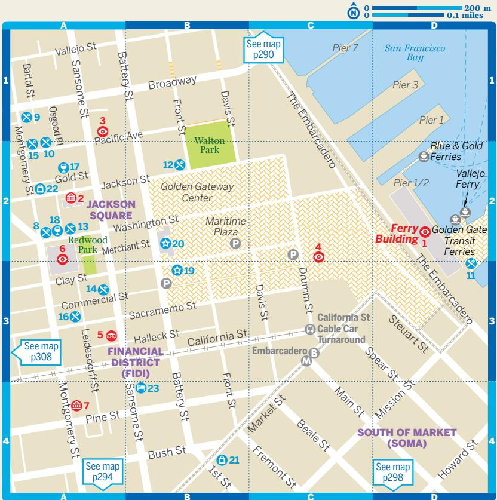

> **AI Description:**
> **Source:** `assets/_page_19_Figure_0.jpg`
> 
> **Generated:** 2026-06-01 19:43:31
> 
> ---
> 
> The image is a map of a specific area, likely in San Francisco, California. It includes streets, landmarks, and points of interest such as the Ferry Building, Golden Gate Transit Ferries, and various parks and districts like Jackson Square and the Financial District (FID). The map also indicates the location of public transportation stops and parking areas. The map is divided into grid sections for easy reference, and there are annotations for other maps that can be referenced for more detailed information.

æ Top Sights (p79) 1 Ferry Building . D2

æ Sights (p80) 2 AP Hotaling Warehouse.. .. A2 3 Jackson Square . .A1 4 Justin Herman Plaza ....C2 5 Sun Terrace. . A3 6 Transamerica Pyramid & Redwood Park. . A2 7 Wells Fargo History Museum . A4

ú Eating (p88) 8 Bocadillos .. . A2 Boulette's Larder & Boulibar.... .. (see 1) 9 Coi .. ..A1   
10 Cotogna....... ...... A2 El Porteño Empanadas.......... (see 1)   
11 Ferry Plaza Farmers Market .. .D3 Gott's Roadside .. .. (see 1) Hog Island Oyster Company... ... (see 1)   
12 Kokkari .. .. B2   
13 Kusakabe .. ... A2 Mijita .... .. (see 1)   
14 Mixt .. .... A3   
15 Quince . ... A2 Slanted Door........... (see 1)   
16 Wayfare Tavern. .A3   
û Drinking & Nightlife (p94) 17 Bix . A2 Ferry Plaza Wine Merchant.... (see 1)   
18 Taverna Aventine.......... A2

ý Entertainment (p102) 19 Embarcadero Center Cinema.. .B3 20 Punch Line .. B2

þ Shopping (p107)   
21 Fog City News... .B4 Heath Ceramics... .. (see 1) Japonesque ..... .. (see 22) McEvoy Ranch........ (see 1) Prather Ranch Meat Company.... (see 1) Recchiuti Chocolates........... (see 1)   
22 William Stout Architectural Books... .A2

ÿ Sleeping (p233) 23 Loews Regency.. B4

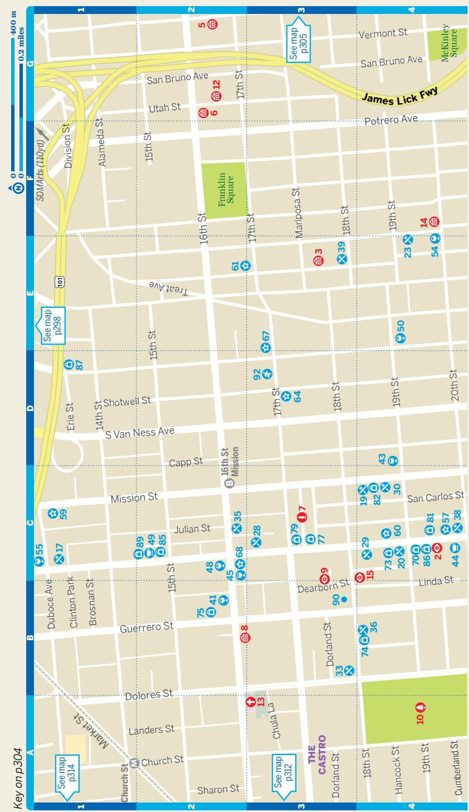

> **AI Description:**
> **Source:** `assets/_page_20_Figure_0.jpg`
> 
> **Generated:** 2026-06-01 19:46:22
> 
> ---
> 
> The image is a detailed map of a specific urban area, likely a neighborhood in San Francisco, California. It includes street names, landmarks, and numbered points of interest or locations. The map is color-coded with different shades representing different areas, such as Franklin Square and The Castro. There are also symbols indicating various points of interest, such as parks, museums, and other notable locations. The map includes a legend on the left side, which explains the meaning of the symbols and color codes used. The scale at the top left corner indicates the distance in meters and miles.

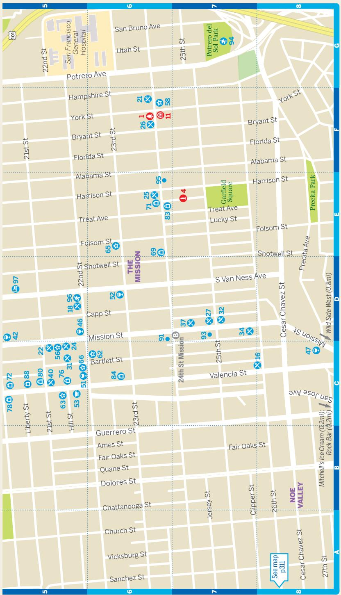

> **AI Description:**
> **Source:** `assets/_page_21_Figure_0.jpg`
> 
> **Generated:** 2026-06-01 19:49:27
> 
> ---
> 
> The image is a map of a specific urban area, likely in San Francisco, California. It includes street names, landmarks, and bus stops marked with numbers. The map is divided into grid sections labeled A through G and 5 through 8. Notable features include the San Francisco General Hospital, Potrero del Sol Park, and various streets such as Mission Street, Valencia Street, and Cesar Chavez Street. The map also highlights areas like The Mission and Noe Valley. The map is designed to provide geographical orientation and transportation information.

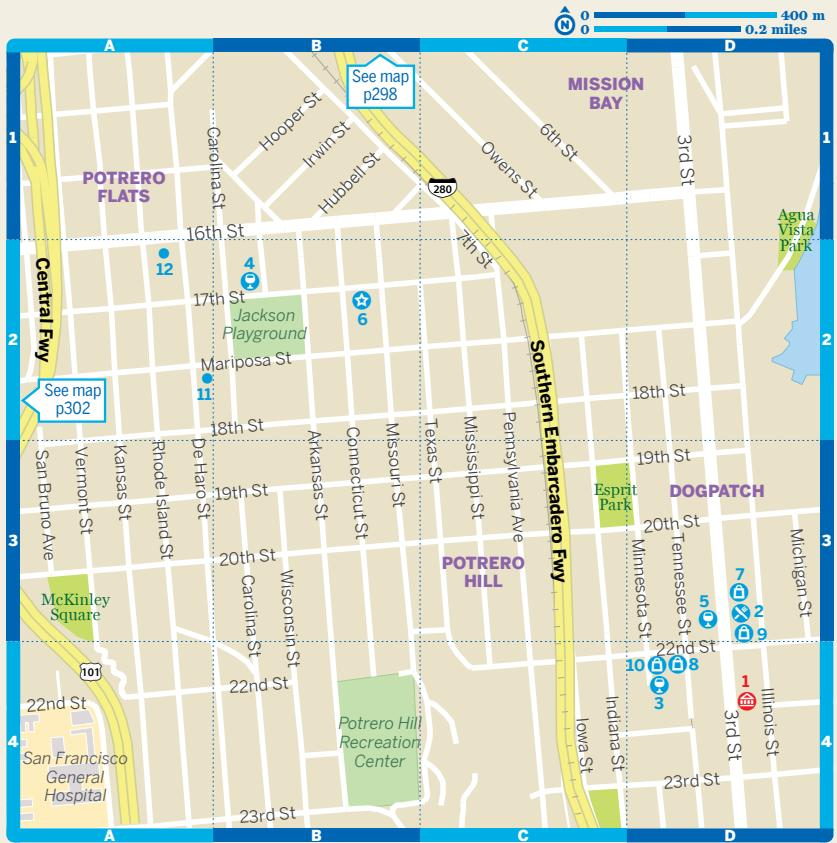

> **AI Description:**
> **Source:** `assets/_page_23_Figure_0.jpg`
> 
> **Generated:** 2026-06-01 19:40:45
> 
> ---
> 
> The image is a map of a specific urban area, likely in San Francisco, California. It includes streets, landmarks, and points of interest such as parks and playgrounds. The map is divided into sections labeled A through D and numbered 1 through 4. Notable features include Potrero Hill, Dogpatch, and Mission Bay. The map also includes a legend indicating distance in meters and miles, with a scale bar for reference.

æ Sights (p151)   
1 Museum of Craft & Design . ..D4   
ú Eating (p151)   
2 Serpentine .. ...D3   
û Drinking & Nightlife (p157)   
3 Dig .. ...D4   
4 Thee Parkside.. ..B2   
5 Yield .. ..D3   
ý Entertainment (p161)   
6 Bottom of the Hill. ..B2   
þ Shopping (p162)   
7 Poco Dolce . ..D3   
8 Recchiuti at theLab... ... D4   
9 Triple Aught Design... .. D3   
10 Workshop Residence.. .. D4   
Ø Sports & Activities (p165)   
11 Anchor Brewing Company. .. A2   
12 San Francisco Center for the Book.......... A2   
æ Sights (p130)   
1 Cable Car Museum. ..D5   
Diego Rivera Gallery....(see 11)   
2 Filbert Street Hill. ..B2   
3 George Sterling Park. ...A2   
4 Grace Cathedral.. . D6   
5 Huntington Park... .. D6   
6 Ina Coolbrith Park. . D3   
7 Jack Kerouac's Love Shack.B3   
8 Lombard Street... ... B1   
9 Macondray Lane. . C3   
10 Masonic Auditorium &   
Temple . . D6   
11 San Francisco Art   
Institute. .C1   
12 Vallejo Street Steps..... . D3   
ú Eating (p135)   
13 Acquerello... ..A6   
14 Cheese Plus. ...A4   
15 La Folie .... ...A3   
16 Leopold's.... ....A3   
17 Seven Hills .. .. B4   
18 Stone's Throw. ...B3   
19 Swan Oyster Depot.. ...A6   
20 Swensen's.. ..B3   
21 Union Larder.. ...B3   
22 Venticello . ...D5   
23 Za .. ..B3   
24 Zarzuela . ..B2   
û Drinking & Nightlife (p138)   
25 Amélie . ..A5   
26 Big 4 .... ..D6   
27 Cinch ... .. A5   
28 Fine Mousse .. ..D4   
29 Harper & Rye.. ..A6   
30 Hi-Lo Club... .. A7   
31 Hopwater Distribution . . E7   
32 Stookey's Club Moderne.....D7   
33 Tonga Room.. ..E6   
Top of the Mark........... (see 43)   
þ Shopping (p140)   
34 Cris .. ..A4   
35 Johnson Leathers.. .... A5   
36 Molte Cose... ...A4   
37 Picnic... .... A5   
38 Relove.... .... A5   
39 Studio.. ... A5   
40 Velvet da Vinci.. ..A4   
ÿ Sleeping (p234)   
Fairmont San   
Francisco .. ... (see 33)   
41 Golden Gate Hotel. .. E7   
42 Hotel Rex ... .. E7   
43 Mark Hopkins   
Intercontinental.. ..E6   
44 Petite Auberge.. ..D7   
45 White Swan Inn. . E7   
æ Top Sights (p114)   
Coit Tower . D2   
æ Sights (p115)   
2 Beat Museum.. . D4   
3 Bob Kaufman Alley. . C2   
4 Chinatown Alleyways . ..C5   
5 Chinese Culture Center .......D5   
6 Chinese Historical Society   
of America . . C6   
7 Chinese Telephone   
Exchange . ..D5   
8 City Lights Books. . D4   
9 Columbus Tower... ..D5   
10 Commercial Street. . D6   
11 Dragon's Gate.. ..D7   
12 Filbert Street Steps ...... . D2   
13 Francisco Street Steps ........ C1   
14 Good Luck Parking Garage. C4   
15 Jack Kerouac Alley . ... . D4   
16 Mule Gallery.. . D4   
17 Old St Mary's Cathedral &   
Square... . D6   
18 Portsmouth Square... ..D5   
19 Ross Alley.. ..C5   
20 Spofford Alley... ..C5   
21 Tin How Temple.. . D6   
22 Washington Square.. . C3   
23 Waverly Place.. ..D5   
ú Eating (p118)   
24 Cafe Jacqueline.. . C3   
25 China Live . . C4   
26 City View .... ..E6   
27 E' Tutto Qua.. . D4   
28 Golden Boy . . C3   
29 House of Nanking . ..D5   
30 Lai Hong Lounge. . C4   
31 Liguria Bakery .. . C2   
32 Mama's... . C2   
33 Mario's Bohemian Cigar   
Store Cafe.. . C3   
34 Mister Jiu's.. . D6   
35 Molinari . . C4   
36 Naked Lunch . . D4   
37 Ristorante Ideale. . C4   
38 Tony's Coal-Fired Pizza &   
Slice House.. . C3   
39 Tosca Cafe.. . D4   
40 Trestle .. ..D5   
41 Z & Y .. .D5   
û Drinking & Nightlife (p121)   
42 15 Romolo. ..D4   
43 Buddha Lounge.. ..D5   
44 Caffe Trieste.. ..C4   
45 Comstock Saloon.. ..D4   
Devil's Acre.. .. (see 27)   
46 Li Po... ...D5   
47 PlenTea.. ..D7   
48 Réveille... ..D4   
49 Saloon .... ..D4   
50 Specs... ..D4   
51 Tony Nik's.. ..C3   
52 Vesuvio .. .D4   
ý Entertainment (p125)   
53 Beach Blanket Babylon........C3   
54 Bimbo's 365 Club.. .A1   
55 Cobb's Comedy Club..... ..A2   
56 Doc's Lab.. .D4   
þ Shopping (p125)   
57 101 Music ... ..C3   
58 Al's Attire . ..D3   
59 Aria .. ..C3   
60 Artist & Craftsman   
Supply. ..D4   
61 Chinatown Kite Shop .. ..D6   
62 Eden & Eden.. ..D5   
63 Golden Gate Fortune   
Cookie Company.. ..C5   
64 Legion.. .E6   
65 Lyle Tuttle Tattoo Art   
Museum & Shop. ...A2   
66 Red Blossom Tea   
Company .. ..D5   
67 San Francisco Rock   
Posters &   
Collectibles.. ..B2   
Ø Sports & Activities (p127)   
68 Chinatown Alleyway   
Tours .. ..D5   
69 Chinatown Heritage   
Walking Tours .. ..D5   
ÿ Sleeping (p233)   
70 Hotel Bohème .. ..C3   
71 Orchard Garden Hotel .. ... D7   
72 Pacific Tradewinds Hostel...D6   
73 San Remo Hotel.. ....A1   
74 SW Hotel.. ..C4   
75 Washington Square Inn.......C3   
æ Sights (p131)   
1 Audium.. .. D2   
2 Cottage Row.. .. B3   
3 Japan Center.... ..... C3   
4 Konko Church ...... ...... C2   
Peace Pagoda.........(see 3)   
5 Ruth Asawa Fountains.C3   
ú Eating (p136)   
6 1300 on Fillmore .... .. B4   
7 Benkyodo.. .. C3   
8 Black Bark BBQ.. ..... B4   
9 Bun Mee ... .... B2   
Crown &   
Crumpet ............ (see 34)   
10 Izakaya Kou . .. B4   
11 Nijiya Supermarket....... C3   
12 Out the Door.. .... B2   
13 Pizzeria Delfina.............. B2   
Progress.. .. (see 15)   
14 Roam Artisan Burger ... B2   
15 State Bird Provisions.... B4   
û Drinking & Nightlife (p139)   
Boba Guys... .(see 16)   
17 Harry's Bar... ... B2   
18 Jane .. ... B2   
19 Palmer's Tavern.. ..B1   
20 Social Study.. . B3   
þ Shopping (p141)   
25 Benefit.. . B2   
26 Bite Beauty .... ... B2   
27 Brooklyn Circus...... ... B4   
28 Crossroads . .. B2   
Freda Salvador.... (see 32)   
29 Ichiban Kan.. .C3   
Japan Center ..........(see 3)   
Jonathan Adler.... (see 25)   
30 Katsura Garden... .. B3   
31 Kinokuniya Books &   
Stationery .. .... B3   
Kohshi... ...(see 11)   
32 Margaret O'Leary... ..B1   
33 Nest . ..B1   
34 New People... .... C3   
35 Sanko Kitchen   
Essentials... ..C3   
36 Soko Hardware...... ..C3   
Zinc Details ........... (see 21)

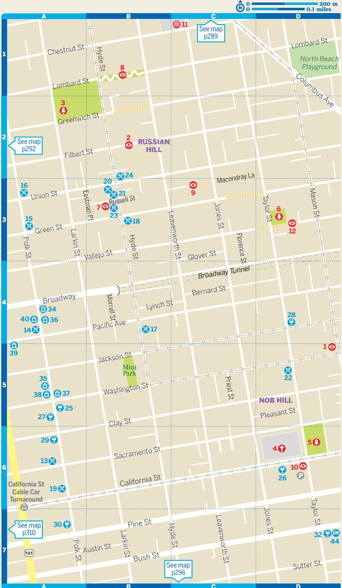

> **AI Description:**
> **Source:** `assets/_page_24_Figure_0.jpg`
> 
> **Generated:** 2026-06-01 19:40:27
> 
> ---
> 
> The image is a map of a specific area, likely in San Francisco, showing streets, landmarks, and numbered points of interest. The map includes labels for streets such as Lombard St, Hyde St, and Polk St, as well as notable areas like Russian Hill and Nob Hill. There are also numbered points scattered across the map, possibly indicating locations of interest or services. The map includes a legend in the top right corner indicating distance in meters and miles, and there are references to other maps (e.g., "See map p289," "See map p292," "See map p296," and "See map p310") suggesting this is part of a larger guide or atlas.

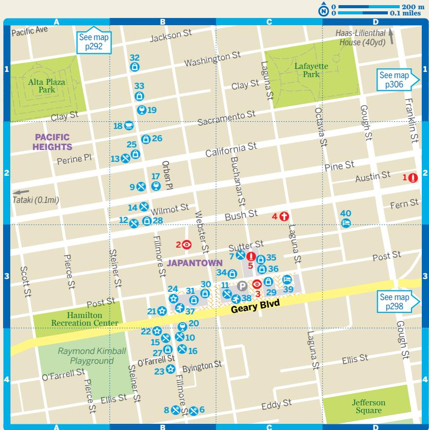

> **AI Description:**
> **Source:** `assets/_page_28_Figure_0.jpg`
> 
> **Generated:** 2026-06-01 19:43:12
> 
> ---
> 
> The image is a map of a specific area, likely in San Francisco, showing streets, parks, and landmarks. It includes labeled streets such as Geary Blvd, Bush St, and Fillmore St. There are numbered locations and symbols indicating points of interest, such as parks, buildings, and other landmarks. The map also includes a legend at the top right corner indicating scale in meters and miles. The map is divided into sections marked A, B, C, and D, and there are references to other maps for additional information.

Ø Sports & Activities (p143) 37 Kabuki Springs & Spa... B3 38 Playland Japan.. .C3

ÿ Sleeping (p234)   
39 Hotel Kabuki . C3   
40 Queen Anne Hotel.........D2   
æ Sights (p169)   
1 Barbie-Doll Window... ...C5   
2 Castro Theatre... .. C4   
3 Corona Heights Park.... ...A2   
4 GLBT History Museum.........B5   
5 Golden Gate Model   
Railroad Club. ..A3   
6 Harvey Milk & Jane Warner   
Plazas ... . B4   
7 Human Rights Campaign   
Action Center . ...C5   
8 Rainbow Honor Walk............C5   
Randall Junior   
Museum .. .. (see 5)   
ú Eating (p172)   
9 Anchor Oyster Bar... ....C5   
10 Dinosaurs.. .. D3   
11 Finn Town Tavern .. .. D2   
12 Frances.. .. C4   
13 La Méditerranée.. .. C3   
14 L'Ardoise ...... .. C2   
15 Mekong Kitchen.. ...C5   
16 Myriad .. ... D2   
17 Poesia.... ... C4   
18 Starbelly... .... C3   
19 Super Duper Burger ....... ... C3   
Thai House Express......(see 9)   
û Drinking & Nightlife (p173)   
20 440 Castro... .. B4   
21 Badlands .. ...B5   
22 Beaux..... .. C3   
23 Blackbird.. .. E1   
24 Cafe Flore.. ... C3   
25 Edge... ...B5   
k 26 Hearth Coffee Roasters ...... C4   
27 HiTops .. .. D2   
Lookout.. ....(see 13)   
28 Midnight Sun.. ..C5   
29 Mix ... ...C4   
30 Moby Dick... ...C5   
31 Swirl.. .. B5   
32 The Cafe... ...C4   
33 Toad Hall.. ..B4   
34 Twin Peaks Tavern. ...C4   
ý Entertainment (p175)   
35 Cafe du Nord/Swedish   
American Hall. ...D2   
Castro Theatre.............. (see 2)   
þ Shopping (p176)   
Castro Farmers   
Market.. ....(see 24)   
Cliff's Variety.. ..(see 29)   
Dog Eared Books........(see 29)   
Giddy ... ...(see 18)   
Human Rights   
Campaign Action   
Center & Store ........... (see 7)   
36 Kenneth Wingard... ......C3   
37 Local Take ... ...C4   
38 Sui Generis .. ....C3   
39 Unionmade... ...D4   
40 Worn Out West.. ...C3   
Ø Sports & Activities (p177)   
41 Seward Street Slides ...........A6   
ÿ Sleeping (p235)   
42 Beck's Motor Lodge .. ..D2   
43 Inn on Castro.. ...C3   
44 Parker Guest House.... .. E4   
45 Willows Inn.. .E1   
æ Top Sights (p180)   
1 Haight Street. .C4   
æ Sights (p181)   
2 Alamo Square Park... ...F1   
3 Buena Vista Park .. ..D4   
4 Grateful Dead House..... ..C4   
5 Haight & Ashbury.... ..C3   
ú Eating (p182)   
6 Bar Crudo.. ..E1   
7 Indian Paradox. .. F3   
8 Little Chihuahua . ..F3   
9 Magnolia Brewery . .. C3   
10 Mill .. ..... E1   
11 Ragazza .. ...F3   
12 Rosamunde Sausage Grill.. .. G3   
13 Three Twins Ice Cream.. ..H2   
û Drinking & Nightlife (p186)   
14 Alembic.. .. B4   
15 Aub Zam Zam . .. B4   
16 Coffee to the People . .. C4   
17 Madrone Art Bar... ..F2   
0 e# 0 400 m   
0.2 miles   
E F G H   
Brenda's Meat & ChateauTivoli   
Three (60yd) FultonSt (0.1mi)   
10   
NOPA #ú 1   
#÷2 See map   
hgp316   
# ú6 #ý 22   
#þ 31   
#û17   
2   
Fell St   
  
Qak St ÿ##ú34 #ú 13   
LOWER 12   
#ú 8 #ú 7 HAIGHT #þ26 # ##ûûú18 19 # þ32   
3   
See map   
hgp302   
S Duboce   
Buena Vista Park Duboce Ave:   
4   
THE   
See map CASTRO   
p312 14th St: Church St #¡   
E F G H   
18 Noc Noc.. ..G3 25 Braindrops Piercing & Tattoo Studio ......D3   
19 Toronado .. ...G3 26 Cove .... ... G3   
27 Distractions.. .. B3   
ý Entertainment (p189) 28 FTC Skateboarding.. .... B4   
20 Booksmith... ...B4 29 Loved to Death . ..B4   
21 Club Deluxe... ................... ...C4 30 Piedmont Boutique...... .................. .. C3   
22 Independent ... ....F1 31 Rare Device .. ....F2   
32 Upper Playground.. ..... H3   
þ Shopping (p190) 33 Wasteland.. ... B4   
23 Amoeba Music .. .....A4   
24 Bound Together Anarchist Book ÿ Sleeping (p236)   
Collective ..................................................D3 34 Metro Hotel .. ................................................F2   
æ Sights (p181)   
1 Patricia's Green... ..B2   
2 Zen Center... ..B3   
ú Eating (p182)   
3 Chez Maman West... .. C1   
4 DragonEats... ... C1   
5 Jardinière ... .. C1   
6 Little Gem .. .. C1   
7 Nojo Ramen Tavern.. .. C1   
8 Petit Crenn.. ..A2   
9 Rich Table .. ..C2   
10 Souvla... ..B2   
11 Zuni Cafe.. ..C3   
û Drinking & Nightlife (p186)   
12 Biergarten.. ..B2   
13 Blue Bottle Coffee Kiosk.. ....C2   
14 Hôtel Biron.. ...C3   
15 KitTea . ..C3   
16 Martuni's .. ..C4   
17 Riddler.. .. B2   
18 Ritual Coffee.... .. B2   
ý Entertainment (p189)   
19 SFJAZZ Center .. .C2   
þ Shopping (p190)   
20 Acrimony .... ...C1   
21 Amour Vert.... ..................... ....C1   
22 Fatted Calf.... ......................... .... C2   
23 Green Arcade.. ........... ... C3   
24 Isotope.... .......................... .... C2   
25 MAC.... ....C1   
26 Nancy Boy .. ...C1   
27 Paloma..... ................................. .... C3   
28 Reliquary..... ..B1   
ÿ Sleeping (p236)   
29 Hayes Valley Inn .. ...C1   
30 Parsonage .. .. B4   
31 Sleep Over Sauce... .. C3

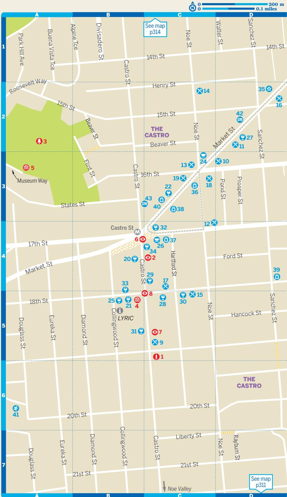

> **AI Description:**
> **Source:** `assets/_page_30_Figure_0.jpg`
> 
> **Generated:** 2026-06-01 19:42:23
> 
> ---
> 
> The image is a map of a specific area, likely in San Francisco, given the presence of Castro Street and other street names. It includes a grid of streets with numbered points of interest, some of which are labeled with red, blue, and purple icons. The map is detailed with street names and a legend indicating different types of points of interest. The map also includes a scale bar at the top right corner indicating 200 meters or 0.1 miles. The area is labeled as "The Castro," which is a well-known neighborhood in San Francisco.

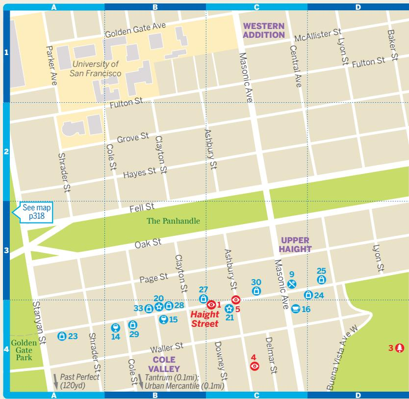

> **AI Description:**
> **Source:** `assets/_page_32_Figure_0.jpg`
> 
> **Generated:** 2026-06-01 19:46:43
> 
> ---
> 
> The image is a map of a specific area in San Francisco, highlighting neighborhoods such as the Western Addition, Upper Haight, and Cole Valley. It includes streets like Golden Gate Avenue, Ashbury Street, and Haight Street, and various landmarks such as the University of San Francisco and Golden Gate Park. The map also marks bus stops and other points of interest with numbered markers and icons. The map is color-coded to distinguish different areas, with green representing the Panhandle and yellow representing the Western Addition.

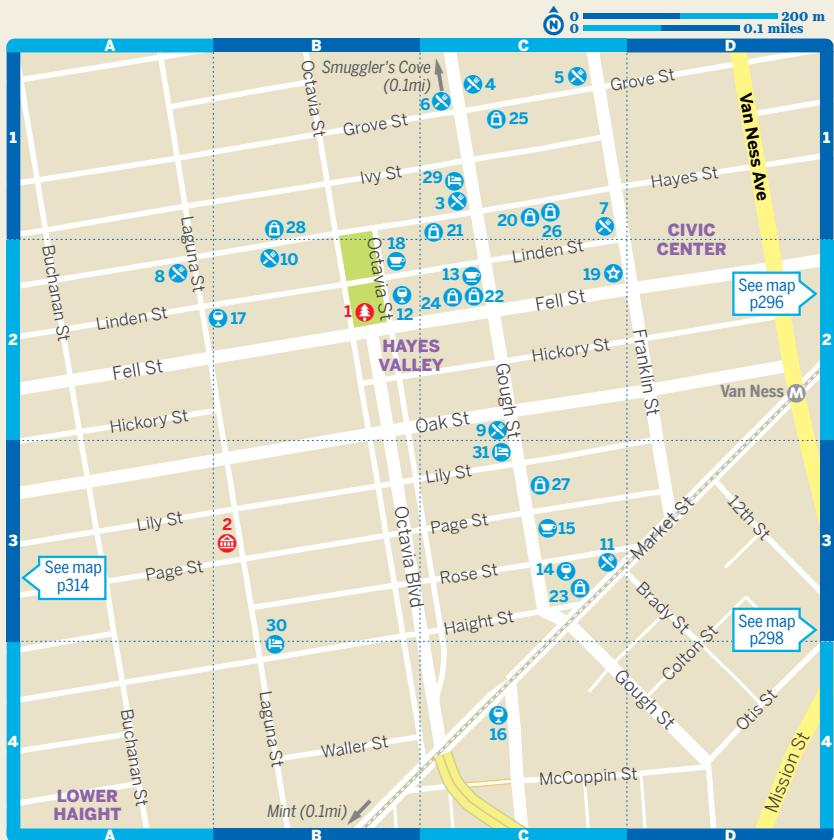

> **AI Description:**
> **Source:** `assets/_page_34_Figure_0.jpg`
> 
> **Generated:** 2026-06-01 19:48:45
> 
> ---
> 
> The image is a map of a specific area, likely in San Francisco, as indicated by the streets and landmarks such as Hayes Valley, Civic Center, and Van Ness Avenue. The map includes numbered locations, which may correspond to points of interest or addresses. The map also has grid lines and a legend indicating distance in both meters and miles. The map is divided into sections labeled A, B, C, and D, and numbers 1 through 30 are marked on various streets, suggesting a detailed layout of the area.

## GOLDEN GATE PARK & THE AVENUES Map on p318

æ Top Sights (p195)   
1 California Academy of Sciences. . G4   
2 Conservatory of Flowers... .. H4   
3 de Young Museum. . G4   
4 Golden Gate Park.. ..E4   
5 Japanese Tea Garden . ..F4   
6 San Francisco Botanical Garden .............. F5   
( )   
7 Buffalo Paddock.. ..C4   
8 Children's Playground.. . H4   
9 Cliff House . ..A3   
10 Columbarium . ... H2   
11 Dahlia Garden.. . H4   
12 Hunter S Thompson Crash Pad.. ..H5   
13 Internet Archive . ... F2   
14 Legion of Honor... ..B2   
15 Lincoln Park.. .. B1   
16 National AIDS Memorial Grove.. . H4   
17 Ocean Beach . ...A5   
18 Shakespeare Garden.. .. G4   
19 Stow Lake .. ...E4   
20 Sutro Baths... ..A2   
21 Windmills . ..A4

## ú Eating

22 Burma Superstar. ..G2   
23 Cassava. ..C3   
24 Cinderella Russian Bakery.. ...G3   
25 Dragon Beaux.... ... E2   
26 Genki... ...G2   
27 Halu... ...G2   
28 Manna... ...G5   
29 Masala Dosa . ...G5   
30 Nopalito.... ...G5   
31 Orson's Belly.... ... E3   
32 Outerlands.. ...B6   
33 Poki Time .. ....G5   
34 Pretty Please Bakeshop.. ...G2   
35 Revenge Pies. ...G5   
36 Underdog..... .... F5   
37 Wako... ..G2   
38 Wing Lee... ..G2   
û Drinking & Nightlife (p202)   
540 Club . .. (see 38)   
39 Beach Chalet... ... A4   
40 Hollow .. ...F5   
41 Social... ... G5   
42 Tommy's Mexican Restaurant .. .. E2   
Trad'r Sam. .. (see 53)   
43 Trouble Coffee & Coconut Club.. .. B6   
ý Entertainment (p203)   
44 Balboa Theatre.. .. C3   
45 Four Star Theater.. . E2   
46 Neck of the Woods... .. G2   
47 Plough & Stars... .H2   
þ Shopping (p203)   
48 Foggy Notion... .. G2   
General Store.. .. (see 32)   
49 Green Apple Books ....... ... G2   
50 Jade Chocolates... ..... G2   
51 Last Straw .. ... B5   
52 Mollusk... ... B5   
Park Life.. .... (see 47)   
53 Paul's Hat Works . .. D2   
San Franpsycho... .. (see 35)   
Ø Sports & Activities (p205)   
54 Aqua Surf Shop .. .B6   
55 Coastal Trail. ...B1   
56 Golden Gate JOAD . .. B4   
57 Golden Gate Municipal Golf Course... .. B4   
58 Golden Gate Park Bike & Skate. .. G3   
59 Golden Gate Park Horseshoe Pits... ...H4   
60 Lawn Bowling Club.. ...H4   
61 On the Run.. ... G5   
62 San Francisco Disc Golf.. ..D4   
63 Stow Lake Boathouse.. .. F4   
ÿ Sleeping (p236)   
64 Seal Rock Inn ...... ... A3

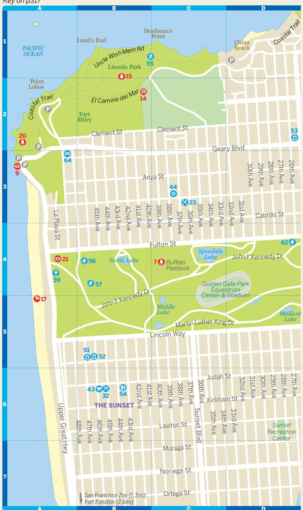

> **AI Description:**
> **Source:** `assets/_page_36_Figure_0.jpg`
> 
> **Generated:** 2026-06-01 19:39:49
> 
> ---
> 
> The image is a detailed map of a specific area, likely in San Francisco, California. It includes streets, parks, and landmarks such as Golden Gate Park, Lincoln Park, and Fort Miley. The map is divided into grid sections labeled with letters and numbers, and it highlights various locations with icons and numbers, such as bus stops, parks, and points of interest. The map also shows the Pacific Ocean and the coastline, with the Coastal Trail marked along the shoreline.

# ©Lonely Planet Publications Pty Ltd

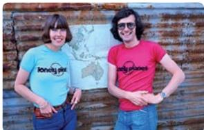

> **AI Description:**
> **Source:** `assets/_page_38_Figure_0.jpg`
> 
> **Generated:** 2026-06-01 19:44:11
> 
> ---
> 
> The image is a photograph featuring two individuals standing in front of a corrugated metal wall with a map of Australia on it. The person on the left is wearing a light blue t-shirt with "Lonely Planet" printed on it, and the person on the right is wearing a red t-shirt with "Lonely Planet" printed on it as well. Both individuals are smiling and appear to be in a casual setting, possibly related to travel or exploration, given the context of the "Lonely Planet" branding. The map in the background suggests a focus on Australian geography or travel.

## Our Story

A beat-up old car, a few dollars in the pocket and a sense of adventure. In 1972 that’s all Tony and Maureen Wheeler needed for the trip of a lifetime – across Europe and Asia overland to Australia. It took several months, and at the end – broke but inspired – they sat at their kitchen table writing and stapling together their first travel guide, Across Asia on the Cheap. Within a week they’d sold 1500 copies. Lonely Planet was born. Today, Lonely Planet has offices in Franklin, London,

Melbourne, Oakland, Dublin, Beijing and Delhi, with more than 600 staff and writers. We share Tony’s belief that ‘a great guidebook should do three things: inform, educate and amuse’.

## Our Writers

## Alison Bing

## Downtown, Civic Center & SoMa; North Beach & Chinatown; The Mission & Potrero Hill; Golden Gate Park & the Avenues; The Haight, NoPa & Hayes

Valley Alison has done most things travelers are supposed to do and many you definitely shouldn’t, including making room for the chickens, accepting dinner invitations from cults, and trusting the camel to know the way. She has survived to tell tales for Lonely Planet, NPR, BBC Travel, the Telegraph, New York Times and other global media. Alison also wrote the Plan Your Trip and Understand San Francisco sections.

## John A Vlahides

The Marina, Fisherman’s Wharf & the Piers; Nob Hill, Russian Hill & Fillmore; The Castro & Noe Valley John A Vlahides has been a cook in a Parisian bordello, luxury-hotel concierge, television host, safety monitor in a sex club, French-English interpreter, and he is one of Lonely Planet’s most experienced and prolific guidebook authors. A native New Yorker living in San Francisco, John has contributed to 18 Lonely Planet guidebooks since 2003, ranging from

California and the western United States to the Dubai guide. He is co-host of the TV series Lonely Planet: Roads Less Travelled (National Geographic Adventure).

## Sara Benson

Day Trips from San Francisco After graduating from college in Chicago, Sara jumped on a plane to California with one suitcase and just \$100 in her pocket. She landed in San Francisco, and today she makes her home in Oakland, just across the Bay. She also spent three years living in Japan, after which she followed her wanderlust around Asia and the Pacific before returning to the USA, where she has worked as a teacher, a journalist, a nurse and a national park

ranger. To keep up with Sara’s latest travel adventures, read her blog, The Indie Traveler (indie traveler.blogspot.com) and follow her on Twitter (@indie\_traveler) and Instagram (indietraveler).

## Ashley Harrell

Day Trips from San Francisco After a brief stint selling day spa coupons doorto-door in South Florida, Ashley decided she’d rather be a writer. She went to journalism grad school, convinced a newspaper to hire her, and starting covering wildlife, crime and tourism, sometimes all in the same story. Fueling her zest for storytelling and the unknown, she traveled widely and moved often, from a tiny NYC apartment to a vast California ranch to a jungle cabin in Costa Rica,

where she started writing for Lonely Planet. From there her travels became more exotic and farther flung, and she still laughs when paychecks arrive.

## Published by Lonely Planet Global Limited

CRN 554153

11th edition – Dec 2017   
ISBN 978 1 78657 354 4   
© Lonely Planet 2017 Photographs © as indicated 2017   
10 9 8 7 6 5 4 3 2 1   
Printed in China

Although the authors and Lonely Planet have taken all reasonable care in preparing this book, we make no warranty about the accuracy or completeness of its content and, to the maximum extent permitted, disclaim all liability arising from its use.

All rights reserved. No part of this publication may be copied, stored in a retrieval system, or transmitted in any form by any means, electronic, mechanical, recording or otherwise, except brief extracts for the purpose of review, and no part of this publication may be sold or hired, without the written permission of the publisher. Lonely Planet and the Lonely Planet logo are trademarks of Lonely Planet and are registered in the US Patent and Trademark Office and in other countries. Lonely Planet does not allow its name or logo to be appropriated by commercial establishments, such as retailers, restaurants or hotels. Please let us know of any misuses: lonelyplanet.com/ip.

© Lonely Planet Publications Pty Ltd. To make it easier for you to use, access to this chapter is not digitally restricted. In return, we think it’s fair to ask you to use it for personal, non-commercial purposes only. In other words, please don’t upload this chapter to a peer-to-peer site, mass email it to everyone you know, or resell it. See the terms and conditions on our site for a longer way of saying the above - ‘Do the right thing with our content.’