<span id="page-0-0"></span>
Wireless Noise Canceling Stereo Headset WH-1000XM4

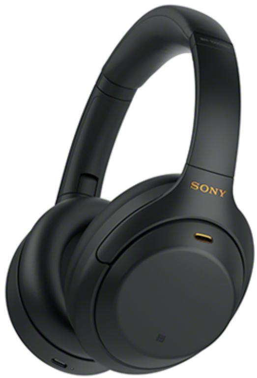

> **AI Description:**
> **Source:** `assets/_page_0_Figure_0.jpg`
> 
> **Generated:** 2026-06-01 23:02:15
> 
> ---
> 
> The image shows a pair of black Sony over-ear headphones. The headphones have a sleek design with a padded headband and ear cups. The Sony logo is visible on the side of the ear cup. The image highlights the headphones' design and branding, with no additional text or visual elements beyond the product itself.


Use this manual if you encounter any problems, or have any questions.   
Update the software of the headset and “Sony | Headphones Connect” app to the latest version. For details, refer to the following:   
https://www.sony.net/elesupport/

## Getting started

What you can do with the Bluetooth function

About the voice guidance

## Supplied accessories

Checking the package contents

Setting the headset in the carrying case

## Parts and controls

Location and function of parts

About the indicator

## Wearing the headset

<span id="page-1-0"></span>
## Power/Charging

Charging the headset

Available operating time

Checking the remaining battery charge

Turning on the headset

Turning off the headset

## Making connections

How to make a wireless connection to Bluetooth devices

## Easy setup with app

Connecting with the “Sony | Headphones Connect” app

## Android smartphone

Pairing and connecting with an Android smartphone

Connecting to a paired Android smartphone

One-touch connection (NFC) with an Android smartphone

Disconnecting the Android smartphone with one-touch (NFC)

Switching the device by one-touch (NFC)

## iPhone (iOS devices)

Pairing and connecting with an iPhone

Connecting to a paired iPhone

## Computers

Pairing and connecting with a computer (Windows 10)

Pairing and connecting with a computer (Windows 8.1)

Pairing and connecting with a computer (Mac)

Connecting to a paired computer (Windows 10)

Connecting to a paired computer (Windows 8.1)

Connecting to a paired computer (Mac)

## Other Bluetooth devices

Pairing and connecting with a Bluetooth device

Connecting to a paired Bluetooth device

<span id="page-2-0"></span>
## Multipoint connection

Connecting the headset to both a music player and a smartphone / mobile phone (multipoint connection)

Connecting the headset to 2 Android smartphones (multipoint connection)

Connecting the headset to an Android smartphone and an iPhone (multipoint connection)

Connecting the headset to 2 devices simultaneously (multipoint connection)

Disconnecting Bluetooth connection (after use)

Using the supplied headphone cable

## Listening to music

Listening to music via a Bluetooth connection

Listening to music from a device via Bluetooth connection

Controlling the audio device (Bluetooth connection)

Disconnecting Bluetooth connection (after use)

## Noise canceling function

What is noise canceling?

Using the noise canceling function

Optimizing the noise canceling function to suit the wearer (NC Optimizer)

## Listening to ambient sound

Listening to ambient sound during music playback (Ambient Sound Mode)

Listening to ambient sound quickly (Quick Attention Mode)

Speaking with someone while wearing the headset (Speak-to-Chat)

## Sound quality mode

About the sound quality mode

## Supported codecs

## About the DSEE Extreme function

## Making phone calls

Making a video call on a computer

<span id="page-3-0"></span>


## Sound

No sound

<span id="page-4-0"></span>
Sound skips frequently.

The effect of noise canceling is not sufficient.

## Bluetooth connection

Pairing cannot be done.

One-touch connection (NFC) does not work.

Unable to make a Bluetooth connection.

Distorted sound

The headset does not operate properly.

Cannot hear a person on a call.

Low voice from callers

The touch sensor control panel does not respond correctly

The headset reacts incorrectly.

## Resetting or initializing the headset

Resetting the headset

Initializing the headset to restore factory settings

<span id="page-5-0"></span>
Wireless Noise Canceling Stereo Headset WH-1000XM4

## What you can do with the Bluetooth function

The headset uses BLUETOOTH® wireless technology, allowing you to do the following.

## Listening to music

You can receive audio signals from a smartphone or music player to enjoy music wirelessly.


> **AI Description:**
> **Source:** `assets/_page_5_Figure_0.jpg`
> 
> **Generated:** 2026-06-01 23:12:25
> 
> ---
> 
> The image contains a simple line drawing of a smartphone with a rectangular shape and three buttons at the bottom. The drawing is enclosed within a rounded rectangle, resembling a case or bag. The image is minimalistic and does not include any text or additional visual elements.


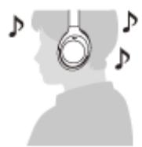

> **AI Description:**
> **Source:** `assets/_page_5_Figure_2.jpg`
> 
> **Generated:** 2026-06-01 23:09:37
> 
> ---
> 
> The image contains a simple illustration of a person wearing headphones with musical notes around their head. The illustration is minimalistic and uses grayscale tones. The musical notes suggest a theme of music or audio, possibly indicating the person is listening to or enjoying music.


## Talking on the phone

You can make and receive calls hands-free, while leaving your smartphone or mobile phone in your bag or pocket.


> **AI Description:**
> **Source:** `assets/_page_5_Figure_3.jpg`
> 
> **Generated:** 2026-06-01 23:10:50
> 
> ---
> 
> The image contains a simple line drawing of a smartphone with a rectangular shape and three buttons at the bottom. The drawing is enclosed within a rounded rectangle, resembling a case or bag. There are no charts, graphs, or other visual elements present. The image is a minimalist representation of a smartphone and its case.


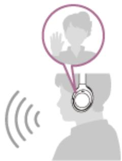

> **AI Description:**
> **Source:** `assets/_page_5_Figure_5.jpg`
> 
> **Generated:** 2026-06-01 23:13:55
> 
> ---
> 
> The image is a diagram illustrating a communication or interaction scenario. It features a person with headphones, suggesting audio or voice communication. A wave pattern emanates from the headphones, indicating sound or audio transmission. Above the person's head, a circular icon with a figure waving is present, symbolizing a greeting or acknowledgment. The overall image conveys a concept of communication, possibly in a virtual or online context.


<span id="page-6-0"></span>
## About the voice guidance

In the factory setting, you will hear the English voice guidance in the following situations via the headset. You can change the language of the voice guidance and turn on/off the voice guidance using “Sony | Headphones Connect” app. For more details, refer to the “Sony | Headphones Connect” app help guide. https://rd1.sony.net/help/mdr/hpc/h\_zz/

When the headset is turned on: “Power on”

When the headset is turned off: “Power off”

When entering pairing mode: “Bluetooth pairing”

When establishing a Bluetooth connection: “Bluetooth connected”

For the first multipoint connection, when establishing a Bluetooth connection between the second device and the headset: “Bluetooth 2nd Device Connected” (\*)

For the multipoint connection, when establishing a Bluetooth connection between the first device and the headset: “Bluetooth Device1 Connected” (\*)

For the multipoint connection, when establishing a Bluetooth connection between the second device and the headset: “Bluetooth Device2 Connected” (\*)

When disconnecting a Bluetooth connection: “Bluetooth disconnected”

For the multipoint connection, when disconnecting the Bluetooth connection between the first device and the headset: “Bluetooth Device1 Disconnected” (\*)

For the multipoint connection, when disconnecting the Bluetooth connection between the second device and the headset: “Bluetooth Device2 Disconnected” (\*)

For the multipoint connection, when connecting the third device to the headset, disconnecting the Bluetooth connection between the first device and the headset, and switching the connection: “Bluetooth Device1 Replaced” (\*)

For the multipoint connection, when connecting the third device to the headset, disconnecting the Bluetooth connection between the second device and the headset, and switching the connection: “Bluetooth Device2 Replaced” (\*)

When informing the remaining battery charge: “Battery about XX %” (The “XX” value indicates the approximate remaining charge. Use it as a rough estimate.) / “Battery fully charged”

When the remaining battery charge is low: “Low battery, please recharge headset”

When automatically turning off due to low battery: “Please recharge headset. Power off”

When turning on the noise canceling function: “Noise canceling”

When turning on the Ambient Sound Mode: “Ambient sound”

When turning off the noise canceling function and Ambient Sound Mode: “Ambient Sound Control off”

When the NC Optimizer starts: “Optimizer start”

When the NC Optimizer finishes: “Optimizer finished”

When Speak-to-Chat is enabled: “Speak-to-chat activated”

When Speak-to-Chat is disabled: “Speak-to-chat deactivated”

When the Google Assistant is not available on the smartphone connected to the headset even if you press the Google Assistant button on the headset: “The Google Assistant is not connected”

When the Google Assistant is not available during software update: “The Google assistant is not available during update. Please wait a moment until the update completes.”

When Amazon Alexa is not available on the smartphone connected to the headset even if you press the Amazon Alexa button on the headset: “Either your mobile device isn’t connected; or you need to open the Alexa App and try again”

Available only when [Connect to 2 devices simultaneously] is turned to on with the “Sony | Headphones Connect” app.

## Note

It takes about 20 minutes when you change the language of the voice guidance.

<span id="page-7-0"></span>
When you initialize the headset to restore the factory settings after you change the language of the voice guidance, the language will also return to the factory setting.

If the voice guidance is not heard after changing the voice guidance language or updating the software, turn the headset off and on again.

<span id="page-8-0"></span>
Wireless Noise Canceling Stereo Headset WH-1000XM4

## Checking the package contents

After opening the package, check that all of the items in the list are included. If any items are missing, contact your dealer.

Numbers in ( ) indicate the item amount.

Wireless Noise Canceling Stereo Headset

USB Type-C® cable (USB-A to USB-C®) (approx. 20 cm (7.88 in.)) (1)

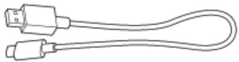

> **AI Description:**
> **Source:** `assets/_page_8_Figure_0.jpg`
> 
> **Generated:** 2026-06-01 23:07:37
> 
> ---
> 
> The image contains a simple line drawing of a USB cable. The drawing depicts a USB connector at one end and a standard USB-A connector at the other. The cable is shown with a slight bend, giving a sense of its flexibility. The drawing is minimalistic, focusing solely on the shape and basic structure of the cable without any additional labels or annotations.


Headphone cable (approx. 1.2 m (47.25 in.)) (1)

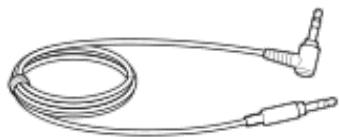

> **AI Description:**
> **Source:** `assets/_page_8_Figure_1.jpg`
> 
> **Generated:** 2026-06-01 23:07:54
> 
> ---
> 
> The image depicts a coiled cable with a 3.5mm audio jack at one end and a 3.5mm audio jack at the other end. The cable appears to be a standard audio cable used for connecting audio devices, such as headphones or speakers, to audio sources like smartphones, computers, or other audio equipment. The cable is shown in a coiled state, suggesting it is not currently in use.


Carrying case (1)

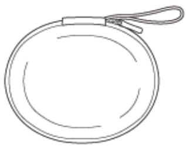

> **AI Description:**
> **Source:** `assets/_page_8_Figure_2.jpg`
> 
> **Generated:** 2026-06-01 23:09:08
> 
> ---
> 
> The image contains a simple line drawing of a circular object with a handle or loop at the top. The object appears to be a round pouch or bag, possibly a coin purse or a small bag with a strap. The drawing is minimalistic, with no additional details or text annotations.


Plug adaptor for in-flight use (1)

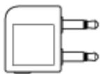

> **AI Description:**
> **Source:** `assets/_page_8_Figure_3.jpg`
> 
> **Generated:** 2026-06-01 23:08:46
> 
> ---
> 
> The image is a simple line drawing of an electrical plug. It features a rectangular shape with rounded corners, and two prongs extending from the bottom. The design is minimalistic and does not contain any text or additional visual elements.


<span id="page-9-0"></span>
Wireless Noise Canceling Stereo Headset WH-1000XM4

## Setting the headset in the carrying case

When you have finished using the headset, rotate the left and right units to flatten the headset, fold one unit toward the headband, and store them in the supplied carrying case.

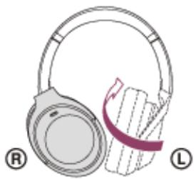

> **AI Description:**
> **Source:** `assets/_page_9_Figure_0.jpg`
> 
> **Generated:** 2026-06-01 23:06:09
> 
> ---
> 
> The image is a diagram illustrating the adjustment of a pair of over-ear headphones. It shows the left side of the headphones with a red arrow indicating the direction to fold the ear cups inward. The letters "R" and "L" are used to denote the right and left sides of the headphones, respectively. The diagram is simple and serves as a guide for adjusting the headphones to a compact or travel-friendly position.


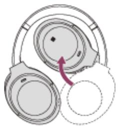

> **AI Description:**
> **Source:** `assets/_page_9_Figure_1.jpg`
> 
> **Generated:** 2026-06-01 23:05:37
> 
> ---
> 
> The image is a diagram illustrating the folding mechanism of a pair of headphones. It shows a circular headband with a hinge point indicated by a small black dot. The diagram includes a purple arrow indicating the direction in which the headband can be folded, suggesting a step-by-step guide for collapsing the headphones for storage or transport. The image is a technical illustration designed to convey the functionality of the headphones' design.


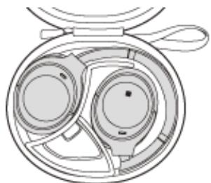

> **AI Description:**
> **Source:** `assets/_page_9_Figure_2.jpg`
> 
> **Generated:** 2026-06-01 23:06:33
> 
> ---
> 
> The image depicts a pair of over-ear headphones with a coiled cable. The headphones are shown in an open position, revealing the ear cups and the headband. The design appears to be modern, with a focus on comfort and style. The image is a technical illustration, likely used for product documentation or marketing materials.


To store the cables and plug adaptor for in-flight use

Put the cables and plug adaptor for in-flight use in the holder separated by the divider in the carrying case.

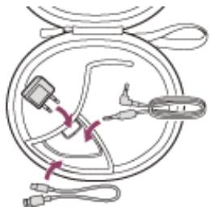

> **AI Description:**
> **Source:** `assets/_page_9_Figure_3.jpg`
> 
> **Generated:** 2026-06-01 23:06:59
> 
> ---
> 
> The image contains a technical illustration of a coiled cable with various connectors and a small electronic device. The cable is neatly coiled and features multiple connectors, including a USB connector and what appears to be a charging port. The device, which looks like a small electronic gadget, is connected to the cable via a wire. The illustration is likely used for instructional or technical purposes, possibly to demonstrate cable connections or the setup of a device.


<span id="page-10-0"></span>
Wireless Noise Canceling Stereo Headset WH-1000XM4

## Location and function of parts

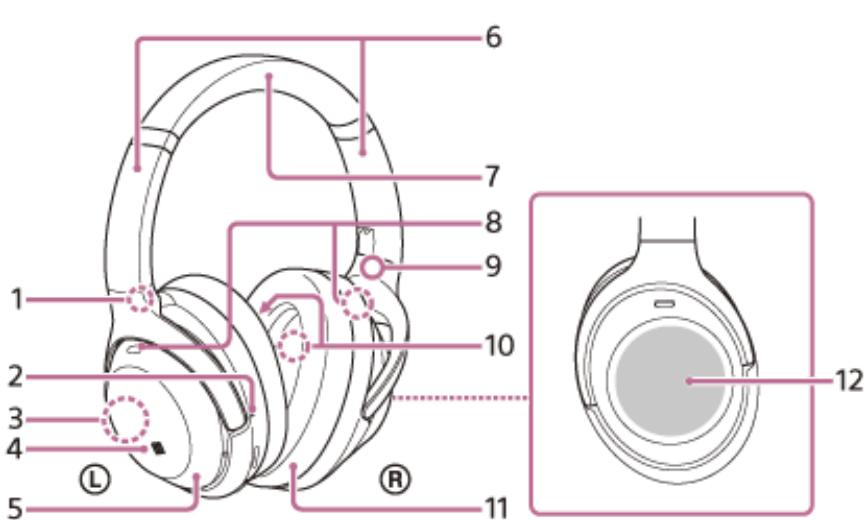

> **AI Description:**
> **Source:** `assets/_page_10_Figure_0.jpg`
> 
> **Generated:** 2026-06-01 23:12:46
> 
> ---
> 
> The image is a technical illustration of a pair of over-ear headphones. It includes various labeled parts of the headphones, such as the ear cups, headband, and ear cushions. The diagram is detailed, showing the structure and components of the headphones, which could be useful for assembly or repair purposes. The labels are numbered from 1 to 12, with each number pointing to a specific part of the headphones.


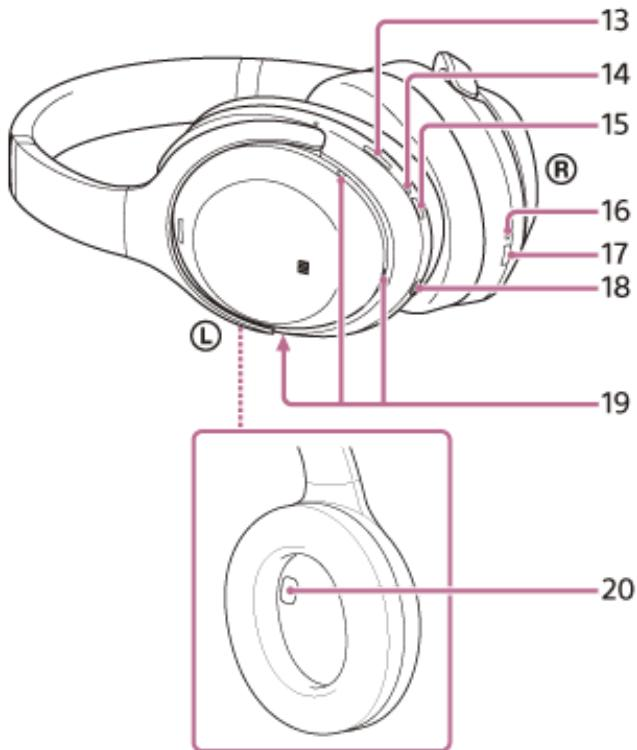

> **AI Description:**
> **Source:** `assets/_page_10_Figure_1.jpg`
> 
> **Generated:** 2026-06-01 23:14:14
> 
> ---
> 
> The image is a technical illustration of a pair of over-ear headphones. It includes labeled parts of the headphones, with numbers 13 through 20 pointing to various components. The labels are associated with specific parts of the headphones, such as the ear cups, headband, and other structural elements. The illustration is detailed and appears to be used for instructional or reference purposes.


1. (left) mark

Tactile dot 2. There is a tactile dot on the left unit.

Built-in antenna3. A Bluetooth antenna is built into the headset.

4. N-Mark   
5. Left unit Sliders (left, right) 6. Slide to adjust the length of the headband.

7. Headband

Noise canceling function microphones (external) (left, right)8. Pick up the sound of the noise when the noise canceling function is in use.

9. (right) mark

<span id="page-11-0"></span>
Noise canceling function microphones (internal) (left, right) 10. Pick up the sound of the noise when the noise canceling function is in use.

11. Right unit

Touch sensor control panel 12. Remotely controls music playback of the connected Bluetooth device or performs other operations using touch operation.

CUSTOM button13. Operate when switching the noise canceling function and Ambient Sound Mode, etc.

Indicator (red/blue)14. Lights up in red or blue to indicate the power or communication status of the headset.

15. (power) button

Charging indicator (red)16. Lights up in red while charging.

USB Type-C port 17. Connect the headset to an AC outlet via a commercially available USB AC adaptor or to a computer with the supplied USB Type-C cable to charge the headset.

Headphone cable input jack 18. Connect a music player, etc. using the supplied headphone cable. Make sure that you insert the cable until it clicks. If the plug is not connected correctly, you may not hear the sound properly.

Voice pickup microphones 19.

Pick up the sound of your voice when talking on the phone or in the Speak-to-Chat mode.

Proximity sensor 20.

Detects whether the headset is worn on the ears.

## Related Topic

About the indicator

Checking the remaining battery charge

<span id="page-12-0"></span>
## About the indicator

You can check various statuses of the headset by the indicator.

: Turns on in blue / : Turns on in red / -: Turns off

## Indicator (blue/red) next to the (power) button

## Turning on

\- (flashes twice in blue)

In this case, when the remaining battery charge is 10% or lower (requires charging), the indicator lights successively as follows.

(repeatedly flashes slowly in red for about 15 seconds)

## Turning off

(lights up in blue for about 2 seconds)

## Displaying the remaining battery charge

Remaining charge: More than 10%

\- (flashes twice in blue)

Remaining charge: 10% or lower (requires charging)

For details, see “Checking the remaining battery charge”.

## When the remaining battery charge becomes low

(repeatedly flashes slowly in red for about 15 seconds)

## Bluetooth function

Device registration (pairing) mode

\- - - - (repeatedly flashes twice in blue)

Not connected

\- - - - - - - - (repeatedly flashes in blue at about 1-second intervals)

Connection process completed

(repeatedly flashes quickly in blue for about 5 seconds)

Connected

(repeatedly flashes in blue at about 5-second intervals)

Incoming call

(repeatedly flashes quickly in blue)

The unconnected and connected status indications automatically turn off after a period of time has passed. They start flashing again for a period of time when some operation is performed. When the remaining battery charge becomes low, the indicator starts flashing in red.

## Other

<span id="page-13-0"></span>
Headphone cable connected (power is turned on)

\- - - - - - (repeatedly flashes in blue at about 5-second intervals)

The indicator turns off automatically after a period of time has passed. When the remaining battery charge becomes low, the indicator starts flashing in red.

Updating software

\- - (repeatedly flashes slowly in blue)

Initialization completed

(flashes 4 times in blue)

For details, see “Initializing the headset to restore factory settings”.

## USB Type-C port charging indicator (red)

## Charging

While charging

(lights up in red)

The indicator turns off after charging is complete.

Abnormal temperature

\- - - - (repeatedly flashes twice in red)

Abnormal charging

\- (repeatedly flashes slowly in red)

## Related Topic

Checking the remaining battery charge

Initializing the headset to restore factory settings

<span id="page-14-0"></span>
## Wearing the headset

## 1 Put the headset on your ears.

Adjust the length of the headband.

Put the headset on your head with the (left) mark on your left ear and the (right) mark on your right ear.   
There is a tactile dot on the (left) mark side.

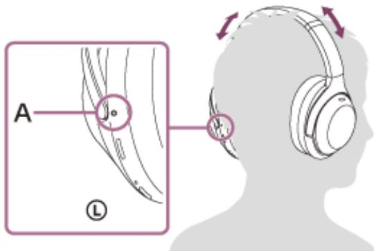

> **AI Description:**
> **Source:** `assets/_page_14_Figure_0.jpg`
> 
> **Generated:** 2026-06-01 23:00:56
> 
> ---
> 
> The image is a technical illustration showing a close-up of a headphone earpad and a side view of a person wearing over-ear headphones. The close-up highlights a specific area labeled "A" on the earpad, which appears to be a small adjustment or control mechanism. The side view of the headphones shows the headband and ear cups, with arrows indicating the flexibility of the headband. The image is likely part of an instructional guide or product manual for adjusting or using the headphones.


A: Tactile dot

## When attaching and removing the headset

In the factory setting, the built-in proximity sensor in the left unit and the built-in acceleration sensors in each of the left and right units detect when the headset is attached to or removed from your ears, and the headset automatically controls the touch sensor control panel’s operation, powering off, pausing music playback, etc. (Wearing detection).

## When the headset is worn

The indicator next to the (power) button turns off.

You can use the touch sensor control panel of the headset to play music, make and receive calls, etc.

## When the headset is removed

When you listen to music while wearing the headset on your ears, the headset will pause music playback automatically if the headset is removed. When the headset is worn again, the headset resumes music playback.

In order to save the battery, the headset will automatically turn off after 15 minutes of not being worn.

In order to prevent the headset from reacting incorrectly, music playback, making and receiving calls, and other operations cannot be performed when the headset is removed, even if you tap the touch sensor control panel.

When you are talking on the headset while wearing the headset on your ears, the call is automatically switched to the smartphone or mobile phone if the headset is removed. When you put the headset on your ears again, the call is switched to the headset.

## Hint

By using the “Sony | Headphones Connect” app, you can change the settings of the wearing detection automatic music playback pause and resume function and the wearing detection automatic power off function (the battery saving function).

## Note

In the following cases, wearing detection may react incorrectly.

<span id="page-15-0"></span>


> **AI Description:**
> **Source:** `assets/_page_15_Figure_0.jpg`
> 
> **Generated:** 2026-06-01 22:57:25
> 
> ---
> 
> The image contains a simple illustration. It features a magnifying glass held in front of a silhouette of a person's head. To the left of the silhouette is a prohibition symbol, indicating a "no" or "forbidden" action. The image likely represents the concept of searching or examining something, possibly with a restriction or prohibition associated with the subject being examined.

Put your hand inside the earpad of the left unit

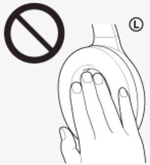

> **AI Description:**
> **Source:** `assets/_page_15_Figure_1.jpg`
> 
> **Generated:** 2026-06-01 22:58:05
> 
> ---
> 
> The image contains a diagram illustrating a hand gesture. The diagram shows a hand with fingers slightly curled, and there is a prohibition symbol (a circle with a diagonal line through it) above the hand, indicating that the gesture is not allowed or should be avoided. The letter "L" is placed in the top right corner, which might denote a label or a reference to the left side of the body. The image is a simple line drawing with no additional colors or background details.

Put the headset up and put it in a bag, etc.

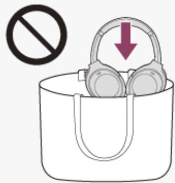

> **AI Description:**
> **Source:** `assets/_page_15_Figure_2.jpg`
> 
> **Generated:** 2026-06-01 22:59:11
> 
> ---
> 
> The image contains a diagram with a prohibition symbol (a circle with a diagonal line through it) above a bag. Inside the bag, there is a pair of headphones with an arrow pointing downward. The prohibition symbol suggests that the bag should not be used to store the headphones.

Put the headset up and hang it on a bag, etc.

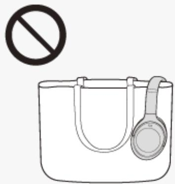

> **AI Description:**
> **Source:** `assets/_page_15_Figure_3.jpg`
> 
> **Generated:** 2026-06-01 22:58:21
> 
> ---
> 
> The image contains a simple line drawing of a bag with a pair of headphones hanging from it. Above the bag, there is a circular symbol with a diagonal line through it, indicating prohibition or restriction. The image is likely used to convey a message about not carrying certain items, possibly in a travel or security context.


When you wear the headset with your face up or down as shown below, or when you wear the headset upside down, wearing detection may not work properly, and the touch sensor control panel and CUSTOM button may not be available for operation. Wear the headset correctly while facing forward, or press the (power) button briefly.   
Wearing the headset while lying down or with your face up

<span id="page-16-0"></span>
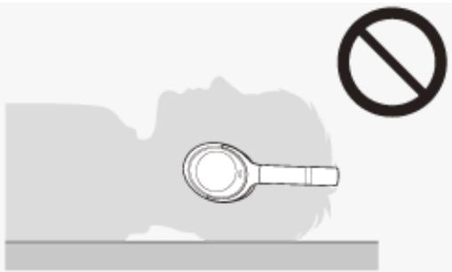

> **AI Description:**
> **Source:** `assets/_page_16_Figure_0.jpg`
> 
> **Generated:** 2026-06-01 23:10:17
> 
> ---
> 
> The image contains a simple diagram with a magnifying glass icon placed on a surface, likely representing a magnifying glass or loupe. Above the magnifying glass, there is a prohibition symbol, indicating that the use of a magnifying glass is not allowed or is restricted in the context of the image. The background is plain, with no additional visual elements or text.


Wearing the headset with your face down

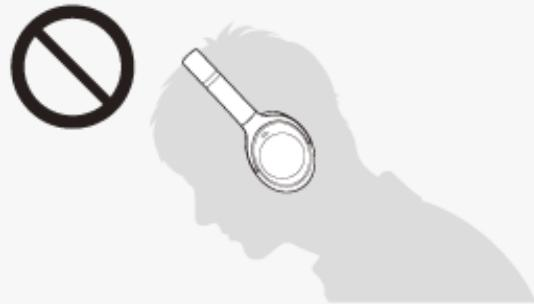

> **AI Description:**
> **Source:** `assets/_page_16_Figure_1.jpg`
> 
> **Generated:** 2026-06-01 23:10:01
> 
> ---
> 
> The image contains a simple diagram with a silhouette of a person's head and a magnifying glass. The magnifying glass is positioned near the person's head, suggesting an emphasis on examining or analyzing the person's thoughts or mind. The presence of a prohibition symbol in the top left corner implies that the act of magnifying or analyzing the person's thoughts is not allowed or is discouraged.


When you wear the headset over a cap, a scarf, hair, etc., wearing detection may not work properly, and the touch sensor control panel may not be available for operation. Wear the headset so that your ears are inside the earpads.

When the supplied headphone cable is connected to the headset, wearing detection does not work.

The wearing detection automatic music playback pause and resume function is only available when connected via Bluetooth connection.

The connected device or playback application you are using may not support the wearing detection automatic music playback pause and resume function.

When attaching and removing the headset, the call is switched only when the wearing detection automatic power off function is enabled.

If the proximity sensor part inside the left unit housing gets fogged up or there are water droplets on it due to condensation or humidity from sweat, etc., wearing detection may not work properly. When the sensor part is fogged up or there are water droplets on it, leave the proximity sensor part facing up until the moisture disappears.

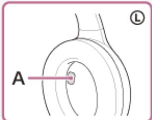

> **AI Description:**
> **Source:** `assets/_page_16_Figure_2.jpg`
> 
> **Generated:** 2026-06-01 23:11:34
> 
> ---
> 
> The image is a technical illustration of an ear, specifically the outer ear, with a focus on a labeled area. The illustration is a line drawing with a pink border and includes a label "A" pointing to a specific part of the ear. The letter "L" in the top right corner likely indicates the left side of the ear. The image is likely used for educational or instructional purposes, such as in a medical or hearing aid context.


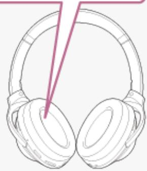

> **AI Description:**
> **Source:** `assets/_page_16_Figure_3.jpg`
> 
> **Generated:** 2026-06-01 23:11:56
> 
> ---
> 
> The image contains a line drawing of a pair of over-ear headphones. The drawing is simple, with a focus on the headphones' design, including the ear cups and headband. There are no additional labels or annotations within the image. The style is minimalistic, likely intended to represent a generic or conceptual depiction of headphones rather than a specific brand or model.

A: Proximity sensor part

## Related Topic

What you can do with the “Sony | Headphones Connect” app

<span id="page-18-0"></span>
## Charging the headset

## Warning

The headset is not waterproof. If water or foreign matter enters the headset, it may result in fire or electric shock. If water or foreign matter enters the headset, stop use immediately and consult your nearest Sony dealer. In particular, be careful in the following cases.

When using the headset near a sink or liquid container

Be careful that the headset does not fall into a sink or container filled with water.

When using the headset in the rain or snow, or in locations with high humidity

When using the headset while you are perspiring

If you touch the headset with wet hands, or put the headset in the pocket of a damp article of clothing, the headset may get wet.

The headset contains a built-in lithium-ion rechargeable battery. Use the supplied USB Type-C cable to charge the headset before use.

## 1 Connect the headset to an AC outlet.

Use the supplied USB Type-C cable and a commercially available USB AC adaptor.

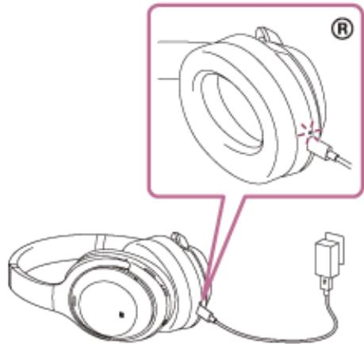

> **AI Description:**
> **Source:** `assets/_page_18_Figure_0.jpg`
> 
> **Generated:** 2026-06-01 23:05:23
> 
> ---
> 
> The image is a technical illustration of a pair of over-ear headphones. It includes a close-up view of the earcup, highlighting a specific feature near the connection point of the earcup and the headband. The illustration shows a cable with a connector, indicating the method of connection for the headphones. The image is likely used for instructional or technical purposes, such as assembly or maintenance instructions.


The charging indicator (red) of the headset lights up.

Charging is completed in about 3 hours (\*) and the indicator turns off automatically.

Time required for charging the empty battery to its full capacity. The charging time may differ depending on the conditions of use.

After charging is complete, disconnect the USB Type-C cable.

## System requirements for battery charge using USB

## USB AC adaptor

A commercially available USB AC adaptor capable of supplying an output current of 1.5 A or more

(If the output current is less than 1.5 A, the charging time will increase, and the music playback time after 10 minutes of charging will decrease.)

## Personal computer

Personal computer with a standard USB port

<span id="page-19-0"></span>
We do not guarantee operation on all computers.

Operations using a custom-built or homebuilt computer are not guaranteed.

## Hint

The headset can be also charged by connecting the headset to a running computer using the supplied USB Type-C cable.

If charging starts while the headset is on, the headset will turn off automatically.

## Note

Charging may not be successful with cables other than the supplied USB Type-C cable.

Charging may not be successful depending on the type of USB AC adaptor.

When the headset is connected to an AC outlet or computer, all operations such as turning on the headset, registering or connecting to Bluetooth devices, and music playback cannot be performed.

The headset cannot be charged when the computer goes into standby (sleep) or hibernation mode. In this case, change the computer settings, and start charging once again.

If the headset is not used for a long time, the rechargeable battery usage hours may be reduced. However, the battery life will improve after a few charges and discharges. If you store the headset for a long time, charge the battery once every 6 months to avoid over-discharge.

If the headset is not used for a long time, it may take longer to charge the battery.

If the headset detects a problem while charging due to the following causes, the charging indicator (red) flashes. In this case, charge once again within the charging temperature range. If the problem persists, consult your nearest Sony dealer.

Ambient temperature exceeds the charging temperature range of $5 ^ { \circ } C - 3 5 ^ { \circ } C ( 4 1 ^ { \circ } F - 9 5 ^ { \circ } F )$

There is a problem with the rechargeable battery.

If the headset is not used for a long time, the charging indicator (red) may not immediately light up when charging. Please wait a moment until the indicator lights up.

If the usage hours of the built-in rechargeable battery decrease significantly, the battery should be replaced. Consult your nearest Sony dealer to replace the rechargeable battery.

Avoid exposure to extreme temperature changes, direct sunlight, moisture, sand, dust, and electrical shock. Never leave the headset in a parked vehicle.

When connecting the headset to a computer, use only the supplied USB Type-C cable, and make sure to connect them directly. Charging will not be properly completed when the headset is connected through a USB hub.

<span id="page-20-0"></span>
## Available operating time

The available operating times of the headset with the battery fully charged are as follows:

## Bluetooth connection

## Music playback time


About 5 hours of music playback is possible after 10 minutes charging.
When Speak-to-Chat is set to “Enable (ON)”, the available operating time is shortened by about 30% compared to the case of “Disable (OFF)”.

## Communication time


<span id="page-21-0"></span>
## Standby time


## Headphone cable connected (power is turned on)


## Hint

By using the “Sony | Headphones Connect” app, you can check which codec is used for a connection or switch the DSEE Extreme function.

## Note

Usage hours may be different depending on the settings and conditions of use.

## Related Topic

Supported codecs

About the DSEE Extreme function

What you can do with the “Sony | Headphones Connect” app

<span id="page-22-0"></span>
## Checking the remaining battery charge

You can check the remaining battery charge of the rechargeable battery.

When you press the (power) button while the headset is on, a voice guidance indicating the remaining battery charge can be heard.

“Battery about XX %” (The “XX” value indicates the approximate remaining charge.)

“Battery fully charged”

The remaining battery charge indicated by the voice guidance may differ from the actual remaining charge in some cases. Please use it as a rough estimate.

In addition, the indicator (red) flashes for about 15 seconds if the remaining battery charge is 10% or lower when the headset is turned on.

## When the remaining charge becomes low

A warning beep sounds and the color of the operating indicator (blue) becomes red. If you hear the voice guidance say, “Low battery, please recharge headset”, charge the headset as soon as possible.

When the battery becomes completely empty, a warning beep sounds, the voice guidance says, “Please recharge headset. Power off”, and the headset automatically turns off.

## When you are using iPhone or iPod touch

When the headset is connected to an iPhone or iPod touch over an HFP Bluetooth connection, it will show an icon that indicates the remaining battery charge of the headset on the screen of the iPhone or iPod touch.

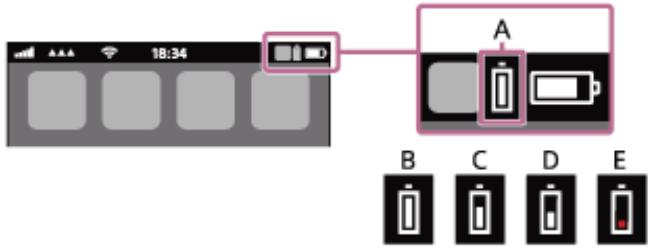

> **AI Description:**
> **Source:** `assets/_page_22_Figure_0.jpg`
> 
> **Generated:** 2026-06-01 23:01:28
> 
> ---
> 
> The image is a technical illustration showing a smartphone status bar with battery indicators. The status bar displays the time as 18:34 and various connectivity icons. The battery icon in the status bar is highlighted and shows a low battery level. Below the status bar, there is a zoomed-in view of the battery icon, labeled as "A". The zoomed-in view is compared to four different battery icon representations labeled B, C, D, and E. The battery icon in the status bar is most similar to icon E, which is a red battery icon with a red line through it, indicating a critically low battery level.


A: Remaining battery charge of the headset

The approximate remaining charge is shown at 10 different levels. B through E are display examples.

B: 100%

C: 70%

D: 50%

E: 10% or lower (requires charging)

The remaining battery charge of the headset is also displayed on the widget of an iPhone or iPod touch running iOS 9 or later. For more details, refer to the operating instructions supplied with the iPhone or iPod touch.

The remaining charge which is displayed may differ from the actual remaining charge in some cases. Please use it as a rough estimate.

## When you are using an Android™ smartphone (OS 8.1 or later)

When the headset is connected to an Android smartphone via HFP Bluetooth connection, select [Settings] - [Device connection] - [Bluetooth] to display the remaining battery charge of the headset where the paired Bluetooth device is displayed on the smartphone’s screen. It is displayed in 10 different levels such as “100%”, “70%”, “50%”, or “10%”. For details, refer to the operating instructions of the Android smartphone.

The remaining charge which is displayed may differ from the actual remaining charge in some cases. Please use it as a rough estimate.

<span id="page-23-0"></span>
## Hint

You can also check the remaining battery charge with the “Sony | Headphones Connect” app. Android smartphones and iPhone/iPod touch both support this app.

## Note

If you connect the headset to an iPhone/iPod touch or Android smartphone with “Media audio” (A2DP) only in a multipoint connection, the remaining battery charge will not be displayed correctly.

The remaining battery charge may not be properly displayed immediately after a software update or if the headset has not been used for a long time. In this case, repeatedly charge and discharge the battery multiple times to properly display the remaining battery charge.

## Related Topic

About the indicator

What you can do with the “Sony | Headphones Connect” app

<span id="page-24-0"></span>
## Turning on the headset

Press and hold the (power) button for about 2 seconds until the indicator (blue) flashes.


> **AI Description:**
> **Source:** `assets/_page_24_Figure_0.jpg`
> 
> **Generated:** 2026-06-01 22:59:23
> 
> ---
> 
> The image is a diagram of a magnetic field around a coil of wire. The diagram shows concentric circles representing the magnetic field lines, with the direction of the field indicated by the arrows. The label "L" is placed at the top left, likely indicating the direction of the current in the coil. The central dot represents the center of the coil, and the magnetic field lines are concentric circles around it, indicating that the magnetic field is strongest near the center of the coil and weaker as it moves away from the center.


Related Topic

Turning off the headset

<span id="page-25-0"></span>
## Turning off the headset

Press and hold the (power) button for about 2 seconds until the indicator (blue) turns off.

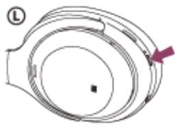

> **AI Description:**
> **Source:** `assets/_page_25_Figure_0.jpg`
> 
> **Generated:** 2026-06-01 23:01:40
> 
> ---
> 
> The image is a diagram of a magnetic field around a solenoid. It shows concentric circles representing the magnetic field lines, with the direction indicated by the arrow. The label "L" at the top left corner likely refers to the length of the solenoid. The central dot represents the axis of the solenoid, and the magnetic field lines are shown to be circular and concentric around this axis, indicating a uniform magnetic field.


## Hint

You can also turn off the headset with the “Sony | Headphones Connect” app.

The headset will automatically turn off after 15 minutes of not being worn. This setting can be changed using the “Sony | Headphones Connect” app.

When storing the headset in a bag, etc., turn off the headset. Wearing detection may react incorrectly.

## Related Topic

Turning on the headset

What you can do with the “Sony | Headphones Connect” app

<span id="page-26-0"></span>
Wireless Noise Canceling Stereo Headset

WH-1000XM4

## How to make a wireless connection to Bluetooth devices

You can enjoy music and hands-free calling with the headset wirelessly by using your Bluetooth device’s Bluetooth function.

## Device registration (pairing)

To use the Bluetooth function, both of the connecting devices must be registered in advance. The operation to register a device is called “device registration (pairing)”.

If the device to be connected does not support one-touch connection (NFC), pair the headset and the device manually. If the device supports one-touch connection (NFC), you can pair the headset and device and establish a Bluetooth connection by simply touching the headset with the device.

## Connecting to a paired device

Once a device and the headset are paired, there is no need to pair them again. Connect to devices already paired with the headset using the methods necessary for each device.

<span id="page-27-0"></span>
Wireless Noise Canceling Stereo Headset WH-1000XM4

## Connecting with the “Sony | Headphones Connect” app

Launch the “Sony | Headphones Connect” app on your Android smartphone/iPhone to connect the headset to a smartphone or iPhone. For more details, refer to the “Sony | Headphones Connect” app help guide. https://rd1.sony.net/help/mdr/hpc/h\_zz/


> **AI Description:**
> **Source:** `assets/_page_27_Figure_0.jpg`
> 
> **Generated:** 2026-06-01 23:11:08
> 
> ---
> 
> The image contains a single icon of a pair of headphones on a yellow circular background. The icon is simple and does not include any text or additional visual elements. It is likely used to represent audio or music-related content.


## Sony Headphones Connect


## Note

The connection with some smartphones and iPhone devices may become unstable when connecting using the “Sony | Headphones Connect” app. In that case, follow the procedures in “Connecting to a paired Android smartphone”, or “Connecting to a paired iPhone ” to connect to the headset.

## Related Topic

Connecting to a paired Android smartphone

Connecting to a paired iPhone

What you can do with the “Sony | Headphones Connect” app

Installing the “Sony | Headphones Connect” app

<span id="page-28-0"></span>
## Pairing and connecting with an Android smartphone

The operation to register the device that you wish to connect to is called “pairing”. First, pair a device to use it with the headset for the first time.

Before starting the operation, make sure of the following:

The Android smartphone is placed within 1 m (3 feet) of the headset.

The headset is charged sufficiently.

The operating instructions of the Android smartphone is in hand.

## 1 Enter pairing mode on this headset.

Turn on the headset when you pair the headset with a device for the first time after you bought it or after you initialized the headset (the headset has no pairing information). The headset enters pairing mode automatically. In this case, proceed to step 2.

When you pair a second or subsequent device (the headset has pairing information for other devices), press and hold the (power) button for about 7 seconds.


> **AI Description:**
> **Source:** `assets/_page_28_Figure_0.jpg`
> 
> **Generated:** 2026-06-01 23:03:30
> 
> ---
> 
> The image is a diagram of a circular object with multiple concentric rings. The rings are labeled with the letter "L" and arrows indicating a clockwise direction. The central part of the diagram is a dark circle with a smaller white circle inside it. The diagram appears to represent a cross-section of a mechanical or scientific component, possibly related to fluid dynamics or a similar field. The arrows and labels suggest a flow or movement pattern within the circular structure.


Check that the indicator (blue) repeatedly flashes twice in a row. You will hear the voice guidance say, “Bluetooth pairing”.


> **AI Description:**
> **Source:** `assets/_page_28_Figure_1.jpg`
> 
> **Generated:** 2026-06-01 23:02:32
> 
> ---
> 
> The image is a technical illustration of a mechanical or electronic component, likely a part of a device or system. It features a circular component with multiple concentric rings and a central circular area. The central area has a small, detailed drawing of a blue starburst-like shape, which could represent a specific feature or function of the component. The image includes a label "L" on the left side, which might indicate a reference or part number. The overall design suggests a technical or engineering context, possibly related to machinery, electronics, or a specialized field.


> **AI Description:**
> **Source:** `assets/_page_28_Figure_2.jpg`
> 
> **Generated:** 2026-06-01 23:03:40
> 
> ---
> 
> The image contains a simple diagram with two nodes labeled "2" and "3." The nodes are connected by a single line, indicating a direct relationship or connection between them. There are no additional labels, text, or annotations within the image. The diagram appears to be a basic representation of a relationship or connection between two entities or concepts.


Unlock the screen of the Android smartphone if it is locked.

Find the headset on the Android smartphone.

1. Select [Settings] - [Device connection] - [Bluetooth].


2. Touch the switch to turn on the Bluetooth function.

<span id="page-29-0"></span>
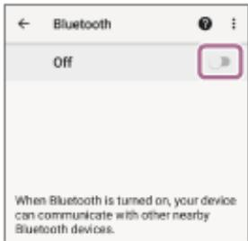

> **AI Description:**
> **Source:** `assets/_page_29_Figure_0.jpg`
> 
> **Generated:** 2026-06-01 23:04:11
> 
> ---
> 
> The image displays a screenshot of a Bluetooth settings screen from a mobile device. The screen shows the Bluetooth status as "Off" with a toggle switch on the right side, which is currently in the "Off" position. Below the toggle, there is a description explaining that when Bluetooth is turned on, the device can communicate with other nearby Bluetooth devices. The image is a standard user interface element with no additional visual content beyond the text and toggle switch.


## Touch [WH-1000XM4].

If [WH-1000XM4] and [LE\_WH-1000XM4] are displayed, select [WH-1000XM4].

[LE\_WH-1000XM4] will be displayed first, but wait until [WH-1000XM4] is displayed.

It may take about 30 seconds to 1 minute for [WH-1000XM4] to be displayed.

If [WH-1000XM4] is not displayed, try again from step 1.


If Passkey (\*) input is required, input “0000”.

The headset and smartphone are paired and connected with each other. You will hear the voice guidance say, “Bluetooth connected”.

If they are not connected, see “Connecting to a paired Android smartphone”.

A Passkey may be called “Passcode”, “PIN code”, “PIN number”, or “Password”.

## Hint

The operation above is an example. For more details, refer to the operating instructions supplied with the Android smartphone.

To delete all Bluetooth pairing information, see “Initializing the headset to restore factory settings”.

## Note

If pairing is not established within 5 minutes, pairing mode is canceled. In this case, start the operation again from step 1.

Once Bluetooth devices are paired, there is no need to pair them again, except in the following cases:

Pairing information has been deleted after repair, etc.

When a 9th device is paired.

The headset can be paired with up to 8 devices. If a new device is paired after 8 devices are already paired, the registration information of the paired device with the oldest connection date is overwritten with the information for the new device.

When the pairing information for the headset has been deleted from the Bluetooth device.

When the headset is initialized.

All of the pairing information is deleted. In this case, delete the pairing information for the headset from the device and then pair them again.

The headset can be paired with multiple devices, but can only play music from 1 paired device at a time.

## Related Topic

How to make a wireless connection to Bluetooth devices

<span id="page-30-0"></span>
Connecting to a paired Android smartphone

Listening to music from a device via Bluetooth connection

Disconnecting Bluetooth connection (after use)

Initializing the headset to restore factory settings

<span id="page-31-0"></span>
## Connecting to a paired Android smartphone


> **AI Description:**
> **Source:** `assets/_page_31_Figure_0.jpg`
> 
> **Generated:** 2026-06-01 22:58:26
> 
> ---
> 
> The image contains a simple diagram with two nodes labeled "1" and "2," connected by a single line. This suggests a basic relationship or connection between the two elements, possibly representing a simple network or a binary relationship in a more complex system. The diagram is minimalistic and lacks additional context or labels to provide more specific information.


Unlock the screen of the Android smartphone if it is locked.

Turn on the headset.

Press and hold the (power) button for about 2 seconds.

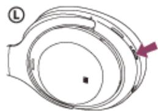

> **AI Description:**
> **Source:** `assets/_page_31_Figure_1.jpg`
> 
> **Generated:** 2026-06-01 22:59:02
> 
> ---
> 
> The image is a diagram of a magnetic field around a current-carrying wire. The diagram shows a circular wire with a current flowing in a clockwise direction as indicated by the arrow. The magnetic field lines are depicted as concentric circles around the wire, with the direction of the field lines indicating the direction of the magnetic field. The label "L" is placed on the left side of the diagram, likely indicating the location of the observer or the point of interest. The diagram is a representation of the Biot-Savart law, which describes the magnetic field produced by a current-carrying wire.


You will hear the voice guidance say, “Power on”. Check that the indicator (blue) continues to flash after you release your finger from the button.


> **AI Description:**
> **Source:** `assets/_page_31_Figure_2.jpg`
> 
> **Generated:** 2026-06-01 22:57:54
> 
> ---
> 
> The image is a technical illustration of a wristwatch. It shows a close-up view of the watch face, focusing on the hour markers and the watch hands. The watch face is divided into sections, with the hour markers clearly marked. The illustration includes a small inset on the right side, which appears to be a magnified view of the watch hands and the center of the watch face. The image is labeled with the letter "L" at the top left corner.


If the headset has automatically connected to the last connected device, you will hear the voice guidance say, “Bluetooth connected”.

Check the connection status on the Android smartphone. If it is not connected, proceed to step 3.


Display the devices paired with the Android smartphone.

1. Select [Settings] - [Device connection] - [Bluetooth].

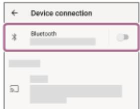

> **AI Description:**
> **Source:** `assets/_page_31_Figure_4.jpg`
> 
> **Generated:** 2026-06-01 23:00:19
> 
> ---
> 
> The image contains a screenshot of a device connection settings page. The main visual element is a toggle switch labeled "Bluetooth," which is currently in the off position. The background is white with black text, and there are other settings listed below, but they are partially obscured and not fully visible. The image is focused on the Bluetooth connection status.


2. Touch the switch to turn on the Bluetooth function.


> **AI Description:**
> **Source:** `assets/_page_31_Figure_5.jpg`
> 
> **Generated:** 2026-06-01 23:00:05
> 
> ---
> 
> The image displays a settings screen from a mobile device, specifically the Bluetooth settings. The screen shows a toggle switch in the "Off" position, indicating that Bluetooth is currently disabled. There is a brief description below the toggle switch explaining that when Bluetooth is turned on, the device can communicate with other nearby Bluetooth devices. The visual elements include a toggle switch, text descriptions, and a back arrow, all of which are part of the user interface design.


<span id="page-32-0"></span>


You will hear the voice guidance say, “Bluetooth connected”.

## Hint

The operation above is an example. For more details, refer to the operating instructions supplied with the Android smartphone.

## Note

When connecting, if [WH-1000XM4] and [LE\_WH-1000XM4] are displayed, select [WH-1000XM4].

[LE\_WH-1000XM4] will be displayed first, but wait until [WH-1000XM4] is displayed.

It may take about 30 seconds to 1 minute for [WH-1000XM4] to be displayed.

If [WH-1000XM4] is not displayed, perform the pairing again.

If the last-connected Bluetooth device is placed near the headset, the headset may connect automatically to the device by simply turning on the headset. In that case, deactivate the Bluetooth function on the last-connected device or turn off the power.

If you cannot connect your smartphone to the headset, delete the headset pairing information on your smartphone and perform the pairing again. As for the operations on your smartphone, refer to the operating instructions supplied with the smartphone.

## Related Topic

How to make a wireless connection to Bluetooth devices

Pairing and connecting with an Android smartphone

Listening to music from a device via Bluetooth connection

Disconnecting Bluetooth connection (after use)

<span id="page-33-0"></span>
## One-touch connection (NFC) with an Android smartphone

By touching the headset with a smartphone, the headset turns on automatically and then pairs and makes a Bluetooth connection.

## Compatible smartphones

NFC-compatible smartphones installed with Android 4.1 or later

## What is NFC?

NFC (Near Field Communication) is a technology enabling short-range wireless communication between various devices, such as smartphones and IC tags. Thanks to the NFC function, data communication — for example, Bluetooth pairing — can be achieved easily by simply touching NFC-compatible devices together (i.e., at the N-Mark symbol or location designated on each device).


> **AI Description:**
> **Source:** `assets/_page_33_Figure_0.jpg`
> 
> **Generated:** 2026-06-01 23:14:17
> 
> ---
> 
> The image contains a simple diagram with two numbered circles labeled "1" and "2," connected by a line. This suggests a basic relationship or connection between the two elements, possibly indicating a sequence or a simple flow.


Unlock the screen of the smartphone if it is locked.

Turn on the smartphone’s NFC function.

1. Select [Settings] - [Device connection].

2. Touch the switch to turn on the NFC function.

```
Device connection  
园
```


## Touch the smartphone with the headset.

Touch the smartphone on the N-Mark of the headset. Keep touching the headset with the smartphone until the smartphone reacts.

Refer to the operating instructions of the smartphone for the designated location to be touched on the smartphone.

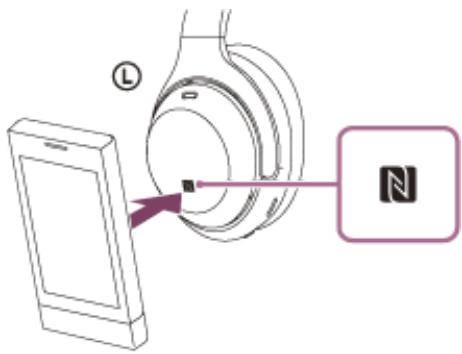

> **AI Description:**
> **Source:** `assets/_page_33_Figure_2.jpg`
> 
> **Generated:** 2026-06-01 23:14:02
> 
> ---
> 
> The image is a technical illustration showing a smartphone and a pair of headphones with an NFC (Near Field Communication) symbol. The smartphone is positioned near the headphones, indicating a possible pairing or connection process using NFC technology. The image includes a label "L" on the headphones, likely denoting the left earpiece. The NFC symbol is prominently displayed, suggesting the use of this technology for a wireless connection.

Follow the on-screen instructions to complete the pairing and connection.

<span id="page-34-0"></span>
When the headset is connected with the smartphone, the indicator (blue) starts flashing slowly. You will hear the voice guidance say, “Bluetooth connected”.


> **AI Description:**
> **Source:** `assets/_page_34_Figure_0.jpg`
> 
> **Generated:** 2026-06-01 23:14:40
> 
> ---
> 
> The image is a technical illustration of a camera lens. It shows a close-up view of a camera lens with various components labeled. The lens is depicted with concentric rings and a central aperture. The image includes a small inset on the right side, which appears to be a magnified view of the aperture, highlighting its circular shape and the central pin. The label "L" is visible on the left side, likely indicating the lens itself. The illustration is likely used for educational or technical purposes to explain the structure of a camera lens.


To disconnect, touch the smartphone again with the headset. You will hear the voice guidance say, “Bluetooth disconnected”.

To connect a paired smartphone, perform step 3.

Unlock the screen of the smartphone if it is locked.

## Hint

The operation above is an example. For more details, refer to the operating instructions supplied with the Android smartphone.

If you cannot connect the headset, try the following.

Unlock the screen of the smartphone if it is locked, and move the smartphone slowly over the N-Mark.

If the smartphone is in a case, remove the case.

Check that the Bluetooth function of the smartphone is enabled.

If you touch an NFC-compatible smartphone connected to another NFC-compatible device with the headset, the smartphone terminates the Bluetooth connection with any current devices, and connects to the headset via one-touch (NFC) (One-touch connection switching).

## Related Topic

How to make a wireless connection to Bluetooth devices

Disconnecting the Android smartphone with one-touch (NFC)

Switching the device by one-touch (NFC)

Listening to music from a device via Bluetooth connection

<span id="page-35-0"></span>
## Disconnecting the Android smartphone with one-touch (NFC)

You can disconnect the headset from the connected smartphone by touching the headset with it.


> **AI Description:**
> **Source:** `assets/_page_35_Figure_0.jpg`
> 
> **Generated:** 2026-06-01 23:11:45
> 
> ---
> 
> The image contains a simple diagram with two circular nodes labeled "1" and "2," connected by a straight line. The diagram appears to represent a basic relationship or connection between two entities or concepts.


Unlock the screen of the smartphone if it is locked.

Touch the smartphone with the headset.

Touch the smartphone to the N-Mark on the headset.

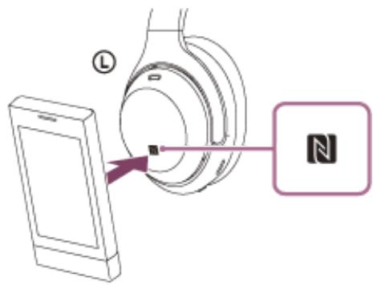

> **AI Description:**
> **Source:** `assets/_page_35_Figure_1.jpg`
> 
> **Generated:** 2026-06-01 23:11:42
> 
> ---
> 
> The image is a technical illustration showing the pairing of a smartphone with a pair of headphones. It includes a smartphone on the left side with a stylized representation of a headphone on the right side. The headphone has an NFC (Near Field Communication) symbol highlighted, indicating the method of connection. The illustration is likely used to guide users on how to connect their device to the headphones using NFC technology.


You will hear the voice guidance say, “Bluetooth disconnected”.

## Note

In the factory setting, after 15 minutes of not being worn, the headset automatically turns off. Press and hold the (power) button for about 2 seconds to turn off the power before that time. You will hear the voice guidance say, “Power off”, the indicator (blue) turns off, and the headset powers off.

<span id="page-36-0"></span>
## Switching the device by one-touch (NFC)

If you touch an NFC-compatible smartphone to the headset while the headset is connected to another Bluetooth device, the connection switches to the smartphone (One-touch connection switching). However, the connection cannot be switched when talking on a headset connected to a Bluetooth-compatible mobile phone.

When an NFC-compatible smartphone is connected to the headset, if the smartphone is touched by another NFCcompatible Bluetooth headset or Bluetooth speaker, the smartphone is disconnected from the headset and connected to the Bluetooth device.

## Note

Unlock the smartphone screen in advance if it is locked.

<span id="page-37-0"></span>
## Pairing and connecting with an iPhone

The operation to register the device that you wish to connect to is called “pairing”. First, pair a device to use it with the headset for the first time.

Before starting the operation, make sure of the following:

The iPhone is placed within 1 m (3 feet) of the headset.

The headset is charged sufficiently.

The operating instructions of the iPhone is in hand.

## 1 Enter pairing mode on this headset.

Turn on the headset when you pair the headset with a device for the first time after you bought it or after you initialized the headset (the headset has no pairing information). The headset enters pairing mode automatically. In this case, proceed to step 2.

When you pair a second or subsequent device (the headset has pairing information for other devices), press and hold the (power) button for about 7 seconds.


> **AI Description:**
> **Source:** `assets/_page_37_Figure_0.jpg`
> 
> **Generated:** 2026-06-01 23:02:26
> 
> ---
> 
> The image is a diagram illustrating the direction of current flow in a solenoid. It shows a circular solenoid with a central axis, and arrows indicate the direction of the current flow around the solenoid. The label "L" is placed on the left side of the diagram, likely indicating the left end of the solenoid. The direction of the arrows suggests that the current flows clockwise when viewed from the left side of the solenoid.


Check that the indicator (blue) repeatedly flashes twice in a row. You will hear the voice guidance say, “Bluetooth pairing”.


> **AI Description:**
> **Source:** `assets/_page_37_Figure_1.jpg`
> 
> **Generated:** 2026-06-01 23:01:07
> 
> ---
> 
> The image is a diagram of a planetary system. It shows a central star with a ring around it, representing a protoplanetary disk. The disk is divided into several concentric rings, with labeled lines extending from the center to the outer edge of the disk. The labels indicate different regions or zones within the disk, likely representing different stages of planetary formation or different types of material. The diagram is likely used to illustrate the structure and composition of a protoplanetary disk in the context of planetary formation theory.


> **AI Description:**
> **Source:** `assets/_page_37_Figure_2.jpg`
> 
> **Generated:** 2026-06-01 22:59:33
> 
> ---
> 
> The image contains a simple diagram with two nodes labeled "2" and "3". The nodes are connected by a single line, suggesting a relationship or connection between the two. There are no additional labels, text, or other visual elements present in the image.


Unlock the screen of the iPhone if it is locked.

Find the headset on the iPhone.

1. Select [Settings].

2. Touch [Bluetooth].

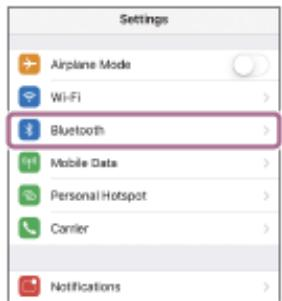

> **AI Description:**
> **Source:** `assets/_page_37_Figure_3.jpg`
> 
> **Generated:** 2026-06-01 23:01:01
> 
> ---
> 
> The image is a screenshot of a mobile device's settings menu. It displays a list of settings options, including Airplane Mode, Wi-Fi, Bluetooth, Mobile Data, Personal Hotspot, Carrier, and Notifications. The Bluetooth option is highlighted with a red box, indicating it is the selected or active option. The text is clear and legible, and the layout is typical of a mobile operating system's settings interface.


3. Touch the switch to turn on the Bluetooth function.

<span id="page-38-0"></span>
```
Blueteoth
```


## Touch [WH-1000XM4].

If [WH-1000XM4] and [LE\_WH-1000XM4] are displayed, select [WH-1000XM4].   
[LE\_WH-1000XM4] will be displayed first, but wait until [WH-1000XM4] is displayed.   
It may take about 30 seconds to 1 minute for [WH-1000XM4] to be displayed.   
If [WH-1000XM4] is not displayed, try again from step 1.

```
Bluetooth   
0000
```

If Passkey (\*) input is required, input “0000”.

The headset and iPhone are paired and connected with each other. You will hear the voice guidance say, “Bluetooth connected”.

If they are not connected, see “Connecting to a paired iPhone ”.

\* A Passkey may be called “Passcode”, “PIN code”, “PIN number”, or “Password”.

## Hint

The operation above is an example. For more details, refer to the operating instructions supplied with your iPhone.

To delete all Bluetooth pairing information, see “Initializing the headset to restore factory settings”.

## Note

If pairing is not established within 5 minutes, pairing mode is canceled. In this case, start the operation again from step 1.

Once Bluetooth devices are paired, there is no need to pair them again, except in the following cases:

Pairing information has been deleted after repair, etc.

When a 9th device is paired.

The headset can be paired with up to 8 devices. If a new device is paired after 8 devices are already paired, the registration information of the paired device with the oldest connection date is overwritten with the information for the new device.

When the pairing information for the headset has been deleted from the Bluetooth device.

When the headset is initialized.

All of the pairing information is deleted. In this case, delete the pairing information for the headset from the device and then pair them again.

The headset can be paired with multiple devices, but can only play music from 1 paired device at a time.

## Related Topic

How to make a wireless connection to Bluetooth devices

Connecting to a paired iPhone

Listening to music from a device via Bluetooth connection

<span id="page-39-0"></span>
Disconnecting Bluetooth connection (after use)

Initializing the headset to restore factory settings

<span id="page-40-0"></span>
## Connecting to a paired iPhone


> **AI Description:**
> **Source:** `assets/_page_40_Figure_0.jpg`
> 
> **Generated:** 2026-06-01 22:57:29
> 
> ---
> 
> The image contains a simple diagram with two circles labeled "1" and "2," connected by a straight line. The circles are positioned vertically, with "1" at the top and "2" at the bottom. The diagram suggests a relationship or connection between the two labeled elements, but without additional context, the specific nature of this relationship is unclear.


Unlock the screen of the iPhone if it is locked.

Turn on the headset.

Press and hold the (power) button for about 2 seconds.


> **AI Description:**
> **Source:** `assets/_page_40_Figure_1.jpg`
> 
> **Generated:** 2026-06-01 22:57:59
> 
> ---
> 
> The image is a diagram of a circular object, possibly a coil or a ring, with a central hole. The outer edge of the ring is labeled with the letter "L". There are several concentric circles within the ring, with the innermost circle having a small black dot in the center. The diagram appears to be a technical illustration, possibly related to physics or electrical engineering, given the labeling and the structure of the object.


You will hear the voice guidance say, “Power on”. Check that the indicator (blue) continues to flash after you release your finger from the button.

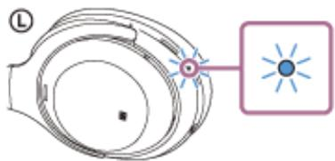

> **AI Description:**
> **Source:** `assets/_page_40_Figure_2.jpg`
> 
> **Generated:** 2026-06-01 22:59:07
> 
> ---
> 
> The image is a technical illustration of a camera lens. It shows a cross-sectional view of a camera lens, highlighting the internal structure. The image includes a label "L" pointing to the lens, indicating its position. The illustration is simplified and uses a color scheme to distinguish different parts of the lens. The focus is on the internal components of the lens, likely for educational or technical purposes.


If the headset has automatically connected to the last connected device, you will hear the voice guidance say, “Bluetooth connected”.

Check the connection status on the iPhone. If it is not connected, proceed to step 3.


## Display the devices paired with the iPhone.

1. Select [Settings].

2. Touch [Bluetooth].


3. Touch the switch to turn on the Bluetooth function.


<span id="page-41-0"></span>

## Touch [WH-1000XM4].


You will hear the voice guidance say, “Bluetooth connected”.

## Hint

The operation above is an example. For more details, refer to the operating instructions supplied with your iPhone.

## Note

When connecting, if [WH-1000XM4] and [LE\_WH-1000XM4] are displayed, select [WH-1000XM4].

[LE\_WH-1000XM4] will be displayed first, but wait until [WH-1000XM4] is displayed.

It may take about 30 seconds to 1 minute for [WH-1000XM4] to be displayed.

If [WH-1000XM4] is not displayed, perform the pairing again.

If the last-connected Bluetooth device is placed near the headset, the headset may connect automatically to the device by simply turning on the headset. In that case, deactivate the Bluetooth function on the last-connected device or turn off the power.

If you cannot connect your iPhone to the headset, delete the headset pairing information on your iPhone and perform the pairing again. As for the operations on your iPhone, refer to the operating instructions supplied with the iPhone.

## Related Topic

How to make a wireless connection to Bluetooth devices

Pairing and connecting with an iPhone

Listening to music from a device via Bluetooth connection

Disconnecting Bluetooth connection (after use)

<span id="page-42-0"></span>
## Pairing and connecting with a computer (Windows 10)

The operation to register the device that you wish to connect to is called “pairing”. First, pair a device to use it with the headset for the first time.

Before starting the operation, make sure of the following:

Your computer has a Bluetooth function that supports music playback connections (A2DP).

When you use a video calling application on your computer, your computer has a Bluetooth function that supports calling connections (HFP/HSP).

The computer is placed within 1 m (3 feet) of the headset.

The headset is charged sufficiently.

The operating instructions of the computer is in hand.

Depending on the computer you are using, the built-in Bluetooth adaptor may need to be turned on. If you do not know how to turn on the Bluetooth adaptor or are unsure if your computer has a built-in Bluetooth adaptor, refer to the operating instructions supplied with the computer.

## 1 Enter pairing mode on this headset.

Turn on the headset when you pair the headset with a device for the first time after you bought it or after you initialized the headset (the headset has no pairing information). The headset enters pairing mode automatically. In this case, proceed to step .

When you pair a second or subsequent device (the headset has pairing information for other devices), press and hold the (power) button for about 7 seconds.


> **AI Description:**
> **Source:** `assets/_page_42_Figure_0.jpg`
> 
> **Generated:** 2026-06-01 23:12:53
> 
> ---
> 
> The image is a diagram of a watch face. It shows a circular dial with a central hand pointing to the right. The dial is divided into sections, likely representing different time zones or hours, with the letter "L" at the top left corner. The central hand is pointing to the right, indicating a specific time or position on the dial. The image appears to be a technical illustration or a schematic of a watch mechanism.


Check that the indicator (blue) repeatedly flashes twice in a row. You will hear the voice guidance say, “Bluetooth pairing”.


> **AI Description:**
> **Source:** `assets/_page_42_Figure_1.jpg`
> 
> **Generated:** 2026-06-01 23:13:49
> 
> ---
> 
> The image is a technical illustration of a watch or clock mechanism. It shows a close-up view of the watch face, focusing on the hands and the movement of the second hand. The second hand is depicted as a small, circular component with a blue center and radiating lines, indicating the passage of time. The illustration is labeled with "L," which likely stands for "left," suggesting a directional reference for the watch's orientation. The image is a simplified diagram, likely used for educational or instructional purposes to explain the mechanics of a watch.


> **AI Description:**
> **Source:** `assets/_page_42_Figure_2.jpg`
> 
> **Generated:** 2026-06-01 23:15:11
> 
> ---
> 
> The image contains a simple diagram with two nodes labeled "2" and "3". The nodes are connected by a single line, suggesting a direct relationship or link between them. There are no additional visual elements or annotations beyond the labels and the connecting line.


Wake the computer up if the computer is in standby (sleep) or hibernation mode.

Register the headset using the computer.

1. Click the [Start] button, then [Settings].

2. Click [Devices].

<span id="page-43-0"></span>
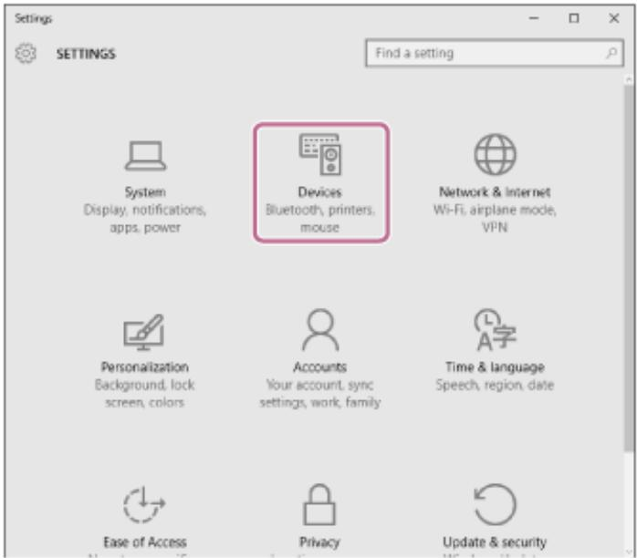

> **AI Description:**
> **Source:** `assets/_page_43_Figure_0.jpg`
> 
> **Generated:** 2026-06-01 23:10:29
> 
> ---
> 
> The image is a screenshot of the Windows Settings interface. It displays a grid of icons, each representing a different category of settings. The icon highlighted in pink is labeled "Devices" and includes subcategories such as Bluetooth, printers, and mouse. The other icons represent categories like System, Network & Internet, Personalization, Accounts, Time & Language, Ease of Access, Privacy, and Update & Security. The interface is clean and organized, with a search bar at the top for finding specific settings.


Click the [Bluetooth] tab, click the [Bluetooth] switch to turn on the Bluetooth function, then select [WH-3. 1000XM4]. If [WH-1000XM4] and [LE\_WH-1000XM4] are displayed, select [WH-1000XM4]. [LE\_WH-1000XM4] will be displayed first, but wait until [WH-1000XM4] is displayed. It may take about 30 seconds to 1 minute for [WH-1000XM4] to be displayed. If [WH-1000XM4] is not displayed, try again from step .

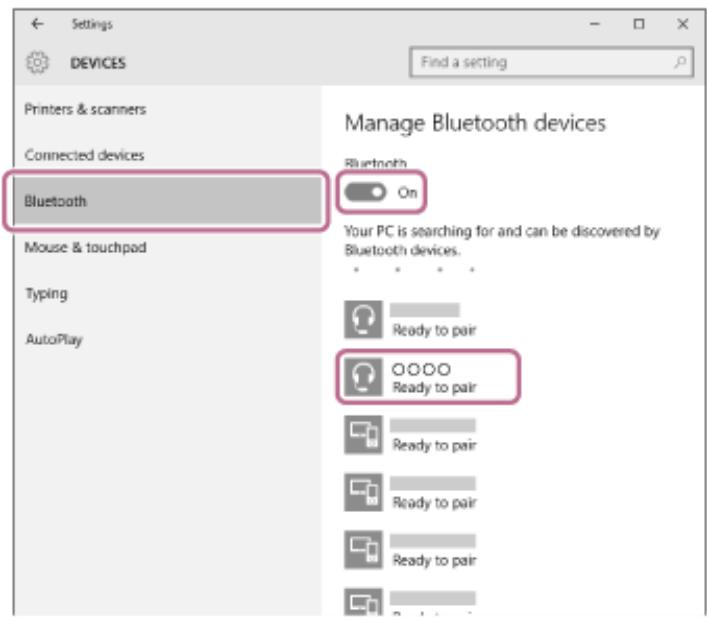

> **AI Description:**
> **Source:** `assets/_page_43_Figure_1.jpg`
> 
> **Generated:** 2026-06-01 23:09:55
> 
> ---
> 
> The image is a screenshot of a Windows Settings window, specifically the "Bluetooth" settings page. It displays the "Manage Bluetooth devices" section with a toggle switch labeled "On" indicating that Bluetooth is enabled. The text states that the PC is searching for and can be discovered by Bluetooth devices. Below this, there are icons and text indicating devices that are "Ready to pair." The icons represent headphones and other devices, with four of them highlighted, suggesting they are the devices currently available for pairing. The image is a technical illustration with text and icons, providing visual information about the status of Bluetooth and available devices for pairing.


## 4. Click [Pair].

<span id="page-44-0"></span>
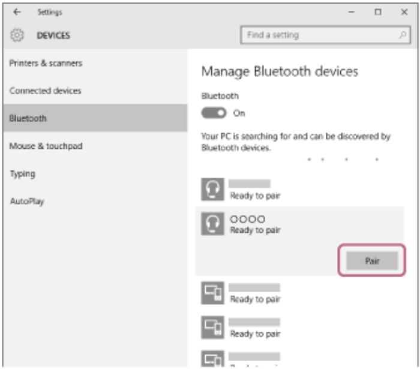

> **AI Description:**
> **Source:** `assets/_page_44_Figure_0.jpg`
> 
> **Generated:** 2026-06-01 23:10:40
> 
> ---
> 
> The image is a screenshot of the Windows Settings app, specifically the "Bluetooth" section under the "Devices" category. It displays a list of Bluetooth devices that are "Ready to pair," with a "Pair" button highlighted in red. The Bluetooth toggle switch is turned on, indicating that the PC is searching for and can be discovered by Bluetooth devices. The interface is clean and user-friendly, designed to facilitate pairing with Bluetooth devices.

If Passkey (\*) input is required, input “0000”.
The headset and computer are paired and connected with each other. You will hear the voice guidance say, “Bluetooth connected”.

If they are not connected, see “Connecting to a paired computer (Windows 10)”.

A Passkey may be called “Passcode”, “PIN code”, “PIN number”, or “Password”.

## Hint

The operation above is an example. For more details, refer to the operating instructions supplied with the computer.

To delete all Bluetooth pairing information, see “Initializing the headset to restore factory settings”.

## Note

If pairing is not established within 5 minutes, pairing mode is canceled. In this case, start the operation again from step

Once Bluetooth devices are paired, there is no need to pair them again, except in the following cases:

Pairing information has been deleted after repair, etc.

When a 9th device is paired.

The headset can be paired with up to 8 devices. If a new device is paired after 8 devices are already paired, the registration information of the paired device with the oldest connection date is overwritten with the information for the new device.

When the pairing information for the headset has been deleted from the Bluetooth device.

When the headset is initialized.

All of the pairing information is deleted. In this case, delete the pairing information for the headset from the device and then pair them again.

The headset can be paired with multiple devices, but can only play music from 1 paired device at a time.

## Related Topic

How to make a wireless connection to Bluetooth devices

Connecting to a paired computer (Windows 10)

Listening to music from a device via Bluetooth connection

Making a video call on a computer

Disconnecting Bluetooth connection (after use)

Initializing the headset to restore factory settings

<span id="page-46-0"></span>
## Pairing and connecting with a computer (Windows 8.1)

The operation to register the device that you wish to connect to is called “pairing”. First, pair a device to use it with the headset for the first time.

Before starting the operation, make sure of the following:

Your computer has a Bluetooth function that supports music playback connections (A2DP).

When you use a video calling application on your computer, your computer has a Bluetooth function that supports calling connections (HFP/HSP).

The computer is placed within 1 m (3 feet) of the headset.

The headset is charged sufficiently.

The operating instructions of the computer is in hand.

Depending on the computer you are using, the built-in Bluetooth adaptor may need to be turned on. If you do not know how to turn on the Bluetooth adaptor or are unsure if your computer has a built-in Bluetooth adaptor, refer to the operating instructions supplied with the computer.

## 1 Enter pairing mode on this headset.

Turn on the headset when you pair the headset with a device for the first time after you bought it or after you initialized the headset (the headset has no pairing information). The headset enters pairing mode automatically. In this case, proceed to step .

When you pair a second or subsequent device (the headset has pairing information for other devices), press and hold the (power) button for about 7 seconds.


> **AI Description:**
> **Source:** `assets/_page_46_Figure_0.jpg`
> 
> **Generated:** 2026-06-01 23:00:40
> 
> ---
> 
> The image is a diagram of a watch face, specifically highlighting the position of the hour hand. The diagram shows a circular watch face with a central axis where the hour hand is pointing to the right. The label "L" is positioned at the top left, likely indicating the left side of the watch. The hour hand is positioned at the 10 o'clock mark, suggesting the time is 10:00. The diagram is simple and lacks additional context or annotations.


Check that the indicator (blue) repeatedly flashes twice in a row. You will hear the voice guidance say, “Bluetooth pairing”.

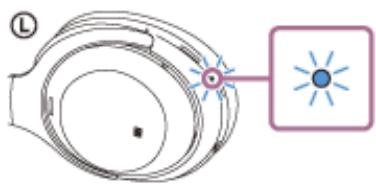

> **AI Description:**
> **Source:** `assets/_page_46_Figure_1.jpg`
> 
> **Generated:** 2026-06-01 22:59:51
> 
> ---
> 
> The image is a technical illustration of a watch or clock mechanism. It shows a close-up view of the inner workings, focusing on the gears and the central axis where the hands of the watch would be attached. The illustration is labeled with "L" at the top left, possibly indicating a label or reference point. The central part of the image highlights the axis with a small circle and a starburst-like pattern, which might represent the pivot point or a specific feature of the mechanism. The overall design suggests a detailed, technical representation of a watch's internal components.


Wake the computer up if the computer is in standby (sleep) or hibernation mode.

Register the headset using the computer.

Move the mouse pointer to the top-right corner of the screen (when using a touch panel, swipe from the right1. edge of the screen), then select [Settings] from the Charm Bar.

<span id="page-47-0"></span>
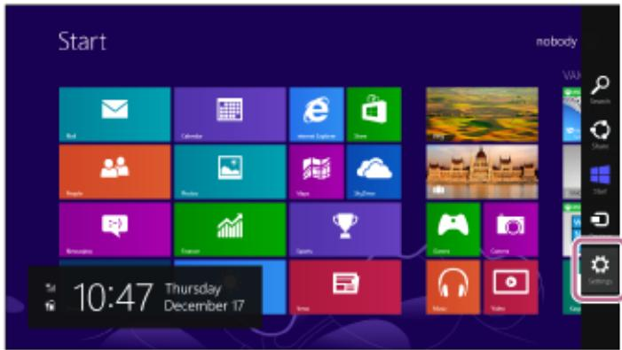

> **AI Description:**
> **Source:** `assets/_page_47_Figure_0.jpg`
> 
> **Generated:** 2026-06-01 22:57:38
> 
> ---
> 
> The image is a screenshot of a Windows 8 Start screen. It displays a grid of tiles representing various applications and features, such as Mail, Calendar, Internet Explorer, Store, People, Photos, Video, and others. The bottom left corner shows the time as 10:47 and the date as Thursday, December 17. The bottom right corner has a settings icon. The overall layout is colorful and organized, typical of the Windows 8 interface.


2. Select [Change PC Settings] of the [Settings] charm.
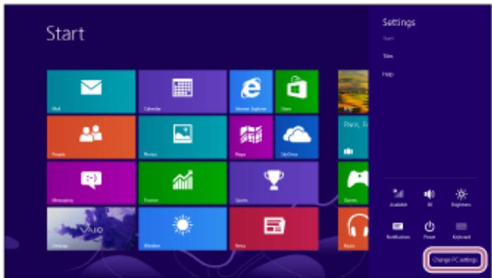

> **AI Description:**
> **Source:** `assets/_page_47_Figure_1.jpg`
> 
> **Generated:** 2026-06-01 22:57:48
> 
> ---
> 
> The image displays a Windows operating system interface, specifically the Start screen with a grid of app tiles. The tiles represent various applications such as Mail, Calendar, Internet Explorer, OneDrive, People, Photos, Maps, SkyDrive, Games, and others. On the right side, there is a vertical menu with options like "Start," "Settings," "Help," and "More." Below the menu, there are icons for different settings categories such as "Available," "Wi-Fi," "Beginner," "Notification," "Power," and "Extract." At the bottom right corner, there is a button labeled "Change PC settings." The overall layout is clean and organized, typical of a Windows 8 or 8.1 interface.


3. Select [PC and devices] of the [PC Settings] screen.
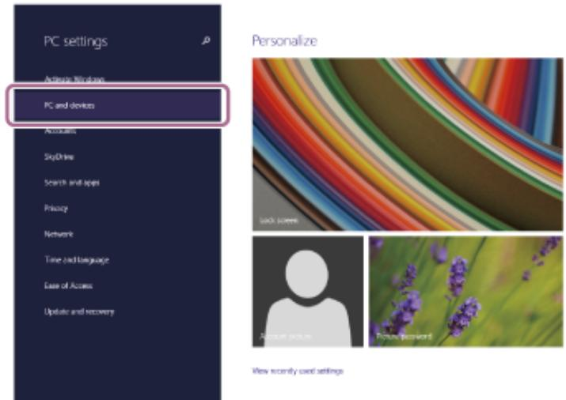

> **AI Description:**
> **Source:** `assets/_page_47_Figure_2.jpg`
> 
> **Generated:** 2026-06-01 22:58:55
> 
> ---
> 
> The image contains a screenshot of a Windows PC settings interface. The left side of the image shows a menu with various options such as "PC settings," "PC and devices," "Accounts," "SkyDrive," "Search and apps," "Privacy," "Network," "Time and language," "Ease of Access," and "Update and recovery." The "PC and devices" option is highlighted with a red box, indicating it is the selected or focused option. The right side of the image displays a section titled "Personalize," featuring a colorful abstract image and a smaller image of lavender flowers. The text "Personalize" is at the top of this section.


## 4. Select [Bluetooth].

5. Select [WH-1000XM4], then select [Pair].
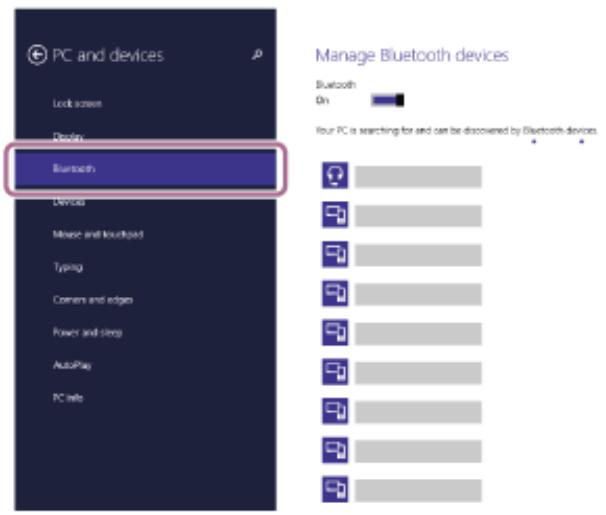

> **AI Description:**
> **Source:** `assets/_page_47_Figure_3.jpg`
> 
> **Generated:** 2026-06-01 22:58:35
> 
> ---
> 
> The image is a screenshot of a Windows settings page titled "PC and devices." It displays a list of settings options on the left, with "Bluetooth" highlighted in a red box. On the right, there is a section titled "Manage Bluetooth devices" with a status indicator showing that Bluetooth is "On." Below this, there are icons representing different Bluetooth devices, each with a corresponding status indicator. The image contains a mix of text and icons, providing a visual representation of the Bluetooth settings and device management.


<span id="page-48-0"></span>
If [WH-1000XM4] and [LE\_WH-1000XM4] are displayed, select [WH-1000XM4].   
[LE\_WH-1000XM4] will be displayed first, but wait until [WH-1000XM4] is displayed.   
It may take about 30 seconds to 1 minute for [WH-1000XM4] to be displayed.   
If [WH-1000XM4] is not displayed, try again from step .

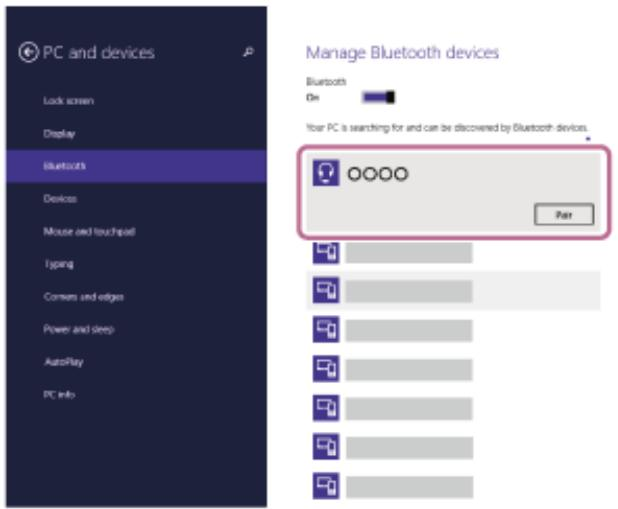

> **AI Description:**
> **Source:** `assets/_page_48_Figure_0.jpg`
> 
> **Generated:** 2026-06-01 23:06:48
> 
> ---
> 
> The image is a screenshot of a Windows Settings interface, specifically the "Bluetooth" settings page. It displays a list of Bluetooth devices that the user's PC is currently searching for and can be discovered by. The interface includes a section titled "Manage Bluetooth devices" with a toggle switch indicating that Bluetooth is on. The list shows a series of Bluetooth devices with their names obscured by "XXXX," and a button labeled "Pair" next to the first device. The left sidebar lists other settings categories such as Lock screen, Display, and PC Info.

If Passkey (\*) input is required, input “0000”.
The headset and computer are paired and connected with each other. You will hear the voice guidance say, “Bluetooth connected”.
If they are not connected, see “Connecting to a paired computer (Windows 8.1)”.

A Passkey may be called “Passcode”, “PIN code”, “PIN number”, or “Password”.

## Hint

The operation above is an example. For more details, refer to the operating instructions supplied with the computer.

To delete all Bluetooth pairing information, see “Initializing the headset to restore factory settings”.

## Note

If pairing is not established within 5 minutes, pairing mode is canceled. In this case, start the operation again from step

Once Bluetooth devices are paired, there is no need to pair them again, except in the following cases:

Pairing information has been deleted after repair, etc.

When a 9th device is paired.

The headset can be paired with up to 8 devices. If a new device is paired after 8 devices are already paired, the registration information of the paired device with the oldest connection date is overwritten with the information for the new device.

When the pairing information for the headset has been deleted from the Bluetooth device.

When the headset is initialized.

All of the pairing information is deleted. In this case, delete the pairing information for the headset from the device and then pair them again.

The headset can be paired with multiple devices, but can only play music from 1 paired device at a time.

## Related Topic

How to make a wireless connection to Bluetooth devices

Connecting to a paired computer (Windows 8.1)

Listening to music from a device via Bluetooth connection

Making a video call on a computer

Disconnecting Bluetooth connection (after use)

Initializing the headset to restore factory settings

<span id="page-50-0"></span>
Wireless Noise Canceling Stereo Headset WH-1000XM4

## Pairing and connecting with a computer (Mac)

The operation to register the device that you wish to connect to is called “pairing”. First, pair a device to use it with the headset for the first time.

## Compatible OS

macOS (version 10.10 or later)

Before starting the operation, make sure of the following:

Your computer has a Bluetooth function that supports music playback connections (A2DP).

When you use a video calling application on your computer, your computer has a Bluetooth function that supports calling connections (HFP/HSP).

The computer is placed within 1 m (3 feet) of the headset.

The headset is charged sufficiently.

The operating instructions of the computer is in hand.

Depending on the computer you are using, the built-in Bluetooth adaptor may need to be turned on. If you do not know how to turn on the Bluetooth adaptor or are unsure if your computer has a built-in Bluetooth adaptor, refer to the operating instructions supplied with the computer.

Set the computer speaker to the ON mode.

If the computer speaker is set to the “OFF” mode, no sound is heard from the headset.

Computer speaker in the ON mode


> **AI Description:**
> **Source:** `assets/_page_50_Figure_0.jpg`
> 
> **Generated:** 2026-06-01 23:13:35
> 
> ---
> 
> The image contains a series of icons typically found in a computer's system tray, indicating various system settings and statuses. The icons include a speaker symbol with a volume level indicator, suggesting sound settings. The volume level is set to 100%, as indicated by the text next to the speaker icon. The other icons represent different system functions, such as network status, screen orientation, and battery status, but these are not directly related to the volume setting. The image is a screenshot of a computer interface, not a chart, graph, or photo.


## Enter pairing mode on this headset.

Turn on the headset when you pair the headset with a device for the first time after you bought it or after you initialized the headset (the headset has no pairing information). The headset enters pairing mode automatically. In this case, proceed to step .

When you pair a second or subsequent device (the headset has pairing information for other devices), press and hold the (power) button for about 7 seconds.

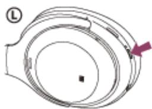

> **AI Description:**
> **Source:** `assets/_page_50_Figure_1.jpg`
> 
> **Generated:** 2026-06-01 23:13:00
> 
> ---
> 
> The image is a diagram of a watch face, specifically highlighting the position of the hour hand. The diagram includes a circular watch face with a central axis and a rotating hour hand. The hour hand is positioned at the 10 o'clock mark, indicating the time as 10:00. The diagram is labeled with "L" in the top left corner, which likely stands for "Left" or "Lower," suggesting the orientation of the watch face. The image is a technical illustration used to demonstrate the position of the hour hand in relation to the watch face.


Check that the indicator (blue) repeatedly flashes twice in a row. You will hear the voice guidance say, “Bluetooth pairing”.


> **AI Description:**
> **Source:** `assets/_page_50_Figure_2.jpg`
> 
> **Generated:** 2026-06-01 23:14:47
> 
> ---
> 
> The image is a technical illustration of a mechanical or electronic component, likely a part of a larger device. It shows a circular component with multiple layers, possibly representing a gear or a rotor. The central part of the component has a small circular hole with a blue dot inside it, which might indicate a specific feature or measurement point. The label "L" is present on the left side, possibly indicating a reference or part number. The image is not a chart, graph, or photograph, but rather a detailed technical drawing.


<span id="page-51-0"></span>
Wake the computer up if the computer is in standby (sleep) or hibernation mode.

## Register the headset using the computer.

1. Select [ (System Preferences)] - [Bluetooth] from the task bar in the lower right part of the screen.

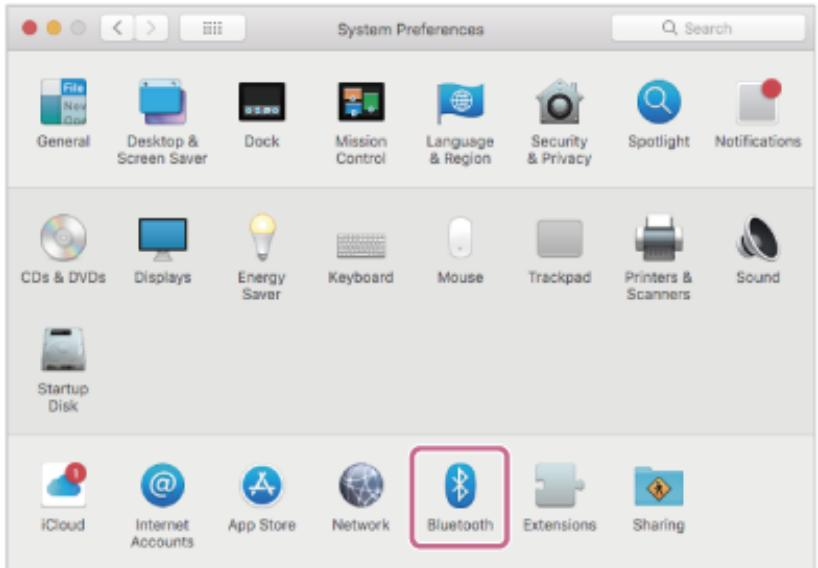

> **AI Description:**
> **Source:** `assets/_page_51_Figure_0.jpg`
> 
> **Generated:** 2026-06-01 23:09:33
> 
> ---
> 
> The image is a screenshot of the "System Preferences" window from a macOS operating system. It displays various icons and labels for different system settings, such as "General," "Desktop & Screen Saver," "Dock," "Mission Control," and others. The icon for "Bluetooth" is highlighted with a pink border, indicating it is the selected or active setting. The layout is organized in a grid format, with each icon representing a different system preference category.


Select [WH-1000XM4] of the [Bluetooth] screen and click [Connect].2. If [WH-1000XM4] and [LE\_WH-1000XM4] are displayed, select [WH-1000XM4]. [LE\_WH-1000XM4] will be displayed first, but wait until [WH-1000XM4] is displayed. It may take about 30 seconds to 1 minute for [WH-1000XM4] to be displayed. If [WH-1000XM4] is not displayed, try again from step 0

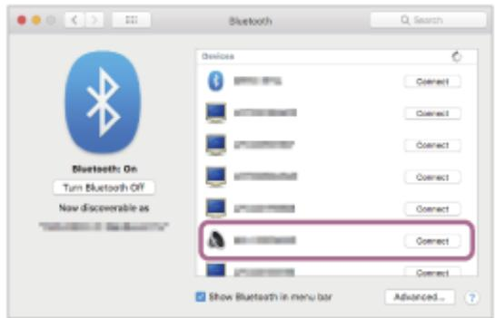

> **AI Description:**
> **Source:** `assets/_page_51_Figure_1.jpg`
> 
> **Generated:** 2026-06-01 23:10:58
> 
> ---
> 
> The image is a screenshot of a Bluetooth settings window from a macOS interface. It displays a list of Bluetooth devices with their names partially obscured, each accompanied by a "Connect" button. The left side of the window shows the Bluetooth status as "On," with options to "Turn Bluetooth Off" and "New discoverable as." The window also includes a checkbox labeled "Show Bluetooth in menu bar" and an "Advanced..." button. The visual elements include icons, text, and buttons, providing a clear layout for managing Bluetooth connections.


If Passkey (\*) input is required, input “0000”.

The headset and computer are paired and connected with each other. You will hear the voice guidance say, “Bluetooth connected”.

If they are not connected, see “Connecting to a paired computer (Mac)”.

A Passkey may be called “Passcode”, “PIN code”, “PIN number”, or “Password”.

## Click the speaker icon in the upper right part of the screen and select [WH-1000XM4].

Now you are ready to enjoy music playback on your computer.

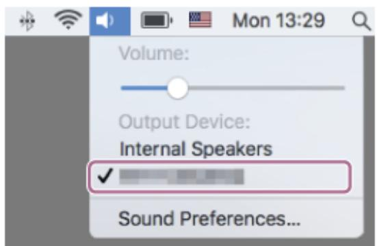

> **AI Description:**
> **Source:** `assets/_page_51_Figure_2.jpg`
> 
> **Generated:** 2026-06-01 23:12:34
> 
> ---
> 
> The image shows a screenshot of a macOS system menu, specifically the Sound settings. It includes a volume slider, the selected output device (Internal Speakers), and an option to access Sound Preferences. The time displayed is Monday at 13:29, and there are icons for Wi-Fi, battery status, and a search function at the top. The image is primarily text with some graphical elements like icons and a slider.


<span id="page-52-0"></span>
## Hint

The operation above is an example. For more details, refer to the operating instructions supplied with the computer.

To delete all Bluetooth pairing information, see “Initializing the headset to restore factory settings”.

## Note

If pairing is not established within 5 minutes, pairing mode is canceled. In this case, start the operation again from step .

Once Bluetooth devices are paired, there is no need to pair them again, except in the following cases:

Pairing information has been deleted after repair, etc.

When a 9th device is paired.

The headset can be paired with up to 8 devices. If a new device is paired after 8 devices are already paired, the registration information of the paired device with the oldest connection date is overwritten with the information for the new device.

When the pairing information for the headset has been deleted from the Bluetooth device.

When the headset is initialized.

All of the pairing information is deleted. In this case, delete the pairing information for the headset from the device and then pair them again.

The headset can be paired with multiple devices, but can only play music from 1 paired device at a time.

## Related Topic

How to make a wireless connection to Bluetooth devices

Connecting to a paired computer (Mac)

Listening to music from a device via Bluetooth connection

Making a video call on a computer

Disconnecting Bluetooth connection (after use)

Initializing the headset to restore factory settings

<span id="page-53-0"></span>
## Connecting to a paired computer (Windows 10)

Before starting the operation, make sure of the following:

Depending on the computer you are using, the built-in Bluetooth adaptor may need to be turned on. If you do not know how to turn on the Bluetooth adaptor or are unsure if your computer has a built-in Bluetooth adaptor, refer to the operating instructions supplied with the computer.


> **AI Description:**
> **Source:** `assets/_page_53_Figure_0.jpg`
> 
> **Generated:** 2026-06-01 23:00:09
> 
> ---
> 
> The image contains a simple diagram with two nodes labeled "1" and "2," connected by a line. The diagram appears to represent a basic relationship or connection between the two nodes, possibly indicating a sequence or a simple flow.


Wake the computer up if the computer is in standby (sleep) or hibernation mode.

Turn on the headset.

Press and hold the (power) button for about 2 seconds.

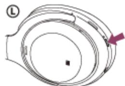

> **AI Description:**
> **Source:** `assets/_page_53_Figure_1.jpg`
> 
> **Generated:** 2026-06-01 23:00:14
> 
> ---
> 
> The image is a diagram of a circular object with a central black dot and several concentric rings. The rings are labeled with the letter "L" at the top left corner, and there is a red arrow pointing to the right, indicating a direction or movement. The diagram appears to represent a cross-section of a mechanical or electronic component, possibly a coil or a ring-shaped part. The concentric rings could represent different layers or sections of the component, and the red arrow might indicate the direction of rotation or flow.


You will hear the voice guidance say, “Power on”. Check that the indicator (blue) continues to flash after you release your finger from the button.


> **AI Description:**
> **Source:** `assets/_page_53_Figure_2.jpg`
> 
> **Generated:** 2026-06-01 23:01:47
> 
> ---
> 
> The image is a technical illustration of a mechanical or electronic component, likely a part of a lens or optical device. It features a circular component with concentric rings and a central hole. The central hole is marked with a small circle and a dot, possibly indicating a specific feature or measurement point. The illustration includes a label "L" on the left side, which might denote the location or type of the component. The image also includes a small inset with a starburst pattern, which could represent a light source or a focal point in the context of the device.


If the headset has automatically connected to the last connected device, you will hear the voice guidance say, “Bluetooth connected”.

Check the connection status on the computer. If it is not connected, proceed to step 3.


## Select the headset using the computer.

1. Right-click the speaker icon on the toolbar, then select [Playback devices].

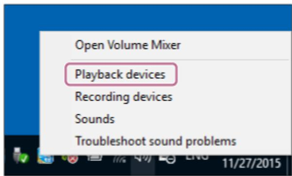

> **AI Description:**
> **Source:** `assets/_page_53_Figure_4.jpg`
> 
> **Generated:** 2026-06-01 22:58:44
> 
> ---
> 
> The image displays a screenshot of a Windows operating system's audio settings menu. The menu is open and shows several options related to audio devices and settings. The highlighted option is "Playback devices," which is likely the focus of the user's current action. The other visible options include "Recording devices," "Sounds," and "Troubleshoot sound problems." The date "11/27/2015" is visible at the bottom right corner, indicating when the screenshot was taken. The image is a standard interface element, not a chart, graph, or photograph.


Right-click [WH-1000XM4].2.

If [WH-1000XM4] is not displayed on the [Sound] screen, right-click on the [Sound] screen, then check [Show Disconnected Devices].

<span id="page-54-0"></span>
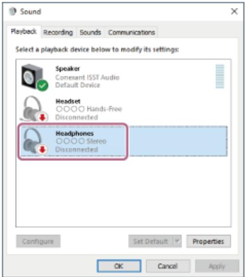

> **AI Description:**
> **Source:** `assets/_page_54_Figure_0.jpg`
> 
> **Generated:** 2026-06-01 22:59:59
> 
> ---
> 
> The image is a screenshot of the "Sound" settings in a Windows operating system. It displays a list of audio playback devices, including a speaker, headset, and headphones. The speaker is marked as the default device and is connected. The headset is listed as disconnected, and the headphones are also listed as disconnected. There are buttons at the bottom for configuring, setting as default, and applying settings. The interface is designed for managing audio output devices.


## Select [Connect] from the displayed menu.3.

The connection is established. You will hear the voice guidance say, “Bluetooth connected”.
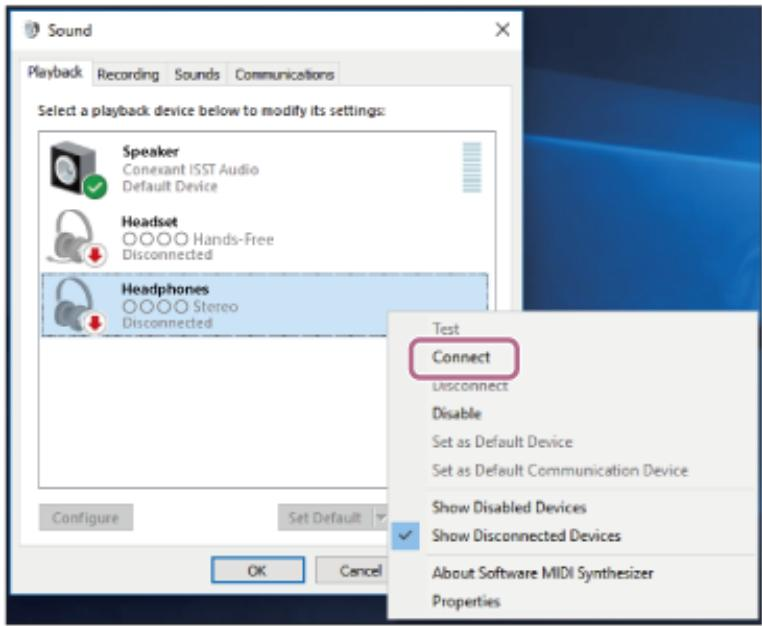

> **AI Description:**
> **Source:** `assets/_page_54_Figure_1.jpg`
> 
> **Generated:** 2026-06-01 23:00:34
> 
> ---
> 
> The image is a screenshot of the "Sound" settings in a Windows operating system. It displays the "Playback" tab with a list of audio devices: "Speaker," "Headset," and "Headphones." The "Speaker" is marked as the "Default Device" and is connected, indicated by a green checkmark. The "Headset" and "Headphones" are both disconnected, as indicated by red arrows pointing downwards. The image also shows a dropdown menu with options such as "Connect," "Disconnect," "Disable," "Set as Default Device," and "Set as Default Communication Device." The "Connect" option is highlighted with a red circle.


> **AI Description:**
> **Source:** `assets/_page_54_Figure_2.jpg`
> 
> **Generated:** 2026-06-01 23:02:00
> 
> ---
> 
> The image is a screenshot of a Windows Sound settings window, specifically the "Playback" tab. It displays a list of available audio devices for playback, including a speaker, headset, and headphones. Each device is labeled with its name and default status. The speaker is labeled as the "Default Multimedia Device," the headset as the "Default Communications Device," and the headphones as the "Default Device." There are options to configure, set as default, and view properties for each device.


## Hint

<span id="page-55-0"></span>
## Note

When connecting, if [WH-1000XM4] and [LE\_WH-1000XM4] are displayed, select [WH-1000XM4].

[LE\_WH-1000XM4] will be displayed first, but wait until [WH-1000XM4] is displayed.

It may take about 30 seconds to 1 minute for [WH-1000XM4] to be displayed.

If [WH-1000XM4] is not displayed, perform the pairing again.

If the music playback sound quality is poor, check that the A2DP function which supports music playback connections is enabled in the computer settings. For more details, refer to the operating instructions supplied with the computer.

If the last-connected Bluetooth device is placed near the headset, the headset may connect automatically to the device by simply turning on the headset. In that case, deactivate the Bluetooth function on the last-connected device or turn off the power.

If you cannot connect your computer to the headset, delete the headset pairing information on your computer and perform the pairing again. As for the operations on your computer, refer to the operating instructions supplied with the computer.

## Related Topic

How to make a wireless connection to Bluetooth devices

Pairing and connecting with a computer (Windows 10)

Listening to music from a device via Bluetooth connection

Disconnecting Bluetooth connection (after use)

<span id="page-56-0"></span>
## Connecting to a paired computer (Windows 8.1)

Before starting the operation, make sure of the following:

Depending on the computer you are using, the built-in Bluetooth adaptor may need to be turned on. If you do not know how to turn on the Bluetooth adaptor or are unsure if your computer has a built-in Bluetooth adaptor, refer to the operating instructions supplied with the computer.


> **AI Description:**
> **Source:** `assets/_page_56_Figure_0.jpg`
> 
> **Generated:** 2026-06-01 23:09:40
> 
> ---
> 
> The image contains a simple diagram with two numbered circles labeled "1" and "2". There is a single line connecting these two circles, suggesting a relationship or connection between them. The diagram appears to be a basic representation of a two-step process or a simple flowchart.


Wake the computer up if the computer is in standby (sleep) or hibernation mode.

Turn on the headset.

Press and hold the (power) button for about 2 seconds.

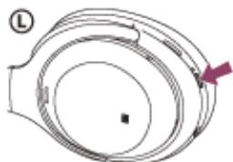

> **AI Description:**
> **Source:** `assets/_page_56_Figure_1.jpg`
> 
> **Generated:** 2026-06-01 23:10:46
> 
> ---
> 
> The image is a diagram of a circular object with multiple concentric rings and arrows indicating a direction of rotation. The outermost ring is labeled "L" and there is an arrow pointing clockwise, suggesting the direction of rotation. The central part of the diagram appears to be a circular void or hole. The diagram is likely used to illustrate a mechanical or rotational system, possibly related to a gear or a similar component.


You will hear the voice guidance say, “Power on”. Check that the indicator (blue) continues to flash after you release your finger from the button.


> **AI Description:**
> **Source:** `assets/_page_56_Figure_2.jpg`
> 
> **Generated:** 2026-06-01 23:12:13
> 
> ---
> 
> The image is a technical illustration of a camera lens, specifically highlighting the aperture mechanism. The diagram shows a cross-sectional view of a camera lens with the aperture blades visible. The aperture is in a closed position, with the blades fully covering the lens opening. The illustration includes a label "L" to indicate the lens, and a small inset showing the aperture blades in a closed state. The image is designed to demonstrate the internal structure of a camera lens and the function of the aperture in controlling light.


If the headset has automatically connected to the last connected device, you will hear the voice guidance say, “Bluetooth connected”.

Check the connection status on the computer. If it is not connected, proceed to step 3.


## Select the headset using the computer.

1. Select [Desktop] on the Start screen.

2. Right-click the [Start] button, then select [Control Panel] from the pop-up menu.

3. Select [Hardware and Sound] - [Sound].

<span id="page-57-0"></span>
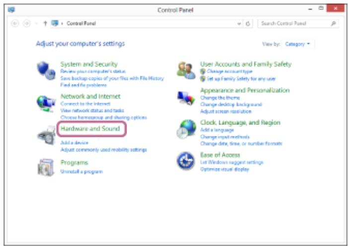

> **AI Description:**
> **Source:** `assets/_page_57_Figure_0.jpg`
> 
> **Generated:** 2026-06-01 23:13:28
> 
> ---
> 
> The image is a screenshot of the Windows Control Panel, specifically showing the "Category" view. It displays various settings and options available for adjusting computer configurations. The section highlighted is "Hardware and Sound," which includes options such as adding a device and adjusting mobility settings. Other categories visible include "System and Security," "Network and Internet," "User Accounts and Family Safety," "Appearance and Personalization," "Clock, Language, and Region," and "Ease of Access." The layout is typical of a Windows operating system's Control Panel, with icons and text descriptions for each setting.


> **AI Description:**
> **Source:** `assets/_page_57_Figure_1.jpg`
> 
> **Generated:** 2026-06-01 23:13:10
> 
> ---
> 
> The image is a screenshot of the "Hardware and Sound" section in the Control Panel of a Windows operating system. It displays various settings options such as "Devices and Printers," "AutoPlay," "Sound," "Power Options," "Display," "Windows Mobility Center," and "Location Settings." The "Sound" option is highlighted with a red circle, indicating it is the selected or focused setting. The interface includes standard Windows icons and text descriptions for each setting.


## Right-click [WH-1000XM4].4.

If [WH-1000XM4] is not displayed on the [Sound] screen, right-click on the [Sound] screen, then check [Show Disconnected Devices].


> **AI Description:**
> **Source:** `assets/_page_57_Figure_2.jpg`
> 
> **Generated:** 2026-06-01 23:14:55
> 
> ---
> 
> The image is a screenshot of a Windows Sound settings window. It displays a list of playback devices, including a speaker, headset, and headphones. The speaker is marked as the default device and is connected. The headset and headphones are both listed as disconnected. There are options to configure, set default, and view properties for each device. The interface includes buttons for OK, Cancel, and Apply.


## 5. Select [Connect] from the displayed menu.

<span id="page-58-0"></span>
The connection is established. You will hear the voice guidance say, “Bluetooth connected”.


> **AI Description:**
> **Source:** `assets/_page_58_Figure_0.jpg`
> 
> **Generated:** 2026-06-01 23:04:58
> 
> ---
> 
> The image shows a screenshot of the "Sound" settings in a Windows operating system. It displays the "Playback" tab, where audio devices are listed. The "Speaker" is set as the default device and is connected, indicated by a green checkmark. The "Headset" and "Headphones" are both disconnected, as indicated by red arrows pointing downwards. There is a dropdown menu open next to the "Headphones" device, showing options such as "Connect," "Disconnect," "Disable," and others. The background of the window shows part of the Windows desktop with a blue gradient.


> **AI Description:**
> **Source:** `assets/_page_58_Figure_1.jpg`
> 
> **Generated:** 2026-06-01 23:05:06
> 
> ---
> 
> The image is a screenshot of a Windows Sound settings window, specifically the "Playback" tab. It displays a list of available audio devices for playback, including a speaker, headset, and headphones. The headphones are currently selected as the default device. There are options to configure, set as default, and view properties for each device. The interface includes buttons for OK, Cancel, and Apply.


## Hint

The operation above is an example. For more details, refer to the operating instructions supplied with the computer.

## Note

- When connecting, if [WH-1000XM4] and [LE\_WH-1000XM4] are displayed, select [WH-1000XM4].
- [LE\_WH-1000XM4] will be displayed first, but wait until [WH-1000XM4] is displayed.

If [WH-1000XM4] is not displayed, perform the pairing again.

If the music playback sound quality is poor, check that the A2DP function which supports music playback connections is enabled in the computer settings. For more details, refer to the operating instructions supplied with the computer.

If the last-connected Bluetooth device is placed near the headset, the headset may connect automatically to the device by simply turning on the headset. In that case, deactivate the Bluetooth function on the last-connected device or turn off the power.

If you cannot connect your computer to the headset, delete the headset pairing information on your computer and perform the pairing again. As for the operations on your computer, refer to the operating instructions supplied with the computer.

<span id="page-59-0"></span>
## Related Topic

How to make a wireless connection to Bluetooth devices

Pairing and connecting with a computer (Windows 8.1)

Listening to music from a device via Bluetooth connection

Disconnecting Bluetooth connection (after use)

<span id="page-60-0"></span>
Wireless Noise Canceling Stereo Headset WH-1000XM4

## Connecting to a paired computer (Mac)

## Compatible OS

macOS (version 10.10 or later)

Before starting the operation, make sure of the following:

Depending on the computer you are using, the built-in Bluetooth adaptor may need to be turned on. If you do not know how to turn on the Bluetooth adaptor or are unsure if your computer has a built-in Bluetooth adaptor, refer to the operating instructions supplied with the computer.

Set the computer speaker to the ON mode.

If the computer speaker is set to the “OFF” mode, no sound is heard from the headset.

Computer speaker in the ON mode


> **AI Description:**
> **Source:** `assets/_page_60_Figure_0.jpg`
> 
> **Generated:** 2026-06-01 23:11:50
> 
> ---
> 
> The image contains a series of icons typically found in a computer's system tray. The icons include a speaker symbol, a Wi-Fi symbol, a monitor symbol, and a speaker symbol with a minus sign, indicating sound volume control. The icons are arranged horizontally, and the speaker symbol with the minus sign is highlighted, suggesting it is the focus or the last icon in the sequence.


> **AI Description:**
> **Source:** `assets/_page_60_Figure_2.jpg`
> 
> **Generated:** 2026-06-01 23:10:05
> 
> ---
> 
> The image contains a simple diagram with two nodes labeled "1" and "2," connected by a line. This suggests a basic relationship or connection between the two elements, possibly indicating a sequence or a simple flow. The diagram is minimalistic and lacks additional context or labels to provide more detailed information.


Wake the computer up if the computer is in standby (sleep) or hibernation mode.

## Turn on the headset.

Press and hold the (power) button for about 2 seconds.


> **AI Description:**
> **Source:** `assets/_page_60_Figure_3.jpg`
> 
> **Generated:** 2026-06-01 23:10:10
> 
> ---
> 
> The image is a diagram of a circular object with a central black dot and multiple concentric rings. The rings are labeled with the letter "L" and have arrows indicating a clockwise rotation. The diagram appears to represent a conceptual or technical illustration, possibly related to a mechanical or physical system. The central black dot could represent a pivot point or a focal point within the system.


You will hear the voice guidance say, “Power on”. Check that the indicator (blue) continues to flash after you release your finger from the button.


> **AI Description:**
> **Source:** `assets/_page_60_Figure_4.jpg`
> 
> **Generated:** 2026-06-01 23:13:16
> 
> ---
> 
> The image is a technical illustration of a wristwatch, specifically highlighting the watch face and its components. It includes a close-up view of the watch face with a focus on the hour markers and the watch hands. The image also shows a magnified view of the watch hands, emphasizing their design and structure. The label "L" is present, likely indicating a left-handed watch. The image is detailed and technical, providing a clear view of the watch's features.


If the headset has automatically connected to the last connected device, you will hear the voice guidance say, “Bluetooth connected”.

Check the connection status on the computer. If it is not connected, proceed to step 3.


## Select the headset using the computer.


> **AI Description:**
> **Source:** `assets/_page_60_Figure_6.jpg`
> 
> **Generated:** 2026-06-01 23:14:59
> 
> ---
> 
> The image contains a circular logo with a star-like design in the center. The logo appears to be a stylized representation of a car's wheel, with spokes radiating outward from the central hub. The design is simple and geometric, with no additional text or labels present.


1. Select [ (System Preferences)] - [Bluetooth] from the task bar in the lower right part of the screen.

<span id="page-61-0"></span>


> **AI Description:**
> **Source:** `assets/_page_61_Figure_0.jpg`
> 
> **Generated:** 2026-06-01 23:14:33
> 
> ---
> 
> The image is a screenshot of a macOS System Preferences window. It displays a grid of icons, each representing a different system preference category. The icons are arranged in three rows. The top row includes categories like "General," "Desktop & Screen Saver," "Dock," "Mission Control," "Language & Region," "Security & Privacy," "Spotlight," and "Notifications." The second row contains icons for "CDs & DVDs," "Displays," "Energy Saver," "Keyboard," "Mouse," "Trackpad," "Printers & Scanners," and "Sound." The third row features "Startup Disk," "iCloud," "Internet Accounts," "App Store," "Network," "Bluetooth," "Extensions," and "Sharing." The "Bluetooth" icon is highlighted with a pink border, indicating it is the selected or active preference.


> **AI Description:**
> **Source:** `assets/_page_61_Figure_1.jpg`
> 
> **Generated:** 2026-06-01 23:15:07
> 
> ---
> 
> The image is a screenshot of a Bluetooth settings window from a macOS operating system. It displays the Bluetooth status as "On" with the option to "Turn Bluetooth Off" visible. Below this, it indicates that the device is "Now discoverable as" followed by a partially obscured name. The right side of the window lists connected Bluetooth devices, with one device highlighted in a red box, suggesting it is the focus of the image. The window also includes a checkbox labeled "Show Bluetooth in menu bar" and an "Advanced..." button.

You will hear the voice guidance say, “Bluetooth connected”.

Click the speaker icon in the upper right part of the screen and select [WH-1000XM4].

Now you are ready to enjoy music playback on your computer.


> **AI Description:**
> **Source:** `assets/_page_61_Figure_2.jpg`
> 
> **Generated:** 2026-06-01 23:13:42
> 
> ---
> 
> The image displays a section of a computer's system tray, specifically the sound settings. It includes a volume slider, a label indicating the output device as "Internal Speakers," and a highlighted section with a checkmark and a blurred-out label, suggesting a selected audio output device. The time and date are also visible at the top of the system tray.


## Hint

The operation above is an example. For more details, refer to the operating instructions supplied with the computer.

## Note

- When connecting, if [WH-1000XM4] and [LE\_WH-1000XM4] are displayed, select [WH-1000XM4].
- [LE\_WH-1000XM4] will be displayed first, but wait until [WH-1000XM4] is displayed.
- It may take about 30 seconds to 1 minute for [WH-1000XM4] to be displayed.
- If [WH-1000XM4] is not displayed, perform the pairing again.

<span id="page-62-0"></span>
If the music playback sound quality is poor, check that the A2DP function which supports music playback connections is enabled in the computer settings. For more details, refer to the operating instructions supplied with the computer.

If the last-connected Bluetooth device is placed near the headset, the headset may connect automatically to the device by simply turning on the headset. In that case, deactivate the Bluetooth function on the last-connected device or turn off the power.

If you cannot connect your computer to the headset, delete the headset pairing information on your computer and perform the pairing again. As for the operations on your computer, refer to the operating instructions supplied with the computer.

## Related Topic

How to make a wireless connection to Bluetooth devices

Pairing and connecting with a computer (Mac)

Listening to music from a device via Bluetooth connection

Disconnecting Bluetooth connection (after use)

<span id="page-63-0"></span>
## Pairing and connecting with a Bluetooth device

The operation to register the device that you wish to connect to is called “pairing”. First, pair a device to use it with the headset for the first time.

Before starting the operation, make sure of the following:

The Bluetooth device is placed within 1 m (3 feet) of the headset.

The headset is charged sufficiently.

The operating instructions of the Bluetooth device is in hand.

## 1 Enter pairing mode on this headset.

Turn on the headset when you pair the headset with a device for the first time after you bought it or after you initialized the headset (the headset has no pairing information). The headset enters pairing mode automatically. In this case, proceed to step 2.

When you pair a second or subsequent device (the headset has pairing information for other devices), press and hold the (power) button for about 7 seconds.


> **AI Description:**
> **Source:** `assets/_page_63_Figure_0.jpg`
> 
> **Generated:** 2026-06-01 22:58:16
> 
> ---
> 
> The image is a diagram of a circular object with multiple concentric rings labeled with the letter "L". The rings appear to represent different layers or sections of the object. The diagram includes an arrow pointing to the right, indicating a direction or movement. The central part of the object is marked with a dot, possibly representing a core or center. The overall structure suggests a cross-sectional view of a cylindrical or toroidal object.


Check that the indicator (blue) repeatedly flashes twice in a row. You will hear the voice guidance say, “Bluetooth pairing”.


> **AI Description:**
> **Source:** `assets/_page_63_Figure_1.jpg`
> 
> **Generated:** 2026-06-01 22:59:17
> 
> ---
> 
> The image is a diagram of a wristwatch, specifically highlighting the watch face and a small, circular component that appears to be a second hand or a chronograph feature. The diagram includes a label "L" on the left side, which likely indicates the left side of the watch. The circular component is marked with a small dot and a starburst pattern, suggesting it is a functional part of the watch, possibly used for timing or measuring. The overall design is simple and technical, focusing on the watch's functionality.


## Perform the pairing procedure on the Bluetooth device to search for this headset.

[WH-1000XM4] will be displayed on the list of detected devices on the screen of the Bluetooth device.

If [WH-1000XM4] and [LE\_WH-1000XM4] are displayed, select [WH-1000XM4].

[LE\_WH-1000XM4] will be displayed first, but wait until [WH-1000XM4] is displayed.

It may take about 30 seconds to 1 minute for [WH-1000XM4] to be displayed.

If [WH-1000XM4] is not displayed, try again from step 1.


## Select [WH-1000XM4] displayed on the screen of the Bluetooth device for pairing.

If Passkey (\*) input is required, input “0000”.

A Passkey may be called “Passcode”, “PIN code”, “PIN number”, or “Password”.


## Make the Bluetooth connection from the Bluetooth device.

Some devices automatically connect with the headset when the pairing is complete. You will hear the voice guidance say, “Bluetooth connected”.

<span id="page-64-0"></span>
## Hint

The operation above is an example. For more details, refer to the operating instructions supplied with the Bluetooth device.

To delete all Bluetooth pairing information, see “Initializing the headset to restore factory settings”.

## Note

If pairing is not established within 5 minutes, pairing mode is canceled. In this case, start the operation again from step 1.

Once Bluetooth devices are paired, there is no need to pair them again, except in the following cases:

Pairing information has been deleted after repair, etc.

When a 9th device is paired.

The headset can be paired with up to 8 devices. If a new device is paired after 8 devices are already paired, the registration information of the paired device with the oldest connection date is overwritten with the information for the new device.

When the pairing information for the headset has been deleted from the Bluetooth device.

When the headset is initialized.

All of the pairing information is deleted. In this case, delete the pairing information for the headset from the device and then pair them again.

The headset can be paired with multiple devices, but can only play music from 1 paired device at a time.

## Related Topic

How to make a wireless connection to Bluetooth devices

Connecting to a paired Bluetooth device

Listening to music from a device via Bluetooth connection

Disconnecting Bluetooth connection (after use)

Initializing the headset to restore factory settings

<span id="page-65-0"></span>
## Connecting to a paired Bluetooth device


## Turn on the headset.

Press and hold the (power) button for about 2 seconds.


> **AI Description:**
> **Source:** `assets/_page_65_Figure_1.jpg`
> 
> **Generated:** 2026-06-01 23:01:12
> 
> ---
> 
> The image is a diagram of a circular object with a central black dot and several concentric rings. The rings are labeled with the letter "L" and have arrows indicating a clockwise rotation. The diagram appears to represent a conceptual or technical illustration, possibly related to a mechanical or physical system. The central black dot could represent a pivot point or a specific feature of the system being depicted.


You will hear the voice guidance say, “Power on”. Check that the indicator (blue) continues to flash after you release your finger from the button.


> **AI Description:**
> **Source:** `assets/_page_65_Figure_2.jpg`
> 
> **Generated:** 2026-06-01 22:59:45
> 
> ---
> 
> The image is a technical illustration of a lens or optical component. It shows a circular component with a central hole and multiple concentric rings, likely representing different layers or sections of the lens. The central hole has a small circular mark with a blue dot and radiating lines, possibly indicating a focal point or center of the lens. The letter "L" in the top left corner suggests this is a lens or part of a lens. The image is not a chart, graph, or photograph, but rather a detailed technical drawing.


If the headset has automatically connected to the last connected device, you will hear the voice guidance say, “Bluetooth connected”.

Check the connection status on the Bluetooth device. If it is not connected, proceed to step 2.


## Make the Bluetooth connection from the Bluetooth device.

As for the operations on your Bluetooth device, refer to the operating instructions supplied with the Bluetooth device. When connected, you will hear the voice guidance say, “Bluetooth connected”.

## Hint

The operation above is an example. For more details, refer to the operating instructions supplied with the Bluetooth device.

## Note

When connecting, if [WH-1000XM4] and [LE\_WH-1000XM4] are displayed, select [WH-1000XM4].   
[LE\_WH-1000XM4] will be displayed first, but wait until [WH-1000XM4] is displayed.   
It may take about 30 seconds to 1 minute for [WH-1000XM4] to be displayed.   
If [WH-1000XM4] is not displayed, perform the pairing again.

If the last-connected Bluetooth device is placed near the headset, the headset may connect automatically to the device by simply turning on the headset. In that case, deactivate the Bluetooth function on the last-connected device or turn off the power.

If you cannot connect your Bluetooth device to the headset, delete the headset pairing information on your Bluetooth device and perform the pairing again. As for the operations on your Bluetooth device, refer to the operating instructions supplied with the Bluetooth device.

<span id="page-66-0"></span>
## Related Topic

How to make a wireless connection to Bluetooth devices

Pairing and connecting with a Bluetooth device

Listening to music from a device via Bluetooth connection

Disconnecting Bluetooth connection (after use)

<span id="page-67-0"></span>
Wireless Noise Canceling Stereo Headset WH-1000XM4

## Connecting the headset to both a music player and a smartphone / mobile phone (multipoint connection)

Multipoint is a function which allows you to connect 2 Bluetooth devices to the headset and use one device for music playback (A2DP connection) and the other for calls (HFP/HSP connection).

When you wish to use a music player only for music playback and a smartphone only for calls, use a multipoint connection to the headset for each device. The connecting devices need to support the Bluetooth function.


> **AI Description:**
> **Source:** `assets/_page_67_Figure_0.jpg`
> 
> **Generated:** 2026-06-01 23:12:06
> 
> ---
> 
> The image contains a simple diagram with two nodes labeled "1" and "2," connected by a line. This suggests a basic relationship or connection between the two elements, possibly representing a simple flow or sequence in a larger context. The diagram is minimalistic and lacks additional labels or annotations that might provide more context or information about the relationship between "1" and "2."


Pair the headset with both the music player and the smartphone/mobile phone.

## Connect the headset with the music player.

Operate the music player to establish a Bluetooth connection with the headset.

## 3 Connect the headset to the smartphone/mobile phone.

Operate the smartphone/mobile phone to establish a Bluetooth connection with the headset.

## Note

If the smartphone or mobile phone was connected with the headset last time, an HFP or HSP connection is automatically established when the headset is turned on, and in some cases an A2DP connection is simultaneously established. In that case, connect from step 2 after disconnecting via smartphone/mobile phone operations.

<span id="page-68-0"></span>
## Connecting the headset to 2 Android smartphones (multipoint connection)

Usually, when you connect the headset to a smartphone, both the music playback function and the phone call function are connected simultaneously.

To make a multipoint connection using 2 smartphones to use one for listening to music and the other for making phone calls, set up to connect to only one function by operating the smartphone.

Pair the headset with both smartphones, respectively.

Operate one of the smartphones to establish a Bluetooth connection with the headset.

Operate the smartphone connected to the headset, uncheck either [Call audio] (HFP) or [Media audio] (A2DP).

Operation example: For connecting only through media audio (A2DP)

Touch [Settings] - [Device connection] - [Bluetooth] - the setting icon next to [WH-1000XM4].


On the [Paired devices] screen, uncheck [Call audio].


> **AI Description:**
> **Source:** `assets/_page_68_Figure_0.jpg`
> 
> **Generated:** 2026-06-01 23:02:51
> 
> ---
> 
> The image displays a section from a user interface, likely from a device settings menu. It shows a section titled "Paired devices" with a progress bar indicating the number of devices paired, which is four. Below the progress bar, there are options for "Use for," with two checkboxes: "Call audio" and "Media audio." The "Media audio" checkbox is checked, indicating it is selected. At the bottom, there are two buttons labeled "FORGET" and "OK." The image is primarily text-based with a simple layout and no additional visual elements.


Operate the smartphone to terminate the Bluetooth connection.

Operate the other smartphone to establish a Bluetooth connection with the headset.

In the same way, uncheck the function that you did not uncheck in step 3.

Operate the first smartphone to establish a Bluetooth connection with the headset.

Both smartphones are connected to the headset with only one function enabled.

<span id="page-69-0"></span>
## Hint

The operation above is an example. For more details, refer to the operating instructions supplied with the Android smartphone.

## Note

When using multipoint connection, the remaining battery charge of the headset will not be correctly displayed on the screen of the device that is connected for listening to music (A2DP).

## Related Topic

Checking the remaining battery charge

<span id="page-70-0"></span>
Wireless Noise Canceling Stereo Headset WH-1000XM4

## Connecting the headset to an Android smartphone and an iPhone (multipoint connection)

Usually, when you connect the headset to a smartphone, both the music playback function and the phone call function are connected simultaneously.

To make a multipoint connection using a smartphone and an iPhone to use one for listening to music and the other for making phone calls, change the settings on the smartphone so that only one of the functions is connected. Connect the smartphone before connecting the iPhone.

You cannot set the iPhone to connect one function only.


Pair the headset with both the smartphone and the iPhone, respectively.


Operate the smartphone to establish a Bluetooth connection with the headset.


Operate the smartphone connected to the headset, uncheck either [Call audio] (HFP) or [Media audio] (A2DP).

Operation example: For connecting only through media audio (A2DP)

Touch [Settings] - [Device connection] - [Bluetooth] - the setting icon next to [WH-1000XM4].


On the [Paired devices] screen, uncheck [Call audio].

```
Paired devices   
Medis suclo
```


Operate the iPhone to establish a Bluetooth connection with the headset.

The iPhone is connected with the function unchecked in step 3.

## Hint

- The operation above is an example. For more details, refer to the operating instructions supplied with the Android smartphone and iPhone.

<span id="page-71-0"></span>
## Note

When using multipoint connection, the remaining battery charge of the headset will not be correctly displayed on the screen of the device that is connected for listening to music (A2DP).

## Related Topic

Checking the remaining battery charge

<span id="page-72-0"></span>
## Connecting the headset to 2 devices simultaneously (multipoint connection)

When [Connect to 2 devices simultaneously] is turned on with the “Sony | Headphones Connect” app, the headset can connect to 2 devices via Bluetooth connections simultaneously, allowing you to do the following.

Waiting for an incoming call for 2 smartphones

You can listen to music played on one smartphone with the headset, wait for an incoming call for both smartphones, and talk if an incoming call arrives.


> **AI Description:**
> **Source:** `assets/_page_72_Figure_0.jpg`
> 
> **Generated:** 2026-06-01 23:11:15
> 
> ---
> 
> The image is a diagram illustrating a communication setup involving two mobile devices and a pair of headphones. It shows two smartphones with call icons above them, indicating a call or communication connection. Arrows point from each phone to the headphones, suggesting that the audio from the phones is being directed to the headphones. This setup likely represents a scenario where two people are communicating through their phones, and the headphones are used to share the audio between them.


Switching music playback between 2 devices

You can switch the music playback from one device to the other without performing a Bluetooth reconnection.


> **AI Description:**
> **Source:** `assets/_page_72_Figure_1.jpg`
> 
> **Generated:** 2026-06-01 23:12:20
> 
> ---
> 
> The image is a diagram illustrating a basic concept of audio transmission or sharing between two mobile devices. It features two smartphones with musical notes above them, indicating audio output, and an arrow pointing between them, suggesting the direction of audio transmission. Below the smartphones, there is a pair of headphones, which implies that the audio is being played through these headphones. The diagram is simple and uses arrows and symbols to convey the idea of audio being shared or transferred between the two devices.


Connecting the headset to 2 devices via Bluetooth connections simultaneously

Before connecting, make sure that the “Sony | Headphones Connect” app is installed on one of the 2 devices.

Pair the headset with 2 devices, respectively.

Operate the device on which the “Sony | Headphones Connect” app is installed to establish a Bluetooth connection with the headset.

Turn on [Connect to 2 devices simultaneously] with the “Sony | Headphones Connect” app.

Operate the second device to establish a Bluetooth connection with the headset.

<span id="page-73-0"></span>
When Bluetooth connections are established between 2 devices and the headset, another paired device can be connected via Bluetooth connection.

If you try to make a Bluetooth connection with the headset by operating the third device, the Bluetooth connection with the last device that played music will be maintained, and the Bluetooth connection with the other device will be disconnected. Then a Bluetooth connection between the third device and the headset is established.

## Music playback when the headset is connected to 2 devices via Bluetooth connections

When playing music by operating the headset, the music is played from the device that played last.

If you want to play music from the other device, stop playback on the device that is playing the music, and start playback by operating the other device.

Even if you start playback by operating the second device while playing music on the first device, the music from the first device will continue to be heard via the headset. In this state, if you stop playback on the first device, you can listen to music from the second device via the headset.

## Talking on the phone when the headset is connected to 2 devices via Bluetooth connections

When the headset is connected to 2 smartphones, etc. via Bluetooth connections simultaneously, both devices will be in standby mode.

When an incoming call arrives to the first device, a ring tone is heard via the headset. When an incoming call arrives to the second device while talking on the headset, a ring tone is heard via the second device.

If you finish the call on the first device, the ring tone from the second device will be heard via the headset.

## Note

When [Connect to 2 devices simultaneously] is turned on with the “Sony | Headphones Connect” app, LDAC cannot be used. The codec is automatically switched to AAC or SBC.

## Related Topic

What you can do with the “Sony | Headphones Connect” app

How to make a wireless connection to Bluetooth devices

Supported codecs

<span id="page-74-0"></span>
Wireless Noise Canceling Stereo Headset

WH-1000XM4

## Disconnecting Bluetooth connection (after use)

Unlock the screen of the Bluetooth device if it is locked.

Touch the one-touch connection (NFC) compatible device again to disconnect it. If the Bluetooth device does not support one-touch connection (NFC), disconnect the device by operating the device.

When disconnected, you will hear the voice guidance say, “Bluetooth disconnected”.

## Turn off the headset.

You will hear the voice guidance say, “Power off”.

Hint

When you finish playing music, the Bluetooth connection may terminate automatically depending on the Bluetooth device.

## Related Topic

Disconnecting the Android smartphone with one-touch (NFC)

Turning off the headset

<span id="page-75-0"></span>
Wireless Noise Canceling Stereo Headset WH-1000XM4

## Using the supplied headphone cable

If you use the headset at a place where it is restricted to use Bluetooth devices such as on an airplane, you can use the headset as noise canceling headphones while the headset is connected to a device via the supplied headphone cable and the headset is turned on.

The headset supports High-Resolution Audio playback.

1 Connect a playback device to the headphone cable input jack with the supplied headphone cable.

Be sure to connect the L-shaped plug into the connecting device.


> **AI Description:**
> **Source:** `assets/_page_75_Figure_0.jpg`
> 
> **Generated:** 2026-06-01 23:11:23
> 
> ---
> 
> The image is a technical illustration showing a pair of over-ear headphones connected to a 3.5mm audio cable. The cable is then shown connecting to a smartphone and a power adapter, with an airplane icon at the end. The illustration is likely used to demonstrate how to connect headphones to a device and power them through an adapter, possibly for travel.


## Hint

You can listen to music even if the headset is turned off. In this case, the noise canceling function cannot be used.

To enjoy High-Resolution Audio music or use functions such as noise canceling/Ambient Sound Mode, turn the headset on.

Use the supplied plug adaptor for in-flight use to enjoy the in-flight entertainment.

The headset turns off automatically if you disconnect the supplied headphone cable from the headset while it is turned on.

When an incoming call arrives, a ring tone is heard via the headset. Answer the call using your smartphone or mobile phone, and talk using the microphone of the phone. You can hear the caller’s voice from the headset. If you disconnect the headphone cable from the smartphone or mobile phone, you can talk using the microphone and speaker of the phone.

## Note

Use the supplied headphone cable only.

Make sure you insert the plug firmly.

When using the headphone cable, the Bluetooth function cannot be used.

You can use Quick Attention Mode and Speak-to-Chat while the headset is connected to a device via the supplied headphone cable and the headset is turned on. Perform operations, such as adjusting the volume and play/pause, on the playback device. When the headset is turned off, you cannot use Quick Attention Mode and Speak-to-Chat.

The CUSTOM button cannot be used when the headset is turned off.

Depending on the in-flight entertainment, the plug adaptor for in-flight use may not be used.

When talking on the phone by connecting the headphone cable and the headset, disable Speak-to-Chat because the caller’s voice will not be heard from the headset.

## Related Topic

Using the noise canceling function

<span id="page-76-0"></span>
Listening to ambient sound during music playback (Ambient Sound Mode)

Listening to ambient sound quickly (Quick Attention Mode)

Speaking with someone while wearing the headset (Speak-to-Chat)

<span id="page-77-0"></span>
## Listening to music from a device via Bluetooth connection

If your Bluetooth device supports the following profiles, you can enjoy listening to music and control the device from your headset via Bluetooth connection.

A2DP (Advanced Audio Distribution Profile)

You can enjoy high-quality music wirelessly.

AVRCP (Audio Video Remote Control Profile)

You can adjust the volume, etc.

The operation may vary depending on the Bluetooth device. Refer to the operating instructions supplied with the Bluetooth device.

Connect the headset to a Bluetooth device.

## Put the headset on your ears.

Adjust the length of the headband.

Put the headset on your head with the (left) mark on your left ear and the (right) mark on your right ear.   
There is a tactile dot on the (left) mark side.


> **AI Description:**
> **Source:** `assets/_page_77_Figure_0.jpg`
> 
> **Generated:** 2026-06-01 23:01:19
> 
> ---
> 
> The image contains a technical illustration of a person wearing over-ear headphones. The diagram highlights a specific part of the ear, labeled as "A" and marked with a "L" to indicate the left side. The illustration includes arrows indicating the direction of movement or adjustment for the headband and ear cups, suggesting how the headphones can be adjusted for a comfortable fit. The image is likely used for instructional purposes, such as assembly or usage instructions for the headphones.


A: Tactile dot

Operate the Bluetooth device to start playback and adjust the volume to a moderate level.

Adjust the volume using the touch sensor control panel of the headset.

Increase the volume: Swipe up repeatedly until the volume reaches the desired level.


> **AI Description:**
> **Source:** `assets/_page_77_Figure_1.jpg`
> 
> **Generated:** 2026-06-01 23:02:06
> 
> ---
> 
> The image is a technical illustration showing a person wearing over-ear headphones. The focus is on the control button on the side of the headphones, which is highlighted with a purple arrow pointing upwards. The illustration suggests that pressing this button will likely increase the volume or adjust a setting related to the headphones' functionality. The image is likely part of an instructional guide or user manual for the headphones.


Decrease the volume: Swipe down repeatedly until the volume reaches the desired level.

<span id="page-78-0"></span>


> **AI Description:**
> **Source:** `assets/_page_78_Figure_0.jpg`
> 
> **Generated:** 2026-06-01 23:08:00
> 
> ---
> 
> The image is a technical illustration showing a hand pressing a button on a device, likely a smartwatch or fitness tracker. The button is circular with a downward arrow indicating the action to be performed. The hand is positioned to press the button, suggesting an interaction with the device. The illustration is simple and focuses on the interaction point, likely to guide the user on how to use the device.


Change the volume continuously: Swipe up or down and hold. Release at the desired volume level.

When the volume reaches the maximum or minimum, an alarm sounds.

## Hint

The headset supports SCMS-T content protection. You can enjoy music and other audio on the headset from a device such as a mobile phone or portable TV that supports SCMS-T content protection.

Depending on the Bluetooth device, it may be necessary to adjust the volume or set the audio output setting on the device.

The headset volume during a call and during music playback can be independently adjusted. Changing the call volume does not change the volume of music playback and vice versa.

## Note

If the communication condition is poor, the Bluetooth device may react incorrectly to the operation on the headset.

## Related Topic

How to make a wireless connection to Bluetooth devices

Controlling the audio device (Bluetooth connection)

Using the noise canceling function

<span id="page-79-0"></span>
Wireless Noise Canceling Stereo Headset WH-1000XM4

## Controlling the audio device (Bluetooth connection)

If your Bluetooth device supports the device operating function (compatible protocol: AVRCP), then the following operations are available. The available functions may vary depending on the Bluetooth device, so refer to the operating instructions supplied with the device.

You can use the touch sensor control panel to perform the following operations.

Play/Pause: Tap the touch sensor control panel twice quickly (with an interval of about 0.4 seconds).


> **AI Description:**
> **Source:** `assets/_page_79_Figure_0.jpg`
> 
> **Generated:** 2026-06-01 23:05:30
> 
> ---
> 
> The image is a technical illustration showing a close-up view of a person's ear with a finger pointing at a circular control on a pair of headphones. The control appears to be a touchpad or button, and there is a dashed line extending from the control to the person's face, possibly indicating a sound wave or audio signal path. The illustration is likely used to demonstrate a feature of the headphones, such as volume control or a voice command function.


> **AI Description:**
> **Source:** `assets/_page_79_Figure_1.jpg`
> 
> **Generated:** 2026-06-01 23:06:22
> 
> ---
> 
> The image is a diagram illustrating a step in a process, likely related to the assembly or adjustment of a pair of headphones. It shows a hand pressing a button on the side of the headphones twice, as indicated by the "x2" label next to the button. The diagram is simple and uses a combination of line art and text to convey the action.


Skip to the beginning of the next track: Swipe forward and release.


> **AI Description:**
> **Source:** `assets/_page_79_Figure_2.jpg`
> 
> **Generated:** 2026-06-01 23:07:13
> 
> ---
> 
> The image is a technical illustration showing a hand interacting with a device, likely a smartwatch or a similar wearable technology. The hand is pressing a button on the side of the device, which is positioned around the wrist. The image is monochromatic and uses a light gray color scheme. The hand is depicted in a side profile, and the device is shown in a cross-sectional view to highlight the button being pressed. There are no labels or text annotations within the image itself.


Skip to the beginning of the previous track (or the current track during playback): Swipe backward and release.


> **AI Description:**
> **Source:** `assets/_page_79_Figure_3.jpg`
> 
> **Generated:** 2026-06-01 23:06:28
> 
> ---
> 
> The image is a technical illustration showing a close-up view of a person's ear with a headset. The focus is on the control button of the headset, which is being pressed by a finger. The button has an arrow pointing to the left, indicating the direction of the action. The illustration is likely part of an instruction manual or guide for using the headset.


Fast-forward: Swipe forward and hold. (It takes a while until fast-forwarding starts.) Release at the desired playback point.

<span id="page-80-0"></span>


> **AI Description:**
> **Source:** `assets/_page_80_Figure_0.jpg`
> 
> **Generated:** 2026-06-01 23:07:48
> 
> ---
> 
> The image is a technical illustration showing a person wearing a pair of headphones. The focus is on the ear cup of the headphones, which has a circular control panel with a directional arrow pointing to the right. The illustration is likely used to demonstrate how to adjust or navigate a feature on the headphones, possibly related to volume or playback control. The style is simple and schematic, designed to convey the functionality of the device.


Fast-reverse: Swipe backward and hold. (It takes a while until fast-reversing starts.) Release at the desired playback point.


> **AI Description:**
> **Source:** `assets/_page_80_Figure_1.jpg`
> 
> **Generated:** 2026-06-01 23:07:42
> 
> ---
> 
> The image is a technical illustration showing a person wearing headphones and pressing a button on the side. The button is highlighted with a purple arrow pointing to the left, indicating the direction of the action. The illustration is simple and focuses on demonstrating the interaction with the button, likely for instructional purposes.


Increase the volume: Swipe up repeatedly until the volume reaches the desired level.


> **AI Description:**
> **Source:** `assets/_page_80_Figure_2.jpg`
> 
> **Generated:** 2026-06-01 23:08:52
> 
> ---
> 
> The image is a technical illustration showing a person wearing over-ear headphones. The focus is on the control button located on the side of the headphones. A finger is pressing the button, which is highlighted with a purple arrow pointing upwards, indicating the action of pressing the button. The illustration is simple and uses grayscale with a purple accent to draw attention to the button and the action being performed.


Decrease the volume: Swipe down repeatedly until the volume reaches the desired level.


> **AI Description:**
> **Source:** `assets/_page_80_Figure_3.jpg`
> 
> **Generated:** 2026-06-01 23:08:58
> 
> ---
> 
> The image is a technical illustration showing a hand pressing a button on a device, likely a smartwatch or fitness tracker. The button is circular with a central depression, and a purple arrow indicates the direction of the press. The background is a simple, light gray gradient, focusing attention on the hand and the button. The illustration is likely part of an instructional guide or user manual.


Change the volume continuously: Swipe up or down and hold. Release at the desired volume level.

## Note

If the communication condition is poor, the Bluetooth device may react incorrectly to the operation on the headset.

The available functions may vary depending on the connected device, the music software, or app used. In some cases, it may operate differently or may not work even when the operations described above are performed.

<span id="page-81-0"></span>
Wireless Noise Canceling Stereo Headset

WH-1000XM4

## Disconnecting Bluetooth connection (after use)

Unlock the screen of the Bluetooth device if it is locked.

Touch the one-touch connection (NFC) compatible device again to disconnect it. If the Bluetooth device does not support one-touch connection (NFC), disconnect the device by operating the device.

When disconnected, you will hear the voice guidance say, “Bluetooth disconnected”.

## Turn off the headset.

You will hear the voice guidance say, “Power off”.

Hint

When you finish playing music, the Bluetooth connection may terminate automatically depending on the Bluetooth device.

## Related Topic

Disconnecting the Android smartphone with one-touch (NFC)

Turning off the headset

<span id="page-82-0"></span>
## What is noise canceling?

The noise canceling circuit actually senses outside noise with built-in microphones and sends an equal-but-opposite canceling signal to the headset.

## Note

The effect of noise canceling may not be pronounced in a very quiet environment, or some noise may be heard.

When you are wearing the headset, depending on how you wear the headset, the effect of noise canceling may vary or a beeping sound (feedback) may be heard. In this case, take off the headset and put it on again.

The noise canceling function works primarily on noise in the low frequency band such as vehicles and air conditioning. Although noise is reduced, it is not completely canceled.

When you use the headset in a car or a bus, noise may occur depending on street conditions.

Mobile phones may cause interference and noise. Should this occur, move the headset further away from the mobile phone.

Do not cover the microphones on the left and right units of the headset with your hand, etc. The effect of noise canceling or the Ambient Sound Mode may not work properly, or a beeping sound (feedback) may occur. In this case, remove your hand, etc. from the left and right microphones.


> **AI Description:**
> **Source:** `assets/_page_82_Figure_0.jpg`
> 
> **Generated:** 2026-06-01 23:03:36
> 
> ---
> 
> The image is a technical illustration of a pair of over-ear headphones. It includes labels for the left (L) and right (R) ear cups, as well as a central area (A) that likely represents the main body of the headphones. The illustration is simple and schematic, focusing on the structure of the headphones rather than any specific branding or design details.


A: Microphones (left, right)

## Related Topic

Using the noise canceling function

<span id="page-83-0"></span>
Wireless Noise Canceling Stereo Headset WH-1000XM4

## Using the noise canceling function

If you use the noise canceling function, you can enjoy music without being disturbed by ambient noise.


## Turn on the headset.

You will hear the voice guidance say, “Power on”.   
The noise canceling function is turned on automatically.

## To turn off the noise canceling function

Press the CUSTOM button repeatedly to turn off the noise canceling function.


> **AI Description:**
> **Source:** `assets/_page_83_Figure_1.jpg`
> 
> **Generated:** 2026-06-01 23:04:26
> 
> ---
> 
> The image is a technical illustration of a headband, likely for headphones or earphones. It shows a side view of the headband with a focus on the adjustable part. There is a label "L" indicating the left side of the headband. A small arrow points to a specific area on the headband, which appears to be a mechanism for adjusting the size or fit of the headband. The illustration is simple and lacks any additional text or annotations beyond the label and the arrow.


Each time the button is pressed, the function switches as follows and is announced by the voice guidance.

The Ambient Sound Mode: ON


The noise canceling function: OFF/The Ambient Sound Mode: OFF


The noise canceling function: ON

## About the instruction manual video

Watch the video to find out how to use the noise canceling function. https://rd1.sony.net/help/mdr/mov0012/h\_zz/

## Hint

If you connect the supplied headphone cable while using the noise canceling function with a Bluetooth connection, the Bluetooth function is turned off, but you can continue to use the noise canceling function.

When you use the headset as ordinary headphones, turn off the headset and use the supplied headphone cable.

You can also change the settings of the noise canceling function and Ambient Sound Mode with the “Sony | Headphones Connect” app.

## Note

If the CUSTOM button is set as the Google Assistant button, the noise canceling function and Ambient Sound Mode cannot be switched from the headset. In this case, you can change the settings of the noise canceling function and Ambient Sound Mode

<span id="page-84-0"></span>
with the “Sony | Headphones Connect” app.

If the CUSTOM button is set as the Amazon Alexa button, the noise canceling function and Ambient Sound Mode cannot be switched from the headset. In this case, you can change the settings of the noise canceling function and Ambient Sound Mode with the “Sony | Headphones Connect” app.

## Related Topic

About the voice guidance

Turning on the headset

What is noise canceling?

Listening to ambient sound during music playback (Ambient Sound Mode)

What you can do with the “Sony | Headphones Connect” app

<span id="page-85-0"></span>
## Optimizing the noise canceling function to suit the wearer (NC Optimizer)

This function optimizes the noise canceling function by detecting the shape of your face, your hairstyle, how you wear the headset due to the presence or absence of glasses, or the pressure change in an airplane.

It is recommended that you run the NC Optimizer function when using the headset for the first time, when the wearing condition has been changed or when the air pressure changes between being on an airplane and on the ground, etc.

## 1 Put on the headset with the power turned on.


> **AI Description:**
> **Source:** `assets/_page_85_Figure_0.jpg`
> 
> **Generated:** 2026-06-01 23:03:25
> 
> ---
> 
> The image is a simple line drawing of a person's head and shoulders, with over-ear headphones placed on the head. The headphones are detailed with visible ear cups, headband, and a small control or logo on the ear cup. The drawing is monochromatic and appears to be a technical illustration or diagram, possibly for instructional or product-related purposes.


## Press and hold the CUSTOM button for about 2 seconds until you hear the voice guidance say, “Optimizer start”.


> **AI Description:**
> **Source:** `assets/_page_85_Figure_1.jpg`
> 
> **Generated:** 2026-06-01 23:02:38
> 
> ---
> 
> The image is a simple line drawing of a person wearing over-ear headphones. The person's head is turned slightly to the side, and their hand is adjusting the ear cup of the headphones. The drawing is minimalistic, with no additional text or annotations. The image focuses on the act of adjusting headphones, possibly to highlight the importance of a good fit or comfort when using headphones.


Test signals will be heard during the optimization. When the optimizing process is finished, you will hear the voice guidance say, “Optimizer finished”.

## About the instruction manual video

Watch the video to find out how to use the NC Optimizer function.

https://rd1.sony.net/help/mdr/mov0014/h\_zz/

Hint

It is recommended that you run the NC Optimizer again after changing your hairstyle, removing eyeglasses worn on a daily basis, or implementing other changes to the wearing conditions.

<span id="page-86-0"></span>
If you are on an airplane, we recommend that you turn on the NC Optimizer function at the stable flight condition.

The condition optimized with the NC Optimizer function is retained until the NC Optimizer function is used again. It is recommended that you turn on the NC Optimizer function once again after getting off the airplane and so on.

The NC Optimizer can also be operated from the “Sony | Headphones Connect” app.

## Note

Put on the headset under the actual usage conditions when running the NC Optimizer. It is recommended that you do not touch the headset while the NC Optimizer is running.

If the headset receives another operation while performing the NC Optimizer, the optimizing is canceled.

If the CUSTOM button is set as the Google Assistant button, the NC Optimizer function cannot be operated from the headset.

If the CUSTOM button is set as the Amazon Alexa button, the NC Optimizer function cannot be operated from the headset.

## Related Topic

What you can do with the “Sony | Headphones Connect” app

<span id="page-87-0"></span>
Wireless Noise Canceling Stereo Headset WH-1000XM4

## Listening to ambient sound during music playback (Ambient Sound Mode)

You can hear ambient sound through the microphones embedded in the left and right units of the headset while enjoying music.

## To activate the Ambient Sound Mode

Press the CUSTOM button while the noise canceling function is on.


> **AI Description:**
> **Source:** `assets/_page_87_Figure_0.jpg`
> 
> **Generated:** 2026-06-01 23:08:07
> 
> ---
> 
> The image is a technical illustration of a watch face, specifically highlighting the position of the "L" marking. The illustration shows a close-up view of the watch face with a focus on the left side, where the "L" marking is indicated by an arrow. The illustration is likely used for instructional purposes, such as indicating the position of a watch hand or a specific feature on the watch face. The "L" marking is likely used to denote the left side of the watch, which is a common reference point in watch design and operation.


## To change the setting of the Ambient Sound Mode

You can change the settings of the Ambient Sound Mode by connecting the smartphone (with the “Sony | Headphones Connect” app installed) and the headset via Bluetooth connection.

Voice focus: Unwanted noise will be suppressed while announcements or people’s voices are picked up, allowing you to hear them as you listen to music.

## To turn off the Ambient Sound Mode

Press the CUSTOM button repeatedly until the Ambient Sound Mode is turned off.

Each time the button is pressed, the function switches as follows and is announced by the voice guidance.

The noise canceling function: OFF/The Ambient Sound Mode: OFF


The noise canceling function: ON


The Ambient Sound Mode: ON

## About the instruction manual video

Watch the video to find out how to use the Ambient Sound Mode.

https://rd1.sony.net/help/mdr/mov0012/h\_zz/

## Hint

Ambient Sound Mode settings changed with the “Sony | Headphones Connect” app are stored in the headset. You can enjoy music with the stored settings of the Ambient Sound Mode even when the headset is connected to other devices which do not have the “Sony | Headphones Connect” app installed.

## Note

<span id="page-88-0"></span>
Depending on the ambient condition and the type/volume of audio playback, the ambient sound may not be heard even when using the Ambient Sound Mode. Do not use the headset in places where it would be dangerous if you are unable to hear ambient sounds such as on a road with car and bicycle traffic.

If the headset is not worn properly, the Ambient Sound Mode may not work correctly. Wear the headset properly.

If the CUSTOM button is set as the Google Assistant button, the noise canceling function and Ambient Sound Mode cannot be switched from the headset. In this case, you can change the settings of the noise canceling function and Ambient Sound Mode with the “Sony | Headphones Connect” app.

If the CUSTOM button is set as the Amazon Alexa button, the noise canceling function and Ambient Sound Mode cannot be switched from the headset. In this case, you can change the settings of the noise canceling function and Ambient Sound Mode with the “Sony | Headphones Connect” app.

Depending on the surrounding environment, wind noise may increase when the Ambient Sound Mode is turned on. In that case, cancel the voice focus with the “Sony | Headphones Connect” app. If the wind noise is still significant, turn off the Ambient Sound Mode.

## Related Topic

About the voice guidance

Using the noise canceling function

What you can do with the “Sony | Headphones Connect” app

<span id="page-89-0"></span>
Wireless Noise Canceling Stereo Headset WH-1000XM4

## Listening to ambient sound quickly (Quick Attention Mode)

This function turns down music to allow ambient sound to be heard more easily. It is useful when you want to listen to train announcements, etc.

## To activate the Quick Attention Mode

Touch the entire touch sensor control panel of the headset. The Quick Attention Mode is activated only when you are touching the touch sensor control panel.


> **AI Description:**
> **Source:** `assets/_page_89_Figure_0.jpg`
> 
> **Generated:** 2026-06-01 22:59:29
> 
> ---
> 
> The image is a technical illustration of a wristwatch. It shows a side view of a watch with a circular face and a band. The watch face is divided into two sections: the left side is shaded, while the right side is unshaded. There is a label "A" pointing to a specific part of the watch face, and a small "R" is located at the top left corner of the image. The illustration appears to be a diagram used for instructional or technical purposes, possibly related to the watch's design or function.


A: Touch sensor control panel


> **AI Description:**
> **Source:** `assets/_page_89_Figure_1.jpg`
> 
> **Generated:** 2026-06-01 22:58:12
> 
> ---
> 
> The image is a diagram illustrating a hand gesture. It shows a side profile of a person's head and hands, with the hands positioned as if they are clapping or performing a specific sign language gesture. A dashed circle is drawn around the area where the hands meet, likely highlighting the area of focus for the gesture. The diagram appears to be a simple illustration without any additional text or labels.


> **AI Description:**
> **Source:** `assets/_page_89_Figure_2.jpg`
> 
> **Generated:** 2026-06-01 22:57:19
> 
> ---
> 
> The image is a simple line drawing. It depicts a hand holding a smartphone to the ear, suggesting the use of a mobile phone for communication. The drawing is minimalistic, with no additional text or annotations. The focus is on the interaction between the hand and the phone, emphasizing the act of making or receiving a call.


## To deactivate the Quick Attention Mode

Release your hand from the touch sensor control panel.

## About the instruction manual video

Watch the video to find out how to use the Quick Attention Mode. https://rd1.sony.net/help/mdr/mov0013/h\_zz/

## Note

If you touch as follows, the function may not work properly.

The whole touch sensor control panel is not covered.

<span id="page-90-0"></span>
The touch sensor control panel is not touched.


> **AI Description:**
> **Source:** `assets/_page_90_Figure_0.jpg`
> 
> **Generated:** 2026-06-01 23:03:00
> 
> ---
> 
> The image contains a diagram with a prohibition symbol (a circle with a diagonal line through it) above a hand interacting with a device, likely a smartwatch or similar wearable technology. The hand is shown pressing a circular button on the device, with a dotted line highlighting the area of the button that should not be pressed. This suggests a warning against applying excessive force or pressure to the button.


> **AI Description:**
> **Source:** `assets/_page_90_Figure_1.jpg`
> 
> **Generated:** 2026-06-01 23:03:07
> 
> ---
> 
> The image contains a simple diagram with a hand holding a phone and a prohibition symbol (a circle with a diagonal line) over the phone. This suggests that using the phone is not allowed or is discouraged in the context of the image. The diagram is likely used to convey a message about the importance of not using the phone, possibly in a public or professional setting.


Depending on the ambient condition and the type/volume of audio playback, the ambient sounds may not be heard even when using the Quick Attention Mode. Do not use the headset in places where it would be dangerous if you are unable to hear ambient sounds such as on a road with car and bicycle traffic.

If the headset is not worn properly, the Quick Attention Mode may not work correctly. Wear the headset properly.

You cannot use the Quick Attention Mode during talking on the phone.

<span id="page-91-0"></span>
Wireless Noise Canceling Stereo Headset WH-1000XM4

## Speaking with someone while wearing the headset (Speak-to-Chat)

If Speak-to-Chat is enabled beforehand, the Speak-to-Chat mode starts automatically when you talk to someone. The headset pauses or mutes the music which is being played and captures the voice of the person you are conversing with on the microphone to make it easier to hear.


> **AI Description:**
> **Source:** `assets/_page_91_Figure_0.jpg`
> 
> **Generated:** 2026-06-01 23:04:36
> 
> ---
> 
> The image contains a simple line drawing of two silhouetted figures. The figure on the left is wearing over-ear headphones and has lines emanating from its mouth, suggesting speech or sound. The figure on the right is also silhouetted and has similar lines emanating from its mouth, indicating a conversation or interaction between the two. The image appears to be a basic representation of communication or interaction, possibly in a context of audio or speech.


## To enable Speak-to-Chat

To activate the Speak-to-Chat mode, the headset’s automatic audio detection must be enabled in advance. In the factory setting, Speak-to-Chat is disabled. To enable it, hold 2 fingers to the touch sensor control panel until you hear the voice guidance say, “Speak-to-chat activated”.


> **AI Description:**
> **Source:** `assets/_page_91_Figure_1.jpg`
> 
> **Generated:** 2026-06-01 23:04:04
> 
> ---
> 
> The image is a technical illustration showing a person wearing over-ear headphones. The person's head is in profile view, and the headphones are positioned on the side of the head. The right hand is shown adjusting or interacting with the control on the side of the headphones. The illustration is simple and appears to be a diagram or instructional image, possibly for demonstrating how to use or adjust the headphones.


## To disable Speak-to-Chat

Hold 2 fingers to the touch sensor control panel once again until you hear the voice guidance say, “Speak-to-chat deactivated”.

## About the instruction manual video

Watch the video to find out how to use Speak-to-Chat.

https://rd1.sony.net/help/mdr/mov0015/h\_zz/

## Hint

If Speak-to-Chat does not switch to enable/disable properly, operate as described below.

Slightly separate both fingers

<span id="page-92-0"></span>


> **AI Description:**
> **Source:** `assets/_page_92_Figure_0.jpg`
> 
> **Generated:** 2026-06-01 23:07:20
> 
> ---
> 
> The image is a technical illustration of a hand interacting with a circular device, likely a smartwatch or similar wearable technology. The hand is pressing a button or touchpad on the device, which is shown in a top-down view. The focus is on the interaction between the hand and the device, highlighting the functionality of the touchpad. There are no labels or text annotations within the image itself.

Directly touch the touch sensor control panel

Touch the touch sensor control panel with the pads of your fingers


> **AI Description:**
> **Source:** `assets/_page_92_Figure_1.jpg`
> 
> **Generated:** 2026-06-01 23:08:22
> 
> ---
> 
> The image is a technical illustration showing a hand adjusting a headband or strap of a device, likely headphones or a similar wearable. The hand is pulling a tab or slider mechanism on the headband, indicating a step in the assembly or adjustment process. The illustration is simple and uses a light gray background with the device and hand in black and white, focusing on the action of the hand and the part of the device being adjusted.


> **AI Description:**
> **Source:** `assets/_page_92_Figure_2.jpg`
> 
> **Generated:** 2026-06-01 23:09:21
> 
> ---
> 
> The image is a simple line drawing. It depicts a hand holding a rectangular object, which appears to be a device or gadget, against the side of a person's head. The person's head is partially visible, showing the outline of the side of the head and part of the ear. There are no labels or text annotations in the image. The drawing style is minimalistic and lacks detailed features.


> **AI Description:**
> **Source:** `assets/_page_92_Figure_3.jpg`
> 
> **Generated:** 2026-06-01 23:08:28
> 
> ---
> 
> The image contains a simple diagram with a prohibition symbol (a circle with a diagonal line through it) overlaid on a hand holding a smartphone. The hand is positioned as if it is about to press the phone, suggesting a gesture that is being discouraged. The diagram is likely used to convey a message about avoiding a specific action or behavior, possibly related to the use of a smartphone in a certain context or situation.


> **AI Description:**
> **Source:** `assets/_page_92_Figure_4.jpg`
> 
> **Generated:** 2026-06-01 23:07:06
> 
> ---
> 
> The image contains a diagram with a prohibition symbol overlaid on a hand holding a device. The device appears to be a small electronic gadget, possibly a speaker or a similar device. The prohibition symbol indicates that the action of holding the device in a certain manner is not recommended or allowed. The diagram is likely used to convey a warning or instruction related to the use of the device.


The Speak-to-Chat mode ends in the following instances.

When the headset does not detect any audio spoken by the person wearing the headset for 30 seconds or more When the user operates the headset buttons or touch sensor control panel

You can also use the “Sony | Headphones Connect” app to switch between enabled/disabled, change the sensitivity of the automatic audio detection, and change the time until the Speak-to-Chat mode ends.

## Note

The Speak-to-Chat mode activates when it detects the speech of the person wearing the headset, but in rare cases it may activate in response to the voices of other people, ambient environmental sounds, transportation announcements, etc. Disable Speak-to-Chat in cases where the Speak-to-Chat mode frequently activates by accident.

Due to ambient noise, the speech of the person wearing the headset may not be detected, and the Speak-to-Chat mode may not activate. In this case, try speaking longer and with a louder voice. In some cases, the Speak-to-Chat mode may not activate even when speaking longer and with a louder voice in extremely noisy environments such as in an airplane.

Music playback is paused while the Speak-to-Chat mode is active only when connected via Bluetooth connection.

The connected device or playback application you are using may not support pausing of music playback.

## Related Topic

What you can do with the “Sony | Headphones Connect” app

<span id="page-94-0"></span>
Wireless Noise Canceling Stereo Headset

WH-1000XM4

## About the sound quality mode

The following 2 sound quality modes during Bluetooth playback can be selected. You can switch the settings and check the sound quality mode with the “Sony | Headphones Connect” app.

Priority on sound quality mode: Prioritizes the sound quality (default).

Priority on stable connection mode: Prioritizes the stable connection.

When you want to prioritize the sound quality, select the “Priority on sound quality” mode.

If the connection is unstable, such as when producing only intermittent sound, select the “Priority on stable connection” mode.

## Note

The playback time may shorten depending on the sound quality and the conditions under which you are using the headset.

Depending on the ambient conditions in the area where you are using the headset, intermittent sound may still occur even if the “Priority on stable connection” mode is selected.

## Related Topic

What you can do with the “Sony | Headphones Connect” app

<span id="page-95-0"></span>
Wireless Noise Canceling Stereo Headset

WH-1000XM4

## Supported codecs

A codec is an audio coding algorithm used when transmitting sound via Bluetooth connection.

The headset supports the following 3 codecs for music playback via an A2DP connection: SBC, AAC, and LDAC.

## SBC

This is an abbreviation for Subband Codec.

SBC is the standard audio coding technology used in Bluetooth devices.

All Bluetooth devices support SBC.

## AAC

This is an abbreviation for Advanced Audio Coding.

AAC is mainly used in Apple products such as iPhone that can provide a higher sound quality than that of SBC.

## LDAC

LDAC is an audio coding technology developed by Sony that enables the transmission of High-Resolution (Hi-Res) Audio content, even over a Bluetooth connection.

Unlike other Bluetooth-compatible coding technologies such as SBC, it operates without any down-conversion of the High-Resolution Audio content (\*), and allows approximately 3 times more data (\*\*) than those other technologies to be transmitted over a Bluetooth wireless network with unprecedented sound quality, employing efficient coding and optimized packetization.

excluding DSD format contents.

in comparison with SBC when the bitrate of 990 kbps (96/48 kHz) or 909 kbps (88.2/44.1 kHz) is selected.

When music in one of the above codecs is transmitted from a connected device, the headset switches to that codec automatically and plays back the music in the same codec.

If the connected device supports a codec of higher sound quality than SBC, you may need to set the device beforehand to enjoy music with the desired codec from the supported codecs.

Refer to the operating instructions supplied with the device regarding setting the codec.

## Related Topic

About the sound quality mode

<span id="page-96-0"></span>
## About the DSEE Extreme function

DSEE Extreme uses AI technology to reproduce with high accuracy the frequency responses of the original sound source lost during compression.

## Related Topic

Available operating time

<span id="page-97-0"></span>
## Receiving a call

You can enjoy a hands-free call with a smartphone or mobile phone that supports the Bluetooth profile HFP (Hands-free Profile) or HSP (Headset Profile), via Bluetooth connection.

If your smartphone or mobile phone supports both HFP and HSP, set it to HFP.

The operation may vary depending on the smartphone or mobile phone. Refer to the operating instructions supplied with the smartphone or mobile phone.

Only ordinary phone calls are supported. Applications for phone calls on smartphones or personal computers are not supported.

## Ring tone

When an incoming call arrives, a ring tone will be heard from the headset, and the indicator (blue) flashes quickly.   
You will hear either of following ring tones, depending on your smartphone or mobile phone.

Ring tone set on the headset

Ring tone set on the smartphone or mobile phone

Ring tone set on the smartphone or mobile phone only for a Bluetooth connection


> **AI Description:**
> **Source:** `assets/_page_97_Figure_0.jpg`
> 
> **Generated:** 2026-06-01 23:02:55
> 
> ---
> 
> The image contains a simple diagram with two nodes labeled "1" and "2," connected by a single line. This suggests a basic relationship or connection between the two nodes, possibly representing a simple network or a basic flow in a process. The diagram is minimalistic and lacks additional context or labels that would provide more information about the nature of the connection or the purpose of the nodes.


Connect the headset to a smartphone or mobile phone via Bluetooth connection beforehand.

When you hear the ring tone, tap the touch sensor control panel twice quickly (with an interval of about 0.4 seconds) to receive the call.

When an incoming call arrives while you are listening to music, playback pauses and a ring tone will be heard from the headset.


> **AI Description:**
> **Source:** `assets/_page_97_Figure_1.jpg`
> 
> **Generated:** 2026-06-01 23:03:13
> 
> ---
> 
> The image is a technical illustration showing a side profile of a person's head with a finger pointing at a circular element, likely a button or control on a device such as a headset or earphone. The finger is positioned over the center of the circular element, suggesting an interaction or operation. The dashed line above the circular element indicates a possible line of sight or focus, possibly related to the function of the device. The illustration is simple and does not contain any text or additional annotations.


> **AI Description:**
> **Source:** `assets/_page_97_Figure_2.jpg`
> 
> **Generated:** 2026-06-01 23:03:57
> 
> ---
> 
> The image contains a technical illustration of a person's hand interacting with a pair of headphones. The hand is shown pressing a button on the side of the headphones twice. The image includes a purple arrow pointing to the button and the text "x2" next to it, indicating that the button should be pressed twice. The illustration is simple and appears to be part of an instructional guide or manual.


The headset has omnidirectional microphones. You can talk without worrying about the position of the microphone.

## If no ring tone is heard via the headset

The headset may not be connected with the smartphone or mobile phone over HFP or HSP. Check the connection status on the smartphone or mobile phone.

If playback does not pause automatically, operate the headset to pause playback.


## Adjust the volume using the touch sensor control panel.

Increase the volume: Swipe up repeatedly until the volume reaches the desired level.

<span id="page-98-0"></span>


> **AI Description:**
> **Source:** `assets/_page_98_Figure_0.jpg`
> 
> **Generated:** 2026-06-01 23:12:02
> 
> ---
> 
> The image is a technical illustration showing a close-up view of a person's ear with a finger pointing at a circular button. The button has a purple arrow pointing upwards, indicating a directional action. The illustration is likely part of a user guide or instructional material for a device, possibly a wireless earphone or similar electronic accessory, demonstrating how to interact with a control feature.


Decrease the volume: Swipe down repeatedly until the volume reaches the desired level.


> **AI Description:**
> **Source:** `assets/_page_98_Figure_1.jpg`
> 
> **Generated:** 2026-06-01 23:11:28
> 
> ---
> 
> The image is a technical illustration showing a hand pressing a button on a device, likely a headset or similar electronic accessory. The button is circular with a downward arrow, indicating a press action. The illustration is simple and appears to be part of an instructional guide or manual.


Change the volume continuously: Swipe up or down and hold. Release at the desired volume level.

When the volume reaches the maximum or minimum, an alarm sounds.


When you finish your phone call, tap the touch sensor control panel twice quickly (with an interval of about 0.4 seconds) to end the call.

If you received a call during music playback, music playback resumes automatically after ending the call.

## Hint

When receiving a call by operating smartphones or mobile phones, some smartphones or mobile phones receive a call with the phone instead of the headset. With an HFP or HSP connection, switch the call to the headset by holding your finger to the headset’s touch sensor control panel until it switches, or by using your smartphone or mobile phone.

Volume for a call can be adjusted during a telephone conversation only.

The headset volume during a call and during music playback can be independently adjusted. Changing the call volume does not change the volume of music playback and vice versa.

## Note

Depending on the smartphone or mobile phone, when an incoming call arrives while you are listening to music, playback may not resume automatically even if you finish the call.

Use a smartphone or mobile phone at least 50 cm (19.69 in.) away from the headset. Noise may result if the smartphone or mobile phone is too close to the headset.

Your voice will be heard from the headset through the headset’s microphone (Sidetone function). In this case, ambient sounds or the sounds of the headset operation may be heard through the headset, but this is not a malfunction.

## Related Topic

How to make a wireless connection to Bluetooth devices

Making a call

Functions for a phone call

<span id="page-100-0"></span>
Wireless Noise Canceling Stereo Headset WH-1000XM4

## Making a call

You can enjoy a hands-free call with a smartphone or mobile phone that supports the Bluetooth profile HFP (Hands-free Profile) or HSP (Headset Profile), via Bluetooth connection.

If your smartphone or mobile phone supports both HFP and HSP, set it to HFP.

The operation may vary depending on the smartphone or mobile phone. Refer to the operating instructions supplied with the smartphone or mobile phone.

Only ordinary phone calls are supported. Applications for phone calls on smartphones or personal computers are not supported.

1 Connect the headset to a smartphone/mobile phone via Bluetooth connection.

## 2 Operate your smartphone or mobile phone to make a call.

When you make a call, the dial tone is heard from the headset.

If you make a call while you are listening to music, playback pauses.

If no dial tone is heard via the headset, switch the call device to the headset using your smartphone or mobile phone or by holding your finger to the touch sensor control panel until the device is switched.


> **AI Description:**
> **Source:** `assets/_page_100_Figure_0.jpg`
> 
> **Generated:** 2026-06-01 23:05:57
> 
> ---
> 
> The image is a technical illustration showing a person wearing over-ear headphones. The focus is on the earcup of the headphones, which has a circular design with concentric rings, possibly indicating sound waves or equalizer settings. The person's hand is touching the earcup, suggesting an interaction or adjustment. The illustration is simple and monochromatic, likely used for instructional or product demonstration purposes.


The headset has omnidirectional microphones. You can talk without worrying about the position of the microphone.

## Adjust the volume using the touch sensor control panel.

Increase the volume: Swipe up repeatedly until the volume reaches the desired level.


> **AI Description:**
> **Source:** `assets/_page_100_Figure_1.jpg`
> 
> **Generated:** 2026-06-01 23:05:50
> 
> ---
> 
> The image is a technical illustration showing a close-up of a person's ear with a pair of headphones. The focus is on the control button of the headphones, which is highlighted with a purple arrow pointing upwards. This suggests an action to be performed, likely to increase the volume or adjust a setting. The illustration is simple and does not contain any additional text or labels beyond the arrow and the outline of the headphones and ear.


Decrease the volume: Swipe down repeatedly until the volume reaches the desired level.

<span id="page-101-0"></span>


> **AI Description:**
> **Source:** `assets/_page_101_Figure_0.jpg`
> 
> **Generated:** 2026-06-01 23:07:25
> 
> ---
> 
> The image is a technical illustration showing a close-up of a person's ear with a finger pressing a button on a device, likely a smartwatch or earbud. The button is circular with a downward arrow, indicating a press action. The illustration is simple and line-drawn, with no additional text or labels.


Change the volume continuously: Swipe up or down and hold. Release at the desired volume level.

When the volume reaches the maximum or minimum, an alarm sounds.


## When you finish your phone call, tap the touch sensor control panel twice quickly (with an interval of about 0.4 seconds) to end the call.

If you made a call during music playback, music playback resumes automatically after ending the call.

## Hint

Volume for a call can be adjusted during a telephone conversation only.

The headset volume during a call and during music playback can be independently adjusted. Changing the call volume does not change the volume of music playback and vice versa.

## Note

Use a smartphone or mobile phone at least 50 cm (19.69 in.) away from the headset. Noise may result if the smartphone or mobile phone is too close to the headset.

Your voice will be heard from the headset through the headset’s microphone (Sidetone function). In this case, ambient sounds or the sounds of the headset operation may be heard through the headset, but this is not a malfunction.

## Related Topic

How to make a wireless connection to Bluetooth devices

Receiving a call

Functions for a phone call

<span id="page-102-0"></span>
## Functions for a phone call

The functions available during a call may vary depending on the profile supported by your smartphone or mobile phone.   
In addition, even if the profile is the same, the functions may vary depending on the smartphone or mobile phone.   
Refer to the operating instructions supplied with the smartphone or mobile phone.

## Supported profile: HFP (Hands-free Profile)

During standby/music playback

Hold your finger to the touch sensor control panel for about 2 seconds to start up the voice dial function (\*) of the smartphone/mobile phone, or activate the Google™ app on the Android smartphone or Siri on the iPhone.


> **AI Description:**
> **Source:** `assets/_page_102_Figure_0.jpg`
> 
> **Generated:** 2026-06-01 23:04:42
> 
> ---
> 
> The image is a technical illustration of a person wearing over-ear headphones. The focus is on the ear cup of the headphones, which is highlighted with a purple circle. The illustration is simple and appears to be used for instructional or educational purposes, possibly to demonstrate how to adjust or use the headphones.


## Outgoing call

Tap the touch sensor control panel twice quickly (with an interval of about 0.4 seconds) to cancel an outgoing call.

Hold your finger to the touch sensor control panel to change the call device back and forth from the headset to the smartphone/mobile phone.

## Incoming call

Tap the touch sensor control panel twice quickly to answer a call.

Hold your finger to the touch sensor control panel to reject a call.

## During call

Tap the touch sensor control panel twice quickly to finish a call.

Hold your finger to the touch sensor control panel to change the call device back and forth from the headset to the smartphone/mobile phone.

## Supported profile: HSP (Headset Profile)

## Outgoing call

Tap the touch sensor control panel twice quickly to cancel an outgoing call. (\*)

## Incoming call

Tap the touch sensor control panel twice quickly to answer a call.

<span id="page-103-0"></span>
## During call

Tap the touch sensor control panel twice quickly to finish a call. (\*)

Some devices may not support this function.

## Related Topic

Receiving a call

Making a call

<span id="page-104-0"></span>
## Making a video call on a computer

When you make a video call on your computer, you can talk wirelessly from your headset.

Connect the headset to your computer via Bluetooth connection.


Launch the video calling application on your computer.

## Check the settings (\*) of the video calling application.

When you make a video call on your computer, select calling connections (HFP/HSP) and not music playback connections (A2DP). If you select music playback connections, a video call may not be available.

On the speaker settings, select calling connections [Headset (WH-1000XM4 Hands-Free)] (\*\*). ([Headphones (WH-1000XM4 Stereo)] (\*\*) is for music playback connections.)

On the microphone settings, select calling connections [Headset (WH-1000XM4 Hands-Free)] (\*\*). When the microphone is not set up, the Speak-to-Chat mode activates when it detects the speech of the person wearing the headset, and the sound from the headset is muted.

Depending on the video calling application you are using, calling connections [Headset (WH-1000XM4 Hands-Free)] (\*\*) or music playback connections [Headphones (WH-1000XM4 Stereo)] (\*\*) may not be selectable on the speaker or microphone settings, and only [WH-1000XM4] may be displayed. In that case, select [WH-1000XM4].

As for frequently asked questions and answers, refer to the customer support website.

Depending on the video calling application you are using, this function may not be available.

Names may vary according to the computer or the video calling application you are using.

## Hint

When the settings of the video calling application cannot be checked or calling connections [Headset (WH-1000XM4 Hands-Free)] cannot be selected, select [Headset (WH-1000XM4 Hands-Free)] on the settings of your computer to make connections. See “Connecting to a paired computer (Windows 10)”, “Connecting to a paired computer (Windows 8.1)” or “Connecting to a paired computer (Mac)”.

## Note

Depending on the video calling application you are using, microphone settings may not be available. In that case, disable Speakto-Chat. To disable it, hold 2 fingers to the touch sensor control panel until you hear the voice guidance say, “Speak-to-chat deactivated”.

## Related Topic

How to make a wireless connection to Bluetooth devices

Pairing and connecting with a computer (Windows 10)

Pairing and connecting with a computer (Windows 8.1)

Pairing and connecting with a computer (Mac)

Connecting to a paired computer (Windows 10)

Connecting to a paired computer (Windows 8.1)

<span id="page-105-0"></span>
Connecting to a paired computer (Mac)

Disconnecting Bluetooth connection (after use)

Speaking with someone while wearing the headset (Speak-to-Chat)

Customer support websites

<span id="page-106-0"></span>
Wireless Noise Canceling Stereo Headset

WH-1000XM4

## Disconnecting Bluetooth connection (after use)

Unlock the screen of the Bluetooth device if it is locked.

Touch the one-touch connection (NFC) compatible device again to disconnect it. If the Bluetooth device does not support one-touch connection (NFC), disconnect the device by operating the device.

When disconnected, you will hear the voice guidance say, “Bluetooth disconnected”.

## Turn off the headset.

You will hear the voice guidance say, “Power off”.

Hint

When you finish playing music, the Bluetooth connection may terminate automatically depending on the Bluetooth device.

## Related Topic

Disconnecting the Android smartphone with one-touch (NFC)

Turning off the headset

<span id="page-107-0"></span>
## Using the Google Assistant

By using the Google Assistant feature that comes with the smartphone, you can speak to the headset’s microphone to operate the smartphone or perform a search.

## Compatible smartphones

Smartphones installed with Android 5.0 or later (The latest version of the Google app is required.)

## 1 Open the “Sony | Headphones Connect” app, and set the CUSTOM button as the Google Assistant button.

When using the Google Assistant for the first time, open the Google Assistant app and touch [Finish headphones setup] on the Conversation View, and follow the on-screen instructions to complete initial setup for the Google Assistant.

For details on the “Sony | Headphones Connect” app, refer to the following URL.

https://rd1.sony.net/help/mdr/hpc/h\_zz/


## Press the CUSTOM button to use the Google Assistant.


> **AI Description:**
> **Source:** `assets/_page_107_Figure_1.jpg`
> 
> **Generated:** 2026-06-01 23:05:43
> 
> ---
> 
> The image is a technical illustration of a device, likely a watch or a similar wearable, with a focus on a specific part. The diagram includes a label "L" indicating a left side, and an arrow pointing to a small component within the circular structure. The image appears to be a close-up of a watch face or a similar device, with a focus on the internal mechanism or a specific feature. The illustration is likely used for instructional or technical purposes, such as assembly or repair guidance.


Press and hold the button: Inputs a voice command

Press the button once: Reads out the notification

Press the button twice quickly: Cancels the voice command

For details on the Google Assistant, refer to the following website:

https://assistant.google.com

https://g.co/headphones/help

## Operating the headset with the Google Assistant

By saying specific words on the Google Assistant while pressing the CUSTOM button, you can perform noise canceling settings or other operations of the headset.

For details, refer to the following website (\*):

https://support.google.com/assistant/answer/7172842#headphones

It is not the case that the headset is compatible with all the specifications described in the web site.

## Hint

Check or update the software version of the headset with the “Sony | Headphones Connect” app.

When the Google Assistant is not available for reasons such as not being connected to the network, the voice guidance “The Google Assistant is not connected” is heard.

If you do not see [Finish headphones setup] on the Conversation View of the Google Assistant app, delete the pairing information for the headset from the Bluetooth settings of your smartphone and redo the pairing process.

<span id="page-108-0"></span>
## Note

If the CUSTOM button is set as the Google Assistant button, the noise canceling function, the Ambient Sound Mode, and the NC Optimizer function cannot be operated from the headset.

If the CUSTOM button is set as the Google Assistant button, the voice assist function (Google app) cannot be used.

If the CUSTOM button is set as the Google Assistant button, the Amazon Alexa function cannot be operated from the headset.

The Google Assistant may not be available in some countries, regions, or languages.

The function to operate the headset with the Google Assistant depends on the specifications of the Google Assistant.

The specifications of the Google Assistant are subject to change without notice.

<span id="page-109-0"></span>
## Using Amazon Alexa

By using the Amazon Alexa app installed on your smartphone, you can speak to the headset’s microphone to operate the smartphone or perform a search.

## Compatible smartphones

The OS version which supports the latest version of the Amazon Alexa app on Android or iOS

Installation of the latest Amazon Alexa app is required.

1. Open the app store on your mobile device.

2. Search for Amazon Alexa app.

3. Select Install.

4. Select Open.


> **AI Description:**
> **Source:** `assets/_page_109_Figure_0.jpg`
> 
> **Generated:** 2026-06-01 23:02:21
> 
> ---
> 
> The image contains a simple diagram with two nodes labeled "1" and "2," connected by a single line. This suggests a basic relationship or connection between the two nodes, possibly representing a simple network or a binary decision point in a flowchart. The simplicity of the diagram indicates it could be part of a larger context where the relationship between "1" and "2" is significant.


## Turn on the headset, and connect the headset to the smartphone via Bluetooth connection.

## Open the Amazon Alexa app.

When you use Amazon Alexa for the first time, you will need to login with your Amazon account, and proceed to step to set up your headset to the Amazon Alexa app.

If you have already set up Amazon Alexa before, but have configured the CUSTOM button to a function other than Amazon Alexa, refer to the hint section below to reconfigure the CUSTOM button to Amazon Alexa.


## Perform the initial settings for Amazon Alexa.

1. Touch the menu icon in the upper left corner of the Amazon Alexa app screen, and touch [Add Device].


> **AI Description:**
> **Source:** `assets/_page_109_Figure_2.jpg`
> 
> **Generated:** 2026-06-01 22:59:39
> 
> ---
> 
> The image contains a weather forecast interface. It displays the text "Good morning" at the top, indicating the time as 8:14 AM and the website "AccuWeather.com". Below this text, there are three icons representing different weather conditions: a cloud with a sun, a cloud with a raindrop, and a cloud with a snowflake. These icons suggest the current weather conditions. The image also includes a menu icon in the top left corner and a user icon in the top right corner, indicating navigation options for the user.


> **AI Description:**
> **Source:** `assets/_page_109_Figure_3.jpg`
> 
> **Generated:** 2026-06-01 23:00:47
> 
> ---
> 
> The image contains a simple text-based interface element. It features a button labeled "Add Device" with a red rectangular outline, indicating it is the primary focus. Below this button, there are two additional menu options: "Lists" and "Reminders & Alarms." The background is a dark blue, and the text is white, providing a clear contrast for readability. The image appears to be part of a user interface for managing devices or settings, likely in a software application or website.


2. On the [What type of device are you setting up?] screen, select [Headphones].

<span id="page-110-0"></span>


> **AI Description:**
> **Source:** `assets/_page_110_Figure_0.jpg`
> 
> **Generated:** 2026-06-01 23:04:17
> 
> ---
> 
> The image contains a list of device types with a focus on setting up a device. The text reads "What type of device are you setting up?" followed by a list of options: Switch, Hub, Lock, Speaker, Headphones, and Other. The "Headphones" option is highlighted with a red box, indicating it is the selected or focused option. The layout is simple and appears to be part of a user interface for device setup.


From [AVAILABLE DEVICES] on the [Select your device] screen, select [WH-1000XM4].3.


If [WH-1000XM4] and [LE\_WH-1000XM4] are displayed in [AVAILABLE DEVICES], select [WH-1000XM4].   
[LE\_WH-1000XM4] will be displayed first, but wait until [WH-1000XM4] is displayed.   
It may take about 30 seconds to 1 minute for [WH-1000XM4] to be displayed.   
If you cannot find [WH-1000XM4], the headset is not connected to the smartphone via Bluetooth connection.   
Connect the headset to the smartphone via Bluetooth connection.

4. On the [Set up Alexa on your WH-1000XM4] screen, touch [CONTINUE].


> **AI Description:**
> **Source:** `assets/_page_110_Figure_2.jpg`
> 
> **Generated:** 2026-06-01 23:05:14
> 
> ---
> 
> The image contains a screenshot of a setup screen for setting up Alexa on a device. The background is dark blue with a light blue loading circle at the top. The text reads "Set up Alexa on your" followed by a blurred-out device name. Below this, there is a note stating, "By proceeding, you agree to Amazon's Conditions of Use and all the terms found here." At the bottom, there are two buttons: "CANCEL" and "CONTINUE," with the "CONTINUE" button highlighted in a red box. The image is primarily text-based with a focus on user interaction for device setup.


5. If the [This will override the current voice assistant on this accessory] screen appears, touch [CONTINUE].

<span id="page-111-0"></span>


> **AI Description:**
> **Source:** `assets/_page_111_Figure_0.jpg`
> 
> **Generated:** 2026-06-01 23:03:19
> 
> ---
> 
> The image contains a text-based notification with a blue background. It informs the user that setting up Alexa on a device will override the current voice assistant on that accessory. There is a "CONTINUE" button highlighted in red, indicating the user's next action. The text also mentions that setting up Alexa will override the current setting for its action button.


## On the [Setup Complete] screen, touch [DONE].6.


> **AI Description:**
> **Source:** `assets/_page_111_Figure_1.jpg`
> 
> **Generated:** 2026-06-01 23:02:44
> 
> ---
> 
> The image contains a visual element that is a confirmation screen with a blue background. It features a checkmark icon at the top, indicating that the setup process is complete. The text states that the setup has been successfully completed and is ready to use by tapping the physical button. There is a button labeled "DONE" at the bottom, which is highlighted with a red bounding box. The image is primarily text-based with a simple visual confirmation icon.


When the initial settings are complete, the CUSTOM button on the headset is set as the Amazon Alexa button.

## Press the CUSTOM button to use Amazon Alexa.


> **AI Description:**
> **Source:** `assets/_page_111_Figure_2.jpg`
> 
> **Generated:** 2026-06-01 23:03:46
> 
> ---
> 
> The image is a technical illustration of a part, likely a component of a device. It shows a circular component with a label "L" on the left side, indicating a left-side orientation. There is a small rectangular section with a black arrow pointing to it, suggesting a specific feature or adjustment point. The illustration is detailed, with concentric circles and a central hole, possibly representing a mechanical or electronic part with a specific function or assembly requirement.


Press briefly to input a voice command.

Example:

“What is the weather”

“Play music (\*)”

\* Need Amazon or Prime Music subscription.

If there is no voice, it will be automatically canceled.

For details on Amazon Alexa and its capability, refer to the following website:

https://www.amazon.com/b?node=16067214011

For details on Amazon Alexa, refer to the following website:

https://www.amazon.com/gp/help/customer/display.html?nodeId=G7HPV3YLTGLJEJFK

## Hint

When you set up the headset to Amazon Alexa, the CUSTOM button will be automatically configured for Amazon Alexa. You can restore the button back to the original function by changing it with the “Sony | Headphones Connect” app. Similarly, you can reconfigure the button back to Amazon Alexa if you have previously connected to Amazon Alexa, but have changed the function to another one.

<span id="page-112-0"></span>
Check or update the software version of the headset with the “Sony | Headphones Connect” app.

When Amazon Alexa is not available for reasons such as not being connected to the network, the voice guidance “Either your mobile device isn’t connected; or you need to open the Alexa App and try again” is heard.

## Note

If the CUSTOM button is set as the Amazon Alexa button, the noise canceling function, Ambient Sound Mode, and NC Optimizer function cannot be operated from the headset.

If the CUSTOM button is set as the Amazon Alexa button, the voice assist function (Google app) cannot be used.

If the CUSTOM button is set as the Amazon Alexa button, the Google Assistant function cannot be operated from the headset.

Amazon Alexa is not available in all languages and countries/regions. Alexa features and functionality may vary by location.

<span id="page-113-0"></span>
Wireless Noise Canceling Stereo Headset WH-1000XM4

## Using the voice assist function (Google app)

By using the Google app feature that comes with the Android smartphone, you can speak to the headset’s microphone to operate the Android smartphone.

1 Set the assist and voice input selection to the Google app.

On the Android smartphone, select [Settings] - [Apps & notifications] - [Advanced] - [Default apps] - [Assist & voice input], and set [Assist app] to the Google app.

The operation above is an example. For details, refer to the operating instructions of the Android smartphone.

Note: The latest version of the Google app may be required.

For details on the Google app, refer to the operating instructions or the support website of the Android smartphone, or the Google Play store website.

The Google app may not be activated from the headset depending on specifications of the Android smartphone.


Connect the headset to the Android smartphone via Bluetooth connection.


When the Android smartphone is in standby or playing music, hold your finger to the headset’s touch sensor control panel for about 2 seconds.


> **AI Description:**
> **Source:** `assets/_page_113_Figure_2.jpg`
> 
> **Generated:** 2026-06-01 23:08:41
> 
> ---
> 
> The image is a simple line drawing of a person wearing over-ear headphones. The person's head is turned slightly to the side, and their hand is touching the side of the headphone on the right ear. The drawing is minimalistic, with no additional text or labels. The focus is on the interaction between the person and the headphones.


The Google app is activated.


Make a request to the Google app while wearing the headset on your ears.

For details on the apps which work with the Google app, refer to the operating instructions of the Android smartphone.

After activating the Google app, the voice command is canceled when a certain time has passed without requests.

## Note

If the CUSTOM button is set as the Google Assistant button, the voice assist function (Google app) is not available.

If the CUSTOM button is set as the Amazon Alexa button, the voice assist function (Google app) is not available.

The Google app cannot be activated when you say “Ok Google” even when the Android smartphone’s “Ok Google” setting is on.

<span id="page-114-0"></span>
When using the voice assist function, your voice will be heard from the headset through the headset’s microphone (Sidetone function). In this case, ambient sounds or the sounds of the headset operation may be heard through the headset, but this is not a malfunction.

The Google app may not be activated depending on specifications of the smartphone or application version.

The Google app does not work when connected to a device not compatible with the voice assist function.

<span id="page-115-0"></span>
Wireless Noise Canceling Stereo Headset WH-1000XM4

## Using the voice assist function (Siri)

By using the Siri feature that comes with iPhone, you can speak to the headset’s microphone to operate the iPhone.

## 1 Turn Siri on.

On iPhone, select [Settings] - [Siri & Search] to turn [Press Home for Siri] and [Allow Siri When Locked] on.   
The operation above is an example. For details, refer to the operating instructions of the iPhone.   
Note: For details on Siri, refer to the operating instructions or support website of the iPhone.

Connect the headset to the iPhone via Bluetooth connection.


When the iPhone is in standby or playing music, hold your finger to the headset’s touch sensor control panel for about 2 seconds.


> **AI Description:**
> **Source:** `assets/_page_115_Figure_1.jpg`
> 
> **Generated:** 2026-06-01 23:06:17
> 
> ---
> 
> The image is a simple line drawing of a person wearing over-ear headphones. The drawing is minimalistic, focusing on the outline of the person's head and the headphones. The headphones are depicted with a solid purple area on the ear cup, which likely represents a button or control feature. The person's hand is shown interacting with this purple area, suggesting the use of a touch or press function on the headphones. The image is likely used to illustrate a feature or control method for the headphones.


Siri is activated.


Make a request to Siri while wearing the headset on your ears.

For details on the apps which work with Siri, refer to the operating instructions of the iPhone.

To continue to request, tap the touch sensor control panel twice quickly (with an interval of about 0.4 seconds) before Siri is deactivated.

After activating Siri, when a certain time has passed without requests, Siri will be deactivated.

## Note

Siri cannot be activated when you say “Hey Siri” even when the iPhone’s “Hey Siri” setting is on.

When using the voice assist function, your voice will be heard from the headset through the headset’s microphone (Sidetone function). In this case, ambient sounds or the sounds of the headset operation may be heard through the headset, but this is not a malfunction.

Siri may not be activated depending on specifications of the smartphone or application version.

<span id="page-117-0"></span>
Wireless Noise Canceling Stereo Headset

WH-1000XM4

## What you can do with the “Sony | Headphones Connect” app

When you connect the smartphone with the “Sony | Headphones Connect” app installed and the headset via Bluetooth connection, you can do the following.

Easy pairing

Display the remaining battery charge of the headset

Display the Bluetooth connection codec

Adjust the noise canceling function and Ambient Sound Mode (ambient sound control)

Use auto adjustment of the noise canceling function by behavior recognition (Adaptive Sound Control)

NC Optimizer (Optimizing the noise canceling function)

Switch between enabled/disabled the automatic audio detection and set the Speak-to-Chat

Select the Equalizer setting

Customize the Equalizer setting

Set the Bluetooth connection mode (sound quality mode)

Set the DSEE Extreme (completion for high-range sound) function

Change the function of the CUSTOM button

Turn off the headset

Adjust the playback volume

Play/pause music, skip to the beginning of the previous track (or the current track during playback)/skip to the beginning of the next track

Check the connection status and the settings of the headset

Check the headset software version

Update the headset software

Switch the voice guidance language

Turn the voice guidance on/off

Switch the touch sensor control panel on/off setting

Set the wearing detection automatic power off function

Set the wearing detection automatic music playback pause and resume function

Switch the multipoint connection (Connect the headset to 2 devices simultaneously) on/off setting

For details on the “Sony | Headphones Connect” app, refer to the following URL.

https://rd1.sony.net/help/mdr/hpc/h\_zz/

## Hint

The operation of the “Sony | Headphones Connect” app differs depending on the audio device. The app specifications and screen design may change without prior notice.

## Note

When the Equalizer or DSEE Extreme function is used, the available operating time of the headset will be shorter.

## Related Topic

Installing the “Sony | Headphones Connect” app

Checking the remaining battery charge

Using the noise canceling function

Optimizing the noise canceling function to suit the wearer (NC Optimizer)

<span id="page-118-0"></span>
Listening to ambient sound during music playback (Ambient Sound Mode)

About the sound quality mode

Supported codecs

About the DSEE Extreme function

Connecting the headset to 2 devices simultaneously (multipoint connection)

Available operating time

<span id="page-119-0"></span>
## Installing the “Sony | Headphones Connect” app

Download the “Sony | Headphones Connect” app from the Google Play store or App Store, and install the app on your smartphone.

For details on the “Sony | Headphones Connect” app, refer to the following URL.

https://rd1.sony.net/help/mdr/hpc/h\_zz/


> **AI Description:**
> **Source:** `assets/_page_119_Figure_0.jpg`
> 
> **Generated:** 2026-06-01 23:11:03
> 
> ---
> 
> The image contains a simple icon of a pair of headphones on a yellow circular background. The icon is a standard representation often used to denote audio or sound-related functions or features. There are no charts, graphs, or additional visual elements present in the image.


Sony Headphones Connect


After installing the app, launch the “Sony | Headphones Connect” app.

## Related Topic

What you can do with the “Sony | Headphones Connect” app

<span id="page-120-0"></span>
Wireless Noise Canceling Stereo Headset WH-1000XM4

## Accessing support information from the “Sony | Headphones Connect” app

You can access the latest support information from the “Sony | Headphones Connect” app.

Select [Help] on the “Sony | Headphones Connect” app screen.


> **AI Description:**
> **Source:** `assets/_page_120_Figure_0.jpg`
> 
> **Generated:** 2026-06-01 23:03:51
> 
> ---
> 
> The image contains a simple diagram with three circular nodes labeled 1, 2, and 3, connected by straight lines. The structure suggests a hierarchical or sequential relationship between the nodes, possibly representing a process or a series of steps. The nodes are evenly spaced vertically, indicating a linear progression from top to bottom.


The [Headphones Connect Help] screen appears and support information is displayed.

Select the desired item.

<span id="page-121-0"></span>
Wireless Noise Canceling Stereo Headset WH-1000XM4

## Updating the headset software

Install the latest headset software using the “Sony | Headphones Connect” app to enjoy new functions or to resolve a certain number of issues with the headset.

Always use the headset with the latest software installed.

For details on the latest headset software and how to update the software, refer to the information on the support website.

When the [Automatic download of software] setting is enabled (default setting) on the “Sony | Headphones Connect” app, the download and transfer of the software will start automatically.

You can also update the headset software in the following way.


Download the update software from the server to the smartphone on which the “Sony | Headphones Connect” app is installed.

Transfer the update software from the smartphone to the headset.


Update the headset software following the on-screen instructions.

## Related Topic

What you can do with the “Sony | Headphones Connect” app

<span id="page-122-0"></span>
Wireless Noise Canceling Stereo Headset

WH-1000XM4

## Precautions

## Warning

The headset is not waterproof. If water or foreign matter enters the headset, it may result in fire or electric shock. If water or foreign matter enters the headset, stop use immediately and consult your nearest Sony dealer. In particular, be careful in the following cases.

When using the headset near a sink or liquid container

Be careful that the headset does not fall into a sink or container filled with water.

When using the headset in the rain or snow, or in locations with high humidity

When using the headset while you are perspiring

If you touch the headset with wet hands, or put the headset in the pocket of a damp article of clothing, the headset may get wet.

## On Bluetooth communications

Bluetooth wireless technology operates within a range of about 10 m (30 feet). The maximum communication distance may vary depending on the presence of obstacles (people, metal objects, walls, etc.) or the electromagnetic environment.

Microwaves emitting from a Bluetooth device may affect the operation of electronic medical devices. Turn off the headset and other Bluetooth devices in the following locations, as it may cause an accident:

in hospitals, near priority seating in trains, locations where inflammable gas is present, near automatic doors, or near fire alarms.

When you use the headset on an airplane, follow the instructions of cabin attendants or ask the airline you fly with about conditions for using the headset. If you do not use the supplied headphone cable, radio waves may affect instruments, causing risk of accident due to malfunction. Be sure that you use the supplied headphone cable on an airplane.

The audio playback on the headset may be delayed from that on the transmitting device, due to the characteristics of Bluetooth wireless technology. As a result, the sound may not be in sync with the image when viewing movies or playing games.

The headset supports security functions that comply with the Bluetooth standard as a means of ensuring security during communication using Bluetooth wireless technology. However, depending on the configured settings and other factors, this security may not be sufficient. Be careful when communicating using Bluetooth wireless technology.

Sony shall assume no responsibility for any damages or loss resulting from information leaks that occur when using Bluetooth communications.

Bluetooth connections with all Bluetooth devices cannot be guaranteed.

Bluetooth devices connected with the headset must comply with the Bluetooth standard prescribed by Bluetooth SIG, Inc., and must be certified as compliant.

Even when a connected device complies with the Bluetooth standard, there may be cases where the characteristics or specifications of the Bluetooth device make it unable to connect, or result in different control methods, display, or operation.

When using the headset to perform hands-free talking on the phone, noise may occur depending on the connected device or the communication environment.

Depending on the device to be connected, it may require some time to start communications.

## Note on static electricity

Static electricity accumulated in the body may cause mild tingling in your ears. To reduce the effect, wear clothes made from natural materials, which suppress the generation of static electricity.

<span id="page-123-0"></span>
## Notes on wearing the headset

Because the headset achieves a tight seal over the ears, forcibly pressing it against your ears or quickly pulling it off can result in eardrum damage. When wearing the headset, the speaker diaphragm may produce a click sound. This is not a malfunction.

## Other notes

Do not subject the headset to excessive shock as it is a precision device.

The touch sensor may not operate properly if you apply stickers or other adhesive items to the touch sensor control panel.

Be careful not to catch your finger in the headset when folding.

When you use the headset as wired headphones, use the supplied headphone cable only. Make sure that the headphone cable is firmly inserted.

The Bluetooth function may not work with a mobile phone, depending on the signal conditions and the surrounding environment.

Do not apply weight or pressure to the headset for long periods, including when it is stored, as it may cause deformation.

If you experience discomfort while using the headset, stop using it immediately.

The earpads may be damaged or deteriorate with long-term use and storage.

## Cleaning the headset

When the headset exterior is dirty, wipe it clean with a soft dry cloth. If the headset is particularly dirty, soak a cloth in diluted neutral detergent, and wring it well before using it to clean the headset. Do not use solvents such as thinner, benzene, or alcohol, as they may damage the surface.

## Do not use the headset near medical devices

Radio waves can affect cardiac pacemakers and medical devices. Do not use the headset in crowded places such as crowded trains or inside a medical institution.

The headset (including accessories) has magnet(s) which may interfere with pacemakers, programmable shunt valves for hydrocephalus treatment, or other medical devices. Do not place the headset close to persons who use such medical devices. Consult your doctor before using the headset if you use any such medical device.

## Keep the headset away from the magnetic card

The headset has magnets. If you bring a magnetic card close to the headset, the card magnet may be affected and become unusable.

<span id="page-124-0"></span>
Wireless Noise Canceling Stereo Headset

WH-1000XM4

## License notice

## Notes on the License

This product contains software that Sony uses under a licensing agreement with the owner of its copyright. We are obligated to announce the contents of the agreement to customers under requirement by the owner of copyright for the software.

Please access the following URL and read the contents of the license.

https://rd1.sony.net/help/mdr/sl/20/

## Disclaimer regarding services offered by third parties

Services offered by third parties may be changed, suspended, or terminated without prior notice. Sony does not bear any responsibility in these sorts of situations.

<span id="page-125-0"></span>
Wireless Noise Canceling Stereo Headset

WH-1000XM4

## Trademarks

Windows is a registered trademark or trademark of Microsoft Corporation in the United States and/or other countries.

iPhone, iPod touch, macOS, Mac and Siri are trademarks of Apple Inc., registered in the U.S. and other countries.

App Store is a service mark of Apple Inc., registered in the U.S. and other countries.

IOS is a trademark or registered trademark of Cisco in the U.S. and other countries and is used under license.

Google, Android and Google Play are trademarks of Google LLC.

Amazon, Alexa and all related logos are trademarks of Amazon.com, Inc. or its affiliates.

The Bluetooth® word mark and logos are registered trademarks owned by Bluetooth SIG, Inc. and any use of such marks by Sony Group Corporation and its subsidiaries is under license.

The N-Mark is a trademark or registered trademark of NFC Forum, Inc. in the United States and in other countries.

The LDAC name and logo are trademarks of Sony Corporation.

USB Type-C® and USB-C® are registered trademarks of USB Implementers Forum.

“DSEE” and “DSEE Extreme” are trademarks of Sony Corporation.

The system names and product names indicated in this Help Guide are generally the trademarks or registered trademarks of the manufacturer.

<span id="page-126-0"></span>
## Customer support websites

For customers in the U.S.A, Canada, and Latin America:

https://www.sony.com/am/support

For customers in European countries:

https://www.sony.eu/support

For customers in China:

https://service.sony.com.cn

For customers in other countries/regions:

https://www.sony-asia.com/support

<span id="page-127-0"></span>
## What can I do to solve a problem?

If the headset does not function as expected, try the following steps to resolve the issue.

Find the symptoms of the issue in this Help Guide, and try any corrective actions listed.

Charge the headset.

You may be able to resolve some issues by charging the headset battery.

Reset the headset.

Initialize the headset.

This operation resets volume settings, etc. to the factory settings, and deletes all pairing information.

Look up information on the issue on the customer support website.

If the operations above do not work, consult your nearest Sony dealer.

## Related Topic

Charging the headset

Customer support websites

Resetting the headset

Initializing the headset to restore factory settings

<span id="page-128-0"></span>
Wireless Noise Canceling Stereo Headset

WH-1000XM4

## Unable to turn on the headset.

Make sure the battery is fully charged.

The headset cannot be turned on while charging the battery. Remove the USB Type-C cable and turn on the headset.

Reset the headset.

## Related Topic

Charging the headset

Checking the remaining battery charge

Resetting the headset

<span id="page-129-0"></span>
Wireless Noise Canceling Stereo Headset

WH-1000XM4

## Charging cannot be done.

Be sure to use the supplied USB Type-C cable.

Check that the USB Type-C cable is firmly connected to the headset and the USB AC adaptor or computer.

Make sure that the USB AC adaptor is firmly connected to the AC outlet.

Check that the computer is turned on.

Wake the computer up if the computer is in standby (sleep) or hibernation mode.

When using Windows 8.1, update using Windows Update.

Restart your computer, and check whether the situation has improved.

Reset the headset.

## Related Topic

Charging the headset

Resetting the headset

<span id="page-130-0"></span>
Wireless Noise Canceling Stereo Headset

WH-1000XM4

## Charging time is too long.

Check that the headset and the computer are directly connected, not via a USB hub.

Check that you are using a commercially available USB AC adaptor capable of supplying an output current of 1.5 A or more.

Check that you are using the supplied USB Type-C cable.

## Related Topic

Charging the headset

<span id="page-131-0"></span>
Wireless Noise Canceling Stereo Headset WH-1000XM4

## The available operating time is short (the duration of the battery is short).

When the Equalizer or DSEE Extreme function is used, the available operating time of the headset will be shorter.

If the headset is not used for a long time, the rechargeable battery usage hours may be reduced. However, the battery life will improve after a few recharges. If you will store the headset for a long time, charge the battery once every 6 months to avoid over-discharge.

It is recommended to charge it in a place with an ambient temperature between 15 °C and 35 °C (59 °F - 95 °F). Efficient charging may not be possible beyond this range. If the problem persists, consult your nearest Sony dealer.

If the usage hours of the built-in rechargeable battery decrease significantly, the battery should be replaced. Consult your nearest Sony dealer to replace the rechargeable battery.

## Related Topic

Available operating time

<span id="page-132-0"></span>
## The headset cannot be charged even if connecting the headset to a computer.

Check that the supplied USB Type-C cable is properly connected to the USB port of the computer.

Check that the headset and the computer are directly connected, not via a USB hub.

There may be a problem with the USB port of the connected computer. Try connecting to another USB port on the computer if one is available.

Try the USB connection procedure again in cases other than those stated above.

<span id="page-133-0"></span>
Wireless Noise Canceling Stereo Headset WH-1000XM4

The remaining battery charge of the headset is not displayed on the screen of smartphone.

Only the iOS devices (including iPhone/iPod touch) which support HFP (Hands-free Profile), and Android smartphone (OS 8.1 or later) can display the remaining battery charge.

Check that the smartphone is connected with HFP. If the smartphone is not connected with HFP, the remaining battery charge will not be correctly displayed.

## Related Topic

Checking the remaining battery charge

<span id="page-134-0"></span>
Wireless Noise Canceling Stereo Headset

WH-1000XM4

## No sound

Check that both the headset and the connected device are turned on.

When playing music, check that the headset and the transmitting Bluetooth device are connected via an A2DP Bluetooth connection.

When using a video calling application on a computer, check that the headset and the computer are connected via an HFP or HSP Bluetooth connection. (A2DP is for music playback connections.)

Depending on the video calling application you are using, microphone settings may not be available. In that case, disable Speak-to-Chat.

When you connect with 2 devices simultaneously with multipoint connection, depending on the connected device, the device may keep sending the silent signal even if the playback of the music or video is stopped. In this case, the headset remains connected with the device, and the connection may not be changed to another device. If the sound from the second device cannot be heard after the playback is stopped on the first device, operate in the following order and check whether the situation has improved.

Check with the “Sony | Headphones Connect” app that the setting of [Connect to 2 devices simultaneously] is on.   
Stop the playback of the application on the first device.

Shut down the application on the first device.

Check that the headphone cable is connected firmly.

Turn up the volume if it is too low.

Check that the connected device is playing back.

If you are connecting a computer to the headset, make sure the audio output setting of the computer is set for a Bluetooth device.

Pair the headset and the Bluetooth device again.

When Speak-to-Chat is enabled, the Speak-to-Chat mode may launch and respond to the audio (in particular, recordings of conversations in foreign language study materials) that is playing even when the headset is not being worn. In this case, use the headset buttons or touch panel to exit the Speak-to-Chat mode.

Reset the headset.

Charge the headset. Check if the sound is output from the headset after charging.

Initialize the headset, and pair the headset and the device again.

The situation may be improved by restarting playback devices such as your smartphone or computer.

## Related Topic

How to make a wireless connection to Bluetooth devices

Using the supplied headphone cable

Listening to music from a device via Bluetooth connection

Making a video call on a computer

Speaking with someone while wearing the headset (Speak-to-Chat)

Resetting the headset

Initializing the headset to restore factory settings

<span id="page-135-0"></span>
Wireless Noise Canceling Stereo Headset WH-1000XM4

## Low sound level

Turn up the volume of the headset and the connected device.

Connect the Bluetooth device to the headset once again.

<span id="page-136-0"></span>
## Low sound quality

Turn down the volume of the connected device if it is too loud.

Keep the headset away from a microwave oven, wireless LAN device, etc.

Bring the headset closer to the Bluetooth device. Remove any obstacles between the headset and the Bluetooth device.

Keep the headset away from a TV.

When playing music, if the headset and the transmitting Bluetooth device are connected via an HFP or HSP Bluetooth connection, switch the Bluetooth connection to A2DP with the connected device.

When using a video calling application on a computer, switch the Bluetooth connection to HFP or HSP with the computer.

During a video call, sound quality may become low due to the conditions of the communication line.

If you connect a device with a built-in radio or tuner to the headset, broadcasts may not be received or the sensitivity may be reduced. Move the headset away from the connected device.

If the headset connects to the previously connected Bluetooth device, the headset may only establish the HFP/HSP Bluetooth connection when it is turned on. Use the connected device to connect via an A2DP Bluetooth connection.

When listening to music from a computer on the headset, the sound quality may be poor (e.g., difficult to hear the singer’s voice, etc.) for the first few seconds after a connection is established. This is due to the computer

specifications (priority on stable connection at the start of transmission and then switches to priority on sound quality several seconds later) and is not a headset malfunction.

If the sound quality does not improve after a few seconds, use the computer to establish an A2DP connection. As for the operations on your computer, refer to the operating instructions supplied with the computer.

When [Connect to 2 devices simultaneously] is turned on with the “Sony | Headphones Connect” app, LDAC cannot be used. If you want to use LDAC for music playback, turn [Connect to 2 devices simultaneously] off.

## Related Topic

Listening to music from a device via Bluetooth connection

Making a video call on a computer

What you can do with the “Sony | Headphones Connect” app

Connecting the headset to 2 devices simultaneously (multipoint connection)

Supported codecs

<span id="page-137-0"></span>
## Sound skips frequently.

Set the headset to “Priority on stable connection” mode. For details, see “About the sound quality mode”.

Remove any obstacles between the antenna of the connecting Bluetooth device and the built-in antenna of the headset. The antenna of the headset is built into the part shown in the dotted line below.


> **AI Description:**
> **Source:** `assets/_page_137_Figure_0.jpg`
> 
> **Generated:** 2026-06-01 23:09:04
> 
> ---
> 
> The image contains a technical illustration of a pair of over-ear headphones. The diagram highlights a specific part labeled "A," which appears to be a control or adjustment mechanism on the side of the headphones. The illustration is accompanied by a speech bubble with the letters "L" and "R," indicating the left and right sides of the headphones, respectively. The image is likely used for instructional or technical purposes, such as explaining how to adjust or use the headphones.


A: Location of the built-in antenna

Bluetooth communications may be disabled, or noise or audio dropout may occur under the following conditions.

When there is a human body between the headset and the Bluetooth device

In this case, put the Bluetooth device in the same direction as the antenna of the headset to improve the Bluetooth communications.

When there is an obstacle, such as metal or a wall, between the headset and the Bluetooth device

In places with wireless LAN, where a microwave oven is used, electromagnetic waves are generated, etc.

Where there are other wireless communication audio devices or other people nearby, such as in train station premises or on a crowded train

The situation may be improved by changing the wireless playback quality settings or fixing the wireless playback mode to SBC on the transmitting device. For details, refer to the operating instructions supplied with the transmitting device.

Because Bluetooth devices and wireless LAN (IEEE802.11b/g/n) use the same frequency band (2.4 GHz), microwave interference may occur and result in noise, audio dropouts, or communications being disabled if this headset is used near a wireless LAN device. In such a case, perform the following steps.

When connecting the headset to a Bluetooth device, use the headset at least 10 m (30 feet) away from the wireless LAN device.

If this headset is used within 10 m (30 feet) of a wireless LAN device, turn off the wireless LAN device.

Use this headset and the Bluetooth device as near to each other as possible.

If you are enjoying music with your smartphone or computer, the situation may be improved by shutting down unnecessary apps or restarting playback devices such as your smartphone or computer.

Connect the headset and the Bluetooth device once again.

## Related Topic

About the sound quality mode

<span id="page-138-0"></span>
Wireless Noise Canceling Stereo Headset

WH-1000XM4

## The effect of noise canceling is not sufficient.

Make sure that the noise canceling function is turned on.

Adjust the headset into a comfortable position.

The noise canceling function is effective in low frequency ranges such as airplanes, trains, offices, near airconditioning, and is not as effective for higher frequencies, such as human voices.

Check that the Adaptive Sound Control is turned off.

Check the setting of the Adaptive Sound Control on the “Sony | Headphones Connect” app. When the Adaptive Sound Control is turned on, the noise canceling function may become insufficient.

With the “Sony | Headphones Connect” app, check the setting of [Ambient Sound Control]. If it is set to [Wind Noise Reduction] or [Ambient Sound], the effect of noise canceling is reduced. Set it to the noise canceling mode.

Disable Speak-to-Chat, and check whether the situation has improved.

Check with the “Sony | Headphones Connect” app whether the function of the CUSTOM button is set to [Ambient Sound Control].

## Related Topic

What is noise canceling?

Using the noise canceling function

Wearing the headset

What you can do with the “Sony | Headphones Connect” app

<span id="page-139-0"></span>
## Pairing cannot be done.

Bring the headset and the Bluetooth device within 1 m (3 feet) from each other.

The headset automatically enters pairing mode when pairing for the first time after purchasing, initializing, or repairing the headset. To pair a second or subsequent device, press and hold the (power) button of the headset for 7 seconds or more to enter pairing mode.

When pairing a device once again after initializing or repairing the headset, you may be unable to pair the device if it retains pairing information for the headset (iPhone or other device). In this case, delete the pairing information for the headset from the device and pair them again.

## Related Topic

How to make a wireless connection to Bluetooth devices

Initializing the headset to restore factory settings

<span id="page-140-0"></span>
Wireless Noise Canceling Stereo Headset

WH-1000XM4

## One-touch connection (NFC) does not work.

Keep the smartphone close to the N-mark on the headset until the smartphone responds. If it still does not respond, slowly move the smartphone around in different directions.

Check that the NFC function of the smartphone is turned on.

If the smartphone is in a case, remove the case.

NFC reception sensitivity varies depending on the smartphone. If it repeatedly fails to connect, connect/disconnect on the smartphone.

You cannot establish a one-touch connection (NFC) while charging the battery, because the headset cannot be turned on. Finish charging before establishing the one-touch connection (NFC).

You cannot establish a one-touch connection (NFC) when the headphone cable is connected to the headphone cable input jack. Remove the headphone cable before establishing the one-touch connection (NFC).

Check that the connecting device supports the NFC function.

Check that the Bluetooth function of the smartphone is turned on.

## Related Topic

One-touch connection (NFC) with an Android smartphone

<span id="page-141-0"></span>
Wireless Noise Canceling Stereo Headset

WH-1000XM4

## Unable to make a Bluetooth connection.

Check that the headset is turned on.

Check that the Bluetooth device is turned on and the Bluetooth function is on.

If the headset automatically connects to the last connected Bluetooth device, you may fail to connect the headset to other devices via Bluetooth connection. In that case, operate the last connected Bluetooth device and disconnect the Bluetooth connection.

Check if the Bluetooth device is in sleep mode. If the device is in sleep mode, cancel the sleep mode.

Check if the Bluetooth connection has been terminated. If terminated, make the Bluetooth connection again.

If the pairing information for the headset has been deleted on the Bluetooth device, pair the headset with the device again.

The situation may be improved by restarting playback devices such as your smartphone or computer.

## Related Topic

How to make a wireless connection to Bluetooth devices

<span id="page-142-0"></span>
## Distorted sound

Keep the headset away from a microwave oven, wireless LAN device, etc.

<span id="page-143-0"></span>
Wireless Noise Canceling Stereo Headset

## The headset does not operate properly.

You cannot operate the touch sensor control panel when not wearing the headset. Wear the headset and operate the touch sensor control panel.

When you wear the headset with your face up or down, or when you wear the headset upside down, wearing detection may not work properly, and the touch sensor control panel and CUSTOM button may not be available for operation. Wear the headset correctly while facing forward, or press the (power) button briefly.

When you wear the headset over a cap, a scarf, hair, etc., wearing detection may not work properly, and the touch sensor control panel may not be available for operation. Wear the headset so that your ears are inside the earpads.

Reset the headset. This operation does not delete pairing information.

If the headset does not operate properly even if you reset the headset, initialize the headset.

## Related Topic

Wearing the headset

Resetting the headset

Initializing the headset to restore factory settings

<span id="page-144-0"></span>
Wireless Noise Canceling Stereo Headset

WH-1000XM4

## Cannot hear a person on a call.

Check that both the headset and the connected device (i.e., smartphone) are turned on.

Turn up the volume of the connected device and the volume of the headset if they are too low.

Check the audio settings of the Bluetooth device to make sure the sound is output from the headset during a call.

Use the Bluetooth device to re-establish the connection. Select HFP or HSP for the profile.

If you are listening to music with the headset, stop playback and tap the touch sensor control panel twice quickly (with an interval of about 0.4 seconds) to respond to an incoming call.

## Related Topic

How to make a wireless connection to Bluetooth devices

Receiving a call

Making a call

<span id="page-145-0"></span>
## Low voice from callers

Turn up the volume of the headset and the connected device.

<span id="page-146-0"></span>
## The touch sensor control panel does not respond correctly

The sensor of the touch sensor control panel is built into the flat surface of the right unit. Operate within the range of the sensor.


> **AI Description:**
> **Source:** `assets/_page_146_Figure_0.jpg`
> 
> **Generated:** 2026-06-01 23:08:14
> 
> ---
> 
> The image is a technical illustration of a circular component, likely a watch face or a similar device. It features a circular outline with a dashed red border, indicating a boundary or perimeter. The central area is shaded gray, and there is a small rectangular cutout near the top right corner. The letter "R" is present in the top left corner, possibly denoting a registered trademark or a specific designation for the component. The illustration is minimalistic and appears to be a schematic or diagram.


When you swipe your finger forward/backward or up/down on the touch sensor control panel, the touch sensor control panel may not work correctly depending on the angle at which the headset is worn or the direction your head is facing.

When you swipe your finger forward/backward, make the movements perpendicular to the headband.


> **AI Description:**
> **Source:** `assets/_page_146_Figure_1.jpg`
> 
> **Generated:** 2026-06-01 23:07:30
> 
> ---
> 
> The image is a technical illustration of a pair of over-ear headphones. It shows a side view of the headphones with a focus on the ear cups. A red arrow is pointing to the ear cup, indicating a specific feature or adjustment point. The image is likely used for instructional purposes, such as showing how to adjust the ear cups or highlighting a particular component of the headphones.


> **AI Description:**
> **Source:** `assets/_page_146_Figure_2.jpg`
> 
> **Generated:** 2026-06-01 23:08:35
> 
> ---
> 
> The image contains a diagram with a magnifying glass icon and an arrow indicating a horizontal movement. The magnifying glass is positioned next to a prohibition sign, which is a circle with a diagonal line through it. The arrow within the magnifying glass suggests that the image is illustrating the zooming or magnification of a specific area, possibly to highlight a detail that is not immediately visible. The prohibition sign indicates that the area being magnified should not be zoomed in on or magnified further.


> **AI Description:**
> **Source:** `assets/_page_146_Figure_3.jpg`
> 
> **Generated:** 2026-06-01 23:09:15
> 
> ---
> 
> The image contains a combination of a prohibition symbol and a magnifying glass with a red arrow indicating a horizontal movement. The prohibition symbol is a circle with a diagonal line through it, universally recognized as a no-action or forbidden sign. The magnifying glass with the red arrow suggests an action of inspection or searching, possibly indicating a prohibited or restricted area that requires careful examination or monitoring.


When you swipe your finger up/down, make the movements parallel to the headband.


> **AI Description:**
> **Source:** `assets/_page_146_Figure_4.jpg`
> 
> **Generated:** 2026-06-01 23:06:38
> 
> ---
> 
> The image is a technical illustration of a device, likely a hearing aid or a similar electronic component. It features a circular component with a central axis and a label "R" indicating the right side. The circular component has a dashed line indicating a possible adjustment or setting mechanism, with an arrow pointing upwards, suggesting an adjustment or setting that can be increased. The illustration is simple and appears to be a schematic or diagram used for technical or instructional purposes.


> **AI Description:**
> **Source:** `assets/_page_146_Figure_5.jpg`
> 
> **Generated:** 2026-06-01 23:06:53
> 
> ---
> 
> The image contains a magnifying glass with an upward arrow inside it, indicating a focus or emphasis on something. To the left of the magnifying glass is a circular symbol with a diagonal line through it, which is commonly used to denote prohibition or restriction. The image appears to be a simple illustration without any complex data or detailed information.


> **AI Description:**
> **Source:** `assets/_page_146_Figure_6.jpg`
> 
> **Generated:** 2026-06-01 23:06:02
> 
> ---
> 
> The image contains a magnifying glass with a red arrow pointing upwards inside it, indicating a positive or upward trend. Above the magnifying glass, there is a prohibition symbol, which typically signifies a restriction or prohibition. The combination of these elements suggests that the image is conveying a message about a positive change or improvement that is not allowed or is being discouraged.


## Note

You can use Quick Attention Mode and Speak-to-Chat while connected to a device via the supplied headphone cable and with the headset turned on, but you cannot perform operations such as volume adjustment or play/pause.

The headset will not operate correctly when you operate the headset with your fingernail or a gloved hand. Remove your glove, and operate the headset with the ball of your finger.

The operation of the touch sensor control panel is not available when the headset is not worn on your ears.

Check that the touch sensor control panel setting is enabled with the “Sony | Headphones Connect” app.

When Speak-to-Chat is enabled, music playback is automatically paused in response to the voice of the person wearing the headset, and the headset changes to the Ambient Sound Mode, but this is not a malfunction.

<span id="page-147-0"></span>
When connected with the computer, depending on the computer application you are using, you may not be able to operate with the touch sensor control panel, but this is not a malfunction. Operate with the computer application.

You cannot use the Quick Attention Mode during talking on the phone.

## Related Topic

Speaking with someone while wearing the headset (Speak-to-Chat)

<span id="page-148-0"></span>
Wireless Noise Canceling Stereo Headset

## The headset reacts incorrectly.

When connected with the computer, depending on the computer application you are using, music playback may not stop even if you remove the headset, but this is not a malfunction. Operate with the computer application to stop the music playback.

If the operation of the headset changes unintentionally, for example, ambient sound is heard suddenly, check the setting of [Ambient Sound Control] with the “Sony | Headphones Connect” app. If it is set to [Wind Noise Reduction] or [Ambient Sound], the effect of noise canceling is reduced. Set it to the noise canceling mode.

<span id="page-149-0"></span>
Wireless Noise Canceling Stereo Headset WH-1000XM4

## Resetting the headset

If the headset cannot be turned on or cannot be operated even when it is turned on, press both the (power) button and the CUSTOM button simultaneously while charging. The headset will be reset. The device registration (pairing) information is not deleted.


> **AI Description:**
> **Source:** `assets/_page_149_Figure_0.jpg`
> 
> **Generated:** 2026-06-01 23:01:33
> 
> ---
> 
> The image is a technical illustration of a watch or clock face, specifically showing the left side of the dial. It includes a label "L" at the top left corner, indicating the left side. The illustration highlights a specific area on the watch face with two arrows pointing to a small section, which appears to be marked with a small burst or explosion symbol. This suggests a point of interest or a feature that might be explained in a manual or guide related to the watch.


> **AI Description:**
> **Source:** `assets/_page_149_Figure_1.jpg`
> 
> **Generated:** 2026-06-01 23:01:52
> 
> ---
> 
> The image is a technical illustration of a pair of over-ear headphones with a cable. The headphones have a padded headband and ear cups, and the cable is visible with a connector at the end. The image appears to be a diagram or schematic, likely used for instructional or technical purposes.


If the headset does not operate correctly even after resetting, initialize the headset to restore factory settings.

## Related Topic

Initializing the headset to restore factory settings

<span id="page-150-0"></span>
Wireless Noise Canceling Stereo Headset

WH-1000XM4

## Initializing the headset to restore factory settings

If the headset does not operate correctly even after resetting, initialize the headset.

Turn off the headset while the USB Type-C cable is disconnected and then press and hold the (power) button and the CUSTOM button simultaneously for 7 seconds or more.

The indicator (blue) flashes 4 times ( ), and the headset is initialized. This operation resets volume settings, etc. to the factory settings, and deletes all pairing information. In this case, delete the pairing information for the headset from the device and then pair them again.

If the headset does not operate correctly even after initializing, consult your nearest Sony dealer.

## Note

If you have updated the software after purchasing the headset, even if you initialize the headset, the software is retained updated.

When you initialize the headset to restore the factory settings after you change the language of the voice guidance, the language will also return to the factory setting.